# 电力电子及自动化

# 中恒电气（002364.SZ）

买入-B(维持)

HVDC 方案领头羊，AI 浪潮下迎新机

公司研究/深度分析

2025 年 7 月 11 日

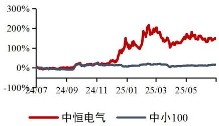  
公司近一年市场表现

<table><tr><td colspan="2">市场数据：2025 年7 月10 日</td></tr><tr><td>收盘价（元）：</td><td>15.12</td></tr><tr><td>总股本（亿股）：</td><td>5.64</td></tr><tr><td>流通股本（亿股）：</td><td>5.58</td></tr><tr><td>流通市值（亿元）：</td><td>84.39</td></tr></table>

<table><tr><td colspan="2">基础数据：2025年3月31日</td></tr><tr><td>每股净资产（元）：</td><td>4.40</td></tr><tr><td>每股资本公积（元）：</td><td>1.75</td></tr><tr><td>每股未分配利润（元）：</td><td>1.34</td></tr></table>

资料来源：最闻

# 分析师：

肖索 执业登记编码：S0760522030006 邮箱：xiaosuo@sxzq.com

贾惠淋 执业登记编码：S0760523070001 邮箱：jiahuilin@sxzq.com

# 投资要点：

 公司介绍：聚焦数字能源产业链，软、硬件协同发展：公司创立于 1996年，2010年于深交所挂牌上市，主要业务包含数据中心与站点能源、数字电网与综合能源服务、电力电源、新能源车充换电等。公司股权结构稳定，管理层资历深厚。2024年公司利润实现高增，2025年预计持续增长。2024年，公司实现营业收入 19.6 亿元，同比 $+ 2 6 . 1 \%$ ；实现归母净利润 1.1 亿元，同比$+ 1 7 8 . 5 \%$ 。数据中心电源、电力操作电源系统、通信电源系统贡献主要营收，2024年，三者在营收中占比分别为 $3 4 . 1 \%$ 、 $2 4 . 4 \%$ 、 $1 5 . 6 \%$ 。

# 硬件业务：电源业务基本盘稳定，HVDC 迎来市场新机遇：

 1）HVDC 方案先行者，AIDC 时代渗透率有望提升：当前数据中心常见的几种不间断供电技术包括 AC UPS、HVDC 和市电直供 $+ \mathrm { B B U }$ 等。AIGC 时代，HVDC 供电凭借输电距离长、损耗小、稳定性好、效率高等优点，渗透率有望提升。公司是 HVDC 方案先行者，市场份额行业领先，牵头制订了《信息通信用240V/336V 直流供电系统技术要求和试验方法》国家标准，且入选工信部制造业单项冠军示范企业。目前，公司主要客户为大型互联网企业、运营商以及 IDC 第三方数据中心运营商。

2）巴拿马方案绑定大客户，有望持续贡献业绩：预制化 Panama 电力模组是公司与大客户阿里巴巴合作开发的数据中心供电方案，有占地面积小、交付速度快、高可用性、效率高、成本低等优点。阿里巴巴未来三年在云和 AI的基础设施投入预计将超越过去十年的总和，有望带动公司巴拿马电源产品出货量增长；此外，头部互联网企业及运营商均规划增加算力相关资本开支，若能获取其他头部企业大订单，公司业绩增长空间有望进一步向上打开。

3）通信电源维持稳定，电力电源拓展存量份额：通信电源来看，公司在近年运营商集采招标中份额位居行业前列，营业收入基本稳定。2024年，公司通信电源营收 3.06亿元，同比- $- 4 . 5 \%$ 。电力电源来看，公司通过深耕细作继续拓展存量市场份额；另一方面，加速推进海外业务，并拓展新能源等增量市场机会，营收维持稳定增长。2024 年，公司电力电源营收 4.79亿元，同比 $+ 2 0 . 5 \%$ 。

 软件业务：深耕数字电网领域，拓展新型综合能源服务：行业层面来看，2024 年新能源“源”、“荷”、“储”继续保持高增长。在此背景下，电源侧波动性和随机性特征加强，而需求侧大规模电动汽车和间歇式电源接入，源-网-荷数字化、智能化需求进一步提升。公司数字电网与综合能源服务主要依靠全资子公司中恒博瑞，中恒博瑞成立于 2003 年，至今已有 20 余年电力数字化软件技术平台经验。数字电网方面，公司深度参与电网数字化转型和新型电力系统建设；综合能源服务方面，公司自 2015 年开始，向网外拓展布局用户侧能源互联网产业。

盈利预测、估值分析和投资建议：我们预计 2025-2027 年，公司营业收入分别为 26.7亿元、36.3亿元、52.4亿元，分别同比增长 $3 6 . 2 \%$ 、 $3 5 . 7 \%$ 、 $4 4 . 6 \%$ ；归母净利润分别为 2.1 亿元、3.1亿元、4.4亿元，分别同比增长 $8 9 . 2 \% . 5 1 . 1 \%$ 、$4 0 . 6 \%$ 。2025-2027 年的 EPS 分别为 $0 . 3 7 , \ 0 . 5 6 , \ 0 . 7 8$ ，对应 7 月 10日收盘价PE 为 41.1 倍、27.2 倍、19.3 倍，维持“买入-B”评级。

风险提示：宏观经济政策风险、市场竞争加剧风险、人才竞争风险、原材料价格波动风险等。

财务数据与估值：  

<table><tr><td>会计年度</td><td>2023A</td><td>2024A</td><td>2025E</td><td>2026E</td><td>2027E</td></tr><tr><td>营业收入(百万元)</td><td>1,555</td><td>1,962</td><td>2,673</td><td>3,626</td><td>5,245</td></tr><tr><td>YoY(%)</td><td>-3.3</td><td>26.1</td><td>36.2</td><td>35.7</td><td>44.6</td></tr><tr><td>净利润(百万元)</td><td>39</td><td>110</td><td>207</td><td>313</td><td>441</td></tr><tr><td>YoY(%)</td><td>170.5</td><td>178.5</td><td>89.2</td><td>51.1</td><td>40.6</td></tr><tr><td>毛利率(%)</td><td>26.3</td><td>26.2</td><td>28.4</td><td>29.1</td><td>28.5</td></tr><tr><td>EPS(摊薄/元)</td><td>0.07</td><td>0.19</td><td>0.37</td><td>0.56</td><td>0.78</td></tr><tr><td>ROE(%)</td><td>1.8</td><td>4.6</td><td>8.1</td><td>11.2</td><td>13.8</td></tr><tr><td>P/E(倍)</td><td>216.5</td><td>77.7</td><td>41.1</td><td>27.2</td><td>19.3</td></tr><tr><td>P/B(倍)</td><td>3.7</td><td>3.5</td><td>3.3</td><td>3.0</td><td>2.6</td></tr><tr><td>净利率(%)</td><td>2.5</td><td>5.6</td><td>7.8</td><td>8.6</td><td>8.4</td></tr></table>

资料来源：最闻，山西证券研究所

# 目录

1. 公司介绍：聚焦数字能源产业链，软、硬件协同发展.. 6  
1.1 中恒电气：专注零碳智能社会建设的数字能源公司. . 6  
1.2 股权结构稳定，管理层经验丰富. 7  
1.3 业绩持续改善，费用管控良好. . 8  
2. 硬件业务：电源业务基本盘稳定，HVDC 迎来市场新机遇... . 10  
2.1HVDC 方案先行者，AIDC 时代渗透率有望提升. . 10  
2.2 巴拿马方案绑定大客户，有望持续贡献业绩. . 13  
2.3 通信电源维持稳定，电力电源拓展存量份额. . 16  
3. 软件业务：深耕数字电网领域，拓展新型综合能源服务.. 17  
4. 盈利预测及估值分析... 20  
5. 风险提示....... 21

# 图表目录

图 1： 公司发展历程.. . 6图 2： 公司业务情况....  
图 3： 公司股权结构（截至 2024年底）  
图 4： 公司营业收入及同比增速（亿元， $\%$ ）. . 8图 5： 公司归母净利润及同比增速（亿元， $\%$ ）....... 8图 6： 公司毛利率及归母净利润率（%）. 9图 7： 公司费用率 $( \% )$ ）. 9图 8： 公司营业收入按产品（亿元） 0图 9： 公司营收占比按产品（ $( \%$ ） . 9

图 10： 数据中心的组成... 10  
图 11： 数据中心示意图.. 10  
图 12： 数据中心供配电系统结构.. ... 10  
图 13： 中国 UPS 行业市场规模情况（亿元） .12  
图 14： 中恒电气数据中心 HVDC 系列七大核心价值.. 12  
图 15： 巴拿马电源方案组成单元.. . 13  
图 16： 巴拿马电源系统与传统 UPS 架构对比.. .14  
图 17： 巴拿马电源与传统 HVDC 模块效率对比. . 15  
图 18： 阿里云基础设施.. 15  
图 19： 阿里、腾讯、百度季度资本开支（亿元） .. 15  
图 20： BAT 2019-2024 年资本支出综合及增速（亿元， $\%$ ） .. 15  
图 21： 公司通信电源业务营收及同比增速（亿元， $\%$ ）... .16  
图 22： 公司电力电源业务营收及同比增速（亿元， $\%$ ） 16  
图 23： 公司电力电源智能一体化解决方案.. . 17  
图 24： 我国每年新增系能源装机容量（亿千瓦）..... 18  
图 25： 我国新能源汽车保有量（万辆） 18  
图 26： 公司数字电网与综合能源服务分类. 19  
表 1： 公司主要管理层介绍.. .. 8  
表 2： 全球数据中心市场规模测算... 11  
表 3： ACUPS、240V/336VHVDC 和巴拿马电源比较.. 14  
表 4： 互联网大厂及运营商的资本开支规划情况.. 16  
表 5： 各部门出台文件，电网数智化需求进一步提升... 18

表 6： 公司盈利预测.. 20表 7： 可比公司估值对比... 21

# 1. 公司介绍：聚焦数字能源产业链，软、硬件协同发展

# 1.1 中恒电气：专注零碳智能社会建设的数字能源公司

杭州中恒电气股份有限公司（简称“中恒电气”）创立于 1996 年，2010 年于深交所挂牌上市。公司专注于成为零碳智能社会建设的数字能源公司，始终坚持主业发展，持续打造涵盖绿色节能设备、能源数字化软件、能源云服务平台“三位一体”的数字能源产业体系。深耕行业 20 余年，公司已与电网、运营商、互联网领域头部客户建立了深度战略合作关系。

  
图 1：公司发展历程  
资料来源：公司官网，山西证券研究所

公司聚焦绿色ICT 基础设施、新型电力系统及综合能源服务等领域，主要业务包含数据中心与站点能源、数字电网与综合能源服务、电力电源、新能源车充换电等。

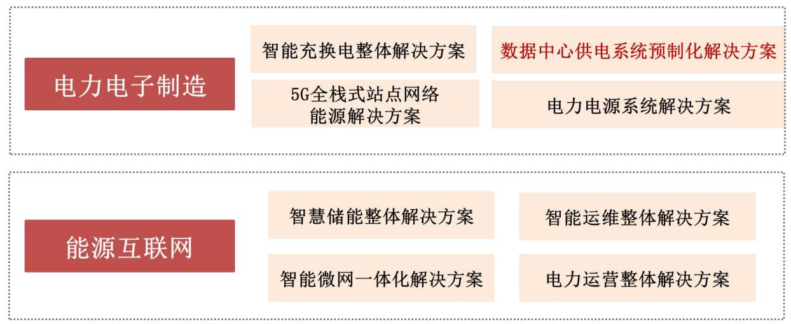  
图 2：公司业务情况  
资料来源：公司官网，山西证券研究所

# 1.2 股权结构稳定，管理层经验丰富

公司股权结构稳定，朱国锭先生为公司实控人，包晓茹女士为公司董事长，二者系夫妻关系，为一致行动人。截至 2024 年底，朱国锭先生和包晓茹女士合计持有公司 $4 1 . 4 \%$ 的股权。

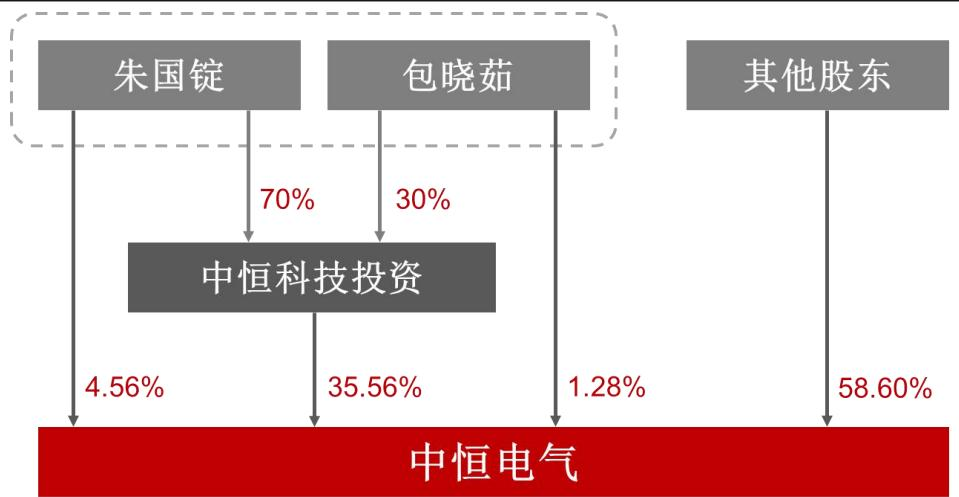  
图 3：公司股权结构（截至 2024年底）  
资料来源：公司 2024 年年报，山西证券研究所

公司管理层资历深厚，在公司各业务领域积淀丰富。公司副董事长、总经理胥飞飞先生，在公司任职二十余年，是国家标准《信息通信用 240V/336V 直流供电系统技术要求和试验方

法》第一起草人。公司副总经理仇向东先生，2002 年起就职于中恒博瑞数字电力科技有限公司，曾先后从事研发管理、销售管理和运营管理工作。公司副总经理、财务总监段建平先生是杭州市会计领军人才，先后在多家公司担任财务总监，从业经验丰富。

表 1：公司主要管理层介绍  

<table><tr><td colspan="5">姓名 性别 出生年份 职位</td></tr><tr><td>包晓茹</td><td>女</td><td>1969年</td><td>董事长</td><td>个人介绍 第六届滨江区人大代表。担任公司控股股东中恒科技投资执行董事、总经 理，杭州美邦冷焰理火有限公司执行董事，现担任公司董事长。</td></tr><tr><td>胥飞飞</td><td>男</td><td>1986年</td><td>副董事长 总经理</td><td>杭州C 类高层次人才，国家标准《信息通信用240V/336V直流供电系统 技术要求和试验方法》第一起草人。2009年至今，历任中恒电气研发项 目经理、产品总监、IDC事业部总经理等职务。</td></tr><tr><td>方能杰</td><td>男</td><td>1992年</td><td>副总经理 董事会秘书</td><td>2017 年3月进入杭州中恒电气股份有限公司，曾担任公司投资证券部经 理、证券事务代表。现任公司董事、副总经理、董事会秘书。</td></tr><tr><td>仇向东</td><td>男</td><td>1980年</td><td>副总经理</td><td>2002 年起就职于北京中恒博瑞数字电力科技有限公司，现任公司董事、 副总经理，北京中恒博瑞数字电力科技有限公司董事长、总经理。</td></tr><tr><td>段建平</td><td>男</td><td>1974年</td><td>副总经理 财务总监</td><td>正高级会计师、税务师、杭州市会计领军人才、浙江省国际化高端会计人 才。曾先后担任安徽沙河酒业有限公司副总经理及财务总监，杭州万事利 丝绸文化股份有限公司财务总监等。2017 年进入公司。</td></tr></table>

资料来源：公司 2024 年年报，山西证券研究所

# 1.3 业绩持续改善，费用管控良好

2024 年公司利润实现高增，2025 年预计持续增长。2024 年，公司实现营业收入19.6 亿元，同比 $+ 2 6 . 1 \%$ ；实现归母净利润 1.1 亿元，同比 $+ 1 7 8 . 5 \%$ 。2025 年 Q1，公司实现营业收入 3.9亿元，同比 $+ 1 1 . 1 \%$ ；实现归母净利润 0.2 亿元，同比 $+ 8 4 . 3 \%$ 。

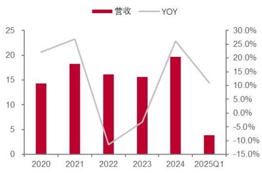  
图 4：公司营业收入及同比增速（亿元， $\%$ ）

  
图 5：公司归母净利润及同比增速（亿元， $\%$ ）

资料来源：Wind，山西证券研究所

资料来源：Wind，山西证券研究所

2024 年，公司毛利率为 $2 6 . 2 \%$ ；归母净利润率为 $5 . 6 \%$ ，环比 $+ 3 . 1$ pct。2025 年 Q1，公司毛利率和归母净利润率分别为 $2 4 . 6 \%$ 和 $5 . 2 \%$ 。公司费用管控良好，2024年费用率合计为 $1 8 . 5 \%$ ，其中研发费用率为 $8 . 2 \%$ ，维持较高水平。

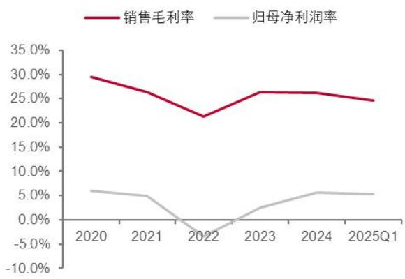  
图 6：公司毛利率及归母净利润率 $( \% )$   
资料来源：Wind，山西证券研究所

  
图 7：公司费用率 $( \% )$   
资料来源：Wind，山西证券研究所

分产品来看，2024 年，公司数据中心电源、电力操作电源系统、通信电源系统、技术服务维护在营收占比分别为 $3 4 . 1 \%$ 、 $2 4 . 4 \%$ 、 $1 5 . 6 \%$ 、 $1 9 . 9 \%$ 。

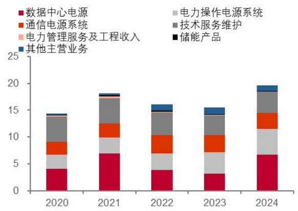  
图 8：公司营业收入按产品（亿元）  
资料来源：Wind，山西证券研究所

  
图 9：公司营收占比按产品 $( \% )$ ）

资料来源：Wind，山西证券研究所

# 2. 硬件业务：电源业务基本盘稳定，HVDC 迎来市场新机遇

# 2.1 HVDC 方案先行者，AIDC时代渗透率有望提升

数据中心是一种大型数据存储和处理设施，是算力的载体。数据中心主要由 IT 基础设施和配套设施构成，涵盖了从电力供应、冷却系统到网络和存储的所有方面，能提供强大的计算能力、存储能力和网络连接能力。

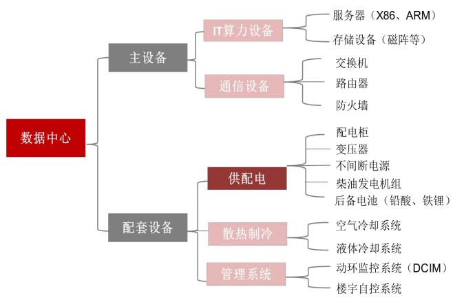  
图 10：数据中心的组成

资料来源：数字经济发展、智慧城市技术咨询，山西证券研究所

数据中心供配电系统是确保数据中心正常运行的重要组成部分。数据中心供配电系统是从电源线路进用户起经过高/低压供配电设备到负载止的整个电路系统，为机房内所有需要动力电源的设备提供稳定、可靠的动力电源支持。其中，不间断电源在市电输入正常时，将市电稳压后供应给负载使用；此外，在市电电力系统停止供电、柴油发电机启动之前极短的时间内取代原有电力设备，持续为用电设备供电。

图 11：数据中心示意图图 12：数据中心供配电系统结构

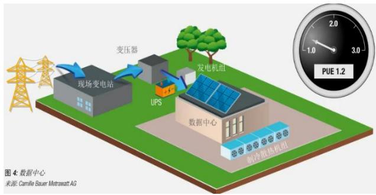  
资 料 来 源 ： 德 国 GMCI 高 美 测 仪 、GamilleBauerMetrawattAG，山西证券研究所

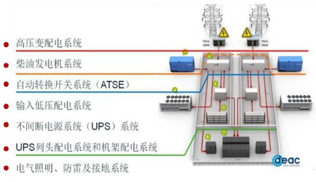  
资料来源：德国 GMCI 高美测仪、山西证券研究所

当前数据中心常见的几种不间断供电技术包括 AC UPS、HVDC（240V/336V/48V 和市电直供 $+$ BBU 等。HVDC 供电方式国外在上世纪 90 年代就曾提出，国内最初应用于三大通信服务运营商，经过发展逐步扩展应用到互联网、金融、政府机关等不同领域的大型机房或数据中心。AIGC 时代的到来使服务器功率密度指数级提升，HVDC 供电凭借输电距离长、损耗小、稳定性好、效率高等优点，渗透率有望提升。

根据智研咨询，2013-2022 年，我国 UPS 电源呈现持续增长态势，CAGR 为 $1 5 . 7 3 \%$ ，预计 2025 年 UPS 电源整体市场规模达到 191 亿元。

根据中恒电气公司公众号，截至2023年，全国绿色直流数据中心总量已经超过10000MW。基于假设，我们测算预计到 2028年全球数据中心 UPS 电源市场规模为318亿元，HVDC 电源市场规模为 136亿元。

表 2：全球数据中心市场规模测算  

<table><tr><td></td><td>2023</td><td>2024E</td><td>2025E</td><td>2026E</td><td>2027E</td><td>2028E</td></tr><tr><td>全球 CPU 出货量 (万片)</td><td>2898</td><td>3055</td><td>3220</td><td>3381</td><td>3550</td><td>3727</td></tr><tr><td>CPU平均功率（w)</td><td>90</td><td>97</td><td>105</td><td>113</td><td>122</td><td>132</td></tr><tr><td>CPU出货功率（GW)</td><td>2.6</td><td>3.0</td><td>3.4</td><td>3.8</td><td>4.3</td><td>4.9</td></tr><tr><td>全球GPU出货量（万片）</td><td>548.8</td><td>685.4</td><td>913.5</td><td>1214.2</td><td>1351.3</td><td>1486.4</td></tr><tr><td>GPU平均功率（w)</td><td>700.0</td><td>749.0</td><td>801.4</td><td>857.5</td><td>917.6</td><td>981.8</td></tr><tr><td>GPU出货功率(GW)</td><td>3.8</td><td>5.1</td><td>7.3</td><td>10.4</td><td>12.4</td><td>14.6</td></tr><tr><td>芯片合计出货功率（GW)</td><td>6.4</td><td>8.1</td><td>10.7</td><td>14.2</td><td>16.7</td><td>19.5</td></tr><tr><td>数据中心IT负载(GW)</td><td>9.0</td><td>11.3</td><td>15.0</td><td>19.9</td><td>23.4</td><td>27.3</td></tr><tr><td>数据中心总功率（GW)</td><td>10.84</td><td>13.61</td><td>17.98</td><td>23.93</td><td>28.13</td><td>32.80</td></tr><tr><td>数据中心供配电设备（GW）</td><td>16.67</td><td>20.94</td><td>27.66</td><td>36.82</td><td>43.28</td><td>50.46</td></tr></table>

<table><tr><td></td><td>2023</td><td>2024E</td><td>2025E</td><td>2026E</td><td>2027E</td><td>2028E</td></tr><tr><td>考虑冗余供配电设备实际装机（GW)</td><td>30.01</td><td>37.70</td><td>49.78</td><td>66.27</td><td>77.90</td><td>90.82</td></tr><tr><td>单位投资（亿元/GW）</td><td>5.0</td><td>5.0</td><td>5.0</td><td>5.0</td><td>5.0</td><td>5.0</td></tr><tr><td>假设 UPS市占率(%)</td><td>85%</td><td>85%</td><td>82%</td><td>80%</td><td>75%</td><td>70%</td></tr><tr><td>UPS 市场规模（亿元）</td><td>128</td><td>160</td><td>204</td><td>265</td><td>292</td><td>318</td></tr><tr><td>假设HVDC市占率（%)</td><td>15%</td><td>15%</td><td>18%</td><td>20%</td><td>25%</td><td>30%</td></tr><tr><td>市场规模（亿元）</td><td>23</td><td>28</td><td>45</td><td>66</td><td>97</td><td>136</td></tr></table>

资料来源：IT 之家、半导体行业观察、IDC、Intel、海光信息招股说明书、思瀚研究院、模块化机房欧贝数能、The Next Platform，山西证券研究所整理测算

  
图 13：中国 UPS 行业市场规模情况（亿元）  
资料来源：智研咨询，山西证券研究所

公司是 HVDC方案先行者。全球来看，中恒电气、台达电子与维谛技术三家占据约 $9 5 \%$ 的 HVDC 市场份额。公司作为国内HVDC 绿色供电技术方案领头雁，牵头制订了《信息通信用 240V/336V直流供电系统技术要求和试验方法》国家标准，并凭借“信息通信用240V/336V直流供电系统”入选工信部制造业单项冠军示范企业。

目前，公司主要客户为大型互联网企业，是腾讯云、阿里云、百度云的战略合作伙伴。此外，公司客户还包含央企电信的天翼云、国家互联网数据中心、超算中心，以及万国数据等IDC第三方数据中心运营商。

图 14：中恒电气数据中心 HVDC 系列七大核心价值资料来源：中恒电气微信公众号，山西证券研究所

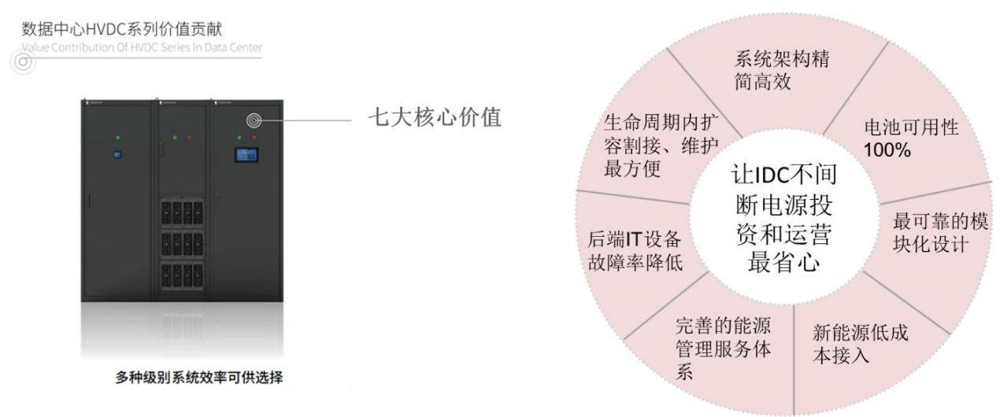

# 2.2 巴拿马方案绑定大客户，有望持续贡献业绩

预制化Panama 电力模组是公司与大客户合作开发的数据中心供电方案。结构上来看，巴拿马电源柔性集成了 10kVac的配电、隔离变压、模块化整流器和输出配电等环节，采用多绕组的移相变压器，并对传统供电架构的配电层级进行优化整合，简化了此链路中的多级配电。

  
图 15：巴拿马电源方案组成单元

资料来源：巴拿马供电技术白皮书，山西证券研究所

巴拿马电源方案有占地面积小、交付速度快、高可用性、效率高、成本低等优点。相比传统数据中心的供电方案，巴拿马方案占地面积减少 $50 \%$ ，其设备和工程施工量可节省 $40 \%$ ，其功率模块的效率高达 $9 8 . 5 \%$ ，架构简洁可靠性高。

表 3：ACUPS、240V/336VHVDC 和巴拿马电源比较  

<table><tr><td>对比内容</td><td>ACUPS</td><td>240V/336VHVDC</td><td>巴拿马电源</td></tr><tr><td>冗余供电模式</td><td>主流：2N，DR很少采用： RR</td><td>主流：1路市电+1 路DC特别等级： 2NHVDC</td><td>主流：2NDC也可：1路市电 +1路 HVDC</td></tr><tr><td>可用性</td><td>结构复杂，可用性一般</td><td>结构简化，可用性高</td><td>环节简洁，可用性极高</td></tr><tr><td>整个链路效率</td><td>因负载率低，93%</td><td>95%</td><td>97.5%</td></tr><tr><td>占地面积 (2.2MWIT)</td><td>310m2</td><td>300m{</td><td>110m²</td></tr><tr><td>建设周期</td><td>12个月左右</td><td>6个月左右</td><td>3个月左右</td></tr></table>

资料来源：巴拿马供电技术白皮书，山西证券研究所

公司不断升级迭代，提高巴拿马电源产品力。公司全新一代 Panama 电力模组系列产品可有效提升数据中心电能转化效率、降低空调能耗，大幅缩短配电建设周期、提升功率密度，并基于直流供电优势极简融合智能锂电和新能源，助力绿色数据中心建设。

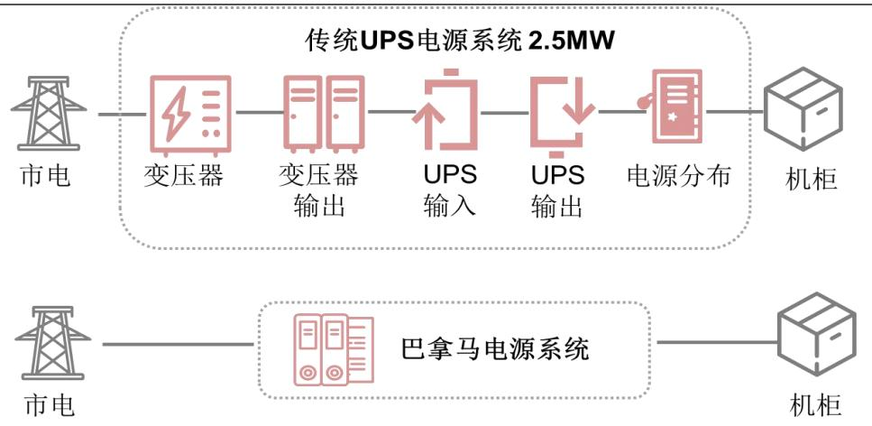  
图 16：巴拿马电源系统与传统 UPS 架构对比  
资料来源：台达官网，山西证券研究所

巴拿马电源产品定制化程度高，公司与大客户紧密绑定，客户资本开支提升有望持续为公司贡献业绩增量。2021 年 10 月，公司公告中标阿里巴巴数据中心 2021 年巴拿马电源框架项目，项目金额约为人民币 8亿元，实际金额以后续执行情况为准。根据公司 2022 年5 月交流，2021 年先后中标腾讯 T-Trian 电源集采项目、阿里 Panama 电源集采项目等项目，同时取得银行、运营商领域的小规模适用，累计签订采购框架合同金额超10亿元。2025年2月，财报交流会上，阿里巴巴集团 CEO 吴泳铭表示，AI 时代对于基础设施有明确而巨大的需求，将积极投资于 AI 基础设施建设，未来三年在云和 AI 的基础设施投入预计将超越过去十年的总和，有望带动公司巴拿马电源产品出货量增长。

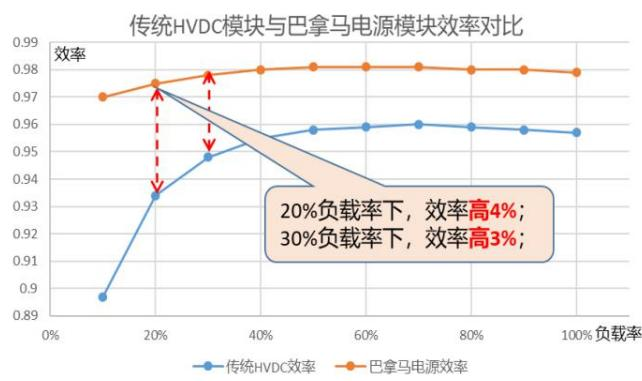  
图 17：巴拿马电源与传统 HVDC 模块效率对比  
资料来源：巴拿马供电技术白皮书，山西证券研究所

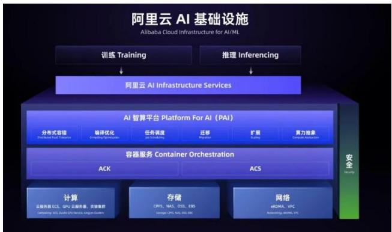  
图 18：阿里云基础设施  
资料来源：新浪财经、阿里云，山西证券研究所

头部互联网企业及运营商均规划增加算力相关资本开支，且直流方案认可度逐步提升。2024 年 Q4，BAT 合计资本开支 706 亿元，同比 $+ 9 5 \%$ 。公司在直流方案中产品力领先，若能获取其他头部企业大订单，公司业绩增长空间有望进一步向上打开。

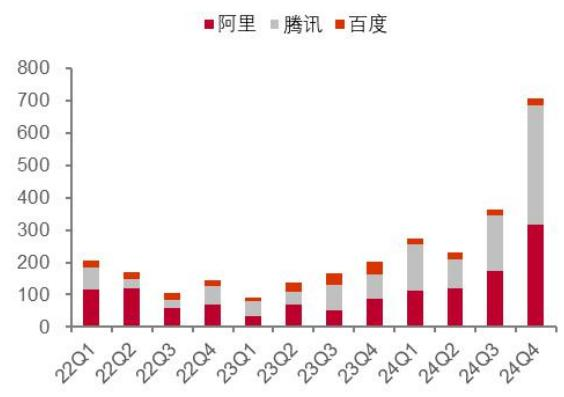  
图 19：阿里、腾讯、百度季度资本开支（亿元）  
资料来源：中数云链未来窗、金融界、AI 芯天下、财经杂志，山西证券研究所

  
图 20：BAT 2019-2024 年资本支出综合及增速（亿元， $\%$ ）  
资料来源：中数云链未来窗、金融界、AI 芯天下、财经杂志，山西证券研究所

表 4：互联网大厂及运营商的资本开支规划情况  

<table><tr><td>公司</td><td>2024</td><td>2025年计划</td></tr><tr><td>阿里巴巴</td><td>总资本开支725.13 亿元</td><td>未来三年将投入至少3800 亿元用于云计算及AI 基础设施建设，按年 均计算，2025 年资本开支有望超 1200 亿元。</td></tr><tr><td>腾讯</td><td>总资本开支767.6 亿元</td><td>计划 2025 年资本开支占收入比例提升至低两位数百分比</td></tr><tr><td>字节跳动</td><td>总资本开支800亿元</td><td>预计进一步提升至超过1000亿元，其中绝大部分将用于AI算力</td></tr><tr><td>中国联通</td><td>算力资本开支同比增长19%</td><td>计划再增长28%</td></tr><tr><td>中国移动</td><td>总资本开支1640亿元，智算规 模达到 29.2EFLOPS，净增 19.1EFLOPS</td><td>预计资本开支合计约为1512 亿元，算力预算为373 亿元，占总资本开 支的25%，并计划将智算规模（FP16）提升至34EFLOPS</td></tr><tr><td>中国电信</td><td>全年资本支出为人民币935.13 亿元，持续优化云智一体的算力 基础设施布局</td><td>计划资本开支836 亿元，其中算力投资将实现22%增长，且“不设上 限”，根据市场需求动态调整</td></tr></table>

资料来源：财联社、华尔街见闻、金融界、湾区财经传媒、东方财富网、证券时报网、今日头条、21 世纪经济报道、券商中国、中国经营报，山西证券研究所整理

# 2.3 通信电源维持稳定，电力电源拓展存量份额

高频开关电源系统为公司传统主要产品，主要包括通信电源和电力电源，业务基本盘稳定。

通信电源：通信电源系统是为通信主设备（如交换设备、光传输设备、微波传输设备、无线移动基站等）供电的电源设备。经过多年深耕，公司能够为 5G通信网络无线接入网、传输网、核心网及专网全栈式站点提供极简、多能源输入/多制式输出的高效能源产品与解决方案。公司在近年运营商集采招标中份额位居行业前列，营业收入基本稳定。2024 年，公司通信电源营收 3.06亿元，同比- $- 4 . 5 \%$ 。

电力电源：电力操作电源系统是指在发电、输变电、配电、用电等环节中，为断路器分合闸及二次回路中的继电保护、微机保护等综合自动化设备和故障照明等负载提供直流电的电源，产品主要服务于电网建设和电厂建设两大方向。行业竞争充分，公司通过深耕细作继续拓展存量市场份额；另一方面，加速推进海外业务，并拓展新能源等增量市场机会，营收维持稳定增长。2024年，公司电力电源营收4.79亿元，同比 $+ 2 0 . 5 \%$ 。

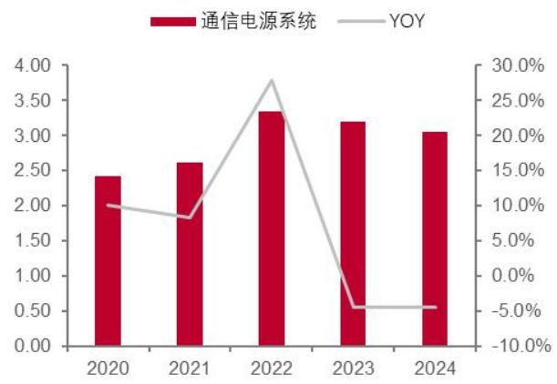  
资料来源：Wind，山西证券研究所

  
资料来源：Wind，山西证券研究所

根据产品的应用场景，电力电源大致可分为变电站电源、厂用电源、轨道交通用交直流电源等。在变电站领域，公司为约 2000座变电站提供电源安全解决方案。

产能来看，公司富阳工厂已建成总建筑面积 8.6 万平方米，能够年产80万个电源模块、5万台电源机柜，并具有机柜及钣金、铜材等结构件的生产加工能力。

  
图 23：公司电力电源智能一体化解决方案  
资料来源：公司 2024 年半年报，山西证券研究所

# 3. 软件业务：深耕数字电网领域，拓展新型综合能源服务

行业层面来看，2024 年新能源“源”、“荷”、“储”继续保持高增长。根据国家能源局，2024 年，我国新增新能源装机容量 3.73亿千瓦，同比增长 $23 \%$ ，其中风电新增装机7982万千瓦、太阳能发电新增 2.78亿千瓦。截至2024年底，中国新能源发电装机达14.5亿千瓦，首次超过火电装机规模。根据中国公安部数据，截至2024年底，全国新能源汽车保有量达3140万辆，2024 年新注册登记新能源汽车1125 万辆，占新注册登记汽车数量的 $4 1 . 8 3 \%$ ，与 2023 年相比增长 $5 1 . 4 9 \%$ ，呈高速增长态势。

在此背景下，电源侧波动性和随机性特征加强，而需求侧大规模电动汽车和间歇式电源接入，对电力系统也提出了新挑战。新型电力系统建设成为电网重要发展目标，源-网-荷数字化、智能化需求进一步提升。

  
图 24：我国每年新增系能源装机容量（亿千瓦）  
资料来源：Wind、国家能源局，山西证券研究所

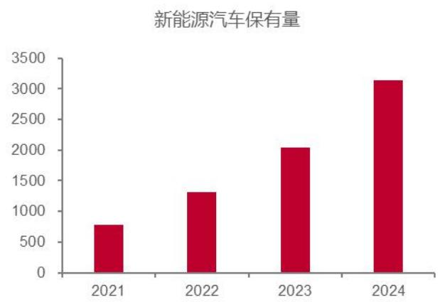  
图 25：我国新能源汽车保有量（万辆）  
资料来源：中国政府网、公安部、新华社、人民日报，山西证券研究所

政策方面，近几年国家各部委先后出台多份文件，对推动新型电力系统建设，深化电力体制改革等方面不断提出新的要求。

表 5：各部门出台文件，电网数智化需求进一步提升  

<table><tr><td>时间</td><td>文件</td><td>部门</td><td>政策内容</td></tr><tr><td>2025.01</td><td>关于深化新能源上网电价市 场化改革促进新能源高质量 发展的通知</td><td>国家发改委 国家能源局</td><td>坚持市场化改革方向，推动新能源上网电量全面进入电力市 场、通过市场交易形成价格。坚持统筹协调，行业管理、价格 机制、绿色能源消费等政策协同发力，完善电力市场体系，更 好支撑新能源发展规划目标实现。</td></tr><tr><td>2024.02</td><td>关于新形势下配电网高质量 发展的指导意见</td><td>国家发改委 国家能源局</td><td>到2025 年，配电网网架结构更加坚强清晰，供配电能力合理 充裕；配电网承载力和灵活性显著提升，具备5亿千瓦左右分 布式新能源、1200 万台左右充电桩接入能力；有源配电网与大 电网兼容并蓄，配电网数字化转型全面推进；智慧调控运行体</td></tr><tr><td>2023.09</td><td>《电力现货市场基本规则</td><td>国家发改委</td><td>系加快升级。 电力现货市场建设的目标是形成体现时间和空间特性、反映市</td></tr></table>

<table><tr><td>时间</td><td>文件</td><td>部门</td><td>政策内容</td></tr><tr><td></td><td>(试行)》</td><td>国家能源局</td><td>场供需变化的电能量价格信号，发挥市场在电力资源配置中的 决定性作用，提升电力系统调节能力，促进可再生能源消纳， 保障电力安全可靠供应，引导电力长期规划和投资，促进电力 系统向清洁低碳、安全高效转型。</td></tr><tr><td>2023.03</td><td>关于加快推进能源数字化智 能化发展的若干意见</td><td>国家能源局</td><td>针对电力、煤炭、油气等行业数字化智能化转型发展需求，通 过数字化智能化技术融合应用，急用先行、先易后难，分行业、 分环节、分阶段补齐转型发展短板，为能源高质量发展提供有 效支撑。</td></tr></table>

资料来源：国家发改委、国家能源局、中国政府网，山西证券研究所

公司数字电网与综合能源服务主要依靠由全资子公司中恒博瑞，中恒博瑞成立于2003年，至今已有 20余年电力数字化软件技术平台经验。

数字电网方面，公司深度参与电网数字化转型和新型电力系统建设，为电网公司、发电集团、大型用电企业等客户提供智能调度、生产运行、规划设计、能效分析等专业软件解决方案。同时，公司积极拓展新型业务解决方案，主要包括电力交易/仿真、数字孪生、需求侧负荷预测、新能源功率预测、虚拟电厂等方面。

综合能源服务方面，公司自 2015 年开始，向网外拓展布局用户侧能源互联网产业，旨在为能源需求侧用户在传统供能的基础上,整合数字能源管理、光伏、储能、充电桩等新能源设施和技术，实现多能协同供应和能源综合利用。

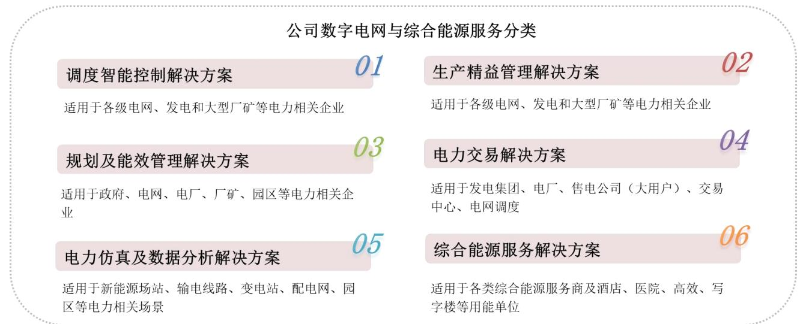  
图 26：公司数字电网与综合能源服务分类  
资料来源：公司 2024年半年报、中恒博瑞官网，山西证券研究所

# 4. 盈利预测及估值分析

1）通信电源系统：通信电源业务国内市场格局稳定，公司在主要客户中每年份额也相对稳定，我们假设2025-2027 年公司通信电源系统的营收增长率分别为 $2 \%$ 、 $2 \%$ 、 $2 \%$ ，对应营收分别为 3.12 亿元、3.18 亿元、3.24 亿元。

2）数据中心电源：进入AIDC 时代，公司大客户阿里巴巴资本开支力度增强；此外，数据中心直流电源方案的认可度提高，公司有望与其他头部互联网企业取得进一步合作。基于此，我们假设2025-2027 年公司数据中心电源的营收增长率分别为 $70 \%$ 、 $65 \%$ 、 $70 \%$ ，对应营收分别为 11.36 亿元、18.74 亿元、31.86 亿元。

3）电力操作电源系统：公司产品力优异且业务团队市场拓展能力较强，在存量市场中份额有望提升，我们假设 2025-2027 年公司电力操作电源系统的营收增长率分别为 $3 5 \%$ 、 $20 \%$ 、$20 \%$ ，对应营收分别为6.46 亿元、7.76亿元、9.31亿元。

4）软件开发、销售及服务：假设公司软件相关业务营收稳定增长，2025-2027 年营收增长率分别为 $1 5 \%$ 、 $1 5 \%$ 、 $2 5 \%$ ，对应营收分别为4.49 亿元、5.16亿元、6.45亿元。

表 6：公司盈利预测  

<table><tr><td></td><td>2023A</td><td>2024A</td><td>2025E</td><td>2026E</td><td>2027E</td></tr><tr><td>营业收入（亿元）</td><td>15.6</td><td>19.6</td><td>26.7</td><td>36.3</td><td>52.4</td></tr><tr><td>YOY</td><td>-3.3%</td><td>26.1%</td><td>36.2%</td><td>35.7%</td><td>44.6%</td></tr><tr><td>通信电源系统</td><td>3.20</td><td>3.06</td><td>3.12</td><td>3.18</td><td>3.24</td></tr><tr><td>数据中心电源</td><td>3.17</td><td>6.68</td><td>11.36</td><td>18.74</td><td>31.86</td></tr><tr><td>电力操作电源系统</td><td>3.97</td><td>4.79</td><td>6.46</td><td>7.76</td><td>9.31</td></tr><tr><td>软件开发、销售及服务</td><td>3.67</td><td>3.90</td><td>4.49</td><td>5.16</td><td>6.45</td></tr><tr><td>其他</td><td>1.29</td><td>1.09</td><td>1.20</td><td>1.32</td><td>1.48</td></tr><tr><td>毛利率(%)</td><td>26.3%</td><td>26.2%</td><td>28.4%</td><td>29.1%</td><td>28.5%</td></tr><tr><td>通信电源系统</td><td>21.9%</td><td>26.3%</td><td>27.0%</td><td>27.7%</td><td>28.4%</td></tr><tr><td>数据中心电源</td><td>24.0%</td><td>22.1%</td><td>22.1%</td><td>22.0%</td><td>21.1%</td></tr><tr><td>电力操作电源系统</td><td>25.5%</td><td>26.0%</td><td>26.0%</td><td>25.3%</td><td>23.5%</td></tr><tr><td>软件开发、销售及服务</td><td>39.4%</td><td>36.1%</td><td>50.0%</td><td>60.9%</td><td>70.3%</td></tr><tr><td>归母净利润（亿元）</td><td>0.4</td><td>1.1</td><td>2.1</td><td>3.1</td><td>4.4</td></tr><tr><td>YOY</td><td>170.5%</td><td>178.5%</td><td>89.2%</td><td>51.1%</td><td>40.6%</td></tr></table>

资料来源：Wind，山西证券研究所

我们预计 2025-2027 年，公司营业收入分别为26.7 亿元、36.3 亿元、52.4亿元，分别同比增长 $3 6 . 2 \%$ 、 $3 5 . 7 \%$ 、 $4 4 . 6 \%$ ；归母净利润分别为 2.1亿元、3.1亿元、4.4亿元，分别同比增长$8 9 . 2 \%$ 、 $5 1 . 1 \%$ 、 $4 0 . 6 \%$ 。

2025-2027 年的 EPS 分别为 0.37、0.56、0.78，对应 7 月 10 日收盘价 PE 为 41.1 倍、27.2倍、19.3 倍，维持“买入-B”评级。

表 7：可比公司估值对比  

<table><tr><td rowspan="2">代码</td><td rowspan="2">名称</td><td rowspan="2">股价</td><td rowspan="2">总市值</td><td colspan="4"></td><td colspan="4">204E  205E</td></tr><tr><td>2023A</td><td>2024E2E</td><td></td><td>2026E</td><td>2023A</td><td></td><td></td><td>2026E</td></tr><tr><td>002851.SZ</td><td>麦格米特</td><td>50.2</td><td>274.7</td><td>0.80</td><td>1.35</td><td>1.81</td><td>2.00</td><td>62.7</td><td>37.2</td><td>27.7</td><td>25.1</td></tr><tr><td>300870.SZ</td><td>欧陆通</td><td>120.9</td><td>129.5</td><td>2.65</td><td>3.07</td><td>4.20</td><td>5.17</td><td>45.6</td><td>39.4</td><td>28.8</td><td>23.4</td></tr><tr><td>002335.SZ</td><td>科华数据</td><td>39.4</td><td>203.1</td><td>0.68</td><td>1.30</td><td>1.70</td><td>2.03</td><td>58.0</td><td>30.3</td><td>23.2</td><td>19.4</td></tr><tr><td>603063.SH</td><td>禾望电气</td><td>31.4</td><td>142.8</td><td>0.99</td><td>1.39</td><td>1.69</td><td>2.05</td><td>31.7</td><td>22.6</td><td>18.6</td><td>15.3</td></tr><tr><td colspan="2"></td><td colspan="3">可比公司平均</td><td colspan="3"></td><td>49.5</td><td>32.4</td><td>24.6</td><td>20.8</td></tr><tr><td>002364.SZ</td><td>中恒电气</td><td>15.1</td><td>85.2</td><td>0.19</td><td>0.37</td><td>0.56</td><td>0.78</td><td>77.7</td><td>41.1</td><td>27.2</td><td>19.3</td></tr></table>

资料来源：Wind，山西证券研究所，注：未覆盖公司均采用 wind 一致预期，采用 7 月 10 日收盘价

# 5. 风险提示

包含但不限于以下风险：

宏观经济政策风险：公司所处行业属于国家战略性新兴产业，国家宏观政策变化、宏观经济风险加剧、市场结构调整、行业资源整合、市场供需变动等因素有可能对公司产品需求造成冲击，从而影响公司业绩。

市场竞争加剧风险：数字经济快速发展背景下，市场规模和热度持续提升，市场竞争日趋激烈，若其他公司 HVDC 业务快速发展，将有可能削弱公司在该领域的领先地位，从而对公司盈利能力产生负面影响。

人才竞争风险：公司所从事的电力电子、电力数字化、能源云服务领域对于核心技术人才的需求旺盛、人才竞争非常激烈。若核心技术人员的流失，会对公司经营产生不利影响。

原材料价格波动风险：公司原材料主要包括铜等金属材料、电子元器件等，其采购价格受到大宗商品市场影响，未来如果大宗商品市场价格大幅波动，则可能存在对公司产品毛利率和经营业绩产生不利影响。

# 财务报表预测和估值数据汇总

资产负债表(百万元)   

<table><tr><td>会计年度</td><td>2023A</td><td>2024A</td><td>2025E</td><td>2026E</td><td>2027E</td></tr><tr><td>流动资产</td><td>2382</td><td>2918</td><td>3727</td><td>4199</td><td>5625</td></tr><tr><td>现金</td><td>465</td><td>702</td><td>936</td><td>1088</td><td>1573</td></tr><tr><td>应收票据及应收账款</td><td>975</td><td>1059</td><td>1371</td><td>1531</td><td>2087</td></tr><tr><td>预付账款</td><td>24</td><td>20</td><td>40</td><td>42</td><td>76</td></tr><tr><td>存货</td><td>605</td><td>696</td><td>933</td><td>1085</td><td>1416</td></tr><tr><td>其他流动资产</td><td>313</td><td>440</td><td>449</td><td>454</td><td>473</td></tr><tr><td>非流动资产</td><td>920</td><td>868</td><td>679</td><td>818</td><td>1057</td></tr><tr><td>长期投资</td><td>22</td><td>5</td><td>6</td><td>8</td><td>5</td></tr><tr><td>固定资产</td><td>423</td><td>375</td><td>472</td><td>605</td><td>858</td></tr><tr><td>无形资产</td><td>63</td><td>58</td><td>53</td><td>45</td><td>37</td></tr><tr><td>其他非流动资产</td><td>412</td><td>429</td><td>147</td><td>160</td><td>157</td></tr><tr><td>资产总计</td><td>3302</td><td>3785</td><td>4406</td><td>5017</td><td>6683</td></tr><tr><td>流动负债</td><td>960</td><td>1315</td><td>1771</td><td>2092</td><td>3324</td></tr><tr><td>短期借款</td><td>130</td><td>4</td><td>103</td><td>278</td><td>665</td></tr><tr><td>应付票据及应付账款</td><td>593</td><td>1005</td><td>1247</td><td>1325</td><td>1936</td></tr><tr><td>其他流动负债</td><td>237</td><td>306</td><td>421</td><td>489</td><td>722</td></tr><tr><td>非流动负债</td><td>12</td><td>12</td><td>23</td><td>25</td><td>30</td></tr><tr><td>长期借款</td><td>0</td><td>0</td><td>0</td><td>0</td><td>0</td></tr><tr><td>其他非流动负债</td><td>12</td><td>12</td><td>23</td><td>25</td><td>30</td></tr><tr><td>负债合计</td><td>972</td><td>1328</td><td>1794</td><td>2117</td><td>3354</td></tr><tr><td>少数股东权益</td><td>24</td><td>28</td><td>31</td><td>41</td><td>58</td></tr><tr><td>股本</td><td>564</td><td>564</td><td>564</td><td>564</td><td>564</td></tr><tr><td>资本公积</td><td>972</td><td>985</td><td>985</td><td>985</td><td>985</td></tr><tr><td>留存收益</td><td>757</td><td>838</td><td>951</td><td>1137</td><td>1353</td></tr><tr><td>归属母公司股东权益</td><td>2306</td><td>2430</td><td>2581</td><td>2860</td><td>3270</td></tr><tr><td>负债和股东权益</td><td>3302</td><td>3785</td><td>4406</td><td>5017</td><td>6683</td></tr></table>

利润表(百万元)  

<table><tr><td>会计年度</td><td>2023A</td><td>2024A</td><td>2025E</td><td>2026E</td><td>2027E</td></tr><tr><td>营业收入</td><td>1555</td><td>1962</td><td>2673</td><td>3626</td><td>5245</td></tr><tr><td>营业成本</td><td>1146</td><td>1449</td><td>1914</td><td>2572</td><td>3751</td></tr><tr><td>营业税金及附加</td><td>12</td><td>15</td><td>19</td><td>25</td><td>37</td></tr><tr><td>营业费用</td><td>119</td><td>115</td><td>147</td><td>174</td><td>252</td></tr><tr><td>管理费用</td><td>99</td><td>99</td><td>134</td><td>167</td><td>236</td></tr><tr><td>研发费用</td><td>147</td><td>160</td><td>214</td><td>283</td><td>367</td></tr><tr><td>财务费用</td><td>-2</td><td>-11</td><td>-21</td><td>-11</td><td>0</td></tr><tr><td>资产减值损失</td><td>-44</td><td>-51</td><td>-53</td><td>-73</td><td>-105</td></tr><tr><td>公允价值变动收益</td><td>0</td><td>0</td><td>0</td><td>0</td><td>0</td></tr><tr><td>投资净收益</td><td>21</td><td>34</td><td>18</td><td>17</td><td>13</td></tr><tr><td>营业利润</td><td>31</td><td>137</td><td>231</td><td>361</td><td>510</td></tr><tr><td>营业外收入</td><td>1</td><td>1</td><td>6</td><td>3</td><td>3</td></tr><tr><td>营业外支出</td><td>6</td><td>3</td><td>3</td><td>3</td><td>4</td></tr><tr><td>利润总额</td><td>26</td><td>135</td><td>234</td><td>360</td><td>509</td></tr><tr><td>所得税</td><td>-17</td><td>22</td><td>23</td><td>36</td><td>51</td></tr><tr><td>税后利润</td><td>42</td><td>113</td><td>210</td><td>324</td><td>458</td></tr><tr><td>少数股东损益</td><td>3</td><td>3</td><td>3</td><td>11</td><td>17</td></tr><tr><td>归属母公司净利润</td><td>39</td><td>110</td><td>207</td><td>313</td><td>441</td></tr><tr><td>EBITDA</td><td>70</td><td>162</td><td>266</td><td>411</td><td>593</td></tr></table>

现金流量表(百万元)   

<table><tr><td>会计年度</td><td>2023A</td><td>2024A</td><td>2025E</td><td>2026E</td><td>2027E</td></tr><tr><td>经营活动现金流</td><td>237</td><td>468</td><td>85</td><td>181</td><td>456</td></tr><tr><td>净利润</td><td>42</td><td>113</td><td>210</td><td>324</td><td>458</td></tr><tr><td>折旧摊销</td><td>51</td><td>48</td><td>53</td><td>70</td><td>96</td></tr><tr><td>财务费用</td><td>-2</td><td>-11</td><td>-21</td><td>-11</td><td>0</td></tr><tr><td>投资损失</td><td>-21</td><td>-34</td><td>-18</td><td>-17</td><td>-13</td></tr><tr><td>营运资金变动</td><td>125</td><td>265</td><td>-217</td><td>-174</td><td>-95</td></tr><tr><td>其他经营现金流</td><td>42</td><td>87</td><td>78</td><td>-10</td><td>10</td></tr><tr><td>投资活动现金流</td><td>-115</td><td>-122</td><td>76</td><td>-181</td><td>-332</td></tr><tr><td>筹资活动现金流</td><td>-38</td><td>-144</td><td>19</td><td>-68</td><td>-25</td></tr><tr><td>每股指标（元）</td><td></td><td></td><td></td><td></td><td></td></tr><tr><td>每股收益(最新摊薄)</td><td>0.07</td><td>0.19</td><td>0.37</td><td>0.56</td><td>0.78</td></tr><tr><td>每股经营现金流(最新摊薄)</td><td>0.42</td><td>0.83</td><td>0.15</td><td>0.32</td><td>0.81</td></tr><tr><td>每股净资产(最新摊薄)</td><td>4.09</td><td>4.31</td><td>4.58</td><td>5.07</td><td>5.80</td></tr></table>

资料来源：最闻、山西证券研究所

主要财务比率  

<table><tr><td>会计年度</td><td>2023A</td><td>2024A</td><td>2025E</td><td>2026E</td><td>2027E</td></tr><tr><td>成长能力</td><td></td><td></td><td></td><td></td><td></td></tr><tr><td>营业收入(%)</td><td>-3.3</td><td>26.1</td><td>36.2</td><td>35.7</td><td>44.6</td></tr><tr><td>营业利润(%)</td><td>145.3</td><td>348.3</td><td>68.4</td><td>56.1</td><td>41.4</td></tr><tr><td>归属于母公司净利润(%)</td><td>170.5</td><td>178.5</td><td>89.2</td><td>51.1</td><td>40.6</td></tr><tr><td>获利能力</td><td></td><td></td><td></td><td></td><td></td></tr><tr><td>毛利率(%)</td><td>26.3</td><td>26.2</td><td>28.4</td><td>29.1</td><td>28.5</td></tr><tr><td>净利率(%)</td><td>2.5</td><td>5.6</td><td>7.8</td><td>8.6</td><td>8.4</td></tr><tr><td>ROE(%)</td><td>1.8</td><td>4.6</td><td>8.1</td><td>11.2</td><td>13.8</td></tr><tr><td>ROIC(%)</td><td>1.3</td><td>3.9</td><td>7.1</td><td>9.7</td><td>11.3</td></tr><tr><td>偿债能力</td><td></td><td></td><td></td><td></td><td></td></tr><tr><td>资产负债率(%)</td><td>29.4</td><td>35.1</td><td>40.7</td><td>42.2</td><td>50.2</td></tr><tr><td>流动比率</td><td>2.5</td><td>2.2</td><td>2.1</td><td>2.0</td><td>1.7</td></tr><tr><td>速动比率</td><td>1.6</td><td>1.4</td><td>1.3</td><td>1.3</td><td>1.1</td></tr><tr><td>营运能力</td><td></td><td></td><td></td><td></td><td></td></tr><tr><td>总资产周转率</td><td>0.5</td><td>0.6</td><td>0.7</td><td>0.8</td><td>0.9</td></tr><tr><td>应收账款周转率</td><td>1.6</td><td>1.9</td><td>2.2</td><td>2.5</td><td>2.9</td></tr><tr><td>应付账款周转率</td><td>1.9</td><td>1.8</td><td>1.7</td><td>2.0</td><td>2.3</td></tr><tr><td>估值比率</td><td></td><td></td><td></td><td></td><td></td></tr><tr><td>P/E</td><td>216.5</td><td>77.7</td><td>41.1</td><td>27.2</td><td>19.3</td></tr><tr><td>P/B</td><td>3.7</td><td>3.5</td><td>3.3</td><td>3.0</td><td>2.6</td></tr><tr><td>EV/EBITDA</td><td>116.0</td><td>48.5</td><td>29.1</td><td>18.9</td><td>13.0</td></tr></table>

# 分析师承诺：

本人已在中国证券业协会登记为证券分析师，本人承诺，以勤勉的职业态度，独立、客观地出具本报告。本人对证券研究报告的内容和观点负责，保证信息来源合法合规，研究方法专业审慎，分析结论具有合理依据。本报告清晰准确地反映本人的研究观点。本人不曾因，不因，也将不会因本报告中的具体推荐意见或观点直接或间接受到任何形式的补偿。本人承诺不利用自己的身份、地位或执业过程中所掌握的信息为自己或他人谋取私利。

# 投资评级的说明：

以报告发布日后的 6--12 个月内公司股价（或行业指数）相对同期基准指数的涨跌幅为基准。其中：A 股以沪深 300 指数为基准；新三板以三板成指或三板做市指数为基准；港股以恒生指数为基准；美股以纳斯达克综合指数或标普 500指数为基准。

无评级：因无法获取必要的资料，或者公司面临无法预见的结果的重大不确定事件，或者其他原因，致使无法给出明确的投资评级。（新股覆盖、新三板覆盖报告及转债报告默认无评级）

# 评级体系：

# 公司评级

买入： 预计涨幅领先相对基准指数 $1 5 \%$ 以上；  
增持： 预计涨幅领先相对基准指数介于 $5 \% - 1 5 \%$ 之间；  
中性： 预计涨幅领先相对基准指数介于- $- 5 \% - 5 \%$ 之间；  
减持： 预计涨幅落后相对基准指数介于- $- 5 \% - - 1 5 \%$ 之间；  
卖出： 预计涨幅落后相对基准指数- $. 1 5 \%$ 以上。

# 行业评级

领先大市： 预计涨幅超越相对基准指数 $10 \%$ 以上；  
同步大市： 预计涨幅相对基准指数介于- $. 1 0 \% { - } 1 0 \%$ 之间；  
落后大市： 预计涨幅落后相对基准指数- $. 1 0 \%$ 以上。

风险评级

A： 预计波动率小于等于相对基准指数；  
B： 预计波动率大于相对基准指数。

# 免责声明：

山西证券股份有限公司(以下简称“公司”)具备证券投资咨询业务资格。本报告是基于公司认为可靠的已公开信息，但公司不保证该等信息的准确性和完整性。入市有风险，投资需谨慎。在任何情况下，本报告中的信息或所表述的意见并不构成对任何人的投资建议。在任何情况下，公司不对任何人因使用本报告中的任何内容引致的损失负任何责任。本报告所载的资料、意见及推测仅反映发布当日的判断。在不同时期，公司可发出与本报告所载资料、意见及推测不一致的报告。公司或其关联机构在法律许可的情况下可能持有或交易本报告中提到的上市公司发行的证券或投资标的，还可能为或争取为这些公司提供投资银行或财务顾问服务。客户应当考虑到公司可能存在可能影响本报告客观性的利益冲突。公司在知晓范围内履行披露义务。本报告版权归公司所有。公司对本报告保留一切权利。未经公司事先书面授权，本报告的任何部分均不得以任何方式制作任何形式的拷贝、复印件或复制品，或再次分发给任何其他人，或以任何侵犯公司版权的其他方式使用。否则，公司将保留随时追究其法律责任的权利。

依据《发布证券研究报告执业规范》规定特此声明，禁止公司员工将公司证券研究报告私自提供给未经公司授权的任何媒体或机构；禁止任何媒体或机构未经授权私自刊载或转发公司证券研究报告。刊载或转发公司证券研究报告的授权必须通过签署协议约定，且明确由被授权机构承担相关刊载或者转发责任。

依据《发布证券研究报告执业规范》规定特此提示公司证券研究业务客户不得将公司证券研究报告转发给他人，提示公司证券研究业务客户及公众投资者慎重使用公众媒体刊载的证券研究报告。

依据《证券期货经营机构及其工作人员廉洁从业规定》和《证券经营机构及其工作人员廉洁从业实施细则》规定特此告知公司证券研究业务客户遵守廉洁从业规定。

# 山西证券研究所：

上海 深圳  
广东省深圳市福田区金田路 3086 号大上海市浦东新区滨江大道 5159 号陆家  
嘴滨江中心 N5 座 3 楼 百汇广场 43层  
太原 北京  
太原市府西街 69 号国贸中心 A 座 28 层 北京市丰台区金泽西路 2 号院 1 号楼丽  
电话：0351-8686981 泽平安金融中心 A 座 25层