# 亚翔集成 （603929.SH）迎接海外业务重估

# 核心观点

新加坡是全球半导体产能迁移浪潮中的避险首选，未来发展空间广阔。半导体是高技术产业，是各国科技竞赛的主战场，处在大国博弈漩涡之中。由于全球政治经济环境不确定性加剧，各国政府和半导体厂商更加重视半导体供应链的安全性。受美国对华芯片技术封锁的影响，中国芯片供给风险抬升，全球半导体投资加速流向东南亚地区以寻求中国的产能替代。而新加坡地处东南亚的中心位置，其政治中立性凸显避险价值。并且，新加坡长期对美逆差，在特朗普政府“对等关税”政策中仅被加征 $10 \%$ “最低基准关税”，远低于其他东南亚国家。跨国半导体企业为了规避未来关税政策的不确定性，原本规划在东南亚地区的投资将优先考虑落地新加坡。

亚翔集成技术工艺领先，连续在新加坡斩获重大半导体工程订单。亚翔集成是半导体洁净室系统集成工程专业服务商，与台湾母公司共享客户资源和工艺技术能力，借助台资半导体厂商的海外投资项目积累相关建设经验，持续深化海外布局。过去三年公司连续斩获联电（UMC）新加坡12寸晶圆厂项目、VSMC新加坡12寸晶圆厂项目等重大海外订单，推动公司整体新签订单大幅增长。站在当前时点观察，公司承接的项目均有后续扩建计划，全球政治经济不确定性增强的背景下，新加坡半导体产能扩建需求仍然旺盛，我们认为公司有望在新加坡市场持续获取重大项目订单。

估值显著低于同业，海外业务有望迎来重估。亚翔集成估值水平显著低于同业可比公司，近年来业绩增长并未带动估值提升，我们认为主要源于市场认为后续海外大型晶圆制造项目落地节奏以及公司未来能否持续拿到大订单均具有不确定性，所以并未在公司海外大订单连续的假设下给予公司海外业务相应的估值。而我们认为公司海外业务具有连续性，未来的估值空间主要来源于海外业务的估值重塑。

投资建议：上调盈利预测，维持“优于大市”评级。公司近期再度斩获海外大订单，重大项目预计将于未来2年集中结转为收入，故上调公司盈利预测，预测公司 2025-2027 年归属于母公司净利润 4.77/8.16/7.13 亿元（前值$4 . 7 8 / 6 . 3 7 / 7 . 3 2$ 亿元），每股收益 $2 . 2 4 / 3 . 8 3 / 3 . 3 4$ 元（前值 2.24/2.98/3.43元），同比-25. $0 \% / + 7 1$ . $1 \% / { - } 1 2 . 7 \%$ 。综合绝对估值法与相对估值法，得到公司合理估值区间为 42.08-48.14 元，对应公司总市值90-103亿元，较当前股价有 $2 0 \% - 3 7 \%$ 的空间。

风险提示：客户集中度较高的风险、行业竞争加剧的风险、工程管理与安全生产风险、汇率波动风险、中国台湾地区法律法规变化等风险。

# 公司研究·深度报告

# 建筑装饰·专业工程

证券分析师：任鹤 证券分析师：朱家琪010-88005315 021-60375435renhe@guosen.com.cn zhujiaqi@guosen.com.cnS0980520040006 S0980524010001

<table><tr><td colspan="2">基础数据</td></tr><tr><td>投资评级</td><td>优于大市(维持)</td></tr><tr><td>合理估值</td><td>42.08- 48.14元</td></tr><tr><td>收盘价</td><td>35.13元</td></tr><tr><td>总市值/流通市值</td><td>7495/7495 百万元</td></tr><tr><td>52周最高价/最低价</td><td>38.80/19.98元</td></tr><tr><td>近3个月日均成交额</td><td>97.38百万元</td></tr></table>

  
市场走势  
资料来源：Wind、国信证券经济研究所整理

# 相关研究报告

《亚翔集成（603929.SH）-中标新加坡31 亿大订单，海内外市  
场共振驱动业绩持续增长》 ——2025-04-02  
《亚翔集成（603929.SH）-海内外市场共振驱动业绩高增，洁净  
室龙头扬帆再启航》 ——2025-03-14  
《亚翔集成（603929.SH）-在手项目进展顺利，国内收入增长亮  
眼》 ——2024-08-01《亚翔集成（603929.SH）-聚焦半导体洁净室工程，海内外重大  
项目落地驱动业绩高增》 ——2024-07-08

<table><tr><td>盈利预测和财务指标</td><td>2023</td><td>2024</td><td>2025E</td><td>2026E</td><td>2027E</td></tr><tr><td>营业收入(百万元）</td><td>3,201</td><td>5,381</td><td>4,570</td><td>6,369</td><td>5,871</td></tr><tr><td>(+/-%)</td><td>5.3%</td><td>68.1%</td><td>-15.1%</td><td>39.4%</td><td>-7.8%</td></tr><tr><td>归母净利润(百万元)</td><td>287</td><td>636</td><td>477</td><td>816</td><td>713</td></tr><tr><td>(+/-%)</td><td>90.6%</td><td>121.7%</td><td>-25.0%</td><td>71.1%</td><td>-12.7%</td></tr><tr><td>每股收益（元）</td><td>1.34</td><td>2.98</td><td>2.24</td><td>3.83</td><td>3.34</td></tr><tr><td>EBIT Margin</td><td>10.1%</td><td>10.9%</td><td>11.1%</td><td>13.7%</td><td>12.8%</td></tr><tr><td>净资产收益率（ROE)</td><td>20.1%</td><td>34.8%</td><td>24.8%</td><td>35.0%</td><td>28.0%</td></tr><tr><td>市盈率(PE)</td><td>26.3</td><td>11.9</td><td>15.8</td><td>9.2</td><td>10.6</td></tr><tr><td>EV/EBITDA</td><td>29.2</td><td>16.4</td><td>19.1</td><td>12.2</td><td>14.0</td></tr><tr><td>市净率(PB)</td><td>5.29</td><td>4.13</td><td>3.92</td><td>3.24</td><td>2.96</td></tr></table>

资料来源：Wind、国信证券经济研究所预测  
注：摊薄每股收益按最新总股本计算

# 内容目录

洁净室工程出海先锋，迎接海外业务重估 . 5

亚翔集成：半导体洁净室工程专业服务商 .5  
估值显著低于同业，海外业务有望迎来重估 . 7  
新加坡市场需求持续向好，发展空间广阔 . 9  
半导体是新加坡的重要支柱产业，政策持续大力支持 . . 9  
新加坡是全球半导体产能迁移浪潮中的避险首选 . 11  
在手订单充足保障未来增长，海外收入提升驱动盈利能力增强 14  
估值与投资建议 ... 17  
绝对估值：对应股价 38.03-48.14 元 . .17  
相对估值：对应股价 42.08-57.39 元 . .18  
投资建议：上调盈利预测，维持“优于大市”评级 .19  
风险提示 .. 20  
附表：财务预测与估值 . 22

# 图表目录

图1： 亚翔集成发展历程 . 5  
图2： 公司股权结构示意 . 5  
图3： 亚翔工程 2025 年 1-5 月在手合同类型分布（单位： $\%$ ） 6  
图4： 亚翔工程集团员工分布（单位； $\%$ ） 6  
图5： 亚翔工程营业据点 . 6  
图6： 亚翔集成与同业可比公司市盈率（TTM）对比 . 7  
图7： 亚翔集成与同业可比公司 EPS（TTM）对比（单位：元） .7  
图8： 亚翔集成当前 PE 估值处于历史低位 . 7  
图9： 亚翔集成股价较最低点上涨约 $300 \%$ （单位：元） .7  
图10： 海外大项目贡献公司新签订单主要增量（单位：亿元） 8  
图11： 公司海外收入占比快速提升（单位：亿元） 8  
图12： 公司承建联电新加坡 12寸晶圆厂项目 . 9  
图13： 公司承建 VSMC 新加坡 12寸晶圆厂项目 . 9  
图14： 2021年各行业占新加坡投资承诺的份额（单位： $\%$ ） .9  
图15： 2023 年新加坡制造业产业结构（单位：%） ..9  
图16： 新加坡整体税率较低（单位：%） 10  
图17： 新加坡电力网络电压等级分布 . 10  
图18： 新加坡樟宜水回收厂地下管网 . 10  
图19： 新加坡高等院校入学率接近 $100 \%$ （单位： $\%$ ） . 11  
图20： 新加坡研发支出占 GDP 比例较高（单位： $\%$ ） 11  
图21： 东南亚半导体产业供应链示意 . 11  
图22： 新加坡地处东南亚中心的关键战略位置 . 11  
图23： 美国对东南亚各国施加的“对等关税”税率（单位： $\%$ ） 12  
图24： 美国对东南亚各国贸易差额（单位：亿美元） 12  
图25： 公司国内与海外新签订单金额（单位：亿元人民币） 14  
图26： 公司年末在手订单金额（单位：亿元人民币） 14  
图27： 公司在手订单充足保障收入快速增长（单位：亿元） 15  
图28： 三种情景下对公司营业收入的预测（单位：亿元） 15  
图29： 公司分地区毛利率变化（单位：%） 15  
图30： 新加坡收入占比上升预计将推升整体毛利率（单位：%） 15  
图31： 公司历史分红及归母净利润（单位：亿元） 16  
图32： 公司股利支付率和股息率（单位：%） 16  
图33： 公司各项费用及支出变动（单位：亿元） 16  
图34： 公司净利润、净利率及预测（单位：亿元，%） 16  
表1： 部分布局在新加坡的半导体公司梳理 . 12  
表2： 亚翔集成新签合同额预测（单位：亿元） 14  
表3： 未来 3 年盈利预测表（单位：亿元） 16  
表4： 公司盈利预测假设条件（%） 17  
表5： 资本成本假设 .. 17  
表6： 亚翔集成 FCFF估值表（单位：百万元） 17  
表7： 绝对估值相对折现率和永续增长率的敏感性分析（元） 18  
表8： 可比公司估值比较（截至 2024 年 7 月 4 日） 18

# 洁净室工程出海先锋，迎接海外业务重估

# 亚翔集成：半导体洁净室工程专业服务商

亚翔系统集成科技（苏州）股份有限公司（简称“亚翔集成”或“公司”）成立于 2002 年，由亚翔工程股份有限公司（L&K ENGINEERING CO., LTD.）等股东共同投资，于 2008 年改制为股份公司，2016年 12 月于上海证券交易所挂牌上市。亚翔集成为高科技产业提供洁净室系统集成工程解决方案及实施服务，主要产品有洁净厂房建造规划、设计建议、设备配置、洁净室环境系统集成工程及维护服务等。公司多年来积累了超过 250.8 万平方米洁净室工程的承建经验，在高端洁净室工程领域具备较强的竞争力。

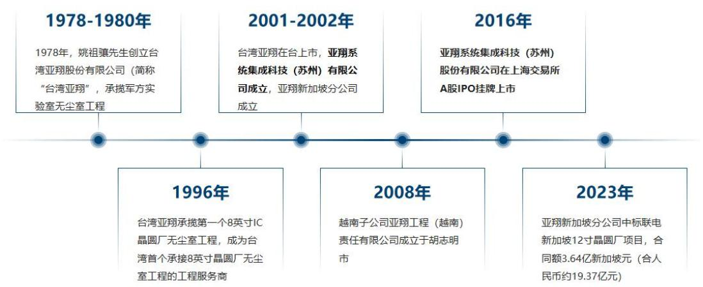  
图1：亚翔集成发展历程

资料来源：亚翔工程官网，亚翔集成官网，国信证券经济研究所整理股权集中，大股东为台资背景。亚翔工程股份有限公司（简称“亚翔工程”，6139.TW）系中国台湾上市公司，持有亚翔集成 $5 3 . 9 9 \%$ 的股权，为公司的控股股东。亚翔工程由姚祖骧创办，姚祖骧、赵玉华夫妇为亚翔工程的控股股东，姚祖骧全资持有的苏州亚力管理咨询有限公司持有本公司 $0 . 7 5 \%$ 的股权。姚祖骧、赵玉华夫妇合计间接控制公司 $5 4 . 7 4 \%$ 的股权，为公司的实际控制人。

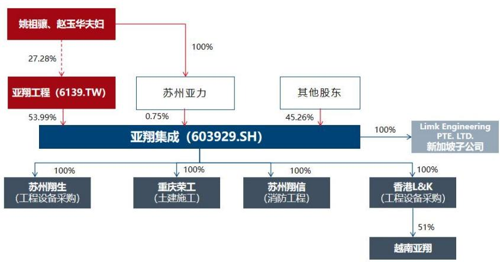  
图2：公司股权结构示意

资料来源：公司公告，国信证券经济研究所整理

母公司长期服务于全球晶圆代工龙头，具备 $2 \mathsf { n m }$ 晶圆厂建设经验。公司母公司亚翔工程是中国台湾地区高科技整厂建设工程总承包企业，2009年亚翔工程吸收基础设施建设服务商荣工工程，形成“高科技工程 $\cdot ^ { + }$ 基建工程”的业务结构。亚翔工程长期服务于台资芯片厂商扩产建厂需求，与台积电、联电等全球晶圆代工龙头建立了稳固的合作关系，承建台积电高雄 F22（ $2 \mathsf { n m }$ ）晶圆厂和 AP8先进封装厂。亚翔集成与母公司共享客户资源和工艺技术能力，建设了台积电、联电在中国（除港澳台地区）投资的一系列重大晶圆厂项目。

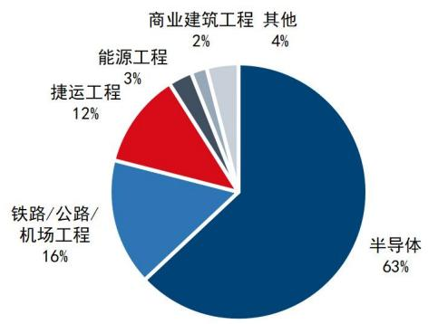  
图3：亚翔工程 2025 年 1-5 月在手合同类型分布（单位：%）

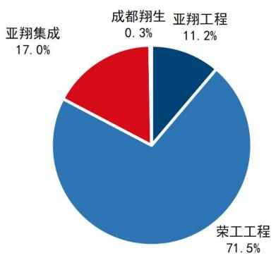  
图4：亚翔工程集团员工分布（单位；%）

资料来源：亚翔工程法说会材料，国信证券经济研究所整理资料来源：亚翔工程法说会材料，国信证券经济研究所整理借力母公司资源，协同开发海外市场。根据亚翔集成与亚翔工程签署的同业竞争承诺，在洁净室工程及机电安装领域，亚翔工程独占经营中国台湾市场，亚翔集成负责中国台湾以外的其他市场。但在海外项目中，母公司的总承包及土建业务与亚翔集成不构成同业竞争，通常采用亚翔工程总承包、亚翔集成担任洁净室与机电安装分包商的协作模式。这使得亚翔集成能够充分利用母公司丰富的客户资源，借助台资半导体厂商的海外投资项目积累相关建设经验，持续深化海外布局。

  
图5：亚翔工程营业据点

资料来源：亚翔工程法说会材料，国信证券经济研究所整理

# 估值显著低于同业，海外业务有望迎来重估

亚翔集成估值水平显著低于同业可比公司，近年来业绩增长并未带动估值提升。我们梳理了主营洁净室系统工程的三家上市公司亚翔集成、柏城股份、圣晖集成过去两年的市盈率估值与每股收益变化，可以看到亚翔集成虽然每股收益由 0.8元大幅上升至 2.8 元，但市盈率（TTM）却从 20X 下降至 13X，过去两年亚翔集成/柏城股份/圣晖集成的平均市盈率分别为 14/28/23X。

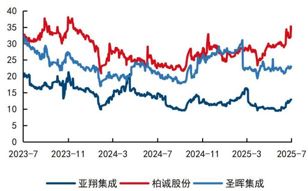  
图6：亚翔集成与同业可比公司市盈率（TTM）对比  
资料来源：Wind，国信证券经济研究所整理

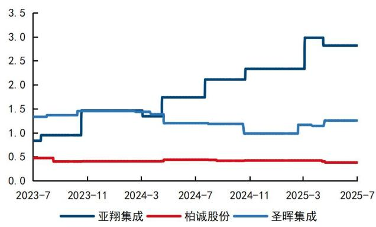  
图7：亚翔集成与同业可比公司EPS（TTM）对比（单位：元）

资料来源：Wind，国信证券经济研究所整理

尽管自 2021 年以来股价涨幅较大，但公司估值仍然处于历史低位。截至 2025 年7 月 9 日，公司收盘 PE（TTM）估值为 12.9X，处于历史 11%分位点。复盘历史市场数据，亚翔集成历史稳定区间的估值水平大约在 20-40X，当前估值水平处于历史低位。公司上市起至今剔除负值的市盈率平均值为 61.5X，选取估值水平相对稳定的两个阶段：2017-2019 年公司平均 PE（TTM）为 33.4X，2022-2025 年 7 月的平均 PE（TTM）为 24.9X。

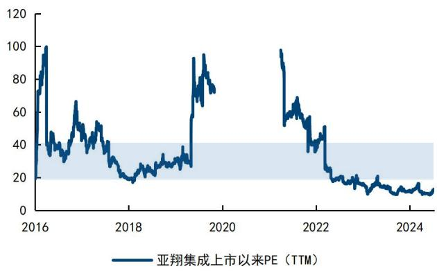  
图8：亚翔集成当前 PE估值处于历史低位  
资料来源：Wind，国信证券经济研究所整理（剔除 2020Q3-2021Q3 受疫情影响业绩下滑导致的估值偏移）

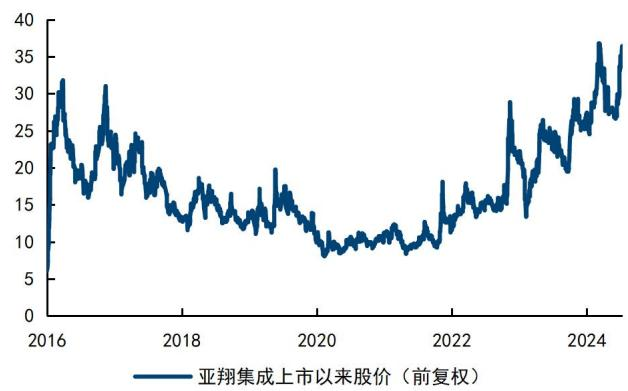  
图9：亚翔集成股价较最低点上涨约 $300 \%$ （单位：元）

资料来源：Wind，国信证券经济研究所整理

市场对公司海外大订单的连续性持谨慎态度。2023-2025 年公司先后签约联电新加坡项目（45.68 亿元）、VSMC 新加坡项目（37.93 亿元）、某新加坡机电工程项目（15.82 亿元），海外大订单约占总新签订单的 $60 \%$ 以上，贡献了公司新签订单的主要增量。市场认为，后续海外大型晶圆制造项目落地节奏以及公司未来能否持续拿到大订单均具有不确定性，所以并未在海外大订单连续的假设下给予海

外业绩相应的估值。

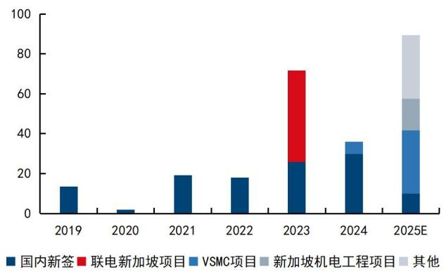  
图10：海外大项目贡献公司新签订单主要增量（单位：亿元）  
资料来源：公司公告，国信证券经济研究所整理及预测（2023年以前公司在海外亦有少量订单，但金额较小）

  
图11：公司海外收入占比快速提升（单位：亿元）

资料来源：公司公告，国信证券经济研究所整理

而我们认为公司海外业务具有连续性，未来的估值空间将主要来源于海外业务的估值重塑，原因有三：1）新加坡是当前东南亚地区半导体产业基础设施最完备的地区，是全球半导体产能重构浪潮中的避险首选，未来建设需求持续向上；2）亚翔集成扎根新加坡，与母公司紧密合作承建标杆项目，持续扩大品牌影响力，已在新加坡市场占据较高的市场份额；3）公司在海外市场服务的客户类型逐渐多样化，海外新订单并不依赖于老客户，而是扎根区域国别市场，服务各类客户需求。

# 公司在手大订单进展顺利，且均有后续扩建计划：

联电（UMC）新加坡项目：2022 年联华电子宣布在新加坡投资建设晶圆厂，提供$^ { 2 2 } \mathsf { n m }$ 和 28nm 工艺，项目分两期建设，一期工程投资 50 亿美元，将于 2026 年投入量产，并预留了未来二期扩建的投资空间。2023年 3月，亚翔集成新加坡分公司获得联华电子第三厂/第四厂扩建工程及劳务安装工程的订单，预计工期到2024年 12月，合同总额约合人民币 45.68 亿元。该项目于 2024 年进入施工高峰期，全年为亚翔集成贡献营业收入 22.8 亿元，占比 $4 2 . 4 \%$ ，贡献净利润 4.73 亿元，占比 $7 4 . 4 \%$ 。当前联电新加坡项目接近尾声，客户已如期顺利搬机。

VSMC 新加坡项目：该项目是由世界先进与恩智浦半导体合资成立的 VSMC（VisionPower Semiconductor Manufacturing Company）投建，相关技术授权及技术转移来自于台积电，总投资金额约为 78亿美元。2024年 10月，亚翔集成中标新加坡 VSMC 厂务系统项目，合同额 6.30 亿元。2025 年 4 月，公司中标 VSMC新加坡晶圆厂 MEP（机电设备）工程，合同额 31.63 亿元。根据规划，VSMC新加坡项目洁净室主体钢结构在 2025 年 6 月初上梁（封顶），将在 2025Q4 移入机台设备，预期 2026年下半年产出样品给客户，2027Q1正式实现量产。2025年 6月底世界先进（VIS）董事长方略表示，该项目于 2024年第四季度动工，所有工程进展相当顺利，2027年第一季量产行程不变，甚至可能超前。在首座晶圆厂成功量产后，世界先进及恩智浦半导体将考量未来业务发展，评估建造第二座晶圆厂。

  
图12：公司承建联电新加坡12寸晶圆厂项目

资料来源：海峡时报，国信证券经济研究所整理资料来源：VSMC，国信证券经济研究所整理

  
图13：公司承建 VSMC新加坡 12寸晶圆厂项目

# 新加坡市场需求持续向好，发展空间广阔

# 半导体是新加坡的重要支柱产业，政策持续大力支持

半导体是新加坡重要的支柱产业。新加坡在全球半导体产业中占据重要地位，贡献了全球半导体产量的 $10 \%$ ，全球半导体设备产量的 $20 \%$ ，其半导体制造业 2023年产值突破 1330 亿新元（约 1010亿美元），占该国电子制造业总产值的 $4 3 . 7 \%$ ，贡献了全国 GDP的 $7 \%$ 。相较于其他制造业，半导体制造业占地面积相对较小，附加值较高，适配于新加坡的资源禀赋。目前，全球 15 家顶级半导体公司中有 9家已在新加坡设立工厂。

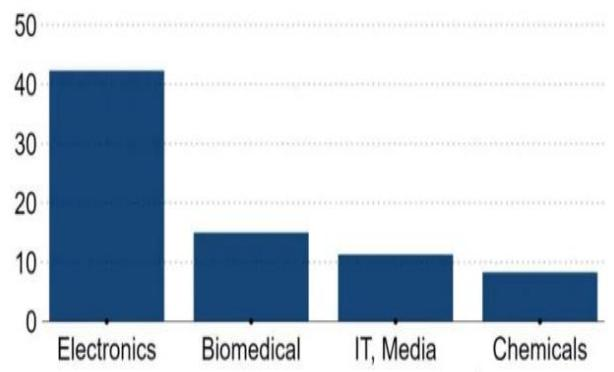  
图14：2021年各行业占新加坡投资承诺的份额（单位：%）

资料来源：新加坡经济发展委员会，国信证券经济研究所整理资料来源：Interact Analysis，国信证券经济研究所整理新加坡政府通过战略性财税政策持续夯实半导体产业竞争力。新加坡政府在 2021至 2025 年间投入 180 亿新元（约 136亿美元）系统性支持研发、基建与企业运营。2024 年政府预算中推出的“可退还投资抵免”（RIC）计划，该计划为合格支出提供最高 $50 \%$ 的补贴，包括人力成本、专业费用、材料、物流和资本支出等，未使用的抵免额可在四年内以现金返还。"金融业激励计划"（FSI）对金融机构半导体相关服务提供 $5 \% - 1 3 . 5 \%$ 优惠税率。

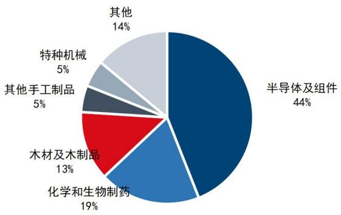  
图15：2023年新加坡制造业产业结构（单位： $\% \cdot$ ）

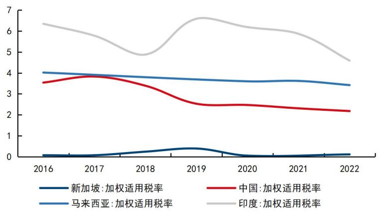  
图16：新加坡整体税率较低（单位： $\%$ ）  
资料来源：Wind，世界银行，国信证券经济研究所整理

新加坡基础设施体系健全，高科技产业配套资源丰富。新加坡稳定的电网体系为半导体制造提供了连续运转的基础保障，而先进的水处理与废物管理系统则精准适配了晶圆生产的严苛需求。政治环境的长期稳定性和低腐败水平构筑了全球少有的透明商业生态，跨国公司在此运营面对的政策风险较小。该国完善的法律框架更建立了严格的知识产权保护壁垒，半导体企业的核心技术资产获得系统性保障，形成安全的创新孵化环境。新加坡金融业发达，是亚洲金融中心之一，对需要长周期、高投入的半导体产业而言，这种金融稳定性保证了长期投资的安全性。

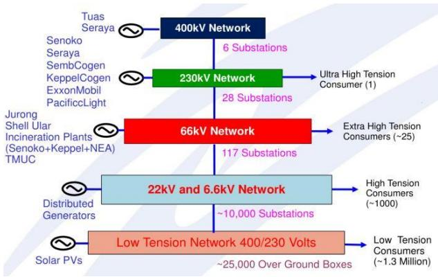  
图17：新加坡电力网络电压等级分布  
资料来源：新加坡能源市场管理局（EMA），国信证券经济研究所整理

  
图18：新加坡樟宜水回收厂地下管网  
资料来源：新加坡公共事业局 (PUB) ，国信证券经济研究所整理

新加坡高等教育体系完善，可为半导体产业持续输送优质人才。新加坡注重科学、技术、工程和数学（STEM）教育，为半导体行业提供源源不断的高技能专业人才，当前新加坡半导体行业的从业人员约有 3.5万人。2024 年，格芯、美光、意法半导体与新加坡微电子研究院签署了合作备忘录，提供学生实习、员工培训及合作项目，进一步加强了新加坡半导体行业的人才供给。从产业链角度看，新加坡的产业生态系统覆盖了整个半导体价值链，除大型跨国科技企业以外，还分布众多从事晶圆制造、装配、封装和测试的中小企业。

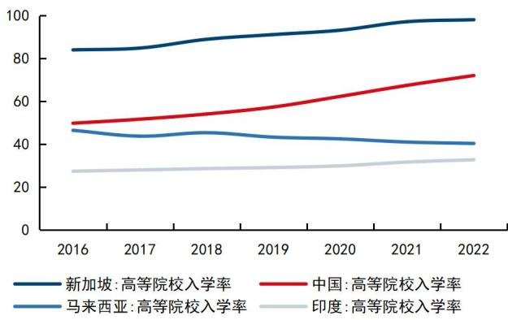  
图19：新加坡高等院校入学率接近 $100 \%$ （单位： $\% .$ ）  
资料来源：Wind，世界银行，国信证券经济研究所整理

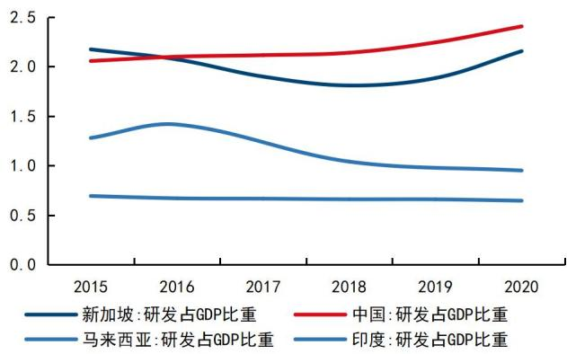  
图20：新加坡研发支出占 GDP比例较高（单位： $\% .$ ）

资料来源：Wind，世界银行，国信证券经济研究所整理

# 新加坡是全球半导体产能迁移浪潮中的避险首选

全球芯片供应链“短链化”，东南亚产能建设进行时。半导体是高技术产业，是各国科技竞赛的主战场，处在大国博弈漩涡之中，由于全球政治经济环境不确定性加剧，各国政府和半导体厂商更加重视半导体供应链的安全性。2023 年 10 月美国商务部工业与安全局（BIS）发布了对华半导体出口管制最终规则，严格限制人工智能相关芯片、半导体制造设备的对华出口。2024年 1月，美日荷达成三方协议，限制中国取得制造先进电脑芯片的材料。受美国对华芯片技术封锁的影响，中国芯片供给风险抬升，全球半导体投资加速流向东南亚地区以寻求中国的产能替代。

新加坡地处东南亚的中心位置，政治中立凸显避险价值。新加坡与中国、日本、韩国及东盟市场构成四小时航空经济圈，高效串联了从晶圆制造、封装测试到终端消费的半导体全链条核心区域。大型跨国科技企业在此设点，能同时辐射东亚的技术集群与东盟的增量市场。在中美科技博弈背景下，新加坡的政治中立性进一步凸显避险价值，为国际半导体企业分流地缘压力提供战略支点。

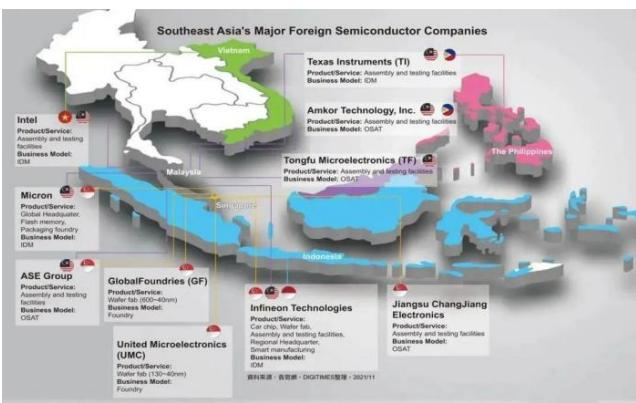  
图21：东南亚半导体产业供应链示意

资料来源：集微网，DIGITIMES，国信证券经济研究所整理资料来源：redseer，国信证券经济研究所整理

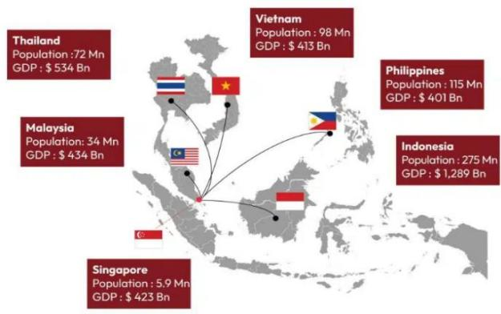  
图22：新加坡地处东南亚中心的关键战略位置

新加坡对美长期贸易逆差，受美贸易政策影响相对较小。在 2025 年 4 月特朗普政府“对等关税”政策中，东南亚是特朗普施加“对等关税”的重点区域。在加征税率最高的 10 个对象国中，就有 4个来自东南亚地区，依次是柬埔寨（ $( 4 9 \% )$ ）、老挝（ $4 8 \%$ ）、越南（ $46 \%$ ）和缅甸（ $45 \%$ ）。而新加坡长期对美逆差，仅被加征$10 \%$ “最低基准关税”。尽管“对等关税”税率当前仍处于“暂缓执行”状态，但特朗普政府后续关税政策变化仍有较大不确定性，而具有高确定性的是，新加坡必然是东南亚地区受关税影响最小的国家。跨国半导体企业为了规避未来关税政策的不确定性，原本规划在东南亚地区的投资将优先考虑落地新加坡。

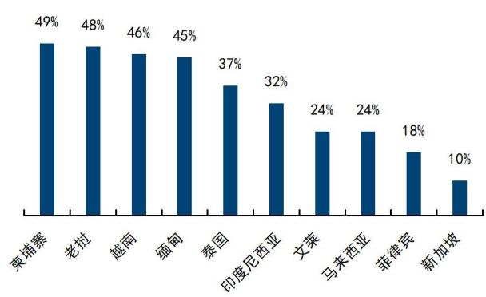  
图23：美国对东南亚各国施加的“对等关税”税率（单位：%）

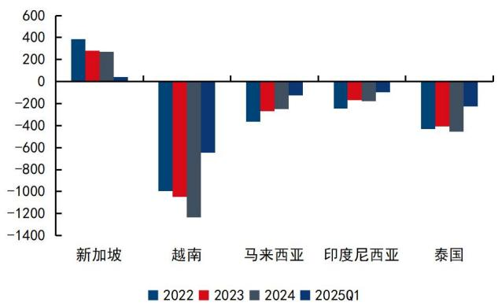  
图24：美国对东南亚各国贸易差额（单位：亿美元）

资料来源：Wind，国信证券经济研究所整理资料来源：Wind，国信证券经济研究所整理

全球半导体企业持续加码新加坡产能布局。目前，新加坡拥有超过 300家半导体企业，2021 年占全球晶圆产能的 $5 \%$ 。美光、格芯、联电等代工巨头已在此建立12 英寸晶圆厂，主要生产存储芯片、射频和模拟器件；德州仪器、英飞凌等 IDM企业则聚焦功率半导体制造。新加坡逐渐发展成为重要的特色工艺节点和成熟制程生产基地，尤其在 $4 0 \mathsf { n m }$ 以上逻辑芯片、3D NAND 和碳化硅功率器件领域占据关键地位。随着 AI 芯片和汽车电子需求增长，全球半导体企业有望进一步扩充新加坡的先进封装和测试能力，预计未来五年跨国企业在此的资本开支将维持增长态势。

表1：部分布局在新加坡的半导体公司梳理  

<table><tr><td>公司名称</td><td>总部</td><td>产业链环节简介</td><td></td></tr><tr><td>美光(Micron)</td><td>美国</td><td>芯片制造</td><td>美光科技是一家专注于计算机内存和数据存储的半导体公司，在新加坡拥有三家晶圆制造厂和一家测试 及组装厂，拥有近 9000 名员工，新加坡是该公司 NAND 闪存晶圆的主要生产基地。美光科技总部位于 美国，但新加坡是其运营总部。</td></tr><tr><td>格lobalFoundri美国 es)</td><td></td><td>芯片制造</td><td>公司(Chartered Semiconductor Manufacturing)，目前在新加坡拥有5000 多名员工。</td></tr><tr><td>世创电子材料公</td><td>德国</td><td>芯片制造</td><td></td></tr><tr><td>联华电子（UMC）中国台湾芯片制造</td><td></td><td></td><td>联华电子是一家总部位于台湾的半导体制造商，在新加坡设有专业技术中心。该中心每月可生产5万片 12英寸（300毫米）晶圆。2022年，该公司宣布将投资50亿美元在新加坡建立一家代工厂，该工厂将 于2024年开始生产22纳米和28纳米芯片。</td></tr><tr><td>VSMC</td><td>新加坡</td><td>芯片制造</td><td>世界先进半导体公司(VIS)和恩智浦半导体于2024年宣布，双方将成立合资公司VisionPower半导 体制造公司，该公司将在新加坡投资78亿美元的半导体晶圆制造工厂运营。其300毫米模拟混合信 号晶圆将用于汽车、工业、消费电子和手机市场。该公司预计将于2027年开始生产。</td></tr><tr><td>意法半导体</td><td>瑞士</td><td>芯片制造</td><td>法最公同要产于电动汽数中的化芯片，公部</td></tr><tr><td>英飞凌neon)</td><td>德国</td><td>芯片制造</td><td></td></tr></table>

<table><tr><td colspan="4"></td></tr><tr><td>联发科（Medatek中国台湾</td><td></td><td>芯片设计</td><td></td></tr><tr><td>AMD</td><td>美国</td><td>芯片设计</td><td>AMD 设计用于计算机、游戏机和服务器的处理器。AMD成立于1969年，总部位于加利福尼亚州，并于 1984 年在新加坡开设了第一家办事处，这是一家高产量测试制造工厂。AMD新加坡办事处现已发展成 为一个产品开发中心，专注于设备分析、可靠性工程和新产品的推出。</td></tr><tr><td>高通（Qualcomm）美国</td><td></td><td>芯片设计</td><td>高通是一家无晶圆厂半导体公司，专注于 5G 等无线技术和智能手机应用处理器。这家总部位于加州的 公司于2000 年开设了芯片组分销中心，并于2008 年开设了测试开发中心。2012 年，该公司建立了一 个工程研发中心，专注于移动设备芯片组的设计和开发。</td></tr><tr><td>瑞昱半导体 (Realtek)</td><td>中国台湾</td><td>芯片设计</td><td>Realtek 是一家无晶圆厂半导体公司，设计用于控制器、路由器和家庭娱乐系统的集成电路产品。该公 司新加坡子公司成立于2013 年，拥有约140名员工，其中90%为研发工程师。</td></tr><tr><td>博通公司m)</td><td>美国</td><td>芯片设计</td><td>佛通公司设计和制造用于各种企业存储、网络和通信应用的导保，这家位于加州的公司于206年被</td></tr><tr><td>AEM</td><td>新加坡</td><td>封装测试</td><td>AEM 致力于开发半导体测试设备，服务于5G、高性能计算、汽车和人工智能市场的半导体公司。这家 总部位于新加坡的公司成立于1992年，在新加坡、马来西亚（槟城）、印度尼西亚（巴淡岛)、越南 （胡志明市）、中国（苏州)和芬兰（列支敦士登）设有制造工厂。</td></tr><tr><td>长电科技集团</td><td>中国</td><td>封装测试</td><td>长电科技集团是一家拥有超过 23，000 名员工的中国 0SAT 公司，该公司于 2015 年收购了新加坡 OSAT 公司星科金朋(SA性能计算领域的并在新加设立了办事作集电科技集团的子公司，新加测认 和封装。</td></tr><tr><td>日月光（ASE)</td><td></td><td>中国台湾封装测试</td><td>日月光集团是全球最大的封装测试外包半导体制造服务提供商（0SAT)。该公司成立于1984 年，总部 位于台湾，并于 1998 年成立了日月光新加坡公司。其新加坡子公司为 5G、人工智能、汽车电子、高性 能计算和网络安全等多个市场提供最终测试、晶圆分选、晶圆级封装、后端封装等服务。</td></tr><tr><td>硅盒( iicon</td><td>新加坡</td><td>封装测试</td><td></td></tr><tr><td>应用材料 (Applied Materials)</td><td>美国</td><td>材料及设备</td><td>应用材料公司是一家总部位于加州的公司，供应用于制造半导体的材料和设备。该公司成立于1991年， 在新加坡术年司资在加能。 该公司在新加坡拥有超过2500名员工，预计新工厂将进一步扩大员工队伍。</td></tr><tr><td>颇尔公司 (Pall</td><td>美国</td><td></td><td>材料备美公在</td></tr><tr><td>Soitec</td><td>法国</td><td></td><td>Soitec 是一家法国公司，专注于设计和制造半导体材料。它是全耗尽型绝缘体上硅（FD-SOI）晶圆市 材料及设备场的领导者。2022 年，该公司扩建了其新加坡制造工厂，使其年产能翻番，达到 200 万片 300 毫米绝 缘体上硅晶圆。该公司还表示，到2026 年，其新加坡员工人数将翻一番，达到 600 多人。</td></tr><tr><td></td><td>日本</td><td>材料及设备</td><td>日本企业集团凸版控股（Toppan Holdings)于2024 年开始在新加坡建设一家工厂，该工厂将成为新加 坡家生产用于网络交换机和工智能应用的倒法司片球栅列F公BGA板的工厂该该工厂将获得 万平方米，预计将于 2026 年投产。</td></tr></table>

资料来源：新加坡经济发展局（EDB），全球半导体观察，维基百科，国信证券经济研究所整理

# 在手订单充足保障未来增长，海外收入提升驱动盈利能力增强

国内新订单短期存在压力，未来有望逐步修复。由于半导体洁净室工程单项目体量较大，且建设节奏有较强的周期性，公司历史新签订单波动较大。公司 2023年国内新签订单25.9亿元，同比 $+ 4 4 \%$ ，2024 年国内新签订单29.8亿元，同比 $+ 1 5 \%$ ，2025年随着成熟制程产能过剩压力增加，预计新签订单承压，根据母公司法说会数据推算，2025H1 国内新签约 3 亿元左右。但在芯片自主可控趋势下，先进制程产能国产替代必要性持续提升，预计未来国内订单将逐步修复。

海外新订单有望持续释放。公司过去三年签约多个新加坡重大项目，推动公司整体新签订单大幅增长。站在当前时点观察，公司承接的项目均有后续扩建计划，全球政治经济不确定性增强的背景下，新加坡半导体产能扩建需求仍然旺盛，我们认为公司有望在新加坡市场持续获取重大项目订单。

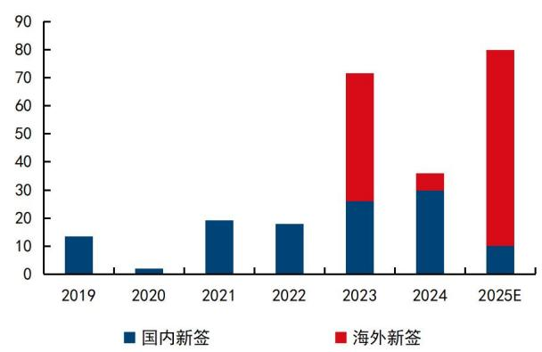  
图25：公司国内与海外新签订单金额（单位：亿元人民币）  
资料来源：公司公告，国信证券经济研究所整理及预测（中性假设，2023年以前公司在海外亦有少量订单，但金额较小）

  
图26：公司年末在手订单金额（单位：亿元人民币）

资料来源：公司公告，国信证券经济研究所整理及预测（中性假设）

表2：亚翔集成新签合同额预测（单位：亿元）  

<table><tr><td colspan="2"></td><td>2023</td><td>2024</td><td>2025E</td><td>2026E</td><td>2027E</td></tr><tr><td>国内新签</td><td></td><td>25.9</td><td>29.8</td><td>10.0</td><td>25.0</td><td>28.8</td></tr><tr><td rowspan="3">海外新签</td><td>乐观</td><td></td><td></td><td>80.0</td><td>40.0</td><td>60.0</td></tr><tr><td>中性</td><td>45.7</td><td>6.3</td><td>69.6</td><td>20.0</td><td>40.0</td></tr><tr><td>保守</td><td></td><td></td><td>60.0</td><td>0.0</td><td>0.0</td></tr><tr><td rowspan="3">新签合同额</td><td>乐观</td><td></td><td></td><td>90.0</td><td>65.0</td><td>88.8</td></tr><tr><td>中性</td><td>71.6</td><td>36.0</td><td>79.6</td><td>45.0</td><td>68.8</td></tr><tr><td>保守</td><td></td><td></td><td>70.0</td><td>25.0</td><td>28.8</td></tr></table>

资料来源：公司公告，国信证券经济研究所整理及预测

预计 2025 年收入在高基数下小幅回落，2026 年再次恢复增长。2023 年公司新签联电新加坡大订单，而 2024年海外订单落地金额较少，导致当年新签订单同比下滑。由于联电新加坡订单在 2024 年集中施工确认收入，预计 2025 年收入将在高基数下小幅回落。但随着现有海外大项目陆续进入施工高峰期，预计 2025 年下半年收入增速将逐步改善，2026 年有望恢复增长态势。

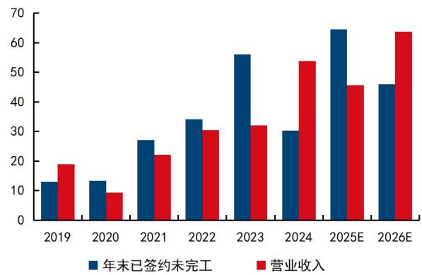  
图27：公司在手订单充足保障收入快速增长（单位：亿元）

资料来源：公司公告，国信证券经济研究所整理及预测（中性假设）

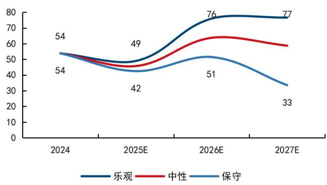  
图28：三种情景下对公司营业收入的预测（单位：亿元）

资料来源：公司公告，国信证券经济研究所整理及预测

海外占比提升将持续拉动整体毛利率上升。在国内工程市场，半导体工程项目被视为标杆项目，工程服务商往往采取"战略性让利"策略参与投标，以图建立行业口碑。与此同时，客户方议价能力较强，普遍将大型项目拆分为多个子标段，分别交由不同服务商承接。这种市场格局导致国内半导体工程业务的利润空间受到明显挤压，行业平均毛利率维持在 $8 \% - 1 5 \%$ 的较低水平。相比之下，海外市场的竞争格局更为健康，在工程承包环节，客户通常采用"交钥匙"模式，选择具备设计-施工一体化能力的单一总包服务商，项目毛利率普遍维持在 $2 0 \% - 3 0 \%$ 的较高水平。在 2023 年之前，公司主营业务集中在国内，整体公司的利润率由国内利润率决定，而 2024 年以后公司海外收入占比提升，预计将持续拉动公司毛利率上升。

  
图29：公司分地区毛利率变化（单位：%）

  
图30：新加坡收入占比上升预计将推升整体毛利率（单位：%）

资料来源：Wind，国信证券经济研究所整理资料来源：Wind，国信证券经济研究所整理及预测（中性假设）

收入快速增长有效摊薄各类费用，净利率显著上升。公司的各项费用及支出主要包括销售、管理、研发费用（主要为相关人员薪酬）和信用及资产减值，而公司基本没有带息负债，财务费用通常体现为净利息收入。在收入快速增长的过程中，人员薪酬弹性小于收入弹性，减值损失和利息收入相对稳定，所以收入规模增长，各类费用率将得到摊薄，净利率将显著上升。

分红规模保持高位，充足的现金储备支撑未来持续分红。公司 2024年年度现金分红合计 2.13 亿元，对应 2024年股息率约为 $3 . 6 \%$ 。分红规模维持高位，但由于公司 2024 年业绩大幅增长，分红比率有所降低。当前公司账面现金储备充足，2025年业绩预计小幅下滑，对应分红比率将有明显提升。公司轻资产运营，资本开支需求极少，对照公司分红历史及母公司分红水平，预计公司长期分红比率维持在$70 \%$ 水平，预测 2025-2027 年公司分红比率为 $8 0 \% / 5 0 \% / 7 0 \%$ 。

  
图31：公司历史分红及归母净利润（单位：亿元）

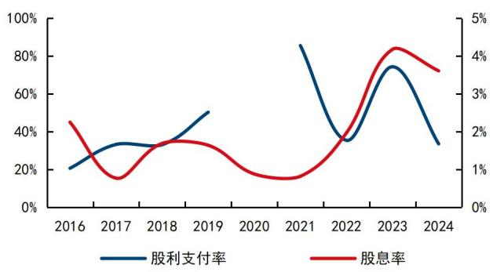  
图32：公司股利支付率和股息率（单位： $\%$ ）

资料来源：公司公告，国信证券经济研究所整理资料来源：Wind，国信证券经济研究所整理及预测（中性假设，负数代表支出，正数代表收益）

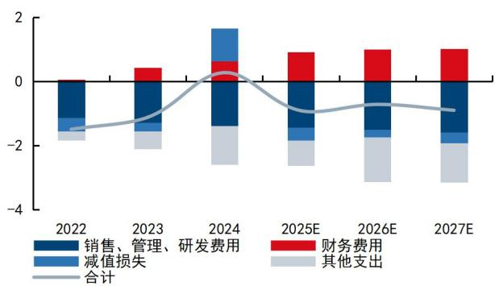  
图33：公司各项费用及支出变动（单位：亿元）

资料来源：公司公告，国信证券经济研究所整理资料来源：Wind，国信证券经济研究所整理及预测（中性假设）

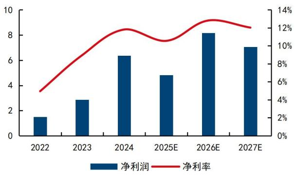  
图34：公司净利润、净利率及预测（单位：亿元，%）

表3：未来 3 年盈利预测表（单位：亿元）  

<table><tr><td></td><td>2022</td><td>2023</td><td>2024</td><td>2025E</td><td>2026E</td><td>2027E</td></tr><tr><td>营业收入</td><td>30.40</td><td>32.00</td><td>53.81</td><td>45.70</td><td>63.69</td><td>58.71</td></tr><tr><td>毛利率</td><td>10.8%</td><td>14.2%</td><td>13.6%</td><td>14.3%</td><td>16.1%</td><td>15.6%</td></tr><tr><td>毛利润</td><td>3.28</td><td>4.54</td><td>7.29</td><td>6.54</td><td>10.28</td><td>9.18</td></tr><tr><td>销售费用</td><td>-0.06</td><td>-0.03</td><td>-0.03</td><td>-0.03</td><td>-0.03</td><td>-0.03</td></tr><tr><td>管理费用</td><td>-0.74</td><td>-0.87</td><td>-0.87</td><td>-0.90</td><td>-0.94</td><td>-0.99</td></tr><tr><td>研发费用</td><td>-0.33</td><td>-0.39</td><td>-0.48</td><td>-0.50</td><td>-0.53</td><td>-0.56</td></tr><tr><td>财务费用</td><td>0.06</td><td>0.44</td><td>0.63</td><td>0.92</td><td>1.01</td><td>1.02</td></tr><tr><td>资产减值损失</td><td>-0.34</td><td>-0.03</td><td>0.66</td><td>-0.16</td><td>-0.09</td><td>-0.14</td></tr><tr><td>信用减值损失</td><td>-0.07</td><td>-0.23</td><td>0.37</td><td>-0.24</td><td>-0.14</td><td>-0.21</td></tr><tr><td>其他支出</td><td>-0.28</td><td>-0.55</td><td>-1.21</td><td>-0.86</td><td>-1.41</td><td>-1.15</td></tr><tr><td>净利润</td><td>1.51</td><td>2.87</td><td>6.36</td><td>4.77</td><td>8.16</td><td>7.13</td></tr><tr><td>净利率</td><td>5.0%</td><td>9.0%</td><td>11.8%</td><td>10.4%</td><td>12.8%</td><td>12.1%</td></tr></table>

资料来源：Wind，国信证券经济研究所整理及预测（中性假设，负数代表费用支出，正数代表收益）

综上，在中性假设下，预测 2025-2027 年公司收入 45.7/63.7/58.7 亿元，同比-15.1%/+39.4%/-7.8%，预测 2025-2027 年毛利率为 $1 4 . 3 \% / 1 6 . 1 \% / 1 5 . 6 \%$ ,预测2025-2027 年归母净利润为 4.77/8.16/7.13 亿元，同比- $2 5 . 0 \% / + 7 1$ .1%/-12.7%。

# 估值与投资建议

考虑公司的业务特点，我们采用绝对估值和相对估值两种方法来估算公司的合理价值区间。

绝对估值：对应股价 38.03-48.14 元

未来 5 年估值假设条件见下表：

表4：公司盈利预测假设条件（%）  

<table><tr><td colspan="4"></td><td colspan="5"></td></tr><tr><td></td><td>2022</td><td>2023</td><td>2024</td><td>2025E</td><td>2026E</td><td>2027E</td><td>2028E</td><td>2029E</td></tr><tr><td>营业收入增长率</td><td>37.39%</td><td>5.33%</td><td>68.09%</td><td>-15.06%</td><td>39.35%</td><td>-7.82%</td><td>10.00%</td><td>10.00%</td></tr><tr><td>营业成本/营业收入</td><td>89.21%</td><td>85.83%</td><td>86.45%</td><td>85.69%</td><td>83.85%</td><td>84.36%</td><td>84.36%</td><td>84.36%</td></tr><tr><td>管理费用/营业收入</td><td>2.42%</td><td>2.70%</td><td>1.61%</td><td>1.96%</td><td>1.48%</td><td>1.68%</td><td>1.68%</td><td>1.68%</td></tr><tr><td>研发费用/营业收入</td><td>1.10%</td><td>1.21%</td><td>0.89%</td><td>1.10%</td><td>0.83%</td><td>0.95%</td><td>0.95%</td><td>0.95%</td></tr><tr><td>销售费用/销售收入</td><td>0.18%</td><td>0.10%</td><td>0.06%</td><td>0.07%</td><td>0.05%</td><td>0.06%</td><td>0.06%</td><td>0.06%</td></tr><tr><td>营业税及附加/营业收入</td><td>0.14%</td><td>0.08%</td><td>0.12%</td><td>0.09%</td><td>0.08%</td><td>0.12%</td><td>0.12%</td><td>0.12%</td></tr><tr><td>所得税税率</td><td>15.68%</td><td>15.28%</td><td>15.38%</td><td>15.28%</td><td>15.28%</td><td>15.28%</td><td>15.28%</td><td>15.28%</td></tr><tr><td>股利分配比率</td><td>35.43%</td><td>74.37%</td><td>33.55%</td><td>80.00%</td><td>50.00%</td><td>70.00%</td><td>70.00%</td><td>70.00%</td></tr></table>

资料来源: Wind，国信证券经济研究所预测

表5：资本成本假设  

<table><tr><td>无杠杆 Beta</td><td>1.2</td><td>T</td><td>15.28%</td></tr><tr><td>无风险利率</td><td>2.04%</td><td>Ka</td><td>12.84%</td></tr><tr><td>股票风险溢价</td><td>9.00%</td><td>有杠杆 Beta</td><td>1.20</td></tr><tr><td>公司股价（元）</td><td>34.41</td><td>Ke</td><td>12.85%</td></tr><tr><td>发行在外股数（百万）</td><td>213</td><td>E/ (D+E)</td><td>99.86%</td></tr><tr><td>股票市值(E，百万元) 债务总额(D，百万元）</td><td>7342</td><td>D/ (D+E)</td><td>0.14%</td></tr><tr><td>Kd</td><td>10</td><td>WACC</td><td>12.84%</td></tr><tr><td></td><td>3.50%</td><td>永续增长率（10年后）</td><td>2.0%</td></tr></table>

资料来源：国信证券经济研究所假设

# 根据以上主要假设条件，采用 FCFF 估值，得出公司价值区间为 39.33-45.27 元。

表6：亚翔集成 FCFF估值表（单位：百万元）  

<table><tr><td></td><td>2025E</td><td>2026E</td><td>2027E</td><td>2028E</td><td>2029E</td></tr><tr><td>EBIT</td><td>506.6</td><td>873.0</td><td>753.2</td><td>828.5</td><td>911.4</td></tr><tr><td>所得税税率</td><td>15.28%</td><td>15.28%</td><td>15.28%</td><td>15.28%</td><td>15.28%</td></tr><tr><td>EBIT*(1-所得税税率)</td><td>429.2</td><td>739.6</td><td>638.1</td><td>701.9</td><td>772.2</td></tr><tr><td>折旧与摊销</td><td>6.3</td><td>6.6</td><td>6.9</td><td>7.2</td><td>7.7</td></tr><tr><td>营运资金的净变动</td><td>235.7</td><td>164.7</td><td>(265.8)</td><td>(253.0)</td><td>75.6</td></tr><tr><td>资本性投资</td><td>(3.7)</td><td>(4.4)</td><td>(5.3)</td><td>(6.4)</td><td>(7.7)</td></tr><tr><td>FCFF</td><td>667.5</td><td>906.4</td><td>373.8</td><td>449.8</td><td>847.8</td></tr><tr><td>PV(FCFF)</td><td>591.5</td><td>711.9</td><td>260.2</td><td>277.4</td><td>463.4</td></tr><tr><td>核心企业价值</td><td>7,231.6</td><td></td><td></td><td></td><td></td></tr><tr><td>减：净债务</td><td>(1,775.2)</td><td></td><td></td><td></td><td></td></tr><tr><td>股票价值</td><td>9,006.8</td><td></td><td></td><td></td><td></td></tr><tr><td>每股价值</td><td>42.21</td><td></td><td></td><td></td><td></td></tr></table>

资料来源: 国信证券经济研究所预测

# 敏感性分析：该绝对估值相对于 WACC和永续增长率较为敏感，下表为敏感性分析。

表7：绝对估值相对折现率和永续增长率的敏感性分析（元）  

<table><tr><td colspan="6">WACC 变化</td></tr><tr><td></td><td></td><td>11.8%</td><td>12.3%</td><td>12.84%</td><td>13.3% 13.8%</td></tr><tr><td></td><td>3.0%</td><td>48.14 45.86</td><td>43.81</td><td>41.97</td><td>40.30</td></tr><tr><td>永续</td><td>2.5%</td><td>47.03</td><td>44.89 42.97</td><td>41.24</td><td>39.66</td></tr><tr><td>增长</td><td>2.0%</td><td>46.02</td><td>44.02 42.21</td><td>40.57</td><td>39.07</td></tr><tr><td>率变</td><td>1.5%</td><td>45.11</td><td>43.23 41.52</td><td>39.96</td><td>38.53</td></tr><tr><td>化</td><td>1.0%</td><td>44.29</td><td>42.51 40.89</td><td>39.40</td><td>38.03</td></tr></table>

资料来源：国信证券经济研究所分析

# 相对估值：对应股价 42.08-57.39 元

在半导体洁净室工程环节，主要参与者为深桑达、亚翔集成、柏诚股份、圣晖集成、江西汉唐（未上市），2023 年 CR5市占率约为 $7 7 . 0 \%$ ，选取已上市的柏诚股份、圣晖集成、深桑达 A 作为可比公司。

亚翔集成估值水平显著低于同业可比公司，近年来业绩增长并未带动估值提升，我们认为主要源于市场认为后续海外大型晶圆制造项目落地节奏以及公司未来能否持续拿到大订单均具有不确定性，所以并未在公司海外大订单连续的假设下给予公司海外业务相应的估值。而我们认为公司海外业务具有连续性，未来的估值空间主要来源于海外业务的估值重塑。参考可比公司估值，结合公司发展前景，我们谨慎给予公司 2026 年 11-15 倍的市盈率估值，对应股价 42.08-57.39 元。

表8：可比公司估值比较（截至 2024年 7月 4日）  

<table><tr><td>证券代码</td><td>证券名称</td><td>收盘价</td><td>总市值（亿元）</td><td>EPS-2025E</td><td>EPS-2026E</td><td>PE-2025E</td><td>PE-2026E</td></tr><tr><td>603929.SH</td><td>亚翔集成</td><td>35.37</td><td>75</td><td>2.24</td><td>3.83</td><td>15.8</td><td>9.3</td></tr><tr><td>601133.SH</td><td>柏诚股份</td><td>12.76</td><td>67</td><td>0.45</td><td>0.51</td><td>28.29</td><td>25.29</td></tr><tr><td>603163.SH</td><td>圣晖集成</td><td>28.66</td><td>29</td><td>1.37</td><td>1.59</td><td>20.92</td><td>18.05</td></tr><tr><td>000032.SZ</td><td>深桑达A</td><td>20.31</td><td>231</td><td>0.38</td><td>0.50</td><td>53.06</td><td>40.42</td></tr></table>

资料来源：iFinD，国信证券经济研究所整理（除亚翔集成外盈利预测采用 iFinD一致预期）

综合绝对估值法与相对估值法，得到公司合理估值区间为 42.08-48.14 元，对应公司总市值 90-103 亿元，较当前股价有 20%-37%的空间。

# 投资建议：上调盈利预测，维持“优于大市”评级

半导体是高技术产业，是各国科技竞赛的主战场，处在大国博弈漩涡之中，由于全球政治经济环境不确定性加剧，各国政府和半导体厂商更加重视半导体供应链的安全性。受美国对华芯片技术封锁的影响，中国芯片供给风险抬升，全球半导体厂商流向东南亚地区以寻求中国的产能替代。而新加坡地处东南亚的中心位置，政治中立凸显避险价值。并且，新加坡长期对美逆差，在特朗普政府“对等关税”政策中仅被加征 $10 \%$ “最低基准关税”，远低于其他东南亚国家，跨国半导体企业为了规避未来关税政策的不确定性，原本计划在东南亚地区的投资将优先考虑落地新加坡。

亚翔集成是半导体洁净室系统集成工程专业服务商，与台湾母公司共享客户资源和工艺技术能力，借助台资半导体厂商海外投资项目积累海外建设经验，持续深化海外布局。过去三年公司连续斩获联电（UMC）新加坡 12寸晶圆厂项目、VSMC新加坡 12寸晶圆厂项目等重大海外订单，推动公司整体新签订单大幅增长。而站在当前时点观察，公司承接的项目均有后续扩建计划，全球政治经济不确定性增强的背景下，新加坡半导体产能扩建需求仍然旺盛，我们认为公司有望在新加坡市场持续获取重大项目订单。

亚翔集成估值水平显著低于同业可比公司，近年来业绩增长并未带动估值提升，我们认为主要源于市场认为后续海外大型晶圆制造项目落地节奏以及公司未来能否持续拿到大订单均具有不确定性，所以并未在公司海外大订单连续的假设下给予公司海外业务相应的估值。而我们认为公司海外业务具有连续性，未来的估值空间主要来源于海外业务的估值重塑。

公司近期再度斩获海外大订单，重大项目预计将于未来 2 年集中结转为收入，故上调公司盈利预测，预测公司 2025-2027 年归属于母公司净利润 4.77/8.16/7.13亿 元 （ 前 值 4.78/6.37/7.32 亿 元 ） ， 每 股 收 益 $2 . 2 4 / 3 . 8 3 / 3 . 3 4$ 元（前值2.24/2.98/3.43 元），同比-25. $0 \% / + 7 1$ . $1 \% / { - 1 2 } . 7 \%$ 。综合绝对估值法与相对估值法，得到公司合理估值区间为 42.08-48.14 元，对应公司总市值 90-103 亿元，较当前股价有 20%-37%的空间。

# 风险提示

# 估值的风险

公司估值和盈利预测是基于一定的假设基础上的，可能对相关参数估计偏乐观、从而导致该估值偏高的风险；以及对收入增长预期偏乐观而导致盈利预测值高于实际值的风险。请谨慎使用！

我们采取了绝对估值和相对估值方法，多角度综合得出公司的合理估值在42.08-48.14 元之间，但该估值是建立在相关假设前提基础上的，特别是对公司未来几年自由现金流的计算、加权平均资本成本（WACC）的计算、TV 的假定和可比公司的估值参数的选定，都融入了主观判断，因此存在估值出现偏差的风险，具体来说：

可能由于对公司营业收入和利润增长率估计偏乐观，导致未来自由现金流计算值偏高，从而导致估值偏乐观的风险；

加权平均资本成本（WACC）对公司绝对估值影响非常大，我们在计算 WACC 时假设无风险利率为 $2 . 0 4 \%$ 、风险溢价 $9 . 0 0 \%$ ，可能仍然存在对该等参数估计或取值偏低、导致 WACC计算值偏低，从而导致公司估值高估的风险；

我们假定未来 10 年后公司永续增长率为 $2 . 0 \%$ ，不排除公司所处行业在未来 10 年后发生较大的不利变化，公司持续成长性实际很低或负增长，从而导致公司估值高估的风险；

相对估值方面，我们选取了与公司业务结构相近的公司作为可比公司，但公司自身业务仍然具有一定的特殊性，可能存在高估公司价值的风险。

# 盈利预测的风险

$\spadesuit$ 我们预测 2025-2027 年公司新签订单增长 $+ 1 2 2 \% / - 4 4 \% / + 5 3 \% ,$ ,存在新签订单增长不及预期的风险；  
$\spadesuit$ 我们预测 2025-2027 年公司毛利率保持在 $1 4 . 3 / 1 6 . 1 / 1 5 . 6 \%$ ，存在市场竞争加剧，毛利率下行的风险；  
$\spadesuit$ 我们假设 2024-2026 年公司各项费用维持稳定增长，存在员工工资等成本上升快于收入增速，导致费用率上行的风险；  
$\spadesuit$ 我们假设资产减值损失和信用减值损失与营收规模变化正相关，存在公司回款不及预期导致减值大幅上升的风险。

# 宏观经济形势变化的风险

全球和国内经济增长的不确定性可能影响公司下游领域的投资意愿和投资能力。国际政治与外交形势变化，可能对下游企业扩产能力造成影响。宏观经济环境变化可能导致人工成本、原材料价格、设备价格波动，增加公司成本控制的难度，进而影响公司的盈利能力。

# 下游行业周期导致业绩波动的风险

半导体行业兼具“成长”和“周期”的双重属性，若半导体行业新增产能陆续投产叠加下游需求增长放缓，则行业可能会进入下行周期。根据我们的估算，全国半导体洁净室工程当前市场规模约为 250 亿元，市场容量相对较小，半导体行业周期性波动可能导致工程环节投资额产生较大幅度的波动，进而可能导致公司业绩大幅波动。

# 客户集中度较高的风险

由于半导体行业的资本开支主要集中在头部少数公司，客户集中度高是半导体洁净室工程行业的普遍现象。公司上市以来前五大客户销售额占比持续高于 $50 \%$ ，所承接的项目大部分来自于台积电、联电、中芯国际等全球芯片代工龙头及其关联公司。公司存在不能持续、稳定的开拓新客户和维系老客户新增业务的可能，从而面临业绩下滑的风险。

# 行业竞争加剧的风险

公司服务的对象主要集中于电子半导体行业这一细分市场领域，具备较强客户资源和技术工艺上具有一定的领先优势，但目前公司与其他聚焦高端市场的洁净室工程服务商在技术、管理、品牌、工艺上尚未拉开明显差距，存在下游需求不足时企业间竞争加剧，导致公司盈利能力下降的风险。

# 工程管理与安全生产风险

工程项目实际发生成本受多种因素的影响，若公司预估成本所依据的假设发生不利变动或者假设不符合实际，可能导致公司报价偏低，产生实际利润率低于预期的风险。公司所服务的洁净室行业对工程技术要求严格，若出现公司质量管理体系不完善、分包管理不到位、技术操作不规范等问题，可能导致工程延期交付、工程成本增加、甚至可能引发安全事故和经济纠纷，对公司声誉造成损害，影响公司业务开拓，并对公司的经营业绩产生不利影响。

# 汇率波动风险

公司的主要经营位于中国境内、越南、新加坡，主要业务以人民币、美元、新加坡元、越南盾结算。但本公司已确认的外币资产和负债及未来的外币交易（外币资产和负债及外币交易的计价货币主要为美元、新加坡元和越南盾）依然存在汇率风险，若汇率大幅度波动，可能对公司经营业绩产生较大影响。

# 中国台湾地区法律法规变化的风险

亚翔工程股份有限公司系中国台湾上市公司，持有亚翔集成 $5 3 . 9 9 \%$ 的股权，为公司的控股股东。亚翔工程创始人姚祖骧、赵玉华夫妇合计间接控制公司 54. $7 4 \%$ 的股权，为公司的实际控制人。2010 年 6 月 29 日，海峡两岸关系协会和财团法人海峡交流基金会签订《海峡两岸经济合作框架协议》，并于 2010年 9 月 12 日起实施。由于两岸经济政治环境的变化具有一定的不确定性，如果中国台湾地区对中国（除港澳台地区）地区投资方面的法律法规发生变化，对在中国（除港澳台地区）地区投资范围采取较为严格的限制措施，将会对公司的生产经营产生不利影响。

附表：财务预测与估值   

<table><tr><td>资产负债表（百万元）</td><td>2023</td><td>2024</td><td>2025E</td><td>2026E</td><td>2027E</td></tr><tr><td>现金及现金等价物</td><td>1084</td><td>2484</td><td>2827</td><td>3401</td><td>3350</td></tr><tr><td>应收款项</td><td>998</td><td>630</td><td>536</td><td>1095</td><td>1331</td></tr><tr><td>存货净额</td><td>25</td><td>8</td><td>40</td><td>55</td><td>51</td></tr><tr><td>其他流动资产</td><td>1212</td><td>676</td><td>548</td><td>764</td><td>704</td></tr><tr><td>流动资产合计</td><td>3323</td><td>3841</td><td>3993</td><td>5357</td><td>5478</td></tr><tr><td>固定资产</td><td>57</td><td>52</td><td>50</td><td>49</td><td>48</td></tr><tr><td>无形资产及其他</td><td>6</td><td>5</td><td>5</td><td>5</td><td>5</td></tr><tr><td>投资性房地产</td><td>157</td><td>141</td><td>141</td><td>141</td><td>141</td></tr><tr><td>长期股权投资</td><td>0</td><td>0</td><td>0</td><td>0</td><td>0</td></tr><tr><td>资产总计</td><td>3542</td><td>4040</td><td>4190</td><td>5552</td><td>5672</td></tr><tr><td>短期借款及交易性金融 负债</td><td>3</td><td>0</td><td></td><td></td><td></td></tr><tr><td>应付款项</td><td></td><td>1579</td><td>10</td><td>10</td><td>10</td></tr><tr><td>其他流动负债</td><td>1627</td><td>608</td><td>1716</td><td>2487</td><td>2443</td></tr><tr><td>流动负债合计</td><td>461</td><td></td><td>517</td><td>701</td><td>652</td></tr><tr><td>长期借款及应付债券</td><td>2090</td><td>2188</td><td>2243</td><td>3198</td><td>3104</td></tr><tr><td>其他长期负债</td><td>0</td><td>0</td><td>0</td><td>0</td><td>0</td></tr><tr><td>长期负债合计</td><td>3</td><td>2</td><td>2</td><td>2</td><td>2</td></tr><tr><td>负债合计</td><td>3</td><td>2</td><td>2</td><td>2</td><td>2</td></tr><tr><td>少数股东权益</td><td>2094</td><td>2190</td><td>2245</td><td>3200</td><td>3106</td></tr><tr><td>股东权益</td><td>24 1425</td><td>21 1829</td><td>21 1924</td><td>20 2332</td><td>19 2546</td></tr><tr><td></td><td></td><td></td><td></td><td></td><td></td></tr><tr><td>负债和股东权益总计</td><td>3542</td><td>4040</td><td>4190</td><td>5552</td><td>5672</td></tr></table>

<table><tr><td>关键财务与估值指标</td><td>2023</td><td>2024</td><td>2025E</td><td>2026E</td><td>2027E</td></tr><tr><td>每股收益</td><td>1.34</td><td>2.98</td><td>2.24</td><td>3.83</td><td>3.34</td></tr><tr><td>每股红利</td><td>1.00</td><td>1.00</td><td>1.79</td><td>1.91</td><td>2.34</td></tr><tr><td>每股净资产</td><td>6.68</td><td>8.57</td><td>9.02</td><td>10.93</td><td>11.93</td></tr><tr><td>ROIC</td><td>23%</td><td>34%</td><td>51%</td><td>277%</td><td>147%</td></tr><tr><td>ROE</td><td>20%</td><td>35%</td><td>25%</td><td>35%</td><td>28%</td></tr><tr><td>毛利率</td><td>14%</td><td>14%</td><td>14%</td><td>16%</td><td>16%</td></tr><tr><td>EBIT Margin</td><td>10%</td><td>11%</td><td>11%</td><td>14%</td><td>13%</td></tr><tr><td>EBITDA Margin</td><td>10%</td><td>11%</td><td>11%</td><td>14%</td><td>13%</td></tr><tr><td>收入增长</td><td>5%</td><td>68%</td><td>-15%</td><td>39%</td><td>-8%</td></tr><tr><td>净利润增长率</td><td>91%</td><td>122%</td><td>-25%</td><td>71%</td><td>-13%</td></tr><tr><td>资产负债率</td><td>60%</td><td>55%</td><td>54%</td><td>58%</td><td>55%</td></tr><tr><td>股息率</td><td>2.8%</td><td>2.8%</td><td>5.1%</td><td>5.4%</td><td>6.6%</td></tr><tr><td>P/E</td><td>26.3</td><td>11.9</td><td>15.82</td><td>9.25</td><td>10.59</td></tr><tr><td>P/B</td><td>5.3</td><td>4.1</td><td>3.9</td><td>3.2</td><td>3.0</td></tr><tr><td>EV/EBITDA</td><td>29.2</td><td>16.4</td><td>19.1</td><td>12.2</td><td>14.0</td></tr></table>

资料来源：Wind、国信证券经济研究所预测

<table><tr><td>利润表（百万元）</td><td>2023</td><td>2024</td><td>2025E</td><td>2026E</td><td>2027E</td></tr><tr><td>营业收入</td><td>3201</td><td>5381</td><td>4570</td><td>6369</td><td>5871</td></tr><tr><td>营业成本</td><td>2748</td><td>4651</td><td>3916</td><td>5340</td><td>4952</td></tr><tr><td>营业税金及附加</td><td>3</td><td>7</td><td>4</td><td>5</td><td>7</td></tr><tr><td>销售费用</td><td>3</td><td>3</td><td>3</td><td>3</td><td>3</td></tr><tr><td>管理费用</td><td>87</td><td>87</td><td>90</td><td>94</td><td>99</td></tr><tr><td>研发费用</td><td>39</td><td>48</td><td>50</td><td>53</td><td>56</td></tr><tr><td>财务费用</td><td>(44)</td><td>(63)</td><td>(93)</td><td>(109)</td><td>(118)</td></tr><tr><td>投资收益</td><td>2</td><td>2</td><td>2</td><td>2</td><td>2</td></tr><tr><td>资产减值及公允价值变</td><td></td><td></td><td></td><td></td><td></td></tr><tr><td>动</td><td>2</td><td>(1)</td><td>0</td><td>0</td><td>0</td></tr><tr><td>其他收入</td><td>(64)</td><td>56</td><td>(90)</td><td>(75)</td><td>(90)</td></tr><tr><td>营业利润</td><td>344</td><td>751</td><td>561</td><td>961</td><td>839</td></tr><tr><td>营业外净收支</td><td>1</td><td>(1)</td><td>0</td><td>0</td><td>0</td></tr><tr><td>利润总额</td><td>346</td><td>750</td><td>561</td><td>961</td><td>839</td></tr><tr><td>所得税费用</td><td>53</td><td>115</td><td>86</td><td>147</td><td>128</td></tr><tr><td>少数股东损益</td><td>6</td><td>(2)</td><td>(2)</td><td>(2)</td><td>(2)</td></tr><tr><td>归属于母公司净利润</td><td>287</td><td>636</td><td>477</td><td>816</td><td>713</td></tr></table>

<table><tr><td>现金流量表（百万元）</td><td>2023</td><td>2024</td><td>2025E</td><td>2026E</td><td>2027E</td></tr><tr><td>净利润</td><td>287</td><td>636</td><td>477</td><td>816</td><td>713</td></tr><tr><td>资产减值准备</td><td>1</td><td>(0)</td><td>(0)</td><td>(0)</td><td>(0)</td></tr><tr><td>折旧摊销</td><td>8</td><td>8</td><td>6</td><td>7</td><td>7</td></tr><tr><td>公允价值变动损失</td><td>(2)</td><td>1</td><td>0</td><td>0</td><td>0</td></tr><tr><td>财务费用</td><td>(44)</td><td>(63)</td><td>(93)</td><td>(109)</td><td>(118)</td></tr><tr><td>营运资本变动</td><td>217</td><td>1034</td><td>236</td><td>165</td><td>(266)</td></tr><tr><td>其它</td><td>1</td><td>(1)</td><td>(0)</td><td>(1)</td><td>(0)</td></tr><tr><td>经营活动现金流</td><td>512</td><td>1679</td><td>719</td><td>987</td><td>453</td></tr><tr><td>资本开支</td><td></td><td>(1)</td><td>(4)</td><td>(4)</td><td>(5)</td></tr><tr><td>其它投资现金流</td><td>11</td><td>(38)</td><td>0</td><td>0</td><td>0</td></tr><tr><td>投资活动现金流</td><td>11</td><td>(39)</td><td>(4)</td><td>(4)</td><td>(5)</td></tr><tr><td>权益性融资</td><td>12</td><td>0</td><td>0</td><td>0</td><td>0</td></tr><tr><td>负债净变化</td><td>0</td><td>0</td><td>0</td><td>0</td><td>0</td></tr><tr><td>支付股利、利息</td><td>(213)</td><td>(213)</td><td>(382)</td><td>(408)</td><td>(499)</td></tr><tr><td>其它融资现金流</td><td>353</td><td>187</td><td>10</td><td>0</td><td>0</td></tr><tr><td>融资活动现金流</td><td>(62)</td><td>(240)</td><td>(372)</td><td>(408)</td><td>(499)</td></tr><tr><td>现金净变动</td><td>461</td><td>1400</td><td>343</td><td>574</td><td>(51)</td></tr><tr><td>货币资金的期初余额</td><td>623</td><td>1084</td><td>2484</td><td>2827</td><td>3401</td></tr><tr><td>货币资金的期末余额</td><td>1084</td><td>2484</td><td>2827</td><td>3401</td><td>3350</td></tr><tr><td>企业自由现金流</td><td>0</td><td>1536</td><td>667</td><td>906</td><td>374</td></tr><tr><td>权益自由现金流</td><td>0</td><td>1759</td><td>756</td><td>998</td><td>474</td></tr></table>

# 免责声明

# 分析师声明

作者保证报告所采用的数据均来自合规渠道；分析逻辑基于作者的职业理解，通过合理判断并得出结论，力求独立、客观、公正，结论不受任何第三方的授意或影响；作者在过去、现在或未来未就其研究报告所提供的具体建议或所表述的意见直接或间接收取任何报酬，特此声明。

国信证券投资评级  

<table><tr><td>投资评级标准</td><td>类别</td><td>级别</td><td>说明</td></tr><tr><td rowspan="5">报告中投资建议所涉及的评级（如有）分为股票评 级和行业评级(另有说明的除外评级标准为报 告发布日后的6到12个月内公司股价(或行业指数) 相对同期相关证券市场代表性指数的涨跌幅作为基 准。A股市场以沪深300指数（000300.SH）作为基 准；新三板市场以三板成指（899001.CSI）为基准； 香市场以生指数(H) )准：美国市场 (IXIC.GI）为基准。</td><td rowspan="4">股票 投资评级</td><td>优于大市</td><td>股价表现优于市场代表性指数10%以上</td></tr><tr><td>中性</td><td>股价表现介于市场代表性指数土10%之间</td></tr><tr><td>弱于大市</td><td>股价表现弱于市场代表性指数10%以上</td></tr><tr><td>无评级</td><td>股价与市场代表性指数相比无明确观点</td></tr><tr><td rowspan="3">投行业级</td><td>优于大市</td><td>行业指数表现优于市场代表性指数10%以上</td></tr><tr><td rowspan="2"></td><td>中性</td><td>行业指数表现介于市场代表性指数土10%之间</td></tr><tr><td>弱于大市</td><td>行业指数表现弱于市场代表性指数10%以上</td></tr></table>

# 重要声明

本报告由国信证券股份有限公司（已具备中国证监会许可的证券投资咨询业务资格）制作；报告版权归国信证券股份有限公司（以下简称“我公司”）所有。本报告仅供我公司客户使用，本公司不会因接收人收到本报告而视其为客户。未经书面许可，任何机构和个人不得以任何形式使用、复制或传播。任何有关本报告的摘要或节选都不代表本报告正式完整的观点，一切须以我公司向客户发布的本报告完整版本为准。

本报告基于已公开的资料或信息撰写，但我公司不保证该资料及信息的完整性、准确性。本报告所载的信息、资料、建议及推测仅反映我公司于本报告公开发布当日的判断，在不同时期，我公司可能撰写并发布与本报告所载资料、建议及推测不一致的报告。我公司不保证本报告所含信息及资料处于最新状态；我公司可能随时补充、更新和修订有关信息及资料，投资者应当自行关注相关更新和修订内容。我公司或关联机构可能会持有本报告中所提到的公司所发行的证券并进行交易，还可能为这些公司提供或争取提供投资银行、财务顾问或金融产品等相关服务。本公司的资产管理部门、自营部门以及其他投资业务部门可能独立做出与本报告中意见或建议不一致的投资决策。

本报告仅供参考之用，不构成出售或购买证券或其他投资标的要约或邀请。在任何情况下，本报告中的信息和意见均不构成对任何个人的投资建议。任何形式的分享证券投资收益或者分担证券投资损失的书面或口头承诺均为无效。投资者应结合自己的投资目标和财务状况自行判断是否采用本报告所载内容和信息并自行承担风险，我公司及雇员对投资者使用本报告及其内容而造成的一切后果不承担任何法律责任。

# 证券投资咨询业务的说明

本公司具备中国证监会核准的证券投资咨询业务资格。证券投资咨询，是指从事证券投资咨询业务的机构及其投资咨询人员以下列形式为证券投资人或者客户提供证券投资分析、预测或者建议等直接或者间接有偿咨询服务的活动：接受投资人或者客户委托，提供证券投资咨询服务；举办有关证券投资咨询的讲座、报告会、分析会等；在报刊上发表证券投资咨询的文章、评论、报告，以及通过电台、电视台等公众传播媒体提供证券投资咨询服务；通过电话、传真、电脑网络等电信设备系统，提供证券投资咨询服务；中国证监会认定的其他形式。

发布证券研究报告是证券投资咨询业务的一种基本形式，指证券公司、证券投资咨询机构对证券及证券相关产品的价值、市场走势或者相关影响因素进行分析，形成证券估值、投资评级等投资分析意见，制作证券研究报告，并向客户发布的行为。

# 国信证券经济研究所

深圳深圳市福田区福华一路 125 号国信金融大厦 36 层邮编：518046 总机：0755-82130833

上海  
上海浦东民生路 1199 弄证大五道口广场 1 号楼 12 层  
邮编：200135  
北京  
北京西城区金融大街兴盛街 6 号国信证券 9 层  
邮编：100032