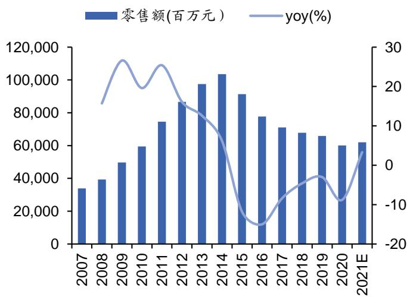
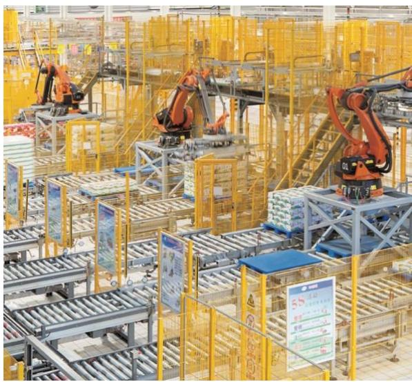

# 产业周期叠加内生动力，业绩增速向上

# 投资评级：买入（首次)

# 主要观点：

2021-09-30

<table><tr><td>收盘价（元）</td><td>37.70</td></tr><tr><td>近12 个月最高/最低(元)</td><td>50.61/31.46</td></tr><tr><td>总股本（百万股）</td><td>6,082</td></tr><tr><td>流通股本（百万股）</td><td>5,930</td></tr><tr><td>流通股比例（%)</td><td>97.50</td></tr><tr><td>总市值（亿元）</td><td>2,293</td></tr><tr><td>流通市值（亿元）</td><td>2,236</td></tr></table>

  
公司价格与沪深300走势比较

$\bullet$ 摘要：上游牧场整合升级，原奶供应能力逐步释放，2022年下半年大概率迎来原奶价格拐点。原奶上涨期间市场投入变弱料将持续，随着成本压力缓解，叠加单价恢复常态和高端比例提升的持续演绎，将共同推动公司盈利水平迈上新台阶，2023 年净利率有望突破达到 $1 1 \%$ 。公司正迎来繁荣周期起点，给予“买入”评级。

# 行业：供应加速整合，需求百花齐放。

（1）供应：单产驱动供应增加，原奶价格景气度持续。短期来看，供需缺口、饲料价格居高不下均对原奶价格形成有力支撑。长期来看，奶牛养殖投资强度增加对供求关系的影响将开始逐步显现，表现在大规模牧场比例大幅增加，带动奶牛单产的迅速提升。

（2）需求:液态奶：常温纯奶凭借最大的市场容量和较快增速吸引力最高，低温纯奶则因市场份额分散、高增速成为最具潜力品类。低温酸奶受益消费升级仍将持续增长。而乳酸菌饮料、含乳饮料则将在行业萎缩的局面下实现洗牌，并伴随新兴消费需求发掘回暖。奶粉：婴配陷入停滞，新国标加速洗牌，利于头部企业；成人奶粉受益银发经济的营养补充需求增加，具备增长潜力。冰淇淋：行业尚有整合空间，国内品牌有望通过紧贴消费升级趋势拓展高端产品线，进一步巩固领先地位。奶酪：处于再制奶酪以及餐饮为主的初级阶段，重心将从再制奶酪发展到天然奶酪，从西式快餐场景过渡到家庭消费场景。

（3）趋势：产品结构升级趋势明显，中高端产品市场地位不断加强；下线市场乳制品增长显著，存在大量新增消费需求有待开发；线上销售保持高速增长，大卖场、大超市虽出现下滑但仍是主要渠道。

# $\bullet$ 品类升级，全域营销，精细运营提供公司高质量成长动力。

（1）精确匹配需求，迭代升级产品。公司通过对大数据的洞察分析和消费者测试，在产品的功能和体验方面不断创新，研发契合消费者个性化需求的产品，新品营收贡献率保持在 $1 5 \%$ 左右。对于逐渐步入成熟期的超级单品，公司也一直在通过包装、口味升级，延长产品生命周期，不断开发新兴的消费需求。得益于消费需求的精准把握，公司抓住乳制品升级红利，主要品类市占率和毛利率稳中有升。

# 相关报告

（2）线上线下并举，线上反哺线下。公司积累了丰富的食品饮料行业下游渠道资源，具有数量庞大的经销商和终端渠道网络。同时敏锐地把握住线上销售渠道快速发展的契机，大力发展线上销售渠道，已实现对天猫、京东等电商平台的全覆盖，电商收入增速明显快于行业。线上业务发展利于消费者洞察，从而提升供应链效率和费用投放效果，表现在公司毛销差波动上升，广告宣传费用率趋于稳定。

（3）打造智慧乳业全产业链。公司通过与领先互联网企业的资源整合，建设云商系统，打通ERP-TMS-WMS-经销商-终端门店数据关联。云商系统有助于公司精准把握市场洞察，探索更为领先的品牌运营模式，并且能够协助公司以更为精准的市场决策，拉动业务增长。同时，公司向上游延展，提升工厂的数智化水平，打造“智能牧场”，掌控优质规模牧场资源。

# ⚫ 投资建议

首次覆盖，给予“买入”评级。成本上涨周期带动销售费用率下行，打开产品单价向上空间，而行业竞争格局向好，产品升级持续，预计2022年下半年成本压力逐步解除，公司业绩将具备较强弹性。我们预计2021-2023年公司营收1,081、1,196、1,321亿元，同比增长$1 2 \% / 1 1 \% / 1 0 \%$ ，归母净利润为88.49、107.6、145.2亿元，同比增长$2 5 \% / 2 2 \% / 3 5 \%$ ，EPS分别为1.45、1.77、2.39，对应PE分别为25.91、21.31、15.80，PEG 分别为1.04、0.99、0.45，给予“买入”评级。

# $\bullet$ 风险提示

原料价格上涨超出预期风险，食品安全风险，产品推广和渠道拓展不及预期风险。

⚫ 重要财务指标 单位：百万元  

<table><tr><td>主要财务指标</td><td>2020A</td><td>2021E</td><td>2022E</td><td>2023E</td></tr><tr><td>营业收入</td><td>96886</td><td>108112</td><td>119627</td><td>132078</td></tr><tr><td>收入同比(%)</td><td>7.4%</td><td>11.6%</td><td>10.7%</td><td>10.4%</td></tr><tr><td>归属母公司净利润</td><td>7078</td><td>8849</td><td>10758</td><td>14515</td></tr><tr><td>净利润同比(%)</td><td>2.1%</td><td>25.0%</td><td>21.6%</td><td>34.9%</td></tr><tr><td>毛利率(%)</td><td>36.2%</td><td>36.0%</td><td>36.3%</td><td>39.0%</td></tr><tr><td>ROE(%)</td><td>23.3%</td><td>19.3%</td><td>20.8%</td><td>23.7%</td></tr><tr><td>每股收益（元）</td><td>0.00</td><td>1.45</td><td>1.77</td><td>2.39</td></tr><tr><td>P/E</td><td>37.92</td><td>25.91</td><td>21.31</td><td>15.80</td></tr><tr><td>P/B</td><td>8.88</td><td>5.00</td><td>4.44</td><td>3.75</td></tr><tr><td>EV/EBITDA</td><td>25.59</td><td>15.63</td><td>13.11</td><td>9.85</td></tr></table>

资料来源： wind，华安证券研究所

# 正文目录

# 一、深耕乳制品市场，行业龙头地位稳固

1.1厚积薄发，目标高远， ..7  
1.2构建液体乳为核心的健康食品矩阵， ..8  
1.3 管理层稳定，员工持股实现利益绑定 ….9  
1.4 财务指标向好，实现高质量成长... .11

# 二、供应加速整合，需求百花齐放. 12

2.1单产驱动供应增加，原奶价格景气度持续，  
2.2 液态奶：常温有空间，低温有潜力…..  
2.2.1白奶：常温结构升级，巴氏比例增加..  
2.2.2 酸奶：常温增速领跑，低温尚待培育.  
2.2.3风味奶和含乳饮料：品类老化，增长困局待解.  
2.3 奶粉：婴配洗牌利于头部企业，成人奶粉受益银发经济 .0  
2.4冰淇淋国产高端替代，奶酪零售价值可发掘. ..2  
2.5增长空间：结构升级、渠道下沉、线上运营. ..24

# 、高质量增长驱动力：品类升级，全域营销，精细运营.. 26

3.1 精确匹配需求，迭代升级产品 ..27   
3.2 线上线下并举，线上反哺线下. .29   
3.3打造智慧乳业全产业链. ..30

# 四、盈利预测与投资建议. ..33

4.1盈利预测. .33  
4.2 投资建议. ..36

# 风险提示： 37

# 财务报表与盈利预测.. ..38

# 图表目录

图表1公司发展历程（市值，亿元）..  
图表 2 公司 2020 年营收进入全球乳业前五 ….图表3公司品牌产品组合... ….图表4 液体乳营收占比接近 $80 \%$ $\%$ )… …图表5 液体乳毛利额占比超过 $70 \%$ …  
图表6公司股权结构.. …图表7公司历次股权激励情况… …1图表8公司近十年营收保持较快增长.  
图表9公司近十年归母净利润保持较快增长……11图表10公司盈利水平整体向上 $( \% )$   
图表11 加权ROE长期高於 $20 \%$ $\%$ )…… ….图表 12 公司 ROE 水平领跑行业（2020 年， $\%$ )  
图表13 我国原料奶供需缺口长期存在(万吨)  
图表14 各类乳制品消费量波动上升（万吨）…13图表 15 我国每年新生儿数量下降(万人)  
图表16集贸市场猪肉价格指数（当月同比）.  
图表17我国主产区生鲜乳价格不断创下新高（元/公斤）..  
图表18我国奶牛单产快速上升（吨/年）.  
图表19 规模牧场单产更高（吨/年）15图表20大规模牧场占比迅速提升.  
图表21 饲料价格居高不下（元/吨）  
图表22 我国乳制品人均消费偏低（千克/年）….  
图表2  我国乳制品零售额稳中有增（百万元）……16图表24 白奶零售额保持稳定增长… 1 6图表 25 常温白奶零售额比例缓慢下滑（百万元)  
图表26 常温白奶量价恢复增长（ $. \%$ )  
图表27巴氏奶量价抬升持续（ $\%$   
图表28各国常温白奶比例差别巨大.  
图表29 常溫白奶高端品牌占比接近 $50 \%$ …1 7图表 30 酸奶乳酸菌饮料零售额增速下滑.  
图表31酸奶乳酸菌量增明显快於价格提升 $( \% )$   
图表32 常溫酸奶增速放缓但仍快於低温酸奶（ $\%$ ).  
图表33 伊利整体市占率第一( $\%$ …18图表34 常温酸奶安慕希份额达到 $45 \%$ …19图表 35 低温酸奶伊利份额与蒙牛接近 .19图表 36风味奶和含乳饮料市场处于下行通道.. .图表37风味奶和含乳饮料销量下滑，价格几无提升 $1 \%$ …图表38伊利含乳饮料市场份额保持领先.. …图表39液态乳细分赛道吸引力.…… ….20图表40 婴配奶粉增长停滞.图表 41价格提升抵消销量下滑影响（%） ..1图表42 飞鹤份额大幅领先，伊利份额超过 $6 \%$ .图表43 成人奶粉市场保持稳步增长…  
图表44成人奶粉价格增幅大于销量增幅（ $\%$ ) .图表45 冰淇淋零售额波动上升.. ….2图表46 冰淇淋价格增幅明显高于销量增幅（ $\%$ )22图表47 伊利份额保持领先，CR5 $4 2 . 8 \%$ …  
图表48 奶酪零售额高速增长  
图表49妙可蓝多零售份额快速上升至第一.  
图表 50我国奶酪人均消费量极低（千克/年）  
图表51奶酪餐饮销量远高于零售量（万吨）  
图表52 中高端白奶份额持续增加（ $\%$ )… 24图表 53高端液态奶市场将高速增长  
图表 54 液态奶下线市场零售额增速更高 $( \%$ )  
图表 55成人奶粉下线市场零售额增速更高 $( \%$ )  
图表56 乳制品线上零售额增速远高于线下.  
图表57 乳制品零售额在大卖场大超市出现下滑. ….5图表58驱动业绩增长的GROW模型.  
图表59公司整体营收增长归因（ $. \%$ )  
图表60公司液体乳业务增长归因（ $\%$ ) . ….图表61公司奶粉及奶制品业务增长归因 $( \%$ ) ….图表62公司冷饮业务增长归因（ $. \%$ )  
图表 63 乳制品消费场景丰富多样..  
图表64公司新品营收贡献率.  
图表 65安慕希零售额快速攀升（百万元） ….8图表66安慕希不断开发新系列.  
图表 67公司主要品类市占率提升 $. \%$ )  
图表68公司主要品类毛利率提升 $1 \%$ )  
图表69公司经销商数量不断增长. ….9图表70公司电商大促成交额领先行业. ….图表71 公司电商收入高速增长 … ….图表72公司毛销差有所增加 $\% )$ ….图表73公司广告宣传费用率趋于稳定.  
图表74 供应链数字化改造示意图..  
图表75公司全自动化生产线.  
图表76公司全自动化打包线.  
图表77公司库存周转率保持稳定， ….图表78公司人均创利和薪酬指标不断提升， ….图表 79 乳业控制上游奶源情况... .图表 80 公司销售费用率与生鲜乳价格负向相关.. .图表81 伊利蒙牛白奶风味奶乳饮市占率超过 $60 \%$ .  
图表82 伊利蒙牛酸奶乳酸菌市占率超过 $50 \%$ . .图表 83 公司液体乳单价有所提升（元/吨） ….5图表84 公司高端液体乳零售额占比快速增加... ….5

图表 85 公司营收按业务拆分预测（单位：百万元） ..35  
图表86公司盈利能力预测.. ..36  
图表87可比公司PE、PEG. ..37

# 深耕乳制品市场，行业龙头地位稳固

# 1.1 厚积薄发，目标高远

公司稳居全球乳业第一阵营，蝉联亚洲乳业第一，也是中国规模最大、产品品类最全的乳制品企业。公司前身是上世纪 50 年代仅 95户养牛专业户组成的“呼市回民区合作奶牛场”，1993年2月，由21个发起人发起，吸收其他法人和内部职工入股，以定向募集方式设立伊利集团，并于1993 年6 月14 日更名为“内蒙古伊利实业股份有限公司”。1996 年3 月12 日，公司正式在上交所挂牌上市，成为全国乳品行业首家A股上市公司。2007-2010 期间营收被蒙牛短暂超越，2011 年公司以不到 1亿元的营收差距重回第一，并持续扩大领先优势，公司市值也进入上升通道，2015年超过800 亿，2018年突破2,000 亿。

  
图表1公司发展历程（市值，亿元）  
资料来源：公司公告，华安证券研究所

公司2020 年营收跻身全球乳业五强，目标 2025 年进入前三，2030 年榜单登顶。8 月25日，荷兰合作银行发布2021 年“全球乳业 20 强”榜单，公司以138 亿美元进入前五。2010 年公司跻身全球乳业 20 强、2014 年进入 10 强、2016 年进入8强，2020 年排名跃升至第5。

图表 2 公司 2020 年营收进入全球乳业前五  

<table><tr><td>2021 排名</td><td>公司</td><td>总部所在国家</td><td>2020 年乳业营收 （十亿美元）</td></tr><tr><td>1</td><td>Lactalis</td><td>法国</td><td>23.0</td></tr><tr><td>2</td><td>雀巢</td><td>瑞士</td><td>20.8</td></tr><tr><td>3</td><td>美国奶农公司</td><td>美国</td><td>19.0</td></tr><tr><td>4</td><td>达能</td><td>法国</td><td>17.3</td></tr><tr><td>5</td><td>伊利</td><td>中国</td><td>13.8</td></tr><tr><td>6</td><td>恒天然</td><td>新西兰</td><td>13.6</td></tr><tr><td>7</td><td>荷兰皇家菲仕兰</td><td>荷兰</td><td>12.7</td></tr><tr><td>8</td><td>Arla</td><td>丹麦/瑞典</td><td>12.1</td></tr><tr><td>9</td><td>蒙牛</td><td>中国</td><td>11.0</td></tr><tr><td>10</td><td>Saputo</td><td>加拿大</td><td>10.7</td></tr></table>

资料来源：Rabobank，华安证券研究所

# 1.2 构建液体乳为核心的健康食品矩阵

以伊利主品牌和液态奶为核心搭建健康食品矩阵。早在1993年，公司设立冷饮事业部。从此开始，公司按照产品类别划分进行管理，开启品牌化运营模式，为持续领跑行业发展奠定了扎实基础。公司液态奶、奶粉、酸奶、奶酪和健康饮品事业部分别于 1999 年、2000 年、2005 年、2018 年、2019 年成立。产品方面，1997年第一条利乐液态奶生产线投产，同年推出伊利纯牛奶、麦芽奶、巧克力奶、草莓奶、酸牛奶，极大地延长了液态奶的保质期，也使得液体牛奶的辐射范围进一步扩大。1998 年推出伊利优酸乳，缔造了一种全新的品类，开创了伊利液态奶时代的蓝海，并由此开创了中国乳饮料市场的新格局，带领中国乳业全面进入“液态奶时代”。2007 年推出金领冠系列婴幼儿产品。这是国内第一款应用中国母乳研究成果的配方奶粉，也是国内第一款针对中国宝宝体质特点而开发的配方奶粉。2007-2008年，金典有机奶、舒化奶、QQ星上市，细分消费人群，启动产品升级。2013 年低发布安慕希低温酸奶，逐步成长为超200 亿的超级单品。近年来，在深耕乳制品的同时，公司试水在健康食品大赛道横向拓展，推出气泡水、植物蛋白饮料、包装水等新品，不断丰富产品组合。

  
图表3公司品牌产品组合  
资料来源：公司官网，华安证券研究所

液体乳是公司主要营收和利润来源。液体乳包含白奶、酸奶、调制乳和含乳饮料几大类，一直是驱动公司量利增长的主引擎。其中营收占比从 2011 年的 $7 1 . 9 1 \%$ 逐步提升至 2020 年的 $7 8 . 5 7 \%$ ，最高时超过 $80 \%$ 。毛利占比从2011年的 $6 6 . 1 1 \%$ 同步提升至 2020 年的 $7 5 . 2 5 \%$ 。

  
图表4 液体乳营收占比接近 $80 \%$ (%)  
资料来源：公司公告，华安证券研究所

  
图表5液体乳毛利额占比超过 $70 \%$   
资料来源：公司公告，华安证券研究所

# 1.3 管理层稳定，员工持股实现利益绑定

公司并无绝对控股股东，核心管理层稳定，控制力较强。公司最大股东是呼和浩特投资有限责任公司，作为国有资本持股 $8 . 8 5 \%$ ，但不参与实际经营。公司管理团队合计持股 $8 . 4 8 \%$ ，所有权和管理权深度绑定。其中，现任董事长、总裁潘刚自2002 年起担任公司总裁，持股比例达到 $4 . 7 1 \%$ 。

  
图表6公司股权结构  
资料来源：公司公告，华安证券研究所

公司持续进行员工股权激励，深度绑定员工与公司利益。截至目前，公司共推出了四次股权激励，分别采用期权、员工持股、限制性股票或相结合的形式，激励范围从管理层扩大到中层和核心技术、业务骨干。股权激励计划实施的时间点均处于公司业绩放缓期或重要的行业窗口，着眼于公司的长远发展，通过高度绑定股东利益与管理者利益，推动公司持续快速发展。

图表7公司历次股权激励情况  

<table><tr><td>股权激励</td><td>激励形式</td><td>授予对象</td><td>具体內容</td></tr><tr><td>第一次， 2006 年</td><td>股票期权</td><td>总裁及总裁助 理、核心骨干员 工、29位其他应 激励员工</td><td>5,000万股（占当年总股本的 9.681%)，有效期授权日起8年内。 首期行权时，上一年度净利润增 长率不低于17%且收入增速不低 于20%。</td></tr><tr><td>第二次， 2014 年</td><td>员工持股</td><td>干(首期317人)期持股计划存续期为 24个月</td><td>中高层管理人分十期实施(2014-2023年间，滚动 员、业务技术骨设立独立存续的员工持股计划)，每</td></tr><tr><td>第三次， 2016年</td><td>权</td><td>中高层、部分业 限制性股务人员（股权激 票、股票期励294人，限制 性股票激励293 人）</td><td>限制性股票1,500万股，占当时总 股本的0.25%；股票期权4,500万 份，占当时总股本的0.74%， 解锁标准：公司层面以2015年净 利润为基数，2017、2018年净利润 增长率不低于30%、45%，净资产 收益率不低于 12%。</td></tr><tr><td>第四次， 2019 年</td><td>限制性股票</td><td>共480人</td><td>限制性股票1.52亿股，占当时总股 中高层、核心技本的2.50%。有效期为自限制性股 术（业务）骨干票授予之日起至所有限制性股票解 除限售或回购注销完毕之日止，最 长不超过72个月。</td></tr></table>

解禁考核标准为：公司层面连续5年的净资产收益率 $\geq 2 0 \%$ 、分红率$\ge 7 0 \%$ 、每年的净利润复合增长率$2 8 . 2 \%$ 。

# 1.4财务指标向好，实现高质量成长

公司量利近十年保持较快增长，但随着行业发展放缓增速有所下降。营业总收入从 2011 年的 374.5 亿增长至 2020 年的 968.9 亿，期间CAGR达到 $1 1 \%$ 。归母净利润从 2011 年的 18.09 亿增长到 2020 年的 70.78 亿，期间 CAGR 为 $16 \%$ 。营收增速自2016 年出现小于 $1 \%$ 的变动之后，整体呈较为快速的增长，直至2019年再次趋缓，归母净利润增幅则自2016年之后一直是以个位数在增长。

  
图表8公司近十年营收保持较快增长  
资料来源：公司公告，华安证券研究所

  
资料来源：公司公告，华安证券研究所  
图表9公司近十年归母净利润保持较快增长  
资料来源：公司公告，华安证券研究所

费用控制力度加强，盈利能力稳中有升。毛利率从 2011 年的 $2 9 . 2 8 \%$ 上升至1H21的 $3 7 . 4 0 \%$ ，自2015 年后均保持在 $3 5 \% r \lambda$ 上。期间费用方面，销售费用占比最大，总体呈现先升后降的趋势，从2011年的 $1 9 . 4 7 \%$ 最高升至2018年的 $2 4 . 8 5 \%$ ,后逐步下降至 1H21的 $2 1 . 9 9 \%$ 。管理费用率、财务费用率则基本保持稳定。毛利率向上叠加费用率下行，净利率从 2011 年的 $9 . 8 1 \%$ 增长到1H21的 $1 5 . 4 1 \%$ 。

  
图表10公司盈利水平整体向上 $( \%$ )  
资料来源：公司公告，华安证券研究所

ROE 长期高於 $20 \%$ ，回报能力显著优于同业。公司2011-2020 加权 ROE均值超过 $2 5 \%$ ，并显著高于乳品同业企业。高ROE主要来自于不断提升的盈利水平和1.5倍 $^ { \cdot + }$ 的较高资产周转率。

  
图表11加权ROE长期高於 $20 \%$ (%)  
资料来源：公司公告，华安证券研究所

  
图表12 公司ROE水平领跑行业（2020 年，%)  
资料来源：公司公告，华安证券研究所

# 二、供应加速整合，需求百花齐放

供应：主要得益于单产提升，我国原料奶供应稳中有增。由2015年的3,180万吨下降至 2017 年的 3,040 万吨。这期间供应减少主要是由于大多数小型牧场因2014 年原料奶价格下跌而退出，令奶牛总数下降。随着中国乳业在成熟的大中型牧场的带动下进行转型，自 2018 年起中国的原料奶供应逐渐恢复。由于奶牛单产量的增加以及奶牛数量的恢复，原料奶供应预计到 2021 年达到 3,480 万吨。

消费：我国各类乳制品消费整体呈现波动向上的态势，液态奶有望重新步入上行通道。具体来看，同样作为居民蛋白的主要来源，猪肉价格与液态奶消费量存在正向相关。特别是始于 2019 年的猪肉价格大涨抑制了部分猪肉消费量，进而促进液态奶消费量快速增加，有助于我国居民饮奶习惯的养成，提升液态奶的在下线城市的渗透率和消费频次。干乳制品方面，新生儿数量下降抑制奶粉需求，但消费升级动力不减。奶酪和脱脂奶粉当下绝对量较低，但有望伴随西式餐饮习惯培育和低糖低脂需求增加，出现较快增长。

原料奶供应量与換算成原料奶的需求量相比，仅可满足 $60 \%$ 左右，2021年预计不及 $60 \%$ ，上游原奶将长期处于供不应求的状态，必须利用进口资源补充。

  
图表13我国原料奶供需缺口长期存在（万吨）  
资料来源：USDA，华安证券研究所

  
图表14各类乳制品消费量波动上升（万吨）

资料来源：USDA，华安证券研究所

  
图表15我国每年新生儿数量下降（万人）  
资料来源：wind，华安证券研究所

  
图表16集贸市场猪肉价格指数（当月同比）  
资料来源：wind，华安证券研究所

# 2.1 单产驱动供应增加，原奶价格景气度持续

复盘近十余年原奶价格，我国上一轮白奶上行周期出现在 2013 年，2015 年年初价格回落至谷底；从2015年年中至2018年年中，原奶价格基本处于季节性震荡，并未出现价格大幅波动；从 2018 年下半年开始，特别是2020 年下半年开始，奶价出现了加速上涨的势头，奶价上行周期再现，甚至上半年并未出现明显的季节回调，并于今年 8 月底创 4.38 元/公斤新高。

2013年是天气和口蹄疫疫情造成上游供给短缺，叠加价格信息传导不畅造成，而本轮周期是下游实际需求结构化改变导致，即在猪周期和疫情共同催化下，纯奶的消费量提升明显，因纯奶多由生鲜乳直接制成，加剧了上游供给的紧张。

短期来看，供需缺口、饲料价格居高不下均对原奶价格形成有力支撑。长期来看，奶牛养殖投资强度增加对供求关系的影响将开始逐步显现，表现在大规模牧场比例大幅增加，带动奶牛单产的迅速提升。另外，目前排名靠前的牧场多被下游企业控股，而下游乳企市场份额趋向集中，制约了上游牧场的议价能力，原奶价格持续急速上升的可能性不大。

  
图表17我国主产区生鲜乳价格不断创下新高（元/公斤）  
资料来源：农业农村部，华安证券研究所

  
图表18我国奶牛单产快速上升（吨/年）  
资料来源：USDA，华安证券研究所

  
图表20大规模牧场占比迅速提升  
资料来源：wind，华安证券研究所

资料来源：国家统计局，Frost &Sullivan，华安证券研究所

  
图表19规模牧场单产更高（吨/年）  
资料来源：全国农产品成本收益资料汇编，华安证券研究所

  
图表21饲料价格居高不下（元/吨）

从人均消费量来看，我国乳制品存在较大增长空间。我国乳制品人均年消费量38.3 千克（还原为液态乳口径)，仅为全球平均水平的1/3，与东亚日韩相比也明显偏低。

从欧睿统计零售额看，乳制品整体零售额2021年将达到 6,210亿，近五年CAGR $4 . 8 \%$ 。具体到各品类，婴配奶粉、酸奶和乳酸菌饮料、常温白奶规模前三，预计2021年分别达到1,690 亿，1,536 亿、1,092亿。增长方面，奶酪、酸奶和乳酸菌饮料、巴氏白奶位居前三，近五年增速分别达到 $2 3 . 5 \%$ 、 $10 . 6 \%$ $10 . 0 \%$ 。冰淇淋、常温白奶、婴配奶粉等较为成熟的品类增速则在 $5 \%$ 左右，同步整体行业。含乳饮料出现衰退，近五年CAGR $- 6 . 3 \%$ ，特别是2020 年疫情影响造成大幅下滑，今年有望增速转正。

  
图表22我国乳制品人均消费偏低（千克/年）  
资料来源：欧睿，华安证券研究所

  
图表23我国乳制品零售额稳中有增（百万元）

资料来源：USDA，华安证券研究所

# 2.2 液态奶：常温有空间，低温有潜力

# 2.2.1白奶：常温结构升级，巴氏比例增加

我国白奶零售额 2021 年预计达到 1,507 亿，虽然自 2014 年开始告别 $10 \%$ 的增长，但年均增速仍保存在 $5 \text{‰}$ 左右。其中，常温白奶处于主体地位，巴氏奶占比缓慢上升。

  
图表 24白奶零售额保持稳定增长  
资料来源：欧睿，华安证券研究所

  
图表25常温白奶零售额比例缓慢下滑（百万元）  
资料来源：欧睿，华安证券研究所

常温白奶规模增长主要依靠价格带抬升，巴氏奶量价增速均达 $5 \%$ 。常温白奶销量增速偏低，2017-2018年甚至出现销量下滑，规模增长主要靠单价提升拉动。相比而言，巴氏奶景气度更高，量价齐升，各贡献 $5 \%$ 左右。2020 年猪周期和疫情对常温白奶销售形成正向带动，而入门级消费群体在选择乳制品时，首先会选择基础型产品，这也造成了价格增速下降。

  
图表26常温白奶量价恢复增长（%)  
资料来源：欧睿，华安证券研究所

  
图表 27巴氏奶量价抬升持续（%)  
资料来源：欧睿，华安证券研究所

各国常温白奶占比由UHT技术普及度、牧场与消费区平均距离等诸多因素决定，并无统一趋势。由于超高温灭菌法能够让牛奶在常温下长时间保存，革命性地解决了长距离运输的难题，同时也给消费者在购买、储存和饮用等方面带来了极大的便利，预计我国常温白奶仍将长期占据主导地位。而巴氏奶完好地保留牛奶的营养成分和新鲜风味，随着居民收入提高、健康意识增强，正逐步成为差异化优势品类。

竞争格局方面，常温白奶更为成熟，正经历高端化过程，伊利金典和蒙牛特仑苏市占率已达到 $45 \%$ 。而受奶源分布不均、冷链建设不完善等因素影响，国内巴氏奶市场多为区域性乳品企业。目前，伊利的奶源与冷链布局已基本完成，加快向全国低温鲜奶市场布局，加上生鲜电商打通了低温鲜奶配送的最后3公里，打破“送奶到户”传统渠道壁垒，有望在未来几年将巴氏奶打造为增长引擎。

  
图表28各国常温白奶比例差別巨大  
资料来源：欧睿，华安证券研究所

  
图表 29 常溫白奶高端品牌占比接近 $50 \%$   
资料来源：欧睿，华安证券研究所

# 2.2.2 酸奶：常温增速领跑，低温尚待培育

我国酸奶乳酸菌饮料零售额 2021 年预计达到 1,536 亿。受 2013、2014 常温酸奶起势拉动，增速一度高达 $2 5 \%$ 。目前进入平稳增长阶段。量价拆分来看，规模增长主要归因与量，价格则保持 $3 \%$ 以内的年均提升。由于酸奶、乳酸菌饮料的饮用需求以休闲、餐饮场景居多，2020 年疫情造成较大干扰，量价均出现下滑。

  
图表30酸奶乳酸菌饮料零售额增速下滑  
资料来源：欧睿，华安证券研究所

  
图表31酸奶乳酸菌量增明显快于价格提升（%）  
资料来源：欧睿，华安证券研究所

根据英敏特统计，常温酸奶增速放缓，但 2019 年仍超过 $30 \%$ ，快于低温酸奶和乳酸菌饮料。伴随冷链基础设施的完善和消费习惯的养成，低温酸奶增速有所上升，逐步从 2016 年的 $10 \%$ 增加到 2019 年的 $1 5 \%$ 。乳酸菌饮料趋势相反，增速下降至 $10 \%$ 以内。

伊利的酸奶乳酸菌市场份额第一，其中常温酸奶大幅领先，低温酸奶略低于蒙牛。竞争格局方面，行业整体集中度较高，而常温酸奶高于低温酸奶。根据欧睿口径，伊利在酸奶乳酸菌饮料市场份额在2017年超过蒙牛成为第一，同时 $C { \sf R } 5 7 3 . 1 \%$ ,行业集中度高。其中常温酸奶安慕希独占 $45 \%$ 的份额，安慕希、纯甄、莫斯利安、开菲尔四品牌份额合计接近 $80 \%$ 。低温酸奶伊利、畅轻合计份额 $1 7 . 7 8 \%$ ，略低于蒙牛的 $1 7 . 9 6 \%$ 。CR5达到 $67 \%$ 。

  
图表 32 常溫酸奶增速放緩但仍快於低溫酸奶 $( \% )$ )  
资料来源：英敏特，华安证券研究所

  
图表33伊利整体市占率第一（%)  
资料来源：欧睿，华安证券研究所

  
图表34 常温酸奶安慕希份额达到 $45 \%$   
资料来源：欧睿，尼尔森，华安证券研究所

  
图表 35低温酸奶伊利份额与蒙牛接近  
资料来源：欧睿，尼尔森，华安证券研究所

# 2.2.3 风味奶和含乳饮料：品类老化，增长困局待解

含乳饮料零售额 2014 年达峰后开始萎缩，2021 年零售额预计 620 亿。规模下滑主要因为销量下滑，剔除疫情影响，销量负增长趋势有所缓解，今年有望反弹为正。由于品类缺乏创新引领，大部分品牌单品渐渐老化，价格变幅较小。

  
图表 36 风味奶和含乳饮料市场处于下行通道  
资料来源：欧睿，华安证券研究所

  
图表37风味奶和含乳饮料销量下滑，价格几无提升（%)  
资料来源：欧睿，华安证券研究所

伊利谷粒多、味可滋、优酸乳合计市场份额 $1 9 . 3 \%$ ，在行业整体下滑的背景下稳中有增，2014 年取代娃哈哈成为份额第一。伊利、旺旺、蒙牛、娃哈哈四家份额达到 $5 8 . 1 \%$ 。

  
图表 38伊利含乳饮料市场份额保持领先  
资料来源：欧睿，华安证券研究所

结合尼尔森的 1H21 全渠道零售数据，并考虑到去年疫情对各品类影响各异，我们认为常温纯奶凭借最大的市场容量和较快增速吸引力最高，低温纯奶则因市场份额分散、高增速成为最具潜力品类。另一方面，长期来看，低温酸奶受益消费升级仍将持续增长。而乳酸菌饮料、含乳饮料则将在行业萎缩的局面下实现洗牌，并将伴随领先企业持续发掘新兴消费需求回暖。

  
图表39液态乳细分赛道吸引力  
资料来源：尼尔森，欧睿，华安证券研究所

# 2.3奶粉：婴配洗牌利于头部企业，成人奶粉受益银发经济

随着新生儿数量減少，婴配奶粉零售额增长从2019 年起出现停滞，零售额稳定在1,700 亿左右。2020 年销量开始下滑，但价格增幅可抵消量减影响。

  
图表40婴配奶粉增长停滯  
资料来源：欧睿，华安证券研究所

  
图表41价格提升抵消销量下滑影响（%)  
资料来源：欧睿，华安证券研究所

飞鹤零售渠道份额超过 $20 \%$ ，伊利达到 $6 \%$ ，CR5 $4 9 . 1 \%$ ，预计新国标实施将加速行业优胜劣汰。婴幼儿奶粉新国标对婴幼儿配方奶粉中的营养素含量最小、最大限值进行修订和补充，同时明确限制蔗糖在婴儿和较大婴儿配方奶粉中的添加等。新国标将进一步提升国内婴幼儿奶粉的质量水平，对婴配企业的原料选购、供应链、生产工艺、研发和生产的稳定性能等提出了更高要求，也将使行业准入门槛再次提高，这对整个行业的健康发展将产生正面影响。随着行业开展二次配方注册，两预计未来可能至少有 1/3 的奶粉品牌被淘汰。

  
图表42飞鹤份额大幅领先，伊利份额超过 $6 \%$   
资料来源：欧睿，华安证券研究所

成人奶粉市场从 2009 年开始恢复缓慢增长，2021 年预计达到 219.6 亿。量价拆分，销量整体持平，而价格增长将成为规模提升的主要动力。我国社会老龄化程度加剧，随着可支配收入提高，以60-70 后为主的银发族消费开始崛起，对于营养补充需求增加，成人奶粉具备增长潜力。

  
图表43成人奶粉市场保持稳步增长  
资料来源：欧睿，华安证券研究所

  
图表44成人奶粉价格增幅大于销量增幅（%)   
资料来源：欧睿，华安证券研究所

# 2.4 冰淇淋国产高端替代，奶酪零售价值可发掘

冰淇淋零售额低速增长，2021 年预计达到 500 亿。售价持续提升抵消销量波动影响，推动行业规模稳步增加。

  
图表45 冰淇淋零售额波动上升  
资料来源：欧睿，华安证券研究所

  
图表46冰淇淋价格增幅明显高于销量增幅（%）  
资料来源：欧睿，华安证券研究所

伊利冰淇淋零售市场份额始终位于 $1 7 \%$ 左右，大幅领先和路雪等品牌。行业CR5达到 $4 2 . 8 \%$ ，尚有较大整合空间。品牌定位方面，和路雪、雀巢、八喜、哈根达斯等外资品牌占据了国内大部分高端市场和部分中端市场；伊利、蒙牛光明等则以中端产品为主；区域性老牌冰淇淋企业如德氏、天冰以及大量中小型地方民营企业定位中低端。未来国内品牌有望通过紧贴消费升级趋势拓展高端产品线，进一步巩固领先地位。

  
图表47伊利份额保持领先，CR5 $4 2 . 8 \%$   
资料来源：欧睿，华安证券研究所

受益于妙可蓝多儿童奶酪产品的快速增长，奶酪零售额 2020 年接近 100 亿，增幅达到 $39 \%$ 。妙可蓝多份额也跃居零售行业第一。

  
图表48奶酪零售额高速增长  
资料来源：欧睿，华安证券研究所

  
图表49妙可蓝多零售份额快速上升至第一  
资料来源：欧睿，华安证券研究所

我国奶酪仍处于再制奶酪以及餐饮为主的初级阶段，市场仍有很大想象空间。我国奶酪人均年消费量仅为 0.3 千克，仅为日韩的 1/10。参考日韩经验，我国奶酪消费的重心也将从再制奶酪发展到天然奶酪，从西式快餐场景过渡到家庭消费场景。零售渠道是否能够实现突破，在于精准营造不同的消费场景，进而发掘消费者的新型需求。

  
图表50我国奶酪人均消费量极低（千克/年）  
资料来源：USDA，华安证券研究所

  
图表51奶酪餐饮销量远高于零售量（万吨）  
资料来源：欧睿，华安证券研究所

# 2.5增长空间：结构升级、渠道下沉、线上运营

产品结构升级趋势明显，中高端产品市场地位不断加强。2020 年疫情促进乳制品消费向入门级消费群体渗透，导致百利包、利乐枕、普通无菌砖类基础产品增长。但同时，乳品企业的产品结构在不断调整，中高端产品成为零售终端重要的产品类别。例如，纯奶从脂肪量、含钙量以及原料等级吸引消费者，推动品类向高端化发展，特别是有机白奶份额超过 $10 \%$ ，价格指数高达172。另据Frost & Sullivan 预测，我国高端液态奶（包括白奶、酸奶）市场规模将保持 $1 5 \%$ 以上的年均增速，从2020年的 1,497 亿增长至 2024 年的 2,776 亿，近乎翻一倍。

  
图表52中高端白奶份额持续增加（%)  
资料来源：尼尔森，华安证券研究所

  
图表 53高端液态奶市场将高速增长  
资料来源：Frost & Sullivan，华安证券研究所

下线市场乳制品增长显著，存在大量新增消费需求有待开发。据尼尔森统计，1H21 下线市场的常温纯奶、低温纯奶零售额增速高于上线市场，特别是低温纯奶达到 $4 0 . 1 \%$ 。随着下线区域渠道基础设施的不断完善，低温产品将有更大发展空间。成人奶粉也呈现同样的趋势，1H21 地级市零售额增速超过 $20 \%$ ，县级市及县城增

速 $12 \%$ ，均高于一线城市和省会城市。

  
图表 54 液态奶下线市场零售额增速更高 $( \% )$   
资料来源：尼尔森，华安证券研究所

  
图表55成人奶粉下线市场零售额增速更高（%）  
资料来源：凯度，华安证券研究所

乳制品线上销售保持高速增长，大卖场、大超市虽出现下滑但仍是主要渠道。线上已经成为乳品企业常态化渠道之一，乳品企业在线上的销售，已经拓宽了功能，不仅仅是产品销售的阵地，也是品牌传播与消费者运营的重要媒介，从而通过线上再次影响线下，最终达到线上线下相互促进，相互支撑的作用。据凯度统计，部分由于线上和新零售分流，部分由于去年高基数影响，1H21 大超市、大卖场销售额下滑 $6 \%$ 左右，但合计占比仍超过 $40 \%$ 。

  
图表 56 乳制品线上零售额增速远高于线下  
资料来源：尼尔森，星图，华安证券研究所

  
图表57乳制品零售额在大卖场大超市出现下滑  
资料来源：凯度，华安证券研究所

# 三、高质量增长驱动力：品类升级，全域营销，精细运营

公司数量、质量指标并重，推动业绩高质量成长。在渗透率和复购率方面，据凯度统计，公司 2020 年消费者触及数 12.7 亿，渗透率 $9 2 . 2 \%$ ，平均选择次数7.5次，多年成为我国消费者首选品牌。在产品升级和新品贡献方面，老品升级和新品拓展共同促进结构升级，对公司营收增长的重要性逐步增加，整体、液体乳、奶粉和冷饮近六年平均为 $4 . 3 \%$ ， $4 . 1 \%$ ， $6 . 3 \%$ 、 $5 . 4 \%$ 。

图表 58驱动业绩增长的 GROW模型  

<table><tr><td>数量指标</td><td>质量指标</td></tr><tr><td>渗透提升 Gain</td><td>复购增加 Retain</td></tr><tr><td>bOost</td><td>Widen</td></tr><tr><td>价格升级</td><td>新品效能</td></tr></table>

资料来源：天猫，华安证券研究所

  
图表59公司整体营收增长归因（%）  
资料来源：公司公告，华安证券研究所

  
图表 60 公司液体乳业务增长归因 $( \% )$   
资料来源：公司公告，华安证券研究所

  
图表61公司奶粉及奶制品业务增长归因（%)  
资料来源：公司公告，华安证券研究所

  
图表 62公司冷饮业务增长归因（%)  
资料来源：公司公告，华安证券研究所

# 3.1 精确匹配需求，迭代升级产品

回顾我国乳制品的消费历史，最早是仅供少数群体的特殊营养品，90 年代开始向大众化的营养食品转变，产品针对不同人群出现了不同的细分，如针对老年人、孕妇、婴幼儿、学生研发和生产不同的产品。同时，企业根据不同场景，如哺乳场景、馈赠场景、休养场景和生病场景等为不同人群设计产品，形成进一步细分。近年来，乳制品消费场景进一步拓展，体现为空间囊括居家、办公、运动、社交，时间横跨早餐、正餐、休闲和夜晚的丰富消费场景。消费场景越丰富，消费者兴趣点越多样，很难有单一类型的产品满足全部需求，产品细分对企业的开发与经营难度提出很高的要求。

公司通过对大数据的洞察分析和消费者测试，在产品的功能和体验方面不断创新，研发契合消费者个性化需求的产品，新品营收贡献率保持在 $15 \%$ 左右。（1）例如，公司从 2003 年就开始研究中国母乳成分，并在2008 年建立了中国首家母乳数据库。借助数字化智能化等多种技术，对母乳中的脂类、碳水化合物及其衍生物、核苷酸、微生物等进行深入研究，取得了五项核心配方专利，并将这些专利发明成功应用到产品开发中，推出了“金领冠”系列婴幼儿配方奶粉。针对乳糖不耐受人群，率先采用创新 LHT 乳糖水解技术，将牛奶中的乳糖营养细化分解，易吸收。有效减少饮奶不适，消除乳糖不耐受。QQ星儿童成长牛奶。针对孩子成长期特殊营养需求，量身打造“三重保护系统”成长配方，专注儿童身体、智力全面成长；（2）产品包装改进也是精准洞察消费需求的成果。公司利用脑神经设备敏锐地捕捉消费者在产品体验全过程的脑电神经反应，输出消费者在产品体验过程中的真实感受与情绪反应。例如，吸管包装对于一些在户外活动的消费者不够方便，公司适时推出带盖的瓶装包装。一些最新上市的牛奶或其他饮用型乳制品大多使用圆滑的、独立包装的PET瓶，这种包装形式不仅重量轻、防碎，而且易携带，开辟了更多新的户外消费场景。针对在路上、即拿即走型的消费场景，奶酪使用可重复密封打开的立式袋小包装，不仅具有重复密封的便利性，而且还节省空间。

  
图表 63 乳制品消费场景丰富多样  
资料来源：益索普，华安证券研究所

  
图表 64公司新品营收贡献率  
资料来源：公司公告，华安证券研究所

对于逐渐步入成熟期的超级单品，公司也一直在通过包装、口味升级，延长产品生命周期，不断开发新兴的消费需求。例如增加水果口味，推出勺吃 5G 蛋白系列、零蔗糖 AMX系列等。在内部新系列不断更替下，安慕希销售额一路走高，远远领先竞品，从 2014 年的 9.8 亿增长至2020 年的279 亿，今年有望突破 300 亿。

  
图表65安慕希零售额快速攀升（百万元）  
资料来源：欧睿，华安证券研究所

  
图表66安慕希不断开发新系列  
资料来源：华安证券研究所整理

得益于消费需求的精准把握，公司抓住乳制品升级紅利，主要品类市占率和毛利率稳中有升。常温产品市占率从 2015 年的 $2 9 . 8 \%$ 增长至1H21的 $3 8 . 8 \%$ ，婴幼儿奶粉从2015 年的 $4 . 8 \%$ 增长至1H21的 $6 . 7 \%$ 。同时，份额增长并非对毛利率形成压力，液体乳保持在 $3 5 \%$ ，冷饮则从2011年的 $2 9 . 8 1 \%$ 大幅上升到2020年的 $4 8 . 6 6 \%$ 。奶粉及奶制品业务毛利率有所下降，主要因为2019 年合并Westland DairyCompany Limited，该公司主要生产销售初级奶粉产品，毛利率较低，拉低了公司奶粉及奶制品业务整体毛利率水平，剔除后也在 $50 \%$ 以上。

  
图表 67公司主要品类市占率提升（%）  
资料来源：公司公告，华安证券研究所

  
图表 68公司主要品类毛利率提升（%）  
资料来源：公司公告，华安证券研究所

# 3.2 线上线下并举，线上反哺线下

经过多年的发展，公司积累了丰富的食品饮料行业下游渠道资源，具有数量庞大的经销商和终端渠道网络。2019 年，公司所服务的线下液态奶终端网点已达191万家，2020 年乡村镇网点达到 109.6 万家，1H21 经销商数量超过1.3 万。公司通过传统的驱动经销商进行销售，转变为将销售人员下放至消费终端与经销商一同开拓市场的模式，整合不同层级城市的资源进行货物供应和营销，使渠道更易下沉，更进一步地加强渠道把控力。

  
图表 69公司经销商数量不断增长  
资料来源：公司公告，华安证券研究所

公司敏锐地把握住线上销售渠道快速发展的契机，在线下渠道扩张的同时，也大力发展线上销售渠道，已实现对天猫、京东等电商平台的全覆盖，电商收入增速明显快于行业。在今年的 618大促期间，公司不仅在天猫平台、京东平台B2C 乳制品行业斩获 618 全程市场份额第一，更在新兴抖音电商平台实现食品饮料行业销售额排名第一。线上零售也由从粗放的流量运营模式到精细的用户运营模式，充分利用诸如自媒体直播等场景化要素全方位实时展示产品，并且与主播实时交互，随时形成场景化的消费体验。

线上业务发展利于消费者洞察，从而提升供应链效率和费用投放效果。线下人找货模式缺乏用户画像与需求感知能力，基于门店主观预测订货，相对周期长、批量大，容易造成资源浪费。公司触网后，从购买、交易、反馈的线上闭环实现用户数据的收集，迭代用户画像，从而用较低的成本建立从生产到终端的链接。

  
图表70公司电商大促成交额领先行业  
资料来源：增长黑盒，华安证券研究所

  
图表71公司电商收入高速增长  
资料来源：公司公告，华安证券研究所

公司毛销差波动上升，广告宣传费用率趋于稳定。随着公司对用户画像及需求场景洞察的愈加清晰，可逐步实现人货的精准匹配，与用户建立起基于品牌质量、情感认同等更深层次的连接，有助于实现市场费用ROI指标提升，进而提振公司盈利能力。

  
图表72公司毛销差有所增加（%)  
资料来源：公司公告，华安证券研究所

  
图表 73 公司广告宣传费用率趋於稳定  
资料来源：公司公告，华安证券研究所

# 3.3打造智慧乳业全产业链

公司通过与领先互联网企业的资源整合，建设云商系统，打通ERP-TMS-WMS-经销商-终端门店数据关联。云商系统有助于公司精准把握市场洞察，探索更为领先的品牌运营模式，并且能够协助公司以更为精准的市场决策，拉动业务增长。一是打通生产-物流-经销商-终端的进销存、人员管理、财务对账等供应链链条，实现精准化数据营销、创新营销，提供决策支持，打造营销数据化核心竞争力；二是建立了公司-经销商-终端门店的信息流、产品流等数据库，建立端到端的数据打通及应用，实现经销商、渠道、终端等多维度数据的可视化分析和呈现；三是覆盖现有经销商全面使用云商，实现货款、往来账目、营销费用、订单下达接收、出货均在云商系统中呈现，进销存全程实现数据化管理，有效提升账目和费用管理效率；四是打通供应链数据关联，过程以数据化呈现，实现了多系统对接。为经销商团队和业务团队提供有效的数据化系统工具，提升供应链销量和营销数据化竞争力。

  
图表74 供应链数字化改造示意图  
资料来源：德勤，华安证券研究所

公司不断提升工厂的数智化水平。在公司呼和浩特的智能工厂里，中央控制室的5名工作人员通过电脑，便可对 18条生产线的数百台设备和8000 多米的管线进行管理。公司智能工厂配备的机器人极大地提高了生产效能。包装线在配套装箱机器人、码垛机器人、缠绕机器人等各种机器人的辅助下，每天生产出1,200吨、600万包产品。

  
图表75公司全自动化生产线  
资料来源：华安证券研究所整理

  
图表76公司全自动化打包线  
资料来源：华安证券研究所整理

供应链数智化改造提升公司人员效率和经营效率。公司库存周转率在规模不断增长的前提下保持稳定，人均创利和人均薪酬则不断上升。

  
图表 77 公司库存周转率保持稳定  
资料来源：公司公告，华安证券研究所

  
图表78公司人均创利和薪酬指标不断提升  
资料来源：公司公告，华安证券研究所

产业链上游的牧场是乳制品生产的“第一车间”。公司一方面掌控优质规模牧场资源，奶源自给率超 $25 \%$ 。另一方面打造“智能牧场”，通过数字化智能化技术为奶源品质保驾护航。(1)公司持有国内最大的原奶供应商优然牧业 $40 \%$ 的股份，并通过悠然牧业收购恒天然中国牧场、间接持有中地乳业股权等方式拓展奶源，预计奶源自给率达到 $2 5 \%$ 。（2）牧场智能系统对每一头奶牛的健康、运动、膳食、产奶等数据进行综合分析，针对性地提供精准饲喂配方，保障奶牛膳食营养。同时，牧场引入了视频监控 $+ \mathsf { A l }$ 识别，对牧场各项生产流程进行实时地监控和分析，确保奶牛健康产出优质奶。

图表79 乳业控制上游奶源情况  

<table><tr><td>乳业</td><td>牧场</td><td>控制方式</td><td>原料奶产量</td><td>供应占比</td></tr><tr><td rowspan="4">伊利</td><td>优然牧业</td><td>持股40%</td><td>157.5万吨</td><td>90%以上</td></tr><tr><td>赛科星</td><td>通过优然牧业持股 58.36%</td><td></td><td>70%</td></tr><tr><td>恒天然河北、 山西牧场</td><td>通过优然牧业全资收购</td><td>26.9万吨</td><td>90%以上</td></tr><tr><td>中地乳业</td><td>间接持有中地乳业 31.87%的股权</td><td>43.1 万吨</td><td>90%以上</td></tr><tr><td rowspan="5">蒙牛</td><td>现代牧业</td><td>持股 58.15%</td><td>148.6万吨</td><td>80%以上</td></tr><tr><td>中国圣牧</td><td>间接持股 17.51%</td><td>61.0 万吨</td><td></td></tr><tr><td>原生态牧业</td><td>战略合作</td><td>35.6万吨</td><td>28%左右</td></tr><tr><td>富源牧业</td><td>持股 43.35%，现代牧 业宣布全资收购</td><td>40.2万吨</td><td>80%以上</td></tr><tr><td>光明牧业</td><td>子公司</td><td>43.4万吨</td><td>80%以上</td></tr></table>

<table><tr><td></td><td>辉山牧业</td><td>全资收购江苏辉山牧业</td><td></td><td>100%</td></tr><tr><td></td><td>原生态牧业</td><td>战略合作</td><td>35.6万吨</td><td>10%以内</td></tr><tr><td>飞鹤</td><td>原生态牧业</td><td>持股71.26%</td><td>35.6万吨</td><td>60%以上</td></tr><tr><td rowspan="2">新希望</td><td>新希望生态牧 业</td><td>子公司</td><td>18.4 万吨</td><td>90%以上</td></tr><tr><td>现代牧业</td><td>持股9.28%</td><td>148.6万吨</td><td>10%</td></tr><tr><td rowspan="2">三元</td><td>首农畜牧</td><td>子公司</td><td>50.9 万吨</td><td>90%以上</td></tr><tr><td>恆天然汉沽牧 场</td><td>收购剩余 85%股权</td><td>约1万吨</td><td>100%</td></tr><tr><td>君乐宝</td><td>乐源牧业</td><td>子公司</td><td>52.0 万吨</td><td>90%以上</td></tr></table>

资料来源：公司公告，中国奶业统计资料，华安证券研究所

# 四、 盈利预测与投资建议

# 4.1盈利预测

乳制品产业链与其他食品饮料子行业有两点不同：（1)上游原奶保质期较短（需在48小时内加工处理），而下游成品保质期亦低于其他食品饮料行业，致使其价格反应速度更快，周期更为明显；（2）上游从犊牛成长到泌乳牛需要2 年的周期，补栏周期长，因此上游对于下游乳制品制造企业需求变化的反应存在延迟，会导致原奶价格周期性波动。

我们认为，此轮原奶上涨周期对公司市场策略有两点影响：一是形成销售费用率的压降动力。二是减少买赠促销，恢复高端产品的价格弹性。从费用投放和单价提升两个维度助推公司业绩快速向上。

（一）销售费用率：对比生鲜乳季度平均价和公司销售费用率，二者呈现较明显的负相关。2013 年的原奶上涨，在整个乳制品行业迫于成本压力缩减销售投入的大背景下，公司销售费用率出现下降，最低下探至 $18 \%$ 以下。2015-2018年，原奶价格平稳波动，公司销售费用率上行，最高超过 $2 5 \%$ 。始于2019 年下半年的这一轮原奶上涨源自供需比例下降，持续时间更长，公司销售费用率重新进入下行通道。

2022 年下半年开始成本向下，销售费用低位徘徊，提示投资良机。随着上游供应逐步释放，供需比例预计今年达到低点，明年开始反弹，我们预判原奶价格将在明年下半年开始下行，公司成本压力开始缓解，同时成本端变化传导至市场端存在滞后，销售费用率抬升仍处于低位。

  
图表80公司销售费用率与生鲜乳价格负向相关  
资料来源：wind，公司公告，华安证券研究所

从更长期的视角来看，公司销售费用率也存在下降动力。一方面，伊利蒙牛在液体奶领域市占率均已形成双寡头格局，竞争格局改善将使市场投入更为理性。另一方面，公司积极开展营销数字化转型，线上大数据洞察指导线下运营，费用投放更为精准，ROI更高。

  
图表81伊利蒙牛白奶风味奶乳饮市占率超过 $60 \%$   
资料来源：公司公告，华安证券研究所

  
图表82伊利蒙牛酸奶乳酸菌市占率超过 $50 \%$   
资料来源：欧睿，华安证券研究所

（二）产品单价：公司液体乳单价与高端产品零售占比不相匹配，部分由于高端产品促销买赠影响价格表现。原料端压力下，单价恢复和高端比例提升两因素叠加，平均单价还有较大提升空间。从 14/20 期间CAGR 仅 $2 . 4 \%$ ，提升有限。以欧睿统计的高端液体乳产品（金典、安慕希、味可滋、每益添）零售额占比则从2014年的 $21 \%$ 增长至2020年的 $7 5 \%$ ，预计还将继续增加。

  
图表83公司液体乳单价有所提升（元/吨）  
资料来源：公司公告，华安证券研究所

  
图表84公司高端液体乳零售额占比快速增加  
资料来源：欧睿，华安证券研究所

收入端产品拆分预测：(1)液体乳营收增速 $1 1 \% / 1 0 \% / 1 0 \%$ 。受益行业需求平稳增长，销量增速保持 $8 \%$ 以上，而受结构升级及原材料价格上涨推动，单价也保持$1 - 2 \%$ 增速。(2)奶粉及奶制品营收增速 $13 \%$ 以上，销量增速 $1 1 \% / 1 1 \% / 1 0 \%$ ，结构升级推动均价提升，预计平均每年 $3 \%$ 增幅。（3）冷饮产品营收增速 $6 \% / 6 \% / 5 \%$ ,销量增速为 $4 \%$ ，价格平均每年 $2 \cdot 3 \%$ 增幅.（4）综合来看，2021-2023年公司整体营收增速分别达到 $1 2 \% / 1 1 \% / 1 0 \%$ o

图表85公司营收按业务拆分预测（单位：百万元）  

<table><tr><td rowspan="2">营业总收入</td><td>2018A</td><td>2019A</td><td>2020A</td><td>2021E</td><td>2022E</td><td>2023E</td></tr><tr><td>79,553.28</td><td>90,223.08</td><td>96,885.64</td><td>108,111.94</td><td>119,626.88</td><td>132,077.78</td></tr><tr><td>YOY</td><td>16.89%</td><td>13.41%</td><td>7.38%</td><td>11.59%</td><td>10.65%</td><td>10.41%</td></tr><tr><td>液体乳</td></tr><tr><td>营业收入 65,678.89</td><td>73,760.79</td><td>76,123.25</td><td>84,688.64</td><td>93,475.93</td><td>102,973.09</td></tr><tr><td>YOY</td><td>17.78%</td><td>12.31%</td><td>3.20%</td><td>11.25%</td><td>10.38%</td><td>10.16%</td></tr><tr><td>销量（万吨）</td><td>808.13</td><td>870.94</td><td>900.52</td><td>986.06</td><td>1,064.95</td><td>1,150.15</td></tr><tr><td>YOY</td><td>11.18%</td><td>7.77%</td><td>3.40%</td><td>9.50%</td><td>8.00%</td><td>8.00%</td></tr><tr><td>单价（元/吨）</td><td>8,127.28</td><td>8,469.10</td><td>8,453.30</td><td>8,588.55</td><td>8,777.50</td><td>8,953.05</td></tr><tr><td>YOY</td><td>5.94%</td><td>4.21%</td><td>-0.19%</td><td>1.60%</td><td>2.20%</td><td>2.00%</td></tr><tr><td>奶粉及奶制品</td><td></td><td></td><td></td><td></td><td></td><td></td></tr><tr><td>营业收入</td><td>8,044.61</td><td>10,054.72</td><td>12,885.08</td><td>14,731.52</td><td>16,848.07</td><td>19,181.52</td></tr><tr><td>YOY</td><td>25.14%</td><td>24.99%</td><td>28.15%</td><td>14.33%</td><td>14.37%</td><td>13.85%</td></tr><tr><td>销量（万吨）</td><td>10.90</td><td>14.34</td><td>22.94</td><td>25.47</td><td>28.14</td><td>30.96</td></tr><tr><td>YOY</td><td>15.84%</td><td>31.56%</td><td>59.99%</td><td>11.00%</td><td>10.50%</td><td>10.00%</td></tr><tr><td>单价（元/吨）</td><td>73,799.03</td><td>70,110.75</td><td>56,158.83</td><td>57,843.60</td><td>59,868.12</td><td>61,963.51</td></tr><tr><td></td><td>8.03%</td><td>-5.00%</td><td>-19.90%</td><td>3.00%</td><td>3.50%</td><td>3.50%</td></tr><tr><td>冷饮产品</td><td></td><td></td><td></td><td></td><td></td><td></td></tr><tr><td>营业收入</td><td>4,997.06</td><td>5,631.48</td><td>6,157.81</td><td>6,596.25</td><td>6,997.80</td><td>7,387.57</td></tr><tr><td>YOY</td><td>6.28%</td><td>6.24%</td><td>6.36%</td><td>6.01%</td><td>5.64%</td><td>5.24%</td></tr><tr><td>销量（万吨）</td><td>39.31</td><td>40.59</td><td>43.18</td><td>44.91</td><td>46.48</td><td>48.11</td></tr><tr><td>YOY</td><td>2.69%</td><td>3.25%</td><td>6.39%</td><td>4.00%</td><td>3.50%</td><td>3.50%</td></tr></table>

<table><tr><td>单价(元/吨)</td><td>12,712.36 5.65%</td><td>13,875.76 9.15%</td><td>14,260.93 2.78%</td><td>14,688.76 3.00%</td><td>15,055.98 2.50%</td><td>15,357.10</td></tr><tr><td>YOY 其他产品</td><td></td><td></td><td></td><td></td><td></td><td>2.00%</td></tr><tr><td>营业收入</td><td></td><td>62.02</td><td>179.03</td><td>204.09</td><td>224.50</td><td>246.95</td></tr><tr><td>YOY</td><td></td><td></td><td>188.64%</td><td>14.00%</td><td>10.00%</td><td>10.00%</td></tr><tr><td>销量（万吨）</td><td></td><td>1.05</td><td>4.40</td><td>4.81</td><td>5.25</td><td>5.72</td></tr><tr><td>YOY</td><td></td><td></td><td>317.61%</td><td>9.50%</td><td>9.00%</td><td>9.00%</td></tr><tr><td>单价（元/吨）</td><td></td><td>5,891.41</td><td>4,071.94</td><td>4,194.10</td><td>4,298.95</td><td>4,384.93</td></tr><tr><td>YOY</td><td></td><td></td><td>-30.88%</td><td>3.00%</td><td>2.50%</td><td>2.00%</td></tr><tr><td>其他业务</td><td></td><td></td><td></td><td></td><td></td><td></td></tr><tr><td>营业收入</td><td>832.72</td><td>776.08</td><td>1,719.50</td><td>1,891.45</td><td>2,080.59</td><td>2,288.65</td></tr><tr><td>YOY</td><td>-33.78%</td><td>-6.80%</td><td>121.56%</td><td>10.00%</td><td>10.00%</td><td>10.00%</td></tr><tr><td></td><td></td><td></td><td></td><td></td><td></td><td></td></tr></table>

资料来源：公司公告，华安证券研究所

2021 年成本端有较大上涨压力，虽单价提升、生产挖潜有所对冲，但预计毛利率仍有小幅下滑。2022 年开始成本端压力缓解，毛利率恢复上行，结构高端化贡献更为突出，预测 2021-2023 整体毛利率为 $3 5 . 9 6 \% / 3 6 . 3 1 \% / 3 8 . 9 6 \%$ 。费用方面，成本压力、竞争缓解及公司供应链数字化优势逐步显现多因素共振，销售费用率明显下降，而管理费用率将稳中有降。综合来看，未来三年归母净利率加速上升，2023年有望达到 $1 1 \%$ 。

图表86公司盈利能力预测  

<table><tr><td></td><td>2018A</td><td>2019A</td><td>2020A</td><td>2021E</td><td>2022E</td><td>2023E</td></tr><tr><td>毛利率</td><td>38.27%</td><td>37.50%</td><td>36.21%</td><td>35.96%</td><td>36.31%</td><td>38.96%</td></tr><tr><td>液体乳</td><td>35.21%</td><td>35.20%</td><td>34.05%</td><td>33.83%</td><td>33.97%</td><td>36.87%</td></tr><tr><td>奶粉及奶制品</td><td>54.78%</td><td>48.12%</td><td>42.90%</td><td>42.20%</td><td>43.78%</td><td>46.24%</td></tr><tr><td>冷饮产品</td><td>45.06%</td><td>46.51%</td><td>48.66%</td><td>48.90%</td><td>49.08%</td><td>49.38%</td></tr><tr><td>其他产品</td><td>0.00%</td><td>34.81%</td><td>33.82%</td><td>36.41%</td><td>36.95%</td><td>37.48%</td></tr><tr><td>其他业务</td><td>79.57%</td><td>52.92%</td><td>36.97%</td><td>37.26%</td><td>37.83%</td><td>38.67%</td></tr><tr><td>销售费用率</td><td>24.85%</td><td>23.35%</td><td>22.23%</td><td>21.50%</td><td>20.80%</td><td>21.00%</td></tr><tr><td>管理费用率</td><td>3.75%</td><td>4.75%</td><td>5.03%</td><td>4.90%</td><td>4.80%</td><td>4.80%</td></tr><tr><td>财务费用率</td><td>-0.08%</td><td>0.01%</td><td>0.19%</td><td>0.24%</td><td>0.15%</td><td>0.08%</td></tr><tr><td>归母净利率</td><td>8.09%</td><td>7.69%</td><td>7.31%</td><td>8.19%</td><td>8.99%</td><td>10.99%</td></tr></table>

资料来源：公司公告，华安证券研究所

# 4.2 投资建议

首次覆盖，给予“买入”评级。成本上涨周期带动销售费用率下行，打开产品单价向上空间，而行业竞争格局向好，产品升级持续，预计2022 年下半年成本压力逐步解除，公司业绩将具备较强弹性。我们预计2021-2023年公司营收1,081、1,196、1,321 亿元，同比增长 $1 2 \% / 1 1 \% / 1 0 \%$ ，归母净利润为88.49、107.6、145.2 亿元，同比增长 $2 5 \% / 2 2 \% / 3 5 \%$ ，EPS分别为1.45、1.77、2.39，对应PE分别为25.91、21.31、15.80，PEG分别为1.04、0.99、0.45，给予“买入”评级。

图表87可比公司PE、PEG  

<table><tr><td rowspan="2">可比公司</td><td colspan="3">PE</td><td colspan="3">PEG</td></tr><tr><td>2021E</td><td>2022E</td><td>2023E</td><td>2021E</td><td>2022E</td><td>2023E</td></tr><tr><td>蒙牛乳业</td><td>30.85</td><td>25.35</td><td>20.98</td><td>0.60</td><td>1.17</td><td>1.01</td></tr><tr><td>光明乳业</td><td>24.96</td><td>21.71</td><td>18.89</td><td>2.19</td><td>1.45</td><td>1.27</td></tr><tr><td>天润乳业</td><td>19.74</td><td>16.48</td><td>14.21</td><td>1.18</td><td>0.83</td><td>0.89</td></tr><tr><td>燕塘乳业</td><td>28.96</td><td>23.42</td><td>19.87</td><td>0.57</td><td>0.99</td><td>1.11</td></tr><tr><td>三元股份</td><td>44.12</td><td>39.62</td><td>35.18</td><td>0.06</td><td>3.49</td><td>2.79</td></tr><tr><td>新乳业</td><td>36.23</td><td>28.05</td><td>21.35</td><td>1.02</td><td>0.96</td><td>0.68</td></tr><tr><td>平均值</td><td>30.81</td><td>25.77</td><td>21.75</td><td>0.94</td><td>1.48</td><td>1.29</td></tr></table>

资料来源：wind一致预测，华安证券研究所

# 风险提示：

原料价格上涨超出预期风险，食品安全风险，产品推广、渠道拓展不及预期风险。

# 财务报表与盈利预测

资产负债表 单位：百万元  

<table><tr><td>会计年度</td><td>2020A</td><td>2021E</td><td>2022E</td><td>2023E</td></tr><tr><td>流动资产</td><td>28381</td><td>41262</td><td>44794</td><td>54561</td></tr><tr><td>现金</td><td>11695</td><td>19399</td><td>21675</td><td>30540</td></tr><tr><td>应收账款</td><td>1616</td><td>1745</td><td>1930</td><td>2131</td></tr><tr><td>其他应收款</td><td>115</td><td>190</td><td>210</td><td>232</td></tr><tr><td>预付账款</td><td>1290</td><td>1641</td><td>1806</td><td>1911</td></tr><tr><td>存货</td><td>7545</td><td>8563</td><td>9423</td><td>9971</td></tr><tr><td>其他流动资产</td><td>6119</td><td>9726</td><td>9750</td><td>9776</td></tr><tr><td>非流动资产</td><td>42774</td><td>49321</td><td>51086</td><td>51715</td></tr><tr><td>长期投资</td><td>2903</td><td>4103</td><td>4483</td><td>4863</td></tr><tr><td>固定资产</td><td>23343</td><td>26069</td><td>25638</td><td>24381</td></tr><tr><td>无形资产</td><td>1536</td><td>1582</td><td>1755</td><td>1938</td></tr><tr><td>其他非流动资产</td><td>14992</td><td>17567</td><td>19210</td><td>20534</td></tr><tr><td>资产总计</td><td>71154</td><td>90584</td><td>95879</td><td>106276</td></tr><tr><td>流动负债</td><td>34768</td><td>33048</td><td>35559</td><td>37403</td></tr><tr><td>短期借款</td><td>6957</td><td>6957</td><td>6957</td><td>6957</td></tr><tr><td>应付账款</td><td>11376</td><td>12700</td><td>13975</td><td>14788</td></tr><tr><td>其他流动负债</td><td>16435</td><td>13391</td><td>14627</td><td>15658</td></tr><tr><td>非流动负债</td><td>5853</td><td>11503</td><td>8503</td><td>7503</td></tr><tr><td>长期借款</td><td>1375</td><td>7525</td><td>5025</td><td>4025</td></tr><tr><td>其他非流动负债</td><td>4478</td><td>3978</td><td>3478</td><td>3478</td></tr><tr><td>负债合计</td><td>40622</td><td>44551</td><td>44062</td><td>44907</td></tr><tr><td>少数股东权益</td><td>149</td><td>171</td><td>198</td><td>234</td></tr><tr><td>股本</td><td>6083</td><td>6082</td><td>6082</td><td>6082</td></tr><tr><td>资本公积</td><td>1417</td><td>13034</td><td>13034</td><td>13034</td></tr><tr><td>留存收益</td><td>22884</td><td>26745</td><td>32504</td><td>42019</td></tr><tr><td>归属母公司股东权</td><td>30384</td><td>45861</td><td>51619</td><td>61135</td></tr><tr><td>负债和股东权益</td><td>71154</td><td>90584</td><td>95879</td><td>106276</td></tr></table>

现金流量表 单位：百万元  

<table><tr><td>会计年度</td><td>2020A</td><td>2021E</td><td>2022E</td><td>2023E</td></tr><tr><td>经营活动现金流</td><td>9852</td><td>5913</td><td>16520</td><td>20236</td></tr><tr><td>净利润</td><td>7078</td><td>8849</td><td>10758</td><td>14515</td></tr><tr><td>折旧摊销</td><td>2442</td><td>4058</td><td>4323</td><td>4671</td></tr><tr><td>财务费用</td><td>668</td><td>443</td><td>476</td><td>426</td></tr><tr><td>投资损失</td><td>-600</td><td>-865</td><td>-598</td><td>-660</td></tr><tr><td>营运资金变动</td><td>172</td><td>-6841</td><td>1256</td><td>943</td></tr><tr><td>其他经营现金流</td><td>6998</td><td>15961</td><td>9807</td><td>13915</td></tr><tr><td>投资活动现金流</td><td>-9043</td><td>-10013</td><td>-5768</td><td>-4945</td></tr><tr><td>资本支出</td><td>-6500</td><td>-7595</td><td>-3928</td><td>-3168</td></tr><tr><td>长期投资</td><td>-3344</td><td>-3040</td><td>-2195</td><td>-2195</td></tr><tr><td>其他投资现金流</td><td>801</td><td>622</td><td>355</td><td>417</td></tr><tr><td>筹资活动现金流</td><td>-47</td><td>11803</td><td>-8476</td><td>-6426</td></tr><tr><td>短期借款</td><td>2397</td><td>0</td><td>0</td><td>0</td></tr><tr><td>长期借款</td><td>904</td><td>6150</td><td>-2500</td><td>-1000</td></tr><tr><td>普通股增加</td><td>-14</td><td>0</td><td>0</td><td>0</td></tr><tr><td>资本公积增加</td><td>573</td><td>11616</td><td>0</td><td>0</td></tr><tr><td>其他筹资现金流</td><td>-3907</td><td>-5963</td><td>-5976</td><td>-5426</td></tr><tr><td>现金净增加额</td><td>367</td><td>7704</td><td>2277</td><td>8865</td></tr></table>

资料来源：公司公告，华安证券研究所

利润表 单位：百万元  

<table><tr><td>会计年度</td><td>2020A</td><td>2021E</td><td>2022E</td><td>2023E</td></tr><tr><td>营业收入</td><td>96886</td><td>108112</td><td>119627</td><td>132078</td></tr><tr><td>营业成本</td><td>61806</td><td>69237</td><td>76190</td><td>80622</td></tr><tr><td>营业税金及附加</td><td>547</td><td>692</td><td>766</td><td>845</td></tr><tr><td>销售费用</td><td>21538</td><td>23244</td><td>24882</td><td>27736</td></tr><tr><td>管理费用</td><td>4876</td><td>5297</td><td>5742</td><td>6340</td></tr><tr><td>财务费用</td><td>188</td><td>267</td><td>185</td><td>101</td></tr><tr><td>资产减值损失</td><td>-339</td><td>-10</td><td>-15</td><td>-15</td></tr><tr><td>公允价值变动收益</td><td>171</td><td>0</td><td>0</td><td>0</td></tr><tr><td>投资净收益</td><td>600</td><td>865</td><td>598</td><td>660</td></tr><tr><td>营业利润</td><td>8558</td><td>10543</td><td>12792</td><td>17198</td></tr><tr><td>营业外收入</td><td>49</td><td>43</td><td>48</td><td>53</td></tr><tr><td>营业外支出</td><td>457</td><td>270</td><td>299</td><td>330</td></tr><tr><td>利润总额</td><td>8150</td><td>10316</td><td>12541</td><td>16921</td></tr><tr><td>所得税</td><td>1051</td><td>1444</td><td>1756</td><td>2369</td></tr><tr><td>净利润</td><td>7099</td><td>8872</td><td>10785</td><td>14552</td></tr><tr><td>少数股东损益</td><td>21</td><td>22</td><td>27</td><td>36</td></tr><tr><td>归属母公司净利润</td><td>7078</td><td>8849</td><td>10758</td><td>14515</td></tr><tr><td>EBITDA</td><td>10596</td><td>14618</td><td>17022</td><td>21655</td></tr><tr><td>EPS（元）</td><td>0.00</td><td>1.45</td><td>1.77</td><td>2.39</td></tr></table>

主要财务比率  

<table><tr><td>会计年度</td><td>2020A</td><td>2021E</td><td>2022E</td><td>2023E</td></tr><tr><td>成长能力</td><td></td><td></td><td></td><td></td></tr><tr><td>营业收入</td><td>7.4%</td><td>11.6%</td><td>10.7%</td><td>10.4%</td></tr><tr><td>营业利润</td><td>3.4%</td><td>23.2%</td><td>21.3%</td><td>34.4%</td></tr><tr><td>归属于母公司净利</td><td>2.1%</td><td>25.0%</td><td>21.6%</td><td>34.9%</td></tr><tr><td>获利能力</td><td></td><td></td><td></td><td></td></tr><tr><td>毛利率（%)</td><td>36.2%</td><td>36.0%</td><td>36.3%</td><td>39.0%</td></tr><tr><td>净利率(%)</td><td>7.3%</td><td>8.2%</td><td>9.0%</td><td>11.0%</td></tr><tr><td>ROE(%)</td><td>23.3%</td><td>19.3%</td><td>20.8%</td><td>23.7%</td></tr><tr><td>ROIC(%)</td><td>16.3%</td><td>14.1%</td><td>16.2%</td><td>19.2%</td></tr><tr><td>偿债能力</td><td></td><td></td><td></td><td></td></tr><tr><td>资产负债率(%)</td><td>57.1%</td><td>49.2%</td><td>46.0%</td><td>42.3%</td></tr><tr><td>净负债比率(%)</td><td>133.0%</td><td>96.8%</td><td>85.0%</td><td>73.2%</td></tr><tr><td>流动比率</td><td>0.82</td><td>1.25</td><td>1.26</td><td>1.46</td></tr><tr><td>速动比率</td><td>0.52</td><td>0.89</td><td>0.90</td><td>1.10</td></tr><tr><td>营运能力</td><td></td><td></td><td></td><td></td></tr><tr><td>总资产周转率</td><td>1.36</td><td>1.19</td><td>1.25</td><td>1.24</td></tr><tr><td>应收账款周转率</td><td>59.94</td><td>61.97</td><td>61.97</td><td>61.97</td></tr><tr><td>应付账款周转率</td><td>5.43</td><td>5.45</td><td>5.45</td><td>5.45</td></tr><tr><td>每股指标（元)</td><td></td><td></td><td></td><td></td></tr><tr><td>每股收益</td><td>1.17</td><td>1.45</td><td>1.77</td><td>2.39</td></tr><tr><td>每股经营现金流薄)</td><td>1.62</td><td>0.97</td><td>2.72</td><td>3.33</td></tr><tr><td>每股净资产</td><td>5.00</td><td>7.54</td><td>8.49</td><td>10.05</td></tr><tr><td>估值比率</td><td></td><td></td><td></td><td></td></tr><tr><td>P/E</td><td>37.92</td><td>25.91</td><td>21.31</td><td>15.80</td></tr><tr><td>P/B</td><td>8.88</td><td>5.00</td><td>4.44</td><td>3.75</td></tr><tr><td>EV/EBITDA</td><td>25.59</td><td>15.63</td><td>13.11</td><td>9.85</td></tr></table>