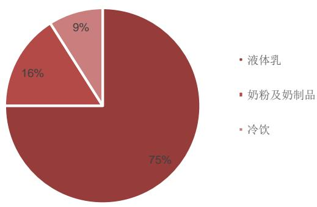
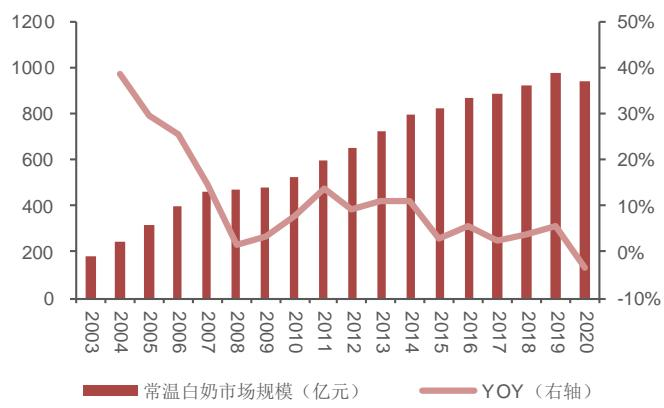
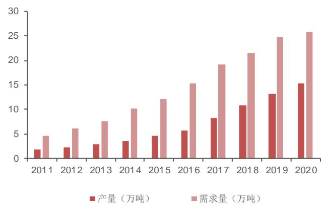
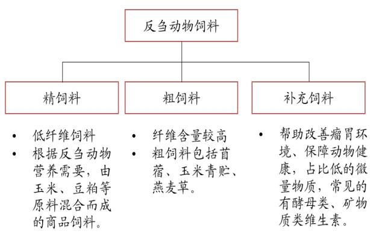
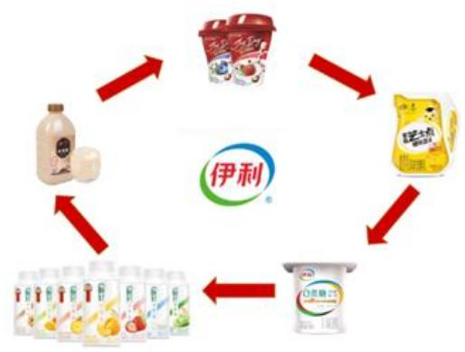
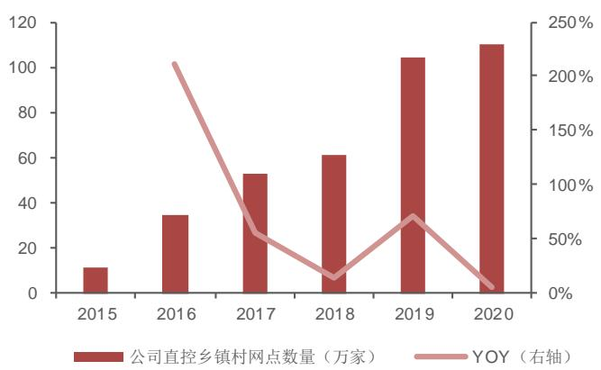

# 产品升级叠加费用率下降，盈利能力持续提升

# 投资要点

$\bigcirc$ 推荐逻辑：1、疫情后常温白奶需求上升，行业销量增速加快，在消费升级的驱动下，高端液态奶增速达15%左右；同时，各细分品类有所分化，常温液态奶稳定增长、低温鲜奶快速增长、奶粉和奶酪国产化进展顺畅，未来空间广阔。2、原奶周期长期趋缓，乳业上下游绑定加深，在常温奶竞争格局稳定的大背景下，乳企费用投放更加理性，龙头企业盈利能力有望持续提升。3、公司常温奶业务保持领先地位，金典、安慕希大单品在细分市场中份额分别为 44.7%、54%，且处于持续提升中。同时，积极布局低温鲜奶、奶粉、奶酪业务，呈现爆发式增长，在产品结构升级、费用投放趋缓的背景下，公司盈利能力快速提升，2021年前三季度，公司净利率达到 15.3%，同比提升 0.8pP，未来有望保持稳定提升的态势。

$\bigcirc$ 乳制品行业需求旺盛，产品持续升级，细分品类有所分化。1、疫情后消费者健康意识增强，下游需求量迅速上涨，以基础白奶为代表的液态奶呈现拐点式向上的趋势，销量增速提升至10%左右；受益于消费升级，以金典、特仑苏为代表的高端液态奶需求大幅增加，增速达到 15%左右，行业呈现量价齐升的态势。2、各细分赛道有所分化，行业空间广阔：常温奶进入成熟期，竞争格局稳定，价格战趋缓。巴氏奶迅速扩容，国有奶粉品牌迎来发展窗口期，奶酪成为行业新增长点，酸奶、乳饮料和冷饮增速放缓。

$\bigcirc$ 原奶周期趋缓，费用率下降，龙头盈利能力提升。2018 年后，下游中小牧场逐步出清，100 头以上规模牧场奶牛存栏量占比达 64%，预计 2024 年将达到 92%。以优然和现代牧业为代表的大型牧场快速发展，上游新增养殖产能与下游绑定一致。同时，在新消费升级的驱使下，国内液态奶对于大包粉需求快速下降，国内生鲜乳需求增加，且以国内供给为主，原奶周期长期趋缓。在常温奶竞争格局稳定的背景下，下游龙头乳企费用投放将更加理性，乳企盈利能力有望提升。

• 产品结构升级为主旋律，不同细分品类加速布局。1、产品端：常温奶业务保持领先地位，金典、安慕希销售额突破 200亿元，市场份额持续提升。产品结构不断升级，2020 年常温高端产品零售额占比已达到 50%以上。同时，全面进入乳制品细分赛道，低温鲜奶呈爆发式增长，2021 年前三季度同比增长 $200 \%$ ；加速布局奶粉业务，大单品金领冠率先完成配方升级，销量显著上升，2022 年初增速达到 30%；奶酪保持较快增速，常温奶酪棒强势破局，有望成为新增长点。在乳企高端化升级有错位，价格战缓和的大背景下，公司整体盈利能力持续提升。2、渠道端：公司渠道不断精耕下沉，产品已渗透至乡镇、农村市场，渗透率持续增长；随着线下空白网点填补、消费者复购率提升、线上、新零售渠道快速发展，未来销量有望大幅增加。3、品牌端：“奥运+综艺”双管齐下，高举高打，国民品牌形象深入人心。4、奶源端：公司加强对上游奶源的控制，参控股3家规模化牧场，充分保障原奶供应与原奶质量，协同性大幅提升。

• 盈利预测与投资建议。预计2021-2023 年归母净利润复合增长 22%左右，考虑到当前公司产品结构升级持续，费用投放理性，盈利水平有望持续提升，给予公司2022 年28倍估值，对应目标价46.76元，维持“买入”评级。

<table><tr><td>指标/年度</td><td>2020A</td><td>2021E</td><td>2022E</td><td>2023E</td></tr><tr><td>营业收入(亿元)</td><td>968.86</td><td>1103.73</td><td>1250.95</td><td>1405.54</td></tr><tr><td>增长率</td><td>7.38%</td><td>13.92%</td><td>13.34%</td><td>12.36%</td></tr><tr><td>归属母公司净利润(亿元)</td><td>70.78</td><td>85.33</td><td>106.60</td><td>127.11</td></tr><tr><td>增长率</td><td>2.08%</td><td>20.55%</td><td>24.93%</td><td>19.24%</td></tr><tr><td>每股收益EPS(元)</td><td>1.11</td><td>1.33</td><td>1.67</td><td>1.99</td></tr><tr><td>净资产收益率 ROE</td><td>23.25%</td><td>18.50%</td><td>20.30%</td><td>21.22%</td></tr><tr><td>PE</td><td>32</td><td>27</td><td>21</td><td>18</td></tr><tr><td>PB</td><td>7.53</td><td>4.97</td><td>4.37</td><td>3.83</td></tr></table>

数据来源：Wind，西南证券

# 西南证券研究发展中心

分析师：会振  
执业证号：S1250513110001  
电话：023-63786049  
邮箱：zhz@swsc.com.cn  
联系人：夏霁  
电话：021-58351959  
邮箱：xiaji@swsc.com.cn  
联系人：王书龙  
电话：023-63786049  
邮箱：wsl@swsc.com.cn  
联系人：舒尚立  
电话：023-63786049  
邮箱：ssl@swsc.com.cn

  
相对指数表现  
数据来源：聚源数据

<table><tr><td colspan="2">基础数据</td></tr><tr><td>总股本(亿股)</td><td>64.00</td></tr><tr><td>流通A股(亿股)</td><td>59.60</td></tr><tr><td>52 周内股价区间(元)</td><td>31.46-43.24</td></tr><tr><td>总市值(亿元)</td><td>2,396.85</td></tr><tr><td>总资产(亿元)</td><td>835.95</td></tr><tr><td>每股净资产(元)</td><td>5.74</td></tr></table>

# 相关研究

1.伊利股份(600887)：整体业绩再创新高，如期实现开门红 (2022-03-11)  
2.伊利股份(600887)：牵手澳优相得益彰，龙头优势持续巩固(2021-10-31)  
3.伊利股份(600887)：各类业务全面发展，盈利能力逆势提高(2021-09-01)

# 投资要件

# 关键假设

1、疫情后白奶需求上升，低线城市增长潜力充沛，同时，安慕希、金典两大单品不断更新迭代，产品结构高端化发展，量价齐升。预计2021-2023 年液态奶销量分别同比增长$9 \%$ $8 . 5 \%$ $7 . 5 \%$ ，吨价分别提升 $2 \%$ $1 . 5 \%$ $1 . 5 \%$ ，毛利率分别为 $3 4 . 4 \%$ $3 4 . 7 \%$ $3 5 . 0 \%$

2、公司不断发力奶粉业务，金领冠已全面完成配方升级，销量显著上升，同时，成人奶粉增长潜力巨大，整体有望充分享受奶粉行业国产替代红利。预计 2021-2023 年奶粉及奶制品销量分别同比增长 $30 \%$ 、 $28 \%$ 和 $2 5 \%$ ，吨价分别提升 $3 \%$ 、 $3 \%$ 和 $2 \%$ ，毛利率分别为$4 3 . 5 \%$ 、 $4 4 . 3 \%$ 和 $4 4 . 8 \%$

3、冷饮市场高端化趋势延续，产品不断升级，同时积极开拓东南亚市场，增长空间广阔。预计2021-2023 年冷饮销量分别同比增长 $5 \%$ $4 \%$ $3 \%$ ，吨价分别提升 $2 \% , 2 \% , 2 \%$ ,毛利率分别为 $4 8 . 2 \%$ 、 $4 8 . 7 \%$ 、 $4 8 . 9 \%$ 。

# 我们区别于市场的观点

市场的观点：1、常温奶进入成熟期，大单品安慕希增速放缓，常温奶业务很难再有高速增长；2、进口依赖与供需季节性差异导致原奶周期性强，伊利盈利能力或将受到原奶价格持续波动的影响。

我们的观点：1、常温奶虽已进入成熟期，保持稳定增长，但仍呈现量价齐升态势，驱动公司盈利水平进一步提升：疫情后常温奶需求大幅上升，基础白奶销量快速增长，低线城市成长空间广阔，同时，消费升级如火如茶，高端白奶增速亮眼，随着常温奶竞争格局逐渐稳定，价格战趋缓，大单品带动产品结构升级，公司盈利水平有望持续提升。2、我们认为原奶周期将逐步趋缓，伊利未来盈利能力受奶价波动的影响较小：随着中小牧场逐渐出清，以优然和现代牧业为代表的大型牧场快速发展，上游新增养殖产能与下游绑定一致，伊利已参控股3家规模化牧场，可根据自身需求匹配奶源，供需趋于平衡。同时，在新消费升级的驱使下，国内液态奶对于大包粉等需求快速下降，国内生鲜乳需求增加，且以国内供给为主，但由于奶牛数量增速放缓、新牧场进入壁垒高，供给难以快速增长，奶价周期将逐渐趋缓，未来伊利通过产品结构优化、理性买赠促销，盈利能力有望获得持续稳定增长。

# 股价上涨的催化因素

1、疫情后常温奶需求大幅上升，基础白奶增速达 $1 5 \%$ 左右，受益于消费升级，金典、安慕希为代表的高端液态奶增速领跑，达 $20 \%$ 以上。同时，公司直控乡镇村网点已达到110万家，低线城市成长空间广阔，销量有望大幅提升。2、上游奶价短期保持高位，长期周期趋缓，公司费用投放与奶价波动关系减弱，未来盈利有望持续稳增。

# 估值和目标价格

公司具有强大的产品矩阵支持以及良好的消费者基础，伴随着需求上升，产品结构持续优化，叠加品牌、渠道、奶源优势凸显，费用投放更加理性，整体盈利水平向上值得期待。参考可比公司 2022 年平均 PE 为24 倍，公司作为行业龙一，净利率稳步提升，ROE 常年保持 $20 \%$ 以上，优于同行，给予公司2022 年28 倍PE，对应目标价 46.76 元，“买入”评级。

# 投资风险

食品安全风险；行业竞争加剧风险；原奶价格波动风险。

# 目录

# ？行业规模稳步增长，细分品类有所分化.

# ：品牌、产品、渠道优势凸显，奶源巩固持续发展... 2

# ！费用投放边际递减，净利率有望持续提升... .42

# 盈利预测与估值. ..43

# 6 风险提示. ..46

# 图目录

图1：公司发展历程.. ..1图2：公司股权结构. …1图 3：公司 2015 年以来各个业务板块营业收入（亿元）3图4：公司2020年各业务毛利占比情况... …3图5：公司 2015 年以来营业收入及增速 …3图6：公司2015年以来归母净利润及增速， ………… …….图7：乳制品零售额及增速…. …… …图 8：乳制品零售销量与价格拆分情况.. …… …….4图9：国内乳制品消费量.. … …图 10：全球主要经济体人均液体奶消费量（kg/年）……4图11：居民人均奶类消费量（kg/年）. …… ….图12：疫情后消费者喝牛奶、酸奶意识增强.…. … …….图13：2014年以来高端、普通液态奶零售额占比… …5图14：各类乳制品零售额CAGR.… …图15：国内液态奶市场规模. …… …….6图16：2020 年乳制品行业收入构成. …… …图17：常温牛奶市场规模 …6图18：常温牛奶CR2 变化.. …6图 19：金典、特仑苏在饮用奶销售额的市占率持续提升…7图20：伊利、蒙牛母品牌在饮用奶销售额的市占率基本稳定.. … …7图21：常温酸奶市场规模（亿元） ….图22：2020 年常温酸奶市场竞争格局.. …… …图23：巴氏奶市场规模. ….8图24：2020 年巴氏奶市场竞争格局… …图25：新希望乳业产业布局8图26：光明乳业产品矩阵 …… …图27：2015-2020 年冷库行业容量及增长率… …图28：2015-2020 年中国冷藏车保有量及增长率… ……………………………… ….图 29：低温酸奶市场规模. …… ….图 30：常温、低温酸奶份额占比9图31：中国婴幼儿奶粉市场规模及增速. … …10图 32：2020 年奶粉品牌市占率情况…图 33：2017-2019年中国奶粉销售结构11图34：2016-2020年中国新生儿数量及增速.. ……图35：2015-2020年成人奶粉市场规模. .图36：2016年-2021年中国60岁以上人口统计情况. 1图37：中国奶酪产量、需求量情况... ….1图38：2020年主要国家人均奶酪零售额（美元） ………… …图39：2020 年我国零售奶酪市场竞争格局… ……………… ….1

图40：2015-2020年我国零售奶酪行业集中度不断提升. ….1图41：含乳饮料规模以上企业总产值.. …………………………… ….图 42：含乳饮料规模以上企业总产量. …… ….图 43：含乳饮料规模以上企业数（家）14图44：含乳饮料行业集中度变化.. ……………………  
图45：冷饮市场集中度…… 1 4图46：冷饮行业规模及增速. …………  
图 47：生鲜乳价格波动历程（元/kg）15图48：全国奶牛存栏量（万头) …… ….图49：全国奶牛年单产（kg）… …… ……1图 50：奶牛产奶周期.. …  
图51：奶牛饲料构成17图 52：豆粕现货平均价（元/吨）… …图 53：玉米现货平均价（元/吨) … …… ….17图54：国产首蓿、进口首蓿价格（元/吨）17图 55：2016-2020大包粉进口数量情况… …18图56：2016-2020 大包粉进口金额情况. …图 57：2008-2021全脂奶粉 GDT平均中标价（美元/吨) …1图 58：过去一年GDT 拍卖价格变动情况. 1 8图 59：全球原料奶产量..  
图 60：全球奶牛存栏量（万头）19图 61：原奶中菌落数量（万CFU/ml) …… ……图 62：原奶中体细胞数量（万CFU/ml）20图 63：按牧场规模划分的奶牛存栏量占比… ….图 64:：2020年我国活牛进口来源国21图 65：2010年以来我国进口活牛数量…  
图 66：伊利与同行业品牌渗透率对比情况… 2 3图67：21H1公司销售费用明细.… …23图 68：伊利成为冬奥会和冬残奥会官方唯一乳制品合作伙伴……23图 69：2010 年伊利携手上海世博会…… 3图70：液体乳收入及增速情况. .图 71：金典有机液体乳在细分市场中的份额24图72：金典系列产品矩阵.… … ….图73：安慕希系列产品矩阵. 2 5图74：2015-2020年公司量、价、结构升级贡献情况. ….25图75：常温高端产品销售额占比 25图76：2015-2020 年公司液体乳销量情况… 26图 77：2015-2020公司液体乳吨价情况26图78：金典系列产品迭代.. … …… .图79：安慕希系列产品迭代…… 28图80：伊利纯牛奶母品牌产品矩阵28图81：基础白奶产品升级，推出臻浓系列. ….图 82：15-20 年伊利低温酸奶子品牌零售额（百万元) …图83：低温酸奶产品矩阵. ….1图 84：2015-2020 年公司奶粉、奶制品收入及增速 ….图 85：2015-2020年公司奶粉、奶制品销量及吨价情况. … ….图86：伊利金领冠系列产品矩阵（均为1段) …………………………………………………………………………………… ….图87：伊利欣活系列对标中老年群体. ……… …图88：伊利成人奶粉产品矩阵.. …  
图 89：澳优产品矩阵… …33图 90：澳优全球化战略布局图………  
图91：伊利奶酪产品矩阵. ………… ….4图92：伊利冷饮系列产品…. ….图 93：2016年-2020年公司冷饮业务收入及增速…35图94：印度尼西亚冷饮市场规模.. …3 5图 95：泰国冷饮市场规模… …3 5图96：公司2018年以来经销商数量（个） 37图97：公司2015年以来直控村级网点数量与增速.. …3 7图98：公司成立多个事业部.. …… ….图99：伊利销售人员数量（人） …… …37图100：公司2015年以来常温液态奶渗透率. ……………… ….图101：公司直控乡镇村网点数量(万家) …3 8图 102：2020年我国液态奶渗透率分地区情况38图103：伊利液态奶终端网点数量（万家) …  
图104：2017-2019年公司母婴渠道零售额增速. ….9图105：2019年婴幼儿奶粉行业销售渠道占比情况. ….9图106：公司2015年以来线上与线下销售额增速… ………………………………………………… …3图107：电商收入增速 …… ….图108：020模式流程图. ….图109：伊利奶源分布情况  
图110：优然牧业牧场分布图… …… …图111：蛋白质含量（%) ….1图112：脂肪含量（%）  
图113：优然牧业牧场数量情况（个） ….图114：优然牧业牧场规模情况（万头) ….图115：公司2015年以来费用率情况.. ….图116：2020年同行业公司销售费用率 …图117：2020年同行业公司销售净利率对比. ….图118：2015年以来伊利销售毛利率、净利率.. ….图119：公司2015年以来ROE分拆..  
图120：公司2015年以来与同行样本公司ROE对比情况.. ….

# 表目录

表1：公司历年来股权激励情况. ……………………………… …….表2：2021年非公开发行股票募集资金情况， …… ….表3：近年来乳企菌种研发情况. …… ..1表4：奶粉行业相关政策， …11表5：主要乳企上游牧场布局情况（2021H1) …… ….表6：乳制品生产相关政策， ………………… ..表7：2020-2021 年公司赞助综艺情况.. ……表8：伊利鲜奶产品矩阵.… …… ….表9：巴氏奶、超级巴氏奶、UHT奶对比.. ……表 10：伊利与妙可蓝多常温奶酪棒对比情况……表11：伊利健康饮品情况. …… ….表12：分业务收入及毛利率. ……表13：绝对估值假设条件.. ….45表14：FCFF估值结果. …… ….表15：可比公司估值. … ….附表：财务预测与估值

# 1 乳业龙头底蕴深厚，步步稳增未来可期

深耕乳制品市场，战略目标高远。伊利股份成立于1993 年，前身为 1956 年成立的呼和浩特回民区养牛合作小组，1996 年于上交所上市。历经将近三十年的创新和发展，公司形成以液态奶业务为核心，奶粉、冷饮、奶酪等多种乳制品业务为支持的产品矩阵，成为中国规模最大及营业额最高的乳制品企业。2020 年实现营业总收入 969 亿元，即将迈入千亿新征程。公司战略目标高远，2025 年瞄准全球乳业前三，2030 年力争问鼎全球乳业。

  
图1：公司发展历程  
数据来源：公司官网，西南证券整理

股权结构稳定，管理层激励措施不断创新。公司前三大股东持股比例分别为 $1 5 . 0 1 \%$ $8 . 4 1 \%$ $4 . 4 8 \%$ ，其中，公司董事长潘刚先生自持股以来从未减持公司股权，股权结构稳定，同时彰显对公司长期向好发展的坚定信心。管理层合计持股 $8 . 0 6 \%$ ，并实施多期员工持股计划以及股权激励政策，实现高管、员工与股东利益一致，利于公司长期持续发展。此外，管理层人事稳定，核心高管均在各个事业部门积淀多年，经验丰富。

  
图2：公司股权结构  
数据来源：公司公告，西南证券整理

表1：公司历年来股权激励情况  

<table><tr><td>股权激励</td><td>第一期</td><td>第二期</td><td>第三期</td></tr><tr><td>计划时间</td><td>2006.11.28</td><td>2016.10.22</td><td>2019.08.06</td></tr><tr><td>人数</td><td>33</td><td>股权激励294人，限制性股票激励 293人</td><td>473</td></tr><tr><td>持股数量（万股)</td><td>5000</td><td>限制性股票1500；股票期权 4500</td><td>15243</td></tr><tr><td>占公司总股本比例（%)</td><td>9.68</td><td>0.99</td><td>3</td></tr><tr><td>初始行权价格/转让价格(元)</td><td>13.33</td><td>16.47（股票期权)；15.33（限制性股票）</td><td>15.46</td></tr><tr><td rowspan="2">存续期</td><td rowspan="2">8年</td><td>自股票期权和限制性股票授予之日起至所有</td><td>自限制性股票授予之日起至所有</td></tr><tr><td>股票期权行权或注销和限制性股票解锁或回 购注销完毕之日止，最长不超过48个月。</td><td>限制性股票解除限售或回购注销 完毕之日止，最长不超过72个月。</td></tr><tr><td>激励对象</td><td>总裁潘刚、总裁助理（赵成 霞、胡利平、刘春海）以及 其他核心骨干29人。</td><td>核心业务人员、核心技术人员。</td><td>董事、高级管理人员、核心技术（业 务）骨干及其他。</td></tr></table>

数据来源：公司公告，西南证券整理

定增募资120 亿元，液奶、奶粉优势巩固。2021 年12 月，公司以37.89 元/股的价格向 22 名对象定向发行 3.18亿股，募资 120 亿元。其中，液态奶生产基地、婴配粉智能制造项目、数字化建设分别拟使用募资金额 50 亿元、15.5 亿元、11 亿元，将进一步巩固公司在液态奶和婴配粉的优势，并通过数字化和信息化建设提高整体效率，支撑公司长远发展。

表2：2021 年非公开发行股票募集资金情况  

<table><tr><td>项目名称</td><td>项目投资金额 （亿元）</td><td>拟使用募集资金金额 （亿元）</td></tr><tr><td>液态奶生产基地建设项目</td><td>89.3</td><td>50.2</td></tr><tr><td>全球领先5G+工业互联网婴儿配方奶粉智能制造示范项目</td><td>21.2</td><td>15.5</td></tr><tr><td>长白山天然矿泉水项目</td><td>7.4</td><td>2.1</td></tr><tr><td>数字化转型和信息化升级项目</td><td>18.3</td><td>11.0</td></tr><tr><td>乳业创新基地项目</td><td>6.2</td><td>5.9</td></tr><tr><td>补充流动资金及偿还银行贷款项目</td><td>38.6</td><td>35.7</td></tr><tr><td>合计</td><td>181.0</td><td>120.5</td></tr></table>

数据来源：公司公告，西南证券整理

以液体乳业务为核心，奶粉、冷饮等业务协同发展。公司液体乳、奶粉及奶制品、冷饮三个主要业务板块过去五年营收 CAGR 分别为 $10 \%$ $1 4 . 9 \%$ $8 . 3 \%$ ，保持稳定增长。其中，液体乳是公司收入和利润的重要来源，2020 年营收与毛利占比分别达到 $7 9 . 8 \%$ 和 $7 5 . 3 \%$ 。同时，顺应奶粉行业国产品牌代替外资品牌的趋势，公司积极布局奶粉业务，其营收贡献比重持续提升。冷饮产品高端化发展，毛利率由2015 年的 $3 6 . 3 \%$ 提升至 2020 年的 $4 8 . 7 \%$ ,盈利水平显著提高。

  
图3：公司2015 年以来各个业务板块营业收入(亿元)  
数据来源：公司公告，西南证券整理

  
图4：公司 2020 年各业务毛利占比情况  
数据来源：公司公告，西南证券整理

业绩增长稳健，收入与利润规模均处于行业领先地位。在高端新品接连发力，产品结构升级的驱动下，公司营收与净利润均呈现稳定增长趋势，过去五年复合增速分别为 $10 \%$ 和$8 . 9 \%$ 。2017年后，公司提出千亿收入战略，加大销售力度，收入保持较快增速。2020 年后，疫情激发消费者健康意识苏醒，乳制品需求呈拐点式上升，公司实现高速增长，2021 年前三季度分别实现营收与净利润 847亿元和79亿元，同比增长 $1 5 . 2 \%$ 和 $3 1 . 2 \text{‰}$ 2022 年初，公司携手冬奥，实现高速增长，1-2月营业总收入达215亿元左右，同比增长 $1 5 \%$ 以上，利润总额达33亿元左右，同比增长 $20 \%$ 以上。

  
图5：公司2015 年以来营业收入及增速  
数据来源：公司公告，西南证券整理

  
图 6：公司2015 年以来归母净利润及增速  
数据来源：公司公告，西南证券整理

# 2 行业规模稳步增长，细分品类有所分化

乳制品行业规模稳步增长，各个细分赛道蓬勃发展。常温液态奶受益于疫情后消费者健康意识提高，需求不断上升，同时在消费升级驱动下，高端液态奶保持高速增长。低温巴氏奶呈爆发式增长，奶粉、奶酪集中度不断提升，随着新兴消费需求崛起，行业迅速扩容。在上游原奶供给趋于平衡，奶价周期趋缓的背景下，乳企费用投放将偏向理性，叠加产品升级趋势愈演愈烈，龙头乳企盈利水平有望持续提升。

# 2.1 需求上升催化销量增长，消费升级促进高端化发展

# 2.1.1疫情刺激需求上升，消费量增长空间广阔

乳制品行业规模稳步增长，疫情后需求不断上升。近五年，我国乳制品行业规模 CAGR为 $8 . 5 \%$ ，销量与吨价CAGR分别为 $5 . 6 \%$ $2 . 7 \%$ ，保持稳定增长。疫情后消费者健康意识提升，《新型冠状病毒感染的肺炎防治营养膳食指导》、《中国居民奶及奶制品消费指导》均建议民众每日摄入300g奶及奶制品，分别有 $2 5 \%$ $21 \%$ 的消费者认为应该喝牛奶、喝酸奶以改善身体健康，催化乳制品需求快速增长。以基础白奶为代表的液态奶呈现拐点式向上的趋势，销量增速提升至 $10 \%$ 左右，行业规模持续扩容。2021 年国内乳制品零售规模约为 5400亿元，同比增长约 $10 \%$ ，预计2025年零售规模将突破7000亿元。

  
图7：乳制品零售额及增速  
数据来源：优然牧业招股书，西南证券整理

  
图8：乳制品零售销量与价格拆分情况  
数据来源：欧睿，西南证券整理

我国乳制品人均消费量对标海外仍处低位，增长空间大。2020 年我国乳制品消费量达到3100 万吨，同比提升 $3 . 1 \%$ ，近五年复合增速约为 $1 \%$ 。从人均消费量来看，2020年我国居民液体奶消费量约为 $2 0 \mathsf { k g } /$ 年，远小于其他欧美国家，与饮食习惯相近的日韩也仍有一倍以上的差距。长期来看，我国人口基数庞大，在三胎政策出台、人口老龄化等因素的驱动下，乳制品消费量有望进一步增长。

  
图9：国内乳制品消费量  
数据来源：欧睿，西南证券整理

  
图10：全球主要经济体人均液体奶消费量（kg/年）  
数据来源：欧睿，西南证券整理

低线城市消费量增长空间巨大。2020 年，我国居民人均年奶类消费量 13kg/年，且城乡差距较大，农村居民人均消费量仅为城镇居民的不到一半。同时，2021 年农村居民人均可支配收入增速达 $9 . 7 \%$ ，高于城镇居民收入2.6pp，农村居民人均收入快速增长，在居民健康意识不断提升的背景下，低线城市乳制品消费量增长潜力巨大。

  
图11：居民人均奶类消费量（kg/年）  
数据来源：中国奶业统计资料，西南证券整理

  
图12：疫情后消费者喝牛奶、酸奶意识增强  
数据来源：益普索，西南证券整理

# 2.1.2 消费持续升级，高端化趋势明显

高端奶需求增速领先，乳企盈利能力提升。2021 年我国人均可支配收入达到 3.5 万元，近五年人均可支配收入复合增速为 $7 . 8 \%$ ，居民收入水平稳步提高，消费升级趋势明显，高端液态奶在液态奶零售额中的占比不断提升，2019年达到 $40 \%$ ，预计于2023 年超过一半。同时高端液态奶增速领跑，2014-2019 年乳制品、普通液态奶、高端液态奶零售额复合增速分别为 $5 . 6 \%$ $5 . 8 \%$ 、 $1 4 . 9 \%$ 。以低温奶为主的高端液态奶主要使用特色生鲜乳为原料，价格更高，能为乳企带来较高利润弹性。龙头乳企顺应消费升级趋势，纷纷推出高端化产品，价格带不断扩充，毛利率得到提升，未来盈利增长空间较大。

  
图13：2014年以来高端、普通液态奶零售额占比  
数据来源：优然牧业招股书，西南证券整理

  
图14：各类乳制品零售额CAGR

# 2.2 常溫奶步入成熟期，低温、奶粉、奶酪迅速扩容

液态奶占据半壁江山，各细分赛道持续扩容。从收入结构占比来看，2020 年牛奶、酸奶、婴幼儿奶粉占乳制品行业收入的比例分别约为 $42 \%$ 、 $2 6 \%$ $30 \%$ ，液态奶合计占比接近$70 \%$ 。从增速上看，液态奶近五年复合增速约为 $3 . 3 \%$ ，其中酸奶2015-2020 年 CAGR达$12 \%$ ，贡献主要液奶增量；婴幼儿奶粉仍保持增长态势，近五年CAGR约为 $7 \%$ ；奶酪则是近年来乳制品行业内增速最快的子板块，2010-2020 年CAGR 保持在 $20 \%$ 以上。

  
图15：国内液态奶市场规模  
数据来源：优然牧业招股书，西南证券整理

  
图16：2020 年乳制品行业收入构成  
数据来源：欧睿，西南证券整理

# 2.2.1 常温奶：竞争格局清晰，产品结构持续升级

常温白奶步入成熟期，疫情后需求快速增长。21 世纪初国内冷链运输尚不发达，长保的常温牛奶具备异地销售的条件，因而击败低温奶成为国内主流牛奶。经过二十余年的发展，常温牛奶已步入成熟期，过去五年复合增速约为 $2 \%$ 。2020 年后，疫情催化消费者健康意识提升，常温奶需求不断上升，以伊利为例，2020 年金典有机系列增速达 $3 5 \%$ 左右，且保持上升趋势，常温奶持续存在增长空间。

  
图17：常温牛奶市场规模  
数据来源：欧睿，西南证券整理

  
图18：常温牛奶CR2 变化  
数据来源：尼尔森咨询，西南证券整理

竞争格局稳定，高端品牌市占率持续提升。常溫奶市占率高度集中，2020 年常溫牛奶CR2 约为 $8 6 \%$ ，已形成伊利与蒙牛双寡头垄断的市场格局。2011-2021年，特仑苏、金典品牌的饮用奶市占率分别由 $2 . 6 \%$ 、 $1 \%$ 提升至 $9 . 5 \%$ 、 $8 . 5 \%$ ，高端化趋势明显；伊利、蒙牛母品牌的合计市占率由 2011 年的 $1 9 . 9 \%$ 略微下降至2021年的 $1 8 . 2 \%$ 。以特仑苏、金典为代表的高端品牌不断挤压中低端品牌的份额，实现快速成长，均已成为百亿大单品。市占率稳定叠加产品结构持续升级，未来乳企间激烈的价格战或将缓和，带来行业整体盈利能力的提升。

  
图19：金典、特仑苏在饮用奶销售额的市占率持续提升  
数据来源：欧睿，西南证券整理

  
图 20：伊利、蒙牛母品牌在饮用奶销售额的市占率基本稳定  
数据来源：欧睿，西南证券整理

常温酸奶市场规模迅速扩容，CR3 突破 $90 \text{‰}$ 2020年我国常温酸奶市场规模约为530亿元，过去五年复合增速约 $2 6 \%$ 。相较于低温酸奶约21天的平均保质期，常温酸奶6个月以上的长保质期有利于乳企全国范围内的运输与铺货。2009 年光明推出莫斯利安打开了常温酸奶的大门，安慕希、纯甄借助伊利、蒙牛强大的渠道在全国范围内市占率提升迅猛。常温酸奶主要通过包装及口味创新升级，相比常温牛奶仍处于升级初期，提升空间广阔。

  
图21：常温酸奶市场规模（亿元）  
数据来源：欧睿，西南证券整理

  
图22：2020 年常温酸奶市场竞争格局  
数据来源：欧睿，西南证券整理

# 2.2.2 低温奶：巴氏奶保持较快增速，竞争格局分散

低温鲜奶保持较快增速，市场竞争格局分散。2020 年我国巴氏奶市场规模约为 360 亿元，近五年 CAGR 为 $9 . 2 \%$ ，巴氏奶口感和营养价值普遍高于常温白奶，疫情后更受消费者欢迎。巴氏奶保质期仅约7-15天，且有运输半径限制，区域属性较明显，竞争格局分散，2020 年 CR3 仅 为 $28 \%$ 。随着我国冷链运输的持续发展，具备风味与营养方面竞争优势的巴氏奶将保持扩容趋势。

  
图23：巴氏奶市场规模  
数据来源：欧睿，西南证券整理

  
图24：2020年巴氏奶市场竞争格局  
数据来源：欧睿，西南证券整理

区域性乳企小而美，与全国性巨头错位竞争。由于巴氏奶保质期短，区域壁垒强，泛全国性乳企、区域性乳企更适合发挥区位优势，以低温品类深耕优势市场。光明、新乳业分别以“新鲜”、“鲜战略”作为发展重点，深耕优势市场的同时拓展周边，实现泛全国化扩张。光明、新乳业围绕主要销售市场进行奶源布局，缩短由生鲜乳到成品奶的生产时间；建设冷链物流系统，保障食品安全，满足低温奶“少量高频”的消费特点。区域性乳企掌握当地牧场、工厂、市场，在当地具备很强的品牌力，能充分发挥创新性。

  
图25：新希望乳业产业布局  
数据来源：公司公告，西南证券整理

  
图26：光明乳业产品矩阵  
数据来源：公司公告，西南证券整理

冷链普及、超巴奶助推龙头企业突破低温销售半径。未来巴氏奶扩容驱动因素主要有：1)从冷链物流来看，基础设施的普及有利于低温奶配送范围扩大、配送成本降低。2020 年，冷链物流市场规模超过3800 亿元，冷库库容近 1.8 亿立方米，冷藏车保有量约28.7 万辆，分别是“十二五”期末的2.4倍、2倍和2.6倍左右，巴氏奶的销售范围有望进一步扩大。2)从技术上看，国内已放开保质期45天的超巴奶生产许可，“超巴氏奶杀菌”技术的出现既保留了巴氏奶的口感，又为冷链运输争取了时间，使突破销售半径成为可能，解决奶源与市场不匹配的问题，有利于龙头乳企发力低温鲜奶业务。

  
图27：2015-2020 年冷库行业容量及增长率  
数据来源：中物联冷链委，西南证券整理

  
图28：2015-2020 年中国冷藏车保有量及增长率  
数据来源：中物联冷链委，西南证券整理

低温酸奶市场规模稳步提升，市场格局较分散。2020 年我国低温酸奶市场规模约为 420亿元，过去五年复合增速约为 $12 \%$ 。低温酸奶早在20 世纪 90 年代就进入在中国，但受制于冷链物流的制约，长期仅在城市范围内销售。截至2021 年前三季度，低温酸奶 CR3为$5 5 \%$ ，远低于常温酸奶，市场集中度较低。

  
图29：低温酸奶市场规模  
数据来源：欧睿，西南证券整理

  
图30：常温、低温酸奶份额占比  
数据来源：智研咨询，西南证券整理

高端升级 $^ { + }$ 菌种研发，顺应消费趋势。低温酸奶含“活性益生菌”，营养价值高，功能性强。目前我国低温酸主要在促进肠道健康方面发力，未来乳企有望在其他方面进行菌种研发，实现产品差异化。高端酸奶通过开拓新品味、升级配方，挖掘细分场景需求的方式，比如作为代餐、甜品等，提高产品竞争力。随着冷链运输的发展和渗透率的提升，我国酸奶消费有望打开低线城市和农村市场，销量进一步增长。

表3：近年来乳企菌种研发情况  

<table><tr><td>品牌</td><td>产品</td><td>菌种</td><td>特点</td></tr><tr><td>伊利</td><td>畅轻</td><td>A+BB复合益生菌</td><td>有效改善肠道微生态环境，提升肠道对营养的吸收功能</td></tr><tr><td>蒙牛</td><td>消健黃金益生元</td><td>保加利亚乳杆菌、嗜热链球菌等</td><td>增值肠道益生菌，激活益生菌的优佳活性</td></tr><tr><td>蒙牛</td><td>冠益乳</td><td>BB-12益生菌+益生元</td><td>有效促进肠道免疫力，提高肠道功能</td></tr><tr><td>光明</td><td>畅优植物乳杆菌饮品</td><td>植物乳杆菌ST-Il等</td><td>具有更高的肠道存活率，通畅效果更佳，同时增强免疫 力，降低血脂。</td></tr><tr><td>卡士</td><td>餐后一小时</td><td>卡式双歧杆菌C-I</td><td>有助于餐后消化</td></tr></table>

数据来源：天猫旗舰店，公司官网，西南证券整理

# 2.2.3 奶粉：国产化进展顺畅，行业集中度提升

内资份额显著提高，行业集中度上升。近五年，在国家政策支持与产品力提升的背景下，国产品牌奶粉市占率显著提高，内资品牌信任感逐步回归，行业呈集中化发展。2020 年CR5提升至 $5 0 . 7 \%$ ，CR10 提升至 $7 6 . 5 \%$ ，5年分别提升了14pp 和20.2pp。受益于政策支持、品牌力强劲、渠道优势等，国产品牌份额有望保持上升趋势。

配方注册 $^ { + }$ 新国标政策出台，中小企业加速出清。2022 年，市面上大多数产品将需要再次获得注册，并且新国标要求将会更加严格。对于国外厂商而言，海外疫情的严重性增加了配方注册审查难度，减缓了注册进程。对于部分中小厂商而言，面对激烈的市场竞争，若注册不成功将面临巨大的亏损。因此预计会有部分公司放弃二次注册，中小奶粉厂商和一些海外品牌进一步被淘汰，有利于奶粉行业产业结构升级，促进行业良性发展。

国产奶粉的品牌、渠道优势凸显。国产品牌渠道下沉速度更快，营销打法更贴近中国市场需求，更易根据国人体质量身定制产品。以飞鹤为例，飞鹤2020 年举办约70万场线上 $^ { . + }$ 线下活动，覆盖 600 万消费者，内容包括邀请育儿专家、营养师讲授孕期、育儿、产后护理知识，举办亲子类型的游戏比赛，品牌故事深入人心。

疫情影响进口。由于国外疫情爆发，国外厂商在生产上或遇到困难，从而影响产能，再加上国内疫情防控严格，进口奶粉时效性减弱，给国产品牌带来更多机遇。此外，国产品牌消费者教育充分，在疫情环境下，消费者心理上会更偏向于国产市场。

  
图31：中国婴幼儿奶粉市场规模及增速  
数据来源：欧睿，西南证券整理

  
图 32：2020 年奶粉品牌市占率情况  
数据来源：欧睿，西南证券整理

表4：奶粉行业相关政策  

<table><tr><td>时间</td><td>政策</td><td>政策说明</td></tr><tr><td>2013年</td><td>《进出口乳品检验检疫监督管理办法》、《关于进一 步加强婴幼儿配方乳粉质量安全工作意见的通 知》、《婴幼儿配方乳粉生产企业监督检查规定》</td><td>1）对奶粉对进出口提出相应要求；2）健全监管机制；3）禁止委托加工、 贴牌、分装等方式生产婴幼儿配方奶粉；4）规定了质量安全责任和对企 业的监督检查方式。</td></tr><tr><td>2016年6月</td><td>《婴幼儿配方乳粉产品配方注册管理办法》</td><td>我国对奶粉配方的管理由备案制改为注册制。办法规定，自2018 年1月 1 日起，未取得注册的婴幼儿配方乳粉产品将不得在境内销售。</td></tr><tr><td>2018年6月</td><td>《关于推进奶业振兴保障乳品质量安全意见》</td><td>1）到2020 年，奶业供给侧结构性改革取得实质性成效，100头以上规 模养殖比重超过 65%，奶源自给率保持在70%以上；2）到 2025 年，奶 液实现全面振兴，基本实现现代化。</td></tr><tr><td>2019年6月</td><td>《国产婴幼儿配方奶粉提升行动方案》</td><td>1）力争国内奶粉自给率达到60%以上；2）鼓励婴幼儿配方奶粉企业兼 并重组，淘汰落后产能，加快推进连续 3 年年产量不足1000 吨，年销 售额不足 5000 万元和其他落后企业进行改造升级。</td></tr></table>

数据来源：公司官网，西南证券整理

婴配粉“量增”放缓，重点推进高端化路线。新生儿数量减少促使婴配奶粉“量增”放缓，行业转向“价升”方向，产品高端化趋势显著。价格方面，2014-2018年，高端婴配奶粉价格复合年增速高出婴配奶粉整体均价 2pP；销售额方面，超高端奶粉、高端奶粉、普通奶粉CAGR分别为 $40 \%$ 、 $21 \%$ $5 \%$ ，超高端增速迅猛；市场份额方面，超高端和高端奶粉占比呈增长趋势，普通奶粉占比下降 20pP，预计2021 年超高端和高端婴配奶粉将反超普通婴配奶粉，成为行业主流。

  
图33：2017-2019 年中国奶粉销售结构  
数据来源：Frost&Sullivan，西南证券整理

  
图34：2016-2020 年中国新生儿数量及增速  
数据来源：国家统计局，西南证券整理

老龄化趋势演变，成人奶粉成发展新窗口。随着新生人口红利逐步消退，老龄化程度加剧，以60-70 后为主的人群消费开始崛起，成人奶粉具备增长潜力。我国成人奶粉市场从2009 年开始恢复缓慢增长，2021 年达到 220 亿。销量整体持平，价格增长将成为规模提升的主要动力。

  
图35：2015-2020 年成人奶粉市场规模  
数据来源：欧睿，西南证券整理

  
图36：2016 年-2021 年中国 60 岁以上人口统计情况  
数据来源：国家统计局，西南证券整理

# 2.2.4 奶酪：内资品牌崛起，有望成为行业新增长点

奶酪增速较快，有望实现量价齐升。奶酪市场迅速扩容，近五年CAGR 达到 $24 \%$ 。对标日韩国家，我国奶酪人均年消费量仅 $0 . 3 \mathsf { k g } .$ ，为日韩的1/10，随着对消费者教育不断深入，消费者习惯逐渐养成，消费场景进一步开拓，有望达成与日韩国家对标的体量。奶酪被誉为“奶中黄金”，营养价值更高，单位售价更贵，价格弹性明显。伴随着产品渗透率不断提升，未来量价提升空间广阔。

  
图37：中国奶酪产量、需求量情况  
数据来源：欧睿，西南证券整理

  
图38：2020年主要国家人均奶酪零售额（美元）  
数据来源：欧睿，西南证券整理

集中度不断提升，国产品牌崛起。目前我国奶酪行业仍以外资为主，CR10 中，中国品牌仅占 $23 \%$ 。近5 年行业集中度实现较大提升，CR5 从 $4 7 . 2 \%$ 提升至 $6 0 . 9 \%$ ，主要来自于国产品牌妙可蓝多的强势破局，2020 年妙可蓝多市占率提升 $7 . 3 \mathsf { p p }$ ，稳居第二。国产品牌主要以再制奶酪为主，再制奶酪可被制作成更易被接受的食品配料和奶酪零食，更符合中国消费者的口味偏好，同时国产品牌在本土化研制、渠道开拓、新媒体营销等方面有独特优势，预计未来国产品牌存在较大份额提升空间。

  
图39：2020 年我国零售奶酪市场竞争格局  
数据来源：欧睿，西南证券整理

  
图40：2015-2020 年我国零售奶酪行业集中度不断提升  
数据来源：欧睿，西南证券整理

奶酪零食化成为新消费趋势。奶酪品种众多，食用方式广泛，原制奶酪风味比较独特，国内消费者接受度相对偏低，因此，奶酪零食化成为新消费趋势，儿童奶酪类、奶酪休闲零食创新品类增多，2018 年妙可蓝多率先推出儿童奶酪棒，带动 C 端销量高双位数增长。儿童的消费习惯更容易养成，未来随着家庭消费能力增长、家长对儿童饮食营养关注度提高以及本土企业的投入布局，我国儿童奶酪将迎来发展红利期，带动奶酪全行业增长。

常温奶酪棒创新破局，成为新增长点。常温奶酪棒营养价值与低温相同，但能够打破冷链运输半径，为市场下沉提供便利，使渠道更加多元化，商超、学校店、休闲食品、烘培、社区团购等渠道均可以铺货。同时，销售形式更加丰富，在陈列方面可以实现收银台单支插盒陈列、端架挂条陈列、冰点陈列等等。此外，常温奶酪棒省去冷链运输成本，毛利提升，未来有望为奶酪行业迅速扩容提供动力。

# 2.2.5含乳饮料：逐步进入成熟期

含乳饮料已步入成熟期，增速保持稳定。我国含乳饮料起步于上世纪 80 年代，经历 30余年的发展现已进入成熟期，2018 年含乳饮料规模以上企业总产值约为900 亿元，同比增长 $8 . 5 \%$ ，2013-2018 年 CAGR 约为 $1 3 \%$ ；规模以上企业总产量持续增长，2018 年实现产量 1637 万吨，2013-2018 年 CAGR 约为 $1 1 \%$ 。随着消费者健康意识的不断增强，以及营养健康成为饮料行业的发展趋势，含乳量高且更具健康价值的含乳饮料仍具备广阔的发展空间。

  
图41：含乳饮料规模以上企业总产值

  
图42：含乳饮料规模以上企业总产量

数据来源：中国食品工业协会，西南证券整理数据来源：中国食品工业协会，西南证券整理

含乳饮料品类不断增多，市占率保持稳定。含乳饮料的概念宽泛，不同种类间的含乳饮料处于不同的成长周期，行业规模以上企业数仍在逐年增加。同时由于含乳饮料产品间的风味差异较大，不存在某一品牌大单品挤占大量其他产品市场份额的情况，含乳饮料行业 CR5与CR10 近年来均保持稳定。未来伴随着消费升级以及居民健康意识觉醒，优质含乳饮料仍有极大发展潜力。

  
图43：含乳饮料规模以上企业数（家）  
数据来源：中国食品工业协会，西南证券整理

  
图44：含乳饮料行业集中度变化  
数据来源：中国食品工业协会，西南证券整理

# 2.2.6 冷饮：趋向高端化发展

竞争格局分散，高端化发展趋势凸显。2010-2021 年，我国冷饮行业规模由 357 亿元增至645 亿元，CAGR为 $5 . 5 \%$ 。由于冷链基础设施限制，市场集中度较低，行业区域化程度较高，2019年CR5仅为 $3 4 . 4 \%$ 。近年来，随着冷链行业高速发展，冷链物流效率提升，预计冷饮行业集中度持续提升。此外，消费升级推动高端化发展，高品质、高颜值的冰淇淋或将成为未来行业发展新趋势。

  
图45：冷饮市场集中度  
数据来源：欧睿，西南证券整理

  
图46：冷饮行业规模及增速

数据来源：欧睿，西南证券整理

# 2.3 原奶价格保持高位，长期周期趋缓

2019 年至今奶价上涨至历史最高位，在消费者对乳制品需求快速上升、供给总量平稳增长、养殖和进口成本增加多个因素驱动下，原奶供不应求，价格有望保持缓慢上涨。长期看，随着中小牧场逐步出清，大型牧场与乳企匹配度提高，上游新增养殖产能与下游绑定一致。同时，活牛进口数量有限、牧场经营壁垒较高，原奶供给量难以快速增长，再加上以生鲜乳为原料制作的高端产品更受欢迎，带动原奶需求量上升，进口大包粉影响减弱，原奶周期长期将大幅趋缓。在常温奶竞争格局固化背景下，下游龙头乳企费用投放将更加理性，乳企盈利能力有望提升。

  
图47：生鲜乳价格波动历程（元/kg)  
数据来源：农业部，西南证券整理

# 2.3.1 原奶供不应求，奶价有望保持高位

# （1）上游供给平稳提升，供需缺口持续

奶牛存栏量持续下降后趋于稳定。国内奶牛存栏量自 2015 年起不断下降，主要由于国内环保政策收紧，散户和中小牧场逐渐退出，规模化牧场占比提升。2019 年下降至最低点610 万头，2020 年依然保持 615 万头的低位；根据 USDA 的预测，2021 年奶牛存栏量约为620 万头，基本保持稳定。

奶牛单产提升，短期内仍将供不应求。随着中小牧场退出和我国奶牛养殖规模化程度的快速提升，奶牛单产保持上升趋势，已从 2010 年的不到 5吨/年提升至 2020 年的 8.3吨/年。存栏量较低叠加奶牛单产提高，原奶供给量缓慢提升，预计短期内供需缺口仍将持续。

  
图48：全国奶牛存栏量（万头)  
数据来源：USDA，西南证券整理

  
图49：全国奶牛年单产(kg)  
数据来源：中国奶业统计资料，西南证券整理

奶牛由出生至产奶需 2年，补栏不会影响短期供给。奶牛出生后 13 个月可进行第一次受孕，孕期约 9.4 个月，产犊后泌乳期持续 10 个月，再次生产前 2 个月为干奶期，再生产后可进入第二个泌乳期，母牛平均寿命约 8 胎。奶牛补栏多为外购或进口年轻小牛，从补栏至产出需约2年，不会导致短期内原奶供给快速增长。

  
图 50：奶牛产奶周期  
数据来源：公司公告，西南证券整理

# （2）饲料价格支撑原奶价格维持高位

饲料价格保持较高水平，支撑原奶价格高位。奶牛饲料分为精饲料、粗饲料、补充饲料，其中玉米和豆粕等精饲料占奶牛每日饲料消耗量的 $4 0 \% - 5 0 \%$ 。2020 年下半年以来，玉米、豆粕等奶牛主要饲料价格持续上行后有所回落。截至2022 年3 月末，玉米、豆粕现货价分别为2.8 元/kg、4.7 元/kg，依然保持较高水平。饲料价格攀升带动奶牛饲养成本不断增长，从而支撑原奶价格维持高。

高品质苜蓿进口为主，价格持续上涨。苜蓿对提高奶牛产奶量和乳蛋白水平有重要作用。随着奶牛养殖规模扩大、大型牧场占比提高，高品质苜蓿需求快速增长。国产苜蓿多属于一级或二级，而优级或一级苜蓿多依靠进口，价格较高，成为牧场成本的重要组成部分。近年来，苜蓿价格维持上涨态势，2020 年国产、进口苜蓿价格分别为2200 元/吨、2493 元/吨，随着国产苜蓿品质提高，国产、进口价格差有所收窄。

  
图51：奶牛饲料构成  
数据来源：优然牧业招股书，西南证券整理

  
图52：豆粕现货平均价（元/吨)  
数据来源：中国饲料行业信息网，西南证券整理

  
图53：玉米现货平均价（元/吨）  
数据来源：中国饲料行业信息网，西南证券整理

  
图54：国产苜蓿、进口苜蓿价格（元/吨）  
数据来源：优然牧业招股书，西南证券整理

# （3）全球原奶产量平稳，大包粉拍卖价格上涨

大包粉进口量已达高点。除国产原奶外，进口大包粉也是国内乳制品重要的来源。大包粉进口呈量价齐升趋势，2020 年进口量98万吨，价格为 3361美元/吨，大包粉进口量和价格的过去五年复合增速分别为 $1 3 \%$ $8 \%$ 。按照1吨大包粉折合8.5吨原奶换算，2020年进口大包粉对应原奶 832 万吨，对国内原奶供需关系影响较大。全球原奶产量平稳叠加国内产品结构升级，大包粉进口价格上涨，不再对国产原奶形成价格冲击。

  
图55：2016-2020 大包粉进口数量情况  
数据来源：智研咨询，西南证券整理

  
图56：2016-2020 大包粉进口金额情况  
数据来源：智研咨询，西南证券整理

拍卖价格保持高位，进口大包粉已无价格优势。2020 下半年以来，在疫情催化下，乳制品需求强劲，推动大包粉拍卖价不断上涨，全脂奶粉GDT拍卖最高价突破4300 美元/吨，2022 年1 月依然保持 4082 美元/吨的高位。考虑到汇率、国际运输成本、清关仓储费等因素，相较国内生鲜乳没有明显的价格优势，不再形成价格冲击。此外，乳制品价格均保持上涨，GDT主要品种过去一年拍卖价格均有不同程度的向上波动，乳制品需求总体较好。

  
图57：2008-2021全脂奶粉GDT平均中标价（美元/吨)

  
图58：过去一年GDT 拍卖价格变动情况  
数据来源：GDT，西南证券整理

数据来源：GDT，西南证券整理

全球原奶供给总体平稳。2020 年下半年起，全球原奶主产国合计产量增速减缓，根据CLAL 统计，2020 年欧盟、美国、新西兰原奶产量增速分别为 $1 . 6 \%$ $2 . 2 \%$ $0 . 4 \%$ ，奶牛存栏量增速分别为 $- 1 . 2 \%$ ， $0 . 4 \%$ $- 2 . 7 \%$ 。近年来，全球原料奶产量和奶牛存栏量均保持低个位数增长，2018年原料奶产量约 8.4 亿吨，2021 年奶牛数量约1.4 亿头，USDA 预计2021年原奶主产国合计奶牛存栏量略微下降。总体看，全球原奶供给总体稳定，短期不会大幅增长。

  
图59：全球原料奶产量  
数据来源：FAO，西南证券整理

  
图60：全球奶牛存栏量(万头)  
数据来源：智研咨询，西南证券整理

# 2.3.2 原奶长期无周期或大幅趋缓

# （1）中小牧场出清，行业集中度持续提升

牧场及乳企上下游匹配性提高，供需将趋于平衡。中游乳制品生产企业依赖上游牧场的原奶供应，为稳定原奶供应量与原奶品质，乳企积极推动上下游一体化，加强对上游奶源的控制。当前，排名靠前的乳企及牧场大多已形成参控股或战略合作关系，牧场及乳企上下游匹配性提高。随着生鲜乳上下游企业合作逐步深化，乳企可掌控的奶源比例将逐渐提升，上游新增养殖产能与下游绑定一致，协同性凸显。

伊利：实际控制优然牧业，通过优然牧业收购赛科星、恒天然中国牧场，通过Wholesome Harvest Limited 收购中地乳业。优然牧业是国内规模最大的牧场，奶牛存栏量及单产均为行业领先，可提供优质生鲜乳及娟姗奶、DHA奶、A2奶、有机奶等特色生鲜乳， $90 \%$ 以上的生鲜乳向伊利销售。

蒙牛：实际控制现代牧业，间接持股中国圣牧，并与原生态牧业达成战略合作。现代牧业产量规模为国内第二，已收购中元、富源。现代牧业奶源品质高，已连续八年获得世界食品品质评鉴大会金奖。

光明：通过光明牧业、江苏辉山乳业及辉山牧业、与原生态牧业战略合作等方式完善奶源布局，深耕以上海为中心的华东市场。

表5：主要乳企上游牧场布局情况（2021H1）  

<table><tr><td>乳企</td><td>牧场</td><td>控制方式</td><td>牧场数量</td><td>奶牛存栏量（万头)</td></tr><tr><td rowspan="2">伊利</td><td>优然牧业（9858.HK)</td><td>持股 35%</td><td>73</td><td>37.6</td></tr><tr><td>中地乳业</td><td>子公司收购</td><td>9（2020年）</td><td>6.9（2020年）</td></tr><tr><td rowspan="4">蒙牛</td><td>现代牧业（1117.HK)</td><td>持股 51.4%</td><td>26</td><td>25.2</td></tr><tr><td>中国圣牧(1432.HK)</td><td>持股 29.99%</td><td>33</td><td>11.6</td></tr><tr><td>原生态牧业（1431.HK)</td><td>战略合作</td><td>7</td><td>7.2</td></tr><tr><td>富源牧业</td><td>持股43.35%</td><td></td><td>9</td></tr></table>

数据来源：公司公告，西南证券整理

大型牧场优势显著，与乳企深度绑定。消费升级趋势下，乳企更重视收购原奶的质量，规模化养殖可从根本解决质量问题。大规模牧场在牛群疫情防治、粪污处理、饲养方式等方面具有明显优势，生产效益更明显，三聚氰胺事件后规模化已成为明确发展趋势。以国内奶牛养殖两大龙头优然牧业、现代牧业为例，其所产原奶质量指标远远领先于欧盟标准和国内标准，散养及小型牧场难以追赶。乳企与大型牧场已普遍达成深度合作，以参控股或商业合同方式绑定下游大型牧场，牧场根据乳企需求调节原奶产量。

中小牧场生存空间有限，整合发展动力强。环保政策收紧、乳企收购标准提高等因素限制中小牧场的发展。蒙牛已不再向 10吨/天以下的小奶站收奶，未来仍将提高奶站数量和质量门槛，中小牧场将进一步出清。为寻求稳定的生存空间，中小牧场有动力整合形成大型牧场，进入乳企深度合作体系，以实现长期持续发展。

  
图61：原奶中菌落数量(万CFU/ml)  
数据来源：公司公告，西南证券整理

  
图62：原奶中体细胞数量（万CFU/ml)  
数据来源：公司公告，西南证券整理

散户和中小牧场加速退出，我国牧场仍高度分散。过去，我国牧场经营多为依靠资源消耗的粗放型模式，对水源、土壤、空气造成污染，产生环保问题。近年来，环保政策不断收紧，多家乳企和牧场因环保处理不合格被处罚甚至搬迁关停，倒逼牧场转型；2018年起《环境保护税法》实施，对不能进行粪污综合化利用、向环境直接排放污染物的养殖场征收环保税，进一步提升养殖成本，使散户和中小牧场加速退出。

大型牧场主导地位凸显，生鲜乳供需匹配度提升。我国100 头以上规模牧场奶牛存栏量占比由 2014年的 $45 \%$ 提升至2019年的 $64 \%$ ，预计2024 年将达到 $92 \%$ ；1000头以上大型牧场奶牛存栏量占比由2014年的 $20 \%$ 提升至2019年的 $41 \%$ ，预计2024 年将达到 $5 5 \%$ o大型牧场多和乳企深度合作，可根据乳企需求调节生鲜乳产量，使整体供需匹配度提升；由散户非理性引起的供给波动将影响有限。

  
图 63：按牧场规模划分的奶牛存栏量占比  
数据来源：优然牧业招股书，西南证券整理

# （2）新牧场进入壁垒高，供给难以快速增长

奶牛进口数量有限，扩群依赖国内繁育。我国活牛进口来源国仅有澳大利亚、新西兰、智利、乌拉圭四地，2020 年进口数量占比分别为 $53 \%$ 、 $3 8 \%$ 、 $5 \%$ $4 \%$ 。国内每年奶牛进口数量仅约 10万头，2023 年起新西兰将全面停止活畜出口，禁令实施后，新建牧场难度将进一步提高，奶牛数量扩张将更依赖于国内繁育。当前，我国奶牛种质资源已具备一定基础，随着育种水平的提升，自繁奶牛供给能力将逐步增强，每年自繁数量约为 $5 \%$ 。

  
图64：2020 年我国活牛进口来源国  
数据来源：中国海关，西南证券整理

  
图65：2010 年以来我国进口活牛数量  
数据来源：中国海关，西南证券整理

上游牧业经营壁垒高，中小散户难以快速进入。综合看，由于牧业的高壁垒，大型牧业集团更占优势，中小型牧场不会大量新增，再出现由于中小牧场非理性扩张而引起原奶供过于求的可能性较小。大型牧场建设壁垒较高，以新建万头牧场为例，需要5亿元资金和2 万亩耕地支持，同时需要满足环保、防疫等要求，对于中小散户而言较为困难。同时，进口奶牛数量仅 10 万头，且主要进入大型牧业集团，新牧场可买到的牛群数量有限。此外，牧业需要较强的经营管理能力，中小牧场在养殖技术、管理系统、财务系统等方面难以与大型牧业集团抗衡，处于竞争劣势地位。

# （3)消费结构变化，国内生鲜乳需求扩大

大包粉使用场景减少，消费者偏好生鲜乳产品。大包粉由鲜奶经消毒、脱水、喷雾干燥制成，适合长时间保存，但在营养成分、安全指标等方面不及生鲜乳。因此，高端产品一般使用生鲜乳制作，大包粉难以完全替代国内原奶。2018 年，《国务院办公厅关于推进奶业振兴保障乳品质量安全的意见》指出，鼓励使用生鲜乳生产灭菌乳、发酵乳和调制乳、婴配粉等乳制品。随着消费结构升级，消费者逐渐认识到复原乳与生鲜乳的区别，国内原奶收购需求将进一步增加。

表6：乳制品生产相关政策  

<table><tr><td>时间</td><td>政策文件</td><td>主要內容</td></tr><tr><td>2005</td><td>国务院办公厅关于加强液态奶生产经营 管理的通知</td><td>在巴氏杀菌乳生产中不允许添加复原乳，大力提倡和鼓励在灭菌乳生产中全部使用生 鲜乳。复原乳产品投产前需向当地质量技术监督部门备案。使用复原乳生产的产品， 需醒目标注“复原乳”。</td></tr><tr><td>2006</td><td>国务院关于促进奶业持续健康发展的意 见</td><td>深入宣传复原乳、巴氏杀菌乳、灭菌乳等科普知识，使消费者获得客观真实信息，维 护消费者合法权益。</td></tr><tr><td>2009</td><td>国务院关于当前稳定农业发展促进农民 增收的意见</td><td>要严格执行对转基因大豆（油)、菜籽（油）等产品以及生产加工过程中使用复原乳 的液态奶进行标识的有关规定，切实保障消费者知情权。</td></tr><tr><td>2018</td><td>国务院办公厅关于推进奶业振兴保障乳 品质量安全的意见</td><td>鼓励使用生鲜乳生产灭菌乳、发酵乳和调制乳等乳制品。大力提倡和鼓励使用生鲜乳 生产婴幼儿配方乳粉，支持乳品企业建设自有自控的婴幼儿配方乳粉奶源基地，进一 步提高婴幼儿配方乳粉品质。</td></tr><tr><td>2019</td><td>关于进一步促进奶业振兴的若干意见</td><td>鼓励使用生鲜乳生产灭菌乳、发酵乳、调制乳和婴幼儿配方乳粉等乳制品。</td></tr></table>

数据来源：国务院，西南证券整理

# 3品牌、产品、渠道优势凸显，奶源巩固持续发展

伊利历经三十余年发展，于国内上百家乳企中拔得头筹，并即将走向世界巅峰，其成功的背后既有强大的产品矩阵作为支撑，又有品牌、渠道以及奶源方面的独特优势。品牌上，公司营销策略高举高打，国民形象深入人心，已经充分渗透到消费者的生活中。产品上，公司常温奶产品优势地位稳固，结构持续优化，价格带不断扩充；并积极布局低温、奶粉、奶酪，呈爆发式增长；产品矩阵完备，有力支撑盈利水平稳步提升。渠道上，线上线下齐头并进，渠道网络遍布全国，并精耕下沉，渗透率不断提升，有望受益于农村居民可支配收入增长以及三四线城市消费升级，销量增长空间广阔。奶源上，伊利掌握多家优质上游牧场，可根据自身需求调节上游原奶产量，原奶供应充足，成本受奶价波动影响减弱，费用投放更加理性。同时，规模化牧场奶源更加特色优质，充分保障公司产品高端化发展。

# 3.1品牌领跑行业，国民形象塑造成功

品牌建设高举高打，品牌渗透率稳步提升。公司采用线上线下多场景广告营销的策略，加强消费者与品牌之间的互动，加深消费者体验感，提高消费者对品牌的认知度。线下，公司选择在候车亭、公交车身、机场高铁LED等人流量密集地区海量投放广告；线上，公司精准捕捉时事热点，充分利用微博、小红书、短视频等社交媒体展开社交互动，实现品牌全方位渗透。大量的广告营销带来公司品牌价值提升，2021 年公司凭借 $9 2 . 2 \%$ 的品牌渗透率、近13亿的消费者触及数，连续7年位列中国市场消费者选择最多的品牌榜榜首。

  
图 66：伊利与同行业品牌渗透率对比情况  
数据来源：欧睿，西南证券整理

  
图67：21H1公司销售费用明细  
数据来源：公司公告，西南证券整理

联手国际化活动，品牌高度提升。一方面，伊利已经携手相伴奥运 17 年，长时间与奥运共舞，深刻传递了健康生活的价值观，使得消费者潜移默化形成与伊利品牌的精神共鸣。另一方面，伊利携手世博会，走向国际舞台，向世界深度诠释乳制品行业以及品牌理念，已然成长为中国食品行业的代表，品牌力得到有效增强。

  
图 68：伊利成为冬奥会和冬残奥会官方唯一乳制品合作伙伴  
数据来源：公司公告，西南证券整理

  
图 69：2010 年伊利携手上海世博会  
数据来源：公司公告，西南证券整理

联名IP赋能品牌，品牌热度不断攀升。公司推出丰富多样的联名产品，与热门 IP 绑定，吸引了大批潜在消费者。以冬奥为例，公司产品增加奥运冠军团队定制包装，受益于冠军效应，纯牛奶电商平台端销量同比夏奥定制装增加 $60 \%$ ，鲜牛奶 1-2 月同比增长 $70 \%$ 以上。同时推出奶酪棒冬奥吉祥物版、冷饮非常熊猫版、小白袋冰墩墩版，伴随着冰墩墩迅速走红，以上产品均实现了环比 $1 5 \%$ 以上的增长。此外，公司将品牌植入各种综艺节目中，并邀请著名流量明星代言，充分利用粉丝效应，进一步锁定年轻消费者，提高品牌热度。

表7：2020-2021 年公司赞助综艺情况  

<table><tr><td>时间</td><td>产品</td><td>节目</td></tr><tr><td rowspan="7">2020年</td><td rowspan="3">金典</td><td>《乘风破浪的姐姐》</td></tr><tr><td>《天赐的声音》</td></tr><tr><td>《漫游记》</td></tr><tr><td>甄稀冰淇淋</td><td>《让生活好看》</td></tr><tr><td>金领冠奶粉</td><td>《妻子的浪漫旅行3》</td></tr><tr><td>巧乐滋</td><td>《喜欢你，我也是》第二季</td></tr><tr><td>安慕希</td><td>《爆款来了》第二季</td></tr><tr><td rowspan="4">2021年</td><td rowspan="4">金典</td><td>《披荆斩棘的哥哥》</td></tr><tr><td>《歌手》</td></tr><tr><td>《脱口秀大会4》</td></tr><tr><td>《德云笑社》</td></tr><tr><td></td><td>谷粒多 安慕希</td><td>《中国好声音》</td></tr></table>

数据来源：公司官网，西南证券整理

# 3.2 产品矩阵完备，结构持续优化

伊利在乳制品行业各个细分领域均有布局，产品线完备，能够充分满足消费者对基础产品和高端产品的不同需求。其中，常温奶营收占公司总营收的 $80 \%$ 以上，是公司持续稳增的核心驱动力，产品结构升级趋势明显，有望保持稳定增长。低温奶与奶酪把握新消费趋势，取得了翻倍的增长。公司持续加码奶粉业务，并战略入股澳优，实现差异化、高端化发展。

# 3.2.1 常温奶：产品结构高端化，大单品迭代升级

# （1）常温赛道龙头稳固，产品矩阵定位清晰

常温业务扎实稳打，龙头地位进一步巩固。常温业务作为公司最大营收来源，一直保持稳定增长，为伊利在乳制品行业的稳定发展打下了坚实基础。截至2020 年，伊利常温奶市占率已达到 $40 \%$ 以上，龙头地位稳固。常温白奶与常温酸奶齐头并进，2021H1 伊利常温白奶销售额同比增长 $20 \%$ 以上，2020 年常温酸奶市场份额提升 $3 . 2 { \mathsf { p p } }$ ，达到 $6 3 . 1 \%$ 。

  
图70：液体乳收入及增速情况  
数据来源：公司公告，西南证券整理

  
图71：金典有机液体乳在细分市场中的份额  
数据来源：公司公告，西南证券整理

产品矩阵完备，全方位覆盖市场。公司常温奶产品主要包括常温白奶与常温酸奶两大类。常温白奶中：1)金典定位高端市场，2021 年营收规模占公司液态乳总营收的 $20 \%$ 以上，2022年1-2月金典增速保持 $20 \%$ 以上，是公司产品高端化以及液态奶营收持续稳增的核心驱动力之一。2）基础白奶包括伊利纯牛奶与臻浓纯牛奶两大系列，定位大众化市场，主打大众消费，是扩大伊利牛奶受众的主力之一，2021 年营收规模占液态乳总营收 $23 \%$ 。疫情后由于消费者对基础白奶需求上升，基础白奶销量呈拐点式增长，2022 年1月增速达到 $1 5 \%$ 左右。常温酸奶中：安慕希定位高端市场，在细分品类中市占率高达 $54 \%$ ，遥遥领先于纯甄和莫斯利安，品牌力强劲。

  
图72：金典系列产品矩阵  
数据来源：公司公告，西南证券整理

# （2）大单品培育能力突出，有力推动产品升级

  
图73：安慕希系列产品矩阵  
数据来源：公司公告，西南证券整理

产品结构不断升级，高端化驱动量价齐升。近年来，公司产品结构发生明显变化，主推重点从基础白奶逐渐往高端白奶、高端酸奶过渡，常温高端产品零售额占比已从 2013 年的$30 \%$ 提升至2020年的 $50 \%$ 以上。各个子产品内部也同步进行高端化结构调整，金典系列的梦幻盖、有机、娟姗、进口等高端产品占到 $20 \%$ 以上。从公司近五年常温的销量、价格、结构调整贡献拆分来看，结构升级始终保持营收正贡献，是公司盈利提升的持续动力。随着高端化进程稳步推进，公司液体乳呈现量价齐升趋势，近5 年公司液体乳销量、吨价CAGR分别为 $7 . 1 \%$ $2 . 7 \%$ 。未来随着公司产品结构持续优化，大单品迭代升级，销量有望持续增长，盈利水平不断提升。

  
图74：2015-2020 年公司量、价、结构升级贡献情况  
数据来源：公司公告，西南证券整理

  
图75：常温高端产品销售额占比  
数据来源：欧睿，西南证券整理（注：高端产品包括金典、安慕希、味可滋、畅轻、每益添、JoyDay)

  
图76：2015-2020 年公司液体乳销量情况  
数据来源：公司公告，西南证券整理

  
图77：2015-2020公司液体乳吨价情况  
数据来源：公司公告，西南证券整理

大单品引领产品升级，盈利水平进一步提升。公司始终将金典、安慕希作为核心大单品倾力打造，通过不断的产品升级、品牌塑造与资源倾斜，两只大单品销售额已分别超过200亿元，占比将近 $50 \%$ ，为公司营收做出了巨大贡献。产品升级带来价格提升，充分缓解了上游原奶价格走高的压力，整体盈利能力保持向上趋势。

# 金典系列主要通过营养价值和包装规格两个方面进行产品升级，实现了品类多元化，价格带进一步拓宽，充分满足不同层级消费者的需求。

包装迭代升级：金典产品推广以梦幻盖为主，基础性包装和梦幻盖包装并存，其中梦幻盖的销售占比已从 $21 \%$ 提高到 $30 \%$ 。梦幻盖的推广为伊利带来了更大的利润弹性：1）梦幻盖售价与毛利率均高于基础款，兼具送礼与自饮双重性质，在消费升级大背景下，销量保持上升趋势；2）梦幻盖方便携带饮用，进一步丰富饮用场景，深受消费者亲睐，整体盈利能力有望持续增长。

营养价值提升：金典系列营养价值不断提升，不断推出娟姗纯牛奶、A2 酪蛋白有机纯牛奶等特色产品，乳铁蛋白含量从 $3 . 5 9 / 1 0 0 \mathsf { m l }$ 提升至 $4 . 0 9 / 1 0 0 \mathrm { m L }$ ，充分满足消费者对高端液态奶的需求。2020 年，梦幻盖、有机、娟姗、进口等特色产品已占金典品牌的 $20 \%$ 以上。2021年金典创新推出超滤牛奶系列，采用前沿超滤技术，营养价值远高于其他产品，价格较高，未来随着消费者教育更加深入，有望带来强劲增量。

与特仑苏相比有错位：特仑苏系列侧重在基础款和特色款中发力，累计推出了3种基础款、4种特色款，旨在满足消费者不同口味与特色需求。金典系列则侧重于有机系列，累计推出4种有机奶，能够充分满足消费者对高端液态奶营养价值方面的需求。且金典基础款下沉速度更快，随着消费者的即饮需求逐步提升，金典销售额持续保持较高增长。

  
图78：金典系列产品迭代  
数据来源：公司官网，天猫旗舰店，西南证券整理

安慕希系列主要通过挖掘细分口味、包装更迭两种方式实现产品升级，开拓不同消费场景。近年来安慕希体量不断增大，2021 年规模已经超过 200 亿元，在白奶需求更加旺盛的背景下，安慕希保持个位数增长。随着安慕希品牌力不断增强，PET瓶装、利乐冠系列的口味不断出新，应用场景进一步丰富，未来有望突破双位数的增长。

口味迭代：安慕希从“原味”和“果味”拓展到“果味” $^ +$ “谷物”再到“果粒 $^ { + }$ 果肉”，口味不断丰富，充分满足了消费者对美味与营养的双重需求。2021 年推出菠萝口味、丹东草莓口味，其菠萝口味半个月销售额达到 2亿元，深受消费者亲睐。此外，公司推出AMX零蔗糖系列，满足消费者多元化的健康需求，延长安慕希的生命周期。

包装升级：伊利陆续推出开盖利乐冠、PET瓶装、勺吃等系列产品，丰富饮用场景。包装的更迭带来销量迅速增长：1）可以攻破常温酸奶PET包装技术痛点，延长常温酸奶产品保质期，消费者接受程度更高。2）升级后的产品更加流行时尚、便于饮用，适合年轻人的消费潮流。

产品升级尚有空间：安慕希作为功能性常温酸奶，可以进一步开拓酸奶的不同属性，从营养价值、消费场景方面升级发力；再加上果味细分种类众多，还有待进一步挖掘；因此，预计安慕希产品矩阵的延展空间较大，价格带有望扩充。

  
图79：安慕希系列产品迭代  
数据来源：公司官网，天猫旗舰店，西南证券整理

基础白奶在营养价值、包装规格方面进行升级，量价齐升。基础白奶方面，公司抓住疫情恢复与大健康时代需求快速上升的机遇，迅速切换包装规格实现价格提升，补充品类带动销量增长，2022 年初增速达到 $1 5 \%$ 以上。1）纯牛奶方面，增加袋装纯牛奶，降低包材成本，利润弹性大幅度提高。2)2017 年推出基础白奶臻浓系列，其各个营养成分均高于伊利纯牛奶，价格相比高端产品更加实惠，疫情后更受消费者欢迎，辅以渠道下沉效果显著，销量快速增长，两年内规模达到40多亿元。3）根据消费者多元化需求，公司推出不同包装规格，变相提升产品价格，盈利水平持续提升。

  
图80：伊利纯牛奶母品牌产品矩阵   
数据来源：公司公告，西南证券整理

  
图81：基础白奶产品升级，推出臻浓系列  
数据来源：公司公告，西南证券整理

# （3）量价提升空间广阔，盈利有望持续稳增

顺应消费升级，需求量有望上升。在消费者健康意识觉醒的大背景下，常温白奶需求不断上升。同时，伴随着人均可支配收入提高，高端白奶自饮比例持续提升，送礼需求不再占据主导，新消费习惯逐渐养成。金典基础款的价格一直稳定在消费者容易接受的范围内，随着消费者教育不断深入，未来有望实现高端基础款大众化，销量稳步增长。

大单品品牌效应凸显，推新能力强。公司通过多种广告营销方式将安慕希、金典推向市场，品牌力保持领先，其新品频频引爆市场。安慕希芝士波波球上市一年规模就达到 20 多亿元，增速远甚于其他品类。同时，经销商推广大单品的积极性强，形成良性循环。未来随着安慕希、金典产品升级迭代，其规模将不断扩大。

高端化发力有错位，竞争趋势或将缓和。从液体乳整体高端化方向来看，蒙牛侧重发展低温鲜奶领域，伊利选择在常温领域持续发力，进一步扩充大单品的口味与包装，两者竞争逐渐错位。同时，随着伊利、蒙牛常温奶竞争格局趋于稳定，双方费用投放边际效益递减，纷纷转向产品升级，更看重利润的提升，未来两家的价格战或将缓和。此外，伊利与蒙牛占据常温大半江山，相对区域性乳企有显著品牌优势、渠道优势，竞争趋缓有助于两家更好的发挥优势，进一步提高盈利水平。

产品结构升级，提价空间广阔。虽然原奶价格持续上涨，但伊利并未大规模参与本轮提价周期，而是多以产品结构升级的方式间接提价，仅对基础白奶和部分低温酸奶进行小幅直接提价，相比其他食品企业，仍有很大提价空间。未来公司一旦实行更大范围、更大幅度的提价，可释放较大利润空间。

# 3.2.2 低温奶：加速布局低温鲜奶，冷链普及支撑成长

低温鲜奶增速较快，未来成长可期。伊利凭借强大的品牌优势，迅速开拓低温市场。采用母品牌赋能的方式，先后推出伊利鲜奶、臻浓系列鲜奶和金典鲜奶，定位不同层级的消费人群，满足消费者多元需求，实现了爆发式增长，2021 年前三季度低温鲜奶增速达到 $200 \%$ 。随着未来消费不断升级，有望借助渠道、品牌、产能等优势迅速突破百亿规模。鲜奶价格普遍高于常温白奶，利润空间大，有望成为新增长点。

表8：伊利鲜奶产品矩阵  

<table><tr><td>产品名称</td><td>产品图片</td><td>产品价格</td><td>保质期</td><td>产品定位</td></tr><tr><td>金典鮮牛奶</td><td></td><td>60元/780ml</td><td>15天</td><td>高端</td></tr><tr><td>伊利屋顶盒鲜牛奶</td><td></td><td>10元/450ml</td><td>15天</td><td>中端</td></tr><tr><td>伊利纯牛奶</td><td></td><td>40元/780ml</td><td>28天</td><td>低端</td></tr></table>

数据来源：天猫旗舰店，公司公告，西南证券整理

加速布局低温鲜奶，不断提升市场地位。近年来，公司从多个方面加速布局巴氏奶，金典、伊利母品牌下的巴氏奶产品均实现超过2倍增长，远快于行业，市场份额同比提升 $5 . 7 \mathsf { p p }$ 。

技术优势延长巴氏奶保质期，突破销售半径限制。2019 年，伊利推出 3款保质期在15-21天的巴氏奶，扩大了运输半径，降低了对本地奶源的限制，对订奶入户等特殊渠道依赖度较小，有利于发挥渠道优势。同时，伊利巴氏奶价格较普通巴氏奶更高，公司将消费人群锁定为一线城市白领，利润空间广阔。

低温渠道扩张：随着生鲜电商的崛起，低温渠道得到进一步发展，生鲜电商将为乳企充当“终端网点 $^ +$ 送奶工”角色，为巴氏奶提供了更多销售平台。

冷链体系完备：公司冷链体系采用可视化管理，实现 24 小时运输管控。冷罐车设备先进，严格实施温度调控。以低温酸奶为例，产品从出厂到销售终端，储运环境可全程保持在 $2 { - } 6 ^ { \circ } \mathsf { C }$ ，确保产品品质新鲜。

奶源与产能匹配，缩小运输距离：伊利牧场主要覆盖内蒙、宁夏、东北三省、安徽等地，形成北方及中部地区全面覆盖。此外，黄冈伊利的成立，标志着伊利南方“铁三角”的成型，进一步掌控南方市场。公司目前已经有5 个低温生产基地，率先完成了全国化布局。

表9：巴氏奶、超级巴氏奶、UHT奶对比  

<table><tr><td rowspan="2">产品名称</td><td colspan="2">巴氏杀菌奶</td><td rowspan="2">UHT</td></tr><tr><td>常见巴氏奶</td><td>超巴氏奶</td></tr><tr><td>杀菌温度</td><td>63-66 摄氏度保持 30 分钟 72-75 摄氏度保持 15-20 秒</td><td>125-138 摄氏度保持 2-4 秒</td><td>132-140 摄氏度保持 2-4 秒</td></tr><tr><td>是否有细菌残留</td><td>有</td><td>有</td><td>达到商业无菌</td></tr><tr><td>是否需要冷藏</td><td>需要</td><td>需要</td><td>不需要</td></tr><tr><td>产品保质期</td><td>一般 3-7天左右</td><td>15天以上</td><td>1.5-8个月</td></tr></table>

数据来源：公司公告，西南证券整理

伊利与区域乳企的低温鲜奶竞争策略分化，具备相对优势。区域性乳企市场与工厂距离近、销售周期短、本地品牌忠诚度高，因此主打保质期短（5-7天）的鲜奶产品，但产品品质受制于本地奶源。相对于区域乳企，伊利通过技术优势延长产品保质期，扩大销售半径，借助其各方面的优势，与区域乳企竞争。

奶源优势：伊利的奶源更优质，77%位于北方黄金奶源带，其规模化牧场占比达到$100 \%$ ，具备高品质性和独特性。  
品牌优势：伊利品牌力较区域乳企更强，多年积累的优质口碑，更受消费者亲睐。渠道优势：低温酸奶渠道已然发展完善，伊利可以借助已有的低温酸奶渠道迅速铺货，复制低温酸奶的成功。  
营销策略优势：伊利与诸多节目、爆款IP合作，充分实现线上线下整合传播品牌知名度，调动年轻客群的积极性，本地乳企品牌受制于品牌力影响，营销方式略逊色，品牌粘性或将下降。

低温酸奶产品矩阵完备，差异化新品支持跑赢行业。公司低温酸奶品类丰富，覆盖低、中、高端市场。其中基础低温酸奶发展进入成熟期，高端低温酸奶增速领先。2020 年公司高端低温子品牌畅轻、每益添、JoyDay 分别实现销售额 53、21、3亿元，近三年 CAGR分别为 $1 1 . 3 \%$ 、 $5 . 6 \%$ 、 $3 6 . 1 \%$ ，保持稳定增长。

“畅轻”主打肠道健康概念，口味 $^ { \star }$ 功能持续裂变。“畅轻”主推“轻”理念，富含三种进口益生菌，打造促进肠道吸收、“餐后减负”等功能性特征，对标年轻白领，符合消费者健康需求。发展至今已有燕麦草莓味、核桃燕麦味、黄桃燕麦味、芒果燕麦味、西柚百香果味、草莓猕猴桃味和蔓越莓奇亚子味等口味产品，深受消费者喜爱，畅轻在细分市场中的份额已连续三年位居行业榜首。

“Joy Day”口味创新，以“巧克力 $^ { + }$ 酸奶 $^ { + }$ 果肉”实现差异化。Joy Day系列酸奶口味独特，添加巧克力豆吸引了大量潜在消费者。上市之后迅速放量，10个月累计销量破亿。2020 年Joy Day 实现销售额 3 亿元，近三年CAGR 为 $3 6 . 1 \%$ ，保持较快增速。

“帕瑞缇”主打炭烧异域风情概念，挖掘更多消费场景。“帕瑞缇”褐色炭烧酸奶有三种产品规格：1.05kg装以家庭分享消费为主，200g装以即食型消费为主， $8 ^ { * } 9 0 9$ 八连杯装以聚餐分享消费为主，多规格包装满足多元化的消费场景，夯实差异化竞争优势。

  
图82：15-20年伊利低温酸奶子品牌零售额（百万元）  
数据来源：欧睿，西南证券整理

  
图83：低温酸奶产品矩阵  
数据来源：欧睿，西南证券整理

# 3.2.3 奶粉：把握机遇产品升级，携手澳优实现协同

持续加码奶粉业务，产品线不断扩充。在奶粉行业政策利好，毛利率高的大背景下，公司近年来开始大力发展奶粉业务。在120 亿元的最新募资中，公司投入16 亿元建设婴儿配方奶粉智能制造示范项目，奶粉业务发展处于优先地位。公司产品包括婴配粉以及成人奶粉两大系列。婴配粉方面，大单品“金领冠”系列婴配粉主打中高端市场，相比之下，飞鹤的大单品星飞帆定位超高端市场，形成错位竞争；同时，伊利提前卡位羊奶粉赛道，实现产品差异化，羊奶粉更易吸收，低致敏，深受消费者喜爱，2021 年前三季度，婴配奶粉同比增长 $30 \%$ 。成人奶粉方面，受益于老龄化趋势，成人奶粉销量快速上升，增速迅猛，达到1倍以上。

  
图 84：2015-2020 年公司奶粉、奶制品收入及增速  
数据来源：公司公告，西南证券整理

  
图 85：2015-2020 年公司奶粉、奶制品销量及吨价情况  
数据来源：公司公告，西南证券整理

大单品带动量价齐升，产品结构不断升级。公司产品结构趋向高端化发展，2021年金领冠规模已达到 60 多亿元，占奶粉业务规模 $50 \%$ 以上。同时，金领冠系列已全面完成配方升级，成为中国首批符合新国标的婴幼儿奶粉，产品竞争力进一步增强，销量显著提升，2022年1-2月销售收入增长 $30 \%$ 以上，位居行业首位。受益于高端化驱动，公司奶粉整体量价齐升，近四年销量和吨价 CAGR分别达到 $2 8 . 4 \%$ $2 . 5 \%$ ，远高于行业水平。2020 年由于均价较低的Westland 全部并表，公司整体均价有所下滑。未来随着奶粉行业国产化进程逐步推进，金领冠产品力不断增强、产品矩阵进一步扩充，奶粉业务盈利提升空间广阔。

  
图86：伊利金领冠系列产品矩阵（均为1段）  
数据来源：公司官网，天猫旗舰店，西南证券整理

紧跟人口老龄化的趋势，发力成人奶粉领域。随着新生人口的逐年下降，老龄化趋势明显，公司开始布局成人奶粉，挖掘新增长点。目前公司成人奶粉产品以欣活系列为主，定位中高端老年群体。公司通过广设经销商，渠道下沉等打法，迅速抢占市场份额，2020 年成人粉市占率达 $2 4 . 3 \%$ ，位居行业第一。同时推出礼盒装，满足消费者送礼需求，销量进一步提升。

  
图87：伊利欣活系列对标中老年群体  
数据来源：公司公告，西南证券整理

携手澳优相得益彰，协同效应凸显。有澳优的助力，伊利奶粉业务将如虎添翼，双方可在奶源、供应链、技术、渠道等方面实现全面协同、强强联合，加速抢占奶粉市场份额。1)从配方上看，澳优具备稀缺的进口羊奶资源，旗下佳贝艾特羊奶粉在国内进口羊奶粉中持续保持第一，超高端奶粉海普诺凯持续高增长。2）从渠道上看，澳优强势渠道在连锁母婴店，与伊利的强势渠道单体母婴店互补，有望进一步提高超高端奶粉的覆盖率和市占率。3）从奶源上看，在“新国标”即将正式实施的背景下，羊奶粉的“纯羊时代”即将到来，澳优掌握着大部分荷兰羊奶资源，垄断了全球 $80 \%$ 的羊乳清蛋白，领先优势将持续扩大。

  
图89：澳优产品矩阵  
数据来源：公司公告，西南证券整理

  
图88：伊利成人奶粉产品矩阵  
数据来源：公司官网，西南证券整理

  
图90：澳优全球化战略布局图  
数据来源：公司官网，西南证券整理

未来伊利有望在产品、品牌、渠道、奶源方面进一步突破，复制常温奶的成功。1）品牌上，讲好品牌故事，目前我国母乳喂养率不及 $30 \%$ ，伊利具有将近20年的研究母乳经验，掌握丰富的母乳数据库，有望吸引大量潜在消费者。2）产品上，由大单品带动增长，金领冠与成人奶粉欣活系列深受消费者亲睐，有望复制金典、安慕希的成功，通过营养价值提升等方式，不断延长产品周期，保持高速增长。3）渠道上，飞鹤渠道打法以农村包围城市为主，而伊利则优先锁定一线城市，迅速打响品牌，同时利用渠道精耕打下的基础，迅速打开下线城市，销量显著提升。同时，加大母婴渠道建设，培养单点输出，销售额有望进一步上升。4）奶源上，伊利特色奶源丰富，A2奶，特色有机奶，羊奶等优质奶源充分支撑未来产品多元化、差异化发展。

# 3.2.4 奶酪：顺应消费升级，增长潜力巨大

把握奶酪零食化趋势，产品不断创新。伊利自2018 年进军奶酪业务以来，产品线不断扩充，凭借优秀的创新能力，开创了干酪领域中液体奶酪先河，并且打开成人奶酪市场。2021前三季度伊利奶酪业务零售端同比增长 $180 \%$ 。奶酪利润率高，随着消费者教育不断深入，常温奶酪棒的不断下沉，迅速铺货，未来有望释放更大的利润空间。

  
图91：伊利奶酪产品矩阵  
数据来源：公司官网，西南证券整理

常温奶酪棒增速迅猛，利润空间广阔。妙可蓝多主要以低温奶酪棒为主，经销商多以低温为主，其常温奶酪棒刚刚起步，虽并入蒙牛但仍旧保持独立运营。与之相比，伊利常温奶酪棒通过液态奶网点进行大量铺货，迅速下沉，凭借领先的经销商扩张速度，发达的网络经销商物流配送体系，已提前开拓县级市场与乡镇市场。低线市场价格战相对缓和，有望为伊利带来广阔的利润空间。此外，奶酪棒面向儿童群体，有望与奶粉母婴渠道实现协同，吸引潜在消费者，进一步实现销量增长。

表10：伊利与妙可蓝多常温奶酪棒对比情况  

<table><tr><td>差異点</td><td>伊利常溫奶酪棒</td><td>妙可蓝多常溫奶酪棒</td></tr><tr><td>定价</td><td>109元（450g/25支）</td><td>64元（500g/25支）</td></tr><tr><td>终端网点数量（万)</td><td>191（2019年液态奶终端数)</td><td>36.3（21H1）</td></tr><tr><td>渠道主要覆盖城市</td><td>一线城市、低线城市</td><td>低线城市</td></tr><tr><td>主要渠道类型</td><td>借助常溫液态奶渠道</td><td>流通渠道</td></tr><tr><td>广告营销</td><td>与热门IP冰雪奇缘、冰墩墩合作</td><td>与热门IP汪汪队合作</td></tr></table>

数据来源：公司公告，西南证券整理

龙头优势显著，未来增长可期。产品方面，公司和荷兰、新西兰的创新中心进行深入合作，创新研发能力得到大幅提升。渠道方面，与现有渠道实现协同，借助渠道精耕下沉的打法，进一步抢占市场份额。品牌方面，有伊利母品牌背书，产品有望迅速放量。此外，公司收购新西兰西部乳业，西部乳业客户资源丰富，有助于奶酪 2B 端业务良性增长。

# 3.2.5 冷饮：锦上添花，助力东南亚市场开拓

国内市场领航者，国外市场开拓者。公司冷饮产品丰富，近年来通过产品创新实现销量回升，多个单品连续多年稳居销量第一，保持行业领先地位。在冷饮消费高端化趋势下，公司持续推进产品升级，打造高端冷饮品牌巧乐滋、甄稀等，同时通过不断优化口感、延展口味满足消费者多样化需求，引领冷饮消费潮流，其冰工厂经典产品山楂爽每年销售2亿支以上。目前公司冷饮业务已扩张至东南亚地区，未来有望进一步打开成长空间。

  
图92：伊利冷饮系列产品  
数据来源：公司官网，西南证券整理

  
图93：2016 年-2020 年公司冷饮业务收入及增速  
数据来源：公司公告，西南证券整理

国外市场方面，公司以印尼、泰国为冷饮业务国际化拓展的突破口，逐步打开东南亚市场。

印尼：公司于2015 年投资建立印尼子公司 PT.Green Asia Food Indonesia，截至2020 年7 月，已经推出 Joy Day 冰淇淋 20 余款产品，覆盖印尼 22 个省份，深受当地消费者喜爱。截至2020 年12 月，公司在印尼的主要工厂已经建成，这将大大提高公司在相关市场的需求响应和服务支持能力。

泰国：2018年，公司收购泰国本土最大冰淇淋企业CHOMTHANA，CHOMTHANA同时向周边13 个国家出口冰淇淋，公司借助 CHOMTHANA在东南亚的地理和渠道优势，冷饮业务有望进一步拓展东南亚市场。此外，公司通过加快泰国渠道和终端基础设施建设，业务运营效率也有所提高，2020 年在泰国的年销售额同比增长68pp。

  
图94：印度尼西亚冷饮市场规模  
数据来源：欧睿，西南证券整理

  
图95：泰国冷饮市场规模  
数据来源：欧睿，西南证券整理

# 3.2.6 饮料与健康饮品：细分赛道多元布局，打造新增长点

保持较高增速，机会与挑战并存。短期来看，公司将饮品并回液态奶事业部门，有望借助已有的销售经验、渠道、资源寻求协同，实现更有力的增长。长期来看，公司选择在行业空间大、持续可发展、业务具有协同性的子品类中着重发力，行业增长有望带动自身增长。饮料行业的品牌效应相对较弱，饮品更新换代快，伊利出色的研发创新能力有望为公司带来新的机遇。

切入细分赛道，把握更多机遇。公司已先后推出常温乳酸菌饮料、乳矿饮料、固体饮料包装水等产品。公司依靠品牌、渠道、研发等方面的优势，汲取在白奶、酸奶大单品成功运营的经验，未来有望在健康饮品、膳食补剂板块孕育爆款明星单品，打造新增长点。

常温乳酸菌饮品“畅意 $100 \%$ ：自2015 年上市后迅速占领市场，目前已成为常温乳酸菌饮品领导品牌。以提升肠道消化功能为卖点，兼具美味与健康特征。此外，新品“轻纤加”包装简约时尚、广受白领人群欢迎。

特色乳矿饮料“伊然”：以健康无添加为主要卖点，先后推出多种口味，满足消费者对健康与口感的要求。2020年，针对儿童群体推出伊然小钙盒，主打零脂肪、零蔗糖、高钙、高果汁含量、高乳矿物盐含量，实现消费群体多元化。

固体饮料：2018年，公司推出固体饮料品牌“新食机”，主打抗衰老和免疫力提升，以迎合女性消费者对美丽与健康的追求。2019年新食机推出益生菌类新品“伊小菌”，以添加美国杜邦公司的明星菌株为差异化卖点，有望成为益生菌补充剂领域的又一黑马。

表11：伊利健康饮品情况  

<table><tr><td>产品种类</td><td>包装饮用水</td><td>功能性饮料</td><td>即饮咖啡饮料</td><td>常溫乳酸菌饮料</td><td>豆奶</td></tr><tr><td>产品名称</td><td>伊刻活泉</td><td>伊然</td><td>圣瑞思</td><td>畅意100%</td><td>植选</td></tr><tr><td>2020 年行业市场规模(亿元)</td><td>1402</td><td>541</td><td>93</td><td>161</td><td>84</td></tr><tr><td>市场增速</td><td>11%</td><td>14%</td><td>14%</td><td>16%</td><td>6%</td></tr><tr><td>对标竞品</td><td>农夫山泉、怡宝</td><td>红牛、东鹏特饮</td><td>雀巢</td><td>均瑶、津威</td><td>豆本豆、维他奶</td></tr></table>

数据来源：公司公告，欧睿，西南证券整理

# 3.3 深度分销打造优良体系，渠道下沉塑造坚实壁垒

# 3.3.1深度分销体系完备，各个渠道高效协同

渠道网络全国覆盖，深度分销优势明显。公司于2006 年提出织网计划，在全国十多个销售大区建立起现代化生产基地，完成“纵贯南北，辐射东西”的全国性战略化布局，实现渠道网络全国覆盖，2020 年公司终端销售网点超 500 万家，液态奶经销商达到 5000 多个。同时，公司坚持扁平化、精细化的渠道管理方式，体现出更强的终端控制力，销售费用率得到有效控制。深度分销模式下公司对渠道商话语权较强，应收账款周转率优于同行。

  
图96：公司2018年以来经销商数量（个）  
数据来源：公司公告，西南证券整理

  
图 97：公司 2015 年以来直控村级网点数量与增速  
数据来源：公司公告，西南证券整理

深度绑定经销商利益，充分激发渠道活力。1）提高新品毛利，对于新品，公司给经销商保留 $3 5 \% - 4 0 \%$ 的毛利率，充分调动经销商推广新品的积极性。同时，对于经销商的进货、铺货率提供额外激励，保持强劲的渠道推力，有利于大单品的打造以及新品顺利推出。2)疫情过后经销商面临的资金风险增大，公司及时对经销商进行培训，实施嵌入式管理，实现厂商一体化，使经销商也间接参与管理，有效提高工作效率。

各个事业部独立发展，渠道协同效应凸显。公司针对各个细分赛道成立不同的事业部，各自运营，能够充分发挥员工主观能动性，保持良好的灵活性。其中，奶酪经销商与常温液体乳经销商有少量重复，目的是借助常温的打法和渠道优势，迅速完成渠道下沉及铺货，目前常温奶酪棒已铺货到乡镇，提前卡位低线市场，竞争优势凸显。此外，低温酸奶渠道发展成熟，有望与低温鲜奶实现协同，实现快速铺货，获得更高增长。

  
图98：公司成立多个事业部  
数据来源：公司公告，西南证券整理

  
图99：伊利销售人员数量（人）  
数据来源：公司公告，西南证券整理

# 3.3.2 渠道精耕下沉，渗透率稳步增长

前瞻布局渠道精耕，渗透率稳步提升。伊利率先实施渠道精耕计划，在部分地区开展下线城市终端搭建，在每个县设立经销商，截至 2020 年底，公司直控的乡镇村网点已达到 110万家，并不断提升，较上年增长 $5 . 5 \%$ 。依托提前布局优势，截至2021年6月，公司常温液态乳的渠道渗透率已达到 $8 4 . 7 \%$ ，同比上升 1.5pp。受益于三四线城市消费升级，未来渗透率有望实现每年 1-2pp 的增长。

  
图100：公司 2015 年以来常溫液态奶渗透率  
数据来源：公司公告，西南证券整理

  
图101：公司直控乡镇村网点数量（万家)  
数据来源：公司公告，西南证券整理

渠道下沉空间较大，低线城市潜力充足。公司产品渠道下沉效果显著，2022 年1-2月期间，在地级市、县级市的市场渗透率同比分别提升 0.6pp、1.2pp，消费者触达规模持续上升。随着渠道碎片化发展，经销商不断细分，单点产出培养力度加大，消费人群有望持续扩大，渠道下沉空间广阔。公司产品目前处于不同下沉阶段：1）基础白奶下沉至乡镇市场，疫情后公司抓住基础白奶需求上升机遇，实施“春耕计划”，有望进一步打开下线市场。2)普通装的金典奶下沉到农村市场。梦幻盖装、有机奶等金典升级款白奶下沉到县级市场，未来随着消费者教育深入、村镇居民可支配收入增长，有望开拓人口比较密集、消费力比较高的乡镇。3）常温奶酪棒通过终端铺货向三四线市场下沉，由常温液态奶带动销售，目前已覆盖乡镇中的大型超市，乡镇市场空间仍然广阔。

此外，我国液态奶人均消费量城乡差距较大，农村地区渗透率仅 $20 \%$ 左右。随着我国经济水平的不断提升及城镇化的持续推进，低线城市，尤其是农村的乳制品人均消费量将迎来快速增长，后续中小型城市及农村地区市场增长潜力充足。

  
图102：2020 年我国液态奶渗透率分地区情况  
数据来源：中国产业信息网，西南证券整理

  
图103：伊利液态奶终端网点数量（万家)   
数据来源：公司公告，西南证券整理

# 3.3.3 渠道变革创新，拥抱新兴渠道

传统渠道结构变化，新兴渠道积极布局。传统渠道中KA卖场占比逐渐降低，截至 2021年末占比 $32 \%$ ，同比降低4pp。小型超市、便利店销售比例上升，更加符合消费者的消费习惯，2019 年便利渠道常温液态奶业务的零售市占份额较上年提升 $4 . 2 \mathsf { p p } _ { \mathsf { c } }$ 此外，伊利积极布局社区零售、母婴店、电商平台，实现渠道多元化发展，新兴渠道增速强劲，2020年公司电商业务收入较上年增长 $5 5 \%$ ，2021H1母婴渠道零售额同比增长 $3 5 . 2 \%$ 。

强化母婴渠道建设。近年来婴配粉销售渠道发生变革，2010 年前占据销售额 $80 \%$ 以上的商超渠道逐渐被母婴店和电商所取代。公司借助于“伊利母婴体验店”模式积极布局，建立会员营销机制，同时定向赋能“领婴汇”合作商，帮助合作商持续提升经营能力与生意规模，实现了快速增长。

  
图104：2017-2019 年公司母嬰渠道零售额增速  
数据来源：公司公告，西南证券整理

  
图105：2019 年婴幼儿奶粉行业销售渠道占比情况  
数据来源：智研咨询，西南证券整理

线上销售高速增长，持续带来业绩增量。公司与京东、达达等公司合作，推进线上数字化销售，已实现对天猫、京东等电商平台的全覆盖。同时采用精细的用户运营模式，充分利用自媒体直播等场景化要素，全方位实时展示产品，与主播实时交互，提升消费者的消费体验。2019 年，公司与苏宁易购达成合作，计划采用联合推出新品、联合IP、共建社群、社团、拼团活动、推出联名卡、内容运营等方式进一步扩张电商业务，依托苏宁的物流与服务体系优势，有望实现大规模引流获客和品牌价值的提升。

  
图106：公司 2015 年以来线上与线下销售额增速  
数据来源：公司公告，西南证券整理

  
图107：电商收入增速  
数据来源：公司公告，西南证券整理

积极探索新零售渠道，注重O20平台发展。公司积极探索“会员营销”、“社群营销”等新零售模式，2017 年与阿里巴巴签订战略合作协议，在品牌营销、大数据分析、供应链升级等方面达成共识，共建新零售模式。2020 年公司进一步与京东到家签订年度联合生意计划，借助电商平台同城即配能力，打通从门店到消费者的“最后一公里”，大大提升配送效率。同时，借助 O20平台用户资源和大数据优势，公司更准确地了解消费者偏好和习惯，从而制定更为有效的用户触达、精准营销、会员管理措施。

  
图108：020模式流程图  
数据来源：公司官网，西南证券整理

# 3.4 掌握上游优质奶源，得奶源者得天下

奶源分布广泛，打造上游坚实壁垒。从国内来看，截至2020 年末，公司拥有自建、在建及合作牧场 2400 多座，其奶源带横跨东北、华北、西南等地，其中优然牧业与中地乳业的牧场遍布 16 个省份，实现牧场与工厂充分实现就近原则，保障原奶品质不受损，减少运输成本。从国际上看，公司积极开拓国外生产基地，利用当地优质奶源对冲国内奶价波动风险。公司建设大洋洲乳业生产基地，并与新西兰林肯大学签署战略合作协议，成立大洋洲研发中心。金领冠睿护、新西兰进口牛奶等特色产品均由该基地打造，充分融合新西兰的资源优势，公司产品高端化进程更进一步。

自有奶源供应充足，支持业务发展。公司通过自建、与第三方搭建战略合作等方式发展奶源，产能充足，每天达到2 万多吨。同时，优然牧业作为国内规模最大的牧场，奶牛存栏量及单产量均为行业领先，可提供优质生鲜乳及娟姗奶、DHA 奶、A2 奶、有机奶等特色生鲜乳，供奶比例占伊利整体的 $2 5 \%$ ，充分保障原料奶供应，特色奶业务得到进一步支持。

  
图109：伊利奶源分布情况  
数据来源：公司公告，西南证券整理

  
图110：优然牧业牧场分布图  
数据来源：优然牧业招股说明书，西南证券整理

奶源优质，为产品高端化提供基础。优然牧业与中地乳业的原奶品质远高于中国国家优质乳工程标准和欧美国家标准，为伊利进一步打造高品质产品奠定坚实基础。特色奶研发周期长、养殖技术含量高、过程管控难度大，伊利可以通过打造差异化产品以获得更高毛利、抢占市场份额。

特色奶源充足：2020 年，优然在有机奶市场市占率名列第一，其特色奶在其原料奶业务收入中占比 $3 0 . 9 \%$ ，是中国最大的特色奶提供商，生产的娟姗奶、A2奶、DHA奶和有机奶全部提供给伊利。

  
图 111：蛋白质含量 $( \% )$   
数据来源：优然牧业招股书，中地乳业公司公告，西南证券整理

  
图112：脂肪含量(%)   
数据来源：优然牧业招股书，中地乳业公司公告，西南证券整理

健康牛产健康奶：优然牧业、中地乳业业务覆盖上游全产业链，原奶业务、饲料业务、育种业务协同发展，各个环节精益求精。优然使用性控冻精技术，启用奶牛畜群优化机制，提高母犊率及优良奶牛种群的扩繁速度；同时，从澳大利亚及新西兰挑选健康且原料奶生产力高的优质纯种育成牛以扩繁奶牛种群并综合提升种群的遗传品质。

数字化牧场：公司打造智慧牧场，数字化牧场，通过运用物联网、大数据、人工智能、图像识别等先进技术，对奶牛养殖的全生命周期进行数字化管理，保障奶牛的健康状况。

牧场规模化：伊利参控股3家规模化牧场企业，奶源均来自规模化养殖，不再向奶站或中小牧场收奶，更优质的奶源得到保障。

牧场地理位置优越：优然牧业拥有73 个牧场，其中 $7 7 \%$ 的牧场位于“黄金奶源带”，更利于奶牛成长并产奶。

  
图113：优然牧业牧场数量情况（个)  
数据来源：优然牧业招股书，公司公告，西南证券整理

  
图114：优然牧业牧场规模情况（万头）  
数据来源：优然牧业招股书，公司公告西南证券整理

# 4 费用投放边际递减，凈利率有望持续提升

费用控制力度加强，有望实现边际递减。公司销售费用率长期保持在 $20 \%$ 以上，仅次于蒙牛，总体呈现出先升后降的趋势。公司严格按照销售额来控制销售费用率，随着品牌建设成效愈发显著、营收基数不断扩大，规模效应凸显，销售费用率自2018年 $2 4 . 9 \%$ 下降至2021前三季度 $2 1 . 3 \%$ ，呈现边际递减趋势。管理费用率、财务费用率、研发费用率基本保持稳定。

  
图115：公司 2015年以来费用率情况  
数据来源：公司公告，西南证券整理

  
图116：2020 年同行业公司销售费用率  
数据来源：公司公告，西南证券整理

盈利能力稳定增长，净利率提升尚有空间。从毛利率端来看，受益于产品高端化升级以及消费者健康意识觉醒，公司毛利率从2011年的 $2 9 . 3 \%$ 上升至 2021年前三季度的 $3 6 . 8 \%$ 。同时，冬奥会后伊利品牌力进一步增强，销量显著上升，毛利率持续增长。从净利率端来看，公司净利率保持稳定上涨趋势，并显著高于同行业公司。在原奶价格短期保持高位，长期周期趋缓的大背景下，公司有望通过产品结构升级、费用投放理性，净利率将保持稳定提升的态势。

  
图117：2020 年同行业公司销售净利率对比  
数据来源：公司公告，西南证券整理

  
图118：2015 年以来伊利销售毛利率、净利率  
数据来源：公司公告，西南证券整理

营运能力良好，回报能力显著优于同行。公司近五年加权 ROE 平均值超过 $23 \%$ ，显著高于同行业企业，投资优势凸显。分拆 ROE 来看，总资产周转率始终保持在 1 以上，周转速度快，权益乘数与销售净利率稳中有增。随着公司整体销量增长，大单品持续升级，ROE未来仍将保持稳定增长。

  
图119：公司2015 年以来ROE分拆  
数据来源：公司公告，西南证券整理

  
图 120：公司 2015 年以来与同行样本公司 ROE对比情况  
数据来源：公司公告，西南证券整理

# 5 盈利预测与估值

# 5.1盈利预测

# 关键假设：

1）疫情后白奶需求上升，低线城市增长潜力充沛，同时，安慕希、金典两大单品不断更新迭代，产品结构高端化发展，量价齐升。预计2021-2023年液态奶销量分别同比增长$9 \%$ $8 . 5 \%$ $7 . 5 \%$ ，吨价分别提升 $2 \%$ $1 . 5 \%$ 、 $1 . 5 \%$ ，毛利率分别为 $3 4 . 4 \%$ 、 $3 4 . 7 \%$ 、 $3 5 . 0 \%$

2）公司不断发力奶粉业务，金领冠已全面完成配方升级，销量显著上升，同时，成人奶粉增长潜力巨大，整体有望充分享受奶粉行业国产替代红利。预计 2021-2023 年奶粉及奶

制品销量分别同比增长 $30 \%$ $28 \%$ 和 $2 5 \%$ ，吨价分别提升 $3 \%$ 、 $3 \%$ 和 $2 \%$ ，毛利率分别为$4 3 . 5 \%$ 、 $4 4 . 3 \%$ 和 $4 4 . 8 \%$

3）冷饮市场高端化趋势延续，产品不断升级，同时积极开拓东南亚市场，增长空间广阔。预计2021-2023 年冷饮销量分别同比增长 $5 \%$ 、 $4 \%$ $3 \%$ ，吨价分别提升 $2 \%$ 、 $2 \%$ $2 \%$ ,毛利率分别为 $4 8 . 2 \%$ 、 $4 8 . 7 \%$ 、 $4 8 . 9 \%$ 。

表12：分业务收入及毛利率  

<table><tr><td colspan="2">分业务情况</td><td>2020A</td><td>2021E</td><td>2022E</td><td>2023E</td></tr><tr><td rowspan="4">合计</td><td>营业收入（亿元）</td><td>969</td><td>1104</td><td>1251</td><td>1406</td></tr><tr><td>YOY</td><td>7.4%</td><td>13.9%</td><td>13.3%</td><td>12.4%</td></tr><tr><td>营业成本（亿元)</td><td>618</td><td>699</td><td>785</td><td>873</td></tr><tr><td>毛利率</td><td>36.2%</td><td>36.7%</td><td>37.3%</td><td>37.9%</td></tr><tr><td rowspan="8">液体乳</td><td>收入(亿元)</td><td>761</td><td>846</td><td>932</td><td>1017</td></tr><tr><td>YOY</td><td>3.2%</td><td>11.2%</td><td>10.1%</td><td>9.1%</td></tr><tr><td>销量（万吨)</td><td>901</td><td>982</td><td>1065</td><td>1145</td></tr><tr><td>YOY</td><td>3.4%</td><td>9.0%</td><td>8.5%</td><td>7.5%</td></tr><tr><td>吨价（百万元/吨)</td><td>85</td><td>86</td><td>88</td><td>89</td></tr><tr><td>YOY</td><td>-0.2%</td><td>2.0%</td><td>1.5%</td><td>1.5%</td></tr><tr><td>成本</td><td>502</td><td>555</td><td>609</td><td>661</td></tr><tr><td>毛利率</td><td>34.1%</td><td>34.4%</td><td>34.7%</td><td>35.0%</td></tr><tr><td rowspan="8">奶粉及奶制品</td><td>收入（亿元）</td><td>129</td><td>173</td><td>227</td><td>290</td></tr><tr><td>YOY</td><td>28.1%</td><td>33.9%</td><td>31.8%</td><td>27.5%</td></tr><tr><td>销量（万吨)</td><td>23</td><td>30</td><td>38</td><td>48</td></tr><tr><td>YOY</td><td>60.0%</td><td>30.0%</td><td>28.0%</td><td>25.0%</td></tr><tr><td>吨价（百万元/吨)</td><td>562</td><td>578</td><td>596</td><td>608</td></tr><tr><td>YOY</td><td>-19.9%</td><td>3.0%</td><td>3.0%</td><td>2.0%</td></tr><tr><td>成本(亿元)</td><td>74</td><td>98</td><td>127</td><td>160</td></tr><tr><td>毛利率</td><td>42.9%</td><td>43.5%</td><td>44.3%</td><td>44.8%</td></tr><tr><td rowspan="8">冷饮</td><td>收入（亿元）</td><td>62</td><td>66</td><td>71</td><td>76</td></tr><tr><td>YOY</td><td>9.3%</td><td>7.1%</td><td>7.1%</td><td></td></tr><tr><td>销量（万吨)</td><td>43</td><td>45</td><td>47</td><td>7.1% 49</td></tr><tr><td>YOY</td><td>6.4%</td><td>5.0%</td><td>4.0%</td><td>3.0%</td></tr><tr><td>吨价（百万元/吨)</td><td>143</td><td>145</td><td>148</td><td>151</td></tr><tr><td>YOY</td><td>2.8%</td><td>2.0%</td><td>2.0%</td><td>2.0%</td></tr><tr><td>成本（亿元）</td><td>32</td><td>34</td><td>36</td><td>38</td></tr><tr><td>毛利率</td><td>48.7%</td><td>48.2%</td><td>48.7%</td><td>48.9%</td></tr></table>

数据来源：公司公告，西南证券

预计公司2021-2023 年营业收入分别为1104、1251和1406 亿元，归母净利润分别为85、107 和127 亿元，EPS 分别为1.33、1.67和 1.99 元，对应PE分别为27、21 和18倍。

# 5.2 绝对估值

关键假设如下：

1）永续期增长率为 $2 \%$   
2）无杠杆β系数为0.98；  
3）税率：保持 $1 5 \%$ 稳定税率。

表13：绝对估值假设条件  

<table><tr><td>估值假设</td><td>数值</td></tr><tr><td>过渡期年数</td><td>5</td></tr><tr><td>永续期增长率</td><td>2%</td></tr><tr><td>无风险利率Rf</td><td>2.8%</td></tr><tr><td>市场组合报酬率 Rm</td><td>10%</td></tr><tr><td>有效税率 Tx</td><td>15%</td></tr><tr><td>过渡期增长率</td><td>15%</td></tr><tr><td>β系</td><td>1.06</td></tr><tr><td>债务资本比重Wd</td><td>2.11%</td></tr><tr><td>股权资本成本 Ke</td><td>10.42%</td></tr><tr><td>WACC</td><td>10.31%</td></tr></table>

数据来源：西南证券

表14：FCFF估值结果   

<table><tr><td>FCFF估值</td><td>现金流折现值（亿元）</td></tr><tr><td>核心企业价值</td><td>2718.88</td></tr><tr><td>净债务价值</td><td>(209.36)</td></tr><tr><td>股票价值</td><td>2928.24</td></tr><tr><td>每股价值</td><td>45.75</td></tr></table>

数据来源：西南证券

绝对估值的结果可得，公司每股内在价值约45.75元。

# 5.3相对估值

蒙牛乳业作为乳制品行业双寡头之一，市占率仅次于伊利；光明与新乳业作为区域乳企龙头代表，在低温鲜奶领域保持领先地位。因此，选取蒙牛乳业、光明乳业、新乳业三家公司作为可比估值对象，2021-2023 年三家公司平均 PE分别为28 倍、24倍、19 倍。

公司具有强大的产品矩阵支持以及良好的消费者基础，伴随着需求上升，产品结构持续优化，叠加品牌、渠道、奶源优势凸显，费用投放更加理性，整体盈利水平向上值得期待。参考可比公司 2022 年平均 PE 为24 倍，公司作为行业龙一，净利率稳步提升，ROE 常年保持 $20 \%$ 以上，优于同行，给予公司 2022 年28倍PE，对应目标价46.76 元，维持“买入”评级。

表15：可比公司估值  

<table><tr><td rowspan="2">证券代码</td><td rowspan="2">可比公司</td><td rowspan="2">股价 （人民币/元）</td><td colspan="4">EPS（元）</td><td colspan="4">PE（倍）</td></tr><tr><td>20A</td><td>21E</td><td>22E</td><td>23E</td><td>20A</td><td>21E</td><td>22E</td><td>23E</td></tr><tr><td>600597.SH</td><td>光明乳业</td><td>11.35</td><td>0.50</td><td>0.48</td><td>0.49</td><td>0.57</td><td>23</td><td>24</td><td>23</td><td>20</td></tr><tr><td>002946.SZ</td><td>新乳业</td><td>11.33</td><td>0.32</td><td>0.42</td><td>0.55</td><td>0.73</td><td>35</td><td>27</td><td>21</td><td>16</td></tr><tr><td>2319.HK</td><td>蒙牛乳业</td><td>41.65</td><td>0.90</td><td>1.27</td><td>1.54</td><td>1.84</td><td>46</td><td>33</td><td>27</td><td>23</td></tr><tr><td colspan="5">平均值</td><td colspan="2"></td><td>35</td><td>28</td><td>24</td><td>19</td></tr><tr><td>600887.SH</td><td>伊利股份</td><td>37.45</td><td>1.17</td><td>1.33</td><td>1.67</td><td>1.99</td><td>32</td><td>27</td><td>21</td><td>18</td></tr></table>

数据来源：公司公告，西南证券整理

# 6风险提示

1）食品安全风险：食品安全是消费者关注的焦点，倘若出现食品安全问题，品牌力将受到大幅影响。

2）行业竞争加剧风险：如果行业竞争加剧，费用投放不再理性，将影响公司盈利水平。

3）原奶价格波动风险：原奶作为重要的原材料之一，价格持续暴涨使公司成本端承压，价格暴跌使下游乳企竞争加剧，可能造成公司盈利增长达不到预期。

附表：财务预测与估值   

<table><tr><td>利润表 (亿元)</td><td>2020A|</td><td>2021Ed</td><td>2022E|i</td><td>2023E</td></tr><tr><td>营业收入</td><td>968.86</td><td>1103.73</td><td>1250.95</td><td>1405.54</td></tr><tr><td>营业成本</td><td>618.06</td><td>698.82</td><td>784.51</td><td>873.48</td></tr><tr><td>营业税金及附加</td><td>5.47</td><td>7.73</td><td>8.76</td><td>9.84</td></tr><tr><td>销售费用</td><td>215.38</td><td>238.41</td><td>265.20</td><td>297.97</td></tr><tr><td>管理费用</td><td>48.76</td><td>55.19</td><td>62.55</td><td>70.28</td></tr><tr><td>财务费用</td><td>1.88</td><td>2.15</td><td>2.17</td><td>1.57</td></tr><tr><td>资产减值损失</td><td>-3.39</td><td>-1.00</td><td>0.00</td><td>0.00</td></tr><tr><td>投资收益</td><td>6.00</td><td>0.00</td><td>0.00</td><td>0.00</td></tr><tr><td>公允价值变动损益</td><td>1.71</td><td>0.00</td><td>0.00</td><td>0.00</td></tr><tr><td>其他经营损益</td><td>0.00</td><td>0.00</td><td>0.00</td><td>0.00</td></tr><tr><td>营业利润</td><td>85.58</td><td>102.44</td><td>127.77</td><td>152.40</td></tr><tr><td>其他非经营损益</td><td>-4.08</td><td>-2.03</td><td>-2.32</td><td>-2.81</td></tr><tr><td>利润总额</td><td>81.50</td><td>100.41</td><td>125.45</td><td>149.58</td></tr><tr><td>所得税</td><td>10.51</td><td>15.06</td><td>18.82</td><td>22.44</td></tr><tr><td>净利润</td><td>70.99</td><td>85.35</td><td>106.63</td><td>127.15</td></tr><tr><td>少数股东损益</td><td>0.21</td><td>0.03</td><td>0.03</td><td>0.04</td></tr><tr><td>归属母公司股东净利润</td><td>70.78</td><td>85.33</td><td>106.60</td><td>127.11</td></tr></table>

<table><tr><td>资产负债表 (亿元)</td><td>2020A</td><td>2021E</td><td>2022Ei</td><td>2023E</td></tr><tr><td>货币资金</td><td>116.95</td><td>178.23</td><td>268.88</td><td>369.14</td></tr><tr><td>应收和预付款项</td><td>31.64</td><td>36.16</td><td>41.18</td><td>45.87</td></tr><tr><td>存货</td><td>75.45</td><td>85.60</td><td>95.45</td><td>106.88</td></tr><tr><td>其他流动资产</td><td>59.76</td><td>47.29</td><td>53.43</td><td>59.88</td></tr><tr><td>长期股权投资</td><td>29.03</td><td>29.03</td><td>29.03</td><td>29.03</td></tr><tr><td>投资性房地产</td><td>5.20</td><td>5.20</td><td>5.20</td><td>5.20</td></tr><tr><td>固定资产和在建工程</td><td>287.60</td><td>271.20</td><td>254.81</td><td>238.41</td></tr><tr><td>无形资产和开发支出</td><td>18.97</td><td>17.17</td><td>15.36</td><td>13.56</td></tr><tr><td>其他非流动资产</td><td>86.93</td><td>86.39</td><td>85.84</td><td>85.30</td></tr><tr><td>资产总计</td><td>711.54</td><td>756.27</td><td>849.19</td><td>953.27</td></tr><tr><td>短期借款</td><td>69.57</td><td>0.00</td><td>0.00</td><td>0.00</td></tr><tr><td>应付和预收款项</td><td>149.81</td><td>169.38</td><td>190.12</td><td>211.83</td></tr><tr><td>长期借款</td><td>13.75</td><td>13.75</td><td>13.75</td><td>13.75</td></tr><tr><td>其他负债</td><td>173.09</td><td>111.71</td><td>119.91</td><td>128.43</td></tr><tr><td>负债合计</td><td>406.22</td><td>294.84</td><td>323.79</td><td>354.01</td></tr><tr><td>股本</td><td>60.83</td><td>64.00</td><td>64.00</td><td>64.00</td></tr><tr><td>资本公积</td><td>14.17</td><td>131.47</td><td>131.47</td><td>131.47</td></tr><tr><td>留存收益</td><td>235.41</td><td>285.34</td><td>349.28</td><td>423.09</td></tr><tr><td>归属母公司股东权益</td><td>303.84</td><td>459.92</td><td>523.86</td><td>597.67</td></tr><tr><td>少数股东权益</td><td>1.49</td><td>1.51</td><td>1.54</td><td>1.58</td></tr><tr><td>股东权益合计</td><td>305.33</td><td>461.44</td><td>525.41</td><td>599.25</td></tr><tr><td>负债和股东权益合计</td><td>711.54</td><td>756.27</td><td>849.19</td><td>953.27</td></tr></table>

<table><tr><td>业绩和估值指标</td><td>2020A</td><td>2021E</td><td>2022E</td><td>2023E</td></tr><tr><td>EBITDA</td><td>111.89</td><td>123.34</td><td>148.68</td><td>172.71</td></tr><tr><td>PE</td><td>32.32</td><td>26.81</td><td>21.46</td><td>18.00</td></tr><tr><td>PB</td><td>7.53</td><td>4.97</td><td>4.37</td><td>3.83</td></tr><tr><td>PS</td><td>2.36</td><td>2.07</td><td>1.83</td><td>1.63</td></tr><tr><td>EV/EBITDA</td><td>18.67</td><td>16.72</td><td>13.26</td><td>10.84</td></tr><tr><td>股息率</td><td>2.15%</td><td>1.55%</td><td>1.86%</td><td>2.33%</td></tr></table>

数据来源：Wind，西南证券

<table><tr><td>现金流量表 (亿元)</td><td>2020A|</td><td>2021E</td><td>2022E</td><td>2023E</td></tr><tr><td>净利润</td><td>70.99</td><td>85.35</td><td>106.63</td><td>127.15</td></tr><tr><td>折旧与摊销</td><td>24.42</td><td>18.74</td><td>18.74</td><td>18.74</td></tr><tr><td>财务费用</td><td>1.88</td><td>2.15</td><td>2.17</td><td>1.57</td></tr><tr><td>资产减值损失</td><td>-3.39</td><td>-1.00</td><td>0.00</td><td>0.00</td></tr><tr><td>经营营运资本变动</td><td>-7.32</td><td>-51.28</td><td>7.14</td><td>8.04</td></tr><tr><td>其他</td><td>11.94</td><td>0.88</td><td>0.79</td><td>-0.38</td></tr><tr><td>经营活动现金流净额</td><td>98.52</td><td>54.85</td><td>135.48</td><td>155.13</td></tr><tr><td>资本支出</td><td>-49.61</td><td>0.00</td><td>0.00</td><td>0.00</td></tr><tr><td>其他</td><td>-40.83</td><td>15.62</td><td>0.00</td><td>0.00</td></tr><tr><td>投资活动现金流净额</td><td>-90.43</td><td>15.62</td><td>0.00</td><td>0.00</td></tr><tr><td>短期借款</td><td>23.97</td><td>-69.57</td><td>0.00</td><td>0.00</td></tr><tr><td>长期借款</td><td>9.04</td><td>0.00</td><td>0.00</td><td>0.00</td></tr><tr><td>股权融资</td><td>5.59</td><td>120.47</td><td>0.00</td><td>0.00</td></tr><tr><td>支付股利</td><td>-49.13</td><td>-35.39</td><td>-42.66</td><td>-53.30</td></tr><tr><td>其他</td><td>10.06</td><td>-24.71</td><td>-2.17</td><td>-1.57</td></tr><tr><td>筹资活动现金流净额</td><td>-0.47</td><td>-9.19</td><td>-44.83</td><td>-54.87</td></tr><tr><td>现金流量净额</td><td>3.67</td><td>61.28</td><td>90.65</td><td>100.26</td></tr></table>

<table><tr><td>财务分析指标</td><td>2020A</td><td>2021Ed</td><td>2022E)</td><td>2023E</td></tr><tr><td>成长能力</td><td></td><td></td><td></td><td></td></tr><tr><td>销售收入增长率</td><td>7.38%</td><td>13.92%</td><td>13.34%</td><td>12.36%</td></tr><tr><td>营业利润增长率</td><td>3.36%</td><td>19.70%</td><td>24.73%</td><td>19.27%</td></tr><tr><td>净利润增长率</td><td>2.13%</td><td>20.23%</td><td>24.93%</td><td>19.24%</td></tr><tr><td>EBITDA 增长率</td><td>9.20%</td><td>10.23%</td><td>20.55%</td><td>16.16%</td></tr><tr><td>获利能力</td><td></td><td></td><td></td><td></td></tr><tr><td>毛利率</td><td>36.21%</td><td>36.69%</td><td>37.29%</td><td>37.85%</td></tr><tr><td>三费率</td><td>27.46%</td><td>26.80%</td><td>26.37%</td><td>26.31%</td></tr><tr><td>净利率</td><td>7.33%</td><td>7.73%</td><td>8.52%</td><td>9.05%</td></tr><tr><td>ROE</td><td>23.25%</td><td>18.50%</td><td>20.30%</td><td>21.22%</td></tr><tr><td>ROA</td><td>9.98%</td><td>11.29%</td><td>12.56%</td><td>13.34%</td></tr><tr><td>ROIC</td><td>30.11%</td><td>29.13%</td><td>34.21%</td><td>41.96%</td></tr><tr><td>EBITDA/销售收入</td><td>11.55%</td><td>11.17%</td><td>11.89%</td><td>12.29%</td></tr><tr><td>营运能力</td><td></td><td></td><td></td><td></td></tr><tr><td>总资产周转率</td><td>1.47</td><td>1.50</td><td>1.56</td><td>1.56</td></tr><tr><td>固定资产周转率</td><td>4.65</td><td>4.90</td><td>5.99</td><td>7.30</td></tr><tr><td>应收账款周转率</td><td>59.96</td><td>63.85</td><td>63.23</td><td>62.78</td></tr><tr><td>存货周转率</td><td>7.95</td><td>8.54</td><td>8.52</td><td>8.48</td></tr><tr><td>销售商品提供劳务收到现金营业收入</td><td>109.43%</td><td></td><td></td><td></td></tr><tr><td>资本结构</td><td></td><td></td><td></td><td></td></tr><tr><td>资产负债率</td><td>57.09%</td><td>38.99%</td><td>38.13%</td><td>37.14%</td></tr><tr><td>带息债务/总负债</td><td>29.77%</td><td>17.42%</td><td>15.87%</td><td>14.51%</td></tr><tr><td>流动比率</td><td>0.82</td><td>1.47</td><td>1.73</td><td>1.97</td></tr><tr><td>速动比率</td><td>0.60</td><td>1.11</td><td>1.37</td><td>1.61</td></tr><tr><td>股利支付率</td><td>69.41%</td><td>41.48%</td><td>40.02%</td><td>41.93%</td></tr><tr><td>每股指标</td><td></td><td></td><td></td><td></td></tr><tr><td>每股收益</td><td>1.11</td><td>1.33</td><td>1.67</td><td>1.99</td></tr><tr><td>每股净资产</td><td>4.75</td><td>7.19</td><td>8.19</td><td>9.34</td></tr><tr><td>每股经营现金</td><td>1.54</td><td>0.86</td><td>2.12</td><td>2.42</td></tr><tr><td>每股股利</td><td>0.77</td><td>0.55</td><td>0.67</td><td>0.83</td></tr></table>

# 分析师承诺

本报告署名分析师具有中国证券业协会授予的证券投资咨询执业资格并注册为证券分析师，报告所采用的数据均来自合法合规渠道，分析逻辑基于分析师的职业理解，通过合理判断得出结论，独立、客观地出具本报告。分析师承诺不曾因，不因，也将不会因本报告中的具体推荐意见或观点而直接或间接获取任何形式的补偿。

# 投资评级说明

<table><tr><td></td><td>买入：未来6个月内，个股相对沪深300指数涨幅在20%以上 持有：未来6个月内，个股相对沪深 300指数涨幅介于10%与20%之间</td></tr><tr><td>公司评级</td><td>中性：未来6个月内，个股相对沪深300指数涨幅介于-10%与10%之间</td></tr><tr><td></td><td>回避：未来6个月内，个股相对沪深300指数涨幅介于-20%与-10%之间</td></tr><tr><td></td><td>卖出：未来6个月内，个股相对沪深300指数涨幅在-20%以下</td></tr><tr><td></td><td>强于大市：未来 6个月内，行业整体回报高于沪深 300 指数5%以上</td></tr><tr><td>行业评级</td><td>跟随大市：未来6个月内，行业整体回报介于沪深300 指数-5%与5%之间</td></tr><tr><td></td><td>弱于大市：未来6个月内，行业整体回报低于沪深300指数-5%以下</td></tr></table>

# 重要声明

西南证券股份有限公司（以下简称“本公司”）具有中国证券监督管理委员会核准的证券投资咨询业务资格。

本公司与作者在自身所知情范围内，与本报告中所评价或推荐的证券不存在法律法规要求披露或采取限制、静默措施的利益冲突。

《证券期货投资者适当性管理办法》于 2017 年 7 月 1 日起正式实施，本报告仅供本公司客户中的专业投资者使用，若您并非本公司客户中的专业投资者，为控制投资风险，请取消接收、订阅或使用本报告中的任何信息。本公司也不会因接收人收到、阅读或关注自媒体推送本报告中的内容而视其为客户。本公司或关联机构可能会持有报告中提到的公司所发行的证券并进行交易，还可能为这些公司提供或争取提供投资银行或财务顾问服务。

本报告中的信息均来源于公开资料，本公司对这些信息的准确性、完整性或可靠性不作任何保证。本报告所载的资料、意见及推测仅反映本公司于发布本报告当日的判断，本报告所指的证券或投资标的的价格、价值及投资收入可升可跌，过往表现不应作为日后的表现依据。在不同时期，本公司可发出与本报告所载资料、意见及推测不一致的报告，本公司不保证本报告所含信息保持在最新状态。同时，本公司对本报告所含信息可在不发出通知的情形下做出修改，投资者应当自行关注相应的更新或修改。

本报告仅供参考之用，不构成出售或购买证券或其他投资标的要约或邀请。在任何情况下，本报告中的信息和意见均不构成对任何个人的投资建议。投资者应结合自己的投资目标和财务状况自行判断是否采用本报告所载内容和信息并自行承担风险，本公司及雇员对投资者使用本报告及其内容而造成的一切后果不承担任何法律责任。

本报告及附录版权为西南证券所有，未经书面许可，任何机构和个人不得以任何形式翻版、复制和发布。如引用须注明出处为“西南证券”，且不得对本报告及附录进行有悖原意的引用、删节和修改。未经授权刊载或者转发本报告及附录的，本公司将保留向其追究法律责任的权利。

# 西南证券研究发展中心

上海  
地址：上海市浦东新区陆家嘴东路166 号中国保险大厦20楼  
邮编：200120  
北京  
地址：北京市西城区金融大街35号国际企业大厦A座8楼  
邮编：100033  
深圳  
地址：深圳市福田区深南大道6023号创建大厦4楼  
邮编：518040  
重庆  
地址：重庆市江北区金沙门路 32号西南证券总部大楼  
邮编：400025

西南证券机构销售团队  

<table><tr><td>区域</td><td>姓名</td><td>职务</td><td>座机</td><td>手机</td><td>邮箱</td></tr><tr><td rowspan="6">上海</td><td>蒋诗烽</td><td>总经理助理 销售总监</td><td>021-68415309</td><td>18621310081</td><td>jsf@swsc.com.cn</td></tr><tr><td>黄滢</td><td>销售经理</td><td>18818215593</td><td>18818215593</td><td>hying@swsc.com.cn</td></tr><tr><td>蒋俊洲</td><td>销售经理</td><td>18516516105</td><td>18516516105</td><td>jiangjz@swsc.com.cn</td></tr><tr><td>崔露文</td><td>销售经理</td><td>15642960315</td><td>15642960315</td><td>clw@swsc.com.cn</td></tr><tr><td>陈慧琳</td><td>销售经理</td><td>18523487775</td><td>18523487775</td><td>chhl@swsc.com.cn</td></tr><tr><td>王昕宇</td><td>销售经理</td><td>17751018376</td><td>17751018376</td><td>wangxy@swsc.com.cn</td></tr><tr><td rowspan="6">北京</td><td>李杨</td><td>销售总监</td><td>18601139362</td><td>18601139362</td><td>yfly@swsc.com.cn</td></tr><tr><td>张岚</td><td>销售副总监</td><td>18601241803</td><td>18601241803</td><td>zhanglan@swsc.com.cn</td></tr><tr><td>王兴</td><td>销售经理</td><td>13167383522</td><td>13167383522</td><td>wxing@swsc.com.cn</td></tr><tr><td>来趣儿</td><td>销售经理</td><td>15609289380</td><td>15609289380</td><td>lqe@swsc.com.cn</td></tr><tr><td>王一菲</td><td>销售经理</td><td>18040060359</td><td>18040060359</td><td>wyf @swsc.com.cn</td></tr><tr><td>王宇飞</td><td>销售经理</td><td>18500981866</td><td>18500981866</td><td>wangyuf@swsc.com</td></tr><tr><td rowspan="6">广深</td><td>郑龑</td><td>广州销售负责人</td><td>18825189744</td><td>18825189744</td><td>zhengyan@swsc.com.cn</td></tr><tr><td>陈慧玲</td><td>销售经理 销售经理</td><td>18500709330</td><td>18500709330</td><td>chl@swsc.com.cn</td></tr><tr><td>杨新意</td><td>销售经理</td><td>17628609919</td><td>17628609919</td><td>yxy@swsc.com.cn</td></tr><tr><td>张文锋</td><td>销售经理</td><td>13642639789</td><td>13642639789</td><td>zwf@swsc.com.cn</td></tr><tr><td>龚之涵</td><td>销售经理</td><td>15808001926</td><td>15808001926</td><td>gongzh@swsc.com.cn</td></tr><tr><td></td><td></td><td></td><td></td><td></td></tr></table>