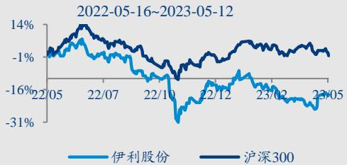
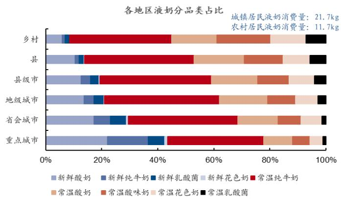
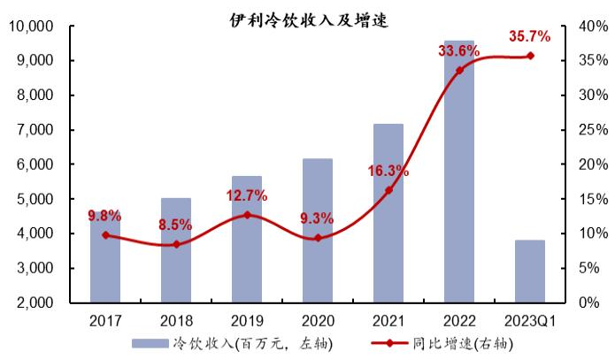
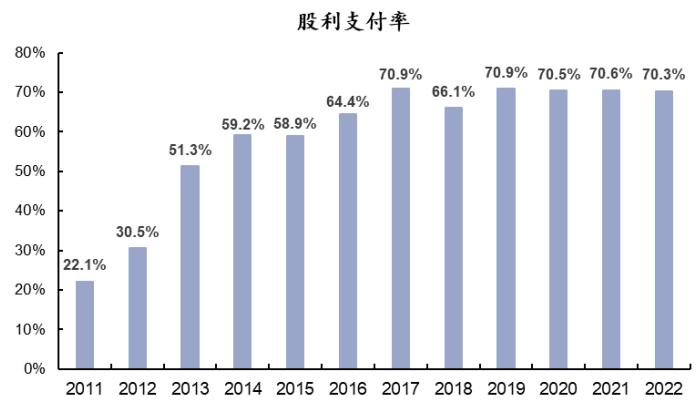

证券研究报告

伊利股份（600887）专题报告

# 高股息铸盾，景气度为矛，当前重点推荐

伊利当前估值处于17 倍 PE 的历史底部，而公司近年维持约 70%高分红率，目前股息率达3.5%，且放眼今明年，预计业绩增速均有望达15%以上，以此估算股息率和业绩增长有望带来20%左右确定性收益空间。在此基础上，公司经营走出底部，需求景气提升更有望驱动估值修复。因此，我们建议重视伊利当前投资机会。

第一，预计Q1底部确立，年内逐季加速。Q1液态奶下滑2.6%，拖累整体增速水平，但年内看，液奶报表基数自Q2起明显降低、消费力修复带来结构改善，经营有望逐季加，下有望实现双位数增长，全奏前低后。结合渠道反馈，预计4月液奶实现中个位数增长，环比Q1明显改善，其中，金典及基白奶增速快于整体，金典在重点推广措施下实现加速，安慕希、乳饮料在品或特渠发同转正，渠道费用率同下降，存环降低，经营已如期步入良性通道。

# 第二，航母舰队大洋前行，份额与利润并重。

收入端：预计10%左右增长中枢。伊利过去不断证明其成长空间和能力，即便当前已成长为1200+亿收入规模的航母级别快消品企业，我们认为空间和驱动力均仍足。首先，液态奶无疑是伊利航母舰队的主舰，白奶近年持续增长，已不断打破乳业空间见顶的质疑，实际上从中国人均饮奶量与东业成熟市场对比看仍有较大差距，挖潜空间；酸奶增长瓶颈主要是休闲化需求饱和，但功能性酸奶的需求仍巨大，创新大有机会。其次，非液奶各业务在航母战斗群中均有清晰定位，提供持续火点，奶物业务政革成难来断释效价加理提并创和场能业家温力创新及供更多港。

业绩端：预计费用率拐点已明确，结构优化共同驱动净利率稳步提升。伊利蒙牛份额已达约70%，且均对利润诉求较高，行业基本告别全面价格战时代。伊利液奶费用效率优化明显，且奶粉经历几年培育进入稳健收获期，因此预计费用率下行拐点已明确。毛利率长期由产品结构驱动，我们判断 23 年则受白砂糖等其他原辅料价格上涨影响，部分侵蚀原奶成本红利，同时消费力仍需修复，预计今年毛利率相对平稳，来年起成本扰动收敛，产品结构驱动毛利率贡献逐步增加，进一步驱动净利率稳步上行。

结合收入与业绩驱动，即便保守假设净利率 25 年提升至9%出头，未来三年业绩已均可实现15%以上增长。

第三，估值底部，高股息率提供收益安全垫。随消费板块回调，伊利当前估值仅 17倍PE，估值分位数为2010 年以来的2.6%，已至历史绝对底部。预计公司经营已告别底部，未来持续成长性仍足，因此相较其他食品饮料龙头估值普遍在20PE以上，已被明显低估。此外，19年以来公司分红率维持在70%以上，当前股息率为 $3 . 5 \%$ ，已提供较好收益安全垫。

投资建议：股息率为盾，景气度为矛，价值终将回归，当前重点推荐。伊利当前低估值高股息已具布局吸引力，我们认为未来双位数增长动力充足，同时经营低点已过，价值有望回归。我们给予23-25年EPS预测1.74/2.04/2.38元，给予目标价40 元，对应23 年PE23 倍，作为确定性收益标的重点推荐，维持“强推”评级。

风险提示：需求复苏不及预期、原奶价格大幅波动、行业竞争加剧等。

主要财务指标  

<table><tr><td></td><td>2022A</td><td>2023E</td><td>2024E</td><td>2025E</td></tr><tr><td>营业总收入(百万)</td><td>123,171</td><td>136,268</td><td>149,278</td><td>163,319</td></tr><tr><td>同比增速(%)</td><td>11.4%</td><td>10.6%</td><td>9.5%</td><td>9.4%</td></tr><tr><td>归母净利润(百万)</td><td>9,431</td><td>11,109</td><td>13,025</td><td>15,200</td></tr><tr><td>同比增速(%)</td><td>8.3%</td><td>17.8%</td><td>17.3%</td><td>16.7%</td></tr><tr><td>每股盈利(元)</td><td>1.47</td><td>1.74</td><td>2.04</td><td>2.38</td></tr><tr><td>市盈率(倍)</td><td>20</td><td>17</td><td>15</td><td>13</td></tr><tr><td>市净率(倍)</td><td>3.8</td><td>3.1</td><td>2.6</td><td>2.1</td></tr></table>

资料来源：公司公告，华创证券预测 注：股价为2023年5月12日收盘价

强推(维持)

目标价：40元当前价：29.77元

# 华创证券研究所

证券分析师：欧阳予 邮箱：ouyangyu@hcyjs.com 执业编号：S0360520070001 证券分析师：范子盼 邮箱：fanzipan@hcyjs.com 执业编号：S0360520090001 证券分析师：董广阳 电话：021-20572598 邮箱：dongguangyang@hcyjs.com 执业编号：S0360518040001

# 公司基本数据

总股本(万股) 639,891.87  
已上市流通股(万股) 630,798.90  
总市值(亿元) 1,904.96  
流通市值(亿元) 1,877.89  
资产负债率(%) 60.90  
每股净资产(元) 8.36  
12个月内最高/最低价 38.95/25.24

  
市场表现对比图(近12个月)

# 相关研究报告

《伊利股份（600887）2022 年报及2023 年一季  
报点评：打消悲观预期，经营值得信赖》2023-04-28  
《伊利股份（600887）2022年三季报点评：着眼  
经营良性，以短期换长期》2022-10-28  
《伊利股份（600887）2022H1中报点评：奶粉引  
领增长，安全边际突出》2022-08-31

# 目录

一、中期空间：航母舰队大洋前行，海大船大，双位增长..

（一）收入端：预计未来3年可维持 $1 0 \%$ 左右增长中枢（二）业绩端：费用率拐点较确定，结构优化共同驱动盈利稳步提升.

二、年内节奏：Q1底部确立，年内逐季加速， 13

三、估值思考：当前估值底部，高股息率提供收益安全垫.. .14

四、投资建议：股息率为矛，景气度为盾，当前重点推荐. 15

.16

# 图表目录

图表1中国人均液体乳消费量较日韩仍有约较大差距 .5  
图表2 中国不同城际液态奶消费结构差距巨大 ..5  
图表32010 年以来乳制品产量震荡上行.. ….6  
图表4伊利过去液态奶增长核心驱动为销量增长 …6  
图表52020 年起白奶成为液奶增长的主要驱动.. 6  
图表62020 年起伊利常温奶中，白奶增速快于酸奶 …6  
图表7日本液体乳成长中功能性品类成为核心驱动 .7  
图表8伊利加大功能性产品研发推广 ….7  
图表9伊利奶粉业务布局.. ..8  
图表102021 年以来伊利奶粉业务发展提速  
图表 112022 年以来冷饮业务增长提速. .8  
图表1220 年以来伊利奶酪业务快速发展 .9  
图表13伊利持续培育包装水及植物基奶等新兴品类. ….9  
图表 14 2022 年以来，伊利非液奶业务增长提速，有力驱动公司增长表现. .9  
图表152010 年以来伊利盈利能力复盘.. ..10  
图表16伊利成本结构占比. . 10  
图表172022Q2起原奶价格震荡下行 10  
图表1823 年以来白砂糖价格上涨，而纸箱价格回落. .11  
图表19伊利各大品相系列中仍有结构提升空间 .11  
图表20伊利股份营收拆分及测算... …….1  
图表21 伊利蒙牛竞争格局梳理：伊利、蒙牛收入、利润诉求更为均衡，且均加大布局  
细分赛道... ….12  
图表22 伊利、蒙牛常温奶市占率合计已近 $7 0 \%$ ..12  
图表23过去两年销售费用率平稳. ..12  
图表242023 年二、三季度，报表基数明显降低. .13  
图表 25 2022 年奶粉、冷饮高增有效驱动整体营收. .13  
图表 262023 年以来社零增速底部回暖.. ….13  
图表27防控优化后消费者信心底部回升 ..13  
图表282019 年来伊利分红率持续维持在 $7 0 \%$ 以上 ..14  
图表29当前伊利股息率达 $3 . 5 \%$ ： ..14  
图表 30伊利股息率在食品饮料行业中处领先位置 .14  
图表31当前伊利估值17倍，已至历史底部. .14  
图表32代表性食品饮料公司 2023 年预测 PE 估值. ..15  
图表33盈利预测简表. 15  
图表34伊利股份PE-band 16  
图表35伊利股份PB-band. 16

引言：伊利当前估值处于17 倍PE的历史底部，而公司近年维持约 $7 0 \%$ 高分红率，目前股息率达 $3 . 5 \%$ ，且放眼今明年，预计业绩增速均有望达 $1 5 \%$ 以上，以此估算股息率和业绩增长已有望带来 $2 0 \%$ 左右确定性收益空间。在此基础上，公司中期成长性仍足，短期经营走出底部，需求景气提升更有望驱动估值修复。因此，我们建议重视伊利当前确定性较高的投资机会。

# 一、中期空间：航母舰队大洋前行，海大船大，双位增长

# （一）收入端：预计未来3 年可维持 $1 0 \%$ 左右增长中枢

即便伊利自十余年即持续面临着成长空间的质疑，公司过去已用实际业绩不断证明其成长空间和能力。我们认为，即便当前已成长为 $1 2 0 0 +$ 亿收入规模的航母级别快消品企业，公司空间和驱动力均仍然充足：

# 首先，液态奶是伊利航母舰队的主舰，总量仍有空间，品类路径清晰。

一是从总量上，液态奶量、价均有巨大空间均待挖潜。从量看，根据IDF（国际乳品联合会）2019 年数据，中国人均液态奶量消费量仅为18.3 千克/年，与日韩成熟市场的 30 余千克/年仍有较大差距，且城镇居民饮奶量为农村居民的 2 倍有余。而实际上，过去十余年无论是行业整体产量震荡上行，而伊利液态奶自身增长最核心的驱动仍为销量增长。从结构看，价格偏低、更偏饮料定位的酸味奶、花色奶等常温品类在下沉市场仍占较大消费比例，明显低于高线城市水平。因此随一二线市场有机、功能性细分品类占比提升、下沉市场饮用量追赶，液态奶成长空间仍然充足。

  
图表1中国人均液体乳消费量较日韩仍有约较大差距  
资料来源： $I D F$ 、转引自中国奶业统计资料，华创证券

  
图表2中国不同城际液态奶消费结构差距巨大  
资料来源：尼尔森，华创证券

  
图表32010 年以来乳制品产量震荡上行  
资料来源：国家统计局，华创证券

  
图表4伊利过去液态奶增长核心驱动为销量增长  
资料来源：公司公告，华创证券

二是从路径上，白奶打破空间见顶质疑，酸奶功能性创新大有可为。疫情后消费者健康免疫意识提升，白奶景气上行、逆势高增，已不断打破乳业空间见顶的质疑，伊利亦顺势加大白奶布局，20 年起金典、基础白奶成为增长的核心驱动。而酸奶增长瓶颈主要是休闲化需求饱和，但功能性酸奶的需求仍巨大，当前伊利正积极摸索转型。正如当前日本二十世纪 80 年代以来酸奶占比稳步提升，明治亦1970 年推出的保加利亚酸奶大单品经久不衰，后凭借益生酸奶LG21（2000年）、R-1（2009年）占据功能酸奶 $7 0 \%$ 的市场，支撑自身业务维持稳健。

  
图表 52020 年起白奶成为液奶增长的主要驱动  
资料来源：尼尔森，华创证券

  
图表62020 年起伊利常温奶中，白奶增速快於酸奶  
资料来源：渠道调研，公司调研，华创证券测算

  
图表7日本液体乳成长中功能性品类成为核心驱动  
资料来源：日本统计局，明治公司公告，华创证券

益生菌包埋递送技术：降低益生菌加工和胃肠道消化中的损失研发BL-99、K56系列益生菌：肠道健康、体重控制

  
图表8伊利加大功能性产品研发推广  
资料来源：伊利天猫旗舰店，天猫伊利鲜奶旗舰店，天猫超市，华创证券

其次，非液奶各业务在航母战斗群中均有清晰定位，提供持续火力点。

奶粉业务改革成效不断释放，份额加速提升。伊利奶粉产品积淀深厚，全产业链布局优势突出，19 年末起改革转型，强化团队专业性、进行产品升级及渠道调整，同时加大资源倾斜，21Q3起市占率快速提升，并成为公司增长的核心驱动。同时，22年公司收购澳优，双方在品类（牛奶粉VS 羊奶粉）、供应链（国内VS 海外）等方面互补协同，当前伊利已逐步进行澳优的团队/组织/渠道全方面调整，年内经营有望重回良性。考虑澳优并表，2022 年公司婴配粉市占率已达到 $1 2 . 4 \%$ ，位列行业第二。此外，公司成人粉市占率达 $2 5 . 3 \%$ ，预期成人粉架构拆分后可更好地激发团队活力、提升经营专业性，把握银发经济机会。

冷饮业务通过创新升级持续增长，22 年发力抢占份额实现大幅提速。尽管冷饮行业走向成熟且公司市占率已连续 28 年牢牢占据第一，但公司仍在打造完善产品矩阵的基础上，通过持续的产品创新升级，实现稳健增长，当前巧乐兹已成为50 亿级别的大单品。同时，2022 年原材料价格上涨，部分小企业停工停产，而公司则主动前移节奏，加大旺季前渠道抢占，进一步收割份额，2022 年、2023Q1 冷饮业务分别同增 $3 3 . 6 \%$ ， $3 5 . 7 \%$ 。

奶酪业务积极培育，市占率快速提升。伊利成立伊家好奶酪子公司，摸索小而美业务打法，大大缩短了审批流程、提升研发速度，同时通过员工持有伊家好奶酪股权，绑定员工利益，增强新兴业务的内生动能。当前伊利奶酪业务已达 15-20 亿体量，且 22 年奶酪市占率大幅提升 3.5pcts、位居行业前列。

# 再次，创新业务及海外市场将提供更多的中长期潜力点。

定位全球健康食品公司，公司前瞻摸索培育系列创新业务。除乳业外，公司定位全球健康食品公司，搭建了覆盖亚洲、欧洲、大洋洲和美洲等多个地区的全球创新网络，拥有15 个创新中心，开发满足全人群、全生命周期、全消费场景的健康产品奠定坚实基础。同时，恰如雀巢 2002 年建立 Life Venture 风险投资基金，伊利于 2022年与子公司共同出资3.5 亿元设立健瓴种子基金，进一步提供创新外部保障。

从具体品类上，当前公司已初步试水饮料业务，并聚焦植物基“植选”及包装水“伊刻活泉”，这两个品类一是品类坡长雪厚景气可看更长，二是相较于口味型饮料，产品生命周期更长，可更好地摸索跨品类打法，当前势头良好。此外，公司亦在关注摸索宠物食品等其他高景气赛道，寻找新的增长点。

持续夯实海外供应链，并以冰淇淋等品类摸索东南亚市场本土化打法。当前公司一方面，收购 Westland 等企业强化奶源布局，另一方面，通过印尼建厂、收购泰国冰淇淋公司等方式，以奶源依赖度相对较低、且适合东南亚当地消费发展阶段的品类，进行海外市场的本土化摸索，预计在中长期有望逐步贡献增量。

图表9伊利奶粉业务布局  

<table><tr><td colspan="2">伊利</td><td>澳优</td></tr><tr><td>团队</td><td>19 年末进行团队革新，招聘市场化人才</td><td>当前伊利逐渐委派更迭管理人员，团队有序磨合调整</td></tr><tr><td>产品</td><td>牛奶粉为主，20 年 9 月进行配方升级（使用生牛 乳），打造内资品牌差异化</td><td>全球羊奶销量第一，包括佳贝艾特等</td></tr><tr><td>供应链</td><td>源占比达40%</td><td>拥有以优然牧业为核心的一体化牧业平台，可控奶 全球奶源布局，在中国、荷兰、澳大利亚、新西兰均 有工厂</td></tr><tr><td>研发</td><td>2003 年便开启中国母婴营养研究之路，并建成国 内首个企业级“母乳研究数据库” ·以系列专项活动加强母婴渠道布局，现有母婴终</td><td>专注于婴幼儿乳粉技术研究，同时营养品及特医配方 食品发展迅速</td></tr><tr><td>渠道</td><td>端约9 万家，母婴渠道占比约6成 ·严格管控渠道价盘，价盘稳定性及渠道库存在行 业内处于较低水平</td><td>·终端网点约2万家 ·当前积极进行渠道库存调整</td></tr><tr><td>战略目标</td><td>2025 年成为行业第一，对应 21-25 年复合增速 20%</td><td></td></tr></table>

资料来源：公司官网，公司公开业绩会，公司调研，渠道调研，华创证券

  
图表102021 年以来伊利奶粉业务发展提速  
资料来源：公司公告，华创证券

  
图表 11 2022 年以来冷饮业务增长提速  
资料来源：公司公告，华创证券

  
图表 1220 年以来伊利奶酪业务快速发展  
资料来源：公司公开业绩会，华创证券

  
图表13伊利持续培育包装水及植物基奶等新兴品类

资料来源：伊利天猫官方旗舰店，华创证券

  
图表 14 2022 年以来，伊利非液奶业务增长提速，有力驱动公司增长表现  
资料来源：公司公告，华创证券

# （二）业绩端：费用率拐点较确定，结构优化共同驱动盈利稳步提升

拉长维度看，成本具有周期性、结构优化是盈利提升的持续动力，费用率则取决竞争格局和阶段战略导向。通过复盘伊利盈利水平过去十年的变化，毛利率受成本周期、买赠力度等波动式影响，而高端化驱动伊利过去十年盈利能力中枢抬升。销售费用率主要受格局和公司战略导向影响，当前后千亿时代已至，竞争格局优化、双雄利润诉求均有增强，预期费用率拐点已至，将共同驱动净利率稳步提升。

  
图表152010 年以来伊利盈利能力复盘  
资料来源：Wind，伊利公司公告，华创证券

# 具体看：

毛利率：年内毛利率预期平稳，来年起结构优化将进一步驱动毛利率增量。毛利率长期由产品结构驱动，23 年则因白砂糖等其他原辅料价格上涨部分侵蚀原奶成本红利，叠加新工厂投产带来折旧增加等因素影响，预计今年毛利率相对平稳，来年起成本扰动收敛，产品结构驱动毛利率贡献逐步增加，进一步驱动净利率稳步上行。根据测算，至2025 年，即便液态奶、奶粉、冷饮产品内部结构不存在优化、买赠促销维持现状，仅凭借奶粉、冷饮占比提升，公司整体毛利率即可提升 0.7pct。更何况液奶内部大单品中，新品出厂价及毛利率较经典款均存在大幅溢价，且当前增速均快于整体，叠加买赠促销趋于理性，毛利率提升更具保障，预计未来三年毛利率至少可提升 1-2pcts。

  
图表16伊利成本结构占比  
资料来源：公司调研，华创证券

  
图表172022Q2起原奶价格震荡下行  
资料来源：Wind，华创证券

  
图表1823 年以来白砂糖价格上涨，而纸箱价格回落  
资料来源：Wind，华创证券

  
图表19伊利各大品相系列中仍有结构提升空间  
资料来源：渠道调研，华创证券

图表20伊利股份营收拆分及测算  

<table><tr><td rowspan="2"></td><td colspan="2">2022</td><td colspan="2">2025E</td><td rowspan="2">22-25CAGR</td><td rowspan="2">22 年毛利率（细分品类/数 据为估算）</td></tr><tr><td>营收：亿元</td><td>占比</td><td>营收：亿元</td><td>占比</td></tr><tr><td>常温奶</td><td>774</td><td>62.8%</td><td>945</td><td>57.9%</td><td>7%</td><td>25%+</td></tr><tr><td>安慕希</td><td>194</td><td>15.7%</td><td>205</td><td>12.6%</td><td>2%</td><td>35%+</td></tr><tr><td>金典</td><td>203</td><td>16.5%</td><td>282</td><td>17.3%</td><td>12%</td><td></td></tr><tr><td>基础白奶</td><td>254</td><td>20.6%</td><td>328</td><td>20.1%</td><td>9%</td><td></td></tr><tr><td>优酸乳</td><td>84</td><td>6.8%</td><td>87</td><td>5.3%</td><td>1%</td><td>20%+</td></tr><tr><td>其他</td><td>40</td><td>3.2%</td><td>43</td><td>2.6%</td><td>2%</td><td></td></tr><tr><td>低温奶</td><td>75</td><td>6.1%</td><td>92</td><td>5.6%</td><td>7%</td><td>30%+</td></tr><tr><td>低温酸奶</td><td>57</td><td>4.6%</td><td>64</td><td>3.9%</td><td>4%</td><td>近30%</td></tr><tr><td>低温鲜奶</td><td>18</td><td>1.5%</td><td>27</td><td>1.7%</td><td>15%</td><td>近40%</td></tr><tr><td>液态奶合计</td><td>849</td><td>68.9%</td><td>1,037</td><td>63.5%</td><td>7%</td><td>29.1%</td></tr><tr><td>奶粉</td><td>246</td><td>20.0%</td><td>374</td><td>22.9%</td><td>15%</td><td>约 40%，婴配粉近 50%</td></tr><tr><td>奶酪</td><td>17</td><td>1.3%</td><td>38</td><td>2.3%</td><td>23%</td><td>40-50%</td></tr><tr><td>奶粉及奶制品</td><td>263</td><td>21.3%</td><td>412</td><td>25.2%</td><td>16%</td><td>41.1%</td></tr><tr><td>冷饮业务</td><td>96</td><td>7.8%</td><td>156</td><td>9.6%</td><td>13%</td><td>38.5%</td></tr><tr><td>其他</td><td>24</td><td>2.0%</td><td>28</td><td>1.7%</td><td>4%</td><td>22.5%</td></tr><tr><td>合计</td><td>1232</td><td>100.0%</td><td>1633</td><td>100.0%</td><td>10%</td><td>32.3%</td></tr></table>

资料来源：公司公告，渠道调研，华创证券测算

# 费用率：后千亿时代预期费率稳中有降，今年向下拐点较确定。

后千亿时代行业竞争格局改善，费率优化具备客观基础。以过往价格战的主战场常温奶来看，一是伊利、蒙牛双雄市占率合计已近 $7 0 \%$ ，份额战趋于收官，且当前双雄对利润诉求均较高，并明确提出了利润率提升目标，行业基本告别全面价格战时代；二是当前消费者个性化需求增强，叠加渠道更加多元，竞争逐渐由“面”向“点”转变，一味地通过价格战实现增长的可能性进一步降低；三是伊利、蒙牛均积极培育细分业务板块，且重点发力奶粉，蒙牛抢跑鲜奶、奶酪，常温奶作为利基业务的

定位进一步增强。

营收改善、费投优化，预计年内向下拐点较确定。22 年费率提升主要系营收承压致费率被动抬升。年内看，一是营收有望提速摊薄费用，二是公司加大费投优化力度，预期液奶费投效率提升，叠加奶粉经历几年培育进入稳健收获期，预计费用率下行拐点已明确。

图表 21 伊利蒙牛竞争格局梳理：伊利、蒙牛收入、利润诉求更为均衡，且均加大布局细分赛道  

<table><tr><td colspan="2">伊利</td><td>蒙牛</td></tr><tr><td rowspan="2">锚定目标</td><td>2025 年进入全球乳业第三，各品类均成为行业第</td><td rowspan="2">2025年，再创一个蒙牛</td></tr><tr><td>2030 年成为全球乳业第一，健康食品五强</td></tr><tr><td>利润指引</td><td>每年净利率提升、未来5年净利率达到9-10%</td><td>每年经营利润率提升 30-50bp</td></tr><tr><td rowspan="3">2023 年目 标</td><td>·收入端：目标并表双位数以上增长，其中内生收入高</td><td>·收入端：目标并表双位数以上增长，其中内生收入高个位</td></tr><tr><td>个位数增长；</td><td>数增长;</td></tr><tr><td>·盈利端：内生净利率提升 30bp，并表利润率提升幅</td><td>·盈利端：经营利润率提升 30-50bp，其中，毛利率提升，渠</td></tr><tr><td>细分业务</td><td>度更高；其中费率下降为主，毛利率相对平稳。</td><td>道费用略降，营销费用略增，整体费率平稳。</td></tr><tr><td>布局</td><td>·奶粉作为第二大战略重点 ·加大布局奶酪业务，积极而不是理性布局低温业务</td><td>·抢跑鲜奶、奶酪业务； ·奶粉业务持续调整，雅士利启动私有化</td></tr></table>

资料来源：公司调研，公司公开业绩会，华创证券

  
图表22伊利、蒙牛常温奶市占率合计已近 $7 0 \%$   
资料来源：公司公告，华创证券  
资料来源：公司公告，华创证券（注：2021年销售费用率显著 $\mathcal { F }$ 降系会计口径调整，同口径 $\ F 2 O 2 O$ 年销售费用率 $1 7 . 4 9 \%$ ，21年同比 $+ 0 . 0 5 p c t _ { \circ }$ )

  
图表23过去两年销售费用率平稳

凈利率：毛利率提升叠加费用率优化，至 25 年凈利率提升至 $9 . 1 0 \%$ 具备较好保障。结合测算，预计至 25 年毛利率有望提升 1-2pcts，费用率拐点已至稳中有降，至25 年净利率提升至 $9 { - } 1 0 \%$ 的目标具备较好保障。因此，结合收入与业绩驱动，即便保守假设净利率25年提升至 $9 \%$ 出头，预计未来三年业绩均有望实现 $1 5 \%$ 以上增长。

# 二、年内节奏：预计Q1 底部确立，年内逐季加速

受春节错期、结构弱化拖累，Q1 液奶小幅下滑，拖累整体表现。虽返乡高增下春节期间动销旺盛，但一是备货提前叠加需求弱复苏，节后补库较弱，二是消费力受损下产品结构弱于去年，故Q1 液态奶下滑 $2 . 6 \%$ ，拖累整体增速，奶粉、冷饮等业务延续高增，驱动整体内生增速实现小个位数增长，澳优并表进一步增厚，Q1在逆境之下表现稳健。

预计Q2起液奶有望逐季加速，全年前低后高。年内看，液奶报表基数自Q2起明显降低、消费力修复带来结构改善，经营有望逐季加速，下半年有望实现双位数增长，全年节奏前低后高。结合渠道反馈，预计4 月液奶实现中个位数增长，环比Q1 明显改善，其中，金典及基础白奶增速快于整体，金典在重点推广措施下实现加速，安慕希、乳饮料在新品或特渠发力下同比转正，且渠道费用率同比下降，库存环比降低，经营已如期步入良性通道。

  
图表242023 年二、三季度，报表基数明显降低  
资料来源：公司公告，华创证券

  
图表 252022 年奶粉、冷饮高增有效驱动整体营收  
资料来源：公司公告，华创证券

  
图表262023 年以来社零增速底部回暖  
资料来源：Wind，华创证券

  
图表27防控优化后消费者信心底部回升   
资料来源：Wind，华创证券

# 三、估值思考：当前估值底部，高股息率提供收益安全垫

当前估值已至绝对底部，高股息率提供收益安全垫，确定性收益空间突出。

一方面，当前估值在 2010 年以来的 $2 . 6 \%$ 分位数，已至绝对底部。随消费板块回调，伊利当前 23 年PE估值仅 17 倍，估值分位数为 2010 年以来的 $2 . 6 \%$ ，相较其他食品饮料龙头估值普遍在 20 倍 PE以上，已被明显低估。而复盘历史估值，在 13 年初消费乏力、预期低迷，以及14-16 年行业混战期，伊利估值亦触及17倍左右，而后随着消费回暖或格局清晰，均开启了反转性大行情。当前伊利安全边际已相当充分，站在了新一轮行情的起点。

另一方面， $3 . 5 \%$ 的股息率已提供较好收益安全垫。近年来公司分红率维持在 $7 0 \%$ 以上的高水平，当前股息率为 $3 . 5 \%$ ，提供较好收益安全垫，在食品饮料公司中已处较高水平。

股息率结合业绩增长，预计有望驱动 $2 0 \%$ 左右确定性收益，估值修复进一步打开收益空间。放眼今明年，预计业绩增速均有望达 $1 5 \%$ 以上，仅股息率和业绩增长已有望带来 $2 0 \%$ 左右确定性收益空间。在此基础上，公司经营走出底部，需求景气提升更有望驱动估值修复，进一步打开收益空间。

  
图表 282019 年来伊利分红率持续维持在 $7 0 \%$ 以上  
资料来源：公司公告，华创证券

  
图表29当前伊利股息率达 $3 . 5 \%$   
资料来源：Wind，华创证券

  
图表 30伊利股息率在食品饮料行业中处领先位置  
资料来源：Wind，华创证券

  
图表31当前伊利估值17倍，已至历史底部  
资料来源：Wind，华创证券

  
图表 32代表性食品饮料公司 2023 年预测 PE 估值  
资料来源：Wind，华创证券

# 四、投资建议：股息率为矛，景气度为盾，当前重点推荐

高股息铸盾，景气度为矛，价值终将回归，当前重点推荐。我们判断伊利当前仅考虑股息率和业绩增长已有望带来 $2 0 \%$ 左右确定性收益空间，未来双位数增长动力充足，同时经营低点已过，估值有望修复，价值有望回归。我们给予 23-25 年EPS 预测 1.74/2.04/2.38元，给予目标价 40 元，对应 23 年PE 23倍，作为确定性收益标的重点推荐。

图表 33盈利预测简表  

<table><tr><td>伊利</td><td>2022A</td><td>2023E</td><td>2024E</td><td>2025E</td></tr><tr><td>营业总收入（百万元)</td><td>123,171</td><td>136,268</td><td>149,278</td><td>163,319</td></tr><tr><td></td><td>YoY 11.4%</td><td>10.6%</td><td>9.5%</td><td>9.4%</td></tr><tr><td>归母净利润（百万元）</td><td>9,431</td><td>11,109</td><td>13,025</td><td>15,200</td></tr><tr><td>YoY</td><td>8.3%</td><td>17.8%</td><td>17.3%</td><td>16.7%</td></tr><tr><td>每股盈利（元）</td><td>1.47</td><td>1.74</td><td>2.04</td><td>2.38</td></tr><tr><td>市盈率</td><td>20</td><td>17</td><td>15</td><td>13</td></tr><tr><td>市净率</td><td>4</td><td>3</td><td>3</td><td>2</td></tr></table>

资料来源：Wind，华创证券预测（注：收盘价截至2023年5月12日）

  
图表34伊利股份PE-band  
资料来源：Wind，华创证券

  
图表35伊利股份 PB-band  
资料来源：Wind，华创证券

# 五、风险提示

需求复苏不及预期、原奶价格大幅波动、行业竞争加剧等。

# 附录：财务预测表

资产负债表  

<table><tr><td>单位：百万元</td><td>2022A</td><td>2023E</td><td>2024E</td><td>2025E</td></tr><tr><td>货币资金</td><td>33,853</td><td>51,252</td><td>72,472</td><td>96,151</td></tr><tr><td>应收票据</td><td>162</td><td>225</td><td>216</td><td>235</td></tr><tr><td>应收账款</td><td>3,088</td><td>3,327</td><td>3,635</td><td>3,932</td></tr><tr><td>预付账款</td><td>1,834</td><td>1,998</td><td>2,137</td><td>2,277</td></tr><tr><td>存货</td><td>14,836</td><td>16,901</td><td>18,414</td><td>19,996</td></tr><tr><td>合同资产</td><td>0</td><td>0</td><td>0</td><td>0</td></tr><tr><td>其他流动资产</td><td>7,690</td><td>6,448</td><td>7,049</td><td>7,694</td></tr><tr><td>流动资产合计</td><td>61,463</td><td>80,151</td><td>103,923</td><td>130,285</td></tr><tr><td>其他长期投资</td><td>612</td><td>612</td><td>612</td><td>612</td></tr><tr><td>长期股权投资</td><td>4,563</td><td>4,654</td><td>4,747</td><td>4,842</td></tr><tr><td>固定资产</td><td>33,735</td><td>31,222</td><td>30,330</td><td>30,364</td></tr><tr><td>在建工程</td><td>3,417</td><td>7,799</td><td>10,444</td><td>11,945</td></tr><tr><td>无形资产</td><td>4,648</td><td>4,276</td><td>3,934</td><td>3,619</td></tr><tr><td>其他非流动资产</td><td>22,527</td><td>22,523</td><td>22,531</td><td>22,547</td></tr><tr><td>非流动资产合计</td><td>69,502</td><td>71,087</td><td>72,597</td><td>73,928</td></tr><tr><td>资产合计</td><td>130,965</td><td>151,238</td><td>176,520</td><td>204,214</td></tr><tr><td>短期借款</td><td>26,799</td><td>34,213</td><td>43,298</td><td>53,532</td></tr><tr><td>应付票据</td><td>881</td><td>964</td><td>1,040</td><td>1,119</td></tr><tr><td>应付账款</td><td>15,926</td><td>17,569</td><td>19,111</td><td>20,721</td></tr><tr><td>预收款项</td><td>0</td><td>0</td><td>0</td><td>0</td></tr><tr><td>合同负债</td><td>8,913</td><td>9,868</td><td>10,815</td><td>11,833</td></tr><tr><td>其他应付款</td><td>2,960</td><td>2,825</td><td>2,882</td><td>2,940</td></tr><tr><td>一年内到期的非流动负债</td><td>983</td><td>50</td><td>566</td><td>3,500</td></tr><tr><td>其他流动负债</td><td>5,709</td><td>6,191</td><td>6,607</td><td>7,105</td></tr><tr><td>流动负债合计</td><td>62,170</td><td>71,680</td><td>84,320</td><td>100,749</td></tr><tr><td>长期借款</td><td>9,298</td><td>9,298</td><td>9,298</td><td>9,298</td></tr><tr><td>应付债券</td><td>3,482</td><td>3,500</td><td>3,500</td><td>0</td></tr><tr><td>其他非流动负债</td><td>1,872</td><td>1,862</td><td>1,893</td><td>1,925</td></tr><tr><td>非流动负债合计</td><td>14,653</td><td>14,661</td><td>14,692</td><td>11,224</td></tr><tr><td>负债合计</td><td>76,822</td><td>86,340</td><td>99,012</td><td>111,973</td></tr><tr><td>归属母公司所有者权益</td><td>50,268</td><td>61,377</td><td>74,402</td><td>89,602</td></tr><tr><td>少数股东权益</td><td>3,875</td><td>3,521</td><td>3,107</td><td>2,639</td></tr><tr><td>所有者权益合计</td><td>54,143</td><td>64,897</td><td>77,509</td><td>92,241</td></tr><tr><td>负债和股东权益</td><td>130,965</td><td>151,238</td><td>176,520</td><td>204,214</td></tr></table>

现金流量表  

<table><tr><td>单位：百万元</td><td>2022A</td><td>2023E</td><td>2024E</td><td>2025E</td></tr><tr><td>经营活动现金流</td><td>13,420</td><td>14,613</td><td>16,634</td><td>18,726</td></tr><tr><td>现金收益</td><td>12,951</td><td>14,950</td><td>16,329</td><td>18,346</td></tr><tr><td>存货影响</td><td>-5,919</td><td>-2,065</td><td>-1,513</td><td>-1,582</td></tr><tr><td>经营性应收影响</td><td>-664</td><td>100</td><td>217</td><td>297</td></tr><tr><td>经营性应付影响</td><td>2,354</td><td>1,592</td><td>1,675</td><td>1,746</td></tr><tr><td>其他影响</td><td>4,699</td><td>36</td><td>-75</td><td>-80</td></tr><tr><td>投资活动现金流</td><td>-19,514</td><td>-5,910</td><td>-5,568</td><td>-5,304</td></tr><tr><td>资本支出</td><td>-10,990</td><td>-5,877</td><td>-5,519</td><td>-5,243</td></tr><tr><td>股权投资</td><td>-353</td><td>-91</td><td>-93</td><td>-95</td></tr><tr><td>其他长期资产变化</td><td>-8,171</td><td>58</td><td>44</td><td>34</td></tr><tr><td>融资活动现金流</td><td>8,781</td><td>8,696</td><td>10,154</td><td>10,256</td></tr><tr><td>借款增加</td><td>18,730</td><td>6,498</td><td>9,601</td><td>9,668</td></tr><tr><td>股利及利息支付</td><td>-7,500</td><td>-1,332</td><td>-1,199</td><td>-1,079</td></tr><tr><td>股东融资</td><td>166</td><td>3,236</td><td>3,976</td><td>4,908</td></tr><tr><td>其他影响</td><td>-2,615</td><td>294</td><td>-2,225</td><td>-3,241</td></tr></table>

资料来源：公司公告，华创证券预测

利润表  

<table><tr><td>单位：百万元</td><td>2022A</td><td>2023E</td><td>2024E</td><td>2025E</td></tr><tr><td>营业总收入</td><td>123,171</td><td>136,268</td><td>149,278</td><td>163,319</td></tr><tr><td>营业成本</td><td>83,119</td><td>91,837</td><td>100,057</td><td>108,655</td></tr><tr><td>税金及附加</td><td>742</td><td>755</td><td>827</td><td>905</td></tr><tr><td>销售费用</td><td>22,908</td><td>24,731</td><td>26,733</td><td>29,020</td></tr><tr><td>管理费用</td><td>5,343</td><td>5,845</td><td>6,257</td><td>6,780</td></tr><tr><td>研发费用</td><td>822</td><td>910</td><td>997</td><td>1,091</td></tr><tr><td>财务费用</td><td>-255</td><td>-384</td><td>-611</td><td>-651</td></tr><tr><td>信用减值损失</td><td>-137</td><td>-151</td><td>-159</td><td>-181</td></tr><tr><td>资产减值损失</td><td>-792</td><td>-566</td><td>-655</td><td>-753</td></tr><tr><td>公允价值变动收益</td><td>94</td><td>10</td><td>-4</td><td>-3</td></tr><tr><td>投资收益</td><td>244</td><td>207</td><td>185</td><td>204</td></tr><tr><td>其他收益</td><td>964</td><td>887</td><td>798</td><td>800</td></tr><tr><td>营业利润</td><td>10,860</td><td>12,921</td><td>15,130</td><td>17,532</td></tr><tr><td>营业外收入</td><td>61</td><td>63</td><td>50</td><td>52</td></tr><tr><td>营业外支出</td><td>291</td><td>392</td><td>432</td><td>372</td></tr><tr><td>利润总额</td><td>10,630</td><td>12,591</td><td>14,749</td><td>17,212</td></tr><tr><td>所得税</td><td>1,312</td><td>1,637</td><td>1,917</td><td>2,238</td></tr><tr><td>净利润</td><td>9,318</td><td>10,954</td><td>12,831</td><td>14,974</td></tr><tr><td>少数股东损益</td><td>-113</td><td>-155</td><td>-194</td><td>-226</td></tr><tr><td>归属母公司净利润</td><td>9,431</td><td>11,109</td><td>13,025</td><td>15,200</td></tr><tr><td>NOPLAT</td><td>9,095</td><td>10,620</td><td>12,300</td><td>14,408</td></tr><tr><td>EPS(摊薄)(元)</td><td>1.47</td><td>1.74</td><td>2.04</td><td>2.38</td></tr></table>

主要财务比率  

<table><tr><td></td><td>2022A</td><td>2023E</td><td>2024E</td><td>2025E</td></tr><tr><td>成长能力</td><td></td><td></td><td></td><td></td></tr><tr><td>营业收入增长率</td><td>11.4%</td><td>10.6%</td><td>9.5%</td><td>9.4%</td></tr><tr><td>EBIT增长率</td><td>2.9%</td><td>17.6%</td><td>15.8%</td><td>17.1%</td></tr><tr><td>归母净利润增长率</td><td>8.3%</td><td>17.8%</td><td>17.3%</td><td>16.7%</td></tr><tr><td>获利能力</td><td></td><td></td><td></td><td></td></tr><tr><td>毛利率</td><td>32.3%</td><td>32.4%</td><td>32.8%</td><td>33.3%</td></tr><tr><td>净利率</td><td>7.6%</td><td>8.1%</td><td>8.6%</td><td>9.2%</td></tr><tr><td>ROE</td><td>18.8%</td><td>18.1%</td><td>17.5%</td><td>17.0%</td></tr><tr><td>ROIC</td><td>15.8%</td><td>14.6%</td><td>13.4%</td><td>12.8%</td></tr><tr><td>偿债能力</td><td></td><td></td><td></td><td></td></tr><tr><td>资产负债率</td><td>58.7%</td><td>57.1%</td><td>56.1%</td><td>54.8%</td></tr><tr><td>债务权益比</td><td>78.4%</td><td>75.4%</td><td>75.5%</td><td>74.0%</td></tr><tr><td>流动比率</td><td>1.0</td><td>1.1</td><td>1.2</td><td>1.3</td></tr><tr><td>速动比率</td><td>0.8</td><td>0.9</td><td>1.0</td><td>1.1</td></tr><tr><td>营运能力</td><td></td><td></td><td></td><td></td></tr><tr><td>总资产周转率</td><td>0.9</td><td>0.9</td><td>0.8</td><td>0.8</td></tr><tr><td>应收账款周转天数</td><td>7</td><td>9</td><td>8</td><td>8</td></tr><tr><td>应付账款周转天数</td><td>64</td><td>66</td><td>66</td><td>66</td></tr><tr><td>存货周转天数</td><td>51</td><td>62</td><td>64</td><td>64</td></tr><tr><td>每股指标(元)</td><td></td><td></td><td></td><td></td></tr><tr><td>每股收益</td><td>1.47</td><td>1.74</td><td>2.04</td><td>2.38</td></tr><tr><td>每股经营现金流</td><td>2.10</td><td>2.28</td><td>2.60</td><td>2.93</td></tr><tr><td>每股净资产</td><td>7.86</td><td>9.59</td><td>11.63</td><td>14.00</td></tr><tr><td>估值比率</td><td></td><td></td><td></td><td></td></tr><tr><td>P/E</td><td>20</td><td>17</td><td>15</td><td>13</td></tr><tr><td>P/B</td><td>4</td><td>3</td><td>3</td><td>2</td></tr><tr><td>EV/EBITDA</td><td>16</td><td>14</td><td>13</td><td>11</td></tr></table>

# 食品饮料组团队介绍

# 组长、首席分析师：欧阳予

浙江大学本科，荷兰伊拉斯姆斯大学研究型硕士，6 年食品饮料研究经验。曾任职于招商证券，2020 年加入华创证券。  
2021-2022 年获新财富、新浪金麒麟、上证报等最佳分析师评选第一名。

——白酒研究组（白酒、红酒、黄酒、酒类流通行业）

# 组长、高级分析师：沈昊

澳大利亚国立大学硕士，4年食品饮料研究经验，2019 年加入华创证券研究所。

分析师：田晨曦

英国伯明翰大学硕士，2020 年加入华创证券研究所。

研究员：刘旭德

北京大学硕士，2021 年加入华创证券研究所。

—一大众品研究组（低度酒、软饮料、乳肉制品、烘焙休闲食品、食品配料等）

组长、高级分析师：范子盼

中国人民大学硕士，4 年消费行业研究经验，曾任职于长江证券，2020 年加入华创证券研究所。

研究员：杨畅

美国南佛罗里达大学硕士，2020 年加入华创证券研究所。

助理研究员：严晓思

上海交通大学金融学硕士，2022 年加入华创证券研究所。

助理研究员：柴苏苏

南京大学经济学硕士，2022 年加入华创证券研究所。

——餐饮供应链研究组（调味品、预制食品、卤味餐饮连锁等）

# 分析师：彭俊霖

上海财经大学金融硕士，3 年食品饮料研究经验，曾任职于国元证券，2020 年加入华创证券研究所。

# 华创证券总裁助理、研究所所长、大消费组组长：董广阳

上海财经大学经济学硕士，14 年食品饮料研究经验。曾任职于招商证券，瑞银证券。自 2013 至 2022 年，获得新财富最佳分析师六届第一，两届第二，一届第三，获金牛奖最佳分析师连续三届第一，连续三届全市场最具价值分析师，获水晶球最佳分析师连续三届第一，获新浪金麒麟、上证报最佳分析师评选连续四届第一。

# 华创行业公司投资评级体系(基准指数沪深 300)

# 公司投资评级说明：

强推：预期未来6 个月内超越基准指数 $2 0 \%$ 以上;推荐：预期未来6 个月内超越基准指数 $1 0 \% - 2 0 \%$ ,中性：预期未来6个月内相对基准指数变动幅度在 $. 1 0 \% - 1 0 \%$ 之间；回避：预期未来6个月内相对基准指数跌幅在 $1 0 \% - 2 0 \%$ 之间。

# 行业投资评级说明：

推荐：预期未来3-6个月内该行业指数涨幅超过基准指数 $5 \%$ 以上；中性：预期未来3-6 个月内该行业指数变动幅度相对基准指数 $- 5 \% - 5 \%$ .,回避：预期未来3-6个月内该行业指数跌幅超过基准指数 $5 \%$ 以上。

# 分析师声明

每位负责撰写本研究报告全部或部分内容的分析师在此作以下声明：

分析师在本报告中对所提及的证券或发行人发表的任何建议和观点均准确地反映了其个人对该证券或发行人的看法和判断；分析师对任何其他券商发布的所有可能存在雷同的研究报告不负有任何直接或者间接的可能责任。

# 免责声明

本报告仅供华创证券有限责任公司（以下简称“本公司”）的客户使用。本公司不会因接收人收到本报告而视其为客户。

本报告所载资料的来源被认为是可靠的，但本公司不保证其准确性或完整性。本报告所载的资料、意见及推测仅反映本公司于发布本及告当日的判断。在不同时期，本公司可发出与本报告所载资料、意见及推测不一致的报告。本公司在知晓范围内履行披露义务。

报告中的内容和意见仅供参考，并不构成本公司对具体证券买卖的出价或询价。本报告所载信息不构成对所涉及证券的个人投资建议，也未考虑到个别客户特殊的投资目标、财务状况或需求。客户应考虑本报告中的任何意见或建议是否符合其特定状况，自主作出投资决策并自行承担投资风险，任何形式的分享证券投资收益或者分担证券投资损失的书面或口头承诺均为无效。本报告中提及的投资价格和价值以及这些投资带来的预期收入可能会波动。

本报告版权仅为本公司所有，本公司对本报告保留一切权利。未经本公司事先书面许可，任何机构和个人不得以任何形式翻版、复制、发表、转发或引用本报告的任何部分。如征得本公司许可进行引用、刊发的，需在允许的范围内使用，并注明出处为“华创证券研究”。且不得对本报告进行任何有悖原意的引用、删节和修改。

证券市场是一个风险无时不在的市场，请您务必对盈亏风险有清醒的认识，认真考虑是否进行证券交易。市场有风险，投资需谨慎。

# 华创证券研究所

<table><tr><td>北京总部</td><td>广深分部</td><td>上海分部</td></tr><tr><td>地址：北京市西城区锦什坊街26号 恆奧中心C座 3A</td><td>地址：深圳市福田区香梅路1061 号中投国际 商务中心A座19楼</td><td>地址：上海市浦东新区花园石桥路33号 花旗大厦12层</td></tr><tr><td>邮编：100033 传真：010-66500801</td><td>邮编：518034 传真：0755-82027731</td><td>邮编：200120 传真：021-20572500</td></tr><tr><td>会议室：010-66500900</td><td>会议室：0755-82828562</td><td>会议室：021-20572522</td></tr><tr><td></td><td></td><td></td></tr></table>