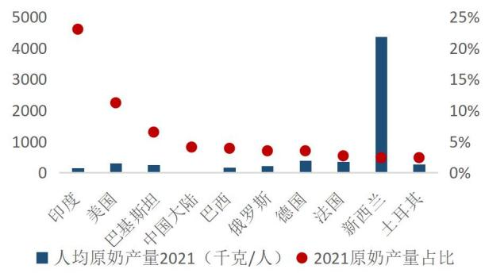
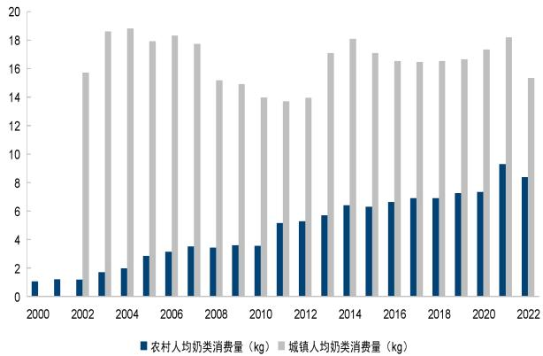
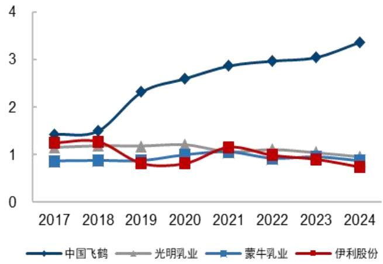

# 伊利股份（600887.SH）

平台化的乳企龙头，引领行业高质量转型

# 核心观点

发展行稳致远，典型的长久期资产。随着经济步入中低速增长区间，依赖城镇化、人口等驱动增长的食品饮料行业，投资范式也逐步从成长定价，转向股息率定价，而居民生活方式的变化，又考验各细分品类（白酒、啤酒、乳品、饮料等）的久期。从海外经验看，乳制品属于优质高蛋白，且随着餐饮效率化意识觉醒、消费习惯变化和技术进步，奶酪、黄油、奶粉等深加工产品具备长期增长潜力，乳制品行业被认为是长久期资产。伊利股份作为我国乳制品企业龙头，拥有深厚的渠道和消费者基础，2021年收入站稳千亿后，发展战略由份额优先转向利润优先，加强对成人粉等高附加值产品研发推广，盈利能力逐步提升，同时承诺维持 70%以上的分红比例，我们认为伊利股份是典型的股息率定价资产。

乳制品需求平稳复苏中，供需拐点或将到来。2020年后居民健康意识提高，需求呈现脉冲式增长，其中白奶相对于乳饮料、酸奶等景气度更高，低温奶渗透率亦在逐步提升，这也带来了上游牧场产能的新一轮扩张。而2023年后，需求呈现弱复苏，行业出现供过于求，生鲜乳的价格从2021年下半年持续下行，当前价格3.04元，多数牧场处于亏损状态。2024年行业去产能共识逐步形成，上游牧场累计淘牛约30万头，按照目前去化速度，我们预计 2025 年四季度或有望出现供需拐点。中长期看，当前我国乳制品步入成熟阶段，预计 2024-2028 年复合增速 1.61%，2028 年行业规模达 6117 亿元。

组织先行，战略驱动，构建品牌壁垒。乳制品规模效应明显，平台型企业战略制胜。伊利核心竞争力在于全国化的品牌与渠道基础下，实现成本优势效率领先，借助强大的品牌力和极致性价比，公司市占率、盈利能力、人均薪酬、人均创利持续领先行业。展望未来，伊利以液奶为基本盘（当前已拥有金典、安慕希、基础白奶共三个百亿级单品），奶粉持续提份额（2024年收入占比已提升至24.39%，成人粉&婴配粉份额分别位列行业第一/第二），积极布局低温、奶酪等，有望维持稳健增长。

短期受益原奶出清盈利具备弹性，中长期伊利股息率在食品饮料行业靠前。原奶价格持续低位的背景下，上游中小牧场陆续退出，供需平衡拐点有望在 2025-2026 年出现。若奶价温和回升，行业竞争格局改善，伊利买赠促销减少，同步大包粉减值损失、信用减值损失收窄，公司业绩有望回升。结合公司坚持 70%以上分红率，股息率在食品饮料行业属于靠前，且未来资本开支存在进一步下降空间，当前估值处于历史较低分位。

盈 利 预 测 与 估 值 ： 我 们 预 计 2025/2026/2027 年 收 入 分 别 为1193.38/1224.98/1254.38 亿元，分别同比+3.1%/+2.6%/+2.4%，预计2025/2026/2027 年归母净利润 113.09/122.22/131.52 亿元，分别同比+33.8%/+8.1%/+7.6%，EPS 分别为 1.78/1.92/2.07 元。通过多角度估值，给予其 2025 年 19-20xPE，合理价格区间为 33.8-35.6 元，对应市值区间为 2149-2262 亿元，较当前股价有 23%-30%溢价空间，首次覆盖给予“优于大市”评级。

风险提示：需求持续疲软、行业竞争加剧导致企业盈利能力受损、食品安全事故导致消费品企业品牌形象受损、原材料成本压力

# 公司研究·深度报告

# 食品饮料·饮料乳品

证券分析师：张向伟 证券分析师：柴苏苏021-61761064zhangxiangwei@guosen.com.cn chaisusu@guosen.com.cnS0980523090001 S0980524080003

<table><tr><td colspan="2">基础数据</td></tr><tr><td>投资评级</td><td>优于大市(首次)</td></tr><tr><td>合理估值</td><td>33.80-35.60元</td></tr><tr><td>收盘价</td><td>27.38元</td></tr><tr><td>总市值/流通市值</td><td>173188/172328 百万元</td></tr><tr><td>52周最高价/最低价</td><td>31.96/21.13元</td></tr><tr><td>近3个月日均成交额</td><td>1016.68百万元</td></tr></table>

  
市场走势  
资料来源：Wind、国信证券经济研究所整理

<table><tr><td>盈利预测和财务指标</td><td>2023</td><td>2024</td><td>2025E</td><td>2026E</td><td>2027E</td></tr><tr><td>营业收入(百万元)</td><td>126,179</td><td>115,780</td><td>119,338</td><td>122,498</td><td>125,438</td></tr><tr><td>(+/-%)</td><td>2.4%</td><td>-8.2%</td><td>3.1%</td><td>2.6%</td><td>2.4%</td></tr><tr><td>净利润(百万元)</td><td>10429</td><td>8453</td><td>11309</td><td>12222</td><td>13152</td></tr><tr><td>(+/-%)</td><td>10.6%</td><td>-18.9%</td><td>33.8%</td><td>8.1%</td><td>7.6%</td></tr><tr><td>每股收益（元）</td><td>1.64</td><td>1.33</td><td>1.78</td><td>1.92</td><td>2.07</td></tr><tr><td>EBIT Margin</td><td>9.6%</td><td>9.9%</td><td>11.6%</td><td>12.0%</td><td>12.2%</td></tr><tr><td>净资产收益率（ROE）</td><td>19.5%</td><td>15.9%</td><td>20.2%</td><td>20.7%</td><td>21.1%</td></tr><tr><td>市盈率(PE)</td><td>17.0</td><td>21.0</td><td>15.7</td><td>14.5</td><td>13.5</td></tr><tr><td>EV/EBITDA</td><td>16.8</td><td>17.4</td><td>15.1</td><td>13.8</td><td>12.5</td></tr><tr><td>市净率(PB)</td><td>3.32</td><td>3.34</td><td>3.17</td><td>3.00</td><td>2.85</td></tr></table>

资料来源：Wind、国信证券经济研究所预测 注：摊薄每股收益按最新总股本计算

# 相关研究报告

# 内容目录

# 前言：投资范式从高增速到长久期、高分红，乳制品龙头估值步入修复阶段 .. 5

# 2乳制品：需求平稳复苏，供需拐点或将到来... 11

# 3 竞争力：组织先行，战略驱动，构建品牌壁垒 .... 15

# 4 投资逻辑：多品类稳健发展，抗风险能力强，盈利有望稳步提升 ..

# 财务分析与盈利预测 ... 24

# 估值与投资建议 ... 30

附表：财务预测与估值 .. 36

# 图表目录

图1： 伊利股价复盘：2017 年前成长性定价，2021 年后逐步过渡为股息率定价 5  
图2： 伊利 2017 年底至今季报后股价波动收敛，分红&回购影响加大 . 6  
图 3： 2021/2022 年伊利跑平大盘，2023/2024 年伊利显著跑赢食饮行业 6  
图4： 2021 年以来伊利 vs 蒙牛估值差异逐渐收敛（更新） .6  
图5： 伊利股份发展历程图 .. 8  
图6： 2015-2024 年各品类增速表现（%） .8  
图7： 伊利持续拓品类，奶粉业务收入占比逐步提升 8  
图8： 奶粉收入规模持续提升，构成公司第二曲线（单位：百万元） 9  
图9： 冷饮作为第三大业务，2023 年已突破百亿规模（百万元） .9  
图10： 伊利股份股权结构 . . 9  
图11： 经过三轮股权激励计划，深度绑定管理层助力长远发展 . 10  
图12： 我国乳制品行业整体步入成熟阶段（含婴配粉） 11  
图13： 我国乳制品行业 2014 年后主要靠价升贡献增长 . 11  
图14： 中国和其他国家白奶结构对比 .. 12  
图15： 低温奶零售规模及增速情况 .. 12  
图16： 对比海外，我国人均饮奶量仍较低 .. 12  
图17： 对比海外，我国深加工乳制品占比低，仍以液奶为主 . 12  
图18： 印度、美国为原奶产量大国，我国占比仅约 $4 \%$ .. .13  
图19： 对比海外国家&地区，我国学生奶覆盖率仍较低 .. 13  
图20： 我国奶牛养殖提质，2015年起单产提升明显 . 13  
图21： 我国农村人均饮奶量逐年提升，但当前仅为城镇 1/2. .13  
图22： 原奶价格复盘，当前为新一轮周期尾声 15  
图23： 上游奶牛存栏数自 2024年初持续减少 . 15  
图24： 2023 年起牛肉和饲料价格步入下行通道 . . 15  
图25： 各乳企人均创收对比，伊利 2014 年逐年稳定提升（万元） 16  
图26： 各乳企人均创利对比，伊利领先行业（万元） 16  
图27： 各乳企销售费用率表现，伊利 2017年后明显降低（%） 16  
图28： 各乳企毛销差对比，伊利显著领先于同业 16  
图29： 伊利广宣费用不断上行，费用率维持稳定 . 17  
图30： 伊利综艺冠名聚焦不同子品牌 .. 17  
图31： 伊利经销商总个数（个） 18  
图32： 伊利和蒙牛直控村级网店（万家），伊利渠道更加下沉 . 18  
图33： 常温白奶双寡头格局，伊利份额持续领先 . 19  
图34： 常温白奶其他玩家份额近年来降低 .. 19  
图35： 低温鲜奶市场竞争格局较分散 .. 20  
图36： 婴配粉市场竞争格局，伊利扩大份额 . 20  
图37： 成人奶粉竞争格局，伊利 22年之后稳定处于龙头地位 20  
图38： 奶酪竞争格局，伊利一直处于份额前三 . 20  
图39： 当前中国生鲜乳价格持续走低 .. 21  
图40： 奶牛存栏头数持续下降，25 年 2月已降到 611.4 万 . .21  
图41： 伊利资产减值损失情况 .. 22  
图42： 2022 年前伊利毛销差跟奶价基本同步，2022 年后液奶竞争趋缓、奶粉高增带来毛销差提升 ... 22  
图43： 伊利分红率持续提升，承诺分红比例长期不低于 $70 \%$ . .23  
图44： 伊利股份近三年股息率维持在 $4 \%$ 以上（单位%) .23  
图45： 伊利分红率在食品饮料行业领先(累计三年分红率排名 16/129） . 23  
图46： 伊利股息率在食品饮料行业领先 .. 23  
图47： 伊利 2019年后资本开支规模大幅减小 . 24  
图48： 近六年伊利自由现金流在历史高位上下浮动 . 24  
图49： 2017-2024 公司收入、利润 CAGR 分别约为 $8 . 0 \%$ 、 $5 . 0 \%$ . 24  
图50： 近三年，公司毛利率稳步提升，净利率基本稳定 24  
图51： 伊利毛利率低于蒙牛但净利率水平高 .. 25  
图52： 伊利销售、管理费用率近年来降低明显 . 25  
图53： 公司 ROE 水平较为稳定，且处于行业较高水平 25  
图54： 公司 ROIC 水平高于蒙牛 . 25  
图55： 公司资产负债率较为稳定 26  
图56： 公司有息负债率 . 26  
图57： 公司 2024 年流动比率达到 0.74 . . 26  
图58： 公司 2024 年速动比率达到 0.52 . . 26  
图59： 公司 2024年总资产周转率为 0.75. .27  
图60： 公司 2024 年存货周转率为 6.56 . . 27  
表1： 伊利高管及重要人员持股情况 . 10  
表2： 自 2018 年奶业振兴以来，乳制品政策扶持力度加大 . 13  
表3： Kantar 2024 年中国消费者十大首选品牌 . .17  
表4： 伊利股份收入拆分 . 28  
表5： 未来 3 年盈利预测表（单位：百万元） 29  
表6： 情景分析（乐观、中性、悲观） 29  
表7： 公司盈利预测假设条件（%） 30  
表8： 资本成本假设 .. 30  
表9： 绝对估值相对折现率和永续增长率的敏感性分析（元） 31  
表10： 可比公司估值表 .. 31

# 前言：投资范式从高增速到长久期、高分红，乳制品龙头估值步入修复阶段

行稳致远，投资范式率先转向的乳制品龙头。伊利是我国千亿体量的乳制品巨头。1996年上市至今，经历过产品周期及盈利改善驱动的一年三倍行情（2013年），也经历过收入翻倍但股价震荡的后千亿时代（2017年至今）。公司作为食品饮料稀缺的平台型企业，2021年收入站稳千亿后由份额优先转向利润优先，盈利能力逐步提升，同时承诺维持 $70 \%$ 以上的分红率，是食品饮料板块投资范式率先由成长性转向股息率定价的典范，2021年至今跑赢沪深 300及食品饮料指数。

  
图1：伊利股价复盘：2017年前成长性定价，2021年后逐步过渡为股息率定价

<table><tr><td></td><td>2010</td><td>2011</td><td>2012</td><td>2013</td><td>2014</td><td>2015</td><td>2016</td><td>2017</td><td>2018</td><td>2019</td><td>2020</td><td>2021</td><td>2022</td><td>2023</td><td>2024</td></tr><tr><td>收入yoy</td><td>20.4%</td><td>26.3%</td><td>12.1%</td><td>13.8%</td><td>12.9%</td><td>10.9%</td><td>0.7%</td><td>12.0%</td><td>16.9%</td><td>14.0%</td><td>7.2%</td><td>14.1%</td><td>11.4%</td><td>2.5%</td><td>-8.2%</td></tr><tr><td>净利润yoy</td><td>17.0%</td><td>1.1%</td><td>22.1%</td><td>31.5%</td><td>31.0%</td><td>10.4%</td><td>21.8%</td><td>2.4%</td><td>7.3%</td><td>7.7%</td><td>2.1%</td><td>23.0%</td><td>8.3%</td><td>10.6%</td><td>-17.7%</td></tr><tr><td>毛利率</td><td>30.3%</td><td>29.3%</td><td>29.7%</td><td>28.7%</td><td>32.5%</td><td>35.9%</td><td>37.9%</td><td>37.3%</td><td>37.8%</td><td>37.4%</td><td>36.0%</td><td>30.6%</td><td>32.2%</td><td>32.6%</td><td>33.9%</td></tr><tr><td>净利率</td><td>2.9%</td><td>5.7%</td><td>4.9%</td><td>6.4%</td><td>8.8%</td><td>9.2%</td><td>11.0%</td><td>10.4%</td><td>9.5%</td><td>9.1%</td><td>8.4%</td><td>9.1%</td><td>8.6%</td><td>9.3%</td><td>7.3%</td></tr><tr><td>绝对涨跌幅</td><td>44.5%</td><td>6.8%</td><td>8.8%</td><td>79.6%</td><td>12.6%</td><td>16.9%</td><td>10.4%</td><td>89.1%</td><td>-27.3%</td><td>38.5%</td><td>47.3%</td><td>-4.6%</td><td>-23.3%</td><td>-10.6%</td><td>17.8%</td></tr><tr><td>相对涨跌幅</td><td>57.0%</td><td>31.8%</td><td>1.2%</td><td>87.2%</td><td>-39.1%</td><td>11.3%</td><td>21.6%</td><td>67.3%</td><td>-1.9%</td><td>2.4%</td><td>20.1%</td><td>0.6%</td><td>-1.7%</td><td>0.8%</td><td>3.1%</td></tr><tr><td>分红率</td><td></td><td>22.1%</td><td>30.5%</td><td>51.3%</td><td>59.2%</td><td>58.9%</td><td>64.4%</td><td>70.9%</td><td>66.1%</td><td>70.9%</td><td>70.5%</td><td>70.6%</td><td>70.2%</td><td>73.3%</td><td>91.4%</td></tr><tr><td>股息率</td><td></td><td>0.9%</td><td>1.0%</td><td>2.8%</td><td>2.8%</td><td>1.6%</td><td>2.1%</td><td>2.4%</td><td>2.4%</td><td>2.8%</td><td>2.8%</td><td>3.3%</td><td>3.6%</td><td>4.2%</td><td>5.1%</td></tr></table>

资料来源：Wind，公司公告，公司官网，国信证券经济研究所整理

2018 年起公司步入后千亿时代，是伊利投资范式转变的起点，2023 年基本过渡完成。2017年公司进入千亿目标冲刺阶段，市场开始担忧收入天花板，股价波动亦随之放大。2021年公司提出净利率每年提升 0.5pcts的目标，标志着千亿收入规模后公司更注重经营质量，2023年公司中报交流明确分红率不低于 $70 \%$ ，2024年 5月回购注销 10-20亿，在稳健的分红&回购支撑下，近两年伊利股价波动相对收敛，叠加盈利能力提升预期，公司显著跑赢食品饮料及沪深 300。

图2：伊利 2017年底至今季报后股价波动收敛，分红&回购影响加大  

<table><tr><td>交易日期</td><td>收盘价 （前复权）</td><td>涨跌幅（%）</td><td>备注</td></tr><tr><td>2018-04-27</td><td>20.67</td><td>10.00</td><td>第一季度业绩受到奶源影响，部分时间出现断货</td></tr><tr><td>2018-08-31</td><td>19.48</td><td>-7.21</td><td>低温酸奶增速下降，受到常温酸奶挤压，竞争加剧。生育率下降，奶粉竞争也加剧。</td></tr><tr><td>2018-10-31</td><td>17.78</td><td>3.32</td><td></td></tr><tr><td>2019-02-28</td><td>21.77</td><td>1.54</td><td></td></tr><tr><td>2019-04-26</td><td>24.74</td><td>-1.48</td><td></td></tr><tr><td>2019-08-30</td><td>23.62</td><td>-1.55</td><td></td></tr><tr><td>2019-10-31</td><td>23.91</td><td>6.93</td><td></td></tr><tr><td>2020-04-29</td><td>24.15</td><td>-6.78</td><td>原奶上涨，酸奶竞争激烈，受疫情影响</td></tr><tr><td>2020-08-28</td><td>34.38</td><td>10.00</td><td>Q2业绩经营改善，毛利率上升</td></tr><tr><td>2020-10-30</td><td>33.65</td><td>-9.99</td><td></td></tr><tr><td>2021-04-29</td><td>35.64</td><td>7.21</td><td>Q1收入利润均亮眼，液奶开门红，单季度净利率超 10%</td></tr><tr><td>2021-08-31</td><td>29.42</td><td>2.66</td><td></td></tr><tr><td>2021-10-29</td><td>37.19</td><td>5.50</td><td>业绩亮眼，扣非净利率高基数下+1.1pcts；奶粉+48%，奶酪翻倍以上增长</td></tr><tr><td>2022-04-28 2022-08-31</td><td>32.92</td><td>-2.41</td><td>疫情反复，终端销售受损</td></tr><tr><td></td><td>31.71</td><td>-1.08</td><td>疫情反复，终端销售受损</td></tr><tr><td>2022-10-18</td><td>29.08</td><td>-10.01</td><td>受外资流出和尼尔森数据反馈影响（情影响液奶承压预期业绩前已经跌了一波；费投增</td></tr><tr><td>2023-04-28</td><td>26.23</td><td>6.33</td><td>23年拐点向上，经营目标亮眼（收入/业绩+10%/+17%），预期盈利在上升通道</td></tr><tr><td>2023-08-29 2023-10-31</td><td>24.47 25.21</td><td>-0.75</td><td></td></tr><tr><td>2024-04-30</td><td>26.30</td><td>2.81 1.13</td><td>毛利率改善和费用率下降，Q3公司盈利能力也有较好提升</td></tr><tr><td>2024-08-30</td><td>21.72</td><td>-1.05</td><td>23年年报承压，但24年承诺不低于70%分红率+拟回购注销10-20e，加大投资者信心</td></tr><tr><td>2024-10-31</td><td>26.78</td><td>5.56</td><td>中报收入承压，液奶大幅去库营收同比-19.6%，受天气影响冷饮业务-44.3%</td></tr><tr><td>2025-04-30</td><td></td><td></td><td>Q3业绩较好，液奶环比改善明显，婴配粉双位数增长，净利率11.5%同+1.6pcts</td></tr><tr><td></td><td>28.56</td><td>3.37</td><td>Q1业绩亮眼，成本红利延续，结构改善明显，扣非净利率+2.6pcts至14%</td></tr></table>

资料来源：Wind，公司公告，公司官网，国信证券经济研究所整理

  
图3：2021/2022 年伊利跑平大盘，2023/2024 年伊利显著跑赢食饮行业  
2021-04-152021-10-152022-04-152022-10-152023-04-152023-10-152024-04-152024-10-15

  
图4：2021 年以来伊利 vs 蒙牛估值差异逐渐收敛（更新）

<table><tr><td>收益率</td><td>2021</td><td>2022</td><td>2023</td><td>2024</td></tr><tr><td>伊利</td><td>-4.57%</td><td>-23.29%</td><td>-10.60%</td><td>17.76%</td></tr><tr><td>沪深300</td><td>-5.20%</td><td>-21.63%</td><td>-11.38%</td><td>14.68%</td></tr><tr><td>申万食品饮料</td><td>0.02%</td><td>-15.41%</td><td>-20.61%</td><td>-7.02%</td></tr></table>

资料来源：Wind，国信证券经济研究所整理

资料来源：Wind，国信证券经济研究所整理

# 1 平台化的乳企龙头，行稳致远

# 1.1 液奶为基本盘，奶粉、低温、奶酪多点开花

数十年耕耘，伊利从内蒙走向中国乳业第一。1993年，伊利实业公司成立于内蒙古呼和浩特市。1996年，公司在上交所上市，成为中国第一家 A 股上市的乳制品企业。公司液奶起家，此后陆续布局奶粉、常温酸奶、奶酪等品项。至 2024 年，伊利乳业收入 1158 亿元，归母净利润 85 亿元（其中非内生性的澳优商誉减值 31亿元），已位居中国乳业第一、亚洲乳业第一、全球乳业五强。

自 1956 年，伊利发展历程可以分为以下四个阶段：

初创阶段（2002 年前）：前身是养牛合作小组，上市融资增厚启动资金，拉开差距。1956年，伊利前身呼和浩特回民区成立养牛合作小组成立，此后三十年间，伊利从养牛合作小组发展为专业化的奶牛场 $^ { + }$ 加工厂，并于 1993 年完成股份制改造，更名为“内蒙古伊利实业股份有限公司”，1996 年 “伊利股份”上市，1999年成立液态奶事业部。上市给伊利带来优渥的融资渠道，对于彼时初创阶段的伊利来说无疑是巨大的竞争优势。1997 年至 2002 年伊利共从市场融三次资金，合计 12.73 亿元，这笔资金对初创阶段的伊利拉开与同行差距具有重大的意义。

跑马圈地阶段（2003-2011）：渠道下沉织网，完善产品矩阵，液奶引领发展。2003年公司首度超越光明居乳业第一位，2005年公司收入突破百亿，同年签约赞助北京奥运会，2006年伊利前瞻性的启动织网计划下沉渠道，筑稳发展根基；2007年顺势推出“金典”“舒化奶”“金领冠”等大单品，但公司 $9 5 \%$ 以上收入仍由液奶贡献。同时，本阶段公司亦积极借助国际赛事、品牌代言等打造声势，高空地面结合，跑马圈地引领行业发展，公司收入从 2003年 63 亿左右扩张至 2011 年 375 亿，收入 CAGR 达 $2 5 . 0 \%$ 。

平台化阶段（2012-2021 年）：全品项布局，全产业链延伸，夯实龙头地位。液奶发展登顶后，公司一方面积极布局上游基地，典型是 2013年起公司相继收购大洋洲基地与新西兰第二大乳业合作社 Westland Dairy，国内则在上游周期低点收购中地乳业，完善产能布局；另一方面则是内生外延拓展新品项，2013 年推出现象级单品安慕希布局常温酸奶；2017 年公司提出千亿收入目标，全力收割常温液奶份额，同时进一步尝试新品类，推出植物基品牌植选，并在次年收购泰国最大的冰激凌厂商，2019 年发力健康饮品事业部。2021年公司收入实现 1083 亿，2012 至 2021 年公司收入 CAGR 达 $1 2 . 5 \%$ 。

盈利提升阶段（2021 年至今）：千亿后更重经营质量&投资者回报，从份额优先到份额、盈利兼顾。乳制品行业在 21 年后已步入成熟期，伊利千亿体量基数已足够庞大，2021 年公司提出每年净利率提升 0.5pcts，标志着公司从过去份额优先转向，更重经营质量。2023 年公司收入实现 1262 亿元，业绩104 亿元，2021 年年至 2023 年公司收入/业绩 CAGR 分别达 $8 \% / 9 . 5 \%$ ，净利率也从 2022 年 $7 . 7 \%$ 提升至 2023 年 $8 . 3 \%$ 。2024 年行业性承压背景下，伊利主动去库，叠加减值等一次性出清，报表有所承压，收入/利润分别同比$- 8 . 2 \% / - 1 8 . 9 \%$ 。

  
图5：伊利股份发展历程图

资料来源：公司公告，公司官网，国信证券经济研究所整理分品项看，液奶是伊利核心业务，奶粉、冷饮、奶酪协同发展。公司液奶涵盖伊利、金典、安慕希、优酸乳、谷粒多、臻浓等子品牌，其中金典、安慕希、基础白奶均是百亿大单品，2024 年公司液奶收入 750.03 亿元，近年来随着公司不断拓品类，液奶占比下降，在公司整体收入占比由 $9 5 \%$ 以上降至 $6 5 \%$ 。其他业务中，奶粉、冷饮、奶酪快速发展，2016-2024 年奶粉及奶制品业务收入由 54.56 亿元提升至 296.75 亿元，年均复合增速高达 $2 2 . 3 7 \%$ ，收入占比亦由 $9 \%$ 提升至 $26 \%$ ，成为奶粉行业第二。冷饮作为第三大业务发展稳健，2023年突破百亿，2024年受天气影响，公司主动去库收入降至近 90 亿，占公司收入比重 $7 . 6 \%$ 。此外，公司2020 年起重点培育的奶酪业务，也已成长为十亿级板块。

  
图6：2015-2024 年各品类增速表现（%）

  
图7：伊利持续拓品类，奶粉业务收入占比逐步提升

资料来源：Wind，国信证券经济研究所整理资料来源：Wind，国信证券经济研究所整理资料来源：Wind，国信证券经济研究所整理资料来源：Wind，国信证券经济研究所整理

  
图8：奶粉收入规模持续提升，构成公司第二曲线（单位：百万元）

  
图9：冷饮作为第三大业务，2023 年已突破百亿规模（百万元）

# 1.2 股权结构整体稳定，持续激励绑定管理层

公司股权结构分散，高管持股绑定公司利益。伊利最大股东香港中央结算有限公司持股 11. $3 5 \%$ ，呼和浩特国资委持股 $8 , 4 6 \%$ ，董事长潘刚持股 $4 . 5 \%$ ，核心管理层持股 $5 . 9 7 \%$ ，剩下的机构投资者单一持股比例也相对较低。整体而言，伊利股权较为分散，但近年来保持稳定，管理层利益与股东利益高度一致。其中潘刚自 1992年加入伊利，2002年起担任公司总裁，深耕乳制品行业近三十年，经营管理经验丰富；其他现任高管同样均为公司元老级员工，在任十年以上，经验丰富。

公司持续进行股权激励，有效激发团队活力。公司自上市以来实施多轮股权激励和员工持股激励，尤其是 2014年后，股权激励基本是不间断，全覆盖的模式，激励对象涵盖公司董事、高级管理人员及核心业务与技术骨干，有效激发团队活力，助力公司长远发展。

  
图10：伊利股份股权结构

资料来源：公司公告，国信证券经济研究所整理

  
图11：经过三轮股权激励计划，深度绑定管理层助力长远发展  
资料来源：公司公告，国信证券经济研究所整理

表1：伊利高管及重要人员持股情况  

<table><tr><td>姓名</td><td>职务</td><td>薪酬（万元）</td><td>持股数（万股）</td><td>持股比例</td><td>主要工作经历</td></tr><tr><td>潘刚</td><td>总裁</td><td>1974.22</td><td>28764.66</td><td>4.50%</td><td>经济学博士，公司董事长兼总裁，1992 年加入伊利前身呼和浩特市回民 奶食品厂，从车间工人到质检员，质检部长，2002 年任伊利集团董事、 总裁兼液态奶事业部总经理。</td></tr><tr><td>赵成霞</td><td>副总裁、财 务负责人</td><td>390.13</td><td>9242.01</td><td>1.45%</td><td>会计学学士，历任公司董事，副总裁，现任公司董事，副总裁，财务负 责人。</td></tr><tr><td>王晓刚</td><td>副总裁</td><td>309.21</td><td>72.00</td><td>0.011%</td><td>工程硕士，历任公司监事会主席，董事，信息工程部总经理。现任公司 董事，工会委员会主席。</td></tr><tr><td>邱向敏</td><td>董事会秘书</td><td>75.53</td><td>33.00</td><td>0.005%</td><td>大学本科，历任公司原奶事业部财务副总监，液态奶事业部财务副总监， 现任公司总裁办公室副总监。</td></tr><tr><td>赵英</td><td>生活服务公 司总经理、 职工董事</td><td>89.21</td><td>9.70</td><td>0.002%</td><td>历任公司冷饮事业部行政部行政总监。现任公司职工董事，生活服务公 司总经理。</td></tr><tr><td>白利</td><td>奶粉事业部 行政部总 监、职工董 事</td><td>67.88</td><td>7.50</td><td>0.002%</td><td>历任公司酸奶事业部行政部副总监。现任公司职工监事，奶粉事业部文 化行政部总监。</td></tr><tr><td>李建強</td><td>液奶事业部 副总经理</td><td>345.79</td><td></td><td></td><td>大学本科。历任内蒙古伊利实业集团股份有限公司监事，冷饮事业部副 总经理，公司质量管理部副总经理，液态奶事业部供应部总监，原奶事 业部副总经理。现任公司监事，液态奶事业部副总经理。</td></tr><tr><td>王燕芳</td><td>液奶事业部 总经理办公 室主任、监 事会主席</td><td>88.64</td><td></td><td></td><td>大学本科，历任奶粉事业部质量管理部品保经理，体系经理，酸奶事业 部总经理办公室管理推进经理，副主任，液态奶事业部总经理办公室副 主任。现任液态奶事业部总经理办公室主任。</td></tr></table>

资料来源：公司公告，国信证券经济研究所整理

# 2 乳制品：需求平稳复苏，供需拐点或将到来

# 2.1 需求端：步入成熟期，但结构和量增均有空间

乳制品 2024 年零售额 5600 亿，2018 年至今步入成熟期。相较于发达国家，中国乳制品行业起步较晚，但发展迅速。分阶段看，2014年前行业量增驱动为主，2014年后主要由奶粉、奶酪、高端白奶占比提升驱动行业增长。以欧睿零售口径计算，2010 年-2017 年我国乳制品行业复合增长率达 $9 . 3 \%$ ，而 2018-2024 年行业平均复合增速降至 $- 0 . 9 \%$ ，2024 年乳制品行业空间为 5567 亿。参考欧睿，在消费疲弱背景下，我们预计 2025 年液奶零售额低单下滑。细分结构看：

可选 vs必选:白奶整体更景气，偏可选品类承压更明显。疫情教育后，更健康必选的白奶抗风险性更强，成长性也更优。而在消费弱复苏背景下，偏可选的酸奶、乳饮料、奶酪 2023年以来承压更大。2020年至 2024年，常温纯奶/低温鲜奶消费额 CAGR分别为约 $2 . 7 5 \% / 2 . 0 9 \%$ ，显著跑赢乳制品整体$( - 2 . 3 9 \% )$ ），同期酸奶 CAGR为 $- 8 . 3 3 \%$ 。

常温 vs低温:低温市场增长潜力大，乳企加速布局。当前我国低温奶占比仅为 $2 3 . 7 \%$ ，而海外发达市场低温奶占比均在 $90 \%$ 以上。近年来在技术革新(超巴奶)和冷链发展等因素推动下，低温奶已呈现加速增长趋势，2024年巴氏奶规模已达 359 亿元，2018-2024 年零售额 CAGR 约 $4 . 7 \%$ ，预计随着乳企加速布局，结合消费者健康化认知提升，我国低温奶将延续景气增长。

  
图12：我国乳制品行业整体步入成熟阶段（含婴配粉）

  
图13：我国乳制品行业2014年后主要靠价升贡献增长

资料来源：欧睿，国信证券经济研究所整理资料来源：欧睿，国信证券经济研究所整理资料来源：欧睿，国信证券经济研究所整理资料来源：欧睿，国信证券经济研究所整理

  
图14：中国和其他国家白奶结构对比

  
图15：低温奶零售规模及增速情况

中长期看，不管是消费结构，还是人均消费量，我国乳制品对比海外仍有空间。

资源禀赋及品类发展路径，我国乳制品人均消费量较低，结构相对单一。梳理全球乳制品消费情况，除了本身奶源供应充足的畜牧文明国家（美国、新西兰），人均消费量天然较高外，日韩等均受益于饮食西化、学生奶政策培育提升人均饮奶量。对比看，我国奶源并不丰富，原奶产量较低&成本高，且礼赠场景占比较高，造成我国奶价仍较贵并且渗透率更低。

近年来政策鼓励乳业发展，上游奶牛单产逐年提升，或较好推动品类扩容。随着国内养殖规模化，奶牛单产快速提升。结合 2024 年 10 月农业农村部等七部门联合印发推广“学生饮用奶”，鼓励有条件的地方通过发放消费券等方式，拉动牛奶消费，近期内蒙古呼和浩特/广东深圳等地鼓励生育政策相继落地。我们认为，政策&技术合力下，有望共同带动行业扩容。

  
图16：对比海外，我国人均饮奶量仍较低

  
图17：对比海外，我国深加工乳制品占比低，仍以液奶为主

资料来源：OECD，国信证券经济研究所整理资料来源：USDA，国信证券经济研究所整理资料来源：USDA，国信证券经济研究所整理资料来源：USDA，国信证券经济研究所整理资料来源：USDA，国信证券经济研究所整理

  
图18：印度、美国为原奶产量大国，我国占比仅约 $4 \%$

  
图19：对比海外国家&地区，我国学生奶覆盖率仍较低

  
图20：我国奶牛养殖提质，2015年起单产提升明显  
资料来源：USDA，国信证券经济研究所整理

  
图21：我国农村人均饮奶量逐年提升，但当前仅为城镇 1/2

表2：自 2018年奶业振兴以来，乳制品政策扶持力度加大  

<table><tr><td>时间</td><td>发布部门</td><td>政策名称</td><td>政策內容</td></tr><tr><td>201806</td><td>国务院</td><td>《关于推进奶业振兴保障乳 品质量安全的意见》</td><td>加快构建现代奶业产业体系、生产体系、经营体系和质量安全体系，不断提高奶业发展质量效益 和竞争力，大力推进奶业现代化，为决胜全面建成小康社会提供有力支撑。</td></tr><tr><td>201812</td><td>农业农村部等9 部委</td><td>《关于进一步促进奶业振兴 的若干意见》</td><td>要以实现奶业全面振兴为目标，优化奶业生产布局，创新奶业发展方式，建立完善以奶农规模化养 殖为基础的生产经营体系，密切产业链各环节利益联结，提振乳制品消费信心。</td></tr><tr><td>201901</td><td>国务院</td><td>《中共中央、国务院关于坚持 农业农村优先发展做好“三 农”工作的若干意见》</td><td>聚力精准施策，决战决战脱贫攻坚。实施奶业振兴行动，加强优质奶源基地建设。</td></tr><tr><td>201903</td><td>农业农村部</td><td>《奶业品牌提升实施方案》</td><td>将奶业品牌建设与奶业振兴发展紧密结合，形成创品牌、推品牌、护品牌的品牌发展机制，培育 出一批具有影响力的产品品牌、企业品牌和区域公用品牌，使国产奶业品牌深入人心</td></tr><tr><td>201906</td><td>国家发改委</td><td>《国产婴幼儿配方乳粉提升 行动方案》</td><td>《方案》提出，要大力实施国产婴幼儿配方乳粉“品质提升、产业升级、品牌培育”行动计划， 力争嬰幼儿配方乳粉自给水平稳定在 60%以上。</td></tr></table>

<table><tr><td>202012</td><td>国家市场监督 总局</td><td>《乳制品质量安全提升行动 方案》</td><td>到 2023 年，乳制品质量安全监管法规标准体系更加完善，乳制品质量安全监管能力大幅提升， 监督检查发现问题整改率达到 100%，</td></tr><tr><td>202111</td><td>国务院</td><td>《“十四五”推进农业农村现 代化规划》</td><td>加强奶源基地建设，优化乳制品产品结构。奶业振兴工程：改造升级一批适度规模奶牛养殖场， 推动重点奶牛养殖大县整县推进生产数字化管理,建设一批重点区域生鲜乳质量检测中心，建设 一批优质饲草料基地。</td></tr><tr><td>202202</td><td>农业农村部</td><td>《“十四五”奶业竞争力提升 行动方案》</td><td>优化奶源区域布局，提升自主育种能力。实施振兴奶业首蓿发展行动，支持内蒙古、甘肃、宁夏 建设一批高产优质苜蓿基地，提高国产苜品质，推广青贮首蓿饲喂技术，提升国产首蓿自给率。</td></tr><tr><td>202209</td><td>农业农村部</td><td>《畜牧业“三品·标”提升行 动实施方案(2022-2025 年)》</td><td>《方案》要求到 2025 年，畜禽种业发展实现全面提升，畜禽核心种源自给率达到 78%。畜产品 品质保障达到更高水平，肉蛋奶等畜禽产品的兽药残留监督抽检合格率保持在 98%以上</td></tr><tr><td>202302</td><td>农业农村部</td><td>《关于落实党中央国务院 2023年全面推进乡村振兴重 点工作部署的实施意见》</td><td>提出“兴奶业&quot;、&quot;加强奶源基地建设”，助力奶业高质量发展。</td></tr><tr><td>202406</td><td>国家发改委等</td><td>《关于打造消费新场景培育 消费新增长点的措施》</td><td>促进制定乳制品产业相关标准、鼓励用生鲜乳生产液态奶等措施，就婴幼儿、老年人群培育消费 新增长点提出相关措施。</td></tr><tr><td>202409</td><td>国务院</td><td>《关于践行大食物观构建多 元化食物供给体系的意见》</td><td>引导乳制品企业发展奶酪、乳清等产品加工</td></tr><tr><td>202409</td><td>农业农村部等 七部门</td><td>联合通知</td><td>通过多方面措施强化对生产和消费两端的支持。在生产端，降低养殖场的饲草成本、推广优质饲 草的收储项目，推进奶业养殖加工一体化发展 加强五大奶源基地建设，推动液态奶产业发展；支持乳制品加工企业开展精深加工，推动奶酪、</td></tr><tr><td>202502</td><td>内蒙古自治区 人民政府</td><td>《内蒙古自治区培育壮大农 副产品加工业行动方案 (2025-2027 年)》</td><td>乳清、乳铁蛋白等项目建设；对新建或改扩建原制奶酪、乳清等精深加工企业，按设备投资总额 的10%给予最高5000万元补贴；鼓励地方特色乳制品企业入驻食品加工园区，实现规模经营。</td></tr></table>

资料来源：表格中各政府部门官网，国信证券经济研究所整理

# 2.2 供给端：原奶价格低位，供需拐点或将到来

牛奶原料单一且成本占比较高，奶战后乳企强化全产业链延伸，上游相关度提升。乳制品行业经历 2008 年三聚氰胺事件，此后国内奶业安全补课，加强奶源建设；2013年新西兰疫情叠加国内奶牛疫病及高温致奶荒，2014年进口大包粉激增后库存高企，基地型乳企率先发起原奶价格战，生鲜乳价格从 2013年底的 4.25元迅速跌至 2014 年底 3.41元。也正是从 2013年起，乳企强化上游奶源建设平滑奶价波动，典型是蒙牛 2013 年增持现代牧业 26.92%股权至 $2 7 . 9 9 \%$ ，成为最大股东。自此，乳企与上游关联度提升，尤其是原奶下行周期，乳企在享受成本红利的同时也需要承担牧业亏损及喷粉减值损失。站在当前新一轮原奶下行周期看：

2021年至今，需求弱复苏、供给退出意愿低是拉长本轮原奶供需周期的主因。原奶经历过 2008 年前后、2013-2014 年两轮大周期。但本轮自 2021 年起，奶价步入下行通道，2023H2 起加速下行，当前生鲜乳价格已经跌到 2011 年水平，对比往轮周期大幅拉长，背后主因是 1）终端需求仍在弱复苏过程中；2）随着上一轮乳企的全产业链布局，行业规模化牧场占比大幅提升，大牧场更难出清；3）饲料成本和肉牛价格普遍下跌，牧业退出吸引力降低。

2024 年上游淘牛 30 万头，春节后加速去化，预计 2025 年底至 2026 年供需拐点有望到来。2022H2 起上市头部牧场报表开始亏损，随着原奶价格进一步下行，2024H1牧场行业亏损比例达到 $80 \%$ 。经营承压背景下，以现代牧业为代表的牧场主动淘牛出清产能，2024年 2 月起，国内奶牛存栏连续走低，原奶供给量同比增速也较此前大幅收窄。节奏上，2024-2025 年春节后乳制品消费是淡季，同时 2025Q3 需要一次性收购青储，考虑到今年大量社会牧场优先淘汰后备青年牛，2025-2026 年行业供给或有望收窄，若需求不进一步恶化，2025-2026 年原奶供需拐点有望到来。

  
图22：原奶价格复盘，当前为新一轮周期尾声

资料来源：WIND，国信证券经济研究所整理资料来源：USDA，国信证券经济研究所整理资料来源：USDA，国信证券经济研究所整理

  
图23：上游奶牛存栏数自 2024年初持续减少

  
图24：2023年起牛肉和饲料价格步入下行通道

# 3 竞争力：组织先行，战略驱动，构建品牌壁 垒

乳制品是规模效应很强的生意，平台型企业战略制胜。乳制品同类产品口感同质化强，叠加营养的功能属性，意味着产品生命周期长，先发者可以靠全国化的品牌投放和渠道铺货做到极大单品。而品类的延展性不断（保温方式、口感、功能）意味着企业天花板高，因而战略驱动是平台型企业胜出的关键，以伊利为例，从基础白奶、优酸乳到安慕希、金典，再到奶粉、奶酪，平台化与全球化战略持续引领行业升级和自身规模扩张。

# 3.1 壁垒：全国化品牌与渠道，成本优势效率领先

公司的核心竞争力是强组织力下的规模效应，也就是成本优势和效率领先。伊利作为行业龙头，通过持续、不间断的股权和现金激励绑定管理层，狼性机制和进取文化自上而下，运营效率不断提升。在规模效应及精细管理下，公司近年来人均创收/创利稳定提升，毛销差及盈利能力亦领先行业。

  
图25：各乳企人均创收对比，伊利 2014 年逐年稳定提升（万元）

  
图26：各乳企人均创利对比，伊利领先行业（万元）

资料来源：公司官网，国信证券经济研究所整理资料来源：WIND，国信证券经济研究所整理资料来源：公司官网，国信证券经济研究所整理资料来源：WIND，国信证券经济研究所整理

  
图27：各乳企销售费用率表现，伊利 2017 年后明显降低（%）

  
图28：各乳企毛销差对比，伊利显著领先于同业

伊利规模效应体现在，国民品牌、渠道织网与全产业链的基础设施赋能下，同一品类更强的品牌力、更高的性价比、比竞对额外的利润，全国化的大单品模式得以跑通：

国民品牌家喻户晓，兼具美誉度和辨识度。伊利营销因时俱进，品牌价值领先。2005年，伊利被选为北京奥运会独家乳品赞助商，并与北京奥组委达成长期合作关系；2010年，伊利牵手上海世博会；之后伊利相继赞助了 2012 年伦敦奥运会、2022 年北京冬奥会以及 2024 年巴黎奥运会。此外，公司亦与《中国好声音》、《奔跑吧兄弟》、《爸爸去哪儿》、《乐队的夏天》等热门综艺合作，迅速放大子品牌声量。母子品牌共建的模式，一方面主品牌拉高调性，支撑国民品牌的美誉度；另一方面子品牌针对特定人群精准营销，提高费效比。在凯度消费者指数评选中，“伊利”以近 12 亿的消费者触及数和 $90 \%$ 的品牌渗透率，连续 9年成为消费者选择最多的品牌。

  
图29：伊利广宣费用不断上行，费用率维持稳定  
资料来源：公司官网，国信证券经济研究所整理

  
图30：伊利综艺冠名聚焦不同子品牌

资料来源：WIND，国信证券经济研究所整理

表3：Kantar 2024 年中国消费者十大首选品牌  

<table><tr><td>排名</td><td>品牌</td><td>CRP</td><td>渗透率</td><td>年均选择次数</td></tr><tr><td>1</td><td>伊利</td><td>1178.6</td><td>90</td><td>6.4</td></tr><tr><td>2</td><td>蒙牛</td><td>1022.4</td><td>87.9</td><td>5.7</td></tr><tr><td>3</td><td>康师傅</td><td>804.9</td><td>80.9</td><td>4.9</td></tr><tr><td>4</td><td>海天</td><td>732.4</td><td>80</td><td>4.5</td></tr><tr><td>5</td><td>心相印</td><td>498.9</td><td>65</td><td>3.8</td></tr><tr><td>6</td><td>维达</td><td>479.2</td><td>59.1</td><td>4</td></tr><tr><td>7</td><td>农夫山泉</td><td>435.9</td><td>66.6</td><td>3.2</td></tr><tr><td>8</td><td>金龙鱼</td><td>409.4</td><td>64.4</td><td>3.1</td></tr><tr><td>9</td><td>旺旺</td><td>399.6</td><td>62.8</td><td>3.1</td></tr><tr><td>10</td><td>统一</td><td>379</td><td>60.2</td><td>3.1</td></tr></table>

资料来源：Kantar，国信证券经济研究所整理（注:CRP（Consumer Reach Point）是 Kantar 为准确衡量消费者的选择创立的测量标准。）

精细化管理与下沉，渠道兼具深度与广度，县乡镇市场渗透率领先。2006 年伊利启动“织网计划”，加快渠道下沉，率先建立“纵贯南北、辐射东西”的全国性销售网络，并在 2012 年继续“二次织网”，借助商务部发起的“万镇千乡”活动，持续增加下沉市场网点数量，弥补渠道覆盖空白，进一步加强销售终端的掌握能力。截至 2021 年末，伊利在全国有 500 多万个线下销售网点，其中乡村网点达 110 万家，经销商近两万，渠道渗透能力逐年提升。此外，公司亦积极布局母婴店、O2O等新兴渠道，多元化发展。

  
图31：伊利经销商总个数（个）

  
图32：伊利和蒙牛直控村级网店（万家），伊利渠道更加下沉

资料来源：WIND，国信证券经济研究所整理资料来源：WIND，国信证券经济研究所整理

# 3.2 展望：常温领先，奶粉突围，低温&奶酪追赶

平台化战略驱动下，伊利实现乳制品全品类布局。常温奶伊利份额优势明显。奶粉业务作为高盈利品类重点攻破，近年来不断突围，婴配粉成为行业第二，成人粉则成长为第一。奶酪主要靠餐饮端驱动增量，冷饮维持平稳增长。具体来看：

液奶：2024 年公司液奶占整体收入 $65 \%$ ，预计维持稳健增长。公司当前已有金典、安慕希、基础白奶三个百亿级单品，金典受益于疫情品类教育，近四年来维持双位数增长 CAGR，安慕希增长相对平稳。整体看，伊利在常温奶领域持续提升份额，但 2024H1原奶供过于求背景下，中小乳企抢占份额，更高性价比的渠道型牛奶品牌和白牌出现，伊利蒙牛主动去库，常温份额反而被蚕食。展望 2025年，我们预计伊利常温修复，低温或有所增长，整体液奶持平略增。

奶粉：2019-2024年公司奶粉业务复合增速高达 $23 \%$ ，占收入比重已达 $24 \%$ ，是公司景气增长的高盈利品类。格局上，飞鹤、伊利 2022年在婴配粉行业超越外资跻身前二；同时伊利在成人奶粉市场位列第一，未来份额有望进一步提升。展望 2025 年，在 2024 年尤其是下半年新生儿双位数增长的背景下，预计 2025-2026 年二段、三段需求有所支撑，伊利奶粉仍有望维持高单增长。

奶酪：伊利 C 端零食奶酪经历调整后预计整体企稳，增量更多在餐饮端。格局上伊利仅次于妙可蓝多；B端餐饮则是安佳等外资优势领先。我们预计 2024年伊利 C 端奶酪略降，B 端增加，整体持平。预计未来零售端止跌、餐饮端增量驱动下维持中单位数增长，但在成本管控、精细化费投下，有望减亏。

冷饮：公司的相对高盈利品项，2024年受到天气影响消费场景承压，叠加公司主动去库，冰激淋双位数下滑。预计 2025 年有所修复，未来保持平稳增长。

  
图33：常温白奶双寡头格局，伊利份额持续领先

  
图34：常温白奶其他玩家份额近年来降低

资料来源：欧睿，国信证券经济研究所整理资料来源：欧睿，国信证券经济研究所整理资料来源：欧睿，国信证券经济研究所整理资料来源：欧睿，国信证券经济研究所整理资料来源：欧睿，国信证券经济研究所整理资料来源：欧睿，国信证券经济研究所整理

  
图35：低温鲜奶市场竞争格局较分散

  
图36：婴配粉市场竞争格局，伊利扩大份额

  
图37：成人奶粉竞争格局，伊利22 年之后稳定处于龙头地位

  
图38：奶酪竞争格局，伊利一直处于份额前三

# 4 投资逻辑：多品类稳健发展，抗风险能力强，盈利有望稳步提升

# 4.1 短期：原奶供需反转，减值缩小，业绩有望改善

2024年上游存栏去化约 30万头，节后加速出清，2025年底或将迎来原奶供需拐点。得益于牧场的主动和被动去化，2024年原奶供给过剩的情况有所缓解。节后本身是乳制品消费淡季，叠加乳企普遍降低合同收奶量，2025年春节后进一步加速出清。据农业农村部统计，2025 年 1-5 月奶牛存栏量 605 万头、出清 14.4 万头，当前牧场亏损面 $90 \% +$ ，且淘牛以后备牛为主。随着供需缺口的收窄，或有望在 2025 年底迎来原奶拐点，结束连续三年的下跌趋势。

  
图39：当前中国生鲜乳价格持续走低  
资料来源：中国奶业协会，国信证券经济研究所整理

资料来源：Wind，国信证券经济研究所整理

  
图40：奶牛存栏头数持续下降，25 年 2 月已降到 611.4 万

若原奶供需反转奶价回升，伊利减值损失有望缩小，同时买赠促销力度缓解，业绩弹性或较大。复盘历史原奶周期，奶价温和上涨阶段，中小乳企成本优势降低，双寡头竞争缓和，配合产品的小幅提价或结构升级，往往是盈利改善阶段。2024年奶价低位，伊利蒙牛加大买赠促销，主动去库处理大日期产品；但同时为了处理过剩奶源喷粉消化（对应报表的资产减值损失）、为上下游产业链纾困（对应报表的信用资产减值损失），对经营净利润造成 $10 \%$ 以上的影响。展望 2025年，尽管奶价仍在低位，但同比降幅或低于 2024 年，且伊利部分降低了合同收奶量，预计喷粉量及价格差均将有所收敛，带来的减值损失扰动亦有望改善。

  
图41：伊利资产减值损失情况

资料来源：WIND，国信证券经济研究所整理资料来源：WIND，国信证券经济研究所整理

  
42：2022 年前伊利毛销差跟奶价基本同步，2022 年后液奶竞争趋缓、奶粉高增带来毛销差提

# 4.2 长期：盈利逐步提升，稳健的高股息低估值龙头

奶粉等高盈利品类占比提升，结合费效比提升，伊利盈利能力有望逐步提升。自2021 年公司提出净利率每年提升 0.5pcts 的指引，一方面公司有意识地引导中高端液奶如金典、安慕希发展，同步盈利更好的婴配粉、成人粉占比也大幅提升；另一方面，伊利蒙牛当前利润诉求均大幅提升，买赠促销在内的销售费用率有望逐步降低。综上，伊利在费效比提升、品项结构改善背景下，盈利有望逐步提升。

自由现金流呈改善趋势，股息率处于食品饮料行业领先水平。公司自 2019 年来维持 $70 \%$ 以上分红率，且明确指引未来分红率不低于 $70 \%$ ，2023 年公司自由现金流达到 113亿元，创上市以来新高。公司历史现金流改善主要来自 EBITDA、营运资本变动和 CAPEX。展望未来，龙头乳企经营韧性特质，业绩稳健增长，且 capex支出减少，2024年虽受一次性减值等影响自由现金流下滑，但公司进一步将分红率提升至 $91 \%$ ，维持分红额的提升，表明公司重视股东回报，预计公司未来自由现金流将进一步改善，结合回购注销等手段，投资者回报优秀。

  
图43：伊利分红率持续提升，承诺分红比例长期不低于 $70 \%$

  
图44：伊利股份近三年股息率维持在 4%以上（单位%)

资料来源：WIND，国信证券经济研究所整理资料来源：WIND，国信证券经济研究所整理资料来源：WIND，国信证券经济研究所整理(注：因篇幅原因，洋河往后有108 家公司未展示，近三年累计分红率从 $0 \%$ 到 $2 2 5 \%$ 不等）

  
图45：伊利分红率在食品饮料行业领先(累计三年分红率排名 16/129）

  
图46：伊利股息率在食品饮料行业领先

资料来源：WIND，国信证券经济研究所整理资料来源：WIND，国信证券经济研究所整理资料来源：WIND，国信证券经济研究所整理

  
图47：伊利2019 年后资本开支规模大幅减小

  
图48：近六年伊利自由现金流在历史高位上下浮动

# 财务分析与盈利预测

# 5.1 财务分析

我们选取蒙牛乳业、中国飞鹤、光明乳业与伊利股份进行对比分析。

# 盈利能力：营收、利润快速增长，毛利率稳步提升

2017-2024 年营收从 680.58 亿元增长至 1157.80 亿元，归母净利润从 41.44 亿元增至 84.53 亿元，CAGR 分别为 $8 . 0 \%$ 和 $5 . 0 \%$ （业绩增速低于收入，主因 2024年一次性商誉及资产减值拖累 2024 年业绩），扣非及还原回减值后的净利率从 2017年 $7 . 8 \%$ 提升至 2024 年 11. $4 \%$ 。公司经营利润率的持续提升，我们认为主要受益于规模效应及结构升级（奶粉占比提升）、费率下降。

  
图49：2017-2024 公司收入、利润 CAGR 分别约为 $8 , 0 \%$ 、 $5 , 0 \%$

  
图50：近三年，公司毛利率稳步提升，净利率基本稳定

资料来源：WIND，国信证券经济研究所整理资料来源：WIND，国信证券经济研究所整理

公司盈利能力领先行业，主要受益于产品结构提升带来的毛利率提升和低费率。2021年公司提出每年净利率提升 0.5pcts的指引，标志着公司从过去份额优先转向，更重经营质量。未来随着产品结构的不断升级（如奶粉占比提升），同时费效比的持续提升，公司盈利能力仍有望进一步提高。

  
图51：伊利毛利率低于蒙牛但净利率水平高

资料来源：WIND，国信证券经济研究所整理资料来源：WIND，国信证券经济研究所整理

  
图52：伊利销售、管理费用率近年来降低明显

伊利股份过去十年拥有出色的 ROE，均值为 $2 2 . 8 \%$ ，但 2022-2024 年有所下降，分别为 $1 9 . 2 \%$ ， $2 0 . 2 \%$ 和 $1 5 . 8 \%$ ，ROE下滑主要来自总资产周转率的下降，从 2019 年的 1.67 倍降至 2024年的 0.75 倍，但仍显著高于同业。公司 ROE 约为行业平均水平的两倍，主要受益于公司高效的商业模式和强大的竞争壁垒。

  
图53：公司ROE水平较为稳定，且处于行业较高水平

  
图54：公司 ROIC 水平高于蒙牛

资料来源：WIND，国信证券经济研究所整理资料来源：WIND，国信证券经济研究所整理

# 资本结构、偿债能力及现金流：有息负债率提升，偿债能力适中

公司 2024年资产负债率 $6 2 . 9 \%$ ，历史资产负债率在正常水平下波动，表明其偿债能力稳定。近年来公司有息负债率逐年上升，从 2017 年的 $1 5 . 9 \%$ 增加至 2024 年的 $3 9 . 4 \%$ ，且处于行业较高水平。2024 年公司流动比率 0.74、速动比率 0.52，处在合理水平，偿债能力适中。

  
图55：公司资产负债率较为稳定

资料来源：WIND，国信证券经济研究所整理资料来源：WIND，国信证券经济研究所整理资料来源：WIND，国信证券经济研究所整理资料来源：WIND，国信证券经济研究所整理

  
图56：公司有息负债率

  
图57：公司2024年流动比率达到0.74

  
图58：公司2024年速动比率达到0.52

# 经营效率分析：总资产周转率和存货周转率都较高

公司经营效率领先行业。公司总资产周转率和存货周转率近年来均呈持续下降趋势，2024年总资产周转率 0.75，主要原因是公司资产规模在持续扩大。公司存货周转率 6.56，对应周转天数 56天，与同业相较，整体经营效率处于较高水平。

  
图59：公司2024年总资产周转率为0.75

资料来源：WIND，国信证券经济研究所整理

  
图60：公司2024年存货周转率为6.56

资料来源：WIND，国信证券经济研究所整理

# 5.2 盈利预测

我们的盈利预测基于以下假设条件：

收入端，考虑乳制品行业步入成熟期后增速放缓，整体需求偏弱。公司作为龙头渠道基础扎实，规模效应领先，且积极布局新品类，我们给予 2025/2026/2027年主营业务收入 1193.38/1224.98/1254.38 亿元，同比 3.1%/2.6%/2.4%。

液态奶：2024 年消费力转弱叠加竞争加剧，公司液奶收入有所下降，公司 2024年二季度开始新鲜度调整，2024H2以来常温环比改善明显，低温则延续增长趋势。考虑到消费力仍在弱复苏中，政策边际推动乳制品消费，预计公司2025/2026/2027 年 液 态 奶 营 收 为 755.97/764.64/773.04 亿 元 ， 同 比 增 长$0 . 8 \% / 1 . 1 \% / 1 . 1 \%$ 。考虑到 2025年原奶仍在低位，2026-2027年有回升可能性，我们预计液奶毛利率为 $3 2 . 0 \% 3 1 . 8 \% 3 1 . 7 \%$ ，对应毛利 241.91/243.16/245.05 亿元。

奶粉及奶制品：受益于 2024H2 以来一段粉增速明显回暖，未来两年奶粉行业规模预计相对平稳。其中，外资在利润导向下销售停滞，中小品牌在注册制下掉份额，而伊利持续渠道下沉，精细化会员运营体系；同时奶酪业务减亏释放效益。综上，我们预计公司奶粉及奶制品 025/2026/2027 年营收为 318.43/334.59/350.22 亿元，毛利率为 $4 1 . 8 \% / 4 2 . 3 \% / 4 2 . 7 \%$ ,对应毛利 133.00/141.57/149.48 亿元。

冷饮：考虑到公司对于冷饮不断拓宽消费场景，积极拓展新渠道，且海外表现出色。2024 年虽受天气影响旺季销售承压，但预计 2025 年有所恢复，我们预计公司 冷饮 $2 0 2 5 / 2 0 2 6 / 2 0 2 7$ 年 营 收 为 95.06/101.71/106.80 亿 元 ， 毛 利 率 为$3 9 . 0 \% / 4 0 . 0 \% / 4 1 . 0 \%$ ,对应毛利 37.07/40.69/43.79 亿元。

表4：伊利股份收入拆分  

<table><tr><td>百万元</td><td>2022</td><td>2023</td><td>2024</td><td>2025E</td><td>2026E</td><td>2027E</td></tr><tr><td>整体营收</td><td>122698</td><td>126179</td><td>115780</td><td>119338</td><td>122498</td><td>125438</td></tr><tr><td>YoY</td><td>11.4%</td><td>2.8%</td><td>-8.2%</td><td>3.1%</td><td>2.6%</td><td>2.4%</td></tr><tr><td>毛利润</td><td>39579</td><td>41391</td><td>39481</td><td>41681</td><td>42978</td><td>44279</td></tr><tr><td>YoY</td><td>17.4%</td><td>4.6%</td><td>-4.6%</td><td>5.6%</td><td>3.1%</td><td>3.0%</td></tr><tr><td>毛利率</td><td>32.3%</td><td>32.8%</td><td>34.1%</td><td>34.9%</td><td>35.1%</td><td>35.3%</td></tr><tr><td>液态奶</td><td>84926</td><td>85540</td><td>75003</td><td>75597</td><td>76464</td><td>77304</td></tr><tr><td>YoY</td><td>0.0%</td><td>0.7%</td><td>-12.3%</td><td>0.8%</td><td>1.1%</td><td>1.1%</td></tr><tr><td>占比</td><td>69.2%</td><td>68.0%</td><td>65.0%</td><td>63.3%</td><td>62.5%</td><td>61.7%</td></tr><tr><td>毛利润</td><td>24725</td><td>25974</td><td>23232</td><td>24191</td><td>24316</td><td>24505</td></tr><tr><td>YoY</td><td>0.0%</td><td>5.1%</td><td>-10.6%</td><td>4.1%</td><td>0.5%</td><td>0.8%</td></tr><tr><td>毛利率</td><td>29.1%</td><td>30.4%</td><td>31.0%</td><td>32.0%</td><td>31.8%</td><td>31.7%</td></tr><tr><td>奶粉及奶制品</td><td>26260</td><td>27598</td><td>29675</td><td>31843</td><td>33459</td><td>35022</td></tr><tr><td>YoY</td><td>62.0%</td><td>5.1%</td><td>7.5%</td><td>7.3%</td><td>5.1%</td><td>4.7%</td></tr><tr><td>占比</td><td>21.4%</td><td>21.9%</td><td>25.7%</td><td>26.7%</td><td>27.3%</td><td>27.9%</td></tr><tr><td>毛利润</td><td>10784</td><td>10526</td><td>12172</td><td>13300</td><td>14157</td><td>14948</td></tr><tr><td>YoY</td><td>62.0%</td><td>-2.4%</td><td>15.6%</td><td>9.3%</td><td>6.4%</td><td>5.6%</td></tr><tr><td>毛利率</td><td>41.1%</td><td>38.1%</td><td>41.0%</td><td>41.8%</td><td>42.3%</td><td>42.7%</td></tr><tr><td>冷饮</td><td>9567</td><td>10688</td><td>8721</td><td>9506</td><td>10171</td><td>10680</td></tr><tr><td>YoY</td><td>33.6%</td><td>11.7%</td><td>-18.4%</td><td>9.0%</td><td>7.0%</td><td>5.0%</td></tr><tr><td>占比</td><td>7.8%</td><td>8.5%</td><td>7.6%</td><td>8.0%</td><td>8.3%</td><td>8.5%</td></tr><tr><td>毛利润</td><td>3681</td><td>4109</td><td>3263</td><td>3707</td><td>4069</td><td>4379</td></tr><tr><td>YoY</td><td>33.6%</td><td>11.6%</td><td>-20.6%</td><td>13.6%</td><td>9.7%</td><td>7.6%</td></tr><tr><td>毛利率 其他主营业务</td><td>38.5%</td><td>38.4%</td><td>37.4%</td><td>39.0%</td><td>40.0%</td><td>41.0%</td></tr><tr><td>YoY</td><td>1944</td><td>1932</td><td>1994</td><td>1994</td><td>1994</td><td>1994</td></tr><tr><td>占比</td><td>4.3%</td><td>-0.6%</td><td>3.2%</td><td>0.0%</td><td>0.0%</td><td>0.0%</td></tr><tr><td></td><td>1.6%</td><td>1.5%</td><td>1.7%</td><td>1.7%</td><td>1.6%</td><td>1.6%</td></tr><tr><td>毛利润</td><td>389</td><td>360</td><td>427 18.6%</td><td>343 -19.6%</td><td>294</td><td>293</td></tr><tr><td>YoY</td><td>4.3%</td><td>-7.5%</td><td></td><td></td><td>-14.4%</td><td>-0.3%</td></tr><tr><td>毛利率</td><td>20.0%</td><td>18.6%</td><td>21.4%</td><td>21.0%</td><td>22.0%</td><td>22.0%</td></tr></table>

资料来源:公司公告，国信证券经济研究所整理和预测

业绩端，考虑原奶供需拐点有望在 2025-2026 年出现，综合伊利成本优势、生产和 费 用 端 的 规 模 效 应 ， 我 们 预 计 公 司 2025/2026/2027 年 归 母 净 利 润113.09/122.22/131.52 亿元，增速分别为 $3 3 . 8 \% 8 . 1 \% 7 . 6 \%$ 。

毛利率：高盈利的奶粉及奶制品业务占比提升，同时 2025-2026H1原奶成本预计仍处在较低位置，有望共同驱动毛利率提升。综合下，我们预计公司主营业务毛利率 2025/2026/2027 年分别为 $3 4 . 9 \% 3 5 . 1 \% 3 5 . 3 \%$ 。

销售费用率：今年以来原奶供过于求情形下，乳企竞争激烈，公司积极去库，加大商超促销和陈列等费用投放。我们预计随着 2025-2026年原奶达到供需拐点，原奶温和涨价，行业格局有望改善，龙头乳企费投一定程度上可以收缩。故整体来看，我们预计 2025/2026/2027年公司销售费率约 $1 8 . 4 \% / 1 8 . 2 \% / 1 8 . 1 \%$ 。

减值损失：2023 年起原奶价格进入加速下行通道，带来 2023/2024 年公司存货跌价损失 12.2/12.2 亿,衍生而来的奶牛、奶棚等生物资产减值损失/固定资产减值损失 2023/2024 年合计 3.0/5.5 亿,同时 2024 年澳优商誉减值损失对应 31 亿，综合带来 2024 年减值 48.5 亿。我们预计随着奶价降幅收窄甚至回升，叠加伊利控制合同收奶量与价格（国内外大包粉价格普遍回升），今年存货跌价损失及生物资产减值损失将大幅缩小，而澳优 2024 年商誉减值后剩余商誉账面原值约 21.5亿，结合当前经营情况（海外双位数增长，国内盈利提升），我们预计后续商誉减值风险相对可控。

表5：未来 3 年盈利预测表（单位：百万元）  

<table><tr><td></td><td>2024</td><td>2025E</td><td>2026E</td><td>2027E</td></tr><tr><td>营业收入</td><td>115780</td><td>119338</td><td>122498</td><td>125438</td></tr><tr><td>营业成本</td><td>76299</td><td>77658</td><td>79519</td><td>81158</td></tr><tr><td>销售费用</td><td>21982</td><td>21942</td><td>22252</td><td>22754</td></tr><tr><td>管理费用</td><td>4465</td><td>4368</td><td>4479</td><td>4582</td></tr><tr><td>财务费用</td><td>592</td><td>369</td><td>370</td><td>512</td></tr><tr><td>营业利润</td><td>10182</td><td>12938</td><td>14116</td><td>15196</td></tr><tr><td>利润总额</td><td>10127</td><td>12883</td><td>13936</td><td>14996</td></tr><tr><td>归属于母公司净利润</td><td>8453</td><td>11309</td><td>12222</td><td>13152</td></tr><tr><td>ROE</td><td>15.89%</td><td>20.19%</td><td>20.69%</td><td>21.09%</td></tr><tr><td>每股收益</td><td>1.33</td><td>1.78</td><td>1.92</td><td>2.07</td></tr></table>

资料来源：Wind，国信证券经济研究所整理和预测

综上所述，我们预计未来 3 年主营业务收入 1193.38/1224.98/1254.38 亿元，同比增长 $3 . 1 \% / 2 . 6 \% / 2 . 4 \%$ ，毛利率 $3 4 . 9 \% / 3 5 . 1 \% / 3 5 . 3 \%$ ，毛利 416.81/429.78/442.79亿元，同比 $+ 5 . \ : 6 \% / + 3 . \ : 1 \% / + 3 . \ : 0 \%$ 。归属母公司净利润 113.09/122.22/131.52 亿元，增速分别为 $3 3 . 8 \% / 8 . 1 \% / 7 . 6 \%$ ，每股收益分别为 1.78/1.92/2.07 元。

# 5.3 盈利预测的敏感性分析

乐观假设与悲观假设在现有预测基础上下浮动 $5 \%$ 。

表6：情景分析（乐观、中性、悲观）  

<table><tr><td></td><td>2023</td><td>2024</td><td>2025E</td><td>2026E</td><td>2027E</td></tr><tr><td>乐观预测</td><td></td><td></td><td></td><td></td><td></td></tr><tr><td>营业收入(百万元）</td><td>126,179</td><td>115,780</td><td>119,516</td><td>122,839</td><td>125,934</td></tr><tr><td>(+/-%)</td><td>2.4%</td><td>-8.2%</td><td>3.2%</td><td>2.8%</td><td>2.5%</td></tr><tr><td>净利润(百万元)</td><td>10429</td><td>8453</td><td>16062</td><td>17111</td><td>18180</td></tr><tr><td>(+/-%)</td><td>10.6%</td><td>-18.9%</td><td>90.0%</td><td>6.5%</td><td>6.2%</td></tr><tr><td>每股收益（元）</td><td>1.64</td><td>1.33</td><td>2.52</td><td>2.69</td><td>2.86</td></tr><tr><td>中性预测</td><td></td><td></td><td></td><td></td><td></td></tr><tr><td>营业收入(百万元)</td><td>126,179</td><td>115,780</td><td>119,338</td><td>122,498</td><td>125,438</td></tr><tr><td>(+/-%)</td><td>2.4%</td><td>-8.2%</td><td>3.1%</td><td>2.6%</td><td>2.4%</td></tr><tr><td>净利润(百万元)</td><td>10429</td><td>8453</td><td>11309</td><td>12222</td><td>13152</td></tr><tr><td>(+/-%)</td><td>10.6%</td><td>-18.9%</td><td>33.8%</td><td>8.1%</td><td>7.6%</td></tr><tr><td>每股收益（元）</td><td>1.64</td><td>1.33</td><td>1.78</td><td>1.92</td><td>2.07</td></tr><tr><td>悲观的预测</td><td></td><td></td><td></td><td></td><td></td></tr><tr><td>营业收入(百万元)</td><td>126,179</td><td>115,780</td><td>119,160</td><td>122,157</td><td>124,942</td></tr><tr><td>(+/-%)</td><td>2.4%</td><td>-8.2%</td><td>2.9%</td><td>2.5%</td><td>2.3%</td></tr><tr><td>净利润(百万元）</td><td>10429</td><td>8453</td><td>6632</td><td>7418</td><td>8219</td></tr><tr><td>(+/-%)</td><td>10.6%</td><td>-18.9%</td><td>-21.5%</td><td>11.8%</td><td>10.8%</td></tr><tr><td>每股收益（元）</td><td>1.64</td><td>1.33</td><td>1.04</td><td>1.17</td><td>1.29</td></tr><tr><td>总股本（百万股）</td><td>6,399</td><td>6,366</td><td>6,366</td><td>6,366</td><td>6,366</td></tr></table>

资料来源：Wind，国信证券经济研究所预测

# 估值与投资建议

考虑公司的业务特点，我们采用绝对估值和相对估值两种方法来估算公司的合理价值区间。

绝对估值：31.5-34.0 元

我们将公司分为可预测期（2025-2026年）、过渡期（2027-2033 年）和永续期（2034年起）三个阶段，采用 FCFF 估值法以反映公司的长期成长价值：

可预测期（2024-2026 年）：参考前述盈利预测拆解，我们预计公司 2025/26/27年 收 入 分 别 为 1193.38/1224.98/1254.38 亿 元 ， 归 属 母 公 司 净 利 润113.09/122.22/131.52 亿元，每股收益分别为 1.78/1.92/2.07 元。

过渡期（2027-2033年）：假设公司 2027-2033 年营收增速仍能保持在约 $2 . 0 { - } 3 . 0 \%$ 增速水平且逐年收窄。

永续期（2034年起）：中长期看乳制品长青赛道，公司仍有一定的增长空间。综上，我们预测FCFF永续增长率为 $1 . 8 \%$ 。

表7：公司盈利预测假设条件 $( \% )$   

<table><tr><td></td><td>2022</td><td>2023</td><td>2024</td><td>2025E</td><td>2026E</td><td>2027E</td><td>2028E</td><td>2029E</td><td>2030E</td><td>2031E</td><td>2032E</td><td>2033E</td></tr><tr><td>营业收入增长率</td><td>11.4%</td><td>2.4%</td><td>-8.2%</td><td>3.1%</td><td>2.6%</td><td>2.4%</td><td>2.4%</td><td>2.5%</td><td>2.4%</td><td>2.2%</td><td>2.2%</td><td>2.0%</td></tr><tr><td>营业成本/营业收入</td><td>67.5%</td><td>67.2%</td><td>65.9%</td><td>65.1%</td><td>64.9%</td><td>64.7%</td><td>64.7%</td><td>64.6%</td><td>64.6%</td><td>64.6%</td><td>64.6%</td><td>64.5%</td></tr><tr><td>管理费用/营业收入</td><td>4.2%</td><td>3.9%</td><td>3.6%</td><td>3.5%</td><td>3.5%</td><td>3.5%</td><td>3.5%</td><td>3.5%</td><td>3.4%</td><td>3.4%</td><td>3.4%</td><td>3.4%</td></tr><tr><td>研发费用/营业收入</td><td>0.7%</td><td>0.7%</td><td>0.8%</td><td>0.7%</td><td>0.7%</td><td>0.7%</td><td>0.7%</td><td>0.7%</td><td>0.7%</td><td>0.7%</td><td>0.7%</td><td>0.7%</td></tr><tr><td>销售费用/销售收入 营业税及附加/营业收</td><td>18.6%</td><td>17.9%</td><td>19.0%</td><td>18.4%</td><td>18.2%</td><td>18.1%</td><td>18.1%</td><td>18.0%</td><td>18.0%</td><td>17.9%</td><td>17.9%</td><td>17.8%</td></tr><tr><td>入</td><td>0.6%</td><td>0.6%</td><td>0.6%</td><td>0.6%</td><td>0.6%</td><td>0.6%</td><td>0.6%</td><td>0.6%</td><td>0.6%</td><td>0.6%</td><td>0.6%</td><td>0.6%</td></tr><tr><td>所得税税率</td><td>12.3%</td><td>12.3%</td><td>16.4%</td><td>12.3%</td><td>12.3%</td><td>12.3%</td><td>12.3%</td><td>12.3%</td><td>12.3%</td><td>12.3%</td><td>12.3%</td><td>12.3%</td></tr><tr><td>股利分配比率</td><td>79.5%</td><td>80.7%</td><td>107.6%</td><td>75.00%</td><td>75.00%</td><td>75.00%</td><td>80.00%</td><td>80.00%</td><td>80.00%</td><td>85.00%</td><td>85.00%</td><td>85.00%</td></tr></table>

资料来源：Wind，国信证券经济研究所预测

表8：资本成本假设  

<table><tr><td>无杠杆 Beta</td><td>0.85</td><td>T</td><td>12.30%</td></tr><tr><td>无风险利率</td><td>1.70%</td><td>Ka</td><td>7.23%</td></tr><tr><td>股票风险溢价</td><td>6.50%</td><td>有杠杆 Beta</td><td>1.17</td></tr><tr><td>公司股价（元）</td><td>27.88</td><td>Ke</td><td>9.29%</td></tr><tr><td>发行在外股数（百万）</td><td>6366</td><td>E/ (D+E)</td><td>70.13%</td></tr><tr><td>股票市值(E，百万元)</td><td>177481</td><td>D/(D+E)</td><td>29.87%</td></tr><tr><td>债务总额(D，百万元）</td><td>75602</td><td>WACC</td><td></td></tr><tr><td></td><td></td><td></td><td>7.90%</td></tr><tr><td>Kd</td><td>5.30%</td><td>永续增长率（10 年后）</td><td>1.8%</td></tr></table>

资料来源：国信证券经济研究所假设

无杠杆 beta 系数根据我们对行业理解给予 0.85x；无风险利率选取 10年期国债

收益率 $1 . 7 \%$ ，股票风险溢价率取 $6 . 5 0 \%$ ；债务成本采用公司长期借款利率 $5 . 3 \%$ ；由此计算出 WACC 为 $7 . 9 0 \%$ 。根据以上主要假设条件，采用 FCFF 估值方法，得到公司的合理价值区间为 31.51-33.95元。

# 绝对估值的敏感性分析

该绝对估值相对于 WACC 和永续增长率较为敏感，下表为敏感性分析。

表9：绝对估值相对折现率和永续增长率的敏感性分析（元）  

<table><tr><td colspan="2"></td><td colspan="4">WACC变化</td></tr><tr><td colspan="2"></td><td>7.70% 7.80%</td><td>7.90%</td><td>8.00%</td><td>8.10%</td></tr><tr><td rowspan="7">永续 增长 率变 化</td><td>2.1% 35.83</td><td>34.96</td><td>34.13</td><td>33.32</td><td>32.54</td></tr><tr><td>2.0%</td><td>35.29</td><td>34.45 33.63</td><td>32.84</td><td>32.08</td></tr><tr><td>1.9%</td><td>34.77</td><td>33.95</td><td>33.15</td><td>32.38 31.64</td></tr><tr><td>1.8%</td><td>34.26</td><td>33.46</td><td>32.69 31.94</td><td>31.21</td></tr><tr><td>1.7%</td><td>33.77</td><td>32.99</td><td>32.24 31.51</td><td>30.80</td></tr><tr><td>1.6%</td><td>33.30</td><td>32.54</td><td>31.80 31.09</td><td>30.40</td></tr><tr><td>1.5%</td><td>32.85</td><td>32.10 31.38</td><td>30.68</td><td>30.01</td></tr></table>

资料来源：国信证券经济研究所分析

# 相对估值：33.8-35.6 元

选取和公司较为相似的乳制品行业公司做比较，采用 PE法进行估值。看好公司渠道力和稳定性， 规模效应有望持续显现、成本费用管控收效，公司盈利能力有望稳步向上。参考可比公司 2025 /2026年平均 $3 0 \times / 2 1 \times$ PE（Wind 一致预期），综合考虑伊利全品类布局，竞争壁垒更高，但对比中小乳企成长性更低，给予其 2025年 $1 9 - 2 0 \times$ PE，合理价格区间为 33.8-35.6 元，对应市值区间为 2149-2262 亿元，较当前股价有 $2 3 \% - 3 0 \%$ 溢价空间。

表10：可比公司估值表  

<table><tr><td>公司</td><td>公司</td><td>投资</td><td>股价</td><td>总市值</td><td colspan="2">EPS</td><td colspan="2">PE</td></tr><tr><td>代码</td><td>名称</td><td>评级</td><td>（元）</td><td>（亿元）</td><td>2025E</td><td>2026E</td><td>2025E</td><td>2026E</td></tr><tr><td>600887.SH</td><td>伊利股份</td><td>优大于市</td><td>27.77</td><td>1,731</td><td>1.78</td><td>1.92</td><td>15.60</td><td>14.46</td></tr><tr><td>2319.HK</td><td>蒙牛乳业</td><td>不适用</td><td>16.12</td><td>624</td><td>1.31</td><td>1.47</td><td>12.31</td><td>10.97</td></tr><tr><td>002946.SZ</td><td>新乳业</td><td>不适用</td><td>18.09</td><td>153</td><td>0.79</td><td>0.95</td><td>22.90</td><td>19.04</td></tr><tr><td>600419.SH</td><td>天润乳业</td><td>不适用</td><td>9.87</td><td>31</td><td>0.31</td><td>0.56</td><td>31.84</td><td>17.63</td></tr><tr><td>600882.SH</td><td>妙可蓝多</td><td>不适用</td><td>29.80</td><td>152</td><td>0.44</td><td>0.63</td><td>67.73</td><td>47.30</td></tr><tr><td>6186.HK</td><td>中国飞鹤</td><td>不适用</td><td>5.70</td><td>391</td><td>0.42</td><td>0.46</td><td>13.57</td><td>12.39</td></tr></table>

资料来源: Wind、国信证券经济研究所整理 注：蒙牛乳业、新乳业、天润乳业、妙可蓝多、中国飞鹤为Wind一致预测

# 投资建议

综合上述几个方面的估值，我们预计公司 2025/2026/2027 年收入分别为1193.38/1224.98/1254.38 亿 元 ， 预 计 2025/2026/2027 年 归 母 净 利 润113.09/122.22/131.52 亿 元 ， 分 别 同 比 $+ 3 3 . 8 \% + 8 . 1 \% + 7 . 6 \%$ ， EPS 分 别 为

1.78/1.92/2.07 元，对应当前股价 PE 分别为 $1 6 / 1 5 / 1 4$ 倍。综合绝对估值和相对估值结果，我们给予其 2025 年 $1 9 - 2 0 \times$ PE，合理价格区间为 33.8-35.6 元，对应市值区间为 2149-2262 亿元，较当前股价有 $2 3 \% - 3 0 \%$ 溢价空间。公司作为乳制品龙头，竞争壁垒稳固，兼具股息率保护，在强组织力和渠道力加持下，中长期仍有增长空间。首次覆盖，给予“优于大市”评级。

# 风险提示

# 估值的风险

采取的绝对估值和相对估值方法是建立在较多假设前提的基础上计算而来的，特别是对公司未来几年自由现金流的计算、加权资本成本（WACC）的计算、TV增长率的假定和可比公司的估值参数的选定，都加入了很多个人的判断：

1、可能由于对公司显性期和半显性期收入和利润增长估计偏乐观，导致未来 10年自由现金流计算值偏高，从而导致估值偏乐观的风险；

2、加权资本成本（WACC）对公司估值影响非常大，我们在计算 WACC 时假设无风险利率为 $1 . 7 \%$ 、风险溢价 $6 . 5 \%$ ，可能仍然存在对该等参数估计或取值偏低、导致WACC计算值较低，从而导致公司估值高估的风险；

3、我们假定未来 10 年后公司 TV增长率为 $1 . 8 \%$ ，公司所处行业可能在未来 10 年后发生较大的不利变化，公司持续成长性实际很低或负增长，从而导致公司估值高估的风险；

4、相对估值时我们选取了与公司业务相同或相近的公司进行比较，选取了可比公司 2024年平均动态 PE 做为相对估值的参考，同时考虑公司行业地位、成长性的影响，但可能未充分考虑市场整体估值偏高的风险。

# 盈利预测的风险

1、宏观经济增长动力不足导致需求持续偏弱。疫情结束后，乳制品行业需求复苏偏弱，24H1除奶粉和低温外几乎全品类承压，短期内若行业加大促销买赠效果较弱，需求疲软，或中长期乳制品渗透率提升不及预期，都会影响公司的业绩修复。

2、行业竞争加剧导致企业盈利能力受损。乳制品行业竞争激烈，各大企业如蒙牛、光明乳业等都在积极扩大市场份额，通过产品创新、价格战、营销活动等方式争夺消费者，如若后期行业竞争加剧超预期，开始走价格战，可能导致伊利的盈利能力、市场占有率受损。

3、食品安全事故导致消费品企业品牌形象受损。08 年三聚氰胺事件对中国整个乳业都造成了巨大的冲击，消费者信心断崖下滑，如若行业内其他乳企再次发生类似事件，国产品牌形象受损，很有可能会进一步弱化消费端需求，伊利也很难不被连累。

4、减值风险致盈利提升不及预期。今年以来原奶价格虽环比持平，但同比仍有中高单下滑，若原奶持续性供给过剩，可能导致伊利的存货跌价损失及生物资产减值损失收窄幅度不及预期，影响公司盈利能力提升。

5、海外市场盈利能力不及预期。公司积极扩展海外布局，布局东南亚等市场，收购泰国冰激凌公司 Chomthana，专注海外供应链整合，投资工厂等。若海外动销不及预期可能会对公司业绩造成扰动。

# 经营风险

1、公司推进渠道扩张及品牌建设时费用支出超出预期的风险。公司实行织网计划，不断投入资源以精细化和扁平化管理渠道，增强对渠道的掌控力，同时推出高端化新品，升级产品结构。而产品、品牌推广时会带来费用开支的

大幅度增加，若控制不力，会对利润形成较大吞噬。

# 市场风险

1、行业需求景气不及预期。若未来人口生育率进一步下降，下沉市场消费放量缓慢，延续低迷态势，供需两端结构性失衡下将导致公司收入受损。

2、主要原材料价格波动的风险。如原奶和包装原材料的供求情况发生变化或者价格产生异常波动，而公司产品价格不能及时做出调整，将直接影响公司产品的毛利率水平和盈利能力。

附表：财务预测与估值   

<table><tr><td>资产负债表（百万元）</td><td>2023</td><td>2024</td><td>2025E</td><td>2026E</td><td>2027E</td></tr><tr><td>现金及现金等价物</td><td>43372</td><td>25404</td><td>50000</td><td>45000</td><td>38000</td></tr><tr><td>应收款项</td><td>3500</td><td>3248</td><td>3310</td><td>3398</td><td>3479</td></tr><tr><td>存货净额</td><td>12512</td><td>10745</td><td>11310</td><td>11523</td><td>11714</td></tr><tr><td>其他流动资产</td><td>8009</td><td>18309</td><td>7160</td><td>7350</td><td>7526</td></tr><tr><td>流动资产合计</td><td>69355</td><td>66619</td><td>76780</td><td>71770</td><td>63720</td></tr><tr><td>固定资产</td><td>39579</td><td>37574</td><td>38647</td><td>39534</td><td>38943</td></tr><tr><td>无形资产及其他</td><td>4729</td><td>4780</td><td>4589</td><td>4398</td><td>4206</td></tr><tr><td>投资性房地产</td><td>33548</td><td>40753</td><td>40753</td><td>40753</td><td>40753</td></tr><tr><td>长期股权投资</td><td>4408</td><td>3992</td><td>4212</td><td>4432</td><td>4652</td></tr><tr><td>资产总计</td><td>151620</td><td>153718</td><td>164981</td><td>160887</td><td>152274</td></tr><tr><td>短期借款及交易性金融</td><td></td><td></td><td></td><td></td><td></td></tr><tr><td>负债</td><td>42190</td><td>45584</td><td>73916</td><td>65563</td><td>53706</td></tr><tr><td>应付款项</td><td>14840</td><td>13282</td><td>13139</td><td>12769</td><td>12143</td></tr><tr><td>其他流动负债</td><td>19830</td><td>31058</td><td>13986</td><td>14239</td><td>14499</td></tr><tr><td>流动负债合计</td><td>76860</td><td>89925</td><td>101041</td><td>92570</td><td>80348</td></tr><tr><td>长期借款及应付债券</td><td>15247</td><td>4687</td><td>1687</td><td>2687</td><td>2687</td></tr><tr><td>其他长期负债</td><td>2193</td><td>2099</td><td>2420</td><td>2742</td><td>3063</td></tr><tr><td>长期负债合计</td><td>17440</td><td>6786</td><td>4107</td><td>5428</td><td>5749</td></tr><tr><td>负债合计</td><td>94300</td><td>96710</td><td>105148</td><td>97999</td><td>86098</td></tr><tr><td>少数股东权益</td><td>3781</td><td>3828</td><td>3826</td><td>3826</td><td>3826</td></tr><tr><td>股东权益</td><td>53539</td><td>53180</td><td>56007</td><td>59063</td><td>62351</td></tr><tr><td>负债和股东权益总计</td><td>151620</td><td>153718</td><td>164981</td><td>160887</td><td>152274</td></tr></table>

<table><tr><td>利润表（百万元）</td><td>2023</td><td>2024</td><td>2025E</td><td>2026E</td><td>2027E</td></tr><tr><td>营业收入</td><td>126179</td><td>115780</td><td>119338</td><td>122498</td><td>125438</td></tr><tr><td>营业成本</td><td>84789</td><td>76299</td><td>77658</td><td>79519</td><td>81158</td></tr><tr><td>营业税金及附加</td><td>733</td><td>733</td><td>755</td><td>775</td><td>794</td></tr><tr><td>销售费用</td><td>22572</td><td>21982</td><td>21942</td><td>22252</td><td>22754</td></tr><tr><td>管理费用</td><td>5154</td><td>4465</td><td>4368</td><td>4479</td><td>4582</td></tr><tr><td>研发费用</td><td>850</td><td>870</td><td>776</td><td>796</td><td>815</td></tr><tr><td>财务费用</td><td>(153)</td><td>(592)</td><td>(369)</td><td>(370)</td><td>(512)</td></tr><tr><td>投资收益</td><td>(31)</td><td>2417</td><td>300</td><td>240</td><td>220</td></tr><tr><td>资产减值及公允价值变</td><td></td><td></td><td></td><td></td><td></td></tr><tr><td>动</td><td>1804</td><td>4648</td><td>1600</td><td>1200</td><td>900</td></tr><tr><td>其他收入</td><td>(2985)</td><td>(9775)</td><td>(3946)</td><td>(3166)</td><td>(2585)</td></tr><tr><td>营业利润</td><td>11873</td><td>10182</td><td>12938</td><td>14116</td><td>15196</td></tr><tr><td>营业外净收支</td><td>(152)</td><td>(55)</td><td>(55)</td><td>(180)</td><td>(200)</td></tr><tr><td>利润总额</td><td>11721</td><td>10127</td><td>12883</td><td>13936</td><td>14996</td></tr><tr><td>所得税费用</td><td>1437</td><td>1663</td><td>1585</td><td>1714</td><td>1845</td></tr><tr><td>少数股东损益</td><td>(144)</td><td>11</td><td>(10)</td><td>0</td><td>0</td></tr><tr><td>归属于母公司净利润</td><td>10429</td><td>8453</td><td>11309</td><td>12222</td><td>13152</td></tr></table>

<table><tr><td>关键财务与估值指标</td><td>2023</td><td>2024</td><td>2025E</td><td>2026E</td><td>2027E</td></tr><tr><td>每股收益</td><td>1.64</td><td>1.33</td><td>1.78</td><td>1.92</td><td>2.07</td></tr><tr><td>每股红利</td><td>1.32</td><td>1.43</td><td>1.33</td><td>1.44</td><td>1.55</td></tr><tr><td>每股净资产</td><td>8.41</td><td>8.35</td><td>8.80</td><td>9.28</td><td>9.79</td></tr><tr><td>ROIC</td><td>11.14%</td><td>10.13%</td><td>11%</td><td>11%</td><td>12%</td></tr><tr><td>ROE</td><td>19.48%</td><td>15.89%</td><td>20.19%</td><td>20.69%</td><td>21.09%</td></tr><tr><td>毛利率</td><td>32.8%</td><td>34.1%</td><td>34.9%</td><td>35.1%</td><td>35.3%</td></tr><tr><td>EBIT Margin</td><td>9.6%</td><td>9.9%</td><td>11.6%</td><td>12.0%</td><td>12.2%</td></tr><tr><td>EBITDA Margin</td><td>13%</td><td>14%</td><td>16%</td><td>16%</td><td>17%</td></tr><tr><td>收入增长</td><td>2%</td><td>-8%</td><td>3%</td><td>3%</td><td>2%</td></tr><tr><td>净利润增长率</td><td>11%</td><td>-19%</td><td>34%</td><td>8%</td><td>8%</td></tr><tr><td>资产负债率</td><td>65%</td><td>65%</td><td>66%</td><td>63%</td><td>59%</td></tr><tr><td>股息率</td><td>4.7%</td><td>5.1%</td><td>4.8%</td><td>5.2%</td><td>5.6%</td></tr><tr><td>P/E</td><td>17.0</td><td>21.0</td><td>15.7</td><td>14.5</td><td>13.5</td></tr><tr><td>P/B</td><td>3.3</td><td>3.3</td><td>3.2</td><td>3.0</td><td>2.8</td></tr><tr><td>EV/EBITDA</td><td>16.8</td><td>17.4</td><td>15.1</td><td>13.8</td><td>12.5</td></tr></table>

资料来源：Wind、国信证券经济研究所预测

<table><tr><td>现金流量表（百万元）</td><td>2023</td><td>2024</td><td>2025E</td><td>2026E</td><td>2027E</td></tr><tr><td>净利润</td><td>10429</td><td>8453</td><td>11309</td><td>12222</td><td>13152</td></tr><tr><td>资产减值准备</td><td>733</td><td>3150</td><td>396</td><td>188</td><td>(41)</td></tr><tr><td>折旧摊销</td><td>4135</td><td>4324</td><td>4822</td><td>5316</td><td>5724</td></tr><tr><td>公允价值变动损失</td><td>(1804)</td><td>(4648)</td><td>(1600)</td><td>(1200)</td><td>(900)</td></tr><tr><td>财务费用</td><td>(153）</td><td>(592)</td><td>(369)</td><td>(370)</td><td>(512)</td></tr><tr><td>营运资本变动</td><td>(7634)</td><td>(2759)</td><td>(5977)</td><td>(99)</td><td>(535)</td></tr><tr><td>其它</td><td>(761）</td><td>(3151)</td><td>(398)</td><td>(188)</td><td>41</td></tr><tr><td>经营活动现金流</td><td>5099</td><td>5369</td><td>8552</td><td>16240</td><td>17441</td></tr><tr><td>资本开支</td><td>0</td><td>(9848)</td><td>(4500)</td><td>(5000)</td><td>(4000)</td></tr><tr><td>其它投资现金流</td><td>162</td><td>(6950)</td><td>3913</td><td>500</td><td>1500</td></tr><tr><td>投资活动现金流</td><td>316</td><td>(16382)</td><td>(807)</td><td>(4720)</td><td>(2720)</td></tr><tr><td>权益性融资</td><td>119</td><td>0</td><td>0</td><td>0</td><td>0</td></tr><tr><td>负债净变化</td><td>2407</td><td>(7019)</td><td>(3000)</td><td>1000</td><td>0</td></tr><tr><td>支付股利、利息</td><td>(8416)</td><td>(9092)</td><td>(8482)</td><td>(9166)</td><td>(9864)</td></tr><tr><td>其它融资现金流</td><td>16001</td><td>25268</td><td>28332</td><td>(8353)</td><td>(11857)</td></tr><tr><td>融资活动现金流</td><td>4103</td><td>(6955)</td><td>16850</td><td>(16520)</td><td>(21721)</td></tr><tr><td>现金净变动</td><td>9518</td><td>(17967)</td><td>24596</td><td>(5000)</td><td>(7000)</td></tr><tr><td>货币资金的期初余额</td><td>33853</td><td>43372</td><td>25404</td><td>50000</td><td>45000</td></tr><tr><td>货币资金的期末余额</td><td>43372</td><td>25404</td><td>50000</td><td>45000</td><td>38000</td></tr><tr><td>企业自由现金流</td><td>0</td><td>1270</td><td>6482</td><td>13088</td><td>14637</td></tr><tr><td>权益自由现金流</td><td>0</td><td>19519</td><td>32138</td><td>6060</td><td>3229</td></tr></table>

# 免责声明

# 分析师声明

作者保证报告所采用的数据均来自合规渠道；分析逻辑基于作者的职业理解，通过合理判断并得出结论，力求独立、客观、公正，结论不受任何第三方的授意或影响；作者在过去、现在或未来未就其研究报告所提供的具体建议或所表述的意见直接或间接收取任何报酬，特此声明。

国信证券投资评级  

<table><tr><td>投资评级标准</td><td>类别</td><td>级别</td><td>说明</td></tr><tr><td rowspan="5">报告中投资建议所涉及的评级（如有）分为股票评 级和行业评级(另有说明的除外评级标准为报 告发布日后的6到12个月内公司股价(或行业指数) 相对同期相关证券市场代表性指数的涨跌幅作为基 准。A股市场以沪深300指数（000300.SH）作为基 准；新三板市场以三板成指（899001.CSI）为基准； 香市场以生指数(H) )准：美国市场 (IXIC.GI）为基准。</td><td rowspan="4">股票 投资评级</td><td>优于大市</td><td>股价表现优于市场代表性指数10%以上</td></tr><tr><td>中性</td><td>股价表现介于市场代表性指数土10%之间</td></tr><tr><td>弱于大市</td><td>股价表现弱于市场代表性指数10%以上</td></tr><tr><td>无评级</td><td>股价与市场代表性指数相比无明确观点</td></tr><tr><td rowspan="3">投行业级</td><td>优于大市</td><td>行业指数表现优于市场代表性指数10%以上</td></tr><tr><td rowspan="2"></td><td>中性</td><td>行业指数表现介于市场代表性指数土10%之间</td></tr><tr><td>弱于大市</td><td>行业指数表现弱于市场代表性指数10%以上</td></tr></table>

# 重要声明

本报告由国信证券股份有限公司（已具备中国证监会许可的证券投资咨询业务资格）制作；报告版权归国信证券股份有限公司（以下简称“我公司”）所有。本报告仅供我公司客户使用，本公司不会因接收人收到本报告而视其为客户。未经书面许可，任何机构和个人不得以任何形式使用、复制或传播。任何有关本报告的摘要或节选都不代表本报告正式完整的观点，一切须以我公司向客户发布的本报告完整版本为准。

本报告基于已公开的资料或信息撰写，但我公司不保证该资料及信息的完整性、准确性。本报告所载的信息、资料、建议及推测仅反映我公司于本报告公开发布当日的判断，在不同时期，我公司可能撰写并发布与本报告所载资料、建议及推测不一致的报告。我公司不保证本报告所含信息及资料处于最新状态；我公司可能随时补充、更新和修订有关信息及资料，投资者应当自行关注相关更新和修订内容。我公司或关联机构可能会持有本报告中所提到的公司所发行的证券并进行交易，还可能为这些公司提供或争取提供投资银行、财务顾问或金融产品等相关服务。本公司的资产管理部门、自营部门以及其他投资业务部门可能独立做出与本报告中意见或建议不一致的投资决策。

本报告仅供参考之用，不构成出售或购买证券或其他投资标的要约或邀请。在任何情况下，本报告中的信息和意见均不构成对任何个人的投资建议。任何形式的分享证券投资收益或者分担证券投资损失的书面或口头承诺均为无效。投资者应结合自己的投资目标和财务状况自行判断是否采用本报告所载内容和信息并自行承担风险，我公司及雇员对投资者使用本报告及其内容而造成的一切后果不承担任何法律责任。

# 证券投资咨询业务的说明

本公司具备中国证监会核准的证券投资咨询业务资格。证券投资咨询，是指从事证券投资咨询业务的机构及其投资咨询人员以下列形式为证券投资人或者客户提供证券投资分析、预测或者建议等直接或者间接有偿咨询服务的活动：接受投资人或者客户委托，提供证券投资咨询服务；举办有关证券投资咨询的讲座、报告会、分析会等；在报刊上发表证券投资咨询的文章、评论、报告，以及通过电台、电视台等公众传播媒体提供证券投资咨询服务；通过电话、传真、电脑网络等电信设备系统，提供证券投资咨询服务；中国证监会认定的其他形式。

发布证券研究报告是证券投资咨询业务的一种基本形式，指证券公司、证券投资咨询机构对证券及证券相关产品的价值、市场走势或者相关影响因素进行分析，形成证券估值、投资评级等投资分析意见，制作证券研究报告，并向客户发布的行为。

# 国信证券经济研究所

深圳深圳市福田区福华一路 125 号国信金融大厦 36 层邮编：518046 总机：0755-82130833

上海  
上海浦东民生路 1199 弄证大五道口广场 1 号楼 12 层  
邮编：200135  
北京  
北京西城区金融大街兴盛街 6 号国信证券 9 层  
邮编：100032