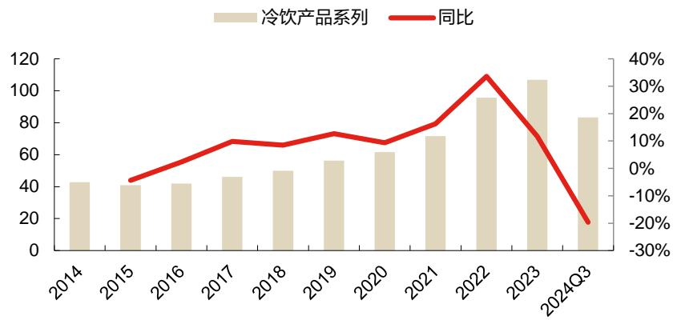

# 黑夜终将过去，把握高股息低估值乳品龙头机会

# 核心观点

⚫ 全面卓越铸就伊利，多元化拓展奠定优势。复盘历史，乳企的管理模式从粗放转向精细，核心产品体系由单一转向多元，伊蒙凭借品牌、渠道、资金、奶源等优势，逐步提升常温液体乳份额，形成双雄格局。随着双雄格局稳定，近年来伊蒙液体乳收入和宏观消费环境关联度提升，并加强产品多元化布局。液体乳以外，伊利冷饮、奶粉贡献规模业绩，也是奠定其成为乳制品绝对龙头的要素。当前消费疲软环境下，伊利等乳企均加强利润诉求，例如伊利制定了 25年净利率达 $9 \%$ 的目标。

$\bullet$ 轻装上阵叠加政策支持，预计收入增速环比向好。液体乳：白奶刚需属性仍在，受消费疲软影响动销略承压；鲜奶凭借渗透率提升，增速快于白奶；常温酸奶在弱消费环境中下滑较明显。24H1 伊利主动去库，当前库存低位；受益发货端好转，Q3伊利收入跌幅收窄；10月常温白奶终端销售额跌幅收窄。奶粉：伊利婴配粉份额持续提升，且 8月天猫淘宝销售额环比明显改善。羊奶粉海外进入高增阶段，贡献规模收入。冷饮：国内库存低位，下半年轻装上阵；海外东南亚等市场发展良好，打造第二增长曲线。奶酪：逐渐提升烘焙餐饮渗透率，24H1ToB 企业渠道实现增长。

⚫ 伊利或受益上游去产能，关注高股息低估值乳品龙头。上游乳牛产能去化已启动，中小型牧场较快退出，大型企业逐步清退低效产能； 2025年原奶或将迎来供需平衡。若奶价步入回升阶段，我们认为伊利经营净利率（剔除一次性投资收益）有望进一步提升：1）毛利率角度：结构升级 $\cdot ^ { + }$ 适度提价，毛利率下降空间不大；2）费用率角度：费用已在 24H1 集中投放，预计 24H2 及 25 年存在促销费用下降空间；奶价回升将导致乳品销售竞争趋缓，且大包粉减值损失、信用减值损失存在较大下降空间。综合，奶价回升有利于伊利经营净利率提升（剔除一次性投资收益）。此外，公司是高股息低估值优质标的。（11 月 4 日）股息率 $4 . 2 \%$ ，公司承诺 24 年分红率至少 $70 \%$ ；且资本开支存在进一步下降空间。伊利 11月 4日动态 PE仅 15倍，纵向、横向对比均处于低位，具备安全边际。

# 盈利预测与投资建议

⚫ 我们预测公司 2024-2026 年每股收益分别为 2.01、1.79、1.88 元。结合可比公司，我们认为目前公司的合理估值水平为 2024 年的 21 倍市盈率，对应目标价为 42.21元，首次给予买入评级。

风险提示：经济恢复不及预期、原奶价格持续回落导致竞争加剧、减值损失缩窄幅度不及预期、食品安全事件风险。

<table><tr><td>投资评级</td><td>买入（首次）</td></tr><tr><td>股价（2024年11月07日）</td><td>30.2元</td></tr><tr><td>目标价格</td><td>42.21元</td></tr><tr><td>52 周最高价/最低价</td><td>31.96/21.13元</td></tr><tr><td>总股本/流通A股（万股）</td><td>636,596/633,447</td></tr><tr><td>A股市值（百万元）</td><td>192,252</td></tr><tr><td>国家/地区</td><td>中国</td></tr><tr><td>行业</td><td>食品饮料</td></tr><tr><td>报告发布日期</td><td>2024年11月08日</td></tr></table>

<table><tr><td colspan="4">股价表现</td></tr><tr><td></td><td>1周 1月</td><td>3月</td><td>12月</td></tr><tr><td>绝对表现%</td><td>8.2 3.89</td><td>25.26</td><td>14.21</td></tr><tr><td>相对表现%</td><td>1.66 0.71</td><td>1.19</td><td>-0.32</td></tr><tr><td>沪深300%</td><td>6.54 3.18</td><td>24.07</td><td>14.53</td></tr></table>

#

叶书怀 yeshuhuai@orientsec.com.cn执业证书编号：S0860517090002  
姚晔 yaoye@orientsec.com.cn执业证书编号：S0860524090006  
燕斯娴 yansixian1@orientsec.com.cn执业证书编号：S0860524080004

公司主要财务信息  

<table><tr><td></td><td>2022A</td><td>2023A</td><td>2024E</td><td>2025E</td><td>2026E</td></tr><tr><td>营业收入(百万元)</td><td>122,698</td><td>125,758</td><td>120,127</td><td>125,278</td><td>134,209</td></tr><tr><td>同比增长(%)</td><td>11.4%</td><td>2.5%</td><td>-4.5%</td><td>4.3%</td><td>7.1%</td></tr><tr><td>营业利润(百万元)</td><td>10,860</td><td>11,873</td><td>14,726</td><td>13,164</td><td>13,765</td></tr><tr><td>同比增长(%)</td><td>6.2%</td><td>9.3%</td><td>24.0%</td><td>-10.6%</td><td>4.6%</td></tr><tr><td>归属母公司净利润(百万元)</td><td>9,431</td><td>10,429</td><td>12,770</td><td>11,406</td><td>11,976</td></tr><tr><td>同比增长(%)</td><td>8.3%</td><td>10.6%</td><td>22.5%</td><td>-10.7%</td><td>5.0%</td></tr><tr><td>每股收益（元）</td><td>1.48</td><td>1.64</td><td>2.01</td><td>1.79</td><td>1.88</td></tr><tr><td>毛利率(%)</td><td>32.3%</td><td>32.6%</td><td>34.3%</td><td>33.7%</td><td>33.2%</td></tr><tr><td>净利率(%)</td><td>7.7%</td><td>8.3%</td><td>10.6%</td><td>9.1%</td><td>8.9%</td></tr><tr><td>净资产收益率(%)</td><td>19.3%</td><td>20.1%</td><td>22.6%</td><td>18.8%</td><td>18.9%</td></tr><tr><td>市盈率</td><td>20.4</td><td>18.4</td><td>15.1</td><td>16.9</td><td>16.1</td></tr><tr><td>市净率</td><td>3.8</td><td>3.6</td><td>3.2</td><td>3.1</td><td>2.9</td></tr></table>

来源：公司数据. 东方证券研究所预测. 每股收益使用最新股本全面摊薄计算.有关分析师的申明，见本报告最后部分。其他重要信息披露见分析师申明之后部分，或请与您的投资代表联系。并请阅读本证券研究报告最后一页的免责申明。

# 目 录

# 一、全面卓越铸就伊利，多元化拓展奠定优势 5

1.1 管理趋向精细，利润诉求提升. .5  
1.2 高管持股绑定利益，三轮股权激励提升内部积极性. .8  
1.3 液奶为基本盘，打造奶粉冷饮多元增长曲线.. 9

# 二、轻装上阵叠加政策支持，预计收入增速环比向好. 11

2.1 伊利白奶相对刚需且结构提升，去库后有望轻装上阵... .11

2.1.1 液体乳双雄格局稳固，白奶刚需属性仍在 11  
2.1.2 库存低位 $\cdot ^ { + }$ 政策支持，Q3 业绩环比改善 12  
2.1.3 伊利渠道基础扎实，话语权强 $\cdot ^ { + }$ 深度分销，构筑运营护城河 14  
2.2 奶粉：市占率持续提升，婴配粉环比改善，羊奶粉海外高增 ...16  
2.3 冷饮国内库存低位轻装上阵，海外拓张打造第二增长曲线 ...17  
2.4 奶酪：积极布局多元化产品渠道，发掘 ToB 业务潜力. ...19

# 三、伊利或受益上游去产能，关注高股息低估值乳品龙头. .21

3.1 牧场去产能将促进原奶供需平衡，伊利净利率有望受益奶价回升.. ..21

3.1.1 奶牛产能去化大势所趋，原奶供需平衡终会到来 21  
3.1.2 若奶价步入回升阶段，伊利净利率有望进一步提升 21  
3.2 股息率位于行业前列，乳品龙头被明显低估.. ..25

# 四、盈利预测与投资建议 . . 26

4.1 盈利预测 . ..26  
4.2 投资建议 . ..26

五、风险提示.. .27

# 图表目录

图 1：伊利股份、蒙牛乳业、光明乳业收入（亿元）及历史复盘. ..5  
图 2：23 年伊利、蒙牛分业务营收（亿元）. ..6  
图 3：伊利、蒙牛分业务 16-23年收入复合增速... ....6  
图 4：伊利股份股权结构图（截至 2024/6/30）. .....8  
图 5：伊利股份分业务收入占比.. ....10  
图 6：伊利股份分业务毛利率（ $\%$ ）. ...10  
图 7：伊利、蒙牛液体乳收入及增速复盘. ......12  
图 8：2016-2023 年伊利液体乳量价增速 . ....12  
图 9：伊利液体乳单季收入及同比增速. ...12  
图 10：马上赢统计的伊利常温纯牛奶单月销售额及同比增速. .......13  
图 11：马上赢统计的蒙牛常温纯牛奶单月销售额及同比增速. .....13  
图 12：木丁商品信息统计的金典线下单月销售额及同比增速.. ....13  
图 13：木丁商品信息统计的特仑苏线下单月销售额及同比增速 ......13  
图 14：马上赢统计的伊利常温酸奶单月销售额及同比增速 . ....14  
图 15：马上赢统计的蒙牛常温酸奶单月销售额及同比增速 . ...14  
图 16：预付款占营收比重对比 ..... ......14  
图 17：合同负债占营收比重对比.. ....14  
图 18：伊利销售人员数量庞大 . ...15  
图 19：伊利经销商总数..... ......15  
图 20：伊利经销商平均创收.... .....15  
图 21：总资产周转率（次）对比... ....15  
图 22：ROE（ $\%$ ）对比..... ......15  
图 23：伊利奶粉收入及同比增速. ....16  
图 24：伊利奶粉销量、吨价同比增速. ...16  
图 25：伊利奶粉在天猫淘宝的月度收入及同比增速 ......16  
图 26：澳优羊奶粉收入（百万元）及同比增速. ....17  
图 27：澳优 2018-2023 年羊奶粉分地区收入 CAGR.. ...17  
图 28：伊利冷饮业务重要事件 ....... .......18  
图 29：伊利冷饮业务收入（亿元）及同比增速 . .....19  
图 30：伊利奶酪业务发展历史 . ....19  
图 31：部分牧业上市公司净利率（ $\%$ ）和生鲜乳均价... ....21  
图 32：现代牧业、中国圣牧生物资产公平值变动减乳牛出售成本产生的亏损（百万元）..........21  
图 33：伊利毛利率和奶价负相关.. ..22  
图 34：蒙牛毛利率和奶价负相关... .....22  
图 35：伊利销售费用率和奶价负相关. .22  
图 36：蒙牛销售费用率和奶价 . ..22  
图 37：伊利、蒙牛销售费用（亿元）对比 . ..22  
图 38：伊利毛销差和原奶价格对比. ..23  
图 39：蒙牛毛销差和原奶价格对比 . ..24  
图 40：伊利股份资产减值损失及对净利率的影响. ..24  
图 41：伊利股份信用减值损失及对净利率的影响.. ..24  
图 42：伊利股份年度现金分红总额及股利支付率. ..25  
图 43：乳制品行业股息率（%）一览.. ..25  
表 1：头部乳企公布的 2024 年度利润目标. .6  
表 2：伊利、蒙牛牧场收购历程. ..6  
表 3：伊利、蒙牛多元化业务收购历程. ..7  
表 4：伊利股份三轮股权激励计划细节. ...9  
表 5：伊利、蒙牛液体乳核心大单品. . 11  
表 6：伊利冷饮品牌创新 ... ...18  
表 7： Canary Foods 优势.. ..20  
表 8：近一轮奶价周期中伊利、蒙牛的毛利率、销售费用率变化幅度对比. ..23  
表 9：乳制品公司动态估值 PE（TTM）水平 . ..25  
表 10：可比公司估值表. ..27

# 一、全面卓越铸就伊利，多元化拓展奠定优势

# 1.1 管理趋向精细，利润诉求提升

内蒙古伊利实业集团股份有限公司（以下简称“伊利”）为我国为千亿级规模乳制品巨头，旗下涵盖液态奶、冷饮、奶粉、奶酪等多元生态业务，并在上下游产业链具备深入布局。复盘伊利历史也是对我国乳制品行业进行回顾：

2001 年前：光明为首，伊利蒙牛仍处萌芽期。伊利前身是成立于 1956 年的呼和浩特市回民区养牛合作小组，于 1993 年正式改制成立伊利实业集团，并于 1996 年在上交所上市。1999 年，公司创立液态奶事业部，并于 2000 年调整战略结构，由单一冰淇淋经营上升为乳产品经营。2002年前，光明收入达 50亿，规模居首；蒙牛于 1999年由牛根生等创立，规模尚小。

2003-2007 年：消费者触达半径、营销决定增速。伊利、蒙牛凭借利乐包装打破保质期桎梏，延长销售半径，迈向全国市场，收入规模也快速提升。2005 年后，伊蒙之间营销竞争趋于激烈，费用投入大；蒙牛酸酸乳在 2005 年冠名“超级女声”大爆，伊利成功牵手 2008 年北京奥运会组委会。光明专注低温领域，市场空间相对受限，收入规模被伊蒙迅速超越。

2008-2009 年：三聚氰胺事件导致蒙牛易主，乳企粗放式成长告一段落。震惊全国的三聚氰胺事件爆发，导致乳制品信任危机。蒙牛资金周转遇到困难，中粮入驻。

  
图 1：伊利股份、蒙牛乳业、光明乳业收入（亿元）及历史复盘  
数据来源：新浪财经、简易财经、人民网、新京报、公司公告、公司官网、东方证券研究所

2010-2015 年：头部乳企管理趋于精细，常温酸奶充分利用既有渠道优势。乳企吸取教训，更加注重上游奶源布局以保障产品质量（标志性事件是蒙牛收购现代牧业），同时随着常温领域双雄格局趋于稳定，双方价格战减少，费效提升，象征着头部乳企管理趋于精细化。此外，由光明莫斯利安引领的常温酸奶时代开启，安慕希、纯甄凭借伊蒙既有渠道优势后来居上，创造规模收入。

2016-2019 年：液奶基本盘稳固，加强多元业务布局。液奶格局稳定，渗透率也较高，伊蒙加强多元化业务探索，通过奶粉、奶酪、冰淇淋等领域收并购拓展业务范围或规模。蒙牛逐步收购多美滋、贝拉米、艾雪、妙可蓝多等，伊利收购 CHOMTHANA、威仕兰乳品等。总体来看，伊利冰淇淋、奶粉业务成长较快，16-23 年 CAGR 分别为 $12 \%$ 、 $23 \%$ ，在多元化业务拓展端具备优势。

  
图 2：23年伊利、蒙牛分业务营收（亿元）  
数据来源：公司年报、东方证券研究所

  
图 3：伊利、蒙牛分业务 16-23年收入复合增速  
数据来源：公司年报、东方证券研究所

2020-至今：伊蒙业绩与宏观经济关联度高，消费疲软下乳企加强利润诉求。先是新冠疫情爆发，乳品销售受到多维度影响；后是地产行业低迷、宏观经济疲软，乳品需求承压。乳企收入端扩展空间受限，进一步重视利润提升。

综合，我们认为头部乳企的发展历程可分为三个大阶段：1）2009 年以前：粗放扩张时代。乳企受益乳制品行业规模快速提升，彼时消费者触达半径、渠道推力、营销决定增速，乳企管理相对粗放；2）2010-2015：管理趋于精细。乳企愈发注重上下游产业链布局，同时有意识地提升费效；3）2016-至今：头部乳企业绩与宏观经济关联度提升。双雄格局稳定，液奶渗透率较高，上升空间缩窄，乳企收入增速与宏观经济关联度提升，例如 2016-2020 年乳品结构受益居民消费升级，2023年至今受制于消费疲软。当前阶段，随着收入端增长有限，乳企对利润的诉求提升。

表 1：头部乳企公布的 2024年度利润目标  

<table><tr><td colspan="2">利润目标</td></tr><tr><td>伊利股份</td><td>2025年净利率至少达到 9%</td></tr><tr><td>蒙牛乳业</td><td>2024 年全年经营利润率预估增长 0.3-0.5个百分点</td></tr><tr><td>光明乳业</td><td>2024 年归母净利润达到 5.67 亿，归属于上市公司股东的净资产收益率大于 6.26%</td></tr><tr><td>新乳业</td><td>2023-2027年净利率倍增</td></tr><tr><td>三元股份</td><td>2024 年扣非归母净利润同比 23 年大幅改善</td></tr></table>

数据来源：南方都市报、雷达财经、公司公告、东方证券研究所

表 2：伊利、蒙牛牧场收购历程  

<table><tr><td rowspan="3">伊利股份</td><td>牧场名称</td><td>优然牧业</td><td>赛科星</td><td>恒天然牧场（中国）</td><td>中地乳业</td></tr><tr><td>收购年份</td><td>2000</td><td>2019</td><td>2020</td><td>2020</td></tr><tr><td>收购历 程、股权 占比</td><td>伊利乳业收购了优然牧业 的前身呼和浩特市配合饲 料厂。直到 2015年，伊利 将优然牧业从其业务中分 拆出来独立运营，并于</td><td>2019 年7月，伊利通过优然牧业以 22.78亿元收购赛科星 58.36%股权</td><td>通过优然牧业以 5.13 亿新西兰 元（折合约23 亿人民币）收购 恒天然位于山西省应县、河北</td><td>收购中地乳业股权案 通过了反垄断审查， 收购后伊利持有中地</td></tr></table>

有关分析师的申明，见本报告最后部分。其他重要信息披露见分析师申明之后部分，或请与您的投资代表联系。并请阅读本证券研究报告最后一页的免责申明。

<table><tr><td rowspan="2"></td><td></td><td>股东</td><td></td><td></td><td></td></tr><tr><td>牧场简介</td><td>截至 24H1 末，共运营 96 座现代化牧场，奶牛存栏 量超 60万头，成母牛（不 含娟珊牛）年化单产达 12.6吨</td><td>截至 24H1 末，公司运营 25 座现代 化牧场，奶牛存栏量超 15 万头，成 母牛年化单产 12.3 吨</td><td>截至21年6月，奶牛存栏量5.5 万头</td><td>截至 22 年初，共有 9 座万头牧场，主要位 于华北、西北地区， 奶牛存栏量约 7.5 万 头，奶牛年化单产</td></tr><tr><td rowspan="4">蒙牛乳业</td><td>牧场名称</td><td>现代牧业</td><td>富源牧业</td><td>中国圣牧</td><td>11.96吨</td></tr><tr><td>收购年份</td><td>2013、2017</td><td>2020</td><td>2020-2021</td><td></td></tr><tr><td>收购历 程、股权 占比</td><td>2013年，收购现代牧业 27.9%股份；2017 年两次 收购后，持股比例提高至 57.9%，为第一大股东</td><td>现代牧业与卖方（即内蒙古蒙牛、 高盛、尚心及个别股东等）就收购 富源牧业订立买卖协议，以 34.8 亿 元人民币收购富源牧业全部股份。</td><td>2020收购11.97 亿股，占比约 17.8% 2021约10.5亿股占比约 29.99%</td><td></td></tr><tr><td>牧场简介</td><td>截至24H1末，奶牛存栏量 近45万吨，成乳牛单产 13.0吨</td><td>截至2020年末，奶牛存栏量6万头 左右，牛奶产量36万吨左右</td><td>截至24H1末，共运营34 座牧 场（含2座育肥牛牧场）。牛存 栏14.8万头（成乳牛5.8万 头），成乳牛年化单产12.07 吨。</td><td></td></tr></table>

数据来源：公司年报、金融界、证券日报、新浪财经、东方证券研究所

表 3：伊利、蒙牛多元化业务收购历程  

<table><tr><td>收购 公司</td><td>收购 年份</td><td>被收购对象</td><td>持有份 额（截 至23 年末）</td><td>收购对象简介</td><td>收购细节</td></tr><tr><td rowspan="7">伊利 蒙牛</td><td>2018</td><td>CHOMTHANA</td><td>96.46 %</td><td>泰国本土最大的冰淇淋和冷冻食品分销企 业，旗下拥有“Cremo”品牌，还向周边 13 个国家出口冰淇淋。</td><td>2018年 11 月，伊利与泰国 Chomthana 签署战略合作协 议，通过其全资子公司金港控股收购泰国 Chomthana96.46%的股份。</td></tr><tr><td>2019</td><td>WestlandDairy</td><td>100%</td><td>生产多种牛奶制品，包含商品奶粉、婴儿营 养品等。</td><td>2019年 8月，通过香港金港收购 Westland Co- Operative Dairy Company Limited 共计 100%的股权。</td></tr><tr><td>2021</td><td>肆玖（上海）</td><td>100%</td><td>主营新食机饮品、奶片、燕麦、酸奶块</td><td>公司与其他少数股东共同设立内蒙古三森田企业管理有限 公司，收购肆玖（上海）贸易有限公司股权，收购完成后 间接持有肆玖（上海）贸易有限公司93.33%股权。</td></tr><tr><td>2022</td><td>澳优乳业</td><td>59.45 %</td><td>第一家在香港上市的婴儿配方奶粉公司，已 成为一家全球性的乳制品公司，拥有 10 家 工厂，销售遍及 60 多个国家。</td><td>2022 年 3 月，公司通过金港控股以协议转让、认购新股 并触发全面要约义务的方式收购澳优乳业股权，占澳优乳</td></tr><tr><td>2022</td><td>菲仕兰</td><td>100%</td><td>荷兰皇家菲仕兰集团的子公司，自 1938 年 起长期在香港发展，主营美素孕妇、婴幼儿</td><td>业已发行总股份的 59.17%。 通过金港控股本年度收购 Friesland Campina HongKong （现已更名为“辽宁金鸿伊利乳业有限责任公司”）</td></tr><tr><td>2022</td><td>Canary</td><td>100%</td><td>奶粉及乳饮料等 CanaryFoods 位于新西兰汉密尔顿，拥有乳 脂、奶酪等世界级品质的乳制品加工产能，</td><td>100%股权。 2022年 10 月，子公司 WestlandDairyCompanyLimited 收购新西兰乳品公司 CanaryEnterprisesLimited100%股</td></tr><tr><td>2010</td><td>君乐宝</td><td>/</td><td>在航空、酒店、餐饮等渠道渗透率较高。 君乐宝主要从事生产及分销液体乳、奶粉等</td><td>权。 2010年11月，本集团向独立第三方收购君乐宝51%股</td></tr></table>

有关分析师的申明，见本报告最后部分。其他重要信息披露见分析师申明之后部分，或请与您的投资代表联系。并请阅读本证券研究报告最后一页的免责申明。

<table><tr><td rowspan="7"></td><td></td><td></td><td></td><td>产品。</td><td>权。</td></tr><tr><td>2014</td><td>达能上海及达能 北京</td><td>100%</td><td>达能上海及达能北京主要从事低温奶制品的 生产及销售。</td><td>2014 年，本集团自达能收购达能上海及达能北京的 100%权益。</td></tr><tr><td>2016</td><td>多美滋中国</td><td>99.97 %</td><td>多美滋中国主要从事制造及销售多美滋品牌 的婴幼儿配方奶粉。</td><td>2016年5月，本公司间接拥有51.01%股权的子公司雅 士利向 Danone 收购多美滋中国全部股权。</td></tr><tr><td>2018</td><td>旗帜乳品</td><td>/</td><td>旗帜乳品主要在中国生产、销售婴幼儿配方 奶粉</td><td>2018 年 7 月，君乐宝收购旗帜乳品额外 43.41%权益。 于收购后，君乐宝持有旗帜乳品 65.16%的股权，并取得 旗帜乳品控制权。(2019 年，蒙牛卖出君乐宝）</td></tr><tr><td>2019</td><td>贝拉米</td><td>100%</td><td>于澳洲证券交易所上市的全球认可澳洲有机 婴儿配方及婴儿食品供应商。贝拉米快速布 局中国线下渠道，积极开拓高端有机市场。</td><td>2019年12月，本集团收购贝拉米合共100%的股权，并 取得贝拉米的控制权。</td></tr><tr><td>2019 、 2021</td><td>艾雪</td><td>42.25 %</td><td>东南亚领先冰淇淋品牌艾雪，收购艾雪有利 于加速提升公司在东南亚的冰淇淋市场份 额。</td><td>2019 年12 月、2021年3月两次收购后，本集团之子公 司GoldenStage持有AICE36.68%权益，并取得对AICE 的控制权。</td></tr><tr><td>2022</td><td>妙可蓝多</td><td>36.43 %</td><td>国内领先的奶酪企业，其儿童奶酪棒单品已 成为全国市占率第一的品牌。</td><td>2022 年11 月，收购妙可蓝多股份约1.81亿股，占妙可 蓝多当时股份总数的35.01%，纳入蒙牛并表范围。</td></tr><tr><td>2023</td><td>雅士利</td><td>99.97 %</td><td></td><td>2023 年 7 月，本公司通过间接控股子公司进一步收购雅 士利 23.96%股权，并撤销雅士利股份在联交所的上市地 位。完成后，本集团持有雅士利约 99.95%股权。</td></tr></table>

数据来源：公司年报、万评、东方证券研究所

# 1.2 高管持股绑定利益，三轮股权激励提升内部积极性

高管持股比例高于 $5 \%$ ，和公司利益紧密绑定。截至24H1末，公司大股东主要包括香港中央结算有限公司（持股比例 $1 0 . 8 8 \%$ ）、呼和浩特投资有限公司（持股比例 $8 . 4 6 \%$ ）、潘刚（占比$4 . 5 0 \%$ ）、中国证券金融股份有限公司（占比 $2 . 8 7 \%$ ）、赵成霞（占比 $1 . 4 5 \%$ ）等，公司无实际控制人，股东背景兼具国有资本、公司高管。伊利现任董事长潘刚自2013年起进入前十大股东行列，十余年间持股比例呈上升趋势，从未减持；伊利现任执行董事兼财务负责人赵成霞自2013年起进入前十大股东行列，当前持股比例 $1 . 4 5 \%$ ；高管持股体现其对公司长期发展的信心，与公司利益紧密绑定。

潘刚掌舵伊利二十余年，战略连贯、执行力强。潘总在二十余年间做的一系列战略举措推动了伊利成为乳业龙头，包括早期即开展多元化产业布局、力排众议与2008年奥运组委会合作、坚定推行国际化战略等，展现了前瞻眼光和强大执行力。

图 4：伊利股份股权结构图（截至 2024/6/30）

  
数据来源：Wind、东方证券研究所

实施三轮员工股权激励计划，强化公司长期发展动力。伊利高度重视对核心管理层和员工的激励，是 A 股市场较早实施股权激励的上市公司之一。自 2006 年以来，公司先后推出了三次股权激励计划，通过多层次、多轮次的激励机制，涵盖公司董事、高级管理人员及核心业务与技术骨干，深度绑定管理层和员工的利益，增强了公司的长期发展动力。

表 4：伊利股份三轮股权激励计划细节  

<table><tr><td>时间</td><td>激励对象</td><td>激励数量</td><td>考核目标</td></tr><tr><td>2006年</td><td>公司总裁、３ 名总裁助理和 其他 29 名核心业务骨干</td><td>5000万股，占股本 总额 9.681%</td><td>首期行权时，上一年度净利润增长率不低于17%，主营业 务收入增长率不低于20%</td></tr><tr><td>2016年</td><td>核心业务人员及董事会认为 需要进行激励的员工共294 人</td><td>4500 万股，占股本 总额0.74%</td><td>以2015 年净利润为基数，2017 年净利润增长率不低于 30%，净资产收益率不低于 12%。以 2015 年净利润为基 数，2018年净利润增长率不低于45%，净资产收益率不低</td></tr><tr><td>2019年</td><td>高管、其他核心人员共475 人</td><td>1.5 亿股，占股本总 额2.5%</td><td>于12% 考核目标主要涉及 2019-2023 年净利润增长率、净资产收 益率、分红率</td></tr></table>

数据来源：公司公告、东方证券研究所

# 1.3 液奶为基本盘，打造奶粉冷饮多元增长曲线

产品端，伊利、蒙牛均以液态奶为基本盘，以冷饮、奶酪、奶粉等作为多元化业务拓展方向。

伊利和蒙牛在液态奶领域差距较小，双方都拥有核心大单品基本盘、丰富的产品线和充足的研发储备。两家公司在液态奶市场的核心产品都表现强劲，伊利的营收基本盘包括伊利纯牛奶、金典和安慕希，而蒙牛则涵盖蒙牛纯牛奶、特仑苏以及纯甄，二企业液体乳核心产品一一对应，均展现较强的竞争力。

在多元化业务拓展上，伊蒙展现出不同的战略和侧重点。伊利的冷饮、奶粉业务布局较早，发展较快。蒙牛通过控股雅士利拓展奶粉业务，并投资“妙可蓝多”加速布局奶酪市场。相对而言，液体乳以外，伊利强在冷饮、奶粉，蒙牛强在奶酪。

拆分业务收入占比，2014-2023 年，公司液体乳收入占比由 $78 \%$ 降至 $6 8 \%$ ，奶粉及奶制品收入占比由 $1 1 \%$ 升至 $2 2 \%$ ，冷饮占比由 $7 . 9 \%$ 升至 $8 . 5 \%$ 。奶粉、冷饮逐步成为伊利重要收入增长来源。

且奶粉、冷饮毛利率高于液体乳（23年奶粉、冷饮毛利率均为 $3 8 \%$ ），带动产品结构提升，有助于推升整体毛利率。

  
图 5：伊利股份分业务收入占比  
数据来源：Wind、东方证券研究所

  
图 6：伊利股份分业务毛利率（ $\%$ ）

数据来源：Wind、东方证券研究所

# 二、轻装上阵叠加政策支持，预计收入增速环比向好

# 2.1 伊利白奶相对刚需且结构提升，去库后有望轻装上阵

2.1.1液体乳双雄格局稳固，白奶刚需属性仍在乳业双雄格局奠定，常温为优势领域，核心品牌一一对应。伊利、蒙牛以纯牛奶等液体乳产品起家，至今已铸就常温液体乳双雄格局。伊利、蒙牛在常温基础白奶、高端白奶、常温酸奶领域均拥有核心大单品，其中伊利旗下伊利、金典、安慕希均为超 200 亿体量品牌，蒙牛旗下特仑苏体量近 300亿，蒙牛、纯甄品牌体量近百亿。

表 5：伊利、蒙牛液体乳核心大单品  

<table><tr><td colspan="4">伊利</td><td colspan="3">蒙牛</td></tr><tr><td></td><td>销售增速</td><td>体量</td><td>图片</td><td></td><td>体量</td><td>图片</td></tr><tr><td>伊利母品牌</td><td>预计24H1 受消费疲软、公司主动去库影 响，销售额同比下滑</td><td>超200亿</td><td>纯牛奶 纯牛奶</td><td>蒙牛母 品牌</td><td>近百亿</td><td></td></tr><tr><td>金典</td><td>预计场份仍保持较高增，其中金典有 同增近60%</td><td>超200亿</td><td>纯牛奶</td><td>特仑苏</td><td>近300亿</td><td></td></tr><tr><td>安慕希</td><td>常温酸奶以营销、口味为主驱动，需求刚 性不如白奶，同时24H1 受到主动去库影 响，预计跌幅大于均值</td><td>超200亿</td><td></td><td>纯甄</td><td>近百亿</td><td></td></tr></table>

数据来源：证券日报、BT财经、澎湃新闻、氢消费、五谷财经、公司研究室、环球网、公司公告、东方证券研究所

复盘伊利蒙牛液体乳发展历史，双雄胜出主要受益于多重优势：管理层眼光前瞻（以常温品布局全国化市场、提前布局高端品牌等）、持续且精准的营销投入、上游奶源布局优势、研发能力强（莫斯利安后快速推出常温酸奶品牌、新品频出）等。延申来讲，伊蒙双雄前期累积资本、规模优势，中后期凭借强品牌力、充沛现金流扩大优势，在常温乳品界的地位难以被撼动，在企业决策没有明显失误的情况下，伊蒙液体乳增速与行业规模（受到宏观经济、消费信心、食品安全事件等影响）关联度提升。当前伊蒙白奶刚需属性仍在，受消费疲软影响动销略承压；鲜奶凭借渗透率提升，增速快于白奶。

1）2002-2005年，眼界决定空间。伊利、蒙牛凭借利乐包装瞄准全国市场，为乳业双雄格局奠定了重要基础。2002-2005 年，市场开拓助推伊利白奶快速增长。

2）2005-2007 年，营销为重要抓手。蒙牛冠名“超级女声”大爆，拔高品牌知名度，2006-2007年收入增速高于伊利。此外，蒙牛、伊利均意识到高端化发展的重要性；蒙牛于 2005年推出高端品牌特仑苏，伊利于 2006 年推出金典，为把握消费升级趋势做好准备。

3）2008-2009 年，三聚氰胺事件爆发，乳企加强奶源布局。三聚氰胺事件导致乳制品信任危机，乳企需求承压，伊利、蒙牛收入增速均明显放缓。三聚氰胺事件倒逼乳企加强上游奶源布局，伊利、蒙牛等乳品巨头纷纷加强牧场建设、提升奶源品质，为企业长期发展打下重要基础。奶源布局有助于降低原奶成本波动，并有力保障产品质量。

4）2010-2015 年，乳品行业进入恢复增长期，高端白奶、常温酸奶步入大众视野。国内纯牛奶逐渐减少价格战，高端品牌特仑苏取得高速增长，率先成为销售额破百亿的纯乳品。以光明莫斯利安为首的常温酸奶步入大众视野，获得市场欢迎；随后 2014、2015 年前后伊利安慕希、蒙牛纯甄推出，高举高打营销下快速蚕食常温酸奶份额。

5）2016-2019 年，顺应消费升级趋势，伊利液体乳量价齐升。安慕希在 2017 年销售额达到 129亿，且年均增速超过 $200 \%$ ；金典品牌快速成长，2018年达到百亿销售规模。

6）2020-至今：新冠初期受益营养需求提升，23 年以来消费疲软导致需求承压。2021 年，受益居民营养需求提升，伊蒙液体乳增速反弹。2023 年以来，随着消费疲软影响逐步体现，送礼、自饮等场景受到影响，伊蒙白奶、酸奶需求相对承压，预计常温白奶需求相对刚性，低温白奶受益于渗透率提升，常温酸奶增长主要由口味、营销创新驱动，在弱消费环境中下滑较明显。

  
图 7：伊利、蒙牛液体乳收入及增速复盘  
数据来源：澎湃、中金在线、食悟传媒、公司公告、东方证券研究所

# 2.1.2 库存低位 $^ +$ 政策支持，Q3业绩环比改善

伊利主动去库，提升渠道、产品运营健康度，24Q3 液体乳收入跌幅收窄。23 年下半年以来，消费体感转冷，消费升级难以为继，送礼需求、档次预计也有所降低，终端动销下滑，导致 24 年初库存累积。一方面，公司主动开发综合电商、O2O、社区团购等新兴渠道；针对电商、餐饮、礼赠等渠道和场景需求，开展液体乳渠道定制服务，对收入有一定弥补。另一方面，公司在 24H1主动优化渠道库存，维护产品价盘，虽然导致报表增速承压（24Q1、Q2 液体乳增速分别同比下滑 $7 \%$ 、 $20 \%$ ），但也为有利于下半年轻装上阵，提升渠道信心，24Q3液体乳同比下滑 $10 \%$ ，跌幅已边际收窄。

图 8：2016-2023年伊利液体乳量价增速图 9：伊利液体乳单季收入及同比增速

  
数据来源：公司年报、东方证券研究所

  
数据来源：公司年报、东方证券研究所

中秋伊蒙常温白奶明显下滑，但 10月跌幅收窄。边际来看，根据马上赢统计的月度数据，伊利常温白奶自 23 年 10 月以来进入负增长区间，24 年 3 月以来延续单月双位数下滑趋势；蒙牛常温白奶也呈现相似的表现，24 年 3 月以来延续单月双位数下滑。8、9 月，因去年中秋基数较高，蒙牛、伊利常温白奶均呈现明显下滑，其中蒙牛单月分别下滑 $1 3 \%$ 、 $1 9 \%$ ，伊利分别下滑 $1 1 \%$ 、$12 \%$ ，但 10月蒙牛伊利跌幅分别收窄至 $1 3 \%$ 、 $10 \%$ ，预计因低库状态下发货端环比好转。

据木丁商品信息，金典、特仑苏在 24H2 线下商超月度销售额也延续双位数下滑。预计电商、团购等新兴渠道表现好于商超。（注：马上赢统计的数据仅针对部分渠道、部分产品，不代表公司整体情况）

  
图 10：马上赢统计的伊利常温纯牛奶单月销售额及同比增速  
数据来源：Datayes、马上赢、东方证券研究所

  
图 11：马上赢统计的蒙牛常温纯牛奶单月销售额及同比增速  
图 12：木丁商品信息统计的金典线下单月销售额及同比增速  
数据来源：Datayes、马上赢、东方证券研究所  
图 13：木丁商品信息统计的特仑苏线下单月销售额及同比增速

  
数据来源：Datayes、木丁商品信息、东方证券研究所

  
数据来源：Datayes、木丁商品信息、东方证券研究所

常温酸奶跌幅大于常温白奶，安慕希相对纯甄抗跌，安慕希具备一定品牌力优势。根据马上赢统计的月度数据，伊蒙常温酸奶早于常温白奶进入下滑区间，且跌幅高于常温白奶。安慕希、纯甄分别于自 23年 5月、23年 8月进入下滑区间。24年 3月以来安慕希、纯甄线下零售额月均跌幅分别近 $1 5 \%$ 、 $2 5 \%$ 。相较常温白奶，常温酸奶不具备明显刚需属性，更类似具备一定营养价值的休闲类饮品，主要由口味创新、营销驱动增长，因此在消费低迷时期需求弱于白奶。（注：马上赢统计的数据仅针对部分渠道、部分产品，不代表公司整体情况）

  
图 14：马上赢统计的伊利常温酸奶单月销售额及同比增速  
数据来源：Datayes、马上赢、东方证券研究所

  
图 15：马上赢统计的蒙牛常温酸奶单月销售额及同比增速  
数据来源：Datayes、马上赢、东方证券研究所  
图 17：合同负债占营收比重对比

农村农业部等七部门政策支持，有望拉动牛奶需求。2024 年 9 月 26 日，农村农业部等七部门发文鼓励促进牛肉牛奶消费，科学宣传展示鲜牛肉、鲜牛奶品质和营养价值，推广“学生饮用奶”，鼓励有条件的地方通过发放消费券等方式，拉动牛奶消费。

# 2.1.3 伊利渠道基础扎实，话语权强 $^ +$ 深度分销，构筑运营护城河

伊利在行业深耕多年，在上下游产业链中具备较高话语权，预付款占营收比重在行业中处于偏低水平，合同负债占营收比重高于蒙牛、光明、三元。渠道话语权意味着：1）原材料收购稳定性更强，2）渠道回款效率更高、厂商协同度更高、公司政策执行力更强，构筑企业运营的重要护城河。

图 16：预付款占营收比重对比

  
数据来源：Wind、东方证券研究所

  
数据来源：Wind、东方证券研究所

其次，伊利对市场掌控力较强。伊利采用深度分销、小商制策略，销售人员数量庞大（23 年末为2.05 万人）、经销商数量多且平均创收相对不高（23 年伊利前五大客户占销售比例 $5 \%$ ，蒙牛前五大客户占收入比例不到 $30 \%$ ），有利于更好地跟踪市场动态、执行公司政策，对终端掌控力较强。

  
图 18：伊利销售人员数量庞大  
数据来源：Wind、公司年报、东方证券研究所

  
图 19：伊利经销商总数  
数据来源：Wind、公司年报、东方证券研究所  
图 21：总资产周转率（次）对比

  
图 20：伊利经销商平均创收  
数据来源：Wind、公司年报、东方证券研究所  
图 22：ROE $( \%$ ）对比

渠道端优势带来了运营效率提升，伊利总资产周转率略高于蒙牛，ROE 位居行业前列。

  
数据来源：Wind、东方证券研究所

  
数据来源：Wind、东方证券研究所

# 2.2 奶粉：市占率持续提升，婴配粉环比改善，羊奶粉海外高增

新国标促进份额向头部集中，伊利奶粉市占率提升。新国标的实施标志着中国婴幼儿配方奶粉行业迈入更为严格和科学的监管新时期，加速市场洗牌和结构升级，使市场份额进一步向技术先进、研发能力强的头部企业集中。2023 年，伊利婴配粉零售额市占份额为 $1 6 . 2 \%$ ，同比提升 1.6pct。

伊利奶粉业务快速成长，同业中表现优异。在品牌、研发、渠道、资金支持下，伊利奶粉业务快速成长，2023 年奶粉业务实现收入 276 亿，2018-2023 年 CAGR 达 $28 \%$ ；23 年、24 年前三季度奶粉收入因消费疲软而降速，分别实现 $5 \%$ 、 $7 \%$ 的同比增速，在同业中表现仍突出，且仍维持量价齐升。根据 Datayes，24 年 8 月伊利奶粉在天猫淘宝销售额 34 百万元（yoy $+ 2 2 \%$ ），9 月销售额 39 百万元（ $y 0 y + 7 \%$ ），环比 1-7 月明显改善。

  
图 23：伊利奶粉收入及同比增速  
数据来源：Wind、东方证券研究所  
图 25：伊利奶粉在天猫淘宝的月度收入及同比增速

  
图 24：伊利奶粉销量、吨价同比增速  
数据来源：Wind、东方证券研究所

  
数据来源：Datayes、东方证券研究所

成人粉份额领先，布局潜力赛道。在成人奶粉这一细分市场，伊利主推面向中老年群体的“欣活”品牌，涵盖纾糖膳底、骨能膳底、心活膳底等多样化产品矩阵，通过定制营养解决方案，让中老年人群保持更健康的身体状态。女士奶粉主打高铁高钙奶粉、高纤脱脂高钙奶粉等，并为孕妇及哺乳期妇女量身打造了金领冠妈妈配方奶粉，全方位满足特殊时期妇女的营养需求。2024H1 伊利在成人奶粉业务领域的零售额市场份额同比增加 $0 . 5 \mathsf { p c t }$ ，达到 $2 4 . 3 \%$ ，保持领先地位。

收购羊奶第一品牌，海外市场进入高增阶段。2021年伊利收购澳优乳业。作为羊奶第一品牌，澳优乳业拥有着得天独厚的牧场资源，通过在中国、荷兰和澳洲的十一大工厂，建立从“牧场到餐桌”完整的全产业链。在国际化战略的推动下，澳优羊奶粉海外收入快速增长（23 年收入 3.8 亿，同增 $45 \%$ ；24H1 同增 $51 \%$ ），近年来东南亚、中东受益渗透率提升增势迅猛，佳贝艾特一阶段婴配粉于 2024 年在美国顺利上市。

  
图 26：澳优羊奶粉收入（百万元）及同比增速  
数据来源：Wind、东方证券研究所

  
图 27：澳优 2018-2023 年羊奶粉分地区收入 CAGR  
数据来源：Wind、东方证券研究所

# 2.3 冷饮国内库存低位轻装上阵，海外拓张打造第二增长曲线

冷饮业务稳健成长，市场份额持续领先。伊利的冷饮业务历史可追溯至公司成立之初。1996 年奥运期间伊利推出火炬冰激凌，成为风靡一时的甜品，标志伊利冷饮业务的早期成功。2000 年，公司成立冷饮事业部。2003 年“巧乐兹”品牌横空出世，同时推出了巧脆棒和香奶棒两款产品，当年销售额突破 2 亿人民币大关，巧乐兹也逐步成长为“国民宠儿”品牌。近年来，伊利冷饮业务持续创新、积极把握出海机会，带领板块稳健成长。伊利旗下多个品牌在各自的细分市场中也表现卓越，稳占细分品类的领头位置：巧乐兹、冰工厂和伊利牧场等品牌在各自领域持续保持领先。截至 2023年，伊利冷饮业务连续 29年居全国冷饮行业龙头地位。

  
图 28：伊利冷饮业务重要事件  
数据来源：公司官网、东方证券研究所

积极研发新品，创收同时推动冷饮结构提升。产品创新方面，伊利紧跟消费者对高品质和新口味的需求，通过精准把握市场趋势和消费者口味偏好，不断推出新品，优化产品结构。2024 年以来，伊利契合健康趋势推出“甄稀”活菌冰淇淋、“绮炫”低糖黑巧冰淇淋、“伊利牧场”低糖软心可可雪糕等新品。消费者口味易变，研发创新是推动冷饮业务发展的核心驱动力之一。

表 6：伊利冷饮品牌创新  

<table><tr><td>甄稀</td><td>绮炫</td><td>须尽欢</td></tr><tr><td></td><td>绮炫 全线续选 比利时巧克力 纯正生牛乳</td><td></td></tr><tr><td>首个高端冰淇淋品牌。2021 年甄稀品牌全线升级，以 100%甄选生牛乳为核心基 料，搭配全球优质食材，带来 纯正、本真、自然的味蕾体验</td><td>高端巧克力冰淇淋品牌，作 为高端巧冰的重新定义者， 以“全线产品100%臻选进 口比利时巧克力+纯正生牛 乳+不额外添加一滴水”作 为支撑点，用高品质用料构 建行业品质核心差异点</td><td>首个超高端冰淇淋品牌，以诗 仙李白“人生得意须尽欢”之 豁达通透为名，持匠人之心， 寻味东方产品；取鲜牛乳醇厚 之味，以东方美学灵感为形， 承盛唐之匠心，传此刻之尽 欢。致力于做更具中国韵味的 鲜牛乳冰淇淋</td></tr></table>

数据来源：公司官网、东方证券研究所

加速突破东南亚市场，海外成为增收重要来源。伊利 Joyday 品牌于 2018 年在印尼市场首次发布，成为伊利冷饮业务进入国际市场的先行军。近两年 Joyday市场知名度快速提升，在市场中增速位列第一。2021 年，伊利印尼乳业生产基地正式投产，为中国乳企在东南亚建设的最大生产基地，为东南亚市场拓展提供有力支撑。2023 年 12 月，Joyday 冰淇淋进一步拓展至坦桑尼亚市场；目前，Joyday 已在 16 个国家和地区上市。

2018 年，伊利收购泰国冰淇淋公司 Chomthana，正式进军泰国市场，并对旗下 Cremo 冰淇淋进行全面品牌焕新。据新华网，Cremo 品牌近三年年均销售额增长超过 $1 6 . 5 \%$ ，一跃成为泰国增速最快的冰淇淋品牌，已跻身泰国冰淇淋市场前三；此外，Cremo 还出口至新加坡、马来西亚、美法澳等 14个国家和地区。

2017-2023年为伊利冷饮业务收入快速增长期（收入CAGR为 $1 5 \%$ ），预计海外拓张贡献规模增长。

  
图 29：伊利冷饮业务收入（亿元）及同比增速  
数据来源：Wind、东方证券研究所

24 年前三季度，受天气、去年基数较高、消费疲软的影响，伊利冷饮业务实现收入 83 亿（yoy-$20 \%$ ），但份额仍保持领先。24 年上半年公司协助经销商消化库存；据伊利，当前公司冷饮业务的库存在整个行业中处于最好水平。我们认为短期冷饮增速有望受益低库存轻装上阵，长期有望受益国内消费力恢复、新的户外场景等开拓，以及海外市场开拓。

# 2.4 奶酪：积极布局多元化产品渠道，发掘 ToB 业务潜力

持续深耕奶酪板块，基本盘奶酪棒外布局多元产品。自 2018 年底成立奶酪事业部以来，伊利在奶酪领域展开一系列战略布局。2020 年，伊利以“儿童奶酪棒”为先锋，正式切入奶酪市场，并迅速扩大产品线，覆盖儿童奶酪棒、芝士片、马苏里拉芝士碎以及成人奶酪棒“妙芝”口袋芝士等多个品类。奶酪棒放量，带领 21H1 奶酪收入同比翻番增长。21 年 6 月，伊利全资持有的内蒙古伊家好奶酪有限责任公司成立，标志着公司在奶酪领域的进一步深耕。2022 年，伊利旗下威士兰乳业完成对新西兰乳企 Canary Foods $100 \%$ 股权的收购。伊利奶酪在品类创新上也不断突破，2024 年与盒马合作推出定制岩烧乳酪酱、上市“泡面芝士条”等新品，进一步拓宽消费场景，满足消费者对多样化奶酪产品的需求。

图 30：伊利奶酪业务发展历史

  
数据来源：公司官网、东方证券研究所

战略性收购，加速 ToB布局。CanaryFoods为全球知名的黄油、奶酪企业，产品遍布 20多个国家和地区，为其奶酪业务的全球化布局提供强有力的支持。Canary Foods 具备乳脂、奶酪等世界级品质的乳制品加工产能，且拥有成熟的航空公司、酒店、餐厅销售渠道，有助于伊利加速布局ToB奶酪业务。

表 7： Canary Foods 优势  

<table><tr><td rowspan="2">Canary Foods</td><td>全球化布局</td><td>品质优良</td><td>2B业务成熟</td><td>研发能力強</td></tr><tr><td>专注于黄油、奶酪 领域，产品已在新 西兰、中国、新加 坡等20多个国家和成，原料、产品品供食品，2B业务具油，满足零售和商业应</td><td>产品使用 新西兰草饲黄油制</td><td>专注于为航空公 司、酒店和餐厅提</td><td>括不同熔点的黄油，以</td></tr></table>

数据来源：Canary Foods 官网、东方证券研究所

员工持股计划深化，激发内生动力。伊利集团通过实施核心员工持股计划，增强伊家好的内部动力和市场竞争力。该计划涉及对伊家好奶酪的增资，其中伊利集团出资28,720万元，核心员工持股平台出资 31,280万元，使得核心员工持股比例达到 $40 \%$ ，有利于提升员工的积极性。

ToC 受消费疲软拖累短期承压，预计伊利奶酪 ToB 业务稳健增长。ToC 市场则受到大消费市场整体疲软的影响，消费者在选择日常消费品时变得更加谨慎，导致奶酪等价格偏高、且非必需品的品类销量增长放缓。ToB 市场展现增长潜力，伊利积极把握餐饮、烘焙市场消费趋势，通过“伊利 Pro”系列产品，提升在烘焙、餐饮、饮品行业的渗透率。随着 24 年以来餐饮、烘焙业逐渐恢复，伊利奶酪在企业渠道实现增长。

# 三、伊利或受益上游去产能，关注高股息低估值乳品龙头

3.1 牧场去产能将促进原奶供需平衡，伊利净利率有望受益奶 价回升

# 3.1.1奶牛产能去化大势所趋，原奶供需平衡终会到来

多数牧场陷入亏损，奶牛产能去化已启动。由于产能高位、需求不振，我国原奶价格自21年下半年起持续下滑，我国多数规模牧场均已出现亏损，例如已上市的西部牧业、现代牧业、中国圣牧、优然牧业 24H1 净利率分别为- $. 7 . 3 \%$ 、 $- 3 . 2 \%$ 、 $- 9 . 4 \%$ 、 $- 4 . 6 \%$ ，更不必说管理能力、规模效应都较弱的中小规模牧场。根据绿松鼠，23 年下半年至今，部分竞争力较弱、效率低下的中小型牧场已退出市场，“有限度地”减少华中、西北地区原奶供应过剩问题。牛只去化是大势所趋，否则牧场将会陷入持续亏损经营；24H1，产能去化已在推行，例如宁夏牛存栏量从23年末91万头降至24 年 5 月的 81 万头。退役低效牛、老龄牛、低产牛优先清退，预计部分后备牛也在去化。上市牧业企业在 24H1 的生物资产公平值变动减乳牛出售成本产生的亏损增加，例如现代牧业相关亏损为 11.5 亿（23H1 为 5.3 亿），优然牧业相关亏损为 4.5亿（23H1 为 2.9 亿），意味着这些上市企业正在推进乳牛产能去化。

相对而言，中小规模牧场奶牛去化速度更快、幅度更大，清退的奶牛种类更广（涉及到老弱残成母牛及后备牛等），大规模牧场不再主动新增产能，奶牛产能去化规模相对有限，预计以老弱残成母牛为主。

根据绿松鼠预测，2025 年原奶或将迎来供需平衡。原奶供需平衡后，奶价有望迎来回升。

  
图 31：部分牧业上市公司净利率（ $\%$ ）和生鲜乳均价  
数据来源：Wind、东方证券研究所

  
图 32：现代牧业、中国圣牧生物资产公平值变动减乳牛出售成本产生的亏损（百万元）  
数据来源：公司年报、东方证券研究所

# 3.1.2 若奶价步入回升阶段，伊利净利率有望进一步提升

原奶是乳制品加工企业的核心原材料之一，奶价和原材料成本波动关联度高。纵观历史，伊利、蒙牛毛利率都与奶价明显负相关。伊利在奶价上行、下降周期中，毛利率变化幅度均大于蒙牛。但伊利、蒙牛在奶价上行期时，毛利率相对较平稳，下降空间不大，预计主要因产品结构升级、提价对毛利率起到支撑作用。

  
图 33：伊利毛利率和奶价负相关  
数据来源：Wind、东方证券研究所（21 年会计政策调整，已统一 21 年及之后数据口径）

  
图 34：蒙牛毛利率和奶价负相关  
数据来源：Wind、东方证券研究所

伊利销售费用率与奶价呈负相关。在奶价下行周期中，市场竞争趋于激烈，乳企打价格战概率提升，销售费用随之提升。在奶价上行周期中，竞争趋缓，库存降低，产品新鲜度提升，预计促销费用明显下降。

蒙牛销售费用率：自 2009 年中粮入驻后，蒙牛销售费用率整体呈现上升趋势，直至 2021-2022年因消费场景缺失等因素致费用率下降，2023 年以来因奶价下滑、竞争趋于激烈，蒙牛销售费用率再度回升。总体而言，蒙牛销售费用率在2021年以前整体呈上升趋势，我们认为主要因品牌力为乳企竞争的核心要素之一，因此蒙牛销售费用总额需大致追平伊利。随着当前竞争格局趋于稳固，乳企费用投入逐渐步入稳定区间，预计蒙牛费用率也会与奶价呈现较明显的反向关联。

  
图 35：伊利销售费用率和奶价负相关  
数据来源：Wind、东方证券研究所（21 年会计政策调整，已统一 21 年及之后数据口径）

  
图 36：蒙牛销售费用率和奶价  
数据来源：Wind、东方证券研究所

图 37：伊利、蒙牛销售费用（亿元）对比

  
数据来源：Wind、东方证券研究所

表 8：近一轮奶价周期中伊利、蒙牛的毛利率、销售费用率变化幅度对比  

<table><tr><td>18年9月-21年3月</td><td>生鲜乳价格变化幅度 (%)</td><td>25.47</td><td></td><td></td></tr><tr><td>18年12月-21年12月</td><td>伊利毛利率变化幅度 (%)</td><td>(1.38)</td><td>伊利销售费用率变化幅 度(%）</td><td>(2.58)</td></tr><tr><td>18年12月-21年12月</td><td>蒙牛毛利率变化幅度 (%)</td><td>(0.63)</td><td>蒙牛销售费用率变化幅 度(%)</td><td>(0.66)</td></tr><tr><td>21年9月至今</td><td>生鲜乳价格下降幅度 (%)</td><td>(26.21)</td><td></td><td></td></tr><tr><td>21年6月-24年6月</td><td>伊利毛利率变化幅度 (%)</td><td>4.76</td><td>伊利销售费用率变化幅 度(%）</td><td>2.00</td></tr><tr><td>21年6月-24年6月</td><td>蒙牛毛利率变化幅度 (%)</td><td>2.02</td><td>蒙牛销售费用率变化幅 度（%）</td><td>0.31</td></tr></table>

数据来源：Wind、东方证券研究所  
有关分析师的申明，见本报告最后部分。其他重要信息披露见分析师申明之后部分，或请与您的投资代表联系。并请阅读本证券研究报告最后一页的免责申明。

奶价与乳企毛利率、销售费用率同时呈现负相关关联，我们采用毛销差指标来探索乳企盈利能力和奶价的关系。总体来看，在奶价上行期，伊利毛销差呈现跟随提升的现象，主要因销售费用率下降幅度 $>$ 毛利率下降幅度。奶价上行期，蒙牛毛销差滞后上升，预计主要因蒙牛费用率维持高位，下降幅度低。

  
图 38：伊利毛销差和原奶价格对比  
数据来源：Wind、东方证券研究所（黑圈为生鲜乳价格上升时段，蓝圈为伊利液体乳毛销差提升时段）

  
图 39：蒙牛毛销差和原奶价格对比  
数据来源：Wind、东方证券研究所（黑圈为生鲜乳价格上升时段，蓝圈为蒙牛液态奶利润率提升时段）

展望未来，预计原奶供需平衡后，奶价回升有望引领伊利经营净利率进一步提升，主要因以下原因：

毛利率端：历史来看，奶价上行期伊利毛利率的下降幅度往往较小，主要因 1）毛利率较高的奶粉、鲜奶增速较快，结构继续提升；3）公司可选择产品提价以应对成本提升，因此毛利率下降空间不大。预计下一轮奶价上行期中，伊利毛利率也将延续小幅承压的趋势。

预计奶价回升后，伊利将充分享受费用率降低的红利：1）24H1 伊利已进行大规模去库，产品渠道库存降低、新鲜度提升，费用已在上半年集中投放，24H2 及 25 年存在促销费用下降空间（24Q3 销售费用率已环比 Q2 下降 1.6pct）；2）奶价回升将导致乳品销售竞争趋缓；3）大包粉减值损失存在大幅下降空间，24年前三季度资产减值损失6.9亿，拖累净利率0.8pct；4）信用减值损失存在大幅下降空间，24 年前三季度为 3.7 亿，拖累净利率 $0 . 4 \mathsf { p c t }$ ，主要因上游牧场压力加剧，公司提升了针对上游合作牧场的贷款拨备率，导致减值增加。

我们认为在之后一轮原奶价格回升阶段，伊利费用率有较大降幅空间，伴随毛利率温和下降，经营净利率将提升（剔除 24年一次性投资收益）。

  
图 40：伊利股份资产减值损失及对净利率的影响  
数据来源：Wind、东方证券研究所

  
图 41：伊利股份信用减值损失及对净利率的影响  
数据来源：Wind、东方证券研究所

# 3.2 股息率位于行业前列，乳品龙头被明显低估

伊利分红金额、分红率均位于较高水平，23 年共分红 76 亿，股利支付率达到 $73 \%$ 。公司股息率位于乳制品行业前列，截至 24年 11月 4日的股息率（以 23年度分红金额计算）为 $4 . 2 \%$ ，在乳品行业排名第四。此外，公司承诺 2024年度分红率至少 $70 \%$ ，分红金额相比 23年进一步提升，有力保障股东利益。

另一方面，随着产线布局基本完成，预计未来几年公司资本开支存在下降空间。公司预计2024年全年资本开支在50亿左右，已开始呈现逐渐下降的趋势，未来几年基本也会维持在这个水平。资本开支金额下降进一步保障分红。

  
图 42：伊利股份年度现金分红总额及股利支付率  
数据来源：Wind、东方证券研究所

  
图 43：乳制品行业股息率（ $\%$ ）一览  
数据来源：Wind、东方证券研究所（包含 A 股、H 股乳制品标的，不包含未分红企业）

估值角度，伊利在11月4日PE(TTM)为15倍，位于2019年至今的 $4 \%$ 百分位，处于历史低位。横向对比，伊利市盈率低于光明、新乳业、妙可蓝多、熊猫乳品等，在乳品行业位于低位，预计因伊利主动去库、消费疲软导致 24年以来业绩增速不及预期；但 24H2以来伊利轻装上阵，重新出发，低库存叠加白奶促消费政策，预计经营业绩增速会较 24H1 明显回升（剔除一次性投资收益），支撑估值上行。

表 9：乳制品公司动态估值 PE（TTM）水平  

<table><tr><td colspan="2">未来12 个月预期估值</td><td>伊利股份</td><td>蒙牛乳业</td><td>光明乳业</td><td>新乳业</td><td>天润乳业</td><td>熊猫乳品</td><td>妙可蓝多</td><td>贝因美</td></tr><tr><td colspan="2">当前估值</td><td>15</td><td>14</td><td>18</td><td>18</td><td>16</td><td>25</td><td>46</td><td>27</td></tr><tr><td rowspan="4">2019年 至今</td><td>最大值</td><td>35</td><td>34</td><td>43</td><td>60</td><td>31</td><td>68</td><td>88</td><td>79</td></tr><tr><td>最小值</td><td>14</td><td>13</td><td>15</td><td>17</td><td>14</td><td>19</td><td>23</td><td>11</td></tr><tr><td>中间值</td><td>19</td><td>19</td><td>22</td><td>23</td><td>20</td><td>29</td><td>33</td><td>25</td></tr><tr><td>百分位</td><td>4%</td><td>4%</td><td>9%</td><td>2%</td><td>16%</td><td>12%</td><td>36%</td><td>24%</td></tr><tr><td rowspan="4">2014年 至今</td><td>最大值</td><td>35</td><td>34</td><td>43</td><td>60</td><td>57</td><td>68</td><td>88</td><td>318</td></tr><tr><td>最小值</td><td>14</td><td>13</td><td>15</td><td>17</td><td>14</td><td>19</td><td>23</td><td>11</td></tr><tr><td>中间值</td><td>18</td><td>19</td><td>22</td><td>23</td><td>21</td><td>29</td><td>34</td><td>26</td></tr><tr><td>百分位</td><td>5%</td><td>5%</td><td>12%</td><td>2%</td><td>6%</td><td>12%</td><td>36%</td><td>5%</td></tr><tr><td rowspan="4">2009年 至今</td><td>最大值</td><td>35</td><td>34</td><td>59</td><td>60</td><td>57</td><td>68</td><td>88</td><td>318</td></tr><tr><td>最小值</td><td>14</td><td>13</td><td>15</td><td>17</td><td>14</td><td>19</td><td>6</td><td>11</td></tr><tr><td>中间值</td><td>19</td><td>19</td><td>23</td><td>23</td><td>21</td><td>29</td><td>33</td><td></td></tr><tr><td>百分位</td><td>6%</td><td>5%</td><td>7%</td><td>2%</td><td>6%</td><td>12%</td><td>49%</td><td>25 5%</td></tr></table>

资料来源：Wind、东方证券研究所（注：估值时间为 2024 年 11 月 4 日）

# 四、盈利预测与投资建议

# 4.1 盈利预测

我们对公司 2024-2026 年盈利预测做如下假设：

1) 收入的波动主要来自于液体乳、冷饮、奶粉业务。预计 24-26 年液体乳实现收入 798、820、868 亿元，金典品牌维持双位数较高增速，伊利纯奶在 25-26 年有望迎来恢复性增长。预计 24-26 年冷饮实现收入 90、94、101 亿元。预计 24-26 年奶粉业务实现收入 293、318、351 亿元，品牌、渠道推力下叠加较低基数（相较飞鹤），预计维持较快增速。  
2) 公司 24-26 年毛利率分别为 $3 4 . 3 \%$ 、 $3 3 . 7 \%$ 、 $3 3 . 2 \%$ 。原奶或在 25 年达到供需平衡，26 年毛利率或有小幅下滑。  
3) 公司 24-26 年销售费用率为 $1 9 . 3 \%$ 、 $1 8 . 3 \%$ 、 $1 8 . 2 \%$ ，管理费用率为 $4 . 2 \%$ 、 $4 . 1 \%$ 、$4 . 1 \%$ 。24 年销售费用率偏高，主要因上半年公司加大促销力度去库存，预计 25-26 年销售费用率回落。

4) 公司 24-26 年的所得税率维持 $1 3 \%$ 。

盈利预测核心假设   

<table><tr><td></td><td>2022A</td><td>2023A</td><td>2024E</td><td>2025E</td><td>2026E</td></tr><tr><td>液体乳</td><td></td><td></td><td></td><td></td><td></td></tr><tr><td>销售收入（百万元）</td><td>84,926.1</td><td>85,540.3</td><td>79,842.3</td><td>81,971.2</td><td>86,812.0</td></tr><tr><td>增长率</td><td>0.0%</td><td>0.7%</td><td>-6.7%</td><td>2.7%</td><td>5.9%</td></tr><tr><td>毛利率</td><td>29.1%</td><td>30.4%</td><td>31.0%</td><td>30.1%</td><td>29.2%</td></tr><tr><td>冷饮</td><td></td><td></td><td></td><td></td><td></td></tr><tr><td>销售收入（百万元）</td><td>9,567.4</td><td>10,688.2</td><td>8,978.1</td><td>9,427.0</td><td>10,086.9</td></tr><tr><td>增长率</td><td>33.6%</td><td>11.7%</td><td>-16.0%</td><td>5.0%</td><td>7.0%</td></tr><tr><td>毛利率</td><td>38.5%</td><td>38.4%</td><td>39.0%</td><td>37.9%</td><td>37.7%</td></tr><tr><td>奶粉</td><td></td><td></td><td></td><td></td><td></td></tr><tr><td>销售收入(百万元）</td><td>26,260.3</td><td>27,598.0</td><td>29,317.2</td><td>31,790.6</td><td>35,116.6</td></tr><tr><td>增长率</td><td>62.0%</td><td>5.1%</td><td>6.2%</td><td>8.4%</td><td>10.5%</td></tr><tr><td>毛利率</td><td>41.1%</td><td>38.1%</td><td>41.7%</td><td>41.3%</td><td>41.7%</td></tr><tr><td>其他业务</td><td></td><td></td><td></td><td></td><td></td></tr><tr><td>销售收入（百万元）</td><td>1,944.2</td><td>1,931.6</td><td>1,989.6</td><td>2,089.1</td><td>2,193.5</td></tr><tr><td>增长率</td><td>4.3%</td><td>-0.6%</td><td>3.0%</td><td>5.0%</td><td>5.0%</td></tr><tr><td>毛利率</td><td>20.0%</td><td>18.6%</td><td>35.0%</td><td>35.0%</td><td>35.0%</td></tr><tr><td>合计</td><td>122,698.0</td><td>125,758.2</td><td>120,127.2</td><td>125,277.8</td><td>134,209.0</td></tr><tr><td>增长率</td><td>11.4%</td><td>2.5%</td><td>-4.5%</td><td>4.3%</td><td>7.1%</td></tr><tr><td>综合毛利率</td><td>32.3%</td><td>32.6%</td><td>34.3%</td><td>33.7%</td><td>33.2%</td></tr></table>

资料来源：公司数据，东方证券研究所预测

# 4.2 投资建议

我们预测公司2024-2026年每股收益分别为2.01、1.79、1.88元。结合可比公司，我们认为目前公司的合理估值水平为 2024 年的 21 倍市盈率，对应目标价为 42.21 元，首次给予买入评级。

表 10：可比公司估值表  

<table><tr><td rowspan="2">公司</td><td rowspan="2">代码</td><td>最新价格（元）</td><td colspan="4">每股收益（元）</td><td colspan="4">市盈率</td></tr><tr><td>2024/11/7</td><td>2023A</td><td>2024E</td><td>2025E</td><td>2026E</td><td>2023A</td><td>2024E</td><td>2025E</td><td>2026E</td></tr><tr><td>蒙牛乳业</td><td>02319</td><td>17.50</td><td>1.22</td><td>1.12</td><td>1.27</td><td>1.39</td><td>14.29</td><td>15.69</td><td>13.77</td><td>12.55</td></tr><tr><td>妙可蓝多</td><td>600882</td><td>18.26</td><td>0.12</td><td>0.24</td><td>0.37</td><td>0.45</td><td>147.38</td><td>74.65</td><td>49.96</td><td>40.44</td></tr><tr><td>李子园</td><td>605337</td><td>10.64</td><td>0.60</td><td>0.59</td><td>0.66</td><td>0.74</td><td>17.71</td><td>17.94</td><td>16.04</td><td>14.41</td></tr><tr><td>光明乳业</td><td>600597</td><td>8.95</td><td>0.70</td><td>0.35</td><td>0.40</td><td>0.44</td><td>12.75</td><td>25.83</td><td>22.41</td><td>20.36</td></tr><tr><td>中国飞鹤</td><td>06186</td><td>5.55</td><td>0.37</td><td>0.41</td><td>0.44</td><td>0.46</td><td>14.85</td><td>13.41</td><td>12.57</td><td>11.98</td></tr><tr><td>熊猫乳品</td><td>300898</td><td>23.76</td><td>0.88</td><td>0.93</td><td>0.98</td><td>1.06</td><td>27.03</td><td>25.62</td><td>24.35</td><td>22.32</td></tr><tr><td></td><td>调整后平均</td><td></td><td></td><td></td><td></td><td></td><td></td><td>21</td><td>19</td><td>17</td></tr></table>

数据来源：Wind、东方证券研究所

# 五、风险提示

经济恢复不及预期风险。若宏观经济持续低迷，消费需求不振，可能对公司液体乳、冷饮、奶粉业绩产生不利影响，并可能导致产品结构下移。

原奶价格持续回落导致竞争加剧风险。若原奶迟迟无法达到供需平衡，导致奶价持续回落，可能导致乳制品行业竞争愈发激烈，导致公司产品库存高位、费用率提升。

减值损失缩窄幅度不及预期风险。若原奶价格止跌回升，但公司资产减值损失、信用减值损失收窄幅度不及预期，可能对公司盈利、估值产生不利影响。

食品安全事件风险。若发生食品安全黑天鹅事件，可能对公司估值、业绩产生不利影响。

附表：财务报表预测与比率分析  

<table><tr><td colspan="6">资产负债表</td></tr><tr><td>单位：百万元</td><td>2022A</td><td>2023A</td><td>2024E</td><td>2025E</td><td>2026E</td></tr><tr><td>货币资金</td><td>33,853</td><td>43,372</td><td>42,045</td><td>43,847</td><td>46,973</td></tr><tr><td>应收票据、账款及款项融资</td><td>3,250</td><td>3,305</td><td>2,879</td><td>3,205</td><td>3,392</td></tr><tr><td>预付账款</td><td>1,834</td><td>1,480</td><td>1,622</td><td>1,679</td><td>1,730</td></tr><tr><td>存货</td><td>14,836</td><td>12,512</td><td>11,653</td><td>13,123</td><td>13,534</td></tr><tr><td>其他</td><td>7,690</td><td>8,687</td><td>7,337</td><td>7,852</td><td>7,944</td></tr><tr><td>流动资产合计</td><td>61,463</td><td>69,355</td><td>65,537</td><td>69,706</td><td>73,574</td></tr><tr><td>长期股权投资</td><td>4,563</td><td>4,408</td><td>4,394</td><td>4,455</td><td>4,419</td></tr><tr><td>固定资产</td><td>33,735</td><td>35,242</td><td>32,680</td><td>29,956</td><td>27,233</td></tr><tr><td>在建工程</td><td>3,417</td><td>4,329</td><td>9,347</td><td>14,158</td><td>18,770</td></tr><tr><td>无形资产</td><td>4,648</td><td>4,729</td><td>4,554</td><td>4,379</td><td>4,204</td></tr><tr><td>其他</td><td>23,139</td><td>33,556</td><td>35,148</td><td>34,889</td><td>34,686</td></tr><tr><td>非流动资产合计</td><td>69,502</td><td>82,265</td><td>86,123</td><td>87,837</td><td>89,312</td></tr><tr><td>资产总计</td><td>130,965</td><td>151,620</td><td>151,660</td><td>157,543</td><td>162,886</td></tr><tr><td>短期借款</td><td>26,799</td><td>39,755</td><td>38,105</td><td>47,877</td><td>47,764</td></tr><tr><td>应付票据及应付账款</td><td>16,807</td><td>14,840</td><td>14,772</td><td>15,635</td><td>16,437</td></tr><tr><td>其他</td><td>18,563</td><td>22,265</td><td>26,126</td><td>22,922</td><td>24,056</td></tr><tr><td>流动负债合计</td><td>62,170</td><td>76,860</td><td>79,003</td><td>86,433</td><td>88,257</td></tr><tr><td>长期借款</td><td>9,298</td><td>11,705</td><td>5,705</td><td>5,705</td><td>5,705</td></tr><tr><td>应付债券</td><td>3,482</td><td>3,541</td><td>3,504</td><td>0</td><td>0</td></tr><tr><td>其他</td><td>1,872</td><td>2,193</td><td>272</td><td>272</td><td>272</td></tr><tr><td>非流动负债合计</td><td>14,653</td><td>17,440</td><td>9,482</td><td>5,978</td><td>5,978</td></tr><tr><td>负债合计</td><td>76,822</td><td>94,300</td><td>88,484</td><td>92,411</td><td>94,234</td></tr><tr><td>少数股东权益</td><td>3,875</td><td>3,781</td><td>3,684</td><td>3,557</td><td>3,426</td></tr><tr><td>实收资本（或股本）</td><td>6,399</td><td>6,366</td><td>6,366</td><td>6,366</td><td>6,366</td></tr><tr><td>资本公积</td><td>13,161</td><td>13,030</td><td>13,380</td><td>13,380</td><td>13,380</td></tr><tr><td>留存收益</td><td>30,787</td><td>34,615</td><td>39,745</td><td>41,829</td><td>45,478</td></tr><tr><td>其他</td><td>(79)</td><td>(472)</td><td>0</td><td>0</td><td>0</td></tr><tr><td>股东权益合计</td><td>54,143</td><td>57,320</td><td>63,175</td><td>65,132</td><td>68,651</td></tr><tr><td>负债和股东权益总计</td><td>130,965</td><td>151,620</td><td>151,660</td><td>157,543</td><td>162,886</td></tr></table>

现金流量表  

<table><tr><td>单位：百万元</td><td>2022A</td><td>2023A</td><td>2024E</td><td>2025E</td><td>2026E</td></tr><tr><td>净利润</td><td>9,318</td><td>10,284</td><td>12,673</td><td>11,279</td><td>11,845</td></tr><tr><td>折旧摊销</td><td>4,083</td><td>3,321</td><td>3,037</td><td>2,908</td><td>2,898</td></tr><tr><td>财务费用</td><td>(255)</td><td>(153)</td><td>334</td><td>280</td><td>215</td></tr><tr><td>投资损失</td><td>(244)</td><td>31</td><td>(2,650)</td><td>(100)</td><td>(100)</td></tr><tr><td>营运资金变动</td><td>(5,391)</td><td>1,146</td><td>2,982</td><td>(1,079)</td><td>864</td></tr><tr><td>其它</td><td>5,908</td><td>3,661</td><td>(3, 122)</td><td>330</td><td>189</td></tr><tr><td>经营活动现金流</td><td>13,420</td><td>18,290</td><td>13,254</td><td>13,618</td><td>15,911</td></tr><tr><td>资本支出</td><td>(10,718)</td><td>(5,348)</td><td>(5,017)</td><td>(4,811)</td><td>(4,611)</td></tr><tr><td>长期投资</td><td>(457)</td><td>152</td><td>(41)</td><td>(61)</td><td>36</td></tr><tr><td>其他</td><td>(8,339)</td><td>(10,848)</td><td>2,255</td><td>200</td><td>169</td></tr><tr><td>投资活动现金流</td><td>(19,514)</td><td>(16,044)</td><td>(2,803)</td><td>(4,673)</td><td>(4,407)</td></tr><tr><td>债权融资</td><td>4,384</td><td>3,951</td><td>(2,505)</td><td>(7,311)</td><td>275</td></tr><tr><td>股权融资</td><td>143</td><td>(164)</td><td>350</td><td>0</td><td>0</td></tr><tr><td>其他</td><td>4,254</td><td>3,471</td><td>(9,623)</td><td>170</td><td>(8,654)</td></tr><tr><td>筹资活动现金流</td><td>8,781</td><td>7,258</td><td>(11,778)</td><td>(7,142)</td><td>(8,378)</td></tr><tr><td>汇率变动影响</td><td>(580)</td><td>119</td><td>-0</td><td>-0</td><td>-0</td></tr><tr><td>现金净增加额</td><td>2,108</td><td>9,624</td><td>(1,327)</td><td>1,803</td><td>3,126</td></tr></table>

资料来源：东方证券研究所

利润表  

<table><tr><td>单位：百万元</td><td>2022A</td><td>2023A</td><td>2024E</td><td>2025E</td><td>2026E</td></tr><tr><td>营业收入</td><td>122,698</td><td>125,758</td><td>120,127</td><td>125,278</td><td>134,209</td></tr><tr><td>营业成本</td><td>83,119</td><td>84,789</td><td>78,962</td><td>83,121</td><td>89,624</td></tr><tr><td>销售费用</td><td>22,908</td><td>22,572</td><td>23,224</td><td>22,899</td><td>24,397</td></tr><tr><td>管理费用</td><td>5,343</td><td>5,154</td><td>5,087</td><td>5,180</td><td>5,550</td></tr><tr><td>研发费用</td><td>822</td><td>850</td><td>841</td><td>877</td><td>939</td></tr><tr><td>财务费用</td><td>(255)</td><td>(153)</td><td>334</td><td>280</td><td>215</td></tr><tr><td>资产、信用减值损失</td><td>930</td><td>1,686</td><td>(237)</td><td>130</td><td>36</td></tr><tr><td>公允价值变动收益</td><td>94</td><td>278</td><td>(100)</td><td>50</td><td>50</td></tr><tr><td>投资净收益</td><td>244</td><td>(31)</td><td>2,650</td><td>100</td><td>100</td></tr><tr><td>其他</td><td>690</td><td>766</td><td>260</td><td>223</td><td>168</td></tr><tr><td>营业利润</td><td>10,860</td><td>11,873</td><td>14,726</td><td>13,164</td><td>13,765</td></tr><tr><td>营业外收入</td><td>61</td><td>230</td><td>180</td><td>100</td><td>100</td></tr><tr><td>营业外支出</td><td>291</td><td>382</td><td>340</td><td>300</td><td>250</td></tr><tr><td>利润总额</td><td>10,630</td><td>11,721</td><td>14,566</td><td>12,964</td><td>13,615</td></tr><tr><td>所得税</td><td>1,312</td><td>1,437</td><td>1,894</td><td>1,685</td><td>1,770</td></tr><tr><td>净利润</td><td>9,318</td><td>10,284</td><td>12,673</td><td>11,279</td><td>11,845</td></tr><tr><td>少数股东损益</td><td>(113)</td><td>(144)</td><td>(97)</td><td>(127)</td><td>(130)</td></tr><tr><td>归属于母公司净利润</td><td>9,431</td><td>10,429</td><td>12,770</td><td>11,406</td><td>11,976</td></tr><tr><td>每股收益（元）</td><td>1.48</td><td>1.64</td><td>2.01</td><td>1.79</td><td>1.88</td></tr></table>

主要财务比率  

<table><tr><td></td><td>2022A</td><td>2023A</td><td>2024E</td><td>2025E</td><td>2026E</td></tr><tr><td>成长能力</td><td></td><td></td><td></td><td></td><td></td></tr><tr><td>营业收入</td><td>11.4%</td><td>2.5%</td><td>-4.5%</td><td>4.3%</td><td>7.1%</td></tr><tr><td>营业利润</td><td>6.2%</td><td>9.3%</td><td>24.0%</td><td>-10.6%</td><td>4.6%</td></tr><tr><td>归属于母公司净利润</td><td>8.3%</td><td>10.6%</td><td>22.5%</td><td>-10.7%</td><td>5.0%</td></tr><tr><td>获利能力</td><td></td><td></td><td></td><td></td><td></td></tr><tr><td>毛利率</td><td>32.3%</td><td>32.6%</td><td>34.3%</td><td>33.7%</td><td>33.2%</td></tr><tr><td>净利率</td><td>7.7%</td><td>8.3%</td><td>10.6%</td><td>9.1%</td><td>8.9%</td></tr><tr><td>ROE</td><td>19.3%</td><td>20.1%</td><td>22.6%</td><td>18.8%</td><td>18.9%</td></tr><tr><td>ROIC</td><td>11.2%</td><td>9.8%</td><td>11.3%</td><td>9.9%</td><td>9.9%</td></tr><tr><td>偿债能力</td><td></td><td></td><td></td><td></td><td></td></tr><tr><td>资产负债率</td><td>58.7%</td><td>62.2%</td><td>58.3%</td><td>58.7%</td><td>57.9%</td></tr><tr><td>净负债率</td><td>12.4%</td><td>24.5%</td><td>17.8%</td><td>18.3%</td><td>13.0%</td></tr><tr><td>流动比率</td><td>0.99</td><td>0.90</td><td>0.83</td><td>0.81</td><td>0.83</td></tr><tr><td>速动比率</td><td>0.74</td><td>0.73</td><td>0.67</td><td>0.64</td><td>0.67</td></tr><tr><td>营运能力</td><td></td><td></td><td></td><td></td><td></td></tr><tr><td>应收账款周转率</td><td>48.6</td><td>40.7</td><td>41.5</td><td>43.8</td><td>43.3</td></tr><tr><td>存货周转率</td><td>6.8</td><td>5.8</td><td>6.0</td><td>6.2</td><td>6.2</td></tr><tr><td>总资产周转率</td><td>1.1</td><td>0.9</td><td>0.8</td><td>0.8</td><td>0.8</td></tr><tr><td>每股指标（元）</td><td></td><td></td><td></td><td></td><td></td></tr><tr><td>每股收益</td><td>1.48</td><td>1.64</td><td>2.01</td><td>1.79</td><td>1.88</td></tr><tr><td>每股经营现金流</td><td>2.10</td><td>2.87</td><td>2.08</td><td>2.14</td><td>2.50</td></tr><tr><td>每股净资产</td><td>7.90</td><td>8.41</td><td>9.35</td><td>9.67</td><td>10.25</td></tr><tr><td>估值比率</td><td></td><td></td><td></td><td></td><td></td></tr><tr><td>市盈率</td><td>20.4</td><td>18.4</td><td>15.1</td><td>16.9</td><td>16.1</td></tr><tr><td>市净率</td><td>3.8</td><td>3.6</td><td>3.2</td><td>3.1</td><td>2.9</td></tr><tr><td>EV/EBITDA</td><td>13.7</td><td>13.4</td><td>11.1</td><td>12.3</td><td>11.9</td></tr><tr><td>EV/EBIT</td><td>18.9</td><td>17.1</td><td>13.3</td><td>14.9</td><td>14.4</td></tr></table>

# Tabl e_Disclai mer 分析师申明

每位负责撰写本研究报告全部或部分内容的研究分析师在此作以下声明：

分析师在本报告中对所提及的证券或发行人发表的任何建议和观点均准确地反映了其个人对该证券或发行人的看法和判断；分析师薪酬的任何组成部分无论是在过去、现在及将来，均与其在本研究报告中所表述的具体建议或观点无任何直接或间接的关系。

# 投资评级和相关定义

报告发布日后的 12 个月内行业或公司的涨跌幅相对同期相关证券市场代表性指数的涨跌幅为基准（A股市场基准为沪深 300指数，香港市场基准为恒生指数，美国市场基准为标普 500指数）；

# 公司投资评级的量化标准

买入：相对强于市场基准指数收益率 $1 5 \%$ 以上；  
增持：相对强于市场基准指数收益率 $5 \% \sim 1 5 \%$ ；  
中性：相对于市场基准指数收益率在 $. 5 \% \sim + 5 \%$ 之间波动；  
减持：相对弱于市场基准指数收益率在- $5 \%$ 以下。

未评级——由于在报告发出之时该股票不在本公司研究覆盖范围内，分析师基于当时对该股票的研究状况，未给予投资评级相关信息。

暂停评级——根据监管制度及本公司相关规定，研究报告发布之时该投资对象可能与本公司存在潜在的利益冲突情形；亦或是研究报告发布当时该股票的价值和价格分析存在重大不确定性，缺乏足够的研究依据支持分析师给出明确投资评级；分析师在上述情况下暂停对该股票给予投资评级等信息，投资者需要注意在此报告发布之前曾给予该股票的投资评级、盈利预测及目标价格等信息不再有效。

# 行业投资评级的量化标准：

看好：相对强于市场基准指数收益率 $5 \%$ 以上；

中性：相对于市场基准指数收益率在- $. 5 \% \sim + 5 \%$ 之间波动；

看淡：相对于市场基准指数收益率在- $. 5 \%$ 以下。

未评级：由于在报告发出之时该行业不在本公司研究覆盖范围内，分析师基于当时对该行业的研究状况，未给予投资评级等相关信息。

暂停评级：由于研究报告发布当时该行业的投资价值分析存在重大不确定性，缺乏足够的研究依据支持分析师给出明确行业投资评级；分析师在上述情况下暂停对该行业给予投资评级信息，投资者需要注意在此报告发布之前曾给予该行业的投资评级信息不再有效。

# HeadertTabl e_Discl ai mer 免责声明

本证券研究报告（以下简称“本报告”）由东方证券股份有限公司（以下简称“本公司”）制作及发布。

本报告仅供本公司的客户使用。本公司不会因接收人收到本报告而视其为本公司的当然客户。本报告的全体接收人应当采取必要措施防止本报告被转发给他人。

本报告是基于本公司认为可靠的且目前已公开的信息撰写，本公司力求但不保证该信息的准确性和完整性，客户也不应该认为该信息是准确和完整的。同时，本公司不保证文中观点或陈述不会发生任何变更，在不同时期，本公司可发出与本报告所载资料、意见及推测不一致的证券研究报告。本公司会适时更新我们的研究，但可能会因某些规定而无法做到。除了一些定期出版的证券研究报告之外，绝大多数证券研究报告是在分析师认为适当的时候不定期地发布。

在任何情况下，本报告中的信息或所表述的意见并不构成对任何人的投资建议，也没有考虑到个别客户特殊的投资目标、财务状况或需求。客户应考虑本报告中的任何意见或建议是否符合其特定状况，若有必要应寻求专家意见。本报告所载的资料、工具、意见及推测只提供给客户作参考之用，并非作为或被视为出售或购买证券或其他投资标的的邀请或向人作出邀请。

本报告中提及的投资价格和价值以及这些投资带来的收入可能会波动。过去的表现并不代表未来的表现，未来的回报也无法保证，投资者可能会损失本金。外汇汇率波动有可能对某些投资的价值或价格或来自这一投资的收入产生不良影响。那些涉及期货、期权及其它衍生工具的交易，因其包括重大的市场风险，因此并不适合所有投资者。

在任何情况下，本公司不对任何人因使用本报告中的任何内容所引致的任何损失负任何责任，投资者自主作出投资决策并自行承担投资风险，任何形式的分享证券投资收益或者分担证券投资损失的书面或口头承诺均为无效。

本报告主要以电子版形式分发，间或也会辅以印刷品形式分发，所有报告版权均归本公司所有。未经本公司事先书面协议授权，任何机构或个人不得以任何形式复制、转发或公开传播本报告的全部或部分内容。不得将报告内容作为诉讼、仲裁、传媒所引用之证明或依据，不得用于营利或用于未经允许的其它用途。

经本公司事先书面协议授权刊载或转发的，被授权机构承担相关刊载或者转发责任。不得对本报告进行任何有悖原意的引用、删节和修改。

提示客户及公众投资者慎重使用未经授权刊载或者转发的本公司证券研究报告，慎重使用公众媒体刊载的证券研究报告。

# 东方证券研究所

地址： 上海市中山南路 318 号东方国际金融广场 26 楼  
电话： 021-63325888  
传真： 021-63326786