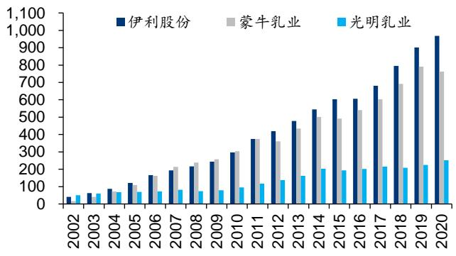
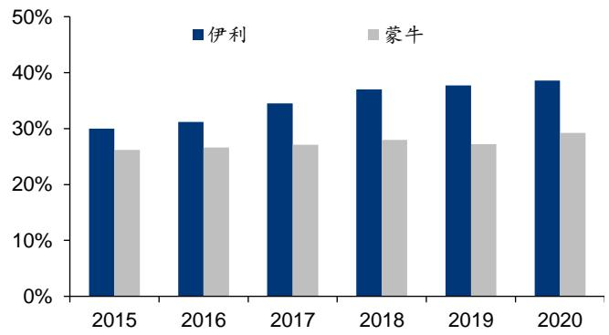
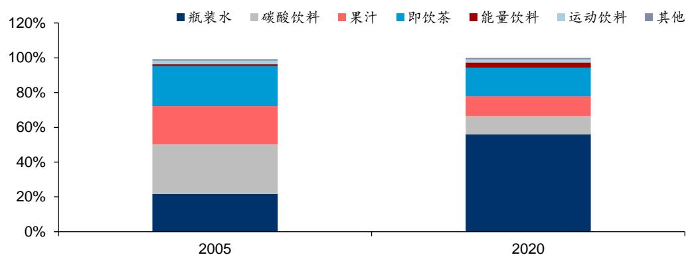
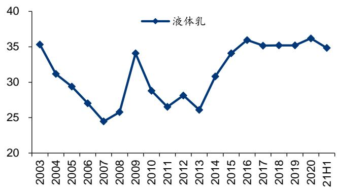

# 王者之路，扶摇而上

# 华泰研究

2021年8月31日|中国内地

首次覆盖必选消费/食品饮料

# 顾往昔之路：步步为营成就伟大，望来日之方：大象起舞再上新征程

二十余年精耕细作铸就全球乳业龙头，核心竞争力在于其把握重要发展机遇的能力，构建了强大的品牌/渠道/产品/奶源/机制架构壁垒，体现在：1）前瞻思维（把握常温高端趋势，奠定龙头地位)；2）产品打造力（成功打造安慕希/金典/伊利纯牛奶/优酸乳4个百亿级单品)；3）渠道深耕和多元营销业态；4）管理层架构稳定，团队执行力优秀。展望未来，短看疫后需求提振、结构升级、竞争趋缓，助盈利中枢步入抬升通道，中长期看好其在全乳品类/健康饮品领域护城河的续接与再建，预计21-23 年EPS1.43/1.72/2.02元，参考可比公司 21 年平均 PE31X，公司作为行业龙头，业绩增长稳定性和ROE表现更优，给予21 年33xPE，目标价47.19元，首次覆盖“买入”。

# 望来日之方一：短期看产品结构升级优化，液乳优势持续巩固

短期看，疫后白奶需求旺盛，产品高端化、低线市场的增长潜能、竞争趋缓将成为伊利未来三年业绩成长的主要动能。1）需求旺盛，产品结构优化将带动提价增利。2）低线市场更具成长潜力，渠道精耕细作步入收获期。3)双寡头竞争趋缓，体现在权衡行业竞争及结构升级后真实盈利水平的毛销差指标未来三年望处于上行通道，伊利/蒙牛21H1 毛销差同比+1.1/+1.5pct。

# 望来日之方二：中期看奶粉释放增长动力，全乳龙头指日可期

中期看，奶粉有望紧抓国产替代红利贡献主要增长动能，目前低温奶和奶酪市场规模相对较小但增速快，未来有望贡献边际增量。奶粉市场步入千亿时代，国产替代趋势明显，伊利曾为奶粉国产龙头，正蓄力回暖，渠道优势显著，掌控优质奶源且研发实力突出，目前正在不断聚集资源投入、扩充产品矩阵，金领冠专利配方的应用价值和受众范围将不断被放大。

# 望来日之方三：非乳板块蓄势待发，伊利积跬步以至千里

对标雀巢，其核心竞争力是形成了从品类/地域拓展决策—内生/外延落地—优秀管理模式的完整闭环，并在纵深发展过程中不断优化，伊利正学习和复制此模式。长期看，健康食品打造新的增长引擎，软饮行业“空间大、集中度低”，我们认为从大单品安慕希的成功经验可以看到公司具备打造健康饮品明星单品的潜力，伊利在健康饮品行业已切入饮用水/蛋白饮料/咖啡饮料等多个赛道，未来有望打开自身成长边界，全面迈向健康食品集团。

看好后千亿时代伊利的成长性和可持续性，首次覆盖给予“买入”评级我们预计其 21-23 年 EPS1.43/1.72/2.02 元，参考可比公司 21 年平均 PE为31X，给予21 年33xPE，目标价47.19 元，首次覆盖“买入”评级。

风险提示：食品安全；原奶价格大幅上涨；竞争加剧；新品拓展不及预期。

经营预测指标与估值   

<table><tr><td>会计年度</td><td>2019</td><td>2020</td><td>2021E</td><td>2022E</td><td>2023E</td></tr><tr><td>营业收入(人民币百万)</td><td>90,223</td><td>96,886</td><td>110,006</td><td>122,022</td><td>134,632</td></tr><tr><td>+/-%</td><td>13.41</td><td>7.38</td><td>13.54</td><td>10.92</td><td>10.33</td></tr><tr><td>归属母公司净利润 (人民币百万)</td><td>6,934</td><td>7,078</td><td>8,691</td><td>10,474</td><td>12,315</td></tr><tr><td>+/-%</td><td>7.67</td><td>2.08</td><td>22.78</td><td>20.52</td><td>17.58</td></tr><tr><td>EPS(人民币，最新摊薄)</td><td>1.14</td><td>1.16</td><td>1.43</td><td>1.72</td><td>2.02</td></tr><tr><td>ROE (%)</td><td>25.66</td><td>25.05</td><td>26.96</td><td>28.88</td><td>30.11</td></tr><tr><td>PE (倍)</td><td>29.06</td><td>28.47</td><td>23.19</td><td>19.24</td><td>16.36</td></tr><tr><td>PB(倍)</td><td>7.71</td><td>6.63</td><td>5.91</td><td>5.24</td><td>4.65</td></tr><tr><td>EV EBITDA (倍)</td><td>21.76</td><td>20.42</td><td>16.77</td><td>13.75</td><td>11.70</td></tr></table>

资料来源：公司公告、华泰研究预测

投资评级(首评): 买入目标价(人民币): 47.19

<table><tr><td colspan="2">基本数据</td></tr><tr><td>目标价(人民币)</td><td>47.19</td></tr><tr><td>收盘价(人民币截至8月30日)</td><td>33.13</td></tr><tr><td>市值(人民币百万)</td><td>201,503</td></tr><tr><td>6个月平均日成交额 (人民币百万)</td><td>2,166</td></tr><tr><td>52周价格范围(人民币)</td><td>31.46-51.69</td></tr><tr><td>BVPS（人民币）</td><td>5.30</td></tr></table>

  
股价走势图  
资料来源：Wind

# 正文目录

# 核心观点 5

# 页往昔之路：华路蓝缕，铸就全球乳业龙头…

# 来日之方：大象起舞，开启健康食品新征程. 13

# 主利预测与估值. .33

# 盈利预测... .33

# 风险提示.. ..35

# 图表目录

图表1：伊利股份已成为我国乳制品行业龙头(2020 年零售额份额) …… …图表2：2007-2020 年我国人均液态奶消费量. ….图表3：2003-2006 年乳制品产量及收入同比 ….图表 4：2006-2020 年乳制品零售量及同比增速 …… .图表5：2006-2020年乳制品零售均价及同比增速， ….图表6：巴氏奶和UHT奶对比 ….7图表7：2002-2020 年我国主要乳业龙头收入规模(亿元) …… .图表8：伊利股份成为常温牛奶龙头（零售额份额） …

图表10：2008-2019 我国奶牛养殖规模化占比. ..8图表11：2015-21H1 公司研发支出及占比（右轴） … …图表12： 伊利股份研发费用率领先其余主要乳业龙头. 8图表13： 14-20 年中国常温酸奶市场规模及同比增速（右轴） ………… ….图表14： 我国常温酸奶市场份额持续攀升……… …图表 15：15-20 年安慕希收入规模图表 16：16-20年安慕希在酸奶零售端市占率不断提高…9图表17： 安慕希、莫斯利安、纯甄酸奶对比.. …… ……图表18： 近年来热门综艺年播放量排名TOP5..  
图表19：2018-21H1 公司销售模式以经销为主… ……10图表20：近年来公司电商业务收入保持高速增长…10图表21： 伊利股份高管均在公司任职多年，蒙牛乳业总裁更换相对频繁 ………… …图表22： 公司2006/2016年股权激励方案.. ……图表23： 公司2019年股权激励方案. …1图表24： 管理团队带领公司多次克服危机. ………………………………图表25： 2010-21H1公司分业务收入占比.. …… .1图表26： 2010-21H1公司分业务毛利率走势 ……3图表27： 伊利常温奶VS 低温奶营养指标. ..1图表28： 我国液态奶表观消费量. ……图表29： 我国人均液态奶消费量， …  
图表30： 2009 年至今我国牛奶和酸奶零售均价攀升…. 14图表31：2006-2020 年液态奶中分产品零售额份额情况…14图表32： 2020 年我国乳制品市场品类结构（零售额份额）  
图表33： 2020 年日本乳制品市场品类结构（零售额份额） ……图表34： 2006-2020 年液态乳均价增速及销量增速.…. 15图表 35：2020 年伊利各档次产品销售渗透率及销售额同比……15图表36： 我国 UHT市场主要高端品牌零售额份额 …16图表37： 我国酸奶市场主要品牌零售额份额……16图表38： 我国生鲜乳价格变动… ……图表39： 伊利股份销售额增长贡献分拆... 17图表40： 15-17年销售价格及成本变动幅度对比. …17图表41： 伊利液体乳毛利率及毛销差变动（）…17图表42：2020 年中日美人均乳制品消费量对比（单位：kg） ……图表43： 2020 年我国农村地区液态奶渗透率较低.. …………………… .17图表44： 伊利及蒙牛渠道发展对比 …图表45： 2020 年乳制品行业龙头市占率. ……………图表46： 伊利、蒙牛常温奶市占率对比.. ..19图表47： 伊利、蒙牛销售费用率对比.. …………… ….19图表 48：伊利及蒙牛销售费用投放情况19图表49： 伊利及蒙牛毛销差变化情况.. ……………图表50： 我国出生人数及出生率（右轴）走势. …20图表51： 我国婴幼儿配方奶粉市场规模及增速（右轴)  
图表52：2012 年我国婴幼儿奶粉市场主要公司零售额份额20图表 53：2020 年我国婴幼儿奶粉市场主要公司零售额份额…….20图表54： 2020 年日本乳制品市场分品类零售额龙头公司.. 21图表55： 近年来乳粉行业主要政策…  
图表56： 伊利奶粉及乳制品收入及同比增速..  
图表 57：2020 年我国婴幼儿奶粉市场中海外品牌及国产品牌份额前三……22图表58： 伊利不断布局奶粉矩阵... … ..2图表59：我国巴氏奶市场规模增速高于常温白奶， … ..23图表60： 2020 年各国巴氏奶占液态奶比例. ………………… ..23图表61： 2019年12月伊利推出三款鲜奶产品. ……………图表62： 14-20 年伊利酸奶产能预算及占比(右轴) …… .图表63： 伊利健康饮品板块主要产品.. ……图表64： 全球软饮料市场规模及增速. … ..25图表65： 2020 年软饮料细分子行业销量及增速 … ..25图表66： 2020 年乳制品及饮料行业竞争格局.. …… .图表67： 2005/2020 年软饮市场消费量结构对比.. ..26图表68： 17-19年饮料细分市场龙头份额变动.. ..26图表69： 2020年各代际人口占比.  
图表70： 15-17年各代际消费金额增长率.. .7图表71： 2019 年不同年龄阶段乳制品消费量占比... … ….图表72： 2020 年不同年龄阶段软饮料消费量占比... 27图表73： 伊利及主要料企业渠道对 （2020年）.27图表74： 乳制品行业渠道结构， ……… ..8图表75： 饮料行业渠道结构.. …… ….8图表76： 农夫山泉主要产品品牌.. … ….图表77： 主要产品营收占比及增长动能 ……………………… ….2图表78： 雀巢七大板块业务发展时间线梳理…30图表79： 雀巢七大板块收入占比. …………… ….30图表80： 70年代以来亚非GDP增速高于欧美. ………… ….30图表81： 雀巢收入增速分拆(剔除汇率影响) … ….30图表82： 雀巢研发费用情况.. ..30图表83： 伊利推出功能多元的液态乳产品， … …1图表84： 伊利销售费用投入及同比增速（右轴）  
图表85： 伊利液体乳收入占比及增速(右轴) ….32图表86： 伊利液体乳毛利率（%）…… …… ….图表87： 伊利股份收入预测表（单位：百万元) … ….3图表88： 伊利股份毛利预测（单位：百万元) ……………图表89： 伊利股份费用率预测明细… … ….图表90： 可比公司估值表. ……图表91： 报告提及公司信息.. ……图表92： 伊利股份PE-Bands … …… ….5图表 93：伊利股份B-Bands … ….

# 核心观点

# 公司核心逻辑

伊利目前已成长为中国规模最大、产品品类最全的乳制品企业，且连续 8 年蝉联亚洲乳业第一，2020 年公司跻身全球乳业“五强”，稳居全球乳业第一阵营，站在新的起点，公司制定新的战略目标：2025 年进入“全球乳业前三”，2030 年成为“全球乳业第一”。

# 本文从两部分对伊利展开全面剖析：

一是回顾其二十年精耕细作的历史，希望探究其步步为营成就伟大的核心竞争力，以及这些竞争力的体现将为未来伊利的发展奠定怎样的基础。总结来看，其核心竞争力在于其把握重要发展机遇的能力，构建了強大的品牌/渠道/产品/奶源/机制架构壁垒。这些壁垒能够帮助其延续和扩大在常温奶领域的领先优势；同时其已经成功打造安慕希/金典/伊利纯牛奶/优酸乳 4 个百亿级单品，证明了其拥有持续打造大单品的能力。目前公司奶粉、低温奶、奶酪板块均有布局，同时在健康饮品行业已切入饮用水/蛋白饮料/咖啡饮料等多个细分赛道，我们看好中长期我们看好其在全乳品类及健康饮品领域护城河的续接与再建、持续打造明星单品，贡献业绩增长新动能。

二是对其未来成长路径展开分析，短期看，疫后白奶需求旺盛，产品高端化、低线市场的增长潜能、竞争趋缓将成为伊利未来三年业绩成长的主要动能。1)需求旺盛，产品结构优化将带动提价增利。2)低线市场更具成长潜力，渠道精耕细作步入收获期。3)双寡头竞争趋缓，体现了在权衡行业竞争及结构升级后真实盈利水平的毛销差指标未来三年望处于上行通道，但市场上部分投资者对伊利所处乳业赛道中长期预期较为悲观，认为常温奶已步入存量竞争且低增速时代，低温品类兴起但全国化趋势难以实现，奶粉领域伊利的竞争优势尚未体现，饮品领域竞争激烈且产品生命周期短。我们对此持有不同观点，我们认为，伊利有望不断打开成长边界，短看结构升级，中看全乳品类拓展，长看健康饮品新引擎打造。

# 顾往昔之路：筚路蓝缕，铸就全球乳业龙头

筚路蓝缕，数十载深耕成就优秀乳业龙头。公司前身为 1956 年创立的呼和浩特回民区养牛合作小组，1993 年在呼市回民奶食品厂的基础上以定向募集方式设立而来。1996 年公司在上交所挂牌上市，为全国乳品行业首家 A 股上市公司。历经二十余年的持续创新与精细运营，公司从年收入规模不足5 亿元的乳品企业成长为即将迈入千亿级别的乳业龙头。目前已成长为中国规模最大、产品品类最全的乳制品企业，根据荷兰合作银行发布 2021 年“全球乳业20 强”榜单，伊利蝉联全球五强、连续8年稳居亚洲乳业第一。

图表1：伊利股份已成为我国乳制品行业龙头（2020 年零售额份额）  

<table><tr><td colspan="2">乳制品（总类）</td><td colspan="2">饮用奶</td><td colspan="2">酸奶</td><td colspan="2">奶酪</td></tr><tr><td>伊利</td><td>26.40%</td><td>伊利</td><td>25.30%</td><td>伊利</td><td>30.60%</td><td>百吉福</td><td>25.00%</td></tr><tr><td>蒙牛</td><td>21.60%</td><td>蒙牛</td><td>20.70%</td><td>蒙牛</td><td>25.00%</td><td>妙可蓝多</td><td>19.80%</td></tr><tr><td>光明</td><td>4.10%</td><td>旺旺</td><td>4.50%</td><td>光明</td><td>7.80%</td><td>乐芝牛</td><td>5.90%</td></tr><tr><td>君乐宝</td><td>3.10%</td><td>养元</td><td>4.00%</td><td>君乐宝</td><td>7.40%</td><td>安佳</td><td>5.20%</td></tr><tr><td>其他</td><td>44.80%</td><td>其他</td><td>45.50%</td><td>其他</td><td>29.20%</td><td>其他</td><td>44.10%</td></tr><tr><td>伊利</td><td>26.40%</td><td>伊利</td><td>25.30%</td><td>伊利</td><td>30.60%</td><td>保健然</td><td>25.00%</td></tr></table>

注：欧睿国际统计中乳制品包括饮用奶、酸奶、奶酪和黄油等，但不含婴幼儿奶粉与奶制品；资料来源：Euromonitor，华泰研究

2020 年跻身全球乳业“五强”，2025 年瞄准全球乳业前三、2030 年力争问鼎全球乳业第一。根据荷兰合作银行最新发布的 2020 年全球乳业排行榜，伊利成功跻身全球乳业五强，成为迄今为止唯一获此殊荣的亚洲乳企。公司董事长潘刚先生在 2020 年 10 月举行的伊利集团2020 年领导力峰会上宣布，公司制定新的战略目标为，2025 年进入“全球乳业前三”，2030 年成为“全球乳业第一”。

# 紧握常温高端趋势，练就百亿明星单品

我国乳制品行业自 2000年以来的发展历程主要可以划分为两个阶段：

1）销量拉动的黄金增长期(2000 年-2008 年)：此阶段内，随着居民生活水平的提升和奶类消费习惯培育逐步获效，我国液态奶人均消费量显著提升，2008 年已攀升至 11.5kg/人/年（而 2000 年仅 1kg/人/年)。根据国家统计局，此阶段内乳制品行业产量保持双位数的高增（yoy $20 \% +$ ，且增速与我国乳制品制造行业主营业务收入增速较为相近，可以认为销量的增长是拉动行业发展的重要驱动力。

2）消费升级驱动的品质时代(2008 年至今)：2008 年的三聚氰胺事件使得乳制品行业受到明显冲击，消费者信心下滑导致需求明显削弱，我国乳制品行业的零售量及零售额增速放缓至个位数（而2007 年均保持双位数增长)。经历食品安全事件后，我国各个乳品企业均加码上游奶源控制与建设，助推行业开启品质时代。乳制品行业的增长驱动力逐步转换为消费升级，根据欧睿数据，2015 年起我国乳制品行业均价提升明显超过销量增速（16-20年均价CAGR： $+ 7 . 3 \%$ ；16-20 年零售量CAGR： $+ 0 . 1 \%$ )，行业保持量价齐升的健康增长。

  
图表2：2007-2020 年我国人均液态奶消费量  
资料来源：Wind，华泰研究

  
图表3：2003-2006 年乳制品产量及收入同比

资料来源：Wind，国家统计局，华泰研究

  
图表4：2006-2020 年乳制品零售量及同比增速  
资料来源：Euromonitor，华泰研究

  
图表5：2006-2020 年乳制品零售均价及同比增速  
资料来源：Euromonitor，华泰研究

# 公司积极把握行业的重要发展机遇，主要体现在：

# 率先推出利乐液态奶，奠定常溫奶龙头地位

早期液态乳以低温奶为主导，光明乳业曾为行业龙头。液态奶主要由 UHT 奶和巴氏杀菌奶构成。早期我国乳制品行业以奶粉和巴氏杀菌奶为主导，格局方面以短期保质期的保鲜乳品为主的光明乳业占据行业龙头地位，2002 年光明的营收规模（50.22 亿元）明显超过伊利（40.10亿元）和蒙牛（16.69亿元）。

图表6：巴氏奶和UHT 奶对比  

<table><tr><td>巴氏奶(鲜奶/低温奶）</td><td>UHT奶(超高温灭菌奶/常温奶)</td></tr><tr><td>低温储存（一般&lt;4C），保质期一般3-7天左右</td><td>易储存，在室温条件下保质期可长达1.5-8个月</td></tr><tr><td>巴氏奶必须全程冷链，运输成本较高</td><td>运输不需要冷链，方便运输</td></tr><tr><td>市场占有率低，在国内价格略贵</td><td>分布范围广，市场占有率高</td></tr></table>

资料来源：人民网-食品频道，华泰研究

率先布局利乐液态奶，奠定常温奶龙头地位。早期行业以巴氏杀菌奶为主导，但巴氏奶需全程冷链运输且保质期较短，覆盖范围较小，异地市场开拓难度较大，难以出现辐射全国范围的乳业龙头。在光明乳业垄断低温奶市场的背景下，伊利股份积极把握常温奶的发展机遇，率先引进利乐生产线，1997 年公司的第一条利乐液态奶生产线投产，UHT 技术明显延长了液态奶的保质期，助力液体牛奶产品的辐射范围进一步扩大。在常温奶迅速发展的大背景下公司积极推新，2003年公司营收规模首次超过光明乳业，奠定了常温奶龙头地位，2005年伊利成为唯一利乐包装产品突破100 亿的中国企业。自此，公司龙头地位不断巩固，2020年以 $3 8 . 6 \%$ 的零售额份额稳居我国常温奶行业第一（欧睿数据)，2020 年公司液态类乳品的零售额市占份额为 $3 3 . 3 \%$ （尼尔森零研数据）。

  
图表7：2002-2020 年我国主要乳业龙头收入规模（亿元）  
资料来源：Wind，华泰研究

  
图表8：伊利股份成为常温牛奶龙头（零售额份额）

资料来源：Euromonitor，华泰研究

# 坚守伊利即品质信条，整合全球优质奶源

三聚氰胺事件开启行业品质时代。原奶来源主要包括：1)乳企或上游牧业自建的牧场；2)奶牛养殖户。在2008 年之前，我国规模化牧场占比相对较低，乳品加工厂的原奶主要来自奶牛养殖户（即奶农)，2008年三聚氰胺事件沉重打击了消费者对国产乳业品牌的信心，推动乳制品行业开启品质化时代，奶量低的奶牛和不规范的养殖散户被加速淘汰，我国奶牛单产量稳步攀升，且规模化（存栏大于100头）奶牛养殖场的比例持续提升。

  
图表9：2008-2017 我国奶牛单产量稳步攀升  
资料来源：Wind，华泰研究

  
图表10：2008-2019 我国奶牛养殖规模化占比  
资料来源：农业部，华泰研究

加强上游奶源建设与控制，逐步实现 $100 \%$ 规模化养殖。2008 年行业经历了三聚氰胺事件的重创，公司将原奶质量安全提升到战略的高度，持续强化奶源基地的建设，以自建、合作、参股等形式打造伊利现代化牧场 $^ +$ 奶联社 $^ { + }$ 奶源示范基地等多种模式的牧场，确保优质原奶的供应。2015 年，公司规模化集约化的养殖在奶源供应比例就已达到 $100 \%$ 。目前伊利拥有中国规模最大的优质奶源基地，掌控西北、内蒙古、东北等三大黄金奶源基地及众多优质牧场，可辐射全国消费者。

# 优秀的产品力，培育百亿级高端大单品

以产品创新为驱动，持续加码研发投入。公司建立相对完善的三级研发体系即“基础研发-技术升级-产品开发”。与其余主要乳业龙头相比，2020 年公司研发费用率 $0 . 5 0 \%$ ，明显领先于蒙牛乳业 $0 . 4 2 \%$ ）和光明乳业（ $0 . 2 9 \%$ )。

  
图表11：2015-21H1公司研发支出及占比（右轴）  
资料来源：Wind，华泰研究

  
图表12：伊利股份研发费用率领先其余主要乳业龙头

资料来源：Wind，公司公告，华泰研究

顺应品质化新趋势，成功打造安慕希、金典等明星品牌。公司紧跟消费升级趋势，积极开发新产品以满足不同消费者多元需求，近年来公司重点培育品牌“金典”、“安慕希”等已步入收获期，逐步成为增长的重要驱动力。20年“金典”“安慕希”“畅轻”“金领冠”“巧乐兹”等重点产品营收同比 $+ 9 . 6 \%$ ，表现优于整体营收增速 $+ 7 . 4 \%$ )，其中高端常温酸奶已突破300 亿，占国内常温酸奶市场超 $50 \%$ 份额，成为中国乳业一大爆品。

# 安慕希：后来居上，7年成就常温酸奶绝对龙头

酸奶行业：常温酸奶优势突出，备受消费者青睐。根据智研咨询数据，15-20 年我国常温酸奶规模CAGR高达 $3 3 . 7 \%$ ，份额占比提升至 $5 2 . 7 \%$ (2020年)，常温酸奶已然成为酸奶行业的重要增长源。安慕希后来居上，练就常温酸奶绝对龙头。2009 年光明正式推出常温酸奶品牌“莫斯利安”，获得了消费者青睐。2013 年伊利跟进开创高端常温酸奶品牌安慕希，凭借持续创新的口感风味、精准高效营销和强大的渠道体系迅速崛起，仅用 3 年时间就超过莫斯利安成为常温酸奶行业龙头。

  
图表13：14-20 年中国常温酸奶市场规模及同比增速(右轴)

资料来源：Euromonitor，华泰研究资料来源：Euromonitor，华泰研究资料来源：Euromonitor，华泰研究

  
图表14：我国常温酸奶市场份额持续攀升

  
图表15：15-20 年安慕希收入规模  
资料来源：Euromonitor，华泰研究

  
图表16：16-20 年安慕希在酸奶零售端市占率不断提高

高蛋白营养 $^ { . + }$ 丰富多样的口感，俘获众多消费者心智。我们认为安慕希常温酸奶在产品端具备高蛋白营养和丰富多样的口感选择，助力安慕希巩固酸奶龙头地位，根据欧睿，2020 年安慕希以 $2 4 . 9 \%$ 的零售额份额位居酸奶整体行业第一单品。

  
图表17：安慕希、莫斯利安、纯甄酸奶对比  
资料来源：天猫旗舰店，Euromonitor，华泰研究

# 高效营销塑造国民形象，全国织网完善渠道布局

高举高打，公司销售费用率始终维持在 $20 \%$ 以上的高位。在营销上采取高举高打的策略，21H1 公司销售费用为 124.3 亿元，销售费用率为 $2 2 . 0 \%$ ，2015-21H1费用率始终维持在$20 \%$ 以上的高位。

# 全面且精准的营销，成功塑造国民品牌形象

牵手奥运会和世博会等多项官方活动，助力提升品牌知名度。热门综艺 $^ +$ 流量明星，进一步奠定公司国民品牌形象。公司在营销端具备敏锐精准的目光，广告投放了众多爆款现象级热门综艺，同时积极邀请众多流量明星代言，以明星的粉丝效应触及更多的年轻消费者。

积极尝试营销新法，紧握年轻消费者心智。近年来直播电商、跨界合作、品牌 IP 化等营销新方式兴起，公司紧跟行业趋势，积极拓展营销边界。

图表18：近年来热门综艺年播放量排名 TOP5  

<table><tr><td>2017 年</td><td>2018 年</td><td>2019 年</td><td>2020 年</td></tr><tr><td>奔跑吧第一季</td><td>爱情保卫战 2018</td><td>奔跑吧第三季</td><td>爱情保卫战2020</td></tr><tr><td>爸爸去哪儿第五季</td><td>奔跑吧第二季</td><td>王牌对王牌第四季</td><td>乘风破浪的姐姐</td></tr><tr><td>王牌对王牌第二季</td><td>创造101</td><td>快乐大本营2019</td><td>创造营2020</td></tr><tr><td>极限挑战第三季</td><td>明日之子第二季</td><td>创造营2019</td><td>非常完美2020</td></tr><tr><td>明日之子第1季</td><td>极限挑战第四季</td><td>向往的生活第三季</td><td>快乐大本营2020</td></tr></table>

资料来源：骨朵传媒，华泰研究

# 持续精耕 $\mathbf { \nabla } \cdot \mathbf { + } \mathbf { \nabla }$ 积极拓展，渠道体系日渐完善

1）公司采取经销和直营相结合的模式。经销模式上，公司借助深度分销体系，尽管前期的推进速度较慢，但深度分销制下公司对终端控制力较强；直营模式上，2014 年公司对直营旗舰店进行了优化，并大力发展直供平台商、建立战略合作关系。目前公司销售以经销模式为主导，21H1经销收入贡献达 $9 6 . 9 \%$ 。

2）积极拓展新渠道合作模式，电商业务表现持续亮眼。公司积极探索新的渠道合作模式，大力推进社交电商、O2O到家等渠道业务的发展，助力销售收入的增长。21H1公司电商业务保持亮眼表现，实现同比增长 $2 1 . 8 \%$ ，优于公司整体收入增长 $( \mathsf { y o y } \substack { + } 1 8 . 9 \% )$ ，根据星图零研数据显示，在电商平台，公司常温液态奶市场份额第一。

3) 持续推进渠道精耕，低线市场布局愈发完善。2006 年公司在全国范围内开展织网计划，率先完善了“纵贯南北、辐射东西”的战略布局，成为国内第一家覆盖全国市场的乳品企业。2013 年起公司推进渠道精耕计划，通过开发空白网点和强化现有网点的维护，逐步提升销售终端的掌控能力与门店效率。凭借率先布局渠道下沉优势，公司目前已建立较为完善的低线市场渠道体系，截至2020 年底，服务乡镇村网点近109.6 万家，同比提升 $5 . 5 \%$ 。

  
图表19：2018-21H1 公司销售模式以经销为主  
资料来源：公司公告，华泰研究

  
图表20：近年来公司电商业务收入保持高速增长

资料来源：公司公告，华泰研究

# 管理层治理结构稳定，股权激励绑定员工利益

# 管理层结构较为稳定，利于战略贯彻与执行

管理层治理结构稳定，利于战略的贯彻性。目前公司的高管均为内部提拔而来，且在伊利股份已任职多年，尤其是董事长潘刚加入公司已二十余年，从 2002 年至今长期担任公司董事长。而蒙牛自创立以来总裁已更换三轮。相较之下，伊利股份的管理层治理结构稳定，利于战略的一致和贯彻，为公司的持续增长奠定良好稳健的治理环境。

图表21：伊利股份高管均在公司任职多年，蒙牛乳业总裁更换相对频繁  

<table><tr><td colspan="3">伊利：</td></tr><tr><td>姓名</td><td>职务</td><td>任职日期</td></tr><tr><td>潘刚</td><td>董事长兼总裁</td><td>2002-07-29</td></tr><tr><td>刘春海</td><td>副总裁</td><td>2007-03-20</td></tr><tr><td>赵成霞</td><td>副总裁&amp;财务负责人</td><td>2007-03-20/2014-10-17</td></tr><tr><td>邱向敏</td><td>董事会秘书</td><td>2018-12-07</td></tr><tr><td>蒙牛：</td><td></td><td></td></tr><tr><td>姓名</td><td>履历</td><td>任职日期</td></tr><tr><td>牛根生</td><td>公司创始人</td><td>1999年-2009年</td></tr><tr><td>杨文俊</td><td>副总裁兼液态奶本部总经理</td><td>2009年-2012 年</td></tr><tr><td>孙伊萍</td><td>中粮集团</td><td>2012年-2016年</td></tr><tr><td>卢敏放</td><td>雅士利集团总裁，曾就职于达能集团</td><td>2016年至今</td></tr></table>

资料来源：Wind，华泰研究

# 股权激励充分到位，深度绑定员工利益

公司实施多轮股权激励，可深度绑定员工利益。自2006 年以来公司已推出多轮激励计划，包括 2006 年股票期权激励计划、2016 年股票期权与限制性股票激励计划和 2019 年限制性股票激励计划，可有效绑定公司主要员工利益，充分调动员工积极性，助力公司长远发展。主要高管均为公司重要股东，保证了利益一致性。截至 2021 年中报，呼和浩特投资有限责任公司(实际控制人为呼和浩特国资委)持有公司 $8 . 8 5 \%$ 的股份，为公司第一大股东，另外公司高管潘刚（董事长）、赵成霞（副总裁&财务负责人）、刘春海（副总裁）均为公司重要股东，分别持有 $4 . 7 1 \%$ 、 $1 . 5 2 \%$ 、 $1 . 5 1 \%$ 的股份，保证了高管与公司的利益一致性。

图表22：公司2006/2016 年股权激励方案  

<table><tr><td>激励对象</td><td>股票种类</td><td>数量</td><td>行权条件</td></tr><tr><td>2006年股票期权激励计划</td><td></td><td></td><td></td></tr><tr><td>总裁、总裁助理和核心业股票期权 务骨干（30+人）</td><td></td><td></td><td>5,000 万份首期行权时，伊利上一年度扣除非经常性损益后的净利润增长率不低于17%且上一年度主营业务收入增长率不 低于 20%；首期以后行权时，伊利股份上一年度主营业务收入与 2005 年相比的复合增长率不低于 15%</td></tr><tr><td>2016 年股票期权激励计划</td><td></td><td></td><td></td></tr><tr><td>核心业务（技术）人员（共股票期权</td><td></td><td></td><td>4,500 万份第一个行权期/解锁期：以2015 年净利润为基数，2017 年净利润增长率不低于30%，净资产收益率不低于</td></tr><tr><td></td><td></td><td></td><td>12%；第二个行权期/解锁期：以2015 年净利润为基数，2018 年净利润增长率不低于45%，净资产收益率不</td></tr><tr><td>294人）</td><td></td><td></td><td>低于12%。</td></tr></table>

资料来源：公司公告，华泰研究

图表23：公司 2019 年股权激励方案  

<table><tr><td>对象</td><td>数量</td><td>解除限售安排</td><td>比例</td><td>业绩考核目标</td></tr><tr><td></td><td></td><td>高管及其他核1.5亿股第一个解除限售期</td><td>20%</td><td>18 年为基数，19 年净利润增速不低于 8%；19 年ROE不低于20%；19 年现金分红不低于70%。</td></tr><tr><td>心人员（共</td><td></td><td>第二个解除限售期</td><td>20%</td><td>18 年为基数，20 年净利润增速不低于18%；20 年ROE不低于20%；20 年现金分红不低于70%。</td></tr><tr><td rowspan="3">480人）</td><td>第三个解除限售期</td><td></td><td>20%</td><td>18 年为基数，21 年净利润增速不低于28%；21 年ROE 不低于 20%；21 年现金分红不低于 70%。</td></tr><tr><td>第四个解除限售期</td><td></td><td>20%</td><td>18 年为基数，22 年净利润增速不低于38%；22 年ROE不低于20%；22 年现金分红不低于70%。</td></tr><tr><td>第五个解除限售期</td><td>20%</td><td></td><td>18 年为基数，23 年净利润增速不低于 48%；23 年ROE 不低于 20%；23 年现金分红不低于 70%。</td></tr></table>

资料来源：公司公告，华泰研究

# 卓越的战略眼光和调整能力，优秀的团队执行力

回顾伊利的成功之路，管理层卓越的战略眼光和优秀的团队执行力是助力公司快速发展的秘钥。可以从以下两方面来看：

一是管理团队带领公司多次克服危机，实现跨越式长远发展。公司成立至今经历了多轮竞争与危机，管理团队展现了卓越的领导能力，助力公司跨越“危”与“机”：

1）2005 年：潘刚就任伊利股份董事长，成功带领公司化危为机。2005 年伊利正值“高管危机”，年仅35岁的潘刚出任伊利董事长，潘刚以其特有的稳健缜密风格，提出销售下沉全面推行精确化管理，加大资源整合力度，强化信息披露透明制度，高度重视盈利能力，迅速增强了公司员工、投资者与舆论的向心力，实现了05 年销售收入百亿的目标。

2)2006 年：外部竞争加剧。伊利率先践行渠道下沉，在全国范围内推出“织网计划”，同时上控优质奶源、下掌全国渠道、中建奶源枢纽，在实现“纵贯南北、辐射东西”战略布局的同时很大程度上缩短了产品从生产、运输到送达消费者手中的时间。

3)2008年：三聚氰胺事件对奶粉业造成了毁灭性打击。董事长潘刚及管理团队敏锐决断积极应对，率领公司大力发展上游奶源建设，推广奶联社合作，2011 年定增募资 12.3 亿元用于在内蒙古、四川、安徽等地的奶源建设项目，经不断努力后伊利率先走出行业风暴。

# 4）2018 年：抓住大健康饮品增长红利，成立健康饮品事业部。

5)2020年：新冠疫情的到来对全球企业造成了冲击。伊利不仅扛住了考验还实现了逆势增长，去库存速度显著领先于同行，市占率不降反增，其高效率运作的背后是公司优秀执行力的有力支撑。

  
图表24：管理团队带领公司多次克服危机  
资料来源：公司官网，华泰研究

二是企业文化价值观的形成，实现了多方位价值观（效率、创新、企业责任、内部治理、战略眼光)，不断提升竞争力以满足不断变化的需求。这样的企业文化和价值观带来了：1）效率：高效率应对市场变化。伊利对线下渠道的触及深度使其能够更灵活应对急速变化的市场环境。2）创新：产品推陈出新，注入增长活力。3）责任：树立负责企业形象，再创品质管理新高度。“品质提升”在伊利内部被称作“一条没有终点的跑道”。4）团队：企业内部治理人性化，激发员工工作积极性。5)战略：前瞻布局，科学战略，稳步实现目标。

# 望来日之方：大象起舞，开启健康食品新征程

液态乳仍是公司目前收入和利润的贡献来源，但近年来公司的业务拓展愈发多元，在完善乳制品全品类布局的同时加速进入大健康产业。我们认为公司：短期之内有望凭借产品结构的升级优化持续巩固液乳的优势；中期有望推进全乳品类拓展（享受奶粉行业国产替代红利、挖掘低温奶潜能、进军奶酪新兴领域）跻身全乳业龙头；长期布局切入健康饮品有望培育出明星爆款，转型迈向健康食品集团。

  
图表25：2010-21H1 公司分业务收入占比  
资料来源：Wind，华泰研究

  
图表26： 2010-21H1 公司分业务毛利率走势  
资料来源：Wind，华泰研究

# 短期：需求旺盛，结构优化，竞争趋缓常温奶仍将引领行业发展，消费升级趋势明显，乳业结构优化向好短期来看，常温奶仍是乳业市场主流，将引领行业整体发展，我们认为主要体现在两点：

1）低温奶受保质期、冷链配送物流限制，短期难以突破区域限制。通常低温奶的保质期在7-15 天内，相较保质期 6 个月左右的常温奶，保质期短、渠道可操作性小，对上游奶源品质、冷链配送及终端存放的依赖程度更大。我们认为，短期内低温奶仍难以突破区域限制，主要参与者仍将以地方性乳企为主；而常温奶受益于长保质期及渠道可操作性，预计依旧将是乳业市场主流，有望继续引领行业发展。

2）常温奶高端化发展趋势确定，营养成分满足人们健康需求。顺应消费升级趋势，伊利加大产品研发力度，伴随着超高温灭菌工艺的不断进步，常温奶也能保留大量优质乳蛋白、原生钙等营养成分。以伊利纯牛奶为例，其营养成分含量与伊利的低温奶明星产品伊利鲜牛奶并无太大差别，而高端产品伊利金典有机奶的营养含量甚至更高。未来，伴随着消费升级趋势下人们对于健康生活的向往，伊利有望受益于高端市场的提前卡位，充分满足消费者对于健康的需求。

图表27：伊利常温奶 VS 低温奶营养指标  

<table><tr><td colspan="2"></td><td>脂肪</td><td>蛋白质</td><td>碳水化合物</td><td>钠</td><td>钙</td></tr><tr><td>指标 常温奶</td><td>产品名称</td><td>(g/100ml)</td><td>(g/100ml)</td><td>(g/100ml)</td><td>(g/100ml) 53</td><td>(mg/100ml) 100</td></tr><tr><td rowspan="4"></td><td>伊利纯牛奶</td><td>3.8</td><td>3.2</td><td>4.8 5.0</td><td>58</td><td>120</td></tr><tr><td>伊利金典纯牛奶 伊利金典有机牛奶*</td><td>4.4</td><td>3.6 3.6</td><td>5.0</td><td>58</td><td>120</td></tr><tr><td>伊利QQ星</td><td>4.4</td><td>3.0</td><td>5.5</td><td>65</td><td></td></tr><tr><td></td><td>3.8</td><td></td><td></td><td></td><td>100</td></tr><tr><td rowspan="3">低温奶</td><td>伊利鲜牛奶</td><td>4.0</td><td>3.1 3.0</td><td>5.0 5.0</td><td>53 50</td><td>100 100</td></tr><tr><td>伊利大白瓶</td><td>3.8</td><td>3.0</td><td>5.0</td><td>50</td><td></td></tr><tr><td>伊利小白袋</td><td>3.8</td><td></td><td></td><td></td><td>100</td></tr></table>

资料来源：公司官网，华泰研究

疫情催生公众健康意识，乳制品认知度加速提升。疫情影响下公众对均衡营养、提升免疫力的产品关注度提升，白奶凭借乳铁蛋白等营养成分和提升免疫力的功能得到了社会大众的广泛认可。国家卫健委等部门2020 年2 月发布《新型冠状病毒感染的肺炎防治营养膳食指导》，提出“尽量每天饮用 $3 0 0 { \mathfrak { g } }$ 牛奶或奶制品”并说明摄入乳品是提高免疫力较为便捷、有效的方法。据《2020 中国奶商指数报告》，超过 $9 6 \%$ 的消费者认为乳制品对提升免疫力作用很大，过半的消费者增加了乳品摄入的种类，并坚持每天足量喝奶。疫后公众健康意识崛起，2020 年我国液态奶表观消费量显著提升至2701 万吨，同比增长 $2 . 9 \%$ ，液态奶人均消费量达到 $\mathtt { 1 9 . 3 k g }$ ，同比增长 $2 . 6 \%$ ，经历17-18 年两年下滑之后，在19 年的基础上提速增长。

  
图表28：我国液态奶表观消费量  
资料来源：Wind，华泰研究

  
图表29：我国人均液态奶消费量  
资料来源：Wind，华泰研究

近年来我国乳制品行业加速步入消费升级驱动的品质化时代，我们认为主要体现在两点：1)子类产品均价稳步提升。根据商务部数据，我国牛奶和酸奶的零售均价明显攀升，其中牛奶从 2009 年5 月初的 7.75 元/升提高至 2021 年7 月 23日的 15.96 元/升，酸奶则从 9.79元/kg 稳步提升至12.48 元/kg；2）乳制品品类结构持续优化。液态乳主要包括饮用奶和酸奶，其中饮用奶含鲜奶和 UHT奶等，酸奶为酸奶和酸奶饮料。近年来易吸收、助消化的酸奶消费步入快速上升通道，根据欧睿国际统计显示，17-20年我国酸奶零售额CAGR达 $5 . 3 \%$ 表现明显优于饮用奶，至2020 年酸奶在液态奶中的零售额份额提升至 $3 7 . 5 \%$ ，且预计凭借健康属性与丰富的产品可拓空间，其占比仍将持续提升。

  
图表30：2009 年至今我国牛奶和酸奶零售均价攀升  
资料来源：Wind，商务部，华泰研究

  
图表31：2006-2020 年液态奶中分产品零售额份额情况

资料来源：Euromonitor，华泰研究

对标日本市场：未来我国乳制品结构有望更加均衡。根据欧睿，我国乳制品（不含婴幼儿奶粉）品类结构相对集中，主要以饮用奶 $6 6 . 2 \%$ ）为主导；但日本市场品类分布更为均衡，酸奶 $2 8 . 9 \%$ )，饮用奶 $6 0 . 1 \%$ )、奶酪（ $5 . 0 \%$ ）品类均占据重要市场。我国消费者的饮食习惯与口味偏好与日本较为相似，因此我们认为后续我国乳制品市场的消费结构有望向日本倾斜。近年来我国酸奶品类正迎来快速发展，逐步成为行业增长的重要驱动力。以日本市场的发展趋势为鉴，未来我国乳制品的消费结构有望更加均衡，酸奶、奶酪等其他品类收入贡献或继续提升。

  
图表32：2020 年我国乳制品市场品类结构（零售额份额）  
资料来源：Euromonitor，华泰研究

  
图表33：2020 年日本乳制品市场品类结构（零售额份额）  
资料来源：Euromonitor，华泰研究

# 产品高端化提价增利，短期与成本上涨共舞

2015 年以来，液态乳品销售额增长价格贡献大于量的贡献，产品结构看，低端产品增长较快受益于低线城市及乡镇消费增长，高端产品增长较快受益消费升级，产品高端化和低线城市持续渗透趋势有望持续。根据欧睿，2015 年以来液态乳销售额主要受价格驱动，2020年液态乳品销售额同比 $. 1 . 2 \%$ ，其中均价/销售量增长贡献为， $\cdot 2 . 2 \% / + 1 . 1 \%$ ；从产品结构看，根据2021 年1月经济日报及伊利联合发布的消费趋势报告（乳制品)，不同档次的产品销售额增长及渗透率呈现 U型，2020 年均价 21.1 元/升的高端产品及均价 11 元/升的低端产品销售额分别录得同比增长 $\cdot 1 . 1 \% / + 1 6 . 2 \%$ ，渗透率分别为 $8 8 . 5 \% / 8 1 . 6 \%$ ，同比 $+ 1 . 5 / 4 . 1$ pct,我们认为低端产品受益于低线城市及乡镇消费增长，而高端产品不论是在销售额增长率、渗透率以及渗透率变化上均高于中端产品，乳品高端化趋势不断加强。

  
图表34： 2006-2020 年液态乳均价增速及销量增速  
资料来源：Euromonitor、华泰研究

  
图表35：2020 年伊利各档次产品销售渗透率及销售额同比

资料来源：经济日报、伊利、华泰研究

高端化同原奶涨价互动，伊利盈利中枢有望向上抬升。公司把握常温高端液乳的发展机遇，此前培育的高端品牌经过多年深耕获效显著，已经逐步进入品牌红利期，份额优势持续扩大。2020 年金典和安慕希终端零售额分别突破 120/300 亿元，根据尼尔森数据，金典零售额增长 $20 \%$ 以上，增速位居高端白奶细分品类行业第一。21Q1金典较19Q1 增长超过 $30 \%$ o金典有机液体乳零售额增长 $3 5 . 1 \%$ ，市占份额高达 $5 0 . 6 \%$ ，在对应的细分市场中位居首位。根据欧睿，公司金典品牌在饮用奶市场品牌零售额份额与蒙牛旗下高端白奶品牌特仑苏的差距明显缩小；公司安慕希品牌在酸奶市场的零售额份额逐年攀升，2020 年以 $2 4 . 9 \%$ 的零售额份额位居行业第一，且品牌优势持续扩大。根据伊利年度报告，液体乳收入增长主要受销量、售价及结构调整驱动，产品结构调整自2011 年以来均为销售额贡献正增长。

  
图表36：我国 UHT 市场主要高端品牌零售额份额

资料来源：Euromonitor，华泰研究

  
图表37：我国酸奶市场主要品牌零售额份额  
资料来源：Euromonitor，华泰研究

产品售价变动主要受公司竞争策略、上游原奶成本、产品结构变动影响，双寡头竞争态势下规模诉求使公司仅具有相对定价权，产品高端化成为公司盈利能力提升的关键，其进程长期受益于消费升级，短期受上游原奶成本上涨驱动。以15-17 年为例，由于上游供给充足拉低公司平均成本，且两龙头竞争白热化，公司价格降幅大于成本降幅以抢占市场份额，但毛利率仍然稳中有升，我们认为系产品结构高端化抬升盈利中枢。2018 年中以来，国内外产能去化使得国内生鲜乳价格震荡上行，2017 年底奶牛凭栏量同比大幅下滑 $24 \%$ ,2018年存栏量继续下滑创新低，考虑奶牛1.5-2 年生长期，短期供给仍偏紧，一方面龙头可凭借其奶源掌控能力加速提升市占率，另一方面在奶源有限背景下，产品结构高端化加速，预计公司盈利中枢稳中有升。

  
图表38：我国生鲜乳价格变动  
资料来源：Wind，华泰研究

  
图表39：伊利股份销售额增长贡献分折  
资料来源：公司公告，华泰研究

  
图表40：15-17 年销售价格及成本变动幅度对比  
注：单吨售价变动为剔除产品结构变动影响后的结果，单吨成本变动为材料价格及产品结构变动所致。资料来源：公司公告，华泰研究

  
图表41： 伊利液体乳毛利率及毛销差变动 $( \% )$

资料来源：Wind，华泰研究

# 低线市场空间广阔，渠道精耕步入收获期

我国液态奶人均消费量仍处低点，未来低线市场更具成长潜力。2020 年我国乳制品人均消费量仅 $2 2 . 8 \mathsf { k g }$ ，远低经济发达的美国 $. 9 7 . 4 \mathsf { k g } .$ 和日本 $_ { ( 3 9 . 8 \mathsf { k g } ) }$ ，未来仍有较大的提升空间。分地区来看，我国液态奶人均消费量城乡差距较大，2020 年一线城市液态奶的渗透率超过 $90 \%$ ，二线/三线城市的渗透率则分别在 $70 \% / 5 0 \%$ 左右，而农村地区渗透率仅 $20 \%$ 左右。随着未来我国经济水平的不断提升及城镇化的持续推进，低线城市尤其是农村消费者的液态奶人均消费量料将迎来快速增长，后续中小型城市及农村地区市场增长潜力充足。

  
图表42：2020 年中日美人均乳制品消费量对比（单位：kg)

资料来源：Euromonitor，华泰研究资料来源：中国产业信息网，华泰研究

  
图表43：2020 年我国农村地区液态奶渗透率较低

公司渠道精耕计划逐渐步入收获期，伊利较早布局乡镇渠道，渠道下沉优势助力收割未来增量空间。战略上，伊利自2006 年开启“织网计划”，率先建设“纵贯南北、辐射西东”的全国市场布局,2007年作为唯一一家乳品企业被商务部推荐加入到“万村千乡市场工程”活动中，开展牛奶下乡运动。据公司公告，伊利继续执行年度渠道精耕计划，2020 年服务的乡镇村网点近109.6万家（同比 $+ 5 . 5 \%$ )，渠道渗透水平不断提升，凯度零研数据显示，截至 2021 年6 月，伊利常温液态类乳品的市场渗透率为 $8 5 . 7 \%$ （同比 $+ 1 . 5 p { \tt c t } ,$ )。

伊利率先推广扁平化经销渠道，采取深度分销的模式，减少经销层级。伊利以销售区域为单元，对渠道实施“一级配送、二级强化、决胜终端”的分级管理，同经销商采取“合作模式”，主导市场开发、终端订货、物流、收款、调货，经销商只参与店内理货、导购及促销等环节，终端掌控力强、市场敏感度高；而蒙牛采用大商分销的模式以加快全国市场的开拓，同经销商之间采取“经销模式”，经销商主导从订单到收款全部环节，后期随着经销商实力增强，渠道利润降低，于 2012 年才开启渠道扁平化改革，将经销商层级由 11 级压缩至6 级，全国10 个大区分割成20 个，2017 年实行村镇通发展电商平台，其渠道扁平化、精细化、多元化进程均晚于伊利。在凯度消费者指数《2021 年亚洲市场品牌足迹》报告中，“伊利”品牌以超过10 亿次的消费者触及数，连续6 年位列中国市场消费者选择最多的品牌榜首。

  
图表44：伊利及蒙牛渠道发展对比  
资料来源：公司公告，华泰研究

# 双寡头格局稳定，伊利蒙牛竞争趋缓

双寡头竞争格局稳定，常温奶领域胜负已分。我国乳制品企业根据其经营范围可分为全国性乳制品企业、区域性乳制品企业、地方性乳制品企业及小型乳制品企业，其中伊利和蒙牛作为全国性乳制品企业 2020 年分别实现收入 969/763 亿元，在乳制品大行业中市占率分别达 $2 6 . 4 \% / 2 1 . 6 \%$ ，同第三名光明拉开数倍差距。自20 世纪末我国乳制品行业起步，两公司相继成立，液体乳收入占比均在 $80 \%$ 左右，业务重合度高，随着行业发展，两公司在产品、渠道、营销等方面展开激烈竞争，2011 年伊利收入超过蒙牛，并在近10 年的竞争中凭借扁平化渠道优势、精准营销能力、稳定的管理层及合理的激励制度保持领先优势，2020年在常温奶领域市占率 $3 8 . 6 \%$ ，较蒙牛高6.7pct，基本锁定胜局。

  
图表45：2020 年乳制品行业龙头市占率

资料来源：Euromonitor，华泰研究资料来源：Euromonitor，华泰研究

  
图表46：伊利、蒙牛常温奶市占率对比

乳业双雄竞争趋缓，费用投放的边际效益将逐步递减。回溯过去几年的销售费用投放，我们可以观测到，伊利及蒙牛的销售费用体量相差不大，近年来稳步增长的销售费用投放奠定了其稳固的市场地位。但随着未来行业步入稳定发展期，费用投放的边际效益将逐步递减。19Q2 伴随着渠道库存清理的逐步完成，伊利及蒙牛的促销力度明显减弱。21H1 蒙牛为尽快降低渠道库存投入额外营销费用，销售费用率为 $2 8 . 1 \%$ ，伊利21H1销售费用率为$2 2 . 0 \%$ （同比-1.8pct)，促销趋于理性。我们预计在费用投放效益边际递减、原奶价格上涨压力的大背景下，未来乳企间的竞争将进一步趋缓。

  
图表47：伊利、蒙牛销售费用率对比  
资料来源：Wind，华泰研究

  
图表48：伊利及蒙牛销售费用投放情况  
资料来源：Wind，华泰研究

竞争趋缓下伊利的毛销差显著提升，企业盈利能力在奶价见顶回落的拐点处兑现。毛销差（毛利率-销售费用率）体现了在权衡行业竞争及产品结构升级后公司的真实盈利水平，过去几年伊利和蒙牛毛销差的拐点均是出现在原奶价格的顶部拐点处。原奶上行周期：伊利和蒙牛通过升级结构、提价、降低促销等方式提升平均售价，维持盈利的相对稳定。原奶下行周期：提价效应延续，促销短期并未恢复，原奶回落形成成本红利，毛销差出现跃迁式的提升。以伊利为例，2011 年毛利率受成本影响下降，但销售费用率变化幅度高于毛利率，从而带领毛销差提升；2013 年提价后毛利率同比大幅提升，但销售费用率提升幅度小于毛利率，故2014 年后毛销差再次上行。站在当前时点，在原奶价格上涨压力的背景下，乳企有望缩减费用投放，行业竞争有望趋缓，带动毛销差进一步提升，21H1 伊利/蒙牛毛销差分别为 $1 5 . 3 \% / 1 0 . 2 \%$ ，同比 $\pm 1 . 1 / + 1 . 5 \mathrm { p c t }$ 。

  
图表49： 伊利及蒙牛毛销差变化情况  
资料来源：公司公告，华泰研究

# 中期：奶粉释放增长动能，全乳品类加速拓展奶粉释放增长潜力：紧抓国产替代红利，资源倾斜盼突破

奶粉市场步入千亿时代，国产品牌正实现快速替代。尽管 2017 年以来我国新出生人口数量有所下滑，但随着居民消费水平的提高及年轻一代育儿观念的升级，我国婴幼儿配方奶粉市场仍呈持续增长态势，2020 年零售额规模已达 1885 亿元。伴随着近年来我国乳品企业持续加强品控管理及政策的持续推动，奶粉行业集中度有所提升(2012 年CR5： $4 1 . 5 \%$ 2020 年 CR5： $4 9 . 7 \%$ )，且国产品牌的份额加速集中，2012年奶粉行业零售额份额前五中国产品牌公司市占率仅 $1 4 . 4 \%$ ，至2020年该数值已提升至 $2 1 . 2 \%$ 。

  
图表50：我国出生人数及出生率（右轴）走势

资料来源：Wind，华泰研究资料来源：Euromonitor，华泰研究资料来源：Euromonitor，华泰研究

  
图表51：我国婴幼儿配方奶粉市场规模及增速（右轴)

  
图表52：2012 年我国婴幼儿奶粉市场主要公司零售额份额

  
图表53：2020 年我国婴幼儿奶粉市场主要公司零售额份额

我们认为未来奶粉行业国产品牌份额仍将持续提升，且伊利有望享受国产替代红利，主要系：行业层面：日本市场存在乳制品全品类龙头，我国政策有望加速推动国产奶粉品牌竞争力提升。日本市场：明治、雪印已成乳制品全品类龙头。根据欧睿，2020 年明治在日本饮用奶、酸奶、奶酪和奶粉市场中分别以 $1 0 . 8 \%$ $2 5 . 6 \%$ $8 . 3 \%$ 和 $2 1 . 1 \%$ 的零售额份额位居行业前列，其中饮用奶、酸奶和奶粉品类优势地位更为明显；另外雪印在日本乳制品各品类市场均占据重要地位，零售额份额均位居各品类前四，在饮用奶、奶酪品类市场地位突出。

图表54：2020 年日本乳制品市场分品类零售额龙头公司  

<table><tr><td colspan="2">饮用奶</td><td colspan="2">酸奶</td><td colspan="2">奶酪</td><td colspan="2">奶粉</td></tr><tr><td>明治</td><td>10.80%</td><td>明治</td><td>25.60%</td><td>雪印</td><td>28.10%</td><td>朝日</td><td>32.90%</td></tr><tr><td>雪印</td><td>10.70%</td><td>养乐多</td><td>20.50%</td><td>Rokko</td><td>11.30%</td><td>明治</td><td>21.10%</td></tr><tr><td>森永</td><td>7.70%</td><td>森永</td><td>8.80%</td><td>卡夫亨氏</td><td>10.70%</td><td>森永</td><td>13.20%</td></tr><tr><td>龟甲万</td><td>6.50%</td><td>雪印</td><td>8.30%</td><td>明治</td><td>8.30%</td><td>雪印</td><td>7.10%</td></tr><tr><td>其他</td><td>64.30%</td><td>其他</td><td>36.80%</td><td>其他</td><td>41.60%</td><td>其他</td><td>25.70%</td></tr></table>

注：欧睿国际统计中乳制品包括饮用奶、酸奶、奶酪和黄油等，但不含婴幼儿奶粉与奶制品资料来源：Euromonitor，华泰研究

乳粉行业政策推动提升国产乳粉品牌竞争力。2008 年的三聚氰胺事件重创我国奶粉行业，国产乳粉品牌深陷消费者信任危机。近年来各部门先后出台多项政策，其中注册管理办法推出提高了行业的准入门槛，加速淘汰部分不合格的小品牌，推动行业集中度的提升。此外 2014 年的乳粉企业兼并重组工作方案和 2019 年推出的乳粉提升行动方案，均提出加速建设国产乳粉品牌，助力提高国产品牌的竞争力和影响力。

图表55：近年来乳粉行业主要政策  

<table><tr><td>时间</td><td>政策</td><td>主要内容节选</td></tr><tr><td></td><td>2019/6/5《国产婴幼儿配方乳粉提升行动方案》</td><td>明确要大力实施国产婴幼儿配方奶粉“品质提升、产业升级、品牌培育”行动计划；力争婴幼儿配方乳粉 自给水平稳定在 60%以上</td></tr><tr><td></td><td>2018/6/3《关于推进奶业振兴保障乳品质量安全的意见》</td><td>加大婴幼儿配方乳粉监管力度；支持乳品企业建设自有自控的婴幼儿配方乳粉奶源基地，进一步提高婴幼 儿配方乳粉品质</td></tr><tr><td></td><td>2016/10/1《婴幼儿配方乳粉产品配方注册管理办法》</td><td>每个企业原则上不得超过3个配方系列9种产品配方</td></tr><tr><td></td><td>2014/6/6《推动婴幼儿配方乳粉企业兼并重组工作方案》</td><td>加快形成具有较强国际竞争力的大型婴幼儿配方乳粉企业集团；2015 年底争取前10家国产品牌企业的行 业集中度达到 65%；2018 年底争取前10 家国产品牌企业的行业集中度超过 80%</td></tr></table>

资料来源：华泰研究

公司层面：伊利股份曾为国产乳粉品牌龙头，掌控优质奶源且研发实力突出，目前正在聚集资源投入奶粉行业，不断扩充产品矩阵，有望充分享受国产替代红利。根据欧睿，2010年我国婴幼儿奶粉市场中伊利以 $8 . 3 \%$ 的零售额份额跻身行业前三位(与美赞臣并列第三)，且为国产乳粉龙头（与贝因美份额接近)。但2012 年受汞含量异常事件的影响，公司奶粉及奶制品业务收入明显下滑，而后公司在婴幼儿奶粉市场的地位有所掉队，2020 年国产乳粉企业飞鹤、君乐宝分别以 $1 4 . 5 \%$ 、 $6 . 8 \%$ 的零售额份额位居行业第1和第5位，伊利则以$6 . 2 \%$ 的份额位居行业第 6 位。伊利奶粉金领冠始终将科研创新作为推动品牌发展、行业进步的核心动力。自2003 年起就启动了母乳研究工作，建立了中国首个企业“母乳研究数据库”，积累了上千万母乳营养成分数据，并把“含α-乳清蛋白和 $\beta$ -酪蛋白组合的婴儿配方奶粉及其制备方法”等多项专利应用到产品当中，领先行业推出含源自对乳脂肪结构模拟的乳源二代OPO 的产品，以创新科研成果成就了强大的中国专利配方。未来，伴随着伊利奶粉新品的不断入场，伊利奶粉金领冠中国专利配方的应用价值和受众范围将得到进一步扩充，给予3-6岁儿童个性化、专业化的精准营养呵护，为中国宝宝的成长保驾护航。

  
图表56：伊利奶粉及乳制品收入及同比增速  
资料来源：Wind，公司公告，华泰研究

  
图表57：2020 年我国婴幼儿奶粉市场中海外品牌及国产品牌份额前三  
资料来源：Euromonitor，华泰研究注：利洁时旗下美赞臣奶粉大中华区业务，已于2021.6.8日出售给春华资本集团

# 我们看好伊利有望凭借渠道和产品优势，逐步投入行业资源，进军高端型奶粉：

一是渠道优势：三四线线下优势突出，发力母婴店，增强渠道掌控力。根据上文分析，出生率制约未来行业空间，但从结构看，由于一线城市生活及抚养成本较高，三四线城市生育率更高，伊利常温奶深耕三四线城市，可共享商超渠道带来协同效应，相较小品牌及国外品牌优势显著；另外，母婴店渠道由于专业度高、产品齐全占比提升，成为最重要的销售渠道，伊利借助于“伊利母婴体验店”模式积极布局母婴渠道，据公司公告，17-19 年伊利母婴渠道婴幼儿配方奶粉同比增长 $3 9 \% / 3 2 \% / 2 7 \%$ o

二是产品优势：聚焦资源加大投入、不断扩充产品矩阵：伊利奶粉部门主要包括金领冠婴幼儿配方奶粉及欣活成人配方奶粉，布局以婴幼儿奶粉为主，金领冠具有菁护、睿护、珍护三个低、中、高档产品，覆盖1-3段，主打更接近母乳蛋白比例的“ ${ \tt { a } } + \beta$ ”专利配方，其更适合中国倾向母乳喂养的国情。

公司不断投入行业资源，扩产的同时不断完善产品矩阵。伊利在新西兰投资 30 亿元修建的大洋洲乳业有限公司一期项目在 2014 年11 月投产，年产能预计达 4.7 万吨婴幼儿配方奶粉，2017 年揭牌的二期工程预计年产量达 3 万吨。2019 年，公司在《2018 年年度股东大会会议资料》公布将再投16.79 亿于奶粉项目，扩建新西兰生产基地，进一步夯实全球乳业资源保障能力。为满足中国宝宝个性化营养需求，伊利投入大量行业资源，在中国专利配方的助力下，多次推陈出新完善产品矩阵。

  
图表58：伊利不断布局奶粉矩阵  
资料来源：公司官网，华泰研究

# 低温奶贡献边际增长动能，伊利仍处于布局过程中

受奶源分布不均衡、冷链技术受限、环境承载力等因素影响，目前常温奶占据了我国乳业市场的绝大部分份额。低温奶主要划分为巴氏奶和低温酸奶，其中巴氏奶是在 24h 内以巴氏消毒法进行灭菌处理生产得到的液体奶，保质期一般不超 15天；低温酸奶则兼具口感及功能性，保质期一般在28 天内，两者对冷链运输、渠道铺设、终端存放及周转率均有较高要求。低温奶规模相对较小，但增速相对较快，未来巴氏奶在白奶中占比有望提升。根据欧睿国际统计口径，我国巴氏鲜奶 2020 年市场规模达 465 亿元，我国巴氏奶市场规模增速高于常温白奶，预计21-24年有望保持 $6 \%$ 左右的复合增速。截至2020年，我国巴氏奶的发展仍处于初级阶段，其在液态奶中的产业占比仅为 $2 7 \%$ ，相较于加拿大 $9 9 . 9 \%$ )、美国$9 9 . 7 \%$ )、英国（ $9 9 . 5 \%$ ）等发达国家仍有较大提升空间。中长期看，低温奶迎来发展窗口期，巴氏奶在白奶中占比提升空间较大。

  
图表59：我国巴氏奶市场规模增速高于常温白奶

资料来源：Euromonitor，华泰研究资料来源：Euromonitor，华泰研究

  
图表60：2020 年各国巴氏奶占液态奶比例

考虑到低温奶规模相对较小，且区域限制和供应链系统仍存在较多问题，伊利在低温奶领域的布局相对谨慎，目前正在布局低温高端产品，推进供应链系统改造和酸奶产能释放，未来低温奶业务板块有望为伊利贡献边际增长动能。

布局低温高端产品相对谨慎。相比蒙牛早在 2018 年就推出了17 个鲜奶新品，伊利布局鲜奶业务较晚，2018 年在哈尔滨地区推出订奶入户产品“百格特”，于2019 年 12 月正式推出三款鲜奶产品：伊利金典鲜牛奶、伊利牧场清晨鲜牛奶及伊利鲜牛奶，均布局高端定位。借技改创新之力，酸奶产能有望持续释放。公司逐步完善全国产能布局，可有效应对低温对于生产设备的要求。根据公司年报，14-20 年伊利低温酸奶项目预算在10-20 亿之间，且2016/2017 年酸奶项目占比甚至达到了 $2 6 . 3 \% / 2 4 . 8 \%$ 。

协调管理供应链信息流，显著提升周转率。伊利主要产能在北方奶源地附近，部分产品需要全国范围内长距离配送，影响周转效率。公司持续推动低温供应链改革，将供应链系统分为四个泛区域市场，区域内生产、供应链和销售实现一体化，逐步提高周转效率。受制于渠道协同性不强、区域性特征过强、冷链布局缓慢等因素，短期仍难以赶上整体增长水平。为改善经营效率，公司近年来持续推动供应链系统改造，建设信息共享平台，有效提升周转率。低温酸奶领域，伊利目前已经建立起全国化渠道及品牌，未来随着渠道下沉及经销商细化，伊利有望在低温奶领域获得更大的定价空间及市场份额，贡献中期增长动力。

  
图表61：2019 年12 月伊利推出三款鲜奶产品  
资料来源：公司官网，华泰研究

  
图表62：14-20 年伊利酸奶产能预算及占比(右轴)  
资料来源：Wind，华泰研究

# 长期：非乳板块蓄势待发，积跬步以至千里

我们认为，伊利加速布局的健康饮品领域（软饮行业 2020 年市场规模 4824 亿元，同比增长 $2 . 4 \%$ ，且行业集中度较低，有望出现百花齐放局面）仍具备较大空间，伊利落棋多个高成长性细分赛道，有望助力其打开自身成长边界，贡献中长期的增长驱动力。在健康饮品领域，公司向下可借鉴元气森林等新型饮品企业通过差异化产品定位打造爆品的思路，向上可参考农夫山泉多元矩阵搭建饮品大平台以实现产品的迭代推新、铸就和延长品牌生命力。长期来看，伊利可对标健康食饮方舟——雀巢，学习其通过品类扩张（优选高成长赛道）、地域扩张（形成全球视角）、内生 $^ +$ 外延的模式最终完成向健康食品集团的全面转型。

图表63：伊利健康饮品板块主要产品  

<table><tr><td></td><td>瓶装水</td><td>功能性饮料</td><td>豆奶</td><td>常溫乳酸菌饮料</td></tr><tr><td>产品</td><td>伊刻活泉</td><td>依然</td><td>植选</td><td>畅意100%</td></tr><tr><td>200年</td><td>1402</td><td>541</td><td>84</td><td>161</td></tr><tr><td>市场增(15</td><td>11%</td><td>14%</td><td>6%</td><td>16%</td></tr><tr><td>主要竞品及市 占率(20年)</td><td>农夫山泉 （12.5%）、怡宝 (9.3%）、康师傅 (5.1%)</td><td>红牛(57%) 、东鹏 （15%）、乐 虎(10%)</td><td>豆本豆(20.7%) 、维他奶 （16.9%）、唯怡 (10.4%)</td><td>均瑶(12.3%) 、津威 （12.2%）、娃 哈哈(10.9%)</td></tr></table>

资料来源：Euromonitor，华泰研究

# 健康饮品多品类布局，乘借行业增长之势

健康饮品多赛道落棋，欲乘行业增长 $\beta$ 。根据欧睿，2020 年我国软饮市场规模达4824亿元，14-20 年 CAGR 为 $4 . 0 \%$ ，健康饮品预计增速快于行业整体，目前我国人均饮料消费量较欧美日等国家相比仍较低，仍有成长空间。从细分行业看，目前公司健康饮品板块布局常温乳酸菌饮料、植物蛋白饮料、功能饮料、矿泉水等，均为高增或大规模板块（包装饮用水)。在入局初期，通过多点布局高增长品类以借助行业 $\beta$ 带动自身增长，待饮品培育成熟后，再向打造爆款单品及构建平台化持续推新迈进。

  
图表64：全球软饮料市场规模及增速  
资料来源：Euromonitor，华泰研究

  
图表65：2020 年软饮料细分子行业销量及增速  
资料来源：Euromonitor，华泰研究

饮料行业相对分散，龙头竞争激烈。从竞争格局看，饮料行业较乳制品行业更为分散，根据欧睿统计的可对比数据，2020 年乳制品/饮料行业CR5分别为 $5 6 . 9 \% / 3 4 . 2 \%$ ，相对于乳制品行业的双寡头格局，饮料行业单个企业市占率均在 $10 \%$ 以下，TOP5企业自身的市占率落在 $5 \% - 9 \%$ ，竞争更为激烈。

  
图表66：2020 年乳制品及饮料行业竞争格局  
资料来源：Euromonitor，华泰研究

乳制品和饮料行业的竞争格局差距是表象，其深层原因在于乳制品行业与饮料行业下游消费需求的差异，该差异以产品为核心，衍生体现在营销方式与渠道运转。我们认为公司的健康饮品业务背靠伊利大平台，打造爆款单品可期，但由于两个行业存在种种差异，公司优势难以全部移植，下文我们将通过乳制品与饮料行业的对比，分析公司主业优势在新领域效能及新领域护城河建造速度。

# 产品：弱壁垒，快迭代，“品牌力”弱化，“产品力”强化

饮料行业“易、多、快、”特征显著，创新重于品质。乳制品具有营养品属性，品质成为下游消费者最关注的特征，龙头乳企垄断优质奶源，筑起产品及品牌壁垒。而饮料生产工艺相对简单，原材料易得，小企业也有打造爆品的机会，因而竞争者众多；下游需求多样化趋势显著，相较2005 年，2020 年软饮市场中瓶装水占比大幅提升至 $5 6 . 0 \%$ ，碳酸饮料占比跌18.1pct，其余品类市场份额走向均衡，功能性饮料（能量 $^ +$ 运动饮料）发展充分，随着供需多样化，饮品迭代速度加快，对饮料供应商的持续推新能力提出更高要求。

  
图表67：2005/2020 年软饮市场消费量结构对比  
资料来源：Euromonitor，华泰研究

低壁垒 $^ { + }$ 快更迭，品牌标签被弱化，龙头亦需保持高度专注。饮料行业壁垒较低，竞争环境开放，爆款单品号召力更高，龙头亦难以构建持续性的品牌护城河，根据贝恩咨询发布的《2020 年中国购物者报告》，17-19 年即饮茶、果汁行业已经出现小企业突围的现象，大企业不可掉以轻心以防市场失守。对伊利而言，上述特征既是机遇，亦是挑战：作为饮料行业的新进者，伊利无需面对过高壁垒，而随着业务扩张，其亦面临小企业攻城风险，但我们认为，公司乳制品业务的奶源 $^ +$ 品牌护城河宽深，其切向饮料业务在一定程度上属降维，本业稳健发展能在资金、渠道、营销等方面反哺新业务，为其成长提供一定空间。

  
图表68：17-19 年饮料细分市场龙头份额变动  
注：长尾品牌指TOP20外所有品牌。资料来源：贝恩咨询，华泰研究

# 营销 $^ { + }$ 渠道：极致精细化 $^ +$ 多元化，一推一拉增强产品动能

营销拉动购买欲，渠道保障购买力。相较于乳制品，饮料“非必需品”属性更强，可选品类多，黏性较低，消费频率较为不稳定，为增强产品销售，饮企需双管齐下，通过营销扩大产品知名度、塑造产品形象，激发消费者的认可及购买欲；另外通过渠道的多元建设，提升产品渗透度及方便可得性，成功使购买欲落地转化为购买力。

行业加速细化 $^ { \star }$ 消费者Z世代特征，营销手段需精准且多元。从人口结构看，0-24 岁的人群占人口总数达 $30 \%$ ，消费增长势头更为猛烈，消费者注意力稀缺、个人意愿崛起、渴望即刻满足、信息风险分享及获取的意愿和渠道增加等特征显著，使得品牌的“短期效应”越来越明显。根据知萌咨询发布的《2019 中国消费趋势报告》，促使消费者忠实于一个品牌（产品）的原因中， $4 6 . 6 \% / 4 5 . 2 \%$ 消费者选择能体现生活态度/价值观、故事和内涵能激发共鸣，精准营销的重要性提升。

  
图表69：2020 年各代际人口占比  
资料来源：智研咨询，华泰研究

  
图表70：15-17 年各代际消费金额增长率

资料来源：《2017 年消费升级大数据报告》，华泰研究

从下游消费者结构看，乳制品主要消费者年龄较饮料行业更高，故伊利在乳制品行业倾向于“国民化”营销手法，通过赞助体育赛事、大型会议等凸显“品质 $^ +$ 高端”的形象，而软饮料消费者中29 岁以下占比达 $7 2 . 5 \%$ ，其中19岁以下占 $5 2 . 4 \%$ ，公司需调整营销思路以适应新特征，近年来，在酸奶等业务的营销上，伊利通过选择青春偶像代言、包装创意化、发布创意短片、同年轻品牌/KOL联名互动等方式试水多元化营销手法。

  
图表71：2019 年不同年龄阶段乳制品消费量占比

  
图表72：2020 年不同年龄阶段软饮料消费量占比

资料来源：CBNdata，华泰研究资料来源：中商产业研究院，华泰研究

极致下沉 $^ { + }$ 多元化，渠道动能仍待强化。相较于乳制品，饮料上游供应链相对简单、SKU更多，对接市场的渠道精细化布局重要性凸显。从渠道情况看，2020 年伊利液态奶终端网点191 万家，较饮料企业农夫山泉（243 万家，2020）及康师傅（400多万家，2019）仍有一定差距，但从消费者触及数看，伊利远高于两家龙头饮企，我们认为主要系由两类产品消费场景的差异造成的，乳制品下游渠道以大卖场和大型超市为主，2020 年合计占比$6 4 . 5 \%$ ，而饮料行业中此类渠道(现代渠道)占比仅 $22 \%$ ，便利店等小微渠道占比更高，反映出饮料下游渠道下沉及精细化程度更高，这亦是伊利切入饮料行业的挑战之一。

图表73：伊利及主要饮料企业渠道对比（2020 年)  

<table><tr><td>伊利</td><td>康师傅</td><td>农夫山泉</td></tr><tr><td>终端情况</td><td>网点近109.6万家。</td><td>线下液态奶终端网点191 万家，乡镇村400多万家终端网点，4.8 万家经销商243 万家网点，4454 家经销商 及21.0万家直营零售商</td></tr><tr><td>消费者触及数1273.3 （百万）</td><td>841.0</td><td>376.9</td></tr></table>

资料来源：公司公告，凯度，华泰研究

伊利股份(600887 CH)

  
图表74：乳制品行业渠道结构

资料来源：Euromonitor，华泰研究

  
图表75：饮料行业渠道结构  
注：传统渠道包括小型杂货店、非连锁便利店；现代渠道包括购物商场、超市及连锁便利店；其他渠道包括自动贩卖机、机场、车站、加油站、高速公路等渠道。资料来源：弗若斯特沙利林，华泰研究

# 启示：向下借鉴元气森林爆款单品思路，向上参考农夫搭建平台

# 元气森林：爆款单品背后的“危”与“机”

差异化产品精准定位，打造“互联网 $+ ^ { \prime \prime }$ 营销及渠道。2020年天猫618购物节，元气森林气泡水超越百事、可口可乐成为天猫饮品类冠军，2020 年全年销售额已近 29 亿元，公司提出 2021 年将冲击 75 亿元营收。作为一家成立于 2016 年的饮企，元气森林如何破局龙头林立的饮品行业?

根据上文分析，饮料行业弱壁垒 $^ +$ 快更迭，使得小公司打造爆款成为可能，公司通过线下搭建供应链，互联网赋能营销及渠道。2018 年之前，元气森林遵循传统饮品打法，在一二线城市打造线下供应链，以白领为主要目标人群，聚焦全家、罗森等连锁便利店而非大型商超；2018 年开始，营销和渠道重点转移至线上，一方面借助魏大勋等明星推荐代言以及冠名《我们的乐队》、《元气满满的哥哥》、B 站纪录片《人生一串》等吸引年轻受众，积累一定粉丝流量，紧接着通过微博、抖音、小红书等社交平台，以好物分享及直播等形式，发酵线上口碑并引流至电商以及线下渠道，转流量为购买，实现消费闭环。

元气森林的启示：元气森林成功验证了产品（满足口味 $^ { \star }$ 健康多元需求）+精确的用戶定位(健康意识崛起的青年人) $^ { + }$ 营销及渠道（线上及线下联动）的爆款密码，但仍需关注其后续发展动能。2021.4.9 日，元气森林宣布完成新一轮战略融资，投后估值达 60 亿美元（约人民币400 亿元)。这是元气森林自2018 年天使轮以来的第六轮融资及第二轮战略融资，新晋投资方包含LVMH。高估值下，市场开始担忧元气森林盈利的持续性，但我们认为，在渠道和营销渠道壁垒弱化的背景下，公司未来发展的关键在於其能否通过不断研发推出契合市场的新品，否则仅依靠垂直品类贡献收入，难以消化产品加速迭代的风险及高额的营销费用。

# 农夫山泉：多元矩阵搭建增长平台，迭代推新铸就品牌生命力

多赛道布局打造饮品大平台，合力贡献增长动能。农夫山泉饮料 SKU 超过40 个，除包装饮用水外，涉及茶饮、咖啡、功能性饮料、果汁等子品类，产品体系丰富，致力于打造多元饮品平台，在产品加速迭代进程中始终保证具有主力产品拉动公司整体增长。而承德露露/香飘飘/养元饮品 2020 年主要产品营收占比 $9 9 . 9 \% / 9 9 . 0 \% / 9 9 . 9 \%$ ，产品较为单一，在产品迭代进程中，公司增长动能显著弱于多元布局较为充分的农夫山泉及康师傅。

  
图表76：农夫山泉主要产品品牌  
资料来源：公司公告，华泰研究

  
图表77：主要产品营收占比及增长动能  
注：承德露露主要产品为杏仁露，香飘飘包括经典、好料、珍珠奶茶，养元饮品包括核桃乳资料来源：公司公告，《中国民营企业500 强榜单》，华泰研究

农夫山泉的启示：我们认为虽然饮料行业品牌力及壁垒相对较弱，但农夫山泉通过多年精耕铸就平台化运营能力，并通过平台来实现产品的迭代推新、不断延长品牌的生命力，打造了另一种意义上的护城河：

1）单品打造能力vs 持续推新能力。通过上文对元气森林的解析，可以看到当前互联网及便利店等新渠道降低营销、获客壁垒，小企业可以集中资源打造成功单品，但在消费者需求不断细化、粘性不断降低的背景下，产品研发储备 $^ { \cdot + }$ 营销 $^ +$ 渠道能力仍是企业长期发展的活水之源。在产品研发与储备方面，农夫山泉具有较强的市场敏感度，提前布局高端化、健康化和年轻化市场，横向品类及纵向价格构成多元产品矩阵，预研到生产的整套研发流程顺畅，并通过口味、包装、代言人等不断更新维护产品以延长其生命周期；营销上，从“农夫山泉有点甜”到Bigbang代言茶π，再到偶像练习生“买水投票”，农夫山泉精准把握潮流，成为业内标杆；渠道上，一方面公司在全国范围内有 243 万家网点及 4454 家经销商，传统渠道根基稳固，另外根据市场需求不断拓展自动贩卖机、芝麻店、电商等为代表的新渠道，固本开源实现稳健发展。

2）协同效应凸显平台化红利。农夫山泉“饮用水 $^ +$ 饮料”双轮驱动发展，两类业务不仅在研发及营销资源上可实现较快切换，在渠道上平台化的协同效应显著。一方面，饮用水及各类饮料渠道重合度高，新产品可迅速嫁接庞大渠道推向市场；另外，产品多元化可增加货架占比，终端陈列优化带动消费增长；最后，品牌效应虽在消费端式弱，但对经销商而言却仍然较为重要，公司研发及营销实力过硬可增强经销商对产品的信心，产品黏性加速周转可为经销商带来资金杠杆效应。

# 对标：雀巢百年经营，内生 $^ { \star }$ 外延共筑健康食饮方舟

若以更宏观、长期的视角认识伊利多元化版图，需落实到伊利明确提出的长期战略，即对标雀巢，回顾雀巢的业务发展史、分析战略抉择、解构护城河，并借此展望伊利未来空间。通过梳理，我们认为相较于广为人道的外延并购能力，雀巢的核心竞争力是形成了从品类/地域拓展决策—内生/外延落地—优秀管理模式的完整闭环，并在纵深发展过程中不断优化。

前期：多元化战略目光长远，把握品类 $\mathbf { + }$ 地区轮动增长趋势，提前布局系统性增长。从品类多元化角度，公司根据经济社会趋势带来的下游需求变化，提前布局高增长板块，享受行业增长红利 $^ +$ 龙头自身α收益；入局后，公司仍不断推动品类内部升级及多元化进程，在行业增速放缓时仍可获得结构性成长。从区域多元化角度，公司以区域市场发展为基础，因地制宜布局全球，20 世纪初起于欧洲并深耕市场，随后进入美国市场并在二战后充分受益于美国经济增长、中产阶级崛起，八九十年代中国等亚洲市场经济崛起雀巢亦加码布局，2010年公司在非洲自建产能以打开非洲国家市场。多品类 $^ +$ 多区域布局分散单一经营的风险，合力稳定驱动公司不断成长。

  
图表78：雀巢七大板块业务发展时间线梳理  
资料来源：公司官网，公司公告、《百年雀巢》、华泰研究

  
图表79：雀巢七大板块收入占比  
资料来源：公司公告，华泰研究

  
图表80：70 年代以来亚非 GDP 增速高于欧美  
资料来源：Wind，华泰研究

中期：内生 $^ { \star }$ 外延推动战略落地。雀巢的外延并购能力广为人道，但通过对其业务发展时间线的梳理可以看到，内生的新品研发与升级在业务发展早期亦占据重要地位，并为公司收入增长提供稳定支撑，同并购一同驱动公司增长，公司通过大规模研发投入打造核心实力，形成瑞士雀巢研发中心-各地市场研发中心-各生产基地研发单位三级研发架构，其不仅使公司能跟随市场不断推新，亦成功研发出速溶咖啡等单品引领市场。对公司而言，并购是重要的扩张手段，能够帮助其迅速打入新产品或新地区市场，获取客户、产能等上下游资源，但公司 70 年代入股欧莱雅及收购爱尔康亦陷入盲目多元并购的泥潭，80 年代精简业务确立“营养、健康和幸福生活”的千年战略，战略及资源聚焦健康食品。

  
图表81：雀巢收入增速分拆(剔除汇率影响)

  
图表82：雀巢研发费用情况

资料来源：Bloomberg，华泰研究

后期：“分权集中”的管理模式平衡商业帝国集中管理与本土运营的需求。随着公司业务复杂程度与跨区域经营深化，仅凭公司总部难以保障产品-地域多元矩阵的活力，故公司在研发、品牌、人才、资金等层面设立统一标准、集中管理，而在成熟产品端的产品设计、营销等则需因地制宜的部分将管理权下放，推动本土化经营。

雀巢的启示：我们认为，雀巢作为全球领先的健康食品企业，其百年发展史并非仅是一本并购教科书，对于伊利等国内食饮龙头，更重要的是学习和复制被雀巢所验证的品类 $^ +$ 区域扩张的成长模式：

1）品类扩张：选择高成长赛道，打造营销、渠道、研发等核心能力，推动板块内部品类升级并向具备协同效应的新板块发展，伊利进军健康饮品行业亦坚定践行这一逻辑，通过选择高成长的健康饮品子品类并共享其乳制品业务沉淀的渠道和营销优势，乘行业之势打开新的成长空间；

2) 地域扩张：雀巢的地域扩张系全球视角，目的是为了全面获取时间-地域坐标系中的高增点，伊利作为国内乳制品龙头，短期内仍以国内市场为主，但根据上文分析，国内市场亦存在三四线崛起的结构性变化，渠道下沉成为重要增长引擎。

# 研判：出色的产品打造力，看好伊利健康饮品领域护城河的续接与再建

伊利在乳制品板块以产品创新为驱动，持续“推新 $^ { \ast }$ 维新”的能力已被验证，从高端常温酸奶品牌安慕希的成功经验可以看到公司具备打造健康饮品明星单品的潜力，我们认为这些均将有助于其在健康饮品板块获得成功。

1）推新能力：从产品开发能力看，伊利聚焦液态乳下游差异化、多元化需求而不断推出新产品，广泛切中消费痛点，如针对减肥人群推出只减脂肪不减营养的脱脂奶，针对儿童身体和智力发育中需要的营养推出 QQ星系列牛奶，针对较常出现的乳糖不耐受人群推出舒化系列奶等，公司具有较高的市场敏感度，并通过强大研发实力和完善的三级研发体系支撑公司不断推新；从单品打造能力看，公司通过多种广告营销方式将产品推向市场，以金典和安慕希两大爆款单品为例，其分别于 2006/2013 年推出，公司销售费用增速在3 年内均达小高峰，并带动收入增速随后达到高点。

  
图表83：伊利推出功能多元的液态乳产品

资料来源：伊利天猫旗舰店，华泰研究

  
图表84：伊利销售费用投入及同比增速（右轴)  
资料来源：Wind，华泰研究

2）维新能力：同农夫山泉相似，伊利在产品推出后，亦通过品质、口味、包装、营销方式的更新升级以不断推动产品裂变和多元化，拓展消费场景，丰富产品体系和内涵，为产品注入源源不断的生命力。以安慕希为例，在口味上，从“希腊原味”－“水果风味”－“水果谷物”-咸蛋黄月饼等“限定风味”，产品体系走向多元；在包装上，从箱装利乐盒到瓶装，主打“单体战术”即单瓶售卖和运动即饮，其特征已经趋向饮料；在营销方式上，其通过植入跑男等大热综艺节目走入消费者视野，后期通过和稻香村、陶陶居等联名以及品牌派对等场景化营销形式吸引新一代消费群体眼光，赋予产品全新气质。

我们认为，伊利和农夫山泉作为全国食饮不同赛道的龙头，虽然在渠道构建、营销手法上有所差异，但长期看其切入饮料行业后成长确定性仍然乐观，主要系：

（1）乳制品主业增长曲线趋缓，新业务拓展动力充足：我国乳制品行业呈现双龙头格局，两龙头间产品异质性弱，品牌力差距尚不显著，在定价等市场策略上互相博弈；短期看，由于原奶等原材料较难储存，其供求及价格波动较大，乳企常常需要促销以调整库存。21H1伊利液体乳收入占比达 $7 5 . 3 \%$ ，仍是公司最重要的营收来源，增速在10-16年以来持续回落，龙头定价权相对较弱，盈利水平波动性较大，目前两乳企龙头竞争策略已出现分化，蒙牛继续整合产业链纵向拓展，伊利则加速发挥低温酸奶、奶酪等乳制品并切入饮料行业以期横向多元发展，同常温奶具备更大渠道协同性且下游需求更稳定的饮料业务战略意义重大。

  
图表85：伊利液体乳收入占比及增速（右轴)  
资料来源：Wind，华泰研究

  
图表86：伊利液体乳毛利率(%)  
资料来源：Wind，华泰研究

(2）主业具备护城河，稳健发展反哺新业务：相对于中小型乳企，伊利作为全国性龙头，在奶源、品牌、渠道商构建起较高壁垒，行业空间长期稳健增长及公司市占率提升确定，主业基础夯实且体量较大，现金流充足，反哺健康饮品业务板块，这点类似农夫山泉以饮用水（具有水源 $^ +$ 品牌壁垒，体量大且增长稳健）反哺饮料业务，但不同的是饮料同饮用水之间在渠道、营销等方面的协同效应更强，而这亦是伊利未来切入饮料行业的重难点。(3）多政策绑定人才，为中长期发展保驾护航：核心管理团队建设与长期发展决心至关重要：公司2019 年股权激励方案已落地，考核周期为5 年（19-23 年)，等待期为24个月，有助于建立长效机制，实现企业、员工和股东利益的深度绑定，确保企业的“长期、持续、健康发展”，为健康饮品板块的发展提供了长期保障。

# 目标：2025 年进入全球乳业前三，2030 年问鼎全球乳业第一

跻身全球乳业“五强”，改写世界乳业版图。根据荷兰合作银行最新发布的 2020 年全球乳业排行榜，伊利成功跻身全球乳业五强，成为迄今为止唯一获次殊荣的亚洲乳企，伊利近3年来每年实现 100 多亿人民币的规模增长，在全球乳业中的排名不断攀升。从 2010 年位列全球 20 强，到 2014 年首次跻身全球 10 强，再到 2020 年提前完成目标挺进五强，伊利正在不断改写世界乳业的版图，也在推动中国乳业乃至健康产业的全面升级。

新起点再启征程，目标全球乳业第一、健康食品五强。伊利集团董事长兼总裁潘刚于2020年10 月举行的伊利集团 2020 年领导力峰会上宣布，公司制定新的战略目标为，2025 年进入“全球乳业前三”，2030 年成为“全球乳业第一”。2020年全球乳业第一是雀巢公司，乳业营收 221 亿美元（对应约1480 亿人民币)，即使是排名位于伊利之前的其他公司乳制品不增长的状态下，则伊利要完成新的战略目标，对应 21-25 年营收CAGR为 $7 \%$ 、21-30年营收 CAGR 为 $5 \%$ 。公司不断前行的背后是其前瞻性的战略布局，从品控到全球化，伊利在自我提升的同时，也带动了乳业产业上下游的同步发展。未来公司将继续坚持以消费者为核心，洞察消费者需求，持续倡导健康生活方式，聚焦全球最优品质，实现“让全世界共享健康”的梦想。

# 盈利预测与估值

二十余年精耕细作铸就全球乳业龙头，伊利核心竞争力在于把握重要发展机遇的能力，构建了强大的品牌/渠道/产品/奶源/机制架构壁垒。展望未来，短期看结构升级，中期看全乳品类拓展，长期看健康饮品新引擎。我们预计伊利 21-23年营收 1010.1/1220.2/1346.3亿，同比 $+ 1 3 . 5 \% / + 1 0 . 9 \% / + 1 0 . 3 \%$ ，归母净利86.9/104.7/123.2亿，同比 $+ 2 2 . 8 \% / + 2 0 . 5 \% / + 1 7 . 6 \%$

# 盈利预测

# 收入预测：

1）液体乳：我们预计2021年营收866.9亿，同比 $+ 1 3 . 9 \%$ ，营收增速较高，主因 2020 年基数较低，高端产品安慕希、金典等消费场景快速恢复，基础白奶需求旺盛，渠道补库存；22-23 年公司持续打造新品，推进产品结构高端化，在需求稳定的背景下，公司增长驱动依然充足，预计22-23年营收955.6/1044.7亿，同比 $+ 1 0 . 2 \% / 9 . 3 \%$ ，有望延续稳健增长态势。2）奶粉及奶制品：公司目前正在不断聚集资源投入奶粉行业，扩充产品矩阵，有望充分享受国产替代的红利，20 年收入增速较快主要系Westland 并表影响，我们预计 21-23 年实现营收148.0/170.9/198.4亿，同比 $+ 1 4 . 9 \% / 1 5 . 5 \% / 1 6 . 1 \%$ ，呈加速增长态势，主要系奶粉在中期维度增长动能开始释放。

3）冷饮饮品系列：我们看好饮品板块长期的发展空间及伊利在健康饮品的多品类布局，但短期内营收增速大幅提升的可能性不大，预计将维持相对稳健的增长，我们预计21-23年冷饮饮品系列营收 69.0/77.2/86.5亿，营收增速为 $12 \%$ o

图表87：伊利股份收入预测表（单位：百万元）  

<table><tr><td></td><td>2018A</td><td>2019A</td><td>2020A</td><td>2021E</td><td>2022E</td><td>2023E</td></tr><tr><td>营业总收入</td><td>79553</td><td>90,223</td><td>96,886</td><td>110,006</td><td>122,022</td><td>134,632.4</td></tr><tr><td>YOY</td><td>16.9%</td><td>13.4%</td><td>7.4%</td><td>13.5%</td><td>10.9%</td><td>10.3%</td></tr><tr><td>营业收入</td><td>78,976</td><td>90,009</td><td>96,524</td><td>109,747</td><td>121,737</td><td>134,319</td></tr><tr><td>YOY</td><td>16.9%</td><td>14.0%</td><td>7.2%</td><td>13.7%</td><td>10.9%</td><td>10.3%</td></tr><tr><td>液体乳</td><td>65,679</td><td>73,761</td><td>76,123</td><td>86,691</td><td>95,563</td><td>104,472</td></tr><tr><td>YOY</td><td>17.8%</td><td>12.3%</td><td>3.2%</td><td>13.9%</td><td>10.2%</td><td>9.3%</td></tr><tr><td>奶粉及奶制品</td><td>8,045</td><td>10,055</td><td>12,885</td><td>14,801</td><td>17,092</td><td>19,838</td></tr><tr><td>YOY</td><td>25.1%</td><td>25.0%</td><td>28.1%</td><td>14.9%</td><td>15.5%</td><td>16.1%</td></tr><tr><td>冷饮产品系列</td><td>4,997</td><td>5,631</td><td>6,158</td><td>6,897</td><td>7,724</td><td>8,651</td></tr><tr><td>YOY</td><td>8.5%</td><td>12.7%</td><td>9.3%</td><td>12.0%</td><td>12.0%</td><td>12.0%</td></tr><tr><td>混合饲料和其他</td><td>256</td><td>562</td><td>1,358</td><td>1,358</td><td>1,358</td><td>1,358</td></tr><tr><td>YOY</td><td>-65.8%</td><td>119.7%</td><td>141.5%</td><td>0.0%</td><td>0.0%</td><td>0.0%</td></tr><tr><td>其他业务收入（金融类）</td><td>577</td><td>214</td><td>235</td><td>259</td><td>285</td><td>313</td></tr><tr><td>YOY</td><td>13.0%</td><td>-62.9%</td><td>10.0%</td><td>10.0%</td><td>10.0%</td><td>10.0%</td></tr></table>

资料来源：Wind，华泰研究

# 毛利率预测：

1）液体乳：展望未来，液体乳板块在营收稳健增长的同时，成本端的压力也有望缓解，产品结构升级持续推进，将有助于毛利率同比提升。我们预计21-23 年毛利率为$3 4 . 7 \% / 3 5 . 4 \% / 3 5 . 5 \%$ ，同比分别 $+ 0 . 7 / + 0 . 6 / + 0 . 1$ pct。

2）奶粉及奶制品：2020 年奶粉及奶制品板块毛利率为 $4 2 . 9 \%$ ，同比-5.2pct，主要系疫情影响下收入端下滑的同时成本端也面临一定压力。我们预计 21-23 年随着疫情扰动因素消除、成本端压力缓解、结构优化持续，毛利率将步入稳定上行通道。综上，我们预计 21-23年毛利率为 $4 3 . 8 \% / 4 5 . 0 \% / 4 6 . 3 \%$ ，同比 $+ 0 . 9 / + 1 . 3 / + 1 . 3 \mathsf { p c t } .$

3）冷饮饮品系列：2020 年冷饮饮品系列毛利率为 $4 8 . 7 \%$ ，同比 $+ 2 . 2 \mathsf { p c t }$ ，主要系公司推进产品升级所致。我们预计 21-23 年冷饮饮品板块在营收稳健增长的同时，毛利率有望维持相对稳定状态，预计 21-23 年毛利率为 $4 8 . 7 \%$ ，与2020 年基本持平。

图表88：伊利股份毛利预测（单位：百万元）  

<table><tr><td></td><td>2018A</td><td>2019A</td><td>2020A</td><td>2021E</td><td>2022E</td><td>2023E</td></tr><tr><td>总体毛利润</td><td>30,447</td><td>33,831</td><td>35,080</td><td>40,469</td><td>45,798</td><td>51,052</td></tr><tr><td>液体乳</td><td>23,126</td><td>25,963</td><td>25,920</td><td>30,104</td><td>33,786</td><td>37,076</td></tr><tr><td>奶粉及奶制品</td><td>4,406</td><td>4,838</td><td>5,527</td><td>6,476</td><td>7,693</td><td>9,179</td></tr><tr><td>冷饮产品系列</td><td>2,252</td><td>2,619</td><td>2,997</td><td>3,356</td><td>3,759</td><td>4,210</td></tr><tr><td>混合饲料和其他</td><td>86</td><td>197</td><td>274</td><td>274</td><td>274</td><td>274</td></tr><tr><td>总体毛利率</td><td>38.3%</td><td>37.5%</td><td>36.2%</td><td>36.8%</td><td>37.5%</td><td>37.9%</td></tr><tr><td>液体乳</td><td>35.2%</td><td>35.2%</td><td>34.1%</td><td>34.7%</td><td>35.4%</td><td>35.5%</td></tr><tr><td>奶粉及奶制品</td><td>54.8%</td><td>48.1%</td><td>42.9%</td><td>43.8%</td><td>45.0%</td><td>46.3%</td></tr><tr><td>冷饮产品系列</td><td>45.1%</td><td>46.5%</td><td>48.7%</td><td>48.7%</td><td>48.7%</td><td>48.7%</td></tr><tr><td>混合饲料和其他</td><td>33.5%</td><td>35.0%</td><td>20.2%</td><td>20.2%</td><td>20.2%</td><td>20.2%</td></tr></table>

资料来源：Wind，华泰研究

# 费用率预测：

2020 年公司销售费用率下降，主要系20Q2 开始促销减少、费用投放缩减以及和蒙牛竞争缓和。我们预计21-23 年销售费用率 $2 1 . 9 \% / 2 1 . 8 \% / 2 1 . 5 \%$ ，同比 $0 . 3 / - 0 . 1 / - 0 . 3 \mathsf { p c t }$ ，基本延续费用率缩减态势。我们预计21-23年管理费用率 $5 . 3 \% / 5 . 1 \% / 5 . 1 \%$ ，同比 $+ 0 . 3 / - 0 . 2 / 0 . 0 \rho \mathrm { c t }$ 。2021 年管理费用率提升主要系股权激励所需支付的摊销费用较大，2022 年需支付摊销费用减少，带动管理费用率下行。

综上，21-23年营收1010.1/1220.2/1346.3亿，同比 $+ 1 3 . 5 \% / + 1 0 . 9 \% / + 1 0 . 3 \%$ ，归母净利86.9/104.7/123.2亿，同比 $+ 2 2 . 8 \% / + 2 0 . 5 \% / + 1 7 . 6 \%$ ，对应的净利率为 $7 . 9 \% / 8 . 6 \% / 9 . 1 \%$ 。

图表89：伊利股份费用率预测明细  

<table><tr><td></td><td>2018A</td><td>2019A</td><td>2020A</td><td>2021E</td><td>2022E</td><td>2023E</td></tr><tr><td>销售费用率</td><td>24.9%</td><td>23.4%</td><td>22.2%</td><td>21.9%</td><td>21.8%</td><td>21.5%</td></tr><tr><td>管理费用率</td><td>3.7%</td><td>4.7%</td><td>5.0%</td><td>5.3%</td><td>5.1%</td><td>5.1%</td></tr><tr><td>研发费用率</td><td>0.5%</td><td>0.5%</td><td>0.5%</td><td>0.5%</td><td>0.5%</td><td>0.5%</td></tr><tr><td>财务费用率</td><td>-0.1%</td><td>0.0%</td><td>0.2%</td><td>0.4%</td><td>0.5%</td><td>0.5%</td></tr><tr><td>归母净利润</td><td>6,439.8</td><td>6,933.8</td><td>7,078.2</td><td>8,690.6</td><td>10,473.7</td><td>12,315.0</td></tr><tr><td>净利率</td><td>8.1%</td><td>7.7%</td><td>7.3%</td><td>7.9%</td><td>8.6%</td><td>9.1%</td></tr><tr><td>同比</td><td>7.3%</td><td>7.7%</td><td>2.1%</td><td>22.8%</td><td>20.5%</td><td>17.6%</td></tr></table>

资料来源：Wind，华泰研究

我们看好伊利突破千亿收入目标后稳定成长的可持续性，有望实现 2025 年进入全球乳业前三、2030 年问鼎全球乳业第一的目标。短期看龙头地位的巩固和结构升级优化，中期看全乳品类拓展（奶粉释放潜能)，长期看健康食品新引擎打造。我们预计其21-23年EPS1.43/1.72/2.02 元，参考可比公司 21 年平均 PE 为 31X，公司作为行业龙头，业绩增长稳定性和ROE表现更优，认可享受估值溢价，给予其21 年 33xPE，目标价 47.19 元，首次覆盖给予“买入”评级。

图表90： 可比公司估值表  

<table><tr><td colspan="2"></td><td rowspan="2">市值(mn)</td><td colspan="3">PE(倍)</td><td colspan="6">EPS(元)</td><td colspan="3">ROE 21-23 净利</td></tr><tr><td>公司简称 股票代码</td><td>2021/8/31</td><td>20A</td><td>21E</td><td>22E</td><td>23E</td><td>20A</td><td>21E</td><td>22E</td><td>23E</td><td>20A</td><td>21E 22E</td><td></td><td>23E润CAGR</td></tr><tr><td>光明乳业</td><td>600597CH</td><td>15,588</td><td>25</td><td>23</td><td>20</td><td>18</td><td>0.50</td><td>0.54</td><td>0.62 0.72</td><td></td><td>10%</td><td>10%</td><td>10% 10%</td><td>13%</td></tr><tr><td>新乳业</td><td>002946CH</td><td>12,090</td><td>44</td><td>33</td><td>25</td><td>19</td><td>0.32</td><td>0.42</td><td>0.550.72</td><td>11%</td><td>13%</td><td>15%</td><td>17%</td><td>32%</td></tr><tr><td>蒙牛乳业</td><td>2319 HK</td><td>182,417</td><td>52</td><td>35</td><td>29</td><td>24</td><td>0.90</td><td>1.30</td><td>1.59 1.91</td><td>11%</td><td>13%</td><td>14%</td><td>15%</td><td>28%</td></tr><tr><td>平均值</td><td></td><td>70,031</td><td>40</td><td>31</td><td>25</td><td>20</td><td>0.57</td><td>0.76</td><td>0.92  1.12</td><td>10%</td><td>12%</td><td>13%</td><td>14%</td><td>24%</td></tr><tr><td>中间值</td><td></td><td>15,588</td><td>44</td><td>33</td><td>25</td><td>19</td><td>0.50</td><td>0.54 0.62</td><td>0.72</td><td>11%</td><td>13%</td><td>14%</td><td>15%</td><td>28%</td></tr><tr><td>伊利股份</td><td>600887CH</td><td>201,503</td><td>28</td><td>23</td><td>19</td><td>16</td><td>1.16</td><td>1.43</td><td>1.72  2.02</td><td>25%</td><td>27%</td><td>29%</td><td>30%</td><td>20%</td></tr></table>

注：可比公司盈利预测采用Wind一致预期资料来源：Bloomberg，华泰研究预测

图表91： 报告提及公司信息  

<table><tr><td>公司名称 彭博代码</td></tr><tr><td>伊利股份 600887CH</td></tr><tr><td>蒙牛乳业 02319.HK</td></tr><tr><td>光明乳业 600597CH</td></tr><tr><td>妙可蓝多 600882CH</td></tr><tr><td>君乐宝 未上市</td></tr><tr><td>养元饮品 603156 CH</td></tr><tr><td>保健然 SAVE PA</td></tr><tr><td>恒天然 未上市</td></tr><tr><td>卡夫亨氏 KHC.O</td></tr><tr><td>雀巢 NESN</td></tr><tr><td>达能 DANOY.0O</td></tr><tr><td>贝因美 002570CH</td></tr><tr><td>中国飞鹤 06186.HK</td></tr><tr><td>明治 2269.T</td></tr><tr><td>森永乳业 2264.T</td></tr><tr><td>龟甲万 2801.T</td></tr><tr><td>中国旺旺 00151.HK</td></tr><tr><td>可口可乐 OQZK.L</td></tr><tr><td>康师傅 00322.HK</td></tr><tr><td>农夫山泉 09633.HK</td></tr><tr><td>PEPSICO PEP US</td></tr></table>

资料来源：Bloomberg、华泰研究

# 风险提示

食品安全问题。由于乳制品行业的产业链较长，参与者众多，具有出现食品安全问题的可能性。一旦乳制品行业出现食品安全问题，由于伊利的市场份额已经较高，很容易受到行业负面新闻的影响，这会对需求产生负面影响。

原奶价格上升风险。原奶是伊利股份的重要原材料之一，原奶价格上涨会对伊利股份的毛利率产生负面影响。

竞争加剧的风险。由于我们预期伊利和蒙牛的竞争会趋于缓和，进而带来较大的利润弹性。如果双方持续的加大产品的买赠力度以及媒体资源投放的规模，导致费用压力加大，则存在公司的利润增长低于我们预期的风险。

新品拓展不及预期。目前公司健康饮品板块布局常温乳酸菌饮料、植物蛋白饮料、功能饮料、矿泉水、即饮咖啡等，公司目前正在入局初期，可能存在新品打造及拓展低于预期的风险。

# PE/PB - Bands

  
图表92：伊利股份 PE-Bands  
资料来源：Wind、华泰研究

  
图表93：伊利股份 PB-Bands

资料来源：Wind、华泰研究

# 盈利预测

资产负债表  

<table><tr><td>会计年度 (人民币百万)</td><td>2019</td><td>2020</td><td>2021E</td><td>2022E</td><td>2023E</td></tr><tr><td>流动资产</td><td>25,706</td><td>28,381</td><td>32,570</td><td>37,430</td><td>43,452</td></tr><tr><td>现金</td><td>11,325</td><td>11,695</td><td>14,369</td><td>17,884</td><td>22,454</td></tr><tr><td>应收账款</td><td>1,616</td><td>1,616</td><td>1,835</td><td>2,036</td><td>2,246</td></tr><tr><td>其他应收账款</td><td>194.76</td><td>115.49</td><td>131.12</td><td>145.45</td><td>160.48</td></tr><tr><td>预付账款</td><td>1,157</td><td>1,290</td><td>1,451</td><td>1,591</td><td>1,744</td></tr><tr><td>存货</td><td>7,715</td><td>7,545</td><td>8,646</td><td>9,619</td><td>10,674</td></tr><tr><td>其他流动资产</td><td>3,698</td><td>6,119</td><td>6,138</td><td>6,156</td><td>6,174</td></tr><tr><td>非流动资产</td><td>34,755</td><td>42,774</td><td>46,724</td><td>50,352</td><td>53,570</td></tr><tr><td>长期投资</td><td>1,961</td><td>2,903</td><td>2,903</td><td>2,903</td><td>2,903</td></tr><tr><td>固定投资</td><td>18,296</td><td>23,343</td><td>27,449</td><td>31,044</td><td>34,247</td></tr><tr><td>无形资产</td><td>1,409</td><td>1,536</td><td>1,656</td><td>1,769</td><td>1,877</td></tr><tr><td>其他非流动资产</td><td>13,090</td><td>14,992</td><td>14,717</td><td>14,636</td><td>14,544</td></tr><tr><td>资产总计</td><td>60,461</td><td>71,154</td><td>79,294</td><td>87,783</td><td>97,023</td></tr><tr><td>流动负债</td><td>31,432</td><td>34,768</td><td>39,110</td><td>43,188</td><td>47,447</td></tr><tr><td>短期借款</td><td>4,560</td><td>6,957</td><td>8,957</td><td>10,957</td><td>12,957</td></tr><tr><td>应付账款</td><td>10,501</td><td>11,376</td><td>12,800</td><td>14,030</td><td>15,384</td></tr><tr><td>其他流动负债</td><td>16,372</td><td>16,435</td><td>17,353</td><td>18,201</td><td>19,106</td></tr><tr><td>非流动负债</td><td>2,755</td><td>5,853</td><td>5,924</td><td>5,953</td><td>5,963</td></tr><tr><td>长期借款</td><td>471.12</td><td>1,375</td><td>1,445</td><td>1,475</td><td>1,485</td></tr><tr><td>其他非流动负债</td><td>2,284</td><td>4,478</td><td>4,478</td><td>4,478</td><td>4,478</td></tr><tr><td>负债合计</td><td>34,187</td><td>40,622</td><td>45,033</td><td>49,141</td><td>53,411</td></tr><tr><td>少数股东权益</td><td>143.11</td><td>148.73</td><td>174.23</td><td>204.95</td><td>241.07</td></tr><tr><td>股本</td><td>6,096</td><td>6,083</td><td>6,082</td><td>6,082</td><td>6,082</td></tr><tr><td>资本公积</td><td>844.44</td><td>1,417</td><td>1,417</td><td>1,417</td><td>1,417</td></tr><tr><td>留存公积</td><td>21,534</td><td>23,541</td><td>26,587</td><td>30,937</td><td>35,871</td></tr><tr><td>归属母公司股东权益</td><td>26,131</td><td>30,384</td><td>34,087</td><td>38,437</td><td>43,371</td></tr><tr><td>负债和股东权益</td><td>60,461</td><td>71,154</td><td>79,294</td><td>87,783</td><td>97,023</td></tr></table>

现金流量表  

<table><tr><td>会计年度 (人民币百万)</td><td>2019</td><td>2020</td><td>2021E</td><td>2022E</td><td>2023E</td></tr><tr><td>经营活动现金</td><td>8,455</td><td>9,852</td><td>12,281</td><td>14,565</td><td>17,052</td></tr><tr><td>净利润</td><td>6,934</td><td>7,078</td><td>8,691</td><td>10,474</td><td>12,315</td></tr><tr><td>折旧摊销</td><td>1,958</td><td>2,442</td><td>2,908</td><td>3,368</td><td>3,828</td></tr><tr><td>财务费用</td><td>8.00</td><td>188.09</td><td>431.59</td><td>558.47</td><td>666.26</td></tr><tr><td>投资损失</td><td>(544.87)</td><td>(599.73)</td><td>(599.73)</td><td>(599.73)</td><td>(599.73)</td></tr><tr><td>营运资金变动</td><td>(797.40)</td><td>(556.62)</td><td>982.46</td><td>890.28</td><td>963.29</td></tr><tr><td>其他经营现金</td><td>898.02</td><td>1,299</td><td>(131.36)</td><td>(126.13)</td><td>(120.73)</td></tr><tr><td>投资活动现金</td><td>(9,999)</td><td>(9,043)</td><td>(6,258)</td><td>(6,397)</td><td>(6,446)</td></tr><tr><td>资本支出</td><td>9,243</td><td>6,522</td><td>6,855</td><td>6,994</td><td>7,044</td></tr><tr><td>长期投资</td><td>(694.06)</td><td>3,346</td><td>0.00</td><td>0.00</td><td>0.00</td></tr><tr><td>其他投资现金</td><td>1,451</td><td>(825.51)</td><td>(597.44)</td><td>(597.44)</td><td>(597.44)</td></tr><tr><td>筹资活动现金</td><td>(1,016)</td><td>(46.56)</td><td>(3,349)</td><td>(4,653)</td><td>(6,036)</td></tr><tr><td>短期借款</td><td>3,037</td><td>2,397</td><td>2,000</td><td>2,000</td><td>2,000</td></tr><tr><td>长期借款</td><td>470.84</td><td>903.91</td><td>70.25</td><td>29.24</td><td>10.47</td></tr><tr><td>普通股增加</td><td>18.25</td><td>(13.75)</td><td>(0.45)</td><td>0.00</td><td>0.00</td></tr><tr><td>资本公积增加</td><td>(1,997)</td><td>572.97</td><td>0.00</td><td>0.00</td><td>0.00</td></tr><tr><td>其他筹资现金</td><td>(2,545)</td><td>(3,907)</td><td>(5,419)</td><td>(6,682)</td><td>(8,047)</td></tr><tr><td>现金净增加额</td><td>(2,560)</td><td>761.99</td><td>2,674</td><td>3,515</td><td>4,570</td></tr></table>

资料来源：公司公告、华泰研究预测

利润表  

<table><tr><td>会计年度 (人民币百万)</td><td>2019</td><td>2020</td><td>2021E</td><td>2022E</td><td>2023E</td></tr><tr><td>营业收入</td><td>90,223</td><td>96,886</td><td>110,006</td><td>122,022</td><td>134,632</td></tr><tr><td>营业成本</td><td>56,392</td><td>61,806</td><td>69,537</td><td>76,224</td><td>83,580</td></tr><tr><td>营业税金及附加</td><td>576.99</td><td>546.50</td><td>620.51</td><td>688.29</td><td>759.42</td></tr><tr><td>营业费用</td><td>21,070</td><td>21,538</td><td>24,141</td><td>26,641</td><td>28,982</td></tr><tr><td>管理费用</td><td>4,285</td><td>4,876</td><td>5,781</td><td>6,209</td><td>6,806</td></tr><tr><td>财务费用</td><td>8.00</td><td>188.09</td><td>431.59</td><td>558.47</td><td>666.26</td></tr><tr><td>资产减值损失</td><td>(241.44)</td><td>(339.31)</td><td>(385.26)</td><td>(427.34)</td><td>(471.51)</td></tr><tr><td>公允价值变动收益</td><td>(78.16)</td><td>(171.09)</td><td>(171.09)</td><td>(171.09)</td><td>(171.09)</td></tr><tr><td>投资净收益</td><td>544.87</td><td>599.73</td><td>599.73</td><td>599.73</td><td>599.73</td></tr><tr><td>营业利润</td><td>8,280</td><td>8,558</td><td>10,108</td><td>12,211</td><td>14,331</td></tr><tr><td>营业外收入</td><td>29.84</td><td>48.52</td><td>48.52</td><td>48.52</td><td>48.52</td></tr><tr><td>营业外支出</td><td>116.05</td><td>456.90</td><td>150.00</td><td>200.00</td><td>200.00</td></tr><tr><td>利润总额</td><td>8,194</td><td>8,150</td><td>10,006</td><td>12,060</td><td>14,180</td></tr><tr><td>所得税</td><td>1,243</td><td>1,051</td><td>1,290</td><td>1,555</td><td>1,828</td></tr><tr><td>净利润</td><td>6,951</td><td>7,099</td><td>8,716</td><td>10,504</td><td>12,351</td></tr><tr><td>少数股东损益</td><td>16.96</td><td>20.76</td><td>25.49</td><td>30.72</td><td>36.12</td></tr><tr><td>归属母公司净利润</td><td>6,934</td><td>7,078</td><td>8,691</td><td>10,474</td><td>12,315</td></tr><tr><td>EBITDA</td><td>9,784</td><td>10,426</td><td>12,698</td><td>15,491</td><td>18,197</td></tr><tr><td>EPS(人民币，基本)</td><td>1.14</td><td>1.16</td><td>1.43</td><td>1.72</td><td>2.02</td></tr></table>

主要财务比率  

<table><tr><td>会计年度 (%)</td><td>2019</td><td>2020</td><td>2021E</td><td>2022E</td><td>2023E</td></tr><tr><td>成长能力</td><td></td><td></td><td></td><td></td><td></td></tr><tr><td>营业收入</td><td>13.41</td><td>7.38</td><td>13.54</td><td>10.92</td><td>10.33</td></tr><tr><td>营业利润</td><td>7.66</td><td>3.36</td><td>18.11</td><td>20.81</td><td>17.36</td></tr><tr><td>归属母公司净利润</td><td>7.67</td><td>2.08</td><td>22.78</td><td>20.52</td><td>17.58</td></tr><tr><td>获利能力 (%)</td><td></td><td></td><td></td><td></td><td></td></tr><tr><td>毛利率</td><td>37.50</td><td>36.21</td><td>36.79</td><td>37.53</td><td>37.92</td></tr><tr><td>净利率</td><td>7.69</td><td>7.31</td><td>7.90</td><td>8.58</td><td>9.15</td></tr><tr><td>ROE</td><td>25.66</td><td>25.05</td><td>26.96</td><td>28.88</td><td>30.11</td></tr><tr><td>ROIC</td><td>34.59</td><td>29.99</td><td>30.06</td><td>33.72</td><td>36.86</td></tr><tr><td>偿债能力</td><td></td><td></td><td></td><td></td><td></td></tr><tr><td>资产负债率 (%)</td><td>56.54</td><td>57.09</td><td>56.79</td><td>55.98</td><td>55.05</td></tr><tr><td>净负债比率 (%)</td><td>15.61</td><td>22.54</td><td>24.93</td><td>26.97</td><td>28.58</td></tr><tr><td>流动比率</td><td>0.82</td><td>0.82</td><td>0.83</td><td>0.87</td><td>0.92</td></tr><tr><td>速动比率</td><td>0.57</td><td>0.60</td><td>0.61</td><td>0.64</td><td>0.69</td></tr><tr><td>营运能力</td><td></td><td></td><td></td><td></td><td></td></tr><tr><td>总资产周转率</td><td>1.67</td><td>1.47</td><td>1.46</td><td>1.46</td><td>1.46</td></tr><tr><td>应收账款周转率</td><td>66.43</td><td>59.96</td><td>63.74</td><td>63.05</td><td>62.89</td></tr><tr><td>应付账款周转率</td><td>5.83</td><td>5.65</td><td>5.75</td><td>5.68</td><td>5.68</td></tr><tr><td>每股指标 (人民币)</td><td></td><td></td><td></td><td></td><td></td></tr><tr><td>每股收益(最新摊薄)</td><td>1.14</td><td>1.16</td><td>1.43</td><td>1.72</td><td>2.02</td></tr><tr><td>每股经营现金流(最新摊薄)</td><td>1.39</td><td>1.62</td><td>2.02</td><td>2.39</td><td>2.80</td></tr><tr><td>每股净资产(最新摊薄)</td><td>4.30</td><td>5.00</td><td>5.60</td><td>6.32</td><td>7.13</td></tr><tr><td>估值比率</td><td></td><td></td><td></td><td></td><td></td></tr><tr><td>PE (倍)</td><td>29.06</td><td>28.47</td><td>23.19</td><td>19.24</td><td>16.36</td></tr><tr><td>PB(倍)</td><td>7.71</td><td>6.63</td><td>5.91</td><td>5.24</td><td>4.65</td></tr><tr><td>EV EBITDA (倍)</td><td>21.76</td><td>20.42</td><td>16.77</td><td>13.75</td><td>11.70</td></tr></table>