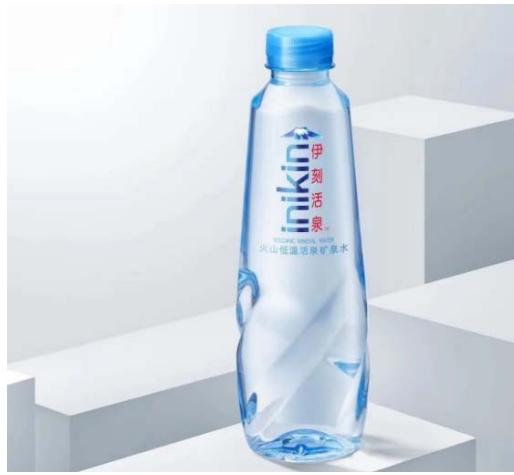
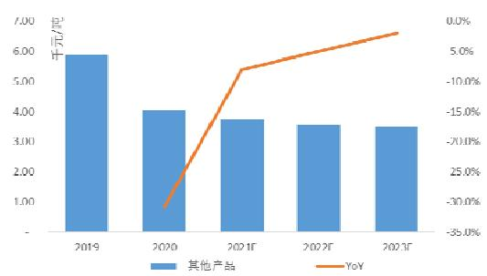

# 买入

2021年7月6日

# 长期规划核心逻辑清晰，十年问鼎全球乳业新高点

➢乳品及健康饮品行业顺应大健康时代趋势快速发展：对标发达国家，中国人均饮奶量仍有较大提升空间，同时在城镇政策支持、城市产业结构调整、健康意识提高等多方面因素的驱动下，我们认为公司两大业务方向一一乳制品业务及健康饮品业务均处于行业需求快速提高的上升阶段。其中公司主营乳制品业务实现了全板块的覆盖，综合竞争力强，行业龙头地位极为牢固。全球卫生事件导致中国消费者对天然带有提升人体免疫力功效的乳制品等品类的重视程度有了一定程度上的激发，并在未来有望形成相应的饮奶消费惯性，从而带动未来乳制品整体行业的快速发展。

➢公司综合竞争力领先，龙头地位稳固：伊利掌握了行业领先、安全且牢固的上游奶源资源，并具有优异的产品研发能力、品牌宣传及市场推广能力和多元化及良好的渠道等多方面竞争优势。结合当前消费市场健康理念需求的驱动下，我们预计公司未来销售及利润均有望录得双位数以上快速增长，并维持乳制品行业中较高的利润水平。

➢结构升级及渠道下沉推动常温业务发展：一、二线等上线城市在消费升级趋势下，消费者对高端常温液体乳产品的结构化市场呈现不断向上的需求，公司未来结构优化带动营业额及利润持续增长的趋势显著；同时，常温液态奶是推动国民饮奶量普及的主要品类，在公司未来县镇村持续获得渗透的情况下，销售规模有望持续扩大，助力公司长期巩固其常温液态奶市场的领导地位。

➢低温及奶酪形成新增张动力：由于低温巴氏奶、低温酸奶以及奶酪等产品保全了乳品更高的营养价值以及更优的口感，消费者对于这些产品的需求将有所提升，随着消费市场对以上品类的普及程度逐步加深，未来行业增速有望进一步获得提速，公司背靠高效产能、广泛的渠道布局、及高品牌知名度，未来低温液体乳及干乳制品板块的将成为公司新的增长动力。

婴配粉行业国产化及高端化为公司奶粉业务乘风破浪：中国当前奶粉高端化趋势明显，市场价格处于上升通道，其中国产中高端品牌逐步获得越来越多的消费者认可，公司的婴幼儿奶粉业务有望依托政策红利及行业结构升级需求实现业绩良好增长。

➢健康饮品业务长期发展前景明确：健康饮品业务促进了业务横向多样化发展，并与公司乳制品业务在经销渠道及品牌营销上形成非常高的协同作用，健康饮品板块的长期前景明确。

➢目标价46.39元人民币，买入评级：公司十年战略规划清晰，募投项目剑指“全球乳业第一”长远目标，公司盈利中枢有望持续优化，并进一步拉开与竞品企业的全产业链竞争优势。因此综上所述，我们首次覆盖给予公司买入评级，目标价为46.39元，相当于2022 财年盈利预测的30倍PE。

# 主要资料

行业 乳制品/消费  
股价 35.04元  
目标价 46.39元$( + 3 2 . 4 \% )$   
股票代码 600887  
总股本 60.83亿股  
市值 2131.35亿元  
52 周高/低 51.85元/31.85元  
每股净资产 5.4901元  
主要股东 呼和浩特投资有限责任公司 $( 8 . 8 5 \% )$ []

  
股价表现

盈利摘要   

<table><tr><td>截止12月31日财政年度</td><td>2019历史</td><td>2020历史</td><td>2021预测</td><td>2022预测</td><td>2023预测</td></tr><tr><td>收入（百万元）</td><td>90,223</td><td>96,886</td><td>108,828</td><td>121,106</td><td>133,447</td></tr><tr><td rowspan="3">净利润（百万元）</td><td>变动(%) 13.4%</td><td>7.4%</td><td>12.3%</td><td>11.3%</td><td>10.2%</td></tr><tr><td>6,951</td><td>7,099</td><td>8,539</td><td>10,072</td><td>11,841</td></tr><tr><td>变动(%) 7.7%</td><td>2.1%</td><td>20.3%</td><td>18.0%</td><td>17.6%</td></tr><tr><td>每股收益（元）</td><td>1.15</td><td>1.17</td><td>1.31</td><td>1.55</td><td>1.82</td></tr><tr><td>市盈率@35.04元(倍)</td><td>30.5</td><td>29.9</td><td>26.7</td><td>22.7</td><td>19.3</td></tr><tr><td>每股派息（元）</td><td>0.8</td><td>0.8</td><td>1.0</td><td>1.2</td><td>1.3</td></tr><tr><td>股息现价比（%）</td><td>2.31%</td><td>2.34%</td><td>2.81%</td><td>3.32%</td><td>3.66%</td></tr></table>

资料来源：公司资料，第一上海预测  
资料来源：彭博

# 行业现状

# 一、营养健康意识驱动未来中国乳制品行业持续增长

根据国家统计局数据显示，过去20多年中国全年人均GDP不断上升。截至2020年，中国全年人均GDP 更达到 70，891.8 元人民币。随着人均 GDP 的不断上升，消费者的消费能力和消费水平也不断地提升；，消费者对于营养健康的意识更加重视。伴随而来的是整个食品饮料行业的消费结构逐渐趋向于营养、健康、天然及高端等理念，中国消费者对于乳制品等基础食品的述求将逐渐向“更高品质”转移。

此外，2019 年全球卫生事件爆发，消费者对天然带有提升人体免疫力功效的乳制品等品类的重视程度有了一定程度上的激发，并在未来能够形成相应的饮奶消费惯性，从而带动未来乳制品行业的增长。另一方面，根据《2021年中国奶商指数报告》显示，中国坚持每天摄入乳制品的人群规模约为3.6 亿人，在此口径下意味着超过有10亿人尚未形成喝奶习惯。从上述调查数据可以判断，中国的液态奶消费市场在销量上仍有具有较大的提升空间。

因此，我们预计未来中国的乳制品市场会是价量齐升的状态。

  
图表 1：1992 年至 2020 年中国人均GDP 增长情况  
资料来源：国家统计局，第一上海

值得一提的是，中国乳品加工企业数量自2008 年开始逐年减少，主因三聚氰胺事件爆发后，行业进入转型发展期，中国乳制品行业监管愈发严格，因此大量中小或杂牌乳企逐步退出市场，整体行业不断向规范化、规模化转型，行业竞争者进入全产业链竞争模式，也因此行业集中度逐渐攀升，中国乳品行业的产品质量也不断获得提高，中国消费者对国内乳品行业的信任程度也有不断提升。

  
图表2：中国乳品加工企业数量逐渐减少  
资料来源：中国奶业年鉴，Wind，第一上海

# 二、乳制品行业格局稳固

中国乳制品市场参与者众多，行业竞争尤为激烈。然而，由于中国地域广阔，乳制品生产及供应过程中受到奶源分布、物流配送能力等条件的限制，中国乳制品行业呈现出少数全国性大乳企以及众多区域性中小乳企两级分化但又二者并存的状态。

从当前中国乳制品市场中的竞争格局来看，伊利与蒙牛共同形成了双寡头的情况，根据尼尔森数据显示，伊利在主要品类的市场占有率都处于领先地位，而且稳固：液态类乳品的市场占有率为 $3 3 . 3 \%$ （2019年为 $3 2 . 4 \%$ ），其中常温产品的市场占有率为 $3 8 . 6 \%$ （2019年为 $3 7 . 6 \%$ ），低温产品的市场占有率为 $1 4 . 8 \%$ （与2019年基本持平），婴儿奶粉的市场占有率为 $6 . 0 \%$ （与2019年基本持平）。由于伊利及蒙牛同属于全国性大型乳企，二者拥有强大的品牌力，优异的产品创新力和丰富度，以及行业领先的奶源布局及渠道渗透能力，这些因素均能对广大消费者在选购过程中起到极大的影响作用。其他区域性乳企在全国性综合布局上难以对伊利和蒙牛形成压制，因此我们预计未来中国的乳制品行业竞争格局将维持相对稳定的状态。

乳制品品类繁多，其中白奶以及酸奶是液态奶的主要组成品类；此外还包括含乳饮料、以及奶粉、冰淇淋、奶酪、奶油、炼乳等其他产品。由于中国奶源分部不均、以及行业冷链技术限制等因素，当前中国整体液体奶消费市场产品结构以常温奶为主。低温产品如低温白奶及低温酸奶等由于未经过高温消毒，产品存在保质期远低于高温产品的特点；因此低温产品受制于：1）贴近消费市场的奶源牧场、加工生产等布局；2）高效的冷链运输、渠道与终端把控等壁垒。其中由于低温白奶保质期更短，奶源及渠道依赖程度更深；因此中国的低温白奶行业基本以区域性乳企为代表，且呈现集中度较低的现状。

  
图表3：乳制品的主要品类  
资料来源：第一上海整理

# 三、乳制品行业结构和增长情况

从当前消费结构来看，中国乳制品消费市场占比最大的乳制品品类分别为酸奶和常温奶，其次为风味乳、巴氏奶、奶粉以及其他品类。液态奶中基础白奶作为日常生活基础食品品类，其增长对整体乳制品行业起到最关键作用。随着消费市场对高品质产品需求量加大，将促使常温奶结构加速向更高端产品实现更迭。而低温奶由于更大程度保留牛奶内的营养物质及更好的口感，受到越来越多消费者喜爱，市场需求开始提速。此外，由于酸奶有益于促进肠道健康以及富含多种有益菌、奶酪具备极高营养价值等因素，此类产品在消费市场快速得到普及。因此我们预计在居民健康需求提升以及消费结构升级的趋势下，未来将以上述品类为主要代表，整体乳制品规模增长实现进一步加速。

# 公司介绍

# 一、伊利股份 “全球乳业5强”

伊利集团目前稳居全球乳业第一阵营，连续多年蝉联亚洲乳业第一，也是当前中国规模最大、产品品类最全的乳制品企业之一。在业务发展上，伊利始终坚持推动“国际化”和“创新”两个重要战略：（1）在国际化方面，伊利目前在亚洲、欧洲、美洲、大洋洲等乳业发达地区构建了一张覆盖全球资源体系、全球创新体系、全球市场体系的骨干大网。（2）在创新方面，伊利经过多年发展，已经建立了多个领先的技术研发和产学研合作平台，持续推动行业创新。伊利在发展过程中，固守“质量”和“责任”两个根本，以高品质、高科技含量、高附加值的多元化产品，赢得了消费者的高度信赖。目前，根据荷兰合作银行公布2020年“全球乳业二十强”榜单，伊利集团已成功跻身全球五强，成为首个获此殊荣的亚洲乳企。未来十年，更希望能攀升到全球乳业第一。

  
图表4：全球乳业五强

# 二、股权结构稳定，保障公司未来业绩稳健发展

截至2020年，公司董事会主要成员潘刚、赵成霞以及刘春海持股比例合计约为$7 . 7 4 \%$ 。潘刚从2005年6月起担任伊利集团党委书记、董事长、总裁至今。

  
图表5：股权架构

资料来源：2020年度报告，第一上海整理

自2006 年起，公司陆续推行并实施股权激励计划，导致公司管理层持股股数迅速提高。截至2015年高管期末持股总数已超过484.3百万股，占总股本比例约为$7 , 9 8 \%$ ，截至2020年高管期末持股比例提升至 $8 , 4 8 \%$ 。核心管理层持股比例从2014年起呈现相对稳定的状态，且高管人员变动较少。股权激励政策绑定了公司核心管理人员，因此在公司经营管理上的各方面发展战略的实施，均起到了长期可持续性的保障，我们相信公司长期的业绩得以稳健发展。

  
图表6：公司高管期末持股总数  
资料来源：公司年度报告，第一上海整理

# 三、发展历程

伊利股份成立于 1993 年，公司的发展历程隐含了中国乳业从无到有、从小到大、从弱到强的历史缩影。公司的发展历程可以归纳为萌芽期（1956-1993）、成长期（1993-1996）、壮大期（1996-2009）以及腾飞期（2010至今）四个时期。

公司前身为呼和浩特回民区养牛合作小组，1993年实施股份制改造并成立冷饮事业部，事业部成立后公司以产品类别划分进行管理，开启品牌化运营模式，公司进入快速成长模式。1996年3月12日伊利股份在上交所挂牌上市后，成为全国乳品行业首家A 股上市公司，其后公司规模不断壮大。1997 年内蒙古伊利实业集团股份有限公司正式成立，此后公司在奠定伊利冷饮业务持续领跑行业发展的基础之上，不断开展多款液体奶产品的业务布局及发展，通过常温奶生产技术，极大地延长了液态奶的保质期，也使得液体牛奶业务在国内的辐射范围进一步获得扩大。1999年、

2000 年及 2005 年公司分别成立液态奶事业部、奶粉事业部以及酸奶事业部。在此阶段中，公司实施“织网计划”发展战略，通过“全国织网”快速在全国范围内进行渠道扩张，同时产品及品牌不断获得优化。2003 年至2004 年主营业务收入实现国内行业第一，并在2005 年突破 100 亿元大关，成为了国内第一家真正有能力同时覆盖全国市场的乳品企业。2008 年三聚氰胺事件爆发，伊利通过选择自身全额承担损失的方式，减轻了其经销渠道的大部分资金压力，公司因而树立了负责任的形象，赢得众多经销商口碑和信任，公司后续业务得以迅速恢复。2013年起，公司发展战略开始升级，从“全国织网”覆盖到“全球织网”，通过整合全球优质资源推动盈利能力持续增长。至此，公司研发平台从国内伸向欧洲，双重“智力引擎”加速伊利新品推出。与此同时，公司中高端产品占比增加并持续放量，盈利能力不断获得提升，从而提升了其行业的竞争优势，公司业务发展进入腾飞阶段。2014年公司进入“全球乳业10强”，2020 年更是进一步晋升至“全球乳业五强”。

  
图表7：公司发展历程  
资料来源：公司资料，第一上海整理

# 企业竞争优势分析

上述提到，公司身为中国乳制品行业的全国性龙头企业，具备较大的规模效应。一方面，其品牌效应影响深远，拥有不可小觑的先发优势。根据我们的理解，中国消费者在选购食品时更倾向于知名品牌的产品，而伊利旗下多个品牌均享有较高的品牌资源。此外，公司在品牌建设以及产品研发上亦更具备规模化，其在品牌建设及研发的投入尤为巨大，近乎为同行业中最大规模，使到公司持续的品牌升级、产品多元化及消费者关注度上始终能够保持较高的维度。另一方面，伊利经过多年的消费市场渠道深耕，在全国范围内覆盖率更为广泛，且公司具备较为完善的渠道推广能力及管控能力。

# 一、多方位经销渠道持续深化

公司在2006年便开始在全国开展了“织网计划”，通过“全国织网”快速在全国范围内进行渠道扩张，率先完成“纵贯南北、辐射东西”的战略布局，成为第一家覆盖全国市场的乳品企业。2013年更是升级到“全球织网”发展规划，公司目前已分别成功在荷兰成立海外研发中心，在大洋洲新西兰建设一体化乳业基地等，通过全球优质资源整合，全面布局全球各地生产基地及销售渠道，实现公司盈利能力持续增长。2020年公司依托国内及海外业务“双循环”发展格局，持续建设“全球资源体系、全球创新体系，全球市场体系”，国内及大洋洲、东南亚等基地市场，海外市场推进及生产基地建设进度均获得加速：一方面，公司设在印尼的工厂已完成主体建设；另一方面，泰国市场的渠道及终端基础建设进一步加快，导致公司于泰国市场的销售额同比增长了 $6 8 \%$ 。我们认为，公司在海外业务进一步与国内业务实现融合，在海外市场产品布局、销售网络、供应链优化等方面均取得突破性的进展，未来在海外乳业的影响力也有望与日俱增。

国内市场方面，上述提到公司已完成全国基本市场全覆盖，公司一方面通过不断优化传统线下渠道的服务能力，持续深化现有的渠道建设，维系渠道健康发展；另一方面，公司也在长期大力发展乡镇村等低线城市的渠道持续下沉，通过抓住乡镇市场业务发展的机遇实现市场开拓。从市场的观察来看，我们认为当前中国村镇及下线城市等地区的饮奶习惯正被逐渐养成，且市场空间仍非常巨大。而随着公司在县乡镇市场的渠道下沉结果来看，其乡镇村网点数量逐年上涨，截至 2020 年共计已达到109.6 万家，呈现持续增加的态势。因此我们预计，伴随着当前行业整体以及公司自身的物流体系逐步得到完善，伊利在中国村镇渠道的发展布局亦将在未来成为公司销售收入的主要增长动力之一。

  
图表8：“全球织网”国际化战略  
资料来源：公司资料，第一上海

此外，由于乳制品保质期短及拥有快频消费特性，绝大多数产品的消费均在线下渠道完成，也因此公司大部分销售均来源于线下渠道。然而，随着近年来电商渠道等新兴渠道得到快速发展，行业线上渠道的增量也变得不可小觑。根据尼尔森和星图的数据，2020年国内液态类乳品及奶粉终端市场线上及线下渠道零售额合计同比增长了 $2 . 1 \%$ ，其中线上渠道零售额同比增长达到 $3 5 . 7 \%$ 。公司通过积极探索如社群营销、跨界营销、与热门IP 联名定制产品等新营销模式，有效推动了新零售渠道的发展，并实现线上线下的全渠道战略布局。数据显示，公司近几年在电商渠道的销售收入均实现了极高的增长幅度，2020年公司电商业务收入同比增长高达 $5 5 \%$ ，远超行业平均增速。而根据星图的数据，2020公司的常温液体乳业在电商平台的零售额市场占有率达到 $2 8 . 1 \%$ ，位居该细分市场的首位。我们认为，公司线上线下营销成功进一步得到整合，在当下社交电商、社区服务以及020到家等新零售渠道发展的趋势下，有望进一步实现精准定位，并最终带动公司市场规模不断扩大。

  
图表9：乡镇村网点数  
资料来源：公司年度报告，第一上海

  
图表10：电商业务收入维持极高增速   
资料来源：公司年度报告，第一上海

# 二、多元化产品矩阵推动业绩稳定增长

公司业务经过长期发展，深耕乳制品行业，在中国乳制品快速发展，消费者需求量越来越大的趋势下，在乳制品方面已布局了各个主要细分领域，发展出包含液态奶、酸奶、冷饮、奶粉及奶酪等多个火热品牌以及热销产品，全方位覆盖消费市场对乳制品品类多样化的需求。

  
图表11：公司乳制品产品矩阵  
资料来源：公司资料，第一上海

除乳制品以外，自 2018 年起，伊利集团内部又进一步细分，新增了健康饮品业务板块，形成了当前集液态奶、奶粉、冷饮、酸奶、奶酪以及健康饮品的六大产品业务群。我们认为公司此举，在乳制品业务未来发展趋于稳定的情况下，逐步开发健康饮品业务，彰显其洞察市场发展趋势的前瞻性。伊利凭借其强大的研发能力，先后推出长白山矿泉水、焕醒源、圣瑞斯咖啡，以及伊然乳矿轻饮等新品，逐渐实现天然矿泉水、植物蛋白饮料、乳酸菌饮料、风味饮料、咖啡、能量饮料等多品类发展布局，完成自身多次蜕变。

近年来由于人口老龄化以及消费者对自身健康意识不断提升，中国健康产业快速发展，2019年世界卫生事件爆发之后，更是让全球消费者对健康饮食引起了前所未有的高度关注，我们认为中国食品饮料未来将持续围绕着“大健康”的趋势，而一方面公司主营业务乳制品一直被誉为“最完美食物”，主因其中含有多种丰富的人体所必需的营养元素；另一方面，公司对于健康饮品的布局，亦将有望搭乘“大健康”的风口。我们认为，凭借伊利在消费市场的高认知度，且公司品牌力及渠道力容易形成强大的协同效应，其健康软饮料业务有望获得高速发展潜力，成为其未来销售增长的另一大驱动力，进一步提高公司的长期成长空间。

此外，我们认为公司未来在乳制品及健康软饮料的双向发展，为公司降低由于食品饮料行业竞争格局愈发激烈，以及终端市场消费需求趋势不断变化等因素所带来的相关业绩波动风险。

  
图表 12：inikin 伊刻活泉重磅上市  
资料来源：公司资料，第一上海

  
图表13：伊利“焕醒源”能量饮料  
资料来源：公司资料，第一上海

  
图表14：伊然0 蔗糖乳矿奶茶  
资料来源：公司资料，第一上海

  
图表 15：伊然乳矿水果味0 脂低糖  
资料来源：公司资料，第一上海

  
图表16：圣瑞思冷萃气泡咖啡  
资料来源：公司资料，第一上海

  
图表17：Sunrelas 圣瑞思香浓拿铁  
资料来源：公司资料，第一上海

# 三、领先的研发能力及市场洞悉能力，保障了源源不断的增长动力

伊利旗下产品丰富度极高，主要归功于其优异的产品创新能力的长期累积。与绝大多数同行企业不同的是，公司的“全球织网”战略方针使到公司研发平台从国内向海外地区成功实现延伸，启动了双重“智力引擎”，研发能力处于行业领先地位。一方面，伊利在2014年于欧洲荷兰成立了伊利欧洲研究中心（2018年升级为欧洲创新中心）；另一方面，伊利更是聚焦整合了众多全美顶尖的常青藤联盟名校、全球综合排名前十的大学及在农业、管理、生命科学等各个领域全球排名第一的高校、科研院所和机构等，实施“中美食品智慧谷”。

公司研发投入力度逐年持续加大，体现出其对于产品研发的重视程度，公司年度专利数量近年来成几何式增长，截至2020年 12月底，公司已累计获得专利授权3,109件，其中发明专利授权数量为552件，并有5件专利获得中国专利优秀奖，与同期其他绝大多数乳企差距不断被拉大，为公司后续产品不断推陈出新形成源源不绝的发展动力。我们认为，强大的产品研发能力，有助于公司在更新换代十分迅猛的乳制品及饮料行业中持续推出符合大宗需求的新产品，从而促使公司行业龙头地位更加巩固。

  
图表18：部分乳企年度专利数量  
资料来源：国家知识产权局，Wind，第一上海

  
图表19：部分乳企研发投入情况  
资料来源：公司年度报告，第一上海

公司的产品创新及升级对当前消费趋势洞察精准，近年来如针对中国消费市场对天然有机等高品质产品投以更多关注；公司陆续推出「金典有机高端常温纯牛奶系列，2020年有机液体乳零售额比上年同期增长高达 $3 5 . 1 \%$ ，市场占有率达到$5 0 . 6 \%$ ，在对应细分市场稳居榜首。此外，公司针对低温乳品市场需求提升，迅速推出「金典低温鲜奶、「牧场清晨低温酸奶等优质产品；针对奶酪、芝士等市场消费情绪持续攀升，推出「伊利可以吸的儿童奶酪、「妙芝口袋芝士成人奶酪棒；针对植物基食品的火热趋势，推出「植选高蛋白无糖豆乳等等。2020 年，公司进一步推动产品优化升级；其中“伊利”奶酪系列产品、“金典”低温牛奶、配方升级后的“金领冠”婴幼儿配方奶粉等业务均实现了良好发展。期内，公司新品销售收入实现占比达到 $1 6 . 0 \%$ ，体现出公司新品在消费市场获得了较高的接受度。

我们认为，公司依托于拥有全球资源及应用大数据等优势，叠加公司消费趋势洞察能力强、供应链运营效率高，在未来产品优化上可以迅速且高效地根据消费市场动向及时研发并推出高增长品类并进行市场投放，持续为公司未来源源不断地提供新的业绩增长点。

# 四、品牌护城河持续坚固，维系市场份额制高点

公司对其品牌形象塑造以及与消费者形成有效沟通极为重视，其对于广告宣传上持续投入了巨大的资源。2019年及 2020年伊利在广告营销相关投入分别约为110.4亿/110.0亿元人民币，在规模上是国内乳制品行业之最。

此外，公司营销效率的精准度也不断提升，通过抓住重大国际事件，如多次成为奥运会赞助商、冠名博鳌亚洲论坛等覆盖全球的目光；通过冠名众多如《奔跑吧》、《乘风破浪的姐姐》等极为火热的综艺节目覆盖绝大多数新一代年轻消费者的日常综艺观看视野；同时也通过全网覆盖直播近千余场等方式，抢占当前电商及直播等新兴媒介发展的制高点。我们认为，公司不断加深旗下各大品牌与消费者的文化沟通与品牌教育，长期且持续地巩固公司品牌在消费市场的知名度，极大程度上保持了中国消费者对其品牌的辨识能力，公司的品牌竞争力最终也将变得愈发坚固。

  
图表20：部分乳企广告宣传及促销费用投入情况  
资料来源：公司年度报告，第一上海

根据品牌网评选牛奶乳品行业，伊利旗下共两个品牌均位居十大品牌中，其中“金典”作为伊利旗下最高端的品牌代表，以其健康、有机和关爱的品牌理念，更是位居排行榜榜首的地位，获得广大消费者钟爱及信赖。根据凯度消费者指数，2020年公司品牌渗透率高达 $9 1 . 6 \%$ ，消费者触及数将近13亿，购买频次约为8次，已连续五年位列中国市场消费者选择最多的品牌榜首。另外，2020年公司在BrandFinance《全球最具价值乳品品牌10 强》中蝉联全球乳业第一，在 BrandZ 的《最具价值中国品牌100强》中实现了八连冠，伊利的品牌力再一次获得提升，由此可见公司强大的品牌力。

  
图表21：2020 年最具价值中国品牌 100 强行业第一

资料来源：BrandZ，凯度，搜狐财经，第一上海

# 五、行业领先的原奶供应资源

乳制品行业的上游牧业因前期投资庞大、投资回收期长、管理专业性需求高等特点形成了一定的行业壁垒。中国目前的优质奶源依然是十分短缺的状态，而规模化牧场又是提供优质奶源的主要供应来源，因此乳制品行业素来有“得奶源者得天下”的说法。在当前消费者对乳制品消费的品质要求越来越高的趋势下，掌握上游奶源、稳固优质原奶供应逐渐成为该行业提升市场竞争力的重要护城河。

2020 年1月，伊利控股公司优然牧业完成对赛科星的股权收购，从而原奶业务得以扩大并且涉足育种业务；2020 年 9月28日，公司以要约收购方式，通过控股子公司WholesomeHarverstLimited收购中地乳业股份；2020 年10月，优然牧业进一步通过订立购股协议收购恒天然于中国牧场旗下的两个牧场群，并在 2021 年4月1日已完成具体交易，至此，伊利上游奶源产业链的控制力再次获得显著提升。

与此同时在海外方面，公司也于2019年8月1日更是完成新西兰Westland的 $1 0 0 \%$ 股权收购，Westland 为当地具有 80余年历史的大型乳企，其供奶量占新西兰原奶供应总量较大比重，为伊利加速渗透海外市场、提升国际品牌效应均具有较大的影响力。

随着公司业务持续增长，未来公司对原奶供应的需求量将愈发庞大。我们认为，公司对上游原奶供应实现的有效布局，有利于公司把握住国内外优质奶源，为其未来长远战略升级及规划将持续加码，也为公司持续开拓市场提供必不可少的后盾。此外从盈利的角度看，强大的奶源把控力亦能从一定的程度上保障了公司在原料奶供应上的稳定性，缓和了公司业绩发展过程中可能面临来自原奶市场价格高速提升所带来的成本压力。

# 六、高标准生产管理体系，造就高品质的产品力

从消费者的角度而言，食品饮料产品的品质是影响消费者对其品牌印象的最大因素之一。消费者选购乳制品产品的过程中，质量与安全更是其最大诉求。在伊利的长期发展以来，更是将产品和原料的质量控制方面作为“伊利即品质”企业文化的最主要抓手，以生产 $1 0 0 \%$ 安全、 $1 0 0 \%$ 健康的产品为目标。在生产过程中，公司还设立了质量管控“三条线”：即伊利在国标线的基础上提升了 $5 0 \%$ ，制定了企标线；在企标线的基础上提升了 $2 0 \%$ 的标准，又制定了内控线。进一步保障了公司产品品质，提升了企业自身对食品安全相关风险的管控能力。2019 年起公司进一步全面升级“3310战略”，将严苛质量管控标准贯穿于公司的全球产业链中。

图表22：“品质领先3310战略”的全面升级  

<table><tr><td colspan="2">3310战略</td></tr><tr><td>三个一流</td><td>打造一流队伍，建立一流标准，生产一流产品</td></tr><tr><td>三个基础</td><td>夯实品质领先管理体系，强化品质自主管理模式，构筑基于消费者需求的品质评价体系</td></tr><tr><td>票否香决</td><td>全链条不满足食品安全和产品品质要求的过程和结果一票否决，强化不符合过程叫停和退出机制</td></tr><tr><td>零食品安全事件</td><td>全面有效识别控制风险，构建全球食品安全风险分析平台，确保食品安全事件零发生</td></tr></table>

资料来源：公司官网，第一上海

公司以行业更高标准恪守自己，严格执行生产工艺质量把控，注重消费者品质体验。我们认为，公司旗下产品均有望持续获得广大消费者对其安全、营养、健康等高品质的长期认可，维持公司未来业绩发展的稳定性。

# 公司主要业务发展分析

# 一、主要业务划分

公司的业务主要划分为液体乳、奶粉及奶制品、冷饮产品及其他产品四大业务，其中液体乳是公司最主要的营业业务，为公司销量及营业额均作出了最大贡献。

  
图表 23：2020 年主营业务结构  
资料来源：公司年度报告，第一上海

  
图表24：2020年主营业务销量  
资料来源：公司年度报告，第一上海

# 二、液体乳业务结构持续向上，量价齐升趋势可期

公司液体乳业务包括常温白奶、低温白奶、常温酸奶、低温酸奶及含乳饮料等液态类乳制产品。2020年公司整体液体乳业务共录得761亿元的营业额（占比为79.8%），同比增长 $3 . 2 \%$ 。而根据尼尔森的数据，2020年公司液态类乳品的终端市场零售额在疫情期间逆势增长了 $1 2 . 7 \%$ ，市场占有率达到 $3 3 . 3 \%$ ，较上年同期提升了0.9个百分点。后疫情时代由于液体乳作为乳制品最基础的品类，受到了更多消费市场的关注，因此我们认为未来液体类乳品的人均销量有望急速攀升，对公司液体乳业务发展提供极大的推动力。

按照加工工艺及保存方式的不同，公司液体乳业务大致可划分为常温产品及低温产品两大类：

# 2.1常温产品

根据尼尔森数据，2020 年在中国常温牛奶行业的零售额同比增长达到 11.5%的情况下，公司的常温品类市场占有率也进一步上升了1.0个百分点到 $3 8 . 6 \%$ ，市场占有率遥遥领先。这是受益于公司常温液态类乳品在消费市场的渗透率持续地大幅度增长，品牌影响力不断地加深；同时，公司常温产品的产品线丰富、具备全国化的渠道布局，对其他绝大多数同行乳企均形成了碾压式优势。常温产品是公司的最主要的销售产品品类；其中主要核心产品系列包括金典、安慕希、母品牌以及优酸乳等。

  
图表 25：伊利金典高端纯牛奶  
资料来源：公司资料，第一上海

  
图表 26：伊利安慕希希腊风味酸奶  
资料来源：公司资料，第一上海

  
图表27：伊利优酸乳含乳饮料  
资料来源：公司资料，第一上海

  
图表28：伊利纯牛奶  
资料来源：公司资料，第一上海

  
图表29：2015-2020 年常温液态类乳品市场渗透率  
资料来源：凯度调研，公司年度报告，第一上海

对于未来，我们认为公司常温奶业务主要的增长点有两个方面：1）有机、优质乳蛋白等高质量高端品类-未来将会作为支撑公司量价齐升的主要推动力；2）乡村镇常温液态奶业务持续下沉-推动市场需求量持续开拓并长期健康发展。

1）随着中国居民可支配收入提升、全民健康意识提升、及消费需求升级的趋势，液体乳产品的消费性质从生活半必需品逐渐向必需品转变，推动常温奶产品结构高端化形成行业放量。公司凭借强大的产品研发、品牌营销及渠道推广能力为核心，多次成功以金典、安慕希、母品牌以及优酸乳等核心品牌均迅速抓住时下市场需求进行升级（如风味、优质乳蛋白、高钙、低脂、有机、无糖、植物奶等）；一方面有望能够延续核心品牌的生命周期，通过长期满足广大消费者多样化需求、增强客户粘性，带动常温业务未来的稳定发展。另一方面，通过一系列的产品结构优化，亦有效推动起常温奶产品业务的平均单价稳步提升，提高整体常盈利能力。其中，2020年公司有机液体乳品类的零售额增长高达 $3 5 . 1 \%$ ，位居对应细分市场的首位；高端大单品金典的零售额增速也在 $2 0 \%$ 以上，增速亦位居高端白奶细分品类行业第一；其中金典有机常温奶产品的市场占有率于2019 年已高达 $4 5 . 7 \%$ ，几乎占据整个零售市场的一半左右，且依旧保持增长态势。公司高端品牌力及产品力均表现强劲，我们认为当前公司常温奶高端产品的结构升级仍处于上升通道中，后劲充足。

  
图表 30：2017-2019 年金典有机常温液态奶产品零售额市占额  
资料来源：尼尔森，公司年度报告，第一上海

2）相对于一、二线城市来说，当前中国的大多数乡镇村地区的饮奶习惯仍处于较为初级的阶段，人均饮奶水平较低，因此潜力也较为巨大。受制于当前行业冷链技术等因素的影响，我们认为常温奶产品更利于向乡镇村等地区实现下沉，形成培养这些地区消费者饮奶教育的“矛”。公司长期着力于全面的乡镇村业务发展模式，叠加如今中国城镇化发展速度提升、农村消费能力大幅提高等大环境因素，我们预计公司未来常温液态类乳品在乡镇村等下线城市的销量有望持续实现增量。

展望未来，由于中国原奶分布不均、南北原奶产量差距大等问题短期内无法得以扭转，导致国内整体液态奶需求量的缺口未来将持续通过以常温奶品类来实现补充，因此我们预计未来整体行业将常温奶作为乳制品消费市场主流的局势难以扭转，且人均消费量仍会保持稳定增长的趋势。也因此伊利的常温奶业务有望依托其上述竞争优势及两大主要增长点，成为公司未来能够稳健收割市场扩充份额的主要利器。

# 2.2低温产品

2020 年中国低温牛奶零售额同比增幅高达 $2 1 . 7 \%$ ，公司的低温品类市场占有份额为$1 4 . 8 \%$ （根据尼尔森的数据），与上年基本持平。考虑到低温液态奶1）产品保质期更短、2）运输半径小、3）渠道售后服务要求大，4）终端营销更倾向于短精快等特点，长期订单例如订奶入户等特殊渠道优势则更为明显，而各地的区域性乳企在低温产品业务上更具备先发或独占的渠道资源优势，因此目前全国性乳企分散于各个区域的渠道建设精细化程度或许就略显逊色，短时间内能够实现压倒性竞争优势并实现反超的可能性也较低。故我们预计公司未来中长期内在低温产品业务上将继续以精细化渠道发展为主要重心，其二才是业绩增长，以此为未来公司的低温业务能够长期健康发展奠定基础。

  
图表31：伊利金典鲜牛奶  
资料来源：公司资料，第一上海

  
图表32：伊利畅轻果茶酸奶  
资料来源：公司资料，第一上海

然而，随着：1）中国现阶段整体冷链运输技术有所提升，2）ESL技术的发展延长了低温奶货架期限，3）生鲜到家和电商等新兴渠道崛起，4）消费升级趋势日益明显，消费者呈现出对更高营养、更优口味及更高品质生活的追求（低温奶由于能最大限度保留鲜奶的营养成分且兼顾口感）等因素，于是中国整体低温奶行业开始进入加速期，我们预计低温品类行业未来将维持量价高速发展的趋势。公司拥有强大的名牌认知度及优异的产品研发能力，更容易通过优质的产品技术迅速获得广大消费者的认可，因此我们预计公司未来通过积极但又不失理性的参与低温业务板块，有望分享行业发展红利所带来的收益增长。展望长远未来，公司具备强大的资金及品牌支持，以及丰富的上游奶源布局，我们看好公司未来逐点完成其渠道精细化的可能性，从而实现公司长期规划中从低温产品业务实现更高盈利的目标。

# 2.3 整体液体乳板块未来预测

2020 年由于疫情的关系导致一季度整体乳制品行业加大了促销力度，导致公司液体乳平均售价被拉低，今年疫情有所缓和后预计将恢复常态。因此综上所述，叠加常温奶及低温奶整体结构向上调整等趋势，我们预计公司液体乳业务平均售价将维持持续上涨的趋势，未来整体液体乳将继续作为公司主要收入来源，并保持高单位数以上的营业额增长。

  
图表33：液体乳ASP  
资料来源：公司年度报告，第一上海预测

  
图表34：液体乳营业额  
资料来源：公司年度报告，第一上海预测

# 三、行业结构性升级推动高品质奶粉及奶酪等业务需求量高速提升

公司奶粉及奶制品业务主要包括奶粉及奶酪、黄油等干奶制品的销售，2020年共录得销售额128.9 亿元，同比增长 $2 8 . 1 \%$ ，为主营业务营业额贡献了 $1 3 . 5 \%$ 。

# 3.1奶粉业务

1）婴幼儿配方奶粉方面，根据尼尔森的数据，公司2020年婴幼儿配方奶粉零售额市场占有率为 $6 , 0 \%$ ，与2019年持平。

近年来公司大力发展高端化。得益于当前中国人均可支配收入的提升，以及新一代父母对于孩子健康饮食重视程度的提升，整体婴幼儿配方奶粉行业呈现不可逆转的消费升级趋势。公司正是抓住了当前多样化细分领域的发展趋势，近年来陆续推出了包括“金领冠悠滋小羊”婴幼儿配方羊奶粉及“金领冠塞纳牧”婴幼儿有机配方奶粉等高端细分领域产品，并适时通过开发适合中国宝宝的配方，实现了金领冠珍护等婴幼儿配方奶粉的品质提升。从当前公司奶粉业务的产品结构上看，公司的中高端产品矩阵完善程度已足以有效地对市场高品质需求的缺口实现有效覆盖。此外，公司近年来持续发展线下母婴渠道建设，根据尼尔森的数据，公司2018年至2019年母婴渠道的中高端零售额均录得了高双位数的增长，形成了公司良好的渠道优势。

展望未来，由于近年来国家陆续实施如配方注册制等政策，利好于国产婴幼儿奶粉品牌的发展，导致未来内资品牌在消费市场的份额有望持续回升。伊利奶粉一方面作为国产头部品牌之一，旗下“金领冠”系列更是拥有长期较强的品牌认知度；另一方面我们认为，公司婴幼儿配方奶粉业务未来将延续其高端化发展路线，持续拓展母婴店覆盖数目、提高单店销售效益、提高下线城市渗透等，最终有望在上述行业政策红利下实现销售业务的稳健增长。

2）成人奶粉方面，根据尼尔森的数据，2019年公司在成人奶粉细分市场的终端零售额同比实现了11.1%的增长，目前市场渗透率仍保持了增长趋势。

从行业的角度上看，随着中国人口结构老龄化加快，当前中国中老年人的健康问题日趋受到更多关注，而成人奶粉由于具备无副作用、可长期使用等优势，形成了营养保健品以外很好的营养选择，行业需求未来增长可期。公司前瞻性地长期布局了成人奶粉业务，为公司的整体奶粉业务增长提供了辅助。随着公司逐步加大对中老年奶粉业务的重视，顺应市场需求加大对中高端中老年奶粉产品升级及投放，我们预计公司的成人奶粉业务未来或将迎来优异的发展机遇。

  
图表 35：金领冠塞纳牧有机婴配粉  
资料来源：公司资料，第一上海

  
图表 36：伊利欣活中老年成人奶粉奶  
资料来源：公司资料，第一上海

# 3.2奶酪（干酪）业务

当前中国消费市场对于奶酪产品尚处于起步阶段，可预见人均消费极低，未来发展空间十分巨大。由于奶酪是生鲜乳在发酵剂与凝乳酶作用下发生凝固、成熟制成，约10公斤的牛奶浓缩成1公斤奶酪，因此含有极其丰富的蛋白质、钙、脂肪、磷和维生素等营养成分，且素有“牛奶的精华”之称，与当前“大健康”趋势极为吻合。而随着近几年居民消费水平提高，以及消费者对奶酪产品认知的提升，很多家庭开始有意识地培养小孩的奶酪食用习惯，儿童奶酪棒俨然新一代成网红零食。与此同时随着家庭烘焙的兴起、以及新生代消费群体对含奶酪食品偏好的转变，因此我们预计未来行业如奶酪、黄油等干奶制品的消费量均有望持续攀高。

公司方面近年来也是顺应市场需求，积极开拓出如“伊利”儿童奶酪棒、“伊利”

马苏里拉芝士碎等针对不同消费场景的产品，上市后市场表现均较为良好。我们认为，伊利的奶酪产品与公司其他绝大多是乳制品销售的渠道协同性较高，因此公司有望通过不断加深对其沉睡消费者的教育，且凭借其强大的全国渠道布局等优势，实现未来奶酪等干奶制品业务的高速增长。

  
图表37：伊利奶酪系列  
资料来源：公司资料，第一上海

# 3.3 整体奶粉及奶制品板块未来预测

综合来看，2020年公司奶粉及奶制品业务由于一季度销售受到限制，促销力度较大，导致平均售价较 2019 年大幅下滑。一方面我们认为，公司当前阶段或将大力拓展旗下奶粉新品及奶酪产品的市场占有率，从而抢占更多消费者的心智高地，因此未来将维持一定的促销力度以此来刺激销量快速增长。但另一方面由于 2021 年开年以来奶价持续上行，给公司原奶需求较高的成人奶粉及奶酪等产品造成较大的利润压力，因此此消彼长之下我们预计 2021 年公司的促销力度或将回归理性，加上产品结构优化带来的部分抵消，未来该板块的平均售价下滑趋势将趋于缓和，并在销量需求大幅提高的驱动下实现公司整体奶粉及奶制品业务营业额高双位数的高速增长。

  
图表 38：奶粉及奶制品ASP  
资料来源：公司年度报告，第一上海预测

  
图表 39：奶粉及奶制品营业额  
资料来源：公司年度报告，第一上海预测

# 四、乳制品及非乳品业务形成协同效应，公司切入健康饮品业务可行性极高

# 4.1发展现状及行业趋势

自2018 年起，公司成立健康饮品业务。公司先后对天然矿泉水、植物蛋白饮料、乳酸菌饮料、风味饮料、咖啡、能量饮料等细分软饮料领域进行布局，其中推出了长白山矿泉水、焕醒源、圣瑞斯咖啡、伊然乳矿轻饮等产品。当前公司健康饮品业务尚处于起步阶段，非乳制品产品业务均归类为其他产品业务。截至 2020 年公司的其他产品业务仅占公司主营业务的 $0 . 2 \%$ ，销售额共计1.8 亿元，同比增长 $1 8 8 . 6 \%$ ，主因该业务板块基数小以及新品上市导致期内销量大幅增长 $3 1 7 . 6 \%$ o

随着当前消费者健康意识觉醒，对健康饮食及健康生活方式的关注度有所提升。根据弗若斯特沙利文的数据，2014 年至 2019年中国咖啡饮料/天然矿泉水/能量饮料零售额CAGR分别高达 $2 9 . 0 \% / 1 9 . 0 \% / 1 4 . 4 \%$ ，未来有望维持高速发展趋势。公司对上述细分领域进行产品布局，彰显其对市场发展趋势前瞻性及强大的产品研发能力。从产品性质上看，健康饮品与乳制品同属大众日常消费品，故我们认为二者在销售渠道上有众多协同点，公司凭借其原有渠道黏性，为其切入健康饮品产品提供了极大的便利。

图表 40：健康饮品行业处于高速上升阶段  

<table><tr><td></td><td colspan="3">零售额</td><td colspan="2">复合增长率</td></tr><tr><td>人民币：十亿元</td><td>2014</td><td>2019</td><td>2024E)</td><td>2014-2019</td><td>2019-2024E</td></tr><tr><td>咖啡饮料</td><td>3.7</td><td>13.2</td><td>34</td><td>29.0%</td><td>20.8%</td></tr><tr><td>天然矿泉水</td><td>6.5</td><td>15.5</td><td>30</td><td>19.0%</td><td>14.1%</td></tr><tr><td>能量饮料</td><td>40.1</td><td>78.6</td><td>124.6</td><td>14.4%</td><td>9.7%</td></tr><tr><td>蛋白饮料</td><td>124.3</td><td>147.4</td><td>174.6</td><td>3.5%</td><td>3.4%</td></tr></table>

资料来源：弗若斯特沙利文，农夫山泉招股说明书，第一上海

# 4.2 其他产品板块未来预测

展望未来，当前中国整体健康软饮料行业处于上升通道中，我们认为公司将持续加大对健康饮品事业的发展规划，基于公司已拥有极为成熟的品牌营销模式，我们预计公司未来成功切入健康饮品行业并迅速实现业务快速增长的可能性极高。财务数据方面，我们预计公司对健康产品未来短期内将维持较高的促销力度，从而实现其市场快速扩充的战略目标，因此我们认为公司其他产品业务中短期大概率会是价降量增的发展情况。在目前公司的健康饮品业务处于低基数效应的情况下，该业务有望持续受益于其已有的强大渠道规模及消费者对伊利的品牌高信任程度，延续整体其他产品业务销量乃至于营业额均实现非常高的增长幅度。

  
图表41：其他产品ASP  
资料来源：公司年度报告，第一上海预测

  
图表42：其他产品营业额  
资料来源：公司年度报告，第一上海预测

# 公司历史财务分析及未来预测

# 一、营业收入有望维持双位数以上增长

公司于2020年发布了长远战略目标，站在当前全球乳业五强的新起点上，力争达到2025 年进入“全球乳业前三”、2030年进入“全球乳业第一”的宏伟目标。并根据行业发展情况，制定了2021 年营业收入达到1，070亿元及利润总额为93亿元的短期业绩目标，即同比增幅分别在 $1 0 . 4 \% / 1 4 . 1 \%$ 左右。

2021 年第一季度公司实现营业总收入27.4 亿元，同比增长 $3 2 . 5 \%$ （较2019同期增长为 $1 8 . 3 \%$ ），实现毛利率 $3 7 . 7 \%$ ，较上年同期增长0.2个百分点，实现归母净利润28.3亿元，同比增长 $1 4 7 . 7 \%$ （较2019同期增长为 $2 4 . 4 \%$ ）。2021第一季度录得归母净利率为 $1 0 . 4 \%$ ，较上年同期提升了4.8个百分点（较2019同期亦提升了0.5个百分点），2021年业绩取得开门红，可以见到公司把握了疫情后乳制品需求提升等机遇，积极地提升公司整体产品结构及运营效率的优化，高端新品拓展情况良好，公司全年整体有望录得量价齐升的成绩。整体乳制品行业动态及公司业务拓展均释放出积极信号。

故综上所述，我们预计2021年至 2023 年公司的营业收入均能维持双位数以上增长，2021 年至 2023 年分别实现1,088.3/1,211.1/1,334.5亿元，复合增长率约为$1 0 . 7 \%$ 。

  
图表 43：历史收益及未来预测  
资料来源：公司年度报告，第一上海预测

# 二、未来三年凈利润复合增长率有望达到高双位数

销售成本端，我们认为短期内整体乳制品行业或将面临原料乳持续上涨的压力，主因中国当前原料乳供需关系仍趋向于紧张的态势，预计在 2022 年之后原料乳供给短缺的情况才能得到缓解。故从行业的角度上看，我们认为 2021 年中国整体乳制品行业的促销活动或将趋于缓和，以应对主要原材料价格上涨带来的压力。伊利一方面基于其强大的品牌力及市场洞察力和优异的产品研发能力，具备不断推陈出新高端产品的能力，我们预计未来三年公司战略资源将进一步朝更高毛利率的品类倾斜，且随着当前新品市场推广的促销力度逐步降低，公司整体毛利率有望逐渐恢复常态；另一方面在广告及推广上，公司在有效维持市场份额有序发展的前提下，亦拥有比同行其他乳企更大的调整及优化空间，随着公司品牌渗透率进一步提高及品牌宣传方案的精准度持续优化，我们预计未来公司经营费率将呈现稳定的趋势。故综合来看，我们预测 2021 年至2023 年公司归母净利润有望实现 85.4/100.7/118.4亿元，复合增长率为 $1 7 . 8 \%$

  
图表44：历史归母净利润及未来预测  
资料来源：公司年度报告，第一上海预测

# 三、估值分析及投资建议

公司掌握行业领先、安全且牢固的上游奶源资源、优异的产品研发能力、品牌宣传及市场推广能力、多元化及良好的渠道，主营乳制品业务实现了全板块的覆盖，行业龙头地位极为牢固。目前对标发达国家，中国人均饮奶量仍有较大提升空间，同时结合消费市场健康理念需求提升、城镇政策支持、城市产业结构调整等多方面因素的驱动下，我们认为公司业务处于行业需求上升阶段，未来销售及利润均有望录得双位数以上块速增长，并维持行业中较高的利润水平，其中：

1）在消费升级趋势下，一、二线等上线城市消费者对高端常温液态类产品的需求提升趋势明显，公司通过结构优化带动收入及利润持续增长的动力充足；常温液态奶是推动国民饮奶量普及的主要品类，为公司在县镇村市场持续渗透并扩大销售规模提供助力，有效巩固公司在常温液态类市场的长期领导地位；  
2）低温巴氏奶、低温酸以及奶酪等品类随着行业消费意识苏醒带来公司新增量，随着消费市场普及程度逐步加深，行业增速有望进一步获得提速，公司背靠高效产能、广泛的渠道布局、及高品牌知名度等已有优势，未来低温液体乳及干乳制品板块的发展在行业水涨船高的情况下有望快速扩大；  
3）中国当前奶粉高端化趋势明显，市场价格处于上升通道，国产高端产品也逐步获得越来越多的消费者认可，公司的奶粉业务有望依托政策红利及行业结构升级需求实现业绩稳定增长；

4）健康饮品业务促进了业务横向多样化发展，并与公司乳制品业务在经销渠道及品牌营销上形成非常高的协同作用，健康饮品板块的长期前景清晰。

除此之外，公司于2021年 6 月审议并通过了关于公司非公开发行A 股股票的议案，拟募集资金总额不超过130亿元人民币，用于包括液态奶生产基地建设项目（54.8亿）、全球互联网配方奶粉智能制造示范项目（15.5亿）、乳业创新基地项目（5.9亿）、长白山天然矿泉水项目（2.7亿）、以及数字化转型和信息化升级项目等项目（12.5亿）。从以上募投项目可以看出，公司已站在对下一个十年战略规划的新起点上迈进极为关键的第一步，意在进一步完善其产能布局，采用奶源先行的策略，聚焦高端液体乳，加大婴配粉及矿泉水等高毛利业务的布局，带动公司盈利中枢持续优化，进一步拉开与竞品企业的全产业链竞争优势；此外通过加大公司信息化等建设，从而实现业务运营效率进一步优化，打造企业核心竞争力。我们认为，公司战略布局长远目标明确，极大程度上为上述提到2025年进入“全球乳业前三”、2030年进入“全球乳业第一”的宏伟目标夯实了更为坚固的增长基础。因此综上所述，我们首次覆盖给予公司买入评级，目标价为 46.39 元，相当于2022 财年盈利预测的30倍PE。

图表 45：同行业估值对比  

<table><tr><td rowspan="2">公司名称（中文）</td><td rowspan="2"></td><td rowspan="2">股价</td><td rowspan="2">总市值(百</td><td colspan="7"></td><td colspan="5">PE</td><td></td></tr><tr><td>代码</td><td></td><td colspan="5">EPS(报表币种)</td><td colspan="5"></td><td>CAGR</td><td>PEG</td></tr><tr><td>A股乳制品</td><td></td><td></td><td></td><td>2019</td><td>2020</td><td>2021E</td><td>2022E</td><td>2023E</td><td>2019</td><td>2020</td><td>2021E</td><td>2022E</td><td></td><td>2023E</td><td>(2021-2023)</td><td>2021E</td><td></td></tr><tr><td>伊利股份</td><td>600887 CH Equity</td><td>35.21</td><td>214,169</td><td>1.150</td><td>1.196</td><td></td><td>1.419</td><td>1.652</td><td>1.901</td><td>30.6</td><td>29.4</td><td>24.8</td><td>21.3</td><td></td><td>18.5</td><td>15.7%</td><td>1.4</td></tr><tr><td>光明乳业</td><td>600597CH Equit 002946 CH Equity</td><td>14.00</td><td>17.143</td><td>0.410</td><td>0.500</td><td></td><td>0.557</td><td>0.639</td><td>0.735</td><td>34.1</td><td>28.0</td><td>25.1 32.6</td><td>21.9 25.1</td><td></td><td>19.0</td><td>14.9%</td><td>155</td></tr><tr><td>新乳业</td><td>600882CHEquity</td><td>14.20 67.13</td><td>12.315 27.880</td><td>0.290 0.047</td><td>0.320 0.145</td><td></td><td>0.436 0.815</td><td>0.566 1.523</td><td>0.724 2.338</td><td>49.0 1428.3</td><td>44.4 463.0</td><td>82.4</td><td>44.1</td><td></td><td>19.6 28.7</td><td>28.9% 69.4%</td><td>0.9</td></tr><tr><td>妙可蓝多</td><td>002732 CHEquity</td><td>24.24</td><td>3.814</td><td>0.790</td><td>0.670</td><td></td><td>0.930</td><td>1.210</td><td>1.470</td><td>30.7</td><td>36.2</td><td>26.1</td><td>20.0</td><td>16.5</td><td></td><td>25.7%</td><td>0.6 0.8</td></tr><tr><td>燕塘乳业</td><td>600419 CHEquity</td><td>12.76</td><td>3.427</td><td>0.590</td><td>0.560</td><td></td><td></td><td></td><td></td><td>21.6</td><td>228</td><td></td><td></td><td></td><td></td><td></td><td></td></tr><tr><td>天润乳业 三元股份</td><td>600429 CH Equitv</td><td>4.66</td><td>6.979</td><td>0.090</td><td>0.015</td><td></td><td></td><td></td><td></td><td>51.8</td><td>310.7</td><td></td><td></td><td></td><td></td><td></td><td></td></tr><tr><td>简单平均</td><td></td><td></td><td></td><td>0.481</td><td></td><td>0.487</td><td>0.831</td><td>1.118</td><td>1.434</td><td>235.2</td><td>133.5</td><td>38.2</td><td>26.5</td><td>20.5</td><td></td><td>30.9%</td><td>1.0</td></tr><tr><td></td><td></td><td></td><td></td><td></td><td></td><td></td><td></td><td></td><td></td><td></td><td></td><td></td><td></td><td></td><td></td><td></td><td></td></tr><tr><td>A股其他</td><td>600519CH Equity</td><td>1,994.00</td><td>2.504.859</td><td>32.800</td><td></td><td>37.170</td><td>42.825</td><td>50.301</td><td>57.477</td><td>60.8</td><td>53.6</td><td>46.6</td><td>39.6</td><td>34.7</td><td></td><td>15.9%</td><td>2.5</td></tr><tr><td>贵州茅台</td><td>000858 CH Equity</td><td>281.10</td><td>1.091.120</td><td>4.483</td><td></td><td>5.141</td><td>6.308</td><td>7.544</td><td>8.881</td><td>62.7</td><td>54.7</td><td>44.6</td><td>37.3</td><td>31.7</td><td></td><td>18.7%</td><td>2.0</td></tr><tr><td>五粮液 洋河股份</td><td>002304CH Equity</td><td>200.34</td><td>301.910</td><td>4.899</td><td>4.984</td><td></td><td>5.385</td><td>6.316</td><td>7.363</td><td>40.9</td><td>40.2</td><td>37.2</td><td>31.7</td><td>27.2</td><td></td><td>16.9%</td><td>1.9</td></tr><tr><td>青岛啤酒</td><td>600600 CHEquity</td><td>109.09</td><td>148.851</td><td>1.371</td><td>1.629</td><td></td><td>2.017</td><td>2.395</td><td>2.802</td><td>79.6</td><td>67.0</td><td>54.1</td><td>45.5</td><td>38.9</td><td></td><td>17.9%</td><td>2.5</td></tr><tr><td>重酒</td><td>600132 CH Equity</td><td>197.000</td><td>95.342</td><td>2.150</td><td>2.230</td><td>2.248</td><td></td><td>2.846</td><td>3.392</td><td>91.6</td><td>88.3</td><td>87.6</td><td>69.2</td><td>58.1</td><td></td><td>22.8%</td><td>3.0</td></tr><tr><td>海天味业</td><td>603288 CH Equity</td><td>121.15</td><td>510.354</td><td>1.269</td><td>1.523</td><td>1.906</td><td></td><td>2.267</td><td>2.690</td><td>95.5</td><td>79.5</td><td>63.6</td><td>53.4</td><td>450</td><td></td><td>18.8%</td><td>2.8</td></tr><tr><td>中新</td><td></td><td></td><td></td><td>0.90</td><td>1.1</td><td>1.23</td><td></td><td>1.49</td><td></td><td></td><td>3955</td><td>355</td><td>2944</td><td></td><td></td><td></td><td>$1$</td></tr><tr><td></td><td>002557 CH Equity</td><td>42.66</td><td>21.629</td><td>1.216</td><td>1.597</td><td>1.884</td><td></td><td>2.215</td><td>2.607</td><td>35.1</td><td>26.7</td><td>22.6</td><td>19.3</td><td>16.4</td><td></td><td></td><td></td></tr><tr><td>洽洽食品</td><td>603719 CH Equity</td><td>39.40</td><td>15.7999</td><td>0.950</td><td>0.870</td><td>1.163</td><td></td><td>1.373</td><td>1.631</td><td>41.5</td><td>45.3</td><td>33.9</td><td>28.7</td><td>242</td><td></td><td>17.6% 18.4%</td><td>1</td></tr><tr><td>良品铺子</td><td>002847CHEquity</td><td>98.00</td><td>12.677</td><td>1.030</td><td>1.940</td><td>2.676</td><td></td><td>3.847</td><td>5.437</td><td>95.1</td><td>50.5</td><td>36.6</td><td>25.5</td><td>18.0</td><td></td><td></td><td>1.6</td></tr><tr><td>盐津铺子</td><td>002714CH Equity</td><td>59.30</td><td>312.100</td><td>1.185</td><td>5.329</td><td>7.068</td><td></td><td>6.285</td><td>5.299</td><td>50.0</td><td>11.1</td><td>8.4</td><td>9.4</td><td>11.2</td><td></td><td>42.5%</td><td>0.6 -0.7</td></tr><tr><td>牧原股份</td><td>000895CHEquity</td><td>31.12</td><td>107.820</td><td>1.638</td><td></td><td>1.864</td><td>1.892</td><td>2.102</td><td>2.350</td><td>19.0</td><td>16.7</td><td>16.4</td><td>14.8</td><td></td><td>13.2</td><td>-13.4% 11.4%</td><td></td></tr><tr><td>双汇发展</td><td>002507 CH Equity</td><td>36.86</td><td>32.718</td><td>0.770</td><td></td><td>0.980</td><td>1.070</td><td>1.347</td><td>1.723</td><td>47.9</td><td>37.6</td><td>34.4</td><td>27.4</td><td></td><td>21.4</td><td>26.9%</td><td>1.3 1.0</td></tr><tr><td>涪陵榨菜 简单平均</td><td></td><td></td><td></td><td>3.984</td><td></td><td>4.827</td><td>5.651</td><td>6.572</td><td>7.532</td><td>60.1</td><td>48.4</td><td>41.3</td><td>34.2</td><td>28.9</td><td></td><td>18.1%</td><td>17</td></table>

数据来源：彭博、第一上海

# 主要财务报表

损益表  
<元><百万>，财务年度截至<12月31日>  
资产负债表  

<table><tr><td></td><td>2019年 实际</td><td>2020年 实际</td><td>2021年 预测</td><td>2022年 预测</td><td>2023年 预测</td></tr><tr><td>营业总收入</td><td>90,223.1</td><td>96,885.6</td><td>108,828.3</td><td>121,105.5</td><td>133,446.9</td></tr><tr><td>营业收入</td><td>90,009.1</td><td>96,524.0</td><td>108,556.9</td><td>120,803.5</td><td>133,114.1</td></tr><tr><td>毛利</td><td>33,617.4</td><td>34,718.4</td><td>39,463.2</td><td>44,412.3</td><td>49,442.4</td></tr><tr><td>营业总成本</td><td>82,826.5</td><td>89,441.1</td><td>99,755.6</td><td>110,265.2</td><td>120,886.9</td></tr><tr><td>营业成本</td><td>56,391.7</td><td>61,805.6</td><td>69,093.7</td><td>76,391.2</td><td>83,671.7</td></tr><tr><td>销售费用</td><td>21,069.7</td><td>21,537.6</td><td>24,231.9</td><td>26,735.2</td><td>29,271.5</td></tr><tr><td>管理费用</td><td>4,284.9</td><td>4,876.2</td><td>5,035.0</td><td>5,614.1</td><td>6,265.2</td></tr><tr><td>财务费用</td><td>8.0</td><td>188.1</td><td>238.0</td><td>235.7</td><td>249.3</td></tr><tr><td>营业利润</td><td>8,280.3</td><td>8,558.2</td><td>10,262.4</td><td>12,073.8</td><td>14,157.5</td></tr><tr><td>营业外收入</td><td>29.8</td><td>48.5</td><td>54.6</td><td>60.7</td><td>66.9</td></tr><tr><td>营业外支出</td><td>116.0</td><td>456.9</td><td>513.9</td><td>571.8</td><td>630.1</td></tr><tr><td>利润总额</td><td>8,194.1</td><td>8,149.8</td><td>9,803.1</td><td>11,562.7</td><td>13,594.3</td></tr><tr><td>所得税</td><td>1,243.4</td><td>1,050.9</td><td>1,264.1</td><td>1,491.0</td><td>1,753.0</td></tr><tr><td>净利润</td><td>6,950.7</td><td>7,098.9</td><td>8,539.0</td><td>10,071.7</td><td>11,841.3</td></tr><tr><td>归属母公司所有者的净利润</td><td>6,933.8</td><td>7,078.2</td><td>8,514.0</td><td>10,042.3</td><td>11,806.7</td></tr><tr><td>基本每股收益</td><td>1.15</td><td>1.17</td><td>1.31</td><td>1.55</td><td>1.82</td></tr><tr><td>增长(%)</td><td></td><td></td><td></td><td></td><td></td></tr><tr><td>营业收入</td><td>14.0%</td><td>7.2%</td><td>12.5%</td><td>11.3%</td><td>10.2%</td></tr><tr><td>经营利润</td><td>7.7%</td><td>3.4%</td><td>19.9%</td><td>17.7%</td><td>17.3%</td></tr><tr><td>归母净利润</td><td>7.7</td><td>2.1%</td><td>20.3%</td><td>18.0%</td><td>17.6%</td></tr></table>

财务分析  
<元><百万>，财务年度截至<12月31日>  
现金流量表  

<table><tr><td></td><td>2019年 实际</td><td>2020年 实际</td><td>2021年 预测</td><td>2022年 预测</td><td>2023年 预测</td></tr><tr><td>盈利能力</td><td></td><td></td><td></td><td></td><td></td></tr><tr><td>毛利率(%)</td><td>37.3%</td><td>36.0%</td><td>36.4%</td><td>36.8%</td><td>37.1%</td></tr><tr><td>营业利润率(%)</td><td>9.2%</td><td>8.9%</td><td>9.5%</td><td>10.0%</td><td>10.6%</td></tr><tr><td>归母净利率(%)</td><td>7.7%</td><td>7.3%</td><td>7.8%</td><td>8.3%</td><td>8.9%</td></tr><tr><td>ROA</td><td>12.9%</td><td>10.8%</td><td>12.0%</td><td>13.5%</td><td>14.4%</td></tr><tr><td>ROE</td><td>25.6%</td><td>25.0%</td><td>26.8%</td><td>28.4%</td><td>29.1%</td></tr><tr><td>营运表现</td><td></td><td></td><td></td><td></td><td></td></tr><tr><td>SG&amp;A/收入(%)</td><td>26.5%</td><td>25.3%</td><td>24.8%</td><td>24.5%</td><td>24.3%</td></tr><tr><td>实际税率 (%)</td><td>15.2%</td><td>12.9%</td><td>12.9%</td><td>12.9%</td><td>12.9%</td></tr><tr><td>股息支付率 (%)</td><td>70.9%</td><td>70.5%</td><td>70.5%</td><td>70.5%</td><td>70.5%</td></tr><tr><td>库存周转天数</td><td>42.8</td><td>45.1</td><td>45.1</td><td>45.1</td><td>45.1</td></tr><tr><td>应付账款天数</td><td>64.5</td><td>66.3</td><td>66.3</td><td>66.3</td><td>66.3</td></tr><tr><td>应收账款天数</td><td>6.3</td><td>6.8</td><td>6.8</td><td>6.8</td><td>6.8</td></tr><tr><td>财务状况</td><td></td><td></td><td></td><td></td><td></td></tr><tr><td>权益负债率</td><td>130.1%</td><td>133.0%</td><td>114.5%</td><td>107.0%</td><td>96.8%</td></tr><tr><td>收入/总资产</td><td>83.3%</td><td>73.3%</td><td>76.1%</td><td>81.0%</td><td>81.1%</td></tr><tr><td>资产负债率</td><td>56.5%</td><td>57.1%</td><td>53.4%</td><td>51.7%</td><td>49.2%</td></tr></table>

<元><百万>，财务年度截至<12月31日>  

<table><tr><td></td><td>2019年 实际</td><td>2020年 实际</td><td>2021年 预测</td><td>2022年 预测</td><td>2023年 预测</td></tr><tr><td>货币资金</td><td>11,325.3</td><td>11,695.2</td><td>8,104.9</td><td>7,246.3</td><td>5,774.0</td></tr><tr><td>应收票据及应收账款</td><td>1,837.2</td><td>1,759.2</td><td>2,285.6</td><td>2,215.5</td><td>2,744.3</td></tr><tr><td>预付款项</td><td>1,157.2</td><td>1,289.7</td><td>1,441.8</td><td>1,594.1</td><td>1,746.0</td></tr><tr><td>其他应收款</td><td>194.8</td><td>115.5</td><td>129.9</td><td>144.5</td><td>159.3</td></tr><tr><td>存货</td><td>7,715.0</td><td>7,545.0</td><td>9,514.5</td><td>9,346.8</td><td>11,312.1</td></tr><tr><td>固定资产</td><td>18,296.2</td><td>23,343.4</td><td>27,894.1</td><td>31,984.8</td><td>35,615.7</td></tr><tr><td>在建工程</td><td>6,165.1</td><td>5,424.7</td><td>6,505.2</td><td>7,459.2</td><td>8,306.0</td></tr><tr><td>无形资产</td><td>1,408.7</td><td>1,535.8</td><td>1,674.4</td><td>1,825.4</td><td>1,990.1</td></tr><tr><td>商誉</td><td>527.5</td><td>361.6</td><td>361.6</td><td>361.6</td><td>361.6</td></tr><tr><td>资产合计</td><td>60,461.3</td><td>71,154.3</td><td>71,427.7</td><td>77,659.7</td><td>86,464.6</td></tr><tr><td>短期借款</td><td>4,559.6</td><td>6,956.7</td><td>6,956.7</td><td>6,956.7</td><td>6,956.7</td></tr><tr><td>应付帐款及应付票据</td><td>10,801.2</td><td>11,635.6</td><td>13,447.0</td><td>14,284.8</td><td>16,090.0</td></tr><tr><td>其他应付款</td><td>3,821.7</td><td>3,136.8</td><td>3,518.9</td><td>3,903.2</td><td>4,291.5</td></tr><tr><td>长期借款</td><td>471.1</td><td>1,375.0</td><td>1,375.0</td><td>1,375.0</td><td></td></tr><tr><td>负债合计</td><td>34,187.1</td><td>40,621.6</td><td>38,132.4</td><td></td><td>1,375.0</td></tr><tr><td></td><td></td><td></td><td></td><td>40,145.2</td><td>42,535.8</td></tr><tr><td>归属于母公司股东权益</td><td>26,131.0</td><td>30,383.9</td><td>33,161.1</td><td>37,394.9</td><td>43,823.8</td></tr><tr><td>少数股东权益 所有者权益合计</td><td>143.1</td><td>148.7</td><td>134.2</td><td>119.6</td><td>105.0</td></tr><tr><td>负债和股东权益合计</td><td>26,274.1 60,461.3</td><td>30,532.6 71,154.3</td><td>33,295.3 0.0</td><td>37,514.5 0.0</td><td>43,928.8 0.0</td></tr></table>

资料来源：公司资料，第一上海预测

<元><百万>，财务年度截至<12月31日>  

<table><tr><td></td><td>2019年 实际</td><td>2020年 实际</td><td>2021年 预测</td><td>2022年 预测</td><td>2023年 预测</td></tr><tr><td>净利润</td><td>6,950.7</td><td>7,098.9</td><td>8,539.0</td><td>10,071.7</td><td>11,841.3</td></tr><tr><td>固定资产折旧</td><td>1,839.4</td><td>2,222.6</td><td>2,678.8</td><td>3,138.7</td><td>3,598.6</td></tr><tr><td>无形资产摊销</td><td>44.7</td><td>83.5</td><td>97.7</td><td>108.2</td><td>118.6</td></tr><tr><td>长期待摊费用摊销</td><td>73.8</td><td>136.3</td><td>109.5</td><td>88.0</td><td>70.9</td></tr><tr><td>存货的减少</td><td>(1,583.9)</td><td>194.6</td><td>(1,969.5)</td><td>167.7</td><td>(1,965.3)</td></tr><tr><td>经营性应收项目的减少</td><td>(2,222.0)</td><td>(3,301.6)</td><td>(526.4)</td><td>70.1</td><td>(528.7)</td></tr><tr><td>经营性应付项目的增加</td><td>3,045.1</td><td>2,657.0</td><td>1,811.3</td><td>837.8</td><td>1,805.1</td></tr><tr><td>经营活动产生的现金流量净额</td><td>8,455.5</td><td>9,851.6</td><td>10,740.5</td><td>14,482.2</td><td>14,940.5</td></tr><tr><td>购建及处置固定资产、无形资产 和其他长期资产的现金流出净额</td><td>9,208.6</td><td>6,500.2</td><td>7,076.7</td><td>7,076.7</td><td>7,076.7</td></tr><tr><td>其他</td><td>790.7</td><td>2,542.9</td><td>2,542.9</td><td>2,542.9</td><td>2,542.9</td></tr><tr><td>投资活动产生的现金流量净额</td><td>-9,999</td><td>-9,043</td><td>-9,620</td><td>-9,620</td><td>-9,620</td></tr><tr><td>分配股利、利润或偿付利息支付 的现金</td><td></td><td></td><td></td><td></td><td></td></tr><tr><td>筹资活动产生的现金流量净额</td><td>4,405.7 (1,016.5)</td><td>5,309.7 (46.6)</td><td>4,958.8 (4,711.3)</td><td>5,968.7 (5,721.2)</td><td>7,040.8 (6,793.3)</td></tr><tr><td></td><td></td><td></td><td></td><td></td><td></td></tr><tr><td>现金及现金等价物净增加额</td><td>(2,498.2)</td><td></td><td></td><td></td><td></td></tr><tr><td>期初持有现金</td><td>13,564.9</td><td>366.9</td><td>(3,590.3)</td><td>(858.5)</td><td>(1,472.3)</td></tr><tr><td></td><td></td><td>11,066.7</td><td>11,433.6</td><td>7,843.3</td><td>6,984.7</td></tr><tr><td>期末持有现金</td><td>11,066.7</td><td>11,433.6</td><td>7,843.3</td><td>6,984.7</td><td>5,512.4</td></tr></table>