# 服饰辅料龙头，柔性制造打造核心竞争力伟星股份（002003.SZ）公司首次覆盖

2025年7月13日

# 核心观点

● 服饰辅料行业龙头企业，稳健发展竞争优势显著：公司深耕中高端服饰辅料产品业务，已成长为行业内领军企业，旗下代表拉链品牌“SAB”享誉业内。近年来，公司营业收入与利润稳健增长。2024年，公司坚持转型升级与聚焦研发，助力公司提升市场份额，全年归母净利润同比增长 $2 5 . 4 8 \%$ ，2025Q1归母净利润同比增长 $2 8 . 7 6 \%$ 。公司持续巩固主营业务优势，同时积极推动新品类布局，2024年其他服装辅料产品营收同比增长 $4 1 . 9 2 \%$ 。公司通过优化销售费用来加强经营，销售费用率从2023年的 $9 . 0 8 \%$ 下降至2024年的 $8 . 8 7 \%$ ,存货周转维持健康水平。

● 国际化产能布局，驱动境外收入增长：公司在国内外共建成九大工业园区，已形成年产120亿粒钮扣与9.10亿米拉链的生产规模，是国内兼具规模与品类优势的综合性服饰辅料企业，2024年产能利用率达 $6 8 . 8 2 \%$ ，同时，公司同步推进境外版图，与孟加拉国、越南等境外产能布局共同构成全球供应链网络，推动境外产能占比从2020年 $8 . 7 3 \%$ 提升至2024年 $1 9 . 0 5 \%$ ，产能利用率从 $1 9 . 0 5 \%$ 提升至 $4 7 . 9 8 \%$ ，2024年境外收入增速达 $3 0 . 6 6 \%$ ，并以“SAB”品牌与国际品牌建立战略合作，实现从产能规模到全球竞争力的优势转化。

● 创新设计提升产品竞争力，一站式经营响应客户需求：公司强化研发创新能力，提升服饰辅料产品溢价空间。通过“文化赋能+定位细分”实行产品研发战略，2024年公司拉链单价达4.69元/米，同比提升9.6pct，体现出公司通过产品设计与创新实现价值提升的核心能力。公司以“SAB”品牌为载体，通过“时尚设计、精工制造、专家销售、承诺式服务”四大体系，提供一站式服饰辅料供应服务。设计上可满足客户个性化定制需求，依托自动化生产设备实现快速流转、缩短交货期，快速响应需求；销售上通过专业培训体系培养销售精英，依托健全营销网络第一时间提供全套采购及解决方案。

● 投资建议：公司作为服饰辅料行业龙头之一，产能布局覆盖境内外，产品创新设计能力强，未来公司将持续巩固龙头地位，深化国际产能布局，提升产品研发能力，积极拓宽新市场，完善一站式服务体系响应客户需求，推动公司业务稳健增长与市场份额进一步提升。预计2025/2026/2027年公司实现归母净利润分别为7.71/8.82/9.87亿元，分别同比增长 $1 0 . 0 3 \% / 1 4 . 4 9 \% / 1 1 . 8 4 \%$ EPS分别为0.66/0.75/0.84元。当前股价（2025年7月11日）对应2025/2026/2027年PE估值为 $1 6 . 1 4 / 1 4 . 1 0 / 1 2 . 6 0$ 倍。

• 风险提示：服装消费景气度恢复不及预期的风险；海外产能不及预期的风险；国际贸易风险。

主要财务指标预测  

<table><tr><td></td><td>2024A</td><td>2025E</td><td>2026E</td><td>2027E</td></tr><tr><td>营业收入(百万元)</td><td>4674.42</td><td>5132.51</td><td>5807.65</td><td>6503.24</td></tr><tr><td>收入增长率%</td><td>19.66</td><td>9.80</td><td>13.15</td><td>11.98</td></tr><tr><td>归母净利润 （百万元)</td><td>700.33</td><td>770.58</td><td>882.28</td><td>986.78</td></tr><tr><td>利润增速%</td><td>25.48</td><td>10.03</td><td>14.49</td><td>11.84</td></tr><tr><td>毛利率%</td><td>41.73</td><td>41.75</td><td>41.88</td><td>41.96</td></tr><tr><td>摊薄EPS(元)</td><td>0.60</td><td>0.66</td><td>0.75</td><td>0.84</td></tr><tr><td>PE</td><td>17.76</td><td>16.14</td><td>14.10</td><td>12.60</td></tr></table>

资料来源：公司公告，中国银河证券研究院

伟星股份（002003.SZ)

推荐 首次评级

# 分析师

郝帅  
：010-8092-7622  
:haoshuai@chinastock.com.cn分析师登记编码：S0130524040001  
研究助理  
艾菲拉·迪力木拉提  
：aifeila_yj@chinastock.com.cn

<table><tr><td>市场数据 2025-7-11</td></tr><tr><td>股票代码 002003.SZ</td></tr><tr><td>A股收盘价(元) 10.64</td></tr><tr><td>上证指数 3510.18</td></tr><tr><td>总股本(亿股) 11.69</td></tr><tr><td>实际流通A股(亿股) 10.18</td></tr><tr><td>流通A股市值(亿元) 108.34</td></tr></table>

2025-7-11

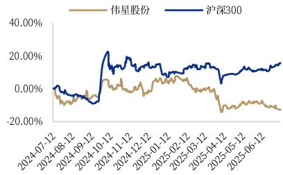  
相对沪深300表现图  
资料来源：中国银河证券研究院

# 相关研究

# 目录 Catalog

一、服饰辅料行业龙头企业，稳健发展竞争优势显著..。 3

二、国际化、多元化驱动增长，一站式响应客户需求。. 6

（一）国际化产能布局，驱动境外收入增长... .6（二）创新设计强化产品竞争优势，拓宽高端、细分领域. 。/（三）“产品 $^ +$ 服务”全程经营，一站式响应客户需求，

# 三、盈利预测与估值分析.. 9

（一）盈利预测…. 9  
（二）相对估值. .9

# 四、风险提示.. 10

# 服饰辅料行业龙头企业， 稳健发展竞争优势显著

伟星股份是国内服饰辅料行业领军企业。公司成立于1988年，专注于中高档服饰及箱包辅料产品的制造销售，旗下“SAB”拉链品牌在行业内也备享盛誉。经过多年的努力，公司已成为国内规模较大、品类较齐全的综合性服饰辅料企业，“SAB”拉链品牌也已成为国内服饰辅料的领军品牌。

公司股权结构较为集中。公司核心股东通过对伟星集团的控制及直接持股，在公司的股权结构中占据重要地位，对公司的发展方向和战略决策具有关键作用。截至2025 年第一季度末，章卡鹏、张三云及重要关联方伟星集团合计持股达 $3 7 . 9 8 \%$ ，其中创始人章卡鹏通过直接与间接持股的方式，合计持有公司 $2 1 . 6 4 \%$ 股份，为公司第一大股东。此外，公司重要关联方伟星集团通过发债方式将所持有股权质押募集资金。2022年，公司完成董事会换届，章卡鹏不再担任公司董事长一职。

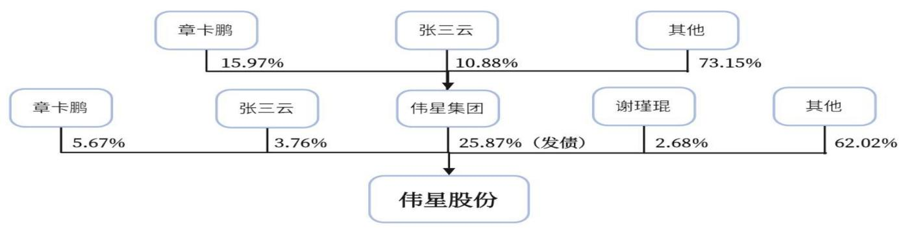  
图1：公司股权结构  
资料来源：iFinD，中国银河证券研究院

近年来，公司营业收入呈现稳健增长态势。2024 年，公司通过聚焦市场、创新开发、工厂改造升级等举措，全方位提升公司影响力，巩固市场地位，推动营收增长。2014-2024 年，公司营业收入从18.49亿元增长至46.74亿元，期间CAGR为 $9 . 7 2 \%$ ，2020年受公共卫生事件影响短期下滑，但2021年消费端回暖驱动营收快速反弹，2024年同比增长 $1 9 . 6 6 \%$ ，期间CAGR为 $1 6 . 9 8 \%$ ，展现强韧性与增长弹性。利润方面，公司2014-2024年归母净利润从2.36亿元增长至7亿元，期间CAGR为 $1 1 . 5 0 \%$ 。2024年，公司坚持转型升级与聚焦研发，助力公司提升市场份额，巩固竞争优势，全年归母净利润同比增长 $2 5 . 4 8 \% _ { \circ } 2 0 2 5$ 年Q1季度，公司营业收入为9.79亿元，同比增长 $2 2 . 3 2 \%$ ,公司归母净利润为1亿元，同比增长 $2 8 . 7 6 \%$ ，公司业绩增长势头强劲。

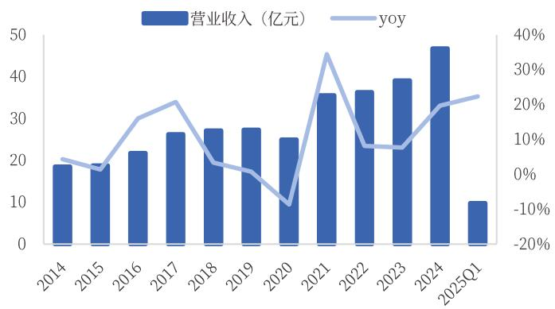  
图2：公司近十年营业收入及增速  
资料来源：iFinD，中国银河证券研究院

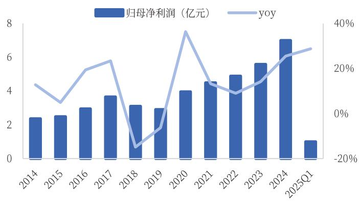  
图3：公司近十年归母净利润及增速

资料来源：iFinD，中国银河证券研究院

巩固主营业务优势，积极推动新品类布局。2024年，公司主营业务产品之一拉链营业收入达24.84亿元，营业收入占比达 $5 3 . 1 4 \%$ ，同比增长 $1 5 . 9 4 \%$ 。同为主营业务产品的钮扣营业收入达19.54亿元，营业收入占比达 $4 1 . 8 1 \%$ ，同比增长 $2 2 . 1 8 \%$ 。同时，公司大力推动新品类产品布局，不断增强公司综合竞争力。公司其他服装辅料产品营业收入稳步增长，2024 年营业收入达1.64 亿元，同比增长 $4 1 . 9 2 \%$ ，营业收入占比达 $3 . 5 2 \%$ ，未来有望成为公司新的增长点。

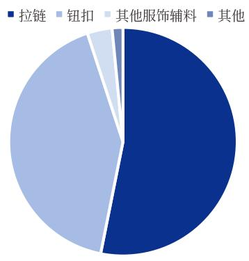  
图4：2024 年分业务收入占比

资料来源：公司公告，中国银河证券研究院资料来源：iFinD，中国银河证券研究院

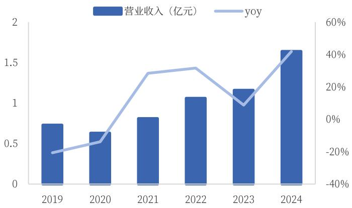  
图5：其他服装辅料产品营业收入及增速

公司拉链与钮扣业务推动整体毛利率波动上行。2020-2024年销售毛利率从约 $3 8 . 8 4 \%$ 提升至$4 1 . 7 3 \%$ 。其中拉链产品毛利率2020-2024年从 $3 6 . 5 9 \%$ 提升至 $4 2 . 1 2 \%$ ；钮扣业务毛利率2021年后稳定在 $4 2 \%$ 左右，略有小幅提升；其他服装辅料从低谷修复至 $1 3 \%$ 左右;其他业务2021年后达 $6 0 \%$ 以上。拉链与钮扣业务的毛利率提升、高毛利优势及业务结构优化，支撑2020-2024 年整体毛利率结构性优化。

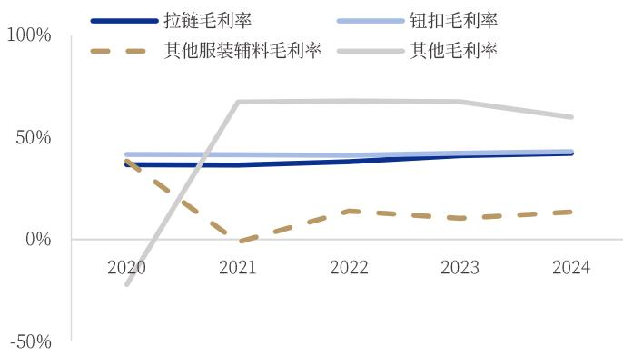  
图6：公司分业务毛利率

资料来源：iFinD，中国银河证券研究院资料来源：iFinD，中国银河证券研究院

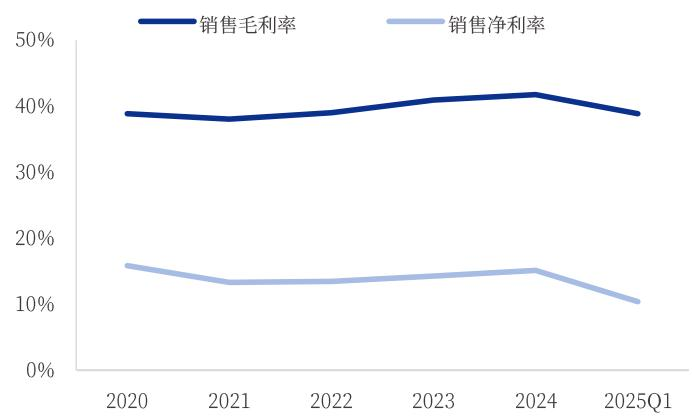  
图7：公司销售毛利率及销售净利率

公司优化费用配置，周转效率持续改善。2024年公司通过销售渠道优化，费用精准控制，使得销售费用率相较于2023年的 $9 . 0 8 \%$ 降至 $8 . 8 7 \%$ 。同时，公司始终围绕服装辅料核心业务，保持稳定研发投入以强化技术壁垒，研发费用率基本维持稳定。剔除公共卫生事件因素影响，公司存货周转天数2024年为86天左右，存货周转维持健康水平。公司应收账款周转天数相较于2019 年下降明显，此后维持在合理健康的水平。

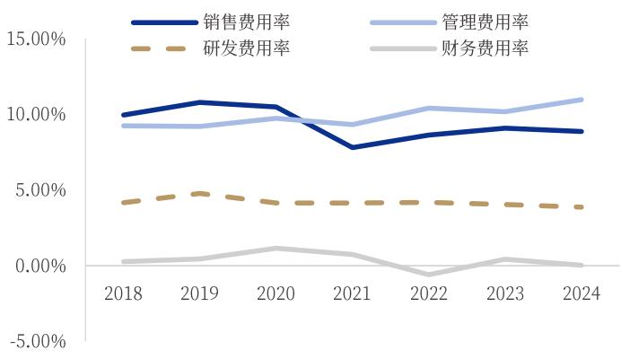  
图8：公司四项费用率变化情况

资料来源：iFinD，中国银河证券研究院

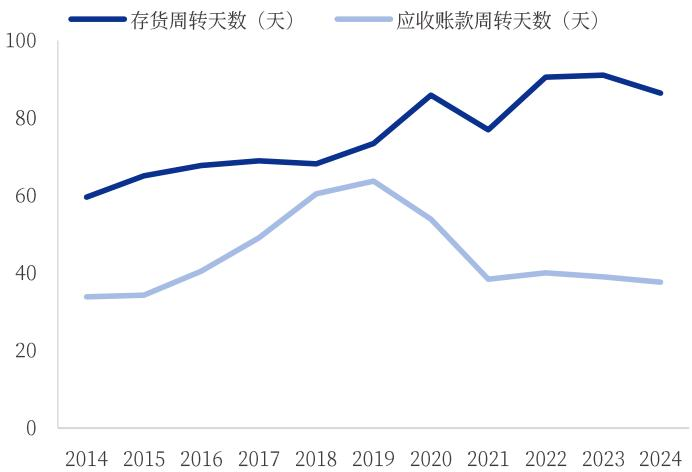  
图9：公司存货周转天数及应收账款周转天数  
资料来源：iFinD，中国银河证券研究院

# 二、国际化、多元化驱动增长， 一站式响应客戶需求

# $( - \cdot )$ 国际化产能布局，驱动境外收入增长

作为国内服饰辅料行业的龙头企业，公司凭借产能布局构筑起坚实的产业根基。目前，公司在国内外共建成九大工业园区，已形成年产120亿粒钮扣与9.10亿米拉链的生产规模，是国内兼具规模与品类优势的综合性服饰辅料企业。随着运营效率的持续优化，公司总体产能利用率稳步攀升，2024年已达到 $6 8 . 8 2 \%$ ，在产能分布上，公司以国内基地为核心，国内产能占比达 $8 0 . 9 5 \%$ ，主要布局于浙江省临海市、广东省深圳市、山东省潍坊市等。同时积极拓展海外版图，境外产能占比达到$1 9 . 0 5 \%$ ，分布在孟加拉国、越南等地区，通过贴近海外市场的本地化布局，进一步完善全球供应链体系。

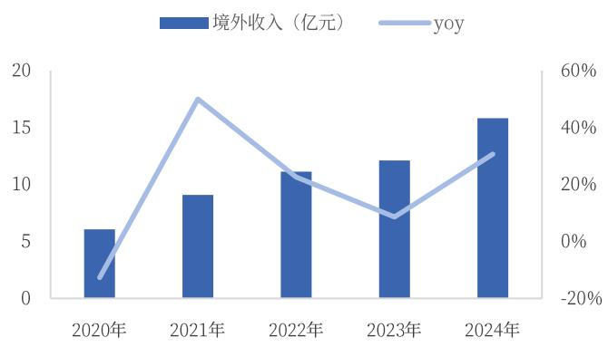  
图10：公司境外收入及增速变化  
资料来源：iFinD，中国银河证券研究院

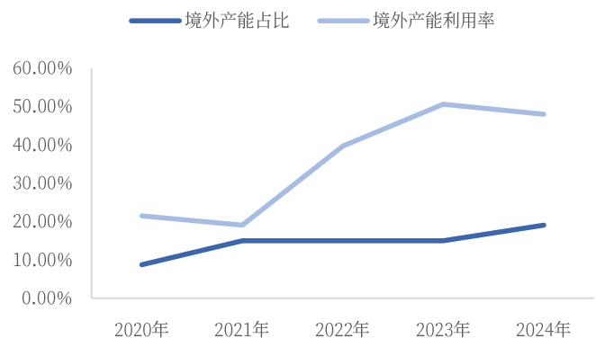  
图11：公司境外产能及产能利用率变化  
资料来源：iFinD，中国银河证券研究院

公司积极推进全球化战略以提升国际竞争力。2018年孟加拉国工业园投产开启国际化新篇，2021年启动孟加拉三期工程与越南工业园项目（后者于2024年3月投产）。海外产能持续扩张推动境外产能占比从2020年的 $8 . 7 3 \%$ 提升至2024年的 $1 9 . 0 5 \%$ ，虽因建设投产期有所波动，但其产能利用率也从 $1 9 . 0 5 \%$ 显著提升至 $4 7 . 9 8 \%$ ，带动境外收入增长，2024年增速达 $3 0 . 6 6 \%$ 、占总收入$3 3 . 8 1 \%$ 。同时，公司通过完善营销网络与服务体系开发新市场，旗下“SAB”品牌享誉业内，与迪卡侬、耐克、优衣库等国际知名品牌建立战略合作，客户认可度持续提升，进一步夯实全球竞争优势。

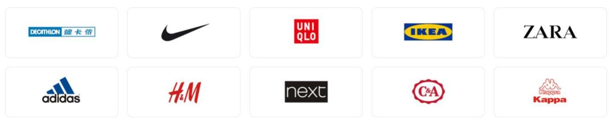  
图12：公司部分国际品牌客户  
资料来源：公司官网，中国银河证券研究院

# （二）创新设计强化产品竞争优势，拓宽高端、细分领域

公司通过强化产品研发与创新，以设计赋能拉链等辅料产品提升溢价空间。一方面通过文化赋能功能性设计，将文化元素融入产品以彰显独特调性。例如，冬奥会玉龙拉链以红山文化C形玉龙为设计灵感，拉头采用龙玉碎片造型，外覆可再生透明材料，融合“金镶玉”传统工艺美学，实现文化价值与实用功能的结合。此外，公司切入高端及细分领域，针对户外、运动等场景推出功能性升级产品，包括双开易插拉链、无膜防水拉链、单向导湿织带、全塑高性能四合扣等，相关产品均持有多项专利，通过场景化功能创新增强产品竞争力。2024 年公司拉链单价达4.69元/米，同比提升 $9 . 6 \%$ ，体现出公司在辅料领域通过产品设计与创新实现价值提升的核心能力。

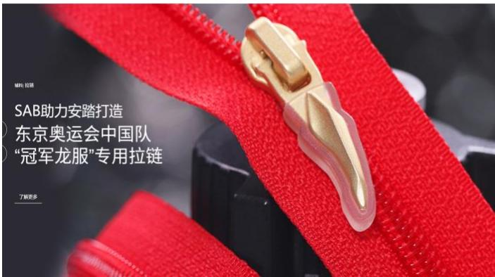  
图13：公司个性化产品之“冠军龙服”专用拉链  
资料来源：公司官网，中国银河证券研究院

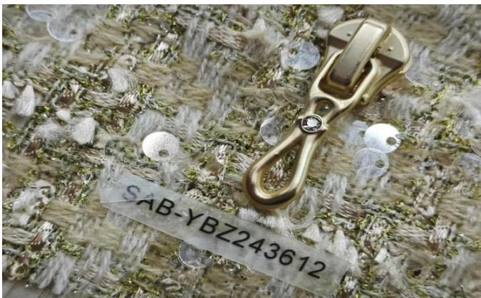  
图14：公司时尚个性化产品示例  
资料来源：公司官方公众号，中国银河证券研究院

# （三）“产品 $^ { + }$ 服务”全程经营，一站式响应客户需求

公司从设计、制造、销售等多方面保障客户服务。伟星股份旗下品牌SAB彰显公司专业（Specialty）、领先（Advanced）和超越（Beyond）理念，其产品辅料品类齐全，可以满足客户对各类辅料的需求，为客户提供辅料产品一站式解决方案。SAB全程服务由“时尚设计”、“精工制造”、“专家销售”、“承诺式服务”四大体系加以实现和保障。产品设计方面，公司能够根据客户的个性化需求提供定制产品，并通过自动化生产设备，实现生产环节快速流转，缩短交货期，快速响应客户需求。销售方面，SAB 通过完整的辅料专业知识培训体系，培养了1000多位专业的销售精英，依托健全的营销网络，在第一时间为客户提供全套辅料产品采购和解决方案。通过SAB全程服务体系，公司以市场需求和价值创新为导向为客户提供专业、快捷的“一站式”服饰辅料供应。

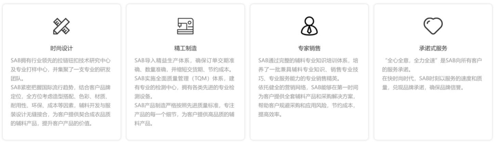  
图15：公司SAB全程服务体系  
资料来源：公司官网，中国银河证券研究院

公司以满足客户需求为核心的一站式全程服务，能够快速响应客户需求，第一时间为客户提供全套辅料产品采购和解决方案，帮助客户规避采购和应用风险，节约成本，提高效率，赢得客户广泛好评，历年来多次获得客户颁发荣誉，市场认可度持续提升。

表1：公司获得客户颁发荣誉奖项不完全统计  

<table><tr><td>颁奖品牌</td><td>奖项</td></tr><tr><td>太平鸟</td><td>2024 年度产品创新奖</td></tr><tr><td>森马服饰</td><td>2024年度战略合作奖</td></tr><tr><td>劲霸男装</td><td>2024 年度创新奖</td></tr><tr><td>爱慕</td><td>2023 年度卓越服务供应商</td></tr><tr><td>UR</td><td>2023 年度优秀供应商</td></tr><tr><td>特步</td><td>2023 年度卓越质量奖</td></tr><tr><td>艾莱依</td><td>2023 年度优秀供应商</td></tr></table>

资料来源：公司官方公众号，中国银河证券研究院

# 盈利预测与估值分析

# （一）盈利预测

公司作为国内服饰辅料行业龙头企业，在研发与技术、生产效率、营销与服务、品牌与品质、企业文化与管理团队等方面形成了较强的综合竞争优势合作客户广泛且稳定。近年公司不断扩充其他产品品类，加速布局海外产能，预计未来将受益于海外产能释放与产品品类的扩充与升级。预计2025/2026/2027年公司实现归母净利润分别为 $7 . 7 1 / 8 . 8 2 / 9 . 8 7$ 亿元，分别同比增长$1 0 . 0 3 \% / 1 4 . 4 9 \% / 1 1 . 8 4 \%$ 当前市值（2025年7月11日）对应2025/2026/2027年PE估值为16.14/14.10/12.60倍。

表2：公司盈利预测  

<table><tr><td>时间</td><td>2024A</td><td>2025E</td><td>2026E</td><td>2027E</td></tr><tr><td>营业总收入（百万元）</td><td>4674.42</td><td>5132.51</td><td>5807.65</td><td>6503.24</td></tr><tr><td>同比(%)</td><td>19.66</td><td>9.80</td><td>13.15</td><td>11.98</td></tr><tr><td>归母净利润(百万元)</td><td>700.33</td><td>770.58</td><td>882.28</td><td>986.78</td></tr><tr><td>同比(%)</td><td>25.48</td><td>10.03</td><td>14.49</td><td>11.84</td></tr><tr><td>EPS</td><td>0.66</td><td>0.75</td><td>0.84</td><td>0.94</td></tr><tr><td>PE</td><td>17.76</td><td>16.14</td><td>14.10</td><td>12.60</td></tr></table>

资料来源：iFinD，中国银河证券研究院

# 二）相对估值

公司2024 年维持稳健增长，净利率持续改善。考虑到公司海外产能释放，产品品类升级与扩充，我们认为公司当前估值可维持，且中长期有进一步提升空间，首次覆盖给予推荐评级。

表3：可比公司PE估值表（截至2025年7月11日）  

<table><tr><td rowspan="2">股票代码</td><td rowspan="2">股票名称</td><td rowspan="2">总市值</td><td rowspan="2">股价</td><td colspan="3">EPS（元）</td><td colspan="3">PE</td></tr><tr><td>2024A</td><td>2025E</td><td>2026E</td><td>2024A</td><td>2025E</td><td>2026E</td></tr><tr><td>002003.SZ</td><td>伟星股份</td><td>124.4亿元</td><td>10.64元</td><td>0.60</td><td>0.75</td><td>0.84</td><td>17.76</td><td>16.14</td><td>14.10</td></tr><tr><td>300979.SZ</td><td>华利集团*</td><td>636.5亿元</td><td>54.54元</td><td>3.29</td><td>3.62</td><td>4.17</td><td>16.58</td><td>15.07</td><td>13.08</td></tr><tr><td>2313.HK</td><td>申洲国际*</td><td>864.4 亿港元</td><td>57.70港元</td><td>4.15</td><td>4.4</td><td>4.93</td><td>12.66</td><td>11.94</td><td>10.66</td></tr></table>

资料来源：iFinD，中国银河证券研究院（注：\*表示采用iFinD一致预期，申洲国际股价按照7月11日中国银行外汇牌价100港币 $\mathsf { \Pi } _ { 1 = 9 1 . 0 5 }$ 人民币换算）

# 四、风险提示

1、服装消费景气度恢复不及预期：服装辅料行业受下游服装消费景气度影响，若国内经济增长承压，服装箱包等市场需求持续疲软，公司国内订单量可能不及预期；若海外品牌销售情况不及预期，公司来自海外品牌的订单亦受影响。

2、海外产能不及预期：若公司越南工厂产能爬坡进度及产能利用率不及预期，可能影响拓客和接单进度。

3、国际贸易风险：当前全球地缘政治摩擦持续，美国对中国制造和贸易或采取加征关税的强制措施，可能对公司国内出口订单产生影响。

# 图表目录

图1：公司股权结构…  
图2：公司近十年营业收入及增速.. ..4  
图3：公司近十年归母净利润及增速 .4  
图4：2024年分业务收入占比. .4  
图5： 其他服装辅料产品营业收入及增速 ..4  
图6：公司分业务毛利率.. .5  
图7：公司销售毛利率及销售净利率 ..5  
图8：公司四项费用率变化情况 .5  
图9：公司存货周转天数及应收账款周转天数.. …5  
图10：公司境外收入及增速变化…  
图11：公司境外产能及产能利用率变化.. …6  
图12：公司部分国际品牌客户. .6  
图13：公司个性化产品之“冠军龙服”专用拉链 ..7  
图14：公司时尚个性化产品示例. ..7  
图15：公司SAB全程服务体系 .8  
表1：公司获得客户颁发荣誉奖项不完全统计.. .8  
表2：公司盈利预测.. 9  
表3：可比公司PE估值表（截至2025年7月11日） 9

# 附录：

公司财务预测表  

<table><tr><td>资产负债表（百万元)</td><td>2023A</td><td>2024E</td><td>2025E</td><td>2026E</td></tr><tr><td>流动资产</td><td>2609.41</td><td>3301.52</td><td>3798.99</td><td>4590.82</td></tr><tr><td>现金</td><td>1107.89</td><td>658.39</td><td>1771.67</td><td>1329.45</td></tr><tr><td>应收账款</td><td>512.95</td><td>1625.60</td><td>729.73</td><td>1979.95</td></tr><tr><td>其它应收款</td><td>52.56</td><td>19.96</td><td>28.44</td><td>25.76</td></tr><tr><td>预付账款</td><td>19.68</td><td>13.53</td><td>23.97</td><td>17.96</td></tr><tr><td>存货</td><td>703.89</td><td>707.92</td><td>979.90</td><td>907.23</td></tr><tr><td>其他</td><td>212.44</td><td>276.11</td><td>265.27</td><td>330.47</td></tr><tr><td>非流动资产</td><td>3680.89</td><td>3422.03</td><td>3161.52</td><td>3097.81</td></tr><tr><td>长期投资</td><td>117.13</td><td>117.13</td><td>117.13</td><td>117.13</td></tr><tr><td>固定资产</td><td>2687.16</td><td>2430.46</td><td>2173.18</td><td>2105.31</td></tr><tr><td>无形资产</td><td>403.54</td><td>384.27</td><td>365.00</td><td>345.73</td></tr><tr><td>其他</td><td>473.07</td><td>490.18</td><td>506.21</td><td>529.65</td></tr><tr><td>资产总计</td><td>6290.30</td><td>6723.55</td><td>6960.51</td><td>7688.63</td></tr><tr><td>流动负债</td><td>1754.87</td><td>1804.71</td><td>1602.68</td><td>1839.82</td></tr><tr><td>短期借款</td><td>711.69</td><td>450.00</td><td>300.00</td><td>200.00</td></tr><tr><td>应付账款</td><td>515.59</td><td>480.99</td><td>644.23</td><td>613.86</td></tr><tr><td>其他</td><td>527.59</td><td>873.72</td><td>658.44</td><td>1025.97</td></tr><tr><td>非流动负债</td><td>135.74</td><td>135.74</td><td>135.74</td><td>135.74</td></tr><tr><td>长期借款</td><td>0.00</td><td>0.00</td><td>0.00</td><td>0.00</td></tr><tr><td>其他</td><td>135.74</td><td>135.74</td><td>135.74</td><td>135.74</td></tr><tr><td>负债合计</td><td>1890.61</td><td>1940.45</td><td>1738.42</td><td>1975.56</td></tr><tr><td>少数股东权益</td><td>45.34</td><td>44.00</td><td>42.48</td><td>40.77</td></tr><tr><td>归属母公司股东权益</td><td>4354.36</td><td>4739.10</td><td>5179.61</td><td>5672.30</td></tr><tr><td>负债和股东权益</td><td>6290.30</td><td>6723.55</td><td>6960.51</td><td>7688.63</td></tr></table>

<table><tr><td>现金流量表(百万元)</td><td>2024A</td><td>2024E</td><td>2025E</td><td>2026E</td></tr><tr><td>经营活动现金流</td><td>1089.91</td><td>292.13</td><td>1728.96</td><td>454.17</td></tr><tr><td>净利润</td><td>706.98</td><td>769.25</td><td>880.75</td><td>985.07</td></tr><tr><td>折旧摊销</td><td>297.98</td><td>300.05</td><td>302.12</td><td>305.75</td></tr><tr><td>财务费用</td><td>1.55</td><td>8.98</td><td>5.94</td><td>6.52</td></tr><tr><td>投资损失</td><td>-15.02</td><td>-15.02</td><td>-15.02</td><td>-15.02</td></tr><tr><td>营运资金变动</td><td>89.37</td><td>830.08</td><td>-563.58</td><td>897.13</td></tr><tr><td>其它</td><td>9.05</td><td>-1601.21</td><td>1118.75</td><td>-1725.28</td></tr><tr><td>投资活动现金流</td><td>-754.88</td><td>-18.83</td><td>-18.62</td><td>-218.61</td></tr><tr><td>资本支出</td><td>765.79</td><td>33.00</td><td>33.00</td><td>233.00</td></tr><tr><td>长期投资</td><td>-17.65</td><td>-0.21</td><td>0.00</td><td>0.01</td></tr><tr><td>其他</td><td>-1503.02</td><td>-51.62</td><td>-51.62</td><td>-451.62</td></tr><tr><td>筹资活动现金流</td><td>-647.82</td><td>-656.52</td><td>-597.71</td><td>-600.62</td></tr><tr><td>短期借款</td><td>171.18</td><td>-261.69</td><td>-150.00</td><td>-100.00</td></tr><tr><td>长期借款</td><td>-98.10</td><td>0.00</td><td>0.00</td><td>0.00</td></tr><tr><td>其他</td><td>-720.89</td><td>-394.83</td><td>-447.71</td><td>-500.62</td></tr><tr><td>现金净增加额</td><td>-307.26</td><td>-383.22</td><td>1112.62</td><td>-365.06</td></tr></table>

资料来源：公司数据，中国银河证券研究院

<table><tr><td>利润表 （百万元)</td><td>2023A</td><td>2024E</td><td>2025E</td><td>2026E</td></tr><tr><td>营业收入</td><td>4674.42</td><td>5132.51</td><td>5807.65</td><td>6503.24</td></tr><tr><td>营业成本</td><td>2723.58</td><td>2989.73</td><td>3375.66</td><td>3774.27</td></tr><tr><td>营业税金及附加</td><td>55.08</td><td>60.47</td><td>68.43</td><td>76.63</td></tr><tr><td>营业费用</td><td>414.66</td><td>449.09</td><td>499.46</td><td>559.28</td></tr><tr><td>管理费用</td><td>512.35</td><td>564.58</td><td>638.84</td><td>715.36</td></tr><tr><td>财务费用</td><td>1.55</td><td>8.98</td><td>5.94</td><td>6.52</td></tr><tr><td>资产减值损失</td><td>-2.21</td><td>-2.21</td><td>-2.21</td><td>-2.21</td></tr><tr><td>公允价值变动收益</td><td>-0.07</td><td>-0.21</td><td>-0.21</td><td>-0.21</td></tr><tr><td>投资净收益</td><td>15.02</td><td>15.02</td><td>15.02</td><td>15.02</td></tr><tr><td>营业利润</td><td>852.45</td><td>927.05</td><td>1060.63</td><td>1185.61</td></tr><tr><td>营业外收入</td><td>0.83</td><td>0.83</td><td>0.83</td><td>0.83</td></tr><tr><td>营业外支出</td><td>6.30</td><td>6.30</td><td>6.30</td><td>6.30</td></tr><tr><td>利润总额</td><td>846.98</td><td>921.58</td><td>1055.16</td><td>1180.14</td></tr><tr><td>所得税</td><td>140.00</td><td>152.33</td><td>174.41</td><td>195.07</td></tr><tr><td>净利润</td><td>706.98</td><td>769.25</td><td>880.75</td><td>985.07</td></tr><tr><td>少数股东损益</td><td>6.65</td><td>-1.33</td><td>-1.53</td><td>-1.71</td></tr><tr><td>归属母公司净利润</td><td>700.33</td><td>770.58</td><td>882.28</td><td>986.78</td></tr><tr><td>EBITDA</td><td>1079.38</td><td>1163.62</td><td>1296.22</td><td>1425.41</td></tr><tr><td>EPS (元)</td><td>0.60</td><td>0.66</td><td>0.75</td><td>0.84</td></tr></table>

<table><tr><td>主要财务比率</td><td>2023A</td><td>2024E</td><td>2025E</td><td>2026E</td></tr><tr><td>营业收入</td><td>19.66%</td><td>9.80%</td><td>13.15%</td><td>11.98%</td></tr><tr><td>营业利润</td><td>26.70%</td><td>8.75%</td><td>14.41%</td><td>11.78%</td></tr><tr><td>归属母公司净利润</td><td>25.48%</td><td>10.03%</td><td>14.49%</td><td>11.84%</td></tr><tr><td>毛利率</td><td>41.73%</td><td>41.75%</td><td>41.88%</td><td>41.96%</td></tr><tr><td>净利率</td><td>14.98%</td><td>15.01%</td><td>15.19%</td><td>15.17%</td></tr><tr><td>ROE</td><td>16.08%</td><td>16.26%</td><td>17.03%</td><td>17.40%</td></tr><tr><td>ROIC</td><td>15.83%</td><td>15.39%</td><td>21.53%</td><td>19.97%</td></tr><tr><td>资产负债率</td><td>30.06%</td><td>28.86%</td><td>24.98%</td><td>25.69%</td></tr><tr><td>净负债比率</td><td>-5.94%</td><td>-1.53%</td><td>-25.60%</td><td>-17.41%</td></tr><tr><td>流动比率</td><td>1.49</td><td>1.83</td><td>2.37</td><td>2.50</td></tr><tr><td>速动比率</td><td>1.09</td><td>1.44</td><td>1.76</td><td>2.00</td></tr><tr><td>总资产周转率</td><td>0.76</td><td>0.79</td><td>0.85</td><td>0.89</td></tr><tr><td>应收账款周转率</td><td>9.56</td><td>4.80</td><td>4.93</td><td>4.80</td></tr><tr><td>应付账款周转率</td><td>9.49</td><td>10.30</td><td>10.32</td><td>10.34</td></tr><tr><td>每股收益</td><td>0.60</td><td>0.66</td><td>0.75</td><td>0.84</td></tr><tr><td>每股经营现金</td><td>0.93</td><td>0.25</td><td>1.48</td><td>0.39</td></tr><tr><td>每股净资产</td><td>3.73</td><td>4.05</td><td>4.43</td><td>4.85</td></tr><tr><td>P/E</td><td>17.76</td><td>16.14</td><td>14.10</td><td>12.60</td></tr><tr><td>P/B</td><td>2.86</td><td>2.62</td><td>2.40</td><td>2.19</td></tr><tr><td>EV/EBITDA</td><td>15.09</td><td>10.60</td><td>8.54</td><td>8.00</td></tr><tr><td>P/S</td><td>2.66</td><td>2.42</td><td>2.14</td><td>1.91</td></tr></table>

# 分析师承诺及简介

本人承诺以勤勉的执业态度，独立、客观地出具本报告，本报告清晰准确地反映本人的研究观点。本人薪酬的任何部分过去不曾与、现在不与、未来也将不会与本报告的具体推荐或观点直接或间接相关。

郝帅，纺织服饰行业分析师。加拿大温莎大学经济学硕士，2015 年起先后在中国银河证券、东吴证券、国泰君安证券、中银国际证券担任分析师、首席分析师。曾获得 2019-2020 年机构投资者II评选纺织零售行业第三名，2021-2023水晶球评选纺织服装行业入围、第四名、第五名。

# 免责声明

本报告由中国银河证券股份有限公司（以下简称银河证券）向其客户提供。银河证券无需因接收人收到本报告而视其为客户。若您并非银河证券客户中的专业投资者，为保证服务质量、控制投资风险、应首先联系银河证券机构销售部门或客户经理，完成投资者适当性匹配，并充分了解该项服务的性质、特点、使用的注意事项以及若不当使用可能带来的风险或损失。

本报告所载的全部内容只提供给客户做参考之用，并不构成对客户的投资咨询建议，并非作为买卖、认购证券或其它金融工具的邀请或保证。客户不应单纯依靠本报告而取代自我独立判断。银河证券认为本报告资料来源是可靠的，所载内容及观点客观公正，但不担保其准确性或完整性。本报告所载内容反映的是银河证券在最初发表本报告日期当日的判断，银河证券可发出其它与本报告所载内容不一致或有不同结论的报告，但银河证券没有义务和责任去及时更新本报告涉及的内容并通知客户。银河证券不对因客户使用本报告而导致的损失负任何责任。

本报告可能附带其它网站的地址或超级链接，对于可能涉及的银河证券网站以外的地址或超级链接，银河证券不对其内容负责。链接网站的内容不构成本报告的任何部分，客户需自行承担浏览这些网站的费用或风险。

银河证券在法律允许的情况下可参与、投资或持有本报告涉及的证券或进行证券交易，或向本报告涉及的公司提供或争取提供包括投资银行业务在内的服务或业务支持。银河证券可能与本报告涉及的公司之间存在业务关系，并无需事先或在获得业务关系后通知客户。

银河证券已具备中国证监会批复的证券投资咨询业务资格。除非另有说明，所有本报告的版权属于银河证券。未经银河证券书面授权许可，任何机构或个人不得以任何形式转发、转载、翻版或传播本报告。特提醒公众投资者慎重使用未经授权刊载或者转发的本公司证券研究报告。

本报告版权归银河证券所有并保留最终解释权。

评级标准  

<table><tr><td colspan="2">评级标准</td><td>评级</td><td>说明</td></tr><tr><td rowspan="5">评级标准为报告发布日后的 6 到12 个月行业指 数（或公司股价）相对市场表现，其中：A股市 场以沪深300指数为基准，新三板市场以三板成 指（针对协议转让标的）或三板做市指数（针对</td><td rowspan="3">行业评级</td><td>推荐：</td><td>相对基准指数涨幅10%以上</td></tr><tr><td>中性：</td><td>相对基准指数涨幅在-5%～10%之间</td></tr><tr><td>回避：</td><td>相对基准指数跌幅 5%以上</td></tr><tr><td rowspan="3">公司评级</td><td>推荐：</td><td>相对基准指数涨幅20%以上</td></tr><tr><td>谨慎推荐：</td><td>相对基准指数涨幅在5%～20%之间</td></tr><tr><td>中性： 回避：</td><td>相对基准指数涨幅在-5%～5%之间</td></tr></table>

# 联系

<table><tr><td>中国银河证券股份有限公司研究院</td><td colspan="4">机构请致电：</td></tr><tr><td>深圳市福田区金田路3088号中洲大厦20层</td><td>深广地区：</td><td></td><td></td><td>程曦0755-83471683chengxi_yj@chinastock.com.cn</td></tr><tr><td rowspan="2">上海浦东新区富城路99号震旦大厦31层</td><td></td><td></td><td></td><td>苏一耘0755-83479312 suyiyun_yj@chinastock.com.cn</td></tr><tr><td>上海地区：</td><td></td><td></td><td>陆韵如 021-60387901 luyunru_yj@chinastock.com.cn</td></tr><tr><td rowspan="2">北京市丰台区西营街8号院1号楼青海金融大厦</td><td></td><td></td><td></td><td>李洋洋021-20252671liyangyang-yj@chinastock.com.cn</td></tr><tr><td>北京地区：</td><td></td><td></td><td>田薇010-80927721tianwei@chinastock.com.cn</td></tr><tr><td></td><td></td><td></td><td></td><td>褚颖010-80927755chuying-yj@chinastock.com.cn</td></tr></table>