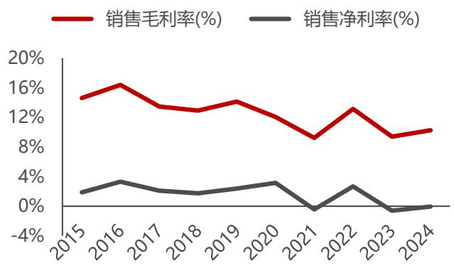

光明肉业（600073.SH）首次覆盖报告

# 国潮新消费重塑百年老字号；牛周期向上重视经营拐点

上海老牌国资，聚焦肉类布局。诞生于 1930 年的“梅林”品牌从一家石库门小作坊开始起步，历经近百年发展，打造了包含饲料生产、育种养殖、屠宰分销、肉制品深加工及分销的全产业链，形成了以优质产品为基础，以品牌建设为抓手，以肉类产业链为协同的具有光明肉业特色的核心竞争力。

➢ 新西兰最大牛肉屠宰企业，出口贸易面向全球。公司的牛羊肉屠宰和贸易业务主要由子公司新西兰银蕨农场有限公司和联豪食品负责。2023-24 年中国牛肉市场价格承压下行， 2023 年新西兰遭遇罕见飓风“加布丽埃尔”和由其引发的大面积洪涝灾害，影响了银蕨屠宰工厂的正常产能，使牛屠宰量减少，降低了业务旺季期间银蕨的市场供应能力，劳动力短缺叠加自然灾害影响，导致 2023-24年银蕨农场营收同比出现下降。2025 年，我们预计伴随中国牛肉价格逐渐进入上行周期，银蕨的盈利水平将得以修复，为公司业绩重获增长提供动能。

➢ 国潮食品品牌逆袭复兴，公司长期业绩的压舱石。公司品牌食品业务主要由子公司上海冠生园食品有限公司从事。冠生园是百年历史的中华民族名牌老字号企业，目前五大产品品类主要是：糖果、药补酒、蜂制品、面制品、调味品。其中大白兔奶糖为中国名牌产品、国家免检产品和国家原产地标记注册产品，畅销四十多个国家和地区；冠生园蜂蜜为上海市名牌产品，全国市场占有率第一位。

➢ 上海生猪稳产保供主力军，养殖屠宰全产业链协同发展。生猪养殖业务主要由子公司光明农牧科技有限公司从事，公司持股比例为 51%。光明农牧主要在江苏、河北等地规模化养殖场布局，通过自繁自养和外购仔猪相结合的养殖模式，采取公司定价和竞价相结合的销售模式，直接向下游屠宰企业以及肉制品加工企业销售生猪。

我们认为海外牛肉主产国景气周期或将同步，拐点领先于中国到来。在过去两年由于中国消费增速放缓，南美主要国家主动进行了产能出清；而美国 2020-2022 年连续三年的干旱造成牧场退化严重，被迫去产能，2024 年 6 月中国牛犊价格上涨已经预示 2025 年牛肉价格有望保持乐观；澳大利亚在经过了 2021-2023 年连续三年的产能扩张后，2023 年开始母牛屠宰率也显著上升，将对 2025年以后的出栏量造成影响。

➢ 我国的牛周期发生了深刻的变化。在过去十年间，肉牛产能扩张速度远低于中国居民牛肉消费增速，因此我国的牛周期表现并不典型，价格呈现长期趋势性增长的态势。但随着非洲猪瘟后肉类蛋白消费转移、公共卫生事件结束后复产复工带来消费增长，肉牛养殖的高景气周期导致下游激进扩产，叠加进口量激增，2023 年 7 月起我国肉牛养殖出现了少有的大面积亏损。同时由于肉牛养殖本身行业集中度和规模化水平较低，存在较为严重的信息不对称，类似于非洲猪瘟前的生猪养殖行业，产能出清速度较快。一旦产能得到有效出清，供需错配和价格弹性极有可能超预期。

投资建议：我们预计公司 2025\~2027 年归母净利润分别为 4.31、6.80、7.69 亿元，对应 EPS 分别为 0.46、0.73、0.82 元。公司在肉类罐头食品、牛羊肉、蜂蜜、奶糖等领域居行业龙头，子公司新西兰银蕨是新西兰最大的牛羊鹿肉屠宰企业之一，将充分受益于牛周期景气上行。公司以品牌建设为抓手，以肉类产业链为协同，充分发挥光明肉业核心竞争力，首次覆盖，给予“推荐”评级。

➢ 风险提示：各国牛肉价格反弹不及预期风险；贸易政策不确定性风险；下游需求不及预期风险；自然灾害及动物疫病风险。

2025 年 07 月 16 日推荐 首次评级当前价格： 7.29 元分析师 徐菁执业证书： S0100523120004邮箱： xujing@mszq.com研究助理 杜海路执业证书： S0100123070067邮箱： duhailu@mszq.com

[盈利预测与财务指标Table_Forcast]   

<table><tr><td>项目/年度</td><td>2024A</td><td>2025E</td><td>2026E</td><td>2027E</td></tr><tr><td>营业收入（百万元）</td><td>21,987</td><td>23,456</td><td>25,675</td><td>26,053</td></tr><tr><td>增长率 (%)</td><td>-1.7</td><td>6.7</td><td>9.5</td><td>1.5</td></tr><tr><td>归属母公司股东净利润 (百万元)</td><td>216</td><td>431</td><td>680</td><td>769</td></tr><tr><td>增长率(%)</td><td>-4.2</td><td>99.5</td><td>57.7</td><td>13.0</td></tr><tr><td>每股收益（元）</td><td>0.23</td><td>0.46</td><td>0.73</td><td>0.82</td></tr><tr><td>PE</td><td>32</td><td>16</td><td>10</td><td>9</td></tr><tr><td>PB</td><td>1.4</td><td>1.3</td><td>1.2</td><td>1.1</td></tr></table>

资料来源：Wind，民生证券研究院预测；（注：股价为 2025 年7月 16 日收盘价）

# 目录

# 1 近百年探索深耕，铸就肉类全产业链高品质企业 .3

# 2 牛周期拐点向上，相关产业链将充分受益.

# 3 主业多面开花，牛周期上行重视经营拐点. 14

# 4 盈利预测与投资建议 . 23

# 5 风险提示 27

# 插图目录 . 29

# 表格目录 . 30

# 1 近百年探索深耕，铸就肉类全产业链高品质企业

# 1.1 上海老牌国资，聚焦肉类布局

2011 年以前：肉类罐头的初步探索。诞生于 1930 年的“梅林”品牌从一家石库门小作坊开始起步；1957 年，梅林罐头食品厂股份有限公司生产了第一罐午餐肉，自此午餐肉成为梅林的拳头产品。1991 年，上海梅林罐头食品厂与上海市食品进出口公司、香港贸基发展有限公司合资建立了上海梅林食品有限公司，引入多元资源，为企业发展注入新活力。

2011-2015 年：肉类产品的全链条优化。2011 年，公司上市后首次再融资，从光明集团收购正广和、冠生园、爱森猪肉及上海食品进出口公司。这一举措助力梅林从单一罐头制造企业，转型为光明集团旗下综合食品制造平台，业务拓展至饮料、食品进出口、肉类养殖加工等多个领域，增强了市场竞争力。2015 年，公司从牛奶集团收购肉牛养殖及食品流通等资产，并出资 1.8 亿元发展生猪养殖业务，完善了肉食品前端产业链，优化产业布局。

  
图1：公司发展历程

资料来源：公司公告，上海三农，证券时报网，新京报，民生证券研究院

2015 年以后：聚焦肉业发展。2016 年，公司收购新西兰银蕨农场牛肉有限公司 $5 0 \%$ 股权，此举稳定了优质牛羊肉原材料供应，加速肉制品全产业链布局。2018 年，公司收购光明生猪有限公司 $4 1 \%$ 股权，巩固生猪养殖业务布局。2022年，公司向控股股东益民集团转让上海市食品进出口有限公司 $100 \%$ 股权，剥离非核心业务，聚焦肉业主战略，提升核心竞争力。2024 年，公司更名为上海光明肉业集团股份有限公司，进一步发挥公司品牌效应及优势。当前，公司打造了包含饲料生产、育种养殖、屠宰分销、肉制品深加工及分销的全产业链，形成了以优质产品为基础，以品牌建设为抓手，以肉类产业链为协同的具有光明肉业特色的核心竞争力。

  
图2：公司业务板块构成

资料来源：公司官网，民生证券研究院

股权结构集中稳定，国资控股优势显著。光明食品（集团）有限公司通过直接持股 $5 . 9 7 \%$ 以及通过益民食品一厂（集团）间接控股 $3 1 . 8 2 \%$ ，最终控制股份达$3 7 . 7 9 \%$ 。而光明食品（集团）有限公司的实控人为上海国资委，公司作为肉制品企业，国资背书有利于公司在保障食品安全、稳定市场供应等方面发挥积极作用。

  
图3：公司股权结构（截至 2024 年末）  
资料来源：ifind，民生证券研究院

# 1.2 营收规模整体稳定，盈利水平受市场影响

公司营收规模整体稳定，盈利水平受市场影响。 $2 0 1 5 { \sim } 2 0 2 4$ 年，公司营业收入从 122.3 亿元增长至 219.9 亿元，CAGR 为 $6 . 7 \%$ 。从收入构成看，2024 年牛羊肉/猪肉制品/生猪养殖/综合食品/罐头食品分别实现营收 117.6/31.7/19.0/17.9/14.3 亿元，收入占比分别为 $5 3 . 5 \% / 1 4 . 4 \% / 8 . 6 \% / 8 . 1 \% / 6 . 5 \%$ 。2024 年公司实现营收 219.9 亿元，同比- $. 1 . 7 \%$ ；归母净利润为 2.2 亿元，同比- $4 . 2 \%$ ，主要是肉牛出栏增长、淘汰奶牛入市以及进口牛肉量增加等因素导致牛肉价格大幅下降，压缩了牛羊肉业务的利润空间。2024 年公司盈利水平整体维持稳定，销售毛利率为$1 0 . 3 \%$ ，同比 $+ 0 . 9 \mathsf { P C T } ,$ 。

  
图4：2015-2024 营业收入（亿元）及增速

  
图5：2015-2024 归母净利润（亿元）及增速

资料来源：ifind，民生证券研究院资料来源：ifind，民生证券研究院资料来源：ifind，民生证券研究院资料来源：ifind，民生证券研究院

  
图6：2024 年公司各项营收占比（%）

  
图7：2015-2024 公司销售毛利率

费用率稳中有降，销售费用率略高于同行可比公司。2024 年，公司的三费费用率（销售、管理、财务费用率）为 $9 . 1 \%$ ，与 2023 年费用率持平，其中销售费用率 $3 . 9 \%$ ，同比 $+ 0 . 1 \mathsf { P C T }$ ，管理费用率 $5 . 0 \%$ ，同比- $\cdot 0 . 0 3 \mathsf { P C T }$ ，财务费用率 $0 . 2 \%$ ，同比-0.1PCT。2024 年公司的销售费用率为 $3 . 9 \%$ ，略高于同行业其他可比公司均值，主要系公司注重品牌建设，销售促销活动频次较高。

  
图8：2015-2024 年公司费用率水平

资料来源：ifind，民生证券研究院资料来源：ifind，民生证券研究院

  
图9：2024 年与可比公司销售费用率对比

# 2 牛周期拐点向上，相关产业链将充分受益

# 2.1 牛周期持续性强，供给受海内外双重影响

肉牛的养殖周期较长，从买入后备母牛补栏到最终育肥牛出栏需要至少 3 年的时间，这意味着价格周期的持续性要比多数禽畜产品要强。2022 年我国肉牛品种以杂交群体为主（约占 $7 9 \%$ ），以地方黄牛、牦牛、水牛为辅（约占 $2 1 \%$ ）。在杂交群体中，按存栏量高低依次为西门塔尔牛、夏洛莱牛、利木赞牛、安格斯牛，以及其他进口品种与我国本地牛的杂交后代，其中以西门塔尔的杂交后代为主。

牛的繁殖效率低下也制约了其产量的大幅增长。母牛一般情况下一年只能生一胎，三年两胎的情况也时有发生。其生产力一般在 5-7 年达到峰值，之后逐渐下降，因此一般情况下，母牛到达 8-10 岁就需要淘汰，一头母牛一生只能够生产约 6-8 头肉牛。

  
图10：母牛——肉牛的配种养殖过程

资料来源：《中国牛肉产业链研究》——王桂霞，爱采购，民生证券研究院绘制

表1：不同品种肉牛养殖周期  

<table><tr><td>排名</td><td>配种月龄</td><td>日增重</td><td>品种</td><td>出栏体重</td></tr><tr><td>国外引进良种牛</td><td>15-18月龄</td><td>3斤左右</td><td>西门塔尔牛，利木赞牛，安格斯牛，夏洛莱牛</td><td>750kg</td></tr><tr><td>中国杂交牛</td><td>13-15月龄</td><td>1-2斤</td><td>新疆褐牛，中国西门塔尔牛，夏南牛，延黄牛，辽育白牛</td><td>400kg</td></tr><tr><td>中国小型牛</td><td>8-12月</td><td>0.5-1斤</td><td>鲁西黄牛，秦川牛，南阳牛，延边牛</td><td>250kg</td></tr></table>

资料来源：牵牛养殖，民生证券研究院

影响牛肉价格的因素较为复杂。从供应端来看， $\textcircled{1}$ 能繁母牛的存栏基数决定了未来两年的育肥牛出栏量；当养殖利润恶化时，牧场加大能繁母牛的淘汰量，这些淘汰母牛也为牛肉市场带来了额外的供应增量。 $\textcircled{2}$ 奶牛的公牛犊可以直接进行育肥，因此奶牛的存栏量高低也会影响牛肉的供应；当原奶价格下跌，奶牛养殖亏损时，淘汰的奶牛同样会流入牛肉市场。 $\textcircled{3}$ 进口方面，截至 2024 年我国牛肉进口已经占据国内总供应近三成的比重，海外市场对我国牛肉市场的定价权有所增强，因此需要关注海外主产国的供需情况及我国的进口贸易政策。从需求端来看，主要关注替代品价格，特别是生猪的价格，由于猪肉是目前中国供应最大的肉类蛋白，其价格对整个肉类市场都有举足轻重的影响。长期来看，牛肉需求受到经济增速、人口增速、人口老龄化程度等因素的影响。

  
图11：牛肉价格的影响因子

资料来源：《中国牛肉产业链研究》——王桂霞，中国畜禽种业，民生证券研究院绘制

我国的肉牛造肉效率明显低于海外。从活牛的产量来看，2024 年印度和中国是全球排名第一和第二的国家，分别达到 7058 和 5200 万头，两国活牛产量占到全球总产量 $43 \%$ ，但对应的牛肉产量仅为 457 万吨和 779 万吨。印度主要饲养水牛，对乳制品消费更重视，宗教信仰的原因也导致其牛肉消费偏好偏低；而中国主要是牛的生产性能较差，虽然我国有大规模的优良杂交群体，但后续选育工作没有跟进，导致生产性能徘徊不前甚至下降，一些地区盲目杂交，造成遗传背景混乱。

从衡量肉牛品种优良与否的重要指标胴体重（指牲畜在屠宰后，经过放血、去头、蹄、毛皮和内脏处理后的重量。）来看，2023 年其他海外主要牛肉主产国胴体重均在 $2 0 0 \mathsf { k g } ,$ /头以上，我国仅 150kg/头，美国肉牛是我国肉牛胴体重的 2.5倍。

  
图12：2023 年全球主要国家牛肉胴体重（kg/头）

资料来源：ifind，民生证券研究院资料来源：ifind，民生证券研究院资料来源：ifind，民生证券研究院

  
图13：2024 年全球各国活牛产量（万头）

  
图14：2024 年全球各国牛肉产量（万吨）

我国已成为全球最大牛肉进口国，我国的需求深刻影响全球牛肉贸易与产能调整。 $2 0 1 6 { \sim } 2 0 2 4$ 年我国牛肉进口量从 60.1 万吨提升至 291.5 万吨，CAGR 为$2 1 . 8 \%$ 。我国牛肉的进口依赖度从 $8 . 9 \%$ 快速提升至 $2 7 . 2 \%$ ， 从进口来源看，我国牛肉进口的主要来自南美，2024 年各国在中国牛肉进口中的占比分别为：巴西（ $4 8 \%$ ）；阿根廷（ $2 1 \%$ ）；乌拉圭（ $9 \%$ ）；澳大利亚（ $( 8 \% )$ ）；新西兰（ $6 \%$ ）；美国（ $5 \%$ ）。根据美国农业部预计，2025 年全球牛肉进口总量为 1180 万吨，而中国占了全球进口量超过三成。可以说，中国的牛肉进口在很大程度上塑造了全球牛肉贸易路线，改变了原有的贸易流向与资源配置，使得全球牛肉贸易格局围绕着中国市场的需求不断进行调整与重塑。

  
图15：2016-2024 年中国牛肉产量及进口量

  
图16：2024 年中国牛肉主要进口来源国

资料来源：钢联数据，民生证券研究院资料来源：ifind，民生证券研究院

表2：2025E 全球各国牛肉供需情况（万吨）  

<table><tr><td>(万吨)</td><td>产量</td><td>进口量</td><td>出口量</td><td>中国消费量</td></tr><tr><td>中国</td><td>774</td><td>383</td><td>2</td><td>1155</td></tr><tr><td>美国</td><td>1216</td><td>220</td><td>122</td><td>1315</td></tr><tr><td>巴西</td><td>1190</td><td>6</td><td>375</td><td>821</td></tr><tr><td>欧盟</td><td>655</td><td>40</td><td>67</td><td>628</td></tr><tr><td>印度</td><td>464</td><td>0</td><td>156</td><td>308</td></tr><tr><td>澳大利亚</td><td>259</td><td>2</td><td>89</td><td>173</td></tr></table>

<table><tr><td>阿根廷</td><td>308</td><td>1</td><td>77</td><td>232</td></tr><tr><td>总计</td><td>4866</td><td>651</td><td>888</td><td>4630</td></tr><tr><td>全球</td><td>6155</td><td>1180</td><td>1307</td><td>6030</td></tr></table>

资料来源：ifind，民生证券研究院

中国牛肉需求增长迅速，人均消费量仍低于世界平均水平。随着中国生活水平的提高和对健康饮食的普及，人们由单纯追求猪肉的饱腹感转型开始追求高品质的牛肉。从 $2 0 1 7 { \sim } 2 0 2 4$ 年，牛肉消费占比从 $9 . 1 \%$ 提升至 $1 2 . 7 \%$ ，消费量由 723.7万吨快速提升至 1151.5 万吨。但从人均牛肉消费来看依然小于世界平均水平。2024 年中国人均牛肉年消费为 5 千克，低于全球平均水平 5.89 千克，更远远低于巴西和美国的 23.3 千克和 18.9 千克。因此未来中国牛肉的消费量还有较大的增长空间。

  
图17：2024 年各国牛肉和小牛肉人均消费量（千克）

  
图18：中国肉类消费量占比

资料来源：ifind，民生证券研究院资料来源：ifind，民生证券研究院

# 2.2 重视我国肉牛市场的低集中度带来潜在的预期差

我国肉牛商业化养殖产业起步较晚，产业规模化程度极低。我国养牛的历史十分悠久，但过去养牛主要为役用。直到 2000 年后国内农村农业人口的持续降低以及农业机械比例持续提高，役用牛才逐渐退出历史舞台，这也就意味着我国肉牛商品化养殖的历史不过 20 余年，因此产业规模化还处于初级阶段。2023 年我国TOP50 肉牛集团存栏 132.2 万头，全国牛总存栏量 10589 万头，奶牛存栏量 1200万头左右，也就是说肉牛存栏量约 9389 万头，CR50 仅为 $1 . 4 \%$ ，养殖主体以抗风险能力较差的散养户为主。

本轮牛价下跌是国内 2000 年以来下跌幅度最大、下行时间最长的一轮周期。回溯历史牛价，由于基数小、起步晚，因此过去数年间牛周期运行规律并不明显，牛肉市场处于供需双增的态势，价格在波动中趋势上涨。2020-2022 年非洲猪瘟发生的几年间消费者肉类蛋白消费的转移，进一步刺激了牛肉消费的增长，肉牛养殖也迎来了高景气周期，行业进行了积极的产能扩张。按照 2020 年行业开始补栏推算，从补充后备母牛到育肥牛出栏至少需要 37 个月，也就是三年时间，正好对应 2023 年开始的牛价下行期。叠加进口牛肉的快速增长，牛肉市场才真正迎来了供需失衡的大周期性的波动。根据钢联的数据，2023 年下半年至今，肉牛养殖自繁自养已经连续亏损长达 22 个月，加上产业规模化水平低，意味着长时间的亏损和产能去化，可能后期会带来较大的预期差和价格弹性，很类似于非洲猪瘟之前的生猪养殖行业。2024 年反刍动物饲料产量 1449.4 万吨，同比降幅达到 $1 3 . 3 \%$ ，为过去 20 年间下降幅度最大的一年。

  
图19：2006-2023 年中国散养肉牛单位净利润（元/头）

资料来源：ifind，民生证券研究院资料来源：ifind，民生证券研究院

  
图21：我国反刍饲料产量及增速

  
图20：我国肉牛养殖利润（元/头）

资料来源：钢联数据，民生证券研究院（数据截至 2025 年 6 月 19 日）

  
图22：中国肉牛存栏量月度统计（头）

资料来源：钢联数据，民生证券研究院

# 2.3 主要生产国牛价景气度有望向国内扩散

由于我国牛肉进口占供应比重较高，因此主产国的供应与国内进口贸易政策也会对国内牛价产生较大影响。我们认为国内主要进口来源国（美、巴、澳）在过去两年中母牛产能持续去化，2025 年价格拐点有望同步形成，将通过进口将景气度传导至国内，海内外牛价将联动上行。

美国：拉尼娜造成草场退化威胁母牛生存，存栏已降至历史最低水平。美国上一个完整的牛周期始于 2004 年，当时牛群存栏量在三年内扩大到 9660 万头，2011 年至 2015 年的干旱期间，美国母牛群每年萎缩约 $2 \%$ 左右。2024 年，美国牛群存栏量创下了历史新低，降至 2822 万头，最直接的原因是 2020-2022 年连续三年拉尼娜导致的干旱造成牧场退化严重，同时美联储加息增加了牧民的借贷成本，进一步压缩其利润空间。截至 2024 年 7 月，美国育肥环节的母牛比例还很高（重建牛群时会保留更多的母牛留种），表明美国牛群的重建尚未开始。从母牛的存栏量和断奶小牛的价格走势来看，我们对未来至少两年的美国牛肉的价格应当保持乐观。

  
图23：美国肉用母牛存栏量（万头）

  
图24：2000-2024 年美国断奶小牛价格（美元/头）

资料来源：ifind，民生证券研究院资料来源：USDA，民生证券研究院

巴西：对华出口前景悲观，母牛屠宰量持续攀升。2018-2020 年非洲猪瘟发生期间，中国各种肉类进口量快速增长，为了满足中国市场的消费需求，巴西进行了产能的扩张。但随着猪瘟疫情缓解，我国的肉类蛋白供应复苏，巴西牛肉供过于求，价格一路下跌，被迫进入产能清算阶段。2025 年 3 月，巴西母牛屠宰量达 106万头，环比增长 $3 . 5 5 \%$ ，同比增长 $1 3 . 3 \%$ ，创下单月母牛屠宰量最高历史纪录。

  
图25：巴西母牛屠宰量（万头）

资料来源：ifind，民生证券研究院资料来源：ifind，民生证券研究院

  
图26：巴西牛犊价格和出栏体重

澳大利亚：母牛屠宰率超过历史均值，美国牛肉紧缺带动出口需求。澳大利亚统计局（ABS）2025 年 3 月发布的最新畜产品数据显示，在经历连续三年的产能扩张后，澳大利亚牛群也已经进入出清阶段。截至 2025 年 3 月母牛屠宰率（FSR）达到了 $5 2 . 7 \%$ ，超过 $46 \%$ 的历史均值。母牛屠宰率（FSR）是衡量全国牛群是否处于重建或清算阶段的一个技术指标，是反映屠宰的母牛数量与屠宰总数的百分比。2024 年澳大利肉牛屠宰量达到 830 万头，2025 年产量或惯性小幅增长，而母牛屠宰率的回升是从 2024 年 7 月开始的，意味着 2026 年开始，澳大利亚的肉牛产量或将开始出现下降。此外，澳大利亚是美国重要的牛肉进口来源国，美国牛肉减产也将带动澳大利亚牛肉的出口需求。

  
图27：澳大利亚母牛屠宰率 FSR

资料来源：Australian Bureau of Statistics，民生证券研究院资料来源：Australian Bureau of Statistics，民生证券研究院资料来源：Industry projections 2024 – Australian cattle，民生证券研究院

  
图29：澳大利亚牛屠宰量及预估（万头）

  
图28：澳大利亚肉牛生产者价格指数及预测

  
图30：澳大利亚肉牛存栏量（万头）  
资料来源：Australian Bureau of Statistics，民生证券研究院

综上所述，我们预计国内外肉牛产业历经过去两年的产能出清后，2025 年有望同步迎来周期性拐点，由于肉牛生长周期长，本轮价格上行无论持续性还是强度都有望超预期，利好国内肉牛产业链以及相关牛肉屠宰加工企业。

# 3 主业多面开花，牛周期上行重视经营拐点

# 3.1 控股新西兰最大肉牛屠宰企业，出口贸易面向全球

公司的牛羊肉屠宰和贸易业务主要由子公司新西兰银蕨农场有限公司（SilverFern Farms Limited）和联豪食品从事。银蕨农场创立于 1948 年，是新西兰最大的牛羊鹿肉屠宰企业之一，拥有 14 家屠宰加工厂，超过 16000 户牲畜供应商，产量占新西兰牛、羊、鹿肉总产量的 $30 \%$ 。2016 年，公司收购了银蕨农场 $50 \%$ 的股权，既获得优质的上游资源，又使其跳出单一的罐头业务，跻身为“集牛羊肉屠宰、加工、批发、零售为一体的综合肉类专业平台”。联豪食品以牛排及肉牛产品为主导，集加工、销售、服务于一体，在稳定传统西餐及家庭牛排的基础上，开发火锅及烧烤产品开拓餐饮新市场；立足上海，辐射全国，在全国各地设有办事处以及高效方便的电子商务销售网络。

新西兰是全球草饲牛肉的主要生产和出口国之一。新西兰肉牛养殖方式较为粗放，终年将肉牛放牧在草场上，没有牛舍牛棚，不需要人工喂养，并且定期轮牧，人力投入极少。7-8 月份南半球处于冬季，草场生长缓慢，需要喂养一些干草饲料即可。新西兰肉牛养殖主要是以家庭农牧场为主，但是生产集约化很高，平均家庭农牧场规模为 540 公顷左右，大约饲养 220 头肉牛。通常出栏体重在 500 千克左右，屠宰后胴体重平均在 240 千克左右。2023 年新西兰牛肉产量 74.8 万吨，全球牛肉产量 6946 万吨，占比仅 $1 . 0 8 \%$ ；但新西兰牛肉出口比例较高，2023 年新西兰牛肉出口量为 69.3 万吨，占全球牛肉出口比重的 $4 . 3 \%$ 。

  
图31：2010-2023 年新西兰牛肉产量和占全球份额比重

  
图32：2010-2023 年新西兰牛肉出口和占全球份额比重  
资料来源：ifind，民生证券研究院

资料来源：ifind，民生证券研究院

对中美两国的牛肉出口量常年合计占新西兰牛肉出口总量的 $60 \%$ 以上。中国市场方面，2018 年以前，我国牛肉进口量较少，2017 年我国牛肉进口量仅 71.5万吨，新西兰占比 $9 . 3 \%$ ；非洲猪瘟之后，国内牛肉进口量开始快速增长，2024 年牛肉进口量达到 291.5 万吨。新西兰进口牛肉虽然增速迅猛，但由于价格相对低廉的南美牛肉进口供应增长更快，使得新西兰牛肉占国内进口牛肉的市场比重逐年下降；2024 年受牛肉价格下跌的影响，进口数量进一步萎缩，目前占我国进口量的比重已经下滑至 $5 . 2 \%$ 。美国市场方面，美国是仅次于中国的全球第二大牛肉进口国，2022 年后受拉尼娜造成的干旱影响，美国肉牛减产，牛肉供应紧缺，增加了对海外牛肉的进口补充，2023年进口量达到169万吨，新西兰占比约 $1 4 . 1 \%$ 。

新西兰对中美两国的牛肉出口总量占比虽然大体稳定，但也会根据两国牛肉价格做出一定比例的调整。根据中美两国新西兰牛肉进口量和两国牛肉价格的走势不难看出，2019-2022 年处于中国牛肉价格的景气周期，新西兰加大了对华牛肉出口数量；而在 2022 年后伴随中国牛肉价格下跌、而美国牛肉价格进入上涨周期，新西兰对华出口量开始下降，与此同时对美出口量出现相应增长。

  
图33：2017-2024 年我国从新西兰进口的牛肉数量

资料来源：ifind，民生证券研究院资料来源：ifind，民生证券研究院资料来源：ifind，民生证券研究院资料来源：wind，民生证券研究院

  
图35：2015-2025.5 我国牛肉价格走势（元/公斤）

  
图34：2016-2024 年美国从新西兰进口的牛肉数量

  
图36：2015-2023 年美国牛价走势（美元/吨）

作为牛肉出口贸易企业，银蕨农场的经营同时受到新西兰牛价和全球牛肉价格的影响。而中国和美国作为银蕨销售额占比最高的两大市场，两者牛肉价格变化带来的影响相对其他国家和地区更大。2020-2022 年间，银蕨农场营收和利润双双增长，营收分别达到 116.2/122.7/141.5 亿元，净利润为 3.0/4.9/8.4 亿元。2021 年全球各国政府推行经济刺激政策在拉动消费增长的同时也推动了全球通胀；2022 年俄乌冲突造成的能源和粮食紧张以及劳动力紧缺、供应链不畅造成的市场供应不足等因素共同推高了全球通胀至 21 世纪的最高水平，导致国际牛肉市场价格持续上涨。受益于处于历史高位的国际市场牛肉价格，以及新西兰元整体走弱的汇率，增厚了公司牛羊肉业务的利润空间。

2023-2024 年，银蕨农场营收同比出现下降，分别为 120.6 亿/114.3 亿，净利润亏损 1.3 亿/1.4 亿。中国牛肉市场价格 2023 -2024 年承压下行，2023 年新西兰遭遇罕见飓风“加布丽埃尔”和由其引发的大面积洪涝灾害，影响了银蕨屠宰工厂的正常产能，使牛屠宰量减少，降低了业务旺季期间银蕨的市场供应能力，劳动力短缺叠加自然灾害影响，使得公司营运成本大幅提升。2025 年，我们预计伴随中国牛肉价格逐渐进入上行周期，银蕨的盈利水平将得以修复，为公司业绩重获增长提供动能。

  
图37：银蕨农场 2019-2024 年营收及增速

资料来源：wind，民生证券研究院资料来源：wind，民生证券研究院资料来源：wind，民生证券研究院资料来源：wind，民生证券研究院

  
图38：银蕨农场 2019-2024 年净利润及增速

  
图39：公司 2019-2024 年牛羊肉销售量（银蕨 $^ +$ 联豪）

  
图40：公司 2019-2024 年牛羊肉销售价格

联豪食品主营牛肉速冻肉制品、肉食调理半成品的生产和销售。其产品原料$90 \%$ 来源于新西兰、澳大利亚、阿根廷、巴西和乌拉圭等拥有国家，主要客户群体为餐饮大 B。基于餐企对特色、高品质食材需求的增加，联豪食品推出了文火牛肉、酱香牛大骨、嫩牛肉、火锅牛扒片等系列广泛适用于中餐、火锅、烧烤等品类的特色食材。

  
图41：2019-2024 年联豪食品营业收入及增速

资料来源：wind，民生证券研究院资料来源：wind，民生证券研究院资料来源：光明肉业集团公众号，民生证券研究院

  
图42：2019-2024 年联豪食品净利润及增速

  
图43：联豪食品旗下主要明星产品系列

# 3.2 国潮食品品牌逆袭复兴，公司长期业绩的压舱石

公司品牌食品业务主要由子公司上海冠生园食品有限公司从事。冠生园是百年历史的中华民族名牌老字号企业，创立于 1915 年，最早出售牛肉干、陈皮梅等零食，不断发展壮大。目前五大产品品类主要是：糖果、药补酒、蜂制品、面制品、调味品。其中大白兔奶糖为中国名牌产品、国家免检产品和国家原产地标记注册产品，畅销四十多个国家和地区；冠生园蜂蜜为上海市名牌产品，全国市场占有率第一位。

虽然冠生园营收规模占比不高，2024 年仅占公司总收入规模的 $8 . 1 \%$ ，但却是公司多年来业绩稳定的“压舱石”。2019-2024 年，冠生园营业收入从 14.6 亿增长至 17.9 亿元，CAGR 为 $4 . 2 \%$ ；净利润从 2.2 亿增长至 3.8 亿元，CAGR 为$1 1 . 4 \%$ ，净利润率从 $1 5 . 0 \%$ 增长至 $2 0 . 9 \%$ ，处于稳步上升的良好态势中。

  
图44：2019-2024 年冠生园营业收入及增速

资料来源：wind，民生证券研究院

  
图45：2019-2024 年冠生园净利润及净利润率  
资料来源：wind，民生证券研究院

冠生园近年来经营规模的稳步扩张和盈利水平的提升离不开品牌的逆袭复兴。以大白兔为例，在口味开发层面，大白兔一直积极创新与突破，紧跟市场需求的变化。从最初的原味到巧克力味、酸奶味、红豆味、玉米味和清凉味，60 周年之际推出了抹茶和冰淇淋新口味，颇受好评；2025 年，大白兔推出新品口味花生太妃糖、巴旦木太妃糖以及花生牛轧糖；大白兔棒棒糖不仅在口味上传承与创新，在糖果的造型与功能性上也有所突破，额外添加了益生元。

打造 IP 赋能品牌识别度，跨领域 IP 合作推出限定产品，吸引更多消费者。近两年，国货逐渐复兴，国产品牌有了复古、时尚的标签，国潮风成为流行。作为中国糖果行业最有标志性的 IP，大白兔承载着几代人的甜蜜回忆，借此机会不断跨界推出其他领域的产品，紧跟时尚潮流以博得关注和话题，打破既往的品牌形象，在保持年轻态的同时，拉近与 90 后乃至 95 后主流消费人群的距离。跨界合作产品方面，大白兔与美加净携手推出大白兔奶糖味润唇膏；与气味图书馆合作的香氛系列，涵盖香水、身体乳、护手霜等产品，精准捕捉大白兔奶糖的独特香气，复刻童年的味道。跨界合作活动方面，与滴滴青桔跨界联动，打造“快乐不分大小，今天甜度刚好”的事件营销；与腾讯旗下头部派对手游“元梦之星”跨界合作，年轻化品牌形象，提高品牌影响力；与头部潮玩 IP“ROBBiART”合作，共同开发、设计联名手办，通过进博会、美国拉斯维加斯潮流展会展示，将代表中国的潮流文化输出至全球视野。

  
图46：大白兔部分品牌联名产品

资料来源：设计精选社公众号，民生证券研究院

在渠道建设方面，线下一方面开拓市场，稳定线下销量，增加原有通路品类，开拓西北区域地级市场，另一方面针对重点市场发力，例如针对旅游渠道，在南京路、城隍庙、火车站、机场等旅游集中地，增加专柜、形象店等，提升销量的同时加强大白兔形象的推广营销；针对零食系统，落实谈判合作，最大限度增加铺货品类，并积极协调春节备货工作；针对山姆会员店，落实合同签订及开户，积极沟通进场品类。

线上市场搭建销售矩阵，围绕年货节、年中大促、双十一等平台主题活动，积极开展营销推广活动；与各平台头部主播达成合作，与“与辉同行”、“东方甄选”、“李佳琦”等达人开展直播带货，以什锦糖礼盒为主的混合口味产品组合在达人直播销售上取得显著成绩。持续积极开展品牌宣传，对第一食品南东店专柜及橱窗进行整装焕新，将大白兔的品牌文化融入海派景观和时尚潮流，并以空间设计的艺术张力为品牌构建起与消费者间的商业触点与情感联结，让店铺兼具陈列销售与打卡的功能。

  
图47：大白兔第一食品南东店专柜

资料来源：光明食品集团公众号，民生证券研究院

  
图48：中国国际进口博览会光明食品集团展区  
资料来源：上海国资公众号，民生证券研究院

# 3.3 上海生猪稳产保供主力军，养殖屠宰全产业链协同发展

生猪养殖业务主要由子公司光明农牧科技有限公司从事，公司持股比例为$51 \%$ 。光明农牧主要在江苏、河北等地规模化养殖场布局，通过自繁自养和外购仔猪相结合的养殖模式，采取公司定价和竞价相结合的销售模式，直接向下游屠宰企业以及肉制品加工企业销售生猪。2024 年公司生猪出栏量达到 101.9 万头，实现营收 19.0 亿元，净利润亏损 3.8 亿元（对公司业绩影响 1.9 亿元）。若按照出栏体重 $1 2 0 \mathsf { k g }$ 计算销售均价约 15.5 元/kg，倒推公司养猪成本约 18.6 元/kg，处于行业偏高水平，未来还有较大优化空间。

猪肉屠宰分销业务主要由子公司江苏淮安苏食肉品有限公司和上海爱森肉品食品有限公司从事，聚焦长三角区域，产品为“苏食”和“爱森”品牌的各类分切冷鲜猪肉及冷冻猪肉。公司猪肉业务建立了从生猪养殖、屠宰加工、肉制品深加工到冷链物流及分销的全产业链，在猪周期下行阶段能够实现各环节的产业协同。如光明农牧向江苏苏食供应生猪，落实生猪屠宰框架协议；光明农牧根据上海爱森要求定向提供特定规格生猪，保持爱森产品质量稳定等。猪肉业务全产业链通过产业协同发挥了稳定经营业绩的作用，一定程度上平滑了猪周期带来影响。

  
图49：2020-2024 年光明农牧营业收入

  
图50：2020-2024 年光明农牧净利润

资料来源：wind，民生证券研究院资料来源：wind，民生证券研究院资料来源：wind，民生证券研究院资料来源：wind，民生证券研究院

  
图51：2019-2024 年公司生猪年出栏量

  
图52：2020-2024 年光明农牧生猪养殖头均利润

# 3.4 肉类罐头品牌龙头，产品矩阵不断丰富

梅林罐头的生产和销售主要由子公司上海梅林食品有限公司和上海梅林正广和（绵阳）有限公司从事，产品为“梅林 B2”品牌的肉类罐头、鱼类罐头和蔬菜及番茄沙司类罐头。目前梅林罐头的国内肉类罐头市场占有率第一，公司建立了覆盖全国的梅林罐头经销商网络，拥有遍布全国 32 个省级行政区的稳定经销商客户300 余家，除在国内销售外还远销东南亚、北美等国际市场。2024 年，公司罐头业务共计实现营收 14.3 亿元，其中，梅林正广和以及梅林食品共计实现收入 10.8亿元，同比- $- 2 1 . 0 \%$ 。但利润逆势增长，实现净利润 1.5 亿元，同比 $+ 1 9 . 7 \%$ 。

  
图53：2019-2024 年梅林正广和及梅林食品收入

资料来源：ifind，民生证券研究院资料来源：ifind，民生证券研究院资料来源：ifind，民生证券研究院资料来源：ifind，民生证券研究院

  
图54：2019-2024 年梅林正广和及梅林食品净利润

  
图55：2019-2024 年公司罐头销量（万吨）

  
图56：2019-2024 罐头均价（元/公斤）及增速

战略规划拓展市场，创新驱动持续增长。公司发展战略聚焦品牌建设、产品创新与渠道拓展。公司计划通过技术升级与成本控制，进一步提升“梅林 $\mathsf { B } 2 ^ { \prime \prime }$ 品牌影响力；依据市场需求与消费者口味变化，持续开发新产品，如 2024 年推出多种口味“片式午餐肉”系列，丰富产品矩阵，拓展消费新场景。同时，优化销售渠道，加强电商板块建设，开拓短视频平台直播销售模式，推进空白区域渠道拓展，提升产品市场覆盖率，助力罐头业务在市场竞争中稳步前行，满足消费者多样化需求，推动业务持续增长。

  
图57：公司梅林罐头食品展示

资料来源：公司官网，民生证券研究院

# 4 盈利预测与投资建议

# 4.1 盈利预测假设与业务拆分

# 1）牛羊肉业务

公司屠宰分销业务主要由子公司新西兰银蕨农场有限公司从事，产品主要为“银蕨”品牌的牛肉、羔羊肉、绵羊肉、鹿肉以及相关产品。新西兰银蕨是新西兰最大的牛羊鹿肉屠宰企业之一，拥有 14 家屠宰加工厂，超过 16,000 户牲畜供应商，产量占新西兰牛、羊、鹿肉总产量的 $30 \%$ ，产品向全球 60 多个国家出口，也是中国市场最大的新西兰红肉供应商。公司牛羊肉屠宰分销业务布局牛羊肉资源丰富的新西兰，通过境外投资掌控海外优质资源和全球化的市场渠道，将其以质量和安全著称的产品引入国内，加快国内销售通路对接的同时开发适合国内市场的零售产品，通过经销商渠道和线下结合电子商务平台零售渠道两种方式进行销售。由于肉牛养殖本身行业集中度和规模化水平较低，存在较为严重的信息不对称，类似于非洲猪瘟前的生猪养殖行业，产能出清速度较快。一旦产能得到有效出清，供需错配和价格弹性极有可能超预期。我们预计 $2 0 2 5 { \sim } 2 0 2 7$ 年公司牛羊肉业务实现收入 130.24、149.05、149.68 亿元，营收增速分别为 $1 0 . 8 \%$ 、 $1 4 . 4 \%$ 、 $0 . 4 \%$ ，毛利率预计分别为 $9 . 6 \%$ 、 $1 0 . 9 \%$ 、 $1 1 . 0 \%$ 。

# 2）生猪养殖业务

生猪养殖业务主要由子公司光明农牧科技有限公司从事，通过自繁自养和外购仔猪相结合的养殖模式，采取公司定价和竞价相结合的销售模式，直接向下游屠宰企业以及肉制品加工企业销售生猪。光明农牧通过在江苏、河北等地规模化养殖场布局，实现规模化效益，提高生猪养殖及育种水平，维护食品安全。公司生猪养殖以保供为主，2024 年公司生猪出栏量 101.9 万头。我们预计 $2 0 2 5 { \sim } 2 0 2 7$ 年公司种猪销量维持在 100 万头；生猪业务实现收入 19.80、20.40、20.16 亿元，营收增速分别为 $4 . 4 \%$ 、 $3 . 0 \%$ 、 $- 1 . 2 \%$ ，毛利率预计分别为 $1 . 4 \%$ 、 $9 . 1 \%$ 、 $1 2 . 6 \%$ 。

# 3）猪肉制品业务

公司屠宰业务产能充裕，销量有望保持平稳增长。2025 年生猪行业产能同比有所恢复，导致猪价承压，猪肉制品销售均价下滑，因此我们预计公司屠宰加工业务收入端有所下滑，成本端有望受益产能利用率提升持续改善。因此我们预计$2 0 2 5 { \sim } 2 0 2 7$ 年公司猪肉制品业务实现收入 31.03、32.27、33.88 亿元，营收增速分别为- $2 . 0 \%$ 、 $4 . 0 \%$ 、 $5 . 0 \%$ ，毛利率预计分别为 $1 3 . 0 \%$ 、 $1 4 . 0 \%$ 、 $1 5 . 0 \%$ 。

# 4）综合食品业务

公司牛羊肉、蜂蜜、奶糖等细分行业居行业龙头，市占率及盈利水平维持稳定。我们预计 $2 0 2 5 { \sim } 2 0 2 7$ 年公司综合食品业务实现收入分别为 18.45、18.63、19.00亿元，营收增速分别为 $3 \%$ ， $1 \%$ ， $2 \%$ ，毛利率保持 $3 5 . 0 \%$ 。

# 5）罐头食品业务

公司罐头食品业务产品为“梅林 $\mathsf { B } 2 ^ { \prime \prime }$ 品牌的肉类罐头、鱼类罐头和蔬菜及番茄沙司类罐头。目前梅林罐头的国内肉类罐头市场占有率第一，营销渠道分布广泛，未来市占率及盈利水平维持稳定。我们预计 $2 0 2 5 { \sim } 2 0 2 7$ 年罐头食品实现收入分别为 15.02、15.77、16.56 亿元，营收增速保持在 $5 \%$ ，毛利率保持在 $2 5 . 0 \%$ 。

# 6）其他业务

公司其他业务收入主要包括食品加工等，受益于下游消费回暖，我们认为公司其他业务有望保持稳定增长，预计 $2 0 2 5 { \sim } 2 0 2 7$ 年公司其他业务实现收入分别为20.03、20.63、21.25 亿元，营收增速保持在 $3 . 0 \%$ ，毛利率预计为 $3 . 0 \%$ 。

表3：公司业务拆分  

<table><tr><td></td><td>2024</td><td>2025E</td><td>2026E</td><td>2027E</td></tr><tr><td>整体营业收入 （百万元)</td><td>21,986.9</td><td>23,455.7</td><td>25,674.6</td><td>26,053.3</td></tr><tr><td>营收增速</td><td>-1.7%</td><td>6.7%</td><td>9.5%</td><td>1.5%</td></tr><tr><td>毛利率</td><td>10.3%</td><td>11.8%</td><td>13.1%</td><td>13.6%</td></tr><tr><td>牛羊肉业务 （百万元)</td><td>11,758.5</td><td>13,023.5</td><td>14,904.7</td><td>14,968.0</td></tr><tr><td>增速</td><td>-5.5%</td><td>10.8%</td><td>14.4%</td><td>0.4%</td></tr><tr><td>毛利率</td><td>6.5%</td><td>9.6%</td><td>10.9%</td><td>11.0%</td></tr><tr><td>生猪养殖（百万元)</td><td>1,896.5</td><td>1980.0</td><td>2040.0</td><td>2016.0</td></tr><tr><td>营收增速(%)</td><td>51.2%</td><td>4.4%</td><td>3.0%</td><td>-1.2%</td></tr><tr><td>毛利率(%)</td><td>3.2%</td><td>1.4%</td><td>9.1%</td><td>12.6%</td></tr><tr><td>猪肉制品 (百万元)</td><td>3,166.1</td><td>3,102.8</td><td>3,226.9</td><td>3,388.2</td></tr><tr><td>营收增速(%)</td><td>-7.4%</td><td>-2.0%</td><td>4.0%</td><td>5.0%</td></tr><tr><td>毛利率(%)</td><td>14.6%</td><td>13.0%</td><td>14.0%</td><td>15.0%</td></tr><tr><td>综合食品业务（百万元)</td><td>1,790.8</td><td>1844.6</td><td>1863.0</td><td>1900.3</td></tr><tr><td>增速</td><td>5.1%</td><td>3.0%</td><td>1.0%</td><td>2.0%</td></tr><tr><td>毛利率</td><td>35.0%</td><td>35.0%</td><td>35.0%</td><td>35.0%</td></tr><tr><td>罐头食品（百万元)</td><td>1,430.4</td><td>1501.9</td><td>1577.0</td><td>1655.9</td></tr><tr><td>增速</td><td>-14.9%</td><td>5.0%</td><td>5.0%</td><td>5.0%</td></tr><tr><td>毛利率(%)</td><td>24.3%</td><td>25.0%</td><td>25.0%</td><td>25.0%</td></tr><tr><td>其他 （百万元)</td><td>1,944.6</td><td>2002.9</td><td>2063.0</td><td>2124.9</td></tr><tr><td>营收增速 (%)</td><td>4.5%</td><td>3.0%</td><td>3.0%</td><td>3.0%</td></tr><tr><td>毛利率(%)</td><td>-0.4%</td><td>3.0%</td><td>3.0%</td><td>3.0%</td></tr></table>

资料来源：公司公告，民生证券研究院预测

销售费用方面，面对市场竞争态势日趋激烈，公司将稳步增加销售促销活动。公司养殖端通过对标先进牧场标准提升管理效率，同时加快总部管理架构重组，稳步实现降本增效。财务费用方面，公司租赁负债有所增加，银行费用有所下降，整体财务费用率维持稳定。综上，我们认为未来三年公司期间费用率将保持稳定，预计 $2 0 2 5 { \sim } 2 0 2 7$ 年公司销售费用率分别为 $3 . 9 \%$ 、 $3 . 9 \%$ 、 $3 . 9 \%$ ，管理费用率分别为 $5 . 0 \%$ 、 $5 . 0 \%$ 、 $5 . 0 \%$ ，研发费用率分别为 $0 . 3 \%$ 、 $0 . 3 \%$ 、 $0 . 3 \%$ ；财务费用率分别为 $0 . 4 \%$ 、 $0 . 3 \%$ 、 $0 . 3 \%$ 。

表4：公司费用率预测  

<table><tr><td></td><td>2024</td><td>2025E</td><td>2026E</td><td>2027E</td></tr><tr><td>销售费用率(%)</td><td>3.9%</td><td>3.9%</td><td>3.9%</td><td>3.9%</td></tr><tr><td>管理费用率(%)</td><td>4.9%</td><td>5.0%</td><td>5.0%</td><td>5.0%</td></tr><tr><td>研发费用率(%)</td><td>0.3%</td><td>0.3%</td><td>0.3%</td><td>0.3%</td></tr><tr><td>财务费用率(%)</td><td>0.2%</td><td>0.4%</td><td>0.3%</td><td>0.3%</td></tr></table>

资料来源：公司公告，民生证券研究院预测

# 4.2 估值分析

公司是国内最大的食品生产、销售企业之一，业务版图丰富，包括生猪养殖及猪肉类食品、牛羊肉业务及品牌休闲食品行业。同时包含公司多项业务的企业较少，故我们根据公司业务板块进行估值分析。

生猪养殖及猪肉类食品方面，我们选取业务同样覆盖生猪养殖及肉类食品行业的双汇发展、华统股份作为可比公司。从估值水平看，我们预计公司$2 0 2 5 { \sim } 2 0 2 7$ 年 PE 分别为 $1 6 / 1 0 / 9$ 倍，低于可比公司均值 21/17/12 倍。牛羊肉业务方面，由于国内缺少以牛羊肉为主营的上市企业，故我们选取畜禽养殖行业龙头温氏股份、圣农发展作为可比公司。从估值水平看，我们预计公司$2 0 2 5 { \sim } 2 0 2 7$ 年 PE 分别为 $1 6 / 1 0 / 9$ 倍，略高于可比公司均值 15/12/10 倍。品牌休闲食品行业方面，公司在肉类罐头食品、蜂蜜、奶糖等细分行业居行业龙头，因此我们选取同样处于休闲食品行业的洽洽食品、三只松鼠作为可比公司。从估值水平看，我们预计公司 $2 0 2 5 { \sim } 2 0 2 7$ 年 PE 分别为 16/10/9 倍，低于可比公司均值 18/14/12 倍，2025 年我们预计随着牛周期景气上行，公司估值中枢有望继续上行。

表5：可比公司 PE 数据对比（生猪养殖及猪肉类食品）  

<table><tr><td rowspan="2">股票代码</td><td rowspan="2">公司简称</td><td rowspan="2">收盘价 (元)</td><td colspan="4">EPS (元)</td><td colspan="4">PE</td></tr><tr><td>2024A</td><td>2025E</td><td>2026E</td><td>2027E</td><td>2024A</td><td>2025E</td><td>2026E</td><td>2027E</td></tr><tr><td>000895.SZ</td><td>双汇发展</td><td>24.89</td><td>1.44</td><td>1.51</td><td>1.58</td><td>1.65</td><td>17</td><td>16</td><td>16</td><td>15</td></tr><tr><td>002840.SZ</td><td>华统股份</td><td>10.53</td><td>0.11</td><td>0.41</td><td>0.55</td><td>1.09</td><td>96</td><td>26</td><td>19</td><td>10</td></tr><tr><td></td><td></td><td>行业平均</td><td></td><td></td><td></td><td></td><td></td><td>21</td><td>17</td><td>12</td></tr><tr><td>600073.SH</td><td>光明肉业</td><td>7.29</td><td>0.23</td><td>0.46</td><td>0.73</td><td>0.82</td><td>32</td><td>16</td><td>10</td><td>9</td></tr></table>

资料来源：wind，民生证券研究院（注：可比公司均采用 wind 一致预期，股价时间为 2025 年 7 月 16 日）

表6：可比公司 PE 数据对比（畜禽养殖）  

<table><tr><td rowspan="2">股票代码</td><td rowspan="2">公司简称</td><td rowspan="2">收盘价 (元)</td><td colspan="4">202SE Z026E</td><td colspan="4">2025E 2026E</td></tr><tr><td>2024A</td><td></td><td></td><td>2027E</td><td>2024A</td><td></td><td></td><td>2027E</td></tr><tr><td>300498.SZ</td><td>温氏股份</td><td>17.13</td><td>1.39</td><td>1.40</td><td>1.59</td><td>2.05</td><td>18</td><td>12</td><td>11</td><td>8</td></tr><tr><td>002299.SZ</td><td>圣农发展</td><td>16.20</td><td>0.58</td><td>0.92</td><td>1.22</td><td>1.38</td><td>28</td><td>18</td><td>13</td><td>12</td></tr><tr><td></td><td></td><td>行业平均</td><td></td><td></td><td></td><td></td><td></td><td>15</td><td>12</td><td>10</td></tr><tr><td>600073.SH</td><td>光明肉业</td><td>7.29</td><td>0.23</td><td>0.46</td><td>0.73</td><td>0.82</td><td>32</td><td>16</td><td>10</td><td>9</td></tr></table>

资料来源：wind，民生证券研究院（注：可比公司均采用 wind 一致预期，股价时间为 2025 年 7 月 16 日）

表7：可比公司 PE 数据对比（品牌休闲食品）  

<table><tr><td rowspan="2">股票代码</td><td rowspan="2">公司简称</td><td rowspan="2">收盘价 (元)</td><td colspan="4">2025E Z026EE</td><td colspan="4">2025E 2026E</td></tr><tr><td>2024A</td><td></td><td></td><td>2027E</td><td>2024A</td><td></td><td></td><td>2027E</td></tr><tr><td>002557.SZ</td><td>洽洽食品</td><td>21.55</td><td>1.68</td><td>1.50</td><td>1.76</td><td>1.91</td><td>13</td><td>14</td><td>12</td><td>11</td></tr><tr><td>300783.SZ</td><td>三只松鼠</td><td>26.34</td><td>1.02</td><td>1.24</td><td>1.68</td><td>2.11</td><td>26</td><td>21</td><td>16</td><td>12</td></tr><tr><td></td><td></td><td>行业平均</td><td></td><td></td><td></td><td></td><td></td><td>18</td><td>14</td><td>12</td></tr><tr><td>600073.SH</td><td>光明肉业</td><td>7.29</td><td>0.23</td><td>0.46</td><td>0.73</td><td>0.82</td><td>32</td><td>16</td><td>10</td><td>9</td></tr></table>

资料来源：wind，民生证券研究院（注：可比公司均采用 wind 一致预期，股价时间为 2025 年 7 月 16 日）

# 4.3 投资建议

我们预计公司 2025\~2027 年归母净利润分别为 4.31、6.80、7.69 亿元，对应 EPS 分别为 0.46、0.73、0.82 元。公司在肉类罐头食品、牛羊肉、蜂蜜、奶糖等领域居行业龙头，子公司新西兰银蕨是新西兰最大的牛羊鹿肉屠宰企业之一，将充分受益于牛周期景气上行。公司以品牌建设为抓手，以肉类产业链为协同，充分发挥光明肉业核心竞争力，首次覆盖，给予“推荐“评级。

# 5 风险提示

1）各国牛肉价格反弹不及预期风险。公司以屠宰牛羊若为主要业务，若各国牛肉价格出现大幅波动，将会对公司业绩造成影响。

2）贸易政策不确定性风险。公司子公司新西兰银蕨农场将牛羊肉从新西兰出口到全球多个国家，可能因各国贸易政策变化或汇率波动等因素对公司业绩造成影响。

3）下游需求不及预期风险。公司罐头食品及综合食品受下游需求影响较大，若下游消费者需求低迷，可能导致产品滞销，进而对公司业绩造成一定影响。

4）自然灾害及动物疫病风险。公司子公司新西兰银蕨农场以屠宰牛羊肉为主，一旦出现大面积自然灾害或大规模疫病导致屠宰工厂无法正常运转，将会对公司业绩造成影响。

公司财务报表数据预测汇总  

<table><tr><td>利润表 (百万元)</td><td>2024A</td><td>2025E</td><td>2026E</td><td>2027E</td></tr><tr><td>营业总收入</td><td>21,987</td><td>23,456</td><td>25,675</td><td>26,053</td></tr><tr><td>营业成本</td><td>19,733</td><td>20,693</td><td>22,305</td><td>22,502</td></tr><tr><td>营业税金及附加</td><td>47</td><td>50</td><td>54</td><td>55</td></tr><tr><td>销售费用</td><td>867</td><td>915</td><td>1,002</td><td>1,017</td></tr><tr><td>管理费用</td><td>1,088</td><td>1,173</td><td>1,284</td><td>1,303</td></tr><tr><td>研发费用</td><td>64</td><td>67</td><td>74</td><td>75</td></tr><tr><td>EBIT</td><td>141</td><td>605</td><td>1,009</td><td>1,156</td></tr><tr><td>财务费用</td><td>39</td><td>89</td><td>80</td><td>72</td></tr><tr><td>资产减值损失</td><td>-140</td><td>-129</td><td>-139</td><td>-141</td></tr><tr><td>投资收益</td><td>101</td><td>108</td><td>118</td><td>120</td></tr><tr><td>营业利润</td><td>127</td><td>495</td><td>907</td><td>1,063</td></tr><tr><td>营业外收支</td><td>-24</td><td>73</td><td>-12</td><td>-51</td></tr><tr><td>利润总额</td><td>103</td><td>567</td><td>895</td><td>1,011</td></tr><tr><td>所得税</td><td>114</td><td>28</td><td>45</td><td>51</td></tr><tr><td>净利润</td><td>-11</td><td>539</td><td>850</td><td>961</td></tr><tr><td>归属于母公司净利润</td><td>216</td><td>431</td><td>680</td><td>769</td></tr><tr><td>EBITDA</td><td>839</td><td>1,325</td><td>1,776</td><td>1,921</td></tr></table>

<table><tr><td>资产负债表 （百万元)</td><td>2024A</td><td>2025E</td><td>2026E</td><td>2027E</td></tr><tr><td>货币资金</td><td>3,456</td><td>4,174</td><td>4,850</td><td>5,587</td></tr><tr><td>应收账款及票据</td><td>1,608</td><td>1,628</td><td>1,782</td><td>1,808</td></tr><tr><td>预付款项</td><td>240</td><td>248</td><td>268</td><td>270</td></tr><tr><td>存货</td><td>2,585</td><td>2,457</td><td>2,649</td><td>2,672</td></tr><tr><td>其他流动资产</td><td>880</td><td>867</td><td>883</td><td>886</td></tr><tr><td>流动资产合计</td><td>8,769</td><td>9,374</td><td>10,432</td><td>11,224</td></tr><tr><td>长期股权投资</td><td>424</td><td>424</td><td>424</td><td>424</td></tr><tr><td>固定资产</td><td>3,813</td><td>3,939</td><td>4,022</td><td>4,078</td></tr><tr><td>无形资产</td><td>161</td><td>161</td><td>161</td><td>161</td></tr><tr><td>非流动资产合计</td><td>6,116</td><td>6,344</td><td>6,308</td><td>6,316</td></tr><tr><td>资产合计</td><td>14,885</td><td>15,718</td><td>16,740</td><td>17,541</td></tr><tr><td>短期借款</td><td>2,937</td><td>2,937</td><td>2,937</td><td>2,937</td></tr><tr><td>应付账款及票据</td><td>2,155</td><td>2,299</td><td>2,416</td><td>2,438</td></tr><tr><td>其他流动负债</td><td>2,540</td><td>2,734</td><td>2,919</td><td>2,944</td></tr><tr><td>流动负债合计</td><td>7,632</td><td>7,970</td><td>8,272</td><td>8,319</td></tr><tr><td>长期借款</td><td>57</td><td>57</td><td>57</td><td>57</td></tr><tr><td>其他长期负债</td><td>482</td><td>504</td><td>504</td><td>504</td></tr><tr><td>非流动负债合计</td><td>540</td><td>561</td><td>561</td><td>561</td></tr><tr><td>负债合计</td><td>8,171</td><td>8,531</td><td>8,833</td><td>8,880</td></tr><tr><td>股本</td><td>938</td><td>938</td><td>938</td><td>938</td></tr><tr><td>少数股东权益</td><td>1,818</td><td>1,926</td><td>2,096</td><td>2,288</td></tr><tr><td>股东权益合计</td><td>6,714</td><td>7,187</td><td>7,906</td><td>8,660</td></tr><tr><td>负债和股东权益合计</td><td>14,885</td><td>15,718</td><td>16,740</td><td>17,541</td></tr></table>

资料来源：公司公告、民生证券研究院预测

<table><tr><td>主要财务指标</td><td>2024A</td><td>2025E</td><td>2026E</td><td>2027E</td></tr><tr><td>成长能力(%)</td><td></td><td></td><td></td><td></td></tr><tr><td>营业收入增长率</td><td>-1.70</td><td>6.68</td><td>9.46</td><td>1.47</td></tr><tr><td>EBIT 增长率</td><td>211.46</td><td>327.93</td><td>66.69</td><td>14.58</td></tr><tr><td>净利润增长率</td><td>-4.22</td><td>99.53</td><td>57.75</td><td>13.02</td></tr><tr><td>盈利能力(%)</td><td></td><td></td><td></td><td></td></tr><tr><td>毛利率</td><td>10.25</td><td>11.78</td><td>13.12</td><td>13.63</td></tr><tr><td>净利润率</td><td>0.98</td><td>1.84</td><td>2.65</td><td>2.95</td></tr><tr><td>总资产收益率 ROA</td><td>1.45</td><td>2.74</td><td>4.06</td><td>4.38</td></tr><tr><td>净资产收益率ROE</td><td>4.41</td><td>8.19</td><td>11.70</td><td>12.06</td></tr><tr><td>偿债能力</td><td></td><td></td><td></td><td></td></tr><tr><td>流动比率</td><td>1.15</td><td>1.18</td><td>1.26</td><td>1.35</td></tr><tr><td>速动比率</td><td>0.68</td><td>0.74</td><td>0.82</td><td>0.91</td></tr><tr><td>现金比率</td><td>0.45</td><td>0.52</td><td>0.59</td><td>0.67</td></tr><tr><td>资产负债率(%)</td><td>54.89</td><td>54.28</td><td>52.77</td><td>50.63</td></tr><tr><td>经营效率</td><td></td><td></td><td></td><td></td></tr><tr><td>应收账款周转天数</td><td>25.47</td><td>24.82</td><td>23.90</td><td>24.80</td></tr><tr><td>存货周转天数</td><td>50.88</td><td>43.86</td><td>41.21</td><td>42.56</td></tr><tr><td>总资产周转率</td><td>1.46</td><td>1.53</td><td>1.58</td><td>1.52</td></tr><tr><td>每股指标（元）</td><td></td><td></td><td></td><td></td></tr><tr><td>每股收益</td><td>0.23</td><td>0.46</td><td>0.73</td><td>0.82</td></tr><tr><td>每股净资产</td><td>5.22</td><td>5.61</td><td>6.20</td><td>6.80</td></tr><tr><td>每股经营现金流</td><td>0.84</td><td>1.82</td><td>1.67</td><td>1.90</td></tr><tr><td>每股股利</td><td>0.07</td><td>0.14</td><td>0.22</td><td>0.25</td></tr><tr><td>估值分析</td><td></td><td></td><td></td><td></td></tr><tr><td>PE</td><td>32</td><td>16</td><td>10</td><td>9</td></tr><tr><td>PB</td><td>1.4</td><td>1.3</td><td>1.2</td><td>1.1</td></tr><tr><td>EV/EBITDA</td><td>9.30</td><td>5.89</td><td>4.40</td><td>4.06</td></tr><tr><td>股息收益率 (%)</td><td>0.96</td><td>1.92</td><td>3.02</td><td>3.42</td></tr></table>

<table><tr><td>现金流量表 (百万元)</td><td>2024A</td><td>2025E</td><td>2026E</td><td>2027E</td></tr><tr><td>净利润</td><td>-11</td><td>539</td><td>850</td><td>961</td></tr><tr><td>折旧和摊销</td><td>698</td><td>720</td><td>767</td><td>766</td></tr><tr><td>营运资金变动</td><td>-216</td><td>320</td><td>-220</td><td>-150</td></tr><tr><td>经营活动现金流</td><td>789</td><td>1,707</td><td>1,562</td><td>1,780</td></tr><tr><td>资本开支</td><td>-270</td><td>-469</td><td>-580</td><td>-662</td></tr><tr><td>投资</td><td>-687</td><td>0</td><td>0</td><td>0</td></tr><tr><td>投资活动现金流</td><td>-886</td><td>-625</td><td>-462</td><td>-542</td></tr><tr><td>股权募资</td><td>343</td><td>0</td><td>0</td><td>0</td></tr><tr><td>债务募资</td><td>84</td><td>-1</td><td>0</td><td>0</td></tr><tr><td>筹资活动现金流</td><td>50</td><td>-365</td><td>-424</td><td>-500</td></tr><tr><td>现金净流量</td><td>-78</td><td>717</td><td>676</td><td>738</td></tr></table>

# 插图目录

图 4：图 5： 2015-2024 营业收入（亿元）及增速......2015-2024 归母净利润（亿元）及增速 . ........................................................................................................ . 5. 5  
图 6：图 7： 2024 年公司各项营收占比（%）2015-2024 公司销售毛利率 ....... ........................................................................................................................ . 5. 5  
图 8： 2015-2024 年公司费用率水平 ..........图 9： 2024 年与可比公司销售费用率对比.图 10： 母牛——肉牛的配种养殖过程......... ...................................................................................................................................................................................................................................... . 6. 6  
图 11： 牛肉价格的影响因子.. ................ ......................................................................................................... ... 8  
图 12： 2023 年全球主要国家牛肉胴体重（kg/头） ... ..................................................................................................... ... 8  
图 13： 2024 年全球各国活牛产量（万头） ..... ............................................................................................................ ..... 8  
图 14： 2024 年全球各国牛肉产量（万吨） ......................................................................................................................... . 9  
图 15： 2016-2024 年中国牛肉产量及进口量 . ............................................................................................................... . 9  
图 16： 2024 年中国牛肉主要进口来源 国.......................................................................................................................................... 9  
图 18：图 19： 图 17： 2024 年各国牛肉和小牛肉人均消费量（千克） 中国肉类消费量占比 .......................................................................................................................................................2006-2023 年中国散养肉牛单位净利润（元/头）.................................................................................................. .....10.....11  
图 20： 图 21： 我国肉牛养殖利润（元/头）.............. 我国反刍饲料产量及增速............. ......................................................................................................................................11 ...........................................................................................................................11  
图 22： 中国肉牛存栏量月度统计（头）..... ...................................................................................................................................11  
图 23：图 24： 美国肉用母牛存栏量（万头） ..............................................................................................................................................122000-2024 年美国断奶小牛价格（美元/头） ..................................................................................................................12  
图 25： 巴西母牛屠宰量（万头）. .............................................. ....12  
图 26： 巴西牛犊价格和出栏体重. ............................................................................................ ....12  
图 27： 澳大利亚母牛屠宰率 FSR.. .................................................................................................... ..13  
图 28：图 29： 澳大利亚肉牛生产者价格指数及预测.澳大利亚牛屠宰量及预估（万头）.....澳大利亚肉牛存栏量（万头）............. .............................................................................................................................................................................................................. .......13.......13.......13  
图 31： 2010-2023 年新西兰牛肉产量和占全球份额比重 . .............................................................................................. ...14  
图 32： 2010-2023 年新西兰牛肉出口和占全球份额比重 . .................................................................................................... ..14  
图 33：图 34： 2017-2024 年我国从新西兰进口的牛肉数量..2016-2024 年美国从新西兰进口的牛肉数量.. .......................................................................................... ....15....15  
图 35： 2015-2025.5 我国牛肉价格走势（元/公斤） .............................................................. ..15  
图 36： 2015-2023 年美国牛价走势（美元/吨） ....... ............................................................................................. .15  
图 37： 银蕨农场 2019-2024 年营收及增速 ............. ...................................................................................................................16  
图 38： 图 39： 银蕨农场 2019-2024 年净利润及增速. 公司 2019-2024 年牛羊肉销售量（银蕨 $^ +$ 联豪 ） ...........................................................................................................16 .............................................................................. ...16  
图 40： 公司 2019-2024 年牛羊肉销售价格 . ...............................................................................................................16  
图 41： 2019-2024 年联豪食品营业收入及增速. ......................................................................................................................17  
图 42： 2019-2024 年联豪食品净利润及增速 . ..................................................................................................... .....17  
图 43： 联豪食品旗下主要明星产品系列.. ................................................................................................. ....17  
图 44： 2019-2024 年冠生园营业收入及增速 .. ............................................................................................................ ....18  
图 45：图 46： 2019-2024 年冠生园净利润及净利润率 .大白兔部分品牌联名产品............................ ............................................................................................................ ......18......19  
图 47：图 48： 大白兔第一食品南东店专柜 .......................中国国际进口博览会光明食品集团展区... .........................................................................................................................19.........................................................................................................................19  
图 49： 2020-2024 年光明农牧营业收入.........................................................................................................................................20  
图 50： 2020-2024 年光明农牧净利润.. ............................................................................................. ....20  
图 51：图 52：图 53： 2019-2024 年公司生猪年出栏量.................................................................................................................................2020-2024 年光明农牧生猪养殖头均利润 ................................................................................................................2019-2024 年梅林正广和及梅林食品收入 ................................................................................................................ .......20.......20.......21  
图 55： 2019-2024 年公司罐头销量（万吨） ................................................................................................. ...21  
图 56： 2019-2024 罐头均价（元/公斤）及增速 ..................................................................................... ..21

# 表格目录

盈利预测与财务指标 . .............................................................................................................. .... 1  
表 1： 不同品种肉牛养殖周期 . ......................................................................................................... ... 7  
表 2： 2025E 全球各国牛肉供需情况（万吨） ........................................................................................................................ ..... 9  
表 3： 公司业务拆分.... ...................................................................................................... ...24  
表 4： 公司费用率预测. ..................................................................................................................25  
表 5： 可比公司 PE 数据对比（生猪养殖及猪肉类食品） ............................................................................................. ...25  
表 6： 可比公司 PE 数据对比（畜禽养殖） .............................................................................................................. ...26  
表 7： 可比公司 PE 数据对比（品牌休闲食品） .............................................................................................. ..26  
公司财务报表数据预测汇总. .................................................................................................... ..28

# 分析师承诺

本报告署名分析师具有中国证券业协会授予的证券投资咨询执业资格并登记为注册分析师，基于认真审慎的工作态度、专业严谨的研究方法与分析逻辑得出研究结论，独立、客观地出具本报告，并对本报告的内容和观点负责。本报告清晰准确地反映了研究人员的研究观点，结论不受任何第三方的授意、影响，研究人员不曾因、不因、也将不会因本报告中的具体推荐意见或观点而直接或间接收到任何形式的补偿。

评级说明  

<table><tr><td colspan="2">投资建议评级标准</td><td>评级</td><td>说明</td></tr><tr><td rowspan="6">以报告发布同的12个内公股或行业 中：A 股以沪深 300 指数为基准；新三板以三 板成指或三板做市指数为基准；港股以恒生指 数为基准；美股以纳斯达克综合指数或标普 500指数为基准。</td><td rowspan="5">公司评级</td><td>推荐</td><td>相对基准指数涨幅15%以上</td></tr><tr><td>谨慎推荐</td><td>相对基准指数涨幅5%~1%之间</td></tr><tr><td></td><td></td></tr><tr><td>回避</td><td>相对基准指数跌幅 5%以上</td></tr><tr><td>推荐</td><td>相对基准指数涨幅 5%以上</td></tr><tr><td rowspan="2">行业评级 中性</td><td></td><td>相对基准指数涨幅-5%~5%之间</td></tr><tr><td>回避</td><td>相对基准指数跌幅 5%以上</td></tr></table>

# 免责声明

民生证券股份有限公司（以下简称“本公司”）具有中国证监会许可的证券投资咨询业务资格。

本报告仅供本公司境内客户使用。本公司不会因接收人收到本报告而视其为客户。本报告仅为参考之用，并不构成对客户的投资建议，不应被视为买卖任何证券、金融工具的要约或要约邀请。本报告所包含的观点及建议并未考虑获取本报告的机构及个人的具体投资目的、财务状况、特殊状况、目标或需要，客户应当充分考虑自身特定状况，进行独立评估，并应同时考量自身的投资目的、财务状况和特定需求，必要时就法律、商业、财务、税收等方面咨询专家的意见，不应单纯依靠本报告所载的内容而取代自身的独立判断。在任何情况下，本公司不对任何人因使用本报告中的任何内容而导致的任何可能的损失负任何责任。

本报告是基于已公开信息撰写，但本公司不保证该等信息的准确性或完整性。本报告所载的资料、意见及预测仅反映本公司于发布本报告当日的判断，且预测方法及结果存在一定程度局限性。在不同时期，本公司可发出与本报告所刊载的意见、预测不一致的报告，但本公司没有义务和责任及时更新本报告所涉及的内容并通知客户。

在法律允许的情况下，本公司及其附属机构可能持有报告中提及的公司所发行证券的头寸并进行交易，也可能为这些公司提供或正在争取提供投资银行、财务顾问、咨询服务等相关服务，本公司的员工可能担任本报告所提及的公司的董事。客户应充分考虑可能存在的利益冲突，勿将本报告作为投资决策的唯一参考依据。

若本公司以外的金融机构发送本报告，则由该金融机构独自为此发送行为负责。该机构的客户应联系该机构以交易本报告提及的证券或要求获悉更详细的信息。本报告不构成本公司向发送本报告金融机构之客户提供的投资建议。本公司不会因任何机构或个人从其他机构获得本报告而将其视为本公司客户。

本报告的版权仅归本公司所有，未经书面许可，任何机构或个人不得以任何形式、任何目的进行翻版、转载、发表、篡改或引用。所有在本报告中使用的商标、服务标识及标记，除非另有说明，均为本公司的商标、服务标识及标记。本公司版权所有并保留一切权利。

# 民生证券研究院：

上海：上海市虹口区杨树浦路 188 号星立方大厦 7 层； 200082  
北京：北京市东城区建国门内大街 28 号民生金融中心 A 座 18 层； 100005  
深圳：深圳市福田区中心四路 1 号嘉里建设广场 1 座 10 层 01 室； 518048