证券研究报告·上市公司深度

# 温故知新——走向全球化、多元化的新伊利

核心观点

# 一、热点：疫情影响短期，利润承压

行业影响主要体现：1、2020 年春节期间送礼消费基本停滞，渠道库存累积；2、运输受阻，上游原奶可能节后偏紧，奶价有一定压力，产品端目前主要考验公司供应链能力，龙头企业优势比较明显；3、一些终端门店延迟开业，对部分下线市场动销影响较大。

伊利受疫情影响：供应链能力较强，核心关注点集中在春节期间送礼减少导致终端库存累积和终端网点延迟开业两个方面。

影响测算：假设一二线中高端产品春节送礼比例 $30 \%$ 左右，三四线以下市场中高端产品春节送礼比例 $50 \%$ 左右，相对悲观的情况下，春节期间送礼受阻对公司全年收入影响预计 $1 . 5 { - } 2 \%$ 左右。

解决方案及后期影响：预计元宵节后，随着终端门店逐步开业，企业陆续复产，公司会加大促销力度，逐步消化春节期间库存，减少全年收入端增长压力，维持全年 1000 亿目标不变。但一季度费用投入大概率超预期，除正常促销费用外，公司消化渠道累积库存预计额外费用支出加大，同时支援疫区公司有部分捐款、捐物行为，均为计划外开支，全年费用率把控难度加大，进而影响全年利润表现。

核心观点：疫情影响主要为短期、一次性影响，待后续市场供给恢复后，会逐步进行修复。重点关注中长期逻辑：一看行业稳健增长；二看产品结构持续升级，丰富品类打造全球化食品综合公司；三看深度分销模式在渠道深耕方面优势，更为扎实稳健。

# 二、核心要点

历史复盘，伊利稳扎稳打，优势逐步累积。

我们认为液态乳行业在 2015 年之后步入稳步增长阶段，市场提升空间巨大。此前的一段时间行业经历了快速增长与洗牌整理阶段，伊利从 2005 年至今一直处于潘刚董事长带领下，伊利管理层的稳定性让伊利在企业策略的制定和执行上更具有前瞻性和持续性；同时伊利始终坚持扁平化、精细化的渠道管理，采取深度分销模式，使伊利对终端具有更高掌控力，并且伊利率先布局渠道下沉，在低线城市和乡镇市场有更高的渗透力，截止 2015年底，伊利直控村级网店达到 11 万家；同时伊利采取强势营销策略，包括体育营销塑造品牌形象、成功赞助多款现象级综艺节目，促使明星终端销售额高速增长，让伊利实现多条产品线共同发展，并在高附加值产品上更占优势。如此诸多因素叠加，使得伊利能够在年复一年的发展中逐渐与蒙牛拉开了差距。

# 伊利股份(600887)

维持

# 买入

安雅泽  
anyaze@csc.com.cn  
18600232070  
执业证书编号：S1440518060003  
纪宗亚  
jizongya@csc.com.cn  
18310009081  
执业证书编号：S1440518100002  
发布日期： 2020 年 02 月 10 日  
当前股价： 30.75 元  
目标价格 6 个月： 35 元

主要数据  
股票价格绝对/相对市场表现 $( \% )$   

<table><tr><td>1个月 3个月</td><td>12个月</td></tr><tr><td>-5.36/1.72 4.34/7.32</td><td>28.32/18.48</td></tr><tr><td>12月最高/最低价（元）</td><td>34.66/24.3</td></tr><tr><td>总股本（万股）</td><td>609,637.89</td></tr><tr><td>流通A股（万股）</td><td>591,263.17</td></tr><tr><td>总市值（亿元）</td><td>1,874.64</td></tr><tr><td>流通市值（亿元）</td><td>1,818.13</td></tr><tr><td>近3月日均成交量(万)</td><td>4,178.82</td></tr><tr><td>主要股东</td><td></td></tr><tr><td>香港中央结算有限公司</td><td>11.23%</td></tr></table>

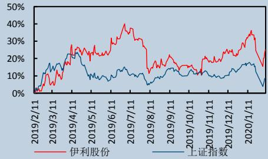  
股价表现

# 相关研究报告

【 中 信 建 投 食 品 加 工 】 伊 利 股 份19.04.26 (600887):收入持续高增长，利润弹性开始体现

# 着眼当下，伊利管理层稳定，产品结构升级、品相多样化，渠道稳步下沉，营销着力打造子品牌效应明显。

伊利核心管理层稳定，潘总持股 $3 . 8 7 \%$ ，占比较大，为公司第三大股东，高层稳定利于公司战略贯彻实施。同时，公司近年来进行过三次股权激励计划，拉动了业绩快速增长。伊利产品以液态乳为主，近年的主要看点集中在产品结构持续升级与产品种类持续丰富化，同时，公司不断发力新品，布局长远的大健康领域，试图培育新的增长点，例如豆乳、矿泉水、功能饮料等。渠道端，伊利采取多级分销渠道与直营渠道结合方式，多年布局织网，截至2019年上半年，伊利的全国线下液态奶渗透率已达 $8 3 . 9 \%$ ，而三四线城市液态奶渗透率已超 $8 6 . 2 \%$ ，当前乳品消费下沉的背景下，加速收获红利。此外，伊利持续增加营销投入，2009-2018 年，公司营收复合增长率 $1 3 . 1 2 \%$ ，而广告宣传费用复合增长率为 $1 4 . 0 5 \%$ ；2015 年之前伊利销售费用多投入大型活动项目，树立企业整体形象，2015 年之后伊利使用单一产品冠名赞助综艺节目，培育子品牌效应。

# 布局未来，伊利短期液态乳拉动增长，中长期定位国际龙头目标、多元化发展。

短期液态乳仍是伊利的核心，液态乳有望从品质升级、包装升级、细分聚焦消费人群、快速切入新品类四方面发力，拉动其增长；渠道将继续深耕优化，下线市场提升空间巨大，伊利有望持续收割下线市场、享受前期深耕渠道布局红利。中长期应对标国际乳业巨头公司，伊利必将走上国际化综合食品多元化发展道路。从乳制品扩展至大健康饮品，填补市场空缺，多元化产品类别；同时，国内市场相对国际市场而言较有限，伊利下一步应该努力成为一家全球化乳企公司，因此海外布局与市场拓展尤为重要。具体方式而言，从达能、雀巢等国际化企业发展历程来看，并购可能成为优选方案，但同时也应该加强自身实力，实现内生与外延协同并进。

# 盈利预测：

预计公司 2019-2021 年归母公司净利润分别为 72.29 亿元、72.45 亿元、81.38 亿元，对应 EPS 分别为 1.19、1.19、1.33。

图表1： 预测和比例  

<table><tr><td>2018A</td><td>2019F</td><td>2020F</td><td>2021F</td></tr><tr><td>营业收入（百万）79,553.28</td><td>89,601.45</td><td>100,019.56</td><td>111,579.95</td></tr><tr><td>营业收入增长率 16.89%</td><td>12.63%</td><td>11.63%</td><td>11.56%</td></tr><tr><td>净利润（百万） 6,439.75</td><td>7,228.65</td><td>7,244.79</td><td>8,138.05</td></tr><tr><td>净利润增长率 7.31%</td><td>12.25%</td><td>0.22%</td><td>12.33%</td></tr><tr><td>EPS（元） 1.06</td><td>1.19</td><td>1.19</td><td>1.33</td></tr><tr><td>P/E 29.11</td><td>25.93</td><td>25.88</td><td>23.04</td></tr></table>

资料来源：中信建投证券研究发展部

# 目录

一、历史复盘. ... 4  
1.1 液态乳行业进入稳步增长阶段 ................................................................................ .... 4  
1.1.1 供需进入平稳增长，价格温和上涨.. ...................................................... .... 4  
1.1.2 液态乳行业2015年后开始进入新稳定增长阶段. .... 6  
1.2 伊利蒙牛历史对比... ................................................. ..... 8  
1.2.1 管理层及战略变化看两家公司历史——稳定强于变化.. .... 9  
1.2.2 产品拉动对比——新品及新品类的爆发是阶段性重要机会. ... 13  
1.2.3 渠道对比——模式各有所长，深耕红利逐步释放.. .................................. ...... 14  
1.2.4 营销投入——费用投入持续加大，模式逐步趋于精准营销.. ...... 15  
1.2.5小结——伊利优势突显，逐步拉开差距. ..... 17  
二、现状——2013-2015年过渡期之后趋于稳定增长.. ..... 17  
2.1 管理层稳定，股权激励不断激发活力 .. .... 17  
2.1.1 核心管理层稳定 ... ..... 17  
2.1.2 公司历史上进行过两次股权激励计划，拉动业绩快速增长.. ..... 17  
2.2 伊利产品结构稳步升级，品相日渐多样化. .... 20  
2.2.1 液态乳为主，品类日渐丰富. ..... 20  
2.2.2 持续升级产品结构，发力新品类，寻求持续增长.. ............................................... ..... 21  
2.3 渠道织网下沉，持续赋能. ................................................ .... 23  
2.3.1 多级分销模式凸显优势. ....................................................................................... ..... 23  
2.3.2多年布局织网，收获当前红利.. ................................................................................ ... 25  
2.4 子品牌培育，营销方式升级. .................................................................................... ..... 26  
2.4.1 公司持续增加营销投入 .... .............................................................. ..... 26  
2.4.2公司积极进行营销方式升级，培育子品牌效应. ..................................................... ... 27  
三、未来布局看点——短、中、长期逻辑各有重点 . .................................................................... 29  
3.1 短期：液态乳仍是主力增长点... .............................................................. 29  
3.1.1 产品持续升级换代，品质和包装，同时培育新品类.. .. 29  
3.1.2 渠道继续深耕，下线市场放量与升级. ........................................................... ..... 32  
3.2 中长期：国际龙头定位目标，多元化发展... .................................................................. 32  
3.2.1 达能的成长路径 .. ... 32  
3.2.2 产品品类的扩展，非乳品的布局，打造销售平台企业.. ......................................................... 34  
3.2.3 市场的扩张，海外布局. ................................................ .... 35  
四、财务预测.. .. 36  
五、风险提示.. ..... 38

# 图表目录

图表 1： 预测和比例 . . 2  
图表 2： 我国乳制品总产量 . 4  
图表 3： 乳制品产量构成 ..... ...... 4  
图表 4： 乳制品消费量 .......... ....................................................................................................... 5  
图表 5： 人均食品消费量：奶类（千克） ............................................................... ... 5  
图表 6： 我国各区域人均液体奶消费量 . .... 5  
图表 7： 牛奶零售价（元/升）、酸奶零售价（元/公斤） .................................................................................. 6  
图表 8： 液态乳量价拆分 .... .................................................... .... 6  
图表 9： 液态乳市场规模（百万元） ........................................................................... ..... 7  
图表 10： 液态奶销售额构成 .......  
图表 11： 液态奶销量构成占比 .. ............................................. ...... 7  
图表 12： 中国液态乳发展历程 ... ............................................................................. 8  
图表 13： 蒙牛、伊利 2001-2015 营业收入及同比增长率 .. .................................................. ..... 9  
图表 14： 蒙牛、伊利第一阶段（2001-2006）管理层及战略变化： .... 9  
图表 15： 第二阶段（2007-2010）管理层及战略变化： .... ................................................ ....... 10  
图表 16： 第三阶段（2011-2015）： … ....11  
图表 17： 第四阶段：（2016 年至今） ......................................................................... 12  
图表 18： 伊利、蒙牛基础白奶竞品终端销售额及增速.. ....................................................... ..... 13  
图表 19： 伊利、蒙牛高端白奶竞品终端销售额及增速.. ........................................................ ....... 13  
图表 20： 伊利、蒙牛儿童奶竞品终端销售额及增速 ...................................................................................... 14  
图表 21： 伊利、蒙牛主要含乳饮料竞品终端销售额及增速. .. 14  
图表 22： 伊利、蒙牛各阶段应收账款周转天数.. .................................................. .... 14  
图表 23： 伊利和蒙牛在不同阶段的渠道建设 ............ ...................................................................................... 15  
图表 24： 2001-2015 年蒙牛、伊利各阶段销售费用和销售费率 . .. 16  
图表 25： 伊利2015年冠名赞助的主要综艺节目... .................................................................................... 16  
图表 26： 蒙牛 2015 年冠名赞助的主要综艺节目... ............................................................................... 16  
图表 27： 伊利董事长潘刚 2006-2019H1 持股比例变化 .................................................................................. 17  
图表 28： 伊利股份 2006 年股权激励计划情况 ......... ..................................................................................... 18  
图表 29： 伊利股份 2016 年股权激励计划情况 ..... ........................................................ 18  
图表 30： 伊利股份2019年限制性股票激励计划解除限售时间和业绩要求. ........................................ 19  
图表 31： 2019H1 伊利营收构成 ............. ............................................ 20  
图表 32： 伊利产品结构 .......... ....... 20  
图表 33： 从 2011 年“BrandZ 最具价值中国品牌 100 强”排名启动以来伊利的品牌价值和排名变化.... 21  
图表 34： 伊利纯牛奶品牌品质双升级 .. .... 22  
图表 35： 安慕希积极进行口味创新 ...... ........................................................................................... ....... 22  
图表 36： 伊利布局新产品情况 .......................................................................................................................... 22  
图表 37： 主要渠道模式对比 .. ........................................................................ .... 23  
图表 38： 2018 年不同销售模式营业收入（亿元） ......................................................................................... 24  
图表 39： 伊利分销渠道图 .......... .................................................................................................. 25  
图表 40： 伊利渠道布局建设 .... ............................................................................... ....... 25  
图表 41： 近年来公司渠道深耕布局趋势 .......................................................................................................... 26  
图表 42： 常温液态乳品市场渗透率 .... .................................................................................................. ..... 26  
图表 43： 直控村级网点数量 .. ......................................................................... ....... 26  
图表 44： 2003-2019Q3 伊利营收和销售费用变化 . ... 27  
图表 45： 2010-2018 伊利营收和广告宣传费用变化 ... 27  
图表 46： 伊利与蒙牛大型赞助项目对比图 ..... 28  
图表 47： 2015年后蒙牛与伊利冠名赞助节目对比表 .... 28  
图表 48： 金典产品品质不断提升. .... 30  
图表 49： 金典包装全新升级 . ... 30  
图表 50： 伊利产品功能性定位细分人群需求 .... 31  
图表 51： 伊利子品牌推出时间. .... 31  
图表 52： 达能多元化发展历程 . .... 32  
图表 53： 达能2004-2018年各产品收入结构 ... 33  
图表 54： 达能 2004-2018 年收入及其增速 . .... 33  
图表 55： 达能全球市场营收占比 . ... 34  
图表 56： 伊利近年来推出的非乳饮料产品 .... 34  
图表 57： 伊利研发费用及其占比 . .. 35  
图表 58： 伊利研发人员数量及占比. ... 35  
图表 59： 伊利技术创新能力 . .... 35  
图表 60： 伊利持续推进国际化海外布局. .... 35  
图表 61： 截止2018年伊利拥有 4家海外子公司. ... 36  
图表 62： 伊利全球织网示意图 . .... 36  
图表 63： 业绩预测.. .... 37  
图表 64： 业绩预测.. .... 38  
图表 65： 资产负债表（百万元） ... 39  
图表 66： 利润表（百万元） ... 39  
图表 67： 现金流量表（百万元） ... 40

# 一、历史复盘

# 1.1 液态乳行业进入稳步增长阶段

# 1.1.1 供需进入平稳增长，价格温和上涨

供给：为便于统计，我们将乳制品大致分类成黄油、奶酪、奶粉、液体奶这几个大类产品。因我国饮食习惯问题，黄油、奶酪产量较少，暂没有计入以下乳制品总产量内。我国乳制品产量自 2001 年突破 1000 万吨，连续七年实现高速增长。2006 年突破 3000 万吨，2019年产量达到 3396.5 万吨，增速 $0 . 7 9 \%$ 。1979-2006 年乳制品产量快速增长，复合增速达 $1 2 . 8 4 \%$ 。2007-2019 年维持低速增长，复合增速达 $0 . 5 6 \%$ 。

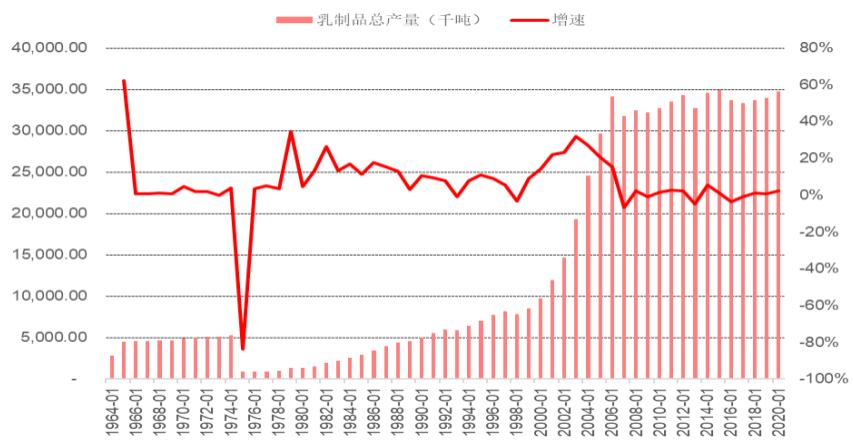  
图表2： 我国乳制品总产量  
资料来源wind，中信建投证券研究发展部

在 1985 年之前我国液体奶产量一直占乳制品产量的 $1 0 0 \%$ ，1986 年至今，液体奶产量占比略有缩小，但依然保持在 $9 0 \%$ 以上的占比，是乳制品的主流。全脂奶粉的占比略有提升，2019 年达 $4 . 2 7 \%$ 。

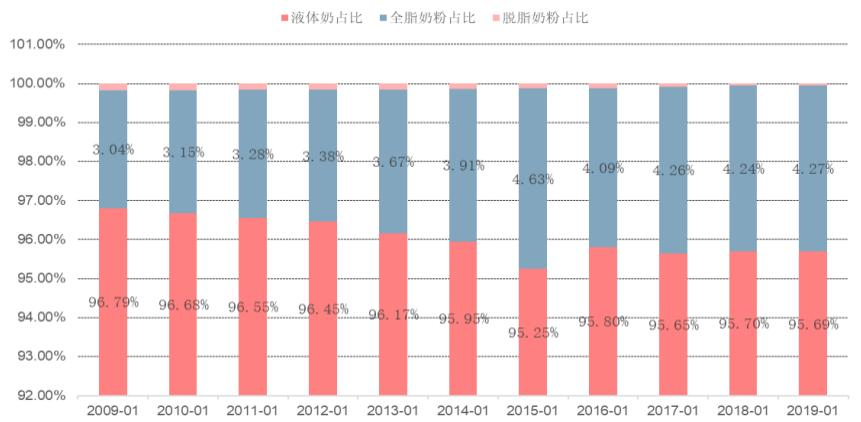  
图表3： 乳制品产量构成  
资料来源：wind，中信建投证券研究发展部

需求：乳制品消费量与产量走势趋同。消费量在 2001 年突破 1000 万吨，2006 年突破 3000 万吨。2006 年之后保持着低速波动式增长。2009 年消费量达到 3582.1 万吨，增速 $1 . 7 7 \%$ 。1978-2006 年乳制品消费量快速增长，复合增速达 $1 3 . 5 7 \%$ ，2006-2019 年维持震荡抬升走势，复合增 $0 . 3 5 \%$ 。

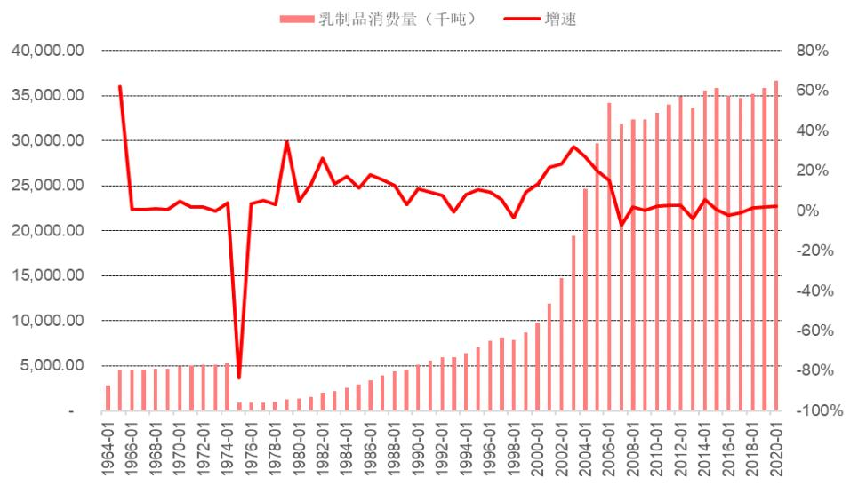  
图表4： 乳制品消费量  
资料来源：wind，中信建投证券研究发展部

我国农村居民人均奶类消费量远低于城镇居民，但 2013-2015 年农村居民人均奶类消费量复合增速达 $3 . 8 6 \%$ ，分别高于城镇居民和全国居民的复合增速- $. 0 . 7 1 \%$ 、 $0 . 9 4 \%$ ，农村居民奶类消费增长潜力大。2018 年全国人均奶类消费量 12.22 千克，城镇居民人均奶类消费量 16.53 千克，农村居民人均奶类消费量 6.91 千克。

根据中国奶业年鉴统计，2016 年，我国一线城市人均液体奶消费量 31 千克，接近日韩国家平均消费水平。二线城市人均液体奶消费量 23 千克，与我国整体人均液体奶消费量持平，但其他城市以及农村地区人均液体奶消费量较低，依然有较大上升空间。

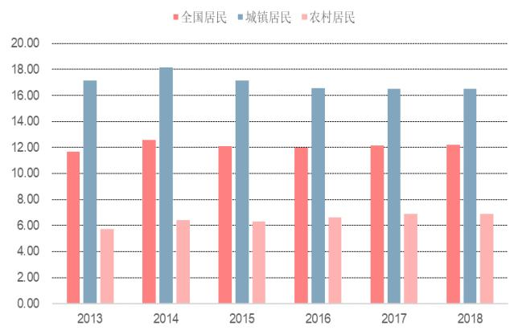  
图表5： 人均食品消费量：奶类（千克）  
资料来源：国家统计局，中信建投证券研究发展部

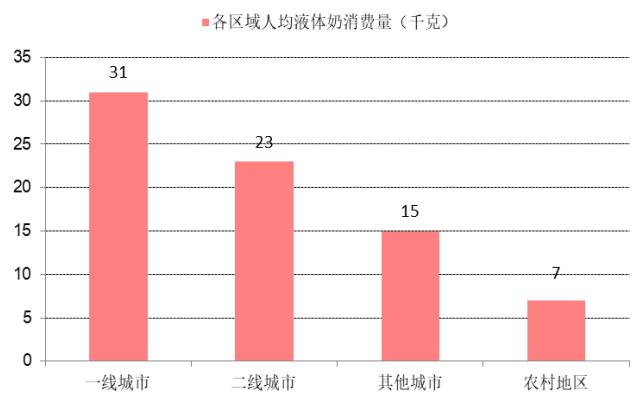  
图表6： 我国各区域人均液体奶消费量  
资料来源：奶业年鉴，中信建投证券研究发展部

量价拆分：2006-2015 年液态乳市场规模的增长主要由销量拉动，2015 年之后，液态乳市场规模增速放缓，增长主要由均价拉动。液态乳中酸奶零售价高于牛奶零售价，2015 年牛奶突破 11 元/升，酸奶突破 14 元/公斤。2015-2019 牛奶零售价复合增速 $3 . 2 6 \%$ ，酸奶零售价复合增速 $2 . 5 8 \%$ 。

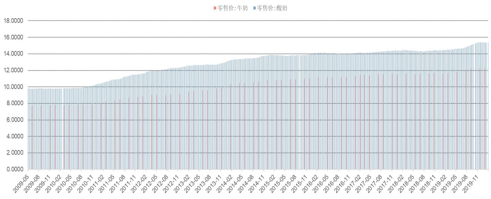  
图表7： 牛奶零售价（元/升）、酸奶零售价（元/公斤）  
资料来源：wind，中信建投证券研究发展部

量价拆分看，2015 年之后，销售额增长主要推动力由销量推动变为价格推升为主。2019 年液态乳量价拆分看，销售额同比增长 $5 . 4 1 \%$ ，增速较上年同期下降 $0 . 3 8 \mathrm { p c t } ;$ ;均价同比增长 $2 . 9 2 \%$ ，增速较上年同期下降 0.73pct;销量同比增长 $2 . 4 1 \%$ ，增速较上年同期上升 0.36pct。

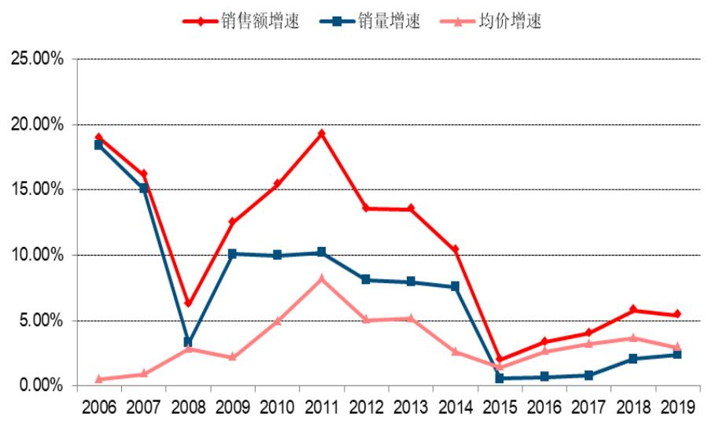  
图表8： 液态乳量价拆分  
资料来源：欧睿，中信建投证券研究发展部

# 1.1.2 液态乳行业2015年后开始进入新稳定增长阶段

# 1.1.2.1 液态乳行业规模持续增长

液态乳市场规模 2006-2007 年增速较快，维持在 $1 5 \%$ 以上，但 2008 年因爆发“三聚氰胺”事件，液态乳增速滑落至 $6 . 2 3 \%$ 。2008-2015 年液态乳企业进入转型期，从“三聚氰胺”事件中逐步恢复，液态乳市场规模复合增速达 $1 2 . 2 5 \%$ 。2016-2019年保持低速增长，复合增速达 $5 . 0 7 \%$ 。2019 年液态奶市场规模突破 4000 亿元。

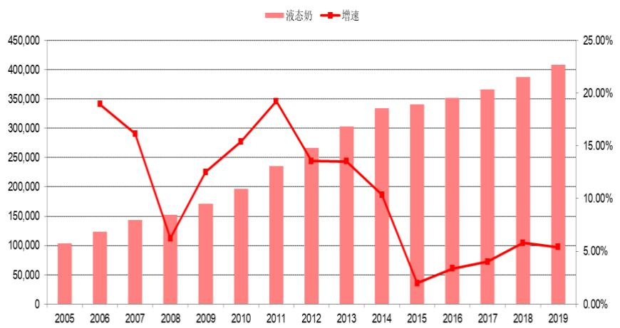  
图表9： 液态乳市场规模（百万元）  
资料来源：欧睿，中信建投证券研究发展部

根据欧睿数据分类，液态奶中，饮用奶消费占比最大，2019 年占比达 $6 3 . 4 7 \%$ 。酸奶销售额占比在不断的提高，从 2005 年的 $1 4 . 6 6 \%$ 提升至 2019 年的 $3 6 . 5 3 \%$ 。

液态奶销量中白奶占比最大，但占比在逐年缩减，从 2005 年的 $5 9 \%$ 下降至 2019 年的 $4 4 . 9 5 \%$ 。2005-2013年风味乳饮料销量占比从 $2 5 . 2 5 \%$ 扩大至 $3 6 . 7 2 \%$ ，但 2013 年之后占比开始缩减，从 $3 6 . 7 2 \%$ 下降至 $2 0 . 7 4 \%$ 。而2013-2019 年酸奶销量开始迅速扩张，从 $1 9 . 0 6 \%$ 上升至 $3 4 . 3 1 \%$ 。说明消费者对食品健康营养诉求提高，未来白奶仍是主流，酸奶有较大增长潜力。

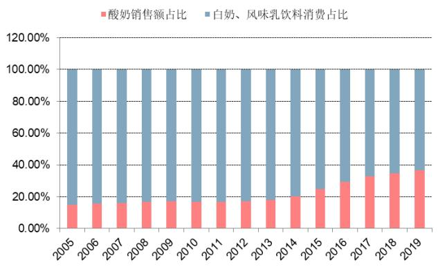  
图表10： 液态奶销售额构成  
资料来源：欧睿，中信建投证券研究发展部

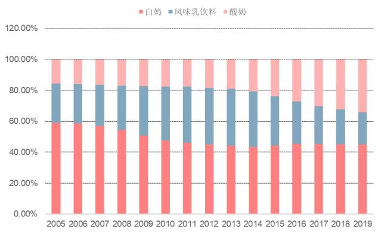  
图表11： 液态奶销量构成占比  
资料来源：欧睿，中信建投证券研究发展部

# 1.1.2.2 液态乳行业阶段划分

1996 年、2008 年、2015 年是液态乳行业三个明显拐点，据此划分的阶段具有不同特点：1996 年之前，供给不足和市场局限限制了液态乳产量与消费量的进一步增长，1964-1996 年人均 GDP 不足 800 美元，液态乳消费量在 800 万吨以下，消费量量复合增速 $3 . 0 7 \%$ ；1996 年包装和杀菌技术升级，推动液态乳在全国市场广泛放量，1996-2008 年人均 GDP 由 700 美元高速增至近 3000 美元，液态乳消费量也由 700 万吨飞涨至 3500 万吨，复合增速高达 $1 4 . 0 0 \%$ ；2008 年三聚氰胺事件爆发，导致长达三年的低谷调整期，2009 年液态乳消费量同比下跌 $1 6 . 3 8 \%$ ，但乳业经历调整后迅速恢复增长，到 2015 年液态乳消费量达 3900 万吨，2008-2015 复合增速 $1 . 5 6 \%$ 。

我们认为我国液态乳发展阶段大体可分四个大阶段：1950s-1996 年为起步期，这期间原奶产量低，原奶价格波动大，奶源以散养为主，供给很不稳定。此阶段液态乳消费以巴氏奶为主，产品结构较为单一，且局限在奶源区域销售。1996-2008年为快速发展期，由于包装和杀菌技术革新，牛奶全国范围普及，乳业发展步入黄金10 年，液态乳消费量增长 4.8 倍，复合增速为 $1 4 . 0 0 \%$ 。此阶段，以利乐包为代表的常温白奶市场份额快速扩张，并逐渐占据液态乳主导地位。2008-2015为转型期，三聚氰胺事件爆发使乳品消费锐减，为重振需求，企业更加重视上游奶源建设与控制，同时开发新产品，调整产品结构，需求开始逐步回暖。液态乳消费量复合增速为 $1 . 5 6 \%$ 。产品结构呈现升级态势，高端白奶、酸奶等开始受到大众青睐，市场份额不断提升。2015 年之后进入稳步增长期，供需稳健增长为主，人均 GDP 突破 8000-10000 美金后，发展又重量开始转到重质，步入更加健康的发展阶段。

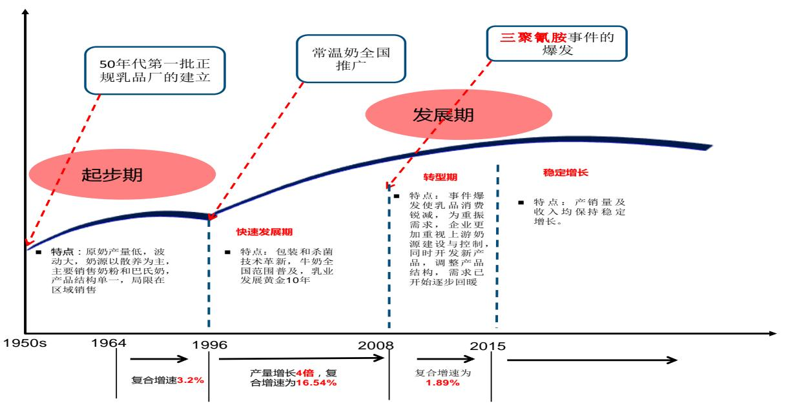  
图表12： 中国液态乳发展历程

资料来源：中信建投证券研究发展部

# 1.2 伊利蒙牛历史对比

伊利乳业和蒙牛乳业被称为中国乳业的双子星，二者的发展历程也被认为是中国乳业从小到大、从弱到强的缩影。伊利的前身形成于 1956 年成立的呼和浩特回民区养牛合作小组，1993 年改制设立伊利集团，并于同年 6 月 14 日更名为“内蒙古伊利事业股份有限公司”。1996 年，伊利在上交所挂牌上市，成为中国乳品行业首家 A 股上市公司。1997 年，伊利引入利乐包生产线，将牛奶保质期大幅延长，伊利盒装常温奶由此诞生。1999年伊利集团成立液态奶事业部，借助常温奶将销售范围扩张到全国，2000 年销售额突破 5 亿元，带领中国乳业全面进入黄金“液态奶时代”。

1999 年，蒙牛乳业成立，同年引入利乐包。蒙牛抓住常温奶第一次的发展机遇，运用大经销商制在全国铺货，辅以强势的营销手段，以“火箭速度”发展。借助国际投资者之力，蒙牛于 2004 年在港交所成功上市，成为“全国乳业第二品牌”。至此，伊利与蒙牛正式开启你追我赶的二十年，而二者历年的营业收入直观地反映了双雄交替发展的状态。

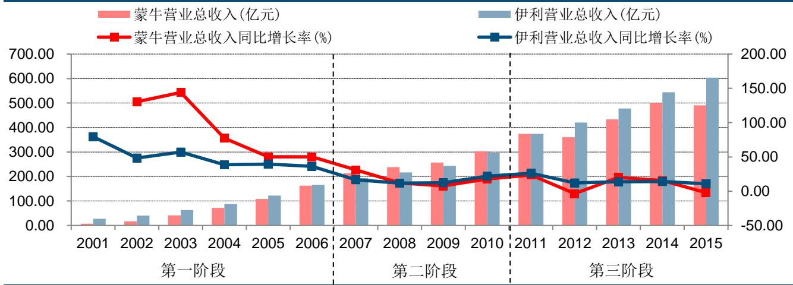  
图表13： 蒙牛、伊利 2001-2015 营业收入及同比增长率  
资料来源：wind、中信建投证券研究发展部

在此，参考液态乳行业发展阶段，我们将其发展历史整体划分为三个阶段。下文将从收入规模、管理层变动、产品、渠道、营销等多个角度对三个阶段两家公司发展历程进行对比分析，试图找到增长背后的原因。

# 1.2.1 管理层及战略变化看两家公司历史— 稳定强于变化

第一阶段：蒙牛创业初期，创始人牛更生带领企业快速追赶，整体战略稳定；而同期伊利内部出现管理层变动，前董事长郑怀俊因个人问题离开工作 11 年的岗位，2004 年开始对公司内部管理产生一定影响，现任董事长潘刚走马上任，开始主导公司战略方向。

图表14： 蒙牛、伊利第一阶段（2001-2006）管理层及战略变化：  

<table><tr><td>企业</td><td>人员及任期</td><td>产品业务板块</td><td>营销模式板块</td><td>管理板块</td></tr><tr><td rowspan="3">伊利</td><td>郑怀俊，自1993 年起ci 任总裁兼董事长</td><td>c) 2002 年提出进军“全球乳业20 强”的战略目标； 调整产品结构，优化资源配置， 强化公司核心竞争能力。；</td><td>全面加强市场营销网络建设， 加大品牌投入，提高市场占有率</td><td>进行组织变革，提升员工素质， 强化企业文化建设； cd:) 大力培养和引进人才，提升企 业的人力资源水平。</td></tr><tr><td>c:) c) 潘刚，2002年起任总 裁，2005-至今兼任董 事长</td><td>大企业生产规模。 持续加强奶源建设； 推进生产基地建设工程，实现 生产基地的战略平衡； 调整产品结构，提高盈利能力。</td><td>不断挖掘市场潜力，拓展销售➢ 空间； 发挥品牌优势，强化品牌建设。</td><td>推进精确化管理，提高公司的 经营管理水平和整体运营效率； 整合资源，优化资源配置，不 断地提高集团的整体竞争能力；</td></tr><tr><td>蒙牛 牛根生，自1999 年起(cid:</td><td>“先市场、后工厂奶源”的发》</td><td>采取强势灵活的营销策略，善➢</td><td>企业运作，不断提高管理水平。 建立精准细密的运营管理体</td></tr></table>

<table><tr><td rowspan="4">任董事长兼总裁</td><td rowspan="4">展策略； cd)</td><td></td><td>用事件营销，提高广告费投入，以此系；</td></tr><tr><td>采取“公司+奶站+农户”的采</td><td>提高品牌知名度；</td></tr><tr><td></td><td>采取“钱散人聚”的激励模式. 采取三级分销的大经销商模</td></tr><tr><td>购模式 式。</td><td></td></tr></table>

资料来源：公司公告，中信建投证券研究发展部

第二阶段：伊利战略稳定，稳步提升业绩；蒙牛创始人离开核心管理团队，中粮入主，公司战略出现一定调整，增速与收入规模逐步被反超。

图表15： 第二阶段（2007-2010）管理层及战略变化：  

<table><tr><td>企业</td><td>人员及任期</td><td>产品业务板块</td><td>营销模式板块</td><td>管理板块</td></tr><tr><td></td><td>cd) 潘刚，2002年起任总 伊利裁 2005-至今兼任董(ci 事长 cd)</td><td>持续加强奶源建设； 调整产品结构，提高盈利能力； 打造和谐产业链，推动产业环终端服务能力； 境的和谐。 完善创新机制，强化创新能力， 提升竞争活力。</td><td>强化奥运营销和世博营销，加➢ 强品牌建设； 完善渠道和供应链管理，提高c 开发低线城市及乡村渠道。</td><td>推进精确化管理，提高公司的 经营管理水平和整体运营效率； 强化质量管理，确保产品品质。</td></tr><tr><td>蒙牛</td><td>牛根生，1999-2008任 董事长兼任总裁</td><td>以技术性改造与科学化发展作➢ 为纲领； 加强与奶农及分销商等的紧密 交流，达到整个乳制品产业链的高效 连接； 加强大型奶牛牧场的饲养管理 控制，大力推进国际化先进牧场建 设； 开拓高新科技产品研发，以高 同效应，拓宽销售管道并丰富销售手</td><td>入不同现有与潜在的细分市场，有效理体系 扩大市场份额；</td><td>强化市场推广的策略范围，深进一步完善精准细密的运营管</td></tr><tr><td>任总裁</td><td>杨文俊，2008-2012年ci) 升； 品；</td><td>端功能性产品填补市场空白； 增强产品质量检测监控。 战略化推动牧场奶源比重提➢ 持续加强自主产品研发，重点 针对高端乳制品市场及细分市场，推➢ 出更多高技术含量、高附加值的新产先企业建立合作伙伴关系，达成协资格体系，强调精细化管理</td><td>2009 年设立了“每一天，为明➢ 度的品牌宣传； 策略性地寻求与各个行业的领➢</td><td>以成本精准化管理为基础，逐 天”的新品牌口号，进行全方位多角一梳理成本原始可控点，针对性出台 成本节约方案； 推进组织架构变革，深化任职</td></tr></table>

<table><tr><td rowspan="3"></td><td>增强产品质量检测监控；</td><td>段。</td><td></td></tr><tr><td>深入开展与中粮集团的战略合➢</td><td>2010年提出“好质量，绿生活”</td><td></td></tr><tr><td>际化及战略资源配置全球化的进程；感的国际品牌形象。</td><td>作，推进供应链一体化、食品安全国为新的品牌口号，打造具有社会责任</td><td></td></tr></table>

资料来源：公司公告，中信建投证券研究发展部

第三阶段：伊利在潘刚总带领下，深入贯彻既定战略方针，公司业绩持续提升；蒙牛持续更换核心管理层，每次变动都会带来战略层面的改变，一定程度影响企业增速表现。

图表16： 第三阶段（2011-2015）：  

<table><tr><td>企业</td><td>人员及任期</td><td>产品业务板块</td><td>营销模式板块</td><td>管理板块</td></tr><tr><td>伊利</td><td>潘刚，2002年起任总➢ 裁2005-至今兼任董资源，提高研发管理水平，完善创 事长</td><td>健康食品集团为目标，不仅仅是要领先品牌优势； 成为一个健康产品的提供者，而且 是一个健康生活方式的倡导者， 个带动行业发展的引领者； 全面实施国际化战略。 以全球化视角，整合技术创新务能力； 新机制； 不断优化产品结构，持续提高 盈利能力； 优先推进奶源基地建设；</td><td>2011年提出以成为世界一流➢ 全面推进品牌升级计划，打造➢ 持续推进渠道精耕计划的实➢ 镇农村市场产品渗透能力； 完善供应链管理，提高终端服</td><td>推进精确管理，提高费用使用 效率、提升公司盈利能力； 推进“全员、全过程、全方位” 施，积极开拓新兴渠道，提高县乡质量管理体系，执行质量领先战略； 坚持培养和引进优秀人才。</td></tr><tr><td>蒙牛</td><td>杨文俊，2008 年起任(cid:) 总裁</td><td>强”的战略目标。 确立奶源发展战略，深入开展➢ 牧场化、规模化养殖模式； 继续专注功能性高端乳制品 的开发，继续优化产品结构； 落实品质监控，不断提升检验的企业形象； 水平、加强食品安全监控能力。 持续进行产能扩充。 成立国际战略部，以市场国际 化、资源国际化和能力国际化为战</td><td>2015年提出进军“全球乳业5 大力提倡绿色生态经济，通过➢ 各种大型公益活动引领社会共同参 与打造环保乳业，建立和强化蒙牛 负责任的行业领导者、绿色可持续 发展的实践者和健康生活的引领者</td><td>堅持提升內部生產管理水平； 推进內部組織架構變革；</td></tr></table>

<table><tr><td></td><td colspan="3">深入开展与战略合作伙伴的 合作和整合。 加强奶源资源优势，推广规模➢</td><td></td></tr><tr><td>孙伊萍，2012 年起任 总裁</td><td colspan="3">积极研发符合消费者需求的 新产品并培养新明星品牌，持续优 化产品结资料来源：中信建投证券➢ 研究发展部构； 对标国际领先企业的质量管 理模式，梳理了奶源、生产、销售》</td><td>构建“新蒙牛”品牌理念，以》 继续加强跨部门协同工作能 化的养殖模式，严格把关质量源头；“质量”和“幸福”为中心的品牌形象，力，将新的管理文化与蒙牛现有组织 并围绕这个中心构建整体子品牌架文化融合，增强在不同层级的团队凝 聚力和各职能部门的管理能力；</td></tr></table>

资料来源：公司公告，中信建投证券研究发展部

整体看，而伊利管的理层自 2005 年潘刚上任后就非常稳定。自 2006 年对管理层实行股权激励以来，伊利的大股东中，国资虽依然保持相对控股地位，但也在慢慢撤出，到 2019 年底，潘刚已经成为伊利第三大股东和第一大自然人股东。管理层持股增加有利于稳定，有效减少“代理人风险”；同时国资相对控股但不干涉企业经营决策，使伊利获得稳定的“压舱石”。而同比蒙牛，核心管理人员变动较为频繁，一定程度影响公司战略稳定性和执行效果。

图表17： 第四阶段：（2016 年至今）  

<table><tr><td>企业</td><td>人员及任期</td><td>产品业务板块</td><td>营销模式板块</td><td>管理板块</td></tr><tr><td>伊利</td><td>董事长 潘刚，2002 年起任()</td><td>2015年提出进入“全球乳业5 强”的战略目标； 执行“质量领先”战略，强化食 品安全与生产安全管理； 立足乳业核心业务，进军植物蛋 总裁 2005-至今兼任白饮品、功能饮料等健康产业，加速 健康食品业务战略布局。 以满足消费者需求为目标，通过 创新驱动业务健康持续发展。 以拓展国际业务为契机，增加新 的业务和利润增长点。</td><td>持续推进渠道精耕计划的实c 施； 开发低线城市及乡村渠道，挖➢ 掘空白市场业务就会。</td><td>以“精准营销、精益运营和精 确管理”为指导，提高盈利能力； 持续推进公司数字化战略升 级，系统打造更加智能和高效的运 营能力。 强化伊利文化的践行与传承， 夯实公司基业长青的文化根基。</td></tr><tr><td>蒙牛</td><td>卢敏放，2016至今</td><td>研发力度，并深化奶源建设； 深化“国际化”战略布局，持续与打造以经销商为主体，经销商、销售 三大股东及国际领先的合作伙伴保持公司、核心业务单元(Central Business</td><td>对标及超越国际标准，加创新➢ 强化通路精耕(Route to Market，简称「RTM」)项目，全力完善职能、做实大区”的变革方向。</td><td>推进“纵向扁平、横向整合、</td></tr></table>

<table><tr><td>(cd)</td><td>紧密互动，实现与国际标准接轨；推进Unit，简称「CBU」)共同发展的运营 全球、特别是“一带一路“沿线国家“乳模式。 业共同体”的建设。 与环球主题公园和度假区集团 发力产品研发创新，以高端化、合作，以加强蒙牛品牌的国际影响 营养化、健康化作为产品升级之目标。力； 聚焦品牌建设，实践数字化营 销；</td><td></td></tr><tr><td>陈朗，2019 年8月 至今任董事长</td><td colspan="2">尚无相关信息</td></tr></table>

资料来源：公司公告、中信建投证券研究发展部

# 1.2.2 产品拉动对比— 新品及新品类的爆发是阶段性重要机会

在第一阶段，蒙牛先于 2005 年通过冠名赞助超级女声打造了蒙牛酸酸乳这一大单品，后又在同一年开创性地推出了高端白奶特仑苏，填补了市场空白，销售额迅速上升。这两只明星产品的增长直接推动蒙牛在 2007 年实现对伊利的赶超。

在随后的二三阶段，单品间竞争进入白热化阶段，一方面蒙牛和伊利逐渐实现在各个细分领域竞品的全面对标，不可避免地存在产品品类相似、价格相近的“赤身肉搏”。从终端口径来看，从第二阶段后期到第三阶段，伊利在主要竞品上保持着更高的增长率。这也解释了为何 2011 年伊利能够反超蒙牛、并在之后不断拉大差距。具体来看，2009 至 2015 年期间，在基础白奶和儿童奶上，伊利的保持领先地位且差距逐年拉大；高端白奶和含乳饮料上，伊利的金典和优酸乳虽在初期表现平平，但增长速度较快。至 2015 年，金典与特仑苏的终端销售额几乎持平，而优酸乳以较大差距成功实现反超领先。此外，伊利的奶粉等高附加值产品线也为伊利实现反超提供了助力。

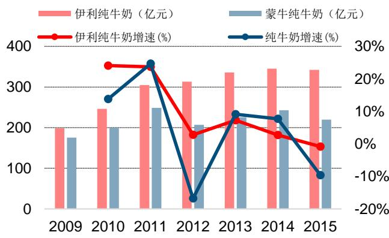  
图表18： 伊利、蒙牛基础白奶竞品终端销售额及增速  
资料来源：Euromonitor、中信建投证券研究发展部

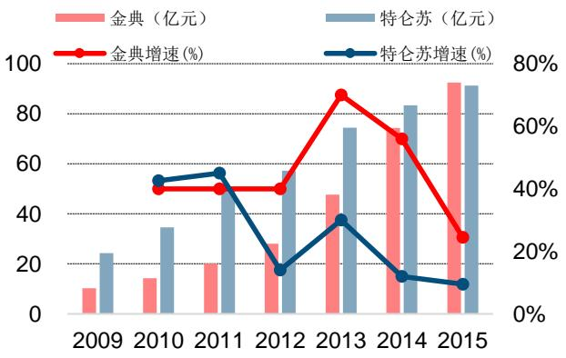  
图表19： 伊利、蒙牛高端白奶竞品终端销售额及增速  
资料来源：Euromonitor、中信建投证券研究发展部

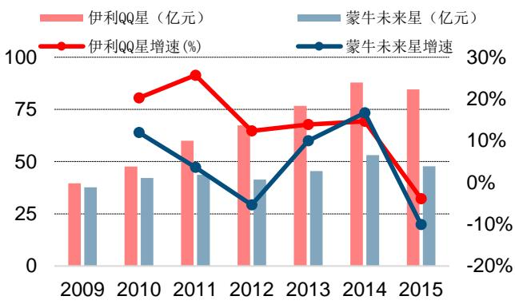  
图表20： 伊利、蒙牛儿童奶竞品终端销售额及增速  
资料来源：Euromonitor、中信建投证券研究发展部

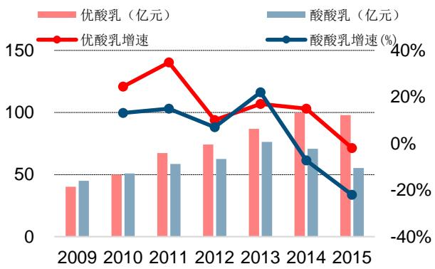  
图表21： 伊利、蒙牛主要含乳饮料竞品终端销售额及增速  
资料来源：Euromonitor、中信建投证券研究发展部

# 1.2.3 渠道对比— 模式各有所长，深耕红利逐步释放

# 1.2.3.1 渠道模式

伊利始终坚持扁平化、精细化的渠道管理，采取深度分销模式。在这种模式下，伊利自配冷库和配送车辆，自派销售人员直控终端，以公司为主导整合不同层级城市的资源进行下单、货物供应和营销。这种模式前期投入大、见效慢，但建成后伊利便拥有了比其他竞争者更高的渠道和终端控制力，同时对于终端消费者的需求更加敏感。

而蒙牛在第一和第二阶段主要采用三级分销的大经销商制，通过让利和入股的方式吸引了一大批有实力的经销商，以最快的速度在全国铺货，帮助蒙牛迅速做大。但这种模式的弊端在于经销商的质量参差不齐，运营能力有限，企业对终端和渠道的掌控力度不强，后期发展乏力。为了改变这种状况，在第三阶段蒙牛开始对渠道进行扁平化改革，2013 年起向以经销商为主体、结合销售公司和 CBU（核心业务单元）的销售运营模式转型，但目前改革成果尚待市场检验。

财务报表上，随着伊利的渠道模式逐渐成型，对终端的掌控力逐渐加强，其应收账款周转天数从第二阶段开始呈现稳步下降趋势，在 2015 年达到了 5.1 天；而蒙牛则因大经销商模式后期对企业的限制，应收账款周转天数居高不下，2015 年高达 10.16 天，是伊利同期的 3 倍。

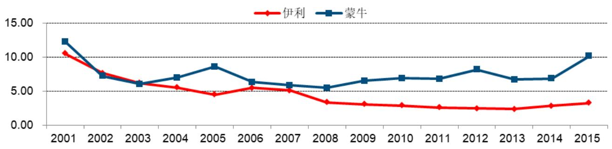  
图表22： 伊利、蒙牛各阶段应收账款周转天数

资料来源：wind、中信建投证券研究发展部

# 1.2.3.2 渠道布局要求更加精细化

渠道布局方面，伊利是业内率先进行渠道下沉的企业。自 2006 年起执行“织网计划”，伊利在第一阶段便率先完成了“纵贯南北、辐射东西”的战略布局，成为第一家覆盖全国市场的乳品企业。在第二阶段，2007 年，伊利借助商务部“万村千乡”活动率先布局乡镇终端，与三、四线城市和乡村市场的渠道商和消费者初步建立了联系。2013 年，公司实施渠道精进管理，产品的市场渗透能力逐步提升。2015 年，凯度调研数据显示 2015年伊利液态类乳品市场渗透率为 $7 6 . 8 3 \%$ 。截止 2015 年底，伊利直控村级网店达到 11 万家。

渠道模式的差异和三聚氰胺事件的影响导致蒙牛的渠道布局晚于伊利。第一阶段的蒙牛依靠大经销商在全国范围内迅速发展销售渠道。从第二阶段起至第三阶段前期，三聚氰胺事件对蒙牛资本、人事等方面的影响导致蒙牛无暇过多地关注渠道建设，直到 2015 年启动通路精耕 RTM 项目，推动渠道下沉和扁平化变革，但仍需要一段时间过渡期方能看到成效。

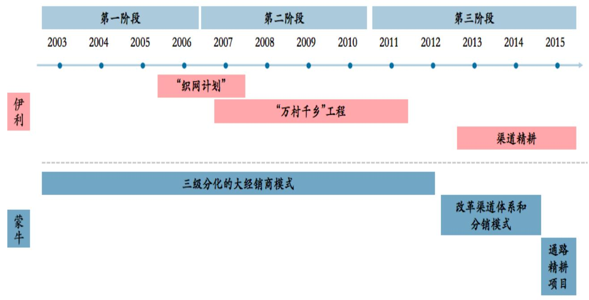  
图表23： 伊利和蒙牛在不同阶段的渠道建设  
资料来源：公司公告、中信建投证券研究发展部

# 1.2.4 营销投入— 费用投入持续加大，模式逐步趋于精准营销

整体来看，两家企业均在不断增加在销售费用上的绝对投入，但伊利在销售上的绝对投入整体高于蒙牛，这很大程度上受二者的渠道模式影响：伊利的深度分销模式决定其需要承担销售人员和渠道搭建的费用，而蒙牛的大经销商模式则是费用批给经销商，后续由经销商承担费用为主。销售费用率上，伊利早期的销售费用率持续高于蒙牛，但随着伊利的渠道布局逐年完善，运营成本逐年降低，在第二阶段后期销售费用率开始下降，营销效率逐渐提升，直到 2012 年终结了高营销费用率的状态。而这一年，也恰恰是蒙牛的创始团队彻底退出蒙牛管理层的一年。

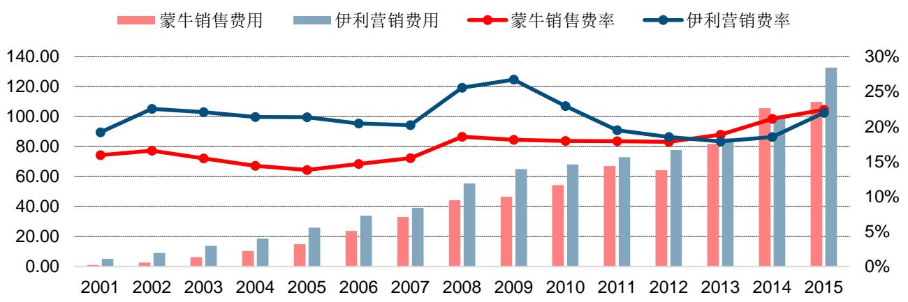  
图表24： 2001-2015 年蒙牛、伊利各阶段销售费用和销售费率  
资料来源：wind，中信建投证券研究发展部

具体来看，第一阶段，蒙牛的营销手段更胜一筹——2003 年成为神舟五号升空的唯一牛奶赞助商，借机打出“中国航天员专用奶”的口号，使得当年的营收增速达到史上最高的 $1 4 4 \%$ ；2005 年，蒙牛赞助“超级女声”这一现象级节目，再度提高了企业知名度，并推动蒙牛酸酸乳这一大单品的诞生。

第二阶段，伊利的营销动作则更加亮眼，分别在 2008 年和 2010 年牵手北京奥运会和上海世博会，两次政府营销大大提高了伊利的品牌影响力和国民化程度。在这一阶段，虽然蒙牛也在 2007 年起连续十二年成为 NBA中国的官方合作伙伴，但相比奥运会的广大受众，与 NBA的合作相对难以覆盖女性和老年消费群体。

进入第三阶段后，两家企业除了通过体育营销以塑造品牌整体形象外，开始重新运用起蒙牛崛起时的营销策略——赞助高收视的综艺节目打造明星单品，但相比之下，伊利在节目选择上似乎更胜一筹：安慕希、金典和 QQ 星分别持续赞助了《奔跑吧兄弟》、《我是歌手》和《爸爸去哪儿》等当下最火的现象级综艺，大大提升和巩固了拳头产品的市场地位，从而实现全面反超蒙牛。而失去了创始团队的蒙牛似乎也失去了对营销的敏锐嗅觉，其赞助的节目无论是数量还是火爆程度均无法企及伊利，造成二者的差距进一步拉大。

图表25： 伊利 2015 年冠名赞助的主要综艺节目  

<table><tr><td>产品</td><td>节目</td><td>播出年份</td><td>主要播出平台</td></tr><tr><td>金典</td><td>最强大脑2</td><td>2015</td><td>江苏卫视</td></tr><tr><td>安慕希</td><td>奔跑吧兄弟2</td><td>2015</td><td>浙江卫视</td></tr><tr><td>QQ星</td><td>爸爸去哪儿3</td><td>2015</td><td>湖南卫视</td></tr><tr><td>谷粒多</td><td>奇葩说 2</td><td>2015</td><td>爱奇艺</td></tr></table>

资料来源：中信建投证券研究发展部

图表26： 蒙牛 2015 年冠名赞助的主要综艺节目  

<table><tr><td>产品</td><td>节目</td><td>播出年份</td><td>主要播出平台</td></tr><tr><td>蒙牛</td><td>十二道锋味2</td><td>2015</td><td>浙江卫视</td></tr><tr><td>蒙牛真果粒</td><td>花儿与少年2</td><td>2015</td><td>湖南卫视</td></tr></table>

<table><tr><td>产品</td><td>节目</td><td>播出年份</td><td>主要播出平台</td></tr><tr><td>纯甄酸牛奶</td><td>全员加速中</td><td>2015</td><td>湖南卫视</td></tr></table>

资料来源：公开资料整理，中信建投证券研究发展部

# 1.2.5 小结— 伊利优势突显，逐步拉开差距

整体来看，管理层的稳定性让伊利在企业策略的制定和执行上更具有前瞻性和持续性；先行一步的渠道优势让伊利对终端具有更高的掌控力，同时在低线城市和乡镇市场有更高的渗透力；同时强势的营销策略促使明星单品终端销售额高速增长，让伊利能够多条线共同发展，并在高附加值产品上更占优势。如此诸多因素叠加，使得伊利能够在年复一年的发展中逐渐与蒙牛拉开了差距。

# 二、现状— 2013-2015年过渡期之后趋于稳定增长

# 2.1 管理层稳定，股权激励不断激发活力

# 2.1.1 核心管理层稳定

潘刚 1992 年 7 月大学毕业后进入伊利集团，2002 年 7 月任职伊利集团总裁兼液奶事业部总经理，2005 年6 月当选董事长兼任总裁至今。2007 年由于股改追加支付和期权首期行权，潘刚开始持有伊利的股份，当年持股比例为 $0 . 2 7 \%$ 。到 2013 年时，由于期权行权，潘刚持股比例达到 $3 . 0 8 \%$ ，成为公司第二大股东。2019 年 H1，潘刚持有伊利 2.36 亿股，持股比例为 $3 . 8 7 \%$ ，为公司第三大股东。

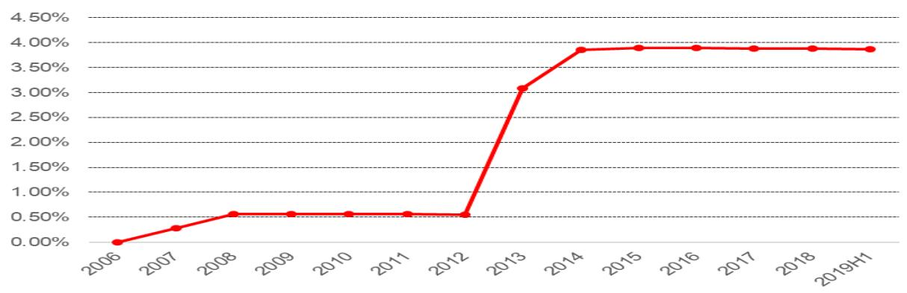  
图表27： 伊利董事长潘刚 2006-2019H1 持股比例变化  
资料来源：公司公告，中信建投证券研究发展部

# 2.1.2 公司历史上进行过两次股权激励计划，拉动业绩快速增长

第一次股权激励：2006 年 12 月，伊利股份向包括公司高管在内的 35 名核心业务人员授予了 5000 万股股票期权，行权价格为 13.33 元，有效期为 8 年，首期行权时行权条件为，公司上一年度扣除非经常性损益后的净利润增长率不低于 $1 7 \%$ 且上一年度主营业务收入增长率不低于 $2 0 \%$ ；首期以后行权时，伊利股份上一年度主营业务收入与 2005 年相比的复合增长率不低于 $1 5 \%$ 。后由于股利分配等因素该股权激励计划的股票期权数和行权价格历经多次变化。2007 年 12 月 22 日，该激励首期行权 6.5 万股，行权价格为 12.05 元，当天伊利股份股票价格为 3.43 元。2013 年6 月 8 日，剩余未行权股票期权 17205.6 万股行权，行权价格为 6.49 元，当日股票价格为 7.95 元，通过两次行权该股权激励计划顺利完成。

图表28： 伊利股份 2006 年股权激励计划情况  

<table><tr><td>日期</td><td>激励 对象</td><td>股票 种类</td><td>数量 （万股）</td><td>行权条件</td><td>实际行权 日期</td><td>类型</td><td>行权/解禁 股票数 （万股）</td><td>行权/ 授予价 格（元）</td><td>当日股 价（元）</td></tr><tr><td rowspan="4">2006.12.28</td><td rowspan="4">核心 业务 骨干</td><td rowspan="4">股票 期权</td><td></td><td>首期行权不超过25%，要 求上一年度公司扣除非</td><td rowspan="2">2007.12.22</td><td>首期</td><td></td><td></td><td></td></tr><tr><td></td><td>经常性损益后的净利润 增长率不低于17%，上一</td><td>行权</td><td>6.5</td><td>12.05</td><td>3.43</td></tr><tr><td>5000</td><td>年度主营业务收入增长 率不低于 20%。</td><td></td><td></td><td></td><td></td></tr><tr><td></td><td>首期以后行权时，上一年 主营业务收入与2005年 相比复合增长率不低于</td><td>2013.6.8</td><td>剩余 全部 行权</td><td>17205.6</td><td>6.49</td><td>7.95</td></tr></table>

资料来源：公司公告，中信建投证券研究发展部

第二次股权激励：2016 年 12 月，伊利股份第二次推出股权激励计划，向 294 名激励对象授予 4500 万股票期权，向 293 名激励对象授予 1500 万限制性股票，行权及解锁条件为以 2015 年净利润为基数，2017 和 2018年净利润增长率分别不低于 $3 0 \%$ 和 $4 5 \%$ ，且每年净资产收益率不低于 $1 2 \%$ 。2019 年 1 月 22 日，本轮股权激励计划进行限制性股票第一期解锁，授予价格为 15.33 元，当天股价为 23.86 元。2019 年 5 月 7 日和同年 6 月 6日，第一期股票期权行权分两次进行，行权价格为 14.47 元，对应当天股价分别为 30.55 和 30.00 元。2020 年 1月，第二期股票期权行权和限制型股票解锁顺利进行，1 月 2 日行权 1812.4 万股，行权价格为 14.47 元，当天股价为 31.75 元；1 月 16 日解锁 604 万股，授予价格为 15.33 元，当天股价为 33.53 元。

图表29： 伊利股份 2016 年股权激励计划情况  

<table><tr><td rowspan="2">日期</td><td rowspan="2">激励 对象</td><td rowspan="2">股票 种类</td><td rowspan="2">数量 （万股）</td><td rowspan="2">行权条件</td><td rowspan="2">实际行权 日期</td><td rowspan="2">类型</td><td rowspan="2">行权/解禁 股票数 （万股）</td><td rowspan="2">行权/ 授予价 格（元）</td><td rowspan="2">当日股 价（元）</td></tr><tr><td></td></tr><tr><td rowspan="5">2016.12.28</td><td></td><td></td><td></td><td>第一个行权/解锁期是自</td><td></td><td>第一</td><td></td><td></td><td></td></tr><tr><td></td><td></td><td></td><td>授予日起24个月后的首</td><td>2019.1.22</td><td>期解</td><td>642.5</td><td>15.33</td><td>23.86</td></tr><tr><td>核心业务</td><td>股票</td><td></td><td>个交易日至授予日起 36</td><td></td><td>禁</td><td></td><td></td><td></td></tr><tr><td>和技术骨</td><td>期权</td><td>4500</td><td>个月内的最后一个交易</td><td></td><td>第一</td><td></td><td></td><td></td></tr><tr><td>干294人</td><td></td><td></td><td>日止，业绩要求为以2015 年净利润为基数，2017年</td><td>2019.5.7</td><td>期第 一次</td><td>1852.9</td><td>14.47</td><td>30.55</td></tr><tr><td></td><td></td><td></td><td></td><td>净利润增长率不低于</td><td></td><td>行权</td><td></td><td></td><td></td></tr></table>

<table><tr><td colspan="2"></td><td colspan="2">30%，净资产收益率不低 于12%。</td><td colspan="2">第一</td><td colspan="2">上市A股公司深度报告</td></tr><tr><td colspan="2">干293人 票</td><td>第二个行权/解锁期是自</td><td>2019.6.6</td><td>期第 二次 行权</td><td>46.9</td><td>14.47</td><td>30.00</td></tr><tr><td colspan="2">核心业务 限制 和技术骨 性股</td><td>授予日起36个月的首个 交易日起至授予日起48 个月内的最后一个交易</td><td>2020.1.2 日止，业绩要求为以2015</td><td>第二 期行 权</td><td>1812.4</td><td>14.47</td><td>31.75</td></tr></table>

资料来源：公司公告，中信建投证券研究发展部

最新股权激励：2019 年 8月 7 日，伊利股份发布了新的一期股权激励计划公告，拟向 473 名激励对象授予1.83 亿股限制性股票，授予价格为 15.46 元，约为前一日收盘价的 $5 0 \%$ 。业绩考核解禁指标为，以 2018 年净利润为基数，2019-2023 年净利润增长率分别为 $8 \%$ 、 $1 8 \%$ 、 $2 8 \%$ 、 $3 8 \%$ 、 $4 8 \%$ ，2019-2023 年每年净资产收益率不低于 $2 0 \%$ ，每年年度现金分红比率不低于 $7 0 \%$ 。

图表30： 伊利股份 2019 年限制性股票激励计划解除限售时间和业绩要求  

<table><tr><td>解除限售 期</td><td>解除限售时间</td><td>可解除 限售比 例</td><td>公司业绩要求</td></tr><tr><td>第一个解</td><td>自授予日起12个月后的首个交易日起至授</td><td>20%</td><td>以2018年净利润为基数，2019年净利润增长率不低于8%；2019年 净资产收益率不低于20%；2019年度现金分红比例不低于70%</td></tr><tr><td>除限售期</td><td>予日起24个月内的最后一个交易日止</td><td></td><td>以2018年净利润为基数，2020年净利润增长率不低于18%；2019年</td></tr><tr><td>第二个解 除限售期</td><td>自授予日起24个月后的首个交易日起至授 予日起36个月内的最后一个交易日止</td><td>20%</td><td>净资产收益率不低于20%；2019年度现金分红比例不低于70%</td></tr><tr><td>第三个解</td><td>自授予日起36个月后的首个交易日起至授</td><td>20%</td><td>以2018年净利润为基数，2021年净利润增长率不低于28%；2019年 净资产收益率不低于20%；2019年度现金分红比例不低于70%</td></tr><tr><td>除限售期</td><td>予日起48个月内的最后一个交易日止</td><td></td><td></td></tr><tr><td>除限售期</td><td>第四个解自授予日起48个月后的首个交易日起至授 予日起60个月内的最后一个交易日止</td><td>20%</td><td>以2018年净利润为基数，2022年净利润增长率不低于38%；2019年 净资产收益率不低于20%；2019年度现金分红比例不低于70%</td></tr><tr><td></td><td></td><td></td><td>以2018年净利润为基数，2023年净利润增长率不低于48%；2019年</td></tr><tr><td>第五个解 除限售期</td><td>自授予日起60个月后的首个交易日起至授 予日起72个月内的最后一个交易日止</td><td>20%</td><td>净资产收益率不低于20%；2019年度现金分红比例不低于70%</td></tr></table>

资料来源：公司公告，中信建投证券研究发展部

本次股权激励计划提出的业绩要求进一步突出了对伊利核心团队的约束力，有利于拉动公司业绩增长。要保持未来几年 $8 \%$ 、 $1 8 \%$ 、 $2 8 \%$ 、 $3 8 \%$ 、 $4 8 \%$ 的净利润增速和每年不低于 $2 0 \%$ 的净资产收益率，需要伊利在享受正常行业增长红利的同时，不断提升自身市场占比，挤占其他乳企市场份额。此外与以往两次股权激励计划主要授予股票期权不同，伊利此次推出的股权激励计划授予的全部是限制性股票。股票期权不需要员工在行权前拿出任何资金，只需要在决定行权时才需要出资购买，并且行权后没有锁定期限，风险较低。而授予限制性股票的股权激励计划需要激励对象现金购入，一定程度反映了公司核心管理层的信心。

# 2.2 伊利产品结构稳步升级，品相日渐多样化

# 2.2.1 液态乳为主，品类日渐丰富

公司按照产品系列及服务划分，以事业部的形式构建了液态奶、奶粉、冷饮、酸奶、健康饮品和奶酪六大产品业务线。主要业务还是以液态乳为主， 2019 年上半年液态乳占总营收比重为 $8 0 . 5 \%$ 。

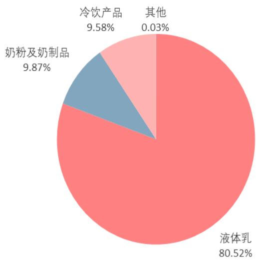  
图表31： 2019H1 伊利营收构成  
资料来源：wind，中信建投证券研究发展部

公司几乎涉及乳品所有细分品类并构建完整的高中低端产品梯队。液态奶拥有最全的产品线，涵盖中高低端 UHT 奶，常温酸奶以及乳饮料，另外奶粉、冷饮等事业部均拥有核心单品，具有较强的竞争力。公司健康饮品事业部主要以矿泉水和饮料两种产品为主。

图表32： 伊利产品结构  

<table><tr><td colspan="2">产品类别</td><td>主要品牌</td></tr><tr><td rowspan="2">常温奶</td><td>纯奶</td><td>金典、伊利纯牛奶、舒化奶、谷粒多、味可滋、植选</td></tr><tr><td>常温酸奶</td><td>安慕希、QQ星儿童风味酸奶</td></tr><tr><td>低温奶</td><td>低温酸奶 鲜奶</td><td>优酸乳、QQ星饮品、爆趣珠、畅意100% 畅轻、Joyday 吸果杯、大果粒酸奶、益消 百格特、金典鲜牛奶、牧场清晨鲜牛奶、伊利鲜牛奶</td></tr><tr><td>冰淇淋</td><td>低温乳饮料</td><td>每益添 巧乐兹、甄稀、冰工厂、伊利牧场、妙趣</td></tr></table>

<table><tr><td>婴儿奶粉 奶粉 成人奶粉</td><td>金领冠、倍冠、托菲尔、培然 欣活、青山1956、暖哄哄</td></tr><tr><td>奶酪</td><td>妙芝、儿童奶酪棒</td></tr><tr><td>其他</td><td>伊然、伊刻活泉、圣瑞思、唤醒源</td></tr></table>

资料来源：公司官网，中信建投证券研究发展部

# 2.2.2 持续升级产品结构，发力新品类，寻求持续增长

# 2.2.2.1 公司品牌价值实现七连冠，母子品牌共振实现高速发展

近年来，公司秉持“伊利即品质”的信条，坚守“质量领先”战略，品牌价值不断上升。在 2019 年全球最大传播服务集团 WPP 与国际领先咨询机构凯度华通明略共同发布的“BrandZ2019 最具价值中国品牌 100 强”榜单中，伊利品牌价值第七次蝉联食品和乳品行业品牌价值第一。公司利用“伊利”母品牌知名度，连续推出多个子品牌，以进一步发挥公司的品牌优势。目前公司拥有“金典”、“安慕希”等 20 余个子品牌，其中有 11个品牌年销售收入在 10 亿元以上。

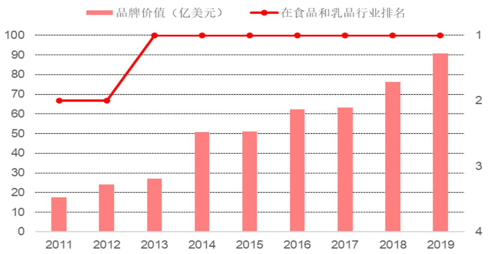  
图表33： 从 2011 年“BrandZ 最具价值中国品牌 100 强”排名启动以来伊利的品牌价值和排名变化  
资料来源：凯度华通明略咨询，中信建投证券研究发展部

# 2.2.2.2 公司产品品相不断优化

公司持续进行产品结构升级，品牌品相不断优化。从袋装纯牛奶升级为无菌砖盒装纯牛奶，并推出新品牌金典，乳蛋白含量明显提高，各项营养要素比例不断优化，完成品牌和品质双重提升。随着杀菌工艺的提高，伊利将超高温灭菌技术运用到牛奶杀菌中，牛奶保质期从 30-45 天延长到 6 个月，乳蛋白含量也从 $3 . 0 { \mathrm { g / 1 0 0 m l } }$ 上升到 $3 . 2 \mathrm { g } / 1 0 0 \mathrm { m L }$ ，推出了伊利无菌砖盒装纯牛奶。2006 年伊利推出金典纯牛奶，奶源出自优质荷斯坦奶牛，蛋白质含量提升到 $3 . 6 \mathrm { g } / 1 0 0 \mathrm { m L }$ ，钙含量也明显上升，由每 $1 0 0 \mathrm { m L }$ 牛奶含钙 $1 0 0 \mathrm { m g }$ 提升到 $1 2 0 \mathrm { m g }$ ，提升幅度达$2 0 \%$ 。

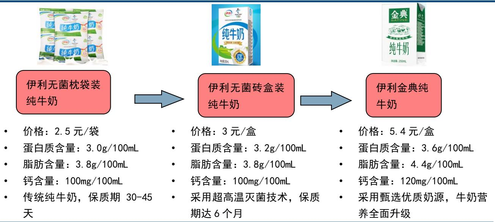  
图表34： 伊利纯牛奶品牌品质双升级  
资料来源：京东商城，中信建投证券研究发展部

# 2.2.2.3 公司产品种类持续深度细化、丰富

公司不断进行口感创新，满足消费者的多样需求。伊利于 2013 年推出安慕希高端常温酸奶品牌，逐年推出草莓、芒果百香果、橙肉凤梨等新品，打造业界口味潮流，提升饮用体验。尼尔森数据显示，截止到 2019 年安慕希实现连续六年销量增长，并且于 2019 年销售额突破 200 亿，成为中国乳业首个 200 亿销售额的子品牌。

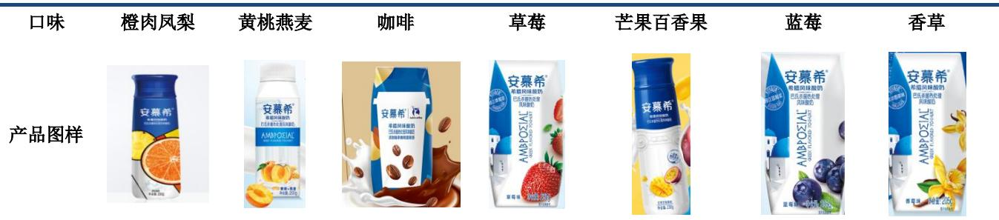  
资料来源：京东商城，中信建投证券研究发展部

# 2.2.2.4 积极布局新业务，寻找业务发展新增长

除坚持进行产品结构升级以外，伊利还积极布局新业务。2018 年伊利成立了健康饮品事业部，开始布局大健康领域，目前主要涉及矿泉水、能量饮料、咖啡等细分领域，主要四款产品是“伊刻活泉”矿泉水、“焕醒源”功能饮料、“伊然”乳矿饮料和圣瑞思咖啡。短期看新业务对公司业绩贡献较小，但背靠母品牌综合优势，中长期有望为伊利提供新的业绩增长点。

图表35： 安慕希积极进行口味创新  
图表36： 伊利布局新产品情况  

<table><tr><td>产品种类</td><td>产品图样</td><td>推出时间</td><td>描述</td></tr></table>

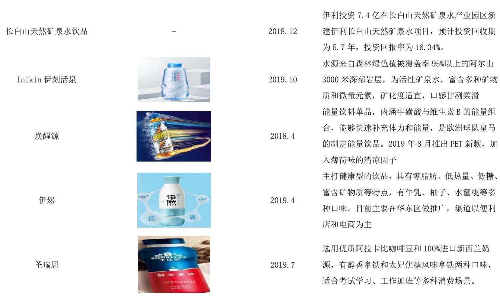  
资料来源：公司官网，中信建投证券研究发展部

# 2.3 渠道织网下沉，持续赋能

# 2.3.1 多级分销模式凸显优势

# 2.3.1.1 乳品企业渠道模式各异

一般乳制品行业销售渠道模式主要有以下四种：直营店销售模式、电子商务渠道销售模式、分公司销售模式、多级经销渠道模式。一般大型企业才有实力建立自营销售渠道，以便于控制管理销售渠道。而大部分都采用了经销商渠道模式，便于拓展产品销售空间。我国国内大型乳业会采用多渠道并行的方式。四种主要渠道模式的对比下表所示。

图表37： 主要渠道模式对比  

<table><tr><td>渠道模式</td><td>直营店模式</td><td>电子商务模式</td><td>分公司模式</td><td>多级经销模式</td></tr><tr><td rowspan="4">主要内容</td><td>厂商直接面对消费者，中间</td><td></td><td>通过互联网直接向消费者建立各省的企业分公司，由</td><td>产品销售给一级批发商，一</td></tr><tr><td>渠道全部由厂商建立，最终</td><td></td><td>销售，如天猫与京东等平台分公司来负责当地的销售</td><td>级批发商再销售给二级批</td></tr><tr><td>由企业自建零售终端直营 店来实现</td><td>的自营店。</td><td>业务。</td><td>发商、三级批发商、零售终 端，直到消费者。</td></tr><tr><td>渠道全过程完全由企业控</td><td></td><td></td><td></td></tr><tr><td rowspan="4">优势</td><td>制，企业可以缩短销售产品</td><td>这种模式直接面向消费者，</td><td>分公司的囤货能力远远大 于批发商，企业及时对市场</td><td>对产品采取自然销售的态</td></tr><tr><td></td><td>销售范围广，渗透性强，运</td><td></td><td></td></tr><tr><td>流通时间、减少不必要的环</td><td></td><td>做出反映。奠定向3、4线</td><td>度，没有对渠道有太多控</td></tr><tr><td>节、降低销售成本、满足客</td><td>营成本低。</td><td>城市布局基础，有利于企业</td><td>制，销售费用低。</td></tr></table>

<table><tr><td rowspan="5">渠道模式</td><td>直营店模式</td><td>电子商务模式</td><td>分公司模式</td><td>多级经销模式</td></tr><tr><td>户需求</td><td></td><td>长期发展。同时也有效避免</td><td></td></tr><tr><td></td><td></td><td>经销商短视行为。</td><td></td></tr><tr><td></td><td></td><td></td><td></td></tr><tr><td></td><td></td><td></td><td>企业与经销商存在诸多矛</td></tr><tr><td rowspan="3">劣势</td><td></td><td>自建渠道成本高，对企业实价格竞争激烈，需要广泛的</td><td></td><td>增设分公司，加大了企业的盾，停留在简单的买卖关系</td></tr><tr><td>力有着较高要求。</td><td>营销活动</td><td></td><td>运用成本，对企业实力要求之上，渠道稳定性不好把</td></tr><tr><td></td><td></td><td>较高。</td><td>控，使公司的获利能力下 降。</td></tr></table>

资料来源：《我国乳制品营销渠道模式现状对比分析》、中信建投证券研究发展部

# 2.3.1.2 伊利多渠道结合，分销体系完善

伊利采用了多级分销渠道与直营渠道结合的方式。伊利的多级分销渠道一方面直接在全国各个省区建立分公司，下属有多级的分销商、经销商和零售商；另一方面直接通过经销商向二级、三级经销商下沉，该模式覆盖地区广，能够深入三四线城市与各个乡镇。同时，伊利在多种特定的产品上采用直销的模式。一方面，在地区建立直营渠道。另一方面，积极拓展互联网销售模式，在各大电商平台都设有直营店铺。目前营业收入以经销渠道为主。

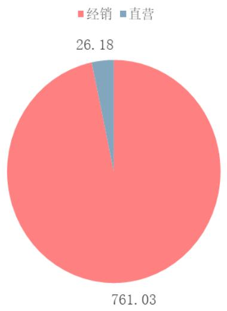  
图表38： 2018 年不同销售模式营业收入（亿元）  
资料来源：公司公告、中信建投证券研究发展部

通过多年的经营，伊利已经建立完整的销售渠道体系，实现分销渠道多元化整合，迅速扩大市场覆盖面，为伊利长期发展奠定基础。伊利也在积极探索新的渠道合作模式，发展较快的是便利店渠道和电商渠道，公司2018 年电商业务收入较上年增长 $6 1 \%$ 。

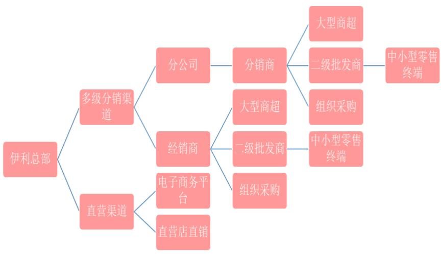  
图表39： 伊利分销渠道图  
资料来源：《伊利分销渠道分析》、中信建投证券研究发展部

# 2.3.2 多年布局织网，收获当前红利

伊利集团自 2006 年起开始实施“五年三步走”发展战略，截至 2011 年已全部完成。通过 5 年时间，伊利集团实现上控优质稀缺奶源、中建奶源中转枢纽，下掌全国产销布局，完整实现上中下游产业链之间的互联互通，为产能布局和产品结构升级奠定基础。从 2006 年开始，伊利首先在国内开展“织网计划”，在全国各个销售大区建立现代化生产基地，拓宽销售渠道，积极开拓二、三级市场，完成了 “纵贯南北、辐射东西”的全国性市场布局，实现了生产、销售、市场一体化运作，实现渠道全覆盖。

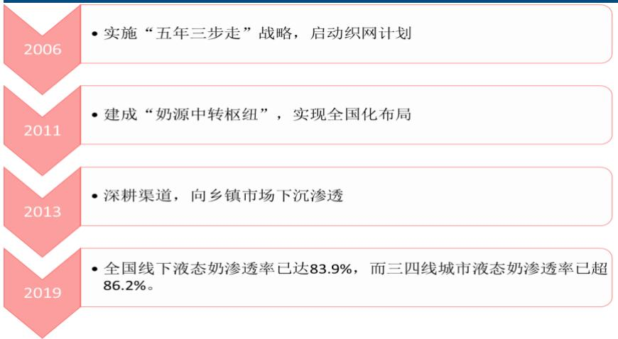  
图表40： 伊利渠道布局建设  
资料来源：公司公告、中信建投证券研究发展部

2013 年，伊利开始实施渠道精耕管理。2014 年公司以销售区域为单元，建立 PDCA 管理循环机制，精准分级管理渠道网点，促进营销资源优化配置。当年公司产品终端铺货网点个数和单店销售额份额均同比增加 $2 \%$ 。2015 年，公司启动实施数字化营销信息平台项目，借助互联网技术来强化渠道终端信息掌控能力。2016 年起，加强与线上线下零售商的战略合作，全面推进渠道深耕，通过“村淘业务模式”进一步加快县乡镇农村市场渗透水平。2017 年伊利坚持渠道精细化管理，多渠道快速发展，截至 2017 年年末，公司直控村级网点近 53 万家，同比增长 $5 4 \%$ 。2018 年，公司采取渠道拓展与市场渗透“双管齐下”策略，发展新型乡镇村业务模式，渠道继续下沉。

图表41： 近年来公司渠道深耕布局趋势  

<table><tr><td>时间</td><td>公司措施</td></tr><tr><td>2013</td><td>开始实施渠道精耕管理</td></tr><tr><td>2014</td><td>建立PDCA管理循环机制</td></tr><tr><td>2015</td><td>启动实施数字化营销信息平台项目</td></tr><tr><td>2016</td><td>建立“村淘业务模式”</td></tr><tr><td>2017</td><td>坚持渠道精细化管理</td></tr><tr><td>2018</td><td>采取渠道拓展与市场渗透“双管齐下”策略</td></tr><tr><td>2019</td><td>持续提高渗透能力</td></tr></table>

资料来源：公司公告，中信建投证券研究发展部

截至 2019 年上半年，伊利的全国线下液态奶渗透率已达 $8 3 . 9 \%$ ，而三四线城市液态奶渗透率已超 $8 6 . 2 \%$ 。伊利产品在国内市场的渗透能力持续增强，稳居行业首位。

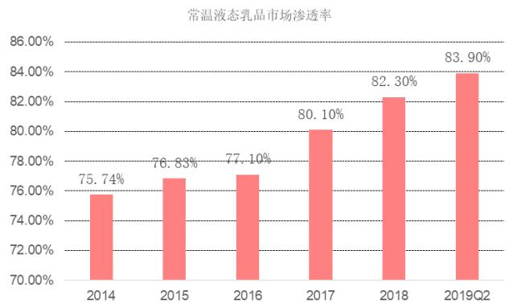  
图表42： 常温液态乳品市场渗透率  
资料来源：公司公告，中信建投证券研究发展部

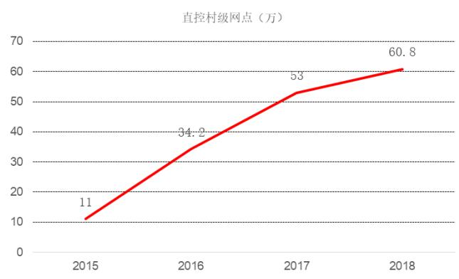  
图表43： 直控村级网点数量  
资料来源：公司公告，中信建投证券研究发展部

# 2.4 子品牌培育，营销方式升级

# 2.4.1 公司持续增加营销投入

伊利瞄准市场机会，及时推出子品牌产品满足消费者需求，并通过加大营销投入实现子品牌跨越式发展。回顾伊利从 2003 年以来销售费用和营收变化趋势可以看出，公司销售费用变化领先于营收变化三年左右。2006年公司推出高端白奶子品牌金典，销售费用增速也保持在高位，并于 2008 年达到顶点，增速达 $3 0 \%$ ；2013 年

公司推出常温酸奶品牌安慕希，销售费用从 2013 到 2015 年保持快速增长，2015 年时增速达到历史高点 $3 1 . 4 \%$ ；  
2018 年时公司进军低温鲜奶领域，同时积极进行原有品牌营销升级，销售费用增速达 $2 7 . 4 \%$ 。

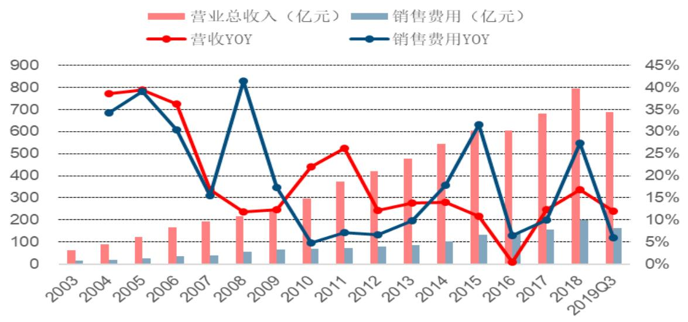  
图表44： 2003-2019Q3 伊利营收和销售费用变化  
资料来源：wind，中信建投证券研究发展部

2009-2018 年，公司营收复合增长率 $1 3 . 1 2 \%$ ，而广告宣传费用复合增长率为 $1 4 . 0 5 \%$ ，足以说明公司在营销方面投入巨大。

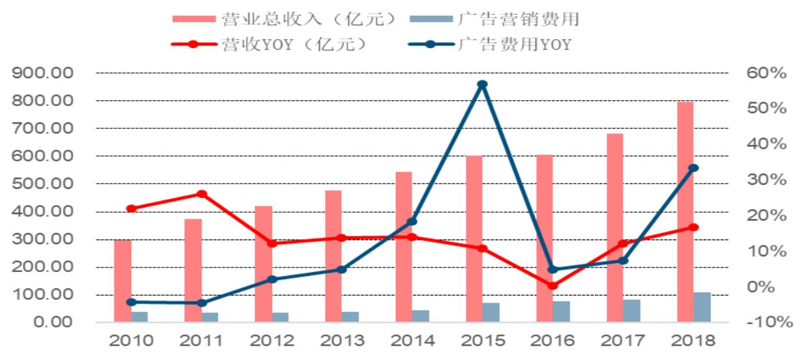  
图表45： 2010-2018伊利营收和广告宣传费用变化  
资料来源：wind，中信建投证券研究发展部

# 2.4.2公司积极进行营销方式升级，培育子品牌效应

2015年之前，公司的销售费用大多投入大型活动项目，多以树立企业整体形象为主。2008 年公司和中国奥组委携手，通过奥运会来推广自己品牌，将品牌与运动健儿联系在一起，打造健康形象。此后也积极赞助上海世博会、伦敦奥运会等大型项目。行业竞争对手蒙牛则通过与中国航天合作，打出“每天一斤奶，强壮中国人”的口号，迅速为让人们所熟知。

图表46： 伊利与蒙牛大型赞助项目对比图  

<table><tr><td colspan="3">蒙牛</td><td colspan="2">伊利</td></tr><tr><td>时间</td><td>项目</td><td>时间</td><td>项目</td><td></td></tr><tr><td>2001</td><td>申奥成功</td><td>2005</td><td>签约中国奥组委</td><td></td></tr><tr><td>2003</td><td>神五飞天--航天员专用牛奶</td><td>2006</td><td>“梦想中国”节目</td><td></td></tr><tr><td>2004</td><td>雅典奥运会中国代表团</td><td>2008</td><td>北京奥运会官方合作伙伴</td><td></td></tr><tr><td>2005</td><td>“超级女声”节目</td><td>2010</td><td>上海世博会</td><td></td></tr><tr><td>2006</td><td>蒙牛“城市之间”</td><td>2012</td><td>伦敦奥运会中国代表团</td><td></td></tr><tr><td>2006</td><td>助学工程</td><td>2014</td><td>索契冬奥会中国代表团</td><td></td></tr><tr><td>2006</td><td>香港迪士尼乐园</td><td>2015</td><td>意大利米兰世博会</td><td></td></tr><tr><td>2007</td><td>博鳌亚洲论坛</td><td>2016</td><td>里约奥运会中国代表团</td><td></td></tr><tr><td>2018</td><td>FIFA世界杯官方赞助商</td><td>2018</td><td>2022冬奥会和冬残奥会</td><td></td></tr></table>

资料来源：公开资料整理，中信建投证券研究发展部

2015年之后，随着乳品行业产品多元化发展，公司的广告赞助投入更偏向于单一产品的品牌效应，更多地为子品牌和单一产品打造消费场景。与此同时，综艺节目近几年也在火爆发展，不管是电视平台还是网络平台，子品牌冠名赞助单一节目的广告形式更受欢迎，宣传效果更佳。下表分别为蒙牛和伊利两家公司的部分大型赞助项目以及 2015 年后单一产品冠名赞助的情况。

图表47： 2015 年后蒙牛与伊利冠名赞助节目对比表  

<table><tr><td colspan="5">蒙牛</td><td colspan="3">伊利</td></tr><tr><td>产品</td><td>节目</td><td>播出年份</td><td>主要播出平台</td><td>产品</td><td>节目</td><td>播出年份</td><td>主要播出平台</td></tr><tr><td></td><td>迪士尼神奇之旅</td><td>2016</td><td>东方卫视</td><td rowspan="6">金典</td><td>亲爱的客栈2</td><td>2018</td><td>湖南卫视</td></tr><tr><td>未来星</td><td>八八爸爸</td><td>2016</td><td>北京卫视</td><td>歌手2019</td><td>2019</td><td>湖南卫视</td></tr><tr><td rowspan="3">蒙牛真果粒</td><td>歌声的翅膀</td><td>2017</td><td>江苏卫视</td><td>歌手2018</td><td>2018</td><td>湖南卫视</td></tr><tr><td>青春有你</td><td>2019</td><td>爱奇艺</td><td>歌手2017</td><td>2017</td><td>湖南卫视</td></tr><tr><td>花儿与少年2</td><td>2015</td><td>湖南卫视</td><td>我是歌手4</td><td>2016</td><td>湖南卫视</td></tr><tr><td rowspan="6">纯甄</td><td>中餐厅3</td><td>2019</td><td>湖南卫视</td><td></td><td>最强大脑2</td><td>2015</td><td>江苏卫视</td></tr><tr><td>创造营2019</td><td>2019</td><td>腾讯视频</td><td></td><td>奔跑吧3</td><td>2019</td><td>浙江卫视</td></tr><tr><td>中餐厅</td><td>2019</td><td>湖南卫视</td><td></td><td>奔跑吧2</td><td>2018</td><td>浙江卫视</td></tr><tr><td>我们的挑战</td><td>2017</td><td>江苏卫视</td><td>安慕希</td><td>奔跑吧1</td><td>2017</td><td>浙江卫视</td></tr><tr><td>全员加速中2</td><td>2016</td><td>湖南卫视</td><td></td><td>奔跑吧兄弟4</td><td>2016</td><td>浙江卫视</td></tr><tr><td>全员加速中</td><td>2015</td><td>湖南卫视</td><td></td><td>奔跑吧兄弟2</td><td>2015</td><td>浙江卫视</td></tr><tr><td rowspan="2">特仑苏</td><td>向往的生活3</td><td>2019</td><td>湖南卫视</td><td></td><td>锋味2018</td><td>2018</td><td>浙江卫视</td></tr><tr><td>声入人心2</td><td>2019</td><td>湖南卫视</td><td></td><td>春晚面对面</td><td>2018</td><td>爱奇艺</td></tr><tr><td></td><td>声入人心</td><td>2018</td><td>湖南卫视</td><td>伊利QQ星</td><td>爸爸去哪儿3</td><td>2015</td><td>湖南卫视</td></tr><tr><td>酸酸乳</td><td>超级女声</td><td>2016</td><td>湖南卫视</td><td></td><td>爸爸去哪儿2</td><td>2014</td><td>湖南卫视</td></tr><tr><td>蒙牛</td><td>十二道锋味2</td><td>2015</td><td>浙江卫视</td><td>畅意100%</td><td>巅峰之夜</td><td>2019</td><td>湖南卫视</td></tr><tr><td>蒙牛优益C</td><td>十二道锋味3</td><td>2016</td><td>浙江卫视</td><td></td><td>高能少年团2</td><td>2018</td><td>浙江卫视</td></tr></table>

<table><tr><td colspan="4">二十四小时2</td></tr><tr><td></td><td>挑战者联盟3</td><td>2017</td><td>浙江卫视</td></tr><tr><td></td><td>挑战者联盟2</td><td>2016</td><td>浙江卫视</td></tr><tr><td></td><td>我们是真正的朋友</td><td>2019</td><td>腾讯视频</td></tr><tr><td>舒化</td><td>幸福三重奏</td><td>2018</td><td>腾讯视频</td></tr><tr><td></td><td>有话非要说</td><td>2018</td><td>江苏卫视</td></tr><tr><td rowspan="4">金领冠</td><td>妻子的浪漫旅行3</td><td>2020</td><td>芒果TV、爱奇艺</td></tr><tr><td>妻子的浪漫旅行2</td><td>2019</td><td>芒果TV、爱奇艺</td></tr><tr><td>了不起的孩子2</td><td>2017</td><td>爱奇艺</td></tr><tr><td>了不起的孩子3</td><td>2018</td><td>爱奇艺</td></tr><tr><td></td><td>小儿大健康 青春环游记</td><td>2018 2019</td><td>浙江卫视</td></tr><tr><td>畅轻</td><td>我是大侦探</td><td>2018</td><td>浙江卫视 湖南卫视</td></tr><tr><td>甄稀</td><td>拜托了冰箱5</td><td>2019</td><td>腾讯视频</td></tr><tr><td></td><td>拜托了冰箱4</td><td>2018</td><td>腾讯视频</td></tr><tr><td>谷粒多</td><td>奇葩说2</td><td>2015</td><td>爱奇艺</td></tr><tr><td></td><td>奇葩说3</td><td>2016</td><td>爱奇艺</td></tr><tr><td>植选豆乳</td><td>向往的生活2</td><td>2018</td><td>湖南卫视</td></tr><tr><td></td><td>以团之名</td><td>2019</td><td>优酷</td></tr><tr><td>欣活</td><td>阅读·阅美2</td><td>2018</td><td>江苏卫视</td></tr><tr><td>巧乐兹</td><td>奇遇人生</td><td>2018</td><td>腾讯视频</td></tr><tr><td>优酸乳果果昔</td><td>喜欢你，我也是</td><td>2019</td><td>爱奇艺</td></tr><tr><td>每益添</td><td>乐队的夏天</td><td>2019</td><td>爱奇艺</td></tr><tr><td></td><td>快乐大本营</td><td>2015</td><td>湖南卫视</td></tr><tr><td>Joy Day</td><td>我想和你唱</td><td>2018</td><td>湖南卫视</td></tr></table>

资料来源：百度新闻整理，中信建投证券研究发展部

# 三、未来布局看点——短、中、长期逻辑各有重点

# 3.1 短期：液态乳仍是主力增长点

# 3.1.1 产品持续升级换代，品质和包装，同时培育新品类

产品是一家消费公司的核心，伊利的产品结构中，液态乳为未来几年仍是核心增长点。就产品而言，未来一段时间内，主要增长贡献点可能围绕四方面展开：1、产品品质升级，例如提升蛋白含量；2、包装升级，例如梦幻盖产品；3、产品定位细分，聚焦专业人群；4、积极跟踪市场热点，快速切入新品或新品类。具体看：

品质升级：预计公司未来会持续在基础产品基础上推出一些高端升级产品，以纯奶为例，提升蛋白质含量便是最直观的产品品质升级。金典系列从纯牛奶到有机奶再到娟姗奶，蛋白质含量和脂肪含量相比于原有金典纯牛奶有较大幅度提高。

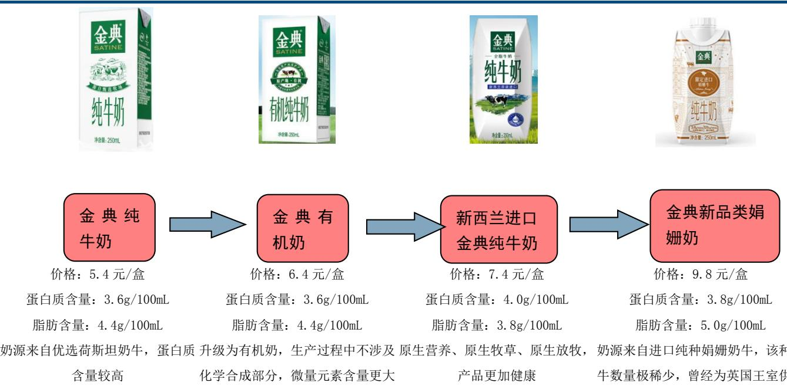  
图表48： 金典产品品质不断提升  
资料来源：京东商城，中信建投证券研究发展部

包装升级：公司也积极对产品包装进行升级换代。2019年 8 月，伊利对金典有机奶进行全新升级，将普通吸管包装升级为更具畅饮特点的旋盖梦幻盖包装，便携、即饮的特点提升了消费者饮用体验。

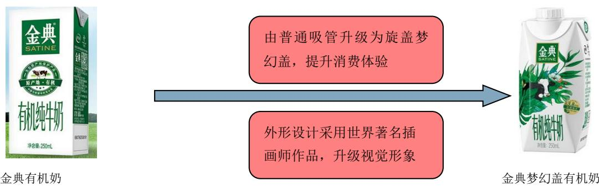  
图表49： 金典包装全新升级  
资料来源：公司官网、中信建投证券研究发展部

细分聚焦：功能性定位细分人群需求，伊利推出有差异的不同品类牛奶，适用于多种消费场景。如针对乳糖不耐受体质消费者推出无乳糖舒化奶，针对有塑形瘦身需求人群推出低脂奶，针对部分工作较为繁忙有时没有足够时间吃饭的人群推出谷物牛奶等。通过具体功能化产品，满足特定群体需求，有望成为未来一大趋势。

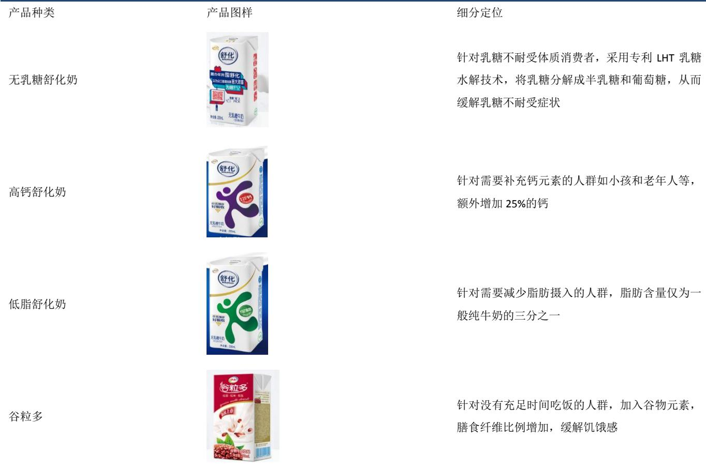  
资料来源：公司官网，中信建投证券研究发展部

快速切入新品类：公司紧密跟踪乳制品行业最新动态，根据自身业务发展目标不断优化升级产品结构，推出新品牌以推动公司业绩增长。在高端白奶方面，蒙牛于 2005 年推出特仑苏以后，伊利也紧随其后于次年推出金典品牌，进军高端白奶市场。在功能性牛奶方面，2005 年蒙牛未来星儿童牛奶正式上市，伊利也于 2006 年推出 QQ 星儿童牛奶。在常温酸奶方面，光明于 2009 年首先推出莫斯利安常温酸奶，开创常温酸奶领域先河，2013 年伊利推出了旗下高端常温酸奶品牌安慕希。预计未来伊利在新品与新品类推出方面，凭借自身龙头优势和强大的研发实力支撑，有望进一步加快。

图表50： 伊利产品功能性定位细分人群需求  
图表51： 子品牌推出时间  

<table><tr><td rowspan="2">产品分类</td><td colspan="2">伊利</td><td colspan="2">蒙牛</td><td colspan="2">光明</td><td colspan="2">三元</td></tr><tr><td>品牌</td><td>推出时间</td><td>品牌</td><td>推出时间</td><td>品牌</td><td>推出时间</td><td>品牌</td><td>推出时 间</td></tr><tr><td>常温纯奶</td><td>金典</td><td>2006年</td><td>特仑苏</td><td>2005年</td><td>优+</td><td>2007年</td><td>极致</td><td>2008年</td></tr><tr><td></td><td>QQ星</td><td>2006年</td><td>未来星</td><td>2005年</td><td>-</td><td>一</td><td>妙乐星</td><td>2014年</td></tr><tr><td>常溫酸奶</td><td>安慕希</td><td>2013年</td><td>纯甄</td><td>2013年</td><td>莫斯利安</td><td>2009年</td><td>冰岛式酸奶</td><td>2016年</td></tr><tr><td>低温酸奶</td><td>畅轻</td><td>2012年</td><td>冠益乳</td><td>2007年</td><td>畅优</td><td>2007年</td><td>轻能优酪乳</td><td>-</td></tr><tr><td>低温鲜奶</td><td>百格特</td><td>2018年底</td><td>每日鲜语</td><td>2018年</td><td>光明鲜牛奶</td><td>2002年</td><td>三元鲜牛奶</td><td></td></tr><tr><td></td><td>金典鲜牛奶</td><td>2019年</td><td>新鲜工厂</td><td></td><td>光明优倍</td><td></td><td>极致鲜奶</td><td></td></tr></table>

<table><tr><td>牧场清晨鲜牛奶</td><td>新鲜严选</td><td></td></tr><tr><td>伊利鲜牛奶</td><td></td><td></td></tr></table>

资料来源：百度新闻整理，中信建投证券研究发展部

# 3.1.2 渠道继续深耕，下线市场放量与升级

乳品行业目前处于稳定增长阶段，上文分析，我国一线城市乳品人均消费量已经与发达国家无太大差异，但 3、4 线以下市场人口集中，提升空间巨大。短期看，渠道下沉深耕能力是我国乳企的核心竞争力之一，尤其是全国性龙头企业而言，未来一段时间的增长，重点将来自下线市场的消费增长。伊利的分销模式上文已经进行分析，我们认为，接下来是公司收割市场，享受前期布局红利的阶段，下线市场的完善布局将成为未来一段时间内伊利公司增长的一大来源。

草根调研了解到，以 2019 年液态乳为例，伊利一二线市场增速在 $1 2 \%$ 左右，而三四线增速达到 $1 8 \%$ 左右。可见，公司液态乳增长的重点市场已经在发生转移。

# 3.2 中长期：国际龙头定位目标，多元化发展

对比国际乳业巨头达能公司，伊利未来必将走上国际化综合食品多元化发展道路。

# 3.2.1 达能的成长路径

达能公司是世界著名的食品集团，公司业务拥有 4 个核心业务板块和多个知名品牌，如：达能、LU 和EVIAN（依云）、多美滋、脉动、益力、乐百氏、碧悠、波多、富维克、牛栏等。它的总部设在法国巴黎，是一个业务多元化的大型跨国食品公司，该集团的业务广泛分布在六大洲中，其产品在 120 多个国家和地区销售。

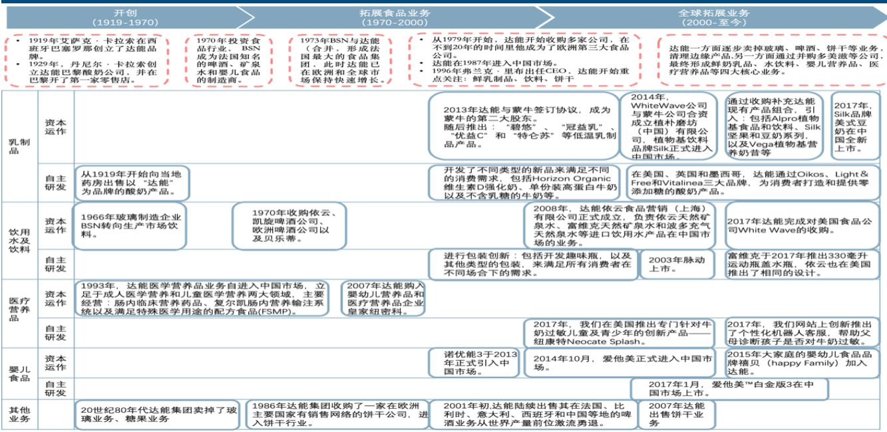  
图表52： 达能多元化发展历程  
资料来源：彭博，百度新闻整理，中信建投证券研究发展部

# 产品结构：布局多品类业务，达能营收提升

04-06 年期间，乳制品占据主营产品地位：根据达能集团各产品收入结构看出，达能在 2004 年-2006 年间，主营产品主要是：瓶装水、新鲜乳制品以及饼干，且乳制品收入占比均超过 $5 0 \%$ ，且逐年递增，07 年达到近 $7 0 \%$ 的营收占比。

07-15 年引入产品多元化发展，形成多品类销售平台，非乳制品占据越来越重要的地位：2007-2015 年期间，达能实行两方面措施：一方面 07 年出售饼干等业务，清理边缘产品；另一方面通过并购多美滋以及欧洲最大婴儿食品生产商荷兰纽密科卵等公司，最终形成四个业务板块分别为：新鲜乳制品、临床营养品、瓶装水，以及婴儿食品。并且这段时期乳制品营收占比逐年下降，非乳制品营收占据越来越重要的地位，在 2015 年整体占比将近一半。

2016 年-2018 年专业营养品、植物性乳制品纳入产品结构：2016 年产品结构再次调整，达能在 14-17 年进行的大部分并购收购等资本运作都是为了优化产品序列，达能将产品锁定在专业化的营养品以及植物性的乳制品上，引入诸多如植物基食品和饮料、以及坚果和豆奶等产品，近三年这些产品的营收占比均达到 $8 0 \%$ 以上，且逐年增长，形成了当前 3 种产品结构，分别为：新鲜乳制品、专业营养品和瓶装水。

达能在 04-18 年经过三次的产品结构的改变，使得收入总量相对之前显著提升，达能打造多元化产品品类销售平台，有助于其规模扩张。

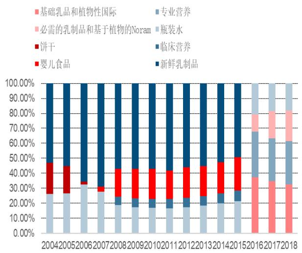  
图表53： 达能 2004-2018 年各产品收入结构  
资料来源：彭博，中信建投证券研究发展部

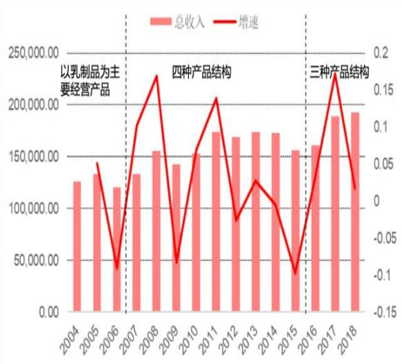  
图表54： 达能 2004-2018 年收入及其增速  
资料来源：彭博，中信建投证券研究发展部

# 市场结构：全球化市场布局均衡发展

从海外布局来看，达能市场覆盖广泛，涵盖亚洲、欧洲、北美等地，其中欧洲市场仍在全球市场中占据重要地位，除了 13-15 年外，其余欧洲市场份额均在 $5 0 \%$ 及以上。其主要是由于达能集团的兼并扩张就是从其最熟悉、最了解、饮食习惯基本相同的西欧邻国开始的。达能集团先后将分布在德国、比利时、法国、荷兰和意大利的联合饼干公司兼并纳入集团范畴。随后几十年间达能又开始向亚洲、南美和南非通过陆续收购、投资等方式向全球积极拓展。

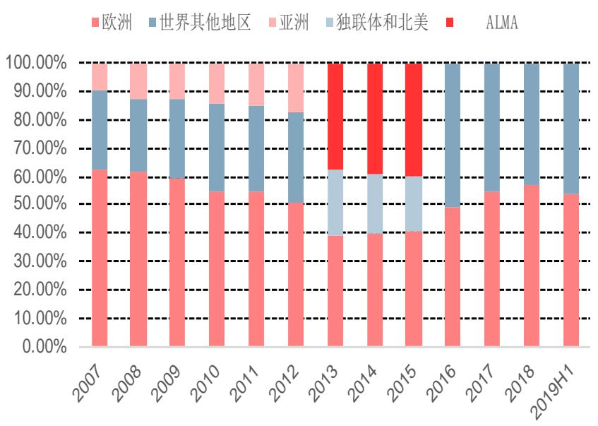  
图表55： 达能全球市场营收占比  
资料来源：彭博，中信建投证券研究发展部

反观伊利公司，我们认为未来的借鉴主要有三个方面：1、丰富品类，突破乳品单一品类依赖，完善产品结构；2、海外扩张成为必然，全球性企业就要有全球化市场，外海市场布局成为伊利未来一段时间重点任务之一；3、扩张方式来看，并购有望成为主要手段，无论是品类还是市场的扩张，对于一定规模的大企业而言，通过并购手段是最直接有效的一种方式。

# 3.2.2 产品品类的扩展，非乳品的布局，打造销售平台企业

伊利产品自身横向比较优势显现，从乳制品扩展至大健康食品，填补市场空缺：目前，伊利在非乳业务上逐步实现乳酸菌饮料、植物蛋白饮料、功能饮料、风味饮料、咖啡和矿泉水等多品类发展的业务布局。其中，在矿泉水这一细分赛道上，伊利先是在 2019 年初以 7.43 亿元在吉林省安图县长白山天然矿泉水产业园区新建伊利长白山天然矿泉水饮品项目（建设周期 31 个月），后又在 2019 年 9 月以 3000 万全资收购阿尔山伊利天然矿泉饮品有限责任公司，并于 10 月推出的瓶装水新品 inikin 伊刻活泉，正式进军矿泉水市场。

图表56： 伊利近年来推出的非乳饮料产品  

<table><tr><td>产品</td><td>品类</td><td>上市时间</td></tr><tr><td>inikin伊刻活泉</td><td>矿泉水</td><td>2019年10月</td></tr><tr><td>圣瑞思咖啡即饮饮料</td><td>咖啡饮料</td><td>2019年7月</td></tr><tr><td>伊然乳矿轻饮</td><td>软饮料</td><td>2019年4月</td></tr><tr><td>焕醒源能量饮料</td><td>能量饮料</td><td>2018年6月</td></tr><tr><td>植选浓香豆乳</td><td>豆奶</td><td>2017年12月</td></tr><tr><td>每益添活性乳酸菌饮料产品</td><td>乳酸菌饮料</td><td>2012年3月</td></tr></table>

资料来源：公开资料，中信建投证券研究发展部

对于未来发展新品类，伊利的研发实力支持必不可少。伊利近几年逐步加大研发费用的投入，在 2019Q3研发费用投入占营业收入的 $0 . 4 9 \%$ ，且研发人员占公司总人数比例也持续上升。

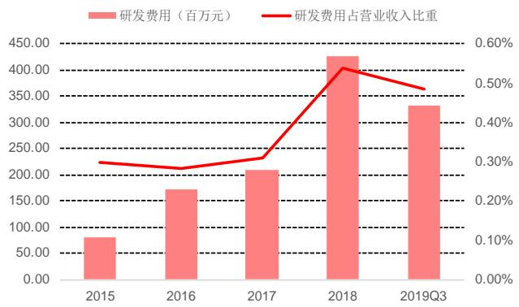  
图表57： 伊利研发费用及其占比  
资料来源：wind，中信建投证券研究发展部

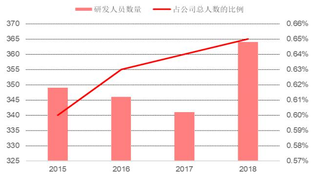  
图表58： 伊利研发人员数量及占比  
资料来源：wind，中信建投证券研究发展部

此外，伊利通过加大科技创新投入提高研发能力，建立产品事业部推出系列新品类。一方面，伊利对外建立多个领先技术研发和产学研合作平台，积累诸多关于乳糖、益生菌、液态奶等乳类的专利技术与研究成果，在乳制品领域纵向创新丰富乳制品产品。另一方面，伊利内部建立健康饮品、奶酪等新事业部，加强具体品类研发力度。

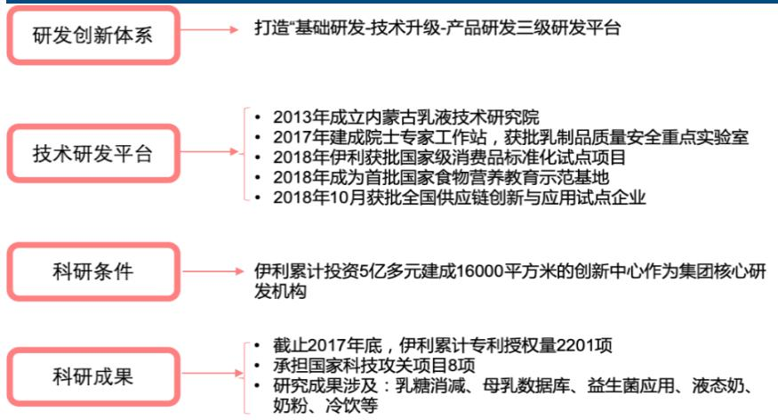  
图表59： 伊利技术创新能力  
资料来源：公开资料，中信建投证券研究发展部

# 3.2.3 市场的扩张，海外布局

伊利通过并购扩展新品类市场，进一步推进国际化布局。自 2013 年以来伊利为实现“世界一流健康食品集团”愿景，持续推进“全球织网”战略，通过收购新西兰 Westland 等公司，建立焕醒源、圣瑞思等品牌，进军功能咖啡饮料、矿泉水等多个细分市场。伊利在各地投资设厂、与多个国家战略合作，渠道扩展至北美、欧洲、大洋洲等地，全面提升公司的全球产业链整合能力和品牌影响力，截止 18 年底伊利拥有 4 家海外全资子公司。

图表60： 伊利持续推进国际化海外布局  

<table><tr><td>年份</td><td>海外布局情况</td><td>扩展地区</td></tr><tr><td>2013年</td><td>与美国最大乳制品公司DFA、意大利最大乳品生产商斯嘉达建立战略合作关系</td><td>北美、欧洲</td></tr><tr><td>2014年</td><td>在新西兰投资建设全球最大一体化乳业生产基地</td><td>欧洲</td></tr></table>

<table><tr><td rowspan="3">年份</td><td>海外布局情况</td><td>扩展地区</td></tr><tr><td>在荷兰成立了海外研发中心</td><td></td></tr><tr><td>与国际三大质量认证巨头SGS、LRQA、Intertek达成战略合作</td><td></td></tr><tr><td>2015年</td><td>成立中美食品智慧谷</td><td>北美</td></tr><tr><td>2016年</td><td>Pure-Nutra婴儿配方奶粉在新西兰上市销售</td><td>大洋洲</td></tr><tr><td rowspan="2">2017年</td><td>“金领冠睿护”新一代婴幼儿配方奶粉在大洋洲生产基地生产下线</td><td>大洋洲</td></tr><tr><td>JoyDay冰淇淋在印度尼西亚多个城市成功上市</td><td></td></tr><tr><td rowspan="2">2018年</td><td>公司收购泰国本土最大冰淇淋企业 THECHOMTHANACOMPANYLIMITED</td><td>亚洲、欧洲</td></tr><tr><td>伊利欧洲创新中心</td><td></td></tr><tr><td>2019年</td><td>公司收购了新西兰 Westland Co-Operative Dairy Company Limited</td><td>大洋洲</td></tr></table>

资料来源：公开资料，中信建投证券研究发展部

图表61： 截止 2018 年伊利拥有 4 家海外子公司  

<table><tr><td>子公司名称</td><td>主要经营地</td><td>注册地</td><td>业务性质</td><td>取得方式</td></tr><tr><td>SILVER HARBOR LLC.</td><td>美国</td><td>美国</td><td>乳业市场研究</td><td>投资设立</td></tr><tr><td>YILI INNOVATION CENTER EUROPE B.V.</td><td>荷兰</td><td>荷兰</td><td>乳业技术</td><td>投资设立</td></tr><tr><td>OCEANIA DAIRY LIMITED</td><td>新西兰</td><td>新西兰</td><td>乳制品加工</td><td>合并</td></tr><tr><td>PT.GREEN ASIA FOOD INDONESIA</td><td>印度尼西亚</td><td>印度尼西亚</td><td>商业贸易</td><td>投资设立</td></tr></table>

资料来源：公开资料，中信建投证券研究发展部

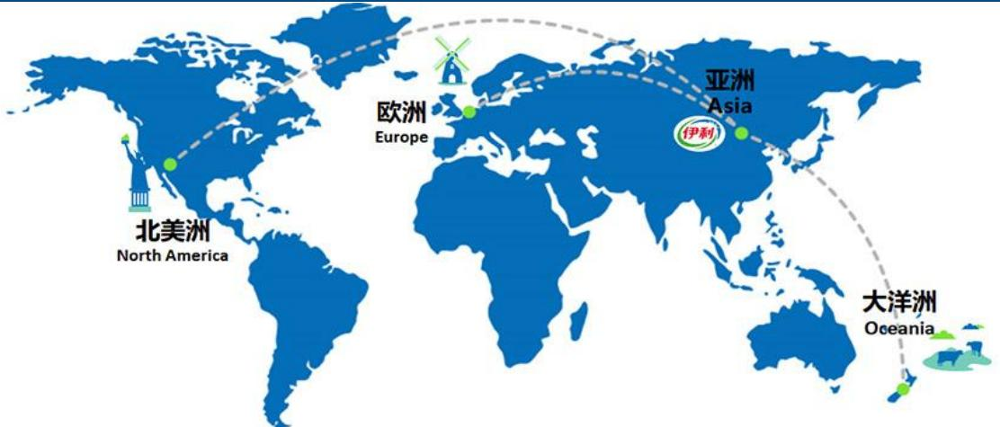  
图表62： 伊利全球织网示意图  
资料来源：公司官网，中信建投证券研究发展部

2018 年公司还新成立了国际业务事业部，由总部直接管理，目前主要关注东南亚市场，可见未来国际化也已经成为公司重点工作之一。

# 四、财务预测

# 核心假设：

收入端：我国乳品行业稳步增长。从产品拆分上来看，将产品主要分为液体乳、奶粉及奶制品、冷饮产品系列等。液体乳占营收比例最高，过去连续三年维持在 $8 0 \%$ 以上，且占比在稳步提升。我们将液体乳销售额具体拆分成销量和吨价，随着伊利不断的拓展市场、下沉渠道，2019 年液体乳销量同比增长 $9 . 6 2 \%$ ，而吨价因公司年中采取降价促销政策，涨幅不大，但结构提升预计持续，带动价格同比增长 $3 . 0 0 \%$ 。2020 年因为新型肺炎疫情发生在春节期间，将会影响液体奶的在春节旺季的销售，但预计公司后续会采取促销等手段来保证完成全年销售任务。所以预计 2020 年液体奶销量保持高速增长 $9 . 0 7 \%$ ，但吨价上涨有限，同比增长 $2 . 5 \%$ 。综合来看，我们预计2019-2021年公司营业收入分别为896.01亿元，100.02亿元和111.58亿元，同比增长为 $1 2 . 6 3 \% , 1 1 . 6 3 \%$ ，$1 1 . 5 6 \%$ 。

成本端：行业原奶价格进入上升周期，预计 2020 年保持 $5 \%$ 左右价格增长。2018年液体乳营业成本占比达$8 6 . 6 5 \%$ 。而液体乳成本中又包含直接材料、制造费用、直接人工，其中直接材料占比最高，过去连续三年维持在 $8 9 \%$ 以上，直接人工费在小幅提升。假设原奶占成本比例不会出现大幅波动，随着人力成本的增加，直接人工费用会有小幅提升。2020 年初受疫情影响，复工较晚，原奶供应会适度紧缺，造成直接材料成本小幅上涨，但预计全年上涨幅度有限，公司成本同比上涨 $1 2 . 2 6 \%$ 。综上，我们预计 2019-2021 年公司销售毛利率分别为$3 7 . 7 4 \%$ 、 $3 7 . 3 8 \%$ 、 $3 7 . 6 4 \%$ ，对应的营业成本分别为 557.87 亿元、626.28 亿元、695.86 亿元。

费用端：销售费用方面，2020 年受到疫情影响，春节库存累积，节后需要加大促销力度消化库存，大概对应 4-5 亿额外销售费用支出，我们预计公司 2019-2021 年销售费用分别约为 219.79 亿元、248.47 亿元、276.53亿元，对应增速分别为 $1 1 . 1 6 \%$ 、 $1 3 . 0 5 \%$ 、 $1 1 . 2 9 \%$ 。管理费用方面，我们预计公司 2019-2021 年管理费用分别约为 32.48 亿元、37.94 亿元、43.26 亿元，对应增速分别为 $8 . 9 9 \%$ 、 $1 6 . 8 1 \%$ 、 $1 4 . 0 3 \%$ 。另外，因公司实施股权激励，预计每年将产生一笔股权激励费用，2019-2021 年分别为 1.58 亿元、5.65 亿元、3.21 亿元。

图表63： 业绩预测  

<table><tr><td>会计年度</td><td>2018</td><td>2019E</td><td>2020E</td><td>2021E</td></tr><tr><td>营业收入（万元）</td><td>7,955,327.75</td><td>8,960,145.33</td><td>10,001,956.17</td><td>11,157,994.70</td></tr><tr><td>yoy(%)</td><td>16.89%</td><td>12.63%</td><td>11.63%</td><td>11.56%</td></tr><tr><td>液体乳（万元）</td><td>6,567,888.64</td><td>7,415,711.11</td><td>8,290,524.01</td><td>9,267,290.75</td></tr><tr><td>yoy(%)</td><td>17.78%</td><td>12.91%</td><td>11.80%</td><td>11.78%</td></tr><tr><td>液体乳吨价（万元/吨）</td><td>0.813</td><td>0.837</td><td>0.858</td><td>0.882</td></tr><tr><td>液体乳销量：(吨)</td><td>8,081,286.00</td><td>8,858,705.71</td><td>9,662,190.32</td><td>10,511,496.85</td></tr><tr><td>奶粉及奶制品（万元）</td><td>804,461.12</td><td>917,327.02</td><td>1,038,322.45</td><td></td></tr><tr><td>yoy(%)</td><td></td><td>14.03%</td><td></td><td>1,163,346.86</td></tr><tr><td>奶粉及奶制品（万元/吨）</td><td>25.14% 7.380</td><td>7.749</td><td>13.19%</td><td>12.04%</td></tr><tr><td>奶粉及奶制品销量：(吨)</td><td>109,007.00</td><td>118,381.60</td><td>8.136</td><td>8.584</td></tr><tr><td>冷饮产品系列（万元）</td><td>499,706.25</td><td>542,705.98</td><td>127,615.37</td><td>135,527.52</td></tr><tr><td>yoy(%)</td><td></td><td></td><td>587,348.97</td><td>633,796.53</td></tr><tr><td>冷饮产品系列吨价（万元/吨）</td><td>8.49%</td><td>8.61%</td><td>8.23%</td><td>7.91%</td></tr><tr><td>冷饮产品系列销量：(吨)</td><td>1.271 393,087.00</td><td>1.360 398,983.31</td><td>1.442 407,361.95</td><td>1.528 414,694.47</td></tr></table>

资料来源：中信建投证券研究发展部

2018 年公司实现营收 795.53 亿元，同比增长 $1 6 . 8 9 \%$ ，2019Q3 实现营收 686.77 亿元，同比增长 $1 1 . 9 8 \%$ 。整体看公司收入端稳定增长，2018 年液体乳、奶粉及奶制品保持快速增长，增速分别为 $1 7 . 7 8 \%$ 、 $2 5 . 1 4 \%$ 。我们预计公司 2019-2021 年归母公司净利润分别为 72.28 亿元、72.45 亿元、81.38 亿元，对应 EPS 分别为 1.19、1.19、

1.33 元/股。

图表64： 业绩预测  

<table><tr><td>会计年度</td><td>2018</td><td>2019E</td><td>2020E</td><td>2021E</td></tr><tr><td>营业收入（百万元）</td><td>79,553.28</td><td>89,601.45</td><td>100,019.56</td><td>111,579.95</td></tr><tr><td>增长率(%)</td><td>16.89%</td><td>12.63%</td><td>11.63%</td><td>11.56%</td></tr><tr><td>归属母公司股东净利润（百万元）</td><td>6,439.75</td><td>7,228.65</td><td>7,244.79</td><td>8,138.05</td></tr><tr><td>增长率(%)</td><td>7.31%</td><td>12.25%</td><td>0.22%</td><td>12.33%</td></tr><tr><td>每股收益EPS(元)</td><td>1.06</td><td>1.19</td><td>1.19</td><td>1.33</td></tr><tr><td>市盈率(P/E)</td><td>29.11</td><td>25.93</td><td>25.93</td><td>23.04</td></tr></table>

资料来源：中信建投证券研究发展部

# 五、风险提示

食品安全风险，海外拓展不及预期风险，乳品行业波动风险，经营管理风险等。

# 附表：

图表65： 资产负债表（百万元）  

<table><tr><td>会计年度</td><td>2016</td><td>2017</td><td>2018</td><td>2019E</td><td>2020E</td><td>2021E</td></tr><tr><td>货币资金</td><td>13,823.65</td><td>21,823.07</td><td>11,051.00</td><td>19,458.20</td><td>25,160.65</td><td>31,511.52</td></tr><tr><td>交易性金融资产</td><td>0.00</td><td>0.00</td><td>0.50</td><td>0.50</td><td>0.50</td><td>0.50</td></tr><tr><td>应收账款</td><td>686.50</td><td>949.74</td><td>1,282.13</td><td>1,238.11</td><td>1,382.06</td><td>1,541.80</td></tr><tr><td>预付账款</td><td>558.39</td><td>1,192.43</td><td>1,459.60</td><td>1,347.80</td><td>1,504.52</td><td>1,678.41</td></tr><tr><td>其他应收款</td><td>74.07</td><td>233.11</td><td>154.56</td><td>197.01</td><td>219.91</td><td>245.33</td></tr><tr><td>存货</td><td>4,325.78</td><td>4,639.99</td><td>5,507.07</td><td>6,271.44</td><td>7,040.55</td><td>7,822.78</td></tr><tr><td>其他流动资产</td><td>724.31</td><td>1,007.39</td><td>5,000.43</td><td>2,678.12</td><td>2,989.51</td><td>3,335.04</td></tr><tr><td>长期股权投资</td><td>1,631.10</td><td>1,765.19</td><td>1,909.39</td><td>1,909.39</td><td>1,909.39</td><td>1,909.39</td></tr><tr><td>金融资产投资</td><td>612.36</td><td>651.82</td><td>831.01</td><td>831.01</td><td>831.01</td><td>831.01</td></tr><tr><td>投资性房地产</td><td>0.00</td><td>0.00</td><td>0.00</td><td>0.00</td><td>0.00</td><td>0.00</td></tr><tr><td>固定资产和在建工程</td><td>14,532.96</td><td>15,158.46</td><td>17,374.47</td><td>15,003.23</td><td>12,561.84</td><td>10,050.30</td></tr><tr><td>无形资产和开发支出</td><td>1,001.56</td><td>525.04</td><td>649.95</td><td>543.40</td><td>436.86</td><td>330.31</td></tr><tr><td>其他非流动资产</td><td>1,291.59</td><td>1,354.12</td><td>2,386.09</td><td>2,386.09</td><td>2,386.09</td><td>2,386.09</td></tr><tr><td>资产总计</td><td>39,262.27</td><td>49,300.36</td><td>47,606.20</td><td>51,864.31</td><td>56,422.89</td><td>61,642.50</td></tr><tr><td>短期借款</td><td>150.00</td><td>7,860.00</td><td>1,523.00</td><td>0.00</td><td>0.00</td><td>0.00</td></tr><tr><td>交易性金融负债</td><td>0.00</td><td>0.00</td><td>0.00</td><td>0.00</td><td>0.00</td><td>0.00</td></tr><tr><td>应付账款</td><td>7,090.53</td><td>7,469.16</td><td>9,115.71</td><td>10,253.51</td><td>11,510.97</td><td>12,789.88</td></tr><tr><td>预收账款</td><td>3,591.67</td><td>4,125.57</td><td>4,400.76</td><td>5,241.33</td><td>5,850.75</td><td>6,526.99</td></tr><tr><td>其他应付款</td><td>4,010.55</td><td>4,359.18</td><td>4,087.77</td><td>5,454.09</td><td>6,122.97</td><td>6,803.25</td></tr><tr><td>长期借款</td><td>0.29</td><td>0.29</td><td>0.29</td><td>0.29</td><td>0.29</td><td>0.29</td></tr><tr><td>其他负债</td><td>1,183.34</td><td>246.35</td><td>441.45</td><td>462.49</td><td>470.70</td><td>478.96</td></tr><tr><td>负债合计</td><td>16,026.39</td><td>24,060.54</td><td>19,568.98</td><td>21,411.71</td><td>23,955.67</td><td>26,599.37</td></tr><tr><td>股本</td><td>6,064.80</td><td>6,078.49</td><td>6,078.13</td><td>6,097.13</td><td>6,097.13</td><td>6,097.13</td></tr><tr><td>资本公积</td><td>2,476.36</td><td>2,563.84</td><td>2,743.87</td><td>2,566.21</td><td>2,001.05</td><td>1,679.09</td></tr><tr><td>留存收益</td><td>14,540.61</td><td>16,461.05</td><td>19,093.58</td><td>21,659.50</td><td>24,231.16</td><td>27,119.88</td></tr><tr><td>归属母公司股东权益</td><td>23,081.77</td><td>25,103.39</td><td>27,915.58</td><td>30,322.85</td><td>32,329.34</td><td>34,896.10</td></tr><tr><td>少数股东权益</td><td>154.12</td><td>136.43</td><td>121.64</td><td>129.75</td><td>137.89</td><td>147.02</td></tr><tr><td>股东权益合计</td><td>23,235.89</td><td>25,239.82</td><td>28,037.22</td><td>30,452.60</td><td>32,467.22</td><td>35,043.13</td></tr><tr><td>负债和股东权益合计</td><td>39,262.27</td><td>49,300.36</td><td>47,606.20</td><td>51,864.31</td><td>56,422.89</td><td>61,642.50</td></tr><tr><td>投入资本(IC)</td><td>14,981.36</td><td>17,431.04</td><td>25,633.33</td><td>19,123.32</td><td>16,477.31</td><td>13,858.38</td></tr></table>

资料来源：中信建投证券研究发展部

图表66： 利润表（百万元）  

<table><tr><td>会计年度</td><td>2016</td><td>2017</td><td>2018</td><td>2019E</td><td>2020E</td><td>2021E</td></tr><tr><td>营业收入</td><td>60,312.01</td><td>68,058.17</td><td>79,553.28</td><td>89,601.45</td><td>100,019.56</td><td>111,579.95</td></tr><tr><td>减：营业成本</td><td>37,427.44</td><td>42,362.40</td><td>49,106.03</td><td>55,786.59</td><td>62,628.08</td><td>69,586.31</td></tr><tr><td>税金及附加</td><td>420.07</td><td>511.57</td><td>530.95</td><td>631.86</td><td>705.33</td><td>786.86</td></tr><tr><td>主营业务利润</td><td>22,464.50</td><td>25,184.20</td><td>29,916.29</td><td>33,183.00</td><td>36,686.15</td><td>41,206.79</td></tr></table>

<table><tr><td>会计年度</td><td>2016</td><td>2017</td><td>2018</td><td>2019E</td><td>2020E</td><td>2021E</td></tr><tr><td>减：销售费用</td><td>14,114.32</td><td>15,521.86</td><td>19,772.68</td><td>21,979.47</td><td>24,847.47</td><td>27,653.35</td></tr><tr><td>管理费用</td><td>3,456.67</td><td>3,317.05</td><td>2,979.74</td><td>3,247.72</td><td>3,793.64</td><td>4,325.73</td></tr><tr><td>研发费用</td><td>0.00</td><td>0.00</td><td>426.87</td><td>640.31</td><td>768.37</td><td>922.05</td></tr><tr><td>财务费用</td><td>23.88</td><td>113.49</td><td>-60.27</td><td>-20.25</td><td>-78.07</td><td>-99.16</td></tr><tr><td>经营性利润</td><td>4,869.64</td><td>6,231.80</td><td>6,797.27</td><td>7,335.76</td><td>7,354.74</td><td>8,404.82</td></tr><tr><td>加：其他经营损益</td><td>251.51</td><td>459.96</td><td>501.23</td><td>404.23</td><td>404.23</td><td>404.23</td></tr><tr><td>投资收益</td><td>399.26</td><td>134.68</td><td>260.91</td><td>0.00</td><td>0.00</td><td>0.00</td></tr><tr><td>公允价值变动损益</td><td>0.00</td><td>0.00</td><td>0.23</td><td>0.00</td><td>0.00</td><td>0.00</td></tr><tr><td>营业利润</td><td>5,520.41</td><td>6,826.44</td><td>7,559.65</td><td>7,739.99</td><td>7,758.97</td><td>8,809.06</td></tr><tr><td>加：其他非经营损益</td><td>1,111.66</td><td>758.25</td><td>594.87</td><td>821.60</td><td>821.60</td><td>821.60</td></tr><tr><td>利润总额</td><td>6,632.07</td><td>7,584.70</td><td>8,154.52</td><td>8,561.59</td><td>8,580.57</td><td>9,630.65</td></tr><tr><td>减：所得税</td><td>963.04</td><td>1,225.83</td><td>1,297.03</td><td>1,324.82</td><td>1,327.64</td><td>1,483.46</td></tr><tr><td>净利润</td><td>5,669.04</td><td>6,358.87</td><td>6,857.49</td><td>7,236.77</td><td>7,252.93</td><td>8,147.19</td></tr><tr><td>减：少数股东损益</td><td>7.23</td><td>1.93</td><td>12.25</td><td>8.12</td><td>8.13</td><td>9.14</td></tr><tr><td>归属母公司股东净利润</td><td>5,661.81</td><td>6,356.94</td><td>6,845.25</td><td>7,228.65</td><td>7,244.79</td><td>8,138.05</td></tr></table>

资料来源：中信建投证券研究发展部

图表67： 现金流量表（百万元）  

<table><tr><td>会计年度</td><td>2016</td><td>2017</td><td>2018</td><td>2019E</td><td>2020E</td><td>2021E</td></tr><tr><td>资本支出</td><td>3,583.11</td><td>4,259.78</td><td>4,902.91</td><td></td><td></td><td></td></tr><tr><td>自由现金流</td><td></td><td></td><td></td><td>0.00</td><td>0.00</td><td>0.00</td></tr><tr><td>短期借款增加</td><td>5,801.91</td><td>1,800.22</td><td>-1,867.66</td><td>13,029.85</td><td>9,132.78</td><td>9,982.00</td></tr><tr><td>长期带息债务增加</td><td>-6,040.00</td><td>7,710.00</td><td>-6,337.00</td><td>-1,523.00</td><td>0.00</td><td>0.00</td></tr><tr><td>股权筹资额</td><td>0.00</td><td>0.00</td><td>0.00</td><td>0.00</td><td>0.00</td><td>0.00</td></tr><tr><td>支付普通股股利</td><td></td><td></td><td></td><td>0.00</td><td>0.00</td><td>0.00</td></tr><tr><td>长期投资</td><td>3,647.40</td><td>4,254.94</td><td>4,254.69</td><td>4,662.73</td><td>4,673.14</td><td>5,249.32</td></tr><tr><td>经营性现金净流量</td><td>-1,074.98</td><td>161.75</td><td>-330.55</td><td>821.93</td><td>1,228.43</td><td>985.23</td></tr><tr><td></td><td>12,817.33</td><td>7,006.30</td><td>8,624.77</td><td>14,086.00</td><td>10,217.35</td><td>11,177.66</td></tr><tr><td>投资性现金净流量 筹资性现金净流量</td><td>-3,243.21</td><td>-3,116.81</td><td>-5,373.98</td><td>486.67</td><td>80.17</td><td>323.37</td></tr><tr><td>现金流量净额</td><td>-8,814.53</td><td>4,052.81</td><td>-10,748.98</td><td>-6,165.48</td><td>-4,595.07</td><td>-5,150.16</td></tr><tr><td>货币资金的期初余额</td><td>994.68</td><td>7,544.57</td><td>-7,191.05</td><td>8,407.20</td><td>5,702.45</td><td>6,350.87</td></tr><tr><td>货币资金的期末余额</td><td>12,216.72</td><td>13,211.41</td><td>20,755.98</td><td>11,051.00</td><td>19,458.20</td><td>25,160.65</td></tr><tr><td></td><td>13,823.65</td><td>21,823.07</td><td>11,051.00</td><td>19,458.20</td><td>25,160.65</td><td>31,511.52</td></tr><tr><td>企业自由现金流 权益自由现金流</td><td>5,801.91 -258.51</td><td>1,800.22 9,413.92</td><td>-1,867.66 -8,153.34</td><td>13,029.85 11,524.09</td><td>9,132.78 9,199.26</td><td>9,982.00 10,066.44</td></tr></table>

资料来源：中信建投证券研究发展部

# 分析师介绍

安雅泽：执业证书编号：S1440518060003，食品饮料行业首席分析师，英国莱斯特大学经济学硕士，从事食品饮料行业研究多年，2017 年新财富入围团队核心成员，2018年 5 月加入中信建投证券研究发展部。擅长从产业角度深入研究行业，专家资源丰富，研究务实深入。

纪宗亚：执业证书编号：S1440518100002，中信建投证券食品饮料行业分析师，南开大学金融硕士，工科复合背景，专注乳品、休闲食品行业研究。

# 研究服务

# 保险组

张博 010-85130905 zhangbo@csc.com.cn郭洁 010-85130212 guojie@csc.com.cn郭畅 010-65608482 guochang@csc.com.cn张勇 010-86451312 zhangyongzgs@csc.com.cn高思雨 010-8513 gaosiyu@csc.com.cn

# 北京公募组

朱燕 85156403- zhuyan@csc.com.cn 任师蕙 010-85159274 renshihui@csc.com.cn 黄杉 010-85156350 huangshan@csc.com.cn 李星星 021-68821600 lixingxing@csc.com.cn 杨济谦 010-86451442 yangjiqian@csc.com.cn 金婷 jinting@csc.com.cn 夏一然 xiayiran@csc.com.cn 杨洁 010-86451428 yangjiezgs@csc.com.cn 社保组 吴桑 010-85159204 wusang@csc.com.cn 张宇 010-86451497 zhangyuyf@csc.com.cn

# 创新业务组

高雪 010-86451347 gaoxue@csc.com.cn廖成涛 0755-22663051 liaochengtao@csc.com.cn黄谦 010-86451493 huangqian@csc.com.cn诺敏 010-85130616 nuomin@csc.com.cn

# 上海销售组

李祉瑶 010-85130464 lizhiyao@csc.com.cn 黄方禅 021-68821615 huangfangchan@csc.com.cn 戴悦放 021-68821617 daiyuefang@csc.com.cn 翁起帆 021-68821600 wengqifan@csc.com.cn 范亚楠 021-68821600 fanyanan@csc.com.cn 薛姣 021-68821600 xuejiao@csc.com.cn 章政 zhangzheng@csc.com.cn 李绮绮 021-68821867 liqiqi@csc.com.cn 王定润 021-68801600 wangdingrun@csc.com.cn

# 深广销售组

曹莹 0755-82521369 caoyingzgs@csc.com.cn 张苗苗 020-38381071 zhangmiaomiao@csc.com.cn XU SHUFENG 0755-23953843 xushufeng@csc.com.cn 程一天 0755-82521369 chengyitian@csc.com.cn 陈培楷 020-38381989 chenpeikai@csc.com.cn

# 评级说明

以上证指数或者深证综指的涨跌幅为基准。

买入：未来 6 个月内相对超出市场表现 $15 \%$ 以上；  
增持：未来 6 个月内相对超出市场表现 5— $15 \%$ ；  
中性：未来 6 个月内相对市场表现在-5— $5 \%$ 之间；  
减持：未来 6 个月内相对弱于市场表现 5— $15 \%$ ；  
卖出：未来 6 个月内相对弱于市场表现 $15 \%$ 以上。

# 重要声明

本报告仅供本公司的客户使用，本公司不会仅因接收人收到本报告而视其为客户。

本报告的信息均来源于本公司认为可信的公开资料，但本公司及研究人员对这些信息的准确性和完整性不作任何保证，也不保证本报告所包含的信息或建议在本报告发出后不会发生任何变更，且本报告中的资料、意见和预测均仅反映本报告发布时的资料、意见和预测，可能在随后会作出调整。我们已力求报告内容的客观、公正，但文中的观点、结论和建议仅供参考，不构成投资者在投资、法律、会计或税务等方面的最终操作建议。本公司不就报告中的内容对投资者作出的最终操作建议做任何担保，没有任何形式的分享证券投资收益或者分担证券投资损失的书面或口头承诺。投资者应自主作出投资决策并自行承担投资风险，据本报告做出的任何决策与本公司和本报告作者无关。

在法律允许的情况下，本公司及其关联机构可能会持有本报告中提到的公司所发行的证券并进行交易，也可能为这些公司提供或者争取提供投资银行、财务顾问或类似的金融服务。

本报告版权仅为本公司所有。未经本公司书面许可，任何机构和/或个人不得以任何形式翻版、复制和发布本报告。任何机构和个人如引用、刊发本报告，须同时注明出处为中信建投证券研究发展部，且不得对本报告进行任何有悖原意的引用、删节和/或修改。

本公司具备证券投资咨询业务资格，且本文作者为在中国证券业协会登记注册的证券分析师，以勤勉尽责的职业态度，独立、客观地出具本报告。本报告清晰准确地反映了作者的研究观点。本文作者不曾也将不会因本报告中的具体推荐意见或观点而直接或间接收到任何形式的补偿。

股市有风险，入市需谨慎。

# 中信建投证券研究发展部

北京 上海 深圳东城区朝内大街2号凯恒中心B 浦东新区浦东南路 528 号上海证券大 福田区益田路 6003 号荣超商务中心座 12 层（邮编：100010） 厦北塔 22 楼 2201 室（邮编：200120） B 座 22 层（邮编：518035）电话：(8610) 8513-0588 电话：(8621) 6882-1612 电话：（0755）8252-1369传真：(8610) 6560-8446 传真：(8621) 6882-1622 传真：（0755）2395-3859