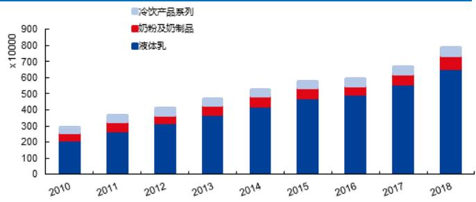
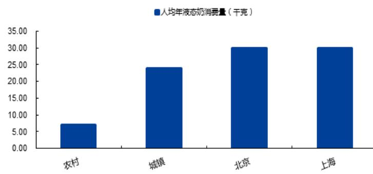
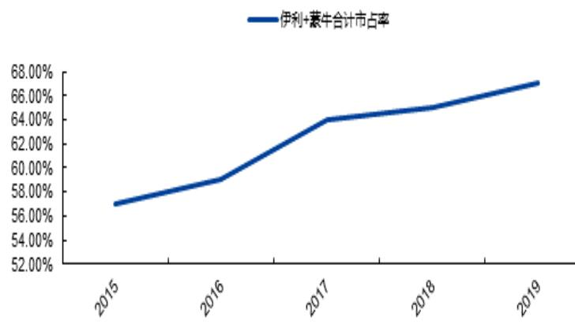
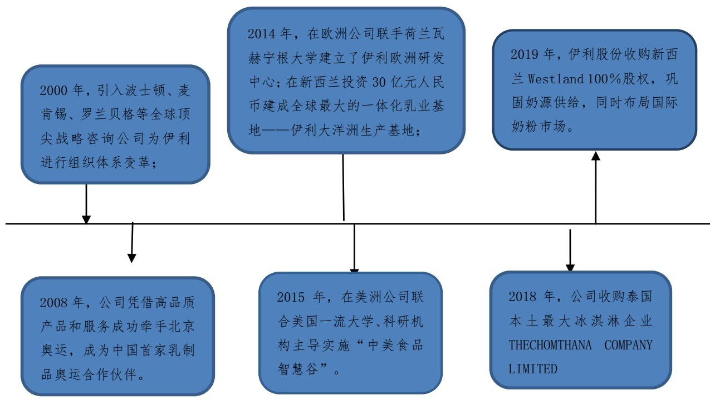

2020年03月18日

# 伊利股份（600887.SH）

# 乳制品龙头国际赛道扬帆起航

# 投资要点

优质白马长期受益于行业规模增长。2008-2018年十年间，公司营业收入年均复合增速 $1 3 . 9 \%$ ，近5年复合增速 $1 0 . 7 \%$ 。上市至今，公司累计现金分红205.43亿元，分红率达 $5 0 . 6 \%$ 。2018年度，公司每股派发红利0.7元（含税），分红率达 $6 6 . 1 \%$ ，是优质的白马龙头。目前中国乳制品行业存在人均消费量低于世界水平1/3，城乡间消费鸿沟及消费结构不均衡等现状，中国将成为世界乳制品消费最大的潜在市场。伊利作为行业龙头，也将受益于整个行业的增速发展。

乳制品双寡头竞争格局已形成，未来有望走出双赢格局。2015年伊利股份营业收入598.63亿元，蒙牛乳业营业收入 $4 9 0 . 2 6 $ 亿元，两家企业合并市占率超过 $50 \%$ ,国内乳制品行业伊利蒙牛双寡头格局已经确立。参考国内空调行业格力美的双寡头竞争格局，判断未来伊利蒙牛在经营战略上分化，有望走出双赢格局。伊利2019年首次提出“全球乳业第一、健康食品五强”新战略目标，为实现这一新目标，比标全球乳品排名第一的雀巢，伊利着眼于国际赛道，丰富产品结构，继续发挥扁平化、精细化渠道优势，判断未来会迎来营业收入持续增长，净利润率重新提升的黄金发展期。

原奶价格温和上涨，伊利迎来扩大份额良机。在2019 年奶牛存栏量下降，原奶产量下降及国际原奶供给偏紧情况下，我们判断 2020 年原奶供需偏紧趋势依旧持续，短期受新冠肺炎疫情影响，原奶需求量或将有所回落，但从长期来看，原奶需求稳步增长趋势不变。2020 年预计奶价在一季度增速或有所放缓，全年温和上涨趋势不变。复盘上一轮2013-2016年奶价周期，在奶价上涨背景下，伊利提过提价、降低销售费用等，毛利率受短期影响之后迅速提升，2016年达到 $3 7 . 9 4 \%$ ,市值中位线提升至1500 亿元。此轮奶价上涨周期，伊利有望继续凭借强大的品牌、渠道和原奶掌控力，持续抢夺份额和提升产品结构，实现量价齐升，不断提升市场占比。

传统优势领域稳定增长，看好公司“双平台”、“双影响力”优势。预计伊利短期依旧会在传统优势领域液态乳市场实现稳定增长，同时看好公司产品化平台（比标国际乳企，积极拓展奶粉奶酪、健康饮品等新领域）、国际化平台（实现资源、市场、研究国际化）、渠道影响力（继续秉承公司扁平化、精细化渠道建设）、和品牌影响力（目标世界乳企龙头）优势，伊利股份会在国际赛道扬帆起航。

投资建议：我们预测公司2019-2021年营业收入为896亿元/1013亿元/1139亿元，同比分别增长 $1 3 . 5 \%$ , $1 3 . 0 \%$ 与 $1 2 . 5 \%$ ，同期归母净利润71亿元/75亿元/84亿元，同比分别增长 $1 0 . 2 \%$ $5 . 2 \%$ 与 $1 3 . 0 \%$ ，EPS分别为1.16、1.22、1.38元。参考行业可比公司20 年PE均值为25X，考虑行业龙头估值溢价，给予公司20年PE30X估值，首次覆盖，给予公司“买入-A”投资评级。

风险提示：食品安全问题；行业竞争加剧风险；市场波动风险；成本超预期上升；  
行业需求超预期下滑；海外业务进展不及预期。

公司研究●证券研究报告

# 深度分析

食品饮料|乳制品Ⅲ投资评级 买入-A(首次)股价(2020-03-17) 27.78元

<table><tr><td>交易数据</td><td></td></tr><tr><td>总市值（百万元）</td><td>169,357.40</td></tr><tr><td>流通市值（百万元）</td><td>164,252.91</td></tr><tr><td>总股本（百万股）</td><td>6,096.38</td></tr><tr><td>流通股本（百万股）</td><td>5,912.63</td></tr><tr><td>12个月价格区间</td><td>26.70/34.66元</td></tr></table>

  
一年股价表现

<table><tr><td>升幅%</td><td>1M</td><td>3M</td><td>12M</td></tr><tr><td>相对收益</td><td>0.37</td><td>-1.74</td><td>15.0</td></tr><tr><td>绝对收益</td><td>-6.46</td><td>-9.78</td><td>6.99</td></tr></table>

资料来源：贝格数据

分析师 陈振志SAC执业证书编号：S0910519110001chenzhenzhi@huajinsc.cn021-20377051报告联系人 周蓉zhourong@huajinsc.cn

# 相关报告

伊利股份：收入延续高增长，市占率稳步提 升2019-06-14 伊利股份：线上线下零售持续增长，产品升 级推动业绩稳步提升2018-06-15

财务数据与估值  

<table><tr><td>会计年度</td><td>2017A</td><td>2018A</td><td>2019E</td><td>2020E</td><td>2021E</td></tr><tr><td>营业收入(百万元)</td><td>67,547</td><td>78,976</td><td>89,642</td><td>101,308</td><td>113,948</td></tr><tr><td>YoY(%)</td><td>12.0</td><td>16.9</td><td>13.5</td><td>13.0</td><td>12.5</td></tr><tr><td>净利润(百万元)</td><td>6,001</td><td>6,440</td><td>7,095</td><td>7,462</td><td>8,434</td></tr><tr><td>YoY(%)</td><td>6.0</td><td>7.3</td><td>10.2</td><td>5.2</td><td>13.0</td></tr><tr><td>毛利率(%)</td><td>37.3</td><td>37.8</td><td>37.8</td><td>37.9</td><td>38.0</td></tr><tr><td>EPS(摊薄/元)</td><td>0.98</td><td>1.06</td><td>1.16</td><td>1.22</td><td>1.38</td></tr><tr><td>ROE(%)</td><td>23.8</td><td>23.0</td><td>23.0</td><td>21.6</td><td>21.6</td></tr><tr><td>P/E(倍)</td><td>30.1</td><td>28.0</td><td>25.4</td><td>24.2</td><td>21.4</td></tr><tr><td>P/B(倍)</td><td>7.2</td><td>6.5</td><td>5.9</td><td>5.2</td><td>4.6</td></tr><tr><td>净利率(%)</td><td>8.9</td><td>8.2</td><td>7.9</td><td>7.4</td><td>7.4</td></tr></table>

数据来源：贝格数据华金证券研究所

# 内容目录

# 一、优质白马股长期受益于行业规模增长..

# 、乳制品双寡头竞争格局已形成，未来有望走出双赢格局..

# 三）对乳制品行业判断：伊利蒙牛双寡头格局形成经营战略将出现分化. .12

# 1、乳制品行业双寡头竞争格局确立两者处于长期竞争状态.. .12

# 、原奶价格温和上涨伊利迎来扩大份额良机... .18

# 、传统优势领域稳定增长，看好公司“双平台”、“双影响力”优势. .21

# （一）传统优势领域稳定增长.. ..21

# 五、盈利预测… ..27

# 六、风险提示… ..28

# 图表目录

图1：伊利股份市值变动(亿元) … …….6图2：公司分产品主营收入（亿元） .图3：公司分产品主营收入结构占比.. ….7图4：现金分红总额及股利支付率（亿元） 7图5：伊利股份营业总收入及增速（亿元） … ….图6：主要国家人均牛奶消费量….  
图7：国内城乡人均液态奶消费量 … 8图8：中国、亚洲及美国乳制品消费结构对……8图9：2014-2018年中国乳制品产量及增速. ……9图10：中国空调行业产量及增速. 10图11：格力&美的市场份额统计 $( \% )$ …1图12：2018年美的除空调外家电产品市占率. 11图 13：格力电器净利率水平自 2011 年以来处于上升通道……12图14：美的集团净利率水平自2011 年以来改善较为显著. ……图15：伊利、蒙牛、光明业绩发展历史（亿元） … … …. 12图16：伊利 $^ +$ 蒙牛市占率. …  
图17：伊利&蒙牛营业收入历史对比. ………………… . 13图18：伊利&蒙牛2008-2018年销售费用（亿元）类比. ……………  
图19：伊利常温奶 2015-2019 年市场份额统计. ………………………… 15图20：伊利低温奶2015-2019年市场份额统计.. ……………………………………… …15图21：伊利直控村级网点（万个）. 16图22：伊利产品展示. …………………………………………………… …. 17图 23：蒙牛规模化奶源占比势……18图 24：国内生鲜乳主产平均价走…18图 25：中国奶牛存栏量（万头）……19图26：中国牛奶产量（万吨）19图27：国内原奶供应占比…. … 1 9图 28：新西兰：恒天然原奶价格走势…… 19图29：2008-2018国内生鲜乳主产区平均价&伊利销售费用率走势... ………… ….20图30：2008-2018国内生鲜乳主产区平均价&伊利销售毛利率走势. ……  
图31：伊利总市值变化走势. ……… ….1图32：伊利主营产品收入增长趋势（亿元）  
图33：伊利婴幼儿奶粉市占率. …… ….3图34：中国奶酪供需情况（万吨）… 23图35：中国奶酪进口量占消费量比重 $( \%$ … ….3图 36：国内外人均奶酪消费量对比24图37：伊利国际化进程回顾.. ……… ….25图38：伊利大洋洲生产基地26

表1：全球乳企排名… ……表2：伊利&蒙牛产品类比. .13表3：伊利&蒙牛赞助冠名部分综艺列表. 14表4：2010-2019伊利和蒙牛世界乳企排名变化.. .15

表5：伊利产品品类及主要品牌， .17  
表6：伊利产品品类及主要品牌. .24  
表7：伊利股份分业务营业收入预测（百万元） .28  
表8：同行业部分公司相对估值比较. .28

# 优质白马股长期受益于行业规模增长

# 一）高增长高分红的优质白马股

内蒙古伊利实业集团股份有限公司1993年通过改制发起成立，是中国乃至亚洲规模最大、产品线最全的乳制品企业。在荷兰合作银行发布的2019 年“全球乳业20 强”榜单中，伊利以2019 年度销售额 112亿美元排名第8 位。

表1：全球乳企排名  

<table><tr><td>排名</td><td>公司</td><td>总部所在地 2019 年销售额（美元）</td></tr><tr><td>1</td><td>雀巢(Nestle)</td><td>瑞士 243亿</td></tr><tr><td>2</td><td>兰特黎斯(Lactalis)</td><td>法国 208亿</td></tr><tr><td>3</td><td>达能(Danone)</td><td>法国 180亿</td></tr><tr><td>4</td><td>恒天然(Fonterra)</td><td>新西兰 143亿</td></tr><tr><td>5</td><td>菲仕兰 (FrieslandCampina)</td><td>荷兰 138亿</td></tr><tr><td>6</td><td>美国奶农(Dairy Farmers of America)</td><td>美国 136亿</td></tr><tr><td>7</td><td>爱氏晨曦(Arla Foods)</td><td>丹麦/瑞典 124亿</td></tr><tr><td>8</td><td>伊利(Yili)</td><td>中国 112亿</td></tr><tr><td>9</td><td>萨普托(Saputo)</td><td>加拿大 110亿</td></tr><tr><td>10</td><td>蒙牛(Mengniu)</td><td>中国 103亿</td></tr></table>

资料来源：荷兰合作银行，华金证券研究所

1996 年 3 月 12 日，伊利股份正式在上交所挂牌上市，成为乳制品企业上市第一股。公司上市以来，公司的业务规模、市值及盈利能力迅速攀升。

  
图1：伊利股份市值变动（亿元）

资料来源：Wind，华金证券研究所

2008-2018 年十年间，公司收入增长整体保持较快节奏，年均复合增速 $1 3 . 9 \%$ ，近5年的复合增速 $1 0 . 7 \%$ 。据年报显示，伊利2018 年实现营业总收入789.76 亿元，同比增长 $1 6 . 9 2 \%$ 营收较上年实现百亿级增长(增长高达 115 亿元)，创历年来最大增幅；净利润 64.52 亿元，扣非净利润同比增长 $1 0 . 3 2 \%$ ，再创亚洲乳业新高，其中加权平均净资产收益率 $2 4 . 3 3 \%$ ，持续稳居全球乳业第一。目前公司主要产品包括液体乳、奶粉及奶制品以及冷饮。据年报显示，2018 年，液体乳总收入 656.79 亿元，5 年复合增速 $1 2 . 0 9 \%$ ；奶粉及奶制品总收入80.45亿元，5年复合增速 $7 . 8 6 \%$ ；冷饮收入49.97亿元，5年复合增速 $3 . 3 3 \%$ 。在“全球织网”战略下，伊利已经实现在亚洲、欧洲、美洲、大洋洲等乳业发达地区的产业布局。

  
图2：公司分产品主营收入（亿元）  
资料来源：Wind，华金证券研究所

  
图3：公司分产品主营收入结构占比  
资料来源：Wind，华金证券研究所

自上市至今，通过多次分红回馈股东，是优质的白马龙头。公司直接融资金额累计 169.14亿元，同期，累计实现净利润 406.22 亿元。在已实施分红 19 次中，公司累计现金分红 205.43亿元，分红率达到 $5 0 . 6 \%$ 。2018 年度，公司每股派发红利0.7元（含税），分红率达到 $6 6 . 1 \%$ 。

  
图4：现金分红总额及股利支付率（亿元）  
资料来源：Wind，华金证券研究所

  
图5：伊利股份营业总收入及增速（亿元）  
资料来源：Wind，华金证券研究所

# （二）国内乳制品行业存在增长空间伊利作为龙头长期受益

# 1、中国人均牛奶消费量约世界平均水平1/3

目前中国人均牛奶消费量约32.66 千克，世界人均牛奶消费量约90 千克，中国约占其1/3，饮食习惯较为类似的日本，其人均牛奶消费量约72.66 千克，中国不及其1/2。从这些数据来看，我国乳制品消费的增长空间仍然存在。

# 2、乳制品消费城乡间存鸿沟

上海北京一线城市人均液态奶消费量约 30 千克，城镇居民24 千克左右，农村居民仅有7千克左右。同比饮食习惯类似的日本、韩国，日本韩国液态奶人均消费量为 30KG 左右，中国一线城市与发达国家接近，但农村市场还有3倍以上提升空间。

2018年我国城镇化率已达到 $5 9 . 5 8 \%$ ，在国家提出“乡村振兴”的背景下，农村居民消费环境和消费质量也得到不断改善，而仍有高达近 $41 \%$ 的农村居民作为一个庞大消费群体，未来的消费潜力必然不可忽视。2018 年农村居民人均消费支出同比增速达 $1 0 . 7 \%$ ，高于城镇居民3.9个百分点，这将有效带动三四线城市及农村市场的乳品消费增长。2018 年，三四线城市及农村市场液态类乳品零售额同比增长 $8 . 8 \%$ ，明显高于一二线城市同类产品零售额增速，成为拉动乳品消费规模增长的新引擎。

  
图6：主要国家人均牛奶消费量  
资料来源：中国产业信息网，华金证券研究所

  
图7：国内城乡人均液态奶消费量

资料来源：中国产业信息网，华金证券研究所

# 3、国内乳制品消费结构相对单一

中国的乳制品消费结构与美国、亚洲地区的结构相差比较大，中国的乳制品消费主要以液态奶和奶粉为主，干酪消费量非常少。我国乳制品消费液态奶占比 $5 5 \%$ ，干酪占比 $12 \%$ ，亚洲其他国家及中东液态奶占比 $42 \%$ ，干酪占比 $46 \%$ ，美国液态奶占比 $2 5 \%$ 、干酪占比 $67 \%$ ，未来我国固态乳制品消费量仍有提升空间。

  
图8：中国、亚洲及美国乳制品消费结构对比

资料来源：尼尔森、前瞻产业研究院，华金证券研究所

未来几年乳制品行业市场会不断扩大并趋于成熟，中国将成为世界上乳制品消费最大的潜在市场。同时也将刺激中国乳制品产量进一步提高。从近几年乳制品产量情况来看，除2014 年产量呈负增长之外，其余年份都呈正增长态势。其中，2017 年我国乳制品产量达2935 万吨，

2018 达到3077.9 万吨，预计未来五年年均复合增长率约为 $5 \%$ 左右。伊利作为中国乳制品行业的龙头，也将受益于整个行业的增速发展，同时公司将充分发挥行业龙头的比较优势，不断增强竞争力，提升在行业的市场份额，积极拓展海外市场，伊利未来会有很大的增长空间。

  
图9：2014-2018年中国乳制品产量及增速  
资料来源：国家统计局，智研咨询，华金证券研究所

# 二、乳制品双寡头竞争格局已形成，未来有望走出双赢格局

# （一）双寡头竞争格局的定义

“双寡头垄断竞争格局”（简称“双寡头竞争格局”)，指的是同一个市场上存在两个各自拥有独立生产经营能力的企业并相互竞争的模式。一般而言，两个企业合并市场份额在 $50 \%$ 以上，第二家企业市场份额在 $20 \%$ 以上，才能称之为“双寡头”。寡头垄断的市场存在明显的进入障碍。这是少数企业能够占据绝大部分市场份额的必要条件，也可以说是寡头垄断市场结构存在的原因。最重要也是最基本的因素是这些行业存在较明显的规模经济性。如果这些行业中要容纳大量企业，则每家企业都将因生产规模过小而造成很高的平均成本。规模经济性使得大规模生产占有强大的优势，大公司不断壮大，小公司无法生存，最终形成少数企业激烈竞争的局面。对试图进入这些行业的企业来说，除非一开始就能形成较大的生产规模，并能占据比较可观的市场份额，否则过高的平均成本将使其无法与原有的企业相匹敌。

# （二）参考国内空调行业2011-2014 年双寡头竞争格局，格力美的再次迎来快速发展期

# 1、格力美的双寡头竞争格局的确立

在经历需求的快速增张和行业规模的扩大之后，目前中国空调行业已经进入了稳步增长时期。根据国家统计局的数据，2010-2018年期间中国空调行业产量的复合增速为8%，相较于1990-2000 年期间56%的复合增速和2000-2010年期间20%的复合增速均有所放缓。

  
图10：中国空调行业产量及增速

资料来源：国家统计局，华金证券研究所

2010 年以前，中国空调行业还是有100 多个品牌激烈竞争的市场，疯狂打价格战让所有参与者都只能获得薄如纸片的利润，激烈的竞争也把竞争力弱的企业纷纷淘汰掉，从而进入空调行业快速增长时期。此时，龙头格力和美的均采取规模优先的发展策略。为了提升市场份额、实现收入体量的快速增长，公司投入大量的资源和费用加强品牌在消费者群体中的认知度，进行经销商网络的扩张并增强公司对渠道的掌控力，实现市场份额的提升，实现快于行业整体增速的快速增长。2010 年以后，格力和美的两家公司市场占有率超过 $5 5 \%$ ，形成双寡头竞争格局。目前来看，两家公司会长期受益于高度集中的竞争格局。在这种竞争格局中，双方都会保持向上的斗志不断发展。

  
图11：格力&美的市场份额统计 $( \% )$   
资料来源：产业在线，华金证券研究所

# 2、2011年格力美的经营战略变化差异化竞争开启

在行业竞争过程中，价格竞争策略和激进的费用策略在行业集中度不高的时候效果显著，但当市场形成双寡头格局后会逐步出现边际成本高于边际收益的情况。

1）在整个市场的集中度仍然相对较低的情况下，份额靠前的厂商通过发起价格战和费用战的情况下可以将份额靠后的竞争低手排挤出局，这个时期企业的激进价格策略和费用策略往往会给市场格局带来比较大的影响，效果比较显著。

2)伴随着市场集中度的提升，竞争企业数量的减少，双寡头发起的价格战和费用战已经很难对主要竞争对手的市场份额产生影响，这个时期没有核心竞争力的对手基本已经出局，剩下的多数为具有较强竞争力的企业，常规的价格战和费用战的效果已经大大减弱，边际成本高于边际收益的情况可能出现。

在此背景下，2011 年前后，格力美的在经营战略上发生改变。试图寻找能够使收入增速再次进入快车道的新路径。

# （1）产品结构差异化竞争

首先，格力聚焦空调业务，强调其在空调专业领域的研发优势，严格把控对产品的质量要求，从而使得格力的产品能力非常强大。格力拥有行业最完整的产业链，空调关键零部件全部自主生产，能够做到对所有关键环节极强的控制力，并且产品品牌也已经牢牢占据消费者心智。

同时，美的集团在2011 年明确由规模导向发展模式转向，这标志着美的与聚焦空调业务的格力在战略层面上步入分叉路口。美的集团围绕“消费者为核心”的宗旨，督促美的产品不断升级。同时美的围绕“业务战略、互联网战略、全球化战略”三条战略主线，由单一产品的制造商转向提供系统集成服务方案商，从而实现商业模式转变和创新。美的集团的产品除了空调、冰箱、洗衣机这种大单品外，还有更多的小家电产品。根据公司公告，2018 年美的集团在电饭煲、电磁炉、电压力锅和电水壶领域的市场份额分别为 $43 \%$ 、 $53 \%$ $44 \%$ 和 $3 7 \%$ ，稳居行业第一的位置；另外在洗衣机和微波炉领域的市场份额分别为 $26 \%$ 和 $43 \%$ ，位居行业第二；在热水器和电冰箱领域的市场份额分别为 $16 \%$ 和 $1 1 \%$ ，位居行业第三。

  
图12：2018 年美的除空调外家电产品市占率  
资料来源：Wind，华金证券研究所

# （2）渠道模式差异化竞争

由于格力对空调整个产业链的完全把控，格力空调通过自建渠道的方式和经销商形成了牢固的利益合作关系，对经销商的控制能力非常强大，这是格力现金流的利器，也是格力竞争力的王牌。这种销售模式对于空调的销售场景来说，被当做教科书式的存在，很多企业模仿，但无人能超越。

而对于小家电的销售，就是让消费者尽可能方便地购买到。在此情况下，美的集团就必须将渠道做深做细，深入到市场的毛细血管中，这样才能满足各种家电不同的消费场景。这种深入细耕的渠道方式，决定了美的不可能对渠道商有强大的管理能力，所以美的也会出现不同经销商之间压价竞争的局面。但是，这种深入的渠道模式却保证了美的推出的所有产品都能迅速铺满市场，从而保证了美的在小家电市场的强大竞争力。这种深入到市场毛细血孔的渠道能力，也是格力电器不能比的。

# 3、双寡头格局形成后经营战略差异化 格力美的迎来盈利改善

双寡头战略上的分歧给双方都带来了可观的盈利能力改善。由于美的集团 2011 年之后不再刻意追求收入规模的快速扩大和空调业务的绝对领先市场地位，格力电器和美的集团的盈利能力均出现较为明显的改善。格力电器的净利率水平从2011年的 $6 . 3 7 \%$ 上升至2018年的$1 3 . 3 1 \%$ ；美的集团的净利率水平则从2011年的 $4 . 9 6 \%$ 回升至 2018 年的 $8 . 3 4 \%$ o

  
图13：格力电器净利率水平自 2011年以来处于上升通道  
资料来源：Wind，华金证券研究所

  
图14：美的集团净利率水平自 2011年以来改善较为显著  
资料来源：Wind，华金证券研究所

# （三）对乳制品行业判断：伊利蒙牛双寡头格局形成经营战略将出现分化

# 1、乳制品行业双寡头竞争格局确立 两者处于长期竞争状态

# （1）伊利蒙牛双寡头竞争格局的确立

回顾中国乳制品行业发展，2005 年之后伊利、蒙牛总收入双双超过光明，并逐步扩大领先优势，自2015 年，伊利股份收入 598.63 亿元，蒙牛乳业收入 490.26 亿元，光明乳业收入193.73亿元，伊利蒙牛两家企业合并市占率超过 $50 \%$ ，中国乳制品行业双寡头竞争格局已经逐步形成。

  
图15：伊利、蒙牛、光明业绩发展历史（亿元）  
资料来源：Wind，华金证券研究所

  
图16：伊利+蒙牛市占率  
资料来源：中国产业信息网，华金证券研究所

# （2）伊利蒙牛处于长期竞争状态

一直以来伊利和蒙牛之间两者的行业地位之争十分胶着。从收入规模的角度看，2006 年以前伊利高于蒙牛，随后在 2007 年蒙牛反超伊利，进入 2011 年后伊利则重新占据了优势地位，

实现反超。

1)2007年蒙牛销售收入反超伊利：蒙牛期间成功的营销策略（以与国家和地方电视台合作的推广活动为代表)以及产品结构的创新(改良早餐奶口味，率先推出高档白奶品牌特仑苏等)，使得其 2007年销售收入首次超过伊利。

2)2011 年伊利销售收入反超蒙牛：2009-2011 年期间乳制品行业经历三聚氰胺事件的冲击，蒙牛则陆续经历大股东变动以及创始人牛根生先生的离职，经营层面上市以来一直相对稳健的伊利股份的收入则持续高增长，在2011年反超蒙牛。

  
图17：伊利&蒙牛营业收入历史对比  
资料来源：Wind，华金证券研究所

2008-2018十年间，伊利和蒙牛业务高度重合，从产品结构、渠道方面、广告营销等方面一直处于胶着竞争状态。

1)从产品角度看，在当前主流的液态乳产品当中，伊利和蒙牛均存在较为直接的竞争关系。伴随着中国乳业品类的不断创新，乳制品从最初的较为单一的乳饮料、基础白奶和低温酸奶产品开始，陆续出现了高端乳饮料、高端白奶、常温酸奶、儿童奶和乳酸菌饮料等产品，而且这些产品的渠道结构较为类似。在主流的液态乳产品当中，伊利和蒙牛都有自己旗下的品牌，具有较为直接的竞争关系。例如安慕希 vs 纯甄、特仑苏 vs 金典，蒙牛和伊利的存量业务重合度非常高，伊利的重要利润产品安慕希与蒙牛纯甄形成直接竞争，而蒙牛的重要利润产品特仑苏则与伊利金典形成直接竞争。

表2：伊利&蒙牛产品类比  

<table><tr><td>品类</td><td>伊利</td><td>蒙牛</td></tr><tr><td>常溫酸奶</td><td>安慕希</td><td>VS. 纯甄</td></tr><tr><td>高端白奶</td><td>金典</td><td>VS. 特仑苏</td></tr><tr><td>基础白奶</td><td>伊利纯牛奶</td><td>VS. 蒙牛纯牛奶</td></tr><tr><td>低温酸奶</td><td>畅轻</td><td>VS. 冠益乳</td></tr><tr><td>高端乳饮料</td><td>味可滋</td><td>VS. 奶特</td></tr><tr><td>乳饮料</td><td>优酸乳</td><td>VS. 酸酸乳</td></tr><tr><td>乳酸菌饮料</td><td>每益添</td><td>VS. 优益C</td></tr><tr><td>儿童奶</td><td>QQ星</td><td>VS. 未来星</td></tr><tr><td>零乳糖牛奶</td><td>舒化奶</td><td>VS. 新养道</td></tr></table>

资料来源：公司公告，华金证券研究所

2）从渠道角度看，伊利和蒙牛在这十年间分别建立了各自特色的渠道模式。伊利始终坚持扁平化、精细化的渠道管理，采取深度分销模式。在这种模式下，伊利自配冷库和配送车辆，自派销售人员直控终端，以公司为主导整合不同层级城市的资源进行下单、货物供应和营销。这种模式前期投入大、见效慢，但建成后伊利便拥有了比其他竞争者更高的渠道和终端控制力，同时对于终端消费者的需求更加敏感。而蒙牛在第一和第二阶段主要采用三级分销的大经销商制，通过让利和入股的方式吸引了一大批有实力的经销商。以最快的速度在全国铺货，帮助蒙牛迅速做大。第三阶段蒙牛开始对渠道进行扁平化改革，2013 年起向以经销商为主体、结合销售公司和CBU（核心业务单元）的销售运营模式转型。

3）从广告营销角度看，两家企业均在不断增加在销售费用上的绝对投入。2003 年蒙牛成为神舟五号升空的唯一牛奶赞助商，借机打出“中国航天员专用奶”的口号，使得当年的营收增速达到史上最高的 $144 \%$ ；2005年，蒙牛赞助“超级女声”这一现象级节目，再度提高了企业知名度，并推动蒙牛酸酸乳这一大单品的诞生。伊利分别在 2008 年和 2010 年牵手北京奥运会和上海世博会，两次政府营销大大提高了伊利的品牌影响力和国民化程度。之后伊利安慕希、金典和QQ星分别持续赞助了《奔跑吧兄弟》、《我是歌手》和《爸爸去哪儿》等当下最火的现象级综艺，大大提升和巩固了拳头产品的市场地位。

  
图18：伊利&蒙牛2008-2018年销售费用（亿元）类比  
资料来源：Wind，华金证券研究所

表3：伊利&蒙牛赞助冠名部分综艺列表  

<table><tr><td colspan="3">伊利</td><td colspan="3">蒙牛</td></tr><tr><td>产品</td><td>赞助节目</td><td>年份</td><td>产品</td><td>赞助节目</td><td>年份</td></tr><tr><td>QQ星</td><td>爸爸去哪儿3</td><td>2015</td><td>蒙牛</td><td>十二道锋味2</td><td>2015</td></tr><tr><td>谷粒多</td><td>奇说脑</td><td>2015</td><td rowspan="2">纯甄</td><td>全速限挑战3</td><td>2015</td></tr><tr><td rowspan="3">金典</td><td></td><td></td><td rowspan="3"></td><td></td></tr><tr><td>歌手</td><td>2018</td><td>花儿与少年2</td><td>2015</td></tr><tr><td>亲爱的客栈2</td><td>2018</td><td>青春有你</td><td>2019</td></tr><tr><td rowspan="2">安慕希</td><td>奔跑吧兄弟</td><td>2015/2018</td><td>真果粒</td><td>偶像练习生</td><td>2019</td></tr><tr><td>锋味2018</td><td>2018</td><td>特仑苏</td><td>声入人心</td><td>2018</td></tr><tr><td>金领冠</td><td>了不起的孩子3</td><td>2018</td><td>公司品牌</td><td>FIFA世界杯全球官方 赞助商</td><td>2018</td></tr><tr><td>畅轻</td><td>我是大侦探</td><td>2018</td><td></td><td></td><td></td></tr><tr><td>畅意</td><td>高能少年团</td><td>2019</td><td></td><td></td><td></td></tr><tr><td>公司品 牌</td><td>2022 冬奥会和冬残 奧会官方唯一乳制 品合作伙伴</td><td>2022</td><td></td><td></td><td></td></tr></table>

资料来源：公开资料整理，华金证券研究所

# 2、伊利蒙牛在优势领域精耕细作 预计未来经营战略分化

（1）伊利蒙牛均提出“千亿计划”，迎来双寡头黄金竞争期

伊利和蒙牛均制定了2020 年的千亿收入目标，如果这一目标顺利实现，意味着伊利和蒙牛的收入规模和在全球乳企当中的排名仍然会以较快的速度上升。

1）伊利：计划到 2020 年达到全球乳业 5 强，销售收入超过 1000 亿元。根据 Rabobank 的统计，伊利 2019 年排名全球乳企第 8 名。如果伊利要在国际乳企排名进入前 5，意味着到 2020 年伊利的乳业收入要超过包括菲仕兰(FrieslandCampina)、美国奶农(Dairy Farmersof America)和爱氏晨曦(Arla Foods)在内的全球领先乳制品企业。2019 年伊利继续提出一个新目标：2030年实现“全球乳业第一、健康食品五强”。

蒙牛：计划到 2020 年销售收入超过 1000 亿元，公司市值超过1000 亿元。根据Rabobank 的统计，蒙牛已经连续 2 年在全球乳企中排名第 10。在过去 5 年排名一直在稳步上升。

表4：2010-2019伊利和蒙牛世界乳企排名变化  

<table><tr><td>年份</td><td>蒙牛排名</td><td>伊利排名</td></tr><tr><td>2010</td><td>15</td><td>16</td></tr><tr><td>2011</td><td>18</td><td>19</td></tr><tr><td>2012</td><td>16</td><td>15</td></tr><tr><td>2013</td><td>15</td><td>12</td></tr><tr><td>2014</td><td>14</td><td>10</td></tr><tr><td>2015</td><td>11</td><td>10</td></tr><tr><td>2016</td><td>11</td><td>8</td></tr><tr><td>2017</td><td>10</td><td>8</td></tr><tr><td>2018</td><td>10</td><td>9</td></tr><tr><td>2019</td><td>10</td><td>8</td></tr></table>

资料来源：荷兰合作银行，华金证券研究所

# （2）预计伊利蒙牛未来经营战略分化盈利能力有望实现双赢

1）从传统产品优势角度看，伊利在常温奶市场具有领先优势，而蒙牛则更擅长低温奶。2018年伊利在常温奶市场的份额为 $3 6 . 8 \%$ ，比蒙牛高约9 个百分点，蒙牛常温奶市场份额近5 年来基本保持在 $28 \%$ 左右；而2018年蒙牛在低温奶市场的份额为 $2 8 . 2 \%$ ，且近5年来稳定保持在这一水平附近，比伊利 18 年低温奶市场份额高约 12 个百分点。由于当前常温乳市场伊利的市场份额高于蒙牛，因此伊利志在拉大与蒙牛的份额差距，扩大在常温奶市场的领先优势；而同时蒙牛的目标则是着力缩小与伊利的常温奶市场份额差距，寻找机会反超伊利。

  
图19：伊利常温奶2015-2019年市场份额统计  
资料来源：公司公告，华金证券研究所

  
图20：伊利低温奶2015-2019年市场份额统计  
资料来源：公司公告，华金证券研究所

2）从渠道角度看，各自发挥优势，向千亿目标迈进，实现双赢

渠道上，伊利的经销模式实行扁平化运营，经销商体量较小但数量众多，该模式有利于渠道深耕和下沉。不同于位于城市的大商，乡镇一级的中小经销商更加熟悉当地终端，渠道开拓意愿和积极性也相对更高。15 年起，伊利开始把区域划分的更细，对经销商进行精细化管理，进一步加深渗透。蒙牛早前以大经销商模式为主，自16 年开始分拆经销商，实行扁平化管理，逐步向伊利靠拢。

渠道力是伊利在众多乳制品企业当中最主要的比较优势之一。根据公司公告，伊利在全国范围内拥有超过500万个终端网点，2018 年末公司拥有16893 名销售人员，占员工总数的$30 \%$ 。伊利渠道的特点是网点数量多，覆盖范围广，扁平化程度高。

伊利的渠道下沉起始于2007年，伊利借助商务部“万村千乡”活动进入“农家店”等乡镇零售终端。由商务部牵头的“万村千乡”工程起始于2005年，截止2011 年已经累计完成改造和新建农家店 60万个，期间农家店的零售业态在县城、乡镇和行政村的覆盖率均有明显的提升。通过“万村千乡”工程，伊利与三四线城市和乡村市场的渠道商和消费者初步建立了联系。

同时，伊利 2012 年开始实施渠道精耕，对三四线城市和乡镇市场的覆盖力度加大，产品的市场渗透能力逐步提升。根据公司公告，截至2019 年6 月，公司常温液态类乳品的市场渗透率为 $8 3 . 9 \%$ ，比上年同期提升2.7个百分点，其在三、四线城市的渗透率为 $8 6 . 2 \%$ ，比上年同期提升2.3个百分点。同时，伴随着海外市场的拓展步伐，公司渠道渗透能力的优势继续得以夯实。根据公司公告，伊利的直控村级网点从 2015 年11 万个快速上升至2018年 60.8万个，3年间网点数量复合增速为 $7 7 \%$ 。

而蒙牛在第一和第二阶段主要采用三级分销的大经销商制，通过让利和入股的方式吸引了一大批有实力的经销商。以最快的速度在全国铺货，帮助蒙牛迅速做大。第三阶段蒙牛开始对渠道进行扁平化改革，2013 年起向以经销商为主体、结合销售公司和CBU（核心业务单元）的销售运营模式转型。

  
图21：伊利直控村级网点（万个）  
资料来源：公司公告，华金证券研究所

2）从产品结构及产业链角度看，伊利 2019 年9月，首次提出“全球乳业第一、健康食品五强”新战略目标，为实现这一新目标，比标全球乳品排名第一的雀巢，伊利试图更加充分地发挥其通过常温奶产品建立的庞大渠道网络的比较优势，丰富产品品类，不仅在液态奶、酸奶、奶粉的传统业务加速发展，同时在奶酪、健康饮品等新品市场也加大投入和发展。除了渠道优势之外，积极调整产品结构，向全球优秀的乳品企业靠拢，也是伊利未来的新优势所在。

表5：伊利产品品类及主要品牌  

<table><tr><td>伊利产品产品品类</td><td></td><td>主要产品品牌</td></tr><tr><td rowspan="3">常温奶</td><td>纯奶</td><td>金典、伊利纯牛奶，味可滋、谷粒多、舒化奶、核桃乳、学生奶 等</td></tr><tr><td>常溫酸奶</td><td>安慕希、QQ星儿童风味酸奶、</td></tr><tr><td>常温乳饮料 低温酸奶</td><td>优酸乳、畅意100%，QQ星饮品 畅轻、益消、大果粒等</td></tr><tr><td>低温奶</td><td>鲜奶 低温乳饮料每益添</td><td>金典鲜牛奶、百格特、牧场清晨鲜牛奶、伊利鲜牛奶 金领冠、伊利奶茶粉、伊利欣活配方奶粉、托菲尔、伊利婴幼儿</td></tr><tr><td>奶粉</td><td></td><td>配方奶粉、培然、伊利牛奶片</td></tr><tr><td>冷饮 奶酪</td><td></td><td>巧乐兹、伊利火炬、伊利牧场、冰工厂、妙趣、甄稀等</td></tr><tr><td>健康饮品</td><td></td><td>伊利儿童奶酪棒、妙芝</td></tr><tr><td></td><td></td><td>焕醒源、伊然、Inikin、圣瑞思</td></tr></table>

资料来源：公司官网，华金证券研究所

  
图22：伊利产品展示  
资料来源：华金证券研究所

蒙牛则更加关注产业链的整合，比较优势在于对产业链上游的掌控力度。为了保证奶源的品质和可控，蒙牛着力提升奶源的规模化。根据公司公告，蒙牛规模化的奶源比例从 2010 年的 $70 \%$ 上升至 2016年的 $100 \%$ ，奶源实现并保持了全部规模化供给，避免分散式奶源给公司产品安全带来的潜在风险。

2017 年蒙牛完成对国内最大奶牛养殖企业现代牧业的股权收购，交易完成后持有现代牧业$6 0 . 7 7 \%$ 的股权。一方面，蒙牛通过控股现代牧业建立了更顺畅的上下游合作关系，打造更融合的行业生态体系。另一方面，蒙牛可以进一步确保高品质的奶源供应，助力发展低温业务，补充中高端产品线，巩固其在高端乳制品市场的领导地位。

同时为了充分低温产品的优势，蒙牛着力推进液态奶的产品升级，提升液态奶产品附加值和盈利能力。蒙牛在低温市场中的份额较高优势明显，同时低温产品也更有利于蒙牛发挥其在奶源布局方面的优势，因此蒙牛在低温方向接连推出新品，为公司带来新的增长动能。

  
图23：蒙牛规模化奶源占比趋势  
资料来源：公司公告，华金证券研究所

参考空调行业双寡头竞争格局后，由于各自经营战略转向，格力美的双双实现净利率的提升。我们判断，伊利和蒙牛在未来的经营战略上各自突出重点，伊利在乳制品行业双寡头竞争格局下，会迎来净利润率重新提升的黄金十年，为实现 2030 年新的战略目标打下坚实的基础。

# 三、原奶价格温和上涨 伊利迎来扩大份额良机

# （一）预计2020 年原奶价格温和上涨

近十年国内生鲜乳价格周期可以分为2009-2012，2013-2016，2015-至今三个周期。其中2013-2015 年奶价波动最大，该时期需求端稳，主因 13 年高温干旱气候严重影响单产，加之口蹄疫病影响奶牛产奶量，供给严重不足，驱动国内生鲜乳价格在 2014 年2 月步入历史最高位 4.27 元/kg。此时大包奶粉进口量大幅增长，国内国际奶价联动性增强；加之国内奶农养殖量盲目扩产，奶价在2014 年持续下跌至2016 年 8 月 3.39 元/kg 的阶段低位。15 年上游虽出现“倒奶宰牛”，散户逐渐退出，但是随着部分地区大牧场的投建，养殖集中度提高，奶牛数量减少有限，同时叠加大量低价进口大包粉冲击，导致 14-16 年去产能周期拉长。

  
图24：国内生鲜乳主产区平均价走势  
资料来源：农业部，华金证券研究所

在经历前几年下跌和低估波动后，2018年下半年开始，上游原奶价出现明显上升。奶价出现上涨，主要是上游原奶供给减少，而下游需求相对稳定。上游奶牛存栏量在 2015 年达到峰值，由于环保政策趋严，使得上游奶牛存栏在近两年出现去产能，整体存栏量下降。

  
图25：中国奶牛存栏量（万头）  
资料来源：中国奶业年鉴，华金证券研究所

  
图26：中国牛奶产量（万吨）  
资料来源：国家统计局，华金证券研究所

国际来看，中国的进口奶源占比多维持在 $14 \%$ 左右，国际奶价与国内联动。2019 年，七个主要乳制品出口国原奶产量在去产能的影响下供给收缩，增速下滑，新西兰、澳大利亚等甚至出现负增长，从而导致国际奶价的不断上涨，2019 年 12 月新西兰恒天然原奶价格攀升至 33.80欧元/千克，同比增长 $1 5 \%$ 。预计中短期国际市场原奶供应将依旧保持偏紧。

  
图27：国内原奶供应占比

资料来源：中国产业信息网，华金证券研究所

  
图28：新西兰：恒天然原奶价格走势  
资料来源：Wind，华金证券研究所

整体来看，奶生长周期为1.5-2 年，从此推测至2020 年原奶供需偏紧的趋势将依旧持续，由于短期受新冠肺炎疫情影响，原奶需求量短期或将有所回落，但从长期趋势来看，参见本报告第一部分对乳制品行业增长空间的判断，原奶的需求量稳步增长趋势不变，2020 年奶价在一季度增速或有所放缓，但预计全年温和上涨趋势不变。

# （二）原奶价格温和上涨背景下，伊利迎来发展良机

# 1、2013-2016 年奶价周期伊利表现

我们复盘2013-2016年奶价周期，伊利的表现：

上一轮奶价上行周期(2010-2013)：2010 年奶价从年初的2.66上行至年末的 3.1，同比提升 $1 5 \%$ ，伊利 13 年毛利率同比下降 $3 . 6 \%$ ，尽管同年伊利费用率同比下行，但仍使公司盈利受到削弱。2011-2012 年奶价温和上涨，公司通过提升产品结构、控制费用，转移成本上行压力，盈利水平得以强化。2013 年奶价暴涨，公司毛利率下降压力骤增，同年7月左右公司全面提价，同时降低销售费用，毛销差略有下降。

上一轮奶价下行周期（2014-2016)：2014 年生鲜乳价格开始下行，公司2013 年提价效应开始显现，企业毛利率迅速上升。2015-2016 年继续享受成本红利，盈利水平维持较高位，后期由于产能过剩，促销压力增加，公司利润率略有回落。

  
图29：2008-2018国内生鲜乳主产区平均价&伊利销售费用率走势

资料来源：Wind，华金证券研究所

  
图30：2008-2018国内生鲜乳主产区平均价&伊利销售毛利率走势  
资料来源：Wind，华金证券研究所

经过此轮奶价周期之后，伊利总市值的中轴区间从 1000 亿元提升到1500 亿元左右。

  
图31：伊利总市值变化走势  
资料来源：Wind，华金证券研究所

# 2、2020 年原奶价格温和上涨伊利有望再次走出强势格局

2020 年在原奶紧平衡、价格温和上涨背景下，伊利有望凭借强大的品牌、渠道和原奶掌控力，持续抢夺份额和提升产品结构，实现量价齐升，不断提升市场占比。

1）原奶压力下行业竞争有望趋缓，公司可以通过与大型牧场长期合作保证奶源，并通过提价与产品结构上移减轻成本影响。

2）参考上一轮奶价周期，公司也有提价的主动权，可以应对成本的快速上涨。公司盈利能力有望逆势保持平稳。

展望2020-2021 年原奶压力呈逐季减弱趋势，在奶价上升阶段，伊利作为行业龙头，对原奶供应商有相对的议价空间，同时由于自供奶源的原因，边际成本影响相对较小，即使在销售毛利率下降时，也可以通过调节销售费用保证相对稳定的盈利空间。作为行业龙头，公司还拥有主动提价权，当奶价下行阶段，公司可以享受提价红利，销售毛利率很快提升，同时抢占市场份额，迎来发展良机。

# 四、传统优势领域稳定增长，看好公司“双平台”、“双影响力”优势

# （一）传统优势领域稳定增长

伊利目前的主营产品包括液体乳、奶粉奶制品以及冷饮。其中，2008-2018 十年间，液体收入从144 亿元增长至657 亿元，奶粉及奶制品收入从 32 亿元增长至80 亿元。我们预计，未来3-5 年之内，伊利依旧会在传统优势领域液态乳市场扩大优势，液态乳市场仍是其核心增长点。

  
图32：伊利主营产品收入增长趋势（亿元）  
资料来源：Wind，华金证券研究所

# 1、液态乳业务

1）常温液态奶：2020 年公司可以通过加大销售费用投入，提高优势品牌的消费粘性，同时下沉一线市场，持续提高常温液态奶市占率。就产品而言，未来一段时间内，主要增长贡献点可能围绕四方面展开：1、产品品质升级，例如提升某个单品的蛋白含量等；2、包装升级，例如梦幻盖产品；3、产品定位细分，聚焦细分类消费人群；4、积极跟踪市场热点，快速切入新品或新品类。

以细分消费人群为例，功能性定位细分人群需求，伊利推出有差异的不同品类牛奶，适用于多种消费场景。如针对乳糖不耐受体质消费者推出无乳糖舒化奶，针对有塑形瘦身需求人群推出低脂奶，针对部分工作较为繁忙没有足够时间吃饭的人群推出谷物牛奶等。通过具体功能化产品，满足特定群体需求，有望成为未来一大趋势。

2）低温酸奶：低温酸奶整体行业19 年有所下降，主要原因是低温酸奶和低温乳饮料负增长。伊利 2020 年可以主要通过扩充品类，提高盈利能力。伊利的低温酸奶品类主要包括：中低档市场（基础酸奶，低档益生菌酸奶），中高档市场（畅轻、褐色酸奶及大果粒酸奶），高档市场（畅轻有机、Joy Day 及大果粒），超高档市场（帕瑞缇芝士型酪乳）。目前来看，高档和超高档市场仍然存在产品品类扩充的空间，伊利可以进一步深化市场细分，拉长产品线，提高盈利能力。

# 2、奶粉及奶酪业务

1）奶粉业务受益于行业高速发展以及政策的红利，近三年来伊利婴幼儿奶粉市占率稳步提升，从 16 年 $4 . 3 \%$ ，提升至19年 $6 . 3 \%$ ，上升2个百分点。在奶粉行业日趋规范化的未来，伊利奶粉市占率有望进一步提升。

  
图33：伊利婴幼儿奶粉市占率  
资料来源：公司公告，华金证券研究所

2）过去十年，我国奶酪的消费主要依赖进口，2018 年我国奶酪需求量为21.56 万吨，而国内产量约只有 10 万吨，预计未来一段时间需求的增长仍会依赖于进口满足。从奶酪进口量占消费量比重趋势来看，国内奶酪生产增长空间巨大。

  
图34：中国奶酪供需情况（万吨）  
资料来源：前瞻产业研究院，华金证券研究所

  
图 35：中国奶酪进口量占消费量比重 $( \%$ )  
资料来源：前瞻产业研究院，华金证券研究所

同时据前瞻产业研究院数据显示，欧盟是全球人均奶酪消费量最大的区域，2017 年欧盟奶酪人均消费量约为 $1 7 . 7 8 \mathsf { k g } /$ 人，美国奶酪人均消费量 $1 6 . 6 3 \mathsf { k g } /$ 人，日本奶酪人均消费量 $2 . 4 3 \mathsf { k g } /$ 人。按照 2017年需求量来算，中国人均奶酪的消费量仅有 $0 . 1 \ \mathsf { k g } /$ 人，即使对标饮食习惯相近的日本，两国仍然存在较大差距。

当前国内奶酪行业龙头基本是外资品牌，主要有百吉福、安佳、乐芝牛等，内资品牌市占率较低，主要有三元、妙可蓝多、伊利、蒙牛等。虽然内资企业在原制奶酪生产上存在劣势，但在本土风味开发及渠道下沉上内资品牌有更长久的优势，或将对外资品牌发起猛烈攻势。像发展成熟的日本奶酪市场，行业龙头都是雪印、森永等本土企业。伊利作为内资品牌龙头，凭借其品牌优势、渠道优势及成本优势，未来几年奶酪业务仍有较大的发展空间。伊利 2019 年奶酪产品包括儿童奶酪棒，妙芝奶酪 2C 端取得很好成绩，公司计划 2020 年将加大 2B 端市场投入和持续营销，奶酪业务未来 3-5 年收入持续增长可期。

  
图36：国内外人均奶酪消费量对比  
资料来源：前瞻产业研究院，华金证券研究所

# （二）看好公司“双平台”、“双影响力”优势

# 1、公司积极拓展产品线构建产品化平台

2018年，公司按照产品系列及服务划分，以事业部的形式，构建了液态奶、奶粉、冷饮、酸奶、健康饮品及奶酪六大产品业务群。参照世界乳制品企业龙头，包括达能、雀巢等都拥有丰富的产品线，伊利作为国内乃至亚洲最大的乳品龙头，利用深耕多年的国内市场，选择多元化发展，拥有先天发展优势。凭借公司多年的品牌培育经验与完善的销售网络，新领域与新产品有望复制公司乳制品的成长路径。同时这也是前文提到的，在乳制品行业双寡头垄断下，伊利区别于蒙牛的重要战略布局，为公司下一个十年目标“全球乳企第一“的实现，做好充分准备。

表6：伊利产品品类及主要品牌  

<table><tr><td>伊利产品产品品类</td><td></td><td>主要产品品牌</td></tr><tr><td rowspan="2">常温奶</td><td>纯奶</td><td>金典、伊利纯牛奶，味可滋、谷粒多、舒化奶、核桃乳、学生奶 等</td></tr><tr><td>常温酸奶 常温乳饮料</td><td>安慕希、QQ星儿童风味酸奶、 优酸乳、畅意100%，QQ星饮品</td></tr><tr><td>低温奶</td><td>低温酸奶 鲜奶 低温乳饮料•每益添</td><td>畅轻、益消、大果粒等 金典鲜牛奶、百格特、牧场清晨鲜牛奶、伊利鲜牛奶</td></tr><tr><td>奶粉</td><td></td><td>金领冠、伊利奶茶粉、伊利欣活配方奶粉、托菲尔、伊利婴幼儿 配方奶粉、培然、伊利牛奶片</td></tr><tr><td>冷饮</td><td></td><td>巧乐兹、伊利火炬、伊利牧场、冰工厂、妙趣、甄稀等</td></tr><tr><td>奶酪 健康饮品</td><td></td><td>伊利儿童奶酪棒、妙芝</td></tr><tr><td></td><td></td><td>焕醒源、伊然、Inikin、圣瑞思</td></tr></table>

资料来源：公司官网，华金证券研究所

液奶事业部拥有最全的产品线，涵盖中高低端 UHT 奶，常温酸奶以及乳饮料；营收占比各自约为 $50 \%$ , $30 \%$ , $20 \%$ 。除此之外，酸奶、奶粉、冷饮等事业部均拥有核心单品，在各自领域表现不俗。2018 年，“金典”“安慕希”“畅意 $100 \%$ ”“畅轻”“Joy Day”“金领冠”“巧乐兹”“甄稀”等重点产品销售收入同比增长 $3 4 . 3 \%$ 。新品销售收入占比 $1 4 . 8 \%$ ，较上年同期提高5.6

个百分点。

健康饮品事业部主要以矿泉水和饮料两条线展开产品线的铺设。健康饮品事业部18年成立，除“畅意”之外，功能饮料“焕醒源”，矿泉水“伊刻活泉”等新品类均陆续市场铺货，短期内虽然对业绩贡献较小，但依靠“伊利”本身强大的品牌力和渠道力，在大健康领域实施多品类布局，为公司提供新的增长点。

矿泉水“伊刻活泉”10月上市，水源地为阿尔山，目前先在内蒙古铺货，后续在华北区域陆续销售。待长白山的工厂达产，如销售渠道跟进得力，整体矿泉水业务能贡献 10 亿以上的销售额。此外，伊利新业务发展部的产品“伊然”乳矿饮料，也是伊利涉足运动饮料行业的尝试。据渠道反馈“伊然”动销良好，目前在华东试点，后续推广向全国，可为公司贡献销售增量。

# 2、长期搭建国际化平台向世界乳企龙头迈进

2019 年9月公司新的十年目标“全球乳业第一”获股东大会通过。新目标的提出，未来国际化平台搭建尤为重要。公司主要从三方面布局国际化战略：

# （1）资源布局国际化

2000 年左右，公司迈出企业国际化第一步：对标国际顶尖企业，选择业内排在全球前三的供应商、服务商进行合作，引入波士顿、麦肯锡、罗兰贝格等全球顶尖战略咨询公司为伊利进行组织体系变革等。

2005 年11 月，公司凭借高品质产品和服务成功牵手北京奥运，成为中国首家乳制品奥运合作伙伴。2008 年北京奥运会成功举办，让伊利——这张中国乳业名片以全球品牌姿态享誉世界。

  
图37：伊利国际化进程回顾  
资料来源：前瞻产业研究院，华金证券研究所

2014年起，公司国际化进程驶入快车道：

1）在欧洲公司联手荷兰瓦赫宁根大学建立了伊利欧洲研发中心；

2）在新西兰，投资 30亿元人民币建成全球最大的一体化乳业基地——伊利大洋洲生产基地；

3）在美洲，公司联合美国一流大学、科研机构主导实施“中美食品智慧谷”，推动中美两国在营养健康、产品研发等领域迈出重要合作步伐。目前伊利已在欧洲、大洋洲、美洲等地区搭建起了全球资源体系、全球创新体系。

2018年11月，公司收购泰国本土最大冰淇淋企业THE CHOMTHANACOMPANY LIMITED。

2019 年，伊利股份收购新西兰Westland $100 \%$ 股权，巩固奶源供给，同时布局国际奶粉市场。

# （2）市场国际化

伊利大洋洲生产基地遵循最严苛的设计建造标准，同时对原料供应商更是优中选优。与过去靠价格优势走向海外不同，今天的中国产品要想赢得全球市场唯有依靠品质。以世界一流品质赢得尊重，这是公司基于大洋洲生产基地国际化实践的思考，也是未来拓展海外市场的底气。

  
图38：伊利大洋洲生产基地  
资料来源：产业信息网华金证券研究所

# （3）研发国际化

2014年，公司与“食品硅谷”研发人员一起，打造了中国乳业目前为止规格最高的海外研发中心—伊利欧洲研发中心。公司旗下安慕希产品就是中国消费需求同伊利欧洲研发中心的成功结合，以年均增长超 $200 \%$ 的增幅占据常温酸奶市场半壁江山。

# 3、扁平化渠道建设构建高效渠道影响力

上文在讲与蒙牛的战略比较时，就已经较多地提到伊利优秀的渠道管理能力。根据公司公告，截至19年6月，常温液态类乳品渗透率达到 $8 3 . 9 \%$ ，在高渗透率基数下，逐年保持2-3百分比的渗透率增长，体现出伊利强大的渠道建设能力和规模化优势。其中，三四线城市渗透率为$8 6 . 2 \%$ ，仍比上年同期提升2.3个百分点。同时，伊利线下液态奶终端网点数量，2018 年末达到 175万家，比上年同期增长 $2 3 . 2 \%$ 。村级网点成增速最快，15年至18年，数量将近翻5倍，村级网点的快速增加拓展了之前未覆盖的区域。

今后渗透率上升速度可能会趋缓，但伴随伊利产品化结构升级，在除液态奶之外的领域，比如奶酪、奶粉、健康饮品等会利用公司的渠道优势，逐个品类、逐个产品通过优势渠道下沉，扩大产品的销售及影响力。公司整体的下沉市场潜力依旧很大，预计未来公司会在其他产品上享受前期渠道建设的红利。

# 4、致力于打造国际龙头提高品牌影响力

2019 年 4 月，中国品牌评级权威机构 Chnbrand 发布2019 年中国品牌力指数品牌排名和分析报告。在食品行业中，伊利集团连续多年摘得液态奶品牌力第一，显示其在行业内拥有绝对的品牌领先力。同时在全球品牌价值评估权威机构 Brand Finance 发布的 2019 年全球最具价值品牌500强榜单中，伊利位列全球食品品类第四，蝉联亚洲第一。

近年来，公司结合品牌建设规划，通过品牌升级和精准营销，不断增强品牌与消费者的互动，使伊利品牌更加深入人心。截止2018年，公司已拥有“伊利”母品牌及20余个子品牌，其中，有11个品牌年销售收入在10亿元以上。

亮眼的市场业绩和高品质是伊利打造品牌影响力的基石，同时公益活动给公司的品牌影响力加分添彩。公司在发展过程中，一直秉承着一个扁担原理’，一头是利润、一头是社会责任，只有二者平衡，企业才能步履轻松，才能走的长远”，这是董事长潘刚的社会责任理念。基于此，从上世纪 90 年代开始，公司在一系列公益活动中逐渐摸索出践行企业社会责任的一套体系——“健康中国责任体系”。在该体系中，公司将企业的社会责任与自身的品牌规划融为一体，将健康的理念不断深化，持续关注社区、青少年、环境等领域，并围绕这三个方向开展公益活动。

# 五、盈利预测

2019 年9 月，2019 限制性股票激励计划在公司股东大会上获得通过。同时新的十年目标“全球乳业第一”获股东大会通过。我们预测股权激励落地之后，公司逐渐从收入增长诉求向利润增长诉求转化，2020-2021年将成为重要的转折点。

假设1：公司常温液奶的占比大致构成为UHT白奶（含金典） $50 \%$ ，安慕希 $20 \%$ ，乳饮料 $20 \%$ 。

假设未来三年，金典，安慕希合计保持约 $1 5 + \%$ 左右增长。基础UHT白奶增速保持 $10 \% +$ 增长。通过新包装和新口味拉动，乳饮料增速保持高个位数平稳增长。

低温品类寻求突破增长，虽短时受蒙牛的强有力竞争，增速受抑制，未来公司通过扩充品类，提高盈利能力，预计未来三年保持 $3 . 5 \%$ 增长。

在此驱动下，2019 年、2020 年、2021 年液体乳收入增长分别为 $13 \%$ 、 $1 2 . 8 \%$ 、 $1 2 . 4 \%$

此外，2019年、2020年、2021年奶粉及奶酪收入增长分别为 $14 \%$ 、 $1 3 . 3 \%$ 、 $1 3 . 0 \%$ 。

假设 2：国内奶价预计20 年维持高个位数涨幅。原奶上涨周期下，公司有能力控制原奶采购价格，抵御成本压力较强，有利于行业整合，公司提升市占率。2019 年、2020 年、2021 年原奶采购价格增长分别为 $6 . 5 \%$ 、 $7 \%$ 、 $6 \%$ 。

假设 3：2019年、2020年、2021年在竞争格局不发生变化下，19 年由于规模效应，公司销售费用率小幅下降，2020 年受新冠疫情影响，销售费用率小幅提高，2019 年、2020 年、2021 年销售费用率分别为 $2 4 . 2 \%$ , $2 5 . 0 \%$ , $2 4 . 7 \%$ 。

我们预计19-21 年公司营收为 896亿/1013 亿/1139亿，同比分别增长 $1 3 . 5 \%$ 、 $1 3 . 0 \%$

与 $1 2 . 5 \%$ ，同期归母净利 71 亿/75 亿/84 亿，同比分别增长 $1 0 . 2 \%$ 、 $5 . 2 \%$ 与 $1 3 . 0 \%$ ，EPS 分别为1.16、1.22、1.38元

表7：伊利股份分业务营业收入预测（百万元）  

<table><tr><td colspan="2"></td><td>2017</td><td>2018</td><td>2019E</td><td>2020E</td><td>2021E</td></tr><tr><td rowspan="3">液体乳</td><td>营业收入</td><td>55766</td><td>65679</td><td>74192</td><td>83676</td><td>94047</td></tr><tr><td>增长率</td><td>12.6%</td><td>17.8%</td><td>13.0%</td><td>12.8%</td><td>12.4%</td></tr><tr><td>毛利率</td><td>35.2%</td><td>35.2%</td><td>35.2%</td><td>35.3%</td><td>35.4%</td></tr><tr><td rowspan="3">奶粉及奶制品</td><td>营业收入</td><td>6428</td><td>8045</td><td>9169</td><td>10388</td><td>11738</td></tr><tr><td>增长率</td><td>17.8%</td><td>25.1%</td><td>14.0%</td><td>13.3%</td><td>13.0%</td></tr><tr><td>毛利率</td><td>54.0%</td><td>54.8%</td><td>54.5%</td><td>54.5%</td><td>54.8%</td></tr><tr><td rowspan="3">冷饮产品</td><td>营业收入</td><td>4606</td><td>4997</td><td>5769</td><td>6578</td><td>7365</td></tr><tr><td>增长率</td><td>9.8%</td><td>8.5%</td><td>15.5%</td><td>14.0%</td><td>12.0%</td></tr><tr><td>毛利率</td><td>43.1%</td><td>45.1%</td><td>46.5%</td><td>47.0%</td><td>47.0%</td></tr><tr><td rowspan="3">其他业务</td><td>营业收入</td><td>747</td><td>256</td><td>512</td><td>665</td><td>798</td></tr><tr><td>增长率</td><td>6.9%</td><td>-65.7%</td><td>200.1%</td><td>129.9%</td><td>120.0%</td></tr><tr><td>毛利率</td><td>43.1%</td><td>45.1%</td><td>46.5%</td><td>47.0%</td><td>47.0%</td></tr><tr><td rowspan="3">合计</td><td>营业收入</td><td>67547</td><td>78976</td><td>89642</td><td>101308</td><td>113948</td></tr><tr><td>增长率</td><td>12.0%</td><td>16.9%</td><td>13.5%</td><td>13.0%</td><td>12.5%</td></tr><tr><td>毛利率</td><td>37.3%</td><td>37.8%</td><td>37.8%</td><td>37.9%</td><td>38.0%</td></tr></table>

资料来源：Wind，华金证券研究所

# 相对估值

参考行业可比公司20 年PE 均值为25X，考虑行业龙头估值溢价，给予公司20年PE30X估值，首次覆盖，给予公司“买入-A”评级。(注:2020 年3 月16 日收盘价)

表8：同行业部分公司相对估值比较  

<table><tr><td>证券代码</td><td>证券简称</td><td>2019E</td><td>2020E</td><td>2021E</td><td>PE (TTM)</td></tr><tr><td></td><td>平均值</td><td>28.91</td><td>25.01</td><td>21.71</td><td>30.48</td></tr><tr><td>600519.SH</td><td>贵州茅台</td><td>31.98</td><td>27.22</td><td>22.97</td><td>32.75</td></tr><tr><td>000858.SZ</td><td>五粮液</td><td>25.63</td><td>21.13</td><td>17.78</td><td>27.28</td></tr><tr><td>000895.SZ</td><td>双汇发展</td><td>21.32</td><td>19.65</td><td>17.74</td><td>22.06</td></tr><tr><td>603288.SH</td><td>海天味业</td><td>50.28</td><td>42.15</td><td>35.72</td><td>52.21</td></tr><tr><td>600597.SH</td><td>光明乳业</td><td>25.94</td><td>22.34</td><td>19.99</td><td>31.62</td></tr><tr><td>600429.SH</td><td>三元股份</td><td>30.59</td><td>28.34</td><td>25.40</td><td>29.79</td></tr><tr><td>002732.SZ</td><td>燕塘乳业</td><td>28.24</td><td>19.64</td><td>17.33</td><td>23.77</td></tr><tr><td>2319.HK</td><td>蒙牛乳业</td><td>17.33</td><td>19.61</td><td>16.74</td><td>24.33</td></tr></table>

资料来源：Wind，华金证券研究所(注：蒙牛乳业（2319.HK）为港股，收盘价为 $H K D$ 计价)

# 六、风险提示

食品安全问题；行业竞争加剧风险；市场波动风险；成本超预期上升；行业需求超预期下滑；海外业务进展不及预期。

# 财务报表预测和估值数据汇总

资产负债表(百万元)   

<table><tr><td>会计年度</td><td>2017A</td><td>2018A</td><td>2019E</td><td>2020E</td><td>2021E</td></tr><tr><td>流动资产</td><td>29846</td><td>24455</td><td>27975</td><td>32670</td><td>38414</td></tr><tr><td>现金</td><td>21823</td><td>11051</td><td>13878</td><td>17006</td><td>21873</td></tr><tr><td>应收票据及应收账款</td><td>950</td><td>1282</td><td>1251</td><td>1612</td><td>1608</td></tr><tr><td>预付账款</td><td>1192</td><td>1460</td><td>1551</td><td>1851</td><td>1975</td></tr><tr><td>存货</td><td>4640</td><td>5507</td><td>6009</td><td>6987</td><td>7608</td></tr><tr><td>其他流动资产</td><td>1241</td><td>5155</td><td>5286</td><td>5213</td><td>5348</td></tr><tr><td>非流动资产</td><td>19455</td><td>23151</td><td>24424</td><td>25563</td><td>26551</td></tr><tr><td>长期投资</td><td>1765</td><td>1909</td><td>2111</td><td>2325</td><td>2559</td></tr><tr><td>固定资产</td><td>13256</td><td>14688</td><td>16195</td><td>17492</td><td>18560</td></tr><tr><td>无形资产</td><td>514</td><td>639</td><td>566</td><td>479</td><td>372</td></tr><tr><td>其他非流动资产</td><td>3919</td><td>5914</td><td>5553</td><td>5267</td><td>5060</td></tr><tr><td>资产总计</td><td>49300</td><td>47606</td><td>52400</td><td>58233</td><td>64964</td></tr><tr><td>流动负债</td><td>23850</td><td>19171</td><td>21084</td><td>23179</td><td>25447</td></tr><tr><td>短期借款</td><td>7860</td><td>1523</td><td>1523</td><td>1523</td><td>1523</td></tr><tr><td>应付票据及应付账款</td><td>7469</td><td>9116</td><td>9707</td><td>11535</td><td>12321</td></tr><tr><td>其他流动负债</td><td>8521</td><td>8532</td><td>9854</td><td>10120</td><td>11603</td></tr><tr><td>非流动负债</td><td>211</td><td>398</td><td>405</td><td>405</td><td>404</td></tr><tr><td>长期借款</td><td>0</td><td>0</td><td>7</td><td>7</td><td>6</td></tr><tr><td>其他非流动负债</td><td>210</td><td>398</td><td>398</td><td>398</td><td>398</td></tr><tr><td>负债合计</td><td>24061</td><td>19569</td><td>21489</td><td>23583</td><td>25851</td></tr><tr><td>少数股东权益</td><td>136</td><td>122</td><td>136</td><td>147</td><td>159</td></tr><tr><td>股本</td><td>6078</td><td>6078</td><td>6096</td><td>6096</td><td>6096</td></tr><tr><td>资本公积</td><td>2766</td><td>2841</td><td>2841</td><td>2841</td><td>2841</td></tr><tr><td>留存收益</td><td>16532</td><td>18718</td><td>21204</td><td>23702</td><td>26477</td></tr><tr><td>归属母公司股东权益</td><td>25103</td><td>27916</td><td>30774</td><td>34502</td><td>38955</td></tr><tr><td>负债和股东权益</td><td>49300</td><td>47606</td><td>52400</td><td>58233</td><td>64964</td></tr></table>

现金流量表(百万元)   

<table><tr><td>会计年度</td><td>2017A</td><td>2018A</td><td>2019E</td><td>2020E</td><td>2021E</td></tr><tr><td>经营活动现金流</td><td>7006</td><td>8625</td><td>9723</td><td>9545</td><td>11574</td></tr><tr><td>净利润</td><td>6003</td><td>6452</td><td>7110</td><td>7473</td><td>8446</td></tr><tr><td>折旧摊销</td><td>1444</td><td>1609</td><td>1530</td><td>1810</td><td>2097</td></tr><tr><td>财务费用</td><td>113</td><td>-60</td><td>-17</td><td>-95</td><td>-172</td></tr><tr><td>投资损失</td><td>-135</td><td>-261</td><td>-151</td><td>-172</td><td>-188</td></tr><tr><td>营运资金变动</td><td>-571</td><td>518</td><td>1251</td><td>528</td><td>1391</td></tr><tr><td>其他经营现金流</td><td>152</td><td>367</td><td>-0</td><td>-0</td><td>-0</td></tr><tr><td>投资活动现金流</td><td>-3117</td><td>-5374</td><td>-2652</td><td>-2777</td><td>-2896</td></tr><tr><td>筹资活动现金流</td><td>4053</td><td>-10749</td><td>-4244</td><td>-3639</td><td>-3811</td></tr></table>

每股指标（元）  

<table><tr><td>每股收益(最新摊薄)</td><td>0.98</td><td>1.06</td><td>1.16</td><td>1.22</td><td>1.38</td></tr><tr><td>每股经营现金流(最新摊薄)</td><td>1.15</td><td>1.41</td><td>1.59</td><td>1.57</td><td>1.90</td></tr><tr><td>每股净资产(最新摊薄)</td><td>4.12</td><td>4.58</td><td>5.04</td><td>5.66</td><td>6.39</td></tr></table>

资料来源：贝格数据华金证券研究所

利润表(百万元)  

<table><tr><td>会计年度</td><td>2017A</td><td>2018A</td><td>2019E</td><td>2020E</td><td>2021E</td></tr><tr><td>营业收入</td><td>67547</td><td>78976</td><td>89642</td><td>101308</td><td>113948</td></tr><tr><td>营业成本</td><td>42362</td><td>49106</td><td>55733</td><td>62897</td><td>70635</td></tr><tr><td>营业税金及附加</td><td>512</td><td>531</td><td>570</td><td>700</td><td>785</td></tr><tr><td>营业费用</td><td>15522</td><td>19773</td><td>21693</td><td>25327</td><td>28145</td></tr><tr><td>管理费用</td><td>3317</td><td>2980</td><td>3227</td><td>3546</td><td>4387</td></tr><tr><td>研发费用</td><td>0</td><td>427</td><td>485</td><td>659</td><td>855</td></tr><tr><td>财务费用</td><td>113</td><td>-60</td><td>-17</td><td>-95</td><td>-172</td></tr><tr><td>资产减值损失</td><td>51</td><td>76</td><td>60</td><td>79</td><td>90</td></tr><tr><td>公允价值变动收益</td><td>0</td><td>0</td><td>0</td><td>0</td><td>0</td></tr><tr><td>投资净收益</td><td>135</td><td>261</td><td>151</td><td>172</td><td>188</td></tr><tr><td>营业利润</td><td>7116</td><td>7691</td><td>8425</td><td>8847</td><td>10011</td></tr><tr><td>营业外收入</td><td>86</td><td>35</td><td>52</td><td>46</td><td>48</td></tr><tr><td>营业外支出</td><td>128</td><td>148</td><td>106</td><td>112</td><td>124</td></tr><tr><td>利润总额</td><td>7074</td><td>7578</td><td>8371</td><td>8781</td><td>9935</td></tr><tr><td>所得税</td><td>1071</td><td>1126</td><td>1261</td><td>1308</td><td>1489</td></tr><tr><td>税后利润</td><td>6003</td><td>6452</td><td>7110</td><td>7473</td><td>8446</td></tr><tr><td>少数股东损益</td><td>2</td><td>12</td><td>15</td><td>10</td><td>12</td></tr><tr><td>归属母公司净利润</td><td>6001</td><td>6440</td><td>7095</td><td>7462</td><td>8434</td></tr><tr><td>EBITDA</td><td>8340</td><td>8947</td><td>9619</td><td>10220</td><td>11541</td></tr></table>

主要财务比率  

<table><tr><td>会计年度</td><td>2017A</td><td>2018A</td><td>2019E</td><td>2020E</td><td>2021E</td></tr><tr><td colspan="6">成长能力</td></tr><tr><td>营业收入(%)</td><td>12.0</td><td>16.9</td><td>13.5</td><td>13.0</td><td>12.5</td></tr><tr><td>营业利润(%)</td><td>28.9</td><td>8.1</td><td>9.6</td><td>5.0</td><td>13.2</td></tr><tr><td>归属于母公司净利润(%)</td><td>6.0</td><td>7.3</td><td>10.2</td><td>5.2</td><td>13.0</td></tr><tr><td>获利能力</td><td></td><td></td><td></td><td></td><td></td></tr><tr><td>毛利率(%)</td><td>37.3</td><td>37.8</td><td>37.8</td><td>37.9</td><td>38.0</td></tr><tr><td>净利率(%)</td><td>8.9</td><td>8.2</td><td>7.9</td><td>7.4</td><td>7.4</td></tr><tr><td>ROE(%)</td><td>23.8</td><td>23.0</td><td>23.0</td><td>21.6</td><td>21.6</td></tr><tr><td>ROIC(%)</td><td>17.6</td><td>21.0</td><td>21.1</td><td>19.7</td><td>19.7</td></tr><tr><td colspan="6">偿债能力</td></tr><tr><td>资产负债率(%)</td><td>48.8</td><td>41.1</td><td>41.0</td><td>40.5</td><td>39.8</td></tr><tr><td>流动比率</td><td>1.3</td><td>1.3</td><td>1.3</td><td>1.4</td><td>1.5</td></tr><tr><td>速动比率</td><td>1.0</td><td>0.7</td><td>0.7</td><td>0.8</td><td>0.9</td></tr><tr><td colspan="6">营运能力</td></tr><tr><td>总资产周转率</td><td>1.5</td><td>1.6</td><td>1.8</td><td>1.8</td><td>1.8</td></tr><tr><td>应收账款周转率</td><td>82.6</td><td>70.8</td><td>70.8</td><td>70.8</td><td>70.8</td></tr><tr><td>应付账款周转率</td><td>5.8</td><td>5.9</td><td>5.9</td><td>5.9</td><td>5.9</td></tr><tr><td colspan="6">估值比率</td></tr><tr><td>P/E</td><td>30.1</td><td>28.0</td><td>25.4</td><td>24.2</td><td>21.4</td></tr><tr><td>P/B</td><td>7.2</td><td>6.5</td><td>5.9</td><td>5.2</td><td>4.6</td></tr><tr><td>EV/EBITDA</td><td>20.0</td><td>19.1</td><td>17.5</td><td>16.2</td><td>13.9</td></tr></table>

# 公司评级体系

收益评级：

买入—未来6个月的投资收益率领先沪深300指数 $1 5 \%$ 以上；增持—未来 6 个月的投资收益率领先沪深 300 指数 $5 \%$ 至 $1 5 \%$ 中性一未来 6个月的投资收益率与沪深300指数的变动幅度相差 $- 5 \%$ 至 $5 \%$ 减持—未来6个月的投资收益率落后沪深300指数 $5 \%$ 至 $1 5 \%$ ;卖出—未来6个月的投资收益率落后沪深300指数 $1 5 \%$ 以上；

风险评级：

A一正常风险，未来6个月投资收益率的波动小于等于沪深300指数波动；  
B一较高风险，未来6个月投资收益率的波动大于沪深300指数波动；

# 分析师声明

陈振志声明，本人具有中国证券业协会授予的证券投资咨询执业资格，勤勉尽责、诚实守信。本人对本报告的内容和观点负责，证信息来源合法合规、研究方法专业审慎、研究观点独立公正、分析结论具有合理依据，特此声明。

# 本公司具备证券投资咨询业务资格的说明

华金证券股份有限公司（以下简称“本公司”）经中国证券监督管理委员会核准，取得证券投资咨询业务许可。本公司及其投资咨询人员可以为证券投资人或客户提供证券投资分析、预测或者建议等直接或间接的有偿咨询服务。发布证券研究报告，是证券投资咨询业务的一种基本形式，本公司可以对证券及证券相关产品的价值、市场走势或者相关影响因素进行分析，形成证券估值、投资评级等投资分析意见，制作证券研究报告，并向本公司的客户发布。

# 免责声明：

本报告仅供华金证券股份有限公司（以下简称“本公司”）的客户使用。本公司不会因为任何机构或个人接收到本报告而视其为本公司的当然客户。

本报告基于已公开的资料或信息撰写，但本公司不保证该等信息及资料的完整性、准确性。本报告所载的信息、资料、建议及推测仅反映本公司于本报告发布当日的判断，本报告中的证券或投资标的价格、价值及投资带来的收入可能会波动。在不同时期，本公司可能撰写并发布与本报告所载资料、建议及推测不一致的报告。本公司不保证本报告所含信息及资料保持在最新状态，本公司将随时补充、更新和修订有关信息及资料，但不保证及时公开发布。同时，本公司有权对本报告所含信息在不发出通知的情形下做出修改，投资者应当自行关注相应的更新或修改。任何有关本报告的摘要或节选都不代表本报告正式完整的观点，一切须以本公司向客户发布的本报告完整版本为准，如有需要，客户可以向本公司投资顾问进一步咨询。

在法律许可的情况下，本公司及所属关联机构可能会持有报告中提到的公司所发行的证券或期权并进行证券或期权交易，也可能为这些公司提供或者争取提供投资银行、财务顾问或者金融产品等相关服务，提请客户充分注意。客户不应将本报告为作出其投资决策的惟一参考因素，亦不应认为本报告可以取代客户自身的投资判断与决策。在任何情况下，本报告中的信息或所表述的意见均不构成对任何人的投资建议，无论是否已经明示或暗示，本报告不能作为道义的、责任的和法律的依据或者凭证。在任何情况下，本公司亦不对任何人因使用本报告中的任何内容所引致的任何损失负任何责任。

本报告版权仅为本公司所有，未经事先书面许可，任何机构和个人不得以任何形式翻版、复制、发表、转发、篡改或引用本报告的任何部分。如征得本公司同意进行引用、刊发的，需在允许的范围内使用，并注明出处为“华金证券股份有限公司研究所”，且不得对本报告进行任何有悖原意的引用、删节和修改。

华金证券股份有限公司对本声明条款具有惟一修改权和最终解释权。

# 风险提示：

报告中的内容和意见仅供参考，并不构成对所述证券买卖的出价或询价。投资者对其投资行为负完全责任，我公司及其雇员对使用本报告及其内容所引发的任何直接或间接损失概不负责。

华金证券股份有限公司  
地址：上海市浦东新区杨高南路759 号31层  
电话：021-20655588  
网址： www.huajinsc.cn