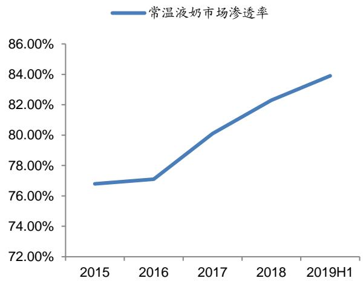
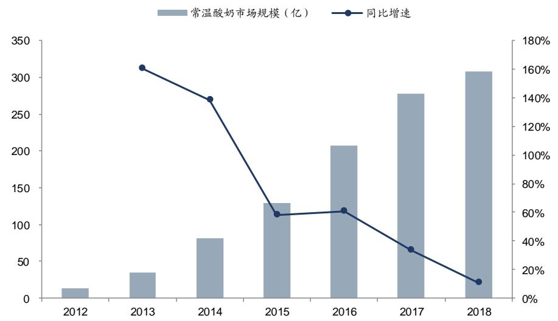
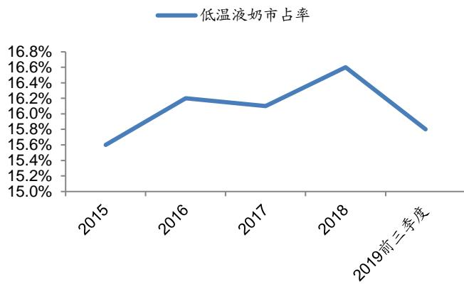

# 证券研究报告—深度报告

食品饮料

# [Table_StockInfo] 伊利股份(600887)

食品

买入（维持评级）

合理估值： 36.4-39.0 元 昨收盘： 32.88 元

2020 年 01 月 20 日

  
[Table_BaseInfo] 一年该股与上证综指走势比较

<table><tr><td colspan="2">股票数据</td></tr><tr><td>总股本/流通(百万股)</td><td>19,406/19,406</td></tr><tr><td>总市值/流通(百万元)</td><td>318,063/318,060</td></tr><tr><td>上证综指/深圳成指</td><td>3,075/10,954</td></tr><tr><td>12个月最高/最低(元)</td><td>17.60/10.17</td></tr></table>

# 相关研究报告：

《伊利股份-600887-2019年三季报点评：利润改善明显，强化费用管控》 ——2019-10-31《伊利股份-600887-重大事件快评：新方案兼顾股东利益，激励效果可期》 ——2019-09-09《伊利股份-600887-2019年中报点评：收入增速放缓，产品升级控费增利》 ——2019-08-30《伊利股份-600887-重大事件快评：股权激励落地，聚焦中长期发展》 — 2019-08-07《伊利股份-600887-2019年一季报点评：顺利实现开门红，产品持续升级》 ——2019-04-26

证券分析师：陈梦瑶  
电话：18520127266  
E-MAIL： chenmengyao $@$ guosen.com.cn证券投资咨询执业资格证书编码：S0980517080001  
证券分析师：郭尉  
电话：15210587234  
E-MAIL： guowei1 $@$ guosen.com.cn  
证券投资咨询执业资格证书编码：S0980518100001

# 独立性声明：

作者保证报告所采用的数据均来自合规渠道，分析逻辑基于本人的职业理解，通过合理判断并得出结论，力求客观、公正，结论不受任何第三方的授意、影响，特此声明。

# 深度报告

# 优势品牌活力依然，跨品发展长远可期

#  优势常温品牌持续发力为增长根基

常温奶为公司增长核心引擎，尼尔森数据显示截止去年 11 月市场份额39.9%超越蒙牛 10pcts，安慕希、母品牌突破 200 亿，金典拉近与特仑苏差距，优酸乳有望破百亿，舒化奶、QQ 星销售有所回暖。未来安慕希口味营销升级，金典坚守高端品质、引领有机概念，基础白奶通过渠道下沉加快渗透，优酸乳、QQ 星、味可滋、植选均针对性开展产品升级及市场营销，覆盖多元化消费需求，有望持续贡献增量。

#  低温顺势发展具备改善空间

低温市场竞争焦灼，伊利主动调整业务，注重新品开发及渠道调整，虽增速回落但费用平衡、利润端改善，表现优于行业；近期对低温白奶加大推广力度，匹配消费需求变化趋势，看好公司长远战略布局。冷饮延续较强竞争力，高端新品升级带来的明显结构性价格增量。

#  奶粉渐平稳，跨品类长远可期

奶粉业务 2019 年增速回落，行业增长趋平稳，但高端升级趋势显著、国产品牌红利延续，伊利凭借品牌基因和渠道基础，市场份额有望稳步提升，资源投入效果将逐渐显现。矿泉水、咖啡等跨品类经营仍需时间积累，爆款非朝夕之功，在费用均衡投放下短期业绩贡献预计有限，更看好中长期潜力。

#  风险提示

市场竞争加剧；成本快速上涨；新品类拓展不达预期

#  上调盈利预测及目标估值，维持“买入”投资评级

2019 年在行业增速回落、成本上升、竞争加剧背景下，伊利依靠产品创新、渠道渗透、品牌营销保持稳定增长：2020 年坚定看好公司产品升级、渠道下沉深耕，成本加压下竞争环境有望缓和，费效比提升，内生外延发展实现千亿目标，跨品类中长期空间广阔，新激励方案有利于激发管理层活力。小幅上调 2019-2021EPS 为 1.18/1.30/1.51 元（原预测为 1.18/1.29/1.50 元），对应 28/25/22 倍 PE，一年期目标估值为 36.4-39.0 元（原 32.3-34.8 元），维持“买入”评级。

盈利预测和财务指标  

<table><tr><td></td><td>2018</td><td>2019E</td><td>2020E</td><td>2021E</td></tr><tr><td>营业收入(百万元)</td><td>79,553</td><td>89,974</td><td>102,412</td><td>116,420</td></tr><tr><td>(+/1%)</td><td>16.9%</td><td>13.1%</td><td>13.8%</td><td>13.7%</td></tr><tr><td>净利润(百万元)</td><td>6440</td><td>7193</td><td>7879</td><td>9156</td></tr><tr><td>(+/1%)</td><td>7.3%</td><td>11.7%</td><td>9.5%</td><td>16.2%</td></tr><tr><td>摊薄每股收益(元)</td><td>1.06</td><td>1.18</td><td>1.30</td><td>1.51</td></tr><tr><td>EBITMargin</td><td>9.0%</td><td>9.3%</td><td>9.0%</td><td>9.2%</td></tr><tr><td>净资产收益率(ROE)</td><td>23.1%</td><td>23.6%</td><td>23.7%</td><td>25.2%</td></tr><tr><td>市盈率(PE)</td><td>30.6</td><td>27.8</td><td>25.4</td><td>21.9</td></tr><tr><td>EV/EBITDA</td><td>24.7</td><td>21.6</td><td>19.6</td><td>17.2</td></tr><tr><td>市净率(PB)</td><td>7.06</td><td>6.47</td><td>5.94</td><td>5.41</td></tr></table>

资料来源：Wind、国信证券经济研究所预测

# 内容目录

# 投资摘要 .....

# 估值与投资建议 ........

# 集团雏形已现，千亿并非终点..

# 优势常温品牌持续发力为增长基石... 11

# 低温顺势发展具改善空间... 2 0

# 国信证券投资评级. . 28

# 风险提示... 28

# 图表目录

图 1：2019 年液奶行业增速回落 . .. ..... 8  
图 2：国内生鲜乳价格周同比（%）... ..... 8  
图 3：伊利产品结构升级贡献比例提升 ................................ ............................ 9  
图 4：常温液奶市场渗透率.... ..... 9  
图 5：村级网点数量不断提升 ...... ....... 9  
图 6：伊利品牌营销升级..... ..... 10  
图 7：公司营业收入变化及增速. .... 10  
图 8：公司归母净利润变化及增速 ...... ..... .....  
图 9：毛利率及净利率.. .... 11  
图 10：公司销售费用率及管理费用率....... .............................................................. 11  
图 11：常温奶在饮用乳消费中占主体地位. ...... 12  
图 12：常温奶市场规模增速回落... .......................................... .... 12  
图 13：液奶销量增长贡献稳定 .......... ........................................................................ 12  
图 14：液奶价增贡献逐年提升 . .................................................................... 12  
图 15：常温酸奶市场规模高速增长 ........................................................................... 13  
图 16：安慕希产品系列包装 $^ { \star \star }$ 味持续创新 . ..... 13  
图 17：安慕希营销升级 .. .... 14  
图 18：安慕希与竞品销售规模持续拉大 . ..... 14  
图 19：金典逐年逼近特仑苏销售规模.. ..... 15  
图 20：高端白奶比重持续提升 ........  
图 21：金典品质升级、强化有机概念..... ...... 16  
图 22：事件营销打造传统款新包装 ... .... 17  
图 23：阿里电商平台纯牛奶保持高增..... ..... 17  
图 24：母品牌纯奶价格具有弹性.. ............................................................... 17  
图 25：优酸乳产品系列持续翻新....... ........................................................................ 18  
图 26：优酸乳聚焦年轻化、潮流文化营销...... ............. 18  
图 27：QQ星产品系列丰富... .... 19  
图 28：QQ 星合作国家博物馆 .... .... 19  
图 29：营销活动效果积极.... ...... 19  
图 30：味可滋进军冷萃奶茶市场...... ...... 20  
图 31：植选新定位植物基市场 ...... ..... 20  
图 32：植选签约超模刘雯为新代言人. .. 20  
图 33：低温奶行业增速近期回落.... .... 21  
图 34：伊利低温液奶市占率回落. .... 21  
图 35：伊利低温酸奶市占率去年回落.... ................... 21  
图 36：国内巴氏奶市场规模加速增长...... ......... 22  
图 37：国内巴氏奶销量占比仍有提升空间.. ... 22  
图 38：冷饮销量增长贡献.... ..... 22  
图 39：冷饮价增贡献显著... .................................................................. ..... 22  
图 40：伊利巧乐兹新品亮相..... ...................................................................... ..... 23  
图 41：伊利甄稀推出多款新品 .. .. 23  
图 42：国内奶粉单价波动情况 . . 23  
图 43：国内奶粉高端化趋势凸显. . 23  
图 44：奶粉销量增长贡献提升 ... .... 24  
图 45：奶粉价格增长贡献提升 . . 24  
图 46：伊然打造乳矿新品类.. . 24  
图 47：inikin 伊刻活泉进军矿泉水行业.. ... 24  
表 1：绝对估值假设. 6  
表 2：绝对估值假设. . 6  
表 3：敏感性分析... . 7  
表 4：估值与可比公司比较 .. 7  
表 5：公司盈利预测...... .. 26

# 投资摘要

# 估值与投资建议

2020 年作为公司千亿五强的目标年，伊利几大事业部有望持续发力，通过优势品牌纵深发展、提前开展新一轮产品升级以优化价格体系，继续夯实渠道下沉渗透的布局优势，同时以新品类外延扩张、提升市场覆盖度不断丰富产品矩阵，逐步实现公司从单一乳企向综合性健康食品集团升级的长期愿景。公司通过的新激励方案有利于激发管理层活力，激励业绩指标 2019-2023 五年复合增速不低 于 $8 . 2 \%$ （ 以 2018 年净利润为基数，2019-2023 年 净 利 润 增 长 率$8 \% / 1 8 \% / 2 8 \% / 3 8 \% / 4 8 \%$ ），并对 ROE 及分红率提出更高要求（ $\mathsf { R O E 2 0 \% }$ 分红率 $70 \%$ ），意味着后千亿时代下公司在收入及利润两端将做更多平衡，增速目标设置既稳定了市场预期，亦赋予公司长期价值更大想象空间。

预计公司 2019-2021 年营业收入为 899.74/1024.12/1164.20 亿元，同比增长$1 3 . 1 \% / 1 3 . 8 \% / 1 3 . 7 \%$ ，实现归母净利润 71.93/78.79/91.56 亿元，同比增长$1 1 . 7 \% / 9 . 5 \% / 1 6 . 2 \%$ 。预测 2019-2021EPS 为 $1 . 1 8 / 1 . 3 0 / 1 . 5 1$ 元，对应 28/25/22倍 PE。结合绝对估值及相对估值结论，公司股票价值在 36.4-39.0 元之间，对于2020年市盈率分别为28倍和30倍，相对于目前股价有 $1 1 \% - 1 9 \%$ 溢价空间，建议现价买入。

# 核心假设与逻辑

第一，公司安慕希、金典预计在新品升级及渠道渗透下继续维持双位数增长，母品牌及优酸乳作为基础品类在新品牌定位及营销推动下维持中高个位数增长。低温奶 19 年调整下滑后逐步企稳，奶粉增速高位回落，但预计在结构优化及国产品牌红利推动下仍有稳定增长，冷饮产品品牌渠道优势将持续。

第二，预计原奶仍处于供不应求的状态，未来 1-2 年仍将处于上升周期，但伊利前期奶源基地建设以及与上游牧场的战略合作将有效缓解相应的影响；成本加压下竞争环境有望缓和，2019 年在竞品较大买赠倒逼形成的价格战怪圈较难持续，企业内部费用投入结构优化及针对性加强，将平抑销售费用率上行压力。

# 与市场的差异之处

1.针对公司重点品牌的发展进行了详细分析及延伸判断。  
2.针对公司最新动态变化（新品定位、渠道价格）等进行跟踪梳理。

# 股价变化的催化因素

第一，竞争趋缓，费效比提升，释放盈利空间。第二，高端新品销售超预期，持续拉升产品价格体系。第三，渠道下沉充分渗透红利，带动销量增长。

# 核心假设或逻辑的主要风险

第一，若市场竞争加剧带来的费用投入压力。  
第二，上游原奶价格大幅波动增加成本压力。  
第三，多元渠道渗透进度不及预期，销量带动乏力。  
第四，消费升级低于预期，新品类拓展不畅。

# 估值与投资建议

考虑公司的业务特点，我们采用绝对估值和相对估值两种方法来估算公司的合理价值区间。

# 绝对估值法：37.51-42.23 元

我们采用 FCFF 估值法对公司进行绝对估值，根据以下假设得出公司合理股价为 51.43-63.01 元，估值中枢为 56.59 元。

表 1：绝对估值假设  

<table><tr><td colspan="3"></td></tr><tr><td>估值假设</td><td>合理值</td><td>参考值</td></tr><tr><td>无杠杆 Beta</td><td>0.79</td><td>0.79</td></tr><tr><td>无风险利率</td><td>3.00%</td><td>3.00%</td></tr><tr><td>股票风险溢价</td><td>6.50%</td><td>6.50%</td></tr><tr><td>公司股价</td><td>32.88</td><td>32.88</td></tr><tr><td>发行在外股数</td><td>6078</td><td>6078</td></tr><tr><td>股票市值(E，百万元)</td><td>197049</td><td>197049</td></tr><tr><td>债务总额(D，百万元)</td><td>1200</td><td>1200</td></tr><tr><td>Kd</td><td>5.30%</td><td>5.30%</td></tr><tr><td>T</td><td>15.00%</td><td>15.00%</td></tr><tr><td>Ka</td><td>8.14%</td><td>8.14%</td></tr><tr><td>有杠杆 Beta</td><td></td><td></td></tr><tr><td>Ke</td><td>0.79</td><td>0.79</td></tr><tr><td>E/(D+E)</td><td>8.16%</td><td>8.16%</td></tr><tr><td>D/(D+E)</td><td>99.39%</td><td>99.39%</td></tr><tr><td></td><td>0.61%</td><td>0.61%</td></tr><tr><td>WACC</td><td>8.14%</td><td>8.14%</td></tr></table>

资料来源:国信证券经济研究所预测

表 2：绝对估值假设  

<table><tr><td></td><td></td><td>2018E</td><td>2019E</td><td>2020E</td><td>2021E</td><td>2022E</td><td>2023E</td><td>2024E</td><td>2025E</td><td>2026E</td><td>2027E</td><td>TV</td></tr><tr><td></td><td></td><td></td><td></td><td>10.670</td><td>12,6623</td><td>14.058</td><td>15.607</td><td>17,170</td><td>18.546</td><td>20.0322</td><td>21.636</td><td></td></tr><tr><td>EBIT</td><td></td><td>8,380.1</td><td>9,177.0</td><td></td><td></td><td></td><td></td><td></td><td></td><td></td><td></td><td></td></tr><tr><td>所得税税率</td><td></td><td>15.00%</td><td>15.00%</td><td>15.00%</td><td>15.00%</td><td>15.00%</td><td>15.00%</td><td>15.00%</td><td>15.00%</td><td>15.00%</td><td>15.00%</td><td></td></tr><tr><td>EBIT*(1-所</td><td></td><td></td><td></td><td></td><td>10,763.</td><td>11,949.</td><td>13,266.</td><td>14,595.</td><td>15,764.</td><td>17,027.</td><td>18,391.</td><td></td></tr><tr><td>得税税率) 折旧与摊销</td><td></td><td>7,123.1</td><td>7,800.5</td><td>9,070.0</td><td>1</td><td>5</td><td>3</td><td>1</td><td>5</td><td>4</td><td>3</td><td></td></tr><tr><td>营运资金的</td><td></td><td>1,723.4</td><td>2,072.3</td><td>2,308.9</td><td>2,521.2</td><td>2,725.6</td><td>2,927.3</td><td>3,128.0</td><td>3,328.1</td><td>3,527.9</td><td>3,727.4</td><td></td></tr><tr><td>净变动</td><td></td><td>2,853.7</td><td>1,159.3</td><td>1,235.2</td><td>1,233.8</td><td>1,292.3</td><td>1,416.9</td><td>1,427.5</td><td>1,273.5</td><td>1,362.3</td><td>1,458.2</td><td></td></tr><tr><td rowspan="2">资本性投资</td><td></td><td>(5,00,</td><td>(4.0.</td><td>(3.00,</td><td>(3.00.</td><td>(3,.</td><td>(3.00.</td><td>(3..</td><td>(3.00,</td><td></td><td></td><td></td></tr><tr><td></td><td></td><td></td><td></td><td></td><td></td><td></td><td></td><td></td><td>(3.00.</td><td>(3,0.</td><td></td></tr><tr><td>FCFF</td><td></td><td>6,699.2</td><td>7,031.1</td><td>9,613.2</td><td>11.517</td><td>12,9</td><td>14.609</td><td>16,149</td><td>17.365</td><td>18.916</td><td>20.575</td><td>341,845.</td></tr><tr><td>PV(FCFF)</td><td></td><td></td><td></td><td></td><td></td><td></td><td></td><td></td><td></td><td></td><td></td><td>156,310</td></tr><tr><td>核心企业价</td><td></td><td>6,194.9</td><td>6,012.5</td><td>7,601.8</td><td>8,421.9</td><td>8,767.9</td><td>9,135.5</td><td>9,338.4</td><td>9,285.5</td><td>9,353.7</td><td>9,408.4</td><td></td></tr><tr><td>值</td><td>239,830.8</td><td></td><td></td><td></td><td></td><td></td><td></td><td></td><td></td><td></td><td></td><td></td></tr><tr><td>减：净债务</td><td></td><td></td><td></td><td></td><td></td><td></td><td></td><td></td><td></td><td></td><td></td><td></td></tr><tr><td></td><td>(1,574.0)</td><td></td><td></td><td></td><td></td><td></td><td></td><td></td><td></td><td></td><td></td><td></td></tr><tr><td>股票价值 每股价值</td><td>241,404.8 39.72</td><td></td><td></td><td></td><td></td><td></td><td></td><td></td><td></td><td></td><td></td><td></td></tr></table>

资料来源: 国信证券经济研究所预测

# 敏感性分析

我们对公司股价进行敏感性分析，该绝对估值相对于WACC 和永续增长率较为敏感，表 3 是公司绝对估值相对此两因素变化的敏感性分析，假设折现率和永续增长率变化值分别为 $\pm 0 . 2 \%$ 。

表 3：敏感性分析  

<table><tr><td>56.59</td><td>7.7% 7.9%</td><td>8.14%</td><td>8.3%</td><td>8.5%</td></tr><tr><td>2.6%</td><td>46.37</td><td>44.45 42.67</td><td>41.02</td><td>39.48</td></tr><tr><td>2.4%</td><td>45.11</td><td>43.30 41.62</td><td>40.05</td><td>38.59</td></tr><tr><td>2.2%</td><td>43.94</td><td>42.23 40.64</td><td>39.15</td><td>37.76</td></tr><tr><td>2.0%</td><td>42.85</td><td>41.23 39.72</td><td>38.30</td><td>36.98</td></tr><tr><td>1.8%</td><td>41.84</td><td>40.30 38.86</td><td>37.51</td><td>36.24</td></tr><tr><td>1.6%</td><td>40.89</td><td>39.42 38.05</td><td>36.76</td><td>35.55</td></tr><tr><td>1.4%</td><td>40.00</td><td>38.60 37.29</td><td>36.06</td><td>34.89</td></tr></table>

资料来源：国信证券经济研究所预测

# 相对估值法：36.4-39.0 元

我们选取蒙牛乳业、光明乳业等乳制品公司作为比较对象。从 PE 角度看公司估值，目前可比公司 2019 年平均 PE 为 30 倍，而公司 2019 年 PE 为 28 倍，而且展望未来，伊利品牌优势、渠道优势显著，产品结构升级、跨品类外延发展潜力充足，在实现千亿规模后有望来带业绩新增量，估值仍具备提升空间。我们认为给予公司28-30倍PE是合理的，2020年的合理价格区间为36.4-39.0元。

表 4：估值与可比公司比较  

<table><tr><td rowspan="2">公司名称</td><td rowspan="2">当前股价 2020/π1</td><td rowspan="2">(亿值</td><td rowspan="2">投资评级</td><td colspan="3">PE</td><td rowspan="2"></td><td rowspan="2"></td><td rowspan="2">EPS</td></tr><tr><td>18A</td><td>19E</td></tr><tr><td>伊利股份</td><td>32.88</td><td>2004</td><td>买入</td><td>30.6</td><td>27.8</td><td>20E 25.4</td><td>18A 1.06</td><td>19E 1.18</td><td>20E 1.3</td></tr><tr><td>可比公司</td><td></td><td></td><td></td><td></td><td></td><td></td><td></td><td></td><td></td></tr><tr><td>蒙牛乳业</td><td>32.15</td><td>1265</td><td>买入</td><td>36.5</td><td>28.5</td><td>24.4</td><td>0.88</td><td>1.13</td><td>1.32</td></tr><tr><td>光明乳业</td><td>12.47</td><td>153</td><td>未评级</td><td>44.8</td><td>32.0</td><td>27.7</td><td>0.28</td><td>0.39</td><td>0.4f$</td></tr><tr><td>可比公司平均</td><td></td><td></td><td></td><td>40.6</td><td>30.3</td><td>26.1</td><td></td><td></td><td></td></tr></table>

资料来源: Wind，国信证券经济研究所预测并整理，蒙牛乳业单位为港元

# 投资建议

我们认为，公司坚持产品升级、渠道深耕，内生外延发展迈向五强千亿目标，价值空间广阔，新激励方案有利于激发管理层活力。预计公司 2019-2021 年营业收入为 899.74/1024.12/1164.20 亿元，同比增长 $1 3 . 1 \% / 1 3 . 8 \% / 1 3 . 7 \%$ ，实现归母净利润 $7 1 . 9 3 / 7 8 . 7 9 / 9 1 . 5 6$ 亿元，同比增长 $1 1 . 7 \% / 9 . 5 \% / 1 6 . 2 \%$ 。小幅上调2019-2021EPS 为 1.18/1.30/1.51 元（原预测为 $1 . 1 8 / 1 . 2 9 / 1 . 5 0$ 元），对应28/25/22 倍 PE，综合绝对估值法及相对估值法结论，我们认为公司股票价值在 36.4-39.0 元之间，2020 年动态市盈率分别为 28 倍和 30 倍，相对于公司目前股价有 $1 1 \% - 1 9 \%$ 溢价空间，建议现价买入。

# 集团雏形已现，千亿并非终点

近期通过多次草根调研跟踪伊利最新动态，结合公司最新于三亚召开客户大会所公开披露的信息，我们认为伊利在 2019 年整体行业增速回落、行业竞争压力加大的背景下，依靠对产品创新、渠道渗透、品牌营销及资源布局等多方面持续发力，保持了行业领先优势，不断提升核心竞争力，体现了乳业龙头强大的综合实力和抵御风险的能力：

行业增速放缓，成本压力加大。2019 年宏观经济整体稳中有降、乳品礼品化需求回落，2019 年 H1 尼尔森零研数据显示，常温液态奶、低温液态奶和奶粉细分市场的零售额，分别同增 $3 . 0 \%$ 、 $- 0 . 7 \%$ 、 $8 . 8 \%$ ，增速有所放缓。同时成本端进口乳清粉、脱脂奶粉等原辅料价格上升，国内原料奶收购价格明显上涨，全年上涨幅度约为 $6 \% - 7 \%$ ，导致成本控制压力加大，企业经营难度提升。

  
图 1：2019年液奶行业增速回落  
资料来源：Wind，国信证券经济研究所整理

  
图 2：国内生鲜乳价格周同比（%）

资料来源：尼尔森，国信证券经济研究所整理

伊利持续推进产品升级，拉动盈利能力提升。近年受消费升级驱动，中高端乳品、健康功能型乳品及其它新包装、新口味乳品，倍受消费者青睐，伊利在以消费者为中心的发展理念驱动下，在产品创新上持续发力，加快优势产品的新口味研发，推出安慕希高端即饮柳橙凤梨、猕猴桃青提、咖啡口味，并聚焦有机业务，在“金典有机纯牛奶”“QQ 星有机纯牛奶”和“畅轻有机发酵乳”的基础上，推出了金典娟姗、金典脱脂有机纯牛奶、金领冠有机婴幼儿奶粉新品，不仅满足消费者追求健康生活、消费升级的需求趋势，提升公司盈利能力。2019 年 H1，公司新品销售收入占比 $1 7 . 4 \%$ ，比 2018年提高了 2.6pcts，近年常温奶及奶粉的结构升级带来的收入增速贡献不断提升。

  
图 3：伊利产品结构升级贡献比例提升  
资料来源: 公司公告，国信证券经济研究所整理

公司持续精耕渠道，逐步建立全球市场布局。公司专注渠道下沉扩展，全面覆盖国内市场，紧密抓住下线县市乡镇的消费扩容空间，同时随着便利店、电商平台、母婴店等渠道的快速发展，线上线下融合的新零售模式对细分渠道的精细化运营，伊利与盒马鲜生、苏宁小店等 O2O 新零售平台建立合作关系，多重措施下产品在国内市场的渗透能力逐年提升。凯度数据显示，截至2019年6月，伊利常温液态奶市场渗透率为 $8 3 . 9 \%$ ，同增 2.7pcts，三、四线城市的渗透率为 $8 6 . 2 \%$ ，同增 2.3pcts。同时在“一带一路”指引下，公司推进全球织网战略，加快海外市场拓展，当前业务布局印尼、新西兰、泰国等市场、受当地消费者青睐，渠道渗透能力继续夯实。

  
图 4：常温液奶市场渗透率  
资料来源：公司公告，国信证券经济研究所整理

  
图 5：村级网点数量不断提升

资料来源：凯度，国信证券经济研究所整理

创新品牌规划和精准营销，全球产业链资源布局。公司市场营销创新不断，与时下热门顶流带货主播李佳琦、明星王一博等合作推新，契合新传媒特征进行热点营销，并且针对不同品牌消费属性对应与大英博物馆、航海王、国家博物馆等一系列 IP文创类资源合作，开展品牌跨界营销，拉进消费者与品牌的距离，使伊利品牌更加深入人心。此外公司在共建“全球健康生态圈”目标指引下，继续与全球百余家供应商保持合作关系，夯实乳业资源保障能力，在大洋洲基地生产的金典新西兰进口牛奶、柏菲兰牛奶，进一步满足高端消费需求。公司先后收购泰国本土最大冰淇淋企业 THECHOMTHANA 丰富品类实力，收购新西兰 Westland 乳业公司获取优质、稳定新西兰奶源进一步巩固乳业资源实力，推进全球产业链战略布局。

  
图 6：伊利品牌营销升级

资料来源: 公司官网，国信证券经济研究所整理

凭借清晰的战略布局、持续创新产品及营销策略，公司不断夯实行业的领先优势，2019 年前三季度公司营业总收入 686.77 亿元，同比增长 $1 1 . 9 8 \%$ ；归母净利润 56.31 亿元，同比增长 $1 1 . 5 5 \%$ ，实现高位双增长。截至 2019 年 11 月，伊利液态奶市场占有率达 $40 \%$ ，领先蒙牛约 10pcts。安慕希、伊利牛奶跨越200 亿大关，百亿级品牌金典、优酸乳支撑发力，结合奶粉、低温、健康饮品等多个事业部核心品牌构成品牌矩阵，贡献业绩稳定增长来源。

  
图 7：公司营业收入变化及增速

资料来源：公司公告，国信证券经济研究所整理资料来源：公司公告，国信证券经济研究所整理

  
图 8：公司归母净利润变化及增速

  
图 9：毛利率及净利率  
资料来源：公司公告，国信证券经济研究所整理

  
图 10：公司销售费用率及管理费用率  
资料来源：公司公告，国信证券经济研究所整理

健康食品集团雏形已现，千亿目标并非终点。展望 2020，作为公司千亿五强的目标年，我们认为伊利几大事业部将持续发力，通过优势品牌纵深发展、提前开展新一轮产品升级以优化价格体系，继续夯实渠道下沉渗透的布局优势，同时以新品类外延扩张、提升市场覆盖度不断丰富产品矩阵，逐步实现公司从单一乳企向综合性健康食品集团升级的长期愿景。从成本及费用来看，预计原奶仍处于供不应求的状态，未来 1-2 年仍将处于上升周期，但伊利前期奶源基地建设以及与上游牧场的战略合作将有效缓解相应的影响；成本加压下竞争环境有望缓和，2019 年在竞品较大买赠倒逼形成的价格战怪圈较难持续，企业内部费用投入结构优化及针对性加强，将平抑销售费用率上行压力。公司通过的新激励方案有利于激发管理层活力，激励业绩指标 2019-2023 五年复合增速不低于 $8 . 2 \%$ （ 以 2018 年 净 利 润 为 基 数 ， 2019-2023 年 净 利 润 增 长 率$8 \% / 1 8 \% / 2 8 \% / 3 8 \% / 4 8 \%$ ），并对 ROE 及分红率提出更高要求（ $\mathsf { R O E 2 0 \% }$ 分红率 $70 \%$ ），意味着后千亿时代下公司在收入及利润两端将做更多平衡，增速目标设置既稳定了市场预期，亦赋予公司长期价值更大想象空间。

# 优势常温品牌持续发力为增长基石

常温奶作为公司营收主要来源，每年均为公司整体增长的重要引擎，目前形成以安慕希、金典为核心，优酸乳、母品牌纯奶为中坚，以 QQ 星、舒化、谷粒多、味可滋、植选等其他细分品牌为基础发力，形成全方位品牌矩阵。公司不断致力于优势品牌的纵深发展，推陈出新、多维度挖掘品牌营销价值，保证了常温品牌的强竞争力，持续拉大与竞争对手差距，实现中高双位数的增长，尼尔森数据显示截止 2019 年 11 月液奶份额 $3 9 . 9 \%$ 大于竞品 10pcts，同比提升2.2pcts。其中安慕希、母品牌突破 200 亿，金典拉近与特仑苏差距，优酸乳有望破百亿，舒化奶、QQ星销售有所回暖。

当前常温奶仍是国内乳品消费的主力市场，在饮用乳市场中仍占据七成以上比例，虽然整体成熟度较高、近年整体增速回落，但预计仍将保持中个位数增长，其中高端乳品在城镇化趋势、人均可支配收入提升、健康品质等消费需求升级的背景下将具备更明显的扩容机会，譬如 2019 年 H1 有机乳品细分市场零售额同比增长 $1 3 . 8 \%$ ，超同期常温液奶增速 10.8pcts。伊利凭借更积极的产品升级以及多渠道渗透发展的策略，有望持续双位数增长，从液奶 2017-2018 年增长因素拆分看，销量维持 50 亿以上的营收贡献、超 $1 1 \%$ 的增速贡献，同时而结构升级及价格调整所带来的增长贡献已经超过 $6 \%$ ，并呈现向上的趋势，战略成效显著。

  
图 11：常温奶在饮用乳消费中占主体地位

资料来源: Euromonitor，国信证券经济研究所整理资料来源: Euromonitor，国信证券经济研究所整理资料来源: 公司公告，国信证券经济研究所整理资料来源: 公司公告，国信证券经济研究所整理

  
图 12：常温奶市场规模增速回落

  
图 13：液奶销量增长贡献稳定

  
图 14：液奶价增贡献逐年提升

# 安慕希：增量核心，创新持续

常温酸奶是近年来乳制品行业增长最快的赛道之一，2018 年其市场规模超 300亿元，近 5 年的复合增长率高达 $40 \%$ 。伊利以安慕希品牌自 2013 年切人高速增长的常温酸奶赛道，以精准的品牌策略及强大的渠道渗透，迅速占据市场，从 2014 年 7 亿、2017 年破百亿到 2019 年破两百亿，成为伊利最核心的业绩增长点。

  
图 15：常温酸奶市场规模高速增长  
资料来源: Euromonitor，国信证券经济研究所整理

事实上自安慕希破百亿后市场便不乏担忧其增长的持续性，尽管面对常温酸奶产品同质化、竞争白热化的阶段，安慕希瞄准了年轻群体的消费诉求，顺应常温酸高端化、饮料化的趋势，一方面创新包装形式以丰富饮用体验和消费场景，另一方面围绕产品口感和美味营养进行研发升级，既满足新消费需求，又很好的拔高了价格体系，调研显示安慕希新品收入占比达到 $1 0 \cdot 1 5 \%$ ，助力品牌百亿规模基础上进一步快速增长：

包装分为畅饮型罗马柱 PET 瓶装、利乐盖及利乐钻包装，饮用更便捷，并且瓶身设计坚持了统一的希腊蓝白色系，保持品牌一贯的高端调性；开发新口味，增强口感浓郁度和层次感，2017 年-2019 年先后推出高端颗粒黄桃燕麦、草麦燕麦、芒果百香果、柳橙凤梨、桔柚青稞以及猕猴桃青提口味，近期更联合瑞幸推出咖啡口味。  
丰富的产品定价亦显差异：高端畅饮系列，原味和芒果百香果口味均 78元/箱（ ${ 2 3 0 9 } ^ { \star } 1 0$ ），而柳橙凤梨和猕猴桃青提等新口味则定价 88 元/箱；利乐冠基本是 68 元/箱（ ${ 2 0 0 9 } ^ { \star } 1 0$ ）

  
图 16：安慕希产品系列包装 $^ { \star \sharp }$ 味持续创新  
资料来源: 公司官网，国信证券经济研究所整理

安慕希在品牌营销上也始终走在潮流前端，从大额冠名赞助跑男等热门综艺、影视剧等，再到通过不同明星支持，从 Angelababy、迪丽热巴到杨超越、王一博，再到近期邀请 C 罗、科比开展体育营销，代言人及活动大使横跨括演艺、体育圈，将安慕希高端、年轻、潮流的品牌形象传递更多圈层的消费者，从明星效应到粉丝经济，有助于提升用户粘性及品牌忠诚度。此外多元化营销方式，比如跨界合作瑞幸、李佳琦直播营销等，均赋予安慕希更具活力的品牌基因。

  
图 17：安慕希营销升级

资料来源: 公司官网，国信证券经济研究所整理

往后看，虽然当前国内常温酸奶市场增速逐步趋稳，安慕希在同类产品市场中份额已超一半，但其与竞品的差距仍在持续拉大，在企业持续的资源投入下，每年新口味新包装是常规动作，品牌价值仍有挖掘空间，当前尚缺乏 10 元以上单价产品，在常温酸奶从营养健康到潮流饮品过渡的趋势下，预计仍将有针对更多消费场景的新产品推出。在渠道上，除了下线城市的渗透推广，安慕希也在走出国门，当前东南亚地区安慕希产品受众不断提升，未来品牌国际化扩容有望带来更多增量，预计后两百亿的安慕希仍将维持双位数增长。

  
图 18：安慕希与竞品销售规模持续拉大

资料来源:渠道调研，国信证券经济研究所整理

# 金典：坚守品质，引领高端有机

近年来常温白奶呈现高端化趋势，随着国人对健康理念诉求持续强化，有机、脱脂等概念深入人心，高端白奶的消费比例不断提升，2019 年前三季度高端白奶品类增速达到 $1 5 \%$ 超常温液奶 11pcts。从竞争格局来看，自 2005 年起蒙牛和伊利相继推出高端白奶品牌特仑苏和金典，经过两品牌多年竞争发展，目前金典 $^ { \cdot + }$ 特仑苏市场份额已超 $80 \%$ ，近年来伊利金典表现出更强的后发之势，份额逐年逼近竞品，在 2018 年突破百亿大关后仍维持较快增长。

  
图 19：金典逐年逼近特仑苏销售规模

  
图 20：高端白奶比重持续提升

资料来源: 渠道调研，国信证券经济研究所整理资料来源: Euromonitor，国信证券经济研究所整理

我们认为金典的持续增长源于对产品品质的坚守、高端品牌定位以及准确的营销推广：

从品质上看，通过全有机产业链的升级，金典产品的优质乳蛋白含量得以提升，不断突破行业标准，去年 9 月推出的有机梦幻盖产品，蛋白质含量达 $3 . 8 9 / 1 0 0 \mathrm { m } |$ ，引领同类有机产品，近期推出的有机脱脂系列将更好满足现代人对塑性减脂的需求，当前金典有机奶已占到金典系列的 $10 \% - 1 5 \%$ ；此外去年年初推广的娟姗纯牛奶，通过奶牛选种、牧场及饲喂系统的研发，达到每 100mL 含 3.8g 优质乳蛋白与 120mg原生高钙的行业领先水平，营养品质填补了国产超高端乳品市场空白。

完善产品细节，匹配高端定位：金典有机新品采用了更具畅饮、便携式特点的旋盖梦幻盖设计，在产品包装上，邀请荷兰著名插画师 La Scarlatte定制，吸引消费者眼球。从定价上，金典系列从每箱 68 元的纯牛奶、70-80元的有机系列到 80 元以上的新西兰进口及娟姗牛，产品均价从 4.5-7-10元形成清晰的价格序列，新品推广不断拉升价格体系。

营销手段丰富，从冠名《歌手》、《最强大脑》到邀请王菲、王丽坤代言，符合产品自身健康、高端的形象定位，利于消费活力释放。

  
图 21：金典品质升级、强化有机概念  
资料来源: 公司官网，国信证券经济研究所整理

去年特仑苏加大促销力度一度对金典造成较大销售压力，但通过新品升级，聚焦高端有机产品发展，金典2019年前三季度仍实现 $1 5 . 2 0 \%$ 的增长，展望未来，我们认为金典有望将品牌打造为有机乳品的代表，深度挖掘消费者对健康乳品的需求空间，丰富的产品系列将更充分满足不同消费场景，预计未来双位数增长中结构升级的贡献将加速提升，市场份额持续追赶竞品。

# 基础白奶：不可忽视的中坚力量

尽管在常温液奶行业整体增速回落的过程中，伊利母品牌基础白奶在高基数下同样面临增长压力，但近年来公司加大对母品牌的包装及品质升级，结合销售渠道及网点纵深拓张的机遇，加速传统经典款市场渗透，同时利用节庆、事件等营销丰富产品内涵，实现了产品持续超预期的增长表现：

调研显示，伊利基础白奶 2017、2018 均实现中高个位数增长，2019 年预计增速超 $10 \%$ ，规模突破 200亿  
中下线城市的增长潜力充足，乡镇村市场下沉效果显著，增速高于平均，伊利在县级城市的覆盖率已超 $80 \%$ ，直控村级网点数从 2015 年 17 万提升到 2018 年 61 万。  
多渠道发展机遇：公司以传统渠道、现代渠道为基础，加速发力电商、特渠（校园、企事业单位、油站等），满足渠道多元拓展的需求空间，释放更多消费触点，拉动销量提升。阿里平台数据显示伊利 2019 年销售额达11.9 亿同增 $83 \%$ 超越行业 33pcts，市占率提升 5pcts 至 $2 5 \%$ 。  
多重营销措施：母品牌在中秋、春节以及结合奥运概念加大营销力度，推出专属包装设计，持续打造贴近时代的国民品牌形象。

  
图 22：事件营销打造传统款新包装  
资料来源: 公司官网，国信证券经济研究所整理

  
图 23：阿里电商平台纯牛奶保持高增  
资料来源:阿里数据，国信证券经济研究所整理

基础白奶价格底仍有向上弹性。实际调研可见，线上电商无论京东或天猫旗舰店数据显示母品牌纯奶的销售持续处在热销品类第一集团，16盒标准款定价 48元，24 盒礼盒装定价 70 元，考虑平均 9 折促销则单价在 2.8-3 元区间，走访线下商超 16 盒标品价格基本在 42-45 元之间，出现低于 40 元活动价情况较少（除临期产品清理、特定节庆促销等情况）。在包装形式上礼盒又分新春、迷彩（李现同款）、冬奥等不同主题，不同主题定价差异在每提 2-3元间，又为产品价格带来 $5 \mathrm { - } 7 \%$ 的浮动调价范围。我们预计基础白奶随着渠道进一步渗透及品牌价值挖掘，有望维持量价齐升态势，实现超越行业平均水平的中高个位数增长。

  
图 24：母品牌纯奶价格具有弹性  
资料来源:京东，天猫，国信证券经济研究所整理

# 其他品牌：拓展新消费群，切入更多市场

除安慕希、金典、母品牌保持优势发展外，优酸乳、QQ 星、味可滋、植选、舒化等品牌同样在各自市场开展有针对性的产品升级及市场营销，覆盖多元化的消费需求，亮点频现，贡献常温液奶重要增量。

优酸乳：作为基础白奶外另一基础产品，优酸乳品牌最早于 2001 年建立，经历了从果汁到果粒酸奶的产品升级，在优酸乳 2015-2016 年超过 60 亿规模后曾一度面临发展瓶颈，竞品对位竞争激烈、产品定位模糊、资源投入产出比偏低，市场覆盖率一度下滑，但 2017 年后公司重新为品牌定调聚焦年轻消费群体，2018 年推出果果昔产品，匹配一系列积极的营销手段，增速企稳回升，2019

年销售有望突破百亿规模。

  
图 25：优酸乳产品系列持续翻新  
最新复合果粒、果昔系列  
资料来源:京东，天猫，国信证券经济研究所整理

强调年轻化营销，聚焦潮文化。优酸乳品牌和蒙牛酸酸乳对位竞争，早期均聚焦潮流音乐文化，优酸乳与巨星周杰伦开展长期的代言合作。近年来优酸乳营销持续创新，2017 年绑定《春风十里不如你》热剧 IP，2018 新增年轻代言人周冬雨，2019 年以果果昔合作热播综艺《乐队的夏天》注入潮流元素，聚焦年轻化、时尚的品牌标签更加清晰，结合线上流量传播及线下活动联动销售，有望继续引领乳饮市场风潮。预计未来优酸乳凭借精确的品牌定位以及产品深厚的大众消费基础，仍有望以新的品相带动新增长点。

  
图 26：优酸乳聚焦年轻化、潮流文化营销  
资料来源: 公司官网，国信证券经济研究所整理

QQ星：品牌自 2006 年推出以来历经多年发展，旗下除成长牛奶外还包含营养果汁酸奶、风味酸奶和有机奶，满足儿童成长营养需求，伊利也是最早获得国内学生饮用奶生产资质的企业之一，QQ 星校园风味酸奶产品近期更入选首批国家“学生饮用奶计划”新增产品种类试点企业，未来将推动更多产品走进校园，为学龄儿童提供更多饮用选择。回顾品牌发展历程，QQ 星过去几年曾一度面临儿童市场竞争激烈、SKU 较多稀释品牌力等问题，出现连续的下滑， 面对压力公司一方面重新梳理品牌，另外积极开展产品升级，先后推出 DHA、小瓶装营养果浆酸奶，采用新的包装规格、优质进口奶源，更匹配儿童饮用场景及健康需求，推动 2019 年销售回暖。

  
图 27：QQ星产品系列丰富

资料来源:京东，天猫，国信证券经济研究所整理

作为儿童奶领军品牌，QQ 星除了赋能助力孩子健康成长的品牌价值，同时还结合近两年崛起的国潮文化，联手故宫、国家博物馆打造专属款，推出“国宝活起来”等活动，赋予品牌营养价值外更多知识内涵及教育意义。我们认为未来QQ 星仍有望持续进行产品创新，并嫁接更多优质 IP资源，助力品牌价值及销售规模延伸。

  
图 28：QQ星合作国家博物馆

资料来源: 公司官网，国信证券经济研究所整理

  
图 29：营销活动效果积极  
资料来源:公司官网，国信证券经济研究所整理

味可滋：味可滋作为伊利旗下高端风味奶品牌代表，虽然品类规模较小，但始终站在时代风口，从奶昔系列到香蕉牛奶的风味系列，强调消费的品质和生活情感。而去年 9 月味可滋更是开启了品类多元化的新布局，推出冷萃奶茶切入快速发展的奶茶市场，并通过与苏宁战略合作尝试新的进行线上线下融合的渠道销售模式，未来还有可能切入果茶等更多相似消费品类。从聚焦小众消费群体到突破品类界限的发展，味可滋变革的效果值得期待。

  
图 30：味可滋进军冷萃奶茶市场

资料来源:京东，天猫，国信证券经济研究所整理

植选：品牌从 2017 年推出伊始一度承接很高期望，但由于市场竞争激烈、同类豆奶产品同质化高等问题，品牌销售增长并未达预期。面对压力，公司主动调整品牌策略，重新定位“植物营养新选择”的植物奶领域，植物奶强调健康、低糖、天然的属性，尼尔森数据显示 2018 年美国植物奶销售额 16 亿美元。同增$9 \%$ 较上年快 6pcts，全球植物奶预计以复合 $8 \%$ 的增速扩容。在此趋势下，植选率先提升自身产品定位、推出新品高蛋白豆乳（含 $6 . 0 9 / 1 0 0 \mathrm { m } |$ 植物蛋白，高于同类产品）同时以国际超模刘雯作为新品牌代言人，采用轻奢极简的包装设计，提升品牌认知度。预计在植物基新赛道上植选将有更多品类推向市场，期待新定位下的植选品牌重新焕发活力，切入新兴市场贡献增量。

  
图 31：植选新定位植物基市场  
资料来源: 公司官网，国信证券经济研究所整理

  
图 32：植选签约超模刘雯为新代言人  
资料来源:公司官网，国信证券经济研究所整理

# 低温顺势发展具改善空间

低温竞争焦灼，公司主动调整业绩望改善。从行业来看，随着冷库和冷链设施建设持续推动，低温奶 2015-2017 在全国销售规模有所提升，2018 年以来一方面低温奶受常温奶增长挤压需求放缓，另一方面地方乳企加大市场竞争，现代渠道竞争日趋激烈，在这个背景下伊利主动对渠道结构、产品品项、资源投放进行调整，注重对新品开发及产能优化，尽管伊利 2019 前三季度低温奶销售增速同比下滑约 $1 \%$ ，市占率同比回落，但整体表现仍优于行业，尤其在费用平衡及利润端实现改善。

  
图 33：低温奶行业增速近期回落  
资料来源: Euromonitor，国信证券经济研究所整理

  
图 34：伊利低温液奶市占率回落  
资料来源: 公司公告，国信证券经济研究所整理

低温酸低盈利能力望改善。伊利低温奶以低温酸品类为主，以往得益于消费升级趋势以及公司渠道基础，旗下畅轻、每益添、JoyDay 等品牌受市场广泛认可，近期调整阶段下与蒙牛的市占率差距有所拉大，随着新品推出以及渠道铺设加速，品牌乃至品类在市场培育期高投入、低盈利的局面有望逐步改善，公司对非优势品项的资源倾斜力度将影响品牌未来的发展走向。

加速低温白奶战略布局。在低温巴氏奶方面，2018 年国内巴氏奶市场规模为278 亿元，同比增速近 $10 \%$ ，2019 年以来加速发展，长期看由于低温奶具备更丰富的饮用场景和代餐作用，真实营养补充需求有望被放大，终端调研消费者越来越关注产品新鲜度，消费习惯的转变也将带来低温巴氏奶的发展机会，未来在液奶销量占比中有望提升（当前仅为日韩水平的 1/6）。从格局上看，虽然当前受制于奶源分布、技术和成本等因素，区域型乳企在巴氏奶领域拥有一定竞争优势，但近期龙头均加大投入力度，蒙牛聚焦“每日鲜语“抢占中高端鲜奶品类市场，伊利从哈尔滨尝试订奶入户的百格特鲜奶产品，去年年底更推出 3 款巴氏奶新品： “金典鲜牛奶”（含有 $3 . 8 9 / 1 0 0 \mathrm { m } |$ 原生乳蛋白）、“牧场清晨鲜牛奶”（新鲜奶源 2小时直达工厂）和“伊利鲜牛奶”，主打优质奶源、巴氏杀菌工艺、先进的冷链技术，预计未来还有望扩增产品线，以更长远的视角对低温白奶进行战略布局。

  
图 35：伊利低温酸奶市占率去年回落

资料来源:尼尔森，国信证券经济研究所整理资料来源: 中国奶业年鉴，国信证券经济研究所整理资料来源: 凯度，国信证券经济研究所整理

  
图 36：国内巴氏奶市场规模加速增长

  
图 37：国内巴氏奶销量占比仍有提升空间

伊利冷饮望延续较强竞争力。2019 年前三季度冷饮业务保持大个位数增长，高端新品大力推广之下结构升级所带来的贡献明显增量。旗下多款产品市场认可度高，根据凯度数据，巧乐兹连续多年为国内冰品知名度第一、品牌力第一，冰工厂、甄稀等明星产品和多款新品有望持续发力，其中高端冰淇淋品牌甄稀在 2020 年将力推多款新品，榛果黑巧克力、海盐牛油果、香草等三连杯组合。出海品牌 Joyday 冰淇淋在印尼深受当地消费者喜爱，未来在东南亚还将计划增加冷饮产能，扩大销售规模。

  
图 38：冷饮销量增长贡献

资料来源: 公司公告，国信证券经济研究所整理资料来源:公司公告，国信证券经济研究所整理

  
图 39：冷饮价增贡献显著

  
图 40：伊利巧乐兹新品亮相  
资料来源: 公司官网，国信证券经济研究所整理

  
图 41：伊利甄稀推出多款新品  
资料来源: 公司官网，国信证券经济研究所整理

# 奶粉渐入平稳，跨品类长远可期

奶粉行业增长平稳，高端化趋势显著。历史上由于受“三聚氰胺”事件影响，本土品牌受到重挫，外资品牌借力逆袭，占据市场主导。但近年来随着消费者对国产奶粉信心的提升、奶粉注册制的实施加快行业洗牌进程，外资杂牌的退场为国产龙头品牌的复苏创造良好的条件，以飞鹤、君乐宝、伊利为代表的国产奶粉品牌迅速抢占市场份额。长远看，尽管二胎红利基本已释放完毕，长期新增人口数量预计回落，但国内奶粉行业内部结构升级仍将持续，高端化趋势较为明显，超高端和高端奶粉在市场上的比重日益提升，二者合计占比从 2012年的 $3 1 . 2 \%$ 提升至 2016 年的 $5 5 \%$ ，预计未来价格增长的贡献将更明显。

  
图 42：国内奶粉单价波动情况  
资料来源: Wind，国信证券经济研究所整理

  
图 43：国内奶粉高端化趋势凸显  
资料来源: Frost&Sullivan，国信证券经济研究所整理

伊利奶粉业务长期受益国产红利，费效比有望提升。伊利奶粉及奶制品业务继2017-2018 年分别实现 $1 8 \% / 2 5 \%$ 的高速增长后，2019年高基数下增速回稳，前三季度维持双位数增长。公司产品结构完善，以金领冠婴配粉到欣活中老年奶粉，品牌市场认可度较高，并且陆续推出有机奶粉塞纳牧、金领冠悠滋小羊羊奶粉，通过产品结构升级带来价格贡献效果明显。渠道基础上看，公司优势主要体现在三四线母婴渠道，母婴渠道占比超过 $50 \%$ ，近两年陆续扩增了渠道人员数量加深了区域下沉渗透水平，线上电商渠道亦稳步扩容。品牌营销上，除传统代言人外，公司也通过人气综艺节目如金领冠冠名《妻子的浪漫旅行》、欣活冠名《野生厨房》，加深品牌曝光率。我们认为在政策支持导向下，国产奶粉未来发展势头乐观，伊利在较好的品牌基因和渠道基础支撑下，市场份额有望稳步提升，资源投入效果将逐渐显现。

  
图 44：奶粉销量增长贡献提升  
资料来源: 公司公告，国信证券经济研究所整理

资料来源:公司公告，国信证券经济研究所整理

  
图 45：奶粉价格增长贡献提升

跨品类：不积跬步无以至千里。伊利长期愿景是从单一乳企升级为综合性健康食品集团，在此目标指引下，近年来不断尝试开拓新品类发展：2018 年公司成立健康饮品事业部，目前已经完成体系搭建及人员匹配，旗下产品畅意 $100 \%$ 稳居常温乳酸品品类第一，此外推出乳矿饮料“伊然”开创新兴乳矿品类，产品定位天然营养、包装新颖，已在部分区域渠道试水销售；以 inikin 伊刻活泉进军矿泉水行业，加快完善渠道布局，2019 年开展长白山矿泉水项目预计明年投产；以焕醒源、圣瑞斯分别进军功能饮料及咖啡饮料市场，积极进行品类拓展，不断深入大健康食品产业布局。奶酪事业部则于 2019 年推出儿童奶酪产品，同年收购新西兰Westland，未来将拓展更多固体乳相关业务。我们认为伊利跨品类试水展现了集团横向外延发展的决心，我们相信伊利凭借强大的品牌基因、渠道基础及先进的管理力成功概率较大，但跨品类经营仍需时间积累，爆款非朝夕之功，在费用均衡投放下短期业绩贡献预计偏低，更看好中长期潜力。

  
图 46：伊然打造乳矿新品类

资料来源: 公司官网，国信证券经济研究所整理资料来源: 公司官网，国信证券经济研究所整理

  
图 47：inikin伊刻活泉进军矿泉水行业

展望 2020，作为公司千亿五强的目标年，我们认为伊利几大事业部将持续发力，通过优势品牌纵深发展、提前开展新一轮产品升级以优化价格体系，继续夯实渠道下沉渗透的布局优势，同时以新品类外延扩张、提升市场覆盖度不断丰富产品矩阵，逐步实现公司从单一乳企向综合性健康食品集团升级的长期愿景。公司通过的新激励方案有利于激发管理层活力，激励业绩指标 2019-2023 五年复合增速不低于 $8 . 2 \%$ （以 2018 年净利润为基数，2019-2023 年净利润增长率$8 \% / 1 8 \% / 2 8 \% / 3 8 \% / 4 8 \%$ ），并对 ROE 及分红率提出更高要求（ $\mathsf { R O E 2 0 \% }$ 分红率 $70 \%$ ），意味着后千亿时代下公司在收入及利润两端将做更多平衡，增速目标设置既稳定了市场预期，亦赋予公司长期价值更大想象空间。

# 盈利预测

收入端：公司常温液奶优势显著，安慕希、金典预计在新品升级及渠道渗透下继续维持双位数增长，母品牌及优酸乳作为基础品类在新品牌定位及营销推动下维持中高个位数增长，其中新品拉动结构升级及直接调价的贡献增长逐年提升。低温奶 19年调整下滑后逐步企稳，液奶整体销售收入预计 19-21 年销售增长 $12 \% - 1 4 \%$ ；奶粉增速高位回落，但预计在结构优化及国产品牌红利推动下维持 $5 \text{‰}$ 增长；冷饮产品品牌优势持续，预计增速 $1 0 { - } 1 5 \%$ 。

成本：2019 年原奶价格涨幅约在 $6 \% - 7 \%$ ，预计原奶仍处于供不应求的状态，未来 1-2 年仍将处于上升周期，但伊利前期奶源基地建设以及与上游牧场的战略合作将有效缓解相应的影响；成本加压下竞争环境有望缓和，2019 年在竞品较大买赠倒逼形成的价格战怪圈较难持续，结合产品升级带来的价格贡献提升，我们预计 2019-2021 年毛利率保持稳定略有提升。

费用率：预计去年为应对竞争针对部分品类的促销动作较难持续，公司要求市场投入具备流量变现效果，社会化新媒体投放预计将部分替代传统媒介的投入，费 用 投 入 产 出 比 有 望 提 升 ， 预 计公 司 19-21 年 销 售 费 用 率 分 别 为$2 3 . 6 \% / 2 3 . 4 \% / 2 3 . 2 \%$ ，管理费用率分别为 $4 . 6 \% / 4 . 8 \% / 5 . 0 \%$ （不考虑股权激励费用），激励计划的股份支付费用总额为 14.75 亿，2019-2024 的股权摊销费用预计为 $0 . 5 6 / 6 . 4 9 / 3 . 6 6 / 2 . 2 3 / 1 . 2 7 / 0 . 5 4$ 亿。

综合以上判断，预计公司 2019-2021 年营业收入为 899.74/1024.12/1164.20 亿元，同比增长 $1 3 . 1 \% / 1 3 . 8 \% / 1 3 . 7 \%$ ，实现归母净利润 71.93/78.79/91.56 亿元，同比增长 $1 1 . 7 \% / 9 . 5 \% / 1 6 . 2 \%$ 。

# 投资建议

公司坚持产品升级、渠道深耕，内生外延发展迈向五强千亿目标，价值空间广阔，新激励方案有利于激发管理层活力。小幅上调 2019-2021EPS 为1.18/1.30/1.51 元（原预测为 1.18/1.29/1.50 元），对应 28/25/22 倍 PE，综合绝对估值法及相对估值法结论，我们认为公司股票价值在 36.4-39.0 元之间，2020 年动态市盈率分别为 28 倍和 30 倍，相对于公司目前股价有 $1 1 \% - 1 9 \%$ 溢价空间，维持买入评级。

表 5：公司盈利预测  

<table><tr><td></td><td>2018A</td><td>2019E</td><td>2020E</td><td>2021E</td></tr><tr><td>营业收入(百万元)</td><td>79,553</td><td>89,974</td><td>102,412</td><td>116,420</td></tr><tr><td>(+/-%)</td><td>16.9%</td><td>13.1%</td><td>13.8%</td><td>13.7%</td></tr><tr><td>净利润(百万元)</td><td>6440</td><td>7193</td><td>7879</td><td>9156</td></tr><tr><td>(+/-%)</td><td>7.3%</td><td>11.7%</td><td>9.5%</td><td>16.2%</td></tr><tr><td>摊薄每股收益(元)</td><td>1.06</td><td>1.18</td><td>1.30</td><td>1.51</td></tr><tr><td>EBITMargin</td><td>9.0%</td><td>9.3%</td><td>9.0%</td><td>9.2%</td></tr><tr><td>净资产收益率(ROE)</td><td>23.1%</td><td>23.6%</td><td>23.7%</td><td>25.2%</td></tr><tr><td>市盈率(PE)</td><td>30.6</td><td>27.8</td><td>25.4</td><td>21.9</td></tr><tr><td>EV/EBITDA</td><td>24.7</td><td>21.6</td><td>19.6</td><td>17.2</td></tr><tr><td>市净率(PB)</td><td>7.06</td><td>6.47</td><td>5.94</td><td>5.41</td></tr></table>

资料来源: Wind，国信证券经济研究所预测并整理

# 风险提示

# 市场竞争风险

传统优势品类领域面对蒙牛寡头竞争格局，部分区域乳企在部分品类上竞争力较强，新开拓品类面临市场培育性投入加大以及试错成本的可能，费用压力可能上行从而影响公司利润。

# 成本波动风险

成本方面，原奶成本处上升周期，仍大幅提升将对公司经营造成压力；此外原料、包材、能源、人力等经营成本若继续上升，公司面临的成本压力将持续加大。若未能通过产品结构升级或提价转移，可能对经营利润带来负面影响。

# 产品升级放缓

若经济出现大幅波动，消费需求下降，消费者对于中高端乳品需求增速可能放缓，影响公司产品结构升级、价格提升速度。

# 渠道开拓风险

若多元渠道开拓和中低线城市下沉进度放缓，公司强势品牌规模基数变大后可能面临增速大幅回落的压力。

# 估值风险

本文综合采用了绝对估值法及相对估值法对公司进行估值，通过与可比公司比较 PE 测算公司估值区间。若未来行业核心的逻辑演绎不及预期，譬如市场竞争激烈程度未有缓和、优势品牌增速大幅回落、新品类尝试失败或原奶成本加速上行，可能面临估值下调的风险。

<table><tr><td>资产负债表（百万元）</td><td>2018</td><td>2019E</td><td>2020E</td><td>2021E</td></tr><tr><td>现金及现金等价物</td><td>11051</td><td>12724</td><td>14652</td><td>18342</td></tr><tr><td>应收款项</td><td>1350</td><td>1602</td><td>1824</td><td>2073</td></tr><tr><td>存货净额</td><td>5507</td><td>6147</td><td>6966</td><td>7911</td></tr><tr><td>其他流动资产</td><td>6547</td><td>4499</td><td>5121</td><td>5821</td></tr><tr><td>流动资产合计</td><td>24455</td><td>24973</td><td>28563</td><td>34147</td></tr><tr><td>固定资产</td><td>17374</td><td>20582</td><td>22456</td><td>23098</td></tr><tr><td>无形资产及其他</td><td>639</td><td>615</td><td>590</td><td>566</td></tr><tr><td>投资性房地产</td><td>3228</td><td>3228</td><td>3228</td><td>3228</td></tr><tr><td>长期股权投资</td><td>1909</td><td>2049</td><td>2189</td><td>2329</td></tr><tr><td>资产总计</td><td>47606</td><td>51446</td><td>57026</td><td>63368</td></tr><tr><td>短期借款及交易性金融负债</td><td>1556</td><td>1200</td><td>1200</td><td>1200</td></tr><tr><td>应付款项</td><td>9116</td><td>9513</td><td>10781</td><td>12243</td></tr><tr><td>其他流动负债</td><td>8499</td><td>9584</td><td>10940</td><td>12413</td></tr><tr><td>流动负债合计</td><td>19171</td><td>20297</td><td>22921</td><td>25855</td></tr><tr><td>长期借款及应付债券</td><td>0</td><td>0</td><td>0</td><td>0</td></tr><tr><td>其他长期负债</td><td>398</td><td>588</td><td>778</td><td>968</td></tr><tr><td>长期负债合计</td><td>398</td><td>588</td><td>778</td><td>968</td></tr><tr><td>负债合计</td><td>19569</td><td>20885</td><td>23699</td><td>26824</td></tr><tr><td>少数股东权益</td><td>122</td><td>127</td><td>136</td><td>149</td></tr><tr><td>股东权益</td><td>27916</td><td>30433</td><td>33191</td><td>36396</td></tr><tr><td>负债和股东权益总计</td><td>47606</td><td>51446</td><td>57026</td><td>63368</td></tr></table>

<table><tr><td>关键财务与估值指标</td><td>2018</td><td>2019E</td><td>2020E 2021E</td></tr><tr><td>每股收益</td><td>1.06</td><td>1.18</td><td>1.30 1.51</td></tr><tr><td>每股红利</td><td>0.72</td><td>0.77</td><td>0.84 0.98</td></tr><tr><td>每股净资产</td><td>4.59</td><td>5.01 5.46</td><td>5.99</td></tr><tr><td>ROIC</td><td>21%</td><td>25%</td><td>27% 31%</td></tr><tr><td>ROE</td><td>23%</td><td>24%</td><td>24% 25%</td></tr><tr><td>毛利率</td><td>38%</td><td>39%</td><td>39% 40%</td></tr><tr><td>EBIT Margin</td><td>9%</td><td>9%</td><td>9% 9%</td></tr><tr><td>EBITDA Margin</td><td>11%</td><td>11%</td><td>11% 11%</td></tr><tr><td>收入增长</td><td>17%</td><td>13%</td><td>14% 14%</td></tr><tr><td>净利润增长率</td><td>7%</td><td>12%</td><td>10% 16%</td></tr><tr><td>资产负债率</td><td>41%</td><td>41%</td><td>42% 43%</td></tr><tr><td>息率</td><td>2.2%</td><td>2.4%</td><td>2.6% 3.0%</td></tr><tr><td>P/E</td><td>30.6</td><td>27.8</td><td>25.4 21.9</td></tr><tr><td>P/B</td><td>7.1</td><td>6.5</td><td>5.9 5.4</td></tr><tr><td>EV/EBITDA</td><td>24.7</td><td>21.6</td><td>19.6 17.2</td></tr></table>

资料来源：Wind，国信证券经济研究所预测

<table><tr><td>利润表（百万元)</td><td>2018</td><td>2019E</td><td>2020E</td><td>2021E</td></tr><tr><td>营业收入</td><td>79553</td><td>89974</td><td>102412</td><td>116420</td></tr><tr><td>营业成本</td><td>49106</td><td>54576</td><td>61974</td><td>70332</td></tr><tr><td>营业税金及附加</td><td>531</td><td>540</td><td>614</td><td>699</td></tr><tr><td>销售费用</td><td>19773</td><td>22493</td><td>25398</td><td>28872</td></tr><tr><td>管理费用</td><td>2980</td><td>3984</td><td>5249</td><td>5847</td></tr><tr><td>财务费用</td><td>(60)</td><td>(22)</td><td>(43)</td><td>(63)</td></tr><tr><td>投资收益</td><td>261</td><td>200</td><td>200</td><td>200</td></tr><tr><td>资产减值及公允价值变动</td><td>(75)</td><td>(70)</td><td>(70)</td><td>(70)</td></tr><tr><td>其他收入</td><td>281</td><td>0</td><td>0</td><td>0</td></tr><tr><td>营业利润</td><td>7691</td><td>8532</td><td>9350</td><td>10864</td></tr><tr><td>营业外净收支</td><td>(113)</td><td>(50)</td><td>(50)</td><td>(50)</td></tr><tr><td>利润总额</td><td>7578</td><td>8482</td><td>9300</td><td>10814</td></tr><tr><td>所得税费用</td><td>1126</td><td>1272</td><td>1395</td><td>1622</td></tr><tr><td>少数股东损益</td><td>12</td><td>16</td><td>25</td><td>36</td></tr><tr><td>归属於母公司凈利润</td><td>6440</td><td>7193</td><td>7879</td><td>9156</td></tr></table>

<table><tr><td>现金流量表（百万元）</td><td>2018</td><td>2019E</td><td>2020E</td><td>2021E</td></tr><tr><td>净利润</td><td>6440</td><td>7193</td><td>7879</td><td>9156</td></tr><tr><td>资产减值准备</td><td>25</td><td>25</td><td>9</td><td>5</td></tr><tr><td>折旧摊销</td><td>1597</td><td>1723</td><td>2072</td><td>2309</td></tr><tr><td>公允价值变动损失</td><td>75</td><td>70</td><td>70</td><td>70</td></tr><tr><td>财务费用</td><td>(60)</td><td>(22)</td><td>(43)</td><td>(63)</td></tr><tr><td>营运资本变动</td><td>(4731)</td><td>2854</td><td>1159</td><td>1235</td></tr><tr><td>其它</td><td>(21)</td><td>(19)</td><td>0</td><td>8</td></tr><tr><td>经营活动现金流</td><td>3385</td><td>11846</td><td>11190</td><td>12783</td></tr><tr><td>资本开支</td><td>(3741)</td><td>(5001)</td><td>(4001)</td><td>(3001)</td></tr><tr><td>其它投资现金流</td><td>(0)</td><td>0</td><td>0</td><td>0</td></tr><tr><td>投资活动现金流</td><td>(3885)</td><td>(5141)</td><td>(4141)</td><td>(3141)</td></tr><tr><td>权益性融资</td><td>18</td><td>0</td><td>0</td><td>0</td></tr><tr><td>负债净变化</td><td>0</td><td>0</td><td>0</td><td>0</td></tr><tr><td>支付股利、利息</td><td>(4393)</td><td>(4676)</td><td>(5122)</td><td>(5952)</td></tr><tr><td>其它融资现金流</td><td>(1504)</td><td>(356)</td><td>0</td><td>0</td></tr><tr><td>融资活动现金流</td><td>(10272)</td><td>(5032)</td><td>(5122)</td><td>(5952)</td></tr><tr><td>现金净变动</td><td>(10772)</td><td>1673</td><td>1927</td><td>3690</td></tr><tr><td>货币资金的期初余额</td><td>21823</td><td>11051</td><td>12724</td><td>14652</td></tr><tr><td>货币资金的期末余额</td><td>11051</td><td>12724</td><td>14652</td><td>18342</td></tr><tr><td>企业自由现金流</td><td>(775)</td><td>6699</td><td>7031</td><td>9613</td></tr><tr><td>权益自由现金流</td><td>(2280)</td><td>6362</td><td>7067</td><td>9667</td></tr></table>

国信证券投资评级  

<table><tr><td>类别</td><td>级别</td><td>定义</td></tr><tr><td rowspan="4">股票 投资评级</td><td>买入</td><td>预计6个月内，股价表现优于市场指数20%以上</td></tr><tr><td>增持</td><td>预计6个月内，股价表现优于市场指数10%-20%之间</td></tr><tr><td>中性</td><td>预计6 个月内，股价表现介于市场指数±10%之间</td></tr><tr><td>卖出</td><td>预计6个月内，股价表现弱于市场指数10%以上</td></tr><tr><td rowspan="3">投资评级</td><td>超配</td><td>预计 6 个月内，行业指数表现优于市场指数 10%以上</td></tr><tr><td>中性</td><td>预计6 个月内，行业指数表现介于市场指数±10%之间</td></tr><tr><td>低配</td><td>预计6 个月内，行业指数表现弱于市场指数 10%以上</td></tr></table>

# 分析师承诺

作者保证报告所采用的数据均来自合规渠道，分析逻辑基于本人的职业理解，通过合理判断并得出结论，力求客观、公正，结论不受任何第三方的授意、影响，特此声明。

# 风险提示

本报告版权归国信证券股份有限公司（以下简称“我公司”）所有，仅供我公司客户使用。未经书面许可任何机构和个人不得以任何形式使用、复制或传播。任何有关本报告的摘要或节选都不代表本报告正式完整的观点，一切须以我公司向客户发布的本报告完整版本为准。本报告基于已公开的资料或信息撰写，但我公司不保证该资料及信息的完整性、准确性。本报告所载的信息、资料、建议及推测仅反映我公司于本报告公开发布当日的判断，在不同时期，我公司可能撰写并发布与本报告所载资料、建议及推测不一致的报告。我公司或关联机构可能会持有本报告中所提到的公司所发行的证券头寸并进行交易，还可能为这些公司提供或争取提供投资银行业务服务。我公司不保证本报告所含信息及资料处于最新状态；我公司将随时补充、更新和修订有关信息及资料，但不保证及时公开发布。

本报告仅供参考之用，不构成出售或购买证券或其他投资标的要约或邀请。在任何情况下，本报告中的信息和意见均不构成对任何个人的投资建议。任何形式的分享证券投资收益或者分担证券投资损失的书面或口头承诺均为无效。投资者应结合自己的投资目标和财务状况自行判断是否采用本报告所载内容和信息并自行承担风险，我公司及雇员对投资者使用本报告及其内容而造成的一切后果不承担任何法律责任。

# 证券投资咨询业务的说明

本公司具备中国证监会核准的证券投资咨询业务资格。证券投资咨询业务是指取得监管部门颁发的相关资格的机构及其咨询人员为证券投资者或客户提供证券投资的相关信息、分析、预测或建议，并直接或间接收取服务费用的活动。证券研究报告是证券投资咨询业务的一种基本形式，指证券公司、证券投资咨询机构对证券及证券相关产品的价值、市场走势或者相关影响因素进行分析，形成证券估值、投资评级等投资分析意见，制作证券研究报告，并向客户发布的行为。

# 国信证券经济研究所

深圳深圳市罗湖区红岭中路 1012 号国信证券大厦 18 层邮编：518001 总机：0755-82130833

上海  
上海浦东民生路 1199弄证大五道口广场 1 号楼12 楼  
邮编：200135  
北京  
北京西城区金融大街兴盛街 6 号国信证券9 层  
邮编：100032