# 伊利股份（600887.SH）护城河稳固，平台化发展未来可期

2020年04月27日

——公司首次覆盖报告

投资评级：买入（首次）

<table><tr><td>日期</td><td>2020/4/24</td></tr><tr><td>当前股价(元)</td><td>31.20</td></tr><tr><td>一年最高最低(元)</td><td>34.66/26.88</td></tr><tr><td>总市值(亿元)</td><td>1,892.56</td></tr><tr><td>流通市值(亿元)</td><td>1,835.23</td></tr><tr><td>总股本(亿股)</td><td>60.66</td></tr><tr><td>流通股本(亿股)</td><td>58.82</td></tr><tr><td>近3个月换手率(%)</td><td>56.7</td></tr></table>

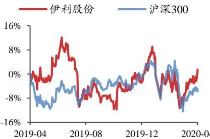  
股价走势图  
数据来源：贝格数据

张宇光（分析师）zhangyuguang @kysec.cn证书编号：S0790520030003

叶松霖（联系人）yesonglin@kysec.cn证书编号：S0790120030038

# ⚫ 伊利股份龙头地位稳固，竞争优势明显，首次覆盖给予“买入”投资评级

行业集中度提升趋势不变，伊利股份不断强化自身渠道推力及产品竞争力，市场份额仍可扩张。预计2019-2021年公司归母净利分别为71.3 亿、73.3亿、83.9亿，EPS 分别1.18、1.21、1.38元，对应PE分别为27、26、23倍，首次覆盖给予“买入”投资评级。

# ⚫ 乳制品行业量价齐升，行业集中度可持续提升

目前我国人均乳制品消费量、人均乳制品消费金额仍处较低水平，未来行业量价提升空间广阔。乳制品行业自2014年以来竞争逐渐加剧，与其双寡头格局导致的市场份额优先策略，以及液态奶产品同质化有关。考虑到疫情影响，我们认为行业短期可能仍处于激烈竞争态势。长期来看竞争应为常态，但有趋缓可能：一方面原奶供给紧平衡，成本压力可能使得促销力度放缓;另一方面产品出现差异化，如常温酸奶安慕希并未完全跟随纯甄参与价格竞争。此外品牌策略也使得厂家注意保护高端产品形象，以免频繁促销伤害品牌力。疫情冲击可能加速中小乳企退出市场，龙头企业实力雄厚，可抢占市场份额，行业集中度或加速提升。

# ●公司渠道与产品优势明显，品牌力强，龙头壁垒稳固

伊利股份壁垒在于：一是渠道实力强劲，表现为一方面渠道覆盖的广度与下沉的深度行业领先；另一方面渠道扁平化，对市场具备较强掌握力。此外积极布局新兴渠道，线上增长较为迅速。二是得益于持续的研发投入，公司具有品类齐全的产品线，可满足不同消费者在不同场景下的需求。三是已树立良好品牌形象，占领消费者心智定位。伊利股份以上优势明显，龙头地位稳固。

# ● 公司积极推进产品多元化，通过并购、合作等方式开拓海外市场

伊利股份积极推进产品多元化，以牛奶为核心，按照牛奶、乳饮料、健康饮品的方式依次递进扩张，逐步打造成为食品巨头。目前已上市矿泉水、咖啡等多种新品，营收占比不高。后续随着事业部体系搭建完成，我们预计非乳饮品成长空间广阔。此外公司也通过并购、合作等方式进行全球化布局，打造国际品牌形象。

●风险提示：食品安全事件、原材料价格波动风险、宏观经济风险

财务摘要和估值指标  

<table><tr><td>指标</td><td>2017A</td><td>2018A</td><td>2019E</td><td>2020E</td><td>2021E</td></tr><tr><td>营业收入(百万元)</td><td>67,547</td><td>78,976</td><td>90,026</td><td>100,897</td><td>111,042</td></tr><tr><td>YOY(%)</td><td>12.0</td><td>16.9</td><td>14.0</td><td>12.1</td><td>10.1</td></tr><tr><td>净利润(百万元)</td><td>6,001</td><td>6,440</td><td>7,134</td><td>7,330</td><td>8,392</td></tr><tr><td>YOY(%)</td><td>6.0</td><td>7.3</td><td>10.8</td><td>2.7</td><td>14.5</td></tr><tr><td>毛利率(%)</td><td>37.3</td><td>37.8</td><td>37.7</td><td>37.6</td><td>37.9</td></tr><tr><td>净利率(%)</td><td>8.9</td><td>8.2</td><td>7.9</td><td>7.3</td><td>7.6</td></tr><tr><td>ROE(%)</td><td>23.8</td><td>23.0</td><td>23.1</td><td>21.2</td><td>21.6</td></tr><tr><td>EPS(摊薄/元)</td><td>0.99</td><td>1.06</td><td>1.18</td><td>1.21</td><td>1.38</td></tr><tr><td>P/E(倍)</td><td>31.5</td><td>29.4</td><td>26.5</td><td>25.8</td><td>22.6</td></tr><tr><td>P/B(倍)</td><td>7.5</td><td>6.8</td><td>6.1</td><td>5.5</td><td>4.9</td></tr></table>

数据来源：贝格数据、开源证券研究所

# 目 录

1、精耕乳制品行业多年，龙头地位牢固 .4  
2、乳制品行业量价齐升景气度高，行业集中度持续提升... …6  
2.1、行业量价齐升，未来发展空间广阔. …….6  
2.2、行业呈双寡头格局，行业集中度持续提升.  
3、渠道与产品优势明显，品牌力强，竞争壁垒稳固. ….9  
3.1、渠道扁平化，兼具深度和广度..  
3.2、产品线丰富，产品结构持续优化. …… ….1  
3.3、品牌营销方式多样，品牌形象佳 ….15  
4、品类多元构建健康食品平台，全球布局开拓海外市场.. ….16  
5、盈利预测与投资建议.. … 17  
6、风险提示. ….19  
附：财务预测摘要… …… 20

# 图表目录

图1：伊利股份的发展经历了四个阶段.. 4  
图2：股权结构中高管持有 $7 . 9 \%$ 的股份. …… ….5  
图3：伊利股份2019Q1-Q3营业收入同比增 $1 2 . 0 \%$ . ….6  
图4： 伊利股份 2019Q1-Q3归母净利同比增 $1 1 . 6 \%$ ……6  
图5： 2019H1 液体乳占营业收入约 $8 0 . 2 \%$ . ………………… ….6  
图6： 2019H1液态乳占毛利约 $7 4 \%$ ……………………………………… ….6  
图7： 2019 年中国乳制品行业规模增速为 $5 . 5 \%$ ……… ….7  
图8： 中国人均乳制品消费量仍较低. ….7  
图9： 中国农村居民人均乳制品消费量仍较低... … ….7  
图10: 中国人均乳制品消费金额仍较低.. ….  
图11： 2019 年中国常温奶CR2约 $6 5 \%$ ……   
图12： 2020 年4月8日生鲜乳价格同比增长 $2 . 3 \%$ …… ….9  
图13： 2019H1常温液态乳品市场渗透率达 $8 3 . 9 \%$ … ….10  
图14： 2015年以来伊利股份营收拉大与蒙牛乳业的差距， …. 10  
图15： 伊利股份应收款和应收款占比均小于蒙牛乳业. ….10  
图16: 2018 年公司直控村级网点同比增 $1 4 . 7 \%$ : ….11  
图17： 2014年以来伊利股份电商业务收入快速增长.. ….11  
图18: 伊利股份产品线较为齐全. … ….12  
图19: 2013年以来产品结构优化助力营收增长.  
图20： 2016年以来伊利研发支出占营收比例大于蒙牛和光明. …………… .13  
图21： 2016年以来伊利股份研发费用增速较快. … 13  
图22： 伊利股份每年积极推出新产品 13  
图23： 安慕希密集推出新品. ..14  
图24： 2019 年纯甄推出 3 款新口味产品…14  
图25： 莫斯利安推出新品速度较慢. 1 5  
图26： 金典推出新品、升级包装.  
图27：伊利使用线上线下和跨界合作方式进行营销.  
图28：2016年以来伊利股份品类多元化发展， 17  
表1：伊利股份为 2019 年全球乳业第八强.  
表2：2019 年伊利股份推出限制性股票激励计划.…. ……5  
表3： 伊利股份推出2014-2023年的十年员工持股计划. ….5  
表4： 伊利股份2018年在中国品牌排名蝉联第一 …. 16  
表5： 2018年以来伊利全球化进程重大事件.. .17  
表6： 收入预测：液态奶仍是主要收入增量来源.. ….18  
表7：可比公司估值：伊利股份低于行业平均水平. .18

# 1、精耕乳制品行业多年，龙头地位牢固

公司长期精耕乳制品行业，为行业龙头。伊利集团于1993 年成立，其主营业务为乳制品的生产、加工和销售。公司产品品类逐步扩展，现在设有液态奶、奶粉、冷饮、低温、健康饮品、奶酪事业部。2019 年伊利股份为全球乳业第八强，连续四年为亚洲乳业第一强，龙头地位稳固。

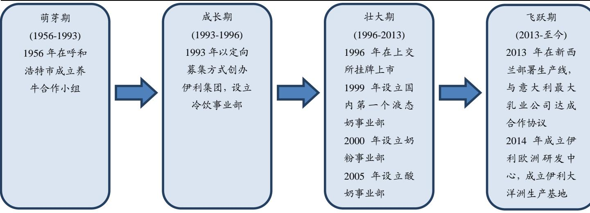  
图1：伊利股份的发展经历了四个阶段  
资料来源：公司官网、开源证券研究所

表1：伊利股份为 2019 年全球乳业第八强  

<table><tr><td>公司</td><td>总部所在地</td><td>2019 年排名</td><td>2018 年排名</td><td>营业额（亿美元）</td></tr><tr><td>雀巢</td><td>瑞士</td><td>1</td><td>1</td><td>243</td></tr><tr><td>兰特黎斯</td><td>法国</td><td>2</td><td>2</td><td>208</td></tr><tr><td>达能</td><td>法国</td><td>3</td><td>3</td><td>180</td></tr><tr><td>恒天然</td><td>新西兰</td><td>4</td><td>5</td><td>143</td></tr><tr><td>菲仕兰</td><td>荷兰</td><td>5</td><td>6</td><td>138</td></tr><tr><td>美国奶农</td><td>美国</td><td>6</td><td>4</td><td>136</td></tr><tr><td>爱氏晨曦</td><td>丹麦/瑞典</td><td>7</td><td>7</td><td>124</td></tr><tr><td>伊利</td><td>中国</td><td>8</td><td>9</td><td>112</td></tr><tr><td>萨普托</td><td>加拿大</td><td>9</td><td>8</td><td>110</td></tr><tr><td>蒙牛</td><td>中国</td><td>10</td><td>10</td><td>103</td></tr></table>

数据来源：Rabobank Group、开源证券研究所

股权激励和员工持股提升团队积极性和稳定性。伊利股份股权较为分散，高管持股比例相对较大，前十大股东中高管持股比例达 $7 . 9 2 \%$ 。公司继 2016 年推出股权激励计划后，在2019 年推出限制性股票激励计划，总数达1.52亿股，惠及公司董事、高管、核心业务骨干等478 名员工；公司2014 年推出十年员工持股计划，2014-2023年分十期执行。股权激励计划和员工持股计划可充分调动管理团队的积极性，保障公司能持续、健康、稳定地发展。

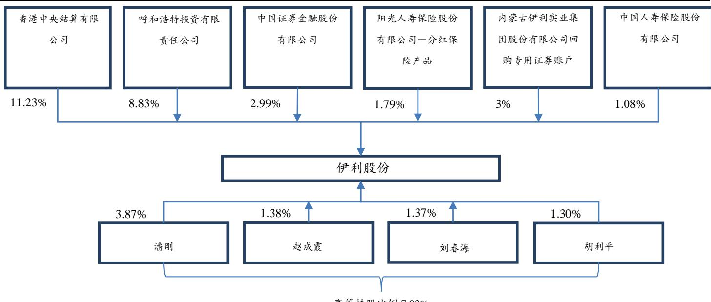  
图2：股权结构中高管持有 $7 . 9 \%$ 的股份  
高管持股比例 $7 . 9 2 \%$   
数据来源：Wind、开源证券研究所

表2：2019 年伊利股份推出限制性股票激励计划  

<table><tr><td>时间</td><td>数量</td><td>人数</td><td>行权条件</td></tr><tr><td rowspan="3">2019年</td><td rowspan="3">152,428,000股</td><td rowspan="3">总人数（478）</td><td>五个解除限售期内，以2018 年净利润为基数，2019-2023</td></tr><tr><td>年净利润增长率分别不低于8%、18%、28%、38%、48%，</td></tr><tr><td>净资产收益率均不低于20%，现金分红比例不低于70%</td></tr></table>

数据来源：Wind、开源证券研究所

表3：伊利股份推出 2014-2023 年的十年员工持股计划  

<table><tr><td></td><td>计划成立日</td><td>奖励人数</td><td>提取奖励金总额 （亿元）</td><td>奖励占总股本比例</td><td>存续期届满时间</td><td>成交价</td><td>购买股数（万股）</td></tr><tr><td>首期</td><td>2014.10.26</td><td>317</td><td>1.43</td><td>0.19%</td><td>2016.11.26</td><td>25.02</td><td>572.96</td></tr><tr><td>第二期</td><td>2015.7.9</td><td>328</td><td>1.33</td><td>0.12%</td><td>2017.7.22</td><td>18.58</td><td>713.61</td></tr><tr><td>第三期</td><td>2016.12.28</td><td>349</td><td>0.44</td><td>0.04%</td><td>2018.1.24</td><td>18.21</td><td>242.52</td></tr><tr><td></td><td></td><td></td><td>0.01</td><td>0.00%</td><td>2018.1.23</td><td>18.19</td><td>3.53</td></tr><tr><td>第四期</td><td>2017.12.22</td><td>322</td><td>0.86</td><td>0.05%</td><td>2020.5.16</td><td>26.56</td><td>323.31</td></tr><tr><td>第五期</td><td>2018.12.10</td><td>333</td><td>1.34</td><td>0.10%</td><td>2020.12.22</td><td>22.34</td><td>601.33</td></tr><tr><td>第六期</td><td>2019.4.2</td><td>314</td><td>1.04</td><td>0.06%</td><td>2021.5.31</td><td>29.95</td><td>345.92</td></tr></table>

数据来源：Wind、开源证券研究所

液体乳是主要收入来源，营业收入较快增长。液态乳是伊利股份的主要收入来源，2019H1占比达 $8 0 . 2 \%$ 。2017 年以来，伊利股份营业收入一直呈稳步增长态势，增速保持在 $1 0 \%$ 以上。2019Q1-Q3伊利股份营业收入达686.8亿元，同比增长 $1 2 . 0 \%$ ,归母公司净利为 56.3 亿元，同比增长 $1 1 . 6 \%$ 。

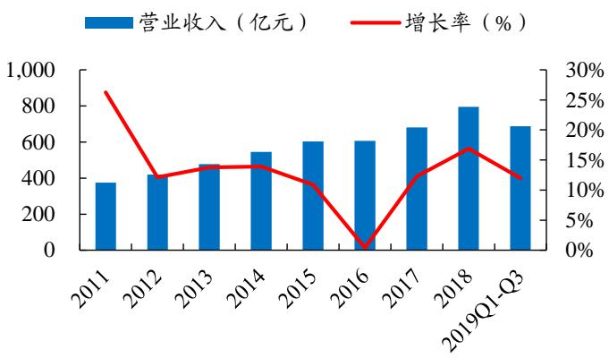  
图3：伊利股份 2019Q1-Q3 营业收入同比增 $1 2 . 0 \%$   
数据来源：Wind、开源证券研究所

数据来源：Wind、开源证券研究所

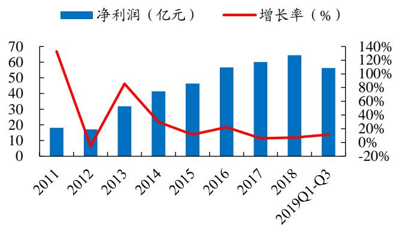  
图4：伊利股份 2019Q1-Q3归母净利同比增 $1 1 . 6 \%$

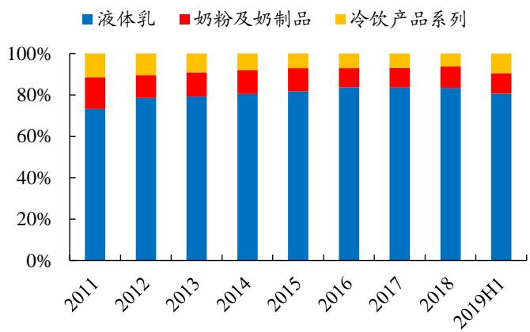  
图5：2019H1 液体乳占营业收入约 $8 0 . 2 \%$   
数据来源：Wind、开源证券研究所

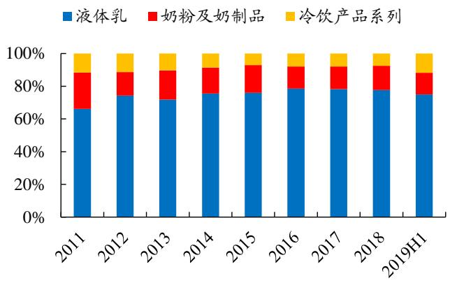  
图6：2019H1 液态乳占毛利约 $7 4 \%$   
数据来源：Wind、开源证券研究所

# 2、乳制品行业量价齐升景气度高，行业集中度持续提升

# 2.1、行业量价齐升，未来发展空间广阔

中国乳制品行业日趋成熟，稳步发展。2006 年以来，乳制品行业一直保持 $1 5 \%$ 以上的速度快速发展。2008 年三聚氰胺事件发生后，乳制品消费量受影响，2008 年行业增速下降至 $6 \%$ ，乳制品行业进入转型期。在此阶段，乳制品企业更加注重产品质量，并不断进行产品结构升级，如光明乳业在 2009 年推出常温酸奶莫斯利安。常温酸奶、高端白奶等逐渐被消费者青睐，并成为消费者节假日走亲访友的送礼选择之一，乳制品的消费场景进一步从自饮延伸至送礼、休闲等。乳制品行业趋于成熟，稳步增长，2019 年增长 $5 . 5 \%$ 至4196.3亿元。

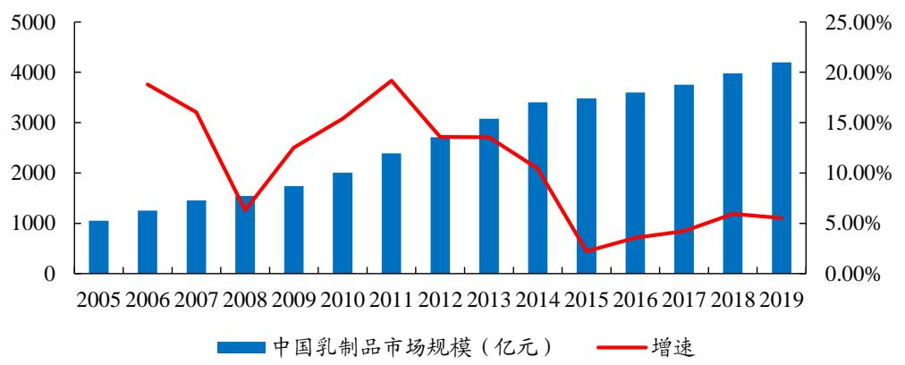  
图7：2019 年中国乳制品行业规模增速为 $5 . 5 \%$   
数据来源：Euromonitor、开源证券研究所

人均乳制品消费量持续提升，但仍有较大发展空间。根据 Euromonitor 数据，中国人均乳制品消费量自 2006 年的 10 千克/人增长至 2019 年的 22 千克/人。我国人均乳制品消费量持续提升，但目前仍较饮食习惯相近的日本差距较大，2019 年日本人均乳制品消费量达40 千克/人。中国各层级城市发展程度不一，目前乳制品消费呈现分级现象：一二线城市居民人均收入较高，饮食习惯西化，乳制品人均消费量接近发达国家水平；三四线城市及农村居民人均乳制品消费量较低，农村居民人均乳制品消费量仅为7千克。低线城市人均乳制品消费量仍有很大提升空间。

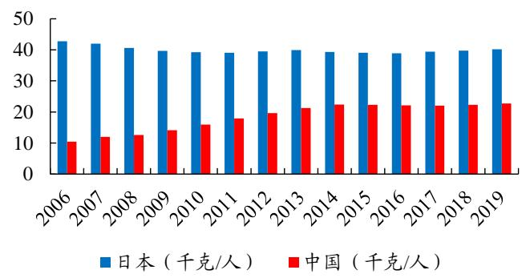  
图8：中国人均乳制品消费量仍较低  
数据来源：Euromonitor、开源证券研究所

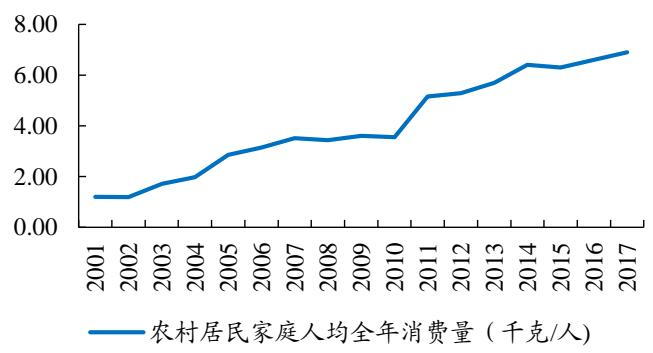  
图9：中国农村居民人均乳制品消费量仍较低  
数据来源：Wind、开源证券研究所

居民消费升级可推动人均乳制品消费金额持续提升。2006 年以来我国人均乳制品消费金额持续提升，自2006 年的 19.9 美元/人增长至 2019 年的 44.4 美元/人。但目前中国人均乳制品消费金额仍较低，仅为日本的四分之一。未来随着居民消费升级，中国人均乳制品消费金额仍可持续提升:

（1）居民乳制品消费更注重健康、绿色，对乳制品营养成分如蛋白质含量等指标关注度提高。高端乳制品如有机奶等更受消费者欢迎。

(2）越来越多消费者认识到乳制品营养价值高，将乳制品作为礼品赠送。单价较高的高端乳制品如金典、特仑苏、安慕希具有送礼属性，提升人均乳制品消费金额。

（3）消费者对乳制品种类认知尚不完善，消费结构简单。《2018中国人奶商指数报告》显示 $7 4 \%$ 的消费者经常喝牛奶， $5 2 \%$ 的消费者经常喝酸奶，而 $1 3 \%$ 的消费者食用奶酪。未来随着消费者对乳制品认知进一步丰富，乳制品的消费结构可更完善，会消费更多品类乳制品。

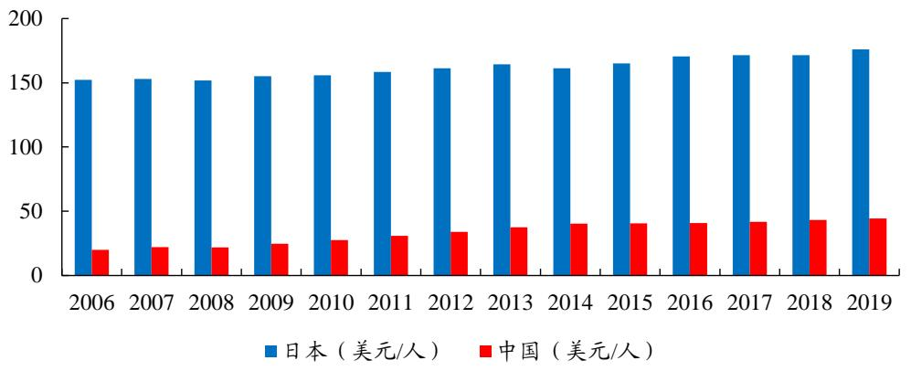  
图10：中国人均乳制品消费金额仍较低  
数据来源：Euromonitor、开源证券研究所

# 2.2、行业呈双寡头格局，行业集中度持续提升

乳制品行业集中度持续提升，呈双寡头格局。乳制品企业可根据市场份额及经营范围大致分为全国性乳制品企业（伊利股份、蒙牛乳业等）、区域性乳制品企业（光明乳业、新乳业等）、地方性乳制品企业（燕塘乳业等）及小型乳制品企业四大梯队，其中全国性乳制品企业伊利股份、蒙牛乳业常温奶市占率合计约 $6 5 \%$ ，二者市占率之和长期大于 $5 0 \%$ ，行业双寡头格局稳定。

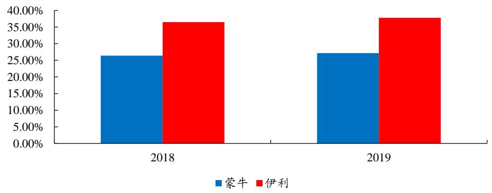  
图11：2019 年中国常温奶CR2约 $6 5 \%$   
数据来源：尼尔森、开源证券研究所

全国性乳制品企业处于常态化竞争状态，未来竞争或趋缓。我国乳制品企业的促销力度会受企业经营策略动态调整、上游原奶供需变化等因素影响。通常当上游奶源供给大于需求时，企业会通过喷粉或是促销方式消化多余产能。我国乳制品企业的基础白奶处于常态化竞争状态。除基础白奶竞争外，乳制品企业也会对高端白奶进行促销。企业采取市场份额优先策略、液态奶产品同质化使得乳制品行业竞争逐渐加剧，但展望未来，行业竞争有望趋缓：

(1)基础白奶：上游原奶供需变化是影响乳制品企业促销力度的重要因素之一，而其中基础白奶的促销力度与原奶供需变化的相关性更高。如2014 年在奶农补栏、进口大包粉冲击下原奶供给大于需求，各乳制品企业加大产品促销，行业竞争激烈。往2020 年展望，奶牛补栏速度仍较慢，且奶牛生长周期需要约2年，原奶供给偏紧，原奶价格仍会处于上行周期，各乳制品企业成本压力增加，基础白奶的促销力度有望放缓。

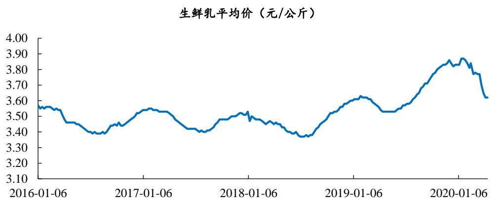  
图12：2020 年4 月 8 日生鲜乳价格同比增长 $2 . 3 \%$   
数据来源：Wind、开源证券研究所

（2）高端乳制品：2019Q2全国性乳制品企业伊利股份、蒙牛乳业对高端乳制品金典、纯甄进行买赠促销。双方皆是对自己相对较为弱势的产品进行促销投入，以进一步提升产品市场份额，缩小与竞争对手的差距。2019Q3高端乳制品竞争趋缓。从长期来看，各大乳制品企业不会长期在高端乳制品上加大促销力度：一方面，产品出现差异化，如常温酸奶安慕希并未完全跟随纯甄参与价格竞争；另一方面，频繁进行买赠促销会损伤高端产品的品牌力和渠道利润。目前在尚未有新的高端爆品替代的情况下，安慕希、金典、纯甄、特仑苏等高端大单品仍为企业的主要利润来源。

疫情爆发后企业去库存促销投入大，行业集中度或加速提升。新冠肺炎疫情爆发后，送礼属性的高端乳制品受疫情影响较大，经销商和终端库存较高。乳制品企业需要投入市场费用以消化产品库存，但在此过程中小型乳制品企业品牌力弱、以低端产品为主且可销品项少、渠道力弱，故在消化库存期间：

（1）部分中小型乳制品企业需要补贴费用给经销商，可能由于盈利压力大而放弃一些网点;（2）一些中小型乳制品企业议价能力较弱，低端产品需要跟进龙头伊利股份、蒙牛乳业进行消化，产品价格进一步下降，减弱产品力；（3）部分乳制品企业由于品牌力较伊利股份、蒙牛乳业更弱，高端产品的消化周期会拉长。

小型乳制品企业资金压力大，而大型乳制品企业经销商体系稳定，渠道力、产品力、品牌力强，且资金实力雄厚，可在此期间收割份额，行业集中度或加速提升。

# 3、渠道与产品优势明显，品牌力强，竞争壁垒稳固

# 3.1、渠道扁平化，兼具深度和广度

公司渠道深耕多年，渠道力强。伊利股份具有较强的渠道力，可依靠渠道优势迅速铺货进行全国扩张。如公司较光明乳业、蒙牛乳业晚推出常温酸奶安慕希，但凭借着其高效、广度、深度兼具的渠道体系迅速将产品铺开，2018 年体量已突破 140亿，远高于蒙牛乳业的纯甄和光明乳业的莫斯利安。截止到 2019 年6 月，公司的常溫奶市场渗透率达 $8 3 . 9 \%$ ，同比增 2.7pcts。

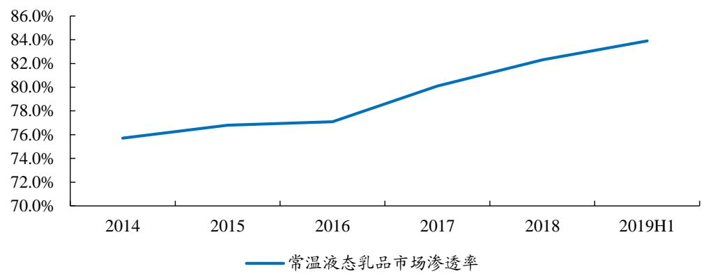  
图13：2019H1 常溫液态乳品市场渗透率达 $8 3 . 9 \%$   
数据来源：公司公告、开源证券研究所

公司渠道壁垒稳固：（1）渠道扁平化，伊利股份对渠道掌控力强。蒙牛乳业采取大商制，可以在起步较晚的情况下借助大经销商的资源快速扩张。但大商制中的经销商质量不一，且费用主要打包至经销商投放，企业对终端的掌控力较弱，后期经营效率较低。此外，经销商下设分销商，层级较多，渠道响应能力较慢，分销商在经营环境恶化时更不稳定。蒙牛乳业 2015 年开始推进渠道扁平化改革，2018 年引入分公司以加强渠道掌控能力，渠道改革初见成效。

伊利股份采取深度分销模式，中间环节较少，产品直达销售网点。公司主导销售订单，且投入费用和销售人员，和经销商一同开发市场，因此前期投入较大，建设周期长，但后期建成后渠道的响应速度快、公司对渠道掌控力强。通过对渠道进行嵌入式管理，公司可以深度了解终端铺市情况、费用投放情况等，有助于公司推广产品，了解消费者需求，及时调整市场策略。

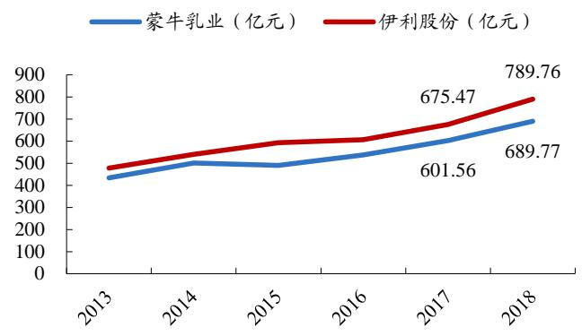  
图14：2015 年以来伊利股份营收拉大与蒙牛乳业的差距

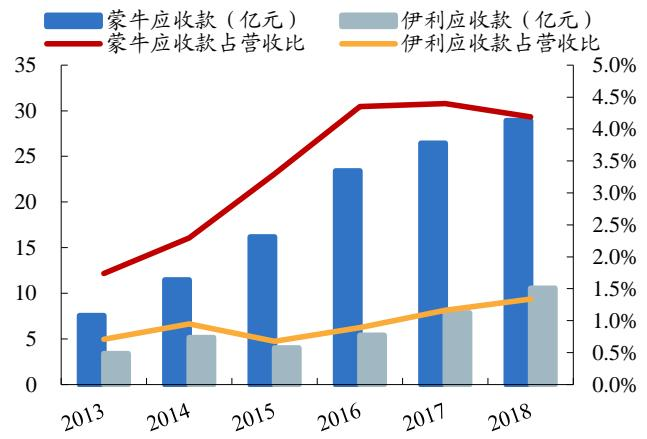  
图15：伊利股份应收款和应收款占比均小于蒙牛乳业

数据来源：Wind、开源证券研究所数据来源：Wind、开源证券研究所

（2）早期便开始渠道下沉工作，深耕渠道领先优势凸显。伊利股份最早开始进行渠道下沉工作，自 2006 年便开展织网行动，2007 年借助商务部的万村千乡活动开拓农家店等乡镇终端。经过多年的渠道深耕工作，2018 年公司直控村级网点数量达60.8 万家，同比增 $1 4 . 7 \%$ ; 2019H1 公司常温液态奶在三四线城市的渗透率达 $8 6 . 2 \%$ ,较2018H1增2.3pct。2017年伊利股份在各线城市的份额已达 $3 0 \%$ 以上，均高于蒙牛，而中国低线城市人均乳制品消费量仍较低，仍处于量升阶段，渠道深度大的伊利股份在此阶段可受益。

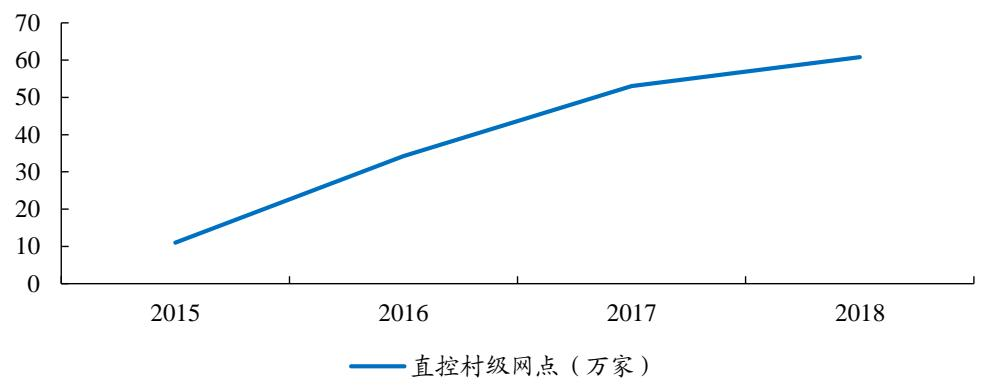  
图16：2018 年公司直控村级网点同比增 $1 4 . 7 \%$   
数据来源：公司公告、开源证券研究所

（3）积极布局新兴渠道，渠道多元化发展。根据 Euromonitor 的数据，液态奶线上销售占比已经从 2008 年的 $0 . 1 \%$ 增长至 2019 年的 $6 \%$ 。2018 年公司电商业务收入增速 $6 1 \%$ ，线上业务规模继续保持高速增长。此外，诸如社区零售、新零售等新渠道逐渐兴起。伊利股份积极布局新兴渠道，与盒马生鲜等新零售平台合作、并试水社区零售等，渠道多元化发展。

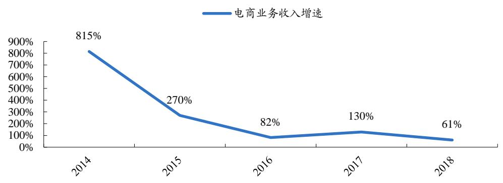  
图17：2014 年以来伊利股份电商业务收入快速增长  
数据来源：Wind、开源证券研究所

疫情爆发后渠道响应速度快，长期看渠道力可进一步加強，受益於行业集中度提升。2020 年1月疫情爆发后，渠道库存较往年增加 $7 0 \%$ 。伊利股份渠道扁平化，可快速响应公司政策处理库存。公司投入大量费用以回收产品和补偿经销商，并通过社区零售等新渠道消化产品库存。目前渠道库存已经较为良性，经销商可轻装上阵迎来节假日消费高峰。而部分中小型乳制品企业在此阶段由于资金压力，经销商体系不稳定，或放弃一些网点。公司可在此期间抢占网点和渠道，增强渠道深度和

广度。

# 3.2、产品线丰富，产品结构持续优化

伊利股份产品线及价位带布局齐全。公司业务主要为液态奶、奶粉、冷饮，经过多年的发展，目前各产品线及价位带皆较为齐全。如液态奶中公司已布局常温奶和低温奶，其中常温奶内涵盖白奶和常温酸奶，低温奶涵盖低温鲜奶、低温酸奶及低温乳饮料。在各品类中的各个价位带上公司均有布局产品，如在白奶既有低端的基础白奶，又有定位于中高端的金典等。

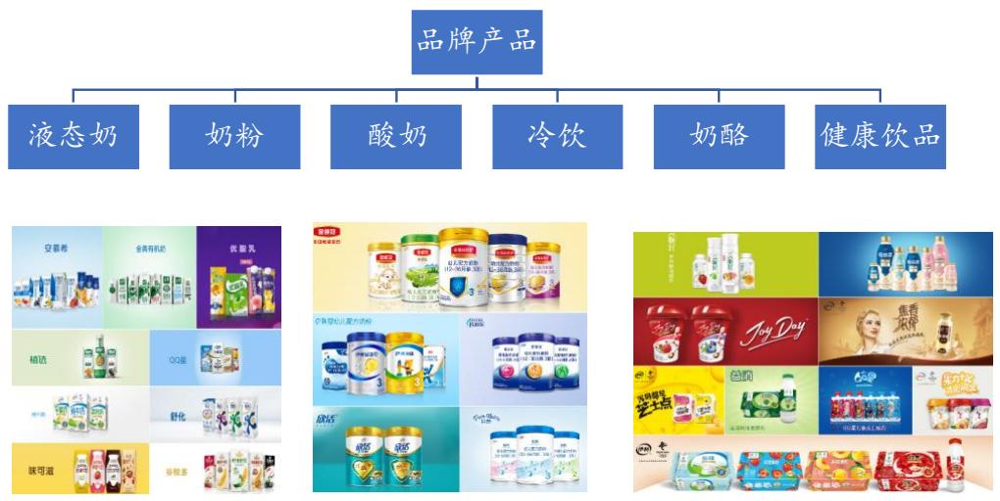  
图18：伊利股份产品线较为齐全  
数据来源：公司官网、开源证券研究所

产品结构持续优化是公司营收增长动力之一。2013 年以来，产品结构升级持续推动公司营收增长，2018 年产品结构升级对公司营业收入增长的贡献度是 $3 1 . 2 \%$ ,销量的贡献度是 $6 1 . 9 \%$ ，合计贡献度达 $9 3 . 1 \%$ 。分业务来看，2018 年产品结构升级分别对液体乳、冷饮、奶粉营业收入增长的贡献度为 $2 8 \%$ ， $7 0 \%$ 、 $4 4 \%$ 。

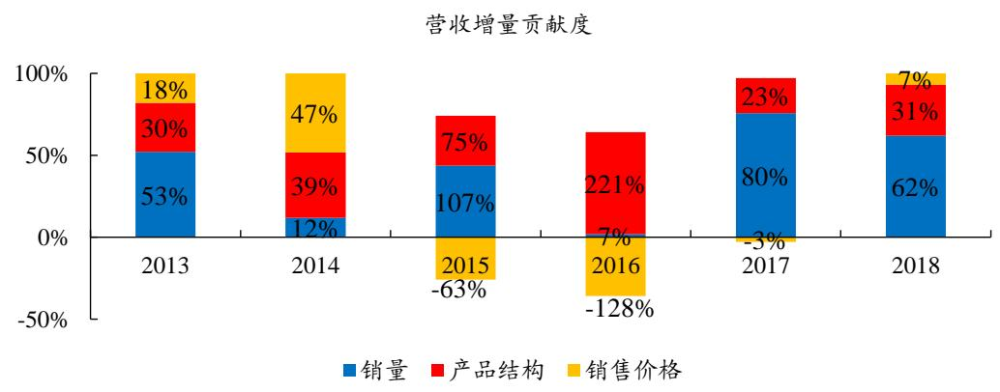  
图19：2013 年以来产品结构优化助力营收增长  
数据来源：公司公告、开源证券研究所

公司持续进行研发投入，进行产品结构升级。2015 年以来公司研发支出占营收比例稳定增长。2016 年之后，伊利股份的研发支出远远超过蒙牛乳业、光明乳业。2018 年公司研发费用同比增速高达 $1 0 4 \%$ ，研发支出占营收比例达 $0 . 5 3 \%$ ，远超过蒙牛、光明。伊利股份成立了乳业研究院、中国母乳数据库、母婴营养研究中心、伊利欧洲研发中心等，以“基础研发-技术升级-产品开发”研发平台为着力点，推动产品升级和结构优化。

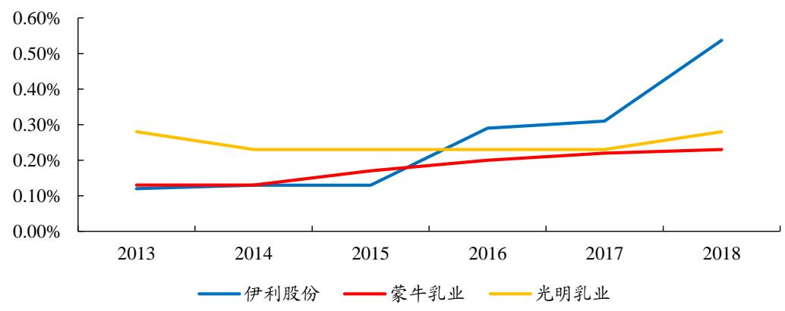  
图20：2016 年以来伊利研发支出占营收比例大於蒙牛和光明  
数据来源：Wind、开源证券研究所

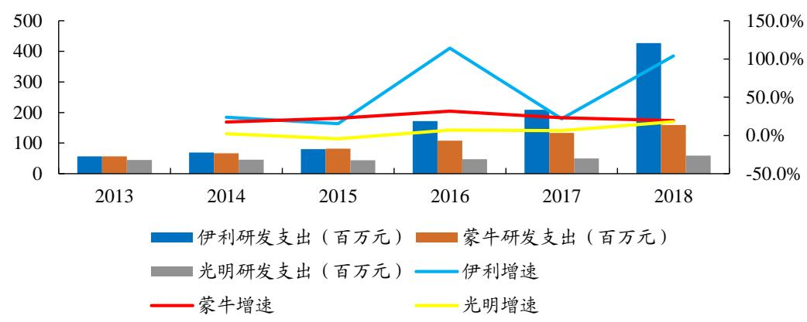  
图21：2016 年以来伊利股份研发费用增速较快  
数据来源：Wind、开源证券研究所

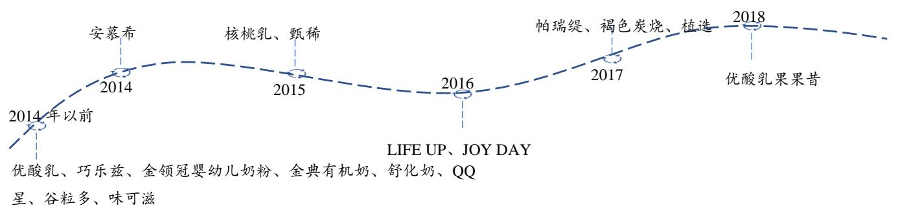  
图22：伊利股份每年积极推出新产品  
资料来源：公司官网、开源证券研究所

大单品不断出新延长产品生命周期。产品从准备进入市场开始通常会经历导入期、成长期、成熟期和衰退期。随着新品类体量逐渐增加，增速放缓，会逐渐从成长期进入到成熟期。如金典、安慕希两个大单品随着体量过百亿，增速开始逐渐放缓，公司通过不断推出新品、新包装，开拓新的口味、新的消费场景以延长产品生命周期。

（1）安慕希：伊利股份推出常温酸奶的时间较蒙牛乳业、光明乳业晚，但它后来居上，一方面密集推出新口味、新口感的产品以满足消费者的多样化需求，如推出黄桃燕麦、柳橙凤梨等；另一方面推出PET 瓶装、利乐钻、利乐盖包装产品，扩展饮用场景。目前安慕希的增长主要由新品贡献，2019 年PET 瓶安慕希收入占约$2 0 { - } 3 0 \%$ 。未来随着新品持续推出、更多品项下沉至低线城市，安慕希仍能稳步增长。

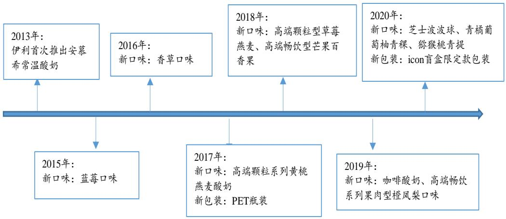  
图23：安慕希密集推出新品  
资料来源：公司官网、开源证券研究所

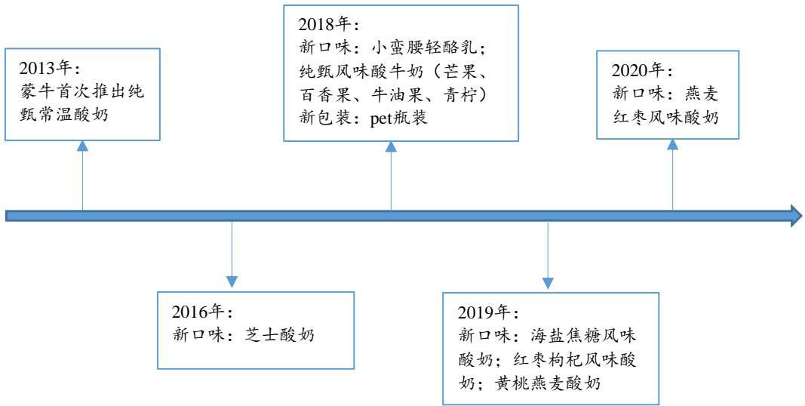  
图24：2019 年纯甄推出3款新口味产品  
资料来源：公司官网、开源证券研究所

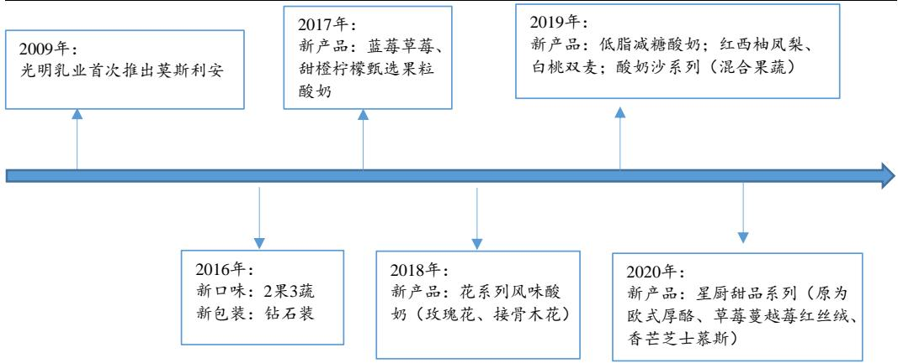  
图25：莫斯利安推出新品速度较慢  
资料来源：公司官网、开源证券研究所

(2）金典：经过十多年的发展，2018年金典规模突破百亿，与竞品特仑苏差距逐渐缩小。公司一方面不断提升奶源品质升级金典产品，如推出蛋白质含量$3 . 8 \mathrm { g } / 1 0 0 \mathrm { m l }$ 的娟姗牛奶，推出新西兰进口牛奶等；一方面不断升级包装，如推出梦幻盖包装，采用旋盖携带更为便携等。目前金典新品占金典系列约 $3 0 \%$ 。

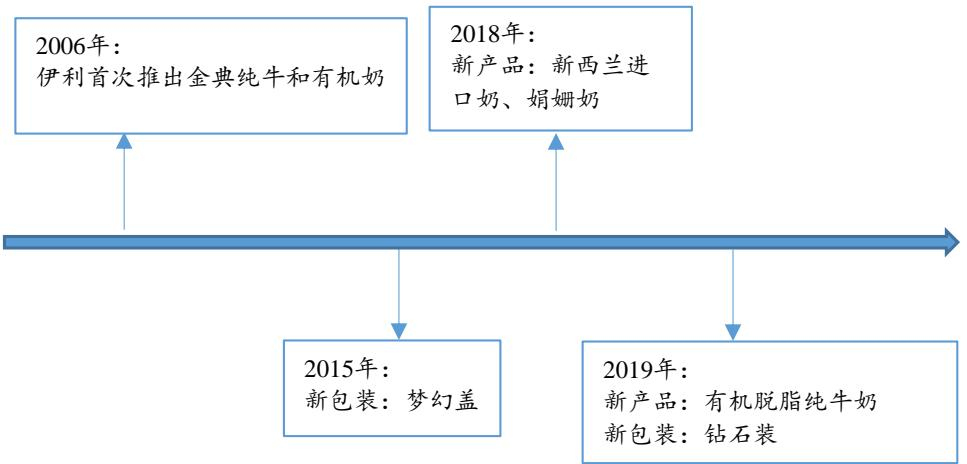  
图26：金典推出新品、升级包装  
资料来源：公司官网、开源证券研究所

老品深度培育，提前布局市场。目前农村、乡镇人均乳制品消费量仍较低，单价相对较低的白奶仍旧有很大发展空间。公司深度挖掘消费者需求，重新定位产品，推出新口味及新包装，对老品项进行培育。如在舒化奶中推出笑脸包，老品新做；儿童奶推出小蓝瓶，并添加果浆，深受儿童欢迎。此外，公司提前布局市场，如基础白奶最初包装为塑料包装，随着消费升级，包装升级利乐枕，公司提前布局40 元价格带的甄浓，完善价格带，为消费升级提前布局。

# 3.3、品牌营销方式多样，品牌形象佳

线上线下营销齐发力，品牌形象深入人心。伊利通过线上、线下以及跨界营销，对各类潜在消费者进行精准营销。线上公司自 2015 年以来一直积极参与节目冠名，其冠名节目都为大型影视剧和热门综艺，如2019 年的《乐队的夏天》，2020 年的《下一站是幸福》等，贴近年轻消费群体。线下伊利股份除了2013 年开放工厂让消费者能看到每一个生产环节以外，还积极参与到大型活动中，如赞助奥运会等，塑造良好、健康、活力的品牌形象。除了线上线下方式，伊利还通过跨界合作来推广品牌形象，如与苏宁等平台合作，利用平台大数据进行个性化营销；采用KOL营销李佳琦直播等推广品牌。

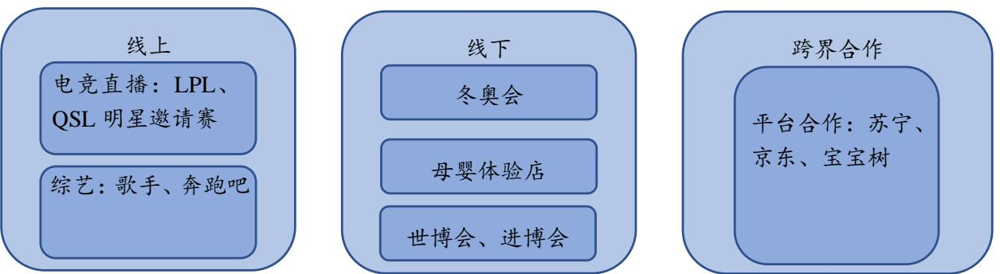  
图27：伊利使用线上线下和跨界合作方式进行营销  
资料来源：公司公告、开源证券研究所

公司品牌力强，在中国品牌排名中位居第一。从2004 年的“来自内蒙古大草原”到2016年“活力品牌”，伊利股份始终展示着健康、年轻的品牌形象。根据凯度报告，伊利股份 2015 年以来成为中国消费者购买次数最多的品牌，伊利股份的购买频次、渗透率、消费者触及数均超过康师傅、旺旺、蒙牛等大品牌，屡创全国第一。2018 年公司的消费者触及数达1275，同比增长 $5 . 1 \%$ ，品牌力强。

表4：伊利股份 2018 年在中国品牌排名蝉联第一  

<table><tr><td rowspan="2">排名</td><td rowspan="2">品牌</td><td rowspan="2">消费者触及数 （百万）</td><td rowspan="2">消费者触及 数增长</td><td colspan="2">渗透率%</td><td colspan="2">购买频次</td></tr><tr><td>2017</td><td>2018</td><td>2017</td><td>2018</td></tr><tr><td>1</td><td>伊利</td><td>1275</td><td>57</td><td>89.6</td><td>90.9</td><td>7.9</td><td>7.5</td></tr><tr><td>2</td><td>蒙牛</td><td>1053</td><td>10</td><td>87.2</td><td>88.1</td><td>6.9</td><td>6.5</td></tr><tr><td>3</td><td>康师傅</td><td>850</td><td>-66</td><td>82.6</td><td>80.8</td><td>6.4</td><td>5.6</td></tr><tr><td>4</td><td>海天</td><td>520</td><td>21</td><td>71.4</td><td>73.3</td><td>4.1</td><td>4.0</td></tr><tr><td>5</td><td>旺旺</td><td>453</td><td>-18</td><td>65.8</td><td>64.0</td><td>4.2</td><td>3.7</td></tr></table>

数据来源：凯度、开源证券研究所

# 4、品类多元构建健康食品平台，全球布局开拓海外市场

公司采用品类多元化战略，由乳制品向非乳制品延伸。2014 年伊利股份升级企业愿景为“成为全球最值得信赖的健康食品提供者”，自2014年以来开始试水非乳制品领域，向植物蛋白饮料、奶酪、能量饮料、矿泉水等其他领域扩张。借鉴达能集团从乳制品到饮料，再到食品的转型路径，目前公司正处于乳制品向饮料延伸的阶段。现今伊利股份非乳制品占比仍旧很小，未来非乳制品发展空间广阔，公司有望成为类似雀巢、达能的综合健康食品平台。

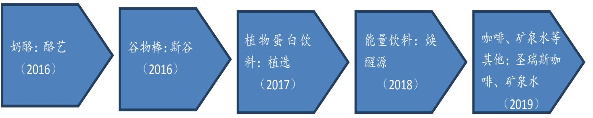  
图28：2016 年以来伊利股份品类多元化发展  
资料来源：公司官网、开源证券研究所

优化组织架构，调整渠道及事业部以培育新品类。2018 年以前，伊利股份具有冷饮、液态奶、酸奶、奶粉和原奶五大事业部。2018 年公司为了更好地协调资源，优化组织结构，相继成立了奶酪事业部和健康饮品事业部。健康饮品事业部下设植选、焕醒源、矿泉水等产品，并于2019 年进行经销商体系搭建、人员招聘，目前体系已经初步搭建完成。2019 年新业务部主要负责孵化新品类，如咖啡、伊然乳矿轻饮等。未来组织结构调整完成后，渠道体系和运作模式会更适合不同阶段的新品类特性，新品类潜力或可逐渐释放，非乳产品成长空间广阔。

通过收购、合作等方式全球化布局，扩张海外市场。伊利股份自2013 年推出全球织网计划以来，一直致力于在研发、生产、企业合作环节上加强与世界的联系，打造国际知名品牌形象：

（1）研发：2014年伊利股份与荷兰瓦赫宁根大学合作成立欧洲研发中心，与新西兰、美国企业签署协议共同研制开发产品。（2）生产：伊利股份在新西兰、意大利、美国等建立海外工厂，2018年收购泰国本土最大冰淇淋企业，2019 年收购新西兰第二大乳企威士兰，可满足消费者多样化需求，拓宽奶源产地范围，实现南北半球淡旺季互补。（3）企业合作：伊利股份与许多世界知名企业都有密切合作。在2019年第二届进博会期间伊利股份牵手利乐、嘉吉和芬美意等13 所全球战略合作伙伴。

表5：2018 年以来伊利全球化进程重大事件  

<table><tr><td>时间</td><td>事件</td></tr><tr><td>2018</td><td>收购泰国本土最大冰淇淋企业 Chomthana，进军东南亚市场</td></tr><tr><td rowspan="3">2019</td><td>Joyday冰淇淋印尼全球首发</td></tr><tr><td>收购新西兰第二大乳企威士兰，推动大洋洲奶源建设</td></tr><tr><td>第二届进博会，与利乐、嘉吉和芬美意等13 家全球战略合作伙伴现场签约，完善全球产业链布局</td></tr></table>

资料来源：公司公告、开源证券研究所

# 5、盈利预测与投资建议

我们预计伊利股份 2019 年营业收入增速约 $1 4 \%$ ，2020 年可完成千亿收入目标。分业务看，现今公司渠道库存已处于良性水平，经销商轻装上阵，随着需求回暖，液奶业务仍可快速增长，预计 2020 年液奶营业收入增速约 $1 2 . 5 \%$ ；进口奶粉品牌受疫情影响较大，公司积极转化客户，预计 2020 年奶粉营业收入增速约 $8 . 1 \%$ 。我们预计2019-2021 年公司营收分别增长 $1 4 . 0 \%$ 、 $1 2 . 1 \%$ 、 $1 0 . 1 \%$ 。

表6：收入预测：液态奶仍是主要收入增量来源  

<table><tr><td colspan="2"></td><td>2018A</td><td>2019E</td><td>2020E</td><td>2021E</td></tr><tr><td rowspan="3">液态奶</td><td>收入（百万元）</td><td>65658</td><td>74915</td><td>84311</td><td>93219</td></tr><tr><td>YOY</td><td>17.8%</td><td>14.1%</td><td>12.5%</td><td>10.6%</td></tr><tr><td>毛利率</td><td>35.20%</td><td>35.45%</td><td>35.41%</td><td>35.76%</td></tr><tr><td rowspan="3">冷饮</td><td>收入（百万元）</td><td>4998</td><td>5883</td><td>6621</td><td>7298</td></tr><tr><td>YOY</td><td>8.5%</td><td>17.7%</td><td>12.6%</td><td>10.2%</td></tr><tr><td>毛利率</td><td>45.1%</td><td>47.5%</td><td>48.0%</td><td>48.0%</td></tr><tr><td rowspan="3">奶粉</td><td>收入（百万元）</td><td>8046</td><td>9025</td><td>9753</td><td>10292</td></tr><tr><td>YOY</td><td>25.2%</td><td>12.2%</td><td>8.1%</td><td>5.5%</td></tr><tr><td>毛利率</td><td>54.8%</td><td>52.0%</td><td>52.0%</td><td>52.0%</td></tr><tr><td rowspan="3">其他</td><td>收入（百万元）</td><td>833</td><td>841</td><td>925</td><td>1018</td></tr><tr><td>YOY</td><td>-33.8%</td><td>1.0%</td><td>10.0%</td><td>10.0%</td></tr><tr><td>毛利率</td><td>15.0%</td><td>15.0%</td><td>15.0%</td><td>15.0%</td></tr><tr><td rowspan="3">合计</td><td>收入（百万元）</td><td>79535</td><td>90663</td><td>101610</td><td>111827</td></tr><tr><td>YOY</td><td>16.9%</td><td>14.0%</td><td>12.1%</td><td>10.1%</td></tr><tr><td>毛利率</td><td>37.6%</td><td>37.7%</td><td>37.6%</td><td>37.9%</td></tr></table>

数据来源：Wind、开源证券研究所

市场对于食品饮料行业通常采用相对估值方法。我们对比乳制品主要企业估值水平，可发现 2020 年乳制品行业平均估值在 26 倍 PE左右，而伊利股份估值 26 倍PE，与行业平均水平持平。我们认为伊利股份竞争优势明显，龙头地位稳固，可享受估值溢价，目前估值仍偏低。

表7：可比公司估值：伊利股份低于行业平均水平  

<table><tr><td rowspan="2">证券 代码</td><td rowspan="2">证券简称</td><td colspan="2">最新股价 EPS</td><td colspan="5">PE</td></tr><tr><td>元</td><td>2019E</td><td>2020E</td><td>2021E</td><td>2019E</td><td>2020E</td><td>2021E</td></tr><tr><td>002732</td><td>燕塘乳业</td><td>19.3</td><td>0.9</td><td>1.0</td><td>1.1</td><td>21.8</td><td>19.1</td><td>16.8</td></tr><tr><td>002946</td><td>新乳业</td><td>11.6</td><td>0.3</td><td>0.4</td><td>0.4</td><td>39.9</td><td>32.1</td><td>26.3</td></tr><tr><td>600419</td><td>天润乳业</td><td>12.5</td><td>0.5</td><td>0.6</td><td>0.7</td><td>23.1</td><td>20.3</td><td>17.8</td></tr><tr><td>600429</td><td>三元股份</td><td>5.5</td><td>0.2</td><td>0.2</td><td>0.2</td><td>34.1</td><td>31.6</td><td>28.4</td></tr><tr><td>600597</td><td>光明乳业</td><td>12.9</td><td>0.5</td><td>0.5</td><td>0.6</td><td>28.2</td><td>25.0</td><td>22.0</td></tr><tr><td>平均值</td><td></td><td></td><td></td><td></td><td></td><td>29.4</td><td>25.6</td><td>22.3</td></tr><tr><td>600887</td><td>伊利股份</td><td>31.2</td><td>1.2</td><td>1.2</td><td>1.4</td><td>26.4</td><td>25.8</td><td>22.6</td></tr></table>

数据来源：Wind、开源证券研究所注：1、除伊利股份外，其他企业均使用Wind一致预期2、最新股价采用4月24日收盘价

投资建议：预计2019-2021年公司归母净利分别为71.3 亿、73.3 亿、83.9 亿，EPS 分别1.18、1.21、1.38 元，对应PE 分别为27、26、23 倍。行业集中度提升趋势不变，龙头伊利股份不断强化自身渠道推力及产品竞争力，市场份额仍可扩张。公司具备渠道、产品、品牌优势，长期有望成为健康食品大平台，首次覆盖给予“买入”投资评级。

# 6、风险提示

食品安全事件、原材料价格波动风险、宏观经济风险

附：财务预测摘要   

<table><tr><td>资产负债表(百万元)</td><td>2017A</td><td>2018A</td><td>2019E</td><td>2020E</td><td>2021E</td></tr><tr><td>流动资产</td><td>29846</td><td>24455</td><td>28019</td><td>32296</td><td>37943</td></tr><tr><td>现金</td><td>21823</td><td>11051</td><td>13820</td><td>16756</td><td>21812</td></tr><tr><td>应收票据及应收账款</td><td>950</td><td>1282</td><td>1262</td><td>1589</td><td>1549</td></tr><tr><td>其他应收款</td><td>233</td><td>155</td><td>287</td><td>208</td><td>337</td></tr><tr><td>预付账款</td><td>1192</td><td>1460</td><td>1563</td><td>1825</td><td>1904</td></tr><tr><td>存货</td><td>4640</td><td>5507</td><td>6085</td><td>6917</td><td>7340</td></tr><tr><td>其他流动资产</td><td>1007</td><td>5001</td><td>5001</td><td>5001</td><td>5001</td></tr><tr><td>非流动资产</td><td>19455</td><td>23151</td><td>24609</td><td>25644</td><td>26158</td></tr><tr><td>长期投资</td><td>1765</td><td>1909</td><td>2204</td><td>2508</td><td>2822</td></tr><tr><td>固定资产</td><td>13256</td><td>14688</td><td>16279</td><td>17400</td><td>17964</td></tr><tr><td>无形资产</td><td>514</td><td>639</td><td>566</td><td>479</td><td>372</td></tr><tr><td>其他非流动资产</td><td>3919</td><td>5914</td><td>5560</td><td>5257</td><td>4999</td></tr><tr><td>资产总计</td><td>49300</td><td>47606</td><td>52628</td><td>57940</td><td>64101</td></tr><tr><td>流动负债</td><td>23850</td><td>19171</td><td>21290</td><td>22987</td><td>24715</td></tr><tr><td>短期借款</td><td>7860</td><td>1523</td><td>1523</td><td>1523</td><td>1523</td></tr><tr><td>应付票据及应付账款</td><td>7469</td><td>9116</td><td>9831</td><td>11420</td><td>11882</td></tr><tr><td>其他流动负债</td><td>8521</td><td>8532</td><td>9937</td><td>10043</td><td>11310</td></tr><tr><td>非流动负债</td><td>211</td><td>398</td><td>406</td><td>405</td><td>403</td></tr><tr><td>长期借款</td><td>0</td><td>0</td><td>8</td><td>7</td><td>5</td></tr><tr><td>其他非流动负债</td><td>210</td><td>398</td><td>398</td><td>398</td><td>398</td></tr><tr><td>负债合计</td><td>24061</td><td>19569</td><td>21696</td><td>23392</td><td>25118</td></tr><tr><td>少数股东权益</td><td>136</td><td>122</td><td>137</td><td>147</td><td>159</td></tr><tr><td>股本</td><td>6078</td><td>6078</td><td>6078</td><td>6078</td><td>6078</td></tr><tr><td>资本公积</td><td>2766</td><td>2841</td><td>2841</td><td>2841</td><td>2841</td></tr><tr><td>留存收益</td><td>16532</td><td>18718</td><td>21217</td><td>23671</td><td>26432</td></tr><tr><td>归属母公司股东权益</td><td>25103</td><td>27916</td><td>30795</td><td>34402</td><td>38824</td></tr><tr><td>负债和股东权益</td><td>49300</td><td>47606</td><td>52628</td><td>57940</td><td>64101</td></tr></table>

<table><tr><td>现金流量表(百万元)</td><td>2017A</td><td>2018A</td><td>2019E</td><td>2020E</td><td>2021E</td></tr><tr><td>经营活动现金流</td><td>7006</td><td>8625</td><td>9760</td><td>9266</td><td>11389</td></tr><tr><td>净利润</td><td>6003</td><td>6452</td><td>7149</td><td>7340</td><td>8404</td></tr><tr><td>折旧摊销</td><td>1444</td><td>1609</td><td>1534</td><td>1811</td><td>2064</td></tr><tr><td>财务费用</td><td>113</td><td>-60</td><td>-11</td><td>37</td><td>69</td></tr><tr><td>投资损失</td><td>-135</td><td>-261</td><td>-275</td><td>-285</td><td>-295</td></tr><tr><td>营运资金变动</td><td>-571</td><td>518</td><td>1356</td><td>355</td><td>1137</td></tr><tr><td>其他经营现金流</td><td>152</td><td>367</td><td>6</td><td>8</td><td>10</td></tr><tr><td>投资活动现金流</td><td>-3117</td><td>-5374</td><td>-2724</td><td>-2569</td><td>-2293</td></tr><tr><td>资本支出</td><td>3351</td><td>5091</td><td>1164</td><td>731</td><td>199</td></tr><tr><td>长期投资</td><td>-30</td><td>-176</td><td>-294</td><td>-144</td><td>-314</td></tr><tr><td>其他投资现金流</td><td>204</td><td>-460</td><td>-1854</td><td>-1982</td><td>-2408</td></tr><tr><td>筹资活动现金流</td><td>4053</td><td>-10749</td><td>-4268</td><td>-3761</td><td>-4041</td></tr><tr><td>短期借款</td><td>7710</td><td>-6337</td><td>0</td><td>0</td><td>0</td></tr><tr><td>长期借款</td><td>0</td><td>0</td><td>8</td><td>-1</td><td>-2</td></tr><tr><td>普通股增加</td><td>14</td><td>-0</td><td>0</td><td>0</td><td>0</td></tr><tr><td>资本公积增加</td><td>289</td><td>76</td><td>0</td><td>0</td><td>0</td></tr><tr><td>其他筹资现金流</td><td>-3960</td><td>-4487</td><td>-4275</td><td>-3760</td><td>-4039</td></tr><tr><td>现金净增加额</td><td>7545</td><td>-7191</td><td>2769</td><td>2936</td><td>5056</td></tr></table>

数据来源：贝格数据、开源证券研究所

<table><tr><td>利润表(百万元)</td><td>2017A</td><td>2018A</td><td>2019E</td><td>2020E</td><td>2021E</td></tr><tr><td>营业收入</td><td>67547</td><td>78976</td><td>90026</td><td>100897</td><td>111042</td></tr><tr><td>营业成本</td><td>42362</td><td>49106</td><td>56099</td><td>62922</td><td>68996</td></tr><tr><td>营业税金及附加</td><td>512</td><td>531</td><td>540</td><td>605</td><td>666</td></tr><tr><td>营业费用</td><td>15522</td><td>19773</td><td>21786</td><td>24467</td><td>26983</td></tr><tr><td>管理费用</td><td>3317</td><td>2980</td><td>3691</td><td>4742</td><td>4886</td></tr><tr><td>研发费用</td><td>0</td><td>427</td><td>486</td><td>545</td><td>677</td></tr><tr><td>财务费用</td><td>113</td><td>-60</td><td>-11</td><td>37</td><td>69</td></tr><tr><td>资产减值损失</td><td>51</td><td>76</td><td>86</td><td>97</td><td>106</td></tr><tr><td>其他收益</td><td>788</td><td>747</td><td>767</td><td>757</td><td>762</td></tr><tr><td>公允价值变动收益</td><td>0</td><td>0</td><td>0</td><td>0</td><td>0</td></tr><tr><td>投资净收益</td><td>135</td><td>261</td><td>275</td><td>285</td><td>295</td></tr><tr><td>资产处置收益</td><td>12</td><td>-38</td><td>-7</td><td>-8</td><td>-10</td></tr><tr><td>营业利润</td><td>7116</td><td>7691</td><td>8384</td><td>8514</td><td>9704</td></tr><tr><td>营业外收入</td><td>86</td><td>35</td><td>35</td><td>35</td><td>35</td></tr><tr><td>营业外支出</td><td>128</td><td>148</td><td>106</td><td>112</td><td>124</td></tr><tr><td>利润总额</td><td>7074</td><td>7578</td><td>8313</td><td>8437</td><td>9615</td></tr><tr><td>所得税</td><td>1071</td><td>1126</td><td>1164</td><td>1097</td><td>1212</td></tr><tr><td>净利润</td><td>6003</td><td>6452</td><td>7149</td><td>7340</td><td>8404</td></tr><tr><td>少数股东损益</td><td>2</td><td>12</td><td>15</td><td>10</td><td>12</td></tr><tr><td>归属母公司净利润</td><td>6001</td><td>6440</td><td>7134</td><td>7330</td><td>8392</td></tr><tr><td>EBITDA</td><td>8340</td><td>8947</td><td>9566</td><td>9881</td><td>11193</td></tr><tr><td>EPS(元)</td><td>0.99</td><td>1.06</td><td>1.18</td><td>1.21</td><td>1.38</td></tr></table>

<table><tr><td>主要财务比率</td><td>2017A</td><td>2018A</td><td>2019E</td><td>2020E</td><td>2021E</td></tr><tr><td>成长能力</td><td></td><td></td><td></td><td></td><td></td></tr><tr><td>营业收入(%)</td><td>12.0</td><td>16.9</td><td>14.0</td><td>12.1</td><td>10.1</td></tr><tr><td>营业利润(%)</td><td>28.9</td><td>8.1</td><td>9.0</td><td>1.6</td><td>14.0</td></tr><tr><td>归属于母公司净利润(%)</td><td>6.0</td><td>7.3</td><td>10.8</td><td>2.7</td><td>14.5</td></tr><tr><td>获利能力</td><td></td><td></td><td></td><td></td><td></td></tr><tr><td>毛利率(%)</td><td>37.3</td><td>37.8</td><td>37.7</td><td>37.6</td><td>37.9</td></tr><tr><td>净利率(%)</td><td>8.9</td><td>8.2</td><td>7.9</td><td>7.3</td><td>7.6</td></tr><tr><td>ROE(%)</td><td>23.8</td><td>23.0</td><td>23.1</td><td>21.2</td><td>21.6</td></tr><tr><td>ROIC(%)</td><td>17.6</td><td>21.0</td><td>21.2</td><td>19.4</td><td>19.6</td></tr><tr><td>偿债能力</td><td></td><td></td><td></td><td></td><td></td></tr><tr><td>资产负债率(%)</td><td>48.8</td><td>41.1</td><td>41.2</td><td>40.4</td><td>39.2</td></tr><tr><td>净负债比率(%)</td><td>-54.4</td><td>-32.8</td><td>-38.8</td><td>-43.2</td><td>-51.3</td></tr><tr><td>流动比率</td><td>1.3</td><td>1.3</td><td>1.3</td><td>1.4</td><td>1.5</td></tr><tr><td>速动比率</td><td>1.0</td><td>0.7</td><td>0.7</td><td>0.8</td><td>1.0</td></tr><tr><td>营运能力</td><td></td><td></td><td></td><td></td><td></td></tr><tr><td>总资产周转率</td><td>1.5</td><td>1.6</td><td>1.8</td><td>1.8</td><td>1.8</td></tr><tr><td>应收账款周转率</td><td>82.6</td><td>70.8</td><td>70.8</td><td>70.8</td><td>70.8</td></tr><tr><td>应付账款周转率</td><td>5.8</td><td>5.9</td><td>5.9</td><td>5.9</td><td>5.9</td></tr><tr><td>每股指标(元)</td><td></td><td></td><td></td><td></td><td></td></tr><tr><td>每股收益(最新摊薄)</td><td>0.99</td><td>1.06</td><td>1.18</td><td>1.21</td><td>1.38</td></tr><tr><td>每股经营现金流（最新摊薄)</td><td>1.16</td><td>1.42</td><td>1.61</td><td>1.53</td><td>1.88</td></tr><tr><td>每股净资产(最新摊薄)</td><td>4.14</td><td>4.60</td><td>5.08</td><td>5.67</td><td>6.40</td></tr><tr><td>估值比率</td><td></td><td></td><td></td><td></td><td></td></tr><tr><td>P/E</td><td>31.5</td><td>29.4</td><td>26.5</td><td>25.8</td><td>22.6</td></tr><tr><td>P/B</td><td>7.5</td><td>6.8</td><td>6.1</td><td>5.5</td><td>4.9</td></tr><tr><td>EV/EBITDA</td><td>21.1</td><td>20.2</td><td>18.6</td><td>17.7</td><td>15.2</td></tr></table>

# 特别声明

《证券期货投资者适当性管理办法》、《证券经营机构投资者适当性管理实施指引（试行）》已于2017年7月1日起正式实施。根据上述规定，开源证券评定此研报的风险等级为R3（中风险)，因此通过公共平台推送的研报其适用的投资者类别仅限定为专业投资者及风险承受能力为C3、C4、C5的普通投资者。若您并非专业投资者及风险承受能力为C3、C4、C5的普通投资者，请取消阅读，请勿收藏、接收或使用本研报中的任何信息。因此受限于访问权限的设置，若给您造成不便，烦请见谅！感谢您给予的理解与配合。

# 分析师承诺

负责准备本报告以及撰写本报告的所有研究分析师或工作人员在此保证，本研究报告中关于任何发行商或证券所发表的观点均如实反映分析人员的个人观点。负责准备本报告的分析师获取报酬的评判因素包括研究的质量和准确性、客户的反馈、竞争性因素以及开源证券股份有限公司的整体收益。所有研究分析师或工作人员保证他们报酬的任何一部分不曾与，不与，也将不会与本报告中具体的推荐意见或观点有直接或间接的联系。

股票投资评级说明  

<table><tr><td></td><td></td><td></td></tr><tr><td rowspan="4">证券评级</td><td>买入（Buy）</td><td>预计相对强于市场表现20%以上；</td></tr><tr><td>增持(outperform)</td><td>预计相对强于市场表现5%～20%；</td></tr><tr><td>中性(Neutral)</td><td>预计相对市场表现在-5%～+5%之间波动；</td></tr><tr><td>减持(underperform)</td><td>预计相对弱于市场表现 5%以下。</td></tr><tr><td rowspan="3">行业评级</td><td>看好(overweight)</td><td>预计行业超越整体市场表现；</td></tr><tr><td>中性（Neutral)</td><td>预计行业与整体市场表现基本持平；</td></tr><tr><td>看淡（underperform)</td><td>预计行业弱于整体市场表现。</td></tr><tr><td colspan="4">备注：评级标准为以报告日后的 6~12 个月内，证券相对于市场基准指数的涨跌幅表现，其中 A 股基准指数为沪 深 300 指数、港股基准指数为恒生指数、新三板基准指数为三板成指（针对协议转让标的）或三板做市指数（针 对做市转让标的）、美股基准指数为标普 500 或纳斯达克综合指数。我们在此提醒您，不同证券研究机构采用不同 的评级术语及评级标准。我们采用的是相对评级体系，表示投资的相对比重建议；投资者买入或者卖出证券的决 定取决于个人的实际情况，比如当前的持仓结构以及其他需要考虑的因素。投资者应阅读整篇报告，以获取比较</td></tr></table>

# 分析、估值方法的局限性说明

本报告所包含的分析基于各种假设，不同假设可能导致分析结果出现重大不同。本报告采用的各种估值方法及模型均有其局限性，估值结果不保证所涉及证券能够在该价格交易。

# 法律声明

开源证券股份有限公司是经中国证监会批准设立的证券经营机构，已具备证券投资咨询业务资格。

本报告仅供开源证券股份有限公司（以下简称“本公司”）的机构或个人客户（以下简称“客户”）使用。本公司不会因接收人收到本报告而视其为客户。本报告是发送给开源证券客户的，属于机密材料，只有开源证券客户才能参考或使用，如接收人并非开源证券客户，请及时退回并删除。

本报告是基于本公司认为可靠的已公开信息，但本公司不保证该等信息的准确性或完整性。本报告所载的资料、工具、意见及推测只提供给客户作参考之用，并非作为或被视为出售或购买证券或其他金融工具的邀请或向人做出邀请。本报告所载的资料、意见及推测仅反映本公司于发布本报告当日的判断，本报告所指的证券或投资标的的价格、价值及投资收入可能会波动。在不同时期，本公司可发出与本报告所载资料、意见及推测不一致的报告。客户应当考虑到本公司可能存在可能影响本报告客观性的利益冲突，不应视本报告为做出投资决策的唯一因素。本报告中所指的投资及服务可能不适合个别客户，不构成客户私人咨询建议。本公司未确保本报告充分考虑到个别客户特殊的投资目标、财务状况或需要。本公司建议客户应考虑本报告的任何意见或建议是否符合其特定状况，以及（若有必要）咨询独立投资顾问。在任何情况下，本报告中的信息或所表述的意见并不构成对任何人的投资建议。在任何情况下，本公司不对任何人因使用本报告中的任何内容所引致的任何损失负任何责任。若本报告的接收人非本公司的客户，应在基于本报告做出任何投资决定或就本报告要求任何解释前咨询独立投资顾问。

本报告可能附带其它网站的地址或超级链接，对于可能涉及的开源证券网站以外的地址或超级链接，开源证券不对其内容负责。本报告提供这些地址或超级链接的目的纯粹是为了客户使用方便，链接网站的内容不构成本报告的任何部分，客户需自行承担浏览这些网站的费用或风险。

开源证券在法律允许的情况下可参与、投资或持有本报告涉及的证券或进行证券交易，或向本报告涉及的公司提供或争取提供包括投资银行业务在内的服务或业务支持。开源证券可能与本报告涉及的公司之间存在业务关系，并无需事先或在获得业务关系后通知客户。

本报告的版权归本公司所有。本公司对本报告保留一切权利。除非另有书面显示，否则本报告中的所有材料的版权均属本公司。未经本公司事先书面授权，本报告的任何部分均不得以任何方式制作任何形式的拷贝、复印件或复制品，或再次分发给任何其他人，或以任何侵犯本公司版权的其他方式使用。所有本报告中使用的商标、服务标记及标记均为本公司的商标、服务标记及标记。

开源证券股份有限公司  
地址：西安市高新区锦业路1号都市之门B座5层  
邮编：710065  
电话：029-88365835  
传真：029-88365835