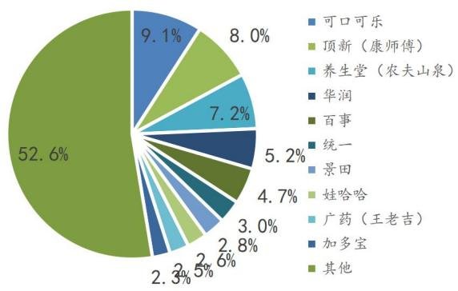

# 消费升级与娱乐研究中心

# 伊利股份(600887.SH)买入(维持评级)

市场价格（人民币）：44.04元

<table><tr><td>市场数据(人民币)</td><td>60.83</td></tr><tr><td>总股本(亿股) 已上市流通A股(亿股)</td><td>59.30</td></tr><tr><td>总市值(亿元)</td><td>2,678.79</td></tr><tr><td>年内股价最高最低(元)</td><td>51.69/26.53</td></tr><tr><td>沪深300指数</td><td>5377</td></tr><tr><td>上证指数</td><td>3505</td></tr></table>

# 相关报告

1.《利润端优化，千亿目标可期-伊利三季报点评》，2020.10.30  
2.《Q2业绩大超预期，稳步迈向千亿时代-伊利业绩点评》，2020.8.28  
3.《疫情影响短期业绩，未来依旧笃定前行-伊利业绩点评》，2020.4.30

# 基本面稳定，短期存在盈利弹性

公司基本情况(人民币)  

<table><tr><td>项目</td><td>2018</td><td>2019</td><td>2020E</td><td>2021E</td><td>2022E</td></tr><tr><td>营业收入(百万元)</td><td>79,553</td><td>90,223</td><td>98,159</td><td>110,510</td><td>123,062</td></tr><tr><td>营业收入增长率</td><td>16.9%</td><td>13.4%</td><td>8.8%</td><td>12.6%</td><td>11.4%</td></tr><tr><td>归母净利润(百万元)</td><td>6,440</td><td>6,934</td><td>7,491</td><td>8,730</td><td>9,757</td></tr><tr><td>归母净利润增长率</td><td>7.31%</td><td>7.67%</td><td>8.04%</td><td>16.53%</td><td>11.77%</td></tr><tr><td>摊薄每股收益(元)</td><td>1.06</td><td>1.14</td><td>1.23</td><td>1.44</td><td>1.60</td></tr><tr><td>每股经营性现金流净额</td><td>1.42</td><td>1.38</td><td>1.77</td><td>2.24</td><td>2.53</td></tr><tr><td>ROE(归属母公司)(摊薄)</td><td>23.07%</td><td>26.53%</td><td>24.41%</td><td>24.84%</td><td>24.01%</td></tr><tr><td>P/E</td><td>21.60</td><td>27.20</td><td>32.26</td><td>27.69</td><td>24.77</td></tr><tr><td>P/B</td><td>4.98</td><td>7.22</td><td>7.89</td><td>6.89</td><td>5.96</td></tr></table>

来源：公司年报、国金证券研究所

# 投资逻辑

行业趋势：常温缓慢增长，酸奶依靠口味创新保持活力，低温、奶酪快速增长，奶粉领域内资快速追赶。2019 年中国乳制品消费市场规模达到 4196 亿元，其中酸奶占比最大 $3 5 . 6 \%$ )，其次是UHT奶（ $2 2 . 4 \%$ )。目前UHT奶增速放缓至 $5 \%$ 以下，双寡头竞争格局清晰（CR2 为 $67 \%$ )；消费升级下低温奶增速加快，2014-2019 年的CAGR达到 $9 . 2 \%$ 。酸奶依靠口味创新保持活力，2015-2019 年的CAGR高达 $1 5 \%$ 。婴幼儿奶粉领域，2015-2019 年的CAGR达到 $9 . 8 \%$ ，内资品牌提升较快，份额有望实现反超外资。奶酪是近年增速最快的细分领域，2015-2019 年的 CAGR高达 $16 \%$ 。

公司优势：不断优化丰富产品结构，长期营销国民品牌地位稳固。公司主要品类均有覆盖，奶粉、奶酪可享受行业增长红利。大单品金典和安慕希通过结构升级持续带来增长动力。丰厚的营收可实现持续性全国营销，投入高于竞品，成为我国食饮行业的国民性品牌。渠道深度下沉，截至2019 年底服务的液态奶终端数量达到 191 万家，服务的乡镇村网点近103.9 万家。完善上游布局，奶源控制力较强。根据估算，目前伊利通过参控股和战略合作方式得到的原奶量约有 300 万吨以上，可满足 $50 \%$ 左右的原奶需求。

增长空间：短期存在弹性。目前奶价进入上涨周期，回顾历史可以发现公司通过提价、减少促销等方式来应对，反而有利于改善盈利空间。目前新的一轮提价时机已经成熟，随着原材料压力的增加，预计促销力度趋缓将成为共识。长期有望成功打开饮品市场。饮料行业空间广阔，竞争格局分散，CR10 为 $4 7 . 4 \%$ ；且行业更新迭代速度快，新品机遇较大。我们认为在饮料领域打造大单品，关键在于洞悉消费者的需求点，同时需要结合产品特色进行大面积推广，快速占领消费者心智。公司在这两方面均具备优势和经验，我们认为公司有较大概率能在饮料行业有所突破。

# 投资建议

预计公司 2020-2022 年 EPS 为 1.23 元/1.44 元/ 1.60 元， 对应 PE 为32X/28 X/25X。公司基本面稳定，长期逻辑清晰，且2021 年盈利水平存在改善弹性，我们认为公司合理估值在35-40 倍左右，维持“买入”评级。

# 风险

原奶价格波动；低温布局落后竞品；行业竞争加剧；食品安全问题。

# 內容目录

乳制品细分领域增长态势及竞争格局.. 4

液态奶：常温奶稳定增长仍是主流选择，低温奶消费增长迅猛. 4  
酸奶：近年来保持双位数增速，品类结构丰富， 4  
奶粉：市场空间广阔，内资品牌呈追赶态势.. .5  
奶酪：增速最快领域，儿童奶酪棒成黑马.. .6  
公司优势分析.. 6  
产品矩阵不断丰富、新品活力强，国民品牌地位稳固. .6  
渠道下沉能力强，常年精耕造就壁垒， .9  
完善上游布局，奶源控制力较强.. 9  
如何看待未来的成长空间？ .10  
原有业务增速稳定，短期存在弹性. 10  
能否成功跨越第二增长曲线？ .12  
盈利预测与投资建议.. 13  
盈利预测.. 13  
投资建议及估值. 14  
风险提示... 14

# 图表目录

图表1：2019 年中国主要乳制品消费结构. 4  
图表2：2014-2019年中国液态奶细分品类市场规模（亿元）及增速. 4  
图表3：常温奶领域伊利和蒙牛市占率走势. ..4  
图表4：2019年中国低温奶市场占有率情况. .4  
图表5：2014-2019年中国酸奶市场规模（亿元）及增速. 5  
图表6：2019年低温酸奶市占率.. ..5  
图表7：2014-2019年中国婴幼儿配方奶粉市场规模（亿元）及增速. 5  
图表8：2013-2019年中国婴幼儿配方奶粉内外资市场份额占比.. .6  
图表9：2019年中国婴幼儿配方奶粉行业品牌竞争格局.. ..6  
图表10：2014-2019年中国奶酪市场规模（亿元）及增速 .6  
图表11：2018-2019年中国奶酪市场竞争格局... .6  
图表12：公司当年新品销售收入占比.. .7  
图表13：伊利和蒙牛广告宣传费对比. .7  
图表14：伊利和蒙牛赞助综艺对比... .8  
图表15：伊利和蒙牛赞助赛事对比.. ..8  
图表16：公司终端数量及常温液态乳市场渗透率 .9  
图表17：伊利和蒙牛奶源布局. 10  
图表18：2015-2019年伊利新增营收来源贡献率 11  
图表19：公司产品分品类营收（亿元）及增速. 11  
图表20：公司营收、净利润（亿元）及增速. 11  
图表21：我国生鲜乳价格与公司销售费率走势.. .12  
图表22：我国生鲜乳价格与公司毛销差走势. .12  
图表23：我国软饮料行业市场规模(亿元) .12  
图表24：我国软饮料行业竞争格局.. .12  
图表25：饮料领域爆款特质分析.. 13  
图表26：盈利预测. .13

# 乳制品细分领域增长态势及竞争格局

# 液态奶：常温奶稳定增长仍是主流选择，低溫奶消费增长迅猛

乳制品主要包括UHT奶（即常温白奶）、巴氏奶（即低温鲜奶）、酸奶、奶粉、干酪等细分品类，根据 Euromonitor 统计分析数据显示，2019 年中国乳制品消费市场规模达到 4196.3 亿元，2010-2019 年年均复合增长率为8.6%。其中酸奶是乳制品消费最大的细分奶，消费规模达到 1492.99 亿元，占比为 $3 5 . 6 \%$ ，其次是UHT 奶，占比为 22.4%。

从增长态势来看，目前常温白奶增速放缓，2014 年-2019 年的 CAGR 仅为3.3%，且增速不断下降，2019 年增速仅为1.79%；相比之下，随着消费者健康意识的提振和厂商的教育，营养价值更高、基数较低的低温奶呈现出不错的增长态势，2014-2019 年的 CAGR达到 $9 . 2 \%$ ，且仍在加速。

  
图表1：2019 年中国主要乳制品消费结构  
来源：Euromonitor，国金证券研究所

  
图表2：2014-2019年中国液态奶细分品类市场规模（亿元）及增速  
来源：Euromonitor，国金证券研究所

当前我国常温白奶市场呈现出典型的双寡头状态，2020H1蒙牛与伊利的市占率分别达到 $2 8 . 2 \%$ 与 $3 8 . 5 \%$ ，CR2合计 $6 6 . 7 \%$ 。而低温奶由于其对储存运输条件的较高要求以及较短的保质期，具有高周转高新鲜度的特征，区域性品牌反而更具优势，因此呈现出较为分散的竞争格局。2019 年光明（含优培、致优）的市占率最高，达 $1 2 . 1 \%$ ，其中优培为低温奶中的明星单品，仅单个产品市占率就达 $5 . 9 \%$ ，三元市占率第二，为 $8 . 7 \%$ 。

  
图表3：常温奶领域伊利和蒙牛市占率走势  
来源：尼尔森，国金证券研究所

  
图表4：2019 年中国低温奶市场占有率情况  
来源：Euromonitor，国金证券研究所

# 酸奶：近年来保持双位数增速，品类结构丰富

酸奶作为乳制品领域占比最大的品类，近几年呈现较快的增长态势，2014-2019 年的 CAGR高达15.4%。在低温酸奶领域，伊利和蒙牛分别以31.1%和 23.1%的市占率位居前二，远远高于其他品牌。

与液态奶相比，酸奶的品类更加多样化，持续创新保持产品活力。尼尔森数据显示，近年来含果肉果酱的酸奶的 CAGR比不含果肉果酱的酸奶高十几倍，而混合型谷物的乳制品销量也远远超过单一型。同时，在乳制品口味丰富方面，2018年芝士口味酸奶、炭烧口味酸奶的销量与同期相比增长了3倍。因此，酸奶制品成为口味多样化、口感创新化的最佳“试验田”通过对口感的不断创新保持产品活力，再结合酸奶制品突出的健康功效，酸奶制品的增速远高于液态奶，未来增长点与发展方向明确。

  
图表5：2014-2019 年中国酸奶市场规模（亿元）及增速  
来源：智研咨询，国金证券研究所

来源：前瞻产业研究院，Euromonitor，国金证券研究所

  
图表6：2019 年低溫酸奶市占率

# 奶粉：市场空间广阔，内资品牌呈追赶态势

在奶粉消费市场上，婴幼儿配方奶粉占据绝对主导地位（2017 年占比达$76 \%$ )，我国婴幼儿配方奶粉在2014-2019 年市场规模由1187亿元增长至1896亿元，CAGR达到 $9 . 8 \%$ 。

  
图表7：2014-2019 年中国婴幼儿配方奶粉市场规模（亿元）及增速  
来源：智研咨询，国金证券研究所

内资品牌市占率逐步提升。我国奶粉市场上外资品牌仍占据较大市场份额，但国产品牌市占率在逐步提升，2019 年达到 $49 \%$ 。2019年6月3日，国家发改委发布《国产婴幼儿配方乳粉提升行动方案》，提到未来国产婴幼儿配方乳粉的自给率要力争维持在 60%之上，且对内资奶粉的品质提升、产业升级、品牌培育提出了具体要求。整体来看提高了行业的门槛，利好国内头部品牌进一步提升市场份额。目前外资龙头惠氏占据主导地位，市占率为9.05%，其次是达能、雅培、美素佳儿；而飞鹤领跑国产品牌，市占率为6.61%，其次是伊利和君乐宝。

  
图表8：2013-2019 年中国婴幼儿配方奶粉内外资市场份额占比  
来源：智研咨询，国金证券研究所

  
图表9：2019 年中国婴幼儿配方奶粉行业品牌竞争格局  
来源：智研咨询，各公司年报，国金证券研究所

注：由于惠氏与达能未披露其中国地区奶粉销售额与市占率，此处惠氏与达能份额根据历史数据与增长率估算。

# 奶酪：增速最快领域，儿童奶酪棒成黑马

奶酪市场是近年乳制品市场增长速度最快的细分领域，根据Euromonitor数据，近十年奶酪市场呈现爆发式增长，增长近8倍，虽然近年来增速有所放缓，但 2015-2019 年间的 CAGR 仍高达 $16 \%$ 。  
我国奶酪市场起步相比国际较晚，故近年来奶酪市场主要由进口品牌主导，根据 Euromonitor 数据，2019 年百吉福的市占率高达 $2 2 . 7 \%$ ，是我国奶酪市场的绝对龙头。而在国产品牌中，妙可蓝多以儿童奶酪棒为切入口，快速放量，市占率由 2018 年的 1.9%猛增至 2019 年的 4.8%，跃居国产品牌第一。

  
图表10：2014-2019 年中国奶酪市场规模（亿元）及增速

  
图表11：2018-2019 年中国奶酪市场竞争格局

来源：Euromonitor，国金证券研究所来源：Euromonitor，国金证券研究所

# 公司优势分析

产品矩阵不断丰富、新品活力强，国民品牌地位稳固公司产品线布局全面。目前公司已布局几乎所有乳制品细分领域，拥有高中低端的产品矩阵，成立了液态奶、奶粉、冷饮、酸奶、健康饮品及奶酪六大产业业务线。

创新能力强，推动产品结构优化。公司持续挖掘液态奶“金典”系列的升级空间，2019年推出“金典”梦幻盖有机纯牛奶、“金典”有机脱脂纯牛奶；2020 年上半年推出“金典”低温牛奶。在酸奶领域，2020 年上半年推出“安慕希”新口味芝士波波球。在奶粉和奶酪领域不断丰富产品线，推出“金领冠悠滋小羊”婴幼儿配方奶粉、“金领冠塞纳牧”婴幼儿有机配方奶粉、“伊利”儿童奶酪棒、“妙芝”口袋芝士成人奶酪棒、“伊利”马苏里拉芝士碎等新品。2019 年底公司开始积极发力新业务，加大布局大健康产业，首创推出“伊刻活泉”火山低温矿泉水和“伊然”乳矿轻饮新品。公司的新品具备不错的市场潜力，推出后整体取得较好的销售业绩。

营销力度大，成功塑造国民品牌。2010-2019 年，伊利在广告营销的投入均由38 亿元上升至110 亿元，2015 年之后公司在广告营销上的投入占总营收比重在 12%-13%左右，公司广告投放费用的绝对值和占比均高于同行蒙牛。通过赞助一系列高规格的体育赛事和国际会议，公司明显提升了自身的国民度和高端品牌形象，比如分别在 2008 年和2010 年赞助了北京奥运会和上海世博会；另外多次赞助《爸爸去哪儿》、《奔跑吧、兄弟》、《最强大脑》、《我是歌手4》、《奇葩说》等热门综艺节目来触达年轻消费群体；公司在节目冠名的数量与质量上与竞品蒙牛相比优势明显。BrandZTM发布的“2019 年最具价值中国品牌100 强”榜单，公司连续7 年位列食品和乳品排行榜第一名。

  
图表12：公司当年新品销售收入占比  
来源：公司年报，国金证券研究所

  
图表13：伊利和蒙牛广告宣传费对比

来源：公司年报，国金证券研究所来源：国金证券研究所整理

图表14：伊利和蒙牛赞助综艺对比  

<table><tr><td colspan="6"></td><td colspan="3">蒙牛</td></tr><tr><td></td><td>产品</td><td>节目</td><td>伊利</td><td>产品</td><td>节目</td><td rowspan="5"></td><td>产品</td><td>节目</td></tr><tr><td></td><td>JoyDay</td><td>我想和你唱</td><td></td><td>安慕希</td><td>奔跑吧3</td><td>纯甄酸牛奶</td><td>我爱世界杯</td></tr><tr><td rowspan="13"></td><td>QQ星</td><td>不可思议的妈</td><td rowspan="5"></td><td>锋味</td><td>2018年</td><td></td><td>星星美人鱼</td></tr><tr><td></td><td>奔跑吧2</td><td></td><td>漫游记</td><td>特仑苏</td><td>声入人心</td></tr><tr><td rowspan="2">安慕希</td><td>锋味</td><td>畅轻</td><td>青春环游记</td><td>真果粒</td><td>明日之子</td></tr><tr><td>梦想的声音</td><td>畅意</td><td>巅峰之夜</td><td rowspan="2">纯甄小蛮腰</td><td>创造营2019</td><td></td></tr><tr><td>畅意</td><td>高能少年团2</td><td>谷粒多</td><td>终极高</td><td></td><td>中餐</td></tr><tr><td rowspan="11">2018 年</td><td>畅轻</td><td>我是大侦探</td><td rowspan="11">2019年</td><td rowspan="2">果果昔优酸 乳</td><td rowspan="2">乐队的夏天</td><td rowspan="2"></td><td rowspan="2"></td><td></td></tr><tr><td>果果昔优</td><td></td><td>冠益乳酸牛奶</td><td>真声</td></tr><tr><td>酸乳</td><td>七夕爱情歌会 亲爱的客栈</td><td rowspan="2">金典</td><td rowspan="2">歌手2019 亲爱的客栈</td><td rowspan="2">2019年</td><td rowspan="2">每日鲜语</td><td rowspan="2">们 歌</td></tr><tr><td>金典</td><td></td></tr><tr><td rowspan="2"></td><td>时间的朋友</td><td rowspan="2">金领冠</td><td rowspan="2"></td><td rowspan="2">妻子的浪漫旅 行</td><td rowspan="2">随便冰淇淋</td><td>各位游客请注意</td></tr><tr><td></td><td>向的活</td></tr><tr><td></td><td></td><td rowspan="6"></td><td rowspan="2">巧乐兹</td><td>是</td><td rowspan="6"></td><td>特仑苏</td><td></td></tr><tr><td>金领冠</td><td></td><td>我们是真正的 朋友</td><td>优益C</td><td>王牌对王牌</td></tr><tr><td>味可滋</td><td>了不起的孩子 偶像练习生</td><td>舒化 欣活</td><td>野生廚房</td><td></td><td>心动的信号</td></tr><tr><td>欣活</td><td>阅读阅美</td><td>伊利纯牛奶</td><td>现在的我们</td><td>真果粒</td><td></td></tr><tr><td>欣活</td><td>奇遇人生</td><td>甄稀冰淇淋</td><td>拜托了冰箱5</td><td>特仑苏</td><td></td></tr><tr><td>巧乐兹</td><td>勇敢的世界</td><td>植选</td><td>以团之名</td><td>纯甄小蛮腰</td><td>向往的生活 创造营2020</td></tr><tr><td></td><td>植选</td><td>向往的生活</td><td rowspan="6"></td><td>金典</td><td>天赐的声音</td><td>2020年</td><td>真果粒</td><td>青春有你2</td></tr><tr><td></td><td></td><td rowspan="5">2020年 畅轻</td><td></td><td>乘风破浪的姐</td><td colspan="3" rowspan="5"></td></tr><tr><td>舒化 甄稀冰淇</td><td>幸福三重奏</td><td></td><td>姐</td></tr><tr><td>淋</td><td>拜托了冰箱4</td><td>安慕希 每益添</td><td>漫游记 拜托了冰箱</td></tr><tr><td></td><td></td><td></td><td>妻子的浪漫旅</td></tr><tr><td></td><td></td><td>金领冠 甄稀</td><td>行 让生活好看</td></tr></table>

来源：国金证券研究所

图表15：伊利和蒙牛赞助赛事对比  

<table><tr><td>伊利</td><td>蒙牛</td></tr><tr><td>2005 年：签约北京奥组委，成为中国唯一 一家符合奥运标准，并为奥运会提供乳制品 的企业 2010 年：赞助广州亚运会、上海世博会 2012 年：赞助伦敦奥运会 2016 年：赞助杭州G20峰会、里约奥运会 2017 年：赞助天津全运会，获得2022 年北 京冬奥会和残奥会赞助权，赞助英雄联盟 S7总决赛</td><td>2007 年：和NBA达成战略合作关系，蒙牛 成为博鳌亚洲论坛的官方合作伙伴 2017年：成为2018 年俄罗斯世界杯全球官 方赞助商、中国航天事业战略合作伙伴，旗 下特仑苏、纯甄、冠益乳、蒂兰圣雪、蒙牛 纯牛奶五款产品成为“金砖国家领导人厦门 会晤指定产品” 2018 年：特仑苏、蒙牛纯甄、蒙牛纯牛奶 和蒂兰圣雪被授予上海合作组织青岛峰会指 定产品</td></tr></table>

# 渠道下沉能力強，常年精耕造就壁垒

」在渠道方面，伊利较早便开始实行扁平化管理，经销商数量多但体量较小；而蒙牛在初期主要实行大商制，借助大经销商实现在全国的快速铺货，2017 年开始实施推动渠道下沉。相比之下，伊利更加重视渠道的精耕和下沉：公司自 2007 年以来便开始下沉乡镇，借助商务部万村千乡活动切入农家店等乡镇零售终端；2014 年开始加大对乡镇市场的覆盖力度，直控村级网点数量迅速增加。截至 2019 年底，公司服务的液态奶终端数量达到191 万家，服务的乡镇村网点近 103.9万家，常温液态乳的市场渗透率不断提升。深度的渠道下沉，使得公司可以持续享受各线城市消费升级带来的红利，而且提高了公司对渠道的掌控能力和对市场动向的敏感度。

  
图表16：公司终端数量及常温液态乳市场渗透率  
来源：国金证券研究所

# 完善上游布局，奶源控制力较强

伊利主要通过控股上游牧场企业和战略合作的方式保证奶源的掌控，其中优然牧业是公司与 2007 年设立的全资子公司，2015 年为了在报表端实现轻资产运营，转让优然牧业股权使其出表，但仍是实际持有人，间接控股40%。优然牧业通过并购赛科星、恒天然中国，以及加快自有牧场建设等方式持续扩大原奶产能，目前已经是全球最大的原奶供应商，原奶年产量达到 150 万吨左右，90%以上供应给伊利。

根据估算，目前伊利通过参控股和战略合作方式得到的原奶量约有 300 万吨以上，蒙牛为 200 多万吨。由《荷斯坦杂志》统计的 2019 年度中国乳企生乳收购量数据显示，伊利的生鲜乳收购量为 608万吨，可见目前可控制的原奶收购量可满足一半左右的原奶需求。

图表17：伊利和蒙牛奶源布局  

<table><tr><td></td><td>上游奶源</td><td></td><td>合作方式</td><td>原</td><td>供给蒙牛和伊利的规模估算</td></tr><tr><td rowspan="5">现代牧业</td><td rowspan="5"></td><td>布局时间</td><td>签10年略合作合同，现代牧业所产70%以上原</td><td rowspan="5">139</td><td rowspan="5">1吨以上(%以上原奶供应</td></tr><tr><td>2008年</td><td>收购现代牧业 26.9%股权，成为其单一大股东</td></tr><tr><td>2013年</td><td></td></tr><tr><td>2017年</td><td>要约收购，持股比例增至61.3%，随后向中粮乳业出 先后经历新希望乳业，股份期权计划行权及要约收</td></tr><tr><td>当前</td><td>购，蒙牛及其一致行动人共持有现代牧业已发行股 份的57.9%</td></tr><tr><td>圣牧高科</td><td>2018年12月</td><td>收购国圣牧旗下内蒙古圣牧高科奶业51%的股权取</td><td>约25.6</td><td></td></tr><tr><td rowspan="8">蒙牛</td><td rowspan="2">富源牧业 中鼎牧业</td><td>2012年</td><td>成立子公司（蒙牛持股 40%)</td><td rowspan="2"></td><td>25万吨左右（主要供应蒙牛）</td></tr><tr><td>20191月</td><td></td><td></td></tr><tr><td rowspan="3">中地乳业</td><td></td><td></td><td rowspan="3">37（2019 年销量</td><td rowspan="3">18以(战略协定供</td></tr><tr><td>2015年 2014年</td><td>开始向蒙牛提供原料奶 与供5伊利爸订10年战略合作协议，承诺向双方</td></tr><tr><td>2019年</td><td>2019 年财报披露，公司最大客户占营业额的 90.9%，可能已将蒙牛的原料奶额度收回全部转给伊</td></tr><tr><td rowspan="3">原生态牧 优然牧业</td><td></td><td>利 作为基础投资者认购其600万美元股份，形成战略</td><td>66.5</td><td>182吨(219年向蒙牛出售</td></tr><tr><td>2013年12月</td><td></td><td>约150</td><td>15以</td></tr><tr><td></td><td>成立子公司(2020 年 IP0 前伊利合计持股 40%)</td><td></td><td>2e(219年对伊利销售</td></tr><tr><td rowspan="5">伊利</td><td>赛科星</td><td>2019年7月</td><td>通过优然牧业收购赛科星58.36%股权</td><td>61</td><td></td></tr><tr><td></td><td></td><td></td><td colspan="2"></td></tr><tr><td rowspan="2"></td><td></td><td></td><td rowspan="2">左右)</td><td rowspan="2"></td></tr><tr><td></td><td>二股东</td></tr><tr><td>辉山牧场</td><td>2019年8月</td><td>拟参与重组，计划获取新辉山 67%股权</td><td>预计60 (c:)</td><td></td></tr><tr><td>恒天中</td><td>2020年10月</td><td>通过然购股协议收购恒天然中国收场旗</td><td colspan="3">约36万吨（两大牧场年产3.5亿升原奶)</td></tr></table>

来源：各公司公告，各公司官网，国金证券研究所整理

# 如何看待未来的成长空间？

# 原有业务增速稳定，短期存在弹性

液体乳产品（包括常温牛奶、低温牛奶、酸奶等）贡献了公司大部分营收，占比为74.57%(2020 年三季报数据)。奶粉及奶制品、冷饮产品的占比分别为 13.97%和 10.24%。

结合前文的分析，常温白奶增速开始放缓，低温白奶虽然增速较快，但公司低温白奶占比较低，且与竞争对手相比目前并不具备明显优势。酸奶领域公司处于龙头地位，且行业仍处于增长阶段。整体来看，公司的营收增长主要来自产品结构升级，2018和2019 年贡献率均为31%，公司的大单品安慕希和金典系列仍有可挖掘的优化升级空间。

  
图表18：2015-2019 年伊利新增营收来源贡献率  
来源：公司公告，国金证券研究所

奶粉、奶酪领域目前增速较快，公司在品牌影响力和产品认可度上，与头部品牌存在一定差距，但仍可享受行业快速发展的红利。2017-2019 年公司营收和净利润进入平稳增长阶段，CAGR分别为15.14%和 $7 . 4 9 \%$ ，考虑到液态乳领域公司通过持续的结构升级仍能带来营收增长，以及奶粉、奶酪领域可享受一定的行业快速发展红利，我们认为未来几年公司的营收和凈利润仍会保持较稳定的增长态势。

  
图表19：公司产品分品类营收（亿元）及增速  
来源：Wind，国金证券研究所

  
图表20：公司营收、净利润（亿元）及增速  
来源：Wind，国金证券研究所

低温乳对常温乳存在替代效应，是否会影响伊利常温乳的收入？我们认为短期內低温奶不会大面积替代常温奶。主要是低温奶存在奶源和冷链运输双重限制，尤其是我国奶源资源相对稀缺，且分布不均，主要集中在北方；加之对配送和保存的要求较高，在远离奶源的区域很难做到深度下沉，对厂家而言费用过高，对于消费者而言价格过高，消费习惯的培育相比常温奶会更加缓慢。因此我们认为目前低温奶的发展空间主要在一二线城市以及距离奶源较近的地区，在全国范围来看常温奶受到的影响有限。

奶价进入上涨周期，预期竞争格局趋缓。回顾历史可以发现，原奶价格和公司的销售费率大致呈现负相关关系。原材料上涨期间，公司会通过提价、减少促销等方式来应对，反而有利于改善盈利空间。上一轮原奶价格上涨周期在 2012 年 2014 年上半年，期间公司减少促销力度，2012-2014 年的销售费率分别19.47%、18.52%、17.89%，其余年份销售费率大多在20%以上；叠加提价效应，公司的毛销差由 2011 年的9.81%跃升至2014年的14.03%，且提价效应在原材料价格回落后依旧持续，公司2012 年之后的毛销差稳定在10%以上，相比之前上了一个台阶。从2019 年下半年开始，我们生鲜乳均价出现上涨趋势，今年上半年有一定程度回落，下半年重回上涨通道。在 2021 年1 月，伊利对基础白奶进行 5%左右的提价，预期其他企业也会跟进，新的一轮提价时机已经成熟。我们认为随着原材料压力的增加，预计促销力度趋缓将成为共识。

  
图表21：我国生鲜乳价格与公司销售费率走势  
来源：Wind，国金证券研究所

  
图表22：我国生鲜乳价格与公司毛销差走势  
来源：Wind，国金证券研究所

# 能否成功跨越第二增长曲线?

饮料行业空间广阔，竞争格局分散。据 Euromonitor 数据，2019 年我国软饮行业规模 5786 亿元，预计2025 年会达到 7977 亿元。目前饮料行业竞争格局较为分散，CR10 的市占率仅为 $4 7 . 4 \%$ 。

  
图表23：我国软饮料行业市场规模（亿元）  
来源：Euromonitor，前瞻产业研究院，国金证券研究所

  
图表24：我国软饮料行业竞争格局  
来源：Euromonitor，国金证券研究所

行业更新迭代速度快，新品机遇较大。由于年轻人群对新鲜事物的接受度高，乐于尝试新品、追赶潮流，因此相比乳制品，饮料行业给予新品的空间较大。近年来饮料行业初创企业打造爆款产品现象层出不穷，以元气森林为例，2016 年创立的元气森林，捕捉到当下消费者对糖分的敏感，切入无糖气泡水领域，通过大面积广告、社交营销，以及互联网思维加持（即迭代更新+不断试错)，成功在饮料行业突围。今年“双十一”期间，元气森林销售额位居饮料品类第一，2020 年1-5月，公司销售额达到6.6亿。

◼ 2018 年，公司成立了健康饮品事业部，持续推出多款健康饮品产品。在豆奶市场推出植选，与维他奶、豆本豆角逐未来千亿的植物奶市场；能量饮料市场推出唤醒源，瞄准年轻群体，对标红牛；在咖啡饮料赛道推出圣瑞斯。瓶装水是国内软饮料行业市场中体量最大的品类，伊利推出中高端矿泉水 inikin 伊刻活泉。公司目前的规划是未来几年仍会主要聚焦乳制品行业，在保持常温奶龙头地位的同时，挖掘其他细分品类的成长机会；在非乳产品领域，公司还处于初期培育、储备阶段。

公司未来在非乳制品领域成功的概率如何？我们认为在饮料领域打造大单品，关键在于洞悉消费者的需求点，推出具备创新性、口感佳的产品；同时需要结合产品特色进行大面积推广，快速占领消费者心智。在洞悉消费趋势和营销创意上公司均具备较强的实力和丰富的经验：公司的深度下沉和扁平化渠道管理使得公司可以较好地追踪消费动向；有多年的营销推广经验，且紧跟潮流，保持营销年轻化，比如QQ星抓住Z世代对动漫和二次元的兴趣，进行过集盲盒、联名、二次元为一体的营销，安慕希酸奶根据年轻群体追星关注点的变化先后签约了跑男团队、迪丽热巴、王一博作为代言人。因此我们认为公司凭借自身积累的优势和经验有较大概率能在饮料行业有所突破。

图表25：饮料领域爆款特质分析  

<table><tr><td></td><td>元气森林</td><td>王老吉</td></tr><tr><td>洞悉消费趋势， 满足新的需求点</td><td>抓住无糖新风口，将目标锁定在 “佛系养生”的年轻消费者身上， 打造了无糖气泡水单品。</td><td>开创凉茶饮料，主打“防上火” 的健康功效，深度捆绑吃火锅、 熬夜等容易上火的场景。</td></tr><tr><td>大面积推广，营 销手段需要创意</td><td>线下通过高频率、强触达的电梯媒 体精准触达目标消费群体。线上通 过植入综艺、与年轻群体喜欢的B 站合作不断扩大品牌人气。</td><td>宣传自身为“凉茶始祖”，始于 清道光年间，增强消费者信赖 感；在电视上密集投放广告，抢 占央视黄金时段。</td></tr></table>

来源：国金证券研究所整理

# 盈利预测与投资建议

# 盈利预测

2020-2022 年，我们预计常温奶增速为 4.6%、11.9%、9.1%，低温奶的增速为 0.5%、1.6%、1.6%，20 年增速下降主要系疫情影响，常温酸奶、风味奶、低温奶等在上半年的消费下滑严重。奶粉的增速为 38.0%、20.0%、20.0%，冰激凌的增速为10.0%、10.0%、10.0%。整体来看，2020-2022年，我们预计公司营收增速为 $8 . 7 \%$ 、12.6%、11.4%。

图表26：盈利预测  

<table><tr><td>单位：亿元</td><td>2017</td><td>2018</td><td>2019</td><td>2020E</td><td>2021E</td><td>2022E</td></tr><tr><td>液态奶</td><td>558</td><td>657</td><td>738</td><td>767</td><td>845</td><td>912</td></tr><tr><td>常温小计</td><td>458</td><td>535</td><td>615</td><td>644</td><td>720</td><td>785</td></tr><tr><td>高端白奶（金典)</td><td>81</td><td>100</td><td>117</td><td>126</td><td>144</td><td>158</td></tr><tr><td>高端酸奶（安慕希) 基础白奶（伊利纯牛奶</td><td>97</td><td>120</td><td>141</td><td>145</td><td>164</td><td>181</td></tr><tr><td>等） 其他常温奶（儿童奶、</td><td>105</td><td>118</td><td>136</td><td>144</td><td>165</td><td>185</td></tr><tr><td>风味奶等)</td><td>175</td><td>197</td><td>222</td><td>228</td><td>247</td><td>261</td></tr><tr><td>低温小计 乳酸菌饮料（畅意、每</td><td>99</td><td>122</td><td>122</td><td>123</td><td>125</td><td>127</td></tr><tr><td>益添等）</td><td>11</td><td>12</td><td>12</td><td>13</td><td>13</td><td>14</td></tr></table>

<table><tr><td colspan="7">中端酸奶（畅轻、</td></tr><tr><td>Joyday)</td><td>8</td><td>9</td><td>9</td><td>9</td><td>10</td><td>10</td></tr><tr><td>基础酸奶（爱克林等) 其他低温奶（炭烧、风</td><td>42</td><td>47</td><td>47</td><td>47</td><td>48</td><td>48</td></tr><tr><td>味等）</td><td>38</td><td>54</td><td>54</td><td>54</td><td>54</td><td>55</td></tr><tr><td>奶粉</td><td>64</td><td>80</td><td>101</td><td>139</td><td>167</td><td>200</td></tr><tr><td>冰淇淋</td><td>46</td><td>50</td><td>56</td><td>62</td><td>68</td><td>75</td></tr><tr><td>其他业务收入</td><td>7</td><td>3</td><td>6</td><td>11</td><td>22</td><td>40</td></tr><tr><td>营业收入</td><td>675</td><td>790</td><td>900</td><td>979</td><td>1102</td><td>1228</td></tr></table>

来源：国金证券研究所预测

# 投资建议及估值

市盈率法

预计公司2020-2022 年净利润为74.91 亿元、87.30 亿元和97.57 亿元，对应EPS为1.23 元、1.44元和 1.60 元，对应 PE为 32 倍、28 倍和 25 倍。

我们选取5家可比公司进行估值，伊利的估值相对较低。考虑到伊利作为基本面稳定，常温奶和酸奶领域可实现稳步增长，作为龙头在奶价上行期具备较好的提价能力，而且健康饮料事业处于储备状态，未来具备想象空间。我们认为公司 2020 年的合理估值在35-40 倍，目标价43.05-49.2 元，给予公司“买入”评级。

图表3：可比公司估值比较（市盈率法）  

<table><tr><td rowspan="2">代码</td><td rowspan="2">名称</td><td rowspan="2">股价（元）</td><td colspan="6">EPS PE</td></tr><tr><td>2019A</td><td>2020E</td><td>2021E</td><td>2019A</td><td>2020E</td><td>2021E</td></tr><tr><td>2319.HK</td><td>蒙牛乳业</td><td>46.6</td><td>1.05</td><td>0.85</td><td>1.26</td><td>27.04</td><td>45.91</td><td>30.84</td></tr><tr><td>002946.SZ</td><td>新乳业</td><td>18.71</td><td>0.29</td><td>0.34</td><td>0.48</td><td>43.99</td><td>54.60</td><td>38.69</td></tr><tr><td>600429.SH</td><td>三元股份</td><td>4.46</td><td>0.09</td><td>0.05</td><td>0.11</td><td>60.75</td><td>95.42</td><td>40.73</td></tr><tr><td>600597.SH</td><td>光明乳业</td><td>18.77</td><td>0.41</td><td>0.44</td><td>0.52</td><td>31.18</td><td>42.62</td><td>36.19</td></tr><tr><td>002732.SZ</td><td>燕塘乳业</td><td>21.93</td><td>0.79</td><td>0.72</td><td>0.94</td><td>27.90</td><td>30.65</td><td>23.30</td></tr><tr><td>平均值</td><td></td><td></td><td></td><td></td><td></td><td>38.17</td><td>53.84</td><td>33.95</td></tr><tr><td>600887.SH</td><td>伊利股份</td><td>44.04</td><td>1.14</td><td>1.23</td><td>1.44</td><td>27.2</td><td>32.26</td><td>27.69</td></tr></table>

来源：Wind，国金证券研究所

# 风险提示

原奶价格波动风险。目前生鲜乳价格进入上行通道，公司虽然通过布局上游奶源企业，可保证一半左右的原奶供给，但仍有一半的原奶需要外部采购，若价格波动过大，提价不能完全转移成本压力，可能影响公司盈利。低温奶布局落后于竞品。目前低温奶虽然占比较低，但是增长较快，公司目前低温奶布局落后于竞品，可能会在低温奶领域失去优势。  
行业竞争加剧。目前乳制品行业整体呈现双寡头竞争的格局，若伊利和蒙牛都加大促销和营销力度，可能引起费用投放超预期。  
食品安全的风险。食品行业安全是首要标准，若出现食品安全问题，将会严重影响公司口碑与销售。

# 附录：三张报表预测摘要

损益表（人民币百万元）  

<table><tr><td></td><td>2017</td><td>2018</td><td>2019</td><td>2020E</td><td>2021E</td><td>2022E</td></tr><tr><td>主营业务收入</td><td>68,058</td><td>79,553</td><td>90,223</td><td>98,159</td><td>110,510</td><td>123,062</td></tr><tr><td>增长率</td><td></td><td>16.9%</td><td>13.4%</td><td>8.8%</td><td>12.6%</td><td>11.4%</td></tr><tr><td>主营业务成本</td><td>-42,363</td><td>-49,106</td><td>-56,392</td><td>-61,651</td><td>-68,881</td><td>-76,358</td></tr><tr><td>%销售收入</td><td>62.2%</td><td>61.7%</td><td>62.5%</td><td>62.8%</td><td>62.3%</td><td>62.0%</td></tr><tr><td>毛利</td><td>25,696</td><td>30,447</td><td>33,831</td><td>36,508</td><td>41,629</td><td>46,704</td></tr><tr><td>%销售收入</td><td>37.8%</td><td>38.3%</td><td>37.5%</td><td>37.2%</td><td>37.7%</td><td>38.0%</td></tr><tr><td>营业税金及附加</td><td>-512</td><td>-531</td><td>-577</td><td>-589</td><td>-718</td><td>-800</td></tr><tr><td>%销售收入</td><td>0.8%</td><td>0.7%</td><td>0.6%</td><td>0.6%</td><td>0.7%</td><td>0.7%</td></tr><tr><td>营业费用</td><td>-15,522</td><td>-19,773</td><td>-21,070</td><td>-22,184</td><td>-24,865</td><td>-27,689</td></tr><tr><td>%销售收入</td><td>22.8%</td><td>24.9%</td><td>23.4%</td><td>22.6%</td><td>22.5%</td><td>22.5%</td></tr><tr><td>管理费用</td><td>-3,317</td><td>-3,407</td><td>-4,780</td><td>-5,301</td><td>-6,078</td><td>-6,891</td></tr><tr><td>%销售收入</td><td>4.9%</td><td>4.3%</td><td>5.3%</td><td>5.4%</td><td>5.5%</td><td>5.6%</td></tr><tr><td>研发费用</td><td>0</td><td>427</td><td>495</td><td>491</td><td>553</td><td>738</td></tr><tr><td>%销售收入</td><td>0.0%</td><td>0.5%</td><td>0.6%</td><td>0.5%</td><td>0.5%</td><td>0.6%</td></tr><tr><td>息税前利润（EBIT）</td><td>6,345</td><td>6,737</td><td>7,405</td><td>8,434</td><td>9,968</td><td>11,324</td></tr><tr><td>%销售收入</td><td>9.3%</td><td>8.5%</td><td>8.2%</td><td>8.6%</td><td>9.0%</td><td>9.2%</td></tr><tr><td>财务费用</td><td>-113</td><td>60</td><td>-8</td><td>-283</td><td>-344</td><td>-230</td></tr><tr><td>%销售收入</td><td>0.2%</td><td>-0.1%</td><td>0.0%</td><td>0.3%</td><td>0.3%</td><td>0.2%</td></tr><tr><td>资产减值损失</td><td>-51</td><td>-76</td><td>-302</td><td>-107</td><td>-122</td><td>-114</td></tr><tr><td>公允价值变动收益</td><td>0</td><td>0</td><td>78</td><td>0</td><td>0</td><td>0</td></tr><tr><td>投资收益</td><td>135</td><td>261</td><td>545</td><td>500</td><td>400</td><td>300</td></tr><tr><td>%税前利润</td><td>1.9%</td><td>3.4%</td><td>6.6%</td><td>5.7%</td><td>3.9%</td><td>2.6%</td></tr><tr><td>营业利润</td><td>7,116</td><td>7,691</td><td>8,280</td><td>9,125</td><td>10,382</td><td>11,640</td></tr><tr><td>营业利润率</td><td>10.5%</td><td>9.7%</td><td>9.2%</td><td>9.3%</td><td>9.4%</td><td>9.5%</td></tr><tr><td>营业外收支</td><td>-42</td><td>-113</td><td>-86</td><td>-300</td><td>-100</td><td>-150</td></tr><tr><td>税前利润</td><td>7,074</td><td>7,578</td><td>8,194</td><td>8,825</td><td>10,282</td><td>11,490</td></tr><tr><td>利润率</td><td>10.4%</td><td>9.5%</td><td>9.1%</td><td>9.0%</td><td>9.3%</td><td>9.3%</td></tr><tr><td>所得税</td><td>-1,071</td><td>-1,126</td><td>-1,243</td><td>-1,324</td><td>-1,542</td><td>-1,724</td></tr><tr><td>所得税率</td><td>15.1%</td><td>14.9%</td><td>15.2%</td><td>15.0%</td><td>15.0%</td><td>15.0%</td></tr><tr><td>净利润</td><td>6,003</td><td>6,452</td><td>6,951</td><td>7,501</td><td>8,740</td><td>9,767</td></tr><tr><td>少数股东损益</td><td>2</td><td>12</td><td>17</td><td>10</td><td>10</td><td>10</td></tr><tr><td>归属于母公司的净利润</td><td>6,001</td><td>6,440</td><td>6,934</td><td>7,491</td><td>8,730</td><td>9,757</td></tr><tr><td>净利率</td><td>8.8%</td><td>8.1%</td><td>7.7%</td><td>7.6%</td><td>7.9%</td><td>7.9%</td></tr></table>

<table><tr><td></td><td>2017</td><td>2018</td><td>2019</td><td>2020E</td><td>2021E</td><td>2022E</td></tr><tr><td>净利润</td><td>6,003</td><td>6,452</td><td>6,951</td><td>7,501</td><td>8,740</td><td>9,767</td></tr><tr><td>少数股东损益</td><td>2</td><td>12</td><td>17</td><td>10</td><td>10</td><td>10</td></tr><tr><td>非现金支出</td><td>1,495</td><td>1,684</td><td>2,199</td><td>2,649</td><td>3,382</td><td>3,869</td></tr><tr><td>非经营收益</td><td>80</td><td>-30</td><td>-253</td><td>303</td><td>311</td><td>429</td></tr><tr><td>营运资金变动</td><td>-571</td><td>518</td><td>-502</td><td>349</td><td>1,230</td><td>1,380</td></tr><tr><td>经营活动现金净流</td><td>7,006</td><td>8,625</td><td>8,395</td><td>10,802</td><td>13,663</td><td>15,446</td></tr><tr><td>资本开支</td><td>-3,279</td><td>-5,043</td><td>-9,209</td><td>-10,969</td><td>-6,620</td><td>-5,690</td></tr><tr><td>投资</td><td>-30</td><td>-176</td><td>-921</td><td>-100</td><td>-100</td><td>-100</td></tr><tr><td>其他</td><td>192</td><td>-154</td><td>130</td><td>500</td><td>400</td><td>300</td></tr><tr><td>投资活动现金净流</td><td>-3,117</td><td>-5,374</td><td>-9,999</td><td>-10,569</td><td>-6,320</td><td>-5,490</td></tr><tr><td>股权募资</td><td>218</td><td>18</td><td>275</td><td>1,328</td><td>0</td><td>0</td></tr><tr><td>债权募资</td><td>7,710</td><td>-6,337</td><td>6,633</td><td>3,418</td><td>-1,143</td><td>-443</td></tr><tr><td>其他</td><td>-4,273</td><td>-4,123</td><td>-7,862</td><td>-4,798</td><td>-4,859</td><td>-4,807</td></tr><tr><td>筹资活动现金净流</td><td>3,655</td><td>-10,442</td><td>-954</td><td>-52</td><td>-6,002</td><td>-5,250</td></tr><tr><td>现金净流量</td><td>7,545</td><td>-7,191</td><td>-2,559</td><td>181</td><td>1,341</td><td>4,706</td></tr></table>

来源：公司年报、国金证券研究所

资产负债表（人民币百万元）  

<table><tr><td></td><td>2017</td><td>2018</td><td>2019</td><td>2020E</td><td>2021E</td><td>2022E</td></tr><tr><td>货币资金</td><td>21,823</td><td>11,051</td><td>11,325</td><td>11,506</td><td>12,847</td><td>17,553</td></tr><tr><td>应收款项</td><td>994</td><td>1,437</td><td>2,032</td><td>2,275</td><td>2,501</td><td>2,685</td></tr><tr><td>存货</td><td>4,640</td><td>5,507</td><td>7,715</td><td>8,695</td><td>9,228</td><td>9,094</td></tr><tr><td>其他流动资产</td><td>2,388</td><td>6,461</td><td>4,634</td><td>5,240</td><td>5,656</td><td>5,981</td></tr><tr><td>流动资产</td><td>29,846</td><td>24,455</td><td>25,706</td><td>27,716</td><td>30,233</td><td>35,313</td></tr><tr><td>%总资产</td><td>60.5%</td><td>51.4%</td><td>42.5%</td><td>39.2%</td><td>39.5%</td><td>42.3%</td></tr><tr><td>长期投资</td><td>2,417</td><td>2,740</td><td>3,784</td><td>3,884</td><td>3,984</td><td>4,084</td></tr><tr><td>固定资产</td><td>15,158</td><td>17,374</td><td>24,461</td><td>31,009</td><td>33,841</td><td>35,179</td></tr><tr><td>%总资产</td><td>30.7%</td><td>36.5%</td><td>40.5%</td><td>43.9%</td><td>44.2%</td><td>42.1%</td></tr><tr><td>无形资产</td><td>594</td><td>708</td><td>2,615</td><td>3,826</td><td>4,233</td><td>4,640</td></tr><tr><td>非流动资产</td><td>19,455</td><td>23,151</td><td>34,755</td><td>42,969</td><td>46,308</td><td>48,152</td></tr><tr><td>%总资产</td><td>39.5%</td><td>48.6%</td><td>57.5%</td><td>60.8%</td><td>60.5%</td><td>57.7%</td></tr><tr><td>资产总计</td><td>49,300</td><td>47,606</td><td>60,461</td><td>70,684</td><td>76,541</td><td>83,466</td></tr><tr><td>短期借款</td><td>7,884</td><td>1,556</td><td>4,866</td><td>8,348</td><td>7,205</td><td>6,762</td></tr><tr><td>应付款项</td><td>12,864</td><td>14,634</td><td>20,527</td><td>22,049</td><td>24,116</td><td>25,522</td></tr><tr><td>其他流动负债</td><td>3,102</td><td>2,981</td><td>6,040</td><td>6,786</td><td>7,248</td><td>7,709</td></tr><tr><td>流动负债</td><td>23,850</td><td>19,171</td><td>31,432</td><td>37,183</td><td>38,568</td><td>39,993</td></tr><tr><td>长期贷款</td><td>0</td><td>0</td><td>471</td><td>471</td><td>471</td><td>471</td></tr><tr><td>其他长期负债</td><td>210</td><td>398</td><td>2,284</td><td>2,195</td><td>2,195</td><td>2,195</td></tr><tr><td>负债</td><td>24,061</td><td>19,569</td><td>34,187</td><td>39,849</td><td>41,234</td><td>42,659</td></tr><tr><td>普通股股东权益</td><td>25,103</td><td>27,916</td><td>26,131</td><td>30,682</td><td>35,144</td><td>40,634</td></tr><tr><td>其中：股本</td><td>136</td><td>122</td><td>143</td><td>153</td><td>163</td><td>173</td></tr><tr><td>未分配利润</td><td>14,110</td><td>15,673</td><td>18,327</td><td>21,550</td><td>26,012</td><td>31,502</td></tr><tr><td>少数股东权益</td><td>136</td><td>122</td><td>143</td><td>153</td><td>163</td><td>173</td></tr><tr><td>负债股东权益合计</td><td>49,300</td><td>47,606</td><td>60,461</td><td>70,684</td><td>76,541</td><td>83,466</td></tr></table>

比率分析  

<table><tr><td colspan="7">每股指标</td></tr><tr><td>每股收益</td><td>0.987</td><td>1.059</td><td>1.137</td><td>1.231</td><td>1.435</td><td>1.604</td></tr><tr><td>每股净资产</td><td>4.130</td><td>4.593</td><td>4.286</td><td>5.033</td><td>5.765</td><td>6.665</td></tr><tr><td>每股经营现金净流</td><td>1.153</td><td>1.419</td><td>1.377</td><td>1.772</td><td>2.241</td><td>2.534</td></tr><tr><td>每股股利</td><td>0.600</td><td>0.700</td><td>0.700</td><td>0.700</td><td>0.700</td><td>0.700</td></tr><tr><td>回报率</td><td></td><td></td><td></td><td></td><td></td><td></td></tr><tr><td>净资产收益率</td><td>23.90%</td><td>23.07%</td><td>26.53%</td><td>24.41%</td><td>24.84%</td><td>24.01%</td></tr><tr><td>总资产收益率</td><td>12.17%</td><td>13.53%</td><td>11.47%</td><td>10.60%</td><td>11.41%</td><td>11.69%</td></tr><tr><td>投入资本收益率</td><td>16.25%</td><td>19.31%</td><td>18.68%</td><td>17.22%</td><td>18.84%</td><td>19.24%</td></tr><tr><td>增长率</td><td></td><td></td><td></td><td></td><td></td><td></td></tr><tr><td>主营业务收入增长率</td><td>12.29%</td><td>16.89%</td><td>13.41%</td><td>8.80%</td><td>12.58%</td><td>11.36%</td></tr><tr><td>EBIT 增长率</td><td>22.24%</td><td>6.18%</td><td>9.91%</td><td>13.91%</td><td>18.18%</td><td>13.61%</td></tr><tr><td>净利润增长率</td><td>5.99%</td><td>7.31%</td><td>7.67%</td><td>8.04%</td><td>16.53%</td><td>11.77%</td></tr><tr><td>总资产增长率</td><td>25.57%</td><td>-3.44%</td><td>27.00%</td><td>16.91%</td><td>8.29%</td><td>9.05%</td></tr><tr><td>资产管理能力</td><td></td><td></td><td></td><td></td><td></td><td></td></tr><tr><td>应收账款周转天数</td><td>3.6</td><td>4.3</td><td>5.5</td><td>7.0</td><td>6.8</td><td>6.5</td></tr><tr><td>存货周转天数</td><td>38.6</td><td>37.7</td><td>42.8</td><td>52.0</td><td>50.0</td><td>45.0</td></tr><tr><td>应付账款周转天数</td><td>60.3</td><td>59.8</td><td>62.6</td><td>70.0</td><td>68.0</td><td>62.0</td></tr><tr><td>固定资产周转天数</td><td>71.1</td><td>67.4</td><td>74.0</td><td>88.7</td><td>84.8</td><td>77.2</td></tr><tr><td>偿债能力</td><td></td><td></td><td></td><td></td><td></td><td></td></tr><tr><td>净负债/股东权益</td><td>-55.22%</td><td>-33.87%</td><td>-18.57%</td><td>-5.11%</td><td>-11.50%</td><td>-22.57%</td></tr><tr><td>EBIT 利息保障倍数</td><td>55.9</td><td>-111.8</td><td>925.3</td><td>29.8</td><td>29.0</td><td>49.3</td></tr><tr><td>资产负债率</td><td>48.80%</td><td>41.11%</td><td>56.54%</td><td>56.38%</td><td>53.87%</td><td>51.11%</td></tr></table>

市场中相关报告评级比率分析  

<table><tr><td>日期</td><td>一周内</td><td>一月内</td><td>二月内</td><td>三月内</td><td>六月内</td></tr><tr><td>买入</td><td>9</td><td>22</td><td>36</td><td>84</td><td>144</td></tr><tr><td>增持</td><td>0</td><td>2</td><td>4</td><td>7</td><td>0</td></tr><tr><td>中性</td><td>0</td><td>0</td><td>0</td><td>0</td><td>0</td></tr><tr><td>减持</td><td>0</td><td>0</td><td>0</td><td>0</td><td>0</td></tr><tr><td>评分</td><td>1.00</td><td>1.08</td><td>1.10</td><td>1.08</td><td>1.00</td></tr></table>

来源：朝阳永续

历史推荐和目标定价(人民币)  

<table><tr><td>序号日期</td><td>评级</td><td>市价目标价</td></tr><tr><td>1 2019-04-09</td><td>买入</td><td>28.62 N/A</td></tr><tr><td>2 2019-04-26</td><td>买入</td><td>30.45 N/A</td></tr><tr><td>3 2019-08-07</td><td>买入</td><td>28.1035.00~35.00</td></tr><tr><td>4 2019-09-02</td><td>买入</td><td>28.6535.00~35.00</td></tr><tr><td>5 2019-10-31</td><td>买入</td><td>27.1235.00~35.00</td></tr><tr><td>6 2020-04-30</td><td>买入</td><td>29.29 N/A</td></tr><tr><td>7 2020-08-28</td><td>买入</td><td>36.90 N/A</td></tr><tr><td>8 2020-10-30</td><td>买入</td><td>44.14N/A</td></tr></table>

来源：国金证券研究所

市场中相关报告评级比率分析说明：

市场中相关报告投资建议为“买入”得1分，为“增持”得2分，为“中性”得3分，为“减持”得4分，之后平均计算得出最终评分，作为市场平均投资建议的参考。

最终评分与平均投资建议对照：

1.00=买入； $1 . 0 1 { \sim } 2 . 0 =$ 增持； $2 . 0 1 { \sim } 3 . 0 =$ 中性 $3 . 0 1 { \sim } 4 . 0 =$ 减持

# 投资评级的说明：

买入：预期未来6—12个月内上涨幅度在 $1 5 \%$ 以上； 增持：预期未来6—12 个月内上涨幅度在 $5 \% - 1 5 \%$ 中性：预期未来6—12 个月内变动幅度在 $- 5 \% - 5 \%$ 减持：预期未来6—12个月内下跌幅度在 $5 \%$ 以上。