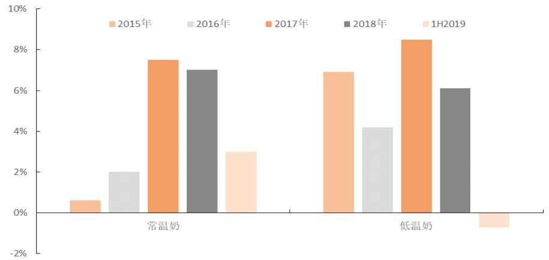
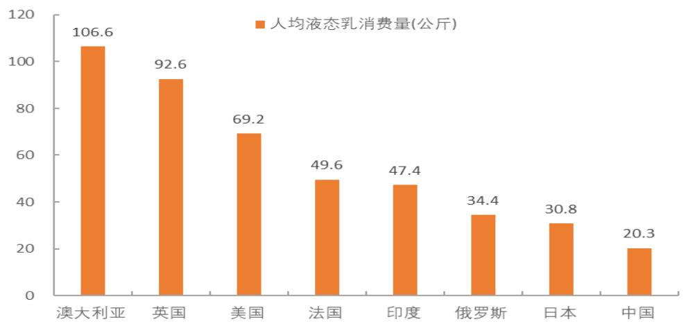
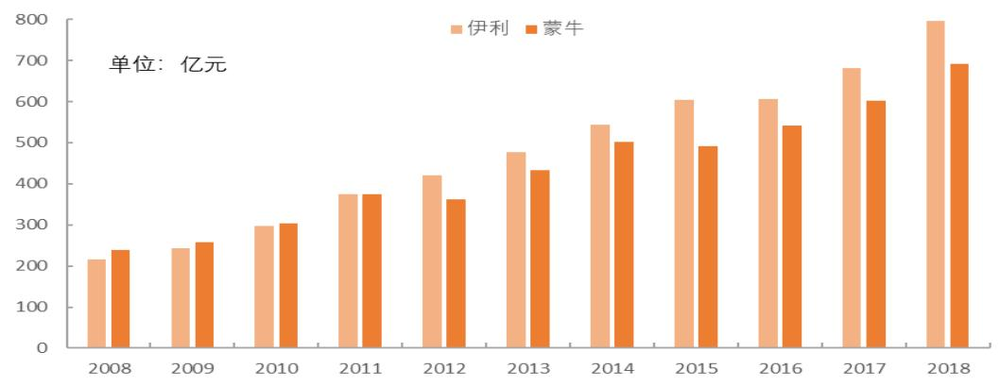
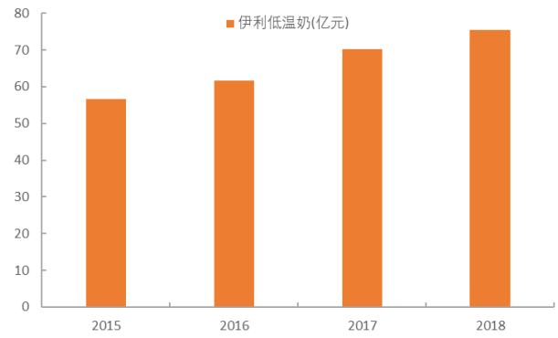

# 伊利股份 (600887)

# 优秀管理助力长跑胜出，净利率有望重回上升通道

# 强烈推荐（维持）

现价：32.15 元

主要数据  

<table><tr><td colspan="2">行业 食品饮料</td></tr><tr><td>公司网址</td><td>www.yili.com</td></tr><tr><td>大股东/持股 /11.23%</td><td>香港中央结算有限公司</td></tr><tr><td>实际控制人</td><td></td></tr><tr><td>总股本(百万股)</td><td>6,096</td></tr><tr><td>流通A股(百万股)</td><td>5,907</td></tr><tr><td>流通 B/H股(百万股)</td><td>0</td></tr><tr><td>总市值（亿元） 1,960</td><td></td></tr><tr><td>流通A股市值(亿元)</td><td>1,899</td></tr><tr><td>每股净资产(元) 3.99</td><td></td></tr><tr><td>资产负债率(%) 53.9</td><td></td></tr></table>

  
行情走势图

# 相关研究报告

《伊利股份 $^ { \star } 6 0 0 8 8 7 ^ { \star }$ 扣非净利增长亮眼，缓解竞争加剧担忧》 2019-10-31  
《伊利股份 $^ { \star } 6 0 0 8 8 7 ^ { \star }$ 多因素致业绩承压，小挫折不改大趋势》 2019-08-30  
《伊利股份\*600887\*份额快速提升，剑指常温王者》 2019-04-28  
《伊利股份\*600887\*单季净利重回高增长，业绩持续释放值得期待》 2019-02-28

#

<table><tr><td colspan="2">证券分析师</td></tr><tr><td colspan="2"></td></tr><tr><td rowspan="4">文献</td><td>投资咨询资格编号</td></tr><tr><td>S1060511010014</td></tr><tr><td>0755-22627143</td></tr><tr><td>WENXIAN001@PINGAN.COM.CN</td></tr><tr><td>刘彪</td><td>投资咨询资格编号 S1060518070002 0755-33547353</td></tr></table>

# 平安观点：

摘要：常温奶发展天花板仍高且集中度尚有提升潜力，龙头成长外部环境依然良好。伊利在过去 10 年完成从“追赶”到“领跑”的过程，常温奶规模领先竞品明显，管理层前瞻眼光 $^ +$ 高效营销体系，助力伊利在长跑中胜出。往未来看，常温奶继续扛起增长大旗，低温奶 $^ +$ 饮料齐头并进，双位数收入增速仍可期，而短期价格战硝烟或进一步驱散，伊利业绩有望释放，长期随着常温奶格局优化，伊利净利率将进入缓慢提升通道，2020年或是格局优化验证之年。

液奶尚有 10 年发展期，常温或仍是未来主流，集中度有望继续提升：因产品被广泛用于下线城市礼品赠送，液态奶兼具必需品及可选品属性。受宏观经济下行、财富效应消退以及礼品替代速度减缓影响，19年行业增速出现回落，但考虑液奶仍有 $50 \%$ 以上量增空间，我们认为未来 10年液奶仍有望保持中单位数增长趋势。低温奶营养价值优于常温奶，随着人均收入提升及冷链日趋完善，低温奶份额占比或逐渐上升，但参照欧洲国家经验，产销地之间的漫长距离或仍将会使常温奶成为国内市场主流。当前，液奶格局基本奠定，高端化 $^ +$ 规模效应助推常温份额向龙头集中，目前常温奶 CR2已经高达 $6 5 \%$ ，未来或可继续提升至 $80 \%$ ，区域乳企与龙头共同分享低温市场，但低温酸奶洗牌或推动低温奶集中度缓慢提升。

优秀管理能力绽放价值，伊利在长跑中取胜：过去 10 年，伊利依靠内生增长，完成从“追赶”到“领跑”的过程，10 年复合增速为 $1 3 . 9 \%$ ，竞品内生 $^ +$ 外延并举，部分受益于企业并购及业务直营化，10 年复合增速为$1 0 . 2 \%$ 。从品类看，伊利常温奶、奶粉、冷饮多品类较竞品确立领先优势，其中常温奶均是双方绝对主力品类，伊利规模领先竞品(剔除君乐宝)接近150亿元，主要凭借高端大单品更快增长持续拉开差距，其他常温奶则依靠更健全的下线城市渠道网络也保持略快于竞品的增长。路遥知马力，我们认为伊利在长跑中取胜，核心在于其优秀管理能力，管理层勇于投入资源进行前瞻性布局，抓住一个又一个新成长机遇，而全方位有效激励构筑高效营销体系，进一步加快战略落地速度，从而打造出强于同业的系统性快消综合竞争优势。

<table><tr><td></td><td>2017A</td><td>2018A</td><td>2019E</td><td>2020E</td><td>2021E</td></tr><tr><td>营业收入(百万元)</td><td>68,058</td><td>79,553</td><td>90,427</td><td>100,462</td><td>111,454</td></tr><tr><td>YoY(%)</td><td>12.3</td><td>16.9</td><td>13.7</td><td>11.1</td><td>10.9</td></tr><tr><td>净利润(百万元)</td><td>6,001</td><td>6,440</td><td>7,109</td><td>8,287</td><td>10,584</td></tr><tr><td>YoY(%)</td><td>6.0</td><td>7.3</td><td>10.4</td><td>16.6</td><td>27.7</td></tr><tr><td>毛利率(%)</td><td>37.8</td><td>38.3</td><td>38.2</td><td>38.6</td><td>39.0</td></tr><tr><td>净利率(%)</td><td>8.8</td><td>8.1</td><td>7.9</td><td>8.3</td><td>9.5</td></tr><tr><td>ROE(%)</td><td>23.9</td><td>23.1</td><td>22.9</td><td>23.9</td><td>26.5</td></tr><tr><td>EPS(摊薄/元)</td><td>0.98</td><td>1.06</td><td>1.17</td><td>1.36</td><td>1.74</td></tr><tr><td>P/E(倍)</td><td>32.6</td><td>30.3</td><td>27.6</td><td>23.7</td><td>18.5</td></tr><tr><td>P/B(倍)</td><td>7.8</td><td>7.0</td><td>6.3</td><td>5.6</td><td>4.9</td></tr></table>

增长动力仍强劲，净利率或进入提升通道：展望未来，基础产品 $+ .$ 小众单品的持续成长或对冲超级大单品增长放缓的影响，常温奶仍可延续 $10 \%$ 以上增长，低温奶随着常温酸奶挤压结束，有望回归 $10 \%$ 左右增速，伊利优秀管理能力大概率可在饮品中复制，持续推新下，中期具备爆发的潜力。常温奶继续扛起增长大旗，低温奶 $^ +$ 饮料齐头并进，伊利双位数收入增速仍可期。短期看，价格战硝烟有望进一步驱散，伊利业绩有望释放，未来 2 年原奶仍处于供不应求阶段，低端产品促销力度有望持续收紧，高端产品在梦幻盖等新品尚未成功接棒原价格带下，预计促销力度至少不会再恶化。长期看，随着常温奶格局优化，我们认为伊利常温奶净利率(估算值)有望从 $8 \%$ 提升至 $1 5 \% { \sim } 2 0 \%$ ，带动整体净利率大幅改善。过去 2 年，因竞争仍处于焦灼拉锯状态，扣非净利率未有提升，但我们认为持续拉开的份额差距对常温奶竞争的影响有望从量变到质变，伊利净利率将进入缓慢提升通道，2020年或是格局优化验证之年。

盈利预测：我们维持公司盈利预测，预计 19-21 年营业收入分别为 904、1005、1115 亿元，分别同比 $+ 1 3 . 7 \%$ 、 $+ 1 1 . 1 \%$ 、 $+ 1 0 . 9 \%$ ，归母净利润分别为 71、83、106亿元，分别同比 $+ 1 0 . 4 \%$ 、 $+ 1 6 . 6 \%$ 、$+ 2 7 . 7 \%$ ，EPS 分别为 1.17、1.36、1.74 元，对应 PE 分别为 $2 7 . 6 \times$ 、 $2 3 . 7 \times$ 、18.5X，维持“强烈推荐”评级！

风险提示：1、宏观经济疲软的风险：经济增速下滑，消费升级不达预期，导致消费端增速放缓；2、重大食品安全事件的风险：消费者对食品安全问题尤为敏感，若发生重大食品安全事故，短期内消费者对品牌信心降至冰点且信心重塑需要很长一段时间；3、原料价格上涨风险：产品主要原料原奶成本占比较高，价格大幅上涨或导致业绩不及预期。

# 正文目录

# 液奶尚有 10 年发展期，常温仍是未来主流，集中度有望继续提升.

# 二、 优秀管理能力绽放价值，伊利在长跑中取胜 ..... ..... 11

# 三、 增长动力仍然强劲，净利率或进入提升通道 ........ . 22

# 四、 投资建议 ........... .. 28

# 五、 风险提示 ..... .. 29

图表目录  
图表 1 食品饮料春节礼赠品类重要性. ....6  
图表 2 不同区域乳制品礼赠比例.. ....6  
图表 3 19 年常温奶、低温奶增长出现明显回落..... .................................... .......7  
图表 4 19 年棚改量及货币化安置比均下降趋势...... .................................................7  
图表 5 财富效应推动 17-18 年奢侈品消费大增长.... ................................................7  
图表 6 中国人均液奶消费量仍远低于饮食习惯相近的日本. .............................................8  
图表 7 下线城市人均液奶消费量远低于一线城市.. .............................. ...8  
图表 8 一线需求增长缓慢，下线城市需求较旺盛.. .............................. .....8  
图表 9 常温奶、低温奶占比(2018). ...9  
图表 10 常温奶、低温奶区域分布对比..... ..........................................................9  
图表 11 发达国家常温奶、低温奶占比呈现差异化(2009) .... ................................ .....9  
图表 12 中国奶源主要分布在北方....... .............................................................9  
图表 13 中国液奶企业形成 4 大梯队 . ................................................. ......10  
图表 14 2018 年主要乳企液态奶业务收入规模 .....................................................................10  
图表 15 常温奶市场份额加速向龙头集中 . ................................................. ......11  
图表 16 低温奶市场份额依然分散. ....11  
图表 17 低温酸奶市场份额缓慢向头部企业集中 . .................................................. ......11  
图表 18 伊利、蒙牛历史收入规模对比.... ...................................................................12  
图表 19 君乐宝收入长期呈快速增长趋势 ..............................................................................12  
图表 20 蒙牛外延并购历史... .........................................................................12  
图表 21 蒙牛直营收入占比远高于伊利(2018) .......................................................................13  
图表 22 16 年以来，蒙牛加快直营步伐.. ....................................................... .......13  
图表 23 伊利、蒙牛品类收入结构估算... ................................................ ........13  
图表 24 伊利、蒙牛子品类规模估算对比(2018). .................................. ....13  
图表 25 伊利、蒙牛各品类主要产品 . ........................................... .....13  
图表 26 伊利、蒙牛常温奶收入结构估算对比. ............................................ .....15  
图表 27 17-18 年估算常温奶业务复合收入增速对比..... ............................................. ......15  
图表 28 两强主要高端产品均实现快速发展... .............................................. ......15  
图表 29 17-18 年估算低温奶收入对比..... ...................................................... ......16  
图表 30 伊利、蒙牛均在布局低温鲜奶市场. .............................. ....16  
图表 31 婴幼儿配方奶粉市场格局(2018)........ ....................................................................16  
图表 32 伊利奶粉规模遥遥领先蒙牛(剔除君乐宝) .......................................................... .......16  
图表 33 冰淇淋市场格局(2017) ............... .............................................................................17  
图表 34 伊利冷饮规模领先蒙牛.... ...................................................... ........17  
图表 35 估算 2018 年牧场产量占全国量比重.... ..................................................................17  
图表 36 估算 2018 年乳企收购量占全国量比重 ................................................. ......17  
图表 37 过去 10年，伊利收入规模逐渐领先竞品拉开差距. .18  
图表 38 管理层为伊利重要股东. ..19  
图表 39 中粮通过复杂股权结构强化对蒙牛控制力. ...19  
图表 40 伊利&蒙牛历年发展战略对比.. ...19  
图表 41 伊利渠道渗透率在 13-18 年整体保持提升趋势 ....20  
图表 42 伊利直控村级网点快速增长，抓住下线城市需求红利. ....21  
图表 43 伊利人均创利高于同行企业 .. ..22  
图表 44 伊利凭借高效营销体系，实现安慕希收入快于竞品的成长 .22  
图表 45 低线城市人均量提升利好基础类产品.. .23  
图表 46 成功捕捉共性需求铸就一批超级大单品 .23  
图表 47 16-17 年伊利低温奶保持稳健增长 . .23  
图表 48 伊利加速拓展饮料新品.. ..23  
图表 49 18 年中国出生人数出现大幅下滑. ..24  
图表 50 未来中国适婚女性人口将大幅下降.. ..24  
图表 51 伊利冷饮收入增长主要来自均价提升拉动. ..24  
图表 52 中国奶酪消费量快速增长，但基数偏小 .. ..24  
图表 53 18-19 年伊利产品单价(不含结构升级)均在提升.. .25  
图表 54 2Q、3Q19 行业销售费用率均同比明显下降... .25  
图表 55 预计 19 年奶牛存量数量仅较 18 年略增. ..26  
图表 56 龙头费用率压缩潜力大.. ..26  
图表 57 常温奶处于产业生命周期中的成熟期，伊利利润率有望逐步提升. ..26  
图表 58 各奶粉企业毛利率、扣非净利率水平..... ...27  
图表 59 伊利、蒙牛冷饮毛利率&经营利润率分析. ...27  
图表 60 儿童奶、肉制品、植物蛋白市场份额分布(2016). ..27  
图表 61 具备格局优势的食品企业能实现高净利率.. ..27  
图表 62 因竞争焦灼，过去 2 年伊利扣非净利率未有改善. .28  
图表 63 伊利常温奶市占率持续快速提升 .. .28

# 液奶尚有 10年发展期，常温仍是未来主流，集中度有望继续提升

# 1.1 空间：行业天花板仍高，未来 10 年有望继续延续中单位数增长

液态奶兼具必需品及可选品属性。液态奶行业虽基本进入发展成熟期，但其产品属性在不同区域仍表现出不同特点。在发达地区，较高的人均收入以及健康营养理念的普及使得液态奶已成为日常消费品，作为消费者日常性补充营养的重要来源，人均消费量稳定且受价格变动影响小，未来有望稳步从基础奶向高端奶进行升级。在相对落后的地区，液态奶价格相对当地收入水平仍有所偏高，当地消费者人均消费量低且液态奶有较大比例是作为节日礼品赠送而被消费，展现出较强可选品属性，当地消费者一般日常购买基础奶较多，在中秋、春节等档期则大量购买高端奶用于礼品赠送。因此，综合来看，液态奶仍是处于必需品和可选品之间的中间品类，受经济的波动影响会弱于可选品但会强于必需品。

  
图表1 食品饮料春节礼赠品类重要性  
资料来源：凯度消费者指数，平安证券研究所

  
图表2 不同区域乳制品礼赠比例

资料来源：凯度消费者指数，平安证券研究所

受宏观经济下行、财富效应消退以及礼品替代速度减缓影响，液奶行业增速出现回落。受 13-14 年液奶行业性大涨价影响，15-16 年消费者需求增长受到抑制，但行业在 17-18 年复苏，我们认为支撑行业需求恢复的有利因素主要有 3点：

1）15-16 年持续的产品降价以及消费者收入稳步提升，液态奶价格重新为三四线消费者所接受；

2）棚改货币化带来的巨大财富效应(如贝恩数据显示，内地奢侈品市场 17 年、18 年均保持 $20 \%$ 的惊人增长势头，而 12-16 年复合增速仅 $2 \%$ )，液态奶具备一定可选品属性，亦受益匪浅；

3）县乡消费者受教育程度提升，液态奶健康、营养属性得到更深刻认识，高端奶快速替代六个核桃、王老吉、加多宝、汇源等老牌礼品。

19 年，宏观经济下行压力加大，棚改计划量较 18 年腰斩且货币化安置比例降低，基数渐高后礼品替代速度也趋于减缓，液奶需求增长受到较大影响，1H19 常温奶增速大幅放缓至 $3 . 0 \%$ ，较上年同期 $9 . 0 \%$ 的增速减速明显，低温奶受到常温酸奶的挤压而出现负增长，增速同比下降6.2pcts至- $. 0 . 7 \%$ 。

  
图表3 19 年常温奶、低温奶增长出现明显回落

资料来源：尼尔森，平安证券研究所注：17-18年货币化安置比例为市场估测资料来源：住建部，平安证券研究所

  
图表4 19 年棚改量及货币化安置比均下降趋势

  
图表5 财富效应推动 17-18 年奢侈品消费大增长

资料来源：贝恩，平安证券研究所

液态奶成长天花板仍高，预计保持中单位数增长。往长期看，消费者对营养、功能食品的需求在持续增长，乳品的健康属性能更好满足消费者，当前中国人均液态奶消费量仍然偏低，16 年人均消费量仅 20.3千克，不仅远低于欧盟、美国 60千克/人以上水平，较饮食习惯相近的日韩也存在明显差距，国内液奶市场仍有 $50 \%$ 以上的量增空间。从区域层级看，一线城市已经接近日韩人均消费量水平，需求趋于饱和，增长相对缓慢，销售额约占全行业 $14 \%$ ，二线城市人均量也处于较好水平，三四线城市及农村人均量仍明显偏低，三者均保持较好增速，其中三线城市(地级市)增长最为强劲，或说明消费升级带来的需求增长在地级市消费者群体中体现最为明显，县级城市或仍待人均收入继续提升来推动需求进一步释放。

我们认为 19年液态奶行业增速大幅放缓是基于 18年高基数的背景下，考虑液奶市场仍有 $50 \%$ 以上量增空间，我们认为未来 10年行业有望保持接近中单位数的销量增速，叠加结构升级&产品提价带来持续性的低单位数均价增长，行业有望长期保持中单位数增长趋势。

  
图表6 中国人均液奶消费量仍远低于饮食习惯相近的日本

资料来源：中国奶业年鉴2017，平安证券研究所资料来源：Wind，平安证券研究所注：乳制品仅针对常温乳品及低温乳品，不含奶粉及冰淇淋品类资料来源：凯度消费者指数，平安证券研究所

  
图表7 下线城市人均液奶消费量远低于一线城市

  
图表8 一线需求增长缓慢，下线城市需求较旺盛

# 1.2 结构：低温奶占比有望缓慢提升，但常温奶仍将是国内主流

低温奶营养价值优于常温奶，但更受短保质期&冷链环境限制。低温奶和常温奶在生产工艺上存在根本区别，低温奶采取巴氏杀菌法，保留了生乳本身各种天然活性物质和酶的高活性，有助于维护肠道菌群生态平衡、提高人体免疫功能等，并最大限度保留了牛奶的营养成分和纯天然风味，常温奶采取超高温灭菌法，酶的活性基本被破坏，对人体有益的微生物也全部被消灭，对营养成分的破坏也更为明显，对蛋白质、钙、维生素的保留均低于低温奶，因此低温奶在营养价值上是优于常温奶。低温奶的短板也较常温奶更为明显，巴氏杀菌导致保质期短(5\~20 天，明显短于常温奶 6个月)、需冷链保存及运输(需 $2 { \sim } 6 ^ { \circ }$ C 冷藏储存，常温奶可室温储存)、运输半径有限(不超过 500 公里)，最终导致终端价格偏贵，消费者购买、储存不便。

常温奶占据 $70 \%$ 市场，低温奶集中于一线&省会市场。2018 年，常温奶约占 $73 \%$ 的液态奶市场份额，低温奶仅占 $2 7 \%$ 。从区域来看，常温奶约 2/3 的消费市场在地级市及县城，低温奶超过 $50 \%$ 的消费市场在现代化渠道占比更高、冷链环境更为完善的一线城市及省会城市。

  
图表9 常温奶、低温奶占比(2018)

资料来源：Wind，平安证券研究所注：数据取自YTD19P6资料来源：凯度消费者指数，平安证券研究所

  
图表10 常温奶、低温奶区域分布对比

低温奶有望部分替代常温奶，但得益于奶源分布不均衡，常温奶或仍将是未来主流。分析发达国家常温奶、低温奶占比情况，美国、英国、澳大利亚、新西兰、日本、韩国均是低温奶占据主体位置，但法国、德国、西班牙、意大利等欧洲大陆国家常温奶占据主体位置，发达国家并未显现出一致性的发展趋势。对于不同发达国家间的常温奶、低温奶占比差异，主要原因或是：1）牧场资源和消费市场分布差异，如法国、意大利因奶源分布较为集中且远离消费市场而导致常温奶占比高，美国、新西兰、澳大利亚因牧场资源分布均匀而有利于低温奶发展；2）气候因素差异，高纬度国家气候寒冷，有利于低温奶的储藏、运输和销售，北欧各国低温奶占比高，而气候较为炎热的西班牙、葡萄牙以常温奶为主。

中国奶源分布与消费市场存在严重不匹配，北方占原奶产量 $70 \%$ ，但消费量 $70 \%$ 在南方，且未来随着环保趋严、人口流动，区域上的供需不匹配或仍会进一步失衡。因此，随着人均收入提升及冷链日趋完善，低温奶需求正缓慢释放，但即使中国冷链基础建设得到较好完善，产销地之间的漫长距离或仍会使常温奶成为市场主导。

  
图表11 发达国家常温奶、低温奶占比呈现差异化(2009)

  
图表12 中国奶源主要分布在北方

资料来源：利乐乳业指数，平安证券研究所资料来源：互联网，平安证券研究所

# 1.3 格局：常温奶格局走向寡头垄断，低温奶集中度有望缓慢提升

中国液奶企业可分为四大梯队。中国液奶企业可简单分为四个梯队，第一梯队为全国化龙头，如伊利、蒙牛，液奶收入规模在 500 亿元以上，品牌影响力高，渠道下沉至乡镇层级，具备较强的新品研发和推广能力；第二梯队为跨区域品牌，液奶规模在 30-150 亿元，如光明、新希望、三元、君乐宝等，在根据地市场拥有较高的市场份额，并将业务延伸至其他区域，拥有跨区域的品牌、渠道基础；第三梯队为省级龙头，液奶规模在 10-30 亿元，如完达山、燕塘等，业务聚焦于省内，产品线完备，并有区域特色大单品，具有较好的群众基础；第四梯队为区域小品牌，液奶规模在 2-10亿元，如菊乐、庄园、李子园等，基本在产地范围销售，市场影响力较弱，产品线相对单一。

  
资料来源：wind，平安证券研究所  
图表14 2018 年主要乳企液态奶业务收入规模

资料来源：公司公告，平安证券研究所注：蒙牛为剔除君乐宝数据

高端化 $\mathbf { + }$ 规模效应助推常温份额向龙头集中，两强集中度或可提升至 $80 \%$ 。常温奶保质期长，受物流条件制约较小，属于大流通产品，行业马太效应较为明显。近 5 年，常温龙头持续挤压其他乳企份额，常温奶 CR2 从 13 年 $5 2 . 9 \%$ 提升至 18 年 $6 5 . 2 \%$ ，且份额收割速度呈加快趋势。在伊利、蒙牛两强内，份额差异也愈加明显，伊利常温市占率于 14 年反超蒙牛并持续拉开差距，18 年伊利常温市占率高达 $3 7 . 2 \%$ ，领先蒙牛 9.2 pcts。

我们认为支撑常温奶集中度提升的源泉在于：1）高端化：与普通奶相比，高端奶对企业品牌、研发、奶源提出了更高的要求，从而限制了参与的玩家数量，从近年培育成功的常温大单品来看，主要是由龙头企业所引领，高端市场发展红利也基本是由龙头企业所获取；2）规模效应：常温奶龙头生产基地集中在华北地区，就近获得廉价奶源，且凭借庞大规模获得强原材料议价能力及最大化摊薄制造费用、广告宣传费用、货架陈列费用等，整体经营效率强于中小企业。

虽目前常温奶 CR2 已经高达 $65 \%$ ，但考虑产品属性以及竞争特点(长保、高频、无运输半径限制)，我们认为常温奶 CR2或可提升至 $80 \%$ ，仅剩部分企业凭借出众单品以及小企业凭借本地传统消费习惯分享 $20 \%$ 的份额。

  
图表15 常温奶市场份额加速向龙头集中

资料来源：尼尔森，平安证券研究所

区域乳企继续盘踞低温市场，低温酸奶洗牌或推动低温奶集中度缓慢提升。低温奶受制于奶源、冷链、渠道限制，近 5 年市场格局未发生明显变化，地方乳企凭借历史积累的本地牧场资源及深度覆盖的区域渠道网络，继续盘踞当地低温奶市场，CR3 从 13 年 $6 1 . 7 \%$ 降至 18 年 $5 9 . 5 \%$ ，约 $40 \%$ 市场仍被区域乳企所掌握。巴氏奶地域性依然明显，区域乳企借助本地奶源、完善配送体系及入户渠道优势盘踞市场，但巴氏奶延长保质期趋势(君乐宝推出 19 天保质期悦鲜活，蒙牛推出 15 天保质期每日鲜语，伊利推出 15天保质期伊利鲜牛奶)对格局的影响需持续观察。低温酸奶无明显地域壁垒(保质期 21 天)，产品可远距离配送，现代渠道为主的市场结构也具备较强开放性，低温酸奶持续洗牌或推动未来低温奶集中度缓慢提升。

  
图表16 低温奶市场份额依然分散

资料来源：尼尔森，平安证券研究所资料来源：尼尔森，平安证券研究所

  
图表17 低温酸奶市场份额缓慢向头部企业集中

# 优秀管理能力绽放价值，伊利在长跑中取胜

# 2.1 伊利依靠内生增长，从“追赶”到“领跑”

过去 10年，两强收入均快速增长，伊利、蒙牛营收规模分别从 08年 217、239亿元增至 18年 796、692 亿元，复合增速分别为 $1 3 . 9 \%$ 、 $1 1 . 2 \%$ ，伊利实现对蒙牛的反超。从增长动力来看，伊利为内生增长驱动，蒙牛则是内生 $^ +$ 外延并举，部分受益于企业并购及业务直营化。

并购：伊利在 2019年前，并无重大收购事件，收入增长均为内生增长贡献。蒙牛频繁的收购动作对报表收入带来影响，10年收购河北乳企君乐宝，13年完成收购奶粉企业雅士利并收购合营奶粉企业欧世蒙牛，14 年完成与达能合资公司组建以重组双方低温业务，16年雅士利完成收购奶粉企业多美滋，18 年收购现代牧业液态奶工厂 $50 \%$ 股权并负责现代牧业品牌奶销售，18 年君乐宝收购旗帜乳品，19 年完成收购圣牧奶业(圣牧液态奶业务) $51 \%$ 股权及澳洲奶粉品牌贝拉米及拟并购澳洲乳制品公司 Lion-Dairy&Drinks。若剔除并购企业带来的收入贡献(未能剔除达能低温、现代牧业液奶)，18年蒙牛收入约 567亿元，10年复合增速 $9 . 0 \%$ 。

  
图表18 伊利、蒙牛历史收入规模对比

资料来源：公司公告，平安证券研究所资料来源：公开资料整理，平安证券研究所

  
图表19 君乐宝收入长期呈快速增长趋势

图表20 蒙牛外延并购历史  

<table><tr><td>时间</td><td>事件</td></tr><tr><td>2010 年11月</td><td>蒙牛收购君乐宝 51%股权</td></tr><tr><td>2013年1月</td><td>蒙牛向合营伙伴收购合营企业欧世蒙牛额外 49%股权</td></tr><tr><td>2013 年 5 月</td><td>蒙牛收购现代牧业 26.9%的股份</td></tr><tr><td>2013年8月</td><td>蒙牛收购雅士利89.82%股权</td></tr><tr><td>2014 年7月</td><td>蒙牛收购达能上海及达能北京的100%权益</td></tr><tr><td>2016年5月</td><td>雅士利向达能收购多美滋中国全部股权</td></tr><tr><td>2017年2月</td><td>蒙牛以现金代价 16.63 亿元收购现代牧业额外 9.65 亿股</td></tr><tr><td>2017年3月</td><td>蒙牛提出强制性现金要约，以现金代价 25.27 亿元接纳现代 牧业14.42亿股及 2.64 亿份购股权</td></tr><tr><td>2018年4月</td><td>蒙牛收购现代牧业(蚌埠)及现代牧业(肥东)的 50%股权</td></tr><tr><td>2018年7月</td><td>君乐宝收购旗帜乳品额外 43.41%权益，并取得控制权</td></tr><tr><td>2019 年 4 月</td><td>蒙牛完成收购圣牧高科奶业 51%的股权</td></tr><tr><td>2019 年11月</td><td>蒙牛拟以 6 亿澳元收购 Lion Dairy Drinks100%的股权</td></tr><tr><td>2019年12月</td><td>蒙牛完成收购澳洲奶粉品牌贝拉米</td></tr></table>

资料来源：公司公告、公开资料整理，平安证券研究所

直营：2015 年以来，蒙牛向可口可乐学习，逐步提高销售公司和 CBU 模式下的直营销量占比，寄希望以此强化终端市场把控力并提升渠道管理效率。2018 年，蒙牛直营模式收入占比已逐步提升至$20 \%$ 左右，与之对比，伊利直营模式收入占比仅约 $3 \%$ ，我们认为直营占比上升将提升整体产品出厂价，对推动蒙牛收入增长也有一定积极作用。

  
图表21 蒙牛直营收入占比远高于伊利(2018)

图表22 16 年以来，蒙牛加快直营步伐  

<table><tr><td>时间</td><td>事件</td></tr><tr><td></td><td>2016 年蒙牛向第三方收购上海蒙牛、北京蒙牛、 广州蒙牛、济南蒙牛等13家子公司</td></tr><tr><td>2017年</td><td>蒙牛向第三方收购3家子公司</td></tr><tr><td>2018年</td><td>蒙牛收购重庆蒙牛等4家公司及1家销售 代理机构</td></tr></table>

资料来源：公司公告，平安证券研究所

资料来源：公司公告，平安证券研究所

# 2.2 伊利实现多品类领先，常温奶规模优势明显

伊利多品类确立领先优势，蒙牛低温奶具备优势。根据我们的估算，伊利、蒙牛品类布局大致相同，几乎涉足乳品所有细分品类并构建完整的高中低端产品梯队，常温奶均是双方绝对主力品类，均占总收入的 2/3以上，18 年伊利常温奶收入占比高于蒙牛，蒙牛低温奶收入占比明显高于伊利，伊利在奶粉、冰淇淋收入贡献比重上较蒙牛更高。从各品类收入规模看，伊利常温奶规模优势明显，领先蒙牛百亿级以上，蒙牛在低温奶具有较大优势，领先伊利五十亿级以上，但剔除君乐宝低温奶后领先优势大幅缩小，伊利在奶粉、冰淇淋上均有较大领先优势，若剔除君乐宝奶粉收入，伊利奶粉规模领先蒙牛约 50 亿元。

  
图表23 伊利、蒙牛品类收入结构估算  
资料来源：公司公告，平安证券研究所

资料来源：公司公告，平安证券研究所

  
图表24 伊利、蒙牛子品类规模估算对比(2018)

图表25 伊利、蒙牛各品类主要产品  

<table><tr><td colspan="3">品类</td><td>伊利</td><td>蒙牛</td></tr><tr><td rowspan="4">常温奶</td><td rowspan="3">纯奶</td><td>高端</td><td>金典</td><td>特仑苏</td></tr><tr><td>基础</td><td>伊利纯牛奶</td><td>蒙牛纯牛奶</td></tr><tr><td>功能</td><td>舒化奶、高钙奶、低脂奶、谷粒多、 味可滋</td><td>蒙牛花色奶、未来星</td></tr><tr><td colspan="2">常温酸奶</td><td>安慕希、QQ星儿童风味酸奶</td><td>纯甄、ZUO 酸奶、果粒酸奶</td></tr></table>

<table><tr><td></td><td>常温乳饮料</td><td>优酸乳、QQ 星饮品、爆趣珠、畅意 100%</td><td>酸酸乳、真果粒</td></tr><tr><td rowspan="3">低温奶</td><td>低温酸奶</td><td>畅轻星、益消吸果杯、大果奶、</td><td>特仑苏酸奶、冠益乳、未来星儿童 营养风味酸奶蒙古酸奶、</td></tr><tr><td>鲜奶</td><td>百格特、金鲜牛奶、牧场清晨鲜牛</td><td>每日鲜语</td></tr><tr><td>低温乳饮料</td><td>每益添</td><td>优益C</td></tr><tr><td colspan="2">冰淇淋</td><td>巧乐兹、甄稀、冰工厂、伊利牧场、</td><td>兰雪、绿色心情、冰、式</td></tr><tr><td rowspan="2">奶粉</td><td>婴儿奶粉</td><td>金领冠、倍冠、托菲尔、培然</td><td>雅士利菁珀、菁跃、瑞哺恩、多美 滋致粹、Arla宝贝与我、多拉小羊</td></tr><tr><td>成人奶粉</td><td>欣活、青山1956、暖哄哄</td><td>优怡、焕轻、正味</td></tr><tr><td rowspan="3">其他</td><td>植物蛋白</td><td>植选、核桃乳</td><td>Silk 植朴磨坊</td></tr><tr><td>奶酪</td><td>妙芝</td><td>爱氏晨曦马苏里拉干酪丝</td></tr><tr><td>其他</td><td>k伊刻活泉、圣瑞思、唤醒源、</td><td></td></tr></table>

资料来源：公司网站，平安证券研究所

# 2.2.1 常温奶：伊利规模领先竞品明显，高端大单品引领增长

从整体规模看，我们估计 18 年伊利常温奶规模已高达 580 亿元，领先蒙牛(剔除君乐宝，下同)接近150 亿元，分子品类看，蒙牛在高端纯奶方面仍有优势，但其他纯奶、常温酸奶、常温乳饮料等方面均弱于伊利，常温酸奶、常温乳饮料劣势相对更为突出。从增速看，17-18 年伊利、蒙牛常温奶复合收入增速均实现双位数增长，伊利增速快于蒙牛，双方增长主要动能均来自高端奶(高端白奶 $^ +$ 常温酸奶)，其他奶复合增速均仅有个位数。

分析伊利、蒙牛两强 17-18 年复合收入增速差异原因，高端奶发展态势差异或是主要原因，估算伊利高端奶增速明显高于蒙牛，背后原因在于金典正加速追赶特仑苏以及安慕希拉开与纯甄的相对差距，此外，在其他奶方面，估算伊利增速仍快于蒙牛，背后原因或是伊利三四线城市渠道网络较竞品更为健全，使得基础白奶及以畅意为代表的常温乳饮料仍保持较好增速。

  
图表26 伊利、蒙牛常温奶收入结构估算对比

注：高端纯奶定义为金典、特仑苏，常温酸奶包括安慕希、纯甄、ZUO、果粒酸奶资料来源：平安证券研究所

  
图表27 17-18 年估算常温奶业务复合收入增速对比  
注：高端奶定义金典、特仑苏、安慕希、纯甄、ZUO、果粒酸奶资料来源：平安证券研究所

  
图表28 两强主要高端产品均实现快速发展

资料来源：公司网站，平安证券研究所

# 2.2.2 低温奶：蒙牛规模、增速均领先，巴氏奶成拓展新方向

从低温奶规模来看，伊利、蒙牛(剔除君乐宝)低温奶收入体量均较常温奶明显偏小，均仅占整体液态奶收入 $10 \% { \sim } 2 0 \%$ 。伊利低温奶一直落后于蒙牛，且近两年差距有继续拉大的迹象，蒙牛低温奶增速持续略快于伊利。从子品类看，伊利、蒙牛低温奶绝大多数收入均是由低温酸奶贡献，低温鲜奶、低温乳酸菌饮料占比较小。

近几年，龙头均加大对鲜奶的重视力度，如蒙牛于 17 年成立鲜奶事业部，18 年内推出了 17 个鲜奶单品，主打产品有布局高端市场的每日鲜语鲜牛奶，另一款新推出的新鲜工厂鲜牛奶布局中高端市场，19 年鲜奶收入继续呈爆发式增长。伊利于 2018 年在哈尔滨试水的鲜奶产品“百格特”，19年底再发布“金典鲜牛奶”“牧场清晨鲜牛奶”“伊利鲜牛奶”3 款新品。

  
图表29 17-18 年估算低温奶收入对比

  
图表30 伊利、蒙牛均在布局低温鲜奶市场

资料来源：平安证券研究所资料来源：百度图片，平安证券研究所

# 2.2.3 奶粉：双强领先优势均不明显，17-18 年受益注册制恢复较好增长

伊利、蒙牛奶粉收入均主要来源于婴幼儿配方奶粉，但成人奶粉也有所贡献。从婴幼儿奶粉整体市场看，市场份额较为分散，蒙牛、伊利市场排序并不靠前，所占市场份额均不大，分别占 18年市场份额的 $5 . 0 \%$ 、 $4 . 8 \%$ ，位列市场第七、第八。考虑蒙牛奶粉分别由雅士利和君乐宝负责运营，若剔除君乐宝奶粉贡献，伊利奶粉收入规模将远远领先于蒙牛，伊利、蒙牛(剔除君乐宝)18 年奶粉收入规模约为 80 亿元、30亿元。从增速看，因奶粉注册制影响，16年行业竞争加剧导致双方奶粉收入均出现较大下滑，17-18 年则开始受益注册制利好，双方奶粉收入均恢复增长，3年复合增速伊利好于蒙牛(剔除君乐宝)。

  
图表31 婴幼儿配方奶粉市场格局(2018)

  
图表32 伊利奶粉规模遥遥领先蒙牛(剔除君乐宝)

资料来源：Euromonitor，平安证券研究所资料来源：公司公告，平安证券研究所

# 2.2.4冷饮：整体收入贡献小， 伊利规模大幅领先蒙牛

在发展早期，伊利、蒙牛凭借原奶等原材料优势及终端营销渠道优势，以中低端产品切入市场，在冰淇淋行业中异军突起，追赶并超越和路雪、雀巢，成为全国性品牌，分列行业第一、第二，17年市场份额分别为 $1 2 . 7 \%$ 、 $6 . 5 \%$ 。近年来，随着市场趋于饱和以及消费场景改变，小众品牌凭借新模式崭露头角，伊利、蒙牛冰淇淋业务增长均相对乏力，3 年复合增速分别仅 $6 . 8 \%$ 、 $8 . 3 \%$ 。综合看，伊利、蒙牛冰淇淋收入均占整体收入规模的比重小，伊利冰淇淋规模仍远大于蒙牛，18 年分别约为50 亿元、27 亿元。

  
图表33 冰淇淋市场格局(2017)

  
图表34 伊利冷饮规模领先蒙牛

资料来源：Euromonitor，平安证券研究所资料来源：公司公告，平安证券研究所

# 2.2.5 奶源：均高度重视产业链协同，差异化手段控制牧场

原奶是乳品生产的核心原材料，乳企对上游奶源的掌控将很大程度保障产品的食品安全、供给稳定性、成本低波动。经过十余年快速洗牌，奶牛养殖行业牧场仅剩 8,000 家左右，但行业依然保持相对分散的态势，龙头现代牧业原奶产量 125 万吨，市场份额仅 $5 . 0 \%$ (估算全国 2500 万吨原奶产量)，除此之外仅有辉山、圣牧、优然、赛科星、澳亚 5家为年产 50 万吨以上企业，CR15也仅有 $2 9 . 6 \%$ 。根据我们测算，下游乳企收奶相对集中，18年伊利、蒙牛原奶收购量接近全国产量的 $40 \%$ ，伊利收奶量高于蒙牛，CR8 收购量超过全国产量的 $50 \%$ 。

伊利、蒙牛奶源均来自于规模化&集约化的规模牧场，并通过差异化手段控制上游牧场企业。虽伊利原奶来源于联营企业优然牧业的仅占 $10 \%$ ， $90 \%$ 为社会奶源，但伊利通过资本或全方位、长期的利益联结机制，以嵌入式服务的方式，与牧场建立利益共同体，从而获得稳定奶源供给，如派驻技术人员帮助牧场提升单产等。蒙牛主要通过战略合作方以及社会化合作保证原料奶的供应，战略合作方占三分之一，社会化奶源供应占三分之二，战略合作方为大型牧场，多与蒙牛存在股权纽带联系，如获蒙牛参股的现代、富源、原生态，与蒙牛成立合资企业的圣牧。

  
图表35 估算 2018 年牧场产量占全国量比重

  
图表36 估算 2018 年乳企收购量占全国量比重

资料来源：平安证券研究所资料来源：平安证券研究所

# 2.3 管理层前瞻眼光 $^ { + }$ 高效营销体系，助力伊利在长跑中胜出

纵观过往 10 年，在日复一日的快消品竞争中，伊利逐步追上、赶超、领先竞品，探讨内在原因，除竞品自身出现战略性失误外，伊利管理层坚持做正确的事，坚持为长期而投入，抓住一个又一个新成长机遇，而更具执行力的营销体系则进一步加快战略落地速度，从而构筑强于同业的系统性快消综合竞争优势。

  
图表37 过去 10 年，伊利收入规模逐渐领先竞品拉开差距

资料来源：公司公告，平安证券研究所

# 2.3.1 伊利政策延续性强于竞品，管理层前瞻性布局抓住成长机遇

股权结构差异导致管理层稳定性不同，经营策略延续性伊利强于蒙牛。从股权结构看，伊利股权结构分散，无控股股东及实际控制人，最大单一股东为呼和浩特国资委旗下的呼和浩特投资有限责任公司，持股 $8 . 8 3 \%$ ，董事长兼总裁潘刚、副总裁赵成霞、副总裁刘春海、副总裁胡利平分别持有 $3 . 8 7 \%$ 、$1 . 3 8 \%$ 、 $1 . 3 7 \%$ 、 $1 . 3 0 \%$ 股权，管理层对公司具有较强控制力。蒙牛虽无控股股东及实际控制人，但中粮集团及其一致行动人共计持有公司 $3 1 . 4 0 \%$ 的股权，中粮集团通过复杂的股权结构设计强化对蒙牛的控制。

在无控股股东及管理层持股比例较大的背景下，伊利管理层稳定性较高且对公司控制力强，政策延续力强。与之对应，蒙牛管理层更偏向职业经理人，高管更迭速度快。过去 10年看，潘刚董事长一直引领伊利发展，公司发展战略也基本围绕长期目标而不断推进，蒙牛在过去 10年历经杨文俊、孙伊萍、卢敏放 3 任领导人，不同的管理风格使得公司组织结构&发展战略不断出现较大变动。

  
图表38 管理层为伊利重要股东  
资料来源：公司公告，平安证券研究所

  
图表39 中粮通过复杂股权结构强化对蒙牛控制力  
资料来源：公司公告，平安证券研究所

图表40 伊利&蒙牛历年发展战略对比  

<table><tr><td>时间</td><td>伊利人</td><td>发展战略</td><td>人</td><td>发展战略</td></tr><tr><td>2009年</td><td></td><td>继续强化奶源基地建设，保证优质奶源供应。进一 步优化产品结构，提高盈利能力。抓住世博会这一 难得的历史机遇，加强品牌建设。加强供应链管理， 打造系统竞争优势。加强风险管理体系建设，全面</td><td></td><td>致力成为全球乳业 10 强，专注于高端健康型乳 製品的研发，进一步巩固奶源优势，深入开展 与中粮集团的战略合作，推进供应链一体化、 食品安全国际化及战略资源配置全球化的进</td></tr><tr><td>2010年</td><td></td><td>提高企业抗风险管理能力。 以满足消费者需求为驱动力，不断进行产品技术创 新。优化奶源管理模式，保障优质奶源需求。提升 渠道与终端管理水平，提升企业市场竞争能力。全</td><td>杨文俊</td><td>程。 将会以奶源建设、产品组合、研发能力、管理 系统、品牌形象等五个方面为主要突破方向， 全面提升自身实力，引领中国乳制品行业迈向</td></tr><tr><td>2011年</td><td></td><td>面推进品牌升级计划，打造领先品牌优势。 继续以“打造品牌优势，强化创新和系统管理能力， 夯实质量管理、渠道建设、奶源建设基础&quot;为经营方 针，实现了产品、服务、品牌理念的进一步升级。</td><td></td><td>全新阶段。 持续推动牧场化战略，拓展上游养殖产业，打 造高品质奶源优势。针对细分市场，开发高附 加值、功能性产品，丰富产品矩阵。放眼国际 乳业，向初步国际化稳定推进。</td></tr><tr><td>2012年</td><td>潘刚</td><td>在优先推进源地建设的基继上继续深耕销售 人才，继续坚持“强化质量管理，深化基础建设，推 进精确管理，提高费用使用效率、提升公司盈利能 力”的经营方针。</td><td rowspan="3">孙伊萍</td><td>持续加强奶源建设和质量管梳理品脚结 组合、提升国际化管理水平。</td></tr><tr><td>2013年</td><td></td><td>围绕“践行质量领先战略，持续规范基础管理，全面 优化供应链体系，打造自主创新能力，有序推进国 际化业务&quot;的经营方针，面向全产业链条与合作伙伴 共同打造一流健康品质；继续优化供应链运营管理 体系，全面提升公司核心竞争实力。</td><td>在巩固液体奶业务的基础上，整合雅士利奶粉 平台及Danone集团的酸奶业务，开展股权、 技术和业务层面的全面对接。继续优化奶源结 构，支持第三方建设中小型规模化牧场，进一 步调整产品结构，集中资源推广重点品牌。</td></tr><tr><td>2014年</td><td></td><td>提出了进入全球乳业 5 强的战略目标，并将企业愿 景升级为“成为全球最值得信赖的健康食品提供 者”,通过强化产品创新和有序推进国际化业务两大 驱动力，推动各项业务的健康快速成长，到2020 年成为千亿级的健康食品集团。</td><td>在常温、低温及奶粉业务上全面发力。聚焦渠 道管理和分销改革，在一线城市及部分二线城 市，继续强化直接服务终端市场，同时大力推 广CBU，强化终端直控。致力于打造更加扁平 化、更加高效、更能引爆创新的内部组织体系</td></tr></table>

<table><tr><td>2015年</td><td>快速开发满足消费者需求的新产品，从而达到通过 产品升级换代带动业务健康持续发展；不断优化产 品结构，持续提高盈利能力；在积极开拓新兴渠道 的同时，提高县乡镇农村市场产品渗透能力，挖掘 空白市场业务机会；持续推进渠道精耕计划的实 施，提升营销资源的投入产出效益；积极拓展国际 业务，增加新的业务和利润增长点。</td><td></td><td>聚焦明星产品，提升液态奶的市场份额，巩固 低温市场的绝对领先地位，在奶粉业务上协同 国际战略资源，进行渠道转型和品牌升级。巩 固以经销商为主体，经销商、销售公司及CBU 长期并存发展的销售运营模式，最终实现直营 直控网点占比及直营直控销量占比的提升；推 动销售渠道向更偏远的城乡地区扩散。</td></tr><tr><td>2016年</td><td>继续贯彻董事长潘刚提出的进入“全球乳业5 强”的 战略目标，延续 15 年发展战略。</td><td rowspan="3">卢敏放</td><td>聚焦品类、品牌和差异化优势，将原核心业务 板块分成常温、低温、冰淇淋、奶粉等独立运 营的新事业板块，重点打造低温事业部，创造 新增长点。前瞻性地佈局产业上下游资源，提 升奶源品质强化奶源。</td></tr><tr><td>2017年</td><td>以满足消费者需求为目标，通过创新驱动业务健康 持续发展；以“精准营销、精益运营和精确管理”为 指高和能增：长以拓展国际业务为契机，增 对中长期战略进行全面升级，未来公司将横跨大健</td><td>以新事业部平台发展各个品类，迈向价值链中 高端，积极拓展低温、冰淇淋产品，加速新品 推出，提出 2020 年销售额千亿元目标。</td></tr><tr><td>2018年</td><td>康领域实施多品类布局，成为健康食品行业发展的 引领者。立足乳业核心业务，进军植物蛋白饮品、 功能饮料等大健康产业，加速健康食品业务战略布 局。聚焦全球优势资源，全力开拓海外市场。持续 推进公司数字化战略升级，系统打造更加智能和高 效的运营能力。</td><td>四大事业部联动新业务群，巩固传统业务优势， 同时激发新业务的增长潜力。集中优势资源， 聚焦核心品类，做强核心产品。将加大对鲜奶 等新兴业务的投入，培育新的增长点。</td></tr></table>

资料来源：公司年报整理，平安证券研究所

伊利管理层卓有远见，坚持长期投入方针。伊利早在 2009 年后加大力度推进渠道扁平化，通过产品、区域新增经销商，强化对渠道的控制力，顺应行业发展降速的趋势，完成从跑马圈地到精耕细作的模式转变；2014年后，推动渠道向乡镇农村市场下沉，通过搭建乡镇村服务体系提升网点数量及产品覆盖率，直控村级网点从 15 年 11万家快速拓展至 18 年 60.8 万家，率先抓住了下线城市需求爆发红利；17年开始，伊利在拓展渠道深度的同时也在拓展渠道广度，新增加油站、学校、餐饮等空白渠道经销商，成功应对城市渠道多元化趋势。此外，伊利 17年开始通过产品换包装来渗透饮料市场，如推出利乐罐、PET瓶包装的产品，抓住牛奶饮料化的机遇。

蒙牛早期凭借大商制发家，随着行业进入平稳发展期，大商制的弊端逐渐显现，如缺乏拓展弱势市场&渠道的动力、政策执行不彻底、市场反应速度慢、单一层级利润空间不足、新品推广不易等，15-16年蒙牛为提升渠道效率而进行内部组织结构变革及直营化改革，但改革效果不佳导致渠道体系遭受负面影响。随着 16 年蒙牛新管理层重新调整策略，渠道开始逐步恢复，17 年后重新推进渠道扁平化及渠道向县乡下沉。根据凯度消费者指数的数据，过去 5 年伊利渠道渗透率保持稳健提升趋势，从 13 年 $8 8 . 5 \%$ 提升至 18年 $9 0 . 9 \%$ ，蒙牛渠道渗透率经历 14-16年的下滑后，17-18 年有所恢复，从 13 年 $8 8 . 3 \%$ 略降至 18 年 $8 8 . 1 \%$ 。

综合看，伊利管理层对行业趋势判断较好，勇于投入资源进行前瞻性布局，从而在行业机会出现时切走最大的蛋糕。

图表41 伊利渠道渗透率在 13-18 年整体保持提升趋势  

<table><tr><td rowspan="2">品牌</td><td colspan="6">渗透率</td></tr><tr><td>2013</td><td>2014</td><td>2015</td><td>2016</td><td>2017</td><td>2018</td></tr><tr><td>伊利</td><td>88.50%</td><td>88.10%</td><td>88.50%</td><td>88.20%</td><td>89.60%</td><td>90.90%</td></tr><tr><td>蒙牛</td><td>88.30%</td><td>87.60%</td><td>87.60%</td><td>86.80%</td><td>87.20%</td><td>88.10%</td></tr></table>

资料来源：凯度消费者指数，平安证券研究所

  
图表42 伊利直控村级网点快速增长，抓住下线城市需求红利

资料来源：公司公告，平安证券研究所

# 2.3.2 伊利团队具备高效执行力，精细化管理提升效率

乳品行业产业链长、中间环节多、产品种类繁多导致管理难度大，对企业整体运营能力要求高。相比同行企业而言，伊利很早提出精细化管理的理念，价值链上任何环节均要求确保利益、明确责任，无论是生产人员、销售人员、经销商均权责分明，通过各个环节的有效激励，激发产业链各主体及下属业务人员的积极性，把人的能力发挥到极致。生产方面，伊利具备更强的供应链管理能力，产品新鲜度领先同行；渠道方面，伊利不仅渠道建设效率优于同业，而且对市场前端变化能做出及时反应，保证费用投放统一、精准、有效，解决一放就乱、一收就死的快消管理困境。

如广告投放，伊利针对消费者进行研究，分析 80后-00后年龄段人的需求，每个媒介投放都非常细致，也是充满挑战，如在《非诚勿扰》、《奔跑吧，兄弟》等综艺节目尚未爆红时进行投入，小投资换得大收益，如和湖南卫视坚持战略合作，而湖南卫视在下线城市及中小学生中具有较大影响力，符合伊利市场拓展重点方向，广告综合投资成本低于同行。

如常温酸奶，伊利和竞品几乎同期推出常温酸奶新品，但安慕希与纯甄的差距持续大幅拉开，这也侧面说明伊利渠道体系具有更高的效率，最大化收割市场红利。

因此，伊利营销体系十分高效，虽一方面是伊利总是顺应时机进行渠道模式调整，但更重要是体现了全方位有效激励下员工整体能力，依靠充分激发厂商、经销商、终端各级销售人员积极性带来收入增量，并实现各个环节高效运转节约费用。

  
图表43 伊利人均创利高于同行企业  
资料来源：Wind，平安证券研究所

  
图表44 伊利凭借高效营销体系，实现安慕希收入快于竞品的成长  
资料来源：公司网站，平安证券研究所

# 三、 增长动力仍然强劲，净利率或进入提升通道

# 3.1 常温奶继续挑大梁，低温奶 $^ { + }$ 饮料齐头并进，双位数收入增速仍可期

伴随行业环境变化，伊利增长动力引擎或开始逐步切换，常温奶作为营收主要来源，仍然将扛起增长大旗，基础产品 $+ .$ 小众单品的持续成长或对冲超级大单品增长放缓的影响，常温奶仍可延续 $10 \%$ 以上增长，低温奶随着常温酸奶挤压结束，有望回归 $10 \%$ 左右增速，饮品新品在持续培育下，具备诞生爆品的潜力，有望成为新增长点，奶粉、冷饮受行业&结构等因素影响，增长或相对缓慢。综合看，伊利未来增长动力依然强劲，双位数收入增速仍可期。

# 3.1.1 常温奶逐渐告别超级大单品拉动，小众单品 $^ { + }$ 基础产品有望接棒

在过去几年中，伊利常温奶的增长主要依赖于高端白奶及常温酸奶的拉动，也就是金典 $^ +$ 安慕希两个超级大单品的持续增长。但随着两个大单品体量规模接近历史快消大单品的顶峰，产品生命周期演变 $^ +$ 持续扩大的基数规模也导致两个单品收入增速逐渐放缓，19年虽仍有 $1 5 . 2 0 \%$ 的增速，但未来继续降速的趋势或是大概率的。我们认为两个大单品的降速并不意味着整个常温奶增速明显回落，中国复杂的消费环境变化正孕育新的机会，未来常温奶的增长动力引擎或会呈现多元化， $10 \%$ 以上增速应仍可延续。

1）金典、安慕希短期仍能支撑较好增速：大单品降速仍是个平缓而持续的过程，未来 3年金典、安慕希通过换包装、加口味，或仍能保持 $10 \%$ 的增长势头。

2）基础白奶有望延续快增长势头：三四线城市是未来最重要的消费市场，目前三四线人均量不足一二线城市的 $50 \%$ ，而限制人均量提升的核心因素仍然是价格。因此，大众化液奶仍有广阔增长空间，且集中度提升潜力大，比如基础白奶作为百亿级单品，19年或能实现 $10 \%$ 以上的增长，增速较过往年份有所加快。

3）消费升级或推动小众单品涌现：百亿大单品诞生的背后都是捕捉到消费者广泛存在的共性需求，如“抗疲劳”的红牛、“怕上火”的王老吉、“果汁 $^ +$ 牛奶”的营养快线、“补脑”的六个核桃。消费升级带来消费分级，过往庞大的共性需求开始被切分成不同的个性化需求，小而美的时代或已经到来。液奶行业未来或再难诞生百亿新品，但消费升级的趋势不止，满足个性化需求的 10\~20亿规模小众单品或加速涌现。

  
图表45 低线城市人均量提升利好基础类产品

资料来源：Wind，平安证券研究所

图表46 成功捕捉共性需求铸就一批超级大单品  

<table><tr><td>产品</td><td>推出 时间</td><td>达到巅 峰时间</td><td>巅峰规 模</td><td>产品定 位</td><td>经典广告语</td></tr><tr><td>红牛</td><td>1995</td><td>11年</td><td>220亿</td><td>抗疲劳</td><td>困了累了喝红牛</td></tr><tr><td>加多宝</td><td>1996</td><td>17年</td><td>260亿</td><td>降火</td><td>怕上火喝加多宝</td></tr><tr><td>莫斯利安</td><td>2009</td><td>6年</td><td>60亿</td><td>长寿</td><td>长寿村的秘密</td></tr><tr><td>六个核桃</td><td>2006</td><td>9年</td><td>90亿</td><td>补脑</td><td>经常用脑喝六个</td></tr><tr><td>营养快线</td><td>2004</td><td>9年</td><td>200亿</td><td>营养</td><td>早上喝一瓶,精神一 上午</td></tr></table>

资料来源：互联网，平安证券研究所

# 3.1.2低温奶有望恢复较好增长，饮料新品逐步贡献收入

伊利低温奶以低温酸奶为主，得益于消费升级推动低温奶行业较好增速以及公司渠道开拓、畅轻等明星单品的持续发力，伊利低温奶在 16-17 年仍延续较好增长，18-19年开始遭遇常温酸奶的挤压，增速出现大幅回落。往未来看，常温酸奶增速已经放缓、各级渠道渗透基本完成，预计对低温酸奶的挤压已经接近尾声，伊利低温奶增速或能逐步回归 16-17 年 $10 \%$ 上下的增速水平。

伊利正努力从传统乳业公司过渡为快消平台型企业，成立健康饮品事业部、新业务发展部构建相应组织结构，凭借历史上乳饮料运作经验备战饮料行业，先后布局核桃乳、豆奶、功能饮料、矿泉水、乳矿饮料、咖啡等非乳品类。短期来看，伊利已经具备相应的品牌建设经验和管理能力，但饮料渠道、销售策略、创新节奏均和乳品有较大不同，仍需继续积累经验、梳理体系。因此，伊利短期并没有追求速度，也没有用饮料新品去堆积收入，这无疑更利于长远。至于何种新品能够培育成功，当下或无需过于关注，伊利优秀管理能力大概率可在饮料行业得到复制，新品成功率有望高于其他同业，持续推新下，出现饮料爆品或只是时间问题。虽短期饮料新品不能带来可观的收入，但中期具备爆发的潜力，有望成为重要增长引擎。

  
图表47 16-17 年伊利低温奶保持稳健增长

资料来源：公司网站，平安证券研究所资料来源：百度图片，平安证券研究所

  
图表48 伊利加速拓展饮料新品

# 3.1.3 奶粉&冷饮或稳健发展，奶酪难有大收入贡献

适婚人口下降&母乳喂养率提升，行业压力加大或致伊利奶粉业务难延续出色增速。因放开生育政策释放需求，16-17年新生人口数在 1,786、1,723 万人，但随着二胎效应回落，18 年新生人口数快速跌至 1,523万人。从长远看，中国 6个月内纯母乳喂养率为 $2 9 \%$ ，远低于 $43 \%$ 的世界水平和 $3 7 \%$ 的中低收入国家水平，且在国家正推出政策提倡母乳喂养，2020 年 0至 6个月婴儿纯母乳喂养率达到 $50 \%$ 以上，2030年在 2020 年的基础上提高 $10 \%$ ，预计未来有望缓慢提升。从适龄生育女性人口看，目前正处于 25-29 岁女性人口的高峰，未来适龄女性人口或较目前持续大幅减少，新出生人口数预计长期仍是下降的趋势。综合看，奶粉行业前景难言乐观，伊利奶粉业务或也将承受增长压力，短期增速或慢于公司整体增速。

  
图表49 18 年中国出生人数出现大幅下滑  
资料来源：Wind，平安证券研究所

  
图表50 未来中国适婚女性人口将大幅下降

资料来源：Wind，平安证券研究所

冷饮延续稳健增长，奶酪体量小难有大贡献。过去两年，伊利冷饮业务保持稳定增长，主要推动力来自于均价提升，而均价提升的背后绝大多数来自结构升级的贡献，结构升级的影响长期可持续，但年度间难有大波动，预计未来冷饮收入增速仍会延续稳健增长，但低于公司整体水平。伊利 18年成立奶酪事业部，进军新蓝海市场，但奶酪整体市场体量小，且多数为 to B 业务，伊利通过儿童奶酪切入 to C 市场，未来再逐步拓展 to B 市场，受行业整体规模小限制，预计奶酪业务收入虽有望快速增长，但对于伊利整体收入体量而言难有明显贡献。

  
图表51 伊利冷饮收入增长主要来自均价提升拉动

  
图表52 中国奶酪消费量快速增长，但基数偏小

资料来源：公司公告，平安证券研究所资料来源：Euromonitor，平安证券研究所

# 3.2 20 年竞争有望继续缓和，常温奶格局优化推动净利率进入上升通道

# 3.2.1 行业竞争缓和应是未来 2 年大趋势，减促销利于业绩释放

伴随供求关系变化，原奶 2H18 重新进入供不应求状态，原奶供给紧张推动行业促销减缓，虽 2Q19行业出现以特仑苏为代表的高端产品价格战，但 Q3 以来价格战已有所缓和，19 年整体依然延续竞争趋缓态势：1）促销力度仍有所收窄：伊利 1-3Q19 单价提升对收入的贡献达到 $1 \sim 2 \%$ ，3Q19 单价提升对收入贡献 $1 \sim 2 \%$ ，较 2Q19 单价- $. 2 \sim - 1 \%$ 的贡献有明显改善；2）销售费用率同比下降：1Q19、2Q19、3Q19 行业销售费用率分别 $+ 0 . 4$ 、-1.7、-1.7pcts，费用率呈同比回落态势，主要为龙头企业费用压缩贡献。

展望 2020 年，价格战硝烟有望进一步驱散，伊利业绩有望释放：

1）低端产品：原奶供需状态与低端产品促销力度存在紧密联系，若原奶供给过剩导致乳企必须通过低端产品被动促销来消化。上游牧场企业在经历 4 年行业低谷期后，当下无论是资金实力还是自身意愿均未有效支撑牛群扩栏，全行业补栏情况或并不明显，根据 USDA的预测，19 年中国奶牛数量为 625 万头，较 18 年仅增加 5 万头。考虑奶牛 2 年生长周期及环保趋严因素影响，供给恢复仍有待较长时间，原奶价格周期高点或在 2021 年，未来 2 年仍将处于供不应求阶段，低端产品促销力度有望持续收紧。

2）高端产品：与低端产品巩固市占率、分摊费用的主要作用不同，特仑苏、金典等高端产品是龙头公司最主要利润来源，重要性不言而喻。频繁的促销将导致产品市场价格不断走低，各渠道层级的利润空间不断缩水，最终缩短产品的生命周期。从当前情况看，虽龙头计划推出梦幻盖等升级产品填补老产品促销降价后的价格带空缺，但新产品能否成功替代具有较大的不确定性，而通过价格管控延长老产品生命周期无疑是更具性价比的选择，预计 20 年高端产品促销力度至少不会再恶化。

  
图表53 18-19 年伊利产品单价(不含结构升级)均在提升

  
图表54 2Q、3Q19 行业销售费用率均同比明显下降

资料来源：公司公告，平安证券研究所资料来源：Wind，平安证券研究所资料来源：USDA，平安证券研究所

  
图表55 预计 19 年奶牛存量数量仅较 18 年略增  
资料来源：Wind，平安证券研究所

  
图表56 龙头费用率压缩潜力大

# 3.2.2 量变引起质变，常温奶格局优化将推动伊利净利率进入上升通道

常温奶处于产业发展第三阶段，伊利作为行业龙头，净利率有望持续提升。产业生命周期可分为导入期、成长期、成熟期、衰退期 4个阶段：1）导入期，行业基数小、渗透率低，保持快速增长，且竞争尚不激烈，可维持一定的利润率水平；2）成长期，行业继续保持较快增速，更多资本进入行业导致竞争加剧，利润率存在持续下降的可能；3）成熟期，行业增速降至低速，存量竞争特点更明显，有竞争力的企业通过抢占更多份额延续较快增长，且竞争格局优化使得利润率逐步提升；4）衰退期，新兴产业替代导致行业增速出现负增长，龙头增速及利润率随行业下降。

当前，常温奶仍保持个位数增长，且龙头份额正快速提升，正是产业发展第三阶段的特征，伊利作为常温奶龙头企业，盈利能力有望逐步提升。

  
图表57 常温奶处于产业生命周期中的成熟期，伊利利润率有望逐步提升

资料来源：平安证券研究所

伊利常温奶当前盈利能力如何？根据已有信息，我们尝试拆分伊利常温奶净利率水平，假设如下：1）考虑伊利政府补助较多，采用扣非利润口径；2）剔除可统计的伊利金融业务贡献的利润，包括伊利财务有限公司 18年净利润 3.82 亿元，惠商商业保理有限公司净利润 0.30亿元；3）伊利 18年奶粉毛利率 $5 4 . 8 \%$ ，毛利率低于飞鹤但高于澳优，参考飞鹤、澳优扣非净利率水平，假设伊利奶粉业务扣非净利率 $10 \%$ ；4）伊利冷饮毛利率 18 年为 $4 5 . 1 \%$ ，高于蒙牛约 12pcts，而蒙牛 18 年冷饮分部利润率为- $. 2 . 7 \%$ ，我们假设伊利冷饮扣非净利率为 $5 \%$ ；5）18 年低温奶竞争恶化，预计伊利低温奶处于亏损状态，假设伊利扣非净利率为 $- 2 \%$ 。综合所有假设，我们估算 18年伊利常温奶扣非净利率约为 $8 \%$ ，处于较好水平。

  
图表58 各奶粉企业毛利率、扣非净利率水平

  
图表59 伊利、蒙牛冷饮毛利率&经营利润率分析

注：蒙牛扣非净利率直接采用分部利润率资料来源：公司公告，平安证券研究所资料来源：公司公告，平安证券研究所

伊利常温奶利润率未来还有多少提升空间？竞争格局的彻底奠定，有望推动龙头盈利能力大幅提升。参考中国旺旺、双汇发展、养元饮品，它们各自在儿童奶、肉制品、植物蛋白饮料行业处于绝对领导者地位，市场份额分别高达 $56 \%$ 、 $40 \%$ 、 $67 \%$ ，在强有力的格局优势下，它们相关业务 18 年分别以 $47 \%$ 、 $30 \%$ 、 $50 \%$ 的毛利率，支撑起 $22 \%$ 、 $1 5 \%$ 、 $2 9 \%$ 的净利率(估算值)。我们假设伊利低温奶毛利率 $40 \%$ ，则 18 年常温奶毛利率约 $3 5 \%$ ，支撑约 $8 \%$ 的扣非净利率，若常温奶格局继续得到优化，我们认为伊利常温奶毛利率可通过减少促销、结构升级提升至 $40 \%$ 以上，并通过规模效应&减投费用降低费用率，可以支撑起 $1 5 \% { \sim } 2 0 \%$ 的常温奶净利率水平，以 18 年静态环境假设下，整体净利率(含金融业务、非经常性收益)可以从 $8 \%$ 提升至 $1 5 \%$ (以常温奶 $1 7 \%$ 扣非净利率估算)。

  
图表60 儿童奶、肉制品、植物蛋白市场份额分布(2016)  
资料来源：公司公告，平安证券研究所

  
图表61 具备格局优势的食品企业能实现高净利率

资料来源：尼尔森，全国超市信息网，平安证券研究所注：假设伊利低温奶毛利率 $40 \%$ ，以此反推常温奶毛利率；双汇肉制品、旺旺乳品业务净利率均根据分部利润率扣除25%所得税及政府补助（按收入占比拆分）推算，养元取扣非净利率

伊利常温奶利润率何时再次提升？凭借持续的前瞻性布局及高效率的营销体系，伊利长期保持远快于竞品的速度收割常温奶市场份额，且这一趋势在竞品经历改革优化后仍未改变，或说明伊利体系经历十余年的持续打磨后，系统性竞争力已遥遥领先同业，1H19 常温奶市占率已高达 $3 8 . 7 \%$ ，与竞争对手的差距扩大至 10.3pcts，常温奶单寡头趋势愈发明显。过去 2 年，伊利、蒙牛始终处于焦灼拉锯状态，扣非净利率未有提升，但我们认为持续拉开的两强份额差距对常温奶竞争的影响有望从量变到质变，一方面规模优势使得领先者获得更高的效率，另一方面，竞争对手的资源或转移至低温奶、奶粉及其他乳品业务上，从而推动常温奶竞争强度长期维持在较低水平，伊利净利率或将进入缓慢提升通道，2020年或是格局优化验证之年。

  
图表62 因竞争焦灼，过去 2 年伊利扣非净利率未有改善

  
图表63 伊利常温奶市占率持续快速提升

资料来源：公司公告，平安证券研究所资料来源：尼尔森，平安证券研究所

# 四、 投资建议

虽受宏观经济下行、财富效应消退以及礼品替代速度减缓影响，19年液奶行业在前期高基数下增速出现回落，但考虑液奶仍有 $50 \%$ 以上的量增空间，估计尚有 10 年发展期，有望保持中单位数增长。伴随消费升级及冷链完善，低温奶占比有望缓慢提升，但受制于中国奶源分布与消费市场存在严重不匹配，常温奶或仍将是未来主流。高端化 $^ { + }$ 规模效应助推常温份额向龙头集中，虽目前常温奶 CR2已经高达 $65 \%$ ，但考虑产品属性以及竞争特点，我们认为常温奶 CR2 或可提升至 $80 \%$ 。因此，从市场空间、集中度看，常温奶龙头依然面临较好市场环境。

在过去 10 年，伊利依靠内生增长，完成从“追赶”到“领跑”的过程，常温奶、奶粉、冷饮多品类较竞品确立领先优势，其中伊利常温奶规模已领先竞品(剔除君乐宝)接近 150 亿元，领先优势持续得到巩固。我们认为伊利在长跑中取胜，核心在于其优秀管理能力，管理层勇于投入资源进行前瞻性布局，抓住一个又一个新成长机遇，而全方位有效激励构筑高效营销体系，进一步加快战略落地速度，从而打造出强于竞品的系统性快消综合竞争优势。

往未来看，伊利增长动力仍强劲，常温奶继续扛起增长大旗，低温奶 $^ { + }$ 饮料齐头并进，双位数收入增速仍可期。在低端产品竞争有望趋缓及高端奶促销力度难再恶化的背景下，短期价格战硝烟有望进一步驱散，伊利业绩有望释放。长期看，随着常温奶格局持续优化，我们认为伊利常温奶净利率(估算值)有望从 $8 \%$ 提升至 $1 5 \% { \sim } 2 0 \%$ ，带动整体净利率大幅改善。持续拉开的份额差距对常温奶竞争的影响有望从量变到质变，伊利净利率将进入缓慢提升通道，2020年或是格局优化验证之年。我们维持公司 19-21 年 EPS 分别为 1.17、1.36、1.74 元的预测，分别同比 $+ 1 0 . 4 \%$ 、 $+ 1 6 . 6 \%$ 、 $+ 2 7 . 7 \%$ ，对应 PE分别为 $2 7 . 6 \times$ 、23.7X、18.5X，维持“强烈推荐”评级！

# 五、 风险提示

1、宏观经济疲软的风险：当前宏观经济增速出现下滑的趋势，消费升级进程减缓或将不达预期。这将导致消费端的需求增速放缓，影响液态奶行业的业绩增速；

2、疫病爆发的风险：近年来，动物疫病如口蹄疫、禽流感等在国际、国内养殖业中时有爆发。如果爆发大规模的动物疫病导致奶牛死亡，一方面奶牛养殖企业或承受重大亏损，另一方面市场原奶或面临供不应求的局面，或造成原奶价格迅速上涨；

3、重大食品安全事件的风险：三聚氰胺事件后，消费者对食品安全问题尤为敏感，若发生重大食品安全事故，短期内消费者对某个品牌、品类乃至整个液奶行业信心降至冰点且信心重塑需要很长一段时间，从而造成业绩不达预期。

资产负债表 单位：百万元  

<table><tr><td>会计年度</td><td>2018A</td><td>2019E</td><td>2020E</td><td>2021E</td></tr><tr><td>流动资产</td><td>24,455</td><td>28,270</td><td>30,769</td><td>36,083</td></tr><tr><td>现金</td><td>11,051</td><td>17,773</td><td>19,079</td><td>23,219</td></tr><tr><td>应收票据及应收账款</td><td>1,282</td><td>1,360</td><td>1,565</td><td>1,706</td></tr><tr><td>其他应收款</td><td>155</td><td>243</td><td>232</td><td>278</td></tr><tr><td>预付账款</td><td>1,460</td><td>1,617</td><td>1,809</td><td>1,981</td></tr><tr><td>存货</td><td>5,507</td><td>6,193</td><td>6,877</td><td>7,561</td></tr><tr><td>其他流动资产</td><td>5,001</td><td>1,086</td><td>1,206</td><td>1,338</td></tr><tr><td>非流动资产</td><td>23,151</td><td>25,799</td><td>28,349</td><td>29,871</td></tr><tr><td>长期投资</td><td>1,909</td><td>1,909</td><td>1,909</td><td>1,909</td></tr><tr><td>固定资产</td><td>14,688</td><td>15,092</td><td>17,049</td><td>18,448</td></tr><tr><td>无形资产</td><td>639</td><td>632</td><td>635</td><td>632</td></tr><tr><td>其他非流动资产</td><td>5,914</td><td>8,166</td><td>8,756</td><td>8,882</td></tr><tr><td>资产总计</td><td>47,606</td><td>54,069</td><td>59,118</td><td>65,954</td></tr><tr><td>流动负债</td><td>19,171</td><td>22,011</td><td>23,383</td><td>25,007</td></tr><tr><td>短期借款</td><td>1,523</td><td>1,423</td><td>923</td><td>23</td></tr><tr><td>应付票据及应付账款</td><td>9,116</td><td>10,111</td><td>11,307</td><td>12,388</td></tr><tr><td>其他流动负债</td><td>8,532</td><td>10,476</td><td>11,154</td><td>12,596</td></tr><tr><td>非流动负债</td><td>398</td><td>898</td><td>898</td><td>898</td></tr><tr><td>长期借款</td><td>0</td><td>0</td><td>0</td><td>0</td></tr><tr><td>其他非流动负债</td><td>398</td><td>898</td><td>898</td><td>898</td></tr><tr><td>负债合计</td><td>19,569</td><td>22,909</td><td>24,281</td><td>25,905</td></tr><tr><td>少数股东权益</td><td>122</td><td>130</td><td>139</td><td>154</td></tr><tr><td>股本</td><td>6,078</td><td>6,096</td><td>6,096</td><td>6,096</td></tr><tr><td>资本公积</td><td>2,841</td><td>3,084</td><td>3,084</td><td>3,084</td></tr><tr><td>留存收益</td><td>18,718</td><td>21,572</td><td>25,239</td><td>30,436</td></tr><tr><td>归属母公司股东权益</td><td>27,916</td><td>31,031</td><td>34,697</td><td>39,895</td></tr><tr><td>负债和股东权益</td><td>47,606</td><td>54,069</td><td>59,118</td><td>65,954</td></tr></table>

现金流量表 单位：百万元  

<table><tr><td>会计年度</td><td>2018A</td><td>2019E</td><td>2020E</td><td>2021E</td></tr><tr><td>经营活动现金流</td><td>8,625</td><td>14,790</td><td>11,075</td><td>14,464</td></tr><tr><td>净利润</td><td>6,440</td><td>7,109</td><td>8,287</td><td>10,584</td></tr><tr><td>折旧摊销</td><td>1,575</td><td>1,745</td><td>2,001</td><td>2,471</td></tr><tr><td>财务费用</td><td>-60</td><td>31</td><td>50</td><td>13</td></tr><tr><td>投资损失</td><td>0</td><td>0</td><td>0</td><td>0</td></tr><tr><td>营运资金变动</td><td>-3,781</td><td>5,871</td><td>701</td><td>1,355</td></tr><tr><td>其他经营现金流</td><td>4,452</td><td>33</td><td>36</td><td>41</td></tr><tr><td>投资活动现金流</td><td>-5,374</td><td>-4,443</td><td>-4,565</td><td>-4,025</td></tr><tr><td>资本支出</td><td>3,813</td><td>4,443</td><td>4,565</td><td>4,025</td></tr><tr><td>长期投资</td><td>0</td><td>0</td><td>0</td><td>0</td></tr><tr><td>其他投资现金流</td><td>-9,187</td><td>-8,886</td><td>-9,130</td><td>-8,049</td></tr><tr><td>筹资活动现金流</td><td>-10,749</td><td>-3,625</td><td>-5,204</td><td>-6,300</td></tr><tr><td>短期借款</td><td>-6,337</td><td>-100</td><td>-500</td><td>-900</td></tr><tr><td>长期借款</td><td>9</td><td>0</td><td>-33</td><td>0</td></tr><tr><td>普通股增加</td><td>0</td><td>18</td><td>0</td><td>0</td></tr><tr><td>资本公积增加</td><td>0</td><td>243</td><td>0</td><td>0</td></tr><tr><td>其他筹资现金流</td><td>-4,421</td><td>-3,786</td><td>-4,671</td><td>-5,400</td></tr><tr><td>现金净增加额</td><td>-7,498</td><td>6,722</td><td>1,306</td><td>4,140</td></tr></table>

利润表 单位：百万元  

<table><tr><td>会计年度</td><td>2018A</td><td>2019E</td><td>2020E</td><td>2021E</td></tr><tr><td>营业收入</td><td>79,553</td><td>90,427</td><td>100,462</td><td>111,454</td></tr><tr><td>营业成本</td><td>49,106</td><td>55,871</td><td>61,682</td><td>68,013</td></tr><tr><td>营业税金及附加</td><td>531</td><td>637</td><td>711</td><td>772</td></tr><tr><td>营业费用</td><td>19,773</td><td>21,975</td><td>24,032</td><td>25,943</td></tr><tr><td>管理费用</td><td>2,980</td><td>3,823</td><td>4,513</td><td>4,561</td></tr><tr><td>研发费用</td><td>427</td><td>600</td><td>680</td><td>750</td></tr><tr><td>财务费用</td><td>-60</td><td>31</td><td>50</td><td>13</td></tr><tr><td>资产减值损失</td><td>76</td><td>85</td><td>90</td><td>95</td></tr><tr><td>其他收益</td><td>747</td><td>821</td><td>920</td><td>1,030</td></tr><tr><td>公允价值变动收益</td><td>0</td><td>0</td><td>0</td><td>0</td></tr><tr><td>投资净收益</td><td>261</td><td>290</td><td>293</td><td>301</td></tr><tr><td>资产处置收益</td><td>-38</td><td>-38</td><td>-38</td><td>-38</td></tr><tr><td>营业利润</td><td>7,691</td><td>8,478</td><td>9,878</td><td>12,600</td></tr><tr><td>营业外收入</td><td>35</td><td>39</td><td>44</td><td>49</td></tr><tr><td>营业外支出</td><td>148</td><td>166</td><td>186</td><td>208</td></tr><tr><td>利润总额</td><td>7,578</td><td>8,351</td><td>9,736</td><td>12,441</td></tr><tr><td>所得税</td><td>1,126</td><td>1,234</td><td>1,439</td><td>1,842</td></tr><tr><td>净利润</td><td>6,452</td><td>7,117</td><td>8,297</td><td>10,599</td></tr><tr><td>少数股东损益</td><td>12</td><td>8</td><td>9</td><td>15</td></tr><tr><td>归属母公司净利润</td><td>6,440</td><td>7,109</td><td>8,287</td><td>10,584</td></tr><tr><td>EBITDA</td><td>9,232</td><td>10,120</td><td>11,721</td><td>14,863</td></tr><tr><td>EPS（元）</td><td>1.06</td><td>1.17</td><td>1.36</td><td>1.74</td></tr></table>

主要财务比率  

<table><tr><td>会计年度</td><td>2018A</td><td>2019E</td><td>2020E</td><td>2021E</td></tr><tr><td>成长能力</td><td></td><td></td><td></td><td></td></tr><tr><td>营业收入(%)</td><td>16.9</td><td>13.7</td><td>11.1</td><td>10.9</td></tr><tr><td>营业利润(%)</td><td>8.1</td><td>10.2</td><td>16.5</td><td>27.6</td></tr><tr><td>归属于母公司净利润(%)</td><td>7.3</td><td>10.4</td><td>16.6</td><td>27.7</td></tr><tr><td>获利能力</td><td></td><td></td><td></td><td></td></tr><tr><td>毛利率(%)</td><td>38.3</td><td>38.2</td><td>38.6</td><td>39.0</td></tr><tr><td>净利率(%)</td><td>8.1</td><td>7.9</td><td>8.3</td><td>9.5</td></tr><tr><td>ROE(%)</td><td>23.1</td><td>22.9</td><td>23.9</td><td>26.5</td></tr><tr><td>ROIC(%)</td><td>21.5</td><td>21.2</td><td>22.5</td><td>25.7</td></tr><tr><td>偿债能力</td><td></td><td></td><td></td><td></td></tr><tr><td>资产负债率(%)</td><td>41.1</td><td>42.4</td><td>41.1</td><td>39.3</td></tr><tr><td>净负债比率(%)</td><td>-32.4</td><td>-49.5</td><td>-49.5</td><td>-55.7</td></tr><tr><td>流动比率</td><td>1.28</td><td>1.28</td><td>1.32</td><td>1.44</td></tr><tr><td>速动比率</td><td>0.99</td><td>1.00</td><td>1.02</td><td>1.14</td></tr><tr><td>营运能力</td><td></td><td></td><td></td><td></td></tr><tr><td>总资产周转率</td><td>1.64</td><td>1.78</td><td>1.78</td><td>1.78</td></tr><tr><td>应收账款周转率</td><td>462</td><td>461</td><td>453</td><td>454</td></tr><tr><td>应付账款周转率</td><td>5.9</td><td>5.8</td><td>5.8</td><td>5.7</td></tr><tr><td>每股指标（元）</td><td></td><td></td><td></td><td></td></tr><tr><td>每股收益(最新摊薄)</td><td>1.06</td><td>1.17</td><td>1.36</td><td>1.74</td></tr><tr><td>每股经营现金流(最新摊薄)</td><td>1.41</td><td>2.43</td><td>1.82</td><td>2.37</td></tr><tr><td>每股净资产(最新摊薄)</td><td>4.58</td><td>5.09</td><td>5.69</td><td>6.54</td></tr><tr><td>估值比率</td><td></td><td></td><td></td><td></td></tr><tr><td>P/E</td><td>30.3</td><td>27.6</td><td>23.7</td><td>18.5</td></tr><tr><td>P/B</td><td>7.0</td><td>6.3</td><td>5.6</td><td>4.9</td></tr><tr><td>EV/EBITDA</td><td>21.3</td><td>19.4</td><td>16.7</td><td>13.1</td></tr></table>

# 平安证券研究所投资评级：

# 股票投资评级:

强烈推荐 （预计 6个月内，股价表现强于沪深 300 指数 $20 \%$ 以上）推 荐 （预计 6 个月内，股价表现强于沪深 300 指数 $10 \%$ 至 $20 \%$ 之间）中 性 （预计 6个月内，股价表现相对沪深 300 指数在 $\pm 1 0 \%$ 之间）回 避 （预计 6 个月内，股价表现弱于沪深 300 指数 $10 \%$ 以上）

# 行业投资评级:

强于大市 （预计 6个月内，行业指数表现强于沪深 300指数 $5 \%$ 以上）中 性 （预计 6 个月内，行业指数表现相对沪深 300 指数在 $\pm 5 \%$ 之间）弱于大市 （预计 6个月内，行业指数表现弱于沪深 300指数 $5 \%$ 以上）

# 公司声明及风险提示：

负责撰写此报告的分析师（一人或多人）就本研究报告确认：本人具有中国证券业协会授予的证券投资咨询执业资格。平安证券股份有限公司具备证券投资咨询业务资格。本公司研究报告是针对与公司签署服务协议的签约客户的专属研究产品，为该类客户进行投资决策时提供辅助和参考，双方对权利与义务均有严格约定。本公司研究报告仅提供给上述特定客户，并不面向公众发布。未经书面授权刊载或者转发的，本公司将采取维权措施追究其侵权责任。证券市场是一个风险无时不在的市场。您在进行证券交易时存在赢利的可能，也存在亏损的风险。请您务必对此有清醒的认识，认真考虑是否进行证券交易。市场有风险，投资需谨慎。

# 免责条款：

此报告旨为发给平安证券股份有限公司（以下简称“平安证券”）的特定客户及其他专业人士。未经平安证券事先书面明文批准，不得更改或以任何方式传送、复印或派发此报告的材料、内容及其复印本予任何其他人。

此报告所载资料的来源及观点的出处皆被平安证券认为可靠，但平安证券不能担保其准确性或完整性，报告中的信息或所表达观点不构成所述证券买卖的出价或询价，报告内容仅供参考。平安证券不对因使用此报告的材料而引致的损失而负上任何责任，除非法律法规有明确规定。客户并不能仅依靠此报告而取代行使独立判断。

平安证券可发出其它与本报告所载资料不一致及有不同结论的报告。本报告及该等报告反映编写分析员的不同设想、见解及分析方法。报告所载资料、意见及推测仅反映分析员于发出此报告日期当日的判断，可随时更改。此报告所指的证券价格、价值及收入可跌可升。为免生疑问，此报告所载观点并不代表平安证券的立场。

平安证券在法律许可的情况下可能参与此报告所提及的发行商的投资银行业务或投资其发行的证券。

平安证券股份有限公司 2020 版权所有。保留一切权利。

# 中国平安

# 金融·科技

# 平安证券研究所

电话：4008866338

<table><tr><td>深圳</td><td>上海</td><td>北京</td></tr><tr><td></td><td>深圳市福田区福田街道益田路5023上海市陆家嘴环路1333 号平安金融　北京市西城区金融大街甲9 号金融街</td><td></td></tr><tr><td>号平安金融中心B座25层</td><td>大厦26楼</td><td>中心北楼15层</td></tr><tr><td>邮编：518033</td><td>邮编：200120</td><td>邮编：100033</td></tr><tr><td></td><td>传真：（021）33830395</td><td></td></tr></table>