# 原奶价格持续上涨 龙头企业强者恒强

—伊利股份（600887）深度报告

SAC NO:  S1150516030001

2021 年 03 月 12 日

评级： 增持 上次评级：   
目标价格:   
最新收盘价: 39.48

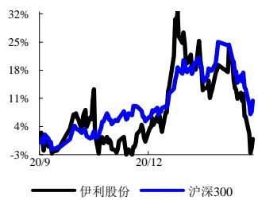  
最近半年股价相对走势

# 相关研究报告

# 投资要点:

# $\bullet$ 稳步发展的乳制品企业龙头

伊利最早始于1956 年，经过六十余年发展成为了中国规模最大、生产线最健全的乳品企业，同时也是亚洲第一乳品企业，并于2014 年跻身全球乳业十强。公司主要从事各类乳制品及健康饮品的加工、制造与销售活动，旗下拥有液体乳、乳饮料、奶粉、酸奶、冷冻饮品等产品系列，产品主要以国内市场销售为主。经过多年发展，公司已发展为国际乳业巨头，经营业绩持续向好。

# $\bullet$ 乳制品行业发展较成熟，各子品类发展程度不一

我国乳制品市场经过多年发展，在2005 年达到千亿规模之后迅速扩容，其后十年间复合增长率达 $1 3 . 9 1 \%$ 。2014 年之后，行业转向低个位数增长。2019年乳制品市场零售总额突破4000 亿元。根据欧睿预测，未来五年我国乳制品市场仍然将稳步发展，至2024 年乳制品市场零售额或将突破 5500 亿元。从乳制品市场的消费构成看，饮用奶在2019 年以 $6 1 . 8 2 \%$ 的占比位居首位，酸奶是乳制品市场的第二大品类占比 $3 5 . 5 8 \%$ ，再次是奶酪、黄油及其他。从趋势上来看，过去几年受益于常温酸奶的发展，酸奶品类的市场占比在逐步扩大。而受到疫情突发因素的影响，消费者对白奶类基础产品的需求有所增加。

# $\bullet$ 三大优势巩固企业领先地位

领先的产品创新能力是公司长足发展的原动力。多年以来，公司依托全产业链创新机制，优化创新模式，并在研发、技术以及创新方面持续加大投入，持续推陈出新完善产品矩阵。对于重点品牌，公司不断加快产品口味、包装及生产技术的创新升级节奏，以期延长品牌产品的生命力。这就使得公司产品结构不断提升，成为业绩持续增长的最主要原因。

与公司乳制品行业龙头地位相匹配的是公司良好的渠道渗透能力。公司常年深耕销售渠道，2019 年线下液态奶终端销售网点已达到 191 万余家，直控村级网点从 2015 年的 11 万家迅速提升至 2019 年的 103.9 万家。根据凯度调研数据显示，2019 年公司常温液态类乳品的市场渗透率为 $8 4 . 3 0 \%$ ，较2015年提高了7.47个百分点。

由于我国规模性牧场的优质奶源具有一定的稀缺性，因此掌握上游奶源成为了近几年龙头乳企深挖自身护城河的重要举措。伊利股份为进一步稳定原料奶供应，提升市场竞争力，多次投资头部大型牧场。强大的奶源掌控能力，有利于巩固公司乳制品行业的龙头地位，对公司的长期发展以及战略布局具有积极意义，为公司的长期发展保驾护航。

# 投资建议

公司作为我国乳制品行业的龙头企业，有着强大的规模和品牌优势。在上游原奶上涨的趋势之下，行业竞争有望驱缓，企业或将通过持续提高产品结构以及控制费用投放抵御成本冲击。而由于疫情的影响，国民健康意识不断增强，乳制品消费需求量预计持续温和增长，公司必将分享行业红利。综上，首次覆盖我们预计公司2020-2022 年每股收益分别为 1.18/1.42/1.62 元，给予公司“增持”的投资评级。

# $\bullet$ 风险提示

疫情出现反复，食品安全风险，宏观经济下行。

<table><tr><td>财务摘要（百万元）</td><td>2018A</td><td>2019A</td><td>2020E</td><td>2021E</td><td>2022E</td></tr><tr><td>主营收入</td><td>79,553</td><td>90,223</td><td>98,336</td><td>109,017</td><td>124,268</td></tr><tr><td>(+1-)%</td><td>16.9%</td><td>13.4%</td><td>9.0%</td><td>10.9%</td><td>14.0%</td></tr><tr><td>经营利润（EBIT）</td><td>6,737</td><td>7,405</td><td>7,341</td><td>8,799</td><td>9,894</td></tr><tr><td>(+/-)%</td><td>6.2%</td><td>9.9%</td><td>-0.9%</td><td>19.9%</td><td>12.4%</td></tr><tr><td>归母净利润</td><td>6,440</td><td>6,934</td><td>7,170</td><td>8,638</td><td>9,856</td></tr><tr><td>(+1-)%</td><td>7.3%</td><td>7.7%</td><td>3.4%</td><td>20.5%</td><td>14.1%</td></tr><tr><td>每股收益（元）</td><td>1.06</td><td>1.14</td><td>1.18</td><td>1.42</td><td>1.62</td></tr></table>

表：三张表及主要财务指标  

<table><tr><td>资产负债表</td><td>2018A</td><td>2019A</td><td>2020E</td><td>2021E</td><td>2022E</td><td>利润表（百万元）</td><td>2018A</td><td>2019A</td><td>2020E</td><td>2021E</td><td>2022E</td></tr><tr><td>货币资金</td><td>11,051</td><td>11,325</td><td>9,428</td><td>15,104</td><td>21,851</td><td>营业收入</td><td>79,553</td><td>90,223</td><td>98,336</td><td>109,017</td><td>124,268</td></tr><tr><td>应收票据及应收账款</td><td>1,282</td><td>1,837</td><td>1,758</td><td>2,007</td><td>2,306</td><td>营业成本</td><td>49,106</td><td>56,392</td><td>61,625</td><td>68,136</td><td>77,738</td></tr><tr><td>预付账款</td><td>1,460</td><td>1,157</td><td>1,532</td><td>1,650</td><td>1,852</td><td>营业税金及附加</td><td>531</td><td>577</td><td>656</td><td>718</td><td>818</td></tr><tr><td>其他应收款</td><td>155</td><td>195</td><td>226</td><td>239</td><td>276</td><td>销售费用</td><td>19,773</td><td>21,070</td><td>23,703</td><td>25,868</td><td>29,720</td></tr><tr><td>存货</td><td>5,507</td><td>7,715</td><td>7,644</td><td>8,607</td><td>9,897</td><td>管理费用</td><td>2,980</td><td>4,285</td><td>4,514</td><td>4,925</td><td>5,449</td></tr><tr><td>其他流动资产</td><td>5,000</td><td>2,783</td><td>2,783</td><td>2,783</td><td>2,783</td><td>研发费用</td><td>427</td><td>495</td><td>496</td><td>572</td><td>649</td></tr><tr><td>流动资产合计</td><td>24,455</td><td>25,706</td><td>24,064</td><td>31,084</td><td>39,658</td><td>财务费用</td><td>-60</td><td>8</td><td>6</td><td>-149</td><td>-301</td></tr><tr><td>长期股权投资</td><td>1,909</td><td>1,961</td><td>1,961</td><td>1,961</td><td>1,961</td><td>资产减值损失</td><td>76</td><td>-241</td><td>-105</td><td>-105</td><td>-105</td></tr><tr><td>固定资产合计</td><td>14,688</td><td>18,296</td><td>21,103</td><td>22,269</td><td>22,848</td><td>信用减值损失</td><td>0</td><td>-61</td><td>0</td><td>0</td><td>0</td></tr><tr><td>无形资产</td><td>639</td><td>1,409</td><td>1,443</td><td>1,490</td><td>1,534</td><td>其他收益</td><td>747</td><td>588</td><td>818</td><td>861</td><td>970</td></tr><tr><td>商誉</td><td>11</td><td>528</td><td>528</td><td>528</td><td>528</td><td>投资收益</td><td>261</td><td>545</td><td>437</td><td>521</td><td>606</td></tr><tr><td>长期待摊费用</td><td>59</td><td>679</td><td>679</td><td>679</td><td>679</td><td>公允价值变动收益</td><td>0</td><td>78</td><td>0</td><td>0</td><td>0</td></tr><tr><td>其他非流动资产</td><td>2,549</td><td>3,151</td><td>3,151</td><td>3,151</td><td>3,151</td><td>资产处置收益</td><td>-38</td><td>-25</td><td>-27</td><td>-34</td><td>-36</td></tr><tr><td>资产总计</td><td>47,606</td><td>60,461</td><td>59,661</td><td>65,893</td><td>73,090</td><td>营业利润</td><td>7,691</td><td>8,280</td><td>8,457</td><td>10,192</td><td>11,630</td></tr><tr><td>短期借款</td><td>1,523</td><td>4,560</td><td>0</td><td>0</td><td>0</td><td>营业外收支</td><td>-113</td><td>-86</td><td>0</td><td>0</td><td>0</td></tr><tr><td>应付票据及应付账款</td><td>9,116</td><td>10,801</td><td>11,526</td><td>12,830</td><td>14,647</td><td>利润总额</td><td>7,578</td><td>8,194</td><td>8,457</td><td>10,192</td><td>11,630</td></tr><tr><td>预收账款</td><td>4,401</td><td>6,020</td><td>6,087</td><td>6,804</td><td>7,824</td><td>所得税费用</td><td>1,126</td><td>1,243</td><td>1,274</td><td>1,535</td><td>1,754</td></tr><tr><td>应付职工薪酬</td><td>2,513</td><td>2,420</td><td>3,005</td><td>3,217</td><td>3,655</td><td>净利润</td><td>6,452</td><td>6,951</td><td>7,184</td><td>8,656</td><td>9,876</td></tr><tr><td>应交税费</td><td>353</td><td>397</td><td>459</td><td>495</td><td>567</td><td>归属于母公司所有者的净利润</td><td>6,440</td><td>6,934</td><td>7,170</td><td>8,638</td><td>9,856</td></tr><tr><td>其他流动负债</td><td>10</td><td>3,069</td><td>3,069</td><td>3,069</td><td>3,069</td><td>少数股东损益</td><td>12</td><td>17</td><td>14</td><td>18</td><td>21</td></tr><tr><td>长期借款</td><td>11</td><td>3,541</td><td>3,541</td><td>3,541</td><td>3,541</td><td>基本每股收益</td><td>1.06</td><td>1.14</td><td>1.18</td><td>1.42</td><td>1.62</td></tr><tr><td>预计负债</td><td>0</td><td>0</td><td>0</td><td>0</td><td>0</td><td>财务指标</td><td>2018A</td><td>2019A</td><td>2020E</td><td>2021E</td><td>2022E</td></tr><tr><td>负债合计</td><td>19,569</td><td>34,187</td><td>30,172</td><td>32,953</td><td>36,931</td><td>营收增长率</td><td>16.9%</td><td>13.4%</td><td>9.0%</td><td>10.9%</td><td>14.0%</td></tr><tr><td>股东权益</td><td>28,037</td><td>26,274</td><td>29,489</td><td>32,940</td><td>36,159</td><td>EBIT增长率</td><td>6.2%</td><td>9.9%</td><td>-0.9%</td><td>19.9%</td><td>12.4%</td></tr><tr><td>现金流量表</td><td>2018A</td><td>2019A</td><td>2020E</td><td>2021E</td><td>2022E</td><td>净利润增长率</td><td>7.3%</td><td>7.7%</td><td>3.4%</td><td>20.5%</td><td>14.1%</td></tr><tr><td>净利润</td><td>6,452</td><td>6,951</td><td>7,184</td><td>8,656</td><td>9,876</td><td>销售毛利率</td><td>38.3%</td><td>37.5%</td><td>37.3%</td><td>37.5%</td><td>37.4%</td></tr><tr><td>折旧与摊销</td><td>1,609</td><td>1,958</td><td>1,403</td><td>1,432</td><td>1,422</td><td>销售净利率</td><td>8.1%</td><td>7.7%</td><td>7.3%</td><td>7.9%</td><td>7.9%</td></tr><tr><td>经营活动现金流净额</td><td>8,625</td><td>8,455</td><td>8,839</td><td>11,302</td><td>13,141</td><td>ROE</td><td>23.1%</td><td>26.5%</td><td>24.4%</td><td>26.4%</td><td>27.4%</td></tr><tr><td>没资活动现金流净额</td><td>-5,374</td><td>-9,999</td><td>-690</td><td>388</td><td>470</td><td>ROIC</td><td>19.4%</td><td>19.0%</td><td>19.6%</td><td>21.2%</td><td>21.9%</td></tr><tr><td>等资活动现金流净额</td><td>-10,749</td><td>-1,016</td><td>-10,047</td><td>-6,013</td><td>-6,865</td><td>资产负债率</td><td>41.1%</td><td>56.5%</td><td>50.6%</td><td>50.0%</td><td>50.5%</td></tr><tr><td>现金净变动</td><td>-7,191</td><td>-2,498</td><td>-1,898</td><td>5,677</td><td>6,747</td><td>PE</td><td>21.61</td><td>27.14</td><td>37.64</td><td>31.24</td><td>27.38</td></tr><tr><td>期初现金余额</td><td>20,756</td><td>10,705</td><td>11,325</td><td>9,428</td><td>15,104</td><td>PB</td><td>4.99</td><td>7.20</td><td>9.20</td><td>8.24</td><td>7.50</td></tr><tr><td>期末现金余额</td><td>13,565</td><td>11,067</td><td>9,428</td><td>15,104</td><td>21,851</td><td>EV/EBITDA</td><td>15.53</td><td>19.67</td><td>30.12</td><td>25.18</td><td>22.17</td></tr></table>

# 目 录

1.稳步发展的乳制品企业龙头， .7  
1.1多年发展终成全球乳业十强， .7  
1.2 营业收入稳定增长，经营业绩持续向好 ….8  
2.乳制品发展较成熟，各子品类发展不一. ….  
2.1乳制品行业规模远未触及天花板.. ….9  
2.2各细分子品类发展程度不一. . 10  
2.3上游原奶价格持续走高. .13  
2.4 双寡头竞争下，伊利略胜一筹. … 15  
3.三大优势巩固企业领先地位， . 16  
3.1领先的产品创新能力.. .16  
3.2 良好的渠道渗透能力.. …18  
3.3上游资源的掌控能力. . 19  
4.投资建议.. ..21  
5.风险提示. .. 21

# 图目录

图1：公司发展历程. 7  
图2：2010-2019 年公司营业总收入情况（单位：亿元） .  
图 3：2010-2019 年公司归母净利润情况（单位：亿元）  
图4：2010-2019 年公司各子品类营收情况（单位：亿元） ..8  
图5：2010-2019 年公司液体乳占营收比例持续提高.. ..8  
图 6：乳制品市场零售额以及增速（单位：亿元） ….9  
图7：我国乳制品零售市场构成.. ..1  
图 8：乳制品市场各子品类成长性 ..11  
图9：饮用奶市场细分子品类零售额增速（%） 12  
图10：欧睿口径下饮用奶市场格局 12  
图11：常温奶及鲜奶市场零售额（单位：百万元) 12  
图12：常温奶及鲜奶市场零售额同比增速， 12  
图13：生鲜乳平均价（单位：元/公斤） 13  
图14：原奶端总供给（单位：万吨）. .13  
图15：进口大包粉价格（单位：元/吨） .13  
图16：2010-2019 年我国乳牛存栏数量（单位：万头） 14  
图17：2014-2024E原料奶供需情况（单位：万吨） 14  
图18：乳制品市场竞争格局 .15  
图19：饮用奶市场竞争格局一览. .16  
图20：酸奶市场竞争格局一览. .16  
图21：公司在饮用奶及酸奶市场占有率. .17  
图22：公司收入归因拆分.. .17  
图23：公司产品结构构成（单位：亿元） .17  
图24：产品创新助力公司持续发展（单位：亿元） .18  
图25：公司常温液态类乳品市场渗透率持续性提升.. .18  
图26：公司直控村级网点数量快速扩张（单位：万） .18  
图27：公司电商收入增速保持良好态势. .19  
图28：公司母婴销售渠道良性发展. 19  
图29：2019 年A股食品饮料行业公司销售人员数量前十. .19  
图30：2011-2019 年公司销售人员数量持续增加（单位：人） .19  
图31：公司销售净利率与上游原奶价格变动趋势（单位：元/公斤） .20

# 表目录

表1：公司十大股东一览. ….7  
表2：各国人均牛奶消费量对比 10  
表3：乳制品分类及定义一览. .10  
表4：不同工艺下的牛奶产品区别一览. .12  
表5：主要乳制品使用原料…. .14  
表6：公司产品结构以及相关品牌 .16  
表7：2019 年全国奶牛养殖牧场集团 TOP15.. .20

# 1.稳步发展的乳制品企业龙头

# 1.1多年发展终成全球乳业十强

伊利最早始于1956 年，经过六十余年发展成为了中国规模最大、生产线最健全的乳品企业，同时也是亚洲第一乳品企业，并于 2014 年跻身全球乳业十强。作为唯一一家同时符合奥运会及世博会标准的乳品企业，公司为 2008 年北京奥运会和 2010 年上海世博会提供服务。2017 年，伊利签约北京冬奥，成为首家“双奥”健康食品企业。

图1：公司发展历程  

<table><tr><td>萌芽期 1956-1993</td><td>成长期 1993-1996</td><td>壮大期 1996-2009</td><td>腾飞期 2010-至今</td></tr><tr><td>•1956年，呼和浩 特回民区成立养 牛合作小组，也 即伊利的前身</td><td>•1993年，呼市回 民奶食品加工厂 改制，以定向募 集的方式设立伊 利集团</td><td>•1996年，伊利股 份在上交所掛牌 上市 •1997年，第一条 利乐液态奶生产 线投产 •1999年，成立中 国乳业第一个液 态奶事业部 •2005年，牵手北 京奥运会，独家 提供乳制品</td><td>•2014年，进入全 球乳业十强</td></tr></table>

资料来源：公司官网，潮海证券

公司股权结构相对分散，高管持股比例较大，无实际控制人。截至今年第三季度，前十大股东中高管持股占比达 $9 . 0 4 \%$ 。公司多次实行股权激励计划，调动经营管理团队的积极性，激发卓越领导能力以及价值创造能力，有效地将股东利益、公司利益和核心团队利益结合在一起，关注公司持续、稳健、快速的发展，促进公司战略目标的实现。

表1：公司十大股东一览  

<table><tr><td>排名</td><td>股东名称</td><td>排名</td><td>股东名称</td></tr><tr><td>1</td><td>香港中央结算有限公司（陆股通)</td><td>6</td><td>刘春海</td></tr><tr><td>2</td><td>呼和浩特投资有限责任公司</td><td>7</td><td>胡利平</td></tr><tr><td>3</td><td>潘刚</td><td>8</td><td>阿布达比投资局</td></tr><tr><td>4</td><td>中国证券金融股份有限公司</td><td>9</td><td>中国人寿保险股份有限公司</td></tr><tr><td>5</td><td>赵成霞</td><td>10</td><td>交通银行-易方达50 指数证券投资基金</td></tr></table>

资料来源：公司公告，潮海证券

# 1.2 营业收入稳定增长，经营业绩持续向好

公司主要从事各类乳制品及健康饮品的加工、制造与销售活动，旗下拥有液体乳、乳饮料、奶粉、酸奶、冷冻饮品等产品系列，产品主要以国内市场销售为主。经过多年发展，公司已发展为国际乳业巨头，经营业绩持续向好。2019 年，公司实现营业总收入902.23亿元，近十年复合增速达到 $1 3 . 1 6 \%$ ；实现归母净利润69.34亿元，近十年复合增速达到 $2 7 . 5 3 \%$ 。

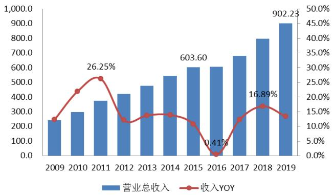  
图2：2010-2019 年公司营业总收入情况（单位：亿元)  
资料来源：公司公告，潮海证券

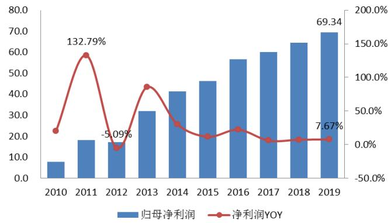  
图3：2010-2019 年公司归母净利润情况（单位：亿元）  
资料来源：公司公告，潮海证券

从营收构成看，公司近十年来各主营业务收入均保持了一定的增速，其中由于液体乳的增速优于其他品类，因此液体乳的营收占比不断提高，2010-2019 年液体乳占营业收入比例从 $7 0 . 7 4 \%$ 提升至 $8 1 . 7 5 \%$ ，而其他品类占比则有不同程度的下降。

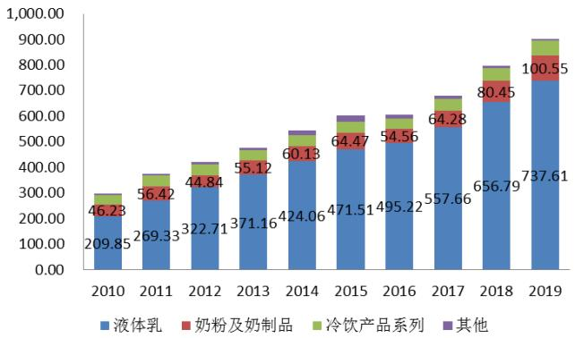  
图4：2010-2019 年公司各子品类营收情况（单位：亿元）  
资料来源：公司公告，潮海证券

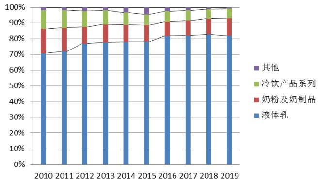  
图5：2010-2019 年公司液体乳占营收比例持续提高  
资料来源：公司公告，潮海证券

# 2.乳制品发展较成熟，各子品类发展不一

# 2.1 乳制品行业规模远未触及天花板

我国乳制品市场经过多年发展，在2005 年达到千亿规模之后迅速扩容，其后十年间复合增长率达 $1 3 . 9 1 \%$ 。2014年之后，销量增长趋缓以及上游原奶价格持续走低，使得行业转向低个位数增长，2015-2019 年复合增长率为 $4 . 5 6 \%$ ，2019年乳制品市场零售总额突破 4000 亿元。根据欧睿预测，未来五年我国乳制品市场仍然将稳步发展，至2024年乳制品市场零售额或将突破5500亿元。

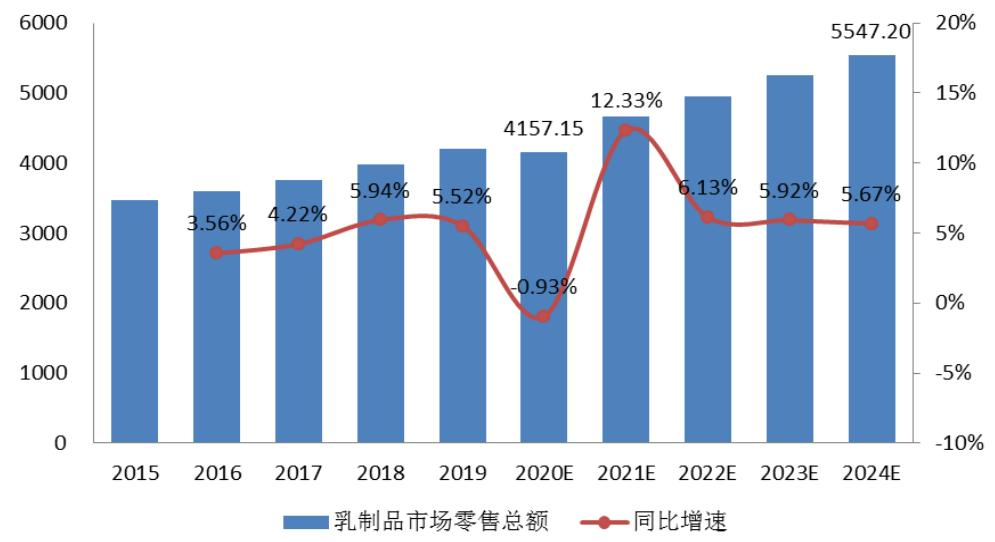  
图6：乳制品市场零售额以及增速（单位：亿元）  
资料来源：Euromonitor，渤海证券

尽管我国近年来乳制品发展驱缓，但是通过国际比较不难发现，我国乳制品人均消费量与发达国家之间仍相去甚远。2018 年，我国牛奶消费总量为 2490.08 万吨，同期日本与美国的消费总量则分别为491.70/2801.96 万吨；我国人均消费量为17.44 千克，同期日本与美国的人均消费量分别为38.65/84.85 千克，二者的人均消费量分别是我国的 2.22/4.87 倍。从人均消费量来看，我国乳制品行业的发展远未触及到天花板，随着消费者的消费观念逐渐转变、消费习惯逐渐培养，我国乳制品行业规模将有望继续增长。

表2：各国人均牛奶消费量对比  

<table><tr><td>年度</td><td>中国牛奶消费 总量（万吨)</td><td>日本牛奶消费 总量（万吨)</td><td>美国牛奶消费 总量（万吨)</td><td>中国人均消费 量（kg/人）</td><td>日本人均消费 量（kg/人）</td><td>美国人均消费 量（kg/人）</td></tr><tr><td>2013</td><td>2221.35</td><td>502.89</td><td>2975.00</td><td>15.96</td><td>39.19</td><td>92.97</td></tr><tr><td>2014</td><td>2389.60</td><td>493.84</td><td>2904.32</td><td>17.08</td><td>38.53</td><td>90.13</td></tr><tr><td>2015</td><td>2403.23</td><td>489.44</td><td>2893.54</td><td>17.08</td><td>38.24</td><td>89.21</td></tr><tr><td>2016</td><td>2420.02</td><td>486.85</td><td>2883.49</td><td>17.11</td><td>38.11</td><td>88.34</td></tr><tr><td>2017</td><td>2439.53</td><td>489.56</td><td>2838.56</td><td>17.17</td><td>38.40</td><td>86.45</td></tr><tr><td>2018</td><td>2490.08</td><td>491.70</td><td>2801.96</td><td>17.44</td><td>38.65</td><td>84.85</td></tr></table>

资料来源：Euromonitor，国家统计局

需要指出的是，本文所使用的欧睿数据口径当中，包含了含乳饮料和植物蛋白饮料（风味牛奶/豆奶)，该分类与我国国家统计局发布的《国民经济行业分类》有所差异。

表3：乳制品分类及定义一览  

<table><tr><td colspan="3">分类</td><td>定义</td><td>产品示例</td></tr><tr><td rowspan="7">乳 制 品</td><td rowspan="5">液体乳</td><td rowspan="2">灭菌乳 132℃并保持很短时间的灭菌，再经无菌罐装等工序制成的液体产品</td><td>以生牛（羊)乳为原料，添加或不添加复原乳，在连续流动的状态下， 加热到至少</td><td>常温纯牛奶</td></tr><tr><td>以不低于80%的生牛（羊）乳或复原乳为主要原料，添加其他原料 调制乳 或食品添加剂或营养强化剂，采用是当的杀菌或灭菌等工艺制成的液</td><td>高钙牛奶/香蕉牛奶/谷物 牛奶/咖啡牛奶</td></tr><tr><td rowspan="2">巴氏杀菌乳 仅以生牛（羊）乳为原料，经巴士杀菌等工序制得的液体产品</td><td>体产品</td><td>低温鲜牛奶</td></tr><tr><td></td><td>低温酸奶/常温酸奶</td></tr><tr><td rowspan="3">乳粉 炼乳</td><td rowspan="3">发酵乳</td><td>以生牛（羊）乳为原料，经巴士杀菌等工序制得的液体产品 以生牛（羊）乳为原料，经加工制成的粉状产品</td><td>脱脂奶粉/婴儿配方奶粉</td></tr><tr><td>以生乳和（或）乳制品为原料，添加或不添加食品添加剂和营养强化 剂，经加工制成的粘稠状产品</td><td>炼乳/炼奶</td></tr><tr><td>成熟或未成熟的软质、半硬质、硬质或特硬质、可有涂层的乳制品， 其中乳清蛋白/酪蛋白的比例不超过牛奶中的相应比例</td><td>奶酪</td></tr></table>

资料来源：《国民经济行业分类》，渤海证券

# 2.2 各细分子品类发展程度不一

从乳制品市场的消费构成看，饮用奶在2019年以 $6 1 . 8 2 \%$ 的占比位居首位，酸奶是乳制品市场的第二大品类占比 $3 5 . 5 8 \%$ ，再次是奶酪、黄油及其他。从趋势上来看，受益于常温酸奶的发展，酸奶品类的市场占比在逐步扩大，且该趋势仍将持续，预计至2024年酸奶品类的市场占比将达到 $4 2 . 2 0 \%$ 。受此影响，饮用奶的发展受到一定程度抑制，在人均乳制品消费量一定的前提之下，二者呈此消彼长的状态。

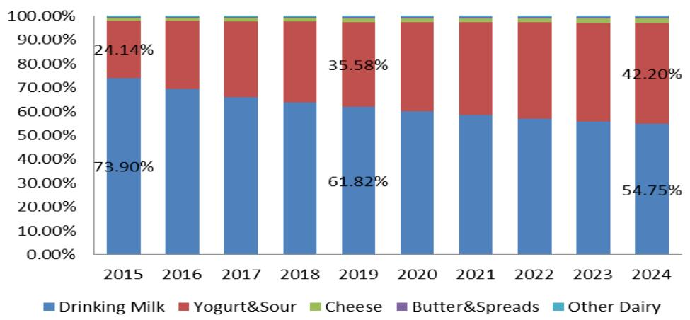  
图7：我国乳制品零售市场构成  
资料来源：Euromonitor，渤海证券

而从乳制品市场细分子品类的成长性来看，奶酪作为最具有潜力的产品在低基数的效应下预计未来五年将以 $1 1 . 1 8 \%$ 的年复合增长率发展。紧随其后的是酸奶，未来五年复合增长率或达到 $9 . 4 1 \%$ 。而饮用奶则由于较大的体量导致其未来成长性稍显不足，但这一问题或会随着消费者饮食习惯的改变而改变。

  
图8：乳制品市场各子品类成长性  
资料来源：Euromonitor，渤海证券

在我国饮用奶市场当中牛奶仍然是最为主要的产品，零售额占比达到 $6 6 . 4 3 \%$ ,其次为风味牛奶，再次为牛奶替代品（例如豆奶）以及奶粉。尽管牛奶市场份额相对较高，但是其成长性仍然优于其他细分品类。根据欧睿预测，未来五年牛奶销售额复合增速将达到 $5 . 5 \%$ ，而占比第二的风味牛奶或将继续失去市场份额。

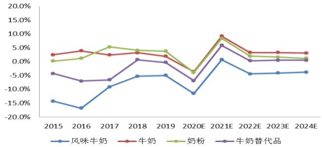  
图 9：饮用奶市场细分子品类零售额增速 $( \%$ )  
资料来源：Euromonitor，渤海证券

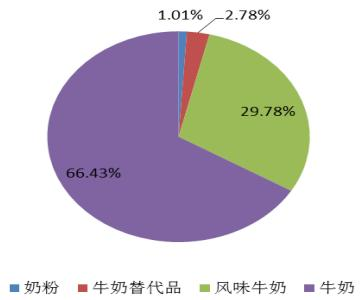  
图10：欧睿口径下饮用奶市场格局  
资料来源：Euromonitor，渤海证券

而牛奶产品又可以分为低温牛奶以及常温牛奶，二者在生产方式、营养价值及储存条件方面均有明显差异。低温牛奶（FreshMilk）通常采用巴氏杀菌工艺，营养成分相对更高，保质期短并且需要低温储存。常温牛奶（Shelf Stable Milk）则大多采用超高温瞬时灭菌技术，保质期较长且便于储存。

表4：不同工艺下的牛奶产品区别一览  

<table><tr><td></td><td>75-80℃巴氏灭菌鲜奶</td><td>低溫巴氏杀菌奶</td><td>常温奶（超市箱装奶）</td></tr><tr><td>工艺</td><td>75-80℃条件下巴氏杀菌15秒</td><td>125-138℃下超巴氏</td><td>135-150℃的超高温</td></tr><tr><td rowspan="2">口感</td><td>(真正的巴氏灭菌)</td><td>杀菌，2-4秒</td><td>瞬时灭菌</td></tr><tr><td>保持新鲜口感和牛奶原味，带风味被破坏</td><td></td><td>有轻微的烧焦味</td></tr><tr><td>营养</td><td>有奶香 杀死有害细菌，保留牛奶营养牛奶蛋白变性，破坏杀死所有细菌活性物</td><td></td><td></td></tr><tr><td rowspan="2"></td><td>价值及活性物质</td><td>很多营养物质，包括质也被杀死</td><td></td></tr><tr><td></td><td>活性物质</td><td></td></tr><tr><td>保质期</td><td>2-6℃冷藏，7-15天</td><td>长</td><td>冷藏，20天左右或更常温保存，长达6个</td></tr></table>

资料来源：公开资料，潮海证券

我国乳制品市场的迅速扩容，与常温产品的发展密切相关，常温牛奶在过去牢牢占据着饮用奶市场的主流地位。但随着我国经济水平的不断提高，消费升级趋势下低温牛奶的市占率将逐步提高，未来五年其复合增长率或达到 $8 . 9 0 \%$ ，是乳制品行业当中最具成长性的细分品类。

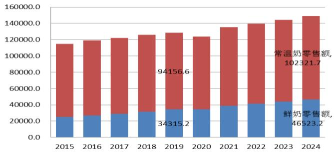  
图11：常温奶及鲜奶市场零售额（单位：百万元）  
资料来源：Euromonitor，渤海证券

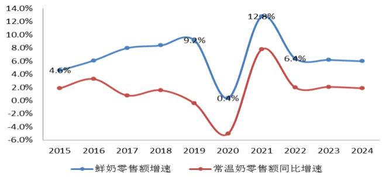  
图12：常温奶及鲜奶市场零售额同比增速  
资料来源：Euromonitor，渤海证券

# 2.3上游原奶价格持续走高

中期来看，上游原奶价格持续走高。本轮生鲜乳价格的上涨始于2020 年中旬，目前价格已经达到4.26 元/公斤，距离 2014年高点仅有一步之遥，相较本轮原奶价格的最低点涨幅达 $2 6 . 4 1 \%$ 。

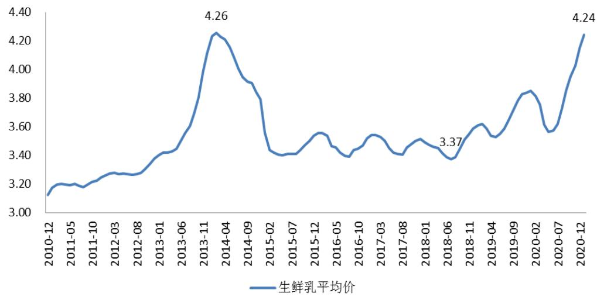  
图13：生鲜乳平均价（单位：元/公斤）  
资料来源：Wind，渤海证券

上一轮原奶价格的急涨急跌主要与进口大包粉价格有关。过去几年，在我国原奶产量基本一定的前提之下，大包粉的进口数量以及价格一直是扰动我国原奶价格的主要因素。2014 年，国内原奶价格随进口大包粉价格同步上涨，随后开启同步下跌。2014 年之后，进口大包粉的库存高企，使得国内原奶价格持续受到抑制。

  
图14：原奶端总供给（单位：万吨）  
资料来源：公开资料，潮海证券

  
图15：进口大包粉价格（单位：元/吨）  
资料来源：公开资料，潮海证券

而本轮原奶价格自2018 年中旬触底之后开启温和上涨趋势，与前次有本质上的区别。我们认为，本轮价格上涨最主要的原因在于随着消费升级，消费者的健康意识觉醒，使其对于乳制品的消费需求从饮品转变成为必须性食品，白奶增速高于风味牛奶，巴氏杀菌乳增速则高于基础白奶。在原料端，生产企业对于生鲜乳的使用随之增长，复原乳（以大包粉作为主要原料)则呈现小幅下降趋势。此外，2020 年12 月市场监管总局制定并印发《乳制品质量安全提升行动方案》，重点任务之一则是强化法规标准体系建设，包括积极配合修订食品安全国家标准以及明确提出鼓励企业使用生鲜乳生产乳制品，预计随着方案落地我国乳制品质量将再上台阶，优质原奶中期需求旺盛。

表5：主要乳制品使用原料  

<table><tr><td>分类</td><td>原料</td></tr><tr><td>巴氏杀菌乳</td><td>仅以生牛（羊）乳为原料</td></tr><tr><td>灭菌乳</td><td>以生牛（羊）乳为原料，添加或不添加复原乳</td></tr><tr><td>调制乳</td><td>以不低于80%的生牛（羊）乳或复原乳为主要原料，添加其他原料或食品添加 剂或营养强化剂</td></tr><tr><td>发酵乳</td><td>以生牛（羊）乳或乳粉为原料</td></tr><tr><td>乳粉</td><td>以生牛（羊）乳为原料</td></tr></table>

资料来源：食品安全国家标准，潮海证券

由于原奶生产的长周期特征，上游企业很难快速增加供给满足需求。我国乳牛存栏长期呈下降性趋势，近年头部牧场多以提高单产增加原奶产量。根据中国奶业统计资料显示，2010-2019 年我国乳牛存栏数量从 1211 万头下降至1037 万头。因此我们认为，供需的紧平衡即是造成当下原奶价格上涨的最根本原因，而第三方咨询机构Frost&Sullivan 预计至2024 年我国原奶供需仍然将存在1920 万吨缺口，综上我们预计本轮原奶价格上涨周期将更具持续性。

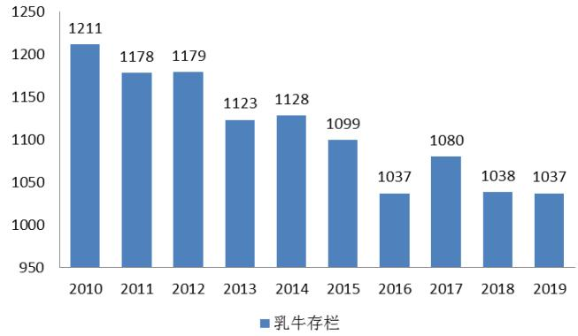  
图16：2010-2019 年我国乳牛存栏数量（单位：万头)  
资料来源：2020中国奶业统计资料，渤海证券

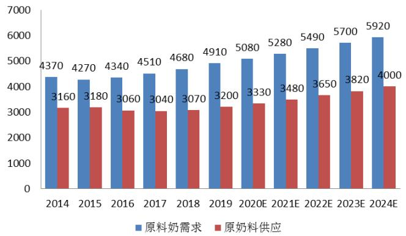  
图17：2014-2024E原料奶供需情况（单位：万吨）  
资料来源：Frost&Sullivan，渤海证券

# 2.4 双寡头竞争下，伊利略胜一筹

上世纪 90 年代以来，纵然历经价格战、质量风波和行业洗牌等因素的影响，我国乳制品行业仍迅速发展壮大。目前行业竞争格局相对稳定，按照企业知名度、经营规模和整体实力大致可以分为：以伊利股份、蒙牛股份及光明乳业为代表的全国性乳制品企业，销售网络覆盖全国，收入水平和市场占有率处于领先地位；以新乳业、三元股份为代表的区域性乳制品企业，在重点经营的区域市场占据领先地位，与全国性乳企形成有效互补；第三类为地方性乳制品企业，此类企业生产经营规模较小，通常仅在单一省市经营，市场份额小并且竞争力有限。整体来看，乳制品市场已形成稳固的双寡头竞争格局，伊利股份、蒙牛乳业通过常温乳制品的发展奠定了全国化基础，逐渐成为行业领军企业，第二梯队公司则多以低温产品为主常温产品为辅的策略参与市场竞争。

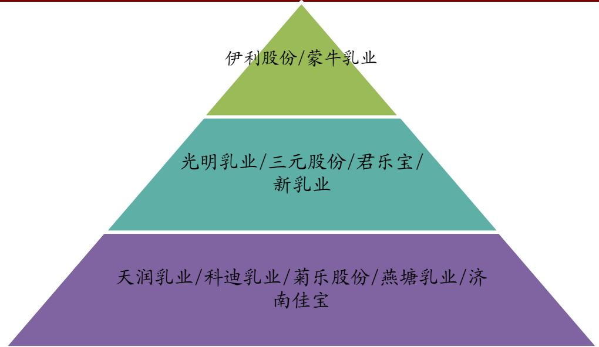  
图18：乳制品市场竞争格局  
资料来源：公开资料，潮海证券

而欧睿对于饮用奶市场的统计口径包括了含乳饮料以及植物蛋白饮料。由于含乳饮料在饮用奶市场当中占据三分之一左右份额，因此在欧睿的统计数据当中，乳制品市场的竞争格局与传统乳制品市场存在一定差异。但该统计口径并不影响第一梯队公司排位，并且与近年来伊利之于蒙牛领先优势愈发明显这一趋势相符，伊利龙头地位不断巩固。

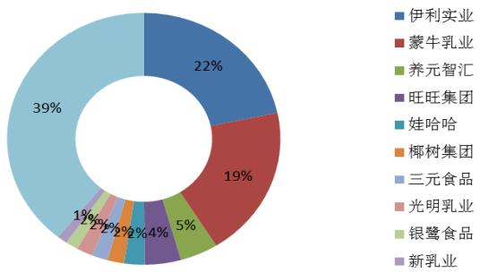  
图19：饮用奶市场竞争格局一览  
资料来源：Euromonitor，渤海证券

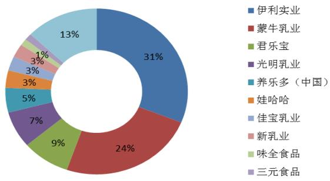  
图20：酸奶市场竞争格局一览  
资料来源：Euromonitor，渤海证券

# 3.三大优势巩固企业领先地位

# 3.1领先的产品创新能力

产品品类丰富，产品结构完善。公司按照产品系列及服务划分，以事业部的形式，构建了液态奶、奶粉、冷饮、酸奶、健康饮品及奶酪六大产品业务群，基本上覆盖了乳制品的所有品类，并且各类产品又以不同品牌区分为不同价格带。如前所述，以金典以及安慕希两大品牌为代表的液体乳业务仍是公司前行的基石，而奶粉、冷饮及奶酪业务尽管行业整体规模较小但也将对公司产生积极贡献，健康饮品目前处于发展初期但是空间广阔，一旦路径成熟将成为公司发展的又一引擎。

表6：公司产品结构以及相关品牌  

<table><tr><td colspan="6">产品结构 品牌</td></tr><tr><td rowspan="2">液态奶</td><td>安慕希</td><td>金典有机奶</td><td>优酸乳</td><td>植选</td><td>QQ星</td></tr><tr><td>谷粒多</td><td>舒化奶</td><td>味可滋</td><td>基础产品</td><td>其他</td></tr><tr><td rowspan="2">奶粉</td><td>金领冠</td><td>金贝智</td><td>培然</td><td></td><td></td></tr><tr><td>伊利婴幼儿</td><td>伊利欣活</td><td>伊利牛奶片</td><td>伊利奶茶粉</td><td></td></tr><tr><td rowspan="2">低温酸奶</td><td>畅轻</td><td>芝士点</td><td>益消</td><td>大果粒</td><td></td></tr><tr><td>Joy Day</td><td>帕瑞缇</td><td>伊利QQ星</td><td>大头盖新品</td><td></td></tr><tr><td rowspan="2">冷饮</td><td>巧乐兹</td><td>冰工厂</td><td>妙趣</td><td>甄稀</td><td></td></tr><tr><td>伊利火炬</td><td>伊利牧场</td><td>基础产品</td><td></td><td></td></tr><tr><td>奶酪</td><td>儿童奶酪棒</td><td>芝士片</td><td>芝士碎</td><td></td><td></td></tr><tr><td>健康饮品</td><td>畅意</td><td></td><td></td><td></td><td></td></tr></table>

资料来源：公司官网，潮海证券

作为行业龙头，公司市场占有率持续性提升。欧睿数据显示，2020年公司在饮用奶/酸奶市场的占有率分别达到 $2 5 . 3 0 \% / 3 0 . 6 0 \%$ ，较2010年分别提升了7.80/21.80 个百分点。未来，随着规模化优势的不断增强，市场集中度或将进一步提升，且乳制品市场仍将温和扩容，伊利作为龙头企业必然受益。

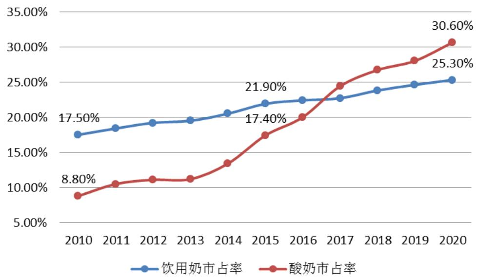  
图21：公司在饮用奶及酸奶市场占有率  
资料来源：Euromonitor，渤海证券

产品结构提升助力公司发展。从历史情况看，公司得以长足发展的原因不外乎销量及价格的同向增长，而价格的增长则主要是通过提升产品结构实现。产品销量方面，2015-19 年公司液体乳销量从 638.21 万吨升至870.94 万吨，复合增长率达到 $8 . 0 8 \%$ 。产品结构方面，欧睿数据统计显示，伊利基础产品所占比例逐年降低，该比例从2010 年的 $7 6 . 5 4 \%$ 降至2019年的 $3 4 . 7 1 \%$ ，QQ星从2010年的$1 5 . 0 6 \%$ 降至2019年的 $6 . 4 3 \%$ ，而以金典和安慕希为代表的高端产品占比逐年提升，2019 年二者所占比例达 $4 3 . 2 6 \%$ 。

  
图22：公司收入归因拆分  
资料来源：Euromonitor，渤海证券

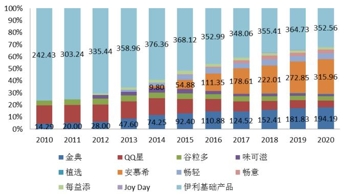  
图23：公司产品结构构成（单位：亿元）  
资料来源：Euromonitor，渤海证券

而产品结构的持续性提升则主要得益于公司领先的产品创新能力。多年以来，公司依托全产业链创新机制，优化创新模式，并在研发、技术和创新方面持续加大投入，持续推陈出新完善产品矩阵。对于重点品牌，公司不断加快产品口味、包装及生产技术的创新升级节奏，以期延长品牌产品的生命力。

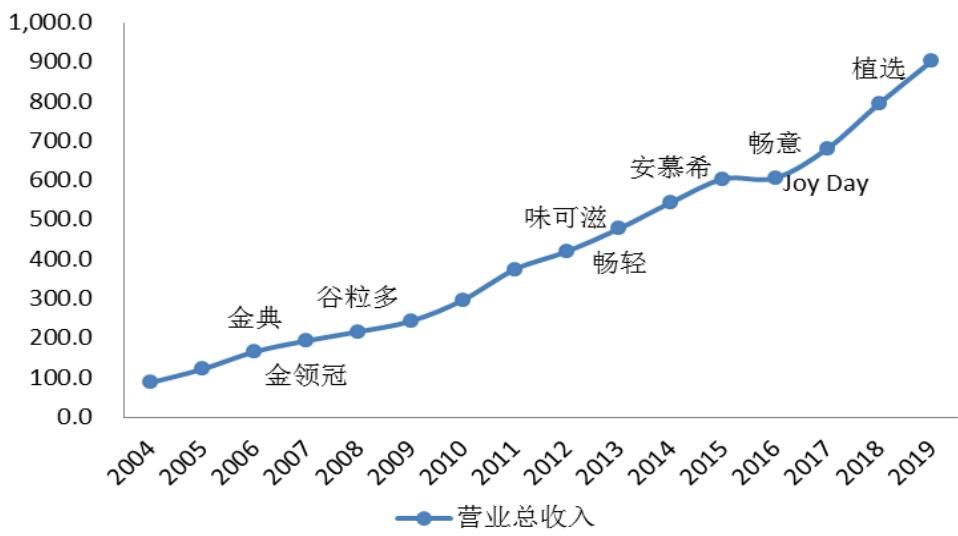  
图24：产品创新助力公司持续发展（单位：亿元）  
资料来源：公开资料，潮海证券

# 3.2 良好的渠道渗透能力

与公司乳制品行业龙头地位相匹配的是公司强大的销售渠道。公司常年深耕销售渠道，2019 年线下液态奶终端销售网点已达到191万余家，直控村级网点从2015年的 11 万家迅速提升至 2019 年的 103.9 万家。根据凯度调研数据显示，2019年公司常温液态类乳品的市场渗透率为 $8 4 . 3 0 \%$ ，较2015年提高了7.47个百分点。

  
图25：公司常温液态类乳品市场渗透率持续性提升  
资料来源：公开资料，渤海证券

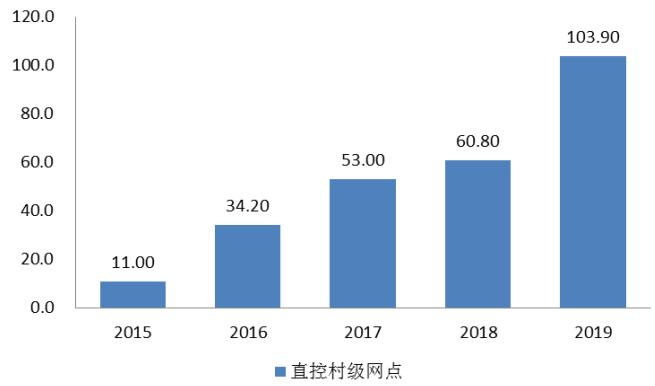  
图26：公司直控村级网点数量快速扩张（单位：万）  
资料来源：公开资料，渤海证券

此外，公司深入研究消费者需求和购买行为，顺应渠道发展趋势，积极把握新兴渠道拓展机会，推动渠道的多元化发展。近几年来，公司大力发展电商、母婴及便利店渠道，使渠道更加精细化，线上线下融合发展，以满足不同人群的需求。

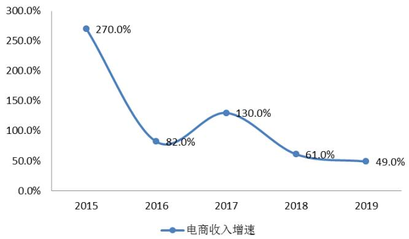  
图27：公司电商收入增速保持良好态势  
资料来源：公开资料，潮海证券

  
图28：公司母婴销售渠道良性发展  
资料来源：公开资料，渤海证券

随着公司收入规模不断扩大以及渠道的进一步下沉，公司销售人员数量持续增长，2011-2019 年公司销售人员数量增长近一倍达到17854人，位列A股食品饮料上市公司之首。

  
图29：2019 年A股食品饮料行业公司销售人员数量前十  
资料来源：公开资料，潮海证券

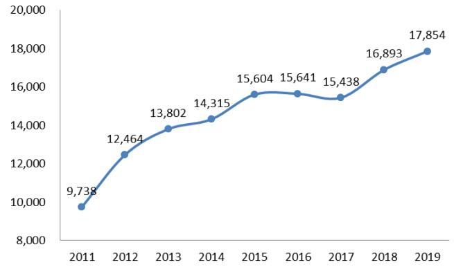  
图30：2011-2019 年公司销售人员数量持续增加（单位：人）  
资料来源：公开资料，渤海证券

# 3.3上游资源的掌控能力

由于我国规模性牧场的优质奶源具有一定的稀缺性，因此掌握上游奶源成为了近几年龙头乳企深挖自身护城河的重要举措。伊利股份为进一步稳定原料奶供应，提升市场竞争力，多次投资头部大型牧场。2019 年7 月，伊利股份控股公司优然牧业收购赛科星 $5 8 . 3 6 \%$ 股权；2020 年10月，为进一步满足业务需求，优然牧业以人民币 23.1 亿元收购恒天然中国牧场全部股权。此外，去年伊利股份公告要约收购中地乳业公司股份，交易完成后公司将获得中地乳业的实控权。上述交易均有利于提高公司对上游大型牧场资源的参与度以及掌控度，有利于巩固公司乳制品行业龙头地位，对公司的长期发展以及战略布局具有积极意义，为公司的长期发展保驾护航。

表7：2019 年全国奶牛养殖牧场集团 TOP15  

<table><tr><td rowspan="2"></td><td rowspan="2">牧场名称</td><td rowspan="2">关联企业</td><td>牛奶产量</td><td>存栏</td><td>成母牛</td><td>成母牛单产</td><td>牧场数量</td></tr><tr><td>万吨</td><td>万头</td><td>万头</td><td>吨</td><td>个</td></tr><tr><td>1</td><td>现代牧业</td><td>蒙牛乳业</td><td>139.0</td><td>139.0</td><td>139.0</td><td>139.0</td><td>139.0</td></tr><tr><td>2</td><td>优然牧业</td><td>伊利股份</td><td>83.0</td><td>83.0</td><td>83.0</td><td>83.0</td><td>83.0</td></tr><tr><td>3</td><td>辉山乳业</td><td>—</td><td>70.0</td><td>70.0</td><td>70.0</td><td>70.0</td><td>70.0</td></tr><tr><td>4</td><td>中国圣牧集团</td><td>蒙牛乳业</td><td>64.2</td><td>64.2</td><td>64.2</td><td>64.2</td><td>64.2</td></tr><tr><td>5</td><td>赛科星</td><td>伊利股份</td><td>61.8</td><td>61.8</td><td>61.8</td><td>61.8</td><td>61.8</td></tr><tr><td>6</td><td>澳亚牧场</td><td>—</td><td>56.5</td><td>56.5</td><td>56.5</td><td>56.5</td><td>56.5</td></tr><tr><td>7</td><td>首农畜牧</td><td>三元股份</td><td>46.7</td><td>46.7</td><td>46.7</td><td>46.7</td><td>46.7</td></tr><tr><td>8</td><td>河北乐源牧业</td><td>君乐宝</td><td>44.0</td><td>44.0</td><td>44.0</td><td>44.0</td><td>44.0</td></tr><tr><td>9</td><td>光明牧业</td><td>光明乳业</td><td>42.5</td><td>42.5</td><td>42.5</td><td>42.5</td><td>42.5</td></tr><tr><td>10</td><td>中地乳业</td><td>伊利股份</td><td>40.0</td><td>40.0</td><td>40.0</td><td>40.0</td><td>40.0</td></tr><tr><td>11</td><td>原生态牧业</td><td>中国飞鹤</td><td>37.0</td><td>37.0</td><td>37.0</td><td>37.0</td><td>37.0</td></tr><tr><td>12</td><td>富源国际</td><td>蒙牛乳业</td><td>36.1</td><td>36.1</td><td>36.1</td><td>36.1</td><td>36.1</td></tr><tr><td>13</td><td>恆天然</td><td>伊利股份</td><td>32.0</td><td>32.0</td><td>32.0</td><td>32.0</td><td>32.0</td></tr><tr><td>14</td><td>宁夏贺兰山奶业</td><td>—</td><td>25.5</td><td>25.5</td><td>25.5</td><td>25.5</td><td>25.5</td></tr><tr><td>15</td><td>天津嘉立荷牧业</td><td>海河乳业</td><td>20.2</td><td>20.2</td><td>20.2</td><td>20.2</td><td>20.2</td></tr></table>

资料来源：2020中国奶业统计资料，渤海证券

此外，如前所述上游原奶价格受到供需影响2018 年中旬开始企稳回升，目前价格已经突破近十年来高点，中期或将继续温和上涨。在此背景之下，龙头企业通常采取以下措施转嫁上游生产成本：其一，上调基础产品价格；其二，减少促销费用投放；其三，提升高端产品比例。以上方式将会减缓企业内部竞争压力，毛利率与原奶价格反向变动，释放企业利润弹性。

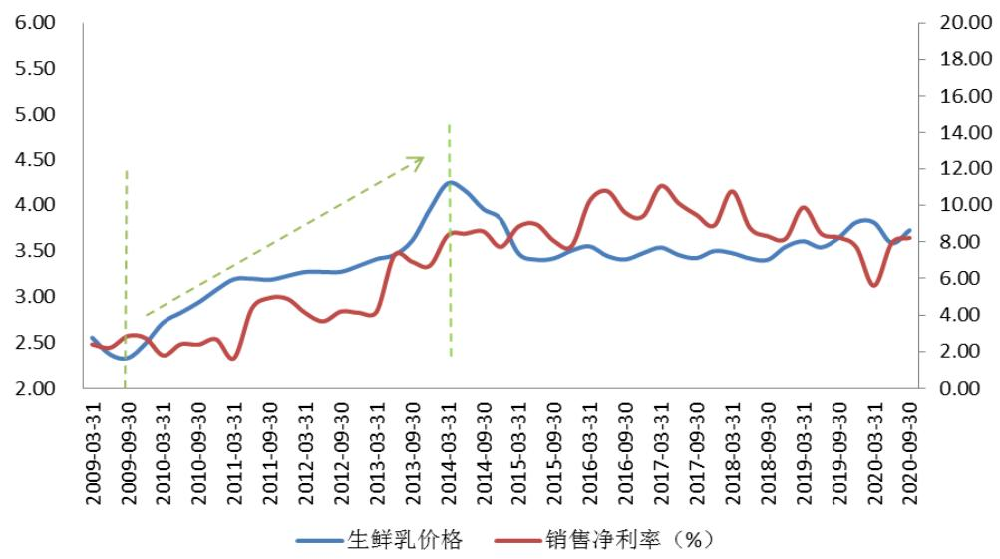  
图31：公司销售净利率与上游原奶价格变动趋势（单位：元/公斤）  
资料来源：Wind，渤海证券

# 4.投资建议

公司作为我国乳制品行业的龙头企业，有着强大的规模和品牌优势。在上游原奶上涨的趋势之下，行业竞争有望驱缓，企业或将通过持续提高产品结构以及控制费用投放抵御成本冲击。而由于疫情的影响，国民健康意识不断增强，乳制品消费需求量预计持续温和增长，公司必将分享行业红利。综上，首次覆盖我们预计公司2020-2022 年每股收益分别为1.18/1.42/1.62 元，并给予公司“增持”的投资评级。

# 5.风险提示

疫情出现反复，食品安全风险，宏观经济下行