2020年 07月 03日

伊利股份（600887.SH)

# 领先恢复，龙头投资价值凸显

■竞争优势在于管理、渠道、上游资源和规模经济。在竞争激烈的中国乳制品市场，伊利股份长期居于国内综合性乳企首位、液态奶龙头，其必然具备核心竞争力，我们认为公司的核心竞争力存在于管理、资源、渠道网络和规模优势，在几轮行业发展周期（常温奶普及）或重要转折点（如三聚氰胺）当中，公司保持甚至拉大了同竞争对手的差距，在2020 年Q1 新冠疫情影响下，通过快速反应高效执行力，在3月份之后实现了更好更快的恢复。渠道网络布局的先发优势：伊利在2006年就在全国开展了“织网计划”，2007年借助商务部“万村千乡活动进入“农家店”等乡镇销售终端，2015 年加速县乡镇农村市场的产品渗透，近年渠道渗透率维持每年1-2pct 的增长。由于渠道布局的先发优势，对于竞品，要达到相同的市场份额，需要付出更高的成本。持续激励的狼性团队：公司管理团队稳定，潘刚先生自2002 年自今担任公司总裁，通过多年的股权激励计划，截至2019年底管理团队合计持股 $9 . 0 5 \%$ ，管理团队带领公司多次顺利跨越危机，实现长远发展。上游资源掌控力：合作牧场数量领先，持续为上下游提供技术和融资支持，并将触角伸至全球。规模优势：伊利领先的收入规模可以支撑高于同行的广告营销费与研发投入，保证产品升级、新品推广与品牌价值持续提升。

■积极应对危机，强化竞争优势，Q2 恢复良好，体现核心竞争力。三聚氰胺事件后加速建设和谐产业链：1）加大奶源建设：加大奶源建设的投入，2011 年定增募资资金中12.32 亿元用于在内蒙古、四川、安徽等地投建奶源项目；2）保障经销商利益：公司全额承担经销商的损失，经销商忠诚度提升，2008 年公司存货报废8.9 亿元,2008 年销售费用大幅增长 $4 1 . 4 5 \%$ o2020 年初的疫情市场份额持续提升：伊利销售人员深入一线，帮助库存调度，增强经销商信心，同时逆势涨薪，加大团队凝聚力。随着疫情后终端的逐渐恢复，伊利抢占渠道资源，实现市占率持续提升，根据草根调研，截至4 月底渠道库存已逐渐恢复正常，4-5 月常温液态奶增速达 $20 \%$ 以上，6月持续超预期。

■长期看点1）产品结构升级：公司吨价驱动因素中大部分为产品结构升级贡献，通过大单品裂变（包装、口味升级）延长产品生命周期，2019 年“金典”“安慕希”畅轻”金领冠"巧乐兹“畅意 $100 \%$ 等重点产品销售收入同比增长 $2 2 . 3 \%$ ；2）渠道继续下沉：目前公司在乡镇市场的团队可以定时定点定线去服务占比 $4 0 { - } 5 0 \%$ ，另外 $50 \%$ 仍通过大流通渠道；同时伊利覆盖的终端数量191万个，低于农夫山泉、娃哈哈、达利等，渠道下沉与精耕仍有较大空间；3）多元化、全球化：公司积极布局大健康领域，推出多款软饮料，目前尚处于孵化期，我们认为伊利善于洞察消费趋势，具备较强的营销与品牌建设能力，大单品打造经验足，有望将乳制品市场优势延续至软饮料领域，同时公司通过全球织网布局全球奶源、工厂、市场，打造全球供应链。

■投资建议：预计公司2020-2022 年EPS 分别为1.03 元、1.38 元、1.48 元，不考虑股权摊销费用，EPS为1.08元、1.42元、1.50元，采用不考虑股权摊销费用的利润估值，给予2020年28 倍PE，6 个月目标价39.76 元，维持“买入-A”评级。

■风险提示：原奶价格上涨超预期导致公司成本压力；核心大单品增速放缓、缺乏潜力大单品、 拓品类不及预期，导致收入增速承压。

<table><tr><td>(百万元)</td><td>2018</td><td>2019</td><td>2020E</td><td>2021E</td><td>2022E</td></tr><tr><td>主营收入</td><td>79,553.3</td><td>90,223.1</td><td>99,091.1</td><td>112,253.6</td><td>123,573.7</td></tr><tr><td>净利润</td><td>6,439.7</td><td>6,933.8</td><td>6,230.6</td><td>8,345.1</td><td>8,957.8</td></tr><tr><td>每股收益(元)</td><td>1.06</td><td>1.14</td><td>1.03</td><td>1.38</td><td>1.48</td></tr><tr><td>每股净资产(元)</td><td>4.59</td><td>4.30</td><td>5.10</td><td>5.65</td><td>6.24</td></tr><tr><td>盈利和估值</td><td>2018</td><td>2019</td><td>2020E</td><td>2021E</td><td>2022E</td></tr><tr><td>市盈率(倍)</td><td>30.2</td><td>28.0</td><td>31.1</td><td>23.2</td><td>21.6</td></tr><tr><td>市净率(倍)</td><td>7.0</td><td>7.4</td><td>6.3</td><td>5.7</td><td>5.1</td></tr><tr><td>凈利润率</td><td>8.1%</td><td>7.7%</td><td>6.3%</td><td>7.4%</td><td>7.2%</td></tr><tr><td>净资产收益率</td><td>23.1%</td><td>26.5%</td><td>20.1%</td><td>24.3%</td><td>23.7%</td></tr><tr><td>股息收益率</td><td>2.2%</td><td>2.0%</td><td>1.9%</td><td>2.6%</td><td>2.8%</td></tr><tr><td>ROIC</td><td>69.9%</td><td>45.9%</td><td>43.0%</td><td>35.9%</td><td>37.6%</td></tr></table>

数据来源：Wind资讯，安信证券研究中心预测

# 公司深度分析

证券研究报告乳制品

投资评级 买入-A维持评级  
6个月目标价: 39.76元  
股价（2020-07-02) 31.94元

<table><tr><td colspan="2">交易数据</td></tr><tr><td>总市值 (百万元)</td><td>193,744.43</td></tr><tr><td>流通市值(百万元)</td><td>187,875.54</td></tr><tr><td>总股本（百万股)</td><td>6,065.89</td></tr><tr><td>流通股本(百万股)</td><td>5,882.14</td></tr><tr><td>12 个月价格区间</td><td>27.12/33.88元</td></tr></table>

  
股价表现

<table><tr><td>升幅%</td><td>1M</td><td>3M</td><td>12M</td></tr><tr><td>相对收益</td><td>7.97</td><td>1.1</td><td>-5.76</td></tr><tr><td>绝对收益</td><td>13.77</td><td>12.25</td><td>-4.23</td></tr></table>

资料来源：Wind 资讯

苏铖 分析师SAC执业证书编号：S1450515040001sucheng@essence.com.cn021-35082778徐哲琪 分析师SAC执业证书编号：S1450519100001xuzq1@essence.com.cn

# 相关报告

伊利股份：2019 年度指标  
优化明显，2020逐季向好2020-05-05  
可期/苏铖  
伊利股份：成本上升，竞  
争剧烈，短期业绩承压/苏 2019-08-29  
铖  
伊利股份：行业竞争仍激  
烈，增强激励迎战后千亿2019-08-07  
时代/苏铖  
伊利股份：连续快增的大  
众品龙头，费用率升势放2019-04-26  
缓/苏铖

# 内容目录

# 1．竞争优势在于管理、渠道、上游资源和规模经济.. 4

1.1．渠道网络布局的先发优势， 4  
1.2. 持续强激励的狼性团队.. 6  
1.3.上游资源掌控力领先. .8  
1.4.已经达成的规模优势 .9  
2.积极应对危机，强化竞争优势 10  
2.1.2006 年行业进入平稳期，全国织网深挖渠道动能. 10  
2.2. 三聚氰胺事件后，加速建设和谐产业链. 11  
2.3.2020 年初的疫情市场份额持续提升. 12  
3.产品结构升级、渠道下沉推动成长. 13  
3.1．公司的产品矩阵概览， 13  
3.2.产品结构升级推动吨价提升. 14  
3.3. 渠道下沉仍有空间. 15  
4.对标达能，迈向全球化、多元化. 16  
4.1．发展健康饮品业务.. 16  
4.2.全球织网：打造全球供应链. 16  
5.投资建议... 17  
6.风险提示. 18

# 图表目录

图1：包含三方面核心内容的管理. 4  
图2：公司常温液态奶渗透率以每年 $1 - 2 \%$ 增加 5  
图3：2018年直控村级网点数量达60.8万个， 5  
图4：某六线城市的夫妻老婆店伊利的摆放位置显眼. 5  
图5：伊利销售人员数量显著高于同行.. 5  
图 6：公司 2018 年构建液态奶、奶粉、冷饮、酸奶、健康饮品及奶酪六大产品业务群.. .7  
图7：2019 年底潘刚先生持股 $4 . 7 \%$ ，其他高管持股 $4 . 3 5 \%$ .7  
图8：伊利的广告营销费高于竞品（单位：亿元) .9  
图9：伊利研发投入高于竞品（单位：亿元） .9  
图 10：我国全脂奶粉进口量从2000 年的5.1 万吨上升至 2003 年的9.1万吨. 10  
图11：2007年以后我国乳制品行业逐渐进入稳定增长期.. 10  
图 12：织网计划，伊利销售员工数量从 2005 年的 1628 人大幅增加至 2006 年的 5231 人..11  
图13：源于渠道模式不同，某中部省份经销商数量伊利高于蒙牛两倍有余. .11  
图14：2009 年开始，伊利的营业收入增速高于蒙牛. .11  
图15：伊利的毛销差在2011年以后超过蒙牛， .11  
图16：2020Q1伊利常温白奶销量下滑幅度小于行业， 12  
图17：2020Q1伊利常温酸奶销量下滑幅度小于行业 12  
图18：伊利常温液态奶市占率始终呈螺旋式提升. 12  
图19：伊利的婴幼儿奶粉市占率... 12  
图20：伊利产品生命周期概览.. 13  
21 14  
图22：伊利液态奶单价提升，主要系产品结构升级贡献 14  
图23：2019 年金典有机系列占金典总收入的 $20 \%$ 14  
图24：19 年安慕希畅饮 $^ +$ 果味占比 $40 \%$ ，占比持续提升. 14  
图25：金典、安慕希通过口味、包装、功能升级，不断裂变，延长产品生命周期. .15  
图26：伊利布局的终端网点少于娃哈哈、农夫山泉等. 15  
图27：伊利人员销售人员创收高于达利、农夫等. 15  
图28：软饮料中不乏有增速较快的子品类.. 16  
图29：软饮料进入壁垒低，集中度低于乳制品. 16  
表1：公司历年的渠道策略. 5  
表2：相较于蒙牛，伊利的管理层更加稳定. 6  
表3：公司持续进行员工股权激励，深度绑定员工与公司利益.. 6  
表4：各乳企控股/参股/签订合作协议的相关牧场.. .8  
表5：根据凯度数据，伊利 2017-2018 年位列中国市场消费者选择最多的品牌榜首. 9  
表6：伊利具有较好的挑选“爆款”的眼光,近年来伊利赞助热门综艺中不乏有收视率居首的爆款  
.9  
表7：伊利蒙牛液态奶收入增速对比.. 10  
表8：伊利的深度分销模式与蒙牛的大经销商制对比. .11  
表9：公司产品矩阵概览（单位：亿元，欧睿零售口径) 13  
表10：公司全球织网事件.. 17  
表11：主要盈利预测与假设， 17  
表12：可比公司估值表. 18

# 1.竞争优势在于管理、渠道、上游资源和规模经济

在竞争激烈的中国乳制品市场，伊利股份长期居于国内综合性乳企首位、液态奶龙头，其必然具备核心竞争力，我们认为公司的核心竞争力存在于管理、资源、渠道网络和规模优势，在几轮行业发展周期（常温奶普及）或重要转折点（如三聚氰胺）当中，公司保持甚至拉大了同竞争对手的差距，在2020 年Q1 新冠疫情影响下，通过快速反应高效执行力，在3月份之后实现了更好更快的恢复。

管理，之所以认为管理是公司的核心竞争力，我们认为管理包含几个方面：第一是优秀、稳定且持续正向激励的团队；第二是基于优秀团队制定的“行之有效”的企业发展战略，一个企业可持续发展，战略上前瞻领先是不可或缺的，帮助在中长期发展中洞察先机，领先对手；第三是执行力，能够依靠自身打造出杰出的快消品行销网络，能够市场化的积极创新满足不断变化的市场需求，而不是依靠外延。我们认为伊利的管理从多个维度比较均占据优势。

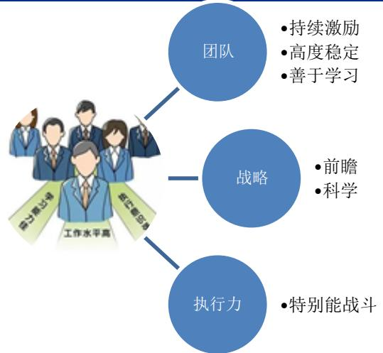  
图1：包含三方面核心内容的管理  
资料来源：安信证券研究中心制图

渠道，快消品比拼“产品力、品牌力、渠道力”三力，打造高质量的渠道网络体系，并且保持稳定，在越“同质化”的竞争当中重要性越高。我们认为从渗透率、稳定性等方面，伊利的渠道网络更为优秀。

上游资源，乳制品长而复杂的产业链条，其上游重要性最为突出，得奶源者得天下，需求具有持续成长空间，但资源禀赋实际是分不平衡，国内供给偏紧，这使得谁的上游资源掌控越强越具有长期竞争优势。我们认为伊利股份长期经营奶源上游，包括较早进行全球资源布局，使得资源力上同样具备更好优势。

规模优势，一是生产规模优势，二是其他。从营销资源角度看，例如可以投放冠名的综艺节目，优质节目资源也是相对有限，但公司显然在这方面抢占的资源更多。

# 1.1.渠道网络布局的先发优势

伊利在2006年就在全国开展了“织网计划”，当年分别在湖北黄冈、安徽合肥、成都邛崃、山东平阴投资建设现代化乳制品生产基地，使得伊利全国十多个销售大区均可以实现生产、销售、市场一体化运作，率先完成了“纵贯南北、辐射东西”的战略布局，成为第一家覆盖全国市场的乳品企业。同时2007 年借助商务部“万村千乡”活动进入“农家店”等乡镇销售终端。

2015 年开始，公司加速县乡镇农村市场的渗透：直控村级网点数量从2015 年的 11 万个增加至2018年的61万个。

近年公司的渠道渗透率始终维持每年 1-2百分点增长:根据凯度数据，截至2019 年12 月底，公司常温液态类乳品的市场渗透率为 $8 4 . 3 \%$ ，同比增2pct，所服务的线下液态奶终端网点已达191万家，同比增长 $9 . 1 \%$ ，服务的乡镇村网点近 103.9 万家，同比增 $8 . 0 \%$ o

由于渠道布局的先发优势，对于竞品，要达到相同的市场份额，竞品需要付出更高的成本（进入一个伊利已经布局的终端，并且产品摆放在优势的位置，竞品需要比伊利付出更高的成本)

表1：公司历年的渠道策略  

<table><tr><td>年份</td><td>渠道策略</td></tr><tr><td>1999</td><td>公司共投入1832 万进行销售网络的建设并在市场条件成熟的地区建立销售分公司。 为整合市场资源，理顺营销渠道，完善市场配送体系，公司投资 1650 万元进行市场网络项目建设，大力提高公司对市场</td></tr><tr><td>2001</td><td>开拓力和控制力。</td></tr><tr><td>2006</td><td>在全国开展“织网计划”，打造“纵贯南北、辐射东西”的战略布局，完成后成为第一家覆盖全国市场的乳品企业。</td></tr><tr><td>2007</td><td>借助商务部“万村千乡”活动进入“农家店”等乡镇销售终端。</td></tr><tr><td>2010</td><td>充分发挥渠道“神经末梢”的作用，将市场信息及时反馈，提升现代渠道管理水平，降低渠道成本。</td></tr><tr><td>2012</td><td>继续坚持渠道下沉战略，深耕渠道，贯彻渠道管理提升策略。</td></tr><tr><td>2013</td><td>继续深入开展和实施渠道精耕与终端基础建设提升计划，通过渠道业务拓展和管理精进，与更多客户建立并加强了合作关 系。</td></tr><tr><td>2015</td><td>在持续推进渠道精耕计划的同时，公司将加快母婴及电子商务渠道的拓展步伐；着力搭建“云商信息平台”。</td></tr><tr><td>2016-2018</td><td>在积极开拓新兴渠道的同时，提高县乡镇农村市场产品渗透能力，挖掘空白市场业务机会;持续推进渠道精耕计划的实施。</td></tr><tr><td>2019</td><td>积极探索“会员营销”“社群营销”“O20 到家”等新零售模式，在拓展渠道的同时，推动线上线下渠道的一体化融合； 同时，公司继续实施渠道精耕计划，不断提升渠道渗透水平。</td></tr></table>

资料来源：公司公告、安信证券研究中心

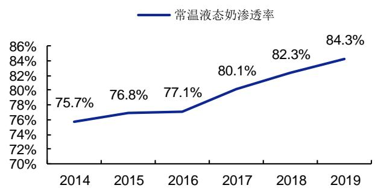  
图2：公司常溫液态奶渗透率以每年1-2%增加  
资料来源：凯度数据、安信证券研究中心

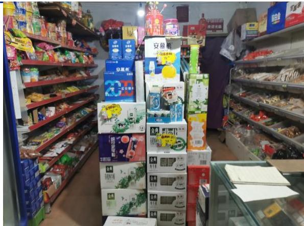  
图 4：某六线城市的夫妻老婆店伊利的摆放位置显眼  
资料来源：公司公告、安信证券研究中心

资料来源：草根调研、安信证券研究中心资料来源：公司公告、安信证券研究中心

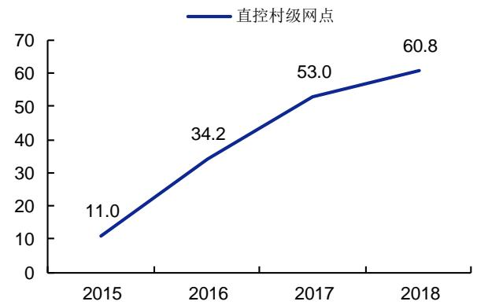  
图3：2018 年直控村级网点数量达60.8万个

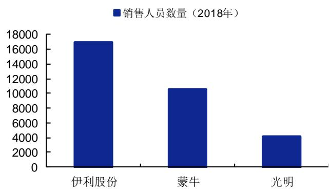  
图5：伊利销售人员数量显著高于同行

# 1.2. 持续强激励的狼性团队

公司大股东是呼和浩特投资有限责任公司(呼和浩特国资委持股 $8 1 \%$ )，截至2019年底持股比例 $8 . 8 3 \%$ ，不参与实际经营；通过多年的股权激励计划，截至2019 年底管理团队合计持股 $9 . 0 5 \%$ ，所有权和管理权深度绑定。

管理团队稳定：潘刚先生自1992 年加入公司，历任冷冻食品质检部部长、生产部部长，矿泉饮料公司董事长兼总经理、液态奶事业部总经理，自 2002 年起担任公司总裁至今。

管理团队多次带领公司顺利跨越危机，实现长远发展：

1）2006年面对国际化竞争加剧、行业进入平稳成长期，公司开展“全国织网”，深挖渠道动能；  
2）2008 年三聚氰胺事件后公司团结产业链上下游，注重加大上游建设，夺取我国乳制品龙头地位。  
3)2018 年裂变事业部:为实现各个业务板块更有力的发展，发挥员工主观能动性，公司 2018年构建液态奶、奶粉、冷饮、酸奶、健康饮品及奶酪六大产品业务群（之前为液态奶、奶粉、冷饮、酸奶四大产品业务群)。

4）2020 年初的疫情，公司供应链反应快，库存去化速度显著快于同行，抢占终端资源，实现市占率提升。

表2：相较于蒙牛，伊利的管理层更加稳定  

<table><tr><td>伊利</td><td>总裁</td><td>蒙牛</td><td>总裁</td></tr><tr><td>2002年至今</td><td>潘刚</td><td>1999-2009</td><td>牛根生</td></tr><tr><td></td><td></td><td>2009-2012</td><td>杨文俊</td></tr><tr><td></td><td></td><td>2012-2016</td><td>孙伊萍</td></tr><tr><td></td><td></td><td>2016 年至今</td><td>卢敏放</td></tr></table>

资料来源：公司公告、安信证券研究中心

表3：公司持续进行员工股权激励，深度绑定员工与公司利益  

<table><tr><td></td><td>2006.4 股票期权 激励计划 (旧) 总裁潘刚、3位总</td><td>2006.11 股票期权 激励计划 (新)</td><td>2014.11 员工持股计划</td><td>2016.10 股票期权与 限制性股票激励计划</td><td>2019.8 限製性股票激 励计划(旧)</td><td>2019.限制性股票 激励计划 (新)</td></tr><tr><td>激励 对象</td><td>裁助理（胡利平、 赵成霞、刘春海)、 以及其他核心业 务骨干29人，其 中潘刚持股 30%</td><td></td><td>公司中高层管理人员、 公司及子公司业务技术 骨干，首期共计317 人，其中潘刚等高管持 有30.76%</td><td>294人（核心技术或 业务人员、及其他， 股票期权)/293人(限 制性股票)</td><td>474人，包括董事、高 级管理人员、核心技术 （业务）骨干及其他， 其中潘刚占比 33.24%</td><td>480人,相较于原方 案增加6 名核心员 工，潘刚占比 33.24%</td></tr><tr><td>授予 数量</td><td>5,000 万份股票 期权，占总股本的 9.681%</td><td></td><td>截至目前已实施第六 期，合计购买 0.51%股 份用于该计划</td><td>6000 万股（其中股票 期权 4500 万股,限制 性股票1500 万股)， 占总股比 0.99%</td><td>1.83 亿股，占总股本 的3%</td><td>1.52 亿股（占总股 本的2.5%)</td></tr><tr><td>行权格</td><td>13.33元 首期行权时，上</td><td></td><td></td><td>15.47(股 以 2015 年净利润为</td><td>15.46元</td><td></td></tr><tr><td>行权 条件</td><td>一年度净利润增 长率不低于不低 于20%</td><td>增加首期后行权条 件：行权的上一年 收2增05.低 于15%</td><td></td><td>基数，2017/18 年净 利润增长率不低于 不低于 12%</td><td>以2018 净利润为基 数，19-23 年凈利润增 8%/18%不低738%/4 8%,ROE不低于 15%</td><td>ROE不低于 20%， 新增条 于分红比</td></tr><tr><td>有效期</td><td>8年</td><td></td><td>分十期实施，自 2014 年度始至2023年度止， 每期存续期为两年</td><td>4年</td><td>6年</td><td></td></tr></table>

资料来源：公司公告、安信证券研究中心

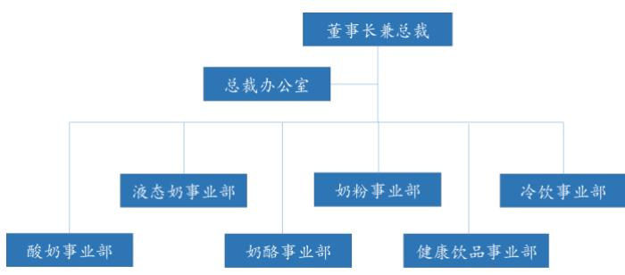  
图6：公司 2018 年构建液态奶、奶粉、冷饮、酸奶、健康饮品及奶酪六大产品业务群  
资料来源：公司公告、安信证券研究中心

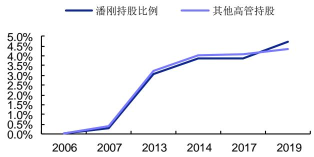  
图7：2019 年底潘刚先生持股 $4 . 7 \% ,$ 其他高管持股$4 . 3 5 \%$   
资料来源：公司公告、安信证券研究中心

# 1.3.上游资源掌控力领先

# 公司始终将“加大奶源建设”、“保障上下游利益”放在重要位置：

随着行业集中度提升、国际化竞争加剧、以及消费者对品质要求提升，奶源掌控成为最大优势，公司旨在与奶源供应商建立利益共同体，以轻资产为主的方式布局奶源，稳定并增加原奶供给。

2019 年参股公司收购赛科星：2019 年初赛科星公告优然牧业（伊利持有其控股股东 $40 \%$ 的股权）以22.78 亿元现金购买 $5 8 . 3 6 \%$ 的股份。

搭建全球资源体系：2019 年收购新西兰Westland，加速在海外黄金奶源地布局。

持续为上下游提供技术和融资支持：公司为乳业上下游合作伙伴提供能力建设、融资等服务。  
2019 年公司共计发放融资款约 183 亿元，为 4137 家上下游合作伙伴提供了融资服务。  
2014 年-2019 年期间，公司累计发放融资款约464 亿元，累计服务客户数5992户。

表4：各乳企控股/参股/签订合作协议的相关牧场（万头)  

<table><tr><td>企业名称</td><td>牧场</td><td>2018 年牧场存栏数</td><td>企业名称</td><td>牧场</td><td>2018 年牧场存栏数</td></tr><tr><td>伊利</td><td>中地乳业</td><td>6.47</td><td>光明</td><td>中兴牧业</td><td>2</td></tr><tr><td></td><td>嘉立荷牧业</td><td>3.35</td><td></td><td>原生态牧业</td><td>6.4</td></tr><tr><td></td><td>宁夏农垦贺兰山奶业公司</td><td>1.5</td><td></td><td>光明牧业</td><td>8.1</td></tr><tr><td></td><td>宁夏农垦贺兰山奶业</td><td>4.5</td><td>君乐宝</td><td>嘉立荷牧业</td><td>3.35</td></tr><tr><td></td><td>中兴牧业</td><td>2</td><td></td><td>乐源牧业</td><td>6.2</td></tr><tr><td></td><td>宁夏翔达牧业</td><td>0.49</td><td>三元</td><td>中地乳业</td><td>6.47</td></tr><tr><td></td><td>贺兰中地生态牧场有限公司</td><td>2.2</td><td></td><td>首农畜牧</td><td>8.47</td></tr><tr><td></td><td>浙江一景牧业</td><td>0.4</td><td></td><td></td><td></td></tr><tr><td></td><td>宁夏汇丰源牧业</td><td>0.51</td><td></td><td></td><td></td></tr><tr><td></td><td>宁夏赛科星养殖有限公司</td><td>0.43</td><td></td><td></td><td></td></tr><tr><td></td><td>优然乳业</td><td>11</td><td></td><td></td><td></td></tr><tr><td></td><td>赛科星</td><td>13.2</td><td></td><td></td><td></td></tr><tr><td>蒙牛</td><td>中地乳业</td><td>6.47</td><td></td><td></td><td></td></tr><tr><td></td><td>嘉立荷牧业</td><td>3.35</td><td></td><td></td><td></td></tr><tr><td></td><td>宁夏农垦贺兰山奶业公司</td><td>1.5</td><td></td><td></td><td></td></tr><tr><td></td><td>宁夏农垦贺兰山奶业</td><td>4.5</td><td></td><td></td><td></td></tr><tr><td></td><td>宁夏翔达牧业</td><td>0.49</td><td></td><td></td><td></td></tr><tr><td></td><td>贺兰中地生态牧场有限公司</td><td>2.2</td><td></td><td></td><td></td></tr><tr><td></td><td>原生态牧业</td><td>6.4</td><td></td><td></td><td></td></tr><tr><td></td><td>宁夏骏华月牙湖农牧</td><td>0.82</td><td></td><td></td><td></td></tr><tr><td></td><td>圣牧高科</td><td>11.1</td><td></td><td></td><td></td></tr><tr><td></td><td>富源牧业</td><td>6.1</td><td></td><td></td><td></td></tr><tr><td></td><td>中鼎联合牧业</td><td>4</td><td></td><td></td><td></td></tr><tr><td></td><td>现代牧业</td><td>23.2</td><td></td><td></td><td></td></tr></table>

资料来源：《中国奶业统计资料》安信证券研究中心

# 1.4.已经达成的规模优势

伊利领先的收入规模可以支撑高于同行的广告营销费与研发投入，2018-2019 年的广告营销费用分别为109.6 亿元、110.4 亿元，研发投入4.3 亿元、5.0 亿元，领先同行；基于公司对消费趋势敏锐的嗅觉与出色的营销能力，高规模广告营销费和研发投入更高效率推动产品推广与母子品牌建设，从而促进收入增长，形成正循环。

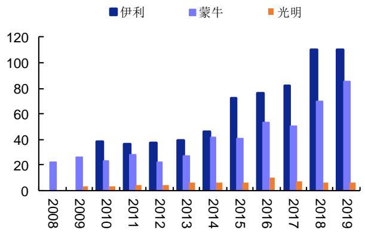  
图8：伊利的广告营销费高于竞品（单位：亿元)  
资料来源：公司公告、安信证券研究中心

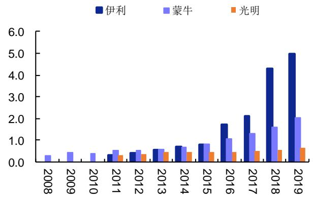  
图9：伊利研发投入高于竞品（单位：亿元)  
资料来源：公司公告、安信证券研究中心

公司多维度、多场景增强品牌与消费者的沟通与互动，持续提升品牌价值。从体育营销到广告媒介投放，再到综艺节目冠名赞助，伊利具有较好的挑选“爆款”的眼光,近年来伊利赞助热门综艺中不乏有收视率居首的《奔跑吧兄弟》、《歌手》以及2020 年火爆的《乘风破浪的姐姐》等，持续为相关产品带来曝光度和销量。根据凯度发布的《2020 亚洲品牌足迹报告》，伊利 2019 年品牌渗透率 $9 1 . 6 \%$ 、消费者触及数13亿、消费者购买频次7.9 次，位列中国市场消费者选择最多的品牌榜首。

表5：根据凯度数据，伊利 2017-2018 年位列中国市场消费者选择最多的品牌榜首  

<table><tr><td>2013</td><td>品牌渗透率</td><td>2014</td><td>品牌渗透率</td><td>2017</td><td>品牌渗透率</td><td>2018</td><td>品牌渗透率</td></tr><tr><td>康师傅</td><td>91.4</td><td>康师傅</td><td>90.2</td><td>伊利</td><td>89.1</td><td>伊利</td><td>90.9</td></tr><tr><td>伊利</td><td>88.5</td><td>伊利</td><td>88.1</td><td>蒙牛</td><td>87.2</td><td>蒙牛</td><td>88.1</td></tr><tr><td>蒙牛</td><td>88.3</td><td>蒙牛</td><td>87.6</td><td>康师傅</td><td>82.6</td><td>康师傅</td><td>80.8</td></tr><tr><td>旺旺</td><td>75.4</td><td>旺旺</td><td>73</td><td>海天</td><td>71.4</td><td>海天</td><td>73.3</td></tr><tr><td>娃哈哈</td><td>69.9</td><td>双汇</td><td>65.6</td><td>旺旺</td><td>65.8</td><td>旺旺</td><td>64.9</td></tr><tr><td>统一</td><td>72.5</td><td>光明</td><td>47.5</td><td>双汇</td><td>59.1</td><td>双汇</td><td>59.7</td></tr><tr><td>双汇</td><td>66.4</td><td>统一</td><td>68.7</td><td>光明</td><td>40.9</td><td>光明</td><td>38.4</td></tr><tr><td>好丽友</td><td>62.8</td><td>娃哈哈</td><td>63</td><td>统一</td><td>59.6</td><td>立白</td><td>66.5</td></tr><tr><td>光明</td><td>45.5</td><td>海天</td><td>64.5</td><td>立白</td><td>66.5</td><td>农夫山泉</td><td>59.3</td></tr><tr><td>立白</td><td>69.4</td><td>立白</td><td>67.8</td><td>农夫山泉</td><td>55.3</td><td>统一</td><td>57.2</td></tr></table>

资料来源：凯度、安信证券研究中心

表 6：伊利具有较好的挑选“爆款”的眼光,近年来伊利赞助热门综艺中不乏有收视率居首的爆款  

<table><tr><td>时间</td><td>产品名</td><td>冠名综艺</td><td>时间</td><td>产品名</td><td>冠名綜艺</td></tr><tr><td>2019 年</td><td>安慕希</td><td>奔跑吧2019</td><td>2020</td><td>金典</td><td>天赐的声</td></tr><tr><td></td><td>金典</td><td>歌手2019</td><td></td><td>安慕希</td><td>漫游记</td></tr><tr><td></td><td>畅轻</td><td>青春环游记</td><td></td><td>金典</td><td>乘风破浪的姐姐</td></tr><tr><td></td><td>畅意100%</td><td>巅峰之路</td><td></td><td>畅轻</td><td>青春环游记 2</td></tr><tr><td></td><td>舒化</td><td>我们是真正的朋友</td><td></td><td>金领冠</td><td>妻子的浪漫旅行4</td></tr><tr><td></td><td>果果昔</td><td>乐队的夏天</td><td></td><td></td><td></td></tr><tr><td></td><td>金领冠</td><td>妻子的浪漫旅行2</td><td></td><td></td><td></td></tr></table>

资料来源：草根调研、安信证券研究中心

# 2.积极应对危机，强化竞争优势

表7：伊利蒙牛液态奶收入增速对比  

<table><tr><td></td><td>亿元2005</td><td>2006</td><td>2007</td><td>2008</td><td>2009</td><td>2010</td><td>2011</td><td>2012</td><td>2013</td><td>2014</td><td>2015</td><td>2016</td><td>2017</td><td>2018</td><td>2019</td><td>2020Q1</td></tr><tr><td>伊利</td><td>89</td><td>117</td><td>133</td><td>144</td><td>166</td><td>210</td><td>269</td><td>323</td><td>371</td><td>424</td><td>472</td><td>495</td><td>558</td><td>657</td><td>738</td><td>154</td></tr><tr><td>同比</td><td></td><td>30%</td><td>14%</td><td>9%</td><td>15%</td><td>27%</td><td>28%</td><td>20%</td><td>15%</td><td>14%</td><td>11%</td><td>5%</td><td>13%</td><td>18%</td><td>12%</td><td>-19%</td></tr><tr><td>措施</td><td></td><td colspan="2">计为后</td><td colspan="8">三聚氰胺事件后，公司团结产业链上下游，注重加大上游建设</td><td colspan="4">加速县乡镇农村市场的产品渗透</td><td>权权应对</td></tr><tr><td>蒙牛</td><td>93</td><td>143</td><td>191</td><td>211</td><td>227</td><td>269</td><td>337</td><td>323</td><td>379</td><td>430</td><td>433</td><td>481</td><td>530</td><td>594</td><td>679</td><td></td></tr><tr><td>同比</td><td></td><td>53%</td><td>34%</td><td>10%</td><td>8%</td><td>18%</td><td>25%</td><td>-4%</td><td>17%</td><td>14%</td><td>1%</td><td>11%</td><td>10%</td><td>12%</td><td>14%</td><td></td></tr></table>

资料来源：安信证券研究中心

# 2.1.2006 年行业进入平稳期，全国织网深挖渠道动能

国际化竞争加剧：2001 年中国加入WTO，随着乳制品关税下调，乳制品的产品标准与国际接轨，刺激国外乳制品大量进入中国市场，加剧国际化竞争。

行业进入稳定增长期：经过 2000-2006 年乳制品行业的快速发展，中国城镇居民乳制品消费量达到较高水平，因消费量基数逐年加大，行业逐渐进入稳定增长期。根据美国农业部数据，2000-2006 年我国液态奶消费者复合增速 $2 3 . 8 \%$ ，源于原奶供给紧缺以及经济增速放缓，2007 消费量下滑 $7 . 5 2 \%$ o

伊利的应对：2006 年伊利展开织网行动，在原有的多级分销模式基础上，实现每个区域市场的生产、销售、市场一体化运作，2007 年万村千乡进入乡村，拓展空间巨大的乡镇市场。伊利销售员工数量从2005 年的 1628人大幅增加至 2006 年的5231人。

不同于伊利的深度分销模式，蒙牛采用大经销商制，在发展初期成长较快，但深挖渠道的动力不足。

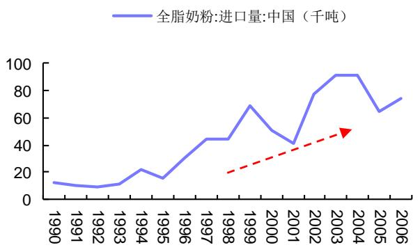  
图10:我国全脂奶粉进口量从 2000 年的 5.1 万吨上升至2003 年的 9.1 万吨  
资料来源：中国海关、安信证券研究中心

  
图11：2007 年以后我国乳制品行业逐渐进入稳定增长期  
资料来源：USDA、安信证券研究中心

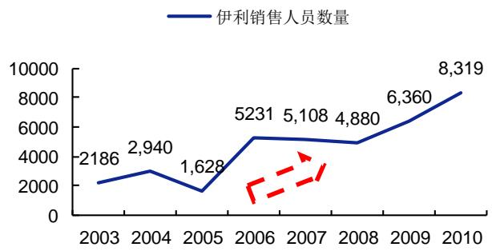  
图12：织网计划，伊利销售员工数量从2005 年的1628人大幅增加至 2006年的 5231人  
资料来源：草根调研、安信证券研究中心

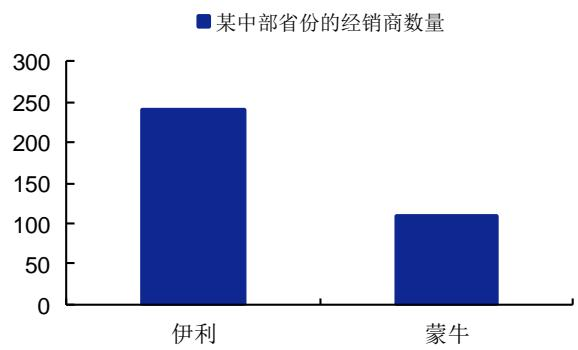  
图13：源于渠道模式不同，某中部省份经销商数量伊利高於蒙牛两倍有余

表8：伊利的深度分销模式与蒙牛的大经销商制对比  

<table><tr><td></td><td>伊利-深度分销</td><td>蒙牛-大经销商制</td></tr><tr><td>特点</td><td>出厂价高、费用投入高</td><td>出厂价低、费用投入低</td></tr><tr><td>优点</td><td>对终端有较强的掌控力</td><td>发展初期可以快速扩张</td></tr><tr><td>缺点</td><td>初期推进速度慢，对渠道精细化管理要求高</td><td>在经销商做大之后，对其掌控力较弱，同时渠道下沉动力不足</td></tr></table>

资料来源：公司公告、安信证券研究中心  
资料来源：公司公告、安信证券研究中心

# 2.2. 三聚氰胺事件后，加速建设和谐产业链

2008 年三聚氰胺事件导致消费者对中国的乳制品信心受挫，伊利、光明 2008Q4 收入分别下滑 $4 4 . 9 \%$ $2 4 . 6 2 \%$ ，蒙牛2008H2 收入增速下滑 $1 0 . 0 4 \%$ ，因乳品销售不畅和进口低价奶粉的冲击，国内原奶相对过剩，奶农利润大幅下降、养殖积极性受挫。

正如伊利在2008 年年报中提出“通过科学合理的利益机制和管理体制，将乳业产业链上的各利益方团结起来，推动产业环境的和谐”：

1）加大奶源建设：加大奶源建设的投入，通过自建、合作、参股、扶持等形式加速打造现代化牧场、奶联社、奶源示范基地等多种模式的牧场，2011 年定增募资资金中 12.32 亿元用于在内蒙古、四川、安徽等地投建奶源项目。截至 2014 年3 月底，伊利在全国拥有自建、在建及合作牧场2400多座。

2）承担经销商损失，保障其利益：公司全额承担经销商的损失，经销商忠诚度提升，2008年公司存货报废 8.9 亿元，2008 年销售费用大幅增长 $4 1 . 4 5 \%$ 。从财务数据看，2009 年开始，伊利营业收入增速高于蒙牛，毛销差在2011 年以后超过蒙牛。

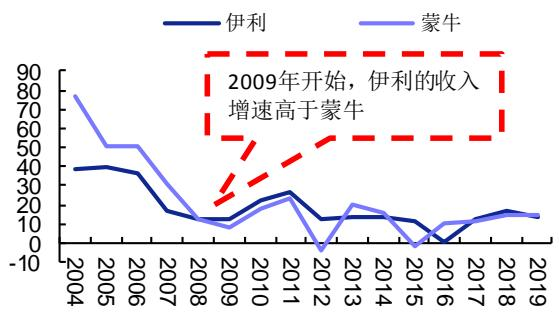  
图14：2009 年开始，伊利的营业收入增速高于蒙牛(%)  
资料来源：公司公告、安信证券研究中心

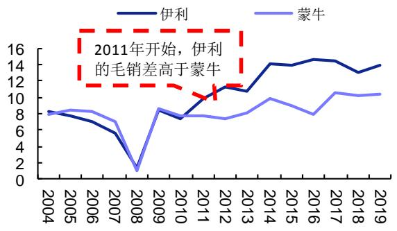  
图15：伊利的毛销差在2011年以后超过蒙牛 $( \% )$   
资料来源：公司公告、安信证券研究中心

# 2.3. 2020 年初的疫情市场份额持续提升

如前所述，伊利具有较强执行力的管理团队、对产业链上下游有强控制力（过去几年来一直加大奶源建设，深度分销模式加大渠道掌控力），加上其将保障产业链相关方的利益放在战略高度，每次危机后伊利均实现高于行业的增速，市场份额持续提升。

2020 年初的疫情下走亲访友受限导致送礼需求基本消失，以及传统渠道停业、交通受阻，根据第三方数据，Q1常温白奶销售量下滑 $1 8 \%$ ，其中伊利下滑 $8 . 6 \%$ 、蒙牛下滑 $8 . 8 \%$ 、光明下滑 $1 5 . 1 \%$ ，伊利显著好于行业。

# 一如历史上每次应对危机，此次公司亦站在产业链全局高度，实现长远发展：

1）公司坚持收购全部合格原奶，保证奶源稳定供应，也利好上游原奶控制力；  
2）销售人员深入一线，协助经销商更新产品新鲜度与终端补货，全面协调社会库存，经销商信心增强;  
3）逆势涨薪，加大内部员工凝聚力。

2020Q1 市占率再次提升，4-5 月恢复快：根据尼尔森数据，Q1公司常温液态奶市占率 $3 9 . 3 \%$ ,同比上升1.1个百分点，截至4 月底渠道库存已基本恢复至正常水平（根据草根调研)。伊利渠道控制力强，特别在低线城市布局早、服务体系较为完善、供应链反应速度快，随着疫情后终端的逐渐恢复，伊利有望继续抢占渠道资源，继续实现市占率提升。根据草根调研，4-5月常溫液态奶增速达 $20 \%$ 以上。

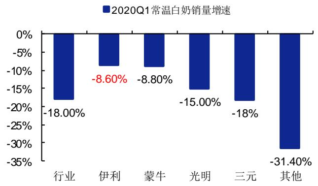  
图16：2020Q1伊利常温白奶销量下滑幅度小于行业

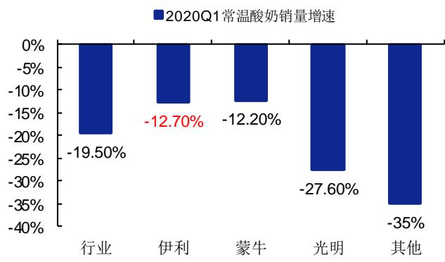  
图17：2020Q1 伊利常温酸奶销量下滑幅度小于行业

资料来源：ADE数据，安信证券研究中心资料来源：ADE数据，安信证券研究中心

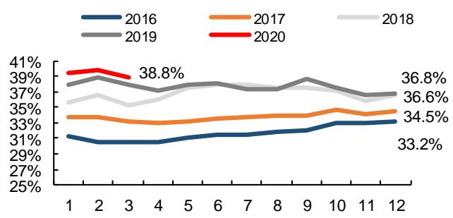  
图18：伊利常溫液态奶市占率始终呈螺旋式提升   
资料来源：尼尔森、安信证券研究中心

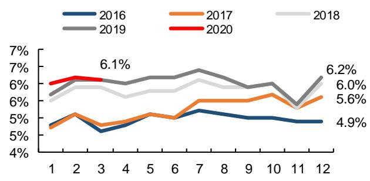  
图19：伊利的婴幼儿奶粉市占率  
资料来源：尼尔森、安信证券研究中心

# 3.产品结构升级、渠道下沉推动成长

# 3.1.公司的产品矩阵概览

乳制品是公司收入的主要来源。2019 年公司液体乳、奶粉及奶制品、冷饮产品收入分别占比 $8 2 . 4 \%$ $1 1 . 2 \%$ $6 . 3 \%$ 。产品品类丰富，涵盖高中低端白奶、常温酸奶、低温酸奶、风味乳饮料、儿童奶等，2019 年液态乳收入738 亿元，常温、低温占比约 $90 \%$ $10 \%$ 。

产品生命周期不断更迭：金典、安慕希分别于2006、2014 年推出，伴随大单品裂变，根据欧睿数据，2019 年收入增速维持 $1 5 \%$ 以上。由于居民收入水平提升、更关注营养价值，风味乳饮料或调制乳例如优酸乳、QQ星、早餐奶等进入衰退期；而随着消费者对功能性乳饮料需求提升，乳酸菌饮料畅意 2019 年维持高速增长。培育产品有儿童奶酪棒、豆奶植选等。

表9：公司产品矩阵概览（单位：亿元，欧睿零售口径）  

<table><tr><td></td><td>2010</td><td>2011</td><td>2012</td><td>2013</td><td>2014</td><td>2015</td><td>2016</td><td>2017</td><td>2018</td><td>2019</td></tr><tr><td>安慕希</td><td>-</td><td>-</td><td>-</td><td>-</td><td>9.8</td><td>54.9</td><td>111.4</td><td>178.6</td><td>222.0</td><td>262.5</td></tr><tr><td>金典</td><td>14.3</td><td>20.0</td><td>28.0</td><td>47.6</td><td>74.3</td><td>92.4</td><td>110.9</td><td>124.5</td><td>152.4</td><td>174.6</td></tr><tr><td>畅意</td><td>-</td><td>-</td><td>-</td><td>-</td><td>-</td><td>7.7</td><td>20.7</td><td>40.3</td><td>64.4</td><td>89.6</td></tr><tr><td>QQ星</td><td>47.7</td><td>59.9</td><td>67.3</td><td>76.7</td><td>87.9</td><td>84.5</td><td>78.0</td><td>71.3</td><td>69.7</td><td>67.4</td></tr><tr><td>优酸乳</td><td>49.9</td><td>67.3</td><td>74.1</td><td>86.7</td><td>99.7</td><td>97.8</td><td>80.8</td><td>67.5</td><td>62.7</td><td>57.6</td></tr><tr><td>畅轻</td><td>-</td><td>-</td><td>-</td><td>8.4</td><td>17.8</td><td>30.2</td><td>35.6</td><td>37.8</td><td>45.9</td><td>51.0</td></tr><tr><td>谷粒多</td><td>12.3</td><td>18.5</td><td>24.6</td><td>26.8</td><td>30.0</td><td>32.3</td><td>32.1</td><td>35.1</td><td>37.9</td><td>40.1</td></tr><tr><td>每益添</td><td>-</td><td>-</td><td>6.5</td><td>10.4</td><td>15.3</td><td>20.2</td><td>18.8</td><td>18.1</td><td>19.6</td><td>20.3</td></tr><tr><td>早餐奶</td><td>6.8</td><td>8.1</td><td>9.2</td><td>10.1</td><td>11.1</td><td>11.2</td><td>10.9</td><td>10.4</td><td>9.7</td><td>8.8</td></tr><tr><td>Joy Day</td><td></td><td>-</td><td>-</td><td>-</td><td>-</td><td>-</td><td>-</td><td>1.4</td><td>2.0</td><td>2.5</td></tr></table>

资料来源：欧睿、安信证券研究中心

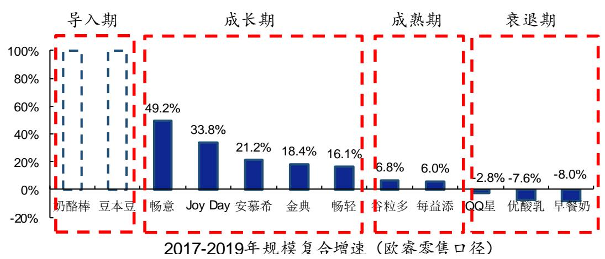  
图 20：伊利产品生命周期概览  
资料来源：公司公告、安信证券研究中心

# 3.2.产品结构升级推动吨价提升

历史来看，公司吨价驱动因素中大部分为产品结构升级贡献，2019 年吨价增 $4 . 2 \%$ ，其中产品结构升级与销售价格提升分别贡献 $3 . 5 \%$ $0 . 7 \%$ o

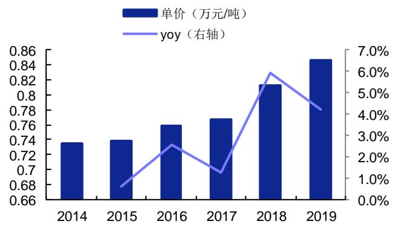  
图21：伊利液态奶单价持续提升  
资料来源：公司公告、安信证券研究中心

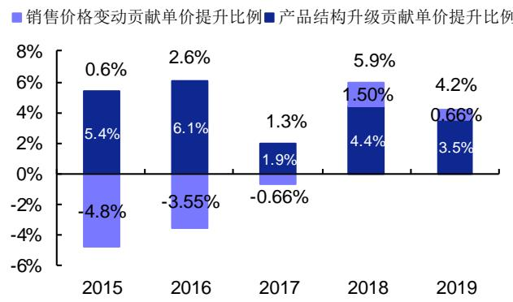  
图22：伊利液态奶单价提升，主要系产品结构升级贡献  
资料来源：公司公告、安信证券研究中心

# 大单品不断裂变:

● 安慕希：2014 年推出，测算 2019 年收入规模达 180 亿元，公司通过包装、口味升级，延长产品生命周期，赞助多个热门综艺节目打造强品牌力。2019 年安慕希畅饮系列、果味系列占安慕希总收入的约 $40 \%$ ，比例持续提升。

● 金典:2006 年推出金典高端白奶,2007 年金典有机奶上市,2018 年推出金典娟珊系列，以“蛋白质含量高达 $3 . 8 { \mathfrak { g } } ^ { \mathfrak { n } }$ 体现差异化、高端化，随着进口奶的消费者教育逐渐成熟、消费者购买力增强，伊利推出金典新西兰进口奶，2019 年包装再次升级，上市三支梦幻盖系列产品（有机纯牛奶、有机脱脂纯牛奶以及最新上市的纯牛奶梦幻盖)。近年定位高端的金典有机系列收入增速 $40 \%$ 以上，2019 年占金典系列总收入的 $20 \%$ o

同时，随着城镇化、居民消费水平提升，高端产品逐渐向低线市场下沉（例如从纯牛奶、优酸乳升级到金典、安慕希等)。

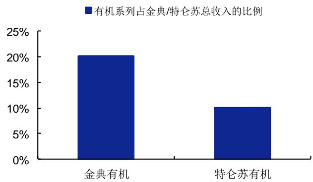  
图 23：2019 年金典有机系列占金典总收入的 $20 \%$   
资料来源：草根调研、安信证券研究中心

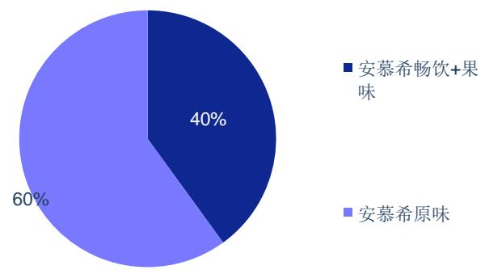  
图24：19 年安慕希畅饮+果味占比 $40 \% ,$ 占比持续提升

资料来源：草根调研、安信证券研究中心

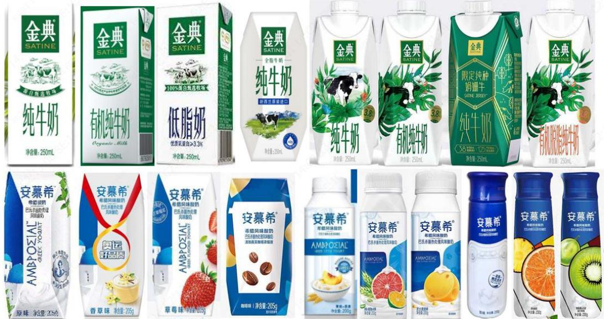  
图 25：金典、安慕希通过口味、包装、功能升级，不断裂变，延长产品生命周期  
资料来源：草根调研、安信证券研究中心

# 3.3.渠道下沉仍有空间

截至2019年12 月，公司常温液态类乳品的市场渗透率为 $8 4 . 3 \%$ ，同比增1.9pct，同期，公司所服务的线下液态奶终端网点已达191万家，同比增 $9 . 1 \%$ ，其中公司服务的乡镇村网点近103.9 万家，同比增 $8 \%$ 。

我们认为公司渠道下沉仍有空间：1）根据草根调研，目前公司在乡镇市场的团队可以定时定点定线去服务占比 $4 0 { - } 5 0 \%$ ，另外 $50 \%$ 仍通过大流通渠道；2）伊利覆盖的终端数量191万个，低于农夫山泉、娃哈哈、达利等。渠道建设非一日之功，特别是下线城市基础设施薄弱、需要投入较大的人力物力，伊利的渠道下沉与精耕仍有较大空间。

  
图26：伊利布局的终端网点少于娃哈哈、农夫山泉等

资料来源：公司公告、公司官网、安信证券研究中心资料来源：公司公告、安信证券研究中心

  
图27：伊利人员销售人员创收高于达利、农夫等

# 4.对标达能，迈向全球化、多元化

# 4.1.发展健康饮品业务

公司极布局大健康领域，目前尚处于孵化期，业绩贡献较小。虽然饮料行业巨头林立，但是产品更迭相对较快、进入壁垒低，不乏有成功的新参与者出现（例如元气森林)，我们认为伊利善于洞察消费趋势，具备较强的营销与品牌建设能力，大单品打造经验足，有望将乳制品市场优势延续至软饮料领域。

2018 年伊利新建健康饮品事业部，在长白山建厂，投资矿泉水业务，预计2021 年投产，2019年收购“阿尔山”，并推出“伊刻活泉”火山低温矿泉水，在华东地区试销“伊然”乳矿饮料。同时进入功能饮料、即饮咖啡市场，2018年推出“焕醒源”功能饮料、2019年上市“圣瑞斯”咖啡。

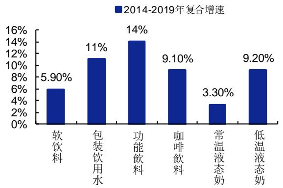  
图 28：软饮料中不乏有增速较快的子品类  
资料来源：公司公告、安信证券研究中心

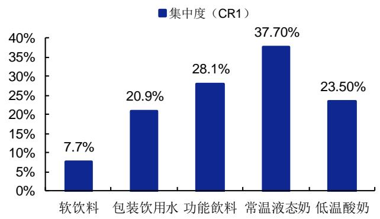  
图29：软饮料进入壁垒低，集中度低于乳制品  
资料来源：公司公告、安信证券研究中心

# 4.2. 全球织网：打造全球供应链

伊利自2012 年提出“成为世界一流的健康食品集团”，于2013 年制定并启动国际化战略，围绕“资源”、“市场”、“产品创新”等维度搭建全球化供应链。

产能全球化布局，实现协同：利用海外奶源与工厂布局，不仅可以在奶价上涨周期中拥有海外奶源带来的成本红利，亦能与产品、市场布局形成协同，2014 年新西兰生产基地一期投产，与美国最大牛奶公司DFA 联手合建全美规模最大的奶粉厂；2017 年其所产“金领冠睿护婴幼儿配方奶粉”上市销售，表现良好；2018年推出“金典”新西兰进口牛奶、“柏菲兰”牛奶；2019 年收购新西兰Westland，拓展乳制品 B2B 市场，并且完善全球化销售网络。

持续推进东南亚市场业务：2018 年“Joy Day”冰淇淋进入印尼市场，同年收购泰国本土最大冰淇淋企业THECHOMTHANACOMPANY LIMITED。

产品创新：2014 年与荷兰瓦赫宁根大学达成合作，联手打造海外研发中心，与新西兰林肯大学达成战略合作，与意大利斯嘉达公司共同生产高科技乳制品。

表10：公司全球织网事件  

<table><tr><td colspan="2">事件</td></tr><tr><td>2013</td><td>新西兰生产基地建设项目一期开工</td></tr><tr><td>2014</td><td>新西兰生产基地建设项目一期投产；与荷兰瓦赫宁根大学共建中荷食品安全保障体系；与意大利斯嘉达公司达成战略合作，共同生产高科 技乳制品；与美国最大牛奶公司DFA 联手合建全美规模最大的奶粉</td></tr><tr><td>2015</td><td>新西兰生产基地二期项目已完成设计规划</td></tr><tr><td>2016</td><td>所产“Pure-Nutra 培然”婴儿配方奶粉已获新西兰政府官方认证，并上市销售</td></tr><tr><td>2017</td><td>新一代婴幼儿配方奶粉“金领冠睿护”在大洋洲生产基地生产下线</td></tr><tr><td>2018</td><td>大洋洲生产基地生产的“金典”新西兰进口牛奶、“柏菲兰”牛奶，在国内相继上市；旗下“JoyDay”冰淇淋进入印尼市场；2018 年11 月收购泰国本土最大冰淇淋企业THECHOMTHANACOMPANYLIMITED</td></tr><tr><td>2019</td><td>收购新西兰Westland Co-Operative Dairy Company Limited</td></tr></table>

资料来源：公司公告、安信证券研究中心

# 5.投资建议

伊利管理团队执行力强、对产业链上下游有强控制力，加上其始终将保障产业链相关方的利益放在战略高度，每次危机后伊利均实现高于行业的增速，市场份额持续提升。

2020 年初的疫情，一方面伊利销售人员深入一线，帮助库存调度，增强经销商信心，另一方面逆势涨薪，加大团队凝聚力。随着疫情后终端的逐渐恢复，伊利有望通过抢占渠道资源，继续实现市占率提升。根据草根调研，截至4 月底渠道库存已逐渐恢复正常，4-5 月常温液态奶增速达 $20 \%$ 以上，6月持续超预期。

预计公司 2020-2022 年收入分别为 991 亿元、1123 亿元、1236 亿元，净利润分别为 62.3亿元、83.5 亿元、89.6 亿元，EPS 分别为1.03 元、1.38 元、1.48 元，不考虑股权摊销费用，净利润分别为 65.6 亿元、86.2 亿元、91.1 亿元，EPS 分别为 1.08 元、1.42 元、1.50元，采用不考虑股权摊销费用的利润估值，给予2020 年28倍PE，6 个月目标价 39.76元，维持“买入-A”评级。

表11：主要盈利预测与假设  

<table><tr><td></td><td>2018</td><td>2019</td><td>2020E</td><td>2021E</td><td>2022E</td></tr><tr><td colspan="6">液体乳</td></tr><tr><td>收入(百万元)</td><td>65679</td><td>73761</td><td>79734</td><td>89971</td><td>98231</td></tr><tr><td>同比</td><td>17.8%</td><td>12.3%</td><td>8.1%</td><td>12.8%</td><td>9.2%</td></tr><tr><td>毛利率</td><td>35.2%</td><td>35.2%</td><td>33.9%</td><td>34.9%</td><td>35.5%</td></tr><tr><td colspan="6">奶粉及奶制品</td></tr><tr><td>收入(百万元)</td><td>8045</td><td>10055</td><td>12317</td><td>14731</td><td>17449</td></tr><tr><td>同比</td><td>25.1%</td><td>25.0%</td><td>22.5%</td><td>19.6%</td><td>18.5%</td></tr><tr><td>毛利率</td><td>54.8%</td><td>48.1%</td><td>42.8%</td><td>43.4%</td><td>43.9%</td></tr><tr><td colspan="6">冷饮产品系列</td></tr><tr><td>收入(百万元)</td><td>4997</td><td>5631</td><td>6264</td><td>6775</td><td>7118</td></tr><tr><td>同比</td><td>8.5%</td><td>12.7%</td><td>11.2%</td><td>8.2%</td><td>5.1%</td></tr><tr><td>毛利率</td><td>45.1%</td><td>46.5%</td><td>48.0%</td><td>48.5%</td><td>48.5%</td></tr><tr><td colspan="6">公司整体</td></tr><tr><td>收入(百万元)</td><td>79553</td><td>90223</td><td>99305</td><td>112468</td><td>123788</td></tr><tr><td>yoy</td><td>17.7%</td><td>13.4%</td><td>10.1%</td><td>13.3%</td><td>10.1%</td></tr><tr><td>毛利率</td><td>38.3%</td><td>37.5%</td><td>36.1%</td><td>36.9%</td><td>37.6%</td></tr></table>

资料来源：公司公告、安信证券研究中心

表12：可比公司估值表（股价更新至2020年7月2日）  

<table><tr><td>证券简称</td><td>股价(元) PE</td><td colspan="7">PS</td><td></td><td>PB</td></tr><tr><td></td><td></td><td>2018</td><td>2019</td><td>2020E</td><td>2021E</td><td>2018</td><td>2019</td><td>2020E</td><td>2021E</td><td>目前</td></tr><tr><td>蒙牛乳业</td><td>27.41</td><td>36.33</td><td>26.93</td><td>32.72</td><td>22.79</td><td>1.60</td><td>1.60</td><td>1.45</td><td>1.27</td><td>-</td></tr><tr><td>光明乳业</td><td>15.33</td><td>54.93</td><td>37.66</td><td>34.04</td><td>29.10</td><td>0.89</td><td>0.89</td><td>0.78</td><td>0.71</td><td>3.48</td></tr><tr><td>燕塘乳业</td><td>21.91</td><td>81.69</td><td>27.81</td><td>25.06</td><td>22.04</td><td>2.66</td><td>2.66</td><td>2.07</td><td>1.79</td><td>3.65</td></tr><tr><td>天润乳业</td><td>14.72</td><td>34.63</td><td>28.33</td><td>27.09</td><td>23.70</td><td>2.70</td><td>2.70</td><td>2.27</td><td>2.01</td><td>2.67</td></tr><tr><td>新乳业</td><td>17.27</td><td>60.74</td><td>60.49</td><td>51.47</td><td>38.81</td><td>2.97</td><td>2.97</td><td>2.26</td><td>1.84</td><td>8.62</td></tr><tr><td>平均</td><td></td><td>53.66</td><td>36.24</td><td>34.08</td><td>27.29</td><td>2.16</td><td>2.16</td><td>1.76</td><td>1.52</td><td>3.68</td></tr><tr><td>伊利股份</td><td>31.94</td><td>30.09</td><td>27.94</td><td>31.10</td><td>23.22</td><td>2.44</td><td>2.15</td><td>1.96</td><td>1.73</td><td>8.83</td></tr></table>

资料来源：wind、公司公告、安信证券研究中心

# 6.风险提示

原奶价格上涨超预期，导致公司成本压力；  
行业竞争加剧，核心产品价格战，影响公司毛利率以及销售费用率；  
核心产品增长乏力、缺乏潜在大单品支撑、品类延伸不及预期，收入增速不及预期；  
宏观经济低迷，乳制品需求增速放缓；  
食品安全事故。

# 财务报表预测和估值数据汇总

利润表  

<table><tr><td>(百万元)</td><td>2018</td><td>2019</td><td>2020E</td><td>2021E</td><td>2022E</td></tr><tr><td>营业收入</td><td>79,553.3</td><td>90,223.1</td><td>99,091.1</td><td>112,253.6</td><td>123,573.7</td></tr><tr><td>减:营业成本</td><td>49,106.0</td><td>56,391.7</td><td>63,351.4</td><td>70,790.1</td><td>77,167.5</td></tr><tr><td>营业税费</td><td>531.0</td><td>577.0</td><td>633.7</td><td>717.9</td><td>790.3</td></tr><tr><td>销售费用</td><td>19,772.7</td><td>21,069.7</td><td>22,830.9</td><td>25,624.8</td><td>29,328.7</td></tr><tr><td>管理费用</td><td>2,979.7</td><td>4,284.9</td><td>5,571.6</td><td>5,940.3</td><td>6,396.1</td></tr><tr><td>财务费用</td><td>(60.3)</td><td>8.0</td><td>(6.5)</td><td>(11.8)</td><td>(22.4)</td></tr><tr><td>资产减值损失</td><td>75.7</td><td>(241.4)</td><td>(100.0)</td><td>(100.0)</td><td>(100.0)</td></tr><tr><td>加：公允价值变动收益</td><td>0.2</td><td>78.2</td><td>0.0</td><td>0.0</td><td>0.0</td></tr><tr><td>投资和汇兑收益</td><td>1,007.5</td><td>1,132.7</td><td>837.8</td><td>837.8</td><td>837.8</td></tr><tr><td>营业利润</td><td>7,690.8</td><td>8,280.3</td><td>7,447.7</td><td>9,930.1</td><td>10,651.3</td></tr><tr><td>加:营业外净收支</td><td>(113.2)</td><td>(86.2)</td><td>(99.7)</td><td>(93.0)</td><td>(96.3)</td></tr><tr><td>利润总额</td><td>7,577.6</td><td>8,194.1</td><td>7,348.0</td><td>9,837.1</td><td>10,555.0</td></tr><tr><td>减：所得税</td><td>1,125.6</td><td>1,243.4</td><td>1,102.2</td><td>1,475.6</td><td>1,583.2</td></tr><tr><td>净利润</td><td>6,439.7</td><td>6,933.8</td><td>6,230.6</td><td>8.345.1</td><td>8,957.8</td></tr></table>

资产负债表  

<table><tr><td></td><td>2018</td><td>2019</td><td>2020E</td><td>2021E</td><td>2022E</td></tr><tr><td>货币资金</td><td>11,051.0</td><td>11,325.3</td><td>9,909.1</td><td>11,225.4</td><td>12,357.4</td></tr><tr><td>交易性金融资产</td><td>0.5</td><td>390.0</td><td>390.0</td><td>390.0</td><td>390.0</td></tr><tr><td>应收帐款</td><td>1,169.1</td><td>1,810.3</td><td>810.6</td><td>2,355.3</td><td>1,256.1</td></tr><tr><td>应收票据</td><td>181.1</td><td>221.7</td><td>214.2</td><td>283.3</td><td>262.3</td></tr><tr><td>预付帐款</td><td>1,459.6</td><td>1,157.2</td><td>2,010.4</td><td>1,135.8</td><td>1,865.1</td></tr><tr><td>存货</td><td>5,507.1</td><td>7,715.0</td><td>6,363.1</td><td>9,171.4</td><td>7,548.2</td></tr><tr><td>其他流动资产</td><td>5,087.0</td><td>3,086.3</td><td>2,783.1</td><td>2,783.1</td><td>2,783.1</td></tr><tr><td>可供出售金融资产</td><td>831.0</td><td>0.0</td><td>0.0</td><td>0.0</td><td>0.0</td></tr><tr><td>持有至到期投资</td><td>0.0</td><td>0.0</td><td>0.0</td><td>0.0</td><td>0.0</td></tr><tr><td>长期股权投资</td><td>1,909.4</td><td>1,960.9</td><td>2,078.6</td><td>2,203.3</td><td>2,335.5</td></tr><tr><td>投资性房地产</td><td>0.0</td><td>533.3</td><td>533.3</td><td>533.3</td><td>533.3</td></tr><tr><td>固定资产</td><td>14,687.8</td><td>18,296.2</td><td>21,211.6</td><td>24,297.0</td><td>26,873.4</td></tr><tr><td>在建工程</td><td>2,676.2</td><td>6,155.7</td><td>9,209.0</td><td>10,646.3</td><td>10,952.4</td></tr><tr><td>无形资产</td><td>639.3</td><td>1,408.7</td><td>1,442.8</td><td>1,472.5</td><td>1,450.0</td></tr><tr><td>其他非流动资产</td><td>2,407.2</td><td>6,400.6</td><td>5,196.8</td><td>5,148.7</td><td>5,071.3</td></tr><tr><td>资产总额</td><td>47,606.2</td><td>60,461.3</td><td>62,152.4</td><td>71,645.5</td><td>73,678.0</td></tr><tr><td>短期债务</td><td>1,523.0</td><td>4,559.6</td><td>6,184.6</td><td>4,783.3</td><td>8,471.2</td></tr><tr><td>应付帐款</td><td>9,956.6</td><td>14,206.6</td><td>13,373.3</td><td>16,515.8</td><td>15,208.6</td></tr><tr><td>应付票据</td><td>276.2</td><td>300.1</td><td>340.7</td><td>379.1</td><td>403.5</td></tr><tr><td>其他流动负债</td><td>7,414.9</td><td>12,366.0</td><td>8,743.3</td><td>13,230.4</td><td>9,752.7</td></tr><tr><td>长期借款</td><td>0.3</td><td>471.1</td><td>132.0</td><td>0.0</td><td>0.0</td></tr><tr><td>其他非流动负债</td><td>397.9</td><td>2,283.7</td><td>2,283.7</td><td>2,283.7</td><td>1,783.7</td></tr><tr><td>负债总额</td><td>19,569.0</td><td>34,187.1</td><td>31,057.7</td><td>37,192.3</td><td>35,619.8</td></tr><tr><td>少数股东权益</td><td>121.6</td><td>143.1</td><td>158.4</td><td>178.8</td><td>200.7</td></tr><tr><td>股本</td><td>6,078.1</td><td>6,096.4</td><td>6,065.9</td><td>6,065.9</td><td>6,065.9</td></tr><tr><td>留存收益</td><td>21,559.7</td><td>22,378.2</td><td>24,870.5</td><td>28,208.5</td><td>31,791.7</td></tr><tr><td>股东权益</td><td>28,037.2</td><td>26,274.1</td><td>31,094.7</td><td>34,453.2</td><td>38,058.2</td></tr></table>

现金流量表  

<table><tr><td></td><td>2018</td><td>2019</td><td>2020E</td><td>2021E</td><td>2022E</td></tr><tr><td>净利润</td><td>6,452.0</td><td>6,950.7</td><td>6,230.6</td><td>8,345.1</td><td>8,957.8</td></tr><tr><td>加:折旧和摊销</td><td>1,608.7</td><td>1,958.0</td><td>2,100.0</td><td>2,549.6</td><td>2,991.4</td></tr><tr><td>资产减值准备</td><td>75.7</td><td>302.0</td><td>0.0</td><td>0.0</td><td>0.0</td></tr><tr><td>公允价值变动损失</td><td>(0.2)</td><td>(78.2)</td><td>0.0</td><td>0.0</td><td>0.0</td></tr><tr><td>财务费用</td><td>133.7</td><td>344.0</td><td>(6.5)</td><td>(11.8)</td><td>(22.4)</td></tr><tr><td>投资损失</td><td>(260.9)</td><td>(544.9)</td><td>(250.0)</td><td>(250.0)</td><td>(250.0)</td></tr><tr><td>少数股东损益</td><td>12.2</td><td>17.0</td><td>15.2</td><td>20.4</td><td>21.9</td></tr><tr><td>营运资金的变动</td><td>(4,378.1)</td><td>2,079.3</td><td>(1,502.1)</td><td>4,166.3</td><td>(2,670.2)</td></tr><tr><td>经营活动产生现金流量</td><td>8,624.8</td><td>8,455.5</td><td>6,587.3</td><td>14,819.6</td><td>9,028.6</td></tr><tr><td>投资活动产生现金流量</td><td>(5,374.0)</td><td>(9,999.3)</td><td>(7,664.4)</td><td>(6,974.7)</td><td>(5,732.2)</td></tr><tr><td>融资活动产生现金流量</td><td>(10,749.0)</td><td>(1.016.5)</td><td>(339.1)</td><td>(6.528.7)</td><td>(2.164.4)</td></tr></table>

资料来源：Wind资讯，安信证券研究中心预测

财务指标  

<table><tr><td>财务指标</td><td>2018</td><td>2019</td><td>2020E</td><td>2021E</td><td>2022E</td></tr><tr><td>(百万元) 成长性</td><td></td><td></td><td></td><td></td><td></td></tr><tr><td>营业收入增长率</td><td>16.9%</td><td>13.4%</td><td>9.8%</td><td>13.3%</td><td>10.1%</td></tr><tr><td>营业利润增长率</td><td>8.1%</td><td>7.7%</td><td>-10.1%</td><td>33.3%</td><td>7.3%</td></tr><tr><td>净利润增长率</td><td></td><td></td><td></td><td></td><td></td></tr><tr><td>EBITDA增长率</td><td>7.3%</td><td>7.7%</td><td>-10.1%</td><td>33.9%</td><td>7.3%</td></tr><tr><td>EBIT 增长率</td><td>23.4%</td><td>15.9%</td><td>-13.3%</td><td>30.0%</td><td>9.1%</td></tr><tr><td>NOPLAT 增长率</td><td>25.9%</td><td>15.5%</td><td>-18.3%</td><td>32.4%</td><td>7.0%</td></tr><tr><td>投资资本增长率</td><td>5.9%</td><td>8.2%</td><td>-10.0%</td><td>33.4%</td><td>7.2%</td></tr><tr><td>净资产增长率</td><td>64.9% 11.1%</td><td>-4.1% -6.3%</td><td>60.0% 18.3%</td><td>2.4%</td><td>23.8% 10.5%</td></tr><tr><td></td><td></td><td></td><td></td><td>10.8%</td><td></td></tr><tr><td>利润率</td><td></td><td></td><td></td><td></td><td></td></tr><tr><td>毛利率</td><td>38.3%</td><td>37.5%</td><td>36.1%</td><td>36.9%</td><td>37.6%</td></tr><tr><td>营业利润率</td><td>9.7%</td><td>9.2%</td><td>7.5%</td><td>8.8%</td><td>8.6%</td></tr><tr><td>净利润率</td><td>8.1%</td><td>7.7%</td><td>6.3%</td><td>7.4%</td><td>7.2%</td></tr><tr><td>EBITDA/营业收入</td><td>12.2%</td><td>12.5%</td><td>9.8%</td><td>11.3%</td><td>11.2%</td></tr><tr><td>EBIT/营业收入</td><td>10.2%</td><td>10.4%</td><td>7.7%</td><td>9.0%</td><td>8.8%</td></tr><tr><td>运营效率</td><td></td><td></td><td></td><td></td><td></td></tr><tr><td>固定资产周转天数</td><td>63</td><td>66</td><td>72</td><td>73</td><td>75</td></tr><tr><td>流动营业资本周转天数</td><td>(28)</td><td>(34)</td><td>(42)</td><td>(39)</td><td>(38)</td></tr><tr><td>流动资产周转天数</td><td>123</td><td>100</td><td>88</td><td>80</td><td>78</td></tr><tr><td>应收帐款周转天数</td><td>5</td><td>6</td><td>5</td><td>5</td><td>5</td></tr><tr><td>存货周转天数</td><td>23</td><td>26</td><td>26</td><td>25</td><td>24</td></tr><tr><td>总资产周转天数 投资资本周转天数</td><td>219</td><td>216</td><td>223</td><td>215</td><td>212</td></tr><tr><td></td><td>56</td><td>60</td><td>69</td><td>76</td><td>78</td></tr><tr><td>投资回报率</td><td></td><td></td><td></td><td></td><td></td></tr><tr><td>ROE</td><td>23.1%</td><td>26.5%</td><td>20.1%</td><td>24.3%</td><td>23.7%</td></tr><tr><td>ROA</td><td>13.6%</td><td>11.5%</td><td>10.0%</td><td>11.7%</td><td>12.2%</td></tr><tr><td>ROIC</td><td>69.9%</td><td>45.9%</td><td>43.0%</td><td>35.9%</td><td>37.6%</td></tr><tr><td>费用率</td><td></td><td></td><td></td><td></td><td></td></tr><tr><td>销售费用率</td><td>24.9%</td><td>23.4%</td><td>23.0%</td><td>22.8%</td><td>23.7%</td></tr><tr><td>管理费用率</td><td>3.7%</td><td>4.7%</td><td>5.6%</td><td>5.3%</td><td>5.2%</td></tr><tr><td>财务费用率</td><td>-0.1%</td><td>0.0%</td><td>0.0%</td><td>0.0%</td><td>0.0%</td></tr><tr><td>三费/营业收入</td><td>28.5%</td><td>28.1%</td><td>28.7%</td><td>28.1%</td><td>28.9%</td></tr><tr><td>偿债能力</td><td></td><td></td><td></td><td></td><td></td></tr><tr><td>资产负债率</td><td>41.1%</td><td>56.5%</td><td>50.0%</td><td>51.9%</td><td>48.3%</td></tr><tr><td>负债权益比</td><td>69.8%130.1%</td><td></td><td>99.9%108.0%</td><td></td><td>93.6%</td></tr><tr><td>流动比率</td><td>1.28</td><td>0.82</td><td>0.78</td><td>0.78</td><td>0.78</td></tr><tr><td>速动比率</td><td>0.99</td><td>0.57</td><td>0.56</td><td>0.52</td><td>0.56</td></tr><tr><td>利息保障倍数</td><td></td><td>(134.32) 1168.70 (1182.21 (859.69)</td><td></td><td></td><td>(483.92)</td></tr><tr><td>分红指标</td><td></td><td></td><td></td><td></td><td></td></tr><tr><td>DPS(元)</td><td>0.70</td><td>0.65</td><td>0.62</td><td>0.83</td><td>0.89</td></tr><tr><td>分红比率</td><td>66.1%</td><td>57.2%</td><td>60.0%</td><td>60.0%</td><td>60.0%</td></tr><tr><td>股息收益率</td><td>2.2%</td><td>2.0%</td><td>1.9%</td><td>2.6%</td><td>2.8%</td></tr></table>

业绩和估值指标  

<table><tr><td></td><td>2018</td><td>2019</td><td>2020E</td><td>2021E</td><td>2022E</td></tr><tr><td>EPS(元)</td><td>1.06</td><td>1.14</td><td>1.03</td><td>1.38</td><td>1.48</td></tr><tr><td>BVPS(元)</td><td>4.59</td><td>4.30</td><td>5.10</td><td>5.65</td><td>6.24</td></tr><tr><td>PE(X)</td><td>30.2</td><td>28.0</td><td>31.1</td><td>23.2</td><td>21.6</td></tr><tr><td>PB(X)</td><td>7.0</td><td>7.4</td><td>6.3</td><td>5.7</td><td>5.1</td></tr><tr><td>P/FCF</td><td>-32.8</td><td>15.1</td><td>-128.3</td><td>31.0</td><td>30.2</td></tr><tr><td>P/S</td><td>2.4</td><td>2.2</td><td>2.0</td><td>1.7</td><td>1.6</td></tr><tr><td>EV/EBITDA</td><td>13.0</td><td>15.8</td><td>19.1</td><td>14.5</td><td>13.4</td></tr><tr><td>CAGR(%)</td><td>9.0%</td><td>8.9%</td><td>1.3%</td><td>9.0%</td><td>8.9%</td></tr><tr><td>PEG</td><td>3.3</td><td>3.2</td><td>23.4</td><td>2.6</td><td>2.4</td></tr><tr><td>ROIC/WACC</td><td>6.6</td><td>4.3</td><td>4.0</td><td>3.4</td><td>3.5</td></tr><tr><td>REP</td><td>1.3</td><td>2.8</td><td>2.0</td><td>2.3</td><td>1.8</td></tr></table>

# 公司评级体系

# 收益评级:

买入 未来6-12个月的投资收益率领先沪深300 指数 $1 5 \%$ 以上;增持 未来6-12个月的投资收益率领先沪深300指数 $5 \%$ 至 $1 5 \%$ 中性 未来6-12个月的投资收益率与沪深300指数的变动幅度相差 $- 5 \%$ 至 $5 \%$ 减持 —未来6-12个月的投资收益率落后沪深300指数 $5 \%$ 至 $1 5 \%$ .,卖出—未来6-12 个月的投资收益率落后沪深 300 指数 $1 5 \%$ 以上；

# 风险评级：

A—正常风险，未来6-12 个月投资收益率的波动小于等于沪深300 指数波动；  
B—较高风险，未来6-12 个月投资收益率的波动大于沪深300 指数波动；

# 分析师声明

苏铖、徐哲琪声明，本人具有中国证券业协会授予的证券投资咨询执业资格，勤勉尽责、诚实守信。本人对本报告的内容和观点负责，保证信息来源合法合规、研究方法专业审慎、研究观点独立公正、分析结论具有合理依据，特此声明。

# 本公司具备证券投资咨询业务资格的说明

安信证券股份有限公司（以下简称“本公司”）经中国证券监督管理委员会核准，取得证券投资咨询业务许可。本公司及其投资咨询人员可以为证券投资人或客户提供证券投资分析、预测或者建议等直接或间接的有偿咨询服务。发布证券研究报告，是证券投资咨询业务的一种基本形式，本公司可以对证券及证券相关产品的价值、市场走势或者相关影响因素进行分析，形成证券估值、投资评级等投资分析意见，制作证券研究报告，并向本公司的客户发布。

# 免责声明

本报告仅供安信证券股份有限公司（以下简称“本公司”）的客户使用。本公司不会因为任何机构或个人接收到本报告而视其为本公司的当然客户。

本报告基于已公开的资料或信息撰写，但本公司不保证该等信息及资料的完整性、准确性。本报告所载的信息、资料、建议及推测仅反映本公司于本报告发布当日的判断，本报告中的证券或投资标的价格、价值及投资带来的收入可能会波动。在不同时期，本公司可能撰写并发布与本报告所载资料、建议及推测不一致的报告。本公司不保证本报告所含信息及资料保持在最新状态，本公司将随时补充、更新和修订有关信息及资料，但不保证及时公开发布。同时，本公司有权对本报告所含信息在不发出通知的情形下做出修改，投资者应当自行关注相应的更新或修改。任何有关本报告的摘要或节选都不代表本报告正式完整的观点，一切须以本公司向客户发布的本报告完整版本为准，如有需要，客户可以向本公司投资顾问进一步咨询。

在法律许可的情况下，本公司及所属关联机构可能会持有报告中提到的公司所发行的证券或期权并进行证券或期权交易，也可能为这些公司提供或者争取提供投资银行、财务顾问或者金融产品等相关服务，提请客户充分注意。客户不应将本报告为作出其投资决策的惟一参考因素，亦不应认为本报告可以取代客户自身的投资判断与决策。在任何情况下，本报告中的信息或所表述的意见均不构成对任何人的投资建议，无论是否已经明示或暗示，本报告不能作为道义的、责任的和法律的依据或者凭证。在任何情况下，本公司亦不对任何人因使用本报告中的任何内容所引致的任何损失负任何责任。

本报告版权仅为本公司所有，未经事先书面许可，任何机构和个人不得以任何形式翻版、复制、发表、转发或引用本报告的任何部分。如征得本公司同意进行引用、刊发的，需在允许的范围内使用，并注明出处为“安信证券股份有限公司研究中心”，且不得对本报告进行任何有悖原意的引用、删节和修改。

本报告的估值结果和分析结论是基于所预定的假设，并采用适当的估值方法和模型得出的，由于假设、估值方法和模型均存在一定的局限性，估值结果和分析结论也存在局限性，请谨慎使用。

安信证券股份有限公司对本声明条款具有惟一修改权和最终解释权。

<table><tr><td rowspan="11">北京联系人</td><td rowspan="4">上海联系人潘艳 侯海霞 朱贤 李栋 刘恭懿</td><td>上海区域销售负责人</td><td>18930060852</td><td>panyan @essence.com.cn</td></tr><tr><td>上海区域销售总监</td><td>13391113930</td><td>houhx@essence.com.cn</td></tr><tr><td>上海区域销售总监</td><td>13901836709 13917882257</td><td>zhuxian @essence.com.cn</td></tr><tr><td>上海区域高级销售副总监</td><td>13916816630</td><td>lidong1 @essence.com.cn</td></tr><tr><td rowspan="8">孙红 苏梦</td><td>上海区域销售副总监</td><td>18221132911</td><td>liugy@essence.com.cn</td></tr><tr><td>上海区域销售副总监 上海区域销售经理</td><td>13162829753</td><td>sunhong1 @essence.com.cn</td></tr><tr><td></td><td></td><td>sumeng @essence.com.cn</td></tr><tr><td>秦紫涵 上海区域销售经理</td><td>15801869965 13817674050</td><td>qinzh1 @essence.com.cn</td></tr><tr><td>陈盈怡 上海区域销售经理</td><td>18217126875</td><td>chenyy6 @essence.com.cn</td></tr><tr><td>王银银 上海区域销售经理</td><td>18500075828</td><td>wangyy4 @essence.com.cn</td></tr><tr><td>李倩 北京基金组主管 张莹</td><td></td><td>liqian1 @essence.com.cn zhangying1 @essence.com.cn</td></tr><tr><td>夏坤</td><td>北京区域销售负责人 北京基金组销售副总监</td><td>13901255777 15210845461</td><td>xiakun @essence.com.cn</td></tr><tr><td>温鹏</td><td>北京区域销售副总监</td><td>13811978042</td><td>wenpeng @essence.com.cn</td></tr><tr><td>曹琰</td><td>北京基金组销售经理</td><td>15810388900</td><td></td></tr><tr><td>姜东亚</td><td></td><td>13911268326</td><td>caoyan1 @essence.com.cn</td></tr><tr><td>张杨</td><td>北京区域销售副总监</td><td>15801879050</td><td>jiangdy@essence.com.cn</td></tr><tr><td></td><td>北京区域销售副总监</td><td></td><td>zhangyang4 @essence.com.cn</td></tr><tr><td rowspan="11">深圳联系人</td><td>刘晓萱</td><td>北京区域销售副总监</td><td>18511841987</td><td>liuxx1 @essence.com.cn</td></tr><tr><td>王帅</td><td>北京区域销售经理</td><td>13581778515</td><td>wangshuai1 @essence.com.cn</td></tr><tr><td>胡珍</td><td>深圳基金组高级销售副总监13631620111</td><td></td><td>huzhen @essence.com.cn</td></tr><tr><td>范洪群</td><td>深圳基金组销售副总监</td><td>18926033448</td><td>fanhq@essence.com.cn</td></tr><tr><td>黎欢</td><td>深圳基金组销售经理</td><td>15820484816</td><td>lihuan @essence.com.cn</td></tr><tr><td>聂欣</td><td>深圳基金组销售经理</td><td>13540211209</td><td>niexin1 @essence.com.cn</td></tr><tr><td>巢莫雯</td><td>深圳基金组销售经理</td><td>18682080397</td><td>chaomw@essence.com.cn</td></tr><tr><td>杨萍</td><td>深圳基金组销售经理</td><td></td><td>0755-82544825 yangping1 @essence.com.cn</td></tr><tr><td>黄秋琪</td><td>深圳基金组销售经理</td><td>13699750501</td><td>huangqq@essence.com.cn</td></tr><tr><td></td><td></td><td></td><td></td></tr></table>

安信证券研究中心  
深圳市  
地址： 深圳市福田区深南大道 2008号中国凤凰大厦1栋 $^ 7$ 层  
邮编： 518026  
上海市  
地邮 址： 上海市虹口区东大名路638号国投大厦3层  
北京市 编： 200080  
地 址： 北京市西城区阜成门北大街 2号楼国投金融大厦15层  
邮编： 100034