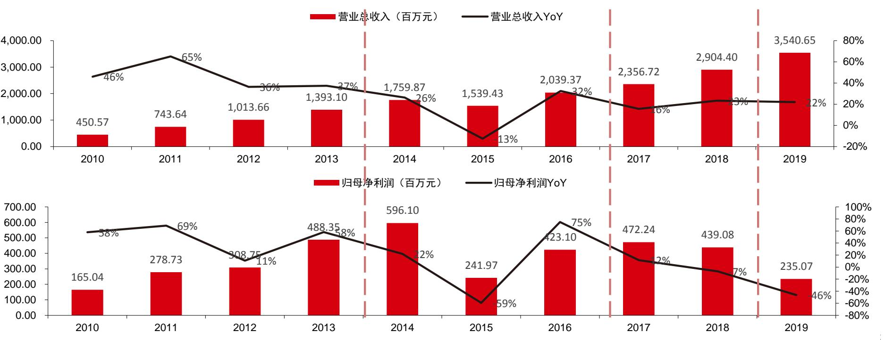
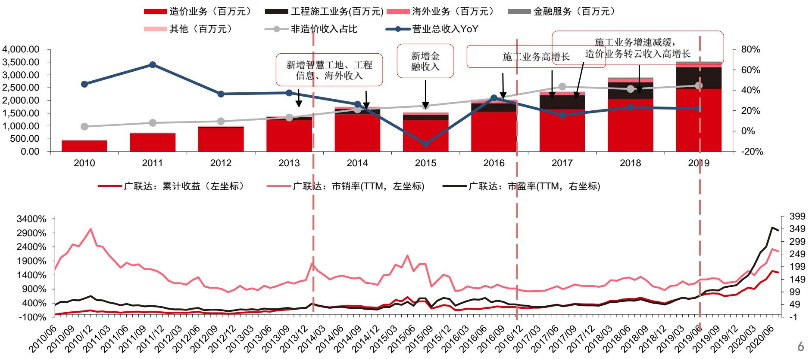
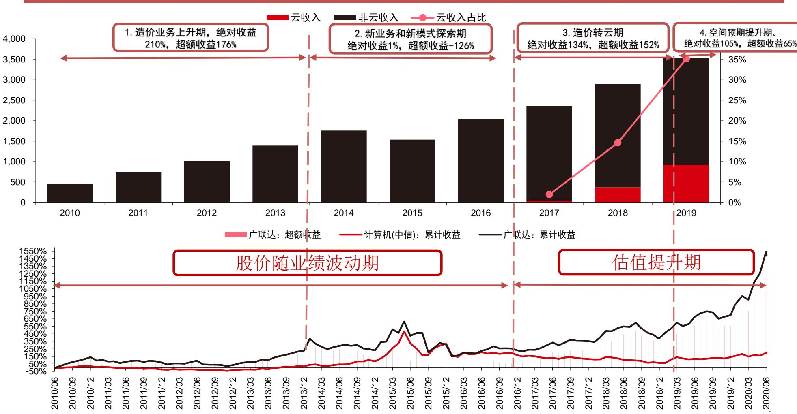
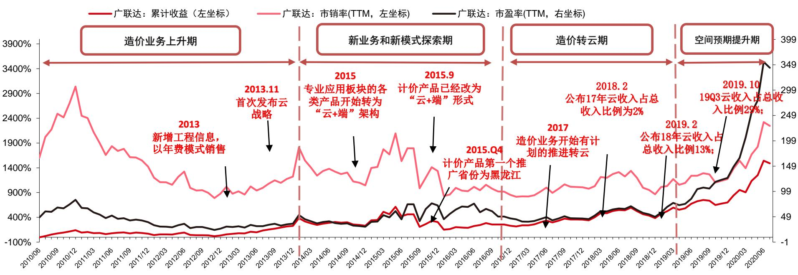
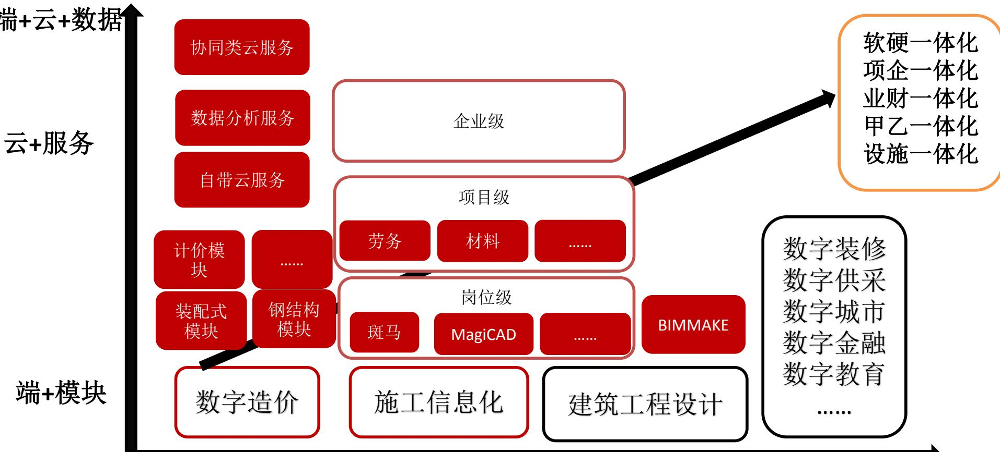
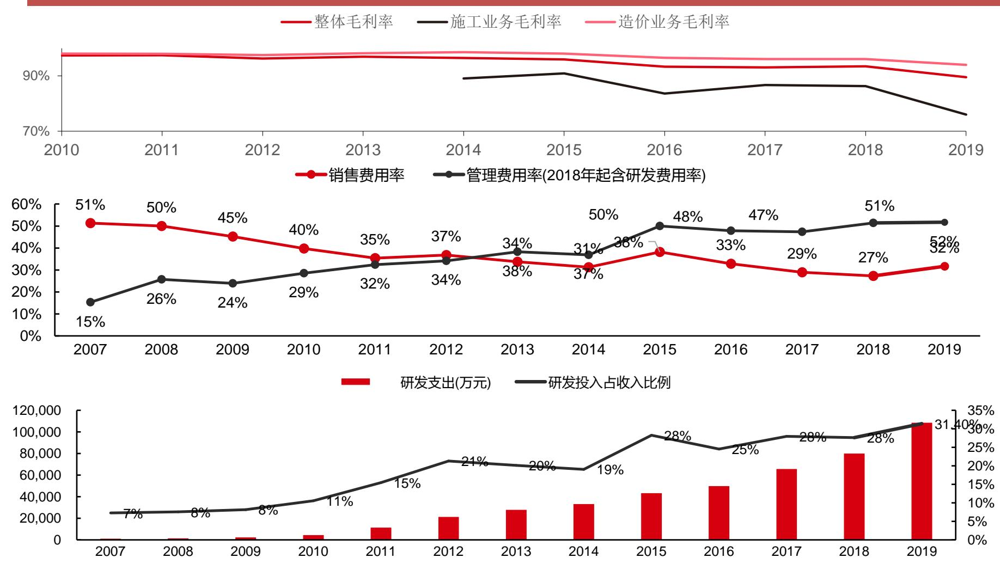
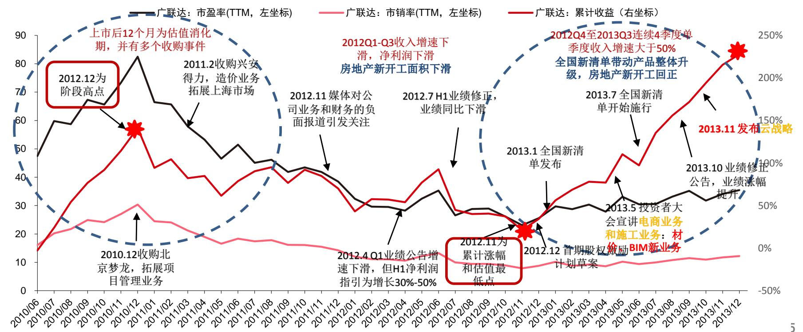
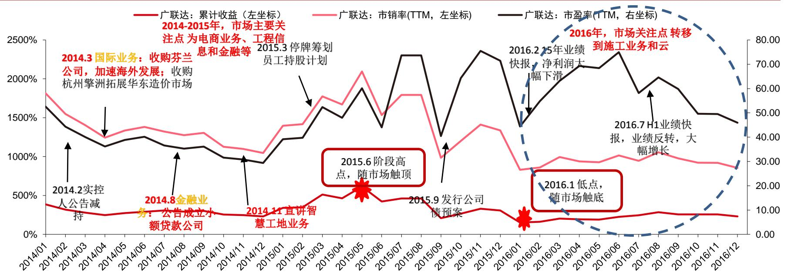
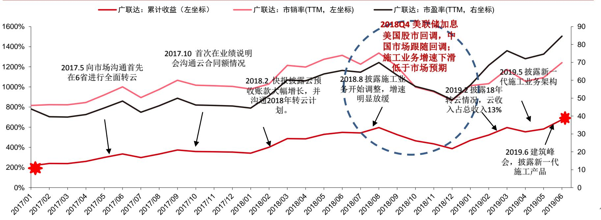

# 广联达复盘报告

# 云化及平台化之路

杨泽原刘雯蜀丁奇中信证券研究部 计算机组

2020年7月31日

# 核心观点

通过对基本面和股价的复盘，我们认为以2017年为界，前期公司股价主要随着业绩增长，后期公司股价上涨动力来自于估值提升。

公司上市至2020年6月底，市值累计涨幅1544%。2010-2019年，公司收入累计增长 $68 \%$ ,净利润累计增长42%。从业务发展角度，我们将公司成长阶段分为4个：

$\gtrdot$ 造价业务上升期（2010至2013年）：该阶段造价业务收入占比大于 $90 \%$ ，年收入复合增速45%，净利润复合增速47%。以P/E估值为主，P/E由刚上市最高83X调整至最低23X。该阶段公司业务单一，天花板低，软件授权的商业模式受到房地产开工周期影响。

新业务和新模式探索期（2014至2016年）：2015年公司业绩大幅下滑，2016年反转，造价业务随房地产新开工情况波动明显。该阶段以P/E估值为主，公司股价跟随业绩波动，期间绝对收益仅1%，相对行业的超额收益为负。该阶段是公司提升整体业务空间的萌芽阶段，公司探索电商、金融等新业务，进军海外市场。云计算模式和施工业务开始贡献收入。

造价转云期（2017年至2019年6月）：公司开始有计划地在全国开展造价产品转云，云合同额由2017年的1.75亿元增长至2019年的14亿元；施工业务经历了高速增长后回归平稳。公司的估值方法逐步由P/E估值切换为P/S估值，因为造价业务的收入确认方式改变，表观净利润失真，P/E波动较大，P/S相对稳定在8X至13X。

空间预期提升期（2019年6月至今）：2019年H1，公司云收入占造价业务收入的比例达38%，市场对于成功实现云转型的预期较为一致，开始期待净利润的释放。随着公司在2019年6月施工产品全新一代的发布，市场关注点转向市场空间更大的施工业务；2019年底，市场关注2020-2022年的“八三计划”对于新业务的计划和业绩目标。市场预期公司的业务天花板进一步提升。该阶段主要用P/S法估值，2020年2月公司披露19年全年转云情况后，P/S突破了自2017年转云以来8X至13X的平台期，最高提升至23X。 1

# 核心观点

启示：通过复盘，我们认为云计算战略的提出或者云产品发布不是决定估值提升的时点，而是公司开始有计划地实施产品转云，并形成可跟踪的转云指标之时。随着转云过程中净利润的失真，市场逐步转为P/S估值。在年云收入比例超过38%时，P/S开始提升，并随公司整体业务空间打开，估值不断提高。外资对于公司转云情况的反馈非常明显，随着每年2月上一年转云情况的在快报中披露，公司深港通持股比例进一步提升，深股通持股比例从17年初的0.45%提升至近期约 $18 \%$ 。

风险提示：建筑业进入下行周期；公司费用管控不及预期；云化转化率和续费率低于预期；  
施工业务市场竞争加剧等风险。

盈利预测：调整2020-2021年公司归母净利润预测至4.4/7亿元（原预测为5.04/8.45亿元），新增2022年预测13.6亿元。我们预计2023年公司营业收入将达到88亿元，其中施工业务34亿元，造价业务51亿元。用分部估值法，2023年造价业务目标市值为1017亿元，同年施工业务目标市值为424亿元，其他业务目标市值为29亿元。折现至2020年目标市值为1104亿元，对应目标股价97.8元，维持“买入”评级。

<table><tr><td>项目/年度</td><td>2018</td><td>2019</td><td>2020E</td><td>2021E</td><td>2022E</td><td>2023E</td></tr><tr><td>营业收入(百万元)</td><td>2,904.40</td><td>3,540.65</td><td>4,174.77</td><td>5,122.26</td><td>6,719.21</td><td>8,762.35</td></tr><tr><td>营业收入增长率</td><td>23%</td><td>22%</td><td>18%</td><td>23%</td><td>31%</td><td>30%</td></tr><tr><td>净利润(百万元)</td><td>439.08</td><td>235.07</td><td>436.90</td><td>703.65</td><td>1,359.72</td><td>2,390.03</td></tr><tr><td>凈利润增长率</td><td>-7%</td><td>-46%</td><td>86%</td><td>61%</td><td>93%</td><td>76%</td></tr><tr><td>每股收益EPS(基本)(元)</td><td>0.39</td><td>0.21</td><td>0.39</td><td>0.62</td><td>1.20</td><td>2.04</td></tr><tr><td>毛利率%</td><td>94%</td><td>90%</td><td>88%</td><td>88%</td><td>87%</td><td>86%</td></tr><tr><td>净资产收益率ROE%</td><td>13.75%</td><td>7.19%</td><td>6.89%</td><td>10.32%</td><td>17.39%</td><td>24.37%</td></tr><tr><td>每股净资产（元）</td><td>2.70</td><td>2.76</td><td>5.36</td><td>5.76</td><td>6.61</td><td>7.97</td></tr><tr><td>PE</td><td>190</td><td>358</td><td>193</td><td>120</td><td>62</td><td>37</td></tr></table>

注：股价为2020年7月30日收盘价

# CONTENTS目录

1. 基本面复盘  
2. 估值复盘  
3. 盈利预测与估值

# 基本面复盘

1. 发展历程：云化和平台化之路  
11．云战略复盘：订阅收入显现后带来估值提升  
111.平台战略复盘：业务多元化打开成长空间  
IV.造价业务和施工业务复盘  
V. 成本费用率复盘：看公司转型之路

# 发展历程：云化与平台化之路

  
资料来源：Wind，公司公告，中信证券研究部 注：超额收益为相对于中信计算机行业指数的超额收益  
公司业绩情况（2010-2019年）

# 发展历程：云化与平台化之路

2010-2013造价业务上升期

2014-2016新业务和新模式探索期

2017-2019.6造价转云期

2019.6至今空间预期提升期造价业务收入占比大于 $90 \%$ ,该业务收入从2010年4.3亿元提升至2013年12.7亿元，3年复合增速为 $43 \%$ 。

从套装软件商向平台型服务商转型，进行多元业务探索，14年造价信息、海外、施工等新业务高速增长，15年开展金融业务。

造价业务转云有计划地在全国展开，17-19年云收入由4500万元增长至9.2亿元。

造价云转型大局已定，施工业务新一代产品发布，拓展10倍于造价业务的空间。

  
公司收入分类（2010-2019年）

# 发展历程：云化与平台化之路

◼ 第一和第二阶段，公司股价表现和业绩表现正相关，因为业绩增速较快，净利润率高而获得相对于计算机板块的超额收益。值得注意的是，公司在第一阶段享有较高P/S，相对较低的P/E，是因为造价业务产品化率高，公司享有远高于行业均值的净利率。

第三和第四阶段，公司股价表现和转云情况及业务空间正相关，因为造价云化消除了业绩和地产周期关联度，且提升客户基数，提升了造价业务空间。同时，施工业务的潜在业务空间是造价业务的十倍以上，公司施工业务产品更加成熟。

  
公司股价及估值变化情况

# 云战略复盘：订阅收入显现后带来估值提升

# 司云战略从2013年开始筹备，但真正让市场接受是2017年开始公司的商业模式向订阅制转变，并有策略地坚定推进。

2013年11月至2014年：公司首次发布云战略，标志公司开展“互联+”新模式，从套装软件供应商向“平台型解决方案提供商”转型。公司的云战略主要围绕电商平台，另外有工程信息服务、多岗位协作等功能点。规划中的广联云应用分为四种;（1）以云建造、云运维为主的解决方案，老产品“云+端”模式开始启动；（2）为老客户提供基于云辅助功能产生的附加值，如云存储等；（3）垂直行业云电商；（4）大数据服务-广材信息网。

2015年至2016年：公司围绕专业应用板块的各类产品开始提供“云+端”架构。2015年计价软件推出GBQ5.0新版本，是云+端的互联网模式，在2015年Q4第一个推广的省份是黑龙江。

2017年至2022年：开始有计划的进行造价业务转云，分地区和分产品转云，到2019年底存量产品和用户的转云基本成功。我们预计公司在2022年会完成存量客户和产品的转云。

  
2022年后：我们预计云造价业务的增值服务开始贡献收入，公司的造价业务净利润率将超过套装软件时期公司云战略不断演进

# 云战略复盘：期待增值服务带来造价业务空间提升

# 2019年底，云收入9.2亿元，占造价业务收入的比例达38%，转型成功大局已定。

  
造价业务转云指标（2017至2020Q1）

# 平台战略复盘：业务多元化打开成长空间

成为全球领先的数字建筑平台服务商。横向看，整体业务内容随建筑产业链延伸；纵向看，单个业务的空间随着增值服务和增值模块的增加而增加。同时，各业务间协同效应通过一体化建设逐步体现。

业务一体化

# 数字建筑平台

# 造价业务复盘：由创造增量为主到激活存量为主

工程造价收入增长主要原因地产周期；地产和基 政策周期服则和政策更新 产品周期：增加新行业价公司造价业务收入和变动原因（2010-2019)传统造价收入（百万元） 造价云收入（百万元） 造价业务整体收入YoY 新开工房地产面积YoY传统模式下，创造新产品或升级新功能等增量 开始转云，激活存量市场算量：行业渗透率由2010年的30%向上提升；不断推出新的算量功能产品每年付费用户总量增加计价：行业渗透率在2010已超90%；新增不同行业的计价软件收购上海 工程信息：2013年开始创收 营改增 新大代算  
3,000 70%  
2,500 59% 全国2013新清 收购标州 钢筋平 部分云合同确认到预收账款 51%49%  
1,500 2,000 34% 37%算量收入超过新开工大幅波 计价 动 % 3% 40%19%  
1,000 % 6% 10%0500-1 0%0 % -20%2010 2011 2012 2013 2014 2015 2016 2017 2018 201911

# 施工业务复盘：打开成长空间，产品逐步成熟

# 所处阶段

项目管理阶段：产品线单一，2010年收购梦龙软件，增加项目管理产品线和中大型客户。

产品线增加带来高速发展阶段：2013-2017年施工业务CAGR为52%。公司鼓励创新，调整激励机制，内部不断新增施工业务产品。新增加智慧工地类产品、BIM管理产品，并开始贡献收入。

调整阶段：2018年进入整合期，2019年6月推出第三代施工产品。

基于“平台+模块”产品架构，形成“围绕施工项目收取服务费的收入模式”

<table><tr><td></td><td>2003-2012</td><td>2013-2015</td><td>2016-2017</td><td>2018-2019</td></tr><tr><td></td><td>公司级和项目部级</td><td>企业管理业务线</td><td>数字企业</td><td>企业级解决方案</td></tr><tr><td>主要产品</td><td>管理产品及服务</td><td>工程施工业务</td><td>智慧工地</td><td>项目级解决方案</td></tr><tr><td></td><td></td><td></td><td>BIM5D等</td><td>岗位级产品</td></tr></table>

  
公司施工阶业务收入变化（2010-2019）  
资料来源：公司公告，中信证券研究部；2007-2009年施工业务总收入统计口径为项目管理软件产品收入，未计入提供服务收入；2010-2013年施工业务总收入统计口径为管理类软件产品收入 $^ +$ 管理类业务的服务收入；+管理类业务收入，服务收入已自动计入其中

# 成本费用复盘：费用比重重构，体现公司转型方向

从提供工具性软件转变为提供解决方案，产品复杂度提升，软硬件一体化、产品实施需求导致毛利率下降。公司整体从注重销售到注重产品打磨，不断加强研发投入。在SaaS转型后期形成强用户粘性，高续费率，销售费用有望降低。重心将更加聚焦于产品研发。

  
公司成本和费用变化

# 估值复盘

造价业务上升期（上市至2013年）11．新业务新模式探索期（2014年至2016年）111.造价转云期（2017年至2019年6月）IV．空间预期提升期（2019年6月至今）

# 估值复盘：造价业务上升期（上市至2013年）

# 2010年5月上市至2013年是公司的造价业务上升期，股价上涨动力主要依靠业绩增长。

2010-2013年，公司年收入CAGR为 $45 \%$ ，归母净利润CAGR为 $4 7 \%$ ，业绩增速和净利润率均处于行业前列。P/E由刚上市时最高83X调整至最低23X，P/S波动与P/E一致，在8X至30X之间。该阶段公司业务天花板低，业务集中于造价产品，软件授权的商业模式受到房地产开工周期影响。该阶段主要用P/E法估值。公司的净利润率在 $30 \%$ 以上，因此P/S较高。上市后的12个月中，公司具备次新股属性，P/E较高。2012和2013年公司P/E逐渐回到正常水平。业绩为股价提升主要影响因素，2013年公司净利润增长近 $60 \%$ ，股价单年度涨幅超过 $140 \%$ ，但是估值提升有限。

  
造价业务上升期（上市至2013年）

# 估值复盘：新业务和新模式探索期（2014至2016年）

公司处于新业务和新模式的探索期，该阶段公司股价继续跟随业绩波动。P/E波动范围是29X至76X，P/S波动范围是8X至21X。  
该阶段公司业绩经历了2015年的大幅下滑，在2016年反转。市场担心造价业务市占率已高，房地产波动对该业务有较大影响。  
➢ 该阶段是公司提升业务空间的萌芽阶段，公司探索各类新业务和新模式：• 在业务内容上，继2013年开展电商业务，开始BIM技术落地应用后，2014年智慧工地类施工业务收入高增长，2015年开展金融业务。2014-2015年市场的关注点在电商、金融、互联网应用等新模式。2016年，市场关注点转移到施工业务线。• 在模式上，2015年Q4开始实行云计价产品试点，2016年市场关注点集中到云计算商业模式上。• 在地域上，公司于2014年通过收购芬兰公司获得更多海外收入和国际业务。该阶段以P/E估值，2015年估值提升主要是行业平均估值大幅提升，同期公司业绩下滑。该阶段公司几乎没有绝对收益，相对于计算机行业超额收益为负。公司的股价最高点和最低点都跟随市场波动。

  
新业务和新模式探索期（2014至2016年）

# 估值复盘：造价转云期（2017至2019年6月）

该阶段是公司造价业务转云的主要验证期，股价上涨动力主要为估值提升。P/E波动范围是39X至84X，P/S波动范围是8X至13X。

该阶段公司股价变动不再跟随收入和净利润等业绩指标，而是跟随造价业务转云重要指标波动，包括：云合同额、云相关预收账款、云收入、转化率、续费率等。2019年H1，公司云收入占造价业务收入的比例达38%，市场对于云转型成功大局已定的判断较为一致。

➢ 虽然该阶段公司施工业务2017年高增长，2018年开始增速回落，波动较大，但我们判断施工业务的增速是影响股价的次要因素，原因是：1）上市以来，投资者对于公司业务向项目管理和施工的延伸预期从上市以来就一直持续。2）深股通持股是影响股价的不可忽视的力量，但2018年施工业务的增速下滑，海外投资者仍继续加仓。因此我们判断海外投资者更关注公司的造价转云业务。

该阶段公司的估值方法逐步由P/E估值切换为P/S估值，因为造价业务的收入确认方式改变，表观净利润失真，P/E波动较大，但是P/S相对稳定在8X至13X。

  
造价转云期（2017至2019.6)

# 估值复盘：空间预期提升期（2019年6月至今）

该阶段公司造价之外的业务开始受到主要关注，公司股价上涨动力主要依靠新老业务可触达市场空间的提升。

➢ 该阶段公司股价伴随新老业务市场空间提升而提升。2019年H1，云收入占造价业务收入的比例达$38 \%$ ，市场对于云转型成功大局已定的观点较为一致，开始期待云收入arpu值提升，净利润逐步释放。

、市场关注点转到造价业务之外，随着公司在2019年6月施工产品全新一代的发布，市场关注点转向市场空间更大的施工业务；在2019年底，市场关注2020-2022年的“八三计划”对于新业务的计划和业绩目标，市场预期施工、设计等新业务会让公司的天花板进一步提升。

该阶段主要用P/S法估值，2020年2月公司披露19年全年转云情况后，P/S突破了自2017年转云以来8X至13X的平台期，一直提升至23X。

  
空间预期提升期（2019.6至今）

# 估值复盘：外资持股情况

■ 自2016年12月深港通开通以来，深港通占流通股的比例逐步提升至目前的17%左右。■ 公司的股东中，深股通持股占自由流通股的比例随着云收入占比提升而增加，持股提升的时点为业绩披露后。

  
资料来源：Wind，中信证券研究部

# 盈利预测与估值

|. 风险提示 11．盈利预测 II.估值

# 风险提示

建筑业进入下行周期；  
公司费用管控不及预期；  
云化转化率和续费率低于预期；  
施工业务市场竞争加剧等风险。

# 盈利预测

我们预计公司2020-2023年总收入为40.9/51.2/67.2/87.6亿元，同比增长18%/25%/31%/30%，2019-2023年CAGR为 $25 \%$ 。造价业务云收入占比提升，施工业务占总收入比例逐步提升，金融业务将被逐步剥离。

公司总营业收入测算（单位：百万元）  

<table><tr><td></td><td>2017</td><td>2018</td><td>2019</td><td>2020E</td><td>2021E</td><td>2022E</td><td>2023E</td></tr><tr><td>营业总收入</td><td>2356.72</td><td>2904.40</td><td>3540.65</td><td>4174.77</td><td>5122.26</td><td>6719.21</td><td>8762.35</td></tr><tr><td>同比增长</td><td>16%</td><td>23%</td><td>22%</td><td>18%</td><td>23%</td><td>31%</td><td>30%</td></tr><tr><td>综合毛利率</td><td>93%</td><td>93%</td><td>89%</td><td>88%</td><td>88%</td><td>87%</td><td>86%</td></tr><tr><td>一.工程造价业务</td><td></td><td></td><td></td><td></td><td></td><td></td><td></td></tr><tr><td>造价业务合计收入</td><td>1643.00</td><td>2057.22</td><td>2451.66</td><td>2769.49</td><td>3325.12</td><td>4150.83</td><td>5082.73</td></tr><tr><td>同比</td><td>6%</td><td>25%</td><td>19%</td><td>13%</td><td>20%</td><td>25%</td><td>22%</td></tr><tr><td>占总收入的比例</td><td>70%</td><td>71%</td><td>69%</td><td>66%</td><td>65%</td><td>62%</td><td>58%</td></tr><tr><td>毛利率</td><td>96%</td><td>96%</td><td>94%</td><td>95%</td><td>95%</td><td>95%</td><td>96%</td></tr><tr><td>二.工程施工业务</td><td></td><td></td><td></td><td></td><td></td><td></td><td></td></tr><tr><td>施工业务合计收入</td><td>558.27</td><td>658.60</td><td>853.41</td><td>1152.10</td><td>1612.94</td><td>2338.77</td><td>3391.22</td></tr><tr><td>同比</td><td>61%</td><td>18%</td><td>30%</td><td>35%</td><td>40%</td><td>45%</td><td>45%</td></tr><tr><td>占总收入的比例</td><td>24%</td><td>23%</td><td>24%</td><td>28%</td><td>31%</td><td>35%</td><td>39%</td></tr><tr><td>利率</td><td>87%</td><td>86%</td><td>76%</td><td>71%</td><td>72%</td><td>72%</td><td>72%</td></tr><tr><td>三.海外业务</td><td></td><td></td><td></td><td></td><td></td><td></td><td></td></tr><tr><td>海外业务合计收入</td><td>121.06</td><td>123.41</td><td>137.35</td><td>141.47</td><td>155.61</td><td>186.73</td><td>224.08</td></tr><tr><td>同比</td><td>1%</td><td>2%</td><td>11%</td><td>3%</td><td>10%</td><td>20%</td><td>20%</td></tr><tr><td>占总收入的比例</td><td>5%</td><td>4%</td><td>4%</td><td>3%</td><td>3%</td><td>3%</td><td>3%</td></tr><tr><td>毛利率</td><td>81%</td><td>86%</td><td>89%</td><td>85%</td><td>85%</td><td>85%</td><td>85%</td></tr><tr><td>四.其他（包括创新业务）</td><td></td><td></td><td></td><td></td><td></td><td></td><td></td></tr><tr><td>其他业务收入</td><td>17.82</td><td>22.32</td><td>21.74</td><td>23.82</td><td>28.59</td><td>42.88</td><td>64.32</td></tr><tr><td>同比</td><td>29%</td><td>25%</td><td>-3%</td><td>10%</td><td>20%</td><td>50%</td><td>50%</td></tr><tr><td>占总收入的比例</td><td>1%</td><td>1%</td><td>1%</td><td>1%</td><td>1%</td><td>1%</td><td>1%</td></tr><tr><td>毛利率</td><td>100%</td><td>99%</td><td>91%</td><td>90%</td><td>90%</td><td>90%</td><td>90%</td></tr><tr><td>五.金融业务</td><td></td><td></td><td></td><td></td><td></td><td></td><td></td></tr><tr><td>金融业务收入</td><td>16.99</td><td>42.84</td><td>76.50</td><td>87.89</td><td>0</td><td>0</td><td>0</td></tr><tr><td>尚比</td><td>54%</td><td>109%</td><td>0%</td><td>50%</td><td></td><td></td><td></td></tr></table>

# 盈利预测

造价业务：我们预测公司造价业务在2023年可以达到约50亿云合同额，2019-2023年云合同额CAGR为38%。因为转云的销售策略，存量客户转云存在打折现象。公司在2020年之前增长主要来自云授权点数的增长，在2020年后合同额增长主要来自云产品价格的恢复。

我们推算公司2019年的云授权点数约为42万，对应单点均价约为3027元。在2023年，云授权点数将达到85万，单点均价将恢复至正常价格约为6000元。

工程造价业务云合同额测算  

<table><tr><td></td><td>2017</td><td>2018</td><td>2019</td><td>2020</td><td>2021</td><td>2022</td><td>2023</td><td>19-23CAGR</td></tr><tr><td>当年新增云授权点数（万)</td><td>6.41</td><td>13.10</td><td>30.04</td><td>17.51</td><td>15.49</td><td>8.98</td><td>2.60</td><td></td></tr><tr><td>续费云授权点数（万）</td><td></td><td>5.45</td><td>11.78</td><td>37.14</td><td>53.57</td><td>74.00</td><td>82.73</td><td></td></tr><tr><td>总云化用户累计点数（万)</td><td>6.41</td><td>18.55</td><td>41.81</td><td>54.64</td><td>69.06</td><td>82.97</td><td>85.33</td><td>19.5%</td></tr><tr><td colspan="9">价和算量产品的平均年费</td></tr><tr><td>（元）</td><td>732</td><td>1730</td><td>2230</td><td>3027</td><td>3657</td><td>4008</td><td>5200</td><td>23.6%</td></tr><tr><td>工程信息年费（元）</td><td>800</td><td>800</td><td>800</td><td>800</td><td>800</td><td>800</td><td>800</td><td></td></tr><tr><td>合计平均年费（元）</td><td>1532</td><td>2530</td><td>3030</td><td>3827</td><td>4457</td><td>4808</td><td>6000</td><td>18.6%</td></tr><tr><td colspan="9"></td></tr><tr><td>+价和算量新增合同额合计（万 元） 十价和算量续费合同额合计（万</td><td>4,691</td><td>19,298</td><td>57,431</td><td>41,418</td><td>47,162</td><td>26,903</td><td>13,520</td><td></td></tr><tr><td>元)</td><td>-</td><td>12,795</td><td>35,822</td><td>123,986</td><td>205,391</td><td>305,686</td><td>430,182</td><td></td></tr><tr><td>计价和算量合同额合计（万元）</td><td>4,691</td><td>32,093</td><td>93,254</td><td>165,404</td><td>252,553</td><td>332,588</td><td>443,702</td><td>47.7%</td></tr><tr><td>工程信息合同额合计（万元）</td><td>12,800</td><td>32,320</td><td>47,616</td><td>48,640</td><td>54,400</td><td>57,600</td><td>60,800</td><td>6.3%</td></tr><tr><td>合计云合同额（万元）</td><td>17,491</td><td>64,413</td><td>140,870</td><td>214,044</td><td>306,953</td><td>390,188</td><td>504,502</td><td>37.6%</td></tr></table>

# 盈利预测

造价业务：我们预计2023年造价业务收入将达到50.8亿元，2019-2023年CAGR为 $20 \%$ ，其中云收入43亿元，2019-2023年CAGR为47%。

工程造价业务收入测算 (单位：百万元)  

<table><tr><td></td><td>2017</td><td>2018</td><td>2019</td><td>2020E</td><td>2021E</td><td>2022E</td><td>2023E</td></tr><tr><td>造价业务合计收入（1+2+3)</td><td>1643.00</td><td>2057.22</td><td>2451.66</td><td>2769.49</td><td>3325.12</td><td>4150.83</td><td>5082.73</td></tr><tr><td>同比增长</td><td>6%</td><td>25%</td><td>19%</td><td>13%</td><td>20%</td><td>25%</td><td>22%</td></tr><tr><td>1.造价产品云收入</td><td>45.29</td><td>370.00</td><td>921.00</td><td>1664.56</td><td>2474.91</td><td>3369.17</td><td>4313.41</td></tr><tr><td>同比增长</td><td></td><td>717%</td><td>149%</td><td>81%</td><td>49%</td><td>36%</td><td>28%</td></tr><tr><td>1.1当年合同额转化收入</td><td></td><td>240.00</td><td>507.00</td><td>770.56</td><td>1105.03</td><td>1404.68</td><td>1816.21</td></tr><tr><td colspan="2">1.2上一年预收账款余额转化为收入</td><td>130.00</td><td>414.00</td><td>894.00</td><td>1369.88</td><td>1964.50</td><td>2497.20</td></tr><tr><td rowspan="3">2.造价产品license收入 同比增长</td><td>1477.71</td><td>1547.22</td><td>1330.66</td><td>864.93</td><td>562.20</td><td>421.65</td><td>337.32</td></tr><tr><td></td><td>5%</td><td>-14%</td><td>-35%</td><td>-35%</td><td>-25%</td><td>-20%</td></tr><tr><td>120</td><td>140</td><td>200</td><td>240</td><td></td><td></td><td></td></tr><tr><td>3.电子政务等其他收入 同比增长</td><td></td><td></td><td></td><td>20%</td><td>288 20%</td><td>360 25%</td><td>432 20%</td></tr><tr><td>造价业务合计成本</td><td>64.00</td><td>80.73</td><td>148.38</td><td>146.59</td><td>161.23</td><td>190.44</td><td>220.96</td></tr><tr><td>毛利率</td><td>96%</td><td>96%</td><td>94%</td><td>95%</td><td>95%</td><td>95%</td><td>96%</td></tr><tr><td></td><td>2017</td><td>2018</td><td>2019</td><td></td><td></td><td></td><td></td></tr><tr><td>造价业务占总收入的比例</td><td>70%</td><td>71%</td><td></td><td>2020E</td><td>2021E</td><td>2022E</td><td>2023E</td></tr><tr><td>云收入占造价业务收入比例</td><td>3%</td><td></td><td>69%</td><td>68%</td><td>65%</td><td>62%</td><td>58%</td></tr><tr><td>云收入占总收入比例</td><td>2%</td><td>18% 13%</td><td>38%</td><td>60%</td><td>74%</td><td>81%</td><td>85%</td></tr><tr><td>文入+预收账款变化值</td><td>1773.00</td><td></td><td>27%</td><td>41%</td><td>48%</td><td>50%</td><td>49%</td></tr><tr><td></td><td></td><td>2341.22</td><td>2931.66</td><td>3245.37</td><td>3919.73</td><td>4683.53</td><td>5814.34</td></tr><tr><td>同比增长</td><td>14%</td><td>32%</td><td>25%</td><td>11%</td><td>21%</td><td>19%</td><td>24% ∠4</td></tr></table>

# 盈利预测

施工业务:我国施工环节的信息化渗透率低，中国产业信息网统计该市场在2017年为208亿元。我们预计2027年市场总空间约为900亿元，CAGR为15.8%，其中施工项目软件的市场为360亿元，施工企业信息化市场为500亿元。我们预计2023年公司施工业务收入将达到33.9亿元，2019-2023年CAGR为 $41 \%$ 。

工程施工业务收入测算（单位：百万元）  

<table><tr><td></td><td>2017</td><td>2018</td><td>2019</td><td>2020E</td><td>2021E</td><td>2022E</td><td>2023E</td></tr><tr><td>施工业务收入</td><td>558.27</td><td>658.60</td><td>853.41</td><td>1,152.10</td><td>1,612.94</td><td>2,338.77</td><td>3,391.22</td></tr><tr><td>同比</td><td>61.2%</td><td>18.0%</td><td>29.6%</td><td>35.0%</td><td>40.0%</td><td>45.0%</td><td>45.0%</td></tr><tr><td>毛利率</td><td>86.7%</td><td>86.3%</td><td>76.0%</td><td>70.5%</td><td>72.0%</td><td>72.0%</td><td>72.0%</td></tr></table>

三种方式测算施工信息化市场空间  

<table><tr><td>计算方式</td><td>对应市场含义</td><td>对应2027年市场</td><td>数据支持</td></tr><tr><td>建筑总产值*预期信息化渗透 我国建筑行业每年的总信</td><td></td><td>约900亿元</td><td>假设建筑业总产值的年复合增速为4%，2023年对 应建筑业总产值约31万亿。假设2023年建筑信息化 国约为0.1%)。</td></tr><tr><td>其中：工程项目数量*预期单 个项目软件投入金额</td><td>项目级别的软件投入</td><td>约360亿元</td><td>2016-2017年，中国新开工数为60万。假设该数量 维持不变，其中60%的项目需要信息化，单个项目 平均采购10万元软件。</td></tr><tr><td>其中企：施企信业息数建预期单</td><td>每年的级信同化</td><td>约500亿元</td><td>2018年底,全国特级资质企业数量约600家，特一级 年</td></tr></table>

# 盈利预测

费用预测：我们认为费用率下降是长期趋势。一方面，公司开始对费用进行严格控制，另一方面，转云成功后，销售费用将下降。2020年对于管理费用，我们同时考虑了疫情影响和预计在今年实施的股权激励影响。疫情减少了展会投入，公司管理费用和销售费用预计都将下降，但同时股权激励若在今年成功实施，将增加管理费用。

公司费用预测（单位：百万元）  

<table><tr><td></td><td>2017</td><td>2018</td><td>2019</td><td>2020E</td><td>2021E</td><td>2022E</td><td>2023E</td></tr><tr><td>研发费用</td><td>598.09</td><td>727.21</td><td>969.06</td><td>1180.15</td><td>1413.39</td><td>1635.23</td><td>1888.69</td></tr><tr><td>同比</td><td>30%</td><td>22%</td><td>33%</td><td>22%</td><td>20%</td><td>16%</td><td>16%</td></tr><tr><td>研发费用率</td><td>26%</td><td>25%</td><td>28%</td><td>29%</td><td>28%</td><td>24%</td><td>22%</td></tr><tr><td></td><td></td><td></td><td></td><td></td><td></td><td></td><td></td></tr><tr><td>管理费用 同比</td><td>1115.32</td><td>764.71</td><td>819.76</td><td>921.41</td><td>1036.53</td><td>1142.83</td><td>1,266.75</td></tr><tr><td>管理费用率</td><td>14% 48%</td><td>-31% 27%</td><td>7% 24%</td><td>12% 23%</td><td>12% 20%</td><td>10% 17%</td><td>11% 14%</td></tr><tr><td></td><td></td><td></td><td></td><td></td><td></td><td></td><td></td></tr><tr><td>销售费用</td><td>682.01</td><td>792.91</td><td>1102.48</td><td>1208.65</td><td>1414.01</td><td>1662.04</td><td>1952.06</td></tr><tr><td>同比</td><td>2%</td><td>16%</td><td>39%</td><td>10%</td><td>17%</td><td>18%</td><td>17%</td></tr><tr><td>销售费用率</td><td>29%</td><td>28%</td><td>32%</td><td>30%</td><td>28%</td><td>25%</td><td>22%</td></tr></table>

资料来源：公司公告，中信证券研究部预测

# 估值

用分部估值法，2023年造价业务目标市值为1017亿元，同年施工业务目标市值为424亿元，其他业务目标市值为29亿元，按10%的折现率折现到2020年，目标市值为1104亿元，对应目标股价97.8元。

公司估值测算（单位：百万元）  

<table><tr><td></td><td></td><td>2021E</td><td>2022E</td><td>2023E</td><td></td><td>假设依据</td></tr><tr><td></td><td>2020E</td><td></td><td></td><td></td><td>2023CAGR</td><td></td></tr><tr><td>一.造价业务</td><td></td><td></td><td>4,150.83</td><td></td><td>22%</td><td></td></tr><tr><td>收入</td><td>2,769.49</td><td>3,325.12</td><td></td><td>5,082.73</td><td></td><td>2010-2013年造价业务收入占比大于90%的时期，净利润率曾保持35%左右，</td></tr><tr><td>预期净利率</td><td></td><td></td><td></td><td>50%</td><td></td><td>同期销售费用率在35%以上。在SaaS模式下，造价业务的销售费用率有显著降 低空间。在控人控费预期下，管理费用和研发费用率也有望进一步下降。</td></tr><tr><td>净利润</td><td></td><td></td><td></td><td>2,541</td><td></td><td></td></tr><tr><td>目标市盈率 目标市值</td><td></td><td></td><td></td><td>40</td><td></td><td>2022年计算机行业增公司平均市率超过50X，2023年后，公司造</td></tr><tr><td>折现率</td><td></td><td></td><td></td><td>101,655 10%</td><td></td><td></td></tr><tr><td>当期目标市值</td><td>76,375</td><td></td><td></td><td></td><td></td><td></td></tr><tr><td>二.施工业务 收入</td><td>1,152.10</td><td>1,612.94</td><td>2,338.77</td><td>3,391.2243%</td><td></td><td></td></tr><tr><td>预期净利率 净利润</td><td></td><td></td><td></td><td>25%</td><td></td><td>施工业务为软硬一体的解决方案，净利率类比同行业同类公司。</td></tr><tr><td>目标市盈率</td><td></td><td></td><td></td><td>848</td><td></td><td>2022年计算机行业龙头公司平均市盈率超过50X，预计公司施工业务所</td></tr><tr><td>目标市值</td><td></td><td></td><td></td><td>50</td><td></td><td>在市场空间在2027年有900亿，2023年渗透率尚低，凭借公司的竞争 力，有望继续维持高增长。</td></tr><tr><td>折现率</td><td></td><td></td><td></td><td>42,390 10%</td><td></td><td></td></tr><tr><td>当期目标市值</td><td>31,848</td><td></td><td></td><td></td><td></td><td></td></tr><tr><td>三.海外及其他业务</td><td></td><td></td><td></td><td></td><td></td><td></td></tr><tr><td>收入</td><td>165.29</td><td>184.20</td><td>229.61</td><td>288.40</td><td>20%</td><td></td></tr><tr><td>目标市销率</td><td></td><td></td><td></td><td></td><td></td><td></td></tr><tr><td></td><td></td><td></td><td></td><td>10</td><td></td><td>海外及创新业务预期尚未盈利，从空间判断收入有望加速。</td></tr><tr><td>目标市值 折现率</td><td></td><td></td><td></td><td>2884</td><td></td><td></td></tr><tr><td>当期目标市值</td><td>2,167</td><td></td><td></td><td>10%</td><td></td><td></td></tr><tr><td>目标市值合计</td><td>110,390</td><td></td><td></td><td></td><td></td><td></td></tr><tr><td>目标股价</td><td>97.82</td><td></td><td></td><td></td><td></td><td></td></tr></table>

# 核心观点

盈利预测：略调整2020-2021年公司收入预测至41.7/51.2亿元（原预测为42/51.6亿元），新增2022年预测67.2亿元，对应当前P/S为21/17/13X。因为施工业务解决方案需要部分硬件，导致毛利率低于原造价业务，随着施工业务的收入占比提升，导致毛利率下降，我们下调归母净利润预测至4.4/7亿元（原预测为5.04/8.45亿元），新增2022年预测13.6亿元。

我们预计2023年公司营业收入将达到88亿，其中施工业务34亿，造价业务51亿。我们使用分部估值法，2023年目标市值1470亿元，对应2023年P/S为17X，其中造价业务目标市值为1017亿元，同年施工业务目标市值为424亿元，其他业务目标市值为29亿元。按照折现率10%，折现至2020年目标市值为1104亿元，对应目标股价97.8元，对应当前P/S为26X，维持“买入”评级。

<table><tr><td>项目/年度</td><td>2018</td><td>2019</td><td>2020E</td><td>2021E</td><td>2022E</td><td>2023E</td></tr><tr><td>营业收入(百万元)</td><td>2,904.40</td><td>3,540.65</td><td>4,174.77</td><td>5,122.26</td><td>6,719.21</td><td>8,762.35</td></tr><tr><td>营业收入增长率</td><td>23%</td><td>22%</td><td>18%</td><td>23%</td><td>31%</td><td>30%</td></tr><tr><td>净利润(百万元)</td><td>439.08</td><td>235.07</td><td>436.90</td><td>703.65</td><td>1,359.72</td><td>2,390.03</td></tr><tr><td>净利润增长率</td><td>-7%</td><td>-46%</td><td>86%</td><td>61%</td><td>93%</td><td>76%</td></tr><tr><td>每股收益EPS(基本)(元)</td><td>0.39</td><td>0.21</td><td>0.39</td><td>0.62</td><td>1.20</td><td>2.04</td></tr><tr><td>毛利率%</td><td>94%</td><td>90%</td><td>88%</td><td>88%</td><td>87%</td><td>86%</td></tr><tr><td>净资产收益率ROE%</td><td>13.75%</td><td>7.19%</td><td>6.89%</td><td>10.32%</td><td>17.39%</td><td>24.37%</td></tr><tr><td>每股净资产（元）</td><td>2.70</td><td>2.76</td><td>5.36</td><td>5.76</td><td>6.61</td><td>7.97</td></tr><tr><td>PE</td><td>190</td><td>358</td><td>193</td><td>120</td><td>62</td><td>37</td></tr></table>

资料来源：Wind，中信证券研究部预测注：股价为2020年7月30日收盘价

利润表（百万元）  
资产负债表（百万元）  

<table><tr><td>指标名称</td><td>2018</td><td>2019</td><td>2020E</td><td>2021E</td><td>2022E</td><td>指标名称</td><td>2018</td><td>2019</td><td>2020E</td><td>2021E</td><td>2022E</td></tr><tr><td>营业收入</td><td>2,904</td><td>3,541</td><td>4,175</td><td>5,122</td><td>6,719</td><td>货币资金</td><td>2,212</td><td>2,231</td><td>5,334</td><td>6,244</td><td>8,107</td></tr><tr><td>营业成本</td><td>188</td><td>371</td><td>510</td><td>639</td><td>878</td><td>存货</td><td>9</td><td>21</td><td>29</td><td>35</td><td>49</td></tr><tr><td>毛利率</td><td>93.52%</td><td>89.53%</td><td></td><td>87.78%87.52%86.94%</td><td></td><td>应收账款</td><td>291</td><td>559</td><td>433</td><td>630</td><td>874</td></tr><tr><td>营业税金及附加</td><td>45</td><td>43</td><td>62</td><td>74</td><td>94</td><td>其他流动资产</td><td>258</td><td>139</td><td>157</td><td>187</td><td>228</td></tr><tr><td>销售费用</td><td>793</td><td>1,102</td><td>1,209</td><td>1,414</td><td>1,662</td><td>流动资产</td><td>2,770</td><td>2,950</td><td>5,952</td><td>7,095</td><td>9,258</td></tr><tr><td>营业费用率</td><td>27.30%</td><td>31.14%</td><td></td><td>28.95%27.61%24.74%</td><td></td><td>固定资产</td><td>819</td><td>803</td><td>763</td><td>724</td><td>684</td></tr><tr><td>管理费用</td><td>765</td><td>820</td><td>921</td><td>1,037</td><td>1,143</td><td>长期股权投资</td><td>158</td><td>233</td><td>233</td><td>233</td><td>233</td></tr><tr><td>管理费用率</td><td>26.33%</td><td>23.15%</td><td>22.07%</td><td>20.24%</td><td>17.01%</td><td>无形资产</td><td>227</td><td>373</td><td>346</td><td>316</td><td>283</td></tr><tr><td>财务费用</td><td>35</td><td>41</td><td>(58)</td><td>(127)</td><td>(158)</td><td>其他长期资产</td><td>1,631</td><td>1,809</td><td>2,023</td><td>2,270</td><td>2,577</td></tr><tr><td>财务费用率</td><td>1.19%</td><td>1.15%</td><td>-1.39%</td><td>-2.49%</td><td>-2.35%</td><td>非流动资产</td><td>2,836</td><td>3,217</td><td>3,365</td><td>3,542</td><td>3,776</td></tr><tr><td>投资收益</td><td>22</td><td>23</td><td>22</td><td>22</td><td>22</td><td>资产总计</td><td>5,606</td><td>6,167</td><td>9,317</td><td>10,638</td><td>13,034</td></tr><tr><td>营业利润</td><td>485</td><td>290</td><td>496</td><td>810</td><td>1,587</td><td>短期借款</td><td>200</td><td>1,089</td><td>0</td><td>0</td><td>0</td></tr><tr><td>营业利润率</td><td>16.68%</td><td>8.20%</td><td>11.88%</td><td>15.80%</td><td>23.62%</td><td>应付账款</td><td>34</td><td>99</td><td>105</td><td>139</td><td>202</td></tr><tr><td>营业外收入</td><td>3</td><td>1</td><td>9</td><td>4</td><td>5</td><td>其他流动负债</td><td>1,095</td><td>1,622</td><td>2,764</td><td>3,554</td><td>4,817</td></tr><tr><td>营业外支出</td><td>5</td><td>7</td><td>5</td><td>6</td><td>6</td><td>流动负债</td><td>1,329</td><td>2,809</td><td>2,869</td><td>3,693</td><td>5,018</td></tr><tr><td>利润总额</td><td>482</td><td>284</td><td>500</td><td>808</td><td>1,586</td><td>长期借款</td><td>0</td><td>0</td><td>0</td><td>0</td><td>0</td></tr><tr><td>所得税</td><td>49</td><td>29</td><td>48</td><td>81</td><td>157</td><td>其他长期负债</td><td>994</td><td>9</td><td>9</td><td>9</td><td>9</td></tr><tr><td>所得税率</td><td>10.16%</td><td>10.28%</td><td>9.50%</td><td>9.98%</td><td>9.92%</td><td>非流动性负债</td><td>994</td><td>9</td><td>9</td><td>9</td><td>9</td></tr><tr><td>少数股东损益</td><td>(6)</td><td>20</td><td>16</td><td>24</td><td>69</td><td>负债合计</td><td>2,324</td><td>2,818</td><td>2,878</td><td>3,702</td><td>5,027</td></tr><tr><td>归于母公司股</td><td>439</td><td>235</td><td>437</td><td>704</td><td>1,360</td><td>股本公积</td><td>1.1277</td><td>1,.1299</td><td>1.204</td><td>13.24</td><td>1.204</td></tr><tr><td>净利率</td><td>15.12%</td><td>6.64%</td><td>10.47%</td><td>13.74%  20.24%</td><td></td><td>归月居于母公司所</td><td></td><td></td><td></td><td></td><td></td></tr><tr><td colspan="8"></td><td>3,192 3,269</td><td>6,343</td><td>6,816</td><td>7,819</td></tr></table>

# 现金流量表和主要财务指标

现金流量表（百万元）  

<table><tr><td>指标名称</td><td>2018</td><td>2019</td><td>2020E</td><td>2021E</td><td>2022E</td></tr><tr><td>税前利润</td><td>482</td><td>284</td><td>500</td><td>808</td><td>1,586</td></tr><tr><td>所得税支出</td><td>-49</td><td>-29</td><td>-48</td><td>-81</td><td>-157</td></tr><tr><td>折旧和摊销</td><td>74</td><td>106</td><td>74</td><td>79</td><td>82</td></tr><tr><td>营运资金的变化</td><td>-148</td><td>159</td><td>1,254</td><td>576</td><td>1,009</td></tr><tr><td>其他经营现金流</td><td>94</td><td>122</td><td>-84</td><td>-135</td><td>-163</td></tr><tr><td>经营现金流合计</td><td>453</td><td>641</td><td>1,696</td><td>1,247</td><td>2,356</td></tr><tr><td>资本支出</td><td>-203</td><td>-243</td><td>-120</td><td>-120</td><td>-135</td></tr><tr><td>投资收益</td><td>22</td><td>23</td><td>22</td><td>22</td><td>22</td></tr><tr><td>其他投资现金流</td><td>163</td><td>-7</td><td>-102</td><td>-136</td><td>-181</td></tr><tr><td>投资现金流合计</td><td>-18</td><td>-227</td><td>-200</td><td>-234</td><td>-294</td></tr><tr><td>发行股票</td><td>106</td><td>23</td><td>2,750</td><td>0</td><td>0</td></tr><tr><td>负债变化</td><td>146</td><td>2,418</td><td>-1,089</td><td>0</td><td>0</td></tr><tr><td>股息支出</td><td>-280</td><td>-225</td><td>-113</td><td>-231</td><td>-357</td></tr><tr><td>其他融资现金流</td><td>-54</td><td>-2,606</td><td>58</td><td>127</td><td>158</td></tr><tr><td>融资现金流合计 现金及现金等价</td><td>-82</td><td>-390</td><td>1,607</td><td>-104</td><td>-199</td></tr><tr><td>物净增加额</td><td>353</td><td>24</td><td>3,103</td><td>910</td><td>1,863</td></tr></table>

资料来源：公司公告，中信证券研究部预测

主要财务指标  

<table><tr><td>指标名称</td><td>2018</td><td>2019</td><td>2020E</td><td>2021E</td><td>2022E</td></tr><tr><td>营业收入增长率</td><td>23.24%</td><td>21.91%</td><td>17.91%</td><td>22.70%</td><td>31.18%</td></tr><tr><td>营业利润增长率</td><td>-5.79%</td><td>-40.0</td><td>70.80%</td><td>63.22%</td><td>96.05%</td></tr><tr><td>净利润增长率</td><td>-7.02%</td><td>46.46</td><td>85.86%</td><td>61.05%</td><td>93.24%</td></tr><tr><td>毛利率</td><td>93.52%</td><td>89.53%</td><td>87.78%</td><td>87.52%</td><td>86.94%</td></tr><tr><td>EBITDA Margin</td><td>20.28%</td><td>12.08%</td><td>11.97%</td><td>14.36%</td><td>21.45%</td></tr><tr><td>净利率</td><td>15.12%</td><td>6.64%</td><td>10.47%</td><td>13.74%</td><td>20.24%</td></tr><tr><td>净资产收益率</td><td>13.75%</td><td>7.19%</td><td>6.89%</td><td>10.32%</td><td>17.39%</td></tr><tr><td>总资产收益率</td><td>7.83%</td><td>3.81%</td><td>4.69%</td><td>6.61%</td><td>10.43%</td></tr><tr><td>资产负债率</td><td>41.45%</td><td>45.70%</td><td>30.89%</td><td>34.80%</td><td>38.57%</td></tr><tr><td>所得税率</td><td>10.16%</td><td>10.28%</td><td>9.50%</td><td>9.98%</td><td>9.92%</td></tr><tr><td>股利支付率</td><td>51.31%</td><td>48.01%</td><td>52.86%</td><td>50.73%</td><td>50.53%</td></tr></table>

# 感谢您的信任与支持！

THANK YOU

杨泽原 (计算机行业首席分析师)执业证书编号：S1010517080002

刘雯蜀 (计算机行业高级分析师)执业证书编号：S1010518020001

丁奇（计算机行业高级分析师)执业证书编号：S1010519120003

# 免责声明

# 分析师声明

主要负责撰写本研究报告全部或部分内容的分析师在此声明：（）本研究报告所表述的任何观点均精准地反映了上述每位分析师个人对标的证券和发行的看法；（i）该分析所得报酬的任何组成部分论是在过去、现在及将来均不会直接或间接地与研究报表述具体建议或观点相联系。

# 评级说明

<table><tr><td>投资建议的评级标准 报告中投资建议所涉及的评级分为股票评级和行业评级（另有说明的除外）。评级标准为报告发</td><td rowspan="7"></td><td>评级 买入</td><td>说明 相对同期相关证券市场代表性指数涨幅20%以上；</td><td></td></tr><tr><td rowspan="3">布日后6到12个月内的相对市场表现，也即：以报告发布日后的6到12个月内的公司股价（或行业 股票评级</td><td>增持</td><td></td><td>相对同期相关证券市场代表性指数涨幅介于5%~20%之间</td></tr><tr><td></td><td></td><td></td></tr><tr><td>持有</td><td></td><td>相对同期相关证券市场代表性指数涨幅介于-10%~5%之间</td></tr><tr><td rowspan="2">指数）相对同期相关证券市场代表性指数的涨跌幅作为基准。其中：A股市场以沪深300指数为基 准，新三板市场以三板成指（针对协议转让标的）或三板做市指数（针对做市转让标的）为基准；</td><td>卖出 强于大市</td><td>相对同期相关证券市场代表性指数跌幅10%以上； 相对同期相关证券市场代表性指数涨幅10%以上；</td><td></td></tr><tr><td></td><td></td><td></td></tr><tr><td rowspan="2">香港市场以摩根士丹利中国指数为基准；美国市场以纳斯达克综合指数或标普500指数为基准；韩 国市场以科斯达克指数或韩国综合股价指数为基准。</td><td rowspan="2">行业评级</td><td>中性</td><td>相对同期相关证券市场代表性指数涨幅介于-10%~10%之间；</td></tr><tr><td>弱于大市</td><td>相对同期相关证券市场代表性指数跌幅10%以上</td></tr></table>

# 其他声明

研究报告由中信证券股份有限公司或其附属机构制作。中信证券股份有限公司及其全球的附属机构、分支机构及联营机构（仅就本研究报告免责条款而，不含CLSA roup ocopanies），统称为“中信证券”。

# 法律主体声明

本研究报告在中华民共和国（港、澳、台湾除外）由中信证券股份有限公司（受中国证券监督管理委员会监管，经营证券业务许可证编号：203700）分发。本研究报告下列机构代表中信证券在相应地区分发：在中国香港由CLSALie分发国C66505050；传真号码： $+ 9 1$ -284027识别号：0098：度交员会编号：经商7商019研分商的N；在度PTC保护基金会员）分发；在泰国由CLSA Securities(Thailand) Limited分发。

# 针对不同司法管辖区的声明

中国：根据中国证券监督管理委员会核发的经营证券业务许可，中信证券股份有限公司的经营范围包括证券投资咨询业务。

证券制作。本研究报告在美国由CLSAgroupocomaies（CSAmeica除外）向符合美国《1934年证券交法》下15a6则定义CLISAmerica提供服务的”主要美国机构投资者分发。对在美国的发|本报告中所评论的证券进行交易的建议或对本报告中所载任何观点的背书。任何从中信证券与CLSA rop ocompaies获得本研究报告的接收者如果希望在美国交易本报告中提及的任何证券应当联系CLSAmercas。

加：本研究报告在新加由CLSASigapoePeLd（资本市场经营许可持有及受免的财务顾问），仅向新加坡《证券及期货法》s.4A（）定义下的“机构投资者、认可投资者及专业投资者”分发。根据新加坡《财务顾问法》下《财务问（）例（205》资专资资335定，《法》第2CSASgoePeL有还SAgpePe656416 7888)。MCI (P) 086/12/2019。

大：本研究报告由中信证券制作。对身在加拿大的任何人士发送本研究报告将不被视为对本报告中所评论的证券进行交易的建议或对本报告中所载任何观点的背书。

盟与英国：研究报告在欧盟与英国归属于营销件，其不是按照在提升研究报告独性的法律要件而撰写，不受任何禁在投资研究报告发布前进交易的限制。本研究报告在欧盟与英国由CLSA（UK）或CLSAEuopeBV发布。CLSA（UK）（英国）融为管理局授权并接受其管理，CLSAEurpBV荷兰融市场管理局授权并接受其管理，本研究报告针对由相应本地监管规定所界定的在投资具有专业经验的，且涉及到的任何投资活动仅针对此类。若您不具备投资的专业经验，请勿依赖本研究报告。对于由英国分析员编纂的研究资料，其由CLSA（UK）与CLSAEurpBV制作并发布。就英国的金融业准则与欧洲其他辖区的《融具市场指令I】，本研究报告被制作并意图作为实质性研究资料。

大利：CISAuSalaPLCPL商编5193服务照编：35059证与资员会管，为澳券易CHI市体。在澳利AP及分发。本研究报告未考虑收件的具体投资标、财务状况或特定需求。未经CAPL事先书同意，本研究报告的收件不得将其分发给任何第三。本段所称的“批发客户”适用于《公司法（200）》第761G条的规定。CAPL研究覆盖范包括研究部门管理层不时认为与投资者相关的ASXAIOrdinarles指数成分股、离岸市场上市证券、未上市发行人及投资产品。CAPL寻求覆盖各个行业中与其国内及国际投资者相关的公司。

# 一般性声明

研究报告对于收件属度机密，只有收件才能使用。本研究报告并意图发送、发布给在当地法律或监管规则下不允许向其发送、发布该研究报告的人员。本研究报告仅为参考之用，在任何地区均不应被视为买卖任何证券、金融具的要约要约邀请。中信证券并不因收件收到本报告视其为中信证券的客户。本报告所包含的观点及建议并未考虑个别客户的特殊状况、标或需要，不应被视为对特定客户关于特定证券或融具的建议或策略。对于本报告中提及的任何证券或融，本报告的收件人须保持自身的独立判断。“

靠的，但中信证券不保证其准确性或完整性。中信证券并不对使用本报告所包含的材料产生的任何直接或间接损失或与此有关的其他损失承担任何责任。本报告提及的任何证券或金融工具均可能含有重大的风险，可能本报告所提及的证券或金融工具的价格、价值及收益可能会受汇率影响而波动。过往的业绩并不能代表未来的表现。

:报告所载的资料、观点及预测均反映了中信证券在最初发布该报告期当分析师的判断，可以在不发出通知的情况下做出更改，亦可因使用不同假设和标准、采不同观点和分析法与中信证券其它业务部门、单位或附属机构在制作类似的其他(料时所给出的意见不同或者相反。中信证券并不承担提示本报告的收件注意该等材料的责任。中信证券通过信息隔离墙控制中信证券内部一个或多个领域的信息向中信证券其他领域、单位、集团及其他附属机构的流动。负责撰写本报告的分析师的酬由研究部门管理层和中信证券高级管理层全权决定。分析师的薪酬不是基于中信证券投资银行收入而定，但是，分析师的薪酬可能与投行整体收入有关，其中包括投资银行、销售与交易业务。

送本报告，则由该金融机构为此发送行为承担全部责任。该机构的客户应联系该机构以交易本报告中提及的证券或要求获悉更详细信息。本报告不构成中信证券向发送本报告金融机构之客户提供的投资建议，中信证券以及直事和员工亦不为（前述金融机构之客户）因使用本报告或报告载明的内容产生的直接或间接损失承担任何责任。

未经中信证券事先书面授权，任何人不得以任何目的复制、发送或销售本报告。