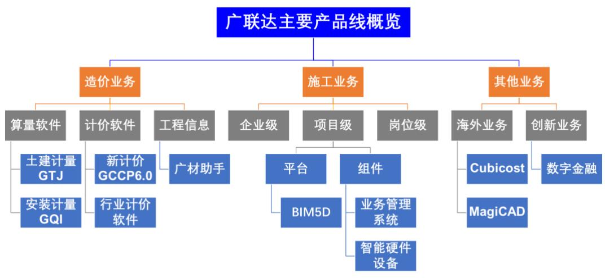
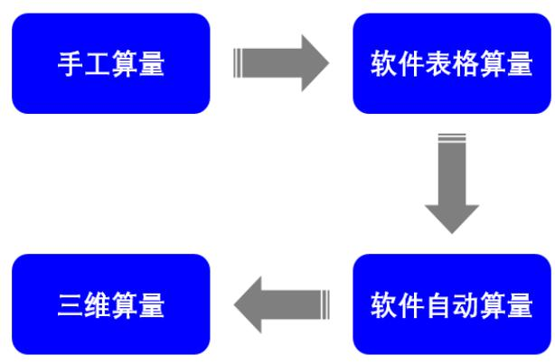

# 施工业务增速将回升

本报告导读：公司施工业务覆盖项目数量将不断提升，2021 年增速将超预期

# 投资要点：

维持目标价118.88元，维持“增持”评级。维持 2020-2022年EPS预测分别为0.28、0.61、0.93元。维持目标价118.88元，维持“增持”评级。  
2021 年施工业务将超预期。经历了2020 年疫情带来的低谷，我们认为施工业务增速将在 2021 年回到高增长通道。目前广联达施工业务覆盖的项目数量超过三万个，但渗透率较低，随着覆盖项目数量的不断提高，施工业务在总收入中的占比将持续提升。  
2020 年收入平稳增长发，符合预期。公司发布2020年全年业绩预告，预计 2020年全年实现营业收入40.05亿元，同比增长$1 3 . 1 1 \%$ ，归母净利润3.30 亿元，同比增长 $4 0 . 4 8 \%$ 。Q4 单季度实现营业收入 14.17 亿元，同比 增长 $8 . 6 8 \%$ ，归母净利润1.00亿元，同比增长 $3 1 . 7 9 \%$ 。  
收购鸿业科技，在设计领域形成协同。公司在2020 年10月公告了收购鸿业科技的情况，交易作价是4.08亿元，鸿业科技将成为公司的全资子公司，纳入并表范围。鸿业科技的较成熟产品包括CAD设计、市政公路及管线设计、BIM设计，广联达期待依托自身原有的图形技术，与其形成 $^ { \ast } 1 + 1 > 2 ^ { \ast }$ 的效果。

风险提示：客户流失风险，竞争加剧

<table><tr><td>财务摘要（百万元）</td><td>2018A</td><td>2019A</td><td>2020E</td><td>2021E</td><td>2022E</td></tr><tr><td>营业收入</td><td>2,904</td><td>3,541</td><td>4,005</td><td>5,294</td><td>6,399</td></tr><tr><td>(+/-)%</td><td>23%</td><td>22%</td><td>13%</td><td>32%</td><td>21%</td></tr><tr><td>经营利润（EBIT）</td><td>386</td><td>236</td><td>241</td><td>704</td><td>1,119</td></tr><tr><td>(+/-)%</td><td>9%</td><td>-39%</td><td>2%</td><td>192%</td><td>59%</td></tr><tr><td>净利润（归母）</td><td>439</td><td>235</td><td>330</td><td>725</td><td>1,099</td></tr><tr><td>(+1-)%</td><td>-7%</td><td>-46%</td><td>41%</td><td>119%</td><td>52%</td></tr><tr><td>每股净收益（元）</td><td>0.37</td><td>0.20</td><td>0.28</td><td>0.61</td><td>0.93</td></tr><tr><td>每股股利（元）</td><td>0.00</td><td>0.00</td><td>0.12</td><td>0.16</td><td>0.27</td></tr><tr><td></td><td></td><td></td><td></td><td></td><td></td></tr><tr><td>利润率和估值指标</td><td>2018A</td><td>2019A</td><td>2020E</td><td>2021E</td><td>2022E</td></tr><tr><td>经营利润率(%)</td><td>13.3%</td><td>6.7%</td><td>6.0%</td><td>13.3%</td><td>17.5%</td></tr><tr><td>净资产收益率(%)</td><td>13.8%</td><td>7.2%</td><td>9.5%</td><td>18.1%</td><td>22.9%</td></tr><tr><td>投入资本回报率(%)</td><td>17.2%</td><td>9.6%</td><td>12.4%</td><td>25.1%</td><td>44.3%</td></tr><tr><td>EV/EBITDA</td><td>48.77</td><td>108.99</td><td>291.70</td><td>111.29</td><td>70.45</td></tr><tr><td>市盈率</td><td>164.31</td><td>306.90</td><td>218.41</td><td>99.54</td><td>65.66</td></tr><tr><td>股息率 (%)</td><td>0.0%</td><td>0.0%</td><td>0.2%</td><td>0.3%</td><td>0.4%</td></tr></table>

# 请务必阅读正文之后的免责条款部分

计算机/信息科技

评级： 增持上次评级： 增持  
目标价格: 118.88上次预测： 118.88  
当前价格： 61.002021.03.24

<table><tr><td colspan="2">交易数据</td></tr><tr><td>52周内股价区间（元） 总市值（百万元）</td><td>40.71-91.35 72,333</td></tr><tr><td>总股本/流通A股（百万股）</td><td>1,186/990</td></tr><tr><td>流通B股/H股（百万)</td><td>0/0</td></tr><tr><td>流通股比例</td><td></td></tr><tr><td>日均成交量（百万股）</td><td>83%</td></tr><tr><td></td><td>9.30</td></tr><tr><td>日均成交值（百万元）</td><td>686.68</td></tr></table>

<table><tr><td colspan="2">资产负债表摘要</td></tr><tr><td>股东权益（百万元）</td><td>5,777</td></tr><tr><td>每股净资产</td><td>4.87</td></tr><tr><td>市净率</td><td>12.5</td></tr><tr><td>净负债率</td><td>-56.18%</td></tr></table>

<table><tr><td>EPS（元）</td><td>2019A</td><td>2020E</td></tr><tr><td>Q1</td><td>0.05</td><td>0.04</td></tr><tr><td>Q2</td><td>0.03</td><td>0.07</td></tr><tr><td>Q3</td><td>0.06</td><td>0.08</td></tr><tr><td>Q4</td><td>0.06</td><td>0.09</td></tr><tr><td>全年</td><td>0.20</td><td>0.28</td></tr></table>

  
52周内股价走势图

<table><tr><td>升幅(%)</td><td>1M</td><td>3M</td><td>12M</td></tr><tr><td>绝对升幅</td><td>-18%</td><td>-17%</td><td>49%</td></tr><tr><td>相对指数</td><td>-8%</td><td>-14%</td><td>9%</td></tr></table>

相关报告  

<table><tr><td>业绩符合预期，施工业务增速拐点已现 2021.02.01</td></tr><tr><td>造价业务市场空间或超预期 2021.01.20</td></tr><tr><td>施工业务形态仍处行业初级阶段，未来空间巨 大2020.12.13</td></tr><tr><td>合同负债再创新高，利润有望持续释放 2020.10.30</td></tr><tr><td>造价业务不断超预期，或提早兑现表观业绩 2020.08.28</td></tr></table>

模型更新时间：2021.03.24

<table><tr><td>股票研究</td></tr><tr><td>信息科技</td></tr><tr><td></td></tr><tr><td>计算机</td></tr></table>

评级： 增持上次评级： 增持  
目标价格: 118.88上次预测： 118.88  
当前价格: 61.00

广联达(002410)

# 公司简介

财务预测（单位：百万元）  

<table><tr><td>损益表</td><td>2018A 2019A</td><td>2020E</td><td></td><td>2021E</td><td>2022E</td></tr><tr><td>营业总收入</td><td>2,904</td><td>3,541</td><td>4,005</td><td>5,294</td><td>6,399</td></tr><tr><td>营业成本</td><td>188</td><td>371</td><td>448</td><td>622</td><td>813</td></tr><tr><td>税金及附加</td><td>45</td><td>43</td><td>60</td><td>76</td><td>88</td></tr><tr><td>销售费用</td><td>793</td><td>1,102</td><td>1,269</td><td>1,379</td><td>1,504</td></tr><tr><td>管理费用</td><td>765</td><td>820</td><td>851</td><td>1,127</td><td>1,181</td></tr><tr><td>EBIT</td><td>386</td><td>236</td><td>241</td><td>704</td><td>1,119</td></tr><tr><td>公允价值变动收益</td><td>0</td><td>0</td><td>0</td><td>0</td><td>0</td></tr><tr><td>投资收益</td><td>22</td><td>23</td><td>29</td><td>47</td><td>62</td></tr><tr><td>财务费用</td><td>35</td><td>41</td><td>-18</td><td>-38</td><td>-45</td></tr><tr><td>营业利润</td><td>485</td><td>290</td><td>416</td><td>905</td><td>1,358</td></tr><tr><td>所得税</td><td>49</td><td>29</td><td>63</td><td>136</td><td>204</td></tr><tr><td>少数股东损益</td><td>-6</td><td>20</td><td>25</td><td>46</td><td>58</td></tr><tr><td>净利润</td><td>439</td><td>235</td><td>330</td><td>725</td><td>1,099</td></tr><tr><td>资产负债表</td><td></td><td></td><td></td><td></td><td></td></tr><tr><td>货币资金、交易性金融资产</td><td>2,212</td><td>2,231</td><td>3,002</td><td>4,107</td><td>5,667</td></tr><tr><td>其他流动资产</td><td>558</td><td>683</td><td>597</td><td>713</td><td>830</td></tr><tr><td>长期投资</td><td>158</td><td>233</td><td>233</td><td>233</td><td>233</td></tr><tr><td>固定资产合计</td><td>819</td><td>803</td><td>766</td><td>730</td><td></td></tr><tr><td>无形及其他资产</td><td>1,858</td><td>2,181</td><td>2,337</td><td>2,519</td><td>694</td></tr><tr><td>资产合计</td><td>5,606</td><td>6,131</td><td>6,935</td><td>8,302</td><td>2,717</td></tr><tr><td>流动负债</td><td>1,329</td><td>2,809</td><td>3,397</td><td>4,173</td><td>10,141</td></tr><tr><td>非流动负债</td><td>994</td><td>9</td><td>9</td><td>9</td><td>5,155 9</td></tr><tr><td>股东权益</td><td>3,282</td><td>3,349</td><td>3,565</td><td>4,156</td><td></td></tr><tr><td>投入资本(IC)</td><td>2,013</td><td>2,207</td><td>1,653</td><td>2,381</td><td>5,013 2,146</td></tr><tr><td>现金流量表</td><td></td><td></td><td></td><td></td><td></td></tr><tr><td>NOPLAT</td><td>347</td><td>211</td><td>205</td><td>599</td><td>951</td></tr><tr><td>折旧与摊销</td><td>74</td><td>106</td><td>57</td><td>67</td><td>78</td></tr><tr><td>流动资金增量</td><td>-288</td><td>-280</td><td>-673</td><td>-649</td><td>-865</td></tr><tr><td>资本支出</td><td>-202</td><td>-242</td><td>-175</td><td>-210</td><td>-238</td></tr><tr><td>自由现金流</td><td>-70</td><td>-205</td><td>-586</td><td>-194</td><td>-74</td></tr><tr><td>经营现金流</td><td>453</td><td>641</td><td>1,098</td><td>1,461</td><td>2,057</td></tr><tr><td>投资现金流 融资现金流</td><td>-18</td><td>-227</td><td>-146</td><td>-163</td><td>-176</td></tr><tr><td></td><td>-82</td><td>-390</td><td>-182</td><td>-192</td><td>-322</td></tr><tr><td>现金流净增加额 财务指标</td><td>353</td><td>24</td><td>771</td><td>1,105</td><td>1,559</td></tr><tr><td>成长性</td><td></td><td></td><td></td><td></td><td></td></tr><tr><td>收入增长率</td><td>23.2%</td><td></td><td></td><td></td><td></td></tr><tr><td>EBIT 增长率</td><td>8.8%</td><td>21.9%</td><td>13.1%</td><td>32.2%</td><td>20.9%</td></tr><tr><td>净利润增长率</td><td>-7.0%</td><td>-39.0%</td><td>2.3%</td><td>192.2%</td><td>58.8%</td></tr><tr><td>利润率</td><td></td><td>-46.5%</td><td>40.5%</td><td>119.4%</td><td>51.6%</td></tr><tr><td>毛利率</td><td>93.5%</td><td></td><td>88.8%</td><td>88.3%</td><td></td></tr><tr><td>EBIT率</td><td>13.3%</td><td>89.5%</td><td></td><td></td><td>87.3%</td></tr><tr><td>净利润率</td><td>15.1%</td><td>6.7%</td><td>6.0%</td><td>13.3%</td><td>17.5%</td></tr><tr><td>收益率</td><td></td><td>6.6%</td><td>8.2%</td><td>13.7%</td><td>17.2%</td></tr><tr><td>净资产收益率(ROE)</td><td>13.8%</td><td>7.2%</td><td>9.5%</td><td>18.1%</td><td>22.9%</td></tr><tr><td>总资产收益率(ROA)</td><td>7.8%</td><td>3.8%</td><td>4.8%</td><td>8.7%</td><td>10.8%</td></tr><tr><td>投入资本回报率(ROIC)</td><td>17.2%</td><td>9.6%</td><td>12.4%</td><td>25.1%</td><td>44.3%</td></tr><tr><td>运营能力</td><td></td><td></td><td></td><td></td><td></td></tr><tr><td>存货周转天数</td><td>19</td><td>15</td><td>19</td><td>19</td><td>19</td></tr><tr><td>应收账款周转天数</td><td>26</td><td>44</td><td>45</td><td>40</td><td>38</td></tr><tr><td>总资产周转周转天数</td><td>659</td><td>605</td><td>595</td><td>525</td><td>526</td></tr><tr><td>净利润现金含量</td><td>103.1%</td><td>272.6%</td><td>332.5%</td><td>201.5%</td><td>187.3%</td></tr><tr><td>资本支出/收入</td><td>7.0%</td><td>6.8%</td><td>4.4%</td><td>4.0%</td><td>3.7%</td></tr><tr><td>偿债能力</td><td></td><td></td><td></td><td></td><td></td></tr><tr><td>资产负债率</td><td>41.5%</td><td>46.0%</td><td>49.1%</td><td>50.4%</td><td>50.9%</td></tr><tr><td>净负债率</td><td>-32.0%</td><td>-34.9%</td><td>-55.2%</td><td>-75.1%</td><td>-95.1%</td></tr><tr><td>估值比率</td><td></td><td></td><td></td><td></td><td></td></tr><tr><td>PE</td><td>164.31</td><td>306.90</td><td>218.41</td><td>99.54</td><td>65.66</td></tr><tr><td>PB EV/EBITDA</td><td>7.73 48.77</td><td>12.32 108.99</td><td>26.98 291.70</td><td>23.31 111.29</td><td>19.44 70.45</td></tr><tr><td>P/S</td><td>23.60</td><td>19.39</td><td>17.14</td><td>12.97</td><td>10.73</td></tr><tr><td>股息率</td><td>0.0%</td><td>0.0%</td><td>0.2%</td><td>0.3%</td><td>0.4%</td></tr><tr><td></td><td></td><td></td><td></td><td></td><td></td></tr></table>

公司的主营业务为立足建筑产业，围绕工程项目全生命周期，为客户提供以建设工程领域专业应用产品和解决方案，搭建以产业大数据、产业新金融等为增值服务的数字建筑平台经过二十年的发展，公司业务领域由招投标阶段拓展至设计阶段和施工阶段；产品从单一的预算软件扩展到工程造价、工程施工、产业新金融等多个业务板块，涵盖工具类、解决方案类、大数据、移动互联网、云计算、智能硬件设备、产业金融服务等业务形态；服务的客户从中国境内拓展到全球一百多个国家和地区；累计为行业二十余万家企业、百余万产品使用

  
绝对价格回报（%）

52周内价格范围 40.71-91.35   
市值(百万) 72,333

  
请务必阅读正文之后的免责条款部分 2 of 18

# 目录

1.行业龙头聚焦造价和施工业务. 4  
2.造价业务分算量、计价、信息三条产品线 5  
2.1．算量是计价的前提，软件是生产工具的革新， 5  
2.2.计价门槛相对较低，地域品牌厂商多， 7  
2.3．信息是造价业务增值服务的初级阶段. 8  
2.4.造价业务云转型推动商业模式的变革 9  
3.施工业务是广联达“二次创业”的重要依托， 10  
3.1．施工信息化任重道远，千亿级市场空间是远景 10  
3.2.项目级是核心，岗位级提供入口，企业级看全局 .11  
3.3.毛利率受硬件占比增多而波动.. .14  
4.出海有所成就，创新业务仍在蓄力. 14  
4.1．内生、外延共同赋能海外业务， 14  
4.2.五大创新业务单元以产品打磨为主， 15  
4.3.设计软件谋求战略突破. 16  
5．盈利预测、估值及投资建议， 17  
6.风险提示.. 17

# 1．行业龙头聚焦造价和施工业务

造价业务和施工业务是广联达收入的核心。造价业务收入占比近年来稳定在 $7 0 \%$ 左右。施工业务是2010 年以后开始的新业务，占比由2014 年的 $4 . 7 3 \%$ 提升到 2019 年的 $2 4 . 1 0 \%$ ，未来在公司内的重要性还会增加。公司总体毛利率的波动，主要是由于施工业务的硬件占比有所提升。

  
图1：工程造价与工程施工业务是收入主要组成部分  
数据来源：Wind，公司投资者关系活动记录表，国泰君安证券研究备注：2016 年造价业务收入在年报口径上加回造价信息业务收入。

除了造价、施工外，公司还有少量的海外业务、创新业务。造价产品线相对成熟，拆分为算量、计价、工程信息三条线，广联达在国内是老大。施工业务是一片蓝海，经过公司内部的整合、梳理，有企业级、项目级、岗位级三个层次，其中项目级收入占比过半。海外业务就是造价业务产品线Cubicost 和收购的机电设计产品MagiCAD。创新业务的大头是供应链金融服务。

  
图 2：广联达拥有层次清晰的产品体系  
数据来源：公司公告，公司官网，国泰君安证券研究

# 2．造价业务分算量、计价、信息三条产品线

# 2.1．算量是计价的前提，软件是生产工具的革新

工程造价 $\ "$ 量\*价，算量是计价的前提。工程造价业务的最终用户是造价人员，分布在建设方（甲方）、施工方（乙方）、第三方造价咨询单位。他们关心的是，在招投标阶段，怎样准确、高效地根据设计方案、图纸，计算好项目工程量（比如1立方米土方、1吨水泥）；在此基础上进行计价，做出项目的造价报表；并在施工进度变更、竣工结算时检查与调整。一项工程的算量工作可占到整个造价工作的 $5 0 \mathrm { - } 7 0 \%$ 。

  
图3：算量、计价工作贯穿工程项目全生命周期，以招投标阶段为主  
数据来源：国泰君安证券研究

算量早期通过手工进行。造价人员阅读图纸然后确定算量内容、顺序，列公式计算并汇总。这里存在几个问题： $\textcircled{1}$ 计算复杂且耗费人工； $\textcircled{2}$ 容易出错，修改错误也比较麻烦。大约自20 世纪90 年代后，算量软件开始在行业内应用，但手工算量依然是造价人员重要的基本功。

算量软件为造价人员带来生产工具的革新，发展分三个阶段。 $\textcircled{1}$ 软件表格算量，将图纸数据输入软件，并考虑扣减关系和计算式，接下来的很多工作由软件代劳； $\textcircled{2}$ 软件自动算量，软件里面有各地的计算规则，对接电子图纸，进一步提升了效率； $\textcircled{3}$ 三维算量，软件与CAD打通，在三维模型中算量，相较于二维模型误差更小。

  
图4：工程算量经历了四个发展时期  
数据来源：知网文献，国泰君安证券研究

  
图5：算量软件加速了招投标环节的信息化进程  
数据来源：品茗股份招股说明书

请务必阅读正文之后的免责条款部分 5 of 18造价人员主要使用钢筋、土建和安装算量软件。在实操中，钢筋算量一般是第一步，由于定义的钢筋参数也包括了大部分的土建参数，再导入土建算量时可以省去二次建模时间；而安装算量相对独立于前两者，放在最后进行即可。广联达自GTJ2018云算量产品开始，将钢筋算量与土建算量合一，数据也无须互导了，造价人员使用起来更方便。GTJ2021在GTJ2018 的基础上进行了功能优化。

表1：广联达算量软件主要包括GTJ 系列和 GQI 系列  

<table><tr><td>产品</td><td>功能与特性</td></tr><tr><td>BIM土建计量GTJ</td><td>帮助工程造价企业和从业者解决土建专业估概算、招投标预 算、施工进度变更、竣工结算全过程各阶段算量、提量、检 查、审核全流程业务，实现一站式的BIM土建计量。GTJ系 列在云技术上的应用是云计算、云对比、云报表和云规则。</td></tr><tr><td>BIM安装计量GQI</td><td>支持全专业BIM三维模式算量和手算模式算量，适用于所有 电算化水平的安装造价和技术人员使用，兼容市场上所有电 子版图纸的导入，包括CAD图纸、REVIT模型、PDF图纸、 图片等。通过智能化识别，可视化三维显示、专业化计算规 则、灵活化的工程量统计、无缝化的计价导入，全面解决安 装专业各阶段手工计算效率低、难度大等问题。</td></tr></table>

数据来源：公司官网，国泰君安证券研究

  
图6：广联达GTJ2018将钢筋算量、土建算量合一，提升了工作效率  
数据来源：公司官网

做好算量软件需要明白最终用戶使用的痛点。 $\textcircled{1}$ 最本质的问题，计算要准确，一些造价人员将软件理解为辅助工具，更重视手工算量，或者说有的环节用手工算量是优于软件的； $\textcircled{2}$ 软件使用的门槛、学习成本要适当； $\textcircled{3}$ 工程各阶段的数据传输便捷，比如钢筋算量软件导入CAD图纸后要能够完整显示； $\textcircled{4}$ 软件使用中出现问题，客服能及时解决。

广联达具有市占率、收入体量上的优势。算量软件的市场参与者还包括品茗股份、斯维尔、鲁班等，广联达活跃在全国市场上，更重要的是，广联达有自主的底层图形平台，而非基于AutoCAD。看需求端，对于施工方（乙方）来说，算量软件一般与建设方（甲方）匹配，甲方如果没有要求，就可以自主选择。当然，价格也是一个非常重要的考虑因素，这也是市场上有盗版软件的原因，不过稳定性没有保障。

# 2.2．计价门槛相对较低，地域品牌厂商多

计价软件将工程量转化为预结算的造价款。对于定额计价，行业里的专业术语是“套取定额”，通俗解释就是，将计算出的工程量，乘以国家或地方编制的价格标准。对于清单计价，主要根据施工企业自身技术水平和施工成本来计算，这里面有市场竞争的因素。

广联达GCCP系列是云计价平台，前身是GBQ 系列。2016 年，建筑业成为营改增试点的行业之一，客户做增值税工程时，可以选择云计价，前一年发版的“云 $^ +$ 端”形式的GCCP5.0有了用武之地，而GBQ系列需要自行导入增值税模板。

2020 年初上线的GCCP6.0 集成了计价依据库、云计价平台和企业清单计价平台。GCCP6.0在组价、提量、报表这些方面更智能。如前所述，算量是计价的前提，GCCP6.0实现了与算量软件的数据互通、实时刷新、图形反查，效率大大增加。

  
图7：广联达云计价平台实现工程概、预、结、审之间数据的一键转化  
数据来源：公司官网

除了GCCP6.0以外，还有一系列面向特定行业的计价软件。比如，公路工程计价产品GHW5.0、冶金计价软件GMT、水工计价软件GHC4.0、民航计价软件GCA、水利水电云计价软件GWH5.0等等，这些行业的工程项目往往体量庞大且复杂。

计价软件的技术门槛相对低，同时各地计价标准、计价规范也不同，因而地域特征明显。许多省份有活跃在本地的主导型厂商，比如浙江的品茗，广东的易达，湖南的智多星、睿特，四川的宏业、鹏业，山东的福莱一点通。

# 2.3．信息是造价业务增值服务的初级阶段

工程信息业务体量相对较小。这一业务条线提供广材助手、广材网等增值服务，形式比较简单。根据公司年报，2014-2017 年营收依次为1.13、1.41、2.22、1.71亿元。2018 年后，仅披露云相关的财务指标。2020H1，这块业务实现了云收入2.28亿元（表观收入为2.58亿元），结合以往财务数据，可推断其基本完成云转型。

广材助手是广联达计价软件的“小伙伴”。工程计价软件在使用时需要建筑材料、设备的价格数据。广材助手通过软件和数据包，与计价软件衔接，将信息价（各地造价站发布的指导价）、市场价（厂商发布的价格）、专业测定价（由多方渠道获取并加权的价格）同各地定额中的材料建立了对应关系，通过双击载价、批量载价、加权平均这些功能，提升了计价工作效率。广材网与广材助手账号通用，更偏重于搜索。

图8：广材助手与广联达计价软件在功能上紧密衔接  

<table><tr><td colspan="2">广材助手查看完整广材数据包权益</td></tr><tr><td>服务项目</td><td>服务内容</td></tr><tr><td>市场价</td><td>包含全国26万家供应商近3000万条材料。能够帮您解决主材调价问题，常用材料要盖率90%以 上，每条主材要盖3~5个常用品牌，价格每月实时更新，每一条材料都提供含税价、除税价以及税 率，每家供应商提供真实有效的联系信息。</td></tr><tr><td>专业测定价</td><td>是基于常用定额材料标准化处理后，从多方渠道（合作供应商、第三方平台、信息员获取、历史工 程）获取价格：经过大数据分析、多方对比、专家团队复核等步骤加工输出的常用材料参考价，包 含短途运费和税金。帮您解决辅材、机械调价的问题，覆盖所有常用定额材料。</td></tr><tr><td>信息价</td><td>全国31个省、497个市、1718个区县材料价格信息，我们对每个省的信息价和当地的定额材料做 了关联，让您在使用造价信息时更加高效、快捷。</td></tr><tr><td>批量载价</td><td>通过的加裁伞可计语接信息价、市场价、专业测定价等价格快速应用到计价软件中，同时支持信</td></tr><tr><td>信息价平均价</td><td>我们在信息价模块提供了平均价计算功能，可以将多期信息价进行平均价计算，计算时可以灵活设 置加权比例，满足您对信息价平均价的调价需求。</td></tr><tr><td>信息价结算调差</td><td>我们在信息价模块提供了结算调差功能，快速按单期信息价、多期信息价加权平均两种方式进行价 差计算，满足您结算等工作中对价差调整的需求。</td></tr><tr><td>价格指数</td><td>我们对每条常用定额材料都制作了价格区间，帮您快速批量检查价格合理性，辅助您对材料价格进 行决策。</td></tr><tr><td>价格趋势</td><td>可以查看近期材料价格走势，帮您了解材料价格的波动情况，辅助您对材料价格进行决策。</td></tr></table>

数据来源：广材助手

数据的可靠性是底线，持续性是活力。工程造价人员计价过程中，选择的材料价格标准要符合本地情况。因此，数据平台主要是参谋的角色，但可靠性也很重要。广联达在各地安排了专人负责供应商数据的采集，每月更新价格。2018 年年报显示，广材助手月活超过 90 万，广材网月活超过15万。

更高阶的增值服务有望来自智能算量、智能计价、成本分析与预测。上述几个智能化应用属于广联达此前的非公开发行募投项目，主要的技术点包括CAD图形识别、自然语义分析、知识图谱技术、深度学习技术等。目前来看，面向土建这个领域的CAD智能识别、智能组价、智能检视模块已经加入到公司云产品中，并有所应用，下一步要做的是升级功能和拓展其他的细分工程领域（园林、市政、安装、装饰)。

  
图9：广联达非公开发行募投项目之造价大数据及AI应用项目  
数据来源：公司非公开发行反馈意见回复报告

# 2.4．造价业务云转型推动商业模式的变革

造价业务的云转型带来几点变化。 $\textcircled{1}$ 商业模式，由卖 license 转为提供服务，收入由一次性确认变为分期确认； $\textcircled{2}$ 产品迭代更新速度，以前是几年“憋一个大招”，现在要能够快速发版，适用用户的功能改善需求；$\textcircled{3}$ 使用门槛，初次使用价格降低，吸引盗版用户转化。造价业务未来的一个预期是云化部分ARPU 值提升，目前维持在 4000 至5000 元之间（2020年11月10日投资者关系活动披露)，未来可能通过上述的一些增值服务来提升，当然前提是云转型要成功。

表2：广联达造价业务三条产品线的云转型进展顺利  

<table><tr><td>产品</td><td>项目（单位：亿元） 2018</td><td>2019 2020H1</td></tr><tr><td rowspan="4">计价</td><td>表观收入 9.27</td><td>9.22 4.40</td></tr><tr><td>云收入 0.97</td><td>2.81 2.27</td></tr><tr><td>云合同 1.69</td><td>4.80 3.51</td></tr><tr><td>期末云转型相关合同负债余额 1.09</td><td>4.32</td></tr><tr><td rowspan="4">算量</td><td>表观收入 9.09</td><td>3.08 11 4.53</td></tr><tr><td>云收入 0.59</td><td>2.67 2.11</td></tr><tr><td>云合同 1.63</td><td>4.46</td></tr><tr><td>期末云转型相关合同负债余额 1.04</td><td>3.14 2.83 3.86</td></tr><tr><td rowspan="4">工程 信息</td><td>表观收入 2.22</td><td>4.3 2.58</td></tr><tr><td>云收入 2.14</td><td>3.73 2.28</td></tr><tr><td>云合同 3.23</td><td></td></tr><tr><td>期末云转型相关合同负债余额 2.01</td><td>4.75 3.63 3.02 4.37</td></tr></table>

数据来源：公司公告，公司投资者关系活动记录表，国泰君安证券研究备注：表观收入是指财务报表中造价业务收入的直接拆分。

# 3．施工业务是广联达“二次创业”的重要依托

# 3.1．施工信息化任重道远，千亿级市场空间是远景

施工业务助力广联达业务边界拓展。造价业务虽然渗透在工程项目全生命周期中，但主要工作还是在招投标（采购）阶段进行；而且，造价业务的整体渗透率高，广联达也已实现了高市占率，未来的增长更多依靠盗版转化和ARPU值提升。对比之下，施工阶段的信息化价值尚未得到深入挖掘，人力、机械、成本、进度这些管理问题都需要解决，对于广联达而言，智慧工地、BIM的应用具有充足的二次成长空间，目前公司施工业务人员数量大概1200人左右。

  
图10：工程项目的施工阶段整体信息化程度较低  
数据来源：前瞻产业研究院

施工业务有机遇，也有很多挑战。为什么设计阶段（比如CAD软件）、招投标阶段（比如造价软件、招投标软件）的信息化做得好，而施工阶段做得不好？ $\textcircled{1}$ 工地信息化基础薄弱，缺少数据来源，而且我国建筑业利润率微薄，或存在“能省就省”的情况； $\textcircled{2}$ 工具型软件和管理型软件的逻辑不同，造价业务属于前者，施工业务多属于后者，工程项目精细化管理不是立竿见影的。因此，施工业务的推广，要让客户意识到产品有价值，能节约成本，而非带来了使用的负担。

  
图11：施工企业在智慧工地建设中遇到技术和管理难结合的问题  
数据来源：公司产品宣传片，国泰君安证券研究

千亿级市场空间是远期目标。根据国君计算机团队此前的两种测算方法：$\textcircled{1}$ 全国每年新开工50万个项目，假设每个项目信息化投入为20万元，则市场规模将达到千亿级； $\textcircled{2}$ 建筑行业年总产值远期将达到30万亿元（2019年统计局口径为近25万亿元)，假设信息化投入水平达到世界平均水平即 $3 \text{‰}$ ，也是近千亿级的市场规模。

# 3.2．项目级是核心，岗位级提供入口，企业级看全局

原口径下，施工业务涉及智慧工地、BIM 建造、数字企业三个板块。进一步细分： $\textcircled{1}$ 智慧工地产品，包括物料验收、安全管理、劳务信息管理这些工地现场应用，以及将现场的物联网设备数据与BIM模型对接的智慧工地平台； $\textcircled{2}$ BIM 建造业务，拳头产品是BIM5D，以BIM模型为载体，叠加工期、成本两个维度，可对项目进度和成本进行协同管理，并通过新增模块覆盖更多中小型项目； $\textcircled{3}$ 数字企业业务，服务于施工企业的项目管理、集采、协同办公。

2019 年将 BIM 建造与智慧工地融合，推出以数字项目管理平台为核心的项目级产品。项目级位于岗位级和企业级之间，由于施工领域数字化的最大空间还是在工地现场、项目本身，而且项目数远远多于企业数，因而项目级产品是广联达服务施工企业的主力，2019 年占施工业务营收的比重过半。2020年H1公司项目级产品服务项目数量突破三万个，2019年底是两万多，上半年增加项目数量一万。

公司将项目级产品称为“平台 $+$ 组件”模式。平台就是之前BIM业务中的BIM5D 加上智慧工地，一套大概 25 万元（可以拆开，比如安全功能不开就减一万，生产功能不开就减一万)。硬件也不需要全部，一个组合方案可能十七八万价格。2019 年公司发布的平台千人千面，组件可以客户自己挑。组件可以理解为，智能硬件设备(与安全管理相关的居多)搜集数据，然后与相应的业务管理系统对接；因此，组件是软硬件组合的形态，每个组件可以单独发生功能、定价，并卖给客户。总体来看，这有点像项目型的商业模式，但平台、组件本身的标准化程度已经较高了。

  
图12：项目级产品是平台+组件形式  
数据来源：公司产品手册，公司公告，国泰君安证券研究

  
图13：项目级产品以项目现场BI看板的形式对外呈现出来  
数据来源：公司官网

岗位级产品具有入口效应。比如说，一些中小型施工客户可能只购买了轻量化的岗位级产品，通过引导，后面可能会买项目级产品。岗位级产品的数据也会与项目级产品打通。因此，岗位级产品在快速放量的同时，起到了覆盖工程项目的作用。2020 年因为疫情，公司将岗位级产品暂时免费，起到快速拓展客户的目的。

表3：广联达岗位级产品包括 MagiCAD、斑马计划等  

<table><tr><td>产品</td><td>功能与特性</td></tr><tr><td>MagiCAD</td><td>应用于通风空调、给排水、消防、电气等专业的深化设计，</td></tr></table>

<table><tr><td></td><td>为机电工程师提供BIM解决方案；融合管综深化设计、支 吊架、机电算量、二维出图四大模块，协同MagiCADCloud 产品库构成整体机电 BIM 解决方案。 为工程建设领域提供专业、易用的进度计划编制与管理工</td></tr><tr><td>斑马进度计划软件</td><td>具。辅助项目从源头制定进度计划，计算最短工期、推演 最优施工方案，提前规避施工冲突；施工过程中辅助项目 计算关键线路变化，预警风险；最终达到有效缩短工期， 节约成本的目的。</td></tr><tr><td>施工现场布置软件</td><td>用于工程项目场地策划及展示，让技术人员在投标展示及 施工策划阶段得心应手。软件通过内置大量构件库、CAD 识别、导入GCL、OBJ、SKP等方式快速完成施工现场的 数字化呈现，利用BIM模型输出各阶段的二维图、三维图、 临建材料量及施工现场数字版的航拍视频。</td></tr><tr><td>模板脚手架设计软件</td><td>针对建筑工程模板脚手架专项，在支架与模板排布、安全 验算、施工出图、材料统计等各环节提供专业工具。辅助 工程师设计安全可靠、经济合理的模架专项方案。</td></tr><tr><td>CAD快速看图</td><td>全面支持各个版本DWG图纸的直接查看，并可直接打开天 正图纸的产品。主要特性包括：开图快捷，显示精确、功 能强大、同步方便、编辑轻松。</td></tr><tr><td>BIMMAKE</td><td>该产品基于广联达自主知识产权的图形和参数化建模技 术，是专为技术线工程师打造专注于整个施工过程的BIM 建模设计软件。</td></tr></table>

数据来源：公司官网，国泰君安证券研究

企业级产品要与项目级产品数据互通。公司的规划是做到项企一体化，把多项目管理和企业级管理的需求整合起来。因为一个施工企业往往有多个项目，做到企业集团、子公司、项目这几个层级之间的打通，以解决物料计划与实际、劳务分包结算等场景的实际问题。这也是非公开发行中的募投项目之一。

  
图14：广联达非公开发行募投项目之数字项目集成管理平台  
数据来源：公司非公开发行预案

# 3.3．毛利率受硬件占比增多而波动

施工业务毛利率水平有所下滑。我们看到，智能硬件设备在项目级产品中是一个基础的构成，比如集成大屏、智能安全帽，影响了毛利率水平。这和广联达做整体解决方案有关，很多工地现场之前就不存在信息化基础设施，更不用说购买和使用BIM产品了。目前，广联达与品茗股份在智慧工地领域的毛利率较为接近，均远高于软件行业传统的系统集成业务。从远期来看，毛利率水平取决于软硬件的构成比例，更直接地说，就是智慧工地的建设水平有没有提升。

  
图15：广联达施工业务毛利率近年来有所下滑，同硬件占比增加有关  
数据来源：Wind，国泰君安证券研究

市场规模的做大要看三点驱动因素。 $\textcircled{1}$ 政策，目前智慧工地相关政策的强制性要求偏安全和环保，未来应朝着价值型的信息化方向走，把信息化的效用显现出来； $\textcircled{2}$ 市场参与者一起开拓，在目前渗透率极低的情况下，同行竞争不是主要矛盾，大家是在一起做大蛋糕； $\textcircled{3}$ 标杆项目，广联达的策略就是主攻施工特级企业、一级企业，在大型客户中树立一些有代表意义的项目，而面向小型企业的点状需求销售单独的项目级组件、岗位级产品。

竞争格局的演变要看未来标准化程度。施工业务整个市场还处于发展早期的时间节点，当下，“平台 $^ +$ 组件”的项目级业务可以理解为标准化之上的定制化，岗位级、企业级则偏标准化一些。在产品推广过程中，有联系团队、专家咨询团队以及交付团队参与。未来产品形态的迭代还有待观察。如果标准化程度高，可能会出现激烈的竞争，云厂商、通用型厂商都有动机参与其中的环节；如果标准化程度低，反而市场是良性的，大家都有肉吃，垂直型厂商由于传统业务积累的资源，协同效应也可以发挥出来。

# 4．出海有所成就，创新业务仍在蓄力

# 4.1．内生、外延共同赋能海外业务

2011 年造价业务正式出海。上市以后，广联达开始在内部考虑如何孵化国际产品线。2011年，算量软件在新加坡取得了突破，当年卖了108万元人民币，并且做到盈利。选择东南亚市场的一个原因是文化相近。另一里程碑事件是，2016 年发布了Cubicost系列云产品系列，包括 TAS土建算量、TRB 钢筋算量、TME 机电算量、TBQ计价和 E-tender 分包询价，主要在东南亚市场深耕。

  
图 16：广联达 2011 年孵化出国际化产品线，2014 年收购 Progman，2016 年发布 Cubicost  
数据来源：公司公告，国泰君安证券研究

2014 年收购了芬兰 Progman全部股权，对价为 1800 万欧元，与创始团队较好融合。Progman是一家机电设计软件厂商，核心产品叫做MagiCAD，基于 Revit 和AutoCAD平台开发，可以对建筑物的采暖、通风、空调、给排水、电气等系统进行设计，一般应用于施工阶段。Progman 所在的北欧地区对建筑物的能耗、机电要求水平较高。而广联达此前没有涉足这个领域，通过收购既实现了出海，也达到了产品线扩充的目的。目前，MagiCAD主要覆盖欧美市场，也在国内出售。

  
图17：广联达2020 年海外营收受疫情影响增速放缓  
数据来源：Wind，国泰君安证券研究

# 4.2．五大创新业务单元以产品打磨为主

创新业务包括供采、城市、装修、金融、教育五大单元。这些业务比较零碎，收入体量也相对比较小。金融业务收入即利润表中的“利息收入”、“手续费及佣金收入”，2019 年共为7649.97 万元；其他四大单元的收入未具体披露，应与利润表中的“其他业务”口径接近，2019 年为2173.48万元。公司的定位其实是做产品打磨和标杆项目的验证，未必要在现阶段贡献多少销售收入，而是找找可能为建筑业转型升级做的事情。

表4：广联达创新业务面向建筑业不同的细分市场  

<table><tr><td>创新业务单元</td><td>业务介绍</td></tr><tr><td>数字供采业务</td><td>以平方网数字交易服务平台（由广材通、广招材整合而来） 为核心，服务建材供应链的数字化转型升级，提供精准对 接、精准推广、透明采购。</td></tr><tr><td>数字城市业务</td><td>以园区、新城为切入点，打造CIM（城市信息模型）平台。 规建管一体化平台为城市建设提供规划、建设和管理的一 体化解决方案，实现GIS+BIM+IOT+行业业务数据的融合； 园区智慧运营平台已打磨出V1.0版本。</td></tr><tr><td>数字装修业务</td><td>主要面向公装市场，结合BIM三维图形平台打通装饰各业 务环节数据流，核心能力包括云设计、渲染、出图、算量 等方面，装饰云项目管理平台的框架完成搭建。</td></tr><tr><td>数字金融业务</td><td>聚焦建筑产业链，用数据建立多层次模型，穿透到作业末 端，评估风险，为中小企业建立可以有效征信的信用模型。</td></tr><tr><td>数字教育业务</td><td>指向院校教学到企业供给，打通数字建筑人才供需端双向 通道，形成产、校、企互动。建筑云课平台累计注册学生 超36万人，教师超2万人，平台平均日活5万人次。</td></tr></table>

数据来源：公司公告，国泰君安证券研究

类金融业务服务建筑产业链，模式为金融科技服务。金融模型的数据来源是工程项目参与各方在建造过程中实时产生的贸易及履约数据、生产过程及项目管控数据。这块业务 2014 年起步后，2015 年累计发放了超过1 亿元的贷款，此后规模一直在增加。2019 年累计发放了贷款 13.68亿元，没有不良或逾期贷款，也没有应收未收利息。但考虑到监管部门对类金融业务的要求，公司将会控制业务规模和资金投入。

  
图18：广联达类金融业务收入逐年增加，未来将控制业务规模  
数据来源：Wind，国泰君安证券研究

# 4.3．设计软件谋求战略突破

设计是建筑业价值链的龙头。图形平台软件、建筑设计软件、结构设计软件等归属于基础软件的范畴。这一领域主要被海外厂商垄断，比如Autodesk的AutoCAD、Revit，在功能、生态、用户粘性上有先发优势，中望软件等国内厂商还在不断前进中。

设计软件二维向三维转换中抓住机遇。对于广联达来说，图形技术、图形平台支撑了其算量软件的成功。公司在“八三”规划中进一步提出，开发基于数据驱动、云服务、分布式技术的新型设计软件。这一愿景要在技术上的细分领域分步实现，比如将开发有自主知识产权的BIM三维图形平台，解决BIM软件技术内核的问题。

收购鸿业科技，在设计领域形成协同。公司在2020 年10月公告了收购鸿业科技的情况，交易作价是4.08 亿元，鸿业科技将成为公司的全资子公司，纳入并表范围。鸿业科技的较成熟产品包括CAD 设计、市政公路及管线设计、BIM设计，广联达期待依托自身原有的图形技术，与其形成 $^ { \circ } 1 + 1 > 2 ^ { \circ }$ 的效果。

  
图19：鸿业科技 2019 年合并口径营收为 1.06 亿元  
数据来源：公司公告，国泰君安证券研究

# 5.盈利预测、估值及投资建议

维持目标价118.88元，维持“增持”评级。维持预测2020-2022年归母净利润分别为3.30、7.25、10.99亿元，对应EPS分别为0.28、0.61、0.93 元。维持目标价118.88元，维持“增持”评级。

# 6.风险提示

转型期客户流失风险。2021 年公司转云地区并非为公司传统市占率优势地区，若转云节奏把握不好，公司面临转型地区客户流失风险，可能导致造价业务新签合同金额不及预期。

施工业务竞争加剧。智慧工地领域竞争壁垒不是公司传统优势项目，新进入者出现的可能性较大，施工业务短期竞争可能加剧。