# 广联达 (002410)

波士顿产品矩阵接力成长

# 报告原因：强调原有的投资评级

买入(维持)

<table><tr><td>市场数据：</td><td>2020年08月20日</td></tr><tr><td>收盘价（元）</td><td>66</td></tr><tr><td>一年内最高/最低(元) 市净率</td><td>78.91/30.91 22.0</td></tr><tr><td>息率(分红/股价）</td><td>0.15</td></tr><tr><td>流通A股市值(百万元）</td><td>59664</td></tr><tr><td>上证指数/深证成指</td><td>3363.90/13320.92</td></tr></table>

注：“息率”以最近一年已公布分红计算

<table><tr><td>基础数据:</td><td>2020年03 月31日</td></tr><tr><td>每股净资产（元）</td><td>3</td></tr><tr><td>资产负债率%</td><td>41.36</td></tr><tr><td>总股本/流通A股(百万)</td><td>1184/904</td></tr><tr><td>流通B股/H股（百万）</td><td>-/-</td></tr></table>

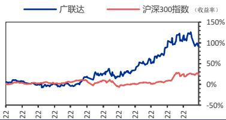  
一年内股价与大盘对比走势：

相关研究  
《广联达（002410）点评：27亿定增靴子  
落地》 2020/06/17  
《广联达（002410）点评：云业务稳定性  
体现》 2020/04/24

证券分析师 刘洋A0230513050006 liuyang2@swsresearch.com 黄忠煌A0230519110001 huangzh@swsresearch.com

联系人   
黄忠煌   
(8621)23297818×转   
huangzh@swsresearch.com

# 投资要点：

● 广联达是建筑行业软件供应商，产品覆盖工程项目的全生命周期。造价业务2019年收入占比达到$6 9 \%$ ，施工业务占比从 2015 年的 $1 3 \%$ 提升至2019年的 $2 4 \%$ ，是公司未来重点突破业务。创新业务板块属于公司孵化业务，主要包括规建管一体化平台等业务，目前尚未形成规模化销售。

• 我们认为，广联达产品线波士顿矩阵接力成长是当前市场最大低估。广联达造价业务当前从明星类产品逐渐过渡到金牛类产品，施工类业务从问题类产品逐渐过渡到明星类产品（空间大，目标市占率$10 \%$ ），创新业务逐渐从瘦狗类成长为问题类产品，也是长期潜在的明星类产品（建管一体化等）。阿里巴巴为例，单业务线产品容易触达上限，B2B 之后 B2C、阿里云、新零售等接力成长是阿里巴巴成为航母级 IT 领军关键。

● 施工“中台 $^ +$ 模块”形式是产品和方案最佳平衡点，我们预计长期目标百亿级营收。1)产品线整合：2014-2017 年，逐渐形成完整产品线，2019 年发布针对项目的数字项目管理平台。产品化提升利润率，方案化做大收入，中台 $^ +$ 模块是产品和方案最佳平衡点。2)施工销售整合：建立多个区域平台，销售网格化导致销售费用快速增长。假设每年新开工项目 30-40 万，每个项目持续 2-3 年，在施项目百万级，每个项目一年收10 万的服务费用(相当于技术工一年工资)，若广联达取得 $10 \%$ 市占率，即实现百亿级营收目标。

广联达造价产品是 A 股最佳 SaaS 化标杆，预计中期稳态收入上限从 30 亿提升到 50 亿，长期若切入内容，上限或达 100 亿以上。广联达造价软件兼具C 端和 B 端属性，稀缺的产品成熟度较高的软件，转云后，在费用、产品升级、算力、数据管理、运维等方面有更加显著优势。中期，产品粘性、用户数增长、ARPU 值提升推动稳态收入上限从 30 亿提升到 50 亿(正文已经详细测算)。远期，$\mathsf { A l } +$ 大数据切入内容领域，长期上限或达到100亿以上。

• 波士顿接力成长的关键是执行力和人才话语权。广联达管理层不断健康换血，为企业注入技术创新的基因。广联达行业地位的先导指标是人才话语权。体现在人才观、三种招聘与培养方式、人才激励，最终数据证明其人才储备在行业中的巨大优势。

上调 3 年盈利预测。我们预计，造价业务和施工业务长期目标收入均在百亿级别，造价云化后上限提升，施工产品线和销售线整合后 2020 年迎来重要拐点。原预计 2020-2022 年收入为 40.34、49.42、58.18 亿元，归母净利润为 4.58、6.62、8.42 亿元，上调盈利预测，调整后，预计 2020-2022 年收入为 43.51、54.12、64.79 亿元，归母净利润为 4.60、7.03、8.81 亿元。分部估值法下，目标市值1089.8亿元。维持“买入”评级。

风险提示：施工产品杀价竞争导致毛利率大幅下滑；宏观经济系统性风险导致建筑行业新开工率大幅 下滑。

财务数据及盈利预测  

<table><tr><td></td><td>2019</td><td>2020Q1</td><td>2020E</td><td>2021E</td><td>2022E</td></tr><tr><td>营业总收入（百万元）</td><td>3,541</td><td>566</td><td>4,351</td><td>5,412</td><td>6,479</td></tr><tr><td>同比增长率(%)</td><td>21.9</td><td>19.7</td><td>22.9</td><td>24.4</td><td>19.7</td></tr><tr><td>归母净利润（百万元）</td><td>235</td><td>53</td><td>460</td><td>703</td><td>881</td></tr><tr><td>同比增长率(%)</td><td>-46.5</td><td>-4.3</td><td>95.7</td><td>52.8</td><td>25.3</td></tr><tr><td>每股收益（元/股）</td><td>0.21</td><td>0.05</td><td>0.39</td><td>0.59</td><td>0.74</td></tr><tr><td>毛利率(%)</td><td>89.3</td><td>94.1</td><td>89.6</td><td>89.5</td><td>89.2</td></tr><tr><td>ROE(%)</td><td>7.2</td><td>1.6</td><td>7.3</td><td>10.8</td><td>13.2</td></tr><tr><td>市盈率</td><td>317</td><td></td><td>169</td><td>112</td><td>89</td></tr></table>

注：“市盈率”是指目前股价除以各年每股收益；“净资产收益率”是指摊薄后归属于母公司所有者的ROE

# 投资案件

# 投资评级与估值

上调 3 年盈利预测，维持“买入”评级。我们预计，造价业务和施工业务长期目标收入均在百亿级别，短期造价云化后上限提升，施工产品线和销售线整合后 2020 年迎来重要拐点。原预计 2020-2022 年收入为 40.34、49.42、58.18 亿元，归母净利润为4.58、6.62、8.42 亿元，上调盈利预测，调整后，预计 2020-2022 年收入为43.51、54.12、64.79 亿元，归母净利润为 4.60、7.03、8.81 亿元。维持“买入”评级。

# 关键假设点

假设 1：假设造价云业务 ARPU 值从 5000元逐步提升到 6000 元，造价用户从 30万提升到 80 万。假设 2020-2022 年公司造价业务增速为 $21 \%$ $20 \%$ $13 \%$ 。

假设 2：假设每年建筑新开工项目维持在 30 万-40 万，单项目服务费 10 万/年广联达市占率达到 $10 \%$ 假设2020-2022年施工业务增速为 $3 1 \% 3 4 \% . 3 4 \%$

假设3：考虑创新业务仍在投入期，假设2020-2022 年研发人员增长仍在$10 \% - 1 5 \%$ 。考虑销售团队整合已经完整，假设 2020-2022 年销售人员每年增长$8 \%$ 。假设其他部门人员增长相对稳定。

假设 4：假设 2020-2022 年研发人员薪酬每年增长 $10 \%$ ，其他人员薪酬每年增长 $5 \%$ 。非薪酬相关部分假设与收入同比增长。

# 有别于大众的认识

市场认为，广联达业务受到建筑行业新开工项目数下降影响。我们认为，广联达造价业务直接客户为造价师，产品云化后与建筑行业新开工数相关性已经趋弱；施工信息化行业渗透率低，成长驱动力来自渗透率提升。

市场认为，广联达是垂直行业信息化公司，收入上限较低。我们认为，广联达产品线波士顿矩阵接力成长是当前市场最大低估。我们预计，造价业务和施工业务长期收入目标均在百亿以上。其中，造价业务随用户粘性提升和 ARPU 值提升，中期收入上限从30 亿提升到 50 亿（正文已经提供详细测算过程），并且未来切入造价内容领域，上限进一步提升；我们预计，施工业务渗透率提升空间巨大，市占率达到 $10 \%$ ，收入规模即可达到百亿级别。

# 股价表现的催化剂

造价云收入增长，客户ARPU 值提升。  
施工业务平台化产品标杆案例树立，施工收入拐点。

# 核心假设风险

施工产品杀价竞争导致毛利率大幅下滑;宏观经济系统性风险导致建筑行业新开工率大幅下滑。

# 目录

前言 6

1.重新思考造价云化的意义 8  
2.施工从产品到方案是成长必然 17  
3.广联达未来10 年是多产品线的接力成长 24  
4．接力成长的关键是执行力和人才话语权 26  
5.业务拆分与估值. .32  
5.1收入与费用拆分. 32  
5.2 分部估值法得出公司 2022 年目标市值为 1089.8 亿元. 34  
5.3风险提示 36

# 图表目录

图1：广联达产品覆盖建筑全生命周期.  
图2：2019 造价收入占比达 $69 \%$ (单位：亿元）…·  
图3：造价增速趋稳，施工是新驱动. …图4：智能CAD 识别技术大幅提升算量效率. …图5：智能组价提升招投标效率 $70 \%$ … …图6：智能组价基于云存储数据积累加工，精准匹配. …….1图7：广材助手是典型的增值服务.. …12图 8：广联达云增值服务期望挖掘数据价值，形成行业级智能应用与服务……13图9：用户数和 ARPU 值双升，50 亿现金流目标确定性极高.. ….图10：东部地区是广联达弱势地区，也是云转型尚未覆盖地区.  
图11：施工研发投入前，广联达利润率在 $30 \%$ 以上.. ….图12：Adobe云转型后净利率提升至 $30 \%$ 左右，高于转型前水平. ….16图13：广联达 $\pmb { \mathbb { A } } \pmb { \mathbb { + } }$ 大数据方案逐渐成熟..  
图14：形成了基于数字项目集成管理平台的完整产品线.. …. 17图15：Salesforce 平台模式解决定制化问题. ….18图16：施工产品新形态：平台 $^ +$ 模块 ….18图17：接入施工平台的产品数量迅速增长. 9图18：2019 年销售费用快速增长，主要原因是渠道建设投入所致 19图19：2018-2019年营销人员数量保持高增长.. 19图20：公司于2018年完成了组织架构变革重组. ….20图21：公司已经形成较为完善的产品和解决方案.  
图22：施工产品效果体现在多快好省 …图23：渠道建设持续投入下，19 年施工业务营收增速回升 ….23图24：工程施工业务营收占比持续增加.. ….图25：背靠干亿级市场空间，施工业务的目标是百亿级营收.. …23图 $2 6 : 2 0 1 5$ 年阿里巴巴波士顿矩阵。 ….图27：2019年阿里巴巴波士顿矩阵. ….图 $2 8 : 2 0 1 9$ 年广联达波士顿矩阵... ….25图29：预计八三规划收官2022 年广联达波士顿矩阵..

图30：广联达在2013、2016 拐点确认后，都选择提高人均薪酬（单位：万元）31图 31：以 Adobe 为例，当前 PS(ttm)水平超过18X，处于历史高位

表1：7年跟踪，5 篇深度，预判2 次反转，解答不同历史阶段预期差。 ……表2：不同软件类型产品各有优缺点。 …表3：广联达土建算量云平台GTJ大幅缩短计算时间..  
表4：客户转云后，在费用、产品升级、算力、数据管理、运维等方面有显著优势9表5：转型地区续费率和转化率都达到 $80 \%$ 以上. .表6：广联达算量产品增加装配式算量模块与钢结构功能  
表7：浙江、江苏等东部沿海省份大多是广联达弱势地区，有品茗、鲁班等本土品牌表8：海康威视营销人员人均薪酬. …表9：施工标杆案例已经树立.. ….表10：27 亿定增聚焦增值业务和平台建设（单位：万元）  
表11：管理层不断换血，为企业注入技术创新的基因， ….26表12：广联达已经历至少三代管理层健康更迭  
表13：广联达上市后三年规划高兑现度佐证公司执行力. ….27表14：广联达历年对校招、社招并培养、高级专家引入的人才策略， ….2表15：广联达的历次激励范围兼顾广度和深度，兼顾了老员工资历和新员工幅度30表16：广联达的人员规模是国内主要同行10 倍，人均薪酬可能超过2 倍（单位：万元）表17：广联达2020-2022 年收入拆分（单位：百万元）  
表18：假设广联达2020--022年新增人员主要在研发方向（单位：人）.33表19：假设广联达020--02年员工薪酬平稳增长（单位：.万元）.3表20：预计广联达2020--202 年研发费用仍增长较快（单位：百万元）….33表21：产品型云计算公司长期卡位优势明显，可享受估值溢（单位：亿元）..35表22：国产替代逻辑下，低渗透、高成长性业务可享受估值溢价（单位：亿元）35表23：分部估值法得出公司2022 年目标市值为1089.8亿元（单位：亿元）.36

# 前言

申万宏源计算机团队历史 5 篇深度，预判 2 次反转，解答不同历史阶段预期差。其中，第一篇预判 2013 年盈利拐点，第二篇预判 2016 年盈利拐点，第三篇预判 2016 年盈利拐点并建议从“周期成长”的角度理解广联达，第四篇直接从中美产业对比角度回答市场对云计算技术疑虑，第五篇解答周期性/BIM 空间/运营业务/世界对手等重大预期差。

表1：7 年跟踪，5 篇深度，预判 2 次反转，解答不同历史阶段预期差  

<table><tr><td>日期</td><td>历史报告标题</td><td>报告类型</td><td>意义</td></tr><tr><td>2013.6</td><td>A 股市场少见的优质套装软件厂商</td><td>深度报告</td><td>预判2013反转</td></tr><tr><td>2016.7</td><td>技术驱动超越周期的成长 （“数据+产业+金融”三维研究体系系列深度之十)</td><td>深度报告</td><td>预判2016反转</td></tr><tr><td>2016.9</td><td>新业务里程碑发展！再思考“周期成长行业”红利 (三维研究体系系列深度之十一)</td><td>深度报告</td><td>理解周期成长</td></tr><tr><td>2017.7</td><td>微软云再超预期，广联达遥相呼应 “5CAVE”洞见全球TMT产业链深度研究之六</td><td>深度报告</td><td>理解云计算</td></tr><tr><td>2017.9</td><td>5年CAGR34%世界领军追求者（洞见系列深度之八）</td><td>深度报告</td><td>解答周期性/BIM空间/ 运营业务/世界对手等重大预期差</td></tr></table>

资料来源：申万宏源研究

本片深度旨在回答广联达：1）如何依靠波士顿产品矩阵实现长期成长；2）施工信息化空间巨大，如何在产品和方案之间寻找平衡点；3）造价业务稳态经营性现金流如何从30 亿提升到 50亿，并向100 亿进发。

广联达是建筑行业软件供应商，产品覆盖工程项目的全生命周期。工程项目生命周期可划分为工程计价、工程算量、工程管理和工程施工。2007-2014 年，公司收入增长达 10倍，实现“工程造价软件行业全国第一”。2015 年，公司提出“二次创业”，致力于成为“服务于建筑产品的建造者、运维者和使用者的信息化平台运营商”，为客户提供建筑工程全生命周期的信息化解决方案。

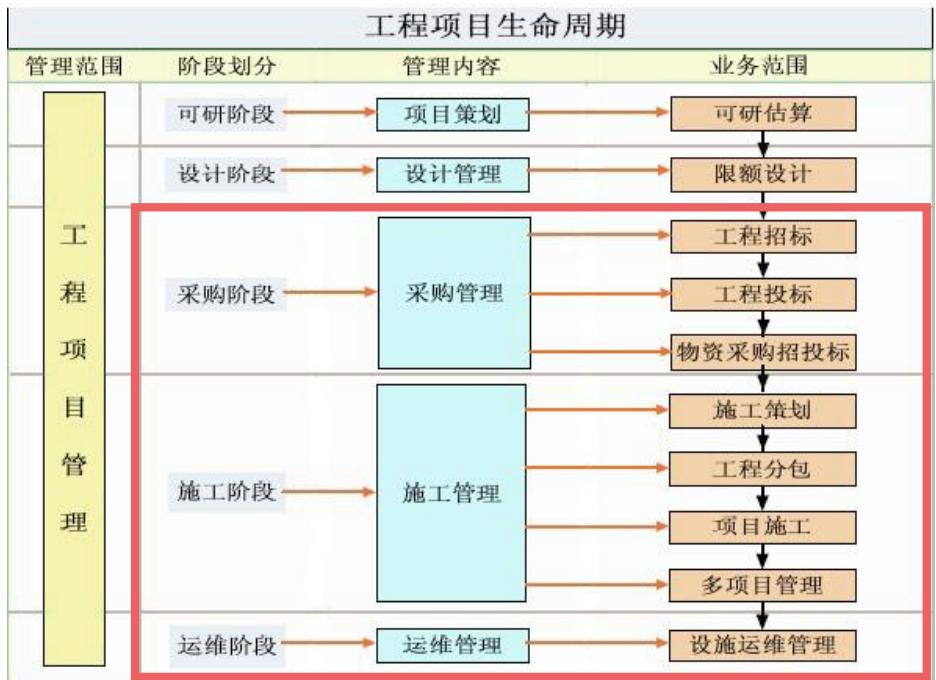  
图1：广联达产品覆盖建筑全生命周期  
资料来源：申万宏源研究

公司主营业务划分为四大板块，分别是数字造价、数字施工、创新业务和生态业务。其中，数字造价与数字施工业务是公司主营项目。数字造价主要包括工程计价、工程算量和工程信息业务，数字施工主要包括智慧工地、数字管理和 BIM业务。从收入结构上看，造价业务收入占比最高，达到 $69 \%$ (2019 年数据），随云转型推进，预计未来增速放缓。施工业务占比从  2015  年的 $13 \%$ 提升至2019年的 $24 \%$ ，是公司未来重点突破业务。2016-2017 年，公司施工业务收入同比增速连续超 $60 \%$ ；2018 年，由于销售线整合，施工业务增速放缓至 $18 \%$ ，2019年回升至 $30 \%$ 。

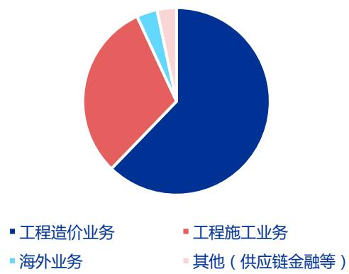  
图2：2019 造价收入占比达 $69 \%$ (单位：亿元）

  
图3：造价增速趋稳，施工是新驱动

资料来源：广联达年报，申万宏源研究资料来源：广联达年报，申万宏源研究

# 1．重新思考造价云化的意义

广联达造价软件兼具C 端和 B 端属性，C 端通过用户习惯形成粘性，B 端支付能力强更易货币化。软件行业根据客户类型，可分为 B2G 型（如科大讯飞等），B2B 型（如用友网络、石基信息等）、B2B2C型（如广联达、Wind 等），B2C型（如万兴科技等）。

不同类型软件公司各有优缺点，大多数公司兼具两种以上属性。B2G型（如科大讯飞等）软件的优点是爆发性极强，产业政策催化效果强，缺点是项目属性比较强，同时受到政府 5 年预算周期影响。B2B 型（如用友网络、石基信息等），典型如管理软件厂商，具有通用属性，产品市场空间大，且客户付费能力强，但必须平衡定制化和标准化的矛盾。B2C 型（如万兴科技等）标准化程度较高，但C 端付费意愿较低，大规模收费和 ARPU值提升难度大。实际上，大多数公司兼具两种以上属性，如金山办公，兼具 B2C 型（C 端用户市场重在移动端）、B2B2C 型（场地授权模式）和B2G 型（特殊行业国产化替代需求）。

工具型软件是典型的 B2B2C 型软件，向B 端销售，但是最终使用者是相对独立的C端。B2B2C 型产品的特点是，标准化程度最高(C 端属性），同时软件付费能力也较强（B端属性）。典型的工具软件，如广联达、Wind 都注重从使用者受教育时期（都有针对在读本科生的产品版本）开始培育用户习惯，因此，产品的粘性也是最强的。但是，工具型软件常由于其行业属性较强，单款产品往往具有明显的天花板。

表2：不同软件类型产品各有优缺点  

<table><tr><td>软件类型</td><td>典型公司</td><td>收入爆发性强</td><td>收入可预测性高行业空间大标准化程度高货币化程度高</td><td></td><td></td><td></td></tr><tr><td>B2G</td><td>科大讯飞等</td><td>√</td><td></td><td>√</td><td></td><td>√</td></tr><tr><td>B2B</td><td>如用友网络、石基信息等</td><td></td><td></td><td>√</td><td></td><td></td></tr><tr><td>B2B2C</td><td>广联达、Wind等</td><td></td><td>√</td><td></td><td>√</td><td>√</td></tr><tr><td>B2C</td><td>万兴科技等</td><td></td><td></td><td></td><td>√</td><td></td></tr></table>

资料来源：申万宏源研究

不同类型软件公司都在追求云化，但云化并非每个软件公司当前主要矛盾。以国产管理软件为例，中期核心矛盾是国产化，而不是云化。

以广联达为例，云业务转型对于客户来说，转云升级后的产品创新是重点。云和传统软件有巨大区别。广联达 2017 年开始单独披露造价业务云收入，截至目前已有超过 25 个地区开始进行云转型，预收款、云新签合同持续高增，实际上已经是 A 股 SaaS 标杆性公司。

1）年服务费模式下单次费用降低。转云后，软件支付方式由“licence $^ +$ 升级费”变为“年费”模式，客户无需为每次升级缴纳高昂费用（大约 3-4 年需要升级一次），单次费用降低。按照行业惯例，年服务费相当于 licence 费用 1/4 到 1/3。

2）云模式下，产品升级更加便捷。license 模式下，客户往往要为升级主动支付费用，转云后，广联达在服务有效期内持续提供产品的更新服务；此外云 $^ +$ 端架构使广联达与客户形成有机整体，可迅速掌握客户对功能的使用情况，便于及时跟进与产品升级。

3)云端计算速度更快，工程算量节省 $70 \%$ 以上时间。借助云端强大的计算能力，复杂的工程量计算工作从终端 PC 转移到云端，串行计算改进为分层并行计算，有效缩短工程量计算时间。对于广联达算量产品，云端工程量计算时间较终端模式下缩短约 $70 \%$ 。

表 3：广联达土建算量云平台 GTJ 大幅缩短计算时间  

<table><tr><td colspan="2">案例</td><td>广联达GTJ2018（云）广联达GCL2013(PC）</td><td></td></tr><tr><td>个人</td><td>36428平米4S店</td><td>9天</td><td>25天</td></tr><tr><td>武汉昌宝置业有限公司</td><td>3169 平米住宅工程3天</td><td></td><td>2倍以上时间</td></tr><tr><td>个人工作室</td><td>3230平米会所</td><td>3天</td><td>9天</td></tr><tr><td>个人工作室</td><td>2461 平米工程</td><td>9天</td><td>23天</td></tr><tr><td>湖北幸福祥龙建工有限公司　14880 平米高层工程　5 天</td><td></td><td></td><td>8-10天</td></tr></table>

资料来源：广联达湖北公众号，申万宏源研究

4) 云端数据打通，挖掘大数据价值。借助转云，公司数据在云端汇集，便于统一管理。云计算思想是共享，大数据思想是海量合作，借助云端数据打通，可以挖掘大数据价值，赋能业务。

5）运维更加简单。在 SaaS 模式下，产品交付给客户后，与产品相关的风险并未完全转移给客户，供应商在服务期内持续承担日常运营和维护等义务。客户 IT 运维人员大幅度减少，安全、运维等工作全部在云端完成。

表4：客户转云后，在费用、产品升级、算力、数据管理、运维等方面有显著优势  

<table><tr><td>优势</td><td>License 模式</td><td>SaaS 模式</td></tr><tr><td>费用</td><td>licence+升级费</td><td>年费，相当于 licence 费用 1/4 到 1/3</td></tr><tr><td>产品升级</td><td>客户主动缴纳费用升级</td><td>持续提供产品更新；及时跟进客户体验</td></tr><tr><td>算力</td><td>PC端，耗时长</td><td>云端，耗时短</td></tr><tr><td>数据管理</td><td>数据分散，难以统一管理</td><td>数据共享，挖掘大数据价值</td></tr><tr><td>运维</td><td>客户自己负责</td><td>供应商持续承担日常运营和维护</td></tr></table>

资料来源：申万宏源研究

对于广联达来说，云化带来成长逻辑的直接变化，体现在目标用户数扩大和 ARPU 值提升。转云后，造价上限提升，主要因为：1)用户粘性提升；2)ARPU值提升；3)用户数扩大。

1)已转型地区，在转型次年/第三年折扣促销减少，但续费率维持在 $80 \%$ 以上，转型后收入持续增长，本质为用户粘性提高。

2017 年转型地区，转型当年收入下滑较大，转型第二年增长 $20 \%$ 左右，第三年增长超过 $40 \%$ （还原口径，下同）；

2018 年转型地区，转型当年收入下滑 $10 \%$ ，转型第二年增长 $60 \%$

2019 年转型地区，转型当年收入下滑 $4 \%$ ，部分地区甚至略有增长。

同时，2019 年之前已转型的 11 个地区，云计价与云算量产品的转化率及续费率均超$80 \%$ ，年内新增 10 个地区全年转化率超 $50 \%$ 。

2020 年新增湖南，江西，四川，山东四个地区云转型，预计转型进展乐观。

表5：转型地区续费率和转化率都达到 $80 \%$ 以上  

<table><tr><td>批次</td><td>地区</td><td>2017前(6个地区)</td><td>2018（11个地区）</td><td>2019（21个地区）</td><td>2020(&gt;25个地区)</td></tr><tr><td></td><td>黑龙江、吉林、 宁夏、 山 第一批地区西、湖北、云 南</td><td>计价存量用户转化率 80%</td><td>计价存量用户转化率 85% 算量存量用户转化率50%</td><td>计价算量存量用户转化率 &gt;85%</td><td>计价算量存量用户转化率 &gt;85%</td></tr><tr><td>第二批地区</td><td>重庆、广西、 新疆、 辽宁、河南</td><td></td><td>计价存量用户转化率 40% 算量存量用户转化率50%</td><td>计价算量存量用户转化率 &gt;80%</td><td>计价算量存量用户转化率 &gt;85%</td></tr><tr><td>第三批地区</td><td>北京、上海、 广东、 天津、河北、 陕西、贵州、 内蒙、甘肃、</td><td></td><td></td><td>计价算量存量用户转化率 50%</td><td>计价算量存量用户转化率 &gt;85%</td></tr><tr><td>第四批地区</td><td>青海 湖南、江西、 四川、山东</td><td></td><td>待评估</td><td></td><td></td></tr></table>

资料来源：广联达 2019/2020 年投资者大会，申万宏源研究

2）ARPU 值提升。转型后达到稳态，ARPU 值大约为 5000 元（稳态状态指的是，不需要通过折扣促销推动上云）。通过增加模块和功能点，提供云增值服务等手段，ARPU值可以从 5000 元提升至 6000元1。

# 增加模块和功能点。例如：

装配式模块。据住建部数据，我国装配式建筑开工面积由 2015 年的 7360 万平方米增长到 2019 年的4.2 亿平方米（占新开工面积 $1 3 . 4 \%$ )，近4 年年均增长率为 $5 5 \%$ 。广联达瞄准行业机遇，布局装配式建筑，在土建计量平台GTJ 中新增装配式算量模块，提供三维建模、智能算量服务，有效解决装配式算量难、操作繁琐的问题。

钢结构功能。钢结构建筑是一种使用钢板或型钢替代钢筋混凝土的新型建筑，具有低碳节能、稳固抗震等优势。我国钢结构体系占比仅为 $5 \%$ ，而发达国家钢结构建筑使用比例普遍达 $20 \%$ ，随着《钢铁工业调整升级规划（2016-2020年）》和《“十三五”装配式建筑行动方案》等政策推出，国内钢结构市场高速发展，手工算量已不能满足生产力需求。公司 2015 年推出钢结构计量产品GJG，不断更新迭代，从三维算量角度解决钢结构复杂多变的节点问题，提供智能参数化建模，大幅提升钢结构算量效率。

表6：广联达算量产品增加装配式算量模块与钢结构功能  

<table><tr><td>新增模块/功能</td><td>传统模式</td><td>土建计量GTJ/钢结构计量 GJG</td></tr><tr><td>装配式</td><td>按照纯现浇方式建模</td><td>内置现浇与预制构件之间复杂的节点； 预制、现浇、后浇分开算量； 提供专业装配式构件分析报表；</td></tr><tr><td>钢结构</td><td>手工算量+excel</td><td>提供各地标准化装配式定额数据 255 个节点自动匹配; 参数化布置快速创建构件； 自动计算防腐防火涂料面积； 解决异形截面提取识别问题</td></tr></table>

资料来源：广联达服务新干线，广联达广东公众号，申万宏源研究

提供云增值服务。例如：

智能 CAD 识别技术准确率达 $90 \%$ 。智能CAD 识别对二维CAD 图纸进行分析，识别关键的特征并自动转换为三维模型，减少算量工作量。以钢筋识别为例，准确率达 $9 9 \%$ 以上；此外，主体构件的 CAD 成功识别率从最初的 $56 \%$ ，提升至 $8 5 \% - 9 4 \%$ ，实现预算员在业务场景中大幅提质增效。

智能提量使汇总效率提升 2-7 倍。实现云化数据打通，概、预、结、审数据一键转化，计价与算量工程可以数据互通、实时刷新、图形反查。算量业务中，单专业汇总5 万平米工程，只需用时5 分钟，云汇总普遍提效2-7倍。

智能组价提升招投标效率 $70 \%$ 。招投标预算时，智能组价技术基于云存储数据积累加工，精准匹配，实现造价要素智能采集、自动生成、实时应用的数字化效果。通过智能组价使招投标环节更加高效，效率可提升 $70 \%$ 。

  
图 4：智能 CAD 识别技术大幅提升算量效率

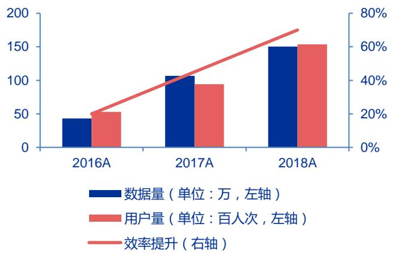  
图 5：智能组价提升招投标效率 $70 \%$

资料来源：广联达 2018 年投资者大会，申万宏源研究资料来源：广联达 2018 年投资者大会，申万宏源研究资料来源：广联达 2018 年投资者大会，申万宏源研究

  
图6：智能组价基于云存储数据积累加工，精准匹配

“广材助手”是典型的增值服务。“广材助手”与广联达计价软件数据打通，通过双击载价、批量载价、加权平均等功能大幅提升预算员调价的工作效率。截止 2019 年 9 月25 日，广材助手当年专业价格数据载价量突破 1 亿次，装机量 220 万，月活 95 万次，每天达4 万人在广材助手更新下载超过 15 万个数据包。

  
图7：广材助手是典型的增值服务

资料来源：广联达官网，申万宏源研究

广联达云增值服务相较传统造价软件的核心不同是：1）基于用户不断数据积累，通过大数据、AI 等技术挖掘数据价值结合业务场景开发出更多智能化云增值服务(SaaS 模式），提升工作效率；2）打通造价业务各流程、各参与方产生的数据，形成行业级智能应用与服务，提高企业的组织效能和单产，推进整个行业的数字化水平。

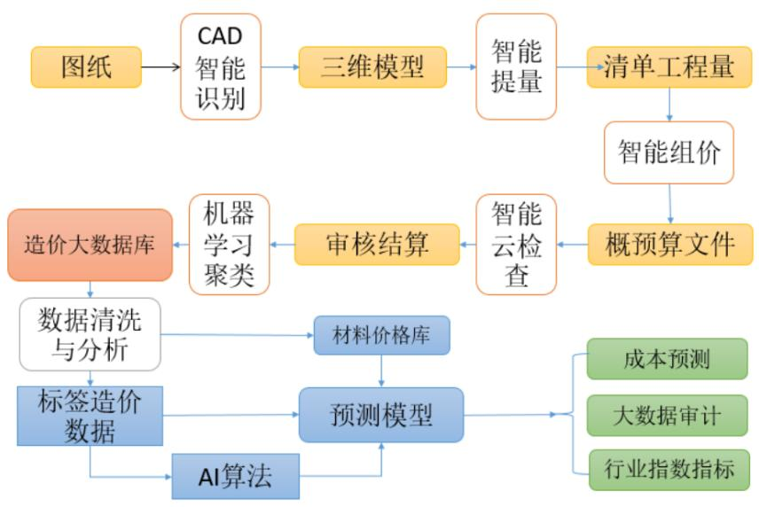  
图8：广联达云增值服务期望挖掘数据价值，形成行业级智能应用与服务

资料来源：《广联达非公开发行股票申请文件反馈意见之回复报告》，申万宏源研究

# 3）用户群扩大。

激活存量用户。套装软件目前有 30 万存量用户，依靠云增值服务，以及云端计算速度更快、产品更新不必支付高昂升级费用等优势，可以从中转化 20 到 25 万用户。

盗版转化。盗版的数量依然巨大活跃盗版用户数量大约为 22-25 万( 转型前大约 5:4），可以通过反盗版系统等手段进行转化。同时，上云后单次付费远低于传统软件一次性付费支出，利于吸引盗版用户转化。以新疆地区为例，依靠 SaaS 模式下价格优势及云端协同效应，云转型后一年，盗版用户转化率达 $50 \%$ 。2

考虑广联达已有云客户约 30 万，激活存量套装软件客户可达到 25 万（实际存量套装客户约 30 万)，盗版用户货币化潜力可达到 25万(云化后盗版难度极大)，则中期广联达云稳态客户可以达到 80 万。根据前文，ARPU 值可以达到 6000 元，则造价业务云收入可达到 48 亿。假设云收入占比达到 $90 \%$ （实际仍将存在部分套装软件用户，如教育版本造价软件等），我们预计，50亿现金流目标确定性极高。

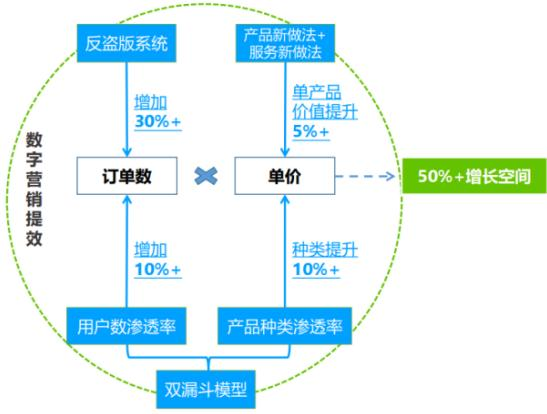  
图 9：用户数和 ARPU 值双升，50 亿现金流目标确定性极高

资料来源：广联达 2019 年投资者大会，申万宏源研究

弱势地区抢市占率。2015Q4 起，自黑龙江开始，针对优势地区率先推广造价产品云化。至 2020 年，云转型已覆盖 25 个省份和地区。浙江、江苏等东部沿海省份大多是广联达云转型尚未覆盖地区，有品茗、鲁班等本土品牌，市场形势相对复杂。对于上述地区，一方面采取针对性竞争策略，增强传统业务用户粘性，扩大竞争力；另一方面推出更加高效便捷的智能产品和增值服务，适时推进 SaaS 转型，拓展增量。

此外，软件行业具有明显的网络规模效应。以建筑信息化行业为例，施工甲乙双方倾向使用同一品牌产品，便于数据互导，客户群和口碑的积累构成高壁垒。广联达是行业龙头，全国范围内产品销量及客户口碑均远超对手，高市占率隐含对增量用户的吸引，利于逐步占领弱势地区。

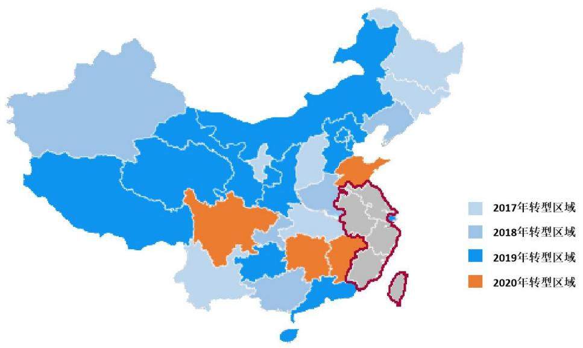  
图 10：东部地区是广联达弱势地区，也是云转型尚未覆盖地区

资料来源：广联达 2020 年投资者大会，申万宏源研究远期 $30 \%$ 以上利润率可参考广联达历史利润率与海外云化公司利润率提升案例。

表7：浙江、江苏等东部沿海省份大多是广联达弱势地区，有品茗、鲁班等本土品牌  

<table><tr><td>广联达</td><td>品茗</td><td>鲁班</td><td>斯维尔</td></tr><tr><td>优势地区 全国广大地区</td><td>除浙江、江苏等东部沿海省份外的浙江（占营收47%）、河南、 安徽、湖北</td><td>上海、江苏、浙江</td><td>广东（特别是深圳、广州)</td></tr><tr><td>和使用者的信息化平台运营商</td><td>企业定位服务于建筑产品的建造者、运维者专业领先的 BIM大数据服务商</td><td>BIM平台领航者</td><td>中国领先的建设行业软件及解 决方案服务商</td></tr><tr><td>产品布局造价领域提供计价及算量产品， 产品线最全面</td><td>造价领域提供计价及算量产品</td><td>软件</td><td>优势在算量产品，无配套计价 造价领域提供计价及算量产品</td></tr><tr><td>技术区别</td><td>主于自平台开权于D，Rv平合开发</td><td></td><td>基于CAMD平开发： 基于CAD. REeit平合开发；</td></tr><tr><td>销售服务 个地市</td><td>线上：服务新干线，广材助手等线上：品茗造价俱乐部，造价通BIM 服务&quot;小前端，大后台&quot;：线上：斯维尔知道，信息价更 线下：渠道铺设最广，共计 32 家线下:渠道代理模式(不含浙江），总部技术后台和研发后台，负责新等 分公司，6 家子公司，覆盖 200 多销售服务网络覆盖全国 200 多个建模审核、研发；工程顾问长期线下：直销+经销商分销， 地级市</td><td>派驻项目现场，负责培训及辅导覆盖 30 多省市地区</td><td></td></tr><tr><td>云套餐9900元/年（转型地区） 产品价格 套装软件 26800元（江苏）</td><td>云：土建算量1280/年 传统软件：计价 6800 元 土建钢筋算量12800元</td><td>BIM包（算量）：3900元/年</td><td>云套餐1800元/年 套装软件9800元</td></tr></table>

资料来源：广联达官网，品茗股份官网，鲁班软件官网，斯维尔官网，申万宏源研究

一方面，加大施工研发投入前，广联达利润率整体超过 $30 \%$ 。2015年之前，工程造价产品化程度高，使公司利润率达 $30 \%$ 以上。2015年，公司开始重点拓展施工业务，研发投入加大，技术人员占比显著提升，利润率大幅下滑；2017 年起，公司在各地区分批推进造价业务云转型和渠道功能重构，施工业务持续强化渠道投入，加以研发持续投入，利润率近年处于较低水平。

  
图 11：施工研发投入前，广联达利润率在 30%以上

资料来源：广联达年报，申万宏源研究

另一方面，参考海外典型云转型公司 Adobe，云化之后利润率水平新高，来自 ARPU值提升和销售费用率降低。

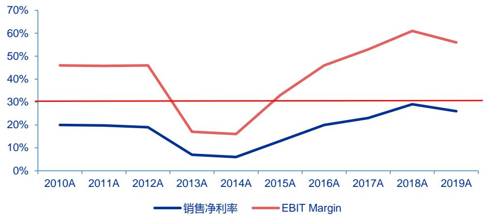  
图12：Adobe 云转型后净利率提升至 $30 \%$ 左右，高于转型前水平

资料来源：Adobe 年报，申万宏源研究

Adobe 启示： $\pmb { \mathbb { A } } \pmb { \mathbb { + } }$ 大数据切入内容领域是提升 ARPU 值关键。Adobe 从设计工具转向设计营销后，实际是通过判断 PS 方案是否有效，直接切入数字营销内容领域。不同于传统造价产品， $\mathsf { A l + }$ 大数据方案基于用户数据积累，通过大数据、AI挖掘数据价值。使用工具标注数据，清洗数据，叠加算法，实现建模智能化（二维图纸翻三维模型）、分析智能化（引用历史工程的部分内容）、推送智能化（方案与需求匹配）。

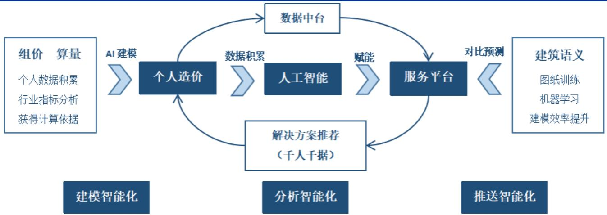  
图13：广联达 $\pmb { \mathbb { A } } \pmb { \mathbb { I } } +$ 大数据方案逐渐成熟  
资料来源：广联达 2020 年投资者大会，申万宏源研究

广联达未来可切入造价内容领域，长期造价上限或达到 100 亿以上。以算量为例，40亿平方米的算量(每年竣工数值)，实际工程计算次数超过 20 次(包含投标等)，每平米算量基础收费约 2 元/次（包括土建、钢筋、安装等），仅算量市场规模即超过1000 亿3。若广联达通过 $\mathsf { A l } +$ 大数据能力，直接完成算量工作 $3 0 \%$ 偏重复性的工作），收费比例 $20 \%$ -算量大数据内容市场空间超过 60亿，可使广联达造价上限提升到 100 亿以上4。

# 2．施工从产品到方案是成长必然

工程施工业务已经形成完整的产品线。施工业务最早是公司内部孵化的创业项目，2014-2017 年，多个子公司并行，逐渐形成完整产品线。2014-2015 年开始，公司积极拓展新产品，并提出了“智慧工地”的理念。新产品依照互联网产品模式开发，在项目初期就引入用户全程参与产品研发。2016-2017 年，基于 BIM 技术在施工业务中的应用打造核心产品，至 2017 年其产品已覆盖岗位级、项目级及企业级等应用，并启动 $" { \mathsf { B } } { \mathsf { I M } } + { \mathsf { P M } } ^ { \prime \prime }$ 整体解决方案探索，逐步形成 BIM 建造、智慧工地、数字企业三大解决方案。

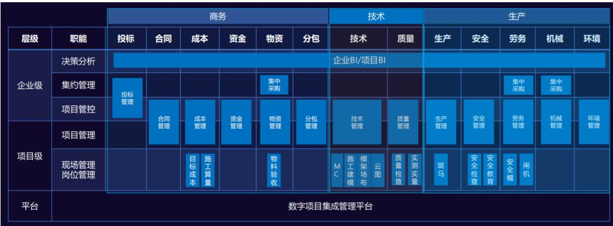  
图 14：形成了基于数字项目集成管理平台的完整产品线  
资料来源：广联达 2020 年投资者大会，申万宏源研究

2018 年，广联达对施工业务进行战略整合，完成了多家子公司少数股权的收购，使其成为全资子公司。智慧工地平台实现物联数据与 BIM 模型对接，产品平台化能力进一步加强；产品模块化使客户的个性化需求得以满足。

2019 年6月，公司发布针对项目的数字项目管理平台，并结合应用组件实现“平台 $^ +$ 组件”的业务形态。2020 年将在现有项目管理平台基础上，打造企业级多项目集成管理平台，为施工企业提供数字化综合解决方案。

Salesforce是平台 $^ +$ 模块产品模式先驱，平衡定制化和非定制化问题，中小客户和大客户问题。Salesforce 发家产品CRM 相对标准化，首先切入中小企业市场，其次向很多大公司的分公司(比如惠普、沃尔玛等)等渗透，随着 Salesforce 的中小企业客户和大企业的分公司甚至部门级用户越来越多，最后向集团总部采购渗透。伴随着大企业渗透过程，实际是 Salesforce 平台开放过程，Salesforce 仅参与平台运营及标准化模块，大企业所需要的定制化服务需求开放给 ISV。

  
图 15：Salesforce 平台模式解决定制化问题

资料来源：申万宏源研究

施工产品整合：产品化提升利润率，方案化做大收入，中台 $^ +$ 模块是产品和方案最佳平衡点。2018年施工产品战略整合初见成效，平台架构初步显现。2019 年“平台 $^ +$ 模块"形式的数字项目管理平台推出，平台化实现统一主数据、统一BI、统一入口、统一技术标准和数据接口，使产品标准化；产品模块化使客户的个性化需求得以高效的交付。“平台 $^ +$ 模块”的形式可以适应建筑工程项目高度个性化的特点，使产品和方案能够迅速规模化。

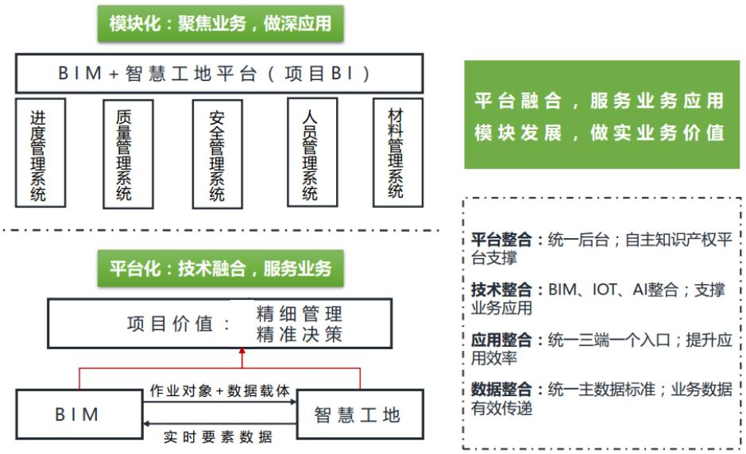  
图16：施工产品新形态：平台 $^ +$ 模块

资料来源：广联达官网，申万宏源研究

中台 $^ +$ 模块产品形式更符合大客户个性化需求。2019年，“平台 $^ +$ 组件"项目级产品的推广取得了阶段性的成果。项目级产品全年新增企业客户超过 1100 家，其中特、一级企业逾990 家；新增项目超过3200个，其中特、一级企业项目逾 2900个。

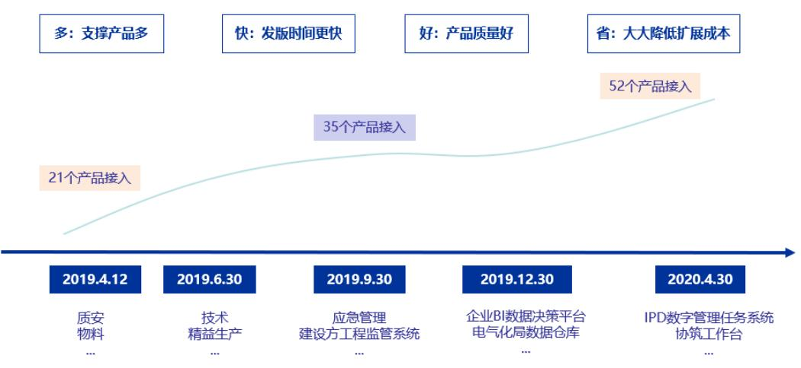  
图 17：接入施工平台的产品数量迅速增长

资料来源：广联达 2020 年投资者大会，申万宏源研究

施工销售整合：建立多个区域平台，销售网格化导致销售费用快速增长。2018 年公司积极推进营销整合，营销人员数量快速增长，并在广东、江苏等7个地区建立区域平台，提升销售和服务一体化优势。2019 年区域平台数量增至 8 个，并持续增加销售密度、加强渠道建设，实现销售和服务体系的高效运营，同时加快数字营销平台建设，利用社交平台尝试对用户进行个性化培育。

渠道建设实际是在施工领域复制造价软件的成功经验。2018-2019 年公司营销人员数量保持 $1 5 \%$ 以上高增长，2019年销售费用同比增速达 $39 \%$ ，是五年来的最高值。施工业务渠道建设的投入是销售费用快速增长的主要原因。

  
图 $1 8 : 2 0 1 9$ 年销售费用快速增长，主要原因是渠道建设投入所致

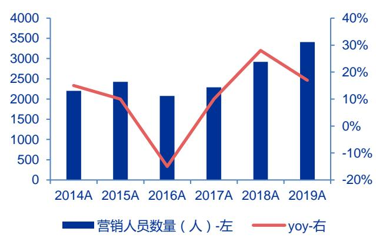  
图 19：2018-2019 年营销人员数量保持高增长

资料来源：广联达年报，申万宏源研究资料来源：广联达年报，申万宏源研究

施工业务成长新阶段的营销策略也可以参考海康威视安防成长路径。海康威视一方面自上而下积极参与“雪亮工程”与地方政府展开合作，拓展安防整体解决方案，拿下了众多大订单。另一方面培养了强大的地推团队，营销人员数量达到了 8129 人之多，人均薪酬47.82 万，远超业界平均水平。强势的营销策略保证了海康威视在安防领域的高市场占有率。

表8：海康威视营销人员人均薪酬  

<table><tr><td>年份</td><td>2016</td><td>2017</td><td>2018</td><td>2019</td></tr><tr><td>营销人员数量</td><td>4061</td><td>4999</td><td>7482</td><td>8129</td></tr><tr><td>总薪酬（万元）</td><td></td><td></td><td>133204.36205936 304201.76</td><td>388737.45</td></tr><tr><td>人均薪酬（万元）</td><td>32.80</td><td>41.20</td><td>40.66</td><td>47.82</td></tr></table>

资料来源：海康威视年报，申万宏源研究

海康威视 2018 年业务架构调整验证了从产品到方案的螺旋成长路线。海康威视产品覆盖公安、交通、司法、金融、文教卫、能源和楼宇七大行业和 40 余个子行业。纵向垂直行业布局带动海康威视业务快速发展，引领安防行业进入以解决方案为核心的时代。为更好的适应客户需求，提高内部运营效率，海康威视在 2018 年启动业务架构的变革重组，将国内业务分为 PBG、EBG、SMBG 三个业务群，更有针对性的面对不同类型市场和客户。

  
图 20：公司于 2018 年完成了组织架构变革重组

资料来源：海康威视官网，申万宏源研究

深信服是另一个从产品到方案，做大收入规模的代表。安全行业的未来趋势是软件和服务市场，需要以完整的解决方案提供给客户。深信服虽然是单个产品的研发思路，目前也形成边界安全、终端安全、云安全、身份与访问安全、威胁检测、安全运营等较为完善的产品线，具备如等保 2.0 等具体场景的解决方案能力。2018 年报披露“公司大力发展安全态势感知、终端安全、云安全资源池、安全即服务等新业务，形成“云网端”的安全业务全面布局”。同时深信服也根据各个行业特点，形成政府、企业、金融、教育、运营商、医疗等30余5种大类解决方案。

  
资料来源：深信服官网，申万宏源研究

广联达施工产品和销售整合后的关键拐点：产品效果验证，标杆案例树立。建筑行业的痛点是，成本、进度、安全的不可能三角形。而传统 ERP 系统以产品制造为主要思路，偏向于稳定的业务流及组织，在建筑工程项目组织形式多变、项目差异巨大的特点下并未取得成功。广联达施工信息化产品打破建筑行业信息孤岛，打通交易数据、交互数据、监测数据三大数据流，助力建筑产业转型升级。

广联达通过提供标准化产品为施工企业带来项目数字化、管理系统化、决策智慧化等三个转化，最终实现“多快好省”的产品目标。“多”体现在多类型、多项目的管理，打破单方面、单类型管理的传统模式。“快”体现在进度加快，进度对于工程项目意味着成本，直接影响项目的利润，施工产品的目标是让施工进度加快 $50 \%$ 。“好”体现在多个面，在环境上实现节能减排，减少 $50 \%$ 的二氧化碳排放，在施工安全上实现零事故，在施工质量上实现零缺陷。“省”是施工企业关注的核心，目标是使项目成本降低三分之一。

  
图 22：施工产品效果体现在多快好省  
资料来源：申万宏源研究

# 标杆案例在广联达官方微信公众号有大量公开信息可验证。

1．北京住总集团“管理驾驶舱”平台，“大市场、大提效、大党建、大安全、大监督”五大格局表盘依次排列。企业管理者只需一部智能手机就能随时随地查看企业的各类数据，全方位、全过程的把控企业运行状况并通过平台进行实时分析和决策。

2.广东源创智慧物料管理系统，通过软硬件结合、借“物联网 $+ \prime$ 技术，实现了对物料现场验收环节的全方位管控。现场安装的硬件设施提供了完整的防作弊服务，如红外对射保证车辆完全上磅、系统直接对接地磅保证数据的准确性、系统自动计算超负差情况等。

3.河南科建 BIM5D 生产管理系统，使项目经理不需要到达现场就可以实现远程管理现场人员、质量安全、进度、物料，并能每周对进度完成情况进行比较和评价，责任落实到人、有始有终。

表9：施工标杆案例已经树立  

<table><tr><td>公司名称</td><td>产品 案例</td><td></td></tr><tr><td>北京住总集团</td><td>人员管理系统应用案例</td><td>截至 2019 年初，覆盖在建项目部 77 个、累计项目部 141 个。实现人员动态监管，在作业人员完成刷卡后实时采集 相关数据，提高管理效率。及时实施管理动作，生产经理 全面了解施工现场不同工种实际数量，及时补充工作人员。</td></tr><tr><td>广东源创</td><td>材料管理系统应用案例</td><td>有效防范供应商亏空。2016 年 3 月，某项目查出某型号 混凝土亏方量-273.2 方，挽回亏空 7.4 万元。2016 年 9 月、10月，项目与供应商针对混凝土进行对账结算期间， 挽回亏空10万元</td></tr><tr><td>河南科健</td><td>BIM生产系统应用案例</td><td>通过平台，改变了现场管理行为。责任清晰、标准清晰、 便于沟通、便于协调。</td></tr></table>

资料来源：2019 广联达年度投资者大会，申万宏源研究

施工成长新阶段关键在于：自上而下拿项目，自下而上做推广。2019 年年报显示，广联达积极与大型企业开展合作，“自上而下拿项目”，树立标杆案例，单项目金额提升可以佐证。另一方面，整合营销团队，增加了大量的地推人员进行网格化销售，“自下而上做推广”，公司营销人员人数、销售费用双增长可以佐证。

2019 年增速回升至 $30 \%$ ，工程施工业务增长进入新阶段。施工业务在发展初期规模较小，经历了超高速增长，2015-2018 年期间增长率持续下降，2018 年增长率降至 $18 \%$ 。经过数年的渠道拓展、产品迭代，2019 年工程施工业务增长趋于平稳并回升至 $30 \%$ ，标志业务发展进入稳定增长的新阶段。营销整合、渠道强化成果初步显现，拉动施工业务增长率提升，未来增长率有望保持在 $30 \%$ 左右。

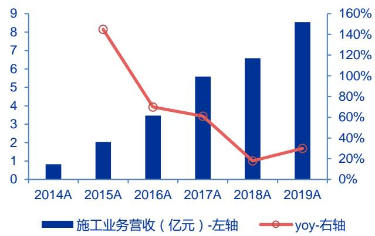  
图 23：渠道建设持续投入下，19 年施工业务营收增速回升

资料来源：广联达年报，申万宏源研究资料来源：广联达年报，申万宏源研究

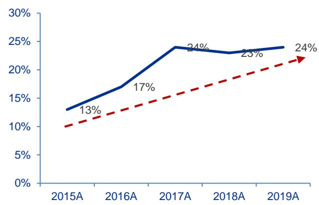  
图 24：工程施工业务营收占比持续增加

工程施工业务的营收占比从 2015 年的 $13 \%$ 增加至2019年的 $24 \%$ 。施工业务是公司重点突破的成长业务，其营收增长是拉动公司营收增长的主要动力之一。2019 年推出的“平台 $^ +$ 模块”的产品新形态更适应工程项目的个性化需求，将加速产品的规模化。预计规模化后，施工业务的营收占比将进一步提升。

我们预计，施工信息化的目标是百亿级营收。每年新开工项目30-40 万，每个项目持续2-3 年，在施项目百万级，每个项目一年收 10 万的服务费用(相当于一个技术工一年的工资）。公司希望有 $10 \%$ 的项目用广联达的产品，达到百亿级别营收。

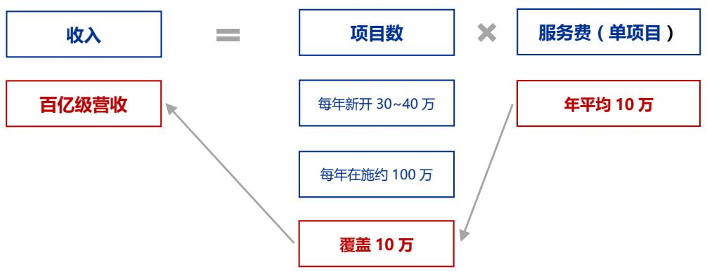  
图 25：背靠干亿级市场空间，施工业务的目标是百亿级营收  
资料来源：申万宏源研究

# 3.广联达未来 10 年是多产品线的接力成长

按照波士顿矩阵6，可根据销售增长率和市场占有率将公司产品分为四类：1）销售增长率和市场占有率“双高”的产品群（明星类产品）；2）销售增长率和市场占有率“双低"的产品群（瘦狗类产品）；3）销售增长率高、市场占有率低的产品群（问题类产品）；4）销售增长率低、市场占有率高的产品群（金牛类产品）。波士顿矩阵常用多业务线公司战略分析，帮助理解各业务线的关系与取舍。

成长股波士顿矩阵各业务线关系更加复杂，原因在于成长股创新业务往往长期处于亏损状态。以阿里巴巴为例，2016 年，时任阿里巴巴董事局主席马云在投资者大会上回答“如何让互联网公司持续繁荣超过三年”，阿里巴巴的方法是让旗下的公司轮流跑，“B2B三年，然后是淘宝三年，天猫三年，支付宝三年，阿里云三年，菜鸟三年”7。

新零售和阿里云的崛起是阿里巴巴接力成长的标志产物。阿里巴巴 2015 年开始布局新零售，2017 年开始大规模投资云计算（参考云计算核心硬件供应商浪潮信息收入增速拐点），导入初期均处于亏损状态。

新零售 2019 财年成为阿里巴巴零售业务增长新驱动力。盒马目前已经拥有 100 多家门店，巩固了其在中国新零售中的领先地位。

预计阿里云 2021 财年收入占比超过 $10 \%$ 。2020年6月，阿里云官宣：目前阿里云服务器保有量100 多万，三年内到 300 万。如果要达到目标保有量，考虑服务器更新换代，预计未来三年服务器采购复合增速 $40 \% +$ 。而从人员招聘角度看，阿里云宣布要再招募5000 名工程师。⁸预计 2021 年，阿里云在阿里巴巴整体收入占比超过 $10 \%$ 。

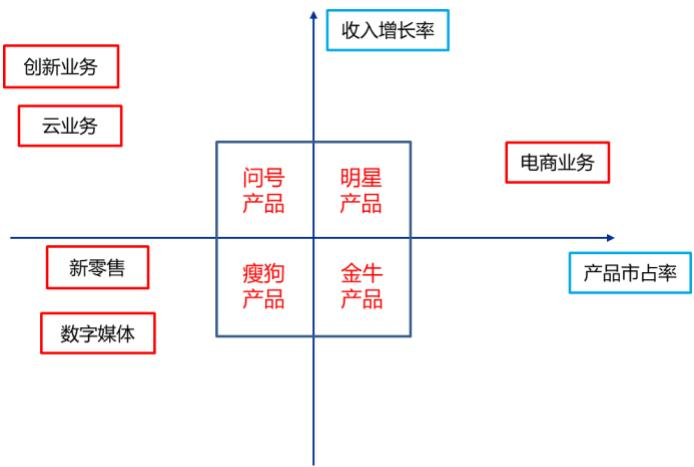  
图 26：2015 年阿里巴巴波士顿矩阵  
资料来源：阿里巴巴年报，申万宏源研究9

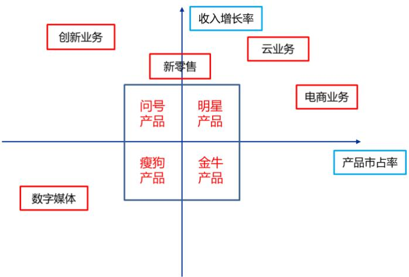  
图 27：2019 年阿里巴巴波士顿矩阵  
资料来源：阿里巴巴年报，申万宏源研究

广联达产品接力矩阵已经形成。广联达造价业务当前从明星类产品逐渐过渡到金牛类产品（长期复合增长率 $10 \% - 1 5 \%$ ），施工类业务从问题类产品逐渐过渡到明星类产品（空间大，目标市占率 $10 \%$ ），创新业务逐渐从瘦狗类成长为问题类产品，也是长期潜在的明星类产品（建管一体化、建设方一体化、全装一体化）。

成长本质是周期。单一产品线是螺旋成长，波动大；多产品线是接力成长，波动小。瘦狗类 问题类 明星类 金牛类，广联达未来 10 年是多产品接力成长。

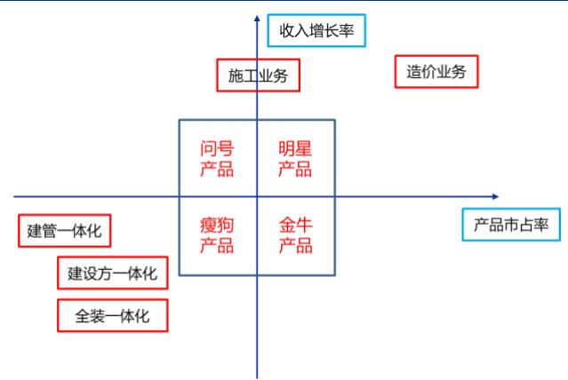  
图 $2 8 : 2 0 1 9$ 年广联达波士顿矩阵   
资料来源：广联达年报，申万宏源研究

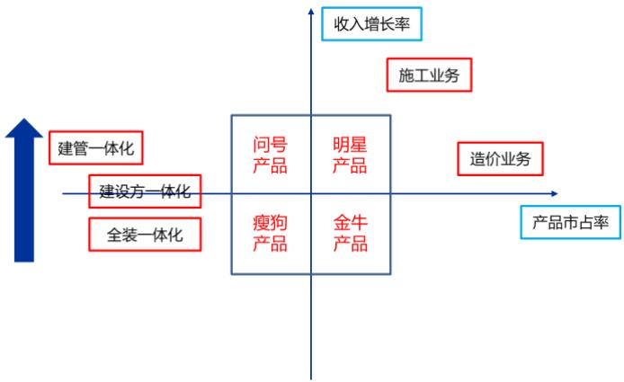  
图29：预计八三规划收官 2022 年广联达波士顿矩阵  
资料来源：广联达年报，申万宏源研究

27 亿定增是新业务导入关键。广联达 2019 年 10 月 29 日公告 27 亿定增方案，2020年 6 月 17 日公告非公开发行上市公告书。根据上市公告书 ，本次发行价格最终确定为 50.48元/股，募集资金总额为 27 亿元。本次发行对象最终确定为 3 家，具体包括，高瓴资本管理有限公司获配 2971 万股，UBSAG 获配 1783 万股，华融瑞通获配 594 万股。其中，高瓴资本管理有限公司、UBS AG 均为合格境外机构投资者。本次定增锁定期均为 6 个月，考虑参与者资金特性，预计均为长期战略投资者。

定增聚焦增值业务和平台建设。其中，造价大数据及 AI 应用项目与 BIMDeco 装饰一体化平台项目主要为造价业务增值业务，数字项目集成管理平台项目旨在打造施工平台 $^ +$ 模块解决方案，西安数字建筑基地将作为公司建筑产业互联网的智慧建筑产品与大数据生产基地示范项目。而BIM三维图形平台项目或成为“八三规划”之后，公司建筑全周期产品打通关键。

表10：27 亿定增聚焦增值业务和平台建设（单位：万元）  

<table><tr><td>序号</td><td>项目名称</td><td>项目投资总额</td><td>募集资金投入额</td></tr><tr><td>1</td><td>造价大数据及AI应用项目</td><td>25,829</td><td>25,000</td></tr><tr><td>2</td><td>数字项目集成管理平台项目</td><td>50,409</td><td>49,500</td></tr><tr><td>3</td><td>BIMDeco 装饰一体化平台项目</td><td>24,547</td><td>24,000</td></tr><tr><td>4</td><td>BIM 三维图形平台项目</td><td>25,012</td><td>17,540</td></tr><tr><td>5</td><td>广联达数字建筑产品研发及产业化基地</td><td>80,000</td><td>75,460</td></tr><tr><td>6</td><td>偿还公司债券</td><td>78,500</td><td>78,500</td></tr><tr><td></td><td>合计</td><td>284,297</td><td>270,000</td></tr></table>

资料来源：广联达 2019 年 10 月定增方案，申万宏源研究

建筑全生命周期产品打通，是广联达“八三规划”之后接力成长关键，而BIM三维图形平台是建筑业数字化的核心技术。具有数字化模拟与仿真技术的BIM三维图形平台是BIM的关键支撑。它支持实现全过程、虚拟化、数字化的设计、制造、建造和运营维护，催生新技术、新业态、新模式，为建筑业创新发展与转型升级提供动能。从价值创造层面来说，BIM 三维图形平台是提升建筑业价值链的重要工具。同时，从建筑软件自主安全可控考虑，由于国内缺少自主知识产权的三维图形平台，很多国内BIM 软件厂商基于国外图形平台或在国外 BIM 产品上做二次开发。本项目通过打造具有自主知识产权的 BIM三维图形平台，兼具安全性和低成本优点。

广联达在三维图形技术已有一定积累是项目可行性保证。1）公司在BIM 三维图形技术领域具备深厚技术积累，尤其是 BIM 管理软件的核心技术基础。同时，公司很早就开始布局图形技术和云技术的结合；2）公司在 BIM 三维图形技术领域具有丰富的人才储备；3)现有基础成果在若干产品（BIMFace、BIM5D等）和典型外部项目（如万达、碧桂园等公司的内部业务系统等）中进行了技术验证，对图形技术与云技术如何结合应用具有深厚的积累。

# 4．接力成长的关键是执行力和人才话语权

管理层不断换血，为企业注入技术创新的基因。2017 年董监高大换血，现任的 10 位高级副总裁以上的高管有 8 位是 2017 年以后任职的，其中 2020 年新任职的高级副总裁汪少山和只飞分别来自公司施工业务板块和造价事业部，足见公司对两大主营业务的重视。

表11：管理层不断换血，为企业注入技术创新的基因  

<table><tr><td>姓名</td><td>职位</td><td>履历</td></tr><tr><td>刁志中</td><td>董事长</td><td>现任本公司董事长，全联房地产商会副会长及数字城市分会会长，中国软件行业 协会副理事长，中关村数字建筑绿色发展联盟理事长。</td></tr><tr><td>袁正刚</td><td>总裁、董事</td><td>曾任加拿大蒙特利尔大学博士后研究员，欧特克（Autodesk)中国研究院研发经 理，广联达软件股份有限公司研发中心经理。 中国土木工程学会建筑市场与招标投标研究分会副理事长，中国建设工程造价管</td></tr><tr><td>刘谦</td><td>高级副总裁</td><td>理协会信息委员会委员。1973 年出生，大学学历，曾任职西安石油勘探仪器总厂 软件室工程师，公司重庆分公司经理,市场部南方区大区经理，造价事业部营销中 心经理，造价事业部经理，人力资源部和基础管理部经理。</td></tr><tr><td>云浪生</td><td>高级副总裁</td><td>美国国籍，1962 年出生，博士学历。曾任欧特克(Autodesk）公司产品架构师、 软件工程总监、核心产品部资深总监，微软开放技术（上海）有限公司董事总经 理。现任本公司高级副总裁。</td></tr><tr><td>汪少山</td><td>高级副总裁</td><td>中国国籍，无境外永久居留权，1979 年出生，大学学历。曾任本公司渠道管理中 心经理、华东大区促销总监、华中大区经理、北京独立区经理、分支管理三部经 理、全国营销管理部经理、计量事业本部经理、BIM 事业部经理、施工业务板块 经理。现任本公司副总裁。</td></tr><tr><td>只飞</td><td>高级副总裁</td><td>中国国籍，无境外永久居留权，1980 年出生，大学学历。曾任公司开发工程师、 计价产品研发经理、算量产品部经理、造价事业部经理、云图子公司总经理。现 任本公司副总裁。</td></tr></table>

资料来源：广联达年报，申万宏源研究

表12：广联达已经历至少三代管理层健康更迭  

<table><tr><td>1998</td><td></td><td>2010</td><td></td><td>2017</td><td></td></tr><tr><td>习志中</td><td>创始人</td><td>习志中</td><td>董事长</td><td>习志中</td><td>董事长</td></tr><tr><td>涂建华</td><td>创始人</td><td>涂建华</td><td>技术总监</td><td>涂建华</td><td>技术总监</td></tr><tr><td>陈晓红</td><td>创始人</td><td>陈晓红</td><td>国际化办公室主任， 曾任数字建筑事业部经理</td><td>陈晓红</td><td>国际化办公室主任</td></tr><tr><td>王金洪</td><td>创始人</td><td>王金洪</td><td>董事</td><td>王金洪</td><td>董事</td></tr><tr><td>邱世勋</td><td>创始人</td><td>邱世勋</td><td>研究项目部总监</td><td>邱世勋</td><td>研究项目部总监</td></tr><tr><td>王晓芳</td><td>创始人</td><td>王晓芳</td><td>副总经理（2011 不担任副总）</td><td>王晓芳</td><td>副总经理</td></tr><tr><td>安景合</td><td>创始人</td><td>安景合</td><td>监事</td><td>安景合</td><td>监事会主席</td></tr><tr><td></td><td></td><td>贾晓平</td><td>总经理</td><td>贾晓平</td><td>董事</td></tr><tr><td></td><td></td><td>王爱华</td><td>副总</td><td>王爱华</td><td>高级副总</td></tr><tr><td></td><td></td><td>苏新义</td><td>孵化产品部</td><td></td><td></td></tr><tr><td></td><td></td><td>刘谦</td><td>副总</td><td>刘谦</td><td>高级副总</td></tr><tr><td></td><td></td><td>卢旭东</td><td>副总</td><td></td><td></td></tr><tr><td></td><td></td><td>王晓芳</td><td>副总</td><td></td><td></td></tr><tr><td></td><td></td><td>张奎江</td><td>董秘</td><td></td><td></td></tr><tr><td></td><td></td><td>何平</td><td>财务</td><td>何平</td><td>财务总监</td></tr><tr><td>黑体 要职</td><td></td><td></td><td></td><td>李树剑</td><td>董秘，高级副总裁</td></tr><tr><td>红体</td><td>2010新增要职</td><td></td><td></td><td>云浪生</td><td>CTO，高级副总裁</td></tr><tr><td>橙体</td><td>2017 新增要职</td><td></td><td></td><td>袁正刚</td><td>总裁</td></tr><tr><td colspan="6">2015 年张奎江、柳庆妮、李兴旺、卢旭东、高少义离开副总职位</td></tr></table>

资料来源：广联达年报，申万宏源研究

高管或拥有国际行业巨头工作背景，或长期扎根广联达造价、施工业务线，全球化公司管理层雏形已现。公司现任总裁汪正刚任职于 2017 年，曾任加拿大蒙特利尔大学博士后研究员，广联达科技股份有限公司研发中心经理，欧特克中国研究院研发经理，长期从事CAD、BIM 领域的技术和产品研究。同年，前微软开放技术公司董事总经理云浪生加盟广联达，他曾在 Autodesk（欧特克）工作了 14 年之久。在微软的三年期间，云浪生主要负责 Azure 在中国应用市场和合作伙伴解决方案战略实施，并围绕 Azure 生态系统创办开源社区，在云计算领域有着丰富的工作经验。两位拥有国际行业巨头工作背景的高管的加盟，显示了广联达在技术创新上的决心，尤其是造价产品云化、基于 BIM 的工程施工业务拓展将成为广联达收入增长主要动力。公司其他高级副总裁，如刘谦、王少山、只飞等均是广联达造价、施工业务线老将，一方面保证管理层对造价、施工业务 Know-how 理解深刻，另一方面也体现广联达干部新血液培养能力。

表13：广联达上市后三年规划高兑现度佐证公司执行力  

<table><tr><td>规划</td><td>时间</td><td>内容</td><td>兑现情况</td></tr><tr><td rowspan="5">五三计划2011年至2013年</td><td rowspan="5"></td><td>五三业务战略意图：纵横海外</td><td></td></tr><tr><td>纵—从工具软件，向管理软件与服务发展</td><td>2013年兑现纵向目标</td></tr><tr><td>横 一以采购、施工为基础，向工程项目生命周期的六三期间兑现横向目标，从造价向施工渗透 —</td><td></td></tr><tr><td>前后阶段发展</td><td>2014年海外收入6干万</td></tr><tr><td>海外—从国内向海外发展</td><td></td></tr></table>

<table><tr><td>规划 时间</td><td>内容</td><td>兑现情况</td></tr><tr><td>六三计划 2014 年至2016年产品策略：4MC，PM/BIM/DM/Mobile</td><td>走专业化、平台化、全球化的发展道路 人力资源策略：“精兵强将、激励给力、哲学共有”索</td><td>2016 兌现平台化，2016 年施工（主要是 BIM 平台)高增 图形平台高增，“BIM+PM”整体解决方案探</td></tr><tr><td>七三计划2017年至2019年</td><td>工程交易阶段做实做厚产品价值，形成事实标准； 突破做实施工阶段的各种应用，形成深具客户价值的 第一品牌； 积极布局建造全过程和相关行业，把握未来趋势。</td><td>兌现精兵强将：201702 云浪生加盟广联达 造价：2019 年收入体量较大的10个区域将 进入云转型第二年。七三转型地区，续费率 和转化率大于 85%。 施工：2019 年6 月发布的广联达数字项目管</td></tr><tr><td>八三计划2020年至2022年</td><td>八三整体规划：3+X 3：施工和造价比翼齐飞，设计软件战略突破，数字 建筑平台成型 X：创新业务</td><td>理（BIM+智慧工地）平台。 待观察</td></tr></table>

资料来源：广联达历年年报，申万宏源研究

广联达行业地位的先导指标是人才话语权。体现在人才观、三种招聘与培养、人才激励，最终数据证明其人才储备在行业中的巨大优势。

起名和高管发言都格外突出人才观。根据官网《广联达19 岁：梦想中前进，做最优秀的自己》10，公司取名意义为“广联天下英才，共达鸿鹄之志”，创立初期即设定为共享的人才观。总经理袁总公开发言¹¹表示，“比新技术更重要的是人”、“致力于打造建筑产业信息化领域最优秀的人才平台，进而吸引更多良才加入“。

# 人才招聘策略精细且包括三类，校招、社招并培养、高级专家引入。从下表可以观测：

1）校招策略，从提高门槛到培养潜在人才生态。从 2010 年到 2013 年主要提高院校门槛，2014 年开始通过高校大赛、职业技能竞赛、科研创新链等，使潜在人才在毕业前即熟悉广联达。2019 年报甚至提出“数字教育:一是人才供应链，做实院校根据地；二是科研创新链，建立数字建筑教育联盟”。

2）社招和培养策略，从专家队伍到培养体系，再到“人才培养地图”。IPO 时，人才独特优势为“拥有几十名专家顾问”。2015 年报首次披露“已逐步形成一整套完善的、具有广联达特色的员工培养体系，包括：研发系列的 TOT、新员工的AOA、销售系列的BOB、干部系列的DOD、项目管理类的EOE、心态类的COC 等分类培养计划“。2019 年论述的培养和晋升体系已经较为复杂，既包括“领导力、通用力和业务能力三维度构建多方位人才培养地图”，还包括“已建 $^ { 2 0 + }$ 子类任职资格标准”，又包括“干部/营销/研发/职业技能学院构建起多层次的培养管理模式，实现人才定向培养”。

3）高端人才引入，2014 年和“七三”均有大幅进步。2014 年报论述“加大高端人才引进有很大进步”，2016 年报指出“关键岗位开展科学的人才评价感召各方面高端人才”，2019 年报披露了数字，即“'七三’战略期间中高级人才引进比例提升了 $1 1 . 8 0 \%$ 。

4）三类人才策略可以归纳为“精兵强将”与“技术商人”，它们的本质分别是“去中心化管理”和“技术驱动盈利”，这区别于绝大多数公司。2013 年报开始，公司开始提出“精兵强将”策略，2016 年又开始提出“技术商人”，此后每年强调。前者的本质是规避了小型公司独裁制、垂直式管理的问题，后者的本质是避免了技术研发与产品脱节、商业模式与技术创新割裂的问题。

尽管如此，广联达历年年报依然充满对人才的忧患意识。招股说明书指出“高端专业人才仍存在一定缺口”，2016 年报（云化转型起点）指出“转型升级的过程中，公司现有核心人才的能力与未来发展的需要还存在差距”，2019 年报（市场普遍认为云化、中台化较为成功时）仍然指出“面临与其他优秀企业的激烈竞争，人才竞争的加剧可能使得公司面临人才短缺或人力成本大幅提升的风险”。

表14：广联达历年对校招、社招并培养、高级专家引入的人才策略  

<table><tr><td></td><td></td><td></td><td></td><td></td></tr><tr><td>年份</td><td>校招</td><td>社招和培养 分享</td><td>高级专家 关注经营管理人</td><td>综述</td></tr><tr><td>IPO公告</td><td>专业院校合作</td><td>外部专家队伍</td><td>才、技术专家和行 业专家、业务骨干</td><td>10+年发展体系</td></tr><tr><td colspan="5">2010A</td></tr><tr><td>2011A</td><td>研发人员80%+流院校 建筑人员75%+一流院校</td><td></td><td>几十名专家顾问 需要大量高端人才</td><td>学习型组织 2011完成人才理念与 薪酬哲学方案制定</td></tr><tr><td></td><td>2012A研发人员 80%+一流院校 建筑人员 80%一流院校</td><td></td><td></td><td>&quot;追求全体员工物质和 精神两方面的幸福”的 核心企业理念。2012 涨 薪、激励、家庭基金</td></tr><tr><td></td><td>研发人员绝大多数一流 2013A院校;建筑人员绝大多数 一流院校</td><td></td><td>打造高效人才供应 链，探索核心人才精兵强将、激励给力、 和奋斗者倾斜，薪 酬激励体系</td><td>哲学共有</td></tr><tr><td colspan="3">2014A 高校大赛输送人才</td><td>加大高端人才引进“精兵强将”之路，激 2014 很大进步发有创业精神的人才</td><td></td></tr><tr><td rowspan="2">2015A</td><td rowspan="2"></td><td rowspan="2">员工培养体系完成 AOA/BOB/COC/DOD/EOE/TOT</td><td rowspan="2"></td><td rowspan="2">精兵强将，吸引更多优 秀人才加入。</td></tr><tr><td>E-Learning 系 统，400+管理者</td></tr><tr><td>2016A 向学生的各类赛事共30+</td><td>毕业生</td><td>知名院校引入优秀应届同上。专项人才培养计划。做好旻分享经验。 引进人才的融入计划 G-Share 大讲 堂，开讲 21 次， 参加 1200 +</td><td>关键岗位开展科学继续加强“精兵强将” 的人才评价感召各 和“技术商人”策略，</td><td>方面高端人才，有效支撑战略转型升级</td></tr><tr><td>2017A</td><td>场，覆盖院校1100+，参 与学生33000+开展60+ 场各类师资交流培训活</td><td>同上。Mini-MBA项目/研发管理干 部特训营/架构师训练营/产品经 理训练营/分支经理行动学</td><td></td><td>秉承“精兵强将”的策 略，吸引国内外的顶尖 人才，</td></tr></table>

<table><tr><td>年份</td><td>校招</td><td>社招和培养</td><td>分享</td><td>高级专家</td><td>综述</td></tr><tr><td>动，参与教师3000+</td><td></td><td></td><td></td><td></td><td>持续“精兵将强”，优</td></tr><tr><td>2018A</td><td>技能比赛</td><td>高校优秀毕业生招聘和 文化力/领导力/研发力等5大维度 培养，为建筑职业技能竞建立面向新员工领导干部研发利用内部资源，推引进业务专家和高人才体系建设。的 赛及全国高校 BIM 应用 和产品/渠道营销/销售服务/通用 动内部讲师体系级技术专家 人才培养体系</td><td></td><td></td><td>体化多层次长效激励机 制</td></tr><tr><td></td><td>招聘聚焦高潜能学生。 数字教育:一是人才供应 2019A链，做实院校根据地；二 是科研创新链，建立数字 建筑教育联盟</td><td>1)同2015-2018。 2）领导力、通用力和业务能力三 维度构建多方位人才培养地图。 3 干部/营销/研发/职业技能学院 构建起多层次的培养管理模式， 实现人才定向培养。 4)已建20+子类任职资格标准，让 职业发展与晋升通道更为顺畅。</td><td></td><td>加大引进业务专家 和高级技术人才力 度，“七三”战略 期间中高级人才引 进比例提升了 11.80%</td><td>同上</td></tr></table>

资料来源：广联达招股说明书，广联达 2010-2019 年报，申万宏源研究

人才激励伴随上述培养和招聘过程，参见股权分享。2012 年至今，公告了两次员工持股、两次限制性股票（其中一次含期权）。其激励方式较为精巧：

1）广度高。涵盖了高管、中层管理、核心业务（技术）、董事与监事、其他管理和技术。

2)老员工激励比例高。2012、2015 年的激励是上市不久时，其覆盖人员比例均较高。

3）新员工激励幅度大，可配合“二次创业”提法理解对高端人才激励。2015-2016年公司提出“二次创业”，2017-2018 年的激励尽管人员比例不高，但股本比例较高，意味着单人才激励幅度大。这种方式与上述“精兵强将”、“高级人才引进比例提升”对应。

表15：广联达的历次激励范围兼顾广度和深度，兼顾了老员工资历和新员工幅度  

<table><tr><td>激励和持股</td><td>人数</td><td>人员比例</td><td>股本比例</td><td>对象1</td><td>对象２</td><td>对象3</td><td>对象4</td></tr><tr><td>2012 限制性股票</td><td>约287</td><td>8.70%</td><td>2.10%</td><td>高管</td><td>中层管理</td><td>核心业务（技术）</td><td></td></tr><tr><td>2015员工持股</td><td>394</td><td>9.07%</td><td>0.33%</td><td>高管</td><td>管理</td><td>技术</td><td></td></tr><tr><td>2017员工持股</td><td>139</td><td>3.06%</td><td>0.21%</td><td>董事、监事</td><td>高级管理人员</td><td>其他管理</td><td>其他技术</td></tr><tr><td>2018期权</td><td>271</td><td>5.21%</td><td>0.88%</td><td>核心业务（技术）</td><td></td><td></td><td></td></tr><tr><td>2018 限制性股票</td><td>86</td><td>1.65%</td><td>0.64%</td><td>高管</td><td>核心管理</td><td>核心技术（业务）</td><td></td></tr></table>

注1：2012 激励包括原始 251 人和预留 36 人 52 万股部分之和。假设人员不重合，合计约 287 人注2：人员比例的基数为前一年总人数，这样会有比例误差资料来源：广联达 2012-2018 年报，申万宏源研究

人才激励还伴随着较高的人均薪酬。公司在多次经营丰收时提升平均薪酬，做出与大多智力密集行业相反的决策。2012 与 2015 年，广联达均经历新开工面积统计增速下降的不佳外部环境，其分别在 2013、2016 年利润表增长翻转（2013 年来自新产品品类与清单规范，2016 年来自 BIM、财价信息、营改增增量与小部分云收入）。其在当年均选择大幅提高薪酬奖励团队，这对促成团队克服短期困难，形成了正反馈机制。

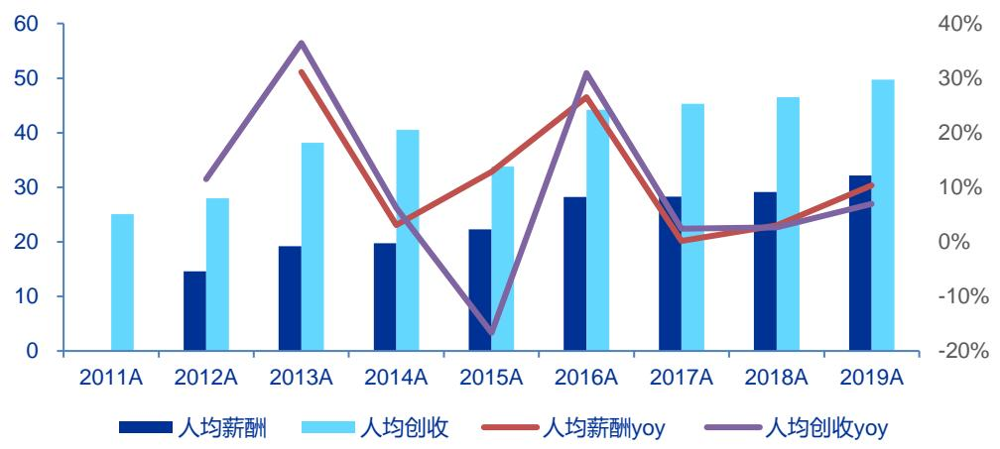  
图 30：广联达在 2013、2016 拐点确认后，都选择提高人均薪酬（单位：万元）

资料来源：广联达年报，申万宏源研究

公开数据验证了广联达在行业中巨大的人才优势，这是人才观、三种招聘与培养、人才激励后形成的累计结果。2010 年前后，广联达与鲁班软件、神机软件、建研科技存在造价竞争，当前与品茗科技、斯维尔存在施工竞争。当前广联达人员数量是同行 10 倍以上，人均薪酬或为同行 2 倍。

科技企业的生产工具是人才与管理。广联达在市场上的人才优势比其造价市占率（约$60 \%$ 市占率）还高，这预示着未来公司市占率与行业地位很可能还要提高。

表 16：广联达的人员规模是国内主要同行 10 倍，人均薪酬可能超过 2 倍（单位：万元）  

<table><tr><td>代码</td><td colspan="3">2016A</td><td>2017A</td><td>2018A</td><td>2019A</td></tr><tr><td>002410.SZ</td><td>广联达</td><td>人数</td><td>4610</td><td>5200</td><td>6244</td><td>7115</td></tr><tr><td></td><td></td><td>人均薪酬</td><td>28.2</td><td>28.3</td><td>29.1</td><td>32.2</td></tr><tr><td>无</td><td>建研科技</td><td>人数</td><td>100-499</td><td>100-499</td><td>100-499</td><td>100-499</td></tr><tr><td></td><td></td><td>人均薪酬</td><td>--</td><td>--</td><td>--</td><td>--</td></tr><tr><td>838470.0C</td><td>斯维尔</td><td>人数</td><td>385</td><td>438</td><td>489</td><td>453</td></tr><tr><td></td><td></td><td>人均薪酬</td><td>--</td><td>13.3</td><td>14.4</td><td>--</td></tr><tr><td>836188.0C</td><td>品茗股份</td><td>人数</td><td>439</td><td>568</td><td>791</td><td>883</td></tr><tr><td>A19387.SH</td><td></td><td>人均薪酬</td><td>--</td><td>12.9</td><td>13.2</td><td>15.6</td></tr><tr><td>无</td><td>鲁班软件</td><td>人数</td><td>100-499</td><td>100-499</td><td>100-499</td><td>100-499</td></tr><tr><td></td><td></td><td>人均薪酬</td><td>--</td><td>--</td><td>-</td><td>--</td></tr><tr><td>无</td><td>神机软件</td><td>人数</td><td>&lt;50</td><td>&lt;50</td><td>&lt;50</td><td>&lt;50</td></tr><tr><td></td><td></td><td>人均薪酬</td><td>--</td><td>--</td><td>--</td><td>--</td></tr><tr><td>831560.0C</td><td>盈建科</td><td>人数</td><td>167</td><td>178</td><td>183</td><td>--</td></tr><tr><td>A17074.SH</td><td></td><td>人均薪酬</td><td>22.4</td><td>25.7</td><td>25.0</td><td>--</td></tr></table>

注1：根据天眼查，上海神机软件员工人数小于50人  
注2：根据天眼查，上海鲁班软件员工人数100-499人，参保人数 199人  
注 3：根据天眼查，建研科技员工人数 100-499 人，参考人数 257 人。但官网披露员工数量 1400 人，可能为另外口径  
注 4：盈建科披露了 2019 上半年经营情况，未披露 2019 全年。人均薪酬未披露，用当年现金流量表数值除以年末人数近  
似  
资料来源：Wind，广联达历年年报，天眼查，斯维尔历年年报，品茗股份历年年报，鲁班软件官网，神机软件官网，盈建  
科招股说明书，申万宏源研究

# 5.业务拆分与估值

# 5.1收入与费用拆分

综上分析，假设 2020-2022 年公司造价业务增速为 $2 1 \%$ ， $20 \%$ $13 \%$ ，施工业务增速为 $31 \%$ $34 \%$ $34 \%$ 。

表17：广联达 2020-2022 年收入拆分（单位：百万元）  

<table><tr><td></td><td>2013A</td><td>2014A</td><td>2015A</td><td>2016A</td><td>2017A</td><td>2018A</td><td>2019A</td><td>2020E 2021E</td><td>2022E</td></tr><tr><td>营业收入</td><td>1393</td><td>1760</td><td>1539</td><td>2039</td><td>2357 2904</td><td>3541</td><td>4351</td><td>5412</td><td>6479</td></tr><tr><td>yoy</td><td></td><td>26%</td><td>-13%</td><td>32%</td><td>16% 23%</td><td>22%</td><td>23%</td><td>24%</td><td>20%</td></tr><tr><td>年末总云合同</td><td></td><td></td><td></td><td></td><td>175 655</td><td>1,401</td><td>2,241</td><td>2,383</td><td>2,424</td></tr><tr><td>年末总云相关预收款</td><td></td><td></td><td></td><td></td><td>130 414</td><td>894</td><td>1,494</td><td>1,589</td><td>1,616</td></tr><tr><td>云相关总收入</td><td></td><td></td><td></td><td></td><td>45 396</td><td>921</td><td>1,641</td><td>2,288</td><td>2,397</td></tr><tr><td>云收入占比</td><td></td><td></td><td></td><td>2%</td><td>14%</td><td>26%</td><td>38%</td><td>42%</td><td>37%</td></tr><tr><td>分项目</td><td></td><td></td><td></td><td></td><td></td><td></td><td></td><td></td><td></td></tr><tr><td>工程造价业务</td><td>1272</td><td>1339</td><td>1093</td><td>1326</td><td>1643 2057</td><td>2452</td><td>2965</td><td>3571</td><td>4033</td></tr><tr><td>yoy</td><td></td><td>5%</td><td>-18%</td><td>21%</td><td>24% 25%</td><td>19%</td><td>21%</td><td>20%</td><td>13%</td></tr><tr><td>工程施工业务</td><td>54</td><td>218</td><td>204</td><td>346</td><td>558 659</td><td>853</td><td>1121</td><td>1496</td><td>1998</td></tr><tr><td>yoy</td><td></td><td>304%</td><td>-6%</td><td>70%</td><td>61% 18%</td><td>30%</td><td>31%</td><td>34%</td><td>34%</td></tr><tr><td>创新业务</td><td>68</td><td>203</td><td>243</td><td>367</td><td>157 188</td><td>236</td><td>265</td><td>345</td><td>449</td></tr><tr><td>yoy</td><td></td><td>199%</td><td>20%</td><td>51%</td><td>-57% 20%</td><td>26%</td><td>12%</td><td>30%</td><td>30%</td></tr></table>

资料来源：申万宏源研究注：创新业务包括，海外机电专业 BIM 等、国内规建管一体化平台等

考虑创新业务仍在投入期，预计 2020-2022 年研发人员增长仍在 $10 \% - 1 5 \%$ 。考虑销售团队整合已经完整，预计 2020-2022 年销售人员每年增长 $8 \%$ 。假设其他部门人员增长相对稳定。

假设 2020-2022 年研发人员薪酬每年增长 $10 \%$ ，其他人员薪酬每年增长 $5 \%$ 。

整体费用拆分为薪酬相关费用和非薪酬相关费用。其中，薪酬相关费用部分按照人员和人均薪酬增长预期拆分如下，非薪酬相关部分假设与收入同比增长。

表18：假设广联达 2020-2022 年新增人员主要在研发方向（单位：人）  

<table><tr><td></td><td>2013A</td><td>2014A</td><td>2015A</td><td>2016A</td><td>2017A</td><td>2018A</td><td>2019A</td><td>2020E</td><td>2021E</td><td>2022E</td></tr><tr><td>研发人员</td><td>976</td><td>1326</td><td>1299</td><td>1691</td><td>2003</td><td>2402</td><td>2749</td><td>3161</td><td>3477</td><td>3825</td></tr><tr><td></td><td>6%</td><td>36%</td><td>-2%</td><td>30%</td><td>18%</td><td>20%</td><td>14%</td><td>15%</td><td>10%</td><td>10%</td></tr><tr><td>营销人员</td><td>1915</td><td>2204</td><td>2428</td><td>2075</td><td>2289</td><td>2922</td><td>3408</td><td>3681</td><td>3975</td><td>4293</td></tr><tr><td></td><td>-3%</td><td>15%</td><td>10%</td><td>-15%</td><td>10%</td><td>28%</td><td>17%</td><td>8%</td><td>8%</td><td>8%</td></tr><tr><td>财务人员</td><td>105</td><td>93</td><td>104</td><td>106</td><td>102</td><td>110</td><td>124</td><td>130</td><td>137</td><td>144</td></tr><tr><td></td><td>3%</td><td>-11%</td><td>12%</td><td>2%</td><td>-4%</td><td>8%</td><td>13%</td><td>5%</td><td>5%</td><td>5%</td></tr><tr><td>运营人员</td><td>153</td><td>199</td><td>181</td><td>231</td><td>405</td><td>323</td><td>268</td><td>281</td><td>295</td><td>310</td></tr><tr><td></td><td>-8%</td><td>30%</td><td>-9%</td><td>28%</td><td>75%</td><td>-20%</td><td>-17%</td><td>5%</td><td>5%</td><td>5%</td></tr><tr><td>管理人员</td><td>502</td><td>520</td><td>545</td><td>507</td><td>401</td><td>487</td><td>566</td><td>594</td><td>624</td><td>655</td></tr><tr><td></td><td>9%</td><td>4%</td><td>5%</td><td>-7%</td><td>-21%</td><td>21%</td><td>16%</td><td>5%</td><td>5%</td><td>5%</td></tr><tr><td>合计</td><td>3651</td><td>4342</td><td>4557</td><td>4610</td><td>5200</td><td>6244</td><td>7115</td><td>7847</td><td>8508</td><td>9227</td></tr><tr><td></td><td>1%</td><td>19%</td><td>5%</td><td>1%</td><td>13%</td><td>20%</td><td>14%</td><td>10%</td><td>8%</td><td>8%</td></tr></table>

资料来源：申万宏源研究

表19：假设广联达 2020-2022 年员工薪酬平稳增长（单位：万元）  

<table><tr><td></td><td>2013A</td><td>2014A</td><td>2015A</td><td>2016A</td><td>2017A</td><td>2018A</td><td>2019A</td><td>2020E</td><td>2021E</td><td>2022E</td></tr><tr><td>销售人均薪酬</td><td>18.5</td><td>18.1</td><td>16.3</td><td>23.5</td><td>22.6</td><td>19.4</td><td>23.7</td><td>24.9</td><td>26.1</td><td>27.4</td></tr><tr><td></td><td>32%</td><td>-2%</td><td>-10%</td><td>45%</td><td>-4%</td><td>-14%</td><td>22%</td><td>5%</td><td>5%</td><td>5%</td></tr><tr><td>研发人均薪酬</td><td></td><td></td><td></td><td></td><td>26.4</td><td>26.5</td><td>31.3</td><td>34.4</td><td>37.8</td><td>41.6</td></tr><tr><td></td><td></td><td></td><td></td><td></td><td></td><td>0%</td><td>18%</td><td>10%</td><td>10%</td><td>10%</td></tr><tr><td>管理人均薪酬</td><td>50.1</td><td>59.9</td><td>65.6</td><td>101.9</td><td>42.4</td><td>59.8</td><td>56.5</td><td>59.3</td><td>62.2</td><td>65.3</td></tr><tr><td></td><td>30%</td><td>20%</td><td>9%</td><td>55%</td><td>-58%</td><td>41%</td><td>-6%</td><td>5%</td><td>5%</td><td>5%</td></tr></table>

资料来源：申万宏源研究

表20：预计广联达 2020-2022 年研发费用仍增长较快（单位：百万元）  

<table><tr><td></td><td>2013A</td><td>2014A</td><td>2015A</td><td>2016A</td><td>2017A</td><td>2018A</td><td>2019A</td><td>2020E 2021E</td><td></td><td>2022E</td></tr><tr><td>销售费用</td><td>470</td><td>550</td><td>588</td><td>670</td><td>682</td><td>793</td><td>1102</td><td>1278</td><td>1489</td><td>1716</td></tr><tr><td>yoy</td><td>26%</td><td>17%</td><td>7%</td><td>14%</td><td>2%</td><td>16%</td><td>39%</td><td>16%</td><td>17%</td><td>15%</td></tr><tr><td>销售费用非薪酬</td><td>117</td><td>151</td><td>193</td><td>182</td><td>164</td><td>226</td><td>295</td><td>362</td><td>451</td><td>539</td></tr><tr><td>销售费用薪酬</td><td>354</td><td>400</td><td>396</td><td>489</td><td>518</td><td>567</td><td>807</td><td>915</td><td>1038</td><td>1177</td></tr><tr><td>研发费用</td><td></td><td></td><td></td><td></td><td></td><td>727</td><td>969</td><td>1222</td><td>1483</td><td>1792</td></tr><tr><td>yoy</td><td></td><td></td><td></td><td></td><td></td><td></td><td>33%</td><td>26%</td><td>21%</td><td>21%</td></tr><tr><td>研发费用非薪酬</td><td></td><td></td><td></td><td></td><td></td><td>91</td><td>109</td><td>134</td><td>167</td><td>200</td></tr><tr><td>研发费用薪酬</td><td></td><td></td><td></td><td></td><td>528</td><td>636</td><td>860</td><td>1087</td><td>1316</td><td>1592</td></tr><tr><td>管理费用</td><td>533</td><td>649</td><td>770</td><td>975</td><td>1115</td><td>765</td><td>820</td><td>948</td><td>1106</td><td>1270</td></tr><tr><td>yoy</td><td>54%</td><td>22%</td><td>19%</td><td>27%</td><td>14%</td><td>-31%</td><td>7%</td><td>16%</td><td>17%</td><td>15%</td></tr><tr><td>管理费用非薪酬</td><td>205</td><td>218</td><td>294</td><td>223</td><td>774</td><td>280</td><td>349</td><td>429</td><td>534</td><td>639</td></tr><tr><td>管理费用薪酬</td><td>328</td><td>431</td><td>476</td><td>752</td><td>341</td><td>485</td><td>471</td><td>519</td><td>572</td><td>631</td></tr></table>

资料来源：申万宏源研究

# 5.2 分部估值法得出公司 2022 年目标市值为 1089.8 亿元

根据 5.1，上调 3 年盈利预测。我们预计，造价业务和施工业务长期目标收入均在百亿级别，短期造价云化后上限提升，施工产品线和销售线整合后 2020 年迎来重要拐点。原预计2020-2022 年收入为40.34、49.42、58.18 亿元，归母净利润为 4.58、6.62、8.42亿元，上调盈利预测，调整后，预计2020-2022 年收入为43.51、54.12、64.79 亿元，归母净利润为4.60、7.03、8.81亿元。

美国云计算公司当前处于历史估值高位，SaaS公司估值中枢从10XPS 拔高到15-20X PS。SaaS公司10X PS，实际隐含 $30 \%$ 稳态利润率水平与软件公司稳态 30XPE水平，若 ARPU 提升超预期，则稳态利润率水平可能上升。以 Adobe 为例，当前 PS(ttm)水平超过 18X，处于历史高位。一方面，Adobe 在 2018 年完成转型后，通过新增云端功能点以及切入营销领域，单客户价值量仍在不断提升；另一方面，美国新冠疫情期间，企业上云需求强烈，云计算产业趋势进一步确认。由于 Adobe 与广联达产品特性相似（均为B2B2C 型工具型软件），云产品升级路径相似（均为存量传统软件客户向云模式转型）。根据 Adobe 年报，2018 年公司云收入占比超过 $90 \%$ ，随后用户数增加放缓，ARPU值在2019年提升 $20 \%$ 。考虑广联达云计算成长逻辑与Adobe 类似，可作为对标公司。

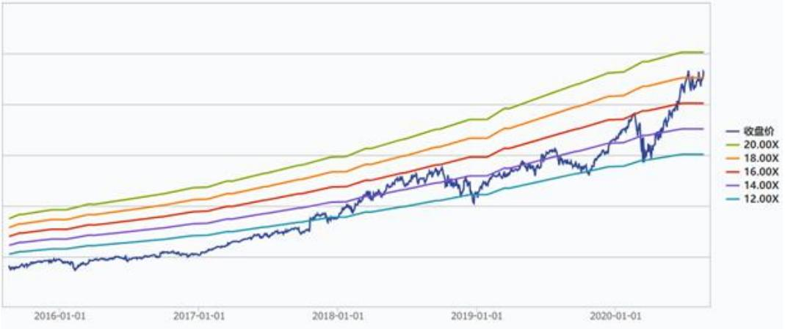  
图 31：以 Adobe 为例，当前 PS(ttm)水平超过 18X，处于历史高位  
资料来源：Wind，Adobe 年报，申万宏源研究

考虑广联达云转型已过深水区，2020-2022 年收入增长主要来自非货币化客户开始收费、云预收款逐渐平滑（转云收入），实际增长的确定性极高。同时，考虑广联达A 股稀缺性极强，产品化程度高（造价产品毛利率高达 $9 7 \%$ 左右）、产品市占率极高（造价产品实际市占率超过 $80 \%$ )，可以给予一定估值的溢价。公司 2022 年收入64.79 亿元，若给予整体 20X PS，则对应 2022 年目标市值为 1296 亿元。

但是，考虑收入结构中仍有大量非云收入（纯 SaaS 收入约 $40 \%$ )，同时，造价和施工业务成长性不同，参照海外云计算公司估值方式的整体 PS 法仍需进一步讨论。考虑广联达造价业务稳态经营性现金流入 50 亿确定性高，但成长放缓；施工业务仍是低渗透率、高成长性业务；创新业务短期仍处于高投入阶段，三大核心业务板块特征不同，分部估值法是长期目标市值更合理的估值方式。同时，考虑2020-2021 年广联达仍处于转型期，现金流与收入仍处于错配状态（部分当期收到现金计入预收账款)，因此，考虑以2022 年财务数据为基础进行估值讨论。

预计 2022 年公司造价收入 40 亿元，参考可比公司，给予 15X PS 估值。由于当前云计算技术仍在迭代期，相关公司研发仍处于投入期，并且云计算产品公司粘性极强，产品成功后，收入成长性极高，估值方式上 PS 比 PE 更能体现云计算公司价值。考虑广联达 A股云计算领军行业地位与 B2B2C 商业模式、造价软件高市占率特点，取 A 股可比公司用友网络（云计算行业领军之一）、金山办公（云计算行业领军之一，典型 B2B2C 商业模式）、恒生电子（云计算行业领军之一、典型 B2B2C 商业模式、金融IT 行业高市占率）。下表可见产品型云计算公司长期卡位优势明显，可享受估值溢价，可比公司 2022 年平均 PS 为18.5 倍。基于谨慎性原则，给予广联达 2022 年 15X PS 估值，则对应造价业务估值为 600亿元。

表21：产品型云计算公司长期卡位优势明显，可享受估值溢（单位：亿元）  

<table><tr><td rowspan="2">公司代码</td><td rowspan="2">公司名称</td><td rowspan="2">总市值 (2020年8月20日)</td><td colspan="3">收入</td><td colspan="3">PS估值</td></tr><tr><td>2020E</td><td>2021E</td><td>2022E</td><td>2020E</td><td>2021E</td><td>2022E</td></tr><tr><td>600588.SH</td><td>用友网络</td><td>1,397</td><td>100</td><td>120</td><td>147</td><td>14.0</td><td>11.6</td><td>9.5</td></tr><tr><td>688111.SH</td><td>金山办公</td><td>1,618</td><td>25</td><td>38</td><td>53</td><td>64.7</td><td>42.6</td><td>30.5</td></tr><tr><td>600570.SH</td><td>恒生电子</td><td>1,056</td><td>47</td><td>56</td><td>68</td><td>22.5</td><td>18.9</td><td>15.5</td></tr><tr><td>平均</td><td></td><td></td><td></td><td></td><td></td><td>33.7</td><td>24.4</td><td>18.5</td></tr></table>

资料来源：申万宏源研究注：盈利预测数据取Wind 一致预期

公司施工业务与创新业务当前均未实现盈利，采用 PS 估值方式。其中，公司施工 2022年达到20亿元，施工行业信息化干亿市场，行业空间大，当前渗透率低；创新业务预计2022 年收入 4.49 亿元。由于施工业务和创新业务目前仍未盈利，选择 PS 估值方式。创新业务实际与施工共用底层图形技术，与施工业务关联度高，并且均未盈利，可以整体估值。由于施工信息化目前全球范围内没有相似业务上市公司，无法从业务属性角度找到可比公司。但考虑1）业务未盈利，2）施工图形技术国产替代需求，3）业务低渗透率、高成长性三大特点，选择可比公司寒武纪(未盈利，AI 芯片国产替代，ASIC 低渗透率、高成长性），奇安信(未盈利，信息安全国产化属性，大安全业务高增长)。可比公司 2022 年平均 PS为 42.8 倍，给予谨慎性原则，分别给予广联达施工和创新业务 2022 年 20X PS 估值，则施工业务目标市值为 400亿元、创新业务 89.8亿元。

表 22：国产替代逻辑下，低渗透、高成长性业务可享受估值溢价（单位：亿元）  

<table><tr><td rowspan="2">公司代码</td><td rowspan="2">公司名称</td><td rowspan="2">总市值 (2020年8月20日)</td><td colspan="3">收入</td><td colspan="3">PS估值</td></tr><tr><td>2020E</td><td>2021E</td><td>2022E</td><td>2020E</td><td>2021E</td><td>2022E</td></tr><tr><td>688256.SH</td><td>寒武纪-U</td><td>806</td><td>6</td><td>9</td><td>12</td><td>134.4</td><td>89.6</td><td>67.2</td></tr><tr><td>688111.SH</td><td>奇安信-U</td><td>1,618</td><td>45</td><td>64</td><td>88</td><td>35.9</td><td>25.3</td><td>18.4</td></tr><tr><td>平均</td><td></td><td></td><td></td><td></td><td></td><td>85.2</td><td>57.5</td><td>42.8</td></tr></table>

资料来源：申万宏源研究注：盈利预测数据取Wind 一致预期

综上，分部估值法得出公司 2022 年目标市值为1089.8 亿元。

表 23：分部估值法得出公司 2022 年目标市值为 1089.8 亿元（单位：亿元）  

<table><tr><td>业务</td><td>2022 年收入</td><td>估值方式</td><td>估值</td><td>目标市值</td></tr><tr><td>造价</td><td>40</td><td>PS</td><td>15×</td><td>600</td></tr><tr><td>施工</td><td>20</td><td>PS</td><td>20X</td><td>400</td></tr><tr><td>创新</td><td>4.49</td><td>PS</td><td>20X</td><td>89.8 1089.8</td></tr><tr><td>合计</td><td colspan="4"></td></tr></table>

资料来源：申万宏源研究

# 5.3风险提示

公司在造价软件领域已拥有绝对市占率，产品形态完整，产品线风险可控。在施工产品领域，仍存在产品、竞争格局、下游景气度不确定性。

当前广联达施工产品已经拥有一批标杆案例，但是标杆案例主要集中在一级资质建筑上，标杆案例在特级资质建筑商（较一级资质建筑商要求更高，规模更大）实际销售推广中的作用大小仍有不确定性。

施工信息化产品竞争格局仍然有不确定性，传统造价转型施工供应商即有广联达、品茗、斯维尔等，同时也有管理软件产商从企业级 ERP 向施工流程产品渗透，施工信息化产业加速后，若出现激烈的杀价竞争，将导致施工产品毛利率下滑。

广联达下游客户以建筑商为主，建筑行业新开工率仍然影响施工信息化整体景气度。当前施工信息化渗透率极低，成长驱动力来自渗透率提升。但如果发生宏观经济系统性风险，建筑行业新开工率大幅下滑，仍可能影响公司施工产品长期成长。

# 财务摘要

合并损益表  

<table><tr><td>百万元</td><td>2018</td><td>2019</td><td>2020E</td><td>2021E</td><td>2022E</td></tr><tr><td>营业总收入</td><td>2,904</td><td>3,541</td><td>4,351</td><td>5,412</td><td>6,479</td></tr><tr><td>营业收入</td><td>2,862</td><td>3,464</td><td>4,222</td><td>5,245</td><td>6,262</td></tr><tr><td>营业总成本</td><td>2,609</td><td>3,346</td><td>3,963</td><td>4,710</td><td>5,548</td></tr><tr><td>营业成本</td><td>188</td><td>371</td><td>438</td><td>549</td><td>675</td></tr><tr><td>税金及附加</td><td>45</td><td>43</td><td>53</td><td>66</td><td>79</td></tr><tr><td>销售费用</td><td>793</td><td>1,102</td><td>1,278</td><td>1,489</td><td>1,716</td></tr><tr><td>管理费用</td><td>765</td><td>820</td><td>948</td><td>1,106</td><td>1,270</td></tr><tr><td>研发费用</td><td>727</td><td>969</td><td>1,222</td><td>1,483</td><td>1,792</td></tr><tr><td>财务费用</td><td>35</td><td>41</td><td>24</td><td>18</td><td>17</td></tr><tr><td>其他收益</td><td>167</td><td>102</td><td>147</td><td>139</td><td>129</td></tr><tr><td>投资收益</td><td>22</td><td>23</td><td>22</td><td>22</td><td>22</td></tr><tr><td>净敞口套期收益</td><td>0</td><td>0</td><td>0</td><td>0</td><td>0</td></tr><tr><td>公允价值变动收益</td><td>0</td><td>0</td><td>0</td><td>0</td><td>0</td></tr><tr><td>信用减值损失</td><td>0</td><td>-24</td><td>0</td><td>0</td><td>0</td></tr><tr><td>资产减值损失</td><td>-56</td><td>-6</td><td>0</td><td>0</td><td>0</td></tr><tr><td>资产处置收益</td><td>0</td><td>0</td><td>0</td><td>0</td><td>0</td></tr><tr><td>营业利润</td><td>485</td><td>290</td><td>556</td><td>863</td><td>1,082</td></tr><tr><td>营业外收支</td><td>-3</td><td>-7</td><td>2</td><td>-8</td><td>-11</td></tr><tr><td>利润总额</td><td>482</td><td>284</td><td>558</td><td>855</td><td>1,071</td></tr><tr><td>所得税</td><td>49</td><td>29</td><td>60</td><td>93</td><td>117</td></tr><tr><td>净利润</td><td>433</td><td>255</td><td>498</td><td>762</td><td>954</td></tr><tr><td>少数股东损益</td><td>-6</td><td>20</td><td>38</td><td>58</td><td>73</td></tr><tr><td>归母净利润</td><td>439</td><td>235</td><td>460</td><td>703</td><td>881</td></tr></table>

资料来源：wind，申万宏源研究

合并现金流量表  

<table><tr><td>百万元</td><td>2018</td><td></td><td>20192020E2021E2022E</td><td></td><td></td></tr><tr><td>净利润</td><td>433</td><td>255</td><td>498</td><td>761</td><td>954</td></tr><tr><td>加：折旧摊销减值</td><td>130</td><td>135</td><td>62</td><td>67</td><td>75</td></tr><tr><td>财务费用</td><td>49</td><td>65</td><td>24</td><td>18</td><td>17</td></tr><tr><td>非经营损失</td><td>-26</td><td>-30</td><td>-15</td><td>-24</td><td>-23</td></tr><tr><td>营运资本变动</td><td>-148</td><td>159</td><td>212</td><td>293</td><td>355</td></tr><tr><td>其它</td><td>15</td><td>57</td><td>-220</td><td>85</td><td>17</td></tr><tr><td>经营活动现金流</td><td>453</td><td>641</td><td>560</td><td>1,200</td><td>1,394</td></tr><tr><td>资本开支</td><td>202</td><td>242</td><td>126</td><td>185</td><td>178</td></tr><tr><td>其它投资现金流</td><td>185</td><td>15</td><td>31</td><td>-36</td><td>57</td></tr><tr><td>投资活动现金流</td><td>-18</td><td>-227</td><td>-95</td><td>-221</td><td>-121</td></tr><tr><td>吸收投资</td><td>106</td><td>23</td><td>2,772</td><td>0</td><td>0</td></tr><tr><td>负债净变化</td><td>144</td><td>-112</td><td>-488</td><td>20</td><td>21</td></tr><tr><td>支付股利、利息</td><td>332</td><td>301</td><td>259</td><td>478</td><td>719</td></tr><tr><td>其它融资现金流</td><td>0</td><td>0</td><td>0</td><td>0</td><td>0</td></tr><tr><td>融资活动现金流</td><td>-82</td><td>-390</td><td>2,025</td><td>-458</td><td>-698</td></tr><tr><td>净现金流</td><td>374</td><td>19</td><td>2,490</td><td>522</td><td>575</td></tr></table>

资料来源：wind，申万宏源研究

合并资产负债表  

<table><tr><td>百万元</td><td>2018</td><td>2019</td><td>2020E</td><td>2021E</td><td>2022E</td></tr><tr><td>流动资产</td><td>2,770</td><td>2,950</td><td>5,737</td><td>6,356</td><td>7,095</td></tr><tr><td>现金及等价物</td><td>2,212</td><td>2,231</td><td>4,721</td><td>5,242</td><td>5,818</td></tr><tr><td>应收款项</td><td>341</td><td>676</td><td>749</td><td>925</td><td>1,098</td></tr><tr><td>存货净额</td><td>9</td><td>21</td><td>25</td><td>32</td><td>39</td></tr><tr><td>合同资产</td><td>0</td><td>0</td><td>0</td><td>0</td><td>0</td></tr><tr><td>其他流动资产</td><td>208</td><td>22</td><td>242</td><td>157</td><td>140</td></tr><tr><td>长期投资</td><td>407</td><td>538</td><td>697</td><td>674</td><td>637</td></tr></table>

<table><tr><td>固定资产</td><td>822</td><td>860</td><td>927</td><td>1,044</td><td>1,147</td></tr><tr><td>无形资产及其他资产</td><td>1,606</td><td>1,819</td><td>1,642</td><td>1,725</td><td>1,728</td></tr><tr><td>资产总计</td><td>5,606</td><td>6,167</td><td>9,003</td><td>9,799</td><td>10,607</td></tr><tr><td>流动负债</td><td>1,329</td><td>2,809</td><td>2,609</td><td>3,104</td><td>3,660</td></tr><tr><td>短期借款</td><td>200</td><td>1,089</td><td>600</td><td>620</td><td>640</td></tr><tr><td>应付款项</td><td>989</td><td>1,585</td><td>1,873</td><td>2,348</td><td>2,884</td></tr><tr><td>其它流动负债</td><td>140</td><td>136</td><td>136</td><td>136</td><td>136</td></tr><tr><td>非流动负债</td><td>994</td><td>9</td><td>10</td><td>10</td><td>11</td></tr><tr><td>负债合计</td><td>2,324</td><td>2,818</td><td>2,619</td><td>3,114</td><td>3,671</td></tr><tr><td>股本</td><td>1,127</td><td>1,129</td><td>1,184</td><td>1,184</td><td>1,184</td></tr><tr><td>其他权益工具</td><td>0</td><td>0</td><td>0</td><td>0</td><td>0</td></tr><tr><td>资本公积</td><td>365</td><td>432</td><td>3,149</td><td>3,149</td><td>3,149</td></tr><tr><td>其他综合收益</td><td>1</td><td>-1</td><td>-1</td><td>-1</td><td>-1</td></tr><tr><td>盈余公积</td><td>343</td><td>366</td><td>410</td><td>478</td><td>564</td></tr><tr><td>未分配利润</td><td>1,357</td><td>1,344</td><td>1,524</td><td>1,699</td><td>1,791</td></tr><tr><td>少数股东权益</td><td>90</td><td>80</td><td>118</td><td>176</td><td>249</td></tr><tr><td>股东权益</td><td>3,282</td><td>3,349</td><td>6,384</td><td>6,685</td><td>6,936</td></tr><tr><td>负债和股东权益合计</td><td>5,606</td><td>6,167</td><td>9,003</td><td>9,799</td><td>10,607</td></tr></table>

资料来源：wind，申万宏源研究

重要财务指标  

<table><tr><td></td><td>2018</td><td>2019</td><td>2020E</td><td>2021E</td><td>2022E</td></tr><tr><td>每股指标(元)</td><td>-</td><td>-</td><td>-</td><td>-</td><td>-</td></tr><tr><td>每股收益</td><td>0.39</td><td>0.21</td><td>0.39</td><td>0.59</td><td>0.74</td></tr><tr><td>每股经营现金流</td><td>0.40</td><td>0.57</td><td>0.47</td><td>1.01</td><td>1.18</td></tr><tr><td>每股红利</td><td>-</td><td>-</td><td>0.20</td><td>0.39</td><td>0.59</td></tr><tr><td>每股净资产</td><td>2.82</td><td>2.89</td><td>5.29</td><td>5.50</td><td>5.65</td></tr><tr><td>关键运营指标(%)</td><td>-</td><td>-</td><td>-</td><td>-</td><td>-</td></tr><tr><td>ROIC</td><td>22.9</td><td>15.1</td><td>28.6</td><td>47.5</td><td>70.7</td></tr><tr><td>ROE</td><td>13.8</td><td>7.2</td><td>7.3</td><td>10.8</td><td>13.2</td></tr><tr><td>毛利率</td><td>93.4</td><td>89.3</td><td>89.6</td><td>89.5</td><td>89.2</td></tr><tr><td>EBITDA Margin</td><td>20.3</td><td>12.2</td><td>14.8</td><td>17.4</td><td>17.9</td></tr><tr><td>EBIT Margin</td><td>17.8</td><td>9.2</td><td>13.4</td><td>16.1</td><td>16.8</td></tr><tr><td>营业总收入同比增长</td><td>23.2</td><td>21.9</td><td>22.9</td><td>24.4</td><td>19.7</td></tr><tr><td>归母净利润同比增长</td><td>-7.0</td><td>-46.5</td><td>95.7</td><td>52.8</td><td>25.3</td></tr><tr><td>资产负债率</td><td>41.5</td><td>45.7</td><td>29.1</td><td>31.8</td><td>34.6</td></tr><tr><td>净资产周转率</td><td>0.90</td><td>1.06</td><td>0.67</td><td>0.81</td><td>0.94</td></tr><tr><td>总资产周转率</td><td>0.51</td><td>0.56</td><td>0.47</td><td>0.54</td><td>0.59</td></tr><tr><td>有效税率</td><td>10.7</td><td>11.2</td><td>11.2</td><td>11.2</td><td>11.2</td></tr><tr><td>股息率</td><td>-</td><td>-</td><td>0.3</td><td>0.6</td><td>0.9</td></tr><tr><td>估值指标(倍)</td><td>-</td><td>-</td><td>-</td><td>-</td><td>-</td></tr><tr><td>P/E</td><td>170</td><td>317</td><td>169</td><td>112</td><td>89</td></tr><tr><td>P/B</td><td>23.4</td><td>22.8</td><td>12.5</td><td>12.0</td><td>11.7</td></tr><tr><td>EV/Sale</td><td>25.3</td><td>20.7</td><td>16.1</td><td>12.9</td><td>10.7</td></tr><tr><td>EV/EBITDA</td><td>124.5</td><td>170.3</td><td>108.9</td><td>74.3</td><td>59.6</td></tr><tr><td>股本</td><td>1,127</td><td>1,129</td><td>1,184</td><td>1,184</td><td>1,184</td></tr></table>

资料来源：wind，申万宏源研究

# 信息披露

# 证券分析师承诺

本报告署名分析师具有中国证券业协会授予的证券投资咨询执业资格并注册为证券分析师，以勤勉的职业态度、专业审慎的研究方法，使用合法合规的信息，独立、客观地出具本报告，并对本报告的内容和观点负责。本人不曾因，不因，也将不会因本报告中的具体推荐意见或观点而直接或间接收到任何形式的补偿。

# 与公司有关的信息披露

本公司隶属于申万宏源证券有限公司。本公司经中国证券监督管理委员会核准，取得证券投资咨询业务许可。本公司关联机构在法律许可情况下可能持有或交易本报告提到的投资标的，还可能为或争取为这些标的提供投资银行服务。本公司在知晓范围内依法合规地履行披露义务。客户可通过 complince@swsresearch.com 索取有关披露资料或登录 www.swsresearch.com 信息披露栏目查询从业人员资质情况、静默期安排及其他有关的信息披露。

# 机构销售团队联系人

华东 陈陶 021-23297221 chentao1@swhysc.com 华北 李丹 010-66500631 lidan4@swhysc.com 华南 陈左茜 755-23832751 chenzuoxi@swhysc.com 海外 朱凡 021-23297573 zhufan@swhysc.com

# 股票投资评级说明

证券的投资评级：

以报告日后的 6 个月内，证券相对于市场基准指数的涨跌幅为标准，定义如下：买入(Buy） ”：相对强于市场表现 $20 \%$ 以上；  
增持(Outperform) ：相对强于市场表现 $5 \% \sim 2 0 \%$ ;  
中性(Neutral) ：相对市场表现在- $5 \%sim + 5 \%$ 之间波动；  
减持 (Underperform) ：相对弱于市场表现 $5 \%$ 以下。

行业的投资评级：

以报告日后的 6 个月内，行业相对于市场基准指数的涨跌幅为标准，定义如下：

看好(Overweight ) ：行业超越整体市场表现；  
中性(Neutral) ：行业与整体市场表现基本持平；  
看淡(Underweight) ：行业弱于整体市场表现。

我们在此提醒您，不同证券研究机构采用不同的评级术语及评级标准。我们采用的是相对评级体系，表示投资的相对比重建议；投资者买入或者卖出证券的决定取决于个人的实际情况，比如当前的持仓结构以及其他需要考虑的因素。投资者应阅读整篇报告，以获取比较完整的观点与信息，不应仅仅依靠投资评级来推断结论。申银万国使用自己的行业分类体系，如果您对我们的行业分类有兴趣，可以向我们的销售员索取。

本报告采用的基准指数 ：沪深300指数

# 法律声明

本报告仅供上海申银万国证券研究所有限公司（以下简称“本公司”）的客户使用。本公司不会因接收人收到本报告而视其为客户。客户应当认识到有关本报告的短信提示、电话推荐等只是研究观点的简要沟通，需以本公司 htp://wwW.SWsresearch.com 网站刊载的完整报告为准，本公司并接受客户的后续问询。本报告首页列示的联系人，除非另有说明，仅作为本公司就本报告与客户的联络人，承担联络工作，不从事任何证券投资咨询服务业务。

本报告是基于已公开信息撰写，但本公司不保证该等信息的准确性或完整性。本报告所载的资料、工具、意见及推测只提供给客户作参考之用，并非作为或被视为出售或购买证券或其他投资标的的邀请或向人作出邀请。本报告所载的资料、意见及推测仅反映本公司于发布本报告当日的判断，本报告所指的证券或投资标的的价格、价值及投资收入可能会波动。在不同时期，本公司可发出与本报告所载资料、意见及推测不一致的报告。

客户应当考虑到本公司可能存在可能影响本报告客观性的利益冲突，不应视本报告为作出投资决策的惟一因素。客户应自主作出投资决策并自行承担投资风险。本公司特别提示,本公司不会与任何客户以任何形式分享证券投资收益或分担证券投资损失，任何形式的分享证券投资收益或者分担证券投资损失的书面或口头承诺均为无效。本报告中所指的投资及服务可能不适合个别客户，不构成客户私人咨询建议。本公司未确保本报告充分考虑到个别客户特殊的投资目标、财务状况或需要。本公司建议客户应考虑本报告的任何意见或建议是否符合其特定状况，以及（若有必要）咨询独立投资顾问。在任何情况下，本报告中的信息或所表述的意见并不构成对任何人的投资建议。在任何情况下，本公司不对任何人因使用本报告中的任何内容所引致的任何损失负任何责任。市场有风险，投资需谨慎。若本报告的接收人非本公司的客户，应在基于本报告作出任何投资决定或就本报告要求任何解释前咨询独立投资顾问。

本报告的版权归本公司所有，属于非公开资料。本公司对本报告保留一切权利。除非另有书面显示，否则本报告中的所有材料的版权均属本公司。未经本公司事先书面授权，本报告的任何部分均不得以任何方式制作任何形式的拷贝、复印件或复制品，或再次分发给任何其他人，或以任何侵犯本公司版权的其他方式使用。所有本报告中使用的商标、服务标记及标记均为本公司的商标、服务标记及标记。