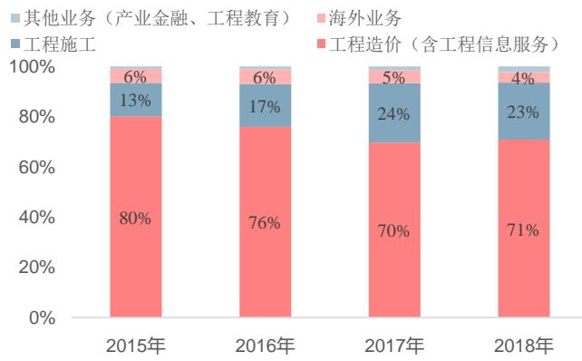

证券研究报告·上市公司深度

# 广联达深度报告：云图已现，决胜蓝海

# 广联达(002410)

# 海外启示：集成化或标准化是全球 BIM 发展趋势

通过研究美国、英国、欧洲、日本的 BIM 发展历史，可发现政策推动、标准制定、建筑 IT厂商推动是海外 BIM 发展的重要助推力。同时 BIM 软件协作是行业发展的刚需，目前英美以 BIM 设计为核心、开放 API 的方案为主，欧洲与日本以统一数据格式，建立 IFC标准或设立联盟的方案为主。从数字化设计软件龙头 Autodesk在 BIM 领域约 20 年的发展历史来看，建模型—用模型、设计—工程建设全生命周期、软件—硬件 $^ +$ 物联网 $^ +$ 大数据、本地部署—云端迁移是国外 BIM 龙头企业的发展路线。Autodesk 于 2002 年通过收购三维设计软件公司 Revit 开启 BIM 市场战略之路，并逐步放弃将 CAD 产品线“BIM 化”的思路，而将二者融合发展，通过 OpenAPI 实现各软件的交互与协同共享。于 2007 年将 BIM 应用延伸至施工和运维管理阶段，2014 年正式提出云转型战略发展。

# 国内发展：BIM 进入 3.0 阶段，广联达打造“平台 $+$ 组件”有望领跑行业

2018 年开始，国内工程建筑各类参与方开始意识到通过 BIM 进行项目全过程应用的重要性。2011 年以来住建部颁布多项政策纲领推动建筑信息化，2014 年至今已有 30 个省/市/自治区出台相关政策，乃至给予补贴/税收优惠以激励 BIM 应用。国家级 BIM六大标准只剩最后一部（存储标准）处于报批中状态，预计即将实施，我国 BIM 标准体系已基本建成。

广联达于 2009 年开始 BIM 研究，2014 年正式发布 BIM5D 平台产品，通过 BIM 建造 $+$ 智慧工地 $^ +$ 数字企业产品，打造了岗位级-项目级-企业级一体化应用体系。历经 2018 年的部门整合与 2019年发布的数字项目管理平台后，公司将组织架构、渠道与产品进行了深度整合，以“平台 $^ +$ 组件”模式组合销售，打通数据并集成至平台统一汇总建模，利于增强客户粘性且未来可延伸更多增值服务。国内竞争对手受企业规模、地域限制及资金约束等因素影响，主要从特定细分环节、或单点的应用挖掘起步，相较而言广联达的平台化产品更具竞争优势。

造价业务：2020 年转云收官将至，云造价年收入 $\mathtt { 3 0 ^ { \sim } 5 0 }$ 亿元可期广联达 2015 年开始落地云产品，分区域阶段实现造价云转型，转型区域第一年转化率为 $4 0 \% \sim 5 0 \%$ ，到了第二年基本实现在$8 0 \% \sim 8 5 \%$ ，节奏非常顺利，预计 2020 年后将基本完成转型。

维持买入

石泽蕤  
shizerui@csc.com.cn  
18616092669  
执业证书编号：S1440517030001  
吴桐  
wutongbj@csc.com.cn  
18621710821  
执业证书编号：S1440519120001  
发布日期： 2020 年 01 月 10 日  
当前股价： 35.93 元

主要数据  

<table><tr><td colspan="2">股票价格绝对/相对市场表现 (%)</td></tr><tr><td>1个月 3个月</td><td>12个月</td></tr><tr><td>7.9/1.71 2.34/-3.48</td><td>63.31/41.67</td></tr><tr><td>12月最高/最低价（元）</td><td>39.09/22.14</td></tr><tr><td>总股本（万股）</td><td>112,755.19</td></tr><tr><td>流通A股（万股）</td><td>89,078.52</td></tr><tr><td>总市值（亿元）</td><td>405.13</td></tr><tr><td>流通市值（亿元）</td><td>320.06</td></tr><tr><td>近3月日均成交量（万）</td><td>793.28</td></tr><tr><td>主要股东</td><td></td></tr><tr><td>刁志中</td><td>17.3%</td></tr></table>

  
股价表现

相关研究报告

2016 年以来公司销售费用率持续下降，预收账款节节攀升，从还原后收入增速来看，2019 年开始公司收入已显著脱离周期波动。我们测算未来增量用户转化后年订阅费将达到 33 亿元，考虑增值服务带来的 ARPU 值提升订阅费有望达到 42 亿元。

# 公司估值与推荐：

（1）造价业务：假设按照账号购买率增加付费用户数 $4 0 \%$ 、盗版用户转化 $3 0 \%$ 计算，同时考虑以工程信息服务为主的服务提升云计价订阅费 200 元，估算出 2021 年公司云造价订阅年收入约 34.7 亿元。参考 Autodesk 及Adobe 转型成熟期的估值，给予广联达 12 倍 PS，并以 $9 . 4 \%$ 的 WACC 折现，得出 2019-2021 年造价业务估值分别约 348 亿元、381 亿元、412 亿元；（2）施工业务：结合公司发展预期假设 2019-2021 年施工业务收入增速分别为 $3 0 \%$ 、 $4 5 \%$ 、 $4 5 \%$ ，净利率分别为 $8 . 2 \% . 1 4 . 2 \%$ 、 $1 9 . 8 \%$ ，2018-2021 年收入三年复合增长率约 $4 0 \%$ ，假定 2019-2021年分别按照 $1 . 2 / 1 . 2 / 1 . 1$ 的 PEG 给予估值，则得出 2019-2021 年公司施工业务估值分别约 36 亿元、94 亿元、158 亿元。综上，测算广联达 2019-2021 年总估值分别为 384 亿元、475 亿元、570 亿元，给予“买入”评级。

# 风险提示：

1、宏观经济波动对公司主营业务产生影响的风险；2、剩余转型区域云转型进度不达预期的风险；3、施工业务整合后销售不达预期的风险；4、下游客户对 BIM 产品接受程度及进度不达预期的风险。

# 目录

广联达：致力于成为全球领先的数字建筑全生命周期平台服务商.. 2  
建筑行业亟需数字化转型升级，潜在市场空间近千亿元规模. . 2  
纵横 $^ +$ 海内外扩展整合，先发布局分享市场红利. .. 4  
国内BIM产业发展提速，施工产品平台化整合具备竞争优势 ... 6  
BIM是工程建筑信息化的重要载体... ... 6  
海外BIM快速发展，集成化或标准化是全球发展趋势.. .... 8  
国内 BIM 走向 3.0 阶段，政策、标准、软件供应商叠加推动行业发展 .11  
“平台 $^ +$ 组件”覆盖全应用解决方案，公司施工业务有望实现高增长.. .... 15  
云造价快速渗透，有效平滑经济周期，ARPU 值提升可期.. ..... 20  
软件产品受制于经济波动，转云后平滑周期效果显著.. .......................................... ..... 20  
2020年转云收官将至，云造价产品年收入有望达到30\~50 亿元.. ............................................ .. 22  
盈利预测与估值.. . 25  
风险提示... .. 30

# 广联达：致力于成为全球领先的数字建筑全生命周期平台服务商

# 建筑行业亟需数字化转型升级，潜在市场空间近千亿元规模

内外因叠加，建筑行业亟需通过数字化转型升级。2018年我国建筑业总产值约23.5万亿元，同比增长 $9 . 9 \%$ ，自 2014 年以来增速已然放缓。作为拉动经济增长的重要抓手之一，未来建筑业有望保持较稳定增长。建筑行业受个人消费升级、劳动力人口红利减弱、资源环境约束、技术革新驱动的因素影响，对信息化的潜在需求提升。同时，纵观建筑业整体利润率低下（产值利润率不到 $4 \%$ ），因项目工期拖延、人力物资浪费、安全事故索赔等因素，建筑业整体研发投入不足（研发支出占比低于 $1 \%$ ）反应了信息化渗透率较低，产业亟需通过数字化转型拉动收益率提升。

# 消费升级拉动

# 环境要求推动

# 技术革新驱动

# 产业发展倒逼

人们92%时间都会在建筑空间中生活工作随着社会的发展与科技的进步，人们的消费结构、消费品质和消费逻辑都在升级，对建筑的需求也在转变和提升建筑不仅仅能夠满足基本使用需求，更加追求居住和使用的品质。从标准的房子到追求定制化和个性化。“拎包入住”的需求不断增强。

全球总能耗 $50 \%$ 属於建筑能耗  
我国建筑活动污染占全部污染的40%左右，建筑业碳排放占全国总排放 $5 0 \%$   
我国建筑运营能耗占社会能耗47%，既有建筑95%以上是高耗能建筑  
2016年3月5日《政  
府工作报告》提出  
今后五年，单位国内生产总值用水量、能耗、二氧化碳排放量分别下降 $23 \%$ $1 5 \%$ $1 8 \%$ 消费互联网成熟应用和产业互联网蓬勃兴起，创造了良好的产业发展环境  
科技发展驱动，  
BIM+云、大、物、移、智的发展与成熟数字技术不断渗透入并影响社会生活各个领域和产业各个领域新产业生态体系正在孕育建筑业整体利润仅为1%-3%，远低于其他产业  
建筑业整体研发投入不到 $1 \%$ ，严重不足  
有近20%项目超进度，近80%项目超投资  
中国新生代工人从事建筑业的仅有 $9 . 8 \%$   
是上一代工人的1/32017年2月21日，国务院印发《关于促进建筑业持续健康发展的意见》

建筑业信息化水平全行业靠后，国内具有极大发展空间。全球角度来看，根据麦肯锡的《ImaginingConstruction’s Digital Future》报告，全球建筑行业信息化水平位列倒数第二，仅优于农业屠宰业，信息化投入占总营收比例不到 $1 \%$ ；国内层面，根据麦肯锡报告数据，我国建筑行业数字化水平在全行业最后一名，与 GDP占比排名第 7 显著不匹配；国内外对比角度，根据中国建筑业信息化高峰论坛数据，国际建筑业信息化率平均数为 $0 . 3 \%$ ，而我国仅为 $0 . 0 3 \%$ ，二者相差十倍。

  
图表2： 我国建筑业信息化水平在全行业最后，与 GDP 占比不匹配  
资料来源：麦肯锡(2017年），中信建投证券研究发展部

建筑信息化市场空间约 840亿元，降本增效提高安全性是行业主要需求。建筑财税之家数据显示，我国建筑工程项目成本中，材料费与人工费占比最高，分别占 $50 \%$ 与 $2 5 \%$ ，其他如人员工资、税金及附加等其他费用占比 $1 9 . 5 \%$ ，利润空间仅剩 $5 . 5 \%$ ，较多成本费用产生于人员/材料的浪费、工程进度的拖延、工程质量与安全管理方面，催生企业对信息化的需求。根据住建部汇总的 6552 个特、一级资质建筑企业（占总企业数的 $7 \%$ ）2019H1的经营数据，其总产值 5.83 万亿元，占全国建筑业总产值（10.16 万亿元）的 $5 7 \%$ ；其新签工程承包合同额为7.12 万亿元，占全国（12.03 万亿元）的 $59 \%$ 。按全国新开工项目数 70 万个计算，假设其中信息化需求高的项目占比与特、一级资质建筑企业合同占比一致（约 $60 \%$ ），则潜在有 42 万个项目信息化需求，以平均每个项目20 万元计算，得出建筑信息化潜在市场空间约 840 亿元。

  
图表3： 我国建筑工程成本中，材料与人工费占比 $7 5 \%$   
资料来源：建筑财税之家，中信建投证券研究发展部

  
图表4： 2014\~2017 年全国施工项目数  
资料来源：国家统计局，中信建投证券研究发展部

# 纵横 $^ +$ 海内外扩展整合，先发布局分享市场红利

纵横 $^ +$ 海内外扩展整合战略，致力于成为全球领先的数字建筑全生命周期平台服务商。广联达于 1998 年成立于北京，2010 年在中小板上市。公司深耕建筑信息化领域 20 多年，为建筑行业的建设方、设计单位、造价咨询单位、施工方及政府相关部门提供软件产品与服务，主营从单一的预算软件产品逐渐发展为包含工程造价、施工、海外、产业金融、工程教育等系列在内的上百种产品，同时向海外市场积极拓展，2016 年实现海外业务收入超过 1 亿元。根据住建部有关数据，我国共有工程造价咨询企业 8139 家（2018 年）、勘察设计单位 24754家（2017 年）、工程招标代理机构 6209 家（2017 年）、房屋建筑建设工程监理企业 6394 家（2017 年）、有施工活动的建筑业企业 92733 个（2019H1）。广联达通过覆盖中国全境、美国、芬兰、英国、新加坡、香港、马来西亚等地的 60 余家分子公司辐射，目前服务的企业客户数已超过 18 万家。

  
图表5： 广联达纵横 $^ +$ 海内外扩张战略  
资料来源：公司公告，中信建投证券研究发展部

2006\~2018年，公司营业总收入从 1.2 亿元提升至 29亿元，复合增速高达 $3 0 \%$ ，归母净利润从 0.18亿元增至 4.39 亿元。作为典型的产品化 IT 公司，毛利率始终维持在 $9 0 \%$ 以上。2015 年，由于房建及国内宏观经济下行，导致公司营收增速显著放缓，受下游需求影响收入与利润大幅下滑。公司开始大力加码云造价业务，于 2017年以后成效显著，叠加施工业务产品线丰富及国内数字建筑的需求增长，收入增速重回上升通道。

  
图表6： 2006\~2018 年公司营收复合增速约 $3 0 \%$   
资料来源：Wind，中信建投证券研究发展部

  
图表7： 公司归母净利润质量较高，与经营性净现金流基本匹配  
资料来源：Wind，中信建投证券研究发展部

基于对建筑工程项目全生命周期的产品布局，公司持续打磨并延展产品，打造了涵盖从建筑设计、交易采购、劳务管理到施工、运维及产业金融的全周期产品线。工程造价与施工业务构成公司大部分收入，2018 年公司工程造价（含工程信息服务）业务收入约 20.6 亿元，占比 $71 \%$ ，工程施工业务收入约 6.6 亿元，占比 $23 \%$ 。其他业务包括产业金融、工程教育收入约 0.7 亿元，海外业务收入约 1.23 亿元。公司维持高比例的研发投入，$2 0 1 3 ^ { \sim } 2 0 1 8$ 年研发支出从 2.8 亿元增至 8 亿元，研发支出占收入比例近两年保持在 $2 8 \%$ 左右，在北京、上海、西安、美国硅谷和芬兰设有研发中心，支撑企业长久创新发展，巩固龙头地位。

  
图表8： 2015\~2018 年公司各业务收入变化（单位：亿元）  
资料来源：Wind，中信建投证券研究发展部

  
图表9： 公司营收以工程造价与工程施工为主  
资料来源：Wind，中信建投证券研究发展部

# 上市A 股公司深度报告

  
图表10： 公司保持高比例的研发投入  
资料来源：Wind，中信建投证券研究发展部

  
图表11： 公司致力于成为建筑项目全生命周期平台服务商  
资料来源：公司公告，中信建投证券研究发展部

# 国内 BIM 产业发展提速，施工产品平台化整合具备竞争优势

# BIM 是工程建筑信息化的重要载体

BIM（Building Information Modeling）技术是一种应用于工程设计、建造、管理的数据化工具，通过对建筑的数据化、信息化模型整合，在项目全生命周期中进行共享和传递，其对人员、材料、进度、质量、安全等项目因素的管理起到关键作用。可视化、协调性、模拟性、优化性和可出图性是 BIM 的五个基本特性。根据美国国家 BIM 标准（NBIMS）的定义，BIM 由三部分组成：（1）设施（建设项目）物理和功能特性的数字化信息；（2）共享的知识资源，分享相关信息，为从建设到拆除的全生命周期中的所有决策提供可靠依据；（3）在项目不同阶段，不同利益相关方通过在 BIM 中插入、提取、更新、修改信息，以支持各自职责协同作业。

BIM 技术可以实现设计阶段的协同、施工阶段的建造全过程一体化、运营阶段对建筑物的智能化维护和管理，更重要的是，BIM 能打破从业主到设计、施工、运营之间的隔阂，实现对建筑的全生命周期管理。借鉴美国“BIM 技术的 25 种常见的应用”，国内现状下 BIM 技术在规划、设计、施工与运营阶段有如下典型应用，基本囊括建筑工程全生命周期。

图表12： BIM 在建筑工程全周期的主要应用  

<table><tr><td>阶段</td><td>BIM应用</td><td>功能</td></tr><tr><td rowspan="4">规划 阶段</td><td>投资估算</td><td>通过BIM系统在方案阶段可获得较准确的土建工程量及造价，可用于不同方案对比，快速得出 成本变动情况，权衡优劣，大大减轻造价工程师的计算工作量，使其将更多时间投入到施工方 案、评估风险等更有价值的工作中</td></tr><tr><td>现状模型</td><td>将现状图纸导入BIM软件中，创建构件的变化起伏、用地红线、道路红线，生成面积指标</td></tr><tr><td>总图规划</td><td>在现状模型基础上构建体量模型，做好总图、道路交通、绿地景观、管线综合等规划</td></tr><tr><td>环境评估</td><td>基于BIM模型数据和相关气候分析，评估日照、风、热、声、交通等环境影响</td></tr><tr><td rowspan="5">设计 阶段</td><td>设计方案论证/可视化</td><td>通过BIM三维模型可视化展示获得用户和业主的反馈，促成决策</td></tr><tr><td>设计创作</td><td>BIM 中各个2D/3D 构件元素数据都是相互关联、实时互动的，修改参数方便智能，输出的各类 图纸保持一致</td></tr><tr><td>协同设计</td><td>不同专业、身处异地的设计人员通过网络在同一BIM模型上协同设计，保证后期施工顺利进行</td></tr><tr><td>性能化分析</td><td>BIM 模型包含各类数据，可通过IFC 等交换格式输入到相关分析软件，如节能/采光/通风等评估</td></tr><tr><td>工程量统计</td><td>BIM 模型的构件与成本库关联，设计师变更时，成本估算实时更新，大大简化工程量统计工作</td></tr><tr><td rowspan="5">施工 阶段</td><td>碰撞综合协调</td><td>施工开始前利用BIM 模型可视化对各个专业设计进行空间协调，如发现碰撞及时调整，避免施 工中发生碰撞、重新安装</td></tr><tr><td>施工方案分析</td><td>利用BIM参数化、可视化，对节点进行施工流程、结构拆解、配套工具等角度的分析模拟，以 期降低成本、缩短工期、减少错误</td></tr><tr><td>数字化建造</td><td>BIM模型的构件信息均以数字化形式存储，为数字化建造提供必要条件</td></tr><tr><td>施工科学管理</td><td>通过BIM与3D 激光扫描、RFID、互联网等技术集成，对现场构件、设备及施工进度和质量实 时跟踪；通过BIM与管理信息系统集成，支持造价、采购、库存、财务等动态管理，减少库存 开支，促进工程项目各参与方与施工方的沟通；竣工时生成模型和文件，便于后续运营管理</td></tr><tr><td>竣工模型交付与维护</td><td>施工方竣工后将调整后的BIM 模型交给业主，其中包含了施工过程记录、材料使用、设备调试、</td></tr><tr><td rowspan="4">运营 阶段</td><td></td><td>建筑物空间信息等各种资料，据此合理制定运营维护计划</td></tr><tr><td>资产管理</td><td>通过BIM建立维护工作历时记录，实现对设施设备跟踪、提前预判、故障记录等过程化管理 将 BIM 模型以 IFC 等交换格式导入灾害模拟分析软件，制定防灾措施与应急预案；灾害发生时，</td></tr><tr><td>防灾模拟</td><td>以BIM可视化形式辅助救灾</td></tr><tr><td>空间管理</td><td>合理安排、处理各类空间变更需求，记录空间使用、出租、退租情况，实现空间全过程管理</td></tr></table>

资料来源：築龍BIM，中信建投证券研究发展部

  
资料来源：BIM项目实施计划指南，中信建投证券研究发展部

# 海外 BIM 快速发展，集成化或标准化是全球发展趋势

政策推动、标准制定、建筑软件商推动是海外 BIM 发展的重要助推力。美国 BIM发展较早，早在 2003 年，负责联邦设施建造运营的美国总部署（GSA）的下属公共建筑服务部门便推出全国 3D-4D-BIM 计划，要求 2007年起，所有大型项目（招标级别）都需要应用 BIM。2006 年，为美国军队提供项目和施工管理的美国陆军工程兵团（USACE）发布为期 15 年的 BIM 发展路线规划，要求 2012 年前所有项目招标公告、发包、提交中必须使用 BIM 标准。2007 年，BIM 标准项目委员会开始制定发布 NBIMS 的系列标准。2012 年美国工程建设行业的BIM使用比率已达到 $7 1 \%$ ；相似的，英国政府及相关部门在 $2 0 0 9 { \sim } 2 0 1 1$ 年间也陆续出台政策强制要求使用BIM、颁布相应标准，2019 年英国 BIM 技术渗透率达到 $6 9 \%$ （NBS 抽样调查）。丹麦、挪威、芬兰、荷兰等欧洲国家政府同样制定 BIM 相关政策方针，引导或强制项目使用。ArchiCAD、Tekla、MagicCAD 等全球主流建筑信息化厂商先行推动技术互用性和开放标准（IFC）。

图表14： 国外 BIM 的历史推进情况  

<table><tr><td>国家</td><td>时间</td><td>BIM 推进情况</td><td>BIM应用进展</td></tr><tr><td rowspan="3">美国</td><td>2003年～ GSA</td><td>1、2003年开始负责联邦设施建造运营的美国总部署（GSA）的下属 公共建筑服务部门推出全国3D-4D-BIM计划，目标为所有对技术管 兴趣的项目团队提供一站式服务； 2、GSA要求2007年起，所有大型项目（招标级别）都需要应用BIM，</td><td rowspan="3">美国工程建设行业采用BIM 的比例从 2007 年的28%快速 增长至2012年的71%，其中</td></tr><tr><td>2006年~ USACE</td><td>至少应用于空间规划验证、最终概念展示；对采用BIM的GSA项目 给予相应资金支持 1、2006.10，为美国军队提供项目和施工管理的美国陆军工程兵团 小企业的渗透率达49%；在承 （USACE）发布为期15 年的BIM发展路线规划，要求2012 年前所 包商、建筑师、机电工程师中 有项目招标公告、发包、提交中必须使用BIM标准； 渗透率分别为74%、70%、67% 2、2010 年 USACE 发布适用于军事建筑项目基于 Autodesk 和 Bentley</td></tr><tr><td>2007年~</td><td>平台的BIM实施计划 BIM标准项目委员会开始制定发布NBIMS的系列标准 1、政策强制：2011.5，内阁发布“政府建设战略”，要求2016年全</td></tr><tr><td>英国</td><td>2011年~</td><td>面协同使用3D·BIM，所有文件都要应用信息化管理，强制要求国 家的公共建筑使用BIM 模型；2013 年底以前，关于BIM的法律、保在被调查对象中，69%采用了 险、商务等方面条款制定要基本完成； 2、标准推进：2009~2011 年，英国建筑业BIM标准委员会陆续颁布 相关标准，为企业从CAD 过渡到BIM提供切实可行的方案和程序； 3、设计公司的自身优势：由于伦敦是众多全球领先设计企业的总部 或欧洲总部，在BIM实施方面走在前列 1、软件商推动：欧洲是主要的建筑信息化软件厂商所在地，如 ArchiCAD、Tekla、Solibri、MagicCAD，是全球最先一批基于BIM</td><td>根据NBS调查报告，2019年 BIM技术，其中15%在所有项 目上使用了BIM、26%在三个 以上项目上使用了BIM；56% 的小企也已开始使用BIM 2010年，法国BIM在建筑师 事务所、结构师/MEP事务所、</td></tr><tr><td></td><td></td><td>2、气候需求：由于北欧国家冬天漫长多雪，建筑预制化尤为重要， 促进了BIM技术发展； 3、丹麦、挪威（2010年）、芬兰（2007年）、荷兰（2011年）等欧 洲国家政府制定BIM相关政策方针，引导/强制项目使用BIM。 2009 年是日本BIM元年，大量设计公司、施工企业开始用BIM。为</td><td>承包商的使用率分别为40%、 44%、29%；德国BIM对应使 用率分别为43%、33%、24% BIM认知度从2007年的30%</td></tr><tr><td>日本</td><td>2009年～</td><td>了将BIM多个软件相互配合、保证数据集成，多家BIM软件商在IAI 日本分会的支持下，成立日本国产BIM软件解决方案联盟</td><td>提升至2010年的76%，仅7% 的业主要求施工企业用BIM， 企业应用更多源于自身需求</td></tr></table>

资料来源：造价通等，中信建投证券研究发展部

工程建筑行业涉及的流程众多，诸如土木、建筑/结构设计与分析、招投标、预算、采购、仿真、施工等，且各流程内亦存在较大差异，因此 BIM 软件协作是行业发展刚需——完美的情况是让各专业流程使用统一的三维模型、各专业软件无损地读入和写出该三维数据模型。为达成协作共享的目的，常见两种解决方案：（1）以BIM 设计软件为核心，其它类软件通过数据格式或开放 API 与其建立联系；（2）建立统一的建筑数据格式，以支撑建筑全生命周期的信息，软件间交流均通过该格式转换，最常用的是 IFC（Industry Foundation Classes，国际工业基础类标准）格式。目前 IFC 尚在发展中，软件间的沟通（多软件兼容）、模型间的沟通（碰撞检查）、人与人的沟通（审阅批注）是行业面临的三大难题。

目前英美以 BIM 设计为核心、开放 API 的方案为主，欧洲与日本以统一数据格式，建立 IFC 标准或设立联盟的方案为主。英美以“集成信息路线”为代表，如 Autodesk 的 Revit 系列产品、Bentley 的 MicroStation 系列产品，通过集成自研及外购的细分领域产品，以及开放的 API 策略，针对各类工种和专业提供不同的解决方案，打造协同共享的产品；欧洲以“信息串联路线”为代表，如 ArchiCAD、MagicCAD、Tekla 等通过 IFC 文件格式实现“OpenBIM”，支持各类软件间的开放协作；日本则通过成立“技术联盟”的方式，多家日本 BIM软件商在 IAI 日本分会的支持下，成立日本国产解决方案软件联盟“J-BIM”，实现多软件数据相互配合与集成；目前国内尚未成立一套数据标准，国内主要的 BIM 平台厂商（如广联达、鸿业）推出了 BIM 平台，以期推动行业发展。

  
图表15： 开放与集成是国内外 BIM 发展的主线  
资料来源：BIM吉清，中信建投证券研究发展部

Autodesk 成立于 1982 年，打造了核心产品计算机辅助设计软件 AutoCAD，成为全球最大的数字化设计软件公司。2002 年，Autodesk 收购了三维设计软件公司 Revit，真正开启在 AEC（Architecture, Engineering &Construction，建筑、工程和施工行业）领域的 BIM 市场战略之路，通过自研与收购的方式不断丰富其 BIM 产品线，并逐步放弃将 CAD 产品线“BIM 化”的思路，而将二者融合发展。Revit 逐渐成为支持设计、协作、共享的平台型 BIM 产品，通过 Open API 实现与其他软件的交互、功能的添加完善与协同共享。2007 年，Autodesk完成收购 NavisWorks，推动 BIM 应用从设计（建模）阶段进入施工（用模）阶段。而 FMDesktop 产品通过读取由 Revit 发布的 DWF 文件，在不丢失重要数据、用户无需了解 Revit 产品的情况下，自动识别、发布与传送数据，生成专用建筑设施报告，将 BIM 应用延伸至运维管理阶段。2009 年开始，Autodesk 将大量研发与投资倾注云计算与移动互联网领域，于 2011 年推出 Autodesk Cloud，后续几年陆续发布 BIM360、Fusion360 等云产品，及第三方开发平台 Forge。2014 年，Autodesk 正式提出云转型战略，并于 2016 年 8 月停止所有套装软件License 销售，向订阅收费模式转变。从 Autodesk 在 BIM 领域约 20 年的发展历史来看，建模型—用模型、设计—工程建设全生命周期、软件—硬件 $^ +$ 物联网 $^ +$ 大数据、本地部署—云端迁移是国外 BIM 龙头企业的发展路线。借助自研与收并购方式，将 BIM 结合物联网、云计算等融合至建筑工程全流程应用，从优势的设计领域延伸至工程建筑数字化管理。

  
图表16： Autodesk 主要发展历史：融合 BIM 结合云转型

资料来源：Autodesk公司公告、官网，中信建投证券研究发展部

  
图表17： Autodesk 提供的 BIM 平台与解决方案  
资料来源：流程牵引，中信建投证券研究发展部

# 国内 BIM 走向 3.0 阶段，政策、标准、软件供应商叠加推动行业发展

BIM 可覆盖规划—设计—施工—运维全周期，国内发展分为三个阶段：（1）初期（2013 年之前）以规划设计应用为主，工程设计行业迎来从 CAD 走向 BIM 的三维革命，设计院应用 BIM 软件进行三维建模，但此时BIM 多应用三维功能性展示，技术与应用尚不支持直接利用三维设计和施工作业；（2）2013 年施工企业开始考虑采用 BIM 辅助项目建造与施工管理，但与设计和运维环节的联动较弱；（3）到了 2018 年，业主与建筑方开始通过 BIM 进行建筑全过程应用，与设计、施工、运维延伸融合。

  
图表18： BIM 发展阶段：设计--施工--建筑全过程  
资料来源：公司公告，中信建投证券研究发展部

国家层面，住建部自 2011 年起推动建筑业信息化发展，颁布出台多项政策纲领。2011 年发布《2011\~2015年建筑业信息化发展纲要》，首次将 BIM 纳入信息化标准建设内容，要求施工企业开展相关研究并在施工阶段应用 BIM 技术；2015 年发布《关于推进建筑信息模型应用的指导意见》，目标“到 2020 年末，建筑行业甲级勘察、设计单位及特级、一级房屋建筑工程施工企业应掌握并实现 BIM 与企业管理系统和其他信息技术的一体化集成应用”，“到 2020 年末，以国有资金投资为主的大中型建筑、申报绿色建筑的公共建筑和绿色生态示范小区的新立项项目勘察设计、施工、运营维护中，集成应用 BIM 的项目比率达到 $9 0 \%$ ”；2016 年发布《2016\~2020年建筑业信息化发展纲要》，BIM 成为“十三五”建筑业重点推广的五大信息技术之首。同时，地方政府层面，北京市与上海市在 2014 年先行推出行业标准与发展目标，目前从公开资料中可整理出 30个省市/自治区政府出台 BIM 相关激励政策，其中多个政府给予补贴/税收优惠以激励 BIM 应用。

图表19： 各省市地方政府纷纷推出政策鼓励 BIM 发展（统计共 30 个省市/自治区，按政策发布时间由早到晚顺序）  

<table><tr><td>发布时间</td><td>省份</td><td>政策要点/目标</td></tr><tr><td>2014.5</td><td>北京市</td><td>提出BIM 的资源要求、模型深度要求、交付要求是在BIM 的实施过程规范民用建筑BIM设计 的基本内容，该标准于2014年9月1日正式实施</td></tr><tr><td>2014.10.29</td><td>上海市</td><td>到2017年，规模以上政府投资工程全部应用BIM技术、社会投资工程普遍应用BIM技术</td></tr><tr><td>2016.5.26</td><td>云南省</td><td>2020 年末建筑行业全面掌握BIM 技术，国有资金投资BIM 项目比率达到 90%</td></tr><tr><td>2017.1.1</td><td>贵州省</td><td>到2019 年底，80%以上贵州省甲级建筑工程企业掌握并实现BIM一体化集成应用；2020年底 应全部掌握并实现，国有资金投资BIM项目比率达到90%</td></tr><tr><td>2017.1.1</td><td>辽宁省</td><td>到2020年底形成完善BIM应用市场，2021年进入全面推进阶段</td></tr><tr><td>2017.6.26.</td><td>江西省</td><td>2020 年末，国有资金大中型建筑新立项项目集成应用BIM达到 90%；形成完善的BIM 技术应 用推进的政策和较为成熟的市场</td></tr><tr><td>2017.7.4</td><td>河南省</td><td>2017 年末，初步建立基础设施工程建设领域BIM 技术应用的标准框架体系；甲级及以上机构基 本具备BIM技术应用能力</td></tr><tr><td>2017.9.28</td><td>湖北省</td><td>2018 年末，初步建立基础设施工程建设领域BIM 技术应用的标准框架体系；甲级及以上机构基 本具备BIM技术应用能力</td></tr><tr><td>2017.12.5</td><td>青海省</td><td>推行BIM技术应用，提高建筑产业信息化水平，推进智慧城市建设</td></tr><tr><td>2017.12.6</td><td>甘肃省</td><td>2020年省内甲级BIM出图率不低于30%，乙级不低于15%，大型公共建筑达到100%</td></tr></table>

<table><tr><td colspan="3"></td></tr><tr><td>2017.12.26</td><td>安徽省</td><td>指导和规范我省工程建设项目全生命周期建筑信息模型（BIM）技术应用，推进建筑业信息化 和建筑产业现代化</td></tr><tr><td>2017.12.29</td><td>福建省</td><td>促进建筑业持续健康发展、大力发展装配式建筑等相关工作要求，加快推进建筑信息模型（BIM） 技术在工程项目全过程的集成应用</td></tr><tr><td>2018.1.3</td><td>内蒙古自治区</td><td>2018年3月底之前各盟市上报本辖区甲级设计单位BIM技术应用项目名单;6月底之前完成事中 监督检查、10月底之前完成BIM 技术应用项目施工图审查、11月底前完成BIM 技术应用总结</td></tr><tr><td>2018.6.7</td><td>河北省</td><td>引导城市轨道交通工程BIM 应用及数字化交付，提高信息应用效率，提升城市轨道交通工程建 设信息化水平，制定本指南</td></tr><tr><td>2018.6.11</td><td>陕西省</td><td>推动城市轨道交通工程BIM应用，提升城市轨道交通工程质量安全管理水平</td></tr><tr><td>2018.7.2</td><td>宁夏回族自治区</td><td>推动城市轨道交通BIM的应用，提升城市轨道交通工程质量安全管理水平 力争在 2020 年末建筑、市级甲级设计单位以及以上施工企业全面掌握并实施 BIM 技术一体化集</td></tr><tr><td>2018.10.25</td><td>江苏省</td><td>成应用，国有资金投资公共建筑比率达到 90%</td></tr><tr><td>2018.11.13</td><td>黑龙江省</td><td>解决我省老旧小区改造工作中的实际困难，指导多层住宅加装电梯规范设计，确保加装电梯的 质量与安全</td></tr><tr><td>2019.1.31</td><td>广西壮族自治区</td><td>加强组织领导，完善工作机制；加大政策扶持；加强对试点项目推进力度；加强BIM 技术人才 队伍建设</td></tr><tr><td>2019.2.3</td><td>天津市</td><td>在2020年末建筑、市级甲级设计单位以及以上施工企业全面掌握并实施BIM技术一体化集成应 用，国有资金投资公共建筑比率达到 90%</td></tr><tr><td>2019.3.28</td><td>重庆市</td><td>积极组织辖区内工程项目做好BIM技术应用示范申报和实施工作，启动实施1~2个BIM技术应 用示范项目</td></tr><tr><td>2019.4.17 2019.5.6</td><td>北京市 吉林省</td><td>BIM 应用示范工程实施单位应在规定期限结束后3 个月内提交验收申请 建立吉林省房屋建筑和市政基础设施工程BIM 技术施工应用评标专家库</td></tr><tr><td></td><td>山东省</td><td>2020 年末，建立完善BIM技术的政策法规和标准体系；甲级及以上施工企业基本实现BIM-</td></tr><tr><td>2019.5.13</td><td></td><td>体化集成应用</td></tr><tr><td>2019.5.27</td><td>浙江省</td><td>申报技术开发研究的项目，应围绕住房城乡建设科技高质量发展的重点技术领域 批准《城市轨道交通建筑信息模型（BIM）建模与交付标准》为广东省地方标准，编号为DBJ/T</td></tr><tr><td>2019.8.5</td><td>广东省</td><td>15-160-2019。本标准自2019年11月1日起实施</td></tr><tr><td>2019.8.21</td><td>新疆维吾尔族自治区</td><td>推动城市轨道交通BIM 的应用，提升城市轨道交通工程质量安全管理水平 2020 年末，建立完善BIM 技术的政策法规和标准体系；甲级及以上施工企业基本实现BIM一</td></tr><tr><td>2019.8.22</td><td>湖南省</td><td>体化集成应用</td></tr><tr><td>2019.9.9</td><td>山西省</td><td>建筑信息模型（BIM）技术应用的模型细度、应用阶段、模型交付要求应符合国家和山西省发布 的有关建筑信息模型应用规范与标准</td></tr><tr><td>2019.9.11</td><td>四川省</td><td>促进建筑业信息化、城镇化同步发展，加快推进BIM技术在规划、勘察、设计、施工与城市管 理集成应用</td></tr><tr><td>2019.10.23</td><td>海南省</td><td>BIM技术相关政策、BIM技术专业知识、应用BIM技术开展电子招投标规定等内容</td></tr></table>

资料来源：中信建投证券研究发展部门，各政府官网

国家级 BIM 六大标准即将全部实施，推动 BIM 应用新高度。2016 年底，住建部批注《建筑信息模型应用统一标准》，其成为我国首部国家级 BIM 应用标准。截止目前，国家建筑业 BIM 六大标准已发布五项，第六项《建筑工程信息模型存储标准》的征求意见稿已出台，预计后续即将实施。从海外的发展经验来看，行业标准是 BIM 发展的重要推动力，我国 BIM 标准体系已基本建成，以 BIM 为基础的工程项目流程协同、不同系统间

的基础对接将变得更加可行，推动行业发展。

图表20： 国家 BIM 标准编制及实施进展  

<table><tr><td>标准名称</td><td>领编单位</td><td>发布时间</td><td>状态进度</td><td>实施时间</td></tr><tr><td>《建筑信息模型应用统一标准》</td><td>中国建筑科学研究院</td><td>2016.12</td><td>已实施</td><td>2017.7</td></tr><tr><td>《建筑信息模型施工应用标准》</td><td>中国建筑工程总公司</td><td>2017.5</td><td>已实施</td><td>2018.1</td></tr><tr><td>《建筑信息模型分类和编码标准》</td><td>中国建筑标准设计研究院</td><td>2017.11</td><td>已实施</td><td>2018.5</td></tr><tr><td>《建筑信息模型设计交付标准》</td><td>中国建筑标准设计研究院</td><td>2018.12</td><td>已实施</td><td>2019.6</td></tr><tr><td>《建筑工程设计信息模型制图标准》</td><td>中国建筑标准设计研究院</td><td>2018.12</td><td>已实施</td><td>2019.6</td></tr><tr><td>《建筑信息模型存储标准》</td><td>中国建筑科学研究院</td><td>即将发布</td><td>报批中</td><td></td></tr></table>

资料来源：住建部官网，中信建投证券研究发展部

从国内BIM市场争格局来看，设计领域主要被国外基础软件供应商垄断，如Autodesk的AutoCAD、Revit，Graphisoft 的 ArchiCAD 等，国内设计软件可基于国外基础软件做二次开发应用；BIM 应用软件基于基础软件提供的模型数据，开展涵盖造价、施工中各类场景应用，国内有众多软件厂商参与；管理平台软件市场参与者较少，需涵盖工程建筑各流程领域，提供岗位级至项目级、企业级管理平台化发展，广联达具有一定先发优势。

图表21： 国内 BIM 市场竞争格局  

<table><tr><td>分类</td><td>定义</td><td>竞争格局</td><td>代表厂商</td></tr><tr><td>基础软件 （设计）</td><td>可被多个应用软件所用的基础建模软件， 包括图形平台软件、建筑设计软件、结构主要被国外软件厂商垄断 设计软件、设备设计软件等</td><td></td><td>Revit；Benteley的基础设施设计软件、 Graphisoft 的 ArchiCAD等； 近年国内厂商如北京天正、北京理正、 探索者、盈建科、北京构力等</td></tr><tr><td>应用软件 （施工运维）</td><td>利用基础软件所提供的模型数据，开展各 这一类软件通常基于某一类型 种应用型工作的软件，包括土建算量、安 装算量、安全计算软件、能耗分析软件、 碰撞测试软件、施工进度策划等</td><td>均有大量产品应用，国内企业的斯维尔、上海红瓦信息科技等 主要竞争位于该领域</td><td>基础软件的应用化开发，国内外主要厂家有广联达、品茗、鸿业科技、</td></tr><tr><td>管理平台软 件</td><td>能对各类基础软件、应用软件数据及施工 项目进行有效管理，用以支持建筑全生命 周期数据的共享应用的软件。通常呈现为 项目级、企业级管理平台</td><td></td><td>国内主要厂家有广联达（BIM5D）、品 茗（智慧工地云平台）等</td></tr><tr><td>智慧工地产 品</td><td>除涉及施工现场信息化管理以外，还涉及 劳务管理、安全施工监控设备、绿色施工 监控设备、物料管理等</td><td>设备供应商较多；能同时提供具 备自主知识产权的嵌入式产品 并进行系统架设的企业较少</td><td>设备供应商：如海康威视、飞瑞斯科技、 成都鑫泰科技等； 软硬一体嵌入式产品供应商：主要为广</td></tr><tr><td>BIM咨询公 司</td><td>以咨询服务的方式助力BIM在施工项目 中的应用</td><td>国内项目各参与方信息化专业 人员缺乏，对咨询公司有需求</td><td>联达、品茗股份 典型代表厂商如鲁班软件</td></tr></table>

资料来源：品茗股份公司公告，中信建投证券研究发展部

# “平台 $^ +$ 组件”覆盖全应用解决方案，公司施工业务有望实现高增长

研发布局施工业务十余年，整合产品线平台化发展。广联达2009年开始BIM研究，2014年正式发布BIM5D产品，单点型岗位级应用获得的数据被打通并集成至 BIM5D 平台。2015 年 BIM5D开始全面推广，陆续应用到全球千余项目中，明星级项目如北京新机场、上海世博会博物馆等，打造了岗位级-项目级-企业级 BIM 应用体系。基于 BIM、物联网、云计算技术应用，公司打造了 BIM 与智慧工地相结合的一体化数字项目管理平台。

图表22： 广联达 BIM 建造 $^ +$ 智慧工地产品线发展历史  

<table><tr><td rowspan="2">报告期/业务线</td><td colspan="3">工程施工类总业务</td></tr><tr><td>普通施工类1产品发布</td><td>BIM建造业务²产品发布</td><td>智慧工地业务产品发布</td></tr><tr><td rowspan="3">2009</td><td>造价管理集成应用系统 2.0</td><td></td><td></td></tr><tr><td>5D施工项目管理系统5.0</td><td></td><td></td></tr><tr><td>企业级施工项目管理系统5.0</td><td></td><td></td></tr><tr><td>2010</td><td colspan="3">挖孔桩工程计算软件</td></tr><tr><td>2011</td><td>钢筋施工翻样软件</td><td>钢筋精细管理软件</td><td></td></tr><tr><td>2012</td><td>材料管理软件</td><td></td><td></td></tr><tr><td rowspan="3">2013</td><td></td><td>施工图智能设计软件（V1.0)</td><td></td></tr><tr><td></td><td>钢筋精细管理软件(V2012)</td><td></td></tr><tr><td></td><td>钢筋变更算量软件(V2013)</td><td></td></tr><tr><td rowspan="2">2014</td><td>施工过程随手记、施工模架</td><td>广联达BIM5D软件 (V2.0)</td><td></td></tr><tr><td></td><td>BIM审图软件 (V3.0)</td><td></td></tr><tr><td>2015</td><td></td><td>BIM钢结构算量软件(V1.0)</td><td></td></tr><tr><td>2016</td><td></td><td>BIM+PM整体解决方案</td><td>智能安全帽应用平台</td></tr><tr><td>2017</td><td></td><td></td><td>工业级物联网平台“筑联”</td></tr><tr><td rowspan="2">2018</td><td></td><td>模架设计产品新版</td><td>新一代智慧工地平台</td></tr><tr><td></td><td>斑马进度</td><td></td></tr><tr><td>2019</td><td colspan="3">综合整合为数字项目管理（BIM+智慧工地）平台</td></tr><tr><td colspan="2">1.公司上市早期虽涉及BIM产品研发，但并未将施工类总业务进行分类； 2.BIM类产品逐渐占据施工类产品核心地位，公司在2014年后将其单独拆分出，分为BIM建造和智慧工地两类业务； *蓝色为整合后综合性类产品，“数字企业”是与BIM建造、智慧工地并列的产品，由于披露信息不多，未在此列</td><td></td><td></td></tr></table>

资料来源：公司公告，官网，中信建投证券研究发展部

施工业务独立而融合，打造一体化解决平台方案。广联达施工业务分为 BIM 建造、智慧工地、数字企业三大板块，其中 BIM 是底层核心的技术基础。BIM 建造与智慧工地天然相容，目前已综合整合为数字项目管理平台产品，覆盖工程项目流程。而项目级信息最终汇总至企业端，通过数字企业产品线上升至企业层面，支撑企业做出有效决策，三者融合促进建筑参与方对成本、进度、质量、安全的管控。

# 上市A 股公司深度报告

  
图表23： 广联达三大产品线纵深融汇关系  
资料来源：公司公告，中信建投证券研究发展部

  
图表24： 广联达三大产品线融合关系  
资料来源：公司公告，中信建投证券研究发展部

图表25： 广联达施工业务分为 BIM 建造、智慧工地、数字企业  

<table><tr><td>分类</td><td>主要产品</td><td>简要功能</td></tr><tr><td></td><td>BIM5D</td><td>可视化的BIM 协同管理平台。接口开放，兼容所有主流建模软件；实现可视化 5D 动态施工模 拟，关联进度、合同、成本、质量安全等信息，协助管理；甲方服务：自动统计工程数据，提 供各类信息图表展示、生成咨询月报；实现各方流程协作管理</td></tr><tr><td rowspan="9">BIM建造</td><td>BIMFACE</td><td>BIM 轻量化引擎。提供丰富的云端开放接口，客户可基于BIMFACE 进行功能扩展，开发BIM 应用；目前已有2000+BIM应用开发者、400万+文件</td></tr><tr><td>斑马进度</td><td>进度管理产品，帮助企业实时查看进度报表、各项目的总工期和关键节点工期提前之后情况。 帮助公司提前掌握风险，合理优化、调配公司资源</td></tr><tr><td>施工安全管理系统</td><td>搭建风险管控和隐患排查治理双体系平台。大数据+移动应用，主要功能为隐患排查与治理、危 险源管理、危大工程专项管控</td></tr><tr><td>BIM+技术管理系统</td><td>施工技术策划和执行管理系统。主要功能为图纸管理、技术方案编制与较低、构件跟踪三大模 块。通过BIM 可视化模拟施工方案可能出现的问题，降低项目实际成本；通过图纸问题的预警</td></tr><tr><td>BIM+VR虚拟安全体验 馆系统</td><td>管理，减少施工过程返工 安全意识水平教育培训工具，用虚拟现实场景让体验者提升生产安全意识水平。核心功能为身 份识别登录，教育报表生产和劳务信息管理</td></tr><tr><td>BIM+智慧工地数据决 策系统</td><td>现场业务和硬件设备集成的统一管理平台。主要核心功能有子应用数据统一呈现，关键指标可 视化，智能识别项目风险</td></tr><tr><td>BIM施工现场布置</td><td>工程项目场地策划及展示。软件利用BIM 模型快速输出各阶段的二维图、三维图、临建材料量 以及施工现场的航拍视频。并含有附注成本分析和生产管理等功能</td></tr><tr><td>BIM模板脚手架设计</td><td>供工程技术人员使用的设计工具。软件基于公司独立知识产权，给予工程技术人员快速智能化 的手脚架设计方案及模板支架排布方案</td></tr><tr><td>“筑联”物联网平台</td><td>工业级物联网云平台，基于云服务提供设备连接和数据处理能力。主要功能有简化工业联网设 备开发，提供物联网解决方案，和保障工业环境安全的和性能功能</td></tr><tr><td>智慧工地</td><td>智能安全帽 全预警、人员滞留、人员工效 协筑</td><td>工人佩戴装有智能芯片的安全帽，实现数据自动收集上传和语音安全提示。了解工人现场分布 和工作内容、个人考勤数据等，利于安排生产——核心为劳务实名、定位分布、无感考勤、安 工程项目多方协作云平台。通过提供虚拟的项目协作环境，连接工程项目中的人员、数据和流</td></tr></table>

<table><tr><td colspan="2">程，提供使用者信息沟通、项目图档的储存和分发共享、BIM的可视化交流的环境</td></tr><tr><td>物料验收管控系统</td><td>材料进出场环节管控系统。结合现场硬件，自动采集实时数据，利用云计算技术对数据整合并 进行智能分析。同时随时掌握现场情况，识别分析，帮助企业做可视化智能决策</td></tr><tr><td>劳务信息管理系统</td><td>评价和改善用工关系，结合穿戴设备提供实名登记、民进考勤，提供更准确有效的工人设置、 轨迹、停留时间、危险报警等信息</td></tr><tr><td rowspan="4">数字企业</td><td>企业BI数据决策平台</td><td>基于公有或私有云技术为客户提供数据信息的平台。软件通过开放业务数据接口获取数据，为 客户提供经营动态、进度管理和质量安全方面的信息，方便客户制作决策</td></tr><tr><td>协同运营</td><td>一体化协同运营管理平台。主要提供数字协同办公、智慧党务、物联网印章、企业任务管理、 督查督办管理、企业信息化综合治理</td></tr><tr><td>施工企业项目管理系统</td><td>企业项目管理平台。基于T6 技术平台，提供更顺畅的项目管理流程，业务绩效衡量和平台化的 能力转移渠道。主要功能有首页监控、物资管理、资金管理</td></tr><tr><td>集采电商</td><td>为采购方、供应商提供的采购平台。应用范围包括涉及从采购计划到采购合同生成结束的流程 覆盖和材料设备采购、工程分包招标、服务采购、机械设备采购的业务覆盖范围</td></tr></table>

资料来源：公司官网，中信建投证券研究发展部

（1）组织架构与产品渠道整合完毕，2019 年施工业务恢复快速增长通道。2018 年公司对施工业务进行整合，组织架构、渠道、产品均进行了较大调整，将原来各分子公司统一整合至一个组织体系下，受之影响 2018年工程施工业务收入增速下滑至 $1 8 \%$ 。2018 年的整合全面告一段落，2019 年公司施工业务重回快速增长通道，2019 年上半年同比增长 $3 3 \%$ 。

  
图表26： 2018 年整合完毕后，公司施工业务恢复较高速增长  
资料来源：Wind，中信建投证券研究发展部

（2）“平台 $^ +$ 组件”模式组合销售，打通数据增强客户粘性促发展。2019 年 6 月，公司发布数字项目管理（ $\mathbf { B I M + }$ 智慧工地）平台。基于一个理念（数字建筑理念）、一个平台（统一主数据、统一 BI、统一入口、统一技术标准和数据结构）、四大核心技术（BIM、IOT、AI、大数据核心技术）和 N 个应用（一套兼容应用，开箱即用，开放给客户和生态伙伴）为施工项目管理转型服务。通过现场系统和硬件设备统一集成到平台，实现数据统一汇总建模，提供平台化的应用，可覆盖 BIM 建造及智慧劳务、安全、物料、质量、生产、商务等多个业务场景。通过“平台 $^ +$ 组件”模式打通了项目级、岗位级的数据，积累建筑全生命周期数据后未来有望开展工程信息、产业征信、AI 智能组价等增值服务。

  
图表27： 2019 年，公司实现以“平台化 $^ +$ 模块化”架构推进 $\mathbf { B I M + }$ 智慧工地应用产品  
资料来源：公司公告，中信建投证券研究发展部

从国内主要竞争对手布局来看，受企业规模、地域限制及资金约束等因素影响，国内市场参与者主要从特定细分环节或单点的应用挖掘起步。品茗产品目前多为岗位级应用，基于 BIM 的云服务平台正在发展规划中；斯维尔主要提供针对 Revit 的 BIM 兼容软件，并开展从 BIM 到 CIM 的研究；鸿业产品为设计类居多，正在研发 BIM 协同云平台，致力于为客户提供多层级管理；建研信息主要提供各类行业/质量监测系统，专注于施工监测领域，目前尚未有对 BIM 和云的布局；探索者搭建了针对土建行业的私有云平台，提供适配私有云的 BIM设计协作管理、移动办公等。相较这些国内竞争者，广联达提供的平台化产品更具竞争优势；海外公司在国内的拓展，典型公司如 Autodesk（2018 年亚太地区收入 4.86 亿美元；在中国区有 668 名员工），以优势产品设计软件为基，通过自研与收购正打造覆盖工程项目全周期的 BIM 应用产品。目前 Autodesk 仍处在整合完善的阶段，同时通过开放 PaaS 平台“Forge”允许合作伙伴、第三方应用程序按需集成。根据投资者电话交流公告，Autodesk 在中国区的收入占比约 $3 \%$ ，且目前以设计类软件收入为主。

图表28： 广联达与其他竞争对手的施工产品比较  

<table><tr><td>公司</td><td>产品</td><td>用户</td><td>BIM布局</td><td>云产品布局</td><td>未来发展</td><td>相对优势</td></tr><tr><td>品茗股份</td><td>智慧工地产品：塔式 起重机/施工升降机 安全监控管理、扬尘 与噪音监测管理、VR 安全教育、工地人员 实名制管理及安全 巡检、工地大脑、工 地无线WiFi系统； BIM软件产品：工程</td><td>中建系统等建 筑施工企业、大 型设备租赁企 业</td><td>公司目前BIM产 品主要是岗位级 产品（类似于模 块化产品），如 HiBIM</td><td>目前没有云产 品，未来打算 建立基于BIM， 结合云计算、 大数据、物联 网等信息技术 的云服务平台</td><td>在完善岗位级工具软件研 发与布局的基础上，建立基 于BIM，结合云计算、大数 据、物联网等信息技术的云 服务平台，实现建筑行业产 业链各参与方之间在各阶 段、各环节的协同工作，将 产品应用范围逐渐提升至 项目级、企业级</td><td>具备规模、 品牌、管理、 技术等方面 优势，客户 类型、业务 分布、业务 机构较为均 衡，整体抗 风险能力较 强</td></tr></table>

<table><tr><td>计、安全计算、施工 策划、HiBIM 软件 （兼具翻模、优化设 计、算量等实用功 能，公司岗位级 BIM 核心产品之一) 项目管理电子沙盘 系统软件、材料力学 报实验室系统软 BIM5D 软件、BIM建 斯维尔 系统、智筑云平台 公司已有BIM 软件 包括铝巨人（鸿业铝 模BIM软件 2018）、 鸿业科技 鸿城平台 （BIM+GIS）、云族 360企业族库管理 系统。</td><td>软件、BIM钢筋算量 For Revit 软件、基 于BIM 的项目管理</td><td>市住宅工程管 理站、建信金 科。客户与合作</td><td>公司主要做兼容 Revit 的 BIM软 件计的模型可 略 直接算量</td><td>暂无发展云战 1）的研究，推动智慧城市 坛和比赛</td><td>的建设。主要方式是自身研 发或与各高校联合举办论</td></tr></table>

<table><tr><td></td><td>云平台、土建专业数 字化协同设计、数字 化审图、特种结构设 计系列软件</td><td>建、中建材、宝 钢建筑系统集 成有限公司、大 象建筑设计有 限公司等</td><td>基于BIM的建筑 工业化设计系 统、协同设计信 息化管理解决方 案等（BIM设计+ 协同管理)</td><td>制、土木工程 领域专业云， 提供适配私有 云的BIM 设计 协作管理、数 据集中管理、 移动办公、超</td><td>信息化服务平台”六大平 台；加强技术服务支持力度</td><td>步较早，针 对私有云平 台深入布局</td></tr><tr><td>Autodesk（中 国）</td><td>产品涉及AEC、MFG、 M&amp;E三大板块，其中 AEC产品线包括传 统设计、模型审阅、 BIM协同管理等</td><td>客户主要为各 省市设计院、中 铁、中建等大型 国企。项目主要 包括北京上海 及其他省市的 基建和商业项 目，如北京大兴 机场、上海世博 园等</td><td>目前主要有 Revit、BIM 360、 Assemble 、 BuildingConnec ted、PlanGrid, 涉及从设计-施 工-运维的全生 命周期 BIM化</td><td>目前 PaaS平 台软件为 Forge，允许合 作伙伴、第三 方应用程序按 需集成到自己 的系统中。建 筑板块的 SaaS 软件主要有 Revit、BIM 360等</td><td>未来方向主要是构建建筑 行业全周期的BIM化，以设 计优势为基础，将自身的 MFG 板块与AEC板块将结 合，通过收购和自研逐步拓 展到施工领域和整个周期 的项目管理</td><td>设计领域全 球第一，实 力雄厚，有 实力并购优 质标的</td></tr></table>

资料来源：各公司公告、官网，中信建投证券研究发展部

# 云造价快速渗透，有效平滑经济周期，ARPU值提升可期

# 软件产品受制于经济波动，转云后平滑周期效果显著

公司是造价软件市场的龙头，产品完全基于自主开发。2008 年公司市占率已达到 $5 0 \% { \sim } 5 5 \%$ ，预计当前市占率已提升至 $6 0 \%$ 以上，若将广联达盗版客户计入，估计公司市占率高达约 $8 0 \%$ 。行业内其它竞争对手如品茗、斯维尔、鸿业、建研、探索者等收入多为千万元\~3 亿元水平，净利润、现金流与研发投入有限，且大多公司的造价软件基于国外基础软件开发平台（如 Autodesk的 Revit）开发，竞争力较弱。

  
图表29： 广联达计件与算量软件市占率超过 $5 0 \%$ （2008 年数据）  
资料来源：零点前进策略造价软件行业研究数据库，中信建投证券研究发展部

图表30： 广联达与国内主要竞争者经营情况分析（数据取自 2018年年报，财务单位为亿元）  

<table><tr><td>公司</td><td>广联达</td><td>品茗股份</td><td>斯维尔</td><td>鸿业科技建研信息</td><td></td><td>探索者</td></tr><tr><td>成立时间</td><td>1998-8-13</td><td>2011-7-11</td><td>2000-5-22</td><td>1993-1-6</td><td>2007-4-4</td><td>1999-2-4</td></tr><tr><td>员工数量</td><td>6244人</td><td>729人</td><td>489人</td><td>348人</td><td>246人</td><td>149人</td></tr><tr><td>收入</td><td>29.04</td><td>2.22</td><td>1.28</td><td>1.01</td><td>0.79</td><td>0.55</td></tr><tr><td>研发支出</td><td>8.16</td><td>0.55</td><td>0.28</td><td>0.24</td><td>0.22</td><td>0.26</td></tr><tr><td rowspan="3">研发支出占 收入比 归母净利润 经营性净现</td><td>28.10%</td><td>24.77%</td><td>21.88%</td><td>23.76%</td><td>27.85%</td><td>47.27%</td></tr><tr><td>4.39</td><td>0.56</td><td>0.1</td><td>0.19</td><td>0.13</td><td>0.02</td></tr><tr><td>4.53</td><td>0.51</td><td>0.03</td><td>0.22</td><td>0.1</td><td>-0.02</td></tr><tr><td rowspan="3">金流 主要经营地 区 办公地址</td><td>全国性覆盖</td><td>华东</td><td>华南</td><td>华东+华 北</td><td>华中</td><td>未披露</td></tr><tr><td>北京</td><td>浙江杭州， 销售网络覆</td><td>广东深圳</td><td>河南洛阳</td><td>湖南长沙</td><td>北京</td></tr><tr><td></td><td>盖全国200 多个地级市</td><td></td><td></td><td></td><td></td></tr></table>

资料来源：Wind，各公司公告，中信建投证券研究发展部

传统造价软件与经济周期波动相关性较大，云造价产品显著平滑周期。根据住建部披露的数据，房屋新开工面积与工程造价咨询企业的营收密切相关，进而增加造价咨询企业对 IT 的采购需求，带动 IT 供应商收入增长。因此可看到，广联达收入增速与房屋新开工面积增速较为一致，而与造价咨询企业和造价员的数量关系不大。

  
图表31： 新开工面积—工程造价咨询企业营收---广联达收入传导  
资料来源：住建部，中信建投证券研究发展部

  
图表32： 造价员数量、造价咨询企业数量与新开工面积相关性不大  
资料来源：住建部，中信建投证券研究发展部

  
图表33： 广联达收入与房地产新开工面积相关性较大,转云后 2019 年开始显著脱离周期性  
资料来源：Wind，中信建投证券研究发展部

# 2020 年转云收官将至，云造价产品年收入有望达到 30\~50 亿元

云产品提高用户粘性，未来有望衍生更多增值服务。2015 年，广联达云计价产品投放市场，在云端提供概预算、结算阶段的数据编制、审核、积累、分析和挖掘再利用，通过历史数据积累可快速实现一键智能组价，提升工作效率；2018 年，云算量产品全国版本完成，解决土建概算、招投标预算、施工进度变更、竣工结算全过程各阶段的算量、提量、检查、审核、数据管理等全流程业务；工程信息服务是公司造价软件时代便布局的产品，包括广材助手、广材网、供采交易平台、采购联盟等，与云计价能够无缝结合紧密协同，提供企业数据服务。

  
图表34： 广联达云造价产品分为云计价、云算量和工程信息（可看为增值服务）  
资料来源：公司公告，中信建投证券研究发展部

# 云计价

# 云算量

# 工程信息

2015年进入市场，通过云+端架构实现计价全流程覆盖。产品主打云存储、云组价、云检查功能，通过历史数据积累快速实现一键智能组价，提高工作效率

主打“合快准易”四大价值，实现了云 $^ { \cdot + }$ 端的产品架构，通过云文档、云检查、云指标等功能在云端自由进行数据的管理、查看、审查等工作

与云计价更紧密的协同，支持造价业务SAAS和DAAS的结合

从岗位信息服务企业数据服务

2018年计划所有主要地区全部完成云计价升级换代

2018年云算量全国版本完成

转型节奏如期进行，2020 年实现“三八”目标确定性较高。云转型区域第一年转化率为 $4 0 \% \sim 5 0 \%$ ，到了第二年基本实现在 $8 0 \% \sim 8 5 \%$ ，节奏非常顺利。公司 2015 开始第一批地区（6 个省）开始推动云计价产品，到 2017年该地用户转化率已达到 $80 \%$ 。2018 年在第一批、第二批（5 个省）地区同时推出云算量产品，当年实现用户转化率 $50 \%$ ，到 2019 年达到 $80 \%$ 以上。截至目前，全国三批地区（共 21 个省）实现造价业务转型，2020 年有望顺利实现“三八”目标，即 $80 \%$ 的地区、 $80 \%$ 的客户（以活跃用户数为基）、 $80 \%$ 的续费率。

图表35： 广联达云转型分四大阶段，预计 2020 年是转型的收官之年  

<table><tr><td>批次</td><td>地区</td><td>2017前（6个地区)</td><td>2018（11个地区）</td><td>2019 (21个地区)</td><td>2020（&gt;21个地区)</td></tr><tr><td>第一批地区</td><td>黑龙江、潮林、云蘭</td><td>计价存量用户转化率</td><td>计价存量用户转化率 算量存量用户转化率 50%</td><td>计价算量存量用户转化率</td><td>计价算量存影用户转化率</td></tr><tr><td>第二批地区</td><td>重庆、广西、新疆、 辽宁、河南</td><td></td><td>计价存量用户转化率 40% 算量存量用户转化率 50%</td><td>计价算量存量用户转化率 80%</td><td>计价算量存量用户转化率 &gt;85%</td></tr><tr><td>第三批地区</td><td>北京、上海、广东、 青海</td><td></td><td></td><td>计价算量存量用户转化率</td><td>计价算量存影用户转化率</td></tr><tr><td>第四批地区</td><td>N个地区</td><td colspan="4">根据市场存量用户的规模和成熟度年进行评估调整</td></tr></table>

资料来源：公司公告，中信建投证券研究发展部

以企业客户账号渗透与盗版用户转化为首，叠加友商用户替换及工程信息等增值服务提升 ARPU 的共同推进，转型地区收入订阅收入快速增长。从转型区域历史来看，转型第一年由单价降低带来造价业务总收入相对下滑（预计下降 $1 0 \% \sim 3 0 \%$ ），但到了第二年开始便可实现快速增长。

  
图表36： 第一批、第二批转型地区收入均从第二年开始快速增长  
资料来源：公司公告，中信建投证券研究发展部

SaaS 的优势在广联达云造价产品上体现的淋漓尽致。（1）从客户角度：云产品价格的下降（预计是原来价格的三分之一）降低购买成本，License 软件停止更新还将激活潜在老版客户，而云端部署的产品几乎难以盗版也将促进盗版客户转化。同时，传统软件模式下一家企业购买软件的账号数低于实际使用人数，SaaS 化后云端后台可控制多人使用同一账号的情况，账号购买率将得以提升；（2）从公司自身角度：SaaS 化产品相较软件产品一定程度上降低了“粘着性”，若产品体验度不佳则很容易丢失客户，企业更有动力把产品打磨完善。另一方面，传统软件的更新升级周期被营销推广、客户需求周期拉长（预计 3-5 年），转云后用户无需为升级买单，而云端产品可实现频繁更新、快速迭代，进一步提升用户体验；（3）从经营利润角度：当越来越多的用户上云，无需投入大量销售推广产品，新客户开发、客户维护转至线上，销售更具粘性，销售费用率在规模效应下会降低，利润水平提升。

  
图表37： 公司云转型后带来的业务模式与经营结果的变化拆分  
资料来源：中信建投证券研究发展部

转型效果明显，未来造价业务利润率将进一步提升。2016 年自造价业务转型以来，公司销售费用率连续下降，从 2016 年的 $3 2 . 9 \%$ 下降至 2018 年的 $2 7 . 3 \%$ ，同时预收账款从 2016 年底的 0.27 亿元提升至 2018 年底的4.76 亿元，带来造价业务经营质量与盈利能力的提升。

  
图表38： 2017 年以来广联达销售费用率持续下降  
资料来源：Wind，中信建投证券研究发展部

  
图表39： 2017 年转型以来广联达预收账款快速增长  
资料来源：Wind，中信建投证券研究发展部

未来增量用户转化后预计年订阅费将达到 33 亿元，考虑增值服务带来的 ARPU 值提升预计订阅费有望达到 42 亿元。假设传统的套装计价软件 License 价格为 6000 元/套、算量软件价格为 12000 元/套，同时按 $1 5 \%$ 从第二年开始收运维费，转云后云计价订阅费为 1500 元/年、云算量订阅费为 3000元/年。假设软件平均迭代周期为五年。则得出 License 模式下年均收费约 26 亿元，转云后年订阅收入约 20 亿元；再假定账号购买率提升带来付费客户数增加 $4 0 \%$ 、 $3 0 \%$ 的盗版客户转化，得到年订阅收入约 33 亿元；继而假定增值服务带来 ARPU 值提升，云计价提升 1000 元至 2500元/年、云算量提升 500 元至 3500 元/年，得到年订阅收入约 44 亿元。

图表40： 广联达云造价年订阅收入体量测算  

<table><tr><td rowspan="2"></td><td colspan="4">传统软件收费模式</td><td colspan="2">转型后不考虑增量</td></tr><tr><td>活跃客户 数（万）</td><td>单价 （元/套）</td><td>(亿元）</td><td>转型前License平摊五年(+15% 年服务费）</td><td>订阅价格 （元/年）</td><td>年收入 （亿元）</td></tr><tr><td>计价</td><td>45</td><td>6000</td><td>27</td><td>8.64</td><td>1500</td><td>6.75</td></tr><tr><td>算量</td><td>45</td><td>12000</td><td>54</td><td>17.28</td><td>3000</td><td>13.5</td></tr><tr><td>合计</td><td colspan="2"></td><td>81</td><td>25.92</td><td></td><td>20.25</td></tr></table>

<table><tr><td rowspan="2"></td><td colspan="6">转型后考虑用户数提升（盗版转化+账号购买率提升）</td></tr><tr><td>订阅价格 （元/年）</td><td>30%盗版用 户转化</td><td>账号购买率增 加（40%）</td><td>付费客户数（万）</td><td>订阅价格 （元/年）</td><td>年收入 （亿元）</td></tr><tr><td>计价</td><td>1500</td><td>10.8</td><td>18</td><td>73.8</td><td>1500</td><td>11.07</td></tr><tr><td>算量</td><td>3000</td><td>10.8</td><td>18</td><td>73.8</td><td>3000</td><td>22.14</td></tr><tr><td>合计</td><td colspan="4"></td><td></td><td>33.21</td></tr></table>

<table><tr><td rowspan="2"></td><td colspan="4">转型后同时考虑用户数+ARPU值提升</td><td rowspan="5">注：假设： 付费用户：盗版用户 =5:4，即联达付费 用户45万、盗版用户 36万</td></tr><tr><td>付费客户 数（万）</td><td>增值订阅服 务（元/年）</td><td>订阅价格 （元/年）</td><td>年收入（亿元）</td></tr><tr><td>计价</td><td>73.8</td><td>1000</td><td>2500</td><td>18.45</td></tr><tr><td>算量</td><td>73.8</td><td>500</td><td>3500</td><td>25.83</td></tr><tr><td>合计</td><td colspan="3"></td><td>44.28</td></tr></table>

资料来源：中信建投证券研究发展部

# 盈利预测与估值

# （1）造价业务估值测算：

根据上文所述，2020 年公司有望顺利完成“三八”规划，到 2021 年基本实现全部转型。假设按照账号购买率增加付费用户数 $40 \%$ 、盗版用户转化 $30 \%$ 计算，同时考虑到前期公司重心为推广云产品转化付费用户，且基于云造价软件的增值服务市场需求尚未有显现，2020-2021 年仍以工程信息服务为主，假设其提升云计价订阅费 200 元，则可测算出 2021 年公司云造价订阅年收入约 34.7 亿元。

图表41： 用户转化 $^ +$ 工程信息增值服务下的云造价订年收入测算（2021 年）  

<table><tr><td rowspan="2">云产品</td><td rowspan="2">订阅价格 （元/年）</td><td rowspan="2">30%盗版用户 转化</td><td rowspan="2">账号购买率增加 （40%）</td><td rowspan="2">付费客户数(万)</td><td rowspan="2">+工程信息的订阅费</td><td rowspan="2">年收入 （亿元）</td></tr><tr><td>(元/年）</td></tr><tr><td>计价</td><td>1500</td><td>10.8</td><td>18</td><td>73.8</td><td>1700</td><td>12.55</td></tr><tr><td>算量</td><td>3000</td><td>10.8</td><td>18</td><td>73.8</td><td>3000</td><td>22.14</td></tr><tr><td>合计</td><td></td><td></td><td></td><td></td><td></td><td>34.69</td></tr></table>

资料来源：中信建投证券研究发展部

参考成功转型的软件公司 Adobe 的估值历史：Adobe 于 2009 年左右开始云转型，2012 年订阅收入占比超过 $1 5 \%$ ，基于盈利能力的 PE 或 EV/EBITDA 估值方法开始失效（2013 年收入与利润下滑，但估值提升较高）。2015 年 Adobe 开始扭亏为盈，转型进入成熟期。2016\~2018 年，Adobe 订阅收入占比分别为 $7 8 \%$ 、 $8 4 \%$ 、 $8 8 \%$ ，收入同比增速分别为 $2 2 \%$ 、 $2 5 \%$ 、 $2 4 \%$ ，净利润同比增速分别为- $. 3 6 \%$ 、 $- 4 8 \%$ 、 $- 1 8 \%$ ，估值指标相应地，PE 分别为 26/33/37，EV/EBITDA 分别为 17/22/31，PS 分别为 7/10/14，PCF 分别为 21/27/31。整体来看，在 Adobe 基本完成转型后，市场依然按 PS 或 PCF 给予估值（但 FCF 每年波动较大，对 PCF 有一定影响），原因主要在于：（1）Adobe 订阅产品在客单价、增值服务、利润率方面存在较大增长潜力，总收入依然可维持稳健增长；（2）公司收入以订阅主导以后，利润与经营性现金流更为匹配，PCF 可以更好地反应公司的经营价值；（3）云订阅模式伴随规模效应下销售费用率、管理费用率的下降，净利率水平逐渐提升

  
图表42： 2012 年以后 Adobe 的 PE 或 EV/EBITDA 估值体系难以反应公司价值  
资料来源：Bloomberg，中信建投证券研究发展部

  
图表43： 2013 年以后伴随订阅收入占比提升，Adobe 整体的 PS 或 PCF 与公司营收增速相关性较大  
资料来源：Bloomberg，中信建投证券研究发展部

再看全球设计软件龙头 Autodesk 于 2014 年起大力推进云转型，2016 年全面停止 License 销售模式。2014年开始订阅数（subscription）逐年增加、维护数（maintenance）逐年减少，二者之比已从 2014 年的 1:9 上升到2018 年的 4:1，已进入转型成熟期，总收入依然具有稳健增长的潜力。参考转型成熟期资本市场给予 Autodesk的估值水平（云收入占比约 $7 0 \%$ 时，动态 PS 为 11 倍）及 Adobe 完成转云后的估值体系，在此我们给予广联达12 倍的 PS，则公司造价业务 2021 年估值为 416.4 亿元。

  
图表44： Autodesk 历年动态 PS 水平  
资料来源：Bloomberg，中信建投证券研究发展部

  
图表45： Autodesk 转云后，市场给予更高的 PS 估值  
资料来源：Wind，公司公告，中信建投证券研究发展部

预计公司定增融资后偿还部分债务，假定未来资产负债率在 $30 \%$ 的水平，依据十年期国债收益率假定无风险收益率为 $3 \%$ ，假设市场平均风险收益率为 $12 \%$ ，边际税率为 $10 \%$ 。采用广联达自上市以来到 2019 年 11 月29 日与上证综指比较的 Beta 值约 0.9，得出公司加权平均资本成本（WACC）约 $9 . 4 \%$ 。以此作为未来两年的贴现率贴现，从而得出 2019-2021 年造价业务估值分别约 348 亿元、381 亿元、412 亿元。

图表46： 测算广联达 WACC 为 $9 . 4 \%$   

<table><tr><td>分类</td><td>比率</td></tr><tr><td>假定：税前债务成本</td><td>6%</td></tr><tr><td>边际税率</td><td>10%</td></tr><tr><td>无风险利率</td><td>3%</td></tr><tr><td>市场收益率</td><td>12%</td></tr><tr><td>BETA系数</td><td>0.90</td></tr><tr><td>目标股权比例</td><td>70%</td></tr><tr><td>目标债务比例</td><td>30%</td></tr><tr><td>得出：股权成本</td><td>11.1%</td></tr><tr><td>税后债务成本</td><td>5.4%</td></tr><tr><td>WACC</td><td>9.4%</td></tr></table>

资料来源：Wind，中信建投证券研究发展部

# （2）施工业务估值测算：

2018 年工程施工业务的毛利占公司总毛利的 $2 0 . 9 \%$ ，考虑到近年来研发与销售向施工业务倾斜，假设施工业务的净利润占公司净利润总额的 $8 \%$ ，估算出 2018 年施工业务净利润约 0.35 亿元，净利率约 $5 . 3 \%$ 。2019 年中公司发布数字项目管理平台，在将 BIM 与智慧工地整合成平台 $+$ 组件的形式后，公司前期研发与销售的积累将在未来产生经营效益，预计未来两年施工业务收入将加速增长、净利率也进一步提升，故而假设 2019-2021 年施工业务收入增速分别为 $30 \%$ 、 $45 \%$ 、 $45 \%$ ，净利率分别为 $8 . 2 \%$ 、 $1 4 . 2 \%$ 、 $1 9 . 8 \%$ 。2018-2021 年施工业务收入三年复合增长率约 $40 \%$ ，假定 2019-2021 年分别按照 $1 . 2 / 1 . 2 / 1 . 1$ 的 PEG 给予估值，则得出 2019-2021 年公司施工业务估值分别约 36 亿元、94 亿元、158 亿元。

图表47： 广联达施工业务估值测算（2019E-2021E）  

<table><tr><td></td><td>2016年</td><td>2017年</td><td>2018年</td><td>2019E</td><td>2020E</td><td>2021E</td></tr><tr><td>施工业务收入（亿元）</td><td>3.46</td><td>5.58</td><td>6.59</td><td>8.56</td><td>12.84</td><td>19.26</td></tr><tr><td>YOY</td><td></td><td>61.3%</td><td>18.1%</td><td>29.9%</td><td>50.0%</td><td>50.0%</td></tr><tr><td>净利率假设</td><td></td><td></td><td>5.3%</td><td>8.2%</td><td>14.2%</td><td>19.8%</td></tr><tr><td>施工业务净利润（亿元）</td><td></td><td></td><td>0.35</td><td>0.70</td><td>1.82</td><td>3.81</td></tr><tr><td>PEG假设：</td><td></td><td></td><td></td><td>1.2</td><td>1.2</td><td>1.1</td></tr><tr><td>PE</td><td></td><td></td><td></td><td>51.6</td><td>51.6</td><td>47.3</td></tr><tr><td>施工业务估值</td><td></td><td></td><td></td><td>36.23</td><td>94.08</td><td>157.50</td></tr></table>

资料来源：Wind，中信建投证券研究发展部

由于产业金融、海外业务等其它业务目前规模尚小，对公司经营影响不大，因此未来两年不予以估值考虑。综上，得出 2019-2021 年公司总估值分别为 384 亿元、475 亿元、570 亿元。

图表48： 广联达财务报表及预测  

<table><tr><td>2020年1月9日</td></tr><tr><td></td><td>2018 2019E</td><td></td><td>2020E</td></tr><tr><td>利润表 营业收入</td><td>2017 2,356.7</td><td>2,904.4</td><td>3,494.8 4,307.2</td></tr><tr><td>减：营业成本</td><td>162.0</td><td>188.3</td><td>259.3 342.2</td></tr><tr><td>营业税费</td><td>40.9</td><td>45.4 55.9</td><td>68.9</td></tr><tr><td>销售费用</td><td>681.9</td><td>792.9 943.6</td><td>1,119.9</td></tr><tr><td>管理费用</td><td>1,115.3</td><td>764.7 873.7</td><td>1,033.7</td></tr><tr><td>研发费用</td><td></td><td>727.2 873.7</td><td>1,076.8</td></tr><tr><td>财务费用</td><td></td><td></td><td>55.7</td></tr><tr><td>资产减值损失</td><td>26.1</td><td>34.6 30.0</td><td></td></tr><tr><td>加：公允价值变动收益</td><td>3.9</td><td>55.8 -3.0</td><td>」</td></tr><tr><td>投资和汇兑收益</td><td></td><td></td><td>-</td></tr><tr><td>营业利润</td><td>20.1</td><td>22.0 26.0</td><td>25.0 635.0</td></tr><tr><td>加：营业外净收支</td><td>514.3</td><td>484.6 487.7</td><td></td></tr><tr><td>利润总额</td><td>23.0</td><td>-2.9 -3.8</td><td>-1.0</td></tr><tr><td></td><td>537.3</td><td>481.6 483.9</td><td>634.0</td></tr><tr><td>减:所得税</td><td>43.3</td><td>48.9 48.4</td><td>63.4</td></tr><tr><td>净利润</td><td>472.2</td><td>439.1 413.7</td><td>542.0</td></tr><tr><td>资产负债表 货币资金</td><td>2017 1,838.6</td><td>2018 2019E 2,211.7 2,621.1</td><td>2020E 3,230.4</td></tr></table>

<table><tr><td>2020年1月9日</td><td></td><td></td><td></td><td></td></tr><tr><td>交易性金融资产</td><td>-</td><td>-</td><td>-</td><td>-</td></tr><tr><td>应收票据及应收账款</td><td>127.5</td><td>292.9</td><td>192.5</td><td>405.7</td></tr><tr><td>其他应收款</td><td>15.1</td><td>16.6</td><td>61.1</td><td>34.7</td></tr><tr><td>预付帐款</td><td>19.1</td><td>31.4</td><td>26.2</td><td>49.9</td></tr><tr><td>存货</td><td>10.0</td><td>9.3</td><td>16.7</td><td>17.6</td></tr><tr><td>其他流动资产</td><td>496.6</td><td>208.3</td><td>236.1</td><td>313.7</td></tr><tr><td>可供出售金融资产</td><td>228.9</td><td>249.3</td><td>299.1</td><td>358.9</td></tr><tr><td>持有至到期投资</td><td>-</td><td>-</td><td>-</td><td>-</td></tr><tr><td>长期股权投资</td><td>192.6</td><td>158.2</td><td>158.2</td><td>158.2</td></tr><tr><td>投资性房地产</td><td>-</td><td>-</td><td>-</td><td>-</td></tr><tr><td>固定资产</td><td>336.6</td><td>819.1</td><td>796.6</td><td>774.2</td></tr><tr><td>在建工程</td><td>430.3</td><td>2.9</td><td>2.9</td><td>2.9</td></tr><tr><td>无形资产</td><td>285.3</td><td>355.9</td><td>330.5</td><td>305.0</td></tr><tr><td>其他非流动资产</td><td>660.9</td><td>688.7</td><td>681.3</td><td>681.3</td></tr><tr><td>资产总额</td><td>4,887.2</td><td>5,605.8</td><td>5,749.0</td><td>6,710.4</td></tr><tr><td>短期债务</td><td>55.0</td><td>200.0</td><td>282.3</td><td>495.8</td></tr><tr><td>应付票据及应付账款</td><td>27.4</td><td>35.6</td><td>48.0</td><td>60.4</td></tr><tr><td>其他应付款</td><td>15.0</td><td>140.1</td><td>43.2</td><td>61.4</td></tr><tr><td>其他流动负债</td><td>621.2</td><td>953.9</td><td>726.4</td><td>1,083.8</td></tr><tr><td>长期借款</td><td>0.1</td><td>-</td><td>-</td><td>-</td></tr><tr><td>其他非流动负债</td><td>991.7</td><td>994.2</td><td>992.1</td><td>992.6</td></tr><tr><td>负债总额</td><td>1,710.5</td><td>2,323.7</td><td>2,091.9</td><td>2,693.9</td></tr><tr><td>少数股东权益</td><td>93.0</td><td>89.6</td><td>111.3</td><td>139.9</td></tr><tr><td>股本</td><td>1,119.4</td><td>1,126.6</td><td>1,126.6</td><td>1,126.6</td></tr><tr><td>留存收益</td><td>1,984.7</td><td>2,162.5</td><td>2,419.2</td><td>2,750.1</td></tr><tr><td>股东权益</td><td>3,176.7</td><td>3,282.0</td><td>3,657.1</td><td>4,016.5</td></tr><tr><td>现金流量表</td><td>2017</td><td>2018</td><td>2019E</td><td>2020E</td></tr><tr><td>净利润</td><td>494.1</td><td>432.7</td><td>413.7</td><td>542.0</td></tr><tr><td>加:折旧和摊销</td><td>57.8</td><td>73.7</td><td>47.9</td><td>47.9</td></tr><tr><td>资产减值准备</td><td>3.9</td><td>55.8</td><td></td><td>」</td></tr><tr><td>公允价值变动损失</td><td>-</td><td>-</td><td>-</td><td>-</td></tr><tr><td>财务费用</td><td>42.5</td><td>48.9</td><td>30.0</td><td>55.7</td></tr><tr><td>投资收益</td><td>-20.1</td><td>-22.0</td><td>-26.0</td><td>-25.0</td></tr><tr><td>少数股东损益</td><td>21.8</td><td>-6.4</td><td>21.8</td><td>28.5</td></tr><tr><td>营运资金的变动</td><td>-17.7</td><td>172.0</td><td>-279.9</td><td>99.6</td></tr><tr><td>经营活动产生现金流量</td><td>595.6</td><td>452.7</td><td>207.5</td><td>748.8</td></tr><tr><td>投资活动产生现金流量</td><td>-709.1</td><td>-17.9</td><td>210.9</td><td>-86.1</td></tr><tr><td>融资活动产生现金流量</td><td>-310.4</td><td>-81.6</td><td>-9.0</td><td>-53.4</td></tr></table>

资料来源：Wind，中信建投证券研究发展部

# 风险提示

1、宏观经济波动对公司主营业务产生影响的风险；

2、剩余转型区域云转型进度不达预期的风险；

3、施工业务整合后销售不达预期的风险；

4、下游客户对 BIM 产品接受程度及进度不达预期的风险。

# 分析师介绍

石泽蕤：计算机行业首席分析师，执业证书编号：S1440517030001。香港中文大学电子工程硕士，专注于金融科技、信息安全、云计算、人工智能等领域的研究，2017 年初加入中信建投证券。2017 年《新财富》、2017\~2018《水晶球》、2017\~2018 年 wind最佳分析师通信第一名团队成员。

吴桐：计算机行业分析师，复旦大学资产评估学硕士，专注于金融科技、云计算、人工智能等领域的研究。2017 年《新财富》计算机行业第六名团队成员。

# 研究服务

# 保险组

张博 010-85130905 zhangbo@csc.com.cn郭洁 010-85130212 guojie@csc.com.cn郭畅 010-65608482 guochang@csc.com.cn张勇 010-86451312 zhangyongzgs@csc.com.cn高思雨 010-8513 gaosiyu $@$ csc.com.cn

# 北京公募组

朱燕 85156403- zhuyan@csc.com.cn 任师蕙 010-85159274 renshihui@csc.com.cn 黄杉 010-85156350 huangshan@csc.com.cn 李星星 021-68821600 lixingxing@csc.com.cn 杨济谦 010-86451442 yangjiqian@csc.com.cn 金婷 jinting@csc.com.cn 夏一然 xiayiran@csc.com.cn 杨洁 010-86451428 yangjiezgs@csc.com.cn 社保组 吴桑 010-85159204 wusang@csc.com.cn 张宇 010-86451497 zhangyuyf@csc.com.cn

# 创新业务组

高雪 010-86451347 gaoxue@csc.com.cn廖成涛 0755-22663051 liaochengtao@csc.com.cn黄谦 010-86451493 huangqian@csc.com.cn诺敏 010-85130616 nuomin@csc.com.cn

# 上海销售组

李祉瑶 010-85130464 lizhiyao@csc.com.cn 黄方禅 021-68821615 huangfangchan@csc.com.cn 戴悦放 021-68821617 daiyuefang@csc.com.cn 翁起帆 021-68821600 wengqifan@csc.com.cn 范亚楠 021-68821600 fanyanan@csc.com.cn 薛姣 021-68821600 xuejiao@csc.com.cn 章政 zhangzheng@csc.com.cn 李绮绮 021-68821867 liqiqi@csc.com.cn 王定润 021-68801600 wangdingrun@csc.com.cn

# 深广销售组

曹莹 0755-82521369 caoyingzgs@csc.com.cn 张苗苗 020-38381071 zhangmiaomiao@csc.com.cn XU SHUFENG 0755-23953843 xushufeng@csc.com.cn 程一天 0755-82521369 chengyitian@csc.com.cn 陈培楷 020-38381989 chenpeikai@csc.com.cn

# 评级说明

以上证指数或者深证综指的涨跌幅为基准。

买入：未来 6 个月内相对超出市场表现 $15 \%$ 以上；  
增持：未来 6 个月内相对超出市场表现 5— $15 \%$ ；  
中性：未来 6 个月内相对市场表现在-5— $5 \%$ 之间；  
减持：未来 6 个月内相对弱于市场表现 5— $15 \%$ ；  
卖出：未来 6 个月内相对弱于市场表现 $15 \%$ 以上。

# 重要声明

本报告仅供本公司的客户使用，本公司不会仅因接收人收到本报告而视其为客户。

本报告的信息均来源于本公司认为可信的公开资料，但本公司及研究人员对这些信息的准确性和完整性不作任何保证，也不保证本报告所包含的信息或建议在本报告发出后不会发生任何变更，且本报告中的资料、意见和预测均仅反映本报告发布时的资料、意见和预测，可能在随后会作出调整。我们已力求报告内容的客观、公正，但文中的观点、结论和建议仅供参考，不构成投资者在投资、法律、会计或税务等方面的最终操作建议。本公司不就报告中的内容对投资者作出的最终操作建议做任何担保，没有任何形式的分享证券投资收益或者分担证券投资损失的书面或口头承诺。投资者应自主作出投资决策并自行承担投资风险，据本报告做出的任何决策与本公司和本报告作者无关。

在法律允许的情况下，本公司及其关联机构可能会持有本报告中提到的公司所发行的证券并进行交易，也可能为这些公司提供或者争取提供投资银行、财务顾问或类似的金融服务。

本报告版权仅为本公司所有。未经本公司书面许可，任何机构和/或个人不得以任何形式翻版、复制和发布本报告。任何机构和个人如引用、刊发本报告，须同时注明出处为中信建投证券研究发展部，且不得对本报告进行任何有悖原意的引用、删节和/或修改。

本公司具备证券投资咨询业务资格，且本文作者为在中国证券业协会登记注册的证券分析师，以勤勉尽责的职业态度，独立、客观地出具本报告。本报告清晰准确地反映了作者的研究观点。本文作者不曾也将不会因本报告中的具体推荐意见或观点而直接或间接收到任何形式的补偿。

股市有风险，入市需谨慎。

# 中信建投证券研究发展部

北京 上海 深圳东城区朝内大街2号凯恒中心B 浦东新区浦东南路 528 号上海证券大 福田区益田路 6003 号荣超商务中心座 12 层（邮编：100010） 厦北塔 22 楼 2201 室（邮编：200120） B 座 22 层（邮编：518035）电话：(8610) 8513-0588 电话：(8621) 6882-1612 电话：（0755）8252-1369传真：(8610) 6560-8446 传真：(8621) 6882-1622 传真：（0755）2395-3859