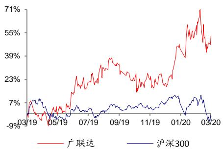
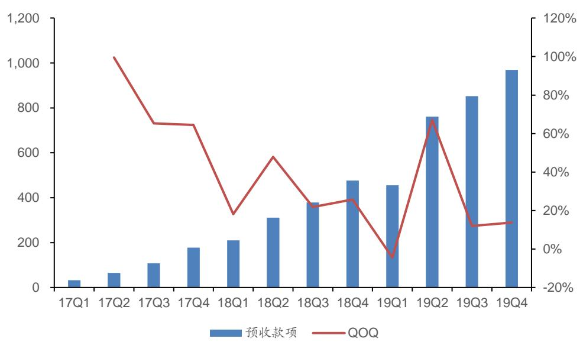
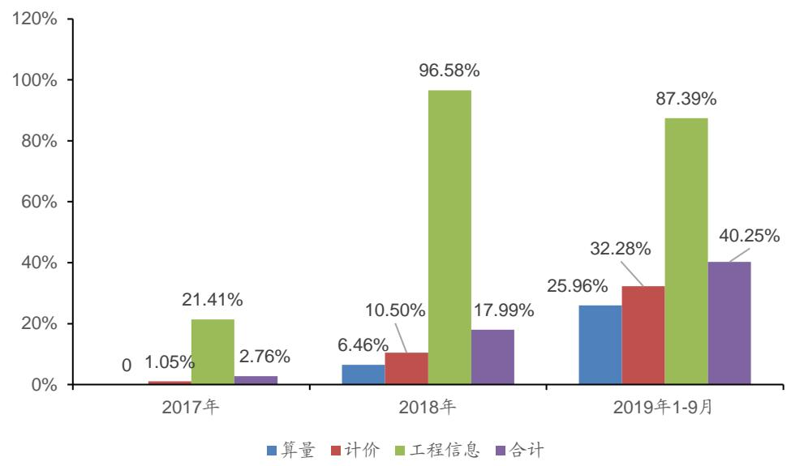
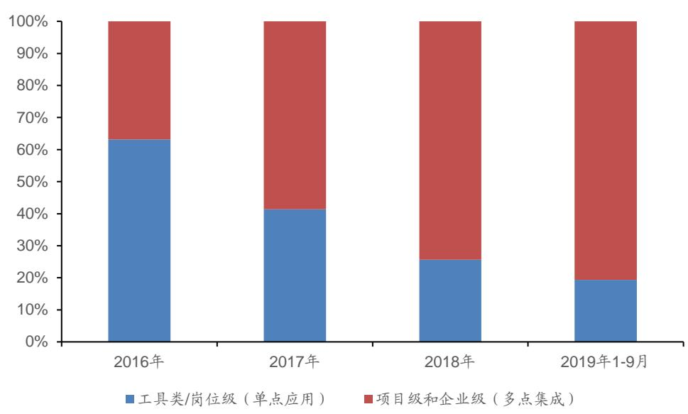

# 广联达（002410.SZ)

# 造价业务转型加速推进，施工业务整合效应初显

# 核心观点：

● 公司发布2019 年年报。营业总收入35.41 亿( $+ 2 1 . 9 \%$ )；归母净利2.35亿（ $- 4 6 . 5 \%$ );扣非归母净利1.91亿( $- 5 3 . 4 \%$ )。综合毛利率 $8 9 . 5 \%$ (2018 年为 $9 3 . 5 \%$ )。其中，造价业务毛利率为 $9 3 . 9 \%$ （2018年为$9 6 . 1 \%$ )；施工业务毛利率为 $7 6 . 0 \%$ （2018年为 $8 6 . 3 \%$ )

● 造价业务云转型加速推进，预收款持续增长。（1）考虑造价业务云转型对公司表观业绩产生的影响，将云预收因素进行还原，则还原后的数字造价业务收入为29.31 亿元，同口径同比增长 $2 5 \%$ 。（注：数字造价业务还原后的营业收 $\lambda =$ 表观收入 $^ +$ 期末云预收-期初云预收）（2）相关数据印证公司云转型较为顺利。全年签署云合同金额 14 亿元，同比增长 $1 1 3 . 8 \%$ ；期末云预收余额8.94亿元，较年初增长 $1 1 5 . 6 \%$ 。当前，全国已推行云转型的省份数达到21个，2019 年前已推广云转型的11个地区转换率超过 $80 \%$ ，年内新增10个云转型地区转换率超过 $50 \%$ 。2020年，公司计划将转型地区增加至25个。

● 施工业务整合效应初步显现，行业仍有待进一步突破。（1）2018 年公司打破原来由多家子公司独立运作的模式，进行战略整合，受此影响，施工业务收入增速收窄至 $1 8 . 0 \%$ （2017年 $+ 6 1 . 2 \%$ )。2019年，施工业务整合效应初显，实现收入8.53 亿元，同比增长 $2 9 . 6 \%$ 。（2）我们认为，施工业务板块行业空间较大，但仍需静待行业进一步突破。当前，公司在组织架构、产品、解决方案、样板工程等方面已做好准备，我们看好施工业务板块长期发展机会。

● 预计公司 2020 年 EPS 为 0.31 元/股。以公司2020 年还原后净利润7.72 亿作为测算依据，给予公司2020 年 70 倍PE估值，则公司 2020年合理市值约为47.91 元/股，维持“买入”评级。

● 风险提示。云转型推广已有大半省份，地域增量空间天花板有限；下游客户景气度挑战和需求不确定性。

盈利预测:   

<table><tr><td></td><td>2018A</td><td>2019A</td><td>2020E</td><td>2021E</td><td>2022E</td></tr><tr><td>营业收入（百万元）</td><td>2,904</td><td>3,541</td><td>4,380</td><td>5,537</td><td>6,864</td></tr><tr><td>增长率(%)</td><td>23.2</td><td>21.9</td><td>23.7</td><td>26.4</td><td>24.0</td></tr><tr><td>EBITDA(百万元)</td><td>460</td><td>341</td><td>472</td><td>723</td><td>948</td></tr><tr><td>归母净利润(百万元)</td><td>439</td><td>235</td><td>353</td><td>587</td><td>768</td></tr><tr><td>增长率(%)</td><td>-7.0</td><td>-46.5</td><td>50.0</td><td>66.6</td><td>30.8</td></tr><tr><td>EPS（元/股）</td><td>0.39</td><td>0.21</td><td>0.31</td><td>0.52</td><td>0.68</td></tr><tr><td>市盈率（P/E)</td><td>53.39</td><td>163.13</td><td>135.27</td><td>81.20</td><td>62.07</td></tr><tr><td>市净率（P/B)</td><td>7.34</td><td>11.73</td><td>13.16</td><td>11.33</td><td>9.58</td></tr><tr><td>EV/EBITDA</td><td>48.77</td><td>108.99</td><td>97.66</td><td>62.35</td><td>46.25</td></tr></table>

数据来源：公司财务报表，广发证券发展研究中心

<table><tr><td>公司评级</td><td>买入</td></tr><tr><td>当前价格</td><td>42.26元</td></tr><tr><td>合理价值</td><td>47.91元</td></tr><tr><td>前次评级</td><td>买入</td></tr><tr><td>报告日期</td><td>2020-03-26</td></tr></table>

  
相对市场表现

# 分析师：

# 分析师：

# 相关研究：

广联达（002410.SZ）:预收款2020-03-02  
持续增长，造价业务转型加速  
推进  
广联达（002410.SZ）:预收款2019-10-29  
持续增长，拟非公开发行股份  
广联达（002410.SZ）：转云进 2019-08-22  
度超预期，长期“量、价”两  
维度关注空间变化

# 一、2019 年年报数据分析

公司披露2019年年报，公司实现营业总收入35.41亿，同比增长 $2 1 . 9 \%$ ；归母净利润2.35亿，同比下降 $4 6 . 5 \%$ ；扣非归母净利润1.91亿，同比下降 $5 3 . 4 \%$ 。若考虑造价业务云转型对公司表观业绩产生的影响，将云预收因素进行还原，则还原后的营业总收入约为40.20亿元，同口径同比增长 $2 6 \%$ ；还原后的归母净利润约为6.65亿元，同口径同比下降 $4 \%$ 。

# （一）主要财务数据分析：

1.公司营业收入同比增长 $2 1 . 1 \%$ ，分项目看：造价业务实现收入24.52亿元，同比增长 $1 9 . 2 \%$ ；数字施工业务收入8.53亿元，同比增长 $2 9 . 6 \%$ 。

2.综合毛利率 $8 9 . 5 \%$ （2018年为 $9 3 . 5 \%$ )。其中，造价业务毛利率为 $9 3 . 9 \%$ （2018年为 $9 6 . 1 \%$ ）；施工业务毛利率为 $7 6 . 0 \%$ （2018年为 $8 6 . 3 \%$ )。

3.费用端：销售费用11.02亿，同比增加 $3 9 . 0 \%$ ；主要为公司造价业务转型市场推广和渠道功能重构，以及施工业务持续强化渠道投入所致；销售费用率为 $3 1 . 1 \%$ （2018年为 $2 7 . 3 \%$ ）；研发费用9.69亿，同比增加 $3 3 . 3 \%$ ；研发费用率为 $2 7 . 4 \%$ （2018年为 $2 5 . 0 \%$ ）。从员工人数看，截至2019年底，销售人员3408人，同比增长 $1 6 . 6 \%$ (2018年 $+ 2 7 . 7 \%$ )；研发人员2749人，同比增长 $1 4 . 4 \%$ （2018年$+ 1 9 . 9 \%$ )。从投入的绝对量及增速看，销售仍然是公司2019年重点投入领域。

4.研发投入10.88亿，同比增长 $3 5 . 5 \%$ ，占收入比重 $3 1 . 4 \%$ ，研发投入资化比例为$1 0 . 9 \%$ （2018年为 $9 . 4 \%$ )。

5.短期借款10.88亿，同比增长 $44 \%$ ，主要为增加银行流动资金借款替换公司债所致。

6.预收款项为9.69亿，比期初增长 $1 0 3 . 5 \%$ ，主要为造价业务云转型加速，相应预收款增加所致。

7.应收账款为5.59亿，比期初增长 $91 . 9 \%$ ，主要为解决方案类收入在业务结构比重增加，应收账款回款周期增长所致。我们认为后续需持续关注公司应收账款回款情况。

8.经营活动现金流净额为6.41亿，同比增加 $4 1 . 6 \%$ ，其中经营活动现金流入额42.48亿，同比增长 $1 8 . 9 \%$ ；经营活动现金流出额36.07亿，同比增长 $1 5 . 6 \%$ 。

9．当期信用减值损失为2352万。其中，应收账款坏账损失1952万。在应收账款较高增长的情况下，未来应收账款坏账损失或进一步增加。

10.2019年新金融业务累计发放贷款13.68亿元，同比增长 $6 3 . 5 \%$ ，无不良或逾期贷款，无应收未收利息，实现收入7650万元，同比增长 $7 9 \%$ 。此前，2018年全年累计发放贷款8.37亿元，同比增长 $1 0 8 . 7 \%$ ，无不良或逾期贷款，无应收未收利息，实现收入4284万元。

表1：年度财务关键数据（单位：百万元）  

<table><tr><td>财报数据（百万元）</td><td>2015年</td><td>2016年</td><td>2017年</td><td>2018年</td><td>2019年</td></tr><tr><td>营业收入</td><td>1,535.83</td><td>2,029.55</td><td>2,339.73</td><td>2,861.56</td><td>3,464.15</td></tr><tr><td>营业成本</td><td>61.83</td><td>135.42</td><td>162.03</td><td>188.26</td><td>370.66</td></tr><tr><td>销售费用</td><td>588.05</td><td>669.99</td><td>681.94</td><td>792.91</td><td>1,102.48</td></tr><tr><td>管理费用</td><td>770.33</td><td>975.44</td><td>1,115.32</td><td>1,491.88</td><td>1,788.87</td></tr><tr><td>财务费用</td><td>-22.09</td><td>-11.93</td><td>26.09</td><td>34.64</td><td>40.55</td></tr><tr><td>投资净收益</td><td>10.45</td><td>14.89</td><td>20.08</td><td>21.99</td><td>22.51</td></tr><tr><td>营业利润</td><td>114.93</td><td>243.62</td><td>514.34</td><td>484.56</td><td>290.37</td></tr><tr><td>归属於母公司所有者的凈利润</td><td>241.97</td><td>423.10</td><td>472.24</td><td>439.08</td><td>235.07</td></tr><tr><td>扣非净利润</td><td>235.28</td><td>350.02</td><td>411.81</td><td>409.30</td><td>190.91</td></tr><tr><td colspan="6">主要比率</td></tr><tr><td>毛利率</td><td>95.97%</td><td>93.33%</td><td>93.07%</td><td>93.42%</td><td>89.30%</td></tr><tr><td>销售费用率</td><td>38.29%</td><td>33.01%</td><td>29.15%</td><td>27.71%</td><td>31.83%</td></tr><tr><td>管理费用率</td><td>50.16%</td><td>48.06%</td><td>47.67%</td><td>52.14%</td><td>51.64%</td></tr><tr><td>营业利润率</td><td>7.48%</td><td>12.00%</td><td>21.98%</td><td>16.93%</td><td>8.38%</td></tr><tr><td>归母净利率</td><td>15.75%</td><td>20.85%</td><td>20.18%</td><td>15.34%</td><td>6.79%</td></tr><tr><td colspan="6">YOY</td></tr><tr><td>营业收入</td><td>-12.73%</td><td>32.15%</td><td>15.28%</td><td>22.30%</td><td>21.91%</td></tr><tr><td>归母净利润</td><td>-59.41%</td><td>74.85%</td><td>11.62%</td><td>-7.02%</td><td>-46.75%</td></tr><tr><td>扣非净利润</td><td>-59.43%</td><td>48.77%</td><td>17.65%</td><td>-0.61%</td><td>-53.36%</td></tr></table>

数据来源：Wind、广发证券发展研究中心注：此处各项比率是以营业收入为分母，公司营业收入与营业总收入存在细微差距

表2：季度财务关键数据（单位：百万元）  

<table><tr><td>财报数据（百万元）</td><td>18Q3</td><td>18Q4</td><td>19Q1</td><td>19Q2</td><td>19Q3</td><td>19Q4</td></tr><tr><td>营业收入</td><td>722.92</td><td>1,083.54</td><td>457.32</td><td>890.66</td><td>835.03</td><td>1,281.14</td></tr><tr><td>营业成本</td><td>51.35</td><td>94.83</td><td>26.64</td><td>55.30</td><td>110.00</td><td>178.72</td></tr><tr><td>销售费用</td><td>172.51</td><td>310.41</td><td>135.10</td><td>304.75</td><td>246.58</td><td>416.05</td></tr><tr><td>管理费用</td><td>181.53</td><td>305.50</td><td>133.83</td><td>196.46</td><td>218.56</td><td>270.91</td></tr><tr><td>研发费用</td><td>161.02</td><td>264.42</td><td>123.46</td><td>298.28</td><td>204.45</td><td>342.93</td></tr><tr><td>财务费用</td><td>9.82</td><td>12.12</td><td>5.74</td><td>10.46</td><td>8.52</td><td>15.83</td></tr><tr><td>投资净收益</td><td>7.96</td><td>2.12</td><td>6.24</td><td>22.32</td><td>-3.39</td><td>-2.66</td></tr><tr><td>营业利润</td><td>163.10</td><td>161.34</td><td>70.98</td><td>57.29</td><td>78.41</td><td>83.69</td></tr><tr><td>归母公司净利润</td><td>145.63</td><td>146.34</td><td>55.36</td><td>34.18</td><td>69.30</td><td>76.22</td></tr><tr><td>扣非净利润</td><td>136.87</td><td>139.94</td><td>49.77</td><td>11.54</td><td>66.70</td><td>62.90</td></tr><tr><td colspan="7">主要比率</td></tr><tr><td>毛利率</td><td>92.90%</td><td>91.25%</td><td>94.17%</td><td>93.79%</td><td>86.83%</td><td>86.05%</td></tr><tr><td>销售费用率</td><td>23.86%</td><td>28.65%</td><td>29.54%</td><td>34.22%</td><td>29.53%</td><td>32.47%</td></tr></table>

识别风险，发现价值

<table><tr><td>研发费用率</td><td>25.11%</td><td>28.19%</td><td>29.26%</td><td>22.06%</td><td>26.17%</td><td>21.15%</td></tr><tr><td>管理费用率</td><td>22.27%</td><td>24.40%</td><td>27.00%</td><td>33.49%</td><td>24.48%</td><td>26.77%</td></tr><tr><td>营业利润率</td><td>22.56%</td><td>14.89%</td><td>15.52%</td><td>6.43%</td><td>9.39%</td><td>6.53%</td></tr><tr><td colspan="7">YoY</td></tr><tr><td>营业收入</td><td>42.09%</td><td>16.47%</td><td>37.42%</td><td>23.31%</td><td>15.51%</td><td>18.24%</td></tr><tr><td>归母净利润</td><td>0.68%</td><td>-21.13%</td><td>-2.29%</td><td>-62.21%</td><td>-52.41%</td><td>-47.91%</td></tr><tr><td>扣非净利润</td><td>-3.39%</td><td>2.64%</td><td>-6.86%</td><td>-85.40%</td><td>-51.27%</td><td>-55.05%</td></tr><tr><td colspan="7">QoQ</td></tr><tr><td>营业收入</td><td>0.09%</td><td>49.88%</td><td>-57.79%</td><td>94.76%</td><td>-6.25%</td><td>53.43%</td></tr><tr><td>归母净利润</td><td>61.00%</td><td>0.49%</td><td>-62.17%</td><td>-38.26%</td><td>102.76%</td><td>9.98%</td></tr><tr><td>扣非净利润</td><td>73.12%</td><td>2.24%</td><td>-64.44%</td><td>-76.81%</td><td>477.84%</td><td>-5.70%</td></tr></table>

数据来源：Wind、广发证券发展研究中心注：此处各项比率是以营业收入为分母，公司营业收入与营业总收入存在细微差距

# 二、造价业务云转型加速推进，预收款持续增长

2019年公司造价业务云转型进入深水区，10个收入体量较大的区域启动转型，转型区域由11个增加到21个，对公司表观业绩产生了较大影响。从转型进展看，相关数据印证公司云转型较为顺利：

1．全年签署云合同金额14亿元，同比增长 $1 1 3 . 8 \%$ .,  
2.若考虑造价业务云转型对表观业绩产生的影响，将云预收因素进行还原，则还原后的数字造价业务收入为29.31亿元，同口径同比增长 $25 \%$ 。（注：数字造价业务还原后的营业收入 ${ \mathfrak { s } } .$ 表观收入 $^ +$ 期末云预收-期初云预收）  
3.期末云预收余额8.94亿元，同比增长11 $5 . 6 \%$ (2017年末云预收余额1.3亿;2018年末云预收余额4.14亿（ $+ 2 1 9 \%$ ）；2019年H1云预收余额6.72亿$+ 1 6 2 . 5 \%$ ))。

表3：主要云产品线2019年H1收入、合同、预收款分拆（单位：亿元、百分比）  

<table><tr><td>产品线</td><td>云收入</td><td>同比增减</td><td>云合同</td><td>同比增减</td><td>云预收</td><td>较期初增减</td></tr><tr><td>云计价</td><td>2.81</td><td>188.88%</td><td>4.80</td><td>183.20%</td><td>3.08</td><td>182.06%</td></tr><tr><td>云算量</td><td>2.67</td><td>354.48%</td><td>4.46</td><td>173.56%</td><td>2.83</td><td>171.65%</td></tr><tr><td>工程信息</td><td>3.73</td><td>74.25%</td><td>4.75</td><td>47.19%</td><td>3.02</td><td>50.53%</td></tr><tr><td>合计</td><td>9.21</td><td>148.84%</td><td>14.00</td><td>113.82%</td><td>8.94</td><td>115.62%</td></tr></table>

数据来源：公司年报、广发证券发展研究中心

根据公司披露的云转型推广进展情况，我们认为，2019年整体转型进度推进迅速。整体看，全国已推行云转型的省份数达到21个，2019年之前已推广云转型的11个地区，云计价与云算量产品的综合转化率均超 $80 \%$ ，年内新增的10个云转型地区，云计价及云算量产品全年的综合转化率均超 $50 \%$ ，转型效果显著。

2020年，公司将持续推进SaaS转型，转型地区由21个增加至25个。

表4：造价业务云转型推广进展情况  

<table><tr><td>地区</td><td>2017</td><td>2018</td><td>2019</td></tr><tr><td rowspan="3">计价产 品转化 率</td><td>2017年转型的6个地区 80%</td><td>&gt;85%</td><td>&gt;80%</td></tr><tr><td>2018年转型的5个地区</td><td>&gt;40%</td><td>&gt;80%</td></tr><tr><td>2019年转型的10个地区</td><td></td><td>&gt;50%</td></tr><tr><td>算量产 品转化</td><td>2018年转型的11个地区（即计价产品2017年、2018年转 型的11个地区）</td><td>&gt;50%</td><td>&gt;80%</td></tr><tr><td>率</td><td>2019年转型的10个地区</td><td></td><td>&gt;50%</td></tr></table>

识别风险，发现价值

<table><tr><td>续费率</td></tr><tr><td>~85% &gt;85% &gt;80%</td></tr><tr><td>数据来源：2020 年1 月 20 日《非公开发行股票申请文件反馈意见之回复报告》、公司年报、广发证券发展研究中心</td></tr><tr><td>注：2017年转型的 6 个地区为：黑龙江、吉林、宁夏、山西、湖北、云南；2018 年新增转型的5 个地区为：重庆、广西、新疆、辽宁、 河南；2019 年新增转型的 10 个地区为：北京、上海、广东、天津、河北、陕西、贵州、内蒙古、甘肃、青海</td></tr></table>

作为评估云转型公司的重要指标，预收款数据继续快速增长，公司报告期末总预收款为9.69亿，其中云相关预收款为8.94亿。

  
图1：公司各季度末总预收款数据持续增长（百万元）  
数据来源：Wind、广发证券发展研究中心

报告期内，公司在云计价、云算量、工程信息业务等三大业务方面均有所进展：

1．云计价：大大提升了现有产品的发布效率与产品质量，在快速迭代的同时大幅度提升产品的稳定性。  
2.云算量：进一步发布钢混业务版本，成为国内首款能处理土建与钢构相连接的产品；实现了装配式算量业务的发布，产品口碑持续提升。  
3. 工程信息：围绕搜索等核心应用持续完善用户价值与技术能力，建立建筑材料概念图谱及数字化搜索技术体系，同时积极推进企业数据服务、指标信息服务等新产品研发，加速企业专业大数据产品的发展应用。

展望未来，公司云转型有望通过“量”“价”双升带来更大市场空间。

1．数量变化：当前，公司造价云服务用户数仍有较大增长空间：一方面，截至2019年底，公司仍有江苏、浙江、安徽、福建、江西等多个地区未开展造价业务云转型。受此影响，2019年前三季度，SaaS化收入占造价业务总收入的比例仅约 $40 \%$ （2019年全年占比约 $3 7 . 6 \%$ )；另一方面，盗版用户、僵尸用户、竞争对手用户等潜在用户在公司造价业务云转型后有望成为公司客户。

  
图2：造价业务中各细项SaaS收入在对应产品及服务总收入中的占比  
数据来源：2020 年1 月20 日《非公开发行股票申请文件反馈意见之回复报告》，广发证券发展研究中心

2.价格变化：公司的云转型，除了基本产品的云化（如计价-变为云计价、算量变为云算量），更多增值服务的绑定将赋予客户全新的造价应用体验（如工程信息、智能组价等），同时更多增值服务的绑定也将有助于单用户ARPU的提升。例如，公司拟非公开发行股票募集资金投资“造价大数据及AI应用项目”，该项目将利用用户积累的大量有效数据，融合大数据与人工智能技术，开发包括智能算量、智能组价、成本分析与预测等方面的智能化应用与增值服务。

从公司2019年云转型运营数据看，我们继续看好公司造价业务的云转型。短期内需持续关注预收账款、转换率、续费率以及SaaS收入在造价业务总收入中占比的变化，中长期，需关注单一用户价值（ARPU）是否有明显提升，从而给造价云业务带来更大市场空间。

# 三、施工业务整合效应初显，行业仍有待进一步突破

施工业务板块，2018年公司打破原来由多家子公司独立运作的模式，进行战略整合，受此影响，当年施工业务收入增速收窄至 $1 8 . 0 \%$ （2017年 $+ 6 1 . 2 \%$ )。2019年，施工业务整合效应已初步显现，实现收入8.53亿元，同比增长 $2 9 . 6 \%$ ，主要进展包括:

1．整合原BIM建造和智慧工地产品线相关产品，实现了产品间的数据打通和共享，发布了数字项目管理平台，主力推广“平台 $+$ 组件”的项目级产品。  
2.持续加大市场拓展力度，完善数字施工业务销售渠道，同时形成了较为完整的营销策略。

我们认为，施工业务板块行业空间较大，但仍需静待行业进一步突破，公司近年来完成了施工业务线人员结构、产品架构的多维度整合，将有助于施工业务中长期发展。同时，公司持续在BIM、智慧工地等核心产品持续投入研发资源打磨自身产品线，为未来行业全面突破做好准备。例如，公司拟非公开发行股票募集资金投资“数字项目集成管理平台项目”，该项目通过打造企业级多项目集成管理平台，将实现现有单一项目级数字项目管理平台的全方位升级。

报告期内，在数字施工业务企业级、项目级、岗位级三大类产品中，基于数字项目管理平台的项目级产品营业收入占比过半，“平台 $^ +$ 组件”项目级产品的推广取得了阶段性的成果。项目级产品全年新增企业客户超过1100家，其中特、一级企业逾990家；新增项目超过3200个，其中特、一级企业项目逾2900个。

从施工业务收入构成看，来至项目级和企业级的收入占较大。我们认为，相较于工具类/岗位级的单点型应用，项目级及企业级的多点集成式项目将促使公司全面了解客户需求，并形成完善的解决方案及众多知名样板工程，这有利于公司在行业突破时，迅速占领市场，实现从1到N的跨越。需注意的是，大多数情况下，多点集成式项目将会对公司毛利率及回款产生压力，当然，这仍需结合公司后续数据持续观察。

综上，随着组织架构、新产品、新方案逐步磨合完备以及样板工程量的逐步增加，我们较为看好公司施工业务板块长期发展机会。

  
图3：项目级及企业级相关收入在施工业务收入的占比呈上升趋势  
数据来源：2020 年1 月 20 日《非公开发行股票申请文件反馈意见之回复报告》，广发证券发展研究中心

# 四、盈利预测与投资建议

# （一）盈利预测

# 收入假设：

1.造价业务：我们认为造价业务云转型有望通过量价的两维度提升带来云化后收入体量的提升，2020、2021年造价业务虽仍处于云转型阶段，但新区域转化率的超预期、以及老区域新用户的超预期将带来收入端的平稳增长，2022年随着云转型进入收尾期，预计造价收入增速将下降。  
2.施工业务：2019年施工业务增速符合预期，整合效应初显，考虑BIM、智慧工地等景气周期，预计该业务将保持 $3 5 \%$ 左右增速增长。

毛利率假设：预计未来三年各项业务毛利率基本与2019基本年持平，但随着较低毛利率业务收入比重增加，公司综合毛利率呈略微下降趋势。

费用率假设：公司造价云转型加速推进，收入结构中造价云收入占比持续提升，随着前期市场推广期逐步结束以及线上产品研发迭代的前提投入结束，我们预计管理费用率、销售费用率以及研发费用率伴随公司云转型推进，将呈现下降趋势。

# 预收款假设

1.2018年末云相关预收款为4.14亿，2019年末云相关预收款为8.94亿( $+ 1 1 6 \%$ ），预收款的持续增长验证了公司云转型的加速推进。  
2.考虑2020年公司云转型仍将持续进行，剩余省份的云转型或将逐步推进，预计预收款仍将保持增长趋势，我们预计公司2020-2022年云相关预收款余额分别为13.6亿、16.7亿、19.2亿：期末总预收款余额分别为14.25亿、17.35亿、19.87亿。

综合，预计公司2020年表观净利润为3.53亿。

# （二）投资建议

# 考量公司合理市值:

云服务带来商业模式变化，云业务收入确认方式由一次性确认转变为按服务期间分期确认，但客户的获客成本等相关费用仍为一次性当期列支，因此带来表观利润“失真”。由于公司已处于云转型加速期，当前表观净利润失真较为严重，不能反应公司真实利润情况，因此也不适合以公司表观利润作为评估PE标准。

根据公司2019年年报，公司针对当期净利润进行了还原，还原后的归属于上市公司股东的净利润 $=$ 表观归属于上市公司股东的净利润 $^ +$ （期末云预收-期初云预收）$^ { \star } 9 0 \%$ ，2019年全年还原后的净利润为6.66亿(公式和数据来源：公司2019年年报)，我们认为上述还原算法较为合理、谨慎。我们采用同样方式对广联达2020年净利润进行还原后为7.72亿。

可比公司方面，我们将采用还原后的净利润对公司进行估值，因此在选取同样产品化较强，且积极云转型的相似公司作为可比公司：

表2：广联达可比公司PE估值情况（市值统计截止2020.03.25收盘）  

<table><tr><td colspan="7"></td><td colspan="3">PE估值水平</td></tr><tr><td>公司名称</td><td>公司代码</td><td>业务类型</td><td>市值（亿元）</td><td>2018A</td><td>2019E</td><td>2020E</td><td>2018A</td><td>2019E</td><td>2020E</td></tr><tr><td>泛微网络</td><td>603039</td><td>协同OA</td><td>113</td><td>114</td><td>148</td><td>189</td><td>65</td><td>76</td><td>60</td></tr><tr><td>恒生电子</td><td>600570</td><td>金融软件</td><td>719</td><td>645</td><td>1163</td><td>1263</td><td>50</td><td>62</td><td>57</td></tr></table>

数据来源：Wind，广发证券发展研究中心注：泛微网络、恒生电子数据来至Wind一致预期

考虑到：

1．A股中，公司作为建筑业信息化头部厂商，具有一定的稀缺性；  
2.2019年年报数据显示，公司造价业务云转型进展较顺利；  
3.在施工业务板块整合后，2019年施工业务同比增速较2018年已开始回升；考虑到施工业务板块行业空间较大，当前，公司在组织架构、产品、解决方案、样板工程等方面已做好准备，我们看好施工业务板块长期发展机会。

因此，基于公司20年经还原后的净利润7.72亿，我们给予公司20年70倍PE估值，则公司20年合理市值约541亿元，对应47.91元/股，看好公司中长期发展机会，维持“买入”评级。

# 五、风险提示:

1.．云转型推广已有大半省份，地域增量空间天花板有限；  
2.下游客户景气度挑战和需求不确定性。

资产负债表 单位：百万元  

<table><tr><td colspan="6">至12月31日 2018A 2019A 2020E 2021E 2022E</td></tr><tr><td>流动资产</td><td>2,770</td><td>2,950</td><td>3,268</td><td>3,968</td><td>5,401</td></tr><tr><td>货币资金</td><td>2,212</td><td>2,231</td><td>2,094</td><td>2,617</td><td>3,846</td></tr><tr><td>应收及预付</td><td>324</td><td>628</td><td>591</td><td>751</td><td>934</td></tr><tr><td>存货</td><td>9</td><td>21</td><td>20</td><td>28</td><td>36</td></tr><tr><td>其他流动资产</td><td>225</td><td>70</td><td>562</td><td>573</td><td>585</td></tr><tr><td>非流动资产</td><td>2,836</td><td>3,217</td><td>3,375</td><td>3,387</td><td>3,382</td></tr><tr><td>长期股权投资</td><td>158</td><td>233</td><td>233</td><td>233</td><td>233</td></tr><tr><td>固定资产</td><td>819</td><td>803</td><td>843</td><td>873</td><td>893</td></tr><tr><td>在建工程</td><td>3</td><td>57</td><td>57</td><td>57</td><td>57</td></tr><tr><td>无形资产</td><td>227</td><td>373</td><td>529</td><td>521</td><td>506</td></tr><tr><td>其他长期资产</td><td>1,628</td><td>1,752</td><td>1,713</td><td>1,703</td><td>1,693</td></tr><tr><td>资产总计</td><td>5,606</td><td>6,167</td><td>6,642</td><td>7,355</td><td>8,782</td></tr><tr><td>流动负债</td><td>1,329</td><td>2,809</td><td>2,914</td><td>3,012</td><td>3,635</td></tr><tr><td>短期借款</td><td>200</td><td>1,089</td><td>534</td><td>0</td><td>0</td></tr><tr><td>应付及预收</td><td>512</td><td>1,068</td><td>1,515</td><td>1,856</td><td>2,143</td></tr><tr><td>其他流动负债</td><td>618</td><td>653</td><td>866</td><td>1,156</td><td>1,491</td></tr><tr><td>非流动负债</td><td>994</td><td>9</td><td>9</td><td>9</td><td>9</td></tr><tr><td>长期借款</td><td>0</td><td>0</td><td>0</td><td>0</td><td>0</td></tr><tr><td>应付债券</td><td>992</td><td>0</td><td>0</td><td>0</td><td>0</td></tr><tr><td>其他非流动负债</td><td>3</td><td>9</td><td>9</td><td>9</td><td>9</td></tr><tr><td>负债合计</td><td>2,324</td><td>2,818</td><td>2,923</td><td>3,021</td><td>3,644</td></tr><tr><td>股本</td><td>1,127</td><td>1,129</td><td>1,129</td><td>1,129</td><td>1,129</td></tr><tr><td>资本公积</td><td>463</td><td>509</td><td>509</td><td>509</td><td>509</td></tr><tr><td>留存收益</td><td>1,700</td><td>1,709</td><td>2,062</td><td>2,649</td><td>3,418</td></tr><tr><td>归属母公司股东权益</td><td>3,192</td><td>3,269</td><td>3,623</td><td>4,210</td><td>4,978</td></tr><tr><td>少数股东权益</td><td>90</td><td>80</td><td>96</td><td>124</td><td>160</td></tr><tr><td>负债和股东权益</td><td>5,606</td><td>6,167</td><td>6,642</td><td>7,355</td><td>8,782</td></tr></table>

利润表 单位：百万元  

<table><tr><td>至12月31日</td><td>2018A</td><td>2019A</td><td>2020E</td><td>2021E</td><td>2022E</td></tr><tr><td>营业收入</td><td>2,904</td><td>3,541</td><td>4,380</td><td>5,537</td><td>6,864</td></tr><tr><td>营业成本</td><td>188</td><td>371</td><td>496</td><td>667</td><td>864</td></tr><tr><td>营业税金及附加</td><td>45</td><td>43</td><td>53</td><td>67</td><td>83</td></tr><tr><td>销售费用</td><td>793</td><td>1,102</td><td>1,304</td><td>1,523</td><td>1,853</td></tr><tr><td>管理费用</td><td>765</td><td>820</td><td>985</td><td>1,218</td><td>1,476</td></tr><tr><td>研发费用</td><td>727.17</td><td></td><td></td><td>969.11 1182.52 1467.21 1784.53</td><td></td></tr><tr><td>财务费用</td><td>34.64</td><td>40.55</td><td>37.32</td><td>34.12</td><td>13.68</td></tr><tr><td>资产减值损失</td><td>55.81</td><td>-6.11</td><td>93.34</td><td>59.33</td><td>78.14</td></tr><tr><td>公允价值变动收益</td><td>0.00</td><td>0.00</td><td>0.00</td><td>0.00</td><td>0.00</td></tr><tr><td>投资净收益</td><td>21.99</td><td>22.51</td><td>21.00</td><td>20.50</td><td>20.80</td></tr><tr><td>营业利润</td><td>484.56</td><td>290.37</td><td>413.71</td><td>687.99</td><td>899.00</td></tr><tr><td>营业外收支</td><td>-2.94</td><td>-6.61</td><td>-2.20</td><td>-2.50</td><td>-2.20</td></tr><tr><td>利润总额</td><td>482</td><td>284</td><td>412</td><td>685</td><td>897</td></tr><tr><td>所得税</td><td>49</td><td>29</td><td>42</td><td>71</td><td>92</td></tr><tr><td>净利润</td><td>433</td><td>255</td><td>369</td><td>615</td><td>805</td></tr><tr><td>少数股东损益</td><td>-6</td><td>20</td><td>17</td><td>28</td><td>36</td></tr><tr><td>归属母公司净利润</td><td>439</td><td>235</td><td>353</td><td>587</td><td>768</td></tr><tr><td>EBITDA</td><td>459.74</td><td>341.36</td><td>472.37</td><td>722.94</td><td>948.02</td></tr><tr><td>EPS（元）</td><td>0.39</td><td>0.21</td><td>0.31</td><td>0.52</td><td>0.68</td></tr></table>

现金流量表 单位：百万元  

<table><tr><td>至12月31日</td><td>2018A 2019A</td><td>2020E</td><td></td><td>2021E</td><td>2022E</td></tr><tr><td>经营活动现金流</td><td>453</td><td>641</td><td>740</td><td>1,200</td><td>1,360</td></tr><tr><td>净利润</td><td>433</td><td>255</td><td>369</td><td>615</td><td>805</td></tr><tr><td>折旧摊销</td><td>74</td><td>106</td><td>114</td><td>128</td><td>145</td></tr><tr><td>营运资金变动</td><td>-133</td><td>216</td><td>150</td><td>405</td><td>351</td></tr><tr><td>其它</td><td>79</td><td>65</td><td>107</td><td>52</td><td>60</td></tr><tr><td>投资活动现金流</td><td>-18</td><td>-227</td><td>-291</td><td>-132</td><td>-131</td></tr><tr><td>资本支出</td><td>-202</td><td>-242</td><td>-312</td><td>-153</td><td>-152</td></tr><tr><td>投资变动</td><td>154</td><td>-17</td><td>0</td><td>0</td><td>0</td></tr><tr><td>其他</td><td>31</td><td>32</td><td>21</td><td>21</td><td>21</td></tr><tr><td>筹资活动现金流</td><td>-82</td><td>-390</td><td>-586</td><td>-544</td><td>0</td></tr><tr><td>银行借款</td><td>144</td><td>-112</td><td>-555</td><td>-534</td><td>0</td></tr><tr><td>股权融资</td><td>106</td><td>23</td><td>0</td><td>0</td><td>0</td></tr><tr><td>其他</td><td>-332</td><td>-301</td><td>-32</td><td>-11</td><td>0</td></tr><tr><td>现金净增加额</td><td>353</td><td>24</td><td>-137</td><td>523</td><td>1,229</td></tr><tr><td>期初现金余额</td><td>1,837</td><td>2,210</td><td>2,231</td><td>2,094</td><td>2,617</td></tr><tr><td>期末现金余额</td><td>2,210</td><td>2,230</td><td>2,094</td><td>2,617</td><td>3,846</td></tr></table>

主要财务比率  

<table><tr><td>至12月31日</td><td>2018A</td><td>2019A</td><td>2020E</td><td>2021E</td><td>2022E</td></tr><tr><td>成长能力</td><td></td><td></td><td></td><td></td><td></td></tr><tr><td>营业收入增长</td><td>23.2%</td><td>21.9%</td><td>23.7%</td><td>26.4%</td><td>24.0%</td></tr><tr><td>营业利润增长</td><td>-5.8%</td><td>-40.1%</td><td>42.5%</td><td>66.3%</td><td>30.7%</td></tr><tr><td>归母净利润增长</td><td>-7.0%</td><td>-46.5%</td><td>50.0%</td><td>66.6%</td><td>30.8%</td></tr><tr><td>获利能力</td><td></td><td></td><td></td><td></td><td></td></tr><tr><td>毛利率</td><td>93.5%</td><td>89.5%</td><td>88.7%</td><td>88.0%</td><td>87.4%</td></tr><tr><td>净利率</td><td>14.9%</td><td>7.2%</td><td>8.4%</td><td>11.1%</td><td>11.7%</td></tr><tr><td>ROE</td><td>13.8%</td><td>7.2%</td><td>9.7%</td><td>14.0%</td><td>15.4%</td></tr><tr><td>ROIC</td><td>17.2%</td><td>9.6%</td><td>14.8%</td><td>30.7%</td><td>54.5%</td></tr><tr><td>偿债能力</td><td></td><td></td><td></td><td></td><td></td></tr><tr><td>资产负债率</td><td>41.5%</td><td>45.7%</td><td>44.0%</td><td>41.1%</td><td>41.5%</td></tr><tr><td>净负债比率</td><td>21.3%</td><td>17.7%</td><td>8.0%</td><td>0.0%</td><td>0.0%</td></tr><tr><td>流动比率</td><td>2.08</td><td>1.05</td><td>1.12</td><td>1.32</td><td>1.49</td></tr><tr><td>速动比率</td><td>2.05</td><td>1.03</td><td>1.10</td><td>1.29</td><td>1.46</td></tr><tr><td>营运能力</td><td></td><td></td><td></td><td></td><td></td></tr><tr><td>总资产周转率</td><td>0.55</td><td>0.60</td><td>0.68</td><td>0.79</td><td>0.85</td></tr><tr><td>应收账款周转率</td><td>13.82</td><td>7.96</td><td>7.96</td><td>7.96</td><td>7.96</td></tr><tr><td>存货周转率</td><td>19.58</td><td>24.22</td><td>24.22</td><td>24.22</td><td>24.22</td></tr><tr><td>每股指标（元）</td><td></td><td></td><td></td><td></td><td></td></tr><tr><td>每股收益</td><td>0.39</td><td>0.21</td><td>0.31</td><td>0.52</td><td>0.68</td></tr><tr><td>每股经营现金流</td><td>0.40</td><td>0.57</td><td>0.66</td><td>1.06</td><td>1.21</td></tr><tr><td>每股净资产</td><td>2.83</td><td>2.90</td><td>3.21</td><td>3.73</td><td>4.41</td></tr><tr><td>估值比率</td><td></td><td></td><td></td><td></td><td></td></tr><tr><td>P/E</td><td>53.39</td><td>163.13</td><td>135.27</td><td>81.20</td><td>62.07</td></tr><tr><td>P/B</td><td>7.34</td><td>11.73</td><td>13.16</td><td>11.33</td><td>9.58</td></tr><tr><td>EV/EBITDA</td><td>48.77</td><td>108.99</td><td>97.66</td><td>62.35</td><td>46.25</td></tr></table>

# 广发计算机行业研究小组

刘雪峰：首席分析师，东南大学工学士，中国人民大学经济学硕士，1997 年起先后在数家IT 行业跨国公司从事技术、运营与全球项目管理工作。2010 年7 月始就职于招商证券研究发展中心负责计算机组行业研究工作，2014 年 1 月加入广发证券发展研究中心。  
王 奇 珏：资深分析师，上海财经大学信息管理学士，上海财经大学资产评估硕士，2015 年进入广发证券发展研究中心。  
庞 倩 倩：资深分析师，华南理工大学管理学硕士，曾就职于华创证券，2018 年加入广发证券发展研究中心。  
钱砾：高级分析师，东南大学信息工程学士、生物医学工程医学电子影像方向硕士，先后在电子信息行业和医疗影像设备行业工作超过6 年，2017 年加入广发证券发展研究中心。

# 广发证券—行业投资评级说明

买入： 预期未来12个月内，股价表现强于大盘 $10 \%$ 以上。  
持有： 预期未来12个月内，股价相对大盘的变动幅度介于 $\cdot 1 0 \% \sim + 1 0 \%$ 。  
卖出： 预期未来12个月内，股价表现弱于大盘 $10 \%$ 以上。

# 广发证券—公司投资评级说明

买入： 预期未来12个月内，股价表现强于大盘 $1 5 \%$ 以上。增持: 预期未来12个月内，股价表现强于大盘 $5 \% - 1 5 \%$ 持有： 预期未来12个月内，股价相对大盘的变动幅度介于 $- 5 \% \sim + 5 \% ,$ 卖出： 预期未来12个月内，股价表现弱于大盘 $5 \%$ 以上。

# 联系我们

<table><tr><td rowspan="4">地址</td><td>广州市</td><td>深圳市</td><td>北京市</td><td>上海市</td><td>香港</td></tr><tr><td>广州市天河区马场路</td><td>深圳市福田区益田路</td><td>北京市西城区月坛北街</td><td>上海市浦东新区世纪大</td><td>香港中环干诺道中111</td></tr><tr><td>26号广发证券大厦35</td><td>6001号太平金融大廈</td><td>2号月坛大厦18层</td><td>道8号国金中心一期16号永安中心14楼</td><td></td></tr><tr><td>楼</td><td>31层</td><td></td><td>楼</td><td>1401-1410室</td></tr><tr><td>邮政编码</td><td>510627</td><td>518026</td><td>100045</td><td>200120</td><td></td></tr><tr><td>客服邮箱</td><td>gfyf@gf.com.cn</td><td></td><td></td><td></td><td></td></tr></table>

# 法律主体声明

本报告由广发证券股份有限公司或其关联机构制作，广发证券股份有限公司及其关联机构以下统称为“广发证券”。本报告的分销依据不同国家、地区的法律、法规和监管要求由广发证券于该国家或地区的具有相关合法合规经营资质的子公司/经营机构完成。广发证券股份有限公司具备中国证监会批复的证券投资咨询业务资格，接受中国证监会监管，负责本报告于中国（港澳台地区除外）的分销。广发证券（香港）经纪有限公司具备香港证监会批复的就证券提供意见（4 号牌照）的牌照，接受香港证监会监管，负责本报告于中国香港地区的分销。

本报告署名研究人员所持中国证券业协会注册分析师资质信息和香港证监会批复的牌照信息已于署名研究人员姓名处披露。

# 重要声明

广发证券股份有限公司及其关联机构可能与本报告中提及的公司寻求或正在建立业务关系，因此，投资者应当考虑广发证券股份有限公司及其关联机构因可能存在的潜在利益冲突而对本报告的独立性产生影响。投资者不应仅依据本报告内容作出任何投资决策。

本报告署名研究人员、联系人（以下均简称“研究人员”）针对本报告中相关公司或证券的研究分析内容，在此声明：（1）本报告的全部分析结论、研究观点均精确反映研究人员于本报告发出当日的关于相关公司或证券的所有个人观点，并不代表广发证券的立场；（2）研究人员的部分或全部的报酬无论在过去、现在还是将来均不会与本报告所述特定分析结论、研究观点具有直接或间接的联系。

研究人员制作本报告的报酬标准依据研究质量、客户评价、工作量等多种因素确定，其影响因素亦包括广发证券的整体经营收入，该等经营收入部分来源于广发证券的投资银行类业务。

本报告仅面向经广发证券授权使用的客户/特定合作机构发送，不对外公开发布，只有接收人才可以使用，且对于接收人而言具有保密义务。广发证券并不因相关人员通过其他途径收到或阅读本报告而视其为广发证券的客户。在特定国家或地区传播或者发布本报告可能违反当地法律，广发证券并未采取任何行动以允许于该等国家或地区传播或者分销本报告。

本报告所提及证券可能不被允许在某些国家或地区内出售。请注意，投资涉及风险，证券价格可能会波动，因此投资回报可能会有所变化，过去的业绩并不保证未来的表现。本报告的内容、观点或建议并未考虑任何个别客户的具体投资目标、财务状况和特殊需求，不应被视为对特定客户关于特定证券或金融工具的投资建议。本报告发送给某客户是基于该客户被认为有能力独立评估投资风险、独立行使投资决策并独立承担相应风险。

本报告所载资料的来源及观点的出处皆被广发证券认为可靠，但广发证券不对其准确性、完整性做出任何保证。报告内容仅供参考，报告中的信息或所表达观点不构成所涉证券买卖的出价或询价。广发证券不对因使用本报告的内容而引致的损失承担任何责任，除非法律法规有明确规定。客户不应以本报告取代其独立判断或仅根据本报告做出决策，如有需要，应先咨询专业意见。

广发证券可发出其它与本报告所载信息不一致及有不同结论的报告。本报告反映研究人员的不同观点、见解及分析方法，并不代表广发证券的立场。广发证券的销售人员、交易员或其他专业人士可能以书面或口头形式，向其客户或自营交易部门提供与本报告观点相反的市场评论或交易策略，广发证券的自营交易部门亦可能会有与本报告观点不一致，甚至相反的投资策略。报告所载资料、意见及推测仅反映研究人员于发出本报告当日的判断，可随时更改且无需另行通告。广发证券或其证券研究报告业务的相关董事、高级职员、分析师和员工可能拥有本报告所提及证券的权益。在阅读本报告时，收件人应了解相关的权益披露（若有)。

本研究报告可能包括和/或描述/呈列期货合约价格的事实历史信息（“信息”)。请注意此信息仅供用作组成我们的研究方法/分析中的部分论点/依据/证据，以支持我们对所述相关行业/公司的观点的结论。在任何情况下，它并不（明示或暗示）与香港证监会第 5 类受规管活动（就期货合约提供意见）有关联或构成此活动。

# 权益披露

(1)广发证券（香港）跟本研究报告所述公司在过去12个月内并没有任何投资银行业务的关系。

# 版权声明

未经广发证券事先书面许可，任何机构或个人不得以任何形式翻版、复制、刊登、转载和引用，否则由此造成的一切不良后果及法律责任由和自翻版、复制、刊登、转载和引用者承担。