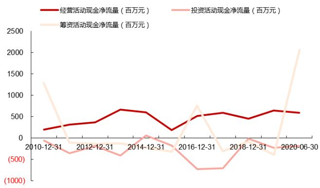
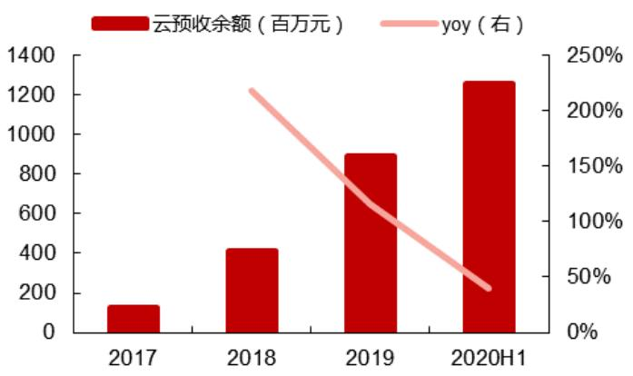

# 造价施工业务为基，向建筑信息化龙头平台迈进

广联达（002410.SZ）首次覆盖

# • 核心结论

深耕建筑信息化二十余年，业务不断焕发新活力。广联达成立于1998年，立足建筑产业，公司业务领域正逐步由招投标阶段拓展至工程项目的全生命周期，产品从单一的预算软件扩展到数字造价、数字施工、设计、在数字装修，产业金融等多个业务领域，业务逐步平台化与产业链一体化。

造价信息化绝对领导者，云化打开新空间。造价是公司传统优势业务，也是目前公司收入和利润的主要支撑。自云战略发布以来，转型加速推进，1H20公司造价业务收入11.51 亿元，云转型地区从 2019 年的 21个增加至 25个，云造价收入6.66 亿元，同比增长 $7 9 . 5 0 \%$ ，收入比重已经达到 $5 7 . 8 \%$ ,云预余额增长至 12.55 亿元，未来随着转型深入，盘活存量市场、吸引增量用户和持续创造产品客户价值，云造价业务有望继续成长。

干亿施工信息化市场可期，公司布局深入有望领跑。按照每年 50 多万的新开工项目数乘以每个项目约 20 万元的信息化投入，施工信息化市场估算有1000 亿的规模。从现有的市场参与者来看，行业格局还比较分散。公司在2014 年正式切入施工业务，基于对建筑行业 20 年的业务理解、沉淀，具备为施工建造阶段各层级客户提供数字化解决方案和技术平台支撑能力，有望在这一蓝海市场领跑。1H20，公司施工业务实现收入3.36 亿，同比增长$1 6 \%$ ，服务项目数量突破3 万个，上半年增加的项目数量已经近1万个，呈明显加速覆盖之势。

投资建议：我们预测公司2020 年-2022 年归母净利润为4.42、6.56 和8.84 亿元，EPS 为 0.37、0.55和 0.75 元。公司目前正处于市场开拓和转型投入时期，而成长天花板高，参考可比公司当前估值水平，给予公司目标价 89.18 元，首次覆盖给予“买入”评级。

风险提示：造价转型、施工业务进展不及预期；疫情等外部冲击影响需求。

·核心数据   

<table><tr><td>2018 2019 2020E</td></tr><tr><td>2021E 营业收入（百万元） 2,904 3,541 4,173 5,281</td></tr><tr><td>6,452</td></tr><tr><td>增长率 23.2% 21.9% 17.9% 26.6% 22.2% 439 235 442 656 884</td></tr><tr><td>归母净利润 (百万元)</td></tr><tr><td>增长率 -7.0% -46.5% 88.0% 48.5% 34.8%</td></tr><tr><td>每股收益（EPS） 0.37 0.20 0.37 0.55 0.75 市盈率(P/E) 193.6 361.6 192.3 129.5 96.1</td></tr><tr><td>市净率(P/B) 25.3 24.8 13.6 12.7 11.5</td></tr></table>

数据来源：公司财务报表，西部证券研发中心

<table><tr><td>公司评级 买入</td></tr><tr><td>股票代码 002410</td></tr><tr><td>前次评级</td></tr><tr><td>评级变动 首次</td></tr><tr><td>当前价格 71.76</td></tr></table>

  
近一年股价走势

<table><tr><td>分析师</td></tr><tr><td>邢开允 S0800519070001</td></tr><tr><td></td></tr><tr><td></td></tr><tr><td>xingkaiyun@research.xbmail.com.cn</td></tr></table>

<table><tr><td>联系人</td></tr><tr><td>胡朗</td></tr><tr><td></td></tr><tr><td>18818277951</td></tr><tr><td>hulang@research.xbmail.com.cn</td></tr></table>

# 相关研究

# 内容目录

投资要点. 5   
关键假设... 5   
区别于市场的观点. 5   
股价上涨催化剂.. 5   
估值与目标价... 5

# 广联达核心指标概览 .6

# 一、深耕建筑信息化二十余年，业务不断焕发新活力.

（一）深耕建筑信息化二十余年，铸就数字建筑平台服务先行军. 7  
（二）转型注入新动力，历史业绩高质量增长.. 10  
(三)不断拓宽发展空间，公司股价趋势向上 16

# 二、建筑信息化渗透大有可为，技术不断重构行业发展， 18

(一）建筑业产值基数广阔，建筑企业亟需信息化手段实现高质量经营和增长... 18  
（二）建筑业信息化渗透率尚低，提升空间巨大.. 19  
（三）政策助力建筑业信息化进程，BIM、AI 等技术不断重构行业发展 20

# 三、造价云化 $^ +$ 施工渗透双驱动，平台化与一体化打造建筑信息化龙头.. 22

# （一）造价信息化绝对领导者，云化打开新空间.. .22

3.1.1云转型逐步深化，进程不断超预期 23  
3.1.2业务云化，支撑量价提升. 24  
（二）干亿施工信息化市场可期，公司布局深入有望领跑， 25  
(三)定增全面支撑战略发展，迈向领先的建筑信息化龙头 28

# 四、盈利预测与估值分析.. .29

# 五、风险提示. 31

# 图表目录

图1：广联达核心指标概览图 6  
图2：公司股权架构图.. 7  
图3：公司发展历程.. 8  
图4：广联达业务构成.. 9  
图5：2010 年-2019 年建筑业新开工面积增长总体放缓. 10  
图6：广联达营业收入与建筑业新开工面积相关性在转型后减弱 10  
图7：公司营收在 2015 年以来恢复稳健增长. 10  
图8：公司归母净利润在 1H20 增长显著. 10  
图 9：2015 年以来工程造价业务收入维持在较高增速 11

图 10：2015 年以来工程施工业务收入规模大幅提升  
图11：盈利能力（毛利率）保持稳定.  
图 12：期间费用率由于业务投入加大而提升……1图 13：广联达毛利率水平处于行业高位.. 12图14：广联达期间费用率水平位于行业高位. … … 12图15：广联达净利润率水平处于行业低位.. 12图 16：公司云转型相关预收账款快速增长..  
图17：经营活动净现金流表现稳健. … 12图18：公司营运状态整体保持良好. 13图 19：公司应收账款周转率目前处于软件行业公司正常水平 .13图20：公司收入与净利润收现比表现稳健.. ….13图 21：2015 年以来广联达ROE 水平逐年下降… 14图22：转型过程中Adobe 收入先降后增 14图 23：转型过程中Aobe净利润先降后增，节奏慢于收入端……15图 24：Adobe 的净利润率水平在转型阵痛期后持续提升. .15图25：SaaS 转型成熟后 Adobe 的ROE 水平不断提升 .15图 26：上市以来广联达股价持续跑赢市场（股价累计涨跌幅） …… … 1图 27：伴随云转型和新市场拓展广联达估值不断上升. .17图28：Adobe 转型不同阶段的估值表现.. 18图 29：中国建筑业总产值及其增速. .18图 30：建筑业企业产值利润率水平进入平台期.. … 1图 31：建筑业企业信息化总体框架.. …  
图32：工程项目管理生命周期.. 19图 33：中国建筑信息化发展历程.. … … 20图 34：中国建筑业信息化渗透率缓慢提升.. ….0图 35：中国建筑业信息化渗透率远低于发达国家 -…… . 20图 36：“十三五”建筑信息化要求内容 1图37：公司“八三”战略发展目标.  
图 38：订阅模式下增长闭环带来全新业务增长空间， .. 24图39：云造价业务增长迅猛  
图40：云预收余额高速增长..  
图41：云造价业务的量、价仍有提升空间..  
图42：数字施工业务聚焦工程项目建造过程，  
图43：施工信息化业务以施工项目为起点对应干亿市场总规模 …. 6图44：公司数字项目集成管理平台.. … .. 27图 45：公司不断加强施工平台产品的规模化能力 …. 8

表1：促进建筑信息化发展相关政策 21

表2：广联达造价业务云转型进展不断加速和深化. 23  
表3：公司定增为战略发展提供全面支撑. 29  
表4：2020 年-2022 年公司分项业务收入及毛利率预测.. 30  
表5：广联达估值水平低于可比公司平均. 30  
表6：绝对估值法下公司每股估值为84.62元.. 31  
表7：绝对估值敏感性分析. 31

# 投资要点

# 关键假设

1）造价业务。根据公司造价业务推进节奏，我们假设预测未来三年，公司传统造价用户进一步向云造价服务转型，公司造价业务收入分别为 29.37、34.85 和 40.73 亿元。

2）施工业务。假设公司 2020、2021 和 2022 年底年新增 2 万、2.8 万和 3.5 万个项目，价格各年单项目信息化软件产品价格（含项目级、岗位级和企业级产品)分别为 5 万元、5.5 万和6 万元。对应公司施工业务收入为10.00 亿元、15.40亿元和21.00亿元。

3)海外与其他业务。考虑 2020 年疫情影响，假设公司海外业务收入与 2019 年持平，对 2021年-2022 年，假设公司海外收入增速为 $1 5 \%$ 。其他业务假设维持 2019 年规模。

# 区别于市场的观点

市场认为，公司优势的造价业务已经占据较高的市场份额，随着转型深入完成，可增长空间有限，同时施工信息化市场尚未打开，且标准化程度有限，市场和研发投入较大，同时市场格局尚未清晰，公司的长期发展空间存疑。

我们认为，一方面造价业务将向盗版用户市场，从而扩大用户基数，同时随着云产品平台化、智能化发展，模块数量和服务能力提升有望推动云造价业务 ARPU值提升，从而不断拓宽造价业务的空间；另一方面，公司施工业务已经形成了标杆性应用和成规模的项目覆盖，平台 $^ +$ 组件模式将大大降低产品研发销售成本，提高销售端和产品端的规模效应，面向千亿的施工信息化蓝海市场，公司已经深入布局，有望实现领跑。

# 股价上涨催化剂

基建投资加大、基建信息化政策推进力度加大；

# 估值与目标价

我们预测公司 2020 年-2022 年主营业务收入为 41.73、52.81 和 64.52 亿元，归母净利润为4.42、6.56和8.84亿元，EPS为0.37、0.55和0.75元，对应PE为 192、130 和 96倍，PS为20、16和13倍。

选取 A、H股主要企业软件公司金山办公（688111.SH）、用友网络（600588.SH）、石基信息（002153.SZ）、金蝶国际（0268.HK）作为同业可比公司。截至2020 年9 月29日收盘价，可比公司 2020 年-2022 年均值PE 为 1182、153 和 96 倍，均值 PS 为 25、19 和 14 倍。如果参考A、H 股可比公司估值水平，给予公司 2021 年20 倍PS，则公司目标估值为 89.18元。

绝对估值法下，考虑公司远期成长空间，和 WACC 为 $5 . 5 7 \%$ $3 \%$ 的永续增长率条件下，公司每股绝对估值为 84.62 元。

考虑到公司目前阶段仍处于市场开拓和业务转型投入关键期，我们最终参考海外市场可比公司的估值体系，最终选取相对估值法结果，给予公司目标价 89.18 元，首次覆盖给予“买入”评级。

# 广联达核心指标概览

  
图1：广联达核心指标概览图

# 深耕建筑信息化二十余年，业务不断焕发新活力

# （一）深耕建筑信息化二十余年，铸就数字建筑平台服务先行军

广联达成立于 1998 年，2010 年在 A 股上市，公司立足建筑产业，围绕工程项目的全生命周期，是提供以建设工程领域专业应用为核心基础支撑，以产业大数据、产业新金融等为增值服务的数字建筑平台服务商。目前公司第一大股东与实际控制人为刁志中。

  
图2：公司股权架构图

资料来源：Wind，西部证券研发中心截至 2020 年 7 月 29 日数据

起步于 1998 年，公司业务领域正逐步由招投标阶段拓展至工程项目的全生命周期，产品从单一的预算软件扩展到数字造价、数字施工等多个业务领域，涵盖工具软件类、解决方案类、大数据、移动互联网、云计算、智能硬件设备、产业金融服务等多种业务形态；服务的客户从中国境内拓展到全球一百多个国家和地区；累计为行业二十余万家企业、千余万产品使用者提供专业化服务。

  
图3：公司发展历程  
资料来源：公司官网，公司公告，西部证券研发中心

根据业务阶段及服务客户的不同，公司业务划分为两大业务板块和数个创新业务单元，分别为数字造价业务板块、数字施工业务板块，数字供采、数字城市、数字装修、数字金融、数字教育等多个创新业务单元；根据业务区域不同，又分为国内业务和海外业务。

数字造价业务板块属于公司成熟业务，主要为建设工程造价提供工具类软件产品及数据服务，包括工程计价业务线、工程算量业务线和工程信息业务线等。

数字施工业务板块是公司重点突破的成长业务，目前已经形成数字施工整体解决方案。在 2019年6月发布的广联达数字项目管理（BIM $^ +$ 智慧工地）平台基础上，开发出覆盖岗位级、项目级、企业级的多个数字化应用系统，为施工企业数字化转型提供一站式服务。

创新业务单元是公司孵化的新兴业务，依托数字项目管理平台及相关产品的积累，面向建筑业不同细分市场，从智慧化建设、运营管理、人才培养等诸多维度为建筑业转型升级提供支持与保障。目前，创新业务单元仍然以产品打磨和标杆项目验证为主，尚未形成大规模销售。

海外业务方面，一部分为数字造价业务的国际化系列产品 Cubicost，主要开拓香港、新加坡、马来西亚和印尼等东南亚市场；另一部分依托芬兰子公司机电专业BIM 相关业务，形成MagiCAD 产品线，主要覆盖欧美等市场。

  
图4：广联达业务构成

资料来源：公司公告总结，西部证券研发中心

深耕建筑业发展二十余年，借助强大的技术创新、产品、销售及服务一体化能力，公司在发展过程中形成了显著的竞争优势，成为中国建筑信息化领域的领导者和数字建筑平台服务的先行军。

造价业务领域，市场参与者主要包括有上海神机造价软件有限公司和上海鲁班软件有限公司等，早在上市之初，公司市场份额已经超过 $50 \%$ ；施工业务领域，行业本身处于起步期，广联达则是主要的开拓者和领路人。

品牌优势。二十余年行业深耕，广联达已经成为行业领导者，品牌美誉度和知名度优势明显。

技术创新优势。公司一贯重视技术创新，通过不断积累关键技术能力，布局前沿技术，保持行业技术领先优势。技术研究和外部合作方面，公司以北京为中心，已建成上海、西安、美国、芬兰等研发中心，研发能力进一步增强。公司持续推进与清华大学、上海交通大学、华中科技大学、美国斯坦福大学、马里兰大学、澳大利亚悉尼科技大学的合作，牵手微软、华为联合发布混合云解决方案，技术生态持续完善。

产品优势及完善的产业链布局优势。依托在建筑领域多年积淀的业务优势，公司已建立“以客户为中心”的产品研发和规模化能力，通过深入理解和分析客户业务，准确识别和挖掘用户需求，设计清晰的业务使用场景，并在产品开发过程中不断验证、拓展产品的专业深度，推动产品的深入应用和快速迭代，保持产品始终符合并适度引领市场需求，帮助用户创造价值。同时，对比专注单一市场和环节的竞争对手，公司产业链布局和理解亦更为完善。

销售和服务一体化优势。公司已经建立了覆盖全国的自营销售与服务体系，通过营销方法论的迭代持续升级销售和服务能力，包括不断完善数字营销平台建设、加强智能客服技术与业务产品集成等，此外，公司积极布局海外市场，以芬兰、英国为核心辐射欧美市场，以新加坡、马来西亚和中国香港的区域优势带动东南亚市场的发展。

# （二）转型注入新动力，历史业绩高质量增长

2010 年以来，每年新开工面积整体呈下降趋势，2015 年出现下滑，之后呈弱复苏，2019 年再一次下滑。公司早期的营业收入与建筑业新开工面积有较为紧密的联系，公司在 2013 年提出转型战略，在 2015 年经历了外部行业低景气、内部投入加大多重因素影响，业绩显著下降后，公司业绩开始保持稳健增长，与建筑业整体新开工面积相关性有所减弱。

  
图5：2010 年-2019 年建筑业新开工面积增长总体放缓

  
图6：广联达营业收入与建筑业新开工面积相关性在转型后减弱

资料来源：Wind，西部证券研发中心资料来源：Wind，西部证券研发中心

2015-2019 年，公司总营收复合增长率为 $2 3 . 1 5 \%$ ,1H20 公司收入16.09亿，同比增长 $1 6 . 6 3 \%$ ,其中，造价业务收入为 11.52 亿元，同比增长 $1 9 . 0 0 \%$ ，占总收入比重的 $7 1 . 5 6 \%$ ，是公司历年来的收入、利润支柱，近年受云化转型驱动而稳健增长。

1H20，公司云造价收入实现 6.66 亿元，占造价业务收入的 $5 7 . 8 4 \%$ ，云转型相关合同负债余额增至 12.56 亿元，因该款项属于已收取的云服务费中不能确认为当期收入的部分，导致当期表观收入与实际业务收入有偏移，若将云合同负债的影响进行还原，还原后造价业务营收规模为15.13亿元，同比增长 $2 3 . 4 9 \%$ ，还原后的公司总业务收入为 19.71 亿元，同比增长 $2 0 . 3 6 \%$ ;还原后的归母净利润 4.56 亿元，同比增长 $4 1 . 6 7 \%$ o

（还原后的营业总收入 $\varepsilon ^ { = }$ 表观营业总收入 $^ +$ 期末云合同负债-期初云合同负债；还原后的归属于上市公司股东的净利润 $\scriptstyle | = |$ 表观归属于上市公司股东的净利润 $^ +$ （期末云合同负债-期初云合同负债） $^ { \star } 9 0 \%$ )o

  
图7：公司营收在 2015 年以来恢复稳健增长

  
图8：公司归母净利润在1H20 增长显著

资料来源：Wind，西部证券研发中心资料来源：Wind，西部证券研发中心

施工业务快速扩张。2014-2019 年公司施工业务收入年复合增长率为 $5 9 . 3 1 \%$ ，2019 年的总收入占比从 2014 年的 $4 . 7 3 \%$ 提升至 $2 4 . 1 0 \%$ 。1H20 公司施工业务实现收入 3.37 亿，同比增长$1 6 . 1 0 \%$ ，占收入比重为 $2 0 . 9 0 \%$ ，比重略有下降，主要是上半年疫情影响，其中 Q1 受到收到疫情未有增长，Q2 恢复态势良好，增长约 $2 5 \%$ 。此外，海外业务在 2020 年上半年实现收入约 0.73 亿元，同比基本持平；其他创新业务，重点包括数字装修、供采业务、数字城市、金融和教育等，营收规模尚小。

  
图9：2015 年以来工程造价业务收入维持在较高增速

资料来源：Wind，西部证券研发中心资料来源：Wind，西部证券研发中心

  
图10：2015 年以来工程施工业务收入规模大幅提升

盈利能力保持稳定，业务扩张、转型背景下，费用率保持高位。公司造价产品在国内市场有较高市场占有率，产品竞争力强劲，毛利率保持稳定，1H20 毛利率为 $9 6 . 4 1 \%$ ，同比略有提升；施工业务受各期销售产品构成不同而波动，其中硬件产品盈利性相对较低，1H20 该项业务的毛利率为 $7 0 . 0 4 \%$ 。

为推进云转型和施工业务产品和市场开发，公司近年来在研发、销售费用端投入显著。2019年，公司人员构成中销售与技术人员占比分别为 $4 7 . 9 0 \%$ 和 $3 8 . 6 4 \%$ ，研发投入9.69 亿元，同比增长 $3 3 . 2 7 \%$ ，占收入比重为 $2 7 . 3 7 \%$ ，销售费用为 11.02 亿元，同比增长 $3 9 . 0 4 \%$ ，占收入比重为 $3 1 . 1 4 \%$ 。

受高投入影响，近年公司净利润率有所下降，2019 年和 2020 年H1 净利润率分别为 $6 . 6 4 \%$ 和$8 . 0 8 \%$ 。

  
图11：盈利能力（毛利率）保持稳定

  
图12：期间费用率由于业务投入加大而提升

资料来源：Wind，西部证券研发中心资料来源：Wind，西部证券研发中心

相比于软件行业公司，广联达毛利率水平始终处于高位，彰显了公司在垂直领域强大的竞争力与市场地位。同时，公司期间费用投入亦处于行业较高水平，持续的业务投入是公司维持竞争力和长期增长的基础，因此，与业务拓展相匹配，公司净利润率水平逐步降低至行业较低水平。

  
图13：广联达毛利率水平处于行业高位

  
图14：广联达期间费用率水平位于行业高位

资料来源：Wind，西部证券研发中心资料来源：Wind，西部证券研发中心

  
图15：广联达净利润率水平处于行业低位  
资料来源：Wind，西部证券研发中心

预收款项显著增长，现金流表现稳健。云转型以来公司资产负债表中预收款项（2020 年重分类为合同负债 )增长快速，2020 年半年报达到 13.34 亿元，相比 2019 年年末增长 3.65 亿元；公司经营性现金流持续为正，1H20 公司经营活动产生净现金流入 5.90 亿元。

  
图16：公司云转型相关预收账款快速增长

资料来源：Wind，西部证券研发中心资料来源：Wind，西部证券研发中心

  
图17：经营活动净现金流表现稳健

公司应收账款周转率上市以来整体呈下降趋势，主要与业务不断扩张相关，早期公司业务集中在优势造价领域，市场份额遥遥领先，应收周转率表现远高于软件行业公司平均，上市后，公司不断扩大业务版图，尤其在施工业务上进展快速，而该项业务结算周期相对较长，使得公司各年应收账款规模显著扩大，周转率指标下降至行业平均水平；此外，公司存货周转率历年来稳中有升，应付账款周转率经历先降后升，自 2015 年后回升并维持在 6 次的水平，整体运营质量保持良好。

  
图18：公司营运状态整体保持良好

  
图19：公司应收账款周转率目前处于软件行业公司正常水平

资料来源：Wind，西部证券研发中心资料来源：Wind，西部证券研发中心

公司收入与净利润收现率历年表现稳健，销售商品提供服务收到现金与收入比例常年保持在1以上，经营性现金净流量与净利润比值仅在 2015 年阶段性降低至 0.55，随后该比值回升至1及以上。

  
图 20：公司收入与净利润收现比表现稳健

资料来源：Wind，西部证券研发中心

公司 ROE 受转型投入加大导致的销售净利率下降拖累有所下降，同时，资产负债率逐年有降低趋势，资产周转率表现相对稳定。

  
图21：2015 年以来广联达ROE 水平逐年下降

资料来源：Wind，西部证券研发中心

参考海外创意工具软件龙头 Adobe 的转型路径，2013 年-2015 年期间其订阅业务快速发展，订阅业务占比从 $1 5 \%$ 上升至 $50 \%$ ，同期，收入增长在 2013 年下滑，随后逐步回升；毛利率持续表现稳健，而费用率快速上升至 $7 5 \%$ 以上，净利润率降至 $5 \%$ 以下，ROE从 $13 \%$ 下降至 $4 \%$ 。

  
图 22：转型过程中Adobe 收入先降后增

资料来源：Wind，Adobe，西部证券研发中心资料来源：Wind，Adobe，西部证券研发中心

  
图 23：转型过程中 Adobe 净利润先降后增，节奏慢于收入端

随着订阅渗透率深入，盈利能力显著提高，ROE 水平触底回升，并持续提升，周转率与权益乘数平稳爬升的共同作用下，2019 年公司订阅服务收入占比为 $90 \%$ ，净利润率为 $2 6 . 4 2 \%$ ,而ROE 也上升至 $2 9 . 6 7 \%$ 。

  
图 24：Adobe 的净利润率水平在转型阵痛期后持续提升

资料来源：Wind，Adobe，西部证券研发中心资料来源：Wind，Adobe，西部证券研发中心

  
图25：SaaS 转型成熟后 Adobe 的ROE 水平不断提升

2020 年上半年，广联达造价业务中云订阅服务收入突破 $50 \%$ ，随着云转型深入，造价业务盈利水平有望持续好转，同时，区别于 Adobe 的整体转型，考虑到公司施工业务的拓展仍处于起步阶段，预计公司整体投入短期内仍将继续扩大。

# （三）不断拓宽发展空间，公司股价趋势向上

上市以来，公司股价趋势向上，整体呈现跑赢市场态势。业务维度上，公司上市以来一直丰富产品线，并在 2013 年转型积极，在传统造价市场和份额趋于饱和的背景下，加大了云化转型力度，并向更广阔的施工环节迈进。公司股价、估值与短期业绩表现的相关性弱化，而与业务转型拓展实际进展、长期发展天花板挂钩。

2010 年上市-2012 年，公司业绩增长与财务表现相对稳健，股价在上市初期上涨和调整后保持平稳，趋势上也与沪深 300 及行业指数基本表现一致。

自 2013 年起，公司股价加速上扬，并在 2015 年年中达到阶段性高点，这一阶段市场计算机、软件开发板块本身显著跑赢大盘，叠加公司业务转型启动，公司股价涨幅超越行业指数，估值明显拉升。

2015 年下半年至 2016 年，跟随整体市场调整，及公司自身业绩出现阶段性下滑，公司股价开始快速向下调整，涨跌幅与行业基本持平。

2017 年至今，2017 年公司“七三”战略启动，造价云转型落地推进，施工业务进展显著，转型不断取得新突破，尽管短期内盈利水平与净利润增速下滑，公司股价与估值仍在不断上升，叠加公司细分行业龙头属性，公司股价涨幅大幅领先行业。

  
图26：上市以来广联达股价持续跑赢市场（股价累计涨跌幅）

资料来源：Wind，西部证券研发中心资料来源：Wind，西部证券研发中心

  
图27：伴随云转型和新市场拓展广联达估值不断上升

参考 Adobe 历史估值变化，在 2013 年-2015 年的转型加速阶段，其中，2013 年转型开始加速，各项财务指标进入阵痛期，Adobe 订阅服务收入占比上升速度加快，从 2012 年末 $16 \%$ 左右上升至 $3 5 \%$ 左右，虽然总收入下滑，ROE 也进入下降阶段，但各项估值指标快速向上，PS从4倍左右提升至7-8倍，PE从 20倍提升至100 倍左右；

2014 年-2015 年，转型加速进程继续，财务指标先后好转。2014 年 Adobe 的总收入开始恢复增长且加速增长。到 2014H2，Adobe 订阅服务占比超过 $50 \%$ ，ROE 在 2014 年见底，随后一路向上。伴随着收入增长的率先复苏，14-15 年，公司 PS 估值上升开始放缓，稳步爬升至10 倍左右；PE 在 2014 年底前后见顶达到了近 150 倍的高位，随着盈利端强劲复苏，PE 开始向下调整至70倍以下；

2016 年后，转型收尾走向成熟，财务指标全面提升，估值随着盈利水平提升。Adobe 订阅服务占比超过 $70 \%$ ，提升速率开始放缓，转型过程收尾，ROE 水平稳步抬升，净利润率提升至$30 \%$ 高水平。PE 估值稳健性回归，维持在 60 倍上下，盈利能力提升下，PS 已经升至 20 倍左右。

从业务进展看，目前广联达整体正处于转型加速阶段，其中造价业务有望步入成熟和收尾，而施工业务仍在发展中，叠加 2020 年以来基建投资预期，公司估值水平继续上扬。

  
图28：Adobe 转型不同阶段的估值表现

资料来源：Wind，西部证券研发中心

# 二、建筑信息化渗透大有可为，技术不断重构行业发展

# （一）建筑业产值基数广阔，建筑企业亟需信息化手段实现高质量经营和增长

建筑信息化依托于整个建筑行业的发展。我国建筑行业体量巨大，2019 年我国建筑行业总产值达到 24.84 万亿元，在国内GDP中的比重保持在 $2 5 \%$ 左右，是我国经济发展的重要支柱产业。

同时，建筑业企业的产值增长速度明显放缓，近年维持在 $10 \%$ 以下的增速水平。建筑企业亟需从过去野蛮扩张的阶段，向精细化管理、提质增效的方向转型。建筑行业人均创收和人均创利增速放缓，建筑行业产值利润率亦进入平台期。

  
图 29：中国建筑业总产值及其增速

资料来源：国家统计局，西部证券研发中心

  
图30：建筑业企业产值利润率水平进入平台期

资料来源：国家统计局，西部证券研发中心

目前，建筑业整体效率仍较为低下，主要体现在：(1）项目难以精准预估时间和成本。根据麦肯锡《想象建筑业数字化未来》的研究，大型建筑项目即使在建筑前期进行过精密的测算和评

估，也通常会出现建筑超时和建设费用超标的情况，项目费用平均超标 $80 \%$ ，建筑时间平均超时20个月。

(2）建筑行业劳动生产率及利润率水平仍然较低。根据中国建筑业协会的统计数据，我国建筑业产值利润率(利润总额与总产值之比)约为 $3 . 5 \%$ ，与其他行业相比仍属于低盈利水平。在人力密集的建筑行业，信息化手段将有效降低成本，提升效率。

# （二）建筑业信息化渗透率尚低，提升空间巨大

建筑行业信息化是指运用信息技术，特别是计算机技术、网络技术、通信技术、控制技术、系统集成技术和信息安全技术等，改造和提升建筑业技术手段和生产组织方式，提高建筑企业经营管理水平和核心竞争能力，提高建筑业主管部门的管理、决策和服务水平。建筑业的信息化根据主体和产业链环节不同，主要又包括政务管理信息化、行业信息化和企业信息化。

企业信息化是整体信息化的关键，其框架有包含了IT 基础设施、核心业务管理系统和综合管理信息系统等，其中核心业务管理系统针对建筑企业业务流程进行行业化、个性化的管理，主要围绕工程项目建设开展，因此其信息化关键在于工程项目建设的信息化，根据项目周期又分为五个阶段，分为可研阶段（项目策划）、设计阶段（设计管理）、采购阶段（采购管理，工程招标，工程投标，物资采购招投标），施工阶段（施工管理，施工策划、工程分包、项目施工、多项目管理等）以及运维管理（运维管理）。

  
图 31：建筑业企业信息化总体框架

  
图32：工程项目管理生命周期

资料来源：公司公告，西部证券研发中心资料来源：公司公告，西部证券研发中心

国内建筑信息化市场起源于九五规划期间的“甩图板”工程，在设计阶段推广使用CAD 技术，实现“甩掉图版、甩掉图库”的目标，建筑业步入了CAD-2D 绘图时代；在广联达等软件公司的普及下，造价环节过去通过纸质图纸进行手动算量的模式被革新，通过造价软件，可以直接通过电子化手段进行算量建模并得出工程量和钢筋量，大幅提高工作效率；行业监管和信息服务方面，招投标平台信息也已经实现了充分的电子化。

建筑信息化渗透率提升空间广阔。技术维度，随着 BIM 概念引入我国建筑行业，互联网、物联网、大数据、人工智能等技术的深入发展，建筑业正经历从二维图纸到三维设计和建造的第二次信息革命，BIM、云计算、大数据、人工智能等新技术的持续落地，使得建筑行业不断重构，共同推动建筑信息化的发展。从产业链维度看，招标、设计、造价等环节的信息化水相对较高，而施工信息化程度尚在起步阶段。

  
图33：中国建筑信息化发展历程

资料来源：公司公告，西部证券研发中心

横向对比看，2018 年，中国建筑信息化投入占总产值的比例仅为 $0 . 1 0 \%$ ，不仅远低于发达国家 $1 \%$ 的平均水平，还一定程度低于国际平均水平 $0 . 3 0 \%$ ，因此中国建筑信息化未来仍有广阔的发展空间。

根据中国产业信息网的统计数据，2011 年以来中国建筑信息化市场规模持续保持快速增长趋势，到 2018 年市场规模已达 245 亿元，较 2017 年增长 $1 8 . 5 3 \%$ ，建筑信息化市场的增速显著高于建筑行业总产值的增速。

  
图 34：中国建筑业信息化渗透率缓慢提升

资料来源：中国产业信息网，西部证券研发中心资料来源：中国产业信息网，西部证券研发中心

  
图35：中国建筑业信息化渗透率远低于发达国家

# （三）政策助力建筑业信息化进程，BIM、AI等技术不断重构行业发展

为进一步促进建筑业转型升级与可持续发展，我国政府和相关主管部门出台了若干政策。2016年 8 月住建部发布《2016-2020 年建筑业信息化发展纲要》，指出“十三五”时期，要全面提高建筑业信息化水平，形成一批具有较强信息技术创新能力和信息化应用达到国际先进水平的建筑企业及具有关键自主知识产权的建筑业信息技术企业。纲要从企业信息化行业监管与服务信息化专项信息技术应用和信息化标准等方面提出了具体要求。

2020 年 7 月住建部进一步发布《关于推动智能建造与建筑工业化协同发展的指导意见》，指出要以大力发展建筑工业化为载体，以数字化、智能化升级为动力，创新突破相关核心技术，加大智能建造在工程建设各环节应用，形成涵盖科研、设计、生产加工、施工装配、运营等全产业链融合一体的智能建造产业体系。

  
图36：“十三五”建筑信息化要求内容  
资料来源：公开信息，西部证券研发中心

这些文件都为建筑业的发展指明了方向，即建筑业向“绿色化、工业化、信息化”三化融合的方向发展，为建筑信息化创造了良好的政策环境。

表1：促进建筑信息化发展相关政策  

<table><tr><td>发布时间</td><td>发布单位</td><td>政策文件</td><td>重点内容</td></tr><tr><td rowspan="3">2016年8月</td><td rowspan="3">住建部</td><td rowspan="3">息化发展纲要</td><td>“十三五”时期，全面提高建筑业信息化水平，着力增强BIM、</td></tr><tr><td>大数据、智能化、移动通讯、云计算、物联网等信息技术集成</td></tr><tr><td>2016-2020 年建筑业信应用能力，建筑业数字化、网络化、智能化取得突破性进展， 形成一批具有较强信息技术创新能力和信息化应用达到国际</td></tr><tr><td></td><td></td><td></td><td>先进水平的建筑企业及具有关键自主知识产权的建筑业信息 技术企业。 加快推进建筑信息模型（BIM）技术在规划、勘察、设计、施</td></tr><tr><td>2017年2月</td><td>国务院</td><td>康发展的意见</td><td>关于促进建筑业持续健工和运营维护全过程的集成应用，实现工程建设项目全生命周 期数据共享和信息化管理，为项目方案优化和科学决策提供依 据，促进建筑业提质增效。</td></tr><tr><td>2017年4月</td><td>国务院</td><td>划</td><td>建筑业发展“十三五”规为建筑业发展指明方向，即建筑业向“绿色化工业化信息化” 三化融合方向发展</td></tr><tr><td>2018年5月</td><td>住建部</td><td>城市轨道交通工程BIM 应用指南</td><td>城市轨道交通工程应结合实际制定BIM发展规划，建立全生 命期技术标准与管理体系，开展示范应用，逐步普及推广，推 动各参建方共享多维BIM信息、实施工程管理。</td></tr><tr><td>2020年7月</td><td>住建部</td><td>关于推动智能建造与建 筑工业化协同发展的指 导意见</td><td>以大力发展建筑工业化为载体，以数字化、智能化升级为动力， 创新突破相关核心技术，加大智能建造在工程建设各环节应 用，形成涵盖科研、设计、生产加工、施工装配、运营等全产 业链融合一体的智能建造产业体系</td></tr></table>

资料来源：住建部，国务院，西部证券研发中心互联网、物联网、大数据、人工智能等技术的深入发展，BIM 概念的引入，建筑业正经历从

# 二维图纸到三维设计和建造的第二次信息革命，使得建筑行业不断重构，推动建筑信息化的发展。

建筑信息模型（Building Information Modeling，BIM）源自美国“BIM 之父”Chuck Eastman教授提出的 Building Description System 概念；BIM 是应用于建筑工程设计、施工、运营、维护等全生命周期过程的一种信息化技术，通过信息化、数字化和参数化的方式建立、表达和呈现工程模型，以实现指导项目全生命周期历程、优化工程项目资源、缩减工程开支、提升工程施工效率等目的。

BIM 概念的提出已有 40 多年的历史，引入我国建筑行业至今也已有 10 余年的时间。国家的各项鼓励与扶持政策调动了建筑业信息化建设积极性，对我国建筑业的信息化建设起到了“助推器”和“催化剂”作。2018年我国BIM市场规模达到了46.31亿元，同增长$4 2 . 3 6 \%$ 。自从2011年我国政府首次将BIM技术纳入“十二五”建筑业重点推广技术，直至今年国务院、住建部等部门连续推行的各项政策，建筑行业对BIM的需求将持续扩大。

人工智能技术的发展为 BIM 行业的进一步发展提供驱动力。由于人工智能技术能够训练机器整理分析海量数据、捕捉数据背后的模式和规律、进而针对模式性强的信息快速作出行为决策，因此人工智能技术在工程BIM 化的过程中对于辅助人工、提升效率具有重要作用，有助于推动 BIM 行业的进一步发展。

# 三、造价云化+施工渗透双驱动，平台化与一体化打造建筑信息化龙头

2020 年是广联达的“八三”战略开局之年，“八三”期间，公司目标以 $3 + \mathsf X$ ，实现业务持续健康快速增长。其中“3”指的是造价施工比翼双飞、设计软件战略突破、数字建筑平台成型（设计施工一体化），“X”则是指在数字装修、数字金融、数字供采等新业务上实现突破，实现业务的横向平台化和纵向一体化发展，向领先的数字建筑平台厂商发展。

  
图37：公司“八三”战略发展目标  
资料来源：公司公告，西部证券研发中心

# （一）造价信息化绝对领导者，云化打开新空间

造价业务板块属于公司成熟业务，包括工程计价业务线、工程算量业务线和工程信息业务线等，

主要围绕建设项目招投标、施工、结算过程中的造价管理工作，通过先进的软件产品、专业咨询及服务，实现建设项目基于BIM模型的计量、对量、询价、计价、招/投标文件编制、电子评标、数据积累、指标分析、施工进度统计及审核。

# 3.1.1云转型逐步深化，进程不断超预期

公司 2013 年正式发布云战略，商业模式由销售软件逐步转向提供服务的 SaaS 服务。2015 年成功发版首款云计价产品，是国内首款平台型造价产品，辅助用户完成概算、预算、结算阶段的数据编制、审核、积累、分析和挖掘再利用等工作。

2017 年公司在全国 6 个地区推行工程造价业务的云转型试点，其中云计价产品实现全国 16个省份的全模块发版，用户对产品价值、稳定性及产品整体满意度均在 $90 \%$ 以上；

2018 年造价业务SaaS 转型进度加速，转型地区由6 个扩大至11 个，转型业务范围由工程计价业务扩展至全造价业务。转型效果显著，6 个老转型地区计价用户转化率及续费率均超过$8 5 \%$ ，新转型5个地区的计价用户转化率超过 $40 \%$ ，11个转型地区的算量用户转化率超过$50 \%$ 。云计价产品完成全国范围内的开发工作，上市地区达到 22 个；云算量新品在全国范围发版上市。

2019 年，造价业务云转型区域由 11 个增加至 21 个，2019 年之前已转型的 11 个地区，云计价与云算量产品的综合转化率及综合续费率均超 $80 \%$ ，年内新增的 10 个转型地区提前转型节奏，云计价及云算量产品全年的综合转化率均超 $50 \%$ ，云算量进一步发布钢混业务版本，成为国内首款能处理土建与钢构相连接的产品，转型效果显著。

2020 年H1，公司造价业务转型地区从 2019 年的 21 个进一步增加至 25 个。对于 2020 年新转型的四个地区，Q1 由于疫情影响，很多线下活动无法开展，Q2 随着复工复产，新增地区的产品综合云转化率超过 $30 \%$ ，2019年转型的10个地区产品转化率为 $70 \%$ ，续费率达到 $8 8 \%$ ,2019 年之前转型的 11 个地区，综合转化率和续费率均超过 $8 5 \%$ 。

表2：广联达造价业务云转型进展不断加速和深化  

<table><tr><td colspan="4">转化率</td><td colspan="3">续费率</td></tr><tr><td></td><td>2018年</td><td>2019年</td><td>2020年H1</td><td>2018年</td><td></td><td>2019年2020年H1</td></tr><tr><td>2017 年第批转型地区：6 个地区</td><td>85%</td><td>综合&gt;80%</td><td></td><td>85%</td><td>综合&gt;80%</td><td></td></tr><tr><td>2018 年第二批转型地区：5 个地区</td><td>计价40%，算量50%</td><td></td><td>85%</td><td></td><td></td><td>85%</td></tr><tr><td>2019 年第三批转型地区：10个地区</td><td></td><td>50%</td><td>70%</td><td></td><td></td><td>88%</td></tr><tr><td>2020 年第四批转型地区：4个地区</td><td></td><td></td><td>30%</td><td></td><td></td><td></td></tr></table>

资料来源：公司公告，西部证券研发中心

通过激活存量（固守老版本变为及时体验新产品、新技术）、拓展增量（替换老产品、替换盗版），而使得公司在行业渗透率、份额扩张接近饱和、市场增速明显放缓的背景下，造价业务增长重唤新机。

  
图 38：订阅模式下增长闭环带来全新业务增长空间

资料来源：公司公告，西部证券研发中心

2019 年云造价收入 9.21 亿元，同比增长 $1 4 8 . 8 4 \%$ ，占造价业务比重的 $3 7 . 5 7 \%$ ，而传统模式造价收入略有下降。1H20 云造价业务收入约 6.66 亿元，同比增长 $7 9 . 5 0 \%$ ，收入比重已经达到 $5 7 . 8 \%$ ，截至半年报，云转型相关合同负债余额增至 12.55 亿元，相比年初 8.94 亿规模继续大幅增长。

疫情背景下，造价业务充分利用转云后的优势，通过“云授权”、“云开锁”等方式进行线上续费，报告期内有超过 $40 \%$ 的续费来自线上续费，也体现了云订阅模式的业绩增长坚韧性。

  
图39：云造价业务增长迅猛

资料来源：Wind，西部证券研发中心资料来源：Wind，西部证券研发中心

  
图40：云预收余额高速增长

# 3.1.2业务云化，支撑量价提升

从整体市场规模角度看，造价业务市场天花板仍在不断上升。未来随着公司云战略向全国市场的全面推开，公司云造价收入将进一步提升。

  
图41：云造价业务的量、价仍有提升空间  
资料来源：西部证券研发中心

云化向盗版市场渗透，拓宽行业空间。云订阅的模式下，客户年付费金额仅为软件授权额度的四分之一、三分之一水平，同时通过云订阅和云交付方式，客户能够实时享受到产品和服务的不断升级丰富，因此对于订阅模式下对于打击盗版有明显的促进作用。目前，国内软件行业盗版率水平仍然较高，在建筑软件市场，预计仍有 $50 \%$ 左右的盗版率，替换盗版将带来市场规模倍增。

不断产品功能完善、提升客户价值，带来云收入的持续。在造价业务上，紧随着造价市场化改革步伐，基于端云大数据的产品模式，从为客户提供工具类产品转向为客户提供转型产品 $+$ 增值服务的智能化解决方案，例如广材助手、广材网等增值服务。技术上，依托大数据、人工智能、BIM、云计算、物联网等技术，完善自有系统及技术平台，积极支持业务创新，强化数据中台建设，提升 AI 及云计算服务，通过提供更多客户价值方式，带动业务规模不断上升。

# （二）千亿施工信息化市场可期，公司布局深入有望领跑

施工环节信息化旨在提升施工环节信息传到和反馈速度，从而提升整体效率，不同于造价业务主要面向的用户群体是造价人员，施工信息化面向施工企业、项目部、项目工作人员，覆盖了施工企业决策层、管理层、作业层，面向的群体更为广阔。

  
图42：数字施工业务聚焦工程项目建造过程

资料来源：公司公告，西部证券研发中心

施工领域信息化水平相对较低，目前处于增量阶段。按照每年 50 多万的新开工项目数乘以每个项目约 20 万元的信息化投入，估算有 1000 亿的年市场规模。目前，行业格局还比较分散，各参与方还处于跑马圈地阶段。

广联达基于对建筑行业 20 年的业务理解、沉淀，专注聚焦支撑业务发展核心技术的研发突破，也使得公司具备为施工建造阶段各层级客户提供数字化解决方案和技术平台支撑能力，有望在这一蓝海市场贏得一席之地。

  
图 43：施工信息化业务以施工项目为起点对应干亿市场总规模

资料来源：公司公告，西部证券研发中心

公司在 2014 年正式进军施工业务，是公司重点突破的成长业务，商业模式主要为提供平台化解决方案，销售自主软件产品。2018 年公司打破原来由多家子公司独立运作的模式，对整体施工业务进行战略整合，平台架构初步显现。2019 年公司全面整合已有产品线推出“平台 $^ +$ 组件”式的数字项目管理平台，形成可快速规模化的业务解决方案，具体又分为岗位级、项目级和企业级三个产品大类。

数字项目管理平台依托BIM 技术、云边协同计算、大数据、人工智能、物联网等技术，提供包括 BIM 模型转换接入、硬件设备控制、工地图像分析、业务系统集成和数据共享等多项服务。基于平台，可以为施工项目部提供整体的数字化解决方案，从项目的生产要素（人员、机械、物料、工艺方法等)及管理要素（进度、质量、安全、成本等）出发，通过提供标准化产品，为施工企业带来三个转化。

一是作业数字化，即利用数字化技术实现项目信息实时传递与留痕，保证施工现场施工员、技术员、质量员、安全员等多岗位工作结果有据可依的同时，还能收集工地现场数据，让管理更加立体。

二是管理系统化，即全面接入施工现场塔吊、施工电梯、深基坑、闸机等多设备信息，并将作业在线数据按照不同管理维度（如进度管理、安全管理、质量管理）抽提给项目部各管理层，实现统一数据标准，达成业务动态协同。

三是决策智慧化，BIM $^ +$ 智慧工地平台将先进技术应用到项目管理，覆盖质量安全巡检、生产任务排分、安全教育、技术交底、物料验收等各种场景，筛选出有效数据后供项目负责人制定战略规划，合理高效决策，并及时预警风险。

2019年公司“平台 $^ +$ 组件”项目级产品全年新增企业客户超过1100家，其中特、一级企业逾990 家；新增项目超过 3200 个，其中特、一级企业项目逾 2900 个；企业级产品价值获得更多客户认可，客户覆盖率和应用率进一步提升；岗位级产品持续迭代和打磨，产品的规模化拓展正在推进过程中。

图44：公司数字项目集成管理平台  

<table><tr><td colspan="2"></td><td colspan="7">商务</td><td colspan="2">技术</td><td colspan="5">生产</td></tr><tr><td rowspan="2">层级</td><td colspan="2">职能</td><td rowspan="2">投标 合同</td><td rowspan="2">成本</td><td colspan="2">资金</td><td rowspan="2">物资 分包</td><td colspan="2">技术</td><td rowspan="2">质量</td><td rowspan="2">生产</td><td rowspan="2">安全</td><td rowspan="2">务</td><td rowspan="2">机械</td><td rowspan="2">环境</td></tr><tr><td></td><td></td><td></td><td></td><td>企业BI/项目BI</td><td></td></tr><tr><td rowspan="3">企业 级</td><td rowspan="2">集约 管理 项目</td><td rowspan="2"></td><td colspan="9">集中</td><td rowspan="2"></td><td>集中</td><td></td><td>集中</td><td></td></tr><tr><td rowspan="2">投标 管理</td><td rowspan="2"></td><td rowspan="2"></td><td rowspan="2">采购 物资理</td><td rowspan="2"></td><td rowspan="2">分包管理</td><td rowspan="2">技术管理</td><td rowspan="2">质量理</td><td rowspan="2">生</td><td rowspan="2"></td><td rowspan="2">采购 芳</td><td rowspan="2">采购 机械</td><td rowspan="2">环境量</td></tr><tr><td>合间</td></tr><tr><td rowspan="2">项目</td><td>管理</td><td></td><td></td><td>成本生</td><td>资金理</td><td></td><td></td><td></td><td></td><td></td><td></td><td></td><td></td><td></td><td></td></tr><tr><td>管理</td><td colspan="4"></td><td colspan="2">物料</td><td colspan="2">云图</td><td>斑马</td><td></td><td></td><td></td><td></td></tr><tr><td>平台</td><td colspan="10">数字项目集成管理平台</td><td colspan="5"></td></tr></table>

资料来源：公司公告，西部证券研发中心

2020 年，公司继续在产品端升级，以数字项目管理平台为核心，推出项目级的防疫整体解决方案。基建业务端，发布基础 BI 及基建生产两大核心产品，打造基建解决方案和生产调度方案，实现了基建项目解决方案从 0 到 1 的突破。甲方业务端，公司将建设方一体化产品和建设方 BI 融合，打造设计、工程、成本三大解决方案，并在东方航空、碧桂园等标杆项目中逐步验证。截至半年报，基于数字项目管理平台的模块已经由去年同期的 30 个增加至 54 个。

同时，在重点打造项目级产品基础上，公司继续深化项-企一体化，持续推进企业级和项目级产品的数据互通，解决物料计划和实际、劳务分包结算等多个场景的实际问题。岗位级产品覆盖防疫需求，其中斑马进度产品在疫情期间全功能限时免费使用，快速提升了项目覆盖率。

  
图 45：公司不断加强施工平台产品的规模化能力

资料来源：公司公告，西部证券研发中心

此外，公司也在不断健全销售渠道体系，打造外部销售体系的规模化能力。以项目为原点，公司在“八三”期间预期将服务10 万项目，提升施工业务渗透率。

2020 年 H1，数字施工业务实现营业收入 3.36 亿元，同比增长 $1 6 . 1 0 \%$ ，疫情因素影响下，依然实现了稳健增长。数字项目管理平台加速规模化进程，加快对工程项目的覆盖。截至报告期末，数字施工项目级产品累计服务项目数突破 3 万个，增长了近 1 万个项目，相比 2019 年全年 3200 个有大幅提升。

# （三）定增全面支撑战略发展，迈向领先的建筑信息化龙头

公司在 2020 年顺利非公开发行股票募集资金，投入造价大数据及 AI、数字项目集成管理平台、BIMDeco 装饰一体化平台项目、BIM 三维图形平台项目、数字建筑产品研发及产业化基地以及偿还公司债券募资将有力支撑在公司现有业务基础上，进一步深化建筑信息化布局，包括在产业链的横向拓展、纵向延伸。

其中，造价大数据业务及AI应用项目在公司现有数字造价业务的基础上，结合当前市场需求和技术发展趋势，融合人工智能、大数据、云计算等技术，打造广联达工程造价大数据及AI应用平台及相关产品和服务，还可以向公司其他业务线提供AI 能力复用，与数字施工业务、供应商业务、教育培训业务及政务业务形成协同效应；

数字项目集成管理平台项目针对建筑行业数字化转型的需要和施工现场软硬一体化的应用趋势，结合BIM、物联网、人工智能、大数据等应用技术，为面向建筑行业的企业数字化解决方案提供平台支撑，该平台不但支撑公司内部产品的开发与建设，还可扩展至公司之外的合作

伙伴进行开发，形成生态效应；

BIMDeco装饰一体化平台项目以装饰BIM 为基础，打通设计、预算、施工的项目全过程，通过三维建模工具，实时渲染技术，实现工程项目虚拟与现实数字孪生共存，从而帮助公装领域相关企业逐步实现BIM 化设计、工业化生产与数字化、装配式施工，建立适应市场与客户需求变化的能力，提升企业的生产力与竞争力。

BIM 三维图形平台则旨在开发自主产权的三维图形平台，包括 BIM 三维图形渲染引擎、BIM几何造型引擎和BIM建模平台三大模块，提供三维图形渲染、曲线曲面造型、业务造型、参数化建模、构建编辑、BIM 数据扩展支持等功能。BIM 软件开发中，BIM 三维图形是必须采取的技术内核。

表3：公司定增为战略发展提供全面支撑  

<table><tr><td>序号</td><td>项目名称</td><td>项目投资总额（万元）募集资金投入额（万元）</td><td></td><td>内含收益率</td></tr><tr><td>1</td><td>造价大数据及AI应用项目</td><td>25,828.75</td><td>25,000.00</td><td>20.93%</td></tr><tr><td>2</td><td>数字项目集成管理平台项目</td><td>50,409.07</td><td>49,500.00</td><td>19.70%</td></tr><tr><td>3</td><td>BIMDeco 装饰一体化平台项目</td><td>24,547.03</td><td>24,000.00</td><td>20.81%</td></tr><tr><td>4</td><td>BIM 三维图形平台项目</td><td>25,012.35</td><td>17,540.00</td><td></td></tr><tr><td>5</td><td>广联达数字建筑产品研发及产业化基 80,000.00</td><td></td><td>75,460.00</td><td></td></tr><tr><td>6</td><td>地 偿还公司债券</td><td>78,500.00</td><td>78,500.00</td><td></td></tr><tr><td>合计</td><td></td><td></td><td></td><td></td></tr><tr><td></td><td></td><td>284,297.19</td><td>270,000.00</td><td></td></tr></table>

资料来源：公司公告，西部证券研发中心

# 四、盈利预测与估值分析

# 关键假设

1）造价业务。根据公司造价业务推进节奏，预计到2022 年底将基本实现云化转型，我们假设 2020 年-2022 年公司云造价业务收入占比分别为 $6 1 . 2 3 \%$ $7 3 . 4 0 \%$ 和 $8 2 . 5 7 \%$ ，对应造价业务收入分别为 29.37、34.85 和40.73 亿元。

2)施工业务。随着技术普及、政策推进，整体施工环节信息化水平有望逐步提高。2019 年公司项目级产品新增客户数量为 3200 个，根据 2020 年中报，公司覆盖项目数达到 3 万，增加约1万个。

我们假设公司 2020、2021 和 2022 年底年新增 2 万、2.8 万和 3.5 万个项目，单项目信息化软件产品价格（含项目级、岗位级和企业级产品)分别为 5 万、5.5 万和 6 万元，随着信息化程度提高逐年上升，对应公司施工业务收入为 10.00 亿元、15.40 亿元和 21.00 亿元。

3)海外与其他业务。考虑疫情影响，假设公司 2020 年海外业务收入与 2019 年持平，对 2021年-2022 年，假设公司海外收入增速为 $1 5 \%$ 。其他业务假设维持在 2019 年规模。

4)公司各业务条线历年的毛利率水平表现相对稳健，我们假设这一趋势得以延续，2020年-2022 年各业务线盈利能力保持在历史均值水平，综合毛利率随着收入构成变化而变化，未来三年公司综合毛利率假设为 $8 8 . 8 9 \%$ $8 8 . 2 1 \%$ 和 $8 7 . 7 7 \%$ 。

表4：2020 年-2022 年公司分项业务收入及毛利率预测  

<table><tr><td>收入预测(百万元)</td><td>2019年</td><td>2020E</td><td>2021E</td><td>2022E</td></tr><tr><td>工程造价</td><td>2,451.66</td><td>2937.1</td><td>3485.1</td><td>4072.6</td></tr><tr><td>yoy</td><td>19.17%</td><td>19.80%</td><td>18.66%</td><td>16.86%</td></tr><tr><td>工程施工业务</td><td>853.41</td><td>1000.0</td><td>1540.0</td><td>2100.0</td></tr><tr><td>yoy</td><td>29.50%</td><td>17.18%</td><td>54.00%</td><td>36.36%</td></tr><tr><td>海外业务</td><td>137.34</td><td>137.34</td><td>157.94</td><td>181.63</td></tr><tr><td>yoy</td><td>8.00%</td><td>0.00%</td><td>15.00%</td><td>15.00%</td></tr><tr><td>其他（含金融业务收入）</td><td>98.23</td><td>98.23</td><td>98.23</td><td>98.23</td></tr><tr><td>yoy</td><td>50.76%</td><td>0.00%</td><td>0.00%</td><td>0.00%</td></tr><tr><td>总计</td><td>3,540.65</td><td>4172.67</td><td>5281.25</td><td>6452.46</td></tr><tr><td colspan="5">毛利率</td></tr><tr><td>工程造价</td><td>93.95%</td><td>96.00%</td><td>96.00%</td><td>96.00%</td></tr><tr><td>工程施工业务</td><td>75.97%</td><td>75.00%</td><td>75.00%</td><td>75.00%</td></tr><tr><td>海外业务</td><td>88.88%</td><td>85.22%</td><td>86.74%</td><td>86.95%</td></tr><tr><td>其他（含金融业务收入）</td><td>21.64%</td><td>22.93%</td><td>22.73%</td><td>22.45%</td></tr><tr><td>综合毛利率</td><td>89.30%</td><td>88.89%</td><td>88.21%</td><td>87.77%</td></tr></table>

资料来源：Wind，西部证券研发中心

# 盈利预测

我们预测公司 2020 年-2022 年主营业务收入为 41.73、52.81 和 64.52 亿元，归母净利润为4.42、6.56 和 8.84 亿元，EPS为0.37、0.55和0.75元，对应PE为192、130 和96倍，PS为20、16和13倍。

# 相对估值

我们选取 A、H股主要企业软件公司金山办公（688111.SH）、用友网络（600588.SH）、石基信息（002153.SZ）、金蝶国际（0268.HK）作为同业可比公司。截至2020 年 9 月 29 日收盘价，可比公司 2020 年-2022 年均值PE为 1182、153 和 96 倍，均值PS 为25、19 和 14 倍。

参考海外成熟市场对传统软件公司在转型期的 PS 估值体系，以及 A、H 股可比公司估值水平，给予公司2021年20倍PS，则公司目标估值为89.18元。

表5：广联达估值水平低于可比公司平均  

<table><tr><td rowspan="2">代码</td><td rowspan="2">简称</td><td rowspan="2">收盘价（元）总市值(亿元)</td><td rowspan="2"></td><td colspan="3">PE</td><td colspan="3">PS</td></tr><tr><td>2020E</td><td>2021E</td><td>2022E</td><td>2020E</td><td>2021E</td><td>2022E</td></tr><tr><td>688111.SH</td><td>金山办公</td><td>320.00</td><td>1,475.20</td><td>184.51</td><td>122.30</td><td>89.34</td><td>56.29</td><td>38.01</td><td>27.58</td></tr><tr><td>002153.SZ</td><td>石基信息</td><td>38.68</td><td>414.16</td><td>125.64</td><td>91.12</td><td>74.01</td><td>11.25</td><td>9.81</td><td>8.89</td></tr><tr><td>600588.SH</td><td>用友网络</td><td>39.08</td><td>1,269.60</td><td>121.65</td><td>95.34</td><td>72.42</td><td>13.13</td><td>10.85</td><td>8.83</td></tr><tr><td>0268.HK</td><td>金蝶国际</td><td>19.88</td><td>688.95</td><td>4,297.88</td><td>303.15</td><td>147.55</td><td>19.70</td><td>16.05</td><td>12.35</td></tr><tr><td></td><td></td><td></td><td></td><td>1,182.42</td><td>152.98</td><td>95.83</td><td>25.09</td><td>18.68</td><td>14.41</td></tr><tr><td>002410.SZ</td><td>广联达</td><td>71.76</td><td>849.95</td><td>192.33</td><td>129.53</td><td>96.11</td><td>20.37</td><td>16.09</td><td>13.17</td></tr></table>

资料来源：Wind，西部证券研发中心截至2020年9 月29日收盘价

# 绝对估值

我们的预测模型预计公司2020 年-2022 年FCFF 为9.74、12.26 和12.55 亿元，同时我们对公司远期空间进行测算，假设造价业务在 2022 年基本完成云订阅转型后，凭借领先的市场份额、不断升级的数据、技术和产品模块，年收入规模得以保持在 40 亿；同时，施工条线实现10 万个项目的年覆盖率，单项目价格 10 万元，对应施工业务收入 100 亿，假设 FCFF 与收入比值 $20 \%$ ，对应公司远期 FCFF为 28 亿元。此外，假设公司在过渡期 3 年后达到远期空间。

基于以上假设，及WACC 为 $5 . 5 7 \%$ $3 \%$ 的永续增长率条件下，公司每股绝对估值为84.62元，与相对估值结果具有较强的一致性。

考虑到公司目前阶段仍处于市场开拓和业务转型投入关键期，我们参考海外市场可比公司的估值体系，最终选取相对估值法结果，给予公司目标价 89.18 元，首次覆盖给予“买入”评级。

表6：绝对估值法下公司每股估值为84.62元  

<table><tr><td>估值假设</td><td>数值</td><td>估值假设</td><td>数值</td></tr><tr><td>过渡期年数</td><td>3</td><td>债务资本成本 Kd</td><td>4.58%</td></tr><tr><td>过渡期增长率</td><td>30.66%</td><td>债务资本比重 Wd</td><td>6.69%</td></tr><tr><td>永续增长率g</td><td>3.00%</td><td>股权资本成本 Ke</td><td>5.67%</td></tr><tr><td>贝塔值(β)</td><td>0.66</td><td>WACC</td><td>5.57%</td></tr><tr><td>无风险利率Rf</td><td>3.10%</td><td>估值结果：</td><td></td></tr><tr><td>市场的预期收益率 Rm</td><td>7.00%</td><td>股权价值（亿元）</td><td>1002.25</td></tr><tr><td>有效税率 Tx</td><td>8.41%</td><td>总股本（亿股）</td><td>11.84</td></tr><tr><td>应付债券利率</td><td>6.00%</td><td>每股价值(元)</td><td>84.62</td></tr></table>

资料来源：西部证券研发中心

表7：绝对估值敏感性分析  

<table><tr><td>永续增长率g WACC</td><td>2.48%</td><td>2.73%</td><td>3.00%</td><td>3.30%</td><td>3.63%</td></tr><tr><td>3.81%</td><td>164.18</td><td>199.34</td><td>262.96</td><td>411.85</td><td>1156.08</td></tr><tr><td>4.19%</td><td>128.26</td><td>148.17</td><td>179.68</td><td>236.67</td><td>370.06</td></tr><tr><td>4.61%</td><td>103.61</td><td>115.84</td><td>133.66</td><td>161.84</td><td>212.82</td></tr><tr><td>5.07%</td><td>85.71</td><td>93.65</td><td>104.58</td><td>120.49</td><td>145.66</td></tr><tr><td>5.57%</td><td>72.19</td><td>77.54</td><td>84.62</td><td>94.36</td><td>108.56</td></tr><tr><td>6.13%</td><td>61.66</td><td>65.37</td><td>70.14</td><td>76.44</td><td>85.11</td></tr><tr><td>6.75%</td><td>53.26</td><td>55.90</td><td>59.20</td><td>63.43</td><td>69.03</td></tr><tr><td>7.42%</td><td>46.45</td><td>48.35</td><td>50.68</td><td>53.60</td><td>57.36</td></tr><tr><td>8.16%</td><td>40.83</td><td>42.21</td><td>43.89</td><td>45.96</td><td>48.54</td></tr></table>

资料来源：西部证券研发中心

# 五、风险提示

云造价转型进展低于预期。造价业务是目前公司主要的收入利润来源，虽然目前为止转型已经取得成效，但仍存在客户流失、产品服务技术研发进展不利等风险。

施工业务进展不及预期。公司在产品技术以及内外条线方面对施工业务做了充分的准备，且2020 年以来已经看到公司施工业务在项目覆盖项目数量上取得了明显进展，但也有部分通过免费、低价等模式获客，未来施工业务的增长仍存在不确定性。

疫情等外部因素冲击可能使得下游建筑行业客户项目延迟、取消，从而影响公司相关业务销售。

财务报表预测和估值数据汇总  

<table><tr><td>资产负债表（百万元）</td><td>2018</td><td>2019</td><td>2020E</td><td>2021E</td><td>2022E</td></tr><tr><td>现金及现金等价物</td><td>2,212</td><td>2,231</td><td>5,929</td><td>6,928</td><td>8,046</td></tr><tr><td>应收款项</td><td>341</td><td>640</td><td>626</td><td>784</td><td>941</td></tr><tr><td>存货净额</td><td>9</td><td>21</td><td>26</td><td>34</td><td>44</td></tr><tr><td>其他流动资产</td><td>208</td><td>58</td><td>254</td><td>173</td><td>162</td></tr><tr><td>流动资产合计</td><td>2,770</td><td>2,950</td><td>6,835</td><td>7,920</td><td>9,192</td></tr><tr><td>固定资产及在建工程</td><td>822</td><td>860</td><td>979</td><td>1,003</td><td>1,029</td></tr><tr><td>长期股权投资</td><td>158</td><td>233</td><td>195</td><td>195</td><td>207</td></tr><tr><td>无形资产</td><td>356</td><td>464</td><td>540</td><td>603</td><td>671</td></tr><tr><td>其他非流动资产</td><td>1,500</td><td>1,660</td><td>1,426</td><td>1,518</td><td>1,522</td></tr><tr><td>非流动资产合计</td><td>2,836</td><td>3,217</td><td>3,140</td><td>3,319</td><td>3,429</td></tr><tr><td>资产总计</td><td>5,606</td><td>6,167</td><td>9,975</td><td>11,239</td><td>12,621</td></tr><tr><td>短期借款</td><td>200</td><td>1,089</td><td>448</td><td>579</td><td>705</td></tr><tr><td>应付款项</td><td>1,129</td><td>1,721</td><td>2,510</td><td>3,245</td><td>3,883</td></tr><tr><td>其他流动负债</td><td>0</td><td>0</td><td>0</td><td>0</td><td>0</td></tr><tr><td>流动负债合计</td><td>1,329</td><td>2,809</td><td>2,958</td><td>3,824</td><td>4,588</td></tr><tr><td>长期借款及应付债券</td><td>992</td><td>0</td><td>660</td><td>550</td><td>403</td></tr><tr><td>其他长期负债</td><td>3</td><td>9</td><td>5</td><td>5</td><td>6</td></tr><tr><td>长期负债合计</td><td>994</td><td>9</td><td>665</td><td>556</td><td>410</td></tr><tr><td>负债合计</td><td>2,324</td><td>2,818</td><td>3,623</td><td>4,380</td><td>4,998</td></tr><tr><td>股本</td><td>1,127</td><td>1,129</td><td>1,184</td><td>1,184</td><td>1,184</td></tr><tr><td>股东权益</td><td>3,282</td><td>3,349</td><td>6,353</td><td>6,859</td><td>7,623</td></tr><tr><td>负债和股东权益总计</td><td>5,606</td><td>6,167</td><td>9,975</td><td>11,239</td><td>12,621</td></tr></table>

<table><tr><td>现金流量表（百万元）</td><td>2018</td><td>2019</td><td>2020E</td><td>2021E</td><td>2022E</td></tr><tr><td>净利润</td><td>476</td><td>331</td><td>470</td><td>697</td><td>940</td></tr><tr><td>折旧摊销</td><td>72</td><td>103</td><td>100</td><td>114</td><td>125</td></tr><tr><td>营运资金变动</td><td>35</td><td>41</td><td>(6)</td><td>(39)</td><td>(52)</td></tr><tr><td>其他</td><td>(129)</td><td>166</td><td>748</td><td>546</td><td>458</td></tr><tr><td>经营活动现金流</td><td>453</td><td>641</td><td>1,312</td><td>1,318</td><td>1,471</td></tr><tr><td>资本支出</td><td>(181)</td><td>(199)</td><td>(280)</td><td>(199)</td><td>(211)</td></tr><tr><td>其他</td><td>163</td><td>(28)</td><td>105</td><td>11</td><td>3</td></tr><tr><td>投资活动现金流</td><td>(18)</td><td>(227)</td><td>(175)</td><td>(188)</td><td>(209)</td></tr><tr><td>债务融资</td><td>112</td><td>(148)</td><td>28</td><td>60</td><td>31</td></tr><tr><td>权益融资</td><td>(297)</td><td>(43)</td><td>2,533</td><td>(191)</td><td>(175)</td></tr><tr><td>其它</td><td>104</td><td>(199)</td><td>0</td><td>0</td><td>0</td></tr><tr><td>筹资活动现金流</td><td>(82)</td><td>(390)</td><td>2,561</td><td>(131)</td><td>(145)</td></tr><tr><td>汇率变动</td><td></td><td></td><td></td><td></td><td></td></tr><tr><td>现金净增加额</td><td>353</td><td>24</td><td>3,698</td><td>999</td><td>1,118</td></tr></table>

数据来源：公司财务报表，西部证券研发中心

<table><tr><td>利润表(百万元）</td><td>2018</td><td>2019</td><td>2020E</td><td>2021E</td><td>2022E</td></tr><tr><td>营业收入</td><td>2,904</td><td>3,541</td><td>4,173</td><td>5,281</td><td>6,452</td></tr><tr><td>营业成本</td><td>188</td><td>371</td><td>463</td><td>623</td><td>789</td></tr><tr><td>营业税金及附加</td><td>45</td><td>43</td><td>51</td><td>64</td><td>78</td></tr><tr><td>销售费用</td><td>793</td><td>1,102</td><td>1,181</td><td>1,426</td><td>1,678</td></tr><tr><td>管理费用</td><td>1,492</td><td>1,789</td><td>2,126</td><td>2,588</td><td>3,065</td></tr><tr><td>财务费用</td><td>35</td><td>41</td><td>(6)</td><td>(39)</td><td>(52)</td></tr><tr><td>其他费用/（-收入）</td><td>(176)</td><td>(172)</td><td>(159)</td><td>(148)</td><td>(136)</td></tr><tr><td>营业利润</td><td>527</td><td>367</td><td>516</td><td>768</td><td>1,031</td></tr><tr><td>营业外净收支</td><td>(3)</td><td>(7)</td><td>(4)</td><td>(5)</td><td>(5)</td></tr><tr><td>利润总额</td><td>524</td><td>360</td><td>513</td><td>763</td><td>1,026</td></tr><tr><td>所得税费用</td><td>49</td><td>29</td><td>43</td><td>66</td><td>86</td></tr><tr><td>净利润</td><td>476</td><td>331</td><td>470</td><td>697</td><td>940</td></tr><tr><td>少数股东损益</td><td>(6)</td><td>20</td><td>28</td><td>41</td><td>55</td></tr><tr><td>归属于母公司净利润</td><td>439</td><td>235</td><td>442</td><td>656</td><td>884</td></tr></table>

<table><tr><td>财务指标</td><td>2018</td><td>2019</td><td>2020E</td><td>2021E</td><td>2022E</td></tr><tr><td>盈利能力</td><td></td><td></td><td></td><td></td><td></td></tr><tr><td>ROE</td><td>14.0%</td><td>7.3%</td><td>9.3%</td><td>10.1%</td><td>12.5%</td></tr><tr><td>毛利率</td><td>93.5%</td><td>89.5%</td><td>88.9%</td><td>88.2%</td><td>87.8%</td></tr><tr><td>营业利润率</td><td>18.2%</td><td>10.4%</td><td>12.4%</td><td>14.5%</td><td>16.0%</td></tr><tr><td>销售净利率</td><td>16.4%</td><td>9.4%</td><td>11.3%</td><td>13.2%</td><td>14.6%</td></tr><tr><td>成长能力</td><td></td><td></td><td></td><td></td><td></td></tr><tr><td>营业收入增长率</td><td>23.2%</td><td>21.9%</td><td>17.9%</td><td>26.6%</td><td>22.2%</td></tr><tr><td>营业利润增长率</td><td>-0.7%</td><td>-30.4%</td><td>40.8%</td><td>48.7%</td><td>34.2%</td></tr><tr><td>归母净利润增长率</td><td>-7.0%</td><td>-46.5%</td><td>88.0%</td><td>48.5%</td><td>34.8%</td></tr><tr><td>偿债能力</td><td></td><td></td><td></td><td></td><td></td></tr><tr><td>资产负债率</td><td>41.5%</td><td>45.7%</td><td>36.3%</td><td>39.0%</td><td>39.6%</td></tr><tr><td>流动比</td><td>2.08</td><td>2.31</td><td>2.31</td><td>2.07</td><td>2.00</td></tr><tr><td>速动比</td><td>2.08</td><td>1.04</td><td>2.30</td><td>2.06</td><td>1.99</td></tr></table>

<table><tr><td>每股指标与估值</td><td>2018</td><td>2019</td><td>2020E</td><td>2021E</td><td>2022E</td></tr><tr><td>每股指标</td><td></td><td></td><td></td><td></td><td></td></tr><tr><td>EPS</td><td>0.37</td><td>0.20</td><td>0.37</td><td>0.55</td><td>0.75</td></tr><tr><td>BVPS</td><td>2.70</td><td>2.76</td><td>5.27</td><td>5.67</td><td>6.26</td></tr><tr><td>估值</td><td></td><td></td><td></td><td></td><td></td></tr><tr><td>P/E</td><td>193.6</td><td>361.6</td><td>192.3</td><td>129.5</td><td>96.1</td></tr><tr><td>P/B</td><td>25.3</td><td>24.8</td><td>13.6</td><td>12.7</td><td>11.5</td></tr><tr><td>P/S</td><td>29.3</td><td>24.0</td><td>20.4</td><td>16.1</td><td>13.2</td></tr></table>

# 西部证券一公司投资评级说明

买入： 公司未来6-12个月的投资收益率领先市场基准指数 $20 \%$ 以上 增持： 公司未来6-12个月的投资收益率领先市场基准指数 $5 \%$ 到 $20 \%$ 之间 中性： 公司未来6-12个月的投资收益率与市场基准指数变动幅度相差 $- 5 \%$ 到 $5 \%$ 卖出： 公司未来6-12个月的投资收益率落后市场基准指数大于 $5 \%$

# 联系我们

联系地址：上海市浦东新区浦东南路 500 号国家开发银行大厦 21 层北京市西城区月坛南街 59 号新华大厦 303深圳市福田区深南大道 6008 号深圳特区报业大厦 10C  
联系电话：021-38584209

# 免责声明

本报告由西部证券股份有限公司（已具备中国证监会批复的证券投资咨询业务资格）制作。本报告仅供西部证券股份有限公司（以下简称“本公司”）机构客户使用。本报告在未经本公司公开披露或者同意披露前，系本公司机密材料，如非收件人（或收到的电子邮件含错误信息），请立即通知发件人，及时删除该邮件及所附报告并予以保密。发送本报告的电子邮件可能含有保密信息、版权专有信息或私人信息，未经授权者请勿针对邮件内容进行任何更改或以任何方式传播、复制、转发或以其他任何形式使用，发件人保留与该邮件相关的一切权利。同时本公司无法保证互联网传送本报告的及时、安全、无遗漏、无错误或无病毒，敬请谅解。

本报告基于已公开的信息编制，但本公司对该等信息的真实性、准确性及完整性不作任何保证。本报告所载的意见、评估及预测仅为本报告出具日的观点和判断，该等意见、评估及预测在出具日外无需通知即可随时更改。在不同时期，本公司可能会发出与本报告所载意见、评估及预测不一致的研究报告。同时，本报告所指的证券或投资标的的价格、价值及投资收入可能会波动。本公司不保证本报告所含信息保持在最新状态。对于本公司其他专业人士（包括但不限于销售人员、交易人员）根据不同假设、研究方法、即时动态信息及市场表现，发表的与本报告不一致的分析评论或交易观点，本公司没有义务向本报告所有接收者进行更新。本公司对本报告所含信息可在不发出通知的情形下做出修改，投资者应当自行关注相应的更新或修改。

本公司力求报告内容客观、公正，但本报告所载的观点、结论和建议仅供投资者参考之用，并非作为购买或出售证券或其他投资标的的邀请或保证。客户不应以本报告取代其独立判断或根据本报告做出决策。该等观点、建议并未考虑到获取本报告人员的具体投资目的、财务状况以及特定需求，在任何时候均不构成对客户私人投资建议。投资者应当充分考虑自身特定状况，并完整理解和使用本报告内容，不应视本报告为做出投资决策的唯一因素，必要时应就法律、商业、财务、税收等方面咨询专业财务顾问的意见。本公司以往相关研究报告预测与分析的准确，不预示与担保本报告及本公司今后相关研究报告的表现。对依据或者使用本报告及本公司其他相关研究报告所造成的一切后果，本公司及作者不承担任何法律责任。

在法律许可的情况下，本公司可能与本报告中提及公司正在建立或争取建立业务关系或服务关系。因此，投资者应当考虑到本公司及/或其相关人员可能存在影响本报告观点客观性的潜在利益冲突。对于本报告可能附带的其它网站地址或超级链接，本公司不对其内容负责，链接内容不构成本报告的任何部分，仅为方便客户查阅所用，浏览这些网站可能产生的费用和风险由使用者自行承担。

本公司关于本报告的提示（包括但不限于本公司工作人员通过电话、短信、邮件、微信、微博、博客、QQ、视频网站、百度官方贴吧、论坛、BBS）仅为研究观点的简要沟通，投资者对本报告的参考使用须以本报告的完整版本为准。

本报告版权仅为本公司所有。未经本公司书面许可，任何机构或个人不得以翻版、复制、发表、引用或再次分发他人等任何形式侵犯本公司版权。如征得本公司同意进行引用、刊发的，需在允许的范围内使用，并注明出处为“西部证券研究发展中心”，且不得对本报告进行任何有悖原意的引用、删节和修改。如未经西部证券授权，私自转载或者转发本报告，所引起的一切后果及法律责任由私自转载或转发者承担。本公司保留追究相关责任的权力。所有本报告中使用的商标、服务标记及标记均为本公司的商标、服务标记及标记。

本公司具有中国证监会核准的“证券投资咨询”业务资格，经营许可证编号为：91610000719782242D。