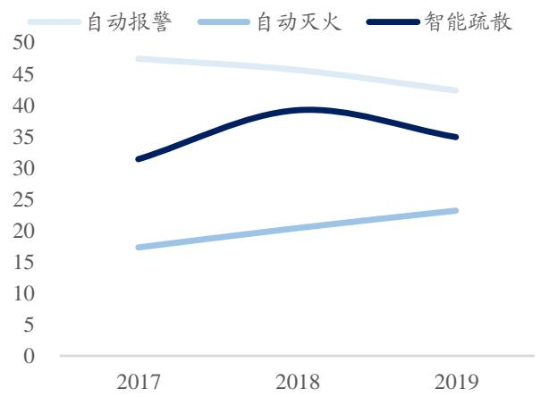
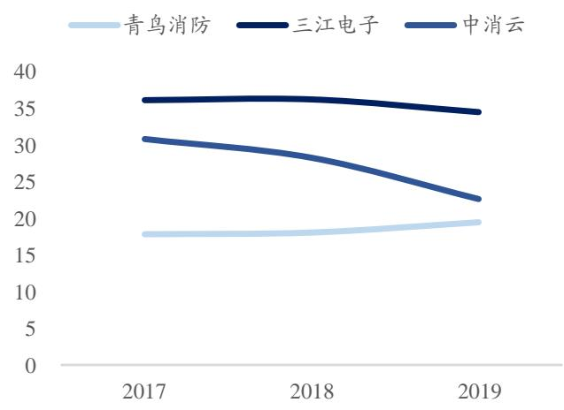

# 行业景气度上行 $+$ 市占率提升+云服务模式创新，会不会是下一个“广联达”？

买入（首次)

<table><tr><td>盈利预测与估值</td><td>2019A</td><td>2020E</td><td>2021E</td><td>2022E</td></tr><tr><td>营业收入（百万元)</td><td>2,271</td><td>2,634</td><td>3,291</td><td>4,120</td></tr><tr><td>同比(%)</td><td>27.80%</td><td>15.97%</td><td>24.97%</td><td>25.17%</td></tr><tr><td>归母净利润（百万元）</td><td>362</td><td>435</td><td>563</td><td>698</td></tr><tr><td>同比(%)</td><td>5.28%</td><td>20.21%</td><td>29.32%</td><td>23.90%</td></tr><tr><td>每股收益（元/股）</td><td>1.51</td><td>1.77</td><td>2.29</td><td>2.83</td></tr><tr><td>P/E（倍）</td><td>21.20</td><td>18.09</td><td>13.99</td><td>11.29</td></tr></table>

# 投资要点

# ■行业判断:需求加速释放确保高景气度，多重利好推动龙头市占率提升：

1）景气度判断一：消防产品市场超千亿，多重利好因素催化空间逐步释放；2)景气度判断二：历史数据充分证明，地产竣工面积下滑对行业影响有限；3)景气度判断三：应急疏散刚刚进入爆发期，有望再造一个消防报警市场；4）竞争格局判断：无论是管理更加规范、政策更加严格，还是技术更加先进、服务更加完善，对于具备更强研发、更优品质、更多渠道的龙头企业都是利好，2017-2019 年行业头部企业的市占率均出现了不同程度的提升，而其中青鸟消防作为龙头公司2017-2019 年市占率分别为 $6 . 1 4 \%$ $6 . 9 3 \%$ $8 . 3 5 \%$ ，市占率提升的尤为明显。

# ◼传统业务：渠道 $^ +$ 技术 $^ { + }$ 品牌是核心壁垒，稳态下高ROE水平仍将持续：

1）核心竞争力一：消防产品行业渠道为王，60余家稳定经销商一骑绝尘。消防产品行业经销模式为主，掌握核心经销商渠道是关键；公司推出特有的经销商模式效果显著，2016-2019 年经销商数量较为稳定、头部经销商单体销售金额持续扩张。2）核心竞争力二：全行业最高研发投入，2018、2019年研发费用分别为0.93、1.16亿元，相当于三江电子和中消云两家之和；自主研发的芯片目前已经满足自用，未来逐步在行业内推广可期。3)核心竞争力三：青鸟和久远品牌根深蒂固，下游客户认可度不断提升。4)核心竞争力四：良好的费用和成本管控能力，净利率水平领先全行业。我们认为，对于消防报警产品这样含有一定技术壁垒的生产制造行业来说，在头部企业的净利率水平已经下降至 10%以内的情况下，继续通过价格竞争使得盈利水平进一步下降的空间比较小了，而青鸟消防之所以能够始终保持15%以上的净利率水平，更多的还是依靠自身优秀的成本和费用管控能力。预计在行业经过充分竞争，达到稳态水平的情况下，公司的净利率水平大概率在 15%左右、周转率大约为0.8、杠杆率为1.3，稳态ROE水平约为 $1 5 . 6 \%$ 。

# ■新兴业务：进军工业领域优势明显，“云服务”业务创新盈利模式可期:

1）工业消防市场空间约为100-200 亿元/年，相比民用和商业，工业消防的壁垒更高且盈利能力更强，未来有望成为公司新的业绩增长点。2)智慧消防是产业发展必然趋势，“青鸟云”服务为后续推广SaaS 奠定坚实的客户基础（接入1万多家客户）。3）从产品销售到SaaS创新盈利模式可期，类比广联达的发展历程，展望未来3-5 年，行业景气度高企+传统业务市占率提升，公司业绩仍将持续稳定增长；在高市占率的基础上云服务模式将彻底重构公司的估值体系（海外有Adobe、Autodesk;国内有广联达、海康威视)，公司有望迎来业绩和估值的双击。

|盈利预测与投资评级：我们预计公司2020-2022年EPS分别为1.77、2.29、2.83 元，对应 PE分别为18、14、 $1 1$ 倍，首次覆盖给予“买入”评级。

■ 风险提示：行业竞争加剧造成毛利率持续下降、疫情影响需求等

2020年11月09日

证券分析师刘博  
执业证号：S060051807000218811311450liub@dwzq.com.cn证券分析师唐亚辉  
执业证号：S0600520070005tangyh@dwzq.com.cn

  
股价走势

<table><tr><td>市场数据</td><td>31.99</td></tr><tr><td>收盘价(元) 一年最低/最高价</td><td>20.10/50.94</td></tr><tr><td>市净率(倍)</td><td>2.72</td></tr><tr><td>流通A股市值(百</td><td></td></tr><tr><td>万元)</td><td>3966.76</td></tr></table>

<table><tr><td colspan="2">基础数据</td></tr><tr><td>每股净资产(元)</td><td>11.75</td></tr><tr><td>资产负债率(%)</td><td>22.80</td></tr><tr><td>总股本(百万股)</td><td>246.21</td></tr><tr><td>流通A股(百万</td><td>121.20</td></tr><tr><td>股)</td><td></td></tr></table>

# 相关研究

1、《山煤国际（600546）：传统主业高增长，携手“钧石”能源转型，打造异质结电池行业龙头可期》2019-09-03  
2、《三峡水利（600116）：长电入渝降成本、四网融合迎扩  
张，电网改革龙头腾飞可期》2020-03-07  
3、《宁水集团（603700）：老字号水表龙头插上NB-IoT科技翅膀，获益新基建、走向新未  
来》2020-04-13

# 内容目录

# 公司简介：预警-报警-防火-疏散-灭火，智慧消防一体化解决方案供应商...

1.1.火灾自动报警业务占比逐年降低，应急疏散业务增速最快且仍将持续. 4  
1.2.创始人深耕消防行业20 年，年初股权激励绑定核心经营管理层利益. 6

# ，行业判断：需求加速释放确保高景气度，多重利好推动龙头市占率提升..

2.1.景气度判断一：消防产品市场超千亿，多重利好因素催化空间逐步释放. 7  
2.2.景气度判断二：历史数据充分证明，地产竣工面积下滑对行业影响有限. ..8  
2.3.景气度判断三：应急疏散刚刚进入爆发期，有望再造一个消防报警市场 .9  
2.4.竞争格局判断：管理 $^ +$ 政策 $^ +$ 技术 $+$ 服务，近2 年来龙头市占率显著提升.. 10

# 3.传统业务：渠道 $^ +$ 技术 $^ +$ 品牌是核心壁垒，充分竞争后高ROE水平仍将持续. .13

3.1.核心竞争力一：消防产品行业渠道为王，60余家稳定经销商一骑绝尘. 14  
3.2.核心竞争力二：全行业最高研发投入，自制朱鹮芯片是技术最好证明. .17  
3.3.核心竞争力三：青鸟和久远品牌根深蒂固，下游客户认可度不断提升. 19  
3.4.核心竞争力四：良好的费用和成本管控能力，净利率水平领先全行业. .20

# 4.新兴业务：进军工业领域先发优势明显，“云服务”业务创新盈利模式可期.. .22

4.1.工业消防领域壁垒更高且盈利能力更强，将成为公司新的业绩增长点. .22  
4.2.智慧消防是产业发展必然趋势，“青鸟云”服务已具备坚实的客户基础. .23  
4.3.从产品销售到SaaS 创新盈利模式可期，打造消防报警行业的“广联达” 25

# 5.盈利预测与估值 27

6.风险提示…. .28

# 图表目录

图1：公司提供的智慧消防解决方案 .4  
图2：2016-2020H1 年公司营收和净利润情况（亿元） .5  
图3：2016-2020H1 年公司的毛利率和ROE情况 $( \%$ ) ..5  
图4：2017-2019 年公司分业务的收入情况（亿元） ..5  
图5：2017-2019 年分业务的毛利率情况 $( \%$ ) ….5  
图6：公司的股权结构（无实际控制人，董事长为创始人蔡为民） .6  
图7：消防安全行业主要分为产品和工程两个子行业.. .7  
图8：2009-2018 年消防报警行业的市场规模（亿元） .. 7  
图9：2014 年住宅房屋竣工面积出现峰值（万平方米） ..9  
图10：2016 年之后消防报警市场反而加速释放（亿元） ….9  
图11：消防应急照明及智能疏散指示系统.. .10  
图12：智慧消防的特点、模式、功效和呈现方式. .12  
图13：传统消防与智慧消防的对比和优劣. .12  
图14：电子元器件采购额占比原材料接近 $70 \%$ （亿元） .19  
图15：三江电子和中消云的电子元器件采购情况（亿元） .19  
图16：青鸟消防的毛利率不是最高但是净利率最高 $( \%$ .21  
图17：青鸟消防的期间费用率在三者中间最低 $( \%$ ) ..21  
图18：青鸟、三江、中消云的销售费用率对比（ $0 \%$ ) .21  
图19：青鸟、三江、中消云的管理费用率对比 $( \%$ ) .21  
图20：用于工业消防的高压细水雾灭火系统. .23  
图 21：从事工业消防相关业务的翼捷股份毛利率较高 $( \%$ ) .23  
图 22：传统消防模式的痛点. .23  
图 23：公司推出的一站式智慧消防平台.. .24  
图24：公司推出的消防系统接入方案. .24  
图25：2010 年至今广联达的三个不同发展阶段. .26  
图26：2010-2019 年广联达的收入和净利润情况（亿元） .26  
图27：2018、2019 年预收款增长体现云化效果（亿元) 26  
表1：消防纳入应急管理部后，审查验收职能移交住建部，管理更加规范 10  
表2：2020 年以来，多个省份先后发布深化消防执法改革的相关措施.. 11  
表3：消防产品行业中的头部企业市场占有率情况（单位：亿元） .13  
表4：消防产品行业直销和经销模式的对比.. .14  
表5：消防产品行业头部公司的销售模式. .15  
表6：2016-2018 年持续合作的56 家经销商收入情况（亿元） .16  
表7：2016-2018 年，公司对单个经销商收入的分布情况（家） 16  
表8：2016-2019 年，公司经销商单体销售金额持续扩张. .17  
表9：青鸟消防、三江电子、中消云研发人员和费用的对比（人、亿元） .18  
表10：2018-2020 年中国房地产开发企业500 强首选供应商 .20  
表11：公司与A股部分消防行业标的的估值比较. .28

# 1．公司简介：预警-报警-防火-疏散-灭火，智慧消防一体化解决方案供应商

公司成立于2001 年，过去 20 年业务始终聚焦于消防安全与物联网领域，目前产品覆盖了火灾报警消防的全链条，即早期预警 报警 防火 疏散逃生 灭火的全过程，其中，火灾自动报警及联动控制系统是公司产品系统的核心，具有强制安装性。以此为基础，公司产品逐渐延伸至火灾防控与消防的各细分领域，包括：电气火灾监控系统、可燃气体检测监控系统、防火门监控系统和余压监控系统、应急照明和智能疏散指示系统等，以及由上述所有产品共同构成的消防物联网平台——“青鸟智慧消防平台”（即“青鸟消防云”)，形成了“一站式”服务的闭环。

  
图1：公司提供的智慧消防解决方案  
数据来源：公司官网、东吴证券研究所

# 1.1．火灾自动报警业务占比逐年降低，应急疏散业务增速最快且仍将持续

2017-2019年，公司收入分别为14.75、17.77、22.71亿元，同比增速分别为 $1 5 . 0 5 \%$ $2 0 . 4 7 \%$ ， $2 7 . 8 0 \%$ ，3年复合增速为 $2 1 . 0 0 \%$ ；归母净利润分别为3.23、3.44、3.62亿元，同比增速分别为 $1 3 . 7 1 \% , 6 . 5 6 \% , 5 . 2 8 \% , 3$ 年复合增速为 $8 . 4 3 \%$ ；毛利率分别为 $4 3 . 8 9 \%$ $4 2 . 3 6 \%$ $3 9 . 5 6 \%$ ；净利率分别为 $2 1 . 7 8 \%$ $1 9 . 1 1 \%$ $1 5 . 5 0 \%$ ，ROE（平均）分别为 $3 3 . 4 8 \%$ $2 6 . 5 1 \%$ 、 $1 7 . 1 9 \%$ ，总体来看，公司业务的毛利率相对稳定，近年来净利率和ROE下滑大概率是因为行业竞争加剧。分业务来看：

1)火灾自动报警及联动控制系统产品：2017-2019 年收入分别为12.28、13.54、16.01亿元,增速分别为 $1 2 . 9 7 \% , 1 0 . 2 6 \% , 1 8 . 2 4 \%$ ，占比总营收分别为 $8 3 . 2 5 \% . 7 6 . 2 0 \% . 7 0 . 5 0 \%$ 。

是公司的支柱业务，但是占比在逐年降低，毛利率分别为 $4 7 . 4 9 \%$ 、 $4 5 . 6 5 \%$ 、 $4 2 . 2 8 \%$ 。

2）消防自动灭火系统：2017-2019 年收入分别为1.28、1.75、2.33亿元，增速分别为 $1 1 . 3 0 \%$ $3 6 . 7 2 \%$ $3 3 . 1 4 \%$ ，占比总营收分别为 $8 . 6 8 \%$ $9 . 8 5 \%$ 、 $1 0 . 2 6 \%$ ，毛利率分别为 $1 7 . 1 7 \%$ ， $2 0 . 2 8 \%$ ， $2 3 . 0 8 \%$ ，从营收占比来看该业务占比不高，但是增速较为稳定，且毛利率水平逐年上行。

3）智能疏散与防火门监控系统：2017-2019 年收入分别为0.40、0.82、1.72亿元，2018、2019 年增速分别为 $1 0 5 . 0 0 \% . 1 0 9 . 7 6 \%$ ，占比总营收分别为 $2 . 7 1 \% , 4 . 6 1 \% , 7 . 5 7 \%$ ,毛利率分别为 $3 1 . 3 0 \%$ $3 9 . 1 6 \%$ $34 . 8 5 \%$ ，2018 年住建部新版《消防应急照明和疏散指示系统技术标准》发布后，该业务开始迅速发展，考虑到目前我国应急疏散市场才刚刚打开，预计该业务未来3-5 年仍将维持高速增长态势。

  
图2：2016-2020H1年公司营收和净利润情况（亿元）  
数据来源：Wind、东吴证券研究所

  
图3：2016-2020H1 年公司的毛利率和ROE情况 $( \%$   
数据来源：Wind、东吴证券研究所

  
图4：2017-2019年公司分业务的收入情况（亿元）  
数据来源：Wind、东吴证券研究所

  
图5：2017-2019 年分业务的毛利率情况 $( \%$ )

数据来源：Wind、东吴证券研究所

# 1.2．创始人深耕消防行业 20 年，年初股权激励绑定核心经营管理层利益

公司治理方面：公司的控股股东是港股上市公司北大青乌环宇（8095.HK)，由于北大青鸟环宇股权结构一直较为分散，无任何一方股东持有 $30 \%$ 以上的股权；无任何一方股东能够基于其所持表决权股份或其选出的董事在董事会中的席位决定北大青鸟环宇股东大会或董事会的审议事项；无任何一方北股东可以对北大青鸟环宇的决策形成实质性控制，因此北大青鸟环宇无控股股东和实际控制人。由此造成上市公司只有控股股东，而无实际控制人。目前公司董事长为创始人蔡为民，蔡总于 2001 年 6 月起担任公司前身青鸟消防有限董事、总经理,兼任中国消防协会第六届理事会理事，全国消防标准化技术委员会火灾探测与报警分技术委员会委员，全国专业标准化技术委员会委员等职务，深耕消防行业20余年。

  
图6：公司的股权结构（无实际控制人，董事长为创始人蔡为民）（截至2020.10.26）  
数据来源：公司官网、东吴证券研究所

股权激励：2020年4月，公司公告拟向54名激励对象授予股权激励计划，1）以18.93 元/股的价格授予585.625 万份股票期权，其中首次授予468.500 万份、预留 117.125万份；2）以 12.62元/股的价格授予776.250 万股限制性股票，其中首次授予621.000 万股、预留155.250 万股，所有股票来源均为定向发行。股权激励行权的业绩考核目标为：以2018 年营业收入为基数，2020、2021、2022 年营业收入增长率不低于 $45 \%$ $70 \%$ $1 0 5 \%$ ；或者以2018年净利润为基数，2020、2021、2022 年净利润增长率不低于 $6 . 6 \%$

# 2．行业判断：需求加速释放确保高景气度，多重利好推动龙头市 占率提升

1）景气度判断一：消防产品市场超千亿，多重利好因素催化空间逐步释放；2）景气度判断二：历史数据充分证明，地产竣工面积下滑对行业影响有限；3）景气度判断三：应急疏散刚刚进入爆发期，有望再造一个消防报警市场；4）竞争格局判断：无论是管理更加规范、政策更加严格，还是技术更加先进、服务更加完善，对于具备更强研发、更优品质、更多渠道的龙头企业都是利好，2017-2019 年行业头部企业的市占率均出现了不同程度的提升，而其中青鸟消防作为龙头公司 2017-2019 年市占率分别为 $6 . 1 4 \%$ $6 . 9 3 \%$ 、 $8 . 3 5 \%$ ，市占率提升的尤为明显。

# 2.1．景气度判断一：消防产品市场超千亿，多重利好因素催化空间逐步释放

消防产品市场空间为千亿量级，其中消防报警产品超过 200 亿元/年。消防安全行业主要分为消防产品和消防工程两个子行业，其中消防产品又可细分成消防装备、消防报警、自动灭火、防火与疏散、通用与防烟排烟、消防供水等6 大类，消防装备主要用于消防部队，其他5 大类主要用于建筑物消防。根据智研咨询披露的数据，2019 年中国消防行业市场规模超过 3500 亿元，预计到 2022 年市场规模将达到 4465 亿元，其中消防产品约占 $2 5 \%$ ，对应1116亿元；消防工程约占 $7 5 \%$ ，对应3349 亿元。而根据慧聪消防网的统计，在消防产品细分行业中，消防报警行业市场规模从 2009 年的70.20 亿元增长至 2018 年的 256.40 亿元，年复合增长率为 $1 5 . 5 0 \%$ 。

  
图7：消防安全行业主要分为产品和工程两个子行业

  
图8：2009-2018年消防报警行业的市场规模（亿元）

数据来源：公司招股说明书、东吴证券研究所数据来源：慧聪消防网、东吴证券研究所

# 消防安全意识增强 $^ +$ 更多強製应用场景 $^ +$ 政府采购倾向国产，多重利好加速行业空间释放：

1）消防安全意识增强：根据应急管理部消防救援局的统计数据，2009-2019 年我国火灾共造成 1335 人死亡、837 人受伤、直接财产损失达36.12 亿元；而根据公安部发布的通报，截至 2017 年上半年全国 23.5 万幢高层住宅建筑中，未设置自动消防设施的占$4 6 . 2 \%$ ，设有自动消防设施的高层建筑平均完好率不足 $50 \%$ 。2017年10月，国务院印发《消防安全责任制实施办法》，首次对消防安全责任制的实施做出全面具体规定，随着消防安全责任制度加速推进，消防宣传和管理力度不断加大，社会整体消防意识将快速提高，消防产品需求量势必增加，有利于消防产品行业市场稳步增长。

2）政府采购倾向国产：近年来我国消防产品技术水平快速提升，国产消防产品在应用领域、适用环境、产品和服务质量、技术更新等方面与国外先进水平差距日益缩小，部分产品技术水平和产品质量已经达到或超过进口产品，政府消防产品采购正在逐步向该部分国产品牌倾斜。随着国产消防产品在政府采购中的比例不断上升，国产品牌将迎来新的发展机遇。

3）家用、农村、存量更换、多品类等更多强制应用场景：在发达国家，家用消防产品已经成为消防产业发展的重要市场之一，而在国内，家用消防市场仍处于起步阶段，目前山东、上海、北京、云南等地相继出台相应政策，要求中小场所（包括家庭）安装使用独立式火灾探测报警器。县城集镇和农村潜在消防市场空间巨大，在政策引导和基础建设加快投入的驱动下，市场需求会逐步释放，推动消防产品市场下沉。根据《火灾探测报警产品的维修保养与报废》规定，火灾探测报警产品使用寿命一般不超过12 年，可燃气体探测器中气敏元件、光纤产品中激光器件的使用寿命不超过5 年，随着前期竣工民用建筑安装的配套消防产品进入集中更换期，在可预见的一段时期内消防产品存量市场将进入快速增长阶段。除此之外，火灾自动报警系统、消防电源监控系统、电气火灾监控系统、疏散及灭火系统等其他相关消防系统产品的市场也将伴随着政策的不断落地，空间逐步打开。

# 2.2．景气度判断二：历史数据充分证明，地产竣工面积下滑对行业影响有限

从直观上感受，城镇化进程的不断推进，使得大量公共建筑、居民住房、商业建筑进行新建、扩建、改建，由此带来对消防产品需求的不断增长。那么，假设未来房地产竣工面积不断下降，是否会对消防产品的需求产生影响？为了解决这个问题，我们统计了2003-2018 年建筑业竣工面积（房屋总额、住宅房屋、商业及服务房屋）的数据（数据来源为国家统计局），可以发现，2014 年建筑业竣工面积（房屋总额）和建筑业竣工面积（住宅房屋）分别达到 39.99 亿平方米和27.34 亿平方米的峰值，之后逐年小幅下滑；2016 年建筑业竣工面积（商业及服务房屋）达到 28.85 亿平方米的峰值，之后逐年小幅下滑。而与此同时，根据慧聪消防网的数据，消防报警行业的市场规模在2009、2012、2016、2018 年分别为70.2、74.9、130.3、256.4 亿元，可算出2009-2012 年年复合增速为 $2 . 1 8 \%$ ;2012-2016年年复合增速为 $1 4 . 8 5 \%$ ;2016-2018年年复合增速为 $4 0 . 2 8 \%$ ,因此，我们可以得出结论，虽然在2014年和2016 年，住宅房屋和商业服务房屋的竣工面积分别出现了峰值且之后逐年下降，但是消防报警行业的市场规模反而在 2016 年之后开始明显加速，因此地产竣工面积下滑对行业需求的影响几乎可以忽略不计。

  
图9：2014年住宅房屋竣工面积出现峰值（万平方米）  
数据来源：国家统计局、东吴证券研究所

  
图10：2016 年之后消防报警市场反而加速释放（亿元）  
数据来源：慧聪消防网、东吴证券研究所

# 2.3．景气度判断三：应急疏散刚刚进入爆发期，有望再造一个消防报警市场

消防应急照明和疏散指示系统广泛应用于机场、高速铁路、地铁、大型商场、酒店、写字楼等公共场所，在紧急情况下，为人员智能疏散和逃生指引方向。2019 年以前，由于相关法律法规不健全、设计理解不一、施工人员技术欠缺，导致产品设计、选型、安装和使用中存在诸多问题，行业中的 400 多家生产企业，既有原从事消防报警、应急照明的大型企业，也有单一产品线贴牌、自主品牌的中小型企业，其中大多数中小型企业均以价格竞争为主要手段，产品同质化严重。2019 年3 月，《消防应急照明和疏散指示系统技术标准》发布实施；2020 年4 月，市场监管总局优化强制性产品认证目录，消防应急照明和疏散指示产品作为“避难逃生产品”平行于“火灾报警产品”，成为一个独立品类。根据《消防应急照明和疏散指示系统技术标准》主要起草人之一国家消防电子产品质检中心副主任丁宏军的预估，智能疏散市场规模约3 倍于消防报警市场。按照 2018年消防报警行业市场规模 256.40 亿元计算，智能疏散市场规模约为 769.20 亿元；假设市场结构与消防行业类似，其中产品市场占比为 $2 5 \%$ ，对应市场空间约为192.30 亿元/

年。

  
图11：消防应急照明及智能疏散指示系统  
数据来源：招股说明书、东吴证券研究所

# 2.4.竞争格局判断：管理 $^ { + }$ 政策 $+$ 技术 $+ ,$ 服务，近2 年来龙头市占率显著提升

消防审查验收职能移交住建部，管理更加规范：1)2018年3月，应急管理部成立，公安消防部队、武警森林部队转制后，与安全生产等应急救援队伍一并作为综合性常备应急骨干力量，由应急管理部管理。2）2019 年3月，住建部和应急管理部联合发文，明确消防救援机构向住建部移交建设工程消防设计审查验收职责工作，2019 年4 月1日至 6 月 30 日为移交承接期，各地应于6 月30 日前全部完成移交承接工作。2019 年以前，消防部门既负责工程的消防设计审查验收，又负责日常的监督管理，相当于又当裁判员又当运动员，在这一过程中不可避免地会产生寻租行为，使得行业中存在大量的依附于地市级及县级消防部门的小微消防产品设计生产商。2019 年消防设计审查验收职能移交后，由住建部门对工程进行设计审核验收，消防部门负责日常的监督管理，有利于更加规范化的管理。在这一变革过程中，行业迎来洗牌，部分单纯依靠关系的小微企业逐渐退出市场，龙头和品牌企业的核心竞争优势进一步彰显、市场竞争格局逐步提升。

表1：消防纳入应急管理部后，审查验收职能移交住建部，管理更加规范  

<table><tr><td>时间</td><td>发布部门</td><td>政策文件</td><td>主要内容</td></tr><tr><td>2018.3</td><td>全国人大</td><td></td><td>组建应急管理部，公安消防部队、武警森林部队转制 国务院机构改革方案后，与安全生产等应急救援队伍一并作为综合性常备应 急骨干力量，由应急管理部管理</td></tr><tr><td>2019.3</td><td>住建部、应急</td><td></td><td>《关于做好移交承接明确消防救援机构向住建部移交建设工程消防设计审查</td></tr></table>

<table><tr><td></td><td>管理部</td><td>建设工程消防设计审 查验收职责的通知》</td><td>验收职责工作，2019年4月1日至6月30日为移交承 接期，各地应于6月30 日前全部完成移交承接工作</td></tr><tr><td>2019.3</td><td>中共中央办公 厅、国务院办 公厅</td><td>《关于深化消防执法 改革的意见》</td><td>提出了消防执法改革5个方面 12项主要任务</td></tr><tr><td>2019.11</td><td>住建部</td><td>《火灾自动报警系统 施工及验收标准》</td><td>顺应行业变化和发展趋势，大幅补充完善、细化系统部 件安装、调试、检测验收的内容，将很多新的火灾自动 报警产品纳入新版的《火灾自动报警系统施工及验收标 准》</td></tr></table>

数据来源：应急管理部、住建部、东吴证券研究所

强化火灾事故倒查追责 $^ +$ 严肃消防执法责任追责，政策更加严格：2019 年3 月，中共中央总书记、国家主席、中央军委主席习近平主持召开中央全面深化改革委员会第七次会议，审议通过了《关于深化消防执法改革的意见》，其中最核心的内容为：

1）开放消防产品认证检验市场。将列入《强制性产品认证目录》的16 类消防产品全部取消强制性产品认证，改为自愿性认证，开放消防产品认证检验市场，凡是具备法定条件的认证检验机构均可开展认证、检验工作，检测中对出具的文件负责并承担相应法律责任。市场监管部门对生产和销售进行监督，消防部门对使用领域的消防产品质量实施监督，发现产品质质量问题，依法查处并纳入“黑名单”，向社会公布。

2）实行“双随机一公开”监管办法。利用电脑摇号随机确定抽检对象、随机确定检查人员，检查计划和检查结果要及时告知被检查单位并向社会公开，从源头上消除灰色寻租行为。

3）强化火灾事故倒查追责。对亡人和造成重大社会影响的火灾逐起组织调查，倒查工程建没、中介服务、消防产品质量、使用管理等各方主体责任，纳入“黑名单”管理，实施联合惩戒，依法给予相关责任单位停业整顿、降低资质等级、吊销资质证书和营业执照等处罚，依法给予相关责任人员暂停执业、吊销资格证书、一定时间内直至终身不得进入行业等处罚。同时，严格追究属地管理和部门监管责任。

4）严肃消防执法责任追责。明确执法岗位和执法人员具体责任。建立健全消防执法责任制和执法质量终身负责制。对通过火灾事故调查、执法检查监督以及群众举报投诉发现不作为和乱作为问题，坚决做到有责必问、追责必严。对违法违规实施审批或处罚的，一律追究行政责任，对利用职权谋取不正当利益的，一律予以停职查办；对造成恶劣影响或严重后果的，除追究直接责任人员的责任外，一律追究相关领导责任。

表2：2020 年以来，多个省份先后发布深化消防执法改革的相关措施  

<table><tr><td>时间 省份</td><td></td><td></td></tr><tr><td></td><td></td><td>內容</td></tr></table>

<table><tr><td>2020.5</td><td>广东</td><td>《关于深化消防执法 改革的若干措施》</td><td>围绕取消精简消防审批、加强事中事后监管、规范消防执法行为、 优化便民利企服务四个方面展开，制定15大项46子项工作任务， 其中有36项改革措施为广东首创。</td></tr><tr><td>2020.6</td><td>重庆</td><td>《关于深化消防执法 改革的实施意见》</td><td>持续推进消防“放管服”改革、全面构建“六位一体”消防监管体 系、全面提升消防执法规范化建设水平和强化消防执法廉政监督。</td></tr><tr><td>2020.6</td><td>江苏</td><td>《关于深化消防执法 改革的实施意见》</td><td>共14 项改革任务，明确了各有关部门的消防执法改革任务分工，明 确消防执法监督、执法责任追究、消防执业规范</td></tr><tr><td>2020.6</td><td>江西</td><td>展若干措施》</td><td>《关于深化消防执法进一步深化消防执法改革、加快构建科学合理、规范高效、公开公 改革助力经济社会发正的消防监督管理体系，确保消防安全形势持续稳定向好，助力全 省经济社会高质量跨越式发展</td></tr></table>

数据来源：各省政府门户网站、东吴证券研究所

“传统消防”向“智慧消防”转变是必然趋势，技术更加先进：2017 年10 月，公安部消防局发布了《关于全面推进“智慧消防”建设的指导意见》要求综合运用物联网、云计算、大数据、移动互联网等新兴信息技术，加快推进“智慧消防”建设，全面促进信息化和消防业务工作的深度融合，为构建立体化、全覆盖的社会火灾防控体系，打造符合实战要求的现代消防警务勤务机制提供有力支撑，全面提升社会火灾防控能力、部队灭火应急救援能力和队伍管理水平，实现“传统消防”向“智慧消防”的转变。另一方面，随着智慧城市和智慧楼宇概念的提出，消防智能化已和网络化成为行业必然发展趋势，大数据和模式识别技术使得单一传感器可以区分烟雾、水蒸气和粉尘等；物联网技术应用使多种传感器组网成为可能，并创建新的综合感知体系。在标准不断提升、技术不断升级的过程中，重研发、重创新的头部企业核心竞争力进一步彰显。

  
图12：智慧消防的特点、模式、功效和呈现方式  
数据来源：慧聪安防网、东吴证券研究所

  
图13：传统消防与智慧消防的对比和优劣  
数据来源：华数余杭官网、东吴证券研究所

从产品到运维再到系统解决方案的需求不断涌现，服务更加完善：随着消防产品供应的增加，客户可选择范围的扩大，从最初单纯比较产品价格向更重视系统维护便捷程度、提供技术难题解决方案等技术服务质量转变，技术服务能力正成为消防产品生产企业的核心竞争力之一；另一方面，从发达国家发展经验看，从消防产品到消防运维再到消防整体解决方案，最终演化为消防 $+ .$ 安防的大安全服务模式是产业发展的趋势和方向，在这一过程中，只有具备完善服务能力的龙头企业才更有可能脱颖而出。

管理更加规范 $+$ 政策更加严格 $^ +$ 技术更加先进 $^ +$ 服务更加完善，近年来龙头市占率显著提升。根据我们在前文中的介绍：1）消防审查验收职能移交住建部，管理更加规范；2）强化火灾事故倒查追责 $^ + ,$ 严肃消防执法责任追责，政策更加严格；3）“传统消防”向“智慧消防”转变是必然趋势，技术更加先进；4）从产品到运维再到系统解决方案的需求不断涌现，服务更加完善，无论是管理规范、政策严格，还是技术先进、服务完善，对于具备更强研发、更优品质、更多渠道的龙头企业都是利好。实际上，根据我们掌握的数据，2017-2019 年，1）行业龙一青鸟消防的收入规模分别为14.75、17.77、22.71亿元，市占率分别为 $6 . 1 4 \% \cdot 6 . 9 3 \% \cdot 8 . 3 5 \% ; 2 $ 行业龙三三江电子的收入规模分别为7.38、8.31、9.35亿元，市占率分别为 $3 . 0 7 \%$ $3 . 2 4 \%$ $3 . 4 4 \%$ ；3）行业龙五中消云的入规模分别为5.54、6.21、7.47亿元，市占率分别为 $2 . 3 1 \%$ ， $2 . 4 2 \%$ $2 . 7 5 \%$ ，我们可以发现，行业头部企业的市占率均出现了不同程度的提升，而其中青鸟消防作为龙头公司，市占率提升的尤为明显。

表3：消防产品行业中的头部企业市场占有率情况（单位：亿元）  

<table><tr><td colspan="3">2017</td><td colspan="2">2018</td><td colspan="2">2019</td></tr><tr><td></td><td>收入</td><td>市占率</td><td>收入</td><td>市占率</td><td>收入</td><td>市占率</td></tr><tr><td>青鸟消防</td><td>14.75</td><td>6.14%</td><td>17.77</td><td>6.93%</td><td>22.71</td><td>8.35%</td></tr><tr><td>海湾安全</td><td></td><td></td><td></td><td></td><td>21.00</td><td>7.72%</td></tr><tr><td>三江电子</td><td>7.38</td><td>3.07%</td><td>8.31</td><td>3.24%</td><td>9.35</td><td>3.44%</td></tr><tr><td>利达华信</td><td></td><td></td><td></td><td></td><td>8.00</td><td>2.94%</td></tr><tr><td>中消云</td><td>5.54</td><td>2.31%</td><td>6.21</td><td>2.42%</td><td>7.47</td><td>2.75%</td></tr><tr><td>松江繁飞</td><td>4.50</td><td>1.87%</td><td></td><td></td><td></td><td></td></tr><tr><td>鼎信消防</td><td>0.54</td><td>0.22%</td><td></td><td></td><td></td><td></td></tr></table>

数据来源：青鸟消防招股说明书、东吴证券研究所

# 3.传统业务：渠道 $+$ 技术 $^ { + }$ 品牌是核心壁垒，充分竞争后高ROE水平仍将持续

1）核心竞争力一：消防产品行业渠道为王，60余家稳定经销商一骑绝尘。消防产品行业经销模式为主，掌握核心经销商渠道是关键;公司成立之初即确定经销策略，2008年推出新机制绑定经销商利益；公司特有的经销商模式效果显著，2016-2019 年公司的经销商数量较为稳定、头部经销商的数量逐年增加且单体销售金额持续扩张。2)核心竞争力二：全行业最高研发投入，自制朱鹮芯片是技术最好证明。2018、2019 年公司研发费用分别为 0.93、1.16 亿元，相当于三江电子和中消云两家之和；自主研发的国内第一款消防报警专用高集成数模传感器芯片朱鹮 2020 年处于量产状态，目前已经足够满足公司自身的需求。未来朱鹮芯片将会围绕总线通信和模拟信号处理等开展进一步的研发，逐步实现在行业内大范围推广是大概率事件。3）核心竞争力三：青鸟和久远品牌根深蒂固，下游客户认可度不断提升。依托于产品的卓越质量及优质服务，公司的“青鸟”和“久远”品牌在广大的客户群体中获得了较高的口碑和声誉，根据中国房地产业协会、中国房地产测评中心联合发布的 2018-2020年《中国房地产开发企业500强测评研究报告》，青鸟消防的品牌首选率在 2020 年首次超过海湾，成为消防设施类排名第一。4)核心竞争力四：良好的费用和成本管控能力，净利率水平领先全行业。我们认为，对于消防报警产品这样含有一定技术壁垒的生产制造行业来说，在行业头部企业的净利率水平已经下降至 10%以内的情况下，继续通过价格竞争使得盈利水平进一步下降的空间和概率都比较小了，而青鸟消防之所以能够始终保持 $1 5 \% r \lambda$ 上的净利率水平，更多的还是依靠自身优秀的成本和费用管控能力。我们预计，在行业经过充分竞争，达到稳态水平的情况下，公司的净利率水平大概率在 $1 5 \%$ 左右、周转率大约为 0.8、杠杆率为 1.3，稳态 ROE 水平约为15.6%。

# 3.1．核心竞争力一：消防产品行业渠道为王，60 余家稳定经销商一骑绝尘

消防产品行业经销模式为主，掌握核心经销商渠道是关键。目前消防产品行业主要有经销和直销两种方式，根据我们的统计：1）行业龙一青鸟消防“经销为主、直销为辅”，2017-2019年经销收入分别为11.20、13.21、16.64亿元，占比总收入分别为 $7 6 . 5 1 \%$ $7 5 . 0 7 \%$ $7 4 . 3 0 \%$ ；2）行业龙三三江电子“直销为主、经销为辅”，但是正在逐渐加大对于经销商的开发力度，2017-2019 年经销收入分别为 $0 . 7 0 , \ 0 . 6 4 , \ 0 . 5 6$ 亿元，占比总收入分别为 $9 . 7 5 \%$ $7 . 8 6 \%$ $6 . 0 1 \%$ ；3）行业龙五中消云“经销为主、直销为辅”，2017-2019年经销收入分别为 $3 . 3 9 , 4 . 2 3 , 5 . 8 4$ 亿元，占比总收入分别为 $6 1 . 2 0 \%$ $6 8 . 0 8 \%$ $78 . 2 0 \%$ 。行业头部企业中，只有外资背景的海湾安全是采用直销模式，其他均已经或者正在采用经销模式，因此我们可以判断消防产品行业经销模式是主流，从而掌握稳定高效的经销商渠道是核心壁垒。

表4：消防产品行业直销和经销模式的对比  

<table><tr><td>项目</td><td>直销</td><td>经销</td></tr><tr><td>客户类型</td><td>消防工程商、房地产开发商</td><td>经销商</td></tr><tr><td>产品类别</td><td>消防产品、安防产品</td><td>消防产品、安防产品</td></tr></table>

<table><tr><td>订单取得方式</td><td>商务洽谈、招投标等</td><td>商务洽谈</td></tr><tr><td>定价政策</td><td>基于市场原则协商确定</td><td>每年协商确定经销产品折扣</td></tr><tr><td>折扣返利政策</td><td>无经销商价格折扣、无返利</td><td>无返利经销商：享受价格折扣；有返利经销商：享受 价格折扣和返利</td></tr><tr><td>发货流程</td><td>位置；通常为工程项目现场</td><td>根据客户要求，公司发货到客户指定根据经销商要求，公司发货到经销商指定位置；通常 为工程项目现场</td></tr><tr><td>信用政策及收 款流程</td><td>在具体项目合同中约定具体信用期， 不存在固定的信用期。按照合同约定 进度收款</td><td>无返利经销商：一般每个季度对账结算一次货款；通 常对账后3个月内付款；有返利经销商：全年进行应 收账款额度管理，额度满后款到发货</td></tr></table>

数据来源：三江电子招股说明书、东吴证券研究所

表5：消防产品行业头部公司的销售模式  

<table><tr><td>公司</td><td>创立时间</td><td>员工人数</td><td>销售模式</td><td>销售区域</td></tr><tr><td>青鸟消防</td><td>2001年</td><td>2434</td><td>经销为主，60余家经销商</td><td>全国</td></tr><tr><td>海湾安全</td><td>1993 年</td><td>超过3000</td><td>直销为主</td><td>全国</td></tr><tr><td>三江电子</td><td>1994 年</td><td>1734</td><td>直销为主，经销为辅，逐步加大经销商开发</td><td>全国</td></tr><tr><td>中消云</td><td>2011年</td><td>1035</td><td>经销为主，近500家经销商</td><td>全国</td></tr></table>

数据来源：Wind、东吴证券研究所

公司成立之初即确定经销策略，2008 年推出新机制绑定经销商利益。青鸟消防自成立之初即确立了以“经销为主、直销为辅”的发展策略，公司经销模式的演变可以归纳为以下三个阶段:

1)2001-2003 年，公司处于初创期，知名度很低并且缺乏运行业绩，公司采取了“一般经销”模式，即经销商既可以经销本公司的产品，也可以经销其他品牌的产品。

2)2004-2007 年，公司产品逐渐被市场认可，品牌知名度有了一定提升，公司主动向全国各主要城市及区域拓展，采取了在全国重点城市设立办事处以及子公司、参股公司进行经销的模式。大部分设立的办事处均为自负盈亏的经销商性质，在经销产品的价格、业绩指标考核等方面与一般经销商一致。

3）2008年至今，为了解决激励机制和运营费用高企的问题，公司一方面将办事处转变为公司制运营的经销商，另一方面要求一般经销商全部转变为专卖经销商。其中，将办事处转变为公司制经销商的具体原则为：鼓励办事处的主要业务骨干单独或与当地较有实力的经销商共同投资成立公司制企业，公司通过与其签订经销协议，形成牢固的专卖经销商关系；办事处的员工自愿成为新成立的公司制运营的经销商的员工，并与公司解除劳动关系；为帮助个别公司制运营的经销商度过成立之初的困境，打消经销商的股东对于市场开拓的顾虑，公司采用了参股该等经销商，辅导其进行市场开拓的策略。

特有经销商模式效果显著，经销商数量稳定且单体规模持续扩张。根据我们前文中介绍的青鸟消防的经销商模式，我们可以发现其特点是：1)公司向经销商销售产品全部实行买断式销售；2)排他性专卖，即经销商不准经营与本公司产品同类的其他品牌的消防产品；3）经销商负责本区域的产品销售及提供售后服务；4）公司通过定期或者不定期组织技术人员和管理层人员对各地经销商进行专业化培训、提供技术支持作为后盾、对经销商给予一定的信用额度（超过信用额度的货款实行现款现货制度）、通过全年销售任务和全年区域目标两个指标对经销商业绩进行考核等办法进行管理。从实施效果来看：

1）2016-2019 年经销商数量较为稳定：根据公司招股说明书，2016-2018 年，有56家经销商持续与公司合作，收入合计分别为 9.25、10.85、12.80 亿元，占比经销总收入分别为 $9 3 . 9 0 \%$ $9 6 . 8 6 \%$ $9 6 . 8 7 \%$ 。2019 年详细数据没有披露，但是根据公司2019 年年报内容，公司在国内有60 余家一级经销商，因此我们可以判断，2016-2019 年公司经销商数量，尤其是核心经销商数量应该是较为稳定。

2)2016-2019 年经销商单体销售金额持续扩张：根据公司的招股说明书，2016-2018年，公司的经销商中销售额在4000 万以上的数量分别为3、6、9 家，数量逐年增多；2016 年公司前三大经销商（山东青鸟、河南青鸟、合肥青鸟）的销售收入分别为0.85、0.75、0.48亿元，2017年前三大经销商（河南青鸟、山东青鸟、合肥青鸟）分别为1.00、0.92、0.58亿元，2018年前三大经销商（山东青鸟、河南青鸟、合肥青鸟）分别为1.05、0.91、0.79 亿元，2019 年前三大经销商分别为1.48、1.23、0.81亿元。因此我们可以发现，一方面公司的经销商中头部经销商的数量逐年增加，另一方面经销商单体销售金额持续扩张。

表6：2016-2018年持续合作的56家经销商收入情况（亿元）  

<table><tr><td>项目</td><td>2016</td><td>2017</td><td>2018</td></tr><tr><td>持续合作的56家经销商收入合计</td><td>9.25</td><td>10.85</td><td>12.80</td></tr><tr><td>经销收入总额</td><td>9.85</td><td>11.20</td><td>13.21</td></tr><tr><td>占比</td><td>93.90%</td><td>96.86%</td><td>96.87%</td></tr></table>

数据来源：公司招股说明书、东吴证券研究所

表7：2016-2018年，公司对单个经销商收入的分布情况（家）  

<table><tr><td>经销商销售额分布</td><td>2016</td><td>2017</td><td>2018</td></tr><tr><td>500万以下</td><td>15</td><td>13</td><td>11</td></tr><tr><td>500-1000万</td><td>16</td><td>12</td><td>12</td></tr><tr><td>1000-2000万</td><td>14</td><td>17</td><td>16</td></tr><tr><td>2000-3000万</td><td>9</td><td>7</td><td>9</td></tr><tr><td>3000-4000万</td><td>5</td><td>4</td><td>4</td></tr></table>

<table><tr><td>4000万以上</td><td>3</td><td>6</td><td>9</td></tr><tr><td>合计</td><td>62</td><td>59</td><td>61</td></tr></table>

数据来源：公司招股说明书、东吴证券研究所

表8：2016-2019 年，公司经销商单体销售金额持续扩张  

<table><tr><td>时间</td><td>经销商名称</td><td>销售收入（亿元)</td><td>占比总收入</td></tr><tr><td rowspan="6">2016</td><td>山东鸟</td><td>0.85</td><td>6.64%</td></tr><tr><td>河南鸟</td><td>0.75</td><td>5.86%</td></tr><tr><td>合肥</td><td>0.48</td><td>3.73%</td></tr><tr><td>西安青鸟</td><td>0.40</td><td>3.10%</td></tr><tr><td>贵</td><td>0.34</td><td>2.67%</td></tr><tr><td>合计</td><td>2.82</td><td>21.99%</td></tr><tr><td rowspan="6">2017</td><td>河南</td><td>1.00</td><td>6.76%</td></tr><tr><td>山东鸟</td><td>0.92</td><td>6.24%</td></tr><tr><td></td><td>0.58</td><td>3.97%</td></tr><tr><td>西安青鸟</td><td>0.49</td><td>3.34%</td></tr><tr><td>南</td><td>0.42</td><td>2.88%</td></tr><tr><td>合计</td><td>3.42</td><td>23.19%</td></tr><tr><td rowspan="6">2018</td><td>山东鸟</td><td>1.05</td><td>5.88%</td></tr><tr><td>河南鸟</td><td>0.91</td><td>5.13%</td></tr><tr><td>合肥青鸟</td><td>0.79</td><td>4.43%</td></tr><tr><td>南</td><td>0.55</td><td>3.12%</td></tr><tr><td>江西北青</td><td>3.82</td><td>2.95%</td></tr><tr><td>合计</td><td>3.42</td><td>21.52%</td></tr><tr><td rowspan="6">2019</td><td>客户一</td><td>1.48</td><td></td></tr><tr><td>客户二</td><td></td><td>6.52%</td></tr><tr><td>客户三</td><td>1.23</td><td>5.43%</td></tr><tr><td>客户四</td><td>0.81</td><td>3.59%</td></tr><tr><td>客户五</td><td>0.75 0.68</td><td>3.32% 2.97%</td></tr><tr><td>合计</td><td></td><td></td></tr><tr><td></td><td></td><td>3.42</td><td>21.84%</td></tr></table>

数据来源：公司招股说明书、公司年报、东吴证券研究所

# 3.2．核心竞争力二：全行业最高研发投入，自制朱鹮芯片是技术最好证明

研发投入全行业最高，相当于三江电子和中消云两家加总。根据公司招股说明书和年报，2017-2019 年青鸟消防的研发费用分别为0.66、0.93、1.16 亿元，占比营收分别为$4 . 5 0 \%$ $5 . 2 2 \%$ $5 . 1 1 \%$ ；三江电子的研发费用分别为0.59、0.55、0.59亿元，占比营收分别为 $8 . 0 0 \%$ ， $6 . 6 4 \%$ 、 $6 . 3 6 \%$ ；中消云的研发费用分别为0.35、0.40、0.36亿元，占比营收分别为 $6 . 3 5 \%$ $6 . 3 8 \%$ $4 . 7 7 \%$ ，我们可以发现：1）消防产品行业的研发投入占比均较高；2）其中青鸟消防的研发投入绝对值是行业最高，2018、2019 年青鸟消防一家的研发投入相当于三江电子和中消云两家之和。截至 2020 年上半年年末，青鸟在技术创新领域已获得包括 15 项发明专利在内的国家专利119 项，计算机软件著作权 161 项，共取得中国国家强制性产品认证证书156 项、消防产品认证证书 121项。

表9：青鸟消防、三江电子、中消云研发人员和费用的对比（人、亿元）  

<table><tr><td>青鸟消防</td><td>2017</td><td>2018</td><td>2019</td></tr><tr><td>研发人员数量</td><td></td><td>153</td><td>176</td></tr><tr><td>研发人员数量占比</td><td></td><td>7.11%</td><td>7.23%</td></tr><tr><td>研发投入金额</td><td>0.66</td><td>0.93</td><td>1.16</td></tr><tr><td>研发投入占比</td><td>4.50%</td><td>5.22%</td><td>5.11%</td></tr><tr><td>三江电子</td><td>2017</td><td>2018</td><td>2019</td></tr><tr><td>研发人员数量</td><td>204</td><td>156</td><td>185</td></tr><tr><td>研发人员数量占比</td><td>9.69%</td><td>9.39%</td><td>10.67%</td></tr><tr><td>研发投入金额</td><td>0.59</td><td>0.55</td><td>0.59</td></tr><tr><td>研发投入占比</td><td>8.00%</td><td>6.64%</td><td>6.36%</td></tr><tr><td>中消云</td><td>2017</td><td>2018</td><td>2019</td></tr><tr><td>研发人员数量</td><td></td><td></td><td>173</td></tr><tr><td>研发人员数量占比</td><td></td><td></td><td>16.71%</td></tr><tr><td>研发投入金额</td><td>0.35</td><td>0.40</td><td>0.36</td></tr><tr><td>研发投入占比</td><td>6.35%</td><td>6.38%</td><td>4.77%</td></tr></table>

数据来源：公司招股说明书、东吴证券研究所

自主研发国內第一款消防报警专用高集成数模传感器芯片朱鹮，降本增效的同时未来有望在行业内大规模推广。目前消防报警产品行业使用的芯片同质化严重，绝大部分系统商采用的是通用性 MCU 芯片，而没有针对消防行业总线通讯需求进行定制，通用芯片里国产化水平也比较低。公司认为长远来看行业内定制芯片是必然趋势，因此 2016年开始着手准备、2017 年开始设计、2019 年朱鹮芯片研发成功、2020 年处于量产状态，目前产能为几百万只/月，已经足够满足公司自身的需求。朱鹮芯片是公司自主研发的国内第一款消防报警专用高集成数模传感器芯片，具备高带宽数字通讯能力，强抗电磁干扰能力，低误报、低湿热、抗灰尘性能高，稳定性、兼容性、安全性更好，适用各种不同环境。该芯片的优势主要有:

1）针对总线通讯做了低功耗处理，把消防专有的通讯的内容集成，同时完成了降成本、降器件数量的功能。

2）最早的报警系统器件数量在40-60 个，做了高集成度IC后，现在板上器件数量只有20 颗左右，贴片效率提高了一倍多。

3）自研芯片和竞争对手比，性能提升很大，带载能力是以前的1.5 倍。

4）各种抗干扰（射频辐射等）能力提高，因为集成度提高了，在电路设计里有了更多的空间，在更小的尺寸中放入更多电路使抗干扰能力增强。举例来说，以前医院移动的微波治疗仪，辐射场强较大，探测器会误报警误动作，而现在采用朱鹮芯片后，治疗仪发射端离公司产品一米左右，也不会有特别大的干扰。

公司主做朱鹮芯片的IC 设计，然后委托制造商进行封装测试和生产制造，目前公司全系列产品都在逐步使用朱鹮芯片降本增效，提高抗干扰性能力（国标电磁干扰要求$1 0 \mathrm { { V / m } }$ ，朱鹮达到 $3 0 \mathrm { V / m }$ )，降低误报率；预计未来将会围绕总线通信和模拟信号处理等开展工作，逐步实现在行业内大范围推广是大概率事件。

  
图14：电子元器件采购额占比原材料接近 $7 0 \%$ （亿元）  
数据来源：青鸟消防招股说明书、东吴证券研究所

  
图15：三江电子和中消云的电子元器件采购情况（亿元）  
数据来源：招股说明书、东吴证券研究所

# 3.3．核心竞争力三：青鸟和久远品牌根深蒂固，下游客户认可度不断提升

2020 年房地产品牌首选率首次超越海湾，成为行业第一。随着社会消防意识的增强，消防产品终端客户对产品性能和服务重视程度日益提高，而品牌综合体现了企业产品质量与性能、设计水平、售后服务等因素，良好的品牌美誉度和知名度是用户选择产品的主要依据之一。公司通过“青鸟 $^ +$ 久远”双品牌战略开展消防报警业务：“久远”品牌面向中端市场，以四川绵阳生产基地为中心，辐射中西部地区；“青鸟”品牌面向中高端市场，在全国范围设有经销商；依托于产品的卓越质量及优质服务，公司的“青鸟”和“久远”品牌在广大的客户群体中获得了较高的口碑和声誉，近年来公司获得了“全国消防设备行业用户放心十佳首选品牌”、“消防行业十大评选十大民族企业”等荣誉，连续十二年获得慧聪网的“十大报警品牌”称号，并成为中南海、北京奥运会、上海世博会、广州亚运会等重点项目的供应商。根据中国房地产业协会、中国房地产测评中心联合发布的2018-2020 年《中国房地产开发企业500 强测评研究报告》，青鸟消防的品牌首选率在 2020 年首次超过海湾，成为消防设施类排名第一。

表10：2018-2020 年中国房地产开发企业500强首选供应商  

<table><tr><td colspan="2">2018</td><td colspan="2">2019</td><td colspan="2">2020</td></tr><tr><td>海湾</td><td>16%</td><td>海湾</td><td>22%</td><td>青鸟消防</td><td>21%</td></tr><tr><td>霍尼</td><td>14%</td><td>青鸟消防</td><td>16%</td><td>海湾</td><td>18%</td></tr><tr><td>利达华信</td><td>12%</td><td>泰和安</td><td>12%</td><td>鼎信</td><td>13%</td></tr><tr><td>泰和安</td><td>10%</td><td>霍</td><td>11%</td><td>尼特</td><td>11%</td></tr><tr><td>泛海三江</td><td>9%</td><td>鼎信</td><td>9%</td><td>泛海三江</td><td>9%</td></tr><tr><td>尼特</td><td>8%</td><td>尼特</td><td>9%</td><td>利达华信</td><td>7%</td></tr><tr><td>鼎信</td><td>8%</td><td>利达华信</td><td>4%</td><td>泰和安</td><td>6%</td></tr><tr><td>依爱</td><td>7%</td><td>泛海三江</td><td>4%</td><td>松江</td><td>5%</td></tr><tr><td>松江</td><td>5%</td><td>松江</td><td>4%</td><td>赛科</td><td>4%</td></tr><tr><td>泰科</td><td>4%</td><td>依爱</td><td>3%</td><td>依爱</td><td>2%</td></tr><tr><td>合计</td><td>93%</td><td>合计</td><td>94%</td><td>合计</td><td>96%</td></tr></table>

数据来源：《中国房地产开发企业500 强首选供应商》、东吴证券研究所

产品 $^ +$ 服务，提供一站式综合解决方案。公司是国内规模最大、品种最全、技术实力最强的消防产品供应商之一，也是专业的消防安全电子产品制造和智能消防安全系统服务领域最具实力的综合供应商之一。随着消防产品终端客户不仅仅对产品性能和“一站式”供应提出要求，对服务重视程度也日益提高，公司的服务网络遍布全国，不仅提供包括安装指导、设备调试、配合验收、客户培训及维修的全程服务，且为保证服务质量，每个服务环节都有相应的记录。同时，为进一步提高服务质量，公司还注重健全监督体系，进行制度建设，技术服务实行两种监督和周例会报告制度及投诉激励制度，来提供主动服务、差异化服务、高效服务和优质服务，提升客户的用户体验和满意度。

# 3.4．核心竞争力四：良好的费用和成本管控能力，净利率水平领先全行业

在成本和费用管控方面，公司以降本增效为核心，多种举措并行，最核心的方式就是通过在采购端与生产端联动、全方面进行运营管理，再加上朱鹮芯片在产品上应用，效果彰显。根据招股说明书和年报数据，2017-2019年，1）毛利率：青鸟消防分别为$4 3 . 8 9 \%$ $4 2 . 3 6 \%$ $3 9 . 5 6 \%$ ，三江电子分别为 $4 5 . 9 7 \%$ $4 3 . 5 7 \%$ $4 5 . 8 0 \%$ ，中消云分别为$4 2 . 6 2 \%$ $4 0 . 2 0 \%$ $3 4 . 0 0 \%$ ；2）净利率：青鸟消防分别为 $2 1 . 7 8 \%$ $1 9 . 1 1 \%$ $1 5 . 5 0 \%$ ，三江电子分别为 $8 . 1 9 \%$ $7 . 6 4 \%$ 、 $1 0 . 0 6 \%$ ，中消云分别为 $1 4 . 3 0 \%$ 、 $1 3 . 5 2 \%$ 、 $1 1 . 4 5 \%$ ，我们可以发现，2017-2019 年，青鸟消防的毛利率都不是最高的，但是净利率始终是三家龙头企业里最高的，核心就在于公司良好的费用管控能力。2017-2019 年，青鸟消防的期间费用率分别为 $1 7 . 8 7 \% . 1 8 . 1 0 \% . 1 9 . 4 9 \%$ 其中销售费用率分别为 $8 . 1 3 \% \cdot 8 . 0 9 \% \cdot 9 . 5 9 \%$ 。管理费用率分别为 $9 . 1 9 \%$ $9 . 5 5 \%$ 、 $9 . 6 5 \%$ ，期间费用率、销售费用率、管理费用率均为三家龙头企业里最低的。

  
图16：青鸟消防的毛利率不是最高但是净利率最高（%）  
数据来源：Wind、东吴证券研究所

  
图 17：青鸟消防的期间费用率在三者中间最低 $( \%$ )  
数据来源：Wind、东吴证券研究所

  
图18：青鸟、三江、中消云的销售费用率对比（%）  
数据来源：Wind、东吴证券研究所

  
图19：青鸟、三江、中消云的管理费用率对比（%）  
数据来源：Wind、东吴证券研究所

从毛利率、净利率、费用率的分析中，我们可以发现，虽然三家龙头企业的毛利率还维持在 $30 \% { - } 4 0 \%$ 的水平，但是净利率水平已经逐渐下降至 $1 0 \% - 1 5 \%$ 之间了，尤其是三江电子2017、2018 年的净利率均在 $1 0 \% r \lambda$ 下。因此我们认为，对于消防报警产品这样含有一定技术壁垒的生产制造行业来说，在行业头部企业的净利率水平已经下降至 $1 0 \%$ 以内的情况下，继续通过价格竞争使得盈利水平进一步下降的空间和概率都比较小了，而青鸟消防之所以能够始终保持 $1 5 \%$ 以上的净利率水平，更多的还是依靠自身优秀的成本和费用管控能力。我们预计，在行业经过充分竞争，达到稳态水平的情况下，公司的凈利率水平大概率在 $1 5 \%$ 左右、周转率大约为0.8、杠杆率为1.3，稳态ROE 水平约为15.6%。

# 4．新兴业务：进军工业领域先发优势明显，“云服务”业务创新盈利模式可期

1）工业消防领域壁垒更高且盈利能力更强，将成为公司新的业绩增长点。工业消防市场空间约为100-200 亿元/年，集中于钢铁冶金、电力工业等资本密集型行业，相比民用和商业，工业消防的壁垒更高且盈利能力更强，未来有望成为公司新的业绩增长点。2)智慧消防是产业发展必然趋势，“青鸟云”服务已具备坚实的客户基础。截至2020 年三季度末，公司的青鸟云服务平台已接入1万多家客户，为后续推广SaaS 奠定坚实的客户基础。3)从产品销售到SaaS 创新盈利模式可期，打造消防报警行业的“广联达”。类比广联达的发展历程，展望未来3-5 年，行业景气度高企 $^ +$ 传统业务市占率提升，公司业绩仍将持续稳定增长；在高市占率的基础上云服务模式将彻底重构公司的估值体系（海外有Adobe、Autodesk；国内有广联达、海康威视)，公司有望迎来业绩和估值的双击。

# 4.1．工业消防领域壁垒更高且盈利能力更强，将成为公司新的业绩增长点

工业消防需求集中于钢铁冶金、电力工业、核能核电、航空航天、隧道交通、石油化工等资本密集型企业，我们预计市场空间为100-200 亿元/年。相比民用和商业，工业消防的特点是：1）产品壁垒更高，因为使用的环境更复杂，对传感技术要求更高；2)下游工业客户付费意愿和能力较强；3)产品和服务的毛利率要显著高于民用和商业;4)目前还是以霍尼韦尔、西门子等国外产品为主，国产替代的进程刚刚开始。公司在民用和商业领域已经是龙头企业，且在工业消防领域积累了深厚的技术基础、资金与团队实力，产品在一些技术、性能方面可以与国际一线品牌竞争，因此未来工业消防业务会成为公司一个重要的业绩增长点。目前公司在工业消防领域已经做了三方面的布局：

1）差异化的产品体系：公司在工业消防领域的产品体系基本构建完成，包括感温电缆、火焰探测器、图片探测器等产品，其中搭载了朱鹮芯片的感温电缆可感知温差变化及定点监控；火焰探测器也可以自检电源是否有电等。

2）成立了工业消防事业部：团队和人员架构已搭建完成，可针对不同行业推出不同的解决方案，如轨交行业以感温电缆为主，石油石化行业以可燃气体探测为主等。

3）针对不同行业的渠道建设和品牌入围：工业消防领域客户偏向大型企业，首先需进入大型企业的产品库，公司正着力做品牌入围工作和渠道搭建相关的营销网络建设，且已有部分产品（如感温电缆等）已投入工业消防场景使用。

  
图20：用于工业消防的高压细水雾灭火系统  
数据来源：探安科技官网、东吴证券研究所

  
图 21：从事工业消防相关业务的翼捷股份毛利率较高 $( \%$ )  
数据来源：Wind、东吴证券研究所

# 4.2．智慧消防是产业发展必然趋势，“青鸟云”服务已具备坚实的客户基础

近年来，伴随着信息技术的飞速发展，现代城市的信息化水平大幅提升，由此逐步形成了“智慧城市”的建设理念，而消防安全作为城市建设的重要一环，形成了与“智慧城市”相匹配的“智慧消防”概念。根据2017 年公安部发布的《关于全面推进“智慧消防”建设的指导意见》，“智慧消防”指的是综合运用物联网、云计算、大数据、移动互联网等新兴信息技术，全面促进信息化与消防业务工作的深度融合，为构建立体化、全覆盖的社会火灾防控体系，打造符合实战要求的现代消防警务勤务机制提供有力支撑，全面提升社会火灾防控能力、部队灭火应急救援能力和队伍管理水平，实现“传统消防”向“现代消防”的转变，由此可以发现，智慧消防是消防行业发展的必然趋势和方向。

图22：传统消防模式的痛点

  
数据来源：应急管理部消防救援局官网、东吴证券研究所

为了顺应智慧消防的产业发展趋势，公司于2017年推出“青鸟云”服务业务，即：1）利用物联网技术，采用专用网络、宽带网络、LoRaWAN/NB-IoT技术以及GPRS/4G移动数据网络等联网方式，将分散在各个建筑内部的消防报警系统、消防水系统等连成网络集中管理，实时监控消防设备运行状态；2)通过将实时数据与消防业务管理信息数据进行整合集成，为社会单位加强消防的规范化、流程化管理，提高应急处置能力，提供有效保证；3)也为消防主管部门加强主动消防安全管理和服务提供数据和应用支撑。

根据公司官网的介绍，青鸟云服务平台可支持：1）多系统集成管理：监管机构、监控中心、社会单位、维保单位、乡镇街道、分区、场所、后台运维。2）消防子系统一体化监管，规范化、流程化处警。3）多级组织架构、用户权限组。4）多模块报警联动：GIS 地图、楼层平面图、视频、短信/语音通知、应用通知。5）实时数据推送，与第三方平台数据共享。6）多种网络（LoRaWAN、NB-IoT、4G等）设备接入。7）多级分区/场所管理。8）与安防平台对接，支持视频接入与联动。

  
图23：公司推出的一站式智慧消防平台

  
图24：公司推出的消防系统接入方案

数据来源：公司官网、东吴证券研究所数据来源：公司官网、东吴证券研究所

2017-2020 年，“青鸟云”服务已具备坚实的客户基础。公司于2017 年开始推出青鸟云服务，初衷是为产品端提供更好的增值服务。经历了3年多的发展，2020 年公司推出四种面对不同类型用户（防火单位、主管部门等四大类用户）的云产品，其中之一为面向防火单位系统的消防云，已经正式发布。该种云服务可根据客户需求有差异化套餐供选择，基本配置也可根据客户要求进行选配；尝试采取付费模式，有基础版和可选的公用模块，付费模式已产生部分订单（根据公司公告的投资者关系活动记录，公司与美团达成合作，在全国骑手充电站点安装独立烟感，并接入青鸟消防云平台，公司盈利主要来自于硬件销售，同时提供配套增值云服务)。截至2020年三季度末，青鸟云服务平台已接入1万多家客户，为后续推广SaaS 奠定坚实的客户基础。

# 4.3．从产品销售到 SaaS 创新盈利模式可期，打造消防报警行业的“广联达”

根据我们在前文中的介绍，1)消防报警产品层面，公司已经是行业龙头，2017-2019年市占率分别为 $6 . 1 4 \%$ $6 . 9 3 \%$ $8 . 3 5 \%$ ，且仍在进一步提升；2）消防报警产品之外，应急疏散市场正在逐步打开，公司从单一消防报警产品生产制造商逐步发展成为消防安全一体化解决方案供应商；3）公司于2017 年推出青鸟云服务，经过3年多的培育发展，目前青鸟云服务平台已接入1万多家客户，奠定了深厚的客户基础。考虑到：1）消防报警行业本身信息化程度较低，且下游客户一般不具备雄厚的IT团队和技术实力；2)公司从单一产品到整体解决方案再到 SaaS的发展历程，3）公司提供的产品和服务既有2B 属性（客户付费意愿和能力较强）、也有2C属性（具备一定的标准化），因此我们认为，对公司的判断可以在一定程度上参考和借鉴建筑行业造价和施工软件供应商广联达：

2010-2014 年，广联达传统工程造价业务高速增长阶段：伴随着中国城镇化进程的不断推进和建筑施工业的高速持续发展，公司的传统业务——工程造价软件业务市场份额不断提升，2011-2014年，公司收入分别为7.44、10.14、13.93、17.60亿元，4年复合增长率为 $4 0 . 5 5 \%$ ；归母净利润分别为2.79、3.09、4.88、5.96亿元，4年复合增长率为$3 7 . 8 6 \%$ ，到2014 年公司工程造价软件业务的市占率已经接近 $50 \%$ 。

2015-2017 年，工程造价业务云转型阶段：2015 年，广联达提出了“二次创业”和打造“数字建筑平台服务商”的中长期发展目标，当年推出云计价产品，正式开启 SaaS转型之路。2015-2017年，公司收入分别为15.36、20.30、23.40亿元，增速分别为. $. 1 2 . 7 3 \%$ $3 2 . 1 6 \%$ $1 5 . 2 7 \%$ ；归母净利润分别为2.42、4.23、4.72亿元，增速分别为， $- 5 9 . 4 0 \% . 7 4 . 7 9 \% ,$ $1 1 . 5 8 \%$ ，经历了转型的阵痛之后，2016、2017年公司的收入和利润重拾升势。

2018 年至今，工程造价业务云化渐显成效阶段：2018、2019 年，广联达收入分别为 28.62、34.64 亿元，增速分别为 $2 2 . 3 1 \%$ $2 1 . 0 3 \%$ ；归母净利润分别为4.39、2.35亿元，增速分别为， $. 6 . 9 9 \%$ $- 4 6 . 4 7 \%$ 。虽然公司归母净利润数据下滑明显，但是观察公司的预收款项可以发现，2015-2019 年，预收款项分别为0.33、0.27、1.78、4.76、9.69，尤其在2018、2019 年预收款项规模显著增长，考虑到 SaaS 的收入确认方式与传统模式存在显著不同，SaaS 按照年费或月费模式收取订阅费，预收款在随后的订阅周期中逐步确认为收入，因此预收款项大幅增加，意味着造价软件业务云化效果已经逐步显现。

  
图25：2010 年至今广联达的三个不同发展阶段  
数据来源：Wind、东吴证券研究所

  
图26：2010-2019年广联达的收入和净利润情况（亿元）  
数据来源：Wind、东吴证券研究所

  
图27：2018、2019年预收款增长体现云化效果（亿元）  
数据来源：Wind、东吴证券研究所

类比广联达的发展历程，青鸟消防有望迎来业绩和估值的双击。我们分析认为，目前青鸟消防类似于2010-2015 年的广联达，即传统业务高速增长、市占率快速提升的阶段，当市占率达到一定上限后即开始传统业务的云化转型，但是考虑到青鸟云服务已经培育了3 年有余，具备了一定的客户基础，因此我们判断青鸟消防的云化进程会比广联达来的更快。展望未来3-5年：1）行业景气度高企 $^ +$ 传统业务市占率提升，公司业绩仍将持续稳定增长；2）目前培育的云服务业务创新商业模式，付费产品已经形成部分订单（例如与美团的合作），在高市占率的基础上云服务模式将彻底重构公司的估值体系（海外有Adobe、Autodesk；国内有广联达、海康威视)，公司有望迎来业绩和估值的双击。

# 5.盈利预测与估值

核心假设：2020-2022 年，1）火灾自动报警及联动控制系统产品业务收入增速分别为 $5 . 0 0 \%$ $1 8 . 2 0 \%$ $1 8 . 2 0 \%$ ，毛利率分别为 $4 3 . 6 5 \%$ , $4 3 . 1 5 \%$ $4 3 . 1 5 \%$ ；2）智能疏散与防火门监控系统业务收入增速分别为 $7 0 . 0 0 \%$ $5 0 . 0 0 \%$ $5 0 . 0 0 \%$ ，毛利率分别为 $3 3 . 3 5 \%$ $3 1 . 8 5 \% . \ 3 1 . 8 5 \% ; \ 3 \ )$ 消防自动灭火系统业务收入增速分别为 $3 0 . 0 0 \%$ $2 5 . 0 0 \%$ $2 0 . 0 0 \%$ ,毛利率分别为 $2 3 . 0 8 \%$ $2 3 . 0 8 \%$ $2 3 . 0 8 \%$ 。

盈利预测：2020-2022年公司营收分别为26.34、32.91、41.20亿元，增速分别为$1 5 . 9 7 \% . 2 4 . 9 7 \% . 2 5 . 1 7 \%$ ；归母净利润分别为4.35、5.63、6.98亿元，增速分别为 $2 0 . 2 1 \%$ $2 9 . 3 2 \%$ $2 3 . 9 0 \%$ ，EPS分别为1.77、2.29、2.83元。

估值及投资建议：我们预计公司2020-2022 年EPS 分别为1.77、2.29、2.83 元，对应PE分别为18、14、11倍，考虑到：1）行业判断：需求加速释放确保高景气度，多重利好推动龙头市占率提升；2)传统业务：渠道 $+ .$ 技术 $^ { . + }$ 品牌是核心壁垒，稳态下高ROE水平仍将持续；3）新兴业务：进军工业领域优势明显，“云服务”业务创新盈利模式可期，因此，我们首次覆盖给予公司“买入”评级。

表11：2020-2022 年公司主要三项业务的收入预测及增速（百万元）  

<table><tr><td></td><td>2019</td><td>2020E</td><td>2021E</td><td>2020E</td></tr><tr><td>火灾自动报警及联动控制系统产品</td><td>1,600.95</td><td>1681.00</td><td>1986.94</td><td>2348.56</td></tr><tr><td>同比增速</td><td>18.20%</td><td>5.00%</td><td>18.20%</td><td>18.20%</td></tr><tr><td>消防自动灭火系统</td><td>232.82</td><td>302.67</td><td>378.33</td><td>454.00</td></tr><tr><td>同比增速</td><td>32.72%</td><td>30.00%</td><td>25.00%</td><td>20.00%</td></tr><tr><td>智能疏散与防火门监控系统</td><td>172.01</td><td>292.42</td><td>438.63</td><td>657.94</td></tr><tr><td>同比增速</td><td>110.90%</td><td>70.00%</td><td>50.00%</td><td>50.00%</td></tr></table>

数据来源：Wind、东吴证券研究所

表12：公司与A股部分消防行业标的的估值比较（采用2020.11.8收盘价计算）  

<table><tr><td rowspan="2">公司</td><td colspan="3">净利润（亿元）</td><td colspan="3">PE</td></tr><tr><td>2020E</td><td>2021E</td><td>2022E</td><td>2020E</td><td>2021E</td><td>2022E</td></tr><tr><td>青鸟消防</td><td>4.35</td><td>5.63</td><td>6.98</td><td>18</td><td>14</td><td>11</td></tr><tr><td>威海广泰</td><td>3.81</td><td>4.92</td><td>6.15</td><td>17</td><td>13</td><td>10</td></tr></table>

数据来源：威海广泰盈利预测来自于Wind一致预期，东吴证券研究所

# 6.风险提示

# 1）销量:

受到疫情的影响，下游工商业企业、地产商的需求下降，由此造成公司销售量不达预期；

2）价格：

行业竞争加剧，价格战使得公司的产品价格和毛利率下降幅度超预期；

3）成本：

原材料价格持续上涨造成公司成本上涨幅度超预期;

4）云服务：

公司的青鸟云服务推广若不达预期，或对公司估值和业绩造成不良影响等。

青鸟消防三大财务预测表  

<table><tr><td>资产负债表（百万 元）</td><td>2019A</td><td>2020E</td><td>2021E</td><td>2022E</td></tr><tr><td>流动资产</td><td>3,237</td><td>3,632</td><td>4,329</td><td>5,033</td></tr><tr><td>现金</td><td>1,061</td><td>1,396</td><td>1,354</td><td>1,796</td></tr><tr><td>应收账款</td><td>871</td><td>838</td><td>1,297</td><td>1,376</td></tr><tr><td>存货</td><td>243</td><td>305</td><td>389</td><td>483</td></tr><tr><td>其他流动资产</td><td>1,062</td><td>1,092</td><td>1,288</td><td>1,378</td></tr><tr><td>非流动资产</td><td>372</td><td>420</td><td>504</td><td>608</td></tr><tr><td>长期股权投资</td><td>1</td><td>5</td><td>9</td><td>14</td></tr><tr><td>固定资产</td><td>276</td><td>311</td><td>386</td><td>480</td></tr><tr><td>在建工程</td><td>5</td><td>11</td><td>18</td><td>26</td></tr><tr><td>无形资产</td><td>32</td><td>34</td><td>32</td><td>31</td></tr><tr><td>其他非流动资产</td><td>58</td><td>58</td><td>58</td><td>57</td></tr><tr><td>资产总计</td><td>3,609</td><td>4,051</td><td>4,833</td><td>5,641</td></tr><tr><td>流动负债</td><td>837</td><td>891</td><td>1,108</td><td>1,221</td></tr><tr><td>短期借款</td><td>250</td><td>250</td><td>250</td><td>250</td></tr><tr><td>应付账款</td><td>414</td><td>475</td><td>651</td><td>764</td></tr><tr><td>其他流动负债</td><td>173</td><td>165</td><td>207</td><td>207</td></tr><tr><td>非流动负债</td><td>3</td><td>12</td><td>21</td><td>29</td></tr><tr><td>长期借款</td><td>0</td><td>9</td><td>18</td><td>26</td></tr><tr><td>其他非流动负债</td><td>3</td><td>3</td><td>3</td><td>3</td></tr><tr><td>负债合计</td><td>840</td><td>903</td><td>1,129</td><td>1,250</td></tr><tr><td>少数股东权益</td><td>26</td><td>33</td><td>43</td><td>56</td></tr><tr><td>归属母公司股东权益</td><td>2,744</td><td>3,115</td><td>3,660</td><td>4,335</td></tr><tr><td>负债和股东权益</td><td>3,609</td><td>4,051</td><td>4,833</td><td>5,641</td></tr></table>

<table><tr><td>现金流量表（百万 元）</td><td>2019A</td><td>2020E</td><td>2021E</td><td>2022E</td></tr><tr><td>经营活动现金流</td><td>110</td><td>464</td><td>97</td><td>628</td></tr><tr><td>投资活动现金流</td><td>-665</td><td>-68</td><td>-111</td><td>-140</td></tr><tr><td>筹资活动现金流</td><td>972</td><td>-61</td><td>-28</td><td>-46</td></tr><tr><td>现金净增加额</td><td>426</td><td>335</td><td>-42</td><td>442</td></tr><tr><td>折旧和摊销</td><td>30</td><td>25</td><td>31</td><td>40</td></tr><tr><td>资本开支</td><td>36</td><td>43</td><td>80</td><td>100</td></tr><tr><td>营运资本变动</td><td>-314</td><td>-7</td><td>-522</td><td>-150</td></tr></table>

数据来源：贝格数据，东吴证券研究所

<table><tr><td colspan="2">2019A</td><td rowspan="2">2020E</td><td rowspan="2">2021E</td><td rowspan="2">2022E</td></tr><tr><td>利润表（百万元）</td><td></td></tr><tr><td>营业收入</td><td>2,271</td><td>2,634</td><td>3,291</td><td>4,120</td></tr><tr><td>减:营业成本</td><td>1,373</td><td>1,584</td><td>2,006</td><td>2,519</td></tr><tr><td>营业税金及附加</td><td>16</td><td>17</td><td>21</td><td>27</td></tr><tr><td>营业费用</td><td>218</td><td>215</td><td>269</td><td>337</td></tr><tr><td>管理费用</td><td>103</td><td>292</td><td>348</td><td>436</td></tr><tr><td>财务费用</td><td>6</td><td>7</td><td>19</td><td>33</td></tr><tr><td>资产减值损失</td><td>-2</td><td>49</td><td>22</td><td>32</td></tr><tr><td>加:投资净收益</td><td>-2</td><td>5</td><td>4</td><td>5</td></tr><tr><td>其他收益</td><td>1</td><td>0</td><td>0</td><td>0</td></tr><tr><td>营业利润</td><td>415</td><td>515</td><td>666</td><td>826</td></tr><tr><td>加:营业外净收支</td><td>-2</td><td>0</td><td>0</td><td>0</td></tr><tr><td>利润总额</td><td>414</td><td>515</td><td>666</td><td>826</td></tr><tr><td>减:所得税费用</td><td>62</td><td>72</td><td>93</td><td>116</td></tr><tr><td>少数股东损益</td><td>-10</td><td>8</td><td>10</td><td>12</td></tr><tr><td>归属母公司凈利润</td><td>362</td><td>435</td><td>563</td><td>698</td></tr><tr><td>EBIT</td><td>397</td><td>494</td><td>641</td><td>795</td></tr><tr><td>EBITDA</td><td>427</td><td>519</td><td>672</td><td>835</td></tr></table>

<table><tr><td>重要财务与估值指标</td><td>2019A</td><td>2020E</td><td>2021E</td><td>2022E</td></tr><tr><td>每股收益(元)</td><td>1.51</td><td>1.77</td><td>2.29</td><td>2.83</td></tr><tr><td>每股净资产(元)</td><td>11.14</td><td>12.65</td><td>14.87</td><td>17.61</td></tr><tr><td>发行在外股份(百万</td><td>240</td><td>246</td><td>246</td><td>246</td></tr><tr><td>股)</td><td></td><td></td><td></td><td></td></tr><tr><td>ROIC(%)</td><td>11.3%</td><td>12.6%</td><td>14.0%</td><td>14.8%</td></tr><tr><td>ROE(%)</td><td>12.7%</td><td>14.1%</td><td>15.5%</td><td>16.2%</td></tr><tr><td></td><td></td><td></td><td></td><td></td></tr><tr><td>毛利率(%)</td><td>39.6%</td><td>39.9%</td><td>39.1%</td><td>38.9%</td></tr><tr><td>销售净利率(%)</td><td>15.9%</td><td>16.5%</td><td>17.1%</td><td>16.9%</td></tr><tr><td>资产负债率(%)</td><td>23.3%</td><td>22.3%</td><td>23.4%</td><td>22.2%</td></tr><tr><td>收入增长率(%)</td><td>27.8%</td><td>15.97%</td><td>24.97%25.17%</td><td></td></tr><tr><td>净利润增长率(%)</td><td>5.3%</td><td>20.21%</td><td>29.32%23.90%</td><td></td></tr><tr><td>P/E</td><td>21.20</td><td>18.09</td><td>13.99</td><td>11.29</td></tr><tr><td>P/B</td><td>2.87</td><td>2.53</td><td>2.15</td><td>1.82</td></tr><tr><td>EV/EBITDA</td><td>15.17</td><td>11.87</td><td>9.25</td><td>6.95</td></tr></table>

# 免责声明

东吴证券股份有限公司经中国证券监督管理委员会批准，已具备证券投资咨询业务资格。

本研究报告仅供东吴证券股份有限公司（以下简称“本公司”）的客户使用。本公司不会因接收人收到本报告而视其为客户。在任何情况下，本报告中的信息或所表述的意见并不构成对任何人的投资建议，本公司不对任何人因使用本报告中的内容所导致的损失负任何责任。在法律许可的情况下，东吴证券及其所属关联机构可能会持有报告中提到的公司所发行的证券并进行交易，还可能为这些公司提供投资银行服务或其他服务。

市场有风险，投资需谨慎。本报告是基于本公司分析师认为可靠且已公开的信息，本公司力求但不保证这些信息的准确性和完整性，也不保证文中观点或陈述不会发生任何变更，在不同时期，本公司可发出与本报告所载资料、意见及推测不一致的报告。

本报告的版权归本公司所有，未经书面许可，任何机构和个人不得以任何形式翻版、复制和发布。如引用、刊发、转载，需征得东吴证券研究所同意，并注明出处为东吴证券研究所，且不得对本报告进行有悖原意的引用、删节和修改。

东吴证券投资评级标准：

公司投资评级:

买入：预期未来6个月个股涨跌幅相对大盘在 $1 5 \%$ 以上；  
增持：预期未来6 个月个股涨跌幅相对大盘介于 $5 \%$ 与 $1 5 \%$ 之间；  
中性：预期未来6个月个股涨跌幅相对大盘介于， $- 5 \%$ 与 $5 \%$ 之间；  
减持：预期未来6个月个股涨跌幅相对大盘介于 $. 1 5 \%$ 与 $- 5 \%$ 之间；  
卖出：预期未来6个月个股涨跌幅相对大盘在 $. 1 5 \%$ 以下。

行业投资评级:

增持：预期未来6 个月内，行业指数相对强于大盘 $5 \%$ 以上;中性：预期未来6 个月内，行业指数相对大盘 $. 5 \%$ 与 $5 \%$ .,减持：预期未来6 个月内，行业指数相对弱于大盘 $5 \%$ 以上。

东吴证券研究所苏州工业园区星阳街5号邮政编码：215021传真：（0512）62938527公司网址：http://www.dwzq.com.cN