证券研究报告

凌云股份（600480）深度研究报告

# 热成型、电池盒双轮驱动，传感器加速布局

30 余年深耕主业，汽零布局全球。公司于1995 年由中国兵器工业集团公司下属企业发起创立。2003 年于上交所上市，下辖70 多家分子公司，分布于德国、墨西哥、北美、日本、印尼以及国内30 多个省市和地区。公司主营汽车金属/塑料零部件及智能市政管网系统两大业务板块，近年来在原有业务基础上积极布局新能源电池管理系统及封装系统、汽车流体控制系统、汽车热管理系统、汽车线控转向系统及智能制造工程以及传感器、机器人智能关节及机械臂等关键部件研发，打造新成长曲线。

# 热冲压及电池盒双轮驱动，新能源渗透率提升带动业绩增长。

1）冲压：十余年技术积累，中韩合资提升市场地位。公司于2009 年开始热成型项目研发，2012 年实现量产。为提升热冲压技术和公司产品市场竞争力，公司自2013年以来与知名汽车热冲压技术提供商韩国GNS 陆续在烟台、沈阳、长春等地合资成立多家凌云吉恩斯子公司，2021年收购剩余股权，实现全资持股，目前已配套特斯拉、比亚迪、上汽通用、北美通用、一汽大众、一汽奥迪、广汽丰田、长城汽车等多家主机厂。  
2) 电池盒：受益于新能源车渗透率提升有望持续放量。公司于2015 年收购德国WAG进入电池盒领域，生产基地囊括中国、德国、美国，客户包括宝马、保时捷、奔驰、大众、奥迪、斯堪尼亚等全球主流主机厂以及宁德时代等主流电池厂商，后续有望随全球新能源渗透率提升继续放量。

持续获得项目定点，管路业务有望稳健增长。公司和瑞士乔治费歇尔公司合资成立亚大集团，主营尼龙压力管及其总成产品等，在乘用车、商用车、新能源车及市政系统中均有应用。截至 2024 年公司中标项目生命周期产值超 150 亿元，客户覆盖上汽、长城汽车、比亚迪、蔚来汽车等国内客户及通用汽车、奥迪、奔驰、宝马等国际客户。

力传感器打开新成长空间。力传感器是人形机器人的力控核心，因其高精度感知被应用于人形机器人手腕、脚踝和足底，ASP最高约 6-8 万元。根据中商产业研究院数据，2023 年中国六维力市场空间约 2.7 亿元，伴随六维力传感器在机器人、工业自动化等场景的应用持续拓展，2030 年中国六维力传感器市场规模有望达到 143.3 亿元。根据财联社新闻及公司 2024 年半年度投资者关系活动记录表，2024 年公司或作为牵头单位，与中科院合肥物质科学研究院和中兵智能创新研究院联合成立传感器项目工作组，加速传感器项目开发赋能中长期发展。

投资建议：我们预计公司2025-2027 年归母净利润为 8.1、9.3、10.2 亿元，同比+23%、+16%、 $+ 9 \%$ ，对应PE分别为18、15、14倍。公司传统主业热冲压及电池盒双轮驱动且全球深耕多年，并已在力传感器领域开始布局，参考可比公司估值，给予2025 年23倍PE，对应目标价14.9 元，对应目标市值 182亿元，股价空间约 $2 9 \%$ 。首次覆盖，给予“强推”评级。

风险提示：全球新能源车销量不及预期、力传感器项目开发不及预期、行业竞争加剧风险等。

主要财务指标  

<table><tr><td></td><td>2024A</td><td>2025E</td><td>2026E</td><td>2027E</td></tr><tr><td>营业总收入(百万)</td><td>18,837</td><td>19,728</td><td>20,890</td><td>21,879</td></tr><tr><td>同比增速(%)</td><td>0.7%</td><td>4.7%</td><td>5.9%</td><td>4.7%</td></tr><tr><td>归母净利润(百万)</td><td>655</td><td>806</td><td>933</td><td>1,020</td></tr><tr><td>同比增速(%)</td><td>3.8%</td><td>22.9%</td><td>15.8%</td><td>9.3%</td></tr><tr><td>每股盈利(元)</td><td>0.54</td><td>0.66</td><td>0.76</td><td>0.83</td></tr><tr><td>市盈率(倍)</td><td>22</td><td>18</td><td>15</td><td>14</td></tr><tr><td>市净率(倍)</td><td>1.9</td><td>1.7</td><td>1.6</td><td>1.6</td></tr></table>

资料来源：公司公告，华创证券预测 注：股价为2025年7月11日收盘价

强推(首次)

目标价：14.9 元当前价：11.53元

# 华创证券研究所

证券分析师：张程航 电话：021-20572543 邮箱：zhangchenghang@hcyjs.com 执业编号：S0360519070003

<table><tr><td colspan="2">公司基本数据</td></tr><tr><td>总股本(万股)</td><td>122,236.05</td></tr><tr><td>已上市流通股(万股)</td><td>120,416.20</td></tr><tr><td>总市值(亿元)</td><td>140.94</td></tr><tr><td>流通市值(亿元)</td><td>138.84</td></tr><tr><td>资产负债率(%)</td><td>49.17</td></tr><tr><td>每股净资产(元)</td><td>8.28</td></tr><tr><td>12 个月内最高/最低价</td><td>19.08/7.50</td></tr></table>

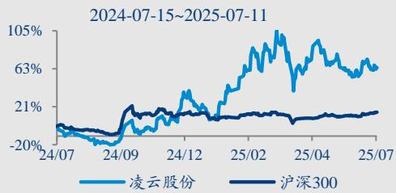  
市场表现对比图(近12个月)

# 投资主题

# 报告亮点

1）详细整理公司冲压及电池盒业务发展脉络、产品、客户情况；  
2）分析汽零、管路、传感器等行业情况及公司竞争优势。

# 投资逻辑

1) 受益于全球新能源渗透率提升，公司热冲压及电池盒业务有望持续增长。  
2) 管路业务产品体系丰富，客户覆盖广泛，近年持续获得项目定点，有望稳健增长。  
3) 传感器方面公司作为牵头单位，与中科院合肥物质科学研究院和中兵智能创新研究院联合申报“低成本高精度智能化人形机器人力感知关键技术及制造方法研究”项目，加速传感器项目开发赋能中长期发展。

# 关键假设、估值与盈利预测

1）营收端：热冲压及电池盒业务有望随新能源渗透率逐渐提升而稳步放量，预计公司2025-2027 年营业收入为197亿、209 亿、219亿元，同比+4.7%、5.9%、 $+ 4 . 7 \%$ 。  
2) 利润端：预计公司2025-2027 年归母净利润为8.1亿、9.3亿、10.2亿元，同比+23%、+16%、+9%，2025-2027 年CAGR+13%。  
3) 估值：公司传统主业热冲压及电池盒全球深耕多年，并已在力传感器领域开始布局，参考可比公司估值，给予2025 年 23 倍 PE，对应目标价14.9元，对应目标市值 182 亿元，股价空间约 29%。

# 目录

一、30 余年深耕主业，汽零布局全球..

# 二、热冲压及电池盒业务空间广阔，有望继续增长.

（一）冲压：十余年技术积累，成就国内汽车热成型配件领先者 9  
（二）电池盒：受益于新能源车渗透率提升有望持续放量 13  
（三）管路：持续获得项目定点，有望稳健增长 16

# 三、新业务：力传感器打开新成长空间. 19

# 四、盈利预测与.值论…… 22

1、盈利预测 22   
2、估值讨论. 22

# 五、风险提示 24

# 图表目录

图表1：凌云股份发展历程 .6  
图表2：凌云股份主要产品.. .7  
图表3：凌云汽车金属及塑料零部件客户 ….7  
图表4：凌云塑料管道系统客户. …7  
图表5：凌云股份股权结构（截至2025.5.29） ….8  
图表6：热/冷冲压工艺对比. .9  
图表7：常见热冲压零部件. .9  
图表8：热冲压各成型技术简介及用途.. . 10  
图表9：中国冲压件市场规模预测 ..10  
图表10：中国冲压件市场主要参与者情况 11  
图表11：凌云吉恩斯历史沿革. ..12  
图表 12：公司热成型客户拓展情况.. ..12  
图表13：中国新能源乘用车渗透率（%） .13  
图表14：电池盒结构图. ..13  
图表15：电池盒市场主流材料性能及优劣势对比 .13  
图表16：德国WAG业务板块及客户 .14  
图表17：德国WAG净利润（亿元） .14  
图表18：公司铝合金产品项目开发及项目定点情况.. ….14  
图表19：2027 年中国电池盒市场空间测算，假设 $1 0 0 \%$ 铝（亿元） … 15  
图表20：可比公司电池盒技术情况及市占率. .15  
图表21：亚大集团主要产品. ..16  
图表22：亚大集团生产基地分布图 .16  
图表23：亚大集团乘用车管路产品应用 .17  
图表24：亚大集团商用车管路产品应用 .17  
图表25：公司汽车管路项目及客户拓展情况 .17  
图表26：亚大集团市政管路产品细分.. ..18  
图表27：人形机器人传感器应用图. .19  
图表28：一维及多维力矩传感器对比. .19  
图表29：优必选WALKERX零部件拆解图. … 20  
图表30：2023 年六维力传感器应用情况 .20  
图表31：六维力传感器出货量（万台） ..21  
图表32：六维力传感器市场规模及增速 .21  
图表33：前十大六维力传感器供应商市场份额情况 .21  
图表34：六维力传感器内外资市场占比情况 .21  
图表35：凌云股份分业务盈利预测 22  
图表36：凌云股份可比公司估值指标， 23

# 一、30 余年深耕主业，汽零布局全球

30 余年深耕主业，汽零布局全球。公司于 1995 年由中国兵器工业集团公司系统下属的五家企业发起创立。2003 年于上交所上市，下辖 70 多家分子公司，分布于德国、墨西哥、北美、日本、印尼以及国内 30 多个省市和地区，其中与瑞士、美国、韩国等合资成立 20 家中外合资公司。主营高强度、轻量化汽车安全防撞系统，低渗透、低排放汽车尼龙管路系统和橡胶管路系统，汽车等速万向节前驱动轴，各种类型的市政工程管道及其配件系统等。

近年来公司积极布局新能源电池管理系统及封装系统、汽车流体控制系统、汽车热管理系统、汽车线控转向系统及智能制造工程以及传感器、机器人智能关节及机械臂等关键部件研发销售以及相关业务，打造第二成长曲线。

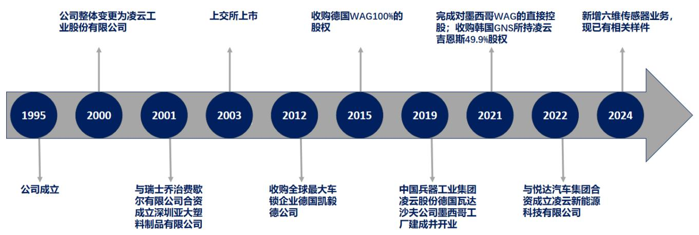  
图表1：凌云股份发展历程  
资料来源：公司官网、公司公告、华创证券

# 产品：公司主要生产汽车金属及塑料零部件、塑料管道系统两大系列产品。具体为：

1) 汽车金属及塑料零部件：为公司当前第一大业务板块，2024 年营收171 亿元，占公司总营收 $9 0 . 8 \%$ ，毛利率为 $1 7 . 9 \%$ 。业务主要涵盖金属零部件、非金属零部件两大类，包括汽车车身结构件、新能源汽车电池系统配套产品、汽车尼龙管路系统、汽车橡胶管路及总成、汽车装饰密封件等系列，主要用于整车车身结构、管路系统等汽车部件的供应配套。客户包括国内外主流车企和新能源汽车电池厂商，包括比亚迪、长城、长安、奇瑞、宝马、奔驰、奥迪、保时捷，Stellantis 等。

2) 塑料管道系统：2024 年营收11.1亿元，占公司总营收 $5 . 9 \%$ ，毛利率为 $1 5 . 0 \%$ 。产品主要包括聚乙烯(PE)燃气管道系统及其他产品，广泛应用于城市供水、排水、燃气管网等领域，客户包括港华燃气、华润燃气、中国燃气、新奥燃气等。

图表2：凌云股份主要产品  

<table><tr><td>产品类别</td><td>主要产品</td><td>24营收(亿 元)</td><td>营收占比24 毛利率 (%)</td><td>(%)</td><td>客戶</td><td>产品图例</td></tr><tr><td>汽车金属零部件</td><td>前/后保险杠横 梁、前/后驱动 轴、侧门防撞杆/ 梁、门槛件、车 门窗框、车身冲 压焊接件</td><td>171.1</td><td>90.8%</td><td>17.9%</td><td rowspan="3">国内外主流车企和新能源汽车电池 厂商，包括宝马、奔驰、奥迪、保 时捷、TSL、Stellantis、上汽大 众、一汽大众、比亚迪、长安汽 车、奇瑞、长城、东风乘用车、东 风本田、东风日产、江铃股份、 上汽通用、长安福特、一汽红旗、 一汽丰田、广汽丰田、广汽本田、 广汽乘用车、上汽通用五菱、上</td><td></td></tr><tr><td>汽车塑料及管道 系统零部件</td><td>汽车塑料管路、 装饰密封件、车 身热成型</td><td></td><td></td><td>汽乘用车、北京现代、悦达起亚、 广汽埃安、东风岚图、理想汽车、 小鹏汽车、蔚来汽车、宁德时 代、蜂巢能源、光束汽车、北汽股 份、赣锋锂电等</td><td></td></tr><tr><td>塑料管道系统</td><td>塑料管道</td><td>11.1</td><td>5.9%</td><td>15.0% 控水务等； 有限公司等</td><td>聚乙烯(PE)燃气管道系统:港华燃 气、华润燃气、中国燃气、新奥燃 气等；聚乙烯(PE)给水管道系统:首 创环保、华衍水务、中国水务、北 其他产品客戶:上海塑普瑞米新型 材料有限公司、中国石油化工股份</td></tr></table>

资料来源：公司公告、公司官网、华创证券  
资料来源：公司官网、华创证券

图表4：凌云塑料管道系统客户

$$
{ \begin{array} { r l r l r l r l } { \rho } & { \Longleftrightarrow } & { \bullet } & { \bullet } & { \Longleftrightarrow } & { \circledast } & { \circledast } & { \Longleftrightarrow } & { \Longleftrightarrow } & & { \bullet } \\ { \cdot } & { \Longleftrightarrow } & { \Longleftrightarrow } & { \oplus } & { \Longleftrightarrow } & { \circledast } & { \circledast } & { \circledast } & & { \circledast } \\ { \cdot } & { \Longleftrightarrow } & { \forall } & { \circledast } & { \circledast } & { \ast } & { \circledast } & & { \circledast } \\ { \mathrm { ~ \rho ~ \otimes ~ } } & { \oplus } & { \operatorname { \arg ~ } } & { \circledast } & { \circledast } & { \circledast } & & { \circledast } \\ { \cdot } & { \Longleftrightarrow } & { \odot } & { \curvearrow } & { \bullet } & { \Longleftrightarrow } & & { \bigotimes } & { \circledast } & & { \circledast } \\ { \bullet } & { \oplus } & { \varpi } & { \iff } & { \circledast } & & { \circledast } & & { \circledast } \end{array} }
$$

图表3：凌云汽车金属及塑料零部件客戶  
资料来源：公司官网、华创证券

国资背景，股权结构集中。公司是中国兵器工业集团有限公司下属企业，截止 2025 年5月29 日，中国兵器工业集团作为公司的实际控制人，合计持有公司 $3 2 . 6 7 \%$ 的股份。

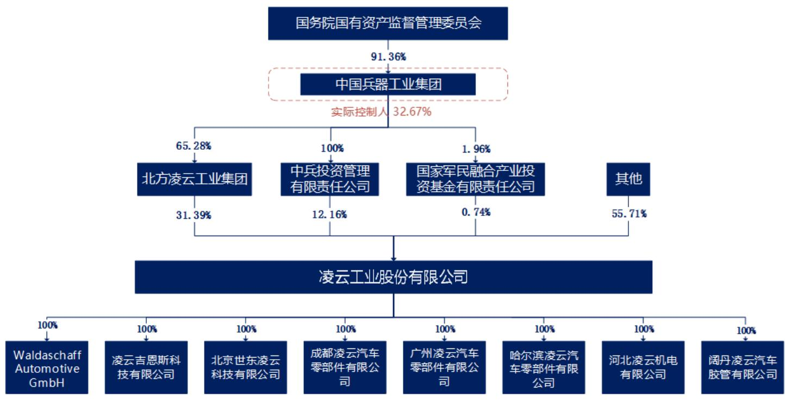  
图表5：凌云股份股权结构（截至2025.5.29）  
资料来源：公司公告、华创证券

# 二、热冲压及电池盒业务空间广阔，有望继续增长

# （一）冲压：十余年技术积累，成就国内汽车热成型配件领先者

冲压工艺广泛应用于汽车车身、动力和底盘三大系统。冲压是利用冲压设备与模具对板材等施加外力，使材料发生塑性变形或分离，从而获得所需形状和尺寸的冲压件的成型方法。冲压工艺主要运用于汽车车身、动力和底盘三大系统，尤其是车身及底盘系统，依靠冲压件焊接或装配而成。

冷冲压为当前主流技术，热冲压凭借轻量化和高强度优势未来具备成长空间。根据板料冲压是否需要加热，冲压可分为热冲压和冷冲压两种。当前冷冲压成型因生产效率快、零部件精密度高仍为市场主流，随着市场对汽车安全性和轻量化要求不断提高，热冲压成型在汽车结构件的应用已成为当前的重要发展方向。

图表6：热/冷冲压工艺对比  

<table><tr><td></td><td>热冲压成型工艺</td><td>冷冲压成型工艺</td></tr><tr><td>材料对比</td><td>使用高强度钢板，含碳量比较高，添加 多种合金微量元素</td><td>含碳量低于高强度钢板，基本没有添加 合金微量元素</td></tr><tr><td>加工温度</td><td>金属再结晶温度以上范围进行加工 零件不易起皱和破裂，基本没有回弹，</td><td>室温条件进行加工</td></tr><tr><td>成型零件特点</td><td>尺寸稳定性好，材料机械性能有所提 高；但零件表面存在氧化，表面质量不 佳</td><td>零件表面光滑；但易起皱和破裂，易回 弹，尺寸稳定性差，材料在加工过程中 易硬化</td></tr><tr><td>优点</td><td>高强度、轻量化、低回弹高精度</td><td>低成本、生产效率高、技术门槛较低</td></tr><tr><td>缺点</td><td>高成本、高技术门槛、生产效率低</td><td>存在回弹问题、重量大</td></tr></table>

资料来源：葛仕馨《简析汽车行业冷、热冲压成型生产区别》、冲压帮公众号、华创证券

热冲压技术助力实现结构件轻量化与性能优化。热冲压成型技术包括普通等厚板热冲压成型技术、软区技术、辊压不等厚技术、补丁板技术、激光拼焊板技术、定制化强度技术以及超高强度 2000MPa热冲压成型技术，应用于汽车A柱加强板、B 柱加强板、车门坎板、后保险杠等。热冲压工艺通过减少零部件厚度和重量，加强硬度、强度和耐腐蚀性、减少零部件加工工序和原材料损耗，使其成品具有轻量化、高性能的优势。

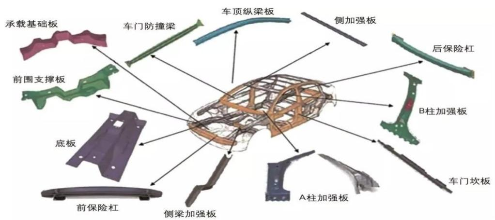  
图表7：常见热冲压零部件  
资料来源：锻造与冲压公众号、华创证券

图表8：热冲压各成型技术简介及用途  

<table><tr><td>技术名称</td><td>技术介绍</td><td>应用产品</td></tr><tr><td>普通等厚板热冲压成 型技术</td><td>使用等厚度22MnB5 热冲压成型材料，通过加热、快速 转移、快速冷却，使其金相组织从马氏体转变为奥氏 体，从而得到所需要的抗拉强度为1500MPa的产品。</td><td>车身A柱、B柱、 前立柱、门槛板等结 构件</td></tr><tr><td>软区技术</td><td>使用等厚度22MnB5 热冲压成型材料，通过对加热炉或 者模具的控制，使得同一块板料热冲压成型后，各区域 强度不同，有效提高和优化零件安全特性和轻量化特 性。</td><td>纵梁和B柱类产品</td></tr><tr><td>辊压不等厚技术</td><td>使用等厚度22MnB5热冲压成型材料，通过辊压工艺实 现同一块板料不同区域拥有不同的料厚，有效提高和优 化零件的安全特性和轻量化特性，同时也可节约模具等 工装的成本。</td><td>B柱类产品</td></tr><tr><td>补丁板技术</td><td>使用两张或者两张以上不等厚度22MnB5热冲压成型材 料，通过点焊接把两块板料或者两块以上板料先焊接在 一起，然后再使用同一套模具同时成型，有效提高局部 强度和优化零件生产效率，同时也可节约模具等工装的 成本。</td><td>A柱、B柱、纵梁类 或者其他需要局部加 强的产品</td></tr><tr><td>激光拼焊板技术</td><td>使用两张或者两张以上不等厚度22MnB5 或者 6Mn6 热 冲压成型材料，通过激光焊接把不同材质和不同厚度的 板料焊接在一起，然后使用同一套模具同时成型，使整 个零件的不同部位得到不同的强度和性能，提高和优化 零件的安全特性和轻量化特性，同时也可节约模具等工 装的成本。</td><td>B柱类产品</td></tr><tr><td>定制化强度技术</td><td>属于先进的混合制工艺，例如将补丁板技术和拼焊板技 术、辊压不等厚技术和补丁板技术等各种先进工艺融合 在同一产品中，该工艺有着非常明显的强度和轻量化贡 献，可实现车身局部位置定制化强度的生产，同时在工 装和工序的成本投入中有着巨大降本贡献。</td><td></td></tr><tr><td>超高强度2000MPa 热冲压成型技术</td><td>为车身提供更高强度的同时保证最优的轻量化贡献</td><td>车门防撞加强梁产品</td></tr></table>

资料来源：锻造与冲压公众号《热冲压成形零件生产工艺与控制》、华创证券

单车价值量近万元，2027 年中国乘用车金属冲压件市场空间有望增至 2767 亿元。根据华经产业研究院数据，2022 年乘用车金属冲压件 ASP 约为 9820 元，假设金属冲压件 ASP增速不变，2027 年金属冲压件ASP 约 9382元，预计2027 年中国乘用车销量 2950 万辆，则2027 年中国金属冲压件市场规模约为2768 亿元。

图表9：中国冲压件市场规模预测  

<table><tr><td></td><td>2021年</td><td>2022 年</td><td>2023年</td><td>2024 年</td><td>2025E</td><td>2026E</td><td>2027E</td></tr><tr><td>乘用车销量(万辆)</td><td>2126.3</td><td>2348.5</td><td>2581</td><td>2691</td><td>2907</td><td>2950</td><td>2950</td></tr><tr><td>乘用车金属冲压件 ASP(元)</td><td>9910</td><td>9820</td><td>9730.8</td><td>9642.4</td><td>9554.9</td><td>9468.1</td><td>9382.1</td></tr><tr><td>乘用车金属冲压件 ASP 增速</td><td></td><td>-0.91%</td><td>-0.91%</td><td>-0.91%</td><td>-0.91%</td><td>-0.91%</td><td>-0.91%</td></tr></table>

<table><tr><td>乘用车金属冲压件市场规模 (亿元)</td><td>2107.2</td><td>2306.2</td><td>2511.5</td><td>2594.8</td><td>2777.6</td><td>2793.1</td><td>2767.7</td></tr></table>

资料来源：华经产业研究院、华创证券预测

当前冲压件市场竞争格局分散，市场集中度有望提升。汽车冲压件市场参与者可主要分为国外知名冲压件厂商在国内的合资企业、国内大型民营冲压件制造商、国内整车厂旗下子公司、国内中小型冲压件厂商。近年来以华达科技、凌云股份为代表的国内大型冲压厂商已具备一定技术能力和生产规模，未来有望提升市场份额。

图表10：中国冲压件市场主要参与者情况  

<table><tr><td>参与者类别</td><td>主要特点</td><td>代表企业</td></tr><tr><td>国外知名冲压件厂商在国 内的合资企业</td><td>拥有外资资金、技术和管理支持 生产技术较为先进、下游需求稳定 居于早期市场龙头地位 在国产化趋势下，近年市场份额有所稀释</td><td>海斯坦普、优尼冲压、 爱机汽车配件</td></tr><tr><td>国内大型民营冲压件制造 商</td><td>已形成一定生产规模，有较强的资金实力 具有自主模具设计制造能力 产品具有成本竞争力，与国外产品的品类差距逐 步减小</td><td>凌云股份、华达科技、 多利科技</td></tr><tr><td>国内整车厂旗下子公司</td><td>主要与所属整车厂建立供应配套关系，可得到整 车厂的技术和管理支持 与集团旗下其他子公司整合可实现整体规模效应 对其母公司具有依附性</td><td>汇众汽车、弗迪科技、 赛科利汽车</td></tr><tr><td>国内中小型冲压件厂商</td><td>研发能力和技术水平较弱，模具开发能力不足 主要生产低端配套产品 善于生产无需开模的标准冲压件，对客户需求响 应速度快</td><td>众多</td></tr></table>

资料来源：沙利文研究《中国汽车冲压零部件市场研究》转引自汽车技研公众号、华创证券

凌云股份与韩国 GNS 成立合资公司，加速热成型业务布局。公司于2009 年开始热成型项目研发，2012 年实现量产。为提升热冲压技术和公司产品市场竞争力，公司自 2013 年以来与知名汽车热冲压技术提供商韩国 GNS 陆续在烟台、沈阳、长春等地合资成立多家凌云吉恩斯子公司。凌云吉恩斯主要生产销售热成型汽车底盘加强件及车身安全件，其中公司持股 $5 1 . 1 \%$ ，韩国GNS 持股 $4 9 . 9 \%$ 。2021 年公司以 2.6 亿元收购韩国GNS 所持凌云吉恩斯 $4 9 . 9 \%$ 股权，实现全资控股凌云吉恩斯子公司。

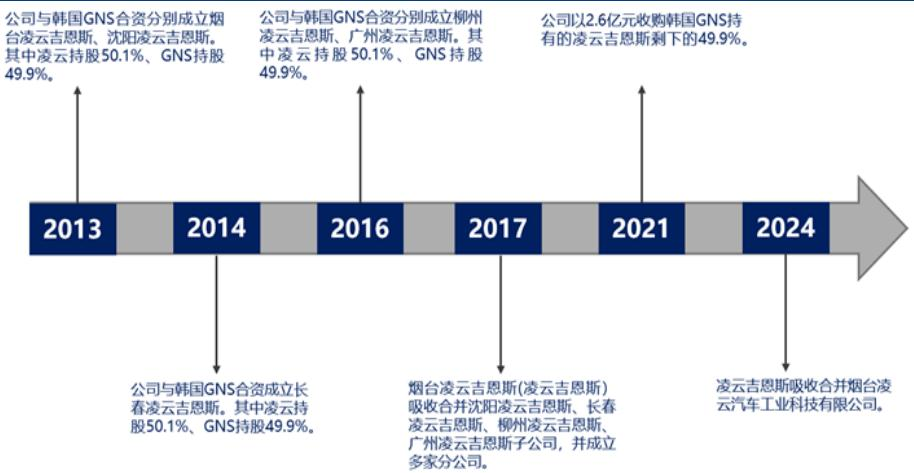  
图表11：凌云吉恩斯历史沿革  
资料来源：公司公告、华创证券

# 热成型产线和技术双重优势持续强化，公司产品获得多家主流车企项目定点：

1) 产线端：2016 年首条由凌云主导开发的热成型生产线在长春实现量产，2020 年底共有热成型产线18条、箱式炉生产线8条、7 个生产基地，2023 年建成国内首条热成型全自动激光拼焊产线，实现生产国产化;

2) 技术端：2022 年公司突破热成型材料激光拼焊技术，2024 年公司汽车高强钢热成型技术实现研制目标。目前公司热成型相关产品包括A柱、B柱、门槛、侧门防撞梁、保险杠横梁、车身底部加强件等以及裸板和铝硅板等材料。

3) 客户端：已获一汽大众、一汽奥迪、特斯拉、宝马、奔驰等全球主流整车客户多个项目定点，其中 24H1 热成型等优势产品占公司当前定点项目 $8 1 . 2 \%$ ，为公司后续的业绩放量奠基。

图表12：公司热成型客户拓展情况  

<table><tr><td>时间</td><td>客户情况</td></tr><tr><td>2014年</td><td>开拓一汽大众及奥迪热成型市场。</td></tr><tr><td>2015年</td><td>热成型产品、铝合金保险杠、辊压门槛进入广汽、东风、长 安汽车配套体系；加强与上汽通用五菱、东风柳汽公司等主 机厂家合作配套关系。</td></tr><tr><td>2016年</td><td>金属板块热成型防撞杆获得上海通用项目定点。</td></tr><tr><td>2017年</td><td>首次实现不等厚板热成型产品(TRB 冲压件)在大众车型的供 货和金属零部件(门槛内板)在雷诺车型的供货。</td></tr><tr><td>2018年</td><td>热成型门环产品获北京现代项目定点。</td></tr><tr><td>2019年</td><td>热成型、大型辊压类等附加值较高的轻量化产品获得宝马、 奔驰、上汽通用、广汽丰田、一汽丰田、特斯拉、东风乘用 车、悦达起亚、长城汽车等多个客户的新项目定点。</td></tr><tr><td>2021年</td><td>热成型产品、部分辊压产品成为特斯拉主要供应商。</td></tr><tr><td>2024年</td><td>向宝马提供的冲压、热成型产品成功实现谱系突破；为一汽 红旗、国内新能源头部车企填补热成型双门环产品谱系空 白。</td></tr></table>

资料来源：公司公告、华创证券

# （二）电池盒：受益于新能源车渗透率提升有望持续放量

电池盒作为新能源汽车电池系统的承载体，受益于新能源车渗透率提升有望持续放量。电池盒主要由上壳体和下壳体构成，用于防止电池受到外界碰撞和挤压时损坏，同时是底盘一体化的重要部件，确保电池各子系统的安全性、密封性、防冲撞能力以及集成效应。在新能源车渗透率逐步提升和汽车轻量化的趋势下，铝合金因其使用寿命长、阻燃、无烟、无毒且防爆性强等优势成为电池盒市场主流选择，市场规模有望保持高速增长。

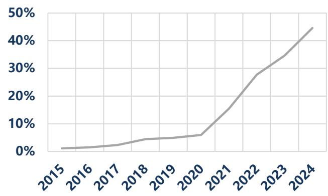  
图表 13：中国新能源乘用车渗透率 $( \%$   
资料来源：中汽协数据、华创证券

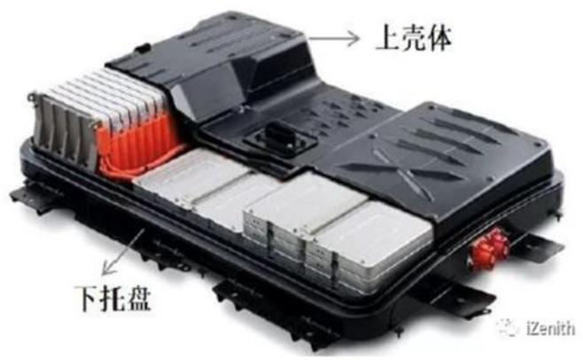  
图表14：电池盒结构图  
资料来源：铝加工公众号、华创证券

图表15：电池盒市场主流材料性能及优劣势对比  

<table><tr><td></td><td>铝合金</td><td>复合材料(碳纤维)</td><td>钢</td></tr><tr><td>密度</td><td>2.7 g/cm³</td><td>1.7g/cm³$</td><td>7.8 g/cm³</td></tr><tr><td>拉伸强度</td><td>200-450MPa</td><td>3000-7000MPa</td><td>440-1800MPa</td></tr><tr><td>减重幅度（比普通钢）</td><td>30-40%</td><td>50-80%</td><td>/</td></tr><tr><td>单价</td><td>20元kg</td><td>100元/g</td><td>4-10元/kg</td></tr><tr><td rowspan="2">优点</td><td>使用寿命长 阻燃、无烟、无毒</td><td>耐冲击性好</td><td>工艺成熟</td></tr><tr><td>防爆性强</td><td>密封性好 减重</td><td>强度高 成本低</td></tr><tr><td>缺点</td><td>生产工艺复杂</td><td>成本高 批量生产工艺不成熟</td><td>重量大</td></tr></table>

资料来源：铝加工公众号、汽车材料网公众号、华创证券

公司自 2015 年起先后收购德国 WAG 和墨西哥 WAM，成功进入铝合金电池盒供应商行列。作为全球知名轻量化零部件制造商，德国 WAG 拥有轻量化技术和铝/钢集成制造工艺，在碰撞管理系统、型材结构件、新能源汽车电池管理系统配套领域，与宝马、保时捷、奔驰、大众、奥迪、斯堪尼亚等主要客户保持良好的合作关系。2015 年公司收购其$1 0 0 \%$ 股权，弥补在高强度、轻量化等汽车零部件的研发和生产短板，助力公司进入奔驰、奥迪、宝马和大众的铝合金产品供应体系。2021 年公司收购德国 WAG 子公司墨西哥WAM的 $5 1 \%$ 股权以实现直接控股。墨西哥WAM将作为公司北美生产基地，开拓奔驰、宝马等主机厂全球采购产品，有望与奥迪、大众、福特、通用等在墨西哥设厂的主机厂进行深度绑定，加速推进公司国际化布局。

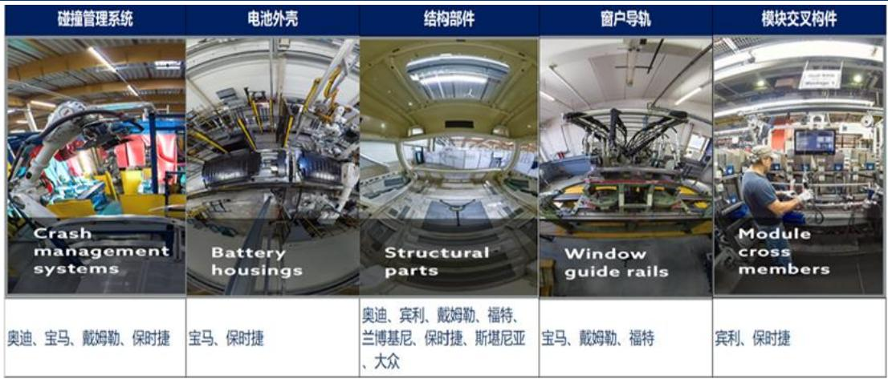  
资料来源：德国WAG官网、华创证券

公司坚定推进境外业务整合与支持，德国WAG 经营质量有望持续改善。尽管德国WAG由于项目前期投入高、成本费用高且处于爬坡阶段等因素导致近年来财务表现不佳，但公司积极进行资金支持以改善WAG 资本结构，协助扭亏为盈，自 2023 年以来运营绩效有较大改善。此外，随着公司境外定点项目开始量产并交付，德国 WAG经营状况有望改善。

  
图表17：德国WAG净利润（亿元）  
资料来源：公司公告、华创证券

图表16：德国WAG业务板块及客户  
图表18：公司铝合金产品项目开发及项目定点情况  

<table><tr><td>年份</td><td>项目进度</td></tr><tr><td>2015年</td><td>新增奥迪C8的CMS系统、MQT系统开发项目</td></tr><tr><td>2017年</td><td>新增保时捷J1电池盒项目；国内市场新增宝马汽车新X3 车型(G08）电池盒项目配套等6 款车型电池盒项目定点</td></tr><tr><td>2018年</td><td>新增宝马I20、奔驰、奥迪和大众平台电池壳项目定点</td></tr><tr><td>2019年</td><td>保时捷电池壳等项目已开始量产。</td></tr><tr><td>2020年</td><td>公司进入中国宝马、奔驰、奥迪等客户铝合金产品配套体系,先后获得了重点客户平台化、 新能源电池壳等项目。</td></tr><tr><td>2022年</td><td>国内主流新能源车企铝合金门槛项目和车门防撞梁项目定点，预计 2023 年5 月量产</td></tr></table>

<table><tr><td>2023年</td><td>新增欧洲品牌车企电池上下壳体及门槛定点项目，预计 2027 年1月量产 新增国内主流中国品牌车企电池壳下壳项目定点，预计 2024年12 月量产</td></tr><tr><td>2024年</td><td>全力推动宝马G4X 等新项目实现量产，积极争取福特等重要客户新产品定点</td></tr></table>

资料来源：公司公告、华创证券

中国铝合金电池盒市场空间较大，预计 2027 年增至 350 亿元左右。预计 2027 年中国电动车销量 1770 万辆，其中BEV 885 万辆、PHEV 885 万辆，按 BEV 铝电池盒单车价值3000-5000 元、PHEV 铝电池盒单车价值 500-1000 元测算，预计 2027 年中国的 $1 0 0 \%$ 铝电池盒规模在 310 亿-530 亿元，中值 420 亿元。考虑届时可能还有一些电池盒是钢制或者钢铝混合，实际市场空间会低一些，估计在 350 亿元左右(相当于8 成铝、2 成钢)。

图表19：2027 年中国电池盒市场空间测算，假设 $1 0 0 \%$ 铝（亿元）  

<table><tr><td>BEV</td><td>785 万辆</td><td>885 万辆</td><td>985 万辆</td></tr><tr><td>3000元/车</td><td>236</td><td>266</td><td>296</td></tr><tr><td>4000 元/车</td><td>314</td><td>354</td><td>394</td></tr><tr><td>5000 元/车</td><td>393</td><td>443</td><td>493</td></tr><tr><td colspan="4"></td></tr><tr><td>PHEV</td><td>835 万辆</td><td>885万辆</td><td>935 万辆</td></tr><tr><td>500元/车</td><td>42</td><td>44</td><td>47</td></tr><tr><td>750元/车</td><td>63</td><td>66</td><td>70</td></tr><tr><td>100 元/车</td><td>84</td><td>89</td><td>94</td></tr></table>

资料来源：华创证券测算备注：电池盒材料主要为铝、钢、铝 $^ { + }$ 钢，三类，本测算假设 $100 \%$ 电池盒都为铝电池盒情形。

电池盒市场头部效应显著，公司凭借技术积累和持续扩产未来有望实现加速成长。2023年电池盒箱体总销售约为 949.5 万套，其中敏实集团、华域汽车和新铝时代分别以 $1 4 . 9 \%$ -$1 8 . 6 \%$ 、 $9 . 3 \%$ 、 $8 . 0 \%$ 的市占率位居市场前三。公司自2015 年进入新能源电池壳领域后，深入研究电池壳体关键工艺，技术水平逐步向行业第一梯队靠拢，2023 年市占率为 $2 . 3 \%$ -$4 . 1 \%$ ，我们认为目前尽管与其他可比竞争公司存在一定差距，但随着公司产能扩张和电池盒市场空间增长，公司电池盒业务有望加速增长。

图表20：可比公司电池盒技术情况及市占率  

<table><tr><td>公司</td><td>电池盒技术情况</td><td>2023 年电池盒箱 体销量(万套)</td><td>市占率(%)</td><td>电池盒主要客戶</td></tr><tr><td>敏实集团</td><td>敏实集团通过自主研发，掌握了高性能铝材、高弹 性TPV 和改性塑料三大核心材料以及相关的表面处 理技术，并基于此形成了汽车外饰件、车身结构 件、铝动力电池盒。</td><td>141.4-176.8</td><td>14.9%-18.6%</td><td>奔驰、长城、奥迪、保时 捷、宝马等</td></tr><tr><td>华域汽车</td><td>华域汽车较早引入国际汽车零部件企业的先进工艺 和技术，通过本土研发团队的不断消化吸收和再创 新，已形成较为完整的自主研发体系及本土化同步 开发。</td><td>88.4</td><td>9.3%</td><td>特斯拉、上汽大众、一汽大 众等整车厂宁德时代及远景 能源储能等电池制造商</td></tr><tr><td>新铝时代</td><td>新铝时代掌握了以电池盒箱体为核心的新能源汽车 动力电池系统铝合金零部件的专利技术和先进生产 工艺，在高性能铝合金材料研发、数字化全流程挤</td><td>76.3</td><td>8.0%</td><td>比亚迪、吉利汽车、重庆金 康动力新能源</td></tr></table>

<table><tr><td></td><td>压控制技术、先进 FSW焊接技术、高效 CNC加工 技术等方面处于行业领先水平。</td><td></td><td></td><td></td></tr><tr><td>和胜股份</td><td>和胜股份在材料科学、仿真技术、产品设计、生产 工艺技术四大领域开展深度研发工作，配套有连续 铸造、挤压成型、引拔抽管、精密加工、五金加 工、阳极处理等系统的铝加。 祥鑫科技已完成模块化模具设计数据库系统开发、</td><td>54.4</td><td>5.7%</td><td>宁德时代等电池制造商，以 及比亚迪、广汽埃安等头部 整车制造商和“新势力”造 车企业</td></tr><tr><td>祥鑫科技</td><td>汽车覆盖件冲压模具先进设计制造技术研究与开 发、汽车覆盖件冲压成型模具制造技术等一体化技 术及应用开发、智能化大型复杂模具设计、制造成 套技术与装备的开发和应用研究等前沿技术研究项 目。</td><td>31.03</td><td>3.3%</td><td>广汽集团、一汽大众、蔚来 汽车、吉利汽车等整车厂和 安道拓、法雷奧等汽车零部 件企业</td></tr><tr><td>凌云股份</td><td>凌云股份 2015 年通过收购德国 WAG 进入动力电池 箱体行业，现已建立以中央研究院为主体的1+7产 品创新平台体系，聚焦新能源电池壳、高强度轻量 化安全防撞系统等。</td><td>22.0-39.0</td><td>2.3%-4.1%</td><td>奔驰汽车、宝马汽车、保时 捷、光束汽车等整车厂以及 宁德时代。</td></tr></table>

资料来源：新铝时代公司公告、华域汽车公司公告、和胜股份公司公告、公司公告、华创证券

# （三）管路：持续获得项目定点，有望稳健增长

公司与瑞士乔治费歇尔成立合资公司，拓展汽车管路和市政管道系统两大业务。亚大集团是一家于1987 年成立的合资公司，凌云股份和瑞士乔治费歇尔公司双方各持股 $5 0 \%$ ,随后陆续在河北涿州、廊坊、长春、北京等多地设有生产基地以实施区域化布局战略。亚大主要有汽车管路和市政管道系统两大业务板块，其中汽车管路板块是为汽车市场提供流体管理系统产品和解决方案，市政工程塑料管道板块是为燃气输配、排水、蓄水、污水处理、二次供热管网等众多领域提供产品服务。

  
图表21：亚大集团主要产品  
资料来源：亚大集团官网、华创证券

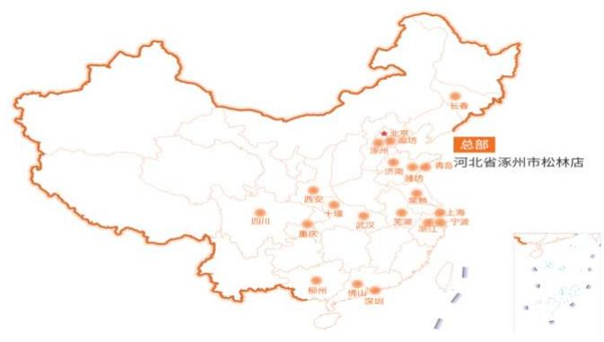  
图表22：亚大集团生产基地分布图  
资料来源：亚大集团官网、华创证券

汽车管路产品矩阵不断完善，定点项目持续拓展。汽车管路是负责承担汽车功能运行中各类流体与气体的输送、分配与排放，贯穿汽车多个系统模块。当前亚大汽车管路产品主要为管路总成和管路连接件，覆盖汽车燃油系统、气制动系统、真空制动系统、增强管路系统、冷却系统等，在乘用车、商用车和新能源车中均有应用。近年来，亚大集团由单纯的传统塑料管路供应向燃油和电动车管路并举转变，汽车管路业务定点项目持续突破，截至 2024 年标项目生命周期产值超 150 亿元，客户覆盖上汽、长城汽车、比亚迪、蔚来汽车等国内客户以及通用汽车、奥迪、奔驰、宝马等国际客户。

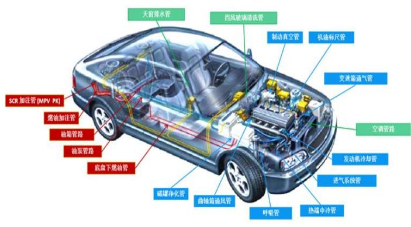  
图表23：亚大集团乘用车管路产品应用  
资料来源：亚大集团官网、华创证券

  
图表24：亚大集团商用车管路产品应用  
资料来源：亚大集团官网、华创证券

图表25：公司汽车管路项目及客户拓展情况  

<table><tr><td>年份</td><td>项目拓展情况</td></tr><tr><td>2016年</td><td>保持奇瑞、江铃、依维柯、上汽乘用车、上汽大通、吉利等客户的独家供应商地位；保持徐重、江铃、厦门金龙、安 凯客车的独家或绝大部分供货份额；新获长安、福特、广汽、北汽、长城、比亚迪等项目</td></tr><tr><td>2017年</td><td>新获江铃重汽独家供应商；新获彼欧英瑞杰、麦格纳、考泰斯等公司共计35 个项目</td></tr><tr><td>2018年</td><td>乘用车领域年度累计获得新项目定点154 个：获得浙江吉利空气管项目；获得一汽大众平台通气管总成项目定点；获 得奇瑞汽车燃油管及真空管项目 100%供货；获得上汽大通汽车年规划量最大的真空管项目；进入通用全球新能源供应</td></tr><tr><td></td><td>商清单并顺利获取新能源项目</td></tr><tr><td>2019年</td><td>汽车管路累计定点项目 141 个：新获上汽大众、蔚来汽车冷却管路项目、长城汽车进油管和出油管产品项目</td></tr><tr><td>2020年 2023年</td><td>汽车管路累计定点项目229 个；燃油管新获德国大众批准</td></tr><tr><td>2024年</td><td>汽车管路定点新项目344个</td></tr><tr><td></td><td>中标项目生命周期产值超 150 亿元</td></tr></table>

资料来源：公司公告、华创证券

市政塑料管道产品体系丰富，客户覆盖广泛。塑料管道主要采用U-PVC、PE、PPR和PB等高分子材料为基础原料，经过挤出成型、注塑成型以及复合成型等塑料加工工艺制成，具有制造能耗低、耐化学性能好、维护成本低等优势。亚大集团主要生产聚乙烯和聚丙烯类管材、管件和球阀等市政管路产品，应用于燃气、给水、排水和热力领域。客户包括港华燃气、华润燃气、中国燃气等燃气公司，首创环保、华衍水务、中国水务等水务公司以及中国石油化工等其他公司。

  
图表26：亚大集团市政管路产品细分  
资料来源：亚大集团官网、华创证券

# 三、新业务：力传感器打开新成长空间

力传感器是人形机器人的力控核心，通过力控制，机器人运用这些力信息主动调整及做出动作。力传感器主要为力矩传感器，可以检测各种旋转或非旋转部件上的扭转力矩，并将其物理变化转化为精确的电信号。此类传感器具备精度高、频响快、可靠性强、寿命长等特点，是确保机械臂高效运行的重要组成部分。它可实时输出力和力矩数据，使机械臂能够感知与操作对象之间的作用力，从而实现更加精密、灵活且智能化的操作。

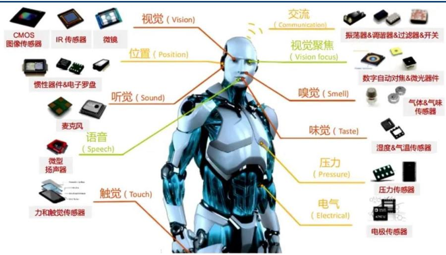  
图表27：人形机器人传感器应用图  
资料来源：Yole转引自高工移动机器人公众号、华创证券

六维力传感器因其高精度感知被应用于人形机器人手腕、脚踝和足底，ASP 约 6-8万元。根据测量维度，力矩传感器可分为一维、多维（三维、六维）力传感器。其中，六维力传感器内部算法可有效解耦各方向力和力矩的干扰，精准测力并获取力矩信息以推算受力部件的姿态，监测力矩是否在安全范围以避免传感器过载损坏，因此被广泛应用于人形机器人的手腕、脚踝等部位，作用是帮助人形机器人实现精确的运动控制、姿态调整和平衡维持，从而提升其稳定性和与环境的交互能力。根据与非网 eefocus 公众号,以优必选WALKERX为例，每台人形机器人需搭载4 个六维力矩传感器，单个六维力矩传感器约1.5-2.0万元，ASP合计6-8万元。

图表28：一维及多维力矩传感器对比  

<table><tr><td></td><td>一維力矩传感器</td><td>三維力矩传感器</td><td>六维力矩传感器</td></tr><tr><td>工作原理示意图</td><td>Z Y F 0 X -力传感器标定参考点 P- 力的作用点 OXYZ- 传感器标定坐标系</td><td>Z F Y Fz y o $Fx$ X O -力传感器标定参考点 P- 力的作用点 OXYZ- 传感器标定坐标系</td><td>F Z P Y Fz Fy 0 Fx X 力传感器标定参考点 P- 一力的作用点 OXYZ- 一传感器标定坐标系</td></tr><tr><td>适用场景</td><td>适用于被测量力F的方向 能完全与0Z轴重合的场景</td><td>适用于力F的作用点P始 终与传感器的标定参考点 O保持重合，力F的方向 在三维空间中随机变化的 场景</td><td>适用于空间中任意方向的 力F，其作用点P不与传 感器标定参考点重合且随 机变化的场景</td></tr></table>

资料来源：坤维科技公众号、华创证券

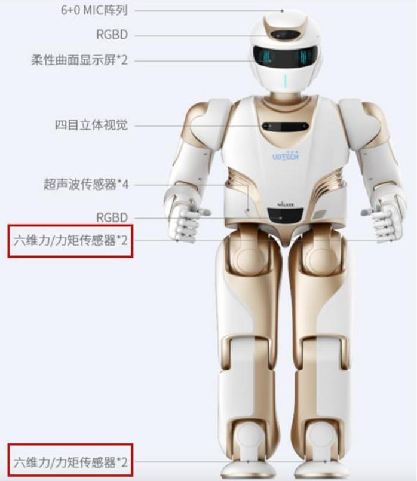  
图表29：优必选WALKERX零部件拆解图  
资料来源：优必选官网、华创证券

人形机器人产业化带动六维力传感器需求增长，市场规模有望迎来快速扩容。根据中商产业研究院数据，2023 年中国六维力矩传感器出货量约 0.9 万台，对应市场规模为 2.7 亿元；预计至 2025 年，出货量将增至 1.3 万台，市场规模达到 3.2 亿元。目前六维力传感器主要应用于工业自动化(含传统机器人)领域，2023 年人形机器人应用占比仅为 $1 . 6 \%$ 。伴随六维力传感器在机器人、工业自动化等场景的应用持续拓展，市场需求有望迎来爆发式增长，预计 2030 年中国六维力传感器出货量将接近 120 万台，市场规模有望达到143.3亿元。

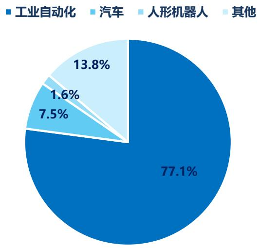  
图表30：2023 年六维力传感器应用情况  
资料来源：中商产业研究院、华创证券

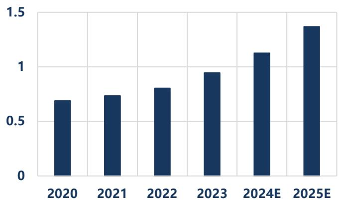  
图表31：六维力传感器出货量（万台）  
资料来源：中商产业研究院、华创证券

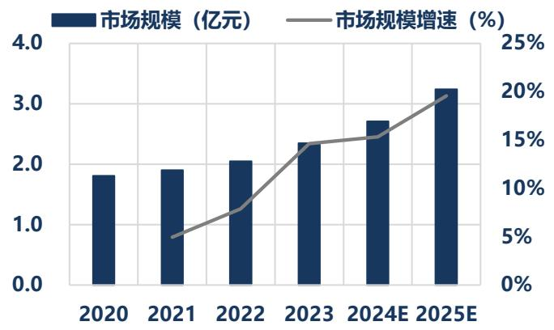  
图表32：六维力传感器市场规模及增速  
资料来源：中商产业研究院、华创证券

六维力传感器市场当前高度集中，外资企业占据主导地位，但随着国内厂商产品精度的不断提升，国产替代趋势有望加速。2023 年中国六维力传感器市场前十大供应商合计占据约 $7 0 \%$ 的市场份额，其中国产企业宇立仪器、蓝点触控和坤维科技处于前十行列，市占率分别为 $1 2 . 2 \%$ 、 $4 . 8 \%$ 、 $4 . 7 \%$ 。六维力传感器作为实现人形机器人的关键部件，全球市场长期由ATI、SCHUNK、Robotiq 等国际龙头主导，产品精度普遍维持在 $0 . 5 \% - 3 \%$ ,构筑明显技术壁垒。然而，近年来以坤维科技、蓝点触控为代表的国内厂商在传感器结构优化、六维联合标校、串扰解耦算法等关键技术持续突破，部分产品准度不断提升，推动国产厂商市场份额稳步增长，2023 年国产厂商市场份额达到 $3 2 . 1 \%$ 。根据中商产业研究院预测，2025 年国产厂商市场份额将提升至 $3 9 . 1 \%$ ，国产替代趋势有望持续深化。

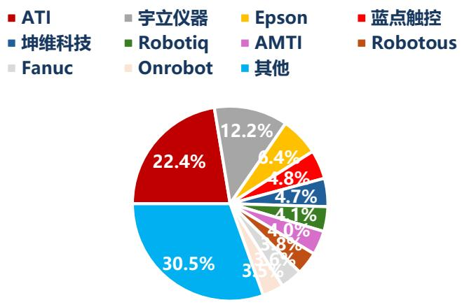  
图表 33：前十大六维力传感器供应商市场份额情况  
资料来源：中商产业研究院、华创证券

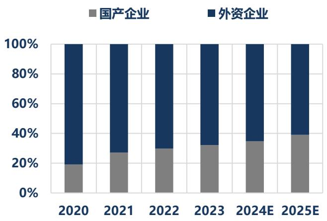  
图表34：六维力传感器内外资市场占比情况  
资料来源：中商产业研究院、华创证券

公司加速切入人形机器人核心部件赛道，布局传感器业务，未来具备成长潜力。根据财联社新闻及公司 2024 年半年度投资者关系活动记录表，2024 年公司或作为牵头单位，与中科院合肥物质科学研究院和中兵智能创新研究院联合成立传感器项目工作组，进一步夯实其在前沿智能制造领域的技术布局，加速传感器业务开发进而赋能公司中长期发展。

# 四、盈利预测与估值讨论

# 1、盈利预测

汽车金属及塑料零部件业务：公司深耕主业多年，热冲压及电池盒业务有望随新能源渗透率逐渐提升而稳步放量，预计 2025-2027 年营收分别为 180 亿元、191 亿元、201 亿元，增速分别为 $5 . 1 \%$ ， $6 . 4 \%$ ， $5 . 1 \%$ ；毛利率方面，随着公司海外电池盒业务逐步减亏进而有望带动毛利率逐步提升，预计 2025-2027 年毛利率分别为 $1 7 . 9 \%$ 、 $1 8 . 1 \%$ ， $1 8 . 3 \%$ 。

塑料管道系统业务：广泛应用于城市供水、排水、燃气管网等市政民生领域，且亚大股份技术、客户储备丰富，长期有望稳健增长，预计 2025-2027 年营收分别 11.2 亿元、11.4亿元、11.6亿元，增速分别为 $1 \%$ ， $2 \%$ ， $2 \%$ ，毛利率分别为 $1 4 . 5 \%$ ， $1 4 . 0 \%$ ， $1 4 . 0 \%$ 。

预计公司2025-2027 年营业收入为197 亿、209 亿、219 亿元，同比 $+ 4 . 7 \%$ $5 . 9 \%$ $+ 4 . 7 \%$ ,毛利率分别为 $1 7 . 6 \%$ ， $1 7 . 8 \%$ 、 $1 8 . 0 \%$ 。

图表35：凌云股份分业务盈利预测  

<table><tr><td></td><td>2022|d</td><td>2023d</td><td>2024</td><td>2025Ei</td><td>2026E</td><td>2027E</td></tr><tr><td>总营收（亿元）</td><td>166.9</td><td>187.0</td><td>188.4</td><td>197.3</td><td>208.9</td><td>218.8</td></tr><tr><td>增速(%)</td><td>6%</td><td>12%</td><td>1%</td><td>5%</td><td>6%</td><td>5%</td></tr><tr><td>毛利（亿元）</td><td>24.7</td><td>30.6</td><td>33.2</td><td>34.7</td><td>37.1</td><td>39.3</td></tr><tr><td>毛利率（%）</td><td>14.8%</td><td>16.3%</td><td>17.6%</td><td>17.6%</td><td>17.8%</td><td>18.0%</td></tr><tr><td>汽车零部件营收（亿元）</td><td>146.3</td><td>166.5</td><td>171.1</td><td>179.9</td><td>191.4</td><td>201.0</td></tr><tr><td>增速（%）</td><td>8%</td><td>14%</td><td>3%</td><td>5%</td><td>6%</td><td>5%</td></tr><tr><td>毛利（亿元）</td><td>21.4</td><td>27.9</td><td>30.6</td><td>32.2</td><td>34.6</td><td>36.8</td></tr><tr><td>毛利率（%)</td><td>14.7%</td><td>16.8%</td><td>17.9%</td><td>17.9%</td><td>18.1%</td><td>18.3%</td></tr><tr><td>塑料管道系统营收（亿元）</td><td>14.1</td><td>13.1</td><td>11.1</td><td>11.2</td><td>11.4</td><td>11.6</td></tr><tr><td>增速（%）</td><td>-6%</td><td>-7%</td><td>-15%</td><td>1%</td><td>2%</td><td>2%</td></tr><tr><td>毛利（亿元）</td><td>2.1</td><td>1.7</td><td>1.7</td><td>1.6</td><td>1.6</td><td>1.6</td></tr><tr><td>毛利率（%)</td><td>14.6%</td><td>13.1%</td><td>15.0%</td><td>14.5%</td><td>14.0%</td><td>14.0%</td></tr><tr><td>其他主营业务营收（亿元）</td><td>0.6</td><td>0.4</td><td>0.1</td><td>0.1</td><td>0.1</td><td>0.1</td></tr><tr><td>增速(%)</td><td>-39%</td><td>-32%</td><td>-86%</td><td>0%</td><td>0%</td><td>0%</td></tr><tr><td>毛利（亿元）</td><td>0.2</td><td>0.1</td><td>0.0</td><td>0.0</td><td>0.0</td><td>0.0</td></tr><tr><td>毛利率(%)</td><td>31.4%</td><td>17.2%</td><td>15.2%</td><td>15.2%</td><td>15.2%</td><td>15.2%</td></tr><tr><td>其他业务营收（亿元）</td><td>5.9</td><td>7.0</td><td>6.1</td><td>6.1</td><td>6.1</td><td>6.1</td></tr><tr><td>增速(%)</td><td>-5%</td><td>20%</td><td>-13%</td><td>0%</td><td>0%</td><td>0%</td></tr><tr><td>毛利（亿元）</td><td>1.0</td><td>0.9</td><td>0.9</td><td>0.9</td><td>0.9</td><td>0.9</td></tr><tr><td>毛利率（%）</td><td>16.5%</td><td>12.3%</td><td>14.6%</td><td>14.6%</td><td>14.6%</td><td>14.6%</td></tr></table>

资料来源：公司公告、华创证券预测

# 2、估值讨论

预计公司2025-2027 年归母净利润为 8.1 亿、9.3亿、10.2 亿元，同比 $+ 2 3 \%$ $+ 1 6 \%$ $+ 9 \%$ ，对应 PE分别为 18、15、14 倍。公司深耕热冲压、电池盒及管路市场多年，并已在力传感器领域开始布局，后续有望随全球新能源渗透率提升及六维力传感器商业化应用落地打开成长空间。结合公司业务及市场地位我们选取同样从事金属结构件业务的祥鑫科技，深耕电池盒业务的敏实集团、新铝时代以及同样布局传感器的华培动力作为可比公司。参考可比公司估值，给予 2025 年 23 倍PE，对应目标价 14.9 元，对应目标市值182 亿元，目标空间约 $2 9 \%$ 。首次覆盖，给予“强推”评级。

图表36：凌云股份可比公司估值指标  

<table><tr><td rowspan="2">公司名称</td><td rowspan="2">公司代码</td><td rowspan="2">股价（元）</td><td rowspan="2">市值（亿元）</td><td colspan="4">归母净利润（亿元）</td><td colspan="4">PE</td></tr><tr><td>2024A</td><td>2025E</td><td>2026E</td><td>2027E</td><td>2024A</td><td>2025E</td><td>2026E</td><td>2027E</td></tr><tr><td>敏实集团</td><td>0425.HK</td><td>23.80</td><td>277</td><td>23.2</td><td>27.2</td><td>32.2</td><td>39.3</td><td>11.9</td><td>10.1</td><td>8.5</td><td>7.0</td></tr><tr><td>新铝时代</td><td>301613.SZ</td><td>51.75</td><td>74</td><td>19.1</td><td>27.8</td><td>34.2</td><td>40.3</td><td>38.6</td><td>25.1</td><td>19.8</td><td>15.6</td></tr><tr><td>祥鑫科技</td><td>002965.SZ</td><td>35.47</td><td>94</td><td>3.6</td><td>4.8</td><td>5.8</td><td>7.0</td><td>26.2</td><td>19.8</td><td>16.3</td><td>13.5</td></tr><tr><td>华培动力</td><td>603121.SH</td><td>22.60</td><td>77</td><td>0.7</td><td>1.1</td><td>1.5</td><td>1.8</td><td>116.6</td><td>68.8</td><td>51.2</td><td>43.1</td></tr><tr><td colspan="8">平均数</td><td>48.3</td><td>31.0</td><td>24.0</td><td>19.8</td></tr><tr><td>中位数</td><td></td><td></td><td></td><td></td><td></td><td></td><td></td><td>32.4</td><td>22.5</td><td>18.1</td><td>14.6</td></tr><tr><td>凌云股份</td><td>600480.SH</td><td>11.5</td><td>141</td><td>6.6</td><td>8.1</td><td>9.3</td><td>10.2</td><td>21.1</td><td>17.2</td><td>14.8</td><td>13.6</td></tr></table>

资料来源：Wind、华创证券预测；截至2025年7月11日注：可比公司数据为Wind一致预期

# 五、风险提示

1）全球新能源车销量不及预期：公司热成型及电池盒产品主要配套于新能源车，若新能源车增速放缓将对公司业绩产生影响。  
2) 力传感器项目开发不及预期：公司作为牵头单位研发传感器项目，若传感器项目开发不及预期可能对公司业绩增长产生影响。  
3) 行业竞争加剧风险：行业竞争加剧可能拉低产品单价，并影响公司行业市占率，进而对公司盈利水平产生影响。

# 附录：财务预测表

资产负债表  

<table><tr><td>单位：百万元</td><td>2024A</td><td>2025E</td><td>2026E</td><td>2027E</td></tr><tr><td>货币资金</td><td>3,447</td><td>3,446</td><td>3,927</td><td>4,696</td></tr><tr><td>应收票据</td><td>554</td><td>434</td><td>460</td><td>481</td></tr><tr><td>应收账款</td><td>4,749</td><td>4,837</td><td>5,122</td><td>5,365</td></tr><tr><td>预付账款</td><td>328</td><td>344</td><td>363</td><td>380</td></tr><tr><td>存货</td><td>2,073</td><td>2,246</td><td>2,373</td><td>2,480</td></tr><tr><td>合同资产</td><td>148</td><td>155</td><td>164</td><td>172</td></tr><tr><td>其他流动资产</td><td>1,222</td><td>1,392</td><td>1,474</td><td>1,544</td></tr><tr><td>流动资产合计</td><td>12,521</td><td>12,855</td><td>13,883</td><td>15,117</td></tr><tr><td>其他长期投资</td><td>7</td><td>7</td><td>7</td><td>7</td></tr><tr><td>长期股权投资</td><td>513</td><td>513</td><td>513</td><td>513</td></tr><tr><td>固定资产</td><td>3,988</td><td>4,186</td><td>4,429</td><td>4,630</td></tr><tr><td>在建工程</td><td>344</td><td>353</td><td>314</td><td>286</td></tr><tr><td>无形资产</td><td>339</td><td>354</td><td>368</td><td>380</td></tr><tr><td>其他非流动资产</td><td>1,667</td><td>2,101</td><td>2,458</td><td>2,744</td></tr><tr><td>非流动资产合计</td><td>6,858</td><td>7,514</td><td>8,090</td><td>8,562</td></tr><tr><td>资产合计</td><td>19,379</td><td>20,369</td><td>21,974</td><td>23,679</td></tr><tr><td>短期借款</td><td>817</td><td>1,180</td><td>1,543</td><td>1,907</td></tr><tr><td>应付票据</td><td>1,460</td><td>1,419</td><td>1,499</td><td>1,566</td></tr><tr><td>应付账款</td><td>4,309</td><td>4,012</td><td>4,239</td><td>4,511</td></tr><tr><td>预收款项</td><td>0</td><td>0</td><td>0</td><td>0</td></tr><tr><td>合同负债</td><td>366</td><td>411</td><td>435</td><td>455</td></tr><tr><td>其他应付款</td><td>208</td><td>177</td><td>177</td><td>177</td></tr><tr><td>一年内到期的非流动负债</td><td>814</td><td>482</td><td>482</td><td>482</td></tr><tr><td>其他流动负债</td><td>1,129</td><td>1,061</td><td>1,134</td><td>1,196</td></tr><tr><td>流动负债合计</td><td>9,101</td><td>8,742</td><td>9,509</td><td>10,295</td></tr><tr><td>长期借款</td><td>0</td><td>0</td><td>161</td><td>282</td></tr><tr><td>应付债券</td><td>0</td><td>330</td><td>330</td><td>330</td></tr><tr><td>其他非流动负债</td><td>630</td><td>684</td><td>684</td><td>684</td></tr><tr><td>非流动负债合计</td><td>630</td><td>1,014</td><td>1,175</td><td>1,296</td></tr><tr><td>负债合计</td><td>9,731</td><td>9,756</td><td>10,684</td><td>11,590</td></tr><tr><td>归属母公司所有者权益</td><td>7,469</td><td>8,182</td><td>8,653</td><td>9,138</td></tr><tr><td>少数股东权益</td><td>2,179</td><td>2,431</td><td>2,636</td><td>2,951</td></tr><tr><td>所有者权益合计</td><td>9,648</td><td>10,613</td><td>11,290</td><td>12,089</td></tr><tr><td>负债和股东权益</td><td>19,379</td><td>20,369</td><td>21,974</td><td>23,679</td></tr></table>

现金流量表  

<table><tr><td>单位：百万元</td><td>2024A</td><td>2025E</td><td>2026E</td><td>2027E</td></tr><tr><td>经营活动现金流</td><td>2,241</td><td>1,234</td><td>2,079</td><td>2,382</td></tr><tr><td>现金收益</td><td>2,287</td><td>2,059</td><td>2,293</td><td>2,497</td></tr><tr><td>存货影响</td><td>53</td><td>-174</td><td>-127</td><td>-107</td></tr><tr><td>经营性应收影响</td><td>-413</td><td>42</td><td>-304</td><td>-254</td></tr><tr><td>经营性应付影响</td><td>625</td><td>-369</td><td>307</td><td>339</td></tr><tr><td>其他影响</td><td>-311</td><td>-325</td><td>-90</td><td>-93</td></tr><tr><td>投资活动现金流</td><td>-568</td><td>-1,311</td><td>-1,439</td><td>-1,386</td></tr><tr><td>资本支出</td><td>-1,209</td><td>-918</td><td>-1,021</td><td>-1,093</td></tr><tr><td>股权投资</td><td>-43</td><td>0</td><td>0</td><td>0</td></tr><tr><td>其他长期资产变化</td><td>684</td><td>-393</td><td>-417</td><td>-293</td></tr><tr><td>融资活动现金流</td><td>-1,581</td><td>75</td><td>-159</td><td>-226</td></tr><tr><td>借款增加</td><td>-878</td><td>362</td><td>525</td><td>484</td></tr><tr><td>股利及利息支付</td><td>-517</td><td>-764</td><td>-869</td><td>-940</td></tr><tr><td>股东融资</td><td>12</td><td>0</td><td>0</td><td>0</td></tr><tr><td>其他影响</td><td>-198</td><td>478</td><td>185</td><td>229</td></tr></table>

资料来源：公司公告，华创证券预测

利润表  

<table><tr><td>单位：百万元</td><td>2024A</td><td>2025E</td><td>2026E</td><td>2027E</td></tr><tr><td>营业总收入</td><td>18,837</td><td>19,728</td><td>20,890</td><td>21,879</td></tr><tr><td>营业成本</td><td>15,521</td><td>16,258</td><td>17,177</td><td>17,948</td></tr><tr><td>税金及附加</td><td>84</td><td>79</td><td>84</td><td>88</td></tr><tr><td>销售费用</td><td>352</td><td>355</td><td>355</td><td>372</td></tr><tr><td>管理费用</td><td>1,009</td><td>888</td><td>919</td><td>963</td></tr><tr><td>研发费用</td><td>802</td><td>809</td><td>856</td><td>897</td></tr><tr><td>财务费用</td><td>208</td><td>213</td><td>157</td><td>132</td></tr><tr><td>信用减值损失</td><td>-3</td><td>-11</td><td>-11</td><td>-11</td></tr><tr><td>资产减值损失</td><td>-36</td><td>-26</td><td>-26</td><td>-26</td></tr><tr><td>公允价值变动收益</td><td>0</td><td>0</td><td>0</td><td>0</td></tr><tr><td>投资收益</td><td>97</td><td>73</td><td>70</td><td>73</td></tr><tr><td>其他收益</td><td>139</td><td>139</td><td>139</td><td>139</td></tr><tr><td>营业利润</td><td>1,069</td><td>1,308</td><td>1,515</td><td>1,655</td></tr><tr><td>营业外收入</td><td>14</td><td>9</td><td>9</td><td>9</td></tr><tr><td>营业外支出</td><td>13</td><td>9</td><td>9</td><td>9</td></tr><tr><td>利润总额</td><td>1,070</td><td>1,308</td><td>1,515</td><td>1,656</td></tr><tr><td>所得税</td><td>120</td><td>157</td><td>182</td><td>199</td></tr><tr><td>净利润</td><td>950</td><td>1,151</td><td>1,333</td><td>1,457</td></tr><tr><td>少数股东损益</td><td>295</td><td>345</td><td>400</td><td>437</td></tr><tr><td>归属母公司净利润</td><td>655</td><td>806</td><td>933</td><td>1,020</td></tr><tr><td>NOPLAT</td><td>1,135</td><td>1,338</td><td>1,471</td><td>1,573</td></tr><tr><td>EPS(摊薄)(元)</td><td>0.54</td><td>0.66</td><td>0.76</td><td>0.83</td></tr></table>

主要财务比率  

<table><tr><td></td><td>2024A</td><td>2025E</td><td>2026E</td><td>2027E</td></tr><tr><td>成长能力</td><td></td><td></td><td></td><td></td></tr><tr><td>营业收入增长率</td><td>0.7%</td><td>4.7%</td><td>5.9%</td><td>4.7%</td></tr><tr><td>EBIT增长率</td><td>24.4%</td><td>19.0%</td><td>9.9%</td><td>6.9%</td></tr><tr><td>归母净利润增长率</td><td>3.8%</td><td>22.9%</td><td>15.8%</td><td>9.3%</td></tr><tr><td>获利能力</td><td></td><td></td><td></td><td></td></tr><tr><td>毛利率</td><td>17.6%</td><td>17.6%</td><td>17.8%</td><td>18.0%</td></tr><tr><td>净利率</td><td>5.0%</td><td>5.8%</td><td>6.4%</td><td>6.7%</td></tr><tr><td>ROE</td><td>8.8%</td><td>9.8%</td><td>10.8%</td><td>11.2%</td></tr><tr><td>ROIC</td><td>12.3%</td><td>13.0%</td><td>12.9%</td><td>12.6%</td></tr><tr><td>偿债能力</td><td></td><td></td><td></td><td></td></tr><tr><td>资产负债率</td><td>50.2%</td><td>47.9%</td><td>48.6%</td><td>48.9%</td></tr><tr><td>债务权益比</td><td>23.4%</td><td>25.2%</td><td>28.3%</td><td>30.5%</td></tr><tr><td>流动比率</td><td>1.4</td><td>1.5</td><td>1.5</td><td>1.5</td></tr><tr><td>速动比率</td><td>1.1</td><td>1.2</td><td>1.2</td><td>1.2</td></tr><tr><td>营运能力</td><td></td><td></td><td></td><td></td></tr><tr><td>总资产周转率</td><td>1.0</td><td>1.0</td><td>1.0</td><td>0.9</td></tr><tr><td>应收账款周转天数</td><td>86</td><td>87</td><td>86</td><td>86</td></tr><tr><td>应付账款周转天数</td><td>92</td><td>92</td><td>86</td><td>88</td></tr><tr><td>存货周转天数</td><td>49</td><td>48</td><td>48</td><td>49</td></tr><tr><td>每股指标(元)</td><td></td><td></td><td></td><td></td></tr><tr><td>每股收益</td><td>0.54</td><td>0.66</td><td>0.76</td><td>0.83</td></tr><tr><td>每股经营现金流</td><td>1.83</td><td>1.01</td><td>1.70</td><td>1.95</td></tr><tr><td>每股净资产</td><td>6.11</td><td>6.69</td><td>7.08</td><td>7.48</td></tr><tr><td>估值比率</td><td></td><td></td><td></td><td></td></tr><tr><td>P/E</td><td>22</td><td>18</td><td>15</td><td>14</td></tr><tr><td>P/B</td><td>2</td><td>2</td><td>2</td><td>2</td></tr><tr><td>EV/EBITDA</td><td>7</td><td>8</td><td>7</td><td>7</td></tr></table>

# 汽车组团队介绍

# 组长、首席分析师：张程航

美国哥伦比亚大学公共管理硕士。曾任职于天风证券，2019 年加入华创证券研究所。

# 高级研究员：夏凉

华威大学商学院商业分析硕士。曾任职于汽车产业私募股权基金，2020 年加入华创证券研究所。

研究员：李昊岚

伦敦大学学院金融硕士。2022 年加入华创证券研究所。

助理研究员：林栖宇

上海财经大学金融硕士。2023 年加入华创证券研究所。

助理研究员：于公铭

英国拉夫堡大学金融硕士。2024 年加入华创证券研究所。

助理研究员：张睿希

上海交通大学金融硕士。2024 年加入华创证券研究所。

# 华创行业公司投资评级体系

# 基准指数说明：

A 股市场基准为沪深 300 指数，香港市场基准为恒生指数，美国市场基准为标普 500/纳斯达克指数。

# 公司投资评级说明：

强推：预期未来6个月内超越基准指数 $2 0 \%$ 以上;推荐：预期未来6 个月内超越基准指数 $1 0 \% - 2 0 \%$ ,中性：预期未来6个月内相对基准指数变动幅度在 $- 1 0 \% - 1 0 \%$ 之间；回避：预期未来6个月内相对基准指数跌幅在 $1 0 \% - 2 0 \%$ 之间。

# 行业投资评级说明：

推荐：预期未来3-6个月内该行业指数涨幅超过基准指数 $5 \%$ 以上；中性：预期未来3-6 个月内该行业指数变动幅度相对基准指数 $- 5 \% - 5 \%$ 回避：预期未来3-6个月内该行业指数跌幅超过基准指数 $5 \%$ 以上。

# 分析师声明

每位负责撰写本研究报告全部或部分内容的分析师在此作以下声明:分析师在本报告中对所提及的证券或发行人发表的任何建议和观点均准确地反映了其个人对该证券或发行人的看法和判断；分析师对任何其他券商发布的所有可能存在雷同的研究报告不负有任何直接或者间接的可能责任。

# 免责声明

。本公司不会因接收人收到本报告而视其为客户。

本报告所载资料的来源被认为是可靠的，但本公司不保证其准确性或完整性。本报告所载的资料、意见及推测仅反映本公司于发布本及告当日的判断。在不同时期，本公司可发出与本报告所载资料、意见及推测不一致的报告。本公司在知晓范围内履行披露义务。

报告中的内容和意见仅供参考，并不构成本公司对具体证券买卖的出价或询价。本报告所载信息不构成对所涉及证券的个人投资建议，也未考虑到个别客户特殊的投资目标、财务状况或需求。客户应考虑本报告中的任何意见或建议是否符合其特定状况，自主作出投资决策并自行承担投资风险，任何形式的分享证券投资收益或者分担证券投资损失的书面或口头承诺均为无效。本报告中提及的投资价格和价值以及这些投资带来的预期收入可能会波动。

本报告版权仅为本公司所有，本公司对本报告保留一切权利。未经本公司事先书面许可，任何机构和个人不得以任何形式翻版、复制、发表、转发或引用本报告的任何部分。如征得本公司许可进行引用、刊发的，需在允许的范围内使用，并注明出处为“华创证券研究”且不得对本报告进行任何有悖原意的引用、删节和修改。

证券市场是一个风险无时不在的市场，请您务必对盈亏风险有清醒的认识，认真考虑是否进行证券交易。市场有风险，投资需谨慎。

# 华创证券研究所

<table><tr><td>北京总部</td><td>广深分部</td><td>上海分部</td></tr><tr><td>地址：北京市西城区锦什坊街26号 恆奧中心C座 3A</td><td>地址：深圳市福田区香梅路1061号中投国 际商务中心A座 19 楼</td><td>地址：上海市浦东新区花园石桥路33号 花旗大厦12层</td></tr><tr><td>邮编：100033 传真：010-66500801</td><td>邮编：518034 传真：0755-82027731</td><td>邮编：200120</td></tr><tr><td>会议室：010-66500900</td><td></td><td>传真：021-20572500</td></tr><tr><td></td><td>会议室：0755-82828562</td><td>会议室：021-20572522</td></tr></table>