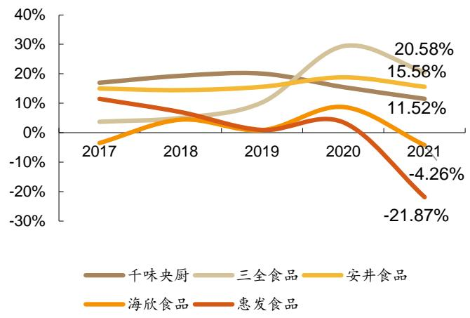
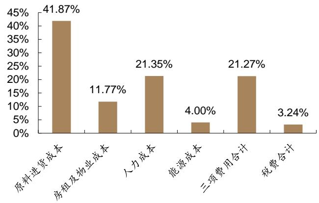
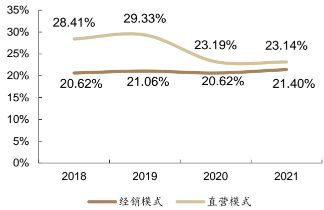
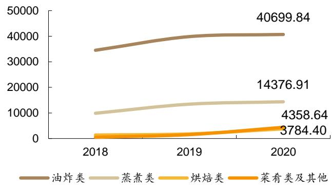

# 买入（首次）

所属行业：食品饮料/食品加工当前价格(元)：51.88

# 证券分析师

花小伟资格编号：S0120521020001邮箱：huaxw@tebon.com.cn

# 研究助理

徐艺帆邮箱：xuyf3@tebon.com.cn

  
市场表现

<table><tr><td>沪深300对比</td><td>1M</td><td>2M</td><td>3M</td></tr><tr><td>绝对涨幅(%)</td><td>5.23</td><td>12.37</td><td>12.98</td></tr><tr><td>相对涨幅(%)</td><td>6.64</td><td>6.31</td><td>11.55</td></tr></table>

资料来源：德邦研究所，聚源数据

# 相关研究

<table><tr><td colspan="2">股票数据</td></tr><tr><td>总股本(百万股):</td><td>86.63</td></tr><tr><td>流通A股(百万股):</td><td>21.28</td></tr><tr><td>52周内股价区间(元)：</td><td>22.55-72.78</td></tr><tr><td>总市值(百万元):</td><td>4,494.38</td></tr><tr><td>总资产(百万元):</td><td>1,370.37</td></tr><tr><td>每股净资产(元)：</td><td>11.32</td></tr></table>

资料来源：公司公告

# 千味央厨(001215.SZ)：产品与渠道优势领先，2B蓝海领航者

# 投资要点

• 千味央厨：餐饮供应行业领军者，秉持“只为餐饮，厨师之选”。公司具有悠久的B 端基因，脱胎于河南思念餐饮业务，2B业务基础深厚。业务品类丰富，包括油炸类、烘焙类、蒸煮类、菜肴类及其他系列产品。公司营收维持较高增速，17-21年复合增速 $2 1 . 0 5 \%$ ，毛利率净利率稳定。

详解餐饮供应链行业：2B蓝海市场，大B小B 痛点不同。原料、人工、房租成本的压力倒逼速冻半成品发展，且速冻半成品符合餐饮业的快速发展下的标准化需求，这成为了餐饮供应链高速发展的基础。复盘我国速冻食品行业，其经历了启蒙期、成长期、爆发期，尽管BC 端皆有广阔受众，但C端已现“三足鼎立”，格局稳固，B 端蓝海大有可为，尚未形成垄断格局。通过对比几家速冻食品企业的盈利表现，可以发现B 端业务是一门低毛利、低费用、高净利的生意。深入分析B端商业模式，大B与小B天然属性的不同对于2B企业的能力提出了多元的要求，企业对于大B和小B需要抓住不同痛点进行开发。

竞争优势：研发体系化，产品场景化，渠道标杆化。公司研发能力突出，能够满足客户多元需求，并通过产品迭代提供增长动力。大单品中油条类优势显著，油条的市占率位居第一，2021 年油条产品线销售规模已达 3.51 亿元，此外烘焙类等业务也为业绩提供多元增长动力。渠道端，大B 方面公司大客户群体庞大粘性强，并进行大客户体系改革，提前布局具有成长性的客户，小B方面利用返利模式与职业化培训等举措赋能中小经销商。产能方面，公司建设新乡三期突破产能瓶颈，三期项目投入生产后将进一步夯实生产能力。

投资建议：我们预计公司2022-2024 年营业总收入为15.89/19.64/24.02亿元，同比增长 $2 4 . 7 8 \% / 2 3 . 5 8 \% / 2 2 . 2 8 \%$ ，2022-2024年归母净利润为1.02/1.36/1.82 亿元，同比增长 $1 5 . 1 3 \% / 3 3 . 4 1 \% / 3 4 . 1 7 \%$ ，对应 PE 为 44.13X/33.08X/24.65X，2022-2024 年可比公司 PE 均值为 33.14X/27.00X/22.51X。速冻面点行业 B 端市场潜力巨大，千味央厨具备强研发能力与大客户基本盘，随着扩产能、完善渠道与推陈出新，公司有望步入发展快车道，首次覆盖给予“买入”评级。

风险提示：行业竞争加剧，疫情反复，原材料价格波动，新增产能无法消化等。

主要财务数据及预测  

<table><tr><td></td><td>2020</td><td>2021</td><td>2022E</td><td>2023E</td><td>2024E</td></tr><tr><td>营业收入(百万元)</td><td>944</td><td>1,274</td><td>1,590</td><td>1,964</td><td>2,402</td></tr><tr><td>(+/-)YOY(%)</td><td>6.2%</td><td>34.9%</td><td>24.8%</td><td>23.6%</td><td>22.3%</td></tr><tr><td>净利润(百万元)</td><td>77</td><td>88</td><td>102</td><td>136</td><td>182</td></tr><tr><td>(+/-)YOY(%)</td><td>3.3%</td><td>15.5%</td><td>15.1%</td><td>33.4%</td><td>34.2%</td></tr><tr><td>全面摊薄 EPS(元)</td><td>1.24</td><td>1.25</td><td>1.18</td><td>1.57</td><td>2.10</td></tr><tr><td>毛利率(%)</td><td>21.7%</td><td>22.4%</td><td>21.7%</td><td>22.5%</td><td>23.1%</td></tr><tr><td>净资产收益率(%)</td><td>13.2%</td><td>9.3%</td><td>9.8%</td><td>11.7%</td><td>13.8%</td></tr></table>

资料来源：公司年报(2020-2021)，德邦研究所备注：净利润为归属母公司所有者的净利润

# 投资要素

# 核心逻辑

从赛道来看，餐饮供应链B端市场尚为蓝海，不仅在于其增速快，也在于其竞争格局尚未定型。首先，餐饮供应链近年来受到关注，原料、人工、房租成本的压力倒逼速冻半成品发展，且速冻半成品符合餐饮业的快速发展下的标准化需求，这成为了餐饮供应链高速发展的基础。尽管BC 端皆有广阔受众，从竞争格局上看，C端已现“三足鼎立”，格局稳固，而B端尚显分散，企业卡位机会更大。

从竞争优势来看，公司主要具有几大优势：（1）研发体系化（2）产品场景化(3)渠道标杆化。研发端的成熟体系化与快速响应能力使公司具备服务大客户的基础。产品端产品自带场景化基因，sku上深入细分挖掘客户多元需求，产品架构上已构建油炸类、烘焙类、蒸煮类、菜肴类四大业务，并且在油条类上具有强领先地位，油条的市占率位居第一，未来烘焙类也将接力发力。在渠道端，公司大客户基本盘强大，拥有百胜、华莱士、海底捞等知名大餐饮客户，大客户端具备进入壁垒，也可以帮助吸引更多新客户；公司具备远见，提前布局具有成长性的客户，在2021 年新开发了瑞幸、Tims 和海伦司等客户，客户群体的开发也有望为公司的发展进一步提速。

增长逻辑上，我们认为公司产品增长点与渠道增长点兼备。渠道上将通过布局更多大客户、强化小B 端收入来实现，产品上稳固油条优势保持稳健增长的同时寻找第二增长极，如加强打造烘焙业务和预制菜业务。

# 盈利预测与投资建议

我们预计公司 2022-2024 年营业总收入为 15.89/19.64/24.02 亿元，同比增长 24.78%/23.58%/22.28%，2022-2024 年归母凈利润为1.02/1.36/1.82 亿元，同比增长 15.13%/33.41%/34.17%，对应 PE为44.13X/33.08X/24.65X，2022-2024 年可比公司 PE 均值为 33.14X/27.00X/22.51X。速冻面点行业 B 端市场潜力巨大，千味央厨具备强研发能力与大客户基本盘，随着扩产能、完善渠道与推陈出新，公司有望步入发展快车道，首次覆盖给予“买入”评级。

# 区别于市场的观点

1．行业分析部分除了普遍所知的 B 端市场具备发展潜力，着重进行了市场格局的分析，分析了各家企业的渠道及品类优势、在2B生意上的进展。各家企业在B/C 端各有所长，且各有优势品类，尚处于交叉竞争的状态。  
2．详细阐述了“2B 是怎样的一门生意”，着重分析了餐饮供应链2B的商业模式。首先进行了BC 业务商业模式的对比，将 2B与2C 比较，B 端业务是一门低毛利、低费用、高净利的生意。进一步拆解大B与小B，大B与小B天然属性的不同对于2B企业的能力提出了多元的要求，而这将影响对于公司竞争力的判断。大B VS 小B 即定制品 VS 通用品之差异带来对于2B企业能力的不同要求，大B 看重产品研发能力，有定制化需求，小B 需要产品稳定性与性价比，企业对于大B 和小B 需要抓住不同痛点进行开发。  
3．产品端强调公司场景化思路优势，渠道上阐述大客户体系的改革。公司竞争力上，市场往往强调千味央厨的油条品类，我们认为除油条外，烘焙业务也是值得关注的重点，公司重视之下有望成为第二成长曲线。渠道方面，除了市场固有认识到公司拥有百胜等大客户优势，我们强调大客户体系的改革，选择有潜力的客户更早期进行合作，这一渠道改革也将对公司长期发展带来帮助。

# 股价表现的催化因素

行业需求旺盛，客户数量拓展超预期，产能落地供给充足，新品销售火爆。

# 主要风险

行业竞争加剧，疫情反复，原材料价格波动，新增产能无法消化等。

# 内容目录

# 投资要素...

核心逻辑，盈利预测与投资建议.区别于市场的观点..股价表现的催化因素.. ….主要风险. ……3  
1.千味央厨：餐饮供应行业领军者，秉持“只为餐饮，厨师之选”. ….91.1．复盘千味央厨：成熟的速冻米面基因，拥有扎实的业务基础. ….91.1.1．悠久B端基因，餐饮服务业务基础深厚... ….1.1.2.公司股权集中稳定，原思念系管理层经验丰富.. .91.2.股权激励彰显公司信心，深度绑定股东高管利益... ….101.3. 主营业务品类丰富，可满足餐饮端多种需求.. … 11.4.财务分析：经营状况稳中有进，盈利能力持续优化. ….11.4.1．营收及净利润均持续稳定提升 ….11.4.2.毛利率、净利率稳定，“锁价”与批量采购对冲原料成本上涨..1.4.3.杜邦分析：ROE有所下降，净利率下降为主要原因.1.5.产能：响应下游需求，募投扩产满足产能需求 .. 15  
2.详解餐饮供应链行业：2B蓝海市场，大B小B痛点不同. … 162.1．餐饮供应链之兴起：餐饮业成本现“三高”，解决行业痛点..2.2.复盘速冻食品行业，2B 为发展趋势...2.2.1．我国速冻食品渗透率低，“冷冻基建”全方位提升推动行业发展 ..182.2.2.下一步向何方？B 端大有可为...2.3.竞争格局：C端已现“三足鼎立”，B端渠道品类各有优势.. . 202.4.2B业务商业模式：低毛利低费用，大B重研发，小B重稳定. ..2  
3.竞争优势：研发体系化，产品场景化，渠道标杆化.…. ….33.1．研发能力：强化定制化需求满足能力，“模拟后厨”赋能餐饮..3.2.产品思路：产品自带场景化基因，品类迭代提供增长动力….. …. 53.3.渠道能力：大B 端树标杆效应，提前布局潜力客户，小B 端多举措强化…..273.3.1．公司毛利率保持稳定，华东地区贡献主要营收….. ….73.3.2.直销：树立大B标杆带动小B，大客户体系改革挖掘潜力客户. .283.3.3.经销：多举措赋能经销商，强化建设小B端.. .1  
4.盈利预测与投资建议... .33

4.1.投资预测 .33   
4.2.投资建议. .34   
5.风险提示. .35

# 图表目录

图1：千味央厨品牌发展历程. ..9图2：千味央厨股权结构（截至 2022 年3 月31 日) ….10图3：公司主要产品矩阵...  
图4：油炸类产品营收（百万元）占比下降，多产品发力…..  
图5：千味央厨营收以及净利润均保持稳定增长（百万元)  
图6：公司毛利率、归母净利率稳定.. .. 1图7：千味央厨分产品毛利率……  
图8：2018-2021公司营业成本（亿元）构成. ….图9：公司原材料采购单价（元/kg）变化..  
图10：各项费用率总体平稳.  
图 11：千味央厨与可比公司 ROE比较(%) ..14图 12：千味央厨与可比公司归母净利润/总营收比较(%)  
图13：千味央厨与可比公司权益乘数比较..  
图14：千味央厨与可比公司总资产周转率比较（单位：次）…. … 15图15：2018-2021千味各品类产销率处于高位. … 15图16：2018-2021千味产能（吨）提升，产能利用率不足.  
图17：2020 年我国餐饮业各项成本费用占营业收入比例. ….图18：2020 年我国餐饮业各项成本费用占营业收入比例变动.. .. 16图 19：直接购买食材与使用预制菜成本比较(单位：元)  
图20：中国餐饮连锁化率不断提升（%）……  
图21：全国城镇非私营单位餐饮业人员工资（元）持续增加.  
图22：我国速冻食品市场规模（亿元）步入快车道.. ….18图23：2020年我国速冻食品占比情况.  
图24：2021中国速冻食品市场份额.. ….18图25：2019年全球主要国家速冻食品人均消费量（千克）， ..19图26：1968-2020年日本人均速冻食品消费量（千克） ..19图27：速冻面米制品产业链. …. 19图 28：中国外卖行业市场规模(亿元) . 20图29：中国外卖行业用户规模（亿人) … …….2图30：中国团餐市场规模（万亿元） ….图31：速冻米面市场BC端占比.. .1图32：202U年传统速冻术面各品牌巾场份额.. ….1图33：千味央厨毛利率相较同行较低(%) .图 34：千味央厨销售净利率位于行业前列(%) ..2图 35：千味央厨销售费用率处于行业较低水平(%) ..2图36：2017-2022Q1千味不断加码研发投入（百万元） .3图37：千味定制业务生产流程. ….5图38：2018-2020 千味产品数量快速迭代（个)  
图39：千味央厨油条家族覆盖全消费场景.. .26图40：2018-2020 年公司主要大单品销售额（万元）及其占主营业务收入比例.….27图41：公司前三大产品线销售额（百万元）及其占主营业务收入比例 ..27图42：千味经销模式各品类毛利率保持稳定.. ..7图43：千味直营模式毛利率高于经销模式.  
图44：2017年-2020年千味央厨华东地区为营收领头羊.. .8图45：2021 年南区为销售收入主要来源（百万元） . 8图46：2018-2020 直营渠道分品类单价（元/kg）变化…  
图47：2018-2020直营渠道分品类销售数量（吨）变化. ..28图48：2018-2020直营渠道分品类销售收入（万元）变化.. ..29图49：千味2018-2021 按销售模式营业收入（亿元）….  
图50：千味直销主打定制品，经销主打通用品.. ….29图51：千味主要客户群体.. ..30图52：2018-2021 千味大客户销售额（百万元） …….30图53：2018-2021千味前五大直销客户销售额（百万元) ..30图54：瑞幸营业收入（百万元）增长快速. ….1图55：海伦司营业收入（百万元）高速增长.. ….1图56：2018-2020经销渠道分品类单价（元/kg）变化…. ….1图57：2018-2020经销渠道分品类销售数量（吨）变化.. ….图58：2018-2020经销渠道分品类销售收入（万元）变化.. ….图59：2018-2020千味100万元以上规模经销商为经销渠道销售额（万元）主要来源….2图60：2018-2021千味经销商数量（家）持续增加. ….2图61：经销商销售返利（万元）及其占经销收入比重.. .33图62：按赠品货物成本计算的经销商买赠金额（万元）…… .33

表1：股权激励授予对象及数量. .10  
表2：股权激励计划考核细则. .10  
表3：考虑疫情因素条件下，公司扩产前后产能（吨）及产能利用率， .16  
表4：千味募集资金投资项目... ..16  
表5：各大餐饮供应链公司B端业务对比（2021年数据) .22  
表6：公司拥有多项自主研发的核心技术.. .24  
表7：千味央厨营业收入预测.. .34  
表8：可比公司估值 .35

# 1.千味央厨：餐饮供应行业领军者，秉持“只为餐饮，厨 师之选”

# 1.1.复盘千味央厨：成熟的速冻米面基因，拥有扎实的业务基础

# 1.1.1.悠久 $\textsf { B }$ 端基因，餐饮服务业务基础深厚

千味央廚食品股份有限公司脫胎於河南思念餐饮业务，具有丰富餐饮 B2B经验。公司持续深耕餐饮服务业务。2002 年，公司与肯德基合作，开创中式传统餐饮进入西式餐饮业全球销售网络；2006 年诞生“安心油条”；2012 年，思念全资设立千味央厨，正式开创专业餐饮 B2B 道路；2016 年，思念将千味有限 100%股权转让给郑州集之城，千味央厨正式独立，并成功进入百胜T1级别供应商行列；2021 年正式于深交所挂牌上市，力争米面制品上市公司领头羊地位。

千味央廚主营速冻面米制品，于餐饮端不断优化产品结构。公司成立以来，深耕餐饮端速冻面米制品业务，早年思念与肯德基打下的业务基础为后续公司进入百胜 T1 供应商行列奠定了基础，2017 年设置全资子公司新乡千味，积极布局全国化产业布局，并进军中高端火锅料制品。2021 年公司实现营业收入12.74 亿元，同比增长 34.89%。

  
图1：千味央厨品牌发展历程

资料来源：公司招股说明书，公司官网，德邦研究所

# 1.1.2.公司股权集中稳定，原思念系管理层经验丰富

原思念食品董事长李伟占有公司 46.04%的股份，股权结构稳定。截至 2022 年3月31日，李伟通过共青城城之集拥有公司46.04%的股份，为公司实际控制人；共青城凯立是员工持股平台，合伙人主要为公司核心高管，现持有公司4.00%的股份；宿迁涵邦和深圳网聚分别持有公司3.78%的股份，分别为 2018 年京东和绝味食品投资。公司拥有全资子公司郑州千味优选、新乡千味、百福源，于2016 年投资河南瓦特文化，拥有其10%的股权，并于2020 年持有四面河山 70%的股份，进军早餐市场。

公司管理层经验丰富，深耕行业多年。公司管理团队大多源自思念食品管理层，董事长孙剑在 2000-2010 年就职于思念，随后又在河南一生缘食品和郑州中部大观地产有限公司分别担任总经理和副总经理的职位，在营销及管理方面成熟老道，其余董事白瑞、王植宾也在思念担任过经理职位，行业经验丰富，贾学明、程燕等五位核心技术人员也均来思念，深谙餐饮端食品创新，在产品创新方面颇

有成就。

  
图2：千味央厨股权结构（截至2022年3月31日）  
资料来源：公司公告，德邦研究所

# 1.2.股权激励彰显公司信心，深度绑定股东高管利益

股权激励绑定管理层，充分调动核心人员积极性。公司于2021 年11月发布年限制性股票激励计划草案，拟向激励对象授予1,568,400 股限制性激励股票，约占公司总股本的 $1 . 8 4 \%$ ，授予价格为31.01元。根据公告，此次限制性股票激励计划涉及的激励对象共计80人，包括公司董事、高级管理人员以及核心研发、业务等骨干人员。

表1：股权激励授予对象及数量  

<table><tr><td>序号</td><td>姓名</td><td>职务</td><td>获授数量（份）</td><td>占授予总量的比例</td><td>占公司总股本的比例</td></tr><tr><td>1</td><td>孙剑</td><td>董事长</td><td>142,900</td><td>9.11%</td><td>0.17%</td></tr><tr><td>2</td><td>白瑞</td><td>董事、副总经理</td><td>97,400</td><td>6.21%</td><td>0.11%</td></tr><tr><td>3</td><td>王植宾</td><td>董事、副总经理、财务</td><td>87,700</td><td>5.59%</td><td>0.10%</td></tr><tr><td></td><td></td><td>4徐振江副总经理、董事会秘书</td><td>116,900</td><td>7.45%</td><td>0.14%</td></tr><tr><td>5</td><td></td><td>核心人员（76人）</td><td>1,081,300</td><td>68.94%</td><td>1.27%</td></tr><tr><td>6</td><td></td><td>预留股份</td><td>42,200</td><td>2.69%</td><td>0.05%</td></tr><tr><td></td><td>合计</td><td></td><td>1,568,400</td><td>100.00%</td><td>1.84%</td></tr></table>

资料来源：公司公告，德邦研究所

激励计划定下高业绩增速目标，绑定高管股东利益。该激励计划对营业收入增速提出目标，以 2020 年度为基准年，2022-2023 年营业收入增长不低于67%/101%，对应营业收入为 15.77/18.98 亿元。该计划能有效地吸引和留住优秀人才，深度绑定股东与高管的利益，调动公司高级管理人员、核心人员的积极性，高增速目标也凸显了公司充足的信心，促进公司的长远发展。

表2：股权激励计划考核细则  

<table><tr><td>行权安排</td><td>考核年度</td><td>考核年度营业收入</td><td>对应营业收入 (亿元)</td><td></td></tr><tr><td>第一个行权期</td><td>2022年</td><td>以2020 年营业收入为基准，考</td><td>67%</td><td>15.77</td></tr><tr><td>第二个行权期</td><td>2023 年</td><td>核年度营业收入增长率不低于</td><td>101%</td><td>18.98</td></tr></table>

资料来源：公司公告，德邦研究所

# 1.3.主营业务品类丰富，可满足餐饮端多种需求

公司产品主要包括油炸类系列产品，烘焙类系列产品，蒸煮类系列产品，菜肴类及其他系列产品：

油炸类系列业务：主要产品包括油条系列和油炸点心系列，油条系列公司已经细分出火锅、快餐、自助餐、宴席、早餐、外卖六大品类，并针对性提出诸如麻辣烫小油条等创新型产品，能满足餐饮端不同领域客户的多样需求；  
烘焙类系列业务：主要为手工挞皮、比利时列日华夫产品、原味可颂冷冻面团和冷冻华夫面团等；并且推出了“百胜咸蛋黄味冷冻华夫面团”、“百胜720g咸蛋黄肉酥青团"等新品；  
蒸煮类系列业务：主要为卡通猪猪包系列、寿桃包、鸡宝宝卡通包、年年有余系列、猪肉包、小小玉系列等等；公司蒸煮类系列产品越来越受到下游酒店、团餐、乡厨市场的青睐；  
莱肴类及其他系列业务：产品以蒸煎饺、千页豆腐、土豆宽粉、撒尿肉丸等为主；因蒸煎饺产品具有易加工的特性，在团餐市场得到推崇；由于公司大力开拓火锅料市场，新推出火锅小面筋和火锅腐竹等多款产品。

  
图3：公司主要产品矩阵  
资料来源：招股说明书，公司公告，官网，德邦研究所

结构趋于多元，多产品共同发力。2017-2021 年公司第一大油炸类产品主营业务占比从 59.43%下降至52.02%，产品集中度下降，产品结构向多元化发展。公司的烘焙类、蒸煮类和菜肴类及其他业务均保持着较为快速的增长，烘焙类从2017 年1.20 亿上升至 2021 年 2.23 亿，年复合增速 16.92%；蒸煮类从 2017 年的1.05 亿上升至 2021 年的2.56 亿元，年复合增速 24.83%；菜肴类及其他系列2021 年营收 1.30 亿元，同比增长162.11%。随着公司不断推出新品，烘焙类、

蒸煮类有望成为公司增长第二极。

  
图4：油炸类产品营收（百万元）占比下降，多产品发力  
资料来源：公司公告，德邦研究所

# 1.4.财务分析：经营状况稳中有进，盈利能力持续优化

# 1.4.1.营收及净利润均持续稳定提升

营收以及归母净利润增速回暖，营业收入维持较高增速。17-21年公司增长稳定，营收从 2017 年 5.93 亿上升至 21 年 12.74 亿元，年复合增速 21.05%；同期归母净利润从 0.47 亿上升至 0.88 亿元，年复合增速为 17.40%，保持高速增长。疫情防控常态化下，2022Q1 营业收入达 3.48 亿元，同比增长 20.17%，归母净利润达 0.29 亿元，同比增长 44.78%，出现较大幅度回暖。伴随着公司加大对主营业务的产能布局以及不断深化在核心业务方面的技术优势，有望进一步强化千味央厨品牌竞争优势，引导收入结构持续优化，从而增强公司的盈利能力。

  
图5：千味央厨营收以及净利润均保持稳定增长（百万元）  
资料来源：Wind，公司招股说明书，公司公告，德邦研究所

# 1.4.2.毛利率、净利率稳定，“锁价”与批量采购对冲原料成本上涨

公司毛利率、归母净利率维持稳定。2022Q1公司毛利率和归母凈利率分别为22.56%和 8.24%，毛利率相较 2017-2021 年水平略有下降，主要原因是会计政策变更，将运输费用从销售费用调整至成本核算，导致成本上升，2020 年和2021 年还原后的毛利率分别为 $2 4 . 2 6 \%$ 和 $2 5 . 0 5 \%$ ，相较2017-2021水平略有上升。

  
图6：公司毛利率、归母净利率稳定  
资料来源：Wind，公司公告，德邦研究所

公司主要产品毛利率保持稳定。2017-2021年，公司产品毛利率基本稳定。公司的毛利主要来源于油炸类、烘焙类和蒸煮类产品。油炸类毛利率较为稳定，2021年为 $2 0 . 7 2 \%$ ;蒸煮类系列产品毛利率相对较高，2021年的毛利率为23.45%；烘焙类产品 2021 年毛利率为 24.95%，同比上升 2.01pct，主要由于产品结构改变和部分产品提价，产品价格提升导致收入增加。

  
图7：千味央厨分产品毛利率  
资料来源：Wind，公司公告，德邦研究所  
图9：公司原材料采购单价（元/kg）变化

公司与高质量供应商合作，通过提前锁价等方式降低原料成本波动风险。千味营业成本大部分由原材料成本构成，原材料成本不断上升，由 2018 年的 4.24亿元，上涨到 2021 年的 7.52 亿元，2021 年去除运输费计入营业成本的影响后，原料成本占比高达 78.74%，所以大宗物料价格的波动对公司盈利能力影响十分显著。为此，公司面粉、油脂、糖、杂粮等大宗农产品会根据销售、生产需求通过年度招标比价或议价方式确定供应商，并会通过开拓新的供应商、提前锁价或批量采购的方式可以有效对冲原料成本的抬升，降低价格上涨对成本带来的影响。公司的上游供应商均为知名企业，其中，中粮国际、黄国粮业等为公司提供面粉类产品；益海嘉里等为公司提供油脂；中粮糖业等为公司提供糖类产品，确保千味使用的原材料质量达标。

图8：2018-2021公司营业成本（亿元）构成

  
资料来源：招股说明书，德邦研究所

  
资料来源：招股说明书，德邦研究所

各项费用率平稳，期间费用率处于行业较低水平。2017-2022Q1 公司研发费用率和财务费用率总体较为稳定，期间费用率主要受管理费用率影响。2021 年公司管理费用率 8.43%，同比上升 0.04pct，整体保持稳定。销售费用从 2020 年起受到会计政策变更影响，还原政策变更影响后，2020 年和 2021 年的销售费用率为5.83%、6.02%，销售费用率 2021 年较 2020 年上升 0.18pct。相较于同行业，公司销售费用率水平处于行业低位，主要由于公司主营B 端业务，营销费用较低，展现出良好的费控能力。财务费用率在 2017-2021 持续上升主要系银行贷款增加，利息支出增加所致，在2022Q1 有所下降主要系贷款利率降低利息支出减少，尚未使用的募集资金孳生利息所致，由 2017 年的-0.13%提升至 2022 年的 0.38%，在2022Q1 下降至-0.06%。

  
图10：各项费用率总体平稳  
资料来源：Wind，公司公告，德邦研究所  
图12：千味央厨与可比公司归母净利润/总营收比较(%)

# 1.4.3.杜邦分析：ROE 有所下降，净利率下降为主要原因

ROE 处于行业中游。2017-2019 公司 R0E 处于行业高位，平均 R0E 达 18.8%，2020 年起有所下滑，被同行业的安井食品和三全食品反超，主要原因系归母净利率和权益乘数下降所致。受疫情影响，三全食品和安井食品 2020 年费用投入大幅降低，致使净利率升高；权益乘数处于行业低位，公司杠杆较低；总资产周转率呈现下降趋势，主要由于销售规模增长，公司增加成品及原材料备货导致存货周转率下降。

图11：千味央厨与可比公司ROE比较（%)

资料来源：Wind，公司公告，德邦研究所资料来源：Wind，公司公告，德邦研究所

  
图 13：千味央厨与可比公司权益乘数比较  
资料来源：Wind，公司公告，德邦研究所

  
图14：千味央厨与可比公司总资产周转率比较（单位：次）  
资料来源：Wind，公司公告，德邦研究所

# 1.5.产能：响应下游需求，募投扩产满足产能需求

扩产以提升业绩发展空间。2021年产能利用率有所提升。为解决供需失衡，公司新设全资子公司新乡千味，随着两期项目逐步投产，产能从 2018 年的64,000吨上升至 2021 年的 142,000 吨，在这期间公司各品类产销率却持续高位，2021年各个品类的产销率均超过了100%。因疫情在 2021 年有所缓和，产能利用率在2021年有所回升，达到 $7 0 . 0 5 \%$ 。

  
图15：2018-2021千味各品类产销率处于高位

资料来源：招股说明书，公司公告，德邦研究所资料来源：招股说明书，公司公告，德邦研究所

  
图16：2018-2021千味产能（吨）提升，产能利用率不足

2023 年产能饱和，建设新乡三期突破瓶颈。根据公司2021 年年报，公司已有生产基地的设计产能为 142,000 吨，据公司测算，在不考虑疫情的条件下，以2019年76,598.86吨的销量为基础，若未来销量年增长率为20%，产销率为100%，则2022 年公司产能利用率为 100.27%；如考虑疫情因素，以 2020 年 76,728.09吨的销量为基础，基于同样的增速和产销率假设，2023-2024 年公司产能利用率分别为 93.37%和 112.04%，由此可见，在不扩产的情况下，公司最晚 2024 年会面临产能饱和。为此，公司将利用募投资金建设新乡三期项目，预计2023 年6 月末建成投产，并于当年释放设计产能的 30%(24,000 吨)，总产能达到 150,000吨；2024 年新乡三期产能可达到设计的 70%(56,000吨)，总产能将达 182,000吨，产能利用率为87.42%，足以解决产能不足的难题。此外，公司还将建设总部基地及研发中心建设项目，提升公司管理运营效率和人才吸引力，加强研发实力，进一步巩固公司技术优势。

表3：考虑疫情因素条件下，公司扩产前后产能（吨）及产能利用率  

<table><tr><td>2021A</td><td></td><td>2022E</td><td>2023E</td><td>2024E</td></tr><tr><td>预计年产量(吨)</td><td>99468.83</td><td>110488.45</td><td>132586.14</td><td>159103.37</td></tr><tr><td>扩产前产能 (吨)</td><td>142000</td><td>142000</td><td>142000</td><td>142000</td></tr><tr><td>扩产前产能利用率</td><td>70.05%</td><td>77.81%</td><td>93.37%</td><td>112.04%</td></tr><tr><td>扩产后产能 （吨)</td><td>142000</td><td>142000</td><td>150000</td><td>182000</td></tr><tr><td>扩产后产能利用率</td><td>70.05%</td><td>77.81%</td><td>88.39%</td><td>87.42%</td></tr></table>

资料来源：招股说明书，德邦研究所测算注：以2020 年76,728.09 吨销量为基准，假设销量年增长率为 $20 \%$ ，产销率为 $100 \%$

表4：千味募集资金投资项目  

<table><tr><td>募投项目</td><td></td><td>2023 年预计投产（吨)2024 年预计投产（吨) 设计产能（吨)</td><td></td><td>新建内容</td></tr><tr><td>新乡千味央厨食品有限 公司食品加工建设项目</td><td>24,000</td><td>56,000</td><td>80,000</td><td>新建厂房、冷库、购置先进生产设备及自动化立体仓储 设备，将扩大公司产品产能和冷藏能力，还将提升公司 生产效率</td></tr><tr><td>（三期） 总部基地及研发中心建</td><td></td><td></td><td></td><td></td></tr><tr><td>合计</td><td>24,000</td><td>56,000</td><td>80,000</td><td></td></tr></table>

资料来源：招股说明书，德邦研究所

# 2.详解餐饮供应链行业：2B蓝海市场，大B小B痛点不同

# 2.1.餐饮供应链之兴起：餐饮业成本现“三高”，解决行业痛点

餐饮端成本的压力倒逼速冻半成品发展。相较于自制菜品，速冻半成品可以为餐饮企业节省人工成本，并通过规模化采购降低原材料成本。根据中国饭店协会发布的《2020 年中国餐饮年度报告》，原料、人工、房租平均占餐饮业营收的41.87%/21.35%/11.77%，且较上年同比增长了2.10%/3.69%/3.39%，不断攀升，压缩了餐饮企业的盈利空间。据前瞻产业研究院统计，以20 元的快餐为例，餐饮企业若使用预制菜制作，成本仅为 18.7 元，而不使用预制菜时成本则要高出 0.4元，其中，人工成本、房屋租赁费以及能源费是成本优势的主要来源，因此越来越多的餐饮企业开始选择速冻预制半成品来替代部分人工和租金，以达控制成本的目的。

资料来源： $\langle \langle 2 0 2 0$ 年中国餐饮年度报告》，德邦研究所资料来源： $\langle \langle 2 0 2 0$ 年中国餐饮年度报告》，德邦研究所

  
图19：直接购买食材与使用预制莱成本比较（单位：元）  
资料来源：美团，前瞻产业研究院，德邦研究所

速冻半成品符合餐饮业的快速发展下的标准化需求。近年来餐饮企业发展迅速，据欧睿国际数据，我国餐饮连锁化率不断提升，2020 年达到 17.4%，另据国家统计局，在中国城镇非私营单位中，餐饮业人员平均薪资也在逐渐提升，2021年已达53631 元/人。为适应自身连锁化和降低经营成本的需要，餐饮业需通过采购工业化生产的速冻半成品来实现餐饮的标准化与品质化，从而提升了餐饮业对上游半成品的需求，助推了速冻面米制品行业的发展。

  
图20：中国餐饮连锁化率不断提升（%）  
资料来源：欧睿国际，德邦研究所

  
图21：全国城镇非私营单位餐饮业人员工资（元）持续增加  
资料来源：国家统计局，德邦研究所注：数据为城镇非私营单位就业人员工资

# 2.2.复盘速冻食品行业，2B为发展趋势

# 2.2.1.我国速冻食品渗透率低，“冷冻基建”全方位提升推动行业发展

启蒙期（1970-1990 年)：我国速冻食品发源于上世纪70 年代，最初以速冻蔬菜、海鲜和肉类的形式出现，品类简单，80年代后，农副产品的富足催生了速冻面食、面点等调制食品。

成长期(1990-2005年)：到了90 年代，国内流通、消费冷链物流开始发展；微波炉、冰箱等家用电器普及率上升；家乐福、沃尔玛等大卖场进入中国；日本鱼糜制品的生产技术也引进了中国大陆，多因素全方位推动了速冻食品的快速发展，如今的速冻食品龙头三全、思念、安井等均成立于这个时期。

爆发期(2005至今)：国内冷链运输、仓储系统逐步完善，居民生活水平大幅提升，生活节奏也逐渐加快，消费者对于速冻食品认知的不断加强催生了冷冻食品的多元化发展，据艾媒咨询统计，2020 年我国速冻食品行业规模达 1393 亿元，2013-2020 年 CAGR 为 11.51%，行业进入快车道，另据中商产业研究院，2020 年我国速冻食品行业中52.4%的份额由速冻面米制品贡献，速冻火锅料占33.3%，其他品类占 14.3%。目前行业龙头地位显著，据中商产业研究院，三全食品市占率达到 27%，思念占 20%，龙凤和湾仔码头分别占 12%和 11%，剩下的市场由其他公司瓜分，行业集中度高。

  
图22：我国速冻食品市场规模（亿元）步入快车道

  
图23：2020 年我国速冻食品占比情况

资料来源：艾媒咨询，德邦研究所资料来源：中商产业研究院，德邦研究所资料来源：中商产业研究院，德邦研究所

  
图24：2021中国速冻食品市场份额

我国人均速冻食品消费量远低于发达国家，渗透率提升空间巨大。在发达国家速冻食品发展已具规模，美国是速冻食品人均消费量最高的国家，据智研咨询统计，美国 2019 年人均速冻食品消费量达到 60 千克。对标亚洲国家，其中日本作为发达国家发展速度较快，人均速冻食品消费已经达到 20 千克，中国渗透率较低，人均速冻食品消费仅为9 千克，与日本1987 年水平相当，伴随着消费升级与日益加快的生活节奏，速冻食品行业提升空间巨大。

  
图25：2019年全球主要国家速冻食品人均消费量（千克）  
资料来源：智研咨询，德邦研究所注：与图26出处不同，涉及统计方法等原因数据略有差异，仅供参考

  
图26：1968-2020年日本人均速冻食品消费量（千克）  
资料来源：日本冷冻食品协会，德邦研究所

# 2.2.2.下一步向何方？B 端大有可为

速冻面米制品在 BC 两端皆有广阔受众。下游的销售渠道主要包括线上、线下销售渠道，线上销售渠道包括以淘宝、京东、拼多多等C端电商平台以及美菜、快驴、有菜等B端电商平台，线下销售渠道可分为卖场、便利店、农贸市场等消费场景，对接C端消费者，以及餐饮、企业团餐、酒店等B端机构客户。

  
图27：速冻面米制品产业链  
资料来源：招股说明书，德邦研究所

外卖、团餐等新兴消费模式蓬勃发展，与速冻面米行业形成共振。据艾媒咨询、中国饭店协会、饿了么和口碑统计，2011 年中国线上外卖行业规模仅为 216.8亿元，2020 年中国线上外卖行业规模为 6646.2 亿元，期间年复合增速高达46.27%，外卖用户规模也从 2011 年的 0.63 亿人上升至 2020 年的 4.56 亿人，外卖行业呈爆发式增长；据中国饭店协会发布的《2020 年中国团餐发展报告》统计，我国2019 年团餐市场规模已经达到1.5万亿元，2020 年预计将达1.53 万亿元，外卖与团餐行业的崛起赋予了速冻面米制品和预制菜更多的发展机会，为速冻食品行业的发展注入新活力。

  
图28：中国外卖行业市场规模（亿元）  
资料来源：艾媒咨询、中国饭店协会，饿了么，口碑，德邦研究所

  
图29：中国外卖行业用户规模（亿人）  
资料来源：艾媒咨询、中国饭店协会，饿了么，口碑，德邦研究所

  
图30：中国团餐市场规模（万亿元）  
资料来源：中国饭店协会，德邦研究所

# 2.3.竞争格局： $\mathtt { c }$ 端已现“三足鼎立”， $\textsf { B }$ 端渠道品类各有优势

速冻面米C端已现“三足鼎立”，格局稳固，且行业逐步趋向红海。根据智研咨询，2020 年三全、思念、湾仔码头三大龙头企业合计占47%的速冻米面市场，行业集中度高。C端面向零售市场，以商超和经销为主要销售渠道，随着零售业竞争加剧，需要承担更多商场带来的销售费用，同时原材料、人工成本等不断提高，C端利润空间受双重挤压。对于新进企业来说C端业务面临龙头企业挤压的问题，根据千味央厨年报，2020 年速冻米面 B 端仅占整体餐饮行业 16%，市场规模较小，渗透率还有待提高，随着未来餐饮端需求不断提升，B 端市场发展空间巨大。

  
图31：速冻米面市场BC端占比  
资料来源：公司公告，德邦研究所

  
图32：2020 年传统速冻米面各品牌市场份额  
资料来源：智研咨询，德邦研究所

B 端蓝海大有可为，尚未形成垄断格局。目前餐饮B 端市场市占率较为分散，各品牌各具优势，百家齐放，各家都凭借自己的特色产品及研发渠道等优势，在行业中占据了一定的位置。

三全：战略及时调整，拓展B 端。三全食品于2008 年上市后，以C端为主，主打速冻产品。后期跟随餐饮端发展趋势，在战略上做出了调整，于2016 年设立子公司郑州快厨餐饮管理有限公司，开始向B 端拓展。2017-2021 年B 端收入从3.83 亿元增长至11.71 亿元，CAGR高达 32.27%。

安井：应势改变策略，BC 兼顾、双轮驱动。安井以火锅料制品起家，主要产品有速冻鱼糜，速冻米面，菜肴制品和肉制品。渠道上，安井BC端兼顾，近年来同步发力B 端。2018上半年，安井按照发面点心与高端火锅料新品“双剑合璧，餐饮发力”的经营策略，“餐饮流通为主、商超为辅”的渠道组合模式发展。2018下半年顺应预制菜肴发展趋势，经营策略转向“三剑合璧”，将火锅料制品、面米制品、菜肴制品三剑合璧，推动多品类共同成长。2020 年受疫情大环境影响，C端消费需求旺盛，安井在挑战中抓住发展机遇，提出“全渠道、全区域、大单品”的经营策略和“BC兼顾、双轮驱动”的渠道策略组合模式，B端和C端渠道同步发力，全面提升全渠道大单品竞争力。2020 年推出冻品先生，已成功打造香脆藕盒、黑鱼片等产品。

巴比食品：发力团餐业务，团餐大客户业务高速增长。自成立以来，公司以连锁门店销售为主，团体供餐销售为辅，团餐主要产品为馅料类和成品类。2020 年公司大力拓展团餐销售渠道，为大客户配备对应研发人员负责产品定制开发，定期对合作客户进行走访深入客户端进行产品出品服务，同时增加团餐大客户业务人员，丰富产品线。2021 年巴比食品将“华东团餐事业部”调整为“华东大客户事业部”，进一步明确大客户业务定位，优化组织结构，取得良好效益。21 年B端收入2.15亿元，同比增加 61.21%，B端贡献整体营收15.62%。

立高：专注B端，精耕烘焙。公司主要产品为烘培食品原料及冷冻烘培食品，代表性大单品有甜甜圈、挞皮、麻薯等。产品规格多样，能够充分满足下游不同类型客户的多产品、多规格的一站式采购消费需求。公司建设了广泛而深入的营销网络，覆盖烘焙店、饮品店、商超、餐饮、便利店等多种业态的销售渠道。2017-2021 年收入从 9.56 亿元增长至 28.17亿元，CAGR高达 31.02%。

千味央厨：全力发展B 端，拥有先发优势。千味是国内较早针对餐饮B 端提供定制化研发和生产的企业之一，对餐饮场景有着较为深刻的理解，形成油条类、油炸糯米类、蒸煎饺类、烘焙类四大优势产品线，并能够针对客户的后厨加工设备，进行产品定制化研发。经过多年发展，公司拥有一大批优质餐饮大客户．头部客户具有较强的引领效应，使得公司产品更容易在其他餐饮渠道进行推广。2018-2021 年收入从 7.01 亿元增长至 12.74 亿元，CAGR 高达 22.04%。

表5：各大餐饮供应链公司B端业务对比（2021年数据）  

<table><tr><td></td><td>三全食品</td><td>安井食品</td><td>巴比食品</td><td>立高食品</td><td>千味央廚</td></tr><tr><td>上市时间</td><td>2008</td><td>2017</td><td>2021</td><td>2021</td><td>2021</td></tr><tr><td>B端收入(亿元)</td><td>11.71</td><td>/</td><td>2.15</td><td>28.17</td><td>12.74</td></tr><tr><td>B端占比</td><td>16.87%</td><td>BC兼顾</td><td>15.62%</td><td>100%</td><td>100%</td></tr><tr><td>B端产品结构</td><td>速冻米面制品(包括汤 速冻调制食品涮烤等产品）糕)、菜肴制品（蛋饺虾</td><td>滑、香脆藕盒、天妇罗、 黑鱼片等)，肉制品（撒尿</td><td></td><td>速冻鱼糜（Q 鱼饭、馅料类（猪肉馅、青菜烘焙食品原料（奶油、水烘培类（蛋挞皮、华夫 圆、水饺、粽子、点心及 鱼豆腐等)、速冻面米（手馅)，成品类（包子馒 果制品、酱料、巧克力 饼)、油炸类（油条芝麻 面点等)、冷藏及短保类、抓饼、牛奶馒头、红糖发 头、米制品、饺子）等）、冷冻烘焙食品（冷冻 球、春卷）菜肴类（虾 糕点、酥品、甜甜圈、麻 米饺千叶豆腐）、蒸煮类 薯等）</td><td>（蒸煎饺、小笼包)</td></tr><tr><td>研发模式</td><td>烤”场景进行自下而上的的消费需求，“研发一代、织、产品研发、生产物了解客户需求，并通过学场景化的深入研究，为 产品研发，产品经理和研生产一代、储备一代”流等优势，根据客户需习交流和聘请国外知名专客户提供标准化的餐饮 发部门共同参与新品开发</td><td>肉丸、亲亲肠) 聚焦“早餐、备餐、涮“产地研”适应不同市场通过管理体系、人员组通过广泛多元的营销网络建立“模拟餐厅后厨”</td><td></td><td>求进行定制研发家，汲取先进技术不断创供应链解决方案。 新</td><td></td></tr></table>

资料来源：各公司公告，各公司招股书，各公司官网，德邦研究所

# 2.4.2B业务商业模式：低毛利低费用，大 $\textsf { B }$ 重研发，小B重稳定

对比2B与2C业务，2B业务体现出低毛利、高净利的特点。千味央厨作为一个纯 2B 业务公司，毛利率相较同行业较低，在 2022Q1 为 22.56%，同比增长0.41pct，而以 2C 业务的主的三全食品毛利率为31.03%。销售净利率处于行业前列，由于公司主营2B 业务，虽然毛利率相对C 端产品较低，但费用率低，销售净利率反而更高，2022Q1为8.10%，同比上升1.35pct，销售费用率在2022Q1仅为3.20%，较 2017-2021 平均水平有所下降，而三全食品在 2022Q1 的销售费用率为 $1 4 . 4 0 \%$ 。

  
图 33：千味央厨毛利率相较同行较低 $( \% )$ [  
资料来源：Wind，各公司公告，德邦研究所  
图 35：千味央厨销售费用率处于行业较低水平 $( \% )$

  
图 34：千味央厨销售净利率位于行业前列 $( \% )$ [  
资料来源：Wind，各公司公告，德邦研究所

  
资料来源：Wind，各公司公告，德邦研究所

拆解B 端客户，大B VS 小B 和定制品 VS 通用品之差异带来对于2B 企业能力的不同要求。首先在于大B 和小B自身性质、定位不同。大B 端餐饮客户具备较高的品牌力与知名度，对餐饮食材的新鲜度及餐品的独创性有更高的要求，相比小B更愿意为“好产品”付费；餐饮小B客户规模较小，由于加工的工具配套、匹配供应链的能力相比大B较弱，更需要产品的稳定性，价格上也有对于性价比的要求。

大B和小Β的定位不同带来需求上的不同:大Β的品牌化看重产品研发能力，有定制化需求，小B 端的流通化需要产品稳定性与性价比。这也对开发B端客户的企业提出了不同要求：完整研发体系与质量控制能力，企业对于大B和小B 需要抓住不同痛点进行开发。大B更追求挖掘客户需求的产品能力，如千味央厨就依靠专业化研发团队，以模拟餐厅后厨工艺为产品设计理念，能够将客户的概念化需求快速转化为符合高质量、标准化要求的产品，快速响应大客户的需求。小B 更偏流通属性，在通用品生产模式下企业需要基于市场调研来识别出客户的通用需求，在开展具体经营活动以前速冻企业与客户之间并未建立起任何确定的客户关系，公司更能识别流通需求、产品更稳定有性价比，就能够具备更高优势。

# 3.竞争优势：研发体系化，产品场景化，渠道标杆化

# 3.1．研发能力：强化定制化需求满足能力，“模拟后厨”赋能餐饮

千味研发投入保持提升，稳固公司竞争力。公司研发费用从 2017 年的 346.6万元增加至 2021 年的 899.0 万元，2017-2021 年CAGR 达 26.90%，期间研发费用率从 0.58%上升至 0.71%， 2022Q1 研发投入为 268.2 万元，同比增长54.46%，保持高速提升状态。不断加大的研发投入将进一步夯实公司的核心竞争力，为业绩可持续发展奠定基础。

图36：2017-2022Q1千味不断加码研发投入（百万元）

  
资料来源：招股说明书，公司公告，德邦研究所

千味自主研发多项核心技术，模拟后厨模式赋能下游餐饮。公司于行业较早建立了“模拟餐厅后厨”研发实验室，通过模拟餐厅后厨的工艺，进行产品研发及制作，以确保下游客户在使用千味提供的产品时能最大程度发挥出其应有的口感，为食客提供最佳的就餐体验，截至2022 年1月，公司共有60 项专利，其中发明专利1项，实用新型专利 8 项，外观设计专利51 项。此外，公司的技术研发部覆盖面广，其涵盖了产品研发、工艺研发、设备研发、包装研发等四个研究室以及上海研发室，产品研发又下设了球类、酥类、油条、面点、烘焙类、创新类六个研发小组，自设立以来，先后取得了多项具有自主知识产权的科研成果和核心技术，引领了行业的发展方向。

表6：公司拥有多项自主研发的核心技术  

<table><tr><td>序号</td><td>核心技术</td><td>功能及创新</td><td>产品应用</td></tr><tr><td>1</td><td>油条纵切技术</td><td>改变油条面团的切条方式，减少生产线用人，增加生产效率</td><td>外卖油条、精品油条、酥脆油条等</td></tr><tr><td>2</td><td>油条灌蛋制备方法</td><td>利用油条进行馅料灌注，增加油条风味</td><td>蛋芯油条</td></tr><tr><td>3</td><td>麻辣烫油条系列</td><td>将油条创新制作成可以用于煮制和火锅涮煮的产品</td><td>麻辣烫油条</td></tr><tr><td>4</td><td>注芯油条制作方法</td><td>注芯油条的发明创造，对丰富油条系列有促进作用</td><td>蛋芯油条</td></tr><tr><td>5</td><td>注芯油条加工装置</td><td>油条灌装机的研发，有利于产品的快速规模化生产</td><td>蛋芯油条</td></tr><tr><td>6</td><td>面节高效生产方法</td><td>生产方式创新，压延方式的更新，做到无损压延，并加快成型效率</td><td>捞面面节</td></tr><tr><td>7</td><td>冷冻土豆宽粉生产方法</td><td>生产方式创新，从结合产品特性设计适配的蒸程，提高生产</td><td>土豆宽粉</td></tr><tr><td>8</td><td></td><td>米糕常温短时发酵生产方法 发酵方式更新，米高能够在更短的时间内发酵完成，组织结构更加均匀</td><td>白糖桂花糕、红枣南瓜糕</td></tr><tr><td>9</td><td>油条高效和面技术方法</td><td>根据布拉德粉质曲线，结合专用粉的特性，更快和出符合生产需求的面外卖油条、火锅油条、安心油条、香脆油 团</td><td>条等</td></tr><tr><td></td><td>10 球类产品高校成型配方、工艺、 设备系统方法</td><td>产品配方、设备、工艺的创新，生产效率大幅提升，用人数量减少</td><td>芝麻球、地瓜丸</td></tr><tr><td>11</td><td>新型成型油炸装置</td><td>生产方式创新，结合产品特性设计炸置，更能符合产品的炸程，</td><td>茴香小油条</td></tr><tr><td>12</td><td>意大利千层面生产方法</td><td>生产方式更新，结合产品特性设计适配的蒸程，提高生产效率</td><td>千层面面皮</td></tr><tr><td>13</td><td>新型预调制八宝粥调理包</td><td>生产方式创新，多种物料加工至同一状态，保证感官</td><td>腊八粥调理包、八宝粥调理包</td></tr></table>

资料来源：招股说明书，德邦研究所

定制化产品绑定大客户，加深护城河。公司在2014 年正式实现了速冻面米制品的B2B 餐饮定制化服务，定制生产业务流程分为六个步骤：签约前准备工作、订立合同、采购计划、组织生产、定制产品销售以及后续跟进。签约前公司会利用其品牌效应，通过产品博览会等方式与定制客户接触，当双方经过一段时间的接触及考察后便确立合作关系，随即公司会进行市场调研判断生产可行性，然后进行小试、中试、客户竞价等环节，再签署采购合同，最后公司运营计划部会下达生产计划，组织工厂生产并把定制产品交付给客户。定制化产品从客户的概念性需求到成品出库每个环节都需要持续的人力、物力和时间的投入，在产品正式推出之前还需经过多方面的品质测试以确保达到客户的要求，因此先进的技术与合格的研发团队筑起了公司的护城河。在推出产品后，公司与餐饮客户定期研讨产品升级方向，调整供应产品的配方、口感、包装等要素，共同讨论解决方案及新品提案，同时对产品的后续加工条件、餐饮企业的后厨布局设计提供建议，从而与客户建立长期合作的同盟关系。

  
图37：千味定制业务生产流程  
资料来源：招股说明书，德邦研究所

千味央廚研发能力的突出不止在於某一种技术，而在於成熟完整的体系、快速响应客户需求。餐饮企业对新品上市的时间压力越来越大，因此对定制研发企业的研发速度要求也越来越高。一般情况下，客户都会对定制项目的研发设定明确的时间要求，通常会要求公司在3-6个月左右完成工艺优化、中试放大、生产并交货等全部工作。作为平台型企业，公司具备原料端、工艺端、设备端、加工端、使用端的标准经验，可以针对客户的需求快速进行响应，例如 2018 年完成 40多项新产品上市，其中为肯德基研发并上市了7个新品，得到了客户的肯定。相较大B，小B 在技术要求上较容易满足，千味以服务大B 多年的定制化能力去应对小B 的技术需求是较容易的，公司通过市场部调研获取市场需求，再开发通用型产品供给小B。

# 3.2.产品思路：产品自带场景化基因，品类迭代提供增长动力

品类数量迭代迅速，契合多消费场景覆盖消费者需求。餐饮业复杂的业态与消费场景催生了下游企业对食材多样化的需求，尤其是大B 端客户，对菜单的更新频率以及产品的创新程度要求较高，为此，公司不断增加在售产品数量，以提升餐饮渠道品类的叠加效应。2018 年公司油炸类、烘焙类、蒸煮类、菜肴类及其他四大类合计拥有 224 个产品，2020 年数量提升至 368 个，其中就包括油条、芝麻球等大单品。除此之外，公司还对现有产品进行场景化研究，研发出应对不同消费场景的系列产品，其中，千味的拳头产品油条就根据火锅、快餐、自助餐、宴席、早餐、外卖六大场景推出了火锅涮煮油条、安心油条、香脆油条等创新型产品，全方位覆盖消费者需求。公司将继续增加产品品类，2022 年将加大预制菜的研发、生产和销售力度，公司在2022 年5 月完成河南御知菜食品科技有限公司的注册登记，专门开展相关业务。

图38：2018-2020千味产品数量快速迭代（个）

  
资料来源：招股说明书，德邦研究所

产品思路上带有餐饮场景化基因，更能触达B端客户需求。与“家庭消费场景较为单一”不同，餐饮业态繁多、形式各异，而且餐饮行业对菜单更新、新菜推出的速度要求更高。依靠对餐饮消费需求的深入理解，一方面，公司不断推出餐饮渠道适销产品，提升餐饮渠道品类叠加效应；另一方面，公司依托现有产品进行场景化的深入研究，研发出适应不同消费场景的系列产品。以油条为例，公司从2012 年开始进行油条细分场景下的市场研究，细分出火锅、快餐、自助餐、宴席、早餐、外卖六大场景，并针对性推出茴香小油条、麻辣烫小油条、火锅涮煮油条、外卖专用油条等多款创新性产品。将产品规格、特质细分至各种消费场景，精细化的 sku帮助千味强化了油条品类上的优势。

  
图39：千味央厨油条家族覆盖全消费场景  
资料来源：招股说明书，德邦研究所

大单品上稳固油条类优势，丰富煎饺等产品提供多元增长极。2021 年公司前三大产品线油条、蒸煎饺和面点的总收入占公司主营业务收入的47.79%。其中公司的油条产品线已经具有规模效应，油条的市占率位列第一，2021 年油条产品线销售额为 3.51 亿元，同比上涨 34.65%。蒸煎饺产品线在 2021 年的销售额约为1.35 亿元，同比增长167.87%。各类卡通包为面点类贡献了较高的增速，面点类产品线在 2021 年实现 1.21 亿元的收入，同比增长 29.98%。公司将在以上产品线的基础上，加大预制菜等其他大单品的开发和推广，为千味的业绩提供多元的增长动力。

  
图40：2018-2020年公司主要大单品销售额（万元）及其占主营业务收入比例  
资料来源：招股说明书，德邦研究所  
图42：千味经销模式各品类毛利率保持稳定

  
图41：公司前三大产品线销售额（百万元）及其占主营业务收入比例  
资料来源：公司公告，德邦研究所  
图43：千味直营模式毛利率高于经销模式

# 3.3.渠道能力：大 $\textsf { B }$ 端树标杆效应，提前布局潜力客户，小B 端多举措强化

# 3.3.1.公司毛利率保持稳定，华东地区贡献主要营收

经销商以指导价为基础进行定价，直营客户定制品采用竞标定价。经销模式下，公司按照产品出厂指导价向经销商供货，由于公司向经销商的销售为买断式销售，经销商可以在公司指导价基础上进行自行定价组织销售，若经销商擅自提高或降低与公司已协商好的销售价格，公司有权要求经销商支付违约金或解除合同。直营模式下，对于通用品，公司会根据行业竞争程度和市场参考价格采用成本加成法定价，而定制品是根据客户的特定需求研发生产，加工工艺、品质要求通常比通用品更复杂、更严格，主要采取竞标定价。

公司直营模式毛利率更高，经销模式毛利率保持稳定。2018-2021 年公司经销渠道毛利率分别为20.62%/21.06%/20.62%/21.40%，直营模式毛利率较高，2018-2021 年毛利率分别达 28.41%/29.33%/23.19%/23.14%。公司毛利率稳定在一个区间既保证了盈利水平，又避免了给下游客户造成压力。而两模式毛利率的差异源自三个方面：第一，直营经销定价模式不同，经销模式下公司按出厂价确定对经销商的销售价格，直营模式则通过招标的方式定价，不同的地区及市场情况使公司在定价时会给经销商留一定毛利空间；第二，公司是国内最早进入B端速冻面米制品的企业之一，知名度高，产品质量优秀等原因使得千味面对下游直销大客户具有更高的议价权；最后，由于大直销客户往往有定制产品的需求，差异化的定制品毛利率更高。

  
资料来源：招股说明书，德邦研究所

  
资料来源：招股说明书，公司公告，德邦研究所

国内营收区域华东为主，境外营收高增速。华东地区2020 年实现营业收入5.10亿元，占公司主营业务收入的 $5 4 . 1 0 \%$ ，主要由于必胜上海，华莱士等公司前五直营客户均位于华东地区；除华东地区，2020年华北地区的营业收入占比9.65%，同比增长 0.22pct；华南地区收入占比 6.38%，同比增长 1.17pct，此外华中地区收入占比 15.91%，全国化布局趋势明显；境外市场 2020 年实现营业收入0.028 亿元，同比增长 261.88%，随着公司在境外市场的发展，未来有望进一步发展。2021 年南区为主要营收来源。南区 2021 年实现营业收入8.26 亿元，占总业务收的 64.83%；2021 年北区实现收入4.32 亿元，占比 $3 3 . 8 9 \%$ 。

  
图44：2017 年-2020年千味央厨华东地区为营收领头羊  
资料来源：公司公告，德邦研究所注：图中主营业务收入按区域的分布情况  
图46：2018-2020直营渠道分品类单价（元/kg）变化

  
图45：2021年南区为销售收入主要来源（百万元）  
资料来源：公司公告，德邦研究所  
图47：2018-2020直营渠道分品类销售数量（吨）变化

# 3.3.2.直销：树立大 $\mathbf { B }$ 标杆带动小B，大客户体系改革挖掘潜力客户

直销渠道占营收比例较小，业绩增长快速。公司 2018-2019 年直营模式营业收入分别为 2.85和3.65 亿元，营收同比增长27.82%，烘焙类与油炸类的量价双增是业绩主要驱动力，2020 年公司直营模式营收达3.37 亿元，业绩有所下滑，主要原因为大客户百胜中国受疫情影响降低了对公司烘焙类产品的采购量。2021 年公司直营模式营收达5.10 亿元，同比上涨 51.62%，占总营业收入比例 40.22%。

  
资料来源：招股说明书，德邦研究所

  
资料来源：招股说明书，德邦研究所

  
图48：2018-2020直营渠道分品类销售收入（万元）变化  
资料来源：招股说明书，德邦研究所

千味定制品营收主要由直营模式贡献。千味定制品占总营收比例整体保持上升趋势，2018 年定制品营收为 2.44 亿元，占主营业务收入的 34.76%；2019 年定制品营收为3.199 亿元，占比达到 35.92%;2020 年受疫情影响营收降低至 2.92亿元，占主营业务收入比例为 31.03%。由于公司直营客户80%以上产品都是定制品，而经销渠道主打通用品，定制品占比不仅为1%左右，2020 年直营大客户百胜旗下的肯德基、必胜客等门店皆因暂停营业而降低了对公司产品采购量，直销渠道业绩承压直接导致了整体定制品营收占比的下滑，随着防疫工作常态化，定制品业绩有望逐渐恢复其上升通道。

  
图49：千味2018-2021按销售模式营业收入（亿元）  
资料来源：招股说明书，公司公告，德邦研究所注：图中的为主营业务收入占比

  
图50：千味直销主打定制品，经销主打通用品

资料来源：招股说明书，德邦研究所

公司于行业较早深耕B 端速冻面米制品，拥有坚实大客户基本盘。公司已成为百胜中国、海底捞、华莱士、真功夫、老乡鸡、瑞幸咖啡等连锁餐饮企业的优质供应商。其中，百胜中国为公司第一大客户基本盘，在中国市场拥有肯德基、必胜客和塔可贝尔三个品牌的独家运营和授权经营权，并完全拥有东方既白、小肥羊、黄记煌和COFFii &JOY 连锁餐厅品牌，公司自2012 年成立以来就始终为百胜中国提供服务，在百胜中国的供应商体系中达到了最高的T1 级别，与百胜中国合作关系稳定。大客户与供应商合作的稳定性强，具有较强的进入壁垒。知名餐饮连锁企业一旦与供应商达成合作，除非有重大食品安全问题，否则不会轻易更换供货商，公司与餐饮头部客户合作关系稳定，已形成了较强的规模和优质客户优势。以肯德基为例，公司从最早向其提供蛋挞皮开始，到现在产品延伸到安心油条、华夫饼、冷冻面团、烙饼、牛角包、酥饼等多个品类。

  
图51：千味主要客户群体  
资料来源：招股说明书，各公司官网，德邦研究所  
图53：2018-2021千味前五大直销客户销售额（百万元）

长期思路：树立大客户标杆，通过标杆大B 影响小B，并辐射至经销商，带动全盘生意的成长。与大客户的合作对于公司有多方面的积极促进作用：首先，头部连锁餐饮企业本身洞察消费者需求的能力强、对产品品质高标准严要求，从而带动公司研发能力的提升并促进公司建立更完善的食品安全监控体系，百胜中国对于早期的千味央厨进行了餐饮供应体系的培育。其次，新兴餐饮连锁企业在建立供应商体系时，选用知名餐饮企业的供应商为最快捷、高效、安全的方式，头部客户具有较强的引领效应，使得公司产品更容易在其他餐饮渠道进行推广。目前公司与各细分餐饮场景排名前列的企业均有合作，如西式快餐领域的百胜中国、华莱士，咖啡领域的瑞幸，火锅领域的海底捞、九毛九等，百胜中国在大客户销售额中的占比自2018 年的 30%降至 2021 年的 19%，体现出大客户的构成越来越多元化。

图52：2018-2021千味大客户销售额（百万元）

  
资料来源：招股说明书，公司公告，德邦研究所

  
资料来源：招股说明书，公司公告，德邦研究所

近期改变：调整大客户体系，提早布局具有高成长性的客户。2021 年公司为增加对大客户的开发力度，不仅将销售规模大的客户作为大客户，也将成长性较好、未来发展潜力大的餐饮企业纳入大客户管理体系，因此公司大客户数量在2021 年有较大增长，截至 2021 年底，大客户数量为 168 家，相比 2020 年底的87 家涨幅为 93.10%。新增的第五大客户瑞幸成长迅速，2021 年实现营收79.7亿元，同比增长 97.48%，海伦司也快速扩张，2021 年营业收入为 18.36 亿元，同比增长 124.42%，门店数量从 2018 年的 162 家增长到 2021 年的 782 家，将拉动公司销售量持续上涨。稳定的大客户关系和未来具有发展潜力的客户群体使千味的渠道布局领先于其他竞争对手。

  
图54：瑞幸营业收入（百万元）增长快速  
资料来源：瑞幸咖啡公司公告，德邦研究所  
图56：2018-2020经销渠道分品类单价（元/kg）变化

  
图55：海伦司营业收入（百万元）高速增长  
资料来源：海伦司公司公告，德邦研究所  
图57：2018-2020经销渠道分品类销售数量（吨）变化

# 3.3.3.经销：多举措赋能经销商，强化建设小 $\textsf { B }$ 端

经销渠道贡献增长快速。公司经销模式占营收比例约为 60%，经销商模式收入增长快速。2018-2019 年营收同比增长 26.09%，增长主要原因为油炸类与蒸煮类的量价齐升，其中，油炸类产品销量大幅增加主要由“千味1200g安心大油条”和新品“千味餐饮720g 外卖油条”销量增加带动。2020 年公司经销收入达6.05亿元，同比增长 15.52%，增长主要原因为全品类销售数量提升以及烘焙类单价大幅提升。2021 年公司的经销收入达 7.59 亿元，同比增长 23.53%。主要由于公司加大了经销商的渠道的建设力度，提高对经销商的服务，促进经销商做大做强。

  
资料来源：招股说明书，德邦研究所

资料来源：招股说明书，德邦研究所

  
图58：2018-2020经销渠道分品类销售收入（万元）变化  
资料来源：招股说明书，德邦研究所

  
图59：2018-2020千味100万元以上规模经销商为经销渠道销售额（万元）主要来源

经销渠道以100 万元以上规模经销商为主，重点经销商业绩提升明显。公司经销渠道收入主要由交易规模超过100 万元的经销商贡献，此类客户通常为具有一定实力的速冻食品经销商，拥有经营多品类产品的能力，2020 年公司 100 万元以上规模经销商销售额为 4.22 亿元，占经销渠道收入比例为 69.67%。2021 年公司重点经销商业绩提升明显，2021 年占比前 20 名经销商销售额为 2.06 亿，同比增幅为50.14%。公司重点培养大经销商客户，有助于经销渠道未来的可持续增长。大力发展中小型经销商能有效使公司的业务延伸至三、四线城市，并将分散的小型餐饮店纳入千味的终端客户群，加强公司产品渗透率。

图60：2018-2021千味经销商数量（家）持续增加资料来源：招股说明书，德邦研究所

  
资料来源：招股说明书，公司公告，德邦研究所

多举措赋能经销商，帮助小B经销商做强做大。（1）早期赋能较为基础，主要为返利买赠政策。为激励优质经销商不断做大做强，公司出台了经销商返利政策，自2018 年7 月，公司将考核周期定为 12 个月，在此期间若经销商采购公司商品超过100 万元且较上年增长 20%以上，则可享受 1%奖励，2018-2019 年公司经销商销售返利从157.65万元上升至249.39万元，占经销收入比例也从0.38%增加至 0.48%。公司会不定期根据市场销售情况、产品品种推广需要制定买赠政策，公司通过经销客户单次订货量决定买赠量，满足条件时销售部门直接根据已发布的政策进行赠送。返利与买赠政策既提升了经销商的质量，又将优秀的经销客户与千味深度绑定。(2）深入培训赋能：帮助经销商转型，开拓渠道客户。100万元以下的中小经销商虽然销售额占比较小，但是是公司主要的经销客户，此类客户分两种：第一，该类经销商主要销售其他速冻产品，而速冻面米制品仅作为其旺季销售的补充品，进货稳定性与秩序性欠佳；第二，该类经销商规模较小，同时代理多品类产品，采购灵活但用户粘性差。此前很多小B客户主要依靠现有客户积累订购产品，对此公司进行了更多职业化培训，使经销商有能力获得连锁餐饮和团餐等客户的认可。

  
图61：经销商销售返利（万元）及其占经销收入比重  
资料来源：招股说明书，德邦研究所

  
图62：按赠品货物成本计算的经销商买赠金额（万元）  
资料来源：招股说明书，德邦研究所

# 4.盈利预测与投资建议

# 4.1.投资预测

我们对2022-2024年主要品类营业收入做出以下假设：

1)油炸类：油炸业务作为公司优势品类仍将保持领先优势，油条作为大单品增幅较快，我们预计2022-2024 年油炸类营收为 8.08/9.83/11.63亿元，同比增速达 22.40%/21.50%/18.30%。毛利率方面，公司有望根据原料走势进行价格上的调整，将毛利率稳定在较好水平，预计2022-2024年毛利率分别为 20.21%/21.37%/22.43%。

2)蒸煮类：卡通包等产品成为蒸煮类业务增长新动力，预计蒸煮类业务2022-2024年营收分别为2.70/3.25/4.00亿元，同比增速分别为20.80%/20.40%/23.20%；毛利率预计稳中有升，预计2022-2024年毛利率分别为24.69%/25.22%/25.65%。

3）烘培类：烘焙业务是公司油炸类外重点打造的产品线，通过个性化服务和个性化研发开发客户，烘培类业务将受益提升增速，预计烘培类业务2022-2024年同比增速分别为16.20%/11.10%/6.90%，营收分别为2.97/3.30/3.53亿元，预期未来油脂价格走势缓和后毛利率将稳步提升，此外烘焙新品的推出也有望帮助优化业务毛利率，预计2022-2024 年毛利率分别为 22.93%/23.83%/23.77%。

4)莱肴类及其他：预制菜概念火热，公司也积极进行相关布局，预计莱肴类及其他业务2022-2024 年同比增速分别为 63.20%/53.00%/42.80%，营收分别为2.13/3.25/4.64亿元；预计2022-2024年毛利率分别为20.30%/20.69% /21.10%。

表7：千味央厨营业收入预测  

<table><tr><td></td><td>2020A</td><td>2021A</td><td>2022E</td><td>2023E</td><td>2024E</td><td></td></tr><tr><td>营业总收入（百万元)</td><td>944.37</td><td>1273.90</td><td>1589.61</td><td>1964.43</td><td>2402.17</td><td></td></tr><tr><td>YOY(%)</td><td>6.20%</td><td>34.89%</td><td>24.78%</td><td>23.58%</td><td>22.28%</td><td></td></tr><tr><td>毛利率</td><td>21.71%</td><td>22.36%</td><td>21.72%</td><td>22.51%</td><td>23.08%</td><td></td></tr><tr><td>1.油炸类（百万元)</td><td>521.46</td><td>660.48</td><td>808.43</td><td>982.56</td><td>1182.61</td><td></td></tr><tr><td>YOY(%)</td><td>6.0%</td><td>26.7%</td><td>22.4%</td><td>21.5%</td><td>20.4%</td><td></td></tr><tr><td>毛利率</td><td>20.18%</td><td>20.72%</td><td>20.21%</td><td>21.37%</td><td>22.43%</td><td></td></tr><tr><td>业务收入占比(%)</td><td>55.22%</td><td>51.85%</td><td>50.86%</td><td>50.02%</td><td>49.23%</td><td></td></tr><tr><td>2.烘焙类（百万元)</td><td>183.55</td><td>255.51</td><td>269.71</td><td>324.63</td><td>400.01</td><td></td></tr><tr><td>YOY(%)</td><td>3.9%</td><td>39.2%</td><td>20.8%</td><td>20.4%</td><td>23.2%</td><td></td></tr><tr><td>毛利率(%)</td><td>24.55%</td><td>23.45%</td><td>24.69%</td><td>25.22%</td><td>25.65%</td><td></td></tr><tr><td>业务收入占比(%)</td><td>19.44%</td><td>20.06%</td><td>16.97%</td><td>16.53%</td><td>16.65%</td><td></td></tr><tr><td>3.蒸煮类（百万元)</td><td>187.54</td><td>223.37</td><td>294.19</td><td>326.85</td><td>349.46</td><td></td></tr><tr><td>YOY(%)</td><td>-5.1%</td><td>19.1%</td><td>15.10%</td><td>11.10%</td><td>6.90%</td><td></td></tr><tr><td>毛利率(%)</td><td>22.94%</td><td>24.95%</td><td>22.93%</td><td>23.83%</td><td>23.77%</td><td></td></tr><tr><td>业务收入占比(%)</td><td>19.86 %</td><td>17.53%</td><td>18.51%</td><td>16.64%</td><td>14.55%</td><td></td></tr><tr><td>4.莱肴类及其他（百万元)</td><td>49.68</td><td>130.23</td><td>212.53</td><td>325.17</td><td>464.35</td><td></td></tr><tr><td>YOY(%)</td><td>121.7%</td><td>162.1%</td><td>63.20%</td><td>53.00%</td><td>42.80%</td><td></td></tr><tr><td>毛利率(%)</td><td>19.34%</td><td>21.59%</td><td>20.30%</td><td>20.69%</td><td>21.10%</td><td></td></tr><tr><td>业务收入占比(%)</td><td>5.26%</td><td>10.22%</td><td>13.37%</td><td>16.55%</td><td>19.33%</td><td></td></tr><tr><td>5.非主营业务</td><td>2.14</td><td>4.32</td><td>4.75</td><td>5.23</td><td>5.75</td><td></td></tr><tr><td>YOY(%)</td><td>228.66%</td><td>101.73%</td><td>10.0%</td><td>10.0%</td><td>10.0%</td><td></td></tr><tr><td>毛利率(%)</td><td>98.41%</td><td>98.08%</td><td>98.00%</td><td>98.00%</td><td>98.00%</td><td></td></tr></table>

资料来源：Wind，德邦研究所

# 4.2.投资建议

我们预计公司 2022-2024 年营业总收入为 15.89/19.64/24.02 亿元，同比增长 $2 4 . 7 8 \% / 2 3 . 5 8 \% / 2 2 . 2 8 \%$ ，2022-2024 年归母净利润为 1.02/1.36/1.82 亿元，同比增长 $1 5 . 1 3 \% / 3 3 . 4 1 \% / 3 4 . 1 7 \%$ ，对应PE为44.13X/33.08X/24.65X，2022-

2024 年可比公司 PE 均值为 33.14X/27.00X/22.51X。速冻面点行业 B 端市场潜力巨大，千味央厨具备强研发能力与大客户基本盘，随着扩产能、完善渠道与推陈出新，公司有望步入发展快车道，首次覆盖给予“买入”评级。

表8：可比公司估值  

<table><tr><td rowspan="2">证券代码</td><td rowspan="2">证券简称</td><td rowspan="2">总市值 (百万元）</td><td colspan="4">归母净利润(百万元)</td><td rowspan="2">PE 2023E</td><td rowspan="2">2024E</td></tr><tr><td>2022E</td><td>2023E</td><td>2024E</td><td>2022E</td></tr><tr><td>603345.SH</td><td>安井食品</td><td>44,554.33</td><td>978.83</td><td>1,254.42</td><td>1,553.64</td><td>45.56</td><td>35.55</td><td>28.70</td></tr><tr><td>002216.SZ</td><td>三全食品</td><td>16,845.17</td><td>750.03</td><td>842.89</td><td>953.19</td><td>20.72</td><td>18.44</td><td>16.31</td></tr><tr><td>可比公司平均值</td><td></td><td>--</td><td>864.43</td><td>1,048.66</td><td>1,253.42</td><td>33.14</td><td>27.00</td><td>22.51</td></tr><tr><td>001215.SZ</td><td>千味央廚</td><td>4665.04</td><td>101.85</td><td>135.87</td><td>182.31</td><td>44.13</td><td>33.08</td><td>24.65</td></tr></table>

资料来源：Wind，德邦研究所注：当前股价和当前市值均为 2022/07/15 收盘价，安井食品采用德邦研究所预测，其他可比公司采用 wind 一致预期

# 5.风险提示

行业竞争加剧，疫情反复，原材料价格波动，新增产能无法消化等。

财务报表分析和预测  

<table><tr><td>主要财务指标</td><td>2021</td><td>2022E</td><td>2023E</td><td>2024E</td></tr><tr><td>每股指标(元)</td><td></td><td></td><td></td><td></td></tr><tr><td>每股收益</td><td>1.25</td><td>1.18</td><td>1.57</td><td>2.10</td></tr><tr><td>每股净资产</td><td>11.01</td><td>12.04</td><td>13.42</td><td>15.28</td></tr><tr><td>每股经营现金流</td><td>1.14</td><td>2.46</td><td>3.00</td><td>3.71</td></tr><tr><td>每股股利</td><td>0.15</td><td>0.14</td><td>0.19</td><td>0.25</td></tr><tr><td>价值评估(倍)</td><td></td><td></td><td></td><td></td></tr><tr><td>P/E</td><td>41.50</td><td>44.13</td><td>33.08</td><td>24.65</td></tr><tr><td>P/B</td><td>4.71</td><td>4.31</td><td>3.86</td><td>3.40</td></tr><tr><td>P/S</td><td>3.53</td><td>2.83</td><td>2.29</td><td>1.87</td></tr><tr><td>EV/EBITDA</td><td>25.26</td><td>19.52</td><td>15.44</td><td>12.05</td></tr><tr><td>股息率%</td><td>0.3%</td><td>0.3%</td><td>0.4%</td><td>0.5%</td></tr><tr><td>盈利能力指标(%)</td><td></td><td></td><td></td><td></td></tr><tr><td>毛利率</td><td>22.4%</td><td>21.7%</td><td>22.5%</td><td>23.1%</td></tr><tr><td>净利润率</td><td>6.9%</td><td>6.4%</td><td>6.9%</td><td>7.6%</td></tr><tr><td>净资产收益率</td><td>9.3%</td><td>9.8%</td><td>11.7%</td><td>13.8%</td></tr><tr><td>资产回报率</td><td>6.6%</td><td>6.7%</td><td>7.9%</td><td>9.1%</td></tr><tr><td>投资回报率</td><td>8.7%</td><td>8.9%</td><td>10.8%</td><td>12.8%</td></tr><tr><td>盈利增长(%)</td><td></td><td></td><td></td><td></td></tr><tr><td>营业收入增长率</td><td>34.9%</td><td>24.8%</td><td>23.6%</td><td>22.3%</td></tr><tr><td>EBIT 增长率</td><td>10.5%</td><td>10.4%</td><td>35.3%</td><td>34.3%</td></tr><tr><td>净利润增长率</td><td>15.5%</td><td>15.1%</td><td>33.4%</td><td>34.2%</td></tr><tr><td>偿债能力指标</td><td></td><td></td><td></td><td></td></tr><tr><td>资产负债率</td><td>28.9%</td><td>31.0%</td><td>32.6%</td><td>33.6%</td></tr><tr><td>流动比率</td><td>1.8</td><td>1.5</td><td>1.4</td><td>1.4</td></tr><tr><td>速动比率</td><td>1.3</td><td>0.9</td><td>0.8</td><td>0.9</td></tr><tr><td>现金比率</td><td>1.0</td><td>0.6</td><td>0.6</td><td>0.6</td></tr><tr><td>经营效率指标</td><td></td><td></td><td></td><td></td></tr><tr><td>应收帐款周转天数</td><td>17.8</td><td>18.0</td><td>18.0</td><td>18.0</td></tr><tr><td>存货周转天数</td><td>59.8</td><td>60.0</td><td>60.0</td><td>60.0</td></tr><tr><td>总资产周转率</td><td>1.0</td><td>1.1</td><td>1.1</td><td>1.2</td></tr><tr><td>固定资产周转率</td><td>2.1</td><td>2.4</td><td>2.9</td><td>3.6</td></tr></table>

<table><tr><td>现金流量表(百万元)</td><td>2021</td><td>2022E</td><td>2023E</td><td>2024E</td></tr><tr><td>净利润</td><td>88</td><td>102</td><td>136</td><td>182</td></tr><tr><td>少数股东损益</td><td>-1</td><td>0</td><td>0</td><td>0</td></tr><tr><td>非现金支出</td><td>52</td><td>93</td><td>105</td><td>117</td></tr><tr><td>非经营收益</td><td>10</td><td>2</td><td>2</td><td>2</td></tr><tr><td>营运资金变动</td><td>-50</td><td>17</td><td>17</td><td>20</td></tr><tr><td>经营活动现金流</td><td>98</td><td>213</td><td>260</td><td>321</td></tr><tr><td>资产</td><td>-183</td><td>-273</td><td>-229</td><td>-209</td></tr><tr><td>投资</td><td>0</td><td>0</td><td>0</td><td>0</td></tr><tr><td>其他</td><td>0</td><td>0</td><td>0</td><td>0</td></tr><tr><td>投资活动现金流</td><td>-183</td><td>-273</td><td>-229</td><td>-209</td></tr><tr><td>债权募资</td><td>-19</td><td>-5</td><td>8</td><td>6</td></tr><tr><td>股权募资</td><td>349</td><td>0</td><td>0</td><td>0</td></tr><tr><td>其他</td><td>-32</td><td>-15</td><td>-19</td><td>-25</td></tr><tr><td>融资活动现金流</td><td>299</td><td>-20</td><td>-11</td><td>-19</td></tr><tr><td>现金净流量</td><td>215</td><td>-80</td><td>20</td><td>93</td></tr></table>

备注：表中计算估值指标的收盘价日期为07月01E资料来源：公司年报(2020-2021)，德邦研究所

<table><tr><td>利润表(百万元)</td><td>2021</td><td>2022E</td><td>2023E</td><td>2024E</td></tr><tr><td>营业总收入</td><td>1,274</td><td>1,590</td><td>1,964</td><td>2,402</td></tr><tr><td>营业成本</td><td>989</td><td>1,244</td><td>1,522</td><td>1,848</td></tr><tr><td>毛利率%</td><td>22.4%</td><td>21.7%</td><td>22.5%</td><td>23.1%</td></tr><tr><td>营业税金及附加</td><td>12</td><td>14</td><td>18</td><td>22</td></tr><tr><td>营业税金率%</td><td>0.9%</td><td>0.9%</td><td>0.9%</td><td>0.9%</td></tr><tr><td>营业费用</td><td>42</td><td>50</td><td>68</td><td>91</td></tr><tr><td>营业费用率%</td><td>3.3%</td><td>3.1%</td><td>3.5%</td><td>3.8%</td></tr><tr><td>管理费用</td><td>107</td><td>144</td><td>172</td><td>195</td></tr><tr><td>管理费用率%</td><td>8.4%</td><td>9.0%</td><td>8.7%</td><td>8.1%</td></tr><tr><td>研发费用</td><td>9</td><td>11</td><td>14</td><td>17</td></tr><tr><td>研发费用率%</td><td>0.7%</td><td>0.7%</td><td>0.7%</td><td>0.7%</td></tr><tr><td>EBIT</td><td>116</td><td>128</td><td>173</td><td>232</td></tr><tr><td>财务费用</td><td>5</td><td>-5</td><td>-4</td><td>-5</td></tr><tr><td>财务费用率%</td><td>0.4%</td><td>-0.3%</td><td>-0.2%</td><td>-0.2%</td></tr><tr><td>资产减值损失</td><td>0</td><td>0</td><td>0</td><td>0</td></tr><tr><td>投资收益</td><td>0</td><td>0</td><td>0</td><td>0</td></tr><tr><td>营业利润</td><td>112</td><td>131</td><td>175</td><td>236</td></tr><tr><td>营业外收支</td><td>2</td><td>1</td><td>1</td><td>1</td></tr><tr><td>利润总额</td><td>113</td><td>132</td><td>176</td><td>237</td></tr><tr><td>EBITDA</td><td>167</td><td>221</td><td>278</td><td>349</td></tr><tr><td>所得税</td><td>26</td><td>30</td><td>41</td><td>54</td></tr><tr><td>有效所得税率%</td><td>23.0%</td><td>23.0%</td><td>23.0%</td><td>23.0%</td></tr><tr><td>少数股东损益</td><td>-1</td><td>0</td><td>0</td><td>0</td></tr><tr><td>归属母公司所有者净利润</td><td>88</td><td>102</td><td>136</td><td>182</td></tr></table>

<table><tr><td>资产负债表(百万元)</td><td>2021</td><td>2022E</td><td>2023E</td><td>2024E</td></tr><tr><td>货币资金</td><td>332</td><td>252</td><td>272</td><td>365</td></tr><tr><td>应收账款及应收票据</td><td>62</td><td>78</td><td>97</td><td>118</td></tr><tr><td>存货</td><td>162</td><td>205</td><td>250</td><td>304</td></tr><tr><td>其它流动资产</td><td>37</td><td>47</td><td>52</td><td>59</td></tr><tr><td>流动资产合计</td><td>593</td><td>582</td><td>672</td><td>846</td></tr><tr><td>长期股权投资</td><td>0</td><td>0</td><td>0</td><td>0</td></tr><tr><td>固定资产</td><td>606</td><td>650</td><td>668</td><td>669</td></tr><tr><td>在建工程</td><td>30</td><td>126</td><td>193</td><td>246</td></tr><tr><td>无形资产</td><td>38</td><td>74</td><td>110</td><td>146</td></tr><tr><td>非流动资产合计</td><td>747</td><td>928</td><td>1,053</td><td>1,146</td></tr><tr><td>资产总计</td><td>1,341</td><td>1,511</td><td>1,725</td><td>1,993</td></tr><tr><td>短期借款</td><td>15</td><td>0</td><td>0</td><td>0</td></tr><tr><td>应付票据及应付账款</td><td>144</td><td>188</td><td>229</td><td>278</td></tr><tr><td>预收账款</td><td>0</td><td>0</td><td>0</td><td>0</td></tr><tr><td>其它流动负债</td><td>168</td><td>209</td><td>254</td><td>306</td></tr><tr><td>流动负债合计</td><td>326</td><td>397</td><td>483</td><td>585</td></tr><tr><td>长期借款</td><td>35</td><td>40</td><td>43</td><td>44</td></tr><tr><td>其它长期负债</td><td>26</td><td>31</td><td>36</td><td>41</td></tr><tr><td>非流动负债合计</td><td>61</td><td>71</td><td>79</td><td>85</td></tr><tr><td>负债总计</td><td>388</td><td>468</td><td>563</td><td>670</td></tr><tr><td>实收资本</td><td>87</td><td>87</td><td>87</td><td>87</td></tr><tr><td>普通股股东权益</td><td>954</td><td>1,043</td><td>1,163</td><td>1,323</td></tr><tr><td>少数股东权益</td><td>-0</td><td>-0</td><td>-0</td><td>-0</td></tr><tr><td>负债和所有者权益合计</td><td>1,341</td><td>1,511</td><td>1,725</td><td>1,993</td></tr></table>

# 信息披露

# 分析师与研究助理简介

花小伟，德邦证券研究所副所长，董事总经理，大消费组长，食饮和轻工首席分析师。十年卖方大消费经验，曾任职于中国银河证券，中信建投证券；曾率队获 2015 年轻工消费新财富最佳分析师第5 名；2016 年轻工消费新财富第 4 名，2016 年水晶球第2名，金牛奖第 4 名；2017 年轻工消费新财富最佳分析师第 3 名，水晶球第2 名，保险资管（IAMAC）最受欢迎卖方轻工第 1 名；2018年轻工消费新财富最佳分析师第 3 名，水晶球第 2 名，Wind 金牌分析师第 1名，IAMAC 第 2名；2019 年获轻工《财经》最佳分析师第 2 名，Wind 金牌分析师第 3 名，水晶球第 4 名，新浪金麒麟分析师第4 名，等等。

# 分析师声明

本人具有中国证券业协会授予的证券投资咨询执业资格，以勤勉的职业态度，独立、客观地出具本报告。本报告所采用的数据和信息均来自市场公开信息，本人不保证该等信息的准确性或完整性。分析逻辑基于作者的职业理解，清晰准确地反映了作者的研究观点，结论不受任何第三方的授意或影响，特此声明。

投资评级说明  

<table><tr><td rowspan="7">1.投资评级的比较和评级标准： 以报告发布后的 6个月内的市场表 现为比较标准，报告发布日后 6 个 月内的公司股价（或行业指数）的 涨跌幅相对同期市场基准指数的涨 跌幅； 2.市场基准指数的比较标准： A股市场以上证综指或深证成指为基</td><td rowspan="7">类别</td><td>评级</td><td>说明</td></tr><tr><td>买入</td><td>相对强于市场表现20%以上；</td></tr><tr><td>增持</td><td>相对强于市场表现5%~20%；</td></tr><tr><td>股票投资评 中性</td><td>相对市场表现在-5%~+5%之间波动；</td></tr><tr><td>减持</td><td>相对弱于市场表现5%以下。</td></tr><tr><td>优于大市</td><td>预期行业整体回报高于基准指数整体水平10%以上；</td></tr><tr><td>中性</td><td>预期行业整体回报介于基准指数整体水平-10%与10%之间；</td></tr><tr><td>准；香港市场以恒生指数为基准；美 级 国市场以标普500或纳斯达克综合指 数为基准。</td><td>行业投资评 弱于大市</td><td>预期行业整体回报低于基准指数整体水平10%以下。</td></tr></table>

# 法律声明

本报告仅供德邦证券股份有限公司（以下简称“本公司”）的客户使用。本公司不会因接收人收到本报告而视其为客户。在任何情况下，本报告中的信息或所表述的意见并不构成对任何人的投资建议。在任何情况下，本公司不对任何人因使用本报告中的任何内容所引致的任何损失负任何责任。

本报告所载的资料、意见及推测仅反映本公司于发布本报告当日的判断，本报告所指的证券或投资标的的价格、价值及投资收入可能会波动。在不同时期，本公司可发出与本报告所载资料、意见及推测不一致的报告。

市场有风险，投资需谨慎。本报告所载的信息、材料及结论只提供特定客户作参考，不构成投资建议，也没有考虑到个别客户特殊的投资目标、财务状况或需要。客户应考虑本报告中的任何意见或建议是否符合其特定状况。在法律许可的情况下，德邦证券及其所属关联机构可能会持有报告中提到的公司所发行的证券并进行交易，还可能为这些公司提供投资银行服务或其他服务。

本报告仅向特定客户传送，未经德邦证券研究所书面授权，本研究报告的任何部分均不得以任何方式制作任何形式的拷贝、复印件或复制品，或再次分发给任何其他人，或以任何侵犯本公司版权的其他方式使用。所有本报告中使用的商标、服务标记及标记均为本公司的商标、服务标记及标记。如欲引用或转载本文内容，务必联络德邦证券研究所并获得许可，并需注明出处为德邦证券研究所，且不得对本文进行有悖原意的引用和删改。

根据中国证监会核发的经营证券业务许可，德邦证券股份有限公司的经营范围包括证券投资咨询业务。