2022 年 04 月12 日千味央廚(001215.SZ)

# 千滋百味，厨师之选

■新式速冻米面餐饮渠道是紅海中的蓝海市场，未来10 年 CAGR 或达 $1 5 \%$ 。相比与零售渠道，速冻米面制品在餐饮渠道起步较晚，增长快、集中度低，是红海中的蓝海市场，目前市场规模约144亿元，预计 2030 年能达到 522 亿元，CAGR约 $1 5 \%$ o米面制品存在于多种餐饮业态中，但一般不是招牌菜品，自制费时费力，第三方预制需求大、可行性高。另外，连锁餐企、外卖、团餐、乡宴等餐饮业态对快速出餐和标准化的需求也在不断提升。

■千味央厨：由思念体系独立出来，深耕速冻米面餐饮渠道数年，大客户资源优势突出。公司内部树立“大客户优先”理念，自2002 年与肯德基合作至今已进入华莱士、海底捞、真功夫、九毛九等知名餐饮品牌。大型连锁餐企要求供应商具备定制化研发、柔性化生产、体系化品控等综合能力，还需要通过多次合规性检查、日常突击检查等，资格认证耗时久，有一定进入壁垒。除非有重大食品安全事故，一般不会轻易更换供应商，千味综合实力已得到多方认证，大客户先发优势显著。

■直营大客户具有较强延伸性及灯塔效应，同时能反哺公司研发能力。老客户门店增长 $^ +$ 合作品类增加 $^ +$ 新客户开拓均可为公司带来增量，同时，公司对大客户的定制生产保持了良好的准时交货、优质服务和成本记录，能起到较好背书作用。另外，与大客户的合作能倒逼公司不断优化产品力，提高对市场需求变化的嗅觉。公司可在定制品基础上，更改产品形式后作为标品推广到经销渠道，以达到效益最大化。

■优化机制，经销渠道扩大增长空间。2020 年公司经销收入6.05 亿元，占营收 $6 4 \%$ ,近四年CAGR达 $1 4 . 5 \%$ ，经销商总数由2017 年521家增长到2020 年907家。为了更好开拓腰部餐饮市场，公司未来会重点扶持大商，包括对百万元以上经销商单独配备销售人员对接，协助经销商转型，梳理产品和话术，举办评鉴会、客户答谢会等。

■展望：大场景大单品导向，油条仍有挖掘空间，蒸煎较、烘焙类具备大单品潜力。公司产品SKU达368个，前十大单品占总收入的 $4 6 \%$ ，柔性生产满足多SKU的同时保证了大单品规模优势。公司在工业油条市占率已超 $5 0 \%$ ，从产品质量、品类丰富度及性价比维度来看均处于行业领先水平，随着渠道开拓，场景深耕，品类创新，不断加速渗透。除了油条外，公司 2021 年针对团餐、早餐等场景推出的高性价比蒸煎饺，卡位中低端空白市场，已实现较高速增长，有成为大单品的潜力。另外，在与瑞幸合作的烘焙产品基础上，公司计划围绕tims、喜茶、海伦斯等快速成长的新式快餐业态做重点突破，蒸煮类、烘焙类产品均有望带来新增长极。

■投资建议：预计公司2021、2022、2023 年EPS 分别为0.99、1.18、1.62，考虑到公司的成长潜力，给予6 个月目标价48.6 元，对应 2023 年 $3 0 \mathrm { x }$ PE。

■风险提示：行业空间假设不及预期；行业竞争加剧；原材料价格波动

<table><tr><td>(百元)</td><td>2019</td><td>2020</td><td>2021E</td><td>2022E</td><td>2023E</td></tr><tr><td>主营收入</td><td>889.3</td><td>944.4</td><td>1,253.9</td><td>1,605.9</td><td>1,986.8</td></tr><tr><td>净利润</td><td>74.1</td><td>76.6</td><td>85.9</td><td>102.4</td><td>140.5</td></tr><tr><td>每股收益(元)</td><td>0.86</td><td>0.88</td><td>0.99</td><td>1.18</td><td>1.62</td></tr><tr><td>每股净资产(元)</td><td>4.68</td><td>6.72</td><td>8.07</td><td>9.19</td><td>10.82</td></tr><tr><td></td><td></td><td></td><td></td><td></td><td></td></tr><tr><td>盈利和估值</td><td>2019</td><td>2020</td><td>2021E</td><td>2022E</td><td>2023E</td></tr><tr><td>市盈率(倍)</td><td>47.2</td><td>45.7</td><td>40.8</td><td>34.2</td><td>24.9</td></tr><tr><td>市净率(倍)</td><td>8.6</td><td>6.0</td><td>5.0</td><td>4.4</td><td>3.7</td></tr><tr><td>凈利润率</td><td>8.3%</td><td>8.1%</td><td>6.8%</td><td>6.4%</td><td>7.1%</td></tr><tr><td>净资产收益率</td><td>18.3%</td><td>13.2%</td><td>12.3%</td><td>12.9%</td><td>15.0%</td></tr><tr><td>股息收益率</td><td>0.0%</td><td>0.0%</td><td>0.0%</td><td>0.0%</td><td>0.0%</td></tr><tr><td>ROIC</td><td>57.6%</td><td>25.1%</td><td>17.3%</td><td>30.5%</td><td>32.0%</td></tr></table>

数据来源：Wind资讯，安信证券研究中心预测

投资评级 买入-A首次评级  
6个月目标价: 48.6元  
股价（2022-04-11) 41.17元

交易数据  

<table><tr><td>总市值 (百万元)</td><td>3,566.57</td></tr><tr><td>流通市值(百万元)</td><td>876.10</td></tr><tr><td>总股本(百万股)</td><td>86.63</td></tr><tr><td>流通股本(百万股)</td><td>21.28</td></tr><tr><td>12个月价格区间</td><td>22.62/73.00元</td></tr></table>

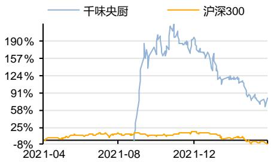  
股价表现   
资料来源：Wind 资讯

<table><tr><td>升幅%</td><td>1M</td><td>3M</td><td>12M</td></tr><tr><td>相对收益</td><td>3.99</td><td>-4.39</td><td>172.13</td></tr><tr><td>绝对收益</td><td>-3.45</td><td>-22.0</td><td>162.06</td></tr></table>

赵国防 分析师SAC执业证书编号：S1450521120008zhaogf1 @essence.com.cn赖雯 报告联系人laiwen @essence.com.cn

# 相关报告

# 内容目录

# 1.千味.：速冻\*面.龙头…… 4

1.1．深耕速冻米面餐饮渠道， 4  
1.2.管理层经验丰富，股权激励绑定团队利益. 5  
1.3．财务表现：高周转率实现高ROE！ 6  
2.餐饮渠道是红海中的蓝海市场.. 8  
2.1．尚处成长期，供需双旺盛. 8  
2.2.他山之石：餐饮业繁荣带动速冻食品高速发展. 10  
2.3．行业空间测算：10 年CAGR 或达 $1 5 \%$ .11  
2.4．竞争格局：C端现分化，B端较分散. 12  
3.直营客户为基，大单品树立标杆.. 14  
3.1．先发优势突出，大客户具有较强稳定性和延伸性 14  
3.2．定制模式优化产品力，大单品树立标杆， 15  
4.优化机制，经销渠道扩大增长空间. 17  
4.1．优化机制，重点扶持大商 17  
4.2.腰部餐饮市场空间可观.. 18  
5.展望：大场景大单品导向，持续创新推动发展.. 19  
5.1．以场景为导向做突破，以大单品驱动市场开拓.. 19  
5.2.产能稳步释放，规模效应持续强化 20  
6.盈利预测.. 22  
7.风险提示.. 23

# 图表目录

图1：千味央厨历史沿革. 4  
图2：油炸类收入占比较高. 4  
图3：不同销售模式的产品结构， 4  
图4：2020 年直营/经销客户占比约 $6 4 \% / 3 6 \%$ .5  
图5：直营客户2020 年受疫情影响较大， 5  
图6：公司股权结构.. 5  
图7：公司2017-2020 年收入复合增速 $1 6 . 8 \%$ 6  
图8：公司2017-2020 年净利润复合增速约 $18 \%$ ： 6  
图9：千味央厨毛利率、费用率处于行业较低水平，净利率处于行业较高水平， 7  
图10：千味央厨在生产端和销售端均拥有更低的成本和更高的效率. 7  
图11：行业产量增速放缓，进入结构性发展阶段.. .8  
图12：三全传统产品增速放缓，面点等新品类增速较高. .8  
图13：速冻米面餐饮渠道增速较高.. .8  
图14：我国餐饮业收入已达4.7万亿，并持续扩容中. .9  
图15：团餐与外卖市场规模较大且不断增长. .9  
图16：速冻调理食品产量. 10  
图17：日本速冻食品成长初期以餐饮渠道为主 10  
图18：1997年日本居民外食率达到 $40 \%$ 后小幅下滑. 10  
图19：1997年日本居民外食率达到 $40 \%$ 后小幅下滑. 10  
图20：日本速冻食品行业增长放缓后集中度提升. .11  
图21：日本速冻食品2016年CR3达 $59 \%$ .11  
图22：我国外食率加速提升至约 $30 \%$ .11  
图23：我国餐饮连锁化率仍有较大提升空间. .11  
图24：速冻米面零售渠道CR3 约 $40 \%$ 12  
图25：2019 年速冻米面传统商超渠道CR3 约 $64 \%$ 12  
图26：直营客户确立合作流程图.. 14  
图27：公司老客户门店数量稳定增长 14  
图28：千味央厨销售人员人均创收显著高于可比公司.. 17  
图29：千味央厨销售人员人均薪酬较高.. 17  
图30：我国地大物博，菜系繁多，场景多元.. 18  
图31：连锁餐企中腰部企业占比较高. 18  
图32：团餐行业产业链一览. 18  
图 33：烘焙类和蒸煮类产品增速较快(2020 年下滑主要系疫情干扰生产) 19  
图 34：我国餐饮连锁化率显著低于全球平均水平.. 20  
图35：我国冷链物流发展与海外国家相比仍有较大差距 20  
图36：中式快餐种类多元，较多区域特色连锁餐企实现高速成长， 20  
图37：公司产能利用率一般在 $80 \%$ 左右 20  
图38：预计公司产能逐步释放.. 20  
图39：油炸类产品成本中制造费用和人工占比较低. 21  
表1：千味央厨拥有行业经验丰富的核心管理团队 5  
表2：股权激励首次授予对象(2021年12月15日) 6  
表3：股权激励业绩考核要求.. 6  
表4：成本不断上涨及连锁化率的提升使越来越多餐企使用中央厨房集中采购与生产 9  
表5：日本畅销速冻调理食品以主食类和油炸类为主. .11  
表6：速冻米面餐饮渠道规模测算.. 12  
表7：头部企业速冻米面产品和渠道有一定差异化. 13  
表8：公司主要直营客户销售收入及占比（单位：万元) 15  
表9：产品矩阵丰富，2020年SKU达368个， 15  
表10：公司主要大单品销售额占总收入的 $46 \%$ 16  
表11：公司积极招商，扩充销售团队.. 17  
表12：新式茶饮等餐饮业态高速发展，是公司烘焙类产品可做重点突破的场景. 19  
表13：主营业务拆分与主要假设. 22  
表14：盈利预测.. 23  
表15：可比公司估值表 23

# 1.千味央厨：速冻米面2B龙头

# 1.1.深耕速冻米面餐饮渠道

千味央厨由思念体系独立出来，深耕速冻米面餐饮渠道数年。郑州思念于 2012 年全资设立千味央厨，并于2016年3月把 $100 \%$ 股权转让给郑州集之城（后更名共青城城之集)，使其从思念体系内独立出来，专注速冻面米制品餐饮渠道市场。早在 2002 年千味央厨还是思念体系内的部门时就与百胜中国建立合作，截至 2020 年已推出 368 款产品，已成功进入肯德基、必胜客、海底捞、真功夫、九毛九、呷哺呷哺等知名餐饮品牌速冻面米制品供应商体系。

  
图1：千味央厨历史沿革  
资料来源：公司官网、安信证券研究中心

公司产品主要分为四类：油炸类、烘焙类、蒸煮类、菜肴及其他，2020年分别实现收入5.2/1.9/1.8/0.5亿元，分别占总营收的 $5 5 \% / 2 0 \% / 1 9 \% / 5 \%$ 油炸类包括油条、芝麻球等，烘焙类主要包括挞皮和华夫饼等，蒸煮类主要包括包点、饺子等，菜肴及其他主要包括肉丸、宽粉等火锅料。产品矩阵丰富，在售产品数量由2017 年的 193 个增加到 2020 年的 368 个，其中，强势品类如油条类收入已超4 亿元，芝麻球类和蛋挞类均是含税收入超亿元品类。

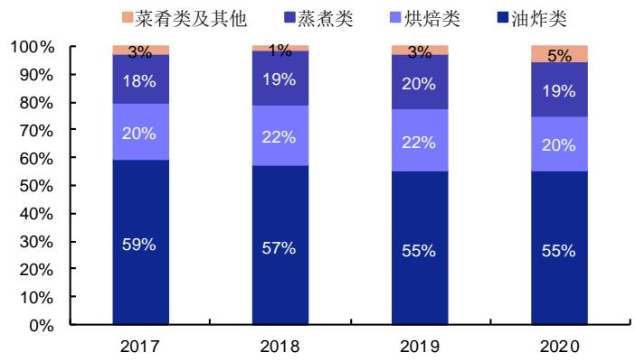  
图2：油炸类收入占比较高

资料来源：招股说明书、安信证券研究中心资料来源：招股说明书、安信证券研究中心

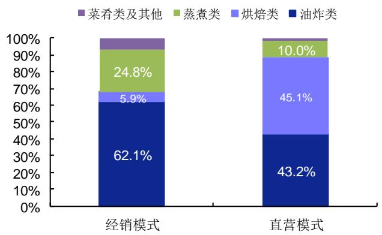  
图3：不同销售模式的产品结构

公司自成立以来便专注于餐饮渠道，明确了“只为餐饮、厨师之选”，“餐饮专攻速冻米面领导品牌”的定位和方向。针对大型连锁餐饮企业、连锁酒店、团餐等，公司采用直营模式直接服务，主要提供定制化产品（约 $8 5 \%$ 为定制品)；对于中小规模餐饮企业，公司通过经销商为其提供标准化产品。2020 年公司直营模式收入1.45 亿元，同比 $+ 2 . 7 \%$ ，2017-2020年CAGR达 $1 1 . 5 \%$ ，经销模式收入6.05 亿元，同比 $+ 1 5 . 5 \%$ ，近四年 CAGR 达 $1 4 . 5 \%$ 。疫情前直营收入约占总收入的 $41 \%$ ，2020 年直营客户受到影响较大占比下滑至 $36 \%$ ，2021年随着餐饮业复苏，预计直营增速略高于经销渠道。

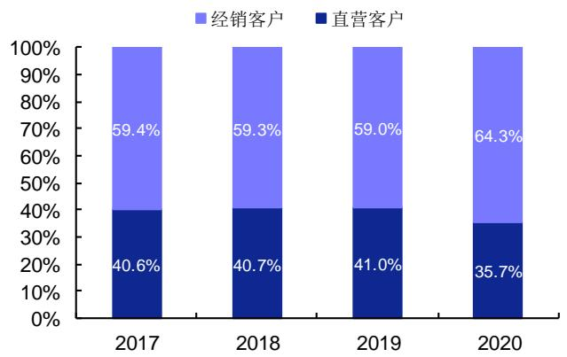  
图4：2020 年直营/经销客户占比约 $6 4 \% 3 6 \%$   
资料来源：招股说明书、安信证券研究中心

  
图5：直营客户2020 年受疫情影响较大  
资料来源：招股说明书、安信证券研究中心

# 1.2. 管理层经验丰富，股权激励绑定团队利益

管理层行业经验丰富，股权稳定，获得绝味、京东助力，同时深度绑定员工利益。公司控股股东为共青城城之集，实控人为李伟，持股 $4 6 . 8 6 \%$ ，其亦为郑州思念的创始人。公司的管理层大多数拥有郑州思念的工作经验，速冻行业从业时间均超过 10 年，经验丰富。共青城凯立持股 $4 . 0 8 \%$ ，为员工持股平台，公司还于2021 年11月发布股权激励公告，激励对象共计80人包括董事、高管和核心研发、业务等骨干人员，深度绑定员工利益。另外，深圳网聚和宿迁涵邦各持股 $3 . 8 5 \%$ ，分别为绝味和京东的投资平台，为千味央厨带来更多资本储备和管理经验。

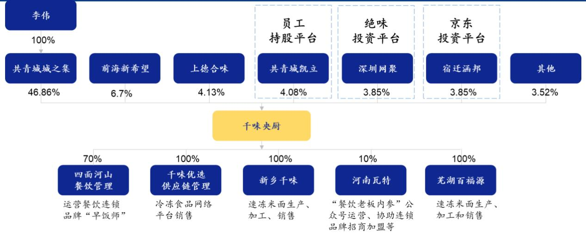  
图6：公司股权结构  
资料来源：招股说明书、公司财报、安信证券研究中心

表1：千味央厨拥有行业经验丰富的核心管理团队  

<table><tr><td>姓名</td><td>职务 履历</td><td></td></tr><tr><td>孙剑</td><td>董事长</td><td>2000 年起历任郑州思念业务代表、上海/香港公司经理、营销中心副总经理、一生缘销售总经理，现任公司董事长，新 乡千味执行董事，至今有20 年速冻行业工作经验</td></tr><tr><td>白瑞</td><td>董事、总经理</td><td>2004 年起历任郑州思念结算部经理、资金管理部经理、营销中心副总经理助理，现任公司董事、总经理，新乡千味经理</td></tr><tr><td>王植宾</td><td>董事、副总经 理、财务总监</td><td>2005 年起历任郑州思念总成本会计、高级审计员、内审经理、审计部经理；现任公司董事、副总经理、财务总监</td></tr><tr><td>徐振江</td><td>副总会经理童</td><td>21理、年任有南问业和裁助理社康销售公司总经理助理、河南骏域基金管理有限公司投资总监，现任公司副总</td></tr></table>

资料来源：公司公告、安信证券研究中心

表2：股权激励首次授予对象(2021 年 12 月15 日)  

<table><tr><td>姓名</td><td>职务</td><td>授予的限制性股票数量 （股)</td><td>占本激励计划公告日公司股本总额的比例</td></tr><tr><td>孙剑</td><td>董事长</td><td>142,900</td><td>0.17%</td></tr><tr><td>白瑞</td><td>董事、总经理</td><td>97,400</td><td>0.11%</td></tr><tr><td>王植宾</td><td>董事、副总经理、财务总监</td><td>87,700</td><td>0.10%</td></tr><tr><td>徐振江</td><td>副总经理、董事会秘书</td><td>116,900</td><td>0.14%</td></tr><tr><td>核心人员(76人)</td><td></td><td>1,081,300</td><td>1.27%</td></tr><tr><td>预留股份</td><td></td><td>42,200</td><td>0.05%</td></tr><tr><td>合计</td><td></td><td>1,568,400</td><td>1.84%</td></tr></table>

资料来源：公司公告、安信证券研究中心

表3：股权激励业绩考核要求  

<table><tr><td>解除限售期</td><td>业绩考核目标（Am)</td><td>业绩考核目标触发值</td></tr><tr><td>第一个解除限售期</td><td>以 2020 年度营业收入为基数，2022 年度营业收入增长率不低于 67%</td><td rowspan="2">年度目标值的 80%</td></tr><tr><td>第二个解除限售期</td><td>以 2020 年度营业收入为基数，2023 年度营业收入增长率不低于 101%</td></tr></table>

资料来源：公司公告、安信证券研究中心

# 1.3.财务表现：高周转率实现高ROE

由于疫情对餐饮企业打击较大，千味央厨2020年营收9.4 亿元，同比 $+ 6 . 2 \%$ ，归母净利润7659 万元，同比 $+ 3 . 3 \%$ ，增速有所放缓，2017-2020 年来看，公司收入、凈利润CAGR分别达到 $1 6 . 8 \%$ $1 8 \%$ 。2021 年来随着疫情逐渐得到控制，公司加快恢复，前三季度收入8.9亿元，同比 $+ 4 5 . 9 \%$ ，净利润5659 万元，同比 $+ 1 6 \%$ ，利润增速低于收入增速主因2020 年疫情下政府补贴较多，导致基数相对较高，以及早餐连锁品牌“早饭师”短期小幅亏损。

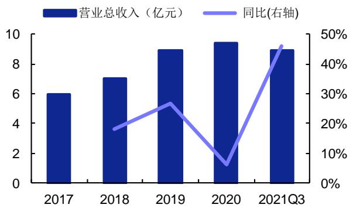  
图7：公司2017-2020 年收入复合增速 $1 6 . 8 \%$   
资料来源：招股说明书、公司季报、安信证券研究中心

  
图 8：公司2017-2020 年净利润复合增速约 $18 \%$   
资料来源：招股说明书、公司季报、安信证券研究中心

毛利率平稳，期间费用率较低，净利率处于行业较高水平。千味央厨客户均为餐饮企业，故毛利率低于三全等C端占比高的企业，2020年毛利率为 $2 1 . 7 \%$ ，还原到可比口径与2019年基本持平，2021 前三季度毛利率 $2 1 . 8 \%$ ，同比 $+ 0 . 5$ pct。从费用率角度来看，千味、安井、三全2020 年期间费用率分别为 $1 2 . 8 \% , 1 4 . 6 \% , 1 8 . 4 \%$ ，主要系2B模式下销售费用率较低，。公司2020、2021Q1-Q3 净利率分别为 $8 . 1 \%$ $6 . 2 \%$ ，历年净利率基本维持在 $8 . 2 \%$ 左右，处于行业较高水平。公司于 2021 年 12 月底开始对部分产品促销政策进行缩减或对经销价进行上调，调价幅度为 $2 \% - 1 0 \%$ 不等，有效缓解了成本压力，预计 2022 年提价效应释放提升公司利润率。

  
图9：千味央厨毛利率、费用率处于行业较低水平，净利率处于行业较高水平  
资料来源：招股说明书、公司年报、安信证券研究中心

高净利率高周转率实现较高 ROE。2B 商业模式让公司在生产端和销售端均拥有更低的成本和更高的效率，2020 年单吨制造费用1118 元，低于安井的 1360 元，单吨销售费用 401元，远低于安井(3917 元）和三全（1720 元)。效率方面，2020 年公司总资产周转率、存货周转率分别为 1.05 次、6.87 次，处于行业较高水平。公司 2018、2019、2020 年 ROE（加权)为19.33、20.1、15，ROIC为19.1、19.42、14.49，若排除 2020 年疫情影响，以 2019年为参考，公司 ROE 和ROIC 显著高于安井及三全等可比公司，处于行业较高水平。

  
图10：千味央厨在生产端和销售端均拥有更低的成本和更高的效率  
资料来源：wind、安信证券研究中心

# 2. 餐饮渠道是红海中的蓝海市场

# 2.1.尚处成长期，供需双旺盛

# 供给端：速冻米面产品结构优化，餐饮渠道大有可为

根据《2019 年中国冷冻冷藏食品工业经济运行报告》，2019 年全国速冻米面食品制造业收入773.5 亿元，行业增速约 $8 \text{‰}$ 90 年代时期，随着海外先进设备的引进以及国产设备的研制，我国速冻食品加工工艺取得较大进步，三全、思念等企业陆续成立，汤圆、水饺等传统速冻米面产品进入家庭。经过数十年的时间，零售渠道传统速冻米面发展已较成熟，增速有所放缓，但近年随着生产工艺进步，油条、手抓饼、发糕、芝麻球等新兴速冻米面大单品涌现，在BC渠道均加快渗透，带动行业整体情况好转。

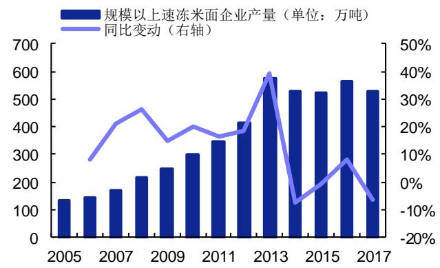  
图11：行业产量增速放缓，进入结构性发展阶段  
资料来源：国家统计局、安信证券研究中心

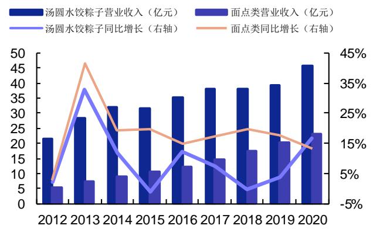  
图12：三全传统产品增速放缓，面点等新品类增速较高  
资料来源：公司年报、安信证券研究中心

餐饮渠道是红海中的蓝海市场，呈现多点开花景象。根据欧睿数据，2021 年速冻米面餐饮渠道销量占比约 $1 6 \%$ ，近5 年销量CAGR达 $1 5 \%$ ，零售渠道销量占比 $84 \%$ ，近5年CAGR为 $4 . 2 \%$ ，餐饮渠道增速高，占比不断提升。相比与零售渠道，速冻米面制品在餐饮渠道起步较晚，尚处于产品开发和市场开拓阶段，随着餐企对预制品的需求日益增强，餐饮渠道成为新的蓝海。如安井食品于2018 年提出“三剑合璧、餐饮发力”，传统米面龙头三全食品积极变革，加大B 端的布局，还有包括千味央厨等企业专注于餐饮渠道开拓，推出油条、蛋挞皮等适合餐饮渠道的产品。

  
图13：速冻米面餐饮渠道增速较高  
资料来源：欧睿、安信证券研究中心

# 需求端主要驱动力如下：

1）米面制品具有主食和点心属性，存在于多种餐饮业态中，且一般不是餐企的招牌菜品，为了节约成本，餐企采购第三方预制品的需求大、可行性高。伴随餐饮业持续扩容，连锁化率提升，人工、租金、原材料等价格不断上升，餐企去厨师、去厨房意愿强化。米面制品存在于快餐、正餐、团餐等多种餐饮业态中，具有一定规模。但米面制品作为主食/点心，产品附加值相对较低，对于较多餐企来说，米面制品并非其招牌菜品，若门店自制，从揉面、发面到蒸煮烘焙或油炸所耗费的人力和时间成本较大，投入产出比较低。因此，采购第三方速冻米面成品或半成品的需求及可行性较高。

2）快餐、外卖市场高增，对提升出餐速度有诉求。根据沙利文数据，2020 年中式快餐、外卖收入分别为 6590 亿元、7166 亿元，并持续扩容中。快餐、外卖对于餐饮门店的出餐率要求较高，速冻米面食品相比现包现蒸能大幅节省出餐时间。

3）团餐、乡宴等向标准化转型。团餐具有可预测、规模大、标准化、订单稳定且时效长等特点，利于企业进行规模化采购以降低边际成本，根据中国饭店协会数据，团餐拥有中央厨房数量较多，集中采购 2020 年我国团餐市场规模已达到 1.53 万亿元，2016-2020年复合增速为 $1 4 . 2 \%$ ，受众群体约6.7亿人。乡宴市场存在原材料采购渠道复杂、品种多样且加工不规范的弊端，有一定食品安全隐患，而外包给第三方进行统一采购、制作后复热是良策，目前农村宴席每桌成本约为 300-600 元，每次约为 30-60桌，为餐饮服务商下沉打下基础。

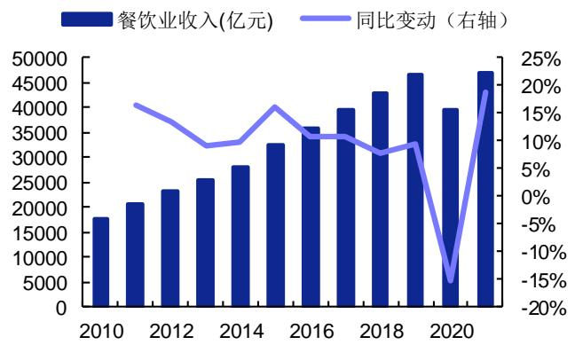  
图14：我国餐饮业收入已达4.7万亿，并持续扩容中  
资料来源：国家统计局、安信证券研究中心

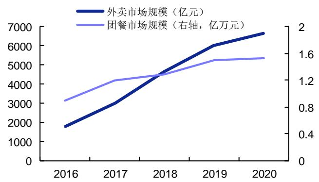  
图15：团餐与外卖市场规模较大且不断增长

资料来源：《中国外卖产业调查研究报告》、艾媒数据中心、产业信息网、安信证券研究中心

表4：成本不断上涨及连锁化率的提升使越来越多餐企使用中央厨房集中采购与生产  

<table><tr><td>餐饮业态</td><td>中央厨房数量（个)</td><td>原材料进货</td><td>原料进成</td><td>房租及物业</td><td>房及业成本</td><td></td><td>人九成动</td></tr><tr><td>正餐</td><td>0.39</td><td>40.63%</td><td>1.84%</td><td>11.39%</td><td>3.26%</td><td>24.63%</td><td>4.98%</td></tr><tr><td>火锅</td><td>0.97</td><td>40.11%</td><td>2.19%</td><td>11.85%</td><td>2.41%</td><td>16.67%</td><td>2.31%</td></tr><tr><td>快餐小吃</td><td>0.83</td><td>41.82%</td><td>4.61%</td><td>13.24%</td><td>2.69%</td><td>20.72%</td><td>4.54%</td></tr><tr><td>团餐</td><td>1.5</td><td>55.75%</td><td>-0.74%</td><td>4.62%</td><td>2.29%</td><td>26.99%</td><td>3.40%</td></tr><tr><td>西餐休闲、日料</td><td>0.5</td><td>36.54%</td><td>1.28%</td><td>13.79%</td><td>0.96%</td><td>19.34%</td><td>1.36%</td></tr></table>

资料来源：中国饭店协会、安信证券研究中心

# 2.2. 他山之石：餐饮业繁荣带动速冻食品高速发展

60 年代末至 90年代末，日本餐饮业繁荣带动速冻食品高速发展。此阶段日本经济高速增长，外出工作的女性增多，居民外食率提升，美式连锁快餐进入日本，共同带动餐饮业包括连锁快餐、外卖等繁荣发展，期间日本人力成本上涨和房地产泡沫带来的租金上涨使得方便快捷的速冻食品获得高度发展，被广泛应用于餐饮端，同时在家庭端逐步渗透。1997 年，日本居民外食率达到 $40 \%$ ，速冻食品餐饮渠道产量占比达到 $7 3 . 3 \%$ ，1960-2000 年，日本速冻调理食品人均消费量由0.03千克增长至9.73千克。

2000 年至 2010 年，经济不景气，速冻食品需求小幅下滑，行业集中度提升。90 年代末，日本速冻食品餐饮市场在实现了长期而快速的成长后有小幅回落，原因是日本快餐业经过20多年快速发展出现阶段性饱和，日本已经从高度繁荣进入泡沫破灭的经济低迷期，居民收入与消费已经深受日本金融危机影响。行业不景气导致集中度提升，2003 年-2010 年，日本速冻食品企业数量由693家减少到488家，到2020年仅剩余370家。

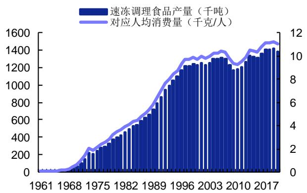  
图16：速冻调理食品产量

资料来源： $\boldsymbol { \it E I }$ 本冷冻食品协会、安信证券研究中心资料来源： $\boldsymbol { \it E I }$ 本冷冻食品协会、安信证券研究中心

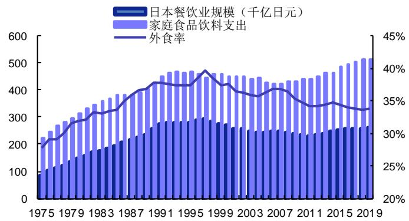  
图18：1997年日本居民外食率达到 $40 \%$ 后小幅下滑  
资料来源： $\boldsymbol { \it E I }$ 本冷冻食品协会、Wind、安信证券研究中心

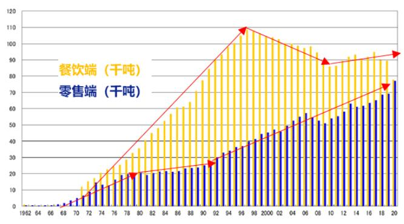  
图17：日本速冻食品成长初期以餐饮渠道为主

  
图19：1997 年日本居民外食率达到 $40 \%$ 后小幅下滑  
资料来源： $\boldsymbol { \mathcal { E } }$ 本冷冻食品协会、安信证券研究中心

2010 年至今，餐饮渠道保持平稳，零售渠道恢复较快增长。日本人口老龄化严重，出生率持续下滑，单身或无孩家庭数量增多，导致速冻食品餐饮消费保持平稳，家庭需求稳步提升，2005 年-2020 年，家庭用速冻调理食品的产量占比由 $3 9 \%$ 提升至 $52 \%$ 。整体来看，人均速冻调理食品消费量恢复增长，从2010 年的 9.23 千克增长到2020 年的11.04 千克。

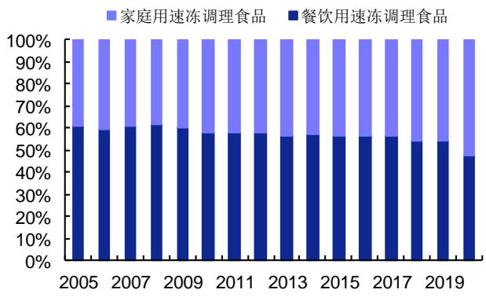  
图20：日本速冻食品行业增长放缓后集中度提升  
资料来源： $\boldsymbol { \it E I }$ 本冷冻食品协会、安信证券研究中心

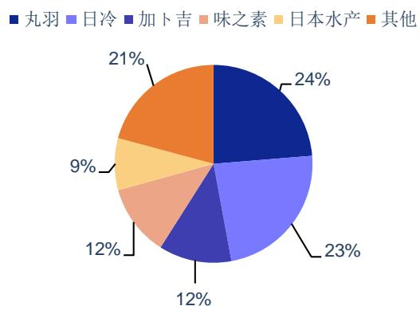  
图21：日本速冻食品2016年CR3达 $59 \%$   
资料来源：The Nikkei、 $\boldsymbol { E }$ 冷年报、安信证券研究中心

表5：日本畅销速冻调理食品以主食类和油炸类为主  

<table><tr><td>畅销大单品</td><td>产量(吨)</td><td>产值(百万日元)</td><td>产量占比</td><td>产值占比</td></tr><tr><td>乌冬面</td><td>199,864</td><td>29,969</td><td>14.4%</td><td>4.9%</td></tr><tr><td>炸丸子 （可乐饼)</td><td>161500</td><td>56,136</td><td>11.6%</td><td>9.2%</td></tr><tr><td>炒饭</td><td>99,523</td><td>43,315</td><td>7.2%</td><td>7.1%</td></tr><tr><td>饺子</td><td>89,650</td><td>51,471</td><td>6.5%</td><td>8.4%</td></tr><tr><td>意大利面</td><td>65,869</td><td>19,882</td><td>4.8%</td><td>3.3%</td></tr><tr><td>汉堡排</td><td>62,641</td><td>35,443</td><td>4.5%</td><td>5.8%</td></tr><tr><td>炸肉排</td><td>54,590</td><td>36,457</td><td>3.9%</td><td>6.0%</td></tr><tr><td>烧卖</td><td>41,878</td><td>29,388</td><td>3.0%</td><td>4.8%</td></tr></table>

资料来源： $\boldsymbol { \it E }$ 本冷冻食品协会、安信证券研究中心

我国速冻食品在 90 年代由家庭消费开始兴起，而后在餐饮渠道加速渗透，与 70 年代的日本情况相似。我国餐饮业2021年收入达4.7万亿元，同比 $+ 1 8 . 6 \%$ ，2016-2021年 CAGR约$8 . 6 \%$ ，疫情前（2014-2019年）CAGR达 $1 0 . 9 \%$ ，2019 年居民外食率提升至 $30 \%$ ，与70年代的日本接近。随着经济不断发展，人均可支配收入提升，城镇化进程加快等，居民外食率有望进一步提升，餐企对成本优化、效率提升及标准化的诉求也在日益强烈，对第三方供应链需求增加。

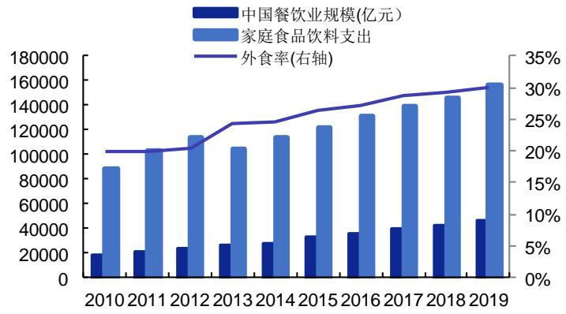  
图22：我国外食率加速提升至约 $30 \%$   
资料来源：国家统计局、安信证券研究中心

  
图23：我国餐饮连锁化率仍有较大提升空间  
资料来源：欧睿、安信证券研究中心

# 2.3.行业空间测算：10 年 CAGR 或达 $15 \%$

以出厂口径来看，根据 $\ll 2 0 1 9$ 年中国冷冻冷藏食品工业经济运行报告》，速冻米面行业2021年收入约 774 亿元，行业增速约 $8 \%$ ，假设 2021-2030行业CAGR约 $7 \%$ ，预计到2025、

2030 年行业规模达到 1053、1547 亿元。根据欧睿数据，2021 年餐饮渠道占比约 $16 \%$ ，预计2025 年占比能达到 $2 2 \%$ ，参考日本 70 年代餐饮渠道占比约 $60 \%$ ，考虑到我国饮食结构的不同，假设2030年餐饮渠道占比能达到 $30 \%$ ，则推算出2021年、2025 年、2030年速冻米面餐饮渠道规模（出厂口径）约124 亿元、223 亿元、427 亿元，2021-2030 年CAGR约 $1 5 \%$ 。

以餐企渗透率角度来看，根据中国饭店协会数据，我国餐饮业 2021 年收入达 4.7 万亿元，餐企原材料采购成本占收入约 $4 1 \%$ ，假设第三方速冻预制品占餐企采购成本中的 $1 5 \%$ ，其中速冻米面占比约 $5 \%$ ，推算出 2021 年速冻米面餐饮渠道规模约144 亿元。参考餐饮业收入2014-2019 年CAGR约 $1 0 . 9 \%$ ，假设 2021-2030行业CAGR为 $9 \%$ ，原材料成本占比不变，2025 年、2030年速冻预制品加速渗透至 $20 \%$ ， $2 6 \%$ ，速冻米面占比维持在 $5 \%$ 左右，则可以推算出2021 年、2025 年、2030 年速冻米面餐饮渠道规模约 144 亿元、271、522亿元，2021-2030年CAGR约 $1 5 \%$ o

表6：速冻米面餐饮渠道规模测算  

<table><tr><td>单位（亿元）</td><td>2021</td><td>2025E</td><td>2030E</td></tr><tr><td>餐饮业收入</td><td>46895</td><td>66196</td><td>101851</td></tr><tr><td>原材料采购成本占比</td><td>41%</td><td>41%</td><td>41%</td></tr><tr><td>原材料采购成本</td><td>19227</td><td>27140</td><td>41759</td></tr><tr><td>假设速冻预制品占比</td><td>15%</td><td>20%</td><td>25%</td></tr><tr><td>餐饮供应链速冻预制品规模</td><td>2884</td><td>5428</td><td>10440</td></tr><tr><td>假设其中速冻米面占比</td><td>5%</td><td>5%</td><td>5%</td></tr><tr><td>餐饮供应链速冻米面规模</td><td>144</td><td>271</td><td>522</td></tr><tr><td>CAGR</td><td></td><td>17%</td><td>15%</td></tr><tr><td>单位（亿元）</td><td>2021</td><td>2025E</td><td>2030E</td></tr><tr><td>速冻米面规模（出厂口径）</td><td>774</td><td>1015</td><td>1423</td></tr><tr><td>餐饮渠道占比</td><td>16%</td><td>22%</td><td>30%</td></tr><tr><td>餐饮渠道速冻米面规模(出厂口径)</td><td>124</td><td>223</td><td>427</td></tr></table>

F料来源：国家统计局、中国饭店协会、 ${ \mathfrak { 2 0 1 9 } }$ 年中国冷冻冷藏食品工业经济运行报告》、欧睿、安信证券研究中

# 2.4.竞争格局：C端现分化，B端较分散

C 端：传统速冻米面“三足鼎立”格局稳定，新兴速冻米面格局较分散。汤圆、水饺、粽子等传统米面产品经过多年发展已逐渐进入成熟阶段，三全、思念、湾仔码头“三足鼎立”的格局较为稳固，三者在商超渠道的市占率已超 $60 \%$ 。新兴速冻米面尚处于成长期，格局较分散，由于各地饮食习惯差异，地方特色米面产品品类丰富，细分品类次第开花，企业多寻求差异化竞争，其中安井表现较为突出。根据欧睿数据，三全、思念、湾仔码头、安井在整体速冻米面零售市场的市占率分别为 $1 8 \%$ 、 $1 1 . 3 \%$ $1 0 . 4 \%$ 、 $4 . 9 \%$ o

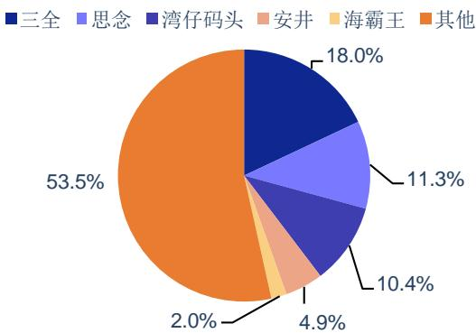  
图24：速冻米面零售渠道CR3 约 $40 \%$

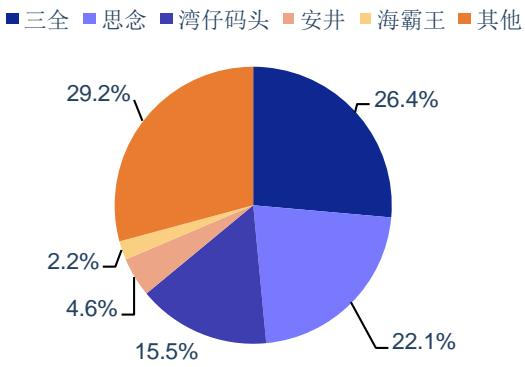  
图25：2019 年速冻米面传统商超渠道CR3 约 $64 \%$

资料来源：欧睿、安信证券研究中心资料来源：中国方便食品大会、安信证券研究中心

B 端：仍处市场开拓与产品培育期，格局极分散。目前速冻米面餐饮市场企业规模参差不齐，整体以中小企业为主，具有一定规模的实力参与者有千味央厨、安井食品、三全食品、思念食品等，大多以不同场景、渠道或大单品错位竞争。

大B进入门槛较高，黏性强，竞争尚不激烈。对于大型餐饮企业来说，食品安全、资金实力、生产规模与工艺、定制服务能力等均为考核指标，且考察时间较长，成为其核心定制品供应商的门槛较高，一旦建立稳定合作，餐企一般不会轻易替换供应商。综合实力较强且占据先发优势的头部企业如千味央厨已打下较好基础，正处于加速跑马圈地阶段。

小B重成本，高性价比大单品占优，头部企业多以差异化错位竞争。对于小B 来说，缓解成本压力和提高标准化与效率更为重要，因此其标品需求旺盛，对定制能力等要求较低，具备高性价比大单品及成熟经销商团队的企业明显占优，这背后需要一定研发实力、规模优势及优异的供应链管理能力等，头部企业有望占据更高的市场份额。目前具有一定规模的企业包括千味央厨、安井食品、三全食品、思念食品等，竞争相比大B 较激烈，但头部企业大多以不同场景和大单品错位竞争:

表7：头部企业速冻米面产品和渠道有一定差异化  

<table><tr><td></td><td>2020 年营收</td><td>速冻米面规模和渠道</td><td>主要米面产品</td><td>优劣势分析</td></tr><tr><td>千味央廚</td><td>9.4亿</td><td>米面收入约9 亿元，专注 与餐饮渠道，直营大B占 36%，经销占64%</td><td>包括油炸类（油条、芝麻球等)、 蒸煮类（卡通包、米糕等)、烘 焙类 (蛋挞皮、华夫饼等)</td><td>专注于B 端，定制研发能力领先，拥有实力较强的直 营大B客户，占据先发优势，大单品油条的品类市占 率约 60%。目前500 万以上的经销商占比较低，未 来会重点扶持大商，有望加速开拓小B客户。</td></tr><tr><td>三全食品</td><td>69.3亿</td><td>整体米面收入约62亿元， 体餐饮道收销约 1：9，以小B为主</td><td>汤圆水饺粽子占米面营收的 74%，其他点心面点（包括馅饼 春卷等）占26%</td><td>在汤圆水饺粽子等传统品类上拥有较强优势，针对餐 渠道推出了绿细化通，面向制为主速未 沉。</td></tr><tr><td>安井食品</td><td>69.7亿</td><td>米面收入约16.6亿元，C 端占比较高，B 端主要为 小B</td><td>米面制品主要包括馒头花卷、包 点、手抓饼和米糕等点心。</td><td>拥有手抓饼、红糖馒头等大单品，实力强且忠诚的经 销商团队，坚持“BC兼顾，全渠发力”的渠道策略， 整体米面制品在C端占比更高，餐饮渠道基本为小B 客户，在大B 端暂无明显优势</td></tr><tr><td>思念食品</td><td>69.5亿</td><td>以米面为主，其中餐饮渠 道收入约7亿元</td><td>水饺、汤圆、粽子、馄饨、包点、 油条、手抓饼等</td><td>在汤圆水饺粽子等传统品类上拥有较强优势，餐饮渠 道规模较小，以小B为主</td></tr></table>

资料来源：公司2020年报、《河南民营企业100强名单》、安信证券研究中心

# 3.直营客户为基，大单品树立标杆

# 3.1.先发优势突出，大客户具有较强稳定性和延伸性

坚持“大客户优先”理念，快速响应需求。公司营销中心下设重客部（对接直营客户），经销商客户部，新零售部门，行销部（管理与跟进客户和渠道开发进程)，产品推广部，销售管理部和市场部。公司内部树立“大客户优先”理念，形成对接大客户的内部小组，公司董事长和总经理为小组负责人，确保内部组织能够快速响应大客户的需求。

  
图26：直营客户确立合作流程图

资料来源：招股说明书、安信证券研究中心

大型连锁餐饮企业供应链体系的进入壁垒较高、黏性强，千味央厨实力突出，先发优势显著。在确定合作前，公司与直营客户需要经过时间较长、标准较严格的相互考察。一方面，大型餐饮连锁企业对产品质量、外观、质控等均有较高要求，要求企业具备定制化研发、柔性化生产、体系化品控和运营管理等综合能力，以及历史服务记录等系统的定制服务能力。另一方面，公司需要通过多次合规性检查、实地审查，以及较高频率的日常突击检查。以海底捞为例，2020 年派遣安全员或第三方对供应商进行了284 次飞行审核，抽检供应商供应物料753 批次。较高的进入壁垒和较长的验证时间也表明转换供应商的成本和风险较高，因此一旦合作达成，除非有重大食品安全问题，餐企一般不会轻易更换供货商。千味目前已成为百胜中国、华莱士、海底捞、真功夫、九毛九、呷哺呷哺等知名餐饮品牌速冻面米制品供应商，大客户资源优势显著。

直营客户具有较强延伸性及灯塔效应，老客户门店增长 $^ { + }$ 合作品类增加+新客户开拓均可为公司带来增量。随着合作时间的增加，千味能更深入了解客户门店情况，把握客户需求，除了客户提出的需求，公司还会主动研发新品或优化老品，不定时向客户提案，争取获得更多品类的供应权。比如公司最早只是为肯德基提供蛋挞皮，到现在产品延伸到安心油条、华夫饼、冷冻面团、烙饼、牛角包、酥饼等多个品类。另外，千味定制生产保持了良好的准时交货、优质服务和成本记录，起到较好背书作用，加强品牌效应，助力公司开拓新客户。

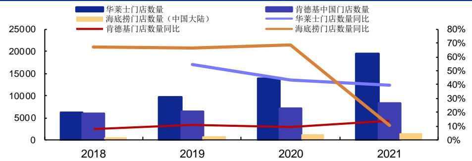  
图27：公司老客户门店数量稳定增长  
资料来源：各公司年报、窄门餐眼、安信证券研究中心

定制模式提高议价权，公司直营渠道毛利率高于经销渠道。直营客户以定制产品为主，对加工工艺和品质的要求通常比通用品更严格，对价格敏感度低，公司具有一定议价权。经销客户约 99%都为通用品，对价格较为敏感，且公司会给予经销商一定利润空间，因此直营模式毛利率普遍高于经销模式。2020 年公司直营模式、经销模式毛利率分别为 $2 3 . 2 \% / 2 0 . 6 \%$ o

表8：公司主要直营客户销售收入及占比（单位：万元)  

<table><tr><td>主要直营客户</td><td>2018</td><td>2019</td><td>2020</td></tr><tr><td>百胜中国（肯德基、必胜客、小肥羊等）</td><td>21,175 30.20%</td><td>27,317 30.72%</td><td>22,067 23.37%</td></tr><tr><td>华菜士</td><td>2,369 3.38%</td><td>2,567 2.89%</td><td>4,000</td></tr><tr><td>海底捞</td><td></td><td></td><td>4.24% 2087</td></tr><tr><td>九毛九、太二</td><td>896 1.28%</td><td>979</td><td>2.21% 583</td></tr><tr><td>真功夫</td><td>570</td><td>1.10% 642</td><td>0.62% 665</td></tr><tr><td>其他（永和大王、瑞幸等)</td><td>0.81% 3,507</td><td>0.72% 4,946</td><td>0.70% 4,276</td></tr><tr><td>合计</td><td>5.02% 28516 40.69%</td><td>5.59% 36,451 35.74%</td><td>4.60% 33,678</td></tr></table>

资料来源：招股说明书、安信证券研究中心(2020年下滑主要系疫情造成较大影响)

# 3.2.定制模式优化产品力，大单品树立标杆

与大型连锁餐饮客户合作倒逼公司不断优化研发实力、生产技术，提高对市场需求变化的嗅觉。千味直营客户均为国内头部餐饮企业，对产品品质及创新性等方面均有较高要求，这也倒逼公司不断优化研发团队，提升产品力。从油条为例，千味在2006 年推出了安心油条，是中国工业化油条的始创者，公司油条的生产分为前端处理、中端成型和后端包装，从不同厂商采购各个步骤的设备，并根据自身需求进行改良，最终组建成独特的生产线，目前已升级优化到 4.0 版本。千味针对不同客户也推出了多款创新油条产品，比如太二酸菜鱼的墨鱼汁油条、海底捞的灌虾滑油条等，生产技术及品类丰富度均处于行业领先水平，根据渠道调研，千味央厨在油条品类的市占率已达到约 $50 \text{‰}$

表9：产品矩阵丰富，2020年SKU达368个  

<table><tr><td>在售产品数量（个)</td><td>2017</td><td>2018</td><td>2019</td><td>2020</td></tr><tr><td>油炸类</td><td>61</td><td>72</td><td>90</td><td>95</td></tr><tr><td>烘焙类</td><td>33</td><td>38</td><td>49</td><td>56</td></tr><tr><td>蒸煮类</td><td>84</td><td>105</td><td>139</td><td>166</td></tr><tr><td>菜肴类及其他</td><td>15</td><td>9</td><td>27</td><td>51</td></tr><tr><td>合计</td><td>193</td><td>224</td><td>305</td><td>368</td></tr></table>

资料来源：招股说明书、安信证券研究中心

直营客户背书，定制产品标品化，提高大单品成功率和规模效应。2020 年公司的主要大单品销售额已达4.3 亿元，约占总收入的 $46 \%$ 。虽然餐饮企业享有定制产品的在一定时期内的独家销售权，但是公司可以在此基础上筛选出合适产品，通过修改规格或馅料等方式把定制产品标品化，以推广到经销渠道达到效益最大化。另外，与大型连锁餐饮企业的合作具有灯塔效应，有助于相关产品的推广，部分未被客户选择的备选定制提案也可作为通用品的补充。

表10：公司主要大单品销售额占总收入的46%  

<table><tr><td>主要大单品（单位：万元）</td><td>2018</td><td>2019</td><td>2020</td></tr><tr><td>1*18*16蛋挞皮</td><td>7,952.65</td><td>9,107.33</td><td>8,664.30</td></tr><tr><td>千味 260g 芝麻球</td><td>8,954.79</td><td>9,033.79</td><td>9,830.79</td></tr><tr><td>KFC冷冻油条（60g)</td><td>4,497.85</td><td>6,815.12</td><td>6,503.15</td></tr><tr><td>千味 400g 香芋地瓜丸</td><td>4,403.52</td><td>5,015.23</td><td>5,272.30</td></tr><tr><td>千味 450g 香脆油条</td><td>3,931.38</td><td>4,344.96</td><td>4,460.20</td></tr><tr><td>百胜原味冷冻华夫面团</td><td>1,196.04</td><td>2,804.94</td><td>1,729.94</td></tr><tr><td>千味 360g 卡通豬豬包</td><td>1,850.14</td><td>2,671.56</td><td>2,747.64</td></tr><tr><td>千味 1200g 放心大油条</td><td>927.31</td><td>1,963.33</td><td>2,611.47</td></tr><tr><td>千味 300 克脆皮香蕉</td><td>1,865.72</td><td>1,756.57</td><td>1,515.17</td></tr><tr><td>合计</td><td>35,813.69</td><td>43512.83</td><td>43,334.97</td></tr></table>

资料来源：招股说明书、安信证券研究中心

# 4. 优化机制，经销渠道扩大增长空间

# 4.1.优化机制，重点扶持大商

2020年公司经销渠道收入6.05亿元，占总收入的 $64 \%$ ，同比 $+ 1 5 . 5 \%$ ,近四年CAGR达 $1 4 . 5 \%$ 其中，团餐、乡厨、中小型连锁餐企各占约 $30 \%$ $30 \%$ $40 \%$ o

积极招商，优化机制。公司经销商总数由2017 年的 521家增长到 2020 年的 907家。其中，100 万元以下的中小经销商共777 家，大多同时代理较多品类速冻食品，100 万元以上经销商数量共130家，带来的销售收入约占经销收入的 $70 \%$ ，占主营业务收入的 $45 \%$ 。考虑到规模较大的经销商忠诚度高，能力较强，为了能更快完善渠道布局，公司集中力量重点扶持大商，计划培育出一批 5000 万元以上及一大批 1000 万元以上的经销商，在此基础上再发展腰部经销商。

赋能经销商，协助其做大做强。为了更好扶持大商，公司销售人员数量由 2017 年的 67 人扩充到 2020 年的156 人，对 100 万元以上经销商都单独配备一名销售人员进行对接。对经销商的具体扶持包括：1）为区域大商引进相关客户2）协助经销商转型，帮助经销商梳理所有产品和话术，力求让经销商可以用 PPT 等工具对客户进行专业汇报，经销商还可以直接带客户到合作企业品尝公司出品。3）举办评鉴会、客户答谢会等。

表11：公司积极招商，扩充销售团队  

<table><tr><td></td><td>2017</td><td>2018</td><td>2019</td><td>2020</td></tr><tr><td>500 万元以上经销商数量</td><td>12</td><td>15</td><td>17</td><td>18</td></tr><tr><td>100-500 万元经销商数量</td><td>84</td><td>77</td><td>101</td><td>112</td></tr><tr><td>10-100 万元经销商数量</td><td>210</td><td>276</td><td>327</td><td>468</td></tr><tr><td>10 万元以下经销商数量</td><td>215</td><td>238</td><td>303</td><td>309</td></tr><tr><td>经销商总数</td><td>521</td><td>606</td><td>748</td><td>907</td></tr><tr><td>销售人员数量</td><td>67</td><td>63</td><td>87</td><td>156</td></tr></table>

资料来源：招股说明书、安信证券研究中心

扩充销售团队，重视激励，销售人员人均薪酬与人均创收均处于行业较高水平。目前公司销售团队规模仍较小，未来会继续加速扩充，并不断优化对销售人员的激励。2019、2020年公司销售人员人均创收达到 1022、605 万元，销售人员人均工资达到14.27、13.51 万元，显著高于可比公司。

  
图28：千味央厨销售人员人均创收显著高于可比公司  
资料来源：招股说明书、公司年报、安信证券研究中心

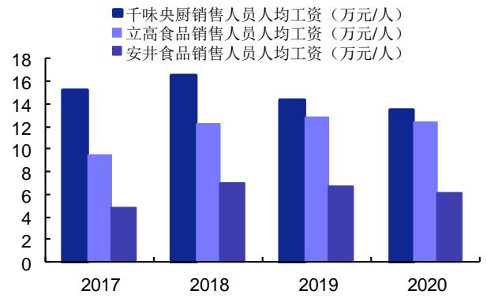  
图29：千味央厨销售人员人均薪酬较高

资料来源：招股说明书、公司年报、安信证券研究中心

# 4.2. 腰部餐饮市场空间可观

团餐、腰部餐企占比较高，对第三方餐饮供应链需求不断增长，公司经销渠道空间广阔。根据中国连锁经营协会数据，2020 年我国连锁餐饮企业中，500 家门店以内的企业占比约 $60 \%$ ,此类中小型连锁企业对定制品的需求较低，在成本不断上行、标准化诉求提升的背景下，对第三方标准预制品的需求增加，腰部餐饮市场能为公司经销渠道带来较大增长空间。

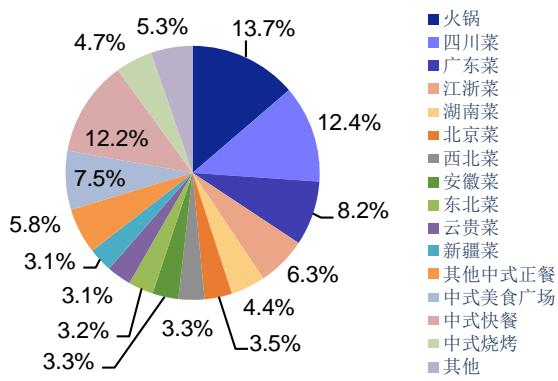  
图30：我国地大物博，菜系繁多，场景多元

  
图31：连锁餐企中腰部企业占比较高

资料来源：沙利文、海底捞招股说明书、安信证券研究中心资料来源：中国连锁经营协会、安信证券研究中心

根据中国饭店协会数据，2019 年我国团餐市场总额1.5万亿元，占餐饮行业收入的 $3 3 . 2 3 \%$ 是餐饮行业中重要的组成部分。随着经济快速发展，城镇化进程加快，消费者诉求产生变化推动团餐行业迎来变革，对标准化、食品安全、运营效率等重视程度提升，且团餐具有SKU较少、单品类采购量大、采购计划性强（用餐人数及用餐时间相对可控）的特点，利于企业进行规模化采购，是千味未来继续重点开拓的方向。

  
图 32：团餐行业产业链一览  
资料来源：亿欧智库、安信证券研究中心

# 5. 展望：大场景大单品导向，持续创新推动发展

# 5.1.以场景为导向做突破，以大单品驱动市场开拓

# 从产品角度看：

依托现有产品进行场景化深入研究，推出适应不同场景的系列产品，现有大单品仍有较大挖掘空间。以油条为例，公司从 2012 年开始进行油条细分场景下的市场研究，细分出火锅、快餐、自助餐、宴席、早餐、外卖六大场景，并针对性推出茴香小油条、麻辣烫小油条、火锅涮煮油条、外卖专用油条等多款创新性产品。截至2020 年底，公司油条系列已有20余SKU，前三大单品（KFC 60g 冷冻油条、千味 450g 香脆油条、千味 1200g 放心大油条) 2020年收入1.35 亿元，占主营收入的 $1 4 . 4 \%$ 。公司作为工业油条的龙头，从产品质量、品类丰富度及性价比维度来看均处于行业领先水平，随着渠道开拓，场景深耕，品类创新，油条品类有望保持较高增速，不断巩固龙头地位。

蒸煎饺、烘焙类产品具备大单品潜力，有望带来新增长极。2021 年千味针对团餐等场景推出蒸煎饺新品，解决了“破皮”的痛点，以高性价比卡位中低端空白市场，与定位高端的正大错位竞争，在团餐、早餐店等匹配场景推广，已实现较高速增长，有成为大单品的潜力。另外，公司自去年与瑞幸合作后，计划围绕烘焙类产品，针对 tims、喜茶、海伦斯等快速成长的新式快餐业态做重点突破，有望带来新的增长点。

表12：新式茶饮等餐饮业态高速发展，是公司烘焙类产品可做重点突破的场景  

<table><tr><td>门店数量（家）</td><td>2018</td><td>2019</td><td>2020</td><td>2021</td></tr><tr><td>海伦斯</td><td>162</td><td>252</td><td>351</td><td>782</td></tr><tr><td>奈雪的茶</td><td>155</td><td>327</td><td>485</td><td>446</td></tr><tr><td>喜茶</td><td>163</td><td>390</td><td>695</td><td>884</td></tr><tr><td>瑞幸</td><td>2073</td><td>4789</td><td>4803</td><td>6024</td></tr></table>

资料来源：窄门餐眼、公司年报、安信证券研究中心

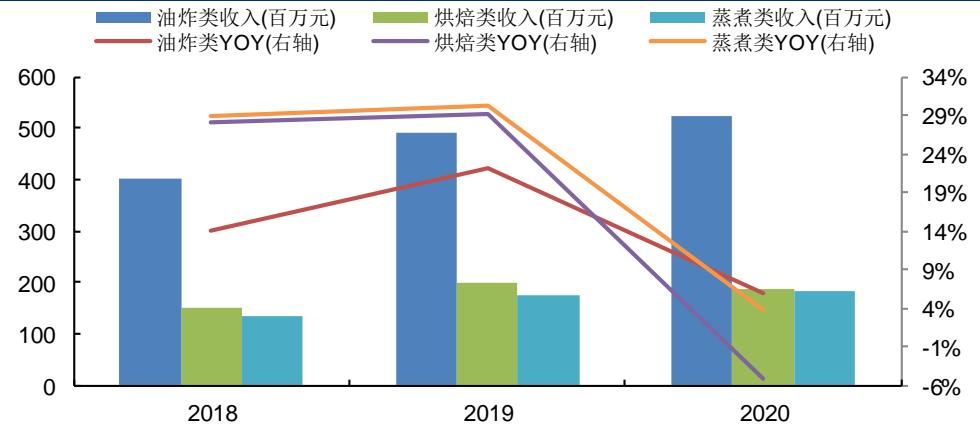  
图 33：烘焙类和蒸煮类产品增速较快(2020 年下滑主要系疫情干扰生产)  
资料来源：招股说明书、安信证券研究中心

# 从渠道角度看:

可开发直营客户群体随着餐饮连锁化率提升而不断扩大。根据欧睿数据，2020 年我国餐饮连锁化率仅为 $1 5 \%$ ，对比全球平均水平 $2 7 \%$ 仍有较大差距，2018年我国人均冷库仓储容量0.13 立方米，相比海外发达国家亦有较大提升空间。中国地大物博，菜系繁多，很多区域特色连锁餐企实现高速成长，在优势地区的店面数量或已达几百上千，比如老乡鸡、乡村基等。这些餐饮新秀大多已初步建立了食材供应链，具备规模采购定制品的能力，在锁定潜在客户后，公司会通过“模拟厨房”模式进行针对性研发，即从设备到操作过程完全模拟餐企的后厨，做好产品储备。公司争取在未来3-5 年之内，成功开拓一批合作紧密、业务量大的餐饮连锁新秀客户，为业务增长带来更多动力。

  
图35：我国冷链物流发展与海外国家相比仍有较大差距  
资料来源：国际物流协会、安信证券研究中心

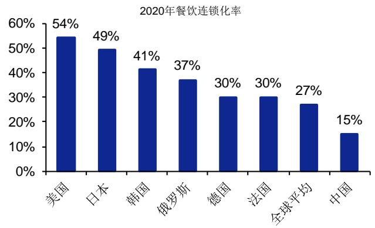  
图34：我国餐饮连锁化率显著低于全球平均水平  
资料来源：欧睿、安信证券研究中心  
图37：公司产能利用率一般在 $80 \%$ 左右  
图38：预计公司产能逐步释放

图36：中式快餐种类多元，较多区域特色连锁餐企实现高速成长  

<table><tr><td>中式快餐品类</td><td colspan="9">各品类头部连锁品牌</td></tr><tr><td>粉面类</td><td>和府捞面140家 书星的财味道(直营)</td><td></td><td>700家 阿香米線 （混合）</td><td></td><td>800家 味手拉(直营)</td><td>马兰拉面</td><td>500家 （加盟）</td><td>李先生</td><td>800家 （混合）</td></tr><tr><td>面点类</td><td></td><td></td><td></td><td>庆包子350家)大坝水饺</td><td>(3混0家)</td><td></td><td>狗不理(0</td><td></td><td>⑥面王(10)</td></tr><tr><td>粥饭类</td><td>嘉和一品285家</td><td></td><td></td><td>量玲粥店</td><td>$500容)</td><td>同记粥铺 TONGJIZHOUR</td><td>150家)</td><td>粥掌柜</td><td>250家)</td></tr><tr><td>烫捞类</td><td></td><td>(0</td><td></td><td>(8混0合家)</td><td></td><td>300會</td><td>M 30)</td><td></td><td>(9加0家)</td></tr></table>

资料来源：各公司官网、安信证券研究中心商社团队整理

# 5.2.产能稳步释放，规模效应持续强化

对于 2B 速冻食品企业来说，每年四季度都是销售旺季，且由于餐饮企业仓库容量有限，不会提前太多进行采购，因此公司很难在生产淡季大规模生产备货。明显的季节性让速冻米面企业全年产能利用率一般在 $80 \%$ 左右，公司 2020 年产能利用率较低主因疫情对开工率造成一定影响。

募投项目结合轻资产运营保障产能充足。公司 IPO 募投项目新乡厂区三期预计于 2023 年 6月建成，将逐步释放出8 万吨年产能。速冻食品的配送范围受到冷链物流限制，企业多通过全国化布局产能以提升效率，公司拟通过长期租赁/购买外部工厂进行改造以轻资产模式扩充产能，目前已通过租赁模式在安徽芜湖建设了华东新厂，后续或继续在华南、西南等地布局工厂，希望通过全国化产能布局来降低成本与开拓市场。

  
资料来源：招股说明书、安信证券研究中心

  
资料来源：招股说明书、安信证券研究中心

柔性生产，强化大单品生产规模效应。公司生产自动化程度较高，柔性生产满足多SKU的同时保证大单品的规模效应。比如公司油炸类产品（2020 年占总营收 $5 5 \%$ ，其中大部分为油条类产品）通过不断优化生产设备及技术，叠加产品销售规模持续扩大，规模效应显现，制造费用和直接人工在成本中的占比稳中有降，且显著低于其他品类。

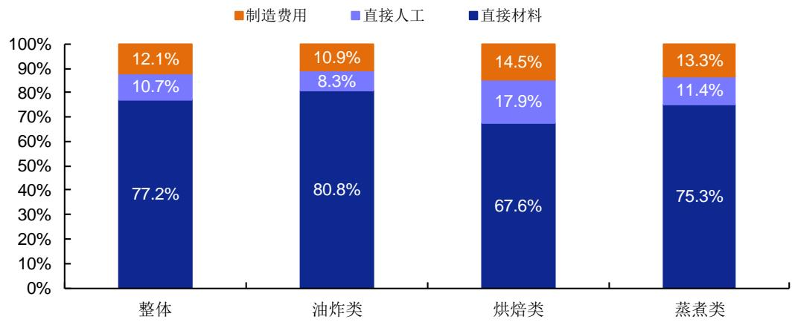  
图39：油炸类产品成本中制造费用和人工占比较低   
资料来源：招股说明书、安信证券研究中心

# 6.盈利预测

收入端：从产品角度来看，除了大单品油条外，蒸煎饺、米糕以及针对新式茶饮等的烘焙类产品均有较大潜力，预计公司蒸煮类及烘焙类产品销售收入增长较快。从渠道角度来看，直营客户海底捞、华莱士保持较高速成长，且公司持续开拓新客户带来增量，经销渠道通过不断完善团队和产品矩阵以覆盖更多客户。利润端：公司对直营客户有议价权，能较好转嫁成本压力，同时收入的提升带来一定规模效应，预计直营渠道毛利率保持稳中有升，经销渠道仍有一定成本压力。费用方面，预计公司销售费用率随着人员的增加小幅提升，且考虑到股权激励费用计提，预计2022 年费用率较高，2023 年利润弹性较大。

综上，预计公司2021、2022、2023 年营业收入为12.5、16.1、19.8 亿元，同比增长 $3 2 . 8 \%$ $2 8 . 1 \%$ $2 3 . 7 \%$ ，归母净利润 0.86、1.02、1.41亿元，同比增长 $1 2 . 1 \%$ 、 $1 9 . 3 \%$ $3 7 . 2 \%$ o对应 EPS 分别为 0.99、1.18、1.62，考虑到公司的成长潜力，给予6 个月目标价 48.6 元，对应 2023 年 30xPE。

表13：主营业务拆分与主要假设  

<table><tr><td></td><td>2018</td><td>2019</td><td>2020</td><td>2021E</td><td>2022E</td><td>2023E</td></tr><tr><td colspan="7">经销模式</td></tr><tr><td>油炸类销售收入 (百万元)</td><td>296.0</td><td>350.3</td><td>376.1</td><td>473.9</td><td>570.4</td><td>662.5</td></tr><tr><td>YOY</td><td>14.6%</td><td>18.4%</td><td>7.4%</td><td>26.0%</td><td>20.4%</td><td>16.2%</td></tr><tr><td>毛利率</td><td>18.6%</td><td>18.5%</td><td>18.6%</td><td>18.6%</td><td>17.8%</td><td>18.6%</td></tr><tr><td>蒸煮类销售收入(百万元)</td><td>102.4</td><td>140.3</td><td>149.9</td><td>202.6</td><td>263.4</td><td>329.3</td></tr><tr><td>YOY</td><td>36.4%</td><td>37.0%</td><td>6.8%</td><td>35.2%</td><td>30.0%</td><td>25.0%</td></tr><tr><td>毛利率</td><td>25.8%</td><td>26.7%</td><td>25.4%</td><td>26.1%</td><td>25.3%</td><td>25.3%</td></tr><tr><td>烘焙销售收入(百万元)</td><td>12.1</td><td>17.9</td><td>35.8</td><td>54.8</td><td>77.5</td><td>105.6</td></tr><tr><td>YOY</td><td>15.2%</td><td>47.2%</td><td>100.3%</td><td>53.0%</td><td>41.4%</td><td>36.4%</td></tr><tr><td>毛利率</td><td>24.3%</td><td>29.1%</td><td>24.6%</td><td>23.9%</td><td>23.9%</td><td>24.6%</td></tr><tr><td>菜肴及其他销售收入（百万元)</td><td>5.1</td><td>15.6</td><td>43.7</td><td>70.6</td><td>106.4</td><td>148.9</td></tr><tr><td>YOY</td><td>-38.9%</td><td>202.8%</td><td>180.1%</td><td>61.6%</td><td>50.8%</td><td>40.0%</td></tr><tr><td>毛利率</td><td>22.7%</td><td>20.3%</td><td>18.6%</td><td>18.6%</td><td>19.0%</td><td>19.0%</td></tr><tr><td>经销模式总营业收入</td><td>415.7</td><td>524.1</td><td>605.5</td><td>801.9</td><td>1017.6</td><td>1246.3</td></tr><tr><td>YOY</td><td>18.0%</td><td>26.1%</td><td>15.5%</td><td>32.4%</td><td>26.9%</td><td>22.5%</td></tr><tr><td>毛利率</td><td>20.6%</td><td>21.1%</td><td>20.6%</td><td>20.8%</td><td>20.3%</td><td>20.9%</td></tr><tr><td colspan="7">直营模式</td></tr><tr><td>油炸类销售收入(百万元)</td><td>106.4</td><td>141.5</td><td>145.4</td><td>200.3</td><td>247.6</td><td></td></tr><tr><td>YOY</td><td>12.9%</td><td>33.0%</td><td>2.7%</td><td>37.8%</td><td>23.6%</td><td>300.1 21.2%</td></tr><tr><td>毛利率</td><td>33.4%</td><td>33.4%</td><td>24.3%</td><td>25.0%</td><td>25.0%</td><td>25.0%</td></tr><tr><td>蒸煮类销售收入(百万元)</td><td>33.2</td><td>36.4</td><td>33.7</td><td>43.3</td><td>52.5</td><td>63.7</td></tr><tr><td>YOY</td><td>10.0%</td><td>9.7%</td><td>-7.4%</td><td>28.8%</td><td>21.2%</td><td>21.2%</td></tr><tr><td>毛利率</td><td>29.2%</td><td>27.9%</td><td>20.9%</td><td>20.9%</td><td>20.9%</td><td>21.3%</td></tr><tr><td>烘焙销售收入(百万元)</td><td>140.8</td><td>179.8</td><td>151.7</td><td>197.3</td><td>274.3</td><td>360.1</td></tr><tr><td>YOY</td><td>29.2%</td><td>27.7%</td><td>-15.6%</td><td>30.0%</td><td>39.1%</td><td>31.3%</td></tr><tr><td>毛利率</td><td>24.5%</td><td>26.5%</td><td>22.6%</td><td>23.3%</td><td>24.0%</td><td>24.0%</td></tr><tr><td>菜肴及其他销售收入（百万元)</td><td>4.83</td><td>6.81</td><td>6.02</td><td>7.90</td><td>9.67</td><td>11.23</td></tr><tr><td>YOY</td><td>-34.3%</td><td>41.1%</td><td>-11.7%</td><td>31.3%</td><td>22.4%</td><td>16.2%</td></tr><tr><td>毛利率</td><td>28.3%</td><td>29.1%</td><td>25.0%</td><td>25.7%</td><td>25.7%</td><td>25.7%</td></tr><tr><td>直营模式总营业收入</td><td>285.2</td><td>364.5</td><td>336.8</td><td>448.8</td><td>584.1</td><td>735.1</td></tr><tr><td>YOY</td><td>18.5%</td><td>27.8%</td><td>-7.6%</td><td>33.3%</td><td>30.1%</td><td>25.9%</td></tr><tr><td>毛利率</td><td>28.4%</td><td>29.3%</td><td>23.2%</td><td>23.9%</td><td>24.2%</td><td>24.2%</td></tr></table>

资料来源：招股说明书、安信证券研究中心

表14：盈利预测  

<table><tr><td></td><td>2018</td><td>2019</td><td>2020</td><td>2021E</td><td>2022E</td><td>2023E</td></tr><tr><td>总营业收入(百万元)</td><td>701.2</td><td>889.3</td><td>944.4</td><td>1253.9</td><td>1605.9</td><td>1986.8</td></tr><tr><td>YOY</td><td>18.2%</td><td>26.8%</td><td>6.2%</td><td>32.8%</td><td>28.1%</td><td>23.7%</td></tr><tr><td>毛利率</td><td>23.8%</td><td>24.5%</td><td>21.7%</td><td>22.1%</td><td>21.9%</td><td>22.4%</td></tr><tr><td>销售费用率</td><td>4.9%</td><td>5.0%</td><td>3.3%</td><td>3.2%</td><td>3.3%</td><td>3.6%</td></tr><tr><td>管理费用率</td><td>6.3%</td><td>7.2%</td><td>8.4%</td><td>8.1%</td><td>8.7%</td><td>7.9%</td></tr><tr><td>归母净利润(百万元)</td><td>58.7</td><td>74.1</td><td>76.6</td><td>85.9</td><td>102.4</td><td>140.5</td></tr><tr><td>YOY</td><td>26%</td><td>26.3%</td><td>3.3%</td><td>12.1%</td><td>19.3%</td><td>37.2%</td></tr></table>

资料来源：Wind、安信证券研究中心

表15：可比公司估值表  

<table><tr><td></td><td colspan="3">2022/4/10</td><td colspan="3">PEG</td></tr><tr><td></td><td>市值(亿元)</td><td>2021</td><td>2022</td><td>2023</td><td>2021 2022</td><td>2023</td></tr><tr><td>立高食品</td><td>135.2</td><td>47.8</td><td>37.6</td><td>27.2 1.5</td><td>1.1</td><td>0.8</td></tr><tr><td>安井食品</td><td>304.7</td><td>40.9</td><td>30.7</td><td>23.4 1.3</td><td>1.0</td><td>0.7</td></tr><tr><td>三全食品</td><td>129.2</td><td>23.1</td><td>19.3</td><td>16.5 1.3</td><td>1.1</td><td>0.9</td></tr><tr><td>平均值</td><td></td><td>37.3</td><td>29.2</td><td>22.4 1.3</td><td>1.1</td><td>0.8</td></tr><tr><td>千味央廚</td><td>32.4</td><td>37.7</td><td>31.7</td><td>23.1 1.4</td><td>1.1</td><td>0.8</td></tr></table>

资料来源：Wind、安信证券研究中心（注：可比公司盈利预测参考wind 一致预期，PEG取2021-2023 年净利润CAGR)

# 7.风险提示

(1）行业空间假设不及预期：疫情对餐饮行业造成较大冲击，餐饮复苏仍面临较多挑战，餐饮行业复苏节奏存在不确定性。同时，速冻米面在餐饮渠道的渗透率也有不达预期的风险。(2)行业竞争加剧：随着餐饮供应链市场容量不断扩大，或有其他潜在竞争者进入本行业，存在市场竞争加剧的风险。  
(3）原材料价格波动：公司生产所需的主要原材料为大宗农产品，包括面粉、糯米粉、食用油、白砂糖等，受大宗商品价格波动影响。公司原材料成本约占营业成本的 $7 5 \%$ ，原材料价格波动或影响公司盈利能力。

# 财务报表预测和估值数据汇总

利润表  

<table><tr><td>(百万元)</td><td>2019</td><td>2020</td><td>2021E</td><td>2022E</td><td>2023E</td></tr><tr><td>营业收入</td><td>889.3</td><td>944.4</td><td>1,253.9</td><td>1,605.9</td><td>1,986.8</td></tr><tr><td>减：营业成本</td><td>671.4</td><td>739.3</td><td>976.5</td><td>1,253.5</td><td>1,542.4</td></tr><tr><td>营业税费</td><td>7.5</td><td>8.9</td><td>11.3</td><td>14.4</td><td>18.2</td></tr><tr><td>销售费用</td><td>44.5</td><td>31.0</td><td>40.5</td><td>52.4</td><td>71.2</td></tr><tr><td>管理费用</td><td>63.7</td><td>79.2</td><td>101.2</td><td>139.7</td><td>156.2</td></tr><tr><td>研发费用</td><td>5.4</td><td>7.2</td><td>9.0</td><td>11.7</td><td>15.2</td></tr><tr><td>财务费用</td><td>0.7</td><td>3.4</td><td>1.1</td><td>-2.7</td><td>-3.8</td></tr><tr><td>资产减值损失</td><td>-</td><td>-</td><td>0.4</td><td>0.1</td><td>0.2</td></tr><tr><td>加：公允价值变动收益</td><td>-0.6</td><td>-0.9</td><td></td><td></td><td></td></tr><tr><td>投资和汇兑收益</td><td>-</td><td>-</td><td>-</td><td>-</td><td>-</td></tr><tr><td>营业利润</td><td>98.4</td><td>100.0</td><td>114.0</td><td>136.7</td><td>187.2</td></tr><tr><td>加:营业外净收支</td><td>-1.0</td><td>0.1</td><td>0.5</td><td>-0.1</td><td>0.2</td></tr><tr><td>利润总额</td><td>97.4</td><td>100.1</td><td>114.5</td><td>136.6</td><td>187.4</td></tr><tr><td>减:所得税</td><td>23.3</td><td>23.6</td><td>28.6</td><td>34.1</td><td>46.8</td></tr><tr><td>净利润</td><td>74.1</td><td>76.6</td><td>85.9</td><td>102.4</td><td>140.5</td></tr></table>

资产负债表  

<table><tr><td></td><td>2019</td><td>2020</td><td>2021E</td><td>2022E</td><td>2023E</td></tr><tr><td>货币资金</td><td>79.0</td><td>117.4</td><td>326.6</td><td>328.7</td><td>599.3</td></tr><tr><td>交易性金融资产</td><td>-</td><td></td><td>-</td><td></td><td></td></tr><tr><td>应收帐款</td><td>44.6</td><td>52.2</td><td>64.8</td><td>92.1</td><td>102.3</td></tr><tr><td>应收票据</td><td>、</td><td></td><td>-</td><td></td><td>-</td></tr><tr><td>预付帐款</td><td>6.7</td><td>10.9</td><td>5.2</td><td>18.3</td><td>12.1</td></tr><tr><td>存货</td><td>99.1</td><td>116.2</td><td>113.2</td><td>202.9</td><td>197.2</td></tr><tr><td>其他流动资产</td><td>34.0</td><td>36.4</td><td>31.8</td><td>34.1</td><td>34.1</td></tr><tr><td>可供出售金融资产</td><td></td><td></td><td>8.3</td><td>2.8</td><td>3.7</td></tr><tr><td>持有至到期投资</td><td></td><td></td><td></td><td></td><td></td></tr><tr><td>长期股权投资</td><td></td><td></td><td></td><td></td><td></td></tr><tr><td>投资性房地产</td><td></td><td></td><td>-</td><td>-</td><td>-</td></tr><tr><td>固定资产</td><td>342.2</td><td>542.5</td><td>518.4</td><td>494.2</td><td>470.1</td></tr><tr><td>在建工程</td><td>151.9</td><td>1.2</td><td>1.2</td><td>1.2</td><td>1.2</td></tr><tr><td>无形资产</td><td>39.4</td><td>39.2</td><td>38.1</td><td>36.9</td><td>35.7</td></tr><tr><td>其他非流动资产</td><td>41.3</td><td>39.5</td><td>35.7</td><td>36.8</td><td>32.5</td></tr><tr><td>资产总额</td><td>838.2</td><td>955.6</td><td>1,143.3</td><td>1,248.0</td><td>1,488.1</td></tr><tr><td>短期债务</td><td>30.0</td><td>15.0</td><td>-</td><td></td><td>-</td></tr><tr><td>应付帐款</td><td>127.9</td><td>141.8</td><td>187.6</td><td>242.7</td><td>294.8</td></tr><tr><td>应付票据</td><td>-</td><td></td><td>-</td><td></td><td></td></tr><tr><td>其他流动负债</td><td>172.6</td><td>147.7</td><td>184.0</td><td>146.3</td><td>206.0</td></tr><tr><td>长期借款</td><td></td><td>54.8</td><td>-</td><td></td><td></td></tr><tr><td>其他非流动负债</td><td>102.0</td><td>13.9</td><td>72.4</td><td>62.7</td><td>49.7</td></tr><tr><td>负债总额</td><td>432.5</td><td>373.2</td><td>443.9</td><td>451.8</td><td>550.4</td></tr><tr><td>少数股东权益</td><td>-</td><td>-0.0</td><td>-0.0</td><td>-0.0</td><td>-0.0</td></tr><tr><td>股本</td><td>57.3</td><td>63.8</td><td>86.7</td><td>86.7</td><td>86.7</td></tr><tr><td>留存收益</td><td>348.5</td><td>518.5</td><td>612.7</td><td>709.6</td><td>851.1</td></tr><tr><td>股东权益</td><td>405.8</td><td>582.3</td><td>699.3</td><td>796.2</td><td>937.7</td></tr></table>

财务指标  

<table><tr><td>财务指标</td><td>2019</td><td>2020</td><td>2021E  2022E</td><td></td><td>2023E</td></tr><tr><td>(百万元) 成长性</td><td></td><td></td><td></td><td></td><td></td></tr><tr><td>营业收入增长率</td><td>26.8%</td><td>6.2%</td><td>32.8%</td><td>28.1%</td><td>23.7%</td></tr><tr><td>营业利润增长率</td><td>26.9%</td><td>1.6%</td><td>14.0%</td><td>20.0%</td><td>36.9%</td></tr><tr><td>净利润增长率</td><td>26.3%</td><td>3.3%</td><td>12.1%</td><td>19.3%</td><td>37.2%</td></tr><tr><td>EBITDA 增长率</td><td>32.5%</td><td></td><td></td><td></td><td></td></tr><tr><td>EBIT 增长率</td><td>25.6%</td><td>-3.8% -19.3%</td><td>27.4% 47.9%</td><td>13.5% 16.5%</td><td>31.0% 36.8%</td></tr><tr><td>NOPLAT增长率</td><td>29.4%</td><td>4.8%</td><td>9.1%</td><td>16.5%</td><td>36.8%</td></tr><tr><td>投资资本增长率</td><td></td><td></td><td>-33.9%</td><td>30.2%</td><td>-29.1%</td></tr><tr><td>净资产增长率</td><td>140.6% 21.9%</td><td>58.3% 43.5%</td><td>20.1%</td><td>13.9%</td><td>17.8%</td></tr><tr><td></td><td></td><td></td><td></td><td></td><td></td></tr><tr><td>利润率 毛利率</td><td></td><td></td><td></td><td></td><td></td></tr><tr><td>营业利润率</td><td>24.5%</td><td>21.7%</td><td>22.1%</td><td>21.9%</td><td>22.4%</td></tr><tr><td></td><td>11.1%</td><td>10.6%</td><td>9.1%</td><td>8.5%</td><td>9.4%</td></tr><tr><td>净利润率 EBITDA/营业收入</td><td>8.3%</td><td>8.1%</td><td>6.8%</td><td>6.4%</td><td>7.1%</td></tr><tr><td>EBIT/营业收入</td><td>12.9%</td><td>11.7%</td><td>11.2%</td><td>9.9%</td><td>10.5%</td></tr><tr><td>运营效率</td><td>10.8%</td><td>8.2%</td><td>9.2%</td><td>8.3%</td><td>9.2%</td></tr><tr><td></td><td></td><td></td><td></td><td></td><td></td></tr><tr><td>固定资产周转天数</td><td>105</td><td>169</td><td>152</td><td>114</td><td>87</td></tr><tr><td>流动营业资本周转天数</td><td>-37</td><td>-35</td><td>-32</td><td>-22</td><td>-17</td></tr><tr><td>流动资产周转天数</td><td>111</td><td>114</td><td>126</td><td>136</td><td>147</td></tr><tr><td>应收帐款周转天数</td><td>18</td><td>18</td><td>17</td><td>18</td><td>18</td></tr><tr><td>存货周转天数</td><td>31</td><td>41</td><td>33</td><td>35</td><td>36</td></tr><tr><td>总资产周转天数 投资资本周转天数</td><td>296</td><td>342</td><td>301</td><td>268</td><td>248</td></tr><tr><td></td><td>90</td><td>155</td><td>119</td><td>85</td><td>67</td></tr><tr><td>投资回报率</td><td></td><td></td><td></td><td></td><td></td></tr><tr><td>ROE</td><td>18.3%</td><td>13.2%</td><td>12.3%</td><td>12.9%</td><td>15.0%</td></tr><tr><td>ROA ROIC</td><td>8.8%</td><td>8.0%</td><td>7.5%</td><td>8.2%</td><td>9.4%</td></tr><tr><td></td><td>57.6%</td><td>25.1%</td><td>17.3%</td><td>30.5%</td><td>32.0%</td></tr><tr><td>费用率</td><td></td><td></td><td></td><td></td><td></td></tr><tr><td>销售费用率</td><td>5.0%</td><td>3.3%</td><td>3.2%</td><td>3.3%</td><td>3.6%</td></tr><tr><td>管理费用率</td><td>7.2%</td><td>8.4%</td><td>8.1%</td><td>8.7%</td><td>7.9%</td></tr><tr><td>研发费用率</td><td>0.6%</td><td>0.8%</td><td>0.7%</td><td>0.7%</td><td>0.8%</td></tr><tr><td>财务费用率</td><td>0.1%</td><td>0.4%</td><td>0.1%</td><td>-0.2%</td><td>-0.2%</td></tr><tr><td>四费/营业收入</td><td>12.8%</td><td>12.8%</td><td>12.1%</td><td>12.5%</td><td>12.0%</td></tr><tr><td>偿债能力</td><td></td><td></td><td></td><td></td><td></td></tr><tr><td>资产负债率</td><td>51.6%</td><td>39.1%</td><td>38.8%</td><td>36.2%</td><td>37.0%</td></tr><tr><td>负债权益比</td><td>106.6%</td><td>64.1%</td><td>63.5%</td><td>56.7%</td><td>58.7%</td></tr><tr><td>流动比率</td><td>0.80</td><td>1.09</td><td>1.46</td><td>1.74</td><td>1.89</td></tr><tr><td>速动比率</td><td>0.50</td><td>0.71</td><td>1.15</td><td>1.22</td><td>1.49</td></tr><tr><td>利息保障倍数</td><td>130.75</td><td>22.89</td><td>109.14</td><td>-49.80</td><td>-48.12</td></tr><tr><td>分红指标</td><td></td><td></td><td></td><td></td><td></td></tr><tr><td>DPS(元) 分红比率</td><td></td><td></td><td></td><td></td><td></td></tr><tr><td></td><td>0.0%</td><td>0.0%</td><td>0.0%</td><td>0.0%</td><td>0.0%</td></tr><tr><td>股息收益率</td><td>0.0%</td><td>0.0%</td><td>0.0%</td><td>0.0%</td><td>0.0%</td></tr></table>

现金流量表  

<table><tr><td></td><td>2019</td><td>2020</td><td>2021E</td><td>2022E</td><td>2023E</td></tr><tr><td>净利润</td><td>74.1</td><td>76.6</td><td>85.9</td><td>102.4</td><td>140.5</td></tr><tr><td>加:折旧和摊销</td><td>19.0</td><td>34.0</td><td>25.3</td><td>25.3</td><td>25.3</td></tr><tr><td>资产减值准备</td><td>-</td><td>-</td><td></td><td></td><td></td></tr><tr><td>公允价值变动损失</td><td>0.6</td><td>0.9</td><td></td><td></td><td>-</td></tr><tr><td>财务费用</td><td>1.0</td><td>4.1</td><td>1.1</td><td>-2.7</td><td>-3.8</td></tr><tr><td>投资损失</td><td>-</td><td>-</td><td>-</td><td>-</td><td>-</td></tr><tr><td>少数股东损益</td><td></td><td>-0.0</td><td>-0.0</td><td>-0.0</td><td>-0.0</td></tr><tr><td>营运资金的变动</td><td>31.7</td><td>-117.2</td><td>147.6</td><td>-126.1</td><td>104.1</td></tr><tr><td>经营活动产生现金流量</td><td>86.4</td><td>97.8</td><td>259.8</td><td>-1.1</td><td>266.2</td></tr><tr><td>投资活动产生现金流量</td><td>-192.2</td><td>-94.6</td><td>-8.3</td><td>5.6</td><td>-0.9</td></tr><tr><td>融资活动产生现金流量</td><td>27.9</td><td>35.2</td><td>-42.3</td><td>-2.4</td><td>5.3</td></tr></table>

资料来源：Wind 资讯，安信证券研究中心预测

业绩和估值指标  

<table><tr><td></td><td>2019</td><td>2020</td><td>2021E</td><td>2022E</td><td>2023E</td></tr><tr><td>EPS(元)</td><td>0.86</td><td>0.88</td><td>0.99</td><td>1.18</td><td>1.62</td></tr><tr><td>BVPS(元)</td><td>4.68</td><td>6.72</td><td>8.07</td><td>9.19</td><td>10.82</td></tr><tr><td>PE(X)</td><td>47.2</td><td>45.7</td><td>40.8</td><td>34.2</td><td>24.9</td></tr><tr><td>PB(X)</td><td>8.6</td><td>6.0</td><td>5.0</td><td>4.4</td><td>3.7</td></tr><tr><td>P/FCF</td><td>-43.6</td><td>-55.2</td><td>19.2</td><td>1,128.1</td><td>13.1</td></tr><tr><td>P/S</td><td>3.9</td><td>3.7</td><td>2.8</td><td>2.2</td><td>1.8</td></tr><tr><td>EV/EBITDA</td><td>-</td><td>-</td><td>22.3</td><td>19.7</td><td>13.7</td></tr><tr><td>CAGR(%)</td><td>11.4%</td><td>22.4%</td><td>13.5%</td><td>11.4%</td><td>22.4%</td></tr><tr><td>PEG</td><td>4.1</td><td>2.0</td><td>3.0</td><td>3.0</td><td>1.1</td></tr><tr><td>ROIC/WACC</td><td>5.5</td><td>2.4</td><td>1.6</td><td>2.9</td><td>3.0</td></tr><tr><td>REP</td><td>-</td><td>-</td><td>5.8</td><td>2.5</td><td>3.1</td></tr></table>

# 公司评级体系

# 收益评级:

买入—未来6-12 个月的投资收益率领先沪深300 指数 $1 5 \%$ 以上; 增持—未来6-12 个月的投资收益率领先沪深 300 指数 $5 \%$ 至 $1 5 \%$ ., 中性 未来6-12个月的投资收益率与沪深300指数的变动幅度相差 $- 5 \%$ 至 $5 \%$ ., 减持—未来 6-12 个月的投资收益率落后沪深 300 指数 $5 \%$ 至 $1 5 \%$ ., 卖出—未来6-12 个月的投资收益率落后沪深300 指数 $1 5 \%$ 以上;

# 风险评级：

A—正常风险，未来6-12个月投资收益率的波动小于等于沪深300 指数波动；  
B—较高风险，未来6-12个月投资收益率的波动大于沪深300 指数波动；

# 分析师声明

本报告署名分析师声明，本人具有中国证券业协会授予的证券投资咨询执业资格，勤勉尽责、诚实守信。本人对本报告的内容和观点负责，保证信息来源合法合规、研究方法专业审慎、研究观点独立公正、分析结论具有合理依据，特此声明。

# 本公司具备证券投资咨询业务资格的说明

安信证券股份有限公司（以下简称“本公司”）经中国证券监督管理委员会核准，取得证券投资咨询业务许可。本公司及其投资咨询人员可以为证券投资人或客户提供证券投资分析、预测或者建议等直接或间接的有偿咨询服务。发布证券研究报告，是证券投资咨询业务的一种基本形式，本公司可以对证券及证券相关产品的价值、市场走势或者相关影响因素进行分析，形成证券估值、投资评级等投资分析意见，制作证券研究报告，并向本公司的客户发布。

# 免责声明

本报告仅供安信证券股份有限公司（以下简称“本公司”）的客户使用。本公司不会因为任何机构或个人接收到本报告而视其为本公司的当然客户。

本报告基于已公开的资料或信息撰写，但本公司不保证该等信息及资料的完整性、准确性。本报告所载的信息、资料、建议及推测仅反映本公司于本报告发布当日的判断，本报告中的证券或投资标的价格、价值及投资带来的收入可能会波动。在不同时期，本公司可能撰写并发布与本报告所载资料、建议及推测不一致的报告。本公司不保证本报告所含信息及资料保持在最新状态，本公司将随时补充、更新和修订有关信息及资料，但不保证及时公开发布。同时，本公司有权对本报告所含信息在不发出通知的情形下做出修改，投资者应当自行关注相应的更新或修改。任何有关本报告的摘要或节选都不代表本报告正式完整的观点，一切须以本公司向客户发布的本报告完整版本为准，如有需要，客户可以向本公司投资顾问进一步咨询。

在法律许可的情况下，本公司及所属关联机构可能会持有报告中提到的公司所发行的证券或期权并进行证券或期权交易，也可能为这些公司提供或者争取提供投资银行、财务顾问或者金融产品等相关服务，提请客户充分注意。客户不应将本报告为作出其投资决策的惟一参考因素，亦不应认为本报告可以取代客户自身的投资判断与决策。在任何情况下，本报告中的信息或所表述的意见均不构成对任何人的投资建议，无论是否已经明示或暗示，本报告不能作为道义的、责任的和法律的依据或者凭证。在任何情况下，本公司亦不对任何人因使用本报告中的任何内容所引致的任何损失负任何责任。

本报告版权仅为本公司所有，未经事先书面许可，任何机构和个人不得以任何形式翻版、复制、发表、转发或引用本报告的任何部分。如征得本公司同意进行引用、刊发的，需在允许的范围内使用，并注明出处为“安信证券股份有限公司研究中心”，且不得对本报告进行任何有悖原意的引用、删节和修改。

本报告的估值结果和分析结论是基于所预定的假设，并采用适当的估值方法和模型得出的，由于假设、估值方法和模型均存在一定的局限性，估值结果和分析结论也存在局限性，请谨慎使用。

安信证券股份有限公司对本声明条款具有惟一修改权和最终解释权。

安信证券研究中心  
深圳市  
地址： 深圳市福田区深南大道2008号中国凤凰大厦1栋 $^ 7$ 层  
邮编： 518026  
上海市  
地邮北 址： 上海市虹口区东大名路638号国投大厦3层编： 200080北京市  
地 址： 北京市西城区阜成门北大街 2 号楼国投金融大厦 15 层  
邮编： 100034