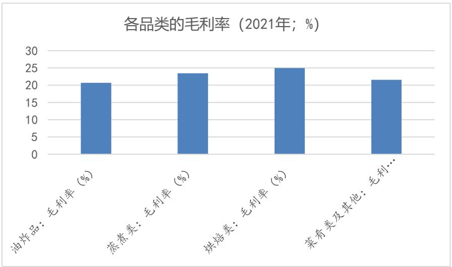
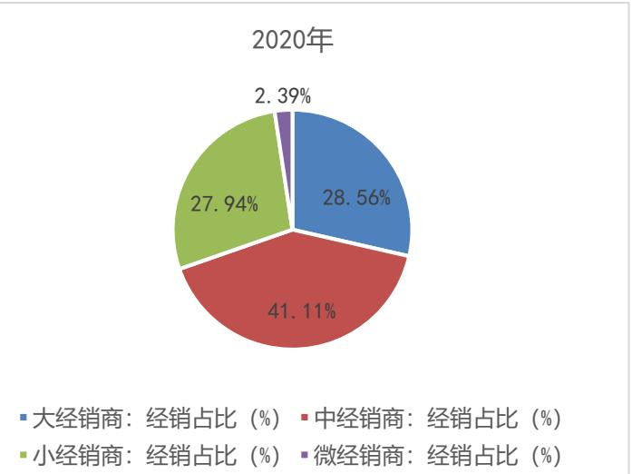

分析师：刘冉登记编码：S0730516010001liuran@ccnew.com 021-50586281

# 立足餐供市场，拓展速冻米面新維度

# 千味央厨(001215)公司深度分析

# 证券研究报告-公司深度分析

<table><tr><td colspan="2">市场数据(2022-08-11)</td></tr><tr><td>收盘价(元)</td><td>47.60</td></tr><tr><td>一年内最高/最低(元)</td><td>73.00/22.62</td></tr><tr><td>沪深300 指数</td><td>4,193.54</td></tr><tr><td>市净率(倍)</td><td>4.21</td></tr><tr><td>流通市值(亿元)</td><td>10.13</td></tr></table>

<table><tr><td>基础数据(2022-03-31)</td></tr><tr><td>每股净资产(元) 11.32</td></tr><tr><td>每股经营现金流(元) 0.31</td></tr><tr><td>毛利率(%) 22.56</td></tr><tr><td>净资产收益率_摊薄(%) 2.93</td></tr><tr><td>资产负债率(%) 28.49</td></tr><tr><td>总股本/流通股(万股) 8,663.03/2,127.89</td></tr><tr><td>B股/H股(万股) 0.00/0.00</td></tr></table>

  
个股相对沪深 300 指数表现  
资料来源：中原证券

# 相关报告

增持(首次)

联系人：马嶔琦  
电话： 021-50586973  
地址： 上海浦东新区世纪大道1788 号16楼  
邮编： 200122

# 投资要点：

发布日期：2022年08月12日

餐饮业当前的发展阶段催生了餐饮供应市场的兴起，即要求食品制造业除服务零售端外，积极参与餐饮供应环节，为餐饮后厨提供标准化的预制产品，协助餐饮节省人力、面积，提升翻台率和店面盈利，促进餐饮店面更加专注于客户需求、客户服务和店面运营。目前餐供市场中存有大量的中小型供应商，市场竞争相当激烈，而大型的、成熟的餐供企业并不多；因而，在当前的市场环境下，尽快地扩大市场份额是赢得初期竞争的必要之举。尽管发展势头良好，预制菜行业目前也面临着一些问题，包括：市场需求挖掘不充分，品类单一；产品附加值低；行业进入门槛低，未来势必面对更为激烈的产品和价格竞争，等等。

公司生发于著名的速冻米面品牌“思念”，是继充分服务零售市场之后，思念集团独立运营的全新品牌，其市场定位、产品体系、战略愿景迥异于“思念”。公司专注于服务餐饮领域的商业客户，所谓“只为厨师，餐饮之选”。蒸炸类单品是传统核心品类，预制菜肴增长最快。2018 至2021年期间，各品类的销量都保持了较高的增长，反映出米面供餐市场的潜力。

由于公司近六成的收入来自餐饮大客户，公司与大型餐饮连锁企业的业绩波动基本保持一致，比如 2020 年，餐饮销售增长普遍下滑甚至负增长，公司的销售增长也随之收敛。在可比上市公司中，公司的特通渠道销售额占比较大，2021 年排名第三。在同类上市公司中，公司的销售规模仍小，仍有较大的拓展空间。

我们预测公司2022、2023、2024年的 EPS分别为1.28、1.60和1.97 元，对应 8月12日收盘价47.07元/股，相应的市盈率分别为37.25、29.81 和24.17倍。我们首次覆盖公司，给予公司“增持”评级。

风险提示：餐饮经营波动直接影响公司的销售及业绩。

<table><tr><td></td><td>2020A</td><td>2021A</td><td>2022E</td><td>2023E</td><td>2024E</td></tr><tr><td>营业收入（百万元)</td><td>944</td><td>1274</td><td>1487</td><td>1929</td><td>2394</td></tr><tr><td>增长比率(%)</td><td>6.20%</td><td>34.89%</td><td>16.76%</td><td>29.71%</td><td>24.10%</td></tr><tr><td>净利润(百万元)</td><td>77</td><td>88</td><td>122</td><td>167</td><td>224</td></tr><tr><td>增长比率(%)</td><td>3.33%</td><td>15.51%</td><td>38.16%</td><td>36.68%</td><td>33.96%</td></tr><tr><td>每股收益(元)</td><td>1.24</td><td>1.25</td><td>1.28</td><td>1.60</td><td>1.97</td></tr><tr><td>市盈率(倍)</td><td>0.00</td><td>46.57</td><td>37.25</td><td>29.81</td><td>24.17</td></tr></table>

资料来源：中原证券

# 1.行业：餐饮供应市场的兴起

餐饮业当前的发展阶段催生了餐饮供应市场的兴起，即要求食品制造业除服务零售端外，积极参与餐饮供应环节，为餐饮后厨提供标准化的预制产品，协助餐饮节省人力、面积，提升翻台率和店面盈利，促进餐饮店面更加专注于客户需求、客户服务和店面运营。相对其它消费领域，中国的餐饮业始终保持了较高的景气度，在外就餐的庞大人口数量和餐饮固有的高频次消费是餐饮业增长的强劲原动力，而外卖市场的兴起将就餐场景拓展到更大的范围。即使经历了疫情期间的陡降，但是餐饮业在疫情后的各项指标迅速归至常态水平，反映出我国餐饮业坚韧的生长品质。除了中国餐饮独特的、蓬勃的发展动力，行业在资本的推动下持续推进连锁化和集中化，在市场兼并的过程中餐饮业对于发达的供应链，以及对于标准化产品供应的需求应运而生。此外，在地租和人力成本系统性上升且不可逆转的大背景下，提升餐饮店面运营效率成为生存和盈利的重要途径，这也要求餐饮能够实现产品环节的部分外包。上述情形共同催生了餐饮供应市场的兴起，即要求食品制造业除服务零售端外，积极参与餐饮供应环节，为餐饮后厨提供标准化的预制产品，协助餐饮节省人力、面积，提升翻台率和店面盈利，促进餐饮业更加专注于客户需求、客户服务和店面运营。

目前餐供市场中存有大量的中小型供应商，市场竞争相当激烈，而大型的、成熟的餐供企业并不多；因而，在当前的市场环境下，尽快地扩大市场份额是赢得初期竞争的必要之举。近两年来，速冻食品供应商加大了对餐供渠道的资源投入，从产品开发和渠道建设方面做了很多工作。比如，安井食品在2018 年调整了经营策略，提出“餐饮流通渠道为主、商超电商渠道为辅”的渠道组合模式；开发副品牌“冻品先生”，该品牌正是定位于餐供市场；先后从二级市场募集资金14亿元，用于增加速冻食品的产能，满足餐供增量市场的需求。

# 1.1速冻食品的零售端：大基数、低增长、高饱和

速冻食品能够最大限度地保持食品本身的色泽风味和营养成分，分为速冻米面、速冻水产、速冻肉糜和速冻烘焙等各类。我国的速冻米面制造业起步于上世纪70 年代，发展至今日，在速冻米面以及其它速冻食品领域，中国企业的工艺臻于成熟，自动化水平高，新品的研发和改造能力强。

经过几十年的市场拓展，速冻食品在零售市场的普及程度已经相当高，表现为渠道渗透率高、品种极大丰富、品牌集中度高、市场基数大但增长放缓。

目前，速冻食品的整体收入规模约 1547 亿元，其中速冻米面 2019 年的收入规模达到 773.5亿元，占据整体的 $51 \%$ 。速冻米面食品在零售端的增长显著放缓：速冻米面市场从2013年的549 亿元增长到 2017 年的 629 亿元，年复增长率为 $3 . 5 \%$ ，较2013 年之前显著收窄。从专注于零售渠道的企业（以三全食品为例）经营业绩来看，行业已经进入一个“收入低增，费用投入减少，股东回报率上升，业绩对成本较为撼熟阶段。

  
图表1：三全食品的收入增长放缓  
资料来源：同花顺 iFinD

  
图表2：三全食品的股东回报率显著上升

# 1.2 餐饮市场：竞争活跃，增长强劲

中国餐饮业的零售额保持了较高的增长水平，疫情期间仍实现正增长。根据国家统计局数据，2012 至 2019 年期间，我国餐饮业的零售额从 1.43 万亿元增至4.67 万亿元，年均增速达到 $1 0 . 7 5 \%$ 。即使在2020 年，中国餐饮业的零售额相比2019 年仍然增长了 $5 . 8 4 \%$ 。

中国的餐饮食材市场接近两万亿元，是一个庞大的“蓝海”市场。参照相关上市公司历年的销售增长情况，我们粗略估算餐供市场的自然增长在 $15 \%$ 至 $20 \%$ 区间。根据《2019 中国餐饮业年度报告》数据显示，对于中餐，食材的支出占比约为 $4 1 . 3 1 \%$ ，人力和房租的支出占比分别为 $2 2 . 4 1 \%$ 和 $1 0 . 2 6 \%$ ，食材是餐饮业最重要的支出项。2021 年，我国餐饮行业收入达到4.69 万亿元，相对应的食材采购规模为 1.94 万亿元。参照相关上市公司历年的销售增长情况，我们粗略估算餐供市场的自然增长在 $1 5 \%$ 至 $20 \%$ 区间。2018 年至2022 年一季度，千味央厨的销售额年均增长 $2 1 . 2 5 \%$ ，安井食品增长 $2 7 . 0 9 \%$ ；一般而言，头部企业的销售增长高于行业平均若干个百分点，故粗略估算餐供市场的自然增长在 $1 5 \%$ 至 $20 \%$ 区间。相比零售市场的低增，餐供市场的“蓝海”特征突出，有望在未来三年为股东提供较高的回报率。

餐供市场规模庞大，在发展初期阶段市场的增长红利可观。近年来，速冻食品制造商调整经营策略，将经营重心从零售向餐供转移，把握餐供市场的“蓝海”红利。餐供市场的客户包括餐饮门店、企业团餐和乡厨等商务客户，也就是说餐供市场是B2B的市场。

大中型连锁餐饮以及企业团餐出于安全考虑，一般以品质为导向，倾向于与大型供应商合作；而仍有大量的小餐饮以低价为导向，传统上从地方的自有渠道采购食材，比如当地的批发市场。许多地方连锁餐饮在一个区域内仅经营数家或十几家连锁门店，此外餐饮市场中仍存在着数以万计的单店，而这些都是餐供商的潜在客户，后者通过当地的餐饮经销商与之形成对接，未来逐步提供产品服务。

团餐是指专门提供标准化的学习餐或工作餐的企业团队，包括学校食堂、企业食堂、机关食堂、矿工食堂、航空铁路配餐等。根据中国饭店协会发布的《2020年度中国团餐发展报告》，目前中国团餐企业数量超10 万家，2019 年团餐百强企业收入总额为 868 亿元，团餐受众群体约6.7亿人（占全国人口的 $48 \%$ )。团餐市场具有需求可预测性、标准化高、综合成本低、可复制性强等特点，这与速冻食品行业的特点较为一致，二者的对接合作具有天然优势。

乡厨是指服务于农村家宴市场的民间厨师团队，他们以团队形式运营，主导了广阔的农村家宴市场。农村家宴风俗从古延续至今，如今一桌家宴的单价在 300 至600 元之间，摆台一般在30 桌至 60 桌之间，是一个规模巨大的下沉的餐饮市场。乡厨一般有自己的原料供应商，往往是当地的批发市场，大型餐供企业目前正在通过餐饮经销商加大对乡厨市场的开拓，力争成为乡厨市场的供应商之一。

# 1.3 餐饮行业：成本高涨，倒逼从业者提升效率

餐饮业的地租、人工等成本高涨，倒逼餐饮企业通过引入预制菜品实现后厨外包，细化供应链环节分工，从而专注于客户服务和店面运营，提升翻台率和单店盈利，在成本上涨的大环境中获取生存机会。

餐饮从业者流动性大，优秀的厨师和服务人员难招难留；因而，相比其它成本项，人力成本上涨更快、幅度更大。除人工成本，地租每年也在以一定幅度上涨。餐饮业的股东回报率自2017 年以来就逐年下滑，行业资本的回报率恶化主要是由社会成本高涨所导致。2017 年以后餐饮运营成本经历了持续大幅的上涨，其中一部分转嫁给消费者，另一部分由餐饮企业通过提升运营效率而加以克服。

  
图表3：餐饮业的股东回报率下降  
资料来源：中原证券WIND

面对成本系统性上涨且难以逆转的生存环境，餐饮业必须要有效地缩减成本。实现成本目标的途径包括：推进后厨的工业化、自动化和高效化，用标准产品替代个性产品，用统一外采的预制产品来替代现场制作，等等。外采预制菜品一提飛够菜率和翻台率，增厚销售额，二是减少厨师依赖，去除产品的主观因素，三是摊薄原料成本，四是促进产品和服务的标准化，而标准化与连锁化可达成相互促进作用。

# 1.4餐饮连锁化要求标准化的产品和服务

餐饮连锁化要求更为发达的供应链体系，以及标准化、规模化的产品和服务，在这种要求下餐饮供方市场呼之欲出，食品制造企业与餐饮业的合作水到渠成。

跟随着城市化的进程，我国的餐饮连锁化也经历了快速的推进，特别是餐饮连锁化正在从一、二线城市向三、四线城市以及发达乡镇下沉，正在从市场的纵深方向实现连锁化。低线城市人口规模大，发达地区的消费意愿强、消费能力强，而地方的成本优势较大城市更为突出，因而餐饮在低线城市实现连锁化的成功率较高。在东南部沿海发达省市，大型连锁餐饮已经将门店开设至村镇一级：2016 年 1 月，海底捞在东莞市麻涌镇开出了第一家位于乡镇的店面；2017 年8 月，麦当劳中国宣布，未来五年中国的麦当劳餐厅将增至 4500 家，而新开门店多会开设在三、四线城市。

尽管推进很快，由于市场规模巨大且分散，中国餐饮的集中度和连锁率仍然较低，因而进一步连锁化的市场空间仍然很大。餐饮连锁化要求更为发达的供应链体系，以及标准化、规模化的产品和服务，在这种要求下餐饮供方市场呼之欲出，食品制造企业与餐饮业的合作水到渠成。

# 1.5市场现阶段的不足

尽管发展势头良好，预制菜行业目前也面临着一些问题，包括：市场需求挖掘不充分，品类单一；产品附加值低；行业进入门槛低，未来势必面对更为激烈的产品和价格竞争，等等。

目前来看，餐供预制菜市场尽管潜在规模大，但是市场的发现、挖掘和需求创造仍要通过企业开发出适宜的产品，调试出合理的量价来推进和实现。

当前的预制菜品类仍面临着附加值和毛利率双低的处境，未来市场将会涌现出更符合“预制”要求的，体现中华美食丰富多元特征的新品类，以此提升预制产品的附加值，增高行业进入门槛，强化企业的核心竞争力。

此外，尽管当前的市场处于“蓝海”阶段，但是由于进入门槛低，市场将会吸引更多的从业者进入，并展开激烈的产品和价格竞争，竞争一方面促进市场更快地发展，一方面也会导致市场利润阶段性地进一步收窄。

# 2.公司：由米面切入，力争成为“全能”餐饮供应商

# 2.1发轫及战略

公司生发于著名的速冻米面品牌“思念”，是继充分服务零售市场之后，思念集团独立运营的全新品牌，其市场定位、产品体系、战略愿景迥异于“思念”。

公司的控股股东为共青城城之集企业管理咨询有限公司，持股比例 $4 6 . 0 4 \%$ ，其实际控制人为李伟。2012 年，郑州思念集团成立“千味有限”；2016 年，千味有限的股权转至郑州集之城名下。集之城与思念集团为同一实控人，股权转移是为将“千味”从“思念”体系中独立出来，作为一个全新品牌独立运营。2016 年，千味有限变更为股份有限公司，共青城凯立入股；2016、2017、2018 年，千味股份完成三次增资扩股，前海新希望、宿迁涵邦、深圳网聚等机构以及多位自然人作为财务投资者入股千味股份，此轮募集资金用于新乡千味二期工程建设。2021 年9 月，公司在A股上市，上市募集资金用于新乡千味三期建设。

公司是国内较早地为餐饮、酒店、团体食堂等商业客户供应速冻米面产品的供应商之一。与“思念”品牌定位于零售客户不同，“千味”专注于服务餐饮领域的商业客户，所谓“只为厨师，餐饮之选”。公司开发出适应连锁餐饮后厨加工工艺及厨师操作习惯的技术支持体系，提出“模拟厨房”的理念，从米面产品切入并不断将产品谱系拓展至速冻菜肴，更有将中华美食工业化、标准化、规模化，并以预制品的形态供应餐饮客户的长期愿景。

# 2.2产能：快步布局产能，2023 年有望达到 24 万吨

2023 年，新乡千味三期工程投产，届时公司的产能有望达到 24 万吨。随着餐供市场的需求增加，2018 年公司的产能瓶颈变得尤为凸显。2018 年之后，公司使用股权融资及上市所募集资金，先后建设了新乡千味一期、二期和三期产能项目，以满足日益增加的市场需求。2018年、2020 年、2021 年，公司陆续开建一期、二期和三期项目，以两年建设周期计，2018 年至2023 年期间新增产能持续投产。2019 年，公司将产能由 6.4 万吨增至 9.9 万吨；2020 年，公司进一步将产能增至12.8 万吨；2021 年增至 13.2 万吨。2023 年，新乡千味三期工程投产，届时公司的产能有望达到24万吨。

图表4：公司的产能增长情况  

<table><tr><td></td><td>2018</td><td>2019</td><td>2020</td><td>2021</td><td>2022E</td><td>2023E</td></tr><tr><td>产能 （吨)</td><td>64000</td><td>99200</td><td>128000</td><td>132000</td><td>196000</td><td>240000</td></tr><tr><td>产量（吨）</td><td>64254</td><td>80645</td><td>77330</td><td>99469</td><td></td><td></td></tr><tr><td>同比增长(%)</td><td></td><td>25.51%</td><td>-4.11%</td><td>28.63%</td><td></td><td></td></tr><tr><td>产能利用率(%)</td><td>100.40%</td><td>81.29%</td><td>60.41%</td><td>75.36%</td><td></td><td></td></tr></table>

资料来源：中原证券公司招股说明书

# 2.3产品：蒸炸单品是传统核心，预制菜肴增长最快

公司在速冻米面领域有着丰富的工艺经验，目前开发产品多达300余个，产品分为油炸类、蒸煮类、烘焙类，核心单品包括油条、芝麻球、蛋挞皮、地瓜丸和卡通包。此外，公司也生产半成品菜肴，主要供应火锅餐饮。蒸炸类单品是传统核心品类，预制菜肴增长最快。公司一方面要保持在米面领域的领先地位，尤其在炸蒸产品方面创造几个年销售额 3 亿元至 5 亿元的核心单品；另一方面，公司突破米面领域，切入预制莱肴领域。

油炸和烘焙类产品都是供餐市场的成熟大单品，并且由公司直接运营；蒸煮和菜肴类产品以经销渠道运营为主，产品处于运作期。截至2020 年，公司的蒸煮和油炸品种相对较多，是传统核心品类；而菜肴品种数量增加最快，是公司新增的竞争维度，对标安井食品的主营业务。

图表5：公司各品类下的产品数量  

<table><tr><td>2018</td><td>2019</td><td>2020</td></tr><tr><td>油炸</td><td>72 90</td><td>95</td></tr><tr><td>烘焙</td><td>38 49</td><td>56</td></tr><tr><td>蒸煮</td><td>105 139</td><td>166</td></tr><tr><td>菜肴及其他</td><td>9 27</td><td>51</td></tr></table>

资料来源：中原证券公司招股说明书

在各品类中，油炸是最大的一项。2021年，油炸类的收入贡献是 $5 1 . 8 5 \%$ ，其中较大的单品是各式油条；蒸煮和烘焙类的收入贡献分别为 $2 0 . 0 6 \%$ 和 $1 7 . 5 3 \%$ ，蒸煮类的大单品包括猪猪包等供餐包；烘焙类的单品主要是供给餐饮连锁的蛋挞皮。

目前来看，各品类的毛利率都不高，可见预制菜目前仍处于低附加值的发展阶段：以2020年为例，菜肴类、油炸类、蒸煮类的直接材料占比分别高达 $80 . 6 \%$ $7 7 . 8 2 \%$ $7 3 . 7 \%$ ，相应的毛利率分别为 $2 1 . 5 9 \%$ $2 0 . 7 2 \%$ $2 3 . 4 5 \%$ ；烘焙类的直接材料占比略低 $6 5 . 0 9 \%$ )，其毛利率高于其它品类。

  
图表6：公司各品类的收入占比情况(2021年)  
资料来源：中原证券WIND

  
图表7：公司各品类的毛利率  
资料来源：中原证券WIND

2018 至 2021 年期间，各品类的销量都保持了较高的增长，反映出米面供餐市场的潜力。2018 至 2021年期间，油炸类的销量年均增 $1 6 . 3 3 \%$ ，蒸煮类增 $2 8 . 9 \%$ ，烘焙类增 $1 5 . 9 2 \%$ ,预制菜肴类增 $2 0 2 . 8 2 \%$ 。2021年，油炸类、蒸煮类、烘焙类和预制菜肴类的销量分别达到6.36、2.45、1.41、1.24 万吨。

相应地，2018 至 2021 年期间，各品类的销售额也都保持了较高的增长。2018 至2021年期间，油炸类的销量额年均增 $1 8 . 3 1 \%$ ，蒸煮类增 $2 0 . 4 3 \%$ ，烘焙类增 $1 8 . 5 2 \%$ ，预制菜肴类增 $1 3 6 . 1 3 \%$ 。

为弥补 2020 年的销售不足以及提升产能利用率，2021 年公司的促销力度加大，产品价格下调的情况下各品类的销售量大幅反弹，扭转了 2020 年的颓势，并且承继了餐供市场既有的增长势头。2021 年，各品类的出厂吨价均有不同程度的下调，我们认为针对 2020 年的销售情况以及为了提升新增产能的利用率，公司策略上加大了促销力度，对于非核心产品给予价格让步。2021 年，各品类的销量均同比大幅增长，油炸类、蒸煮类、烘焙类和预制菜肴的当期销量同比分别增 $3 0 . 2 8 \%$ 、 $5 4 . 6 3 \%$ 、 $45 . 3 \%$ 和 $4 2 8 . 5 9 \%$ ，不仅实现反弹，而且承续了餐供市场原有的增长势头。由于产销量大幅增加以及新增产能的利用率提升，2021 年公司的综合毛利率同比提升0.65个百分点。

# 2.4销售和客户：直营为主，经销为辅

# 直营客户和经销客户

公司的客户分为直营客户和经销客户。

公司的直营客户主要包括大型连锁餐饮和大型连锁商超。公司核心的餐饮客户包括百胜中国—旗下有肯德基、必胜客、小肥羊、东方餐饷牌，福建华莱士—旗下有“华莱士”餐饮品牌，四川海之雁贸易有限公司——旗下有餐饮品牌“海底捞”，东莞市补给舰供应链管理有限公司——旗下有餐饮品牌“真功夫”,佛山市麦点食品有限公司——旗下有餐饮品牌“九毛九”和“太二酸菜鱼”等，北京永和大王，以及团餐客户富泰华工业有限公司。公司的产品也供应大型连锁商超，目前包括大润发、沃尔玛和永辉超市等。与零售品不同，公司供应商超的产品不具备品牌价值，由商超运作品牌以及完成产品的二次加工，并且自行定价销售。目前大型商超多开设鲜食货架，因而商超也是公司重要的商业客户。

直营客戶是公司重点维护的对象。公司对直营大客戶的依存度较高，其弊端是当与客戶中断合作时会导致公司业绩波动，优势是由于二者合作的门槛高、粘性大，因而替代成本高，公司面向客户时具备一定议价权。上市前，核心直营客户百胜中国和华莱士的销售额在直营销售额中占比达到 $80 \%$ ，而直营收入在全部收入中的占比是 $5 5 . 2 3 \%$ ；疫情前的2019 年，仅针对百胜中国的销售就占公司营收的 $30 \%$ 上下，疫情期间由于关闭部分门店，百胜的收入占比才有所下降；2021 年，公司的前五大直营客户的销售额占比达到 $3 8 . 7 9 \%$ 。直营大客户的销售份额较大，其弊端是当合作终止时公司业绩会产生波动；其优势是由于合作门槛高、合作粘性大，因而替代成本高，公司面向客户时也有一定的议价权。此外，公司对直营客户提供的多为定制服务，而定制服务的盈利能力较强。

公司与直营客户之间采取竞价方式，直营客户有三个月的信用账期，产品由公司负责物流配送，公司通过委托第三方物流完成配送。针对直营客户，公司提供的多为多为定制服务和定制产品；而提供给经销商的多为通用产品。因而，公司的直营、经销的销售比例与定制、通用产品的销售比例基本上保持一致，近年在 $60 \%$ : $40 \%$ 的比例水平上下浮动。

  
图表8：公司通用、定制产品的销售占比  
资料来源：中原证券公司招股说明书

  
图表9：公司直营、经销的销售占比

公司的经销商数量连年增加，经销收入占比维持在 $40 \%$ 上下。通过经销商渠道，战略上公司能够加强对终端客户的维护，纵向打通全国的市场网络。公司通过经销商布局全国市场，重点开发区域连锁餐饮和酒店、区域团餐，以及数以万计的乡厨队伍。公司较大的经销商客户包括：武汉市江汉区昌盛海鲜食品批发部、北京丽春达贸易有限公司、郑州市惠济区信基冻品水产大世界盼盼商行、郑州市惠济区中原物流港仁泰丰源食品商行、临沂商城郑锡恩速冻食品商行、青白江区锦粹食品商行。公司与经销商之间采取经销商买断模式，一般情况下先款后货，疫情期间公司对经销商的信用略有放宽。经销商自行负责物流，或委托公司代为有偿配送。尽管直营客户是公司重点维护的对象，但是公司也加强了经销渠道的积极举措，经销商数量持续增加：2018 年公司有606 家经销商，2021 年末增至 968 家，期间增加了 362 家。从经销商结构来看，年销售额在100至500 万元区间的中型经销商数量最多，占比 $4 1 . 1 1 \%$ ；年销售额在500 万元以上的大型经销商占比 $2 8 . 5 6 \%$ ，年销售额10万至100万区间的小型经销商占比$2 7 . 9 4 \%$ ，大型和小型经销商合计占比 $56 . 5 \%$ 。公司的经销商分布均匀，对单家的依存度低，如2021 年，公司的前五大经销商销售贡献仅 $7 . 8 1 \%$ ，占比并不大。通过经销商渠道，战略上公司能够加强对终端客户的维护，纵向打通全国的市场网络；财务上公司能够较快地回笼销售资金，并节省物流费用。

  
图表10：公司的经销商数量持续增加  
资料来源：中原证券公司招股说明书

  
图表11：公司经销商队伍的结构

# 直营比例进一步上升

2021 年餐饮消费反弹，公司的直营比例进一步上升至 $60 \%$ ，经销比例下滑近5 个百分点至 $40 \%$ 。经过2020 年的短期下滑，2021 年公司的直营比例反弹上升，经销比例相应地下降。2020 年疫情期间，直营客户旗下的餐饮连锁门店长时期闭店，因而当年公司的直营比例下滑；同年，零售端的销售情况较好，经销商通过开展社区团购、送货到家以及商超、便利店等渠道拓展销售。2021 年餐饮消费反弹，公司的直营比例进一步上升至 $60 \%$ ，经销比例下滑近5个百分点至 $40 \%$ 。

  
图表12：公司直营比例进一步上升  
资料来源：中原证券公司 2021 年年报

  
图表13：公司直营、经销比例(2021 年)

直营的毛利率高于经销，主要系二者的定价模式不同。公司的直营毛利率较经销毛利率高出5至10 个百分点，基本也代表了定制产品和通用产品之间的毛利率差。

经销模式下，公司留给经销商一定的毛利空间，由经销商根据当地的资源和竞争情况自行决策。直销模式下，公司与客户之间一般通过议价招标模式确定价格，并且大部分为定制服务，其定价更高，盈利性更强。公司的直营毛利率较经销毛利率高出 5 至 10 个百分点，基本也代表了定制产品和通用产品之间的毛利率差。2020 年，由于物流费用计入营业成本，而直营销售产生物流费用，故导致 2020 年以后的直营毛利率下降。剔除财务准则变更的影响，直营和经销，以及定制和通用之间的盈利仍存在着差别。

  
图表14：直营、经销的毛利率  
资料来源：中原证券公司招股说明书公司2021年年报

# 2.5公司的成本结构

2021 年下半年以来，大宗商品价格普遍大幅上涨，多数行业的利润率下降。公司的原料主要为农加工产品，相对工业品涨幅有限，并且部分原料的价格还比较稳定。此外，公司的直营业务有一定的成本转嫁能力，通过议价可以与下游餐饮客户分摊成本压力。

公司产品所需的主要原材料包括面粉、糯米粉、油脂、糖、杂粮、辅料及包材等，原料成本在营业成本中的占比为 $7 5 \%$ ，原料价格波动会影响公司的当期盈利。在公司所需的各项原料中，面粉、糯米粉和包材一般由国内市场供应，食用油、糖、辅料如芝麻等部分地依赖进口。

# 面粉

公司使用的面粉包括小麦粉、低筋粉、蛋挞专用粉，综合品质好于市场平均水平，因而面粉采购均价较市场价格略高。比如，面粉的市场价格维持在 3000 元/吨上下，公司采购的面粉均价在4000 元/吨以上，其中包含较贵的低筋粉。一般而言，面粉价格相对稳定；但是，鉴于2021年以来面粉的市场价格上涨了 $1 6 . 3 9 \%$ ，我们预测公司2022年的面粉采购价应有所上涨。

  
图表15：国内面粉价格  
资料来源：中原证券WIND

  
图表16：公司面粉采购价格  
资料来源：中原证券招股说明书

# 辅助性杂粮

公司使用的辅助性杂粮包括糯米粉、红小豆、黑芝麻等。公司使用的是国产糯米粉，采购价格低于市场价格，但是涨跌走势与市场价格保持一致。2020 年 8 月以来，国内糯米价格呈跌势。

公司使用的芝麻为埃塞俄比亚进口的脱皮芝麻。我们参考了国内云南和江西的芝麻价格，其市场均价围绕14000元/吨波动，品相较好的黑芝麻均价达到18000-19000元/吨。相比之下，进口芝麻的均价更低，更具经济效益：埃塞俄比亚一级芝麻海关到岸完税成本价在12000-13000 元/吨区间波动，脱皮芝麻为 16000 元/吨。公司目前使用的是埃塞俄比亚进口的脱皮芝麻。

  
图表17：国内的糯米价格  
资料来源：中原证券WIND

  
图表18：公司的杂粮采购均价  
资料来源：中原证券公司招股说明书

# 油脂和糖

公司的白糖采购价格与市场价格基本一致。国内糖价在5000 至6000 元/吨区间波动，2021年以来有所上涨，截至 2022 年7 月南宁糖价为 5845 元/吨，较年初上涨 $1 1 . 4 4 \%$ 。

  
图表19：国内糖价  
资料来源：中原证券WIND

公司大豆油采购价格与现货市场价的变动基本保持一致。正常情况下，国内豆油吨价在6000 至 8000 元区间波动，2020 年以来豆油吨价翻至 12000 元。2020 年下半年，因预判豆油价格将会上涨，故公司与供应商提前锁定了采购价格和采购数量，部分地控制了豆油的成本。

  
图表20：国内豆油价格  
资料来源：中原证券WIND

2021 年下半年以来，大宗商品价格普遍大幅上涨，多数行业的利润率下降。公司的原料主要为农加工产品，相对工业品涨幅有限，并且部分原料的价格还比较稳定。此外，公司的直营业务有一定的成本转嫁能力，通过议价可以与下游餐饮客户分摊成本压力。

# 2.6销售与餐饮同频波动

由于公司近六成的收入来自餐饮大客户，公司与大型餐饮连锁企业的业绩波动基本保持一致，比如2020 年，餐饮销售增长普遍下滑甚至负增长，公司的销售增长也随之收敛。但是，公司的基本面较餐饮更为稳健，是因为公司四成的收入来自经销商，而经销商连接的是全国市场的小餐厨、批发市场、乡厨、团餐等中小型终端，多元分散的经销渠道能够补亏添盈，抵消了部分来自大型餐饮的业绩波动。

  
图表 21：公司销售波动与餐饮客户基本一致  
资料来源：中原证券公司招股说明书

# 2.7同类比较

公司可比的A股上市公司目前包括：三全食品、安井食品、海欣食品、惠发食品、颐海国际和巴比食品等。尽管产品同质，但是公司的经营模式仍存在较大差异，整体看公司与惠发食品的模式最为接近，即以服务特通渠道（餐饮、酒店、团餐和乡厨）为主，兼具直营和经销两种营销方式。

# 市场份额

在可比上市公司中，公司的特通渠道销售额占比较大，2021 年排名第三。

根据《2019 年中国冷冻冷藏食品工业经济运行报告》：2019 年，全国速冻米面食品制造业实现营业收入 773.5 亿元。据此，截至 2019 年，公司的销售额在全行业中的占比为 $1 . 1 5 \%$ o

此外，我们提取了A 股可比上市公司特通渠道的收入数据（剔除了C 端收入)：2021 年，特通收入口径下，公司在可比上市公司中的市场份额为 $12 \%$ 。颐海国际、千味央厨、安井食品、惠发食品是餐供市场中销售占比较大的上市公司，2021 年的销售占比分别为 $44 \%$ $12 \%$ 、 $10 \%$ 和 $13 \%$ ，其余的味知香、巴比食品和海欣食品的份额分别为 $6 \%$ $5 \%$ 和 $4 \%$ 。

  
图表22：上市公司餐供渠道销售额分布(2021 年)  
资料来源：中原证券上市公司2021年年报

# 产量

参照 2021 年，公司在同类上市公司中的年产量排名第三。同类上市公司中，安井食品的年产量级明显大于其它:2021 年安井年产量是72.37 万吨，而其它上市公司都在 10 万吨以下。同类上市公司中，同时服务零售和企业的供应商包括：安井食品、海欣食品、巴比食品和味知香；专注于企业市场的供应商包括公司和惠发食品。2021 年，公司的年产量是9.93 万吨，惠发食品的产量是9.49 万吨。整体来看，目前从量产方面，公司尚未形成显著的领先优势。公司的三期工程投产后，年产将会增加 橱开与竞品的领先距离。

  
图表 23：同类上市公司的年产情况(2021 年)  
资料来源：中原证券上市公司2021 年年报

# 销售额

在同类上市公司中，公司的销售规模仍小，仍有较大的拓展空间。2021 年公司营收 12.74亿元，较排名前三的安井食品、三全食品和颐海国际的销售规模仍存有很大差距，是安井食品的 $14 \%$ ，颐海国际的 $21 \%$ 。但是，公司的销售增长还是较快的：2017至2021年，颐海国际、安井食品、千味央厨的销售额年均分别增长 $4 1 . 7 8 \%$ 、 $2 5 . 5 1 \%$ 和 $2 1 . 5 2 \%$ ，领先于其它上市公司，这也表明餐供预制菜市场当前确实处于较快的发展时期。

  
图表24：上市公司营收规模(2021 年；亿元)  
资料来源：中原证券上市公司2021 年年报

  
图表 25：上市公司营收增速(2017-2021 年均值；%)  
资料来源：中原证券上市公司2021 年年报

# 毛利率

特通渠道目前的毛利率水平较低，以 2021 年为例，海欣食品、安井食品、味知香、巴比食品和千味央廚在特通渠道的毛利率分別为 $2 0 . 9 2 \%$ 、19. $65 \%$ 、24. $72 \%$ 、19. $4 9 \%$ 和22. $10 \%$ ，目前特通渠道的业务基本上处於 $20 \%$ 上下的水平，相比其它食品制造领域明显偏低。

特通渠道毛利率偏低，一是因为食品制造商面对的下游一般为连锁经营的大型餐饮客户，这些客户采购规模大、合同期限长，低价策略是制造商给予客户必要的补偿；二是特通渠道的业务成交与团队资源和品牌关系较大，尽管包含一定的业务成本，但是营销、广告、入场等费用大量缩减，整体来说特通渠道的业务成本较低，因而渠道定价也较低；三是当前餐供市场的供方数量较多，特别是存在大量小微型供应商，后者的用料质量低、产品定价低，加剧了行业竞争，使得行业的定价和盈利处于低水平阶段。

  
图表26：特通渠道目前的毛利率情况  
资料来源：中原证券上市公司2021 年年报

综合来看，同质的产品在不同经营模式下有着不同的毛利率。C端业务比重大的公司销售毛利率较高，如三全食品、安井食品、海欣食品；专注于B 端服务的公司销售毛利率偏低，如千味央厨、惠发食品。直营比例高的公司销售毛利率较高，比如巴比食品和颐海国际；相对来说，经销比例高的公司销售毛利率通常较低。

  
图表 27：同类上市公司的综合毛利率比较  
资料来源：中原证券WIND

# 凈利率

在可比上市公司中，涉足零售业务的公司都有着较高的销售费用率，比如三全食品、安井食品和海欣食品，它们的全部或部分业务涉及零售，零售业务生成较高的广告费、促销费、入场费等等，因而要求相对高的销售毛利率以覆盖上述费用；相反地，服务商务客户的公司的销售费用率较低，比如千味央厨、颐海国际和惠发食品。

  
图表28：可比上市公司的销售费用投入情况  
资料来源：中原证券WIND

由于销售投入少，因而尽管B 端导向的业务模式毛利率偏低，但是净利率仍然维持在较高的水平。2017 至 2021 年期间，盈利水平较高的是颐海国际、巴比食品和千味央厨，期间的年均净利润率分别为 $1 7 . 4 6 \%$ 、16. $53 \%$ 和 $7 . 9 \%$ ，其中颐海国际和千味央厨因仅专注于B端业务而获取较高的盈利，巴比食品则是受益于轻资产、少投入的加盟模式。

  
图表 29：可比上市公司的销售净利率比较  
资料来源：中原证券WIND

# 2.8核心竞争力

公司是较早涉足预制莱，专注服务餐饮市场的企业之一，并且通过上市获得了较快的发展。我们认为公司具有一定的先发优势，具体的核心竞争力包括：

在零售市场趋于饱和时，公司准确地定位了餐供这一蓝海市场，捕捉到新的发展机遇。公司实现了将米面制品工业化的目标，在该领域深耕多年，形成年产量近 10 万吨的规模，工艺成熟并了解市场，通过大规模生产满足日益增长的市场需求。更为可贵的是，在零售市场趋于饱和时，公司准确地定位了餐供这一蓝海市场，捕捉到新的发展机蠲所处的餐饮供货市场容量大、需求大，为公司未来的增长提供了市场空间。

大型连锁餐饮客户与遍布全国的餐饮市场形成犄角支撑，共同建设全国客户网络。公司建立和完善了广泛的客户网络，客户多为大型连锁餐饮企业，双方的合作基础牢固，广泛稳固的商业合作是公司业绩的基石。此外，经销客户协助公司在全国市场拓展下线城市的餐饮市场，形成中小型需求终端网络，与大客户形成特角型支撑。

公司具备区位优势，原料和人力供应成本较低，地理枢纽地位为物流提供保障。公司的生产基地位处河南，河南是农业大省及小麦主产区，具有面粉原料供应优势。此外，河南省的劳动力人口规模大，人力成本较低，为食品制造业提供了劳动力保障。最后，河南省省会城市地处全国铁路枢纽的中心位置，而省内的高铁和公路运输也很发达，为公司将产品输送至全国市场提供了物流保障。

公司具备定制响应和产品研发能力。公司董事长亲自挂帅小组，专门开发和服务餐饮大客户。公司为餐饮大客户提供的多为定制服务，并且已经开发了多种大单品，在服务过程中公司的研发和柔性生产能力得以增强。公司在接到定制任务后，新产品的开发从市场调研，到立项、小试、中试、试产及系列评审和确认，再到量产共须经历十二个阶段，保证三至六个月的时间完成交货任务。

# 3.投资策略及风险提示

# 投资策略

我们的盈利预测建立在以下推论的基础上：一，未来一个时期，公司的新增产能将会投放市场，规模导向下产品促销力度可能加大；此外，预制菜市场的进入门槛低，竞争势必愈演愈烈，尽管公司具有领先优势，但仍要持有谨慎的价格策略。二，未来一个时期，公司的销售毛利率有上升空间：一是核心产品的价格仍在上涨，特别在成本压力加大的背景下；二是产量增加以及产能利用率提升，将会减少折旧和单位固定成本，也会促进毛利率提升。

我们预测公司 2022、2023、2024 年的EPS分别为 1.28、1.60 和 1.97 元，对应 8 月12日收盘价 47.07 元/股，相应的市盈率分别为 37.25、29.81 和 24.17 倍。我们首次覆盖公司，给予公司“增持”评级。

# 风险提示

餐饮经营波动直接影响公司的销售及业绩。2022 年疫情散点式发生，餐饮业局部地阶段性地处于关闭状态，预计对公司2022 年的销量有负面影响。

# 财务报表及盈利预测

资产负债表（百万元)   

<table><tr><td>计年度</td><td>2020A</td><td>2021A</td><td>2022E</td><td>2023E</td><td>2024E</td></tr><tr><td>流动资产</td><td>333</td><td>593</td><td>610</td><td>864</td><td>1191</td></tr><tr><td>现金</td><td>117</td><td>332</td><td>-82</td><td>80</td><td>418</td></tr><tr><td>应收票据及应收账款</td><td>52</td><td>62</td><td>82</td><td>127</td><td>184</td></tr><tr><td>其他应收款</td><td>7</td><td>8</td><td>20</td><td>26</td><td>33</td></tr><tr><td>预付账款</td><td>11</td><td>5</td><td>380</td><td>360</td><td>210</td></tr><tr><td>存货</td><td>116</td><td>162</td><td>188</td><td>251</td><td>325</td></tr><tr><td>其他流动资产</td><td>29</td><td>24</td><td>22</td><td>19</td><td>21</td></tr><tr><td>非流动资产</td><td>622</td><td>747</td><td>833</td><td>1636</td><td>1934</td></tr><tr><td>长期投资</td><td>0</td><td>0</td><td>0</td><td>0</td><td>0</td></tr><tr><td>固定资产</td><td>543</td><td>606</td><td>653</td><td>1417</td><td>1675</td></tr><tr><td>无形资产</td><td>39</td><td>38</td><td>37</td><td>36</td><td>35</td></tr><tr><td>其他非流动资产</td><td>41</td><td>103</td><td>143</td><td>183</td><td>223</td></tr><tr><td>资产总计</td><td>956</td><td>1341</td><td>1443</td><td>2500</td><td>3124</td></tr><tr><td>流动负债</td><td>305</td><td>326</td><td>234</td><td>300</td><td>378</td></tr><tr><td>短期借款</td><td>15</td><td>15</td><td>15</td><td>15</td><td>15</td></tr><tr><td>应付票据及应付账款</td><td>142</td><td>144</td><td>156</td><td>222</td><td>300</td></tr><tr><td>其他流动负债</td><td>148</td><td>168</td><td>63</td><td>63</td><td>63</td></tr><tr><td>非流动负债</td><td>69</td><td>61</td><td>118</td><td>128</td><td>138</td></tr><tr><td>长期借款</td><td>55</td><td>35</td><td>90</td><td>100</td><td>110</td></tr><tr><td>其他非流动负债</td><td>14</td><td>26</td><td>28</td><td>28</td><td>28</td></tr><tr><td>负债合计</td><td>373</td><td>388</td><td>352</td><td>428</td><td>515</td></tr><tr><td>少数股东权益</td><td>0</td><td>0</td><td>1</td><td>3</td><td>6</td></tr><tr><td>股本</td><td>64</td><td>87</td><td>96</td><td>105</td><td>114</td></tr><tr><td>资本公积</td><td>239</td><td>546</td><td>546</td><td>546</td><td>546</td></tr><tr><td>留存收益</td><td>280</td><td>368</td><td>495</td><td>665</td><td>890</td></tr><tr><td>归属母公司股东权益</td><td>582</td><td>954</td><td>1090</td><td>1269</td><td>1503</td></tr><tr><td>负债和股东权益</td><td>956</td><td>1341</td><td>1443</td><td>1700</td><td>2024</td></tr></table>

现金流量表 (百万元)  

<table><tr><td>会计年度</td><td>2020A</td><td>2021A</td><td>2022E</td><td>2023E</td><td>2024E</td></tr><tr><td>经营活动现金流</td><td>98</td><td>98</td><td>-344</td><td>282</td><td>460</td></tr><tr><td>净利润</td><td>77</td><td>87</td><td>124</td><td>169</td><td>227</td></tr><tr><td>折旧摊销</td><td>34</td><td>52</td><td>53</td><td>135</td><td>142</td></tr><tr><td>财务费用</td><td>4</td><td>7</td><td>5</td><td>6</td><td>6</td></tr><tr><td>投资损失</td><td>0</td><td>0</td><td>-3</td><td>-3</td><td>-3</td></tr><tr><td>营运资金变动</td><td>-28</td><td>-50</td><td>-522</td><td>-25</td><td>89</td></tr><tr><td>其他经营现金流</td><td>11</td><td>3</td><td>-1</td><td>-1</td><td>-1</td></tr><tr><td>投资活动现金流</td><td>-95</td><td>-183</td><td>-136</td><td>-136</td><td>-136</td></tr><tr><td>资本支出</td><td>-95</td><td>-183</td><td>-139</td><td>-139</td><td>-139</td></tr><tr><td>长期投资</td><td>0</td><td>0</td><td>0</td><td>0</td><td>0</td></tr><tr><td>其他投资现金流</td><td>0</td><td>0</td><td>3</td><td>3</td><td>3</td></tr><tr><td>筹资活动现金流</td><td>35</td><td>299</td><td>36</td><td>-17</td><td>-22</td></tr><tr><td>短期借款</td><td>-15</td><td>0</td><td>0</td><td>0</td><td>0</td></tr><tr><td>长期借款</td><td>55</td><td>-20</td><td>55</td><td>10</td><td>10</td></tr><tr><td>普通股增加</td><td>7</td><td>23</td><td>9</td><td>9</td><td>9</td></tr><tr><td>资本公积增加</td><td>93</td><td>308</td><td>0</td><td>0</td><td>0</td></tr><tr><td>其他筹资现金流</td><td>-105</td><td>-12</td><td>-28</td><td>-36</td><td>-41</td></tr><tr><td>现金净增加额</td><td>38</td><td>215</td><td>-414</td><td>162</td><td>338</td></tr></table>

资料来源：中原证券

利润表（百万元）  

<table><tr><td>会计年度</td><td>2020A</td><td>2021A</td><td>2022E</td><td>2023E</td><td>2024E</td></tr><tr><td>营业收入</td><td>944</td><td>1274</td><td>1487</td><td>1929</td><td>2394</td></tr><tr><td>营业成本</td><td>739</td><td>989</td><td>1141</td><td>1474</td><td>1825</td></tr><tr><td>营业税金及附加</td><td>9</td><td>12</td><td>14</td><td>17</td><td>22</td></tr><tr><td>营业费用</td><td>31</td><td>42</td><td>49</td><td>62</td><td>74</td></tr><tr><td>管理费用</td><td>79</td><td>107</td><td>116</td><td>145</td><td>168</td></tr><tr><td>研发费用</td><td>7</td><td>9</td><td>7</td><td>8</td><td>8</td></tr><tr><td>财务费用</td><td>3</td><td>5</td><td>2</td><td>6</td><td>6</td></tr><tr><td>资产减值损失</td><td>0</td><td>0</td><td>-1</td><td>-1</td><td>-1</td></tr><tr><td>其他收益</td><td>26</td><td>1</td><td>0</td><td>0</td><td>0</td></tr><tr><td>公允价值变动收益</td><td>-1</td><td>0</td><td>0</td><td>0</td><td>0</td></tr><tr><td>投资净收益</td><td>0</td><td>0</td><td>3</td><td>3</td><td>3</td></tr><tr><td>资产处置收益</td><td>0</td><td>0</td><td>0</td><td>0</td><td>0</td></tr><tr><td>营业利润</td><td>100</td><td>112</td><td>161</td><td>220</td><td>295</td></tr><tr><td>营业外收入</td><td>2</td><td>3</td><td>2</td><td>2</td><td>2</td></tr><tr><td>营业外支出</td><td>2</td><td>1</td><td>1</td><td>1</td><td>1</td></tr><tr><td>利润总额</td><td>100</td><td>113</td><td>162</td><td>221</td><td>296</td></tr><tr><td>所得税</td><td>24</td><td>26</td><td>38</td><td>52</td><td>70</td></tr><tr><td>净利润</td><td>77</td><td>87</td><td>124</td><td>169</td><td>227</td></tr><tr><td>少数股东损益</td><td>0</td><td>-1</td><td>2</td><td>2</td><td>3</td></tr><tr><td>归属母公司净利润</td><td>77</td><td>88</td><td>122</td><td>167</td><td>224</td></tr><tr><td>EBITDA</td><td>139</td><td>167</td><td>214</td><td>359</td><td>440</td></tr><tr><td>EPS（元）</td><td>1.24</td><td>1.25</td><td>1.28</td><td>1.60</td><td>1.97</td></tr></table>

主要财务比率  

<table><tr><td>会计年度</td><td>2020A</td><td>2021A</td><td>2022E</td><td>2023E</td><td>2024E</td></tr><tr><td>成长能力</td><td></td><td></td><td></td><td></td><td></td></tr><tr><td>营业收入(%)</td><td>6.20%</td><td>34.89%</td><td>16.76%</td><td>29.71%</td><td>24.10%</td></tr><tr><td>营业利润(%)</td><td>1.61%</td><td>11.53%</td><td>44.30%</td><td>36.87%</td><td>34.08%</td></tr><tr><td>归属母公司净利润(%)</td><td>3.33%</td><td>15.51%</td><td>38.16%</td><td>36.68%</td><td>33.96%</td></tr><tr><td>获利能力</td><td></td><td></td><td></td><td></td><td></td></tr><tr><td>毛利率 (%)</td><td>21.71%</td><td>22.36%</td><td>23.30%</td><td>23.60%</td><td>23.80%</td></tr><tr><td>净利率 (%)</td><td>8.11%</td><td>6.85%</td><td>8.33%</td><td>8.77%</td><td>9.47%</td></tr><tr><td>ROE(%)</td><td>13.15%</td><td>9.28%</td><td>11.21%</td><td>13.16%</td><td>14.89%</td></tr><tr><td>ROIC</td><td>12.20%</td><td>8.72%</td><td>10.10%</td><td>12.17%</td><td>13.79%</td></tr><tr><td>偿债能力</td><td></td><td></td><td></td><td></td><td></td></tr><tr><td>资产负债率 (%)</td><td>39.06%</td><td>28.91%</td><td>24.39%</td><td>17.11%</td><td>16.49%</td></tr><tr><td>净负债比率(%)</td><td>64.09%</td><td>40.67%</td><td>32.25%</td><td>33.61%</td><td>34.15%</td></tr><tr><td>流动比率</td><td>1.09</td><td>1.82</td><td>2.61</td><td>2.88</td><td>3.15</td></tr><tr><td>速动比率</td><td>0.68</td><td>1.31</td><td>0.18</td><td>0.84</td><td>1.74</td></tr><tr><td>营运能力</td><td></td><td></td><td></td><td></td><td></td></tr><tr><td>总资产周转率</td><td>0.99</td><td>0.95</td><td>1.03</td><td>0.77</td><td>0.77</td></tr><tr><td>应收账款周转率</td><td>18.07</td><td>20.46</td><td>18.18</td><td>15.17</td><td>13.01</td></tr><tr><td>应付账款周转率</td><td>5.21</td><td>6.88</td><td>7.30</td><td>6.64</td><td>6.08</td></tr><tr><td>每股指标（元)</td><td></td><td></td><td></td><td></td><td></td></tr><tr><td>每股收益(最新摊薄)</td><td>1.24</td><td>1.25</td><td>1.28</td><td>1.60</td><td>1.97</td></tr><tr><td>每股经营现金流（最新摊薄）</td><td>一</td><td>1.14</td><td>-3.59</td><td>2.70</td><td>4.05</td></tr><tr><td>每股净资产（最新摊薄)</td><td>一</td><td>11.01</td><td>11.40</td><td>12.13</td><td>13.22</td></tr><tr><td>估值比率</td><td></td><td></td><td></td><td></td><td></td></tr><tr><td>P/E</td><td>0.00</td><td>46.57</td><td>37.25</td><td>29.81</td><td>24.17</td></tr><tr><td>P/B</td><td>一</td><td>5.29</td><td>4.18</td><td>3.92</td><td>3.60</td></tr><tr><td>EV/EBITDA</td><td>-0.31</td><td>28.54</td><td>22.24</td><td>14.01</td><td>11.67</td></tr></table>

# 行业投资评级

强于大市：未来6个月内行业指数相对大盘涨幅 $10 \%$ 以上；  
同步大市：未来6个月内行业指数相对大盘涨幅 $10 \%$ 至 $10 \%$ 之间；  
弱于大市：未来6个月内行业指数相对大盘跌幅 $10 \%$ 以上。

# 公司投资评级

买入： 未来6 个月内公司相对大盘涨幅 $15 \%$ 以上；增持： 未来6 个月内公司相对大盘涨幅 $5 \%$ 至 $15 \%$ 观望： 未来6个月内公司相对大盘涨幅一 $5 \%$ 至 $5 \%$ 卖出： 未来6个月内公司相对大盘跌幅 $5 \%$ 以上。

# 证券分析师承诺

本报告署名分析师具有中国证券业协会授予的证券分析师执业资格，本人任职符合监管机构相关合规要求。本人基于认真审慎的职业态度、专业严谨的研究方法与分析逻辑，独立、客观的制作本报告。本报告准确的反映了本人的研究观点，本人对报告内容和观点负责，保证报告信息来源合法合规。

# 重要声明

中原证券股份有限公司具备证券投资咨询业务资格。本报告由中原证券股份有限公司（以下简称“本公司”）制作并仅向本公司客户发布，本公司不会因任何机构或个人接收到本报告而视其为本公司的当然客户。

本报告中的信息均来源于已公开的资料，本公司对这些信息的准确性及完整性不作任何保证，也不保证所含的信息不会发生任何变更。本报告中的推测、预测、评估、建议均为报告发布日的判断，本报告中的证券或投资标的价格、价值及投资带来的收益可能会波动，过往的业绩表现也不应当作为未来证券或投资标的表现的依据和担保。报告中的信息或所表达的意见并不构成所述证券买卖的出价或征价。本报告所含观点和建议并未考虑投资者的具体投资目标、财务状况以及特殊需求，任何时候不应视为对特定投资者关于特定证券或投资标的的推荐。

本报告具有专业性，仅供专业投资者和合格投资者参考。根据《证券期货投资者适当性管理办法》相关规定，本报告作为资讯类服务属于低风险（R1）等级，普通投资者应在投资顾问指导下谨慎使用。

本报告版权归本公司所有，未经本公司书面授权，任何机构、个人不得刊载、转发本报告或本报告任何部分，不得以任何侵犯本公司版权的其他方式使用。未经授权的刊载、转发，本公司不承担任何刊载、转发责任。获得本公司书面授权的刊载、转发、引用，须在本公司允许的范围内使用，并注明报告出处、发布人、发布日期，提示使用本报告的风险。若本公司客户（以下简称“该客户”）向第三方发送本报告，则由该客户独自为其发送行为负责，提醒通过该种途径获得本报告的投资者注意，本公司不对通过该种途径获得本报告所引起的任何损失承担任何责任。

# 特别声明

在合法合规的前提下，本公司及其所属关联机构可能会持有报告中提到的公司所发行的证券头寸并进行交易，还可能为这些公司提供或争取提供投资银行、财务顾问等各种服务。本公司资产管理部门、自营部门以及其他投资业务部门可能独立做出与本报告意见或者建议不一致的投资决策。投资者应当考虑到潜在的利益冲突，勿将本报告作为投资或者其他决定的唯一信赖依据。