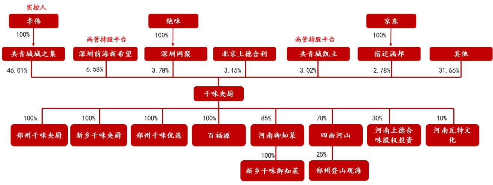
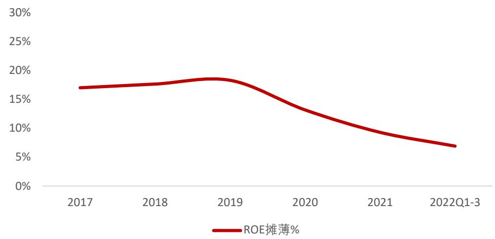
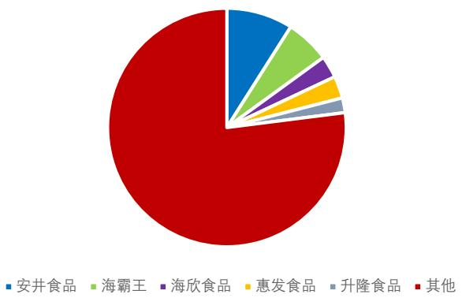
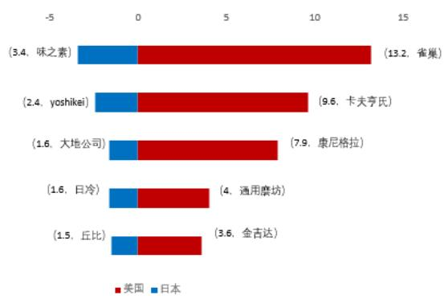
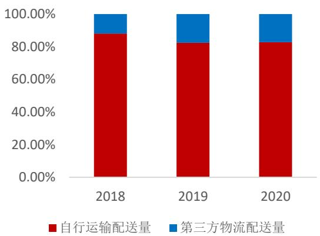
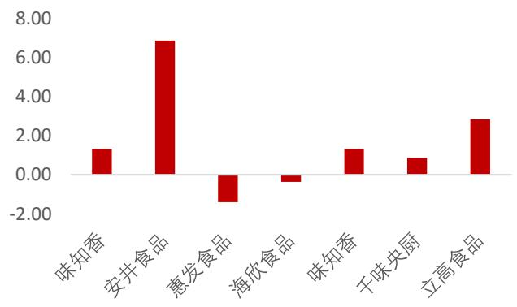

# 深耕蓝海，鹏程万里

干味央厨（001215）公司深度报告

首席证券分析师:   
丰毅 S0630522030001 fengyi@longone.com.cn 证券分析师：   
赵从栋 S0630520020001 zhaocd@longone.com.cn 证券分析师：   
任晓帆 S0630522070001 rxf@longone.com.cn   
10.00% 0.00%   
-10.00%   
-20.00%   
-30.00%   
-40.00%   
-50.00%   
-60.00% 2021-11-09 2022-11-09 千味央厨 沪深300

# 相关研究

1.食品饮料2022年三季报总结：道阻且长，行则将至  
2.预制菜系列深度(一)：潮平两岸阔  
3.盐津铺子(002847)公司深度：弯道超车，改革成效显  
4.味知香(605089)公司深度：预制菜的领航者

# 投资要点：

相比C端更刚需的B端成本节约及标准化需求，导致美、日及我国速冻食品及预制菜发展顺序往往先B后C。在2010年以来的冷链发展驱动下，B端速冻企业蓬勃发展，但□味化、品类碎片化导致5万亿餐饮巨擘中品类天花板往往较低。公司立足速冻米面大品类，横向自优势品类持续拓展新品，纵向从知名品牌高身位供应商向下打开经销市场，借助研发优势和供应链优势，降维打击，打开空间。

业绩：持续稳健，继续向上。公司2017-2021年以来营收、归母净利润复合增速分别达 $2 1 \%$ $1 7 \%$ ，其中除2020受疫情影响下游客户需求，其余年份业绩均非常稳健。2022年以来Q2因疫情短暂影响直营客户业绩外，经销客户、非百胜渠道油条收入、新品收入均维持较高增速，且结构因素及规模效应下毛利率有所回升。2022Q1-Q3公司营收、归母净利润分别达10.31亿元（ $+ 1 6 . 0 2 \%$ )，0.70亿元( $+ 2 3 . 1 2 \%$ )。随着小B放量，叠加新品放量及规模效应提升，公司未来业绩可期。

公司：优势领先，横向扩品类，纵向扩渠道。 $\textcircled{1}$ 纵向扩渠道：公司深耕餐饮客户，直销大客户、经销商收入占比约4比6。 $\uparrow >$ 直营KA为业绩基石。公司为百胜T1级别供应商，此外公司核心客户包括华莱士、真功夫、九毛九、海底捞等知名企业。其中2021年直营客户增加81家至168家。公司在大客户的供货地位、客户自身成长性、供货空间成为当下业绩基石。 $\pmb { 2 > }$ 聚焦头部经销商：在直营客户标杆效应下，公司加速向小B扩张，上半年经销收入增长 $2 7 \%$ ，同时公司通过开发早餐、团餐场景提升产品铺货率，共同开拓客户并提供相关支持等方式进一步帮助头部经销商做大。2022H1前20、前5经销商收入增长分别达 $60 \%$ $52 \%$ 。

$\textcircled{2}$ 横向拓品类：公司本身油条优势明显，且为核心客户独供的基础上，加大蒸煎饺、烘焙等大单品打造，2022Q1-Q3油条（百胜中国以外）、蒸煎饺等核心产品预计分别增长 $2 8 \%$ $120 \%$ 左右，均维持较快增长。此外为核心客户不断尝试新的长线单品。

$\textcircled{3}$ 产能稳步扩张：2021年末公司实际产能达14.2万吨，随着芜湖生产基地(满产5万吨)2022年5月投产，新乡3期（满产8万吨)明年投产，公司总设计产能有望达到24.6万吨，能够对业绩释放提供有效支持。

行业：空间仍存，B端驱动强。 $\textcircled{1}$ 速冻米面新品类空间仍存：2020年速冻米面市场规模达727.8亿元，增速相较速冻食品整体增速略弱，主因速冻水饺市场成熟且占比过大，且国人饮食习惯差距明显，随着工艺突破、产品教育，速冻米面新品类空间较大且正在提升。 $\textcircled{2}$ 预制食品短期驱动强：我们测算，2021年广义（含速冻食品、净菜）、狭义预制菜预计分别3300亿元、2100亿元左右，其中狭义预制菜肴2030年望达7580亿，期间复合增速望达$1 5 \%$ 。 $\textcircled{3}$ B端高集中，C端百花放：参考美、日发展史，B端刚需导致发展顺序先B后C。供应链资源优势强、大单品型企业往往在B端发展中占据先机，行业有望实现高集中；C端因需求多元化，往往百花齐放，下游平台型逐步占据大众主流品种，餐饮品牌型企业有望逐步成为高端核心玩家但相对分散，门店型参与者有望诞生大型企业。

投资建议：干味央厨速冻米面制品客户优势、大单品（油条）优势突出，随着小B持续拓展、新品持续放量，业绩空间有望进一步释放。我们预计2022/2023/2024年公司归母净利润分别为 $1 . 1 0 / 1 . 3 3 / 1 . 6 8$ 亿元，同比增速为 $2 4 . 1 1 \% / 2 1 . 2 8 \% / 2 5 . 9 6 \%$ ，对应EPS为元1.27/1.54/1.94元，对应P/E为46/38/30。首次覆盖，给与“买入”评级。

风险提示：疫情影响的风险、食品安全的风险、原材料价格波动的风险、新品开拓不及预期的风险。

<table><tr><td></td><td>2021A</td><td>2022E</td><td>2023E</td><td>2024E</td></tr><tr><td>主营收入(百万元)</td><td>1273.90</td><td>1498.98</td><td>1858.60</td><td>2228.52</td></tr><tr><td>同比增速(%)</td><td>34.89</td><td>17.67</td><td>23.99</td><td>19.90</td></tr><tr><td>净利润(百万元)</td><td>88.46</td><td>109.79</td><td>133.15</td><td>167.71</td></tr><tr><td>同比增速(%)</td><td>15.51</td><td>24.11</td><td>21.28</td><td>25.96</td></tr><tr><td>每股盈利(元)</td><td>1.02</td><td>1.27</td><td>1.54</td><td>1.94</td></tr><tr><td>PE(倍)</td><td>57</td><td>46</td><td>38</td><td>30</td></tr></table>

# 正文目录

# 1.简介：预制速冻米面龙头

1.1.股权结构集中  
1.2.历史：脱胎于思念，专注B端 8  
1.3.股价…. 9  
1.4.业绩：营收稳步提升，盈利情况稳健 10

# 2.行业：先B后C，空间广阔 15

2.1.行业趋势：餐饮刚需，速冻米面望诞生大型企业 15  
2.2.上市公司对比：单品优势强，盈利及营业周期较优， 34

# 3．公司：品类优势领先，持续拓展新品及提升经销商质量 39

3.1.产品及研发：研发领先，品类持续拓展.. .. 39  
3.2.渠道及客户：直营优势强劲，经销商规模从数量走向质量 ..41  
3.3.产能及供应链：产能饱和，新乡三期项目达产后产能紧张状况望缓解…..46

# 4.盈利预测： 48

5.投资建议： 50

# 6.估值： 50

# 7.风险提示： 50

# 图表目录

图1 千味央厨股权架构(截至 2022 年 9 月 30 日) ….7.  
图2 千味央厨历史发展图. ….  
图3干味央厨股价图. ………… …. 1  
图4 千味央厨营收及增速. … .. 11  
图5 干味央厨净利润及增速11  
图6 品类占比变化. …… …  
图7 核心单品规模及同比增速11  
图8直销、经销收入占比.. 11  
图9直营收入规模及增速… …11  
图10经销收入规模及增速.  
图11各区域占比变化. …… ….1  
图 12 千味央厨毛利率… …. 12  
图 13 不同品类毛利率…… 12  
图14营业成本占比13  
图 15 不同产品采购单价… ……………………………………………… … 13  
图16 千味央厨三费…… ……  
图17 千味央厨三费变化. . 13  
图18 干味央厨ROE变化14  
图19销售收现/营业收入. ……………………… ….14  
图20经营现金流净额/净利润. ……  
图21经营现金流净额及增速， …15  
图 22 干味央厨长期借款…… 15  
图 23 构建固定资产的现金流和现金及等价物规模 1 5  
图24已获利息保障倍数，  
图25 2013-2021年中国速冻食品市场规模及增速  
图26 2020 年中国速冻食品细分市场结构. 16  
图272020 年全球主要国家地区速冻食品人均消费量. 16  
图28 2017-2021 年中国速冻米面市场规模及增速. 16  
图 29 2020 年中国速冻米面主要企业竞争格局占比. … … 16  
图30中国速冻火锅料制品市场竞争格局 . 7  
图 31 预制菜市场规模及增速. …17  
图 32预制菜企业注册数量（家） 17  
图 33 四大类预制菜产品分类. … 1  
图34四大类预制菜品. …… ….1  
图 35 不同级别净菜分类. ……18  
图36中国预制菜细分赛道规模占比（亿元） 18  
图37 预制菜细分赛道2017-2021、2021-2026CAGR ……………… . 18  
图 38中国预制菜行业规模及增速测算. . 19  
图 39 预制菜生命周期.. …………………………… …. 20  
图 40 中、日、美预制菜渗透率……20  
图41海外预制菜发展史22  
图42 美国预制菜CAGR及GDPCAGR对比…22  
图43日本预制菜CAGR及GDP CAGR对比. ….  
图 44日本冷冻预制菜产量及人均消费量. …-23  
图 45 日本老龄化呈上升趋势… … ….3  
图 46日本出生率呈下降趋势 $( \%$ )… 23

图 49日本预制菜持续成长周期延长图 50 国内预制菜发展阶段. ……………………………图 51日本排名前6 冷冻预制菜产量及产值 .25图52 美国1992 年预制食品品类占比. … …. 5图53日本B端预制菜市占率 $( \%$ ） .25图542020年美、日C端预制菜CR5( $\%$ ) …………… ….25图 55冷链发展成为核心驱动因素. … ..26图56 农产品冷链物流发展规划…… 27图57 我国食品冷链市场规模稳步增长…27图 58 我国冷库容量及增速…… -27图 59我国冷藏车保有量及增速 ………………………图 60 我国生鲜电商行业交易规模及增速. .28图 61 味知香自行运输配送量及第三方物流配送量占比……28图62味知香2020 年自行运输及第三方物流单吨费用， …… ….图 63 中国传统餐厅与引|入预制菜的餐厅的成本结构.. ….图64中国外卖市场和渗透率走势. ………… ….图 65 中国团餐市场规模…… ……29图 66 中国外卖市场和渗透率走势…… … 29图 67 传统做菜与预制菜制作步骤区别…… 30图 68预制菜政策时间段 ..31图 69 预制菜未来格局推演.. 34图 70 202年预制菜上市公司营收对比（亿元）……图71 202年预制菜上市公司净利润对比（亿元）35图72预制菜上市公司毛利率对比 $( \%$ ) ………………… .36图73预制菜上市公司净利率对比（ $\%$ ) ..36图 74 2021 年预制菜上市公司三费情况... …图 75 202年预制菜上市公吨价情况（万元/吨）… 37图76 预制菜上市公司ROE 情况… … 37图 77 预制菜上市公司销售收现/营收.. …图 78 预制菜上市公司经营现金流净额/营业利润…… 38图 79 2021 年预制菜上市公司周转情况对比… …………… ….39图80 预制菜上市公司应收账款周转天数对比39图81 四大品类矩阵图. .39图82优势产品线收入及增速. … 39图83四大品类产品数量 … … 1图 84 油条多应用场景… 41图85直销、经销2021年收入规模， ………………… ….图86 2018-2020直营经销商产品变化情况（亿元） . 42图87各品类直销、经销占比. ……图 88干味央厨核心客户矩阵图 ……图89 前五大客户销售额（万元）43图90直营大客户数量 … … 3图 91 速冻企业定制生产的业务流程…… \*\*44图 92 经销收入、单经销商提货额、经销商数量增速对比……44图 93 单经销商提货额及增速…… 44图 94 不同规模经销商数量、收入占比.. …. 5

图 95不同规模经销商提货额及增速 .45  
图 96返利规模以及占经销收入比重 .45  
图97经销满赠及同比增速. .45  
图98四大品类线上规模、毛利率、增速 .45  
图99公司销售部门架构图 .46  
图 100 公司设计产能、实际产能以及产能利用率、产销率. . 47  
图 101公司未来产能增长 ..47  
图 102 公司现有产能、全部达产后的产能对比. .. 47  
图103千味央厨产销率， .. 47  
图104委托加工产品金额及增速 .. 48  
图105委托加工费及增速， ..48  
图 106  委托加工产品产量及增速 .. 48  
表1股权激励对象与数量. .  
表2股权激励计划业绩指标. ….  
表3管理团队与核心人员多来自思念. ….8  
表4干味央厨杜邦分析， ..14  
表5味知香、立高食品、聪厨冷链物流情况 ..28  
表62017 年以来大食品工业链政策. .. 1  
表7疫情以来各省市推动预制菜相关政策 ..31  
表8近期中国饭店协会及地方政策填补我国预制菜行业标准空白 ..33  
表9 预制菜上市公司对比.. ..35  
表10味知香和竞品公司ROE拆分. ..37  
表11干味央厨核心技术.. .. 40  
表12研发项目与进度 .. 41  
表13直营、经销模式区别. .42  
表14项目投资明细表.  
表15按品类盈利预测 .49  
表 16按渠道盈利预测 ..49  
表17干味央厨绝对估值表. . 50  
表18同业估值比较表 .. 50  
附录：三大报表预测值. 52

# 1.简介：预制速冻米面龙头

# 1.1.股权结构集中

股权集中，结构稳定。公司实控人为创始人李伟先生，通过共青城城之集公司间接持有$4 6 . 0 1 \%$ 股权。高管通过深圳前海新希望与共青城凯立持股。2018 年京东通过旗下投资公司一宿迁涵邦、绝味通过旗下深圳网聚投资公司增资入股干味央厨，截至 2022 年三季度末，京东持有干味 $2 . 7 8 \%$ 股权，绝味持有 $3 . 7 8 \%$ 股权。公司股权较为集中，结构稳定。

  
图1干味央厨股权架构（截至2022 年9 月 30 日)  
资料来源：公司公告、东海证券研究所

股权激励计划调动核心人员积极性，彰显公司业绩增长信心。公司 2021 年 11 月发布股权激励方案，面向 80 名董事、高管以及核心研发、业务等骨干人员，以 31.01 元的价格授予总计 156.84万限制性股票，约占公司总股本的 $1 . 8 4 \%$ ，有望调动核心人员积极性。该激励计划要求 2022/2023 年营收相比 2020 年增速不低于 $6 7 \% / 1 0 1 \%$ ，即2022/2023 年营收同比增速不低于 $2 3 . 8 8 \% / 2 0 . 3 7 \%$ ，对应营收为 15.77/18.98 亿元，彰显公司业绩增长信心。

表1股权激励对象与数量  

<table><tr><td>姓名</td><td>职位</td><td>获授数量/授予总量•获授数量/公司股本</td><td></td></tr><tr><td>孙剑</td><td>董事长</td><td>9.11%</td><td>0.17%</td></tr><tr><td>白瑞</td><td>董事、副总经理</td><td>6.21%</td><td>0.11%</td></tr><tr><td>王植宾</td><td>董事、副总经理、财务总监</td><td>5.59%</td><td>0.10%</td></tr><tr><td>徐振江</td><td>副总经理、董秘</td><td>7.45%</td><td>0.14%</td></tr><tr><td></td><td>核心人员（76人）</td><td>68.94%</td><td>1.27%</td></tr><tr><td></td><td>预留股份</td><td>2.69%</td><td>0.05%</td></tr><tr><td></td><td>合计</td><td>100%</td><td>1.84%</td></tr></table>

资料来源：公司公告、东海证券研究所

表2股权激励计划业绩指标  

<table><tr><td></td><td>2020 年</td><td>2021E</td><td>2022年E</td><td>2023年E</td></tr><tr><td>以 2020 年为基数的营收增速</td><td>/</td><td>35%</td><td>67%</td><td>101%</td></tr><tr><td>同比增速</td><td>6.2%</td><td>34.89%</td><td>23.88%</td><td>20.37%</td></tr></table>

<table><tr><td>对应营收（亿元）</td><td>9.44</td><td>12.73</td><td>15.77</td><td>18.98</td></tr></table>

资料来源：公司公告、东海证券研究所注：2021 年预测收入为 IFIND一致预期值

管理团队与核心人员多来自思念，深耕行业多年，经验丰富。公司实控人李伟先生系思念食品创始人，行业经验积累深厚；管理团队中董事长孙剑 2000-2010 年曾任思念营销副总，营销与管理经验丰富，总经理白瑞 2004 年加入思念，曾任营销副总助理等，副总经理/财务总监王植宾 2005 年加入思念; 除此之外，核心技术人员贾学明、程燕等均曾就职思念，并在行业深耕多年。

表3管理团队与核心人员多来自思念  

<table><tr><td>姓名</td><td>职位</td><td>加入时间</td><td>职业履历</td></tr><tr><td></td><td>李伟创始人、实控人2012</td><td></td><td>思念集团创始人，</td></tr><tr><td>孙剑</td><td>董事长</td><td>2018</td><td>2000-2010 历任思念业务代表、营销副总，后任河 南一生缘销售总经理、郑州中部大观地产副总等</td></tr><tr><td>白瑞</td><td>总经理</td><td></td><td>20122004 加入思念，曾任结算部经理、营销副总助理等</td></tr><tr><td>王植宾</td><td>董事、副总经 理、财务总监</td><td>2012</td><td>2005 年加入思念，曾任总成本会计、审计经理</td></tr><tr><td></td><td>徐振江副总经理、董秘</td><td>2015</td><td>曾任宋河酒业总裁助理、洛阳杜康总经理助理等</td></tr><tr><td>贾学明</td><td>研发总监</td><td>2012</td><td>2004-2012 历任思念面点师、研发组长、技术经理 和高级研发工程师</td></tr><tr><td>程燕</td><td>研发工程师</td><td>2012</td><td>2008-2012任思念研发资料管理员</td></tr><tr><td>朱国新</td><td>研发工程师</td><td>2012</td><td>自1975 历任技术员、技术部总经理；2008-2011 任思念技术部工程师</td></tr><tr><td>李欢</td><td>研发工程师</td><td>2013</td><td>2004-2013 任思念研发中心配方专员</td></tr></table>

资料来源：招股说明书、东海证券研究所

# 1.2.历史：脱胎于思念，专注B 端

千味央厨正式成立于 2012 年，但最早可以追溯到 2002 年思念食品餐饮业务部门。公司创始人李伟，同样也是思念集团创始人。自成立开始，干味央厨 Β 端发力，坚持“只为餐饮，厨师之选"的战略定位，经营速冻、半成品食品等，为B 端客户提供全方位餐饮解决方案。2021 年在深圳证券交易所上市，被称为“餐饮供应链第一股”。

回顾公司发展历史，可以分为三个主要阶段：

# 2002-2012 年：背靠思念，专注百胜，打造爆品。

干味央厨前身为河南思念旗下负责 B 端业务的部门，依托思念食品的资源和渠道为B端客户提供产品和服务。 $\textcircled{1}$ 渠道上，专注百胜。2002 年，零售端速冻食品思念食品与B 端客户百胜达成合作，为此成立了单独的部门（干味央厨前身），为百胜旗下肯德基、东方既白等提供速冻油条、挞皮等速冻产品、半成品，开创中式传统餐饮进入西式餐饮业全球销售网络的先河。 $\textcircled{2}$ 产品端，打造大单品。公司专注产品研发与大单品打造，塑造出多款成功单品。2003 年公司研发出爆款单品芝麻球，至 2012 年销售额过亿，单品销售额超过 $80 \%$ 以上速冻企业销售额之和。2006年为东方既白研发出中国第一根工业化速冻油条无铝“安心油条”，2008 年打入肯德基品牌，每年消费人数约 2 亿人次。

# 2012-2016 年：专注B 端，注重研发，提升产能

2012 年思念连续爆出产品质量问题并退市，为避免影响大客户业务，应百胜中国要求，思念食品将百胜中国餐饮业务进行拆分，成立单独的公司运营。在此背景下，干味央厨正式从思念旗下独立，在多个方面补足短板，进一步强化 Β 端竞争力。 $\textcircled{1}$ 商业模式上，在继承思念 B 端产品销售的基础上，干味央厨进一步深挖 B 端，行业首创餐饮 B2B 模式。2014 年实现餐饮定制化服务，为连锁餐饮企业设计一站式解决方案。 $\textcircled{2}$ 渠道建设上，进一步加强与大B 端客户合作，建立长期供应关系。2015 年获得百胜中国事业部“供应管理奖”。 $\textcircled{3}$ 生产研发上，围绕 B 端客户需求，有针对性的布局生产、研发能力。2013 年在既有河南研发中心之外成立上海研发中心，同年公司新生产基地英才街基地与新办公大楼启用，逐渐减少公司管理和生产上对思念的依赖。2015 年对现有物流体系进行升级，为客户提供全物流成品仓储托管服务，进一步完善了由销售到物流的全方位服务体系。

# 2016 年至今：明确定位，面向国际，快速扩张

自 2016 年思念退出后，千味央厨对内进行改革，引入战略投资，积极扩产，进一步明确了“只为餐饮、厨师之选”、B 端发力的战略布局；对外加大B 端合作范围，进军火锅、冷冻烘焙等领域，进入了全方位快速扩张的时期并于 2021 年 9 月成功在深交所上市。 $\textcircled{1}$ 产能上，全国化产能布局提速。2017 年启动新乡市平原示范区生产基地建设，至 2020 年二期工程完工，产能由 6.64 万吨上涨到 9.92 万吨。同时加速全国化产能布局，通过收购的方式将生产基地进一步靠近市场。2022 年完成芜湖工厂收购，实现华东地区产能覆盖。 $\textcircled{2}$ 公司治理上，提高运营效率，积极引入战略投资。2018 年京东领投，绝味食品跟投总计约 1 亿元，占比 $10 \%$ 左右，公司估值突破 10 亿。 $\textcircled{3}$ 品牌产品上，进一步丰富产品矩阵，尝试进军新领域。数量上看，公司在售产品由 2017 年的 193 个增加到 2020 年的 368 个，品类上看，传统优势品类油条、芝麻球、蛋挞等延续强势表现。同时尝试进军不同细分市场，成立“焙伦”品牌，专营冷冻烘焙产品。与海底捞达成合作，进军高端火锅料领域。 $\textcircled{4}$ 渠道上，始终保持与B 端客户的深入合作。2016 年通过麦当劳国际业务审核，同泰国麦当劳建立合作关系，开创国际业务进入百胜 T1 级别供应商行列先例。2018 年与沃尔玛、杨国福等达成合作。2021 年与老乡鸡、瑞幸咖啡合作，2022 年与盒马、times 等品牌合作，在受 2022Q2 上海疫情冲击的情况下，仍保持超过 $10 \%$ 增长的强势表现。

  
图2干味央厨历史发展图

资料来源：公司官网，公开资料整理，东海证券研究所

# 1.3.股价

自上市以来，千味央厨的股价主要受自身盈利能力与疫情两大因素影响。大致可以分为五个阶段。 $\textcircled{1} 2 0 2 1$ 年上市至 11 月，新股上市，作为市场热点受资金追捧，叠加大众食品因成本压力迎来提价潮，股价上扬。 $\textcircled { 2 } 2 0 2 1$ 年 11 月至 2022 年 4 月，消费整体不景气外加疫情对大客户门店产生不利影响，股价下跌。 $\textcircled{3} 2 0 2 2$ 年4 月至7 月，大客户恢复营业上新速度加快叠加大客户以外渠道发展迅速，股价上涨。④2022 年7 月至9 月，疫情点状散发，外加社零餐饮数据表现不佳，股价震荡下跌。 $\textcircled{5} 2 0 2 2$ 年9 月至今，公司年中报和三季报表现亮眼，大B 端逐步恢复小B 端发展较快，叠加蒸煎饺和烘焙新品增长迅速，股价反弹。

  
图3干味央厨股价图

资料来源：公司官网，公开资料整理，东海证券研究所

# 1.4.业绩：营收稳步提升，盈利情况稳健

营收及净利润：Q3 业绩回暖，持续稳步上升。2021年公司营收、归母净利润分别达12.74亿元（ $+ 3 4 . 8 9 \%$ )，0.89亿元（ $+ 1 5 . 5 1 \%$ )。2021 年公司大B 数量、质量齐升，小B同样拓展有力，油条维持高速增长的同时，新品蒸煎饺、面点等开始逐步发力，带动收入高成长。同时在部分原材料锁价前提下，产品结构变化，毛利率提升，因 2020 年政府补助高基数影响下，净利润增速略低于收入增速。业绩表现优秀。2022Q1-Q3 公司营收、归母净利润分别达10.31亿元( $+ 1 6 . 0 2 \%$ )，0.70亿元( $+ 2 3 . 1 2 \%$ )，Q3业绩回升。(1)长期来看：公司 2017-2021 年以来营收、归母净利润复合增速分别达 $2 1 \%$ ， $1 7 \%$ ，其中除 2020 年受疫情影响下游客户需求，其余年份业绩均非常稳健。(2）短期来看：2022Q2 因疫情导致百胜等部分直营客户门店关闭，直营收入略有下降，经销客户、非百胜渠道油条收入等仍然维持较高增速。此外，在 Q3 直营客户需求回暖、公司小 B 发力、蒸煎饺等大单品继续放量的背景下，Q3 业绩进一步回暖。(3）拆分来看：按品类，2017 年以来，公司持续拓展新品，逐步摆脱对以油条为主的油炸类产品的依赖。2017-2021 年公司油炸类、蒸煮类、烘焙类、菜肴类收入 CAGR 分别达 $1 7 \%$ $1 7 \%$ $2 5 \%$ $69 \%$ ，烘焙类尤其是菜肴类占比快速提升，2022H1 公司油炸类产品占比首次低于 $50 \%$ ，新品拓展有力。按照大单品来看，去除百胜渠道上半年关店影响，公司2022Q1-Q3 油条（百胜中国以外）、蒸煎饺等产品预计分别增长$28 \%$ ， $120 \%$ ，均维持较快增长。按渠道，公司直营、经销收入占比约 4、6 开，2018-2020年经销商收入占比小幅上升，2021年公司在公司直营客户数量快速增加背景下，直销占比小幅提升，2022 年小 B 客户加速拓展及上半年疫情对大客户营销，经销占比提升。我们预计未来随着小 B 客户的进一步拓展，经销占比仍有望继续上升。按区域，2021 年公司华东市场收入占比达 $54 \%$ ，主要由于肯德基、华莱士等核心客户均计入华东收入，通过核心客户拓展，公司全国化优势显著，预计随着小B 客户拓展，区域发展将进一步均衡。

  
图4干味央厨营收及增速

资料来源：ifind、东海证券研究所资料来源：ifind、东海证券研究所资料来源：ifind、东海证券研究所资料来源：ifind、东海证券研究所资料来源：ifind，东海证券研究所资料来源：ifind，东海证券研究所

  
图5干味央厨净利润及增速

  
图6品类占比变化

  
图7核心单品规模及同比增速

  
图8直销、经销收入占比

  
图9直营收入规模及增速

  
图10经销收入规模及增速  
资料来源：ifind，东海证券研究所

  
图11各区域占比变化  
资料来源：ifind，东海证券研究所

毛利率：不同于行业，持续上行，长期仍有提升空间。2021 年、2022Q1-Q3 公司毛利率分别达 $2 2 . 3 6 \%$ （ $+ 0 . 6 5 { \mathsf { p c t } } ,$ ） $2 2 . 7 1 \%$ （ $+ 0 . 8 7 \mathsf { p c t } \ .$ 。整体看，2021 年因大B 提前锁定部分原材料价格、部分产品提价，毛利率提升。2022 年以来在部分原材料（油脂、面粉）价格回落、减少低毛利产品（芝麻球、地瓜丸等）、以及技术改进（提升油条、蒸煎饺的出成率）因素下，毛利率继续提升。拆分来看，2021H1 公司油炸类、蒸煮类、烘焙类、菜肴及其他毛利率分别达 $2 1 . 2 8 \%$ （ $+ 1 . 1 2 \mathsf { p c t } $ 、 $2 4 . 2 0 \%$ （ $+ 1 . 6 6 \mathsf { p c t } $ )、 $2 1 . 5 6 \%$ (-3.60pct)、 $2 3 . 6 2 \%$ $+ 8 . 3 0 \mathsf { p c t } \mid _ { \circ }$ 从毛利率绝对额的角度，不考虑上半年原材料涨价对烘焙类的影响的情况下，公司烘焙类、蒸煮类整体毛利率较高，随着菜肴类中蒸煎饺逐步放量，毛利率的规模效应已经显现，随着菜肴类占比持续提升，公司综合毛利率仍有提升空间。从长期来看，虽然原材料占营业成本比例较高（2022H1 达 $7 5 \%$ )，公司对大B 客户供货较为稳定，可提前锁价，小B 客户偏向用成本加成模式定价，可通过提价向下游传导成本压力。此外目前公司除了油条以外，多数小品类仍处于放量期，且通用品更容易通过公司当前重点发展的小B 客户进行放量，所以在 2018-2020 公司采购单价持续提升的背景下毛利率仅 2020 年出现下降，整体仍维持上行，并且在 2022 年出现与行业其他公司相比不一样的毛利率趋势。故公司长期毛利率仍有提升空间。

  
图12千味央厨毛利率  
资料来源：ifind，东海证券研究所

  
图13不同品类毛利率  
资料来源：ifind，东海证券研究所

  
图14营业成本占比  
资料来源：ifind，东海证券研究所

  
图15不同产品采购单价  
资料来源：公司公告，东海证券研究所

费用率：短期持续上行，但费率整体较低。整体看，公司期间费用率整体规模较低，但持续增长。其中销售费率因 2020 年部分运费计入营业成本而进一步向下，短期因公司持续拓展小B 业务，费率有所上行，但规模仍相对较低。因公司管理人员增加导致的薪酬增加、子公司相关费用以及部分仓储费用、新乡项目折旧费用提升，导致近 5 年管理费用率持续增加，但是随着规模化效益提升，管理费率将趋于稳定，2022 年 Q3 公司管理费用率已环比小幅回落较上年同期上升 $0 . 4 \mathsf { p c t }$ 。公司财务费率整体较低，2022Q1-Q3，系本期募集资金孳息增加、本期子公司无贷款，利息支出减少，导致公司利息费用进一步下降。

  
图16干味央厨三费  
资料来源：ifind，东海证券研究所

  
图17干味央厨三费变化  
资料来源：ifind，东海证券研究所

ROE：短期受损，长期仍望回升。2021 年公司 ROE（摊薄）达 $9 . 2 8 \%$ 。短期来看，上市前公司 ROE 达 $20 \%$ 左右，2021 年公司上市公司后，总资产周转率、权益乘数进一步稀释，带动公司 ROE 下行。长期来看，随着公司蒸煎饺等规模效应进一步显现、新厂产能利用率持续提升，公司总资产周转率、净利率均有望进一步提升；同时公司伴随新产能投入，负债率有所增加，导致权益乘数有所提升。以上两因素有望进一步提升公司 ROE。

  
图18干味央厨ROE 变化  
资料来源：ifind，东海证券研究所

表4干味央厨杜邦分析  

<table><tr><td></td><td>2017</td><td>2018</td><td>2019</td><td>2020</td><td>2021</td><td>2022Q1-3</td></tr><tr><td>净资产收益率（摊薄） 16.98%</td><td></td><td>17.62%</td><td>18.27%</td><td>13.15%</td><td>9.28%</td><td>6.90%</td></tr><tr><td>销售净利率（%）</td><td>7.85%</td><td>8.37%</td><td>8.34%</td><td>8.11%</td><td>6.85%</td><td>6.70%</td></tr><tr><td>资产周转率（次）</td><td>1.46</td><td>1.36</td><td>1.22</td><td>1.05</td><td>1.11</td><td>0.73</td></tr><tr><td>权益乘数</td><td>1.48</td><td>1.88</td><td>2.07</td><td>1.64</td><td>1.41</td><td>1.47</td></tr></table>

资料来源：ifind，东海证券研究所

现金流：商业模式优，现金流稳健。 $\textcircled{1}$ 商业模式，使得致销售收现/收入，经营现金流净额/净利润均大于 1。公司大客户回款确定性高、以款到发货方式为主的经销商占比较高且持续提升，导致现金流相对稳健，销售收现/收入、经营现金流/净利润均大于1，并且在 2022年进一步提升。随着小B 客户占比提升，现金流质量有可能进一步优化。 $\textcircled{2}$ 经营现金流好转，投资压力有限。自 2018 年以来，公司因快速发展，公司固定资产投资维持在 2 亿左右，现金流量净额维持在1 亿左右，差额部分主要通过公司上市募集资金（3 亿以上）及长期借款补足（2022Q3 末长期借款增至1.5 亿元左右)。一方面，长期借款利率相对较低，焦作中旅银行贷款利率为 $5 . 2 2 5 \%$ 及 $4 . 9 5 \%$ ，2022 年新增的光大银行长期借款利率为 $5 . 2 2 5 \%$ ，这导致已获利息倍数较高; 同时因经营现金流进一步改善，2022Q1-Q3 同比提升 $148 \%$ 至0.97亿元，利息前三季度利息保障倍数也提升至自上年全年的 25 左右提升至 141 倍，整体看，公司现金流良好。

  
图19销售收现/营业收入  
资料来源：ifind，东海证券研究所

  
图20经营现金流净额/净利润  
资料来源：ifind，东海证券研究所

  
图21经营现金流净额及增速  
资料来源：ifind，东海证券研究所

资料来源：ifind，东海证券研究所

  
图23 构建固定资产的现金流和现金及等价物规模  
资料来源：ifind，东海证券研究所

  
图22干味央厨长期借款

  
图24已获利息保障倍数  
资料来源：ifind，东海证券研究所

# 2.行业：先B后C，空间广阔

# 2.1.行业趋势：餐饮刚需，速冻米面望诞生大型企业

速冻食品：规模稳步增长，米面制品相对成熟。 $\textcircled{1}$ 规模：2021年速冻食品市场规模达1393 亿元，近五年同比增速维持在 $10 \%$ 左右，进入稳步增长期。 $\textcircled{2}$ 空间仍大：2021年中、欧、美、日速冻食品人均消费量分别为 9kg、45kg、90kg、 $2 0 \mathsf { k g }$ 。中国较海外发达国家仍有较大差距。 $\textcircled{3}$ 分类：2021 年，速冻米面、速冻火锅料分别占据速冻食品 $5 2 . 4 \%$ $3 3 . 3 \%$ ，规模相对最大。

  
图252013-2021 年中国速冻食品市场规模及增速  
资料来源：华经产业研究院、东海证券研究所

  
图27全球主要国家地区速冻食品人均消费量

资料来源：华经产业研究院、东海证券研究所

  
图26中国速冻食品细分市场结构  
资料来源：华经产业研究院、东海证券研究所

速冻米面：相对成熟，集中度明显高于其他速冻品类。 $\textcircled{1}$ 规模：2021年速冻米面市场规模达 727.8 亿元，增速相对整体速冻食品更加缓慢。 $\textcircled{2}$ 集中度：我们认为增速放缓核心原因在于竞争饱和，C 端龙头集中度已相对较高，2021 年速冻米面 CR3 达 $45 \%$ (三元 $24 \%$ 思念 $1 7 \%$ 、湾仔码头 $6 \%$ )，明显高于尚未饱和的速冻火锅料市场(CR3 达 $16 \%$ 、其中安井$9 \%$ 、海霸王 $5 \%$ 、海欣食品 $2 \%$ )。 $\textcircled{3}$ 分类：2021 年饺子、汤圆规模占比明显更高，分别达$3 3 \% , 2 7 \%$ ，与偏向米饭、面条的国人饮食习惯明显不符，核心原因主要还是在供给侧驱动，饺子、汤圆品类在存在优秀龙头引|领下，技术率先攻破及率先完成消费者教育。故我们认为，其他速冻米面制品随着研发解决规模化痛点、保鲜问题及成本问题，在需求存在的情况下，其他品类Β 端也将进一步放量；同样，附加有效的消费者教育，C 端同样放量可期。

  
图282017-2021 年中国速冻米面市场规模及增速

  
图292021 年中国速冻米面主要企业竞争格局占比

资料来源：华经产业研究院、东海证券研究所资料来源：华经产业研究院、东海证券研究所

  
图30中国速冻火锅料制品市场竞争格局  
资料来源：华经产业研究院、东海证券研究所

速冻食品，本质上是一种预制菜。千味央厨属于狭义预制菜中，B 端预制菜米面类的一种。我们认为其仍将享受成本节约、标准化、以及冷链对预制菜行业带来长期驱动。

预制菜预计维持高成长。 $\textcircled{1}$ 规模：根据艾媒咨询数据，2021年预制菜（出厂□径）市场规模达 3459 亿元，同比增长 $1 9 . 8 \%$ ，预计到2026 年市场规模达10720 亿元，5 年复合增速达 $2 5 . 4 \%$ 。此外，企业注册数量在疫情以前维持较快增长速度。2020 年后新企业注册数大幅下降预计和餐饮端疫情冲击有关。 $\textcircled{2}$ 分类：因预制菜分类模糊，不同统计□径相差较大（如餐宝典、团参谋测算 2020 年预制菜规模分别达 2527 亿元、2310 亿元)。按照加工程度，我们可以将预制菜分为即配食品（净菜）、即烹食品（半成本菜）、即热食品（成品需加热菜）、即食食品（直接食用食品）。其中净菜方面，分为一级净菜（干净蔬菜）、二级净菜(粗加工肉）、三级净菜（一道式净菜)。其中即烹、即热、三级净菜发展较快，按照德勤数据，2021 年，三者占比分别 $4 7 \%$ $51 \%$ $2 \%$ ，未来5 年规模CAGR 为 $1 4 \%$ $1 1 \%$ $10 \%$ 。能简化餐饮工序的一道式净菜、即烹明显发展更快。 $\textcircled{3}$ 广义及狭义行业规模：其中如果按照广义的预制菜，包含主要的速冻食品以及预制菜肴、料理包、净菜，预计可以达到 3300 亿规模左右（出厂口径)，如果按照狭义的预制菜，仅包含半成品预制菜肴、料理包、火锅料、速冻米面，预计规模可以达到2100亿左右(出厂口径)。

  
图31预制菜市场规模及增速  
资料来源：艾媒咨询，东海证券研究所

  
图32预制菜企业注册数量（家）

资料来源：国家市场监督管理总局，东海证券研究所资料来源：统计局，艾媒咨询，中国饭店协会，中国产业信息网，东海证券研究所资料来源：公开资料整理，东海证券研究所资料来源：公开资料整理，东海证券研究所

  
图33四大类预制菜产品分类

  
图34四大类预制菜品

  
图35不同级别净菜分类

  
图36中国预制菜细分赛道规模占比（亿元）  
资料来源：欧瑞咨询，东海证券研究所

  
图37 预制菜细分赛道 2017-2021、2021-2026CAGR  
资料来源：欧瑞咨询，东海证券研究所

空间测算，狭义预制菜肴 2030 年望达 7580 亿，期间复合增速望达 $1 5 \%$ $\textcircled{1}$ 规模：2021 年我国餐饮行业营收达 4.7 万亿元左右，因连锁化率提升带动餐饮长期维持超过社零的增长速度，短期受到疫情增速放缓。假设按照中国连锁经营协会数据，2024E 餐饮市场规模达 6.6 万亿，保守假设 2030 年前餐饮复合增速达 $5 \%$ 。同时根据中国饭店协会数据，餐饮门店毛利率约 $4 0 \% - 7 0 \%$ 之间，假设平均毛利率在 $50 \%$ 左右，原材料成本约占总成本4成；假设 2030 年我国预制菜在餐饮端的渗透率仅达当前美日超过 $60 \%$ 的渗透率的一半 $30 \%$ ,且C端占比超过3 成，2030 年中国狭义预制菜规模（料理包 $^ +$ 预制菜肴）规模达7580亿，在相对保守的预期下，至 2030 年复合增速预计达 $1 5 \%$ 。悲观、乐观预期下，2030 年前狭义行业增速望分别达到 $10 \%$ $23 \%$ 。 $\textcircled{2}$ 受益行业：从生命周期的角度，因速冻米面、火锅料制品行业相对成熟，预计未来增长最快的预制菜行业主要为料理包及预制菜肴。从终端顾客接受度的角度，其中预制菜肴因属于半成品预制菜，有加工体验感以及更好的烹饪口感，C端需求高于 B 端，预计是最为受益的细分行业。

  
图38中国预制菜行业规模及增速测算

资料来源：中国连锁经营协会，东海证券研究所资料来源：公开资料整理，东海证券研究所资料来源：《中国烹饪协会计划（五年规划)》，东海证券研究所

  
图39预制菜生命周期

  
图40中、日、美预制菜渗透率

# 历史：海外逐步成熟，先B 后C，国内正处高速增长期

（1）海外：日本餐饮供应链发展更具借鉴意义$\textcircled{1}$ 美国：初期快，后期慢。

1)初期爆发式发展：冷冻食品最早起源于美国，40 年代处于萌芽期，随后在快餐店发展、冷链物流设施发展的双向刺激下，带来了 60 年代以来的预制菜商业化，以及超过 30 年的快速发展。其中 1940 年开始的第一个十年预制菜销量 CAGR 达 $3 5 \%$ ，随后 20 年 CAGR达 $10 \%$ ，均超过同期 GDP 增速。

2）后期发展缓慢：因饮食习惯不同、因制作工序简单，需求有限，美国预制菜发展初期发展快，且以净菜加工为主，后期发展缓慢，1970 年以来十年 CAGR 持续低于 GDP 增速，参与者主要为雀巢等综合食品公司。

$\textcircled{2}$ 日本：因饮食习惯接近，烹饪难度高于西方，日本预制菜发展过程更具备借鉴意义。

1）初期奧运会及冷链促进初期 B 端火爆：随着冷冻基数发展，1964 年东京奧运为奥运村选手准备冷冻预制食品使该年基本上成为日本普遍意义上预制菜元年，随后 1965 年日本冰箱普及率达 $50 \%$ ,进一步推动日本预制菜发展。预制菜销量自1965-1970CAGR达 $32 \%$ 。该阶段预制食品占冷冻食品比例，从 $30 \%$ 左右提升到不到 $60 \%$ 。

2)持续成长的超长成长周期：1971、1974 年麦当劳、肯德基分别进入日本，带动预制食品 B 端快速发展，1980 年后的日本经济破灭并未明显影响预制菜高速增长的趋势，1990年后微波炉逐步普遍进一步延长了预制食品趋势，1965-1997 年，日本预制食品实现了 32年的快速发展，该阶段预制食品销量CAGR 达 $1 4 \%$ 。预制食品在冷冻食品渗透率从不到$30 \%$ ，提升至 $80 \%$ 左右。人均预制食品的消耗量从 1970 年的 0.6 克提升到 2000 年的 9.73克，提升超过 15 倍。

3) 2000 以来的 BC 切换，带来持续稳健。2000 年前后日本预制菜 B 端消费量开始下滑，尤其是1997-2009 年年均下滑 $1 . 7 \%$ ，该阶段C 端维持约 $2 \%$ 的增长，近十年两者共同创造了 $2 \%$ 左右的复合增速，实现了稳健成长。

整体看，日本预制食品发展爆发力高于美国、持续高成长时间强于美国，核心原因在于一方面，菜肴烹饪较为复杂，标准化及便利性需求高于美国；另一方面，不同于美国的是，1990_年前的房地产泡沫化及泡沫破裂直接带来居民生活压力增大，在这个基础上，单身率提升带动出生率下降，同时造成了老龄化加剧和家庭小型化两个核心结果。而这两个核心结果都使“精简便利型”饮食趋势需求进一步提升，预制菜 C 端发展长期维持稳健成长。

  
图41海外预制菜发展史

资料来源：公开资料整理、东海证券研究所资料来源:前瞻经济学人，国际速冻调理制品杂志，Food Market，欧睿，东海证券研究所

  
图42 美国预制菜 CAGR 及 GDP CAGR 对比

  
图43日本预制菜CAGR 及 GDP CAGR 对比

资料来源：wind，欧睿，东海证券研究所资料来源：日本冷冻食品协会，东海证券研究所资料来源：wind，东海证券研究所资料来源：wind，东海证券研究所资料来源：wind，东海证券研究所资料来源：公开资料整理，东海证券研究所

  
图44日本冷冻预制菜产量及人均消费量

  
图45日本老龄化呈上升趋势

  
图47日本老龄化呈上升趋势  
资料来源：wind，东海证券研究所

  
图46日本出生率呈下降趋势（%）

  
图48日本出生率呈下降趋势（人）

  
图49日本预制菜持续成长周期延长

( 2) 国内：前期受制于冷链，近期冷链驱动下爆发。 $\textcircled{1} 2 0 0 0$ 年前后，我国陆续出现了预制菜企业。但受限于早期冷冻技术及冷链运输的高成本，行业在过去的很长一段时间里一直处于缓慢发展的状态。 $\textcircled { 2 } 2 0 1 4$ 年前后，外卖平台快速发展料理包市场，行业在 B 端步入放量期。 $\textcircled{3} 2 0 2 0$ 年开始，消费升级叠加疫情催化，预制菜进入C 端用户视野，并在C 端迎来消费加速期。在餐饮连锁化率、预制渗透率仍较低的当下，BC 端望同时迎高速发展。

  
图50国内预制菜发展阶段

资料来源：公开资料整理，东海证券研究所

# (3）行业发展特征：主食优先，先B后C

$\textcircled{1}$ 主食优先。主食是各国需求最为统一、个性化需求有限、能够实现规模效应的产品，在此基础上，成本及营销的规模效应能够更早形成壁垒，能够更早、更快的做大细分行业和龙头企业。从日本看，2020 年产量、产值前 6 的预制菜品种中，饺子、乌冬面主食超过 4个。从美国看，在美国预制食品开始稳定期的 1992 年，主菜、披萨，分别占预制食品总量$26 \%$ $9 \%$ ，明显领先于其他品类。

$\textcircled{2}$ 地域属性。一方面，各地因不同饮食习惯需求的预制产品往往存在差异；另一方面，因预制食品毛利往往 $20 { - } 4 0 \%$ ，而冷链物流费用相对较贵，占比较高，跨省运输成本较高，往往造成以区域为主的发展现象。

$\textcircled{3} \textcircled{8}$ 端集中度提升幅度有限，C 端分散化趋势明显。第一，我们发现，从日本的预制企业来看，2005 年龙头集中度并未出现进一步提升。核心原因主要在于供应链的规模效应可以提升企业规模带来部分行业的集中度，但产品差异带来的分层竞争导致龙头之间竞争有限，进一步集中困难。第二，我们发现 C 端预制企业集中度相比 B 端更低，且持续保持分散状态。从欧睿的 C 端的预制菜市占率来看，日本、美国龙头企业的集中度明显更低。核心原因还是消费的个性化差异较大，□味繁多，单一产品往往难以做大，这导致拥有渠道资源、供应链资源的综合性企业容易占尽先机，比如雀巢、日冷。

$\textcircled{4}$ 先 B 后 C：C 端预制需求主要在于便利性，B 端驱动主要在于成本、标准化以及便利性，B 端需求更为刚性，导致 B 端往往先发展起来。日本 97 年前以来核心驱动均在 B 端，行业降速后，C 端需求带动行业成长期延长。

  
图51日本排名前 6 冷冻预制菜产量及产值

资料来源：欧睿，东海证券研究所资料来源：《食品与机械》1995 年第3 期，东海证券研究所

  
图53日本B 端预制菜市占率（%）  
资料来源：欧睿，东海证券研究所

  
图52美国 1992 年预制食品品类占比

  
图542020 年美、日C端预制菜CR5（%）  
资料来源：欧睿，东海证券研究所

# 驱动拆解：需求痛点刚性，冷链发展为核心驱动。

(1)底部驱动：冷链发展。

$\textcircled{1}$ 美国冷链带来预制食品先机:冷冻机于1920 年发明，待二战后实现逐步实现商业化，带动了 1940 年以来美国预制菜头十年超过 $3 5 \%$ 预制食品复合增速的发展先机。

$\textcircled{2}$ 日本冷链发展带来预制食品黄金三十年：冷链物流传入日本可追溯至二战后 1950 年附近，1960 年随着冰箱普及率超过 $50 \%$ ，冷链物流商业化加速，带动了1965-1970 年预制食品销量5年 $3 2 \% C A G R$ 的高速增长。

$\textcircled{3}$ 我国自 2010 年政策驱动，带来生鲜供应链高速发展：1）2010 年发改委政策推动我国冷链物流进入新阶段。2008 年以前冷链稀缺，北京奥运会供应标准促进短期北京冷链物流发展，并通过自贸区试点引入美冷、太古等外资冷链公司入局，2010 年国家发改委制定《农产品冷链物流发展规划》，随后在有关省份持续政策驱动的背景下，带动冷链快速发展，2010 年相当于真正意义上我国冷链物流发展元年。连续十年冷链高速发展。直接促进了从2010 开始的生鲜、预制菜等行业发展。其中生鲜电商交易规模 2014-2021CAGR 达 $4 8 . 7 \%$ 。2)当今冷链物流维持高速发展。2014-2020 年，食品冷链物流市场规模、冷库车保有量、冷库容量 CAGR 分别达 $1 6 . 9 \%$ 、 $1 2 . 3 \%$ 、 $2 3 . 9 \%$ ，维持较快增速。3)冷链物流需求仍缺，较发达国家差距仍大，未来的发展仍直接制约预制菜、冷冻食品行业发展。从行业数据来看，我国生鲜产品流通率、损耗率短期较海外发达国家仍有差距，发展仍有较大空间。

从公司数据来看，目前预制菜行业仍处行业初期，得冷链者得天下，味知香、立高食品，包括非上市的聪厨均有自己的冷链物流体系，实现了明显的运费节约（2020 年味知香第三方物流一吨运费是自建物流运费的 2.2 倍)。从该观点看，强供应链企业在未来同样具备较强预制食品，包括龙大美食、盒马等，海外龙头雀巢、日冷、Sysco 本身具备行业领先的供应链体系。

  
图55冷链发展成为核心驱动因素

资料来源：公开资料整理，东海证券研究所资料来源：《农产品冷链物流发展规划》，东海证券研究所资料来源：中物联冷链委，东海证券研究所资料来源：味知香招股说明书，东海证券研究所

  
图56农产品冷链物流发展规划

  
图57我国食品冷链市场规模稳步增长  
资料来源：中物联冷链委，东海证券研究所

  
图58我国冷库容量及增速

  
图59我国冷藏车保有量及增速  
资料来源：中物联冷链委，东海证券研究所

  
图60我国生鲜电商行业交易规模及增速  
资料来源：中物联冷链委，东海证券研究所

表5味知香、立高食品、聪厨冷链物流情况  

<table><tr><td colspan="2">公司冷链物流情况</td></tr><tr><td>味知香</td><td>2020 年公司拥有 26 辆冷链物流车，83%物流为自建物流，对部分外 省客戶主要用第三方物流</td></tr><tr><td>立高食品</td><td>截止 2020 年 6 月底，公司共拥有 30 台运输车辆，使用的第三方冷 链外仓 34 处，位于全国 18 个省、自治区和直辖市，广东省内主要 为自建物流配送，省外与第三方物流合作</td></tr><tr><td>聪厨</td><td>B 端使用自建物流，重点城市均有覆盖，C 端与第三方物流合作</td></tr></table>

资料来源：各公司公告，公开资料整理，东海证券研究所

  
图61味知香自行运输配送量及第三方物流配送量占比  
资料来源：味知香招股说明书，东海证券研究所

  
图62味知香 2020 年自行运输及第三方物流单吨费用

(2 )B端需求: $\textcircled{1}$ 成本节约。根据 2021 年中国连锁餐饮行业报告，引入预制菜的餐厅成本可以节约达 7 个点，人力成本节约最为明显，是Β 端需求的最核心驱动。

$\textcircled{2}$ 标准化 VS 中餐烹饪难度。在本身烹饪难度大于海外餐饮的情况下，标准化刚性需求进一步推动预制菜发展。

$\textcircled{3}$ 外卖发展。2013 年以来，外卖市场发展进一步推动产品预制化，其中催生出“即热”型的“料理包”市场，目前约 600 亿规模左右。成为 B 端预制菜中目前相对规模最大的品类。

$\textcircled{4}$ 团餐发展。近年来团餐市场高速发展，2016-2019 行业规模 CAGR 达 $1 9 \%$ 。

$\textcircled{5}$ 餐饮连锁化率提升。大型连锁餐厅是 B 端预制菜企业最重要的客户，我国目前连锁化相比海外发达国家仍低。

  
图63中国传统餐厅与引|入预制菜的餐厅的成本结构  
资料来源：《2021 年中国连锁餐饮行业报告》，东海证券研究所

  
图64中国外卖市场和渗透率走势

  
图65中国团餐市场规模  
资料来源：中国饭店协会，东海证券研究所

资料来源：中国饭店协会，东海证券研究所

  
图66中国外卖市场和渗透率走势  
资料来源：中国饭店协会，东海证券研究所

(3 )C端需求： $\textcircled{1}$ 家庭小型化：在人口出生率下降、一二线城市生活压力提升的背景下，我国同样出现类似日本 1980 年后的家庭小型化趋势。2010-2020 年我国户均人数从3.10 人下降至 2.62 人，与 1980-1995 年日本当期户均 3.14 人下降至 2.82 人较为相似。预计该趋势仍将持续，并继续推动 c端预制菜的发展。 $\textcircled{2}$ 便利（时间节省及）：自行做菜一道菜往往耗时 30 分钟至 2 小时不等，经过多种烹制方法，菜口味及成功率取决于厨艺；而用预制菜往往□味统一，烹饪简便，一般 5-10 分钟以内。

  
图67 传统做菜与预制菜制作步骤区别

资料来源：公开资料整理，东海证券研究所

( 4 )政策驱动：我国预制菜自 2010 年因冷链物流政策推动以来，发展加速。但相关政策主要针对整个食品工业链，针对预制菜细分行业具体政策较少。疫情后因 C 端预制菜爆发，叠加在供应稀缺的环境下迎来冷链物流“政策潮”，2021年各地同样迎来地域性的预制菜“政策潮”，即便如此，针对预制菜的行业规范及标准仍处于相对空白，中国饭店协会、部分省市出具了部分标准，暂时弥补了部分行业规范空白，但整体行业政策环境搭建仍需时日。

①近年相关政策仍以大食品工业链为主：2017 年《关于促进食品工业健康发展的指导意见》《“十三五”国家食品安全规划》《国民营养计划（2017-2030 )》，2019 年《关于深化改革加强食品安全工作的意见》2021 年《绿色食品产业“十四五”发展规划刚要》X反食品浪费工作方案》等均从食品行业的角度对科技、融资支持、食品安全提供政策指导，而针对预制菜细分行业政策意见较少。

$\textcircled{2}$ 冷链物流2021“政策潮”：据中物联冷链委不完全统计，2021 年国家层面出台冷链物流相关政策 69 项，其中由国务院出台超过 9 项，同时更是在 2021 年底，正式出台了《“十四五"冷链物流发展规划》等行业发展专项文件。

$\textcircled{3}$ 疫情以来地方频繁出具支持预制菜相关政策：广东省，2022 年 3 月 25 日发布《加快推进广东预制菜产业高质量发展十条措施》；山东省，2022 年 4 月 7 日，潍坊市政府办公室印发《潍坊市预制菜产业高质量发展三年行动计划（2022-2024 )》。此外其他省市，同样出具多维度政策支持预制菜发展。

$\textcircled{4}$ 中国饭店协会、山东相关政策，首次填补预制菜行业规范空白。2022 年 5 月 31 日，南宁市出具《预制菜术语》《预制菜分类》《预制菜冷链配送操作规范》。随后，6 月 28 日，中国饭店协会发布了《预制菜产品分类及评价》《预制菜质量管理规范》两项团体标准，第二天，山东继续发布四项标准《预制菜(畜禽类)中式菜肴》《预制菜(畜禽类)炭烤肉》《预制菜（水产类）烤鱼》《预制菜（水产类）油炸带鱼》。以上9 项标准发布后，对预制菜品质、分类、评价、包装等细节标准做出规范，填补了部分我国预制菜市场空白。也将对未来预制菜产业链更为细节、权威的安全、质量等标准产生一定指引。

  
图68预制菜政策时间段  
资料来源：公开资料整理，东海证券研究所

表62017 年以来大食品工业链政策  

<table><tr><td>时间</td><td>文件名称</td><td>发布部门</td><td>摘要</td></tr><tr><td>2017</td><td>关于促进食品 工业健康发展 的指导意见</td><td>国家发展改革 委、工业和信 息化部</td><td>进一步健全标准体系，推动食品添加剂等标准与国际标准接轨， 引导企业建立食品安全可追溯制度，严格落实国家“去产能”有关 政策，依法加快淘汰污染严重、能耗水耗超标的落后产能，提高 冷链物流效率和水平。</td></tr><tr><td>2017</td><td>“十三五”国家食 品安全规划</td><td>国务院</td><td>明确了我国“十三五”时期食品安全工作的指导思想、基本原则、 发展目标和主要任务，部署保障人民群众饮食安全。</td></tr><tr><td>2017</td><td>国民营养计划 （2017-2030）</td><td>国务院</td><td>从我国国情出发，立足我国人群营养健康现状和需求，明确了今 后一段时期内国民营养工作的指导思想、基本原则、实施策略和 重大行动。</td></tr><tr><td>2019</td><td>关于深化改革 加強食品安全 工作的意见</td><td>中共中央、国 务院</td><td>意见指出，要坚持安全第一，坚持问题导向，坚持预防为主，坚 持依法监管，坚持改革创新，坚持共治共享。</td></tr><tr><td>2021</td><td>绿色食品产业 “十四五”发展规 划纲要</td><td>中国绿色食品 发展中心</td><td>明确发展目标：产业规模稳步扩大；产品质量稳定可靠；产业结 构不断优化；标准化生产能力明显提升；品牌影响力进一步扩 大；产业效益显著提升。</td></tr><tr><td>2021</td><td>反食品浪费工 作方案</td><td>发改委、商务 部、市场监管 总局、粮食和 储备局</td><td>《意见》从粮食全产业链、消费链乃至舆论环境各环节推出的一 系列操作性强、约束性高的精细化举措，是为实现反食品浪费这 一总目标的新探索与再发力。</td></tr></table>

资料来源：公开资料整理，东海证券研究所

表7疫情以来各省市推动预制菜相关政策  

<table><tr><td>省份</td><td>时间</td><td>区域</td><td>政策</td><td>摘要</td></tr><tr><td rowspan="2">广东</td><td>2022年3月</td><td>省政府</td><td>业高质量发展十条措施</td><td>加快推进广东预制菜产从“建设预制菜联合研发平台”等 10 个方面对推进预 制菜产业高质量发展制定了相关措施。</td></tr><tr><td>2022年3月</td><td>江门</td><td>江门预制菜十二条政策 措施</td><td>重点围绕平台建设、技术研发、人才培育、产业联 盟、质量标准、金融服务等十二个方面，全面加速 农产品预制化、食品化进程</td></tr></table>

<table><tr><td colspan="4"></td><td>DONGHAI SECURITIES</td></tr><tr><td rowspan="3"></td><td>2022年5月</td><td>佛山</td><td>产业高质量发展“六个 —”工程实施方案</td><td>加快推进顺德区预制菜提出一系列措施推进预制菜全产业链和全价值链建 设，建立全国性的中央厨房预制菜产业示范区，为 顺德区大力推进乡村振兴战略提供有力支撑</td></tr><tr><td>2022年5月</td><td>肇庆</td><td>启动建设粤港澳大湾区 （肇庆高要）预制菜产 业园</td><td>计划打造为大湾区预制菜产业园“第一园”，产业 园规划面积 7000 亩</td></tr><tr><td>2022年6月</td><td>汕头</td><td>汕头市加快推进潮汕菜 预制菜产业发展工作措 施</td><td>提出 21 项措施促进汕头预制菜产业发展，推动汕 头预制菜产业高质量发展走在全省前列。</td></tr><tr><td rowspan="5">山东</td><td>2022年5月</td><td>省政府</td><td>2022年“稳中求进” 高质量发展政策清单 （第三批）</td><td>涉及多项支持预制菜发展政策措施，包括支持技术 改造、线上推广、举办预制菜美食专享周优惠活 动、优先保障重大项目建设等</td></tr><tr><td>2022年2月</td><td>潍坊</td><td>在诸城成立山东预制菜 产业联盟</td><td>全国首个省级预制菜产业组织，并对预制菜产业 园、标准化种植基地、市场开拓等方面提供支持。</td></tr><tr><td>2022年4月</td><td>潍坊</td><td>潍坊市预制菜产业高质 量发展三年行动计划 （2022-2024年）</td><td>明确了打造“中华预制菜产业第一城”的目标，力 争到 2024 年，质量效益好、规模总量大、产品结 构优、符合消费升级趋势的预制菜产业体系初步建 立</td></tr><tr><td>2022年4月</td><td>潍坊</td><td>潍坊市支持预制菜产业 高质量发展九条政策措 施</td><td>通过一系列财政奖励政策，加快推进预制菜产业高 质量发展，不断壮大潍坊预制菜产业集群规模。</td></tr><tr><td>2022年5月</td><td>青岛</td><td>关于印发青岛市激发市 场活力稳定经济增长若 干政策措施的通知</td><td>支持预制菜企业在电商平台新设网上店铺。参加全 省预制菜美食专享周活动，争取省财政专项资金补 助。支持新上预制菜项目，争取纳入省市重点项 目，强化土地等要素资源保障。</td></tr><tr><td>福建</td><td>2022年4月</td><td>省政府</td><td>福建省外贸外资（稳价 保供）协调机制办公室 关于印发福建省促进商 务领域消费提质扩容若 干措施的通知</td><td>未来要支持开展预制菜产业供需对接会、专业展会 等活动，促进预制菜产业发展</td></tr><tr><td>河北</td><td>2022年5月</td><td>保定</td><td>阜平县支持预制菜产业 高质量发展 10条措施</td><td>在“十四五”末力争形成以预制菜为主要方向的 100 亿产业集群。目前，央廚阜平、央廚佳德等 6 家预制菜企业先后落地。</td></tr></table>

<table><tr><td></td><td>重庆2022 年6月</td><td>梁平</td><td>梁平区支持预制菜产业 高质量发展激励措施</td><td>打造中国（西部）预制菜之都。出台支持预制菜产 业高质量发展“10条激励措施”、设立总规模10 亿元的预制菜产业发展引导资金，推动预制菜产业 高质量发展。</td></tr><tr><td>河南</td><td>2022年6月</td><td>新乡</td><td>制定预制菜产业发展金 九条</td><td>集中力量在要素保障、资金奖励、融资上市、技术 创新、人才引进等方面支持预制菜企业发展，力争 今年营业收入突破 100 亿元，“十四五”末达到 200 亿元。</td></tr></table>

资料来源：公开资料整理，东海证券研究所

表8近期中国饭店协会及地方政策填补我国预制菜行业标准空白  

<table><tr><td>发布单位</td><td>时间</td><td>标准名称</td><td>摘要</td></tr><tr><td rowspan="3">南宁</td><td rowspan="3">5月</td><td>《预制菜术语》</td><td>对预制菜全产业链涉及的一般术语、原辅料术语、 工艺术语、烹调方法术语给出了明确的定义，</td></tr><tr><td>《预制菜分类》</td><td>对预制菜按照不同预制菜主料、加工方式、贮存方 式、食用方式进行统一分类</td></tr><tr><td>《预制菜冷链配送操作规范》</td><td>对预制菜验收、冷链储存、冷链配送前产品处理、 订单处理、拣货、装载、运输、卸货、退货、物料 回收等冷链配送作业流程及其操作要求做了明确的 规范</td></tr><tr><td rowspan="2">中国饭店协 会</td><td rowspan="2">6月</td><td>《预制菜产品分类及评价》</td><td>对预制菜的定义、分类、基本要求、分级评价、管 理要求、标识管理等进行分级和标准制定</td></tr><tr><td>《预制菜质量管理规范》</td><td>适用于直接从事预制菜生产的企业，同时对预制菜 生产企业的产品追溯与召回进行了规定</td></tr><tr><td rowspan="4">山东预制菜 产业联盟</td><td rowspan="4">6月</td><td>《预制菜(畜禽类)中式菜肴》</td><td>对畜禽类中式菜肴的原材料、加工方式贮存方式、 使用方式制定统一的团体标准</td></tr><tr><td>《预制菜（畜禽类）炭烤肉》</td><td>对畜禽类碳烤肉的原材料、加工方式贮存方式、使 用方式制定统一的团体标准</td></tr><tr><td>《预制菜（水产类）烤鱼》</td><td>对烤鱼的原材料、加工方式贮存方式、使用方式制 定统一的团体标准</td></tr><tr><td>《预制菜（水产类）油炸带鱼》</td><td>对油炸待遇的原材料、加工方式贮存方式、使用方 式制定统一的团体标准</td></tr></table>

资料来源：公开资料整理，东海证券研究所

未来格局推演：(1)B 端高集中，大单品型、上游资源型望占尽先机。第一，米面为主的大单品型企业在所在领域，从产品技术、再到客户服务，形成的壁垒较难打破，行业集中度有望实现突破。第二，在产品壁垒不强，供应链成本、周转能力相对重要的背景下，上游资源型企业往往能够占据先机，日美主要企业均为具备较强上游资源的综合型企业。 $\textcircled{1}$ 上游资源型企业往往有较低的成本：原材料成本、加工成本、物流成本往往在规模效应下较低，能够在大众品、料理包等市场拥有稳定的利润。 $\textcircled{2}$ 上游资源型企业本身拥有客户资源：往往具备餐饮、食品加工企业大客户资源以及部分经销商资源，能够快速开展业务。比如猪肉屠宰龙头龙大美食已与逾 1000 家客户建立合作，包括百胜系统、麦当劳系统、荷美尔( 中国）、上海梅林、海底捞、通用磨坊、康师傅等，同时现有经销商中 $2 5 \% - 3 0 \%$ 可以承接预制菜业务。 $\textcircled{3}$ 上游资源型企业往往具备新预制菜企业不具备的多地生产能力：因物流成本等问题，目前纯预制菜企业往往均为本地发展的地域性企业，比如味知香、好得睐、真滋味；而龙大美食已经形成 15.5 万吨/年食品加工产能，其中预制菜占比 $7 7 \%$ ，实现东北、华东、华北、西南、华中等全覆盖。(2）C 端百花放，下游平台型逐步占据大众主流品种，餐饮品牌型望逐步成为高端核心玩家但相对分散，门店型参与者有望诞生大型企业。C 端在产品力往往不具备壁垒的前提下，流量资源成为核心优势，在产品本身存在□味化的背景下，两头趋势明显。在商超及线上渠道方面，一方面，盒马等平台型企业依据流量优势，利用 OEM，能够快速扩张，逐步控制大众品预制食品的“量”；而另一方面，餐饮品牌因自带品牌流量，产品往往高度还原自身品牌口味，有望实现高端市场的占领，但基于口味化、地域化因素，可能存在同海外一样的分散化趋势。在其他渠道方面，门店型预制菜企业，第一，因更接近社区，实现了便利化流量“截留”；第二，在高壁垒的专卖店模式中，盈利的单店模型对其他新竞争者形成难以突破的壁垒；第三，在高 SKU 的背景下，根据地域、天气、时间逐步变化的菜品 SKU，形成新的研发“快反”壁垒，其他企业难以突破。参考海外发展情况，借鉴门店型巨头神户物产的发展轨迹，门店型龙头同样有望诞生大型企业。

基于以上分析，我们认为，干味央厨作为大单品型预制菜企业，在主食赛道仍有明朗前景。目前来看，蒸煎饺、蛋挞皮已经成为核心增长驱动，随着新品逐步挖掘，以及通过大B向小 B 降维打击，未来空间广阔。

  
图69预制菜未来格局推演

资料来源：公开资料整理，东海证券研究所

# 2.2.上市公司对比：单品优势强，盈利及营业周期较优

规模和业务：业务差异较大，规模安井领先。因速冻品类较多，产品差异明显，安井食品为速冻火锅料制品龙头，逐步拓展到速冻米面、速冻菜肴品类，客户以小B 为主，规模最大；味知香产品为纯预制菜肴企业，客户以品牌加盟店为主，产品丰富，主要针对 C 端，收入规模相对较小但盈利较强；立高食品作为冷冻烘焙龙头，渠道以 B 端客户为主，规模、盈利均较强。不同于竞品企业，千味央厨赛道主要为速冻米面制品，单品市场影响力具有一定优势。

表9预制菜上市公司对比  

<table><tr><td>公司名称</td><td>2021营收 （亿元）</td><td>2021凈利润 （亿元）</td><td colspan="2">核心业务 预制菜业务</td></tr><tr><td>味知香</td><td>7.65</td><td>1.33</td><td>专业从事预制菜的研发、生产和 业之一。</td><td>已建立“味知香”和“馔玉”两大品牌为 销售，是行业领先预制菜生产企核心的产品体系，分别针对 C 端和 B 端客户，满足差异化需求。</td></tr><tr><td>安井食品</td><td>92.72</td><td>6.87</td><td>食品的研发、生产和销售。</td><td>主要从事速冻火锅料制品和速冻推出水煮牛肉、糖醋里脊、咖喱鸡 面米制品、速冻菜肴制品等速冻肉、翡翠虾仁、宫保鸡丁等新品，抢 占预制菜肴赛道。</td></tr><tr><td>惠发食品</td><td>16.51</td><td>-1.4</td><td>主要从事速冻类预制菜的丸类制 品、肠类制品、油炸类制品、串 类制品、菜肴制品等速冻食品的 研发、生产和销售。</td><td>加大了预制菜其他品类如冷鲜菜类、 常温休食类、健康餐类等菜肴制品的 研发、销售。</td></tr><tr><td>海欣食品</td><td>15.5</td><td>-0.37</td><td>鱼肉制品和常温休闲肉制品的生 产和销售。</td><td>主要从事速冻鱼肉制品与速冻肉　在C 端推出了主要生产火锅预制半成 制品、速冻面点制品和常温休闲品的“海欣捞道”品牌；B 端则在 2020 年上市腾新鲜冻系列的调理类肉制 品。</td></tr><tr><td>干味央厨</td><td>12.74</td><td>0.87</td><td>主要为餐饮企业提供定制化、标 准化的预制半成品。包括油炸 类、烘焙类、蒸煮类、菜肴类及 其他四大类。</td><td>预制菜主要围绕B 端客户的需求做定 制化和个性化开发，成立专业的预制 菜公司，专门开展相关业务</td></tr><tr><td>立高食品</td><td>26.17</td><td>2.83</td><td>从事烘焙食品原料及冷冻烘焙食 品的研发、生产和销售。产品主 要包括冷冻烘焙半成品及成品， 以及烘焙用原料。</td><td>渠道涵盖烘焙门店、饮品店、餐饮、 商超和便利店，以B端业务为主。消 费场景向中式快餐连锁和夜市经济糕 点拓展。</td></tr></table>

资料来源：各公司公告、东海证券研究所

  
图702021 年预制菜上市公司营收对比（亿元）  
资料来源：wind，东海证券研究所

  
图712021 年预制菜上市公司净利润对比（亿元）  
资料来源：wind，东海证券研究所

盈利情况：干味央厨具有优势。 $\textcircled{1}$ 干味央厨低毛利情况下费用控制较强。行业主要参与者公司 2021 年受到行业涨价影响，除了千味央厨因米面制品锁价未出现影响毛利外，主要参与者毛利率均出现 3-5 个点不同程度的下降。千味央厨主要面对 B 端且产品为速冻米面（味知香以肉为主、立高食品以烘焙产品为主），吨价不具备优势，毛利率不高。味知香面对C 端叠加高吨价，毛利率相对最高。 $\textcircled{2}$ 干味央厨费率存优势，带动净利率表现同样不俗。大客户渠道企业干味央厨，营销费用需求往往低于以经销商为主的企业。费率使公司在毛利率不占优的情况下，净利率同样不俗。

  
图72 预制菜上市公司毛利率对比（%）  
资料来源：wind，东海证券研究所

资料来源：wind，东海证券研究所

  
图73预制菜上市公司净利率对比（%)

  
图742021 年预制菜上市公司三费情况  
资料来源：wind，东海证券研究所

  
图752021 年预制菜上市公司吨价情况（万元/吨）  
资料来源：wind，东海证券研究所

ROE：千味央厨仍有一定上升空间。立高食品 ROE 较高主因总资产周转率较高，味知香 ROE 较高主要因为盈利能力较强。千味央厨上市后权益增加导致权益乘数、总资产周转率同时下降，带动 ROE 下降。即便如此，公司在主营产品为相对低价的速冻米面产品的基础上，总资产周转率与行业龙头安井食品基本一致，说明了公司产品已产生较强规模效应，此外与安井食品主要差异仍主要在于权益乘数，原因是公司负债率相对较低。故，随着公司净利率持续回升、预制菜肴等高吨价产品占比扩大，预计公司 ROE 仍有较大上升空间。

  
图76 预制菜上市公司 ROE 情况  
资料来源：wind，东海证券研究所

表10干味央厨和竞品公司ROE 拆分  

<table><tr><td>公司</td><td>年份</td><td>ROE（%）</td><td>净利率（%）</td><td>总资产周转率</td><td>权益乘数</td></tr><tr><td rowspan="2">千味央厨</td><td>2020</td><td>15.5</td><td>8.11</td><td>1.22</td><td>2.07</td></tr><tr><td>2021</td><td>11.52</td><td>6.85</td><td>1.05</td><td>1.64</td></tr><tr><td rowspan="2">安井食品</td><td>2020</td><td>18.79</td><td>8.67</td><td>1.03</td><td>2.07</td></tr><tr><td>2021</td><td>15.58</td><td>7.41</td><td>1.09</td><td>1.93</td></tr><tr><td rowspan="2">惠发食品</td><td>2020</td><td>3.51</td><td>1.49</td><td>1.02</td><td>1.89</td></tr><tr><td>2021</td><td>-21.87</td><td>-8.48</td><td>1.07</td><td>2.09</td></tr><tr><td>海欣食品</td><td>2020</td><td>8.75</td><td>4.39</td><td>1.18</td><td>1.52</td></tr></table>

<table><tr><td></td><td>2021</td><td>-4.26</td><td>-2.36</td><td>1.26 1.61</td></tr><tr><td rowspan="2">味知香</td><td>2020</td><td>38.03</td><td>20.09 2.09</td><td>1.14</td></tr><tr><td>2021</td><td>16.98</td><td>17.35 1.70</td><td>1.09</td></tr><tr><td rowspan="2">立高食品</td><td>2020</td><td>41.35</td><td>12.83</td><td>2.24 1.69</td></tr><tr><td>2021</td><td>21.47</td><td>10.05 2.04</td><td>1.49</td></tr></table>

资料来源：wind，东海证券研究所

现金流：行业整体稳健，干味央厨净营业周期具有优势。

$\textcircled{1}$ 销售收现/营收整体较强，经营现金流净额/营业利润海欣食品优势明显：因快速成长期，主要企业现金流增长较快，部分企业预付制或者账期不高，带动销售收现/营收均超过$100 \%$ ，差异较小。其中，千味央厨在存在稳定账期的大客户占比相对较高的情况下，现金流依然表现较强，进一步说明公司现金流优势较强。

$\textcircled{2}$ 千味央厨净营业周期具有优势：应收账款方面，千味央厨因存在大客户账期稍高于以经销商渠道为主的其他企业，直营端最多给不超过 3 个月账期。但因对上游存在一定议价能力，应付账款账期与应收账款账期相当；以销定产导致存货规模较小，主要经销商期末库存销售市场约为 15-30 天左右，存货周转较快。这导致公司相比于竞争对手在净营业周期具有明显优势。安井食品、海欣食品和惠发食品库存商品以速冻肉制品、速冻鱼糜制品为主，原材料以肉类为主的公司因原材料质量参差不齐，安全问题时有发生，市场供给也更易受疫情、自然灾害、休渔期等影响，因此原材料以肉类为主的公司一般需根据市场价格情况提前储备原材料。

  
图77 预制菜上市公司销售收现/营收  
资料来源：wind，东海证券研究所

  
图78预制菜上市公司经营现金流净额/营业利润  
资料来源：wind，东海证券研究所

  
图792021 年预制菜上市公司周转情况对比  
资料来源：wind，东海证券研究所

  
图80预制菜上市公司应收账款周转天数对比  
资料来源：wind，东海证券研究所

# 3.公司：品类优势领先，持续拓展新品及提升经销商质量

# 3.1.产品及研发：研发领先，品类持续拓展

品类完善，油炸为主。公司拥有 300 多个单品，产品主要分为油炸类、烘焙类、蒸煮类、菜肴及其他四类，2021 年收入占比分别达 $52 \%$ $18 \%$ $20 \%$ $10 \%$ 。(1)油条等大单品优势突出。油条品类方面，2021 年油条类收入3.51 亿，同比增长 $3 5 \%$ ，占比达 $28 \%$ ，同比增长为公司第一大单品品类。除单一核心大客户外油条产品线增幅为 $4 3 . 8 8 \%$ ，主要是各单品油条在经销商渠道放量带来的增量销售。其他优势品类方面，2021 年加大了蒸煎饺的研发和推广力度，同时面点线产品各类卡通包销量提升。2021 年蒸煎饺产品线、面点类产品线1.35、1.21 亿收入，同比增长 $16 8 \%$ $30 \%$ 。目前公司已经形成油条类、油炸糯米类、蒸煎饺类、烘焙类四大优势产品线。（3）逐步发力预制菜。2021 年公司重点关注并尝试性开展预制菜业务，公司预制菜销售额为 1400 多万，同比增长 $3 4 . 3 5 \%$ 。

  
图81四大品类矩阵图  
资料来源：公司官网、东海证券研究所

资料来源：公司官网、东海证券研究所

  
图82优势产品线收入及增速

研发流程成熟，产品、设备领先。 $\textcircled{1}$ 部门设置完善：公司技术研发部下设产品研发、工艺研发、设备研发、包装研发等四个专业研究室和上海研发室，其中，产品研发又分设球类、酥类、油条、面点、烘焙类、创新类六个研发小组。 $\textcircled{2}$ 流程完整：新产品的开发从市场调研开始，经过立项、小试、中试、试产及系列评审、确认，到最终量产共经历 12 个阶段。 $\textcircled{3}$ 面点技术优势领先：先后取得了无铝安心油条、油条的工业化生产、芝麻球的工业化生产等多项具有自主知识产权的科研成果和核心技术，尤其在安心油条、卡通包、手工挞皮等方面，引领了行业发展方向。 $\textcircled{4}$ 生产线自动化同样实现突破：公司通过自主研发弥补速冻面米制品生产的自动化设备不足，如蛋挞切块机、自动油条生产线、芝麻球全自动生产线等，从而保证创新产品快速量产、成本可控进而抢占市场。

表11干味央厨核心技术  

<table><tr><td>核心技术</td><td>来源</td><td>功能及创新</td><td>对应的专利成果</td><td>产品应用</td></tr><tr><td>油条纵切技术</td><td>自主研发</td><td>改变油条面团的切条方式，减少生 产线用人，增加生产效率</td><td></td><td>外卖油条、精品 油条、酥脆油条 等</td></tr><tr><td>油条灌蛋制备方法</td><td>自主研发</td><td>新技术，利用油条进行馅料的灌 注，增加油条的风味</td><td></td><td>蛋芯油条</td></tr><tr><td>点心（小牛包、年 猪包系列）</td><td>吸收再创新</td><td>外观创新，根据动物的象形图像进点心（小牛包、年猪包系 奔腾小牛包、黄 行创新，做成卡通形状的面点</td><td>列）</td><td>金大年猪包</td></tr><tr><td>包装托盘</td><td>吸收再创新</td><td>设计创新，将产品跟包装结合，设 计出适合生产和运输的托盘，增加 生产效率，提高产品在整个过程的 稳定度</td><td>托盘</td><td>喜宴福猪八宝饭</td></tr><tr><td>饭团（猪猪饼系 列）</td><td>吸收再创新</td><td>外观创新，将饭团制作成猪的形 象，造型可爱</td><td>饭团（猪猪饼系列)</td><td>喜宴福豬八宝饭</td></tr><tr><td>麻辣烫油条系列</td><td>自主研发</td><td>将油条创新制作成可以用于煮制 和火锅涮煮的产品</td><td></td><td>麻辣烫油条</td></tr><tr><td>注芯油条制作方法</td><td>自主研发</td><td>注芯油条的发明创造，对丰富油条 系列有促进作用</td><td></td><td>蛋芯油条</td></tr><tr><td>注芯油条加工装置</td><td>自主研发</td><td>油条罐装机的研发，有利于产品的 快速规模化生产</td><td>-种注芯油条的加工装置</td><td>蛋芯油条</td></tr><tr><td>面节高效生产方法</td><td>自主研发</td><td>生产方式创新，压延方式的更新， 做到无损压延，并加快成型效率</td><td></td><td>捞面面节</td></tr><tr><td>冷冻土豆宽粉生产 方法</td><td>自主研发</td><td>生产方式创新，从结合产品特性设 计适配的蒸程，提高生产效率</td><td></td><td>土豆宽粉</td></tr><tr><td>米糕常温短时发酵</td><td>自主研发</td><td>发酵式，米能在更</td><td></td><td>白糖桂花糕、红</td></tr><tr><td>油条高效和面技术 方法</td><td>自主研发</td><td>根据布拉班德粉质曲线，结合专用 粉的特性，更快的和出符合生产需 求的面团</td><td></td><td>外卖油条、火锅 油条、安心油 条、香脆油条等</td></tr><tr><td>球类产品高效成型 配方、工艺、设备 系统方法</td><td>自主研发</td><td>产品配方、设备、工艺的创新，生 产效率大幅提升，用人数量减少</td><td></td><td>芝麻球、地瓜丸</td></tr><tr><td>新型成型油炸装置</td><td>自主研发</td><td>生产方式创新，结合产品特性设计 的油炸装置，更能符合产品的炸 程，大幅提高成品率</td><td></td><td>茴香小油条</td></tr><tr><td>意大利千层面生产 方法</td><td>自主研发</td><td>生产方式更新，结合产品特性设计 适配的蒸程，提高生产效率</td><td></td><td>千层面面皮</td></tr><tr><td>新型预调制八宝粥 调理包</td><td>自主研发</td><td>生产方式创新，多种物料加工至同 一状态，保证感官</td><td></td><td>腊八粥调理包、 八宝粥调理包</td></tr></table>

资料来源：招股说明书、东海证券研究所

表12研发项目与进度  

<table><tr><td>主要研发品类</td><td>项目目的</td><td>项目进展</td><td>拟达到的目标</td><td>预计对公司未来发展的影响</td></tr><tr><td>油条类</td><td>实现全自动工业化油条生产 线，提升产品品质，增加利 润，提高产品竞争力</td><td>试验阶段</td><td>进。</td><td>作为主力品种，继续对油条 从原料到包装整体成本精工业化生产进行技术研究， 保持行业领先地位。</td></tr><tr><td>油炸制品</td><td>实现全自动工业化春卷生产 线，提升产品品质，增加利中试阶段 润，提高产品竞争力</td><td></td><td>拓展腰部西式快餐。</td><td>春卷平台成功搭建，以头 丰富产品品类，新型的生产 部西式快餐为灯塔客户，方式，自动化、规模化生 产。 烘焙类预烤产品，进行技术</td></tr><tr><td>烘焙类</td><td>丰富现有烘焙产品线，提升 产品价值，差异化创新</td><td>试产阶段</td><td>多品类投产，产品品类更 加丰富，平台持续开发。</td><td>升级，能够极大降低门店的 运营成本，是未来烘焙门 店、西式快餐、咖啡茶饮类 门店的发展趋势</td></tr><tr><td>蒸煎饺类</td><td>实现蒸煎饺市场占有率的突 破</td><td>生产阶段</td><td>成本精进。</td><td>□味扩展到7 个以上，丰富产品品类，自动化、规 模化生产。</td></tr></table>

资料来源：公司年报、东海证券研究所

通过研发增效，实现客户效能最大化。 $\textcircled{1}$ 横向拓品类。以肯德基为例，公司从最早向其提供蛋挞皮开始，到现在产品延伸到安心油条、华夫饼、冷冻面团、烙饼、牛角包、酥饼等多个品类。目前公司单品 300 多个，每年都在增加。 $\textcircled{2}$ 纵向拓场景。公司是速冻油条的发明人，从 2012 年开始就对油条细分场景下的市场研究，逐步推出外卖油条、火锅油条、安心油条、香脆油条、麻辣烫油条、茴香小油条、蛋芯油条、墨鱼汁油条等多种油条类产品，涵盖了火锅、快餐、自助餐、宴 席、早餐、外卖六大场景，基本覆盖了餐饮油条消费的主流场景。

  
图83四大品类产品数量（个）  
资料来源：公司官网、东海证券研究所

  
图84油条多应用场景  
资料来源：公司官网、东海证券研究所

# 3.2.渠道及客户：直营优势强劲，经销商规模从数量走向质量

公司下游客户主要为餐饮企业（酒店、团餐、宴席）等B端客户，公司主要采取直营和经销两种模式进行销售。(1)直营模式：是公司和部分餐饮企业客户直接签约、直接合作的一种销售服务模式，客户主要以品牌知名度较高的连锁餐饮企业为主。目前直营主要以定制品的模式在供应，2021 年直营模式收入占比达 $40 \%$ 。产品以油炸、烘焙居多。(2)经销模式：是公司通过经销商作为中介向各个中小餐饮企业实现产品供应的模式，即通过经销商向中小餐饮企业提供产品。目前经销主要以通用品的模式在供应，2021 年经销模式收入占比达 $60 \%$ 。产品以油炸、蒸煮类居多，且以先款后货为主。

  
图85 直销、经销 2021 年收入规模  
资料来源：公司官网、东海证券研究所

资料来源：公司官网、东海证券研究所

  
图87各品类直销、经销占比  
资料来源：公司官网、东海证券研究所

  
图862018-2020 直营经销商产品变化情况（亿元）

表13直营、经销模式区别  

<table><tr><td>指标1</td><td>直营</td><td>经销</td></tr><tr><td>客户</td><td>全国知名餐饮企业、商超</td><td>中小餐饮、区域餐饮、或海鲜及其他速冻品调制品经销商</td></tr><tr><td>产品</td><td>四大品类均涉及，油炸、烘焙为主</td><td>四大品类均涉及，油炸、蒸煮为主</td></tr><tr><td>产品模式</td><td>定制品为主</td><td>通用品为主</td></tr><tr><td>付款模式</td><td>3 个月以内账期</td><td>先款后货为主</td></tr><tr><td>物流方式</td><td>公司组织运输;由公司负责发货并承 担运费</td><td>客户自提/公司代办运输；客户自行提货或者自行委托第三方 物流公司提货并承担运费;客户委托公司代办产品运输并自行 承担运费(主要发生在销售旺季)</td></tr></table>

资料来源：招股说明书，公开资料整理，东海证券研究所

直营模式优势强劲。 $\textcircled{1}$ 客户优质：客户包括百胜中国、华莱士、真功夫、九毛九、海底捞等。公司为该类客户提供餐饮整体解决方案。目前公司为百胜中国 T1 级别供应商。 $\textcircled{2}$ 研发能力进一步稳固优势: 餐饮企业对新品上市的时间压力越来越大导致对供应商的研发速度要求变高。一般情况下，客户都会对定制项目的研发设定明确的时间要求。通常会要求公司在 3-6 个月左右完成工艺优化、中试放大、生产并交货等全部工作。公司研发能力较强，2018年完成 40 多项新产品上市，其中为肯德基研发并上市了 7 个新品，得到了客户的肯定。 $\textcircled{3}$ 创新性地开发商超客户：公司商超客户包括沃尔玛等。和餐饮客户相比，好处在于公司向商超的销售均为买断式销售，且信誉较高，一般给与3 个月以内账期;不过相比其他商超产品，公司产品在商超需拆除产品包装并经过二次加工后在其熟食区销售，不会积累品牌力。

  
图88干味央厨核心客户矩阵图  
资料来源：公司官网、东海证券研究所

2021 直营客户快速成长。公司 2021 年加大对直营客户拓展，除考虑客户自身的销售规模和门店数量外，公司把一些成长性较高、未来发展潜力大的餐饮企业也纳入大客户管理体系中，因此公司大客户数量在 2021 年有较大规模增长，截止到 2021 年 12 月底，公司大客户数量为 168 家，相比 2020 年年底的 87 家，增幅达到 $9 3 . 1 0 \%$ 。2021 年，公司直营模式销售额为 5.11 亿元，同比增幅为 $5 1 . 6 2 \%$ 。

  
图89前五大客户销售额（万元）  
资料来源：招股说明书、公司年报、东海证券研究所

  
图90直营大客户数量  
资料来源：公司年报、东海证券研究所

直营客户合作壁垒较高，更换成本较大。速冻企业提供预制食品，一方面能够减少客户成本，另一方面，定制过程谨慎，流程较长，一旦稳定合作，往往不会轻易更换供应商。定制生产的业务流程主要包括签约前准备工作、订立合同、采购计划、组织生产、定制产品销售以及后续跟进六个阶段。 $\textcircled{1}$ 在签约前准备阶段，公司利用其品牌效应、老客户介绍和参加相关产品博览会等方式与各类定制客户接触，并在经过时间较长、标准较严格的相互考察后，确认合作意向。 $\textcircled{2}$ 尝试生产：公司对客户定制产品的市场前景及生产可行性进行调研。在产品生产可行情况下，公司预先进行小试生产，测试产品性能、明确生产流程、考量成本支出等。结合小试情况，公司向定制客户进行意向报价。 $\textcircled{3}$ 初步量产：定制客户一经认同，公司将进行产品中试确认并参加客户竞价，竞价完成后双方签订合法有效的采购框架合同。定制客户一般基于采购合同提前一个月以采购计划的形式提出产品需求，公司运营计划部收到客户产品需求后下达生产计划，由各工厂组织生产。最终，将定制产品销售给定制客户。 $\textcircled{4}$ 稳定服务:定制模式市场营销活动的核心内容是展现定制企业具备的定制化研发、柔性化生产、体系化品控和运营管理等综合能力。在执行该定制订单的过程中，公司各个相关部门均需要参与到服务营销活动中去，保持了良好的准时交货、优质服务和成本记录。

  
图91速冻企业定制生产的业务流程

资料来源：公开资料整理，东海证券研究所

经销商稳健增长，短期质量出现一定提升。经销模式是公司通过经销商作为渠道向较为分散的中小餐饮企业、团餐、酒店等实现产品供应的模式。公司向经销商的销售均为买断式销售。 $\textcircled{1}$ 经销商逐步从数量转至质量：2021 年公司经销商数量达 968 个，三年复合增速达$1 7 \%$ ，2021 年增速有所放缓，同比增长 $6 . 7 \%$ 。而单经销商提货额在 2021 替换数量增长成为经销商收入提升的核心贡献因素，2021年公司对经销商采取“聚焦大客户深度服务”、“拓展渠道商”的管理模式，支持重点经销商做强做大，2021 年占比前 20 名经销商销售额为 2.06亿，同比增幅为 $5 0 . 1 4 \%$ ，2021 单经销商提货额提升 $1 7 . 5 \%$ 。 $\textcircled{2} 1 0 0$ 万以上采购规模的经销商仍占主流，为公司发展重点。一方面，100 万以下客户主要以海鲜、速冻调制食品销售为主，速冻面米制品仅是其旺季销售的补充品类，因此进货稳定性和销售连续性较差；另一方面，该类客户主要为区县级规模较小的经销商，同时代理较多品类的产品，采购较为灵活，用户粘性也相对较差，公司发展重心仍为 100 万以上的中型经销商与以及 500 万以上的大型经销商。2020 年，100 万以上的经销商数量、经销收入占比分别达 $14 \%$ 和 $70 \%$ ，其中500万以上采购规模的经销商在数量占比仅 $2 \%$ 的情况下实现了 $2 9 \%$ 收入占比，预计在 2021 支持重点经销商做强做大政策的背景下，占比望继续提升。 $\textcircled{3}$ 帮助小B 质量进一步提升：一方面，公司为型经销商提供一定培训并帮助进行客户拓展，另一方面，公司施行返利与买赠政策。返利政策方面，自 2018 年 7 月起，公司对于采购额超过 100 万的经销商，年增幅超过$20 \%$ 的给与 $1 \%$ 的奖励，进一步提升经销商积极性。公司返利占经销收入比重自 2018 年的$0 . 1 7 \%$ 提升至 $0 . 3 8 \%$ 。买赠政策方面，公司根据市场销售状况，买赠与单次订货量挂钩，满足条件根据已发布政策进行赠送。2018-2020 经销买赠规模自 385 万元，提升至790 万元。

  
图92经销收入、单经销商提货额、经销商数量增速对比   
资料来源：公司年报、招股说明书、东海证券研究所

  
图93单经销商提货额及增速   
资料来源：公司年报、招股说明书、东海证券研究所

  
图94不同规模经销商数量、收入占比

  
图95不同规模经销商提货额及增速

资料来源：招股说明书、东海证券研究所资料来源：招股说明书、东海证券研究所注：A类 $= 5 0 0$ 万元及以上，B类 $= 1 0 0 - 5 0 0$ 万元，C类 10-100万元(不含100万元)，D类 $= 1 0$ 万元以下(不含10万元)

  
图96 返利规模以及占经销收入比重  
资料来源：招股说明书、东海证券研究所

  
图97经销满赠及同比增速  
资料来源：招股说明书、东海证券研究所

线上渠道。目前线上渠道主要由郑州千味优选负责，主要销售平台有抖音平台、京东平台，快手平台、淘宝平台，天猫平台；主要品类均有覆盖，核心单品有年年有鱼、茴香小油条、蛋挞。目前仍处初期，短期毛利率低于其他渠道。

  
图98四大品类线上规模、毛利率、增速  
资料来源：招股说明书、公司年报、东海证券研究所

部门设置完善。公司营销中心负责市场营销业务，由营销副总经理负责管理。部门下设重客部、经销商客户部、渠道拓展部、行销部及产品管理部等，且设立销售支持部负责销售订单的处理、物流运输、销售数据分析及客诉处理。 $\textcircled{1}$ 重客部：公司重客部主要负责为百胜中国、华莱士、九毛九、真功夫、海底捞等直营客户提供服务。 $\textcircled{2}$ 经销商客户部：主要服务于区域型餐饮客户，依托经销商进行销售。 $\textcircled{3}$ 行销部：主要负责营销中心在渠道和客户开发、服务提升方面的工作要求，并结合各区域的实际情况跟进落地； $\textcircled{4}$ 产品管理部：负责产品管理和品牌推广等工作。 $\textcircled{5}$ 渠道拓展部：主要负责拓展新零售等新业务。

  
图99公司销售部门架构图

资料来源：招股说明书、东海证券研究所

# 3.3.产能及供应链：产能饱和，新乡三期项目达产后产能紧张状况有望缓解

产能饱和，稳步增长。 $\textcircled{1}$ 产能饱和：2021年公司设计产能14.2 万吨，较上年增长 $1 1 \%$ ,实际产能 9.95 万吨，产能利用率达 $70 \%$ 。一方面，2021 年设计产能增长慢于 2019 和 2020年的增长速度，低于公司实际产能增长速度，产能逐步饱和；另一方面，公司产能按照冷冻隧道年作业 250 天，每天工作 16 小时计算产能及产能利用率，受用户习惯影响，生产产品必须保持离生产日期较近，企业很难在淡季大规模生产备货、生产车间很难工作 16 小时，一般速冻米面企业实际生产能力只能达到设计产能的 $70 \text{‰}$ ，目前产能已经饱和。 $\textcircled{2}$ 募投项目将缓解产能饱和情况。按照 2021 年设计产能 14.2 万吨，假设产量一直维持 $20 \%$ 同比增长，2023 年产能利用率则会过 $100 \%$ 。目前芜湖产能已投产，预计满产状态下 5 万吨产能。IPO 募投项目中总投资 3.77 亿元的“新乡干味央厨食品有限公司食品加工建设项目（三期”达到预定可使用状态日期预计为 2023 年Q3。建成达产后，将新增 8 万吨速冻米面产能，届时，公司总产能有望达到 24.6 万吨，较 2021 年实际产能提升 $73 \%$ ，有望支撑未来4-5 年公司的收入增长。

  
图100公司设计产能、实际产能以及产能利用率、产销率

资料来源：招股说明书、公司年报、东海证券研究所资料来源：招股说明书、公司年报、东海证券研究所资料来源：招股说明书、东海证券研究所

  
图102公司现有产能、全部达产后的产能对比  
资料来源：招股说明书、东海证券研究所

  
图101公司未来产能增长（万吨）

  
图103干味央厨产销率

表14项目投资明细表  

<table><tr><td>序号</td><td>投资内容</td><td>投资估算</td><td>占总投资比例</td></tr><tr><td></td><td>建设投资</td><td>33928</td><td>90%</td></tr><tr><td>1</td><td>建筑工程费</td><td>21712</td><td>58%</td></tr><tr><td>1.1</td><td>工程建设费</td><td>17892</td><td>47%</td></tr><tr><td>1.2</td><td>办公室装修费</td><td>270</td><td>1%</td></tr><tr><td>1.3</td><td>车间配套设施建设费</td><td>3450</td><td>9%</td></tr><tr><td>1.4</td><td>工程建设其他费用</td><td>100</td><td>0%</td></tr><tr><td>2</td><td>设备投入</td><td>12216</td><td>32%</td></tr><tr><td></td><td>基本预备费</td><td>1696.4</td><td>5%</td></tr><tr><td>三</td><td>铺底流动资金</td><td>2057.99</td><td>5%</td></tr><tr><td>项目投资总额</td><td></td><td>37682.39</td><td>100%</td></tr></table>

资料来源：招股说明书、东海证券研究所

通过委托加工部分非核心产品提升效率。 $\textcircled{1}$ 客户方面，委托加工产品主要针对经销商；$\textcircled{2}$ 产品方面，均为加工设备较为普通、生产工艺较为成熟的通用品，不涉及公司核心技术和工艺； $\textcircled{3}$ 委托供应商方面，公司委托加工方为辽宁实维天和鹤壁鑫发和鹤壁盛黎，公司委托辽宁实维天加工的产品主要为芝麻球、地瓜丸等产品，委托鹤壁鑫发加工的产品主要为油条、卡通包、年年有鱼等产品，委托鹤壁盛黎加工的产品主要为春卷产品。 $\textcircled{4}$ 委托加工产量方面，2021年委托加工产量1.48万吨，占比 $1 4 . 8 3 \%$ ，较上年提升明显，2021 同比增加 $12 4 \%$ ，主要系鹤壁鑫发 2020 年8 月开始委托加工，2021 年全年委托加工，鹤壁盛黎 2021 年8 月开始委托加工所致。

  
图104委托加工产品金额及增速  
资料来源：招股说明书、东海证券研究所

资料来源：招股说明书、公司年报、东海证券研究所

  
图105委托加工费及增速

  
图106委托加工产品产量及增速  
资料来源：招股说明书、公司年报、东海证券研究所

# 4.盈利预测

（1）收入端：因公司一方面通过品类延伸做深客户，另一方面通过渠道及场景开拓打开新品规模空间，故我们将同时通过品类及渠道对公司收入进行预测。

$\textcircled{1}$ 从品类角度：油炸类，尤其是其中油条类为公司业绩核心抓手。2022H1 因疫情部分直营客户门店关闭，同比增长 $3 . 6 \%$ ，剔除第一大客户外，油条收入增长 $2 7 . 2 6 \%$ ,2022Q3因直营客户恢复营业，有所提速，同时基于小 B 客户拓展，油条小 B 客户渠道预计未来三年仍维持较快成长速度。我们预计该品类 2022、2023、2024 年收入增速达 $10 \%$ $1 7 \%$ ,$10 \%$ 。烘焙类目前仍以大B，尤其是百胜渠道为主，2022 因疫情影响增速受到影响，但2022Q1-Q3 其中核心产品挞皮仍维持 $40 \%$ 左右高增长，同时推出法风烧饼、红豆派等长线产品，预计明年后年收入有一定提速。预计该品类 2022、2023、2024 年收入增速达 $10 \%$ $20 \%$ $20 \%$ 。蒸煮类尚未出现较大规模单品，但包子等产品维持较快增长，未来想象空间较大。预计该品类 2022、2023、2024 年收入增速达 $12 \%$ $1 5 \%$ $1 5 \%$ 。菜肴类及其他类，大单品蒸煎饺自去年下半年推出，增长趋势较强，随着小 B 渠道、早餐等场景拓展有力，上半年增长超 $200 \%$ ，全年预计突破 2 亿规模，带动菜肴品类高增长。预计该品类2022、2023、2024 年收入增速达 $80 \%$ $60 \%$ $30 \%$ 。

$\textcircled{2}$ 从渠道角度：经销商方面，公司采取“聚焦大客户深度服务”，支持重点客户增长，同时结合油条、蒸煎饺等大单品在经销商渠道表现较好，故我们预计经销商数量可能维持平稳，平均经销商规模有所提升。我们预计 2022、2023、2024 年经销商渠道收入分别增长 $2 5 \%$ $31 \%$ $2 4 \%$ ；直营 KA 客户方面，梯队清晰，百胜渠道规模占比过半，下半年疫情恢复后收入预计打平，在持续推新、稳健服务的前提下，增速较稳；华莱士、海底捞预计成为增长核心驱动，增长较快;此外持续扩展的瑞鑫等新客户预计带来有限增量。我们预计 2022、2023、2024 年直营渠道收入增长分别达 $7 \%$ ， $1 1 \%$ $12 \%$ 。

（2）盈利端：油炸类公司本年减少低毛利产品占比，增加高毛利油条产品，烘焙类的原材料本年中以来原材料价格已出现下降，叠加公司通过工艺提升油条、蒸煎饺等出成率以及产能投放后规模效应持续显现，预计长期盈利能力仍望缓慢提升。预计公司 2022、2023、2024 年毛利率分别为 $2 2 . 8 \%$ $2 3 . 1 \%$ $2 3 . 1 \%$

表15按品类盈利预测  

<table><tr><td></td><td></td><td>2021</td><td>2022E</td><td>2023E</td><td>2024E</td></tr><tr><td rowspan="3">油炸类</td><td>收入（百万元）</td><td>727.9</td><td>853.8</td><td>1001.6</td><td>1101.7</td></tr><tr><td>YOY(%)</td><td>10.2</td><td>17.3</td><td>17.3</td><td>10.0</td></tr><tr><td>毛利率(%)</td><td>20.7</td><td>21.5</td><td>21.5</td><td>21.5</td></tr><tr><td rowspan="3">烘焙类</td><td>收入（百万元）</td><td>223.4</td><td>246.2</td><td>296.3</td><td>356.6</td></tr><tr><td>YOY(%)</td><td>19.1</td><td>10.2</td><td>20.4</td><td>20.4</td></tr><tr><td>毛利率(%)</td><td>25.0</td><td>22.5</td><td>23.5</td><td>23.5</td></tr><tr><td rowspan="3">蒸煮及其他类</td><td>收入（百万元）</td><td>255.5</td><td>286.2</td><td>329.1</td><td>378.5</td></tr><tr><td>YOY(%)</td><td>39.2</td><td>12.0</td><td>15.0</td><td>15.0</td></tr><tr><td>毛利率(%）</td><td>23.5</td><td>24.4</td><td>24.6</td><td>24.6</td></tr><tr><td rowspan="3">菜肴类</td><td>收入（百万元）</td><td>130.2</td><td>234.4</td><td>375.1</td><td>487.6</td></tr><tr><td>YOY(%)</td><td>162.1</td><td>80.0</td><td>60.0</td><td>30.0</td></tr><tr><td>毛利率(%)</td><td>21.6</td><td>23.8</td><td>24.0</td><td>24.2</td></tr><tr><td rowspan="3">其他</td><td>收入（百万元）</td><td>4.3</td><td>4.3</td><td>4.3</td><td>4.3</td></tr><tr><td>YOY(%)</td><td>101.7</td><td>0.0</td><td>0.0</td><td>0.0</td></tr><tr><td>毛利率(%)</td><td>98.1</td><td>98.1</td><td>98.1</td><td>98.1</td></tr><tr><td rowspan="3">合计</td><td>收入（百万元）</td><td>1273.9</td><td>1499.0</td><td>1858.6</td><td>2228.5</td></tr><tr><td>YOY(%)</td><td>34.9</td><td>17.8</td><td>24.0</td><td></td></tr><tr><td>毛利率(%)</td><td>22.4</td><td>22.8</td><td>23.1</td><td>20.0 23.1</td></tr></table>

资料来源：wind，东海证券研究所

表16按渠道盈利预测  

<table><tr><td></td><td></td><td>2021</td><td>2022E</td><td>2023E</td><td>2024E</td></tr><tr><td rowspan="5">经销商</td><td>单店提货额YOY(%）</td><td>10.7</td><td>18.0</td><td>25.0</td><td>18.0</td></tr><tr><td>净增数量（个）</td><td>61.0</td><td>50.0</td><td>50.0</td><td>50.0</td></tr><tr><td>收入（百万元）</td><td>759.0</td><td>948.6</td><td>1245.4</td><td>1540.1</td></tr><tr><td>YOY(%)</td><td>25.4</td><td>25.0</td><td>31.3</td><td>23.7</td></tr><tr><td>毛利率(%）</td><td>21.4</td><td>22.1</td><td>22.4</td><td>22.5</td></tr><tr><td rowspan="3">直营</td><td>收入（百万元）</td><td>510.6</td><td>546.1</td><td>608.8</td><td>684.1</td></tr><tr><td>YOY(%)</td><td>51.6</td><td>6.9</td><td>11.5</td><td>12.4</td></tr><tr><td>毛利率(%）</td><td>23.1</td><td>23.4</td><td>23.9</td><td>23.9</td></tr><tr><td rowspan="3">其他</td><td>收入（百万元）</td><td>4.3</td><td>4.3</td><td>4.3</td><td>4.3</td></tr><tr><td>YOY(%)</td><td>101.7</td><td>0.0</td><td>0.0</td><td>0.0</td></tr><tr><td>毛利率（%）</td><td>98.1</td><td>98.1</td><td>98.1</td><td>98.1</td></tr><tr><td rowspan="3">合计</td><td>收入（百万元）</td><td>1273.9</td><td>1499.0</td><td>1858.6</td><td>2228.5</td></tr><tr><td>YOY(%)</td><td>34.9</td><td>17.8</td><td>24.0</td><td>20.0</td></tr><tr><td>毛利率(%)</td><td>22.4</td><td>22.8</td><td>23.1</td><td>23.1</td></tr></table>

资料来源：wind，东海证券研究所

# 5.投资建议

干味央厨速冻米面制品客户优势、大单品（油条）优势突出，随着小B 持续拓展、新品持续放量，业绩空间有望进一步释放。我们预计 2022/2023/2024 年公司归母净利润分别为$1 . 1 0 / 1 . 3 3 / 1 . 6 8$ 亿元，同比增速为 $2 4 . 1 1 \% / 2 1 . 2 8 \% / 2 5 . 9 6 \%$ ，对应 EPS 为元 1.27/1.54/1.94元，对应P/E为46/38/30。

# 6.估值

绝对估值：公司现金流稳健、持续成长，据此我们使用权益 FCFE 估值方法。假设条件为无风险利率为 $2 \%$ 、风险溢价为 $7 \%$ 、半显性预测(8 年)持续增长率为 $8 \%$ 、永续增长率为 $2 \%$ 。预测结果为，公司在永续增长率 $1 \% \sim 3 \%$ 之间、资本成本在 $5 \% { \sim } 8 \%$ 之间的股价区间为43.68元/股 ${ \sim } 1 5 4 . 3 8 $ 元/股，中性预测为 60.38 元/股。

表17干味央厨绝对估值表  

<table><tr><td colspan="4">主要假设 权益 FCFE 估值</td></tr><tr><td>无风险利率</td><td>2.00%</td><td>权益价值</td><td>7271.0</td></tr><tr><td>风险溢价</td><td>7.00%</td><td>总股本</td><td>86.7</td></tr><tr><td>半显性增长率</td><td>8.00%</td><td>每股权益价值</td><td>83.89</td></tr><tr><td>永续增长率</td><td>2.00%</td><td>股价</td><td>57.83</td></tr><tr><td colspan="4">Ke 永续增长率</td></tr><tr><td>0.00%</td><td>1.00% 2.00%</td><td>3.00%</td><td>4.00%</td></tr><tr><td>9.00% 34.36</td><td>36.98</td><td>40.35 44.84</td><td>51.13</td></tr><tr><td>8.00% 39.98</td><td>43.68</td><td>48.62 55.52</td><td>65.88</td></tr><tr><td>7.00% 47.37</td><td>52.79</td><td>60.38 71.76</td><td>90.73</td></tr><tr><td>5.00% 71.68</td><td>85.46</td><td>108.44 154.38</td><td>292.22</td></tr><tr><td>4.00% 93.45</td><td>118.76</td><td>169.39 321.28</td><td>N/A</td></tr></table>

资料来源：wind，东海证券研究所

相对估值：可比上市公司立高食品、安井食品、味知香，2022E 行业平均 PE 达 51，2022E 公司 PE 为 46，低于行业均值。

表18同业估值比较表  

<table><tr><td colspan="5">净利润增速</td><td colspan="3">P/E</td></tr><tr><td></td><td>总市值（亿元）</td><td>2022E</td><td>2023E</td><td>2024E</td><td>2022E</td><td>2023E</td><td>2024E</td></tr><tr><td>干味央厨</td><td>50</td><td>24.11%</td><td>21.28%</td><td>25.96%</td><td>46</td><td>38</td><td>30</td></tr><tr><td>立高食品</td><td>148</td><td>-35.22%</td><td>71.44%</td><td>39.71%</td><td>79</td><td>46</td><td>33</td></tr><tr><td>安井食品</td><td>460</td><td>51.38%</td><td>28.78%</td><td>25.13%</td><td>45</td><td>35</td><td>28</td></tr><tr><td>味知香</td><td>55</td><td>13.17%</td><td>32.17%</td><td>20.61%</td><td>37</td><td>28</td><td>23</td></tr></table>

资料来源：万得一致预测，东海证券研究所

# 7.风险提示

(1)疫情影响的风险：一方面，新冠疫情可能影响公司销售，尤其是B 端销售，另一方面，疫情也对公司的正常生产产生影响，这可能对公司业绩产生相关影响。

(2）食品安全的风险：我国预制菜行业标准不健全，食品安全仍存隐患。预制菜从原材料采购到加工再到销售的跨度较长，涉及菜品加工、冷链保鲜等多个环节，容易造成食品安全隐患。食品安全问题不仅会影响公司业绩，更会对企业品牌形象造成重大影响。

（3）原材料价格波动的风险：公司主要农副产品原材料价格存在一定的波动性，且供应商主要为一流供应商，议价能力较强，如果公司不能有效控制采购价格或向下游传导，将会对公司的盈利能力产生一定影响。

（4）新品开拓不及预期的风险：目前公司蒸煎饺、面点等新品仍处于开拓期，并且主要向小B 客户拓展，小B 客户可控性较弱，如果开拓不利，有可能影响公司业绩。

附录：三大报表预测值  
资产负债表  
现金流量表  

<table><tr><td>单位：百万元</td><td>2021A</td><td>2022E</td><td>2023E</td><td>2024E</td></tr><tr><td>流动资产</td><td>593.43</td><td>784.92</td><td>838.73</td><td>931.03</td></tr><tr><td>现金</td><td>332.10</td><td>493.56</td><td>500.51</td><td>579.53</td></tr><tr><td>应收账款</td><td>70.59</td><td>73.95</td><td>105.27</td><td>109.62</td></tr><tr><td>应收票据</td><td>0.00</td><td>0.00</td><td>0.00</td><td>0.00</td></tr><tr><td>预付账款</td><td>4.88</td><td>18.11</td><td>17.64</td><td>20.81</td></tr><tr><td>存货</td><td>162.07</td><td>169.18</td><td>188.37</td><td>192.53</td></tr><tr><td>非流动资产</td><td>747.47</td><td>814.57</td><td>869.47</td><td>922.45</td></tr><tr><td>长期投资</td><td>0.00</td><td>0.00</td><td>0.00</td><td>0.00</td></tr><tr><td>固定资产</td><td>606.16</td><td>651.76</td><td>700.52</td><td>280.21</td></tr><tr><td>无形资产</td><td>38.27</td><td>37.65</td><td>36.89</td><td>36.12</td></tr><tr><td>资产总计</td><td>1340.90</td><td>1599.49</td><td>1708.21</td><td>1853.48</td></tr><tr><td>流动负债</td><td>326.38</td><td>347.40</td><td>364.20</td><td>382.19</td></tr><tr><td>短期借款</td><td>15.00</td><td>15.00</td><td>15.00</td><td>15.00</td></tr><tr><td>应付账款</td><td>143.74</td><td>151.99</td><td>165.83</td><td>186.51</td></tr><tr><td>非流动负债</td><td>61.32</td><td>176.20</td><td>176.76</td><td>188.98</td></tr><tr><td>长期借款</td><td>35.00</td><td>149.00</td><td>150.00</td><td>162.00</td></tr><tr><td>其他</td><td>26.32</td><td>27.20</td><td>26.76</td><td>26.98</td></tr><tr><td>负债合计</td><td>387.70</td><td>523.60</td><td>540.96</td><td>571.17</td></tr><tr><td>少数股东权益</td><td>-0.50</td><td>-2.02</td><td>-3.87</td><td>-6.21</td></tr><tr><td>股本</td><td>86.63</td><td>86.67</td><td>86.67</td><td>86.67</td></tr><tr><td>资本公积</td><td>546.17</td><td>546.17</td><td>546.17</td><td>546.17</td></tr><tr><td>留存收益</td><td>368.22</td><td>445.07</td><td>538.28</td><td>655.68</td></tr><tr><td>归属母公司股东权益</td><td>953.69</td><td>1077.91</td><td>1171.12</td><td>1288.52</td></tr><tr><td>负债和股东权益</td><td>1340.90</td><td>1599.49</td><td>1708.21</td><td>1853.48</td></tr></table>

利润表  

<table><tr><td>单位：百万元</td><td>2021A</td><td>2022E</td><td>2023E</td><td>2024E</td></tr><tr><td>营业总收入</td><td>1273.90</td><td>1498.98</td><td>1858.60</td><td>2228.52</td></tr><tr><td>营业成本</td><td>989.05</td><td>1157.24</td><td>1430.19</td><td>1714.05</td></tr><tr><td>营业税金及附加</td><td>11.61</td><td>13.67</td><td>16.94</td><td>20.32</td></tr><tr><td>营业费用</td><td>42.42</td><td>59.96</td><td>74.34</td><td>84.68</td></tr><tr><td>管理费用</td><td>107.39</td><td>139.41</td><td>170.99</td><td>202.80</td></tr><tr><td>财务费用</td><td>4.83</td><td>-11.00</td><td>-3.08</td><td>-7.04</td></tr><tr><td>其他收益</td><td>0.36</td><td>0.00</td><td>0.00</td><td>0.00</td></tr><tr><td>投资净收益</td><td>0.00</td><td>0.00</td><td>0.00</td><td>0.00</td></tr><tr><td>营业利润</td><td>111.54</td><td>139.71</td><td>169.22</td><td>213.71</td></tr><tr><td>营业外收入</td><td>2.60</td><td>2.39</td><td>2.49</td><td>2.44</td></tr><tr><td>营业外支出</td><td>0.79</td><td>1.43</td><td>1.11</td><td>1.27</td></tr><tr><td>利润总额</td><td>113.35</td><td>140.67</td><td>170.60</td><td>214.89</td></tr><tr><td>所得税</td><td>26.11</td><td>32.41</td><td>39.30</td><td>49.50</td></tr><tr><td>净利润</td><td>88.46</td><td>109.79</td><td>133.15</td><td>167.71</td></tr><tr><td>少数股东损益</td><td>-1.23</td><td>-1.53</td><td>-1.85</td><td>-2.33</td></tr><tr><td>归属母公司净利润</td><td>88.46</td><td>109.79</td><td>133.15</td><td>167.71</td></tr><tr><td>EBITDA</td><td>161.69</td><td>782.51</td><td>967.89</td><td>1127.73</td></tr><tr><td>EPS(元)</td><td>1.02</td><td>1.27</td><td>1.54</td><td>1.94</td></tr></table>

<table><tr><td>单位：百万元</td><td>2021A</td><td>2022E</td><td>2023E</td><td>2024E</td></tr><tr><td>经营活动现金流</td><td>98.44</td><td>113.68</td><td>141.37</td><td>202.12</td></tr><tr><td>净利润</td><td>87.23</td><td>109.79</td><td>133.15</td><td>167.71</td></tr><tr><td>折旧摊销</td><td>41.55</td><td>31.72</td><td>35.92</td><td>40.32</td></tr><tr><td>财务费用</td><td>7.17</td><td>-11.00</td><td>-3.08</td><td>-7.04</td></tr><tr><td>投资损失</td><td>0.00</td><td>0.00</td><td>0.00</td><td>0.00</td></tr><tr><td>营运资金变动</td><td>-164.83</td><td>-15.30</td><td>-22.76</td><td>3.46</td></tr><tr><td>其他</td><td>127.32</td><td>-1.53</td><td>-1.85</td><td>-2.33</td></tr><tr><td>投资活动现金流</td><td>-182.86</td><td>-93.15</td><td>-91.26</td><td>-92.13</td></tr><tr><td>资本支出</td><td>0.97</td><td>-93.15</td><td>-91.26</td><td>-92.13</td></tr><tr><td>长期投资</td><td>25.00</td><td>0.00</td><td>0.00</td><td>0.00</td></tr><tr><td>其他</td><td>-208.82</td><td>0.00</td><td>0.00</td><td>0.00</td></tr><tr><td>筹资活动现金流</td><td>299.08</td><td>140.93</td><td>-43.16</td><td>-30.97</td></tr><tr><td>短期借款</td><td>15.00</td><td>15.00</td><td>15.00</td><td>15.00</td></tr><tr><td>长期借款</td><td>35.00</td><td>149.00</td><td>150.00</td><td>162.00</td></tr><tr><td>普通股增加</td><td>20.12</td><td>468.33</td><td>0.00</td><td>0.00</td></tr><tr><td>资本公积增加</td><td>0.00</td><td>0.00</td><td>0.00</td><td>0.00</td></tr><tr><td>其他</td><td>228.96</td><td></td><td>-491.40-208.16-207.97</td><td></td></tr><tr><td>现金净增加额</td><td>214.69</td><td>161.46</td><td>6.95</td><td>79.02</td></tr></table>

资料来源：wind，东海证券研究所

主要财务比率  

<table><tr><td>单位：百万元</td><td></td><td>2021A2022E</td><td>2023E</td><td>2024E</td></tr><tr><td>成长能力</td><td></td><td></td><td></td><td></td></tr><tr><td>营业收入</td><td>0.35</td><td>0.18</td><td>0.24</td><td>0.20</td></tr><tr><td>营业利润</td><td>0.12</td><td>0.25</td><td>0.21</td><td>0.26</td></tr><tr><td>归属母公司净利润</td><td>0.16</td><td>0.24</td><td>0.21</td><td>0.26</td></tr><tr><td></td><td></td><td></td><td></td><td></td></tr><tr><td>盈利能力</td><td></td><td></td><td></td><td></td></tr><tr><td>毛利率</td><td>0.22</td><td>0.23</td><td>0.23</td><td>0.23</td></tr><tr><td>净利率</td><td>0.07</td><td>0.07</td><td>0.07</td><td>0.08</td></tr><tr><td>ROE</td><td>0.09</td><td>0.10</td><td>0.11</td><td>0.13</td></tr><tr><td>ROIC</td><td>0.18</td><td>0.16</td><td>0.19</td><td>0.21</td></tr><tr><td colspan="5"></td></tr><tr><td>偿债能力</td><td></td><td></td><td></td><td></td></tr><tr><td>资产负债率</td><td>0.29</td><td>0.33</td><td>0.32</td><td>0.31</td></tr><tr><td>流动比率</td><td>1.82</td><td>2.26</td><td>2.30</td><td>2.44</td></tr><tr><td>速动比率</td><td>1.32</td><td>1.77</td><td>1.79</td><td>1.93</td></tr><tr><td colspan="5">每股指标（元）</td></tr><tr><td>每股收益</td><td>1.02</td><td>1.27</td><td>1.54</td><td>1.94</td></tr><tr><td>每股净资产</td><td>11.00</td><td>12.44</td><td>13.51</td><td>14.87</td></tr><tr><td>估值比率</td><td></td><td></td><td></td><td></td></tr><tr><td>P/E</td><td>56.66</td><td>45.65</td><td>37.64</td><td>29.89</td></tr><tr><td>P/B</td><td>5.26</td><td>4.65</td><td>4.28</td><td>3.89</td></tr><tr><td>EV/EBITDA</td><td>29.05</td><td>28.76</td><td>22.76</td><td>18.34</td></tr></table>

# 一、评级说明

<table><tr><td></td><td>评级</td><td>说明</td></tr><tr><td rowspan="3">市场指数评级</td><td>看多</td><td>未来 6 个月内上证综指上升幅度达到或超过 20%</td></tr><tr><td>看平</td><td>未来6个月内上证综指波动幅度在-20%—20%之间</td></tr><tr><td>看空</td><td>未来6 个月内上证综指下跌幅度达到或超过 20%</td></tr><tr><td rowspan="3">行业指数评级</td><td>超配</td><td>未来 6 个月内行业指数相对强于上证指数达到或超过 10%</td></tr><tr><td>标配</td><td>未来6 个月内行业指数相对上证指数在-10%—10%之间</td></tr><tr><td>低配</td><td>未来 6 个月内行业指数相对弱于上证指数达到或超过 10%</td></tr><tr><td rowspan="5">公司股票评级</td><td>买入</td><td>未来 6 个月内股价相对强于上证指数达到或超过 15%</td></tr><tr><td>增持</td><td>未来6 个月内股价相对强于上证指数在 5%—15%之间</td></tr><tr><td>中性</td><td>未来6 个月内股价相对上证指数在-5%—5%之间</td></tr><tr><td>减持</td><td>未来6个月内股价相对弱于上证指数5%—15%之间</td></tr><tr><td>卖出</td><td>未来 6 个月内股价相对弱于上证指数达到或超过 15%</td></tr></table>

# 二、分析师声明：

本报告署名分析师具有中国证券业协会授予的证券投资咨询执业资格并注册为证券分析师，具备专业胜任能力，保证以专业严谨的研究方法和分析辑，采用合法合规的数据信息，审慎提出研究结论，独立、客观地出具本报告。

本报告中准确反映了署名分析师的个人研究观点和结论，不受任何第三方的授意或影响，其薪酬的任何组成部分无论是在过去、现在及将来，均与其在本报告中所表述的具体建议或观点无任何直接或间接的关系。

署名分析师本人及直系亲属与本报告中涉及的内容不存在任何利益关系。

# 三、免责声明：

本报告基于本公司研究所及研究人员认为合法合规的公开资料或实地调研的资料，但对这些信息的真实性、准确性和完整性不做任何保证。本报告仅反映研究人员个人出具本报告当时的分析和判断，并不代表东海证券股份有限公司，或任何其附属或联营公司的立场，本公司可能发表其他与本报告所载资料不一致及有不同结论的报告。本报告可能因时间等因素的变化而变化从而导致与事实不完全一致，敬请关注本公司就同一主题所出具的相关后续研究报告及评论文章。在法律允许的情况下，本公司的关联机构可能会持有报告中涉及的公司所发行的证券并进行交易，并可能为这些公司正在提供或争取提供多种金融服务。

本报告仅供“东海证券股份有限公司”客户、员工及经本公司许可的机构与个人阅读和参考。在任何情况下，本报告中的信息和意见均不构成对任何机构和个人的投资建议，任何形式的保证证券投资收益或者分担证券投资损失的书面或□头承诺均为无效，本公司亦不对任何人因使用本报告中的任何内容所引致的任何损失负任何责任。本公司客户如有任何疑问应当咨询独立财务顾问并独自进行投资判断。

本报告版权归“东海证券股份有限公司”所有，未经本公司书面授权，任何人不得对本报告进行任何形式的翻版、复制、刊登、发表或者引用。

# 四、资质声明：

东海证券股份有限公司是经中国证监会核准的合法证券经营机构，已经具备证券投资咨询业务资格。我们欢迎社会监督并提醒广大投资者，参与证相关活动应当审慎选择具有相当资质的证券经营机构，注意防范非法证券活动。

# 上海东海证券研究所

# 北京东海证券研究所

地址：上海市浦东新区东方路1928号东海证券大厦  
网址：Http://www.longone.com.cn  
电话：(8621）20333619  
传真：(8621)50585608  
邮编：200215  
地址：北京市西三环北路87号国际财经中心D座15F  
网址：Http://www.longone.com.cn  
电话：(8610）59707105  
传真：(8610)59707100  
邮编：100089