# 深耕餐饮供应链，借力上市迎风成长

——千味央厨(001215.SZ)

# 核心观点

千味央厨立足并深耕于餐饮供应链领域，是国内起步较早的速冻面米制品供应商，致力于为餐饮、酒店、团体食堂提供全面供应解决方案，拥有肯德基、必胜客、华莱士、海底捞等大客户，是百胜中国的T1级供应商，近几年通过经销渠道扩大销售范围，逐步实现销售渠道全国化布局。

·餐饮供应是速冻面米的新蓝海：速冻面米是最大的速冻细分品类，而餐饮渠道是速冻面米制品需求的新蓝海，面米制品速冻化、工业化有助于餐饮客户实现标准化、集约化、稳定化供应，千味在国内速冻面米制品餐饮市场仅占比 $5 . 7 5 \%$ ，但已经具备先发优势，随着规模效应提升，市占率有望稳步上升。从消费场景来看，团餐和乡厨等新兴渠道具备较大的成长潜力，团餐市场年化增长 $1 8 . 6 \%$ ，产品需求与速冻特性匹配度高，携手成长；乡宴在消费升级背景下，为速冻餐饮企业下沉至三四线城市及农村市场奠定了基础。

新品研发 $^ +$ 场景延伸，挖潜市场需求：公司专注餐饮后厨解决方案，一方面不断进行新品研发，针对不同场景和需求研发更多的细分品类，从油炸类产品拓展至蒸煮类、烘焙类和菜肴类等多元化品类，SKU超过300个，公司正在研发酥饼、红豆派、冷冻预烤面包等产品，持续进行产品创新；另一方面依托现有产品进行场景化的深入研究，研发出适应不用消费场景的系列产品，扩大单一产品消费场景和弹性，公司油条、蛋挞、芝麻球等细分品类含税收入已过亿。公司IPO新增的8万吨产能也将为公司产品发展提供支持。

直营奠定产品和品牌竞争力，经销加速扩大销售规模：公司通过直营为客户提供整体解决方案，与客户长期、深度绑定并不断丰富合作产品，看好公司巩固直营客户资源，并大力开发区域性连锁餐饮企业客户，用公司的经验服务更多的直营客户。公司以经销商覆盖中小餐饮客户，借助经销商在三、四线城市目标市场的销售渠道和资源，提升触达范围、配送效率和销量规模，拥有经销商超过900家，看好公司继续通过经销商扩大销售网络，提升业绩规模，经销业务占比已经提升至 $6 4 . 3 \%$ ，有望继续提升。

公司IPO募得资金将主要用于：新乡干味央厨食品有限公司食品加工建设项目（三期）、总部基地及研发中心建设项目

# 千味央厨 (001215.SZ)

# 盈利预测

我们预计公司21-23年收入分别为12.73/16.15/20.08亿元，分别同比+34.8%/26.8%/24.3%；归母净利润分别为0.88/1.20/1.58亿元，分别同比+15.1%/+35.6%/+32.1%；EPS分别为1.04/1.40/1.86元。

# 风险提示

行业竞争加剧、原材料价格持续高企、食品安全、独家供货模式

盈利预测与估值   

<table><tr><td>项目</td><td>2019A</td><td>2020A</td><td>2021E</td><td>2022E</td><td>2023E</td></tr><tr><td>营业收入(百万元)</td><td>889</td><td>944</td><td>1,273</td><td>1,615</td><td>2,008</td></tr><tr><td>YoY(%)</td><td>26.8%</td><td>6.2%</td><td>34.8%</td><td>26.8%</td><td>24.3%</td></tr><tr><td>归母净利润(百万元)</td><td>74</td><td>77</td><td>88</td><td>120</td><td>158</td></tr><tr><td>YoY(%)</td><td>26.3%</td><td>3.3%</td><td>15.1%</td><td>35.6%</td><td>32.1%</td></tr><tr><td>彩利率（</td><td>24.5%</td><td>21.7%</td><td>22.3%</td><td>22.7%</td><td>23.0%</td></tr><tr><td>每股收益（元）</td><td>1.29</td><td>1.24</td><td>1.04</td><td>1.40</td><td>1.86</td></tr><tr><td>ROE</td><td>18.3%</td><td>13.2%</td><td>8.8%</td><td>10.6%</td><td>12.3%</td></tr></table>

# 深耕餐饮供应链，聚焦速冻面米

速冻面米规模领先，餐饮供应大有可为

# 目录

CONTENTS

03

品类扩张迎需求增长，直营经销双管齐下

# 经营稳健，盈利能力稳步提升

05

盈利预测&风险提示

# 1.1 深耕餐饮供应链，大客户资源丰富

秉承“只为餐饮、厨师之选”的战略定位，深耕餐饮供应链领域：公司立足并深耕于餐饮供应链领域，主营业务为面向餐饮企业的速冻面米制品的研发、生产和销售，提供油炸、烘培、蒸煮和菜肴等四大类米面半成品，其中油条、蛋挞、芝麻球等细分品类含税收入已过亿。国内最早的B端市场速冻面米制品解决方案提供商之一，大客户资源丰富：公司自2012年成立以来一直坚守餐饮专供速冻面米制品领域，具有较强的市场先发优势，已成为肯德基、必胜客、华莱士等知名餐饮品牌的速冻面米制品供应商，大客户资源丰富，其中在百胜中国供应商体系中为最高级T1级，领先业内其他竞争对手。

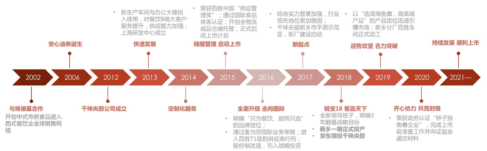  
图表1 干味央厨发展历程

# 1.2业绩稳健增长，21年经营强势回暖

收入近10亿元，2021上半年强势回暖：公司2018-2020年收入分别为7.0/8.9/9.4亿元，分别同比 $+ 1 8 . 2 \% / + 2 6 . 8 \% / + 6 . 2 \%$ ，2018和2019年受益于产能投产和需求增加，收入持续增长；2020年上半年因疫情冲击公司收入出现短期下滑，下半年随着疫情得以控制、下游餐饮等客户经营加速恢复，实现同比 $1 7 . 6 3 \%$ 的增长，也带动整体收入增速回正。2021上半年市场持续回暖，公司紧抓需求增长，实现收入5.68亿元，同比高增 $5 4 . 8 0 \%$ 。

利润稳健增长，上半年盈利能力基本恢复：2018和2019年公司分别实现归母净利润0.59/0.74亿元，同比增长 $+ 2 6 . 0 3 \% / + 2 6 . 3 2 \%$ ，伴随收入持续增长。2020年因疫情影响凈利率下降也使得利润增速降至 $3 . 3 3 \%$ 。2021上半年收入恢复也带动净利润和净利率恢复，归母净利润同比高增 $5 0 . 5 1 \%$ 。

市场恢复，三季度持续好转：随着防疫常态化、下游需求持续增长，公司经营不断向好，预计2021年前三季度收入在8.78-8.93亿元之间，同比增长 $4 4 . 2 5 \% - 4 6 . 7 1 \%$ ；归母净利润约为5479-5579万元，同比增长12.31%-14.36%；扣非归母净利润分别为5380.2-5480.2万元，同比增长 $7 9 . 2 6 \% - 8 2 . 5 9 \%$ 。

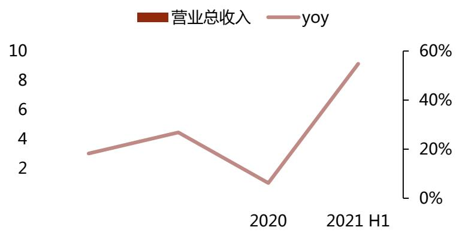  
图表2公司营业收入持续增长（亿元）

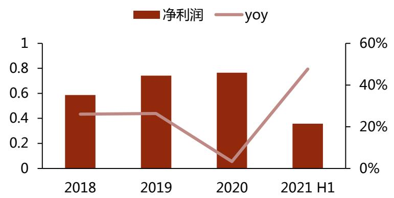  
图表3公司归母净利润增长情况（亿元）

# 1.2业绩稳健增长，21年经营强势回暖

油炸类产品为核心，产品不断多元化：公司产品主要分为4大类，其中油炸类为第一大品类，占比超过 $50 \%$ ，但规模仍在逐年提升；烘焙和蒸煮类规模相差不大，分别占比 $20 \%$ 左右，蒸煮类增速略高于烘焙类产品；菜肴及其他类产品虽然规模不大，但增长较快，占收入的比重从不足2%提升至 $5 \%$ 以上。随着公司客户和渠道的不断多元化，产品种类也在不断丰富，各大细分品类都有不错的增长。区域分布与客户所在地相关，各区域稳定发展：分区域来看，公司在华东地区体量最大，主因公司前两大直营客户百胜和华莱士归属地在华东，公司分区域收入与客户所在地相关；随着经销规模扩大，公司销售区域也更加分散。公司近几年各大区域销售体量均有一定的增长，逐渐实现全国化布局。

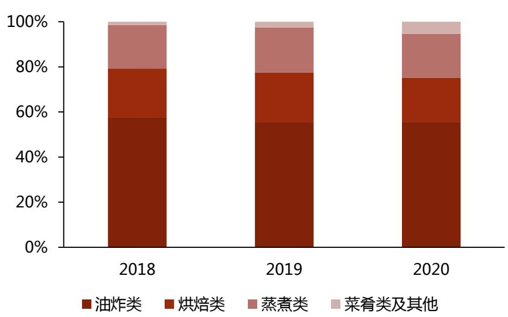  
图表4 公司产品不断多元化

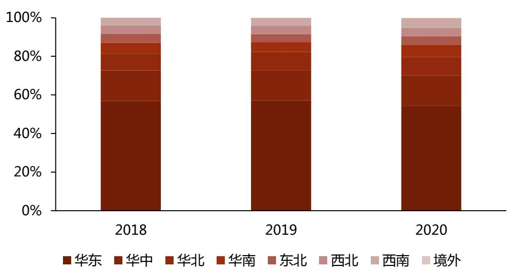  
图表5公司逐步实现全国化布局

# 1.3 源自郑州思念，核心成员从业经验丰富

公司曾为郑州思念全资子公司，现已完全剥离：公司前身干味有限由郑州思念于2012年全资设立，主营餐饮端的速冻面米业务；2016年千味有限变更为股份公司；2017年公司实控人李伟将所持思念食品全部股权转让给思念食品管理层，并获得思念食品高管间接持有的全部公司股权，两家公司彻底分离，解决了同业竞争问题。

公司创始人及多位骨干曾于思念任职，具有丰富的速冻米面行业经验：公司创始人及实控人李伟先生曾创立国内领先的速冻食品企业思念集团，在食品行业拥有巨大影响力；公司董事长孙剑曾在思念食品担任业务代表、上海公司经理、营销中心副总经理等职务；公司总经理白瑞、财务总监王植宾等均在思念食品拥有工作经历。上市后，公司实控人李伟将通过共青城城之集间接持有公司46.87%的股权，核心管理层李剑、白瑞、徐振江等均持有部分股权，确保管理层稳定，有望进一步激发管理层的主观能动性。

京东、绝味食品入股干味央厨，在供应链、电商等方面存在潜在合作机会。

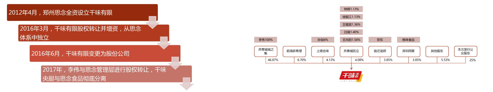  
图表6公司股权变更历程  
图表7公司上市后股权结构

# 1.3 源自郑州思念，核心成员从业经验丰富

图表8公司核心成员从业经验丰富  

<table><tr><td>姓名</td><td>职务</td><td>任职日期</td><td>个人简历</td></tr><tr><td>李伟</td><td>实际控制人</td><td>无任职</td><td>毕业于郑州大学新闻系，本科学历。未在发行人处担任职务，现为公司实际控制人、黄河大观实际控制人。1996年成为和路雪 冰淇淋河南总经销，1997年成立河南省思念速冻食品有限公司，2006年郑州思念食品股份有限公司在新加坡证券交易所挂牌上 市。2017年末，李伟所持63%思念食品股份由思念食品管理团队出资全部接收，李伟在思念食品完成退出。</td></tr><tr><td>孙剑</td><td>董事长</td><td>2019/6/26</td><td>毕业于河南师范大学，本科学历。1995年9月至2000年10月任河南省天隆实业有限公司业务员；2000年10月至2010年9月历 任郑念业代表上海公司经理、港公司经理销中心副总终理010年10月至0101年今在河生缘食有限 司董事长，新乡干味执行董事。</td></tr><tr><td>白瑞</td><td>董事总经理</td><td>2019/6/26</td><td>毕业于中南财经政法大学，硕士学历，中级会计师。1997年7月至2000年9月任河南冠联装饰工程有限公司财务部会计；2000 年10月至2004年4月任海信科龙电器股份有限公司河南分公司会计主管；2004年5月至2011年8月历任郑州思念结算部经理、 资金管理部经理、营销中心副总经理助理；2012年4月至今在本公司工作，现任公司董事、总经理，新乡干味经理。</td></tr><tr><td>王植宾</td><td>董事 副总经理 财务总监</td><td>2019/6/26</td><td>毕业于西南大学，本科学历，中级会计师。2002年5月至2003年8月任宏大（集团）有限责任公司财务部会计；2003年9月至 2005年3月任郑州章光101生发科技有限公司财务部会计：2005年4月至2012年3月历任郑州思念总成本会计、高级审计员、内 审经理、审计部经理；2012年4月至今在本公司工作，现任公司董事、副总经理、财务总监。</td></tr><tr><td>徐振江</td><td>董事会秘书</td><td>2019/6/26</td><td>毕业于中央财经大学，硕士学历，中央财经大学在读博士。2005年7月至2006年6月任广州南方人物周刊实习记者；2006年9月 至娜历任河南商报社记者、经济新闻部主任；2010年10月至2011年8月任河南宋河酒业股份公司总裁助理；2011年9 月至2013年9月任洛阳次祖杜康销售有限公司总经理助理；2013年10月至2015年9月，任河南骏域基金管理有限公司投资总监； 2015年9月至今在本公司工作，现任公司副总经理兼董事会秘书。</td></tr></table>

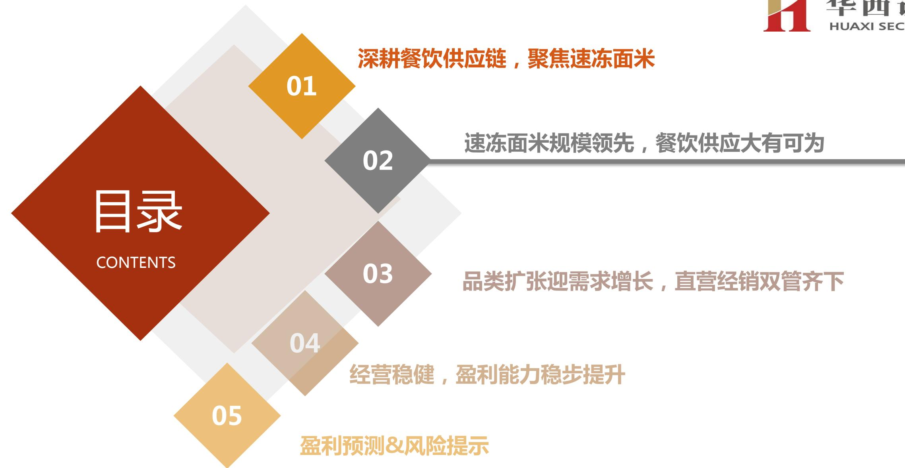

# 2.1 速冻面米赛道广阔，餐饮市场大有可为

公司长期致力于B2B餐饮市场中速冻面米制品的研发、生产和销售。

速冻面米制品产业链上游为原材料供应商、初加工企业，中游为速冻食品制造企业、冷链设备供应商，下游为冷链物流产业、销售渠道。公司处于产业链核心的中游环节，承接原材料采购和产品渠道销售等上下游各个环节，公司客户以B端机构客户为主。公司已经打造了一条完整的、有足够控制力的原材料采购、生产加工、储运、运输到终端销售的完成供应链体系。

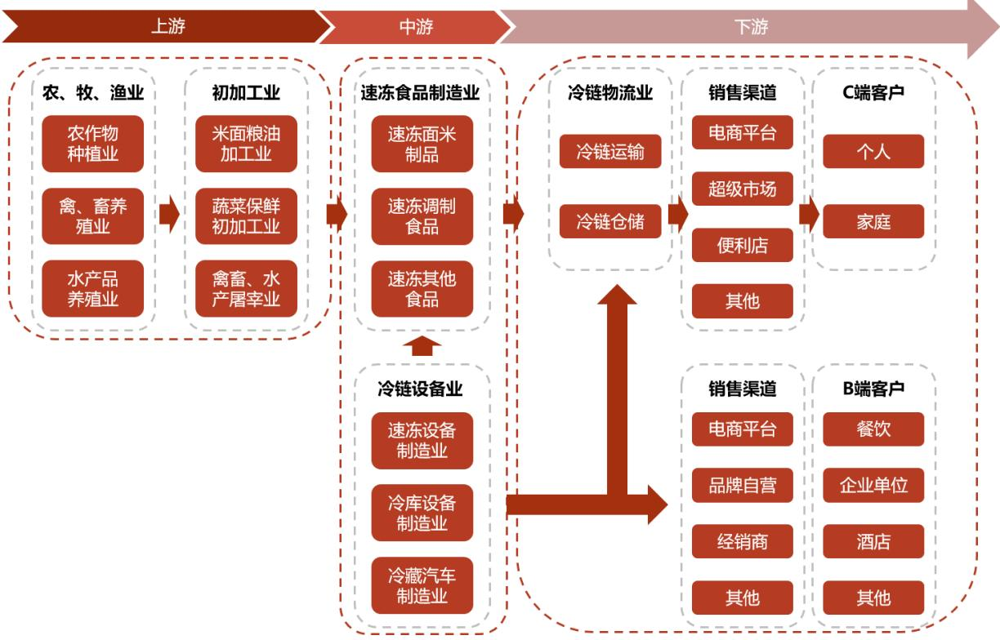  
图表9速冻面米产业链

# 2.1 速冻面米赛道广阔，餐饮市场大有可为

速冻面米是速冻食品中份额最大的品类，规模呈上升趋势：速冻面米制品主要包括速冻水饺、汤圆、包子、油条、芝麻球等，参考Frost&Sullivan数据，2017年我国速冻面米制品市场占速冻食品总市场份额的 $50 . 9 \%$ ，市场规模由2013年的549亿元增至2017年的629亿元，CARG为 $3 . 5 \%$ 。根据中国食品工业协会数据，2019年速冻面米制造业主营业务收入达到773.5亿元，生产速冻面米制品302万吨。从速冻面米行业整体来看，2018年和2019年公司在速冻面米行业的市占率分别为 $0 . 9 5 \%$ 和 $1 . 1 5 \%$ 。

餐饮端是速冻面米市场新蓝海，集中度待提升：我国速冻面米食品零售市场发展较为成熟，已经形成三全食品、思念食品和湾仔码头三足鼎立的局面，市场趋于饱和，以存量竞争为主。而餐饮端对速冻面米制品的需求近年来逐渐显现，餐饮市场成为速冻食品新蓝海，目前尚处跑马圈地开拓市场的阶段，没有明显的头部玩家出现，市场集中度较低，亟待整合。招股说明书显示，2018年公司速冻面米制品在国内速冻面米餐饮市场的占有率约为 $5 . 7 5 \%$ 。

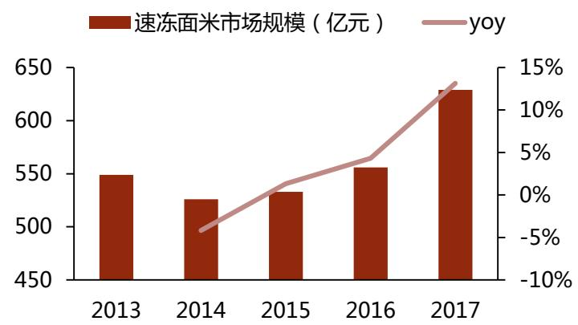  
图表10速冻面米市场规模

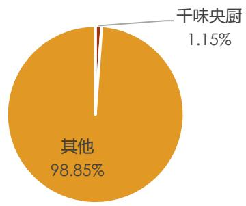  
公司在速冻面米行业市占率

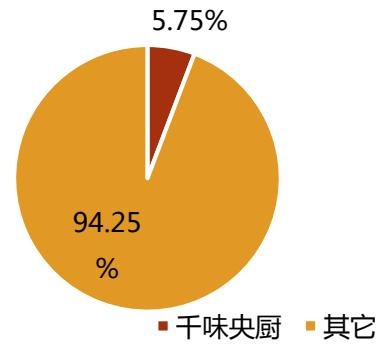  
图表11公司速冻面米业务市占率  
公司在速冻面米餐饮端市占率

# 2.1 速冻面米赛道广阔，餐饮市场大有可为

速冻食品享餐饮业稳健增长红利，增长前景可期：我国餐饮行业收入由2014年的28926亿元增至2019年的46721亿元，年复合增长率达 $1 0 . 1 \%$ ，尽管2020年受到疫情冲击，但预期疫情后行业将迎来复苏并继续增长，预计2019-2024年餐饮行业年复合增长率为$7 . 2 \%$ ，2024年餐饮行业收入将达66316亿元。速冻食品的工业化、定制化特征有利于餐饮客户借助速冻食品生产企业的标准化、集约化流程，实现餐品口味稳定，缩减时间人力成本，速冻行业成长将享受餐饮业稳健增长的红利。

冷链物流基础设施逐步完善，为速冻食品行业发展注入活力：在国家支持和资本青睐下，冷链物流配套设施近年来发展迅速，2013-2018年我国低温仓储冷库容量由8345万立方米增至14700万立方米，年复合增长率达 $1 1 . 9 9 \%$ ；同期公路冷链运输车保有量由5.52万辆增至18万辆，年复合增长率高达 $2 6 . 6 7 \%$ 。冷链物流配套设施的逐步完善提高了速冻行业的辐射半径，为速冻食品的迅速发展创设了条件。

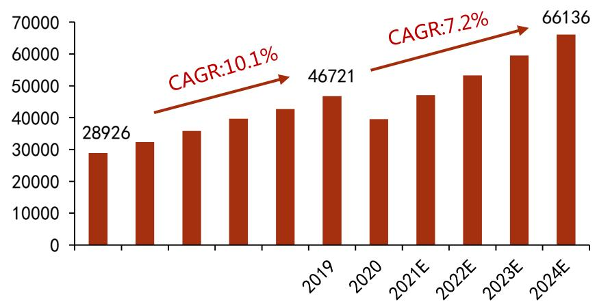  
图表12 我国餐饮市场规模稳健增长（亿元）

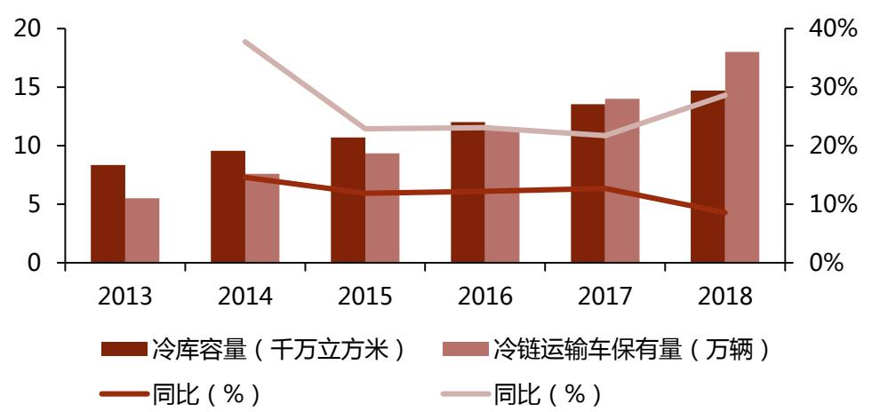  
图表132013-2018年我国冷库容量和冷链运输车保有量增长迅速

# 2.2餐饮供应链走向标准化，团餐乡厨增长潜力巨大

餐饮连锁化趋势带来速冻面米标准化替代的机会：连锁经营有利于餐饮企业控制成本，保持口味稳定，形成规模经济。据美团点评数据，2020年我国餐饮连锁化率仅 $5 \%$ ，同期美国为 $30 \%$ ；我国餐饮连锁门店增长率达到 $2 7 . 4 \%$ ，远高于我国餐饮市场总体增长率 $8 \%$ -餐饮连锁化已成为餐饮业未来趋势。连锁餐厅使用速冻面米制品可有效节约厨房占地面积，降低人工成本，提升烹饪效率，维持口味稳定，据此我们认为餐饮连锁化率提升将带动速冻面米制品需求增加。类似地，外卖商户使用标准化的速冻面米制品能有效缩短备餐时间，控制成本，保持口味统一稳定。2015至2019年我国外卖行业交易额由1348亿元爆发式增至6035亿元，年复合增长率达$4 5 . 5 \%$ ，渗透率由 $4 . 2 \%$ 提升至 $1 3 . 0 \%$ ，目前仍有提升空间，将为速冻面米带来更多市场需求。

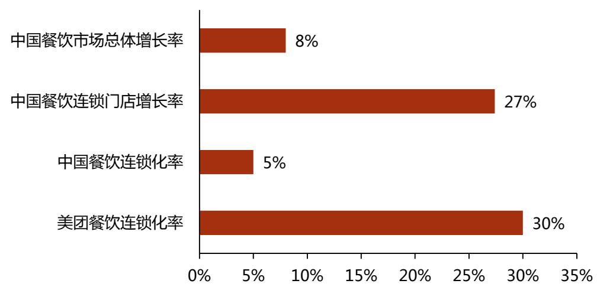  
图表14 餐饮连锁化成为我国餐饮业未来趋势

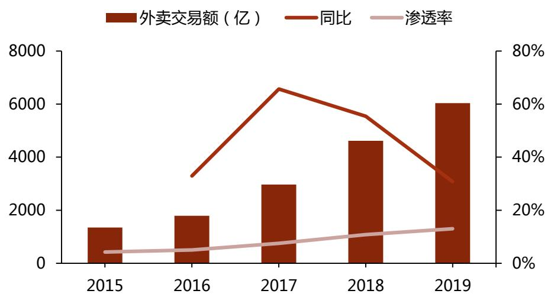  
图表15 外卖行业爆发式增长为速冻面米带来更多市场需求

# 2.2 餐饮供应链走向标准化，团餐乡厨增长潜力巨大

团餐市场规模增长迅速，成为速冻食品行业新增长点：团餐市场规模由2016年的0.9万亿增至2019年的1.5万亿，年复合增长率达$1 8 . 6 \%$ ，远超餐饮业平均增速。团餐市场需求具有可预测性，标准化程度高，可复制性强，与速冻制品的流程标准化、口味稳定性相契合，正在成为速冻食品新的增长点。分渠道来看，团餐市场中学校食堂、企业食堂和机关食堂占比较高，分别为$3 5 . 4 8 \% / 3 4 . 9 \% / 1 5 \%$ ，其余为学生营养餐、养老配餐、航空铁路配餐等。

乡村家宴市场需求旺盛，渠道下沉空间广阔：乡厨家宴在我国广大农村地区具有庞大的消费场景，红白喜事、亲友宴请等。农村家宴聚餐人数众多，原材料采购种类繁多，渠道效率较低，加工过程不规范，一方面存在食品安全风险，另一方面为主办方带来较重的人力、物力、时间成本。采用速冻制品备办农村宴席可大幅提升备餐流程标准化程度，中间环节进一步规范化，减小食品安全风险，降低主办方各项成本负担。据公司统计，目前农村宴席每桌成本约为300-600元，每次约为30-60桌。广阔的农村家宴市场在消费升级背景下，为速冻食品餐饮行业下沉至三四线城市及农村市场奠定了基础。

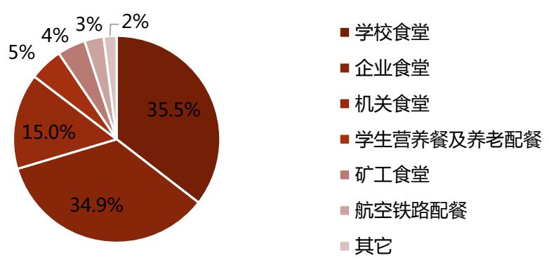  
图表16 团餐市场构成

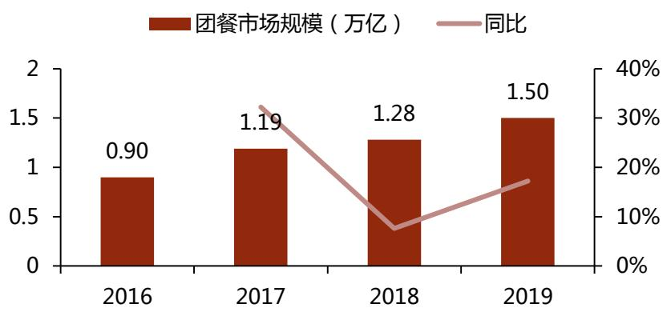  
图表17 团餐市场规模增长迅速

# 2.3 定制生产具备排他性，实现稳健增长和互利共赢

从传统通用品到定制化生产，速冻面米生产模式升级：餐饮端速冻面米产品生产模式主要是定制化生产和通用品生产模式，通用品是以产品为基础和核心，速冻企业为主导的业务模式；定制产品是以定制客户为基础和核心，企业与定制客户之间是一种紧密型的客户关系；定制生产是较为新型的经营模式，是餐饮行业专业分工的产物，有效降低了餐饮企业的生产运营成本。定制生产模式下，速冻企业具有客户的排他性，相互考察的时间周期较长，具有长期的稳定性和互赢性，而且合作具有不断的延伸性和自我强化性，增长更加稳健。定制生产模式主要分为“定制研发 $^ +$ 定制生产”和“工艺标准 $^ +$ 定制生产”两种模式，前一种模式下餐饮企业和速冻企业可以建立更加稳定可靠的长期战略合作伙伴关系，后一种模式速冻企业对餐饮企业的依赖性较强，市场竞争较为激烈。

图表18 两种定制生产模式对比  

<table><tr><td></td><td>定制研发+定制生产</td><td>工艺标准+定制生产</td></tr><tr><td>餐饮企业</td><td>提出需求产向速冻企业提供技术信权反馈</td><td>将其忘环节中段一个或多个产品通过合同的形式委托</td></tr><tr><td>速冻企业</td><td>掌握研发、采购、加工、烹饪环节整体或部分环节，定制化 ☰育研发产品的核心知识产权和相关生产工艺技术</td><td>接客安指客的工艺技术标准进行生产，最终把受托生产的产品全部销</td></tr><tr><td>双方关系</td><td>双方可以形成相互支持、相互依赖、稳定可靠的长期战略合 作伙伴关系</td><td>速冻企业对餐饮企业的依赖性较强，市场竞争较为激烈</td></tr></table>

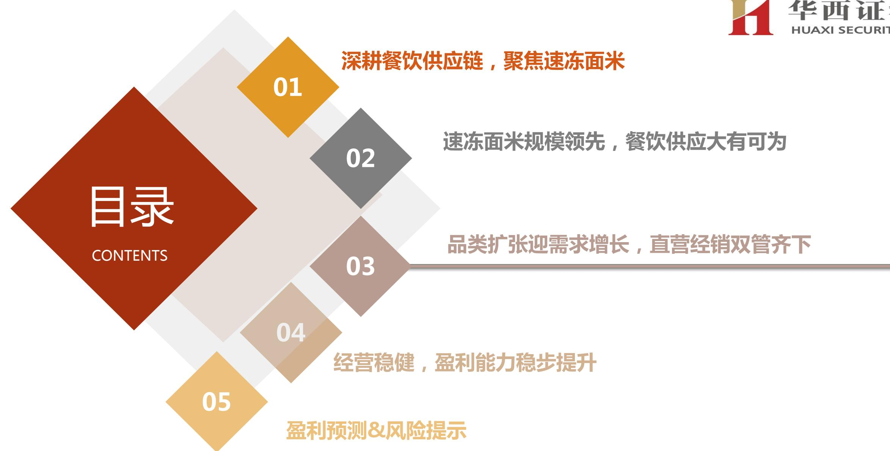

# 3.1 精准研发助力品类扩充，加码产能迎增量竞争

聚焦速冻米面，产品矩阵丰富：公司聚焦于为餐饮企业提供定制化和标准化的速冻面米制品，公司速冻面米制品按加工方式主要分为油炸类、烘焙类、蒸煮类、菜肴类及其他四大类，SKU达到368个，产品数量众多、矩阵丰富。公司油炸类产品在主营业务收入中占比过半，烘培类和蒸煮类次之，前三类产品占比达到 $9 5 \%$ 以上。公司在油条、卡通包、手工挞皮等方面引|领行业发展方向，也是公司的核心产品。

# 油炸类为核心，多元化发展：

油炸类是公司的核心产品，占比超过 $50 \%$ ，2020年总收入超过5亿，近几年实现量价齐升。  
蒸煮类是公司SKU数量最多的品类，收入体量接近2个亿，以经销渠道为主，受到下游酒店、团餐、乡厨市场采购增加而规模提升，2020年收入小幅下降主因直营渠道客户采购量短期波动。  
烘焙类是公司直营渠道占比最高的品类，业绩受直营客户需求变化影响较大，但公司近几年不断研发新品，经销渠道增长较快，整体体量稳中有升。菜肴及其他是公司增长最快的品类，近三年收入占比从 $1 . 4 \%$ 提升至 $5 . 3 \%$ ，得益于公司不断研发新品，满足客户需求，19年公司大力开拓火锅料市场新增多款火锅类产品，20年推出20多款新品，如煎饺、杂粮调理包等带动收入增长。

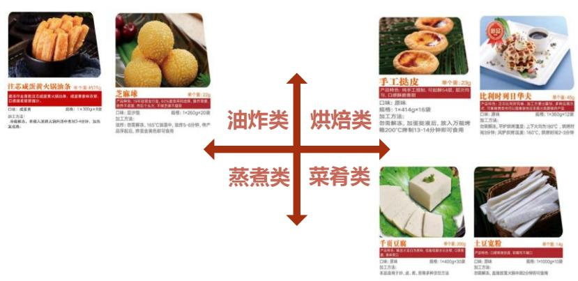  
图表19 干味央厨产品矩阵

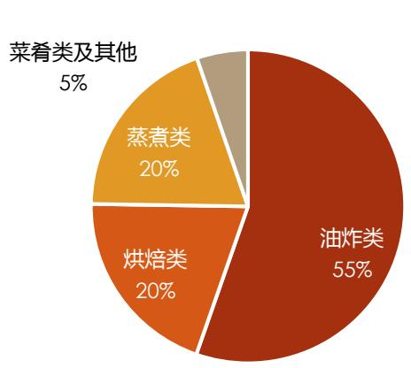  
图表20 干味央厨分品类占比

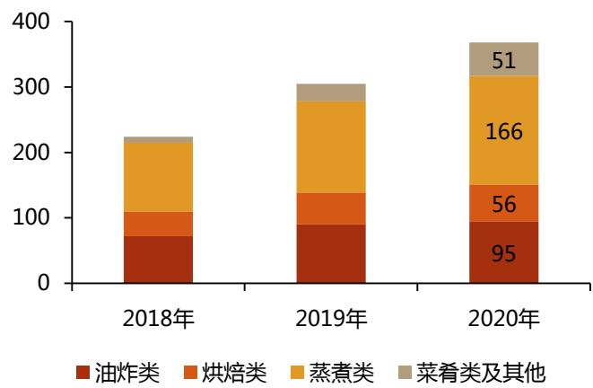  
图表21 公司各品类SKU数量

# 3.1 精准研发助力品类扩充，加码产能迎接增量竞争

以多样化的产品适配不断扩充的应用场景：公司专注于餐饮后厨解决方案，一方面针对不同的渠道、客户、场景、需求、偏好，提供更加细分的产品品类，在品相、风味等方面做到精准适配；另一方面依托现有产品进行场景化的深入研究，研发出适应不用消费场景的系列产品。

大单品油条深度开发，场景延伸多维度开发：油条是公司的大单品，千味央厨开创了中国油条品牌，每年有约2亿人次在吃千味央厨的安心油条，公司对于油条大单品不断进行研发创新和消费场景细分，研发了安心油条、无铝油条、注芯油条等多种创新产品，掌握了多项具有自主知识产权的科研成果和核心技术。公司2012年开始进行油条细分场景下的市场研究，细分出了火锅、快餐、自助餐、宴席、早餐、外卖等六大消费场景，研发出多款针对性的创新性产品。公司在油条餐饮供应领域具备绝对竞争力，是百胜中国油条类产品的独家供应商。

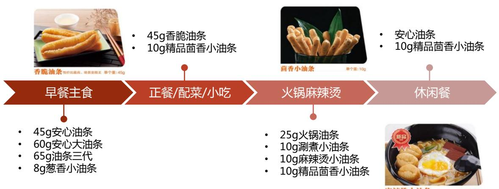  
图22 油条细分消费场景

图23部分核心技术及其产品应用  

<table><tr><td>核心技术</td><td>功能及创新</td><td>产品应用</td></tr><tr><td>油条纵切技术</td><td>改变油条面团的切条方式，减少生产线用 人，增加生产效率</td><td>外卖油条、精品油 条、酥脆油条等</td></tr><tr><td>油条灌蛋制备方法条风味</td><td>新技术，利用油条进行馅料的灌注，增加油</td><td>蛋芯油条</td></tr><tr><td>麻辣烫油条系列</td><td>将油条创新制作成可以用于煮制和火锅涮煮 的产品</td><td>麻辣烫油条</td></tr><tr><td>注芯油条制作方法</td><td>注芯油条的发明创造，对丰富油条系列有促 进作用</td><td>蛋芯油条</td></tr><tr><td>注芯油条加工装置产</td><td>油条罐装机的研发，有利于产品的快速规模</td><td>蛋芯油条</td></tr><tr><td></td><td>新型成型油炸装置产方武创新产结的程特性设计的炸率</td><td>茴香小油条</td></tr></table>

# 3.1 精准研发助力品类扩充，加码产能迎接增量竞争

丰富产品种类，满足客户多样化需求：公司不断进行产品创新和研发，丰富产品种类，除油条外，在卡通包和手工挞皮等领域也做到了行业领先；同时研发出了煎饺、芝麻球、杂粮调理包等多样化的产品，SKU超过300个，公司正在研发酥饼、红豆派、冷冻预烤面包等产品，继续进行产品创新。未来公司一方面将加大肉类、鱼糜类产品的研发力度，争取在餐饮调制食品领域打造一系列畅销产品，另一方面将重点拓展火锅类、团餐类食材的产品，满足客户一站式采购的需求。

图24 主要在研项目及进展情况  

<table><tr><td>项目</td><td>研发阶段</td><td>项目介绍及未来应用前景</td></tr><tr><td>新口味酥饼</td><td>小试阶段</td><td>中式点心的多样化研发生产对，可以更大程度满足客户的需求</td></tr><tr><td>冷冻三明治面团</td><td>试产阶段</td><td>明的面团置业化生产，代表着烘焙面包类产品在技术上的一个大的突破，为产品开</td></tr><tr><td>红豆派</td><td>小试阶段</td><td>针对西式快餐店推出的一款产品</td></tr><tr><td>麻酱烧饼</td><td>小试阶段</td><td>市场产品的吸收创新，增强产品技术研究</td></tr><tr><td>馅饼类</td><td>试验阶段</td><td>开拓饼类市场，丰富产品</td></tr><tr><td>注芯油条系列</td><td>试验阶段</td><td>基于蛋芯油条，对该系列产品进行储备</td></tr><tr><td>新造型春卷</td><td>中试阶段</td><td>春卷的新型的生产方式，自动化，规模化生产</td></tr><tr><td>油条工业化规模化生产的研究</td><td>试验阶段</td><td>作为主力品种，继续对油条工业化生产进行技术研究，保持行业领先地位</td></tr><tr><td>米发糕工业化规模化生产的研究</td><td>试验阶段</td><td>继续对米发糕的工业化生产进行技术研究</td></tr><tr><td>冷冻预烤面包</td><td>试产阶段</td><td>烘焙类预烤产品，进行技术升级，能够极大降低门店的运营成本，是未来烘焙店的</td></tr><tr><td>基础面点的工业化生产研究</td><td>试验阶段</td><td>对面点工业化规模化生产进行技术研究</td></tr></table>

# 3.1 精准研发助力品类扩充，加码产能迎接增量竞争

产销两旺，旺季产能紧张：速冻食品餐饮端需求迅速增长，B端市场尚处跑马圈地阶段，公司产品产销两旺，2018-2020年公司产销率分别达到 $9 8 . 9 0 \% / 9 4 . 4 8 \% / 9 9 . 2 2 \%$ 。同时速冻食品销售具有一定的季节性，公司产能在旺季面临较大压力。未来随着速冻面米行业的持续发展，公司需要进一步扩大产能以适应市场的增量竞争。公司产能已由2018年的6.4万吨提升至2020年的12.8万吨，产能利用率为 $60 . 4 \%$ ，虽然疫情短期使得产能利用率下降，但旺季产能依旧紧张。

募集资金主要用于新乡干味三期项目的建设，设计产能8万吨，预计于2023年中投产。预计2023和2024年公司产能将分别达到14和17.2万吨，产能利用率分别达到 $9 4 . 7 \% / 9 2 . 5 \%$ ，带动收入增长。

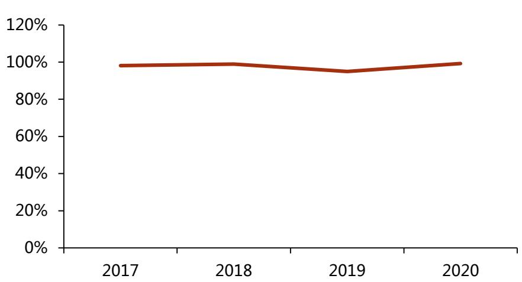  
图表25 近四年公司产销率维持高位

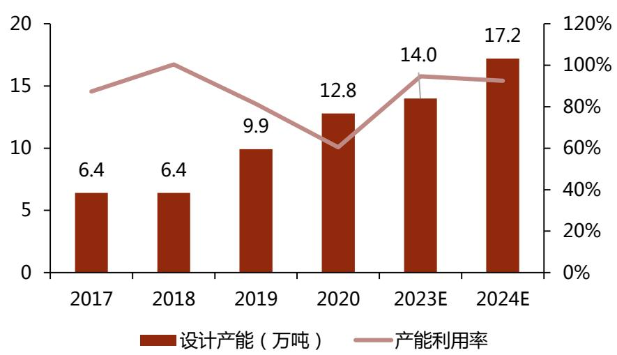  
图表26 公司现有产能及未来布局

# 3.2 直营经销结合，通用定制并举

直营奠定产品和品牌竞争力，经销扩大业务规模：公司主要采取直营和经销两种销售模式，直营以大型连锁客户、大型企业团膳食堂及乡厨为主，公司已成为肯德基、必胜客、华莱士、海底捞等知名餐饮品牌速冻面米制品供应商，直营体量规模超3亿；经销渠道主要服务区域性餐饮连锁及各级食材批发市场和中小餐饮客户，公司已经建立了全国性的经销网络，拥有900多家经销商，经销渠道销售体量超过6亿。公司产品端分为定制品和通用品，其中直营客户以定制产品为主，经销客户以通用产品为主。公司直营：经销收入比例约为4:6，近几年经销占比稳步提升，从59.31%提升至 $6 4 . 2 6 \%$ ，不断提升公司业务规模，直营渠道持续提升公司的产品力和品牌竞争力。

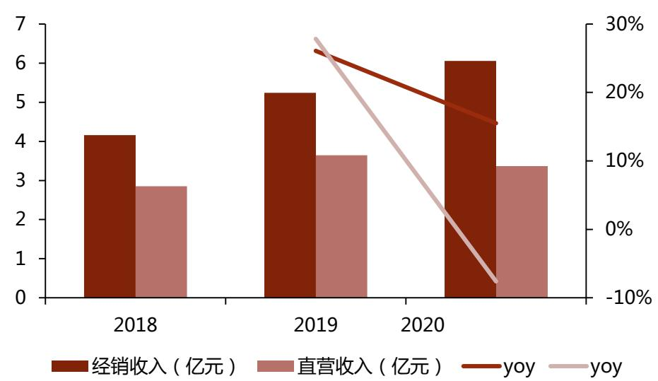  
图表27 分渠道收入

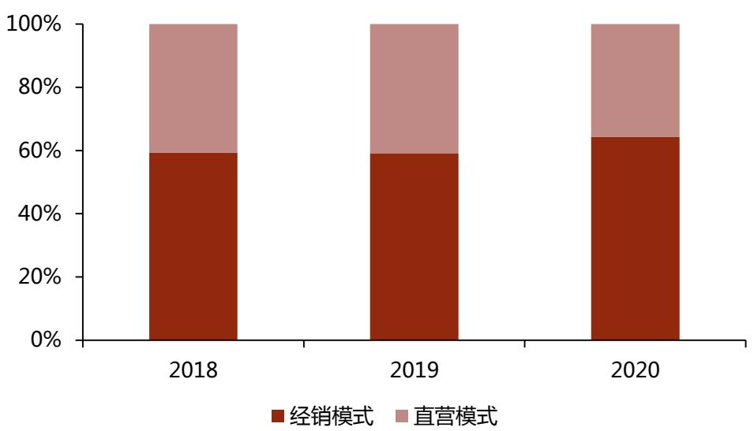  
图表28 经销渠道收入占比稳步提升

# 3.2 直营经销结合，通用定制并举

直营全环节合作，深度绑定：公司开展直营业务已近10年，主要以品牌知名度较高的连锁餐饮客户为主，与直营客户多环节合作，为客户提供整体解决方案，建立了长期合作的同盟关系，公司为客户提供菜单设计、产品开发、产品销售、技术支持、干线物流运输及后续咨询等方案，与客户长期合作，深度绑定。近年来，公司更是结合产品特点和零售、餐饮业态的新变化，创新性地开发连锁商超等B端新渠道，不断拓展新的直营客户。

以定制研发服务直营客户：客户一般会对定制项目的研发设定明确的时间要求，公司建立了“模拟餐厅后厨”的研发实验室，研发部下设四个专业研究室和上海研发室，得益于成熟的定制研发机制，公司在快速研发方面保持了良好的记录，如2018年完成40多项新产品上市，其中为肯德基研发并上市7个新品，得到了客户的肯定。

营销中心下设重客部专门服务直营客户：公司营销中心的重客部专门为直营客户提供服务，公司还专门建立了个性化、贴近客户的营销服务小组，将定制产品营销活动前置到市场需求输入阶段，并渗透到经营活动的各个环节和部门。公司各个相关部门，从董事长到中层管理人员再到一般员工，都会参与到定制模式的市场营销活动中。

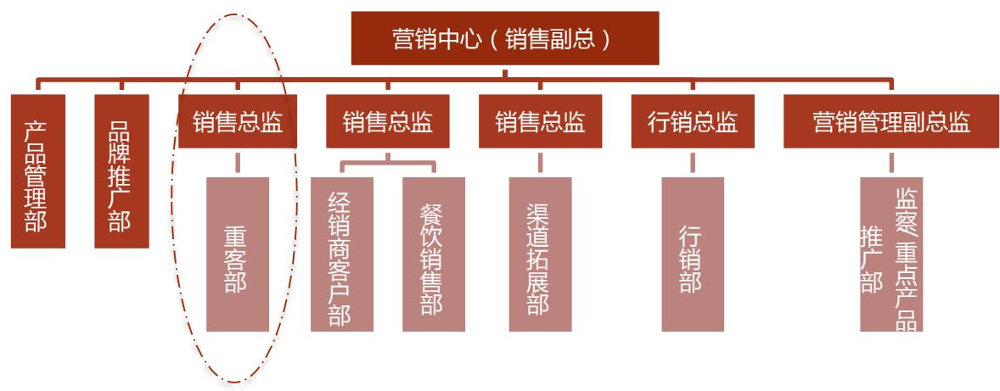  
图表29 公司主要客户群体  
图表30 公司销售部门架构

# 3.2 直营经销结合，通用定制并举

直营客户高粘性，合作有望不断深化：直营客户多以定制产品为主，定制产品一旦选定公司作为供应商，一般不会再轻易变更，并且有望不断增加新产品的合作。通过与大型连锁餐饮企业的合作，公司可以分享客户的发展及定制产品销售增长所带来的收益，塑造公司的品牌和商誉，掌握速冻面米新产品研发的最新进展，积蓄和提升公司的研发实力，利用客户的产品市场拓展本公司的产品市场，实现客户利益与资源的共享。

以百胜中国为例，思念食品于2006年成为肯德基供应商，2008年百胜中国开启本土化战略时与之加强业务联系，2012年千味成立后随即承接了百胜业务，双方一直合作至今，2016年公司成为百胜中国供应商体系中最高的T1级，并获得多个奖项。公司与百胜的业务往来超过2亿，占收入1/5以上，合作产品也逐年增加和更新。百胜在2017-2020年国内餐厅数量由7983家增至上万家，2017-2019年公司对百胜的销售额CAGR达 $2 4 \%$ ，2020年因疫情百胜中国旗下门店暂时停业、营业时间缩短及客流减少导致对公司产品采购额有所下降，但仍在2亿元以上。

持续挖掘现有客户需求，开发区域性连锁餐饮企业客户：公司将继续保持和现有大客户的紧密合作关系，优先满足现有客户的需求，在内部树立“大客户优先”理念，形成对接大客户的内部小组，确保能够快速响应大客户的需求；拓展现有客户的产品品类，挖掘现有客户的潜力和供应份额；同时密切关注餐饮市场崛起的连锁“新秀”，加大开发区域性连锁餐饮企业客户，争取未来3-5年之内有一批合作紧密、业务量大的餐饮连锁新秀客户。

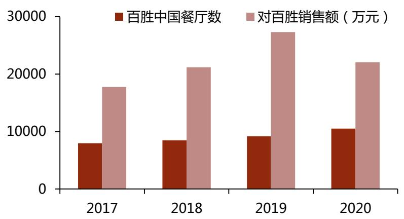  
图表31对前五大客户销售额（万元）  
图表32 公司对百胜销售额随其拓店步伐而增长

# 3.2 直营经销结合，通用定制并举

公司以经销商覆盖中小餐饮客户，推动渠道下沉：公司将数量多且较为分散的中小餐饮商户、团餐食堂、酒店、乡厨、社区团购等纳入经销商的管理范围，将经销商的仓库作为公司到各个区域市场的中转仓，借助经销商在三、四线城市目标市场的销售渠道和资源，公司的触达范围、配送效率、销量规模可以得到快速提升。2019和2020年公司经销渠道收入同比分别 $+ 2 6 . 1 \% / + 1 5 . 5 \% _ { \circ }$ []

营销中心下设经销商客户部，服务于区域型餐饮客户，依托经销商进行销售：经销商客户部在全国设大区经理、省区经理，常驻相应的销售区域，负责对所属区域的销售管理。公司要求销售人员对经销客户进行定期拜访，严格管理。公司也对经销商实施返利政策和买赠政策，激励经销商做大做强。公司经销商数量从2018年的606家增加到2020年的907家，未来公司将继续通过经销商扩大销售网络，提升业绩规模，经销业务占比预计将持续增加。

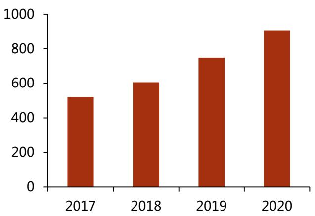  
图表33 公司经销商数量

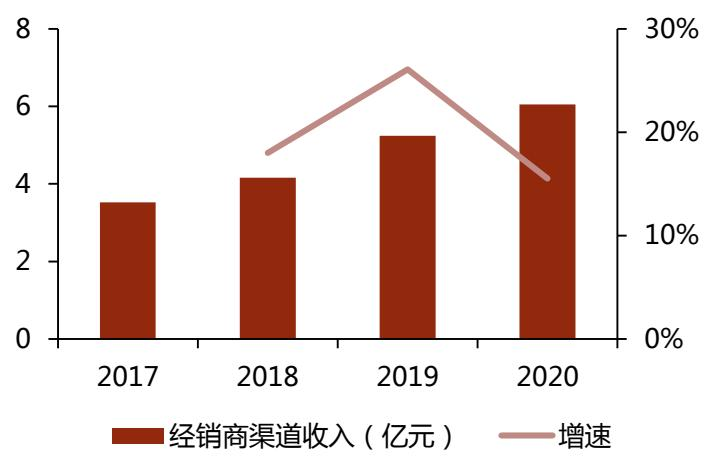  
图表34 经销渠道收入和增速

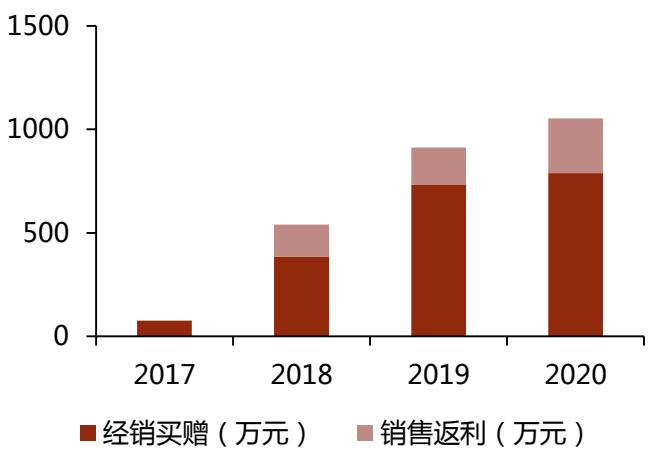  
图表35 经销商销售返利和经销买赠

# 深耕餐饮供应链，聚焦速冻面米

速冻面米规模领先，餐饮供应大有可为

# 目录

CONTENTS

03

品类扩张迎需求增长，直营经销双管齐下

经营稳健，盈利能力稳步提升

# 盈利预测&风险提示

# 4 盈利水平稳步提升，经营整体稳健

运费调整影响毛利率，直营模式毛利率更高：公司2018-2020年的毛利率分別为 $2 3 . 8 3 \% / 2 4 . 5 0 \% / 2 1 . 7 1 \%$ ，2019年毛利率提升0.67pct，主因油炸类产品毛利率增长以及烘焙类、蒸煮类产品销量占比提升；2020年毛利率下降主因运输费用调整至营业成本，可比口径下毛利为 $2 4 . 0 9 \%$ ，较去年同期微降0.41pct，产品结构变化影响毛利率，但与去年同期相差不大。分渠道来看，公司直营渠道毛利率整体高于经销，主要系两种模式定价模式不同，直营模式因公司对下游客户有一定的议价权并且满足客户个性化需求，毛利率水平更高。

B端客户为主使得公司毛利率低于可比公司：行业对比来看，千味央厨毛利率相对偏低，这与公司客户基本为B端餐饮客户、渠道直营和经销均有覆盖、产品以米面类为主等业务模式有关；从可比的上市公司来看，C端产品占比越高的企业毛利率越高，而B端业务整体毛利率偏低。

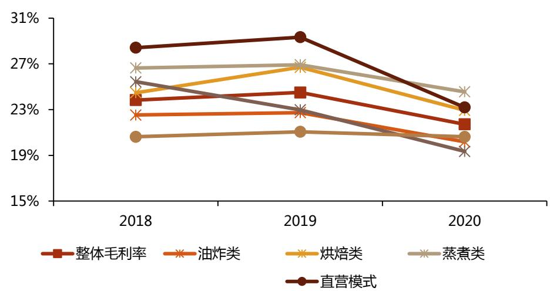  
图表36 公司分业务毛利率拆分

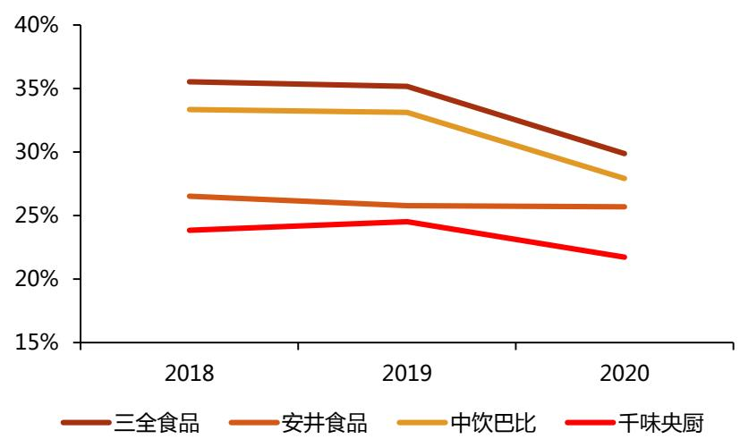  
图表37 可比公司毛利率对比

# 4 盈利水平稳步提升，经营整体稳健

公司销售费用率偏低，管理费用率偏高：行业对比来看，公司销售费用率偏低，公司销售费用以员工薪酬为主，业务宣传费用较少，这与公司B端客户为主、客户稳定性较强有关。公司管理费用率偏高，主因职工薪酬和仓储费用较高。

盈利水平稳定：公司2018-2020的凈利率分別为 $8 . 3 7 \% / 8 . 3 4 \% / 8 . 1 1 \%$ ，净利率波动不大，盈利水平基本稳定，其中2020年净利率同比下降主因仓储费用和销售人员薪酬费用增加。行业对比来看，千味央厨净利率处行业中等位置，2020年净利率横向比较偏低主因疫情期间其他企业C端渠道放量带动净利率提升，享受行业红利，而千味仍以B端为主，持续耕耘，但短期需求受疫情冲击。

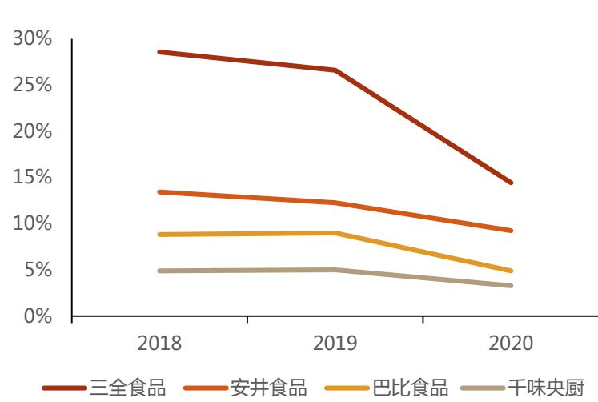  
图表38 可比公司销售费用率对比

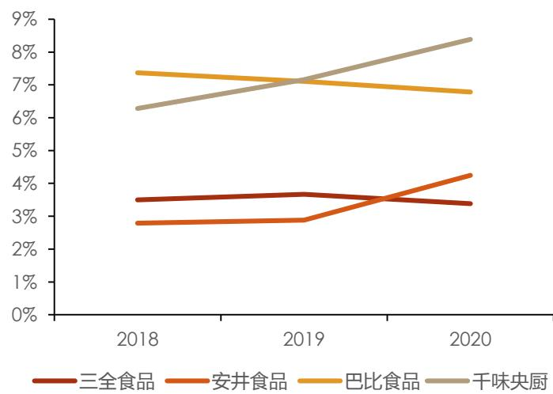  
图表39 可比公司管理费用率对比

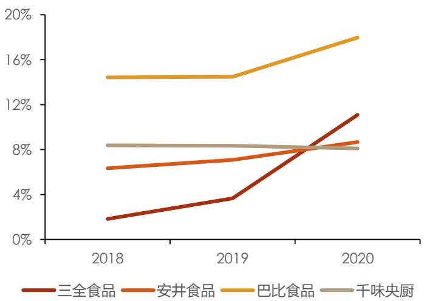  
图表40 可比公司销售净利率对比

# 4 盈利水平稳步提升，经营整体稳健

周转效率较高，经营稳健：公司2018-2020年应收账款周转率分别为24.68/20.25/19.24次，周转率较高，公司回款能力和上下游议价能力较好，近两年小幅下降主因公司连锁餐饮等大型直营客户销售金额持续增加，这类客户一般会有不超过3个月的信用期。从存货周转率来看，公司存货周转效率较高但呈下降趋势，主因销售规模增加，公司增加成品及原材料备货所致。行业对比来看，公司周转效率处于行业中等水平，公司直营客户占比较高使得应收账款周转效率略低于可比公司；而公司经营无明显的淡旺季差异，原材料价格波动较小，存货周转效率较高。

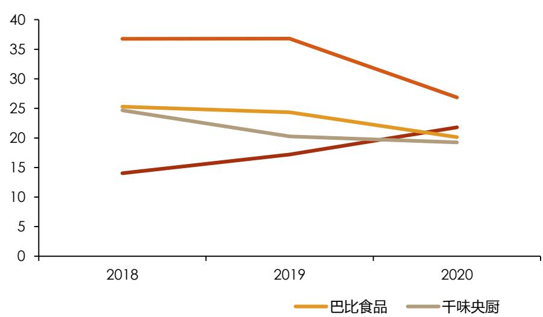  
图表41 可比公司应收账款周转率对比

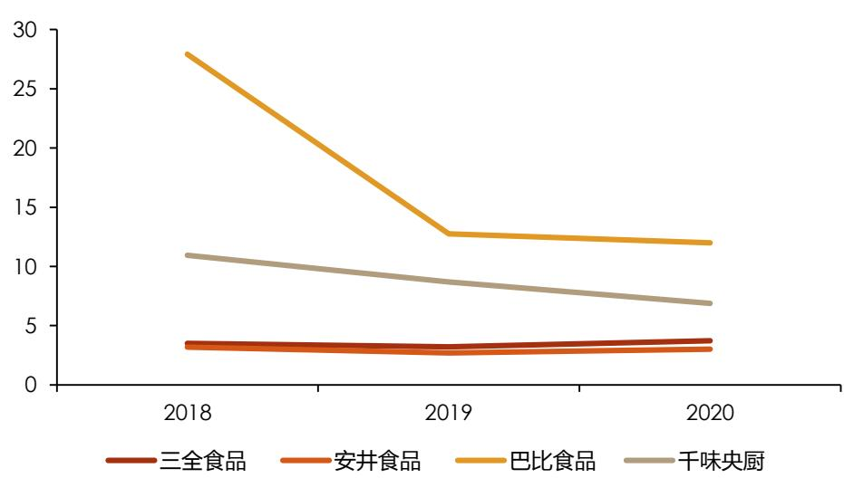  
图表42 可比公司存货周转率对比

# 4 盈利水平稳步提升，经营整体稳健

资产结构合理，资产负债率较低：公司2018-2020年流动比率分别为1.48/0.80/1.09，流动性整体较好，短期偿债风险较小，2019和2020年有所下降主因新乡工厂建设投入使得经营性现金资产减少而应付账款、应付工程款等短期负债增长较多，但波动仍在合理范围内。公司资产负债率分别为 $4 6 . 7 7 \% / 5 1 . 5 9 \% / 3 9 . 0 6 \%$ ，处于较低水平，公司长期偿债能力较强。行业对比来看，公司短期偿债能力低于同行，而长期偿债能力较优，但整体资产负债结构较为正常，偿债能力和流动性风险均较为合理。

经营整体稳健，ROE有待提升：综合对比来看，公司经营整体稳健，净资产收益率虽然相对较高，但相较于可比上市公司仍然偏低。  
公司有望借助上市，提升经营效率和资产质量，进一步提升净资产收益率，提高股东投资收益率。

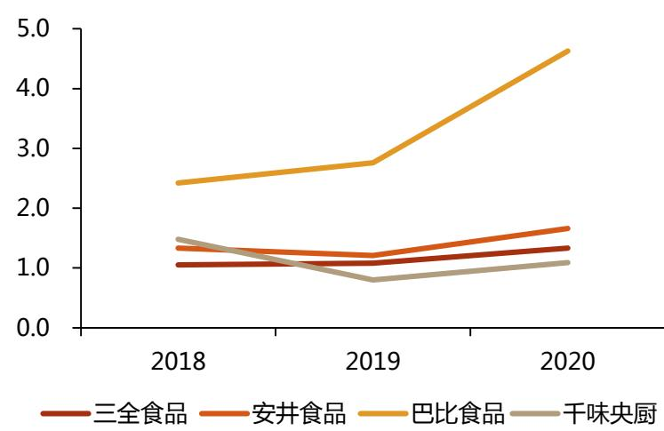  
图表43 可比公司流动比率对比

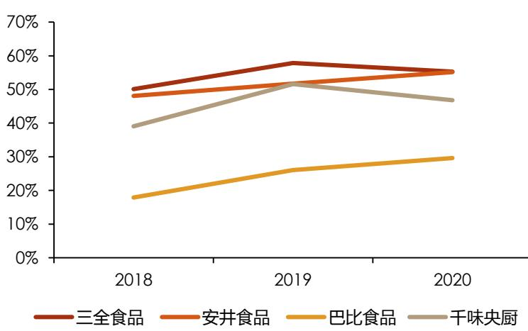  
图表44 可比公司资产负债率对比

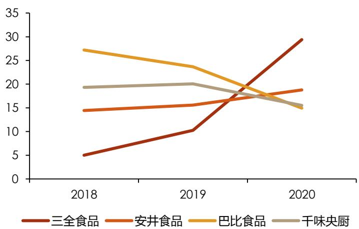  
图表45 可比公司净资产收益率对比

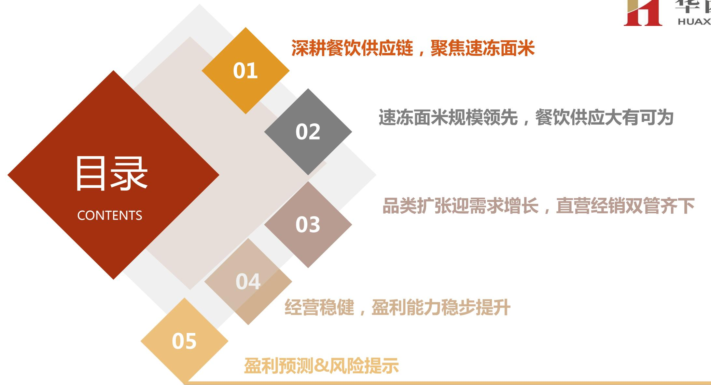

# 5 盈利预测&风险提示

餐饮需求加速恢复，速冻面米龙头借上市快速成长：今年以来餐饮需求逐步恢复，餐饮行业持续复苏，上游餐饮供应需求旺盛，公司作为餐饮速冻面米产品供应龙头，紧抓行业龙头，预计2021年收入将实现同比$34 . 8 \%$ 的增长。上市后随着产能的不断丰富，预计销售规模仍将持续增长，我们预计公司22和23年收入增速分别为 $2 6 . 8 \%$ 和 $2 4 . 3 \%$ ，2023年收入规模有望超过20亿元，不断强化公司在餐饮供应领域的竞争力。

# 盈利预测：

我们预计公司21-23年收入分别为12.73/16.15/20.08亿元，分别同比 $+ 3 4 . 8 \% / 2 6 . 8 \% / 2 4 . 3 \%$ ；归母净利润分别为 $0 . 8 8 / 1 . 2 0 / 1 . 5 8$ 亿元，分别同比$+ 1 5 . 1 \% / + 3 5 . 6 \% / + 3 2 . 1 \%$ ；EPS分别为1.04/1.40/1.86元。

图表46 收入预测拆分  

<table><tr><td></td><td>2018A</td><td>2019A</td><td>2020A</td><td>2021E</td><td>2022E</td><td>2023E</td></tr><tr><td>营业收入</td><td>70,120.26</td><td>88,928.30</td><td>94,437.42</td><td>127,340.21</td><td>161,472.33</td><td>200,751.86</td></tr><tr><td>增速</td><td></td><td>26.8%</td><td>6.2%</td><td>34.8%</td><td>26.8%</td><td>24.3%</td></tr><tr><td>油炸类</td><td>40,232.11</td><td>49,180.17</td><td>52,146.20</td><td>66,486.41</td><td>81,379.36</td><td>97,948.20</td></tr><tr><td>增速</td><td></td><td>22.2%</td><td>6.0%</td><td>27.5%</td><td>22.4%</td><td>20.4%</td></tr><tr><td>占比</td><td>57.4%</td><td>55.3%</td><td>55.2%</td><td>52.2%</td><td>50.4%</td><td>48.8%</td></tr><tr><td>烘焙类</td><td>15,296.93</td><td>19,771.29</td><td>18,753.72</td><td>27,567.97</td><td>36,345.61</td><td>46,794.97</td></tr><tr><td>增速</td><td></td><td>29.3%</td><td>-5.1%</td><td>47.0%</td><td>31.8%</td><td>28.8%</td></tr><tr><td>占比</td><td>21.8%</td><td>22.2%</td><td>19.9%</td><td>21.6%</td><td>22.5%</td><td>23.3%</td></tr><tr><td>蒸煮类</td><td>13,557.89</td><td>17,671.11</td><td>18,355.08</td><td>23,127.40</td><td>27,836.14</td><td>33,503.58</td></tr><tr><td>增速</td><td></td><td>30.3%</td><td>3.9%</td><td>26.0%</td><td>20.4%</td><td>20.4%</td></tr><tr><td>占比</td><td>19.3%</td><td>19.9%</td><td>19.4%</td><td>18.2%</td><td>17.2%</td><td>16.7%</td></tr><tr><td>菜肴类及其他</td><td>997.94</td><td>2,240.59</td><td>4,968.34</td><td>9,837.31</td><td>15,493.77</td><td>21,962.42</td></tr><tr><td>增速</td><td></td><td>124.5%</td><td>121.7%</td><td>98.0%</td><td>57.5%</td><td>41.8%</td></tr><tr><td>占比</td><td>1.4%</td><td>2.5%</td><td>5.3%</td><td>7.7%</td><td>9.6%</td><td>10.9%</td></tr><tr><td>其他业务</td><td>35.39</td><td>65.14</td><td>214.08</td><td>321.12</td><td>417.46</td><td>542.69</td></tr><tr><td>增速</td><td></td><td>84.1%</td><td>228.6%</td><td>50.0%</td><td>30.0%</td><td>30.0%</td></tr><tr><td>占比</td><td>0.1%</td><td>0.1%</td><td>0.2%</td><td>0.3%</td><td>0.3%</td><td>0.3%</td></tr></table>

# 5 盈利预测&风险提示

行业竞争加剧的风险：速冻米面行业参与者众多，竞争者呈现多元化趋势，未来公司面临一定的竞争压力。但我们认为公司深耕速冻米面行业，已成为行业餐饮供应的领军者，拥有丰富的应对行业竞争的经验。

原材料成本持续高企的风险：公司生产所需的主要原材料为大宗农产品，包括面粉、糯米粉、食用油、白砂糖等，受大宗商品价格波动影响，但公司拥有较强的成本管控机制，抗风险能力较强。

食品安全的风险：公司作为食品生产制造企业，食品安全问题是重中之重，也是食品企业的红线。公司产品在生产销售过程中经历多个环节，存在食品安全的风险。另一方面行业内其他公司质量不达标降低消费者对整个行业的信任度也会使得公司业绩存在下滑的风险。

独家供货模式的风险：公司对百胜中国、华莱士等大型客户独家供应部分产品，公司对百胜中国和华莱士的合计销售额占直营销售总额的8成左右，若未来公司向大客户的独家供货业务终止，可能会对公司的盈利能力和经营业绩产生一定的影响。但公司与客户经过相互选择和反复磨合才最终形成供应关系，合作年限较长，短期内被更换的可能性不大。

财务报表和主要财务比率  

<table><tr><td>利润表(百万元)</td><td>2020A</td><td>2021E</td><td>2022E</td><td>2023E</td><td>现金流量表(百万元)</td><td>2020A</td><td>2021E</td><td>2022E</td><td>2023E</td></tr><tr><td>营业总收入</td><td>944</td><td>1,273</td><td>1,615</td><td>2,008</td><td>净利润</td><td>77</td><td>88</td><td>120</td><td>158</td></tr><tr><td>YoY(%)$</td><td>6.2%</td><td>34.8%</td><td>26.8%</td><td></td><td>24.3%折旧和摊销</td><td>34</td><td>2</td><td>5</td><td>3</td></tr><tr><td>营业成本</td><td>739</td><td>989</td><td>1,248</td><td></td><td>1,545营运资金变动</td><td>-28</td><td>13</td><td>38</td><td>15</td></tr><tr><td>营业税金及附加</td><td>9</td><td>11</td><td>15</td><td></td><td>18经营活动现金流</td><td>98</td><td>103</td><td>162</td><td>176</td></tr><tr><td>售费用</td><td>31</td><td>45</td><td>55</td><td></td><td>66本支</td><td>-95</td><td>-29</td><td>-102</td><td>-62</td></tr><tr><td></td><td>79</td><td>106</td><td>132</td><td>161 投资</td><td></td><td>0</td><td></td><td>o</td><td>0</td></tr><tr><td>财务费用</td><td>3</td><td>-1</td><td>-3</td><td></td><td>-4投资活动现金流</td><td>-95</td><td>-29</td><td>-102</td><td>-62</td></tr><tr><td>研发费用</td><td>7</td><td>9</td><td>13</td><td></td><td>16 股权募资</td><td>0</td><td>334</td><td>0</td><td>0</td></tr><tr><td>资产减值损失</td><td>0</td><td>0</td><td>0</td><td></td><td>0债务募资</td><td>44</td><td>0</td><td>0</td><td>0</td></tr><tr><td>投资收益</td><td>0</td><td>0</td><td>0</td><td></td><td>0资活动现金流</td><td>35</td><td>334</td><td>0</td><td>0</td></tr><tr><td>营业利润</td><td>100</td><td>115</td><td>157</td><td></td><td>207现金净流量</td><td>38</td><td>408</td><td>60</td><td>114</td></tr><tr><td>营业外收支</td><td></td><td>0</td><td>0</td><td></td><td>0要财务指标</td><td>2020A</td><td>2021E</td><td>2022E</td><td>2023E</td></tr><tr><td>利润总额</td><td>100</td><td>115</td><td>156</td><td></td><td>207成长能力(%)</td><td></td><td></td><td></td><td></td></tr><tr><td>所得税</td><td>24</td><td>27</td><td>37</td><td></td><td>49营业收入增长率</td><td>6.2%</td><td>34.8%</td><td>26.8%</td><td>24.3%</td></tr><tr><td>净利润</td><td>77</td><td>88</td><td>120</td><td></td><td>158净利润增长率</td><td>3.3%</td><td>15.1%</td><td>35.6%</td><td>32.1%</td></tr><tr><td>归属于母公司净利润</td><td>77</td><td>88</td><td>120</td><td></td><td>158盈利能力(%)</td><td></td><td></td><td></td><td></td></tr><tr><td>YoY(%)$</td><td>3.3%</td><td>15.1%</td><td>35.6%</td><td>32.1%率</td><td></td><td>21.7%</td><td>22.3%</td><td>22.7%</td><td>23.0%</td></tr><tr><td>每股收益</td><td>1.24</td><td>1.04</td><td>1.40</td><td>1.86</td><td>净利润率</td><td>8.1%</td><td>6.9%</td><td>7.4%</td><td>7.9%</td></tr><tr><td>资产负债表（百万元）</td><td>2020A</td><td>2021E</td><td>2022E</td><td>2023E</td><td>总资产收益率ROA</td><td>8.0%</td><td>6.2%</td><td>7.2%</td><td>8.3%</td></tr><tr><td>货币资金</td><td>117</td><td>526</td><td>586</td><td></td><td>700净资产收益率ROE</td><td>13.2%</td><td>8.8%</td><td>10.6%</td><td>12.3%</td></tr><tr><td>预付项</td><td>11</td><td>15</td><td>19</td><td></td><td>23偿债能力(%)</td><td></td><td></td><td></td><td></td></tr><tr><td>存货</td><td>116</td><td>135</td><td>181</td><td>233流动比率</td><td></td><td>1.09</td><td>2.19</td><td>1.96</td><td>1.98</td></tr><tr><td>其他流动资产</td><td>89</td><td>105</td><td>125</td><td>148速动比率</td><td></td><td>0.68</td><td>1.77</td><td>1.53</td><td>1.52</td></tr><tr><td>流动资产合计</td><td>333</td><td>781</td><td>911</td><td>1,103现金比率</td><td></td><td>0.39</td><td>1.47</td><td>1.26</td><td>1.25</td></tr><tr><td>长期股权投资</td><td>0</td><td>0</td><td>0</td><td></td><td>0资产负债率</td><td>39.1%</td><td>29.8%</td><td>32.2%</td><td>32.8%</td></tr><tr><td>固定资产</td><td>543</td><td>561</td><td>606</td><td></td><td>633经营效率(%)</td><td></td><td></td><td></td><td></td></tr><tr><td>无形资产</td><td>39</td><td>38</td><td>40</td><td></td><td>42总资产周转率</td><td>0.99</td><td>0.89</td><td>0.97</td><td>1.05</td></tr><tr><td>非流动资产合计</td><td>622</td><td>650</td><td>747</td><td></td><td>806每股指标（元）</td><td></td><td></td><td></td><td></td></tr><tr><td>资产合计</td><td>956</td><td>1,431</td><td>1,657</td><td>1,909每股收益</td><td></td><td>1.24</td><td>1.04</td><td>1.40</td><td>1.86</td></tr><tr><td>短期借</td><td>15</td><td>15</td><td>15</td><td></td><td>15每股净资产</td><td>6.84</td><td>11.81</td><td>13.21</td><td>15.07</td></tr><tr><td>应付账款及票据</td><td>142</td><td>190</td><td>232</td><td>275</td><td>每股经营现金流</td><td>1.15</td><td>1.21</td><td>1.90</td><td>2.07</td></tr><tr><td>其他流动负债</td><td>148</td><td>153</td><td>217</td><td></td><td>268每股股利</td><td>0.00</td><td>0.00</td><td>0.00</td><td>0.00</td></tr><tr><td>流动负债合计</td><td>305</td><td>357</td><td>464</td><td></td><td>558估值分析</td><td></td><td></td><td></td><td></td></tr><tr><td>长</td><td>55</td><td>55</td><td>55</td><td>55PE</td><td></td><td>0.00</td><td>0.00</td><td>0.00</td><td>0.00</td></tr><tr><td>其他长期负债</td><td>14</td><td>14</td><td>14</td><td>14PB</td><td></td><td>0.00</td><td>0.00</td><td>0.00</td><td>0.00</td></tr><tr><td>非流动负债合计</td><td>69</td><td>69</td><td>69</td><td>69</td><td></td><td></td><td></td><td></td><td></td></tr><tr><td>负债合计</td><td>373</td><td>426</td><td>533</td><td>627</td><td></td><td></td><td></td><td></td><td></td></tr><tr><td>股本 少数股东权益</td><td>64</td><td>85</td><td>85</td><td></td><td></td><td></td><td></td><td></td><td></td></tr><tr><td></td><td>0</td><td>0</td><td>0</td><td></td><td></td><td></td><td></td><td></td><td></td></tr><tr><td></td><td>582 956</td><td>1,005 1,431</td><td>1,124 1,657</td><td>1,282 1,909</td><td></td><td></td><td></td><td></td><td></td></tr><tr><td></td><td></td><td></td><td></td><td></td><td></td><td></td></table>