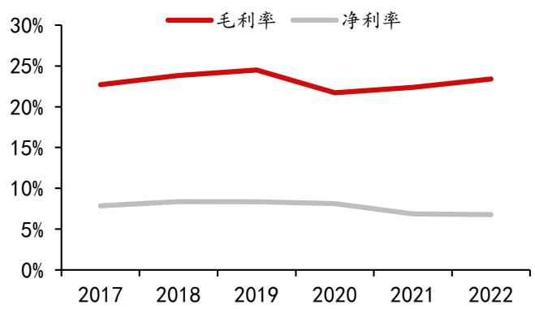

# 千味央厨（001215）公司深度报告

# 深耕餐饮供应链厚积薄发，大小B 双轮驱动共筑高成长

方正证券研究所证券研究报告

# 分析师

薛涵 登记编号：S1220523060005  
王泽华 登记编号：S1220523060002

强烈推荐(维持)  

<table><tr><td>公司信息</td></tr><tr><td>行业 预加工食品</td></tr><tr><td>最新收盘价(人民币/元) 69.71</td></tr><tr><td>总市值(亿)(元) 58.72</td></tr><tr><td>52周最高/最低价(元) 79.71/44.01</td></tr></table>

  
历史表现  
数据来源：wind 方正证券研究所

<table><tr><td>相关研究</td></tr><tr><td>《千味央厨：23Q1稳步增长，疫后复苏弹性 可期》2023.04.26</td></tr><tr><td>《千味央厨：疫情考验仍稳步增长，23 年提 速动力强劲》2023.04.19</td></tr><tr><td>《千味央厨：扩产收购齐头并进，竞争壁垒多 元提升》2023.03.24</td></tr><tr><td>《千味央厨：需求恢复提振收入，成本改善毛 利持续提升》2022.10.25</td></tr></table>

央厨工业化直击客户痛点，降本提效趋势下速冻行业 B 端市场潜力大。随着B 端降本提效的需求提升，速冻行业在过去几年处于增长快车道。由于上游原料端与下游餐饮端均较为分散，中游速冻食品规模化程度强，模式成熟盈利稳定，我们认为在降本提效趋势下有望持续受益。基于我国速冻食品人均消费量及B 端渗透率仍有提升空间，我们对餐饮供应链细分行业进行市场规模测算，25 年预计速冻米面B 端市场规模达到262 亿，年复合增速达 $20 \%$ 。千味央厨作为“餐饮供应链第一股”，聚焦B端高景气赛道，在大B 多维扩张叠加小B 规模放量双驱动下，高成长可期。

柔性化生产能力构筑竞争壁垒，横纵多维扩张支撑大B 渠道增长。公司以大B 起家，定制化生产模式下公司柔性化生产能力强，长期服务大B 客户也锻炼了公司快速响应、供应稳定、研发领先的核心能力，支撑公司在大B 渠道实现多维扩张。横向扩数量：严苛的百胜供应链考核使得公司较容易通过其他大B 供应商考核标准，形成一定品牌背书。纵向提深度：公司与现有大客户合作稳定，品类持续拓展，最大化挖掘客户效能，长期来看公司有望成为全方位的食品解决方案供应商。

持续打造大单品挖掘规模优势，生产优势推动小B 渠道实现放量。小B 渠道目前仍处于增量市场，且相对有一定天花板的大Β 渠道来看，空间更加广阔。我们认为公司在小B 渠道的发展优势主要在于：1）大B产品力及生产经验都将赋能小B 业务。2）公司为国内工业化油条行业龙头，具备一定规模优势，产品性价比高，且仍处于增长的快车道。21年公司重点发力蒸煎饺单品并实现快速放量，持续扩品逻辑得到验证。

商业模式赋予强成本管控能力，规模优势 $+ i$ 结构升级下利润率提升可期。由于公司大B 客户签订单后直接与上游锁价，因此公司具有较强的成本管控能力。近年来公司净利率基本维持在 $7 - 8 \%$ 左右，我们认为未来仍有提升空间，主要来自于：1）规模优势。对于速冻行业，打造市场需求大、规模效应好的战略大单品是提升利润率的重要方式。目前公司大单品油条、蒸煎饺仍处于快速放量阶段，春卷、米糕、大包子等单品潜力较大，规模效应有望提升；2）结构升级。公司油炸类产品利润率相对较低，伴随公司产品矩阵的持续扩张，产品结构有望持续优化，利润率有望进一步提升。

盈利预测及投资评级：展望 23 年，低基数、餐饮复苏叠加推新速度加快，大小B 渠道均有望实现超预期增长；成本下行趋势下利润率有望稳中有升。我们预计公司 23-25 年实现营收19/25/31 亿元，同比$+ 3 0 \% / 2 7 \% / 2 6 \%$ ，实现归母净利润 $1 . 5 / 2 . 0 / 2 . 5$ 亿元，同比 $+ 4 7 \% / 3 1 \% / 2 8 \%$ ,EPS分别为1.73/2.27/2.91 元/股，给予23 年45倍PE，维持“强烈推荐”评级。

风险提示：食品安全与质量风险、原材料上涨风险、餐饮恢复不及预期、测算存在一定主观性，仅供参考。

盈利预测 （人民币)  

<table><tr><td>单位/百万</td><td>2022A</td><td>2023E</td><td>2024E</td><td>2025E</td></tr><tr><td>营业总收入</td><td>1489</td><td>1930</td><td>2457</td><td>3094</td></tr><tr><td>(+/-)%</td><td>16.86</td><td>29.66</td><td>27.29</td><td>25.95</td></tr><tr><td>归母净利润</td><td>102</td><td>150</td><td>197</td><td>252</td></tr><tr><td>(+/-)%</td><td>15.20</td><td>47.08</td><td>31.30</td><td>27.95</td></tr><tr><td>EPS(元）</td><td>1.20</td><td>1.73</td><td>2.27</td><td>2.91</td></tr><tr><td>ROE(%)</td><td>9.61</td><td>12.53</td><td>14.13</td><td>15.31</td></tr><tr><td>PE</td><td>54.63</td><td>41.97</td><td>31.97</td><td>24.98</td></tr><tr><td>PB</td><td>5.35</td><td>5.26</td><td>4.52</td><td>3.83</td></tr></table>

数据来源：wind 方正证券研究所 注：EPS预测值按照最新股本摊薄

# 正文目录

# 央厨工业化直击客户痛点，降本提效趋势下餐饮供应链景气度高企·．.

# 3 聚焦B 端高景气赛道，稳定性与成长性兼具．. 17

# 4盈利预测 25

# 图表目录

图表1：餐饮供应链行业链条 6  
图表2：2012-2021 年中国连锁餐饮企业数.. 6  
图表3：2012-2021 年中国连锁餐饮门店总数... 6  
图表4：2018-2022 年中国餐饮连锁化率 7  
图表5：2021 年餐饮连锁化率与其他国家对比.. 7  
图表6：2022 年餐饮业成本构成... 7  
图表7：传统餐饮加工和使用半成品加工的成本结构对比. 7  
图表 8：2016-2021 年中国外卖餐饮行业市场规模 8  
图表9：2016-2022 年中国在线外卖行业占餐饮行业比重， 8  
图表10：2016-2022 年中国团餐市场规模及占比... 8  
图表11：2017-2022 年中国团餐及餐饮市场同比增速.. 8  
图表12：2016-2021 年中国冷库总容量和冷藏车保有量 8  
图表13：2016-2021 年中国冷链物流市场规模及增速.. 8  
图表14：2013-2021年中国速冻食品市场规模， 9  
图表 15：2022 年速冻食品市场渠道结构.. 9  
图表16：2020 年速冻食品细分市场结构. 9  
图表17：2017-2021 年速冻面米食品行业规模. 10  
图表18：速冻面米市场渠道结构·... 10  
图表19：2020 年速冻面米行业市场竞争格局.. 10  
图表20：日本速冻食品人均消费量&GDP. 11  
图表21：全球主要国家及地区人均速冻食品消费量. 11  
图表 22：日本不同渠道速冻食品需求量（万吨) 11  
图表23：速冻米面行业市场规模及相关测算... 12  
图表24：千味央厨历史沿革 12  
图表25：定制化模式与通用生产模式对比.. 13  
图表 26：2022 年公司渠道结构及主要客户 13  
图表27：千味央厨股权结构图 13  
图表28：千味央厨管理层资料 13  
图表29：千味央厨股权激励授予对象及数量... 14  
图表 30：千味央厨2017-2022 年营收及增速... 14  
图表 31：千味央厨 2017-2022 年归母净利润及增速. 14  
图表 32：千味央廚2017-2022 年毛利率和净利率. 15  
图表33：千味央厨2017-2022 年各项费用率.. 15  
图表34：千味央厨18-22年分品类营业收入(百万元). 15  
图表35：千味央廚18-22 年分品类营收增速.. 15  
图表36：千味央厨分地区营业收入占比.. 16  
图表37：公司直营及经销渠道收入增速.. 16  
图表 38：千味央厨 2017-2022 年分地区营业收入占比. 16  
图表 39：千味央厨2023年6 月募投食品加工建设项目. 16  
图表40：千味央厨与百胜合作历程. 17  
图表41：千味央厨系统优势 18  
图表42：千味央厨定制生产的业务流程. 18  
图表43：千味央厨大B 渠道多维扩张.. 18  
图表44：2018-2022 年百胜中国营业收入及增速. 19  
图表 45：2018-2022 年千味央厨来自百胜中国及其关联方的收入及增速 19  
图表 46：千味央厨 2020-2022 年直营大客户数量.. 19  
图表47：千味央厨18-22年前五大直营客户收入规模及占比. 19  
图表48：千味央厨主要客户群体 20  
图表49：千味央厨前五大直营客户收入规模及占比. 20  
图表 50：千味央厨油条工艺 20  
图表51：千味央厨油条产品 21  
图表52：千味央厨蒸煎饺产品 21  
图表53：千味央厨2020-2022 年饺子类销售额及增速. 21  
图表54：千味央厨大B 渠道为小B 渠道赋能. 22  
图表 55：规模优势下千味央厨产品单价低.. 22  
图表 56：经销渠道及前 20 经销商销售额增速. 22  
图表57：经销商及销售人员数量. 22  
图表58：经销商按收入规模划分情况（2020 年) 23  
图表59：千味央厨 2022 年原材料占营业成本比重. 23  
图表 60：千味央厨 2022 年原材料成本构成.. 23  
图表61：敏感性分析. 23  
图表 62：可比公司销售毛利率 24  
图表 63：可比公司销售净利率 24  
图表 64：千味央厨 2017-2022 年产品分类的毛利率. 24  
图表 65：渠道拆分及假设 25  
图表66：可比公司估值.. 25

# 1央廚工业化直击客戶痛点，降本提效趋势下餐饮供应链景气度高企

# 1.1多因素驱动餐饮供应链兴起

降本提效系统解决方案，餐饮供应链景气度持续向上。餐饮供应链连接上游原料和下游餐饮企业，包含多个业务环节、涉及多个产业，从产品研发开始，需要对接上游供应商采购原材料，通过中央厨房/工厂完成产品加工，由物流/仓配中心负责配货到达餐饮门店，最后服务消费者。餐饮供应链是系统性的解决方案，优质高效的餐饮供应链是提高产品质量、降本提效的关键。在餐饮产业变革、餐饮工业化趋势明显的背景下，供应链成为餐饮企业关注的重点，餐饮连锁化率的提高、外卖和团餐等新业态的快速增长则发挥催化作用，冷链物流体系的完善也为餐饮供应链发展提供重要支撑。

  
图表1：餐饮供应链行业链条  
资料来源：千味央厨招股说明书、《窄门供应链学宫》课程、方正证券研究所

因素一：餐饮连锁程度逐年提高，餐饮企业呈现规模化、标准化发展趋势。近年来随着生活节奏和消费习惯的改变、消费者对品牌认知的提升，我国餐饮企业连锁化程度不断提高。根据国家统计局数据，2021 年中国连锁餐饮企业数为553家，连锁餐饮门店总数为43，250家；餐饮连锁化率从2018年的 $12 \%$ 提升至2022年的 $1 9 \%$ 。根据美团新餐饮研究院，2021年中国、美国、日本的餐饮连锁化率为$1 8 \% / 5 4 \% / 4 9 \%$ ，我国餐饮连锁化率相较于其他国家，仍处于较低水平，有持续提高的趋势。同时，随着今年消费市场逐步复苏，餐饮连锁化进程也有望提速。优秀的餐饮供应链能有效提高餐饮企业上菜速度和翻台率，出于效率、成本以及安全性、卫生性的考虑，连锁餐饮企业将推动餐饮供应链发展。

  
图表2:2012-2021年中国连锁餐饮企业数  
资料来源：国家统计局、方正证券研究所

  
图表3:2012-2021年中国连锁餐饮门店总数  
资料来源：国家统计局、方正证券研究所

  
图表4:2018-2022年中国餐饮连锁化率  
资料来源：美团新餐饮研究院、方正证券研究所

  
图表5:2021年餐饮连锁化率与其他国家对比  
资料来源：美团新餐饮研究院、方正证券研究所

因素二：餐饮业成本现“三高一低”，倒逼餐饮供应链发展。餐饮行业面临着“三高一低”的困境，即原材料成本高、人力成本高、房租高和利润低的问题。根据中国饭店协会的统计数据，原料进货成本、人工成本、房屋及物业成本平均占餐饮业成本的 $4 2 \% / 2 1 \% / 1 0 \%$ 。餐饮业的“三高一低”催生了降本提效的需求。根据中国连锁经营协会的数据，传统餐饮企业使用半成品加工后人力成本在成本中的占比可下降 $6 \%$ ，租金成本占比下降 $2 \%$ 。在人力成本、租金成本居高不下的现实问题下，餐饮供应链是餐饮企业降本提效的重要方式。

  
图表6:2022年餐饮业成本构成  
资料来源：中国餐饮协会、艾媒数据中心、21经济网、方正证券研究所

  
图表7:传统餐饮加工和使用半成品加工的成本结构对比  
资料来源：中国报告网、观研天下、方正证券研究所

因素三：外卖、团餐等新兴餐饮业态增长迅速，助推餐饮供应链发展。1）外卖迎合了懒宅经济下的餐饮需求，近年来持续快速增长。根据中商产业研究院，21年中国外卖餐饮行业市场规模 8117 亿元，16-21 年CAGR 超过 $3 5 \%$ ；数据显示，在线外卖行业占餐饮行业比重呈持续上升的趋势，22年占比达 $2 5 . 4 \%$ 。外卖商家追求缩短备餐时间、食品口味和质量稳定，预制食品能够满足外卖商家需求。2)团餐产业发展势头迅猛，22年团餐市场规模为 1.98亿元，占餐饮市场比重达$45 \%$ ；17-22 年团餐市场的同比增速均高于餐饮市场平均水平，且比其他餐饮业态表现更为稳定、更具韧性。团餐具有采购计划性强、时效性高等特点，并且对食品质量安全有一定的要求，而预制食品可以一定程度上满足团餐企业的要求。外卖和团餐等新业态创造需求来源，为餐饮供应链的发展提供了更大、更广阔的空间。

  
图表8:2016-2021年中国外卖餐饮行业市场规模  
资料来源：中商情报网、方正证券研究所

  
图表9:2016-2022 年中国在线外卖行业占餐饮行业比重  
资料来源：国家信息中心分享经济研究中心、方正证券研究所

  
图表10:2016-2022年中国团餐市场规模及占比  
资料来源：国家统计局、艾媒数据中心、方正证券研究所

  
图表11:2017-2022年中国团餐及餐饮市场同比增速  
资料来源：国家统计局、艾媒数据中心、方正证券研究所

因素四：冷链系统逐步完善，破除供应链发展障碍。根据中物联冷链委、前瞻产业研究院，2016 年冷链物流市场规模为2210 亿元，2021 年实现4184 亿元，5 年 CAGR 为 $1 3 . 6 2 \%$ 。我国冷库总容量由2016年的3035万吨增长至2021年的5224 万吨，5 年 CAGR 为 $1 1 . 4 7 \%$ ；冷藏车保有量由 2016 年的12 万辆增长至2020年的 28 万辆，4 年 CAGR 达 $2 3 . 5 9 \%$ 。对于餐饮供应链，冷链物流能保证食品在整个过程中的安全和新鲜，降低食品变质和腐败的风险。发达的冷链体系能够实现较远距离的运输、且降低过程损耗，有利于餐饮企业扩大经营范围、提高经营效率。冷链需求无法满足在过去制约了餐饮供应链的发展，近年来我国冷链物流维持较高增速、冷链物流体系不断完善，逐步破除障碍，支撑餐饮供应链打开增长空间。

  
图表12:2016-2021 年中国冷库总容量和冷藏车保有量  
资料来源：中物联冷链委、前瞻产业研究院、方正证券研究所

  
图表13:2016-2021年中国冷链物流市场规模及增速  
资料来源：中物联冷链委、艾媒数据中心、方正证券研究所

# 1.2 速冻行业标准化程度高，降本提效趋势下B 端市场潜力大

降本提效趋势下，速冻行业处于增长快车道。随着B 端降本提效的需求以及C端消费习惯的改变，速冻行业在过去几年仍保持较快增长。根据中商产业研究院、艾媒咨询，我国速冻食品行业市场规模由 15 年的 779 亿元增长至21 年的 1755亿元，CAGR 为 $1 4 . 5 0 \%$ 。分渠道看，目前我国速冻食品市场仍以零售渠道为主，占比 $54 \%$ 。分品类看，速冻食品可划分为速冻面米制品、速冻火锅料制品、速冻其他食品，速冻火锅料和速冻面米制品分别占比 $52 \%$ 和 $33 \%$ ，其他主要为速冻菜肴等产品，渗透率目前正处于加速提升阶段。由于上游原料端与下游餐饮端均较为分散，中游速冻食品标准化程度高，规模化程度强，模式成熟盈利稳定，我们认为在降本提效趋势下有望持续受益。

  
图表14:2013-2021 年中国速冻食品市场规模  
资料来源：华经产业研究院、艾媒咨询、方正证券研究所

  
图表15:2022 年速冻食品市场渠道结构  
资料来源：中研网、方正证券研究所

  
图表16:2020 年速冻食品细分市场结构  
资料来源：华经产业研究院、方正证券研究所

速冻米面C端市场增长放缓，B 端蓝海前景广阔。作为速冻食品第一大品类，速冻米面市场进入成熟增长阶段，2021 年市场规模为782 亿元，2017-2021 年CAGR为 $6 , 0 6 \%$ 。行业竞争格局清晰，CR3 达 $4 7 \%$ ，行业步入成熟期。C端市场壁垒较高，龙头消费者认知已建立且商超渠道进入门槛高，预计未来几年C端增速或将放缓；B 端市场目前占比 $16 \%$ ，低于速冻行业整体B 端所占市场比重 $46 \%$ ，渗透率较低。随着速冻米面制品多元化、丰富化发展，能够进一步满足餐饮需求，同时速冻米面制品可以通过减少制作加工环节帮助餐饮企业降低成本，符合行业发展趋势，速冻米面制品在餐饮端的渗透率有望进一步提高。

  
图表17:2017-2021年速冻面米食品行业规模  
资料来源：华经产业研究院、方正证券研究所

  
图表18:速冻面米市场渠道结构  
资料来源：智研咨询、方正证券研究所

  
图表19:2020 年速冻面米行业市场竞争格局  
资料来源：华经产业研究院、方正证券研究所

# 1.3中外对比，餐饮供应链增长潜力强劲

我国速冻食品消费量远低于发达国家，未来上升空间可观。速冻食品在发达国家发展成熟、规模较大。从人均年消费量来看，根据中商产业研究院，对比美国 $6 0 \mathsf { k g }$ 、欧盟 $3 5 \mathsf { k g }$ 、日本 $2 0 \mathsf { k g }$ ，我国速冻食品人均年消费仅为9kg、渗透率较低。相较于其他国家，考虑饮食结构、文化因素、地理因素以及外部经济环境等因素，中国餐饮的发展路径和日本较为相似，主要选择日本作为对标国家，展望我国速冻食品的上升空间。根据日本的经验，速冻食品人均消费量提升和GDP 增长走势基本一致，经济增长下消费升级进程持续推进，带动速冻食品消费需求增长。我国目前速冻食品人均年消费量水平与日本 1987 年水平相近，日本1987-1992 年CAGR为 $7 . 5 \%$ ；随着居民收入水平的提高和消费复苏、消费升级，我国速冻行业市场规模未来上升空间可观，有望持续增长。

  
图表20:日本速冻食品人均消费量&GDP  
资料来源： $\boldsymbol { \it E }$ 本冷冻食品协会、wind、方正证券研究所

  
图表21:全球主要国家及地区人均速冻食品消费量  
资料来源：中商情报网、方正证券研究所

对标日本市场，速冻面米B 端有望迎来放量。日本速冻食品市场的一个显著特点是：B 端率先起量，C端渗透率后提升，且B 端市场的比重高于C端市场。日本速冻食品B 端消费量在1967-1997 年间快速增长，日本快餐业正是在1970 年代形成雏形、开始发展的。日本快餐业的迅速发展创造了速冻食品需求，从而拉动日本速冻食品在B端市场的快速渗透。日本B端市场速冻食品的规模和发展趋势说明餐饮企业对速冻食品的需求存在。我国速冻食品用于B端市场的占比较小，尤其是速冻面米制品，渠道结构以C 端为主，B 端、C 端占比分别为 $16 \%$ $84 \%$ ，B端渗透率的提高空间大。在我国餐饮企业连锁化率提升的背景下，速冻面米B 端有望迎来放量。

  
图表22:日本不同渠道速冻食品需求量(万吨)  
资料来源： $\boldsymbol { \it E }$ 本冷冻食品协会、方正证券研究所

基于我国速冻食品人均消费量及B端渗透率仍有提升空间，我们对餐饮供应链细分行业进行市场规模测算，25 年预计速冻米面 B 端市场规模达到 262 亿。根据华经产业研究院，2021 年我国速冻面米行业市场规模约为782 亿，2017-2021年 CAGR 为 $6 , 0 6 \%$ 。考虑速冻面米处于成熟期，新兴面米快速成长，整体维持稳定增长，预计 2025 年市场规模达到 1050 亿元，2021-2025 年 CAGR 为 7.65；其中，C 端较为成熟，增速放缓；B 端渗透率提升空间较大；同时横向对比速冻食品行业整体B端、C端占比，假设速冻面米B端、C端占比由2021年的 $16 \%$ 和 $84 \%$ 变为 2025 年的 $2 5 \%$ 和 $7 5 \%$ ，则2025年B端速冻面米市场规模达到262.5亿元，CAGR 为 $2 0 . 3 5 \%$ o

图表23:速冻米面行业市场规模及相关测算  

<table><tr><td>细分行业</td><td colspan="3">2021 年市场规模（亿元）</td><td colspan="3">2021-2025年CAGR</td><td colspan="3">预测 2025 年市场规模（亿元）</td></tr><tr><td rowspan="2">速冻面米</td><td>B端</td><td>125.12</td><td rowspan="2">782</td><td>B端</td><td>20.35%</td><td rowspan="2">7.65%</td><td>B端</td><td>262.5</td><td rowspan="2">1050</td></tr><tr><td>C端 656.88</td><td></td><td>C端 4.64%</td><td>C端</td><td>787.5</td><td></td></tr></table>

资料来源：华经产业研究院、方正证券研究所

# 2 深耕餐饮供应链厚积薄发

# 2.1思念赋予速冻米面基因，深耕餐饮供应链

公司为思念系出身，秉承“只为餐饮、厨师之选”的战略定位，打造完整的供应链体系。千味央厨于2012 年4 月由郑州思念出资成立。公司致力于为餐饮企业提供定制化、标准化的速冻食品解决方案。公司的发展历史可追溯至2002年，当时作为思念旗下负责B端业务的部门，与肯德基达成合作，开创中式传统食品进入西式餐饮企业全球销售网络的先河。千味央厨于2012 年正式成立，开创餐饮B2B 道路，深挖B 端、提供餐饮定制化服务。2016 年，公司独立于思念，进行股份制改造、引入战略投资，并成功进入百胜T1 级别供应商。2021 年9月6日于深交所上市。2022年公司设立预制菜子公司“御知菜”、重视预制菜业务的发展，并于同年成立C 端事业部，正式进军C 端市场。2023 年通过收购味宝食品切入茶饮赛道。

  
图表24:千味央厨历史沿革  
资料来源：公司官网、公司公告、方正证券研究所

专注B 端客户，根据大B小B特点设置服务模式。公司作为国内知名的B 端速冻米面供应商，围绕大B客户需求提供定制化服务，目前公司已与肯德基、必胜客、海底捞、华菜士、真功夫、九毛九、呷哺呷哺等多个知名餐饮品牌达成深度战略合作。大B客户主要以服务为导向，公司研发速度、研发能力均处于行业领先地位，未来有望持续拓展连锁餐饮客户。公司主要为小B 客户提供通用产品，依托经销商对餐饮商户、团餐食堂、酒店、乡厨等终端客户进行销售，通用品对研发能力要求较低，主要靠大单品构筑规模优势进而形成较高性价比，公司已具备培育大单品的创新和渠道能力，目前拥有多款大单品，如油条、芝麻球、蒸煎饺、挞皮等，扩品逻辑持续验证。

图表25:定制化模式与通用生产模式对比  

<table><tr><td></td><td>定制化生产</td><td>通用品生产</td></tr><tr><td>需求确定</td><td>围绕客户定制需求</td><td>通过市场调研识别通 用需求</td></tr><tr><td>研发特点</td><td>对研发速度、研发能 力要求更高</td><td>对研发速度、研发能 力要求相对较低</td></tr><tr><td>原料采购</td><td>客户指定大宗物料供 应商</td><td>自主决定原料供应商</td></tr><tr><td>生产特点</td><td>以销定产</td><td>备货式生产</td></tr></table>

资料来源：招股说明书、方正证券研究所

  
图表26:2022 年公司渠道结构及主要客户  
资料来源：公司年报、招股说明书、方正证券研究所

# 2.2 管理层经验丰富，股权激励鼓舞信心

公司股权结构集中且稳定，管理层具备丰富的行业经验。截至 2023 年 6 月 18日，李伟通过共青城城之集拥有公司 $4 6 . 0 4 \%$ 的股份，为公司的实际控制人，公司股权结构集中且稳定。董事长孙剑在2000-2010 年就职于思念，随后又在河南一生缘食品和郑州中部大观地产有限公司分别担任总经理和副总经理的职位，营销及管理经验丰富。公司核心高管多出身于思念系，随着原思念团队加入千味后，深入餐饮渠道的探索，公司高管多渠道的从业经验丰富，助力公司成长。

  
图表27:千味央厨股权结构图  
资料来源：wind、方正证券研究所

图表28:千味央厨管理层资料  

<table><tr><td>姓名</td><td>职务</td><td>加入千味时间</td><td>人物履历</td></tr><tr><td>李伟</td><td>实际控制人</td><td></td><td>1997年成立河南省思念食品，2006年思念食品在新加坡上市。</td></tr><tr><td>孙剑</td><td>董事长,董事</td><td>2018年7月</td><td>曾在思念食品工作10 年，现任公司董事长，新乡千味执行董事。</td></tr><tr><td>白瑞</td><td>总经理</td><td>2012年4月</td><td>曾在思金食品工作7 年，历任郑州思念结算部经理，资金管理部经理，营销中心副总</td></tr><tr><td>徐振江</td><td>总理</td><td>2015年9月</td><td>曾在媒体、实体企业、投资机构工作多年</td></tr><tr><td>王植宾</td><td>副总经理，财</td><td>2012年4月</td><td>曾在思念食品工作7年，历任郑州思念总成本会计，高级审计员，内审经理，审计部经</td></tr></table>

资料来源：wind、方正证券研究所

股权激励计划调动核心人员积极性。公司 21年11月发布股权激励方案，面向80 名董事、高管以及核心研发、业务等骨干人员，授予总计156.84 万限制性股票，约占公司总股本的 $1 . 8 4 \%$ ，有望调动核心人员积极性。考核目标来看，激励计划要求 2022/2023 年营收相比 2020 年增速不低于 $6 7 \% / 1 0 1 \%$ ，即 2022/2023 年营收同比增速不低于 $2 3 . 8 8 \% / 2 0 . 3 7 \%$ 。虽受不利外部环境影响，22年公司仍达成业绩考核目标触发值（ $80 \%$ )，在行业整体复苏较快背景下，今年有望超额完成目标。

图表29:千味央厨股权激励授予对象及数量  

<table><tr><td>姓名</td><td>职务</td><td>获授数量</td><td>占授予总量的</td><td>占激励计公 总额的比例</td><td>最新股权</td></tr><tr><td>孙剑</td><td>董事长</td><td>142,900</td><td>9.11%</td><td>0.17%</td><td>0.19%</td></tr><tr><td>白瑞</td><td>董事、总经理</td><td>97,400</td><td>6.21%</td><td>0.11%</td><td>0.12%</td></tr><tr><td>王植宾</td><td>董事、副总经 理、财务总监</td><td>87,700</td><td>5.59%</td><td>0.10%</td><td>0.11%</td></tr><tr><td>徐振江</td><td>副总经理、董 事会秘书</td><td>116,900</td><td>7.45%</td><td>0.14%</td><td>0.15%</td></tr><tr><td colspan="2">核心人员（76人）</td><td>1,081,300</td><td>68.94%</td><td>1.27%</td><td>-</td></tr><tr><td colspan="2">预留股份</td><td>42,200</td><td>2.69%</td><td>0.05%</td><td>-</td></tr><tr><td colspan="2">合计</td><td>1,568,400</td><td>100.00%</td><td>1.84%</td><td>-</td></tr></table>

资料来源：wind、公司公告、方正证券研究所

# 2.3 业绩整体稳健，盈利能力表现较优

收入利润稳定，保持乐观增长。上市以来，公司受不利外部环境影响，虽短期略有承压，但收入端仍保持稳健增长，营收从 2017 年5.93 亿元增至2022 年14.89 亿元， 5 年 CAGR 达 $20 \%$ 。2020年公司下游餐饮端受不利因素影响短期承压，公司收入增长有所放缓；2021 年迅速恢复，实现收入12.74 亿元，同比增长 $3 4 . 8 9 \%$ ；2022年，受部分区域封控影响，公司收入增速略有放缓但仍保持相对稳健，同比增长 $1 6 . 8 6 \%$ 。2023年Q1公司实现营业收入4.19亿元，同比增长23. $1 8 \%$ 。公司持续深耕大B 渠道，开拓中小B 渠道，同时积极布局C端市场。展望2023 年，随着餐饮消费复苏，大B客户需求回暖；新品稳步推进，有望带动小B 渠道快速增长；C端品牌发布，新业务增量可期，整体业绩有望持续释放。

  
图表30:千味央厨2017-2022 年营收及增速  
资料来源：wind、方正证券研究所

  
图表31:千味央厨2017-2022年归母净利润及增速  
资料来源：wind、方正证券研究所

各项费用率总体稳定，盈利能力保持稳健。公司期间费用率总体较为稳定，2017-2022 年研发费用率呈现小幅上升趋势。2020 年起，销售费用率整体下降主要系会计政策变更的影响，还原后，销售费用率整体稳健；同时公司主营B端业务，销售费用率在行业内处于较低水平。近年来管理费用率提升主要系激励费用摊销、管理人员增加所致，剔除股权激励费用后管理率整体稳定。2017-2021年，公司毛利率、净利率相对平稳，毛利率/净利率的波动区间分别为 $2 2 \% - 2 5 \%$ $6 . 7 \% - 8 . 4 \%$ ，2022 年若不考虑激励费用，净利率为 $7 . 7 3 \%$ ，同比提升0.88pct,盈利能力保持稳健。

  
图表32:千味央厨 2017-2022 年毛利率和净利率  
资料来源：wind、方正证券研究所

  
图表33:千味央厨 2017-2022 年各项费用率  
资料来源：wind、方正证券研究所

烘焙和莱肴类高速增长，产品结构持续优化。分品类来看，在四大品类中，传统的油炸和蒸煮品类销售增长较为稳健，而烘焙已经连续两年、菜肴连续四年实现销售高速增长。2022 年公司成立专注预制菜的控股子公司“河南御知菜食品科技有限公司”，菜肴类有望成为公司业绩新增长点。2022 年，公司油炸类/蒸煮类/烘焙类/菜肴类及其他分别实现营业收入 $7 . 0 1 / 2 . 9 5 / 2 . 7 5 / 2 . 1 3$ 亿元，同比$+ 6 \% + 1 5 \% + 2 3 \% + 6 4 \%$ ，占比分别为 $4 7 \% / 2 0 \% / 1 9 \% / 1 4 \%$ 。相较于2018年，油炸类产品占比明显下降，产品矩阵扩张，产品结构持续改善。

  
图表34:千味央厨18-22年分品类营业收入(百万元)  
资料来源：wind、方正证券研究所

  
图表35:千味央厨18-22 年分品类营收增速  
资料来源：wind、方正证券研究所

直营渠道 $\cdot ^ { + }$ 经销渠道，双轮驱动营收增长。分渠道看，直营和经销比例基本保持4：6，直营/经销渠道2018-2022年营收CAGR分别为 $1 6 \% / 2 3 \%$ ，22年大B渠道营收受外部不利因素影响承压，今年以来，在餐饮复苏趋势下大B渠道实现高增长，其中，百胜Q1 实现销售额1.15亿元，占比由 22年的 $16 \%$ 迅速提升至 $2 7 \%$ 。2023 年 Q1 公司直营占比提升至 $48 \%$ 。直营渠道上公司持续积累大客户、提供定制化服务，经销渠道上持续扩大经销商规模、重点培育百万级别以上优质经销商，大小B端齐发力，驱动公司业绩稳健增长。2022 年公司直营和经销渠道增长存在分化现象，直营和经销渠道增速分别为 $1 . 2 8 \%$ $2 7 . 2 9 \%$ 。主要系餐饮企业大客户在外部环境影响下需求放缓、公司加大经销渠道建设力度，伴随下游餐饮的逐步复苏，大B有望恢复至增长快车道。

  
图表36:千味央厨分地区营业收入占比  
资料来源：wind、方正证券研究所

  
图表37:公司直营及经销渠道收入增速  
资料来源：公司年报、方正证券研究所

销售区域以华东、华中为主，逐步完善全国化产能布局。公司产品销售区域主要集中在华东和华中区域，2020 年公司华东/华中地区收入占比分别为 $5 4 \% / 1 6 \%$ 主要系多个直营大B客户总部位于上海地区，如百胜、华莱士、海底捞。公司持续完善全国化产能布局，加强对华北、华东和东北地区的区域拓展。公司于2023 年发布公告，拟定增募资 5.9 亿元，部分用于建设芜湖百福源和鹤壁百顺源生产基地，预计每年合计将新增 10 万吨标准化产能。目前公司加工厂主要集中在河南新乡，华东是百胜、华莱士等大客户的总部所在地，也是公司主要销售区域，芜湖项目建成后将主要面向华东客户，降低对华东地区销售的冷链运输成本；鹤壁一期项目建成后将主要面向华北和东北地区客户，降低对华北和东北地区销售的冷链运输成本，区域布局愈发完善。

  
图表38:千味央厨 2017-2022 年分地区营业收入占比  
资料来源：wind、方正证券研究所

图表39:千味央厨 2023 年6月募投食品加工建设项目  

<table><tr><td>项目名称</td><td>投瓷总频</td><td>（亿元）</td><td>建设期</td><td>雄龙万 吨）</td><td>新杯 吨）</td></tr><tr><td>芜湖百福源食品 加工建设项目</td><td>2.67</td><td>2.02</td><td>2年</td><td>5.2</td><td>2.8</td></tr><tr><td>（一期）</td><td>3.08</td><td>3.08</td><td>2年</td><td>7.2</td><td>7.2</td></tr><tr><td>总计</td><td>5.75</td><td>5.10</td><td>-</td><td>12.4</td><td>10</td></tr></table>

资料来源：公司公告、方正证券研究所

# 3聚焦B端高景气赛道，稳定性与成长性兼具

# 3.1 柔性化生产能力构筑竞争壁垒，横纵多维扩张支撑大B 渠道增长

战略定位富有远见，奠定坚实客户基础。在C端速冻米面发展较快、B端市场尚未起势时，千味央厨便确立了专注餐饮的战略定位。2002 年公司前身思念餐饮部开始与百胜中国合作，携手20 载，公司已成为百胜体系中唯一拥有两家T1供应商资质的企业，与百胜中国合作关系持续稳定，且合作品类持续扩张。目前百胜中国仍为公司第一大基本盘，2022 年百胜中国销售额占公司营收 $16 \%$ 。

  
图表40:千味央厨与百胜合作历程  
资料来源：招股说明书、募集说明书、方正证券研究所

坚持“大客户优先”的理念，双向赋能，公司研发与柔性生产能力强。公司以定制化生产模式为主，不同于规模化、机械化生产上的效率优势，公司柔性制造上具备更高的活跃度，能够兼顾生产效率与生产车间灵活性，以加强公司快速响应、供应稳定的核心能力。定制化服务模式下，不仅要求提供产品本身，而是需要呈现一整套产品解决方案，对企业研发速度、研发能力有更高的要求。目前公司已建立了贴近客户的营销系统，反应快速的研发系统，与供应商密切协作及时灵活的采购系统，多功能、灵活的生产系统，适应客户严格标准、具有包容性的质量管理系统，对外与客户及时沟通、对内与各部门及时协调的管理系统，与客户实现双向赋能。

  
图表41:千味央厨系统优势  
资料来源：招股说明书、方正证券研究所

  
图表42:千味央厨定制生产的业务流程  
资料来源：招股说明书、方正证券研究所

最大化挖掘客户效能，在大B渠道实现多维扩张。纵向来看，公司研发能力较强且服务意识领先，与现有大客户合作品类持续拓展，由传统米面类供应拓展至烘焙、预制菜肴等品类，最大化挖掘客户效能，长期来看公司有望成为全方位的食品方案供应商。横向来看，严苛的百胜供应链考核使得公司较容易通过其他大B供应商考核标准，形成一定的品牌背书。另外，公司通过领先的研发能力已从原有的西式餐饮逐步向中式餐饮、火锅、茶饮等赛道扩张。综上，公司在大B渠道有望实现多维扩张。

  
图表43:千味央厨大B渠道多维扩张   
资料来源：方正证券研究所

纵向提深度：公司最早向百胜中国提供蛋挞皮，后自主研发安心油条并成为独家供应商，蛋挞及油条品类目前销售额较高且相对稳定。伴随公司产品的持续研发，合作品类逐步延伸至华夫饼、冷冻面团、牛角包、红豆派、宝宝挞等烘焙类产品，春卷、酥饼、法风烧饼、荷花酥等特色米面类产品，胡辣汤、葱油拌面、热干面、米粉等区域特色类产品，以及目前正在试点的中式汉堡，持续打开品类空间。公司合作大B 客户多是连锁餐饮企业，成熟品牌的开店空间较大、增长较快、客户扩张带来的自然增速更高；新兴品牌具有较大的发展潜力，顺应餐饮潮流，也将为公司大B端业务带来源源不断的动力。

  
图表44:2018-2022年百胜中国营业收入及增速  
资料来源：wind、方正证券研究所

  
图表45:2018-2022 年千味央厨来自百胜中国及其关联方的收入及增速  
资料来源：招股说明书、公司公告、方正证券研究所

横向扩数量：2020-2022 年，公司直营大客户数量由 87 家增至 154家，其中21 年实现了较高的增长，2022 年稍有减少，主要系外部不利因素影响部分企业持续经营。在新客户的持续开拓下，18-22 年公司前五大直营客户收入比重稳中有降。公司在合作客户数量上保持绝对的优势，同时合作的客户类型也在不断丰富。公司目前已从西式连锁餐饮（百胜中国、华莱士等)逐步拓展到火锅（海底捞、呷哺呷哺等）、中式餐饮（真功夫、老乡鸡等）、茶饮（瑞幸咖啡、Tims)等优质赛道，仍具备继续拓展的空间。

  
图表46:千味央厨 2020-2022 年直营大客户数量  
资料来源：公司年报、方正证券研究所

  
图表47:千味央厨18-22年前五大直营客户收入规模及占比  
资料来源：招股说明书、公司年报、方正证券研究所

  
图表48:千味央厨主要客户群体  
资料来源：招股说明书、公司年报、公司官网、方正证券研究所

图表49:千味央厨前五大直营客户收入规模及占比  

<table><tr><td rowspan="2">客戶名称</td><td colspan="2">2021 年</td><td colspan="2">2022 年</td></tr><tr><td>销售收入 （万元）</td><td>占营业收入 比重</td><td>销售收入 （万元）</td><td>占营业收入 比重</td></tr><tr><td>百胜中国</td><td>24527</td><td>19.25%</td><td>23978</td><td>16.11%</td></tr><tr><td>华莱士</td><td>7061</td><td>5.54%</td><td>8226</td><td>5.53%</td></tr><tr><td>海底捞</td><td>6269</td><td>4.92%</td><td>4754</td><td>3.19%</td></tr><tr><td></td><td>827</td><td>0.65%</td><td>921</td><td>0.62%</td></tr><tr><td>七第</td><td>763</td><td>0.60%</td><td>731</td><td>0.49%</td></tr><tr><td>合计</td><td>39446</td><td>30.96%</td><td>38610</td><td>25.94%</td></tr></table>

资料来源：公司年报、招股说明书、方正证券研究所

# 3.2 持续打造大单品挖掘规模优势，生产优势推动小B 渠道实现放量

专注油条研究，核心大单品支撑业绩增长。千味央厨在 2006 年就开始致力于速冻油条产品的研发、生产和推广，经过多年的积累，公司目前拥有多项关于油条的核心技术，持续进行产品升级，保持油条的核心竞争力，实现高品质工业化油条生产，成为细分市场的重要代表品牌。公司油条产品在餐饮渠道的市占率达 $70 \%$ 。2021 年公司油条产品在油炸品类中占比为 $5 3 . 1 \%$ ，占营收的比重为$2 7 . 6 \%$ ，整体增幅为 $3 4 . 7 \%$ ，除单一核心大客户百胜外油条产品线增幅为 $4 3 . 9 \%$ o油条作为核心大单品，是支撑公司业绩增长的重要力量。

图表50:千味央厨油条工艺  

<table><tr><td>核心技术</td><td>来源</td><td>功能及创新</td><td>产品应用</td></tr><tr><td>油条纵切技术</td><td>自主研发</td><td>改变油条面团的切条方式，减 少生产线用人，增加生产效率</td><td>外卖油条、精品 油条、酥脆油条 等</td></tr><tr><td>油条灌蛋制备方法</td><td>自主研发</td><td>新技术，利用油条进行馅料的 灌注，增加油条的风味</td><td>蛋芯油条</td></tr><tr><td>麻辣烫油条系列</td><td>自主研发</td><td>可以用于煮</td><td>麻辣烫油条</td></tr><tr><td>注芯油条制作方法</td><td>自主研发</td><td>注油明造，对丰富</td><td>蛋芯油条</td></tr><tr><td>注芯油条加工装置</td><td>自主研发</td><td>油条罐装机的研发，有利于产 品的快速规模化生产</td><td>蛋芯油条</td></tr><tr><td>油条高效和面技术方 法</td><td>自主研发</td><td>根据布拉班德粉质曲线，结合 专用粉的特性，更快的和出符 合生产需求的面团</td><td>外卖油条、火锅 油条、安心油 条、香脆油条等</td></tr><tr><td>新型成型油炸裝置</td><td>自主研发</td><td>生产方式创新，结合产品特性 设计的油炸装置，更能符合产 品的炸程，大幅提高成品率</td><td>茴香小油条</td></tr></table>

资料来源：招股说明书、方正证券研究所

多应用场景，油条大单品增长空间广阔。公司从 2012 年开始对油条细分场景进行研究，逐步推出针对了火锅、快餐、自助餐、宴席、早餐、外卖六大细分餐饮市场的油条产品，基本覆盖了餐饮油条消费的主流场景。在早餐市场，据英敏特数据预计，2025 年我国早餐市场规模将达2.57 万亿元，复合增长率为$7 . 7 \%$ 。早餐市场存在可挖掘空间，油条的早餐市场容量较大。除早餐市场外，火锅、宴席等其他消费场景处于快速发展阶段。公司作为工业化油条龙头，多个餐饮市场的增量空间，叠加油条渗透率有望提升，未来油条大单品将持续放量。

  
图表51:千味央厨油条产品  
资料来源：招股说明书、公司官网、方正证券研究所

蒸煎饺是公司“大单品”逻辑下的又一成功范例。公司坚持大单品策略，通过产品创新、提高产品力打造大单品。千味央厨的蒸饺在“堆蒸不破、保温2小时不干不硬”技术下破除了影响消费者体验和市场扩容的障碍，解决了行业痛点，并定位市场较为空缺的中低端市场。同时还新推出的蒸煎饺统一将产品规格调整为1公斤每袋，有效地降低损耗，保障渠道终端利润。21-22 年公司饺子类产品持续高速放量，增幅分别为 $16 8 \%$ 及 $72 \%$ ，22年蒸煎饺销售额突破1.8亿元，同比 $+ 9 7 \%$ ，为公司的第二大单品。从蒸煎饺产品的快速放量来看，公司具备培育除油条外大单品的创新和渠道能力，且差异化竞争效果显著，扩品逻辑得到验证。

  
图表52:千味央厨蒸煎饺产品  
资料来源：公司官网、方正证券研究所

  
图表53:千味央厨 2020-2022 年饺子类销售额及增速  
资料来源：公司年报、方正证券研究所

大B赋能 $^ { + }$ 规模优势，小B渠道潜力较大。公司以大B起家，近年来愈发重视小B 渠道建设。小B 渠道目前仍处于增量市场，且相对有一定天花板的大B 渠道来看，空间更加广阔。我们认为公司在小B渠道的发展优势主要在于：1）大B赋能。公司长期服务大B客户，一方面，大B灯塔效应为公司提供品牌背书，有利于公司小B 业务的开展；另一方面，定制化生产模式下，大B客户对公司研发能力、生产能力提出的更高要求，产品力及生产经验都将赋能小B业务。2）规模优势。公司为国内工业化油条行业龙头，具备一定规模优势，产品性价比相对较高。公司可以以油条作为强势品类，拓展其他大单品，实现持续放量。

  
图表54:千味央厨大B渠道为小B渠道赋能  
资料来源：方正证券研究所

  
图表55:规模优势下千味央厨产品单价低  
资料来源：京东、方正证券研究所

公司重点发力优质经销商，扶持效果显著。公司经销商主要为 100万元以下的中小经销客户，以 2020 年为例，该类客户共777家，占比高达 $8 5 . 6 7 \%$ ，但该类客户进货稳定性和销售连续性较差，且用户粘性也相对较差。2019 年以来，公司开始为百万级别以上的核心经销商配备销售人员，帮助经销商开拓终端，以增强优质经销商的粘性。19-22 年，销售人员数量由 87 增加至285人，复合增速 $4 9 \%$ 。21年公司加大对核心经销商支持的效果初步显现，2021年占比前20名经销商销售额同比 $+ 5 0 . 1 4 \%$ ，远高于经销渠道整体增速。2022年前20名经销商同比增幅与整体接近，主要系不利外部环境影响，社会餐饮渠道受影响较大，公司在加大对核心经销商的支持的同时开发有合适渠道的经销商。

  
图表56:经销渠道及前20 经销商销售额增速  
资料来源：公司年报、方正证券研究所

  
图表57:经销商及销售人员数量  
资料来源：招股说明书、公司年报、方正证券研究所

  
图表58:经销商按收入规模划分情况（2020年）  
资料来源：招股说明书、方正证券研究所

# 3.3 商业模式赋予強成本管控能力，多方加速修复下利润率改善可期

大B 客户订单实现上游锁价，公司具有较强的成本管控能力。22 年公司原材料成本占营业成本的比例为 $76 \%$ ，其价格波动直接影响公司的盈利。公司的主要原材料为大宗农产品，包括面粉、糯米粉、油脂等，根据 22 年原材料成本占比来看，面粉/糯米粉/油脂预计合计占比 $53 \%$ 。由于公司与大B客户订单为每年一签，且签订订单后将直接与上游锁价，经过测算，我们预计超过 $40 \%$ 的原材料价格不受市场波动影响。据敏感性分析，公司毛利率变动受原材料价格影响相对较小。

  
图表59:千味央厨 2022 年原材料占营业成本比重  
资料来源：公司年报、方正证券研究所

  
图表60:千味央厨2022年原材料成本构成  
资料来源：募集说明书、方正证券研究所

图表61:敏感性分析  

<table><tr><td>面粉</td><td></td><td></td><td></td><td></td><td></td><td></td></tr><tr><td>成本变动幅度</td><td>-10%</td><td>-5%</td><td>-1%</td><td>1%</td><td>5%</td><td>10%</td></tr><tr><td>毛利率变动幅度</td><td>-0.74%</td><td>-0.37%</td><td>-0.07%</td><td>0.07%</td><td>0.37%</td><td>0.74%</td></tr><tr><td>糯米粉</td><td></td><td></td><td></td><td></td><td></td><td></td></tr><tr><td>成本变动幅度</td><td>-10%</td><td>-5%</td><td>-1%</td><td>1%</td><td>5%</td><td>10%</td></tr><tr><td>毛利率变动幅度</td><td>-0.42%</td><td>-0.21%</td><td>-0.04%</td><td>0.04%</td><td>0.21%</td><td>0.42%</td></tr><tr><td>油脂</td><td></td><td></td><td></td><td></td><td></td><td></td></tr><tr><td>成本变动幅度</td><td>-10%</td><td>-5%</td><td>-1%</td><td>1%</td><td>5%</td><td>10%</td></tr><tr><td>毛利率变动幅度</td><td>-0.56%</td><td>-0.28%</td><td>-0.06%</td><td>0.06%</td><td>0.28%</td><td>0.56%</td></tr></table>

资料来源：招股说明书、公司年报、方正证券研究所

行业特性决定整体利润率较低，公司盈利能力相对稳健。

速冻行业整体利润率偏低，我们认为主要原因系：1）行业偏制造属性，且壁垒较低，定价主要为成本加成，溢价能力较差；2）行业竞争相对激烈，中小企业较多，竞争环境相对较优的冷冻烘焙赛道盈利能力相对较高。

从可比公司盈利能力比较来看。公司毛利率水平相对较低，主要系公司主营B端业务，议价能力低于C端；净利率水平相对平稳，剔除股权激励费用因素，公司利润率基本维持在 $7 \%$ 左右，主要系大B端利润率相对稳定。一方面，大B客户对产品质量、差异性、供应稳定性、上游反应速度重视程度高于价格，更换主供应商带来的管理成本，决定大B不会过度压制公司利润空间；另一方面，大B端主要为成本加成模式，大B端利润率过度提升势必会损害客户关系，因此利润率相对稳定。

  
图表62:可比公司销售毛利率  
资料来源：wind、方正证券研究所

  
图表63:可比公司销售净利率  
资料来源：wind、方正证券研究所

长期来看，规模优势 $^ { \cdot + }$ 结构升级下利润率提升可期。展望公司未来的利润率，我们认为仍有提升空间，主要来自于：1）规模优势。对于速冻行业，打造市场需求大、规模效应好的战略大单品是提升利润率的重要方式。目前公司大单品油条、蒸煎饺仍处于快速放量阶段，春卷、米糕、大包子等单品潜力较大。在B端大单品的持续放量下，规模效应有望提升；2）结构升级。分产品来看，公司油炸类产品利润率相对较低，伴随公司产品矩阵的持续扩张，低毛利产品占比降低、高毛利产品占比提高，产品结构有望持续优化；分渠道来看，乡村宴席渠道利润率相对较低，公司目前在乡村宴席市场市占率已相对较高，长期来看增速预计低于社会餐饮及团餐渠道，渠道结构改善下利润率有望进一步提升。

  
图表64:千味央厨2017-2022年产品分类的毛利率  
资料来源：wind、方正证券研究所

# 4盈利预测

# 我们假设：

(1) 直营渠道：在22年低基数、23年餐饮复苏叠加下游推新速度加快背景下，23年直营渠道有望实现较快增长。其中，百胜中国复苏速度优于中式餐饮企业，且推新能力行业领先，叠加味宝的并表，我们预计有望实现 $3 9 \%$ 增长；华莱士仍然保持稳健增长态势，海底捞基数相对较低，有望实现加速增长。

(2) 经销渠道：2022年乡村宴席渠道虽受外部不利环境影响较大，但团餐渠道表现较优。乡村宴席渠道经历三年疫情影响，基数较低，23 年我们预计将恢复到正常水平，但团餐渠道在高基数下预计增速有所放缓，整体保持 $2 7 \%$ 左右增长。

（3）利润率：成本下行趋势、产品结构改善下利润率有望稳中有升。

图表65:渠道拆分及假设  

<table><tr><td></td><td>2021</td><td>2022</td><td>2023E</td><td>2024E</td><td>2025E</td></tr><tr><td>直营模式</td><td>51,062</td><td>51,716</td><td>70,318</td><td>89,856</td><td>109,979</td></tr><tr><td>yoy</td><td>51.6%</td><td>1.3%</td><td>36.0%</td><td>27.8%</td><td>22.4%</td></tr><tr><td>百胜中国</td><td>24,527</td><td>23,978</td><td>33,333</td><td>41,301</td><td>46,964</td></tr><tr><td>yoy</td><td>11.1%</td><td>-2.2%</td><td>39.0%</td><td>23.9%</td><td>13.7%</td></tr><tr><td>华士</td><td>7,061</td><td>8,226</td><td>10,693</td><td>13,367</td><td>16,308</td></tr><tr><td>yoy</td><td>76.5%</td><td>16.5%</td><td>30.0%</td><td>25.0%</td><td>22.0%</td></tr><tr><td>四海雁</td><td>6,269</td><td>4,754</td><td>6,418</td><td>8,343</td><td>10,679</td></tr><tr><td>yoy</td><td>200.4%</td><td>-24.2%</td><td>35.0%</td><td>30.0%</td><td>28.0%</td></tr><tr><td>第四大客戶</td><td>827</td><td>921</td><td>1,749</td><td>2,274</td><td>2,911</td></tr><tr><td>yoy</td><td>208.8%</td><td>11.3%</td><td>90.0%</td><td>30.0%</td><td>28.0%</td></tr><tr><td>第五大客户</td><td>763</td><td>731</td><td>841</td><td>967</td><td>1,112</td></tr><tr><td>yoy</td><td></td><td>-4.2%</td><td>15.0%</td><td>15.0%</td><td>15.0%</td></tr><tr><td>其他大B客户</td><td>11,616</td><td>13,107</td><td>17,284</td><td>23,604</td><td>32,005</td></tr><tr><td>yoy</td><td>121.0%</td><td>12.8%</td><td>25.0%</td><td>25.0%</td><td>25.0%</td></tr><tr><td>经销模式</td><td>75,896.18</td><td>96,611.18</td><td>122,696.20</td><td>155,824.17</td><td>199,454.94</td></tr><tr><td>yoy</td><td>25.4%</td><td>27.3%</td><td>27.0%</td><td>27.0%</td><td>28.0%</td></tr><tr><td>营业收入</td><td>126,957.82</td><td>148,327.62</td><td>193,014.03</td><td>245,680.49</td><td>309,434.07</td></tr><tr><td>yoy</td><td>34.7%</td><td>16.8%</td><td>30.1%</td><td>27.3%</td><td>25.9%</td></tr></table>

资料来源：wind、方正证券研究所

我们预计公司23-25年实现营收19.30/24.57/30.94亿元，同比 $+ 3 0 \% / 2 7 \% / 2 6 \%$ ,实现归母净利润 $1 . 5 / 2 . 0 / 2 . 5$ 亿元，同比 $+ 4 7 \% / 3 1 \% / 2 8 \%$ ，EPS分别为1.73/2.27/2.91元/股，给予23 年45 倍PE，维持“强烈推荐”评级。

图表66:可比公司估值  

<table><tr><td>公司代码</td><td>可比公司</td><td>P 21A$</td><td>P 2)</td><td>P(23E</td><td></td><td>PE（25E）</td></tr><tr><td>603345.H</td><td>安井食品</td><td>61.18</td><td>43.12</td><td>32.53</td><td>25.86</td><td>20.80</td></tr><tr><td>300973.SZ</td><td>立高食品 平均值</td><td>79</td><td>113.29</td><td>37.59 35.06</td><td>26.34</td><td>19.19</td></tr></table>

资料来源：wind、方正证券研究所

# 5风险提示

食品安全与质量风险、原材料上涨风险、餐饮恢复不及预期、测算存在一定主观性，仅供参考。

附录:公司财务预测表  

<table><tr><td>资产负债表</td><td>2022A</td><td>2023E</td><td>2024E</td><td>2025E</td></tr><tr><td>流动资产</td><td>670</td><td>784</td><td>987</td><td>1290</td></tr><tr><td>货币资金</td><td>381</td><td>413</td><td>526</td><td>713</td></tr><tr><td>应收票据</td><td>0</td><td>0</td><td>0</td><td>0</td></tr><tr><td>应收账款</td><td>67</td><td>90</td><td>112</td><td>143</td></tr><tr><td>其它应收款</td><td>7</td><td>11</td><td>12</td><td>16</td></tr><tr><td>预付账款</td><td>8</td><td>9</td><td>13</td><td>15</td></tr><tr><td>存货</td><td>182</td><td>237</td><td>299</td><td>378</td></tr><tr><td>其他</td><td>24</td><td>24</td><td>24</td><td>24</td></tr><tr><td>非流动资产</td><td>917</td><td>1044</td><td>1146</td><td>1240</td></tr><tr><td>长期投资</td><td>30</td><td>45</td><td>68</td><td>86</td></tr><tr><td>固定资产</td><td>633</td><td>664</td><td>682</td><td>699</td></tr><tr><td>无形资产</td><td>38</td><td>37</td><td>36</td><td>35</td></tr><tr><td>其他</td><td>216</td><td>299</td><td>360</td><td>419</td></tr><tr><td>资产总计</td><td>1587</td><td>1828</td><td>2133</td><td>2530</td></tr><tr><td>流动负债</td><td>350</td><td>456</td><td>563</td><td>708</td></tr><tr><td>短期借款</td><td>15</td><td>15</td><td>15</td><td>15</td></tr><tr><td>应付账款</td><td>191</td><td>229</td><td>302</td><td>373</td></tr><tr><td>其他</td><td>144</td><td>212</td><td>246</td><td>320</td></tr><tr><td>非流动负债</td><td>176</td><td>177</td><td>177</td><td>177</td></tr><tr><td>长期借款</td><td>147</td><td>147</td><td>147</td><td>147</td></tr><tr><td>其他</td><td>29</td><td>30</td><td>30</td><td>30</td></tr><tr><td>负债合计</td><td>526</td><td>632</td><td>740</td><td>885</td></tr><tr><td>少数股东权益</td><td>0</td><td>0</td><td>0</td><td>0</td></tr><tr><td>股本</td><td>87</td><td>87</td><td>87</td><td>87</td></tr><tr><td>资本公积</td><td>565</td><td>565</td><td>565</td><td>565</td></tr><tr><td>留存收益</td><td>457</td><td>592</td><td>789</td><td>1041</td></tr><tr><td>归属母公司股东权益</td><td>1061</td><td>1196</td><td>1393</td><td>1645</td></tr><tr><td>负债和股东权益</td><td>1587</td><td>1828</td><td>2133</td><td>2530</td></tr></table>

单位：百万元(人民币)  

<table><tr><td>利润表</td><td>2022A</td><td>2023E</td><td>2024E</td><td>2025E</td></tr><tr><td>营业总收入</td><td>1489</td><td>1930</td><td>2457</td><td>3094</td></tr><tr><td>营业成本</td><td>1140</td><td>1462</td><td>1860</td><td>2340</td></tr><tr><td>税金及附加</td><td>12</td><td>17</td><td>22</td><td>28</td></tr><tr><td>销售费用</td><td>58</td><td>64</td><td>88</td><td>121</td></tr><tr><td>管理费用</td><td>139</td><td>184</td><td>217</td><td>263</td></tr><tr><td>研发费用</td><td>16</td><td>14</td><td>20</td><td>25</td></tr><tr><td>财务费用</td><td>2</td><td>0</td><td>0</td><td>0</td></tr><tr><td>资产减值损失</td><td>0</td><td>0</td><td>1</td><td>1</td></tr><tr><td>公允价值变动收益</td><td>0</td><td>0</td><td>0</td><td>0</td></tr><tr><td>投资收益</td><td>0</td><td>0</td><td>0</td><td>0</td></tr><tr><td>营业利润</td><td>123</td><td>192</td><td>254</td><td>322</td></tr><tr><td>营业外收入</td><td>7</td><td>4</td><td>4</td><td>5</td></tr><tr><td>营业外支出</td><td>1</td><td>1</td><td>1</td><td>1</td></tr><tr><td>利润总额</td><td>129</td><td>194</td><td>257</td><td>326</td></tr><tr><td>所得税</td><td>28</td><td>44</td><td>60</td><td>74</td></tr><tr><td>净利润</td><td>101</td><td>150</td><td>197</td><td>252</td></tr><tr><td>少数股东损益</td><td>-1</td><td>0</td><td>0</td><td>0</td></tr><tr><td>归属母公司净利润</td><td>102</td><td>150</td><td>197</td><td>252</td></tr><tr><td>EBITDA</td><td>186</td><td>259</td><td>326</td><td>400</td></tr><tr><td>EPS（元）</td><td>1.20</td><td>1.73</td><td>2.27</td><td>2.91</td></tr></table>

<table><tr><td>现金流量表</td><td>2022A</td><td>2023E</td><td>2024E</td><td>2025E</td></tr><tr><td>经营活动现金流</td><td>211</td><td>237</td><td>279</td><td>351</td></tr><tr><td>净利润</td><td>101</td><td>150</td><td>197</td><td>252</td></tr><tr><td>折旧摊销</td><td>60</td><td>65</td><td>69</td><td>74</td></tr><tr><td>财务费用</td><td>7</td><td>0</td><td>0</td><td>0</td></tr><tr><td>投资损失</td><td>0</td><td>0</td><td>0</td><td>0</td></tr><tr><td>营运资金变动</td><td>48</td><td>25</td><td>17</td><td>29</td></tr><tr><td>其他</td><td>-6</td><td>-2</td><td>-4</td><td>-5</td></tr><tr><td>投资活动现金流</td><td>-251</td><td>-189</td><td>-167</td><td>-163</td></tr><tr><td>资本支出</td><td>-221</td><td>-147</td><td>-144</td><td>-145</td></tr><tr><td>长期投资</td><td>-30</td><td>-15</td><td>-23</td><td>-19</td></tr><tr><td>其他</td><td>0</td><td>-27</td><td>0</td><td>0</td></tr><tr><td>筹资活动现金流</td><td>88</td><td>-17</td><td>0</td><td>0</td></tr><tr><td>短期借款</td><td>0</td><td>0</td><td>0</td><td>0</td></tr><tr><td>长期借款</td><td>112</td><td>0</td><td>0</td><td>0</td></tr><tr><td>普通股增加</td><td>0</td><td>0</td><td>0</td><td>0</td></tr><tr><td>资本公积增加</td><td>18</td><td>0</td><td>0</td><td>0</td></tr><tr><td>其他</td><td>-42</td><td>-17</td><td>0</td><td>0</td></tr><tr><td>现金净增加额</td><td>48</td><td>32</td><td>113</td><td>188</td></tr></table>

数据来源：wind方正证券研究所

<table><tr><td>主要财务比率</td><td>2022A</td><td>2023E</td><td>2024E</td><td>2025E</td></tr><tr><td>成长能力(同比增长率%)</td><td></td><td></td><td></td><td></td></tr><tr><td>营业总收入</td><td>16.86</td><td>29.66</td><td>27.29</td><td>25.95</td></tr><tr><td>营业利润</td><td>10.59</td><td>55.35</td><td>32.45</td><td>26.87</td></tr><tr><td>归属母公司净利润</td><td>15.20</td><td>47.08</td><td>31.30</td><td>27.95</td></tr><tr><td>获利能力(%)</td><td></td><td></td><td></td><td></td></tr><tr><td>毛利率</td><td>23.41</td><td>24.24</td><td>24.31</td><td>24.37</td></tr><tr><td>净利率</td><td>6.78</td><td>7.77</td><td>8.01</td><td>8.14</td></tr><tr><td>ROE</td><td>9.61</td><td>12.53</td><td>14.13</td><td>15.31</td></tr><tr><td>ROIC</td><td>7.89</td><td>10.90</td><td>12.52</td><td>13.81</td></tr><tr><td>偿债能力</td><td></td><td></td><td></td><td></td></tr><tr><td>资产负债率(%)</td><td>33.15</td><td>34.59</td><td>34.69</td><td>34.98</td></tr><tr><td>净负债比率(%)</td><td>-18.93</td><td>-19.60</td><td>-24.93</td><td>-32.51</td></tr><tr><td>流动比率</td><td>1.91</td><td>1.72</td><td>1.75</td><td>1.82</td></tr><tr><td>速动比率</td><td>1.30</td><td>1.13</td><td>1.16</td><td>1.23</td></tr><tr><td>营运能力</td><td></td><td></td><td></td><td></td></tr><tr><td>总资产周转率</td><td>1.02</td><td>1.13</td><td>1.24</td><td>1.33</td></tr><tr><td>应收账款周转率</td><td>23.10</td><td>24.59</td><td>24.23</td><td>24.20</td></tr><tr><td>应付账款周转率</td><td>6.80</td><td>6.96</td><td>7.01</td><td>6.94</td></tr><tr><td>每股指标(元)</td><td></td><td></td><td></td><td></td></tr><tr><td>每股收益</td><td>1.20</td><td>1.73</td><td>2.27</td><td>2.91</td></tr><tr><td>每股经营现金</td><td>2.43</td><td>2.74</td><td>3.22</td><td>4.05</td></tr><tr><td>每股净资产</td><td>12.24</td><td>13.80</td><td>16.08</td><td>18.98</td></tr><tr><td>估值比率</td><td></td><td></td><td></td><td></td></tr><tr><td>P/E</td><td>54.63</td><td>41.97</td><td>31.97</td><td>24.98</td></tr><tr><td>P/B</td><td>5.35</td><td>5.26</td><td>4.52</td><td>3.83</td></tr><tr><td>EV/EBITDA</td><td>29.49</td><td>23.37</td><td>18.21</td><td>14.39</td></tr></table>

# 分析师声明

作者具有中国证券业协会授予的证券投资咨询执业资格，保证报告所采用的数据和信息均来自公开合规渠道，分析逻辑基于作者的职业理解，本报告清晰准确地反映了作者的研究观点，力求独立、客观和公正，结论不受任何第三方的授意或影响。研究报告对所涉及的证券或发行人的评价是分析师本人通过财务分析预测、数量化方法、或行业比较分析所得出的结论，但使用以上信息和分析方法存在局限性。特此声明。

# 免责声明

本研究报告由方正证券制作及在中国（香港和澳门特别行政区、台湾省除外）发布。根据《证券期货投资者适当性管理办法》，本报告内容仅供我公司适当性评级为C3及以上等级的投资者使用，本公司不会因接收人收到本报告而视其为本公司的当然客户。若您并非前述等级的投资者，为保证服务质量、控制风险，请勿订阅本报告中的信息，本资料难以设置访问权限，若给您造成不便，敬请谅解。

在任何情况下，本报告的内容不构成对任何人的投资建议，也没有考虑到个别客户特殊的投资目标、财务状况或需求，方正证券不对任何人因使用本报告所载任何内容所引致的任何损失负任何责任，投资者需自行承担风险。

本报告版权仅为方正证券所有，本公司对本报告保留一切法律权利。未经本公司事先书面授权，任何机构或个人不得以任何形式复制、转发或公开传播本报告的全部或部分内容，不得将报告内容作为诉讼、仲裁、传媒所引用之证明或依据，不得用于营利或用于未经允许的其它用途。如需引用、刊发或转载本报告，需注明出处且不得进行任何有悖原意的引用、删节和修改。

评级说明：  

<table><tr><td>类别</td><td>评级</td><td>说明</td></tr><tr><td rowspan="4">公司评级</td><td>强烈推荐</td><td>分析师预测未来12个月内相对同期基准指数有20%以上的涨幅。</td></tr><tr><td>推荐</td><td>分析师预测未来12个月内相对同期基准指数有10%以上的涨幅。</td></tr><tr><td>中性</td><td>分析师预测未来12个月内相对同期基准指数在-10%和10%之间波动。</td></tr><tr><td>减持</td><td>分析师预测未来12个月内相对同期基准指数有10%以上的跌幅。</td></tr><tr><td rowspan="3">行业评级</td><td>推荐</td><td>分析师预测未来12个月内行业表现强于同期基准指数。</td></tr><tr><td>中性</td><td>分析师预测未来12个月内行业表现与同期基准指数持平。</td></tr><tr><td>减持</td><td>分析师预测未来12个月内行业表现弱于同期基准指数。</td></tr><tr><td colspan="2">基准指数说明</td><td>A股市场以沪深300指数为基准；香港市场以恒生指数为基准，美股市场以标普 500指数为基准。</td></tr></table>

# 方正证券研究所联系方式：

北京：西城区展览馆路 48 号新联写字楼 6 层  
上海：静安区延平路71号延平大厦2楼  
深圳：福田区竹子林紫竹七道光大银行大厦31层  
广州：天河区兴盛路12号楼隽峰苑2期3层方正证券  
长沙：天心区湘江中路二段36号华远国际中心37层  
网址：https://www.foundersc.com  
E-mail:yjzx@foundersc.com