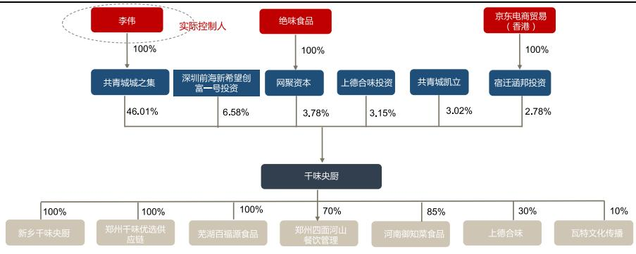
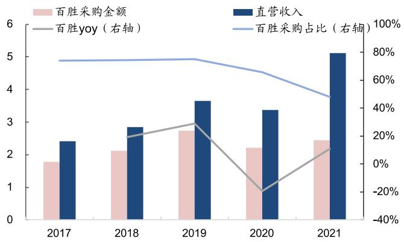

2022 年 12 月 22 日

研究所

证券分析师： 薛玉虎S0350521110005 xueyh@ghzq.com.cn   
证券分析师： 刘洁铭S0350521110006 liujm@ghzq.com.cn   
联系人 肖依琳S0350121120033 xiaoyl@ghzq.com.cn

公司研究评级：买入(上调)

# “千”家餐饮之选，“味”触万户之心—千味央厨（001215）公司深度研究

  
最近一年走势

<table><tr><td>相对沪深300表现</td><td></td><td>2022/12/21</td></tr><tr><td>表现</td><td>1M 3M</td><td>12M</td></tr><tr><td>千味央廚</td><td>9.5%</td><td>30.5% 3.5%</td></tr><tr><td>沪深300</td><td>1.6% -1.9%</td><td>-22.0%</td></tr></table>

<table><tr><td>市场数据</td><td>2022/12/21</td></tr><tr><td>当前价格（元）</td><td>63.55</td></tr><tr><td>52周价格区间（元）</td><td>37.11-69.49</td></tr><tr><td>总市值（百万)</td><td>5,506.13</td></tr><tr><td>流通市值（百万)</td><td>2,873.81</td></tr><tr><td>总股本（万股）</td><td>8,664.24</td></tr><tr><td>流通股本（万股)</td><td>4,522.13</td></tr><tr><td>日均成交额（百万）</td><td>55.74</td></tr><tr><td>近一月换手(%)</td><td>2.44</td></tr></table>

# 相关报告

《——千味央厨(001215)三季报点评：大B增长恢复，业绩符合预期（增持）\*食品加工\*薛玉虎，刘洁铭》——2022-10-26《——千味央厨（001215)点评报告：大B 拖累业绩表现，看好下半年恢复性增长（增持）\*食品加工\*薛玉虎，刘洁铭》——2022-08-28《——千味央厨（001215）年报及一季报点评：餐饮新客拓展顺利，Q1业绩实现稳增（增持）\*食品加工\*薛玉虎，刘洁铭》——2022-04-29

# 投资要点：

引言：预制半成品背靠超4 万亿的餐饮市场，是近年来食品加工行业中发展最快的子行业之一。在餐饮专业化分工趋势下，供应链管理对餐饮的重要性与日俱增，千味央厨作为专注餐饮供应链赛道的速冻食品企业，深耕预制米面类产品，拥有多年大B类客户的定制服务经验，与传统速冻企业形成错位竞争，构筑了餐饮端先发优势。本文从“ $^ { 2 \mathsf { B } + }$ 定制化”速冻米面制品行业的商业模式出发，深入分析行业成长空间、竞争格局以及公司自身核心优势，并根据展望公司未来看点提出投资建议。

供应链在餐饮运营中的重要性与日俱增， $\yen 23+$ 定制化”的速冻米面制品是餐饮供应链的一环，位处速冻食品行业中的蓝海市场。餐饮运营成本中由于供应链食材的品类以及流通环节众多，因此食材成为了餐饮供应链中成本占比最大、决定供应链效率的关键一环，受到餐饮行业的重视程度越来越高。由于餐饮自建中央厨房对工厂的投入门槛较高、还有规模化生产的制约，且对于食品加工、供应链的整合等环节较难把控等原因，速冻食品可以在一定程度上简化厨师工作，帮助餐饮企业实现更高效运营。其中速冻米面制品在餐饮供应链中的渗透率还很低，未来具备较大的成长空间。同时，不同于传统速冻米面制品企业，千味央厨所处的“ $^ { 2 \mathsf { B } + }$ 定制化”速冻米面制品生意模式更难，较难形成规模化优势，但产品差异化程度更高，能更精准的了解餐饮需求，细分赛道参与者少，赛道易守难攻，属于速冻食品行业中的蓝海市场。我们测算，2021 年大B端速冻米面制品规模仅51亿元，2021-2026年复合增速有望达 $2 5 \%$ o

百胜供应链考核体系下的佼佼者，定制服务经验丰富，深谙餐饮供应链运营之道，先发优势明显。公司与百胜等餐饮客户合作多年，在严苛的百胜供应链考核体系下脱颖而出，成为百胜T1级别供应商，更了解餐饮需求以及食材供应链运营。公司通过多年的定制研发经验，在新品研发、产品品质打磨、生产成本把控等各环节均做到了行业前列，并建立了“模拟餐饮后厨”的模式，满足多类型餐饮客户需求。与百胜等头部餐饮企业的合作经验，也间接为公司开拓其他餐饮客户建立了较强的“灯塔效应”。同时，通过单品深度挖潜以及开发规模化通用品，平衡定制与发挥规模效应的冲突，以高性价比优势获得更多市场份额。公司至今已培育出包括油条、挞皮、芝麻球在内的多个上亿级单品，利用大B与小B端的不同特点实现渠道双向结合、共同发力。目前公司相比以流通渠道为主的安井、三全，流通渠道规模较小，未来有望依靠更多大单品跑通经销模式，进一步放大规模优势，实现快速成长。

未来看点：1）现有大B客户自身扩张 $\pmb { \cdot }$ 连锁餐饮“新秀”挖潜，预计未来增速在 $20 \%$ 左右。原有百胜、华莱士等大B客户的自身扩张以及新品拓展，可为公司带来稳定的业绩增长来源。同时充分挖掘老乡鸡、瑞幸、tims 等连锁餐饮企业需求，也将为公司带来新的增量。2)中小餐饮客户持续扩容，有望获得超 $30 \%$ 的收入增长。我国目前餐饮行业整体格局仍较为分散，中小餐饮基数庞大，公司拥有油条、挞皮等多个畅销大单品，再通过贴身支持经销商、扶持大商的方式促进渠道成长，并嫁接单品培育经验培育多个潜在大单品，经销渠道有望实现快速增长。根据未来三年产能规划，收入复合增速有望超 $20 \%$ 。公司新乡募投项目以及芜湖工厂新产能的投放，有望平衡淡旺季备货问题，支撑大B与小B渠道一同放量增长，未来预计每年保持3-5 万吨左右的新增产能。

盈利预测与投资建议：未来随餐饮行业需求逐渐恢复，行业重回稳步增长态势，叠加餐饮连锁化率的提升，餐饮业降本增效需求的增加，对预制半成品的需求也将随之增加。千味央厨专注耕耘速冻餐饮市场多年，加上餐饮供应链行业正处快速发展的红利期。我们预计公司2022-2024年收入分别15.0/18.5/23.4亿元，同比增长$1 8 \% / 2 3 \% / 2 7 \%$ ，归母净利润分别为1.0亿元/1.3亿元/1.7亿元，EPS分别为1.12/1.51/1.99 元，对应 PE分别为 57/42/32 倍。由于疫情管控逐步优化，公司受益于餐饮需求复苏，因此我们上调投资评级至“买入”。

风险提示：1）食品安全风险。2）新冠疫情反复引致的经营风险。3)原材料价格波动风险。4）行业竞争加剧风险。5）募集资金投资项目建设不及预期风险。6）新客户未来增速的不确定。

<table><tr><td>预测指标</td><td>2021A</td><td>2022E</td><td>2023E</td><td>2024E</td></tr><tr><td>营业收入(百万元)</td><td>1274</td><td>1497</td><td>1845</td><td>2342</td></tr><tr><td>增长率(%)</td><td>35</td><td>18</td><td>23</td><td>27</td></tr><tr><td>归母净利润 (百万元)</td><td>88</td><td>97</td><td>131</td><td>173</td></tr><tr><td>增长率(%)</td><td>16</td><td>10</td><td>35</td><td>32</td></tr><tr><td>摊薄每股收益(元)</td><td>1.25</td><td>1.12</td><td>1.51</td><td>1.99</td></tr><tr><td>ROE(%)</td><td>9</td><td>9</td><td>11</td><td>13</td></tr><tr><td>P/E</td><td>46.57</td><td>56.78</td><td>42.12</td><td>31.91</td></tr><tr><td>P/B</td><td>5.29</td><td>5.24</td><td>4.66</td><td>4.07</td></tr><tr><td>P/S</td><td>3.96</td><td>3.68</td><td>2.98</td><td>2.35</td></tr><tr><td>EV/EBITDA</td><td>28.54</td><td>32.67</td><td>24.88</td><td>18.85</td></tr></table>

资料来源：Wind资讯、国海证券研究所

# 內容目录

1、餐饮连锁化及降本增效需求推动， $^ { \mathfrak { a } }$ 定制化”速冻米面制品前景广阔 ..6  
1.1、行业属性：餐饮供应链的一环，助力餐饮企业更高效运营 .  
1.2、核心驱动：餐饮降本提效需求提升，餐饮消费场景多元化. .9  
1.3、行业格局：速冻米面制品为第一大品类，餐饮市场仍大有可为 ..14  
2、千味央厨：餐饮速冻食品先行者，“只为餐饮，厨师之选”. ..16  
2.1、发展历程：深耕餐饮多年，先发优势逐步形成.. .16  
2.2、产品结构：差异化发展速冻米面大单品，多品类延伸贡献新增量 ..17  
2.3、股权结构：公司股权较为集中，管理团队为思念系出身.. ..18  
3、竞争优势：产品与渠道双向赋能，占据餐饮先发优势.. ..20  
3.1、全面的定制服务能力，单品挖潜巩固规模效应. ..20  
3.2、专注餐饮市场，经销与直销渠道互补... ..2  
4、长期看点：大B与小B齐放量，新产能为增长续航. ..26  
4.1、经典产品延伸，新品持续迭代，渠道扩张加速 ..26  
4.2、募投产能 $^ +$ 轻资产模式扩张，为高增长提供有效保障， ..28  
5、盈利预测与投资评级.. ..29  
6、风险提示. ..31

# 图表目录

图1： 速冻食品子行业分类…… ….图2： 餐饮是速冻食品的主要消费场景之一 6图3： 餐饮供应链流通环节以及主要参与企业图谱……7图4： 餐饮企业不同供应链管理模式特点.. …图5： 预制半成品行业分类.. …8图6： 不同赛道定制化服务企业毛利率对比.9图7： 不同赛道定制化服务企业净利率对比…9图8： 不同赛道定制化服务企业销售费用率对比…9图9： 不同赛道定制化服务企业研发费用率对比…9图10: 速冻食品行业市场规模及增速， ……………… ….10图11： 速冻食品行业不同渠道占比变化… ……图12： 社零餐饮收入累计收入及同比增速…… 1图13： 限额以上餐饮收入占餐饮收入总额趋势…. …… …….10图14： 重点餐饮品类门店数占比对比. …图15： 重点餐饮品类线上客单价对比（元) … …… …1图16： 小吃快餐细分品类门店占比 (2020 年) …… …图17： 我国餐饮连门店数量等级的占比情况… ….1图18: 我国各线级城市的餐饮连锁率对比.. …12图19： 中国团餐市场规模在 1.5万亿左右…… 12图20： 2019 年中国团餐市场结构… 12图21： 中国外卖餐饮渗透率稳步上升… 3图22： 乡厨家宴市场应用场景展示… ….13图23： 速冻食品细分子品类市场规模. 14图24： 2021 年速冻米面制品渠道结构. … ….15图25： 速冻米面制品行业竞争格局15图26： 公司发展历程… 16图27： 公司营收、归母净利及其增速（百万元） … .图28： 公司毛利率与净利率变化17图29： 公司主营品类及单品明细. …图30： 公司产品营收结构变化. …图31： 公司分产品毛利率变化……  
图32： 公司股权结构图 …… ….1图33： 公司研发中心根据客户厨房厨电配备定制专属产品…….20图34： 公司与大Β客户的定制化服务流程.. 21图35： 公司油条系列产品消费场景延伸..  
图36： 公司主要油炸类产品场景以及功能特点. ……… .图37： 不同渠道通用…与定制品收入（万元）……22图38： 定制生产模式的特点…… …-2图39： 公司的主要终端合作客户. 23图40： 公司经销与直销毛利率情况…. 24图41： 直营收入中百胜中国及其关联方占比.. …………………… .图42： 直营与经销渠道互补…… .24图43： 速冻食品行业主要公司毛利率对比…… 25图44： 速冻食品行业主要公司销售费用率对比， ……………………………

图45： 直营与经销模式营收变化(万元) …… .25  
图46： 公司优质经销商数量逐步增加... ..25  
图47： 公司营销中心管理架构. ..26  
图48： 公司给直营大客户供应的产品示例. … ….26  
图49： 肯德基与必胜客门店数量变化.. ..7  
图50: 肯德基与必胜客门店销售额变化..  
图51： 华莱士营收及其增速情况. ..27  
图52： 中国新茶饮市场规模及其增速变化. ..27  
图53: 中国现制饮品店细分品类门店数占比 … .8  
图54： 消费者享用新式茶饮时偏好的搭配. ..28  
表1： 大B端速冻米面食品行业规模测算.. … ….13  
表2： B 端餐饮主要参与者情况(2021 年) ….15  
表3： 公司核心管理团队以及研发团队情况. ….19  
表4： 2021 年限制性股权激励计划明细.. ….0  
表5： 速冻企业不同定制服务模式明细. …… ….1  
表6： 百胜供应商管理要求.. ...  
表7： 2021年主要速冻食品企业经销渠道情况对比， ..25  
表8： 公司产能与产能利用率情况. ….29  
表9： 公司新建项目明细.. ..29  
表10： 千味央厨分产品收入预测….. .

# 1、餐饮连锁化及降本增效需求推动，“2B+定制化”速冻米面製品前景广阔

# 1.1、行业属性：餐饮供应链的一环，助力餐饮企业更高效运营

B 端速冻食品本质：简化后厨操作，助力餐饮高效运营。速冻是一种通过急速降温的方式使食物保存原汁和香味的保鲜加工技术。目前应用速冻保鲜处理的食品品类繁多，根据已有的加工食品分类，可简单分为速冻调制食品、速冻米面制品，以及包括速冻农产品、水产品、畜肉产品在内的速冻其他食品三类。通过速冻技术可以延长食物的保存时间，便于餐饮企业按需解冻，家庭进行居家囤货。尤其对于餐饮企业来说，B 端速冻食品为其提供标品或定制化产品，一定程度简化厨师工作，帮助餐饮企业更好的实现口味特色化、标准化运营。

  
图1：速冻食品子行业分类  
资料来源：公司招股书，国海证券研究所

  
图2： 餐饮是速冻食品的主要消费场景之一  
资料来源：千味央厨官网

受到食品安全管控、餐饮行业竞争日趋激烈、运营成本日趋上涨等因素驱动，高效的供应链管理成为了餐饮长期运营的关键。餐饮供应链涉及环节众多，包含了生产种植、批发采购、仓储配送、加工等环节。在餐饮运营中，由于食材品类以及流通环节众多，食材成为了餐饮供应链中成本占比最大、决定供应链效率的关键一环，受到餐饮行业的重视程度越来越高。根据亿欧智库报告显示，2010 年前餐饮供应链的重心主要集中在中下游(即从餐饮企业到门店、消费者的环节)，而在2015 年后，针对供应链上游提供服务的企业开始快速发展，主要服务涉及生鲜品、半成品、冻品等。

  
图3： 餐饮供应链流通环节以及主要参与企业图谱  
资料来源：亿欧智库，国海证券研究所

目前餐饮行业主要的供应链管理模式主要包括四种类型：中央控管模式、多元供应商模式、第三方服务模式、单店管理模式。据中物联冷链数据显示，大多餐饮企业采用多供应商模式，超过 $70 \%$ 的餐饮企业拥有超过100 个供应商， $73 \%$ 的采购合作通过长期合同形式展开，食材供应商在供应链环节中的重要性越来越突出。

食材供应环节的主要参与者包括三种类型：1）餐饮企业后台供应链，由餐饮自建的供应链转换而来，可提供采购、研发生产、仓储配送、信息等供应配套服务。典型代表如海底捞的蜀海、真功夫的鲜食汇、中快的喜餐科技。2）传统贸易商转型为食材供应链企业，大多采用外协加工的方式，少量自主生产，拥有采购、配送和定制服务能力，如望家欢、亚洲渔港等。3）食品加工企业，按照采购方式不同可以分为批发采购以及定制加工类企业，均拥有自主研发生产的能力，其中批发采购类企业通常不直接对接服务下游餐饮，多由经销商/分销商对接，仅供应产品，不提供仓储、定制等服务，代表如调味品企业海天味业、颐海国际（非关联方）、天味食品，速冻食品企业安井食品、三全食品、正大食品等。定制加工企业大多由公司专业服务团队直接对接，提供配送、定制等配套服务，如定制餐调企业日辰股份、聚慧等，定制化预制半成品企业千味央厨、国联水产、圣农发展、春雪食品、绿进、聪厨等。

图4： 餐饮企业不同供应链管理模式特点  

<table><tr><td>管理模式</td><td></td><td>具体流程</td><td>流程标准化程度食材标准化程度</td><td></td><td>管理成本</td><td>采购/运输成本</td></tr><tr><td></td><td>中央控管模式</td><td>由品牌的中央工厂负责食材采购， 并进行洗 式，运输至各大门店</td><td>高</td><td>高</td><td>高</td><td>低</td></tr><tr><td></td><td>多元供应商模式</td><td>家供组感一核餐饮企业的 由企业指定的固定供应商提供</td><td>中</td><td>中~高</td><td>中</td><td>低</td></tr><tr><td></td><td>第三方服务模式</td><td>餐企直接合作或成立供应链管理 企业，专门为自己的品牌设计并 提供供应链管理服务</td><td>高</td><td>中</td><td>高</td><td>中</td></tr><tr><td></td><td>单店管理模式</td><td>门店的经营者或厨师长、采购人 云孔发所有来购我与地万批自行 合作</td><td>低</td><td>低</td><td>低</td><td>高</td></tr></table>

资料来源：亿欧智库，国海证券研究所

定制研发能力强化产品创新优势，标品模式提升规模扩张速度。“ $^ { 2 \mathsf { B } + }$ 定制化”速冻米面制品是预制半成品产业链中的细分赛道。相比于其他拥有定制化服务的行业，速冻米面制品的技术壁垒不高（研发费用率较低)，且通常下游核心产品外包代工的动力不高，客户的话语权较重，因此，定制化的速冻米面制品毛利率位于偏低水平。但其优势在于，定制模式能更贴近了解餐饮终端需求，产品相比标品更具创新优势，产品差异化程度较高，可满足不同类型的餐饮客户需求。同时，由于定制模式更偏向于小线生产，同步发展标品是解决依赖大客户、加强规模效应的突破口，提升企业经营韧性和扩张速度。千味央厨作为食品加工企业类型的食材供应商，集产品研发设计到生产一体化，可为下游餐饮客户提供定制化的速冻米面制品，并已建立分销网络持续增强规模效应。

  
图5： 预制半成品行业分类   
深加工、原辅料复杂程度；产品附加值高；产品多样化程度  
资料来源：国海证券研究所整理

  
图6： 不同赛道定製化服务企业毛利率对比  
资料来源：Wind，国海证券研究所

  
图7： 不同赛道定制化服务企业净利率对比  
资料来源：Wind，国海证券研究所

  
图8： 不同赛道定制化服务企业销售费用率对比  
资料来源：Wind，国海证券研究所

  
图9： 不同赛道定制化服务企业研发费用率对比  
资料来源：Wind，国海证券研究所

# 1.2、核心驱动：餐饮降本提效需求提升，餐饮消费场景多元化

背靠稳步增长的餐饮行业，B端速冻食品发展潜力大。据艾媒咨询数据，2020年我国速冻食品行业规模约 1393 亿元，2015-2020 年 CAGR 为 $1 2 . 3 \%$ ，速冻食品行业保持较快的发展速度，2020 年疫情的爆发将适合居家囤货的速冻食品推向风口，C端需求迅速增加，改变了许多消费者对速冻食品的固有认知。同时，餐饮对速冻半成品的需求也在不断增长。根据国家统计局数据，排除疫情干扰来看，2019 年餐饮收入为4.67 万亿元，2014-2019 年CAGR为 $1 0 . 9 \%$ 。在餐饮行业的稳步发展推动下，国内速冻食品行业B端占比逐步提升，据冷冻食品报道，2019 年速冻食品行业B 端占比达 $48 \%$ ，市场规模约607亿元。

  
图10：速冻食品行业市场规模及增速  
资料来源：艾媒咨询，国海证券研究所

  
图11：速冻食品行业不同渠道占比变化  
资料来源：冷冻食品，国海证券研究所

# 驱动力一：餐饮行业整体格局仍较分散，中小餐饮占主体，孕育小B 端发展机会

据国家统计局数据，2021年，限额以上餐饮占社零餐饮整体的 $22 \%$ ，相比2011年的 $32 \%$ ，占比下降了10pct，限额以上餐饮占比不高可以看出，我国餐饮行业仍处于较分散化、多元化的结构中。同时，从餐饮品类门店数占比数据来看，小吃快餐由于其高频、高性价比、多品类的消费特点，以及高翻台率、开店门槛低的运营特点。据美团研究院报告显示，2020 年以 $44 \%$ 的占比排在餐饮门店数量的首位，其中，小吃快餐的细分品类快餐简餐、面馆、小吃、炸串、麻辣烫等类型门店数量占比持续增长，小吃快餐类餐饮对上菜时效性的要求更高，倒逼商家对便捷出菜的速冻食品需求增加，同时速冻食品可帮助门店丰富产品品类，增加更多获利的可能。

  
图12：社零餐饮收入累计收入及同比增速  
资料来源：国家统计局，国海证券研究所

  
图13：限额以上餐饮收入占餐饮收入总额趋势  
资料来源：国家统计局，国海证券研究所

从客户诉求角度来看，小B类客户以追求性价比为先，辅以渠道服务。小B端餐饮通常指中小规模餐饮商家，性价比为其首要考虑因素。一方面，人工成本不断上升，且本身如面点师等专业厨师人才缺乏。另一方面，餐厅运营的链条繁杂且经营辛苦，通常需要提前在正餐期之前的3-4 小时内开始进行食材预处理，早餐店则凌晨便开始进行揉面、醒发制作等工作。速冻食品简单烹饪处理即可出餐，一定程度上提升了餐饮门店备菜效率、缩减后厨成本。同时，我国餐饮企业多且分布广泛，通常需要服务经销商进行推广与资源拓展，且小B 端客户业态丰富多种，需要较多的 SKU 以满足不同需求，因此小B 端客户同样注重渠道服务能力。

  
图14：重点餐饮品类门店数占比对比

资料来源：美团研究院&餐饮老板内参，国海证券研究所资料来源：美团研究院&餐饮老板内参，国海证券研究所资料来源：美团研究院&餐饮老板内参，国海证券研究所

  
图15： 重点餐饮品类线上客单价对比（元)

  
图16：小吃快餐细分品类门店占比(2020年)

# 驱动力二：餐饮连锁化率稳步提升

对于连锁餐饮企业，虽然限额以上餐饮业收入占比下降，但连锁品牌的扩张速度并没有放缓，整体餐饮连锁化率稳步提升，其中小规模连锁餐饮及大型连锁餐饮扩张速度最快。据美团研究院报告数据显示，至2020 年，我国餐饮连锁化率提升至 $1 5 \%$ ，其中以3-100家门店规模的连锁餐饮企业居多，2020 年占比 $4 . 7 \%$ 。从占比提升速度来看，3-100 家门店规模的连锁餐饮企业以及万店以上规模的连锁餐饮企业占比提升最多，2018-2020 年分别提升 0.9pct、0.7pct。此外，低线城市连锁率还很低，2020 年四、五线城市连锁率仅 $1 2 . 6 \%$ $1 0 . 7 \%$ ，对标一线城市连锁率 $2 1 . 6 \%$ ，还有很大的提升空间。连锁餐饮的发展对速冻食品的需求已在2.1中阐述，B 端速冻食品为其提供标准化或定制化的产品解决方案，一定程度简化厨师工作，帮助餐饮企业更好的实现口味特色化、标准化的运营，属于餐饮供应链中不可缺少的一环。

  
图17：我国餐饮连锁门店数量等级的占比情况  
资料来源：美团研究院&餐饮老板内参，国海证券研究所

  
图18：我国各线级城市的餐饮连锁率对比  
资料来源：美团研究院&餐饮老板内参，国海证券研究所

# 驱动力三：团餐、外卖等餐饮新业态以及乡厨等传统餐饮的发展，成为推动行业的新增长点

1）团餐：采购量大、时效性要求高，为速冻半成品企业必攻赛道之一。团餐属于我国餐饮行业中规模占比较大的细分赛道，主要由学校、企业、机关食堂等场景构成，据艾媒咨询数据，2020 年我国团餐市场达1.53 万亿元，2016-2020 年CAGR为 $1 4 . 2 \%$ 。团餐的消费群体以学生、企事业单位员工为主，团餐相较于普通社餐的特点在于：（1）单品采购量大；（2）采购计划性强，所以菜单都是提早预订，有计划的供应，供餐时段集中，对时效要求严格；（3）可标准化难度低，更利于数字化整合管理；（4）团餐对成本更加敏感，供应团餐的毛利率会小于普通社餐。速冻食品可满足团餐标准化制作、高时效性、出餐量大、产品质量安全要求高等需求。与此同时，通过供应商提供标准化或柔性定制的半成品，解决了高采购成本、高人力成本，高运营成本等限制团餐发展的问题。

  
图19：中国团餐市场规模在1.5 万亿左右  
资料来源：艾媒咨询，中国餐饮协会，国海证券研究所

  
图20：2019 年中国团餐市场结构  
资料来源：中国饭店协会，公司招股书，国海证券研究所

2）外卖：严格的时效性特点促进半成品需求。外卖的出现为愿意花钱买时间的消费者提供了日常饮食的便捷，配送时长会影响消费者体验感，倒逼外卖餐主尽可能地缩短备餐时间，速冻半成品简单加工的制作方式，可满足外卖的即时配送需求。据中国饭店协会统计，2020 年外卖行业规模达6646.2 亿元，2015-2020年CAGR为 $3 9 . 6 7 \%$ ，但外卖市场渗透率不足 $1 7 \%$ 。

3）乡厨家宴：下沉餐饮渠道，发展空间较大。农村家宴属于我国传统饮食文化的重要组成成分，由于原材料品种、渠道复杂，加工过程和加工方式不规范，造成家宴品质参差不齐，并易产生食品安全风险，因此乡厨统一采购、制作，可有效避免问题的发生。乡厨家宴市场在消费升级趋势下，为速冻食品行业餐饮渠道下沉奠定了基础。

  
图21：中国外卖餐饮渗透率稳步上升  
资料来源：中国饭店协会，艾媒咨询，国海证券研究所

  
图22：乡廚家宴市场应用场景展示  
资料来源：百度图片

餐饮供应链中速冻食品的供应规模增长潜力大，其中大B 端速冻米面制品规模达 51 亿元，2021-2026 年复合增速超 $25 \%$ ，2026 年规模达158 亿元。按照2021 年中国社零餐饮4.69 万亿收入规模计算，1）连锁餐饮：目前餐饮连锁化率在 $1 5 \%$ 左右，食材占进货成本的 $42 \%$ ，假设速冻米面制品渗透率 $1 . 2 \%$ ,2021年连锁餐饮端速冻米面制品规模为16 亿元。若2026 年餐饮连锁率提升 3pct,速冻米面制品渗透率提升1pct至 $2 . 2 \%$ ，则2026 年连锁餐饮端速冻米面制品规模为 61 亿元，2021-2026 年复合增速为 $30 \%$ 。2）团餐：2020年团餐占比为$32 \%$ 左右，假设速冻米面制品渗透率为 $1 . 2 \%$ ，2021年团餐渠道速冻米面制品规模35亿元。若2026年团餐占比保持不变，餐饮行业复合增速为 $5 \%$ ，速冻米面制品渗透率提升 1pct 至 $2 . 2 \%$ ，则2026年团餐渠道速冻米面制品规模为98亿元，2021-2026 年复合增速为 $23 \%$ 。

表1： 大B端速冻米面食品行业规模测算  

<table><tr><td></td><td colspan="5">速冻米面制品大B端</td></tr><tr><td rowspan="6">关键假设</td><td colspan="5">中国餐饮规模</td></tr><tr><td colspan="5">4.69万亿</td></tr><tr><td colspan="5">食材占餐饮进货成本比例</td></tr><tr><td colspan="5">42%</td></tr><tr><td colspan="5">平均餐饮毛利率</td></tr><tr><td colspan="5">55%</td></tr><tr><td colspan="5">2021年</td></tr><tr><td rowspan="5">关键变量</td><td>餐饮连锁率</td><td colspan="2">速冻米面渗透率</td><td>团餐占比</td><td>速冻米面渗透率</td></tr><tr><td>15%</td><td colspan="2">1.2%</td><td>32.1%</td><td>1.2%</td></tr><tr><td></td><td colspan="2">2026年</td><td colspan="2"></td></tr><tr><td>餐饮行业复合增速</td><td colspan="2"></td><td colspan="2">团餐占比</td></tr><tr><td></td><td>餐饮连锁率</td><td>速冻米面渗透率</td><td></td><td>速冻米面渗透率</td></tr></table>

<table><tr><td></td><td>5%</td><td>20%</td><td>2.2%</td><td>32.1%</td><td>2.2%</td></tr><tr><td rowspan="4">需求测算</td><td colspan="3">2021 年连锁餐饮端速冻米面制品规模</td><td colspan="2">2021年团餐速冻米面制品规模</td></tr><tr><td colspan="3">16亿元</td><td colspan="2">35亿元</td></tr><tr><td colspan="3">2026 年连锁餐饮端速冻米面制品规模</td><td colspan="2">2026年团餐速冻米面制品规模</td></tr><tr><td colspan="3">61亿元</td><td colspan="2">98亿元</td></tr></table>

资料来源：wind，中国饭店业协会，艾媒咨询，餐饮老板内参，国海证券研究所

# 1.3、行业格局：速冻米面制品为第一大品类，餐饮市场仍大有可为

速冻米面制品替代手工趋势明显，应用渗透率逐渐提升。速冻米面制品是速冻食品占比最大的子行业之一，据华经产业研究院统计，2019 年行业规模超 700 亿元（包含冷冻烘焙食品)。速冻米面制品受到餐饮对供应链效率的要求提升，以及居民生活节奏加快驱动，逐步替代手工制作的主食。传统速冻米面制品更多集中饺子、汤圆、粽子等品类中，主要应用场景为早餐、正餐主食。近些年随餐饮业多元化发展，速冻米面品类逐步拓展至配菜、小吃、甜点等场景，西式烘焙也出现在了各类中式餐饮的菜单中。同时，手抓饼、馅饼、蒸煎饺、灌汤包等中式面点，以及挞皮、牛角包等烘焙食品陆续被工业化生产还原，速冻米面的品类持续丰富。

  
图23：速冻食品细分子品类市场规模  
资料来源：Euromonitor，CNBD，观研天下，智研咨询，国海证券研究所

据 IBIS 数据统计，速冻米面制品下游渠道中，C 端占据绝大部分份额，其中KA超市占比为 $61 \%$ ，商超占比 $23 \%$ ，其余B 端餐饮占比仅 $16 \%$ o

1) C端集中度高，价格竞争较激烈。根据《2019 年中国冷冻冷藏食品工业经济运行报告》，2018 年速冻米面制品龙头三全食品、思念食品和湾仔码头的市场占有率总计达 $64 \%$ ，行业集中度高。从销售渠道上看，上述企业主要以KA、BC商超等渠道为主，主要面向家庭端消费，同时，产品同质化程度较高，价格竞争日趋激烈。而随着零售业竞争加剧，商超也把更多费用转嫁给供应商，同时原材料、人工成本等不断提高，使速冻米面制品企业零售端利润逐步被压缩。

  
图25：速冻米面制品行业竞争格局

  
图24：2021 年速冻米面製品渠道结构  
资料来源：IBIS，国海证券研究所

2)B 端市场相对分散，处于渗透率提升的初步阶段：据 IBIS 数据统计，速冻米面制品C端占比达 $84 \%$ ，B端餐饮占比仅 $16 \%$ 。按照速冻米面制品规模727亿元计算，速冻米面制品B 端规模约为116 亿元。2021 年社零餐饮收入为4.69 万亿，按照餐饮食材占比 $42 \%$ 测算，餐饮食材的市场规模达1.97万亿，因此我们认为，速冻米面制品的B 端餐饮市场尚处于渗透率提升的初期阶段。B 端餐饮可细分为大B类（连锁餐饮、团餐食堂）以及小B类（流通农批市场）两类餐饮渠道，不同细分渠道诉求不一，各企业擅长的渠道也各不相同：

表2： B端餐饮主要参与者情况(2021年)  

<table><tr><td>企业</td><td>速冻米面规模及占比</td><td>餐饮渠道占比</td><td>优势渠道</td><td>核心单品</td></tr><tr><td>三全食品</td><td>60.3亿元/87%</td><td>16.9%</td><td>KA商超渠道</td><td>水饺、汤圆</td></tr><tr><td>思念食品</td><td>69.5亿元</td><td>/</td><td>KA商超渠道</td><td>水饺、汤圆</td></tr><tr><td>安井食品</td><td>20.5亿元/22%</td><td>约60%</td><td>小B流通</td><td>手抓饼、发面类点心</td></tr><tr><td>千味央廚</td><td>12.7 亿元/100%</td><td>约100%</td><td>大B餐饮</td><td>油条、芝麻球</td></tr></table>

资料来源：《2019年中国冷冻冷藏食品工业经济运行报告》，国海证券研究所  
资料来源：各公司公告，冷冻食品，国海证券研究所注：思念食品速冻米面规模为2019 年公司总营收数据

大B类餐饮考验综合服务能力，具备规模企业少。大B 类餐饮对于半成品的诉求很高，更偏向于定制化产品，或者是预加工程度不深的标准化产品。连锁餐饮会对供应商渠道服务能力、产品品控能力、研发能力等进行综合考量。从盈利能力方面考虑，连锁餐饮易守难攻，一旦攻克后就能形成比较稳定的需求，量大但增速较稳定。定制产品毛利较高，营销费用很少，属于利润较高的渠道，但下游话语权相对较重，受限会比较多。目前大B类餐饮渠道具备规模的参与者少，其中千味央厨为细分龙头，在大B类餐饮中积累多年，具备一定先发优势。

小B类餐饮成本优势为基础，产品力、渠道服务能力为保持粘性的关键，头部企业差异化竞争。小B 类餐饮对价格的敏感性最高，同时，小B类餐饮客户众多，运输链条更长，对于速冻米面制品的产品耐用度，口味、口感的普适度具有较高的要求。由于小B类餐饮单次采购量小、订单杂且频率高，因此需要构建较健全的经销网络来服务客户。这就考验公司对于市场需求的把控能力、规模化生产能力以及渠道开拓并维护的实力。从盈利能力方面考虑，这类渠道对价格的敏感性高，毛利不高，但起量快，更易形成规模优势。目前小B类餐饮头部企业包括安井食品、三全食品、思念食品、千味央厨等，行业内产品同质化程度较高，竞争相比大B类餐饮更为激烈，但各家企业差异化竞争，大单品与优势渠道各不相同。

# 2、千味央廚：餐饮速冻食品先行者，“只为餐饮，廚师之选”

# 2.1、发展历程：深耕餐饮多年，先发优势逐步形成

公司是国内最早为餐饮市场提供速冻米面制品解决方案的供应商之一。公司于2012年由思念食品投资成立，思念食品以C端家庭消费为主，主营产品为水饺、汤圆等速冻米面制品。公司则主要面向餐饮市场，主营油条、挞皮、芝麻球等速冻米面制品，补充思念的渠道与品类空白。2016年公司从思念食品中独立出来，进行股份制改造，引入战略投资，同年进入百胜中国T1 级别供应商行列。公司深耕餐饮市场多年，打造了包括油条、挞皮、芝麻球、蒸煎饺在内的多个上亿级大单品。

  
图26：公司发展历程  
资料来源：千味央厨官网，中国企业报道，新京报，国海证券研究所

注：2002-2012年由思念与肯德基展开合作

2021 年公司营收达 12.74 亿元，归母净利为 0.88 亿元，2017-2021 年收入和利润CAGR分别为 $2 1 . 1 \%$ 、 $1 7 . 4 \%$ 。公司自切入餐饮供应链赛道以来，持续精耕餐饮市场，受益于速冻食品在餐饮业渗透率的提升，收入与利润均保持较快增长。公司2021年毛利率为 $2 2 . 4 \%$ ，近几年毛利率保持稳定。由于公司处于开拓市场前期，费用投放力度不减，净利率略有下滑，2021 年净利率为 $6 . 9 \%$ ，相比2017年下滑 0.91pct。

  
图27：公司营收、归母净利及其增速（百万元)  
资料来源：公司公告，国海证券研究所

  
图28：公司毛利率与净利率变化  
资料来源：公司公告，国海证券研究所

# 2.2、产品结构：差异化发展速冻米面大单品，多品类延伸贡献新增量

公司目前拥有的主要品类分为油炸类、烘焙类、蒸煮类、菜肴类四大类，并按照各品类的自身特点细分应用场景，为客户提供定制化和通用化产品，SKU超300余种。

  
图29：公司主营品类及单品明细  
资料来源：公司公告，公司官网，国海证券研究所

公司是速冻行业里少有的拥有定制服务的餐饮供应链企业，并将定制经验嫁接至通用品中。从产品结构上来看，1）公司油炸类占比最大，以油条为核心大单品，包含芝麻球、炸春卷等产品，通用的标准化产品居多，2020 年拥有超95个SKU，主要应用于早餐、乡宴、酒席等场景中。公司是行业内首家将油条标准化生产的企业，早期主要为百胜集团供应油条，并根据细分餐饮场景改良产品工艺，推出不同应用场景下的油条产品，在速冻油条行业中具备领先优势。2021 年公司油条单品收入达3.51 亿元，同比增长 $3 4 . 6 5 \%$ 。由于毛利更高的油条产品占比提升(2021 年油条占油炸类整体收入比例提升3.15pct)，油条制作工艺持续精进，并同步增加不同规格和口味产品以提升品类附加值，油炸类产品的毛利率保持提升趋势1。

  
图30：公司产品营收结构变化  
资料来源：公司招股书，国海证券研究所

  
图31：公司分产品毛利率变化  
资料来源：公司招股书，Wind，国海证券研究所

2）定制化烘焙类产品突破餐饮（含茶饮类）大客户。公司烘焙类主要包含手工挞皮、华夫饼、可颂冷冻面团等产品，早期也主供百胜集团等直销渠道。2021 年烘焙类产品收入2.23 亿元，2017-2021年收入 CAGR为 $1 7 . 5 \%$ ，收入占整体的$1 7 . 6 \%$ 。目前烘焙类产品已进入盒马、瑞幸等渠道，由于烘焙类产品中定制占比较高，烘焙类产品毛利率高于整体，2021年烘焙类产品毛利率为 $2 5 . 0 \%$ o

3)莱肴制品新品不断扩充，蒸煎饺有望成为下一大单品。菜肴制品包括蒸煎饺、火锅料（虾米饺、撒尿牛肉丸、千页豆腐、鱼豆腐、小面筋、仿蟹柳等）、杂粮调理包等，近几年公司大力开拓火锅料市场，研发多款火锅类新品。其中蒸煎饺从团餐等渠道突破，成为体量仅次于油条的第二大单品，2021 年蒸煎饺收入达1.35 亿元，同比增长 $1 6 7 . 9 \%$ 。同时，随着公司所服务的餐饮客户合作程度不断加深，为进一步满足客户需求，公司成立专业子公司“御知菜”运营预制菜产品。

# 2.3、股权结构：公司股权较为集中，管理团队为思念系出身

目前思念食品的创始人、前董事长兼实控人李伟，持有千味央厨 $4 6 . 1 \%$ 股份，为千味央厨实际控制人。公司参股股东中包含了绝味旗下网聚资本以及京东旗下涵邦投资公司。公司上市前，为解决同业竞争问题，实控人李伟将思念食品股权全部转让至思念食品管理团队，退出思念食品董事会并不担任任何职务。

  
图32：公司股权结构图  
资料来源：公司公告，Wind，国海证券研究所注：截止至2022 年三季报

公司管理团队在速冻食品行业从业多年，有着丰富的经营管理经验。公司实控人李伟在 1996 年创立思念食品，将思念食品打造成速冻食品行业龙头。董事长孙剑、总经理白瑞、副总王植宾均在2000 年左右加入思念，在思念工作多年。同时，公司组建了专业餐饮研发团队，技术负责人、团队人员也大多来自于思念食品。

表3：公司核心管理团队以及研发团队情况  

<table><tr><td>高管团队</td><td>担任职务</td><td>个人履历</td></tr><tr><td>李伟</td><td>实际控制人</td><td>毕业于郑州大学新闻系，1996 年创立思念食品，现为千味、黄河大观（地产)实际 控制人。</td></tr><tr><td>孙剑</td><td>董事长、新乡千味执行董事</td><td>毕业于河南师范大学，曾任思念营销中心副总经理，2010 年至 2013 年任河南一生 缘食品销售总经理，2013 年至2018 年任大观地产副总。2018 年7 月加入千味。</td></tr><tr><td>白瑞</td><td>董事、总经理、新乡千味经理</td><td>毕业于中南财经政法大学，2004 年至2011 年任思念结算部经理、资金管理部经 理、营销中心副总助理。2012 年加入千味。</td></tr><tr><td>王植宾</td><td>董事、副总经理、财务总监</td><td>毕业于西南大学，2005 年至2012 年任思念总成本会计、高级审计员、内审经理、 审计部经理，2012年加入千味。</td></tr><tr><td></td><td>徐振江董事、副总经理、董事会秘书</td><td>毕业于中央财经大学，经济学博士，曾任广州南方人物周周刊经济新闻部主任。 2010 年至2013 年曾任宋河酒业总裁助理、次祖杜康总经理助理。2013 年至2015 年任骏域基金投资总监，2015 年加入千味。</td></tr><tr><td>研发团队 贾学明</td><td>担任职务</td><td>研发经验背景</td></tr><tr><td></td><td>技术研发部总监</td><td>曾任思念面点师、研发组长、技术经理，2012 年6 月加入公司 曾任思念技术研发资料管理员，2012 年 6 月加入公司，负责研发体系与专利等相</td></tr><tr><td>程燕</td><td>技术研发部工程师</td><td>关工作</td></tr><tr><td>朱国新</td><td>技术研发部工程师</td><td>曾任思念技术部工程师，2012 年6 月加入公司，负责生产设备创新升级</td></tr><tr><td>李欢</td><td>技术研发部工程师</td><td>曾任思念配方专员，2013 年9 月加入公司，负责产品设计研发</td></tr><tr><td>姬真真</td><td>技术研发部工程师</td><td>曾任思念研发员，2012年6月加入公司，研发直营客户定制产品</td></tr></table>

资料来源：公司招股书，国海证券研究所

上市后发布首次股权激励方案，绑定核心管理人员。公司拟授予包括董事长、总经理、副总、董秘及76名核心人员在内的限制性股票156.84 万股（占总股本的 $1 . 8 4 \%$ )，其中首次授予152.62万股，首次授予价格为31.01元/股，首次股份支付费用共计4748 万元，其中2021 年摊销214 万元。未来2 年的业绩考核目标为：以2020 年收入为基数，2022-2023年营收增长率分别不低于 $6 7 \% / 1 0 1 \%$ 考核触发值为当年目标值的 $80 \%$ 即可解锁。

表4： 2021年限制性股权激励计划明细  

<table><tr><td>项目</td><td colspan="4">方案明细</td></tr><tr><td>授予人数</td><td colspan="4">80人（包含董事长、总经理、副总、董秘及76名核心人员在内)</td></tr><tr><td>授予股数</td><td colspan="4">156.84万股</td></tr><tr><td>首次授予价格</td><td colspan="4">31.01元/股</td></tr><tr><td>业绩考核增速目标（以</td><td colspan="2">2022年</td><td colspan="2">2023年</td></tr><tr><td>2020年收入为基数)</td><td colspan="2"></td><td colspan="2">101%</td></tr><tr><td>业绩考核收入目标</td><td colspan="2">67%</td><td colspan="2"></td></tr><tr><td rowspan="2">费用摊销</td><td>15.76 亿元 2021年</td><td>2022年</td><td>18.97亿元 2023 年</td><td></td></tr><tr><td>163.75万元</td><td>1964.98万元</td><td>1866.73万元</td><td>2024年 720.49万元</td></tr></table>

资料来源：公司公告，国海证券研究所

# 3、竞争优势：产品与渠道双向赋能，占据餐饮先发 优势

# 3.1、全面的定制服务能力，单品挖潜巩固规模效应

产品研发经验丰富，拥有全面的定制服务能力。公司与百胜等大客户合作多年，基于终端消费者需求，积累了多年的产品研发基础，并建立了“模拟厨房”研发实验室。通过模拟餐饮连锁企业的后厨方式，研发适合餐饮企业的个性化产品，从市场调研开始到新产品的推出，共经历12个阶段，需要3-6个月的时间。同时，公司设立了多个研究室，组建专业餐饮研发团队，与客户的采购、生产和研发等各部门协同工作，并配有专业营销服务小组。通过全面的定制服务能力、稳定的品质和供应能力，与客户保持良好的合作关系，成为公司长期稳定盈利来源的保障。2020 年定制产品收入占比达 $31 \%$ ，2017-2020 年收入CAGR为 $1 1 . 6 \%$ 。领先的研发体系下公司培育了众多差异化单品，2020 年公司 SKU数量达到 368种。

  
图33：公司研发中心根据客戶廚房廚电配备定製专属产品  
资料来源：千味央厨官网

  
图34：公司与大B 客户的定制化服务流程  
资料来源：公司招股书，国海证券研究所

公司的定制服务模式不同于普通OEM 代工，对餐饮企业的依赖性更小。根据餐饮企业与速冻面米制品供应商的合作紧密程度，定制生产通常可以分成“定制研发 $^ +$ 定制生产”和“工艺标准 $^ +$ 定制生产”两种模式。其中采用“工艺标准 $^ +$ 定制生产”模式的企业仅承接餐饮企业的某些产品生产，更依赖大客户自身的扩张速度。而公司采用的“定制研发 $^ +$ 定制生产"模式参与餐饮供应链环节更多，可以通过新品研发获得更快增长。由于拥有产品核心知识产权，拓展新客户的难度较小，可顺利嫁接大客户的开发服务经验。

表5： 速冻企业不同定制服务模式明细  

<table><tr><td>定制模式</td><td>承担链条</td><td>合作模式</td><td>产品使用权</td></tr><tr><td>定制研发+定制生产</td><td>餐饮企业把研发、采购、加工、 烹饪环节整体/部分移出</td><td>速冻企业根据餐企定制需求 进行研发，餐企提供技术支持 和信息反馈</td><td>速冻企业：拥有产品核心知识 产品+相关生产工艺技术 餐饮企业：拥有产品一定时期 的独家销售权</td></tr><tr><td>工艺标准+定制生产</td><td>餐饮企业把生产环节中一个/ 多个产品通过合同委托给速 冻企业</td><td>速冻企业按客户指定工艺技 术标准生产，受委托产品全部 销售给客户</td><td>速冻企业：不拥有产品核心知 识产权，对餐企依赖性强</td></tr></table>

资料来源：公司招股书，国海证券研究所

发展通用产品模式，解决定制难以形成规模效应的问题：1）持续深度挖潜各品类细分场景，单品迭代能力强。餐饮端速冻食品相较家庭端，其应用场景更丰富，对差异化产品的需求更高。不同于速冻食品龙头以单品跟随策略推新，公司将餐饮客户按照饮食场景分为火锅、快餐、自助餐、宴席、早餐、外卖等多种类型，并针对不同场景的烹饪特性，以及消费者食用习惯，进行单品柔性改良。以油条产品为例，千味央厨是行业内首家推出速冻油条的公司，通过持续改良产品的口味、口感等，让油条应用不再限于传统早餐场景，延伸至火锅、麻辣烫等其他5种餐饮场景中。目前公司已推出茴香小油条、麻辣烫小油条、火锅涮煮油条、外卖专用油条等系列油条产品。2021 年公司油条品类实现收入3.51 亿元，同比增长 $3 4 . 6 5 \%$ ，油条已成为公司第一大单品。同时，公司每年会推出2-3个新品，将油条单品的打造经验持续嫁接至新品上，例如蒸煎饺单品在推出的第二年（2021 年）获得1.35 亿收入，同比增长 $1 6 7 . 8 7 \%$ 。

  
图35：公司油条系列产品消费场景延伸  
资料来源：公司招股书

  
图36：公司主要油炸类产品场景以及功能特点  
资料来源：千味央厨公众号，国海证券研究所

2）餐饮定制经验赋能通用品，巩固规模效应。公司在定制品合作保密期过后，会根据市场需求将部分产品进行改良后批量生产，销售到更多的中小餐饮门店，进一步强化规模效应，并减少了对单一大客户的规模依赖。公司对通用品品相的稳定性要求更高，适合后厨设备更简单的中小客户使用，对后厨人员专业性要求低，规模化生产后产品也更具性价比。2020 年公司通用品销售占比为 $6 9 . 0 \%$ ,2017-2020 年收入 CAGR为 $1 9 . 2 \%$ 。

  
图37：不同渠道通用品与定制品收入(万元)  
资料来源：公司招股书，国海证券研究所

  
图38：定制生产模式的特点  
资料来源：公司招股书，国海证券研究所

# 3.2、专注餐饮市场，经销与直销渠道互补

公司专注B端餐饮市场，采用直销与经销两种销售方式，利用其不同特点实现渠道双向结合、共同发力，一方面，直营大客户发挥灯塔效应，助力经销渠道开拓中小餐饮企业；另一方面，借助直营大客户的定制要求深入了解餐饮市场需求，并不断提升公司的研发能力，推出高品质的差异化产品。

百胜T1级别供应商，最严供应链考核体系下的佼佼者。百胜采用多元供应商的供应链管理方式，对供应商有着严格的准入标准，并配备全面的 STAR绩效管理体系，定期评估供应商在食品质量安全方面的表现。百胜将供应商按照评估结果分为T1-T4 四个等级，T1为最佳供应商；T2、T3类供应商，百胜会对其进行改善辅导，持续提升管理能力；T4 类供应商会暂停或终止供应合约。2019 年百胜中国的供应商约共计400 多家，其中T1 类供应商占比达到 $56 \%$ 。思念食品早在2002 年成为百胜中国的供应商，2008 年开始对其供应油条系列产品。2012年思念将对百胜中国的供应合作交给千味央厨，跻身百胜T2 级供应商。发展至今，千味央厨已经成为百胜中国T1 级别供应商。同时，公司部分产品所需主要原材料供应商由百胜指定，采购价由百胜通过招标方式确定，百胜中国对上游原材料供应商议价能力较强，也可为公司带来一定成本优势。

表6： 百胜供应商管理要求  

<table><tr><td></td><td>供应商管理明细</td></tr><tr><td>供应商审核</td><td>执行严格的新供应商准入机制，包括风险评估、资质审查、工厂准入审核。所有供应商均需签署《百胜中国供 应商行为准则》。公司定期审核供应商，2020 年公司对供应商进行约 400 次食质审核、200 多次飞行检查。</td></tr><tr><td>供应商绩效评估</td><td>公司建立STAR 全面绩效管理体系，定期评估，评估分为T1-T4，T1 为最佳供应商；T2、T3 类供应商，公司 会对其进行改善辅导，持续提升管理能力；T4 类供应商会暂停或终止供应合约。百胜对供应商绩效每季度一 评估。</td></tr><tr><td>供应商能力提升</td><td>举办供应商 STAR 及其他技术类培训，在食品安全、养殖技术、动物福利、加工质量、过程管控及合规性等不 同方面，帮助供应商提升技术和管理水平。</td></tr><tr><td>食品安全抽检</td><td>供应商自建+百胜定期抽检，2020 年百胜抽检覆盖 106 个种类，包括蔬菜、水果、肉制品、水产品及食品包 材等 300 多个主要原物料，涉及144 个供应商。“福喜&quot;事件后，推出百胜“吹哨人”制度。</td></tr><tr><td>上游供应商管控</td><td>要求供应商制定有效的上游供应商审批和监管程序。</td></tr><tr><td>供应商竞标原则</td><td>制定“软性价比&quot;策略，根据食品质量安全、总体绩效，每个供应商以起始份额来竞标，对竞价最低的供应商提 供份额奖励，其他供应商有机会跟标，但会拿到较少的份额，防范供应商利用低价恶意竞争。鼓励供应商在产 品质量与服务上进行竞争，每份采购合同期限为 6-12 个月，合约结束后供应商可以参加下一次竞争。</td></tr><tr><td>供应商新品选择</td><td>不鼓励供应商集中供应一两个产品，提倡供应商研发新品，使得供应商的议价能力加强，有更好的利润保证， 供应商也有更良性的发展机会。</td></tr></table>

资料来源：百胜中国官网，国海证券研究所

借力直营大客户树立“灯塔效应”，构筑渠道壁垒，助力渠道挖潜。百胜中国与公司合作多年，不仅给了公司稳定持续的订单，还提供了一套先进的产品品控、研发标准，公司在百胜供应链管理体系的打磨下获得快速成长，更懂得餐饮需求以及供应链的运营之道，公司在产品品质打磨、新品研发、生产成本把控等各环节均做到了行业优秀地位。从最早向百胜提供蛋挞皮开始，到现在产品延伸到安心油条、华夫饼、冷冻面团、烙饼、牛角包、酥饼等多个品类。2021 年百胜对公司的采购价金额为 2.45亿元，百胜占直营收入的 $4 7 . 9 \%$ 。通过与大型连锁餐饮的长期稳定合作，间接为公司开拓其他类型客户建立了较强的“灯塔效应”。公司2021年直销收入占比为 $4 0 . 2 \%$ ，2017-2021年直销收入CAGR为 $2 0 . 6 \%$ o

  
图39：公司的主要终端合作客户  
资料来源：公司公告

  
图40：公司经销与直销毛利率情况  
资料来源：公司公告，国海证券研究所  
注：2020 年直销客户运费计入成本

  
图41：直营收入中百胜中国及其关联方占比  
资料来源：公司公告，国海证券研究所

头部客户一旦形成稳定的供应关系后，需求较稳定，费用投入较低，且客户价格敏感性相对不高。餐饮直营客户的特点主要有：1）订货量大，粘性强：直营客户通常为大型连锁餐厅、团餐企业等，一次性购买产品量大，有严格的供应商考察体系，不会轻易更换供应商。2）市场费用投放少，产出回报高：除了研发费用外，不需大额的商超销售费用、广告宣传费用。公司销售费用率保持在 $5 \%$ 左右，远低于其他速冻食品企业销售费用投放比例。公司利用与餐饮企业的合作更贴近了解市场需求，减少通用品的试错率。另外，直营的定制化产品按照议价招标定价，毛利率较高，2021年直销毛利率达 $2 3 . 1 \%$ ，高于经销的通用品毛利率$2 1 . 4 \%$ 。

  
图42：直营与经销渠道互补  
资料来源：国海证券研究所

  
图43：速冻食品行业主要公司毛利率对比  
资料来源：公司公告，国海证券研究所

  
图44：速冻食品行业主要公司销售费用率对比  
资料来源：公司公告，国海证券研究所

将服务优质大客户积累的经验嫁接至经销渠道，但经销渠道规模较小，仍需时间培育成熟。经销是公司收入占比最大的渠道，2021 年经销收入占比为 $5 9 . 8 \%$ 安井、三全、海欣、海霸王等为公司流通市场的主要竞争对手，整体竞争较为激烈。公司近几年加大了经销商渠道的建设力度，采取“聚焦大客户深度服务”的管理模式，优先扶持大经销商，增加销售人员数量，对核心经销商进行贴身扶持，如业务人员协助开拓二批商及终端，并加大对年度战略单品推广，协助开展品鉴会、重点客户打造等助力营销推广，经销商的积极性被有效带动。公司百万级别以上经销商数量/销售人员数量约为0.6，2021年前 $20 \%$ 的经销商收入规模达到2.06亿元，占经销整体收入的 $2 7 \%$ 。公司经销规模相比较安井、三全还有较大差距，未来有望随服务优质大客户积累的经验成功嫁接至经销渠道，实现放量增长。

  
图45：直营与经销模式营收变化(万元)  
资料来源：公司公告，国海证券研究所

  
图46：公司优质经销商数量逐步增加  
资料来源：公司公告，国海证券研究所

表7： 2021年主要速冻食品企业经销渠道情况对比  

<table><tr><td></td><td>千味央廚</td><td>安井食品</td><td>三全食品</td><td>海欣食品</td><td>惠发食品</td></tr><tr><td>经销收入(亿元)</td><td>7.6</td><td>77.2</td><td>51.2</td><td>9.8</td><td>10.2</td></tr><tr><td>经销占比</td><td>59.8%</td><td>83.3%</td><td>74.3%</td><td>63.2%</td><td>62.9%</td></tr></table>

<table><tr><td>经销商数量</td><td>968</td><td>1652</td><td>5638</td><td>2181</td><td>1298</td></tr><tr><td>单个经销商收入（万元）</td><td>78.4</td><td>467.5</td><td>90.9</td><td>44.9</td><td>78.9</td></tr><tr><td>销售人员数量</td><td>213</td><td>4367</td><td>3265</td><td>769</td><td>588</td></tr><tr><td>经销商/销售人员</td><td>4.3（百万元以上 经销商/销售人员 =0.6)</td><td>0.38</td><td>1.73</td><td>2.84</td><td>2.21</td></tr></table>

资料来源：各公司公告，国海证券研究所注：千味央厨百万元以上经销商数量为2020 年数据

# 4、长期看点：大B与小B齐放量，新产能为增长续航

# 4.1、经典产品延伸，新品持续迭代，渠道扩张加速

已有大客户自身扩张 $^ { \star }$ 新客户开发，预计大客户每年可获得 $20 \%$ 左右的收入增长。营销组织架构上，公司内部树立“大客户优先”理念，单独成立重客部服务于大客户，通过不断拓展大客户的供应品类以加深合作关系。随着餐饮行业竞争日趋激烈，餐饮企业需要持续保持菜品口味创新，才能保证餐饮品牌的持续发展。如百胜中国提出的经营策略为：通过新奇的限时产品(即“LTO: Limited time offer”产品)吸引客户入店，同时挖掘新的长线产品。公司新品研发能力与百胜中国的经营策略相匹配，目前已为百胜中国供应油条、蛋挞两款长线单品，并每年会为百胜中国提供多款限定产品，如法风烧饼、红豆派、鲜肉月饼等。

  
图47：公司营销中心管理架构  
资料来源：公司公告，国海证券研究所

  
图48：公司给直营大客户供应的产品示例  
资料来源：公司公告，国海证券研究所

1）百胜等原有大客户收入增速保持在 $5 \% { - } 1 0 \%$ 左右。近些年，公司通过对百胜中国的稳定供应，带来超 $20 \%$ 的复合收入增速，2021年百胜的采购额占公司整体收入的 $1 9 \%$ 。2017-2021年百胜中国带来收入的复合增速分别为 $8 . 4 \%$ 。公司重点大客户百胜集团，通过百胜门店扩张以及公司供应品类的持续丰富，为公司带来稳定的增量，并加深长期合作关系，形成较强的客户壁垒。截至2021年，肯德基在全国拥有餐厅超 8100 家，必胜客超 2500 家，2017-2021 年肯德基销售额复合增速为 $8 \%$ ，其中门店复合增速为 $10 \%$ 。每年公司会保持为百胜中国提供多个新品，预计未来依靠百胜自身扩张以及品类创新，可以为公司带来 $5 \text{‰}$

的收入增长。

  
图49：肯德基与必胜客门店数量变化  
资料来源：公司公告，国海证券研究所

  
图50：肯德基与必胜客门店销售额变化  
资料来源：公司公告，国海证券研究所

2）持续开发新的连锁餐饮客户，华莱士、老乡鸡、瑞幸等新客户放量，预计新增大客戶收入增速超 $30 \%$ 。由于大型连锁餐饮客户对个性化需求较高，通常供应商需要按照客户的需求进行研发设计，供应商的话语权相对较弱。单一大客户收入占比较高时，对供应商整体的收入影响也会较大。对此公司积极开发直营新客户，如华莱士、老乡鸡、瑞幸、tims、海底捞等大型连锁餐饮客户，减少对单一客户的依赖，将更多潜在连锁大客户培育为下一个重点客户，并创新性开拓连锁商超等B 端直营渠道。如公司第二大客户——华莱士，2021 年向公司的采购额达7061万元，2017-2021年采购额CAGR为 $5 1 . 4 \%$ 。华莱士近几年自身保持较快的扩张速度，2020年营收34.9亿元，2017-2020年营收CAGR为 $2 8 . 5 \%$ 。

  
图51：华莱士营收及其增速情况  
资料来源：华莱士公告，国海证券研究所

  
图52：中国新茶饮市场规模及其增速变化  
资料来源：中国连锁经营协会，国海证券研究所

除百胜大客户以外，新茶饮、咖啡市场拥有广阔布局空间：近几年我国新茶饮以及现制咖啡市场在消费升级驱动下得到快速发展，据中国连锁经营协会统计，2020 年新茶饮市场规模达 831 亿元，2017-2020 年新茶饮市场规模CAGR达到 $2 5 . 3 \%$ 。越来越多的新茶饮企业通过“茶/咖啡 $+ \ '$ 形式来延伸消费场景，给消费者提供良好的购买体验，其中搭配烘焙食品售卖的复合经营模式成为了新茶饮、咖啡馆发展的新趋势。而大多数茶饮店、咖啡馆与专业的烘焙店对于门店和设备的要求相差甚远，因此更多通过选择代加工配送的方式来解决丰富 SKU的问题。公司拥有多年定制服务经验，并具备产品品质与规模化生产优势，已成功打开瑞幸、tims 等餐饮重客渠道，有了头部咖啡品牌合作服务的经验，产品加以改进后还可以顺利嫁接至其他茶饮/咖啡品牌。

  
图53：中国现制饮品店细分品类门店数占比

  
图54：消费者享用新式茶饮时偏好的搭配  
资料来源：CBNData，国海证券研究所

大单品放量驱动中小餐饮客户持续扩容，预计可获得超 $30 \%$ 的收入增长。公司与B端大客户合作多年，积累了较强的研发实力，对市场需求较为了解，可将大单品经验逐步延伸至其他单品。例如公司去年开始发力的蒸煎饺产品，卡位中低端流通餐饮渠道，实现快速增长，成为下一个潜在亿级大单品。2017-2021 年公司经销收入CAGR为 $2 1 . 2 \%$ ，由于此前公司在较有限的产能情况下，以供应大客户为先，产能逐步投放后规模效应有效提升，并可支撑覆盖更多中小餐饮客户，预计未来经销收入可以实现超 $30 \%$ 的增长。

# 4.2、募投产能+轻资产模式扩张，为高增长提供有效保障

近几年随公司销量的增长，2018 年开始公司产能瓶颈问题逐渐凸显，为缓建产能不足，公司新设新乡千味工厂，新乡二期投产后产能有所上升，但仅能满足未来2-3 年销售需求，公司产销率一直保持在较高水平，2017-2020 年公司产销率分别为 $9 8 . 1 4 \%$ $9 8 . 9 0 \%$ $9 4 . 9 8 \%$ $9 9 . 2 2 \%$ 。同时，速冻食品的销售有明显的季节性特点，每年8 月至次年2 月为销售旺季，旺季产能满负荷生产，公司很难在淡季大规模备货。截至2021 年底，公司年产能达14.2 万吨。

募投新乡千味三期 $^ { + }$ 轻资产模式扩张，未来3年产能复合增速超 $20 \%$ 。为解决产能不满足持续增长需求的问题，公司计划使用募集资金建设新乡千味三期项目，新增年产能 8 万吨速冻面米制品，预计将于2023 年6月投产，产能利用率达$30 \%$ ，新增年产能 2.4 万吨，2024 年实现产能利用率 $70 \%$ ，新增年产能5.6 万吨。此外，公司通过轻资产模式进行产能扩张，在安徽芜湖租赁新工厂，目前1期已如期投产，新增产能在5万吨左右，2期正在建设中，叠加新乡工厂产能释放，预计未来3年产能复合增速有望达 $20 \%$ 左右。

表8： 公司产能与产能利用率情况  

<table><tr><td>项目</td><td>2017</td><td>2018</td><td>2019</td><td>2020</td><td>2021</td><td>2022E</td><td>2023E</td><td>2024E</td></tr><tr><td>产能（万吨)</td><td>6.4</td><td>6.4</td><td>9.92</td><td>12.8</td><td>14.2</td><td>17.5</td><td>20.88</td><td>24.8</td></tr><tr><td>产能增速</td><td>/</td><td>/</td><td>55.0%</td><td>29.0%</td><td>10.9%</td><td>23.5%</td><td>19.1%</td><td>14.8%</td></tr><tr><td>产能利用率</td><td>87.37%</td><td>100.40%</td><td>81.29%</td><td>60.41%</td><td>/</td><td>/</td><td>/</td><td>/</td></tr><tr><td>产销率</td><td>98.14%</td><td>98.90%</td><td>94.98%</td><td>99.22%</td><td>/</td><td>/</td><td>/</td><td>/</td></tr></table>

资料来源：公司招股书，公司公告，国海证券研究所

表9： 公司新建项目明细  

<table><tr><td>项目名称</td><td>投资总额 （万元)</td><td>新增产能</td></tr><tr><td>新乡千味央厨项目 (三期)</td><td>37682.39</td><td>8万吨</td></tr><tr><td>总部基地及研发中心建设项目</td><td>5979.98</td><td>/</td></tr><tr><td>芜湖工厂</td><td>/</td><td>5万吨</td></tr></table>

资料来源：公司公告，国海证券研究所

# 5、盈利预测与投资评级

未来随餐饮行业需求逐渐恢复，行业重回稳步增长态势，叠加餐饮连锁化率的提升，餐饮业降本增效需求的增加，对速冻半成品的需求也将随之增加。千味央厨与其他速冻食品公司相比，专注耕耘速冻餐饮市场多年，享受餐饮供应链行业快速发展的红利。短期来看，2022 年上半年由于疫情封控影响公司核心客户门店的正常营业，导致收入增速放缓，2022 年H1 油炸类、蒸煮类、烘焙类、菜肴类收入分别为 $3 . 1 5 / 1 . 2 4 / 1 . 1 2 / 0 . 8 5$ 亿元，同比增长 $3 . 6 1 \% / 5 . 9 9 \% / 1 3 . 0 4 \% / 1 3 4 . 9 9 \%$ 下半年随大客户新品顺利推进以及其门店营业恢复，各品类预计提速增长，因此预计2022年油炸类、蒸煮类、烘焙类、菜肴类收入分别增长$1 2 . 2 \% / 1 0 . 0 \% / 1 7 . 3 \% / 6 0 . 0 \%$ 。其中菜肴类产品下半年增速放缓，则主要考虑到去年下半年发力蒸煎饺带来的高基数因素影响。

我们对公司明后年分产品盈利能力进行预测，核心假设如下：

1）油炸类产品：预计2023-2024 年分别实现收入增长 $1 8 . 0 \% / 2 0 . 0 \%$ ，明后年预计随疫情防控优化，餐饮逐步复苏，公司大B客户经营恢复，加上公司推新速度加快，以及经销商培育效果释放，预计逐步恢复 $20 \%$ 的稳健收入增速。考虑到油炸类产品中毛利较高的油条收入占比逐步提升，加上油条工艺的不断精进，产品结构优化带来毛利率提升，预计2022-2024年毛利率分别为$2 1 . 8 \% / 2 2 . 2 \% / 2 2 . 2 \%$

2）烘焙类产品：预计2023-2024 年分别实现收入增长 $1 8 . 3 \% / 2 0 . 4 \%$ ，百胜提升了公司向其供应的长线单品蛋挞的份额，公司今年给百胜新推多款烘焙类产品，如法风烧饼、鲜肉月饼、红豆派等，市场反馈较好，有望发展为新的长线单品。同时，公司与 tims、瑞幸等连锁茶饮品牌展开合作，供应烘焙类产品。在原有客户推新频次增加以及新开发客户的驱动下，预计可实现 $20 \%$ 左右的收入增长。烘焙类的主要原材料油脂价格呈现回落趋势，加上新品带来毛利率提升，预计

2022-2024 年毛利率分别为 $2 5 . 1 \% / 2 5 . 5 \% / 2 5 . 4 \%$

3）蒸煮类产品：预计2023-2024 年分别实现收入增长 $1 5 . 0 \% / 1 8 . 0 \%$ ，公司蒸煮类产品主要集中在小B端，新推大包子、米糕等多款潜力单品，与油条形成组合突破早餐、团餐、宴席等细分场景，未来随扶持优质经销商策略效果的逐步体现，收入实现较快增长。毛利率有望随规模效应的增强而逐步提升，预计2022-2024年毛利率分别为 $2 4 . 0 \% / 2 5 . 0 \% / 2 5 . 4 \%$ 。

4）莱肴类产品：预计2023-2024 年继续保持 $60 \%$ 左右的收入增长，菜肴类产品主要包括蒸煎饺，2021年以来，蒸煎饺从团餐渠道拓展至早餐等各类细分场景，受到小B 类客户的欢迎，未来蒸煎饺有望成长为3-5 亿元级大单品。同时，公司今年新成立“御知菜”子公司，有望寻找新的菜肴类大单品。未来随规模效应逐步增强，毛利率有望稳中有升，预计2022-2024年毛利率分别为$2 0 . 9 \% / 2 1 . 2 \% / 2 1 . 2 \%$

长期来看，1）公司通过现有大B客户自身扩张，推新速度加快，以及新式茶餐饮持续挖潜获得增长，结合我们前文测算的大B 端速冻米面制品未来5年规模复合增速 $2 5 \%$ ，我们认为公司作为该细分赛道龙头企业，保守预测大B客户可实现 $20 \%$ 以上的收入增长；2）经销渠道资源向优质经销商倾斜，大单品蒸煎饺以及潜力单品米糕、大包子等产品拓展，C端增量市场顺利打开，预计可保持 $30 \%$ 左右的收入增长中枢。

基于以上，我们预计公司 2022-2024 年收入分别 15.0/18.5/23.4 亿元，同比增长 $1 8 \% / 2 3 \% / 2 7 \%$ ，归母净利润分别为1.0亿元/1.3亿元/1.7亿元，EPS分别为1.12/1.51/1.99 元，对应 PE分别为 57/42/32 倍。由于疫情管控逐步优化，公司受益于餐饮需求复苏，因此我们上调投资评级至“买入”。

表10：千味央厨分产品收入预测  

<table><tr><td>单位：百万元</td><td>2021</td><td>2022E</td><td>2023E</td><td>2024E</td></tr><tr><td>1、油炸类</td><td></td><td></td><td></td><td></td></tr><tr><td>营业收入</td><td>660.5</td><td>741.1</td><td>874.5</td><td>1049.4</td></tr><tr><td>Yoy</td><td>26.7%</td><td>12.2%</td><td>18.0%</td><td>20.0%</td></tr><tr><td>毛利率</td><td>20.7%</td><td>21.8%</td><td>22.2%</td><td>22.2%</td></tr><tr><td>2、烘焙类</td><td></td><td></td><td></td><td></td></tr><tr><td>营业收入</td><td>223.4</td><td>262.0</td><td>310.0</td><td>373.1</td></tr><tr><td>Yoy</td><td>19.1%</td><td>17.3%</td><td>18.3%</td><td>20.4%</td></tr><tr><td>毛利率</td><td>25.0%</td><td>25.1%</td><td>25.5%</td><td>25.4%</td></tr><tr><td>3、蒸煮类</td><td></td><td></td><td></td><td></td></tr><tr><td>营业收入</td><td>255.5</td><td>281.1</td><td>323.2</td><td>381.4</td></tr><tr><td>Yoy</td><td>39.2%</td><td>10.0%</td><td>15.0%</td><td>18.0%</td></tr><tr><td>毛利率</td><td>23.5%</td><td>24.0%</td><td>25.0%</td><td>25.4%</td></tr><tr><td>4、莱肴类及其他</td><td></td><td></td><td></td><td></td></tr><tr><td>营业收入</td><td>130.2</td><td>208.4</td><td>333.4</td><td>533.4</td></tr><tr><td>Yoy</td><td>162.1%</td><td>60.0%</td><td>60.0%</td><td>60.0%</td></tr><tr><td>毛利率</td><td>21.6%</td><td>20.9%</td><td>21.2%</td><td>21.2%</td></tr><tr><td>合计</td><td></td><td></td><td></td><td></td></tr></table>

<table><tr><td>营业收入</td><td>1273.9</td><td>1496.8</td><td>1845.4</td><td>2341.6</td></tr><tr><td>Yoy</td><td>34.9%</td><td>17.5%</td><td>23.3%</td><td>26.9%</td></tr><tr><td>毛利率</td><td>22.1%</td><td>22.6%</td><td>23.0%</td><td>23.0%</td></tr></table>

资料来源：Wind，国海证券研究所

# 6、风险提示

1）食品安全风险；  
2）新冠疫情反复引致的经营风险；  
3）原材料价格波动风险；  
4）行业竞争加剧风险；  
5）募集资金投资项目建设不及预期风险；  
6）新客户未来增速的不确定。

附表：千味央厨盈利预测表  

<table><tr><td>证券代码：</td><td>001215</td><td>股价：</td><td>63.55</td></tr><tr><td>财务指标</td><td>2021A 2022E</td><td>2023E</td><td>2024E</td></tr><tr><td>盈利能力</td><td></td><td></td><td></td></tr><tr><td>ROE</td><td>9%</td><td>9% 11%</td><td>13%</td></tr><tr><td>毛利率</td><td>22%</td><td>23% 23%</td><td>23%</td></tr><tr><td>期间费率</td><td>12%</td><td>14% 13%</td><td>12%</td></tr><tr><td>销售净利率</td><td>7%</td><td>6% 7%</td><td>7%</td></tr><tr><td>成长能力</td><td></td><td></td><td></td></tr><tr><td>收入增长率</td><td>35%</td><td>18%</td><td>23% 27%</td></tr><tr><td>利润增长率</td><td>16%</td><td>10% 35%</td><td>32%</td></tr><tr><td>营运能力</td><td></td><td></td><td></td></tr><tr><td>总资产周转率</td><td>0.95</td><td>0.97</td><td>1.05 1.14</td></tr><tr><td>应收账款周转率</td><td>20.46</td><td>19.52 19.56</td><td>19.69</td></tr><tr><td>存货周转率</td><td>7.86</td><td>8.13</td><td>8.10 8.10</td></tr><tr><td>偿债能力</td><td></td><td></td><td>34%</td></tr><tr><td>资产负债率</td><td>29%</td><td>32%</td><td>33%</td></tr><tr><td>流动比</td><td>1.82</td><td>1.32</td><td>1.09 1.06</td></tr><tr><td>速动比</td><td>1.31</td><td>0.87</td><td>0.62 0.59</td></tr></table>

<table><tr><td>资产负债表（百万元）</td><td>2021A</td><td>2022E</td><td>2023E</td><td>2024E</td></tr><tr><td>现金及现金等价物</td><td>332</td><td>270</td><td>190</td><td>217</td></tr><tr><td>应收款项</td><td>62</td><td>77</td><td>94</td><td>119</td></tr><tr><td>存货净额</td><td>162</td><td>184</td><td>228</td><td>289</td></tr><tr><td>其他流动资产</td><td>37</td><td>44</td><td>48</td><td>54</td></tr><tr><td>流动资产合计</td><td>593</td><td>575</td><td>561</td><td>679</td></tr><tr><td>固定资产</td><td>606</td><td>816</td><td>1021</td><td>1188</td></tr><tr><td>在建工程</td><td>30</td><td>30</td><td>30</td><td>30</td></tr><tr><td>无形资产及其他</td><td>111</td><td>126</td><td>142</td><td>155</td></tr><tr><td>长期股权投资</td><td>0</td><td>0</td><td>0</td><td>0</td></tr><tr><td>资产总计</td><td>1341</td><td>1548</td><td>1754</td><td>2052</td></tr><tr><td>短期借款</td><td>15</td><td>15</td><td>15</td><td>15</td></tr><tr><td>应付款项</td><td>144</td><td>195</td><td>234</td><td>293</td></tr><tr><td>预收帐款</td><td>0</td><td>6</td><td>4</td><td>6</td></tr><tr><td>其他流动负债</td><td>168</td><td>221</td><td>261</td><td>326</td></tr><tr><td>流动负债合计</td><td>326</td><td>437</td><td>514</td><td>640</td></tr><tr><td>长期借款及应付债券</td><td>35</td><td>35</td><td>35</td><td>35</td></tr><tr><td>其他长期负债</td><td>26</td><td>26</td><td>26</td><td>26</td></tr><tr><td>长期负债合计</td><td>61</td><td>61</td><td>61</td><td>61</td></tr><tr><td>负债合计</td><td>388</td><td>498</td><td>575</td><td>702</td></tr><tr><td>股本</td><td>87</td><td>87</td><td>87</td><td>87</td></tr><tr><td>股东权益</td><td>953</td><td>1049</td><td>1179</td><td>1350</td></tr><tr><td>负债和股东权益总计</td><td>1341</td><td>1548</td><td>1754</td><td>2052</td></tr></table>

资料来源：Wind资讯、国海证券研究所

<table><tr><td colspan="4">投资评级： 买入 日期： 2022/12/21</td></tr><tr><td>每股指标与估值</td><td>2021A</td><td>2022E</td><td>2023E</td></tr><tr><td>每股指标</td><td></td><td></td><td></td></tr><tr><td>EPS</td><td>1.25</td><td>1.12</td><td>1.51</td></tr><tr><td>BVPS</td><td>11.01</td><td>12.13 13.64</td><td>15.63</td></tr><tr><td>估值</td><td></td><td></td><td>31.91</td></tr><tr><td>P/E</td><td>46.57</td><td>56.78</td><td>42.12</td></tr><tr><td>P/B</td><td>5.29</td><td>5.24</td><td>4.66 4.07</td></tr><tr><td>P/S</td><td>3.96</td><td>3.68</td><td>2.98 2.35</td></tr></table>

<table><tr><td>利润表 （百万元)</td><td>2021A</td><td>2022E</td><td>2023E</td><td>2024E</td></tr><tr><td>营业收入</td><td>1274</td><td>1497</td><td>1845</td><td>2342</td></tr><tr><td>营业成本</td><td>989</td><td>1159</td><td>1421</td><td>1803</td></tr><tr><td>营业税金及附加</td><td>12</td><td>14</td><td>17</td><td>21</td></tr><tr><td>销售费用</td><td>42</td><td>52</td><td>63</td><td>74</td></tr><tr><td>管理费用</td><td>107</td><td>151</td><td>181</td><td>218</td></tr><tr><td>财务费用</td><td>5</td><td>0</td><td>0</td><td>0</td></tr><tr><td>其他费用/（-收入）</td><td>9</td><td>11</td><td>13</td><td>17</td></tr><tr><td>营业利润</td><td>112</td><td>126</td><td>169</td><td>223</td></tr><tr><td>营业外净收支</td><td>2</td><td>0</td><td>0</td><td>0</td></tr><tr><td>利润总额</td><td>113</td><td>126</td><td>169</td><td>223</td></tr><tr><td>所得税费用</td><td>26</td><td>29</td><td>39</td><td>52</td></tr><tr><td>净利润</td><td>87</td><td>96</td><td>130</td><td>171</td></tr><tr><td>少数股东损益</td><td>-1</td><td>-1</td><td>-1</td><td>-2</td></tr><tr><td>归属於母公司凈利润</td><td>88</td><td>97</td><td>131</td><td>173</td></tr></table>

<table><tr><td>现金流量表（百万元)</td><td>2021A</td><td>2022E</td><td>2023E</td><td>2024E</td></tr><tr><td>经营活动现金流</td><td>98</td><td>216</td><td>207</td><td>281</td></tr><tr><td>净利润</td><td>88</td><td>97</td><td>131</td><td>173</td></tr><tr><td>少数股东权益</td><td>-1</td><td>-1</td><td>-1</td><td>-2</td></tr><tr><td>折旧摊销</td><td>52</td><td>52</td><td>66</td><td>75</td></tr><tr><td>公允价值变动</td><td>0</td><td>0</td><td>0</td><td>0</td></tr><tr><td>营运资金变动</td><td>-50</td><td>67</td><td>11</td><td>35</td></tr><tr><td>投资活动现金流</td><td>-183</td><td>-278</td><td>-287</td><td>-255</td></tr><tr><td>资本支出</td><td>-183</td><td>-278</td><td>-287</td><td>-255</td></tr><tr><td>长期投资</td><td>0</td><td>0</td><td>0</td><td>0</td></tr><tr><td>其他</td><td>0</td><td>0</td><td>0</td><td>0</td></tr><tr><td>筹资活动现金流</td><td>299</td><td>0</td><td>0</td><td>0</td></tr><tr><td>债务融资</td><td>-19</td><td>0</td><td>0</td><td>0</td></tr><tr><td>权益融资</td><td>349</td><td>0</td><td>0</td><td>0</td></tr><tr><td>其它</td><td>-32</td><td>0</td><td>0</td><td>0</td></tr><tr><td>现金净增加额</td><td>215</td><td>-62</td><td>-80</td><td>26</td></tr></table>

# 【食品饮料小组介绍】

薛玉虎，研究所食品饮料行业首席分析师，十五年消费品从业及研究经验，专注于行业研究，连续多年上榜新财富、金牛奖、水晶球、中国保险资产管理业最受欢迎分析师等奖项。  
刘洁铭，上海交通大学企业管理专业硕士，CPA，十年食品饮料行业研究经验，食品饮料板块全覆盖。肖依琳，中南大学硕士，主要覆盖调味品、速冻食品、预制菜等板块。

# 【分析师承诺】

薛玉虎，刘洁铭，本报告中的分析师均具有中国证券业协会授予的证券投资咨询执业资格并注册为证券分析师，以勤勉的职业态度，独立，客观的出具本报告。本报告清晰准确的反映了分析师本人的研究观点。分析师本人不曾因，不因，也将不会因本报告中的具体推荐意见或观点而直接或间接收取到任何形式的补偿。

# 【国海证券投资评级标准】

行业投资评级

推荐：行业基本面向好，行业指数领先沪深300 指数；  
中性：行业基本面稳定，行业指数跟随沪深300指数；  
回避：行业基本面向淡，行业指数落后沪深300 指数。

股票投资评级

买入：相对沪深300指数涨幅 $20 \%$ 以上；  
增持：相对沪深 300指数涨幅介于 $10 \% { \sim } 2 0 \%$ 之间；  
中性：相对沪深300指数涨幅介于- $. 1 0 \% \sim 1 0 \%$ 之间；  
卖出：相对沪深300指数跌幅 $10 \%$ 以上。

# 【免责声明】

本报告的风险等级定级为R3，仅供符合国海证券股份有限公司（简称“本公司”）投资者适当性管理要求的的客户（简称“客户”）使用。本公司不会因接收人收到本报告而视其为客户。客户及/或投资者应当认识到有关本报告的短信提示、电话推荐等只是研究观点的简要沟通，需以本公司的完整报告为准，本公司接受客户的后续问询。

本公司具有中国证监会许可的证券投资咨询业务资格。本报告中的信息均来源于公开资料及合法获得的相关内部外部报告资料，本公司对这些信息的准确性及完整性不作任何保证，不保证其中的信息已做最新变更，也不保证相关的建议不会发生任何变更。本报告所载的资料、意见及推测仅反映本公司于发布本报告当日的判断，本报告所指的证券或投资标的的价格、价值及投资收入可能会波动。在不同时期，本公司可发出与本报告所载资料、意见及推测不一致的报告。报告中的内容和意见仅供参考，在任何情况下，本报告中所表达的意见并不构成对所述证券买卖的出价和征价。本公司及其本公司员工对使用本报告及其内容所引发的任何直接或间接损失概不负责。本公司或关联机构可能会持有报告中所提到的公司所发行的证券头寸并进行交易，还可能为这些公司提供或争取提供投资银行、财务顾问或者金融产品等服务。本公司在知晓范围内依法合规地履行披露义务。

# 【风险提示】

市场有风险，投资需谨慎。投资者不应将本报告为作出投资决策的唯一参考因素，亦不应认为本报告可以取代自己的判断。在决定投资前，如有需要，投资者务必向本公司或其他专业人士咨询并谨慎决策。在任何情况下，本

报告中的信息或所表述的意见均不构成对任何人的投资建议。投资者务必注意，其据此做出的任何投资决策与本公司、本公司员工或者关联机构无关。

若本公司以外的其他机构（以下简称“该机构”）发送本报告，则由该机构独自为此发送行为负责。通过此途径获得本报告的投资者应自行联系该机构以要求获悉更详细信息。本报告不构成本公司向该机构之客户提供的投资建议。

任何形式的分享证券投资收益或者分担证券投资损失的书面或口头承诺均为无效。本公司、本公司员工或者关联机构亦不为该机构之客户因使用本报告或报告所载内容引起的任何损失承担任何责任。

# 【郑重声明】

本报告版权归国海证券所有。未经本公司的明确书面特别授权或协议约定，除法律规定的情况外，任何人不得对本报告的任何内容进行发布、复制、编辑、改编、转载、播放、展示或以其他任何方式非法使用本报告的部分或者全部内容，否则均构成对本公司版权的侵害，本公司有权依法追究其法律责任。