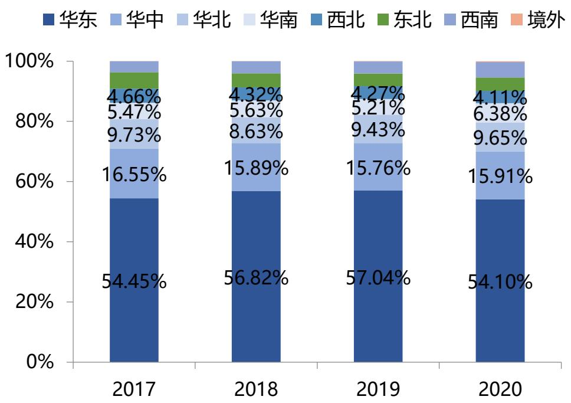

# 干味央厨：大小B双轮驱动，餐饮市场大有可为

分析师：李鑫鑫证书编码：S1190519100001

分析师：李梦鹇证书编码：S1190522080002

证券研究报告：干味央厨深度报告

# 核心观点

(1) 行业分析：随着餐饮工业化浪潮袭来，B端对速冻食品的需求提升，行业品类丰富度提高，叠加冷链的发展，速冻行业仍处于成长期。2021年速冻食品市场规模达到1755亿元，预计 2022-2024年市场规模将突破2千亿，其中速冻面米市场规模达782亿元。其中传统面点增速放缓，格局固化，而新式面点持续推新，品类丰富度仍有较大空间，B端发展空间巨大。

(2)公司分析：以强研发能力和成熟供应链为基，全方位服务造就强客户粘性，爆款单品抢占细分市场。研发能力方面，公司研发团队源自思念，经验丰富且人员稳定。与大客户的长期合作为研发持续提供领先的下游市场信息。供应链服务方面，公司严选供应商，建立针对生产、运输的安全监控系统，全方位服务造就强客户粘性，百胜中国T1供应商凸显供应链实力。产品方面，公司针对各种餐饮场景进行产品开发，持续推出新品，抢占细分市场。

(3)公司逻辑：1）短期：餐饮恢复助力B端复苏，大B客户持续开拓，小B端核心经销商扶持效果显著，乡宴中小餐饮快速复苏助力小B高增。2)中长期：大B客户：百胜通过门店扩展以及推出新品稳定增长，在百胜标杆效应下公司大B新客户拓展顺利。小B端：通过厂商联合项目制扶持核心经销商，发力早餐，团餐、宴席等场景，推出针对产品实现快速增长。C端：公司组建专门的事业群发力零售市场，锁定Y世代和Z世代主力消费群体，推出C端产品试水，有望贡献一定增量。

(4) 盈利预测：公司大B小B双轮驱动，处于快速成长期，同时生产经营效率提升，产品结构优化推动盈利能力提升。我们预计公司2023-2025年净利率逐步提升，分别为 $7 . 2 0 \%$ 、 $7 . 9 8 \%$ 、 $8 . 4 1 \%$ ，收入增速分别为 $2 8 . 6 5 \%$ $2 1 . 0 6 \%$ 、 $1 8 . 9 0 \%$ ，归母净利润增速分别为 $3 6 . 3 1 \%$ $3 4 . 1 8 \%$ $2 5 . 3 2 \%$ 。按照2023年还原股权激励费用后业绩给45X估值，一年目标价80元，维持公司“买入”评级。

(5）风险提示：食品安全风险、原材料价格波动风险、行业竞争加剧风险。

公司概览：专注速冻面米制品，主攻B端渠道二、速冻面米行业：仍在成长期，产品丰富度持续提升三、公司分析：定制化研发能力突出，供应链管理成熟四、公司逻辑：大小B双轮驱动，C端逐步布局

五、 盈利预测及估值

# 1.公司概览

领先的B 端速冻面米制品供应商，提供定制化的全方位后厨解决方案。千味央厨源自思念集团，于2012年在河南郑州成立，致力于为服务酒店、宴席、团餐等消费场景的餐饮企业提供速冻面米制品研发、生产、销售的全方位解决方案。经过超10年的发展，公司凭借突出的研发能力和成熟的供应链管理能力，深度捆绑百胜中国、华莱士等知名连锁餐饮企业，开发出涵盖油炸类、烘焙类、蒸煮类、菜肴类及其他的四大类产品，具体包括油条、芝麻球等超300个单品。

公司近六年实现收入、利润稳步增长。2022年，公司实现收入14.89亿元，同比增长 $1 6 . 8 8 \%$ ，2017-2022年收入CAGR达到 $2 0 . 2 0 \%$ ；2022年末实现归母净利润1.02亿元，同比增长 $1 5 . 2 0 \%$ ，2017-2022年凈利润CAGR达到1 $6 . 9 6 \%$   
公司毛利率及凈利率较稳定。毛利率在 $2 2 \% - 2 5 \%$ 的区间内波动，净利率 $6 . 5 \substack { - 8 . 5 \% }$ 左右。

  
图1：干味央厨收入增长情况

  
图2：干味央厨归母净利润增长情况

  
图4：干味央廚毛利率和凈利率水平

  
图3：干味央厨各项费用率  
资料来源：Wind，太平洋证券研究院整理

# 1.1 产品结构：速冻面点为主，产品矩阵丰富

千味目前已经构建四大品类产品矩阵，以油炸食品为主，烘焙、蒸煮类占比逐年上升，同时也已开始开拓菜肴类及其他，2020年在售数量分别为95、56、166、51种，产品矩阵丰富。  
油炸类产品是公司的主力产品，占比持续下降。2017-2022年公司油炸类业务收入的CAGR为 $1 4 . 7 3 \%$ ，营收占比从2017年的59.4%略降至2022年的 $4 7 . 1 \%$ ，销量复合增速1 $1 . 5 4 \%$ ，吨价复合增速 $2 . 8 6 \%$ 。  
定制品完全通过自产，仅少量低价通用品旺季缺产能通过委托加工生产。招股书中披露，2020年公司委外加工产品金额为4911.16万元，占营收比例 $5 . 2 0 \%$ 。委托辽宁实维天生产3176吨产品，包括芝麻球、地瓜丸等，委托鹤壁鑫发生产3396吨，包括油条、卡通包等通用产品。成功打造油条，蒸煎饺等大单品。公司首创工业化油条，专注于油条研究完善，目前油条类产品市占率超 $50 \%$ 。蒸煎饺2023年销售1.8亿，同比增长 $9 6 . 8 3 \%$ 。2023年打造四大核心单品，米糕，春卷，大包子，烧卖有望成为公司新的增长极。

  
图5：各类产品营收占比情况

  
图6：各类产品营收增长情况  
资料来源：Wind，太平洋证券研究院整理

# 1.1 产品结构：四大品类，产品矩阵丰富

  
图7：千味央廚产品图  
资料来源：公司官网，太平洋证券研究院整理

# 1.2地区分布：华东市场占比超一半

分市场看，华东地区收入超半壁江山。2020年，公司在华东市场的收入独占54.10%的份额，远超其余市场，主要系公司的核心直营客户百胜（上海）及华莱士均位于华东地区。  
分季度看，二季度占比最低，四季度占比最高。四季度收入全年最高，主要系我国国庆节、春节和元宵节等传统节日大多集中在每年的8月份至次年2月份，叠加学生长假，餐饮业进入旺季。

  
图8：干味央厨分地区收入分布  
资料来源：Wind，太平洋证券研究院整理

  
图9：干味央廚分季度营收  
资料来源：Wind，太平洋证券研究院整理

# 1.3 渠道结构：直营占比35%左右

直营渠道占比 $35 \%$ 左右，经销渠道占比 $65 \%$ 。2017-2022年，经销/直营渠道收入复合增速分别为 $2 2 . 3 6 \%$ 和 $1 6 . 5 3 \%$ 。  
直营渠道中，百胜中国为第一大客户。2017-2019年占比 $7 5 \%$ 左右，2020-2022年随着公司对其他直营客户的开发，百胜中国占比下降至 $46 \%$ 。  
据招股书数据，2020年，直营中定制品占比 $84 \%$ ，经销渠道定制品占比 $1 . 6 \%$ 。

  
图10：干味央厨直营和经销渠道收入占比变化

  
图12：百胜中国在直营中占比

  
图11：干味央厨直营，经销渠道收入及增速  
资料来源：Wind，太平洋证券研究院整理

# 1.3 渠道结构：直营占比35%左右

营销中心：负责市场营销业务，进行市场开拓、销售业务、品牌推广及产品管理等工作，由营销副总经理负责管理。营销中心下设重客部、经销商客户部、渠道拓展部、行销部及产品管理部等。公司对每类大B客户都组建了对应的跨职能服务小组，包括总经理、研发、质控、生产、市场、销售等人员，如西式组面向肯德基、华莱士等客户。公司各个相关部门，从董事长到中层管理人员再到一般员工，都会参与到定制模式的市场营销活动中。

重客部：主要负责为百胜中国、华莱土、九毛九、真功夫、海底捞等直营客户提供服务；公司内部树立“大客户优先”理念，形成对接大客户的内部小组，公司董事长和总经理为小组负责人，确保内部组织能够快速响应大客户的需求。

经销商客户部：主要服务于区域型餐饮客户，依托经销商进行销售；经销商客户部在全国设大区经理、省区经理，大区经理、省区经理常驻相应的销售区域，负责对所属区域的运营管理，统筹布局本区域的销售规划，包括新市场的开拓、原有市场的维护、经销商管理和售后服务等。公司要求销售人员对经销客户进行定期拜访，严格管理。

渠道拓展部：主要负责拓展新零售等新业务，疫情期间，经销商通过开展社区团购、送货到家以及商超、便利店等渠道拓展销售。  
﹥行销部：负责客户开发、服务提升工作。

  
图13：销售部门架构设置

  
图14：公司主要直营客户  
资料来源：招股说明书，wind，太平洋证券研究院整理

# 1.4 历史沿革：先发制人，细分赛道破局

千味央厨源自思念集团。2002年，思念首次与百胜合作，为百胜提供蛋挞皮。2006年，为百胜旗下东方既白餐厅研发早餐产品85g大油条。  
2008年为肯德基提供45g安心油条。

2012年思念集团退市后，公司创始人李伟敏锐洞察到餐饮B端市场潜力，由郑州思念全资设立干味央厨，千味央厨正式成立，以进行冷冻食品的生产，开创专业餐饮B2B道路。

2016年，由于同业竞争问题，千味央厨通过股权转让从郑州思念脱离，并随后变更为股份公司，创始人李伟也选择将公司留在手中，将所持思念食品全部股权转让给思念食品管理层，同时获得思念食品高管间接持有的公司股权。

2月底，千味央厨宣布完成1亿元融资，由京东领投、绝味食品跟投。2021年9月，公司成功上市，正式成为餐饮供应链第一股。

  
图15：干味央厨发展历程  
资料来源：公司官网，太平洋证券研究院整理

# 1.5 股权结构： 股权结构清晰， 绑定管理层利益

创始人李伟控股，管理层利益绑定。为专注于拓展速冻米面制品餐饮渠道市场，2016 年3月郑州思念将干味有限 $100 \%$ 股权转让给郑州集之城（17 年更名为共青城城之集），随后同意共青城凯立增资，至此共青城城之集与共青城凯立分别持股 $92 \%$ 与 $8 \%$ 。其中，共青城城之集由李伟持有，而共青城凯立是为投资千味央厨专门设立的持股平台，当前合伙人包括黄河大观董事长助理（出资占比 $8 4 . 3 4 \%$ ），千味央厨在任高管（合计出资占比 $8 . 2 2 \%$ )等。

为补充日常运营资金、筹集产能项目建设资金等，股份公司先后三次增资，引入外部投资者，包括京东的宿迁涵邦与绝味食品的深圳网聚。截止2023年3月31日，公司实际控制人李伟持股比例约 $4 6 . 0 3 \%$ ，战略投资者宿迁涵邦持股约 $1 . 5 0 \%$ ，绝味食品间接持股 $3 . 7 0 \%$ ，香港中央结算有限公司持股 $0 . 8 4 \%$ ，管理人/基金持股1 $1 . 4 9 \%$ （其中董事长孙剑间接持股约 $0 . 2 0 \%$ ），其他投资者共持股 $3 6 . 4 4 \%$ 。

  
图16：截止2023年3月31日股权结构图  
资料来源：招股说明书，wind，太平洋证券研究院整理

# 1.5 股权结构：股权结构清晰， 绑定管理层利益

2021年11月公布股权激励方案：计划拟授予的限制性股票数量为156.84万份，约占本激励计划草案公告时公司股本总额的 $1 . 8 4 \%$ 。激励对象：董事长孙剑，高级管理人员白瑞，王植宾，徐振江，核心研发、业务等骨干人员等共80人。本次授予价格30.80元/股。此次中层骨干参与人员预计研发和销售团队较多。目前高管持股平台共青城凯立持股比例 $4 . 0 8 \%$ ，激励完成后上升至 $5 . 9 2 \%$ 。考核目标：2020年营业收入为基准，2021-2023年营业收入增长率分别不低于 $3 5 \%$ ， $67 \%$ $101 \%$ ，经测算为2021-2023年营业收入同比增长率分别为 $3 5 \%$ $2 3 . 7 \%$ $20 . 4 \%$ ，三年收入复合增速 $2 6 . 2 \%$ 。

激励费用：共计4748万元，21-24年分别摊销214、2473、1335、725万元。

表1：公司股权激励方案内容  

<table><tr><td>授予对象</td><td>职务</td><td>获股数量(股)</td><td></td><td>占总股本比</td></tr><tr><td>孙剑</td><td>董事长</td><td>142900</td><td>9.36%</td><td>0.17%</td></tr><tr><td>白瑞</td><td>总经理</td><td>97400</td><td>6.38%</td><td>0.11%</td></tr><tr><td>王植宾</td><td>副总经理、 财务总监</td><td>87700</td><td>5.75%</td><td>0.10%</td></tr><tr><td>徐振江</td><td>副总经理、 董事会秘书</td><td>116900</td><td>7.66%</td><td>0.14%</td></tr><tr><td></td><td>其他核心人员（76人）</td><td>1081300</td><td>70.85%</td><td>1.27%</td></tr><tr><td></td><td>合计</td><td>1526200</td><td>100%</td><td>1.79%</td></tr><tr><td colspan="5">年度考核营业收入(A)</td></tr><tr><td>目标值(Am)</td><td>以20年度营收为基数，2一收增.率不低.于67%/101%，换算22-23</td><td></td><td></td><td></td></tr><tr><td>触发值(An)</td><td></td><td>不低于年度目标值的80%</td><td></td><td></td></tr></table>

资料来源：招股说明书，wind，太平洋证券研究院整理

# 1.6 管理层：管理层长期任职，速冻食品行业经验丰富

公司管理层为职业经理人，均曾就职于思念，具有丰富的速冻食品从业经验，且于千味央厨成立初期便于公司任职至今，管理层的长期稳定，有助于公司保持战略的持续性，有利于长期稳定发展。

董事长孙剑：2000年进入思念工作，担任郑州思念业务代表、上海公司经理、香港公司经理、营销中心副总经理等，2018年进入千味央厨。  
总经理白瑞：工作经验丰富，2004 年加入思念食品，2012 年加入干味央厨。

多数管理层曾在思念就职，具备丰富的同业经验，逐步推进干味央厨对餐饮行业的探索，开阔新市场，兼具 B&C 端深耕经验，推行可持续发展战略。

表2：干味央厨核心管理层  

<table><tr><td>姓名</td><td>年龄</td><td>职务</td><td>既往履历</td></tr><tr><td>孙剑</td><td>50</td><td>董事长</td><td>本科学历，2018年进入公司，历任河南省天隆实业有限公司业务员、郑州思念业务代表、上海公司经理、香港公司经理、营销中心副 总经理、河南一生缘食品有限公司销售总经理、郑州中部大观地产有限公司副总经理。</td></tr><tr><td>白瑞</td><td>47</td><td>总经理</td><td>硕士学州电级给计部经2理012资进管理部经理任河南冠联装饰经程有限公司财务部会计、海信科龙电器股份有限公司河南分公司会计</td></tr><tr><td>王植宾</td><td>59</td><td></td><td>副总经理，财科.息成级会计师高2012年进入公司经理任率部（集团）有限责任公司财务部会计、郑州章光101生发科技有限公司财务部会计、</td></tr><tr><td>徐振江</td><td>46</td><td></td><td>副总经理、董 硕士学历，中央财经大学在读博士，2015年进入公司，历任广州南方人物周刊实习记者、河南商报社记者、经济新闻部主任、河南宋 事会秘书旻河酒业股份公司总裁助理、洛阳次祖杜康销售有限公司总经理助理、河南骏域基金管理有限公司投资总监。</td></tr></table>

资料来源：招股说明书，太平洋证券研究院整理

一、公司概览：专注速冻面米制品，主攻B端渠道

二、速冻面米行业：仍在成长期，产品丰富度持续提升

三、公司分析：定制化研发能力突出，供应链管理成熟

四、公司逻辑：大小B双轮驱动，C端逐步布局

五、 盈利预测及估值

# 2.1速冻行业：行业景气度高，对标海外仍有较大空间

2021年我国速冻食品市场规模达到1755亿元，2017-2021年市场规模CAGR为 $1 3 . 4 9 \%$ 。预计至2024年国内速冻食品市场规模将达到2260亿元，预计 2022-2024 年市场规模复合增速 $6 . 5 3 \%$ 。  
从细分品类来看，速冻食品中面米食品、速冻火锅料占比最大。其中，速冻面米产品占比为 $5 2 . 4 \%$ ，为最大的品类；速冻火锅料排第二，占比约为 $3 3 . 3 \%$ ，速冻其他食品占比 $1 4 . 3 \%$ 。  
对标海外，我国速冻食品人均消费量低，提升空间大。根据中国产业信息网，2021年我国人均速冻食品消费量为 9kg，远低于美国 60kg、欧洲 $3 5 \mathsf { k g }$ 、日本 $2 0 \mathsf { k g }$ 的人均水平。

  
图17：速冻食品市场规模及增速

  
图18：速冻食品各品类占比

  
图19：2021年人均速冻食品消费量(干克)  
资料来源：中国产业信息网，太平洋证券研究院整理

资料来源：Frost & Sullivan，太平洋证券研究院整理资料来源：中国产业信息网，太平洋证券研究院整理

# 2.2 面米行业：行业格局稳定，新式面点景气度较高

2017-2021年我速冻面米行业市场规模CAGR达到 $6 . 0 6 \%$ 。据国家统计局数据，2017-2021年我国速冻面米市场规模复合增速 $6 . 0 6 \%$ 。预计至  
2025 年国内速冻食品市场规模将达到1045亿元，2022-2025年市场规模复合增速 $7 . 5 1 \%$ 。

传统速冻面米市场集中度高，格局稳定。我国速冻面米制品行业从上世纪90年代初开始起步，经历了产品和渠道单一（1992-1998年）、注重品牌塑造和广告投入加大（199-2005年）和品种丰富快速扩容（2006年至今）三个阶段，行业成熟度相对其他子行业较高，行业格局相对稳定，已形成三全食品、思念、湾仔码头“三足鼎立”的局面，行业CR3达到 $64 \%$ 。

老三样增速放缓，格局固化，新式面点持续出新品，增速较快。传统的饺子、汤圆，板块市场相对饱和，家庭渠道增速放缓。随着餐饮工业化浪潮袭来，B端速冻米面场景越来越丰富，安井在新式面点方面开发了一系列的大单品，包括手抓饼、红糖馒头、馅饼等爆款产品。

  
图20：我国速冻面米制品行业规模   
资料来源：国家统计局，太平洋证券研究院整理

  
图21：2021年速冻面米市场竞争格局  
资料来源：欧睿，太平洋证券研究院整理

# 2.3 餐饮行业：多业态空间广阔，成本居高不下亟需降本提效

中国的餐饮外卖服务市场近年来迅速增长。2021年中国外卖产业规模达8117亿元，同比增长 $2 3 . 1 3 \%$ ，外卖产业渗透率提升至19.92%。团餐市场与速冻食品行业匹配，具有需求可预测、标准化高、综合成本低、可复制性强等特点。2021年团餐营业额为1.77万亿元，6年复合增长率 $1 4 . 4 8 \%$ ，占餐饮业收入达 $3 7 . 6 6 \%$ 。2020年餐饮业收入受新冠疫情影响同比下降，而 $65 \%$ 以上团餐企业服务于机关事业单位、军队、医院等场景，因其业态特殊性营收不受影响甚至呈逆势增长趋势。

疫情催生预制菜行业迎来高速发展。外卖行业的蓬勃发展和因疫情催生的家庭端消费需求，预制菜行业从速冻米面等品类扩展至多种菜品，行业迎来高速发展。NCBD（餐宝典）数据显示，2021年中国预制菜市场规模在3100亿元左右，同比增速 $2 4 . 1 \%$ 。预计到2025年将会突破8300亿元，其中在C端市场的规模占比将接近 $30 \%$ 。

  
图22：我国外卖产业规模  
资料来源：美团，中国饭店协会外卖专业委员会，前瞻产业研究院，太平洋证券整理

  
图23：我国团餐市场规模  
资料来源：《2020年度中国团餐发展报告》，国家统计局，太平洋证券整理

  
图24：我国预制菜行业市场规模  
资料来源：《2022年中国连锁餐饮报告》，太平洋证券整理

# 2.3 餐饮行业：多业态空间广阔，成本居高不下亟需降本提效

中餐占比高，西餐增速快。中国餐饮市场主要由中餐和西餐两部分构成，2019 年中餐市场规模达 3.7 万亿元，占我国餐饮市场 79.4%的市场份额。2014-2019年的中式市场规模由2.3 万亿增至3.7 万亿，年复合增长率为 $1 0 . 1 7 \%$ 。西餐市场规模自 2014 年的 0.3 万亿增至 2019年的 0.7 万亿，年复合增长率为 $1 9 . 7 4 \%$ 。

中餐多菜系连锁化发展助力餐饮供应链蓬勃发展。根据《2023中国中式餐饮白皮书》，2019-2021年中餐的连锁化率在不断提升。火锅作为中式餐饮标准化程度最高、连锁化程度也最高的品类，2021年其连锁化率达到 $2 0 . 7 \%$ ，高于餐饮大盘2.7个百分点。中式八大菜系的连锁化程度较低。主要原因有两个方面：一是地方菜分布分散，主要在原生地发展，口味区域性较强，全国推广难度较大；二是公司治理能力不强，多为家族企业，现代管理企业较少。但人口流动和城镇化水平的提高一定程度帮助了地方菜系的推广。同时不同的菜系口味不同，对生产和运输技术的要求也不同，因此菜系的丰富为餐饮供应商拓展品类提供广阔空间。中式餐饮连锁化发展的趋势有望同时拉动餐饮供应链产业快速发展

  
图25：我国中餐和西餐市场规模及增速  
资料来源：国家统计局，太平洋证券整理

  
图26：2019-2021年典型餐饮品类连锁化率走势

资料来源：《2021 年中国连锁餐饮行业报告》，国家统计局，太平洋证券整理

# 2.3 餐饮行业：多业态空间广阔，成本居高不下亟需降本提效

餐饮企业连锁化发展，速冻食品餐饮市场有望持续扩容。连锁餐饮门店总数持续上升，从2011年的16285家升至2021年的43250家，复合增速$10 . 3 \%$ ，2021年我国餐饮行业连锁化率为 $18 \%$ 。

城市间连锁化程度存在差异，下沉市场提供广阔空间。2021年新一线城市餐饮连锁化率已超过 $20 \%$ ，而五线城市仅为 $1 4 . 5 \%$ 左右，城市间餐饮连锁化程度的差别较大，下沉市场具备更大的提升空间。对标国际，美国和日本的餐饮连锁化率分别为 $54 \%$ 和 $49 \%$ ，我国的连锁化率和标准化程度提升空间仍大。

餐饮企业标准化、规模化的强烈需求，将倒逼供应链改革，因此B端餐饮供应商发展可期。

  
图27：我国连锁餐饮企业门店总数及营业额  
资料来源：国家统计局，太平洋证券整理

  
图28：分城市级别餐饮连锁化率  
资料来源：美团，餐饮老板内参，太平洋证券整理

  
图29：我国餐饮连锁化率与发达国家仍有较大差距  
资料来源：前瞻产业研究院，太平洋证券整理

# 2.3 餐饮行业：多业态空间广阔，成本居高不下亟需降本提效

房租、人力成本上涨加剧餐饮企业负担：餐饮企业的经营成本主要由原材料、房租、人力、能源及相关税费构成。根据《2019中国餐饮业年度报告》，正餐类餐饮企业，人力成本达 $2 2 . 4 \%$ ，房租成本比例达 $10 . 2 6 \%$ 。2019年住宿&餐饮行业平均工资是2009年工资的2.5倍，2019年北上广深平均商铺租金是2008年的3倍。

  
图30：2019年餐饮业成本占营收比例  
资料来源：《2020中国餐饮业年度报告》，太平洋证券整理

  
图31：2014-2021我国餐饮业员工平均年薪

资料来源：国家统计局，太平洋证券整理

# 2.4 对标日本, B端市场未来可期

我国当前消费社会可类比日本 80-90 年代，我国速冻食品人均消费量低于日本，提升空间显著。从人均可支配收入和人均速冻消费量来看，我国当前可类比日本 80-90 年代前后。日本人均可支配收入在 1990 年突破 3 万元人民币（按照当时的汇率换算），人均速冻消费量达到10.8kg/人，与我国当前 30733 元的人均可支配收入、10.6kg/人的人均速冻消费量正好匹配。日本人均速冻食品消费量一直处于上升趋势，2019年创下新高为23.4kg，而2019年中国人均速冻食品食用量为 9kg（与日本1986-1989年的消费水平大致相同)，远低于日本 20kg，伴随着消费升级与日益加快的生活节奏,我国速冻食品行业发展潜力巨大。

  
图32：我国当前消费社会可类比日本80-90年代  
资料来源：Wind，产业信息网，太平洋证券整理

  
图33：1968-2021年日本速冻食品行业人均消费量(kg)  
资料来源：日本速冻业协会，太平洋证券研究院整理

# 2.4 对标日本，B端市场未来可期

对标日本，我国速冻食品餐饮渠道空间较大。根据IBIS咨询统计和测算，18年我国速冻食品的餐饮市场占比约36%；而速冻面米的餐饮市场占比仅约 $16 \%$ 。对比日本较成熟的速冻产业（餐饮渠道占比 $5 5 \%$ ），我国未来餐饮渠道成长空间大。

我国速冻食品产品丰富度有较大提高空间。日本速冻食品丰富度较高，前十大速冻产品包括乌冬面、炸土豆肉饼、炒饭、饺子等，而我国目前速冻面点集中在水饺汤圆等品类，近年来新式面点出新较快，未来品类丰富度提升仍有可观空间。

  
图34：对标日本，我国速冻食品餐饮渠道空间巨大  
资料来源： $\square$ 本速冻食品协会，IBIS咨询，智研咨询，太平洋证券研究院整理

表3：2021年日本前十大速冻食品产量  

<table><tr><td>速冻食品种类</td><td>生产量 (吨)</td><td>占比</td></tr><tr><td>乌冬面</td><td>196219</td><td>12.30%</td></tr><tr><td>炸肉饼</td><td>163243</td><td>10.20%</td></tr><tr><td>炒饭</td><td>100667</td><td>6.30%</td></tr><tr><td>饺子</td><td>98512</td><td>6.20%</td></tr><tr><td>汉堡牛肉饼</td><td>64927</td><td>4.10%</td></tr><tr><td>拉面类</td><td>62708</td><td>3.90%</td></tr><tr><td>意大利面</td><td>62446</td><td>3.90%</td></tr><tr><td>炸猪排</td><td>60214</td><td>3.80%</td></tr><tr><td>杂烩饭类</td><td>50955</td><td>3.20%</td></tr><tr><td>章鱼烧·什锦烧</td><td>49512</td><td>3.10%</td></tr></table>

资料来源：日本速冻业协会，太平洋证券研究院整理

一、公司概览：专注速冻面米制品，主攻B端渠道

二、速冻面米行业：仍在成长期，产品丰富度持续提升

三、公司分析：定制化研发能力突出，供应链管理成熟

四、公司逻辑：大小B双轮驱动，C端逐步布局

五、 盈利预测及估值

# 3.1 强研发能力深度绑定餐饮客户

表4：干味央厨核心技术一览  

<table><tr><td>序号</td><td>核心技木</td><td>来源</td><td>功能及创新</td><td>产品应用</td></tr><tr><td>1</td><td>油条纵切技术</td><td>自主研发</td><td>改变油条面团的切条方式，减少生产线用人，增加生产效率</td><td>外卖油条、精品油条、酥脆油条等</td></tr><tr><td>2</td><td>油条灌蛋制备方法</td><td>自主研发</td><td>新技术，利用油条进行馅料的灌注，增加油条的风味</td><td>蛋芯油条</td></tr><tr><td>3</td><td>点心（小牛包、年猪包系列)</td><td>吸收再创新</td><td>外观创新，根据动物的象形图像进行创新，做成卡通形状的面点</td><td>奔腾小牛包、黄金大年猪包</td></tr><tr><td>4</td><td>包装托盘</td><td>吸收创新</td><td>设计创新，将产品跟包装结合产设计出逐合生产和运的托盘，增加生产效率，</td><td>喜宴福豬八宝饭</td></tr><tr><td>5</td><td>饭团（猪猪饼系列)</td><td>吸收再创新</td><td>外观创新，将饭团制作成猪的形象，造型可爱</td><td>喜宴福豬八宝飯</td></tr><tr><td>6</td><td>麻辣烫油条系列</td><td>自主研发</td><td>将油条创新制作成可以用于煮制和火锅涮煮的产品</td><td>麻辣烫油条</td></tr><tr><td>7</td><td>注芯油条制作方法</td><td>自主研发</td><td>注芯油条的发明创造，对丰富油条系列有促进作用</td><td>蛋芯油条</td></tr><tr><td>8</td><td>注芯油条加工装置</td><td>自主研发</td><td>油条罐装机的研发，有利于产品的快速规模化生产</td><td>蛋芯油条</td></tr><tr><td>9</td><td>面节高效生产方法</td><td>自主研发</td><td>生产方式创新，压延方式的更新，做到无损压延，并加快成型效率</td><td>捞面面节</td></tr><tr><td>10</td><td>冷冻土豆宽粉生产方法</td><td>自主研发</td><td>生产方式创新，从结合产品特性设计适配的蒸程，提高生产</td><td>土豆宽粉</td></tr><tr><td>11</td><td>米糕常温短时发酵生产方法</td><td>自主研发</td><td>发酵方式更新，米糕能够在更短时间内发酵完成，组织结构更加均匀</td><td>白糖桂花糕、红枣南瓜糕</td></tr><tr><td>12</td><td>油条高效和面技术方法</td><td>自主研发</td><td>根据布拉班德粉质曲线，结合专用粉的特性，更快的和出符合生产需求的面团外卖油条、火锅油条、安心油条、香脆油条等</td><td></td></tr><tr><td>13</td><td>球类产品高效成型配方、工艺、设备系统</td><td>自主研发</td><td>产品配方、设备、工艺的创新，生产效率大幅提升，用人数量减少</td><td>艺麻球、地瓜丸</td></tr><tr><td>14</td><td>新型成型油炸裝置</td><td>自主研发</td><td>生产方式创新，结合产品特性 设计的油装置，更能符合产品的炸程，大幅提</td><td>茴香小油条</td></tr><tr><td>15</td><td>意大利千层面生产方法</td><td>自主研发</td><td>生产方式更新，结合产品特性设计适配的然程，提高生产效率</td><td>千层面面皮</td></tr><tr><td>16</td><td>新型预调制八宝粥调理包</td><td>自主研发</td><td>生产方式创新，多种物料加工至同一状态，保证感官</td><td>腊八粥调理包、八宝粥调理包</td></tr></table>

资料来源：招股说明书，太平洋证券研究院整理

# 3.1 强研发能力深度绑定餐饮客户

公司核心技术人员均在思念任职过相关岗位，从业经验丰富；且均在2014年前进入千味央厨工作，团队稳定。技术研发总监贾学明自2004年至2012年在思念历任面点师、研发组长、技术经理和高级研发工程师。研发面点经验丰富，2012年进入干味央厨，研发了安心油条、千层面奶黄包等高销量产品。

思念授之以鱼，2018年12月21日以公允价值56.69 万元（含税）转让给公司10项专利，目前在用专利5项，其中实用新型专利4项。这使得干味央厨在发展初期具有一定的产品及生产技术支撑。但更重要的的是，思念授之以渔，截至2022年12月31日，公司拥有研发、技术人员73名，占员工总数的 $3 . 3 2 \%$ ，同比增加超 $70 \%$ 。根据招股说明书，公司拥有46种专利，其中实用新型专利8项，外观设计专利37项。并且在产线设备不足的情况下自主研发蛋挞切块机、油条、芝麻球等自动生产线，使得产品从研发到量产的过程不断优化，先人一步投放产量抢占市场。

表5：公司核心技术人员介绍  

<table><tr><td>姓名 职务</td><td>既往履历 男，1977年出生，毕业于河南牧业经济学院，大专学历，高级面点师。1997年7月至2004年2月从事餐饮面点师工作：2004年3月至</td></tr><tr><td>贾学明</td><td>术研发部总2012年，念、研发长术经级研发师201至今在本公司作现公司技术研部总 得中原厨艺精英烹饪大赛特金奖和首届“全国发酵面食优秀科技工作者”称号。</td></tr><tr><td>程燕</td><td>技术研发部工公19年于河南科技学，本科发体系至2012年5报技研发资料管理员：2012年6月至今在</td></tr><tr><td>朱国新</td><td>男，1957年出生，毕业于商州市商业职工大学，大专学历。1975年至2008年6月历任新乡食品机械有限公司技术员、工程师、技术 术研工思200年0年都博械有限公司师部20101 升级。研发了豆腐切丁机、红豆派上装装置等新型设备。</td></tr><tr><td>李欢</td><td>技术研发部工公司业于河南工业大学20年12月至2013年5月，金儿专2013年9至今在</td></tr><tr><td>姬真真</td><td>技术研发部工1986年出州大学业，科学历，206年6月至2012年5任郑念技术资料统计员，研发：2012年6至在本</td></tr></table>

资料来源：招股说明书，太平洋证券研究院整理

# 3.1 强研发能力深度绑定餐饮客户

连锁餐饮企业加工工艺、后厨设备和厨师操作习惯的速冻食品和技术支持体系，解决了下游餐企标准化低、选择范围小和成本控制难的多个痛点。

定制流程：经过市场调研、立项、小试、中试、试产、评审等环节后，公司研发流程结束并与客户达成合作意向。此后，定制客户一般基于采购合同提前一个月采购计划的形式提出产品需求，与公司确定订单。

1、大B客户提前半年到一年主动交流自身产品需求，或公司提供体验性产品供客户选择。

派研发、技术人员深度调研C端消费场景、B端后厨设备、高峰期设备利用率等。将进行针对性的研发工作，研发周期一般由客户设定，通常为3-6月。

3、公司做提案，做出产品供客户选择，通过后实现工业化。

通用品的研发具有灯塔效应。通过与大型连锁客户的研发合作，公司较同业其他参与者更快获取下游趋势变动，具备更强的产品开发领先性，进而起到灯塔引领效应。产品在大型连锁餐饮端被验证后，其研发思路逐步转化至经销渠道，用于开发经销渠道产品。

  
图35：定制生产模式与通用品生产模式对比  
资料来源：招股说明书，太平洋证券研究院整理

# 3.2 供应链体系成熟, 服务各类餐饮客户

# 国际级采购标准，从源头把控食材品质。

采购端：千味央厨采用“国际标准的原材料采购达标系统”，建立了严格的供应商选定和管理机制，通过季度考评对供应商进行全方位的评估，并对原材料进行检测，公司的一切原材料都可以追溯。目前，公司通过集中采购控制原料质量与成本，并与全国知名供应商达成稳定合作。

生产端：公司编写产品的HACCP计划、QAP等，科学设置关键控制点，对重点工序安装高清的360°监控系统，24小时动态监控，保证食品安全。

检验端：公司检测中心配备多台先进仪器设备，可以满足产品检测和研发的需求；配备高学历检测人员，检验合格的产品才允许出厂。运输端：公司拥有专业配套的仓储管理系统和物流发货系统，针对运输车辆制定安全卫生规范，运输过程全程冷链管控，配备GPS电子温控系统实时监控车辆运输路线和车厢温度。

  
资料来源：招股说明书，太平洋证券研究院整理

# 3.3 全方位服务造就大客户强粘性，大品牌背书先发优势明显

全方位服务绑定头部大型连锁客户。定制客户签订保密协议，明确定制需求。千味央厨为直营客户提供菜单设计、产品开发、产品销售、技术支持、干线物流运输以及后续服务咨询等整体解决方案，建立长期合作同盟关系，与直销客户定期研讨产品升级方向。

作为中国最早深耕B端速冻面米制品的公司，公司客户粘性相对更高。千味央厨自2012年以来，始终坚持“只为餐饮，厨师之选”的战略定位，深耕B端，避开了C端三全、思念及湾仔码头的强势竞争，占据消费粘性强、易守难攻的餐饮端。

成熟的大B连锁餐饮企业具备一套严苛的供应商管理机制，T1级别供应商是公司产品与服务的品牌背书。百胜中国对供应商采用“STARSystem'评估体系进行考核，包括3个部分18个项目的评估以及4次飞行检查，并最终分为T1-T4四个级别。级别越高权益越大，但难度也越大，综合评分在85分以上才能获得T1评级。行业反馈STAR 系统的认证难度要远高于国际 ISO 质量认证。以千味为例，公司凭借与百胜超过十年的合作经验及全方位的努力才在2016年跻身T1级别。百胜 300 多家供应商中仅 $5 \%$ 为T1级别。

  
图37：百胜中国供应商管理机制  
资料来源：百胜《2020年可持续发展报告》，太平洋证券整理

  
图38：千味央厨来自于百胜中国及其关联方的收入  
资料来源：招股说明书，公司公告，太平洋证券研究院整理

一、公司概览：专注速冻面米制品，主攻B端渠道二、速冻面米行业：仍在成长期，产品丰富度持续提升三、公司分析：定制化研发能力突出，供应链管理成熟四、公司逻辑：大小B双轮驱动，C端逐步布局

五、 盈利预测及估值

# 4.1 短期：餐饮恢复助力大B复苏，多场景发力维持小B高增

大B端低基数、餐饮端逐渐恢复以及持续开拓新客户，2023收入有望恢复性增长。2022年大B与2021年基本持平，其中百胜下滑 $2 \%$ ，百胜以外大B增速不到 $5 \%$ 。但随疫情管控放松，B端餐饮需求将逐渐恢复。随着中国餐饮连锁化趋势加强，公司核心客户门店数量将逐年增加，如百胜中国将加速渠道下沉，2023年预计净新增1100至1300家门店，呷哺呷哺预计2023年新开240家门店。公司近两年成功打入老乡鸡和瑞幸供应链，随着末来合作的加深和客户门店的进一步开拓，贡献增量有望高速增长。

扶持核心经销商效果显著，小B端有望实现快速增长。乡村宴席1月以来恢复情况超预期，公司深耕宴席场景，1月启动宴席季，针对宴席场景研发菜单，推出酥皮春卷，乳酸菌米糕等新品。公司同时关注团餐，早餐等消费场景，2月推出蒸煎饺、大油条、早餐大包等产品组合。公司扶持核心经销商效果显著，2023年有望延续2022年的亮眼表现，实现 $25 \%$ 以上增速。

  
图39：公司各渠道合作伙伴  
资料来源：太平洋证券研究院整理

# 4.2 中长期：爆款单品竞争优势突出，多场景化抢占细分市场

第一大单品：油条。市占率在 $5 0 \% - 6 0 \%$ 左右，享有一定提价权。

2020年公司前十大产品中3大单品属于油条品类，其中KFC冷冻油条、千味450g香脆油条、千味1200g安心大油条为主要产品，2020年销售额均超干万，销售额占比分别为 $7 \% / 5 \% / 3 \%$ ，合计占比 $1 5 \%$ ，销售额合计约1.36亿元。

依托现有产品深入研究场景化，抢占每个细分市场。以油条为例，公司源于思念和肯德基合作的“安心油条”，2012年干味央厨正式成立后，便开始进行油条细分场景的市场研究，拥有7项油条核心技术，细分出火锅、快餐、自助餐、宴席、早餐、外卖6大场景，并针对性推出多款创新性产品，油条系列成长为公司的拳头产品，且在一线品牌中具备价格优势。

表6：油条有一定的提价权  

<table><tr><td>吨价增速</td><td>2017</td><td>2018</td><td>2019</td><td>2020</td></tr><tr><td>油炸类</td><td></td><td>0.0%</td><td>3.2%</td><td>3.6%</td></tr><tr><td>烘焙类</td><td></td><td>9.3%</td><td>11.1%</td><td>-4.3%</td></tr><tr><td>蒸煮类</td><td></td><td>1.9%</td><td>-1.4%</td><td>-11.4%</td></tr><tr><td>菜肴类及其他</td><td></td><td>-0.4%</td><td>-5.6%</td><td>-9.8%</td></tr><tr><td>合计</td><td></td><td>2.3%</td><td>3.8%</td><td>-1.2%</td></tr></table>

资料来源：招股说明书，太平洋证券研究院整理

  
图40：油条覆盖多个消费场景

# 4.2 中长期：老客户提供稳定增长极，新客户开发空间大

大B端，老客户自然开店 $^ +$ 导入新品。百胜中国拥有的门店数从2017年的7900余家增长至2022年的近13000家，复合增速达 $1 0 . 1 5 \%$ ；营收由2017年的77.7亿美元增长至22年的95.7亿美元，复合增速 $4 . 2 6 \%$ 。千味从成立之初向其提供蛋挞皮，后又将产品延伸到安心油条、华夫饼、冷冻面团、烙饼、牛角包、酥饼等多个品类。公司老客户开店势头良好，有望成为千味稳定增长极。

大B端有望开拓更多新客户。公司在百胜中国供应商体系中为最高级T1级供应商，是公司产品与服务的品牌背书，使得公司开拓其他大B新客户较为顺畅。近年来公司积极开拓细分餐饮赛道的龙头企业客户和潜力企业客户，成功进入海底捞、真功夫、九毛九、呷哺呷哺等知名连锁餐饮品牌企业的供应链。目前在餐饮细分赛道龙头企业中，千味仍有企业尚未覆盖，全国500家门店以上的连锁餐饮客户有300多家，公司通过经销商等渠道触及的大B客户30-40家，占比约1/10，仍具备继续拓展的空间。

  
图41：百胜中国门店数  
资料来源：百胜中国公告，太平洋证券整理

  
图42：百胜中国营业收入

# 4.2 中长期：培育优质大商，瞄准细分市场

公司以经销模式覆盖小B客户，建立厂商联合项目制共同体扶持大商效果显著。2019年公司开始在经销商渠道重点培育大经销商，抓大放小，重点在扶持现有的优质经销商，希望由核心经销商拉动增长。通过厂商联合项目制形式，推进了厂商联合服务客户，取得了显著效果，核心经销商表现优于其他经销商。

公司发力重点消费场景，针对性地推出产品以及产品组合。公司聚焦早餐、团餐、宴席三大消费场景，围绕客户特点进行个性化产品研发。针对早餐，公司推出大包子、卡通包、葱油饼等产品，针对团餐，公司推出煎蒸饺、米糕、春卷等产品，针对宴席，公司推出炒牛柳、树莓挞等产品，抢占乡宴渠道红利。公司通过经销商覆盖乡厨、团餐等客户，开展“尖刀行动”，多维度赋能经销商，帮助经销商深耕下沉渠道。

  
图43：针对早餐、团餐、宴席推出的产品代表

资料来源：干味央厨微信公众号，太平洋证券整理

# 4.2 中长期：募投项目扩产提效，收购切入茶饮赛道

IPO项目：公司拟发行不超过2,128万股，主要用于1）新乡三期厂房建设和总部基地及研发中心建设项目，原预计项目总投资3.77亿元，后为提升生产效率、优化资源配置，公司减小对新乡三期的资金投入，将规划的速冻面米制品年产能由原计划的8万吨降低至6万吨，现预计项目总投资3.07亿元，投入募集资金2.50亿元，项目建设周期2年。2）红枫里2号改建为总部基地及研发中心，但因新乡三期尚未完成建设、红枫里厂区生产线尚未搬迁，项目预计可使用时间将推迟至2024年9月30日。

2022年设计产能16.5万吨，实际产能10.94万吨。2022年8月18日，安徽芜湖工厂投产，投产后年产能5万吨，支持华东市场拓张。新乡三期项目预计2023年6月建成，产能6万吨，较原计划减少的2万吨产能将由芜湖二期补足，未来预计每年产能增幅5万吨左右。

定增项目：公司拟定增25,992,730股股票，预计募集资金总额不超过5.9亿元，主要用于1）面向华东市场的芜湖百福源原有产线的升级及扩产，投资额2.7亿，建成后将形成5.2万吨产能，建设周期2年。2）投资面向华北和东北地区的鹤壁百顺源（一期）项目，投资额3亿，建设周期2年。建成后将形成7.2万吨产能，建设周期2年。3）收购味宝食品（昆山）有限公司80%股权，投资额4186万，收购后持股比例从20%上升至100%。味宝食品年产1.5万吨珍珠，为百胜T1供应商、85度C供货商。2021年度营收和净利分别为7,524.70万元和1，213.38万元。根据公告计算，公司将在2025年形成37.6万吨产能，按照2022年吨价计算，对应42.28亿产值。2022-2025年产能复合增速31.5%。

  
图44：千味央廚产能利用率  
资料来源：招股说明书，太平洋证券研究院整理

表7：干味央厨募投项目  

<table><tr><td>序号</td><td>项目名称</td><td>投资总额 (万元)</td><td>募集资金拟投入金额 (万元)</td><td>建设期</td></tr><tr><td colspan="3">1新乡千味央厨食品有限公司食品加工建设项目 （三期)</td><td>24975.60</td><td>24个月</td></tr><tr><td colspan="3">30741.22 2总部基地及研发中心建设项目 5,979.98 26,722.16</td><td>3236.61</td><td>24个月</td></tr><tr><td colspan="3">3芜湖百福源食品加工建设项目</td><td>20160.38</td><td>24个月</td></tr><tr><td colspan="3">4鹤壁百顺源食品加工建设项目（一期)</td><td>30803.41</td><td>24个月</td></tr><tr><td colspan="3">30,803.41 5收购味宝食品 80%股权 4,186.13</td><td>4186.13</td><td>-</td></tr><tr><td colspan="3">6补充流动资金 3,850.08</td><td>3850.08</td><td>-</td></tr><tr><td colspan="3">合计 102282.98</td><td></td><td></td></tr><tr><td colspan="3"></td><td>87212.21</td><td>-</td></tr></table>

# 4.2 中长期：布局C端，试水预制菜

C端逐步发力，有望成为新增长极。公司近期推出的三个面对C端的子品牌及系列产品愈显公司决心，“岑夫子”聚焦地方特色美食，以继承传统$^ +$ 跨界组合 $^ +$ 年轻化创新为核心路线，品牌旗下已有“靓汤云吞”这个特色产品。“千味解忧炸货铺”，结合自身烤炸产品优势，瞄准空气炸锅等场景，将推出七大产品。“纳百味”来自高性价比优势产品的转化，主要针对日常消费场景。公司利用产品研发和品牌优势，在巩固B端业务的基础上，组建专门的事业群发力零售市场，锁定Y世代和Z世代主力消费群体，有望成为新增长极。

紧跟餐饮发展趋势，试水预制菜赛道。公司成立控股子公司“御知菜”，专业致力于高端预制菜肴的研发、生产和销售。子公司围绕客户需求，模拟后厨环境，为客户提供标准化的中式菜肴供应解决方案，研发服务能力出众。子公司设有占地面积超过一万平米的万吨生产基地，并建立全方位食品操作监控系统、配备专业仓储物流体系来保障生产和物流的安全及时。子公司针对不同渠道和目标人群，推出“豪宴盛馔”、“吉味满堂”、“御知菜”、“御三娘”四大品牌，形成多渠道服务模式，旨在精确抢占不同的细分市场。子公司现已推出瞄准乡厨的锅贴豆腐、咕肉等产品，瞄准团餐的宫保鸡丁、拌面酱等产品，瞄准快餐的桶子鸡、焖面等产品。

  
图45：C端新品

资料来源：中国日报网，太平洋证券整理

  
图46：御知菜

一、公司概览：专注速冻面米制品，主攻B端渠道二、速冻面米行业：仍在成长期，产品丰富度持续提升三、公司分析：定制化研发能力突出，供应链管理成熟四、公司逻辑：大小B双轮驱动，C端逐步布局

五、 盈利预测及估值

# 5 盈利预测

➢ 1）直营渠道：低基数背景下，餐饮需求恢复，百胜、呷哺呷哺等大B开拓新店，加快推新。此外公司积极接触TIMS、盒马等潜在客户，培育新的增长极。我们预计23-25年直营渠道收入增速分别为 $2 4 . 0 1 \%$ 、 $1 8 . 7 0 \%$ $1 5 . 8 1 \%$ 。

2）经销渠道：公司发力宴席、团餐等重点消费场景，1月以来宴席场景需求恢复超预期，推出针对性产品组合，其中油条、蒸煎饺大单品增速较快。公司增加经销网络资源投入，扶持核心经销商效果亮眼。我们预计23-25年经销渠道收入增速分别 $2 5 . 0 0 \%$

<table><tr><td></td><td>2022</td><td>2023E</td><td>2024E</td><td>2025E</td></tr><tr><td>主业收入 (百万元)</td><td>1483</td><td>1856</td><td>2255</td><td>2689</td></tr><tr><td>YOY</td><td>16.83%</td><td>25.12%</td><td>21.51%</td><td>19.24%</td></tr><tr><td>主业毛利率</td><td>23.16%</td><td>24.25%</td><td>24.50%</td><td>24.52%</td></tr><tr><td></td><td></td><td></td><td></td><td></td></tr><tr><td>直销收入 (百万元)</td><td>517</td><td>641</td><td>761</td><td>882</td></tr><tr><td>直销渠道增速 (YOY)</td><td>1.28%</td><td>24.01%</td><td>18.70%</td><td>15.81%</td></tr><tr><td>直销毛利率</td><td>21.12%</td><td>23.10%</td><td>23.20%</td><td>23.20%</td></tr><tr><td></td><td></td><td></td><td></td><td></td></tr><tr><td>经销商收入 (百万元)</td><td>966</td><td>1208</td><td>1485</td><td>1797</td></tr><tr><td>经销渠道增速 (YOY)</td><td>27.29%</td><td>25.00%</td><td>23.00%</td><td>21.00%</td></tr><tr><td>经销渠道毛利率</td><td>24.25%</td><td>25.00%</td><td>25.30%</td><td>25.30%</td></tr><tr><td></td><td></td><td></td><td></td><td></td></tr><tr><td>其他收入 (百万元)</td><td>534.4</td><td>685.04</td><td>835.88</td><td>992.96</td></tr><tr><td>其他收入增速 (YOY)</td><td>23.8%</td><td>28.2%</td><td>22.0%</td><td>18.8%</td></tr></table>

资料来源：公司招股说明书，太平洋证券研究院整理

盈利能力：1）公司募资优化新乡三期产能建设，新建芜湖二期、鹤壁厂区。区域生产布局完善降低冷链运输成本，产能提升扩大规模效应，毛利率提升可期。2）煎蒸饺，烘焙等高价产品快速放量进一步优化产品结构，助推毛利率提升。3）随2023年成本环比下降，毛利率有望改善。预计2023-2025年毛利率 $2 4 . 2 5 \%$ $2 4 . 5 0 \%$ - $2 4 . 5 2 \%$ 。考虑规模效应下费用率摊薄，我们预计2023-2025年销售费用率 $4 . 6 6 \%$ - $4 . 4 9 \%$ - $4 . 4 4 \%$ 。

公司大 B 小 B 双轮驱动，处于快速成长期，同时生产经营效率提升，产品结构优化推动盈利能力提升。综上，我们预计公司 2023-2025 年净利率逐步提升，分别为 $7 . 2 0 \%$ $7 . 9 8 \%$ ， $8 . 4 1 \%$ ，收入增速分别为 $2 8 . 6 5 \%$ ， $2 1 . 0 6 \%$ 、 $1 8 . 9 0 \%$ ，归母净利润增速分别为$3 6 . 3 \%$ $3 4 . 2 \%$ $2 5 . 3 \%$ 。按照2023年还原股权激励费用后业绩给45X估值，一年目标价80元，维持公司“买入”评级。

表9：干味央厨盈利预测  

<table><tr><td></td><td>2022</td><td>2023E</td><td>2024E</td><td>2025E</td></tr><tr><td>营业收入 (百万元)</td><td>1489</td><td>1915</td><td>2318</td><td>2757</td></tr><tr><td>YOY</td><td>16.86%</td><td>28.65%</td><td>21.06%</td><td>18.90%</td></tr><tr><td>销售费用率</td><td>3.93%</td><td>4.66%</td><td>4.49%</td><td>4.44%</td></tr><tr><td>管理费用率</td><td>9.37%</td><td>8.93%</td><td>8.42%</td><td>7.96%</td></tr><tr><td>归母净利润 (百万元)</td><td>102</td><td>139</td><td>186</td><td>234</td></tr><tr><td>YOY</td><td>15.2%</td><td>36.3%</td><td>34.2%</td><td>25.3%</td></tr><tr><td>凈利率</td><td>6.78%</td><td>7.20%</td><td>7.98%</td><td>8.41%</td></tr><tr><td>PE</td><td>59.6</td><td>43.7</td><td>32.6</td><td>26.0</td></tr></table>

资料来源：公司招股说明书，太平洋证券研究院整理

食品安全风险。速冻面米制品对于冷链运输要求较高，需全程控温，若公司运输、仓储等环节出现食品安全问题，将影响公司口碑及销售。

原材料价格波动风险。公司生产所需的主要原材料为大宗农产品包括面粉、糯米粉、食用油、白砂糖等，受大宗商品价格波动影响受大宗商品价格波动影响。报告期内，公司原材料成本占营业成本的比例在 $80 \%$ 左右，原材料价格的波动直接影响公司的盈利。

行业竞争加剧的风险。公司竞争对手主要为国内外上市公司及拟上市公司、外商投资企业，资金实力雄厚。若公司不能尽快提高核心竞争力，将面临行业竞争力下降的风险。此外，餐饮客户和消费者喜好及消费趋势变化、替代品等也会加剧行业竞争。

对单一客户销售占比较高的风险。发行人作为百胜中国T1级供应商，自2012年成立以来始终为百胜中国提供优质畅销的产品和全方位的技术服务，与百胜中国合作关系稳定。但公司未来仍存在百胜中国减少订单甚至终止合作导致公司经营业绩下滑的风险。

# 》行业评级

看好：我们预计未来6个月内，行业整体回报高于市场整体水平 $5 \%$ 以上;中性：我们预计未来6个月内，行业整体回报介于市场整体水平- 5%与5%之间；看淡：我们预计未来6个月内，行业整体回报低于市场整体水平 $5 \%$ 以下

# 公司评级

买入：我们预计未来6个月内，个股相对大盘涨幅在15%以上;增持：我们预计未来6个月内，个股相对大盘涨幅介于 $5 \%$ 与 $15 \%$ 之间；持有：我们预计未来6个月内，个股相对大盘涨幅介于- $5 \%$ 与 $5 \%$ 之间；减持：我们预计未来6个月内，个股相对大盘涨幅介于- $. 5 \%$ 与 $15 \%$ 之间

# 重要声明

太平洋证券股份有限公司具有经营证券期货业务许可证，公司统一社会信用代码为：91530000757165982D本报告信息均来源于公开资料，我公司对这些信息的准确性和完整性不作任何保证。负责准备本报告以及撰写本报告的所有研究分析师或工作人员在此保证，本研究报告中关于任何发行商或证券所发表的观点均如实反映分析人员的个人观点。报告中的内容和意见仅供参考，并不构成对所述证券买卖的出价或询价。我公司及其雇员对使用本报告及其内容所引发的任何直接或间接损失概不负责。我公司或关联机构可能会持有报告中所提到的公司所发行的证券头寸并进行交易，还可能为这些公司提供或争取提供投资银行业务服务。本报告版权归太平洋证券股份有限公司所有，未经书面许可任何机构和个人不得以任何形式翻版、复制、刊登。任何人使用本报告，视为同意以上声明。