# 千味央廚（001215）

# 餐供米面龙头，大小B梯次突破

买入（首次)

<table><tr><td>盈利预测与估值</td><td>2022A</td><td>2023E</td><td>2024E</td><td>2025E</td></tr><tr><td>营业总收入（百万元）</td><td>1,489</td><td>1,900</td><td>2,394</td><td>2,919</td></tr><tr><td>同比</td><td>17%</td><td>28%</td><td>26%</td><td>22%</td></tr><tr><td>归属母公司净利润（百万元）</td><td>102</td><td>140</td><td>209</td><td>256</td></tr><tr><td>同比</td><td>15%</td><td>38%</td><td>49%</td><td>22%</td></tr><tr><td>每股收益-最新股本摊薄（元/股）</td><td>1.18</td><td>1.62</td><td>2.41</td><td>2.95</td></tr><tr><td>P/E（现价&amp;最新股本摊薄）</td><td>42.76</td><td>31.03</td><td>20.85</td><td>17.04</td></tr></table>

关键词：#第二曲线

# 投资要点

千味央厨专注服务餐饮B 端，系餐饮供应链米面龙头企业。千味央厨脱胎于思念，专注服务餐饮B 端，系百胜中国T1供应商。千味央厨雏形诞生于郑州思念餐饮事业部，2012 年成立以来一直专注于服务餐饮B端客户。公司股权结构稳定，持股集中，实控人李伟持有公司46%股份，系郑州思念的创始人。实控人和高管团队大多来自郑州思念，在速冻食品领域具备丰富的从业经验。

大B：千味发展之基，强研发保驾护航。千味央厨自2002 年开始与肯德基合作，系百胜中国核心T1供应商。百胜中国作为公司第一大客户，开店势头良好，2019-2022年开店CAGR为12%，成为千味稳定增长极。与百胜等龙头大B 企业合作有效带动公司拓客效率提升，大B客户背书后，千味与中型连锁餐饮企业合作过程中可省略部分流程，拓客效率高。长期看，千味通过分工明确的研发架构、“场景化”、“模拟餐厅后厨化”的研发模式夯实自身研发能力，推新快、定制化服务能力强，为与大B的合作保驾护航。

小B：以产品力突破，以渠道力赋能。产品力，千味通过市场调研，挖掘单品在后厨端使用痛点进行针对性研发，推出后以此为特点进行宣传推广，以强产品力突破小B 渠道客户。渠道上，千味央厨小B渠道主要分为三个场景：社会餐饮，乡村宴席，团餐，在团餐、乡村宴席与友商形成错位竞争。同时公司加大对头部经销商扶持力度，围绕有规模、潜力的客户，以3种方式协助经销商开展业务：1）销售策略支持；2)协助经销商开发下游客户；3)帮助朝专业化、市场化方向转型。公司对渠道的掌控力日益增强，为小B 渠道的发展保驾护航。2022 年前 20 大头部经销商销售额达到2.6亿元，占比达到17.5%，同比增幅达到26.59%。

1盈利预测与投资评级：公司专注服务B端餐饮客户，看好公司在强研发和客户优势双轮驱动下持续增长。可比公司我们选取安井食品、宝立食品、立高食品，在产品和销售渠道上与千味可比。我们预计2023-2025年公司收入分别为 19.0/23.9/29.2 亿元，同比增速+27.6%/26.0%/21.9%，预计归母净利润1.4/2.1/2.6亿元，同比+38%/49%/22%，EPS分别为1.62/2.41/2.95元，对应PE分别为31x、21x、17x，公司在大B端先发优势强，研发能力沉淀足，小B以乡厨、团餐渠道错位竞争，成长性佳，2024 年对应PEG为0.6，对比可比公司，具备性价比，首次覆盖，给予“买入”评级。

■风险提示：食品安全风险、原材料价格波动风险、市场竞争加剧风险、大客户收入占比较高带来的业绩不稳定风险。

2024年01月11日

证券分析师孙瑜  
执业证书：S0600523120002suny@dwzq.com.cn证券分析师罗頔影  
执业证书：S0600523080002luody@dwzq.com.cn

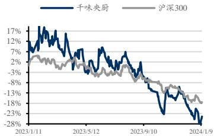  
股价走势

# 市场数据

收盘价(元) 50.30  
一年最低/最高价 47.44/82.98  
市净率(倍) 3.82  
流通A股市值(百  
万元) 2,274.67  
总市值(百万元) 4,358.11

# 基础数据

每股净资产(元,LF) 13.16   
资产负债率(%,LF) 33.69   
总股本(百万股) 86.64   
流通A股(百万股) 45.22

# 相关研究

# 内容目录

1．脱胎于思念，深耕餐饮供应链二十年. 4  
1.1.起源于百胜中国供应商，具备思念基因 .4  
1.2.实控人为思念创始人，管理层具备丰富的速冻从业经验. ..6  
2.大B：千味发展之基，强研发保驾护航... .  
2.1．深度绑定百胜中国，有望成为稳定增长极 ….8  
2.2.大B 端带动中B 端，灯塔效应显著， ….10  
2.3.核心研发能力强劲，推新快、定制化能力强 ..12  
3.小B：以产品力突破，以渠道力赋能.. …14  
3.1.产品端降本增效，发挥大单品优势. .14  
3.2.扶持头部经销商，夯实渠道力.  
4.C 端：小试牛刀… .16  
5.盈利预测… .16  
6.风险提示… .18

# 图表目录

图1： 千味央厨发展历程. .4  
图2: 千味央厨营业收入及 yoy.. ..5  
图3： 千味央厨归母净利润及yoy. ….5  
图4： 千味央厨产品收入结构. ..5  
图5： 千味央厨分渠道收入及yoy. ….5  
图6： 千味央厨产品矩阵. ….6  
图7： 千味央厨高管介绍. ….6  
图8： 千味央厨股权结构（截至 2023Q3) ….  
图9： 2022 年主要速冻公司高管及职工薪酬对比（单位：万元） ….7  
图10: 千味央厨2021年限制性股票激励计划内容. ….7  
图11 千味央厨销售中心架构. ….8  
图12: 百胜中国门店数量.. ….9  
图13: 肯德基中国餐厅收入及yoy. ….9  
图14: 千味央厨对百胜中国销售金额及yoy. ….  
图15: 千味央厨部分下游客戶. .10  
图16: 海底捞、老乡鸡门店数量. .. 10  
图17: 华莱士每年新开店数量. ..1  
图18: 2018-2022 年中国餐饮连锁化率 .11  
图19: 2021年餐饮行业各项成本增速. ..11  
图20: 千味央廚导入肯德基的品类 ..12  
图21: 公司各细分场景下的油条产品. ….13  
图22: 某粥铺部分点心品类（其中点心SKU数：37) ..14  
图23: 千味央厨小B 渠道部分大单品介绍. ….14  
图24： 小B渠道的三大场景. ….15  
图25: 千味央厨经销商平均销售额及 yoy….  
图26： 千味央厨前20大经销商销售额及占比.. ….16  
图27: 千味央廚旗下三大C端品牌 .. 16  
图28： 千味央厨主要业务收入拆分预测. .17  
表1：味宝财务及其他基本情况. 10  
表2：公司核心技术人员介绍. .13  
表3：可比公司估值对比（估值日2024/1/11） .18

# 1．脱胎于思念，深耕餐饮供应链二十年

# 1.1．起源于百胜中国供应商，具备思念基因

千味央厨脱胎于思念，深耕餐饮B 端。千味央厨主营业务为面向餐饮企业的速冻面米制品的研发、生产和销售。回顾公司发展历程，2006 年安心油条诞生，并于 2008 年进入肯德基，为B 端业务夯实基础。2012 年郑州思念出资成立千味央厨公司，品牌初具雏形，同年芝麻球单品销量过亿元。2013 年，公司成立郑州、上海两大基地。2016 年公司正式独立于郑州思念，更名为郑州千味央厨食品股份有限公司，进入百胜T1供应商体系并与麦当劳开展合作。2017 年设立全资子公司新乡千味，至2019 年工厂一二期、万吨冷库相继投入使用。2018 年京东领投，绝味食品跟投共同出资1亿元，合计占千味央厨 $10 \%$ 股权。数年积淀，2021 年于深交所上市。2022 年芜湖工厂投产。2023 年至今规模持续扩张，自发行定增预案，拟募投建设芜湖、鹤壁工厂并收购味宝食品，到新乡三期工厂投产，步入高质量发展。在B 端新突破成为百胜中国策略供应商，优势稳固后试水C端，三大品牌相继亮相。公司脱胎于思念，秉承“只为餐饮、厨师之选”的差异化战略定位，致力于为餐饮企业提供定制化、标准化的速冻食品及相关餐饮后厨解决方案。

图1：千味央厨发展历程  

<table><tr><td></td><td></td><td>创餐饮B2B道路</td><td></td><td>股份有限公司</td><td></td><td>设立全新 乡千味</td><td>元</td><td>深交所 上市</td><td></td><td></td><td>味宝食品</td></tr><tr><td>2006 安心条</td><td>2008 进</td><td>2012 艾麻球单品</td><td>2013</td><td></td><td>2016</td><td>2017</td><td>2018</td><td>2019</td><td>2021</td><td>2022 厂</td><td>2023</td></tr></table>

数据来源：公司公告、公司官网、公开资料、东吴证券研究所

承继内化大B基因，综合服务能力优势凸显。千味央厨起源于百胜供应链，多年发展下锤炼出强大的研发能力和完善的供应链响应机制。1)2B 端对企业研发能力和柔性供应链能力要求更高，需要更丰富的产品矩阵和更高的研发定制产品能力。千味央廚在郑州、上海分别建设有两个产品研发基地，多个产品研发平台。2022 年公司研发人员为73人，同比增加了 $7 3 . 8 1 \%$ 。研发费用为1,584.77万元，同比增长 $7 6 . 2 9 \%$ 。同时，公司已率先占领餐饮供应链高地，与百胜中国、海底捞、华莱士等连锁餐饮企业建立了紧密联系，形成了与餐饮头部客户的稳定合作关系，为公司建立核心壁垒。2）2B端实质上是为餐饮企业提供“稳定高质商品 $^ { \cdot + }$ 高效服务”。千味央厨已通过FSSC22000国际食品体系安全认证、危害分析与关键控制点（HACCP）认证、诚信管理体系认证、BRCGS认证、国家级实验室CNAS 认证，产品质量稳定可控。此外，公司已经形成油条类、蒸煎饺类、烘焙类、米糕类四大优势产品线，优势体现在从研发、生产、质控到销售全过

程，服务效率有保障。

业绩表现稳健，收入利润整体保持稳步增长。2017-2022 年，公司营收/归母净利润分别以 $2 0 . 2 \% / 1 7 . 0 \%$ 的CAGR持续增长，其中，2020 年受疫情影响连锁化餐饮行业短暂下行，深耕B 端的公司也遭遇业绩阶段性下滑，2021 年公司抓住行业弱复苏机遇实现增长。23Q1-3 营业收入/净利润为13.3/0.94亿元，同比增长 $2 8 . 9 \% / 3 5 . 3 \%$ 。

  
图2：千味央厨营业收入及yoy  
数据来源：Wind、东吴证券研究所

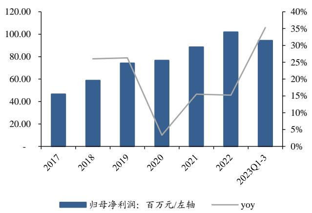  
图3：千味央厨归母净利润及 yoy   
数据来源：Wind、东吴证券研究所

产品品类扩充，渠道端小B近年增速更快。公司产品主要分为油炸类、烘焙类、蒸煮类、菜肴类及其他，其中油炸类产品是千味央厨的主力产品，2022 年占比为 $4 7 \%$ ，菜肴类及其他产品近三年占比明显提升，2022 年占比为 $14 \%$ 。渠道方面，公司采取直营和经销模式进行销售。直营渠道深度服务包括百胜中国、海底捞、华莱士、真功夫、九毛九等在内的大B 客户，经销渠道则聚焦小B 客户。2022 年，公司加大研发力度，提升服务质量，稳固与大B客户同盟关系。同时，提高经销商渠道建设力度，关注重点经销商，并受益于团餐市场的兴盛，前 20 名经销商销售额为 2.6 亿，同比增幅为 $2 6 . 5 9 \%$ 。

  
图4：千味央厨产品收入结构  
数据来源：公司公告、东吴证券研究所

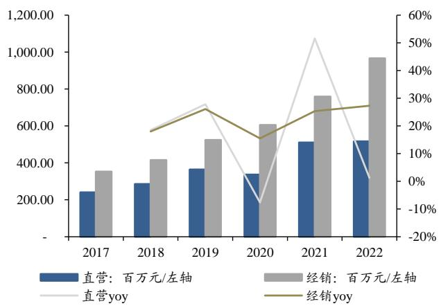  
图5：千味央厨分渠道收入及 yoy   
数据来源：公司公告、东吴证券研究所

产品矩阵丰富，新品拓宽发展空间。2022 年，公司油炸类/蒸煮类/烘焙类/菜肴类及其它共四大品类的占比分别为 $4 7 . 1 \% / 1 8 . 5 \% / 1 9 . 8 \% / 1 4 . 3 \%$ ，各规格在售产品达600余种。传统明星单品油条、蛋挞、芝麻球等实力依旧强劲，蒸煎饺类成为后起之秀，销售过亿元。春卷、烧麦、米糕、大包子四大单品持续放量，有望成为公司新的增长点。

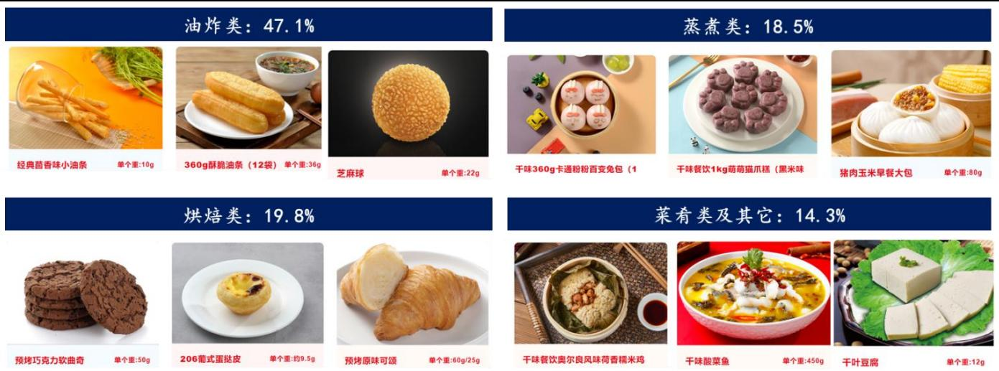  
图6：千味央厨产品矩阵  
数据来源：公司官网、东吴证券研究所

# 1.2．实控人为思念创始人，管理层具备丰富的速冻从业经验

管理层出身思念系，赓续米面基因。千味央厨核心管理层自 2019 年任职以来，稳定服务公司，且均曾就职于思念，具备丰富的速冻从业经验。董事长孙剑有 10 年的思念任职经验，营销及管理经验丰富。总经理白瑞于2004 年5 月至 2011 年8 月历任郑州思念结算部经理，资金管理部经理，营销中心副总经理助理。副总经理、财务总监王植宾2005 年4月至2012年3 月历任郑州思念总成本会计，高级审计员，内审经理，审计部经理。公司高管团队工作默契稳定，专注B 端速冻米面业务，兼具C 端经验，推动公司可持续发展。

图7：千味央厨高管介绍   

<table><tr><td>姓名</td><td>职务</td><td>任职日期</td><td>性别</td><td>学历</td><td>出生年份</td><td>个人简历</td></tr><tr><td>孙剑</td><td>董事长</td><td>2019/6/26</td><td>男</td><td>本科</td><td>1972</td><td>毕业于河南师范大学，本科学历.1995年9月至2000年10月任河南省天隆实业有限公司业务 员；2000年10月至2010年9月历任郑州思念业务代表，上海公司经理，香港公司经理，营销中心 副总经理；2010年10月至2013年9月，任河南一生缘食品有限公司销售总经理；2013年10月至2018 年6月，任郑州中部大观地产有限公司副总经理；2018年7月至今在本公司工作，现任公司董事长，</td></tr><tr><td></td><td>白瑞总经理</td><td>2019/6/26</td><td>女</td><td>硕士</td><td></td><td>新乡千味执行董事. 毕业于中南财经政法大学，硕士学历，中级会计师.1997年7月至2000年9月任河南冠联装饰工程有 限公司财务部会计：200年10月至204年4月任海信科龙电鉴股份有限公司河南分公司念计理助</td></tr><tr><td>王植宾</td><td>副总经理盟</td><td>2019/6/26</td><td></td><td>本科</td><td></td><td>理；2012年4月至今在本公司工作，现任公司董事，总经理，新乡千味经理. 毕业于西南大学，本科学历，中级会计师.2002年5月至2003年8月任宏大(集团)有限责任公司财务 部会：203年9至总成年月任郑101科技有限公司财部会1:405年4公012</td></tr><tr><td>徐振江</td><td>副总经理</td><td>2019/6/26</td><td></td><td></td><td></td><td>工作，现任公司董事，副总经理，财务总监. 毕业于中央财经大学，硕士学历，中央财经大学在读博士.2005年7月至2006年6月任广州南方人物</td></tr></table>

数据来源：Wind、东吴证券研究所

股权结构稳定，实控人为思念创始人李伟。公司实控人为创始人李伟，截至2023Q3，通过控股的共青城城之集间接持有公司 $4 6 . 0 3 \%$ 的股份。绝味通过旗下战略投资公司深圳网聚持股 $3 . 7 \%$ 。

  
图8：千味央厨股权结构（截至2023Q3）  
数据来源：Wind、东吴证券研究所

职工薪酬提供市场竞争力，股权激励激发内部活力。千味央厨提供了具有市场竞争力的职工薪酬，高管、销售人员薪酬达平均线，尤其在研发端倾注心血，提升定制化服务能力。2021 年针对公司高管及核心人员推出限制性股票激励计划，拟授予 80人152.62万股限制性股票，价格为 31.01 元/股。考核条件以 2020 年营业收入为基准，2022/2023年营收比 2020 年增长率不低于 $6 7 \% / 1 0 1 \%$ ，即当年营收不低于15.77/18.98 亿元。股权激励绑定核心团队，维持企业内部动力稳定，激发内聚力和向心力。

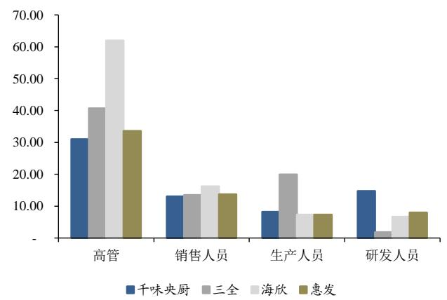  
图9：2022 年主要速冻公司高管及职工薪酬对比(单位：万元）  
数据来源：公司公告、东吴证券研究所注：安井职工平均薪酬数据因Q3 并表或受到影响，暂不考虑

图10：千味央厨2021 年限制性股票激励计划内容  

<table><tr><td>激励对象</td><td>获授股票数量占授予总数 (万股)</td><td>比例</td><td>激励方案及业绩考核条件</td></tr><tr><td>孙剑 董事长</td><td>14.3</td><td>9.1%</td><td></td></tr><tr><td>总白经瑶瑞理</td><td>9.7</td><td>6.2%</td><td>，0格为2.万股限制</td></tr><tr><td>王植宾 副总、财务总 监</td><td>8.8</td><td>5.6%</td><td>。 考核条件：2020年营业收入 为基数，</td></tr><tr><td>徐振江 副总、董秘</td><td>11.7</td><td>7.5%</td><td>第一个解除限售期：2022年 度营业收入比2020年增长率</td></tr><tr><td>核心人员</td><td>108.1</td><td>68.9%</td><td>第二个7期：2023年</td></tr><tr><td>预留股份</td><td>4.2</td><td>2.7%</td><td>年度营业收入比2020年增长 率不低于101%。</td></tr><tr><td>合计</td><td>156.8</td><td>100%</td><td></td></tr></table>

数据来源：公司公告、东吴证券研究所

# 2．大B：千味发展之基，强研发保驾护航

千味央厨自诞生之初就以服务餐饮B 端为己任，设立重客部服务大B 客户。公司销售中心成立重客部主要负责为百胜中国、华莱士、九毛九、真功夫、海底捞等直营客户提供专业服务，由公司董事长和总经理担任小组负责人，以确保内部组织能够快速响应并满足大客户的各种需求。根据公司年报，截至 2022 年12 月底，公司大客户数量为154 家。针对该类客户的消费群体及菜单提供产品设计、产品开发、产品销售、技术支持、干线物流运输以及后续服务，以建立长期合作的同盟关系。重客部与餐饮客户定期研讨产品升级方向，调整供应产品的配方、口感、包装等要素，共同讨论解决方案及新品提案，同时对产品的后续加工条件、餐饮企业的后厨布局设计提供建议。部门与大B 端大品牌客户保持密切的联系和合作，以确保客户的满意度，推动业务的持续增长。重客部不仅要处理客户的日常需求，更要为客户提供定制化的解决方案，以满足他们定制化的需求。

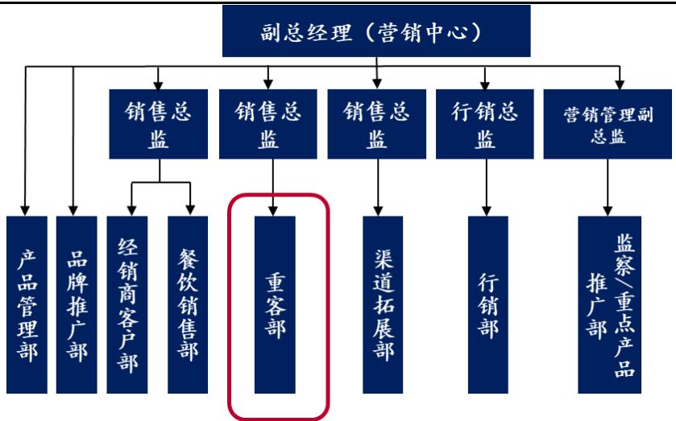  
图11：千味央厨销售中心架构  
数据来源：公司招股书、东吴证券研究所

# 2.1．深度绑定百胜中国，有望成为稳定增长极

千味央厨自 2002 年开始与肯德基合作，系百胜中国核心 T1 供应商。千味央厨自2002 年开始与肯德基合作，2015 年荣获百胜餐饮集团中国事业部的“供应管理奖”，2016年成为百胜T1 级别供应商的一员，并且是全国米面类唯一入围最优供应商，确立了其在米面品类上，作为餐饮供应链企业的领先地位。公司在疫情期间为百胜中国保障后方供应链稳定性，2023年公司再度成为公司策略供应商。

大B客户百胜中国开店势头良好，有望成为千味稳定增长极。直营渠道中，百胜中国为第一大客户。截至2023 年6 月30日，百胜中国中国门店总数达到 13,602家，与上年同期相比增加 $12 \%$ ，其中肯德基中国门店数为 9562 家，与上年同期相比增加 $12 \%$ 。2019-2022 年百胜中国开店 CAGR $1 2 . 1 \%$ 。2023财年目标为净增100\~1300家新门店。

2022 年肯德基中国餐厅收入为71 亿美元，同比增长 $4 . 4 6 \%$ 。2022 年千味央厨对百胜中国的销售金额为 2.39 亿元，占年度销售总额比例为 $1 6 . 1 7 \%$ ，作为公司第一大客户，成为公司业绩稳健增长的压舱石。

  
图12：百胜中国门店数量  
数据来源：百胜中国年报、东吴证券研究所

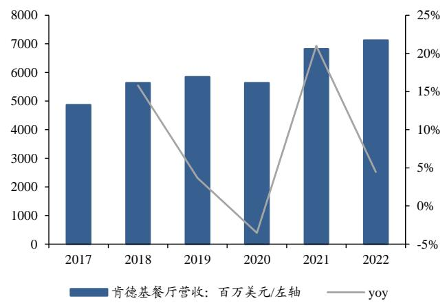  
图13：肯德基中国餐厅收入及yoy  
数据来源：百胜中国年报、东吴证券研究所

  
图14：千味央厨对百胜中国销售金额及 yoy  
数据来源：公司年报、东吴证券研究所

收购味宝进一步巩固作为百胜中国供应链核心供应商的地位。2022 年12 月底，以自有资金1095万元收购味宝 $20 \%$ 股份。2023年3月以4186万元（对应2021年PE为$4 . 3 \mathrm { x }$ )收购味宝剩余 $8 0 \%$ 的股权实现完全并表。味宝和千味都是百胜中国的T1级别供应商，主要为其提供茶饮产品所需的珍珠粉圆等。目前味宝已经形成了1.5 万吨的粉圆生产能力，其核心客户主要包括百胜中国（肯德基、必胜客）和津味实业（85度C)等。在过去的21/22 年度，味宝实现营收7524.7/4248.6 万元，实现净利润1213.4/-420.1万元。22 年业绩受到外部环境扰动的影响，主要系核心客户经营状况不佳所致。此次收购完成后，公司成为拥有两家T1级供应资格的百胜供应商，巩固了其在百胜供应链中的核心地位。同时，未来将可借助味宝的产品拓展高景气的茶饮、咖啡赛道，进一步丰富

其产品品类。

表1：味宝财务及其他基本情况  

<table><tr><td></td><td>2021</td><td>2022</td><td>2023Q1</td></tr><tr><td>味宝收入：万元</td><td>7,525</td><td>4,249</td><td>1,289</td></tr><tr><td>味宝净利润：万元</td><td>1,213</td><td>-420</td><td>192</td></tr><tr><td>产品</td><td>粉圆类、芋圆类、粥类</td><td></td><td></td></tr><tr><td>客户</td><td colspan="3">百胜中国和津味实业（对应品牌85度C）合计占味宝销售比例75%+，味宝为百</td></tr><tr><td>收购对价</td><td colspan="3">4186 万元收购味宝 80%股权，对应2021年PE为4.3x</td></tr></table>

数据来源：公司公告、东吴证券研究所

# 2.2．大B 端带动中B端，灯塔效应显著

千味经过多年发展率先占据餐饮供应链高地，拥有大批优质餐饮大客户。公司在百胜中国供应商体系中为最高级T1 级供应商，是公司产品与服务的品牌背书。使得公司开拓其他大B新客户较为顺畅。近年来公司积极开拓细分餐饮赛道的龙头企业客户和潜力企业客户，成功进入海底捞、真功夫、九毛九、呷哺呷哺、老乡鸡、瑞幸咖啡等知名连锁餐饮品牌企业的供应链。截至2022 年末海底捞门店数量为1349 家，截至 2022 年Q2 末老乡鸡门店数量为1099 家，发展态势稳定，截至 2023 年9 月末华莱士23 年新增门店731家。

  
图15：千味央厨部分下游客户  
数据来源：公司官网、东吴证券研究所

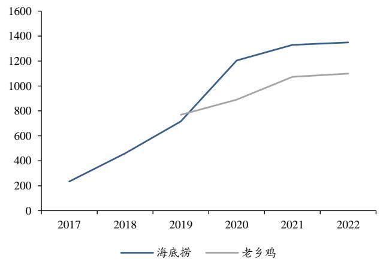  
图16：海底捞、老乡鸡门店数量  
数据来源：公司公告、东吴证券研究所注：老乡鸡2022年门店数量为截至2022Q2末的数据

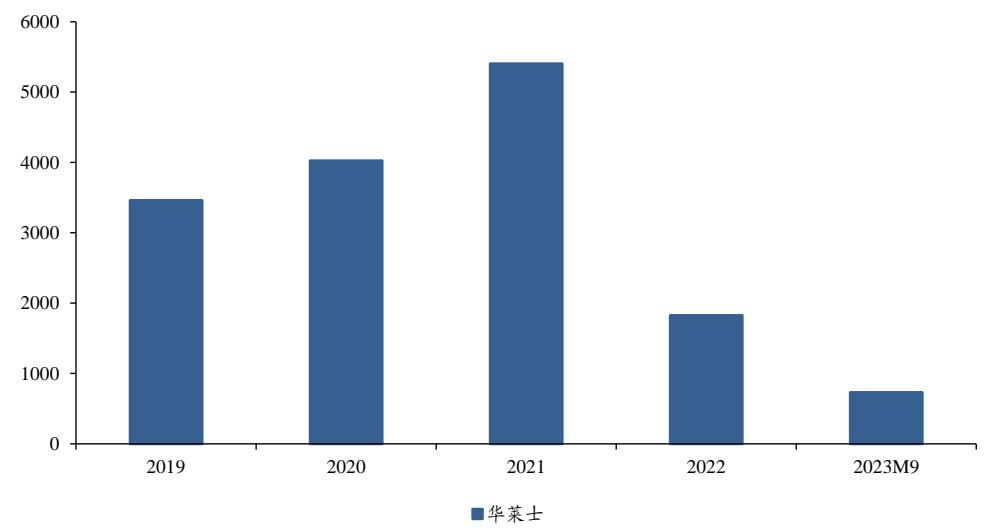  
图17：华菜士每年新开店数量  
数据来源：窄门餐眼、东吴证券研究所注：2023 年为截至9 月末数据

近年来我国餐饮连锁化趋势日益明显，连锁率逐年提高。根据中国连锁经营协会（CCFA）的数据，中国餐饮连锁化率从2018年的 $1 2 . 8 \%$ 提升至 2022 年的 $1 9 \%$ 。根据美团新餐饮研究院发布的数据，2021 年，中国、美国和日本的餐饮连锁化率分别为 $1 8 \%$ $54 \%$ 和 $4 8 \%$ 。与其他国家相比，我国餐饮连锁化率仍处于较低水平，且处于上升通道。优秀的餐饮供应链企业可帮助上游降本增效，助力餐饮企业连锁化率提升。

目前餐饮业面临着“三高一低”的挑战，即原材料成本、人力成本、房租高，利润率低。根据中国饭店协会数据，原材料进货成本、人工成本、房屋及物业成本平均占餐饮业成本的 $4 2 \% / 2 1 \% / 1 0 \%$ 。2021年餐饮行业各项成本增速显示，人力、原材料成本增速均超过 $5 \%$ 。餐饮企业降本增效需求强，使用速冻食品可有效帮助餐饮企业解决痛点。

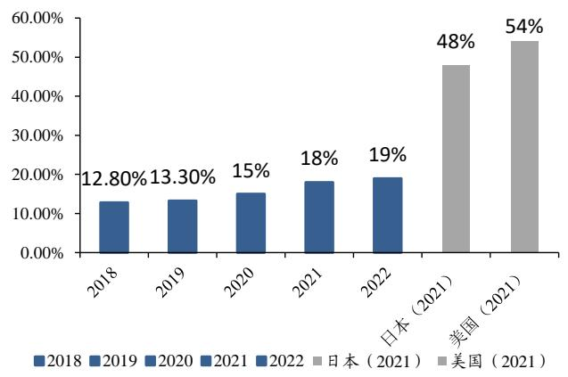  
图18：2018-2022年中国餐饮连锁化率  
数据来源：CCFA、东吴证券研究所

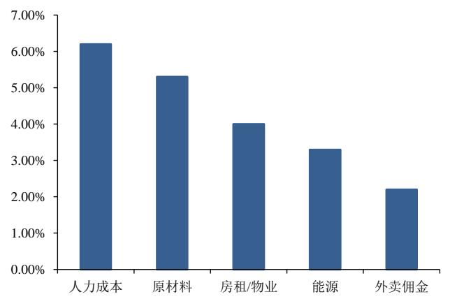  
图19：2021 年餐饮行业各项成本增速  
数据来源：中国饭店协会、东吴证券研究所

大B“灯塔效应”显著，与中型连锁餐饮企业合作效率提升。与百胜等头部餐饮企业合作后，“灯塔效应”为公司开拓中型连锁餐饮客户提供了强有力背书，合作效率提升。头部客户在行业内部具有标杆效应，因此与中型连锁餐饮企业合作时，在审厂、选品等步骤上可直接借鉴大B客户，效率更高。

公司积极开拓茶饮、咖啡渠道，拓宽覆盖面。近几年，我国新茶饮以及现制咖啡市场快速发展。为了满足消费者的需求，越来越多的新茶饮企业采用“茶/咖啡+”的形式来拓展消费场景，并积极为消费者提供优质的购物体验。其中搭配烘焙食品销售的复合经营模式成为了新茶饮和咖啡馆发展的新趋势。公司已成功开拓瑞幸、tims 等餐饮客户资源，以烘焙品类和茶饮/咖啡企业进行合作。2023 年3月公司收购味宝食品。通过有效的整合，公司和味宝的销售渠道和资源可以实现互补、共享和优化。收购味宝食品将有助于公司扩展茶饮、咖啡客户的覆盖范围。

# 2.3．核心研发能力强劲，推新快、定制化能力强

千味研发能力强，推新快、定制化生产能力强。公司最早向百胜中国提供蛋挞皮，后自主研发安心油条并成为独家供应商，蛋挞及油条品类目前销售额较高且相对稳定。依托于公司强大的研发实力和不断创新的精神，合作范围逐步扩展到了更多品类。其中包括华夫饼、冷冻面团、牛角包、红豆派、宝宝挞等烘焙类产品，进一步丰富了产品线。此外公司还涉足了春卷、酥饼、法风烧饼、荷花酥等具有中国特色的米面类产品。在区域特色类产品方面，公司积极探索和开发胡辣汤、葱油拌面、热干面、米粉等具有地方特色的美味食品。目前正在试点的中式汉堡项目也备受关注。期待能为公司打开新的市场空间，为未来的发展带来更多可能性。公司持续不断的研发和创新，不仅提升了自身竞争力，也为消费者带来了更多优质、美味的食品选择。

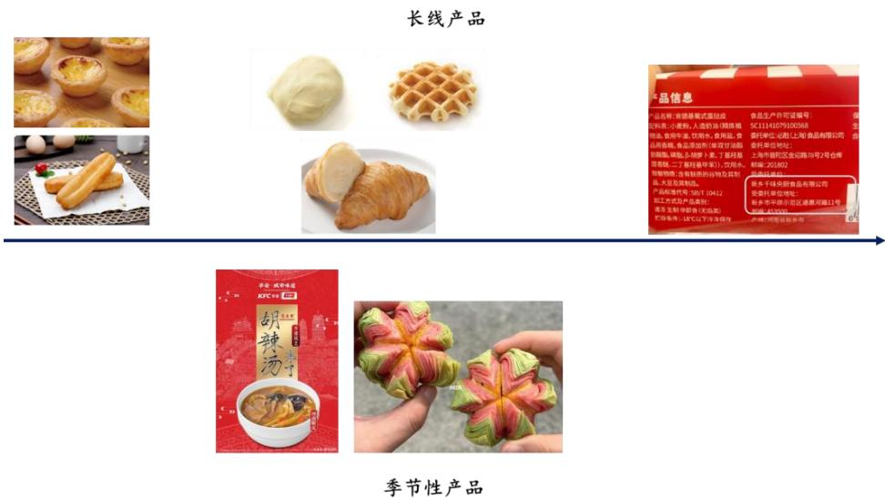  
图20：千味央厨导入肯德基的品类  
数据来源：搜狐、公司招股书、东吴证券研究所

研发架构上，技术研发部门分工明确，“模拟餐厅后厨”实验室高效服务餐饮客户。公司技术研发部下设产品研发、工艺研发、设备研发、包装研发等四个专业研究室和上海研发室，其中，产品研发又分设球类、酥类、油条、面点、烘焙类、创新类六个研发小组。分工明确，效率更高。其中上海研发室利用上海的地缘及资源优势，主要开展项目沟通、新品展示、技术服务，并及时掌握国内新品动态、了解消费者需求。公司较早便在行业内建立了“模拟餐厅后厨”的研发实验室，并组建了专业的餐饮研发团队，以模拟餐厅后厨工艺的产品研发及制作为出发点，最大程度还原餐企后厨的制作工艺，为食客提供最佳的就餐体验。

研发方式上，公司依托现有产品进行场景化的深入研究。以油条为例，公司从2012年开始进行油条细分场景下的市场研究，细分出火锅、快餐、自助餐、宴席、早餐、外卖六大场景，并针对性推出茴香小油条、麻辣烫小油条、火锅涮煮油条、外卖专用油条等多款创新性产品。

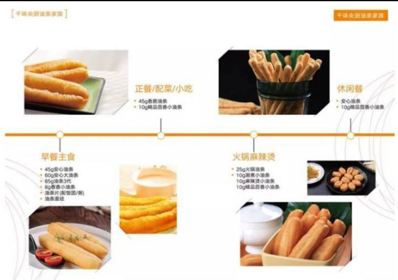  
图21：公司各细分场景下的油条产品  
数据来源：公司官网、东吴证券研究所

研发人员上，研发核心技术人员经验丰富，团队稳定。公司核心技术人员均在思念任职过相关岗位，从业经验丰富；且均在 2014 年前进入千味央厨工作，团队稳定。其中技术研发总监贾学明自2004 年至2012 年在思念历任面点师、研发组长、技术经理和高级研发工程师。研发面点经验丰富，2012 年进入千味央厨。研发了安心油条、千层面奶黄包等高销量产品。

表2：公司核心技术人员介绍  

<table><tr><td>姓名</td><td>职务 简历</td><td></td></tr><tr><td>贾学明</td><td>技术研发</td><td>高级面点师。1997 年7 月至 2004 年2 月从事餐饮面点师工作；2004 年3 月至2012 年</td></tr><tr><td rowspan="2"></td><td rowspan="2"></td><td></td></tr><tr><td>得中原厨艺精英烹饪大赛特金奖和首届“全国发酵面食优秀科技工作者”称号。</td></tr><tr><td>程燕</td><td>技不研发师</td><td></td></tr></table>

<table><tr><td>朱国新</td><td>技术研发 部工程师</td><td>1975 年至2008年6月历任新乡食品机械有限公司技术员、工程师、技术部副总经理、 技术部总经理；2008 年7 月至2011 年6 月任成都雷博机械设备有限公司工程师、技术 经5；至在</td></tr><tr><td></td><td>技术研发</td><td>研发了豆腐切丁机、红豆派上浆装置等新型设备。 2004年12 月至2013 年8月，任郑州思念研发中心配方专员；2013 年9 月至今在本公</td></tr><tr><td>李欢 姬真真</td><td>部工程师 技术研发师</td><td>作，现任技发部工师欢负责产发阶段金设计研发了 年</td></tr></table>

数据来源：公司招股说明书、东吴证券研究所

# 3．小B：以产品力突破，以渠道力赋能

# 3.1．产品端降本增效，发挥大单品优势

速冻食品助力提升小B餐饮提升SKU数量，增加盈利点。以早餐铺为例，传统早餐铺会分为粥铺、面点铺、馄饨饺子铺等，各有主营业务，以单一品类为主打，SKU创新和产品创新有限。而速冻食品可有效帮助小B 餐饮增加 SKU，随着客单价提升驱动小B 餐饮盈利能力提升。

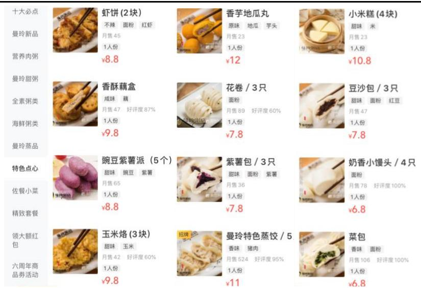  
图22：某粥铺部分点心品类（其中点心SKU数：37)  
数据来源：饿了么App、东吴证券研究所

挖掘后廚痛点，以强产品力突破小B 渠道。公司在小B 渠道推出的大单品主要包括：主打“堆蒸不破皮”的蒸煎饺，“健康化”的乳酸菌玉米粗粮糕，“量大”且“馅料松散的”早餐大包，“不沾皮、不油腻”的猪肉香菇糯米烧卖，“油炸不漏馅”的芥菜肉丝春卷等。公司通过市场调研，挖掘单品在后厨端使用痛点进行针对性研发，推出后以此为特点进行宣传推广，以强产品力突破小B渠道客户。

图23：千味央厨小B 渠道部分大单品介绍

<table><tr><td rowspan="7">产品 特点</td><td>蒸煎饺</td><td>米糕</td><td>大包子</td><td>烧麦</td><td>春卷</td></tr><tr><td></td><td></td><td></td><td></td><td></td></tr><tr><td></td><td></td><td></td><td></td><td></td></tr><tr><td>1Kg蒸煎饺 单个重：20g</td><td>乳酸菌玉米粗粮糕 单个重：85g</td><td>千味早餐大包 单个重：80g</td><td>猪肉香菇糯米烧麦 单个重：50g</td><td>荠菜肉丝春卷 单个重：20g</td></tr><tr><td>“堆蒸不破皮”</td><td>“健康化”</td><td></td><td>“不沾皮”</td><td></td></tr><tr><td>“保温2小时不干硬”</td><td>“可爱造型”</td><td>“量大”</td><td>“不油腻”</td><td>“不漏馅”</td></tr><tr><td>使用场景 团餐、早餐、外卖</td><td>团餐、宴席</td><td>早餐</td><td>早餐</td><td>团餐、宴席</td></tr></table>

数据来源：公司官网、冷食传媒、冷冻食品公众号、公司公众号、东吴证券研究所

强研发力保障公司推陈出新。公司在大B端沉淀的强研发，为持续推陈出新提供保障。与大B 客户合作的单品通过通路化改造可切入小B 渠道，如油条通过规格、细分场景的研发也成为小B渠道的大单品。

# 3.2.扶持头部经销商，夯实渠道力

小B 渠道在团餐、乡村宴席场景与友商错位竞争。千味央厨小B渠道主要分为三个场景：社会餐饮，乡村宴席，团餐，与其他公司主要面向社会餐饮不同，在团餐、乡村宴席与友商错位竞争。

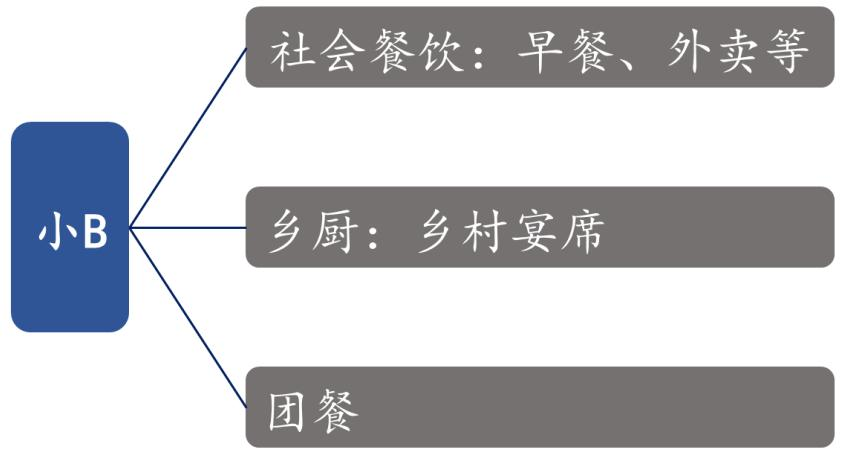  
图24：小B 渠道的三大场景  
数据来源：东吴证券研究所

对头部经销商扶持力度大，销售额增幅明显。2022 年公司对经销商采取“聚焦大客户深度服务”、“拓展渠道商”的管理模式，支持重点经销商做强做大，2022 年虽受外部疫情影响，经销渠道收入增速仍保持较快水平，这都得益于千味央厨对头部经销商的扶持力度。2022 年前 20 大头部经销商销售额达到 2.6 亿元，占比达到 $1 7 . 5 \%$ ，同比增幅达到 $2 6 . 5 9 \%$ 。公司围绕有规模、潜力的客户，通过3种方式协助经销商开展业务：1)销售策略支持；2)帮助经销商开发下游客户；3)帮助朝专业化、市场化方向转型。公司对渠道的掌控力日益增强，为小B渠道的发展保驾护航。

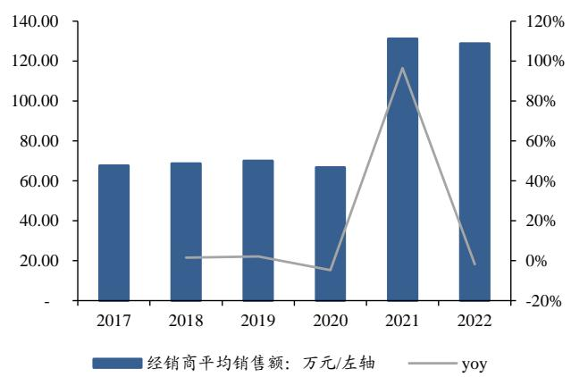  
图25：千味央厨经销商平均销售额及 yoy  
数据来源：公司年报、东吴证券研究所

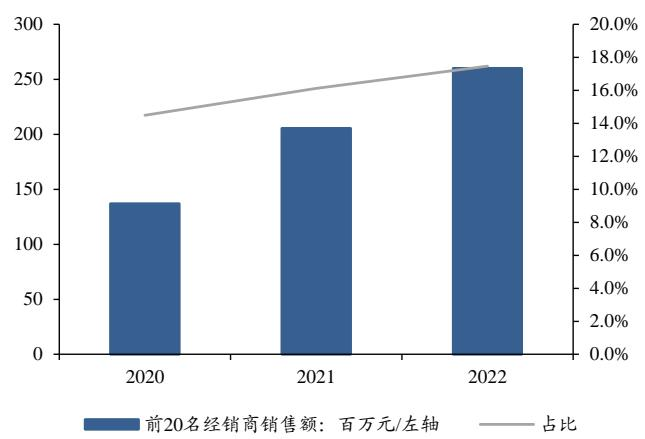  
图26：千味央厨前 20 大经销商销售额及占比  
数据来源：公司年报、东吴证券研究所

# 4.C端：小试牛刀

以年轻化品牌在C端小试牛刀。公司在2022 年组建零售事业群，锁定年轻消费群体，结合强研发优势，推出三大C端年轻化品牌：“岑夫子”（主打靓汤云吞）、“千味解忧炸货铺”（主打空气炸锅类单品）和“纳百味”（千味B端产品C端化），通过街边便利店/区域型商超、京东等线上电商、新零售等渠道三路并进。

  
图27：千味央厨旗下三大C端品牌  
数据来源：中国日报网、东吴证券研究所

# 5．盈利预测

我们预计公司2023-2025年营业收入19.0/23.9/29.2亿元，同比增速$+ 2 7 . 6 \% / 2 6 . 0 \% / 2 1 . 9 \%$ ，分拆业务如下：

1）直销渠道：公司直销渠道主要为合作的大B客户。2023 年直销渠道低基数下实现快速反弹，2024-2025 年回归正常后，预计通过为已有客户导入新品实现快于下游客户开店速度的增长。我们预计直销渠道 2023-2025年营业收入分别为 $8 . 1 / 9 . 9 / 1 1 . 7$ 亿元，同比 $5 7 \% / 2 2 \% / 1 8 \%$ 。

2）经销渠道：公司经销渠道主要系通过经销商销往小B客户。2022 年受疫情保供影响，基数较高，预期 2023 年经销渠道增速放缓；2024-2025 年通过开拓经销商、扶持核心经销商，每年打造大单品的模式保持较快增速发展。我们预计经销渠道2023-2025年营业收入分别为10.8/13.9/17.3亿元，同比$+ 1 2 \% / 2 9 \% / 2 5 \%$ 。

图28：千味央厨主要业务收入拆分预测  

<table><tr><td></td><td>2020</td><td>2021</td><td>2022</td><td>2023E</td><td>2024E</td><td>2025E</td></tr><tr><td>直销</td><td></td><td></td><td></td><td></td><td></td><td></td></tr><tr><td>收入(百万元)</td><td>336.78</td><td>510.62</td><td>517.16</td><td>811.75</td><td>992.22</td><td>1,173.90</td></tr><tr><td>同比(%)</td><td>-7.6%</td><td>51.6%</td><td>1.3%</td><td>57.0%</td><td>22.2%</td><td>18.3%</td></tr><tr><td>占比%</td><td>35.7%</td><td>40.1%</td><td>34.7%</td><td>42.7%</td><td>41.4%</td><td>40.2%</td></tr><tr><td>成本 （百万元)</td><td>258.68</td><td>392.46</td><td>407.94</td><td>634.79</td><td>775.92</td><td>919.16</td></tr><tr><td>毛利（百万元)</td><td>78.10</td><td>118.16</td><td>109.23</td><td>176.96</td><td>216.30</td><td>254.74</td></tr><tr><td>毛利率</td><td>23.19%</td><td>23.14%</td><td>21.12%</td><td>21.8%</td><td>21.8%</td><td>21.7%</td></tr><tr><td>经销</td><td></td><td></td><td></td><td></td><td></td><td></td></tr><tr><td>收入(百万元)</td><td>605.45</td><td>758.96</td><td>966.11</td><td>1,081.11</td><td>1,393.70</td><td>1,734.72</td></tr><tr><td>同比 （%)</td><td>15.5%</td><td>25.4%</td><td>27.3%</td><td>11.9%</td><td>28.9%</td><td>24.5%</td></tr><tr><td>占比%</td><td>64.1%</td><td>59.6%</td><td>64.9%</td><td>56.9%</td><td>58.2%</td><td>59.4%</td></tr><tr><td>成本 （百万元)</td><td>480.61</td><td>596.54</td><td>731.83</td><td>817.32</td><td>1,046.67</td><td>1,302.77</td></tr><tr><td>毛利 (百万元)</td><td>124.84</td><td>162.42</td><td>234.28</td><td>263.79</td><td>347.03</td><td>431.94</td></tr><tr><td>毛利率</td><td>20.62%</td><td>21.40%</td><td>24.25%</td><td>24.4%</td><td>24.9%</td><td>24.9%</td></tr><tr><td>其他</td><td></td><td></td><td></td><td></td><td></td><td></td></tr><tr><td>收入（百万元)</td><td>2.14</td><td>4.32</td><td>5.34</td><td>6.68</td><td>8.35</td><td>10.44</td></tr><tr><td>同比(%)</td><td>228.6%</td><td>101.7%</td><td>23.8%</td><td>25.0%</td><td>25.0%</td><td>25.0</td></tr><tr><td>成本 (百万元)</td><td>0.04</td><td>0.04</td><td>0.33</td><td>0.42</td><td>0.52</td><td>0.65</td></tr><tr><td>毛利 (百万元)</td><td>2.10</td><td>4.28</td><td>5.01</td><td>6.27</td><td>7.83</td><td>9.79</td></tr><tr><td>毛利率</td><td>98.31%</td><td>98.99%</td><td>93.78%</td><td>93.8%</td><td>93.8%</td><td>93.8%</td></tr><tr><td>合计</td><td></td><td></td><td></td><td></td><td></td><td></td></tr><tr><td>收入 (百万元)</td><td>944.37</td><td>1,274</td><td>1,489</td><td>1,899.55</td><td>2,394.27</td><td>2,919.06</td></tr><tr><td>同比(%)</td><td>6.2%</td><td>34.9%</td><td>16.9%</td><td>27.6%</td><td>26.0%</td><td>21.9%</td></tr><tr><td>成本 (百万元)</td><td>739.33</td><td>989.05</td><td>1,140.10</td><td>1,452.53</td><td>1,823.11</td><td>2,222.59</td></tr><tr><td>毛利 （百万元)</td><td>205.05</td><td>284.85</td><td>348.52</td><td>447.02</td><td>571.17</td><td>696.47</td></tr><tr><td>毛利率</td><td>21.71%</td><td>22.36%</td><td>23.41%</td><td>23.53%</td><td>23.86%</td><td>23.86%</td></tr></table>

数据来源：Wind、东吴证券研究所

公司专注服务B端餐饮客户，看好公司在强研发和客户优势双轮驱动下持续增长。可比公司我们选取安井食品、宝立食品、立高食品，千味央厨主营速冻米面、烘焙等品类，服务餐饮B 端客户。安井食品主营速冻食品，面向小B 渠道，为行业龙头公司；宝立食品主营复调品类，正扩品至冷冻烘焙品类，同为百胜T1 供应商；立高食品主营冷冻烘焙食品，同为百胜供应商。可比公司在产品和销售渠道上与千味可比。我们预计2023-2025 年公司收入分别为 $1 9 . 0 / 2 3 . 9 / 2 9 . 2$ 亿元，同比增速 $+ 2 7 . 6 \% / 2 6 . 0 \% / 2 1 . 9 \%$ ，预计归母净利润 $1 . 4 / 2 . 1 / 2 . 6 $ 亿元，同比 $+ 3 8 \% / 4 9 \% / 2 2 \%$ ，EPS分别为 $1 . 6 2 / 2 . 4 1 / 2 . 9 5$ 元，对应PE分别为31x、21x、17x，公司在大B端先发优势强，研发能力沉淀足，小B以乡厨、团餐渠道错位竞争，成长性佳，2024 年对应 PEG 为 0.6，对比可比公司，具备性价比，首次覆盖，给予“买入”评级。

表3：可比公司估值对比（估值日2024/1/11)  

<table><tr><td rowspan="2">代码</td><td rowspan="2">公司</td><td rowspan="2">股价</td><td rowspan="2">）)</td><td colspan="4"></td><td colspan="4">2023E 202E</td><td rowspan="2">PEG</td></tr><tr><td>2022</td><td></td><td></td><td>2025E</td><td>2022</td><td></td><td></td><td>2025E</td></tr><tr><td>603345.SH</td><td>安井食品</td><td>96</td><td>281</td><td>3.75</td><td>5.44</td><td>6.29</td><td>7.57</td><td>25.6</td><td>17.6</td><td>15.2</td><td>12.7</td><td>0.6</td></tr><tr><td>603170.SH</td><td>宝立食品</td><td>16</td><td>66</td><td>0.54</td><td>0.77</td><td>0.77</td><td>0.92</td><td>30.6</td><td>21.4</td><td>21.4</td><td>17.9</td><td>1.1</td></tr><tr><td>300973.SZ</td><td>立高食品</td><td>46</td><td>78</td><td>0.85</td><td>1.21</td><td>2.16</td><td>2.95</td><td>54.2</td><td>38.1</td><td>21.3</td><td>15.6</td><td>0.4</td></tr><tr><td></td><td>平均</td><td></td><td></td><td></td><td></td><td></td><td></td><td>28.1</td><td>19.5</td><td>18.3</td><td>15.3</td><td>0.8</td></tr><tr><td>001215.SZ</td><td>千味央廚</td><td>50</td><td>44</td><td>1.18</td><td>1.62</td><td>2.41</td><td>2.95</td><td>42.8</td><td>31.0</td><td>20.8</td><td>17.0</td><td>0.6</td></tr></table>

数据来源：Wind、东吴证券研究所注：立高食品盈利预测来自Wind 一致预期，安井、宝立盈利预测来自东吴证券研究所；PEG 数据为：2024 年对应PE/2021-2024年 EPS的CAGR

# 6.风险提示

食品安全风险：食品安全内部控制是公司的声誉基石，若出现食品安全事件，公司的业绩以及形象都会遭到严重打击。

原材料价格波动风险：公司生产所需的主要原材料为大宗农产品，包括面粉、糯米粉、食用油、白砂糖等。尤其是公司所需要的主要原料如面粉、大豆油等价格高位运行，成本压力较大，对公司盈利能力提出了挑战。

市场竞争加剧的风险：速冻米面制品行业，B 端市场成为新蓝海。部分大型速冻食品企业逐渐将业务重点向B 端转移，B 端市场竞争加剧，且未来竞争会更激烈。公司若不能迅速提高核心竞争力，市场份额恐有被挤压的风险。

大客户收入占比较高带来的业绩不稳定：长期以来，公司作为百胜T1级供应商，与百胜合作的业务在营收中占比极大。未来，若出现与百胜合作持续减少或者百胜经营出现问题，将会给公司营收带来负面影响。

千味央厨三大财务预测表  

<table><tr><td>资产负债表（百万元）</td><td>2022A</td><td>2023E</td><td>2024E</td><td>2025E</td></tr><tr><td>流动资产</td><td>670</td><td>808</td><td>1,112</td><td>1,395</td></tr><tr><td>货币资金及交易性金融资产</td><td>381</td><td>401</td><td>660</td><td>814</td></tr><tr><td>经营性应收款项</td><td>75</td><td>109</td><td>116</td><td>150</td></tr><tr><td>存货</td><td>182</td><td>261</td><td>301</td><td>391</td></tr><tr><td>合同资产</td><td>0</td><td>0</td><td>0</td><td>0</td></tr><tr><td>其他流动资产</td><td>31</td><td>37</td><td>35</td><td>40</td></tr><tr><td>非流动资产</td><td>917</td><td>949</td><td>978</td><td>1,012</td></tr><tr><td>长期股权投资</td><td>30</td><td>30</td><td>30</td><td>30</td></tr><tr><td>固定资产及使用权资产</td><td>646</td><td>648</td><td>656</td><td>670</td></tr><tr><td>在建工程</td><td>100</td><td>130</td><td>150</td><td>170</td></tr><tr><td>无形资产</td><td>38</td><td>38</td><td>38</td><td>38</td></tr><tr><td>商誉</td><td>0</td><td>0</td><td>0</td><td>0</td></tr><tr><td>长期待摊费用</td><td>36</td><td>36</td><td>36</td><td>36</td></tr><tr><td>其他非流动资产</td><td>68</td><td>68</td><td>68</td><td>68</td></tr><tr><td>资产总计</td><td>1,587</td><td>1,757</td><td>2,090</td><td>2,407</td></tr><tr><td>流动负债</td><td>350</td><td>396</td><td>522</td><td>585</td></tr><tr><td>短期借款及一年内到期的非流动负债</td><td>27</td><td>27</td><td>27</td><td>27</td></tr><tr><td>经营性应付款项</td><td>191</td><td>204</td><td>287</td><td>306</td></tr><tr><td>合同负债</td><td>6</td><td>7</td><td>9</td><td>11</td></tr><tr><td>其他流动负债</td><td>127</td><td>158</td><td>199</td><td>242</td></tr><tr><td>非流动负债</td><td>176</td><td>176</td><td>176</td><td>176</td></tr><tr><td>长期借款</td><td>147</td><td>147</td><td>147</td><td>147</td></tr><tr><td>应付债券</td><td>0</td><td>0</td><td>0</td><td>0</td></tr><tr><td>租赁负债</td><td>7</td><td>7</td><td>7</td><td>7</td></tr><tr><td>其他非流动负债</td><td>22</td><td>22</td><td>22</td><td>22</td></tr><tr><td>负债合计</td><td>526</td><td>572</td><td>697</td><td>761</td></tr><tr><td>归属母公司股东权益</td><td>1,061</td><td>1,187</td><td>1,396</td><td>1,651</td></tr><tr><td>少数股东权益</td><td>0</td><td>(1)</td><td>(3)</td><td>(6)</td></tr><tr><td>所有者权益合计</td><td>1,061</td><td>1,185</td><td>1,392</td><td>1,645</td></tr><tr><td>负债和股东权益</td><td>1,587</td><td>1,757</td><td>2,090</td><td>2,407</td></tr></table>

<table><tr><td>利润表(百万元)</td><td>2022A</td><td>2023E</td><td>2024E</td><td>2025E</td></tr><tr><td>营业总收入</td><td>1,489</td><td>1,900</td><td>2,394</td><td>2,919</td></tr><tr><td>营业成本(含金融类)</td><td>1,140</td><td>1,453</td><td>1,823</td><td>2,223</td></tr><tr><td>税金及附加</td><td>12</td><td>16</td><td>20</td><td>25</td></tr><tr><td>销售费用</td><td>58</td><td>85</td><td>89</td><td>105</td></tr><tr><td>管理费用</td><td>139</td><td>171</td><td>201</td><td>239</td></tr><tr><td>研发费用</td><td>16</td><td>19</td><td>22</td><td>26</td></tr><tr><td>财务费用</td><td>2</td><td>(13)</td><td>(10)</td><td>(13)</td></tr><tr><td>加：其他收益</td><td>2</td><td>0</td><td>3</td><td>2</td></tr><tr><td>投资净收益</td><td>0</td><td>0</td><td>0</td><td>0</td></tr><tr><td>公允价值变动</td><td>0</td><td>0</td><td>0</td><td>0</td></tr><tr><td>减值损失</td><td>0</td><td>0</td><td>0</td><td>0</td></tr><tr><td>资产处置收益</td><td>0</td><td>0</td><td>0</td><td>0</td></tr><tr><td>营业利润</td><td>123</td><td>168</td><td>252</td><td>315</td></tr><tr><td>营业外净收支</td><td>6</td><td>10</td><td>13</td><td>9</td></tr><tr><td>利润总额</td><td>129</td><td>178</td><td>265</td><td>324</td></tr><tr><td>减：所得税</td><td>28</td><td>39</td><td>58</td><td>71</td></tr><tr><td>净利润</td><td>101</td><td>139</td><td>207</td><td>253</td></tr><tr><td>减：少数股东损益</td><td>(1)</td><td>(1)</td><td>(2)</td><td>(3)</td></tr><tr><td>归属母公司净利润</td><td>102</td><td>140</td><td>209</td><td>256</td></tr><tr><td>每股收益-最新股本摊薄(元)</td><td>1.18</td><td>1.62</td><td>2.41</td><td>2.95</td></tr><tr><td>EBIT</td><td>125</td><td>155</td><td>242</td><td>302</td></tr><tr><td>EBITDA</td><td>186</td><td>203</td><td>294</td><td>358</td></tr><tr><td>毛利率(%)</td><td>23.41</td><td>23.53</td><td>23.86</td><td>23.86</td></tr><tr><td>归母净利率(%)</td><td>6.85</td><td>7.39</td><td>8.73</td><td>8.76</td></tr><tr><td>收入增长率(%)</td><td>16.86</td><td>27.60</td><td>26.04</td><td>21.92</td></tr><tr><td>归母净利润增长率(%)</td><td>15.20</td><td>37.81</td><td>48.86</td><td>22.31</td></tr></table>

<table><tr><td>现金流量表（百万元）</td><td>2022A</td><td>2023E</td><td>2024E</td><td></td><td>2025E重要财务与估值指标</td><td>2022A</td><td>2023E</td><td>2024E</td><td>2025E</td></tr><tr><td>经营活动现金流</td><td>211</td><td>105</td><td>327</td><td></td><td>235 每股净资产(元)</td><td>12.24</td><td>13.70</td><td>16.11</td><td>19.06</td></tr><tr><td>投资活动现金流</td><td>(251)</td><td>(70)</td><td>(67)</td><td></td><td>(81）最新发行在外股份（百万股）</td><td>87</td><td>87</td><td>87</td><td>87</td></tr><tr><td>筹资活动现金流</td><td>88</td><td>(15)</td><td>(1)</td><td></td><td>(1) ROIC(%)</td><td>8.66</td><td>9.29</td><td>12.86</td><td>13.89</td></tr><tr><td>现金净增加额</td><td>48</td><td>20</td><td>259</td><td></td><td>154ROE-摊薄(%)</td><td>9.61</td><td>11.84</td><td>14.98</td><td>15.48</td></tr><tr><td>折旧和摊销</td><td>60</td><td>48</td><td>52</td><td></td><td>56资产负债率(%)</td><td>33.15</td><td>32.55</td><td>33.37</td><td>31.63</td></tr><tr><td>资本开支</td><td>(221)</td><td>(70)</td><td>(67)</td><td></td><td>(81）P/E（现价&amp;最新股本摊薄）</td><td>42.76</td><td>31.03</td><td>20.85</td><td>17.04</td></tr><tr><td>营运资本变动</td><td>48</td><td>（72)</td><td>80</td><td></td><td>(65)P/B（现价)</td><td>4.11</td><td>3.67</td><td>3.12</td><td>2.64</td></tr></table>

数据来源:Wind,东吴证券研究所，全文如无特殊注明，相关数据的货币单位均为人民币，预测均为东吴证券研究所预测。

# 免责声明

东吴证券股份有限公司经中国证券监督管理委员会批准，已具备证券投资咨询业务资格。

本研究报告仅供东吴证券股份有限公司（以下简称“本公司”）的客户使用。本公司不会因接收人收到本报告而视其为客户。在任何情况下，本报告中的信息或所表述的意见并不构成对任何人的投资建议，本公司及作者不对任何人因使用本报告中的内容所导致的任何后果负任何责任。任何形式的分享证券投资收益或者分担证券投资损失的书面或口头承诺均为无效。

在法律许可的情况下，东吴证券及其所属关联机构可能会持有报告中提到的公司所发行的证券并进行交易，还可能为这些公司提供投资银行服务或其他服务。

市场有风险，投资需谨慎。本报告是基于本公司分析师认为可靠且已公开的信息，本公司力求但不保证这些信息的准确性和完整性，也不保证文中观点或陈述不会发生任何变更，在不同时期，本公司可发出与本报告所载资料、意见及推测不一致的报告。

本报告的版权归本公司所有，未经书面许可，任何机构和个人不得以任何形式翻版、复制和发布。经授权刊载、转发本报告或者摘要的，应当注明出处为东吴证券研究所，并注明本报告发布人和发布日期，提示使用本报告的风险，且不得对本报告进行有悖原意的引用、删节和修改。未经授权或未按要求刊载、转发本报告的，应当承担相应的法律责任。本公司将保留向其追究法律责任的权利。

# 东吴证券投资评级标准

投资评级基于分析师对报告发布日后 6 至 12 个月内行业或公司回报潜力相对基准表现的预期（A 股市场基准为沪深 300 指数，香港市场基准为恒生指数，美国市场基准为标普500 指数，新三板基准指数为三板成指（针对协议转让标的）或三板做市指数（针对做市转让标的），北交所基准指数为北证50指数），具体如下：

公司投资评级:

买入：预期未来6 个月个股涨跌幅相对基准在 $1 5 \%$ 以上;  
增持：预期未来6 个月个股涨跌幅相对基准介于 $5 \%$ 与 $1 5 \%$ 之间；  
中性：预期未来6 个月个股涨跌幅相对基准介于 $- 5 \%$ 与 $5 \%$ 之间；  
减持：预期未来6个月个股涨跌幅相对基准介于 $. 1 5 \%$ 与 $- 5 \%$ 之间；  
卖出：预期未来6个月个股涨跌幅相对基准在 $. 1 5 \%$ 以下。

行业投资评级：

增持：预期未来6 个月内，行业指数相对强于基准 $5 \%$ 以上;中性：预期未来6个月内，行业指数相对基准 $- 5 \%$ 与 $5 \%$ .,减持：预期未来6 个月内，行业指数相对弱于基准 $5 \%$ 以上。

我们在此提醒您，不同证券研究机构采用不同的评级术语及评级标准。我们采用的是相对评级体系，表示投资的相对比重建议。投资者买入或者卖出证券的决定应当充分考虑自身特定状况，如具体投资目的、财务状况以及特定需求等，并完整理解和使用本报告内容，不应视本报告为做出投资决策的唯一因素。

东吴证券研究所  
苏州工业园区星阳街5号邮政编码：215021  
传真：（0512）62938527