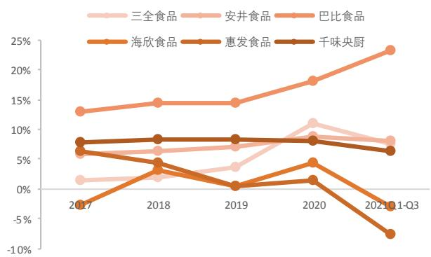

# 千味央廚(001215.SZ)

# 兼具确定性与成长性的速冻面米制品B端龙头

# 推荐（首次）

04月26日：45.32元

主要数据  

<table><tr><td>行业 食品饮料</td></tr><tr><td>公司网址 www.qianweiy angchu.com 大股东/持股 共青城城之集企业管理咨询有限公</td></tr><tr><td>司/46.86% 实际控制人</td></tr><tr><td>李伟 总股本（百万股） 87</td></tr><tr><td>流通A股（百万股） 21</td></tr><tr><td>流通B/H股（百万股）</td></tr><tr><td>总市值（亿元） 39</td></tr><tr><td>流通A股市值(亿元) 10</td></tr><tr><td>每股净资产(元） 10.72</td></tr><tr><td>资产负债率(%) 27.8</td></tr></table>

  
行情走势图

<table><tr><td colspan="2">证券分析师</td></tr><tr><td rowspan="3">张晋溢</td><td></td></tr><tr><td>投资咨询资格编号</td></tr><tr><td>S1060521030001</td></tr><tr><td rowspan="4">王萌</td><td>ZHANGJINYI112@pingan.com.cn</td></tr><tr><td>投资咨询资格编号</td></tr><tr><td>S1060522030001</td></tr><tr><td>WANGMENG917@pingan.com.cn</td></tr></table>

<table><tr><td colspan="2">研究助理</td></tr><tr><td>潘俊汝</td><td></td></tr><tr><td rowspan="2"></td><td>一般证券从业资格编号</td></tr><tr><td>S1060121120048</td></tr><tr><td></td><td>PANJUNRU787@pingan.com.cn</td></tr></table>

# 平安观点：

具备思念专业基因，深耕餐饮速冻面米市场。千味央厨脱胎于思念，秉承“只为餐饮、厨师之选”的战略定位，致力于为餐饮企业提供定制化、标准化的速冻食品及相关餐饮后厨解决方案。公司已成为肯德基、必胜客、华莱士、海底捞、真功夫等知名餐饮连锁的速冻面米制品供应商，其中在百胜中国供应商体系为最高级 T1 级，领先于行业其他竞争对手。

以场景为导向挖掘大单品空间，扩品类逻辑持续验证。公司作为工业化油条细分领域龙头，市占率超 $30 \%$ ，并且围绕场景不断深挖以巩固行业地位。公司自 2012 年起开始研究油条可能存在的不同细分场景来进行新油条产品研发，目前已围绕火锅、快餐、自助餐、宴席、早餐和外卖六大场景推出多款油条类产品。此外，公司拥有丰富的产品储备和规划，持续培育蒸煎饺等新的大单品，扩品类有望带来新的增长极。

大B驱动新品研发，强研发能力构筑护城河。千味央厨拥有49 项专利，遥遥领先于行业，并且2014年便率先在行业内建立“模拟餐厅后厨”研发实验室，以此找到餐饮企业烹饪过程中的痛点，更加精准地提供解决方案。特色产品研发主要靠大B 客户驱动，但定制品的增长受限于单个客户的需求天花板，因此后期公司决定是否将其改造为面向小B餐饮的通用品，这能大大节省公司研发成本，通过规模化生产通用品提高新品推出效率。

直营为基石，灯塔效应助力客户拓展。公司依托先发优势与头部餐饮连锁企业深度绑定，高客户粘性带来较高的业务稳定性，前五大直营客户贡献$30 \%$ 以上的营收。2020年受新冠疫情冲击，来自第一大客户百胜中国的营收占比下降至 $2 3 . 4 \%$ ，而公司第二/第三大客户华莱士/海底捞销售额分别占比 $4 \% / 2 \%$ ，伴随单品的持续放量以及新品的推出，我们期待两家客户销售额持续放量。此外，公司持续拓展餐饮新领域大B客户，为公司未来业务发展带来源源不断的增量。

<table><tr><td></td></tr><tr><td>2019A 2020A</td><td>2021E</td><td></td><td>2022E 2023E 2,016</td></tr><tr><td>营业收入（百万元） 889</td><td>944</td><td>1,275</td><td>1,630</td></tr><tr><td>YOY(%)</td><td>26.8 6.2</td><td>35.0</td><td>27.9 23.7</td></tr><tr><td>净利润(百万元) 74</td><td>77</td><td>87</td><td>107 131</td></tr><tr><td>YOY(%) 26.3</td><td>3.3</td><td>14.2</td><td>22.7 21.7</td></tr><tr><td>毛利率(%) 24.5</td><td>21.7</td><td>22.4</td><td>21.9 22.3</td></tr><tr><td>净利率(%) 8.3</td><td>8.1</td><td>6.9</td><td>6.6 6.5</td></tr><tr><td>ROE(%) 18.3</td><td>13.2</td><td>9.2</td><td>10.1 11.0</td></tr><tr><td>EPS(摊薄/元) 0.86</td><td>0.88</td><td>1.01</td><td>1.24 1.51</td></tr><tr><td>P/E(倍) 53.0</td><td>51.3</td><td>44.9</td><td>36.6 30.1</td></tr><tr><td>P/B(倍)</td><td>9.7 6.7</td><td>4.1</td><td>3.7 3.3</td></tr></table>

加强经销渠道管理，扩大增长空间。在小B渠道建设方面，首先公司将有计划地进行经销商培育，提升单个经销商销售额，打造更多销售额百万以上的经销商，预计先用 2 年时间培养头部 $20 \%$ 的大商，在5 年内完成腰部以上的经销商培育工作，由此来打开营收向上增长的空间。此外，公司通过增加销售人员、返利政策等多种方式赋能经销商，我们认为，随着公司加大经销商开发力度，经销商数量和质量都将得到大幅提升，公司经销渠道收入或将维持较高增速。

投资建议：公司作为速冻面米制品B 端龙头，兼具确定性和成长性。我们预计公司 2021-2023 年营业收入为12.75、16.30、20.16 亿元，归母净利润0.87、1.07、1.31 亿元。对应 EPS 分别为 1.01、1.24、1.51 元，当前股价对应 2021-2023 年 PE分别为 44.9、36.6 和 30.1 倍，首次覆盖，给予“推荐”评级。

风险提示：1）食品安全风险：公司生产的速冻食品生产、流通环节众多，若出现食品安全问题，可能会对公司声誉及业务经营产生重大不利影响。2)餐饮业复苏不及预期：疫情导致消费能力与消费需求下降，对餐饮行业造成较大冲击，餐饮行业复苏仍面临较多挑战，复苏节奏存在不确定性。3)大客户风险：公司大客户占比较高，其中百胜中国及其关联方占公司的营收比例超 $20 \%$ ，大客户的经营风险间接影响公司对大客户的销售额。4）行业竞争加剧：随着餐饮供应链市场容量不断扩大，或有其他潜在竞争者进入本行业，存在市场竞争加剧的风险。5 )原材料价格波动风险：公司生产所需的主要原材料为面粉、食用油等大宗农产品，原材料成本约占营业成本的 $7 5 \%$ ，原材料价格波动或影响公司盈利能力。

# 正文目录

# 行业分析..

# 竞争优势. ...15

# 四、 盈利预测.. ..25

# 五、 风险提示.. ..27

图表目录  
图表 1 我国速冻食品市场规模 6图表2 我国速冻食品市场规模预测..  
图表3 速冻食品主要分类. … …  
图表4 我国速冻食品市场产品分布…. 7图表5 我国速冻面米市场产品分布 ……………………………………图表6 我国速冻面米食品产量统计.  
图表7 我国速冻面米市场规模及增速 7图表8 我国速冻面米市场零售端竞争格局  
图表9 中式餐饮市场规模...  
图表10 我国餐饮连锁化率. …………………………… …… 8图表11 OEM代工模式的优势.  
图表12 使用代工半成品菜着成本分析……图表13 我国外卖市场规模(亿元) . 10图表14 新中产月平均下厨次数（）…… 10图表15 我国食品冷链物流需求量(亿吨) ………………………… 10图表16 我国冷库容量与冷链运输车保有量. ……………………………………… … 10图表17 通用品与定制品生产模式对比.. ………………………………………………………………… … 1图表18 千味央厨发展轨迹.  
图表19 千味央厨股权结构……  
图表20 公司核心管理层经验丰富.. ……………………………… ….13图表21 公司营业收入及增速（亿元） ……………………图表22 公司归母净利润及增速（亿元）……14图表23 公司毛利率低于行业平均水平 .14图表24 公司净利率高于行业平均水平.. ………………………………………图表25 公司销售费用率显著低于行业平均水平. …………图表26 公司ROE水平行业领先.. ………………………… … 15图表27 2020年度公司ROE水平行业领先.  
图表28 2017-2020 千味央厨四大产品销售额(亿元)  
图表29 2017-2020千味央厨四大产品销售额占比.. ……………………图表30 2017-2020千味央厨四大产品毛利率 ……………图表31 千味央厨产品SKU数量变化 …… 16图表32 千味央厨前大单品销售情况（万元）……图表33 前十大单品销售增速变化 ..17图表34 千味央厨油条类产品场景化布局. 18图表35 千味央厨在研项目 … 18图表36 千味央厨的发明专利及实用新型专利. ……………………… 19

图表37 千味央厨研发部门组织架构. 19  
图表38 千味央厨为KFC 开发的烘焙类产品. 20  
图表39 分渠道营收占比. 20  
图表40 分渠道毛利率情况， . 20  
图表41 公司 2020 年分区域营收占比 .. 21  
图表42 公司华东地区营收及增速. .. 21  
图表43 公司销售组织架构.. .21  
图表44 公司代表性客户... .22  
图表45 2020 年前五大直营客户销售额及占比， .22  
图表46 直营模式CR5销售额及占比 .23  
图表47 对百胜的销售额在营收中的占比. . 23  
图表48 经销商数量变化.. .24  
图表49 经销模式CR5销售额及占比. .. 24  
图表50 经销客户的主要类型.. ..24  
图表51 对经销商的销售返利金额.. .. 24  
图表52 公司设计产能及利用率.. 25  
图表53 公司委托加工产品产量及占比.. 25  
图表54 募集资金投资项目概况. 25  
图表55 分项业务收入、毛利率及费用率预测. 26  
图表56 相对估值分析.. .26

# 行业分析

# 1.1 速冻食品行业空间广阔，餐饮标准化打开成长空间

# 1.1.1 速冻面米新品接力增长，餐饮端布局获业内共识

速冻食品行业空间广阔。速冻食品是以米、面、杂粮为主要原料，肉类、蔬菜等为辅料，经过适当的前期处理与加工，在低温快速冻结后制成的各类主、副食品。此类产品通常需要在-18°C 下储藏、运输、销售，才能最大程度抑制微生物活性，保持食物营养与风味。近年来，受益于冷链运输能力的改善与消费结构升级转型，行业驱动力不断增强，市场规模高速扩张。2015 年我国速冻食品市场规模约为 993 亿元，2020 年增长到 1611 亿元，6年 CAGR 达 $8 . 4 \%$ 。预计未来五年仍将保持近$9 \%$ 的中高速发展，根据前瞻产业研究院预测，至2026 年国内速冻食品市场规模将达到 2700 亿元。

  
图表1我国速冻食品市场规模

  
图表2我国速冻食品市场规模预测

资料来源：Frost Sullivan，平安证券研究所资料来源：前瞻产业研究院，平安证券研究所

随着速冻技术的不断发展完善，业内产品进一步丰富。作为消费者日常生活所需，市场主要以消费者需求为导向，在技术投入上采用层次化研发战略，不断精细自身产品矩阵，满足不同收入层级、不同饮食偏好的客户需求；在工艺上不断优化改进，逐渐形成规模化、标准化的生产过程，降低成本。在这个过程中，业务线进一步细化，衍生出更多的产品。当下中国速冻食品根据产品种类可大致分为速冻调制食品（火锅料）、速冻面米制品、速冻其他食品三类。

  
图表3速冻食品主要分类

资料来源：平安证券研究所

速冻面米制品进入成熟期，新品类有望成为新的增长点。其中，速冻面米制品主要包括速冻水饺、汤圆、包子、油条、芝麻球等，是速冻食品中市场规模最大的品种，约占速冻食品市场的 $5 2 . 4 \%$ 。但是整体上来看，速冻面米市场已经发展到了较为成熟的阶段，近年来市场占比有所下降，原因在于速冻饺子、汤圆、面点的“老三样”产品了占据面米市场 $7 7 . 5 \%$ ，是面米市场的绝对主力，但“老三样”经过多年的消费者渗透，增长速度相对有限，拖累了速冻面米市场的增长速度。但是随着相关产品和工艺的发展，速冻面米类食品多样性有望进一步被激发，占比 $9 . 2 \%$ 的其他类产品有望成为速冻面米类食品行业的增长点，行业内结构性的高速增长机会依然存在。

  
图表4我国速冻食品市场产品分布

  
图表5我国速冻面米市场产品分布

资料来源：中商情报网，平安证券研究所资料来源：观研天下，平安证券研究所资料来源：国家统计局，平安证券研究所资料来源：华经情报网，平安证券研究所

  
图表6我国速冻面米食品产量统计

  
图表7我国速冻面米市场规模及增速

零售端三足鼎力，餐饮端竞相绽放。从行业竞争格局来看，速冻面米行业呈现“零售端三足鼎力，餐饮端竞相绽放”的状态。零售市场以商超和经销为主要渠道起步，经过多年的竞争和发展，现已形成了三全食品、思念食品、湾仔码头三足鼎立的市场格局，CR3已达到 $6 4 \%$ ，行业龙头三全食品已经占据 $28 \%$ 的市场规模，对照日本速冻面米龙头 Table Mark $1 1 . 7 \%$ 的市占率，国内速冻面米企业市场集中度更高。但是近年来零售业竞争加剧和集中度提高，大型商超或将更多的费用转嫁给供应商，因此零售端毛利率或有所降低。与此同时，由于速冻面米制品具有产品标准化、安全标准化和操作标准化特征，促进速冻面米制品市场渠道延伸至餐饮业、团体食堂、酒店及乡厨等领域，餐饮端销售得到了快速的发展。速冻面米制品的企业纷纷发力餐饮渠道，通过调整经营战略、设立专业子公司等，在餐饮端展开新的一轮角逐。目前，速冻面米行业餐饮端处于高速发展的市场开拓阶段，还未进入到激烈竞争阶段。

  
图表8我国速冻面米市场零售端竞争格局

资料来源：欧瑞咨询，平安证券研究所

# 1.1.2餐饮“连锁化 $\mathbf { \nabla } _ { \cdot } \mathbf { + } \mathbf { \nabla } _ { \cdot }$ 外卖需求”，为速冻食品B端扩容带来空间

中式餐饮市场规模不断扩容，“连锁化 $\star$ 外卖需求”提升。随着中国城镇化进程的不断推进，社会分工的进一步细化，女性就业率的不断提升、家庭小型化的趋势，餐饮业外部环境依然处于“量价齐增”的消费升级趋势之中。2013 年中式餐饮业市场规模为 21846 亿元，2018 年则达到了34853 亿元，CAGR 达 $9 . 7 9 \%$ ，预计2022 年，中式餐饮市场规模将达到48887亿元。与此同时，餐饮业内部也处于“连锁化率不断提升，外卖消费旺盛”的两大结构性变化之中。

国内餐饮连锁化率不断提升，发展空间仍大。2018年国内餐饮市场连锁化率为 $1 2 . 8 \%$ ，2019年增长至 $1 3 . 3 \%$ ，2020年连锁化率进一步提升至 $1 5 \%$ 。业界通常认为，连锁化经营能够形成规模优势，在原料采购、餐饮标准化、提升品牌形象上具有更明显的优势。对比日本 $4 9 . 7 \%$ 、美国 $5 4 . 3 \%$ 的餐饮连锁化率，国内餐饮连锁化仍具有非常广阔的增长空间。

  
图表9中式餐饮市场规模

  
图表10我国餐饮连锁化率

资料来源：36 氪，平安证券研究所资料来源：中国餐饮大数据2021，平安证券研究所

OEM 中央厨房的出现为餐饮业做出了巨大的贡献。随着餐饮业的模式和趋势发生改变，曾经单一的餐饮业模式已转向多元化，重视中央厨房是餐饮业转型升级的重点。OEM 中央厨房，也称第三方中央厨房，这类中央厨房一般为大型商超、社区、大型企业等场所提供复合调料包、调理食品、快餐食品等，产品一般为冷冻或者常温食品为主，为餐饮业的进步做出了巨大贡献。

OEM 中央厨房在成本控制以及标准化制作上具有显著优势。1)规模效应缩减成本：中式菜肴的品种种类十分繁杂，而且每个菜肴的需求量并不大，也不固定，单一企业在采购上因进货量小而不具备议价能力，但第三方的工厂要为很多餐饮企业服务，需要的量也非常大，原材料采购能力和议价能力也比大部分企业强，从第三方工厂采购性价比更高；2)标准化程度高：个体餐饮行业依赖于后厨加工工艺，后厨人员变动，切配工艺变动在很大程度上影响出菜质量，规模大的第三方代工厂机械化程度高，产品质量更加稳定；3)加快后厨出菜速度，提高翻台率：传统餐饮企业由点单到备菜与炒菜过程相比时间较长，采用第三方工厂加工后的原料，无需复杂准备就可以进行烹饪。

  
图表11OEM 代工模式的优势

资料来源：平安证券研究所

中央厨房能够有效减少后厨，降低成本。根据 2018年中国餐饮年度报告的数据，人力费用占营收的 $2 2 \%$ ，其中后厨占人力费用的 $50 \%$ ；租金费用占营收的 $9 \%$ ，其中后厨占比 $30 \%$ 。通过减少后厨 $30 \%$ 的人员和面积，可减少 $3 . 3 \%$ 的人力费用与$0 . 8 1 \%$ 租金费用，合计可减少成本 $4 . 1 1 \%$ ，带来经济效益。

图表12使用代工半成品菜肴成本分析  

<table><tr><td></td><td>营收占比</td><td>后厨成本占比</td><td>后厨减少 30%可节省成本</td></tr><tr><td>人力费用</td><td>22%</td><td>50%</td><td>3.3%</td></tr><tr><td>租金费用</td><td>9%</td><td>30%</td><td>0.81%</td></tr></table>

资料来源：中国餐饮年度报告，平安证券研究所

外卖市场蓬勃发展，带动速冻食品消费扩容。新一代年轻群体的生活节奏要比上一代更快，在平衡工作与休息的选择时，年轻群体选择外卖与在外饮食的频率正在上升。从需求端来看，一线城市的新中产群体每个月下厨的次数仅为15.1 次，平均每 2天才下厨一次，年轻人没有足够的时间，也没有足够的精力准备复杂的食材进行备菜、烹饪。同时，国内外卖市场在数字化的助力下蓬勃发展，2013 年外卖市场规模仅为 503 亿元，2018年达到了 2547 亿元，CAGR达 $3 8 . 3 \%$ ，预计2022年规模将达到 4770 亿元。以便捷性为主要特点的外卖消费，对餐饮企业的备餐时间提出了更高的要求，因此外卖餐饮店急需快速响应的食材供应商，速冻食品天然满足这样的消费特点，因此更加便捷的速冻面食、速冻火锅料、速冻菜肴不仅能吸引个人消费者，而且更加符合餐饮企业的需求。

  
图表13我国外卖市场规模（亿元）

  
图表14新中产月平均下厨次数(次）

资料来源：36氪，平安证券研究所资料来源：2017 中国厨房消费趋势调查报告，平安证券研究所

“团餐市场 $^ { 1 + }$ 乡厨市场”的发展，亦为速冻食品发展带来机遇。除了餐饮市场的连锁化和外卖消费的两大主要的变化趋势外，团餐市场和乡厨市场的发展也为速冻食品的需求扩容带来空间。根据中国饭店协会发布的《2020 年度中国团餐发展报告》显示，2019年我国团餐市场总额1.5万亿元，团餐市场份额达到 $3 3 . 2 3 \%$ 。虽然团餐市场以各学校企业食堂等为主，市场较为分散，但其同时具有需求可预测性、标准化高、综合成本低、可复制性强的特点，这与速冻食品行业的特点具有一致性，高度的标准化与稳定的产品质量可进一步提升企业效益，为速冻食品行业的发展带来新空间。此外，乡厨市场作为我国传统饮食文化的重要组成部分，至今在农村地区遇到红白喜事依然保持着相当的活力。消费升级趋势的不断下沉，使得农村宴席的每桌成本接近 300\~600元，再加上每次约 30\~60 桌的数量，给乡厨的原材料采购、成本控制、食品安全、制作等步骤带来了更大的挑战，当然也给速冻食品餐饮端市场下沉到三四线城市和农村带来了机遇。

# 1.1.3冷链运输能力快速提升，为速冻食品产业发展保驾护航

国内冷链运输能力快速提升，满足日益增长的冷链物流需求。速冻食品标准存储温度为. $\boldsymbol { \cdot } \boldsymbol { 1 } \boldsymbol { 8 } ^ { \circ }$ C,因此冷链物流对速冻食品行业的发展至关重要。近年来，我国食品冷链物流需求量不断递增，由 2014 年 0.92 亿吨上升至 2019 年 2.33 亿吨，CAGR达到 $2 9 . 0 4 \%$ ，2020年需求量达到2.8亿吨，同比增长 $2 0 . 1 7 \%$ ，长期以来，落后于日本、美国的冷链体系掣肘我国速冻食品迅速扩张。随着海外先进技术以及高效保温材料的引进与应用，我国冷库建设与冷藏运输车制造业得到了长足的进步。2013 年至 2018年，国内冷库容量从 8345 万立方米增长至 14700 万立方米，年复合 CAGR达 $1 1 . 9 9 \%$ ；同期，我国冷链运输车从 5.52万辆增加至 18万辆，CAGR达 $2 6 . 6 7 \%$ 。冷链物流基础设施的逐渐完善，行业增速高于速冻食品行业增速，为速冻食品的运输提供高效助力，减少了企业通过商超线下铺货的货架费用，有效通过线上交易进行分流，为匹配消费需求与地区库存提供更加便捷的方式，减少了传统线下频繁调配造成的损耗。

  
图表15我国食品冷链物流需求量（亿吨）

  
图表16我国冷库容量与冷链运输车保有量

资料来源：智研咨询，平安证券研究所资料来源：中国物流与采购联合会，平安证券研究所

# 1.2 C 端盈利承压，B 端定制化供应优势凸显

通用品面向C端和小B端，定制品面向大 $\mathsf { B } _ { \circ }$ 速冻面米企业的产品按照其生产模式划分主要可以分为通用品和定制品。其中通用品以面向 C 端和小 B 端客户为主，产品标准化程度较高，产品间差异性较小，以商超、农贸市场和小餐饮店为主要的消费客户，多通过经销商渠道进行供应。而近年来行业内快速发展的定制化产品，则针对不同的消费场景和需求，如外卖、西式快餐、中式早餐等，面对大 B端的连锁餐饮企业，如百胜中国、海底捞、永和大王等，提供定制化的产品。

图表17通用品与定制品生产模式对比  

<table><tr><td></td><td>生产模式</td><td>客户</td><td>生产企业</td><td>客户粘性</td><td>竞争格局</td><td>财务比率</td></tr><tr><td colspan="2">通用品</td><td>以接受通用产品的C端和小B 端客户为主。</td><td>生产企业自己挖掘市场通 用品的需求，以产品为基础 和核心进行销售。</td><td>弱</td><td>C端呈现三足鼎 力态势，寡头竞 争激烈。</td><td>毛利率高 销售费用率高 净利率一般</td></tr><tr><td rowspan="2">定制品</td><td>定制研发产</td><td></td><td></td><td>长期性</td><td></td><td>毛利教</td></tr><tr><td></td><td></td><td>生产企业保证生产质量并</td><td>较为稳定</td><td>市场较为分散，</td><td></td></tr></table>

资料来源：平安证券研究所

C 端盈利承压，B 端定制化供应优势凸显。由于近年来 C 端速冻面米类厂商面临来自于大型商超对于利润的挤压，及原材料成本上涨压力，盈利状况承压，相比之下 B端生产商，特别是能够提供定制化产品研发和生产的企业盈利能力较强。从需求上来看，B 端餐饮行业整体仍处于快速发展之中，并且大 B 端连锁餐饮品牌竞争优势进一步凸显，由于国内餐饮业原材料成本约占总成本的三成以下，大 Β 客户对原材料的成本变化相对不敏感。大 B 餐饮品牌并不是单单追求低成本，而更加的看重于性价比，如生产商能够针对后厨的设备特点，套餐的销售搭配等提供对应的食品研发和供应服务，并且能在规模效应下保证食品安全和成本优势，大 B 客户倾向与该类大型生产商建立长期稳定的供应关系。当然对于生产商而言，企业的研发能力、定制化的销售能力、管理能力、大客户的背书都将成为其参与市场竞争的护城河。

# 公司简介

# 2.1 具备思念专业基因，深耕餐饮速冻面米市场

专注餐饮渠道，定位餐饮专攻速冻面米领导品牌。郑州千味央厨食品股份有限公司成立于 2012年 4月，主营业务为面向餐饮企业的速冻面米制品的研发、生产和销售。作为国内知名的餐饮渠道速冻面米制品提供商，千味央厨始终秉承“只为餐饮、厨师之选”的战略定位，致力于为餐饮企业提供定制化、标准化的速冻食品及相关餐饮后厨解决方案。公司的主要终端客户为连锁餐饮企业、酒店和团体食堂等，自设立以来，已成为肯德基、必胜客、华莱士、海底捞、真功夫等知名餐饮品牌速冻面米制品供应商，其中在百胜中国供应商体系为最高级 T1 级，领先于行业其他竞争对手。

起步思念，定位准确，发展迅速。2002 年千味央厨还是思念内部部门时就与肯德基合作，将中式传统食品推广进入西式食品市场，并于 2006年推出安心油条，该单品作为最早开发的核心单品，始终占据十分重要的地位。2012年郑州思念全资设立千味央厨，开创速冻餐饮 B2B 道路，同年芝麻球单品销量过亿。2013 年公司成立上海研发中心，投入新车间与办公楼，公司进入快速发展阶段。2016 年，公司从郑州思念独立出来，完成股份制改革，正式变更为股份有限公司。同年，公司成为百胜 T1 级别供应商，领先于行业其他竞争对手。2017年，千味央厨设立子公司新乡千味，投资 3.22 亿建设“千味央厨食品加工建设项目”。2018 年公司获得京东领投、绝味食品跟投的1亿元投资，同年，新乡一期正式投产，二期开始建设，2019 年新乡工厂二期也正式投产。2021 年 9 月6日，公司于深交所上市，被称为“速冻供应链第一股”，首日股价涨幅便高达 $4 3 . 9 8 \%$ o

  
图表18千味央厨发展轨迹

资料来源：公司官网，招股说明书，平安证券研究所

公司股权结构清晰，获得京东和绝味投资。公司实控人李伟通过共青城城之集控股 $4 6 . 8 6 \%$ ，第二大股东为前海新希望，持股比例为 $6 . 7 0 \%$ 。京东子公司宿迁涵邦、绝味食品子公司深圳网聚各持股 $3 . 8 5 \%$ 。其余大股东分别为上德合味 $( 4 . 1 3 \%$ )、共青城凯立( $4 . 0 8 \%$ )，其中，共青城凯立为员工持股平台。另外，公司于2021 年11 月发布股权激励公告，激励对象包括董事、高管、核心研发和业务骨干等共计 80 人，深度绑定员工利益。

  
图表19千味央厨股权结构

资料来源：招股说明书，公司财报，平安证券研究所

核心成员多来自思念，拥有丰富的行业经验。公司实际控制人为郑州思念创始人李伟，于 1997年创立郑州思念速冻食品有限公司。公司董事长、董事、总经理等核心管理层均在郑州思念有较长时间的任职，管理团队在速冻食品行业拥有丰富的工作经验，具备优质专业的基因。

图表20公司核心管理层经验丰富  

<table><tr><td>姓名</td><td>职务</td><td>性别</td><td>任职日期</td><td>个人简历</td></tr><tr><td>李伟</td><td>实际控制人</td><td>男</td><td>无任职</td><td>毕业于郑州大学新闻系，本科学历，未在公司担任职务，现为公司实际控制人、黄河大观 实际控制人，第十二届、第十三届全国人大代表、河南省工商联副主席。1997 年成立河 南省思念速冻食品有限公司，2017 年将其持有的全部思念股份转出，从此不再直接或间 接持有郑州思念食品股权。</td></tr><tr><td>孙剑</td><td>董事长</td><td>男</td><td>2019.06.26</td><td>毕业于河南师范大学，本科学历。1995 年 9 月至 2000 年 10 月任河南省天隆实业有限 公司业务员；2000年10月至2010 年9月历任郑州思念业务代表、上海公司经理、香 港公司经理、营销中心副总经理；2010年10月至2013年9月，任河南一生缘食品有限 公司销售总经理；2013年10月至2018年6月，任郑州中部大观地产有限公司副总经理； 2018 年7月至今在本公司工作，现任公司董事长，新乡千味执行董事。</td></tr><tr><td>白瑞</td><td>事理</td><td>女</td><td>2019.06.26</td><td>毕业于中南财经政法大学，硕士学历，中级会计师。1997 年7月至 2000 年9月任河南 冠联装饰工程有限公司财务部会计；2000年10月至2004年4月任海信科龙电器股份有 限公司河分公司会计主管204年5 至2011年历在州思念结算部经理资 总经理，新乡千味经理。</td></tr><tr><td>王植宾</td><td>董事 副总经理 财务总监</td><td>男</td><td>2019.06.26</td><td>毕业于西南大学，本科学历，中级会计师。2002 年5 月至 2003 年 8月任宏大(集团) 有限责任公司财务部会计；2003年9月至2005 年3月任郑州章光101生发科技有限公 司财务部会计；2005 年4月至2012年3月历任郑州思念总成本会计、高级审计员、内 审经理、审计部经理；2012年4月至今在本公司工作，现任公司董事、副总经理、财务 总监。</td></tr><tr><td>王向阳</td><td>监事会主席</td><td>男</td><td>2019.06.26</td><td>毕业于郑州粮食学院，本科学历。1996 年7月至1998年7月任郑州市第五粮油食品公 司生产管理车间主任；1998 年8 月至1999 年2月任河南兴秦科技有限公司产品研发部 实验室主任；1999年3月至2012年3月任郑州思念质量技术总监；2012年4月至今历 任公司生产质量技术总监、生产总监，现任公司监事。</td></tr><tr><td>徐振江</td><td>副总理书</td><td>男</td><td>2019.06.26</td><td>毕业于中央财经大学，硕士学历，中央财经大学在读博士。2005 年7月至2006 年 6月 任广州南方人物周刊实习记者；2006年9月至2010年10月历任河南商报社记者、经济 新闻部主任201年10至201年8月任南河酒业股公司理：201年 9月，任河南骏域基金管理有限公司投资总监；2015年9月至今在本公司工作，现任公 司副总经理兼董事会秘书。</td></tr></table>

资料来源：招股说明书，平安证券研究所

# 2.2 营收利润稳健增长，ROE 水平领先行业

公司受疫情影响后恢复迅速，收入业绩稳健增长。2017-2020 年公司营收及净利润稳步增长，营收 CAGR 为 $1 6 . 8 \%$ ，净利润CAGR为 $1 7 . 8 \%$ 。2020全年公司实现营收9.44亿元，同比增长 $6 . 2 0 \%$ ，归母净利润0.77亿元，同比增长 $3 . 3 3 \%$ ,2020年业绩增速放缓主要是受新冠疫情对下游餐饮的影响。2021 年前三季度公司实现营收 8.88 亿元，同比增长 $4 5 . 9 2 \%$ ，归母净利润0.57亿元，同比增长 $1 6 . 0 1 \%$ ，随着疫情得到控制，公司业绩增速逐步回归正常。

  
图表21公司营业收入及增速（亿元）

  
图表22公司归母净利润及增速（亿元）

资料来源：wind，平安证券研究所资料来源：wind，平安证券研究所

毛利率水平稳步上升，但低于行业平均水平。2017至 2019 年，公司毛利率分别为 $2 2 . 6 9 \%$ , $2 3 . 8 3 \%$ , $2 4 . 5 0 \%$ ，毛利率水平稳步上升。2020年与 2021 年 Q1-Q3 毛利率分别为 $2 1 . 7 1 \%$ $2 1 . 8 4 \%$ ，近两年毛利率下降的主要原因为公司新收入会计准则执行后将原本计入销售费用的运输费用计入主营业务成本，及新乡厂区冷库、车间等投产使用使得折旧费用上升。同行业对比来看，千味央厨毛利率相对较低，这主要是公司有直营销售模式以及面米制品占比较高造成的。

  
图表23公司毛利率低于行业平均水平

资料来源：wind，平安证券研究所资料来源：wind，平安证券研究所

  
图表24公司净利率高于行业平均水平

低销售费用率带来较高的净利率。受销售模式、客户结构差异的影响，千味央厨的销售费用率显著低于同行业内其他公司，2017 至 2019年，公司的销售费用率稳定维持在 $5 \%$ 左右的水平，2020年降低至 $3 . 2 8 \%$ ，2021年Q1-Q3为 $3 . 4 4 \%$ 。受益于较低的期间费用率，公司净利率始终维持在行业较高水平，2020、2012Q1-Q3 净利率分别为 $8 . 1 \%$ 、 $6 . 2 \%$ ，总体保持稳定。

  
图表25公司销售费用率显著低于行业平均水平

  
图表26公司ROE水平行业领先

资料来源：wind，平安证券研究所资料来源：wind，平安证券研究所

高净利率高周转率,造就 ROE水平领先同行。2017至 2020年，千味央厨的 ROE分别为 $2 7 . 5 9 \%$ $1 9 . 3 3 \%$ $2 0 . 1 0 \%$ $1 5 . 0 0 \%$ ,虽 2020年受疫情影响有所下滑，但整体仍处于行业较高水平。2020年公司总资产周转率为1.05 次，领先行业，主要受益于 toB 的商业模式带来更高的效率。高净利率和高周转率共同造就了公司领先于行业的高ROE。

图表272020 年度公司ROE 水平行业领先  

<table><tr><td></td><td>千味央厨</td><td>三全食品</td><td>安井食品</td><td>巴比食品</td><td>海欣食品</td><td>惠发食品</td></tr><tr><td>ROE(%)</td><td>15.00</td><td>29.39</td><td>19.52</td><td>17.75</td><td>8.77</td><td>3.53</td></tr><tr><td>净利率（%)</td><td>8.11</td><td>11.09</td><td>8.67</td><td>17.99</td><td>4.42</td><td>1.64</td></tr><tr><td>销售费用率(%)</td><td>3.28</td><td>14.42</td><td>9.25</td><td>4.91</td><td>11.33</td><td>6.16</td></tr><tr><td>总资产周转率(次)</td><td>1.05</td><td>1.23</td><td>1.09</td><td>0.66</td><td>1.26</td><td>1.07</td></tr><tr><td>毛利率(%)</td><td>21.71</td><td>29.87</td><td>25.68</td><td>27.90</td><td>24.64</td><td>20.20</td></tr></table>

资料来源：wind，平安证券研究所

# 竞争优势

# 3.1 以场景为导向挖掘大单品空间，扩品类逻辑持续验证

聚焦四大产品品类，油炸类表现突出。千味央厨产品主要分为油炸类、蒸煮类、烘焙类、菜肴类及其他，其中油炸类产品是公司优势品类。公司前十大产品中的四大名明星油条单品都属于油炸类，在近年营收中占据半壁江山，2020 年油炸类产品销售额约5.21亿元，营收占比虽有所下滑，但仍占 $5 5 \%$ 。烘焙类产品和蒸煮类产品营收占比分别约为 $20 \%$ ，菜肴类及其他占比较小，约为 $5 \%$ 左右。毛利率角度看，油炸类毛利率相对较低，较其他品类低约3-4pct，油炸类占比近年来逐步下降，有利于综合毛利率的提升。蒸煮类毛利率相对较高，2020年约为 $2 5 \%$ 。2020年各品类毛利率均出现了不同程度的下滑，主要是受成本端的影响。

  
图表282017-2020千味央厨四大产品销售额（亿元）

资料来源：千味央厨招股说明书，平安证券研究所资料来源：千味央厨招股说明书，平安证券研究所资料来源：千味央厨招股说明书，平安证券研究所

  
图表292017-2020 千味央厨四大产品销售额占比

  
图表302017-2020 千味央厨四大产品毛利率

产品矩阵丰富，新品不断推出。餐饮行业因需要满足不同消费场景下多种多样的食材需求，对产品和菜单的更新要求较高，这也倒逼千味央厨作为供应企业需要不断强化研发和技术，提升产品力。公司的产品品类丰富，数量多，推新速度也较快。2017 年就拥有 SKU 数量 193 种，三年内将 SKU 数量提升到了 368 种，其中仅油炸类就拥有 SKU95 种。

图表31千味央厨产品 SKU数量变化  

<table><tr><td>项目</td><td>2020年度</td><td>2019年度</td><td>2018年度</td><td>2017年度</td></tr><tr><td>油炸类</td><td>95</td><td>90</td><td>72</td><td>61</td></tr><tr><td>烘焙类</td><td>56</td><td>49</td><td>38</td><td>33</td></tr><tr><td>蒸煮类</td><td>166</td><td>139</td><td>105</td><td>84</td></tr><tr><td>菜肴类及其他</td><td>51</td><td>27</td><td>9</td><td>15</td></tr><tr><td>合计</td><td>368</td><td>305</td><td>224</td><td>193</td></tr></table>

资料来源：千味央厨招股说明书，平安证券研究所

大单品领先市场，带来规模效应。公司前十大单品对营收贡献突出，2020 年销售额达 4.3亿元，约占总收入的 $4 6 \%$ 。其中，蛋挞皮和芝麻球为销售额排名前二的大单品，2020 年销售额均约为 9000 万元，占比公司的销售收入均约为 $10 \%$ 。芝麻球的销售额在过去持续增长，2020 年超过蛋挞皮成为销售额最高的产品。油条类产品是公司的明星产品，前十大单品中有四个是油条类产品，合计营收过亿。其中，安心大油条是2020年前十大单品中增速最快的产品，增速约 $3 3 \%$ 。除以上油炸类单品外，烘焙类例如冷冻华夫面团也有不错的表现，2018 年推出后次年增速就达到了 $134 \%$ o

  
图表32千味央厨前十大单品销售情况（万元）

资料来源：千味央厨招股说明书，平安证券研究所

图表33前十大单品销售增速变化  

<table><tr><td>品类</td><td>2018年</td><td>2019年</td><td>2020年</td></tr><tr><td>千味1*18*16蛋挞皮</td><td>12.06%</td><td>14.52%</td><td>-4.86%</td></tr><tr><td>千味260g 芝麻球</td><td>4.87%</td><td>0.88%</td><td>8.82%</td></tr><tr><td>KFC 60g 冷冻油条</td><td>-</td><td>51.52%</td><td>-4.58%</td></tr><tr><td>千味 400g 香芋地瓜丸</td><td>-</td><td>13.89%</td><td>5.13%</td></tr><tr><td>千味 450g 香脆油条</td><td>8.18%</td><td>10.52%</td><td>2.65%</td></tr><tr><td>百胜原味冷冻华夫面团</td><td>-</td><td>134.52%</td><td>-38.33%</td></tr><tr><td>千味 360g 卡通豬豬包</td><td>200.63%</td><td>44.40%</td><td>2.85%</td></tr><tr><td>千味1200g 安心大油条</td><td>-</td><td>111.72%</td><td>33.01%</td></tr><tr><td>千味 300g 脆皮香蕉</td><td>-12.68%</td><td>-5.85%</td><td>-13.74%</td></tr><tr><td>百胜360g 蛋芯油条</td><td>-</td><td>-</td><td>-</td></tr></table>

资料来源：千味央厨招股说明书，平安证券研究所

通过场景化布局，不断打开产品天花板。根据英敏特预测，2021 年中国消费者早餐食品总消费已接近两万亿元，其中仅油条一项预计市场容量超百亿。根据冷冻在线数据，我国工业油条市场规模约 10亿元，其中千味央厨市占率约 $30 \%$ 。公司围绕不同场景持续产品创新，培育油条市场，不断巩固龙头地位。公司自2012 年起开始研究油条可能存在的不同细分场景，并根据场景进行新油条产品研发。目前，公司已经细分出火锅、快餐、自助餐、宴席、早餐和外卖六大场景，并且围绕场景推出了火锅小油条、麻辣烫小油条、外卖专用油条、茴香小油条等多款产品。

图表34千味央厨油条类产品场景化布局  

<table><tr><td>场景</td><td>产品</td></tr><tr><td>早餐主食</td><td>45g 安心油条、60g 安心大油条、85g油条3 代、8g 葱香油条、油条片（配饭团/粥）、油条面胚</td></tr><tr><td>正餐、配菜、小吃</td><td>45g香脆油条、10g精品茴香油条</td></tr><tr><td>火锅麻辣烫</td><td>25g火锅油条、10g涮煮小油条、10g麻辣烫小油条、10g精品小油条</td></tr><tr><td>休闲餐</td><td>安心油条、10g精品茴香小油条</td></tr></table>

资料来源：千味央厨招股说明书，平安证券研究所

丰富的产品储备和规划，扩品类有望带来新的增长极。公司当前有许多产品储备处于准备、试验阶段，如馅饼、春卷、油条等。同时公司也储备了新领域产品，例如开袋即食的瑞幸的华夫饼干。在未来三年内，公司将聚焦五大产品线：首先是通过场景化布局持续打开油条天花板；第二是在传统的芝麻球、地瓜丸基础上加强油炸点心类产品；第三是能够匹配到早晚餐场景的蒸煎饺，公司在差异化竞争定位中低端市场，同时解决食堂、团餐产品堆蒸不破并快速出餐的需求，目前增速较高，有望成为新的大单品；第四是之前产品系列没有涉及到的米糕类；第五是超出传统意义概念更广的春卷，目前新口味春卷已进入中试阶段。

图表35千味央厨在研项目  

<table><tr><td>项目</td><td>研发阶段</td><td>项目介绍及未来应用前景</td></tr><tr><td>新口味酥饼</td><td>小试阶段</td><td>中式点心的多样化研发生产，更大程度满足客户的需求</td></tr><tr><td>冷冻三明治面团</td><td>小试阶段</td><td>三明治面团的工业化生产，代表着烘焙面包类产品在技术上的一个大的突破</td></tr><tr><td>牛奶馒头</td><td>试验阶段</td><td>馒头的新型的生产方式，规模化、产量化是馒头发展的方向</td></tr><tr><td>麻酱烧饼</td><td>小试阶段</td><td>市场产品的吸收创新，增强产品技术研究</td></tr><tr><td>馅饼类</td><td>试验阶段</td><td>开拓饼类市场，丰富产品</td></tr><tr><td>注芯油条系列</td><td>研发阶段</td><td>基于蛋芯油条，对该系列产品进行储备</td></tr><tr><td>新口味春卷</td><td>中试阶段</td><td>春卷口味的多元化、创新化</td></tr><tr><td>油条新加工方法的研究</td><td>试验阶段</td><td>继续对油条生产进行技术研究</td></tr><tr><td>油条面点工业化生产研究</td><td>试验阶段</td><td>对面店工业化规模生产进行技术研究</td></tr></table>

资料来源：千味央厨招股说明书，平安证券研究所

# 3.2 大B 驱动新品研发，强研发能力构筑护城河

公司研发能力强，拥有众多专利。大B 端用户十分注重研发能力，千味央厨在这方面拥有较大的优势，这也是公司的护城河之一。根据千味央厨招股说明书，公司拥有49 项专利，其中有1项发明专利，9 项实用新型专利，39 项外观设计专利，还有 9 个在研项目。以明星产品油条为例，千味央厨已经更新到了第三代加工方式，而市场上大部分油条厂家仍停留于第一代加工方。且仅油条品类公司就拥有 7项核心技术，侧面说明公司深度研发细分品类的能力较强。先进的生产工艺和设备都是推出新产品必不可少的因素。在生产工艺上，公司获得了油条和芝麻球的工业生产等具有知识产权的核心科研成果。在生产设备上，公司加大机械化和自动化水平，不断规范操作流程，引进并学习国外先进设备技术，自主创新研发针对自身需求的生产设备。

图表36千味央厨的发明专利及实用新型专利  

<table><tr><td>序号</td><td>专利类型</td><td>专利名称</td><td>专利号</td></tr><tr><td>1</td><td>实用新型</td><td>种新型油条面胚成形机</td><td>ZL201220603055.9</td></tr><tr><td>2</td><td>实用新型</td><td>种蛋饼机正面煎烤装置</td><td>ZL201220598263.3</td></tr><tr><td>3</td><td>实用新型</td><td>一种蛋饼机</td><td>ZL201220598243.6</td></tr><tr><td>4</td><td>实用新型</td><td>一种蛋饼机背面煎烤装置</td><td>ZL201220598233.2</td></tr><tr><td>5</td><td>实用新型</td><td>一种蛋饼机注浆装置</td><td>ZL201220598223.9</td></tr><tr><td>6</td><td>发明专利</td><td>一种像生菠萝果及其制作方法</td><td>ZL201310278497.9</td></tr><tr><td>7</td><td>实用新型</td><td>一种多色食品加工喷浆成型用喷嘴及成型设备</td><td>ZL201720783141.4</td></tr><tr><td>8</td><td>实用新型</td><td>一种注芯油条的生产设备</td><td>ZL201920043738.4</td></tr><tr><td>9</td><td>实用新型</td><td>一种油条加工装置</td><td>ZL201920288123.8</td></tr><tr><td>10</td><td>实用新型</td><td>一种用于油条的油炸锅</td><td>ZL201920288705.6</td></tr></table>

资料来源：千味央厨招股说明书，平安证券研究所

研发部门分工明确，研究人员经验丰富。公司研发部门分工明确，大大提高新品研发的效率和质量。公司技术研发部门下分设产品、工艺、设备、包装研发四个专业研究室和上海研发室。产品研发部门又根据不同品类产品分为球类、酥类、油条、面点、烘焙类、创新类小组。同一个小组里有技术、原料、产品和对应的客户，项目经理按照消费场景来分配工作，负责对接某一类产品的客户。上海研发室利用地理位置和资源优势，负责项目沟通、技术服务等，及时反馈消费者需求和国内产品动态。公司核心技术人员都是经验丰富、有较长的从业经历的人才。技术研发部工程师如程燕、朱国新、李欢、姬真真均来自思念，并于2012 年加入千味央厨。公司技术研发部总监是有“速冻油条之父”之称的贾学明，研发了公司第一代油条、蛋挞和其他爆款产品。除此以外，研发人员一部分是食品专业学校的研发方向毕业生，懂得如何将理论与实践相结合，通过不断地研发创新将众多中华传统面米美食进行工业化改造，并以半成品的形式引入餐饮后厨。

  
图表37千味央厨研发部门组织架构

资料来源：千味央厨招股说明书，平安证券研究所

客户定制化研发和自主研发双线进行，高效满足客户需求。一方面，千味央厨为大客户提供定制化研发服务以更好地满足客户需求。公司从接受定制要求、进行定制研发、工艺优化、中试放大最终到生产交付的时间只需 3-6个月，其中真正的研发时间则必然小于 3-6个月。据千味央厨招股书，公司 2018年为肯德基研发并上市了 7个新品，以高效的推新速度赢得客户的肯定。另一方面，千味央厨基于市场流行概念和消费者喜好，针对西式快餐、中式快餐以及乡厨等多种场景，主动研发新品供大客户进行选择，开发出了如注芯油条、墨鱼汁油条等创新速冻面米单品。高效率的产品研发模式有助于给大客户提供

更优的选择，及时抢占市场份额。

图表38千味央厨为KFC开发的烘焙类产品  

<table><tr><td>时间</td><td>新品品名</td><td>产品单价（元、kg）</td><td>销售金额（万元）</td></tr><tr><td rowspan="3">2018年</td><td>百胜原味冷冻华夫面团</td><td>42.20</td><td>2491.50</td></tr><tr><td>百胜巧克力味冷冻华夫面团</td><td>-</td><td>一</td></tr><tr><td>百胜720g榴莲酥饼</td><td>-</td><td>-</td></tr><tr><td rowspan="2">2019年</td><td>百胜咸蛋黄冷冻华夫面团</td><td>45.97</td><td>703.28</td></tr><tr><td>百胜33g 迷你原味可颂冷冻面团</td><td>-</td><td>-</td></tr></table>

资料来源：千味央厨招股说明书，平安证券研究所

模拟餐厅后厨提供解决方案，大B驱动新品研发。2014 年，千味央厨便率先在行业内建立“模拟餐厅后厨”研发实验室，另外还组建了专业餐饮研发团队。“模拟餐厅后厨”研发实验室目的是模拟餐厅后厨工艺的产品研发和制作，较大程度地还原后厨工艺，最大化菜品制作效率。这样做的目的是找到餐饮企业烹饪过程中的痛点，并更加精准地提供解决方案。而特色产品研发主要靠大 B 客户驱动，但定制品的增长受限于单个客户的需求天花板，因此在保护期过后，公司会进行市场调研，决定是否将其改造为面向小 B 餐饮的通用品。这能大大节省公司研发成本，通过规模化生产通用品提高新品推出效率。

# 3.3 直营客户为基石，经销渠道带来增量

大 B渠道壁垒稳固，小 B 渠道增速较快。公司自注资成立起便带有显著的 B 端基因，在 2B 的战略定位下，公司主要通过直营定制化和经销标准化两种模式为 Β 端客户提供差异化服务。直营模式主要为品牌知名度较高的大型连锁餐饮客户提供定制化产品，经销模式主要通过经销商向中小餐饮门店销售标准化的通用品。由于餐饮企业需要较长的验证时间，因此转换供应商的成本和风险相对较高，这也造成了大 Β端有较高的进入壁垒。得益于早期与百胜中国及肯德基成为了重要合作伙伴，公司在大 B 端先发优势显著，渠道营收增速稳定。小 B 渠道建设虽起步晚，但增速较快，有望成为未来几年公司的主要增长动力。

经销贡献更多营收，直营带来更优毛利。近年来，公司直营和经销的营收占比一直较为稳定，直营渠道营收大致占 4成，其余 6成左右来自经销渠道，渠道上的营收增量主要来自于现有客户的上新和深挖。2020 年受疫情影响，线下餐饮大量关闭，直营渠道营收占比有所收缩，而居家场景和外卖需求的激增使经销渠道的营收占比有所扩大。由于直营渠道销售的定制产品溢价更高，直营模式长期以来毛利率显著高于经销模式，2020 年直营/经销模式毛利率分别为 $2 3 . 1 9 \% / 2 0 . 6 2 \%$ 。因2020年起直营客户运输费用调整计入当期主营业务成本，毛利率差距有所缩小。

  
图表39分渠道营收占比

  
图表40分渠道毛利率情况

资料来源：千味央厨招股说明书，平安证券研究所资料来源：千味央厨招股说明书，平安证券研究所

华东地区遥遥领先，主要来自于头部客户的贡献。2017 年至 2020 年，华东地区营收占比均超过了 $50 \%$ 。一方面是由于中国优质的连锁餐饮企业总部都在上海，因此华东地区在餐饮连锁销售方面具有天然优势；另一方面则是因为公司前两大直营客户（百胜中国控股有限公司、福建省华莱士食品股份有限公司)均归属华东地区，而这两大客户共同贡献了总营收中大约三成的份额。

  
图表41公司2020年分区域营收占比

  
图表42公司华东地区营收及增速

资料来源：千味央厨招股说明书，平安证券研究所资料来源：千味央厨招股说明书，平安证券研究所

销售团队分工合理、组织架构稳定完善。公司有专门的营销中心负责市场开拓、销售业务、品牌推广及产品管理等工作，由销售副总经理统筹营销销售的相关工作，营销中心下设多个细分部门分管各类业务。公司重客部主要负责为百胜中国、华莱士、九毛九、真功夫、海底捞等直营客户提供服务；经销商客户部主要服务于区域型餐饮客户，依托经销商进行销售；渠道拓展部主要负责拓展新零售等新业务；行销部主要负责营销中心在渠道和客户开发、服务提升方面的工作要求，并结合各区域的实际情况跟进落地；产品管理部负责产品管理和品牌推广等工作。经过多年的实践、调整和改进，公司已经形成了一套机构设置合理、人员配置得当、区域布局合理的销售管理体系。

  
图表43公司销售组织架构

资料来源：千味央厨招股说明书，平安证券研究所

# 3.3.1深耕直营领域，绑定头部客户

直营领域先发优势显著，灯塔效应助力客户拓展。直营渠道主要面向门店千家以上，年营收亿元以上的大B客户。公司由于较早深耕餐饮供应领域，率先积累了一批优质客户。目前，公司的餐饮供应服务已经覆盖了肯德基、必胜客、华莱士、海底捞、真功夫、九毛九、呷哺呷哺等多家知名连锁餐饮品牌。与优质的大 B 客户的合作有助于公司行稳致远：1）业务稳定性得到保障。为保证经营的稳定性和产品口味的一致性，知名餐饮品牌一般不会轻易更换食材供应商，因此直营客户通常具有更高的粘性，合作时间越长，业务稳定性越高。2）业务发展性得到拓展。在与优质大B 的合作中，一方面，公司的产品创新性和生产规范性都得以提升，逐渐有能力对接更广泛的需求；另一方面，大B客户能够依托其广泛的市场影响力为公司培育更多的消费群体，从而带动更多的 Β 端需求。以肯德基为例，千味央厨最早是为其提供蛋挞皮，现在供应的产品已经延伸到了安心油条、华夫饼、冷冻面团、烙饼、牛角包、酥饼等多个品类，而蛋挞皮这个单品目前也已向更多的小 B 客户进行供应。3)渠道扩张更具有优势。在渠道扩张方面，公司一直将各大龙头品牌摆在重要的战略位置，每拿下一个龙头客户意味着公司能够顺势在同一餐饮领域向下布局。同时，大品牌的背书也能为公司的渠道扩张提供许多便利。

  
图表44公司代表性客户

资料来源：千味央厨招股说明书，平安证券研究所

深度绑定头部客户，前五大直营客户贡献 $30 \%$ 以上的营收。公司依托先发优势与头部餐饮连锁企业深度绑定，高客户粘性带来较高的业务稳定性。2017年至 2019年，公司前五大直营客户的营收占比逐年提升，2020 年受疫情线下门店关闭影响，对前五大直营客户的销售额有所下滑，但前五大直营客户对公司直营收入的贡献一直维持在 $80 \%$ 以上，对公司总营收的贡献也超过了 $30 \%$ 。百胜中国一直是公司的第一大直营客户，2017 年至 2019 年，来自百胜中国的营业收入在总营收中的占比均超过 $30 \%$ ，2020年占比下降至 $2 3 . 4 \%$ ，其主要原因是受“新冠疫情”影响，百胜中国旗下肯德基、必胜客门店餐厅暂时停业、营业时间缩短及客流减少，因而对公司产品的采购量有所减少。

图表452020 年前五大直营客户销售额及占比  

<table><tr><td>品牌</td><td>客户名称</td><td>销售额（万元）</td><td>占直营收入比重</td><td>占营业收入比重</td></tr><tr><td>百胜中国</td><td>百胜中国控股有限公司及其关联方</td><td>22067</td><td>65.5%</td><td>23.4%</td></tr><tr><td>华莱士</td><td>福建省华莱士食品股份有限公司及其关联方</td><td>4000</td><td>11.9%</td><td>4.2%</td></tr><tr><td>海底捞</td><td>四川海之雁贸易有限公司及其关联方</td><td>2087</td><td>6.2%</td><td>2.2%</td></tr><tr><td>真功夫</td><td>东莞市补给舰供应链管理有限公司及其关联方</td><td>665</td><td>2.0%</td><td>0.7%</td></tr><tr><td></td><td>佛山市麦点食品有限公司及其关联方 合计</td><td>583</td><td>1.7%</td><td>0.6%</td></tr><tr><td colspan="2"></td><td>29402</td><td>87.3%</td><td>31.1%</td></tr></table>

资料来源：千味央厨招股说明书，平安证券研究所

海底捞、华莱士保持高速成长，持续开拓新客户带来增量。由于新冠疫情对餐饮业造成较大冲击，公司第一大客户百胜中国营收同比下滑 $5 . 8 5 \%$ ，伴随肯德基在国内同店增速的放缓，我们预计公司向百胜的销售额增速将维持在 $8 \%$ 左右。而公司第二/第三大客户华莱士/海底捞销售额分别占比 $4 \% / 2 \%$ ，公司目前已在华莱士和海底捞建立了服务体系，并于2021年加强对两家公司的服务与产品创新。公司作为华莱士派类产品(如豌豆紫薯派)独家供应商有望获得更多新增份额，而海底捞方面，公司加强菜肴类制品的开拓，不断加强围绕火锅场景的开发。伴随单品的持续放量以及新品的推出，我们预计 2021 年两家公司销售额或将实现翻倍增长。此外，公司持续拓展大 B 客户，新增瑞幸等连锁饮品企业的烘焙类合作，未来或将与头部新式茶饮企业不断加强合作，在烘焙赛道持续开发头部直营客户。与西贝等中式连锁餐饮企业的合作也值得关注，公司争取在未来 3-5年内，发展一批合作紧密、业务量大的餐饮连锁新秀客户，为公司未来业务发展带来源源不断的增量。我们预计除百胜外，其他大B客户有望整体保持 $50 \%$ 以上增速。

  
图表46直营模式CR5销售额及占比

  
图表47对百胜的销售额在营收中的占比

资料来源：千味央厨招股说明书，平安证券研究所资料来源：千味央厨招股说明书，平安证券研究所

# 3.3.2 加强经销渠道管理，扩大增长空间

经销模式面向小 B，带来规模效应。在生产方面，经销模式能够通过规模化标准化的产品生产进一步利用大 B 品类定制化生产时的研发和产线资源。在销售方面，经销模式也有如下优势：1)借助经销商在当地的销售渠道，公司能够更好地对三四线城市的目标市场进行开发和渗透，进而提高产品销量；2）国内中小餐饮企业数量较多且较为分散，管理难度较大，管理成本高，采用经销模式能够有效降低管理成本；3）中小餐饮门店对食材配送的及时性和稳定性要求较高，经销模式可以提升配送效率和终端餐饮客户满意度；4）公司对经销商主要采用先款后货模式，同时经销商的仓库可以作为公司到各个区域市场的中转仓，有利于优化公司的成品仓储成本和现金流。此外，公司的经销模式跳过了二批三批商，能够直接洞悉产品的最终流向。随着餐饮、团餐职业化和标准化程度逐步提升，扁平化的渠道使公司在提案设计上更加及时，能够在经销商与采购对接后，快速对需求进行反馈。高效扁平的渠道运作方式也为经销商提高了利润率。

培育优质经销商，提高百万以上大商占比。从经销商数量上来看，2017 年公司为加强经销商管理、规范第三方回款，清退了一些个人经销商和无资质经销商，经销商数量大幅减少至 521 家；此后经销商数量继续稳定增长，2020 年全国经销商数量达到 907家。目前，公司的经销商量级已成规模，但优质经销商数量与安井等头部品牌相比仍有差距。经销模式 CR5 销售额占经销收入的比重不到 $20 \%$ ，占营业收入的比重也仅仅在 $10 \%$ 左右。根据公司发展规划，未来经销商数量不会大幅增长，公司将有计划地进行经销商培育，提升单个经销商销售额，打造更多销售额百万以上的经销商，预计先用 2 年时间培养头部 $20 \%$ 的大商，在5 年内完成腰部以上的经销商培育工作，由此来打开营收向上增长的空间。

  
图表48经销商数量变化

  
图表49经销模式 CR5销售额及占比

资料来源：千味央厨招股说明书，平安证券研究所资料来源：千味央厨招股说明书，平安证券研究所

多种方式赋能经销商，返利政策提升积极性。在小 B 渠道建设方面，公司的经销体系尚未成熟，目前仍以产品为主要驱动。公司通过多种方式赋能经销商，明显可以看到公司销售人员数量从 2017 年的 67 人扩充到 2020 年的 156 人，力求全方位助力经销商深耕下沉渠道。为激励经销商提高采购额，公司自 2018 年起对经销商实施销售返利政策，经销商达到事先约定的销售额(100万元，含税）和增长率( $20 \%$ ）后，即可享受公司回款额 $1 \%$ 的返利。公司2020年销售返利占经销收入的比重较2019 年大幅下降的主要原因是受“新冠疫情”影响2020 年上半年经销商销售返利的金额为负数（-47.03 万元）所致。我们认为，随着公司加大经销商开发力度，经销商数量和质量都将得到大幅提升，公司经销渠道收入或将维持较高增速。

  
图表50经销客户的主要类型

  
图表51对经销商的销售返利金额

资料来源：公司网站，平安证券研究所资料来源：千味央厨招股说明书，平安证券研究所

# 3.4 多途径灵活突破产能瓶颈，强化规模效应

产能接近饱和，委托加工占比小于 $5 \text{‰}$ 2020年以前，公司的产能利用率一直维持在 $80 \%$ 以上，2020年产能利用率的下降一方面系疫情停工和下游需求减少所致，另一方面是由于 2020 年  2 月投产的新乡千味食品加工建设项目二期工程需要一定过程去释放产能。高居不下的产能利用率使得公司在旺季时需要通过委托加工来消化部分订单需求。但是，公司并不存在严重依赖委托加工的情形，委托加工产品占比始终保持在 $5 \%$ 以内，且定制品的生产不参与委托加工，委托加工对公司业绩及生产经营影响很小。2019 年起，随着公司产能的不断扩大，委托加工产品占比下滑，预计未来委托加工产品的比例仍将维持在较低水平。

  
图表52公司设计产能及利用率

  
图表53公司委托加工产品产量及占比

资料来源：千味央厨招股说明书，平安证券研究所资料来源：千味央厨招股说明书，平安证券研究所

募资建厂解决产能问题，预计 23年产能约 19.6万吨。2018年，新乡一期的投产为公司扩大了 6.8吨产能；2020 年 2 月投产的新乡二期工程设计产能为 4.8万吨，其完全投产使公司产能扩大至到 13.2万吨；2021年公司上市募集资金4.09 亿元，主要用于新乡食品加工项目和总部研发中心建设项目，其中，新乡千味央厨食品有限公司食品加工建设项目（三期)2023年投产后，公司速冻面米产能将继续扩大 7-8万吨，产能将增加到 19.60 万吨，同时生产自动化水平也将进一步提升。此外，2021 年公司也开启了全国化产能布局，租赁模式的华东工厂落户芜湖，预计 2023 年芜湖将释放产能 3 万吨，未来或将在华南、西南地区进行产能布局，可以考虑在当地通过自建、收购、租赁、代工等多种模式设立专业化产品工厂，为区域市场服务。

图表54募集资金投资项目概况  

<table><tr><td>项目名称</td><td>投资</td><td>资金</td><td>集资金 </td><td>建设周期</td></tr><tr><td>新乡千味央厨食品有限公司食品加工建设项目（三期）</td><td>37682.39</td><td>24975.60</td><td>88.5%</td><td>24个月</td></tr><tr><td>总部基地及研发中心建设项目</td><td>5979.98</td><td>3236.61</td><td>11.5%</td><td>24个月</td></tr><tr><td>合计</td><td>43662.37</td><td>28212.21</td><td>100.0%</td><td>-</td></tr></table>

资料来源：千味央厨招股说明书，平安证券研究所

# 四、 盈利预测

我们认为，公司在速冻面米制品 toB 赛道维持领先优势，“中央厨房”概念及餐饮供应链具有广阔的发展和渗透空间。从直营渠道来看，虽百胜中国增速放缓，但海底捞、华莱士保持较高速成长，且公司持续拓展餐饮新领域大 B客户，为公司未来业务发展带来增量。从经销渠道看，公司不断深耕，完善团队和产品矩阵以覆盖更多客户，维持较高速增长确定性强。从产品来看，公司以场景为导向不断挖掘油条空间，持续培育蒸煎饺、烘焙等新的大单品，扩品类有望带来新的增长极。综上，我们预计公司2021-2023 年营业收入为 12.75、16.30、20.16亿元，同比增长 $3 5 . 0 \%$ $2 7 . 9 \%$ $2 3 . 7 \%$ ，归母净利润0.87、1.07、1.31亿元，同比增长 $1 4 . 2 \%$ $2 2 . 7 \%$ $2 1 . 7 \%$ 。对应EPS分别为1.01、1.24、1.51元，当前股价对应2021-2023年 PE 分别为44.9、36.6 和 30.1 倍，首次覆盖，给予“推荐”评级。

图表55分项业务收入、毛利率及费用率预测  

<table><tr><td>项目</td><td>2019A</td><td>2020A</td><td>2021E</td><td>2022E</td><td>2023E</td></tr><tr><td>油炸类</td><td></td><td></td><td></td><td></td><td></td></tr><tr><td>收入（百万元）</td><td>491.80</td><td>521.46</td><td>687.43</td><td>833.43</td><td>980.36</td></tr><tr><td>同比</td><td>22.24%</td><td>6.03%</td><td>31.83%</td><td>21.24%</td><td>17.63%</td></tr><tr><td>毛利（百万元）</td><td>111.81</td><td>105.25</td><td>145.33</td><td>166.80</td><td>202.18</td></tr><tr><td>毛利率</td><td>22.73%</td><td>20.18%</td><td>21.14%</td><td>20.01%</td><td>20.62%</td></tr><tr><td>蒸煮类</td><td></td><td></td><td></td><td></td><td></td></tr><tr><td>收入（百万元）</td><td>176.71</td><td>183.55</td><td>247.89</td><td>318.54</td><td>395.60</td></tr><tr><td>同比</td><td>30.34%</td><td>3.87%</td><td>35.05%</td><td>28.50%</td><td>24.19%</td></tr><tr><td>毛利（百万元）</td><td>47.56</td><td>45.06</td><td>62.41</td><td>78.27</td><td>97.53</td></tr><tr><td>毛利率</td><td>26.92%</td><td>24.55%</td><td>25.18%</td><td>24.57%</td><td>24.65%</td></tr><tr><td>烘焙类</td><td></td><td></td><td></td><td></td><td></td></tr><tr><td>收入（百万元）</td><td>197.71</td><td>187.54</td><td>257.22</td><td>357.93</td><td>474.69</td></tr><tr><td>同比</td><td>29.25%</td><td>-5.15%</td><td>37.16%</td><td>39.15%</td><td>32.62%</td></tr><tr><td>毛利（百万元）</td><td>52.78</td><td>43.02</td><td>60.26</td><td>85.82</td><td>114.57</td></tr><tr><td>毛利率</td><td>26.70%</td><td>22.94%</td><td>23.43%</td><td>23.98%</td><td>24.13%</td></tr><tr><td>菜肴类及其他</td><td></td><td></td><td></td><td></td><td></td></tr><tr><td>收入（百万元）</td><td>22.41</td><td>49.68</td><td>80.12</td><td>117.78</td><td>162.81</td></tr><tr><td>同比</td><td>124.52%</td><td>121.74%</td><td>61.26%</td><td>47.01%</td><td>38.23%</td></tr><tr><td>毛利（百万元）</td><td>5.15</td><td>9.61</td><td>15.49</td><td>23.05</td><td>31.73</td></tr><tr><td>毛利率</td><td>22.98%</td><td>19.34%</td><td>19.33%</td><td>19.57%</td><td>19.49%</td></tr><tr><td>其他业务</td><td></td><td></td><td></td><td></td><td></td></tr><tr><td>收入（百万元）</td><td>0.65</td><td>2.14</td><td>2.35</td><td>2.59</td><td>2.85</td></tr><tr><td>同比</td><td>84.06%</td><td>228.65%</td><td>10%</td><td>10%</td><td>$10%</td></tr><tr><td>毛利（百万元）</td><td>0.57</td><td>2.11</td><td>2.2</td><td>2.5</td><td>2.7</td></tr><tr><td>毛利率</td><td>87.5%</td><td>98.41%</td><td>95%</td><td>95%</td><td>95%</td></tr><tr><td>收入合计（百万元）</td><td>889.28</td><td>944.37</td><td>1,275.01</td><td>1,630.26</td><td>2,016.31</td></tr><tr><td>综合毛利率</td><td>24.50%</td><td>21.71%</td><td>22.4%</td><td>21.9%</td><td>22.3%</td></tr><tr><td>销售费用率</td><td>5.00%</td><td>3.28%</td><td>3.70%</td><td>3.30%</td><td>3.50%</td></tr><tr><td>管理费用率</td><td>7.16%</td><td>8.39%</td><td>8.60%</td><td>8.70%</td><td>8.90%</td></tr><tr><td>归母净利润（百万元）</td><td>74.12</td><td>76.59</td><td>87.35</td><td>107.34</td><td>131.12</td></tr><tr><td>归母净利润同比</td><td>26.32%</td><td>3.33%</td><td>14.05%</td><td>22.88%</td><td>22.15%</td></tr></table>

资料来源：公司公告，平安证券研究所

图表56相对估值分析  

<table><tr><td rowspan="2">证券代码</td><td rowspan="2">证券简称</td><td rowspan="2">主营业务</td><td rowspan="2">总市值 (亿元)</td><td colspan="4">EPS（元）</td><td colspan="4">P/E（X)</td></tr><tr><td>2020</td><td>2021</td><td>2022E</td><td>2023E</td><td>2020</td><td>2021</td><td>2022E</td><td>2023E</td></tr><tr><td></td><td></td><td>603345.SH安井食品速冻鱼糜及肉制品、速冻面米</td><td>363</td><td>2.55</td><td>2.79</td><td>3.37</td><td>4.39</td><td>75.6</td><td>61.2</td><td>36.7</td><td>28.2</td></tr><tr><td>002216.SZ三全食品</td><td></td><td>速冻面米、速冻涮烤类食品</td><td>183</td><td>0.96</td><td>0.73</td><td>0.85</td><td>0.95</td><td>27.0</td><td>27.7</td><td>24.5</td><td>21.8</td></tr><tr><td>300973.SZ立高食品</td><td></td><td>冷冻面团、奶油、酱料等</td><td>115</td><td>1.83</td><td>1.67</td><td>1.95</td><td>2.75</td><td></td><td>79.0</td><td>34.7</td><td>24.6</td></tr><tr><td>605089.SH</td><td>味知香</td><td>预制菜</td><td>55</td><td>1.67</td><td>1.47</td><td>1.88</td><td>2.35</td><td>-</td><td>37.5</td><td>29.3</td><td>23.4</td></tr><tr><td></td><td>平均值</td><td></td><td></td><td></td><td></td><td></td><td></td><td>51.3</td><td>51.3</td><td>31.3</td><td>24.5</td></tr><tr><td>001215.SZ千味央厨</td><td></td><td>速冻面米制品</td><td>39</td><td>0.88</td><td>1.01</td><td>1.24</td><td>1.51</td><td>51.3</td><td>44.9</td><td>36.6</td><td>30.1</td></tr></table>

资料来源：wind，平安证券研究所（可比公司盈利预测来自wind一致预期，千味央厨盈利预测为平安证券研究所预测，估值日期为2022年4月26日）

# 五、 风险提示

食品安全风险：公司生产的速冻食品生产、流通环节众多，若出现食品安全问题，可能会对公司声誉及业务经营产生重大不利影响。

餐饮业复苏不及预期：疫情导致消费能力与消费需求下降，对餐饮行业造成较大冲击，餐饮行业复苏仍面临较多挑战，复苏节奏存在不确定性。

大客户风险：公司大客户占比较高，其中百胜中国及其关联方占公司的营收比例超 $20 \%$ ，大客户的经营风险间接影响公司对大客户的销售额。

行业竞争加剧：随着餐饮供应链市场容量不断扩大，或有其他潜在竞争者进入本行业，存在市场竞争加剧的风险。

原材料价格波动风险：公司生产所需的主要原材料为面粉、食用油等大宗农产品，原材料成本约占营业成本的 $7 5 \%$ ，原材料价格波动或影响公司盈利能力。

资产负债表 单位：百万元  

<table><tr><td>会计年度</td><td>2020A</td><td>2021E</td><td>2022E</td><td>2023E</td></tr><tr><td>流动资产</td><td>333</td><td>857</td><td>1,165</td><td>1,495</td></tr><tr><td>现金</td><td>117</td><td>594</td><td>827</td><td>1,078</td></tr><tr><td>应收票据及应收账款</td><td>52</td><td>70</td><td>90</td><td>111</td></tr><tr><td>其他应收款</td><td>7</td><td>7</td><td>10</td><td>12</td></tr><tr><td>预付账款</td><td>11</td><td>11</td><td>14</td><td>17</td></tr><tr><td>存货</td><td>116</td><td>135</td><td>174</td><td>214</td></tr><tr><td>其他流动资产</td><td>29</td><td>40</td><td>51</td><td>64</td></tr><tr><td>非流动资产</td><td>622</td><td>527</td><td>431</td><td>339</td></tr><tr><td>长期投资</td><td>0</td><td>0</td><td>0</td><td>0</td></tr><tr><td>固定资产</td><td>543</td><td>458</td><td>373</td><td>288</td></tr><tr><td>无形资产</td><td>39</td><td>33</td><td>26</td><td>20</td></tr><tr><td>其他非流动资产</td><td>41</td><td>36</td><td>32</td><td>32</td></tr><tr><td>资产总计</td><td>956</td><td>1,384</td><td>1,596</td><td>1,834</td></tr><tr><td>流动负债</td><td>305</td><td>363</td><td>468</td><td>576</td></tr><tr><td>短期借款</td><td>15</td><td>0</td><td>0</td><td>0</td></tr><tr><td>应付票据及应付账款</td><td>142</td><td>183</td><td>236</td><td>290</td></tr><tr><td>其他流动负债</td><td>148</td><td>180</td><td>232</td><td>286</td></tr><tr><td>非流动负债</td><td>69</td><td>69</td><td>69</td><td>69</td></tr><tr><td>长期借款</td><td>55</td><td>55</td><td>55</td><td>55</td></tr><tr><td>其他非流动负债</td><td>14</td><td>14</td><td>14</td><td>14</td></tr><tr><td>负债合计</td><td>373</td><td>432</td><td>537</td><td>644</td></tr><tr><td>少数股东权益</td><td>0</td><td>0</td><td>0</td><td>0</td></tr><tr><td>股本</td><td>64</td><td>87</td><td>87</td><td>87</td></tr><tr><td>资本公积</td><td>239</td><td>499</td><td>499</td><td>499</td></tr><tr><td>留存收益</td><td>280</td><td>365</td><td>473</td><td>603</td></tr><tr><td>归属母公司股东权益</td><td>582</td><td>952</td><td>1,059</td><td>1,190</td></tr><tr><td>负债和股东权益</td><td>956</td><td>1,384</td><td>1,596</td><td>1,834</td></tr></table>

利润表 单位：百万元  

<table><tr><td>会计年度</td><td>2020A</td><td>2021E</td><td>2022E</td><td>2023E</td></tr><tr><td>营业收入</td><td>944</td><td>1,275</td><td>1,630</td><td>2,016</td></tr><tr><td>营业成本</td><td>739</td><td>989</td><td>1,274</td><td>1,568</td></tr><tr><td>税金及附加</td><td>9</td><td>12</td><td>16</td><td>20</td></tr><tr><td>营业费用</td><td>31</td><td>47</td><td>54</td><td>71</td></tr><tr><td>管理费用</td><td>79</td><td>110</td><td>142</td><td>179</td></tr><tr><td>研发费用</td><td>7</td><td>10</td><td>14</td><td>18</td></tr><tr><td>财务费用</td><td>3</td><td>2</td><td>0</td><td>-1</td></tr><tr><td>资产减值损失</td><td>0</td><td>0</td><td>0</td><td>0</td></tr><tr><td>信用减值损失</td><td>0</td><td>0</td><td>0</td><td>0</td></tr><tr><td>其他收益</td><td>26</td><td>10</td><td>10</td><td>10</td></tr><tr><td>公允价值变动收益</td><td>-1</td><td>0</td><td>0</td><td>0</td></tr><tr><td>投资净收益</td><td>0</td><td>0</td><td>0</td><td>0</td></tr><tr><td>资产处置收益</td><td>0</td><td>0</td><td>0</td><td>0</td></tr><tr><td>营业利润</td><td>100</td><td>115</td><td>141</td><td>171</td></tr><tr><td>营业外收入</td><td>2</td><td>0</td><td>0</td><td>0</td></tr><tr><td>营业外支出</td><td>2</td><td>0</td><td>0</td><td>0</td></tr><tr><td>利润总额</td><td>100</td><td>115</td><td>141</td><td>171</td></tr><tr><td>所得税</td><td>24</td><td>27</td><td>33</td><td>41</td></tr><tr><td>净利润</td><td>77</td><td>87</td><td>107</td><td>131</td></tr><tr><td>少数股东损益</td><td>0</td><td>0</td><td>0</td><td>0</td></tr><tr><td>归属母公司净利润</td><td>77</td><td>87</td><td>107</td><td>131</td></tr><tr><td>EBITDA</td><td>138</td><td>212</td><td>237</td><td>262</td></tr><tr><td>EPS（元）</td><td>0.88</td><td>1.01</td><td>1.24</td><td>1.51</td></tr></table>

现金流量表 单位：百万元  

<table><tr><td>会计年度</td><td>2020A</td><td>2021E</td><td>2022E</td><td>2023E</td></tr><tr><td>经营活动现金流</td><td>98</td><td>214</td><td>236</td><td>253</td></tr><tr><td>净利润</td><td>77</td><td>87</td><td>107</td><td>131</td></tr><tr><td>折旧摊销</td><td>34</td><td>96</td><td>96</td><td>92</td></tr><tr><td>财务费用</td><td>3</td><td>2</td><td>0</td><td>-1</td></tr><tr><td>投资损失</td><td>0</td><td>0</td><td>0</td><td>0</td></tr><tr><td>营运资金变动</td><td>-28</td><td>26</td><td>30</td><td>29</td></tr><tr><td>其他经营现金流</td><td>12</td><td>2</td><td>2</td><td>2</td></tr><tr><td>投资活动现金流</td><td>-95</td><td>-55</td><td>-2</td><td>-2</td></tr><tr><td>资本支出</td><td>184</td><td>0</td><td>0</td><td>0</td></tr><tr><td>长期投资</td><td>0</td><td>0</td><td>0</td><td>0</td></tr><tr><td>其他投资现金流</td><td>-278</td><td>-55</td><td>-2</td><td>-2</td></tr><tr><td>筹资活动现金流</td><td>35</td><td>318</td><td>0</td><td>1</td></tr><tr><td>短期借款</td><td>-15</td><td>-15</td><td>0</td><td>0</td></tr><tr><td>长期借款</td><td>55</td><td>0</td><td>0</td><td>0</td></tr><tr><td>其他筹资现金流</td><td>-5</td><td>333</td><td>0</td><td>1</td></tr><tr><td>现金净增加额</td><td>38</td><td>477</td><td>233</td><td>251</td></tr></table>

资料来源：同花顺 iFinD，平安证券研究所

主要财务比率  

<table><tr><td>会计年度</td><td>2020A</td><td>2021E</td><td>2022E</td><td>2023E</td></tr><tr><td>成长能力</td><td></td><td></td><td></td><td></td></tr><tr><td>营业收入(%)</td><td>6.2</td><td>35.0</td><td>27.9</td><td>23.7</td></tr><tr><td>营业利润(%)</td><td>1.6</td><td>14.7</td><td>22.7</td><td>21.7</td></tr><tr><td>归属于母公司净利润(%)</td><td>3.3</td><td>14.2</td><td>22.7</td><td>21.7</td></tr><tr><td>获利能力</td><td></td><td></td><td></td><td></td></tr><tr><td>毛利率(%)</td><td>21.7</td><td>22.4</td><td>21.9</td><td>22.3</td></tr><tr><td>净利率(%)</td><td>8.1</td><td>6.9</td><td>6.6</td><td>6.5</td></tr><tr><td>ROE(%)</td><td>13.2</td><td>9.2</td><td>10.1</td><td>11.0</td></tr><tr><td>ROIC(%)</td><td>19.5</td><td>14.6</td><td>20.7</td><td>30.4</td></tr><tr><td>偿债能力</td><td></td><td></td><td></td><td></td></tr><tr><td>资产负债率(%)</td><td>39.1</td><td>31.2</td><td>33.6</td><td>35.1</td></tr><tr><td>净负债比率(%)</td><td>-8.2</td><td>-56.6</td><td>-72.9</td><td>-86.0</td></tr><tr><td>流动比率</td><td>1.1</td><td>2.4</td><td>2.5</td><td>2.6</td></tr><tr><td>速动比率</td><td>0.6</td><td>1.8</td><td>2.0</td><td>2.1</td></tr><tr><td>营运能力</td><td></td><td></td><td></td><td></td></tr><tr><td>总资产周转率</td><td>1.0</td><td>0.9</td><td>1.0</td><td>1.1</td></tr><tr><td>应收账款周转率</td><td>18.1</td><td>18.1</td><td>18.1</td><td>18.1</td></tr><tr><td>应付账款周转率</td><td>5.2</td><td>5.4</td><td>5.4</td><td>5.4</td></tr><tr><td>每股指标（元）</td><td></td><td></td><td></td><td></td></tr><tr><td>每股收益(最新摊薄)</td><td>0.88</td><td>1.01</td><td>1.24</td><td>1.51</td></tr><tr><td>每股经营现金流(最新摊薄)</td><td>1.13</td><td>2.47</td><td>2.72</td><td>2.92</td></tr><tr><td>每股净资产(最新摊薄)</td><td>6.72</td><td>10.99</td><td>12.23</td><td>13.73</td></tr><tr><td>估值比率</td><td></td><td></td><td></td><td></td></tr><tr><td>P/E</td><td>51.3</td><td>44.9</td><td>36.6</td><td>30.1</td></tr><tr><td>P/B</td><td>6.7</td><td>4.1</td><td>3.7</td><td>3.3</td></tr><tr><td>EV/EBITDA</td><td>28.7</td><td>16.4</td><td>13.9</td><td>11.8</td></tr></table>

# 平安证券研究所投资评级：

# 股票投资评级:

强烈推荐（预计6 个月内，股价表现强于市场表现 $20 \%$ 以上）推 荐（预计6个月内，股价表现强于市场表现 $10 \%$ 至 $20 \%$ 之间）中 性（预计6个月内，股价表现相对市场表现在 $\pm 1 0 \%$ 之间）回 避（预计6 个月内，股价表现弱于市场表现 $10 \%$ 以上）

# 行业投资评级：

强于大市（预计6个月内，行业指数表现强于市场表现 $5 \%$ 以上）中性（预计6个月内，行业指数表现相对市场表现在 $\pm 5 \%$ 之间）弱于大市（预计6 个月内，行业指数表现弱于市场表现 $5 \%$ 以上）

# 公司声明及风险提示：

负责撰写此报告的分析师(一人或多人)就本研究报告确认：本人具有中国证券业协会授予的证券投资咨询执业资格。平安证券股份有限公司具备证券投资咨询业务资格。本公司研究报告是针对与公司签署服务协议的签约客户的专属研究产品，为该类客户进行投资决策时提供辅助和参考，双方对权利与义务均有严格约定。本公司研究报告仅提供给上述特定客户，并不面向公众发布。未经书面授权刊载或者转发的，本公司将采取维权措施追究其侵权责任。

证券市场是一个风险无时不在的市场。您在进行证券交易时存在赢利的可能，也存在亏损的风险。请您务必对此有清醒的认识，认真考虑是否进行证券交易。市场有风险，投资需谨慎。

# 免责条款：

此报告旨为发给平安证券股份有限公司（以下简称“平安证券”）的特定客户及其他专业人士。未经平安证券事先书面明文批准，不得更改或以任何方式传送、复印或派发此报告的材料、内容及其复印本予任何其他人。

此报告所载资料的来源及观点的出处皆被平安证券认为可靠，但平安证券不能担保其准确性或完整性，报告中的信息或所表达观点不构成所述证券买卖的出价或询价，报告内容仅供参考。平安证券不对因使用此报告的材料而引致的损失而负上任何责任，除非法律法规有明确规定。客户并不能仅依靠此报告而取代行使独立判断。

平安证券可发出其它与本报告所载资料不一致及有不同结论的报告。本报告及该等报告反映编写分析员的不同设想、见解及分析方法。报告所载资料、意见及推测仅反映分析员于发出此报告日期当日的判断，可随时更改。此报告所指的证券价格、价值及收入可跌可升。为免生疑问，此报告所载观点并不代表平安证券的立场。

平安证券在法律许可的情况下可能参与此报告所提及的发行商的投资银行业务或投资其发行的证券。

平安证券股份有限公司 2022 版权所有。保留一切权利。

# 平安证券

# 平安证券研究所

电话：4008866338

<table><tr><td>深圳</td><td>上海</td><td>北京</td></tr><tr><td></td><td></td><td>深圳市福田区益田路5023号平安金上海市陆家嘴环路1333号平安金融北京市西城区金融大街甲9 号金融街</td></tr><tr><td>融中心B座25层</td><td>大厦26楼</td><td>中心北楼16层</td></tr><tr><td>邮编：518033</td><td>邮编：200120</td><td>邮编：100033</td></tr></table>