# 再论千味：产业角色定位精准，无惧竞争大有可为

方正证券研究所证券研究报告千味央廚 (001215)食品饮料行业

公司研究公司深度报告

2022.09.26/强烈推荐(维持)

分析师： 刘畅登记编号： S1220522030003分析师： 童杰登记编号： S1220522080002餐饮工业化催生资本商机，行业提速竞争加剧。餐饮工业化趋势加强，在为速冻米面带来新的商机的同时也招致资本纷纷涌入竞争，餐饮端终将走向内卷。因此，与其行业通吃不如专注细分领域，精耕B 端定制可使企业以先行优势与定制壁垒深度绑定客户，从而铸就稳健的盈利模式，使其在激烈的竞争中站稳脚跟，然后再进行渠道与品类拓展，实现规模效应。疫情以及部分原材料价格上涨对速冻米面尤其是专做餐饮端的速冻米面企业产生短期冲击，但困难只是暂时的。伴随下游连锁化率上升以及供应链的完善，整体向好趋势不改，大B定制模式未来空间广阔。

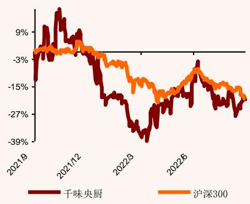  
历史表现：  
数据来源：wind 方正证券研究所

不看产品结构，只看客户结构。食品工业制造端技术门槛低，造成产品同质化严重。在这种背景下，打造爆品、抢占利基市场成为企业从红海竞争中突围的核心。因此，餐饮企业尤其是大型连锁餐饮对新品要求高，希望供应商可以全面满足定制化需求，并有严格的供应链管理体系。而持续推新并实现高标准高质量的能力并非一朝一夕可达成，拥有此能力的供应商必然成为最优先选择。而一旦与大客户达成合作，大B 灯塔效应又会为供应商带来更多的B端客户，规模效应逐步显现。

# 相关研究

《千味央厨：产品结构日趋完善，毛利改善高增可期》2022.08.26  
《千味央厨：稳定性优势凸显，大客户大单品快速成长》2022.04.29  
《千味央厨：大B客户高质成长，Q3 扣非利润保持高增》2021.10.27

千味央廚从最费事的产品和最辛苦的渠道开始，打磨流程，水到渠成。产品上，米面类是最不经济的品类，单位成本高毛利率低，因此通过研发与定制做精做细有助于品类扩张，进而通过规模效应实现盈利增长。渠道上，公司专注于B 端深耕十余年，通过常年陪跑餐饮龙头，卡位顶级供应商，在米面类制品大B端的竞争优势显著。同时在与大客户百胜的合作中不断修炼提升，并通过自身产品质量与研发，成为小B产品领路人。管理上，公司为了充分调动高管与核心人员的积极性，制定股权激励计划，促使核心人员与公司深度绑定共谋未来。公司产品、渠道与管理优势明显，进而造就了公司优秀的商业模式，业绩表现稳定。

规模效应逐步显现，由B 到C指日可待。公司以核心单品为轴切入大B扩大产品延展性，伴随已有核心客户门店扩张以及客户数量增长，大B未来可拓空间广阔。同时，公司开始拓宽营收渠道进军C端。首先通过“早饭师”初步尝试，然后成立零售事业群正式向C端迈进。B、C两端双重增长，规模效应逐步显现。

盈利预测与投资评级：公司作为速冻米面龙头，在细分领域以及B端定制优势明显，通过自有优势深度绑定客户，从而铸就稳定的盈利模式。公司独有的发展逻辑使其区别于行业其他可比公司，是支撑其稳步发展的根本所在。同时，连锁化趋势以及B端定制需求上升将使具有工业化特征且能提供定制的千味央厨步入发展快车道。我们预计公司22-24年归母净利润为1.11/1.49/1.92亿元，同比 $+ 2 5 . 1 0 \% / + 3 4 . 7 7 \% / + 2 8 . 4 4 \%$ ，EPS为1.28/1.72/2.21 元，对应当前股价 PE分别为 $3 8 \mathrm { x } / 2 8 \mathrm { x } / 2 2 \mathrm { x }$ ，维持“强烈推荐”评级。

风险提示：疫情反复影响下游需求，食品质量安全风险，主要原材料价格波动风险、C端开拓不及预期、新品推广不及预期等。

盈利预测：  

<table><tr><td>单位/百万</td><td>2021</td><td>2022E</td><td>2023E</td><td>2024E</td></tr><tr><td>营业总收入</td><td>1274</td><td>1554</td><td>2003</td><td>2471</td></tr><tr><td>(+/-)(%)</td><td>34.89</td><td>21.96</td><td>28.91</td><td>23.38</td></tr><tr><td>归母净利润</td><td>88</td><td>111</td><td>149</td><td>192</td></tr><tr><td>(+/-)(%)</td><td>15.51</td><td>25.10</td><td>34.77</td><td>28.44</td></tr><tr><td>EPS(元)</td><td>1.25</td><td>1.28</td><td>1.72</td><td>2.21</td></tr><tr><td>ROE (%)</td><td>9.28</td><td>10.40</td><td>12.29</td><td>13.63</td></tr><tr><td>P/E</td><td>46.57</td><td>37.51</td><td>27.84</td><td>21.67</td></tr><tr><td>P/B</td><td>5.29</td><td>3.90</td><td>3.42</td><td>2.95</td></tr></table>

数据来源：wind方正证券研究所注：EPS预测值按最新股本摊薄

# 目录

餐饮工业化催生资本商机，行业提速竞争加剧， 6

1.1可标准化即可资本化，可资本化即可内卷化.. .. 6  
1.2从行业通吃到各司其职，专注一点方能稳健成长. ..7  
1.3困难是暂时的，下游连锁化是趋势，生活必选类更需供应链支持. ….8  
1.3.1连锁餐饮低线渗透与扩张. 8  
1.3.2降本增效需求衍生第三方中央厨房.. 9  
1.3.3团餐、外卖、冷链发展完善餐饮供应渠道 10  
1.3.4大B端需求增长强劲，成长空间仍广阔. 11  
2 “只为餐饮，厨师之选”：不看产品结构，只看客户结构 13  
2.1产品同质化只会愈演愈烈，不断推新抢占利基市场是突围核心. . 13  
2.2大B客户高标准严要求，部分能力并非资本堆砌可得.. ..14  
2.3大B灯塔效应始终存在，从大到小，规模效应逐步显现. .15  
3千味央厨：从最费事的产品和最辛苦的渠道开始，打磨流程，水到渠成. 15  
3.1米面类是最不经济的品类，做精做细有助于品类扩张.. ..15  
3.1.1主营速冻米面，大单品带动营收增长. 15  
3.1.2研发叠加定制构筑壁垒，是其做精做细和品类扩张的基础 17  
3.1.3不断扩充产能，支撑B端放量. 19  
3.2百胜相伴亦师亦友，从大B的伴侣到小B 的师傅 .. 20  
3.2.1专注B端，提供大B定制服务.. 20  
3.2.2大客户经验积累能力外溢，赋能中小客户， 21  
3.3高管中层到骨干经销，深度绑定共谋未来.. .22  
3.4商业模式优秀，业绩表现稳定.. . 23  
4规模效应逐步显现，由B到C指日可待... 24  
4.1以核心单品为轴，切入大B 即可全面赋能. ..24  
4.2客户数量与规模效应呈正比，生意越滚越容易.. ..25  
4.2.1核心客户门店扩张叠加产品延伸. 25  
4.2.2客户数量持续增加，可拓空间广 26  
4.3多元发展强化竞争壁垒.. . 27  
4.3.1定制走向通品，向C端迈进 27  
4.3.2投资布局餐饮供应链，保障核心竞争力 28  
5 盈利预测与投资建议. 29  
6 风险提示.. 30

# 图表目录

图表2：中国速冻米面食品市场规模稳步增长， …….  
图表3：速冻米面产品零售端市场竞争格局…. 6  
图表 4：速冻米面产品餐饮端市场竞争格局……6  
图表5：通用VS 定制… …7  
图表6：定制生产模式分类.. …7  
图表7：定制模式天花板取决于直营大客户. …  
图表8：世界各国餐饮连锁化率（2020）……9  
图表9：中国餐饮连锁化率逐年提高… …9  
图表10：中央厨房渗透率走高… …9  
图表11：我国中央厨房产能利用不足， 9  
图表12：商铺租金持续上升（元/日/平方\*）……10  
图表 13：住宿与餐饮就业人员平均工资逐年上升……10  
图表14：第三方央厨供应链及优势.. … .10  
图表15：团餐市场规模及同比增速 … 11  
图表16：外卖市场规模及同比增速……11  
图表 17：我国冷链物流与发达国家有极大差距.. 11  
图表18：我国冷链物流快速发展.. … 11  
图表19：口径一：从餐饮业角度.. … 12  
图表20：口径二：从速冻食品角度， ….12  
图表 21：大B端市场规模测算及年复合增长率……12  
图表22：连锁餐饮 2021 部分新品… 13  
图表 23：餐饮速冻企业合作共赢.. ….14  
图表 24：百胜中国对供应商体系管理严格……14  
图表 25：大B 灯塔效应拓展客户…. 15  
图表26：公司产品品类及主要单品. ….15  
图表 27：各品类营收占比变化16  
图表 28：各品类营收增速16  
图表29：瞄准油条细分领域错开竞争. ….16  
图表30：各公司油条单价.. 1 6  
图 3：2020 部分明星单品销售额占营业收入比…17  
图表 32：千味央厨油炸类产品规模稳健增长.. …….17  
图表33：油条细分品类… 17  
图表 34：横纵结合市占率有望进一步扩大…17  
图表 35：公司核心技术及产品应用.. ….1  
图表 36：与大客户合作研发双向共赢……18  
图表 37：与可比公司研发理念不同…18  
图表38：定制产品研发生产过程， ..19  
图表39：研发实力叠加柔性生产铸造定制模式壁垒. 19  
图表40：公司自有产能不断扩张（万吨）  
图表41：公司发展历程. ….20  
图表42：直营经销占比. …21  
图表43：直营前五大客户收入及增速 ……… ….21  
图表 44：直营定制为主、经销通用为主(2020)…… .1  
图表45：定制通用销售占比(2020). 21  
图表46：专注B端，掌握先行优势， ..21  
图表47：经销商渠道建设效果明显 22  
图表48：公司首次股权激励计划分配情况(2021年12月15日) ..23  
图表 49：2022 年初部分原材料价格大增(元/kg) ..23  
图表50：千味央厨维持稳定毛利率， … ….3  
图表51：可比公司销售费用率...  
图表52：销售费用构成(2022H1) ..24  
图表53：直营模式下烘焙占 $45 \%$ （2020） … ….24  
图表54：公司净利率水平较为稳定.. ….24  
图表55：从蛋挞皮开始增加单品品类…… ….25  
图表56：公司前五大客户营收及占比..  
图表57：肯德基、华莱士、海底捞门店数量(家) ..25  
图表58：核心客户米面制品需求空间广阔.. ..26  
图表59：新增部分大客户门店数量及展望 ….26  
图表60：新拓客户潜力大.  
图表61：早饭师门店及产品灌蛋大油条.. ….7  
图表62：千味零售事业群.. ..28  
图表63：通过认购股权投资基金投资于供应链上下游.. ..28  
图表64：千味央厨收入拆分预测， … ….29  
图表65：可比公司估值表.. ..30

# 1餐饮工业化催生资本商机，行业提速竞争加剧

# 1.1 可标准化即可资本化，可资本化即可内卷化

餐饮寻求降本增效对工业化产品需求增加，速冻米面迎来新商机。餐饮企业出于生产效率、成本、安全的考虑，对高标准工业化的产品需求日益扩大。根据国家统计局数据，我国规模以上食品制造工业企业营业收入从 2018 年的 18679 亿元增长到 2021 年的 21268 亿元，且增速呈逐年上升趋势，其中疫情后的2021 年，增速进一步提升。而在餐饮工业化不断上升的背景下，具有标准化特征的速冻米面行业有望步入高速成长轨道。

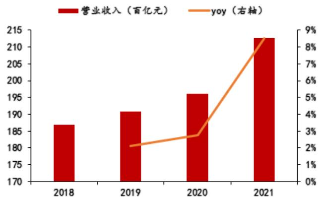  
图表1：中国食品制造工业企业营业收入逐年提升  
资料来源：国家统计局、方正证券研究所

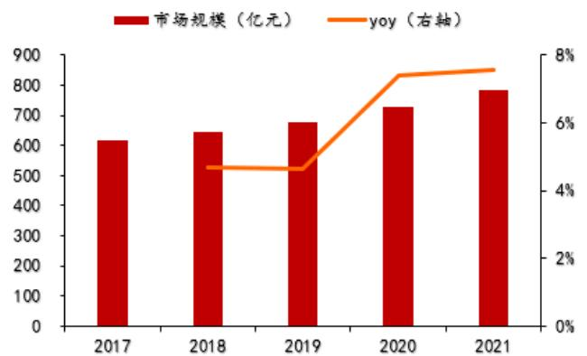  
图表2：中国速冻米面食品市场规模稳步增长  
资料来源：华经产业研究院、方正证券研究所

新商机招致资本涌入，零售端竞争已然内卷，餐饮端终将如此。目前速冻米面零售端已趋于饱和，行业内存量竞争激烈，CR3近 $50 \%$ 。相较于零售端，餐饮端尚处蓝海，竞争并不激烈。但随着资本涌入，新进入企业增多，且业内企业纷纷利用各自优势抢夺餐饮客户加大市占率，餐饮端终将走向内卷。零售端龙头三全2019 年成立绿标事业部专门负责餐饮市场，2018-2021 年三全餐饮渠道收入从5.6 亿元提升至11.7 亿元。安井专攻小B 渠道，凭借初步构建的品牌力、灵活的促销政策和丰富多样的宣传活动在餐饮端占据一席之地。

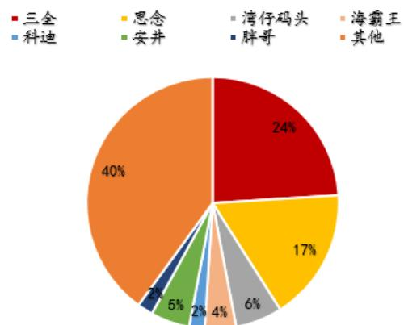  
图表3：速冻米面产品零售端市场竞争格局  
资料来源：智妍咨询、方正证券研究所

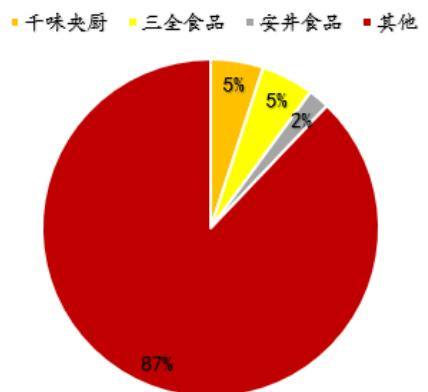  
图表4：速冻米面产品餐饮端市场竞争格局  
资料来源：智妍咨询、方正证券研究所

# 1.2从行业通吃到各司其职，专注一点方能稳健成长

行业内卷细化，参与者瞄准优质赛道，先立足再拓展。餐饮渠道目前尚处蓝海，主要产品可分为通用品和定制品两种形制。其中，通用品：企业根据市场需求自主开发产品，面向全体客户销售。定价上，在市场价格的基础上采用成本加成定价。沟通上，企业一般只与客户保持常规的沟通。定制品：企业与特定客户联合研发或根据客户要求定制。定制品制作通常比通用品更复杂严格，主要采取竞标定价。沟通上，需要与定制客户保持双向深度沟通，以满足定制需求。

图表5：通用VS定制  

<table><tr><td>通用</td><td>定制</td></tr><tr><td>研发模式</td><td>根据市场需求，自主研发按照客户需求定制</td></tr><tr><td>生产模式 备货式生产</td><td>以销定产</td></tr><tr><td>客户关系 仅仅保持常规沟通</td><td>紧密型的客户关系</td></tr><tr><td>定价 成本加成定价</td><td>竞标定价</td></tr><tr><td>规模 规模性较高</td><td>规模性较低</td></tr></table>

资料来源：公司公告、方正证券研究所

定制生产模式分类。根据速冻品生产企业与餐饮企业合作关系的紧密程度，定制生产模式分为以下两种：

1、“定制研发 $+$ 定制生产"模式。餐饮企业把整体或部分研发生产环节交给速冻企业，并提供技术支持和信息反馈。速冻企业享有研发产品的知识产权和生产工艺，餐饮企业享有定制产品的在一定时期内的独家销售权。双方形成相互依赖的战略合作伙伴关系。

2、“工艺标准 $^ +$ 定制生产”模式。餐饮企业将其生产环节中的一个或多个产品通过合同的形式委托给速冻企业生产。速冻企业按客户指定标准生产，最终把受托产品全部销售给餐饮企业。速冻企业不掌握定制产品的核心知识产权，对餐饮企业的依赖性较强，市场竞争较为激烈。

图表6：定制生产模式分类  

<table><tr><td></td><td>定制研发+定製生产</td><td>工艺标准+定制生产</td></tr><tr><td>餐饮企业</td><td>提出要求，提供技术支持和信息反馈，定制品一 段时间的独家销售权</td><td>委托生产制造环节中的一个或多个 产品</td></tr><tr><td>速冻企业</td><td>全环节提供全方位解决方案，研发产品的知识产 权和生产工艺技术</td><td>按照指定的工艺技术标准进行生产 不掌握定制产品的核心知识产权</td></tr><tr><td>两者关系</td><td>相互支持依赖、长期稳定合作关系</td><td>对餐饮企业的依赖性强，市场竞争 激烈</td></tr></table>

资料来源：公司公告、方正证券研究所

定制生产模式的特点：1、定制产品具有客户排他性。即公司生产的定制产品受合同约束只能销售给定制生产客户。2、相互考察的时间周期比较长，过程复杂。3、定制生产具有长期的稳定性和互赢性。4、合作具有不断的延伸性和自我强化性。双方一般会通过不断增加新产品的合作，保持这种商业合作关系，进而又强化这种合作关系。

其中最大的特点是双方紧密合作、互相依赖，餐饮企业一旦与供应商形成合作，除非质量问题不会轻易更换。强客户粘性使得供应商可以稳稳立足在餐饮B 端，进而才有机会进行下一步开拓。

定制大客户增多叠加产品延展，规模效应显现。大型连锁餐饮往往采用定制模式。对于速冻米面企业来说，直营大客户决定了其定制服务未来的增长空间。定制模式天花板主要取决于两点：（1）核心客户成长性与产品延展性。成长性：连锁企业店面数量增加，对于速冻米面的需求增加。产品延展性：增加提供的单品品类。每增加一个单品，借助大客户门店优势收入增长可观。（2）增量客户拓展难度。合作的大型连锁企业增加，伴随着客户的成长性和产品延展性，需求量也将进一步增加，定制模式规模效应逐步显现。

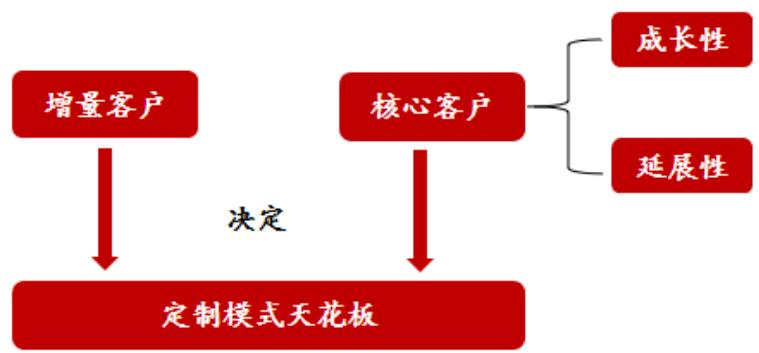  
图表7：定制模式天花板取决于直营大客户  
资料来源：方正证券研究所

# 1.3 困难是暂时的，下游连锁化是趋势，生活必选类更需供应链支持

疫情以及部分原材料价格上涨对速冻米面，尤其是餐饮渠道企业产生了一定冲击，但困难只是暂时的。伴随下游连锁化率上升以及供应链逐步完善，整体向好趋势不改，大B 定制模式未来空间广阔。

# 1.3.1连锁餐饮低线渗透与扩张

餐饮连锁化已成为餐饮业未来趋势。中国连锁经营协会数据显示，中国餐饮行业连锁化率继续保持连年增长，行业连锁化率由2016年的$8 . 8 \%$ 提升到2020年的 $1 5 \%$ ，其中一线城市已经超过 $20 \%$ 。但与美国$54 \%$ 、日本 $49 \%$ 的连锁化率相比，中国餐饮行业连锁化率仍有较大增长空间。因此，中长期来看餐饮连锁化将推动具有工业化特征的速冻米面规模快速增加。

渠道下沉，量增潜力大。大型连锁餐饮品牌开始向三四线城市以及乡镇市场渗透，总量扩大致使对速冻品的需求扩大。2021 年瑞幸净新开店1221家。近几年百胜中国实施“下沉战略”，加速扩张，2022 年计划还要开设大约 1000 到 1200 家新店。Tims 在中国市场的门店数量约450 家，计划到 2026 年底达到 2750 家。连锁品牌门店扩张，对速冻米面的需求进一步增加。

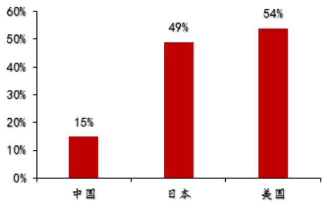  
图表8：世界各国餐饮连锁化率(2020)  
资料来源：中国连锁经营协会、方正证券研究所

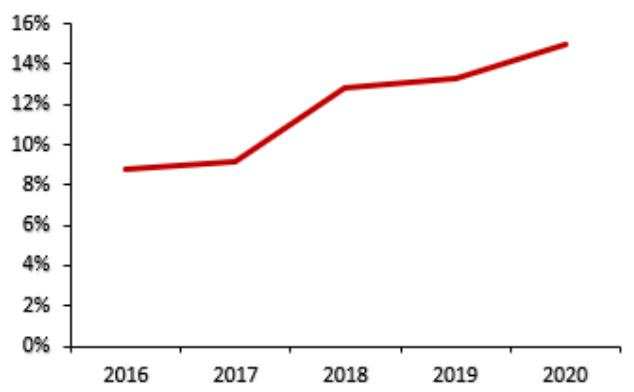  
图表9：中国餐饮连锁化率逐年提高  
资料来源：前瞻经济学人、中国连锁经营协会、方正证券研究所

# 1.3.2 降本增效需求衍生第三方中央廚房

中央厨房渗透率走高，但产能利用不足。根据中研普华产业研究院数据，中央厨房在连锁餐企中的渗透率从 2018 年 $7 2 . 4 \%$ 上升至2021年的 $8 1 . 2 \%$ 。但自建央厨产能过剩问题严重，根据华经产业研究院，截至2019 年我国中央厨房产能利用率仅预计达到 $5 5 \%$ 。非理性、预见性不足，导致大部分中央厨房严重产能过剩，反噬企业利润，甚至出现倒逼前端加速开店的现象。目前，我国餐饮行业竞争格局较为分散，餐饮业主要部分是中小商家，前期投入大后期维护高的自建中央厨房并不适合中小餐饮店。

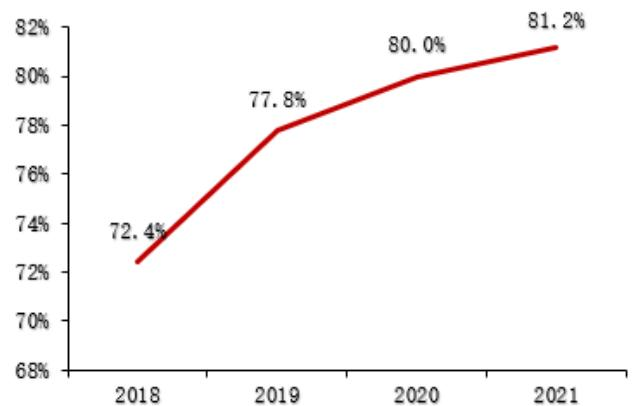  
图表10：中央厨房渗透率走高  
资料来源：中研普华产业研究院、方正证券研究所

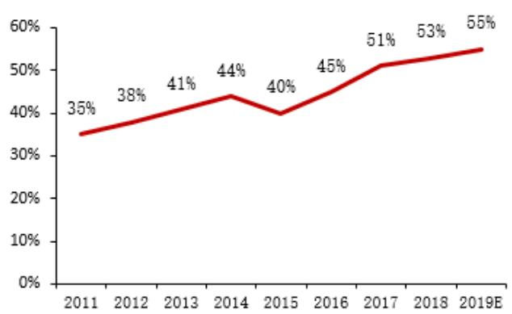  
图表11：我国中央厨房产能利用不足  
资料来源：华经产业研究院、方正证券研究所

餐饮业自建央厨成本高，第三方央厨占优。三高成本迫使餐饮企业放弃自建央厨转向第三方央厨。根据《2019中国餐饮业年度报告》，我国餐饮业主要成本即食材、人力和租金占收入比分别为 $4 1 . 3 1 \%$ 22.41%和 $1 0 . 2 6 \%$ 。第三方央厨制作半成品，可以减少店面需求面积、减少需要的人力、降低食材成本，从而提高毛利率，这也进一步拉动了餐饮端速冻米面需求。

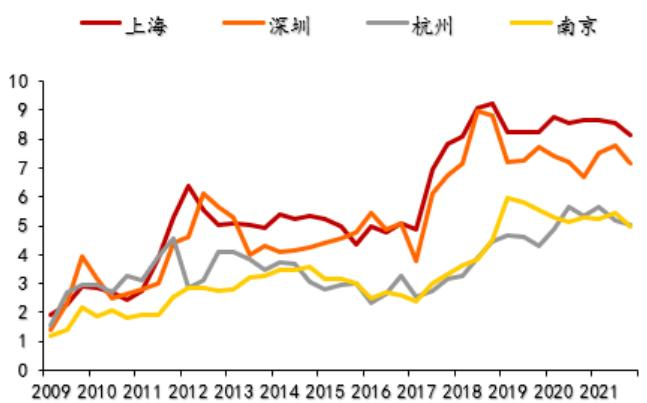  
图表12：商铺租金持续上升（元/日/平方米)  
资料来源：Wind、方正证券研究所

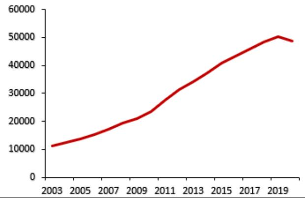  
图表13：住宿与餐饮就业人员平均工资逐年上升（元/年）  
资料来源：Wind、方正证券研究所

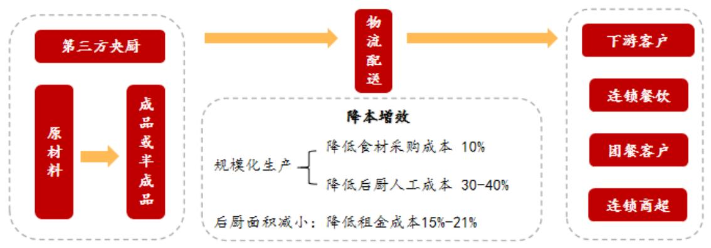  
图表14：第三方央厨供应链及优势  
资料来源：《浅谈我国餐饮产业链中央厨房中预制菜的发展趋势》、方正证券研究所

# 1.3.3团餐、外卖、冷链发展完善餐饮供应渠道

团餐市场潜在空间大。团餐消费场景主要是学校和机关食堂，消费人数相对固定，需求稳定。截至2020年，团餐规模达1.53万亿，2016-2020年 CAGR 为 $1 4 . 2 \%$ ，团餐市场高速增长。从占比来看，2020年团餐占餐饮比重为 $3 8 . 7 \%$ 。随着对食品安全、制作效率的需求提高，未来发展潜力较大。

外卖需求的爆发式增长，拉动对速冻食材需求。外卖适应消费者便捷需求，渠道稳固且持续快速增长。截至2020年，中国餐饮外卖规模达6646 亿元，过去5年CAGR 为 $3 9 . 7 \%$ ，外卖需求量大增。为缩短备餐时间同时保持口味稳定，对速冻品需求增大。目前外卖需求仍保持高速增长，速冻米面市场需求有望进一步提升。

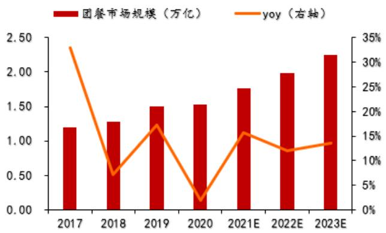  
图表15：团餐市场规模及同比增速  
资料来源：艾媒咨询、方正证券研究所

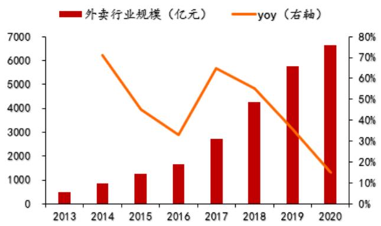  
图表16：外卖市场规模及同比增速  
资料来源：中国连锁经营协会、方正证券研究所

冷库冷链等基础设施逐步发展完善，助力速冻食品行业发展。从储存上来看，我国低温仓储业冷库容量从2013 年的 6018 万立方米到 2020年的 15099 万立方米，冷库容量攀升，确保速冻食品稳定供给。从运输上来看，我国冷链物流也快速发展 $( 2 0 1 3 - 2 0 2 0 \mathsf { C A G R } + 1 4 \% )$ 。冷链物流配套设施的逐步完善增大速冻行业的辐射半径，助力速冻食品的迅速发展。但是我国冷链物流与发达国家仍有极大差距，未来冷链物流增长空间大，有望推动速冻食品规模增长。

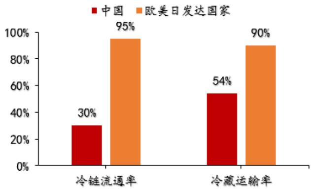  
图表17：我国冷链物流与发达国家有极大差距  
资料来源：中研普华产业研究院、商务部、前瞻经济学人、方正证券研究所

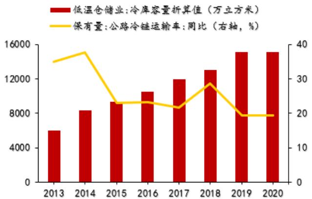  
图表18：我国冷链物流快速发展  
资料来源：Wind、方正证券研究所

# 1.3.4大B 端需求增长强劲，成长空间仍广阔

从量化角度来看，我们分别对2021、2023、2025年速冻米面大B端行业规模进行了测算：

# 第一步计算B 端市场规模：

口径一：从餐饮业角度，其中食材成本约 $42 \%$ ，食材成本中米面占比$5 \%$ ，从而得到B端米面市场规模。又因为供需双向扩大速冻米面市场空间，因此估算米面品中速冻占比由 $1 5 \%$ 上升至 23 年 $1 7 \%$ 和25年$20 \%$ ，得出B 端速冻米面市场规模约148亿元、226亿元、320 亿元。口径二：从速冻食品角度，其中速冻米面占比 $52 \%$ ，随着B端降本增效对速冻品需求扩大，速冻米面品中餐饮端占比由 $1 7 \%$ 上升至23年$22 \%$ 和25年 $24 \%$ ，，得出B端速冻米面市场规模约136亿元、210亿

元、303亿元。

# 第二步计算大B 端市场规模：

根据欧睿国际，随着餐饮连锁化率上升21、23、25年中国餐饮连锁化率约 $1 8 \%$ $20 \%$ 、 $21 \%$ ，因此 21、23、25 年速冻米面大B 市场规模分别约为25-27、42-45、64-67亿元（不包含连锁商超)。

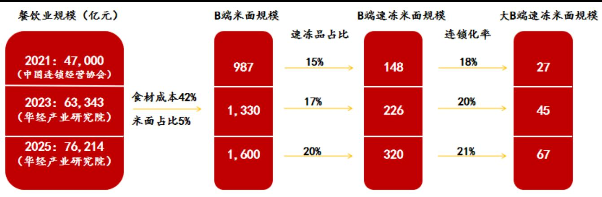  
图表19：口径一：从餐饮业角度

资料来源：中国连锁经营协会、华经产业研究院、方正证券研究所

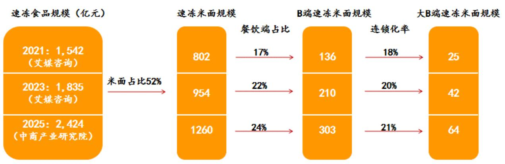  
图表20：口径二：从速冻食品角度  
资料来源：艾媒咨询、中商产业研究院、华经产业研究院、方正证券研究所

根据测算结果来看，未来三年速冻面米制品大B 端市场规模预计将以年复合 $23 \%$ 以上增长，势头强劲，龙头企业将有望充分享受行业 $\beta$ 红利。

图表21：大B端市场规模测算及年复合增长率  

<table><tr><td>B端市场规模（亿）大B市场规模（亿）大B端CAGR</td><td></td></tr><tr><td>2021 136-148</td><td>25-27</td></tr><tr><td>2023 210-226</td><td>42-45 约30%</td></tr><tr><td>2025 303-320</td><td>64-67 约23%</td></tr></table>

资料来源：中国连锁经营协会、华经产业研究院、艾媒咨询、中商产业研究院、方正证券研究所

# 2“只为餐饮，厨师之选”：不看产品结构，只看客户结构

# 2.1产品同质化只会愈演愈烈，不断推新抢占利基市场是突围核心

食品工业制造端几无门槛，先发优势 $^ { \cdot + }$ 规模效应为取胜关键。餐饮行业趋同性很强，一家新产品问世其他餐饮便会紧随其后推出同类产品，抹平产品差异化、稀有化带来的超额收益。其结果就是产品同质化严重，例如烘焙类主流产品基本都是麻薯、瑞士卷、蛋挞以及其衍生开发，不同厂商产品差异度较小。同质化的根本原因是食品工业制造端门槛较低，没有很强的技术壁垒，因此不能长久地保有产品的差异化优势。因此，短时间的新品快速放量所带来的的规模效应及市场份额成为供应端企业的取胜之道。

B端客户依靠新品成为爆品获得市场份额。B端餐饮业竞争激烈，B端客户依靠新品维持与增加客流量，若新品成为爆品则会增加市场占有率。随着生活节奏的加快以及人力、房租等成本的节节攀升，B 端降本提效的需求高涨，高性价比的明星单品易于产生规模效应。此外，明星单品更有利于企业积累口碑，沉淀忠诚客户并强化品牌心智，进而占取利基市场。因此，B 端客户每年都会将很多精力放在新品的研发与推出上。

图表22：连锁餐饮2021部分新品  

<table><tr><td>餐饮企业</td><td colspan="4">2021 部分新品</td></tr><tr><td>肯德基</td><td></td><td>肯德基肉燕</td><td>或蛋黄</td><td>芝芝肉酥热辣脆皮鸡 (1块装） 新品</td></tr><tr><td>盒马</td><td></td><td></td><td></td><td></td></tr><tr><td>海底捞</td><td></td><td>炸 牛 奶</td><td>海底捞 牛油MiX清油 真香锅 新</td><td></td></tr></table>

资料来源：肯德基、盒马、海底捞官网、方正证券研究所

B 端客户以短期增长和吸引流量为目的持续出新。在多年扩张下，肯德基一、二线门店数量已经趋于饱和，除了市场下沉外另一个策略便是持续大量出新。自2018 年起，肯德基出新频率大幅上升，仅一年时间，肯德基就推出了20款主食、28款小吃、7种饮料。自此之后，肯德基每年的新品数量都在 40-50 种。与过去力求长期盈利的新品不同，近年的肯德基新品目的是短期增长和吸引流量。同样是连锁餐饮的海底捞 2020 年在全球范围内推出了200 余款新品。2021年共研发上架新品 368款，既包含创新原料，也有区域特色饮食。

# 2.2 大B客户高标准严要求，部分能力并非资本堆砌可得

B 端大客户对新品的高标准严要求决定定制化需求旺盛。B 端对新品的依赖导致对定制化生产的强烈需求。餐饮企业需要工厂从研发、采购、加工、运输全环节提供全方位解决方案。以肯德基为例，产品从研发到上市，一般遵循以下过程：提出需求 供应商研发小样 肯德基市场部反馈 供应商调整 肯德基产品委员会投票 供应商开始量产 配送运输到门店。若新品成为大单品，还需要工厂工业化量产，后进来者也需要生产这类单品提高竞争力。因此，研发能力强且提供定制的速冻企业有望从行业需求变动中受益。

  
图表23：餐饮速冻企业合作共赢  
资料来源：方正证券研究所

成熟大B客户既带来业绩稳定性，又构筑行业壁垒。大B客户内生性增长即店面扩张可以为公司带来成长的稳定性。同时，成熟的大B连锁餐饮企业具备一套严苛的供应商管理机制来保证供应链的安全与稳定，包括公司自评与聘请第三方外评共同考核供应商资质，而该机制无形中成为竞争对手短时难以突破的供应壁垒，即其他食品制造商要想进入大B餐企的供应体系须经历一个长达数年且十分严苛的审核过程。百胜供应体系得到业内一致认可并纷纷仿照学习，其供应商也成为餐企最优先的选择。

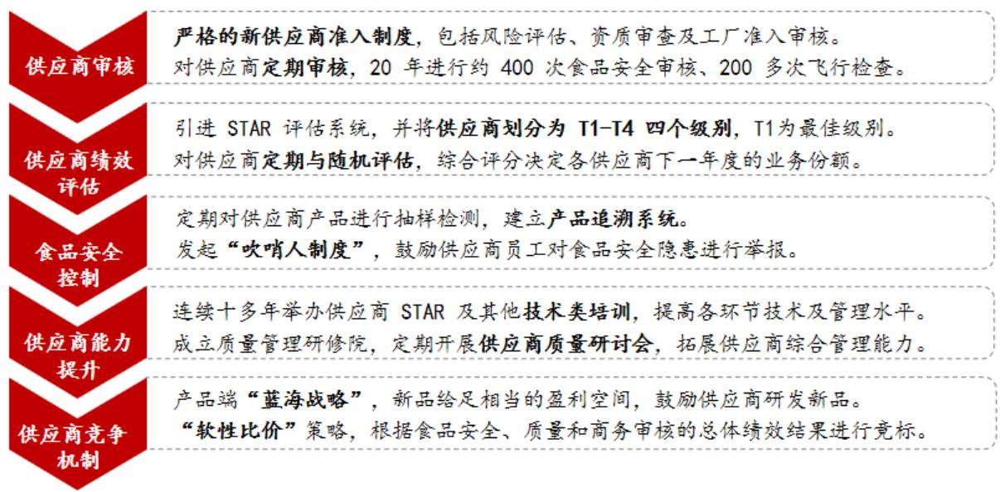  
图表24：百胜中国对供应商体系管理严格  
资料来源：百胜中国《2020年可持续发展报告》、方正证券研究所

# 2.3大B灯塔效应始终存在，从大到小，规模效应逐步显现

大B灯塔效应拓展客户，规模效应显现。1、大B严格标准为供应商背书。大B久而严格的审核周期为供应商充当品牌背书，吸引其他对产品有定制化需求的大B 和寻求标准化与创新的小B 纷至沓来。2、大B可提供最新市场需求信息。小B 餐饮企业供应链体系不完善，无法及时得知产品的最新标准与发展动向，往往参照大B产品调整，从而使大B的上游厂商成为供应链中的优先选择。供应商进而拓展小B客户，增加经销渠道收入。3、大B的研发外溢性可以满足小B产品的开发需求。大B客户的定制产品过了保护期后可给其他B端客户，或将配方修改后提供同类产品，从而进一步拓展B端客户。总之，灯塔效应下客户数量逐渐增多，产品需求增大，单位成本降低，规模效应逐步显现。

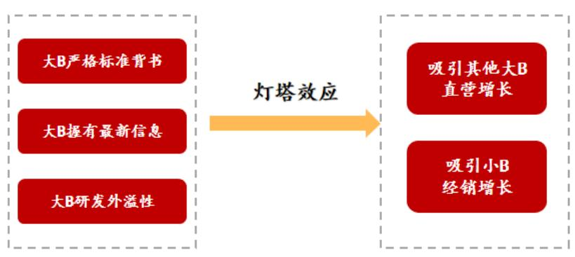  
图表25：大B灯塔效应拓展客户  
资料来源：方正证券研究所

# 3千味央廚：从最费事的产品和最辛苦的渠道开始，打磨流程，水到渠成

# 3.1米面类是最不经济的品类，做精做细有助于品类扩张

# 3.1.1主营速冻米面，大单品带动营收增长

主营业务为面向餐饮企业的速冻面米制品的研发、生产和销售。公司秉承“只为餐饮、厨师之选”的战略定位，致力于为餐饮企业提供定制化、标准化的速冻食品及相关餐饮后厨解决方案。主营产品有四大类：油炸类、烘焙类、蒸煮类、菜肴类，SKU数达300 余种。

图表26：公司产品品类及主要单品  

<table><tr><td>产品品类</td><td>主要单品</td></tr><tr><td>油炸类</td><td>安心油条、茴香小油条、咸蛋黄注芯火锅油条、 春卷、芝麻球、地瓜丸、紫薯球</td></tr><tr><td>烘焙类</td><td>葡式蛋挞皮、软曲奇、华夫饼、甜心派、可颂</td></tr><tr><td>蒸煮类</td><td>精品云吞、白糖桂花糕、卡通包、汤圆</td></tr><tr><td>莱肴类及其他</td><td>千叶豆腐、土豆宽粉、撒尿肉丸</td></tr></table>

资料来源：公司招股说明书、公司官网、方正证券研究所

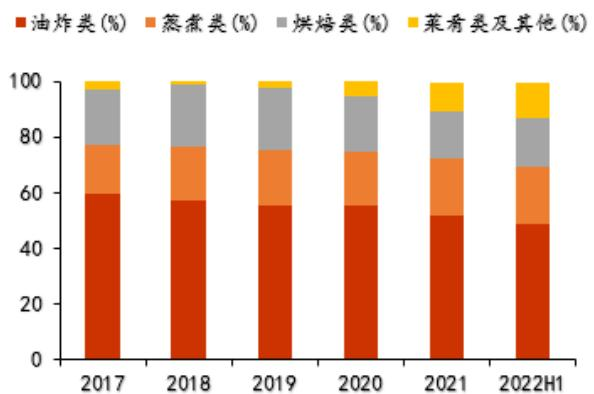  
图表27：各品类营收占比变化  
资料来源：公司公告、方正证券研究所

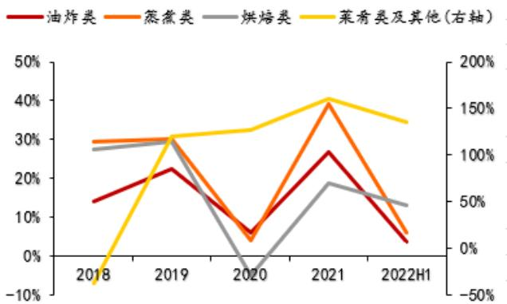  
图表28：各品类营收增速  
资料来源：公司公告、方正证券研究所

早早瞄准细分领域，油条大单品规模优势已凸显。避免与市场规模已趋于稳定的传统大单品水饺、汤圆竞争，千味央厨培育出油条、蒸煎饺、芝麻球、手工蛋挞皮等核心大单品，其中，油条作为公司在早期切入餐饮供应链的核心单品，规模优势明显，高性价比已形成壁垒，已在油条子领域占据绝对领先的市场份额。2021年油条类产品营收3.51亿元，同比 $+ 3 4 . 6 5 \%$ ，是公司业绩增长的驱动力之一。同时2021年公司加大了蒸煎饺产品的研发和推广力度，成功将其打造为新的亿元大单品，全年蒸煎饺收入1.35亿元，同比 $+ 1 6 7 . 8 7 \%$ 。

图表29：瞄准油条细分领域错开竞争  

<table><tr><td>公司</td><td>速冻米面主要大单品</td></tr><tr><td>千味央厨</td><td>油条、蒸煎饺、芝麻球、蛋挞皮</td></tr><tr><td>三全</td><td>汤圆、水饺、速冻粽子</td></tr><tr><td>安井</td><td>手抓饼、核桃包、红糖发糕、桂花糕</td></tr></table>

资料来源：公司公告、方正证券研究所

图表30：各公司油条单价  

<table><tr><td>公司</td><td>油条单品</td><td>单价（元/kg)</td></tr><tr><td rowspan="3">千味央廚</td><td>香脆油条</td><td>33.2</td></tr><tr><td>放心大油条</td><td>33.25</td></tr><tr><td>茴香小油条</td><td>41.5</td></tr><tr><td rowspan="2">三全</td><td>香脆大油条</td><td>35.9</td></tr><tr><td>茴香小油条</td><td>61.9</td></tr><tr><td>思念</td><td>放心油条</td><td>37.7</td></tr></table>

资料来源：2022.09.20京东商城、方正证券研究所

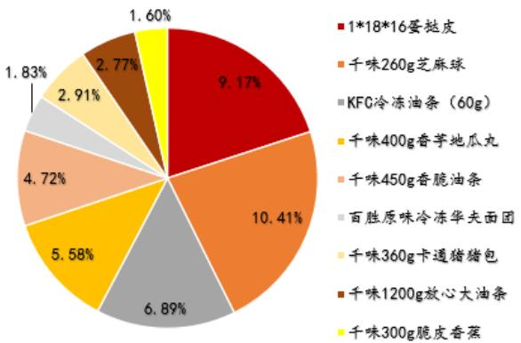  
图表31：2020 部分明星单品销售额占营业收入比  
资料来源：公司公告、方正证券研究所

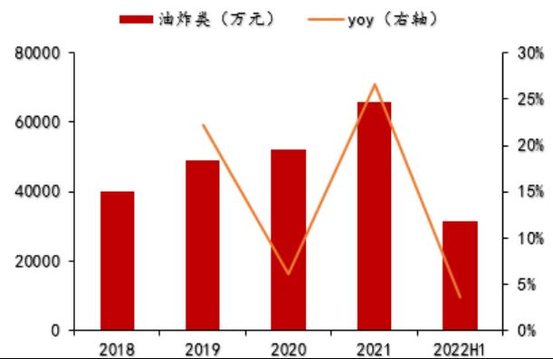  
图表32：千味央厨油炸类产品规模稳健增长  
资料来源：公司公告、方正证券研究所

横向挖掘细分领域，纵向拓展新品类，横纵结合有助扩大市占率。公司深入大单品细分领域，使产品适用于不同的消费场景。例如大单品油条：公司从2012年开始进行油条细分场景下的市场研究，细分出火锅、快餐、自助餐、宴席、早餐、外卖六大场景，并针对性推出茴香小油条、麻辣烫小油条、火锅涮煮油条、外卖专用油条等。同时，为客户提供定制油条，如太二酸菜鱼的黑油条、海底捞的咸蛋黄油条。通过挖掘大单品细分领域实现量增，未来油条品类仍会以 $30 \%$ 速度增长。通过大单品实现规模效应站稳脚跟后，积极开拓新品类，2022 年公司重点发力烘焙类，成功为客户肯德基、盒马、海底捞上新多款烘焙类产品，具备良好的客户基础，为下一步核心大单品的打造创造了良好的条件。同时，预制菜也是2022年公司重点关注的业务，22H1预制菜销售收入同比增加 $4 2 . 2 3 \%$ 。大单品横向挖掘实现规模效应，新品类纵向拓展势如破竹，横纵结合市占率有望进一步上升。

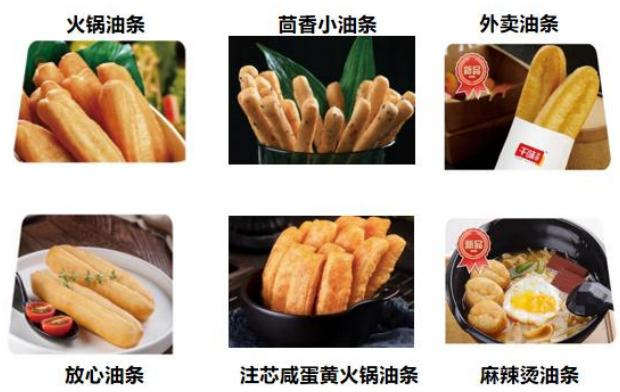  
图表33：油条细分品类  
资料来源：公司公告、方正证券研究所

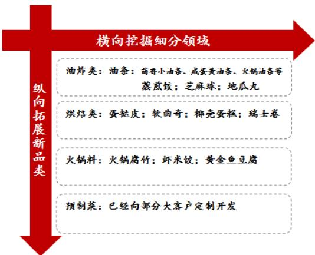  
图表34：横纵结合市占率有望进一步扩大  
资料来源：公司公告、公司官网、方正证券研究所

# 3.1.2 研发叠加定制构筑壁垒，是其做精做细和品类扩张的基础

研发新品实力强。产品创新不仅是餐饮企业增长动力，同样也是上游速冻面米制品生产企业的生命力，只有不断推陈出新才能满足日新月异的市场需求。公司在郑州、上海分别建设有两个产品研发基地，拥有多名高技术研发人才，同时建立了油条、蒸煎饺、油炸休闲制品、烘焙类等多个产品研发平台。截至2020 年，公司拥有专利46项。

2021 年研发费用899 万元，同比 $+ 2 4 . 7 9 \%$ ，主要源于研发人员增加。

图表35：公司核心技术及产品应用  

<table><tr><td>核心技术</td><td>产品应用</td><td>核心技术</td><td>产品应用</td></tr><tr><td>油条纵切技术</td><td>外卖油条、精品油条、 酥脆油条等</td><td>米糕常溫短时发酵生产方法</td><td>白糖桂花糕、红枣南瓜 糕</td></tr><tr><td>油条灌蛋制备方法</td><td>蛋芯油条</td><td>油条高效和面技术方法</td><td>火锅油条、安心油条、 香脆油条等</td></tr><tr><td>注芯油条加工裝置</td><td>蛋油</td><td>球类产品高效成型系统方法芝麻球、地瓜丸</td><td></td></tr><tr><td>冷冻土豆宽粉生产方法</td><td>土豆宽粉</td><td>新型预调制八宝粥调理包</td><td>腊八粥调理包、八宝粥 调理包</td></tr></table>

资料来源：公司公告、方正证券研究所

针对餐饮B端，提供定制化研发。速冻面米制品的创新、升级开发，需要企业对消费者口味变化和餐饮企业需求动向具备较高敏感性，才能开发出符合客户需求、具备差异化的新产品。公司是国内较早针对餐饮B 端提供定制化研发和生产的企业之一，公司研发优势来源于多年经验形成的对餐饮需求的深刻理解，围绕客户的餐饮消费场景，针对客户的后厨加工设备，进行产品定制化研发，将客户的概念化需求快速转化生产，如“注芯油条”、“墨鱼汁油条”、“文化流量包”等，具有较强的竞争力。同时大客户直面市场，与大客户合作可以掌握市场需求变化，动态调整速冻面米新产品研发导向，并且大客户反馈可积蓄和提升公司的研发实力，双方通力合作下更易推出爆品，使新品放量可能性增加。

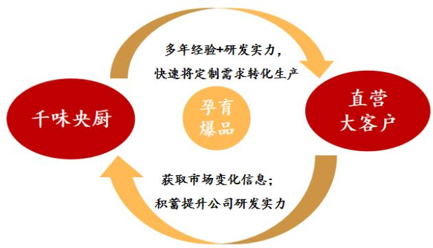  
图表36：与大客户合作研发双向共赢  
资料来源：方正证券研究所

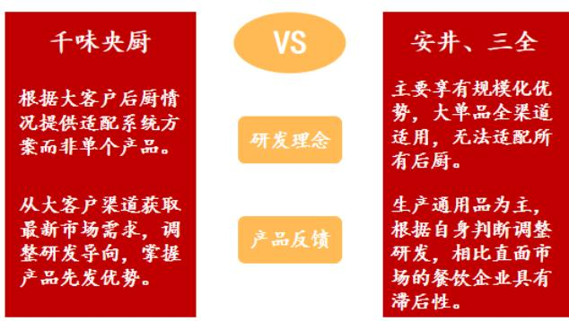  
图表37：与可比公司研发理念不同  
资料来源：公司公告、方正证券研究所

围绕B 端，提供柔性定制与生产。公司在行业深耕十余年，无论从硬件设备还是从柔性服务上都具备兼顾生产效率与生产灵活性的能力。一方面，公司产品制造线非单一化，而是可以通过更换部分设备快速生产其他类型的产品，实现灵活制造，降低生产成本，提高生产效率。另一方面，柔性定制与生产可为客户提供从研发、采购、加工、运输到后续服务咨询在内的全环节全方位解决方案，满足客户对新品和大单品差异化的需求，从而与客户建立长期合作关系，增加了客户粘性。

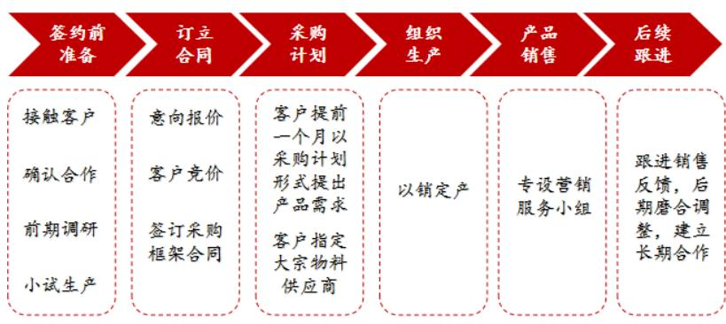  
图表38：定制产品研发生产过程  
资料来源：公司公告、方正证券研究所

研发实力叠加柔性生产铸造定制模式壁垒。并非所有企业都能够开展定制模式，需要具备至少两点能力。1、研发实力。在餐饮企业B2B市场，速冻面米企业的定制化服务是展现企业技术能力的重要窗口，定制化产品从客户概念性需求到成品出库，企业不仅需要持之以恒的人力、物力和时间等方面的研发投入，在正式推出前还需要经过多方面的品质测试以确定能得到客户的接受和认可。因此，先进技术与研发人才是推出新产品的重要保障。2、柔性生产能力。我国速冻面米制品纷繁多样且工艺复杂，定制化更是增加了制作难度，如何在完成客户要求的同时实现低成本量化生产，这在一定程度上要求企业具备良好柔性生产能力。公司在行业深耕十余年，无论从硬件设备还是从柔性服务上都具备兼顾生产效率与生产灵活性的能力。

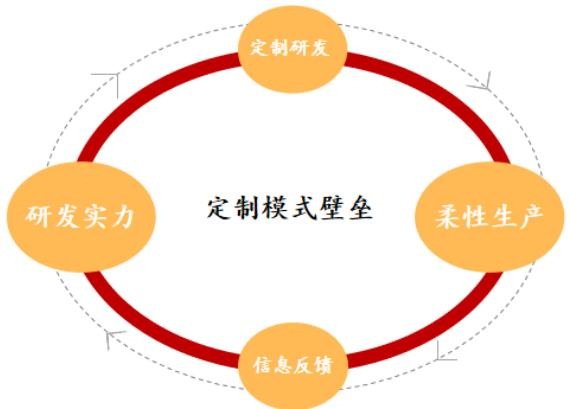  
图表 39：研发实力叠加柔性生产铸造定制模式壁垒  
资料来源：方正证券研究所

# 3.1.3不断扩充产能，支撑B 端放量

产能扩张，提升规模效应。2022 年安徽芜湖生产基地正式投产，预计2022 年将贡献 2.4 万吨产能，未来完全投产后将达到 4 万吨。新乡工厂的三期预计将于2023年6月投产，预计2023-2025 将依次释放2.4、5.6、8 万吨产能。产能不断扩张，可以更好地支撑公司横纵结合推动的B 端放量，匹配公司营收增长。同时也发挥了规模效应降低单位成本，有望扩大盈利空间。

图表40：公司自有产能不断扩张（万吨）  

<table><tr><td>项目</td><td>2020</td><td>2021</td><td>2022E</td><td>2023E</td><td>2024E</td><td>2025E</td></tr><tr><td>红枫里</td><td>2.7</td><td>2.7</td><td></td><td></td><td></td><td></td></tr><tr><td>安徽芜湖</td><td></td><td></td><td>2.4</td><td>3.2</td><td>4.0</td><td>4.0</td></tr><tr><td>新乡一期</td><td>6.8</td><td>6.8</td><td>6.8</td><td>6.8</td><td>6.8</td><td>6.8</td></tr><tr><td>新乡二期</td><td>3.3</td><td>4.8</td><td>4.8</td><td>4.8</td><td>4.8</td><td>4.8</td></tr><tr><td>新乡三期</td><td></td><td></td><td></td><td>2.4</td><td>5.6</td><td>8.0</td></tr><tr><td>合计产能</td><td>12.8</td><td>14.3</td><td>14.0</td><td>17.2</td><td>21.2</td><td>23.6</td></tr></table>

资料来源：公司公告、方正证券研究所注：芜湖工厂按相对面积计算满产为4万吨，预计产能爬坡进度第一年 $60 \%$ 、第二年 $80 \%$ 、第三年 $100 \text{‰}$ 新乡三期产能爬坡进度按招股书第一年 $30 \%$ 、第二年 $70 \%$ 、第三年100%估算。

# 3.2 百胜相伴亦师亦友，从大B 的伴侣到小B 的师傅

# 3.2.1专注B 端，提供大B定制服务

源始思念深耕 B2B 十余年，成为速冻米面龙头。公司于2012 年4 月正式成立，2016年公司进入百胜T1供应商体系。同年完成股份制改革，正式从郑州思念体系中独立出来。2017 年，设立子公司新乡千味，启动新乡新厂建设，次年一期正式投产。2018年获京东领投。2019年进军烘焙与火锅料领域。2020 年荣获政府认证“种子独角兽企业”。2021 年顺利上市。

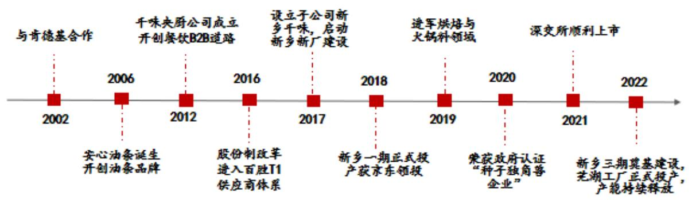  
图表41：公司发展历程  
资料来源：公司招股说明书、公司官网、方正证券研究所

公司主要采取直营与经销两种模式。直营以定制为主，客户主要为大型连锁企业。经销以通用品为主，客户主要为地方餐饮、团体食堂、批发市场、乡厨等。2021年公司直营/经销渠道收入分别同比$+ 5 1 . 6 2 \% / + 2 5 . 3 5 \%$ ，直营业务高速增长主要系公司加大大客户开发力度，并将成长性高、潜力大的餐饮企业纳入大客户体系。截至21年末，直营大客户数量接近翻倍，达到168家。前五大客户合计实现收入3.94亿元，占直营收入的 $69 \%$ 。

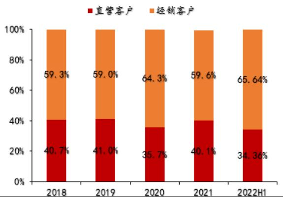  
图表42：直营经销占比  
资料来源：公司公告、方正证券研究所

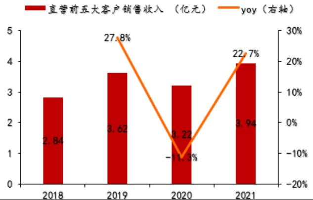  
图表43：直营前五大客户收入及增速  
资料来源：公司公告、方正证券研究所

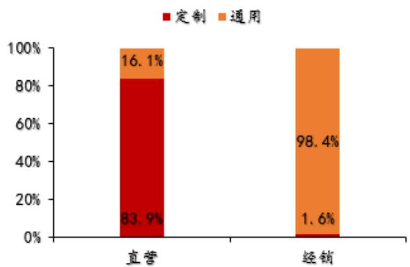  
图表44：直营定制为主、经销通用为主(2020)  
资料来源：公司公告、方正证券研究所

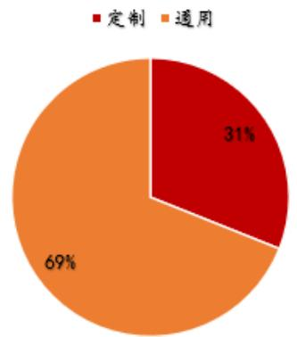  
图表45：定制通用销售占比(2020)

专注B 端，充分享受行业成长。公司通过常年陪跑餐饮龙头，卡位龙头顶级供应商，在米面类制品大B端的竞争优势显著。相比于竞争较为激烈的速冻米面零售端，餐饮端仍处于早期扩张阶段。不同于行业竞争对手安井、三全等是主营C 端逐渐过渡到B 端。千味央厨一开始就只专注于B 端，开启餐饮定制化服务，并进一步打造连锁餐饮的第三方中央厨房，凭借专注于B端的十余年深耕，成长为速冻米面龙头。

图表46：专注B 端，掌握先行优势  

<table><tr><td>公司</td><td>渠道</td></tr><tr><td></td><td>千味央厨深耕B 端，同时具备大B定制模式壁垒</td></tr><tr><td>三全</td><td>主要为 B2C 模式，绿标事业部负责小B 渠道</td></tr><tr><td>安井</td><td>B/C 兼顾，米面产品以C端及小B客户为主</td></tr></table>

资料来源：公司公告、方正证券研究所  
资料来源：公司公告、方正证券研究所

# 3.2.2 大客户经验积累能力外溢，赋能中小客户

百胜相伴亦师亦友。近些年我国连锁餐饮企业的发展带动了餐饮供应链的成长，培育了一批优秀的餐饮供应商，百胜之于千味就是如此。百胜中国作为国内系统销售额最大的餐饮企业，运营多个中国领先餐饮品牌，包括肯德基、必胜客、黄记煌、小肥羊等。千味央厨16年进入百胜T1级别供应商行列，系全国米面类唯一入围最优供应商。

一方面公司从百胜严苛的要求中获得高质量生产水平；另一方面在与百胜合作的过程中获得技术培训与市场最新信息，增强了其研发实力更易孕育出爆品。2021 年公司从百胜中国营收 2.45 亿元，占直营收入的 $48 \%$ ，总收入的 $19 \%$ 。

与大B合作获取的信息与能力外溢到小B，成为小B产品领路人。大B餐饮企业在市场中具备灯塔作用，尤其对供应体系不完善、供应链管理投入有限又渴望标准化、连锁化发展的中小B餐饮企业，大B的上游厂商即被视为行业锚点，公司会成为企业供应链中优先选择。公司供应的大B餐饮企业还具备远高于市场平均水平的考核标准，且重重考验是对公司竞争优势最好的锻造，公司在对大B产品进行配方、规格等标品改造后，有望在中小B端渠道快速推广放量。

经销商渠道建设效果明显。2022 年公司对经销商采取“聚焦大客户深度服务”、“拓展渠道商”的管理模式，支持重点经销商做强做大。一方面与经销商形成厂商联合项目制共同体，给予经销商客户渠道开发的白皮书指引，不间断推进客户开发工作的落地；另一方面，公司业务人员带领经销商业务团队，通过开发早餐、团餐等渠道，提高产品铺货率，带动销量提升。2022上半年公司对经销商渠道建设效果明显，经销渠道销售额同比增加 $2 7 . 4 1 \%$ ，前20经销商的销售额同比增加$6 0 . 4 3 \%$ ，公司前五大经销商销售额同比增长 $5 1 . 6 4 \%$ 。

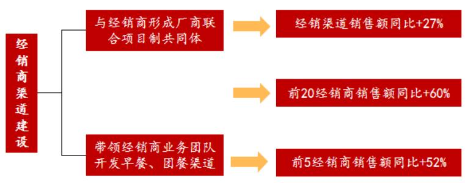  
图表47：经销商渠道建设效果明显  
资料来源：公司公告、方正证券研究所

# 3.3高管中层到骨干经销，深度绑定共谋未来

股权激励促使核心人员与公司深度绑定，激发动力共谋未来。2021年11月，公司为了充分调动高管与核心人员的积极性，制定激励计划，授予限制性股票 156.8 万股，占公告日公司股本总额的 $1 . 8 \%$ 。设定业绩目标为：以2020年营收为基准，2021-2023年营收分别同比 $+ 3 5 . 0 \% / 2 3 . 7 \% / 2 0 . 4 \%$ ，3 年内 CAGR 为 $+ 2 6 . 2 \%$ 。若年度业绩达目标值 $80 \%$ 以上，触发解锁。从而有效地将股东利益、公司利益和核心团队个人利益结合在一起。

图表48：公司首次股权激励计划分配情况（2021年12月15日)  

<table><tr><td>姓名</td><td>职务</td><td>授予的限制性 股票数量（股)</td><td>占授予限製性股 票总数比例</td><td>占本激励计划公告日 公司股本总额的比例</td></tr><tr><td>孙剑</td><td>董事长</td><td>142900</td><td>9.11%</td><td>0.17%</td></tr><tr><td>白瑞</td><td>董事、总经理</td><td>97400</td><td>6.21%</td><td>0.11%</td></tr><tr><td>王值宾</td><td>董事、副总经理、财务总监</td><td>87700</td><td>5.59%</td><td>0.10%</td></tr><tr><td>徐振江</td><td>副总经理、董事会秘书</td><td>116900</td><td>7.455</td><td>0.14%</td></tr><tr><td></td><td>核心人员（76人）</td><td>1081300</td><td>68.94%</td><td>1.27%</td></tr><tr><td></td><td>预留股份</td><td>42200</td><td>2.69%</td><td>0.05%</td></tr><tr><td></td><td>合计</td><td>1568400</td><td>100.0%</td><td>1.84%</td></tr></table>

资料来源：公司公告、方正证券研究所

# 3.4商业模式优秀，业绩表现稳定

客户结构稳定，毛利率坚挺。定制模式壁垒叠加先行优势深度绑定客户，客户结构稳定，双方互相依赖，因此如果成本大幅上涨，千味不会一味单方面承压，有能力将部分成本压力转嫁给下游餐饮企业，再加上B 端相对C端对成本把控更为精准，从而维持毛利率稳定。2022年初原材料成本大增，千味原材料占比较高的面粉同比上涨 $24 \%$ ，大豆油上涨约 $14 \%$ ，根据测算，预计2022Q1毛利率受影响将降为 $2 1 . 6 \%$ ,但千味央厨 2022Q1 实际毛利率 $2 2 . 5 6 \%$ 超出预期，这也侧面体现了公司把握毛利率的能力。

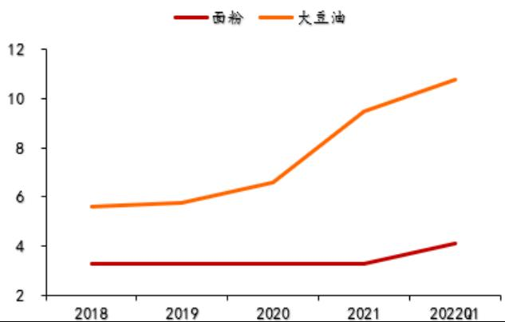  
图表49：2022 年初部分原材料价格大增（元/kg)  
资料来源：Wind、方正证券研究所

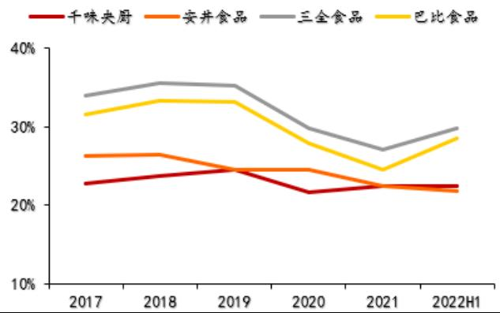  
图表50：千味央厨维持稳定毛利率  
资料来源：公司公告、方正证券研究所

客户粘性强，B端费用率低。一方面相对于C端商超等传统零售渠道需要进场费和陈列费，成本高，B 端费用相对更低。另一方面，相对于其他供应商依靠人海与费用堆积招揽与维持客户。公司直营客户以餐饮企业为主，对大B客户提供定制化服务，客户粘性强，无大额广告宣传费。销售费用以员工薪酬为主，水平较低。

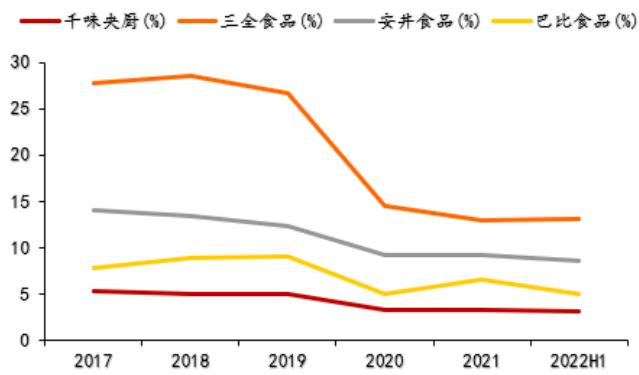  
图表51：可比公司销售费用率  
资料来源：公司公告、方正证券研究所

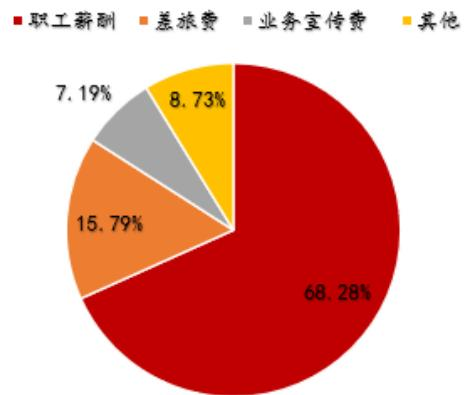  
图表52：销售费用构成（2022H1）  
资料来源：公司公告、方正证券研究所

稳定的需求造就坚实的业绩表现。客户结构决定增长逻辑，稳定的客户结构造就稳定的需求。一方面费用率较低，另一方面，毛利率稳定，甚至稳中有升。直营模式下烘焙占约 $45 \%$ ，烘焙品毛利率高，随着直营客户增长同时进军B 端烘焙市场，有望提升整体毛利率。公司有望通过较高毛利率和低费用率获得可观盈利。

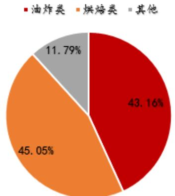  
图表53：直营模式下烘焙占 $45 \%$ （2020）  
资料来源：公司公告、方正证券研究所

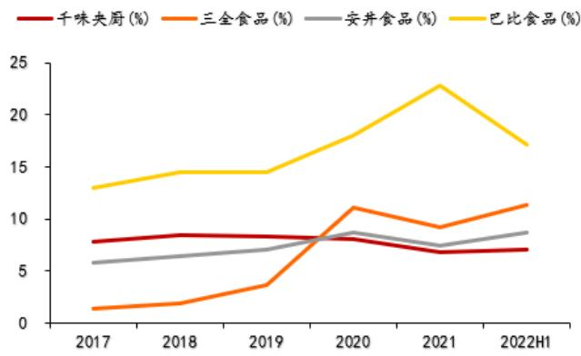  
图表54：公司净利率水平较为稳定  
资料来源：公司公告、方正证券研究所

# 4 规模效应逐步显现，由B到C指日可待

# 4.1 以核心单品为轴，切入大B即可全面赋能

核心单品切入大B，核心客户产品延展潜力大。以肯德基为例，千味央厨一开始提供的单品是蛋挞皮，后续逐步满足定制化需求研发新品，逐渐提供安心油条、华夫饼、冷冻面团、腊八粥、胡辣汤等其余品类。对于大型连锁客户，每增加一个单品，借助大客户门店优势收入增加可观。根据估算，2021年千味央厨提供产品仅占海底捞、老乡鸡所需米面制品的 $8 \%$ $19 \%$ ，核心客户产品延展潜力大。

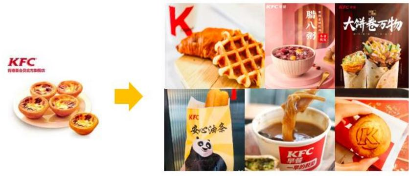  
图表55：从蛋挞皮开始增加单品品类  
资料来源：肯德基官网、方正证券研究所

# 4.2 客户数量与规模效应呈正比，生意越滚越容易

# 4.2.1 核心客户门店扩张叠加产品延伸

已有核心客户，未来增长空间广阔。根据测算未来三年大B 端市场规模将以年复合 $2 5 \%$ 以上增长，未来空间广阔。2021 年海底捞新开 421家餐厅，2021 年海底捞大陆地区共有门店 1329 家。2021 年千味第一大客户百胜中国净新增 1282 家门店，总店数达到 11788 家。2021 年末，前五大客户合计实现收入3.94亿元，同比 $+ 3 8 . 7 9 \%$ ，收入增速可观。总之，下游餐饮行业总量扩大下大B快速发展，有望带动公司业绩持续增长。

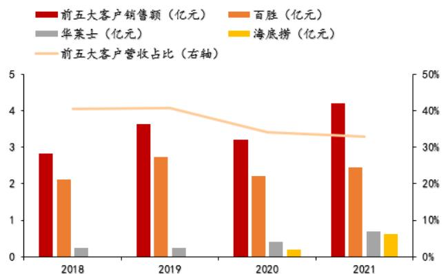  
图表56：公司前五大客户营收及占比  
资料来源：公司公告、方正证券研究所

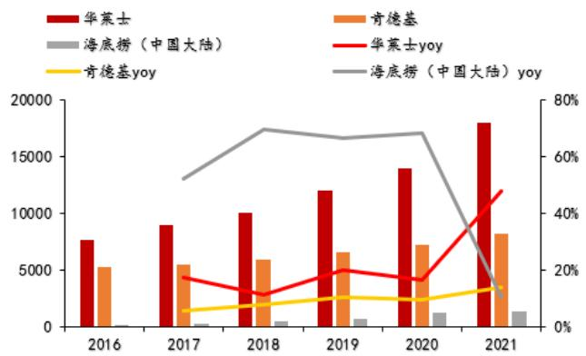  
图表57：肯德基、华莱士、海底捞门店数量（家）  
资料来源：公司公告、窄门餐眼、方正证券研究所

核心客户门店扩大协同产品延伸，公司可拓空间广阔。2021 年核心客户肯德基含米面制品收入133 亿元，海底捞米面制品收入62 亿，华莱士含米面制品收入11亿元，老乡鸡的米面制品采购成本为4192 万元。随着客户门店扩张以及米面制品占比的提高，预计未来肯德基、海底捞、华莱士、老乡鸡对于米面制品的需求将分别达到23 亿、8.4亿、1.2亿、5800 万元。公司未来可拓展的空间广阔。

图表58：核心客户米面制品需求空间广阔  

<table><tr><td>新增客戶</td><td>客户现收入/成本</td><td>门店扩张</td><td>食品占比增加</td><td>原材料占比</td><td>估算食品成本</td></tr><tr><td>肯德基</td><td>估算2021 年含米面品 收入133亿</td><td>8168至9200 同比12%</td><td>同比+5%</td><td>15%</td><td>23亿</td></tr><tr><td>海底捞</td><td>估算 2021 年米面制品 收入62亿</td><td>1329 至1439 同比 8%</td><td>同比+5%</td><td>12%</td><td>8.4亿</td></tr><tr><td>华菜士</td><td>估算2021 年含米面品18000 至20000 收入11亿</td><td>同比11%</td><td>同比+5%</td><td>10%</td><td>1.2亿</td></tr><tr><td>老乡鸡</td><td>2021 年米面制品成本 4192万</td><td>1073 至1773 同比+33.8%</td><td>同比+5%</td><td></td><td>5800万</td></tr></table>

资料来源：公司公告、方正证券研究所

# 4.2.2 客户数量持续增加，可拓空间广

直营客户数量持续增加。2021年公司直营渠道收入分别同比 $+ 5 1 . 6 2 \%$ ,直营业务高速增长主要系公司加大大客户开发力度，并将成长性高、潜力大的餐饮企业纳入大客户体系。截至21年末，直营大客户数量接近翻倍，达到168家。

新拓高潜力客户，直营大客户数量接近翻倍。2021 年新签大客户瑞幸。截至 2022 年3月，瑞幸门店 6580 家，计划到 2023 年扩张至 8805 家。2022又新签大客户盒马、TIMS、海伦司。TIMS在中国的门店约450家，计划到 2026 年达2750 家。海伦司门店数量 854 家，计划至2023年门店总数量将增加到 2200 家。

图表59：新增部分大客户门店数量及展望  

<table><tr><td>新增客戶</td><td>门店数量 门店拓展</td></tr><tr><td>瑞幸</td><td>6580 计划 2023 年 8805 家</td></tr><tr><td>TIMS 450</td><td>计划 2026 年2750 家</td></tr><tr><td>海伦司</td><td>854 计划 2023 年 2200 家</td></tr></table>

资料来源：公司公告、方正证券研究所

新客户门店扩大协同产品延伸，公司可拓空间广阔。2022Q1 瑞幸食品收入约为1.8 亿元，估算2022 全年食品收入将为7.2 亿元。随着门店数量与食品占比提高，估算 2023 年瑞幸食品成本将达到 3 亿元。2021 年度海伦司小吃中米面制品收入约 5545 万，随着门店数量以及米面制品占比提高，预计2023 年海伦司米面制品成本将达到 3000 万元。

图表60：新拓客户潜力大  

<table><tr><td>新增客戶</td><td>客户现收入</td><td>门店扩张</td><td>食品占比增加</td><td>成本占比</td><td>估算食品成本</td></tr><tr><td rowspan="2">瑞幸</td><td>估算2022 年</td><td>6580至8805</td><td>同比+5%</td><td>30%</td><td>3亿</td></tr><tr><td>食品7.2亿 估算 2021 年米</td><td>同比+33.8% 782至2200</td><td></td><td></td><td></td></tr><tr><td>海伦司</td><td>面制品5545 万</td><td>同比+182%</td><td>同比+5%</td><td>20%</td><td>3000万</td></tr></table>

资料来源：公司公告、方正证券研究所

# 4.3多元发展強化竞爭壁垒

公司开始通过多元化发展来强化竞争壁垒。首先通过“早饭师”初步尝试C端。然后成立零售事业群，正式向C端迈进。最后是投资布局餐饮供应链，提升公司对接和利用资本市场的能力，保障核心竞争力。

# 4.3.1 定制走向通品，向 C端迈进

定制更容易走向工业化生产。相对于工业化向定制化转变，从定制走向工业化更容易实现。首先，公司研发技术强，转换用时短。公司围绕餐饮客户特点进行个性化产品研发，进而不断尝试将各类定制产品进行工业化改进，先后取得了油条的工业化生产、芝麻球的工业化生产、无铝安心油条等多项技术。其次，柔性制造是其优势，可快速将理念变成现实。公司产品制造线非单一化，定制产品工业化时可以通过更换部分设备快速生产，实现灵活、柔性制造，而无需再次购买整条产品线设备，降本增效。目前，三明治面团的工业化正在试产阶段，同时继续对米发糕的工业化生产进行技术研究。

工业化生产带来公司扩张，从而走向C端。定制化产品完成工业化生产后，便可将通用品投向更为广阔的C端市场。新品前期会因为其独特性而具有较高超额收益从而取得较高的毛利率，为公司带来一波营收增长。后期即使由于渗透率增大，超额收益被抹平，其先发优势也可使其在细分领域占据一定市场份额，进而实现规模效应，保持营收稳定。并且由于市场需求不断更新，创新产品层出不穷，因此一直会有新颖产品从定制走向通品后获得超额收益。

试水C端打造品牌影响力，为未来布局准备。作为完善C端市场布局的尝试，公司于2021年初在郑州开出“早饭师”首店，店内油条、面点等产品均来自千味央厨。公司之前专注B 端，C端接触较少，希望通过“早饭师”渠道打通公司与C端间双向的认知壁垒。一方面公司可以通过这个渠道加深对于餐饮终端的理解，感知消费需求变化对产品及时调整，摸索自己的C端“生意经”；另一方面也通过此渠道让大众认识到了隐藏在大型连锁餐饮背后的供应商，加深客户群体对千味央厨品牌的认识，为后期C端布局扩张做好准备。

  
图表61：早饭师门店及产品灌蛋大油条  
资料来源：千味早饭师、方正证券研究所

成立零售事业群，向C 端迈进。2022 年7 月1日，公司成立零售事业群，直接面向C端市场，独立销售运营。规划两条产品线：1）转化千味餐饮优势产品为小包装零售；2）将区域美食便捷化，如小笼包、热干面。销售渠道主要以线上、商超便利和区域的批发市场为主。计划第一年营收3亿元，将餐饮优势产品转化为适合C端的产品，精耕样本市场，合作50-100 位客户树立典型。计划第二年营收5 亿元并开始全国布局，计划第三年营收 10 亿元并全国全渠道覆盖 1000 客户。

图表62：千味零售事业群  

<table><tr><td></td><td>2022</td><td>2023</td><td>2024</td></tr><tr><td>目标</td><td>3亿元</td><td>5亿元</td><td>10亿元</td></tr><tr><td>产品</td><td>级，精耕样本市场</td><td>转化千味餐饮优势产品，挖掘 已有商品迭代扩容，差异化地 已有商品迭代扩容，创造新分 传统地方美食，粤式点心的升 标美食改造，加速粤式点心的 类，成为粤式点心全国领导品 全国拓展</td><td>牌</td></tr><tr><td>渠道</td><td>立典型</td><td>锁定10 省：2线50-100 客户全国布局：3 线核心 24 城 300全国布局1-5 线城市，全渠道 客户</td><td>覆盖1000客户</td></tr></table>

资料来源：公司宣传资料、方正证券研究所

# 4.3.2 投资布局餐饮供应链，保障核心竞争力

认购股权投资基金，优化投资结构。为保障公司在餐饮供应链领域的核心竞争力，提升公司对接和利用资本市场的能力，公司拟联合市场化投资机构，设立产业投资基金，投资于连锁餐饮、餐饮供应链、预制菜等相关行业。公司初步于2022 年7 月使用自有资金人民币 7500万元认购河南上德合味股权投资基金合伙企业(有限合伙)投资基金认缴出资总额的 $30 \%$ 。该基金投资方向为：食品、餐饮、餐饮供应链等行业相关的未上市企业。公司将通过本次投资进一步优化投资结构，提升资金投资收益水平和资本运作能力。

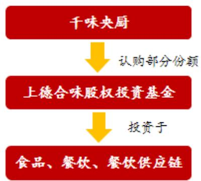  
图表 63：通过认购股权投资基金投资于供应链上下游  
资料来源：公司公告、方正证券研究所

# 5盈利预测与投资建议

公司作为速冻米面龙头，在细分领域以及B 端定制优势明显，通过自有优势深度绑定客户，从而铸就稳定的盈利模式。公司独有的发展逻辑使其区别于行业其他可比公司，是支撑其稳步发展的根本所在。同时，连锁化趋势以及B 端定制需求上升将使具有工业化特征且能提供定制的千味央厨步入发展快车道。

因此我们预计公司 22-24 年归母净利润为 1.11/1.49/1.92 亿元，同比$+ 2 5 . 1 0 \% / + 3 4 . 7 7 \% / + 2 8 . 4 4 \% , \mathsf { E P S }$ 为 $1 . 2 8 / 1 . 7 2 / 2 . 2 1 $ 元，对应当前股价PE分别为 $3 8 \times 2 8 \times 2 2 \times$ ，维持“强烈推荐”评级。

图表64：千味央厨收入拆分预测  

<table><tr><td></td><td>2021</td><td>2022E</td><td>2023E</td><td>2024E</td></tr><tr><td>油炸类</td><td></td><td></td><td></td><td></td></tr><tr><td>收入（万元）</td><td>66048</td><td>74832</td><td>95411</td><td>115638</td></tr><tr><td>yoy</td><td>27%</td><td>13%</td><td>28%</td><td>21%</td></tr><tr><td>毛利率</td><td>21%</td><td>21%</td><td>21%</td><td>22%</td></tr><tr><td>蒸煮类</td><td></td><td></td><td></td><td></td></tr><tr><td>收入（万元）</td><td>25551</td><td>29230</td><td>32474</td><td>36079</td></tr><tr><td>yoy</td><td>39%</td><td>14%</td><td>11%</td><td>11%</td></tr><tr><td>毛利率</td><td>23%</td><td>24%</td><td>24%</td><td>24%</td></tr><tr><td>烘焙类</td><td></td><td></td><td></td><td></td></tr><tr><td>收入（万元）</td><td>22337</td><td>27362</td><td>33163</td><td>39524</td></tr><tr><td>yoy</td><td>19%</td><td>23%</td><td>21%</td><td>19%</td></tr><tr><td>毛利率</td><td>25%</td><td>22%</td><td>23%</td><td>23%</td></tr><tr><td>菜肴类及其他</td><td></td><td></td><td></td><td></td></tr><tr><td>收入（万元）</td><td>13023</td><td>23441</td><td>38631</td><td>55165</td></tr><tr><td>yoy</td><td>162%</td><td>80%</td><td>65%</td><td>43%</td></tr><tr><td>毛利率</td><td>22%</td><td>24%</td><td>24%</td><td>24%</td></tr><tr><td>其他</td><td></td><td></td><td></td><td></td></tr><tr><td>收入（万元）</td><td>432</td><td>500</td><td>600</td><td>700</td></tr><tr><td>yoy</td><td>102%</td><td>16%</td><td>20%</td><td>17%</td></tr><tr><td>毛利率</td><td>98%</td><td>95%</td><td>95%</td><td>95%</td></tr><tr><td>合计</td><td></td><td></td><td></td><td></td></tr><tr><td>收入（万元）</td><td>127390</td><td>155365</td><td>200279</td><td>247106</td></tr><tr><td>yoy</td><td>35%</td><td>22%</td><td>29%</td><td>23%</td></tr><tr><td>毛利率</td><td>22%</td><td>22%</td><td>23%</td><td>23%</td></tr></table>

资料来源：方正证券研究所

图表65：可比公司估值表  

<table><tr><td rowspan="2">代码</td><td rowspan="2">证券简称</td><td rowspan="2">市值 （亿元）</td><td rowspan="2">收盘价 （元）</td><td colspan="4">EPS</td><td colspan="4">市盈率</td></tr><tr><td>2021</td><td>2022E</td><td>2023E</td><td>2024E</td><td>2021</td><td>2022E  2023E</td><td></td><td>2024E</td></tr><tr><td>603345.SH</td><td>安井食品</td><td>433.87</td><td>147.932.84</td><td></td><td>3.44</td><td>4.43</td><td>5.53</td><td>60.13</td><td>42.95</td><td>33.36</td><td>26.77</td></tr><tr><td>605338.SH</td><td>巴比食品</td><td>62.20</td><td>25.08</td><td>1.27</td><td>1.00</td><td>1.22</td><td>1.48</td><td>27.43</td><td>25.07</td><td>20.53</td><td>16.89</td></tr><tr><td>002216.SZ</td><td>三全食品</td><td>138.74</td><td>15.78</td><td>0.73</td><td>0.89</td><td>0.99</td><td>1.12</td><td>27.73</td><td>18.13</td><td>16.32</td><td>14.46</td></tr><tr><td></td><td>平均</td><td></td><td></td><td></td><td></td><td></td><td></td><td>38.43</td><td>28.72</td><td>23.40</td><td>19.37</td></tr><tr><td>001215.SZ</td><td>千味央廚</td><td>41.52</td><td>47.90</td><td>1.02</td><td>1.28</td><td>1.72</td><td>2.21</td><td>46.57</td><td>38.38</td><td>28.48</td><td>22.17</td></tr></table>

资料来源：Wind、方正证券研究所注1：可比公司预测数据均取自Wind一致预期，千味央厨盈利数据为方正证券预测注2：收盘价截至2022年 $^ { \circ }$ 月23日

# 6风险提示

疫情反复影响下游需求，食品质量安全风险，主要原材料价格波动风险、C端开拓不及预期、新品推广不及预期等。

附录：公司财务预测表  

<table><tr><td>资产负债表</td><td>2021</td><td>2022E</td><td>2023E</td><td>2024E</td></tr><tr><td>流动资产</td><td>593</td><td>677</td><td>866</td><td>1131</td></tr><tr><td>货币资金</td><td>332</td><td>393</td><td>505</td><td>694</td></tr><tr><td>应收票据</td><td>0</td><td>0</td><td>0</td><td>0</td></tr><tr><td>应收账款</td><td>62</td><td>74</td><td>95</td><td>116</td></tr><tr><td>其它应收款</td><td>8</td><td>9</td><td>12</td><td>15</td></tr><tr><td>预付账款</td><td>5</td><td>11</td><td>13</td><td>16</td></tr><tr><td>存货</td><td>162</td><td>166</td><td>217</td><td>266</td></tr><tr><td>其他</td><td>24</td><td>24</td><td>24</td><td>24</td></tr><tr><td>非流动资产</td><td>747</td><td>843</td><td>905</td><td>941</td></tr><tr><td>长期投资</td><td>22</td><td>22</td><td>22</td><td>22</td></tr><tr><td>固定资产</td><td>636</td><td>737</td><td>800</td><td>837</td></tr><tr><td>无形资产</td><td>52</td><td>47</td><td>46</td><td>44</td></tr><tr><td>其他</td><td>37</td><td>37</td><td>37</td><td>37</td></tr><tr><td>资产总计</td><td>1341</td><td>1520</td><td>1771</td><td>2072</td></tr><tr><td>流动负债</td><td>326</td><td>432</td><td>536</td><td>647</td></tr><tr><td>短期借款</td><td>15</td><td>15</td><td>15</td><td>15</td></tr><tr><td>应付账款</td><td>144</td><td>193</td><td>246</td><td>299</td></tr><tr><td>其他</td><td>168</td><td>223</td><td>274</td><td>333</td></tr><tr><td>非流动负债</td><td>61</td><td>26</td><td>26</td><td>26</td></tr><tr><td>长期借款</td><td>35</td><td>0</td><td>0</td><td>0</td></tr><tr><td>其他</td><td>26</td><td>26</td><td>26</td><td>26</td></tr><tr><td>负债合计</td><td>388</td><td>458</td><td>562</td><td>673</td></tr><tr><td>少数股东权益</td><td>0</td><td>-2</td><td>-4</td><td>-7</td></tr><tr><td>股本</td><td>87</td><td>87</td><td>87</td><td>87</td></tr><tr><td>资本公积</td><td>546</td><td>546</td><td>546</td><td>546</td></tr><tr><td>留存收益</td><td>368</td><td>479</td><td>628</td><td>820</td></tr><tr><td>归属母公司股东权益</td><td>954</td><td>1064</td><td>1214</td><td>1405</td></tr><tr><td>负债和股东权益</td><td>1341</td><td>1520</td><td>1771</td><td>2072</td></tr></table>

单位：百万元  

<table><tr><td>利润表</td><td>2021</td><td>2022E</td><td>2023E</td><td>2024E</td></tr><tr><td>营业总收入</td><td>1274</td><td>1554</td><td>2003</td><td>2471</td></tr><tr><td>营业成本</td><td>989</td><td>1205</td><td>1552</td><td>1909</td></tr><tr><td>税金及附加</td><td>12</td><td>14</td><td>18</td><td>22</td></tr><tr><td>销售费用</td><td>42</td><td>50</td><td>64</td><td>79</td></tr><tr><td>管理费用</td><td>107</td><td>135</td><td>168</td><td>203</td></tr><tr><td>研发费用</td><td>9</td><td>12</td><td>16</td><td>20</td></tr><tr><td>财务费用</td><td>5</td><td>-2</td><td>-4</td><td>-5</td></tr><tr><td>资产减值损失</td><td>0</td><td>0</td><td>0</td><td>0</td></tr><tr><td>公允价值变动收益</td><td>0</td><td>0</td><td>0</td><td>0</td></tr><tr><td>投资收益</td><td>0</td><td>0</td><td>0</td><td>0</td></tr><tr><td>营业利润</td><td>112</td><td>139</td><td>189</td><td>243</td></tr><tr><td>营业外收入</td><td>3</td><td>3</td><td>3</td><td>3</td></tr><tr><td>营业外支出</td><td>1</td><td>0</td><td>0</td><td>0</td></tr><tr><td>利润总额</td><td>113</td><td>142</td><td>192</td><td>246</td></tr><tr><td>所得税</td><td>26</td><td>33</td><td>45</td><td>57</td></tr><tr><td>净利润</td><td>87</td><td>109</td><td>147</td><td>189</td></tr><tr><td>少数股东损益</td><td>-1</td><td>-2</td><td>-2</td><td>-3</td></tr><tr><td>归属母公司净利润</td><td>88</td><td>111</td><td>149</td><td>192</td></tr><tr><td>EBITDA</td><td>156</td><td>183</td><td>238</td><td>297</td></tr><tr><td>EPS（元）</td><td>1.25</td><td>1.28</td><td>1.72</td><td>2.21</td></tr></table>

<table><tr><td>现金流量表</td><td>2021</td><td>2022E</td><td>2023E</td><td>2024E</td></tr><tr><td>经营活动现金流</td><td>88</td><td>235</td><td>224</td><td>281</td></tr><tr><td>净利润</td><td>87</td><td>109</td><td>147</td><td>189</td></tr><tr><td>折旧摊销</td><td>42</td><td>46</td><td>53</td><td>59</td></tr><tr><td>财务费用</td><td>7</td><td>1</td><td>0</td><td>0</td></tr><tr><td>投资损失</td><td>0</td><td>0</td><td>0</td><td>0</td></tr><tr><td>营运资金变动</td><td>-50</td><td>82</td><td>27</td><td>36</td></tr><tr><td>其他</td><td>3</td><td>-3</td><td>-3</td><td>-3</td></tr><tr><td>投资活动现金流</td><td>-183</td><td>-138</td><td>-112</td><td>-91</td></tr><tr><td>资本支出</td><td>-183</td><td>-138</td><td>-112</td><td>-91</td></tr><tr><td>长期投资</td><td>0</td><td>0</td><td>0</td><td>0</td></tr><tr><td>其他</td><td>0</td><td>0</td><td>0</td><td>0</td></tr><tr><td>筹资活动现金流</td><td>299</td><td>-36</td><td>0</td><td>0</td></tr><tr><td>短期借款</td><td>0</td><td>0</td><td>0</td><td>0</td></tr><tr><td>长期借款</td><td>0</td><td>-35</td><td>0</td><td>0</td></tr><tr><td>普通股增加</td><td>349</td><td>0</td><td>0</td><td>0</td></tr><tr><td>资本公积增加</td><td>308</td><td>0</td><td>0</td><td>0</td></tr><tr><td>其他</td><td>-358</td><td>-1</td><td>0</td><td>0</td></tr><tr><td>现金净增加额</td><td>204</td><td>61</td><td>112</td><td>189</td></tr></table>

数据来源：wind方正证券研究所

<table><tr><td>主要财务比率</td><td>2021</td><td>2022E</td><td>2023E</td><td>2024E</td></tr><tr><td>成长能力</td><td></td><td></td><td></td><td></td></tr><tr><td>营业总收入</td><td>34.89%</td><td>21.96%</td><td>28.91%</td><td>23.38%</td></tr><tr><td>营业利润</td><td>11.53%</td><td>24.94%</td><td>35.39%</td><td>28.87%</td></tr><tr><td>归属母公司净利润</td><td>15.51%</td><td>25.10%</td><td>34.77%</td><td>28.44%</td></tr><tr><td>获利能力</td><td></td><td></td><td></td><td></td></tr><tr><td>毛利率</td><td>22.36%</td><td>22.43%</td><td>22.53%</td><td>22.73%</td></tr><tr><td>净利率</td><td>6.94%</td><td>7.12%</td><td>7.45%</td><td>7.75%</td></tr><tr><td>ROE</td><td>9.28%</td><td>10.40%</td><td>12.29%</td><td>13.63%</td></tr><tr><td>ROIC</td><td>12.99%</td><td>15.21%</td><td>19.56%</td><td>25.21%</td></tr><tr><td>偿债能力</td><td></td><td></td><td></td><td></td></tr><tr><td>资产负债率</td><td>28.91%</td><td>30.12%</td><td>31.72%</td><td>32.51%</td></tr><tr><td>净负债比率</td><td>6.32%</td><td>2.38%</td><td>2.09%</td><td>1.80%</td></tr><tr><td>流动比率</td><td>1.82</td><td>1.57</td><td>1.62</td><td>1.75</td></tr><tr><td>速动比率</td><td>1.32</td><td>1.18</td><td>1.21</td><td>1.34</td></tr><tr><td>营运能力</td><td></td><td></td><td></td><td></td></tr><tr><td>总资产周转率</td><td>1.11</td><td>1.09</td><td>1.22</td><td>1.29</td></tr><tr><td>应收账款周转率</td><td>22.25</td><td>22.80</td><td>23.72</td><td>23.41</td></tr><tr><td>应付账款周转率</td><td>8.92</td><td>9.22</td><td>9.12</td><td>9.06</td></tr><tr><td>每股指标(元)</td><td></td><td></td><td></td><td></td></tr><tr><td>每股收益</td><td>1.25</td><td>1.28</td><td>1.72</td><td>2.21</td></tr><tr><td>每股经营现金</td><td>1.02</td><td>2.71</td><td>2.59</td><td>3.24</td></tr><tr><td>每股净资产</td><td>11.01</td><td>12.29</td><td>14.01</td><td>16.22</td></tr><tr><td>估值比率</td><td></td><td></td><td></td><td></td></tr><tr><td>P/E</td><td>46.57</td><td>37.51</td><td>27.84</td><td>21.67</td></tr><tr><td>P/B</td><td>5.29</td><td>3.90</td><td>3.42</td><td>2.95</td></tr><tr><td>EV/EBITDA</td><td>30.58</td><td>20.71</td><td>15.42</td><td>11.72</td></tr></table>

# 分析师声明

作者具有中国证券业协会授予的证券投资咨询执业资格，保证报告所采用的数据和信息均来自公开合规渠道，分析逻辑基于作者的职业理解，本报告清晰准确地反映了作者的研究观点，力求独立、客观和公正，结论不受任何第三方的授意或影响。研究报告对所涉及的证券或发行人的评价是分析师本人通过财务分析预测、数量化方法、或行业比较分析所得出的结论，但使用以上信息和分析方法存在局限性。特此声明。

# 免责声明

本研究报告由方正证券制作及在中国（香港和澳门特别行政区、台湾省除外）发布。根据《证券期货投资者适当性管理办法》，本报告内容仅供我公司适当性评级为C3及以上等级的投资者使用，本公司不会因接收人收到本报告而视其为本公司的当然客户。若您并非前述等级的投资者，为保证服务质量、控制风险，请勿订阅本报告中的信息，本资料难以设置访问权限，若给您造成不便，敬请谅解。

在任何情况下，本报告的内容不构成对任何人的投资建议，也没有考虑到个别客户特殊的投资目标、财务状况或需求，方正证券不对任何人因使用本报告所载任何内容所引致的任何损失负任何责任，投资者需自行承担风险。

本报告版权仅为方正证券所有，本公司对本报告保留一切法律权利。未经本公司事先书面授权，任何机构或个人不得以任何形式复制、转发或公开传播本报告的全部或部分内容，不得将报告内容作为诉讼、仲裁、传媒所引用之证明或依据，不得用于营利或用于未经允许的其它用途。如需引用、刊发或转载本报告，需注明出处且不得进行任何有悖原意的引用、删节和修改。

# 公司投资评级的说明：

强烈推荐：分析师预测未来半年公司股价有 $20 \%$ 以上的涨幅；  
推荐：分析师预测未来半年公司股价有 $10 \%$ 以上的涨幅；  
中性：分析师预测未来半年公司股价在 $- 1 0 \%$ 和 $10 \%$ 之间波动；  
减持：分析师预测未来半年公司股价有 $10 \%$ 以上的跌幅。

# 行业投资评级的说明：

推荐：分析师预测未来半年行业表现强于沪深300指数；  
中性：分析师预测未来半年行业表现与沪深300指数持平；  
减持：分析师预测未来半年行业表现弱于沪深300指数。

<table><tr><td>地址</td><td>网址：https://www.foundersc.com</td><td>E-mail:yjzx@foundersc.com</td></tr><tr><td>北京</td><td>西城区展览馆路 48 号新联写字楼 6 层</td><td></td></tr><tr><td>上海</td><td>静安区延平路 71 号延平大厦 2 楼</td><td></td></tr><tr><td>上海</td><td>浦东新区世纪大道1168号东方金融广场A栋 1001 室</td><td></td></tr><tr><td>深圳</td><td>福田区竹子林紫竹七道光大银行大厦31层</td><td></td></tr><tr><td>广州</td><td>天河区兴盛路 12 号楼隽峰苑 2 期 3 层方正证券</td><td></td></tr><tr><td>长沙</td><td>天心区湘江中路二段36 号华远国际中心37 层</td><td></td></tr></table>