# 千寻百味，乘势而上

# 华泰研究

2022 年 12 月27日|中国内地

首次覆盖食品

# 千寻百味，短看需求修复，长看客户开拓

本报告旨在剖析千味央厨商业模式的独特性，以及这一差异化打法赋予公司的竞争优势及成长空间。公司差异化聚焦更具成长性的餐饮渠道及新式面点赛道，优先发力大客户直营定制，获得更高的盈利水平，并在其更严苛的供货品质/效率/稳定性标准下更快炼就研发及供应链双重壁垒，奠定增长基础。公司短期有望受益于下游需求弹性修复，中长期看好行业空间及公司自身更具张力的成长路径：1）预计21-25年餐饮端速冻米面市场规模CAGR为16%;2)老客深挖及新客拓展有望并进。预计22-24年公司收入/净利 CAGR为22%/25%，对应 EPS 1.09/1.47/2.00元，参考可比公司23年PE 均值41x(Wind一致预期)，因其22-24年净利CAGR(25%)高于可比公司(14%)，给予23 年54x PE，目标价79.53 元，首次覆盖“买入”。

# 专注差异化优质赛道，直营定制积蓄势能

我们认为公司的商业模式选择与竞争对手存在差异，坚固的竞争壁垒加持下未来增长势能更足，体现在：1）赛道选择：公司错位聚焦餐饮渠道及新式面点赛道，餐饮渠道米面制品有望在餐饮供应链浪潮下率先起量，蓝海市场成长阻力更小；2）打法模式：公司以餐饮端直营定制先行（20 年定制收入占直营收入的84%)，大客户的价格敏感度较低，直营定制具备更高的盈利能力，且需要的广告营销费用较少，同时大客户品牌背书下中小客户开拓或更顺畅；3）壁垒构建：公司以大客户为基，在其更严苛的供货品质/效率/稳定性标准下更快炼就产品研发及供应链响应能力双重壁垒。

# 受益赛道崛起和自身优势强化，“β+α”逻辑清晰

从赛道容量及公司路径两维度看成长空间：1）餐饮端速冻米面行业：据IBISWorld，20 年国内市场规模121亿，中期维度我们预计25 年有望达240亿元(21-25 年CAGR 为16%)，远期维度预计国内市场的潜在空间有望超600 亿元（假设我国稳态下速冻米面人均消费量与渠道结构参考20 年日本的情况)。2）公司成长点：短期看，疫情催化下餐饮连锁化加速，餐饮供应领域工业化的渗透率提升，餐饮端需求复苏有望助力公司实现业绩弹性修复；中长期视角下，公司B端存量大客户自身增长/单品订购量/合作品类扩容仍有挖掘空间，中小客户扩容、C端发力有望锦上添花。

# 看好公司增长势能持续释放，首次覆盖给予“买入”评级

短看需求回暖助力公司经营势能向上，长看坚实壁垒下公司差异化打法带来的广阔成长空间，预计 22-24年EPS 1.09/1.47/2.00元，给予其 23年54xPE，目标价79.53 元，首次覆盖给予“买入”评级。

风险提示：竞争加剧；大客户依赖风险；渠道开拓不及预期。

投资评级(首评)： 买入目标价(人民币)： 79.53

研究员 龚源月 SAC No. S0570520100001 gongyuanyue@htsc.com SFC No. BQL737 +(86) 21 2897 2228

研究员 张墨 SAC No.S0570521040001 zhangmo@htsc.com SFC No. BQM965 +(86) 21 2897 2228

联系人 王可欣 SAC No.S0570122010019 wangkexin019215@htsc.com +(86) 21 2897 2228

<table><tr><td colspan="2">基本数据</td></tr><tr><td>目标价(人民币)</td><td>79.53</td></tr><tr><td>收盘价(人民币截至12月27日)</td><td>62.81</td></tr><tr><td>市值(人民币百万)</td><td>5,442</td></tr><tr><td>6个月平均日成交额 (人民币百万)</td><td>72.33</td></tr><tr><td>52周价格范围(人民币)</td><td>37.43-68.10</td></tr><tr><td>BVPS(人民币）</td><td>11.66</td></tr></table>

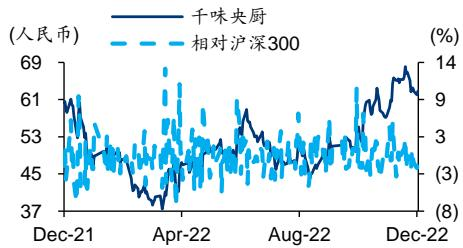  
股价走势图  
资料来源：Wind

经营预测指标与估值   

<table><tr><td>会计年度</td><td>2020</td><td>2021</td><td>2022E</td><td>2023E</td><td>2024E</td></tr><tr><td>营业收入(人民币百万)</td><td>944.37</td><td>1,274</td><td>1,525</td><td>1,902</td><td>2,313</td></tr><tr><td>+/-%</td><td>6.20</td><td>34.89</td><td>19.73</td><td>24.70</td><td>21.61</td></tr><tr><td>归属母公司净利润 (人民币百万)</td><td>76.59</td><td>88.46</td><td>94.77</td><td>127.61</td><td>173.10</td></tr><tr><td>+/-%</td><td>3.33</td><td>15.51</td><td>7.13</td><td>34.65</td><td>35.65</td></tr><tr><td>EPS (人民币，最新摊薄)</td><td>0.88</td><td>1.02</td><td>1.09</td><td>1.47</td><td>2.00</td></tr><tr><td>ROE (%)</td><td>13.15</td><td>9.15</td><td>9.27</td><td>11.50</td><td>13.92</td></tr><tr><td>PE (倍)</td><td>71.06</td><td>61.52</td><td>57.42</td><td>42.65</td><td>31.44</td></tr><tr><td>PB(倍)</td><td>9.34</td><td>5.71</td><td>5.39</td><td>4.96</td><td>4.42</td></tr><tr><td>EV EBITDA (倍)</td><td>39.28</td><td>30.45</td><td>28.83</td><td>22.56</td><td>16.96</td></tr></table>

资料来源：公司公告、华泰研究预测

# 正文目录

# 核心观点 3

# :意模式：专注差异化优质赛道，直营定制积蓄势能，

# 速冻米面：聚焦餐饮端成长赛道，行业空间广阔. .10

# 司：高起点深筑壁垒，成长动力充足. 13

# 核心观点

本报告旨在剖析千味央廚商业模式的独特性，以及这一差异化打法赋予公司的竞争优势及成长空间。公司差异化聚焦更具成长性的餐饮渠道及新式面点赛道，优先发力大客户直营定制，在其更严苛的供货品质/效率/稳定性标准下更快炼就研发及供应链双重壁垒，同时获得更高的盈利水平、奠定增长基础。短期看，疫情催化下餐饮连锁化加速演绎，驱动餐饮供应领域工业化的渗透率进一步提升，疫后餐饮端需求有望稳步复苏，公司作为典型的餐饮供应链企业，有望实现业绩弹性修复；中长期视角下，公司的成长空间存在于深挖老客户与开发新客户两方面，大B客户有望突破，小B 渠道大单品或将持续放量，C 端布局、构建第二成长曲线。本文具体将从三部分展开全面剖析：

# 一是从赛道选择、打法模式的维度，挖掘公司生意模式的独特性：

1）赛道选择：公司错位聚焦餐饮渠道及新式面点成长赛道，餐饮渠道米面制品有望在餐饮供应链浪潮下率先起量，蓝海市场下成长阻力更小。  
2）打法模式：公司以餐饮端直营定制先行（2020 年定制收入占直营收入的 $84 \%$ )，财务视角下，大客户对价格的敏感度较低，且需要的广告营销费用较少，直营定制具备更高的盈利能力；业务视角下，在直营大客户更严苛的供货品质/效率/稳定性标准下更快炼就研发及供应链双重壁垒，且大客户品牌背书下中小客户开拓或更为顺畅。

# 二是从公司自身出发，剖析差异化打法赋予的核心竞争优势：

1）大客户为基：大客户资源开拓难度较大，且一旦顺利开拓就会具备粘性，公司于2016年明确提出“只为餐饮，厨师之选”的战略定位，Β端先发优势明显。此外，公司通过提供全方位解决方案夯实客户粘性，竞争壁垒有望不断强化。2）依托大客户更严苛的标准，加速铸就研发及供应链壁垒：研发端，公司具备模拟餐厅后厨及场景化研发的双重能力，能精准理解并快速落地客户需求，未来大客户作为信息前哨能更加敏锐地捕捉终端需求的趋势，有望赋能公司增强研发能力，围绕油条、油炸糯米类、蒸煎饺、烘焙类四大优势产品线，打造新的核心大单品；供应链端，公司甄选优质的原料供应商，生产运输环节享受天时地利，响应速度、质量及稳定性领先。

# 三是展望未来，剖析公司业绩增长的潜在驱动力：

1）成长赛道赋予其广阔的增长空间：据 IBISWorld，2020 年国内速冻米面餐饮端市场规模121亿（占国内速冻米面整体的 $16 \%$ )，餐饮企业工业化替代需求强烈，我们测算得速冻米面餐饮端规模2025年有望达240亿，21-25年CAGR为 $1 5 . 6 \%$ ，参考日本2020年人均速冻食品消费量23kg、速冻米面餐饮端占比 $50 \%$ ，预计国内市场的潜在空间有望超600亿。2）短看需求修复、长看客户开拓，公司维度增长势能有望持续兑现：短期看，疫情催化下餐饮连锁化加速演绎，驱动餐饮供应领域工业化的渗透率进一步提升，场景修复及居民消费力改善有望引领餐饮端需求复苏，公司有望从中受益。中长期看，公司成长空间存在于深挖老客户与开发新客户两个维度，存量客户自身的增长/单品订购量/合作品类扩容仍有进一步挖掘的空间，大客户的品牌效应有望助力增量客户开拓，同时公司加强经销体系建设，中小客户有望快速扩容，大客户背书下增长势能更足，发力C端、构建第二成长曲线。

区别于市场的观点：1）对行业空间的担忧：市场普遍认为速冻米面行业已经进入成熟期，成长空间不大。我们认为，尽管国内零售端速冻米面行业已相对成熟，但餐饮端速冻米面细分赛道空间仍广，餐饮企业所提供菜品中，米面制品通常只占整体销售规模的一小部分，而相对应的面点师傅人工成本较高，餐饮端米面制品痛点突出，餐饮供应链浪潮下工业化生产的诉求或更加强烈，据 IBISWorld，2020 年中国/日本/美国/加拿大餐饮端速冻米面收入分别占比 $1 6 \% / 5 0 \% / 4 5 \% / 5 2 \%$ ，我国速冻米面在餐饮端的占比提升空间充足。2）对行业竞争的担忧：随着三全、思念等C 端速冻米面企业切入B 端赛道，市场对于B 端速冻米面行业竞争加剧存在一定的担忧，我们认为市场对公司商业模式的独特性以及这一差异化打法赋予公司的成长空间认知尚不充分。大客户资源开拓难度较大，且一旦顺利开拓具备粘性。公司依靠大B客户起家，在其更严苛的供货品质/效率/稳定性标准下更快炼就研发及供应链双重壁垒，模拟后厨彰显强劲的研发实力，大客户品牌背书下小B渠道增长势能更足。

# 生意模式：专注差异化优质赛道，直营定制积蓄势能

聚焦餐饮端速冻米面制品，乘势而上。公司脱胎于思念食品B 端业务、专注百胜中国供应链，2002 年起成为百胜中国蛋挞皮供应商，2006 年顺利开发出国内首根速冻无铝安心油条并切入肯德基，餐饮端业务基础扎实。2012 年千味央厨正式成立，专注于为餐饮、酒店、团体食堂提供全面供应解决方案，2014 年推出定制化服务，并于2016 年成为百胜中国T1级供应商。

渠道端，公司采取直营和经销模式进行销售，22Q1-3 直营/经销渠道的营收占比分别为$3 5 . 5 \% / 6 4 . 5 \%$ ，直营模式深度服务大B客户，目前公司已顺利切入华莱士、海底捞、九毛九、沃尔玛等头部企业的供应体系，经销模式发力中小B 客户，销售模式趋于成熟。产品端，公司目前的产品以速冻面米为主，包括油炸类、烘焙类、蒸煮类及菜肴类，油炸类产品为核心营收来源(22H1在公司总营收中占比 $49 \%$ )，其中油条/蛋挞/芝麻球等均为过亿元单品系列，助力业绩稳健增长。

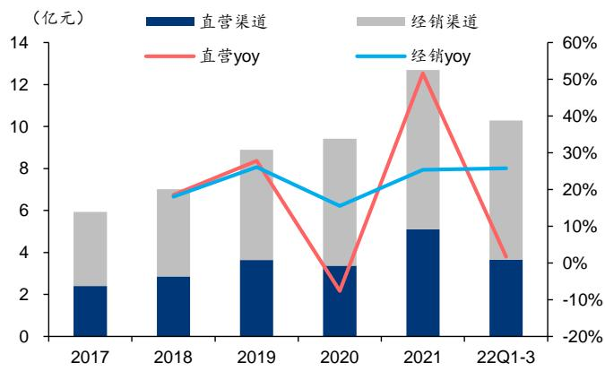  
图表1：千味央厨营收结构(按渠道类型)  
资料来源：公司公告，华泰研究

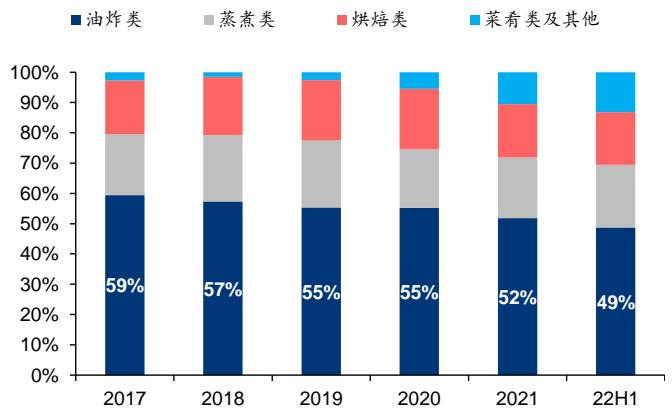  
图表2：千味央厨营收结构(按产品类型）

资料来源：公司公告，华泰研究

  
图表3：千味央厨发展历程  
资料来源：公司官网，华泰研究

管理结构：高管多为思念食品出身，从业经验丰富。公司脱胎于思念食品，目前核心管理团队亦大多来自思念，具备丰富的速冻米面行业从业经验。公司创始人李伟于1997 年创立思念食品，拥有超过 20 年的行业经验，2017 年通过股权转让不再持有思念食品股权，专注千味央厨的运营成长，截至 22Q3，李伟通过共青城城之集持有公司 $4 6 . 0 1 \%$ 的股份，为公司实际控制人。董事长孙剑于 2000-2010 年间在思念任职，历任业务代表、上海公司经理、香港公司经理、营销中心副总经理等职，营销及管理经验丰富。其他核心管理团队成员白瑞、王植宾等均出自思念系，拥有丰富的速冻米面行业经营管理经验，团队默契且稳定，并通过共青城凯立（核心员工持股平台）持有公司股权深度绑定公司利益。此外，公司拥有京东和网聚两大战略投资方，截至22Q3，各持有公司 $2 . 7 8 \% / 3 . 7 8 \%$ 的股份，未来与公司业务或存在一定的协同效应。

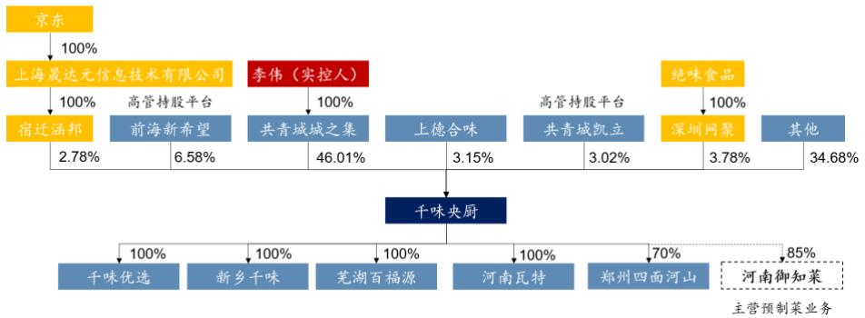  
图表4：千味央厨股权结构（截至22Q3)  
资料来源：Wind，公司公告，华泰研究

股权激励：推出限制性股票激励计划，激发经营动能。2021 年12 月公司对核心管理层进行股权激励，拟授予限制性股票156.84万股，约占总股本的 $1 . 8 4 \%$ ，行权价格为每股31.01元。考核目标值为21-23年营收不低于 $1 1 . 8 / 1 5 . 8 / 1 9 . 0$ 亿元，对应21-23年CAGR为 $2 6 . 2 \%$ ,考核触发值为不低于目标值的 $80 \%$ 。据公司公告，公司2021 年实现收入12.7 亿元，同比增长 $34 . 9 \%$ ，超额完成股权激励考核目标(11.8亿元)。激励考核目标值积极，触发值稳健，公司高管人员实现全覆盖，有望提升团队士气，对公司中长期发展提供重要保障。

图表5：千味央厨股权激励收入增长目标  

<table><tr><td colspan="6">公司层面业绩考核目标</td></tr><tr><td colspan="2">考核年度</td><td>2020</td><td colspan="2">2021</td><td>2023</td></tr><tr><td colspan="2">营业收入（目标值）</td><td>944.4</td><td colspan="2">1180.5 1577.1</td><td>1898.2</td></tr><tr><td colspan="2">目标值 YoY</td><td colspan="2">6.2% 25.0%</td><td>33.6%</td><td>20.4%</td></tr><tr><td colspan="2">营业收入（触发值）</td><td colspan="2">944.4 0.0%</td><td>1261.7 33.6%</td><td>1518.5 20.4%</td></tr><tr><td colspan="6">触发值YoY</td></tr><tr><td colspan="6">授予限制性股票的分配情况</td></tr><tr><td>对象</td><td>职务</td><td>授予限制性股票数量（万股)</td><td>占授予限制性股票总数的比例</td><td></td><td>占总股本的比例</td></tr><tr><td>孙剑</td><td>董事长</td><td></td><td>14.29</td><td>9.11%</td><td>0.17%</td></tr><tr><td>白瑞</td><td>董事/总经理</td><td></td><td>9.74</td><td>6.21%</td><td>0.11%</td></tr><tr><td>王植宾</td><td>董事/副总经理/财务总监</td><td></td><td>8.77</td><td>5.59%</td><td>0.10%</td></tr><tr><td>徐振江</td><td>副总经理/董秘</td><td></td><td>11.69</td><td>7.45%</td><td>0.14%</td></tr><tr><td>核心人员（76人）</td><td></td><td></td><td>108.13</td><td>68.94%</td><td>1.27%</td></tr><tr><td>预留股份</td><td></td><td></td><td>4.22</td><td>2.69%</td><td>0.05%</td></tr><tr><td>合计</td><td></td><td></td><td>156.84</td><td>100.00%</td><td>1.84%</td></tr></table>

注：若考核年度营收（A) $\geqslant \mathsf { A m }$ ，则公司可行权比例为 $100 \%$ ；若 $\mathsf { A n } \leqslant \mathsf { A } < \mathsf { A m }$ ，则公司可行权比例为 $\mathsf { A } / \mathsf { A } \mathsf { m } ^ { * } 1 0 0 \%$ ；若 $\mathsf { A } < \mathsf { A } \mathsf { n }$ ,则公司可行权比例为0；资料来源：公司公告，华泰研究

股价复盘：我们复盘了公司自上市以来的股价情况，发现其股价走势与基本面整体关联性较强。1)上市以来至2021 年11 月：公司作为餐饮供应链代表企业，上市之初便作为市场热点受到资金追捧，叠加21Q4 大众品由于成本压力迎来行业涨价潮，期间公司的 PE-TTM由 22x快速上扬至 $\mathtt { 6 5 x }$ ；2）2021年12 月至2022年4月：居民消费力整体偏向疲软，华东、华南等地疫情反复，对百胜中国等大客户的门店经营产生不利影响（据公告，百胜 3月单月经营亏损，停业或仅外卖的门店数量超过1700 家，其中暂停营业的门店约占 $40 \%$ ,同店销售同比下滑超过 $20 \%$ )，期间公司的PE-TTM由66x下滑至 $4 2 \times$ ；3）2022年5月至2022 年 6 月：大客户恢复营业，同时小B 渠道发展迅速，带动公司的 PE-TTM 由 $4 2 \times$ 提升至50x；4)2022 年7月至2022 年9月：疫情点状散发，叠加社零餐饮数据表现不佳，市场情绪欠佳，公司股价亦呈现震荡下跌，期间PE-TTM由 $\mathtt { 5 1 x }$ 下滑至 $4 5 \times$ ；5)2022年10月至今：公司三季报表现亮眼（22Q3公司收入/归母净利同比 $+ 1 9 \% / + 1 9 \%$ ，较22Q2收入/归母净利 $8 \% / 2 \%$ 的同比增速均有提速)，22Q4公司蒸煎饺和烘焙新品等收入增速较快，大B端环比修复、小B 端保持较快发展，油脂价格有所下滑、利润端弹性亦有望显现，公司股价呈现反弹趋势，期间PE-TTM由45x反弹至 $\mathtt { 5 4 x }$ 。

  
图表6：千味央厨股价复盘图  
注：图中的估值倍数为该阶段的PE-TTM；资料来源：Wind，公司官网，华泰研究

# 好赛道：错位竞争，走阻力小的路

专注餐饮渠道、聚焦新式面点，沿阻力最小的路径顺势发力。对标同业，公司在产品及渠道两大维度实现了错位竞争：1）产品端：公司避开水饺、汤圆、饺子等相对成熟的传统米面制品红海赛道，专注培育油条大单品，顺势布局油炸类为代表的新式面点；2）渠道端：不同于渠道重心偏向零售的三全、巴比及广州酒家，公司起步阶段专注深耕餐饮渠道，走阻力小的路。我们认为，当前速冻米面零售市场已相对成熟，而速冻米面餐饮市场尚处成长初期，餐饮供应链浪潮下有望率先起量；聚焦新式面点则有效规避了传统米面市场的激烈竞争，赋予公司更加顺畅的成长路径。

图表7：国内代表性速冻米面制品公司对比  

<table><tr><td></td><td>千味央廚</td><td>三全食品</td><td>安井食品</td><td>巴比食品</td><td>广州酒家</td></tr><tr><td>营收/归母净利（亿元）12.7/0.9</td><td></td><td>69.4/6.4</td><td>92.7/6.8</td><td>13.8/3.1</td><td>38.9/5.6</td></tr><tr><td rowspan="3">产品结构</td><td>速冻米面：90%</td><td>速冻米面：87%</td><td>速冻米面：22%</td><td>面点类：34%</td><td>月饼：40%</td></tr><tr><td>菜肴及其他：10%</td><td>速冻调制品：11%</td><td>速冻肉制品：23%</td><td>馅料类：27%</td><td>速冻食品：22%</td></tr><tr><td></td><td>冷藏及短保：2%</td><td>速冻鱼糜：38% 莱肴及其他：15%</td><td>外购类：29%</td><td>餐饮业：19% 其他：20%</td></tr><tr><td>渠道結构</td><td>B端 99.7%，其中直营40%， 经销 60%；C端（线上直销） 占比 0.3%</td><td></td><td>6:4</td><td>中加盟82%，直营2%）</td><td>B端17%，C端 83% BC 兼顾，其中B：C约 B端团餐 16%，C端83%（其C端 100%（其中直销 44%， 经销56%），无B端业务</td></tr><tr><td>经销商数量（家）</td><td>968</td><td>5638</td><td>1652</td><td></td><td></td></tr><tr><td>销售人员数量（人） 产能情况</td><td>223</td><td>3265</td><td>4367</td><td>465</td><td></td></tr><tr><td></td><td>计产能 14.2 万吨</td><td>77 万吨</td><td></td><td>（其中成品面点类产能约吨，月饼产量1.6 万吨</td><td>2021 年实际产能 9.9 万吨，设 2021 年设计产能约 2021 年设计产能 75 万吨 2021 年设计产能 10.4 万吨 2021年速冻食品产量3.7万</td></tr></table>

注：以上财务、结构数据等均为2021年数据；资料来源：公司公告，华泰研究

新式面点：传统米面制品已相对成熟，新式产品广阔蓝海仍待挖掘。据冷冻食品公众号，2021年国内传统米面（包括四大核 $\therefore \Delta$ 单品饺子、汤圆、馄饨、粽子）/新式米面（包括面点及其他)营收占比分别为 $7 5 \% / 2 5 \%$ ，对应零售额为586/196亿元，传统米面制品仍是当前市场的销售主力，而以油条为代表的新式米面制品因产品开发难度大、厂商布局时间晚等因素尚处成长初期，但近年来维持较快增速，以三全为例，据公司公告，15-21 年三全新式米面营收 CAGR达 $1 7 . 0 \%$ ，远高于同期传统米面制品营收 $4 . 1 \%$ 的复合增速。展望未来，我们认为经过三全、思念、湾仔码头等先行者的长期深耕，传统速冻米面制品在零售端已渐趋成熟，未来新式面点或将成为引领速冻米面市场规模增长的新兴驱动力，在饮食结构多元化、个性化背景下，公司品类创新或大有可为。

千味央廚 (001215 CH)

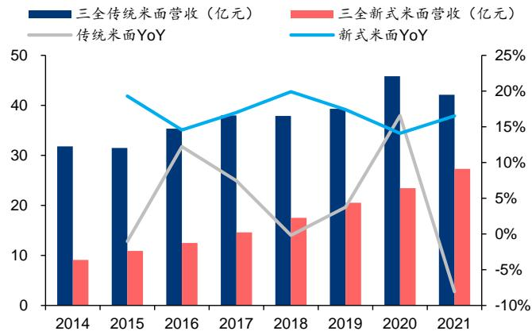  
图表8：三全食品传统、新式米面制品收入及其增速  
注：传统米面为汤圆/水饺/粽子收入合计，新式米面为面点及其他收入；资料来源：公司公告，华泰研究

  
图表9：国内速冻米面制品产品结构（按零售额）  
资料来源：冷冻食品公众号，华泰研究

对标日本，国内速冻米面制品产品结构有待丰富。据日本冷冻食品协会，日本速冻产品结构丰富度较高，2021 年前10 大畅销单品中涵盖饺子、可乐饼、炒饭、罐头、乌冬面等在内的多种不同类型的产品，且前10 大畅销单品的销售金额均在9 亿人民币以上。而目前国内速冻米面市场产品结构则相对单一，其他新式米面制品因产品开发难度大、厂商布局时间晚等原因仍处成长初期，尚未形成规模。相较日本，未来国内市场速冻面点的品类丰富度仍有较大提升空间，品类扩容的引领下，新式面点赛道成长空间广阔。

图表10：2021 年日本前 10 大畅销速冻食品销售金额及其产量  

<table><tr><td></td><td>产品名称</td><td>销售金额（百万日元)销售金额（亿人民币)</td><td></td><td>YoY</td><td></td><td>占比产量(万吨)</td><td>YoY</td><td>占比</td></tr><tr><td>1</td><td>饺子</td><td>57141</td><td>29.1</td><td>11.02%</td><td>7.75%</td><td></td><td>9.9 9.89%</td><td>6.17%</td></tr><tr><td>2</td><td>可乐饼</td><td>56531</td><td>28.8</td><td>0.70%</td><td>7.67%</td><td></td><td>16.31.08%</td><td>10.23%</td></tr><tr><td>3</td><td>炒饭</td><td>42549</td><td>21.7</td><td>-1.77%</td><td>5.77%</td><td></td><td>10.1 1.15%</td><td>6.31%</td></tr><tr><td>4</td><td>罐头</td><td>41521</td><td>21.1</td><td>13.89%</td><td>5.63%</td><td></td><td>6.0 10.30%</td><td>3.77%</td></tr><tr><td>5</td><td>乌冬面</td><td>33390</td><td>17.0</td><td>11.42%</td><td>4.53%</td><td></td><td>19.6 -1.82%</td><td>12.29%</td></tr><tr><td>6</td><td>章鱼烧</td><td>28173</td><td>14.3</td><td>3.28%</td><td>3.82%</td><td></td><td>4.5 -1.62%</td><td>2.80%</td></tr><tr><td>7</td><td>汉堡</td><td>19243</td><td>9.8</td><td>-1.55%</td><td>2.61%</td><td></td><td>6.1 -2.81%</td><td>3.81%</td></tr><tr><td>8</td><td>意大利面</td><td>18767</td><td>9.6</td><td>-5.61%</td><td>2.55%</td><td></td><td>6.2-5.20%</td><td>3.91%</td></tr><tr><td>9</td><td>卤肉饭</td><td>18646</td><td>9.5</td><td>26.73%</td><td>2.53%</td><td></td><td>5.1 21.09%</td><td>3.19%</td></tr><tr><td>10</td><td>拉面类</td><td>18021</td><td>9.2</td><td>11.10%</td><td>2.44%</td><td></td><td>6.34.24%</td><td>3.93%</td></tr></table>

资料来源：日本冷冻食品协会，华泰研究

餐饮渠道：餐饮端米面制品痛点突出，餐饮供应链浪潮下有望率先受益。我们认为，由于米面制品多为点心或主食，往往是下游餐饮企业的佐食而非其吸引顾客的招牌，但却需要配备专门的面点师傅进行制作，投入产出比相对不高。因此，速冻米面制品在餐饮供应链浪潮下工业化大生产的诉求更强烈，有望率先实现替代。

从速冻米面竞争格局的维度看，餐饮端格局未定，零售端发展较为成熟。国内零售端速冻米面发展已相对成熟，据华经产业研究院，21 年行业收入规模 CR3三全/思念/湾仔码头分别占比 $2 4 \% / 1 7 \% / 6 \%$ 。餐饮端速冻米面市场目前参与者较多，但尚未形成相对固化的格局，公司以 $8 \%$ 左右的市占率处领先位置，未来凭借聚焦深耕的先发优势或将收获更广阔的空间。行业间品类丰富度较高，通常情况下，B 端渠道易守难攻，短期看，企业多以不同的产品、场景、区域形成割据，中长期视角下，核心竞争要素仍为规模效益下的成本优势，效率高者有望胜出。

千味央廚 (001215 CH)

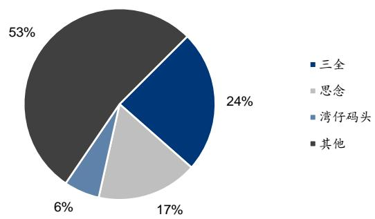  
图表11：2021 年国内零售端速冻米面竞争格局  
资料来源：华经产业研究院，华泰研究

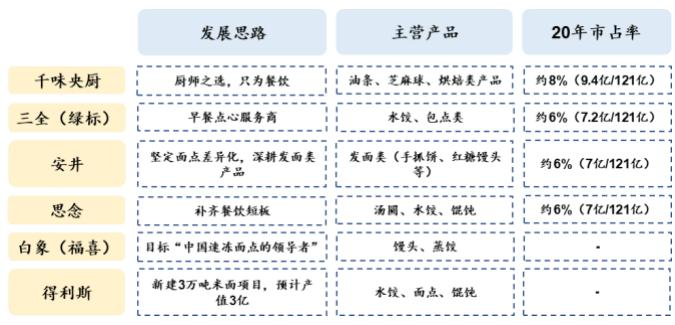  
图表12：2020 年 B 端速冻米面企业  
注：20年市占率是由各公司B端速冻米面收入/20年国内速冻米面制品餐饮端市场规模121亿（据IBISWorld）算得；资料来源：IBISWorld，公司公告，公司官网，华泰研究预测

# 高势能：定制先行，汇聚发展势能

公司 2002 年与肯德基合作，开创中式食品进入西式餐饮业的先河，此后双方合作不断深化，百胜中国亦稳居公司第一大客户，据公司公告，21 年百胜中国贡献的营收占公司总营收的$1 9 . 3 \%$ 。22Q1-3公司直营渠道收入占比 $3 5 . 6 \%$ ，针对大型连锁餐饮客户，公司聚焦定制产品。我们认为，以餐饮大客户定制为基的商业模式将从两大维度协助公司汇聚发展势能：

1）财务视角：大客户对价格的敏感度较低，直营定制具备更高的盈利能力。通常情况下，大客户更注重产品质量、供应链的稳定性及上游反应速度，并且更换供应商的管理成本相对较高，因而大B客户对价格的敏感度较低，据公司年报，2021 年公司直营渠道毛利率为$2 3 . 1 \%$ ，高于经销渠道毛利率 $2 1 . 4 \%$ ，且大客户直营定制所需的广告营销费用较少，即销售费用率更低，具备更高的毛销差水平。横向对比，大B模式下，客户体量大且数量较小，保证了公司的销售和市场费用支出相对较少，相较可比公司，公司的销售费用率保持在较低水平。此外，公司以定制产品为主力运营餐饮渠道（据招股说明书，2020 年直营定制产品收入占直营客戶收入的 $84 \%$ ，占公司总营收的比重亦达 $30 \%$ )，增强用户粘性的同时获得一定的定价权，由此形成更好的净利率表现。

  
图表13：千味央厨直营模式毛利率较高  
注：2020年两类模式的毛利率差距缩小，主要与2019 年因成本因素大幅涨价、2020年疫情下大客户降低高价产品采购有关；资料来源：公司公告，华泰研究

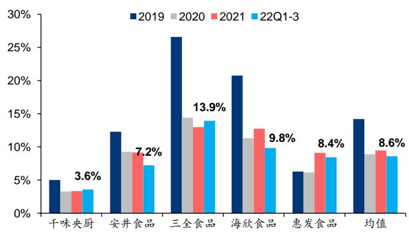  
图表14：横向对比：公司销售费用率保持在相对较低水平

资料来源：Wind，华泰研究

2）业务视角：大客户资源的沉淀具备双重红利，助力公司培育核心优势，同时大客户品牌背书或加速其他客户吸纳。一方面，大客户对供应商资质的审核体系严格，面向大客户的直营定制意味着供货品质/生产稳定性/研发能力/配送效率等全方位更高标准的要求，公司直面大客户更严苛的要求，更快打造多维度的核心优势，炼就出色的产品交付和渠道服务能力，据公司公告，公司从接受大客户的定制要求、研发到生产交付只需要3-6 个月的时间，构筑自身护城河。另一方面，由于大客户品牌背书带来的灯塔效应，或对其他客户形成更强的吸纳能力，进而在深厚的竞争优势加持下，有望实现产品销售路径及场景的扩容、贡献增量业绩。

图表15：公司前五大直营客户营收及其占比(单位：万元)  

<table><tr><td></td><td colspan="3">2017</td><td colspan="3">2018</td><td colspan="3">2019</td><td colspan="3">2020</td><td colspan="2">2021</td></tr><tr><td></td><td>品牌</td><td></td><td>销售额营收占比品牌</td><td></td><td></td><td>销售额营收占比品牌</td><td></td><td>销售额营收占比品牌</td><td></td><td></td><td>销售额营收占比品牌</td><td></td><td></td><td>销售额营收占比</td></tr><tr><td>1</td><td></td><td>百胜中国 17770.43 29.95%</td><td></td><td></td><td>百胜中国 21175.14 30.20%</td><td></td><td>百胜中国27317.14 30.72%</td><td></td><td></td><td></td><td>百胜中国 22067.31 23.37%</td><td></td><td>百胜中国24526.78 19.25%</td><td></td></tr><tr><td>2</td><td>华莱士</td><td>1344.19 2.27%</td><td>华莱士</td><td></td><td>2368.83 3.38%</td><td>华莱士</td><td></td><td>2567.122.89%</td><td>华莱士</td><td></td><td>4000.19 4.24%</td><td>华莱士</td><td>7060.565.54%</td><td></td></tr><tr><td>3</td><td></td><td>永和大王1196.64 2.02%</td><td>九毛九</td><td>895.88</td><td>1.28%</td><td>九毛九</td><td>978.95</td><td>1.10%</td><td>海底捞</td><td></td><td>2086.53 2.21%</td><td>海底捞</td><td>6268.76 4.92%</td><td></td></tr><tr><td>4</td><td>九毛九</td><td>775.16</td><td>1.31% 真功夫</td><td>569.51</td><td>0.81%</td><td>真功夫</td><td>641.90</td><td>0.72%</td><td>真功夫</td><td>664.96</td><td>0.70%</td><td>老乡鸡</td><td>827.01</td><td>0.65%</td></tr><tr><td>5</td><td>真功夫</td><td>716.42 1.21%</td><td>富士康</td><td>503.46</td><td>0.72%</td><td></td><td>永和大王583.13</td><td>0.66% 32088.23 36.08%</td><td>九毛九</td><td>582.77</td><td>0.62%</td><td>瑞幸咖啡762.94</td><td></td><td>0.60%</td></tr><tr><td colspan="2">合计</td><td colspan="8">21802.84 36.75% 25512.81 36.38%</td><td colspan="3">29401.75 31.13%</td><td colspan="2">39446.06 30.96%</td></tr><tr><td colspan="2">火锅</td><td colspan="10">千味央廚目前签约的大客戶情况</td><td></td><td></td><td></td></tr><tr><td colspan="2"></td><td colspan="10">小肥羊、海底捞、呷脯呷脯、九毛九等</td></tr><tr><td colspan="2">西式快餐</td><td colspan="10">KFC、必胜客、塔可贝尔、华莱士、棒约翰、德克士、汉堡王、SUBWAY等</td></tr><tr><td colspan="2">中式快餐 小吃</td><td colspan="10">永和大王、老乡鸡、乡村基、东方既白、真功夫等</td></tr><tr><td colspan="2"></td><td colspan="9">杨国福麻辣烫、魏家凉皮、许留山、阿香米线、大娘水饺、包道等</td></tr></table>

资料来源：公司官网，公司公告，华泰研究

# 速冻米面：聚焦餐饮端成长赛道，行业空间广阔

国内速冻食品市场仍处成长期，据 Frost & Sullivan，2021 年国内速冻食品市场规模达 1755亿，对应 16-21年CAGR为 $8 . 6 \%$ ，其中速冻米面（特别是零售端）因发展时间更早，市场渗透率更高，2021 年市场规模达 782 亿元（对应16-21 年CAGR 为 $6 . 3 \%$ )。餐饮企业所提供菜品中，米面制品通常只占整体销售规模的一小部分，而相对应的面点师傅人工成本较高，餐饮端米面制品痛点突出，我们认为，餐饮供应链浪潮下工业化生产的诉求相对更加强烈，有望率先实现替代。

  
图表16：15-21 年国内速冻食品、速冻米面行业规模及增速

资料来源：Frost& Sullian，观研天下，中商情报网，华经情报网，中国食品监督局，华泰研究

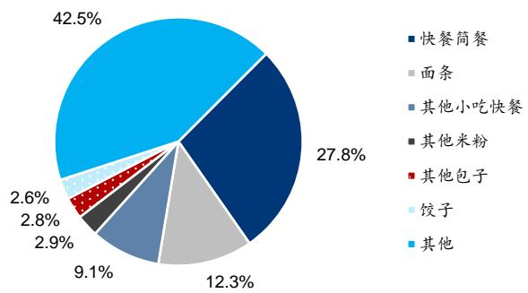  
图表17：米面制品应用于绝大多数小吃快餐的细分业态

资料来源：《中国餐饮大数据2021》，华泰研究

2020 年国内速冻米面餐饮渠道市场规模达 121 亿，风潮渐起，行业驶入成长快车道。据IBISWorld，2020 年国内速冻米面制品餐饮端/零售端占比分别为 $1 6 \% / 8 4 \%$ ，对应收入规模分别为121/633 亿元。我们认为，零售渠道经过三全、思念、湾仔码头等先行者长期深耕，目前已基本步入成熟期，17-19 年（剔除20-21 年疫情扰动)三全速冻米面零售渠道营收CAGR仅 $3 . 3 \%$ ，低于同期速冻米面行业整体 $4 . 7 \%$ 的复合增速。而近年来在餐饮部门成本压力及提高效率的诉求下，速冻米面餐饮端市场蓬勃发展，三全餐饮渠道/千味央厨 17-19年营收 CAGR 分别达 $4 3 . 1 \% / 2 2 . 4 \%$ ，远超速冻米面行业整体增速。据 IBISWorld，2020 年美国/日本/加拿大速冻米面制品餐饮渠道销售额占比分别达 $45 \% / 5 0 \% / 5 2 \%$ ，远高于我国同期的占比（ $16 \%$ )。对标海外，国内速冻米面制品在餐饮端的渗透空间仍然广阔。

  
图表18：三全食品零售、餐饮渠道收入及其增速  
资料来源：Wind，华泰研究

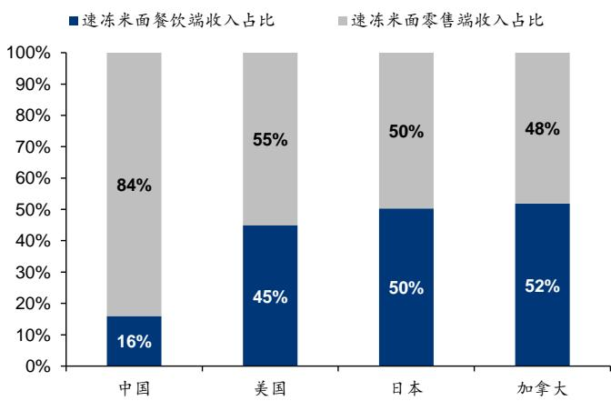  
图表19：2020 年各国速冻米面餐饮端/零售端收入占比

资料来源：IBISWorld，华泰研究

借鉴日本：1975-1997 年连锁化率及外食化率提升驱动日本餐饮渠道速冻米面制品蓬勃发展。日本速冻行业自上世纪 60 年代萌芽，当前发展趋于稳定，由于消费习惯和饮食文化相近，日本速冻行业的历史环境、发展阶段和驱动因素对中国具备参照与借鉴意义。据日本冷冻食品协会，1975-1997 年间，日本餐饮端速冻食品销量由22.5 万吨增至 108.5 万吨，对应期间销量CAGR达 $7 . 5 \%$ ，高于同期零售端速冻食品销量 $4 . 9 \%$ 的复合增速。我们认为，外食化率及连锁化率的提升是上述期间日本餐饮渠道速冻食品销量上行的核心动能。1）外食化率提升带来餐饮业繁荣：1975 年后日本经济強劲复苏带动居民收入走高，女性外出工作比例提升，由此催生外出就餐需求，外食化率从1975年的 $2 7 . 8 \%$ 提升至1997年的 $3 9 . 6 \%$ ,带来餐饮市场大繁荣；2）连锁化率提升催生速冻食品需求：餐饮业的大发展带来下游企业连锁扩张的需求，此外经济高速发展的同时带来了劳动力及房屋租金成本上行，连锁餐饮对标准化、规模化产品的需求最终驱动餐饮端速冻食品快速增长。

  
图表20：日本餐饮及零售端速冻食品销量  
资料来源：日本冷冻食品协会，华泰研究

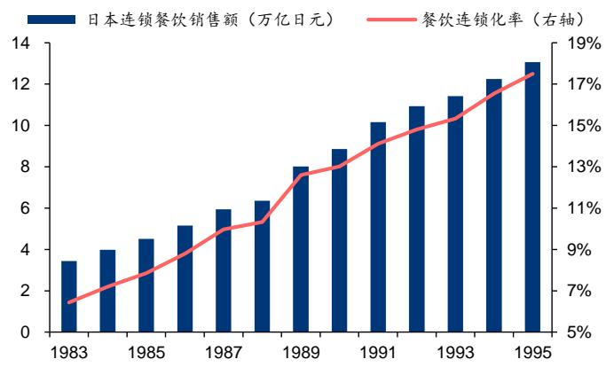  
图表21：日本连锁餐饮销售额及连锁化率  
资料来源：日本特许加盟协会，华泰研究

中日对比：当前国内宏观及行业环境类似于日本1980s，未来餐饮端速冻米面发展路径或可类比日本1980s-1990s。复盘日本我们发现，连锁化率及外食化率提升是餐饮端速冻食品增长的核心驱动，而经济增长是其底层根基。对标日本，我们认为当前国内宏观及行业环境与日本1980s 类似，具体看：1）宏观环境：日本人均GDP于1981 年首次突破1万美元（当期GDP 增速为 $4 . 5 \%$ )，而中国人均GDP于2019年首次突破1万美元（当期GDP增速为 $5 . 9 \%$ )；2）行业环境：日本1981年/中国2019 年外食化率分别为 $3 2 . 1 \% / 3 0 . 0 \%$ ,餐饮行业增速为 $6 . 3 \% / 9 . 4 \%$ ，餐饮连锁化率为 $6 . 0 \% / 1 5 . 5 \%$ 。相似的宏观及行业环境下，我们预计中国餐饮端速冻产品或将复刻日本1980s-1990s 的增长路径。

图表22：中日代表性宏观及行业指标对比：目前国内宏观及行业环境接近日本1980 年代左右  

<table><tr><td colspan="2">人均GDP（美元)</td><td></td><td>GDP 增速</td><td>城镇化率</td><td>外食化率</td><td>连锁化率</td><td>餐饮业增速</td></tr><tr><td></td><td>中国(2019年)</td><td>10216.6</td><td>5.9%</td><td>60.6%</td><td>30.0%</td><td>15.5%</td><td>9.4%</td></tr><tr><td></td><td>日本（1981年）</td><td>10360.2</td><td>4.5%</td><td>76.0%</td><td>32.1%</td><td>6.0%</td><td>6.3%</td></tr><tr><td></td><td>日本(2019年)</td><td>40777.6</td><td>0.3%</td><td>91.4%</td><td>33.7%</td><td>49.3%</td><td>0.7%</td></tr></table>

注：1981/2019 年分别为日本/中国人均GDP首次突破1万美元时点，故选择以上时点进行宏观及行业指标对比；资料来源：Wind，欧睿，华泰研究

# 中期规模测算：2025 年速冻米面餐饮端规模有望达240 亿

核 $\aleph$ 假设：1）速冻米面市场规模：据观研天下，2020/2021年国内速冻米面市场规模为727/782亿元，同比分别 $+ 7 . 4 \% / + 7 . 6 \%$ ，预计2025年市场规模有望达1045亿元，对应21-25年CAGR为 $7 . 5 \%$ ；2）速冻米面餐饮端占比：据IBISWorld，2020年国内速冻米面制品餐饮端占比为 $16 \%$ ，餐饮企业工业化替代需求强烈，我们假设2021年速冻米面餐饮端占比同比 $+ 3 p { \tt c t }$ ，考虑2022 年疫情对线下餐饮门店造成负面影响，居民居家消费场景增加，速冻米面餐饮端占比有所下降，假设23-25 年疫情扰动逐渐减弱，速冻米面餐饮端占比仍会有不同幅度的提升；3）连锁化率：21-25年连锁化率采用欧睿预测值。

计算结论：我们预计 2025 年国内餐饮端速冻米面市场规模为240 亿元，21-25 年CAGR为 $16 \%$ ，据欧睿预测，2025年国内连锁化率约 $2 0 . 3 \%$ ，对应2025年速冻米面餐饮大B端规模为49亿元，21-25年CAGR为 $16 \%$ 。

图表23：21-25 年国内速冻米面制品餐饮端规模预测  

<table><tr><td></td><td>2020A</td><td>2021E</td><td>2022E</td><td>2023E</td><td>2024E</td><td>2025E</td></tr><tr><td>速冻米面市场规模（亿元）</td><td>727</td><td>782</td><td>841</td><td>904</td><td>972</td><td>1045</td></tr><tr><td>速冻米面市场规模YoY</td><td>7.4%</td><td>7.6%</td><td>7.5%</td><td>7.5%</td><td>7.5%</td><td>7.5%</td></tr><tr><td>速冻米面餐饮端规模(亿元)</td><td>116</td><td>149</td><td>135</td><td>172</td><td>204</td><td>240</td></tr><tr><td>餐饮端占比</td><td>16.0%</td><td>19.0%</td><td>16.0%</td><td>19.0%</td><td>21.0%</td><td>23.0%</td></tr><tr><td>速冻米面餐饮端规模YoY</td><td></td><td>27.7%</td><td>-9.4%</td><td>27.6%</td><td>18.8%</td><td>17.7%</td></tr><tr><td>其中：速冻米面餐饮大B 端规模（亿元)</td><td>23</td><td>30</td><td>27</td><td>35</td><td>41</td><td>49</td></tr><tr><td>连锁化率</td><td>19.8%</td><td>20.0%</td><td>20.1%</td><td>20.1%</td><td>20.2%</td><td>20.3%</td></tr><tr><td>速冻米面餐饮大B 端规模 YoY</td><td></td><td>28.8%</td><td>-9.1%</td><td>28.2%</td><td>19.2%</td><td>18.4%</td></tr></table>

资料来源：IBISWorld，观研天下，欧睿，华泰研究预测

# 远期规模测算：速冻米面餐饮端潜在空间有望超 600 亿

核心假设：1）远期速冻米面制品规模：据欧睿，2020年中国/日本/欧洲/美国人均速冻食品消费量分别为每年 9/23/35/60kg，伴随居民生活节奏加快、冷链等基础设施进一步完善，国内速冻食品行业有望持续成长，我们假设国内速冻行业发展趋于稳定的情况下，人均速冻食品消费量有望达到日本 2020 年的水平（23kg)，则远期国内速冻食品规模约4048 亿元；新式米面蓬勃发展之下，据Frost & Sullivan，2021 年国内速冻米面制品占速冻食品的比重为 $45 \%$ ，考虑预制菜等速冻食品品类远期将录得比现在更大的份额，我们预计稳态下速冻米面制品占速冻食品的比重约 $30 \%$ ，则国内速冻米面制品潜在规模为1214亿元；2)远期餐饮端速冻米面制品规模：据 IBISWorld，2020 年中国/日本/美国/加拿大餐饮端速冻米面制品占比分别为 $1 6 \% / 5 0 \% / 4 5 \% / 5 2 \%$ ，我国餐饮部门降本增效的诉求下，速冻米面餐饮端市场有望持续发展，我们假设国内餐饮端速冻米面制品占比达到日本 2020 年的水平$50 \%$ )，测算得到国内餐饮端速冻米面制品潜在规模将达到607亿元。

计算结论：假设我国速冻米面制品目标人均消费量、目标餐饮端占比均参考2020 年日本同期数值的情况下，我们预计国内餐饮端速冻米面市场的潜在空间达 607亿元。

图表24：国内餐饮端速冻米面制品潜在空间测算  

<table><tr><td>2020年国内速冻食品规模（亿元） 1584</td></tr><tr><td>2020 年国内人均速冻食品食用量(kg) 9</td></tr><tr><td>目标人均消费量 23</td></tr><tr><td>国内速冻食品潜在规模(亿元) 4048</td></tr><tr><td>目标速冻米面制品占比 30%</td></tr><tr><td>国内速冻米面制品潜在规模(亿元) 1214</td></tr><tr><td>目标餐饮端米面制品占比 50%</td></tr><tr><td>餐饮端速冻米面制品潜在空间(亿元) 607</td></tr><tr><td>敏感性分析</td></tr><tr><td>米面制品占比（横轴）/餐饮端占比（纵轴) 20% 25% 30% 35% 40%</td></tr><tr><td>46% 372 466 559 652 745</td></tr><tr><td>48% 389 486 583 680 777</td></tr><tr><td>50% 405 506 607 708 810</td></tr><tr><td>52% 421 526 631 737 842</td></tr><tr><td>54% 437 546 656 765 874</td></tr></table>

资料来源：日本冷冻食品协会，艾媒咨询，中国食品监督局，欧睿，华泰研究预测

# 公司：高起点深筑壁垒，成长动力充足

# 壁垒：大客户为基，炼就研发及供应链核心能力

大客户为基，竞争壁垒不断强化。大客户资源开拓难度较大，且一旦顺利开拓具备粘性。渠道端，公司先发优势明显，通过提供全方位的解决方案夯实客户粘性；研发端，公司具备模拟餐厅后厨及场景化研发双重能力，能精准理解并快速落地客户需求，未来大客户作为信息前哨能更加敏锐地捕捉终端需求趋势，有望赋能公司增强研发能力；供应链端，公司在原料端甄选优质供应商，生产运输环节享受天时地利，响应速度、质量及稳定性领先。

# 渠道：沉淀大客户资源，夯实增长根基

累积大客户资源，夯实增长根基，构筑第一重壁垒。公司坚持定位B 端，并设立重客部专门对接直营大客户。2002 年公司进入肯德基供应链，开创中式传统餐饮进军西式餐饮销售网络之先河，此后公司凭借强大的研发能力、稳定的供应链能力及高质的生产配送能力，积累了百胜中国、华莱士、海底捞、老乡鸡、瑞幸咖啡、真功夫、永和大王、杨国福等一批连锁客户。我们认为，优质的大客户资源构成了公司第一重竞争壁垒，体现在：1）大客户更加严苛的产品品质/生产稳定性/快速响应要求将加速培育公司产品研发及供应链响应能力；2）大客户的品牌背书有助于形成灯塔效应吸纳其他客户，助力业绩增量开拓。

  
图表25：千味央厨与百胜中国合作历程梳理  
资料来源：公司官网，招股说明书，华泰研究

以餐饮端直营定制先行，公司率先发力优势明显。公司积淀的大客户资源有望形成一定先发优势，主因：1）大客户资源的开拓难度较大：以百胜中国为例，其对供应商采取 STAR考核体系，综合评分需 ${ > } 8 5$ 分方能成为T1级供应商，仅2020年百胜便对供应商进行了400 次食品安全和质量审核及 200 多次飞行检查，目前公司是百胜唯一的T1 级速冻米面制品供应商；2）大客户一旦顺利开拓具备粘性：由于大型餐饮企业严苛的质量及快速响应需求，供应商前期甄选成本较大，因此一旦入选供应商行列，将形成一定的客户粘性，公司自2016 年起便始终位列百胜T1 级供应商队伍，先发优势明显。公司面向客户需求提供涵盖菜单设计、产品开发、技术支持、干线物流、后续服务咨询等全方位的食品供应解决方案，根据特定需求提供配套定制品，在长期合作中双向了解不断加深，对客户需求的把握亦更加准确，在此基础上，客户粘性不断加强，竞争壁垒有望进一步深化。

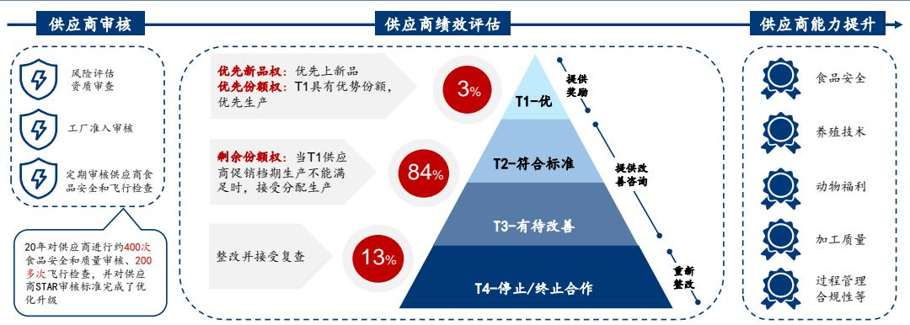  
图表26：百胜中国供应链管理体系  
资料来源：百胜中国公司官网，华泰研究

# 产品：模拟餐厅后厨，场景化研发能力领先

模拟后厨，具备场景化研发能力，精准理解并落地客户需求，构筑第二重壁垒。公司研发壁垒主要体现为能精准理解客户需求，并快速落地生产，而这依赖于模拟餐厅后厨及场景化研发两大能力。公司 2014 年建立模拟后厨实验室，从设备到操作过程全链路模拟还原后厨制作工艺，以节约成本为准则，切实从客户需求的角度出发，从产品设计、设备研发、产品标准化等全方位开发、生产符合要求的产品。同时，公司能将客户的概念化需求快速转化为高质量、标准化生产，顺利推出注芯油条、墨鱼汁油条等创新产品，且据公司公告，仅 2018 年一年公司便为肯德基研发上新 7 款单品，2022 年公司为肯德基上新的品类包括鲜肉月饼、虾滑春卷、葱油拌面、阳春面等。此外，公司擅长对单一产品进行场景化研发扩充食用场景，如对油条挖掘早餐、正餐、火锅、麻辣烫等多重使用场景。

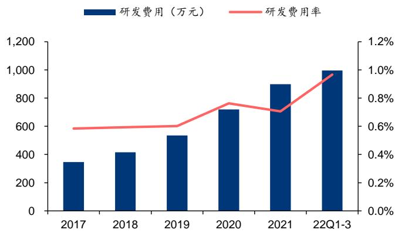  
图表27：公司研发费用及研发费用率  
资料来源：公司公告，华泰研究

  
图表28：17-20 年公司各品类 SKU 数目  
资料来源：招股说明书，华泰研究

关于公司的主要产品特征，我们选取其代表性产品工业油条进行分析，我们认为，速冻油条行业内的领先优势是公司研发能力的有力验证。据公司公告，2021 年公司油条产品的国内市场份额超 $50 \%$ ，在行业内领先优势明显。油条的规模化生产需要和面、醒发、制坯、切条、油炸等过程的工业化，研发难度较大，公司于 2006 年成功生产出第一根速冻无铝安心油条，至2010 年顺利实现油条生产全环节的工业化，并聚焦场景，研发出针对正餐、早餐、火锅、麻辣烫等多重场景的定制化油条产品。我们认为，公司在速冻油条领域的专注深耕及丰富的食用场景开拓充分验证了其领先的产品挖掘、研发及需求落地能力。

  
图表29：工业化油条/新式速冻米面产品的优点  
资料来源：公司官网，公司公告，华泰研究

大客户作为信息前哨，敏锐捕捉需求趋势。我们认为，对终端需求趋势的准确理解和把握是实现有效研发的重要前提，而大型连锁餐饮作为和终端消费者直接对接的前沿阵地，对下游需求及其变动趋势往往更加敏感，公司通过和餐饮大客户的深入合作，有望受益于下游客户的信息优势，更加精准地把握需求变化趋势，实现产品研发并赋能下游客户。因此，我们看好公司在与下游客户的互利机制下充分享受信息优势，助力研发能力不断增强。展望未来，公司将继续围绕油条、油炸糯米类、蒸煎饺、烘焙类四大优势产品线，稳固自身在油条产品上的领先地位，同时以早餐、团餐、乡厨、酒店、宴席等多个场景为基础，深度延伸和广度拓宽齐头并进，充分利用协同效应打造新的核心大单品。

# 供应链：全链路兼顾，快速高质响应

全链路建设完善的供应链，产品配送快速高质，成本管控能力突出，构成第三重壁垒。供应链环节的壁垒在于响应下游需求的能力，核心依赖于覆盖采购、生产、配送全链路的成熟供应链体系。由于大型连锁餐饮本身对产品品质、供货及时性及稳定性存在严格要求，因此聚焦餐饮端大客户的企业自然将炼就行业领先的供应链竞争优势。据招股书，公司供应链各环节都已制定了严格的监督审核标准，确保供应链实现快速且高质的响应。

原料采购环节：甄选高品质供应商，成本管控能力突出。公司主要原材料为面粉、米粉、食用油、白砂糖等大宗原材料，其中2020 年米粉及面粉占原材料采购金额的 $42 \%$ ，为核心原材料构成。为从源头保障产品质量及货源的稳定性，公司主要从上游优质供应商处进行原料采购，2020 年公司从中粮/益海嘉里/河南黄国粮业采购的金额占原材料采购总金额的比重分别达 $1 7 \% / 1 4 \% / 1 2 \%$ ，为其前三大供应商。同时公司具备较强的成本管控能力，对上游原料的价格变动敏感度较高，据公司公告，公司已完成 2022 年大B 端锁价，定价采用成本加成法（海底捞通常就长期的食材供应与供应商订立标准一年期框架协议)，将部分成本压力向下游客户转移，小B 端 22Q1 也进行锁价，部分对冲成本上涨的压力，使得其利润率的稳定性和耐冲击性较好。

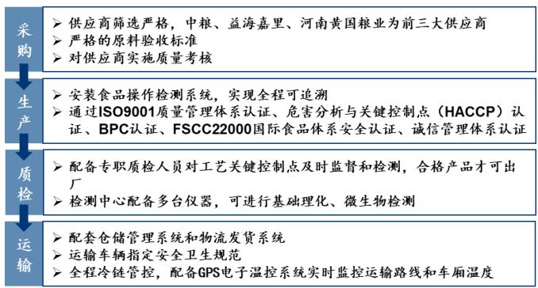  
图表30：公司供应链保障体系：全链路建设完善的供应链  
资料来源：招股说明书，华泰研究

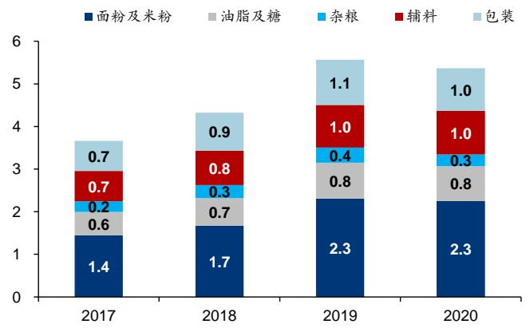  
图表31：17-20 年公司原材料采购金额及其构成(亿元)  
资料来源：招股说明书，华泰研究

生产运输环节：享受天时地利，响应速度、质量及稳定性领先。1）外部因素：公司主要生产基地位于河南，为国内的农业及人口大省，天然享受更充裕的原材料供给及丰富的劳动力资源，同时河南地处中原，为国内重要的交通枢纽，亦为公司带来了一定的运输成本优势。2）内部因素：公司生产运输的质量及稳定性同样突出，据招股书，公司可在3-6 个月内满足客户从提案到最终产品交付的需求，且自2016年起连续位居百胜中国T1级供应商。

# 成长点：短看需求修复，长看客戶开拓

# 短期弹性：黎明咫尺，下游需求有望景气复苏

疫情催化下，中小企业进一步出清，支撑下游餐饮连锁化加速，餐饮龙头整体扩张节奏保持稳健，单店模型不断调整，积极寻找扩张机会。与此同时，餐饮供应领域工业化的渗透率加速提升。疫情加剧了餐饮企业的生存压力，其面临的人力成本/租金成本/原材料成本“三高”导致的低毛利困境进一步凸显，餐饮企业的利润被严重挤压，同时餐饮连锁化率提升对产业链各环节的运营效率提出了更高的诉求。整体而言，我们认为疫情背景下餐饮供应领域工业化的渗透率有望加速提升，餐饮产业链专业化、细分化现象越来越明显。

佳音已至，餐饮场景有望复苏。22H1 疫情背景下B 端速冻食品行业形势并不太乐观，但防控方案的动态优化将进一步强化消费复苏预期（尤其是餐饮出行端)，场景修复及居民消费力改善有望引领餐饮需求复苏。以公司下游大客户肯德基、必胜客为例，据百胜中国公司公告，肯德基/必胜客22Q3同店营收分别同比持平 $1 + 2 \%$ ，较 22Q2 同比下滑 $1 6 \% / 1 5 \%$ 均有明显好转。随消费者出行活动恢复，线下餐饮有望回暖，或将进一步带动千味央厨等餐饮供应链企业实现业绩的弹性修复。

  
图表32：餐饮大客户经营数据：肯德基及必胜客的季度同店营收情况  
资料来源：百胜中国公司公告，华泰研究

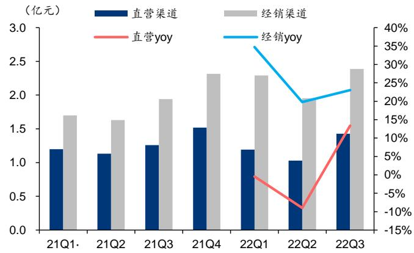  
图表33：千味央厨单季度直营/经销渠道收入  
资料来源：公司公告，华泰研究

大B端有望环比修复、小B 端有望加速成长。参考海内外复苏的历史经验，（国内：20Q1-21Q1，美国：21Q2至今)，均呈现出消费场景放开可直接拉动线下消费修复的特征，我们预期此类反弹也将在本轮消费恢复中出现。伴随外围扰动因素弱化、消费场景放开，宴席等线下业态客流量有望修复，公司大B端有望环比修复（特别是西式快餐韧性较强）、小B端或将加快成长速度。

# 中长期空间：深挖老客户，开发新客户

行业层面，下游对上游效率的追求愈发极致，倒逼上游龙头集中度提升。公司层面，千味央厨作为餐饮供应链代表企业，中长期空间存在于深挖老客户与开发新客户两方面，餐饮连锁化率提升下大客户开拓空间仍存，小B 端渠道客户有望持续增长。

# 直营渠道：老客深挖及新客拓展並进

两维度看直营客户空间：1）存量客户深挖保证持续造血能力：公司与老客户的合作有望加深，包括客户自身的增长、单品订购量的提升以及合作品类的多元化；2）新客户获取贡献未来增量：公司通过优先为以百胜为代表的大客户供货，未来凭借大客户品牌背书形成的灯塔效应，有望与更多客户达成战略合作，进一步丰富自身客户体系。

# 存量大客户仍具深挖空间，包括客户自身的增长、单品订购量提升、合作品类扩容。

1)客户自身增长创造增量需求:以百胜中国为例，16-21 年其营收由 468.4亿元增长到628.2亿元，期间CAGR达 $6 . 0 \%$ 。从开店数上看，据公司公告，截至2021年末，肯德基/海底捞餐饮门店总数量达到 8168/1443家，过去5 年平均每年门店净增589/253 家，老客户逐渐做大做强将带动上游供应商业绩同步提高;老乡鸡过去2年平均每年门店净增 152 家，2021年底达 1073 家，新客户亦处于高速扩店阶段。

2)合作深化推动单品订购量提升：公司作为百胜中国的T1 级供应商，在供应方面拥有“优势份额权”，百胜对公司的依赖度也逐渐增强，17-19 年千味对百胜的销售收入占比由 $0 . 3 8 \%$ 上升至 $0 . 4 5 \%$ ，2020年由于疫情影响，占比有所下滑 $0 . 4 1 \%$ )。公司在大部分客户的供应链体系中扮演越来越重要的角色，客户粘性的增强有助于培养客户的高忠诚度，确立公司在行业内的优势地位。

3）合作品类有望扩容：公司拥有“优先新品权”，可配合百胜中国进行定制品的研发配套，公司与百胜中国最开始的合作仅限于蛋挞皮与披萨饼底，后逐渐扩充至安心油条、华夫饼、烙饼、牛角包、玫瑰酥饼、荷叶包饭等多元化品类，据公司微信公众号，2022 年2 月底公司给肯德基上新了春卷产品，7-8 月为肯德基上新的品类包括鲜肉月饼、虾滑春卷、葱油拌面、阳春面等，未来双方合作有望进一步深化。

组织架构：公司内部树立“大客户优先”理念，从组织架构上予以匹配。大客户的需求具有多样化特点，而且时常出现临时需求，公司建立了个性化营销服务小组，销售支持部、营销中心、技术研发等部门均有效参与重点客户的服务工作，确保内部组织能够快速响应大客户需求。重客部主要负责为百胜中国、华莱士、九毛九、真功夫、海底捞等直营客户提供服务，大客户的重要性凸显。

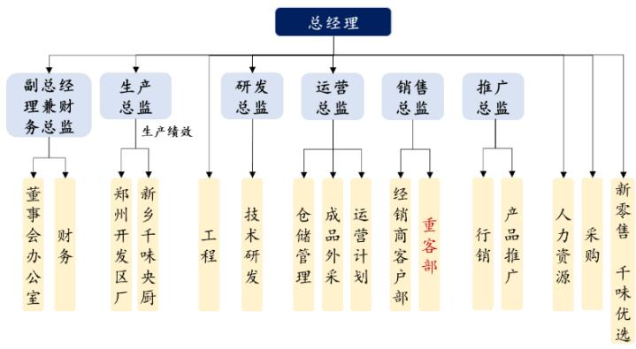  
图表34：公司组织架构  
资料来源：公司公告，华泰研究

存量大客户品牌背书，有效助力增量客户挖掘。直营渠道中，百胜中国的占比从 2017 年的超过 $70 \%$ 逐步降低至2021年的 $48 \%$ 。我们认为，公司通过长期合作百胜中国等优质大客户，在其更严苛的供货品质/效率/稳定性标准下更快炼就产品研发及供应链响应能力，并形成良好的口碑闭环，有望凭借大客户背书吸引更多客户创造业绩增量。目前公司已陆续成为肯德基、必胜客、海底捞、老乡鸡、瑞幸咖啡、真功夫等知名大品牌的供应商（从各主要客户的贡献来看，2021 年老乡鸡和海底捞的增速均超过 $200 \%$ ，收入贡献与日俱增)，此外 2018 年公司同沃尔玛达成战略合作协议，2020 年通过外卖油条切入曼玲粥铺的供应链体系，2021 年公司对瑞幸咖啡的销售收入在合作首年达 762.9 万元，2022 年通过龙虾卷等新品进入盒马体系，有望树立新零售渠道的客户标杆，增量客户挖掘有序推进。

千味央廚 (001215 CH)

  
图表35：公司直营模式中百胜中国以外客户收入占比快速提高  
资料来源：公司公告，华泰研究

  
图表36：公司主要直营客户  
资料来源：公司公告，华泰研究

# 经销渠道：强化体系建设，助力中小客户挖掘

经销渠道 $+$ 通用品更适合中小客户开拓，直营模式下的能力积淀将有效赋能经销渠道拓张。我们认为，针对餐饮市场相对分散的长尾客户，强调点对点个性化配套服务的直营定制模式将不再具备规模优势，经销渠道 $+$ 通用品的模式渗透效率或更高。公司长期深耕大客户，直面大客户更加严苛的供应需求，形成强大的研发及供应链能力，同时在与大客户的深度合作中形成了对终端消费需求的精准理解及快速落地能力，这一能力或将对中小客户形成有效赋能，大客户品牌背书下中小客户开拓空间广阔。

强化经销商体系建设，中小客户开拓空间广阔。公司近年来积极加大经销渠道布局，经销商数量由 2017 年的 521 家增长至 2021 年的 968 家，其中年销售规模在 100 万元以上的经销商构成公司经销收入的中流砥柱，数量增长相对稳定，忠诚度亦更高，2020 年合计占据了 $70 \%$ 的经销收入。组织架构方面，公司经销客户部在全国设大区经理、省区经理，常驻相应的销售区域，统筹布局区域内的销售规划，短期让利促进经销商渠道扩张。

优化经销模式，打造销售铁军。尼尔森数据显示，2018 年县乡级市场占冻品市场的比例达$34 \%$ ，公司加码深度分销、渠道下沉以进攻县乡市场。2019 年4 月起，公司组建强大的深度分销团队，从“黄埔军校”培训到破冰行动、“尖刀行动”，帮助经销商深耕下沉渠道。2021 年加大经销商开发力度，多维度赋能经销商，据公司公告，22H1 前 20 的经销商销售额同比增长 $6 0 . 4 3 \%$ （经销渠道整体同比增长 $2 7 . 4 1 \%$ )，核心经销商稳健放量。

  
图表37：公司不同年销售额经销商数量（单位：家）  
资料来源：招股说明书，华泰研究

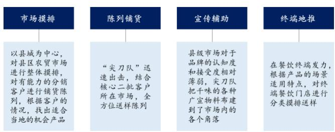  
图表38：公司“尖刀行动”四大举措  
资料来源：公司微信公众号，华泰研究

# 零售渠道：亮剑C端，构建第二成长曲线

三大新品牌亮相，BC融合或将塑造公司第二成长曲线。面向消费者需求的新品牌和新产品，或为速冻食品企业破局C 端的必经之路。公司在 2022 年组建零售事业群，锁定Y世代和Z世代主力消费群体，利用研发、生产和品牌优势，推出三大全新的C端年轻化品牌：“岑夫子”、“千味解忧炸货铺”和“纳百味”，街边便利店/区域型商超、京东等线上电商、新零售渠道三路并进。依托三大产品系列上市，公司将开启C端新的增长周期。

1）岑夫子：聚焦地方特色美食，打造舌尖上的传承与创新。岑夫子在继承传统的同时进行跨界组合、年轻化创新。首款新品“靓汤云吞”是传统特色云吞与经典广式靓汤等的创意组合。汤底由中国非遗技艺传承人亲自指导，口感纯正、香浓地道，区别于市场上一般的浓缩汤包，目前主要有老母鸡汤、菌菇汤、豚骨汤和泰式冬阴功汤四大汤底。云吞选用福建扁肉和肉燕，同样采取四代传承的非遗技艺，致力于打造皮薄爽滑的体验和堂食的口感。

2）炸货铺：顺应懒宅经济，发力打造空气炸锅美食。据头豹研究院，中国家用空气炸锅的市场规模由 2017 年的 2.3 亿元迅速提升至 2021 年的 44.1 亿元，期间 CAGR 为 $1 0 8 . 8 \%$ o结合公司自身烤炸产品的优势，“千味解忧炸货铺”瞄准火爆的空气炸锅场景，推出了小龙虾芝士大挞、一口酥小蛋挞、新疆风味孜然羊肉烤包子、新疆风味黑椒牛肉烤包子、菌菇鸡肉笋丁脆脆卷等七大产品。经过对空气炸锅温区范围和加热特性的研究测试，公司研发出“空炸5S预制技术”，从“色、香、味、形、器”5个维度解析美食数据，打磨配方及工艺，全面还原堂食级标准美味。

3）纳百味：回归烟火气，提升日常消费需求。第三大品牌纳百味定位为年轻人的烟火美食市集，以能量早餐、怡情夜宵、火锅聚餐、日常主食为主要场景。产品主要来自公司B端高性价比优势产品向小包装的转化，涵盖小吃类、火锅类、休闲类和米面主食等多个品种，后期将增强产品的创新能力，突出自身特色，带动生活化消费需求增长。

# 产能：募投落地，支撑供给

产能建设稳步推进，销量支撑下产销率维持高位。19/20 年公司新乡千味食品加工建设项目一期和二期相继投产，公司产能不断提高，至 2021 年全产品线设计产能已达 14.2 万吨/年，对应18-21年产能CAGR为 $22 \%$ 。从产能利用率的角度而言，剔除2020 年新冠疫情带来的开工率不足导致上半年产量下降的影响，公司近年来销量持续良性增长支撑公司产销率及产能利用率保持高位(2021 年产能利用率较 2020 年小幅回升至 $70 \%$ )。

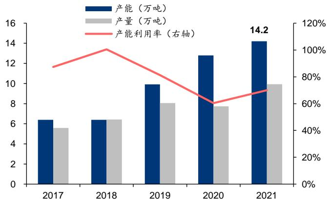  
图表39：千味央厨产能、产量及产能利用率情况  
资料来源：公司公告，华泰研究

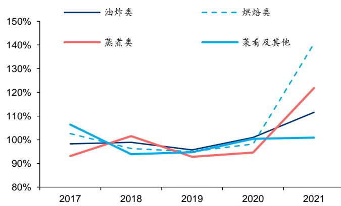  
图表40：千味央厨分板块产销率

注：2021年公司分板块产销率超过 $100 \%$ ，系存在部分外采导致；资料来源：公司公告，华泰研究

募集资金助力产能扩张，释放规模效应。公司拟将首次公开发行募集资金中的 8.9 亿元用于食品加工和研发中心建设，新增募投项目全部建成后公司总产能将增加到 24.6 万吨（据招股书预告)。据公司三季报业绩说明会，安徽芜湖工厂于2022 年6 月启动，产能5万吨；河南新乡的三期项目预计于2023 年 8-9 月份投产，产能 8 万吨以上。我们认为，产能建设的持续推进将为供给端提供保障，保证生产的稳定性，同时为公司的全国化扩张及产品线的丰富奠定坚实的基础。此外，产能提升将进一步增厚公司规模化生产能力，提升上下游议价能力，更充分地享受规模效应之红利、提振公司利润。

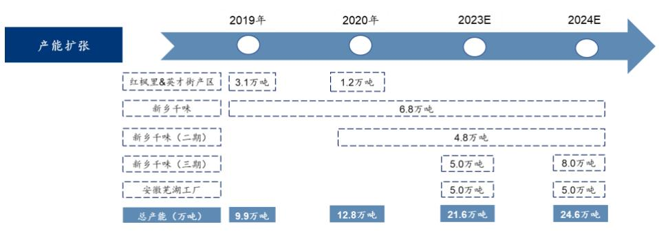  
图表41：千味央厨产能扩张历程  
注：千味央厨的合计产能值未计算将停产的产能；资料来源：公司公告，华泰研究

# 盈利预测与估值

展望未来，短看需求回暖公司经营势能向上，长看坚实壁垒下公司错位竞争带来的成长空间仍广，直营定制先行的战略背景下，公司先发优势有望凸显，销量有望成为驱动公司业绩增长的核心动能。

# 收入预测：

1）油炸类：公司核心单品油条竞争优势明显，后续有望持续渗透：产品端，我们看好公司依托现有产品进行场景化研究，继续丰富油条品类消费场景，并以油条明星产品为锚进一步丰富油炸类产品线；渠道端，公司深挖存量大客户，并依托大客户的灯塔效应，积极赋能经销商、加速挖掘增量中小客户，预计 22-24 年实现营收 8.0/9.8/11.6 亿，同比$+ 2 1 \% / + 2 3 \% / + 1 9 \%$ 。

2）蒸煮类：蒸煮类产品主要包括大单品蒸煎饺及猪猪包、鸡宝宝卡通包等面点产品，考虑蒸煎饺主要契合的团餐与乡厨场景在 2022 年疫情之下受损较为严重，使得 2022 年蒸煮类产品收入同比增速较 2021 年有所下滑，但 23-24 年预计仍将受益于公司产品品类扩容、直营客户深挖、经销渠道下沉与扩展之下带来的红利，持续抢占空白市场，享受高成长。我们预计22-24年实现营收 $2 . 9 / 3 . 4 / 4 . 0$ 亿，同比 $+ 1 3 \% / + 1 8 \% / + 1 7 \%$ 。

3）烘焙类：主要包括蛋挞皮、冷冻华夫面团等，后续餐饮客户开拓空间仍存，公司有望持续增加投入，预计22-24 年实现营收 $2 . 5 / 3 . 1 / 3 . 7$ 亿，同比 $+ 1 2 \% / + 2 2 \% / + 2 1 \%$ e

4）莱肴及其他主营业务：考虑到公司预制菜肴类业务营收基数较低，且行业尚处于早期的消费者培育阶段，预计22-24 年实现营收 $1 . 9 / 2 . 8 / 3 . 8 $ 亿，同比 $+ 4 3 \% / + 4 8 \% / + 3 9 \%$ o

图表42：千味央厨收入预测(单位：百万元)  

<table><tr><td></td><td>2019</td><td>2020</td><td>2021</td><td>2022E</td><td>2023E</td><td>2024E</td></tr><tr><td>总收入</td><td>889.3</td><td>944.4</td><td>1,273.9</td><td>1,525.2</td><td>1,902.0</td><td>2,313.1</td></tr><tr><td>YOY</td><td>27%</td><td>6%</td><td>34.9%</td><td>19.7%</td><td>24.7%</td><td>21.6%</td></tr><tr><td>油炸类</td><td>491.8</td><td>521.5</td><td>660.5</td><td>796.5</td><td>976.6</td><td>1,158.2</td></tr><tr><td>YOY</td><td>22.2%</td><td>6.0%</td><td>26.7%</td><td>20.6%</td><td>22.6%</td><td>18.6%</td></tr><tr><td>蒸煮类</td><td>197.7</td><td>183.6</td><td>255.5</td><td>287.4</td><td>339.2</td><td>396.8</td></tr><tr><td>YOY</td><td>29.3%</td><td>-7.2%</td><td>39.2%</td><td>12.5%</td><td>18.0%</td><td>17.0%</td></tr><tr><td>烘焙类</td><td>176.7</td><td>187.5</td><td>223.4</td><td>250.6</td><td>305.8</td><td>370.0</td></tr><tr><td>YOY</td><td>30.3%</td><td>6.1%</td><td>19.1%</td><td>12.2%</td><td>22.0%</td><td>21.0%</td></tr><tr><td>莱肴及其他主营业务</td><td>22.4</td><td>49.7</td><td>130.2</td><td>186.3</td><td>276.1</td><td>383.8</td></tr><tr><td>YOY</td><td>124.5%</td><td>121.7%</td><td>162.1%</td><td>43.1%</td><td>48.2%</td><td>39.0%</td></tr><tr><td>其他业务</td><td>0.7</td><td>2.1</td><td>4.3</td><td>4.3</td><td>4.3</td><td>4.3</td></tr><tr><td>YOY</td><td>84.0%</td><td>228.7%</td><td>101.7%</td><td>0.0%</td><td>0.0%</td><td>0.0%</td></tr></table>

资料来源：Wind，华泰研究预测

# 毛利率预测：

考虑油脂价格在22H1呈现明显上涨态势，今年以来面粉价格处于相对高位，我们预计2022年公司毛利率水平将小幅回落，但公司采取提价与锁价措施积极应对，且公司大B 端定价模式主要为成本加成，我们预计公司毛利率水平下滑幅度不大。展望未来，随着公司销售收入扩张及产能利用率的提升，规模效应有望进一步彰显，带动公司整体毛利率稳中有升。

1）油炸类：公司锁价或难以覆盖全部的油脂成本上涨，我们预计2022 年油条等油炸类产品毛利率同比-1.0pct 至 $1 9 . 7 \%$ ，考虑公司油炸类业务已初具规模，且主要面向百胜中国/海底捞等大型餐饮连锁店供货，预计23-24年毛利率有望小幅回升。

2）蒸煮类/烘焙类：考虑2022 年原料价格上涨带来的成本压力，我们预计蒸煮类及烘焙类业务的毛利率都将出现小幅下滑，23-24 年预计毛利率有望实现稳中有升。

3）莱肴类及其他业务：目前公司菜肴类业务尚处于培育期，成本压力整体可控，伴随产品优化升级，预计22-24 年毛利率为 $2 3 . 3 \% / 2 4 . 2 \% / 2 4 . 3 \%$ 。

图表43：千味央厨毛利率预测  

<table><tr><td></td><td>2019</td><td>2020</td><td>2021</td><td>2022E</td><td>2023E</td><td>2024E</td></tr><tr><td>毛利率</td><td>24.5%</td><td>21.7%</td><td>22.4%</td><td>21.7%</td><td>22.4%</td><td>22.5%</td></tr><tr><td>油炸类</td><td>22.7%</td><td>20.2%</td><td>20.7%</td><td>19.7%</td><td>20.5%</td><td>20.5%</td></tr><tr><td>蒸煮类</td><td>34.7%</td><td>24.5%</td><td>23.4%</td><td>22.7%</td><td>23.1%</td><td>23.1%</td></tr><tr><td>烘焙类</td><td>18.0%</td><td>22.9%</td><td>25.0%</td><td>24.6%</td><td>25.0%</td><td>25.1%</td></tr><tr><td>莱肴及其他主营业务</td><td>23.0%</td><td>19.3%</td><td>21.6%</td><td>23.3%</td><td>24.2%</td><td>24.3%</td></tr><tr><td>其他业务</td><td>87.5%</td><td>98.4%</td><td>98.1%</td><td>98.1%</td><td>98.1%</td><td>98.1%</td></tr></table>

资料来源：Wind，华泰研究预测

综上，我们预计 22-24 年营收为 $1 5 . 3 / 1 9 . 0 / 2 3 . 1$ 亿，同比 $+ 1 9 . 7 \% / + 2 4 . 7 \% / + 2 1 . 6 \%$ ，归母净利润为 $0 . 9 / 1 . 3 / 1 . 7$ 亿，同比 $+ 7 . 1 \% / + 3 4 . 6 \% / + 3 5 . 7 \%$ ，净利率 $6 . 1 \% / 6 . 6 \% / 7 . 4 \%$ ，剔除激励费用后，归母净利 $1 . 2 / 1 . 5 / 1 . 8 $ 亿，同比 $+ 2 9 . 7 \% / + 2 7 . 9 \% / + 2 2 . 2 \%$ ，净利率 $7 . 6 \% / 7 . 8 \% / 7 . 8 \%$ 。

图表44：归母净利润预测明细(单位：百万元)  

<table><tr><td></td><td>2019</td><td>2020</td><td>2021</td><td>2022E</td><td>2023E</td><td>2024E</td></tr><tr><td>归母净利润（表观）</td><td>74.1</td><td>76.6</td><td>88.5</td><td>94.8</td><td>127.6</td><td>173.1</td></tr><tr><td>净利率</td><td>8.3%</td><td>8.1%</td><td>6.9%</td><td>6.1%</td><td>6.6%</td><td>7.4%</td></tr><tr><td>同比</td><td>26.3%</td><td>3.3%</td><td>15.5%</td><td>7.1%</td><td>34.6%</td><td>35.7%</td></tr><tr><td>归母净利润（剔除激励费用）</td><td>74.1</td><td>76.6</td><td>89.4</td><td>115.9</td><td>148.2</td><td>181.2</td></tr><tr><td>净利率</td><td>8.3%</td><td>8.1%</td><td>7.0%</td><td>7.6%</td><td>7.8%</td><td>7.8%</td></tr><tr><td>同比</td><td>26.3%</td><td>3.3%</td><td>16.7%</td><td>29.7%</td><td>27.9%</td><td>22.2%</td></tr></table>

注：据公司公告，22-24年激励费用分别为2119/2063/810万元；资料来源：Wind，公司公告，华泰研究预测

不同于发展更为成熟的速冻米面（三全食品主营）及速冻火锅料（安井食品主营）赛道，我们认为千味央厨主营的餐饮端速冻米面及新式米面赛道高增机会值得关注。对比同处于高速成长阶段的冷冻烘焙行业代表企业立高食品、预制菜行业代表企业味知香，未来三年公司利润端的成长性更优(千味央厨/立高食品/味知香22-24年净利CAGR为 $2 5 \% / 3 \% / 1 3 \%$ ,千味央厨净利 CAGR 为华泰研究预测，立高食品与味知香盈利预测采用 Wind 一致预期)。我们认为，公司通过错位竞争占据优势赛道，直营定制先行汇聚发展势能，未来顺势加大品类导入，随着渠道精耕和产能建设持续发力，我们看好公司未来成长空间，预计22-24年 EPS 分别为 1.09/1.47/2.00 元，参考可比公司 23 年 PE 均值 41x(Wind 一致预期)，因其22-24年净利CAGR $2 5 \%$ ）高于可比公司均值 $14 \%$ )，公司质地优秀，经营势能向上，认可估值溢价，给予其23 年 54xPE，目标价 79.53 元，首次覆盖给予“买入”评级。

图表45：可比公司估值表  

<table><tr><td colspan="3">市值(mn)</td><td colspan="4">PE(倍)</td><td colspan="4">EPS(元)</td><td rowspan="2">22-24净利</td></tr><tr><td>公司简称</td><td>股票代码</td><td>2022/12/27</td><td>21A</td><td>22E</td><td>23E</td><td>24E</td><td>21A</td><td>22E</td><td>23E</td><td>24E CAGR</td></tr><tr><td>安井食品</td><td>603345CH</td><td>48165</td><td>58</td><td>47</td><td>37</td><td>29</td><td>2.84</td><td>3.53</td><td>4.54</td><td>5.69</td><td>25%</td></tr><tr><td>立高食品</td><td>300973CH</td><td>15578</td><td>52</td><td>90</td><td>52</td><td>37</td><td>1.82</td><td>1.04</td><td>1.82</td><td>2.54</td><td>3%</td></tr><tr><td>味知香</td><td>605089CH</td><td>6750</td><td>47</td><td>45</td><td>35</td><td>28</td><td>1.45</td><td>1.50</td><td>1.91</td><td>2.38</td><td>13%</td></tr><tr><td>平均值</td><td></td><td>23497</td><td>52</td><td>61</td><td>41</td><td>32</td><td>2.04</td><td>2.02</td><td>2.76</td><td>3.54</td><td>14%</td></tr><tr><td>中间值</td><td></td><td>15578</td><td>52</td><td>47</td><td>37</td><td>29</td><td>1.82</td><td>1.50</td><td>1.91</td><td>2.54</td><td>13%</td></tr><tr><td>千味央廚</td><td>001215 CH</td><td>5372</td><td>62</td><td>57</td><td>43</td><td>31</td><td>1.02</td><td>1.09</td><td>1.47</td><td>2.00</td><td>25%</td></tr></table>

注：可比公司盈利预测采用Wind一致预期；资料来源：Wind，华泰研究预测

# 风险提示

行业竞争加剧。近年来餐饮供应链广阔市场吸引众多企业竞相布局，若由此导致餐饮端速冻米面制品行业竞争加剧，公司或将面临更加激烈的市场竞争，进而影响公司业绩。

大客户依赖风险。2021 年公司第一大客户百胜中国销售额占公司营收比重达 $1 9 \%$ ，若百胜中国减少与公司的合作或其经营遭遇重大危机，公司经营业绩将遭受较大影响。

渠道开拓不及预期。公司以存量大客户灯塔效应为引领，加快增量客户开拓，如若客户开拓进展不及预期，将对业绩增长形成压力。

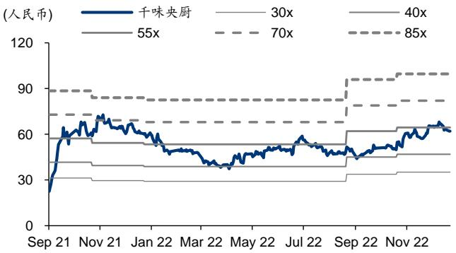  
图表46：千味央厨PE-Bands  
资料来源：Wind、华泰研究

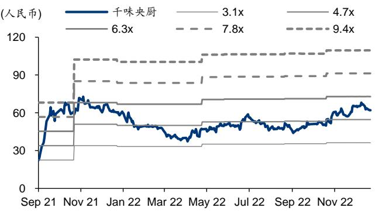  
图表47：千味央廚PB-Bands  
资料来源：Wind、华泰研究

# 盈利预测

资产负债表  

<table><tr><td>会计年度 (人民币百万)</td><td>2020</td><td>2021</td><td>2022E</td><td>2023E</td><td>2024E</td></tr><tr><td>流动资产</td><td>333.13</td><td>593.43</td><td>655.21</td><td>661.45</td><td>781.10</td></tr><tr><td>现金</td><td>117.41</td><td>332.10</td><td>358.78</td><td>277.63</td><td>348.41</td></tr><tr><td>应收账款</td><td>52.25</td><td>62.25</td><td>74.84</td><td>96.11</td><td>111.79</td></tr><tr><td>其他应收账款</td><td>6.98</td><td>8.34</td><td>10.00</td><td>12.87</td><td>14.95</td></tr><tr><td>预付账款</td><td>10.88</td><td>4.88</td><td>13.98</td><td>9.54</td><td>19.07</td></tr><tr><td>存货</td><td>116.17</td><td>162.07</td><td>173.81</td><td>241.50</td><td>263.10</td></tr><tr><td>其他流动资产</td><td>29.45</td><td>23.79</td><td>23.79</td><td>23.79</td><td>23.79</td></tr><tr><td>非流动资产</td><td>622.45</td><td>747.47</td><td>840.69</td><td>980.39</td><td>1,125</td></tr><tr><td>长期投资</td><td>0.00</td><td>0.00</td><td>0.00</td><td>0.00</td><td>0.00</td></tr><tr><td>固定投资</td><td>542.52</td><td>606.16</td><td>701.62</td><td>845.23</td><td>992.77</td></tr><tr><td>无形资产</td><td>39.24</td><td>38.27</td><td>44.61</td><td>45.44</td><td>46.67</td></tr><tr><td>其他非流动资产</td><td>40.70</td><td>103.04</td><td>94.46</td><td>89.72</td><td>85.47</td></tr><tr><td>资产总计</td><td>955.58</td><td>1,341</td><td>1,496</td><td>1,642</td><td>1,906</td></tr><tr><td>流动负债</td><td>304.55</td><td>326.38</td><td>430.24</td><td>491.75</td><td>627.82</td></tr><tr><td>短期借款</td><td>15.00</td><td>15.00</td><td>15.00</td><td>15.00</td><td>15.00</td></tr><tr><td>应付账款</td><td>141.80</td><td>143.74</td><td>200.96</td><td>225.26</td><td>292.60</td></tr><tr><td>其他流动负债</td><td>147.74</td><td>167.64</td><td>214.28</td><td>251.49</td><td>320.22</td></tr><tr><td>非流动负债</td><td>68.69</td><td>61.32</td><td>57.99</td><td>55.57</td><td>51.96</td></tr><tr><td>长期借款</td><td>54.77</td><td>35.00</td><td>31.67</td><td>29.25</td><td>25.64</td></tr><tr><td>其他非流动负债</td><td>13.92</td><td>26.32</td><td>26.32</td><td>26.32</td><td>26.32</td></tr><tr><td>负债合计</td><td>373.24</td><td>387.70</td><td>488.23</td><td>547.32</td><td>679.78</td></tr><tr><td>少数股东权益</td><td>(0.02)</td><td>(0.50)</td><td>(1.81)</td><td>(3.59)</td><td>(6.00)</td></tr><tr><td>股本</td><td>63.82</td><td>86.63</td><td>86.64</td><td>86.64</td><td>86.64</td></tr><tr><td>资本公积</td><td>238.62</td><td>546.17</td><td>546.17</td><td>546.17</td><td>546.17</td></tr><tr><td>留存公积</td><td>279.91</td><td>368.22</td><td>420.49</td><td>490.87</td><td>586.34</td></tr><tr><td>归属母公司股东权益</td><td>582.35</td><td>953.69</td><td>1,009</td><td>1,098</td><td>1,232</td></tr><tr><td>负债和股东权益</td><td>955.58</td><td>1,341</td><td>1,496</td><td>1,642</td><td>1,906</td></tr></table>

现金流量表  

<table><tr><td>会计年度 (人民币百万)</td><td>2020</td><td>2021</td><td>2022E</td><td>2023E</td><td>2024E</td></tr><tr><td>经营活动现金</td><td>97.76</td><td>98.44</td><td>221.13</td><td>166.07</td><td>337.60</td></tr><tr><td>净利润</td><td>76.57</td><td>87.23</td><td>93.45</td><td>125.83</td><td>170.70</td></tr><tr><td>折旧摊销</td><td>33.98</td><td>51.74</td><td>47.94</td><td>59.30</td><td>73.18</td></tr><tr><td>财务费用</td><td>3.40</td><td>4.83</td><td>8.95</td><td>8.54</td><td>8.30</td></tr><tr><td>投资损失</td><td>0.00</td><td>0.00</td><td>0.00</td><td>0.00</td><td>0.00</td></tr><tr><td>营运资金变动</td><td>(28.25)</td><td>(51.29)</td><td>71.33</td><td>(27.03)</td><td>86.04</td></tr><tr><td>其他经营现金</td><td>12.06</td><td>5.93</td><td>(0.53)</td><td>(0.58)</td><td>(0.63)</td></tr><tr><td>投资活动现金</td><td>(94.59)</td><td>(182.86)</td><td>(140.81)</td><td>(198.64)</td><td>(217.34)</td></tr><tr><td>资本支出</td><td>(95.63)</td><td>(183.29)</td><td>(138.07)</td><td>(195.14)</td><td>(212.84)</td></tr><tr><td>长期投资</td><td>0.00</td><td>0.00</td><td>0.00</td><td>0.00</td><td>0.00</td></tr><tr><td>其他投资现金</td><td>1.04</td><td>0.44</td><td>(2.74)</td><td>(3.50)</td><td>(4.50)</td></tr><tr><td>筹资活动现金</td><td>35.21</td><td>299.08</td><td>(53.64)</td><td>(48.57)</td><td>(49.48)</td></tr><tr><td>短期借款</td><td>(15.00)</td><td>0.00</td><td>0.00</td><td>0.00</td><td>0.00</td></tr><tr><td>长期借款</td><td>54.77</td><td>(19.77)</td><td>(3.33)</td><td>(2.42)</td><td>(3.61)</td></tr><tr><td>普通股增加</td><td>6.55</td><td>22.81</td><td>0.01</td><td>0.00</td><td>0.00</td></tr><tr><td>资本公积增加</td><td>93.45</td><td>307.55</td><td>0.00</td><td>0.00</td><td>0.00</td></tr><tr><td>其他筹资现金</td><td>(104.56)</td><td>(11.50)</td><td>(50.32)</td><td>(46.15)</td><td>(45.87)</td></tr><tr><td>现金净增加额</td><td>38.38</td><td>214.66</td><td>26.69</td><td>(81.15)</td><td>70.78</td></tr></table>

资料来源：公司公告、华泰研究预测

利润表  

<table><tr><td>会计年度 (人民币百万)</td><td>2020</td><td>2021</td><td>2022E</td><td>2023E</td><td>2024E</td></tr><tr><td>营业收入</td><td>944.37</td><td>1,274</td><td>1,525</td><td>1,902</td><td>2,313</td></tr><tr><td>营业成本</td><td>739.33</td><td>989.05</td><td>1,194</td><td>1,476</td><td>1,794</td></tr><tr><td>营业税金及附加</td><td>8.92</td><td>11.61</td><td>13.91</td><td>17.34</td><td>21.09</td></tr><tr><td>营业费用</td><td>31.02</td><td>42.42</td><td>46.98</td><td>62.39</td><td>73.56</td></tr><tr><td>管理费用</td><td>79.23</td><td>107.39</td><td>149.93</td><td>185.06</td><td>206.55</td></tr><tr><td>财务费用</td><td>3.40</td><td>4.83</td><td>8.95</td><td>8.54</td><td>8.30</td></tr><tr><td>资产减值损失</td><td>0.00</td><td>0.00</td><td>0.00</td><td>0.00</td><td>0.00</td></tr><tr><td>公允价值变动收益</td><td>(0.93)</td><td>0.36</td><td>0.36</td><td>0.36</td><td>0.36</td></tr><tr><td>投资净收益</td><td>0.00</td><td>0.00</td><td>0.00</td><td>0.00</td><td>0.00</td></tr><tr><td>营业利润</td><td>100.01</td><td>111.54</td><td>116.02</td><td>158.10</td><td>217.05</td></tr><tr><td>营业外收入</td><td>2.18</td><td>2.60</td><td>6.40</td><td>6.40</td><td>5.74</td></tr><tr><td>营业外支出</td><td>2.07</td><td>0.79</td><td>1.00</td><td>1.00</td><td>1.00</td></tr><tr><td>利润总额</td><td>100.13</td><td>113.35</td><td>121.42</td><td>163.50</td><td>221.79</td></tr><tr><td>所得税</td><td>23.55</td><td>26.11</td><td>27.97</td><td>37.67</td><td>51.10</td></tr><tr><td>净利润</td><td>76.57</td><td>87.23</td><td>93.45</td><td>125.83</td><td>170.70</td></tr><tr><td>少数股东损益</td><td>(0.02)</td><td>(1.23)</td><td>(1.32)</td><td>(1.77)</td><td>(2.41)</td></tr><tr><td>归属母公司净利润</td><td>76.59</td><td>88.46</td><td>94.77</td><td>127.61</td><td>173.10</td></tr><tr><td>EBITDA</td><td>137.42</td><td>169.76</td><td>178.13</td><td>231.10</td><td>302.99</td></tr><tr><td>EPS(人民币，基本)</td><td>1.24</td><td>1.25</td><td>1.09</td><td>1.47</td><td>2.00</td></tr></table>

主要财务比率  

<table><tr><td>会计年度 (%)</td><td>2020</td><td>2021</td><td>2022E</td><td>2023E</td><td>2024E</td></tr><tr><td>成长能力</td><td></td><td></td><td></td><td></td><td></td></tr><tr><td>营业收入</td><td>6.20</td><td>34.89</td><td>19.73</td><td>24.70</td><td>21.61</td></tr><tr><td>营业利润</td><td>1.61</td><td>11.53</td><td>4.02</td><td>36.26</td><td>37.29</td></tr><tr><td>归属母公司净利润</td><td>3.33</td><td>15.51</td><td>7.13</td><td>34.65</td><td>35.65</td></tr><tr><td>获利能力 (%)</td><td></td><td></td><td></td><td></td><td></td></tr><tr><td>毛利率</td><td>21.71</td><td>22.36</td><td>21.72</td><td>22.38</td><td>22.45</td></tr><tr><td>净利率</td><td>8.11</td><td>6.85</td><td>6.13</td><td>6.62</td><td>7.38</td></tr><tr><td>ROE</td><td>13.15</td><td>9.15</td><td>9.27</td><td>11.50</td><td>13.92</td></tr><tr><td>ROIC</td><td>14.83</td><td>13.65</td><td>14.55</td><td>15.42</td><td>19.26</td></tr><tr><td>偿债能力</td><td></td><td></td><td></td><td></td><td></td></tr><tr><td>资产负债率 (%)</td><td>39.06</td><td>28.91</td><td>32.64</td><td>33.34</td><td>35.67</td></tr><tr><td>净负债比率 (%)</td><td>(7.50)</td><td>(28.51)</td><td>(30.19)</td><td>(20.47)</td><td>(24.23)</td></tr><tr><td>流动比率</td><td>1.09</td><td>1.82</td><td>1.52</td><td>1.35</td><td>1.24</td></tr><tr><td>速动比率</td><td>0.58</td><td>1.23</td><td>1.03</td><td>0.79</td><td>0.76</td></tr><tr><td>营运能力</td><td></td><td></td><td></td><td></td><td></td></tr><tr><td>总资产周转率</td><td>1.05</td><td>1.11</td><td>1.08</td><td>1.21</td><td>1.30</td></tr><tr><td>应收账款周转率</td><td>19.51</td><td>22.25</td><td>22.25</td><td>22.25</td><td>22.25</td></tr><tr><td>应付账款周转率</td><td>5.48</td><td>6.93</td><td>6.93</td><td>6.93</td><td>6.93</td></tr><tr><td>每股指标 (人民币)</td><td></td><td></td><td></td><td></td><td></td></tr><tr><td>每股收益(最新摊薄)</td><td>0.88</td><td>1.02</td><td>1.09</td><td>1.47</td><td>2.00</td></tr><tr><td>每股经营现金流(最新摊薄)</td><td>1.13</td><td>1.14</td><td>2.55</td><td>1.92</td><td>3.90</td></tr><tr><td>每股净资产(最新摊薄)</td><td>6.72</td><td>11.01</td><td>11.65</td><td>12.67</td><td>14.22</td></tr><tr><td>估值比率</td><td></td><td></td><td></td><td></td><td></td></tr><tr><td>PE(倍)</td><td>71.06</td><td>61.52</td><td>57.42</td><td>42.65</td><td>31.44</td></tr><tr><td>PB(倍)</td><td>9.34</td><td>5.71</td><td>5.39</td><td>4.96</td><td>4.42</td></tr><tr><td>EV EBITDA (倍)</td><td>39.28</td><td>30.45</td><td>28.83</td><td>22.56</td><td>16.96</td></tr></table>

# 免责声明

# 分析师声明

本人，龚源月、张墨，兹证明本报告所表达的观点准确地反映了分析师对标的证券或发行人的个人意见；彼以往、现在或未来并无就其研究报告所提供的具体建议或所表达的意见直接或间接收取任何报酬。

# 一般声明及披露

本报告由华泰证券股份有限公司（已具备中国证监会批准的证券投资咨询业务资格，以下简称“本公司”）制作。本报告所载资料是仅供接收人的严格保密资料。。本公司不因接收人收到  
本报告而视其为客户。

本报告基于本公司认为可靠的、已公开的信息编制，但本公司及其关联机构(以下统称为“华泰”)对该等信息的准确性及完整性不作任何保证。

本报告所载的意见、评估及预测仅反映报告发布当日的观点和判断。在不同时期，华泰可能会发出与本报告所载意见、评估及预测不一致的研究报告。同时，本报告所指的证券或投资标的的价格、价值及投资收入可能会波动。以往表现并不能指引未来，未来回报并不能得到保证，并存在损失本金的可能。华泰不保证本报告所含信息保持在最新状态。华泰对本报告所含信息可在不发出通知的情形下做出修改，投资者应当自行关注相应的更新或修改。

本公司不是 FINRA 的注册会员，其研究分析师亦没有注册为 FINRA 的研究分析师/不具有 FINRA 分析师的注册资格。

华泰力求报告内容客观、公正，但本报告所载的观点、结论和建议仅供参考，不构成购买或出售所述证券的要约或招揽。该等观点、建议并未考虑到个别投资者的具体投资目的、财务状况以及特定需求，在任何时候均不构成对客户私人投资建议。投资者应当充分考虑自身特定状况，并完整理解和使用本报告内容，不应视本报告为做出投资决策的唯一因素。对依据或者使用本报告所造成的一切后果，华泰及作者均不承担任何法律责任。任何形式的分享证券投资收益或者分担证券投资损失的书面或口头承诺均为无效。

除非另行说明，本报告中所引用的关于业绩的数据代表过往表现，过往的业绩表现不应作为日后回报的预示。华泰不承诺也不保证任何预示的回报会得以实现，分析中所做的预测可能是基于相应的假设，任何假设的变化可能会显著影响所预测的回报。

华泰及作者在自身所知情的范围内，与本报告所指的证券或投资标的不存在法律禁止的利害关系。在法律许可的情况下，华泰可能会持有报告中提到的公司所发行的证券头寸并进行交易，为该公司提供投资银行、财务顾问或者金融产品等相关服务或向该公司招揽业务。

华泰的销售人员、交易人员或其他专业人士可能会依据不同假设和标准、采用不同的分析方法而口头或书面发表与本报告意见及建议不一致的市场评论和/或交易观点。华泰没有将此意见及建议向报告所有接收者进行更新的义务。华泰的资产管理部门、自营部门以及其他投资业务部门可能独立做出与本报告中的意见或建议不一致的投资决策。投资者应当考虑到华泰及/或其相关人员可能存在影响本报告观点客观性的潜在利益冲突。投资者请勿将本报告视为投资或其他决定的唯一信赖依据。有关该方面的具体披露请参照本报告尾部。

本报告并非意图发送、发布给在当地法律或监管规则下不允许向其发送、发布的机构或人员，也并非意图发送、发布给因可得到、使用本报告的行为而使华泰违反或受制于当地法律或监管规则的机构或人员。

本报告版权仅为本公司所有。未经本公司书面许可，任何机构或个人不得以翻版、复制、发表、引用或再次分发他人(无论整份或部分)等任何形式侵犯本公司版权。如征得本公司同意进行引用、刊发的，需在允许的范围内使用，并需在使用前获取独立的法律意见，以确定该引用、刊发符合当地适用法规的要求，同时注明出处为“华泰证券研究所”，且不得对本报告进行任何有悖原意的引用、删节和修改。本公司保留追究相关责任的权利。所有本报告中使用的商标、服务标记及标记均为本公司的商标、服务标记及标记。

# 中国香港

本报告由华泰证券股份有限公司制作，在香港由华泰金融控股（香港）有限公司向符合《证券及期货条例》及其附属法律规定的机构投资者和专业投资者的客户进行分发。华泰金融控股（香港）有限公司受香港证券及期货事务监察委员会监管，是华泰国际金融控股有限公司的全资子公司，后者为华泰证券股份有限公司的全资子公司。在香港获得本报告的人员若有任何有关本报告的问题，请与华泰金融控股（香港）有限公司联系。

千味央廚 (001215 CH)

# 香港-重要监管披露

● 华泰金融控股（香港）有限公司的雇员或其关联人士没有担任本报告中提及的公司或发行人的高级人员。●有关重要的披露信息，请参华泰金融控股（香港）有限公司的网页 https://www.htsc.com.hk/stock_disclosure其他信息请参见下方“美国-重要监管披露”。

# 美国

在美国本报告由华泰证券（美国)有限公司向符合美国监管规定的机构投资者进行发表与分发。华泰证券（美国)有限公司是美国注册经纪商和美国金融业监管局（FINRA）的注册会员。对于其在美国分发的研究报告，华泰证券（美国）有限公司根据《1934 年证券交易法》（修订版）第 15a-6 条规定以及美国证券交易委员会人员解释，对本研究报告内容负责。华泰证券（美国）有限公司联营公司的分析师不具有美国金融监管（FINRA）分析师的注册资格，可能不属于华泰证券（美国）有限公司的关联人员，因此可能不受FINRA关于分析师与标的公司沟通、公开露面和所持交易证券的限制。华泰证券（美国）有限公司是华泰国际金融控股有限公司的全资子公司，后者为华泰证券股份有限公司的全资子公司。任何直接从华泰证券（美国）有限公司收到此报告并希望就本报告所述任何证券进行交易的人士，应通过华泰证券（美国）有限公司进行交易。

# 美国-重要监管披露

● 分析师龚源月、张墨本人及相关人士并不担任本报告所提及的标的证券或发行人的高级人员、董事或顾问。分析师及相关人士与本报告所提及的标的证券或发行人并无任何相关财务利益。本披露中所提及的“相关人士”包括FINRA定义下分析师的家庭成员。分析师根据华泰证券的整体收入和盈利能力获得薪酬，包括源自公司投资银行业务的收入。华泰证券股份有限公司、其子公司和/或其联营公司，及/或不时会以自身或代理形式向客户出售及购买华泰证券研究所覆盖公司的证券/衍生工具，包括股票及债券（包括衍生品）华泰证券研究所覆盖公司的证券/衍生工具，包括股票及债券（包括衍生品)。华泰证券股份有限公司、其子公司和/或其联营公司，及/或其高级管理层、董事和雇员可能会持有本报告中所提到的任何证券（或任何相关投资）头寸，并可能不时进行增持或减持该证券（或投资)。因此，投资者应该意识到可能存在利益冲突。

# 评级说明

投资评级基于分析师对报告发布日后 6 至 12 个月内行业或公司回报潜力（含此期间的股息回报)相对基准表现的预期(A 股市场基准为沪深 300 指数，香港市场基准为恒生指数，美国市场基准为标普 500 指数)，具体如下：

# 行业评级

增持：预计行业股票指数超越基准 中性：预计行业股票指数基本与基准持平 减持：预计行业股票指数明显弱于基准

# 公司评级

买入：预计股价超越基准15%以上  
增持：预计股价超越基准5%\~15%  
持有：预计股价相对基准波动在-15%\~5%之间  
卖出：预计股价弱于基准15%以上  
暂停评级：已暂停评级、目标价及预测，以遵守适用法规及/或公司政策  
无评级：股票不在常规研究覆盖范围内。投资者不应期待华泰提供该等证券及/或公司相关的持续或补充信息

千味央廚 (001215 CH)

# 法律实体披露

中国：华泰证券股份有限公司具有中国证监会核准的“证券投资咨询”业务资格，经营许可证编号为：91320000704041011J香港：华泰金融控股（香港)有限公司具有香港证监会核准的“就证券提供意见”业务资格，经营许可证编号为：AOK809美国：华泰证券（美国)有限公司为美国金融业监管局（FINRA）成员，具有在美国开展经纪交易商业务的资格，经营业务许可编号为：CRD#:298809/SEC#:8-70231

# 华泰证券股份有限公司

南京  
南京市建邺区江东中路 228 号华泰证券广场1 号楼/邮政编码：210019  
电话：862583389999/传真：862583387521  
电子邮件：ht-rd@htsc.com  
北京  
北京市西城区太平桥大街丰盛胡同 28号太平洋保险大厦A座18层/  
邮政编码：100032  
电话：86 10 63211166/传真：86 10 63211275  
电子邮件：ht-rd@htsc.com  
深圳  
深圳市福田区益田路5999 号基金大厦10楼/邮政编码：518017  
电话：86755 82493932/传真：86755 82492062  
电子邮件：ht-rd@htsc.com  
上海  
上海市浦东新区东方路18号保利广场E栋23 楼/邮政编码：200120  
电话：86 2128972098/传真：86 2128972068  
电子邮件：ht-rd@htsc.com  
华泰金融控股（香港）有限公司  
香港中环皇后大道中99号中环中心58楼5808-12室  
电话：+852-3658-6000/传真：+852-2169-0770  
电子邮件：research@htsc.com  
http://www.htsc.com.hk  
华泰证券（美国）有限公司  
美国纽约公园大道280号21楼东（纽约10017)  
电话：+212-763-8160/传真：+917-725-9702  
电子邮件：Huatai@htsc-us.com  
http://www.htsc-us.com

$\circledcirc$ 版权所有2022年华泰证券股份有限公司