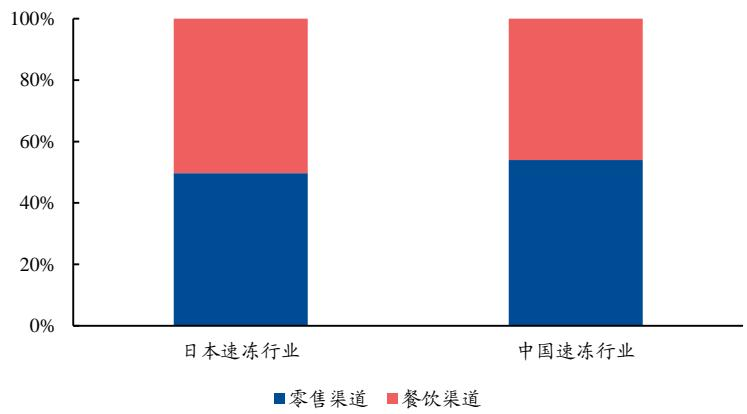
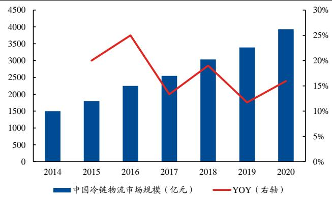

# 千味央廚001215.SZ“厨”之道，“央”泱食材，中有“千味”结

审慎增持 （首次）

2021年09月06日

# 投资要点

郑州起家的速冻面米餐饮供应链第一股。公司成立于2012 年，创始人为思念食品的创始人李伟。公司主要经营面向餐饮的速冻面米制品的研发、生产和销售。截止 2020 年，公司实现营收 9.44 亿元(过去 3 年 CAGR： $1 6 . 7 6 \%$ )，其中油炸类系列占比为 $5 5 . 2 2 \%$ ，公司整体毛利率为 $2 1 . 5 4 \%$ ，净利率为 $8 . 1 1 \%$ 。华东为公司大本营市场，收入占比达 $5 4 . 1 0 \%$ ，经销渠道收入占比达 $6 4 . 2 6 \%$ ，直销中前五大客户合计占比为 $3 1 . 1 3 \%$ 。

市场数据  

<table><tr><td>市场数据日期</td><td>2021-09-06</td></tr><tr><td>收盘价(元）</td><td>22.62</td></tr><tr><td>总股本(百万股)</td><td>85.10</td></tr><tr><td>流通股本(百万股)</td><td>21.28</td></tr><tr><td>总市值(百万元)</td><td>1925.06</td></tr><tr><td>流通市值(百万元)</td><td>481.35</td></tr><tr><td>净资产(百万元)</td><td>618.72</td></tr><tr><td>总资产(百万元)</td><td>1028.03</td></tr><tr><td>每股净资产</td><td>7.27</td></tr></table>

来源：WIND，兴业证券经济与金融研究院整理

# 供需协同驱动，速冻餐饮端仍有可为。

供给侧：冷链快速发展支撑供给提升。从规定看，速冻冷链运输的温度要求较高，为 $\boldsymbol { \cdot } 1 8 ^ { \circ } \mathrm { C }$ 。从运输看，19 年我国冷藏车保有量21.5万辆，过去4年CAGR为 $2 3 . 3 \%$ 。从仓储看，19年我国冷库容量6053万吨，过去4年CAGR为 $1 3 . 0 \%$ 。需求侧：餐饮发展带动多样化需求诞生。1）连锁化下的标准化食品供应。我国 19 年连锁化率 $1 3 . 3 \%$ ，美国为 $5 4 . 3 \%$ ，提升空间较大。2）团餐市场空间较大 $\underline { { \circ } } \quad 2 0 $ 年团餐市场占餐饮比重 $3 8 . 7 \%$ ，以学校、机关食堂为主。3）外卖拉动快速响应食材需求。我国餐饮外卖规模占餐饮比重 $1 6 . 8 \%$ ，用户规模达4.6亿人。4）乡厨为潜力市场。农村宴席每桌成本300-600元，每次约30-60 桌，食品安全意识提升趋势下，潜力较大。

# 公司看点：大客户合作稳定，先发 $\cdot ^ { + \cdot }$ 研发优势精耕ToB方向。

大客户粘性高，合作稳定。公司主要客户为餐饮企业，经销销售（20 年占比：$6 4 . 2 6 \%$ ，下同)以通用品为主，直营销售(占比： $3 5 . 7 4 \%$ ）以定制品为主。前五大客户占收入比为 $3 1 . 1 3 \%$ 。其中百胜中国为第一大直营客户，2018年公司为其旗下肯德基研发上新7支单品。  
以销定产为主，周转率领先同行。20 年公司存货周转率为 6.87 次，由于原材料存货占比提升，周转率略有下降，但仍显著高于同行。刨除疫情影响看19年公司 ROIC 为 $1 6 . 5 2 \%$ ，ROE为 $2 0 . 0 7 \%$ ，回报率较高。  
研发优势助力ToB 端精耕。公司为国内最早提供餐饮连锁速冻面米解决方案的企业，合作品牌矩阵较广。同时公司建立了模拟餐厅后厨的产品设计理念，开发上市速冻面米SKU350个 $^ +$ 。

募投项目：扩产提升规模效应，重研发夯实长期发展基础。公司IPO 募集资金用于新乡千味央厨食品加工建设项目三期（2.5 亿元）及总部基地及研发中心建设项目（3236.6 万元)，产能扩张有助于支撑公司的长期发展规划，提升规模效应，研发中心建设有利于夯实公司中长期竞争力，为份额的提升、利润的释放添砖加瓦。

盈利预测与投资建议：公司为速冻面米餐饮供应链第一股，直营大客户合作稳定，经销小B客户持续扩张，叠加以销定产带来的高周转、研发创新带来的高附加值，预计公司将实现收入的稳健提升，及利润的持续提升。我们预计公司2021-23年收入分别为13.3亿元（同比 $+ 4 1 . 1 \%$ ，下同）、16.7亿元 $( + 2 5 . 1 \%$ )21.0亿元 $( + 2 6 . 1 \%$ )，2021-23年归母净利润分别为0.89亿元( $+ 1 6 . 7 \%$ ),1.3亿元 $+ 4 6 . 2 \%$ )、1.8亿元 $\cdot + 3 8 . 7 \%$ )，对应2021年9月6日收盘价，2021-23年 PE 分别为 $2 2 x$ ， $1 5 x$ $1 1 x$ ，首次覆盖予以“审慎增持”评级，建议投资者积极关注。

风险提示：疫情反复、恢复不及预期，原材料价格上涨，行业竞争加剧，英才街 厂区搬迁对生产经营的影响

# 目录

1、大“千”世界，“味”道致胜 . - 4 -  
1.1、郑州起家的速冻餐饮供应链第一股 ….- 4 -  
1.2、思念系出身，民营控股. …-5 -  
2、行业空间：聚焦速冻面米ToB 高景气赛道 …-7 -  
2.1、速冻食品稳增，面米格局稳定，餐饮端仍有可为 …-7-  
2.2、供需协同驱动，速冻食品需求稳健扩容.. …- 9 -  
2.2.1、供给侧：冷链物流发展提供扩容基础 …-10 -  
2.2.2、需求侧：餐饮发展带动需求多样化诞生 .- 11 -  
3、公司看点：大客户合作稳定，“以销定产”周转率高. …- 14 -  
3.1、收入端：油炸、烘焙为主，扎根华东，营收稳健增长. …- 14 -  
3.2、利润端：盈利稳定成本可控，周转率领先同行.. -18 -  
3.3、渠道端：经销直营双管齐下，大客户粘性高.. …- 24-  
3.4、先发优势 $+$ 技术研发，精耕速冻面米ToB 领域 …- 27 -  
4、募投项目：产能扩张持续，规模效应提升可期.. …-28 -  
4.1、产能建设推动，满足公司增长需求. …-28 -  
4.2、拓展定制化服务，提升总部管理效率 …- 29 -  
5、盈利预测与投资建议， …- 29-  
6、风险提示. …- 30 -

图1、公司产品主要可分为四大系列， …- 5 -图2、发行前公司股权结构图.. ..- 6 -图3、速冻食品2014-2019 年规模CAGR为 $9 . 9 4 \ \%$ ： …-7 -图4、我国人均速冻消费量较发达国家还有较大提升空间. …- 7-图5、截止2020年，速冻面米食品占行业比重超过 $5 0 \%$ [] …- 8 -图6、2015-2019 年速冻面米CAGR为 $5 . 3 \%$ ： …- 8-图7、截止2019 年，速冻面米CR3 为 $6 4 \%$ . …- 8 -图8、水饺、汤圆合计占速冻面米比重超过 $5 0 \%$ [] -9 -图9、2019 年，速冻面米餐饮销售占比约 $1 6 \%$ . …- 9 -图10、截止2019 年，速冻面米CR3 不足 $3 0 \%$ . …-9 -图11、速冻行业产业链图 ….- 10 -图12、截止2019 年，我国速冻行业餐饮渠道占比约为 $4 6 \%$ …- 10 -图13、截止 2019 年，我国冷链物流规模为 3391亿元. .- 11 -图14、冷藏车保有量、冷库容量均保持双位以上年均复合增速增长. .- 11 -图15、截止2019 年，冷冻食品占冷链需求比重仅为 $5 . 5 \%$ ： .- 11 -图 16、疫情前我国餐饮行业收入规模稳步增长. .- 12 -图17、2014-2019 年连锁餐饮CAGR 低于餐饮行业 .- 12 -图18、我国餐饮连锁化率较美国还有较大提升空间. .- 12 -图19、团餐市场过去3年CAGR为 $1 8 . 6 \%$ ： .- 13 -图20、截止2020 年，团餐占餐饮比重为 $3 9 \%$ 左右 .-13 -图21、团餐主要销售对象为学校、机关食堂，占比均为 $3 5 \%$ 左右 ….- 13 -图22、中国外卖行业过去5 年CAGR 为 $3 9 . 7 \%$ …-14 -图23、截止2020年，外卖用户规模达4.6亿人. .-14 -图24、2017-2021H1营业收入与净利润持续增长， - 15 -图25、2017-2020 年油炸类、烘焙类系列产品为速冻食品中主要品类 -15 -图26、各品类销量和单价变化.. …-16 -图27、公司销售以油炸类为主，其次为烘焙类. …- 16 -图 28、各品类均维持高增 .- 16 -图29、华东地区为公司销售大本营，占比均超过 $5 0 \%$ …- 17 -图30、各地区销售收入2017-2020CAGR. …-17 -图31、公司产能于2018 年起出现显著提升， …- 17 -图 32、2020 年公司产能明细 -17 -图33、分季度营业收入占比. ……-18 -图34、17 年起公司毛利率基本保持 $2 0 \%$ 以上水平 ……-19 -图35、2017-2019 年各品类毛利率呈现稳健增长趋势. …- 19 -图36、公司各品类均价变动幅度（单位：元/公斤） …- 19 -图37、公司大单品价格变动幅度（单位：元/公斤） …-19 -图38、产品销售价格和原材料价格变动对毛利率的敏感性分析. …- 20-图39、千味央厨 2020 主营成本构成. …- 21-图40、千味央厨2020 原材料存货构成. …- 21 -图41、近年面粉价格较为稳定.. …- 21 -图42、近年来油脂价格进入上行区间 …- 21 -图43、直营模式毛利率均高于经销模式 …- 22 -图44、油炸、菜肴类及其他品类中直营渠道的毛利率领先较大， …- 22 -图45、公司总费率逐年增长， …- 22-图46、疫情前公司净利率稳步提升.. …- 22-图47、公司销售费用中运输费和职工薪酬占比超 $7 0 \%$ [ …- 23 -图48、公司生产模式分类 …- 23-图49、公司存货周转速度明显快于同行可比公司. ……-23 -图50、2020原材料储备占比存货显著提升， …- 24 -图51、公司ROE在2020年略有下降， …- 24 -图52、2020 年公司ROE处行业平均水平 …- 24 -图53、2017-2020 年经销和直营模式占比较为稳定 - 25 -图54、2017-2020 年经销渠道收入CAGR达 $1 9 . 7 9 \%$ ： -25 -图55、近年直营和经销渠道贡献销售收入均稳步增长 …- 25 -图56、经销商数量逐年稳步增长 …- 26-图57、截止2020 年，经销商体量分布情况. …- 26 -图58、公司前五大直营客户体量上升，占比下降（单位：万元，%）……-26-图59、公司合作的B端品牌矩阵... …- 27 -图60、研发流程含定制、自主两种模式及12个阶段. …- 27-表1、公司发展历程. .-4-表2、发行前后股权结构对比 …-6-表3、公司资深管理层. …- 7-表4、速冻面米龙头主营产品类别， ……-9-表5、截止2020 年，公司总产销率达 $9 9 . 2 2 \%$ …- 18 -表6、油炸类均价稳中有升， - 20 -表7、公司募投项目情况， …- 28 -表8、新乡募投项目达产后公司产能利用率利用情况. …- 28 -表9、总部基地及研发中心建设项目情况 …- 29 -表10、收入按渠道拆分预测情况. …- 30 -表11、可比公司估值表， …- 30 -

# 报告正文

# 1、大“千”世界，“味”道致胜

# 1.1、郑州起家的速冻餐饮供应链第一股

专注速冻面米领域，精耕餐饮渠道十年。公司成立于2012 年，创始人为思念食品的创始人李伟。公司主要经营面向餐饮企业的速冻面米制品的研发、生产和销售。公司产品主要包括油炸类、烘焙类、蒸煮类、菜肴类及其他四大类，推出了安心油条、千层面、奶黄包等销量高、热点高的产品。其主要终端客户为连锁餐饮企业、酒店和团体食堂，设立以来已成为肯德基、必胜客等众多知名企业的合作伙伴。

表1、公司发展历程  

<table><tr><td>时间</td><td>重要事件</td></tr><tr><td>2002 年 2006 年</td><td>与肯德基合作，开创中式传统食品进入西式餐饮业全球销售网络。 安心油条诞生，千味央厨开创中国油条品牌，每年约有2亿人次在吃千味央厨安心油条。</td></tr><tr><td>2012 年</td><td>千味央厨公司成立，开创专业餐饮 B2B 道路，千味央厨扬帆起航。公司成立之初，芝麻球单品销</td></tr><tr><td>2013 年</td><td>量过亿元，单品销售额超过国内 80%以上的速冻企业总销售额。 新生产车间与办公大楼投入使用，对餐饮B端大客户服务提升，供应能力加强，上海研发中心成立。</td></tr><tr><td>2014 年</td><td>定制化服务，实现餐饮定制化专业服务。</td></tr><tr><td>2015 年</td><td>精细管理，启动上市。荣获百胜餐饮集团中国事业部“供应管理奖”称号，通过FSSC22000 国际 食品体系，HACCP体系，ISO22000 食品体系，ISO9001质量体系认证，开创全物流成品仓储托管，</td></tr><tr><td>2016年</td><td>公司正式启动上市计划。 全面升级走向国际。千味央厨品牌全新升级，明确了“只为餐饮，厨师之选”，“餐饮专供速冻面米 领导品牌”的品牌定位和企业定位方向，通过麦当劳国际业务审核，泰国麦当劳建立合作，开创国</td></tr><tr><td>2017年</td><td>际业务，进入百胜T1 级别供应商行列，为全国面米类唯一入围优质供应商。进行股份制改造，引 入战略投资。</td></tr><tr><td>2018年</td><td>千味央厨新乡市平原示范区，新厂建设启动。 2018 年12 月23 日新乡平原新区一期工厂正式开工，2018 年12 月24 日，京东集团在河南股权投 资的第一单，由京东领投、绝味食品跟投，共同出资一亿元，占千味央厨约 10%股权，投资完成后，</td></tr><tr><td>2019 年</td><td>公司整体估值约10亿元。 启航 2019 焙伦品牌发布暨产品推荐会于 2 月 28 日在郑州隆重举办。2019 年6 月新乡生产基地通 过BRC A 级认证。2019 年7 月 6 日高新区办公室投入使用深耕餐饮市场，以“选深海鱼糜做高端</td></tr><tr><td>2020 年</td><td>产品”的产品定位，迅速引爆市场。荣获2019 年度优秀餐饮合作伙伴奖。新乡分厂百胜车间正式 动工。 企业积极配合政府开展复工复产活动，捐款捐物支援抗议一线战士。荣获政府认证“种子独角兽企</td></tr><tr><td>2021年</td><td>业”称号，完成上市前准备工作并向中国证监会递交材料。 持续发展，致力于为客户提供全面供应解决方案。</td></tr></table>

资料来源：公司官网，兴业证券经济与金融研究院整理

公司产品以速冻面米制品为主，拓展餐饮渠道适销产品。目前公司主要销售的产品可以分为四大系列：“油炸类系列产品”，主要包括各类油条和油炸点心；“烘焙类系列产品”，主要包括手工挞皮、冷冻面团等；“蒸煮类系列产品”，主要包括包子、糕点及点心等产品；“菜肴类及其他系列产品”，主要包括千页豆腐、手工宽粉、撒尿肉丸等产品。同时，公司不断推出餐饮渠道适销产品，提升品类叠加效应。截至 2020 年上市SKU达368 个，逐步形成了差异化、系列化的特色品类，其中油条类、蛋挞类、芝麻球类、面点类均是含税收入超亿元的品类。

  
图1、公司产品主要可分为四大系列  
资料来源：招股说明书，兴业证券经济与金融研究院整理

# 1.2、思念系出身，民营控股

创始人控股千味央厨，股权集中稳定。千味央厨的实际控制人为公司创始人李伟，发行前通过共青城城之集间接控制公司 $6 2 . 4 9 \%$ 的股份。其他股东包括前海新希望（ $8 . 9 4 \%$ )、上德合味( $5 . 5 1 \%$ ）、共青城凯立( $5 . 4 3 \%$ )、宿迁涵邦( $5 . 1 3 \%$ ）和深圳网聚( $5 . 1 3 \%$ )，其中宿迁涵邦和深圳网聚分别是京东和绝味食品全资子公司，共青城凯立持有公司 $5 . 4 3 \%$ 股份，是员工持股平台。公司本次计划发行新股数量不超过2128万股，发行后公司创始人李伟将间接控制公司共 $4 6 . 8 6 \%$ 的股份，股权高度集中。此外，公司资深管理层人员均曾任郑州思念核心管理人员，大多在食品行业领域深耕近20年，拥有成熟的速冻品行业管理经验，有利于公司经营稳定。

  
图2、发行前公司股权结构图  
资料来源：招股说明书，兴业证券经济与金融研究院整理

表2、发行前后股权结构对比  

<table><tr><td rowspan="2">序号</td><td rowspan="2">股东名称</td><td colspan="2">发行前股本结构</td><td colspan="2">发行后股本结构</td></tr><tr><td>持股数（万股)</td><td>比例(%)</td><td>持股数（万股）</td><td>比例(%)</td></tr><tr><td></td><td>一、有限售条件流通股</td><td>6,382.41</td><td>100.00</td><td>6,382.41</td><td>75.00</td></tr><tr><td>1</td><td>共青城城之集</td><td>3,988.20</td><td>62.49</td><td>3,988.20</td><td>46.86</td></tr><tr><td>2</td><td>前海新希望</td><td>570.39</td><td>8.94</td><td>570.39</td><td>6.70</td></tr><tr><td>3</td><td>上德合味</td><td>351.50</td><td>5.51</td><td>351.50</td><td>4.13</td></tr><tr><td>4</td><td>共青城凯立</td><td>346.80</td><td>5.43</td><td>346.80</td><td>4.08</td></tr><tr><td>5</td><td>宿迁涵邦</td><td>327.30</td><td>5.13</td><td>327.30</td><td>3.85</td></tr><tr><td>6</td><td>深圳网聚</td><td>327.30</td><td>5.13</td><td>327.30</td><td>3.85</td></tr><tr><td>7</td><td>魏秀岩</td><td>86.70</td><td>1.36</td><td>86.70</td><td>1.02</td></tr><tr><td>8</td><td>翁蕾</td><td>83.33</td><td>1.31</td><td>83.33</td><td>0.98</td></tr><tr><td>9</td><td>赵建光</td><td>79.00</td><td>1.24</td><td>79.00</td><td>0.93</td></tr><tr><td>10</td><td>建元时代</td><td>50.00</td><td>0.78</td><td>50.00</td><td>0.59</td></tr><tr><td>11</td><td>建元泓</td><td>33.00</td><td>0.52</td><td>33.00</td><td>0.39</td></tr><tr><td>12</td><td>建元博一</td><td>33.00</td><td>0.52</td><td>33.00</td><td>0.39</td></tr><tr><td>13</td><td>建元超虹</td><td>33.00</td><td>0.52</td><td>33.00</td><td>0.39</td></tr><tr><td>14</td><td>富泉一期</td><td>33.00</td><td>0.52</td><td>33.00</td><td>0.39</td></tr><tr><td>15</td><td>李芳</td><td>27.38</td><td>0.43</td><td>27.38</td><td>0.32</td></tr><tr><td>16</td><td>建元鑫铂</td><td>12.50</td><td>0.20</td><td>12.50</td><td>0.15</td></tr><tr><td></td><td>二、本次拟发行的股份</td><td>-</td><td>-</td><td>2128.00</td><td>25.00</td></tr><tr><td>合计</td><td></td><td>6,382.41</td><td>100</td><td>8,510.41</td><td>100</td></tr></table>

资料来源：招股说明书，兴业证券经济与金融研究院整理

表3、公司资深管理层  

<table><tr><td>姓名</td><td>年龄</td><td>加时</td><td>职务</td><td>职业履历</td></tr><tr><td>孙剑</td><td>49</td><td>2018</td><td>董事长</td><td>曾任郑州思念业务代表，河南一生缘食品有限公 司销售总经理，郑州中部大观地产有限公司副总 经理</td></tr><tr><td>白瑞</td><td>46</td><td>2012</td><td>董事长、总经 理</td><td>曾任郑州思念结算部经理、资金管理部经理、营 销中心副总经理助理</td></tr><tr><td>王植宾</td><td>42</td><td>2012</td><td>董事、副总经 理、财务总监</td><td>曾任郑州思念总成本会计、高级审计员、内审经 理、审计部经理</td></tr><tr><td>王向阳</td><td>50</td><td>2012</td><td>监事会主席</td><td>曾任郑州思念质量技术总监</td></tr><tr><td>史秋梅</td><td>39</td><td>2012</td><td>监事</td><td>曾任郑州思念计划管理专员</td></tr><tr><td>韩国芹</td><td>35</td><td>2012</td><td>职工代表监事</td><td>曾任郑州思念品控专员、OEM品控主管</td></tr><tr><td>徐振江</td><td>37</td><td>2015</td><td></td><td>曾任河南公司总助理洛阳</td></tr></table>

资料来源：招股说明书，兴业证券经济与金融研究院整理

# 2、行业空间：聚焦速冻面米ToB 高景气赛道

# 2.1、速冻食品稳增，面米格局稳定，餐饮端仍有可为

速冻食品维持近双位增长，后续扩容空间大。截止 2019 年，我国速冻食品行业规模达 1256亿元，同比增长 $9 . 3 1 \%$ ，过去5年CAGR为 $9 . 9 4 \%$ ，预计后续将维持高个位数至双位数增幅，2020 年行业规模达到1393 亿元。

从品类结构来看，速冻食品主要分为速冻调制食品、速冻面米食品及速冻其他食品，占比分别为 $3 3 . 3 \%$ 、 $5 2 . 4 \%$ 、 $1 4 . 3 \%$ ，速冻面米占比过半。  
从人均消费量来看，中国食品工业协会数据显示，截止2019 年我国速冻食品消费量为9KG/人，较美国、欧洲、日本分别还有6.7倍、3.9 倍、2.2倍提升空间。  
从消费特征来看，速冻为大众消费品，受宏观经济营销较小，无明显周期性。由于我国国庆、春节和元宵等节日，及学生长假期多集中于8月-次年2月，行业存在显著季节性。

  
图3、速冻食品 2014-2019 年规模CAGR为 $9 . 9 4 \%$   
资料来源：前瞻产业研究网，兴业证券经济与金融研究院整理

  
图4、我国人均速冻消费量较发达国家还有较大提升空间  
资料来源：中国食品工业协会，兴业证券经济与金融研究院整理

  
图5、截止2020 年，速冻面米食品占行业比重超过 $50 \%$   
资料来源：前瞻产业研究院，招股说明书，兴业证券经济与金融研究院整理

# 速冻面米集中度高，餐饮端格局未定，仍有可为。

从规模看，截止 2019 年行业规模为 677 亿，同比增长 $4 . 6 4 \%$ ，过去4年CAGR为 $5 . 3 \%$ ，增速略低于母赛道，行业保持稳增。  
从格局看，截止2019 年行业CR3 为 $6 4 \%$ ，前三大品牌市占率超过 $5 0 \%$ ，集中度高，竞争格局稳定。  
从品类看，速冻水饺、汤圆为占比最高的两款产品，2019 年需求量合计占比为 $6 2 . 4 \%$ ，为速冻面米中的主销品类。  
从渠道看，IBIS 咨询数据显示，我国速冻面米中餐饮渠道占比约为 $1 6 \%$ ，余下 $8 4 \%$ 为零售渠道。以零售规模测算，CR3为 $2 4 . 8 \%$ ，其中头部企业千味央厨市占率约为 $8 . 7 \%$ ，集中度提升空间较大。

  
图6、2015-2019 年速冻面米CAGR 为 $5 . 3 \%$   
资料来源：华经产业，兴业证券经济与金融研究院整理

  
图7、截止2019 年，速冻面米CR3 为 $64 \%$   
资料来源：立鼎研究，兴业证券经济与金融研究院整理

表4、速冻面米龙头主营产品类别  

<table><tr><td>企业</td><td>产品</td></tr><tr><td>三全食品</td><td>速冻水饺、速冻汤圆、自热米饭、速冻面点等</td></tr><tr><td>思念食品</td><td>速冻水饺、速冻汤圆、速冻包点、速冻云吞等</td></tr><tr><td>湾仔码头</td><td>速冻水饺、速冻汤圆、速冻包点、速冻云吞、速冻面食等</td></tr><tr><td>广州酒家</td><td>速冻虾饺、速冻汤圆、速冻包点、速冻春卷等</td></tr></table>

资料来源：公司官网，兴业证券经济与金融研究院整理

  
图8、水饺、汤圆合计占速冻面米比重超过 $50 \%$   
资料来源：前瞻产业研究院，安井食品2018\2019 年跟踪信用评级报告，兴业证券经济与金融研究院整理

  
图9、2019 年，速冻面米餐饮销售占比约 $16 \%$   
资料来源：IBIS 咨询，兴业证券经济与金融研究院整理

  
图10、截止2019 年，速冻面米 CR3 不足 $30 \%$   
\*注：安井餐饮端占比按 $60 \%$ 、三全按 $1 3 \%$ 测算，规模均 $^ { \ast } 1 . 1 3$ 测算零售值资料来源：华经产业，公司官网，兴业证券经济与金融研究院整理

# 2.2、供需协同驱动，速冻食品需求稳健扩容

我们主要从产业链的中游供给、下游需求两个维度出发，分析行业的扩容空间。

供给侧：冷链配送行业的发展支撑速冻食品供给的快速提升。需求端：餐饮为占比 $4 6 \%$ 的销售渠道，其中团餐、餐饮连锁门店、外卖、乡厨发展均有可为。

  
图11、速冻行业产业链图

资料来源：招股说明书，兴业证券经济与金融研究院整理

  
图 12、截止 2019 年，我国速冻行业餐饮渠道占比约为 $46 \%$   
资料来源：日本冷冻食品协会，Euromonitor，兴业证券经济与金融研究院整理

# 2.2.1、供给侧：冷链物流发展提供扩容基础

# 冷链物流产业的快速发展为速冻行业提供供应链基础。

从国家规定来看，为确保速冻食品的鲜度和品质，从急冻制造、存货、运输、销售的整个经营过程都要求在， $. 1 8 ^ { \circ } \mathrm { C }$ 环境中完成。

从运输来看，截止 2019 年，我国冷链物流规模达 3391 亿元，过去5年CAGR为 $1 4 . 6 \%$ ，保持双位以上增长。2019 年我国冷藏车保有量21.5 万辆，过去4年CAGR为 $2 3 . 3 1 \%$ ，呈现快速提升。

从仓储来看，2019 年我国冷库容量为 6053 万吨，过去 4 年CAGR 为 $1 3 . 0 2 \%$ ,匹配冷链运输需求的快速提升。

从使用需求来看，我国冷链物流主要系运输蔬菜、水果，2019 年需求占比分别为 $2 7 . 8 \%$ 、 $2 3 . 5 \%$ ，速冻食品占比仅 $5 . 5 \%$ ，主要系速冻冷链温度控制要求较高，相应成本较高，后续行业改进空间大。

  
图13、截止2019 年，我国冷链物流规模为3391亿元  
资料来源：中物联冷链委，兴业证券经济与金融研究院整理

  
图14、冷藏车保有量、冷库容量均保持双位以上年均复合增速增长  
资料来源：中物联冷链委，兴业证券经济与金融研究院整理

  
图15、截止2019 年，冷冻食品占冷链需求比重仅为 $5 . 5 \%$

资料来源：中物联冷链委，兴业证券经济与金融研究院整理

# 2.2.2、需求侧：餐饮发展带动需求多样化诞生

餐饮行业的蓬勃发展带动了多样化需求的诞生。截止 2020 年，我国餐饮行业规模3.95 万亿，2014-2019 年的CAGR达 $1 0 . 9 \%$ ，行业规模快速提升。相应诞生的速

冻食品需求：1）团餐客户的定制化；2）连锁餐厅的标准化；3）外卖的便捷化；  
4)乡厨的成本节约、食品安全保障。

  
图16、疫情前我国餐饮行业收入规模稳步增长  
资料来源：国家统计局，中国饭店协会，兴业证券经济与金融研究院整理

餐饮连锁化带来标准化的食品供应需求。截止 2019 年我国连锁餐饮收入为2234.5亿元，2014-2019 年CAGR为 $9 . 9 \%$ ，较餐饮行业增速慢 $1 . 0 \mathrm { p c t } .$ 。餐饮连锁化趋势下，对于标准化的速冻预制菜需求快速提升。对比美国来看，Euromonitor 数据显示 2019 年我国餐饮连锁化率为 $1 3 . 3 \%$ ，美国则为 $5 4 . 3 \%$ ,连锁化提升空间较大。

  
图17、2014-2019 年连锁餐饮 CAGR 低于餐饮行业  
资料来源：国家统计局，兴业证券经济与金融研究院整理

  
图18、我国餐饮连锁化率较美国还有较大提升空间  
资料来源：Euromonitor，兴业证券经济与金融研究院整理

学校、机关食堂为主，团餐为餐饮中速冻食品发展潜力较大的领域。截止 2020年，团餐规模达1.53万亿，2016-2019 年CAGR为 $1 8 . 6 \%$ ，规模快速增长。从占比来看，2020 年团餐占餐饮比重为 $3 8 . 7 \%$ 。团餐市场中，学校、机关食堂为主要销售对象，占比均为 $3 5 \%$ 左右，后续随着疫情影响消除，后续发展潜力较大。

  
图19、团餐市场过去3年CAGR为 $1 8 . 6 \%$   
资料来源：国家统计局，中国饭店业协会，招股说明书，兴业证券经济与金融研究院整理

  
图20、截止2020 年，团餐占餐饮比重为 $39 \%$ 左右  
资料来源：国家统计局，中国饭店业协会，招股说明书，兴业证券经济与金融研究院整理

  
图21、团餐主要销售对象为学校、机关食堂，占比均为 $35 \%$ 左右  
资料来源：中国烹饪协会，招股说明书，兴业证券经济与金融研究院整理

懒人经济下，外卖需求的爆发拉动快速响应食材需求提升。截止2020年，中国餐饮外卖规模达6646.2 亿元，过去5 年CAGR 为 $3 9 . 7 \%$ ，懒人经济、便捷化消费等趋势带动规模高增。从外卖用户来看，2020 年用户规模达4.6亿人，外卖占餐饮比重为 $1 6 . 8 \%$ ，且呈现逐年提升趋势。订单的快速增长 $^ { + }$ 缩短配送时间的诉求，决定了外卖餐饮继续快速响应食材的供应。

  
图22、中国外卖行业过去5 年 CAGR 为 $3 9 . 7 \%$   
资料来源：中国饭店业协会，兴业证券经济与金融研究院整理

  
图23、截止2020 年，外卖用户规模达4.6 亿人  
资料来源：中国饭店业协会，兴业证券经济与金融研究院整理

乡廚市场需求为速冻食品行业注入潜在新活力。农村家宴由于存在食品安全隐患，同时乡厨市场在整个食品消费升级背景下，为速冻食品行业的餐饮销售下沉到三四线城市及农村奠定了基础。招股说明书披露，目前农村宴席每桌成本约为 300-600 元，每次约为 30-60 桌，消费潜力大。

# 3、公司看点：大客户合作稳定，“以销定产”周转率高

# 3.1、收入端：油炸、烘焙为主，扎根华东，营收稳健增长

收入保持稳增，油炸、烘焙系列为主要品类。收入来看，公司营业收入由2017年的 5.93 亿元增长至 2020 年的 9.44 亿元，近3 年复合增长率为 $1 6 . 7 6 \%$ 。盈利来看，随着业务规模扩大及盈利能力提升，公司净利润亦快速增长，由2017年的4655.91 万元增长至 2020 年的7657.33 万元，近3 年复合增长率为 $1 8 . 0 4 \%$ 。20年分析，受新冠疫情影响，2020 年公司营业收入与净利润的增速相较往年有所下滑，增速分别跌至 $6 . 2 0 \%$ 与 $3 . 3 1 \%$ 。因 2020 年业绩低基数，2021 年上半年营收与净利润同比增速超过 $4 0 \%$ 。

从区域上看，华东地区是主要销售区域，收入占比高达 $5 6 . 4 2 \%$ ，在销售区域的拓展上仍有较大空间；  
从产品上看，油炸类、烘焙类、蒸煮类、菜肴类及其他产品为公司主要四大系列产品，其中前三类产品贡献主要收入，产品收入和占总营收的 $9 4 . 5 \%$ 。从季节性变动上看，四季度收入为全年最高，二季度收入为全年最低，为速冻面米制品销售淡季。

  
图 24、2017-2021H1 营业收入与净利润持续增长  
资料来源：招股说明书，兴业证券经济与金融研究院整理

  
图25、2017-2020 年油炸类、烘焙类系列产品为速冻食品中主要品类  
资料来源：招股说明书，兴业证券经济与金融研究院整理

# 聚焦速冻面米制品，全国化市场扩张持续。

油炸类系列主营产品保持高增。截止 2020 年，油炸类、烘焙类、蒸煮类、菜肴类及其他产品占比分别达 $5 5 . 2 2 \%$ 、 $1 9 . 4 4 \%$ 、 $1 9 . 8 6 \%$ 、 $5 . 2 6 \%$ 。其中，油炸类产品占销售收入的比重从 2017 年的 $5 9 . 4 3 \%$ 下降到 2020 年的 $5 5 . 2 2 \%$ ，油炸类产品营收占比超过 $5 0 \%$ ，且2017-2020CAGR为 $1 4 . 0 \%$ ，为细分品类中最低，但仍呈现双位高增。菜肴类及其他产品占比虽不高，但其2017-2020 年销售收入 CAGR达 $4 6 . 6 \%$ ，领先其他系列产品。

把握多元化消费场景，丰富产品矩阵。目前，公司拥有包括油条、芝麻球在内的350 多个SKU，并致力于消费场景的拓展。以油条为例，公司从 2012年开始进行油条细分场景下的市场研究，区分火锅、快餐、自助餐、宴席、早餐、外卖六大场景，并针对性推出茴香小油条、麻辣烫小油条、火锅涮煮油条、外卖专用油条等多款创新性产品，通过精准化定位拓宽食用场景。

各品类量价齐升助推收入不断增长。公司主营业务收入自 2017 年的 5.93 亿元提升至 2020 年的 9.42 亿元，3 年复合增速达 $1 6 . 7 6 \%$ 。

油炸量价齐升。主要得益于油炸类系列产品的市场认可，产品销量从2017年的3.83 万吨提升到2020年的5.30万吨，3年复合增速达 $1 1 . 4 2 \%$ ,同时销售单价稳中有增。

疫情短期提振菜肴需求。菜肴类产品销量从 2017 年的0.13 万吨逐步增长至 2020 年的 0.47 万吨，主要系2020 年疫情期间菜肴类等部分适合家庭烹饪的产品更受欢迎。菜肴类产品单价在 2020 年有所下滑，主要是因为当年新增“千味餐饮1kg玉米猪肉蒸煎饺”、“千味餐饮1kg猪肉白菜蒸煎饺”两款产品，平均单价较低而销售金额较高。菜肴类产品销量近四年复合增速高达 $5 4 . 8 8 \%$ ，小体量高增长。

  
图26、各品类销量和单价变化  
资料来源：招股说明书，兴业证券经济与金融研究院整理

  
图27、公司销售以油炸类为主，其次为烘焙类

  
图28、各品类均维持高增  
资料来源：招股说明书，兴业证券经济与金融研究院整理

资料来源：招股说明书，兴业证券经济与金融研究院整理扎根大本营华东，全国化扩张持续推进。截止 2020 年，华东地区收入占比高达 $5 4 . 1 0 \%$ ，为销售大本营，主要是公司前两大直营客户必胜（上海）食品有限公司、福建省华莱士食品股份有限公司归属华东地区，这两家客户收入占公司主营业务收入比例呈上升趋势，2020 年占比超 $3 0 \%$ 。因此华东地区收入增长较快，其收入占比略有上升。其次为华中、华北，占比分别为 $1 5 . 9 1 \%$ $9 . 6 5 \%$ 。

  
图29、华东地区为公司销售大本营，占比均超过 $50 \%$   
资料来源：招股说明书，兴业证券经济与金融研究院整理

  
图30、各地区销售收入2017-2020CAGR  
资料来源：招股说明书，兴业证券经济与金融研究院整理

# 产能建设持续，为中长期发展奠定基础。

从已有产能来看，2017-2020 年公司总产能分别达到 6.4 万吨、6.4 万吨、9.92万吨、12.8 万吨，年均复合增长率为 $2 5 . 9 9 \%$ 。产量分别达到5.59、6.43、8.06、7.73 万吨，年均复合增长率 $1 1 . 4 1 \%$ ，其中，2020年油炸类、烘焙类和蒸煮类的合计产量分别为5.14万吨、1.15万吨和1.69 万吨，占公司总产量比重分别为 $6 4 \%$ 、 $1 4 \%$ 和 $2 1 \%$ 。截止2020 年，公司产能利用率为 $6 0 . 4 1 \%$ ，主要因疫情影响及产能释放需要一定过程。

从规划产能来看，随着公司业务规模的快速增长，生产产能将很快受到制约。新乡三期募投项目达产后，将形成年产8 万吨速冻面米制品的生产规模，较目前产能增加 $6 0 \%$ ，公司总体产能利用率将达到 $9 0 \%$ 以上，预计2023 年产能可达到设计产能的 $3 0 \%$ 、2024 年产能可达 $7 0 \%$ ，届时总产能可达14万吨及17.2 万吨。

  
图31、公司产能于2018 年起出现显著提升  
资料来源：招股说明书，兴业证券经济与金融研究院整理

  
图32、2020 年公司产能明细  
资料来源：招股说明书，兴业证券经济与金融研究院整理

表5、截止2020 年，公司总产销率达 $9 9 . 2 2 \%$   

<table><tr><td></td><td>产量（万吨）</td><td>销量（万吨）</td><td>产销率</td></tr><tr><td>油炸类</td><td>4.84</td><td>4.89</td><td>100.97%</td></tr><tr><td>烘焙类</td><td>0.99</td><td>0.97</td><td>98.21%</td></tr><tr><td>蒸煮类</td><td>1.68</td><td>1.59</td><td>94.59%</td></tr><tr><td>菜肴类及其他</td><td>0.23</td><td>0.23</td><td>100.43%</td></tr></table>

资料来源：招股说明书，兴业证券经济与金融研究院整理

收入节奏与行业吻合，具备显著季节性。2017-2020 年公司二季度收入占比分别为 $2 1 . 8 5 \%$ 、 $1 9 . 6 3 \%$ 、 $1 9 . 9 6 \%$ 、 $1 7 . 5 8 \%$ ，均为全年最低；四季度收入占比分别为$2 9 . 5 6 \%$ 、 $3 1 . 1 7 \%$ 、 $3 2 . 3 2 \%$ 、 $3 5 . 4 6 \%$ ，均为全年最高，主要系我国国庆节、春节和元宵节等传统节日大多集中在每年的 8 月份至次年2 月份，叠加学生长假，餐饮业进入旺季。

  
图33、分季度营业收入占比  
资料来源：招股说明书，兴业证券经济与金融研究院整理

# 3.2、利润端：盈利稳定成本可控，周转率领先同行

整体毛利率保持为平稳，主要产品毛利率小幅提升。公司毛利率於2019年突破$2 4 \%$ ，此后持续通过品类结构的优化调整，基本保持 $2 0 \%$ 以上水平。其中，蒸煮类产品毛利率相对稳定，菜肴类及其他产品毛利率持续下滑。2020年毛利率仅为$2 1 . 5 4 \%$ ，主要系公司自2020年开始执行新收入会计准则，若将相关运输费用计入营业成本，则2020年毛利率为 $2 4 . 0 9 \%$ ，与2017-2019年度公司毛利率相比稳中有升。

蒸煮类产品享有较高毛利率。公司速冻食品产品的毛利率自2017年起均保持$2 0 \%$ 以上，2020年为 $2 1 . 5 4 \%$ 。其中蒸煮系列产品毛利率在2020年高达 $2 4 . 5 5 \%$ ,烘焙类、菜肴类及其他、油炸类系列产品毛利率分别为 $2 2 . 9 4 \%$ 、 $1 9 . 3 4 \%$ $2 0 . 1 8 \%$ 。

  
图34、17 年起公司毛利率基本保持 $20 \%$ 以上水平  
注：2020 年毛利率下降主要系运输费用计入当期营业主营业务成本导致

# 销售均价：公司具备提价能力。

  
资料来源：招股说明书，兴业证券经济与金融研究院整理  
图35、2017-2019 年各品类毛利率呈现稳健增长趋势  
资料来源：招股说明书，兴业证券经济与金融研究院整理

从品类均价看，油炸类产品均价持续提升，产品议价能力较强；2017 至2020年间，烘焙类、蒸煮类系列产品均价小幅上升后回落，菜肴类及其他系列产品均价则持续下滑。高单价新品提升品类均价，“百胜巧克力味冷冻华夫面团”、“百胜 $7 2 0 \mathrm { g }$ 玫瑰酥饼”及“百胜咸蛋黄味冷冻华夫面团”等产品推动2019 烘焙类产品平均价格提升 $1 0 . 1 6 \%$ ；大体量单品小幅提价，以公司五大主要销售产品来看，价格变动幅度较小但仍略有提升。

从均价提升情况看，2020 年油炸类、蒸煮类产品平均价格较 2019 年变动幅度较小，烘焙类产品平均价格较 2019 年下降 $1 4 . 4 6 \%$ 的原因主要系百胜三款价格较高产品2020 年没有销售，菜肴类及其他产品平均价格较 2019 年下降$9 . 8 1 \%$ 的原因主要为2020 年新增两款蒸煎饺产品，平均单价较低且销售金额较高以及两款百胜产品2020 年没有销售，2019 年其销售金额和平均单价较高。2019 年烘焙类均价升，主要系“蛋挞皮( $1 ^ { * } 1 8 ^ { * } 1 6$ )”提价及百胜新增两款ASP较高的新品所致。

  
图36、公司各品类均价变动幅度（单位：元/公斤）

资料来源：招股说明书，兴业证券经济与金融研究院整理

  
图37、公司大单品价格变动幅度（单位：元/公斤）  
资料来源：招股说明书，兴业证券经济与金融研究院整理

表6、油炸类均价稳中有升  

<table><tr><td></td><td colspan="3">2017</td><td colspan="3">2018</td><td colspan="3">2019</td><td colspan="3">2020</td></tr><tr><td></td><td>营收</td><td>销量</td><td>品类均价</td><td>营收</td><td>销量</td><td>品类均价</td><td>营收</td><td>销量</td><td>品类均价</td><td>营收</td><td>销量</td><td>品类均价</td></tr><tr><td></td><td>(万元)</td><td>(吨)</td><td>（元/公斤）</td><td>(万元)</td><td>(吨)</td><td>（元/公斤）</td><td>(万元)</td><td>(吨)</td><td>（元/公斤）</td><td>(万元)</td><td>(吨)</td><td>（元/公斤）</td></tr><tr><td>油炸类</td><td>35,237.28</td><td>35,768.12</td><td>9.20</td><td>40.232.11</td><td>41.197</td><td>9.2</td><td>49.18.1</td><td>49,194.79</td><td>9.5</td><td>52.146.22</td><td>48,854.53</td><td>9.84</td></tr><tr><td>烘焙类</td><td>11,952.54</td><td>8,151.26</td><td>14.66</td><td>15,296.9</td><td>9.584.6</td><td>15.92</td><td>1977122</td><td>10,894.34</td><td>17.54</td><td>18.77</td><td>9,673.60</td><td>15</td></tr><tr><td>蒸煮类</td><td>10,522.14</td><td>9,691.15</td><td>10.45</td><td>13.57.8</td><td>11.964</td><td>10.72</td><td>17.671.1</td><td>15,647.95</td><td>10.66</td><td>18.35.00</td><td>15,850.75</td><td>10.56</td></tr><tr><td></td><td></td><td></td><td></td><td></td><td></td><td></td><td></td><td></td><td></td><td></td><td></td><td></td></tr><tr><td>菜着类及</td><td>1,578.08</td><td>1,264.95</td><td>12.48</td><td>997.94</td><td>803.35</td><td>12.42</td><td>2,240.59</td><td>861.79</td><td>11.72</td><td>4,968.34</td><td>2,349.21</td><td>10.57</td></tr></table>

资料来源：招股说明书，兴业证券经济与金融研究院整理

# 成本端：公司享有一定议价力，可部分对冲原材料价格波动。

从成本结构来看，2020 年公司直接材料占成本比重为 $7 4 . 7 1 \%$ ，直接材料主要由辅料、面粉及米粉类、油脂及糖类、杂粮类等构成，分别占直接材料成本的比例为 $4 0 . 5 5 \%$ ， $3 4 . 2 2 \%$ $2 0 . 3 4 \%$ 和 $4 . 8 9 \%$ ，从原材料价格走势来看，面粉采购价格较为稳定，主要是因为我国小麦的自给率较高，且2017至2020 年国家规定的最低采购价格稳中有降。但是如果国家提高小麦的最低采购指导价，可能导致面粉采购价格上涨。近年油脂价格波动上升，原材料价格的波动直接影响公司的盈利。

从敏感性分析来看，原材料单价变动对于毛利的影响小于销售均价的变动。以2020年数据为基础测算，若公司销售、原材料单价变动 $1 \%$ ，毛利率的影响幅度分别为 $0 . ~ 7 8 \% . ~ - 0 . ~ 5 9 \%$ ，原材料敏感性小于销售单价，表明公司成本端议价能力高，当市场成本价和售价趋高时，公司能降低成本，对冲风险。

  
图 38、产品销售价格和原材料价格变动对毛利率的敏感性分析  
资料来源：招股说明书，兴业证券经济与金融研究院整理

  
图 39、千味央厨 2020 主营成本构成  
资料来源：招股说明书，兴业证券经济与金融研究院整理

  
图41、近年面粉价格较为稳定  
资料来源：Wind，兴业证券经济与金融研究院整理

  
图40、千味央厨 2020 原材料存货构成  
资料来源：招股说明书，兴业证券经济与金融研究院整理

  
图42、近年来油脂价格进入上行区间  
资料来源：Wind，兴业证券经济与金融研究院整理

# 各产品由于定价策略、产品结构不同，导致不同渠道下的毛利率存在差异。

直营享有最高毛利率。2020年直营渠道毛利率达 $2 3 . 1 9 \%$ ，经销渠道为 $2 0 . 6 2 \%$ ,直营模式毛利率均高于经销模式。分品类看，2020 年油炸类和菜肴类及其他产品直销模式下毛利率均高于经销模式；烘焙类产品经销模式下毛利率与直销模式差异较小，差异主要系销售产品结构不同所致；蒸煮类产品的直营/经销毛利率出现倒挂情况，若将相关运输费用未计入蒸煮类产品销售成本，则蒸煮类产品直营/经销模式毛利率分别为 $2 8 . 3 1 \%$ 、 $2 5 . 7 0 \%$ 。

渠道定价策略不同。直经销模式下公司按出厂价确定对经销商的销售价格，直销模式下一般通过议价招标模式确定价格。首先，因为经销模式下公司会给予经销商一定的决策空间，由经销商根据其经销所在区域的市场情况确定相关的资源配置，所以在定价时会给经销商留下一定的毛利空间。其次，因为公司长期耕耘于速冻面米制品行业，形成了较好知名度、企业信誉和较强的规模、优质客户优势，因此面对下游直销客户具有一定议价权。最后，公司为满足客户的个性化需求，在直销模式下为大型连锁餐饮企业提供的定制产品毛利率更高。

  
图43、直营模式毛利率均高于经销模式  
资料来源：招股说明书，兴业证券经济与金融研究院整理

  
图44、油炸、菜肴类及其他品类中直营渠道的毛利率领先较大  
资料来源：招股说明书，兴业证券经济与金融研究院整理

费用率略有上升，净利率稳步提升。2017-2020公司总费率（四费口径）略有上升，分别为 $1 1 . 4 2 \%$ 、 $1 1 . 6 6 \%$ 、 $1 2 . 8 5 \%$ 、 $1 2 . 7 9 \%$ ，主要系公司管理人员增加所致、销售规模增大导致公司租赁的仓库数量和面积有所增加等原因所致。2020年销售费用因收入会计准则变动略有下降。从销售费用角度来看，主要由运输费、职工薪酬构成，二者合计占销售费用比例在 $7 0 \%$ 以上。公司净利率在2017-2019年期间内稳步增长，盈利能力保持 $8 \%$ 以上。2020净利率略有下滑，主要系新冠疫情对我国餐饮行业的冲击，而公司的速冻面米制品主要面向餐饮行业客户所致。

  
图45、公司总费率逐年增长  
资料来源：公司公告，兴业证券经济与金融研究院整理

  
图 46、疫情前公司凈利率稳步提升  
资料来源：公司公告，兴业证券经济与金融研究院整理

  
图47、公司销售费用中运输费和职工薪酬占比超 $70 \%$   
注：，根据新收入准则，2020 年公司将运输费用记入营业成本；资料来源：招股说明书，兴业证券经济与金融研究院整理

以销定产为主，周转率领先同行但略有下滑。公司定制品采用“以销定产”的生产模式和精细化的生产采购管理，保证了食材的新鲜度。2020 年公司存货周转率达6.87 次/年，虽呈下降趋势，但显著高于均值 5.78 次/年，主要系公司销售规模增长，公司增加成品及原材料备货导致存货周转率略有下降。2020 公司原材料占存货比例提升至 $1 8 . 9 1 \%$ ，可应对面粉及油脂等主要原材料价格上升风险。

  
图48、公司生产模式分类  
资料来源：招股说明书，兴业证券经济与金融研究院整理

资料来源：招股说明书，兴业证券经济与金融研究院整理

  
图49、公司存货周转速度明显快于同行可比公司

  
图 50、2020 原材料储备占比存货显著提升  
资料来源：招股说明书，兴业证券经济与金融研究院整理

ROE略有下降，餐饮端受疫情影响较大。千味央厨18-20年分别实现 $\mathrm { R O I C 1 8 . 9 7 \% }$ $1 6 . 5 2 \%$ $1 1 . 9 3 \%$ ，18-20 年分别实现 $\mathrm { R O E 1 9 . 3 3 \% }$ $2 0 . 0 7 \%$ $1 5 . 5 0 \%$ 。ROE在2020年略有下滑，主要源于在产能投产初期，爬坡和折旧导致公司资产周转率和销售净利率的下滑。对比同行财务数据来看，2019 年公司ROE 领先同行优势明显，主要源于公司加强新产品的研发和销售服务，可持续盈利能力增强；2020 年餐饮渠道受疫情影响远大于零售市场，专注于零售市场的三全食品盈利能力提升明显。

  
图 51、公司ROE在2020 年略有下降  
资料来源：Wind，兴业证券经济与金融研究院整理

  
图 52、2020 年公司 ROE处行业平均水平  
资料来源：Wind，兴业证券经济与金融研究院整理

# 3.3、渠道端：经销直营双管齐下，大客户粘性高

# 公司聚焦餐饮渠道，采取直营和经销两种模式。

直营做定制，经销做通用。公司作为国内知名的餐饮速冻面米制品供应商，下游客户主要为餐饮企业（含酒店、团体食堂、乡厨）等B端客户，公司主要采取直营和经销两种模式进行销售，直营渠道以定制品为主，经销渠道以通用品为主。

经销为主，疫情期间积极对接新兴渠道。截止2020年，公司合作经销商数量达到130家，公司经销渠道收入为6.05亿元，占主营业务收入的 $6 4 . 2 6 \%$ ，为公司收入的最主要渠道来源。其中2020年经销模式收入及占比均有明显增长，主要因为2020年受疫情影响，烘焙类、蒸煮类、菜肴类等部分产品适合家庭烹饪，疫情期间，经销商通过开展社区团购、送货到家以及商超、便利店等渠道拓展销售。经销收入过去3年CAGR为 $1 9 . 7 9 \%$ ，高于直营的 $1 1 . 8 6 \%$ 。

  
图53、2017-2020年经销和直营模式占比较为稳定  
资料来源：招股说明书，兴业证券经济与金融研究院整理

  
图54、2017-2020年经销渠道收入CAGR达 $1 9 . 7 9 \%$

资料来源：招股说明书，兴业证券经济与金融研究院整理经销团队稳步扩张。经销商数量稳步增长，从 2017 年的 521家扩至2020 年的 907家。截止2020 年，经销商采购规模10 万元以内的占比 $3 4 . 0 7 \%$ ，10-100万元的占比 $5 1 . 6 0 \%$ ，100-500 万元以上的占比 $1 2 . 3 5 \%$ ，500 万元以上的占比 $1 . 9 8 \%$ 。公司年销售金额 10-100 万元的经销商客户数量和收入占比整体较为稳定，近四年来占比略有增长。经销商增减变化主要由交易规模的变化引起，开发新客户或终止交易的占比较低。公司对经销商管理措施有效，10-100万元的经销商忠诚度较高，经销团队稳定。

  
图 55、近年直营和经销渠道贡献销售收入均稳步增长  
资料来源：招股说明书，兴业证券经济与金融研究院整理

  
图56、经销商数量逐年稳步增长  
资料来源：招股说明书，兴业证券经济与金融研究院整理

  
图 57、截止 2020 年，经销商体量分布情况  
资料来源：招股说明书，兴业证券经济与金融研究院整理

# 大客户稳定度高，商超客户补充增量。

直营占比稳定。公司2020年直营渠道收入为3.37亿元，占主营收入的 $3 5 . 7 4 \%$ ,占比稳定得益于公司较好的产品品质及较高的客户认可度。2020 年直营客户收入占比下降，主要系疫情影响下，百胜中国旗下肯德基、必胜客门店因餐厅暂时停业、营业时间缩短及客流减少导致对千味央厨产品的采购额减少。大客户合作特点：长期且稳定。2020 年公司前五大直营客户贡献收入占比$3 1 . 1 3 \%$ ，占比保持稳定。公司前五大直营客户为百胜中国、华莱士、九毛九、真功夫、海底捞等大型知名连锁餐饮企业，其中百胜中国为第一大直营客户，占比收入比重 $2 3 . 4 2 \%$ ，2016年与公司签订长期有效合同，稳定性强。2018年，公司百胜旗下肯德基研发上新7支单品。

商超作为补充增量渠道。相较于传统商超C端销售模式，公司与商超客户合作的差异性主要体现在：1）公司向商超的销售均为买断式销售，商超按其销售定价自行对外销售；2）商超需拆除产品包装，并经过二次加工后在其熟食区销售；3）商超以其自身名义对外销售，消费者并不了解其上游供应商。

  
图58、公司前五大直营客户体量上升，占比下降（单位：万元，%)  
资料来源：招股说明书，兴业证券经济与金融研究院整理

# 3.4、先发优势 $^ { 1 + }$ 技术研发，精耕速冻面米ToB领域

先发优势带来口碑相传。公司作为国内最早为餐饮连锁企业提供速冻面米制品解决方案的企业，始终坚持“只为餐饮，厨师之选”战略定位，坚守餐饮专供速冻面米制品领域，及时发掘餐饮市场需求，专业化定制出深受餐饮企业欢迎的各类产品，并成为众多知名餐饮品牌速冻面米制品供应商，在速冻面米制品餐饮企业定制领域已形成了较强的市场先发优势。

  
图59、公司合作的B 端品牌矩阵  
资料来源：招股说明书，兴业证券经济与金融研究院整理

技术研发优势，产品创新力强。公司率先建立了模拟餐厅后厨工艺的产品设计理念，研发团队持续创新开发适合西式快餐、中式快餐以及乡厨等不同市场需求的速冻面米制品。截至2020 年底，公司已拥有1项发明专利、9 项实用新型专利和39 项外观设计专利，并多次荣获政府部门、行业协会、百胜中国等知名客户就公司产品技术方面颁发的奖项。公司研发中心成立以来，先后取得了无铝安心油条、油条的工业化生产、芝麻球的工业化生产等多项具有自主知识产权的科研成果和核心技术，开发上市的各类速冻面米产品350 余个，产品开发及创新推动了企业规模的快速成长及转型。

  
图 60、研发流程含定制、自主两种模式及12 个阶段  
资料来源：招股说明书，兴业证券经济与金融研究院整理

# 4、募投项目：产能扩张持续，规模效应提升可期

本次上市公司拟募集资金2.82 亿元，主要用于新乡食品加工项目和总部研发中心建设项目。其中新乡千味央厨食品有限公司食品加工建设项目（三期）为扩产项目，项目建设期2 年，基于下述假设条件，本项目建成达产后，公司产能利用率情况如下:

$\textcircled{1}$ 公司募投项目于2021年初开始建设，红枫里厂区于2020 年末停产，用于建设总部基地及研发中心;  
$\textcircled{2}$ 新乡千味食品加工建设项目（三期）于2023 年6 月建成投产，2023 年产能可达到设计产能的 $3 0 \%$ 、2024 年产能可达到设计产能的 $7 0 \%$ .,  
$\textcircled{3}$ 未来公司每年的销量增长 $2 0 \%$ （最近三年公司产品销量年复合增长率为$1 8 . 1 5 \%$ )。

表7、公司募投项目情况  

<table><tr><td rowspan="2">序号</td><td rowspan="2">项目名称</td><td rowspan="2"></td><td rowspan="2">募集资</td><td rowspan="2">建设期</td><td rowspan="2">实施主体</td></tr><tr><td></td></tr><tr><td>1</td><td>新乡千味央厨食品有限公司食 品加工建设项目（三期）</td><td>37682.39</td><td>24,975.60</td><td>24个月</td><td>新乡千味</td></tr><tr><td>2</td><td>总部基地及研发中心建设项目</td><td>5979.98</td><td>3236.61</td><td>24个月</td><td>千味央廚</td></tr><tr><td>合计</td><td>-</td><td>43662.37</td><td>28,212.21</td><td>-</td><td>-</td></tr></table>

资料来源：招股说明书，兴业证券经济与金融研究院整理

由上表可见，募投项目新乡千味央厨食品有限公司食品加工建设项目（三期）建成投产后，届时公司总体产能利用率将达到 $9 0 \%$ 以上，考虑到产品销售的季节性以及大型速冻面米制品市场集中度逐步提高等因素，公司新增产能将基本实现消化。

# 4.1、产能建设推动，满足公司增长需求

募投产能扩充，满足业务扩张需求。新乡三期项目达产后，将形成年产8万吨速冻面米制品的生产规模。建成后将有效扩大公司生产规模，打破公司的产能瓶颈，同时明显提高公司生产的自动化水平。预期 2023 年和 2024 年公司产能将分别达到14万吨和17.2 万吨（新乡一期68000吨、新乡二期48000吨、新乡三期56000吨)。

表8、新乡募投项目达产后公司产能利用率利用情况  

<table><tr><td>项目</td><td>2023</td><td>2024</td></tr><tr><td>年产能(吨)</td><td>140000</td><td>172000</td></tr><tr><td>销量（产量)(吨)</td><td>132586.14</td><td>159103.37</td></tr><tr><td>产能利用率(%)</td><td>94.70%</td><td>92.50%</td></tr></table>

资料来源：招股说明书，兴业证券经济与金融研究院整理

提升公司的研发和试验检测的硬件水平。随着公司业务规模的快速发展，现有的研发设备已经不能完全满足未来研发项目的需求，为了提升公司研发中心的整体研发实力，满足产品技术不断更新和食品质量安全的需求，亟需对研发和检测设备进行升级。通过本项目的实施，可以进一步提高公司的研究开发能力和试验检测水平。

# 4.2、拓展定制化服务，提升总部管理效率

在餐饮业迅速发展背景下，速冻面米制品需求愈加旺盛，公司业务规模将进一步扩大尤其是定制化业务，公司亟需扩建现有研发中心以及总部办公场地、购置先进研发、管理软硬件设备，确保公司定制化服务、新品研发、技术创新、质量控制等研发能力以及总部管理效率得以持续提升。

总部基地及研发中心建设项目总投资为 5,979.98万元（其中募集资金投资额为3,236.61万元)，通过本项目的建设，公司将改建研发中心建筑面积900平方米，改建总部办公区、会议室建筑面积 2,400 平方米，新增研发中心专业技术人员8名，新增总部管理支持、市场营销人员一百余名。

表9、总部基地及研发中心建设项目情况  

<table><tr><td>序号</td><td>投资内容</td><td>投资估算（万元）</td><td>占募集资金比例</td></tr><tr><td>一</td><td>建设投资</td><td>3008.2</td><td>92.94%</td></tr><tr><td>1</td><td>场地改造及装修费用</td><td>1595</td><td>49.28%</td></tr><tr><td>1.1</td><td>研发中心</td><td>285</td><td>8.81%</td></tr><tr><td>1.2</td><td>总部</td><td>1310</td><td>40.47%</td></tr><tr><td>2</td><td>设备投入</td><td>1413.2</td><td>43.66%</td></tr><tr><td>1.1</td><td>研发中心</td><td>735.56</td><td>22.73%</td></tr><tr><td>1.2</td><td>总部办公</td><td>677.64</td><td>20.94%</td></tr><tr><td>二</td><td>研发人员投入</td><td>78</td><td>2.41%</td></tr><tr><td>三</td><td>基本预备费</td><td>150.41</td><td>4.65%</td></tr><tr><td>项目投资总额</td><td></td><td>3236.61</td><td>100.00%</td></tr></table>

资料来源：招股说明书，兴业证券经济与金融研究院整理

# 5、盈利预测与投资建议

公司为速冻面米餐饮供应链第一股，思念系出身管理层对行业积淀较深。公司直营大客户合作稳定，经销小B客户持续扩张，叠加以销定产带来的高周转、研发创新带来的高附加值，预计公司将实现收入的稳健提升，及利润的持续释放。我们预计公司2021-23年收入分别为13.3亿元（同比 $+ 4 1 . 1 \%$ ，下同）、16.7亿元- $( + 2 5 . 1 \% ) . 2 1 . 0$ 亿元（ $+ 2 6 . 1 \%$ ),2021-23年归母净利润分别为0.89亿元( $+ 1 6 . 7 \%$ )1.3亿元 $+ 4 6 . 2 \%$ )、1.8亿元 $+ 3 8 . 7 \%$ )，对应2021年9月6日收盘价，2021-23年PE分别为 $2 2 x$ $1 5 x$ 、 $1 1 x$ ，首次覆盖予以“审慎增持”评级，建议投资者积极关注。

表10、收入按渠道拆分预测情况  

<table><tr><td></td><td>2019</td><td>2020</td><td>2021E</td><td>2022E</td><td>2023E</td></tr><tr><td>经销模式</td><td>52,412.39</td><td>60,545.33</td><td>84380.04</td><td>107160.60</td><td>136417.34</td></tr><tr><td>yoy</td><td>26.1%</td><td>15.5%</td><td>39.4%</td><td>27.0%</td><td>27.3%</td></tr><tr><td>销量(吨)</td><td>56,611</td><td>63,220</td><td>85346.70</td><td>104992.16</td><td>129382.98</td></tr><tr><td>yoy</td><td>22.38%</td><td>11.67%</td><td>35.00%</td><td>23.02%</td><td>23.23%</td></tr><tr><td>销量单价(元/吨)</td><td>9,258.41</td><td>9,576.96</td><td>9886.74</td><td>10206.53</td><td>10543.68</td></tr><tr><td>yoy</td><td>3.03%</td><td>3.44%</td><td>3.23%</td><td>3.23%</td><td>3.30%</td></tr><tr><td>直营模式</td><td>36,450.76</td><td>33,678.01</td><td>48420.56</td><td>58467.82</td><td>71121.43</td></tr><tr><td>yoy</td><td>27.8%</td><td>-7.6%</td><td>43.8%</td><td>20.8%</td><td>21.6%</td></tr><tr><td>销量(吨)</td><td>24,938</td><td>24,327</td><td>32841.11</td><td>37767.28</td><td>43753.21</td></tr><tr><td>yoy</td><td>21.58%</td><td>-2.45%</td><td>35.00%</td><td>15.00%</td><td>15.85%</td></tr><tr><td>销量单价(元/吨)</td><td>14,616.50</td><td>13,844.02</td><td>14743.89</td><td>15481.08</td><td>16255.13</td></tr><tr><td>yoy</td><td>5.13%</td><td>-5.28%</td><td>6.50%</td><td>5.00%</td><td>5.00%</td></tr><tr><td>主营收入</td><td>88,863.15</td><td>94,223.34</td><td>132,800.59</td><td>165,628.42</td><td>207,538.77</td></tr><tr><td>yoy</td><td>26.8%</td><td>6.0%</td><td>40.9%</td><td>24.7%</td><td>25.3%</td></tr><tr><td>其他业务</td><td>65.13</td><td>214.08</td><td>426.47</td><td>1012.00</td><td>2581.29</td></tr><tr><td>yoy</td><td>84.0%</td><td>228.7%</td><td>99.21%</td><td>137.30%</td><td>155.07%</td></tr><tr><td>总收入</td><td>88928.28</td><td>94437.42</td><td>133227.06</td><td>166640.42</td><td>210120.06</td></tr><tr><td>yoy</td><td>26.8%</td><td>6.2%</td><td>41.1%</td><td>25.1%</td><td>26.1%</td></tr><tr><td>毛利率</td><td>24.5%</td><td>21.7%</td><td>21.4%</td><td>22.2%</td><td>23.7%</td></tr></table>

资料来源：招股说明书，兴业证券经济与金融研究院整理

表11、可比公司估值表  

<table><tr><td rowspan="2">代码</td><td rowspan="2">公司名称</td><td rowspan="2">收盘价 (元）</td><td rowspan="2">总市值 (亿元)</td><td colspan="3">EPS（人民币元）</td><td colspan="2">PE</td></tr><tr><td>20A</td><td>21E</td><td>22E</td><td>21E</td><td>22E</td></tr><tr><td>600851.SH</td><td>海欣食品</td><td>5.25</td><td>25</td><td>0.15</td><td>0.17</td><td>0.21</td><td>32</td><td>25</td></tr><tr><td>603345.SH</td><td>安井食品</td><td>164.28</td><td>402</td><td>2.47</td><td>3.14</td><td>4.13</td><td>52</td><td>40</td></tr><tr><td>002216.SZ</td><td>三全食品</td><td>15.40</td><td>135</td><td>0.96</td><td>0.76</td><td>0.88</td><td>20</td><td>17</td></tr><tr><td>001215.SZ</td><td>千味央廚</td><td>22.62</td><td>19</td><td>0.90</td><td>1.05</td><td>1.54</td><td>22</td><td>15</td></tr></table>

注：海欣、三全估值引用wind一致盈利预测；收盘价为2021年9月6日资料来源：Wind，兴业证券经济与金融研究院整理

# 6、风险提示

疫情反复、恢复不及预期。发行人速冻面米制品主要面向餐饮行业客户，“新冠疫情”对我国餐饮行业造成了严重的冲击，疫情能否得到有效快速控制直接决定着餐饮行业及其上游行业的受冲击程度。

原材料价格上涨。公司生产所需的主要原材料为大宗农产品，包括面粉、糯米粉、食用油、白砂糖等，受大宗商品价格波动影响。公司原材料成本占营业成本的比例在 $7 5 \%$ 左右，原材料价格的波动直接影响公司的盈利。

行业竞争加剧。我国速冻面米制品行业竞争激烈，随着市场竞争的不断深入，行业市场份额呈现逐步集中的趋势。公司竞争对手主要为国内外上市公司及拟上市公司、外商投资企业，资金实力雄厚。

英才街厂区搬迁对生产经营的影响。英才街厂区搬迁完成后，生产磨合、设备调试以及员工培养等方面的要求较高，产能逐步释放所需时间也更长，规模效应体现相对较慢，而固定资产折旧及人员工资等固定成本压力较大。

附表资产负债表  
单位：百万元  

<table><tr><td>会计年度</td><td>2020</td><td>2021E</td><td>2022E</td><td>2023E</td></tr><tr><td>流动资产</td><td>333</td><td>794</td><td>1020</td><td>1311</td></tr><tr><td>货币资金</td><td>117</td><td>520</td><td>678</td><td>894</td></tr><tr><td>交易性金融资产</td><td>0</td><td>0</td><td>0</td><td>0</td></tr><tr><td>应收账款</td><td>52</td><td>70</td><td>90</td><td>112</td></tr><tr><td>其他应收款</td><td>7</td><td>9</td><td>12</td><td>14</td></tr><tr><td>存货</td><td>116</td><td>152</td><td>194</td><td>239</td></tr><tr><td>非流动资产</td><td>622</td><td>618</td><td>611</td><td>602</td></tr><tr><td>可供出售金融资产</td><td>0</td><td>0</td><td>0</td><td>0</td></tr><tr><td>长期股权投资</td><td>0</td><td>0</td><td>0</td><td>0</td></tr><tr><td>投资性房地产</td><td>0</td><td>0</td><td>0</td><td>0</td></tr><tr><td>固定资产</td><td>543</td><td>525</td><td>508</td><td>492</td></tr><tr><td>在建工程</td><td>1</td><td>6</td><td>8</td><td>10</td></tr><tr><td>油气资产</td><td>0</td><td>0</td><td>0</td><td>0</td></tr><tr><td>无形资产</td><td>39</td><td>41</td><td>43</td><td>44</td></tr><tr><td>资产总计</td><td>956</td><td>1412</td><td>1632</td><td>1913</td></tr><tr><td>流动负债</td><td>305</td><td>332</td><td>389</td><td>454</td></tr><tr><td>短期借款</td><td>15</td><td>18</td><td>19</td><td>18</td></tr><tr><td>应付票据</td><td>0</td><td>0</td><td>0</td><td>0</td></tr><tr><td>应付账款</td><td>142</td><td>197</td><td>246</td><td>304</td></tr><tr><td>其他</td><td>148</td><td>118</td><td>124</td><td>133</td></tr><tr><td>非流动负债</td><td>69</td><td>90</td><td>123</td><td>158</td></tr><tr><td>长期借款</td><td>55</td><td>82</td><td>114</td><td>148</td></tr><tr><td>其他</td><td>14</td><td>8</td><td>9</td><td>9</td></tr><tr><td>负债合计</td><td>373</td><td>422</td><td>512</td><td>612</td></tr><tr><td>股本</td><td>64</td><td>85</td><td>85</td><td>85</td></tr><tr><td>资本公积</td><td>239</td><td>535</td><td>535</td><td>535</td></tr><tr><td>未分配利润</td><td>255</td><td>335</td><td>455</td><td>620</td></tr><tr><td>少数股东权益</td><td>0</td><td>0</td><td>0</td><td>0</td></tr><tr><td>股东权益合计</td><td>582</td><td>989</td><td>1120</td><td>1301</td></tr><tr><td>负债及权益合计</td><td>956</td><td>1412</td><td>1632</td><td>1913</td></tr></table>

现金流量表 单位：百万元  

<table><tr><td>会计年度</td><td>2020</td><td>2021E</td><td>2022E</td><td>2023E</td></tr><tr><td>净利润</td><td>77</td><td>89</td><td>131</td><td>181</td></tr><tr><td>折旧和摊销</td><td>0</td><td>27</td><td>28</td><td>28</td></tr><tr><td>资产减值准备</td><td>0</td><td>0</td><td>0</td><td>0</td></tr><tr><td>无形资产摊销</td><td>0</td><td>0</td><td>0</td><td>0</td></tr><tr><td>公允价值变动损失</td><td>0</td><td>0</td><td>1</td><td>1</td></tr><tr><td>财务费用</td><td>0</td><td>6</td><td>-2</td><td>0</td></tr><tr><td>投资损失</td><td>0</td><td>0</td><td>0</td><td>0</td></tr><tr><td>少数股东损益</td><td>0</td><td>0</td><td>0</td><td>0</td></tr><tr><td>营运资金的变动</td><td>0</td><td>-22</td><td>-18</td><td>-12</td></tr><tr><td>经营活动产生现金流量</td><td>98</td><td>78</td><td>139</td><td>199</td></tr><tr><td>投资活动产生现金流量</td><td>-95</td><td>-16</td><td>-16</td><td>-16</td></tr><tr><td>融资活动产生现金流量</td><td>35</td><td>341</td><td>36</td><td>33</td></tr><tr><td>现金净变动</td><td>38</td><td>402</td><td>158</td><td>216</td></tr><tr><td>现金的期初余额</td><td>79</td><td>117</td><td>520</td><td>678</td></tr><tr><td>现金的期末余额</td><td>117</td><td>520</td><td>678</td><td>894</td></tr></table>

利润表 单位：百万元  

<table><tr><td>会计年度</td><td>2020</td><td>2021E</td><td>2022E</td><td>2023E</td></tr><tr><td>营业收入</td><td>944</td><td>1332</td><td>1666</td><td>2101</td></tr><tr><td>营业成本</td><td>739</td><td>1047</td><td>1296</td><td>1603</td></tr><tr><td>营业税金及附加</td><td>9</td><td>12</td><td>15</td><td>19</td></tr><tr><td>销售费用</td><td>31</td><td>45</td><td>56</td><td>71</td></tr><tr><td>管理费用</td><td>79</td><td>111</td><td>134</td><td>173</td></tr><tr><td>财务费用</td><td>3</td><td>6</td><td>-2</td><td>0</td></tr><tr><td>资产减值损失</td><td>0</td><td>0</td><td>0</td><td>0</td></tr><tr><td>公允价值变动</td><td>-1</td><td>-0</td><td>-1</td><td>-1</td></tr><tr><td>投资收益</td><td>0</td><td>0</td><td>0</td><td>0</td></tr><tr><td>营业利润</td><td>100</td><td>117</td><td>171</td><td>237</td></tr><tr><td>营业外收入</td><td>2</td><td>1</td><td>2</td><td>2</td></tr><tr><td>营业外支出</td><td>2</td><td>1</td><td>1</td><td>2</td></tr><tr><td>利润总额</td><td>100</td><td>117</td><td>171</td><td>237</td></tr><tr><td>所得税</td><td>24</td><td>28</td><td>41</td><td>56</td></tr><tr><td>净利润</td><td>77</td><td>89</td><td>131</td><td>181</td></tr><tr><td>少数股东损益</td><td>-0</td><td>-0</td><td>-0</td><td>-0</td></tr><tr><td>归属母公司净利润</td><td>77</td><td>89</td><td>131</td><td>181</td></tr><tr><td>EPS（元）</td><td>0.90</td><td>1.05</td><td>1.54</td><td>2.13</td></tr></table>

主要财务比率  

<table><tr><td>会计年度</td><td>2020</td><td>2021E</td><td>2022E</td><td>2023E</td></tr><tr><td>成长性</td><td></td><td></td><td></td><td></td></tr><tr><td>营业收入增长率</td><td>6.2%</td><td>41.1%</td><td>25.1%</td><td>26.1%</td></tr><tr><td>营业利润增长率</td><td>1.6%</td><td>17.1%</td><td>46.1%</td><td>38.7%</td></tr><tr><td>净利润增长率</td><td>3.3%</td><td>16.7%</td><td>46.2%</td><td>38.7%</td></tr><tr><td>盈利能力</td><td></td><td></td><td></td><td></td></tr><tr><td>毛利率</td><td>21.7%</td><td>21.4%</td><td>22.2%</td><td>23.7%</td></tr><tr><td>净利率</td><td>8.1%</td><td>6.7%</td><td>7.8%</td><td>8.6%</td></tr><tr><td>ROE</td><td>13.2%</td><td>9.0%</td><td>11.7%</td><td>13.9%</td></tr><tr><td>偿债能力</td><td></td><td></td><td></td><td></td></tr><tr><td>资产负债率</td><td>39.1%</td><td>29.9%</td><td>31.4%</td><td>32.0%</td></tr><tr><td>流动比率</td><td>1.09</td><td>2.39</td><td>2.63</td><td>2.89</td></tr><tr><td>速动比率</td><td>0.71</td><td>1.93</td><td>2.13</td><td>2.36</td></tr><tr><td>营运能力</td><td></td><td></td><td></td><td></td></tr><tr><td>资产周转率</td><td>105.3%</td><td>112.6%</td><td>109.5%</td><td>118.6%</td></tr><tr><td>应收帐款周转率</td><td>1951.1%</td><td>2175.5%</td><td>2079.8%</td><td>2078.8%</td></tr><tr><td>每股资料(元)</td><td></td><td></td><td></td><td></td></tr><tr><td>每股收益</td><td>0.90</td><td>1.05</td><td>1.54</td><td>2.13</td></tr><tr><td>每股经营现金</td><td>1.15</td><td>0.92</td><td>1.63</td><td>2.34</td></tr><tr><td>每股净资产</td><td>6.84</td><td>11.63</td><td>13.16</td><td>15.29</td></tr><tr><td>估值比率 (倍)</td><td></td><td></td><td></td><td></td></tr><tr><td>PE</td><td>25</td><td>22</td><td>15</td><td>11</td></tr><tr><td>PB</td><td>3</td><td>2</td><td>2</td><td>1</td></tr></table>