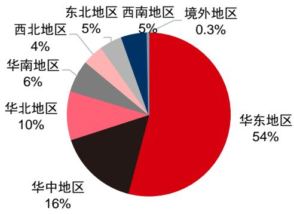
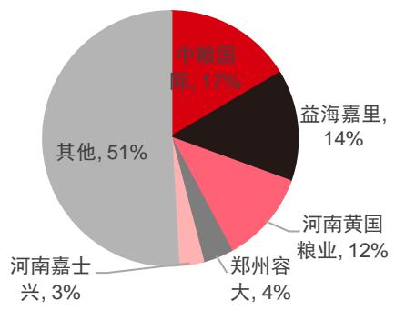
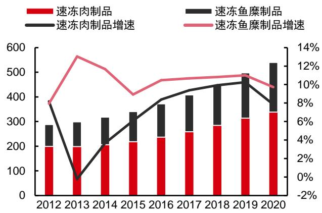
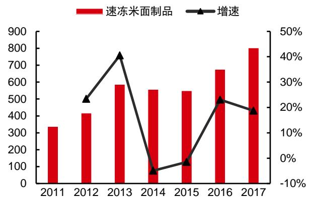
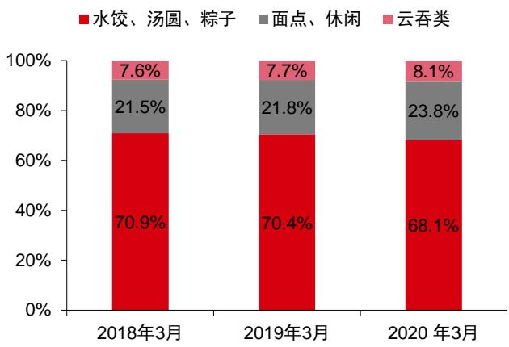
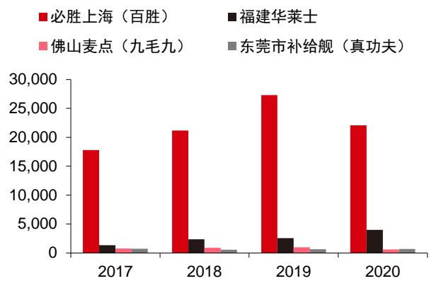
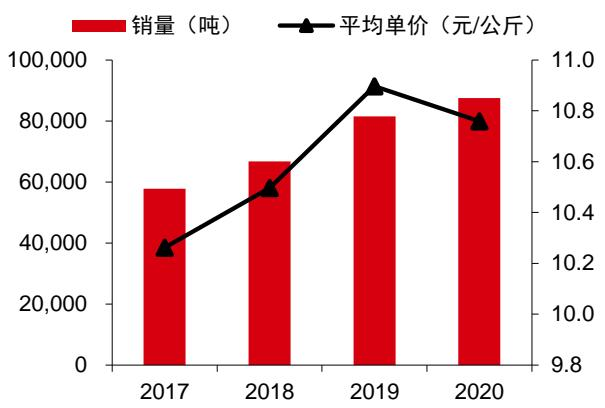

# 千滋百味，不忘厨心

千味央厨（001215.SZ）投资价值分析报告|2021.8.20

# 中信证券研究部

# 核心观点

速冻食品千亿规模，餐饮渠道发展有望带动行业持续扩容。公司作为国内速冻面米制品餐饮渠道龙头，已经开拓出众多优质连锁餐饮企业客户，积累了丰富的餐饮渠道经验及供应资质，并能精准洞察及把握餐饮企业需求，叠加突出的新品开发能力，持续实现快速成长。看好公司不断精益优化，把握速冻食品餐饮渠道发展红利，实现持续成长。

- 深耕速冻面米市场，打造餐饮超级后厨。公司前身为思念食品旗下餐饮渠道相关业务，2012 年正式独立，现已成为国内领先的餐饮渠道速冻米面制品提供商，致力为餐饮、酒店、乡厨等提供全面解决方案，产品已经涵盖油炸类、烘焙类、蒸煮类、菜肴类四大品类。经过多年深耕，公司积累了一批优质的连锁餐饮客户，包括百胜中国、华莱士、真功夫、海底捞等。2020 年公司实现收入/净利润9.44 亿/0.77 亿，2017-2020 年 CAGR 分别为 $1 6 . 7 6 \% / 1 8 . 0 4 \%$ 。公司销售模式包括直营&经销两种方式、产品包括定制&通品两种类型，2020 年公司直营定制、直营通品、经销通品、经销定制收入分别占比 $3 0 . 0 \%$ $5 . 7 \%$ $6 3 . 2 \%$ $1 . 0 \%$ 。

千亿速冻食品市场，餐饮标准化前景可期。我国速冻食品行业规模持续增长，2018 年销售规模已达 1342 亿元，2013-2018 年 CAGR 为 10.14%。2019 年我国人均速冻品消费量仅为 6-10 千克，相较美国/欧洲/日本（分别约 50/30/20 千克)仍有较大空间。速冻面米制品作为最大速冻细分品类，2017 年规模已超 800亿元，其中三全、思念、湾仔码头龙头份额领先，为传统品类汤圆/水饺等领域的绝对龙头，而千味央厨、安井等公司通过油条、手抓饼等新品类以及核心渠道的挖掘实现快速扩张。目前国内油条市场约 10 亿规模，未来具备百亿成长空间，千味央厨处于绝对领先优势。借鉴日本发展经验，1970-1990年日本餐饮业强劲发展带动速冻食品餐饮渠道规模快速扩张(CAGR=12%)，高峰期速冻食品餐饮渠道占比 $7 5 \%$ 。而我国目前速冻食品餐饮渠道占比为 $3 7 \%$ 。对标日本，未来我国餐饮业发展有望带动速冻食品行业持续扩容，公司有望充分受益。

深耕餐饮厚积薄发，打造餐饮全场景布局。（1）公司核心管理层速冻食品行业从业经验丰富，同时经过这么多年的餐饮渠道深耕，公司已经构筑显著渠道优势：一方面，公司积累众多优质连锁餐饮渠道资源，并获得了百胜中国、海底捞等行业认可餐饮品牌的供应资质；另一方面，公司积累了丰富的餐饮渠道运营经验，能够精准洞察把握餐饮企业需求，提供针对性服务。基于此，公司通过直营&经销两种模式、定制&通品两类产品，全面覆盖渗透各类餐饮、团餐、乡厨等渠道。（2）公司已经拥有了行业领先的产品研发能力，充分满足定制&通品开发需求，并围绕六大餐饮场景持续挖掘新品。2017-2020 年公司 SKU 数量从193 个快速提升至 368 个。同时，公司也通过打造大单品不断构建品类优势，油条、芝麻球、手工挞皮含税收入均过亿。（3）公司制订国际级原材料采购标准，从源头严控食材品质，并逐步规划全国化产能布局，在河南新乡和安徽芜湖均有新厂布局，预计 2024 年产能将达 17.2 万吨。

<table><tr><td>千味央厨</td><td>001215</td></tr><tr><td>目标价</td><td>70.00元</td></tr></table>

营运稳健，高净利率餐饮赛道跑出行业加速度。（1）收入规模方面，2017-2020 年公司收入 CAGR 为 $1 6 . 7 6 \%$ ，2020 年受疫情影响收入增速放缓，疫情后预计收入将持续高增。（2）利润率方面，公司毛利率低于同业公司主要系公司面向餐饮渠道，同业其他速冻食品公司均有部分毛利率较高的现代渠道业务；此外，公司油炸类经销业务毛利率较低，拖累整体毛利率。公司净利率高于同业公司，主要由于公司面向B 端市场，相较于其他公司营销推广支出较低，销售费用率较低。（3）营运方面，公司营运稳健，销售回款情况良好，应收账款天数及存货天数均低于同业公司。

风险因素：市场竞争加剧风险；原材料价格大幅上涨；食品安全风险。

投资建议：预测 2021-2023 年公司 EPS 分别为 1.04/1.38/1.77 元。综合考虑餐饮标准化趋势公司持续增长趋势以及可比公司估值，给予公司2022 年 PE50倍，对应目标价70 元。

<table><tr><td>项目/年度</td><td>2019</td><td>2020</td><td>2021E</td><td>2022E</td><td>2023E</td></tr><tr><td>营业收入(百万元)</td><td>889</td><td>944</td><td>1,248</td><td>1,578</td><td>1,970</td></tr><tr><td>营业收入增长率 YoY</td><td>26.8%</td><td>6.2%</td><td>32.1%</td><td>26.5%</td><td>24.8%</td></tr><tr><td>净利润(百万元)</td><td>74</td><td>77</td><td>88</td><td>117</td><td>151</td></tr><tr><td>净利润增长率YoY</td><td>26.3%</td><td>3.3%</td><td>15.5%</td><td>32.7%</td><td>28.5%</td></tr><tr><td>每股收益EPS(基本)(元)</td><td>0.87</td><td>0.90</td><td>1.04</td><td>1.38</td><td>1.77</td></tr><tr><td>毛利率</td><td>24.5%</td><td>21.7%</td><td>21.8%</td><td>21.9%</td><td>21.9%</td></tr><tr><td>净资产收益率 ROE</td><td>18.3%</td><td>13.2%</td><td>9.3%</td><td>11.0%</td><td>12.3%</td></tr><tr><td>每股净资产（元）</td><td>4.77</td><td>9.12</td><td>11.20</td><td>12.58</td><td>14.35</td></tr><tr><td>EV/EBITDA</td><td>0.6</td><td>0.5</td><td>0.5</td><td>0.4</td><td>0.3</td></tr></table>

资料来源：Wind，中信证券研究部预测  
注：股价为2021年8月19日收盘价

# 目录

深耕速冻面米市场，打造餐饮超级后厨. 1  
只为餐饮&厨师之选，餐饮专供速冻米面领导品牌. .1  
商业模式：自产为主外协为辅，直营经销齐头并进 .3  
股权结构：共青城城之集控股，李伟为实际控制人 .4  
千亿速冻食品市场，餐饮标准化前景可期.. .6  
速冻食品需求景气，品类创新引领面米扩张 ..6  
餐饮业发展为速冻食品带来新的发展契机.. .. 10  
深耕餐饮厚积薄发，打造餐饮全场景布局.  
深耕行业多年，把握行业需求，直营&经销快速扩张. ..14  
产品创新能力突出，餐饮客户安心之选 ..18  
产能持续扩张，打造高效供应链， .. 20  
销售规模持续成长，盈利能力稳步提升 .. 1  
募投项目：产能扩张&技术提升赋能未来成长， ..24  
风险因素. ..25  
盈利预测及投资建议  
盈利预测.. ..25  
投资建议... .26

# 插图目录

图1：公司主要产品.. ..1图2：公司发展历史回顾.  
图3：2017-2021H1公司营业收入和增速. …… ….图4：2017-2021H1 公司归母净利润和增速... ……………………… …图5：公司分品类的营业收入构成， ………  
图6：2020 年公司销售收入区域分布… …………………………图7：2020 年公司各类原材料采购金额占比.. …………… .3图8：2020 年公司供应商采购金额占比. 3图9：2017-2020公司产能和产能利用率…. 3图10：公司2017-2020委托加工金额. …………………………… … 3图11：2020 年公司收入结构. 4图 12：2017-2020公司分销售模式收入及增速（万元）……4图13：公司股权结构图（上市后） … ….图14：速冻食品分类. 6图15：我国速冻食品行业规模及增速.. …… …….图16：2012-2020 年速冻鱼糜和速冻肉制品规模及增速. …………… ….7图17：速冻面米制品行业产值规模及增速 …………图18：各国人均速冻食品占有量. …7图 19：2020日本速冻食品结构……7图20：2016年日本速冻食品市场竞争格局. …………… …图21：2019年我国速冻食品行业主要公司市场份额，  
图22：1998年至今日本速冻食品工厂数及平均产量. …图23：2012-2019 年我国速冻食品行业规模以上企业数.. …图24：2018-2020年3月份现代渠道速冻面米制品品类份额变化情况. ……图 25：三全面点及其他收入增速领先于传统品类…… ……9图26：2020 年3月速冻面米制品全国现代渠道分品类的市占率情况. ….图27：日本冷冻食品产量发展图. ….图28：1975以来日本人均GDP 与餐饮市场规模增长情况. …  
图29：1975-2019 年日本外出就餐比例. …图30：日本速冻食品商业/零售渠道产量历史对比（单位：万吨）  
图31：日本速冻食品商业/零售渠道产量历史对比（单位：万吨） … …11图32：2010-2025E国内速冻速食及点心的餐饮&零售渠道销量占比 … 1图33：2010-2025E国内速冻锅料的餐饮&零售渠道销量占比..  
图34：我国餐饮业收入与人均GDP 增长情况… ……………………… ….图35：各国人均 GDP 对比情况（单位：美元) …… ….12图36：中国、日本、美国餐饮连锁化率对比. … ..13图37：2016-2020 中国连锁餐饮店收入规模和增速. ……………  
图38：2011-2020 中国在线外卖市场规模及同比增速 … … 13图39：2016-2020年中国团餐规模、增速和占餐饮比重. 13图40：国内早餐消费者总支出（亿元）及同比增速 $( \% )$ ….14图41：国内外食早餐以及居家早餐占比.. ……………  
图 42：抽样调查中早餐各品类渗透率（%） ……

图47：千味央厨部分客户. ..15  
图48：2018年度快餐Top10企业中有8家为公司客户. ..15  
图50：2017-2020公司与主要直营客户合作规模（单位：万元） .17  
图 51：公司多次获得百胜颁发的荣誉奖项 ..17  
图3：2017-2020公司销售人员数量. ..17  
图4：2017-2020公司经销商数量， .17  
图54：2017-2020公司不同收入规模的经销商经销商数量. .. 18  
图55：2020 年公司不同收入规模的经销商占经销收入比例 ..18  
图43：2017-2020公司研发费用及同比增速 ..18  
图44：2017-2020公司SKU个数. ..18  
图45：千味央厨油条创新历程 ..19  
图46：早饭师门店模板. .. 20  
图56：公司产能布局及预期产能利用率.. ..21  
图57：全国连锁餐饮企业门店总数，华东地区为主要区域(2019 年） .1  
图 58：千味央厨 2017-2019 年收入复合增速行业领先 .. 22  
图59：2017-2020年公司销量及单价.. .22  
图60：2017-2020同业公司毛利率 ..2  
图61：2017-2020公司分品类的毛利率. ..22  
图62：公司经销&直营毛利率对比 .. 23  
图63：2017-2020同业公司经销毛利率对比 .23  
图64：2020公司主营业务成本结构.. .23  
图65：公司主要原材料采购价格及平均产品售价（元/kg） ..23  
图66：2017-2020同业公司销售费用率.. ..24  
图67：2017-2020同业公司管理费用率.. ..24  
图68：2017-2020同业公司应收账款天数（单位：天） .24  
图69：2017-2020同业公司存货周转天数（单位：天） .24

# 表格目录

表1：通用品和定制品商业模式对比， 4  
表2：公司股权结构的变迁， .5  
表3：共青城凯立合伙人出资及任职情况 .5  
表4：速冻面米制品行业重点公司 ..9  
表5：公司董监高核心人员履历及持股比例.  
表8：公司与重要直营客户签订的长期框架合作协议  
表9：公司直营、经销模式对比. .. 17  
表6：公司在研项目储备. .. 19  
表7：公司重点单品销售额及占比（单位：万元） ..19  
表 10：2020 年百胜中国指定供应商采购情况 ..21  
表10：公司募集资金拟投资项目. ..25  
表12：分业务预测表（单位：万元） ..26  
表13：盈利预测简表.. ..26  
表15：可比公司估值. .26

# 深耕速冻面米市场，打造餐饮超级后厨

# 只为餐饮&厨师之选，餐饮专供速冻米面领导品牌

餐饮渠道速冻面米制品龙头企业。千味央厨成立于 2012 年，为国内领先的餐饮渠道速冻米面制品提供商，致力于为餐饮、酒店、团体食堂提供全面供应解决方案。历经十余年发展，千味央厨已经成功开发上市 300 余个速冻面米产品，涵盖油炸类、烘焙类、蒸煮类、菜肴类和其他四大品类，并成为百胜中国、华莱士、九毛九、真功夫、海底捞等知名连锁餐饮企业的供应商。公司主要产品包括油条、芝麻球、地瓜丸、手工挞皮、卡通包等，其中油条类、蛋挞类、芝麻球类含税收入过亿。

  
图1：公司主要产品

资料来源：公司官网、招股说明书，中信证券研究部

三阶段成长为速冻米面餐饮渠道龙头。公司前身为思念食品旗下餐饮渠道相关业务，2012 年独立出来成立千味央厨，聚焦深挖餐饮渠道。其发展可以分为三个阶段：

2002-2012年，思念时期，品牌沉淀&客户积累。2002年，思念食品开始与百胜合作，是百胜中国挞皮供应商。2006年，思念食品成功研发出工业化速冻油条，并向肯德基供应，将中式食品引入西式快餐连锁。基于良好的合作基础，思念成功进入东方既白、小肥羊、必胜客等其他百胜旗下连锁企业供应体系。

2012-2016 年，成立独立公司，聚焦 B 端市场。2012 年，公司洞察到速冻食品餐饮渠道的发展潜力，单独成立千味央厨，专注 B 端餐饮市场服务，而思念食品则更为专注C 端市场。2014 年，公司开创定制化服务模式，为客户提供菜单设计、产品开发与销售、物流运输等在内的整体解决方案，深化大客户合作。

2016-至今，品牌升级，产能扩张，多元化产品布局。2016 年，公司积极推进品牌升级，明确了“只为餐饮、厨师之选，餐饮专供速冻米面领导品牌”的定位，并入围百胜中国T1级（最高级别）食品供应商，陆续与百胜中国、真功夫、沃尔玛等签订长期合作框架合同。2017 年公司开启新乡新工厂建设，并持续推进新乡产区产能扩张。同时，公司积极扩充丰富产品矩阵，在售产品数量由2017 年的193 个增长到 2020年的 368个，实现早餐、火锅、茶饮、咖啡、西式快餐等全场景覆盖。

  
图2：公司发展历史回顾

资料来源：公司官网，招股说明书，中信证券研究部

规模稳步扩张，油炸类产品收入占比过半。2020 年公司实现营业收入 9.44 亿元，净利润0.77亿元，2017-2020 年CAGR 分别为 $1 6 . 7 6 \%$ $1 8 . 0 4 \%$ ；2021H1公司营业收入、净利润分别为5.68 亿、0.36 亿元，较去年同增 $5 4 . 8 \%$ $4 7 . 6 7 \%$ 。分品类看，2020年公司油炸类、烘焙类、蒸煮类、菜肴类和其他营业收入占比分别为 $5 5 . 2 2 \% , 1 9 . 8 6 \% , 1 9 . 4 4 \%$ $5 . 2 6 \%$ ，其中烘焙类占比有所上升，2020 年较 2017 提升 2.13Pcts。分区域看，公司销售地区以华东地区为主，2020年收入占比 $5 4 . 1 \%$ ，主要系公司两大直营客户百胜中国及华莱士均属于华东地区，此外公司华中地区、华北地区收入分别占比 $1 5 . 9 1 \%$ $9 . 6 5 \%$ o

  
图3：2017-2021H1公司营业收入和增速

资料来源：公司招股说明书，中信证券研究部资料来源：公司招股说明书，中信证券研究部资料来源：公司招股说明书，中信证券研究部资料来源：公司招股说明书，中信证券研究部

  
图5：公司分品类的营业收入构成

  
图4：2017-2021H1公司归母净利润和增速

  
图6：2020年公司销售收入区域分布

# 商业模式：自产为主外协为辅，直营经销齐头并进

原材料大宗产品为主，主要供应商为优质行业龙头。公司主要生产所需原材料为大宗农产品，包括面粉、糯米粉、食用油、白砂糖等，2020年面粉和米粉类占采购总额的 $4 2 . 0 2 \%$ o为保证原材料质量，公司主要向知名行业领先企业采购原材料，部分原材料向下游客户指定供应商采购。2020年公司前三大供应商分别为中粮国际、益海嘉里、河南黄国粮业，采购金额占比分别为 $1 6 . 5 1 \%$ 、 $1 4 . 0 5 \%$ 、d: $1 1 . 6 3 \%$ o

  
图7：2020 年公司各类原材料采购金额占比

  
图8：2020年公司供应商采购金额占比

资料来源：公司招股说明书，中信证券研究部资料来源：公司招股说明书，中信证券研究部

自产为主，外协为辅。公司生产厂区位于新乡平原，2020 年产能为12.8 万吨，所有定制品均为自产，少量通用品采用委托加工，主要销售给经销商。公司委托加工的受托方为辽宁实维天/鹤壁鑫发，分别代为加工芝麻球、地瓜丸等/油条、卡通包等。2017-2020年，公司委托加工产量占总产量比例分别为 $4 . 8 6 \%$ $4 . 8 0 \%$ 、 $4 . 1 1 \%$ 和 $3 . 7 9 \%$ 。未来公司IPO 募投项目新乡千味（三期）和芜湖华东新厂投产后，产能将进一步扩大。

  
图9：2017-2020公司产能和产能利用率

资料来源：公司招股说明书，中信证券研究部注：2020年产能利用率较低主要由于受疫情影响开工率不足，且 2020 年 2 月刚从英才街区搬迁到新乡，产能需要逐步释放

  
图10：公司2017-2020委托加工金额

资料来源：公司招股说明书，中信证券研究部

直营经销齐发力，客户合作深化&销售渠道拓展。2020 年公司直营、经销占营业收入比例分别为 $3 5 . 7 4 \% , 6 4 . 2 6 \%$ ，两种销售模式收入较2017年CAGR分别为 $1 1 . 8 6 \%$ $1 9 . 7 9 \%$ 。具体来看，直营模式定制化服务为主，大客户合作深入。公司直营客户主要包括百胜中国、华莱士、永和大王、海底捞等大型连锁餐饮。2020 年，直营模式下定制品、通用品收入占比分别为 $8 3 . 9 4 \%$ 、 $1 6 . 0 6 \%$ 。定制化服务模式下，公司与客户联合研发新品或按客户需求生产定制品，深度绑定重要客户。经销模式以通用品销售为主，实现快速扩张。公司经销商主要为区域型中小型餐饮企业，公司通过分析市场需求，备货式生产通用品销售给经销商。2020 年，经销模式下通用品收入占比 $9 8 . 4 0 \%$ ，定制品收入占比 $1 . 6 0 \%$ 。随着公司经销商数量的不断增长，公司经销收入持续高增。

  
图11：2020年公司收入结构

  
图12：2017-2020公司分销售模式收入及增速（万元）  
资料来源：公司招股说明书，中信证券研究部

资料来源：公司招股说明书，中信证券研究部

表1：通用品和定制品商业模式对比  

<table><tr><td colspan="2">定制品</td><td>通用品</td></tr><tr><td>销售渠道</td><td>直营占比 96.68%，经销占比 3.32%</td><td>直营占比8.32%，经销占比91.68%</td></tr><tr><td>客户类型</td><td>大型餐饮连锁企业为主</td><td>由经销商销售给中小型餐饮企业</td></tr><tr><td>业务模式</td><td>与特定客户联合研发或根据客户要求做工艺定 制、包装定制；“定制研发+定制生产”模式下， 餐饮企业享有定制品一定时期内的独家销售权</td><td>公司根据市场需求自主开发产品，面向全体客 户销售</td></tr><tr><td>采购模式</td><td>部分客户指定原材料供应商</td><td>采购较为灵活</td></tr><tr><td>生产模式</td><td>自产，以销定产</td><td>大部分自产，少量委托加工，备货式生产</td></tr><tr><td>产品定价</td><td>参考市场价的基础上采用成本加成定价</td><td>竞标定价</td></tr></table>

资料来源：公司招股说明书，中信证券研究部

# 股权结构：共青城城之集控股，李伟为实际控制人

公司股权历史：郑州思念成立，多次增资。2012 年4 月，郑州思念出资成立千味有限，注册资本1400 万。2016 年 3 月，郑州思念将千味有限 $100 \%$ 股权转让给郑州集之城(后更名共青城城之集)。2016 年3月，共青城凯立对千味有限增资，持股 $8 \%$ 。2016年7 月，股份公司第一次增资，引入新股东前海新希望、魏秀岩和李芳。2017 年 9 月，为解决同业竞争问题，思念管理层王鹏将持有的共青城城之集 $20 \%$ 的股份转让给李伟，至此，李伟持有共青城城之集 $100 \%$ 股份；同时，李伟将间接持有的思念食品股权全部转让给王鹏等思念管理层，退出思念食品。2017 年12 月，公司第二次增资；2018 年 12 月，公司获得京东和绝味食品的战略投资，分别通过宿迁涵邦和深圳网聚持有公司 $5 . 1 3 \%$ 股份。

表2：公司股权结构的变迁  

<table><tr><td>时间</td><td>事件</td><td>主要持股股东</td></tr><tr><td>2012年4月</td><td>千味有限成立</td><td>郑州思念100%</td></tr><tr><td>2016年3月</td><td>郑州思念将千味有限 100%股权转让给郑州集之城</td><td>郑州集之城 100%(郑州集之城中李伟持 80%，王鹏持 20%)</td></tr><tr><td>2016年3月</td><td>共青城凯立增资</td><td>郑州集之城 92%，共青城凯立 8%</td></tr><tr><td>2016年8月</td><td>股份公司第一次增资，引入前海新希望、魏秀岩、李芳</td><td>郑州集之城 79.45%，前海新希望 11.36%，共青城凯立 6.91%</td></tr><tr><td>2017年9月</td><td>王鹏将持有的共青城城之集（原名郑州集之城）20%股 权转让给李伟</td><td>共青城城之集 79.45%（李伟持有共青城城之集100%)，前海 新希望11.36%，共青城凯立 6.91%</td></tr><tr><td>2017年12月</td><td>股份公司第二次增资，引入赵建光、翁蕾、上德合味、 建元时代等九名新股东</td><td>共青城城之集 69.63%，前海新希望 9.96%，上德合味 6.14%, 共青城凯立 6.05%</td></tr><tr><td>2018年12月</td><td>股份公司第三次增资，引入宿迁涵邦和深圳网聚</td><td>共青城城之集 62.49%，前海新希望 8.94%，上德合味 5.51%， 共青城凯立 5.43%</td></tr></table>

资料来源：公司招股说明书，中信证券研究部

公司实际控制人李伟通过共青城城之集持股 $4 6 . 8 6 \%$ 。公司本次IPO上市拟发行2,128万股，占发行后总股本 $2 5 \%$ 。发行上市后，公司控股股东为共青城城之集，持有公司 $4 6 . 8 6 \%$ 的股份，李伟持有共青城城之集 $100 \%$ 股份，为公司实际控制人。共青城凯立系公司设立的员工持股平台，持有公司股份 $4 . 0 8 \%$ ，合伙人包括多名千味央厨及关联方核心高管。

  
图13：公司股权结构图（上市后）  
资料来源：公司招股说明书，中信证券研究部

表3：共青城凯立合伙人出资及任职情况  

<table><tr><td>姓名</td><td>任职情况</td><td>认缴出资额 （万元）</td><td>出资比例</td><td>间接持有公司股份 (上市后）</td></tr><tr><td>贾国</td><td>黄河大观董事长助理</td><td>2,235.00</td><td>84.34%</td><td>3.44%</td></tr><tr><td>王向阳</td><td>千味央厨生产总监</td><td>42.00</td><td>1.58%</td><td>0.06%</td></tr><tr><td>轩慎朴</td><td>千味央厨销售总监</td><td>38.00</td><td>1.43%</td><td>0.06%</td></tr><tr><td>白瑞</td><td>千味央厨总经理</td><td>37.00</td><td>1.40%</td><td>0.06%</td></tr><tr><td>王植宾</td><td>千味央厨财务总监</td><td>36.00</td><td>1.36%</td><td>0.06%</td></tr><tr><td>牛法治</td><td>千味央厨销售总监</td><td>35.00</td><td>1.32%</td><td>0.05%</td></tr><tr><td>柳向阳</td><td>杜康控股总经理</td><td>34.00</td><td>1.28%</td><td>0.05%</td></tr><tr><td>徐振江</td><td>千味央厨董事会秘书</td><td>30.00</td><td>1.13%</td><td>0.05%</td></tr><tr><td>钟辉</td><td>千味央厨副总经理</td><td>30.00</td><td>1.13%</td><td>0.05%</td></tr></table>

<table><tr><td>姓名</td><td>任职情况</td><td>认缴出资额 （万元）</td><td>出资比例</td><td>间接持有公司股份 (上市后)</td></tr><tr><td>陶白静</td><td>曾任千味央厨副总经理，已离职</td><td>28.00</td><td>1.06%</td><td>0.04%</td></tr><tr><td>胡超</td><td>曾任郑州思念总经理助理，已离职</td><td>23.00</td><td>0.87%</td><td>0.04%</td></tr><tr><td>张献敏</td><td>杜康控股技术研发总监</td><td>22.00</td><td>0.83%</td><td>0.03%</td></tr><tr><td>张延钧</td><td>曾任郑州思念采购总监，已离职</td><td>20.00</td><td>0.75%</td><td>0.03%</td></tr><tr><td>崔俊伟</td><td>杜康控股市场部总监</td><td>20.00</td><td>0.75%</td><td>0.03%</td></tr><tr><td>魏宝林</td><td>杜康控股生产总监</td><td>20.00</td><td>0.75%</td><td>0.03%</td></tr><tr><td>合计</td><td></td><td>2,650.00</td><td>100.00%</td><td>4.08%</td></tr></table>

资料来源：公司招股说明书，中信证券研究部

# 千亿速冻食品市场，餐饮标准化前景可期

速冻食品需求景气，品类创新引领面米扩张速冻食品千亿市场，渗透空间仍较广阔

速冻食品行业景气发展，规模已超千亿。速冻食品指经前处理与急速冻结、储存于 $\cdot 1 8 ^ { \circ } C$ 到 $\cdot 2 0 ^ { \circ } \mathsf { C }$ 下的食品，按加工深度可以分为简单加工的农产、水产、畜产类速冻食品及，以及粗加工的调理类速冻食品。我国速冻食品行业起步较晚，20 世纪 80 年代开始出现简单加工过的速冻肉制品。21 世纪初，随着工艺的进步和冷链系统发展，品类逐步拓展到速冻面米制品、速冻调理食品等。据Frost&Sullivan（转引自前瞻产业研究院)，我国速冻食品行业规模从2013 年的828亿元增长到2018年1342亿元，CAGR1 $0 . 1 4 \%$ 。

  
图14：速冻食品分类

  
图15：我国速冻食品行业规模及增速  
资料来源：Frost&Sullivan（转引自前瞻产业研究院），中信证券研究部

资料来源：中信证券研究部绘制

分品类看，国内速冻食品行业主要可分为速冻面米制品以及速冻火锅料制品。速冻面米制品行业发展较为成熟，为我国速冻食品第一大消费品类，以汤圆、水饺等传统中式主食类为主。根据智研咨询统计，2017 年国内速冻面米市场规模802 亿元。速冻火锅料是指火锅配菜，关东煮、麻辣烫、烧烤等其它用途的速冻调理食品，主要包括速冻鱼糜制品和速冻肉制品两大类产品。根据 Euromonitor 数据测算，2020 年速冻鱼糜制品、速冻肉制品行业出厂规模约 202 亿元、338 亿元，合计速冻火锅料制品规模 540 亿元。

  
图16：2012-2020年速冻鱼糜和速冻肉制品规模及增速（单位：亿元）  
资料来源：智研咨询，中信证券研究部

  
图17：速冻面米制品行业产值规模及增速（单位：亿元）

资料来源：Euromonitor，中信证券研究部测算 注：出厂口径

速冻食品市场渗透率和产品丰富度仍有较大空间。根据中国食品工业协会冷冻冷藏食品专业委员会发布的《2019 年中国冷冻冷藏食品工业经济运行报告》，我国人均速冻食品占有量仅为 6-10 千克，而美国人均占有量 50 千克、欧洲 30 千克、日本 20 千克，仍有较大的提升空间。从产品结构来看，日本速冻食品品类丰富，调理食品、水产类、点心类产值占比分别为 $8 6 . 8 \%$ $5 . 6 \%$ 、: $4 . 2 \%$ ，调理食品前三大单品饺子、炒饭、汉堡产值合计占比 $1 8 . 5 \%$ 。反观国内市场，我国速冻食品以速冻面米制品和速冻火锅料为主，速冻面米制品中饺子、汤圆等传统面点占比较高，整体丰富度欠缺。未来我国速冻食品人均消费量的提升及品类的拓展有望带动行业规模进一步扩张。

  
图18：各国人均速冻食品占有量（千克）

  
图19：2020 年日本速冻食品结构

资料来源：《2019年中国冷冻冷藏食品工业经济运行报告》(中国食品工业协会冷冻冷藏食品专业委员会），中信证券研究部

资料来源：日本冷冻协会，中信证券研究部

竞争格局较为分散，龙头份额有望进一步提升。根据前瞻产业研究院测算，2019年国内速冻食品行业规模约1400 亿，以此测算思念食品、三全食品、安井食品市占率分别为 $5 . 0 \%$ 、: $4 . 3 \%$ 和 $3 . 8 \%$ ，竞争格局较为分散。参考日本市场，自2000 年以来日本速冻企业工厂数持续下降，份额逐步向头部企业集中。据 Nikkei Sangyo Shimbun，2016 年日本速冻食品CR3 高达 $59 \%$ ，其中市占率第一的 Maruha Nichiro 份额为 $2 3 . 7 \%$ ，行业集中度较高。借鉴日本龙头企业发展经验，后期行业优势企业有望突围，份额进一步提升。

  
图20：2016 年日本速冻食品市场竞争格局

  
图21：2019 年我国速冻食品行业主要公司市场份额

资料来源：Nikkei Sangyo Shimbun，中信证券研究部资料来源：各公司公告，前瞻产业研究院，中信证券研究部测算资料来源：国家统计局，中信证券研究部

  
图22：1998 年至今日本速冻食品工厂数及平均产量  
资料来源：日本冷冻协会，中信证券研究部

  
图23：2012-2019 年我国速冻食品行业规模以上企业数

# 速冻面米制品：产品创新升级引领新增长

速冻食品最大品类，规模稳步扩张。速冻面米制品是指以小麦粉、大米、杂粮等谷物为主要原料，或同时配以肉、禽、蛋、水产品、蔬菜、果料、糖、油、调味品等单一或多种配料为馅料，经加工成型（或熟制）并速冻而成的食品。速冻面米制品为国内速冻食品的第一大品类，根据智研咨询统计，2017 年国内速冻面米市场规模 802 亿元，据国家统计局统计，2014-2019 年我国速冻面米制品产量 CAGR $5 . 3 \%$ ，稳步增长。

传统品类增速放缓，新式面点带动成长。从产品结构来看，我国速冻面米制品目前以传统主食类食品为主。伴随消费升级和产品创新，新式面点和休闲类食品（油条、包子、手抓饼等）增速较快，占比不断上升。据中国方便食品大会，2020 年3月速冻面米制品全国现代渠道中传统品类水饺、汤圆、粽子分别占比 $3 8 . 9 \%$ 、: $2 2 . 9 \%$ 、 $6 . 3 \%$ ，合计占比$6 8 . 1 \%$ ，较2018年3月下降2.8Pcts。

  
图24:2018-2020 年3月份现代渠道速冻面米制品品类份额变化情况  
资料来源：三全食品公告，中信证券研究部

  
图25：三全面点及其他收入增速领先于传统品类

资料来源：第二十届方便食品大会，中信证券研究部

成熟品类格局稳定，抢占新品领先地位。按照速冻面米制品收入规模划分，行业第一梯队包括思念食品、三全食品、湾仔码头三大企业，收入规模均在50亿以上，均以速冻面米制品为主。三大企业在传统的汤圆、水饺等传统品类以及现代渠道优势明显，2020年3 月国内现代渠道水饺、汤圆、云吞前三都被这三家企业占据，合计份额均在 $7 5 \%$ 以上。近年来，安井食品、千味央厨等企业凭借油条、红糖发糕等速冻米面新产品以及餐饮渠道的挖掘，实现快速增长，2017-2020 年安井速冻米面制品收入复合增速达 $2 2 \%$ 。

  
图26：2020 年3月速冻面米制品全国现代渠道分品类的市占率情况  
资料来源：第二十届中国方便食品大会，中信证券研究部绘制

表4：速冻面米制品行业重点公司  

<table><tr><td>公司名称</td><td>成立年份</td><td>收入规模</td><td>主要产品</td><td>销售渠道及占收入比例</td></tr><tr><td>思念食品</td><td>1997</td><td>69.53亿</td><td>水饺、汤圆、面点、粽子、馄饨等</td><td>C端渠道为主</td></tr><tr><td>三全食品</td><td>2001</td><td>69.26亿</td><td></td><td>零售及创新市场占比8643%；餐饮市</td></tr><tr><td>湾仔码头</td><td>1977</td><td>约60亿</td><td>云吞、水饺、汤圆等</td><td>C端渠道为主</td></tr><tr><td>安井食品</td><td>2001</td><td>69.65亿</td><td>撒尿肉丸、鱼豆腐等速冻火锅料制品；手抓饼、红糖发糕、</td><td>经销占比84.3%；商超占比12.1%；</td></tr></table>

<table><tr><td>公司名称</td><td>成立年份</td><td>收入规模</td><td>主要产品</td><td>销售渠道及占收入比例</td></tr><tr><td>海霸王</td><td>1975</td><td>超20亿</td><td>水饺、汤圆、撒尿牛丸等</td><td>现代渠道、餐饮、电商为主</td></tr><tr><td>千味央厨</td><td>2012</td><td>9.44亿</td><td>油条、芝麻球、地瓜丸、手工挞皮等</td><td>餐饮端为主</td></tr></table>

资料来源：各公司公告、官，河南日报，中信证券研究部注：收入规模思念为2019 年数据，千味央厨、三全、安井为2020 年数据。

中国油条品牌开创者，速冻油条行业绝对领先。油条一直是中国传统的面米制品，机制速冻油条的出现，推动了油条工业化发展。作为油条行业发展的引领者，千味央厨在速冻油条行业仍然保持绝对领先优势。据冷食传媒，我国目前油条行业年销售额在10亿左右，千味央厨每年油条销售额在3亿左右，市占率第一，安井食品、河北食全十美食品和三全食品销售额在1亿左右。未来随着机制油条持续发展，有望带动油条市场持续扩容，并进一步替代手工油条，行业发展空间广阔。

# 餐饮业发展为速冻食品带来新的发展契机

复盘日本速冻食品产业发展，可以分为三个阶段：1960-2000 年，餐饮业快速发展叠加人均食品支出提升带动速冻食品 BC 端快速增长；2001-2010 年，日本泡沫经济破裂、餐饮业负增长导致速冻食品需求萎靡；2011 年至今，速冻食品行业经洗牌后份额向头部玩家集中，餐饮业回暖、人均食品支出提升、速冻食品品类多样化推动速冻食品 BC 两端需求回暖，行业重新迎来可持续增长。

  
图27：日本冷冻食品产量发展图  
资料来源：日本冷冻食品协会，中信证券研究部

我国目前经济和餐饮业发展水平与日本上世纪 80-90 年代相近。2019年中国人均GDP 达到 10217 美元，外出就餐比例已超 $30 \%$ ，达到日本上世纪80年代水平。1980-1990年是日本餐饮业的高速发展期，居民外出就餐比例、餐饮连锁化率的提升带动日本餐饮渠道速冻食品规模迅速扩张。借鉴日本发展经验，我们预计伴随国内经济发展和城镇化率的提高，餐饮业持续发展，连锁化率逐步提升。餐饮业的繁荣与连锁化率的提升将催生大量餐饮供应链需求，叠加消费升级、疫情后速冻食品消费习惯的延续等因素，速冻食品望充分受益。

# 日本市场：餐饮业高速发展带动冻品迅速扩容

日本经济发展带动餐饮市场快速扩张，外食比例持续提升。餐饮行业增长与经济发展及人均收入水平提升密切相关，有支付能力的外食人群增加以及外出就餐比例的提升是餐饮市场规模增长的核心直接驱动因素。日本1975 年后经济强力复苏带动餐饮服务业进入15 年黄金发展期，外出就餐比例从1975 年的 $2 8 . 4 \%$ 提升到1990年的 $4 1 . 2 \%$ ，广义餐饮市场规模从 8.78 万亿日元增长到 28.08万亿日元，年复合增速 $8 . 0 6 \%$ 。

  
图28：1975以来日本人均GDP与餐饮市场规模增长情况  
资料来源：日本食品服务协会，中信证券研究部

  
图29：1975-2019年日本外出就餐比例  
资料来源：日本食品服务协会，中信证券研究部

餐饮业红利带动速冻食品需求扩张。根据日本冷冻食品协会统计，1970s 前日本商业用和家庭用冷冻食品行业均处于发展初期、增速较快。1970s 后，电冰箱普及率超过 $9 5 \%$ ,家庭冷冻食品消费量趋于平稳。而后冷冻食品餐饮消费量伴随着餐饮行业发展而实现快速扩张，1970-1990年日本速冻食品产量CAGR达 $10 \%$ ，其中商用速冻食品产量CAGR达$12 \%$ ，速冻食品餐饮渠道产量占比高峰达到 $7 5 \%$ 。2000年后，日本经济环境导致外食产业萎缩，冷冻食品餐饮渠道占比也随之下降。2010 年后，日本餐饮业复苏，速冻食品 BC端需求均回暖，冷冻食品行业渠道结构基本稳定，餐饮渠道占比稳定在 $5 0 \% { - } 6 0 \%$ 左右。

  
图30：日本速冻食品商业/零售渠道产量历史对比（单位：万吨）  
资料来源：日本冷冻食品协会，中信证券研究部

  
图31：日本速冻食品商业/零售渠道产量历史对比（单位：万吨）  
资料来源：日本冷冻食品协会，中信证券研究部

# 中国市场：餐饮业持续发展，速冻食品餐饮渠道望扩容

我国速冻食品餐饮渠道规模较小，处于爬坡期。目前我国速冻食品行业餐饮渠道占比较低，根据 Euromonitor 数据（统计范围包括冷冻速食、冷冻点心、速冻肉制品、速冻鱼糜和冷冻素肉制品）测算 2020 年我国餐饮渠道速冻食品销量占比为 $3 7 \%$ ，其中速冻火锅料制品餐饮渠道销量占比 $51 \%$ 。日本上世纪70年代整体速冻食品餐饮渠道占比已超 $60 \%$ ,高峰期达到 $7 5 \%$ ，对比来看我国速冻食品餐饮渠道仍有较大空间。根据Euromonitor 预测，2025 年我国速冻食品餐饮渠道销量占比可达 $49 \%$ ，2020-2025 年餐饮渠道量增 CAGR 达$12 \%$ 。

  
图32：2010-2025E 国内速冻速食及点心的餐饮&零售渠道销量占比

资料来源：Euromonitor（含预测)，中信证券研究部

  
图33：2010-2025E国内速冻火锅料的餐饮&零售渠道销量占比  
资料来源：Euromonitor(含预测)，中信证券研究部包括：速冻肉制品、速冻鱼糜制品、速冻豆制品等。

餐饮业持续繁荣将催生大量餐饮渠道需求。据国家统计局，2019年全国餐饮业收入规模达到4.67 万亿元，同比增长 $9 . 3 8 \%$ 。尽管 2020 年短期受疫情影响行业承压，长期看随着我国人均GDP 的增长，未来餐饮业有望持续扩容。一方面，餐饮业规模扩张将直接带动速冻食品餐饮渠道需求增长；另外一方面，餐饮连锁化率提升以及外卖、团餐、早餐等需求发展，望进一步加速速冻食品餐饮渠道需求的扩张。

  
图34：我国餐饮业收入与人均GDP增长情况

  
图35：各国人均GDP对比情况（单位：美元）

资料来源：国家统计局，Wind，世界银行，中信证券研究部资料来源：Wind，世界银行，中信证券研究部

餐饮连锁化率逐年提升，拉动标准化食材需求。据 Euromonitor 数据，2020 年我国连锁餐饮店收入规模为 7229 亿元，餐饮连锁化率（按店铺数计算)从 2016 年的 $2 . 9 \%$ 提升到 2020 年的 $4 . 2 \%$ 。对比发达国家，我国连锁餐饮店的渗透率仍有极大的提升空间，2020 年美国和日本的餐饮连锁化率分别为 $3 8 \%$ 和 $23 \%$ 。在人工、租金成本持续上涨背景下，连锁餐厅为了解决食材标准化、加工便捷性以及节约成本等需求，有望进一步加大对速冻食品等标准化食材的使用需求。

  
图36：中国、日本、美国餐饮连锁化率对比

  
图37：2016-2020中国连锁餐饮店收入规模和增速

资料来源：Euromonitor，中信证券研究部资料来源：Euromonitor，中信证券研究部

外卖&团餐规模扩张，推动速冻食品行业加速成长。为了满足对出餐速度及质量的要求，外卖&团餐需求的发展有望提升对速冻食品等标准化食品的需求。外卖方面，根据艾媒咨询统计，我国外卖市场规模由 2011 年 217 亿元增长到 2020 年 6646 亿元，CAGR 高达 $4 6 . 2 7 \%$ 。外卖行业对于产品的出餐速度和口感保持期有所要求，2019 年千味央厨专门针对外卖场景推出外卖油条，主打40 秒极速出餐、120 分钟后口感酥脆不变。团餐方面，我国团餐规模从 2016 年 0.9 万亿增长到 2020 年 1.53 万亿，团餐主要消费群体为政府机关、学校、医院、企业等，直接采购半成品相较于自行制作可以节省时间、空间成本，也为速冻食品企业提供了新的商机。

  
图38：2011-2020 中国在线外卖市场规模及同比增速

  
图39：2016-2020 年中国团餐规模、增速和占餐饮比重

资料来源：艾媒咨询，中信证券研究部资料来源：艾媒咨询，中信证券研究部

掘金万亿早餐市场。根据 Mintel 统计及预测，2019 年我国早餐市场规模（消费者在早餐上的总支出)达到 1.75 万亿元，2024 年有望达到 2.37 万亿元。早餐市场中外食早餐占比不断提高，2019 年外食早餐规模 0.77 万亿元，占比 $4 4 . 1 \%$ ，预计2024年或将达到1.12 万亿规模，占比为 $4 7 . 1 \%$ 。国内早餐市场品类丰富，包子、馒头、馄饨、油条等传统中式早餐产品仍为现在最为重要的早餐产品。随着技术升级及门店需求提升，未来速冻食品品类进一步丰富，望逐步渗透入早餐店，掘金万亿早餐市场。

  
图 40：国内早餐消费者总支出(亿元)及同比增速 $( \% )$

资料来源：MINTEL（含预测），中信证券研究部资料来源：MINTEL（含预测），中信证券研究部

  
图41：国内外食早餐以及居家早餐占比

  
图 42：抽样调查中早餐各品类渗透率 $( \% )$ [  
资料来源：MINTEL，中信证券研究部，注：样本为 2,954 名过去 3 个月道购买过早餐的20-49 岁分部在10 个不同城市的互联网用户

# 深耕餐饮厚积薄发，打造餐饮全场景布局

深耕行业多年，把握行业需求，直营&经销快速扩张

核心管理层速冻食品行业从业多年，经验丰富。2012年，千味央厨作为思念食品子公司成立，2016 年从思念旗下独立后管理团队拥有众多在思念工作多年的行业专家，职位涵盖思念营销中心副总经理、质量技术总监、生产总监、销售主管等核心管理岗位，董事及高管具有 20 年左右丰富的食品行业工作经验。为充分激发员工活力、绑定高管利益，公司核心管理层均持有公司股份：董事长孙剑通过前海新希望间接持有公司 $0 . 2 7 \%$ 股份，其他管理层通过员工持股平台共青城凯立间接持股。

表5：公司董监高核心人员履历及持股比例  

<table><tr><td>姓名</td><td>职位</td><td>核心履历</td><td>持股比例</td></tr><tr><td>孙剑</td><td>董事长、新乡千味执行董事</td><td>2000 年加入郑州思念，担任上海及港公司经理、营销中心副总经理；曾任河南 一生缘食品销售总经理。2018 年加入千味央厨，拥有超过 20 年食品行业工作经历。</td><td>0.27%</td></tr><tr><td>白瑞</td><td>董事、总经理、新乡千味经理</td><td>2004 年加入郑州思念并担任结算部经理、资金管理部经理，2012 年加入千味央厨。</td><td>0.06%</td></tr><tr><td>王植宾</td><td>董事、副总经理、财务总监</td><td>具有19 年财务会计相关经验和中级会计师资格，2005 年 4 月至2012 年3 月任职 于郑州思念，2012年4月加入千味央厨。</td><td>0.06%</td></tr><tr><td>陈伏铭</td><td>董事</td><td>2008年4月至今任黄河观财务总监，现任公司董事。</td><td>-</td></tr><tr><td>王珊珊</td><td>董事</td><td>2018 年至今担任京东世纪贸易战略投资部投资总监，现任公司董事。</td><td>-</td></tr><tr><td>王向阳</td><td>监事会主席</td><td>1999 年加入郑州思念，担任质量技术总监，2012 年4 月至今历任公司产质量技 术总监、生产总监，现任监事会主席，拥有25 年的食品行业工作经验。</td><td>0.06%</td></tr><tr><td>徐振江</td><td>副总经理兼董事会秘书</td><td>曾任河南宋河酒业总裁助理，洛阳次祖杜康总经理助理，2015 年加入公司。</td><td>0.05%</td></tr><tr><td>钟辉</td><td>副总经理</td><td>2002 年-2004年任郑州思念销售湘南区销售主管；曾任郑州太古可口可乐分析师； 三全食品高端资料来源：中信证券研究部产品部经理兼市场推广部经理；好想你市 场中心总经理等；2016 年加入千味央厨。</td><td>0.05%</td></tr></table>

资料来源：公司招股说明书，中信证券研究部

持续积淀大客户资源，逐步提升竞争优势。千味央厨自成立之初就深耕 B 端，具有严格的质量品控和强大的研发能力，积累了一批品牌知名度较高的客户，并成为肯德基油条的独家供应商，以及华莱士、真功夫、永和大王、海底捞等连锁餐饮企业的核心供应商。优质餐饮企业对于供应商的产品品质、质量安全及新品开发能力要求十分严格，因此通过大客户供应商考核体系并取得相关供应执照的餐饮供应链公司在行业中形成了天然竞争优势。以百胜中国为例，其对供应商采用“STAR System”评估体系进行考核，每年需要通过 3 个部门 18 个项目的评估以及 4 次飞行检查，综合评分在 85 分以上才能获得T1 评级，公司目前是百胜中国唯一一家T1级速冻面米制品供应商。

  
图43：千味央厨部分客户  
资料来源：公司招股说明书，中信证券研究部

图44：2018年度快餐Top10企业中有8家为公司客户  

<table><tr><td>排名</td><td>公司名</td><td></td><td>代表品牌号公</td></tr><tr><td>1</td><td>百胜中国控股有限公司</td><td>肯德基</td><td></td></tr><tr><td>2</td><td>金拱门（中国）投资有限公司</td><td>麦当劳</td><td></td></tr><tr><td>3</td><td>汉堡王（中国）投资有限公司</td><td>汉堡王</td><td></td></tr><tr><td>4</td><td>安徽老乡鸡餐饮有限公司</td><td>老乡鸡</td><td>√</td></tr><tr><td>5</td><td>天津顶巧餐饮服务咨询有限公司</td><td>德克士</td><td>√</td></tr><tr><td>6</td><td>真功夫餐饮管理有限公司</td><td>真功夫</td><td>√</td></tr><tr><td>7</td><td>乡村基（重庆）投资有限公司</td><td>乡村基</td><td></td></tr><tr><td>8</td><td>味千（中国）控股有限公司</td><td>味千拉面</td><td></td></tr><tr><td>9</td><td>快乐蜂（中国）餐饮管理有限公司</td><td>永和大王</td><td>✔</td></tr><tr><td>10</td><td>合兴餐饮集团控股有限公司</td><td>吉野家</td><td></td></tr></table>

资料来源：中国烹饪协会，中信证券研究部

表 6：公司与重要直营客户签订的长期框架合作协议  

<table><tr><td>直营客户</td><td>实际控制的合同对方名称</td><td>销售商品</td><td>合同期限/签署日期</td></tr><tr><td>百胜</td><td>-</td><td>以具体采购协议为准</td><td>2016.05.26签署，长期有效</td></tr><tr><td>华莱士</td><td>-</td><td>豌豆紫薯派、油条、红豆派等</td><td>2020.01.01-2021.12.31</td></tr><tr><td rowspan="6">海底捞</td><td>四川海之雁</td><td rowspan="3">面点类，以实际订单为准</td><td>2021.07.01-2021.12.31</td></tr><tr><td>上海海雁贸易</td><td>2021.04.19-2021.12.30</td></tr><tr><td>东莞蜀海</td><td>2021.07.01-2022.06.30</td></tr><tr><td>蜀海（北京）</td><td>冻货</td><td>2021.02.18-2023.02.28</td></tr><tr><td>蜀海（北京）郑州分公司</td><td>冻品</td><td>2020.01.01-2021.12.31</td></tr><tr><td rowspan="3">真功夫</td><td>蜀海（北京）西咸新区分公司</td><td>冻品</td><td>2021.07.01-2022.06.30</td></tr><tr><td>东莞补给舰供应链</td><td>以实际订单为准</td><td>2016.9.1生效，长期有效</td></tr><tr><td>嘉兴真功夫</td><td>以具体采购合同、采购确认函为准</td><td>2016.7.29生效，长期有效</td></tr><tr><td></td><td>天津真功夫供应链</td><td>以具体采购合同、采购确认函为准</td><td>2019.12.27生效，长期有效</td></tr><tr><td>九毛九</td><td>佛山麦点</td><td>以具体采购合同、采购确认函为准</td><td>2021.01.01-2021.12.31</td></tr></table>

资料来源：公司招股说明书，中信证券研究部

针对客户多元化需求提供全方位解决方案。公司针对多元化的客户需求，提供定制品和通用品两套不同解决方案，通过直营&经销模式快速扩张。对于直营大客户，公司根据客户特定需求进行研发和生产，合作长期且深入，整个过程中与定制客户保持持续不断的、双向的、深度的沟通，确保定制产品各方面可以满足客户的需求。对于中小型餐饮企业，尤其是在下沉市场的餐饮企业和乡厨，企业具有多而散、单客收入贡献低的特点，公司对其提供通用品，并通过经销商快速渗透，满足中小型餐饮企业标准化食材的需求。

# 直营：老客规模扩大，客户拓展打造新增长点。公司直营业务的持续扩张主要基于公司对于餐饮客户需求的理解洞察以及新品开发能力，基于此实现老客&新客的持续扩张。

老客合作方面，除了客户规模增长带来的增量以外，公司不断推进新品开发，公司与百胜的合作从最初的挞皮、披萨饼底逐步拓展到油条、玫瑰酥饼、荷叶包饭等多元化的产品；与海底捞的合作从面米制品拓展到速冻火锅料。2017-2019 年公司对主要直营客户百胜中国、华莱士、九毛九销售收入均连年增长，其中百胜收入CAGR达$2 3 . 9 8 \%$ 。2020 年受新冠疫情影响，百胜中国旗下肯德基、必胜客因暂停营业、营业时间缩短、客流量减少，导致对公司采购金额短期减少。

新客拓展方面，公司建立了个性化营销服务小组，销售支持部、营销中心、技术研发部、生产部等部门均参与重点客户服务营销。目前公司已经进入了众多优质直营客户的供应链体系：2017 年与老乡鸡及魏家凉皮商谈深度合作，2018 年与沃尔玛达成战略合作并签署长期框架合作协议，2020 年针对外卖场景研发出“外卖油条”等产品，成功进入曼玲粥店供应链体系。

  
图45：2017-2020公司与主要直营客户合作规模（单位：万元）  
资料来源：公司官方公众号，中信证券研究部

  
图46：公司多次获得百胜颁发的荣誉奖项

资料来源：公司招股说明书，中信证券研究部

经销：强化经销体系，拓宽销售渠道。借助直营模式下对餐饮客户的需求理解以及产品开发，公司通过经销模式加速挖掘中小餐饮客户市场，覆盖团餐、乡村宴席、中小连锁餐饮等。公司经销客户部在全国设大区经理、省区经理，常驻相应销售区域，统筹布局该区域的销售规划。截至 2020 年期末，公司共拥有经销商 907 家，前五大经销商年销售额都在 1000 万以上。销售规模在 100 万以上的经销商整体粘性较强，复购率较高，100 万以上的经销商占经销收入比例稳定在 $7 0 \% - 7 5 \%$ 左右，100 万以上的经销商数量从2017年的 96 家上升至 2020 的130 家。

表7：公司直营、经销模式对比  

<table><tr><td>直营模式</td><td></td><td>经销模式</td></tr><tr><td>2020 年收入规模</td><td>3.37亿</td><td>6.05亿</td></tr><tr><td>2017-2020 收入 CAGR</td><td>11.86%</td><td>19.79%</td></tr><tr><td>主要销售对象</td><td>品牌知名度较高的连锁餐饮</td><td>经销商，终端用户为中小型餐饮企业、乡厨等</td></tr><tr><td>定制品/通用品</td><td>定制品为主</td><td>通用品为主</td></tr><tr><td>销售结算</td><td>给予一般不超过3个月的信用期</td><td>一般为“先款后货”</td></tr><tr><td>返利</td><td>公司仅对沃尔玛、老乡鸡和华莱士 返利，返利分别为销售额的 8%、 1.5%和销售回款额的5%</td><td>考核周期的12个月内采购公司产品超过100 万元（含税），且较上年同期增长20%以上， 可享受回款额1%的奖励</td></tr><tr><td>物流模式</td><td>公司组织运输并承担运费</td><td>客户自提或客户代办运输，客户自行承担运费</td></tr></table>

资料来源：公司招股说明书，中信证券研究部

  
图47：2017-2020年公司销售人员数量

  
图48：2017-2020年公司经销商数量

资料来源：公司招股说明书，中信证券研究部资料来源：公司招股说明书，中信证券研究部资料来源：公司招股说明书，中信证券研究部资料来源：公司招股说明书，中信证券研究部

  
图49：2017-2020 年公司不同收入规模的经销商经销商数量

  
图50：2020 年公司不同收入规模的经销商占经销收入比例

# 产品创新能力突出，餐饮客户安心之选

卓越的定制化研发能力，新品不断孵化。公司同时拥有定制化业务及通品业务，对自身产品研发能力提出了较高要求。经过了多年发展，公司已经拥有了行业领先的产品研发能力，并在行业内较早建立“模拟餐厅后厨”的研发实验室，打造专业化研发团队。2017-2020 年公司研发投入不断加大，产品 SKU 个数从 193 个增加到 368 个。

突出的产品定制化能力，深度绑定重点客户。定制餐饮客户对于产品的研发周期有较高的要求，进而也对定制化企业的研发能力提出了考验。而千味央厨在快速研发方面表现卓越，每年上新约 30 种。2018 年公司完成 40 多项新品上市，其中为百胜新研发并上市了冷冻华夫面团、榴莲酥饼等产品；2019年公司新上市百胜咸蛋黄味冷冻华夫面团、百胜原味可颂冷冻面团等产品。此外，公司在研发过程中会对重点客户餐厅后厨的操作流程及运营设备进行深入研究，使得产品适合于餐厅二次加工，且形状和体积与客户的加工设备完全匹配，充分满足客户的定制化服务需求。

  
图51：2017-2020公司研发费用及同比增速

  
图52：2017-2020公司SKU个数

资料来源：公司招股说明书，中信证券研究部资料来源：公司招股说明书，中信证券研究部

表8：公司在研项目储备  

<table><tr><td>序号</td><td>项目</td><td>研发阶段</td><td>项目介绍及未来应用前景</td></tr><tr><td>1</td><td>新口味酥饼</td><td>小试阶段</td><td>中武点心的多样化研发生产对，可以更大程度满足客</td></tr><tr><td>2</td><td>冷冻三明治面团</td><td>试产阶段</td><td>三明治面团的工业化生产，代表着烘焙面包类产品在 技术上的一个大的突破，为产品开发新的供应渠道</td></tr><tr><td>3</td><td>红豆派</td><td>小试阶段</td><td>针对西式快餐店推出的一款产品</td></tr><tr><td>4</td><td>麻酱烧饼</td><td>小试阶段</td><td>市场产品的吸收创新，增强产品技术研究</td></tr><tr><td>5</td><td>馅饼类</td><td>试验阶段</td><td>开拓饼类市场，丰富产品</td></tr><tr><td>6</td><td>注芯油条系列</td><td>试验阶段</td><td>基于蛋芯油条，对该系列产品进行储备</td></tr><tr><td>7</td><td>新造型春卷</td><td>中试阶段</td><td>春卷的新型生产方式，自动化，规模化生产</td></tr><tr><td>8</td><td>油条工业化规模化生产的研究</td><td>试验阶段</td><td>作为主力品种，继续对油条工业化生产进行技术研 究，保持行业领先地位</td></tr><tr><td>9</td><td>米发糕工业化规模化生产的研究</td><td>试验阶段</td><td>继续对米发糕的工业化生产进行技术研究</td></tr><tr><td>10</td><td>冷冻预烤面包</td><td>试产阶段</td><td>烘焙类预产是，进行术升级，能够极大降低门店</td></tr><tr><td>11</td><td>基础面点的工业化生产研究</td><td>试验阶段</td><td>对面点工业化规模化生产进行技术研究</td></tr></table>

资料来源：公司招股说明书，中信证券研究部

围绕六大场景，寻找新品类增长空间。公司围绕火锅、快餐、自助餐、宴席、早餐、外卖六大场景针对性地推出新品，产品矩阵不断丰富。一方面，公司针对原有优势品类进行场景化研究，完善产品的应用场景：以油条为例，公司目前已经实现全场景布局，研发并上市了安心油条、火锅涮煮油条、麻辣烫小油条、茴香小油条、外卖油条等多款产品。另一方面，公司聚焦高成长性赛道，并推出千叶豆腐、撒尿肉丸、鱼肉卷、爆汁小鱼丸等速冻火锅料制品。

  
图53：千味央厨油条创新历程  
资料来源：公司官方公众号，中信证券研究部

打造大单品，构建品类优势。经过过去多年的发展以及研发投入，公司已经在油条、芝麻球、手工蛋挞皮等品类上建立行业领先优势，单品含税收入均已过亿。2020年公司10 款主要产品销售总额达 4.33 亿元，占主营业务收入高达 $4 5 . 9 9 \%$ 。其中核心优势油条品类品质行业绝对领先，为肯德基的油条独家供应商。

表9：公司重点单品销售额及占比（单位：万元）  

<table><tr><td>项目</td><td>2017</td><td>2018</td><td>2019</td><td>2020</td></tr><tr><td>KFC冷冻油条（60g)</td><td>-</td><td>4,498</td><td>6,815</td><td>6,503</td></tr><tr><td>千味450g 香脆油条</td><td>3,634</td><td>3,931</td><td>4,345</td><td>4,460</td></tr><tr><td>千味1200g 安心大油条</td><td>-</td><td>927</td><td>1,963</td><td>2,611</td></tr><tr><td>百胜360g 蛋芯油条</td><td>-</td><td>-</td><td>1,629</td><td>-</td></tr></table>

<table><tr><td>项目</td><td>2017</td><td>2018 2019</td><td>2020</td></tr><tr><td>千味260g芝麻球</td><td>8,539</td><td>8,955 9,034</td><td>9,830</td></tr><tr><td>千味400g 香芋地瓜丸</td><td>-</td><td>4,638 5,015</td><td>5,272</td></tr><tr><td>1*18*16蛋挞皮</td><td>7,097</td><td>7,953 9,107</td><td>8,664</td></tr><tr><td>百胜原味冷冻华夫面团</td><td></td><td>1,196 2,805</td><td>1,729</td></tr><tr><td>千味360g卡通豬豬包</td><td>615</td><td>1,850 2,672</td><td>2,748</td></tr><tr><td>千味300克脆皮香蕉</td><td>2,137</td><td>1,866 1,757</td><td>1,515</td></tr><tr><td>合计收入</td><td>22,022</td><td>35,814 45,142</td><td>43,335</td></tr><tr><td>占主营收入比例</td><td>37.10%</td><td>51.10%</td><td>50.80% 45.99%</td></tr></table>

资料来源：公司招股说明书，中信证券研究部

从幕后到台前：布局早餐市场，场景化研究更进一步。依托对于早餐场景的深入研究和强大的供应链能力，千味央厨外延布局早餐市场。2021 年 1 月，千味央厨子公司四面河山在郑州开设了第一家早餐店“早饭师”，店内销售多种网红产品，包括掼蛋大油条、金包银糍粑油条、热狗油条等，均产自千味央厨。早餐店的布局除了给公司带来一定的业绩补充外，更为重要的是向全国搭建标准化早餐店运营模板、加速全国早餐市场开发，同时有利于公司贴近市场挖掘产品需求。

  
图54：早饭师门店模板  
资料来源：公司官方公众号

# 产能持续扩张，打造高效供应链

国际级采购标准，从源头把控食材品质。优质餐饮企业重视供应链的追溯能力，对于供应商采购的原材料有严格的管控和审核。例如，百胜中国与供应商制订原材料产品标准，在供应商自行检测的基础上还制定了原料抽样计划、定期抽检；同时，百胜中国指导供应商管理自己的源头，存在指定采购的情形。为了从源头保障产品品质，千味央厨采用“国际标准的原材料采购达标系统”，建立了严格的供应商选定和管理机制，通过季度考评对供应商进行全方位的评估，并对原材料进行检测，公司的一切原材料都可以追溯。目前公司主要原材料供应商均为行业内知名龙头企业，2020 年公司前三大供应商分别为中粮国际、益海嘉里、河南黄国粮业，采购金额合计占比 $4 2 . 2 \%$ 。此外，为了满足百胜中国的原材料控制要求，公司向百胜中国指定的供应商采购蛋挞专用油、蛋挞专用粉和包装材料蛋挞杯。

表10：2020 年百胜中国指定供应商采购情况  

<table><tr><td>序号</td><td>客户指定供应商名称</td><td>采购金额 （万元）</td><td>采购品种</td><td>占同类原材料采购额 的比例</td></tr><tr><td>1</td><td>益海嘉里食品科技有限公司</td><td>1,739.10</td><td>蛋挞专用油</td><td>21.39%</td></tr><tr><td>2</td><td>益海（周口）小麦工业有限公司</td><td>991.84</td><td>蛋挞专用粉</td><td>4.40%</td></tr><tr><td>3</td><td>上海飞昌绿色环保制品有限公司</td><td>507.56</td><td>蛋挞杯</td><td>5.08%</td></tr><tr><td>4</td><td>青岛贵达工贸有限公司</td><td>828.92</td><td>蛋挞杯</td><td>8.30%</td></tr></table>

资料来源：公司招股说明书，中信证券研究部

产能持续扩张，布局长远发展。近年来，公司业务规模持续扩张，2017-2020 年收入CAGR为 $1 6 . 7 6 \%$ ，2018年产能利用率超过 $100 \%$ ，且2017-19年委外加工金额不断增长。为了适应业务规模扩张，公司计划全国化产能布局。公司于 2017 年成立子公司新乡千味，并在新乡新建生产厂区，占地面积共 230 亩，工程分为一期、二期、三期，设计产能分别为6.8 万吨、4.8 万吨和 8 万吨。新乡一期、二期分别已于2018 年末、2019 年末投产，三期为 IPO 募投项目，预计于2022 年末投产。此外，公司计划在安徽芜湖建设华东新厂，华东地区为公司主要客户所在地，且聚集众多优质连锁餐饮企业，于贴近消费市场的地区布局新工厂有助公司增强市场竞争力。

  
图55：公司产能布局及预期产能利用率  
资料来源：公司招股说明书，中信证券研究部

  
图56：全国连锁餐饮企业门店总数，华东地区为主要区域(2019年)  
资料来源：国家统计局，中信证券研究部绘制

# 销售规模持续成长，盈利能力稳步提升

营业收入：短期疫情扰动增速放缓，疫情后收入将持续高增，复合增速有望保持行业领先。2017-2019 年公司收入CAGR $2 2 . 4 3 \%$ ，复合增速行业领先。2020 年公司实现营业总收入9.44 亿元，同比增长 $6 . 2 0 \%$ ，增速放缓主要受到新冠疫情影响，对直营连锁餐饮客户收入下滑。2021H1 公司实现收入 5.68 亿，去年同期低基数效应下同比增长 $5 4 . 8 \%$ 。分量价看，2017-2020 年公司总销量从 5.78 万吨增长到 8.76 万吨，产品平均单价从 10.26增加到 10.76 元/公斤，2020 年平均单价较 2019 年小幅下滑主要系受到疫情影响，部分单价较高的烘焙类产品在 2020 年未销售，且菜肴类部分新增单价较低的煎饺产品。分品类看，2020 年公司油炸类、蒸煮类、菜肴类收入同增 $6 . 0 3 \%$ $3 . 8 7 \%$ $2 1 . 7 4 \%$ ，烘焙类收入小幅下滑。油炸类产品为公司传统优势品类，收入占比过半，菜肴类收入占比不断上升，从2017年的 $2 . 6 6 \%$ 上升至2020年的 $5 . 2 7 \%$ 。

  
图57：千味央厨 2017-2019 年收入复合增速行业领先

  
图58：2017-2020年公司销量及单价  
资料来源：公司招股说明书，中信证券研究部

资料来源：Wind，中信证券研究部

毛利率：毛利率相对较低，趋势为稳步提升。时间维度来看，2017-2019 年公司毛利率持续提升，主要受益于毛利率较高的蒸煮类和烘焙类产品占收入比重的提升，以及油炸、蒸煮和烘焙产品售价的提升。2020 公司毛利率较 2019 年下降2.79 PCTs，主要由于公司自2020年执行新会计准则，将运输费用计入营业成本，剔除准则变更影响，公司2020年毛利率为 $2 4 . 0 9 \%$ ，与2019 年毛利率较为接近。与同业公司相比，公司毛利率处于行业较低水平，在 $2 0 \% - 2 5 \%$ 左右，主要系公司销售模式、渠道结构、产品类型等与同业公司存在着较大差异，导致毛利率有所不同。

  
图59：2017-2020同业公司毛利率

  
图60：2017-2020公司分品类的毛利率

资料来源：公司招股说明书，中信证券研究部资料来源：公司招股说明书，中信证券研究部资料来源：公司招股说明书，中信证券研究部 注：2020 直营模式毛利率大幅下滑主要系公司执行新会计准则，将运输费用计入营业成本，而所有运输费用均系直营客户产生。剔除准则变更影响，2020 直营模式毛利率应为 $3 0 . 3 4 \%$

  
图61：公司经销&直营毛利率对比

  
图62：2017-2020 年同业公司经销毛利率对比

资料来源：公司公告、招股说明书，中信证券研究部资料来源：公司招股说明书，中信证券研究部资料来源：公司招股说明书，中信证券研究部

  
图63：2020年公司主营业务成本结构

  
图64：公司主要原材料采购价格及平均产品售价（元/kg）

费用率：销售费用率较低，整体费用率低于同业公司。销售费用率方面，公司 2020 年销售费用率为 $3 . 2 8 \%$ ，相较2019年下降1.72PCTs，主要由于会计2020年起公司执行新会计准则将运输费用计入营业成本，剔除准则变更影响，2020 年模拟销售费用率为 $5 . 8 3 \%$ ,略高于 2019 年销售费用率，主要因公司业务规模扩大，新增销售人员，职工薪酬小幅增加。公司销售费用率低于同业公司，主要由于公司聚焦 B 端，未发生大额的商超销售费用和广告宣传支出。管理费用率方面，2020年公司管理费用率为 $8 . 3 9 \%$ ，相较2019年上升1.23 PCTs，主要由于公司处于扩张期，管理人员薪酬、仓储费、折I旧摊销均有所增加。

  
图65：2017-2020年同业公司销售费用率

  
图66：2017-2020年同业公司管理费用率

资料来源：公司招股说明书，中信证券研究部资料来源：公司招股说明书，中信证券研究部

营运周转快速、稳健高效。公司营运资金周转快速高效，销售回款情况良好。2020年公司应收账款天数为 18.45 天，相比同业公司处于较低水平，主要由于公司对经销商一般采用先款后货，对部分信用较为良好的直营公司一般给予不超过3个月的信用账期。2020 年公司存货周转天数为52.41天，亦处于行业较低水平，主要由于公司采用灵活高效的方式生产运营，为直营客户生产定制品时通常为以销定产，仅部分通用品采用备货式生产。

  
图67：2017-2020同业公司应收账款天数（单位：天）  
资料来源：Wind，中信证券研究部

  
图68：2017-2020同业公司存货周转天数（单位：天）  
资料来源：Wind，中信证券研究部

# 募投项目：产能扩张&技术提升赋能未来成长

募集资金用途：公司公开发行2,128万新股，不低于发行后总股本的 $2 5 \%$ ，募集资金计划全部投资于公司主营业务和核心技术，即新乡千味食品加工建设项目（三期）和总部基地及研发中心建设项目。新乡（三期）项目的实施有望扩大公司生产规模、提升生产效率，缓解公司目前产能不足瓶颈，提升市场供应能力，巩固公司在速冻面米领域地市场地位；总部基地和研发中心地建设将提高公司的技术研发水平、吸引人才、加快新品开发进程，从而助力公司实现可持续发展，提升核心竞争力。

表11：公司募集资金拟投资项目  

<table><tr><td>序号</td><td>项目名称</td><td>总投资 （万元）</td><td>募集资金投入 （万元）</td><td>预计每年收入/净利润</td></tr><tr><td>1</td><td>新乡千味央厨食品有限公司食 品加工建设项目（三期）</td><td>37,682.39</td><td>24,975.60</td><td>8.1亿/6,699.29万</td></tr><tr><td>2</td><td>总部基地及研发中心建设项目</td><td>5,979.98</td><td>3,236.61</td><td>-</td></tr><tr><td>合计</td><td></td><td>43,662.37</td><td>28,212.21</td><td></td></tr></table>

资料来源：公司招股说明书（含预测），中信证券研究部

新乡（三期）项目：项目拟投资3.77亿元，规划建设周期2 年，项目建成达产后将形成年产8 万吨速冻面米制品的生产规模。本项目募集资金的 $5 7 . 6 2 \%$ 用于建筑工程费，项目总建筑面积5.38万平方米，其中食品加工车间（双层）、立体冷库分别为3万/2.38万平方米。本项目募集资金的 $3 2 . 4 2 \%$ 用于购置设备，包括车间设备、冷库设备和WMS系统软件设备。公司产能的增加有助增加采购原材料的议价权，并带来规模效应，降低单位生产成本，提升公司的市场竞争力和盈利能力。项目建成达产后，公司预计将使年营收/净利润增加8.1亿/6,699.3万。

总部基地及研发中心项目：项目拟投资 0.6 亿元，规划建设周期2 年。根据招股说明书，公司将在郑州高新区的红枫里2 号部分场地进行改造和装修，改建研发中心建筑面积900 平方米，改建总部办公区、会议室建筑面积 2,400 平方米；公司将在研发中心配备先进的机器设备、研发器具、检测设备等，构建良好的研发环境，并为总部购置办公设备和家具；公司也将引入人才，计划新增研发中心专业技术人员8名，新增总部管理支持、市场营销人员一百余名。

# 风险因素

市场竞争加剧风险；原材料价格大幅上涨；食品安全风险。

# 盈利预测及投资建议

# 盈利预测

综合考虑公司各项业务发展，预计 2021-2023 年公司营业总收入分别同增 $3 2 . 1 \%$ $2 6 . 5 \% / 2 4 . 8 \%$ 。其中， $\textcircled{1}$ 油炸类，随着核心产品油条持续成长带动品类持续高增长，预计2021-2023 年收入分别同增 $3 4 . 9 \% / 2 8 . 6 \% / 2 8 . 7 \%$ 。 $\textcircled{2}$ 烘焙类，随着核心客户&品类的持续扩张实现持续增长，预计2021-2023 年收入分别同增 $2 4 . 0 \% / 2 4 . 1 \% / 1 8 . 8 \%$ 。 $\textcircled{3}$ 蒸煮类，公司持续开拓直营餐饮&团餐&流通市场，预计2021-2023 年收入分别同增 $3 3 . 0 \% / 2 3 . 2 \% I$ $1 9 . 9 \%$ 。 $\textcircled{4}$ 菜肴类及其他，预计2021-2023 年收入分别同增 $3 1 . 3 \% / 2 6 . 3 \% / 2 1 . 2 \%$ 。此外，综合考虑公司规模化效应释放以及不同品类结构变化，预计2021-2023 年毛利率分别为