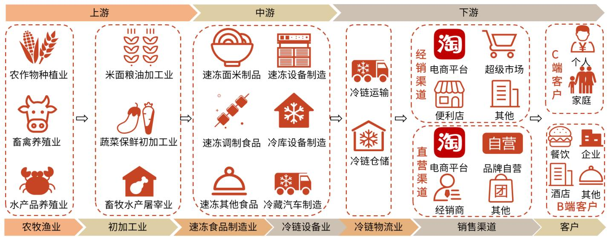

# 公司研究

# 滴水穿石，觅百厨千味

——千味央厨（001215.SZ）投资价值分析报告

# 要点

速冻米面行业：老赛道，新机会。1）市场规模稳步扩张，零售端占比高。据华经产业研究院统计，2015-2019 年我国速冻米面食品市场规模从 542 亿元增长至677 亿元，CAGR为 $5 . 7 2 \%$ ，而目前速冻米面食品C 端的销售额占比大幅高于B 端。2）对标日本，销售渠道向B 端转移为大势所趋。中国现处速冻食品发展阶段可对标日本 70-80 年代，受到外食化率、餐饮成本攀升等因素影响，速冻米面市场有望从 B 端发起放量。

千味央厨：速冻米面制品B 端龙头，产品/渠道/供应链能力领先。1）研发能力强，护城河深厚：公司深刻理解餐饮需求，通过多年的研发和积累，已在油条、芝麻球、蛋挞皮上取得领先优势；2）直营经销并进，先发优势明显：公司已培育一批知名餐饮客户、较齐全的渠道网络、过硬的定制化能力，头部客户引领消费潮流，保证公司产品处于领先地位，依靠用户对大品牌的认可，可低成本快速拓展中小B客户；3）模式成熟，品控卓越：公司学习肯德基的供应链体系，品控能力较强，此外公司预计 2025 年产能将达到 19.60 万吨，产能瓶颈问题可被有效缓解；4）股权结构清晰，团队经验丰富：公司由经验丰富的管理团队负责运营，2021 年 11 月推出限制性股票激励计划，此次激励将有效激发团队活力，深度绑定管理团队。5）好生意成就高 ROE：速冻米面制品餐饮端不需要高昂的商超销售、宣传等费用，虽然毛利率略低于消费端，但其销售费用率低，高周转和较高净利率带来高 ROE。

未来展望：确定性与成长性兼具。1）确定性：高粘性，好赛道。工业化米面制品替代手工产品是大势所趋，依托大品牌灯塔效应和优秀的研发能力，在已有大单品和优质客户群的基础上，公司围绕消费场景不断新增 SKU，每年将$2 0 \% - 3 0 \%$ 新品推向全渠道，夯实品类优势。2）成长性：赛道宽，增速高。我国速冻食品行业发展阶段相当于日本 70 年代初期，尚有 10-20 年成长期。千味央厨主打速冻米面制品，同时开发烘焙类、菜肴类产品，所处行业的天花板高，公司新老品类共同做大营收，有望保持米面制品领域领先地位，在现有产品中再造3 至5 个超亿元核心品类。

盈利预测、估值与评级：速冻米面餐饮市场成长性高，公司研发与渠道能力突出，公司业务有望继续发展，预测公司 2021-23 年营收分别为 12.85/16.58/21.00 亿元，归母净利润为 0.93/1.18/1.58 亿元，对应 EPS 为1.07/1.36/1.82 元，当前股价对应PE 为46/36/27 倍。首次覆盖，给予“买入”评级。

风险提示：食品安全风险，疫情反复风险，原材料价格波动风险，大客户风险， 次新股价波动风险。

公司盈利预测与估值简表  

<table><tr><td>指标</td><td>2019</td><td>2020</td><td>2021E</td><td>2022E</td><td>2023E</td></tr><tr><td>营业收入（百万元）</td><td>889</td><td>944</td><td>1,285</td><td>1,658</td><td>2,100</td></tr><tr><td>营业收入增长率</td><td>26.82%</td><td>6.20%</td><td>36.03%</td><td>29.08%</td><td>26.62%</td></tr><tr><td>净利润（百万元）</td><td>74</td><td>77</td><td>93</td><td>118</td><td>158</td></tr><tr><td>净利润增长率</td><td>26.32%</td><td>3.33%</td><td>21.34%</td><td>26.59%</td><td>33.92%</td></tr><tr><td>EPS (元)</td><td>1.29</td><td>1.20</td><td>1.07</td><td>1.36</td><td>1.82</td></tr><tr><td>ROE（归属母公司)（摊薄)</td><td>18.27%</td><td>13.15%</td><td>9.64%</td><td>10.88%</td><td>12.71%</td></tr><tr><td>P/E</td><td>38</td><td>41</td><td>46</td><td>36</td><td>27</td></tr><tr><td>P/B</td><td>7</td><td>5</td><td>4.4</td><td>3.9</td><td>3.4</td></tr></table>

资料来源：Wind，光大证券研究所预测，股价时间为 2022-02-09注：因新股发行+股权激励 2021 年末总股本较 2020 年末增加 0.2281 亿股至 0.8663 亿股

买入 (首次)当前价：49.28元

# 作者

<table><tr><td colspan="2">市场数据</td></tr><tr><td>总股本(亿股)</td><td>0.87</td></tr><tr><td>总市值(亿元)：</td><td>43</td></tr><tr><td>一年最低/最高(元):</td><td>18.85/75.35</td></tr><tr><td>近3月换手率：</td><td>104.28%</td></tr></table>

  
股价相对走势

<table><tr><td colspan="4">收益表现</td></tr><tr><td></td><td>1M</td><td>3M</td><td>1Y</td></tr><tr><td>相对</td><td>-12.95</td><td>-24.66</td><td>133.72</td></tr><tr><td>绝对</td><td>-18.23</td><td>-30.52</td><td>115.74</td></tr></table>

资料来源：Wind

# 投资聚焦

# 关键假设

油炸类产品：预测 2021-23 年收入同比增长 $3 3 . 9 0 \% / 2 8 . 7 5 \% / 2 5 . 6 6 \%$ ，行业景气度高，公司油条、芝麻球优势突出，预测2021-23 销量增速 $3 0 \% / 2 5 \% / 2 2 \%$ ,均价增速 $3 \% / 3 \% / 3 \%$ ；公司主要采取成本加成法定价，预测 2021-23 年毛利率为 $2 1 \% / 2 1 \% / 2 2 \% _ { \circ }$

烘焙类产品：预测 2021-23 年收入同比增长 $3 7 . 5 0 \% / 3 1 . 9 5 \% / 3 0 . 8 0 \%$ ，冷冻烘焙是高增长的品类，公司开拓西快、茶饮等客户，扩展冷冻面团、曲奇等高价格品类，预计2021-23 年销量增速 $2 5 \% / 2 0 . 5 \% / 2 0 \%$ ，均价增速 $1 0 \% / 9 . 5 \% / 9 \%$ .,毛利率方面，公司新品不断推出，预测 2021-23 毛利率为 $2 3 \% / 2 3 . 5 \% / 2 4 \%$ 蒸煮类产品：预测 2021-23 年收入同比增长 $3 0 . 6 5 \% / 2 7 . 3 8 \% / 2 5 \%$ ，公司蒸煎饺、米糕性价比较高，公司用其开拓早餐等消费场景，有望成为新大单品；预计2021-23 年销量增速 $3 0 \% / 2 7 \% / 2 5 \%$ ，均价增速 $0 . 5 \% / 0 . 3 \% / 0 \%$ ；预测2021-23毛利率为 $2 4 . 5 \% / 2 5 . 5 \% / 2 6 . 0 \%$

菜肴类及其他产品：预测 2021-23 年收入同比增长 $7 8 . 5 \% / 2 8 \% / 2 6 \%$ 预制菜行业景气度高，公司该类产品基数较低且不断推出新品，但新产品的不确定性较高，保守估计2021-23 年销量增速 $7 0 \% / 2 8 \% / 2 6 \%$ ，均价增速 $5 \% / 0 \% / 0 \% / 0 \%$ ；预测2021-23 年毛利率分别为 $2 0 . 0 \% / 2 0 . 0 \% / 2 0 . 0 \%$

# 我们的创新之处

从生产端、流通端、需求端三个环节分析中国速冻米面制品 B 端发展滞后的原因：1）生产端工业化难度高、制作工艺复杂、区域口味繁杂、无法从国外引进设备，加工企业承担研发设备和工艺标准化双重任务；2）流通端渠道阻塞，冷链物流不完善导致速冻食品难以触达餐饮端，相比餐企自行采购，速冻食品成本优势不明显；3）需求端市场培育滞后，餐饮连锁化是半成品食品发展的重要推动力，早期连锁化率低导致 B 端速冻米面市场增长动力不足。随着外部约束条件逐渐被解决，生产端成为速冻米面行业发展关键。

通过分析供给端、需求端，我们认为品类扩张将推动公司快速增长，春卷、馅饼、米糕、蒸煎饺、卡通包五大产品有望接棒油条、芝麻球成为公司新的大单品：1)供给端，技术可行性高。从公司核心专利技术和在研技术储备来看，公司在以上产品中技术积累较多，工业化能力最强；2）需求端，全国化潜力大、产品畅销。上述产品是全国广受喜爱的传统美食，市场需求大，在电商平台销量较高，且和竞品相比具有性价比优势。

# 股价上涨的催化因素

1）蒸煎饺、米糕等新产品快速增长，销量增速超预期；2）公司渠道扩张快速推进；3）公司正采用新建、租用、购买等方式大力扩产，如果新工厂建设加速，将带动营收增速超预期。

# 估值与目标价

速冻米面餐饮市场成长性高，公司研发与渠道能力突出，公司业务有望继续高增，预测公司2021-23 年营收分别为12.85/16.58/21.00 亿元，归母净利润为0.93/1.18/1.58 亿元，对应 EPS 为1.07/1.36/1.82 元，当前股价对应 PE为46/36/27 倍。首次覆盖，给予“买入”评级。

# 目 录

# l、速冻米面行业：老赛道，新机会.. 6

# 2、公司概况：速冻米面制品B 端龙头..

# 3、核心优势：产品&渠道&供应链能力领先. 18

# 4、未来展望：确定性与成长性兼具. 29

# 、盈利预测、估值及评级. ..33

# 5.1、盈利预测… . 3

# 6、风险分析…… .37

# 图目录

图1：2019 年速冻食品产品分类及市场规模结构. ….6  
图2：速冻米面处于发展成熟期.. ….6  
图 3：速冻食品行业市场规模持续上升.. …….6  
图4：我国速冻米面制品以C端销售规模为主. 7  
图5：2016-2020年中国线上生鲜市场交易额逐年增加.. …7  
图 6：中/日人均GDP 突破1万美元时间分别为 2019/1981 年……7  
图7：日本居民可支配收入走势图 …7  
图 8：日本城市化率走势图… …8  
图9：日本餐饮市场规模、增速及饮食外部化率..  
图10：日本速冻调理食品销量走势图（万吨） …  
图11：日本速冻食品分渠道销量趋势图（单位：万吨） 8  
图 12：201-020年全国餐饮业收入规模及其增速……9  
图13：2016-2020 年我国团餐市场份额及预测. …9  
图14：2011-2020 年我国外卖产业规模. … 10  
图 15：我国外卖用户规模… … 10  
图16：2015-2019 年中国餐饮连锁化率 … 0  
图17：2019 年全球餐饮连锁化率对比... … 10  
图18：各项成本费用占营业收入比例（2019 年) ….11  
图 19：直接购买食材与使用预制菜成本比较（单位：元）……11  
图20：千味央厨历史回顾. … 12  
图 21：千味央厨产品属于产业链中游……12  
图22：四大品类营收规模（亿元）及增速 $( \%$ )  13  
图23：四大品类平均价格（元/公斤） … 13  
图 24：公司营业收入及其同比增速……14  
图 25：公司归母净利润及其同比增速.. … 14  
图 26：公司股权架构稳定，推出股票激励计划鼓舞军心…… …. 15  
图 27：速冻行业上市公司收入及增速对比.. …. 16  
图 28：量增是收入增长的主要驱动.. ……. 16  
图 29：公司毛利率低于同业平均水平..  
图 30：公司销售费用率低于同业平均水平……17  
图31：公司管理费用率较高. … 18  
图 32：公司销售净利率较高… … 8  
图 33：公司总资产周转率较高……18  
图 34：公司净资产收益率较高 … 18  
图 35：速冻米面餐饮市场发展滞后因素分析.. ……. 19  
图36：中国速冻食品各品类的生命周期处于不同阶段. …. 19  
图37：千味央厨专注油条研发 18 年 …… 20  
图38：公司研发体系完善.. 21  
图 39：公司通用品和定制品营收占比为  ……22  
图40：公司产品数量快速增加…. .22  
图41：公司油条应用场景丰富，是工业化油条霸主. ….22  
图42：和竞品相比，千味央厨主要产品单价较低，性价比高， ….23  
图43：公司销售架构成熟. ….2 5  
图 44：千味央厨渠道收入变化 ….2 5  
图45：直营渠道毛利率高于经销渠道. ..25  
图46：千味央厨经销商数量（家）快速增加. ..26  
图47：千味央厨采用经销模式的原因.. ..26  
图48：千味央厨“尖刀行动”四大举措. ..27  
图49：千味央厨供应链管理体系成熟.. ..28  
图 50：千味央厨质量管理部四大模块分工明确 ..28  
图51：公司产能扩张计划. ..29  
图52：千味央厨各区域的销售收入规模 (亿元) .. 29  
图53：2020年千味央厨华东区域收入占比（%）最高. .. 29  
图54：速冻面米餐饮市场确定性强， . 30  
图55：公司竞争壁垒：强产品力 $^ +$ 先发优势 …. 30  
图 56：千味央厨四大品类 SKU 快速增加.. ….31  
图57：我国速冻食品发展阶段.. ….1  
图58：千味央厨主要增长逻辑. ….32

# 表目录

表1：我国团餐业务模式. .9  
表2：公司产品结构.. .13  
表3：千味央厨前十大单品的销售额和价格变动情况. .14  
表4：千味央厨股权激励收入增长目标. .. 15  
表5：公司主要管理层信息.. .. 15  
表6：公司各类产品销售收入情况. ….16  
表7：速冻米面市场B2B 和B2C商业模式对比. .17  
表8：公司主要核心技术.. ….20  
表9：公司主要在研项目及进展情况. …. 21  
表10：速冻食品上市公司对比.. ….24  
表11：直营和经销的商业模式差别. ….24  
表12：千味央厨B端优势， ….2 5  
表13：公司前五大直营客户营收（万元）及其占比..  
表14：百胜中国供应链管理的关键特征. ….27  
表15：千味央厨和三全食品京东直营店畅销单品(按销量排名) ….33  
表16：千味央厨分项业务收入、毛利率及费用率预测. ..34  
表17：千味央厨相对估值分析， ….35  
表18：绝对估值核心假设表. ..35  
表19：现金流折现及估值表 ….36  
表20：敏感性分析表.. ….36

# 1、速冻米面行业：老赛道，新机会

# 1.1、 速冻米面赛道发展成熟，稳步扩张

速冻食品行业中，米面制品发展最成熟，市场规模占比最大。我国速冻食品分类具有本地饮食文化特征，主要分为速冻调制食品、速冻米面制品、速冻其他食品三类。其中速冻米面制品市场规模占比最大，2019 年达 $5 2 \%$ ，主要集中在速冻水饺、汤圆、面点等传统产品，汤圆和水饺是最主要的两大品类。如今，传统速冻米面制品市场规模已经趋于稳定，步入发展成熟期，适应更细化餐饮场景的新兴产品不断涌现，例如油条、芝麻球、煎蒸饺、卡通包等。

  
图1：2019 年速冻食品产品分类及市场规模结构

资料来源：公司招股说明书，光大证券研究所

速冻米面市场规模稳步扩张，增速略慢于整体速冻行业。根据 Frost&Sullivan的研究数据，我国速冻食品行业规模由 2013 年的 828 亿元增长至 2019 年的1400 亿元，CAGR 达到 $1 0 . 0 \%$ 。据华经产业研究院，2015-2019 年我国速冻米面食品市场规模逐年增长，从 2015 年的542亿元增长至2019年677 亿元，CAGR为 $5 . 7 2 \%$ ，考虑目前行业步入成熟期，未来速冻米面市场或将保持个位数增长。

  
图2：速冻米面处于发展成熟期

资料来源：光大证券研究所绘制资料来源：Frost&Sullivan，光大证券研究所整理

  
图3：速冻食品行业市场规模持续上升

# 1.2、 零售渠道格局稳固，逐步向线上转移

速冻米面制品销售渠道以 C 端为主，格局相对稳固。据 IBIS 数据显示，2020 年我国速冻米面制品 C 端渠道销售额占比 $8 4 \%$ ，而B 端渠道占比仅为 $1 6 \%$ 。主要受过去速冻米面产品结构所限，以汤圆、水饺为主，消费者画像集中于居家百姓，商超、便利店为最核心的销售渠道。

受疫情影响，C 端销量逐步转到线上。随着零售业竞争加剧，超市、便利店等渠道端将更多费用转嫁给供应商，致使速冻米面企业利润空间受到进一步挤压。2020 年疫情期间，线下零售严重受挫，许多速冻米面厂商开辟了新的线上销售平台，在进入天猫生鲜、京东生鲜、拼多多等头部电商平台的同时，进入新兴的社区团购电商平台，如兴盛优选、同程生活、美团优选等，这成为公司业绩在疫情期间新的支撐点。

  
图4：我国速冻米面制品以 C 端销售规模为主

资料来源：IBIS，光大证券研究所整理(截至 2020 年)

  
图5：2016-2020 年中国线上生鲜市场交易额逐年增加

资料来源：中国市场信息调查协会，光大证券研究所整理

# 1.3、B 端蓝海待开发，打造成长新机会

# 1.3.1、对标日本：销售渠道向 B 端转移为大势所趋

中国目前的速冻食品发展阶段可对标日本 70-80 年代。对比中日发展历程，可发现我国经济社会的发展阶段类似于日本70-80 年代：1）经济崛起，城镇化率提升，居民可支配收入增加，餐饮市场规模保持高增速。2）社会结构层面，家庭结构小型化，女性劳动参与率增加，家庭烹饪需求减小，居民饮食外部化率提升。3）生产要素层面，劳动力、租金成本攀升，餐饮业亟需标准化食材降本增效。这样的时代背景赋予了标准化餐饮优渥的培育土壤。

  
图6：中/日人均GDP 突破1万美元时间分别为2019/1981 年

资料来源：世界银行，光大证券研究所整理；统计截至 2019 年资料来源：日本总务省，国家统计局，光大证券研究所整理；统计区间为 1963-2020 年资料来源：联合国，光大证券研究所整理；统计区间为 1920-2018 年

  
图7：日本居民可支配收入走势图

  
图8：日本城市化率走势图

  
图9：日本餐饮市场规模、增速及饮食外部化率  
资料来源：日本食品服务协会，光大证券研究所整理；统计区间为 1975-2019 年

20 世纪 70 年代后日本速冻米面制品销量快速拉升，主要源于 B 端驱动。根据日本冷冻食品协会的资料， 20 世纪 70 年代之前日本餐饮端和消费端速冻食品消费量均处于发展初期，增速明显；70 年代之后，随着日本电冰箱普及率的上升和消费市场的成熟，速冻食品在消费端的发展近乎停滞，取而代之的是随餐饮市场进一步攀升的餐饮端销量。1970 至 1990 年间，日本速冻食品销量 CAGR 均值达到 $1 0 \%$ ，餐饮端销量占比最高达到 $75 \text{‰}$ 借鉴日本，我们有理由认为随着消费端的成熟，中国速冻米面市场短期内也会从 B 端发起放量。

  
图10：日本速冻调理食品销量走势图(万吨)  
资料来源：日本冷冻食品协会，光大证券研究所整理，统计区间为 1958-2020 年

  
图11：日本速冻食品分渠道销量趋势图(单位：万吨)  
资料来源：日本冷冻食品协会，光大证券研究所整理，统计区间为 1962-2020 年

# 1.3.2、四重驱动助力速冻米面 B 端市场快速扩容

# 团餐逆势上升，推动行业扩容

团餐市场拉动速冻米面新需求。团餐是我国餐饮结构的重要类型之一，供应商主要以团体形式提供餐食与服务，以上门服务为主，团餐的主要消费场所为学校、机关事业单位、医院、军队等，其特殊的服务形式在疫情期间显现出巨大潜力。受新冠疫情影响，多地政府鼓励企业进行预约式订餐以解决员工的吃饭问题，需求端拉动团餐行业于逆境中上升。据中国饭店协会预计，在 2020 年餐饮行业整体负增长 $1 5 . 4 0 \%$ 的背景下，团餐市场规模由2019 年的1.5 万亿元上升至1.53万亿元，团餐市场份额由 $3 2 . 1 2 \%$ 上升至 $3 8 . 7 3 \text{‰}$

  
图12：2011-2020 年全国餐饮业收入规模及其增速  
资料来源：国家统计局，光大证券研究所

  
图13：2016-2020 年我国团餐市场份额及预测

资料来源：中国饭店协会，光大证券研究所，预测机构为中国饭店协会团餐的消费场景和服务形式越来越多样。学校、企业和机关食堂是我国团餐企业的主营领域，然而近年来随着我国老龄化的加快和会展业的发展，团餐消费场景也进一步扩展至养老、会议和活动领域。据中国烹饪协会与亿欧智库联合调查，团餐百强企业中 9 成为传统进驻甲方模式，1 成为新型集体配餐运营模式，且由于集体配餐更迎合疫情期间的新增需求，新兴团餐企业大多采用集体配餐模式运营。集体配餐模式与外卖相似，均对制作餐食的规模和效率提出了更高的要求，这也为速冻米面进入团餐市场提供了机会。

表1：我国团餐业务模式  

<table><tr><td rowspan="2">团餐业务模式</td><td rowspan="2">进驻甲方模式</td><td colspan="2">集体配餐模式</td></tr><tr><td>传统集体配餐模式</td><td>新型平台集体配餐模式</td></tr><tr><td>模式特点</td><td>团餐企业入驻被服务位，承句包其就餐场所，以自营建立中央厨，以流水线形式集制作餐收集甲方客户用，求，批量单给作餐饮商家</td><td></td><td></td></tr><tr><td>优点</td><td>占市场份。团餐一费自负费亏，需</td><td colspan="2">运营系统开放，受甲方限制较小，市场化程度较高</td></tr><tr><td>缺点</td><td>房屋与部分件仍方，且关键流监督、服务标</td><td>重资产模式下，转型升级成本较高</td><td>不具备餐饮场所运营及膳食制作能力，缺乏核心竞</td></tr><tr><td></td><td>代表企业千喜鹤、中快餐饮、蜀王、快客利、麦金地、健力源</td><td>丽华快餐等</td><td>美餐等</td></tr></table>

资料来源：中国烹饪协会，亿欧智库，光大证券研究所

# 外卖行业稳定成长，半成品菜需求上升

我国持续增长的外卖行业同样是冷冻米面制品稳定的需求端。受益于头部外卖平台强大的大数据技术、消费者餐饮习惯的改变和家庭规模的小型化，我国外卖市场在过去几年中规模不断增长，虽随着产业渗透率的增长其增速有所下降，但仍维持着较高增速。2020 年中国餐饮外卖产业规模为 6646 亿元，相比 2019 年增长 $1 5 \%$ ，在疫情大环境下表现出较强的稳定性与成长性。

我国外卖产业的持续快速增长，不仅推动了餐饮行业线上线下融合发展，拓宽了消费场景，同时也延长了餐饮行业的产业链。从供给端来说，为了在短时间内制作出大量品质相似且有保障的餐品，满足外卖配送的及时性，外卖商家对标准化预制食材或半成品菜的需求也会上升，速冻食品有望借此机遇迎来快速增长。

  
图14：2011-2020 年我国外卖产业规模  
资料来源：艾媒咨询，光大证券研究所

  
图15：我国外卖用户规模

资料来源：CNNIC，前瞻产业研究院，光大证券研究所

# 餐饮连锁化率提升，倒逼食材标准化

我国餐饮连锁化率呈现稳定上升趋势。随着餐饮市场的快速发展，希望做大做强的餐饮企业往往会选择连锁经营模式进行扩张以实现规模经济，在较为激烈的市场竞争中获得优势。经过发展，我国餐饮连锁化率虽自 2015 年的 $8 . 9 0 \%$ 逐步提升至2019年的 $1 0 . 3 0 \%$ ，但相较于其他发达国家，我国餐饮业仍呈现出“散而小”的特点，餐饮连锁化程度较低。随着消费升级的推动，市场竞争的加剧以及供应链技术的成熟，优质企业将凭借品牌知名度和规模优势赢得更多市场红利，从而推动我国餐饮连锁化率进一步上升。

餐饮企业连锁经营模式对标准化程度较高的半成品食材需求较大，这为速冻米面制品企业提供了可持续发展的商业机会。连锁餐企看重出餐速度，谋求食材和烹饪工艺高度标准化，而速冻米面自身具有产品标准化、安全标准化和操作标准化特征，贴合餐企需求。此外，速冻米面企业可以和连锁餐企开展定制化合作，为餐企量身打造米面制品，简化厨师和厨房职能的同时实现餐企特色化、标准化和规模化。

  
图16：2015-2019 年中国餐饮连锁化率

  
图17：2019 年全球餐饮连锁化率对比

资料来源：欧睿国际，光大证券研究所资料来源：欧睿国际，光大证券研究所

# 餐企谋求降本增效，速冻米面切实解决行业痛点

引入速冻米面制品作为食材，可有效满足餐企降本需求。从企业角度来看，餐饮企业长期以来存在“三高”问题，即原料进货成本高、人力成本高和房租及物业成本高。根据中国饭店协会的调查，2019 年被调研企业中原料进货成本占营业收入比例最高，均值为 $4 1 . 8 7 \text{‰}$ 由于我国经济发展迅速，劳动力成本快速上升，且餐饮业为典型的劳动密集型企业，人力成本占营业收入的比例为 $2 1 . 3 5 \%$ 。房租及物业成本占营业收入比例均值则为 $1 1 . 7 7 \%$ 。餐饮市场竞争日益激烈，使用速冻米面可以帮助企业控制原料进货成本，减少后厨使用面积，降低人工成本和房租成本。

  
图18：各项成本费用占营业收入比例(2019年）

  
图19：直接购买食材与使用预制菜成本比较(单位：元)

资料来源：中国饭店协会，光大证券研究所资料来源：美团，前瞻产业研究院，光大证券研究所注：统计时间为 2021 年 7 月，图中展示一份售价为 20 元的快餐的成本拆解速冻米面制品给消费者和餐饮企业带来增值。从消费者角度看，随着人们生活水平的提高与餐饮业的发展，消费者对于食品安全越来越看重。连锁餐饮企业对食材采购和制作流程安全性的把握，也是吸引消费者的重要一环。从餐饮企业角度看，米面制品在餐饮市场上收入占比有限、特色化程度也相对较低、制作难度和成本相对较高，如果能够获得稳定、低成本、安全的速冻米面作为食材，对其解决食品安全问题、降本增效非常有利。

# 1.3.3、同业积极布局餐饮市场，千味享先发优势

半成品食材需求日益增強，餐饮端成为速冻米面新蓝海。随着餐饮行业集中化、连锁化和供应链社会化的发展，餐饮端速冻米面制品需求潜力较大。部分专注于餐饮领域的速冻米面企业，如千味央厨，采用产品差异化的竞争策略抢占市场，而另一部分消费端速冻米面供应商也在逐渐将业务重心转向餐饮渠道。如安井食品于2018 年底调整了经营策略，提出“三剑合璧、餐饮发力”的经营策略和“餐饮流通渠道为主、商超电商渠道为辅”的渠道策略组合模式，并推出了副品牌“冻品先生”，专门定位于餐饮食材类，从而开始切入到餐饮渠道。相较于发展成熟的零售市场，速冻米面餐饮市场尚处于开拓期，未进入激烈市场竞争的阶段。

表4：含速冻米面公司餐饮端品牌对比  

<table><tr><td>公司</td><td>餐饮品牌</td><td>2020 年餐饮端米面营收</td><td>主要速冻米面产品</td></tr><tr><td>千味央厨</td><td>千味央厨</td><td>约9亿元</td><td>油条、芝麻球、地瓜丸、卡通包、蒸饺</td></tr><tr><td>三全食品</td><td>三全绿标餐饮专供</td><td>约9亿元</td><td>水饺、包点</td></tr><tr><td>思念食品</td><td>思念BP</td><td>约7亿元</td><td>汤圆、水饺、面点</td></tr><tr><td>安井食品</td><td>安井</td><td>约8亿元</td><td>手抓饼、面点</td></tr></table>

资料来源：华经产业研究院，光大证券研究所整理

# 2、公司概况：速冻米面制品B 端龙头

# 2.1、 业务布局：聚焦 B 端，只为餐饮

出身思念食品，专注速冻米面餐饮端市场。公司前身为思念食品B 端业务，自2012 年成立起，公司专注速冻米面餐饮市场，是国内最早为 B 端市场提供速冻米面制品解决方案的供应商之一，公司对中华传统米面美食进行工业化改造，将其引入到餐企后厨，并成为肯德基、海底捞、华莱土、真功夫等知名餐饮连锁品牌供应商。公司发展经历了三个阶段。1）2002-2012 年：客户积累期。思念食品成为百胜中国挞皮供应商，研发工业化油条并向百胜中国销售，让中式传统食品进入西式快餐连锁。2）2012-2016 年：专注 B 端期。思念食品单独成立千味央厨负责 B 端渠道，2014 年开启定制化服务，深化客户合作。3)2016 年至今：加速成长期。公司从思念体系脱离，进入快速发展期。

  
图20：千味央厨历史回顾  
资料来源：公司官网，公司招股说明书，官方微信公众号，光大证券研究所

  
图21：千味央厨产品属于产业链中游  
资料来源：公司招股说明书，光大证券研究所

品类丰富，适应多元化场景。按照加工方式，公司产品分为油炸类、烘焙类、蒸煮类、菜肴类及其他四大类，2020 年营收分别为 5.21 亿元/1.88 亿元/1.84 亿元/0.5 亿元，其中油炸类是公司优势品类，油条、芝麻球更是核心单品，油条单品规模约为4 亿元。2019 年，公司设立焙伦品牌进攻烘焙、西快类市场，主打可颂、华夫、西点等西餐热门品类。从均价来看，2020 年油炸类、烘焙类、蒸煮类、菜肴类及其他均价分别为9.84元/公斤、15.00元/公斤、10.56元/公斤、10.57 元/公斤。公司产品适应早餐、酒店、西餐、外卖、火锅、团餐等众多场景，以油条为例，公司推出涮煮小油条、茴香小油条、麻辣烫小油条、火锅油条、外卖专用油条等产品满足不同场景需求。

  
图22：四大品类营收规模（亿元）及增速（%)  
资料来源：公司招股说明书，光大证券研究所

  
图23：四大品类平均价格（元/公斤）  
资料来源：公司招股说明书，光大证券研究所

表2：公司产品结构  

<table><tr><td>品类</td><td>营收占比</td><td>主要产品</td><td>单品数量</td><td>应用场景</td><td>示意图</td></tr><tr><td>油炸类</td><td></td><td>55.2%油条、芝球脆皮香蕉、</td><td>95个</td><td>外卖、快餐、早餐、酒</td><td></td></tr><tr><td>烘焙类</td><td></td><td>19.86%蛋挞皮、可颂冷冻面团、曲奇、华夫 饼干</td><td>56个</td><td>西快、咖啡、茶饮、烘焙</td><td></td></tr><tr><td>蒸煮类</td><td>19.44%</td><td>包子、切糕、油饼、饺子、汤圆</td><td>166个</td><td>酒店、外卖、餐饮</td><td></td></tr><tr><td></td><td></td><td>5.2%千页豆腐、豆粉、撒尿丸、煎</td><td>51个</td><td>火锅麻辣烫、快餐、宴席、</td><td></td></tr></table>

资料来源：公司招股说明书，光大证券研究所，数据时间为 2020 年

前十大单品营收占比接近 $50 \text{‰}$ 公司主要产品包括油条、芝麻球、蛋挞皮、地瓜丸以及卡通包等，2020 年前十大单品营收占比为 $4 5 . 8 9 \text{‰}$ 2017-2020年，公司营业收入从 5.93 亿元增长至9.44 亿元，CAGR 为 $1 6 . 7 6 \%$ ；归母净利润从0.47 亿元增长至0.77 亿元，CAGR为 $1 8 . 0 5 \%$ ；前十大单品营业收入从 2.2 亿元增长至4.33 亿元，CAGR 为 $2 5 . 3 1 \%$ ，远超整体增速，核心单品带动公司营收快速增长。2020 年营收同比增长 $6 . 2 \%$ ，主要系新冠疫情下直营客户收入下滑。

  
图24：公司营业收入及其同比增速  
资料来源：公司公告，光大证券研究所

  
图25：公司归母净利润及其同比增速  
资料来源：公司公告，光大证券研究所

表3：千味央厨前十大单品的销售额和价格变动情况  

<table><tr><td rowspan="2">项目</td><td colspan="2">2017年</td><td colspan="2">2018年</td><td colspan="2">2019年</td><td colspan="3">2020年</td></tr><tr><td>销售频</td><td>(元公斤)</td><td>销售</td><td>单价变动幅度</td><td>销售频</td><td>单价动幅度</td><td>销售题</td><td>单价变动幅度</td><td>营收占比</td></tr><tr><td>1*18*16蛋挞皮</td><td>7,097.04</td><td>14.04</td><td>7,952.65</td><td>1.92%</td><td>9,107.33</td><td>1.30%</td><td>8,664.30</td><td>1.50%</td><td>9.17%</td></tr><tr><td>千味260g芝麻球</td><td>8,538.82</td><td>7.80</td><td>8,954.79</td><td>0.26%</td><td>9,033.79</td><td>2.16%</td><td>9,830.79</td><td>-0.09%</td><td>10.41%</td></tr><tr><td>KFC冷冻油条(60g)</td><td>-</td><td>-</td><td>4,497.85</td><td>-</td><td>6,815.12</td><td>0.53%</td><td>6,503.15</td><td>0.65%</td><td>6.89%</td></tr><tr><td>千味400g香芋地瓜丸</td><td>-</td><td>-</td><td>4,403.52</td><td>-</td><td>5,015.23</td><td>0.17%</td><td>5,272.30</td><td>4.29%</td><td>5.58%</td></tr><tr><td>千味450g香脆油条</td><td>3,634.10</td><td>10.47</td><td>3,931.38</td><td>-2.39%</td><td>4,344.96</td><td>0.97%</td><td>4,460.20</td><td>1.23%</td><td>4.72%</td></tr><tr><td>百胜原味冷冻华夫面团</td><td>-</td><td>-</td><td>1,196.04</td><td>-</td><td>2,804.94</td><td>0.08%</td><td>1,729.94</td><td>-4.12%</td><td>1.83%</td></tr><tr><td>千味360g卡通猪猪包</td><td>615.43</td><td>14.53</td><td>1,850.14</td><td>-1.38%</td><td>2,671.56</td><td>2.21%</td><td>2,747.64</td><td>1.09%</td><td>2.91%</td></tr><tr><td>千味1200g放心大油条</td><td>-</td><td></td><td>927.31</td><td>-</td><td>1,963.33</td><td>-3.89%</td><td>2,611.47</td><td>5.52%</td><td>2.77%</td></tr><tr><td>千味 300 克脆皮香蕉</td><td>2,136.65</td><td>9.24</td><td>1,865.72</td><td>-0.11%</td><td>1,756.57</td><td>2.55%</td><td>1,515.17</td><td>0.49%</td><td>1.60%</td></tr><tr><td>百胜360g蛋芯油条</td><td>-</td><td>-</td><td>-</td><td>-</td><td>1,628.91</td><td>-</td><td>-</td><td>-</td><td>-</td></tr><tr><td>合计</td><td>22022.04</td><td>-</td><td>35,813.69</td><td>-</td><td>45,141.74</td><td>-</td><td>43,334.97</td><td>-</td><td>45.89%</td></tr></table>

资料来源：公司招股说明书，光大证券研究所

# 2.2、 公司治理：团队经验丰富，股权激励提振士气

公司股权结构稳定，大股东和管理层分工明确，推出股权激励计划鼓舞军心。根据公司 2021 年三季报，实控人李伟通过共青城城之集持有 $4 6 . 8 6 \%$ 股份。李伟是思念食品创始人，将其成功打造成速冻食品C 端三巨头之一，考虑到 B 端前景和同业竞争问题，其在 2016-2017 年将持有的思念食品全部股权转让给管理层，且总经理王鹏将千味央厨全部股权转让给李伟。千味央厨独立之后，李伟不担任任何职务，而是由经验丰富的管理团队负责经营，管理层通过前海新希望、共青城凯立持股，利益绑定有利于激发管理层积极性。

为进一步绑定核心骨干利益，2021 年 11 月公司推出限制性股票激励计划。将以每股 31.01 元的价格向包括董事、高管和核心员工在内的 80 人授予 156.84万股，约占总股本的 $1 . 8 4 \%$ ，此次激励将有效激发团队活力。以 2020 年营业收入为基准，2021-23 年营业收入增长不低于 $3 5 \% / 6 7 \% / 1 0 1 \%$ ，对应2021-23年收入同比增长为 $3 5 \% / 2 4 \% / 2 0 \%$ ，本次股权激励对公司高管人员全覆盖，有望提升团队士气，激发经营能动性，对公司中长期增长提供重要保障。

  
图26：公司股权架构稳定，推出股票激励计划鼓舞军心  
资料来源：wind，光大证券研究所，股权结构时间：2021 年 9 月30 日

表4：千味央厨股权激励收入增长目标  

<table><tr><td></td><td>2020</td><td>2021E</td><td>2022E</td><td>2023E</td></tr><tr><td>营业收入(亿元)</td><td>9.44</td><td>12.74</td><td>15.76</td><td>18.97</td></tr><tr><td>较2020 年增长</td><td></td><td>35%</td><td>67%</td><td>101%</td></tr><tr><td>同比增长</td><td></td><td>35%</td><td>24%</td><td>20%</td></tr></table>

资料来源：wind，光大证券研究所

管理团队行业经验丰富，外部战投赋能。公司主要管理层来自思念食品，多位专家曾担任质量技术总监、品控主管、高级研发工程师等核心管理岗位。董事长孙剑 2000 年加入思念食品，拥有 20 多年食品行业从业经验。技术团队产品和设备研发经验丰富，技术研发部总监贾学明研发了公司第一代油条、蛋挞，工程师朱国新研发了豆腐切丁机、红豆派上浆装置等新型设备。2018 年，公司获得京东和绝味食品合计1亿元的投资，公司和京东在“京东到家”、“7Fresh”等业务方面开展合作，绝味食品则通过介绍业务、分享经验给公司赋能。

表5：公司主要管理层信息  

<table><tr><td>姓名</td><td>职务</td><td>工作经历</td></tr><tr><td>李伟</td><td>实际控制人务</td><td>毕业于郑州学新闻系，本科学历。1997 年成河南省思念食品，2006 年思念食品在新加坡上市。2017 年末，李伟退出思念食品</td></tr><tr><td>孙剑</td><td>董事长</td><td>毕业于河南师范学，本科学历。1995.09-2000.10 任河南省天隆实业有限公司业务员；2000.10-2010.09 历任郑州思念业务代表、上海公 司经理、香港公司经理、营销中心副总经理；2010.10-2013.09任河南一生缘食品有限公司销售总经理；2013.10-2018.06任郑州中部大观 地产有限公司副总经理；2018.07起在公司作</td></tr><tr><td>白瑞</td><td></td><td>毕业于中南财经政法大学，硕士学历，中级会计师。1997.07-2000.09 任河南冠联装饰工程有限公司财务部会计；2000.10-2004.04任海信 董事、总经理科龙电器股份有限公司河南分公司会计主管；2004.5-2011.08历任郑州思念结算部经理、资管理部经理、营销中心副总经理助理；2012.04 起在公司工作</td></tr><tr><td></td><td></td><td></td></tr><tr><td>徐振江</td><td>副总经理</td><td></td></tr><tr><td>王向阳</td><td></td><td>毕业于郑州粮学院，本科学历。1996.07-1998.07任郑州市第五粮油品公司产管理间主任；1998.081999.02 任河南兴秦科技 监事会主席有限公司产品研发部实验室主任；199.03-2012.03 任郑州思念质量技术总监；2012.04至今历任公司产质量技术总监、产总监，现任 公司监事</td></tr></table>

资料来源：wind，光大证券研究所

# 2.3、 财务分析：好生意成就高ROE

油炸类是主要收入来源，量增驱动营收快速增长。分量价关系看，2017-2020年，公司产品平均价格从10.81元/公斤提升至12.31元/公斤，CAGR 为 $4 . 4 1 \%$ .,公司总销量从 5.49 万吨增长至7.67 万吨，CAGR 为 $1 1 . 8 2 \%$ ，量增是收入增长的主要驱动力。分品类来看，2020 年，油炸类、蒸煮类、烘焙类、菜肴类及其他收入占比分别为 $5 5 . 2 2 \% / 1 9 . 4 4 \% / 1 9 . 8 6 \% / 5 . 2 6 \%$ ，油炸类收入占比超 $5 0 \%$ ,其中烘焙类和菜肴类及其他营收 2017-2020 年 CAGR 领先其他品类，有望提升营收比例，增加公司产品多元化程度。

表6：公司各类产品销售收入情况  

<table><tr><td rowspan="2">项目</td><td colspan="2">收入万元017年占比</td><td colspan="2">收入万元01年占比</td><td colspan="2">收入万元01年占比</td><td colspan="2">收入万元020年占比</td><td rowspan="2">收入CAGR</td></tr><tr><td></td><td></td><td></td><td></td><td></td><td></td><td></td><td></td></tr><tr><td>油炸类</td><td>35,237.28</td><td>59.39%</td><td>40,232.11</td><td>57.38%</td><td>49,180.17</td><td>55.30%</td><td>52,146.20</td><td>55.22%</td><td>13.96%</td></tr><tr><td>蒸煮类</td><td>11,952.54</td><td>20.15%</td><td>15,296.93</td><td>21.82%</td><td>19,771.29</td><td>22.23%</td><td>18,355.08</td><td>19.44%</td><td>15.37%</td></tr><tr><td>烘焙类</td><td>10,522.14</td><td>17.73%</td><td>13,557.89</td><td>19.34%</td><td>17,671.11</td><td>19.87%</td><td>18,753.72</td><td>19.86%</td><td>21.24%</td></tr><tr><td>菜肴类及其他</td><td>1,578.08</td><td>2.66%</td><td>997.94</td><td>1.42%</td><td>2,240.59</td><td>2.52%</td><td>4,968.34</td><td>5.26%</td><td>46.56%</td></tr><tr><td>其他业务收入</td><td>41.67</td><td>0.07%</td><td>35.39</td><td>0.05%</td><td>65.14</td><td>0.07%</td><td>214.08</td><td>0.23%</td><td>72.55%</td></tr><tr><td>合计</td><td>59,331.71</td><td>100%</td><td>70,120.27</td><td>100%</td><td>88,928.29</td><td>100%</td><td>94,437.42</td><td>100%</td><td>16.76%</td></tr></table>

资料来源：Wind，光大证券研究所

  
图27：速冻行业上市公司收入及增速对比  
资料来源：Wind，光大证券研究所，左侧为营收规模(亿元)，右侧为营收 yoy $\overline { { ( \% ) } }$

  
图28：量增是收入增长的主要驱动力  
资料来源：Wind，光大证券研究所

从商业模式来看，B2B 和 B2C 模式下速冻米面制品的品类差别较大，进而导致盈利模式、ROE 水平不同。餐饮端和流通端品类差异：1）产品属性：B 端产品为半成品，经加工后才销售给消费者，C端产品为产成品，直接出售给消费者；2）客户特性：B 端客户理性、信息充分、偏好性价比高的产品，产品性价比高的厂商容易占据垄断地位，C 端客户信息不足、决策感性、需求分散，厂商需持续宣传以培育消费者心智；3）决策特点：B 端客户采购考察期较长、转换成本高，客户粘性高、采购量大，C端客户随意性强、粘性低、购买量小。

B2B 模式和 B2C 模式 ROE 差异较大。B2B 模式毛利低但费用率低，高周转、高净利率带来高 ROE，而 B2C 模式的高毛利被高费用率抵消，净利率和 ROE 较低。对比行业内各公司商业模式，三全食品以 B2C 模式为主，安井食品则 BC 端兼顾，千味央厨主攻 B2B 模式，巴比食品以加盟模式为主(本质上是 B2B 模式），从三全食品到巴比食品，企业 ROE 水平逐渐提高。

表7：速冻米面市场 B2B 和 B2C 商业模式对比  

<table><tr><td></td><td colspan="2">B2B 模式</td><td colspan="2">B2C 模式</td></tr><tr><td>消费场景</td><td colspan="2">面向餐饮企业，餐饮企业二次加工后出售给消费者</td><td colspan="2">面向家庭消费，消费者购买后简单加工即可食用</td></tr><tr><td>市场类型</td><td colspan="2">餐饮市场(B端市场)</td><td colspan="2">零售市场(C端市场)</td></tr><tr><td>渠道差异</td><td colspan="2">餐饮端渠道集中于餐饮企业、团餐、批发市场，面向餐饮企业</td><td colspan="2">流通端渠道集中于商超、零售点和农贸市场等终端，面向家庭消费</td></tr><tr><td>渠道费用</td><td colspan="2">商超渠道和营销费用低，主要通过业展会等式影响采购商和经销商</td><td colspan="2">需要持续进行告等营销活动，商超等渠道和营销费</td></tr><tr><td>产品属性</td><td colspan="2">半成品食材，需餐厅加工后出售</td><td colspan="2">产成品，可直接出售</td></tr><tr><td>客户特点</td><td colspan="2">客户理性、信感感发低偏好高性价比产品，大客户、供应稳定、</td><td colspan="2">信息不是性量宣传以消费者</td></tr><tr><td>市场驱动力</td><td colspan="2">餐饮连锁化提升、外卖行业增长、团餐市场扩张</td><td colspan="2">懒人消费潮流、家庭规模缩小、生活节奏加快</td></tr><tr><td>决策特点</td><td colspan="2">采购考察期较长、，成本高，粘高、来量大，往往签订长期</td><td colspan="2">冲动型消费较多，消费随意性较强，受广告、潮流影响较多</td></tr><tr><td>代表企业</td><td>巴比食品</td><td>千味央厨</td><td>安井食品</td><td>三全食品</td></tr><tr><td>毛利率</td><td>33.11%</td><td>24.50%</td><td>25.76%</td><td>35.17%</td></tr><tr><td>销售净利率</td><td>14.54%</td><td>8.34%</td><td>7.09%</td><td>3.68%</td></tr><tr><td>周转率（次）</td><td>1.18</td><td>1.22</td><td>1.03</td><td>1.21</td></tr><tr><td>权益乘数</td><td>1.38</td><td>1.98</td><td>2.14</td><td>2.31</td></tr><tr><td>ROE</td><td>23.66%</td><td>20.07%</td><td>15.58%</td><td>10.25%</td></tr></table>

资料来源：wind，光大证券研究所，财务数据取自2019 年，2020 年因疫情影响财务数据显著异于正常年份、故不采用，销售净利率 $: = 1$ 归属母公司股东的净利润/营业总收入，权益乘数$=$ 平均总资产/平均归属公司股东的权益

商业模式优秀，高净利率及周转率实现高 ROE。1）毛利率稳定。2019 年公司毛利率为 $2 4 . 5 0 \%$ ，三全食品/安井食品/巴比食品为 $3 5 . 1 7 \% / 2 5 . 7 6 \% / 3 3 . 1 1 \%$ 公司主要面向餐饮端，对于直营客户，公司采取成本加成法定价，同时为占领市场对经销商让利，公司毛利率较低，考虑到公司知名度、规模优势，预计公司毛利率将维持稳定。2）期间费用率低。对比同行，餐饮客户为主的渠道模式不需要高昂的商超销售、广告宣传等费用，2019 年公司销售费用率/管理费用率为$5 . 0 0 \% / 7 . 1 6 \%$ ，销售费用率远低于大部分对手。3）高净利率和高周转带来高ROE。2019 年，公司净利率约为 $8 \%$ ，三全食品/安井食品/巴比食品为$3 . 6 8 \% / 7 . 0 9 \% / 1 4 . 5 4 \%$ ，叠加较高的总资产周转率（1.22），公司ROE（ $2 0 . 0 7 \%$ 仅次于巴比食品 $2 3 . 6 6 \%$ )。

  
图29：公司毛利率低于同业平均水平  
资料来源：wind，光大证券研究所

  
图30：公司销售费用率低于同业平均水平  
资料来源：wind，光大证券研究所

  
图31：公司管理费用率较高

资料来源：wind，光大证券研究所资料来源：wind，光大证券研究所

  
图32：公司销售净利率较高  
资料来源：wind，光大证券研究所

  
图33：公司总资产周转率较高

  
图34：公司净资产收益率较高  
资料来源：wind，光大证券研究所

# 3、 核心优势：产品&渠道&供应链能力领先

# 3.1、 多维度看赛道关键竞争力

根据 IBIS 数据，2018 年我国速冻米面行业 B 端渠道收入占比仅为 $16 \%$ ，美日等国速冻食品 B 端占比都超过 $50 \%$ ，为何中国速冻米面制品B 端发展滞后？

1）生产端工业化难度高：一是农业高度分散造成农产品品质规格不统一，提高了加工、品控难度；二是速冻米面制品作为中华传统美食、制作工艺复杂、区域□味繁杂、无法从国外引进设备，加工企业承担研发设备和工艺标准化双重任务。

2）流通端渠道阻塞：一是中国早期超市、便利店的快速发展连接了上游供应商和消费者，推动流通端速冻食品快速发展，流通渠道先于餐饮渠道发展；二是餐饮业原料采购依赖批发市场，传统采购流通环节多、成本高，冷链物流不完善导致速冻食品难以触达餐饮端，相比餐企自行采购，速冻食品成本优势不明显。

3）需求端市场培育滞后：零售端市场培育早，已形成相当大的消费群体，而餐饮市场客户分散、需求不足；餐饮连锁化是半成品食品发展的重要推动力，日本上世纪 70-90 年代餐饮行业标准化潮流推动 B 端先于 C 端发展。根据《中国餐饮大数据2021》，2020 年中国餐饮连锁化率仅为 $1 5 \%$ （美国为 $5 0 \%$ ），早期连锁化率低导致Β 端速冻米面市场增长动力不足。

随着外部约束条件逐渐被解决，生产端成为速冻米面行业发展关键，竞争力强的供应商将享受到更多的行业发展红利。

  
图35：速冻米面餐饮市场发展滞后因素分析  
资料来源：光大证券研究所整理

从多个角度看行业竞争关键因素，我们认为产品力/渠道力/供应链能力是决定企业能否在众多厂商竞争中脱颖而出的核心竞争力。1）从供给端来看，原料采购管理难/传统食品工业化难/物流效率低制约行业发展，供应链能力、研发能力强的企业更能解决行业痛点、抢先占领市场；2）从需求端来看，餐饮业需要质量好、性价比高、供应稳定的产品，且市场较分散，因而渠道触达能力强、实现规模经济的企业优势明显；3）从产品生命周期看，中餐属性导致半成品食品工业化难度高，消费者口味变化快、追求新产品，产品生命周期将会缩短，因此研发能力从长期看是关键竞争力。具体来言，导入期，产品力是关键，率先研发细分品类的企业独占市场，往往依靠先发优势、技术壁垒成为龙头；成长期，渠道力、产能是关键，谁能快速触达餐饮企业、满足其需求就能快速壮大，并通过规模化生产、采购降低平均成本；成熟期，综合实力是关键，成熟期的产品同质化严重，高性价比产品是餐饮业核心诉求，小厂商成本、品控不占优势，产品力 $^ +$ 渠道力$^ +$ 供应链能力 $^ +$ 品牌力强的企业有望凭借高性价比优势成为垄断寡头。

随着行业痛点的逐渐解决，B 端市场迎来快速成长期，众多厂商争夺市场份额，市场格局高度分散，能否抓住餐饮端红利期机遇成为新巨头，关键看企业在产品力、渠道力和供应链层面的三大竞争力。千味央厨综合竞争力强，未来有望成为B 端速冻米面制品巨头之一。

  
图36：中国速冻食品各品类的生命周期处于不同阶段  
资料来源：光大证券研究所整理

# 3.2、产品：研发能力强，护城河深厚

公司研发能力强，SKU 众多。餐饮业态繁多、形式各异，不同消费场景下食材需求存在差异，下游餐厅对菜单更新、新品推出速度要求甚高。公司深刻理解餐饮需求，研发出众多产品以满足不同需求。1）新品方面，公司不断推出餐饮渠道适销产品，提升餐饮渠道品类叠加效应，目前公司拥有包括油条、芝麻球在内的 300 多个单品；2）老品方面，公司依托现有产品进行场景化的深入研究，研发出适应不同消费场景的系列产品。以油条为例，公司从 2012 年开始进行油条细分场景下的市场研究，细分出火锅、快餐、自助餐、宴席、早餐、外卖六大场景，并针对性推出茴香小油条、麻辣烫小油条等创新产品。

表8：公司主要核心技术  

<table><tr><td>序号</td><td>核心技术</td><td>来源</td><td>功能及创新</td><td>产品应用</td></tr><tr><td>1</td><td>油条纵切技术</td><td>自主研发</td><td>改变油条面团的切条方式，减少生产线用人，增加生产效率</td><td>外卖油条、精品油条、酥脆油条等</td></tr><tr><td></td><td>2 点心(小牛包、年猪包系列)</td><td>吸收再创新</td><td>外观创新，根据动物的象形图像进行创新，做成卡通形状的面点</td><td>奔腾小牛包、黄金大年猪包</td></tr><tr><td>3</td><td>麻辣烫油条系列</td><td>自主研发</td><td>将油条创新制作成可以用于煮制和火锅涮煮的产品</td><td>麻辣烫油条</td></tr><tr><td>4</td><td>注芯油条制作方法</td><td>自主研发</td><td>注芯油条的发明创造，对丰富油条系列有促进作用</td><td>蛋芯油条</td></tr><tr><td>5</td><td>注芯油条加工装置</td><td>自主研发</td><td>油条罐装机的研发，有利于产品的快速规模化生产</td><td>蛋芯油条</td></tr><tr><td>6</td><td>冷冻土豆宽粉生产方法</td><td>自主研发</td><td>生产方式创新，从结合产品特性设计适配的蒸程，提高生产效率</td><td>土豆宽粉</td></tr><tr><td></td><td>7意大利千层面生产方法</td><td>自主研发</td><td>生产方式更新，结合产品特性设计适配的蒸程，提高生产效率</td><td>千层面面皮</td></tr><tr><td></td><td>8  新型预调制八宝粥调理包</td><td>自主研发</td><td>生产方式创新，多种物料加工至同一状态，保证感官</td><td>腊八粥调理包、八宝粥调理包</td></tr></table>

资料来源：公司招股说明书，光大证券研究所

  
图37：千味央厨专注油条研发18 年  
资料来源：公司微信公众号，光大证券研究所

形成需求导向型的研发体系，为客户分忧。1）专业的研发部门。公司技术研发部下设五个研究室，产品研究室分设球类、酥类、油条、面点、烘焙类、创新类六个研发小组，开发上市300 多个产品。2）独特的研发模式。公司在行业内较早建立“模拟餐厅后厨”的研发实验室，并组建专业的餐饮研发团队，最大程度还原餐企后厨的制作工艺；3）分场景研发。研发团队持续开发西式快餐、中式快餐、乡厨等场景需要的新品，将客户的概念化需求快速转化为高质量、标准化的生产，2018 年公司为肯德基研发上新7支单品；4）自主研发设备、产品、配方。公司自主研发蛋挞切块机、自动油条生产线等设备，从而保证产品快速低成本量产。以油条为例，公司自行改进生产线，保证销售一代、研发一代、储备一代，公司油条技术进化至第三代，而市场上仍使用第一代技术。

  
图38：公司研发体系完善  
资料来源：公司招股说明书，光大证券研究所

强大的定制化和服务能力，深度绑定大客户。1）研发模式分为定制研发和自主研发。定制研发要求按照客户委托进行研发立项，客户需求明确，不确定性较小；自主研发是销售部门根据市场需求提研发申请，一般没有明确的客户，不确定性较大。2）定制品为客户独享，3-5年后可改变工艺配方转为高性价比的通用品。对于大客户的快速定制要求，千味央厨从接受定制需求、研发到生产交付只需3-6 个月，由于公司出色表现，百胜中国给予最高级 T1 级供应商地位，领先于其他公司。3）通用品由公司根据市场需求研发，标准化程度高，目标是大规模占领市场。定制化生产可帮助公司紧抓市场潮流，保证公司新产品始终处于行业一线，通用品则作为走量产品，定位于提升营收规模。

表9：公司主要在研项目及进展情况  

<table><tr><td>序号</td><td>项目</td><td>研发阶段</td><td>项目介绍及未来应用前景</td></tr><tr><td>1</td><td>新口味酥饼</td><td>小试阶段</td><td>中式点心的多样化研发生产对，可以更大程度满客户的需求</td></tr><tr><td>2</td><td>冷冻三明治面团</td><td></td><td>试产阶段 三明治面团的工业化生产，代表着烘焙面包类产品在技术上的一个大的突破，为产品开发新的供应渠道</td></tr><tr><td>3</td><td>红豆派</td><td>小试阶段</td><td>针对西式快餐店推出的一款产品</td></tr><tr><td>4</td><td>麻酱烧饼</td><td>小试阶段</td><td>市场产品的吸收创新，增强产品技术研究</td></tr><tr><td>5</td><td>馅饼类</td><td>试验阶段</td><td>开拓饼类市场，丰富产品</td></tr><tr><td>6</td><td>注芯油条系列</td><td>试验阶段</td><td>基于蛋芯油条，对该系列产品进行储备</td></tr><tr><td>7</td><td>新造型春卷</td><td>中试阶段</td><td>春卷的新型的生产方式，自动化，规模化生产</td></tr><tr><td>8</td><td>油条工业化规模化生产的研究</td><td>试验阶段</td><td>作为主力品种，继续对油条工业化产进行技术研究，保持行业领先地位</td></tr><tr><td>9</td><td>米发糕工业化规模化生产的研究试验阶段</td><td></td><td>继续对米发糕的工业化生产进行技术研究</td></tr></table>

资料来源：公司招股说明书，光大证券研究所，截至日期：2021 年 8 月

  
图39：公司通用品和定制品营收占比为7:3

资料来源：公司招股说明书，光大证券研究所

  
图40：公司产品数量快速增加  
资料来源：公司招股说明书，光大证券研究所，单位：个

工业化油条壁垒深厚，细分赛道空间广阔。油条口味全国统一、消费频率高，受制于油条便捷性和触达难的问题，渠道集中在连锁餐饮和星级酒店，市场仍有增量空间。我们认为公司优势明显，将充分受益行业红利，具体来讲：1）油条优势突出。公司独创的生产技术和长期钻研带来技术、研发、设备、工艺壁垒，油条售价甚至低于竞品成本价，公司市占率超 $5 0 \%$ ，百胜中国 $8 0 \%$ 油条来自千味央厨；2）场景扩张。公司油条开发出 20 多个SKU，丰富的 SKU 帮助公司深挖各种消费场景。例如，外卖油条在油炸后放置 120 分钟仍保持酥脆不发干，麻辣烫油条吸辣率极低、耐煮耐泡。

  
图41：公司油条应用场景丰富，是工业化油条霸主  
资料来源：公司招股说明书，光大证券研究所

成熟单品领先市场，新品需要扩张以实现规模经济。从竞争者来看，千味央厨油炸类产品优势明显，油条、芝麻球销量领先，油条、芝麻球、春卷、卡通包性价比高，以京东平台数据为例，与竞品相比，其平均单价更低。同时公司不断推新品，每 2-3 年做一个新品类突破；三全绿标延续其C 端产品线，B 端以蒸煮类的饺子和汤圆为主，安井食品B 端以速冻鱼糜制品为主，同时搭售速冻米面制品，小 B 端龙头之间优势产品错开，短期竞争以抢增量为主，3 年后可能存在交叉竞争，届时规模领先将是竞争重点。

  
图 42：和竞品相比，千味央厨主要产品单价较低，性价比高

资料来源：京东，光大证券研究所，统计时间：2021 年10 月14 日，单位：元/公斤大单品优势外溢，公司尝试布局早餐市场。通过多年的研发和积累，公司已经在油条、芝麻球、蛋挞皮上取得领先优势。1）大单品带动新品。公司通过优势产品拓展新品，不断增加产品矩阵。在早餐场景中，公司依靠油条等优势产品引入粥等新品；在烘焙场景中，公司通过蛋挞皮的优势拓展华夫饼；在火锅场景中，通过麻辣油条开拓员工餐等产品。2）试水 C 端。2021 年 1 月子公司四面河山推出餐饮连锁品牌“早饭师”，主要目的是给公司产品创新提供直接的消费反馈场景、强化产品研发能力，另一方面可拓展早餐业务，尝试打造第二增长曲线。

# 3.3、 渠道：直营经销并进，先发优势明显

专注餐饮市场，先发优势显著。众多厂商进军速冻米面餐饮市场，2012 年千味央厨便确立餐饮 B2B 定位，2016 年进一步确立“餐饮专供速冻米面领导品牌”的品牌定位，通过多年深耕，已经培育了一批知名餐饮客户、较齐全的渠道网络、过硬的定制化能力，深得大客户欢迎。大B 客户选择供应商平均在1 年以上，一旦达成合作很难更换供应商，因此公司形成较强的先发优势。

表10：速冻食品上市公司对比  

<table><tr><td></td><td>千味央厨</td><td>三全食品</td><td>安井食品</td></tr><tr><td>营业收入(亿)</td><td>9.44</td><td>69.26</td><td>69.65</td></tr><tr><td>归母净利润(亿)</td><td>0.77</td><td>7.68</td><td>6.04</td></tr><tr><td>收入结构</td><td>速冻米面制品：油条、芝麻球、蛋挞皮、地瓜</td><td></td><td></td></tr><tr><td>主要产品</td><td></td><td>速冻米面制品：汤圆、水饺、粽子、面点</td><td>速冻鱼糜制品：鱼板、鱼豆腐、小鱼丸</td></tr><tr><td>销售模式 生产模式</td><td>直营(35.74%）经销(64.26%)</td><td>以经</td><td>经销(84%)</td></tr><tr><td>渠道模式</td><td>以自产为主</td><td>以自产为主</td><td>以自产为主</td></tr><tr><td></td><td>主要为 2B 端 华东 54.10%华中15.91%</td><td>餐饮端收入占比 14%</td><td>BC端兼顾 华东 50.89%华北 11.98%</td></tr><tr><td>区域收入结构</td><td>华北9.5% 南6.38% 西北 4.11%境外 0.30%</td><td>北区34.70%区23.19%</td><td>华中9.35% 东北9.35% 西北 3.08%</td></tr><tr><td>产能情况</td><td>设计产能12.8万吨</td><td>设计产能76 万吨</td><td>设计产能58万吨</td></tr></table>

资料来源：wind，光大证券研究所，数据取自 2020 年

销售模式成熟：直营模式深度服务大 B 客户、经销模式发力中小B 客户。公司采取直营和经销模式进行销售，营收占比约为 4:6，已形成一套成熟的销售管理体系。1）直营模式。公司直营客户以品牌知名度较高的连锁餐饮客户为主，为公司核心战略业务，主要销售定制品。公司重客部主要负责为百胜中国、华莱士、九毛九、真功夫、海底捞等直营客户提供服务。2）经销模式。公司采取经销模式拓展中小餐饮客户，主要销售通用品。经销商客户部主要服务于区域型餐饮客户，依托经销商进行销售。直营客户更重视质量、供给稳定、快速反应，价格敏感度较低，通常公司直营业务毛利率高于经销业务 8 pct 左右(2020 年因疫情原因，直营业务毛利率下滑较大）。

表11：直营和经销的商业模式差别  

<table><tr><td colspan="2">直营模式</td><td>经销模式</td></tr><tr><td>销售规模</td><td>3.37 亿元</td><td>6.05 亿元</td></tr><tr><td>生产模式</td><td>以定制生产模式为主，主写，供制，公司各层次、各部门大多</td><td>以通用品生产为主，供量，主取备货式生产模式，产</td></tr><tr><td>客户属性</td><td>以大型餐饮连锁企业为主，如百胜中国、华莱士、真功夫、九毛九、 海底捞等，对价格不太敏感</td><td>经销商买断式销售，经销商面向中小餐饮企业、乡厨等，追求性价比</td></tr><tr><td>客户关注点</td><td>品质稳定、研发和业务服务、菜品创新、供应稳定长久</td><td>规模、效率、性价比</td></tr><tr><td>对接部门</td><td>营销中心-重客部</td><td>营销中心-经销商客户部</td></tr><tr><td>业务模式</td><td>与特定客联合研发或照客户要求做工艺定制，句制，“制</td><td>公司根据市场需求自开发产适，当政向作体逐户销售，定制品</td></tr><tr><td>采购模式</td><td>部分客户指定原材料供应商</td><td>自行采购，但多以大供应商为主</td></tr><tr><td>产品定价</td><td>成本加成法定价</td><td>竞标定价</td></tr><tr><td>返利政策</td><td>针对直营客户，公司仅向华莱士、沃尔玛和老乡鸡提供销售返利</td><td>考核周期 12 个月内，经销商采购产品超 100 万元(含税)，且较上年 同期增长20%以上，可享受回款额 1%的奖励</td></tr><tr><td>销售结算政策</td><td>直营客户的信誉度较高，公司给予不超过3 个月的信用期，信用期 间由公司根据客户规模、交易量等情况和客户协商确定。</td><td>一般采用先款后付</td></tr><tr><td>配送模式</td><td>公司负责直营用户的产品运输</td><td>客户承担运输费用，自提货物或者委托公司运输</td></tr><tr><td>2018-20年毛利</td><td>23%-30%</td><td>20%-21%</td></tr></table>

资料来源：wind，公司招股说明书，光大证券研究所，数据取自 2020 年

  
图43：公司销售架构成熟  
资料来源：公司招股说明书，光大证券研究所

  
图 44：千味央厨渠道收入变化  
资料来源：公司招股说明书，光大证券研究所，单位：亿元

  
图45：直营渠道毛利率高于经销渠道  
资料来源：公司招股说明书，光大证券研究所

# 3.3.1、直营模式：与客户共同成长

深度服务绑定大客户，公司B 端竞争力强。公司提供菜单设计、产品开发、销售、技术、物流运输以及后续服务等的整体解决方案，以建立长期同盟关系。公司与客户定期研讨产品升级、配方、口感、包装等，共同研究解决方案。以华莱士为例，公司有专门的产品经理调研市场，根据市场、门店和消费者进行分析，推介新产品或方案。长期积累导致公司深刻理解客户需求，叠加公司 B 端先行一步、柔性生产优势、BC 端基因不同等因素，公司B 端优势较大。公司进攻各消费场景的前三大品牌以建立标杆客户群，夯实立身之本。

表12：千味央厨B 端优势  

<table><tr><td>餐饮端市场</td><td>优势</td></tr><tr><td>渠道特性</td><td>C 端的品牌和销量在B 端是一种短板，餐厅都不希望自己的产品在C 端可以随处采购</td></tr><tr><td>食品安全问题</td><td>公众化程度高的C 端品牌出现食品安全问题会影响被供应大客户的经营</td></tr><tr><td>大客户关注点</td><td>柔性生产、定制化生产能力</td></tr><tr><td>先发优势</td><td>千味央厨 B 端先行一步</td></tr><tr><td>本</td><td>客户供应链管理成餐饮连锁客户细分品类多，每个品类都有竞争力较强、规模较小的厂家，更青睐综合性 供应商。千味作为综合性供应商，能提供蛋挞、油条、披萨等较多品类</td></tr></table>

资料来源：光大证券研究所整理

以百胜中国为代表的头部客户带动公司多维度成长。1）灯塔效应。头部客户引领消费潮流，保证公司产品处于领先地位。在优先供应头部客户的同时，公司适当改变产品后供给其他客户，头部大 B 领先普通大B 客户2-3 年，普通大 B 客户领先小B 客户 3-5 年。肯德基率先将葡式蛋挞引入中国，培育了消费者，之后其他茶饮、西快店才有这个单品。2）品牌背书。头部客户供应链检测标准严苛，且产品久经考验，而小客户供应链不完善，选择大品牌供应商的试错成本低。依靠用户对大品牌的认可，公司可低成本快速拓展中小B 客户；3）能力提升。百胜中国与供应商共同成长，将先进的食品安全管理方法赋能给供应商，将先进的创新方法，创新流程和行业洞察与供应商共享，有利于提升公司综合能力。

表 13：公司前五大直营客户营收（万元）及其占比  

<table><tr><td colspan="4">2017</td><td colspan="3">2018</td><td colspan="3">2019</td><td colspan="3">2020</td></tr><tr><td></td><td>品牌</td><td>销售额</td><td>营收占比</td><td>品牌</td><td>销售额</td><td>营收占比</td><td>品牌</td><td>销售额</td><td>营收占比</td><td>品牌</td><td>销售额</td><td>营收占比</td></tr><tr><td>1</td><td>百胜中国</td><td>17,770.43 29.95%</td><td></td><td></td><td>百胜中国 21,175.14</td><td>30.20%</td><td></td><td>百胜中国 27,317.14</td><td>30.72%</td><td></td><td>百胜中国22,067.31</td><td>23.37%</td></tr><tr><td>2</td><td>华莱士</td><td>1,344.19</td><td>2.27%</td><td>华莱士</td><td>2,368.83</td><td>3.38%</td><td>华莱士</td><td>2,567.12</td><td>2.89%</td><td>华莱士</td><td>4,000.19</td><td>4.24%</td></tr><tr><td>3</td><td>永和大王</td><td>1,196.64</td><td>2.02%</td><td>九</td><td>895.88</td><td>1.28%</td><td>九</td><td>978.95</td><td>1.10%</td><td>海底捞</td><td>2,086.53</td><td>2.21%</td></tr><tr><td>4</td><td>九九</td><td>775.16</td><td>1.31%</td><td>真功夫</td><td>569.51</td><td>0.81%</td><td>真功夫</td><td>641.90</td><td>0.72%</td><td>真功夫</td><td>664.96</td><td>0.70%</td></tr><tr><td>5</td><td>真功夫</td><td>716.42</td><td>1.21%</td><td>富士康</td><td>503.46</td><td>0.72%</td><td>永和大王</td><td>583.13</td><td>0.66%</td><td>九</td><td>582.77</td><td>0.62%</td></tr><tr><td>合计</td><td></td><td>21,802.84 36.75%</td><td></td><td></td><td>25,512.81</td><td>36.38%</td><td></td><td>32,088.23</td><td>36.08%</td><td></td><td>29,401.75</td><td>31.13%</td></tr></table>

资料来源：公司招股说明书，光大证券研究所

# 3.3.2、经销模式：夯实内功，发力扩张

公司通过经销商模式发力中小B 市场。采用经销商模式可低成本、快速扩张渠道，提升物流效率和客户满意度，适应现阶段销售人员少、经销商数量多的现状。经销商客户部在全国设大区经理、省区经理，常驻相应销售区域，统筹布局该区域的销售规划，公司要求销售人员定期拜访经销商。2020 年公司销售人员、经销商数量为 175 个、907 家，100 万以上的经销商收入占经销收入比例约为 $70 \text{‰}$ 100 万以下的经销商以海鲜及速冻调制食品为主，速冻米面制品是补充产品，销售规模稳定性较差，而 100 万以上的经销商速冻米面销售规模较大，复购率高、忠诚度高，是公司重点扶持的对象。

  
图46：千味央厨经销商数量（家）快速增加  
资料来源：公司招股说明书，光大证券研究所

  
图47：千味央厨采用经销模式的原因  
资料来源：公司招股说明书，光大证券研究所

优化经销模式，打造销售铁军助力扩张。1）经销商管理。按照销售合同约定，经销商在特定区域向餐饮企业、乡厨及团餐市场销售公司授权经销的产品，不得擅自降低销售价格、窜货等，同时为激励优质经销商，对经销商实施销售返利政策，短期让利促进经销渠道扩张；2）销售团队管理。尼尔森数据显示，2018年县乡级市场占冻品市场比例达 $34 \%$ ，公司加码深度分销、渠道下沉以进攻县乡市场。2019 年4月起，公司组建强大的深度分销团队，从“黄埔军校”培训到破冰行动、“尖刀行动”，公司帮助经销商深耕下沉渠道。

  
图48：千味央厨“尖刀行动”四大举措  
资料来源：公司微信公众号，光大证券研究所

# 3.4、 供应链：模式成熟，品控卓越

师从肯德基，学会先进餐饮供应链经验。能否在保障品控的前提下快速扩张，食品供应链需要经受住考验。百胜供应链模式成熟，在十多年合作过程中，公司学习肯德基的供应链体系，形成了优秀的品控能力，公司也成为百胜中国重点扶植的本土优质供应商，目前千味央厨还未出现产品质量责任事故，也未因产品质量问题出现重大法律诉讼或经济赔偿的情况。在成熟的供应链体系下，公司可标准化复制现有成熟经验、快速扩张。

表14：百胜中国供应链管理的关键特征  

<table><tr><td>积极管理</td><td>食品安全管理</td><td>质量为先</td><td>有序竞争</td><td>上游延伸</td><td>新品研发</td></tr><tr><td>供应链管理团队包含食品 专设食品安全部和食品安从供应商准入与管理、产品排除恶性竞争，为供应商提对供应商进行培训和审核，在保障食品安全的前提下，</td><td></td><td></td><td></td><td></td><td></td></tr><tr><td></td><td></td><td></td><td></td><td></td><td>安全部、品质管理部、工程全官，举办食品安全风险评检查、系统考核等多环节进供平台，重点扶持供应商具进行养殖和农药管理，检查实施新产品研发；提供产品</td></tr><tr><td></td><td></td><td></td><td>部、采购部、物流中心，品估月度会议，实行食品安全行管理，按照年度综合绩效备长期竞争力，为供应商提上游原料添加剂的合规性，研发平台，鼓励供应商展示</td><td></td><td></td></tr><tr><td>质管理部负责安全审核</td><td>-票否决制度</td><td>评估决定供应份额</td><td></td><td>供管理、方法和技术指导关键原料指定上游供应商 实力，主动创造成长机会</td><td></td></tr></table>

资料来源：中国商业联合会商贸物流分会，光大证券研究所

公司供应链成熟，品控一流。1）公司按国际标准建立全面质量管理体系，从采购、生产、物流、交付、售后各个环节进行管理，将质量风险降到最低水平。在采购环节，公司严格评选供应商；在生产环节，对重点工序全方位监管；在检验环节，使用先进设备检测微生物；在销售环节，实行全过程冷链管控，实时监控运输车队；在售后环节，对不合格产品及时召回。2）质量管理部专门负责品控管理，从品质保证、品质控制、产品检验、检测中心四大模块进行全方面管控。3）区位优势导致较低的采购、仓储和物流成本。郑州作为全国物流中心，是优质农产品生产基地，劳动力资源丰富，冷库冷藏车辆等基础设施配套较为齐全。

  
图49：千味央厨供应链管理体系成熟  
资料来源：公司官网，公司招股说明书，光大证券研究所

  
图 50：千味央厨质量管理部四大模块分工明确  
资料来源：公司官网，公司招股说明书，光大证券研究所

募投项目加速产能扩张，缓解产能瓶颈。1）产能利用率方面，公司产能按冷冻隧道年作业 250 天、每天工作 16 小时计算，由于速冻食品 8 月至次年 2 月为旺季，而淡季很难保持满产，因此实际产能只达到设计产能 $70 \text{‰}$ 2017-2020年，公司产能利用率分别为 $8 7 . 3 7 \% / 1 0 0 . 4 0 \% / 8 1 . 2 9 \% / 6 0 . 4 1 \%$ ，产能利用率持续处于高位，2020 年产能利用率较低主要系新冠疫情导致开工率不足。2）产能建设方面，新乡一期产能 6.8 万吨，新乡二期设计产能 4.8 万吨(2020 年2 月投产)完全达产后公司年产能将达 13.2 万吨，新乡(三期)预计 2023 年 6 月试生产，公司招股说明书假设 2023-2024 年可达设计产能的 $3 0 \% / 7 0 \%$ ，红枫里厂区于2021 年末停产且改建为总部基地及研发中心，预计 2025 年公司产能将达到 19.60 万吨，产能瓶颈问题可被有效缓解。

  
图51：公司产能扩张计划

资料来源：公司招股说明书，光大证券研究所(2021-2025 年为公司预测值，不含公司租用/购买工厂的产能)

公司销售区域以华东为主，通过租用/购买外部工厂扩产。受冷链覆盖范围有限、冷链配送成本和食品保质期短的影响，速冻食品企业在多地设立生产基地可就近满足当地市场需求，通过规模经济实现高性价比，公司顺应行业发展规律，积极执行销地产战略，在各地区建立工厂以加码扩张。1）公司和行业龙头产能差距较大，三全现有产能 76.9 万吨、在建产能 18.5 万吨，安井食品现有产能 57.83万吨，在建产能 41.3 万吨。2）公司可灵活扩充产能。公司已通过租赁方式在安徽芜湖建设了华东新厂，且后续计划每年增加一个异地工厂以实现全国工厂布局，在贴近市场的地区布局新工厂可降低生产成本、迅速扩张。

  
图 52：千味央厨各区域的销售收入规模(亿元)

资料来源：公司招股说明书，光大证券研究所

  
图 53：2020 年千味央厨华东区域收入占比 $( \% )$ 最高  
资料来源：公司招股说明书，光大证券研究所

# 4 未来展望：确定性与成长性兼具

千味央厨处于高速发展的好赛道，商业模式优秀，行业发展和市场集中度提升的确定性很强，公司依托自身强大的竞争力，有望实现快速成长，通过规模扩张、品类扩张实现规模经济，不断夯实竞争壁垒。

# 4.1、 确定性：高粘性，好赛道

速冻米面餐饮市场确定性强：1）工业化替代催生蓝海市场。米面制品是高频刚需产品，速冻米面制品品质稳定、营养损失小、成本低，相比手工产品优势显著。根据公司市场调研，平均每桌饭菜中米面制品收入占比为 $5 \%$ ，但成本占比为$1 0 \%$ ，餐饮企业普遍面临降原料和人力成本的压力，工业化米面制品替代手工产品是大势所趋。2）稳定成长。成长性方面，物流逐渐完善推动物流成本下降，生产效率提升导致产品生产成本逐渐下降，与手工产品相比，工业化米面制品的成本优势将持续扩大，市场渗透率提升的确定性很强；稳定性方面，速冻米面制品属于日常消费品，具有很强的稳定性，受宏观经济环境的影响较小，没有明显的周期。

  
图 54：速冻面米餐饮市场确定性强  
资料来源：智研咨询，光大证券研究所整理

公司直营业务：护城河深厚，竞争者要复制公司的竞争地位极难。1）进入壁垒：知名品牌对供应商综合能力要求高。客户考察期较长、要求反应速度快、合作后关系相对紧密，要进入其供应链需要长期产业经验积累，即便竞争者拥有较强的竞争力，渗透各大品牌供应链耗时较长。2）马太效应：大品牌更青睐综合实力强的供应商。餐饮品牌需要强大的供应链深度介入，为降低供应链管理成本，大品牌更需要综合实力强的供应商，供应商与餐饮品牌合作越深化，提供价值增值越多，越能获得更多新品份额，市场地位越稳固。以百胜中国为例，公司作为百胜 T1 级别供应商，拥有优先新品权和优势份额权，百胜每年更换菜单 2-4 次，T1 供应商可优先上新品，且具有优势产品份额，当促销档期产能不足时，再分配给T2、T3。

  
图55：公司竞争壁垒：强产品力 $\mathbf { + }$ 先发优势  
资料来源：光大证券研究所整理

公司经销业务：老品类龙头地位稳固，新品类机会多。高性价比是中小餐饮市场竞争的核心。老品类方面，三全、安井千味在各自细分领域领先，跨领域挑战对手难度高，老品类竞争格局固化，千味央厨油条、芝麻球产品领先，有望保持龙头地位；新品类方面，中华传统美食众多且工业化难度高，研发新的大单品成为竞争焦点，且新品类处于市场开拓阶段，短期竞争压力较小。依托大品牌灯塔效应和优秀的研发能力，千味央厨有望在新品类市场占据优势地位。公司围绕消费场景不断新增 SKU，每年将 $2 0 \% - 3 0 \%$ 新品推向全渠道，2019年公司增加冷冻华夫面团、可颂冷冻面团等产品，烘焙类平均价格较2018 年增加 $1 0 . 1 6 \text{‰}$

  
图 56：千味央厨四大品类 SKU 快速增加

资料来源：wind，光大证券研究所(单位：个)

# 4.2、 成长性：赛道宽，增速高

速冻食品行业景气度高，公司所处赛道宽广。美国和日本先后于上世纪 50-70年代、70-90 年代经历了近二十年的成长期，我国速冻食品行业发展阶段相当于日本上世纪 70 年代初期，尚有 10-20 年成长期。在下游旺盛需求推动下，众多中华传统米面美食的工业化新品不断被推出，市场将持续扩张。中餐工业化尚处于发展初期，行业痛点在于将传统美食进行工业化改造，创新者先发优势明显。千味央厨主打速冻米面制品，同时开发烘焙类、菜肴类产品，天花板高，成长空间广阔。只考虑米面制品，其市场空间就超过 2000 亿元，2019 年餐饮市场规模约为 5.1 万亿元，假设米面制品收入占比为 $5 \%$ ，粗略估计米面制品市场规模约为2500亿元。

  
图57：我国速冻食品发展阶段  
资料来源：Frost&Sullivan，光大证券研究所

# 产品单价稳定，量增是主要增长动力。公司成长性主要来自客户和产品维度：

客户维度。1）老客户是稳定增长点，公司和大客户保持长期合作关系，大客户自然增长和品类增加推动公司增长。2016-2020 年，百胜中国营收由 68 亿元增长至83亿元，CAGR为 $5 . 1 1 \%$ ；而其余直营客户体量较小、增速快，带动公司直营收入较快增长；2）新客户贡献增量较多，一方面，公司对直营客户合作要求较高（1000 家门店、统一采购体系），随着餐饮连锁化快速提升，更多企业建立正规的采购体系，公司积极开发各消费场景前五餐饮企业，另一方面，公司深度下沉三四线城市、积极拓展一二线城市将推动终端客户数量增长。

产品维度。1)老品类（油条、芝麻球）场景扩张带来持续增长。餐饮业态繁多，不同场景下食材需求多样值得深入挖掘。以油条为例，公司油条 SKU 超 20 个以匹配各种消费场景，每个场景都值得公司深度挖掘；2)研发新品类以扩大优势单品数量。随着市场的成熟，市场竞争开始越来越激烈，一定的企业规模和发展速度是公司赢得未来竞争的必要条件，公司力图保持米面制品领域领先地位，在现有产品中再造3至5个超亿元核心品类，加大肉类、鱼糜类产品的研发力度，重点拓展火锅、团餐类调理食品，争取在速冻调制食品领域打造一系列畅销产品。

  
图58：千味央厨主要增长逻辑  
资料来源：公司招股说明书，光大证券研究所

品类扩张是公司未来成长的重要方向，我们认为春卷、馅饼、米糕、蒸煎饺、卡通包五类产品有望接棒油条、芝麻球成为公司新的大单品，理由如下：1）供给端，技术可行性高：从公司核心专利技术和在研技术储备来看，公司在以上产品中技术积累较多，工业化能力最强；2）需求端，全国化潜力大。五大产品是全国广受喜爱的传统美食，市场需求大，可支撑公司未来进一步扩张；3）产品端，大单品畅销。我们通过电商平台观察公司产品畅销与否，以京东平台为例，公司在京东销量最高的产品多为油条、芝麻球和五大单品，且和竞品相比单价较低。4）公司战略。公司发挥速冻米面制品的优势，重点拓展火锅类、团餐类食材的产品，针对火锅市场开发适销对路的产品，加快对特色点心的研发，满足团餐客户需求。

表 15：千味央厨和三全食品京东直营店畅销单品(按销量排名)   

<table><tr><td colspan="7">千味央厨</td><td colspan="4">三全食品</td></tr><tr><td>排名</td><td>产品</td><td>图示</td><td></td><td>规格单价(元/千克)</td><td>所属品类</td><td>产品</td><td>图示</td><td>规格</td><td>单价 (元/千克)所属品类</td><td></td></tr><tr><td>1</td><td>放心大油条</td><td></td><td>20根、1200g</td><td>33.25</td><td>油炸类-油条</td><td>儿童水饺鳕鱼</td><td></td><td>600g、84只</td><td>93.2</td><td>蒸煮类-蒸煎饺</td></tr><tr><td>2</td><td>茴香小油条</td><td></td><td>20根、720g</td><td>58.19</td><td>油炸类-油条</td><td>私厨素水饺</td><td></td><td>600g、54只</td><td>59.83</td><td>蒸煮类-蒸煎饺</td></tr><tr><td>3</td><td>红枣南瓜糕免切糕</td><td></td><td>2袋、600g</td><td>44.83</td><td>蒸煮类-米糕</td><td>经典香脆大油条</td><td></td><td>1000g、25只</td><td>32.9</td><td>油炸类-油条</td></tr><tr><td>4</td><td>玉米猪肉蒸煎饺</td><td></td><td>50只、1kg</td><td>29.90</td><td>蒸煮类-蒸煎饺</td><td>状元水饺</td><td></td><td>1.02kg、60只</td><td>37.9</td><td>蒸煮类-蒸煎饺</td></tr><tr><td>5</td><td>芝麻球豆沙馅</td><td></td><td>4袋、1040g</td><td>29.90</td><td>油炸类-芝麻球</td><td>上海风味馄饨</td><td></td><td>500g*2袋</td><td>39.9</td><td>蒸煮类-馄饨</td></tr><tr><td>6</td><td>白糖桂花糕</td><td></td><td>2包、600g</td><td>44.83</td><td>蒸煮类-米糕</td><td>葱香手抓饼</td><td></td><td>900克、10片</td><td>26.56</td><td>油炸类-油饼</td></tr><tr><td>7</td><td>涮煮火锅小油条</td><td></td><td>625g</td><td>59.04</td><td>油炸类-油条</td><td>鲜香小龙虾</td><td></td><td>750克、23只</td><td>92</td><td>速冻海鲜</td></tr><tr><td>8</td><td>放心油条</td><td></td><td>20只、720g</td><td>51.25</td><td>油炸类-油条</td><td>虾仁玉米小云吞</td><td></td><td>410g</td><td>68.3</td><td>蒸煮类-馄饨</td></tr><tr><td>9</td><td>猪猪包卡通馒头</td><td></td><td>24个、720g</td><td>55.42</td><td>蒸煮类-卡通包</td><td>黑芝麻汤圆</td><td></td><td>1kg、83只</td><td>25.9</td><td>蒸煮类-汤圆</td></tr><tr><td>10</td><td>全素馅黄金春卷</td><td></td><td>260g*5袋</td><td>28.38</td><td>油炸类-春卷</td><td>锁鲜装鱼豆腐</td><td>828</td><td>260g</td><td>76.54</td><td>速冻鱼糜</td></tr><tr><td>11</td><td>香脆油条</td><td></td><td>450g*2袋</td><td>41</td><td>油炸类-油条</td><td>香芋地瓜丸</td><td></td><td>260g*3袋</td><td>30.64</td><td></td></tr><tr><td>12</td><td>黑椒牛肉饼</td><td></td><td>1.1kg、10个</td><td>33.55</td><td>油炸类-油饼</td><td>炫彩甜品汤圆</td><td></td><td>260g</td><td>91.9</td><td>油炸类 蒸煮类-汤圆</td></tr></table>

资料来源：京东，光大证券研究所，日期截至 2021 年 10 月 25 日

# 5、盈利预测、估值及评级

# 5.1、 盈利预测

行业景气度持续较高，疫情得控后预计下游餐饮恢复增长，公司综合竞争力较强，在行业内积累了良好口碑，客户、品类持续扩张，有望享受行业红利、在后疫情时代恢复较优增长，分产品结构来看：

1、油炸类：考虑到公司产能和渠道双扩张、行业保持高景气度，公司的大单品油条有望在疫情后得到修复，公司是行业内龙头企业，预计 2021-23 销量增速$3 0 \% / 2 5 \% / 2 2 \%$ ，均价增速 $3 \% / 3 \% / 3 \%$ ，因此油炸类产品收入同比增速分别为$3 3 . 9 0 \% / 2 8 . 7 5 \% / 2 5 . 6 6 \%$ 毛利率方面，上游原材料价格稳定，公司对下游主要采取成本加成法定价，预测 2021-23 年为 $2 1 \% / 2 1 \% / 2 2 \% $

2、烘焙类：冷冻烘焙是高增长的品类，公司大力开拓西快、茶饮等客户，持续渗透老客户，扩展冷冻面团、曲奇等高价格的品类；预计 2021-23 年烘焙类产品销量增速分别为 $2 5 \% / 2 0 . 5 \% / 2 0 \%$ ，均价增速 $1 0 \% / 9 . 5 \% / 9 \%$ ，因此烘焙类营收同比增长 $3 7 . 5 0 \% / 3 1 . 9 5 \% / 3 0 . 8 0 \%$ 毛利率方面，考虑到新品不断推出，预测2021-23 烘焙类毛利率分别为 $2 3 . 0 \% / 2 3 . 5 \% / 2 4 \%$

3、蒸煮类：公司蒸煎饺、米糕等品类性价比较高，公司用其开拓早餐等消费场景，饺子、米糕市场空间广阔，有望成为下一阶段大单品；预计 2021-23 年蒸煮类产品销量增速分别为 $3 0 \% / 2 7 \% / 2 5 \%$ ，均价增速 $0 . 5 \% / 0 . 3 \% / 0 \%$ ，因此蒸煮类营收同比增长 $3 0 . 6 5 \% / 2 7 . 3 8 \% / 2 5 \%$ 毛利率方面，考虑到各年毛利率较为稳定，预测 2021-23 蒸煮类毛利率分别为 $2 4 . 5 \% / 2 5 . 5 \% / 2 6 . 0 \%$

4、菜肴类及其他：考虑到该类产品基数较低，预制菜行业景气度高，公司不断推出新品，但新产品的不确定性较高，保守估计 2021-23 年菜肴类及其他产品销量增速分别为 $7 0 \% / 2 8 \% / 2 6 \%$ ，均价增速 $5 \% / 0 \% / 0 \% / 0 \%$ ，因此蒸煮类营收同比增长 $7 8 . 5 \% / 2 8 \% / 2 6 \%$ 毛利率方面，考虑到各年毛利率有所下滑，预测 2021-23菜肴类及其他产品毛利率分别为 $2 0 . 0 \% / 2 0 . 0 \% / 2 0 . 0 \%$

综上，预测公司2021-2023 年营业收入分别为 $1 2 . 8 5 / 1 6 . 5 8 / 2 1 . 0 0$ 亿元，同比增长 $3 6 . 0 \% / 2 9 . 1 \% / 2 6 . 6 \%$ ，毛利率分别为 $2 2 . 0 \% / 2 2 . 3 \% / 2 3 . 0 \%$ 费用率方面，公司将加大渠道扩张，预计将扩张人员规模，费用将有所上升。综合考虑下，预测 2021-23 年公司归母净利润分别为 0.93/1.18/1.58亿元，同比增长$2 1 . 3 \% / 2 6 . 6 \% / 3 3 . 9 \%$ ，对应 EPS 分别为 1.07/1.36/1.82元。

表16：千味央厨分项业务收入、毛利率及费用率预测  

<table><tr><td>项目</td><td>2019A</td><td>2020A</td><td>2021E</td><td>2022E</td><td>2023E</td></tr><tr><td>油炸类</td><td></td><td></td><td></td><td></td><td></td></tr><tr><td>收入（百万元）</td><td>492</td><td>521</td><td>698</td><td>899</td><td>1,130</td></tr><tr><td>同比</td><td>22.24%</td><td>6.03%</td><td>33.90%</td><td>28.75%</td><td>25.66%</td></tr><tr><td>销量 (吨)</td><td>49,195</td><td>48,855</td><td>63511</td><td>79389</td><td>96854</td></tr><tr><td>同比</td><td>19.41%</td><td>-0.69%</td><td>30.00%</td><td>25.00%</td><td>22.00%</td></tr><tr><td>均价（元/公斤）</td><td>10.00</td><td>10.67</td><td>10.99</td><td>11.32</td><td>11.66</td></tr><tr><td>同比</td><td>2.37%</td><td>6.77%</td><td>3.00%</td><td>3.00%</td><td>3.00%</td></tr><tr><td>毛利（百万元)</td><td>112</td><td>105</td><td>147</td><td>189</td><td>249</td></tr><tr><td>毛利率</td><td>22.73%</td><td>20.18%</td><td>21.00%</td><td>21.00%</td><td></td></tr><tr><td>烘焙类</td><td></td><td></td><td></td><td></td><td>22.00%</td></tr><tr><td>收入（百万元)</td><td>198</td><td>188</td><td>258</td><td>340</td><td></td></tr><tr><td>同比</td><td>29.25%</td><td>-5.15%</td><td>37.50%</td><td>31.95%</td><td>445</td></tr><tr><td>销量 (吨)</td><td>10,894</td><td>9,674</td><td>12092</td><td>14571</td><td>30.80%</td></tr><tr><td>同比</td><td>13.66%</td><td>-11.21%</td><td>25.00%</td><td>20.50%</td><td>17485 20.00%</td></tr><tr><td>均价（元/公斤）</td><td>18.15</td><td>19.39</td><td>21.33</td><td>23.35</td><td></td></tr><tr><td>同比</td><td>13.71%</td><td>6.82%</td><td></td><td></td><td>25.45</td></tr><tr><td>毛利（百万元）</td><td>53</td><td>43</td><td>10.00%</td><td>9.50%</td><td>9.00%</td></tr><tr><td>毛利率</td><td>26.70%</td><td>22.94%</td><td>59 23.00%</td><td>80 23.50%</td><td>107</td></tr><tr><td>蒸煮类</td><td></td><td></td><td></td><td></td><td>24.00%</td></tr><tr><td>收入（百万元)</td><td>177</td><td>184</td><td>240</td><td>305</td><td>382</td></tr><tr><td>同比</td><td>30.34%</td><td>3.87%</td><td>30.65%</td><td>27.38%</td><td>25.00%</td></tr><tr><td>销量 (吨)</td><td>15,648</td><td>15,851</td><td>20606</td><td>26170</td><td>32712</td></tr><tr><td>同比</td><td>30.79%</td><td>1.30%</td><td>30.00%</td><td>27.00%</td><td>25.00%</td></tr><tr><td>均价（元/公斤)</td><td>11.29</td><td>11.58</td><td>11.64</td><td>11.67</td><td>11.67</td></tr><tr><td>同比</td><td>-0.34%</td><td>2.54%</td><td>0.50%</td><td>0.30%</td><td>0.00%</td></tr><tr><td>毛利（百万元)</td><td>48</td><td>45</td><td>59</td><td>78</td><td>99</td></tr><tr><td>毛利率</td><td>26.92%</td><td>24.55%</td><td>24.50%</td><td>25.50%</td><td>26.00%</td></tr><tr><td>菜肴类及其他</td><td></td><td></td><td></td><td></td><td></td></tr><tr><td>收入（百万元）</td><td>22</td><td>50</td><td>89</td><td>114</td><td>143</td></tr><tr><td>同比</td><td>124.52%</td><td>121.74%</td><td>78.50%</td><td>28.00%</td><td>26.00%</td></tr><tr><td>毛利率</td><td>22.98%</td><td>19.34%</td><td>20.00%</td><td>20.00%</td><td>20.00%</td></tr><tr><td>收入合计（百万元)</td><td>889</td><td>944</td><td>1,285</td><td>1,658</td><td>2,100</td></tr><tr><td>营业收入同比</td><td>26.82%</td><td>6.20%</td><td>36.03%</td><td>29.08%</td><td>26.62%</td></tr><tr><td>综合毛利率</td><td>24.50%</td><td>21.71%</td><td>21.99%</td><td>22.27%</td><td>23.02%</td></tr><tr><td>销售费用率</td><td>5.00%</td><td>3.28%</td><td>3.40%</td><td>3.80%</td><td>4.00%</td></tr><tr><td>管理费用率</td><td>7.16%</td><td>8.39%</td><td>8.30%</td><td>8.10%</td><td>8.10%</td></tr><tr><td>财务费用率</td><td>0.08%</td><td>0.36%</td><td>-0.01%</td><td>-0.28%</td><td>-0.28%</td></tr><tr><td>归母净利润（百万元)</td><td>74</td><td>77</td><td>93</td><td>118</td><td>158</td></tr><tr><td>归母净利润同比</td><td>26.3%</td><td>3.3%</td><td>21.3%</td><td>26.6%</td><td>33.9%</td></tr></table>

资料来源：公司公告，光大证券研究所预测

# 5.2、 相对估值

我们选取冻品行业的相关标的进行相对估值分析，从行业平均上看，2021-23 年估值为 47/37/28 倍，千味央厨 2021-23 年估值为 46/36/27 倍，与行业平均水平基本一致，但我们认为公司在餐饮端资质优秀，且已形成油条、麻团等大单品，成长潜力及确定性相对较强，因此估值仍有提升空间。

表17：千味央厨相对估值分析  

<table><tr><td rowspan="2">证券代码</td><td rowspan="2">证券简称</td><td rowspan="2">主营业务</td><td rowspan="2">总市值</td><td colspan="4"></td><td colspan="4"></td></tr><tr><td>2020</td><td>202E22E</td><td></td><td>2023E</td><td>2020</td><td>2021E22E</td><td></td><td>2023E</td></tr><tr><td>603345.SH</td><td></td><td>安井食品速冻鱼医及肉制品、</td><td>335</td><td>2.55</td><td>3.10</td><td>4.14</td><td>5.38</td><td>54</td><td>44</td><td>33</td><td>26</td></tr><tr><td>002216.SZ</td><td></td><td>三全食品速冻米面，速冻测烤</td><td>142</td><td>0.96</td><td>0.64</td><td>0.76</td><td>0.89</td><td>17</td><td>25</td><td>21</td><td>18</td></tr><tr><td>300973.SZ</td><td></td><td>立高食品冷冻面国、奶油、</td><td>200</td><td>1.83</td><td>1.69</td><td>2.16</td><td>2.97</td><td>65</td><td>70</td><td>55</td><td>40</td></tr><tr><td>605089.SH</td><td>味知香</td><td>预制菜</td><td>71</td><td>1.67</td><td>1.46</td><td>1.89</td><td>2.39</td><td>43</td><td>49</td><td>37</td><td>30</td></tr><tr><td></td><td>平均值</td><td></td><td></td><td></td><td></td><td></td><td></td><td>44</td><td>47</td><td>37</td><td>28</td></tr><tr><td>001215.SZ</td><td>千味央厨</td><td></td><td>42</td><td>1.20</td><td>1.07</td><td>1.36</td><td>1.82</td><td>41</td><td>46</td><td>36</td><td>27</td></tr></table>

资料来源：wind，光大证券研究所预测，股价日期为 2022 年2 月 9 日可比公司盈利预测来自 wind 一致预期，千味央厨盈利预测为光大证券研究所预测

# 5.3、 绝对估值

# 关于基本假设的几点说明：

1、长期增长率：食品加工行业与餐饮行业挂钩较大，因而与整体经济有相关性，假定长期增长率维持在 $2 \%$ 的低速增长水平；  
2、β值选取：采用申万三级行业分类-食品预加工的行业β作为公司无杠杆β的近似；  
3、税率：我们预测公司未来税收政策较稳定，结合公司过去几年的实际税率，假设公司未来税率为 $2 4 . 0 0 \%$ o

表18：绝对估值核心假设表  

<table><tr><td>关键性假设</td><td>数值</td></tr><tr><td>第二阶段年数</td><td>8</td></tr><tr><td>长期增长率</td><td>2.00%</td></tr><tr><td>无风险利率Rf</td><td>2.80%</td></tr><tr><td>B(Blevered)</td><td>0.85</td></tr><tr><td>Rm-Rf</td><td>6.00%</td></tr><tr><td>Ke(levered)</td><td>7.91%</td></tr><tr><td>税率</td><td>24.00%</td></tr><tr><td>Kd</td><td>3.70%</td></tr><tr><td>Ve</td><td>1750.89</td></tr><tr><td>Vd</td><td>150.88</td></tr><tr><td>目标资本结构</td><td>7.93%</td></tr><tr><td>WACC</td><td>7.58%</td></tr></table>

资料来源：光大证券研究所预测

表19：现金流折现及估值表  

<table><tr><td></td><td>现金流折现值 （百万元)</td><td>价值百分比</td></tr><tr><td>第一阶段</td><td>(54.18)</td><td>-1.04%</td></tr><tr><td>第二阶段</td><td>1490.94</td><td>28.75%</td></tr><tr><td>第三阶段(终值)</td><td>3748.50</td><td>72.29%</td></tr><tr><td>企业价值AEV</td><td>5185.25</td><td>100.00%</td></tr><tr><td>加：非经营性净资产价值</td><td>224.29</td><td>4.33%</td></tr><tr><td>减：少数股东权益 （市值)</td><td>(0.61)</td><td>0.01%</td></tr><tr><td>减：债务价值</td><td>150.88</td><td>-2.91%</td></tr><tr><td>总股本价值</td><td>5259.27</td><td>101.43%</td></tr><tr><td>股本 （百万股)</td><td>86.63</td><td></td></tr><tr><td>每股价值（元）</td><td>60.71</td><td></td></tr><tr><td>PE (隐含)</td><td>56.59</td><td></td></tr><tr><td>PE (动态)</td><td>45.49</td><td></td></tr></table>

资料来源：光大证券研究所预测

表20：敏感性分析表  

<table><tr><td>WACC/长期增长率</td><td>1.00%</td><td>1.50%</td><td>2.00%</td><td>2.50%</td><td>3.00%</td></tr><tr><td>6.58%</td><td>66.83</td><td>71.80</td><td>77.87</td><td>85.42</td><td>95.07</td></tr><tr><td>7.08%</td><td>59.74</td><td>63.69</td><td>68.42</td><td>74.18</td><td>81.35</td></tr><tr><td>7.58%</td><td>53.78</td><td>56.96</td><td>60.71</td><td>65.20</td><td>70.68</td></tr><tr><td>8.08%</td><td>48.70</td><td>51.30</td><td>54.32</td><td>57.89</td><td>62.16</td></tr><tr><td>8.58%</td><td>44.33</td><td>46.48</td><td>48.95</td><td>51.82</td><td>55.21</td></tr></table>

资料来源：光大证券研究所预测

FCFF 敏感性分析：按照 WACC 和长期增长率都以 $0 . 5 \%$ 变动，分别对WACC 和永续增长率进行敏感性分析，得出结论：公司绝对估值的每股合理价格区间为51.30-74.18元。

# 5.4、 投资建议

受益于速冻食品和预制菜行业高景气度，公司作为速冻食品B 端渠道龙头企业，在行业内处领先地位，产品结构多元，研发实力强，市场空间广阔。上市后产能瓶颈得以突破，公司渠道及业务增长有望提速，预测公司 2021-23 年营收分别为12.85/16.58/21.00 亿元，归母净利润为 0.93/1.18/1.58 亿元，对应 EPS 为1.07/1.36/1.82 元，当前股价对应 PE 为 46/36/27 倍。首次覆盖，给予“买入”评级。

# 6、风险分析

# 食品安全风险

公司主要生产速冻食品，食品流通环节众多，如果出现操作问题导致出现食品安全问题，可能对公司声誉和业务经营产生重大不利影响。

# 疫情反复风险

虽然近期疫情已经得到有效控制，但由于国外输入等因素导致疫情反复风险仍存在，进而对影响公司正常经营。

# 原材料价格波动风险

公司所需原材料主要为大宗农产品，原材料占营业成本比例高达 $7 5 \%$ ，如果小麦最低指导价提高、粳糯稻市场价格波动较大、白砂糖、食用植物油进口价格大幅波动，可能影响公司原材料成本。

# 大客户风险

百胜中国及其关联方占公司营收比例超 $2 0 \%$ ，公司向其独家供应部分产品，如果未来双方独家供货业务终止，公司盈利能力和经营业绩将受到负面影响。

# 次新股股价波动风险

公司于 2021 年9 月上市，至今不满一年，属于次新股。次新股存在股价波动大、风险较大的可能性。