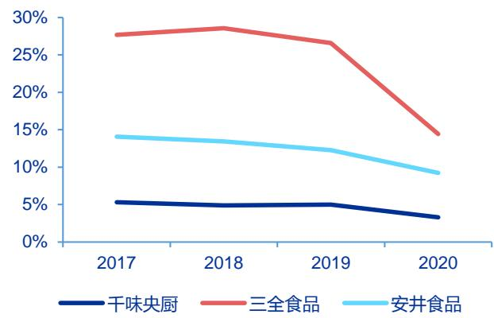
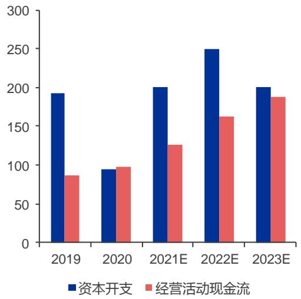

# 干味央厨 (001215)

数十载深耕速冻米面 洞察需求定位 B 端

报告原因：首次覆盖

买入（首次评级）

<table><tr><td>市场数据：</td><td>2021 年09 月08日</td></tr><tr><td>收盘价（元）</td><td>27.37</td></tr><tr><td>一年内最高/最低（元）</td><td>27.37/15.71</td></tr><tr><td>市净率 息率（分红/股价）</td><td>2.8</td></tr><tr><td>流通A股市值（百万元）</td><td>-</td></tr><tr><td>上证指数/深证成指</td><td>582 3675.19/14683.05</td></tr></table>

注：“息率”以最近一年已公布分红计算

<table><tr><td>基础数据:</td><td>2021年06月30日</td></tr><tr><td>每股净资产（元）</td><td>9.69</td></tr><tr><td>资产负债率%</td><td>39.81</td></tr><tr><td>总股本/流通A股(百万)</td><td>85/21</td></tr><tr><td>流通B股/H股（百万）</td><td>-/-</td></tr></table>

  
一年内股价与大盘对比走势：

# 相关研究

# 投资要点：

● 速冻面米制品，B 端业务领跑者。公司深耕餐饮端速冻面米市场，品类包括油炸类、烘培类、蒸煮类及菜肴类产品。截至 2020 年末，公司实现营业收入9.4 亿，实现归母净利润0.8 亿元；2017-20 年营收及归母净利润CAGR 分别为 $1 6 . 8 \%$ 与 $1 8 \%$ 。销售模式上，公司通过经销商网络覆盖中小餐饮，通过直营网络绑定餐饮大商。

● 速冻米面行业：传统 C 端成熟，B 端成长可期。回顾日本冷冻食品发展历史，1970-90 年代日本业务用(2B）冷冻食品发展迅速，主要源自餐饮连锁化下对标准化需求提升，以及解决餐饮高成本、少厨师的困境。我们认为在相同的驱动力下，中国速冻面米制品的成长同样将源自 B 端发展。目前，中国餐饮连锁化率较美日餐饮行业仍有较大的提升空间。通过使用第三方餐饮供应链标准化产品，门店可实现成本缩减、快速标准出餐并简化异地扩张的目的。预计速冻米面 B 端市场的需求有望得到加速扩容。

● 深耕 B 端速冻面米市场，差异定位塑造先发优势。作为中国最早深耕 B 端速冻面米的公司，受益于餐饮渠道易守难攻特点，公司客户粘性相对更高。另一方面，百胜中国 T1供应商的身份地位是公司产品与服务的品牌背书，在业务高成熟度下获客能力更凸出。对于直销客户，公司提供菜单设计、产品开发、产品销售、技术支持、干线物流运输以及后续服务咨询等解决方案，以建立长期合作的同盟关系。对于经销客户，公司大中型经销商数量稳定，并增加中小型经销商助力渠道下沉。目前公司已成为肯德基、必胜客、华莱士、海底捞、真功夫、九毛九、呷哺呷哺等知名餐饮品牌速冻面米制品供应商。

• 精选产品品类，持续打造新品，延伸消费场景。干味央厨速冻面米制品品类更为丰富，并凭借较强的研发能力已开发出 300 余种产品。在油条、卡通包、手工挞皮等方面，公司已成为行业引领者。另一方面，在细分品类上，根据不同消费场景，持续推出系列产品创造增量。以油条为例，公司细分出火锅、快餐、自助餐、宴席、早餐、外卖六大场景。通过与大型连锁客户的研发合作，公司具备更强的产品开发领先性，进而起到灯塔引领效应。例如肯德基的蛋挞皮、海底捞的火锅油条，产品在大型连锁餐饮端被验证后，其研发思路逐步转化至经销渠道，通过开发经销渠道产品，服务更多中小型餐饮客户。

● 稳定可靠的研发与供应链，赋能各类餐饮客户。自 2014 年，公司便率先在行业内建立了“模拟餐厅后厨”研发实验室，由“星级大厨 $^ +$ 自身研发工程师”合力研发，以模拟餐厅后厨工艺的产品研发及制作为出发点，从设备到操作过程模拟餐饮连锁企业的后厨，最大程度还原餐企后厨的制作工艺，在不新增设备的前提下开发出适合餐饮企业的个性化产品。目前，公司已打造了一条完整、强掌控力的采购、生产、质检、运输的食品安全供应链，并通过用友 NC 信息化系统助力存货管理，保障存货全程的流通盘点。

盈利预测与估值：预计 2021-23 年归母净利润分别为 0.9 亿、1.2 亿、1.4 亿，分别同比增长 $1 8 . 4 \%$ $2 7 . 6 \%$ $2 1 . 6 \%$ 。当前股价对应的 PE 分别 26x、 $2 0 \times$ $1 7 \times _ { \circ }$ 公司主要生产速冻米面食品，包括油炸类、烘焙类及蒸煮类，并专注于餐饮渠道销售。安井食品、三全食品、巴比食品与立高食品的业务与干味央厨重合，覆盖包子、油条、冷冻面团等产品的生产与销售，故将其作为千味央厨的可比公司。给予公司 2022 年可比公司市值加权平均估值43 倍 PE，对应目标市值 50 亿，首次覆盖给予“买入”评级。

股价表现催化剂：客户拓展超预期、新品表现超预期 风险提示：下游需求不及预期、食品安全风险、原材料价格上涨。

财务数据及盈利预测  

<table><tr><td></td><td>2020</td><td>2021H1</td><td>2021E</td><td>2022E</td><td>2023E</td></tr><tr><td>营业总收入（百万元）</td><td>944</td><td>568</td><td>1,289</td><td>1,583</td><td>1,875</td></tr><tr><td>同比增长率(%)</td><td>6.2</td><td>54.8</td><td>36.5</td><td>22.8</td><td>18.4</td></tr><tr><td>归母净利润（百万元)</td><td>77</td><td>36</td><td>91</td><td>116</td><td>141</td></tr><tr><td>同比增长率(%)</td><td>3.3</td><td>50.5</td><td>18.4</td><td>27.6</td><td>21.6</td></tr><tr><td>每股收益（元/股）</td><td>1.20</td><td>0.57</td><td>1.07</td><td>1.36</td><td>1.65</td></tr><tr><td>毛利率(%）</td><td>21.7</td><td>21.5</td><td>21.4</td><td>21.5</td><td>21.8</td></tr><tr><td>ROE(%)</td><td>13.2</td><td>5.9</td><td>9.0</td><td>10.3</td><td>11.1</td></tr><tr><td>市盈率</td><td>30</td><td></td><td>26</td><td>20</td><td>17</td></tr></table>

注：“市盈率”是指目前股价除以各年每股收益；“净资产收益率”是指摊薄后归属于母公司所有者的ROE

# 投资案件

# 投资评级与估值

我们预计公司 2021-23 年收入分别为 12.9 亿、15.8 亿、18.8 亿，分别同比增长$3 6 . 5 \%$ ， $2 2 . 8 \%$ ， $1 8 . 4 \%$ ；预计2021-23年归母净利润分别为0.9亿、1.2亿、1.4亿，分别同比增长 $1 8 . 4 \% , 2 7 . 6 \% , 2 1 . 6 \%$ 。当前股价对应的PE分别26x、20x、17x（2021/9/8收盘价）

我们采用相对估值方法。公司主要生产速冻米面食品，包括油炸类、烘焙类及蒸煮类，并专注于餐饮渠道销售。安井食品、三全食品、巴比食品与立高食品的业务与千味央厨重合，覆盖包子、油条、冷冻面团等产品的生产与销售，故将其作为千味央厨的可比公司。给予公司 2022 年可比公司市值加权平均估值43 倍 PE，对应目标市值 50 亿，较2021年9 月8日收盘价有 $1 1 5 \%$ 上涨空间，首次覆盖给予“买入”评级。

# 关键假设点

营业收入：2020 年餐饮需求受疫情影响有所下降，2021 年餐饮需求恢复，2022-23年受益于直营客户门店增长、新品增量及新增餐饮客户，预计收入有望延续稳定增长。从品类维度看，菜肴及其他基数较低，预计保持较高增长；油炸类产品为公司核心，预计仍是未来收入增长的核心驱动力；烘焙类产品受益于新拓展的直营客户预计有望贡献一定收入增量；蒸煮类产品收入预计维持双位数稳定增长。

毛利率：考虑到 2021 年大豆油、白糖及包材等价格呈上升趋势，预计 2021 年毛利率有所承压，2022-23 年成本回落，预计毛利率呈稳中有升态势。

费用率：销售费用率方面，随公司区域扩张、渠道下沉，预计销售人员数量、业务宣传费将有所增加，预计 2021-23 年销售费用率呈现前高后低态势。其他费用率方面，随着公司收入规模扩大，有望得到持续优化

# 有别于大众的认识

作为中国最早深耕 B 端速冻面米制品的公司，受益于餐饮渠道易守难攻的特点，公司客户粘性相对更高。思念食品早在 2003 年与 KFC 中国合作成立中央厨房业务。作为国内最早为餐饮连锁企业提供速冻面米制品解决方案的企业 ，千味央厨自 2012 年以来，始终坚持“只为餐饮，厨师之选”的战略定位，深耕B 端，避开了2C 端三全、思念及湾仔码头的强势竞争，占据消费粘性强、易守难攻的餐饮端。此外，公司为头部大型连锁客户提供定制品，可进一步深度绑定，增强核心客户粘性。另一方面，百胜中国T1供应商的身份地位是公司产品与服务的品牌背书，在业务高成熟度下获客能力更加凸出。

股价表现的催化剂客户拓展超预期、新品表现超预期。

# 核心假设风险

下游需求不及预期、食品安全风险、原材料价格上涨。

# 目录

# 1.干味央厨：速冻面米制品B 端业务领跑者. 6

1.1 数十载深度耕耘，铸就今日之辉煌 ..6  
1.2直营 $\dotplus$ 经销模式全方位覆盖餐饮端客户 ..8  
1.3 高管多出自思念系，经验丰富且利益绑定 .10  
1.4聚焦餐饮米面制品，赋予公司差异化特性 12

# 2.速冻面米制品行业：传统C 端成熟，B 端成长可期...13

2.1餐饮连锁化及成本优化诉求驱动，5 年行业规模 CAGR 预计 $10 \%$ 13  
2.2 C 端市场格局已定，B 端市场静待龙头 ….18

# 3．深耕B 端速冻面米市场，差异定位塑造先发优势. ..18

3.1率先占据 B 端高粘性市场，铸造渠道竞争壁垒 18   
3.2一站式服务直销渠道，持续优化经销渠道 19

4.精选产品品类，持续打造新品，延伸消费场景 .21

# 5．稳定可靠的研发与供应链赋能各类餐饮客户 .23

5.1研发实力强劲、严控食品安全 23  
5.2 成熟完整的供应链体系，服务各类餐饮客户 .24

6．募投项目：扩产提效，加速发力速冻面米赛道 .27

7.盈利预测与估值分析 28

8.风险提示. 29

# 图表目录

图1：干味央厨发展历程.. 6图2：干味央厨收入与利润规模. …图3：干味央厨品类收入结构… ….7图4：干味央厨主要产品品类。 ….7图5：干味央厨产能及产能利用率， ….8图6：2017-2020年干味央厨分地区营收占比. ….8图7：干味央厨组织架构. ….图8：2017-2020 干味央厨分渠道收入构成.. ….图9：经销渠道通用品、定制品的收入占比.. ……图10：直销渠道通用品、定制品的收入占比.. …. 10图11：2020 年直销渠道销售收入占比.. …. 10图12：干味央厨股权结构较稳定，股票发行后在任高管合计持股占比约 $0 . 8 8 \% 1 0$ 图13：干味、三全、安井毛利率对比 ….13图14：干味、三全、安井销售费用率对比.. ….1图15：干味、三全、安井净利率对比。 ….1图16：1975-2019日本外食-食物类销售额主要参与者结构 ….14图17：1975-2019日本外食市场规模及占比.  
图18：1962-2020 年日本冷冻食品行业分渠道国内生产量（万吨）. .图19：1983-1999 年日本餐饮连锁化率持续提升.. ….图20：1955-2020 年日本商业及工业城市土地价格指数. ….图21：日本冷冻食品分品类产量占比..  
图22：日本冷冻调理食品主要品类占比.. ….图23：中国速冻食品行业概览 ….16图24：中国速冻面米制品行业产量  
图25：2013-2020 年中日美餐饮连锁化率. ….16图26：餐饮业实际加盟者选择加盟的原因. ….16图27：中国速冻面米行业份额分布. ….18图28：速冻面米制品行业主要参与者概况 ..18图29：公司重要客户群体.. ….19图30：干味央厨直销、经销营收规模及增速！ .19图31：干味央厨分渠道、分品种的营收占比， …. 1图32：公司历年经销商类型及数量（单位：家）…  
图33：公司经销商平均销售额（单位：万元/个） ….20图34：可比公司速冻面米制品 SKU 结构。 ….图35：干味央厨分品类SKU数量（单位：个） ·· ….图36：根据六大消费场景研发多种类油条创新性产品 ….图37：2017-2020干味央厨直营、经销模式毛利率 .22图38：2017-2020 年速冻企业研发费用率比较 ….图39：2017-2020 年干味央厨研发费用及增速 ….图40：干味央厨定制品研发流程图， ….图41：干味央厨通用品研发流程图 ….24图42：千味央厨全供应链管理保障体系流程图 ….5图43：2017-2020干味央厨原材料采购金额占比  
图44：2017-2020公司前三大供应商采购金额占比 ….25图45：干味央厨直销客户供应链流程， ….26图46：干味央厨经销客户供应链流程， …….26

表1：干味央厨核心董高监概况 .11  
表2：速冻食品上市公司业务对比 ..12  
表3：日本冷冻调理制品业务端（2B）增速测算 ….15  
表4：使用信良记第三方供应半成品与传统模式下门店月度成本对比 .17  
表5：速冻面米制品上市公司通过的重要食品安全类标准证书情况。 ….  
表6：干味央厨募投项目 .7  
表7：干味央厨2017-2020 年产能、产量、销量、产能利用率及产销率情况.27  
表8：盈利预测关键假设. ….28  
表9：可比公司相对估值表 ….28

# 1．干味央厨：速冻面米制品 B 端业务领跑者

# 1.1 数十载深度耕耘，铸就今日之辉煌

2002-2012 年，思念旗下高速成长的商机。干味央厨设立前，公司餐饮端业务隶属于河南思念。思念主营零售端速冻食品业务，并逐步开拓餐饮渠道商机。2002 年，思念首次与肯德基合作，开创中式传统食品进入西式餐饮业全球销售网络；2006 年诞生安心油条，成为众多餐饮企业优选。截至 2012 年，思念已构建全国性销售及经销商网络，并加深与肯德基、真功夫等餐饮品牌及企业的合作。

2012-2016 年，作为思念子公司，完善综合实力。2012 年，思念成立子公司干味央厨，以进行冷冻食品的合同生产，开创专业餐饮 B2B 道路。2013 年，新生产车间及办公大楼投入使用、上海研发中心成立；2014 年千味央厨开始提供定制化服务；2015 年公司通过国内国际多项食品体系认证，荣获百胜中国“供应管理奖”称号，并开创全物流成品仓储托管。通过不断完善综合实力，公司餐饮供应链业务向高质量发展前进。

2016 年至今，从思念集团分离，全方位巩固行业领先地位。2016 年，干味有限通过股权转让从郑州思念脱离，并随后变更为股份公司。品牌端，公司进行全面升级，明确“只为餐饮、厨师之选”、“餐饮专供速冻米面领导品牌”的战略定位。客户端，公司进入百胜 T1 级别供应商行列，与麦当劳泰国建立合作，并开拓杨国富麻辣烫、沃尔玛熟食等客户。产品端，除去在传统速冻米面制品不断创新外，2019 年公司还启用全新独立品牌“焙伦”，提供烘焙、咖啡、茶饮及西餐等预制半成品，并同时进军中高端火锅料制品。产能端，公司2017 年新设全资子公司新乡干味，将产能从 17 年6.4 万吨提升至2020 年12.8 万吨，2021 年华东工厂落户安徽芜湖，积极布局全国化发展。渠道端，公司组建强大分销团队，联合各地经销商，实现渠道深度下沉。截至 2020 年末，公司在全国已拥有 907 名专业经销商，并覆盖全国 34 个省市，230 个地级市，709 个亿元以上冻品批发市场，服务于全国近100万家餐饮终端。

  
图 1：干味央厨发展历程

迎势攻坚合力突破烘焙引领，启航2019.焙伦品牌发布暨新起点 产品推荐会于2月28日在郑州隆重举办。2019年6月新乡生产基地通过BRCA级综合实力显著加强，行业领 认证先地位更加稳固 2019年7月6日高新区办公室投入使用 持续发展深耕餐饮市场，以“选深海鱼糜做高端 致力于为客户提供全面供应解决方案千味央厨新乡市平原示范区， 产品”的产品定位，迅速引爆市场。新厂建设启动 荣获2019年度优秀餐饮合作伙伴奖新乡分厂百胜车间正式动工2016 2017 2018 2019 2020 2021- 干味酱只为督饮之选- -全面升级向国际明确了“只为餐 锐变18子餐赢天下战略目标。 齐心协力共克时艰饮、厨师之选“，”餐饮专供速冻米面领 新乡一期正式投产 共克时艰千味在行动企业积极配合政导品牌”的品牌定位和企业定位方向 2018年12月23日新乡平原新区一期工 府开展复工复产活动，捐款捐物支援抗进行股份制改造，引入战略投资 约10%股权，投资完成后，公司整体估 交材料• 值约10亿元。

资料来源：公司官网，申万宏源研究

聚焦餐饮端速冻面米制品，产品种类不断丰富，业绩保持稳健。公司自 2012 年成立以来，深耕餐饮端速冻面米市场，并自 2019 年起进行产品领域拓展。公司目前的产品以速冻面米制品为主，品类包括油炸类、烘培类、蒸煮类及菜肴类产品。其中，油条类、蛋挞类、芝麻球类等产品均为过亿单品系列。截至2020 年末，公司实现营业收入 9.4 亿，实现归母净利润 0.8 亿元；2017-20 年营收及归母净利润稳健增长，CAGR 分别为 $1 6 . 8 \%$ 与 $1 8 \%$ 。从收入结构看，2020 年油炸类、烘培类、蒸煮类、菜肴及其他类产品业务收入比重分别为$5 5 \%$ $20 \%$ $1 9 \%$ 和 $5 \%$ 。

  
图 2：干味央厨收入与利润规模  
图 4：干味央厨主要产品品类

  
图3：干味央厨品类收入结构

资料来源：公司公告，申万宏源研究资料来源：公司公告，申万宏源研究资料来源：公司公告，申万宏源研究

通过投资新建工厂扩大产能，逐步进行全国布局。2017-2018 年期间，公司通过租赁思念实业红枫里厂区及英才街厂区进行生产。2017 年，千味央厨设立全资子公司新乡干味，并于17、18 年先后投资建设“千味央厨食品加工建设项目”一期及二期。2019 年末公司停止使用英才街厂区，并于 2020 年 2 月完成全部搬迁。此次 IPO 募投项目为“新乡千味央厨食品有限公司食品加工建设项目（三期）”与“总部基地及研发中心建设项目”，建成后红枫里厂区将改造为公司总部与研发中心，而生产职能将整体搬迁至新乡千味厂区。此外，公司还积极进行全国布局，考虑到 2020 年华东地区占收入比重达 $54 \%$ ，为更好服务华东区域客户，公司于 2021 年 3 月将华东生产基地设立于安徽芜湖。公司采取租用并改造现有厂房模式，预计年底前新基地可投入使用。我们认为，华东基地及后续全国异地建厂的规划，将有望增强公司核心区域的辐射力与竞争力，并将有效控制生产及物流成本。

  
图5：干味央厨产能及产能利用率

  
图6：2017-2020 年干味央厨分地区营收占比

资料来源：公司公告，申万宏源研究资料来源：公司公告，申万宏源研究

# 1.2直营 $\mathbf { + }$ 经销模式全方位覆盖餐饮端客戶

组织架构清晰。公司营销中心下设重客部、经销商客户部、渠道拓展部、行销部及产品管理部等部门。其中，重客部主要负责为直营客户提供服务；经销商客户部主要服务于区域型餐饮客户，依托经销商进行销售；渠道拓展部主要负责拓展新零售等新业务；行销部主要负责营销中心在渠道和客户开发、服务提升方面的工作要求，并结合各区域的实际情况跟进落地；产品管理部负责产品管理和品牌推广等工作。此外，公司同时平行设立销售支持部负责销售订单的处理、物流运输、销售数据分析及客诉处理。

  
图7：干味央厨组织架构  
资料来源：公司公告，申万宏源研究

直营 $^ +$ 经销两大销售模式，全方位覆盖各类餐饮客户。公司通过经销商网络覆盖中小餐饮，通过直营网络绑定餐饮大商。除 2020 年受疫情影响导致公司直营销售营收占比略有下滑外，公司渠道收入结构稳定，直营占比保持 $40 \%$ 左右水平。

公司经销渠道终端客户以中小餐饮为主，主要销售通用品。公司经销业务由经销商客户部负责，部门在全国设置各层级经理常驻相应的销售区域，负责区域内开展运营管理与统筹布局工作，包括新市场开拓、原市场维护、经销商管理与售后服务等。中国餐饮市场具备长尾属性，对于数量大、空间分散、少定制产品的中小餐饮市场，经销商在配送及时性、渠道下沉方面更具优势，且其仓库可以作为公司在各个市场的中转站，有助于公司降低成本、助力渠道下沉。

  
图 8：2017-2020 干味央厨分渠道收入构成

  
图9：经销渠道通用品、定制品的收入占比

资料来源：公司公告，申万宏源研究资料来源：公司公告，申万宏源研究

公司直销渠道客户以大型连锁餐饮客户为主，主要销售高粘性的定制品。公司重客部直接对接大型餐饮连锁企业，提供菜单设计、产品开发、产品销售、技术支持、干线物流运输以及后续服务咨询等在内的整体解决方案，以建立长期合作的同盟关系。对于此类客户，公司委托具有专业资质的第三方物流公司进行产品运输并承担运输费用，确保产品质量安全与服务质量，保障合作关系紧密化、稳固化、发展化。此外，公司近年来还开发了连锁商超等 B 端渠道，通过买断式销售，此类客户对公司产品进行二次加工后在熟食区销售。

  
图 10：直销渠道通用品、定制品的收入占比  
资料来源：公司公告，申万宏源研究  
图12：干味央厨股权结构较稳定，股票发行后在任高管合计持股占比约 $0 . 8 8 \%$

  
图 11：2020 年直销渠道销售收入占比

资料来源：公司公告，申万宏源研究

# 1.3高管多出自思念系，经验丰富且利益绑定

干味央厨股份发行前共经历三次股权增资变革，当前股权结构清晰、与管理层利益绑定。为专注于拓展速冻米面制品餐饮渠道市场，2016 年 3 月郑州思念将干味有限 $100 \%$ 股权转让给郑州集之城（17 年更名为共青城城之集），随后同意共青城凯立增资，至此郑州集之城与共青城凯立分别持股 $9 2 \%$ 与 $8 \%$ 。其中，共青城凯立是为投资干味央厨专门设立的持股平台，当前合伙人包括黄河大观董事长助理（出资占比 $8 4 . 3 4 \%$ )，干味央厨在任高管（合计出资占比 $8 . 2 2 \%$ ）等。为补充日常运营资金、筹集产能项目建设资金等，股份公司先后三次增资，引入外部投资者，包括京东的宿迁涵邦与绝味食品的深圳网聚。此次 IPO发行后，公司实际控制人李伟持股比例约 $4 6 . 8 6 \%$ ，战略投资者持股约 $3 . 8 5 \%$ ，绝味食品间接持股 $3 . 8 5 \%$ ，共青城凯立持股平台持股 $4 . 0 8 \%$ （其中公司在任高管间接持股 $0 . 3 4 \%$ ),私募基金/管理人持股 $1 3 . 1 3 \%$ (其中董事长孙剑间接持股约 $0 . 5 4 \%$ ），自然人股东持股$3 . 2 6 \%$ ，其他社会公众投资者持股 $2 5 \%$ 。

资料来源：公司公告，申万宏源研究（注：为IPO 发行后的股权结构）

高管多为思念系，拥有丰富从业经验。公司创始人李伟于 1997 年创立思念食品，拥有超过 20 年的行业经验，2017 年起不再担任思念集团负责人，且通过股权转让不再持有思念食品任何股权 专注千味央厨 B 端餐饮市场的运营成长。董事长孙剑曾于 2000 年至 2010年期间在郑州思念就职，历任业务代表、上海公司经理、香港公司经理、营销中心副总经理，后任于河南一生缘食品销售总经理、郑州中部大观地产副总经理，对营销、管理等领域经验丰富。此外，其他核心董高监白瑞、王植宾、王向阳均出自思念系，拥有丰富速冻品从业管理经验，并通过持股与公司利益深层绑定。

表1：干味央厨核心董高监概况  

<table><tr><td>姓名</td><td>职务</td><td>入司日期</td><td>年龄</td><td>持股比例</td><td>履历</td></tr><tr><td>孙剑</td><td>董事长</td><td>2018年7月</td><td>49岁</td><td>0.54%</td><td>历任河南天隆实业公司业务员、郑州思念业务代表、上海公司经理、 香港公司经理、营销中心副总经理、河南一生缘食品销售总经理、 郑州中部大观地产公司副总经理，2018 年7 月至今在千味央厨工 作，现任干味央厨董事长、新乡干味执行董事</td></tr><tr><td>白瑞</td><td>董事、总 经理</td><td>2012年4月</td><td>46岁</td><td>0.06%</td><td>历任河南冠联装饰工程公司财务部会计、海信科龙电器河南分公司 会计主管、郑州思念结算部经理、资金管理部经理、营销中心副总 经理助理，2012 年4 月至今在千味央厨工作，现任千味央厨董事、 总经理，新乡干味经历</td></tr><tr><td>王植宾</td><td>董事、副 财务总监</td><td>总经理，2012年4月</td><td>42岁</td><td>0.05%</td><td>历任宏大（集团）公司财务部会计、郑州章光 101 生发科技公司 财务部会计、郑州思念总成本会计、高级审计员、内审经理、审计 部经理，2012 年4 月至今在千味央厨工作，现任公司董事、副总 经理、财务总监</td></tr><tr><td>徐振江</td><td>副总经 会秘书</td><td>理，董事2015年9月37岁</td><td></td><td>0.05%</td><td>历任广州南方人物周刊实习记者、河南商报社记者、经济新闻部主 任、河南宋河酒业股份公司总裁助理、洛阳次祖杜康销售公司总经 理助理、河南骏域基金管理投资总监，2015 年 9 月至今在千味央 厨工作，现任副总经理兼董事会秘书</td></tr></table>

<table><tr><td colspan="6"></td></tr><tr><td>王向阳</td><td>监事会主 席</td><td>2012年4月50岁</td><td></td><td>0.07%</td><td>历任郑州市第五粮油食品公司生产管理车间主任、河南兴秦科技有 限公司产品研发部实验室主任、郑州思念质量技术总监，2012 年 4 月至今任千味央厨生产质量技术总监、干味央厨生产总监，现任</td></tr></table>

资料来源：公司公告，申万宏源研究（注：持股比例为IPO 发行后比例）

# 1.4 聚焦餐饮米面制品，赋予公司差异化特性

只为餐饮，厨师之选，聚焦餐饮米面制品，赋予干味差异化定位。相较于安井食品，千味主要聚焦速冻米面制品，而安井食品侧重于火锅料制品，两者直接竞争较少。相较于三全食品，虽然同为速冻米面制品制造企业，但两者产品侧重不同，并且千味央厨自成立之初便聚焦于B 端而非流通渠道，其定制产品营收占比更大（2020 年为 $31 \%$ )，而三全食品则着重于规模化标品的生产与销售。

表2：速冻食品上市公司业务对比  

<table><tr><td></td><td>安井食品</td><td>千味央厨</td><td>三全食品</td></tr><tr><td>营业收入（亿）</td><td>69.65</td><td>9.44</td><td>69.26</td></tr><tr><td>归母净利润(亿)</td><td>6.04</td><td>0.77</td><td>7.68</td></tr><tr><td>销售模式</td><td>经销为主，占比 84%</td><td>直营收入占比 36% 经销收入占比 64%</td><td>经销商模式、大型商超系统直营模 式及大客户定制模式的线下销售 为主</td></tr><tr><td>品类收入构成</td><td>速冻鱼糜制品（40.6%） 速冻肉制品（25.8%) 速冻面米制品（23.9%） 速冻菜肴制品（9.7%）</td><td>油炸品(55.2%) 烘焙类（19.9%） 蒸煮类（19.4%） 菜肴及其他（5.3%)</td><td>速冻面米制品（90.0%） 速冻调制食品（7.6%） 冷藏及短保类（1.3%） 其他（1.1%)</td></tr><tr><td>主要渠道</td><td>BC兼顾、双轮驱动</td><td>其他业务(0.2%) 胜客、海底捞、九毛九等</td><td>主要面向 2B 餐饮，如肯德基、必零售及创新市场收入占比 86% 餐饮市场收入占比 14%</td></tr><tr><td>区域收入构成</td><td>华东 50.9% 华北 12.0% 华中 9.7% 东北9.4%</td><td>华东 54.0% 华中15.9% 华北 9.6% 其他20.5%</td><td>北区 35% 东区23% 西区 22% 南区20%</td></tr><tr><td>产能</td><td>其他18.0% 2020年设计产能约58万吨，20252020年设计产能12.8 万吨，募投 年预计约140万吨</td><td>项目建成后将增至19.6万吨</td><td>2020 年设计产能约77 万吨</td></tr><tr><td></td><td></td><td></td><td></td></tr></table>

资料来源：公司公告，申万宏源研究（注：2020 年数据）

受渠道及规模因素影响，干味央厨毛利率水平低于同业，但净利率水平更高。公司毛利率水平低于三全，主要系销售渠道与规模较小所致。三全食品长期深耕流通及商超渠道，通过多年运作，2020 年已在C 端市场形成了近 60 亿的销售规模；而安井食品通过 BC 双轮驱动，为经销商提供贴身支持服务，近几年呈现快速扩张态势，整体收入规模已达近 70亿。另一方面，千味央厨 2020 年营收规模 9.4 亿，且主打B 端市场，毛利率相对低于零售渠道。此外，2020 年公司定制产品收入占比 $31 \%$ ，虽然定制产品使得直营重客粘性更强，但公司生产线更换、产品 SKU 数更多导致规模效应相对弱于生产通用品的三全与安井。但是，得益于餐饮渠道的低费用率，公司销售费用率远低于三全与安井，驱动公司净利率水平位于二者之上。

  
图 13：干味、三全、安井毛利率对比  
资料来源：公司公告，申万宏源研究（注：2020年新会计准则下企业将运输费用计入营业成本）

  
图14：干味、三全、安井销售费用率对比  
资料来源：公司公告，申万宏源研究（注：2020 年新会计准则下企业将运输费用计入营业成本)

  
图15：干味、三全、安井净利率对比  
资料来源：公司公告，申万宏源研究（注：2020 年受疫情影响，三全与安井费用投入力度缩减，致净利率高于干味）

# 2．速冻面米制品行业：传统C 端成熟，B 端成长可期

# 2.1餐饮连锁化及成本优化诉求驱动，5 年行业规模CAGR预计 $10 \%$

回顾日本冷冻食品 70-90 年代的发展，受下游餐饮市场规模扩容、连锁化率提升、降成本等诉求驱动，尤其是速冻米面为代表的冷冻食品在餐饮市场渗透率不断提升。

20 世纪后半叶，社会结构变动、经济繁荣助力日本外食餐饮行业快速发展。日本膳食业可细分为内食、中食和外食，其中内食指在家庭烹饪食品、中食指食品在家庭外的食品加工厂完成但消费场景仍主要在家庭内、外食指提供家外膳食的服务行业。冷冻食品业务端客户主要为外食行业的食品提供者，其中餐饮业占比最大且发展迅速。在日本经济高速发展、人口城镇化的驱动下，日本国民收入提高、女性外出工作比例提升、家庭呈现小型化趋势，催生了在外就餐需求，日本餐饮业进入黄金时期，外食市场规模在 1975-1997 年期间的CAGR达 $6 \%$ ，而外食占比也于1997年提升至 $40 \%$ 的巅峰水平。

  
图16：1975-2019日本外食-食物类销售额主要参与者结构  
资料来源：安心财团，申万宏源研究（注：外食占比 $\underline { { \underline { { \mathbf { \delta \pi } } } } } =$ 外食市场规模/全国食品饮料支出额；全国食品饮料支出额$=$ 外食市场规模 $^ +$ 家庭食品饮料支出额）

  
图 17：1975-2019 日本外食市场规模及占比

资料来源：安心财团，申万宏源研究（注：集团机构餐饮包括学校、幼儿园、医院及公司；外食市场规模包含食物类与饮料类，此处仅考虑外食-食物类的参与者结构）

餐饮连锁化率提升下，对菜品的标准化需求，以及高成本、少厨师的困境，催生 2B 端冷冻食品需求。20世纪70-90 年代，日本业务用（2B）的冷冻食品发展迅速，主要源自下游餐饮业规模以及行业内冷冻食品渗透率的提升。餐饮业在高速发展的同时面临着商业土地成本高涨、劳动力短缺等问题。1960-1990 年间日本商业土地价格指数CAGR达 $1 3 \%$ -此外专业厨师的短缺、连锁餐饮店对标准化产品的需求，共同加速着冷冻食品在 2B 端的渗透。1975-1990 年期间，日本冷冻食品业务端产量规模CAGR达 $9 \%$ 。

  
图 18：1962-2020 年日本冷冻食品行业分渠道国内生产量（万吨）  
资料来源：日本冷冻食品协会，申万宏源研究  
图19：1983-1999 年日本餐饮连锁化率持续提升  
图 20:1955-2020 年日本商业及工业城市土地价格指数

资料来源：日本特许加盟协会，安心财团，申万宏源研究（注：连锁餐饮销售额来自日本特许加盟协会，餐饮业规模来自安心财团，测算口径与图 25 的 Euromonitor 有所不同）

  
资料来源：Wind，申万宏源研究（注：2010 年3月末$\mathtt { = 1 0 0 }$ )

1980-1995 年期间，日本业务端（2B）冷冻调理食品产量CAGR为 $8 \%$ ，预计期间速冻面米制品增速更高。日本餐饮以肉制品、面食、米食为主，面米制品餐桌端附加值相对较低、易标准化，但制作流程相对复杂、耗费人力和时间。我们认为，在餐饮连锁化率、土地租金、人力成本不断提升的背景下，业务端速冻面米制品增速将高于整体业务端冷冻调理食品。从占比来看，日本调理食品占整体冷冻食品的产量占比持续提升，而调理食品中速冻米面制品的产量占比在 2005-2020 年期间亦不断攀升。

表3：日本冷冻调理制品业务端（2B）增速测算  

<table><tr><td></td><td>1980</td><td>1985</td><td>1990</td><td>1995</td><td>2000</td></tr><tr><td>日本冷冻调理食品国内生产量(吨）</td><td>402,546</td><td>540,663</td><td>788,808</td><td>1,101,369</td><td>1,234,629</td></tr><tr><td>冷冻食品业务端国内生产量占比</td><td>63%</td><td>73%</td><td>76%</td><td>74%</td><td>70%</td></tr><tr><td>日本冷冻调理食品业务端生产量（吨）</td><td>254,919</td><td>393,161</td><td>598,141</td><td>811,958</td><td>863,993</td></tr><tr><td>以1980 年为起点，5-20年CAGR</td><td></td><td>9%</td><td>9%</td><td>8%</td><td>6%</td></tr></table>

资料来源：日本冷冻食品协会，申万宏源研究（注：假设冷冻调理食品业务端占比与整体冷冻食品业务端占比相同）

  
图 21：日本冷冻食品分品类产量占比

资料来源：日本冷冻食品协会，申万宏源研究

  
图 22：日本冷冻调理食品主要品类占比  
资料来源：日本冷冻食品协会，申万宏源研究（注：方框内品类可视做速冻面米制品）

在餐饮连锁化率及降费增效的推动下，中国速冻面米制品行业成长同样源自B 端发展。

C 端增长基本饱和，未来发展看B 端。2006 年以来，伴随我国居民收入水平提高、生活节奏加快、消费习惯转变，叠加供给端产品品类及品质提升，速冻米面食品消费端需求量快速爆发并逐渐达到饱和。2013 至2019 年，中国速冻米面制品行业产量维持小个位数增长。据中国食协冷冻冷藏食品专业委员会，2019 年速冻米面食品制造业完成主营业务收入773.5 亿元，同比增长 $4 . 6 \%$ 。另一方面，据公司招股书，2018 年中国速冻米面制品餐饮渠道收入为 122 亿。我们预计近年来伴随餐饮端对降成本、高效率、高标准化的需求，速冻米面制品餐饮端有望迎来新一轮高峰。

  
图 23：中国速冻食品行业概览  
资料来源：公司公告，申万宏源研究

  
图24：中国速冻面米制品行业产量  
资料来源：国家统计局，申万宏源研究（注：产量口径于 2017 年有所变化，故用 2016 年产量为基数，以后续同比增速测算行业产量）  
图 26：餐饮业实际加盟者选择加盟的原因

我们认为，中国餐饮端速冻面米制品未来发展可类比日本上世纪80-90 年代。1）人口城镇化率快速提升，为餐饮业带来大量潜在客户。1945-1975 年期间，日本城市化率从$2 8 \%$ 提升至 $7 6 \% ; 1 9 9 5  – 2 0 2 0$ 年期间，中国城市化率从 $2 9 \%$ 提升至 $64 \%$ 。2）人均可支配收入同比持续保持较高增速，在外就餐市场规模不断提升。2013-2019 年期间，中国居民人均可支配收入CAGR $9 \%$ ，同期餐饮收入CAGR $1 1 \%$ ；对比日本1975-1981年期间人均可支配收入CAGR $10 \%$ ，同期餐饮收入CAGR $1 1 \%$ 。3）餐饮连锁化率不断提升，对标准化食品的需求增加。2013-2020 年期间，中国餐饮连锁化率从 $8 . 8 \%$ 提升至 $1 7 . 4 \%$ ，未来这一增长趋势亦有望持续。

中国餐饮连锁化率较日美有较大提升空间。2013 年至今，中国餐饮连锁化率持续提升，截至 2020 年中国餐饮连锁化率已达 $1 7 . 4 \%$ ，但仍远低于美国与日本的餐饮连锁化率水平。一方面，具备规范管理体系的连锁餐饮品牌，不仅具有较强的市场竞争力，且在疫情期间也表现出更强的抗风险能力。另一方面，从个体加盟者的角度看，选择连锁加盟的主要原因来自于品牌方的培训体系及管理。我们认为，随着加盟品牌快速开店、直营品牌开放加盟模式、连锁餐饮市场下沉等因素的驱动下，中国餐饮连锁化率有望继续提升。

图 25：2013-2020 年中日美餐饮连锁化率

  
资料来源：Euromonitor，申万宏源研究（注：预计Euromonitor 与图 19 数据来源的测算口径有所不同)

  
资料来源:美团、餐饮老板内参《中国餐饮大数据 2020》，申万宏源研究

使用第三方餐饮供应链企业，可降低原材料成本、人力成本及租金成本。传统餐饮业上游供应商分散，中游流通渠道环节复杂，导致下游成本不断提升。而第三方餐饮供应链公司通过汇集多家餐饮企业需求进行原材料直接采购，省去渠道环节，形成规模效应，降低相同原材料的采购成本。此外，第三方餐饮供应链公司直接将半成品运送至门店，门店仅需经过简单加工即可销售给顾客，故可进一步节省人力及租金成本，并可减少原材料损耗。据信良记测算，半成品模式下门店并不需要相关加工配料、不存在原材料损耗，且人力及租金成本将得到优化。通过综合计算可得出，在信良记第三方餐饮供应链模式下，单月门店成本可降低 $42 \%$ 。

表4：使用信良记第三方供应半成品与传统模式下门店月度成本对比  

<table><tr><td colspan="5">月度成本对比表（元）</td></tr><tr><td>项目</td><td>内容</td><td>传统模式</td><td>信良记模式</td><td>增减</td></tr><tr><td rowspan="5">原材料</td><td>原材料成本</td><td>15,000</td><td>24,000</td><td>9,000</td></tr><tr><td>配料成本</td><td>3,000</td><td>-</td><td>-3,000</td></tr><tr><td>原材料损耗</td><td>2,500</td><td>-</td><td>-2,500</td></tr><tr><td>进项税抵扣</td><td>-</td><td>-3,500</td><td>-3,500</td></tr><tr><td>小记</td><td>20,500</td><td>20,500</td><td>-</td></tr><tr><td rowspan="4">人工</td><td>烧虾大厨</td><td>10,000</td><td>-</td><td>-10,000</td></tr><tr><td></td><td></td><td></td><td></td></tr><tr><td>洗虾师</td><td>5.000</td><td>3,00</td><td>-5.00</td></tr><tr><td>小计</td><td>18,000</td><td>3,000</td><td>-15,000</td></tr><tr><td colspan="2">操作间租赁费</td><td>2,000</td><td>-</td><td>-2,000</td></tr><tr><td colspan="2">合计</td><td>40,500</td><td>23,500</td><td>-17,000</td></tr></table>

资料来源：公司官网，申万宏源研究

第三方餐饮供应链模式还可帮助餐饮业实现标准化并快速出品、简化异地复制难度。在连锁化率提升背景下，传统餐饮业内部面临着标准化异地复制的难题，而第三方食品制造商通过工业化半成品可直接解决这一问题。此外，对于需要大规模标准化产品的团餐市场、对上菜速度有要求的外卖市场，标准化、高完成度的半成品具备天然优势。

相较于日本，我们认为中国面米制品在膳食中的比例更高，可替代空间更广，速冻面米制品初期渗透率增速或高于日本。叠加速冻米面制品的附加值低于其他食材，在人力、租金成本上升的趋势下，预计速冻米面B 端市场的需求有望得到加速扩容。综合考虑日本发展历史、中国餐饮规模增速及连锁化率水平等因素，我们预计未来五年速冻米面制品在 B端的行业规模复合增速有望保持在 $10 \% +$ 。

# 2.2 C 端市场格局已定，B 端市场静待龙头

速冻面米制品C 端占比高、竞争格局基本稳定。当前速冻面米制品零售市场已形成了三全食品、思念食品和湾仔码三足鼎立的竞争格局，它们通过流通渠道及商超渠道向消费者销售速冻水饺、速冻汤圆等产品，市场趋于饱和，以存量竞争为主。

B 端市场相对新兴，集中度较低。近年来，随B 端行业集中度、连锁化率的逐步提升，速冻面米制品B 端市场迸发成长潜力。B 端速冻面米制品可进一步细分为烘焙类、油炸类及烹饪类速冻面米制品。B 端烘焙类速冻面米制品的参与者包括高贝、立高、千味央厨、屏荣食品及部分小厂商；油炸及烹饪类速冻面米制品的参与者包括千味央厨、安井食品、屏荣食品、近年新入局的三全食品、思念食品、主营早餐连锁的巴比食品、及数量较多的小厂商。整体看，虽然餐饮端市场目前参与者较多，但由于行业集中度较低且成长空间较大，仍属于蓝海市场。

  
图 27：中国速冻面米行业份额分布  
资料来源：公司公告，申万宏源研究

  
图 28：速冻面米制品行业主要参与者概况  
资料来源：公司公告，申万宏源研究

# 3．深耕B 端速冻面米市场，差异定位塑造先发优势

# 3.1率先占据 B 端高粘性市场，铸造渠道竞争壁垒

作为中国最早深耕 B 端速冻面米制品的公司，受益于餐饮渠道易守难攻的特点，公司客户粘性相对更高。思念食品早在 2003 年与 KFC 中国合作成立中央厨房业务。作为国内最早为餐饮连锁企业提供速冻面米制品解决方案的企业，千味央厨自 2012 年以来，始终坚持“只为餐饮，厨师之选”的战略定位，深耕B 端，避开了2C 端三全、思念及湾仔码头的强势竞争，占据消费粘性强、易守难攻的餐饮端。此外，公司为头部大型连锁客户提供定制品，可进一步深度绑定，增强核心客户粘性。

另一方面，公司具备先发优势，百胜中国 T1 供应商的身份地位是公司产品与服务的品牌背书，在业务高成熟度下获客能力更加凸出。百胜中国作为中国最大的连锁食品企业，旗下拥有肯德基、必胜客、塔可钟等多个连锁餐饮品牌，整体采购量大、对供应商提供的产品质量和安全重视度高。公司对供应商实施严格的资格认证流程，包括供应商合规性检查和现场审核，并对供应商实施相关产品质量、物流保证等要求。通过早期与大客户百胜中国的合作，公司餐饮供应链业务实力愈加成熟，而同期其他企业 B 端业务多尚未开发或仅处于起步阶段，从而使得公司能够凭借业务能力优势不断开发新客户。此外，作为百胜中国供应商，其T1 级别的身份地位可被视为品质的品牌背书，在开拓新的餐饮客户时也相对更受青睐。经过最初的百胜中国以及近十年的客户开发，当前公司已具备较为广泛的客户基础，具备相对成熟的餐饮客户发展与服务体系。目前公司已成为肯德基、必胜客、华莱士、海底捞、真功夫、九毛九、呷哺呷哺等知名餐饮品牌速冻面米制品供应商。

  
图 29：公司重要客户群体  
资料来源：公司公告，申万宏源研究  
图 30：干味央厨直销、经销营收规模及增速  
图 31：干味央厨分渠道、分品种的营收占比

# 3.2一站式服务直销渠道，持续优化经销渠道

公司产品销售渠道主要分为经销渠道和直销渠道，前者主要依托经销商服务于区域性餐饮连锁及食材批发市场和中小餐饮客户，而后者则主要针对大型餐饮连锁、全国大型连锁酒店、大型企业团餐及乡厨等。

直销渠道：全方位服务绑定头部大型连锁客户。干味央厨为直销客户提供菜单设计、产品开发、产品销售、技术支持、干线物流运输以及后续服务咨询等整体解决方案，以建立长期合作的同盟关系。公司与直销客户定期研讨产品升级方向，调整供应产品的配方、□感、包装等要素，共同探讨解决方案，同时对产品的后续加工条件、餐饮企业的后厨布局设计提供要求与建议。公司专设重客部进行客户开拓，客户类型也逐步多样化，从最初偏西式快餐的百胜中国拓展至中式餐饮、商超熟食区及咖啡茶饮等大型连锁客户。

  
资料来源：公司公告，申万宏源研究

  
资料来源：公司公告，申万宏源研究

经销渠道：大中型经销商数量稳定，增加中小型经销商助力渠道下沉。经销渠道可进一步细分为年销售额大于 100 万元的大中型客户及低于 100 万元的中小型经销商。其中大中型经销商的数量较稳定、忠诚度高，贡献主要经销收入。另一方面，中小型经销商可分为两类，1)以海鲜、速冻调制食品销售为主，速冻面米制品仅作为其旺季销售的补充品类；2）属于区县级规模较小的经销商，同时代理较多品类的产品。这两类经销商整体数量占比高，但采购进货相对不稳定、用户粘性相对较弱，但由于其在区县市场的渠道资源，有助于公司渠道下沉，连接更广阔的下沉餐饮消费市场。

  
图 32：公司历年经销商类型及数量（单位：家）  
资料来源：公司公告，申万宏源研究

  
图33：公司经销商平均销售额（单位：万元/个）  
资料来源：公司公告，申万宏源研究

加强渠道管理、开拓经销商网络提升公司规模效应。公司于 2017 年加强经销商管理、规范第三方回款，清退个人经销商、无资质经销商，导致经销商数量较 16 年骤减约 $3 8 \%$ 。对经销商管理的加强带来了销售效率的提升，2017-2019 年期间，公司单一经销商平均创收稳步提升。此外，公司近年来加快下沉市场渠道布局。据尼尔森测算，截至 2019 年 3月，冷冻食品于过去的12 个月中在CD 类城市（县级市及县城）和乡镇的销售额比重达到$34 \%$ ，下沉市场成为速冻面米制造商又一抢占高地。自2019 年 4 月起，千味央厨通过“黄埔军校”培训、下游市场破冰、批发市场形象升级、“尖刀行动”等途径，助力经销商下沉，逐步建立起一支高度下沉的分销团队。其中，在“尖刀行动”中，公司联合区域经销商，以县城核心二批为中心，对有能力的分销客户进行铺货陈列、增加现有二批及分销客户的产品品类，并通过线上线下宣传等形式，加大干味央厨在低线城市的渗透率。

进军早餐门店市场，与原有业务形成协同效应。2021 年1 月，干味央厨推出早饭师项目，在郑州开出第一家早餐门店，主推产品油条，并提供蒸饺、卡通包及粥、面、豆浆等早餐食品。我们认为，干味央厨作为速冻油条开创者，入局早餐店市场，一方面可以借此对研发产品进行C 端需求验证，以及时形成市场反馈、指导上游生产，另一方面也为公司的速冻面米制品增加产品销路，形成协同效应。

# 4．精选产品品类，持续打造新品，延伸消费场景

随着传统速冻面米市场接近饱和，未来行业成长将由不断导入的新品类驱动。干味央厨通过横向和纵向新品打造，进一步巩固并开拓市场。

品类丰富新颖、产品完善齐全，新品持续贡献增量。当前速冻面米制品主要上市公司包括三全食品、安井食品、巴比食品及干味央厨。其中，三全食品专注于汤圆、水饺；安井食品主营火锅料产品，其速冻面米制品聚焦创新差异化产品；巴比食品则侧重于以加盟早餐店模式进行包子类产品的销售。相较其他上市公司，千味央厨速冻面米制品品类更为丰富，并凭借较强的研发能力已开发出 300 余种产品，逐步形成了油炸类、烘焙类、蒸煮类的米面产品矩阵，突破传统“老三样”，抢占市场增量空间。在油条、卡通包、手工挞皮等方面，公司已成为行业引领者。除面米制品占据优势外，公司还计划加大肉类、鱼糜类产品的研发力度，丰富公司产品线，借助原有速冻面米制品市场带动火锅料，为终端提供更全面服务。根据渠道反馈，公司每年新产品的销售占营收增量的比例约为 $20 \% - 3 0 \%$ 。

  
图 34：可比公司速冻面米制品 SKU 结构  
资料来源：公司公告，公司官网，公司官方商城，申万宏源研究

  
图 35：干味央厨分品类 SKU 数量（单位：个）  
资料来源：公司公告，申万宏源研究

在细分品类上，根据不同消费场景，持续推出系列产品创造增量。以油条为例，公司从2012 年开始进行油条细分场景下的市场研究，细分出火锅、快餐、自助餐、宴席、早餐、外卖六大场景，并针对性推出茴香小油条、麻辣烫小油条、火锅涮煮油条、外卖专用油条等多款创新性产品。研发团队持续创新开发适合西式快餐、中式快餐以及乡厨等不同市场需求的速冻面米制品，巩固公司龙头地位。

图36：根据六大消费场景研发多种类油条创新性产品

  
资料来源：公司公告，申万宏源研究

与大型餐饮连锁的合作使得干味央厨能够更快获取下游趋势变动、保持研发领先。通过与大型连锁客户的研发合作，公司较同业其他参与者具备更强的产品开发领先性，进而起到灯塔引领效应。干味央厨可将研发的产品进行渠道拓展，将服务大型连锁餐饮客户的思路转化至中小型餐饮渠道，为中小型餐饮客户提供更具性价比的产品。例如肯德基的蛋挞皮、海底捞的火锅油条，产品在大型连锁餐饮端被验证后，其研发思路逐步转化至经销渠道，通过开发经销渠道产品，服务更多中小型餐饮客户。

大型餐饮客户更加注重产品研发及质量管控，对价格敏感度更低，能在初期研发成本外带来更高的毛利率水平。公司完备的食品安全管控体系为餐饮客户最小化食品安全舆论风险，突出的研发能力最大化满足客户的定制化需求。由于公司与大客户合作产品基本均为定制品，而定制品高粘性的特点使得公司不但可共享客户成长红利，相对更低的边际合作成本也将二者合作不断深化，带来产品种类的增量成长，形成合作正循环。此外，直销客户对于价格敏感度更低，毛利率水平也相对高于经销客户。除 2020 年受疫情影响外，直营模式下定制品的毛利率水平约为 $2 8 - 2 9 \%$ ，较经销模式高出约 8pct。

  
图 37：2017-2020 干味央厨直营、经销模式毛利率

资料来源：公司公告，申万宏源研究

# 5．稳定可靠的研发与供应链赋能各类餐饮客户

# 5.1研发实力强劲、严控食品安全

具备前瞻性的餐厅后厨模拟研发模式及稳定提升的研发投入保障了研发创新的可持续性。不同于其他可比公司，千味央厨主要生产研发客户定制产品。早在 2014 年，作为思念子公司的干味央厨便率先在行业内建立了“模拟餐厅后厨”研发实验室，由“星级大厨 $^ +$ 自身研发工程师”合力研发，以模拟餐厅后厨工艺的产品研发及制作为出发点，从设备到操作过程模拟餐饮连锁企业的后厨，最大程度还原餐企后厨的制作工艺，在不新增设备的前提下开发出适合餐饮企业的个性化产品。从研发支出看，公司 2017 年以来研发费用支出及研发费用率逐年提升。2020 年，公司研发费用率已达 $0 . 7 6 \%$ ，超过同期三全与巴比，仅次于安井。公司此次募资也拟对研发中心进行扩建并购置相关研发硬件设备、新增研发中心专业人员，进一步提升公司的研发实力。

  
图 38：2017-2020 年速冻企业研发费用率比较  
资料来源：公司公告，申万宏源研究

  
图 39：2017-2020 年干味央厨研发费用及增速

资料来源：公司公告，申万宏源研究

定制品立项研发，专精服务大 B 客户。公司的大 B 定制业务从发掘客户需求入手，通常由大 Β 客户提前半年到一年主动交流自身产品需求，或公司提供体验性产品供客户选择。客户初步需求确立后，公司将进行针对性的研发工作，研发周期一般由客户设定，通常为3-6 月。在经过市场调研、立项、小试、中试、试产、评审等环节后，公司研发流程结束并与客户达成合作意向。此后，定制客户一般基于采购合同提前一个月以采购计划的形式提出产品需求，与公司确定订单。通过全面的定制研发服务，公司大 B业务保持稳定增长态势，与众多龙头形成了长期、稳定且持续深入的合作关系。

通用品研发基于市场需求导向，有效补充公司产品与客户矩阵。中小型餐饮客户看重性价比，重视可以助力其差异化的业务解决方案。干味央厨领先的产品研发可以为中小型客户提供更具性价比产品，且随公司经销渠道开拓，原材料采购规模效应继续提升，公司在中小型餐饮端的竞争力也将更强。公司对通用品的研发主要由市场需求预期决定。审批同意后，公司将进行通用品的研发立项。由于没有明确客户，相比定制品，公司通用品研发的不确定性更大。定价方面，公司通用品在考虑行业竞争程度和参考市场价格的基础上采用成本加成定价，利润空间相对定制品略小。近年来，公司通用品收入逐年攀升，已在业内形成较高的认可度与口碑。

  
图 40：干味央厨定制品研发流程图  
资料来源：公司公告，申万宏源研究

  
图41：干味央厨通用品研发流程图

资料来源：公司公告，申万宏源研究

较同行通过更严格的食品安全体系认证，凭借高标准高质量吸引客户。相对于价格因素，大B 端客户更看重食品安全及产品质量。公司通过多年积累已形成一套较完善的供应链体系，较同业形成了更加国际化、更为严格的安全保障体系。除去国内知名速冻面米制造商普遍持有的ISO9001质量体系认证、危害分析与关键控制点（HACCP）认证外，公司还取得了较安井、三全、巴比食品持有的 ISO22000 认证难度更高的 FSCC22000 国际食品体系安全认证，后者是ISO22000 食品安全标准及食品安全公共可用规范（PAS）220的整合版，受到GFSI组织及全球食品安全认可。此外，子公司新乡干味还通过了BRC(英国零售业食品安全标准)A 级认证。由于公司已有百胜中国等大客户背书，小B 端餐饮企业对干味央厨安全性的认可度也更高。

表 5：速冻面米制品上市公司通过的重要食品安全类标准证书情况  

<table><tr><td>公司</td><td>通过的食品安全管理标准</td></tr><tr><td>干味央厨</td><td>ISO9001 质量管理体系认证、危害分析与关键控制点（HACCP）认证、BRC认证、 FSCC22000国际食品体系安全认证</td></tr><tr><td>安井食品</td><td>ISO9001质量管理体系认证、危害分析与关键控制点（HACCP）认证、 ISO 22000 食品安全管理体系认证</td></tr><tr><td>三全食品</td><td>ISO9001 质量管理体系认证、危害分析与关键控制点(HACCP)认证、BRC认证、ISO 22000食品安全管理体系认证</td></tr><tr><td>巴比食品</td><td>GB/T22000-2006/ISO22000:2005 食品安全管理体系、GB/T27341-2009 危害分析 与关键控制点（HACCP）体系和GB14881-2013 食品生产通用卫生规范</td></tr></table>

资料来源：公司公告，公司官网，申万宏源研究

# 5.2 成熟完整的供应链体系，服务各类餐饮客户

专注B 端，干味央厨已打造了一条完整、强掌控力的采购、生产、质检、运输的食品安全供应链。采购端，公司对部分原材料采购要求高于国家标准，并要求供应商按照公司制定的标准提供检测报告，公司每年定期对检测标准进行重新评估、审定。目前，公司通过集中采购控制原料质量与成本，并与全国知名供应商达成稳定合作。生产端，公司安装食品操作监控系统，全程追溯进行成品质量控制管理。质检端，公司配备专职质检人员对各个工艺关键控制点及时监督和检测，确保生产工艺不偏离标准、产品符合要求后，检验合格的产品才允许出厂。运输端，公司拥有专业配套的仓储管理系统和物流发货系统，并采用恒温的可追溯冷链系统，保证产品质量全生命周期的可控、可追溯。

  
图 42：干味央厨全供应链管理保障体系流程图

资料来源：公司公告，申万宏源研究资料来源：公司公告，申万宏源研究

  
图 43：2017-2020 干味央厨原材料采购金额占比  
资料来源：公司公告，申万宏源研究

  
图 44:2017-2020 公司前三大供应商采购金额占比

用友 NC信息化系统助力存货管理，保障存货全程的流通盘点。公司使用用友的NC系统进行智能化、信息化的存货管理。存货入库时，在质检、卸货完成后，库管员与点货员在 30 分钟内将《成品调拨记录表》录入NC 系统；存货领用时，根据申请在NC 系统进行原材料出库记录，生成出库单；发出时，NC 系统打印连续编号的提货单，一式6 联，保障销售明细的准确无误。此外，公司每月进行存货盘点，年末进行财务盘点，存货清单将与 NC 系统数量进行核对，保证账实相符。在 NC 信息化系统的护航下，公司存货流通全程记录备案，执行高效。

直销客户：大 B 客户售后服务全覆盖，优质服务保障客户认可度。由于直营客户信誉度较高，应收账款安全性较高，坏账损失可能性较低，公司对此类长期合作的大型直营客户给予一般不超过3个月的信用期，信用期间由公司根据客户规模、交易量等情况和客户协商确定。此外，公司对部分客户提供销售返利政策，如，华莱士、沃尔玛、老乡鸡等。公司采用以销定产的生产策略，运营计划部收到客户产品需求后下达生产计划，由各工厂组织生产。最终，公司还将负责产品的运输，产品从生产到终端的运输周期平均约 1 周左右，并由公司承担相关费用。

经销客户：备货式生产与先款后货买断式销售，保证公司资金链安全。公司的通用品多数自主生产销售，但少部分由委托商进行加工生产。自主生产时，公司将根据销售计划和安全库存制定生产计划，以确保在不影响市场销售的情况下尽量降低产成品库存，提高营运效率。通常公司每年第二季度下达当年下半年和次年上半年的生产计划。同时，运营计划部根据销售支持部提供的对未来连续三个月的销售预测、结合生产车间生产能力、产品库存情况于每月底制定下个月的《月度生产计划》，作为采购、生产的依据。销售上，公司采用买断式销售方式，即在向经销商销售后，产品所有权的主要风险和报酬已转移至经销商，经销商在销售指导价格的基础上自行定价组织销售。同时，公司采用先款后货的结算方式要求经销商先将货款汇至公司账户，确认货款后再办理发货事宜。运输方面，经销商可选择客户自提或代办运输的方式，但公司不承担相关费用。

  
图 45：干味央厨直销客户供应链流程  
资料来源：公司公告，申万宏源研究

  
图46：干味央厨经销客户供应链流程  
资料来源：公司公告，申万宏源研究

# 6．募投项目：扩产提效，加速发力速冻面米赛道

新建年产8万吨新乡厂房(三期)，贡献收入增量超 $85 \%$ 。公司原有英才街厂区已于2019 年年底停止使用并于 2020 年完成全部搬迁，红枫里厂区将规划为公司总部基地与研发中心，故新乡厂区将承担干味核心生产职能。2017-2020 年，千味央厨的产能利用率为$8 7 . 3 7 \% / 1 0 0 . 4 0 \% / 8 1 . 2 9 \% / 6 0 . 4 1 \%$ 产销率为 $9 8 . 1 4 \% / 9 8 . 9 0 \% / 9 4 . 9 8 \% / 9 9 . 2 2 \%$ 其中，2020 年产能利用率较低主要由疫情导致开工率不足及订单下滑等因素导致。由于公司产品市场需求旺盛，产品销量稳步增长，且速冻食品销售具有一定季节性，在旺季产销矛盾较为突出，现有产能已无法充分满足来自市场的消费需求，产能瓶颈问题逐渐凸显。为进一步缓解产能不足，公司计划建设新乡三期厂房，预计产能将由2020 年 12.80 万吨（新乡二期已投产)的基础上增至19.6 万吨。新乡三期预计 2023 年 6 月末建成投产，2023 年产能可达设计产能的 $30 \%$ (24,000吨)，2024年可达 $70 \%$ (56,000吨）。达产后，满产期年平均实现销售收入8.1 亿（占 2020 年销售收入的 $86 \%$ ）、税后净利润0.67亿（占2020 年税后净利润的 $87 \%$ ），项目内部收益率（所得税后）为 $2 2 . 9 2 \%$ 。

表6：干味央厨募投项目  

<table><tr><td>序号</td><td>项目名称</td><td>投资总额/万元</td><td>募集资金拟投入额/万元</td><td>建设期</td></tr><tr><td>1</td><td>新乡干味央廚食品有限公司食 品加工建设项目（三期）</td><td>37,682.39</td><td>24,975.60</td><td>24个月</td></tr><tr><td>2</td><td>总部基地及研发中心建设项目</td><td>5,979.98</td><td>3,236.61</td><td>24个月</td></tr><tr><td></td><td>合计</td><td>43.662.37</td><td>28212.21</td><td></td></tr></table>

资料来源：公司公告，申万宏源研究

表7：干味央厨 2017-2020 年产能、产量、销量、产能利用率及产销率情况  

<table><tr><td>项目</td><td>2017</td><td>2018</td><td>2019</td><td>2020</td></tr><tr><td>产能(吨)</td><td>64,000</td><td>64,000</td><td>99,200</td><td>128,000</td></tr><tr><td>产量(吨)</td><td>55,918.00</td><td>64,254.04</td><td>80,644.50</td><td>77,330.01</td></tr><tr><td>产能利用率(%）</td><td>87.37%</td><td>100.40%</td><td>81.29%</td><td>60.41%</td></tr><tr><td>销量（吨）</td><td>54,875.48</td><td>63,550.10</td><td>76,598.86</td><td>76,728.09</td></tr><tr><td>产销率(%)</td><td>98.14%</td><td>98.90%</td><td>94.98%</td><td>99.22%</td></tr></table>

资料来源：公司公告，申万宏源研究

改建总部基地及研发中心，提升研发能力与管理效率。此外，募投项目将对红枫里2号部分场地进行改建，改建研发中心建筑面积 900 平方米，改建总部办公区、会议室建筑面积 2,400 平方米，新增研发中心专业技术人员 8 名，新增总部管理支持、市场营销人员100 余名。扩建后千味央厨将提升研发和试验检测的硬件水平，提升产品品质，降低成本并吸引人才，提升竞争力。

# 7．盈利预测与估值分析

盈利预测关键假设：

营业收入：2020 年餐饮需求受疫情影响有所下降，2021 年餐饮需求恢复，2022-23年受益于直营客户门店增长、新品增量及新增餐饮客户，预计收入有望延续稳定增长。从品类维度看，菜肴及其他基数较低，预计保持较高增长；油炸类产品为公司核心，预计仍是未来收入增长的核心驱动力；烘焙类产品受益于新拓展的直营客户预计有望贡献一定收入增量；蒸煮类产品收入预计维持双位数稳定增长。

毛利率：考虑到 2021 年大豆油、白糖及包材等价格呈上升趋势，预计 2021 年毛利率有所承压，2022-23 年成本回落，预计毛利率呈稳中有升态势。

费用率：销售费用率方面，随公司区域扩张、渠道下沉，预计销售人员数量、业务宣传费将有所增加，预计 2021-23 年销售费用率呈现前高后低态势。其他费用率方面，随着公司收入规模扩大，有望得到持续优化。

表8：盈利预测关键假设  

<table><tr><td></td><td>2017</td><td>2018</td><td>2019</td><td>2020</td><td>2021E</td><td>2022E</td><td>2023E</td></tr><tr><td>营业收入yoy</td><td></td><td>18.2%</td><td>26.8%</td><td>6.2%</td><td>36.5%</td><td>22.8%</td><td>18.4%</td></tr><tr><td>油炸类yoy</td><td></td><td>14.2%</td><td>22.2%</td><td>6.0%</td><td>40.4%</td><td>22.8%</td><td>17.6%</td></tr><tr><td>蒸煮类yoy</td><td></td><td>28.9%</td><td>30.3%</td><td>3.9%</td><td>25.4%</td><td>15.6%</td><td>13.5%</td></tr><tr><td>烘焙类yoy</td><td></td><td>28.0%</td><td>29.3%</td><td>-5.1%</td><td>30.4%</td><td>23.7%</td><td>21.0%</td></tr><tr><td>菜肴类及其他yoy</td><td></td><td>-36.8%</td><td>124.5%</td><td>121.7%</td><td>60.5%</td><td>40.7%</td><td>29.4%</td></tr><tr><td>毛利率</td><td>22.7%</td><td>23.8%</td><td>24.5%</td><td>21.7%</td><td>21.4%</td><td>21.5%</td><td>21.8%</td></tr><tr><td>销售费用率</td><td>5.3%</td><td>4.9%</td><td>5.0%</td><td>3.3%</td><td>3.4%</td><td>3.3%</td><td>3.2%</td></tr><tr><td>管理费用率</td><td>5.6%</td><td>6.3%</td><td>7.2%</td><td>8.4%</td><td>8.2%</td><td>8.1%</td><td>7.8%</td></tr></table>

资料来源：公司公告，申万宏源研究

综上，我们预计公司2021-23 年收入分别为12.9 亿、15.8亿、18.8亿，分别同比增长 $3 6 . 5 \%$ $2 2 . 8 \%$ $1 8 . 4 \%$ ；预计2021-23年归母净利润分别为0.9亿、1.2 亿、1.4亿，分别同比增长 $1 8 . 4 \%$ $2 7 . 6 \%$ $2 1 . 6 \%$ 。当前股价对应的PE分别 $2 6 x$ $2 0 \times$ $\boldsymbol { 1 7 \times }$ (2021/9/8收盘价）。

# 相对估值：

我们采用相对估值方法。公司主要生产速冻米面食品，包括油炸类、烘焙类及蒸煮类，并专注于餐饮渠道销售。安井食品、三全食品、巴比食品与立高食品的业务与千味央厨重合，覆盖包子、油条、冷冻面团等产品的生产与销售，故将其作为千味央厨的可比公司。给予公司 2022 年可比公司市值加权平均估值 43 倍PE，对应目标市值 50 亿，较 2021 年9月8日收盘价有 $1 1 5 \%$ 上涨空间，首次覆盖给予“买入”评级。

表9：可比公司相对估值表  

<table><tr><td colspan="3">总市值</td><td colspan="3">归母净利润（亿）</td><td colspan="3">PE</td></tr><tr><td>公司</td><td>(亿)</td><td>2020</td><td>2021E</td><td>2022E</td><td>2023E</td><td>2021E</td><td>2022E</td><td>2023E</td></tr><tr><td>安井食品</td><td>432</td><td>6.0</td><td>8.0</td><td>10.2</td><td>12.5</td><td>54</td><td>42</td><td>35</td></tr><tr><td>三全食品</td><td>135</td><td>7.7</td><td>6.6</td><td>7.8</td><td>9.0</td><td>20</td><td>17</td><td>15</td></tr></table>

<table><tr><td>巴比食品</td><td>88</td><td>1.8</td><td>3.4</td><td>2.5</td><td>2.9</td><td>26</td><td>36</td><td>31</td></tr><tr><td>立高食品</td><td>241</td><td>2.3</td><td>3.0</td><td>3.9</td><td>5.3</td><td>80</td><td>62</td><td>46</td></tr><tr><td>市值加权平均</td><td></td><td></td><td></td><td></td><td></td><td>53</td><td>43</td><td>34</td></tr><tr><td>千味央厨</td><td>23</td><td>0.8</td><td>0.9</td><td>1.2</td><td>1.4</td><td>26</td><td>20</td><td>17</td></tr></table>

资料来源：Wind，公司公告，申万宏源研究（注：数据为 2021/9/8；三全食品、立高食品为万得一致预测）

# 8．风险提示

下游需求不及预期：公司收入表现与下游餐饮景气度有较强相关性。若受疫情等因素影响，公司可能面临餐饮需求减少、规模增长或连锁化进程减缓，销量及收入表现或将低于预期。

食品安全风险：公司聚焦B 端餐饮渠道，且与头部大型连锁客户形成长期合作关系，是公司品牌背书保障。但若公司相关供应链环节处理不当而产生食品安全问题，预计多数 B端客户将终止合作关系并切换供应商。因此，食品安全问题将严重损害公司品牌形象，导致长期客户流失，拖累公司收入与业绩表现。

原材料价格上涨：公司直接材料成本占营业成本比重高，且以大宗农产品为主，原材料价格大幅波动将直接影响公司毛利率。

# 财务摘要

  
收入结构

合并损益表  

<table><tr><td>百万元</td><td>2019</td><td>2020</td><td>2021E</td><td>2022E</td><td>2023E</td></tr><tr><td>营业总收入</td><td>889</td><td>944</td><td>1,289</td><td>1,583</td><td>1,875</td></tr><tr><td>营业收入</td><td>889</td><td>944</td><td>1,289</td><td>1,583</td><td>1,875</td></tr><tr><td>油炸类</td><td>492</td><td>521</td><td>732</td><td>899</td><td>1,057</td></tr><tr><td>蒸煮类</td><td>177</td><td>184</td><td>230</td><td>266</td><td>302</td></tr><tr><td>烘焙类</td><td>198</td><td>188</td><td>245</td><td>302</td><td>366</td></tr><tr><td>菜肴类及其他</td><td>22</td><td>50</td><td>80</td><td>112</td><td>145</td></tr><tr><td>其他业务收入</td><td>1</td><td>2</td><td>3</td><td>3</td><td>4</td></tr><tr><td>营业总成本</td><td>793</td><td>869</td><td>1,179</td><td>1,440</td><td>1,698</td></tr><tr><td>营业成本</td><td>671</td><td>739</td><td>1,014</td><td>1,244</td><td>1,466</td></tr><tr><td>油炸类</td><td>380</td><td>416</td><td>586</td><td>719</td><td>842</td></tr><tr><td>蒸煮类</td><td>129</td><td>138</td><td>174</td><td>201</td><td>227</td></tr><tr><td>烘焙类</td><td>145</td><td>145</td><td>189</td><td>233</td><td>280</td></tr><tr><td>菜肴类及其他</td><td>17</td><td>40</td><td>65</td><td>91</td><td>117</td></tr><tr><td>其他业务成本</td><td>0</td><td>0</td><td>0</td><td>0</td><td>0</td></tr><tr><td>税金及附加</td><td>7</td><td>9</td><td>12</td><td>14</td><td>17</td></tr><tr><td>销售费用</td><td>44</td><td>31</td><td>43</td><td>53</td><td>59</td></tr><tr><td>管理费用</td><td>64</td><td>79</td><td>106</td><td>128</td><td>147</td></tr><tr><td>研发费用</td><td>5</td><td>7</td><td>8</td><td>11</td><td>13</td></tr><tr><td>财务费用</td><td>1</td><td>3</td><td>-4</td><td>-9</td><td>-4</td></tr><tr><td>其他收益</td><td>4</td><td>26</td><td>10</td><td>10</td><td>10</td></tr><tr><td>投资收益</td><td>0</td><td>0</td><td>0</td><td>0</td><td>0</td></tr><tr><td>净敬口套期收益</td><td>0</td><td>0</td><td>0</td><td>0</td><td>0</td></tr><tr><td>公允价值变动收益</td><td>-1</td><td>-1</td><td>0</td><td>0</td><td>0</td></tr><tr><td>信用减值损失</td><td>0</td><td>0</td><td>0</td><td>0</td><td>0</td></tr><tr><td>资产减值损失</td><td>0</td><td>0</td><td>0</td><td>0</td><td>0</td></tr><tr><td>资产处置收益</td><td>-1</td><td>0</td><td>0</td><td>0</td><td>0</td></tr><tr><td>营业利润</td><td>98</td><td>100</td><td>120</td><td>153</td><td>186</td></tr><tr><td>营业外收支</td><td>-1</td><td>0</td><td>0</td><td>0</td><td>0</td></tr><tr><td>利润总额</td><td>97</td><td>100</td><td>120</td><td>153</td><td>186</td></tr><tr><td>所得税</td><td>23</td><td>24</td><td>29</td><td>36</td><td>44</td></tr><tr><td>净利润</td><td>74</td><td>77</td><td>92</td><td>117</td><td>142</td></tr><tr><td>少数股东损益</td><td>0</td><td>0</td><td>1</td><td>1</td><td>1</td></tr><tr><td>归母净利润</td><td>74</td><td>77</td><td>91</td><td>116</td><td>141</td></tr></table>

资料来源：wind，申万宏源研究

  
成本结构

合并现金流量表  

<table><tr><td>百万元</td><td>2019</td><td>2020</td><td>2021E</td><td>2022E</td><td>2023E</td></tr><tr><td>净利润</td><td>74</td><td>77</td><td>92</td><td>117</td><td>142</td></tr><tr><td>加：折旧摊销减值</td><td>19</td><td>34</td><td>51</td><td>60</td><td>75</td></tr><tr><td>财务费用</td><td>1</td><td>4</td><td>-4</td><td>-9</td><td>-4</td></tr><tr><td>非经营损失</td><td>1</td><td>11</td><td>-7</td><td>1</td><td>2</td></tr><tr><td>营运资本变动</td><td>-11</td><td>-28</td><td>7</td><td>-19</td><td>-23</td></tr><tr><td>其它</td><td>2</td><td>0</td><td>-11</td><td>13</td><td>-5</td></tr><tr><td>经营活动现金流</td><td>86</td><td>98</td><td>127</td><td>163</td><td>188</td></tr><tr><td>资本开支</td><td>192</td><td>95</td><td>200</td><td>250</td><td>200</td></tr><tr><td>其它投资现金流</td><td>0</td><td>0</td><td>-200</td><td>0</td><td>0</td></tr><tr><td>投资活动现金流</td><td>-192</td><td>-95</td><td>-400</td><td>-250</td><td>-200</td></tr><tr><td>吸收投资</td><td>0</td><td>0</td><td>334</td><td>0</td><td>0</td></tr><tr><td>负债净变化</td><td>30</td><td>44</td><td>51</td><td>55</td><td>55</td></tr><tr><td>支付股利、利息</td><td>1</td><td>4</td><td>-4</td><td>-9</td><td>-4</td></tr><tr><td>其它融资现金流</td><td>-1</td><td>-4</td><td>0</td><td>0</td><td>0</td></tr><tr><td>融资活动现金流</td><td>28</td><td>35</td><td>390</td><td>64</td><td>58</td></tr><tr><td>净现金流</td><td>-78</td><td>38</td><td>117</td><td>-23</td><td>46</td></tr></table>

资料来源：wind，申万宏源研究

  
资本开支与经营活动现金流

合并资产负债表  

<table><tr><td>百万元</td><td>2019</td><td>2020</td><td>2021E</td><td>2022E</td><td>2023E</td></tr><tr><td>流动资产</td><td>263</td><td>333</td><td>637</td><td>641</td><td>706</td></tr><tr><td>现金及等价物</td><td>79</td><td>117</td><td>434</td><td>411</td><td>457</td></tr><tr><td>应收款项</td><td>56</td><td>70</td><td>83</td><td>98</td><td>117</td></tr><tr><td>存货净额</td><td>99</td><td>116</td><td>90</td><td>102</td><td>103</td></tr><tr><td>合同资产</td><td>0</td><td>0</td><td>0</td><td>0</td><td>0</td></tr><tr><td>其他流动资产</td><td>29</td><td>29</td><td>29</td><td>29</td><td>29</td></tr><tr><td>长期投资</td><td>23</td><td>22</td><td>22</td><td>22</td><td>22</td></tr><tr><td>固定资产</td><td>494</td><td>544</td><td>698</td><td>886</td><td>1,010</td></tr><tr><td>无形资产及其他资产</td><td>58</td><td>57</td><td>51</td><td>52</td><td>53</td></tr><tr><td>资产总计</td><td>838</td><td>956</td><td>1,407</td><td>1,601</td><td>1,792</td></tr><tr><td>流动负债</td><td>331</td><td>305</td><td>284</td><td>305</td><td>296</td></tr><tr><td>短期借款</td><td>30</td><td>19</td><td>15</td><td>15</td><td>15</td></tr><tr><td>应付款项</td><td>174</td><td>163</td><td>157</td><td>165</td><td>162</td></tr><tr><td>其它流动负债</td><td>126</td><td>122</td><td>112</td><td>125</td><td>120</td></tr><tr><td>非流动负债</td><td>102</td><td>69</td><td>115</td><td>171</td><td>228</td></tr><tr><td>负债合计</td><td>432</td><td>373</td><td>399</td><td>476</td><td>524</td></tr><tr><td>股本</td><td>57</td><td>64</td><td>85</td><td>85</td><td>85</td></tr><tr><td>其他权益工具</td><td>0</td><td>0</td><td>0</td><td>0</td><td>0</td></tr><tr><td>资本公积</td><td>145</td><td>239</td><td>552</td><td>552</td><td>552</td></tr><tr><td>其他综合收益</td><td>0</td><td>0</td><td>0</td><td>0</td><td>0</td></tr><tr><td>盈余公积</td><td>21</td><td>25</td><td>31</td><td>38</td><td>46</td></tr><tr><td>未分配利润</td><td>183</td><td>255</td><td>340</td><td>449</td><td>581</td></tr><tr><td>少数股东权益</td><td>0</td><td>0</td><td>1</td><td>2</td><td>3</td></tr><tr><td>股东权益</td><td>406</td><td>582</td><td>1,008</td><td>1,125</td><td>1,267</td></tr><tr><td>负债和股东权益合计</td><td>838</td><td>956</td><td>1,407</td><td>1,601</td><td>1,792</td></tr></table>

资料来源：wind，申万宏源研究

  
经营利润率 $( \% )$

  
收入与利润增长趋势 $( \% )$