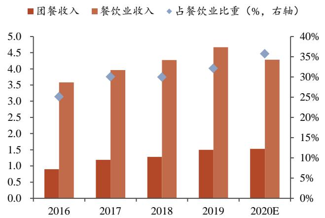

报告日期：2021 年 09 月 06 日

# 深耕 B 端 抢占蓝海

千味央廚深度报告

# 报告导读

# 投资要点

公司深耕餐饮B 端米面解决方案，抢占餐饮工业化蓝海。先发卡位大客户构筑强护城河，研发推陈出新、募投产能扩张有望带动公司持续成长。

# □行业：餐饮工业化踏浪而来，速冻米面优享红利

评级 买入上次评级 首次评级当前价格 ￥22.62

1）餐饮工业化高速成长，中游制造业充分受益。我国餐饮连锁化率逐渐提高、团餐规模快速扩大、外卖需求的爆发都使得餐饮行业进入工业化发展新节点。2)解决成本高企痛点，应对食品安全风险。使用中央厨房生产的半成品将有效缓解人力、租金成本压力，同时通过各环节标准化管理，积极防范内外部餐饮食品安全风险。3）速冻米面制品或优享餐饮工业化浪潮红利。米面制品消费频次低、成本占比高是餐饮企业普遍痛点。同时与速冻菜肴相比，速冻米面标准化难度低，更易实现标准化。

# 】公司：深耕 B 端速冻米面供应商，为餐饮客户提供标准化解决方案

公司秉承“只为餐饮、厨师之选”的战略定位，经过数年发展，公司已进入百胜中国供应商T1级，成为多家知名餐饮品牌速冻面米制品供应商。21H1实现营收5.68 亿元，同比增长 $5 4 . 8 0 \%$ ；归母净利润 3579 万元，同比增长 $4 7 . 6 7 \%$ 。近五年公司盈利能力保持稳定，资产周转率高于行业平均。

# □优势：卡位优质客户打造护城河，研发、产能再添成长性

1）依托直营品牌，开拓经销市场。公司直营客户为全国知名连锁餐饮品牌，经销客户为中小餐饮等区域性企业。2）研发推陈出新，产品迭代升级。公司建立“模拟餐厅后厨”的研发实验室，拥有多项具备自主知识产权的核心技术。3）募投扩建产能，蓄力持续成长。IPO 募投项目达产后总产能将达 17.2 万吨。4）管理体系稳定，利于长期发展。

盈利预测及估值：我们预计2021-2023年公司收入增速分别为$2 2 . 0 \% / 2 3 . 3 \% / 2 3 . 9 \%$ ；归母净利润增速分别为 $2 3 . 3 \% / 2 3 . 9 \% / 2 4 . 2 \%$ ;EPS分别为1.11/1.37/1.71元/股。给予公司2022 年60XPE，对应目标市值70 亿元，首次覆盖给予买入评级。

风险提示：原材料价格波动风险；食品安全风险；疫情或其他公共性突发事件对公司经营产生影响的风险；行业竞争加剧风险。

# 公司简介

财务摘要   

<table><tr><td>（百万元）</td><td>2020 2021E</td><td>2022E</td><td>2023E</td></tr><tr><td>主营收入 944.37</td><td>1152.11</td><td>1420.29</td><td>1760.28</td></tr><tr><td>(+1-) 6.20%</td><td>22.00%</td><td>23.28%</td><td>23.94%</td></tr><tr><td>净利润 76.59</td><td>94.42</td><td>116.97</td><td>145.26</td></tr><tr><td>(+1-) 3.11%</td><td>23.28%</td><td>23.89%</td><td>24.18%</td></tr><tr><td>每股收益（元） 0.90</td><td>1.11</td><td>1.37</td><td>1.71</td></tr><tr><td>P/E 25.14</td><td>20.39</td><td>16.46</td><td>13.25</td></tr></table>

公司致力于为餐饮企业提供定制化、标准化的速冻食品及相关餐饮后厨解决方案，直营与经销模式并举的B 端速冻米面供应商。

# 正文目录

# 1.行业：餐饮工业化踏浪而来，速冻米面优享红利.

1.1.餐饮工业化高速成长，中游制造业充分受益， 5  
1.2.解决成本高企痛点，应对食品安全风险.. 9  
1.3.速冻米面或优享餐饮工业化浪潮红利..

# ．公司：深耕 B 端速冻米面供应商，提供标准化解决方案 12

2.1．定位B 端米面，股权结构稳定 .13  
2.2.产品品类多元，自产代工结合.. .14  
2.3.盈利能力稳定，资产周转率高.. 16

# ．优势：卡位优质客户打造护城河，研发、产能再添成长性 1c

3.1.依托直营品牌，开拓经销市场.. .19   
3.2.研发推陈出新，产品迭代升级， ..22   
3.3.募投扩建产能，蓄力持续成长 ..24   
3.4.管理体系稳定，利于长期发展. .25

# ．盈利预测与估值. 27

4.1.盈利预测.. .27  
4.2.相对估值 28

# i.风险提示... 28

# 图表目录

图1：中央厨房发展历程. …….5  
图2：2010-2019年我国餐饮零售总额稳定增长. ….5  
图3：2014-2024 年我国分经营模式餐饮规模(万亿元) ….  
图4：中国连锁餐饮收入及占比（亿元， $\%$ )… …6  
图 5：2016-2020 年我国团餐收入及占比（万亿元，%）….7  
图6：2020年约 $4 2 . 7 0 \%$ 的团餐企业经营项目个数为10-50个.. ….  
图7：2015-2019年中国外卖产业规模.  
图 8：农副产品加工业营收规模稳步提升…… …8  
图9：2013-2020 年我国冷库容量及YOY（万吨， $\%$ )…… …9  
图10：2013-2020 年我国公路冷链运输车保有量（万辆， $\%$ ) ………9  
图11：2014-2019年中国餐饮业员工平均年薪. …9  
图12：2019年餐饮业成本占营收比例.. ……9  
图13：直接购买食材和购买半成品/成品的成本比较(元) … …10  
图 14：单一餐饮门店食品加工制作基本流程及潜在的食品安全隐患……10  
图15：2020年小吃快餐细分品类门店数占比情况.. 11  
图 16：2019-2020 年不同人均区间小吃快餐门店数占比及变化……11  
图17：2015-2020 年我国速冻面米食品产量（万吨， $\%$ )…11  
图18：2015-2019 年我国速冻面米行业市场规模（亿元， $\%$ )11  
图19：千味央厨发展历程. ……13  
图20：千味央厨处于速冻面米制品产业链中游. …13  
图21：发行后公司股权结构.. …14  
图22：千味央厨产品品类… …14  
图23：油炸类是主要收入来源（百万元） ….15  
图24：蒸煮类毛利率较高（20 年下滑主系会计准则调整）….. 15  
图25：2017-2020 年公司产能利用情况. … ….5  
图26：2017-2019 年自主生产产销量逐年提升（吨， $\%$ ) 15  
图27：委托加工约占总产量 $8 \%$ … 16  
图28：2017-2020 年公司主营业务成本构成.….. ……16  
图29：2017-2020 年公司原材料采购金额占比.. ……16  
图30：2017-21H1公司营业收入及YOY（亿元， $\%$ )17  
图31：2017-21H1公司归母净利润及YOY（万元， $\%$ )17  
图 32：2017-211公司销售毛利率、净利率变化（）…17  
图33：2017-2020年公司ROE（扣除/加权）、ROA变化 $( \%$ ) 1 7  
图 34：千味央厨速冻面米毛利率低于安井、三全……18  
图35：千味央厨期间费用率更低.. …… ….18  
图36：销售部门架构设置. 19  
图37：2017-2020 年公司分销售模式收入占比… …20  
图38：直营毛利率较高. ….20  
图39：公司主要客户. ….2  
图40：立足于华东，销售区域覆盖全国…. 20  
图41：2017-2020 年公司对百胜中国销售额及占比. ….1  
图42：2017-2020 年千味央厨经销商数量及平均收入 .22  
图43：2020 年销售额 100 万以上的经销商增长至130 家 ..22  
图44：各销售规模的经销商销售金额占比情况. ….2  
图45：公司研发费用逐年提升. .  
图46：2020 年底在售产品数量为368个.. ….2  
图47：2019 年速冻米面市场品类产量结构. .3  
图48：针对不同场景推出油条系列产品. ….3  
图49：2024年满产后总产能将达17.2 万吨.. ..25  
图50：各级别员工平均收入水平（万元/年）… ….6  
图 51：各类岗位员工平均收入水平（万元/年）…… ….  
表1：2019年餐饮各业态平均指标统计汇总， ….  
表2：含速冻米面公司餐饮端品牌对比. …….1  
表3：千味央厨资产周转率处于较高水平.. ….18  
表4：直营与经销模式对比.. ….2  
表5：2020年前五大直营客户销售额及占比， .1  
表6：公司主要在研项目及进展情况.. ….3  
表7：公司主要产品核心技术， .24  
表8：募投资金使用计划... ….5  
表9：公司核心团队具有丰富的行业经验， ….5  
表10：千味央厨收入拆分(百万元) ..27  
表11：可比公司估值 … ….28  
表附录：三大报表预测值. …29

# 1．行业：餐饮工业化踏浪而来，速冻米面优享红利

# 1.1.餐饮工业化高速成长，中游制造业充分受益

餐饮工业化是指在餐饮发展过程中通过先进生产技术、科学手段和管理方法，实现食品加工过程的标准化、机械化、定量化、自动化和连续化，在原料采购、产品生产、服务提供、人员要求、技术支撑、质量监管等方面建立统一的规则。中央厨房是餐饮工业化、标准化的具体组织形式。

因中餐特点，我国餐饮工业化起步较晚。我国下游餐饮业呈现高度分散的特征，加之中国餐饮菜系丰富，餐企标准化程度很低。根据马美湖等于 2021 年在《肉类工业》发表的《“工业化”中央厨房将成为中国食品制造业的重要领域》一文，直到1987年肯德基进入中国，带来了先进的工业化、标准化餐饮管理经验，中国“工厂化”中央厨房才逐渐产生和发展。

  
图1：中央厨房发展历程  
资料来源：《“工业化”中央厨房将成为中国食品制造业的重要领域》，浙商证券研究所

# 1.1.1.餐饮连锁化、团餐行业、外卖发展推动工业化和标准化发展

餐饮规模不断扩张，后疫情时期迎来强势复苏，带动餐饮食材采购规模稳步提升。随着我国居民消费实力增长，近年我国餐饮市场规模持续扩大，根据国家统计局数据，2010-2019 年餐饮零售总额CAGR为 $1 1 . 4 3 \%$ 。受疫情影响，2020 年全国餐饮零售总额为3.95 万亿元，同比下降 $1 6 . 6 0 \%$ ，2021年后餐饮业得到强势复苏，2021年1-7月实现收入2.55 亿元，同比增长 $4 2 . 3 0 \%$ 。行业高景气度推动了餐饮企业的规模化和标准化发展。

  
图2：2010-2019 年我国餐饮零售总额稳定增长  
资料来源：国家统计局，浙商证券研究所

# （1）餐饮连锁化拉动工业化需求

餐饮连锁化率不断提升。根据弗若斯特沙利文统计，我国餐饮市场按经营模式可分为独立营运、加盟连锁、自营连锁三类，西式快餐如肯德基、麦当劳和华莱士等餐企，近年来均进行迅速扩张，肯德基目前有 7000 家以上门店，未来将以 10000 家的规模为目标，而华莱士早已突破10000家的规模；中式快餐连锁化率也逐步提高，以杨国福、老乡鸡和曼玲粥店为代表的中式连锁快餐品牌逐渐兴起。2014-2019 年，非连锁餐饮企业收入CAGR 为 $9 . 8 \%$ ，加盟连锁餐厅为 $1 1 . 1 \%$ ，自营连锁餐厅为 $1 1 . 8 \%$ ，2019 年我国加盟及自营连锁餐饮规模达到9172亿元。

餐饮标准化需求随连锁化水平提高而增加。根据百胜中国招股说明书，2019 年我国餐饮连锁化率增长至 $1 9 . 6 \%$ ，然而与美国 $7 3 . 8 \%$ 的连锁化率相比，仍有较大增长空间。随着连锁化水平提高，餐饮企业规模效应增强，其对食材的统一配送和配送、出菜速度、菜品品质稳定性需求有望进一步增加。

餐饮工业化与连锁化相辅相成。连锁餐饮企业品牌拥有更高的认知度和声誉，对于食品安全的控制和菜品口味的稳定性有更高的要求，而后厨食材加工和制作流程的标准化，有利于连锁餐企提供优质餐品和服务，进一步助力连锁扩张。随着消费者对于品牌、安全、质量的要求越来越高，餐饮行业连锁经营模式将继续高速发展。

  
图3：2014-2024年我国分经营模式餐饮规模（万亿元）  
资料来源：弗若斯特沙利文，浙商证券研究所

  
图4：中国连锁餐饮收入及占比（亿元，%)  
资料来源：百胜中国招股说明书，浙商证券研究所

# （2）团餐业态的快速发展成为行业新的增长点

团餐行业规模扩大为中国餐饮业注入新活力。团餐是指餐饮企业为工厂、学校、公司、政府机构等批量制作与销售食品，根据国家统计局数据和中国饭店协会发布的《2020年度中国团餐发展报告》，2019 年团餐营业额为1.5 万亿元，占餐饮业收入达 $3 2 . 1 2 \%$ 。2020年餐饮业收入受新冠疫情影响同比下降，而 $6 5 \%$ 以上团餐企业服务于机关事业单位、军队、医院等场景，因其业态特殊性营收不受影响甚至呈逆势增长趋势，参与调查的团餐企业经营项目点数预计增至28568个。但当前国内团餐市场还处于发展初期，小规模团餐企业占比最高，与美国、欧洲和日本等全球团餐产业链成熟市场相比仍有较大发展空间。

由于团餐企业需要为大量高度集中、有组织的消费者服务，其对菜品标准和生产规模要求较高，因此在团餐中实现产品标准化、工业化是必然趋势。

  
图5：2016-2020 年我国团餐收入及占比（万亿元， $\%$   
资料来源：《2020年度中国团餐发展报告》，国家统计局，浙商证券研究所

  
图6：2020年约 $4 2 . 7 0 \%$ 的团餐企业经营项目个数为10-50个  
资料来源：《2020 年度中国团餐发展报告》，浙商证券研究所

表1：2019 年餐饮各业态平均指标统计汇总  

<table><tr><td></td><td>正赛</td><td>火锅</td><td>快餐小吃</td><td>团餐</td><td>西餐休闲、日料</td></tr><tr><td>中央厨房数（个)</td><td>0.4</td><td>1.0</td><td>0.8</td><td>1.5</td><td>0.5</td></tr><tr><td>营业收入(亿元)</td><td>5.2</td><td>13.3</td><td>8.3</td><td>9.0</td><td>0.8</td></tr><tr><td>营业收入同比增速</td><td>7.5%</td><td>9.0%</td><td>11.8%</td><td>19.8%</td><td>18.0%</td></tr><tr><td>单店员工数（人）</td><td>67</td><td>26</td><td>14</td><td>24</td><td>41</td></tr><tr><td>人均劳效</td><td>246333</td><td>221697</td><td>184646</td><td>280088</td><td>252904</td></tr></table>

数据来源：《2020 年中国餐饮业年度报告》，浙商证券研究所

# （3）外卖配送的及时性要求餐企更多使用标准化半成品

中国的餐饮外卖服务市场近年来迅速增长。根据美团研究院及中国饭店协会外卖专业委员会发布的《2019 年及 2020 年上半年中国外卖产业发展报告》数据，2019 年中国外卖产业规模达 6536 亿元，同比增长 $3 9 . 3 0 \%$ ，外卖产业渗透率提升至 $1 4 . 0 \%$ 。随着移动互联网用户的增加、线上外卖平台及APP应用程序的普及、线下外送行业的发展和年轻人群生活方式及就餐习惯的改变，外卖用餐需求愈发旺盛，餐饮外卖受益得到快速发展。2020 年新冠疫情期间，餐饮业线下销售渠道受阻，客流量大幅下降，许多商家开始将重心放到线上，拥抱第三方外卖平台。

外卖配送的及时性要求餐企更多使用标准化半成品。餐饮企业提供的外卖服务经由线上第三方外卖平台配送，从下单到外卖员取得餐品的过程不能耗时过长。如果后厨全部人工进行餐品制作，远超外卖配送时限。提供外卖服务的餐饮商家日益增多，选择标准化的半成品食材成为必然的趋势。

  
图7：2015-2019年中国外卖产业规模

资料来源：美团，中国饭店协会外卖专业委员会，前瞻产业研究院，浙商证券研究所

# 1.1.2.农副产品加工规模扩张、冷链物流完善为餐饮工业化提供土壤

上游农副产品加工规模稳步提升。根据国家统计局数据，2017-2019 年我国农副产品加工业营收规模逐年提升，2020年1-4月受疫情影响有所下降，5 月起即恢复正增长，2021年1-7 月，农副产品加工业实现营收 2.96 万亿元，同比增长 $1 7 . 4 0 \%$ 。

  
图8：农副产品加工业营收规模稳步提升  
资料来源：国家统计局，浙商证券研究所

冷链基础设施不断完善将推动餐饮工业化发展。随着先进储藏保鲜技术的应用，近年来冷链物流进入发展快车道。根据中物联冷链委统计预测，2013-2020 年我国冷库容量、公路冷链运输车保有量 CAGR 分别为 $1 6 . 6 5 \%$ 、 $2 4 . 8 7 \%$ ，预计2020 年我国冷库容量将突破7080 万吨，公路冷链运输车保有量将突破 26.1万辆，同比分别增长 $1 7 . 1 0 \% . 2 1 . 7 0 \%$ 。冷链物流的发展将提升中央厨房的辐射范围，扩大销售半径，促进餐饮产业升级。

  
图9：2013-2020 年我国冷库容量及Y0Y（万吨，%)  
资料来源：中物联冷链委，浙商证券研究所

  
图10：2013-2020 年我国公路冷链运输车保有量（万辆， $\%$   
资料来源：中物联冷链委，浙商证券研究所

# 1.2. 解决成本高企痛点，应对食品安全风险

# 1.2.1.必要性一：解决餐饮企业人力、租金成本高企的痛点

餐饮行业下游劳动密集，人力成本居高不下，租金成本持续上涨要求餐企最大化营业面积。根据中国饭店协会《2020中国餐饮业年度报告》对全国范围内典型餐企进行的调研，2019 年调研企业中人力成本占营业收入比例均值为 $2 1 . 3 5 \%$ ，且仍以 $3 . 6 9 \%$ 的涨幅增长。因经济发展、可支配收入及消费物价指数增加以及通胀，人工成本未来可能持续增加。2019 年调研企业中房租及物业成本占营业收入比例均值为 $1 1 . 7 7 \%$ ，并以 $3 . 3 9 \%$ 的速度增长。连锁餐饮企业门店普遍分布在城市的商场、写字楼等地，租金更为高昂。

  
图11：2014-2019 年中国餐饮业员工平均年薪  
资料来源：国家统计局，浙商证券研究所

  
图12：2019年餐饮业成本占营收比例

资料来源：《2020 中国餐饮业年度报告》，浙商证券研究所

购买中央厨房生产的半成品可缓解餐饮企业成本压力。根据前瞻产业研究院引用美团的数据，同样售价20元的快餐，购买半成品或成品的总成本比直接购买食材低0.4元，分单项成本来看，虽食材成本较高，但高出部分在人工成本、房屋租赁成本及能源杂费被抵消。

  
图13：直接购买食材和购买半成品/成品的成本比较（元）

资料来源：美团，前瞻产业研究院，浙商证券研究所

# 1.2.2.必要性二：可有效应对食品安全风险挑战

安全是食品的第一属性，根据赵京桥 2014 年在《商业研究》发表的《基于产业发展视角的中国餐饮业食品安全研究》一文，餐饮食品安全风险按照产生原因可分为外部引入型和内部流程型。从外部引入型风险来看，多样化的食材需求，食品添加剂的使用，饮料、酒类及糖果零售的销售，餐具厨具的使用等决定了餐饮业与农业、食品工业、餐饮设备制造业具有紧密关系，外部引入型风险也随之增加。从内部流程型风险来看，餐饮业内部具有繁多的操作环节，不同环节包括诸多操作细节，不同流程对不同食材、不同菜肴的食品安全操作要求也不同，因此内部流程型食品安全风险点非常多。

中央厨房是餐饮工业化、标准化的具体组织形式。中央厨房通过对各环节进行标准化管理，对外建立供应商索票索证制度，对内实施 HACCP 食品安全规范体系，规范操作流程，实现集约化生产，恰能有效保证产品品质稳定，防范内外部餐饮食品安全风险，解决餐饮企业食品安全问题。

  
图14：单一餐饮门店食品加工制作基本流程及潜在的食品安全隐患  
资料来源：《基于产业发展视角的中国餐饮业食品安全研究》，浙商证券研究所

# 1.3.速冻米面或优享餐饮工业化浪潮红利

米面制品标准化、连锁化需求更为突出，而米面制品标准化难度相对较低使工业化替代得以实现。（1）面米制品消费频次低、成本占比高是餐饮企业普遍痛点。根据我们调研得知，餐饮企业中面米制品只占整体销售规模的 $5 \%$ ，而相对应面点师傅的人工成本占比或近 $1 0 \%$ 。米面制品占据大份额的小吃快餐赛道中，大部分小吃快餐还存在同质化竞争激烈、低客单价的情况，产品附加值较低，品类品牌连锁化、使用标准化产品压缩成本的需求更为突出，根据美团发布的《中国餐饮大数据 2021》，近年小吃快餐客单价逐步上升，但人均消费 10 元以下的小吃快餐门店数仍占主要市场，2020 年占比高达 $7 4 . 6 \%$ 。（2）与速冻菜肴相比，速冻米面标准化难度低，更易实现标准化。

  
图15：2020 年小吃快餐细分品类门店数占比情况

  
图16：2019-2020 年不同人均区间小吃快餐门店数占比及变化

资料来源：《中国餐饮大数据2021》，浙商证券研究所资料来源：《中国餐饮大数据2021》，浙商证券研究所

我们判断未来 3-5 年餐饮渠道速冻面米制行业 CAGR 为 $1 5 \%$ 左右。我国速冻面米制品行业从上世纪 90 年代初开始起步，行业成熟度较高，速冻面米制品行业稳步发展。根据国家统计局和智研咨询数据，2015-2020 年我国速冻面米食品产量持续增长，2020 年产量达 334.3 万吨，同比增长 $1 0 . 2 \%$ ，主要系疫情影响消费结构，速冻面米消费增长较快。而根据立鼎产业研究中心数据，2015-2019 年我国速冻面米制品行业市场规模 CAGR为$5 . 7 \%$ ，2019 年市场规模为 677 亿元，同比增长 $4 . 6 \%$ 。我们预计未来3-5 年速冻面米行业CAGR为 $5 \mathrm { - } 1 0 \%$ 。其中餐饮渠道或成为驱动速冻面米制品增长的重要引擎，我们判断未来3-5 年餐饮渠道速冻面米制行业CAGR 超过行业整体 CAGR 为 $1 5 \%$ 左右。

  
图17：2015-2020 年我国速冻面米食品产量（万吨， $\%$   
资料来源：国家统计局，智研咨询，浙商证券研究所  
注：2018 年因统计口径调整，较上年有较大差异

  
图18：2015-2019 年我国速冻面米行业市场规模（亿元， $\%$   
资料来源：立鼎产业研究中心，浙商证券研究所

竞争格局看，速冻米面餐饮市场多点开花。速冻米面零售市场已形成“三足鼎立”局面，根据《2019 年中国冷冻冷藏食品工业经济运行报告》，2018 年三全、思念、湾仔码头已占到 $6 4 \%$ 的市场份额，而餐饮市场还处于市场开拓、产品开发阶段，涌现了如千味央厨等专注B 端的速冻米面企业，部分速冻米面供应商也成立餐饮部门（三全绿标餐饮专供、思念BP）或积极开发餐饮渠道（安井食品)。

表2：含速冻米面公司餐饮端品牌对比  

<table><tr><td>公司</td><td>餐饮品牌</td><td>20年餐饮端米面营收</td><td>主要速冻米面产品</td></tr><tr><td>千味</td><td>千味</td><td>约9亿</td><td>油条、芝麻球、地瓜丸、卡通包、蒸饺</td></tr><tr><td>三全食品</td><td>三全绿标餐饮专供</td><td>约９亿</td><td>水饺、包点</td></tr><tr><td>思念食品</td><td>思念BP</td><td>约7亿</td><td>汤圆、水饺、面点</td></tr><tr><td>安井食品</td><td>安井</td><td>约8亿</td><td>手抓饼、面点</td></tr></table>

注：三全餐饮端米面营收数据来源于年报，思念餐饮端米面营收数据来源于调研，安井餐饮端米面营收用 20 年报中米面营收乘以BC 端占比得出数据来源：公司公告，浙商证券研究所

# 2. 公司：深耕 B 端速冻米面供应商，提供标准化解决方案

# 2.1.定位B 端米面，股权结构稳定

战略定位B 端速冻米面。郑州千味央厨食品股份有限公司（以下简称“千味央厨”）于2012 年4 月由思念食品单独设立，主营业务为面向餐饮企业的速冻面米制品的研发、生产和销售，秉承“只为餐饮、厨师之选”的战略定位，致力于为餐饮企业提供定制化、标准的速冻食品及相关餐饮后厨定制化、标准的速冻食品及相关餐饮后厨解决方案。2013年公司于上海成立研发中心，拥有郑州、上海两大研发基地。2016 年千味央厨全面走向国际，进入百胜T1级别供应商行列，同时完成与思念食品的股权交割。经过数年发展，千味央厨已成为肯德基、必胜客、华莱士、海底捞、真功夫、呷哺呷哺等国内外知名餐饮品牌速冻面米制品供应商。

  
图19：千味央厨发展历程  
资料来源：公司官网，浙商证券研究所

  
图20：千味央厨处于速冻面米制品产业链中游  
资料来源：招股说明书，浙商证券研究所

李伟长期为公司实际控制人，股权结构稳定。根据招股说明书，本次发行前，李伟直接持有共青城城之集 $1 0 0 \%$ 股权，间接持有千味央厨 $6 2 . 4 9 \%$ 的股权，为公司的实际控制人。本次发行2128万股后，共青城城之集持股比例将降至 $4 6 . 8 6 \%$ ，仍居于相对控制地位。同时，公司高管通过共青城凯立间接持有公司股份，保证激励对象持股稳定性。

  
图21：发行后公司股权结构  
资料来源：招股说明书，浙商证券研究所

# 2.2.产品品类多元，自产代工结合

产品多元化，油炸类为主力系列，蒸煮类毛利率较高。公司速冻面米制品按照加工方式可分为油炸类、烘焙类、蒸煮类、菜肴类及其他，2020 年在售数量分别为95、56、166、51种，油炸类为公司主力系列。根据招股说明书，2020 年油炸类实现营收 5.21亿元，营收占比达 $5 5 . 2 2 \%$ ，其次为烘焙类、蒸煮类。分品类毛利率看，蒸煮类毛利率较高，2020 年其毛利率为 $2 4 . 5 5 \%$ 。

  
图22：千味央厨产品品类   
资料来源：公司官网，浙商证券研究所

  
图 23：油炸类是主要收入来源（百万元）  
资料来源：招股说明书，浙商证券研究所

  
图24：蒸煮类毛利率较高（20 年下滑主系会计准则调整）  
资料来源：招股说明书，浙商证券研究所

以销定产，自产与代工合理组织。公司生产模式分为通用品生产和定制品生产，其中定制品主要与客户联合研发或根据客户需求定制，均为公司自产；通用品部分为公司自产，少量对外委托加工。自产方面，采取备货式生产模式，根据销售计划和安全库存制定生产计划，根据招股说明书，2020 年实现自产产量7.73 万吨，销量7.67 万吨，产能利用率为 $6 0 . 4 1 \%$ ，主要原因有二：（1）受疫情影响，复工延迟、开工率不足导致20H1产量下滑；（2）新乡项目二期于2020 年2 月投产，产能有待逐步释放。委托加工方面，为缓解销售旺季产能不足压力，部分油炸点心、油条采取少量委托加工，2020 年委托加工量为 6572吨，占总产量比例为 $7 . 8 4 \%$ 。

  
图25：2017-2020 年公司产能利用情况  
资料来源：招股说明书，浙商证券研究所

  
图 26：2017-2019 年自主生产产销量逐年提升（吨， $\%$   
资料来源：招股说明书，浙商证券研究所

  
图27：委托加工约占总产量 $8 \%$

资料来源：招股说明书，浙商证券研究所

原材料成本占主营业务成本较高，以面粉和米粉类等大宗商品为主。公司自产所需的主要原材料包括面粉、糯米粉、食用油、白砂糖等大宗商品，占主营业务成本较高，根据公司招股说明书，2020 年原材料成本占主营业务成本比例为 $7 4 . 7 1 \%$ ，其中以面粉和米粉类为主，2020 年面粉和米粉类占采购总额的 $4 2 . 0 2 \%$ 。

  
图28：2017-2020 年公司主营业务成本构成  
资料来源：招股说明书，浙商证券研究所

  
图29：2017-2020 年公司原材料采购金额占比  
资料来源：招股说明书，浙商证券研究所

# 2.3.盈利能力稳定，资产周转率高

近年来公司营收与业绩保持高速增长。根据招股说明书，2017-2020年公司收入由5.93亿元增长至9.44亿元，归母净利润由4656 万元增长至7659 万元，CAGR分别为 $1 6 . 7 6 \%$ $1 8 . 0 5 \%$ 。2021年疫情逐渐消退餐饮业恢复正常，公司延续高增长态势，21H1实现营收5.68亿元，同比增长 $5 4 . 8 0 \%$ ；归母净利润 3579 万元，同比增长 $4 7 . 6 7 \%$ 。

  
图30：2017-21H1公司营业收入及YOY（亿元，%)  
资料来源：招股说明书，浙商证券研究所

  
图31：2017-21H1公司归母净利润及YOY（万元， $\%$   
资料来源：招股说明书，浙商证券研究所

公司盈利能力保持稳定。根据公司招股说明书，2020 年公司毛利率因会计准则调整，同比下滑2.79pct 至 $2 1 . 7 1 \%$ ，还原运费后毛利率为 $2 4 . 0 9 \%$ ，同比下降0.41pct；净利率同比下降 0.23pct至 $8 . 1 1 \%$ ，主要系营收增速高于利润增速；同样由于会计准则调整，2020年公司扣除非经常性损益后加权平均净资产收益率为 $1 1 . 3 8 \%$ ，同比下降 8.56pct。

  
图 32：2017-21H1 公司销售毛利率、净利率变化 $( \% )$   
资料来源：招股说明书，浙商证券研究所

  
图33：2017-2020 年公司R0E（扣除/加权)、ROA 变化 $( \% )$

资料来源：招股说明书，浙商证券研究所

定制生产模式具备独特性和灵活性，公司总资产周转率高于行业平均。千味央厨主要面向餐饮客户，其毛利率相对C端产品较低，根据公司公告，2020 年三全食品零售市场营收占比高达 $8 6 . 4 3 \%$ ，在此拉动下其速冻米面综合毛利率为 $3 0 . 7 8 \%$ ，高于千味央厨、安井食品。同时，餐饮端费用率也更低，根据招股说明书，2020年千味央厨费用率仅 $1 2 . 8 0 \%$ ,低于三全食品、安井食品的 $1 8 . 4 0 \%$ 、 $1 4 . 6 1 \%$ 。同时，由于公司定制生产模式的独特性与灵活性，公司总资产周转率高于行业平均。

  
图34：千味央厨速冻面米毛利率低于安井、三全  
资料来源：招股说明书，公司公告，浙商证券研究所

  
图35：千味央厨期间费用率更低  
资料来源：招股说明书，公司公告，浙商证券研究所

表3：千味央厨资产周转率处于较高水平  

<table><tr><td>2020</td><td>千味央廚</td><td>安井食品</td><td>三全食品</td><td>巴比食品</td><td>均值</td></tr><tr><td>ROE</td><td>15.50%</td><td>18.79%</td><td>29.41%</td><td>14.94%</td><td>21.05%</td></tr><tr><td>销售净利率</td><td>8.11%</td><td>8.67%</td><td>11.09%</td><td>17.99%</td><td>12.58%</td></tr><tr><td>资产周转率(次)</td><td>1.05</td><td>1.09</td><td>1.23</td><td>0.66</td><td>0.99</td></tr><tr><td>权益乘数</td><td>1.82</td><td>1.99</td><td>2.16</td><td>1.26</td><td>1.80</td></tr></table>

数据来源：Wind，浙商证券研究所

# 3.优势：卡位优质客户打造护城河，研发、产能再添成长性

# 3.1.依托直营品牌，开拓经销市场

直营和经销部门分工明确。经过多年实践和调整，公司已形成一套架构稳定、配置得当、布局合理的销售管理体系，重客部主要负责为直营客户提供服务，经销商客户部则主要服务于区域餐饮企业，在全国设立的大区经理、省区经理负责所属区域的新市场开拓、原有市场维护、经销商管理和售后服务等。另外，渠道拓展部负责拓展新零售等新业务；行销部负责客户开发、服务提升工作；产品管理部负责产品管理和品牌推广等。

  
图36：销售部门架构设置  
资料来源：招股说明书，浙商证券研究所

直营以定制品为主，经销基本销售通用品。公司下游客户主要为餐饮企业等B 端客户，销售模式分为直营模式和经销模式，其中对直营客户主要销售定制品，对经销客户主要销售面向全国的通用品，根据招股说明书，2020 年直营、经销模式收入占比分别为$3 5 . 7 4 \%$ $6 4 . 2 6 \%$ ，直营定制品、经销通用品分别占总收入比例为 $3 0 . 0 0 \%$ 、 $6 3 . 2 3 \%$ 。

直营模式毛利率高于经销模式。公司深耕B 端速冻面米，在业内具有较高知名度、企业信誉和较强的规模、优质客户优势，对下游直营客户具备一定议价能力；同时直营客户的个性化需求下定制产品的毛利率会更高。直营模式毛利率高于经销模式，根据招股说明书，2020 年直营、经销模式毛利率分别为 $2 3 . 1 9 \%$ 、 $2 0 . 6 2 \%$ ，随着2020年起公司承担的直营客户运输费调整计入当期主营业务成本，直营与经销模式毛利率差异缩小。

  
图37：2017-2020 年公司分销售模式收入占比  
资料来源：招股说明书，浙商证券研究所

  
图38：直营毛利率较高  
资料来源：招股说明书，浙商证券研究所

表4：直营与经销模式对比  

<table><tr><td>模式</td><td>主要销售产品及占比</td><td>客戶关注点</td><td>销售结算政策</td><td>运输政策</td><td>定价策略</td></tr><tr><td>直营</td><td>直营模式中 83.94% 为定制品</td><td>品质、研发</td><td>赊账制，一般不超 过3个月信用期</td><td>公司负责直营用户的产 品运输</td><td>竞标定价</td></tr><tr><td>经销</td><td>经销模式中 98.40% 为通用品</td><td>规模、效率</td><td>除个别外，一般采 用先款后货</td><td>自提货物或委托公司代 办，客户承担运输费用</td><td>成本加成+随行就市</td></tr></table>

数据来源：招股说明书，浙商证券研究所

直营客户为知名连锁餐饮品牌，与百胜中国合作稳定。公司直营客户主要以品牌知名度较高的全国大型连锁餐饮客户为主，如百胜中国、华莱士、真功夫、九毛九、海底捞等。根据招股说明书，2020 年公司前五大直营客户营收合计占比达 $3 1 . 1 3 \%$ ，其中公司作为百胜中国 T1 级供应商，对其销售额占比为 $2 3 . 3 7 \%$ ，销售金额不断提升。近年来根据零售、餐饮业态新特点，公司还创新开发连锁商超等B 端新渠道，采用买断式销售，商超需拆除包装并二次加工，以自身名义对外销售。

  
图39：公司主要客户  
资料来源：招股说明书，浙商证券研究所

  
图40：立足于华东，销售区域覆盖全国  
资料来源：招股说明书，浙商证券研究所

表5：2020 年前五大直营客户销售额及占比  

<table><tr><td>序号</td><td>客戶名称</td><td>销售额 （万元）</td><td>占直营收 入比重</td><td>占营业收 入比重</td></tr><tr><td>1</td><td>百胜中国控股有限公司及其关联方</td><td>22067.31</td><td>65.52%</td><td>23.37%</td></tr><tr><td>2</td><td>福建省华莱士食品股份有限公司及其关 联方</td><td>4000.19</td><td>11.88%</td><td>4.24%</td></tr><tr><td>3</td><td>四川海之雁贸易有限公司及其关联方</td><td>2086.53</td><td>6.20%</td><td>2.21%</td></tr><tr><td>4</td><td>东莞市补给舰供应链管理有限公司及其 关联方</td><td>664.96</td><td>1.97%</td><td>0.70%</td></tr><tr><td>5</td><td>佛山市麦点食品有限公司及其关联方</td><td>582.77</td><td>1.73%</td><td>0.62%</td></tr><tr><td></td><td>合计</td><td>29401.76</td><td>87.30%</td><td>31.13%</td></tr></table>

数据来源：招股说明书，浙商证券研究所

与百胜中国的合作关系是公司的强护城河。百胜中国最看重的是供应商供应能力的稳定性，长期的合作关系向百胜中国证明了公司品控的稳定性。

  
图41：2017-2020 年公司对百胜中国销售额及占比  
资料来源：招股说明书，浙商证券研究所

经销客户为中小餐饮连锁等区域性企业，细分市场采取多种渠道建设。公司采用经销商模式对接全国流通市场，终端客户为当地的中小型餐饮连锁、夫妻店、团餐以及电商等区域性客户。与部分公司的省级或市级代理模式不同，千味央厨在成熟区域进行精细化渠道管理，根据流通渠道、商超渠道、电商渠道开发不同经销商，对分散的中小餐饮企业进行管理；在公司相对弱势市场，适当进行渠道下沉，实现对市场的精耕及培养，优化公司的管理成本、成品仓储成本和现金流。根据招股说明书，2017-2020 年公司经销商从 521家增至 907家，CAGR达 $2 0 . 3 0 \%$ ，其中年销售额 100万以上的经销商增长至130家。同时针对具有实力的经销商客户，公司派出专职人员给予帮助扶持，针对收入较低的经销商进行资源整合经销商收入持续提升。

  
图42：2017-2020 年千味央厨经销商数量及平均收入  
资料来源：招股说明书，公司公告，浙商证券研究所

  
图43：2020 年销售额 100 万以上的经销商增长至130 家  
资料来源：招股说明书，浙商证券研究所

  
图 44：各销售规模的经销商销售金额占比情况  
图46：2020 年底在售产品数量为 368 个

资料来源：招股说明书，浙商证券研究所

# 3.2.研发推陈出新，产品迭代升级

模拟餐厅后厨，持续推出新产品。公司技术研发部下设产品研发、工艺研发、设备研发、包装研发等四个专业研究室和上海研发室，其中，产品研发又分设球类、酥类、油条、面点、烘焙类、创新类六个研发小组，较早便在行业内建立“模拟餐厅后厨”的研发实验室，为食客提供最佳就餐体验。自主研发和定制研发相结合与生产模式匹配，3-6 个月即可完成直营客户定制研发需求，2018 年完成40多项新产品上市，其中为肯德基研发并上市了7 个新品；同时以市场为导向复制、改进畅销产品，产品经理从市场调研开始，经过立项、小试、中试、试产及系列评审、确认，到最终量产全流程参与，提高新品成功率，在售品种不断增加。根据招股说明书，截至2020 年12 月31日，公司拥有研发、技术人员36名，占员工总数的 $1 . 7 4 \%$ ；专利46项，在售产品数量为368个，尚有多个新品在研。未来将适应火锅连锁店快速扩张、团餐需求快速增长的趋势，加大对火锅料、特色点心的研发力度。

图45：公司研发费用逐年提升

  
资料来源：招股说明书，浙商证券研究所  
图48：针对不同场景推出油条系列产品

  
资料来源：招股说明书，浙商证券研究所

表6：公司主要在研项目及进展情况  

<table><tr><td>项目</td><td>研发阶段</td><td>项目介绍及未来应用前景</td></tr><tr><td>新口味酥饼</td><td>小试阶段</td><td>中式点心的多样化研发生产对，可以更大程度满足客 户的需求</td></tr><tr><td>冷冻三明治面团</td><td>试产阶段</td><td>三明治面团的工业化生产，代表着烘焙面包类产品在 技术上的一个大的突破，为产品开发新的供应渠道</td></tr><tr><td>红豆派</td><td>小试阶段</td><td>针对西式快餐店推出的一款产品</td></tr><tr><td>麻酱烧饼</td><td>小试阶段</td><td>市场产品的吸收创新，增强产品技术研究</td></tr><tr><td>馅饼类</td><td>试验阶段</td><td>开拓饼类市场，丰富产品</td></tr><tr><td>注芯油条系列</td><td>试验阶段</td><td>基于蛋芯油条，对该系列产品进行储备</td></tr><tr><td>新造型春卷</td><td>中试阶段</td><td>春卷的新型的生产方式，自动化，规模化生产</td></tr><tr><td>油条工业化规模 化生产的研究</td><td>试验阶段</td><td>作为主力品种，继续对油条工业化生产进行技术研 究，保持行业领先地位</td></tr><tr><td>米发糕工业化规 模化生产的研究</td><td>试验阶段</td><td>继续对米发糕的工业化生产进行技术研究</td></tr><tr><td>冷冻预烤面包</td><td>试产阶段</td><td>烘焙类预烤产品，进行技术升级，能够极大降低门店 的运营成本，是未来烘焙店的发展趋势</td></tr><tr><td>基础面点的工业 化生产研究</td><td>试验阶段</td><td>对面点工业化规模化生产进行技术研究</td></tr></table>

数据来源：招股说明书，浙商证券研究所

开创速冻油条工业化生产。我国传统速冻米面制品中，饺子、汤圆占据较大份额，根据立鼎产业研究中心数据，2019年速冻面米食品中饺子、汤圆占比分别达 $3 2 . 6 \% . 2 7 . 1 \%$ ,市场逐渐趋于饱和。因此，公司转向生产适应餐饮行业需求的新兴品类，于 2006 年推出安心油条，开创了中国油条品牌，并且自2012 年起开始油条细分市场研究，针对不同场景推出多款创新性产品，拥有7 项油条核心技术，油条系列成长为公司的拳头产品，且在一线品牌中具备价格优势。

图47：2019 年速冻米面市场品类产量结构

  
资料来源：立鼎产业研究中心，浙商证券研究所

  
资料来源：招股说明书，浙商证券研究所

生产技术改进、生产设备开发保证新品上市。公司生产工艺的技术水平和生产设备的自动化程度一直处于行业领先水平。生产工艺上，公司围绕餐饮客户特点进行研发，不断尝试对各类传统美食进行工业化改造，取得多项具有自主知识产权的核心技术。此外，公司与国内机械设备制造企业通过引进、消化、吸收国外技术和不断自主创新联合开发生产设备，并且根据自身需求研发改进生产设备，实现规模化生产。提高生产效率。

表7：公司主要产品核心技术  

<table><tr><td>核心技术</td><td>来源</td><td>功能与创新</td><td>产品应用</td></tr><tr><td>油条纵切技术</td><td>自主研发</td><td>改变油条面团的切条方式，减 少生产线用人，增加生产效率</td><td>外卖油条、精品油 条、酥脆油条等</td></tr><tr><td>注芯油条 加工装置</td><td>自主研发</td><td>油条灌装机的研发，有利于产 品的快速规模化生产</td><td>蛋芯油条</td></tr><tr><td>面节高效 生产方法</td><td>自主研发</td><td>生产方式创新，压延方式的更 新，做到无损压延，并加快成 型效率</td><td>捞面面节</td></tr><tr><td>球类产品高效成 型配方、工艺、设 备系统方法</td><td>自主研发</td><td>产品配方、设备、工艺的创新， 生产效率大幅提升，用人数量 减少</td><td>芝麻球、地瓜丸</td></tr><tr><td>新型成型 油炸装置</td><td>自主研发</td><td>生产方式创新，结合产品特性 设计的油炸装置，更能符合产 品的炸程，大幅提高成品率</td><td>茴香小油条</td></tr></table>

数据来源：招股说明书，浙商证券研究所

# 3.3.募投扩建产能，蓄力持续成长

募集资金用于扩建产能，总产能将达 17.2 万吨，较 20 年增长 $3 4 . 3 8 \%$ 。速冻米面行业具有较强的季节性，每年8月至次年2 月处于销售旺季，企业也很难在淡季大批量备货，一般速冻面米制品实际生产能力只能达到设计生产能力 $7 0 \mathrm { - } 8 0 \%$ ，期间公司产能无法完全满足市场需要，急需扩张产能。根据招股说明书，公司本次IPO 募集资金中，2.50亿元用于速冻面米食品产能扩建，项目预计 2023 年 6 月建成投产，23 年可达设计产能的$3 0 \%$ ,24年达到设计产能 $7 0 \%$ 后总产能将达17.2万吨，较20年增加4.4万吨，增长 $3 4 . 3 8 \%$ 。

另外，总部基地及研发中心建设项目将提升公司整体研发实力，降低产品综合成本，带来隐形收益。

表8：募投资金使用计划  

<table><tr><td>项目名称</td><td>投资总额 (万元)</td><td>募资资金投入 金额（万元）</td><td>募集资金投 入金额占比</td><td>建设期</td><td>满产年新增利润总额 （万元）</td></tr><tr><td>新乡千味央廚食品有限公司食 品加工建设项目（三期)</td><td>37682.39</td><td>24975.6</td><td>88.53%</td><td>24个月</td><td>8932.38</td></tr><tr><td>总部基地及研发中心建设项目</td><td>5979.98</td><td>3236.61</td><td>11.47%</td><td>24个月</td><td>-</td></tr><tr><td>合计</td><td>43662.37</td><td>28212.21</td><td>100.00%</td><td></td><td>8932.38</td></tr></table>

数据来源：招股说明书，浙商证券研究所

  
图49：2024 年满产后总产能将达17.2 万吨

资料来源：招股说明书，浙商证券研究所

注：17.2 万吨构成为：新乡工厂一期 6.8万吨，二期 4.8 万吨，三期 5.6 万吨（设计产能的 $7 0 \%$ )

# 3.4.管理体系稳定，利于长期发展

管理层长期任职，保持战略持续性。公司管理层为职业经理人，均曾就职于思念，具有丰富的速冻食品从业经验，且于千味央厨成立初期便于公司任职至今，管理层的长期稳定，有助于公司保持战略的持续性，有利于长期稳定发展。

表9：公司核心团队具有丰富的行业经验  

<table><tr><td>姓名</td><td>职务</td><td>履历</td></tr><tr><td>孙剑</td><td>董事长</td><td>2000-2010年历任郑州思念业务代表、上海公司经理、香 港公司经理、营销中心副总经理，2018年至今在千味央厨 工作</td></tr><tr><td>白瑞</td><td>董事、总经理</td><td>2004-2011 年历任郑州思念结算部经理、资金管理部经理、 营销中心副总经理助理，2012 年至今在千味央厨工作</td></tr><tr><td>王植宾</td><td>董事、副总经 理、财务总监</td><td>2005-2012年历任郑州思念总成本会计、高级审计员、内 审经理、审计部经理，2012 年至今在千味央厨工作</td></tr><tr><td>徐振江</td><td>副总经理兼 董事会秘书</td><td>2006-2011年曾任河南宋河酒业股份公司总裁助理、洛阳 次祖杜康销售有限公司总经理助理，2015 年至今在千味央 厨工作</td></tr><tr><td>贾学明</td><td>技术研发部</td><td>2004-2012年历任郑州思念面点师、研发组长、技术经理</td></tr></table>

<table><tr><td></td><td>总监</td><td>和高级研发工程师，2012 年至今在千味央厨工作</td></tr><tr><td>王向阳</td><td>生产质量技术 总监</td><td>1999-2012 年任郑州思念质量技术总监，2012 年至今在千 味央厨工作</td></tr></table>

数据来源：浙商证券研究所

员工薪资具有竞争力，保证团队积极性和稳定性。公司员工薪酬由固定工资、绩效工资、司龄工资、津贴补助组成，其中绩效工资包括月度绩效考评、高层年度奖金、研发奖金，对于绩效人员每年薪资涨幅约为 $4 \%$ 。根据招股说明书，2019 年郑州、新乡员工平均薪资分别为 6.61、4.74 万元/年，分别高于郑州、新乡地区平均薪资 $2 8 . 6 0 \%$ $1 4 . 4 9 \%$ 。

  
图50：各级别员工平均收入水平（万元/年）  
资料来源：招股说明书，浙商证券研究所

  
图51：各类岗位员工平均收入水平（万元/年）  
资料来源：招股说明书，浙商证券研究所

# 4.盈利预测与估值

# 4.1.盈利预测

我们对公司2021-2023年盈利预测做如下假设:

（1）公司2021-2023 年收入增速分别为 $2 2 . 0 \%$ ， $2 3 . 3 \%$ $2 3 . 9 \%$ ，增长主要来自于新增产能释放下各品类销售的提升：

（2）依据成本加成 $^ +$ 随行就市的定价方法，我们对吨成本和吨毛利分别进行假设，得出公司2021-2023 年毛利率分别为 $2 1 . 7 \%$ 、 $2 2 . 2 \%$ 、 $2 2 . 5 \%$ 。

（3）公司2021-2023年销售费用率为 $3 . 2 9 \%$ $3 . 2 7 \%$ $3 . 2 5 \%$ ，管理费用率为 $7 . 7 0 \%$ $7 . 2 5 \%$ ， $6 . 8 6 \%$ ，研发费用率为 $0 . 7 6 \%$ 。

综上，我们预计 2021-2023 年公司归母净利润增速分别为 $2 3 . 3 \%$ 、 $2 3 . 9 \%$ $2 4 . 2 \%$ .,EPS分别为1.11、1.37、1.71元/股。

表10：千味央厨收入拆分（百万元）  

<table><tr><td></td><td>2019</td><td>2020</td><td>2021E</td><td>2022E</td><td>2023E</td></tr><tr><td>营业收入</td><td>889.3</td><td>944.4</td><td>1152.1</td><td>1420.3</td><td>1760.3</td></tr><tr><td>YOY</td><td>26.8%</td><td>6.2%</td><td>22.0%</td><td>23.3%</td><td>23.9%</td></tr><tr><td>毛利率</td><td>24.5%</td><td>21.7%</td><td>21.7%</td><td>22.2%</td><td>22.5%</td></tr><tr><td>油炸类</td><td>491.8</td><td>521.5</td><td>630.5</td><td>773.9</td><td>952.0</td></tr><tr><td>YOY</td><td>22.2%</td><td>6.0%</td><td>20.9%</td><td>22.7%</td><td>23.0%</td></tr><tr><td>毛利率</td><td>22.7%</td><td>20.2%</td><td>20.4%</td><td>21.0%</td><td>21.3%</td></tr><tr><td>烘焙类</td><td>197.7</td><td>187.5</td><td>233.3</td><td>286.9</td><td>354.3</td></tr><tr><td>YOY</td><td>29.3%</td><td>-5.1%</td><td>24.4%</td><td>23.0%</td><td>23.5%</td></tr><tr><td>毛利率</td><td>26.7%</td><td>22.9%</td><td>22.6%</td><td>23.2%</td><td>23.7%</td></tr><tr><td>蒸煮类</td><td>176.7</td><td>183.6</td><td>226.2</td><td>280.7</td><td>353.2</td></tr><tr><td>YOY</td><td>30.3%</td><td>3.9%</td><td>23.3%</td><td>24.1%</td><td>25.8%</td></tr><tr><td>毛利率</td><td>26.9%</td><td>24.5%</td><td>24.9%</td><td>24.7%</td><td>25.1%</td></tr><tr><td>菜肴类及其他</td><td>22.4</td><td>49.7</td><td>60.8</td><td>77.3</td><td>98.9</td></tr><tr><td>YOY</td><td>124.5%</td><td>121.7%</td><td>22.4%</td><td>27.0%</td><td>28.0%</td></tr><tr><td>毛利率</td><td>23.0%</td><td>19.3%</td><td>19.4%</td><td>18.9%</td><td>18.5%</td></tr><tr><td>其他业务</td><td>0.7</td><td>2.1</td><td>1.2</td><td>1.5</td><td>1.9</td></tr><tr><td>YOY</td><td>84.1%</td><td>228.6%</td><td>-43.4%</td><td>23.3%</td><td>23.9%</td></tr><tr><td>毛利率</td><td>87.5%</td><td>98.4%</td><td>95.7%</td><td>95.7%</td><td>95.7%</td></tr></table>

数据来源：招股说明书，浙商证券研究所

# 4.2.相对估值

我们选取速冻食品行业中与公司业务相近或相似的可比公司：安井食品、立高食品，可比公司 2021 年平均估值 62X PE。公司深耕餐饮 B 端米面解决方案，抢占餐饮工业化蓝海，先发卡位大客户构筑强护城河，研发推陈出新、募投产能扩张有望带动公司持续成长。给予公司 2022 年 60X PE，对应目标市值 70 亿元，首次覆盖给予买入评级。

表11：可比公司估值  

<table><tr><td rowspan="2">公司名称</td><td rowspan="2">总市值（亿)</td><td colspan="3">净利润（亿)</td><td colspan="3">PE</td></tr><tr><td>2021E</td><td>2022E</td><td>2023E</td><td>2021E</td><td>2022E</td><td>2023E</td></tr><tr><td>安井食品</td><td>402</td><td>8.10</td><td>10.67</td><td>13.59</td><td>50</td><td>38</td><td>30</td></tr><tr><td>立高食品</td><td>223</td><td>3.03</td><td>3.88</td><td>5.26</td><td>74</td><td>57</td><td>42</td></tr><tr><td>平均值</td><td>312</td><td>5.56</td><td>7.28</td><td>9.42</td><td>62</td><td>48</td><td>36</td></tr></table>

数据来源：Wind，浙商证券研究所注：总市值数据为 2021 年9 月6 日数据，安井食品、立高食品预测来自于Wind 一致预期

# 5.风险提示

1）原材料价格波动风险。公司历史原材料成本占营业成本的比例在 $7 5 \%$ 左右，若未来主要原材料价格波动幅度较大，公司业绩或存波动风险。

2）食品安全风险。食品流通过程中需经历较多中间环节，且速冻面米制品需要全程冷链储运，若公司产品流通过程中发生偶发性事件，或造成公司产品的质量安全风险。

3)疫情或其他公共性突发事件对公司经营产生影响的风险。公司速冻面米制品主要面向餐饮行业客户，新冠疫情对国内餐饮行业造成严重冲击。若未来疫情持续或影响范围进一步扩大，或出现其他公共性突发事件，公司业绩或存波动风险。

4）行业竞争加剧风险。我国速冻面米制品行业竞争激烈。同时，公司面临来自餐饮客户和消费者喜好及消费趋势变化、客户品牌忠诚度、竞争对手定价策略、新产品推出、替代产品取代本公司产品等多种行业竞争压力，存在行业竞争加剧风险。

表附录：三大报表预测值  

<table><tr><td>资产负债表</td><td></td><td></td><td></td></tr><tr><td>单位：百万元</td><td>2020 2021E</td><td>2022E</td><td>2023E</td></tr><tr><td>流动资产 333</td><td>344</td><td>388</td><td>457</td></tr><tr><td>现金 117</td><td>118</td><td>105</td><td>113</td></tr><tr><td>交易性金融资产</td><td>0 0</td><td>0</td><td>0</td></tr><tr><td>应收账项 52</td><td>62</td><td>74</td><td>93</td></tr><tr><td>其它应收款</td><td>0 0</td><td>0</td><td>0</td></tr><tr><td>预付账款 11</td><td>10</td><td>13</td><td>17</td></tr><tr><td>存货 116</td><td>123</td><td>163</td><td>200</td></tr><tr><td>其他 36</td><td>32</td><td>34</td><td>34</td></tr><tr><td>非流动资产</td><td>622 898</td><td>1260</td><td>1498</td></tr><tr><td>金额资产类</td><td>0 8</td><td>3</td><td>4</td></tr><tr><td>长期投资</td><td>0 0</td><td>0</td><td>0</td></tr><tr><td>固定资产</td><td>543 724</td><td>930</td><td>1130</td></tr><tr><td>无形资产</td><td>39 40</td><td>40</td><td>40</td></tr><tr><td>在建工程</td><td>1 88</td><td>245</td><td>284</td></tr><tr><td>其他</td><td>39 38</td><td>42</td><td>41</td></tr><tr><td>资产总计</td><td>956 1242</td><td>1648</td><td>1956</td></tr><tr><td>流动负债</td><td>305 417</td><td>716</td><td>891</td></tr><tr><td>短期借</td><td>15 100</td><td>339</td><td>466</td></tr><tr><td>应付款项</td><td>142 167</td><td>209</td><td>257</td></tr><tr><td>预收账款</td><td>0 21</td><td>21</td><td>19</td></tr><tr><td>其他</td><td>148 130</td><td>147</td><td>148</td></tr><tr><td>非流动负债</td><td>69 127</td><td>118</td><td>104</td></tr><tr><td>长期借款</td><td>55 55</td><td>55</td><td>55</td></tr><tr><td>其他</td><td>14 72</td><td>63</td><td>50</td></tr><tr><td>负债合计</td><td>373 544</td><td>833</td><td>996</td></tr><tr><td>少数股东权益</td><td>(0) (0)</td><td>(0)</td><td>(0)</td></tr><tr><td>归属母公司股东权</td><td>582 698</td><td>815</td><td>960</td></tr><tr><td>负债和股东权益</td><td>956 1242</td><td>1648</td><td>1956</td></tr></table>

现金流量表  

<table><tr><td>单位：百万元</td><td>2020</td><td>2021E</td><td>2022E</td><td>2023E</td></tr><tr><td>经营活动现金流</td><td>98</td><td>222</td><td>177</td><td>215</td></tr><tr><td>净利润</td><td>77</td><td>94</td><td>117</td><td>145</td></tr><tr><td>折旧摊销</td><td>34</td><td>43</td><td>58</td><td>74</td></tr><tr><td>财务费用</td><td>3</td><td>5</td><td>13</td><td>22</td></tr><tr><td>投资损失</td><td>0</td><td>0</td><td>0</td><td>0</td></tr><tr><td>营运资金变动</td><td>(29)</td><td>25</td><td>41</td><td>23</td></tr><tr><td>其它</td><td>13</td><td>55</td><td>(52)</td><td>(49)</td></tr><tr><td>投资活动现金流</td><td>(95)</td><td>(320)</td><td>(416)</td><td>(313)</td></tr><tr><td>资本支出</td><td>(50)</td><td>(309)</td><td>(419)</td><td>(309)</td></tr><tr><td>长期投资</td><td>0</td><td>(8)</td><td>6</td><td>(1)</td></tr><tr><td>其他</td><td>(45)</td><td>(2)</td><td>(3)</td><td>(2)</td></tr><tr><td>筹资活动现金流</td><td>35</td><td>99</td><td>226</td><td>106</td></tr><tr><td>短期借款</td><td>(15)</td><td>85</td><td>239</td><td>128</td></tr><tr><td>长期借</td><td>55</td><td>0</td><td>0</td><td>0</td></tr><tr><td>其他</td><td>(5)</td><td>14</td><td>(12)</td><td>(22)</td></tr><tr><td>现金净增加额</td><td>38</td><td>0</td><td>(13)</td><td>9</td></tr><tr><td></td><td></td><td></td><td></td><td></td></tr><tr><td></td><td></td><td></td><td></td><td></td></tr><tr><td></td><td></td><td></td><td></td><td></td></tr></table>

资料来源：浙商证券研究所

<table><tr><td>利润表</td><td></td><td></td><td></td><td></td></tr><tr><td>单位：百万元</td><td>2020</td><td>2021E</td><td>2022E</td><td>2023E</td></tr><tr><td>营业收入</td><td>944</td><td>1152</td><td>1420</td><td>1760</td></tr><tr><td>营业成本</td><td>739</td><td>902</td><td>1105</td><td>1365</td></tr><tr><td>营业税金及附加</td><td>9</td><td>11</td><td>13</td><td>17</td></tr><tr><td>营业费用</td><td>31</td><td>38</td><td>46</td><td>57</td></tr><tr><td>管理费用</td><td>79</td><td>89</td><td>103</td><td>121</td></tr><tr><td>研发费用</td><td>7</td><td>9</td><td>11</td><td>13</td></tr><tr><td>财务费用</td><td>3</td><td>5</td><td>13</td><td>22</td></tr><tr><td>资产减值损失</td><td>(0)</td><td>1</td><td>0</td><td>0</td></tr><tr><td>公允价值变动损益</td><td>(1)</td><td>(1)</td><td>(1)</td><td>(1)</td></tr><tr><td>投资净收益</td><td>0</td><td>0</td><td>0</td><td>0</td></tr><tr><td>其他经营收益</td><td>25</td><td>25</td><td>25</td><td>25</td></tr><tr><td>营业利润</td><td>100</td><td>123</td><td>153</td><td>190</td></tr><tr><td>营业外收支</td><td>0</td><td>0</td><td>0</td><td>0</td></tr><tr><td>利润总额</td><td>100</td><td>123</td><td>153</td><td>190</td></tr><tr><td>所得税</td><td>24</td><td>29</td><td>36</td><td>45</td></tr><tr><td>净利润</td><td>77</td><td>94</td><td>117</td><td>145</td></tr><tr><td>少数股东损益</td><td>(0)</td><td>(0)</td><td>(0)</td><td>(0)</td></tr><tr><td>归属母公司凈利润</td><td>77</td><td>94</td><td>117</td><td>145</td></tr><tr><td>EBITDA</td><td>136</td><td>171</td><td>223</td><td>285</td></tr><tr><td>EPS(最新摊薄)</td><td>0.90</td><td>1.11</td><td>1.37</td><td>1.71</td></tr></table>

主要财务比率  

<table><tr><td></td><td>2020</td><td>2021E</td><td>2022E</td><td>2023E</td></tr><tr><td>成长能力</td><td></td><td></td><td></td><td></td></tr><tr><td>营业收入</td><td>6.20%</td><td>22.00%</td><td>23.28%</td><td>23.94%</td></tr><tr><td>营业利润</td><td>1.44%</td><td>23.31%</td><td>23.91%</td><td>24.20%</td></tr><tr><td>归属母公司净利润</td><td>3.11%</td><td>23.28%</td><td>23.89%</td><td>24.18%</td></tr><tr><td>获利能力</td><td></td><td></td><td></td><td></td></tr><tr><td>毛利率</td><td>21.71%</td><td>21.74%</td><td>22.17%</td><td>22.48%</td></tr><tr><td>净利率</td><td>8.11%</td><td>8.19%</td><td>8.23%</td><td>8.25%</td></tr><tr><td>ROE</td><td>15.50%</td><td>14.75%</td><td>15.46%</td><td>16.37%</td></tr><tr><td>ROIC</td><td>11.94%</td><td>10.64%</td><td>10.01%</td><td>10.63%</td></tr><tr><td>偿债能力</td><td></td><td></td><td></td><td></td></tr><tr><td>资产负债率</td><td>39.06%</td><td>43.81%</td><td>50.56%</td><td>50.91%</td></tr><tr><td>净负债比率</td><td>19.76%</td><td>28.65%</td><td>47.42%</td><td>52.57%</td></tr><tr><td>流动比率</td><td>1.09</td><td>0.83</td><td>0.54</td><td>0.51</td></tr><tr><td>速动比率</td><td>0.71</td><td>0.53</td><td>0.31</td><td>0.29</td></tr><tr><td>营运能力</td><td></td><td></td><td></td><td></td></tr><tr><td>总资产周转率</td><td>1.05</td><td>1.05</td><td>0.98</td><td>0.98</td></tr><tr><td>应收帐款周转率</td><td>19.51</td><td>19.91</td><td>20.36</td><td>20.44</td></tr><tr><td>应付帐款周转率</td><td>5.48</td><td>5.84</td><td>5.88</td><td>5.85</td></tr><tr><td>每股指标(元)</td><td></td><td></td><td></td><td></td></tr><tr><td>每股收益</td><td>0.90</td><td>1.11</td><td>1.37</td><td>1.71</td></tr><tr><td>每股经营现金</td><td>1.15</td><td>2.61</td><td>2.08</td><td>2.53</td></tr><tr><td>每股净资产</td><td>9.12</td><td>8.20</td><td>9.58</td><td>11.28</td></tr><tr><td>估值比率</td><td></td><td></td><td></td><td></td></tr><tr><td>P/E</td><td>25.14</td><td>20.39</td><td>16.46</td><td>13.25</td></tr><tr><td>$P/B$</td><td>2.48</td><td>2.76</td><td>2.36</td><td>2.00</td></tr><tr><td>EV/EBITDA</td><td></td><td>11.87</td><td>10.17</td><td>8.32</td></tr><tr><td></td><td></td><td></td><td></td><td></td></tr></table>