# 深耕餐饮渠道 研发助力发展

——千味央廚（001215）深度报告

分析师：刘璃

食品饮料——食品

# 证券分析师

刘璃022-23861670liuyu@bhzq.com

SAC NO:  S1150516030001

2022年3 月30日

# 投资要点:

# $\bullet$ 只为餐饮廚师之选

2012 年，郑州千味央厨食品股份有限公司成立。公司主营业务为面向餐饮企业的速冻面米制品的研发、生产和销售。公司始终秉承“只为餐饮、厨师之选”的战略定位，致力于为餐饮企业提供定制化、标准化的速冻食品及相关餐饮后厨的解决方案。公司以模拟餐厅后厨工艺为产品设计理念，以节约餐厅后厨成本为产品设计准则，致力于通过提供定制化、标准化产品解决餐饮企业降低运营成本的迫切需求。

评级： 增持 上次评级：   
目标价格:   
最新收盘价: 38.98

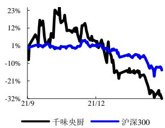  
最近半年股价相对走势

# 相关研究报告

# $\bullet$ 速冻食品发展成熟餐饮市场仍待挖掘

目前，在经济稳定发展的基础之上（所带来的城镇化率提升、居民可支配收入的继续上涨），生活节奏的加快、人口结构的变迁，导致饮食习惯有所改变，居民外出就餐频率增加（包括外卖在内)。因此，餐饮行业的自然增长是ToB速冻面米企业得以持续发展的最底层逻辑。餐饮企业逐渐开始使用部分速冻制品，一方面是来自于成本的压力。而进一步考虑，从目前餐饮行业的发展趋势来看，一方面是餐饮业的连锁化率仍有一定发展空间，另一方面则是外卖的渗透率还将继续提升。前者追求味道的一致性，后者追求操作的便捷性，这就使得服务于B端的速冻面米制品行业具有更高的成长性。

# 客户资源构筑基石研发实力带动发展

对于连锁餐饮企业，食品安全至关重要，其供应链相对封闭。因此，公司在速冻面米制品餐饮企业定制领域已形成了较强的市场先发优势。公司作为百胜中国T1 级供应商，2012 年成立以来始终为其提供优质畅销的产品和全方位的技术服务，与百胜中国的合作关系稳定。

相较传统的通用品生产模式，定制生产模式可以及时掌握市场需求，不仅提升了公司的研发实力，同时能够利用客户资源拓展新品，进行消费者的市场培育。此外，在定制生产模式下，以现有产品为基础，根据客户需求进行产品迭代并且不断研发新品，使得合作更加稳固且具有延展性。

# $\bullet$ 投资建议

公司作为速冻面米制品餐饮龙头，通过与客户的长期合作已经形成渠道壁垒。随着社会经济可持续性发展，在后疫情时期，餐饮规模仍将稳步增长，餐饮的连锁化、外卖的规范化，都将使得速冻面米制品餐饮渠道持续受益。通过不断研发推陈出新，公司必将获得长足发展。综上，我们预计公司2021-2023年分别实现每股收益（摊薄）1.01/1.21/1.63 元，给予公司“增持”的投资评级。

# 风险提示

食品安全问题；宏观经济下行；疫情出现反复

<table><tr><td>财务摘要（百万元）</td><td>2019A</td><td>2020A</td><td>2021E</td><td>2022E</td><td>2023E</td></tr><tr><td>主营收入</td><td>889</td><td>944</td><td>1,275</td><td>1,568</td><td>1,897</td></tr><tr><td>(+1-)%</td><td>26.8%</td><td>6.2%</td><td>35.0%</td><td>23.0%</td><td>21.0%</td></tr><tr><td>经营利润（EBIT）</td><td>97</td><td>79</td><td>115</td><td>133</td><td>176</td></tr><tr><td>(+/-)%</td><td>24.2%</td><td>-18.8%</td><td>45.8%</td><td>15.8%</td><td>32.6%</td></tr><tr><td>归母净利润</td><td>74</td><td>77</td><td>88</td><td>105</td><td>142</td></tr><tr><td>(+1-)%</td><td>26.3%</td><td>3.3%</td><td>14.4%</td><td>19.6%</td><td>35.1%</td></tr><tr><td>每股收益（元）</td><td>1.29</td><td>1.20</td><td>1.01</td><td>1.21</td><td>1.63</td></tr></table>

表：三张表及主要财务指标  

<table><tr><td>资产负债表</td><td>2019A</td><td>2020A</td><td>2021E</td><td>2022E</td><td>2023E</td><td>利润表（百万元)</td><td>2019A</td><td>2020A</td><td>2021E</td><td>2022E</td><td>2023E</td></tr><tr><td>货币资金</td><td>79</td><td>117</td><td>303</td><td>493</td><td>734</td><td>营业收入</td><td>889</td><td>944</td><td>1,275</td><td>1,568</td><td>1,897</td></tr><tr><td>应收账款及票据</td><td>45</td><td>52</td><td>68</td><td>85</td><td>102</td><td>营业成本</td><td>671</td><td>739</td><td>997</td><td>1,223</td><td>1,476</td></tr><tr><td>预付账款</td><td>7</td><td>11</td><td>13</td><td>17</td><td>20</td><td>营业税金及附加</td><td>7</td><td>9</td><td>12</td><td>14</td><td>17</td></tr><tr><td>其他应收款</td><td>5</td><td>7</td><td>8</td><td>11</td><td>13</td><td>销售费用</td><td>44</td><td>31</td><td>42</td><td>52</td><td>62</td></tr><tr><td>存货</td><td>99</td><td>116</td><td>153</td><td>190</td><td>228</td><td>管理费用</td><td>64</td><td>79</td><td>101</td><td>135</td><td>152</td></tr><tr><td>其他流动资产</td><td>29</td><td>29</td><td>29</td><td>29</td><td>29</td><td>研发费用</td><td>5</td><td>7</td><td>9</td><td>11</td><td>14</td></tr><tr><td>流动资产合计</td><td>263</td><td>333</td><td>576</td><td>824</td><td>1,127</td><td>财务费用</td><td>1</td><td>3</td><td>-1</td><td>-5</td><td>-10</td></tr><tr><td>长期股权投资</td><td>0</td><td>0</td><td>0</td><td>0</td><td>0</td><td>资产减值损失</td><td>0</td><td>0</td><td>0</td><td>-1</td><td>-1</td></tr><tr><td>固定资产合计</td><td>342</td><td>543</td><td>493</td><td>436</td><td>381</td><td>信用减值损失</td><td>0</td><td>0</td><td>0</td><td>0</td><td>0</td></tr><tr><td>无形资产</td><td>39</td><td>39</td><td>38</td><td>36</td><td>34</td><td>其他收益</td><td>4</td><td>26</td><td>0</td><td>0</td><td>0</td></tr><tr><td>商誉</td><td>0</td><td>0</td><td>0</td><td>0</td><td>0</td><td>投资收益</td><td>0</td><td>0</td><td>0</td><td>0</td><td>0</td></tr><tr><td>长期待摊费用</td><td>3</td><td>9</td><td>9</td><td>9</td><td>9</td><td>公允价值变动收益</td><td>-1</td><td>-1</td><td>0</td><td>0</td><td>0</td></tr><tr><td>其他非流动资产</td><td>14</td><td>5</td><td>5</td><td>5</td><td>5</td><td>资产处置收益</td><td>-1</td><td>0</td><td>0</td><td>0</td><td>0</td></tr><tr><td>资产总计</td><td>838</td><td>956</td><td>1,148</td><td>1,337</td><td>1,583</td><td>营业利润</td><td>98</td><td>100</td><td>115</td><td>137</td><td>185</td></tr><tr><td>短期借款</td><td>30</td><td>15</td><td>0</td><td>0</td><td>0</td><td>营业外收支</td><td>-1</td><td>0</td><td>0</td><td>0</td><td>0</td></tr><tr><td>应付票据及账款</td><td>128</td><td>142</td><td>191</td><td>234</td><td>283</td><td>利润总额</td><td>97</td><td>100</td><td>115</td><td>137</td><td>185</td></tr><tr><td>预收账款</td><td>23</td><td>0</td><td>11</td><td>9</td><td>13</td><td>所得税费用</td><td>23</td><td>24</td><td>27</td><td>32</td><td>44</td></tr><tr><td>应付职工薪酬</td><td>10</td><td>10</td><td>15</td><td>18</td><td>21</td><td>净利润</td><td>74</td><td>77</td><td>88</td><td>105</td><td>142</td></tr><tr><td>应交税费</td><td>13</td><td>11</td><td>16</td><td>19</td><td>24</td><td>归属于母公司所有者的净利润</td><td>74</td><td>77</td><td>88</td><td>105</td><td>142</td></tr><tr><td>其他流动负债</td><td>0</td><td>0</td><td>0</td><td>0</td><td>0</td><td>少数股东损益</td><td>0</td><td>0</td><td>0</td><td>0</td><td>0</td></tr><tr><td>长期借款</td><td>0</td><td>55</td><td>55</td><td>55</td><td>55</td><td>基本每股收益</td><td>1.29</td><td>1.20</td><td>1.01</td><td>1.21</td><td>1.63</td></tr><tr><td>预计负债</td><td>0</td><td>0</td><td>0</td><td>0</td><td>0</td><td>财务指标</td><td>2019A</td><td>2020A</td><td>2021E</td><td>2022E</td><td>2023E</td></tr><tr><td>负债合计</td><td>432</td><td>373</td><td>478</td><td>561</td><td>666</td><td>营收增长率</td><td>26.8%</td><td>6.2%</td><td>35.0%</td><td>23.0%</td><td>21.0%</td></tr><tr><td>股东权益</td><td>406</td><td>582</td><td>670</td><td>775</td><td>917</td><td>EBIT 增长率</td><td>24.2%</td><td>-18.8%</td><td>45.8%</td><td>15.8%</td><td>32.6%</td></tr><tr><td>现金流量表</td><td>2019A</td><td>2020A</td><td>2021E</td><td>2022E</td><td>2023E</td><td>净利润增长率</td><td>26.3%</td><td>3.3%</td><td>14.4%</td><td>19.6%</td><td>35.1%</td></tr><tr><td>净利润</td><td>74</td><td>77</td><td>88</td><td>105</td><td>142</td><td>销售毛利率</td><td>24.5%</td><td>21.7%</td><td>21.8%</td><td>22.0%</td><td>22.2%</td></tr><tr><td>折旧与摊销</td><td>19</td><td>34</td><td>51</td><td>59</td><td>56</td><td>销售净利率</td><td>8.3%</td><td>8.1%</td><td>6.9%</td><td>6.7%</td><td>7.5%</td></tr><tr><td>经营活动现金流净额</td><td>86</td><td>98</td><td>204</td><td>192</td><td>244</td><td>ROE</td><td>18.3%</td><td>13.2%</td><td>13.1%</td><td>13.5%</td><td>15.4%</td></tr><tr><td>投资活动现金流净额</td><td>-192</td><td>-95</td><td>0</td><td>0</td><td>0</td><td>ROIC</td><td>16.9%</td><td>9.2%</td><td>12.0%</td><td>12.2%</td><td>13.8%</td></tr><tr><td>筹资活动现金流净额</td><td>28</td><td>35</td><td>-18</td><td>-3</td><td>-3</td><td>资产负债率</td><td>51.6%</td><td>39.1%</td><td>41.6%</td><td>42.0%</td><td>42.1%</td></tr><tr><td>现金净变动</td><td>-78</td><td>38</td><td>186</td><td>190</td><td>242</td><td>PE</td><td>0.00</td><td>0.00</td><td>38.54</td><td>32.23</td><td>23.86</td></tr><tr><td>期初现金余额</td><td>157</td><td>79</td><td>117</td><td>303</td><td>493</td><td>PB</td><td>0.00</td><td>0.00</td><td>5.04</td><td>4.36</td><td>3.68</td></tr><tr><td>期末现金余额</td><td>79</td><td>117</td><td>303</td><td>493</td><td>734</td><td>EV/EBITDA</td><td>-0.42</td><td>-0.39</td><td>13.57</td><td>10.71</td><td>7.80</td></tr></table>

# 目 录

1.只为餐饮厨师之选 ….  
1.1始于思念专注B端. ….7  
1.2 速冻面米为主产品需求多样. ….  
1.3 渠道多元 齐头并进. ..10  
2.速冻食品发展成熟 餐饮市场仍待挖掘. ..12  
2.1速冻食品规模持续扩容.. ..12  
2.2 餐饮渠道有待持续渗透. ..14  
2.3冷链物流发展提供保障. ….7  
3.客户资源构筑基石 研发实力带动发展 ….18  
3.1先发优势构筑壁垒. ….18  
3.2定制成产促进研发. ..19  
3.3扩充产能拓展品类. ….20  
4.投资建议.. ..21  
5.风险提示. ..1

# 图目录

图1：公司主要发展历程 ..1  
图2：公司股权结构一览 ..  
图3：公司主要产品系列 ..9  
图4：千味央厨油条家族. ..9  
图5：公司在售产品数量统计（单位：个） ….  
图 6：公司部分代表性客户 . 10  
图7：公司营收规模稳步增长（单位：亿元） .10  
图8：公司业绩增速有所波动（单位：亿元） .1  
图9：公司四大产品类别收入占比 ..11  
图10：公司主要产品收入贡献. ..11  
图11：公司直销经销销售收入以及占比变动（单位：万元） … ….11  
图12：2020年公司各区域销售收入占比.. .1  
图13：公司主营业务收入季节性波动（单位：万元） ..12  
图14：速冻食品四大分类.. .1  
图15：我国速冻食品产业链概览 ….1  
图16：我国速冻食品市场规模及其增速（单位：亿元） .1  
图17：世界主要国家或地区人均速冻食品食用量. ..13  
图18：我国速冻面米制品市场规模（单位：亿元） .14  
图19：我国餐饮收入持续增长.. .14  
图20：我国餐饮服务业市场规模（单位：十亿元） .14  
图21：2016-2020 年我国餐饮服务行业雇员平均年薪 .15  
图22：餐饮连锁化率持续提升（单位：十亿元） .1  
图23：我国餐饮连锁化程度仍偏低 .16  
图24：互联网餐饮外卖市场交易规模持续增长. ….16  
图25：预期外卖市场收入仍将持续增加（单位：亿元） ….1  
图26：我国公路冷链运输车数量不断增加（单位：万辆） ….17  
图27：我国低温仓储业冷库不断扩容（单位：万立方米） ….7  
图28：我国冷链物流总额持续走高（单位：万亿元） .17  
图 29：我国冷链物流需求总量持续攀升（单位：亿吨) .17  
图30：公司第一大客户销售额及其占比（单位：亿元） ..19  
图31：百胜中国旗下品牌门店数量 ….19  
图32：公司烘焙品牌“焙伦” ….20  
图33：公司火锅产品系列. ..20

# 表目录

表1：股权激励业绩考核要求. .表2：下游客户对公司产品的质量防控措施. .18表3：定制品与通用品的生产模式区别 .19

# 1.只为餐饮 厨师之选

# 1.1始于思念专注B端

2012 年，郑州千味央厨食品股份有限公司成立。公司主营业务为面向餐饮企业的速冻面米制品的研发、生产和销售。公司始终秉承“只为餐饮、厨师之选”的战略定位，致力于为餐饮企业提供定制化、标准化的速冻食品及相关餐饮后厨的解决方案。经过多年发展，公司已经拥有独立的运营机制以及优秀的商业模式。

  
图1：公司主要发展历程  
资料来源：公司官网，潮海证券

千味有限由郑州思念于2012 年4 月全资设立。2016 年，思念将持有的千味有限全部股权转让给郑州集之城，并且增资引入新股东共青城凯立。本次股权转让双方郑州思念和郑州集之城均为实际控制人李伟实际控制的企业，股权转让的目的是将千味有限从郑州思念体系独立出来，专注拓展速冻面米制品餐饮渠道市场。同年6 月，千味有限整体变更股份公司，其后完成三轮增资。公司目前股权结构稳定，实控人持股比例达到 $4 6 . 8 6 \%$ ，公司高管通过共青城凯立以及前海新希望持股，京东通过宿迁涵邦（其在境内设立的投资公司）持股 $3 . 8 5 \%$ ，绝味食品通过深圳网聚（全资设立的投资公司）持股 $3 . 8 5 \%$ 。

  
图2：公司股权结构一览  
资料来源：公司公告，潮海证券

2021 年11 月，公司推出股权激励计划，充分调动公司高级管理人员、核心人员的积极性。该激励计划首次授予的激励对象总人数为80人，包括实施本激励计划时在任的公司董事、高级管理人员以及核心研发、业务等骨干人员，授予的限制性股票总计156.84 万股，其中包括预留 4.22 万股。首次授予的限制性股票各年度业绩考核目标为：以 2020 年度营业收入为基数，2022 年度营业收入增长率不低于 $67 \%$ ，2023 年度营业收入增长率不低于 $101 \%$ ，业绩考核目标触发值设为年度目标值的 $80 \%$ 。

表1：股权激励业绩考核要求  

<table><tr><td></td><td>2020 年</td><td>2021E</td><td>2022E</td><td>2023E</td></tr><tr><td>营业收入（亿元)</td><td>9.44</td><td>12.74</td><td>15.76</td><td>18.97</td></tr><tr><td>以2020 年为基数</td><td>一一</td><td>35%</td><td>67%</td><td>101%</td></tr><tr><td>同比增速</td><td>6.20%</td><td>35.00%</td><td>23.70%</td><td>20.37%</td></tr></table>

资料来源：渤海证券

# 1.2速冻面米为主 产品需求多样

公司以模拟餐厅后厨工艺为产品设计理念，以节约餐厅后厨成本为产品设计准则，致力于通过提供定制化、标准化产品解决餐饮企业降低运营成本的迫切需求。公司主要为餐饮企业（含酒店、团体食堂、乡厨等）提供定制化以及标准化的速冻面米制品。公司速冻面米制品按照加工方式可分为油炸类、烘焙类、蒸煮类、菜肴类及其他四大类，具体产品包括油条、芝麻球、蛋挞皮、地瓜丸以及卡通包等。

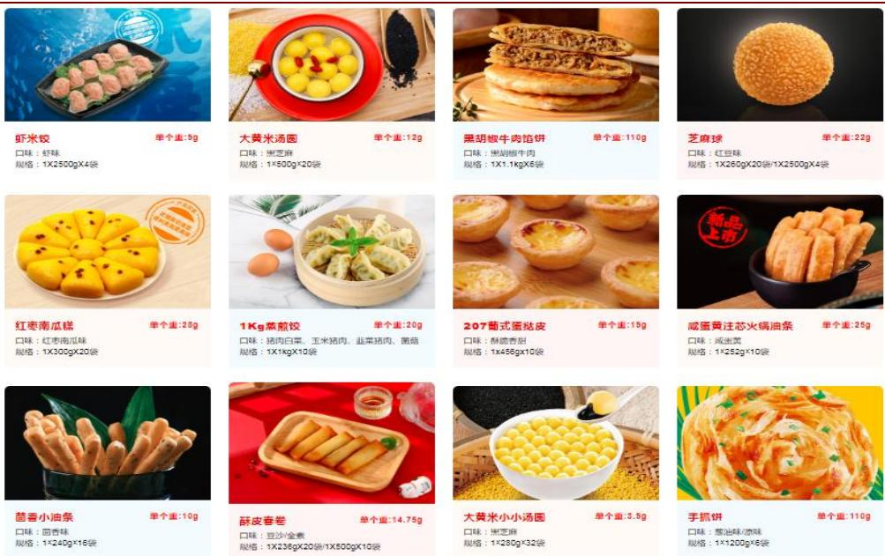  
图3：公司主要产品系列  
资料来源：公司官网，潮海证券

与“家庭消费场景较为单一”所不同的是，餐饮业态繁多、形式各异，也产生了不同消费场景下的多样化的需求，而且餐饮行业对推陈出新的速度要求甚高。凭借对餐饮消费需求的深入理解，公司不断推出餐饮渠道适销产品，提升餐饮渠道品类叠加效应。目前，公司拥有包括油条、芝麻球在内的三百余个单品。另一方面，公司依托现有产品进行场景化的深入研究，研发出适应不同消费场景的系列产品。以油条为例，公司从2012 年开始进行油条细分场景下的市场研究，细分出火锅、快餐、自助餐、宴席、早餐、外卖六大场景，并且针对性的推出茴香小油条、麻辣烫小油条、火锅涮煮油条、外卖专用油条等多款创新性的产品。

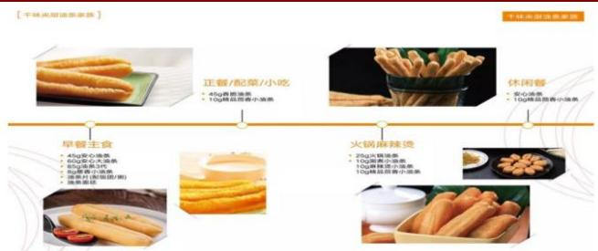  
图4：千味央厨油条家族  
资料来源：公司公告，潮海证券

图5：公司在售产品数量统计（单位：个）  

<table><tr><td>项目</td><td>2020 年度 2019 年度 2018年度</td></tr><tr><td>油炸类 95</td><td>90 72</td></tr><tr><td>烘焙类 56</td><td>49 38</td></tr><tr><td>蒸煮类 166</td><td>139 105</td></tr><tr><td>菜肴类及其他 51</td><td>27 9</td></tr><tr><td>合计 368</td><td>305 224</td></tr></table>

资料来源：公司公告，渤海证券

公司致力于为餐饮企业提供定制化、标准化的速冻食品及相关餐饮后厨解决方案。公司自设立以来便持续深耕餐饮市场，已成为肯德基、必胜客、华莱士、海底捞、真功夫、九毛九、呷哺呷哺等知名连锁餐饮企业合作伙伴。公司作为百胜中国T1级供应商，自2012 年成立以来始终为百胜中国提供优质畅销的产品和全方位的技术服务，与百胜中国的合作关系稳定。

  
图6：公司部分代表性客户  
资料来源：公司公告，潮海证券

# 1.3 渠道多元齐头并进

2017 年至今，公司营收规模稳步扩张，主要得益于重点产品的量价齐升。2020年，由于新冠疫情对我国餐饮业造成严重冲击，公司营收增速放缓，其中2020H1营业收入同比下滑达 $8 . 0 4 \%$ ，2020 年营业收入同比增长为 $6 . 0 2 \%$ 。目前，随着新冠疫情逐步得到控制，公司产品销量已经逐渐恢复，上述负面影响基本消除。2021Q3，公司实现营业收入8.88亿元，同比增长 $4 5 . 9 2 \%$ ，实现归属于母公司的净利润 0.57 亿元，同比增速 $1 6 . 0 2 \%$ 。根据股权激励指引，2021年高成长性可期。

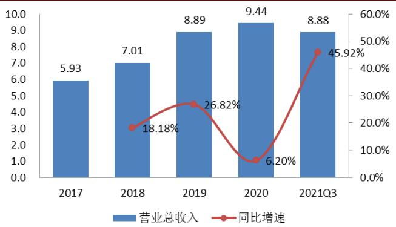  
图7：公司营收规模稳步增长（单位：亿元）  
资料来源：公司公告，渤海证券

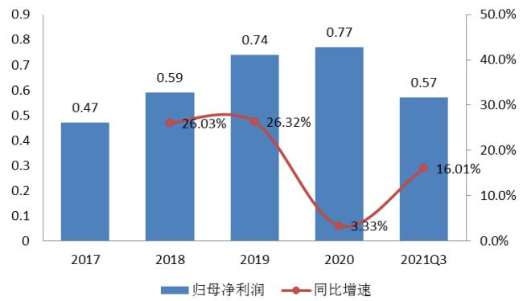  
图8：公司业绩增速有所波动（单位：亿元）  
资料来源：公司公告，渤海证券

公司主要产品包括油炸类、烘焙类、蒸煮类、菜肴类及其他四个大类。2018至2020年，油炸类、烘焙类及蒸煮类产品占当期主营业务收入比例分别为 $9 8 . 5 8 \%$ $9 7 . 4 8 \%$ 和 $9 4 . 7 3 \%$ ，是公司主营业务收入的主要来源。2019年，蛋挞皮等前十大产品销售额占总销售额的比例达 $5 0 . 7 3 \%$ 。

  
图9：公司四大产品类别收入占比  
资料来源：公司公告，潮海证券

  
图10：公司主要产品收入贡献  
资料来源：公司公告，渤海证券

公司主要采取直营以及经销两种模式进行销售，直营客户以定制品销售为主，经销客户以通用品销售为主。2018 至2020 年，公司直营模式主营业务收入当期占比分别为 $4 0 . 6 9 \%$ 、 $4 1 . 0 2 \%$ 和 $3 5 . 7 4 \%$ ，公司经销模式主营业务收入当期占比分别为 $5 9 . 3 1 \%$ 、 $5 8 . 9 8 \%$ 和 $6 4 . 2 6 \%$ 。2018 至2019年，公司直营客户收入占比较为稳定，主要得益于公司较好的产品品质以及较高的客户认可度；2020 年直营客户收入及占比均有所下降，主要系对百胜中国销售收入下降所致，疫情期间百胜中国旗下门店因为暂时停业、营业时间缩短以及客流减少导致产品采购减少。2020 年，经销模式收入及占比均有所增长，主因 2020 年受到疫情影响，部分产品适合家庭烹饪，经销商通过开展社区团购等渠道拓展销售。

  
图11：公司直销经销销售收入以及占比变动（单位：万元）  
资料来源：公司公告，潮海证券

公司产品在境内各地区均有销售，但以华东、华中地区为主，华北、华南次之，境外地区收入占比很小。公司华东地区收入占比超 $50 \%$ ，主要系公司前两大直营客户必胜（上海)食品有限公司、福建省华莱士食品股份有限公司归属华东地区。公司主营业务速冻面米制品具有明显的季节性。2018 至2020 年，公司第二季度收入占比分别为 $1 9 . 6 3 \%$ 、 $1 9 . 9 6 \%$ 和 $1 7 . 5 8 \%$ ，为全年最低；第四季度收入占比分别为 $3 1 . 1 7 \%$ $3 2 . 3 2 \%$ 和 $3 5 . 4 6 \%$ ，为全年最高。这主要是由于我国传统节日及寒暑假多集中在每年的下半年，且婚丧嫁娶等社会活动较多，餐饮行业进入旺季。

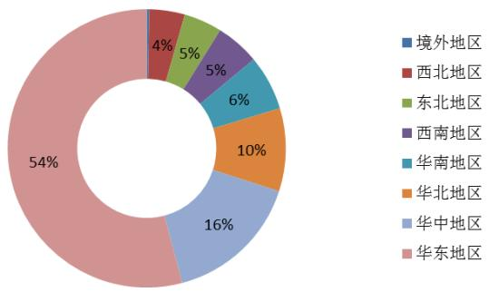  
图12：2020年公司各区域销售收入占比  
资料来源：公司公告，渤海证券

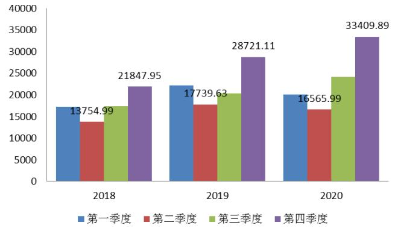  
图13：公司主营业务收入季节性波动（单位：万元）  
资料来源：公司公告，渤海证券

# 2.速冻食品发展成熟 餐饮市场仍待挖掘

# 2.1速冻食品规模持续扩容

速冻食品是指采用新鲜原料制作，经过适当的处理和急速冷冻，在-18℃至 ${ } ^ { - 2 0 \mathrm { { C } } }$ 的连贯低温条件下送抵消费地的低温产品。速冻食品可分为调理类速冻食品、农产速冻食品、畜产速冻食品、水产速冻食品四个大类。速冻食品产业链上游为原材料供应商和初加工企业，中游为速冻食品制造企业以及冷链设备供应商，下游为冷链物流产业和渠道销售。其中，上游原材料涉及农、牧、渔业等；下游销售渠道主要包括线上、线下，线上销售渠道包括淘宝、京东、拼多多等C端电商平台及美菜、快驴、有菜等B端销售平台，线下销售渠道又可分为通过卖场、便利店、农贸市场等消费场景对接C端消费群体，或通过企业自营或经销商对接餐饮、企业团餐、酒店等B端机构客户。

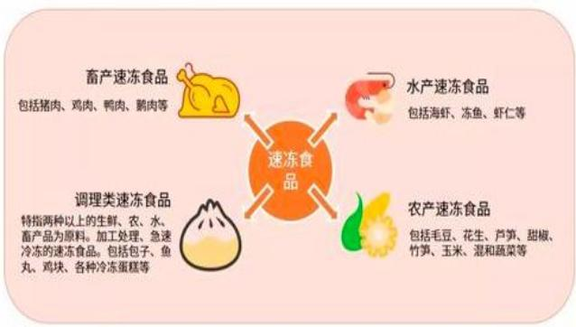  
图14：速冻食品四大分类  
资料来源：艾媒咨询，渤海证券

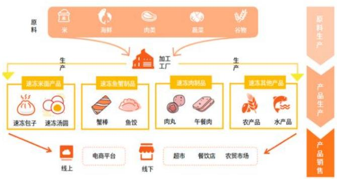  
图15：我国速冻食品产业链概览  
资料来源：艾媒咨询，渤海证券

根据艾媒咨询，自2013 年起我国速冻食品市场规模不断扩大，至2020 年中国速冻食品市场规模已达1393亿元。从2019年人均速冻食品食用量来看，美国人均速冻食品食用量最多，其次是欧洲，日本人均速冻食品食用量为20千克，而中国人均速冻食品食用量最低，仅9千克。中国速冻食品起步较晚，与发达国家存在一定的差距。随着居民消费水平提升，速冻食品被更多人接受，中国速冻食品消费需求将会继续提升。此外，随着餐饮端对半成品食材的需求日益增强，半成品食材兴起丰富了速冻食品市场，赋予速冻食品行业新的发展机遇。预计2024年，我国速冻食品市场规模将达到1986亿元。

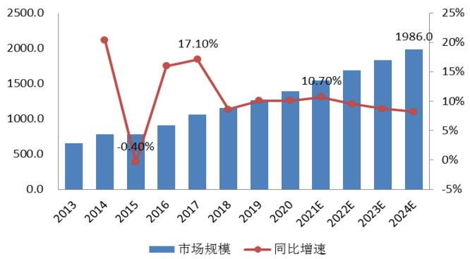  
图16：我国速冻食品市场规模及其增速（单位：亿元）  
资料来源：艾媒咨询，渤海证券

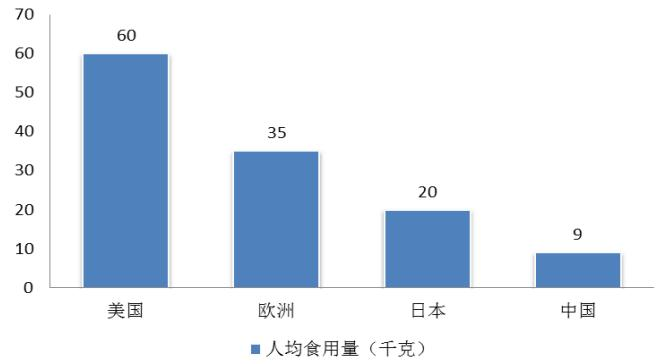  
图17：世界主要国家或地区人均速冻食品食用量  
资料来源：艾媒咨询，渤海证券

速冻面米制品主要包括速冻水饺、汤圆、包子、油条、芝麻球等，是速冻食品市场规模最大的品种。据 Frost&Sullivan 数据显示，2017 年我国速冻面米制品市场份额占速冻食品总市场份额的 $5 0 . 9 0 \%$ 。我国速冻面米制品市场规模在过去五年总体呈上升趋势，从2013年的549亿元增长到2017年的629亿元， $\mathsf { C A G R 3 . 5 \% }$ 。根据《2018 年中国冷冻冷藏食品工业发展报告》数据显示，2018 至2019 年速冻面米制品制造业实现主营业务收入分别为 736 亿元/774 亿元，2020 年受到疫情影响小幅下滑。我们预计，未来随着行业发展步入成熟期，行业规模或保持小个位数增长。

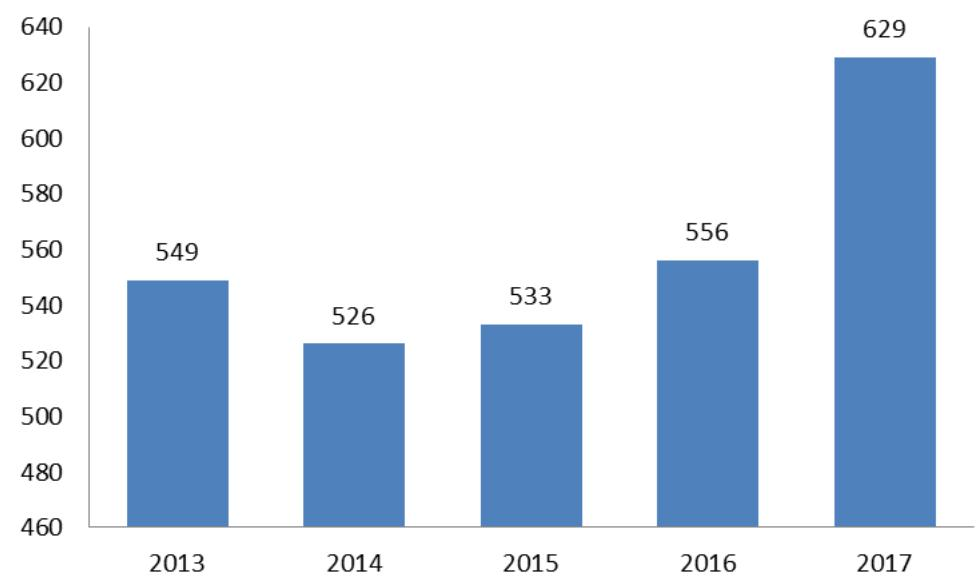  
图18：我国速冻面米制品市场规模（单位：亿元）  
资料来源：Frost&Sullivan，潮海证券

# 2.2 餐饮渠道有待持续渗透

目前，在经济稳定发展的基础之上（所带来的城镇化率提升、居民可支配收入的继续上涨），生活节奏的加快、人口结构的变迁，导致饮食习惯有所改变，居民外出就餐频率增加（包括外卖在内)。因此，餐饮行业的自然增长是ToB速冻面米企业得以持续发展的最底层逻辑。2019 年，我国社会消费品零售总额餐饮收入达4.67 万亿元，同比增长 $9 . 4 0 \%$ ，近五年复合增长率达到 $9 . 6 6 \%$ 。尽管2020年由于新冠疫情影响，餐饮行业困难重重，但是随着有效管控社会生产生活秩序逐渐步入正轨，2021 年餐饮行业有所恢复，行业收入同比 2019 年小幅增长。而第三方咨询机构 Frost&Sullivan 预计，2025 年我国餐饮服务业市场规模将增至7.62万亿元，2020 至2025年CARG为 $1 4 . 0 \%$ 。

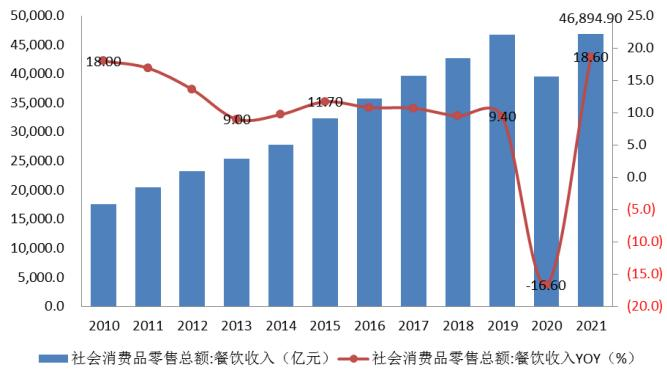  
图19：我国餐饮收入持续增长  
资料来源：Wind，渤海证券

  
图20：我国餐饮服务业市场规模（单位：十亿元）  
资料来源：Frost&Sullivan，渤海证券

餐饮企业逐渐开始使用部分速冻制品，一方面是来自于成本的压力。尽管餐饮行业收入稳定增长，但是人工、房租价格不断攀升，侵蚀行业利润空间。随着中国经济稳定发展，2016至2020 年中国餐饮服务业雇员的年收入以 $5 . 1 \%$ 的复合增速稳步增长。据第三方咨询机构预计，未来可支配收入的持续增长叠加通货膨胀影响，未来五年劳动力成本仍将以 $6 \%$ 的复合增速上涨。由于中小餐饮企业缺乏规模效应以及上游议价能力，来自成本端的压力更加明显。相较于自制菜品，速冻半成品可为餐饮企业节省人工成本，并且通过规模化采购降低原材料成本。

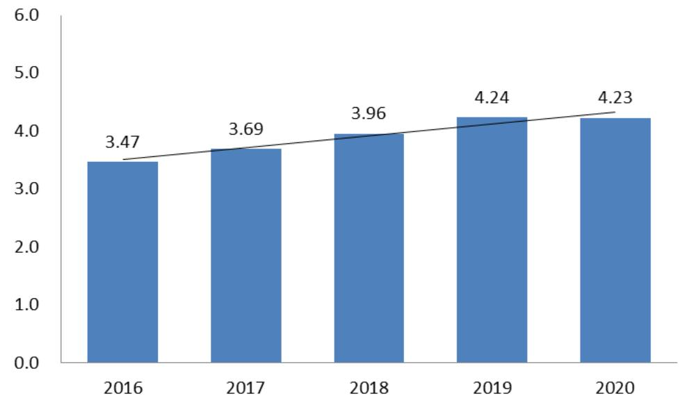  
图21：2016-2020年我国餐饮服务行业雇员平均年薪  
资料来源：Frost&Sullivan，渤海证券

而进一步考虑，从目前餐饮行业的发展趋势来看，一方面是餐饮业的连锁化率仍有一定发展空间，另一方面则是外卖的渗透率还将继续提升。前者追求味道的一致性，后者追求操作的便捷性，这就使得服务于B端的速冻面米制品行业具有更高的成长性。

近十年来，我国餐饮行业受到限制三公消费影响，餐饮格局发生重大变化，高端餐饮失速，但由于经济的稳健增长、居民可支配收入的持续提高，大众餐饮取而代之。随着消费者对品牌、食品安全、食物及服务的质量愈发看重，餐饮行业连锁化率将进一步提高。Frost&Sullivan 预计，自营连锁餐厅将以高于特许经营餐厅以及非连锁餐厅的增速发展，预计2020年至2025年间，该复合增速将达 $1 5 . 4 \%$ o而国内咨询机构亿欧则通过统计对比中国、日本、美国餐饮连锁企业门店数量及营业额，认为我国餐饮行业的连锁化程度还远低于上述发达国际。餐饮经营模式连锁化尤其以“中央厨房 $^ +$ 门店”的经营模式最为普遍。“中央厨房 $^ { \ast }$ 门店”的经营模式为速冻食品业，特别是具备研发能力、可以提供定制化产品的企业创造了更多机会。千味央厨致力于通过提供中央厨房定制化产品解决餐饮企业需求。

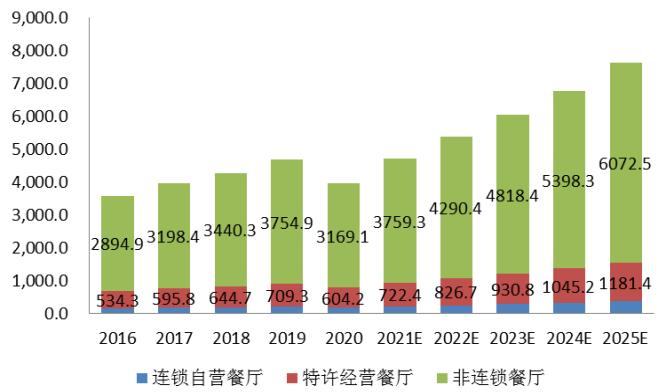  
图22：餐饮连锁化率持续提升（单位：十亿元）  
资料来源：Frost&Sullivan，潮海证券

  
图23：我国餐饮连锁化程度仍偏低  
资料来源：亿欧，渤海证券

互联网对餐饮行业不断渗透，消费者的消费习惯被动改造，使得餐饮这一传统行业经历巨大改变，大部分餐饮企业尤其是快餐餐饮企业均加入到外卖行列。快餐餐饮企业对标准化、快速化的程度要求较高，对成本较敏感，因此速冻面米市场同样受益于外卖规模的快速增长。根据易观所统计的数据显示，自2015 年起我国外卖市场交易规模开始进入高速增长阶段，尽管中期受到疫情影响餐饮行业发展受到一定扰动，但是预计未来行业规模仍将稳定扩大。而 Frost&Sullivan同样对外卖市场的发展给予了一定的肯定，根据该机构的测算，2016 至2020 年外卖市场年复合增速达到 $3 2 . 6 2 \%$ ，外卖市场的渗透率由 2016 年的 $6 . 5 \%$ 上升至2020 年的 $1 8 . 1 \%$ ，预期2025 年外卖市场总规模将继续扩大至14430 亿元。

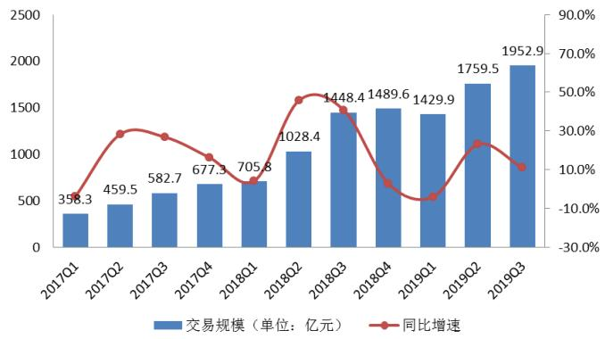  
图24：互联网餐饮外卖市场交易规模持续增长  
资料来源：易观，渤海证券

  
图25：预期外卖市场收入仍将持续增加（单位：亿元）

资料来源：Frost&Sullivan，渤海证券

# 2.3 冷链物流发展提供保障

冷链物流行业的不成熟是此前限制速冻食品快速增长的一大原因。速冻食品冷链物流是指速冻食品从出场、运输、贮存、销售等环节完全处于规定低温条件。我国规定速冻食品的标准储存温度是， $- 1 8 \mathrm { { \mathcal { C } } }$ ，因此冷链物流是速冻食品行业发展的关键。

冷链物流对储存及运输要求相对较高，促进了我国冷库建造及冷藏车制造行业的发展。我国冷链物流起步较晚，但是受益于国家的重视以及资本的青睐，冷链物流近几年来发展迅猛。冷库容量及冷藏车保有量的飞速提升说明我国冷链物流基础设施愈发完善，该趋势为速冻食品行业发展注入动力。

  
图26：我国公路冷链运输车数量不断增加（单位：万辆）  
资料来源：中物联冷链委，渤海证券

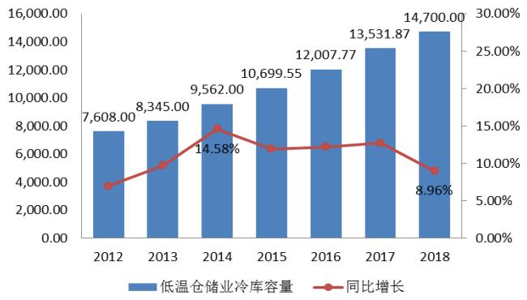  
图27：我国低温仓储业冷库不断扩容（单位：万立方米）  
资料来源：中物联冷链委，潮海证券

2021 年11月，国务院办公厅印发关于“十四五”冷链物流发展规划的通知，提出2025 年初步形成衔接产地销地、覆盖城市乡村及联通国内国际的冷链物流网络，基本建成符合我国国情和产业结构特点、适应经济社会发展需要的冷链物流体系，对国民经济、社会发展的支撑保障作用显著增强。通知明确指出，推动冷链物流与速冻食品产业的联动发展，提升冷链物流对速冻食品消费的保障能力。

  
图28：我国冷链物流总额持续走高（单位：万亿元）  
资料来源：中物联冷链委，渤海证券

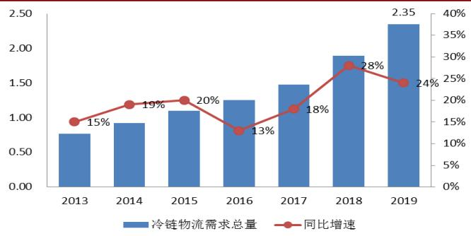  
图29：我国冷链物流需求总量持续攀升（单位：亿吨）  
资料来源：中物联冷链委，渤海证券

# 3.客户资源构筑基石 研发实力带动发展

# 3.1 先发优势构筑壁垒

作为国内最早为餐饮连锁企业提供速冻面米制品解决方案的企业，公司始终坚持“只为餐饮，厨师之选”战略定位，坚守餐饮专供速冻面米制品领域，及时发掘餐饮市场需求，专业化定制出深受餐饮企业欢迎的各类型产品，并成为众多知名餐饮品牌速冻面米制品供应商。

对于连锁餐饮企业，食品安全至关重要，因此其供应链相对封闭。新进入者只有在经历长期的市场竞争，提高企业形象和知名度，经过产品检验、资格审查、验厂等等环节，才能逐步获得餐饮企业客户认可，从而建立完善的营销渠道和网络。对于知名餐饮连锁企业，一旦与供应商达成合作，除非重大食品安全问题，否则不会轻易更换。因此，公司在速冻面米制品餐饮企业定制领域已形成了较强的市场先发优势。

表2：下游客户对公司产品的质量防控措施  

<table><tr><td>主要措施</td><td>具体内容</td></tr><tr><td>现场审核</td><td>大型连锁餐饮客户会对公司硬件设施、研发能力、生产管理以及产品 质量控制能力进行严格的考察和评价。主要通过内部品控部门进行现 场审核或委托第三方服务公司依据审核标准进行现场核查</td></tr><tr><td>提供产品检测报告</td><td>重要客户会要求公司定期提供经CNAS认证的实验室出具的产品检测 报告或者提供指定检测机构所出具的产品合格说明</td></tr><tr><td>飞行检查制度</td><td>即事先不通知被检查企业而对其实施快速现场检查。飞行检查是国际 常用的一种跟踪检查方法，也是提高工厂检查有效性的重要手段，重 要客户每年会对公司进行飞行检查，验证过程管控能力</td></tr><tr><td>吹哨人制度</td><td>即食品安全有奖举报制度，公司在员工出入口粘贴“吹哨人制度”，鼓 励员工全员参与，监督举报，对知情人所举报的食品安全违法违规行 为在查实后给与奖励。</td></tr></table>

资料来源：公司公告，潮海证券

公司第一大客户为百胜中国，其在中国市场拥有肯德基、必胜客以及塔可贝尔三个品牌的独家运营权和授权经营权，并完全拥有东方既白、小肥羊、黄记煌和COFFii &JOY连锁餐厅品牌。截至 2021 年，百胜中国在中国的足迹遍布所有省市自治区（港澳台除外)，经营餐厅数量多达11788 家。2020 年，百胜中国及其关联方占公司营业收入比例达 $2 9 . 9 5 \%$ ，是公司最为主要的收入来源。公司作为百胜中国 T1 级供应商，2012 年成立以来始终为其提供优质畅销的产品和全方位的技术服务，与百胜中国的合作关系稳定。

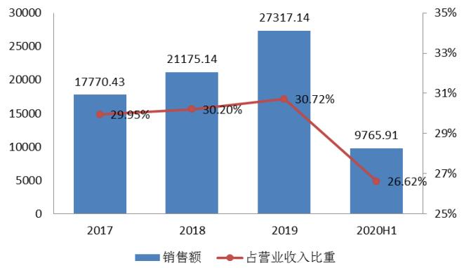  
图30：公司第一大客户销售额及其占比（单位：亿元）  
资料来源：公司公告，潮海证券

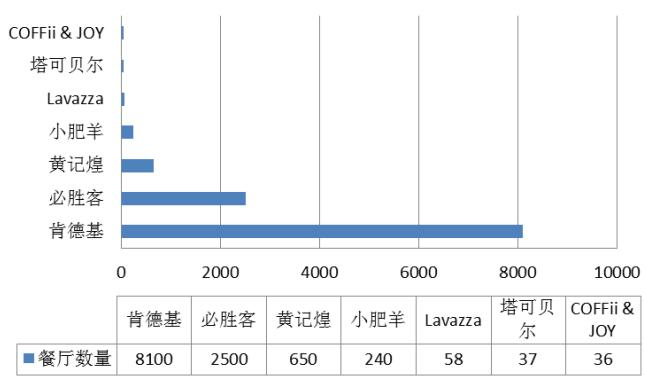  
图31：百胜中国旗下品牌门店数量  
资料来源：公开资料，潮海证券

# 3.2 定制成产促进研发

相较传统的通用品生产模式，定制生产是较为新型的经营模式。定制生产是餐饮行业专业分工的产物，有效较低了餐饮企业的生产运营成本，餐饮企业可以将有限的人力、物力、财力聚焦于产品的研发、餐厅运营及服务水平的提升，最终为消费者带来更为安全和物美价廉的产品以及服务。

表3：定制品与通用品的生产模式区别  

<table><tr><td>生产模式</td><td>需求差异</td><td>客户关系</td><td>模式基础</td></tr><tr><td>通用品</td><td>生产企业根据市场调 研识别消费需求</td><td>在具体经营活动前，与客户以产品为基础、生产企 间并未建立任何确定关系</td><td>业为主导的业务模式</td></tr><tr><td>定制品</td><td>定制客户明确定制需</td><td>在开展具体经营活动前，已</td><td>以定制客户为基础、客</td></tr><tr><td></td><td>求</td><td>经与客户建立了确定关系</td><td>户为主导的业务模式</td></tr></table>

资料来源：公司公告，潮海证券

定制模式又可分为“定制研发 $^ +$ 定制生产”以及“工艺标准 $^ +$ 定制生产”两种模式。“定制研发 $^ +$ 定制生产”模式即生产企业根据餐饮企业定制需求进行产品研发，并由餐饮企业提供信息反馈。在产品研发成功基础上按照客户订单进行定制生产，定制品全部销售给定制客户。在此种模式下，核心知识产权以及相关生产工艺技术由生产企业享有和掌握，餐饮企业仅享有定制品在一定时期内的独家销售权，双方更易形成稳定且可靠的长期战略合作伙伴关系。“工艺标准 $^ +$ 定制生产”模式即餐饮企业根据自身业务需求，将其生产环节中的一个或者多个产品通过合同形式委托速冻企业生产。受托企业按照客户指定工艺技术标准进行生产，产品全部销售给委托方。在这种模式下，速冻企业不掌握定制产品的核心知识产权，因此对委托方的依赖性较强。

我们认为，定制生产模式可以及时掌握市场需求，不仅提升了公司的研发实力，同时能够利用客户资源拓展新品，进行消费者的市场培育。此外，在定制生产模式下，以现有产品为基础，根据客户需求进行产品迭代并且不断研发新品，使得合作更加稳固且具有延展性。

# 3.3扩充产能拓展品类

新乡千味央厨食品有限公司食品加工建设项目（三期）由全资子公司新乡千味实施，公司将使用募集资金向新乡千味增资。该项目建成达产后，将形成年产8 万吨速冻面米制品生产规模，公司产能得到充分扩充，有效满足市场需求。此外，通过研发中心项目建设，进一步提高公司的研发能力。

公司组建了专业的餐饮研发团队，通过“模拟餐厅后厨”进行研发实验，最大程度还原餐企后厨制作工艺，为食客提供最佳的就餐体验。公司结合自身经营情况，建立了较为成熟的产品研发模式，通过市场调研，经过立项、小试、中试、试产以及系列评审、确认，至最终量产共经历12个阶段。

对于产品发展规划，公司计划继续拓展产品品类。除了继续保持在传统面米制品的优势之外，加大肉类、鱼糜类产品的研发力度，拓展火锅类的产品。火锅类产品具有标准化、品种丰富、市场需求大等特点。为适应火锅连锁企业全国快速增长的趋势，公司将发挥在餐饮领域的渠道及研发优势，针对火锅餐饮市场定制开发适销产品。此外，对于现有客户，公司还将争取获得如烘焙类产品、预制调理食品及蔬菜类产品等多品类的供应权。

  
图32：公司烘焙品牌“焙伦”  
资料来源：公开资料，渤海证券

  
图33：公司火锅产品系列  
资料来源：公开资料，潮海证券

# 4.投资建议

公司作为速冻面米制品餐饮龙头，通过与客户的长期合作已经形成渠道壁垒。随着社会经济可持续性发展，餐饮规模仍将稳步增长，餐饮的连锁化、外卖的规范化，都将使得速冻面米制品餐饮渠道持续收益。通过不断研发推陈出新，公司必将获得长足发展。综上，我们预计公司2021-2023 年分别实现每股收益（摊薄）1.01/1.21/1.63 元，给予公司“增持”的投资评级。

# 5.风险提示

食品安全问题；宏观经济下行；疫情出现反复

投资评级说明：  

<table><tr><td>项目名称</td><td>投资评级</td><td>评级说明</td></tr><tr><td rowspan="4">公司评级标准</td><td>买入</td><td>未来6个月内相对沪深 300 指数涨幅超过20%</td></tr><tr><td>增持</td><td>未来6个月内相对沪深 300指数涨幅介于10%~20%之间</td></tr><tr><td>中性</td><td>未来6个月内相对沪深 300 指数涨幅介于-10%~10%之间</td></tr><tr><td>减持</td><td>未来6个月内相对沪深 300 指数跌幅超过10%</td></tr><tr><td rowspan="3">行业评级标准</td><td>看好</td><td>未来12 个月内相对于沪深 300 指数涨幅超过10%</td></tr><tr><td>中性</td><td>未来12 个月内相对于沪深 300 指数涨幅介于-10%-10%之间</td></tr><tr><td>看淡</td><td>未来12个月内相对于沪深 300 指数跌幅超过10%</td></tr></table>

# 分析师声明:

本报告署名分析师在此声明：我们具有中国证券业协会授予的证券投资咨询执业资格并登记为证券分析师，以勤勉尽责的职业态度、专业审慎的研究方法，使用合法合规的数据和信息，独立、客观地出具本报告；本报告所表述的任何观点均精准地、如实地反映研究人员的个人观点，结论不受任何第三方的授意或影响。我们所获取报酬的任何部分无论是在过去、现在及将来均不会与本报告中的具体投资建议或观点有直接或间接的联系。

# 免责声明：

本报告中的信息均来源于已公开的资料，我公司对这些信息的准确性和完整性不作任何保证，不保证该信息未经任何更新，也不保证本公司做出的任何建议不会发生任何变更。在任何情况下，报告中的信息或所表达的意见并不构成所述证券买卖的出价或询价。在任何情况下，我公司不就本报告中的任何内容对任何投资做出任何形式的担保，投资者自主作出投资决策并自行承担投资风险，任何形式的分享证券投资收益或者分担证券投资损失书面或口头承诺均为无效。我公司及其关联机构可能会持有报告中提到的公司所发行的证券并进行交易，还可能为这些公司提供或争取提供投资银行或财务顾问服务。我公司的关联机构或个人可能在本报告公开发表之前已经使用或了解其中的信息。本报告的版权归渤海证券股份有限公司所有，未获得渤海证券股份有限公司事先书面授权，任何人不得对本报告进行任何形式的发布、复制。如引用、刊发，需注明出处为“渤海证券股份有限公司”，也不得对本报告进行有悖原意的删节和修改。

# 渤海证券研究所机构销售团队：

高级销售经理：朱艳君 高级销售经理：王文君  
座机： $+ 8 6$ 22 2845 1995 座机： $+ 8 6$ 10 6810 4637  
手机：135 0204 0941 手机：186 1170 5783  
邮箱：zhuyanjun $@$ bhzq.com 邮箱：wangwj $@$ bhzq.com  
天津： 北京：  
天津市南开区水上公园东路宁汇大厦A座写字楼 北京市西城区西直门外大街甲143号凯旋大厦A座2层  
邮政编码：300381 邮政编码：100086  
电话： $+ 8 6$ 22 2845 1888 电话： $+ 8 6$ 10 6810 4192  
传真： $+ 8 6$ 22 2845 1615 传真： $+ 8 6$ 10 6810 4192