证券研究报告

# 千味央厨（001215）深度研究报告

# 聚焦B端，蓝海扬帆

引言：在餐饮工业化大背景下，餐饮供应链5 万亿市场改造无疑是食饮行业未来5-10 年最具潜力的赛道，孕育无数产业机会。千味央厨上市，标志着大B定制模式也走入资本视野。本篇报告，在深度理解餐饮定制商业模式基础上，立足对比视角深入剖析千味经营策略，展望公司发展路径并提出投资建议。

商业模式：以餐饮大客户定制为基，聚焦 $\mathbf { B }$ 端蓝海。1)定制生意：纵向精耕>横向拓展，适合差异化切入，自上而下渗透成功概率高。定制生意标准更高、开发周期长、客户介入程度高，在纵向上能满足大客户更高层次要求，但在横向开发方面效率弱于通用品，后续成长瓶颈取决于品类规模大小、产品标品率和大客户成长性。2）百胜供应链：供应商管理堪称“魔鬼级难度”，其中吹哨人制度、STAR评估体系为业内标杆，百胜持续打磨公司经营标准，奠定大B市场领先优势。速冻米面市场C端寡头竞争，而B 端在连锁化下属于蓝海市场，预计 25 年速冻米面B 端规模近300亿，其中大B为120 亿，对应CAGR5为15%/20%。B端定制的竞争要素看，品类碎片化使得先发优势关键，而偏同质化产品、有品类无品牌，又使渠道服务作用放大。

发展阶段：餐饮供应链浪潮之下，由大 $\mathbf { B }$ 定制向小 $\mathbf { B }$ 通品扩张。米面B端市场快速发展的背景下，千味B 端定位鲜明，与安井、三全等在各方面差异明显。产品和研发方面，千味目前已在油炸、蒸煮品类建立优势，其中油条、蒸煎饺等大单品领跑行业，标准要求较高，并匹配“模拟餐厅后厨”概念，全力提高客户体验度。渠道开发上，公司精准定位餐饮渠道，围绕厨师群体精细营销，并紧盯各场景头部客户，依托柔性化定制服务切入，成熟后自上而下带动中小餐饮发展。相比成熟通用品企业，公司当前更偏大客户模式，当下的经销渠道规模、深度和管理等均有不足，未来势必需要补齐向小B发展短板。

未来展望：品类和渠道扩张进入收获期，具备从10 亿收入级别向 30 亿级别跃迁潜力，净利率有望维持7-8%行业较高水平。公司品类上立足油炸、蒸煮，发力烘焙类新品，并结合开发早餐、团餐、火锅和西快等场景，而渠道上充分挖掘头部客户需求，持续培育单经销商规模，渠道体系更趋完善。结合产能扩张规划，预计三年内收入可实现翻倍，未来五年收入复合增速约20%，达到30 亿级别收入体量。考虑品类结构驱动毛利率仍有上升空间，而立足B 端精准定向营销，整体净利率有望维持7-8%较高水平。

投资建议：首次覆盖给予目标价55 元，给予“推荐”评级。在餐饮工业化改造大浪潮之下，公司定位B端供应链企业，聚焦大B、扩张小B的思路清晰。短期而言，二季度疫情压力下，销售延续良性增长，加上锁价和提效对冲成本压力，全年20%左右增长仍然稳健。我们预测 22-24 年EPS 为1.18/1.63/2.19元，加回股权激励费后利润分别为1.17/1.55/1.96 亿，考虑餐饮供应链赛道溢价，我们给予 22 年 40 倍PE，目标市值47亿，对应目标价 55 元，首次覆盖给予“推荐”评级。

风险因素：小B开拓不及预期、行业竞争加剧、餐饮恢复不及预期等

推荐(首次)

目标价：55元当前价：44.8元

# 华创证券研究所

证券分析师：欧阳子 邮箱：ouyangyu@hcyjs.com 执业编号：S0360520070001 证券分析师：彭俊霖 邮箱：pengjunlin@hcyjs.com 执业编号：S0360521080003 证券分析师：董广阳 电话：021-20572598 邮箱：dongguangyang@hcyjs.com 执业编号：S0360518040001

<table><tr><td>公司基本数据</td><td></td></tr><tr><td>总股本(万股)</td><td>8,663.03</td></tr><tr><td>已上市流通股(万股)</td><td>2,127.89</td></tr><tr><td>总市值(亿元)</td><td>40.14</td></tr><tr><td>流通市值(亿元)</td><td>9.86</td></tr><tr><td>资产负债率(%)</td><td>28.49</td></tr><tr><td>每股净资产(元)</td><td>11.32</td></tr><tr><td>12 个月内最高/最低价</td><td>73.00/22.62</td></tr></table>

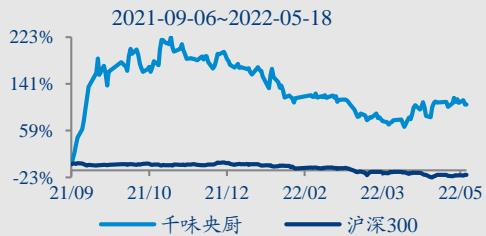  
市场表现对比图(近12个月)

主要财务指标  

<table><tr><td></td><td>2021</td><td>2022E</td><td>2023E</td><td>2024E</td></tr><tr><td>主营收入(百万)</td><td>1274</td><td>1531</td><td>1912</td><td>2357</td></tr><tr><td>同比增速(%)</td><td>34.9%</td><td>20.2%</td><td>24.9%</td><td>23.3%</td></tr><tr><td>归母净利润(百万)</td><td>88</td><td>102</td><td>141</td><td>190</td></tr><tr><td>同比增速(%)</td><td>15.5%</td><td>15.2%</td><td>38.8%</td><td>34.2%</td></tr><tr><td>每股盈利(元)</td><td>1.02</td><td>1.18</td><td>1.63</td><td>2.19</td></tr><tr><td>市盈率(倍)</td><td>44</td><td>38</td><td>27</td><td>20</td></tr><tr><td>市净率(倍)</td><td>4</td><td>4</td><td>3</td><td>3</td></tr></table>

资料来源：公司公告，华创证券预测

# 投资主题

# 报告亮点

本报告亮点为：1）立足公司商业模式，剖析定制生意本质、百胜供应链系统。本篇报告深刻分析定制生意模式本质和未来趋势，同时探讨百胜供应链的地位和意义。分析后指出，定制生意纵向精耕>横向拓展，适合差异化切入，自上而下打成功概率高。而百胜供应链管理在业内属“魔鬼级”难度，未来大B客户开发门槛渐高，公司与百胜长期合作下，经营优势持续夯实。2）测算速冻米面 $\mathbf { B }$ 端市场，提出行业制胜因素。C端寡头竞争，B 端仍待龙头整合，根据测算预计25年速冻米面B 端近 300亿，其中大B端 120 亿，对应CAGR5 为15%/20%。未来制胜要素，一是细分领域构筑先发优势，二是在渠道和研发上强化经营效率。3）多方位对比同行公司，指出公司当下发展的优势和不足。本篇报告从多方位比较安井、三全和千味央厨，并认为公司在大B客户、餐饮端发展方面优势显著，但在通用品发展上仍有差距，不过积累的大B端优势有助于经销渠道开发。4）分析公司未来成长路径，直接给出当前发展阶段的结论。本篇报告从渠道、品类方面测算公司未来发展空间和路径，基于前文对公司经营策略的理解，我们认为行业上B 端扩容趋势确定，考虑通用品门槛低于定制品，目前正处于加速阶段，红利还没有走完，但长远瓶颈打开仍需要持续培养通用品开发的能力。

# 投资逻辑

千味央厨作为速冻食品中定制领域龙头，在长期与大客户合作中积累了独特发展经验，依托高标准的产品质量、头部渠道开发、主打餐饮 $\mathbf { B }$ 端等策略，与其他速冻食品龙头企业形成了鲜明差异化竞争，且目前定制领域先发优势明显。当下募投资金启动扩张，经销渠道开发、跨区域扩张、品类延伸等经营战略全方位展开，预计公司未来3-5 年进入成长加速阶段，此外股权激励进一步奠定成长确定性，考虑到规模效应和经营效率提升潜力，中期展望业绩增长有望高于收入表现。

# 关键假设、估值与盈利预测

收入端，量的角度结合当下产能利用率未来复合增速在20%+，此外价的角度，蒸煮类、烘焙类等高价产品占比提升有望进一步贡献收入增长。

利润端，短期内存在成本压力，但考虑到产品结构、经营效率优化等，毛利率中枢仍有提升空间。费用方面，在渠道扩张阶段销售费用率预计上升，但管理费用率在规模效应下长期中枢有下行空间。

最终我们给予加回股权激励费用后利润分别为1.17/1.55/1.96 亿，考虑餐饮供应链赛道溢价，我们给予 22 年 40 倍PE，目标市值47 亿，对应目标价55元，首次覆盖给予“推荐”评级。

# 目录

# 、公司模式：聚焦B 端供应，以大客户定制为基.

（一）生意本质：定制择高处立，通用向宽处行 6  
（二）百胜供应链：进入门槛高，与供应商互相成就 9  
（三）速冻面米：品类分化，B端蓝海. 10

# 二、发展阶段：由大 $\mathbf { B }$ 定制向小B通品扩张. ..14

（一）公司概览：餐饮基因，乘势而上 14  
（二）经营策略：差异化切入，自上而下高势能拉动 16  
1、产品思路：深耕油炸品类，产品性价比高 16  
2、 研发体系：站在客户角度，以服务和质量动人 19  
3、 渠道开发：以头部客户为抓手的灯塔战术 20  
4、 营销打法：主打厨师之选，做高品牌价值 22  
5、 供应链布局：柔性化生产，运营稳定高效 23  
6、 财务角度：盈利中枢较高，仍具备改善空间 24  
（三）结论与建议：切入通用初步顺利，仍需持续平衡效率 26  
1、当前阶段：大客户优势向通用品快速扩散期 26  
2、企业建议：持续探索深度和广度的平衡点， 27

# 三、未来展望：品类和渠道双轮扩张，具备跃迁至30亿级别潜力.. .28

（一）产能布局：规划产能超20 万吨，打开成长瓶颈 28  
（二）成长驱动：品类和场景延伸，渠道加快扩张 28

# 四、投资建议：首次覆盖目标价 55元，给予“推荐”评级... ..30

（一）中期增速：CAGR3接近 $2 5 \%$ ，净利率维持 $7 . 8 \%$ 较高水平 30  
（二）短期跟踪：疫情冲击有限，成本压力可控 .31

# 五、风险提示.. .32

# 图表目录

图表1定制品和通用品开发方式比较 .6  
图表2不同品类ODM公司经营特征比较， .8  
图表3百胜中国对供应商体系管理严格. ….9  
图表4百胜中国的STAR考核项目简介， .10  
图表5速冻食品空间约1500亿.. ..11  
图表6面点类仍大有可为 .. 11  
图表7速冻米面餐饮端空间测算 11  
图表8 速冻米面 25 年餐饮端空间测算过程 .12  
图表9速冻面点C端份额集中. .13  
图表10B端速冻米面企业整理 ….13  
图表11千味发展历程 . 14  
图表12油炸类产品为主. .15  
图表13直营渠道占比平稳下降. 15  
图表14千味央厨股权结构（上市初） 15  
图表15公司管理团队多有思念背景. . 16  
图表16公司股权激励方案内容. … 1  
图表17千味由油炸类、蒸煮类面点为主要构成 .17  
图表18千味接下来逐步发力蒸煮类产品 .17  
图表19千味新品发展历史 .17  
图表20主要企业核心单品体量比较.  
图表21千味央厨产品性价比较好.. ..18  
图表22公司油条家族示意图表 .18  
图表23千味央厨产品标准和体现. .18  
图表24公司研发定位后餐厅后厨. .19  
图表25千味和安井研发体系和流程对比. ….19  
图表26渠道开发中遵循灯塔战术. … 20  
图表27公司经销和重客部独立管理. .. 21  
图表28千味央厨核心客户规模和增速 .. 21  
图表 29主要速冻企业渠道体系对比. .. 21  
图表30主要速冻企业渠道管理制度对比， ..22  
图表31千味以餐饮和厨师为营销对象 ..23  
图表32千禾和安井供应链流程控制 ..2.3  
图表33主要速冻食品公司工厂分布.. ..24  
图表34主要速冻公司吨运费、吨制造费比较， 24  
图表35直营模式毛利率接近 $3 0 \%$ ： .25  
图表36 千味央厨毛利率在行业中处较低水平 .25  
图表37 公司成本组成. .25  
图表38千味央厨人效提升空间大. .25  
图表39 主要可比公司费用结构拆分， 25  
图表40 主要速冻食品公司ROE拆分， .26  
图表41 募投项目情况. .28  
图表42 公司产能规划安排. .28  
图表43公司从华中逐步向华东和东北扩张 .29  
图表44 消费场景逐步多元化 .29  
图表45 按照渠道拆分增长情况 .29  
图表46千味央厨收入拆分和预测表 .30  
图表47千味央厨盈利预测简表（单位：百万元， $\%$ ） .31

引言:在餐饮工业化大背景下，餐饮供应链5 万亿市场改造无疑是食品饮料行业未来5-10年最具潜力的赛道，孕育无数产业机会。

各类餐饮供应链企业相继上市，如以小B 端为主的安井、大C端为重的三全以及依托加盟门店的巴比等，随着行业发展进程深化，千味央厨上市，标志着大B 定制模式也走入资本视野。

本文在梳理千味央厨基础上，重点回答以下核心问题:

1）商业模式：定制与通用品经营的区别？百胜为千味带来了什么？  
2）对比视角看企业定位：千味与安井、三全等相比有何差异？企业定位如何理解？  
3）未来发展：公司发展路径、未来空间如何预判？并提出我们的建议。  
4）投资建议：在餐饮工业化改造大浪潮之下，如何给予公司资本定价？

# 一、公司模式：聚焦B 端供应，以大客户定制为基

# （一）生意本质：定制择高处立，通用向宽处行

定制VS 通用：前者研发生产管理复杂、规模性较低，但满足更高品控和响应效率需求。定制模式（OEM/ODM）和通用品（B2B2C）定位分化，分别满足高、低层次消费需求，一般而言定制比通用模式产品更多、供货越快、研发更强且品质稳定，但同时渠道宽度和密度更窄、且对客户依赖度较大。从实际经营环节来看:

前期获客：大客户导向，开发周期长，且客户有指定需求。定制产品营销通常以高端化为特征，突出独特和价值感，同时开发中需要公司多部门统筹配合，并向客户展示品质、交期、服务和价格等具体化特征，然后以竞标方式获得，一般大客户销量大但开发时间长，且通常会提出保密、排他等需求，不过合作后客户粘性较大。

中期生产：客户介入度高，研发周期长，生产计划性弱。在中游环节，企业自身自主权较小，一方面客户多指定采购商，另一方面生产中常以销定产，企业保证生产柔性化能力，而研发方面常需要3-6个月研发周期，保证与客户充分沟通与调试等。

后期履约：渠道宽度和密度小，交期要求严，企业承担成本高。渠道多为直营，长度短、宽度密度小，企业在交付中承担义务更多，包括交期快、运费多为公司承担、提供账期信用等。

图表1定制品和通用品开发方式比较  

<table><tr><td>流程</td><td>营销方式</td><td>挖掘需求</td><td>研发流程</td><td>采购方式</td></tr><tr><td rowspan="6">定制 品</td><td>1、产品定位：产品为高端产</td><td>1、开发方式：大客户提前0.5-1 年主</td><td></td><td></td></tr><tr><td>品，突出独特和价值感；</td><td>动交流产品需求、公司主动提供体验</td><td>1、研发时间：客户设定</td><td>1、采购自由权小：客户</td></tr><tr><td>2、能力展现：服务型营销，</td><td>性产品供客户选择</td><td>研发周期在3-6个月</td><td>指定大宗物料供应商及</td></tr><tr><td>需展现企业的综合能力</td><td>2、需求表达：客户基于采购合同提前</td><td>2、研发环节：调研、立</td><td>细则；此外需采购“少</td></tr><tr><td>3、部门配合：多部门参与</td><td>1个月以采购计划形式提出需求</td><td>项、小试、中试、试产、</td><td>量多类”的小额物料</td></tr><tr><td>4、营销痛点：品质=交期&gt;后</td><td>3、其他要求：需签订保密协议，部分</td><td>评审等</td><td>2、客户的采购周期长</td></tr></table>

1、产品定位：性价比营销通用2、营销痛点：成本>品质 $\stackrel { \cdot } { = }$ 交品期>后期服务

1、需求表达：新品无明确客户，需要根据市场调研通用需求，不确定性大环节类似:但多了一道公司层面审批同意进行通用品开发、且各部门参与深度低于定制品，

1、采购自由权大：可通过规模效应降低成本2、客户的采购周期短

<table><tr><td>流程</td><td>生产制造</td><td>交付执行</td><td>客戶关系</td><td>渠道特征</td></tr><tr><td>定制1、以销定产； 品</td><td>2、柔性化生产</td><td>1、风险责任：公司承担运输和相关费 用 2、账款账期：可提供不超过3个月 的信用期和返利； 3、交付时间：从生产到终端约 7天</td><td>1、特征：双向、深度， 具备排他性 2、开发难度：且考察时 间较长且复杂 3、成长性：但长期看具 有稳定性和延伸性</td><td>直营为主 部分情况存在特殊利益 货品专一且稳定</td></tr><tr><td>通用 品</td><td>1、备货式生产：每年H2 确定 次年H1生产计划；每月底指 定下月生产计划 2、规模化生产</td><td>4、产品定价：竞标定价 1、风险责任：买断式销售，转移至经 销商 2、运输方式：提供自提或公司代办，企业主导型 费用由客户自行承担 3、账期账款：先款后货</td><td></td><td>经销商为主； 货品不专一</td></tr></table>

结果产品数量、毛利水平、成本控制、供货速度、品质稳定、渠道宽度、渠道密度、产能规模、客户依赖、研发水平等

  
资料来源：公司招股书，华创证券整理

适合定制的品类规律：核心是分工后能带来效率改善，影响因素包括加价倍率、生产复杂度和需求迭代性。定制本质上是社会的再分工，即将上游生产环节外包出去，故核心驱动是外包后带来总体效率提升，故一头是企业自身生产成本高，即生产复杂度高（技术高、材料多元和涉及专用设备），需求迭代快（休闲零食、化妆品等），另一头则是加价倍率足够大，能容纳更多分工角色的盈利要求。

定制企业成长天花板：一则取决于核心客户成长性，二则在于增量客户拓展难度。定制模式本质上即OEM或ODM代工，相比于通用品，定制业务经营对企业资源占用较多，发展到一定阶段易遇天花板，规模扩张效应较弱。通过对比其他行业中的定制代工企业:

核心客户的成长性，更直接影响成长的天花板：即保证延展性、并避免增量客户（客户增多易使经营复杂）拓展。具体而言，一方面下游品牌商规模大，品类增速景气，另一方面大客户对代工企业可选择性低（与品类属性有关），比如服装生产污染大，同时龙头企业一体化保证交付期的竞争力，故下游品牌商可选择性少。

此外增量客户拓展难度（标品率）、加价倍率等亦有影响：这与品类属性有关，比如纸尿裤标品率高、差异化小，大客户以外的适销性亦高。同时行业加价倍率越高，品牌商外包动力越强，上游定制代工需求则越大。根据上述分析，我们认为速冻米面制品下游渠道相对分散、且产品间差异化大，因此定制模式在该品类中，未来发展或弱于其他标准品类。

图表2不同品类ODM公司经营特征比较  

<table><tr><td></td><td>化妆品</td><td>膳食保健品</td><td>电子TWS 耳机</td><td>运动服饰</td><td>纸尿裤</td><td>速冻面米</td></tr><tr><td>代表公司</td><td>青松股份 （21年收入37亿， ３年CAGR为 37%）</td><td>仙乐健康 （21 年收入24 亿，３年CAGR 为14%）</td><td>立讯精密 （21 年收入 1539亿，3年 CAGR为62%)</td><td>申洲国际 （21 年收入238 亿，５年CAGR为 10%）</td><td>豪悦护理 （21 年收入25 亿，3年CAGR 为19%）</td><td>千味央廚 （21 年收入12.7 亿,3年CAGR为 22%）</td></tr><tr><td>行业空间</td><td>4256亿 (CAGR为10%)</td><td>2503亿 (CAGR为11%)</td><td>3731亿</td><td>3150亿</td><td>1572亿</td><td>774亿</td></tr><tr><td>加价倍率</td><td>5-10倍</td><td>3-10倍</td><td>约5倍</td><td>3-5倍</td><td>1-2倍</td><td>1-2倍</td></tr><tr><td>市场格局</td><td>代工 CR2&lt;10%</td><td>CR2&lt;20%</td><td>CR2约40%</td><td>CR1&lt;5%</td><td>CR3&lt;20%</td><td></td></tr><tr><td>销售费用率</td><td>21年1.6%</td><td>21年6.3%</td><td>21年0.5%</td><td>21年为0.9%</td><td>21年为3.7%</td><td>21年为3.3%</td></tr><tr><td>研发方面</td><td>核心技术保密性 强、研发费率21年 3.4%</td><td>研发费率21年 3.5%</td><td>研发费率21年 4.3%</td><td>研发费用率 2% 采用面向生产设计</td><td>研发费率21年 3.7%</td><td>研发费率21年 0.7%</td></tr><tr><td>生产过程</td><td>生产高自动化 劳动依赖度小 国际大牌自产为 主，新锐品牌外包</td><td>部分自产部分外 包，自动化比例 高</td><td>精密化、自动化 比例高</td><td>一体化生产工序 模块化生产 劳动密集型</td><td>工艺成熟 标品率高 单产线设备投 资较高</td><td>平台化产线 人工占比较高</td></tr><tr><td>品牌商的供 应商集中度</td><td>CR4达到 60%-70%</td><td>分散</td><td>单品类高度集 中，CR1≈ 60%，CR2≈ 90%</td><td>分散，CR1≈ 10-15%</td><td>相对分散，CR1 ≈25%</td><td>整体分散，单品类 相对集中</td></tr><tr><td>代工商的大 客戶集中度</td><td>CR1&lt;20%，CR5 近50%</td><td>CR5 约 30%, CR10近50%</td><td>大客户占比近 70%</td><td>CR4近 85%</td><td>CR5约50%</td><td>CR1约25%, CR5近30%</td></tr><tr><td>品类特征</td><td>需求迭代快 品类复杂非标 差异化明显 非精密</td><td>批文和配方制监 管、需求迭代快、 非标品、产品差</td><td>产业链长 技术迭代快 品牌方掌握核 心技术</td><td>高污染、功能性服 饰对面料要求高、 时尚性服饰对订 单、灵活性要求高、</td><td>标品化 产品迭代慢 必选消费品 周期长、订单交付</td><td>品类复杂差异大、 非标品、产品生命</td></tr></table>

资料来源：Euromonitor，公司公告，国家统计局，艾媒咨询，草根调研，华创证券

综上所述，定制模式易差异化，但通用品后期扩张性更强。定制模式对产品、客户开发追求极致，在前期容易打造差异化经营，便于企业早期切入，但考虑到对企业资源的占用，故在规模化扩张上定制企业不如通用品企业，不过在核心客户规模大、增量客户拓展容易的行业里，定制亦具备较高天花板。同样的关系还有直营和加盟，产品和服务等

# （二）百胜供应链：进入门槛高，与供应商互相成就

百胜中国：餐饮先锋，西快霸主。百胜中国 21 年营业收入约 98.5 亿美元，是国内系统销售额最大的餐饮企业，截至21年底总门店数达11788家，覆盖全国 $4 0 0 +$ 个城市。公司旗下拥有包括肯德基、必胜客、小肥羊等多个连锁品牌，其中肯德基门店数量达到 8168家，为快餐细分市场中最大餐饮品牌，市场份额约占 $4 . 9 \%$ 。

百胜供应商管理严格，为业内连锁餐饮标杆。供应链管理为连锁餐饮发展命门，一旦某个门店发生质量问题，将对整体系统造成极大负面影响，百胜从 12-14 年陆续经历速生鸡、冰块菌落超标、福喜问题等事件，倒逼公司持续加强供应链管理。在不同市场有独立团队对市场情况采取不同标准与评定机制，对供应商的产品质量和服务进行定期审核与绩效跟踪，并发展出吹哨人制度、STAR 系统等独特机制，其供应体系在业内认可度高，众多知名餐企以百胜为标杆，从而选择一致供应商。

图表3百胜中国对供应商体系管理严格  

<table><tr><td>华莱士</td><td>VS</td><td>百胜中国</td></tr><tr><td>定期对供应商名录维护，选择业内 知名、口碑较好的供应商，尽量同</td><td>供应商审 核制度</td><td>严格的新供应商准入制度，包括风险评估、资质审查及工厂准入审核。</td></tr><tr><td rowspan="2">肯德基、麦当劳选择一致供应商。 规定物料应符合质量验收要求，并 要求供应商对供应原料安全进行责</td><td rowspan="2">供应商绩 效评估</td><td>对供应商定期审核，20 年进行约 400 次食品安全审核、200 多次飞行检查。</td></tr><tr><td>引进STAR评估系统，并将供应商划分为T1-T4四个级别。 对供应商每三个月到半年定期评估，全年随机评估，综合评分决定各供应商下一</td></tr><tr><td rowspan="5">任评估、检测。 产品到货后进行合格证明检查、生 产日、检测检疫证明进行检查，仓 库进行抽样品查验后验收入库。 品控部门会不定期抽查到货质量情 况、送交有资质的检测中介机构。</td><td rowspan="5">食品安全 控制</td><td>年度的业务份额。 印发《百胜中国供应商手册》，对不同原材料提出了不同的标准要求，并规范运</td></tr><tr><td>输过程及验收货程序。 定期对供应商产品进行抽样检测，20 年抽检覆盖106 个种类，包括 300 多个主要</td></tr><tr><td>原物料，涉及144 个供应商。</td></tr><tr><td>建立产品追溯系统，强化对供应商及上游供应商的质量管理。</td></tr><tr><td>要求供应商对其原材料食品安全相关风险进行辨识、监控，推动源头管理升级。</td></tr><tr><td rowspan="2">定期与供应商交流，参股上游供应 商。</td><td>供应商能</td><td>发起“吹哨人制度”，鼓励供应商员工对形成食品安全或隐患的行为进行举报。 连续十多年举办供应商STAR及其他技术类培训，提高各环节技术及管理水平。</td></tr><tr><td>力提升</td><td>成立质量管理研修院，定期开展供应商质量研讨会，拓展供应商综合管理能力。</td></tr><tr><td rowspan="2"></td><td>供应商竞</td><td>产品端“蓝海战略”，新品给足相当的盈利空间，鼓励供应商研发新品，助推供应</td></tr><tr><td>争机制</td><td>商能力的提升。 “软性比价”策略，根据食品安全、质量和商务审核的总体绩效结果进行竞标。</td></tr><tr><td rowspan="2">具有丰富行业检验的员工，可以将 食品安全风险降到最低。</td><td rowspan="2">风险预 警、评估</td><td>对每日监测到的数据与供应链数据进行比对、搜索，排查供应链潜在风险。</td></tr><tr><td>对各场景进行全方位、多维度评估，以知识图谱方式呈现风险信息和相关情况。</td></tr></table>

资料来源：百胜中国《2020 年可持续发展报告》，华士食品公司公告，华创证券

百胜供应链进入门槛极高，未来大B开发的门票稀缺。百胜对供应商考核筛选严苛，仅STAR 考核一项，包括 3 个部分18 个项目，每年以此标准打分，并将供应商划分为T1-T3等级，等级越高难度越高、同时权益也越大，业内反馈通过 STAR 系统的供应商，多都能轻松通过国际 ISO 质量认证。以千味为例，公司自 2002 年与百胜合作，12 年独立后曾连续三年止步 T2，16 年经过公司多方位动员才终于跻进T1 级别，背后是十数年稳定合作的积累，百胜 300多家供应商仅 $5 \%$ 能晋级T1级别，后来者追赶难度极高。

图表4百胜中国的STAR考核项目简介  

<table><tr><td colspan="3">STAR考核项目</td></tr><tr><td>责任部门</td><td>供应商能力评估</td><td>供应商表现评估</td></tr><tr><td rowspan="4">品质管理</td><td>食品安全审核</td><td>Cutting</td></tr><tr><td>质量系统评估</td><td>KPI</td></tr><tr><td>上游供应商管理评估</td><td>产品检测</td></tr><tr><td rowspan="2">生产工艺过程质量检查</td><td>PQNC</td></tr><tr><td>产品召回</td></tr><tr><td rowspan="2">研究开发</td><td>技术能力</td><td rowspan="2">技术创新表现 成本表现</td></tr><tr><td>财务实力</td></tr><tr><td rowspan="3">采购部</td><td>相对成本</td><td></td></tr><tr><td>生产可靠性及能力</td><td>供货可靠性表现</td></tr><tr><td>业务关系能力</td><td>业务关系表现调查</td></tr><tr><td>考核频率</td><td>组成部分</td><td>考核分占比</td></tr><tr><td>每年一次</td><td>正式通知的SGS第三方质量审核</td><td>40%</td></tr><tr><td>每年四次</td><td>临时性的飞行检查</td><td>60%</td></tr><tr><td>全年</td><td>产品质量客诉扣分制</td><td>一经发现直接扣分</td></tr><tr><td>考核结果</td><td>分值标准</td><td>权益</td></tr><tr><td>T1供应商</td><td>85分以上</td><td>每年2-4次菜单更换优先上新；T1有优势份额</td></tr><tr><td>T2供应商</td><td>70-85分</td><td></td></tr><tr><td>T3 供应商</td><td>70分以下</td><td></td></tr></table>

资料来源：速冻冷冻食品，华创证券

百胜为千味央厨带来了什么？公司前身自 02 年进入肯德基供应链，近 20 年来百胜严苛的要求推动千味不断进步，在品质、成本、交付、服务等方面“手把手”打磨公司能力，至21年油条和蛋挞占百胜采购量 $7 0 – 8 0 \%$ ，具体表现为：

产品品质提升：以大单品为例，公司的芝麻球采用干脱皮工艺、滚圆技术等12道工艺，设置8 道品控标准检验，每颗芝麻球炸制后周长不低于 $1 3 . 5 \mathrm { c m }$ ，同时芝麻数量精确到个位（每枚 672左右），此外油条产品生产经过 $1 0 0 +$ 道工序，对重量、长宽、颜色有精细要求，油炸前后脂肪量都更少，同时较同类产品省油 $3 7 \%$ 以上。

生产成本降低：百胜引入“软性比价”策略，对竞价最低的供应商提供份额奖励，公司为此在成本端做文章，如百胜对油条计算成本时次品率为 $1 5 \%$ ，而千味通过升级技术将次品率控制住 $4 \%$ 以内，并将次品加工为油条片二次利用，最终实现相比安井、三全更低的价格。

出色的交付能力：公司从接受大客户定制要求、研发到生产交付只需3-6个月，同时核心小组轮流往返客户所在地，其中提供样本仅需一周左右。此外，配送方面公司将物流外包，并设立专业小组跟踪大客户库存和周期，准时按要求发全国配销仓。

# （三）速冻面米：品类分化，B 端蓝海

品类分化：速冻面米发展成熟，但面点类仍处成长期。速冻食品行业空间达 1500 亿，其中速冻米面为主要构成，占比一半以上达到近 800 亿，主要构成为水饺、汤圆、粽子等传统成熟品类，目前速冻米面整体增速放缓至低个位数。不过面点类正成为新的增长点，全国各地面点产品多样，速冻企业在该品类中创新和推广空间较大，预计行业增速在高个位数水平（如油条增速 $7 . 8 \%$ )，高于水饺、汤圆等传统面米制品。

驱动因素：餐饮连锁化率提高，驱动标准化速冻食材应用增加，大大打开B端空间。我国当前连锁化率逐年提高，从2011年的 $1 3 \%$ 提高至 2021 年超 $1 8 \%$ ，其中拥有 500家以上门店的大品牌占比达 $6 \%$ （或为千味定制业务主要目标客户）。海外来看，美、日连锁化率均在 $5 0 \%$ 以上，即使考虑国情差异，我国餐饮连锁发展仍有较大潜力。展望未来，随着餐饮连锁化的提高，行业降本提效、保证食品安全、缩减上菜时间等诉求增强，速冻食品B端应用空间加快打开。

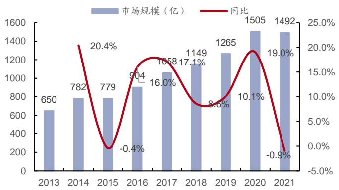  
图表5速冻食品空间约1500亿  
资料来源：国家统计局，草根调研，华创证券

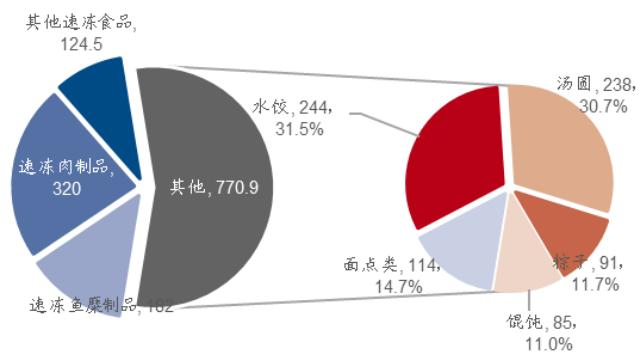  
图表6面点类仍大有可为  
资料来源：国家统计局，安井食品公告，产业信息网，华创证券

空间测算：相比C 端，B 端潜在空间更足，25 年预计速冻米面B 端 300 亿，其中大B端 120 亿，面点类 200 亿。考虑行业未有权威的B 端数据，故我们根据已知信息从不同维度测算，整体来看，速冻面米 2020 年完成营收 773.5 亿元，其中B 端市场规模约 150亿，占比约 $2 0 \%$ 。结合餐饮连锁化率，并考虑到大B端速冻食品渗透率高，大B端市场规模45 亿，占整体B 端市场 $3 0 \%$ 左右。此外从代表性品类看，油条市场规模在70-100亿1区间，蒸煎饺规模在20 亿²左右，品类延伸空间仍然充足。展望未来，考虑餐饮业发展、连锁率和渗透率提升，预计 25 年速冻米面B 端规模近 300 亿，对应复合增速 $1 5 \% ^ { 3 }$ ,其中大B 端规模120 亿，对应复合增速约 $2 0 \%$ ，面点类（即非汤圆水饺类）规模225亿，对应复合增速 $1 2 \%$ 。

图表7速冻米面餐饮端空间测算  

<table><tr><td colspan="6">20 年速冻米面B端空间测算</td></tr><tr><td rowspan="3">数据口径一 （渗透率）</td><td>餐饮市场规模</td><td>食材成本占比</td><td>米面制品占比</td><td>速冻渗透率</td><td>B端市场规模</td></tr><tr><td>39527亿</td><td>42%</td><td>5%</td><td>15%</td><td>124亿</td></tr><tr><td>（国家统计局）</td><td>（饭店协会）</td><td></td><td>（估算）</td><td></td></tr><tr><td rowspan="2">数据口径二 （招股书）</td><td>速冻食品规模</td><td>米面占比</td><td></td><td>餐饮端占比</td><td>B端市场规模</td></tr><tr><td>1458亿</td><td>52%</td><td></td><td>16%-20%</td><td>122-152亿</td></tr></table>

1公司15 年测算，7.5 亿人 $\ast 6 5 \%$ 人吃 $^ { * 2 }$ 元/早餐油条价格 $\ast 3 6 5$ 天 $\ast 5 0 \%$ 的外面早餐 $\ast 1 0 \%$ 吃油条频次 $^ { - 1 7 8 }$ 亿元，还原至出厂口径约70-100亿元，其中工业油条近2.5亿。2 据草根调研，蒸煎饺零售规模20 亿，其中正大约4 亿，占比 $2 0 \%$ 3隐含餐饮市场增速为 $12 \%$ ，即疫情后恢复性高增，若疫情影响超预期，或致行业增速低于此水平

<table><tr><td colspan="4">(Frost Sullivan)</td><td colspan="3">(IBIS World )</td></tr><tr><td rowspan="2">数据口径三 （欧睿）</td><td>三全零售营收</td><td>三全市占率</td><td></td><td>品牌&amp;包装占比</td><td>C端市场规模</td><td>B端市场规模</td></tr><tr><td>60.0亿</td><td>24%</td><td></td><td>0.3-0.5</td><td>624亿</td><td>149亿</td></tr><tr><td rowspan="3">数据口径四 （分品类）</td><td>（公司公告） 饺子汤圆等占比</td><td>（欧睿) 三项B端占比</td><td></td><td>（取0.4） 面点占比</td><td>面点B端占比</td><td>总规模-C端 B端市场规模</td></tr><tr><td>73.6%</td><td>13%</td><td></td><td>14.7%</td><td>40%</td><td>&gt;120亿</td></tr><tr><td>（安井信评）</td><td>（参考三全）</td><td></td><td>（安井信评）</td><td>（参考安井）</td><td>传统+新式</td></tr><tr><td colspan="7">20年速冻米面大B空间测算</td></tr><tr><td rowspan="3">数据口径一 （渗透率）</td><td>餐饮市场规模</td><td>餐饮连锁化率</td><td>食材成本占比</td><td>米面制品占比</td><td>速冻渗透率</td><td>大B市场规模</td></tr><tr><td>39527亿</td><td>17%</td><td>42%</td><td>5%</td><td>30%</td><td>43亿</td></tr><tr><td>（国家统计局）</td><td>（欧睿）</td><td>（饭店协会）</td><td></td><td>（假设连锁为 2 倍 整体）</td><td>大B占比≈35%</td></tr><tr><td rowspan="2">数据口径二</td><td>KFC单店千味营收</td><td>KFC单店营收</td><td>连锁餐饮收入</td><td></td><td>折扣系数</td><td>大B市场规模</td></tr><tr><td>3.1万</td><td>543.8万</td><td>7471.9亿</td><td></td><td>0.85</td><td>36亿</td></tr><tr><td rowspan="2">（单店贡献）</td><td></td><td></td><td></td><td></td><td></td><td>口径预计偏低</td></tr><tr><td>（招股说明书）</td><td>（公司公告）</td><td>（欧睿）</td><td></td><td></td><td></td></tr></table>

资料来源：Euromonitor，Frost & Sullivan，IBIS，国家统计局，中国饭店协会，安井食品公告，千味央厨招股书，百胜中国公告，渠主调研，华创证券。

图表8速冻米面 25 年餐饮端空间测算过程  

<table><tr><td colspan="7">25 年速冻米面B端空间测算</td></tr><tr><td rowspan="3">数据口径 (渗透率)</td><td>餐饮市场规模</td><td>食材成本占比</td><td></td><td>米面制品占比</td><td>速冻渗透率</td><td>B端市场规模</td></tr><tr><td>71600亿</td><td>42%</td><td></td><td>5%</td><td>20%</td><td>&lt;300亿</td></tr><tr><td>（烹饪协会）</td><td>（饭店协会）</td><td></td><td></td><td>（假设每年提升 1pct)</td><td>CAGR约16%</td></tr><tr><td colspan="7">25 年速冻米面大B空间测算</td></tr><tr><td rowspan="4">数据口径 (渗透率)</td><td>餐饮市场规模</td><td>餐饮连锁化率</td><td>食材成本占比</td><td>米面制品占比</td><td>速冻渗透率</td><td>大B市场规模</td></tr><tr><td>71600亿</td><td>22%</td><td>42%</td><td>5%</td><td>35-40%</td><td>116-132亿</td></tr><tr><td>（烹饪协会）</td><td>（假设每年提</td><td></td><td></td><td>（假设连锁为整体</td><td></td></tr><tr><td></td><td>升1pct)</td><td>（饭店协会）</td><td></td><td>的2倍)</td><td>大B占比≈45%</td></tr></table>

资料来源：国家统计局，中国烹饪协会，中国饭店协会，渠道调研，华创证券。

行业格局：B 端格局未定，C 端发展成熟。速冻面米在C 端发展较早，早期以主食类为主，行业成熟度相对更高，而B 端目前正进入处快速发展阶段，行业格局还未定型，具体来看：

C端：发展成熟，三强主导。当前速冻面米制品已经发展成熟，其中线下零售市场基本由三全、思念和湾仔码头瓜分，市场占有率超过 $6 0 \%$ ，而在广义C端市场中三家份额之和也近 $5 0 \%$ 。目前三家主要占据水饺、汤圆、粽子等传统品类，而新兴面点市场仍有发展空间。

B 端：前列企业多 10 亿以下，市场整合空间较大。面米制品在B 端市场发展逐步加速，其中速冻面米龙头企业加大布局，如三全设立绿标和快厨公司，思念也于 18 年新设立BP补齐餐饮短板等，此外也有在部分渠道、品类聚焦的区域性企业纷纷发力。

整体来看，餐饮端目前参与者较多，但尚未行成相对固化的格局。而就大B 端市场而言，行业分散度更高，其中千味参与较早，目前尚未有同级别对手出现。

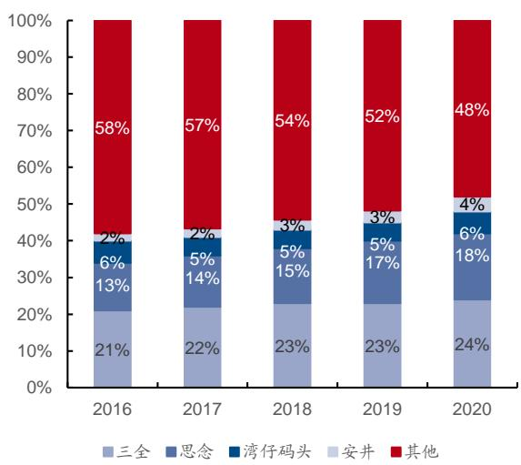  
图表9速冻面点C端份额集中  
资料来源：Euromonitor，华创证券

图表10B 端速冻米面企业整理  

<table><tr><td></td><td>公司</td><td>发展思路</td><td>B端米面</td><td>主营产品</td></tr><tr><td rowspan="3">传统</td><td>、快厨）</td><td>三全（绿标18年设三全餐饮， “ 早餐点心服务商”</td><td>约9亿</td><td>水饺、包点类</td></tr><tr><td>安井</td><td>坚定点差异，深</td><td>约7亿</td><td>发面类(手抓饼、馒</td></tr><tr><td>思念</td><td>18年新设立思念 BP，补齐餐饮短板</td><td>约7亿</td><td>汤圆、水饺、馄饨</td></tr><tr><td rowspan="3">渠道 或品 类强 势</td><td>千味央廚</td><td>厨师之选，只为餐饮</td><td>约13亿</td><td>油条、芝麻球、烘焙 类产品</td></tr><tr><td>乐肴居</td><td>发力高端餐饮，定位 “高品质面点捍卫者”</td><td></td><td>汤圆、水饺、馄饨</td></tr><tr><td>屏荣（阿 诺）</td><td>台资鲜食企业，94年 大陆多地建厂</td><td>10亿+</td><td>春卷、象形面点、月 饼</td></tr><tr><td rowspan="2">外来 跨界</td><td>白象（福喜），目标“中国速冻面点的领导者”，主营馒头、蒸饺等</td><td></td><td></td><td></td></tr><tr><td colspan="2">得利斯新建3万吨米面项目，预计产值3亿，以水饺、面点、馄饨</td><td></td><td></td></tr><tr><td>地方 企业</td><td colspan="5">舒汇食品、龙旺食品、峰仔食品</td></tr></table>

资料来源：公司官网，公司公告，华创证券

制胜因素：品类碎片化使得先发优势关键，而偏同质化产品、有品类无品牌，又使渠道服务作用放大，业务团队执行力重要。行业内品类丰富度极高，且不同产品间、区域间差异化较大。此外由于进入门槛较低，各地区中小企业较多，因此行业竞争激烈，加上原材料成本占比高，导致行业盈利能力较差。所以品类碎片化、竞争激烈和盈利能力较弱的特征构成了速冻食品行业基本生态，而企业若想突围需具备:

先发优势：B 端渠道易守难攻，企业多以品类割据。一方面B 端渠道比拼成本和服务，易于与客户建立信任纽带，而大B客户更是如此；另一方面在行业品类多元化，平均单品整体空间较小，多为十几、几十亿的缝隙体量，先行企业通常抱紧个别品类以打造爆款，后来者赶超难、面临机会成本大，比如安井的鱼丸、巴比的包子、千味的油条等。

经营高效：辛苦且低门槛生意，核心比拼管理投入。保证密集的渠道服务，可以提高渠道粘性，此外由于单一企业最大单品通常不超过 5 亿，拼盘式发展下倒逼企业需要不断研发新大单品，爆款抓取力至关重要。综合而言行业发展比较传统，且有品类无品牌，从做市场到做产品均需要大量人力投入，故高效管理团队的文化和机制是护航长期成长的关键。

# 二、发展阶段：由大B定制向小B通品扩张

# （一）公司概览：餐饮基因，乘势而上

2002-2012 年：背靠思念专注百胜中国供应链。自 02 年与百胜达成合作后，公司陆续代承接挞皮、油条等产品的代工，避开汤圆、水饺等传统产品，在芝麻球、油条等油炸类产品上初具规模。12 年思念连续爆出质量问题并退市，为避免间接影响大客户业务，4月千味正式成立。

2012-2016 年：直营大客户进一步增加，代工能力持续提升。成立伊始公司即明确“只为餐饮，厨师之选”定位，仍以直营服务大客户为主，聚焦渠道、产品的差异化，涉足麻辣烫、火锅等新业态，进入德克士、真功夫、杨国福等供应链。公司持续完善重客服务模式，14 年推出定制化服务，16 年跻身百胜中国 T1供应商。

2016 年-至今：行业升温下实现产品、渠道的全布局。公司从思念正式独立，品牌加速升级，由“造中国好油条”向餐饮专供速冻米面领导品牌转型。16年速冻餐饮行业升温，公司适时发力经销渠道，持续完善产品矩阵，19年发布烘焙品牌“焙伦”，差异化切入高端火锅料业务。同时持续完善产能布局，新乡一期二期陆续投产，华东工厂落户芜湖油炸类为公司优势产品，直营渠道占比下降。公司主营可分为油炸类、烘焙类、蒸煮类、菜肴类，21年收入占比分别为 $5 1 . 8 \% / 2 0 . 1 \% / 1 7 . 5 \% / 1 0 . 2 \%$ ，其中油炸类产品保持核心地位。渠道上，公司采取直营、经销两种模式，21年占比分别为 $4 0 . 1 \% / 5 9 . 6 \%$ ，其中直营主要以定制化产品为主，20 年占比 $8 4 \%$ ，经销渠道基本为通用品，20年经销占比提升较大，主要系受疫情影响大餐饮客户需求增速放缓所致。

  
图表11千味发展历程  
资料来源：公司官网，华创证券

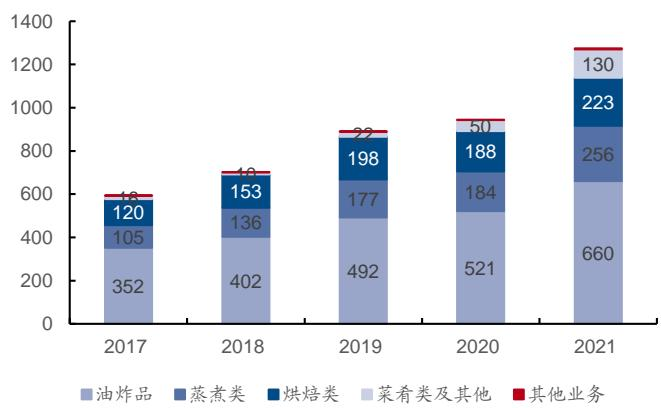  
图表12油炸类产品为主  
资料来源：wind，华创证券。注：单位为万元

  
图表13直营渠道占比平稳下降  
资料来源：wind，华创证券

公司实际控制人系思念创始人李伟。16 年千味央厨股权由思念全部转让于李伟控制的郑州集之城，17 年李伟则将所持的思念全部股权转让给公司管理层，思念和千味央厨完成脱钩。目前李伟间接持有千味央厨 $4 6 . 0 4 \%$ 股份，京东（宿迁涵邦）和绝味食品（网聚资本）均占股 $3 . 7 8 \%$ ，中高层员工则通过持股平台共青城凯立与公司股权绑定。

内部职业经理人制，主要高管多有思念背景。实控人李伟并未在公司担任职务，公司高管及技术人员多为原思念员工，千味央厨成立之际，由思念转移到千味央厨，跟随公司多年发展。董事长孙剑于思念食品工作10 年，18 年加入千味央厨。总经理白瑞于 04 年加入思念食品，12 年加入千味央厨，主要负责营销、研发等工作。公司高管拥有多年共同奋斗经验，团队默契且稳定。

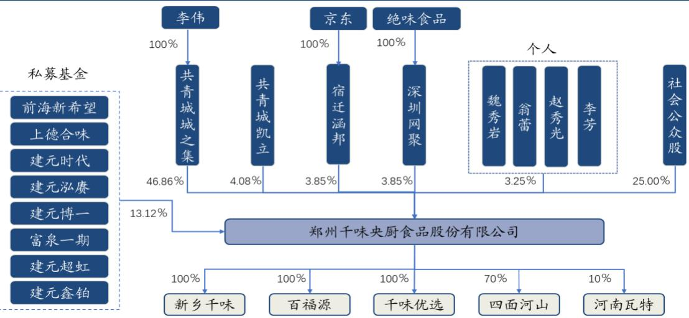  
图表14千味央厨股权结构（上市初）

资料来源：招股说明书，华创证券。注当前股权结构与上市初期略有变化绑定核心管理层利益，内部激励逐步强化。此前公司管理层通过员工持股平台间接持股，之后 21 年 12 月公司又发布股权激励方案，授予管理层及其他核心人员152.6 万股，占公司股本 $1 . 7 9 \%$ ，任务考核 22-23 年营收同比增长 $2 3 . 8 \% / 2 0 . 4 \%$ ，目标设置整体积极，有利于激发员工积极性，实现企业长远稳定发展。

图表15公司管理团队多有思念背景  

<table><tr><td>姓名</td><td></td><td></td><td>职务•年龄持股比例</td><td>履历</td></tr><tr><td>孙剑</td><td>董事长49</td><td></td><td>0.54%</td><td>曾任思念业务代表、上海公司经理、香港公司经理 、营销中心副总经理，后曾任职于一生缘食品销售总 经理、大观地产副总经理</td></tr><tr><td>白瑞</td><td>总经理</td><td>46</td><td>0.06%</td><td>2004 年起任思念结算部经理、资金管理部经理、营 销中心副总经理助理</td></tr><tr><td>王植宾</td><td>副总经 理、财 务总监</td><td>42</td><td>0.05%</td><td>2005年起任思念总成本会计、高级审计员、内审经 理、升级部经理</td></tr><tr><td>徐振江</td><td>副总经 理，董 秘</td><td>37</td><td>0.05%</td><td>曾于2010 年任河南宋河酒业，后曾任职于洛阳次祖 杜康、河南骏域基金</td></tr><tr><td>王向阳</td><td>监事会 主席</td><td>50</td><td>0.07%</td><td>1999 年起任思念质量技术总监、生产总监</td></tr></table>

资料来源：公司公告，华创证券。注：持股主要系通过员工平台间接持股

图表16公司股权激励方案內容  

<table><tr><td>授予对象</td><td>职务</td><td>获授数量（股） 占授予总量的</td><td>占总股本比例 比例</td></tr><tr><td>孙剑</td><td>董事长</td><td>142,900 9.36%</td><td>0.17%</td></tr><tr><td>白瑞</td><td>总经理</td><td>97,400 6.38%</td><td>0.11%</td></tr><tr><td>王植宾</td><td>副总经理、财务总监</td><td>87,700</td><td>5.75% 0.10%</td></tr><tr><td>徐振江</td><td>副总经理、董事会秘书</td><td>116,900</td><td>7.66% 0.14%</td></tr><tr><td>其他核心人员（76人）</td><td></td><td>1,081,300</td><td>70.85% 1.27%</td></tr><tr><td>合计</td><td></td><td>1,526,200 100.00%</td><td>1.79%</td></tr><tr><td colspan="4">年度考核营业收入（A)</td></tr><tr><td>目标值(Am)</td><td></td><td>以20年度营收为基数，22-23年度营收增长率不低于 67%/101%，換算22-23年营收同比增速23.8%/20.4%</td><td></td></tr><tr><td>触发值(An)</td><td></td><td>不低于年度目标值的80%</td><td></td></tr></table>

资料来源：公司公告，华创证券

# （二）经营策略：差异化切入，自上而下高势能拉动

# 1、产品思路：深耕油炸品类，产品性价比高

产品体系：新式速冻面点为主，油炸类优势显著，逐步发力蒸煮类。千味差异化切入油炸类产品，通过“中国好油条，千味央厨造”绑定优势产品站稳脚跟，后续进一步完善产品布局，将有限禀赋集中在同领域不同单品上，依托乡厨、团餐优势，重点推广各类蒸煮产品，计划将蒸饺、米糕等打造为亿元单品。而三全扎根汤圆、水饺、粽子等传统速冻食品，安井则为火锅料制品起家，速冻米面则多聚焦发面类、主食类。

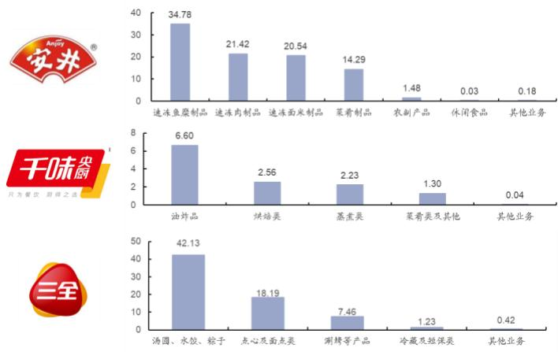  
图表17千味由油炸类、蒸煮类面点为主要构成  
资料来源：公司公告，华创证券。注：单位为亿元，时间为21 年

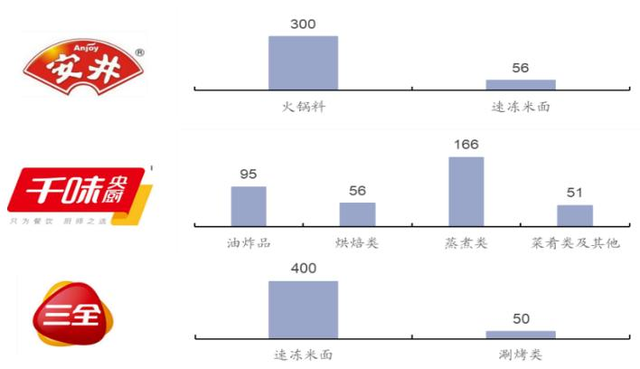  
图表18千味接下来逐步发力蒸煮类产品  
资料来源：公司公告，华创证券。注：以上为产品的 $S K U$ 数量，千味数据为20年，其余为草根调研数据

推新节奏：单品垂直迭代能力强，自主创新力更优。2010 年前餐饮消费水平不高，公司通用品多为芝麻球、地瓜丸、象形面点，多面向乡厨场景。后续随着火锅、麻辣烫等餐饮业态兴起，公司细分出适配各类场景的相关产品，其中油条、米糕等产品持续深挖和迭代，推出各种类型不同版本，此外与KFC 共同联名影视 ip 打造师尊荷花酥、玫瑰酥饼等较高技术含量新品，近期亦推出地域特色胡辣汤、油馍头等。对比看，三全C端自09 年推出高端水饺，近期亦有微波炉、空气炸锅系列，B 端新品多以模仿为主，如18年推出茴香小油条等。安井自始即深耕发面类，培育特色大单品手抓饼、红糖枣糕，后续同样以跟随模仿为主，如推出涮煮小油条等。

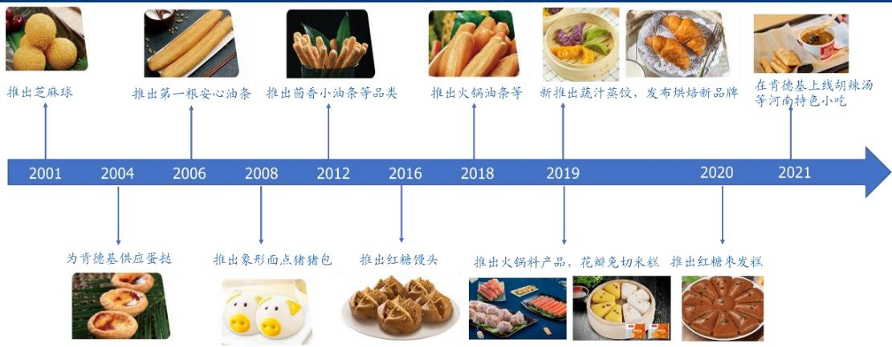  
图表19千味新品发展历史  
资料来源：公司官网，华创证券

单品规模：定制化柔性生产下，千味SKU 数目更多，但大单品规模较小。20 年底千味三大单品芝麻球、蛋挞皮、KFC冷冻油条，营收分别为 $1 / 0 . 9 / 0 . 7 $ 亿，至21年油条、蒸煎饺、面点类分别营收 $3 . 5 1 / 1 . 3 5 / 1 . 2 1$ 亿，主要系定制品与客户联合研发或根据客户需求定制，规模效应不明显，且连锁大B享有独家销售权，导致公司规格数量较多，单品规模较小。三全深耕饺子、汤圆、粽子等，营收分别达 $2 1 . 4 / 2 0 . 7 / 3 . 4$ 亿，同时锁定馅饼、酥脆油条、茴香小油条等品类，逐步培育为破亿单品。安井一向奉行大单品策略，大单品数目更多且更为均匀。

价格设计：千味采用成本加价法，产品通常具备价格优势。千味产品定价主要根据成本加成，通常生产部加价8 个点左右，销售重客部考虑运费和服务一般加价 25 个点，而经销部则加价 15 个点，此外在大客户持续打磨下，优势产品性价比凸出。如挞皮产品预计生产成本与立高食品基本一致，但每千克出厂价低2元左右，便宜约 $1 5 \%$ ，且千味产品多为手工挞皮、品质一般更优。其他各类通用品中，据草根调研反馈，千味较同类型产品定价普遍更低，综合看相同单品价格多较三全、安井低于 $1 0 \%$ 左右。

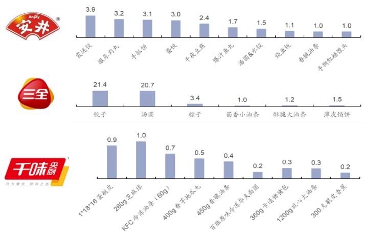  
图表20主要企业核心单品体量比较  
资料来源：招股说明书，华创证券。注：截止20年底，单位为亿元，可能存在一定误差

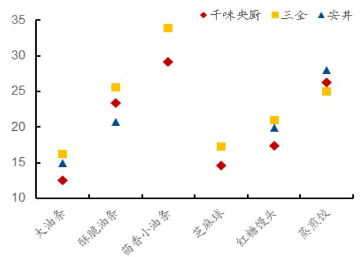  
图表21千味央厨产品性价比较好  
资料来源：草根调研，华创证券。注：单位为元/千克，可能存在一定误差

产品质量：细化标准严格把控，核心单品上公司质量突出。以油条为例，原材料均经过31 项安全检测，面粉为公司独家研发。工艺上公司历时三年经过约 5000 次试验，首创速冻油条，此后不断将工艺升级为第三代（大部分油条厂家普遍仍为一代），将生产过程细化为 100 余个节点，严格按照要求执行，最后在后端检测方面，仅外观一项即可分为长度、蓬松度、容积比、颜色等，转化为具体指标分为3、4、5 级别等，同时根据不同品类建立相应评判标准，如火锅油条对韧性、硬度、坚实度等属性有特殊要求。

图表22公司油条家族示意图表  

<table><tr><td>油条品类</td><td>特点</td><td>消费场景</td><td>诞生时期</td></tr><tr><td>安心油条</td><td>性价比高，出餐快</td><td>早餐摊点/团餐食堂</td><td>2006</td></tr><tr><td>KFC冷冻油条</td><td>标准程，颜色统一，</td><td>肯德基等餐饮连锁</td><td>2006</td></tr><tr><td>茴香小油条</td><td>接食不吸辣不吸油、可火锅休闲场景</td><td></td><td>2012</td></tr><tr><td>麻辣烫小油条</td><td>密度更高</td><td>冒菜/麻辣烫</td><td>2012</td></tr><tr><td>火锅油条</td><td>耐煮、劲道、点单率高</td><td>火锅休闲场景</td><td>2012</td></tr><tr><td>安心大油条</td><td>体积更大，单根更适合</td><td>早餐摊点，团餐食堂</td><td>2018</td></tr><tr><td>涮煮小油条</td><td>个小“一口吃”，耐煮筋 道，不吸油更健康</td><td>冒菜/麻辣烫</td><td>2018</td></tr><tr><td>香脆/酥脆油条</td><td>更加酥脆，口感更好</td><td>早餐/快餐/配餐</td><td>2018</td></tr><tr><td>外卖油条</td><td>味出餐，耐折腾、久置外卖</td><td></td><td>2019</td></tr></table>

资料来源：公司官网，华创证券

图表23千味央厨产品标准和体现  

<table><tr><td></td><td>品类衡量属性</td><td>千味央廚表现</td></tr><tr><td rowspan="6">油条</td><td>重量</td><td>千根克重偏差率低于1%</td></tr><tr><td>大小</td><td>精细控制产品长度、宽度</td></tr><tr><td>颜色</td><td>色卡比对严格控制在一定区间</td></tr><tr><td>出餐时间</td><td>控制在40秒内操作流程更简便</td></tr><tr><td>脂肪含量</td><td>低于同类产品40%，食用更健康</td></tr><tr><td>吸油情况</td><td>复炸油耗低于同类产品37%，节省终端费用</td></tr><tr><td rowspan="3">芝麻球</td><td>产品卖相</td><td>炸后形态保持膨胀，个头大不低于13.5cm，放置不塌架</td></tr><tr><td>芝麻数量</td><td>数量精确到个位，且炸制过程不掉粒</td></tr><tr><td>炸制难度</td><td>炸制不干瘪、不破裂，可单次多量炸制更方便</td></tr><tr><td rowspan="3">糕类面点</td><td>外观造型</td><td>卖相更好、形状更吸引人，且一般有美好寓意</td></tr><tr><td>方便程度</td><td>提前分切小糕，免切不掉渣；免切不掉渣</td></tr><tr><td>原材料</td><td>多采用五谷杂粮，更健康受众更广</td></tr></table>

资料来源：公司官网，草根调研，华创证券

# 2、研发体系：站在客户角度，以服务和质量动人

“模拟餐厅后厨”换位思考，高效服务餐饮大客户。公司研发部下设产品研发、工艺研发、设备研发、包装研发等研究室和上海研发室，其中产品研发又根据品类分设六个研发小组。模拟后厨最大程度还原餐企后厨，与实际设备一致，做的方便与其他品类加工，改刀、加料，同时也适合厨师简要加工快速出餐。

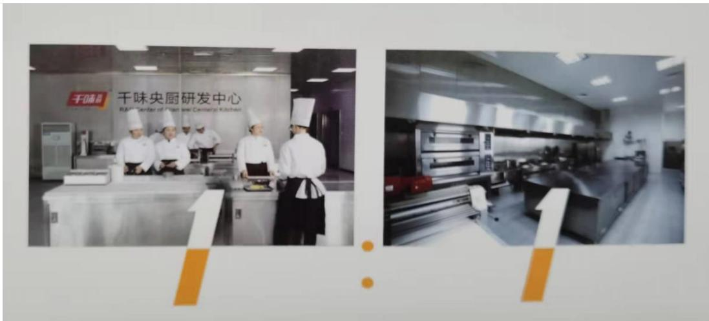  
图表24公司研发定位后餐厅后廚  
资料来源：公司宣传手册，华创证券

千味的研发优势在于大客户的方案解决能力。千味在定制品研发时，大客户通常并不指定具体产品，而是提前半年到一年提出某一细分场景下的需求。公司通过项目经理对接大B发掘客户需求，按产品分小组快速推进产品研发，3-7 天即可提供体验性产品供选择，十大客户每年至少 1184 件、24000 粒产品送样，以最快速度反馈客户的产品需求。配合柔性供应链，公司能够在 3-6 个月内满足客户从提案到交付，同时定期研讨产品升级方向，调整供应产品的配方、口感、包装等。

核心产品的研发精益求精、层层把关。公司对研发有着较高追求和执着，如为解决外卖油条久置后口感变差的问题，公司历时 578 天，经过 428 次实验，数次调整配方改进工艺，最后引入预炸工艺实现40 秒极速出餐。此外公司团队联合三位拥有多年经验的油条大师，历时 820 天，经过 3720 次实验，从外形、大小、克重等着手，延伸拓展了油条狭义的定义。又以猪猪包为例，公司历经 856 次的试验、220 次的造型改良，细分为18道标准化工艺，最终才得以造就一颗小小的卡通包。

图表25千味和安井研发体系和流程对比  

<table><tr><td colspan="2">千味央廚 VS</td><td>安井</td></tr><tr><td>41</td><td>研发人数</td><td>456</td></tr><tr><td>899万</td><td>研发费用</td><td>8779万</td></tr><tr><td>油炸类、烘焙类</td><td>聚焦品类</td><td>火锅料、发面类</td></tr><tr><td>倾向整体方案：“模拟后厨”为大客户提供 整套系统方案而非具体产品</td><td></td><td>研发迭代：研发一代、生产一代、储备一代</td></tr><tr><td>多裂变拳头产品：细分消费场景拓展 服务大客户：定制客户每年千余件送样</td><td>研发理念</td><td>大单品路线：全渠道适用，全区域适销 模仿创新：及时跟进、持续改进、适度创新</td></tr><tr><td>上海、郑州两个研发中心</td><td>研发中心</td><td>产地研：总部负责立项、策划，各基地负责 某一品类的研发</td></tr></table>

<table><tr><td>客户需要-产品定制-产品送样-客户反馈- 客户NPC-生产上市</td><td>研发流程</td><td>信息组收集信息-产品研发组小试研发-技术 研发组转化量产</td></tr><tr><td>下设产品研发、工艺研发等和上海研发</td><td>组织架构</td><td>按职能不同分设六个功能小组，各基地分类</td></tr><tr><td>室，产品研发再根据产品类别细分小组 年新增约 50-60个 sku,</td><td>推新数量</td><td>别负责特定新品研发任务 每年推出多款新品，但聚焦2-3个大单品</td></tr><tr><td>定制品质量较高、非油炸类通用品反馈 较一般</td><td>产品品质</td><td>高质中高价</td></tr></table>

资料来源：公司官网，公司公告，草根调研，华创证券

对比安井：千味在研发深度上更执着，但研发投入、通用品开发上还有不足。从研发思路来看，千味主要根据客户需要针对性推进研发，每年研发品相较多，资源更多集中在定制品或核心产品上，并在垂直方向上更加极致，而通用品研发多在定制新品基础上稍作修改，对市场变化反应或存在不够灵活的缺点，但在细分品类善于挖掘差异化需求。而安井则善于通用品的研发，除了全年研发投入力度大之外，思路安排更加灵活，不仅在全国各个基地推进产地研，而且善于模仿和跟进热点产品，同时侧重大单品的挖掘，每年推出多款新品但聚焦2-3个单品，综合保证每年研发效率。

# 3、渠道开发：以头部客户为抓手的灯塔战术

核心思路：依托大客户品牌背书，灯塔战术下开发效率提高。千味通过与大型连锁客户的合作，在高标准严要求下，产品开发、一站式服务能力经过千锤百炼，较同行更为领先。千味可将服务头部客户的思路转化至中小型连锁餐饮，产品在大型连锁餐饮端被验证后，在克重、规格、馅料、形状等属性上稍作修改即可进行渠道拓展，用于服务更多中小型餐饮客户，渠道综合开发效率更高。

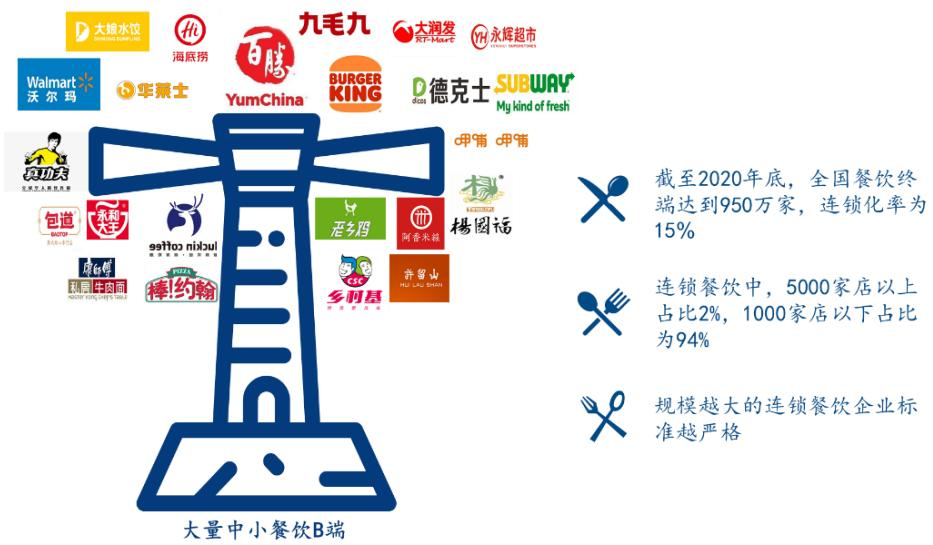  
图表26渠道开发中遵循灯塔战术  
资料来源：公司官网，美团，华创证券

大客户开发：树立“大客户优先”理念，分品类从上而下开拓直营客户。公司成立对接大客户的内部小组，董事长和总经理为小组负责人，营销部门单独设立重客部，确保快速响应大客户的需求，在具体开发过程中，公司梳理各餐饮消费场景的头部客户，自上而下从TOP3向TOP10 拓展新客户，并成立包括市场、研发、商务等专项小组，由专项组与客户沟通定向解决问题，且筛选出优质客户，针对优质客户进行饱和式资源投入，通常大客户会有1-3 年考察期，且前期产品数量一般为 1-2 个，随着合作程度的加深，品类数目、供应份额才是营收的主要来源，如千味凭借产品质量与成本控制，同KFC合作30个SKU，油条、挞皮供应份额分别高达 $1 0 0 \%$ 、 $8 0 \%$ 。

  
图表 27公司经销和重客部独立管理  
资料来源：公司公告，华创证券

  
图表28千味央廚核心客戶规模和增速  
资料来源：公司公告，华创证券。注：单位为万元

经销渠道布局：未来提升空间较大，省内渠道布局更强。千味目前覆盖全国 230 个地级市（占全国 $6 0 \%$ )，依然存在较大空白市场，且公司在不同区域采取不同经销代理政策，省内县级经销商全覆盖，周边省份部分县级代理，外围地区地级代理，整体省内渠道布局更加强劲，下游场景多以团餐和乡村宴席为主，但目前公司经销商体量仍然较小，主要以 100 万以下中小客户居多，且由于千味销售人员较少，开发终端、后续运营等均交于经销商负责，服务力度方面与同行比仍有差距。

图表29主要速冻企业渠道体系对比  

<table><tr><td colspan="2">安井食品</td><td>千味央廚</td><td>三全食品</td></tr><tr><td>经销商数量</td><td>1652</td><td>968</td><td>5638（绿标约1200）</td></tr><tr><td>经销商体量</td><td>5-10个过亿经销商，5千万级经 销商不少，平均500 万左右</td><td>主要为100 万元以下的中小经销客户</td><td>最大经销商约2500万，规模较居中</td></tr><tr><td>经销商角色</td><td>管理底下的二批商，按照业务员 指引进行陈列、推广等</td><td>开发终端、后端运营、交易维护、运输 等均由经销商负责</td><td>进行推广、促销，拓展终端</td></tr><tr><td>下游场景</td><td>团餐占比约 20%，其他小B(麻 辣烫、火锅等）占大头 地级市全覆盖，全国基本没有空</td><td>团餐20%、乡厨30%、火锅30%、早 餐20%</td><td>绿标餐饮端占比不高，主要为农贸市场 （50%流入家庭）、社区团购等</td></tr><tr><td>区域覆盖</td><td>白市场。不同地区因地制宜设置 省级、市县级、密集销售</td><td>销售渠道覆盖全国 230个地级市(≈ 60%)，依然存在较大空白市场。</td><td>直营+经销商+销售子公司，实现省、市、 县级基本全覆盖，逐步推进乡镇市场，销 售终端超 20 万</td></tr><tr><td>强势区域</td><td>华东、东南 经销商对接70-80 个分销商或河南县级经销商基本覆盖，周边省份部</td><td>华中（河南周边）</td><td>华北、东北（绿标为中区）</td></tr><tr><td rowspan="2">下沉程度</td><td>二批进县级市场，全国性、区域分下沉至县级，其他地区基本为地级市</td><td></td><td>销售分公司直接对接二批与县级市场，经</td></tr><tr><td>卖场铺货率达100%/20%</td><td>经销商</td><td>销商深入县级，发达地区的镇级甚至配备 经销商</td></tr></table>

资料来源：公司公告，草根调研，华创证券

经销渠道管理：经销渠道起步虽晚，但管理逐步趋于规范，当下重点是提升单商体量。公司16 年初步开拓经销业务，19 年起逐步规范经销商管理，关于架构设置、经销商考核、费用投入、业务员职责等规定严格起来，相比于同行，千味渠道利润略高，但整体管理成熟度还有不足，其中业务团队人数、对经销商支持力度较弱，因此公司目前重点是抓大放小，政策、补贴向大商倾斜，一方面提出打造 20个千万级、50个百万级经销商计划，21-23 年分别夯实1000 万 $^ +$ 、800万 $^ +$ 、500万 $+ .$ 三个层次经销商基础。另一方面逐步学习安井经验，通过帮助经销商开发客户（侧重连锁和团餐等大客户）、提供培训和转型支持等方式建立渠道粘性。

图表30主要速冻企业渠道管理制度对比  

<table><tr><td></td><td>安井食品</td><td>千味央廚</td><td>三全食品</td></tr><tr><td>总体架构</td><td>络处、直营工作站辐射周边。</td><td>全国设8 大销售区，每省配联 设置经销商客户部，全国划分8个大区，“总 大区包干模块化管理，各部门有相应负 监-省区经理-业务主管-业务代表&quot;</td><td>责人。</td></tr><tr><td>经销模式</td><td>大经销商深化服务市场。</td><td>河南周边县级分渠道经销，外围地区市级 代理。</td><td>多经销商扁平化模式+销售子公司对接 分销、二批</td></tr><tr><td>销售人员</td><td>4367</td><td>223</td><td>3265</td></tr><tr><td>利润空间</td><td>10-15%</td><td>批发毛利10%，零售毛利20% 按月考核，对单品无要求，若两个月没达</td><td>10-15%</td></tr><tr><td>考核方式</td><td>经销商按年度考核（20%）逐 步转成按季度考核</td><td>到目标考虑踢出。考核期内采购额同增 20%+即可享受回款额1%的奖励</td><td>硬性要求按月考核（25%），对净利率 有一定要求 销售费用由经销商上报，达到相应效果</td></tr><tr><td>费用投入</td><td>布置等费用均由公司承担 优先选择“四有”经销商，同时</td><td>广告投入、营销、店招、海报推广、地推等前端费用由公司承担，对经 销商有一定补贴。</td><td>后公司予以核销，若未完成销售目标则 当月费用不做核销。 各地分支机构充当大经销商，同时多采</td></tr><tr><td>经销商选择</td><td>分渠道分拆</td><td>同一地区细分渠道开辟设立经销商 抓大放小，有限资源向大经销商倾斜，其</td><td>用小商制引入专职经销商，充分下沉</td></tr><tr><td>经销商服务</td><td>贴身服务扶持经销商，业务员 一般只负责一家经销商 安井之家 CRM,经销商网络下</td><td>他经销商打样即可，业务主管负责1-2个地 级市</td><td>每月安排推广促销活动，若完成目标进 行一定返点</td></tr><tr><td>信息化程度</td><td>单即可 代言人+直播+冠名综艺+大面</td><td>无</td><td>信息化系统部分普及 精准内容营销，强化产品高端、健康形</td></tr><tr><td>营销活动</td><td>积户外广告 一周多次发货，到货周期7-8</td><td>地推为主，充分挖掘小B 需求 大经销商每周发货，到货周期4-5天，中小</td><td>象</td></tr><tr><td>库存周转</td><td>天，年周转 10 次</td><td>经销商按月返货，年周转约 5 次</td><td>物流到货周期10-15天</td></tr></table>

资料来源：公司公告，草根调研，华创证券

# 4、营销打法：主打厨师之选，做高品牌价值

千味营销以地推为主，精准面向厨师群体。千味的营销更侧重对厨师、店主的输出，更侧重性价比、操作方便，在实际宣传时直接给终端计算出使用该产品的预期收益与节省成本。同时公司通过“只为餐饮，厨师之选”标语，对外明确特供餐饮的服务商角色，子公司运营餐饮老板内参等自媒体频繁植入软广，强调自身更专业的品牌形象。实际操作过程中千味新品多以地推为主，优先向标杆客户登门展示，之后再全面撒网逐一进行推广。而安井、三全等营销打法相对多元，如综艺冠名、电视广告、品牌代言人和内容、娱乐营销等，综合目标群体更侧重C端消费群体。

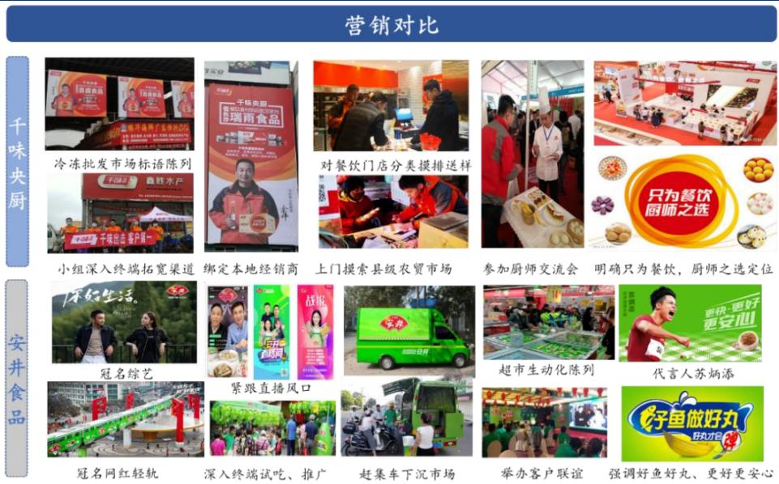  
图表31千味以餐饮和厨师为营销对象  
资料来源：公司官网，华创证券

# 5、供应链布局：柔性化生产，运营稳定高效

千味已形成全流程完备供应链。采购端方面，公司联合众品、黄河金等食材商共同成立了餐饮食材联盟，与供应商合作在全国建立蔬菜基地，并要求供应商提供相应检测报告。质控端方面，公司引入无死角监控系统，同时配备专业质检团队监测各工艺节点，保证生产严格按流程进行。运输端方面，公司立体冷库可荷载 38000 吨产品，运输车辆安装GPS 系统与温控仪，全程监控冷链运输过程，确保产品流通环节质量安全。最后销售交付方面，对长期合作的大B直营给予超过3 个月的信用期，经销商则先款后货。

  
图表 32千禾和安井供应链流程控制  
资料来源：公司公告，华创证券

定制模式下，公司柔性化生产能力强。传统巨头多在规模化、自动化发力，公司在生产上更灵活，通过调整部分产线设备，即可实现不同规格、大小、性能产品的生产，满足其他客户的需求。公司凭借多年经验积累，可以兼顾生产弹性与效率，短时间（1天内）内迅速切换生产，保证产品交付与供应。

公司依托外协逐步布局全国。对比看三全、安井速冻巨头均基本实现产地销，现阶段千味主产区位于河南郑州、新乡，此外通过在辽宁（主要为芝麻球、地瓜丸等）、鹤壁（主要为油条、卡通包等产品）等地的外协具有部分产能，21年生产规模1.48万吨（占比$1 4 . 8 \%$ ，金额1.23 亿)，21 年华东基地落地安徽芜湖（22 年中投产，产能 $^ { 3 + }$ 万吨)。目前公司直营业务占比较多，运输区域集中，吨运费较低，后续随着经销业务扩张、渠道下沉，基地全国化布局能冲抵部分运输费用。

  
图表33主要速冻食品公司工厂分布  
资料来源：公司官网，华创证券

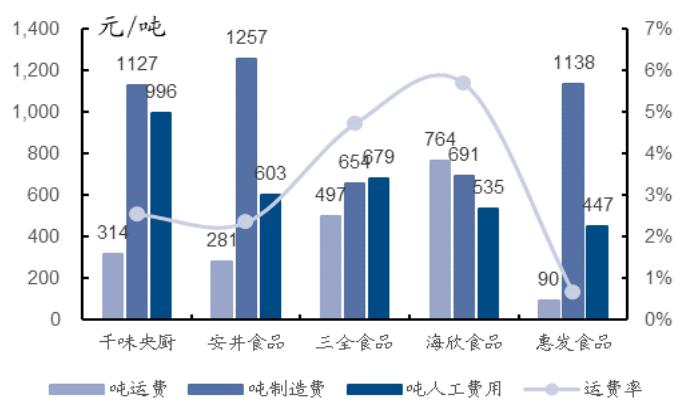  
图表 34主要速冻公司吨运费、吨制造费比较  
资料来源：公司公告，华创证券。注：数据为20 年

# 6、财务角度：盈利中枢较高，仍具备改善空间

直营和经销定价模式不同，高毛利直营拉高毛利。直营采取竞标定价方式，经销则采取成本加成方式，因此直营采用标准和原料均高于经销，且大客户多采取独供、指定采购商等方式，故 17-19 年直营毛利率大于经销模式约 8pct，如供应肯德基的油条毛利率达$3 7 \%$ ，期间公司毛利率持续上行，主要系结构改善所致，而 20 年两类模式毛利率差距缩小，主要与19 年因成本因素大幅涨价、20 年疫情下大客户降低高价产品采购有关。

展望未来，一方面生产人员数量较多、人效较低，公司对应成立设备动力部，提高机械化水平，规划“30亿规模前，保持一线生产人员在现有水平”，可提振毛利率3pcts4，另一方面疫情影响过后，直营渠道毛利率若恢复至 $2 5 \%$ 以上，加上高毛利率的油条和烘焙产品导入、削减低毛利的芝麻球和地瓜丸，有望拉动毛利率1-2pcts，当然实际提升幅度与竞争有关，但公司毛利率相比竞对仍有3-4pct 差距，故毛利率仍具备改善机会。

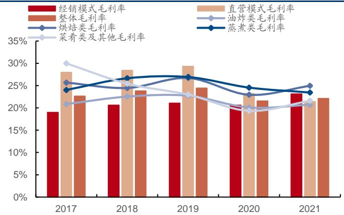  
图表35直营模式毛利率接近 $3 0 \%$   
资料来源：公司公告，华创证券

  
图表36千味央廚毛利率在行业中处较低水平  
资料来源：公司公告，华创证券。注：数据为21年

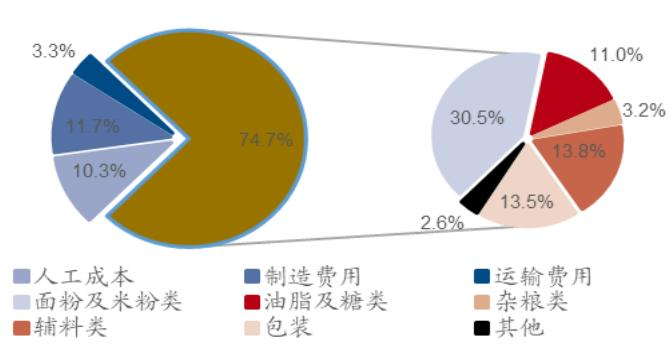  
图表 37公司成本组成  
资料来源：公司公告，华创证券。注：数据为20 年  
资料来源：华创证券。注：数据为21年，且安井人效较低主要与近期湖北、河南、四川等产能尚处于爬坡期，而生产人员通常提前招收有关

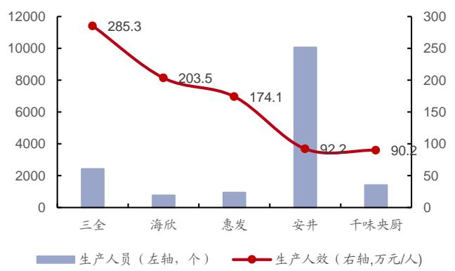  
图表38千味央廚人效提升空间大

费用端在定制模式下，销售费用率较低，管理费用望受益规模效应。大B 模式下，客户体量大且数量较少，保证销售和市场费用方面支出少，21 年公司销售人员数量 223名，远低于可比公司数量（安井超3000 名、其他公司在 $3 0 0 \lambda +$ )，考虑当下重点是培育大经销商，30 亿前销售人员扩张有限，销售费用率仍将保持较低水平。管理费用方面，人员和公司经费支出略高于业内平均，随着规模效应提升，管理费用率预计小幅改善。

图表39主要可比公司费用结构拆分  

<table><tr><td colspan="2"></td><td>安井食品</td><td>三全食品</td><td>千味央廚</td><td>海欣食品</td><td>惠发食品</td><td>均值</td></tr><tr><td rowspan="7">销售费用拆 分</td><td>职工薪酬</td><td>3.1%</td><td>5.8%</td><td>2.1%</td><td>7.9%</td><td>4.4%</td><td>4.7%</td></tr><tr><td>运输费</td><td>0.0%</td><td>0.0%</td><td>0.0%</td><td>0.0%</td><td>0.1%</td><td>0.0%</td></tr><tr><td>办公费</td><td>0.0%</td><td>3.4%</td><td>0.0%</td><td>0.5%</td><td>0.2%</td><td>0.8%</td></tr><tr><td>市场推广费</td><td>3.7%</td><td>2.9%</td><td>0.3%</td><td>2.1%</td><td>4.4%</td><td>2.7%</td></tr><tr><td>折旧及其他</td><td>2.3%</td><td>0.9%</td><td>0.8%</td><td>2.3%</td><td>0.0%</td><td>1.3%</td></tr><tr><td>合计</td><td>9.2%</td><td>13.0%</td><td>3.3%</td><td>12.7%</td><td>9.1%</td><td>9.5%</td></tr></table>

<table><tr><td rowspan="5">管理费用拆 分</td><td>人员经费</td><td>1.8%</td><td>1.4%</td><td>3.2%</td><td>2.8%</td><td>4.8%</td><td>2.8%</td></tr><tr><td>公司经费</td><td>0.0%</td><td>1.2%</td><td>2.3%</td><td>0.0%</td><td>2.5%</td><td>1.2%</td></tr><tr><td>办公经费</td><td>0.2%</td><td>0.1%</td><td>0.6%</td><td>0.8%</td><td>0.0%</td><td>0.3%</td></tr><tr><td>折旧及其他</td><td>1.4%</td><td>0.1%</td><td>2.4%</td><td>2.7%</td><td>4.4%</td><td>2.2%</td></tr><tr><td>合计</td><td>3.4%</td><td>2.8%</td><td>8.4%</td><td>6.3%</td><td>11.7%</td><td>6.6%</td></tr></table>

资料来源：wind，华创证券。注：数据均为21 年

低费用率支撑公司净利率，加上资产周转率较高，19-21年ROE 均值达 $1 5 . 7 \%$ ，高于行业其他企业，未来盈利潜力主要来自毛利端。一方面公司主要开发餐饮大客户，市场拓展费用支出较少，致净利率近三年维持在 $7 . 7 6 \%$ ，构成ROE领先的主因，另一方面，大客户采取柔性化定制生产，公司以销定产下致存货周转率较高，加上前两年新工厂未落地，产能供给紧张下略有推升固定资产周转率，综上，总资产周转率略高于行业平均。而净利率改善潜力，主要来源于毛利率提升和管理费用率优化。

图表40主要速冻食品公司ROE 拆分  

<table><tr><td></td><td>千味央廚</td><td>均值</td><td>安井食品</td><td>三全食品</td><td>海欣食品</td><td>惠发食品</td></tr><tr><td>ROE(%)</td><td>15.70</td><td>9.68</td><td>16.65</td><td>20.08</td><td>1.78</td><td>(5.82)</td></tr><tr><td>总资产周转率</td><td>1.13</td><td>1.13</td><td>1.10</td><td>1.18</td><td>1.18</td><td>1.08</td></tr><tr><td>其中:固定资产周转率</td><td>2.59</td><td>3.59</td><td>3.77</td><td>3.92</td><td>4.94</td><td>2.73</td></tr><tr><td>存货周转率</td><td>7.55</td><td>4.96</td><td>3.08</td><td>3.68</td><td>3.75</td><td>6.77</td></tr><tr><td>应收账款周转率</td><td>20.77</td><td>16.91</td><td>28.15</td><td>19.47</td><td>7.53</td><td>8.61</td></tr><tr><td>销售净利率（%)</td><td>7.76</td><td>4.42</td><td>7.72</td><td>7.99</td><td>0.84</td><td>(2.19)</td></tr><tr><td>其中:毛利率</td><td>22.16</td><td>23.38</td><td>24.01</td><td>30.16</td><td>23.66</td><td>16.91</td></tr><tr><td>销售费用率</td><td>3.87</td><td>10.85</td><td>10.23</td><td>18.00</td><td>14.94</td><td>7.19</td></tr><tr><td>管理费用率</td><td>8.68</td><td>6.92</td><td>4.67</td><td>4.05</td><td>6.69</td><td>10.51</td></tr><tr><td>权益乘数</td><td>1.70</td><td>1.91</td><td>1.90</td><td>2.14</td><td>1.66</td><td>2.13</td></tr></table>

资料来源：wind，华创证券。注：数据均为19-21 年三年平均值

# （三）结论与建议：切入通用初步顺利，仍需持续平衡效率

# 1、当前阶段：大客户优势向通用品快速扩散期

千味在大B 渠道优势显著。千味精准定位B 端需求，研发思路上千味分小组聚焦定制品研发，在新品研发、送样、生产上动作迅速及时，且通过近 20 年经验，已经摸索出一套完备一站式重客服务能力。此外由于大客户对产品全流程质控均更关注，而千味已形成包含采购、生产、运输、质控在内的完备供应链体系，实现柔性化生产。故千味在百胜中国品牌背书下，在客户、份额、品类上的具备横向拓展能力。

在小B通用品发展上尚处于起步阶段。千味经销业务起步晚，下沉程度、覆盖区域及经销商体量均与三全、安井有所差距，且在销售人员配置和管理上较弱，难以在小B 端形成比较优势，加上体量较小规模效应偏弱、研发上未完全适应通用品市场变化，预计整体通用品业务的发展还需要不断调整和完善。

依托大B 端积累优势，自上而下辐射经销渠道，当下仍处于红利快速释放阶段。大B 端进入门槛高，千味先发优势明显，并在过程中持续打磨了自身能力，当下以在大B 积累的产品和品牌优势，降维来推动小B 发展，这是符合更大成长空间的选择，且预计前期协同效应仍会比较明显，但随着时间推移，长期来看制约企业的瓶颈，仍是通用品能力培养成功与否，即更标准的生产和更低生产成本、通用大单品的洞察力和中小餐饮的渠道服务力，此外资源在定制部门和通用品部门的平衡亦是考验。

# 2、企业建议：持续探索深度和广度的平衡点

柔性化定制天花板有限，规模性是永恒的命题。正如前文所言，定制化择高处立，易于企业塑造差异化，且适合前期切入，但发展到一定阶段后，非标的品类和日益复杂的服务，或超出企业能力边界，发展天花板随之而来，因此降低系统的复杂度，并提高运行的规模性，将是公司面临的长久命题。

丰富拳头型单品的矩阵。渠道反馈公司当前大单品数仍少，除了油条和蒸煎饺外，未行形成能满足渠道灵活运行的产品矩阵，且产品SKU数量较多，随着大客户持续增加，该问题会持续凸显。故建议选择好特定方向，持续聚焦并培育自身优势大单品，避免撒胡椒粉式发展、被大客户牵着走。

大客户也可分级。可以根据自身情况、客户潜力，划定大客户级别，仅有限的大客户可匹配柔性化供应链，且对于特定场景、特定功能（如研发）内部指定有限大客户，最后根据企业能力选择合适开拓节奏，先求深度，再求广度。

提高经销渠道管理效率。经销渠道管理难度高，但未来发展空间也更大，可借鉴行业龙头企业经验，探索经销渠道发展思路，在做大单商体量同时，可逐步增大经销渠道业务员数量，结合自身优势主动赋能经销商，提高渠道粘性。同时长期来看，发展差异化C端品类，对于提高盈利能力、单品规模均有正向帮助，在巩固好已有优势后亦可逐步探索。

# 三、未来展望：品类和渠道双轮扩张，具备跃迁至30 亿级别潜力

# （一）产能布局：规划产能超20 万吨，打开成长瓶颈

规划产能达20 万吨以上，并推进核心技术研发。本次上市公司拟投入募集资金2.8亿元，其中2.5 亿元用于新乡三期建设，对应速冻米面制品 8 万吨产能，预计将于 2023 年 6 月投产，项目建成后，公司将由 20 年约 12.8 万吨的基础上增加到 19.6 万吨。而从过往产能设计与实际利用情况看，公司 18-19 年产能利用率处在高位，旺季需满负荷运行，新乡一期和二期在 19-20 年陆续投产，推动公司产能从 18 年 6.7 万吨增长至 21 年的 15.8万吨（含外协)。公司本次募投志在长远，未来产能释放有望较好匹配公司营收增长。同时公司投入0.32 亿元支撑技术研发，持续夯实创新优势。

图表41募投项目情况  

<table><tr><td>项目</td><td>投资总额(万 元）</td><td>募集资金投入金额（万 元）</td><td>满产年增利 产能（万吨） 润（万元）</td><td>建设期</td></tr><tr><td>新乡三期</td><td>37682</td><td>24976 8</td><td>8932</td><td>24个月</td></tr><tr><td>总部基地及 研发中心</td><td>5980</td><td>3237</td><td></td><td>24个月</td></tr></table>

资料来源：公司公告，华创证券

图表42公司产能规划安排  

<table><tr><td>项目</td><td>投产日 期</td><td>设计产能</td><td>2018</td><td>2019</td><td>2020</td><td>2021</td><td>2022E</td><td>2023E</td><td>2024E</td><td>2025E</td></tr><tr><td>英才街</td><td>2012</td><td></td><td>4.2</td><td>3.9</td><td></td><td></td><td></td><td></td><td></td><td></td></tr><tr><td>红枫里</td><td>2017</td><td></td><td>2.2</td><td>2.5</td><td>2.7</td><td>2.7</td><td></td><td></td><td></td><td></td></tr><tr><td>新乡一期</td><td>2018.12</td><td>6.8</td><td></td><td>3.5</td><td>6.8</td><td>6.8</td><td>6.8</td><td>6.8</td><td>6.8</td><td>6.8</td></tr><tr><td>新乡二期</td><td>2020.2</td><td>4.8</td><td></td><td></td><td>3.3</td><td>4.8</td><td>4.8</td><td>4.8</td><td>4.8</td><td>4.8</td></tr><tr><td>新乡三期</td><td>2023.6</td><td>8</td><td></td><td></td><td></td><td></td><td></td><td>2.4</td><td>5.6</td><td>8.0</td></tr><tr><td>安徽芜湖</td><td>2022.5</td><td></td><td></td><td></td><td></td><td></td><td>2.4</td><td>3.2</td><td>4.0</td><td>4.0</td></tr><tr><td>合计产能</td><td></td><td></td><td>6.4</td><td>9.9</td><td>12.8</td><td>14.3</td><td>14.0</td><td>17.2</td><td>21.2</td><td>23.6</td></tr><tr><td>YOY</td><td></td><td></td><td>0%</td><td>55%</td><td>29%</td><td>12%</td><td>-2%</td><td>23%</td><td>23%</td><td>11%</td></tr><tr><td>辽宁外协</td><td>2012</td><td></td><td>0.3</td><td>0.3</td><td></td><td>1.5</td><td>0.3</td><td>0.3</td><td>0.3</td><td>0.3</td></tr><tr><td>鹤壁外协</td><td>2020</td><td></td><td></td><td></td><td>0.7</td><td></td><td>0.5</td><td>0.5</td><td>0.5</td><td>0.5</td></tr><tr><td>合计</td><td></td><td></td><td>6.7</td><td>10.2</td><td>13.5</td><td>15.8</td><td>14.8</td><td>18.0</td><td>22.0</td><td>24.4</td></tr><tr><td>YOY</td><td></td><td></td><td>0%</td><td>52%</td><td>33%</td><td>11%</td><td>-6.3%</td><td>22%</td><td>22%</td><td>11%</td></tr></table>

资料来源：公司公告，华创证券。注：1.表格产能数据单位为万吨。2.公司新乡工厂多为旧厂产能转移，且芜湖工厂为租建厂，故投产速度相对更快。3.芜湖厂区按相对面积计算满为产4万吨。4.假设委托加工规模在未来保持平稳。5.新乡三期按招股书 $30 \% 7 0 \% / 1 0 0 \%$ 估算，实际投产节奏应更快。

# （二）成长驱动：品类和场景延伸，渠道加快扩张

产能和渠道扩张驱动，叠加强场景延伸能力，公司成长路径清晰。公司巩固华中地区优势后，以租赁或外协形式向东北、华东等地区扩张，同时渠道裂变步入加速期，直营大

B 客户势能积累充分，公司顺势加大经销渠道开发，当下仍处高增长阶段。消费场景方面，公司针对各类场景积极推新，即使同一产品，公司也做规格口味的细分，并于 19 年推出“焙伦”品牌进一步拓展烘焙品类，综合从横向铺市、特定单品纵向挖潜两方面，强化公司收入增量来源。而短期而言，品类上主打油炸类（油条 25 年达 10 亿）和烘焙类，蒸煮产品与市场保持同步，而渠道上则围绕西式快餐、咖啡茶饮和团餐等重点开发。

渠道扩张潜力仍足。大客户渠道方面，百胜渠道 21 年营收 2.45 亿，仍有望跟随百胜开店、品类渗透增长，22 年预计增长 $8 \%$ ，而华莱士和海底捞等营收规模仍小，对比百胜渠道渗透率，提升空间更加充分，未来随着餐饮连锁化率提升，还会有更多头部品牌作为公司大客户放量。而经销商渠道方面，根据公司此前“320 计划”5、着力提升单经销商进入百万范围，当前平均体量仅70万，单商体量具备 $5 0 \%$ 提升空间。

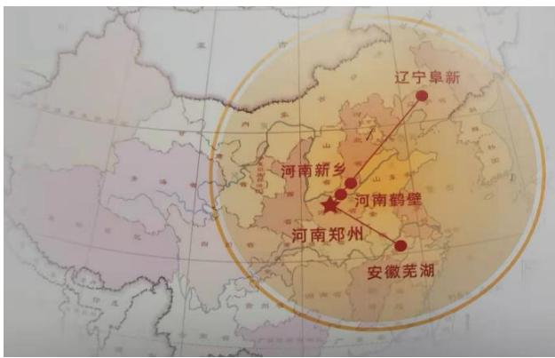  
图表43公司从华中逐步向华东和东北扩张  
资料来源：公司宣传手册，华创证券

图表44消费场景逐步多元化  

<table><tr><td>消费场景 市场规模</td><td>公司产品</td></tr><tr><td>乡廚</td><td>3500-4000亿　芝麻球、地瓜丸、南瓜饼等</td></tr><tr><td>团餐 1.53万亿</td><td>煎饺、米糕、春卷、油条</td></tr><tr><td>婚宴/寿宴</td><td>约3500亿 猪猪包、寿桃包等象形面点</td></tr><tr><td>早餐</td><td>1.75万亿 油条、手抓饼、米糕、花卷、 胡辣汤等</td></tr><tr><td>粥饭快餐</td><td>约3000亿 油条、春卷、煎饺等</td></tr><tr><td>火锅</td><td>4998亿 火锅油条、茴香小油条、各类 火锅料</td></tr><tr><td>麻辣烫/冒菜/水煮</td><td>1188亿 涮煮小油条、各类丸子</td></tr><tr><td>烘焙</td><td>2358亿 挞皮、华夫饼、可颂、曲奇</td></tr></table>

图表45按照渠道拆分增长情况  

<table><tr><td colspan="2"></td><td>2017</td><td>2018</td><td>2019</td><td>2020</td><td>2021</td><td>未来预期</td></tr><tr><td rowspan="4">百胜中国</td><td>该品牌营收(亿)</td><td>344</td><td>386</td><td>410</td><td>390</td><td>429</td><td rowspan="4">假设肯德基营收维持 5-8% 增速，公司单店营收持平，预</td></tr><tr><td>公司在该品牌营收(百万)</td><td>178</td><td>212</td><td>273</td><td>221</td><td>245</td></tr><tr><td>门店数量（家）</td><td>5488</td><td>5910</td><td>6534</td><td>7166</td><td>8168</td></tr><tr><td>平均营收(万元/家)</td><td>3.24</td><td>3.58</td><td>4.18</td><td>3.08</td><td>计未来增速6-10% 3.00</td></tr><tr><td rowspan="4">华莱士</td><td>该品牌营收(亿)</td><td>16</td><td>23</td><td>26</td><td>35</td><td>56</td><td rowspan="4">假设华莱士开店速度维持 15%增速，公司单店营收增 速30%，预计未来增速</td></tr><tr><td>公司在该品牌营收(百万)</td><td>13</td><td>24</td><td>26</td><td>40</td><td>71</td></tr><tr><td>门店数量（家）</td><td>9000</td><td>10000</td><td>12000</td><td>14000</td><td>16000</td></tr><tr><td>平均营收(万元/家)</td><td>0.15</td><td>0.24</td><td>0.21</td><td>0.29</td><td>0.44 50+%</td></tr><tr><td rowspan="4">海底捞</td><td>该品牌营收(亿)</td><td>107</td><td>170</td><td>266</td><td>287</td><td>413</td><td rowspan="4">假设海底捞营收维持 12%增 速，公司单店营收增速 40%， 预计未来增速 50+%</td></tr><tr><td>公司在该品牌营收(百万)</td><td></td><td></td><td></td><td>2087</td><td>6269</td></tr><tr><td>门店数量（家)</td><td>254</td><td>430</td><td></td><td>1205</td><td>1329</td></tr><tr><td>平均营收(万元/家)</td><td></td><td></td><td>716</td><td></td><td></td></tr><tr><td rowspan="2">直营客户合计</td><td>营业收入（百万元）</td><td></td><td></td><td></td><td>1.73</td><td>4.72</td><td rowspan="2">营收增速15-20%</td></tr><tr><td>YOY</td><td>241</td><td>285 18.5%</td><td>365 27.8%</td><td>337</td><td>511 51.6%</td></tr><tr><td rowspan="2">经销客户</td><td>营业收入（百万元）</td><td>352</td><td>416</td><td>524</td><td>-7.6% 605</td><td>759</td><td rowspan="2">假设经销商增速 15%，单经 销商体量增速 15%，预计营</td></tr><tr><td>YOY</td><td></td><td>18.0%</td><td>26.1%</td><td>15.5%</td><td>25.4%</td></tr></table>

资料来源：Euromonitor，中国饭店协会，雀巢餐饮，英敏特，艾媒咨询，华创证券

5 围绕 TOP300 客户，进行360 度深度服务，打造 20 个千万级经销商（平台商），50 个百万级别经销商，100 个三百万以上级别客户

<table><tr><td></td><td>客户数量（家）</td><td>521 606</td><td></td><td>748</td><td>907</td><td>968</td><td rowspan="3">收增速 20-25%</td></tr><tr><td>平均营收(万元/家)</td><td>67.61</td><td>68.59</td><td>70.07</td><td>66.75</td><td>78.41</td></tr></table>

资料来源：公司公告，华创证券预测，注：百胜中国品牌营收为肯德基系统营收，华莱士品牌营收为母公司华士食品营收，门店数量为估算

# 四、投资建议：首次覆盖目标价55 元，给予“推荐”评级

# （一）中期增速：CAGR3接近 $2 5 \%$ ，净利率维持 $7 . 8 \%$ 较高水平

收入端，预计未来三年收入可实现近翻倍，CAGR3 接近 $2 5 \%$ 。公司前期通过差异化策略，在油炸品、大客户渠道方面沉淀了成功经验，当下募投上市，一方面募投扩产打开产能瓶颈，另一方面加速区域扩张和经销商渠道开发，加上在烘焙类、蒸煮类方面持续开发新产品和新场景。具体来看，量的角度结合当下产能利用率未来复合增速在 $2 0 \%$ ,此外价的角度，蒸煮类、烘焙类等高价产品占比提升有望进一步贡献收入增长，结合公司股权激励方案，收入增长的确定性进一步强化，预计未来5年处于快速扩张阶段。

图表46千味央厨收入拆分和预测表  

<table><tr><td>业务</td><td>项目名称</td><td>2017</td><td>2018</td><td>2019</td><td>2020</td><td>2021</td><td>2022E</td><td>2023E</td><td>2024E</td><td>2025E</td></tr><tr><td rowspan="5">公司整体</td><td>营收（百万元）</td><td>593</td><td>701</td><td>889</td><td>942</td><td>1274</td><td>1531</td><td>1912</td><td>2357</td><td>2885</td></tr><tr><td>yoy</td><td></td><td>18.2%</td><td>26.8%</td><td>6.0%</td><td>34.9%</td><td>20.2%</td><td>24.9%</td><td>23.3%</td><td>22.4%</td></tr><tr><td>毛利率</td><td>22.6%</td><td>23.8%</td><td>24.5%</td><td>21.5%</td><td>22.4%</td><td>22.0%</td><td>23.4%</td><td>24.0%</td><td>24.4%</td></tr><tr><td>销量（万吨）</td><td>5.50</td><td>6.36</td><td>7.66</td><td>7.67</td><td>11.46</td><td>13.30</td><td>16.46</td><td>19.98</td><td>24.12</td></tr><tr><td>吨价（万元/吨）</td><td>1.08</td><td>1.10</td><td>1.16</td><td>1.23</td><td>1.11</td><td>1.15</td><td>1.16</td><td>1.18</td><td>1.20</td></tr><tr><td rowspan="5">油炸类</td><td>营收（百万元）</td><td>352</td><td>402</td><td>492</td><td>521</td><td>660</td><td>776</td><td>972</td><td>1199</td><td>1472</td></tr><tr><td>yoy</td><td></td><td>14.2%</td><td>22.2%</td><td>6.0%</td><td>26.7%</td><td>17.5%</td><td>25.2%</td><td>23.3%</td><td>22.8%</td></tr><tr><td>毛利率</td><td>20.9%</td><td>22.5%</td><td>22.7%</td><td>20.2%</td><td>20.7%</td><td>20.3%</td><td>22.3%</td><td>23.1%</td><td>23.8%</td></tr><tr><td>销量（万吨）</td><td>3.58</td><td>4.12</td><td>4.92</td><td>4.89</td><td>6.36</td><td>7.19</td><td>8.92</td><td>10.84</td><td>13.11</td></tr><tr><td>吨价（万元/吨)</td><td>0.99</td><td>0.98</td><td>1.00</td><td>1.07</td><td>1.04</td><td>1.08</td><td>1.09</td><td>1.11</td><td>1.12</td></tr><tr><td rowspan="5">蒸煮类</td><td>营收（百万元）</td><td>105</td><td>136</td><td>177</td><td>188</td><td>256</td><td>287</td><td>342</td><td>409</td><td>481</td></tr><tr><td>yoy</td><td></td><td>28.9%</td><td>30.3%</td><td>6.1%</td><td>36.2%</td><td>12.2%</td><td>19.4%</td><td>19.4%</td><td>17.8%</td></tr><tr><td>毛利率</td><td>24.0%</td><td>26.6%</td><td>26.9%</td><td>26.2%</td><td>23.4%</td><td>23.1%</td><td>23.8%</td><td>23.8%</td><td>23.8%</td></tr><tr><td>销量（万吨)</td><td>0.97</td><td>1.20</td><td>1.56</td><td>1.59</td><td>2.45</td><td>2.70</td><td>3.24</td><td>3.88</td><td>4.62</td></tr><tr><td>吨价（万元/吨）</td><td>1.09</td><td>1.13</td><td>1.13</td><td>1.18</td><td>1.04</td><td>1.06</td><td>1.06</td><td>1.05</td><td>1.04</td></tr><tr><td rowspan="5">烘焙类</td><td>营收（百万元）</td><td>120</td><td>153</td><td>198</td><td>184</td><td>223</td><td>260</td><td>321</td><td>409</td><td>513</td></tr><tr><td>yoy</td><td></td><td>28.0%</td><td>29.3%</td><td>-7.2%</td><td>21.7%</td><td>16.6%</td><td>23.2%</td><td>27.5%</td><td>25.5%</td></tr><tr><td>毛利率</td><td>25.7%</td><td>24.5%</td><td>26.7%</td><td>21.3%</td><td>25.0%</td><td>24.6%</td><td>26.1%</td><td>27.0%</td><td>27.4%</td></tr><tr><td>销量（万吨）</td><td>0.82</td><td>0.96</td><td>1.09</td><td>0.97</td><td>1.41</td><td>1.55</td><td>1.89</td><td>2.36</td><td>2.90</td></tr><tr><td>吨价（万元/吨）</td><td>1.47</td><td>1.60</td><td>1.81</td><td>1.90</td><td>1.59</td><td>1.68</td><td>1.70</td><td>1.74</td><td>1.77</td></tr><tr><td rowspan="5">菜肴类及其他</td><td>营收（百万元）</td><td>16</td><td>10</td><td>22</td><td>50</td><td>130</td><td>203</td><td>272</td><td>336</td><td>414</td></tr><tr><td>yoy</td><td></td><td>-36.8%</td><td>124.5%</td><td>121.7%</td><td>162.1%</td><td>56.0%</td><td>33.9%</td><td>23.6%</td><td>23.0%</td></tr><tr><td>毛利率</td><td>30.0%</td><td>25.4%</td><td>23.0%</td><td>19.3%</td><td>21.6%</td><td>22.0%</td><td>22.3%</td><td>22.7%</td><td>22.7%</td></tr><tr><td>销量（万吨）</td><td>0.13</td><td>0.08</td><td>0.09</td><td>0.23</td><td>1.24</td><td>1.86</td><td>2.42</td><td>2.91</td><td>3.49</td></tr><tr><td>吨价（万元/吨）</td><td>1.25</td><td>1.24</td><td>2.60</td><td>2.11</td><td>1.05</td><td>1.09</td><td>1.12</td><td>1.16</td><td>1.19</td></tr><tr><td></td><td></td><td></td><td></td><td></td><td></td><td></td><td></td><td></td><td></td><td></td></tr></table>

资料来源：公司公告，华创证券测算

剔除股权激励费用后，净利率有望维持在 $7 . 8 \%$ 行业较高水平。根据上文分析，毛利率短期内有所承压，但产品结构和效率优化下呈稳中有升的态势，而费用率方面，考虑到渠道拓展、小B 端开发需要，预计销售人员支出、业务宣传费逐步加大，预计 22-24 年费用率分别为 $3 . 4 \%$ ， $3 . 9 \%$ ， $4 . 4 \%$ 。而管理费用率方面，规模效应下预计长期中枢下降，不过因22-24 年股权激励费 0.20、0.19、0.07 亿，预计 22-24 年管理费用率分别为 $8 . 7 \%$ $8 . 5 \%$ 、 $7 . 7 \%$ ，整体费用端保持平稳。剔除掉短期股权激励费用因素，预计公司净利率水平有望保持在 $7 . 8 \%$ 水平。且长期随着规模效应提升下，仍有持续优化空间。

图表47千味央厨盈利预测简表（单位：百万元， $\%$   

<table><tr><td>2017</td><td></td><td>2018 2019</td><td>2020</td><td>2021</td><td>2022E</td><td>2023E</td><td>2024E</td><td>2025E</td></tr><tr><td>营业收入</td><td>592.9</td><td>700.8</td><td>888.6</td><td>944.4</td><td>1274 1531</td><td>1912</td><td>2357</td><td>2885</td></tr><tr><td>yoy</td><td></td><td>18.2%</td><td>26.8%</td><td>6.0%</td><td>34.9% 20.2%</td><td>24.9%</td><td>23.3%</td><td>22.4%</td></tr><tr><td>毛利率</td><td>22.7%</td><td>23.8%</td><td>24.5%</td><td>21.7%</td><td>22.4% 22.0%</td><td>23.4%</td><td>24.0%</td><td>24.4%</td></tr><tr><td>销售费用率</td><td>5.3%</td><td>4.9%</td><td>5.0%</td><td>3.3%</td><td>3.3% 3.4%</td><td>3.9%</td><td>4.4%</td><td>4.4%</td></tr><tr><td>管理费用率</td><td>5.6%</td><td>6.3%</td><td>7.2%</td><td>8.4%</td><td>8.4% 8.7%</td><td>8.5%</td><td>7.7%</td><td>7.4%</td></tr><tr><td>归母净利润</td><td>46.6</td><td>58.7</td><td>74.1</td><td>76.6</td><td>88.5 101.92</td><td>141.44</td><td>189.83</td><td>250.52</td></tr><tr><td>yoy</td><td></td><td>26.0%</td><td>26.3%</td><td>3.3%</td><td>15.5% 15.2%</td><td>38.8%</td><td>34.2%</td><td>32.0%</td></tr><tr><td>净利率</td><td>7.8%</td><td>8.4%</td><td>8.3%</td><td>8.1%</td><td>6.8% 6.7%</td><td>7.4%</td><td>8.0%</td><td>8.7%</td></tr></table>

资料来源：公司公告，华创证券

# （二）短期跟踪：疫情冲击有限，成本压力可控

二季度压力测试下，销售延续良性增长，全年收入保持 $2 0 \%$ 增长目标。3月华东疫情爆发来，对华东餐饮渠道冲击较大，下游大客户部分门店无法营业，大B 渠道有所受损，但4 月中旬后物流逐步畅通、销售快速恢复，且华东以外地区受影响较小，生产、物流等正常运行，同时疫情物流受阻预期下，反而刺激经销商渠道囤货，据调研反馈，公司4 月销售良性，小B增长 $2 5 \%$ ，大B增长近 $1 0 \%$ ，即便之后5-6月份疫情超预期，但2季度本身也是消费淡季，后续也可通过 3、4 季度补回。22 年全年维度看，公司完成信心仍然较足，预计其中油条、蒸煎饺分别贡献1亿 $^ { + }$ ，其他新品综合贡献1亿。

提价、锁价和结构升级，综合对冲成本压力，毛利与营收有望基本同步。公司原材料中，面粉、油脂、包装和辅料是主要的成本构成，分别占收入 $2 3 . 8 \%$ $8 . 6 \%$ $1 0 . 5 \%$ 和 $1 0 . 8 \%$ ,若全年原材料延续当前价格水平，则预计拉低毛利率2-3pcts，净利润影响在 $1 \mathrm { p c t + }$ ，不过公司已储备应对手段，一是直接提价，其中油条提价 $5 \%$ ，蛋挞提价 $3 0 \%$ ，整体提价$2 \mathrm { - } 3 \%$ ，二是公司已基本完成二季度锁价，而下半年看预计部分成本下行，三是公司通过调整品类结构，如高毛利油条和烘焙类占比提升，减少芝麻球和地瓜丸占比。最后叠加规模增长下内部效率提升，综上对冲成本压力，待成本压力逐步度过后，中期净利率有望维持在 $7 . 8 \%$ 区间。考虑Q2、Q3 基数较低，净利润有望保持较高弹性。

投资建议：首次覆盖给予目标价 55 元，给予“推荐”评级。公司在与大客户合作中打磨能力，优先头部渠道的思路清晰，募投扩产下渠道和品类持续扩张，未来3年收入有望翻倍。年内来看，二季度疫情压力下，销售延续良性增长，加上锁价和提效对冲成本压力，全年增长仍然稳健。我们预测22-24 年EPS 为 $1 . 1 8 / 1 . 6 3 / 2 . 1 9$ 元，加回股权激励费后利润分别为1.17/1.55/1.96 亿，考虑下游连锁化拉动的产业背景，给予22 年约40倍PE，对应目标市值47 亿元，目标价55 元，首次覆盖给予“推荐”评级。

# 五、风险提示

行业竞争加剧、小B开拓不及预期、餐饮恢复不及预期等

# 附录：财务预测表

资产负债表  

<table><tr><td>单位：百万元</td><td>2021</td><td>2022E</td><td>2023E</td><td>2024E</td></tr><tr><td>货币资金</td><td>332</td><td>270</td><td>290</td><td>352</td></tr><tr><td>应收票据</td><td>0</td><td>0</td><td>0</td><td>0</td></tr><tr><td>应收账款</td><td>62</td><td>82</td><td>99</td><td>124</td></tr><tr><td>预付账款</td><td>5</td><td>11</td><td>14</td><td>17</td></tr><tr><td>存货</td><td>162</td><td>171</td><td>224</td><td>276</td></tr><tr><td>合同资产</td><td>0</td><td>0</td><td>0</td><td>0</td></tr><tr><td>其他流动资产</td><td>32</td><td>52</td><td>66</td><td>78</td></tr><tr><td>流动资产合计</td><td>593</td><td>586</td><td>693</td><td>847</td></tr><tr><td>其他长期投资</td><td>0</td><td>0</td><td>0</td><td>0</td></tr><tr><td>长期股权投资</td><td>0</td><td>0</td><td>0</td><td>0</td></tr><tr><td>固定资产</td><td>606</td><td>647</td><td>856</td><td>931</td></tr><tr><td>在建工程</td><td>30</td><td>130</td><td>30</td><td>30</td></tr><tr><td>无形资产</td><td>38</td><td>34</td><td>31</td><td>28</td></tr><tr><td>其他非流动资产</td><td>74</td><td>71</td><td>68</td><td>66</td></tr><tr><td>非流动资产合计</td><td>748</td><td>882</td><td>985</td><td>1055</td></tr><tr><td>资产合计</td><td>1341</td><td>1468</td><td>1678</td><td>1902</td></tr><tr><td>短期借款</td><td>15</td><td>15</td><td>15</td><td>15</td></tr><tr><td>应付票据</td><td>0</td><td>0</td><td>0</td><td>0</td></tr><tr><td>应付账款</td><td>144</td><td>174</td><td>246</td><td>292</td></tr><tr><td>预收款项</td><td>0</td><td>0</td><td>0</td><td>0</td></tr><tr><td>合同负债</td><td>5</td><td>6</td><td>7</td><td>9</td></tr><tr><td>其他应付款</td><td>124</td><td>124</td><td>124</td><td>124</td></tr><tr><td>一年内到期的非流动负债</td><td>10</td><td>10</td><td>10</td><td>10</td></tr><tr><td>其他流动负债</td><td>28</td><td>37</td><td>48</td><td>57</td></tr><tr><td>流动负债合计</td><td>326</td><td>366</td><td>450</td><td>507</td></tr><tr><td>长期借款</td><td>35</td><td>35</td><td>35</td><td>35</td></tr><tr><td>应付债券</td><td>0</td><td>0</td><td>0</td><td>0</td></tr><tr><td>其他非流动负债</td><td>26</td><td>26</td><td>26</td><td>26</td></tr><tr><td>非流动负债合计</td><td>61</td><td>61</td><td>61</td><td>61</td></tr><tr><td>负债合计</td><td>387</td><td>427</td><td>511</td><td>568</td></tr><tr><td>归属母公司所有者权益</td><td>954</td><td>1043</td><td>1171</td><td>1341</td></tr><tr><td>少数股东权益</td><td>0</td><td>-2</td><td>-4</td><td>-7</td></tr><tr><td>所有者权益合计</td><td>954</td><td>1041</td><td>1167</td><td>1334</td></tr><tr><td>负债和股东权益</td><td>1341</td><td>1468</td><td>1678</td><td>1902</td></tr></table>

现金流量表  

<table><tr><td>单位：百万元</td><td>2021</td><td>2022E</td><td>2023E</td><td>2024E</td></tr><tr><td>经营活动现金流</td><td>98</td><td>123</td><td>176</td><td>203</td></tr><tr><td>现金收益</td><td>134</td><td>144</td><td>187</td><td>247</td></tr><tr><td>存货影响</td><td>-46</td><td>-9</td><td>-53</td><td>-53</td></tr><tr><td>经营性应收影响</td><td>-4</td><td>-26</td><td>-20</td><td>-27</td></tr><tr><td>经营性应付影响</td><td>126</td><td>30</td><td>73</td><td>45</td></tr><tr><td>其他影响</td><td>-111</td><td>-16</td><td>-10</td><td>-10</td></tr><tr><td>投资活动现金流</td><td>-183</td><td>-180</td><td>-150</td><td>-130</td></tr><tr><td>资本支出</td><td>-133</td><td>-183</td><td>-152</td><td>-132</td></tr><tr><td>股权投资</td><td>0</td><td>0</td><td>0</td><td>0</td></tr><tr><td>其他长期资产变化</td><td>-50</td><td>3</td><td>2</td><td>2</td></tr><tr><td>融资活动现金流</td><td>299</td><td>-5</td><td>-6</td><td>-11</td></tr><tr><td>借款增加</td><td>-13</td><td>0</td><td>0</td><td>0</td></tr><tr><td>股利及利息支付</td><td>-7</td><td>-15</td><td>-22</td><td>-28</td></tr><tr><td>股东融资</td><td>349</td><td>349</td><td>349</td><td>349</td></tr><tr><td>其他影响</td><td>-30</td><td>-339</td><td>-333</td><td>-332</td></tr></table>

资料来源：公司公告，华创证券预测

利润表  

<table><tr><td>单位：百万元</td><td>2021</td><td>2022E</td><td>2023E</td><td>2024E</td></tr><tr><td>营业收入</td><td>1274</td><td>1531</td><td>1912</td><td>2357</td></tr><tr><td>营业成本</td><td>989</td><td>1194</td><td>1464</td><td>1792</td></tr><tr><td>税金及附加</td><td>12</td><td>14</td><td>17</td><td>22</td></tr><tr><td>销售费用</td><td>42</td><td>51</td><td>75</td><td>103</td></tr><tr><td>管理费用</td><td>107</td><td>134</td><td>163</td><td>183</td></tr><tr><td>研发费用</td><td>9</td><td>11</td><td>13</td><td>17</td></tr><tr><td>财务费用</td><td>5</td><td>-1</td><td>0</td><td>1</td></tr><tr><td>信用减值损失</td><td>0</td><td>0</td><td>0</td><td>0</td></tr><tr><td>资产减值损失</td><td>0</td><td>0</td><td>0</td><td>0</td></tr><tr><td>公允价值变动收益</td><td>0</td><td>0</td><td>0</td><td>0</td></tr><tr><td>投资收益</td><td>0</td><td>0</td><td>0</td><td>0</td></tr><tr><td>其他收益</td><td>1</td><td>0</td><td>0</td><td>0</td></tr><tr><td>营业利润</td><td>112</td><td>129</td><td>179</td><td>241</td></tr><tr><td>营业外收入</td><td>2</td><td>3</td><td>3</td><td>3</td></tr><tr><td>营业外支出</td><td>1</td><td>1</td><td>1</td><td>1</td></tr><tr><td>利润总额</td><td>113</td><td>131</td><td>181</td><td>243</td></tr><tr><td>所得税</td><td>26</td><td>30</td><td>42</td><td>56</td></tr><tr><td>净利润</td><td>87</td><td>101</td><td>139</td><td>187</td></tr><tr><td>少数股东损益</td><td>-1</td><td>-1</td><td>-2</td><td>-3</td></tr><tr><td>归属母公司净利润</td><td>88</td><td>102</td><td>141</td><td>190</td></tr><tr><td>NOPLAT</td><td>91</td><td>99</td><td>139</td><td>188</td></tr><tr><td>EPS(摊薄)(元)</td><td>1.02</td><td>1.18</td><td>1.63</td><td>2.19</td></tr></table>

主要财务比率  

<table><tr><td></td><td>2021</td><td>2022E</td><td>2023E</td><td>2024E</td></tr><tr><td>成长能力</td><td></td><td></td><td></td><td></td></tr><tr><td>营业收入增长率</td><td>34.9%</td><td>20.2%</td><td>24.9%</td><td>23.3%</td></tr><tr><td>EBIT增长率</td><td>14.2%</td><td>9.2%</td><td>40.4%</td><td>34.5%</td></tr><tr><td>归母净利润增长率</td><td>15.5%</td><td>15.2%</td><td>38.8%</td><td>34.2%</td></tr><tr><td>获利能力</td><td></td><td></td><td></td><td></td></tr><tr><td>毛利率</td><td>22.4%</td><td>22.0%</td><td>23.4%</td><td>24.0%</td></tr><tr><td>净利率</td><td>6.8%</td><td>6.6%</td><td>7.3%</td><td>7.9%</td></tr><tr><td>ROE</td><td>9.3%</td><td>9.8%</td><td>12.1%</td><td>14.2%</td></tr><tr><td>ROIC</td><td>10.2%</td><td>10.3%</td><td>13.1%</td><td>15.6%</td></tr><tr><td>偿债能力</td><td></td><td></td><td></td><td></td></tr><tr><td>资产负债率</td><td>28.9%</td><td>29.1%</td><td>30.4%</td><td>29.8%</td></tr><tr><td>债务权益比</td><td>9.1%</td><td>8.3%</td><td>7.4%</td><td>6.5%</td></tr><tr><td>流动比率</td><td>1.8</td><td>1.6</td><td>1.5</td><td>1.7</td></tr><tr><td>速动比率</td><td>1.3</td><td>1.1</td><td>1.0</td><td>1.1</td></tr><tr><td>营运能力</td><td></td><td></td><td></td><td></td></tr><tr><td>总资产周转率</td><td>0.9</td><td>1.0</td><td>1.1</td><td>1.2</td></tr><tr><td>应收账款周转天数</td><td>16</td><td>17</td><td>17</td><td>17</td></tr><tr><td>应付账款周转天数</td><td>52</td><td>48</td><td>52</td><td>54</td></tr><tr><td>存货周转天数</td><td>51</td><td>50</td><td>49</td><td>50</td></tr><tr><td>每股指标(元)</td><td></td><td></td><td></td><td></td></tr><tr><td>每股收益</td><td>1.02</td><td>1.18</td><td>1.63</td><td>2.19</td></tr><tr><td>每股经营现金流</td><td>1.13</td><td>1.42</td><td>2.03</td><td>2.34</td></tr><tr><td>每股净资产</td><td>11.01</td><td>12.04</td><td>13.52</td><td>15.48</td></tr><tr><td>估值比率</td><td></td><td></td><td></td><td></td></tr><tr><td>P/E</td><td>44</td><td>38</td><td>27</td><td>20</td></tr><tr><td>P/B</td><td>4</td><td>4</td><td>3</td><td>3</td></tr><tr><td>EV/EBITDA</td><td>38</td><td>35</td><td>26</td><td>20</td></tr></table>

# 食品饮料组团队介绍

# 组长、首席分析师：欧阳予

浙江大学本科，荷兰伊拉斯姆斯大学研究型硕士，5 年食品饮料研究经验。曾任职于招商证券研发中心，2020 年加入华创证券。2021 年获新财富最佳分析师评选第一名。

# 高级分析师：程航

美国约翰霍普金斯大学硕士，曾任职于招商证券，2018 年加入华创证券研究所。

高级分析师：沈昊

澳大利亚国立大学硕士，2019 年加入华创证券研究所。

分析师：范子盼

中国人民大学硕士，3 年消费行业研究经验，曾任职于长江证券，2020 年加入华创证券研究所。

分析师：彭俊霖

上海财经大学金融硕士，曾任职于国元证券，2020 年加入华创证券研究所。

研究员：田晨曦

伯明翰大学硕士，2020 年加入华创证券研究所。

助理研究员：杨畅

南佛罗里达大学硕士，2020 年加入华创证券研究所。

助理研究员：刘旭德

北京大学硕士。2021 年加入华创证券研究所。

# 华创证券总裁助理、研究所所长、大消费组组长：董广阳

上海财经大学经济学硕士。13 年食品饮料研究经验。曾任职于招商证券，瑞银证券。自 2013 至 2021 年，获得新财富最佳分析师五届第一，两届第二，一届第三，获金牛奖最佳分析师连续三届第一，连续三届全市场最具价值分析师，获水晶球最佳分析师连续三届第一，获新浪金麒麟、上证报最佳分析师评选连续三届第一。

华创证券机构销售通讯录  

<table><tr><td>地区</td><td>姓名</td><td>职务</td><td>办公电话</td><td>企业邮箱</td></tr><tr><td rowspan="11">北京机构销售部</td><td>张昱洁</td><td>副总经理、北京机构销售总监</td><td>010-63214682</td><td>zhangyujie@hcyjs.com</td></tr><tr><td>张菲菲</td><td>公募机构副总监</td><td>010-63214682</td><td>zhangfeifei@hcyjs.com</td></tr><tr><td>侯春钰</td><td>高级销售经理</td><td>010-63214682</td><td>houchunyu @hcyjs.com</td></tr><tr><td>刘懿</td><td>高级销售经理</td><td>010-63214682</td><td>liuyi@hcyjs.com</td></tr><tr><td>过云龙</td><td>高级销售经理</td><td>010-63214682</td><td>guoyunlong@hcyjs.com</td></tr><tr><td>侯斌</td><td>销售经理</td><td>010-63214682</td><td>houbin@hcyjs.com</td></tr><tr><td>车一哲</td><td>销售经理</td><td></td><td>cheyizhe@hcyjs.com</td></tr><tr><td>蔡依林</td><td>销售经理</td><td>010-66500808</td><td>caiyilin@hcyjs.com</td></tr><tr><td>刘颖</td><td>销售经理</td><td>010-66500821</td><td>liuying5@hcyjs.com</td></tr><tr><td>程婧斐</td><td>销售经理</td><td>010-66500681</td><td>chengjingfei@hcyjs.com</td></tr><tr><td>顾翎蓝</td><td>销售助理</td><td>010-63214682</td><td>gulinglan@hcyjs.com</td></tr><tr><td rowspan="11">广深机构销售部</td><td>张娟</td><td>副总经理、广深机构销售总监</td><td>0755-82828570</td><td>zhangjuan@hcyjs.com</td></tr><tr><td>段佳音</td><td>资深销售经理</td><td>0755-82756805</td><td>duanjiayin@heyjs.com</td></tr><tr><td>汪丽燕</td><td>高级销售经理</td><td>0755-83715428</td><td>wangliyan@hcyjs.com</td></tr><tr><td>青</td><td>高级销售经理</td><td>0755-82756805</td><td>baoqingqing@heyjs.com</td></tr><tr><td>董妹彤</td><td>销售经理</td><td>0755-82871425</td><td>dongshutong@hcyjs.com</td></tr><tr><td>巢莫</td><td>销售经理</td><td>0755-83024576</td><td>chaomowen@hcyjs.com</td></tr><tr><td>嘉慧</td><td>销售经理</td><td>0755-82756804</td><td>zhangjiahuil @hcyjs.com</td></tr><tr><td>邓洁</td><td>销售经理</td><td>0755-82756803</td><td>dengjie@hcyjs.com</td></tr><tr><td>王春丽</td><td>销售助理</td><td>0755-82871425</td><td>wangchunli@hcyjs.com</td></tr><tr><td>周玮</td><td>销售助理</td><td></td><td>zhouwei@hcyjs.com</td></tr><tr><td>许彩霞</td><td>上海机构销售总监</td><td>021-20572536</td><td>xucaixia@hcyjs.com</td></tr><tr><td rowspan="11">上海机构销售部</td><td>曹静婷</td><td>销售副总监</td><td>021-20572551</td><td></td></tr><tr><td>官逸超</td><td>销售副总监</td><td></td><td>caojingting@hcyjs.com</td></tr><tr><td>畅</td><td></td><td>021-20572555</td><td>guanyichao@hcyjs.com</td></tr><tr><td>吴俊</td><td>资深销售经理</td><td>021-20572257-2552</td><td>huangchang@hcyjs.com</td></tr><tr><td>李凯</td><td>高级销售经理</td><td>021-20572506</td><td>wujun1@hcyjs.com</td></tr><tr><td></td><td>资深销售经理</td><td>021-20572554</td><td>likai@hcyjs.com</td></tr><tr><td>张佳妮</td><td>高级销售经理</td><td>021-20572585</td><td>zhangjiani@hcyjs.com</td></tr><tr><td></td><td>高级机构销售</td><td>021-20572560</td><td>shaojing@hcyjs.com</td></tr><tr><td>蒋瑜</td><td>销售经理</td><td>021-20572509</td><td>jiangyu @hcyjs.com</td></tr><tr><td>施嘉</td><td>销售经理</td><td>021-20572548</td><td>shijiawei@hcyjs.com</td></tr><tr><td>王世韬</td><td>销售助理</td><td></td><td>wangshitao1 @hcyjs.com</td></tr><tr><td>朱涨雨 李凯月</td><td>销售助理</td><td>021-20572573</td><td>zhuzhangyu@heyjs.com</td></tr><tr><td rowspan="6">私募销售组</td><td>潘亚琪</td><td>销售助理 销售总监</td><td>021-20572559</td><td>likaiyue@hcyjs.com</td></tr><tr><td>汪子阳</td><td>高级销售经理</td><td>021-20572559</td><td>panyaqi@hcyjs.com wangziyang@hcyjs.com</td></tr><tr><td>江赛专</td><td>高级销售经理</td><td>0755-82756805</td><td>jiangsaizhuan@hcyjs.com</td></tr><tr><td>汪戈</td><td></td><td></td><td></td></tr><tr><td></td><td>销售经理</td><td>021-20572559</td><td>wangge@heyjs.com</td></tr><tr><td>宋丹 王卓伟</td><td>销售经理 销售助理</td><td>021-25072549 0755-82756805</td><td>songdanyu @heyjs.com wangzhuowei@hcyjs.com</td></tr></table>

# 华创行业公司投资评级体系(基准指数沪深 300)

# 公司投资评级说明：

强推：预期未来6个月内超越基准指数 $2 0 \%$ 以上;推荐：预期未来6个月内超越基准指数 $1 0 \% - 2 0 \%$ ,中性：预期未来6个月内相对基准指数变动幅度在 $. 1 0 \% - 1 0 \%$ 之间；回避：预期未来6个月内相对基准指数跌幅在 $1 0 \% - 2 0 \%$ 之间。

# 行业投资评级说明：

推荐：预期未来3-6个月内该行业指数涨幅超过基准指数 $5 \%$ 以上；中性：预期未来3-6 个月内该行业指数变动幅度相对基准指数 $- 5 \% - 5 \%$ .,回避：预期未来3-6个月内该行业指数跌幅超过基准指数 $5 \%$ 以上。

# 分析师声明

每位负责撰写本研究报告全部或部分内容的分析师在此作以下声明：

分析师在本报告中对所提及的证券或发行人发表的任何建议和观点均准确地反映了其个人对该证券或发行人的看法和判断；分析师对任何其他券商发布的所有可能存在雷同的研究报告不负有任何直接或者间接的可能责任。

# 免责声明

。本公司不会因接收人收到本报告而视其为客户。

本报告所载资料的来源被认为是可靠的，但本公司不保证其准确性或完整性。本报告所载的资料、意见及推测仅反映本公司于发布本报告当日的判断。在不同时期，本公司可发出与本报告所载资料、意见及推测不一致的报告。本公司在知晓范围内履行披露义务。

报告中的内容和意见仅供参考，并不构成本公司对具体证券买卖的出价或询价。本报告所载信息不构成对所涉及证券的个人投资建议，也未考虑到个别客户特殊的投资目标、财务状况或需求。客户应考虑本报告中的任何意见或建议是否符合其特定状况，自主作出投资决策并自行承担投资风险，任何形式的分享证券投资收益或者分担证券投资损失的书面或口头承诺均为无效。本报告中提及的投资价格和价值以及这些投资带来的预期收入可能会波动。

本报告版权仅为本公司所有，本公司对本报告保留一切权利。未经本公司事先书面许可，任何机构和个人不得以任何形式翻版、复制、发表、转发或引用本报告的任何部分。如征得本公司许可进行引用、刊发的，需在允许的范围内使用，并注明出处为“华创证券研究”。且不得对本报告进行任何有悖原意的引用、删节和修改。

证券市场是一个风险无时不在的市场，请您务必对盈亏风险有清醒的认识，认真考虑是否进行证券交易。市场有风险，投资需谨慎。

# 华创证券研究所

<table><tr><td>北京总部</td><td>广深分部</td><td>上海分部</td></tr><tr><td>地址：北京市西城区锦什坊街26号 恆奧中心C座 3A</td><td>地址：深圳市福田区香梅路1061号中投国际 商务中心A座 19 楼</td><td>地址：上海市浦东新区花园石桥路33号 花旗大厦12层</td></tr><tr><td>邮编：100033 传真：010-66500801</td><td>邮编：518034 传真：0755-82027731</td><td>邮编：200120 传真：021-20572500</td></tr><tr><td>会议室：010-66500900</td><td>会议室：0755-82828562</td><td></td></tr><tr><td></td><td></td><td>会议室：021-20572522</td></tr></table>