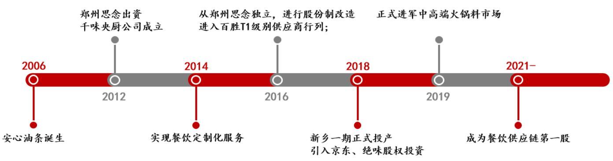

# 千味央厨（001215）\食品饮料

# -百味千寻，餐饮供应链龙头正崛起

# 投资要点：

# 公司概况：聚焦速冻面米制品餐饮市场，先发优势显著

公司目前是百胜中国T1级别供应商，与国内多家知名餐饮连锁企业合作，通过直营 $^ +$ 经销两模式实现公司业务的长期稳定性。近三年，公司营收和利润持续增长，营收由2018年的7.01亿元增至2020年的9.44亿元，利润由0.59亿元增至0.77亿元，复合年增长率为 $1 6 . 0 5 \%$ 、 $1 4 . 2 5 \%$ 。

# 行业分析：把握速冻面米制品餐饮市场蓝海空间

传统面米市场2015年-2019年市场规模CAGR为 $5 . 7 \%$ ，然而B端市场开发程度仍较低，竞争格局极为分散，蓝海特征显著。预计至2025年餐饮端速冻面米市场规模将达340亿元，距2019年有近2.1倍的市场空间。目前行业内市场参与者众多，我们认为现阶段拥有速冻食品生产研发的专业性企业在B端发展上拥有更多优势。

# 核心竞争力：深耕速冻面米2B市场，先发优势显著

目前公司身处蓝海市场，并且市场渗透率低，未来拥有巨大的成长空间。目前公司竞争优势明显：强渠道力、强研发力、产品多样性、产能有序扩张、地理占优。2018年公司速冻面米制品在国内餐饮市场市占率为 $5 . 7 5 \%$ ,我们认为随着行业快速发展，公司市占率将进一步提升。

# 盈利预测与投资建议

我们预计公司2021-2023年营收分别为13.21/16.74/20.37亿元，复合年增长率为 $2 4 . 1 8 \%$ ；归母净利润分别为 $0 . 9 6 / 1 . 2 9 / 1 . 5 5$ 亿元，对应EPS分别为1.12/1.52/1.82元，对应当前股价PE分别为39/29/24倍。因新股上市存在股价大幅波动风险，因此暂不给予投资评级。

# 风险提示

行业竞争加剧；食品安全风险；过度依赖大客户风险；募投项目实施后产能无法及时消化风险；英才街厂区搬迁可能产生的经营风险；短期内股价波动风险。

投资建议： 无首次覆盖当前价格： 44.08元

<table><tr><td colspan="2">基本数据</td></tr><tr><td>总股本/流通股本（百万股）</td><td>85/21</td></tr><tr><td>流通A股市值（百万元）</td><td>938</td></tr><tr><td>每股净资产（元）</td><td>9.69</td></tr><tr><td>资产负债率(%)</td><td>39.81</td></tr><tr><td>一年内最高/最低（元)</td><td>44.08/18.85</td></tr></table>

<table><tr><td>财务数据和估值</td><td>2019A</td><td>2020A</td><td>2021E</td><td>2022E</td><td>2023E</td></tr><tr><td>营业收入（百万元)</td><td>889.3</td><td>944.4</td><td>1321.3</td><td>1674.0</td><td>2036.9</td></tr><tr><td>增长率(%)</td><td>26.82%</td><td>6.20%</td><td>39.92%</td><td>26.69%</td><td>21.68%</td></tr><tr><td>EBITDA（百万元)</td><td>117.2</td><td>137.5</td><td>198.7</td><td>264.9</td><td>304.3</td></tr><tr><td>净利润(百万元)</td><td>74.1</td><td>76.6</td><td>95.5</td><td>129.3</td><td>155.3</td></tr><tr><td>增长率(%)</td><td>26.32%</td><td>3.33%</td><td>24.69%</td><td>35.44%</td><td>20.05%</td></tr><tr><td>EPS（元/股）</td><td>0.87</td><td>0.90</td><td>1.12</td><td>1.52</td><td>1.82</td></tr><tr><td>市盈率 (P/E)</td><td>51</td><td>49</td><td>39</td><td>29</td><td>24</td></tr><tr><td>市净率 (P/B)</td><td>9.2</td><td>6.4</td><td>5.5</td><td>4.6</td><td>3.9</td></tr><tr><td>EV/EBITDA</td><td>32.1</td><td>27.5</td><td>19.3</td><td>14.4</td><td>11.9</td></tr></table>

15日收盘价

# 一年内股价相对走势

# 相关报告

《洞见速冻行业制胜点，共话餐饮新红  
利》  
《食品饮料》

# 正文目录

# 1. 公司概况：百味千寻，餐饮供应链龙头正崛起·..

1.1. 历史沿革：B端餐饮综合解决方案供应商. 4  
1.2. 股权结构：实控人持股 $6 2 . 4 9 \%$ ，员工激励体系到位. 5  
1.3. 产品结构：突破传统米面老三样，打造差异化产品路线 6  
1.4. 商业模式：为餐饮企业提供一站式解决方案. 7

# 行业分析：把握速冻面米制品餐饮市场蓝海空间．..

2.1. 市场分析：对比日本行业发展，我国B 端市场大有可为 9  
2.2. 模式探究：初期看平台，长远看自营. 16  
2.3. 复盘SYSCO：自营 $^ +$ 并购成为美国最大餐饮供应链服务企业 16

# 核心竞争力：深耕速冻面米2B市场，先发优势显著·.. ..20

3.1. 强势品牌背书提供渠道隐形优势.. .20  
3.2. 从深耕单一品类出发，满足客户个性化需求 21  
3.3. 产品线不断扩充以满足多种消费场景需求. 22  
3.4. 突破产能瓶颈，享受规模红利.. 23  
3.5. 河南为我国第二大粮仓，具备先天地理优势， 24

# 盈利预测与投资建议.... ..25

4.1. 盈利预测... .25  
4.2. 投资建议.. .26

# 5. 风险提示... 27

# 图表目录

图表1：千味央厨业务发展以及股本变化时间轴.. 4  
图表2：千味央厨股权结构.. ..5  
图表3：核心管理团队拥有多年行业管理经验. ..6  
图表4：公司主要产品类别突破传统老三样.. .6  
图表5：公司产品SKU数量呈上升趋势（单位：个) 7  
图表6：2017-2020公司主营业务营收（单位：亿元) 7  
图表7：公司主营业务占比变化. 7  
图表8：公司所处行业产业链.. ..8  
图表9：2020年两种渠道模式具体情况.. .9  
图表10：公司两种渠道营收情况.. ..9  
图表11：两种渠道占比情况较为稳定. ..9  
图表12：我国速冻食品行业规模迅速扩容. .10  
图表13：我国速冻食品“量”、“价”齐升.. .10  
图表14：我国速冻食品人均消费量远低于发达国家.. .10  
图表15：三大细分行业对应不同产业周期... 11  
图表16：2020年速冻面米行业CR3 市占率达到 $47 \%$ . .11  
图表17：速冻米面食品2015-2019年CAGR为 $5 . 7 \%$ ： 11  
图表18：速冻面米制品行业份额逐渐减少.. .11  
图表19：日本1980-1990年间人 $_ { \pmb { \alpha } }$ 比重变化... ..12  
图表20：中国2010-2020年间人 $_ { \pmb { \alpha } }$ 比重变化. ..12  
图表21：1975 年后 $\pmb { { \cal E } }$ 本女性劳动者占比不断升高.. ..12  
图表22：我国女性参与率仍在 $60 \%$ 以上. .12  
图表23：B端市场扩容成就行业高增长.. .13  
：我国餐饮业规模不断发展壮大.. 13  
图表25：我国连锁化率与发达国家仍有较大差距. ..13  
图表26：餐饮企业面临成本端“三座大山”重压. .14  
图表27：我国团餐市场规模不断扩.. .14  
图表28：2016-2019我国冷链物流需求量. ..15  
图表29：2015-2019年我国冷链物流快速发展.. .15  
图表30：至2025年我国速冻面米制品 $\pmb { B }$ 端市场规模将达到约340亿元. .15  
图表31：2005 年-2020 年美国冷冻食品行业发展复合增速为 $1 . 7 2 \%$ ： ….17  
图表32：美国城镇化率与女性参与劳动比重上升.. ….17  
图表33：美国60年代后人均GDP快速上涨. ..17  
图表34：美国冷冻食品市场占比情况... ..18  
图表35：美国冷冻食品 $c$ 端CR4为 $36 \text{‰}$ .18  
图表36：SYSCO主营业务结构. ..1.8  
图表37：SYSCO 近三年客户成分表.. ….18  
图表38：2012-2019年SYSC0营收稳定增长. ….19  
图表39：SYSCO盈利水平基本保持稳定. .19  
图表40：2015 年后SYSCO资产负债率持续上升..  
图表41：2015 年后公司R0E水平迅速攀升.. ..20  
图表42：公司与多家知名连锁餐饮企业合作.. ….21  
图表43：公司应收账款周转率高于行业平均值.. ….21  
图表44：一根油条的多场景开发.. ..22  
图表45：公司研发支出比重不断上升.. ….2  
图表46：主要在研项目及进展情况.. ..22  
图表47：公司前十大单品助推公司营收增长(单位：万元) ….23  
图表48：公司募集资金投资项目情况（单位：万元） ….23  
图表49：公司产能规划情况及预测... ..24  
图表50：速冻食品行业主要可比公司信息对比.. ….24  
图表51：公司收入端盈利预测（亿元) ….2.5  
图表52：千味央厨盈利预测.. .26  
图表53：可比公司估值.. ….27  
图表54：财务预测摘要.. .28

# 1．公司概况：百味千寻，餐饮供应链龙头正崛起

# 1.1.历史沿革：B 端餐饮综合解决方案供应商

千味央厨于 2012 年成立，总部位于河南郑州，公司起源于思念食品，后成为中国最早为餐饮连锁企业提供速冻米面制品解决方案的企业。从 2006 年思念接受了来自国际连锁餐饮巨头——百胜中国餐饮控股的产品委托，成功研制出第一根速冻油条开始，到 2012 年思念食品分割出餐饮业务专门成立千味央厨食品公司，百胜与其合作愈发紧密。而后千味央厨也未止步于此，基于百胜餐饮供应商的品牌背书优势，积极与国内餐饮连锁企业寻求合作。先后成为华莱士、海底捞、真功夫等大型连锁餐饮品牌供应商，并根据客户需求提供产品定制化研发生产服务，实现公司业务的长期稳定性。

公司经营情况良好，疫情短期扰动不改长期运行趋势。2017-2019 年公司总营收保持双位数增长，复合增长率高达 $2 2 . 4 3 \%$ ，2020 年业绩表现受餐饮业发展滞缓而受到较大影响，营收同比增长 $6 . 2 0 \%$ 。报告期内公司毛利率稳步提升，从2017年 $2 2 . 6 3 \%$ 提升至 2019 年 $2 4 . 4 5 \%$ ，2020年毛利率受新收入会计准则及折旧费用上升等因素影响下滑2.91个百分点，剔除这部分因素后模拟毛利率为 $2 4 . 0 9 \%$ ，与前几年情况基本持平。据公司招股说明书披露，由于疫情控制效果明显以及下游需求增长，2021 年1-9 月经营状况呈现出恢复式增长，预计较去年同期增长近 $45 \%$ 。

  
图表1：千味央厨业务发展以及股本变化时间轴  
来源：公司官网，招股说明书，国联证券研究所

# 从公司设立以来股本形式的变化来看，共可以分为三个阶段：

2012-2015 年——背靠思念。从 2006 年成功研制出第一根工业化速冻油条并展开与肯德基的合作后，思念又将冷冻面条、蛋挞皮等速冻半成品成功推广至百胜旗下小肥羊、必胜客等连锁餐馆中，逐渐成为了百胜中国长期且稳定的核心供应商。2012年4 月郑州思念出资成立千味有限，专门承接运营思念对百胜餐饮定制化产品的业务，后在与百胜合作的基础上，与德克士、华莱士、真功夫等连锁餐厅达成产品研发合作。随着我国冷链物流快速发展，2012 年起公司逐步将仓储、运输、城市配送等相关业务外包给第三方可信赖的物流公司。2015 年公司正式启动上市程序，为规模化

发展积蓄。

2016-2019 年——独立运作。2016 年是千味央厨股份有限公司成立的年份，也是速冻行业餐饮供应链细分领域竞争的元年。传统 C 端渠道走弱，餐饮渠道巨大市场空间引来大批竞争者，公司也积极进行品牌升级与战略调整，“只为餐饮、厨师之选”的企业全新定位进一步巩固了千味央厨在餐饮供应链中的行业地位，开启全国化乃至国际化进程。而在冷链物流方面，考虑到我国物流市场逐渐成熟，公司于2016 年决定将所有物流业务打包给第三方冷链物流企业。基于公司良好的经营情况与广阔的发展前景，2018年获得京东集团和绝味食品战略投资，未来公司与京东将围绕鲜食品类定制化研发生产等方面有更深远的合作。

2020 至今——募资发展。经过在餐饮渠道多年经营发展，千味央厨从 1400 万注册资金起步，在速冻米面市场另辟蹊径，取得了傲人的成绩。2020 年6 月证监会预先披露公司上市申请，拟募资4.09 亿元，主要用于新乡千味食品加工建设项目（三期)以缓解目前产能不足的情况。我们认为随着公司产能释放逐渐与业务拓展相适配，公司在餐饮供应链中的领军地位将持续得到巩固。

# 1.2.股权结构：实控人持股 $6 2 . 4 9 \%$ ，员工激励体系到位

公司实际控股人为原思念食品董事长李伟，通过共青城城之集持股比例为$6 2 . 4 9 \%$ ，其余持股 $5 \%$ 以上的股东分别为前海新希望（持股 $8 . 9 4 \%$ )、上德合味（持股$5 . 5 1 \%$ )、共青城凯立（持股 $5 . 4 3 \%$ )、宿迁涵邦（持股 $5 . 1 3 \%$ 及深圳网聚（持股 $5 . 1 3 \%$ )。其中，共青城凯立为公司员工持股平台，宿迁涵邦为京东旗下投资公司，深圳网聚为绝味食品旗下投资公司。

  
图表2：千味央厨股权结构  
来源：招股说明书，国联证券研究所

公司核心管理团队均拥有多年行业管理经验，大多曾就职于思念食品，对公司生产经营与战略布局等方面发挥了重要作用。

图表3：核心管理团队拥有多年行业管理经验  

<table><tr><td>姓名</td><td>职务</td><td>履历</td><td>持股比例</td><td>任期</td></tr><tr><td>孙剑</td><td>董事长</td><td>2000 年任思念业务代表、上海公司经理、香港公司经 理、营销中心副总经理，后曾任职于一生缘食品销售总 经理、大观地产副总经理</td><td>0.36%</td><td>2019.06.26-2022.06.25</td></tr><tr><td>王向阳</td><td>监事会主席</td><td>1999 年起任思念质量技术总监、生产总监 2004 年起任思念结算部经理、资金管理部经理、营销</td><td>0.09%</td><td>2019.06.26-2022.06.25</td></tr><tr><td>白瑞</td><td>总经理</td><td>中心副总经理助理</td><td>0.08%</td><td>2019.06.26-2022.06.25</td></tr><tr><td>王植宾</td><td>副总经理、 财务总监</td><td>2005 年起任思念总成本会计、高级审计员、内审经理、 升级部经理</td><td>0.07%</td><td>2019.06.26-2022.06.25</td></tr><tr><td>徐振江</td><td>副总经理、 董秘</td><td>曾于 2010 年任河南宋河酒业、后曾任职于洛阳次祖杜 康、河南骏域基金</td><td>0.06%</td><td>2019.06.26-2022.06.25</td></tr><tr><td>钟辉</td><td>副总经理</td><td>曾于2002 年任职于思念，后曾任职于可口可乐、三全、 漯河联泰、好想你</td><td>0.06%</td><td>2019.06.26-2022.06.25</td></tr></table>

来源：招股说明书

# 1.3.产品结构：突破传统米面老三样，打造差异化产品路线

速冻米面产品传统产品形态水饺、汤圆、面点占速冻米面市场 $7 7 \%$ 的份额，发展历史较长因此市场空间趋于饱和。区别于传统速冻米面企业产品布局，千味央厨基于对油条类产品研发推广，逐渐形成油炸类、烘焙类、蒸煮类、菜肴类及其他四大产品线。

图表4：公司主要产品类别突破传统老三样  

<table><tr><td>品类矩阵</td><td>营收占比</td><td colspan="2">产品形态</td></tr><tr><td>油炸类</td><td>55.22%</td><td>60k安心大油条 6g首香小油条</td><td>单个重：0芝麻球 个重：20果味春卷单个：2</td></tr><tr><td>烘焙类</td><td>19.86%</td><td>手工挞皮</td><td></td></tr><tr><td>蒸煮类</td><td>19.44%</td><td>单个重:230比利时列华夫 地个5原味可颁冷冻团 单个量759 卡道猪猪包 个量：300猪肉包</td><td>第个30小小玉 单个重：3.9g</td></tr><tr><td>莱肴类及其他</td><td>5.26%</td><td>千页豆腐 个量：20g土豆宽粉</td><td>单个年14撒尿肉丸 个重1约223</td></tr></table>

来源：公司招股说明书，国联证券研究所

  
图表5：公司产品SKU数量呈上升趋势（单位：个)  
来源：公司招股说明书，国联证券研究所

公司通过自主研发实现多品类创新发展，菜肴业务比重逐年上升。成熟的研发中心为客户定制化产品设计提供最基础的保障，经过多年在速冻面米产品的开发过程中，公司已积累多项自主知识产权，拥有核心专利达 49 项。目前，公司以每年新增产品来不断扩大产品品类。从营收分布情况来看，油炸、蒸煮、烘焙三大品类业务占比逐渐趋于稳定，而菜肴类产品随着品类大幅增加，其营收占比也呈现出上升趋势。

  
图表6：2017-2020公司主营业务营收（单位：亿元)  
来源：公司招股说明书，国联证券研究所

  
图表7：公司主营业务占比变化  
来源：公司招股说明书，国联证券研究所

# 1.4.商业模式：为餐饮企业提供一站式解决方案

餐饮供应链为餐企提供强大的前端支撑，以点到链打通信息与资源流通。供应链建设以满足客户需求为基础，提供产品从设计、采购到物流等全方位服务，随着智慧供应链新阶段。我国餐饮，食材标准化与规模化发展的需求旺盛，餐饮供应链通过整合食材原料采购、研发生产加工、仓储物流配送等环节为餐饮企业提供后厨便利性且加强成本控制能力，打造良性餐饮供应生态链。千味央厨早在行业供应链意识觉醒时便提早布局，为连锁餐饮企业、酒店、团餐食堂、乡厨等B 端客户提供定制化速冻面米产品及相关餐饮解决方案。

  
图表8：公司所处行业产业链  
来源：公司招股说明书，国联证券研究所

严控采购质量，从源头做好食品安全保障，结合完备的采购流程计划加强成本控制。生产模式方面，公司采用通用品与定制品相结合的方式适应市场需求。其中通用品生产基本根据运营计划进行自产，对存货管理要求较高，产量进度随市场情况月度滚动变化，同时也存在少量委托加工生产情况，OEM 占主营业务成本比重近3 年维持在 $0 . 7 \%$ 左右。另外，公司也可根据部分直营客户的需求提供定制化生产，从采购需求、产品试产、意向报价、定制生产、销售服务等各流程节点为客户提供“贴身”服务，高标准、高效率使公司成为行业中的佼佼者。

公司定位为餐饮速冻面米产品供应商，下游客户主要为B 端连锁餐饮企业、酒店、团体食堂、乡厨等。现已成为肯德基、必胜客、华莱士、真功夫、海底捞、九毛九、呷哺呷哺等知名餐企的合作供应商。销售模式方面，公司主要采取直营和经销两种模式。其中直营模式以定制品生产为主，经销模式下以销售通用品为主，2020 年公司直营模式占营收比重为 $3 5 . 7 4 \%$ ，经销模式占比达 $6 4 . 2 6 \%$ 。

直营渠道：公司直营业务深度绑定前五大客户，2020 年前五大客户分别为百胜食品、华莱士、麦点食品、补给舰及海之雁。第一大客户百胜食品占直营收入高达$6 5 . 5 2 \%$ ，占整体营收比重 $2 3 . 3 7 \%$ 。随着公司与大客户的合作深入、供应商等级的提升，直营渠道将得到稳定、持续的增长。除连锁餐饮外，公司还开发了连锁商超等新

经销渠道：为了能够实现品牌全国化铺开，尤其是下沉市场的开发，经销模式有助于企业终端市场的拓展与销售的增长。公司选择富有经验且具有冷链等设备基础的优质经销商，“按需采购”的订货程序、“先款后货”的付费方式让公司便于进行成本与存货管控，同时也加强对经销商的管理，以防无序扩张带来的不利影响。截至 2020年末公司经销商数达到 907 家，较上一年度增加 $2 1 . 2 6 \%$ 。

图表9：2020年两种渠道模式具体情况  

<table><tr><td>销售模式</td><td>生产模式</td><td>渠道占比</td><td>客戶类別</td><td>物流配送</td></tr><tr><td rowspan="2">直营</td><td>通用品</td><td>5.74%</td><td>连锁餐饮企业</td><td>公司负责配送</td></tr><tr><td>定制品</td><td>30.00%</td><td>连锁商超等</td><td>公司承担费用</td></tr><tr><td rowspan="2">经销</td><td>通用品</td><td>63.23%</td><td>区域内餐饮企业、乡厨、团</td><td>自提/公司配送</td></tr><tr><td>定制品</td><td>1.03%</td><td>餐市场销售公司</td><td>自行承担运费</td></tr></table>

来源：公司招股说明书，国联证券研究所

  
图表10：公司两种渠道营收情况  
来源：公司招股说明书，国联证券研究所

  
图表11：两种渠道占比情况较为稳定  
来源：公司招股说明书，国联证券研究所

# 2.行业分析：把握速冻面米制品餐饮市场蓝海空间

# 2.1.市场分析：对比日本行业发展，我国B 端市场大有可为

我国速冻食品行业规模迅速扩大，量、价、品类三箭齐发。我国速冻食品经历四阶段发展至今，互联网时代背景下产品品类、渠道模式均发生了迭代变革，冷链物流的逐步完善提供了基础设施保障，根据中国产业信息网数据显示，我国速冻食品行业从2013年800亿元的规模到2020年近1600亿元，CAGR达到 $1 0 \%$ 。随着行业的迅速扩容，消费者对于速冻食品的认知观念发生着转变，下游需求的持续旺盛助推行业高速增长，诞生千亿掘金地。

  
图表12：我国速冻食品行业规模迅速扩容

来源：弗若斯特沙利文，华经产业研究院，国联证券研究所来源：前瞻产业研究院，国联证券研究所

  
图表13：我国速冻食品“量”“价”齐升

对标海外，我国速冻食品人均消费量较低，未来发展前景可期。我国目前速冻食品人均消费量仅 $9 \mathrm { k g / \Omega }$ 年，对比其他发达国家平均消费量，我国速冻食品渗透率有较大提升空间。就品类而言，日本拥有速冻食品品类高达 3500 余种，而我国仅存有 500余种，品类拓展空间巨大。

  
图表14：我国速冻食品人均消费量远低于发达国家

来源：前瞻产业研究院，国联证券研究所

速冻食品具体可分为速冻面米制品、速冻火锅料制品、速冻预制莱制品，其中速冻火锅料制品可再细分为速冻鱼糜制品和速冻肉制品，分别对应了不同的产业发展周期。

速冻面米制品发展时间较长，细分行业发展趋于成熟。速冻面米食品作为主食的替代品于上世纪 90 年代出现，标志着我国速冻食品工业化进程的开始，产品形态以速冻水饺、速冻汤圆、速冻粽子等为主，渠道发展以C端商超卖场等零售市场为主。经过长期发展后，速冻面米占据速冻食品整体市场份额的近半壁江山，行业增速逐渐趋于稳定，2015 年-2019 年市场规模CAGR为 $5 . 7 \%$ 。随着行业进入成熟期，行业内竞争格局呈现出三足鼎立的局面，2020 年市场前三——三全食品、思念食品、湾仔码头市场占有率达到 $4 8 \%$ o

  
图表15：三大细分行业对应不同产业周期  
来源：国联证券研究所

  
图表16：2020 年速冻面米行业CR3 市占率达到47%  
来源：欧睿，国联证券研究所

然而随着速冻火锅料制品与预制莱行业的快速发展，传统面米制品市场份额逐渐被挤压。近两年受益于火锅类市场的繁荣火爆，火锅类制品正处于行业高增长时期，从2010年的 160亿迅速扩大至2020年约582 亿，占行业比重上升至 $3 6 \%$ 。我国预制菜市场则刚刚起步，竞争格局十分分散，多因素共振下行业发展可期，2020 年行业规模约 300亿元，占行业整体规模上升至 $1 8 \%$ 。对比之下速冻面米制品市场比重逐年下滑，从2013年近 $6 6 \%$ 的绝对比重下滑至2019年仅约 $4 6 \%$ o

  
图表17：速冻米面食品2015-2019 年CAGR为5.7%

  
图表18：速冻面米制品行业份额逐渐减少

来源：中国产业信息网，国联证券研究所来源：中国产业信息网，国联证券研究所

相比欧美其他国家来说，日本与我国有更为相近的饮食结构与用餐习惯。通过研究发现，从经济发展背景、城镇化率、人口与家庭结构、生育率等多方面对比下，我国速冻食品行业发展背景接近日本上世纪 80 年代水平（具体参见 2021 年 8 月 9 日外发的行业深度报告《洞见速冻行业制胜点，共话餐饮新红利》)。

  
图表19：日本1980-1990年间人口比重变化

来源：iFind，国联证券研究所来源：iFind，国联证券研究所来源：iFind，国联证券研究所来源：世界银行，国联证券研究所

  
图表21：1975年后 $\pmb { { \cal E } }$ 本女性劳动者占比不断升高

  
图表20：中国2010-2020年间人口比重变化

  
图表22：我国女性参与率仍在60%以上

从日本速冻食品行业发展历程来看，整体行业扩容与B 端市场发展程度息息相关。上世纪70 年代开始，日本速冻行业进入快速发展期正是基于快餐业蓬勃兴起，为了缓解店铺租金成本及人力成本带来的经营压力，速冻食品以其易标准化推广、可降本增效的特征受到餐饮企业追捧，市场渗透率快速提升，带动行业整体规模迅速扩容，这样的增长态势直到 90年代后期逐渐减弱，而后整体行业进入成熟发展期，C端市场持续扩容并未改变行业生命周期推进演变。

  
图表23：B 端市场扩容成就行业高增长  
来源：日本冷松食品协会，国联证券研究所

对比日本B 端消费结构，我国速冻行业餐饮端渗透率有较大提升空间。日本速冻食品流向C端与B 端通路的比例分别为 $56 \%$ 和 $44 \%$ 。我国速冻食品家庭端和餐饮端消费结构比例分别为 $64 \%$ 、 $36 \%$ 。根据IBIS数据显示，我国速冻食品需求C端占七成，其中速冻米面制品通向家庭端的比例高达 $84 \%$ ，仅速冻火锅料制品六成流向餐饮企业。综上所述，我国餐饮端仍有较大发展空间。

根据对日本速冻行业的分析，餐饮连锁化率的提升对B 端市场开发起到了重要作用，而我国连锁化率仍待提升。我国居民人均消费水平不断提升，消费升级的大趋势下人们选择外出消费的频率上升，各种新式料理如雨后春笋般出现。在众多菜系共同竞争的环境下，火锅和小吃快餐类餐饮模式异军突起，以丰富的口感层次赢得了年轻人的喜爱，因其食材标准化程度高且可复制性强，便早早开启全国门店扩张模式，推动我国餐饮连锁化率快速提升，至2020 年达到 $1 5 \%$ ，对比海外主要国家连锁餐饮发展状况，我国连锁化水平仍然偏低。

  
图表24：我国餐饮业规模不断发展壮大  
来源：国家统计局，国联证券研究所

  
图表25：我国连锁化率与发达国家仍有较大差距  
来源：前瞻产业研究院，美团，国联证券研究所

餐饮连锁化率提升的同时也推动了下游对中央厨房等后厨新模式的需求。对餐饮企业来说，原材料采购、人工及租金成本构成了主要支出项，这“三座大山”占据了 $70 \%$ 以上的营业成本，极大程度地制约了餐饮商的盈利空间。中央厨房的意义正是在于帮助餐饮企业减低成本、提高效率——降本增收。原材料方面，中央厨房通过集中规模化采购，掌握议价主动权而降低进货成本。后厨外置的方式同样也可减少厨房员工聘任与面积使用。

  
图表26：餐饮企业面临成本端“三座大山”重压  
来源：中国饭店协会，国联证券研究所

团餐和乡厨市场打开餐饮B 端新渠道。在餐饮产业的延伸链条中，团餐和乡厨的消费市场随着B端渠道的发展而逐渐被挖掘。团餐市场主要面对社会学校、政府、企业等以团体为单位的团体膳食，现在随着企业、政府机关部门对集体膳食市场化、社会化改革，迎来全新的发展机遇，2016 年-2019 年复合增速达 $1 8 . 5 6 \%$ ，占我国餐饮总收入的比重不断上升，预计2020年占比将达到 $3 5 . 7 5 \%$ 。我国三、四线城市消费潜力正获得越来越多的关注，农村家宴等乡厨市场开始“撬动”半成品菜B端新的增长点。

  
图表27：我国团餐市场规模不断扩大  
来源：中国饭店业协会，智妍咨询，国联证券研究所

我国冷链物流全面转型升级，为行业发展提供基础保障。速冻食品从上游食材运输到下游产品配送都离不开冷链物流的加持，先进且完备的冷链运输设备及管理系统能够较大程度地满足行业发展需求。除了受到下游需求的推动下，国家政策也对冷链物流的发展提供了大力支持。2021年7月国家发改委印发《城乡冷链和国家物流枢纽建设中央预算内投资专项管理办法》，提出要重点扶持流通冷链物流发展，补齐基础设施短板，推动相关行业加快发展。

  
图表28：2016-2019 我国冷链物流需求量  
来源：中物流冷链委，国联证券研究所

  
图表29：2015-2019年我国冷链物流快速发展  
来源：中物流冷链委，国联证券研究所

成熟细分领域仍存蓝海市场待挖掘，市占率提升逻辑强化。根据中国产业信息网数据，2019 年我国速冻面米市场规模为 677 亿元。根据 IBIS，我国速冻面米制品B、C通路占全渠道比重为 $1 6 \%$ $8 4 \%$ ，拆分后 2019 年餐饮端市场规模为108 亿元。目前速冻面米制品 2B 市场尚处起步阶段，行业内仍处在价格竞争中，尚未形成具有头部效应的龙头企业，蓝海市场特征明显。根据测算，至 2025 年我国速冻面米市场规模将达 898 亿元。随着餐饮端连锁化率快速提升，预计至2025 年速冻面米制品餐饮端市场空间将达 340 亿元，对应 2019 年108 亿元的市场规模有近 2.1 倍的增长空间(速冻面米市场规模具体测算参见 2021 年8 月9 日外发的行业深度报告《洞见速冻行业制胜点，共话餐饮新红利》)

  
图表30：至2025年我国速冻面米制品 $\pmb { B }$ 端市场规模将达到约 340 亿元  
来源：公司公告国联证券研究所测算

# 2.2.模式探究：初期看平台，长远看自营

在速冻食品行业B 端发展过程中，餐饮供应链领域成为优质细分赛道。对于ToB企业来说，产品力与渠道力二者相辅相成。产品端通过生产研发技术不断升级，研发出符合客户需求的产品为首要条件，而优秀的渠道供应链管理能力在业务发展后期必不可少，甚至成为决胜因素。供应链管理直接与客户服务质量挂钩，同时也可减少从生产端到下游终端过程中可能产生的损耗。而为了提升供应链管理能力，企业业务结构将从中游生产向上下游延伸发展，餐饮供应链企业的优势逐渐凸显。

目前我国餐饮供应链领域呈现出二路并进的态势：一为平台模式，通过搭建第三方服务平台，为餐饮企业提供从食材到终端产品的全品类服务，成为B 端客户的问题解决商。二为自营模式，最显著的特征便是自建供应链全体系，目前该模式企业主要为满足自身门店需求。

平台模式主要市场参与者有快驴、美菜网等。以往农产品食材需要经过层层经销商到达餐饮商手中，平台模式下减少了中间商环节，极大拉近了上下游之间的距离。除了上游食材资源整合外，平台还通过提供仓储物流等供应链服务增加客户粘性，因其操作灵活性在行业发展初期收获了较多的红利，轻资产的运营管理也降低了行业进入壁垒，吸引了大批玩家入局。然而平台模式难以对各个关节实现品质管控，往往服务质量大打折扣，对经营产生重大影响。

自营模式与平台模式不同的，便是各个环节均由公司自己运营负责，由最初建立中央厨房为自身餐饮连锁门店服务，在采购、加工生产、物流等各方面逐渐完善形成完整的供应链体系，最终向其他第三方客户开放。由于自营模式前期投资较大，属于重资产运营，相较于平台模式进入壁垒较高，市场参与者有海底捞出资成立的蜀海供应链、大龙燚于2015年投资建立的“辣海生物”供应链等。

除餐饮企业裂变成为供应链企业之外，另众多速冻食品制造企业纷纷入局，打造从厂房到餐饮企业的垂直网络，形成专业型餐饮供应链公司。该模式下大多为我们所熟知的企业，如安井食品坚持“BC兼顾”与海底捞、呷哺呷哺等国内知名连锁餐饮企业建立合作，三全食品将经营重点转移至涮烤类产品，聚焦餐饮业务渠道拓展。

我国餐饮供应链行业尚处于行业摸索期，平台模式以轻资产运行更易获得发展机遇与空间，但从长期来看，该管理模式不利于后期管理控制，而自营模式因重资产运营在行业发展初期发展难度较高，但随着品类不断增多、客户分布区域分散开，供应链把控能力成为制胜关键，更易产生规模优势。目前两种经营模式边界有所模糊，存在两轨合并的可能性，例如美菜网实现自营与平台两种模式共同运营，但此种模式是否有助于企业规模化发展仍待检验。

# 2.3.复盘SYSCO：自营 $^ +$ 并购成为美国最大餐饮供应链服务企业

美国冷冻食品行业已发展至成熟期。美国冷冻食品行业共经历三阶段，1942-1957 年美国冷冻食品受二战军队需求迎来高速发展期，在政府的支持引导下，冷冻食品迅速完成从军需到市场化的推广，在这其中预制食品也随之快速增长，到 1957年占整体行业比重达 $9 \%$ 。1957-1977年美国餐饮行业在连锁化率的提升下迅速扩容，

60 年代美国人均GDP 持续攀升，BC两端需求旺盛持续推动冷冻食品行业增长。1977 年之后连锁餐饮行业进入存量竞争时代，整体行业增速逐渐放缓，根据 IBIS 数据统计，2005-2020 年美国冷冻食品行业复合增速为 $1 . 7 2 \%$ ，从产品种类、生产技术、产业组织等方面表现特征来看，行业已进入成熟期。

  
图表 31：2005 年-2020 年美国冷冻食品行业发展复合增速为1.72%  
来源：IBIS，国联证券研究所

  
图表 $^ { 3 2 }$ ：美国城镇化率与女性参与劳动比重上升  
来源：Wind，国联证券研究所

来源：Wind，国联证券研究所

  
图表33：美国60年代后人均GDP快速上涨

美国冷冻食品行业BC两端比重约为 4:6，综合性食品集团市占率不断提升，行业集中度较高。目前C端行业中龙头企业有康尼格拉、舒旺、蓝威斯顿、雀巢等，市占率分别为 $12 \%$ 、 $10 \%$ $7 . 9 \%$ $6 . 1 \%$ ，CR4为 $36 \%$ 。而B 端市场参与者主要为B2B模式餐饮供应链企业SYSCO、USFOODS 等，市占率分别为 $16 \%$ 、 $8 \%$ o

  
图表34：美国冷冻食品市场占比情况  
来源：IBIS，国联证券研究所

  
图表35：美国冷冻食品C端CR4为36%  
来源：IBIS，国联证券研究所

以 SYSCO 为例，探讨美国最大餐饮供应链企业的成长路径。公司于1969 年成立，仅用1年时间便在纽交所上市，在全球12个国家拥有超过300 家配送中心，为餐饮企业、医疗及教育机构、政府及其他餐饮服务企业提供食材供应服务。2021财年营收512.98 亿美元，净利润为5.24亿美元，净利率同比下滑 $8 5 . 3 7 \%$ o

  
图表36：SYSC0主营业务结构

  
图表37：SYSC0近三年客户成分表

来源：公司公告，国联证券研究所注：2021 财年截止至7月3日来源：公司公告，国联证券研究所注：2021 财年截止至7月3日

营收逐年稳定增长，净利阶段性波动后表现稳定。在2015 年之前，公司因养老计划与费用摊销，净利润持续下滑，后因与USFOODS 的合并进程违反美国反垄断法而被迫中止，净利润跌至新低，随着负面因素逐渐出清，盈利水平快速回升。

  
图表38：2012-2019年SYSC0营收稳定增长  
来源：公司公告，国联证券研究所注：2021 财年截止至7月3日

  
图表39：SYSC0盈利水平基本保持稳定  
来源：公司公告，国联证券研究所注：2021财年截止至7月3日

公司上市后开启收购兼并之路，大幅扩充产品类别，迅速做大行业规模。与众多海外大型公司一样，SYSCO 发展史便是一部并购史。

1970 年，SYSCO 并购了婴儿食品配送公司 Arrow Food Distributor；1976 年，收购 Mid-Central Fishand Frozen Foodslnc 以扩充农产品品类，并于1981 年成为美国最大食品服务公司。1984 年收购 PYAMonarch 旗下三家公司，随后收购当时全美第三大食品配送公司 CFS Continental。之后公司不断进行收购活动向上游原料产业延伸，并扩大冷冻产品配送业务，在零售业翻红的时代里进军大型连锁商超。21 世纪起 SYSCO 逐渐并购国际食品分销商，最近一起国际并购发生于2016 年，以 21亿美元成功收购了英国同行 Brakes，进一步扩展全球业务版图。SYSCO 在半个世纪的并购过程中，年销售额从 1970 年 1.15 亿美元增长至 2019 年 601 亿美元，年复合增长率为 $1 3 . 0 5 \%$ 。

自营打造To B 全产业链布局，重资产构建物流体系。SYSCO 之所以选择通过无限并购来开疆拓土并非是盲目扩张，从公司选择收并购标的企业的业务特性与目标客户来看，都具有相似性或互补性，能够在企业融合后补充产业链或产品端的空白，最终打通上下游产业链，形成经营闭环。另外，SYSCO 通过自建物流方式加强供应链管理能力，减少生鲜运输过程中产生的损耗，同时也能通过多区域配送平台高效作业，提供迅捷、优质的客户服务。

但在这种并购扩张与重资产经营的模式下，公司对现金流的需求大幅增加，2015年起通过大举负债来维持扩张之路，因此，公司资产负债率持续攀升，2021财年资产负债率达到 $9 2 . 5 9 \%$ ，长期负债比率为 $4 0 . 8 6 \%$ ，高杠杆下公司ROE 常年维持在高位。

  
图表40：2015年后SYSC0资产负债率持续上升  
来源：公司公告，国联证券研究所注：2021 财年截止至7月3日

  
图表41：2015年后公司R0E水平迅速攀升  
来源：公司公告，国联证券研究所注：2021财年截止至7月3日

结合美国农业产业科技化程度较高、国内各州饮食习惯差异较小等市场特征，我们认为SYSCO的成功离不开天时（正处行业快速发展期)、地利（科技赋能农业发展以及国内餐饮口味偏差较小)、人和(通过兼并后迅速融合两家企业)三方面协同，并坚持自营模式把控好生产到运输的每一个环节，最终打造出独一无二的餐饮供应链巨头SYSCO。相对中国而言，我国农业科技化程度较低、全国范围内饮食口味各不相同，八大菜系各有千秋，国内也尚未形成较大规模的渠道商，因此现阶段自营模式在我国的运用普及具有较大难度，反而拥有速冻食品生产研发的专业性企业在B 端发展上拥有更多优势。

# 3．核心竞争力：深耕速冻面米2B市场，先发优势显著

根据千味央厨招股说明书中测算，2018年公司在速冻面米餐饮端市场的占有率约为 $5 . 7 5 \%$ 。对身处新兴蓝海市场的企业来说，积极提升市占率是打响品牌、获得市场份额的关键，而在这过程中，拥有强大渠道力、研发力的企业可以通过先发优势抢占市占率。

# 3.1.強势品牌背书提供渠道隐形优势

千味央厨品牌成立之初便是与百胜中国合作，成为首家将中式菜品融入西式快餐的餐饮服务企业。随着公司深耕速冻面米行业多年，与百胜的合作关系愈发紧密，于2016 年成为百胜 T1 级别供应商，为公司在B 端市场上开疆拓土提供了强有力的品牌背书，极大的提高了公司在市场上的信誉与影响力。基于多年的行业经验与营销优势，公司还开拓了与多家国内外知名连锁餐饮企业的合作，如华莱士、真功夫、九毛九、海底捞等。除了与连锁餐饮企业的合作，公司结合近年来零售业态的转变，开发了与沃尔玛等连锁商超的创新性合作，提供需二次加工的半成品产品。

百胜中国采取直接管理供应商的模式，在国内不同市场有独立团队对市场情况采取不同标准与供应商的评定机制，对供应商的产品质量和服务进行定期审核与绩效跟踪，鼓励供应商之间良性有序竞争。从千味央厨与百胜中国长达近20 年的合作中，

# 我们也可以反推出公司在产品品控、供应链管理方面的优势。

知名连锁餐饮企业和商超具有较高的信誉度与供应链管理制度，对于供应商的考核评定一旦形成认可便不轻易终止合作，随着公司供应商级别的上升，产品合作的范围将会进一步扩大。百胜中国作为千味央厨强有力的品牌背书，使得公司能够建立较为完善的应收账款管理制度，对于其他客户实施较为有利的信用政策，公司应收账款周转率处于行业内较高水平。

  
图表42：公司与多家知名连锁餐饮企业合作  
来源：公司招股说明书

  
图表43：公司应收账款周转率高于行业平均值  
来源：公司招股说明书，国联证券研究所

# 3.2.从深耕单一品类出发，满足客户个性化需求

千味央厨品牌定位明确，“只为餐饮、厨师之选”的战略让公司始终坚持为餐饮企业提供速冻面米制品解决方案，深度挖掘餐饮市场对产品外形、口感等多方面的需求，为客户提供定制化产品服务。公司一切研发新产品的初衷皆从客户角度出发，以帮助餐饮企业节约后厨经营成本为根本目的，通过“模拟餐厅后厨”实验室研发设计产品，务必确保食品安全性，以专业的态度和专业的技术获得了市场的认可。

从一根油条的故事开始。千味央厨于 2012 年开始研发工业化油条开始，不断对油条不同的消费场景进行优化、二次研发，共对火锅、快餐、自助餐、宴席、早餐、外卖六大不同场景进行研发，有针对性地推出并销售多种终端形态的油条，充分发挥了公司的研发优势与钻研精神。

通过生产线自主研发完成品类创新，为打下市场提供强大支撑。目前公司拥有 49项专利，并且在产线设备不足的情况下自主研发蛋挞切块机、油条、芝麻球等自动生产线，使得产品从研发到量产的过程不断优化，先人一步投放产量抢占市场。截至目前，公司已研发出“注芯油条”、“文化流量包”、“花瓣米糕”等概念化产品生产，并不断进行新产品开发。2017 年-2020 年公司研发费用以每年 $20 \%$ 以上的增速加大投入，占营收的比重也逐年上升。

  
图表44：一根油条的多场景开发  
来源：公司招股说明书

  
图表45：公司研发支出比重不断上升  
来源：公司招股说明书，国联证券研究所

图表46：主要在研项目及进展情况  

<table><tr><td>项目</td><td>研发阶段</td><td>项目应用前景</td></tr><tr><td>新口味酥饼</td><td>小试阶段</td><td>中式点心的多样化研发生产，更大程度满足客户的需求</td></tr><tr><td>冷冻三明治面团</td><td>小试阶段</td><td>三明治面团的工业化生产，代表着烘焙面包类产品在技术上 的一个大的突破，为产品开发新的供应渠道</td></tr><tr><td>牛奶馒头</td><td>试验阶段</td><td>馒头的新型的生产方式，规模化、产量化是馒头的发展方向</td></tr><tr><td>麻酱烧饼</td><td>小试阶段</td><td>市场产品的吸收创新，增强产品技术研究</td></tr><tr><td>馅饼类</td><td>试验阶段</td><td>开拓饼类市场，丰富产品</td></tr><tr><td>注芯油条系列</td><td>研发阶段</td><td>基于蛋芯油条，对该系列产品进行储备</td></tr><tr><td>新口味春卷</td><td>中试阶段</td><td>春卷口味的多元化、创新化</td></tr><tr><td>油条新加工方法的研究</td><td>试验阶段</td><td>继续对油条生产进行技术研究</td></tr><tr><td>基础面点的工业化生产研究 试验阶段</td><td></td><td>对面点工业化规模化生产进行技术研究</td></tr></table>

来源：公司招股说明书

# 3.3.产品线不断扩充以满足多种消费场景需求

产品品类跟随餐饮端市场需求纵向延伸拓展。对餐饮企业来说，市场竞争激烈，消费者口味也在不断变化，菜单需要通过不断更新才能防止客户流失，增加消费频次，同时也对菜品品质提出了更高的要求。为了顺应餐饮市场的需求，供应商必须紧跟市场推出既符合餐企加工出餐等要求、又符合消费者口味品质追求的半成品或成品制品。千味央厨产品品类涵盖中餐与西餐烹饪方式，从中式发面类面点产品到西式甜品和主食，产品SKU 数量在2020 年达到 368个，较2018 年增加 144个，产品品类更新速率较高。

深度研究不同消费场景，产品品类横向衍生创新。单就油条而言便早已突破早餐这一传统用餐场景了。随着餐饮业的繁荣，单一产品品类的应用深度正在细化扩张，人群及场景分化、烹饪方式差异化促使公司不断将产品进行横向研发升级。

大单品思维打造品牌力量。2017 年公司前十大单品占营业收入比重仅 $3 7 . 1 2 \%$ ,随后几年该比重快速上升，足以见得公司核心大单品的积极营销助推公司营收规模增

图表47：公司前十大单品助推公司营收增长（单位：万元)  

<table><tr><td>产品</td><td>2017</td><td>2018</td><td>2019</td><td>2020</td></tr><tr><td>1*18*16 蛋挞皮</td><td>7097.04</td><td>7952.65</td><td>9107.33</td><td>8664.30</td></tr><tr><td>千味260g芝麻球</td><td>8538.83</td><td>8954.79</td><td>9033.79</td><td>9830.79</td></tr><tr><td>KFC 60g 冷冻油条</td><td></td><td>4497.85</td><td>6815.12</td><td>6503.15</td></tr><tr><td>千味400g 香芋地瓜丸</td><td>-</td><td>4637.81</td><td>5015.23</td><td>5272.30</td></tr><tr><td>千味 450g 香脆油条</td><td>3634.10</td><td>3931.38</td><td>4344.96</td><td>4460.20</td></tr><tr><td>百胜原味冷冻华夫面团</td><td></td><td>1196.04</td><td>2804.94</td><td>1729.94</td></tr><tr><td>千味 360g 卡通豬豬包</td><td>615.43</td><td>1850.14</td><td>2671.56</td><td>2747.64</td></tr><tr><td>千味1200g 安心大油条</td><td></td><td>927.31</td><td>1963.33</td><td>2611.47</td></tr><tr><td>千味 300 克脆皮香蕉</td><td>2136.65</td><td>1865.72</td><td>1756.57</td><td>2611.47</td></tr><tr><td>百胜360g蛋芯油条</td><td></td><td></td><td>1628.91</td><td>1515.17</td></tr><tr><td>总计</td><td>2136.65</td><td>35813.69</td><td>45141.74</td><td>43334.97</td></tr><tr><td>占营收比重</td><td>37.12%</td><td>51.07%</td><td>50.76%</td><td>45.89%</td></tr></table>

来源：公司招股说明书，国联证券研究所

# 3.4.突破产能瓶颈，享受规模红利

本轮上市公司募集资金 4.09 亿元将全部用于产能扩建及研发中心建设。其中，新乡千味(三期)工程的建设将大大完善公司未来产能布局情况，突破现有产能瓶颈，在现有的约 12.8 万吨的产能基础上扩大至 19.6 万吨，在完全达产后产能扩增约 1.5倍。并有效提高公司生产自动化率，增加生产的稳定性，提高产品质量减少损耗。

根据公司产能规划，假设募投计划于2021 年初开始建设，建设期 2 年，新乡千味三期工程或将于2022 年末建成投产，2023 年投产进度或可达到 $6 3 \%$ 。公司近三年产品销量复合增速为 $1 8 . 1 5 \%$ ，假设未来公司能够以每年 $20 \%$ 的销量增长，2023年-2024 年产能利用率将分别达到 $9 5 . 4 5 \%$ $9 7 . 2 5 \%$ ，同时，公司存货周转率为6.87，高于行业平均水平，表明公司产品流动性较高。公司未来产能规划合理且与收入增速高度匹配，能够有效消化本轮产能扩张。

图表48：公司募集资金投资项目情况（单位：万元)  

<table><tr><td rowspan="2">项目名称</td><td rowspan="2">建设期</td><td colspan="2">募集资金投资计划</td><td rowspan="2">合计</td><td rowspan="2">比例</td></tr><tr><td>第一年</td><td>第二年</td></tr><tr><td>新乡千味央廚食品有限公司食品加工建 设项目（三期）</td><td>24个月</td><td>14758.76</td><td>22923.63</td><td>37682.39</td><td>92.09%</td></tr><tr><td>总部基地及研发中心建设项目</td><td>24 个月</td><td>1674.75</td><td>1561.86</td><td>3236.61</td><td>7.91%</td></tr><tr><td>合计</td><td></td><td>16433.51</td><td>24485.49</td><td>40919.00</td><td>100%</td></tr></table>

来源：公司招股说明书，国联证券研究所

图表49：公司产能规划情况及预测  

<table><tr><td>项目</td><td>2018A</td><td>2019A</td><td>2020A</td><td>2023E</td><td>2024E</td></tr><tr><td>年产能(万吨)</td><td>6.40</td><td>9.92</td><td>12.80</td><td>14.00</td><td>17.20</td></tr><tr><td>销量 (万吨)</td><td>6.43</td><td>8.06</td><td>7.73</td><td>13.26</td><td>15.91</td></tr><tr><td>产能利用率</td><td>100.40%</td><td>81.29%</td><td>60.41%</td><td>94.70%</td><td>92.50%</td></tr></table>

来源：公司招股说明书，国联证券研究所预测

# 3.5.河南为我国第二大粮仓，具备先天地理优势

河南之物产丰富于企业有非凡意义。河南凭借独特的地理位置和肥沃的土壤环境，成为全国第一大小麦生产地和第五大玉米主要产地，2020 年河南省小麦产量达到了全国产量的 $2 5 \%$ ，是名副其实的“中国粮仓”。优越的农业发展使得河南省孕育出了双汇发展、牧原股份等全国知名农产品与肉制品加工企业，更是我国速冻食品的发源地，三全食品、思念食品均诞生于河南。

人口大省有助于劳动密集型企业降低人工成本。河南也是我国人口大省，丰富的劳动力供给使得劳动密集型工厂纷纷进驻，人工成本上的优势便于形成价格优势。

交通便利性促进企业全国化发展。除去农业大省和人口大省的身份，河南也是我国重要的交通枢纽，地处中原贯通南北，交通运输十分发达，同时也拥有先进成熟的冷链物流企业，先天的地理优势赋能企业快速发展。

图表50：速冻食品行业主要可比公司信息对比  

<table><tr><td></td><td>安井食品</td><td>三全食品</td><td>巴比食品</td><td>海欣食品</td><td>千味央廚</td></tr><tr><td>产品品类</td><td>速冻火锅料 63%</td><td>速冻面米 89.96%</td><td>食品类89.82%</td><td>速冻鱼肉制品及肉制品 86.38%</td><td>油炸类 55.22%</td></tr><tr><td></td><td>速冻面米制品 27%</td><td>速冻调制食品7.59%</td><td></td><td>休闲食品8.29%</td><td>烘焙类19.86%</td></tr><tr><td></td><td>速冻菜肴制品 10%</td><td>其他0.72%</td><td></td><td>速冻米面制品 4.25%</td><td>蒸煮类19.44%</td></tr><tr><td></td><td></td><td></td><td></td><td>速冻菜肴制品0.68%</td><td>菜肴类5.26%</td></tr><tr><td>销售模式</td><td>直营商超 11.7%</td><td>零售市场 86.43%</td><td>加盟店83.42%</td><td>流通渠道 62.39%</td><td>直营35.74%</td></tr><tr><td></td><td>经销商 84.7%</td><td>餐饮市场13.57%</td><td>直营店 1.27%</td><td>现代渠道 27.31%</td><td>经销 64.26%</td></tr><tr><td></td><td>特通 2.2%</td><td></td><td>团餐 13.67%</td><td>电商渠道 4.72%</td><td></td></tr><tr><td></td><td>电商1.4%</td><td></td><td></td><td>特通5.58%</td><td></td></tr><tr><td>毛利率</td><td>25.68%</td><td>29.87%</td><td>27.90%</td><td>24.64%</td><td>21.71%</td></tr><tr><td>凈利率</td><td>8.67%</td><td>11.08%</td><td>17.96%</td><td>4.39%</td><td>8.11%</td></tr><tr><td>资产负债率</td><td>48.09%</td><td>50.09%</td><td>17.90</td><td>37.83%</td><td>39.06%</td></tr><tr><td>存货周转率</td><td>3.02</td><td>3.73</td><td>11.99</td><td>3.92</td><td>6.87</td></tr><tr><td>ROE</td><td>16.39%</td><td>25.65</td><td>10.74%</td><td>8.50%</td><td>13.15%</td></tr></table>

来源：公司公告，国联证券研究所

# 4.盈利预测与投资建议

# 4.1.盈利预测

我们对公司未来三年营收情况做出以下判断与测算：

(1)2020 年由于疫情餐饮市场受到较大冲击，公司营收增速大幅度下滑。我们认为随着疫情不利因素逐渐褪去，根据公司21 年前9 个月销售情况来看，今年营收在去年低基数的情况下将有较大幅度的增长。

(2)2020年毛利率下滑主要系运输费用计入成本端、折旧费用上升等因素所致，剔除这部分影响后模拟毛利率为 $2 4 . 0 9 \%$ 。以此为基准对未来三年毛利率进行预测，2021 年起猪肉价格下降趋势明显，但白糖、食用油等生产主要原材料价格出现大幅上升，而原材料成本占主营业务总成本约 $7 5 \%$ ，对毛利率形成的压制，我们认为至2022 年原材料上行的趋势将减缓，因此预计 2021-2022 年毛利率分别为 $2 2 . 3 5 \%$ $2 3 . 9 8 \%$ 。考虑到 2023 年新乡三期逐步投产后项目转固对毛利率存在影响，预计 2023年毛利率为 $2 3 . 5 8 \%$

(3）费用率：我们认为三大费用率整体在规模效应下将得到持续优化。其中，2020年由于执行新收入准则，销售费用同比下滑 $3 0 . 2 6 \%$ ，同期销售费用率减少1.72个百分点至 $3 . 2 8 \%$ 。考虑到 2021年公司渠道扩张提速、营销投入加码，预计销售费用率将先上升，而后逐渐降低。

图表51：公司收入端盈利预测（亿元）  

<table><tr><td></td><td>2018A</td><td>2019A</td><td>2020A</td><td>2021E</td><td>2022E</td><td>2023E</td></tr><tr><td>油炸类</td><td></td><td></td><td></td><td></td><td></td><td></td></tr><tr><td>营业收入</td><td>4.02</td><td>4.92</td><td>5.21</td><td>7.11</td><td>8.96</td><td>10.78</td></tr><tr><td>yoy</td><td></td><td>22.24%</td><td>6.03%</td><td>36.35%</td><td>26.00%</td><td>20.36%</td></tr><tr><td>毛利</td><td>0.91</td><td>1.12</td><td>1.05</td><td>1.57</td><td>2.03</td><td>2.42</td></tr><tr><td>毛利率</td><td>22.53%</td><td>22.73%</td><td>20.18%</td><td>22.15%</td><td>22.71%</td><td>22.46%</td></tr></table>

<table><tr><td colspan="7">烘焙类</td></tr><tr><td>营业收入</td><td>1.53</td><td>1.98</td><td>1.88</td><td>2.70</td><td>3.43</td><td>4.20</td></tr><tr><td>yoy</td><td></td><td>29.25%</td><td>-5.15%</td><td>43.88%</td><td>27.05%</td><td>22.40%</td></tr><tr><td>毛利</td><td>0.37</td><td>0.53</td><td>0.43</td><td>0.63</td><td>0.85</td><td>0.98</td></tr><tr><td>毛利率</td><td>24.47%</td><td>26.70%</td><td>22.94%</td><td>23.52%</td><td>24.78%</td><td>23.31%</td></tr></table>

<table><tr><td colspan="7">蒸煮类</td></tr><tr><td>营业收入</td><td>1.36</td><td>1.77</td><td>1.84</td><td>2.46</td><td>3.04</td><td>3.76</td></tr><tr><td>yoy</td><td></td><td>30.34%</td><td>3.87%</td><td>33.90%</td><td>23.70%</td><td>23.60%</td></tr><tr><td>毛利</td><td>0.36</td><td>0.48</td><td>0.45</td><td>0.60</td><td>0.75</td><td>0.92</td></tr><tr><td>毛利率</td><td>26.64%</td><td>26.92%</td><td>24.55%</td><td>24.55%</td><td>24.61%</td><td>24.43%</td></tr></table>

# 菜肴类及其他

<table><tr><td>营业收入</td><td>0.10</td><td>0.22</td><td>0.50</td><td>0.90</td><td>1.25</td><td>1.54</td></tr><tr><td>yoy</td><td></td><td>124.52%</td><td>121.74%</td><td>82.00%</td><td>38.06%</td><td>23.05%</td></tr><tr><td>毛利</td><td>0.03</td><td>0.05</td><td>0.10</td><td>0.23</td><td>0.32</td><td>0.39</td></tr><tr><td>毛利率</td><td>25.43%</td><td>22.98%</td><td>19.34%</td><td>25.55%</td><td>25.58%</td><td>25.49%</td></tr></table>

其他业务收入  

<table><tr><td>营业收入</td><td>0.004</td><td>0.007</td><td>0.021</td><td>0.043</td><td>0.064</td><td>0.096</td></tr><tr><td>yoy</td><td></td><td>84.06%</td><td>228.65%</td><td>100%</td><td>50%</td><td>50%</td></tr><tr><td>毛利</td><td>0.003</td><td>0.006</td><td>0.021</td><td>0.042</td><td>0.062</td><td>0.092</td></tr><tr><td>毛利率</td><td>95.65%</td><td>87.50%</td><td>98.41%</td><td>98.01%</td><td>97.08%</td><td>95.91%</td></tr></table>

<table><tr><td colspan="7">合计</td></tr><tr><td>营业总收入</td><td>7.01</td><td>8.89</td><td>9.44</td><td>13.21</td><td>16.74</td><td>20.37</td></tr><tr><td>yoy</td><td></td><td>26.82%</td><td>6.20%</td><td>39.92%</td><td>26.69%</td><td>21.68%</td></tr><tr><td>毛利</td><td>1.67</td><td>2.18</td><td>2.05</td><td>3.09</td><td>4.01</td><td>4.80</td></tr><tr><td>毛利率</td><td>23.83%</td><td>24.50%</td><td>21.71%</td><td>23.35%</td><td>23.98%</td><td>23.58%</td></tr></table>

来源：公司公告，国联证券研究所测算

我们预计公司2021-2023 年营收分别为13.21 亿元、16.74 亿元、20.37 亿元，同比分别增长 $3 9 . 9 2 \%$ $2 6 . 6 9 \%$ $2 1 . 6 8 \%$ ；归母净利润分别为0.96 亿元、1.29 亿元、1.55亿元，对应EPS分别为1.12、1.52、1.82 元，对应当前股价PE分别为 39、29、24倍。

图表 ${ \pmb 5 } { \pmb 2 } .$ ：千味央厨盈利预测  

<table><tr><td>财务数据和估值</td><td>2019A</td><td>2020A</td><td>2021E</td><td>2022E</td><td>2023E</td></tr><tr><td>营业收入(百万元)</td><td>889.3</td><td>944.4</td><td>1321.3</td><td>1674.0</td><td>2036.9</td></tr><tr><td>增长率 (%)</td><td>26.82%</td><td>6.20%</td><td>39.92%</td><td>26.69%</td><td>21.68%</td></tr><tr><td>EBITDA(百万元)</td><td>117.2</td><td>137.5</td><td>198.7</td><td>264.9</td><td>304.3</td></tr><tr><td>净利润(百万元)</td><td>74.1</td><td>76.6</td><td>95.5</td><td>129.3</td><td>155.3</td></tr><tr><td>增长率 (%)</td><td>26.32%</td><td>3.33%</td><td>24.69%</td><td>35.44%</td><td>20.05%</td></tr><tr><td>EPS（元/股）</td><td>0.87</td><td>0.90</td><td>1.12</td><td>1.52</td><td>1.82</td></tr><tr><td>市盈率 (P/E)</td><td>51</td><td>49</td><td>39</td><td>29</td><td>24</td></tr><tr><td>市净率 (P/B)</td><td>9.2</td><td>6.4</td><td>5.5</td><td>4.6</td><td>3.9</td></tr><tr><td>EV/EBITDA</td><td>32.1</td><td>27.5</td><td>19.3</td><td>14.4</td><td>11.9</td></tr></table>

来源：公司公告，国联证券研究所测算 注：收盘价为9月15日股价

# 4.2.投资建议

随着我国餐饮业快速发展、餐饮连锁化率的提升，食材标准化进程不断被推进，能够实现规模化食材生产且最高程度还原食品本质的速冻食品发展将迈上新的一级台阶。千味央厨以“只为餐饮、厨师之选”精准定位速冻面米制品餐饮端一体化服务战略，以直营与经销双渠道结合的营销模式，为大客户提供定制化产品服务的同时开拓下沉市场。我们认为，公司拥有强大品牌背书和研发能力，在新兴行业中具有先发优势和高成长性。考虑到公司新股上市股价波动较大，因此暂不给予投资评级。

图表53：可比公司估值  

<table><tr><td rowspan="2">股票简称</td><td rowspan="2">股票代码 当前股价</td><td rowspan="2"></td><td rowspan="2">未来三年凈利 复合增速</td><td colspan="3">PE</td><td colspan="3">PEG</td></tr><tr><td>2021E</td><td>2022E</td><td>2023E</td><td>2021E</td><td>2022E</td><td>2023E</td></tr><tr><td>千味央廚</td><td>001215.SZ</td><td>40.07</td><td>26.56%</td><td>39</td><td>29</td><td>24</td><td>1.48</td><td>1.09</td><td>0.91</td></tr><tr><td>速冻食品可比公司:</td><td></td><td></td><td></td><td></td><td></td><td></td><td></td><td></td><td></td></tr><tr><td>安井食品</td><td>603345.SH</td><td>176.51</td><td>30.35%</td><td>50</td><td>40</td><td>32</td><td>1.18</td><td>1.56</td><td>1.36</td></tr><tr><td>巴比食品</td><td>605338.SH</td><td>34.66</td><td>26.20%</td><td>26</td><td>30</td><td>24</td><td>0.29</td><td>-2.27</td><td>1.03</td></tr><tr><td>三全食品</td><td>002216.SZ</td><td>14.50</td><td>5.62%</td><td>18</td><td>16</td><td>14</td><td>(-2.08)</td><td>0.95</td><td>1.30</td></tr><tr><td>海欣食品</td><td>002702.SZ</td><td>5.63</td><td>21.27%</td><td>33</td><td>26</td><td>21</td><td>1.56</td><td>1.20</td><td>0.98</td></tr><tr><td colspan="4">行业平均</td><td>32</td><td>28</td><td>23</td><td>1.01</td><td>1.23</td><td>1.17</td></tr></table>

来源：Wind，国联证券研究所  
注：海欣食品预测使用Wind一致预期收盘价为9月15日股价

# 5.风险提示

行业竞争加剧的风险。由于市场需求增加，行业前景较好，吸引大量企业进入，行业内竞争风险随之加剧。

食品安全风险。与知名连锁餐饮品牌合作，对供应商食品卫生要求较高，并且通常会组织定期考察，一旦发生食品安全事故对公司造成较大影响。

过度依赖大客户风险。公司直营第一大客户百胜中国销售收入占总营收约 $30 \%$ ,一旦与大客户的合作解绑对公司业绩将形成巨大冲击。

募投项目实施后产能扩张不能及时消化的风险。公司存在募投项目实施完成后发生行业政策、经济环境、竞争格局等不利变化，导致新增产能无法消化。

英才街厂区搬迁可能产生的经营风险。公司为解决租赁资产产权问题，决定于2019 年12 约 30 日停止英才街厂区生产运作，并于 2020 年2 月完成厂区搬迁。由于新厂区在生产、设备调试等方面需要时间磨合，产能并未全部释放，存在经营业绩压力。

短期内股价波动风险。该股为次新股，存在短期内股价大幅波动风险。

# 图表54：财务预测摘要

资产负债表  

<table><tr><td>单位：百万元</td><td>2019A</td><td>2020A</td><td>2021E</td><td>2022E</td><td>2023E</td></tr><tr><td>货币资金</td><td>79.03</td><td>117.41</td><td>132.13</td><td>167.40</td><td>341.90</td></tr><tr><td>应收账款+票据</td><td>44.56</td><td>52.25</td><td>72.83</td><td>92.27</td><td>112.28</td></tr><tr><td>预付账款</td><td>6.72</td><td>10.88</td><td>10.97</td><td>13.90</td><td>16.92</td></tr><tr><td>存货</td><td>99.10</td><td>116.17</td><td>138.04</td><td>173.45</td><td>212.18</td></tr><tr><td>其他</td><td>33.98</td><td>36.43</td><td>49.43</td><td>62.62</td><td>76.19</td></tr><tr><td>流动资产合计</td><td>263.39</td><td>333.13</td><td>403.41</td><td>509.64</td><td>759.47</td></tr><tr><td>长期股权投资</td><td>0.00</td><td>0.00</td><td>0.00</td><td>0.00</td><td>0.00</td></tr><tr><td>固定资产</td><td>342.23</td><td>542.52</td><td>604.47</td><td>745.01</td><td>773.64</td></tr><tr><td>在建工程</td><td>151.88</td><td>1.23</td><td>125.82</td><td>100.41</td><td>25.00</td></tr><tr><td>无形资产</td><td>39.44</td><td>39.24</td><td>37.28</td><td>35.31</td><td>33.35</td></tr><tr><td>其他非流动资产</td><td>41.31</td><td>39.47</td><td>35.20</td><td>30.93</td><td>30.93</td></tr><tr><td>非流动资产合计</td><td>574.86</td><td>622.45</td><td>802.77</td><td>911.67</td><td>862.93</td></tr><tr><td>资产总计</td><td>838.25</td><td>955.58</td><td>1206.17</td><td>1421.31</td><td>1622.40</td></tr><tr><td>短期借款</td><td>30.00</td><td>15.00</td><td>62.00</td><td>53.21</td><td>0.00</td></tr><tr><td>应付账款+票据</td><td>127.87</td><td>141.80</td><td>187.35</td><td>235.40</td><td>287.97</td></tr><tr><td>其他</td><td>172.64</td><td>147.74</td><td>216.87</td><td>272.82</td><td>333.48</td></tr><tr><td>流动负债合计</td><td>330.51</td><td>304.55</td><td>466.22</td><td>561.43</td><td>621.45</td></tr><tr><td>长期带息负债</td><td>0.00</td><td>54.77</td><td>48.20</td><td>38.80</td><td>24.61</td></tr><tr><td>长期应付款</td><td>0.00</td><td>0.00</td><td>0.00</td><td>0.00</td><td>0.00</td></tr><tr><td>其他</td><td>101.97</td><td>13.92</td><td>13.92</td><td>13.92</td><td>13.92</td></tr><tr><td>非流动负债合计</td><td>101.97</td><td>68.69</td><td>62.13</td><td>52.72</td><td>38.53</td></tr><tr><td>负债合计</td><td>432.48</td><td>373.24</td><td>528.35</td><td>614.15</td><td>659.98</td></tr><tr><td>少数股东权益</td><td>0.00</td><td>(0.02)</td><td>(0.02)</td><td>(0.03)</td><td>(0.04)</td></tr><tr><td>股本</td><td>57.28</td><td>63.82</td><td>63.82</td><td>63.82</td><td>63.82</td></tr><tr><td>资本公积</td><td>145.17</td><td>238.62</td><td>238.62</td><td>238.62</td><td>238.62</td></tr><tr><td>留存收益</td><td>203.32</td><td>279.91</td><td>375.41</td><td>504.75</td><td>660.02</td></tr><tr><td>股东权益合计</td><td>405.77</td><td>582.34</td><td>677.83</td><td>807.16</td><td>962.42</td></tr><tr><td>负债和股东权益总计</td><td>838.25</td><td>955.58</td><td>1206.17</td><td>1421.31</td><td>1622.40</td></tr></table>

现金流量表  

<table><tr><td>单位：百万元</td><td>2019A</td><td>2020A</td><td>2021E</td><td>2022E</td><td>2023E</td></tr><tr><td>净利润</td><td>74.12</td><td>76.57</td><td>88.64</td><td>122.48</td><td>148.41</td></tr><tr><td>折旧摊销</td><td>19.05</td><td>33.98</td><td>69.69</td><td>91.10</td><td>98.74</td></tr><tr><td>财务费用</td><td>0.74</td><td>3.40</td><td>3.73</td><td>4.09</td><td>1.80</td></tr><tr><td>存货减少</td><td>-43.46</td><td>-17.06</td><td>-21.88</td><td>-35.41</td><td>-38.73</td></tr><tr><td>营运资金变动</td><td>-11.11</td><td>-28.25</td><td>59.12</td><td>33.03</td><td>37.90</td></tr><tr><td>其它</td><td>47.08</td><td>29.12</td><td>31.48</td><td>45.01</td><td>48.33</td></tr><tr><td>经营活动现金流</td><td>86.41</td><td>97.76</td><td>230.78</td><td>260.30</td><td>296.46</td></tr><tr><td>资本支出</td><td>193.35</td><td>183.68</td><td>250.00</td><td>200.00</td><td>50.00</td></tr><tr><td>长期投资</td><td>0.00</td><td>0.00</td><td>0.00</td><td>0.00</td><td>0.00</td></tr><tr><td>其他</td><td>-385.58</td><td>-278.27</td><td>-502.75</td><td>-402.75</td><td>-102.75</td></tr><tr><td>投资活动现金流</td><td>-192.23</td><td>-94.59</td><td>-252.75</td><td>-202.75</td><td>-52.75</td></tr><tr><td>债权融资</td><td>30.00</td><td>39.77</td><td>40.43</td><td>-18.19</td><td>-67.40</td></tr><tr><td>股权融资</td><td>0.00</td><td>6.55</td><td>0.00</td><td>0.00</td><td>0.00</td></tr><tr><td>其他</td><td>-2.06</td><td>-11.11</td><td>-3.73</td><td>-4.09</td><td>-1.80</td></tr><tr><td>筹资活动现金流</td><td>27.94</td><td>35.21</td><td>36.69</td><td>-22.28</td><td>-69.20</td></tr><tr><td>现金净增加额</td><td>-77.87</td><td>38.38</td><td>14.73</td><td>35.27</td><td>174.50</td></tr></table>

数据来源：公司公告，国联证券研究所测算注：股价为 2021 年9 月15 日收盘价

利润表  

<table><tr><td>单位：百万元</td><td>2019A</td><td>2020A</td><td>2021E</td><td>2022E</td><td>2023E</td></tr><tr><td>营业收入</td><td>889.28</td><td>944.37</td><td>1321.32</td><td>1673.99</td><td>2036.92</td></tr><tr><td>营业成本</td><td>671.41</td><td>739.33</td><td>1012.78</td><td>1272.55</td><td>1556.71</td></tr><tr><td>营业税金及附加</td><td>7.46</td><td>8.92</td><td>11.92</td><td>15.10</td><td>18.38</td></tr><tr><td>营业费用</td><td>44.48</td><td>31.02</td><td>64.22</td><td>79.51</td><td>95.94</td></tr><tr><td>管理费用</td><td>69.02</td><td>86.44</td><td>111.65</td><td>141.12</td><td>168.25</td></tr><tr><td>财务费用</td><td>0.74</td><td>3.40</td><td>3.73</td><td>4.09</td><td>1.80</td></tr><tr><td>资产减值损失</td><td>0.00</td><td>0.00</td><td>-0.81</td><td>-1.02</td><td>-1.24</td></tr><tr><td>公允价值变动收益</td><td>-0.59</td><td>-0.93</td><td>0.00</td><td>0.00</td><td>0.00</td></tr><tr><td>投资净收益</td><td>0.00</td><td>0.00</td><td>0.00</td><td>0.00</td><td>0.00</td></tr><tr><td>其他</td><td>2.84</td><td>25.66</td><td>9.52</td><td>9.54</td><td>9.56</td></tr><tr><td>营业利润</td><td>98.43</td><td>100.01</td><td>125.73</td><td>170.12</td><td>204.15</td></tr><tr><td>营业外净收益</td><td>-1.04</td><td>0.12</td><td>-0.44</td><td>-0.44</td><td>-0.44</td></tr><tr><td>利润总额</td><td>97.39</td><td>100.13</td><td>125.29</td><td>169.69</td><td>203.71</td></tr><tr><td>所得税</td><td>23.27</td><td>23.55</td><td>29.80</td><td>40.36</td><td>48.45</td></tr><tr><td>净利润</td><td>74.12</td><td>76.57</td><td>95.49</td><td>129.33</td><td>155.26</td></tr><tr><td>少数股东损益</td><td>0.00</td><td>-0.02</td><td>-0.01</td><td>-0.01</td><td>-0.01</td></tr><tr><td>归属於母公司凈利润</td><td>74.12</td><td>76.59</td><td>95.50</td><td>129.34</td><td>155.27</td></tr></table>

主要财务比率  

<table><tr><td></td><td>2019A</td><td>2020A</td><td>2021E</td><td>2022E</td><td>2023E</td></tr><tr><td>成长能力</td><td></td><td></td><td></td><td></td><td></td></tr><tr><td>营业收入</td><td>26.82%</td><td>6.20%</td><td>39.92%</td><td>26.69%</td><td>21.68%</td></tr><tr><td>EBIT</td><td>28.61%</td><td>5.50%</td><td>24.63%</td><td>34.69%</td><td>18.26%</td></tr><tr><td>EBITDA</td><td>34.93%</td><td>17.35%</td><td>44.51%</td><td>33.30%</td><td>14.87%</td></tr><tr><td>归属于母公司净利润</td><td>26.32%</td><td>3.33%</td><td>24.69%</td><td>35.44%</td><td>20.05%</td></tr><tr><td>获利能力</td><td></td><td></td><td></td><td></td><td></td></tr><tr><td>毛利率</td><td>24.50%</td><td>21.71%</td><td>23.35%</td><td>23.98%</td><td>23.58%</td></tr><tr><td>净利率</td><td>8.33%</td><td>8.11%</td><td>7.23%</td><td>7.73%</td><td>7.62%</td></tr><tr><td>ROE</td><td>18.27%</td><td>13.15%</td><td>14.09%</td><td>16.02%</td><td>16.13%</td></tr><tr><td>ROIC</td><td>35.15%</td><td>19.46%</td><td>16.37%</td><td>17.43%</td><td>17.98%</td></tr><tr><td>偿债能力</td><td></td><td></td><td></td><td></td><td></td></tr><tr><td>资产负债</td><td>51.59%</td><td>39.06%</td><td>43.80%</td><td>43.21%</td><td>40.68%</td></tr><tr><td>流动比率</td><td>0.80</td><td>1.09</td><td>0.87</td><td>0.91</td><td>1.22</td></tr><tr><td>速动比率</td><td>0.39</td><td>0.58</td><td>0.46</td><td>0.48</td><td>0.75</td></tr><tr><td>营运能力</td><td></td><td></td><td></td><td></td><td></td></tr><tr><td>应收账款周转率</td><td>19.96</td><td>18.07</td><td>18.14</td><td>18.14</td><td>18.14</td></tr><tr><td>存货周转率</td><td>6.77</td><td>6.36</td><td>7.34</td><td>7.34</td><td>7.34</td></tr><tr><td>总资产周转率</td><td>1.06</td><td>0.99</td><td>1.10</td><td>1.18</td><td>1.26</td></tr><tr><td>每股指标（元）</td><td></td><td></td><td></td><td></td><td></td></tr><tr><td>每股收益</td><td>0.87</td><td>0.90</td><td>1.12</td><td>1.52</td><td>1.82</td></tr><tr><td>每股经营现金流</td><td>1.02</td><td>1.15</td><td>2.71</td><td>3.06</td><td>3.48</td></tr><tr><td>每股净资产</td><td>4.77</td><td>6.84</td><td>7.96</td><td>9.48</td><td>11.31</td></tr><tr><td>估值比率</td><td></td><td></td><td></td><td></td><td></td></tr><tr><td>市盈率</td><td>50.61</td><td>48.98</td><td>39.28</td><td>29.00</td><td>24.16</td></tr><tr><td>市净率</td><td>9.25</td><td>6.44</td><td>5.53</td><td>4.65</td><td>3.90</td></tr><tr><td>EV/EBITDA</td><td>32.08</td><td>27.46</td><td>19.32</td><td>14.43</td><td>11.88</td></tr><tr><td>EV/EBIT</td><td>38.30</td><td>36.48</td><td>29.76</td><td>21.99</td><td>17.59</td></tr></table>