# 千味央厨（001215）：系列报告之一：双轮齐增长，央厨供四方

源于思念，成长于连锁餐饮。公司大股东为思念创始人李伟，与思念专注C端不同的是，公司专注于餐饮企业服务，为其提供速冻米面制品。公司通过直营模式服务大型连锁餐饮企业，以定制产品为主。直营业务占比 $3 5 \%$ 左右，其中，中国百胜占直营收入比例 $70 \%$ 左右；公司通过经销商服务小B餐饮企业，以销售通用品为主，销售占比 $6 5 \%$ o

速冻米面制品餐饮端仍有很大发展空间。我国速冻米面制品以家庭端消费为主，餐饮渠道占比仅 $16 \%$ ，相较于与我们饮食文化相近的日本（占比约 $64 \%$ 有进一步提升空间。我国餐饮业仍处于快速发展阶段，餐饮企业为适应自身连锁化和降低经营成本的需要，加强与上游速冻面米制品企业的合作，通过采购工业化生产的速冻半成品来实现餐饮的标准化与品质化，速冻面米制品行业在餐饮行业渗透率逐步提高。另外，随着行业的发展，餐饮客户对选择供应商的标准将越来越严格，已经成功进入供应商名单的厂商具备先发优势和规模优势，优势将愈发突显，因此，我们认为，速冻米面制品B端市场集中度存在提升趋势。

直营渠道有望维持稳定增长。公司持续为大客户提供新品并加快仓库的覆盖从而获得增长，具备获取大客户增量订单的能力。近年来，公司加速对海底捞和华莱士仓库的覆盖率和新品研发上新，实现了对其收入的翻倍增长。此外，我国连锁餐饮渗透率持续提升，公司发展新的全国连锁和地域连锁客户的潜力均较大。凭借着已有的优秀产品、管理生产经验、综合服务能力，我们认为公司有望抓住行业机遇获得成长。

小B业务有望维持较高增速。公司经销商渠道收入增速较高，公司强势产品油条和芝麻油优势明显，性价比高，近两年来在小B端市场渗透不断加强，但公司经销商实力依然薄弱，未来公司将加大经销商的培育，我们推测，随着公司经销体系的逐步成熟，公司小B端业务将维持较高增长。

油炸产品为主，双渠道多品类开花。公司产品按照加工方式可分为油炸类、烘焙类、蒸煮类、菜肴类及其他四大类，其中油炸品类占比超过 $50 \%$ ，是经销和直营渠道中最重要的品类。公司通过开发应用于多场景的个性化产品打开油炸类产品天花板，使得其在两个渠道中均有较高增速；烘焙类产品以直营渠道为主，但随着居民对烘焙产品需求的增长，产品在小B渠道获得高增长，具备较大潜力；蒸煮类产品销售占比约为 $20 \%$ ，以经销渠道为主，符合中国人平日消费习惯，小B需求量大，增速较快；莱肴类及其他业务占比低但增速高，随着公司对火锅料市场的布局预计将维持较高增速。

盈利预测与评级：我国速冻米面制品餐饮渠道空间较大，公司具备不断获取大客户的能力，直营收入能够维持小两位数增长。另外，随着公司在经销模式下的不断深耕，公司未来三年经销业务有望继续取得较高增长。公司的多个产品品种在不同渠道均具备较大优势和潜力。我们预计公司2021-2023年净利润分别为0.90、1.15和1.44亿元，对应EPS分别为1.04、1.32和1.66元。当前股价对应2021-2023 年PE值分别为48、38和30 倍，首次覆盖给予“强烈推荐”评级。

# 公司简介：

公司主营业务为面向餐饮企业的速冻面米制品的研发、生产和销售。公司秉承“只为餐饮、厨师之选”的战略定位，致力于为餐饮企业提供定制化、标准化的速冻食品及相关餐饮后厨解决方案。  
资料来源：公司公告、WIND

# 未来3-6个月重大事项提示：

2022-04-292021 年年报预计披露

# 发债及交叉持股介绍：

无

<table><tr><td colspan="2">交易数据</td></tr><tr><td>52周股价区间（元)</td><td>73.0-22.62</td></tr><tr><td>总市值（亿元）</td><td>42.36</td></tr><tr><td>流通市值 (亿元)</td><td>10.41</td></tr><tr><td>总股本/流通A股(万股)</td><td>8,663/8,663</td></tr><tr><td>流通B股/H股(万股)</td><td>-/-</td></tr><tr><td>52周日均换手率</td><td>9.98</td></tr></table>

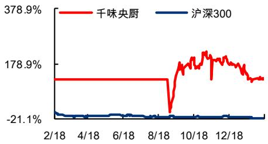  
52周股价走势图  
资料来源：wind、东兴证券研究所

风险提示：疫情导致消费能力及消费需求下降，餐饮业复苏低于预期；前三大客户的经营风险间接影响公司对大客户销售额；食品安全风险等。

010-66554023 weixy @dxzq.net.cn 执业证书编号： S1480120070032

财务指标预测   

<table><tr><td>指标</td><td>2019A</td><td>2020A</td><td>2021E</td><td>2022E</td><td>2023E</td></tr><tr><td>营业收入（百万元）</td><td>889.28</td><td>944.37</td><td>1,300.75</td><td>1,606.82</td><td>1,938.57</td></tr><tr><td>增长率(%)</td><td>26.82%</td><td>6.20%</td><td>37.74%</td><td>23.53%</td><td>20.65%</td></tr><tr><td>净归母利润(百万元)</td><td>74.12</td><td>76.59</td><td>89.69</td><td>114.71</td><td>144.19</td></tr><tr><td>增长率(%)</td><td>26.32%</td><td>3.31%</td><td>17.12%</td><td>27.88%</td><td>25.71%</td></tr><tr><td>净资产收益率(%)</td><td>18.27%</td><td>13.15%</td><td>9.39%</td><td>10.72%</td><td>11.87%</td></tr><tr><td>每股收益(元)</td><td>1.29</td><td>1.24</td><td>1.04</td><td>1.32</td><td>1.66</td></tr><tr><td>PE</td><td>38.73</td><td>40.29</td><td>48.25</td><td>37.73</td><td>30.02</td></tr><tr><td>PB</td><td>7.05</td><td>5.48</td><td>4.53</td><td>4.04</td><td>3.56</td></tr></table>

资料来源：公司财报、东兴证券研究所

# 目录

1.源于思念，成长于连锁餐饮.1.1 源于思念，股东阵容强大.. ……1.2专注连锁餐饮服务.  
2. 餐饮渠道专业化，成就百亿蓝海. ….2.1速冻食品仍有很大空间，速冻米面为第一大品类. ….2.2 速冻米面制品中，餐饮渠道具备较大增长潜力.. ……… ….2.3餐饮业的不断成熟和发展推动速冻米面食品餐饮端增长 …2.4速冻米面制品餐饮端竞争格局分散，存在集中度提升趋势. ……… ….  
3.双渠道、多产品均具备较大潜力. 13.1 渠道端：承连锁之风发展大客户，直营渠道有望维持稳定增长.. …………… …13.1.1公司具备获取大客户增量订单的能力.. ……………3.1.2 有望持续获取连锁企业新客户.. 1 23.2 渠道端：经销渠道提供较高增速.. …… .143.2.1 较强的产品力和性价比利于在小B渠道渗透.. 143.2.2经销潜能有待挖掘... ………………………3.3 产品端：油炸产品为主，双渠道多品类开花. …………… ….13.3.1油炸产品为主，维持稳定增长.. ……… …3.3.2烘焙类产品以大B为主，但通过小B贡献增量.. .3.3.3蒸煮类和菜肴类以小B为主，拥有较大潜力. .  
4.盈利预测与评级 ….  
5.风险提示 …

相关报告汇总. ..21

# 插图目录

图1：公司股权结构. .4图2：公司产品分渠道和品类收入（万元) ..5图3：公司分渠道收入占比. ….5图4：公司业绩及增速. ….图5：速冻食品分类.  
图6：中国速冻食品市场规模（亿元） ….图7：中国速冻米面制品市场规模（亿元） ….图8：速冻米面食品餐饮渠道占比：中国VS日本.  
图9：速冻食品人均消费量：kg/人.. ..8图10：社会消费品零售：餐饮业收入(亿元) ….8图11：中国餐饮连锁化率 ….图 12：美国餐饮连锁化率 ..9图13：中国餐饮业商家数量(万家) .9图14：中国餐饮就业人员劳动力成本：千元. ….图15：速冻米面制品竞爭格局（商超渠道）  
图16： 2020年速冻米面制品B端竞争格局.. …1图17： 2021 大眼商机-胡润中国餐饮连锁企业投资价值榜TOP 50..  
图18： 各品牌产品单价：元/kg(截止 2022 年 2月10 日)  
图19： 可比公司经销商平均销售额..  
图20： 可比公司经销商数量 …图21： 公司主要产品..  
图22： 公司产品的销售收入及构成(万元) ….图23：公司油条系列产品

# 表格目录

表1：速冻米面制品主要上市公.. ….表2：公司前五大直营客户销售金额及占比.表3：公司各营销模式下产品增速及贡献率.. ..18表4：公司营业收入预测. ..1.8

# 1.源于思念，成长于连锁餐饮

# 1.1 源于思念，股东阵容强大

公司是国内最早为餐饮、酒店、团体食堂等B 端市场提供速冻面米制品解决方案的供应商之一，主要为餐饮企业（含酒店、团体食堂、乡厨等）提供定制化和标准化的速冻面米制品，如油条、芝麻球、地瓜丸等。

公司上市前即郑州千味央厨食品有限公司，由郑州思念食品有限公司（实际控制人李伟）于2012 年 4 月全资设立。2016 年3月23日，郑州思念将持有的千味有限 $100 \%$ 股权转让给郑州集之城（同样是李伟控制的企业，2017 年8 月更名为共青城城之集企业管理咨询有限公司，即目前公司的大股东)，目的是将千味有限从郑州思念体系内独立出来，专注拓展速冻面米制品餐饮渠道市场。2017 年，为解决发行人与思念食品存在的同业竞争问题，李伟将间接持有的思念食品股权全部转让给思念食品管理层，并退出思念食品董事会，且不再担任思念食品任何职务。目前，公司的大股东为共青城城之集企业管理咨询有限公司，持有公司 $4 6 . 8 6 \%$ 的股权。共青城城之集由李伟 100%持股，因此李伟通过共青城城之集间接持有公司股份 $4 6 . 8 6 \%$ 是千味的实际控制人。除此之外，公司董事长及管理层均对公司持股，京东通过旗下投资公司宿迁函邦持股 $3 . 8 5 \%$ 絕味通过旗下投资公司深圳网聚持股 $3 . 8 5 \text{‰}$

李总于 1968 年出生，毕业于郑州大学新闻系，创办了河南思念食品股份有限公司，并为黄河大观实际控制人，第十二届、第十三届全国人大代表、河南省工商联副主席。公司董事长/法定代表人孙剑持有前海新希望$8 \%$ 的合伙份额，间接持有公司股份 $0 . 5 3 6 \%$ ，曾在思念担任过重要职务。

除了李总是思念集团的创始人外，在公司的 12 位董监高中，有6位有过思念食品的工作经历。与千味不同的是，千味食品以B端客户为主，思念的客户以C端为主。思念食品有限公司成立于1997 年7 月，现已发展成为中国大型专业速冻食品生产企业之一。公司产品有500 多个花色品种，营销网络遍及全国，在商超渠道中，思念为第二大品牌，其速冻米面制品占比达到 $1 9 \%$ 。

  
图1：公司股权结构

资料来源：公司公告、东兴证券研究所

# 1.2 专注连锁餐饮服务

公司的主要客户是餐饮客户，包括连锁餐饮和中小型餐饮企业、乡厨、餐饮、酒店等，为其提供多种类速冻米面制品。

按照销售模式划分，公司主要采取直营和经销两种模式进行销售，2020 年其收入分别为 3.37/6.05 亿元，占比分别为 $3 5 \% \nearrow \mathrm { ~ \pmb ~ { ~ 6 ~ 5 ~ \% ~ } ~ }$ 公司直营客户主要为大型连锁餐饮企业（大B)，经销客户为全国各地的经销商，公司通过他们将产品最终销往全国各地的中小餐饮企业、地方性酒店、中小团体餐厅、乡厨等终端客户（小B)。公司直营客户中百胜中国占比高达 $70 \%$ 左右。2020 年直营收入及占比下降至 $3 5 \%$ ，主要是因为公司对大客户百胜中国销售收入下降所致。疫情期间百胜中国旗下肯德基、必胜客门店因餐厅暂时停业、营业时间缩短及客流减少导致对发行人产品的采购额减少。

公司的所有系列产品也可以被划分为两大类：定制产品和通用产品，其收入分别为 2.92/6.50 亿元，占比分别约为 $3 5 \% \neq 6 5 \%$ 无论是直营还是经销，均销售定制品和通用品两种产品，但公司对经销客户主要销售通用品，对直营客户主要销售定制品。在通用品生产模式下，公司根据市场调研的结果来识别出客户的通用需求，并以此为起点进行研发和生产。定制品是根据客户的特定需求研发生产，加工工艺、品质要求通常比通用品更复杂、更严格。2020 年，公司通用类产品收入和占比有所上升，定制产品占比有所下降，主要是直营大客户受疫情影响需求下降所致。

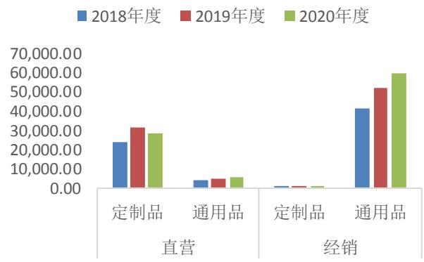  
图2：公司产品分渠道和品类收入（万元）  
资料来源：公司公告、、东兴证券研究所

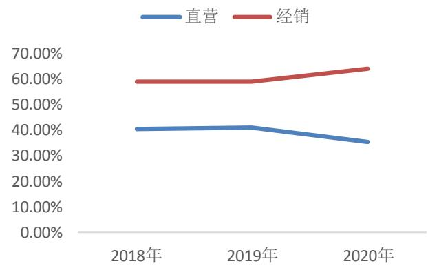  
图3：公司分渠道收入占比  
资料来源：公司公告、东兴证券研究所

2018 年-2021 年9 月，公司营业收入和归母净利润基本保持两位数增长。2020 年疫情对餐饮业影响较大，直接影响了公司主要客户的供货需求，公司 2020 年营业收入降至个位数增长，扣非归母净利润同比下降 $20 \%$ 。2021年，餐饮业的缓慢恢复，公司 2021年1-9月营业收入同比增长 $4 5 . 9 2 \%$ ，接近2019 年全年水平，归母净利润同比增长 $8 4 . 3 9 \%$ ，盈利能力快速恢复。

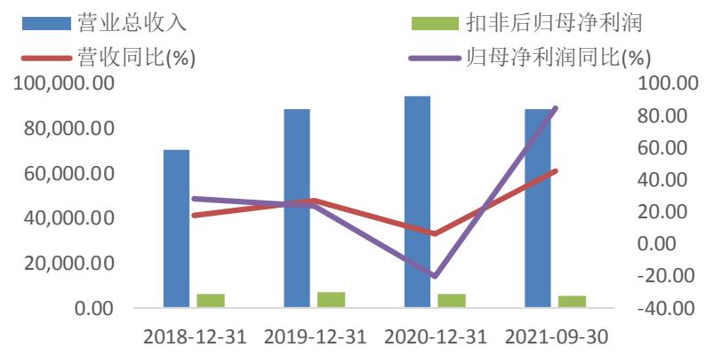  
图4：公司业绩及增速  
资料来源：Wind资讯、东兴证券研究所

# 2.餐饮渠道专业化，成就百亿蓝海

# 2.1 速冻食品仍有很大空间，速冻米面为第一大品类

速冻食品加工工艺的核心优点是通过低温速冻处理，有效地抑制微生物的活动，最大限度地保持食品本身的色泽风味及营养成分。中国速冻食品根据产品种类可大致分为速冻调制食品、速冻面米制品、速冻其他食品三类。其中，速冻面米制品主要包括水饺、汤圆、油条、芝麻球等；速冻其他食品可细分为农产速冻食品、水产速冻食品、畜产速冻食品等。

  
图5：速冻食品分类   
资料来源：公司招股说明书、、东兴证券研究所

iMedia Research(艾媒咨询)数据显示，自2016 年起，由于我国经济水平和餐饮业的不断发展，冷链物流体系的不断完善，我国速冻食品市场规模不断扩大，至2020 年，中国速冻食品市场规模已达 1393 亿元，2015-2020 年 5年 CAGR达到 $1 2 . 3 3 \%$ 。根据前瞻经济学人网预测，到2024 年，我国速冻食品行业的市场规模将超过2,000亿元。

我国速冻食品人均消费量仍有很大空间。据冷冻食品网：美国是世界上速冻食品产量最大、人均消费量最高的国家，年产量达 2000 万吨，品种 3000 多种，2017 年人均年消费量 80 千克以上，速冻食品占据整个食品行业的 $6 0 \% - 7 0 \%$ 。欧洲速冻食品的消费仅次于美国，年消费量超过1000 万吨，2017 年人均年消费量40千克左右。日本是世界上速冻食品的第三大消费市场，也是亚洲第一大消费市场，2017 年产量达 160.1 万吨，消费量 285.53 万吨，品种3,000 多种，仅烹饪调制食品就有 2,400 多种，2017 年人均年消费量为 22.5千克。我国冷冻食品 2019 年人均约 9 千克，不到 2017 年日本的 1/2，欧洲的 1/4，美国的 1/8，我国速冻食品整体仍有很大增长空间。

速冻米面食品是速冻食品中的第一大品类，占比大约 $50 \% 6 0 \%$ 左右。根据《2019年中国冷冻冷藏食品工业经济运行报告》；“2019 年我国速冻米面食品制造业完成营业收入 773.5 亿元，同比增长 $4 . 6 \%$ ”。2020年我国速冻米面市场收入754 亿元，略有下降，但预计疫情后行业恢复增长。

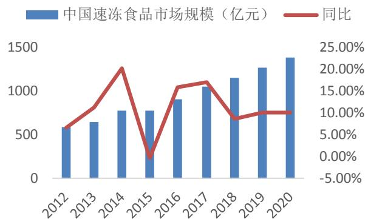  
图6：中国速冻食品市场规模（亿元）  
资料来源：艾媒咨询、东兴证券研究所

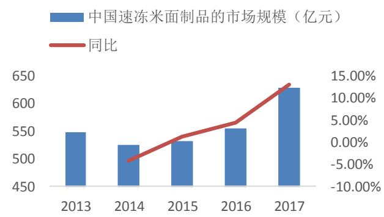  
图7：中国速冻米面制品市场规模（亿元）  
资料来源：公司公告、东兴证券研究所

# 2.2 速冻米面制品中，餐饮渠道具备较大增长潜力

在速冻米面食品渠道中，零售渠道（即C端渠道）为主要销售渠道，餐饮占比小但增速更快。个人消费者市场经过多年发展后市场规模趋于稳定，增幅较慢。餐饮渠道市场方面，由于速冻面米制品具备产品标准化、生产工业化和品质稳定性等特征，越来越多的餐饮企业选择通过统一采购速冻面米制品以实现相关菜品的标准化、提高出餐效率，降低成本，餐饮渠道市场成为驱动速冻面米制品市场规模扩大的重要引擎。根据公司招股说明书，预计未来五年，速冻面米制品餐饮渠道收入复合增速为 $21 \%$ 。

2018 年我国速冻面米制品餐饮渠道收入为 122 亿元，占比仅 $16 \%$ 与日本差距较大。日本跟我国的饮食文化差异较小，但日本的食品工业更加发达。在日本，与我国速冻米面制品类似的是同样用到米面的点心和油炸类产品。2020 年，日本速冻食品中点心和油炸类食品家庭用占比为 $3 6 . 0 4 \%$ ，餐饮占比高达 $6 3 . 9 6 \%$ ，速冻米面制品餐饮渠道占比明显高于我国。我们判断，我国和日本的饮食文化习惯差异性较小，随着餐饮工业化发展以及居民生活水平的提高，我国速冻食品在餐饮供应链占比会继续提升，速冻食品在餐饮渠道仍有很大的发展空间。

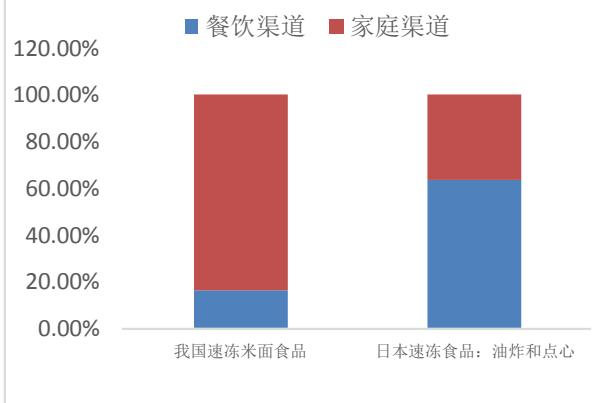  
图8：速冻米面食品餐饮渠道占比：中国VS日本  
资料来源： $\boldsymbol { E }$ 本冷冻食品协会、东兴证券研究所

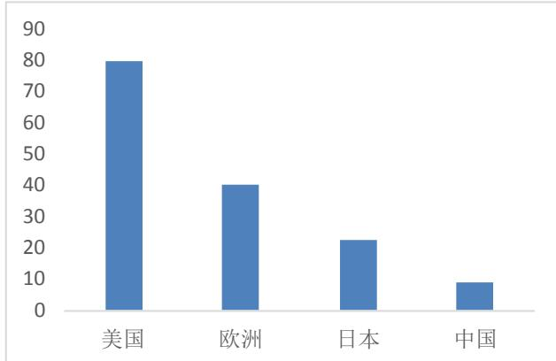  
图9：速冻食品人均消费量：kg/人

资料来源：冷冻食品网、东兴证券研究所

# 2.3 餐饮业的不断成熟和发展推动速冻米面食品餐饮端增长

根据国家统计局数据，自 2011 年至 2021 年，我国餐饮业社会零售总收入从 20543 亿元逐步增长至 46,895亿元，10 年复合增速 $8 . 6 \%$ ，2016-2019 年的疫情前三年间复合增速为 $9 . 2 8 \%$ ，餐饮业仍处于快速发展阶段。

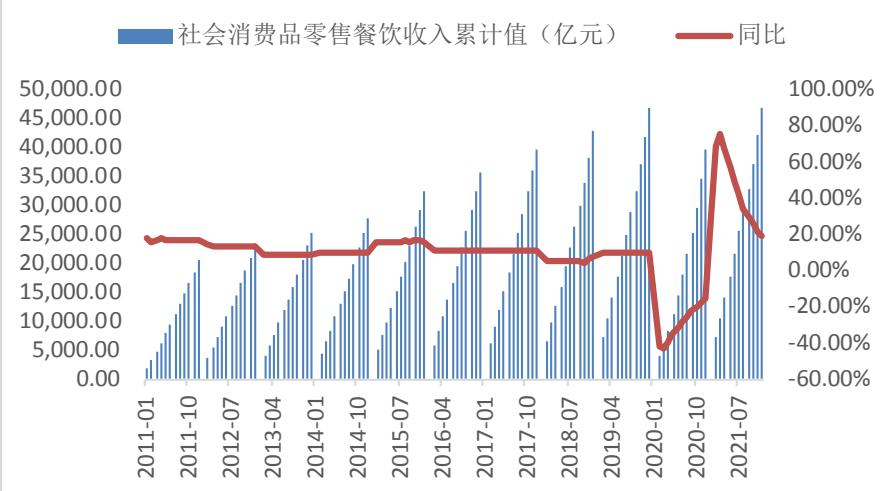  
图10：社会消费品零售：餐饮业收入（亿元）  
资料来源：Wind资讯、东兴证券研究所

我国餐饮连锁化率具备较大提升空间。目前国内餐饮行业竞争格局非常分散，2017-2019 年国内餐饮连锁化率分别为 $9 . 4 \% / 9 . 7 \% / 1 0 . 3 \%$ ，行业连锁化率在逐年提升。但相比美国2019 年 $5 4 . 3 \%$ ，全球平均 $30 \%$ 的连锁化率，我国餐饮业连锁化率仍然较低。2018 年，前 100 大餐饮企业合计收入为 2410 亿元，较 2017 年增长$1 2 . 2 \%$ ，超过了行业整体增速（行业增速 $7 . 7 5 \%$ )，表明领先连锁餐饮企业具有较强的竞争力，将推动餐饮行业连锁化率的持续提升。

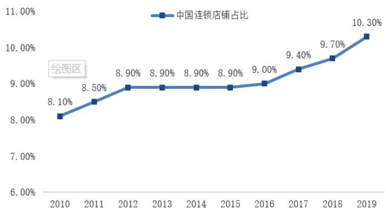  
图11：中国餐饮连锁化率  
资料来源：立鼎产业研究、欧睿国际、东兴证券研究所

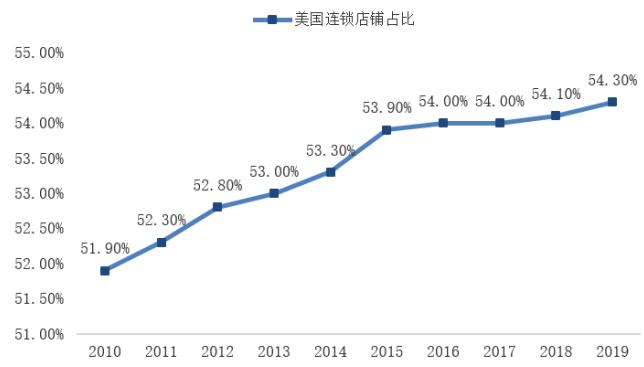  
图12：美国餐饮连锁化率  
资料来源：立鼎产业研究、欧睿国际、东兴证券研究所

中央厨房帮助连锁餐饮降本增效，餐饮业连锁化带动上游中央工厂需求。连锁餐饮企业在扩张的过程中往往更加注重供应链体系的打造，餐品的高标准化在提升客户体验感的同时能够简化公司管理流程、降低公司的管理成本。另外，劳动力成本的上升也迫使越来越多的餐饮企业使用中央厨房。2014 年至2018 年，随着中国宏观经济的快速增长，中国餐饮服务业员工的年收入稳步增长，2014-2018 年4 年 CAGR 达到 $7 . 6 4 \%$ ,与行业增速相当，但餐饮业商家数量近几年（除 2020 年）快速增长，从 2015 年的 326 万家，增长至 2019年的 1107.5 万家，单个商家营业额从 2015 年的 99 万元/年下降至 2019 年的 42 万元/年。虽然我们判断平均单店营业额的下降主要是由外卖店、奶茶店等小型餐饮店的兴起所致，但也不排除餐饮业竞争压力加大，从业人员工资在单店收入中占比增加。利润率降低使得商家更加需要通过中央厨房降低成本，提升运营效率。

中央厨房在餐饮企业扩张的过程中有助于食品供应和运营管理的标准化，且能够快速提供大量半成品食品以确保最终产品的上菜速度和质量并提升翻台率，从而符合消费者期望并提高餐饮企业的运营效率。近年来餐饮企业为适应自身连锁化和降低经营成本的需要，加强与上游速冻面米制品企业的合作，通过采购工业化生产的速冻半成品来实现餐饮的标准化与品质化，速冻面米制品行业在餐饮行业渗透率逐步提高。

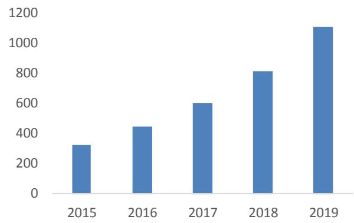  
图13：中国餐饮业商家数量（万家）  
资料来源：艾媒咨询、东兴证券研究所

  
图14：中国餐饮就业人员劳动力成本：千元  
资料来源：九毛九招股书、东兴证券研究所

# 2.4 速冻米面制品餐饮端竞争格局分散，存在集中度提升趋势

公司是速冻米面制品龙头企业，速冻米面制品餐饮供应端的其他参与者主要有上市公司安井食品、三全食品、巴比食品以及非上市公司佛山市顺德区屏荣食品发展有限公司、海欣食品等。其中，安井食品特通收入1.63亿元，主要包括餐饮、酒店、休闲食品等领域，占其总收入的 $2 . 3 4 \%$ ，规模较小，且以速冻火锅料为主；三全食品主要面向C 端提供速冻汤圆、水饺等传统米面制品，餐饮渠道收入9.4 亿元，占比 $1 3 . 5 7 \%$ ，为海底捞提供茴香小油条，为肯德基提供早餐饼皮、青团等，是公司的主要竞争对手；巴比食品主要以通过早餐包子铺连锁加盟的方式为加盟商提供速冻面制品及其馅料，其团餐业务规模1.33 亿元，占比 $1 3 . 6 7 \%$ 。巴比食品的团餐主要面向单位、学校，部分为连锁餐饮，与公司的以连锁餐饮为主的客户群体有所不同。另外，以火锅料制品为主的海欣食品于2020 年开始涉足速冻面制品，但规模和占比依然较低。

表1：速冻米面制品主要上市公司  

<table><tr><td></td><td></td><td>主要产品及　速冻米面 营收占比</td><td>产品占比</td><td>速冻米面制 品产品</td><td>餐饮企业客 户</td><td>餐饮占比</td><td>餐饮产品</td></tr><tr><td>SH)</td><td>安井食品主要从事速冻火锅火锅料产品 （603345．料制品和速冻面米制 品、速冻菜肴制品， 产品线较丰富。</td><td>(66.38%)</td><td>23.86%</td><td>手抓饼、核桃呷哺呷哺、海2020年特鱼丸、火 手撕红糖馒等</td><td>包、红糖发底捞、彤德通收入1.63锅料等 糕、桂花糕、莱、永和大王亿，占比</td><td>2.34%</td><td></td></tr><tr><td>三全食品 （002216. SZ)</td><td>主要从事速冻汤圆、 速冻水饺、速冻粽子、 速冻面点等速冻面 米制品和常溫方便食 品。针对餐饮企业推 出酥脆升级油条系 列、金鱼馄饨系列等</td><td>速冻米面制 品(89.96%)</td><td>89.96%</td><td>冻水饺等</td><td>基、巴奴火锅</td><td>比13.57%</td><td>速冻汤圆、速海底捞、肯德2020年餐馅饼、蒸 饮渠道收入饺、茴香 9.40亿，占小油条等</td></tr><tr><td>巴比食品 （605338. SH)</td><td>是一家“连锁门店销面点及馅料61.21% 售为主，团体供餐销 售为辅”的中式面点 速冻食品制造企业。 以早餐为主，具体包 括包子、馒头、粗粮 点心、馅料以及粥品</td><td>类(61.21%)</td><td></td><td>包子及其馅团餐 料、饺子、馒 头等</td><td></td><td>2020年团 餐销售规模 1.33 亿元， 占比 13.67%。</td><td>包子、饺 子、馒头 等</td></tr><tr><td>千味央廚 （001215. SZ)</td><td>主要为B 端市场提供 速冻面米制品解决方 案，其中油条类、蛋 挞类、芝麻球类、面 点类均是含税收入超 亿元的品类。</td><td>油炸产品94.72% (55.34%)</td><td></td><td>芝麻球等</td><td>莱士、海底捞 等</td><td></td><td>油条、蛋挞、百胜中国、华主要为餐饮油条、蛋 挞、芝麻 球等</td></tr></table>

资料来源：各家上市公司公告、东兴证券研究所

在C 端市场中，速冻米面制品竞争格局较为集中，龙头企业分别为三全、思念和湾仔码头，CR3 达到 $65 \%$ 而面向B 端的行业竞争格局较为分散。据我们测算，2020 年公司B 端市占率 $5 . 2 6 \%$ ，为行业市占率第一。整体来看，速冻米面制品B端市场竞争格局较为分散。

在消费行业，C 端客户更注重多样化，B 端客户更注重标准化并相对下游更加具备规模优势。因此在消费领域的许多行业中，B 端比 C 端的市场集中度更高。随着行业的发展，餐饮客户对选择供应商的标准将越来越严格，已经成功进入供应商名单的厂商具备先发优势和规模优势，优势将越发突显，因此，我们认为，速冻米面製品B端市场集中度存在提升趋势。

  
图15：速冻米面制品竞争格局（商超渠道）  
资料来源：立鼎产业研究网、东兴证券研究所

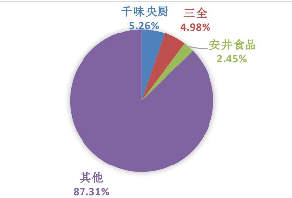  
图16：2020 年速冻米面制品B端竞争格局  
资料来源：公司公告、Wind资讯、东兴证券研究所

# 3.双渠道、多产品均具备较大潜力

# 3.1 渠道端：承连锁之风发展大客户，直营渠道有望维持稳定增长

公司通过直营渠道对连锁餐饮大客户进行服务和产品的销售。2019 年公司直营销售收入3.37 亿元，占营业收入比重达到 $4 1 . 0 2 \%$ ，同比增长 $2 7 . 8 2 \%$ 。2020 年受疫情影响公司对百胜销售额同比下降 $19 \%$ ，虽然百胜占公司直营收入的 $70 \%$ 左右，但公司对部分其他直营客户销售额明显增加，直营收入同比仅下降 $7 . 6 1 \%$ ，体现了公司直营业务的一定韧性和发展空间。2021 年公司前三季度营业收入同比增长 $4 5 . 9 2 \%$ ，直营业务显著恢复。

# 3.1.1 公司具备获取大客户增量订单的能力

公司以现有大客户优先，并不断挖掘其潜力。公司以为大型连锁餐饮提供速冻米面制品起家，在连锁餐饮供应链上深耕多年，具备深厚的客户基础。2019 年公司直营销售收入占比达到 $4 1 . 0 2 \%$ 。公司与直营客户多年的合作关系让双方的了解更为深入，公司对客户需求的把握较为准确。公司现有直营大客户是公司的立身之本，因此公司内部树立“大客户优先”理念，形成对接大客户的内部小组，公司董事长和总经理为小组负责人，确保内部组织能够快速响应大客户的需求，对现有大客户的需求优先满足，以保证主要订单的稳定性。

然而，出于对供应体系稳定的角度，很多大客户会寻求替代供应商，与不止一家供应商合作，因此公司单一产品在单个大客户的份额可能会被侵蚀。为保证公司的经营稳定性和成长性，公司一方面提高供应链运营能力，提升仓储覆盖率，另一方面，公司一直在拓展现有客户的产品品类。

不断拓展现有客户产品品类。目前公司和主要客户的合作时间久，对客户的运营情况和需求把握比较准确。因此在现有产品的基础上，努力拓展供应的品类，除了速冻面米制品以外，还争取获得如烘焙类产品、预调理食品、蔬菜类产品等多品类产品的供应权。围绕客户的需求来确定公司的生产运营，挖掘现有客户的潜力和供应份额。以肯德基为例，2018 年，公司为肯德基研发上新 7 支单品，获得销售收入的快速增长。公司从最早向其提供蛋挞皮开始，到现在产品已经延伸到安心油条、华夫饼、冷冻面团、烙饼、牛角包、酥饼等多个品类。

公司在直营大客户中存在持续加大订单获取的能力并维持公司整体收入的基本增长。2019 年公司产品收入增速 $2 6 . 7 9 \%$ ，其中直营模式收入同比增长 $2 7 . 8 2 \%$ 。在直营模式中12.32个百分点源于直营渠道中油炸产品收入增长。直营渠道中油炸类产品销量增加主要是百胜中国和华莱士采购需求增加导致存续产品“KFC 冷冻油条（60g）"、“千味 280g 豌豆紫薯派”、“千味餐饮 60g 冷冻油条”销量增加以及为百胜中国定制开发的新品“百胜 360g 蛋芯油条”上市销量增加带动。在 2019 直营收入的增长中有13.68 个百分点由烘焙类产品所带动，其销售量的增加主要是百胜中国需求增加导致存续产品“ $1 ^ { \star } 1 8 ^ { \star } 1 6$ 蛋挞皮"和新品销量增加。另外，公司新品“百胜咸蛋黄味冷冻华夫面团”、“百胜720g咸蛋黄肉酥青团”销售单价较高是的公司烘焙产品平均单价也有所上升。

2020 年公司对海底捞收入达到 2000 万元，实现数倍增长，增长主要来源于部分新产品，如春卷、油条、员工餐等以及几个仓的供货权。近年来，公司加速对华莱士仓库的覆盖，华莱士于 2019 年销售额仅 2567 万元，2020 年便达到 4000 万元。

表2：公司前五大直营客户销售金额及占比  

<table><tr><td>序 号</td><td>客户名称</td><td>2020年销 售额(万元）</td><td>占直营收 入比重</td><td>占营业收入比重</td><td>2019 年销售额 （万元）</td><td>占直营收入 比重</td><td>占营业收 入比重</td></tr><tr><td>1</td><td>百胜中国控股有限22,067.31 公司及其关联方</td><td></td><td>65.52%</td><td>23.37%</td><td>27,317.14</td><td>74.94%</td><td>30.72%</td></tr><tr><td>2</td><td>福建省华莱士食品4,000.19 股份有限公司及其 关联方</td><td></td><td>11.88%</td><td>4.24%</td><td>2,567.12</td><td>7.04%</td><td>2.89%</td></tr><tr><td>3</td><td>四川海之雁贸易有 限公司及其关联方 （海底捞)</td><td>2,086.53</td><td>6.20%</td><td>2.21%</td><td></td><td></td><td></td></tr><tr><td>4</td><td>东莞市补给舰供应 链管理有限公司及 其关联方（真功夫）</td><td>664.96</td><td>1.97%</td><td>0.70%</td><td>641.9</td><td>1.76%</td><td>0.72%</td></tr><tr><td>5</td><td>佛山市麦点食品有 限公司及其关联方 (九毛九、太二等)</td><td>582.77</td><td>1.73%</td><td>0.62%</td><td>978.95</td><td>2.69%</td><td>1.10%</td></tr></table>

资料来源：公司招股说明书、东兴证券研究所

# 3.1.2 有望持续获取连锁企业新客户

速冻米面制品B 端渠道集中度低，公司餐饮市场市占率第一，市占率也仅有 $5 . 2 6 \%$ ，未来仍有很大发展空间。公司可以基于已有大客户产品，在保证现有客户利益的同时，在不违反保密协议的前提下对产品做一些改良，即能够增加产能利用率，提升生产效率，也能够增加产品上市的成功率。由于公司拥有成熟的大客户服务体系和经验，因此公司获取大型连锁餐饮客户的能力较强，一旦公司获得新的大客户，便能够迅速带来业绩增量。例如，四川海之雁贸易有限公司及其关联方代表的餐饮品牌为海底捞，其于 2020 年进入公司前5 大客户体系，贡献2087 万元销售额，直营渠道占比 $6 . 2 \%$ ，迅速成为公司第三大客户。

全国连锁餐饮企业空间大。公司前六大直营客户收入在直营业务收入中占比约 $90 \%$ ，说明目前公司直营业务主要依赖现有几个直营大客户。而我国总共有495 家连锁餐饮企业，公司拓客潜力巨大。根据《2021 大眼商机·胡润中国餐饮连锁企业投资价值榜TOP 50》，公司主要客户海底捞、九毛九、华莱士、真功夫分别排名第1、第4、第37 和第49，在这50 家企业中仍有很多企业是公司的潜在客户。

根据本文第二部分，我国餐饮业连锁化率还有很大上升空间。除此之外，我国的头部连锁餐饮企业相比全球的头部餐饮企业仍有很大发展空间。全球头部餐饮连锁企业是两家万亿级企业——麦当劳和星巴克，在中国各有五六千家门店。百胜中国价值 1700 亿，旗下肯德基中国拥有 8000 多家门店，而 50 强中国餐饮连锁企业总价值 6000 亿，仅是麦当劳的一半。我国大型连锁餐饮企业自身也有很大的发展空间。截至2021 年 8月，餐饮行业投融资金额已经超过去年全年的 2 倍，达到 439 亿元。我们认为，在未来的几年，我们仍然能够看到新的连锁餐饮企业不断崛起。

我们上一篇深度报告提到了，公司拥有如百胜、华莱士、海底捞等大客户基础，具备过硬的产品品质和综合服务能力，公司的研发生产体系能够快速适应行业变化，满足客户需求，这些能力为开拓新的连锁大客户打下良好的基础。

  
资料来源：大眼商机、东兴证券研究所

区域连锁企业不容忽视。中国地大物博，各地饮食习惯不同，风格不同，也诞生了很多在区域市场特色鲜明的餐饮品牌，如老乡鸡、乡村基等。这些餐饮连锁企业具有典型的区域饮食风格特征，在某些区域开店比较密集，部分省份或者区域店面数量达到几百家甚至上千家，且已经初步建立了食材供应链。公司正在加大开发区域性连锁餐饮企业客户，并以此下达任务指标，争取未来 3-5 年之内，有一批合作紧密、业务量大的餐饮连锁新秀客户，给公司未来的业务发展带来源源不断的动力。

# 3.2 渠道端：经销渠道提供较高增速

2020 公司直营渠道占比受疫情影响下滑，经销渠道收入占比达到 $6 4 . 2 6 \%$ 。公司经销渠道收入增速较为稳定，2019 年同比增长 $2 6 . 7 9 \%$ ，2020 年在疫情影响下，公司经销渠道收入依然获得 $1 5 . 5 2 \%$ 增速，明显高于直营收入增速，是公司经营业绩的润滑剂，也证明了经销渠道的发展潜力。

# 3.2.1 较强的产品力和性价比利于在小B 渠道渗透

油炸产品是经销渠道中的主要产品品类，2020 年占比达到 $62 \text{‰}$ 油炸类产品是公司的主力产品，具备较强的竞争力，于 2019 年和 2020 年均贡献经销渠道主要收入增量。以油条为例，公司安心大油条淘宝价格低于安井、三全和小胖子大油条，在油条品类中具备性价比。另外，公司产品力较强，例如，公司不同场景的油条具备特色，例如外卖油条耐放，火锅油条耐煮；公司的芝麻球不容易掉芝麻，也不同意爆裂。基于较高的产品力和性价比，公司的油条和芝麻在餐饮连锁端的市占率达到 $50 \%$ 以上，公司油炸品类贡献主要销售增量。

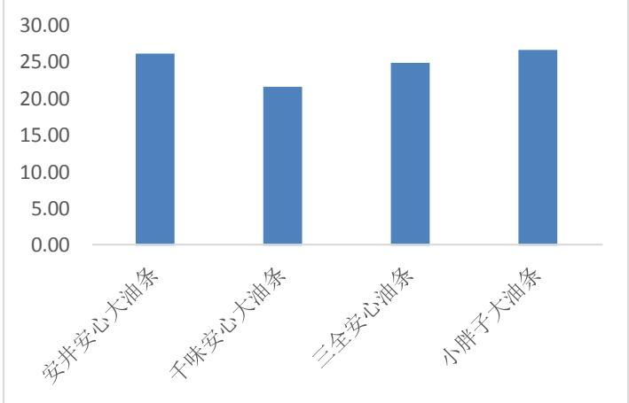  
图18：各品牌产品单价:元/kg（截止2022年2月10日）  
资料来源：淘宝、东兴证券研究所

具体来看，2019 年公司加大市场开拓，存续产品“千味 1200g 安心大油条”和新品“千味餐饮 720g 外卖油条”销量增加。2020 年存续产品千味 260g 芝麻球、千味 1200g 安心大油条带动继续获得快速增长，除此之外，馅饼、春卷、美国甜心派等产品价格提升带动收入增长。

公司蒸煮类产品占经销渠道收入的 $2 5 \%$ ，是经销渠道中重要品类。2019 年，蒸煮类产品经销渠道销售收入增长对公司销售收入亦有较大贡献。受下游酒店、团餐、乡厨市场采购需求增加，“千味360g 卡通猪猪包”以及多款新品带动了销量的增加。

# 3.2.2 经销潜能有待挖掘

虽然 2020 年餐营业整体受疫情影响较大，但米面制品在小B 餐饮端渗透空间较大，市场集中度有望持续提升，因此公司经销渠道销售额依然维持两位数增长。但由于公司经销体系依然有待发展，在小B 端渗透率不高，在广大的乡厨、中小餐饮企业中依然有较高的渗透空间。

经销体存在持续强化空间。中国各地规模庞大的中小餐饮企业以及庞大的乡厨队伍均是公司的潜在客户。乡厨队伍虽然大多不是公司化运营，但主导了中国广大的农村和乡镇的红白喜事宴席，产品的需求量大，有固定的原料和半成品供应商，而这些供应商大多在海鲜批发市场、调味品、冻品批发市场。公司产品力较强，在经销渠道方面已经建立了全国性的经销网络，能够辐射全国各地的中小餐饮企业、地方性酒店、中小团体餐厅、乡厨等终端客户，但相比安井、三全等企业，公司经销渠道依然较为薄弱。2020 年，安井拥有经销商 1033 家，经销商平均销售额 568 万元，并以较快速度扩大经销商队伍。截止 2021 年三季度末，安井经销商数量达到 2057 家。2020 年，三全经销商数量高达 5622 家。相比竞争对手，2020 年公司经销商数量907 家，但销售额大于 100 万的经销商客户仅有 130 家，平均销售额仅为 67 万元，与安井差距较大，公司经销体系有待加强。公司下一步将加大开发餐饮经销商的力度，效仿竞争对手加大对经销商的培育，我们推测随着经销商数量的增加和质量的提升，公司经销收入将维持较高增速。

  
图19：可比公司经销商平均销售额  
资料来源：各公司公告、东兴证券研究所  
图21：公司主要产品

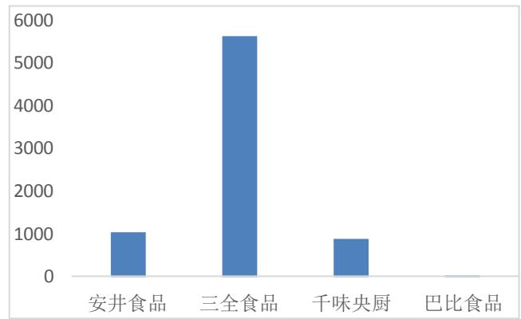  
图20：可比公司经销商数量  
资料来源：各公司公告、东兴证券研究所

# 3.3产品端：油炸产品为主，双渠道多品类开花

公司产品按照加工方式可分为油炸类、烘焙类、蒸煮类、莱肴类及其他四大类，具体产品包括油条、芝麻球、蛋挞皮、地瓜丸以及卡通包等。公司产品中油条类、蛋挞类、芝麻球类、面点类均是含税收入超亿元的品类。其中，公司生产的油条、芝麻球在连锁餐饮渠道的市占率分别达到 $50 \%$ 以上，为公司最主要的两大单品。2020年，公司营业总收入9.44亿元，其中，油炸类5.21亿元，占比 $5 5 . 2 2 \%$ 。

图22：公司产品的销售收入及构成（万元）

  
资料来源：公司招股说明书、东兴证券研究所

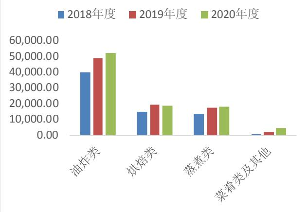  
资料来源：公司招股说明书、东兴证券研究所

# 3.3.1 油炸产品为主，维持稳定增长

油炸类为公司最主要的产品种类，2020 年收入占比 $5 5 . 3 4 \%$ ，包括油条系列产品和点心系列产品。油条系列产品包括外卖油条、香脆油条、安心大油条等油条类产品，点心系列产品包括芝麻球、芋香麻球、地瓜丸、脆皮香蕉、紫薯豌豆派等中西式点心类产品。

油炸类产品是公司强势品类，多年保持较高增速。公司在油条、芝麻球等产品上具较强优势，公司油条品类在餐饮连锁渠道中的市场占有率达到 $70 \%$ 左右。2019 年公司产品收入增速 $2 6 . 7 9 \%$ ，其中7.75个百分点源于经销渠道中油炸产品收入增长，5.01 个百分点源于直营渠道中油炸产品收入增长。

公司通过产品创新持续培育油条市场，使得这种传统的中国食品的使用场景更加多元，逐步打开油条食品的天花板。公司从 2012 年开始进行油条细分场景下的市场研究，逐步推出外卖油条、火锅油条、安心油条、香脆油条、麻辣烫油条、茴香小油条、蛋芯油条、墨鱼汁油条等多种油条类产品，涵盖了火锅、快餐、自助餐、宴席、早餐、外卖六大场景，多款产品在推出后便取得良好的销量，直接推动业绩增长。

图23：公司油条系列产品

  
资料来源：公司招股说明书、东兴证券研究所

# 3.3.2烘焙类产品以大B 为主，但通过小B贡献增量

烘焙类产品在直营渠道销售额占比达到 $45 \%$ 是直营渠道中最重要的品类。烘焙类产品主要包括手工蛋挞皮、华夫饼、可颂冷冻面团等产品，其中以手工蛋挞皮为主。2020 年主要受对百盛收入下降影响，公司直营模式下烘焙类产品销售额同比 $1 5 . 6 3 \%$ 。公司烘焙类产品绝大部分通过直营渠道销售，但2020 年经销渠道增速达到 $1 0 0 . 3 1 \%$ ，对收入增长拉动明显，是公司重点培育方向之一。

随着我国居民消费能力的提升以及饮食结构的变化，烘焙类产品逐渐成为居民饮食重要组成部分。今年来我国人均烘焙食品消费量不断增长，由2015年的 $6 . 0 \mathsf { k g }$ 上升到 2019 年的7.4kg，2020 年受疫情影响下滑到$7 . 3 \mathsf { k g }$ ，相比日本烘焙食品人均消费量18.1kg 仍有很大增长空间。公司以大型连锁渠道切入烘焙类产品，保证基本供应量，已经形成一定口碑，随后有望进一步开发连锁客户并且通过小B端打开烘焙产品的增量市场。

# 3.3.3 蒸煮类和菜肴类以小B 为主，拥有较大潜力

公司蒸煮类产品包括卡通猪猪包、猪肉包、寿桃包等，2019 年销售额占比 $1 9 . 8 9 \%$ 。由于公司大客户以西式快餐为主，对蒸煮类产品需求较少，公司绝大部分蒸煮类产品通过经销渠道销往小B 端客户。

2019年，公司经销渠道收入同比增长 $2 6 . 0 9 \%$ ，该渠道中蒸煮类产品贡献收入增速9.12个百分点，仅次于油炸类产品。蒸煮类产品符合中国人平日消费习惯，需求量大，是广大中小餐饮和乡镇餐厨群体的必须菜品，但制作起来费时费力，且单价较低，因此未来通过第三方供给需求量较大，中央厨房蒸煮类产品拥有较大市场潜力。

菜肴类及其他业务 2020 年收入占比仅 $5 . 2 7 \%$ ，但增速维持在 $100 \%$ 以上，主要包括撒尿牛肉丸、土豆宽粉、千页豆腐等。菜肴类及其他产品销量增加主要是因为公司大力开拓火锅料市场新增多款火锅类产品。虽然火锅料市场竞争对手较多，但火锅市场庞大，公司已进入如海底捞、小肥羊等连锁火锅大客户供应链体系，未来有望持续增加产品供应品种，并逐步加深布局火锅料市场。

表3：公司各营销模式下产品增速及贡献率  

<table><tr><td>销售模式 经销模式</td><td>产品 类别</td><td>2020年销售收 入同比</td><td>2019年销售收入同 比</td><td>2020年对收入 增速的贡献</td><td>对2019年收入增速 的贡献</td></tr><tr><td rowspan="5"></td><td>油炸类</td><td>7.36%</td><td>18.36%</td><td>4.92%</td><td>13.07%</td></tr><tr><td>烘焙类</td><td>100.31%</td><td>47.24%</td><td>3.42%</td><td>1.38%</td></tr><tr><td>蒸煮类</td><td>6.79%</td><td>37.02%</td><td>1.82%</td><td>9.12%</td></tr><tr><td>菜肴类及其他</td><td>180.07%</td><td>202.79%</td><td>5.36%</td><td>2.51%</td></tr><tr><td>合计</td><td>15.52%</td><td>26.09%</td><td>15.52%</td><td>26.09%</td></tr><tr><td rowspan="5">直营模式</td><td>油炸类</td><td>2.74%</td><td>33.04%</td><td>1.06%</td><td>12.32%</td></tr><tr><td>烘焙类</td><td>-15.63%</td><td>27.70%</td><td>-7.71%</td><td>13.68%</td></tr><tr><td>蒸煮类</td><td>-7.41%</td><td>9.69%</td><td>-0.74%</td><td>1.13%</td></tr><tr><td>菜肴类及其他</td><td>-11.71%</td><td>41.08% 27.82%</td><td>-0.22%</td><td>0.70%</td></tr><tr><td>合计</td><td>-7.61%</td><td></td><td>-7.61%</td><td>27.82%</td></tr></table>

资料来源：公司招股说明书、东兴证券研究所

# 4.盈利预测与评级

我们认为，公司在速冻米面制品连锁餐饮供应链体系中的渗透空间依然很大。公司具备不断获取大客户的能力，直营收入能够维持小两位数增长。另外，随着公司在经销模式下的不断深耕，开拓市场能力不断加强，公司未来三年经销业务有望继续取得较高增长。公司的多个产品品种在不同渠道均具备较大优势和潜力。2021 年 11 月公司公告股权激励计划，根据该计划的业绩考核目标，以 2020 年收入为基数，公司 2021-2023年营业收入增速分别为 $3 5 \% / 6 7 \% / 1 0 1 \%$ ，考核目标触发值分别为目标的 $80 \%$ 。我们认为公司完成考核目标概率较高，不考虑股权激励费用，我们预计公司 2021-2023 年净利润分别为 0.90、1.15 和1.44 亿元，对应EPS 分别为 1.04、1.32 和 1.66 元。当前股价对应 2021-2023 年 PE 值分别为 48、38 和 30 倍，首次覆盖给予“强烈推荐”评级。

表4：公司营业收入预测  

<table><tr><td></td><td>客戶名称</td><td>2018 年销售额</td><td>2019 年销售额</td><td>2020 年销售额</td><td>2021E</td><td>2022E</td><td>2023E</td></tr><tr><td>三主</td><td>百胜中国控股有限 公司及其关联方</td><td>21,175.14</td><td>27,317.14</td><td>22,067.31</td><td>26,260.10</td><td>28,098.31</td><td>29,784.20</td></tr><tr><td>要直营客户</td><td>同比 福建省华菜士食品</td><td></td><td>29.01%</td><td>-19.22%</td><td>19.00%</td><td>7.00%</td><td>6.00%</td></tr><tr><td></td><td>股份有限公司及其 关联方</td><td>2,368.83</td><td>2,567.12</td><td>4,000.19</td><td>8,200.39</td><td>10,250.49</td><td>11,788.06</td></tr><tr><td>同比</td><td></td><td></td><td>8.37%</td><td>55.82%</td><td>105.00%</td><td>25.00%</td><td>15.00%</td></tr><tr><td></td><td>四川海之雁贸易有 限公司及其关联方 （海底捞）</td><td></td><td></td><td>2,086.53</td><td>4,799.02</td><td>8,638.23</td><td>10,365.88</td></tr><tr><td>同比</td><td></td><td></td><td></td><td></td><td>130.00%</td><td>80.00%</td><td>20.00%</td></tr></table>

<table><tr><td>东莞市补给舰供应 链管理有限公司及 其关联方（真功夫）</td><td>569.51</td><td>641.90</td><td>664.96</td><td>1,130.43</td><td>1,356.52</td><td>1,560.00</td></tr><tr><td>同比</td><td></td><td>12.71%</td><td>3.59%</td><td>70.00%</td><td>20.00%</td><td>15.00%</td></tr><tr><td>佛山市麦点食品有 限公司及其关联方 (九毛九、太二等)</td><td>895.88</td><td>978.95</td><td>582.77</td><td>1,107.26</td><td>1,273.35</td><td>1,528.02</td></tr><tr><td>同比</td><td></td><td>9.27%</td><td>-40.47%</td><td>90.00%</td><td>15.00%</td><td>20.00%</td></tr><tr><td>其他直营客户</td><td>3,507.00</td><td>4,945.65</td><td>4,276.25</td><td>6,842.00</td><td>8,894.60</td><td>11,118.25</td></tr><tr><td>同比</td><td></td><td>41.02%</td><td>-13.54%</td><td>60.00%</td><td>30.00%</td><td>25.00%</td></tr><tr><td>直营收入</td><td>28,516.36</td><td>36,450.76</td><td>33,678.01</td><td>48,339.20</td><td>58,511.50</td><td>66,144.41</td></tr><tr><td>同比</td><td></td><td>27.82%</td><td>-7.61%</td><td>43.53%</td><td>21.04%</td><td>13.05%</td></tr><tr><td>毛利率</td><td></td><td>29.33%</td><td>23.19%</td><td>22.80%</td><td>23.10%</td><td>23.30%</td></tr><tr><td>成本</td><td></td><td>25,759.75</td><td>25,868.08</td><td>37,317.86</td><td>44,995.34</td><td>50,732.77</td></tr><tr><td>经销收入</td><td>41,568.52</td><td>52,412.39</td><td>60,545.33</td><td>81,736.20</td><td>102,170.24</td><td>127,712.81</td></tr><tr><td>同比</td><td></td><td>26.09%</td><td>15.52%</td><td>35.00%</td><td>25.00%</td><td>25.00%</td></tr><tr><td>毛利率</td><td></td><td>21.06%</td><td>20.62%</td><td>21.50%</td><td>21.80%</td><td>22.00%</td></tr><tr><td>成本</td><td></td><td>41,374.34</td><td>48,060.88</td><td>64,162.91</td><td>79,897.13</td><td>99,615.99</td></tr><tr><td>营业收入总计</td><td>70,084.88</td><td>88,863.15</td><td>94,223.34</td><td>130,075.40</td><td>160,681.74</td><td>193,857.22</td></tr><tr><td>同比</td><td></td><td>26.79%</td><td>6.03%</td><td>38.05%</td><td>23.53%</td><td>20.65%</td></tr><tr><td>毛利率</td><td></td><td>24.45%</td><td>21.54%</td><td>21.98%</td><td>22.27%</td><td>22.44%</td></tr><tr><td>成本</td><td></td><td>67,134.09</td><td>73,928.96</td><td>101,480.78</td><td>124,892.47</td><td>150,348.75</td></tr></table>

资料来源：公司招股说明书、东兴证券研究所

# 5.风险提示

疫情导致消费能力及消费需求下降，餐饮业复苏低于预期；前三大客户的经营风险间接影响公司对大客户销售额；食品安全风险等。