# 千味央厨（001215）：系列报告之二：三大优势助力腾飞

-系列报告之二

导语：前期，我们发布了《千味央厨（001215）系列报告一：央厨蓝海，畅品遨游》，主要论述行业的发展空间，并分别从公司的产品和渠道的角度来分析公司的运营情况和发展前景。本系列报告二，我们将主要阐述公司的竞争优势，证明公司持续获取市场份额的能力。

公司是餐饮业的中央厨房，主要为餐饮企业提供速冻面米制品。公司通过直营方式向连锁餐饮提供定制化产品，销售占比大约 $40 \%$ ，其中百胜中国在直营客户中销售占比达到 $48 \%$ 。另外，公司通过经销商为中小型餐饮提供标准化产品，销售占比大约 $60 \%$ 左右。具体产品种类可分为油炸类、烘焙类、蒸煮类、菜肴类及其他四大类。

公司所在的速冻米面制品餐饮业具备较大潜力，公司作为该领域的龙头企业存在三大竞争优势，有望持续获取市场份额。

1、大客户背书，为开拓新业务打下基础。公司自创立以来以大客户为根基，是百胜中国T1供应商，拥有百胜、华莱士、海底捞等大客户基础，具备过硬的产品品质和综合服务能力，为开拓新的连锁大客户打下良好的基础。

2、研发铸就更高生产力。公司研发改造生产设备，改进生产流程，实现生产效率进一步提高并确保产品和产品品质的统一，从而保证创新产品快速抢占市场。在研发的支持下，公司能够将客户的概念化需求快速转化为符合高质量、标准化要求的生产，使得单个大客户销售额不断提升。

3、成本管控能力较强，具备一定定价权。公司对原材料成本有较强的把控力，原材料成本波动较低，对大客户产品有一定溢价，直营毛利率比经销毛利率稍高，也高于多数同类可比公司餐饮渠道毛利率水平。2018-2020年公司多数主流产品平均单价均有所上涨，21年底对部分小B 端产品涨价，具备一定的成本转嫁能力。

盈利预测与评级：我们认为，公司产品研发能力、生产经营管理能力优秀，拥有各餐饮领域中大客户背书，未来持续获取市场份额能力无需担忧。由于今年疫情严重程度超出年初预期，餐饮业受疫情影响明显，我们下调对公司2022 年的业绩预测，但认为在不受疫情扰动的前提下2023 年公司盈利水平能够快速恢复，我们基本维持对2023 年的盈利预测，并增加对2024 年的盈利预测。我们预计公司2022-2024年净利润分别为1.03、1.43和1.76亿元，对应 EPS分别为1.18、1.65 和2.03 元。当前股价对应 2022-2024 年 PE值分别为42、30 和25 倍，维持“强烈推荐”评级。

风险提示：疫情导致消费能力及消费需求下降，餐饮业复苏低于预期；前三大客户的经营风险间接影响公司对大客户销售额；食品安全风险等。

财务指标预测   

<table><tr><td>指标 2020A 2021A 2022E 2023E 2024E</td></tr></table>

# 公司简介：

公司主营业务为面向餐饮企业的速冻面米制品的研发、生产和销售。公司秉承“只为餐饮、厨师之选”的战略定位，致力于为餐饮企业提供定制化、标准化的速冻食品及相关餐饮后厨解决方案。

资料来源：公司公告、WIND

# 未来3-6个月重大事项提示：

# 发债及交叉持股介绍：

无

交易数据  

<table><tr><td>52周股价区间（元)</td><td>73.0-22.62</td></tr><tr><td>总市值（亿元）</td><td>43.23</td></tr><tr><td>流通市值 (亿元)</td><td>10.62</td></tr><tr><td>总股本/流通A股(万股)</td><td>8,663/8,663</td></tr><tr><td>流通B股/H股(万股)</td><td>-1-</td></tr><tr><td>52周日均换手率</td><td>8.94</td></tr></table>

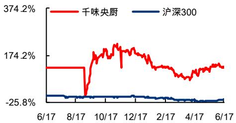  
52周股价走势图  
资料来源：wind、东兴证券研究所

分析师：孟斯硕010-66554041 mengssh@dxzq.net.cn执业证书编号： S1480520070004

分析师：王洁婷021-225102900 wangjt @dxzq.net.cn执业证书编号： S1480520070003

<table><tr><td>营业收入(百万元)</td><td>944.37</td><td>1,273.90</td><td>1,514.36</td><td>1,939.53</td><td>2,273.11</td></tr><tr><td>增长率(%)</td><td>6.20%</td><td>34.89%</td><td>18.88%</td><td>28.08%</td><td>17.20%</td></tr><tr><td>净归母利润(百万元)</td><td>76.59</td><td>88.46</td><td>102.64</td><td>142.95</td><td>176.03</td></tr><tr><td>增长率(%)</td><td>3.31%</td><td>13.92%</td><td>16.95%</td><td>39.21%</td><td>23.40%</td></tr><tr><td>净资产收益率(%)</td><td>13.15%</td><td>9.28%</td><td>9.71%</td><td>11.91%</td><td>12.79%</td></tr><tr><td>每股收益(元)</td><td>1.24</td><td>1.25</td><td>1.18</td><td>1.65</td><td>2.03</td></tr><tr><td>PE</td><td>40.24</td><td>39.92</td><td>42.12</td><td>30.24</td><td>24.56</td></tr><tr><td>PB</td><td>5.47</td><td>4.53</td><td>4.09</td><td>3.60</td><td>3.14</td></tr></table>

资料来源：公司财报、东兴证券研究所

# 目录

1.餐饮业的中央厨.. ..  
2.大客户背书，为开拓新业务打下基础. ….3  
2.1客户涵盖各大连锁餐饮企业.. ..3  
2.2产品品质 $^ +$ 服务有保障. ….5  
3.研发铸就更高生产力. ….  
3.1自主研发提高生产效率.. ….5  
3.2多年行业经验 $^ +$ 优秀的研发体系孕育出百款优秀产品， ..7  
4.成本管控能力较强，具备一定的定价权..  
4.1原材料成本控制强. ….  
4.2大客户给与一定溢价.. ….9  
5.盈利预测与评级.. ..11  
6.风险提示. ..11  
相关报告汇总 ..13

# 插图目录

图1：2020 年公司各产品销售额占总营业收入比重（按照销售渠道划分） ..3图2：公司部分代表性客户. ..4图3：面粉类原材料市场价格和采购单价趋势图.. ..7图4：糯米粉类原材料市场价格和采购单价趋势图. .图5：芝麻市场价格和采购单价趋势图.. ….图6：大豆油市场价格和采购单价趋势图.. ….图7：全国糯米、豆油、面粉均价：元/吨. ..8图8：芝麻均价：元/吨. ..8图9：2020年公司各业务和产品毛利率情况. ..9图10：2020年各公司B端毛利率情况. ..9

# 表格目录

表1：前五大客户收入.. ..4  
表2：公司部分专利成. ..6  
表3：公司部分核心技术. ….6  
表4：公司主要产品的销售额、平均单价及价格变动情况.. ..10

导语：千味央厨是速冻食品餐饮渠道龙头企业，其产品特色为油炸产品，渠道特色为餐饮连锁大客户和小客户双轮驱动。前期，我们发布了《千味央厨（001215）系列报告一：央厨蓝海，畅品遨游》，主要论述行业的发展空间，并分别从公司的产品和渠道的角度来分析公司的运营情况和发展前景。本系列报告二，我们将主要阐述公司的竞争优势，证明公司持续获取市场份额的能力。

# 1.餐饮业的中央厨房

公司主营业务为面向餐饮企业（含酒店、团体食堂、乡厨等）的速冻面米制品的研发、生产和销售。公司通过直营方式向连锁餐饮提供定制化产品，2021年直营销售占比 $4 0 . 2 2 \%$ ，其中百胜中国在直营客户中销售占比达到 $48 \%$ 。另外，公司通过经销商为中小型餐饮提供的标准化产品，2021年销售占比 $5 9 . 7 8 \%$ 。

公司生产的产品按照加工方式可分为油炸类、烘焙类、蒸煮类、菜肴类及其他四大类，具体产品包括油条、芝麻球、蛋挞皮、地瓜丸以及卡通包等。其中，油炸类是公司最主要的产品种类，在直营和经销渠道中均占比较高，主打产品是油条和芝麻球；烘焙类以直营渠道为主，蛋挞皮为烘焙品类中的主打产品，主要客户为百胜中国；蒸煮类和菜肴类主要面向小B端，猪猪包受到广大客户欢迎。

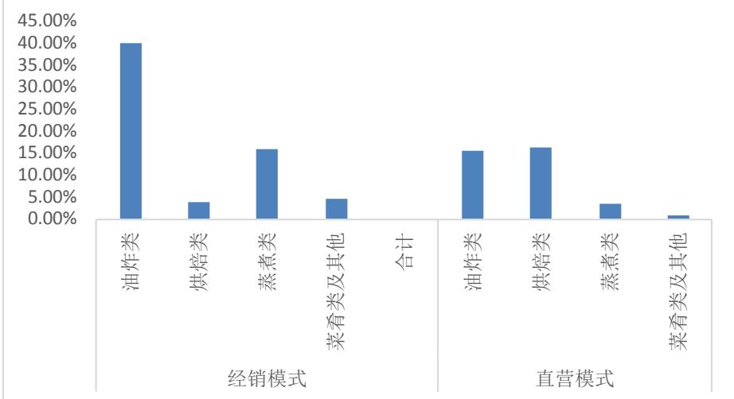  
图1：2020 年公司各产品销售额占总营业收入比重（按照销售渠道划分）  
资料来源：公司招股说明书、东兴证券研究所

公司的生产工艺、技术装备和完善和食品安全管理体系在行业领先，与多家中、外资大型连锁餐饮企业深度合作，并创新性地开发出适应餐饮企业加工工艺、后厨设备和厨师操作习惯的速冻食品和技术支持体系，以及快速响应餐饮客户需求的服务体系。多年餐饮行业的深耕使得逐步形成了一定的护城河，支持公司长期稳健发展。

# 2.大客户背书，为开拓新业务打下基础

# 2.1 客户涵盖各大连锁餐饮企业

公司自设立以来便持续深耕餐饮市场，已成为肯德基、必胜客、华莱士、海底捞、真功夫、九毛九、呷哺呷哺等知名餐饮品牌速冻面米制品供应商，其中在百胜中国供应商体系为最高级 T1 级，是百胜中国最大的速冻面米制品供应商，领先于行业其他竞争对手。

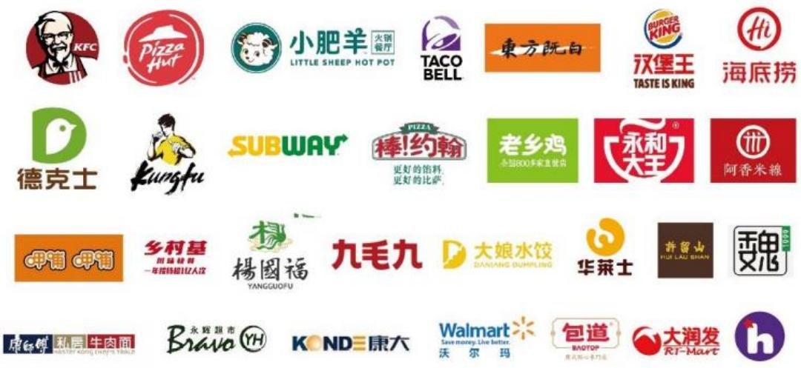  
图2：公司部分代表性客户  
资料来源：公司招股书、东兴证券研究所

百胜中国控股有限公司及其关联方代表的餐饮品牌为肯德基、必胜客、小肥羊等。公司自 2012 年成立以来始终为百胜中国提供优质畅销的产品和全方位的技术服务，并获得百胜中国“质量管理贡献奖”、“金厨师奖”和“技术研发奖”等，与百胜中国合作关系稳定，公司向百胜中国销售的油条类产品均为独家供货。2019 年公司对百胜中国控股有限公司及其关联方的销售收入占公司营业收入的 $3 0 . 7 2 \%$ ，但随着其他客户的快速增长，百胜占比逐渐下降，2021年百胜及其关联方收入同比 $+ 1 1 . 1 5 \%$ ，占公司营业收入比重下降至 $1 9 . 3 2 \%$ ，而华莱士增速 $7 7 \%$ ，海底捞、老乡鸡增速达到 $200 \%$ 。公司持续通过开发新的客户获得大B端的稳定增长。今年公司和盒马达成合作，打开了生鲜、便利店的业态，预计未来能够与更多的同类型客户合作。公司的大客户涵盖了西式快餐、火锅、传统中餐、中式快餐、超市等各餐饮领域中的龙头企业，验证了公司服务各类大型连锁餐饮企业的综合实力，成为了公司拓客的天然背书。2021 年公司大客户数量翻倍，截止 21 年底，公司大客户数量为168 家，相比2020 年年底的 87 家，增幅达到 $9 3 . 1 0 \%$ 为未来业绩增长打下了坚实的基础（部分原因是公司调整了大客户标准)。

表1：前五大客户收入：元  

<table><tr><td>客户名称</td><td>2021年</td><td>2020年</td><td>同比变动</td></tr><tr><td>百胜及其关联方</td><td>245,267,811.05</td><td>220,673,085.57</td><td>11.15%</td></tr><tr><td>华莱士及其关联方</td><td>70,605,620.62</td><td>40,001,870.86</td><td>76.51%</td></tr><tr><td>海底捞及其关联方</td><td>62,687,633.73</td><td>20,865,300.41</td><td>200.44%</td></tr><tr><td>老乡鸡及其关联方</td><td>8,270,110.63</td><td>2,678,556.83</td><td>208.75%</td></tr><tr><td>瑞幸及其关联方</td><td>7,629,445.88</td><td>-</td><td></td></tr></table>

资料来源：公司公告、东兴证券研究所

# 2.2产品品质+服务有保障

公司的核心优势是“产品品质+服务”，具备过硬的产品品质和综合服务能力。公司拥有油条、油炸糯米类、蒸煎饺、烘焙类四大优势产品线，其中，油条和芝麻球的品质为业内公认。公司油条加工需经过 100 多道工序，做出来的油条大小、软硬、重量、颜色等均有严格标准，并且公司通过不断改进工艺控油保质，降低成本的同时产品更加健康美味；公司制作的芝麻球不易爆，芝麻颗粒不易掉且芝麻分布均匀数量稳定，保证了宴席上产品的美观；公司的煎饺产品做出了一定的差异化-“堆蒸不破”，使得其在团餐市场具备一定优势；公司的烘焙蛋挞皮不仅手工制作且价格也具备一定优势，极具性价比。

服务方面，公司为大客户提供菜单设计、产品开发、产品销售、技术支持、干线物流运输以及后续服务咨询等在内的整体解决方案，以建立长期合作的同盟关系。公司有专门的产品经理对市场进行调研，对客户的消费人群进行分析，定期与餐饮客户研讨产品升级方向，调整供应产品的配方、口感、包装等要素，共同讨论解决方案及新品提案，同时对产品的后续加工条件、餐饮企业的后厨布局设计提供要求与建议。

通常，大型连锁客户对于生产厂家的选择非常慎重，会对供应商的硬件设施、研发能力、生产管理和产品质量控制能力进行严格的考察和评价，前期考察往往历时一年以上。因此，客户一般不会随意更换厂家，公司大客户稳定性较强。新兴餐饮连锁企业在建立供应商体系时，选用知名餐饮企业的供应商为最快捷、高效、安全的方式。公司拥有如肯德基、海底捞、老乡鸡、九毛九、瑞幸咖啡等涵盖了不同餐饮场景的大客户，证明了公司对不同餐饮场景下产品的研发能力、生产能力、品控力和对客户的综合服务能力，也同时促进了公司各方面综合能力的进一步能力提升，为未来开拓新的客户打下基础。

# 3.研发铸就更高生产力

# 3.1自主研发提高生产效率

虽然速冻米面食品的制造门槛较低，行业竞争较充分，但各个企业在生产效率上有所差距，从而带来生产成本的差距。在生产设备上，由于中式速冻面米制品所采用的加工工艺较特殊，公司与国内机械设备制造企业通过引进、消化、吸收国外技术并根据自身需求研发改造生产设备，研制非标专用设备以弥补速冻面米制品生产的自动化设备不足。另外，公司针对加工过程中人工操作较多的环节加大了技改力度，将机械化、自动化水平的提高与统一、标准、规范化的操作流程相结合，部分抵消了劳动力成本上升的影响、实现生产效率进一步提高并确保产品的质量和品质的统一。例如，公司改造了蛋挞切块机、自动油条生产线、芝麻球全自动生产线等，从而保证创新产品快速量产、成本可控进而抢占市场。目前，公司正在进一步开发油条及春卷全自动生产线，带项目完成后可以提升产品品质，增加利润，进一步提高产品竞争力。

在专利方面，公司先后取得了油条的工业化生产、芝麻球的工业化生产、无铝安心油条等多项具有自主知识产权的科研成果和核心技术。尤其在油条、卡通包、手工挞皮等方面，引领了行业发展方向，公司的生产工艺的技术水平和生产设备的机械化、自动化程度一直处于行业前列。公司不仅拥有多项成熟工艺技术和装备技术，经过多年的自主创新和精耕细作，公司创新性地开发出适应连锁餐饮企业加工工艺、后厨设备和厨师操作习惯的速冻食品技术支持体系，以及快速响应餐饮客户需求的服务体系，并取得了良好的效果。

由于大客户定制产品种类较多，单个产品相比通用产品产量较低，难以形成规模化效应，生产过程中的产品切换往往耗时耗力，因此具备柔性化生产工艺尤为重要。目前，公司已经形成了针对大客户个性化需求的柔性生产模式，公司会对产品的加工方式进行区分，将工艺方式相似的产品融入到同一生产线，能够在保证客户定制需求的同时提升生产效率。

表2：公司部分专利成果  

<table><tr><td>专利类型</td><td>专利名称</td><td>专利号</td><td>专利申请日</td><td>专利权 截止日</td><td>取得方式</td></tr><tr><td>实用新型</td><td>面煎烤装置</td><td>一种蛋饼机正ZL201220598263.3</td><td>2012.11.04</td><td>2022.11.03</td><td>受让取得</td></tr><tr><td>实用新型</td><td>一种蛋饼机</td><td>ZL201220598243.6</td><td>2012.11.04</td><td>2022.11.03</td><td>受让取得</td></tr><tr><td>实用新型</td><td>一种蛋饼机背 面煎烤装置</td><td>ZL201220598233.2</td><td>2012.11.04</td><td>2022.11.03</td><td>受让取得</td></tr><tr><td>实用新型</td><td>一种蛋饼机注 浆装置</td><td>ZL201220598223.9</td><td>2012.11.04</td><td>2022.11.03</td><td>受让取得</td></tr><tr><td>实用新型</td><td>一种注芯油条 的生产设备</td><td>ZL201920043738.4</td><td>2019.01.11</td><td>2029.01.10</td><td>原始取得</td></tr><tr><td>实用新型</td><td>一种油条加工 装置</td><td>ZL201920288123.8</td><td>2019.03.07</td><td>2029.12.17</td><td>原始取得</td></tr><tr><td>实用新型</td><td>一种用于油条 的油炸锅</td><td>ZL201920288705.6</td><td>2019.03.07</td><td>2029.12.17</td><td>原始取得</td></tr></table>

资料来源：公司招股说明书、东兴证券研究所

表3：公司部分核心技术  

<table><tr><td>核心技术</td><td>来源</td><td>功能及创新 对应的专利成果</td><td>产品应用</td><td></td></tr><tr><td>新型成型油炸装置</td><td>自主研发</td><td>生产方式创新，结合产品特性设计 的油炸装置，更能符合产品的炸 程，大幅提高成品率</td><td></td><td>茴香小油条</td></tr><tr><td>意大利千层面生产方法</td><td>自主研发</td><td>生产方式更新，结合产品特性设计 适配的蒸程，提高生产效率</td><td></td><td>千层面面皮</td></tr><tr><td>球类产品高效成型配方、 工艺、设备系统方法</td><td>自主研发</td><td>产品配方、设备、工艺的创新，生 产效率大幅提升，用人数量减少</td><td></td><td>芝麻球、地瓜丸</td></tr><tr><td>米糕常温短时发酵生产 方法</td><td>自主研发</td><td>发酵方式更新，米糕能够在更短时 间内发酵完成，组织结构更加均匀</td><td></td><td>白糖桂花糕、红枣 南瓜糕</td></tr><tr><td>油条高效和面技术方法</td><td>自主研发</td><td>根据布拉班德粉质曲线，结合专用 粉的特性,更快的和出符合生产需 求的面团</td><td></td><td>外卖油条、火锅油 条、安心油条、香 脆油条等</td></tr><tr><td>注芯油条制作方法</td><td>自主研发</td><td>注芯油条的发明创造,对丰富油条 系列有促进作用</td><td></td><td>蛋芯油条</td></tr><tr><td>注芯油条加工装置</td><td>自主研发</td><td>油条罐装机的研发，有利于产品的 快速规模化生产</td><td>一种注芯油条的加工 装置</td><td>蛋芯油条</td></tr><tr><td>面节高效生产方法</td><td>自主研发</td><td>生产方式创新，压延方式的更新， 做到无损压延，并加快成型效率</td><td></td><td>捞面面节</td></tr><tr><td>油条纵切技术</td><td>自主研发</td><td>改变油条面团的切条方式,减少生 产线用人，增加生产效率</td><td></td><td>外卖油条、精品油 条、酥脆油条等</td></tr><tr><td>油条灌蛋制备方法</td><td>自主研发</td><td>新技术，利用油条进行馅料的灌</td><td></td><td>蛋芯油条</td></tr></table>

<table><tr><td>核心技术</td><td>来源 功能及创新</td><td>对应的专利成果</td><td>产品应用</td></tr><tr><td colspan="4">注，增加油条的风味</td></tr></table>

资料来源：公司招股说明书、东兴证券研究所

# 3.2 多年行业经验+优秀的研发体系孕育出百款优秀产品

虽然速冻米面制品的研发看似简单，但要大批量的生产出客戶满意和市场满意的产品并非易事，公司每年会给大客户推荐多款新产品，但能够成功上市的产品并不多，因此和客户的多年磨合以及对餐饮消费需求的深入理解尤为重要。

凭借着多年的经验，随着生产工艺技术和机械化、自动化水平的不断提升，公司速冻面米制品的品种、花色不断丰富，同时在风味、口味、色度、口感、营养等方面持续优化。目前，公司开发上市各类速冻面米产品300 余个，推动了企业规模的快速成长。

公司依托现有产品进行场景化的深入研究，研发出适应不同消费场景的系列产品。油条为公司的大单品之一，公司专注于油条及其使用场景研发10 余年，细分出火锅、快餐、自助餐、宴席、早餐、外卖六大场景，并针对性推出茴香小油条、麻辣烫小油条、火锅涮煮油条、外卖专用油条等多款创新性产品。研发团队持续创新开发适合西式快餐、中式快餐以及乡厨等不同市场需求的速冻面米制品，能够将客户的概念化需求快速转化为符合高质量、标准化要求的生产，如“注芯油条”、“墨鱼汁油条”、“文化流量包”、“花瓣米糕”等。2018 年，公司为肯德基研发上新7支单品，从而获得销售收入的快速增长。

公司较早便在行业内建立了“模拟餐厅后厨"的研发实验室，并组建了专业的餐饮研发团队。公司技术研发部下设产品研发、工艺研发、设备研发、包装研发等四个专业研究室和上海研发室，其中，产品研发又分设球类、酥类、油条、面点、烘焙类、创新类六个研发小组。上海研发室利用上海的地缘及资源优势，主要开展项目沟通、新品展示、技术服务，并及时掌握国内新品动态、了解消费者需求。

# 4. 成本管控能力较强，具备一定的定价权

# 4.1原材料成本控制强

公司通过在速冻面米制品 B 端领域多年的深耕，已形成年产量近 10 万吨的规模，成为速冻米面制品 B 端龙头企业，在原材料采购以及生产成本控制上均具备一定的规模优势。

公司的主要原材料为面粉及米粉类材料，约占原材料采购金额的 $42 \%$ ，其次是油脂及糖类，占比约 $1 5 \%$ o2018-2020 年间，面粉原材料市场价格波动不大，公司价格更为平稳；糯米粉类及芝麻原料较小众，价格波动较大，公司采购价格基本跟随市场价格波动；2020 年下半年大豆油市场价格大幅上涨 $50 \%$ 左右，但公司大豆油平均采购价格基本没有变化，主要是因为公司提前与供应商锁定了采购价格和采购量，体现了公司对原材料价格的预判力和管控能力。

图4：糯米粉类原材料市场价格和采购单价趋势图：元/吨

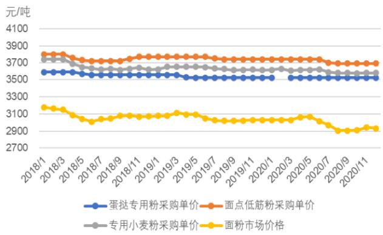  
资料来源：公司招股说明书、东兴证券研究所

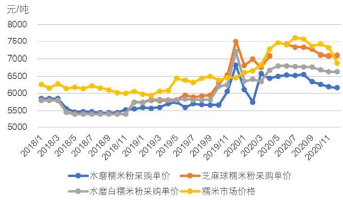  
资料来源：公司招股说明书、东兴证券研究所

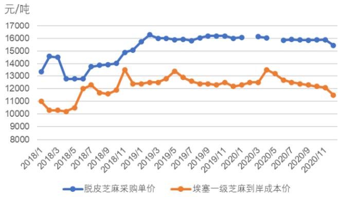  
图5：芝麻市场价格和采购单价趋势图：元/吨   
资料来源：公司招股说明书、东兴证券研究所  
图7：全国糯米、豆油、面粉均价：元/吨

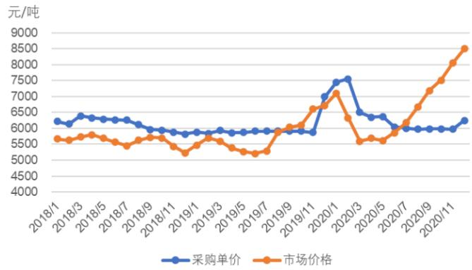  
图6：大豆油市场价格和采购单价趋势图：元/吨  
资料来源：公司招股说明书、东兴证券研究所  
图8：芝麻均价：元/吨

2021 年公司产品所需部分原材料市场价出现了一定程度的上涨，如大豆油全年均价较上一年均价上涨 $50 \%$ 左右，人造奶油和葡萄糖均价也上涨超 $30 \%$ ，面粉价格也出现了一定程度的上涨。虽然原材料价格大幅上涨，但公司2021 年毛利率 $2 2 . 3 6 \%$ ，同比 $+ 0 . 7 \mathsf { p c t }$ ，主要得益于公司大B业务可预见性强，有利于提前锁定原材料价格以及大B 客户恢复，高毛利定制产品增加。2022 年一季度，农产品价格出现了较大幅度的上涨，但由于公司对原材料进行了锁价，故对公司一季度毛利率影响不大。

公司经过大客户的打磨，通过不断的工艺升级和自动化升级提高生产效率，如今，公司的次品率明显低于客户要求和竞争对手，使得公司能够以更低的价格跟同类公司进行竞争，这也是公司成为百胜 T1 级供应商的重要原因。

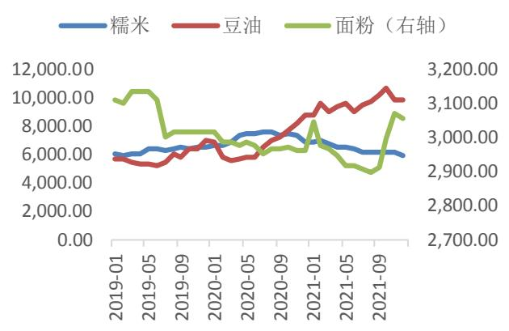  
资料来源：Wind资讯、东兴证券研究所  
图9：2020年公司各业务和产品毛利率情况

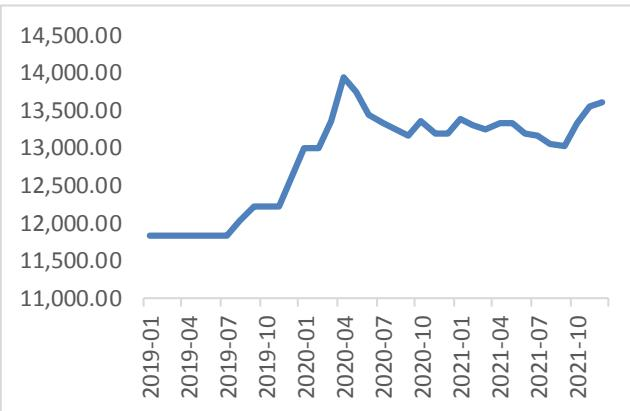  
资料来源：Wind资讯、东兴证券研究所  
图10：2020 年各公司B 端毛利率情况

# 4.2 大客户给与一定溢价

公司有 $40 \%$ 的收入来自于直销客户，在所有产品品类中，油炸类、蒸煮类和菜肴类及其他产品直销模式下毛利率基本高于经销模式（由于 2020 年运输费用重分类计入主营业务成本，导致当期主要产品直营模式毛利率出现不同程度下降，其中，蒸煮类产品的直营/经销毛利率出现倒挂情况，若将相关运输费用未计入蒸煮类产品销售成本，则蒸煮类产品直营/经销模式毛利率分别为 $2 8 . 3 1 \%$ 、 $2 5 . 7 0 \%$ )。除了因为经销模式下公司会给予经销商一定的利润空间导致公司毛利率偏低外，因公司长期耕耘于速冻面米制品行业，形成了较好知名度、企业信誉和较强的规模、优质客户优势，因此面对下游直销客户具有一定议价权。公司为满足客户的个性化需求，在直销模式下为大型连锁餐饮企业提供的定制产品毛利率更高。

大B客户往往能够提供更高的毛利空间。与可比公司同类渠道毛利率相比，四家公司的毛利率水平差距不大，但公司毛利率最为稳定且 2021 年相对最高。公司大 B 客户占比相对较高，其在大 B 客户端面对的竞争对手也以中大型速冻米面制品企业为主，获客不依赖于低价而是依托产品和服务全方位的优势，因此往往具备更大的议价空间。而若小B客户较多则需要面对较多的中小型竞争对手，虽然上市公司通常具备竞争优势，但价格竞争往往更为激烈。因此，我们能够看到 2020 年及 2021 年公司毛利率相比于可比公司 B 端业务属于较高水平（安井采用特通渠道毛利率，如果考虑到经销渠道中小B 客户，则安井整体 B 端毛利率比特通渠道略低)。

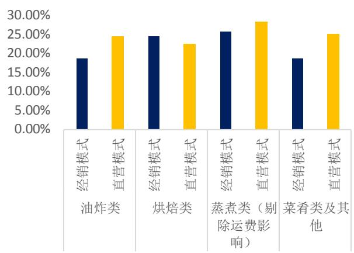  
资料来源：公司招股说明书、东兴证券研究所

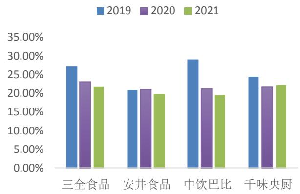  
资料来源：各家公司公告、东兴证券研究所  
注：安井食品采用特通渠道毛利率，巴比食品采用团餐渠道毛利率、三全采用餐饮渠道毛利率

2018-2020年公司多数主流产品平均单价均有所上涨。千味1200g放心大油条价格于2019 年略微下降 $3 . 8 9 \%$ 但 2020 年价格回升 $5 . 5 2 \%$ ，主要是因为2019 年公司加大该产品的市场推广力度，买赠比例较高导致平均售价下降，2020 年买赠比例减少平均价格回升。除了百胜原味冷冻华夫面团以及千味260g芝麻球，2018-2020年公司其他主流产品价格均有所上涨。

表4：公司主要产品的销售额、平均单价及价格变动情况：万元、元/公斤  

<table><tr><td rowspan="2">序 项目 号</td><td rowspan="2"></td><td colspan="2">2018年度 2019年度</td><td colspan="5">2020 年度</td></tr><tr><td>销售额</td><td>单价</td><td>销售额 单价</td><td>变动幅度</td><td>销售额</td><td>单价</td><td>变动幅度</td></tr><tr><td>1</td><td>1*18*16蛋挞皮</td><td>7,952.65</td><td>14.31</td><td>9,107.33 14.5</td><td>1.30%</td><td>8,664.30</td><td>14.72</td><td>1.50%</td></tr><tr><td>2</td><td>千味260g芝麻球</td><td>8,954.79</td><td>7.82</td><td>9,033.79 7.99</td><td>2.16%</td><td>9,830.79</td><td>7.98</td><td>-0.09%</td></tr><tr><td>3</td><td>KFC冷冻油条 (60g)</td><td>4,497.85</td><td>11.68</td><td>6,815.12</td><td>11.75 0.53%</td><td>6,503.15</td><td>11.82</td><td>0.65%</td></tr><tr><td>4</td><td>千味400g 香芋地瓜丸</td><td>4,403.52</td><td>8.22</td><td>5,015.23</td><td>8.23 0.17%</td><td>5,272.30</td><td>8.58</td><td>4.29%</td></tr><tr><td>5</td><td>千味450g 香脆油条</td><td>3,931.38</td><td>10.22</td><td>4,344.96</td><td>10.32 0.97%</td><td>4,460.20</td><td>10.45</td><td>1.23%</td></tr><tr><td>6</td><td>百胜原味冷冻华夫面团</td><td>1,196.04</td><td>42.35</td><td>2,804.94</td><td>42.39 0.08%</td><td>1,729.94</td><td>40.64</td><td>-4.12%</td></tr><tr><td>7</td><td>千味360g 卡通豬猪包</td><td>1,850.14</td><td>14.33</td><td>2,671.56</td><td>14.65 2.21%</td><td>2,747.64</td><td>14.81</td><td>1.09%</td></tr><tr><td>8</td><td>千味1200g 放心大油条</td><td>927.31</td><td>8.65</td><td>1,963.33</td><td>8.31 -3.89%</td><td>2,611.47</td><td>8.77</td><td>5.52%</td></tr><tr><td>9</td><td>千味300克脆皮香蕉</td><td>1,865.72</td><td>9.23</td><td>1,756.57</td><td>9.47 2.55%</td><td>1,515.17</td><td>9.52</td><td>0.49%</td></tr><tr><td>10</td><td>百胜 360g蛋芯油条</td><td>-</td><td>-</td><td>1,628.91</td><td>16.47 -</td><td>-</td><td>-</td><td>-</td></tr><tr><td>合计</td><td></td><td>35,813.69</td><td></td><td>45,141.74 -</td><td>-</td><td>43,334.97</td><td>-</td><td>-</td></tr></table>

资料来源：公司招股说明书、东兴证券研究所

2021 年 12 月 2 日，公司发布公告上调部分产品价格：鉴于各原材料、人工、运输、能源等成本持续上涨，为更好地向客户、消费者提供优质产品和服务，促进市场及行业可持续发展，经公司研究决定，对部分速冻米面制品的产品促销政策进行缩减或经销价进行上调，调价幅度为 $2 \% - 1 0 \%$ 不等，新价格自2021年12月25 日起按各产品调价通知执行。由于 2021 年各类原材料成本均有所上涨，三全、安井等公司陆续发布涨价通知，公司跟随涨价，有助于稳定公司2022 年的盈利能力。

# 5.盈利预测与评级

我们认为，公司产品研发能力、生产经营管理能力优秀，拥有各餐饮领域中大客户背书，未来持续获取市场份额能力无需担忧。但由于今年疫情严重程度超出年初预期，餐饮业受疫情影响明显，我们下调对公司 2022年的业绩预测，但认为在不受疫情扰动的前提下 2023 年公司盈利水平能够快速恢复，我们基本维持对 2023年的盈利预测，并增加对 2024 年的盈利预测。我们预计公司 2022-2024 年净利润分别为 1.03、1.43 和 1.76亿元，对应 EPS 分别为 1.18、1.65 和2.03 元。当前股价对应 2022-2024 年 PE 值分别为 42、30 和 25 倍，维持“强烈推荐”评级。

# 6.风险提示

疫情导致消费能力及消费需求下降，餐饮业复苏低于预期；前三大客户的经营风险间接影响公司对大客户销售额；食品安全风险等。

附表：公司盈利预测表  

<table><tr><td rowspan="2">资产负债表</td><td colspan="9">单位：百万元</td><td colspan="2">单位：百万元</td></tr><tr><td>2020A</td><td>2021A</td><td>2022E</td><td></td><td>2023E2024E</td><td>利润表</td><td>2020A</td><td>2021A</td><td>2022E</td><td>2023E 2024E</td><td></td></tr><tr><td>流动资产合计</td><td>333</td><td>593</td><td>760</td><td>973</td><td>1224 营业收入</td><td></td><td>944</td><td>1274</td><td>1514</td><td>1940</td><td>2273</td></tr><tr><td>货币资金</td><td>117</td><td>332</td><td>454</td><td>601</td><td>797 营业成本</td><td></td><td>739</td><td>989</td><td>1187</td><td>1512</td><td>1766</td></tr><tr><td>应收账款</td><td>52</td><td>62</td><td>79</td><td>98</td><td></td><td>117  营业税金及附加</td><td>9</td><td>12</td><td>14</td><td>18</td><td>21</td></tr><tr><td>其他应收款</td><td>0</td><td>8</td><td>10</td><td>13</td><td>15</td><td>营业费用</td><td>31</td><td>42</td><td>51</td><td>65</td><td>75</td></tr><tr><td>预付款项</td><td>11</td><td></td><td></td><td>0</td><td>-3</td><td>管理费用</td><td>79</td><td>107</td><td>126</td><td>153</td><td>177</td></tr><tr><td>存货</td><td>116</td><td>162</td><td>191</td><td>245</td><td>285</td><td>财务费用</td><td>3</td><td>5</td><td>-1</td><td>-3</td><td>-5</td></tr><tr><td>其他流动资产</td><td>29</td><td>24</td><td>22</td><td>17</td><td>13</td><td>研发费用</td><td>7</td><td>9</td><td>10</td><td>11</td><td>12</td></tr><tr><td>非流动资产合计</td><td>622</td><td>747</td><td>685</td><td>639</td><td>592</td><td>资产减值损失</td><td>0.00</td><td>0.00</td><td>0.00</td><td>0.00</td><td>0.00</td></tr><tr><td>长期股权投资</td><td>0</td><td>0</td><td>0</td><td>0</td><td></td><td>0 公允价值变动收益</td><td>-0.93</td><td>0.36</td><td>0.00</td><td>0.00</td><td>0.00</td></tr><tr><td>固定资产</td><td>543</td><td>606</td><td>558</td><td>509</td><td>461</td><td>投资净收益</td><td>0.00</td><td>0.00</td><td>0.00</td><td>0.00</td><td>0.00</td></tr><tr><td>无形资产</td><td>39</td><td>38</td><td>36</td><td>34</td><td>32</td><td>加：其他收益</td><td>25.76</td><td>1.40</td><td>5.00</td><td>0.00</td><td>0.00</td></tr><tr><td>其他非流动资产</td><td>5</td><td>17</td><td>0</td><td>0</td><td></td><td>0 营业利润</td><td>100</td><td>112</td><td>132</td><td>184</td><td>227</td></tr><tr><td>资产总计</td><td>956</td><td>1341</td><td>1445</td><td>1612</td><td>1816</td><td>营业外收入</td><td>2.18</td><td>2.60</td><td>2.39</td><td>2.49</td><td>2.44</td></tr><tr><td>流动负债合计</td><td>305</td><td>326</td><td>347</td><td>372</td><td>400</td><td>营业外支出</td><td>2.07</td><td>0.79</td><td>1.59</td><td>1.48</td><td>1.28</td></tr><tr><td>短期借款</td><td>15</td><td>15</td><td>0</td><td>0</td><td></td><td>0 利润总额</td><td>100</td><td>113</td><td>133</td><td>185</td><td>228</td></tr><tr><td>应付账</td><td>142</td><td>144</td><td>197</td><td>234</td><td>283</td><td>所得税</td><td>24</td><td>26</td><td>31</td><td>43</td><td>53</td></tr><tr><td>预收款项</td><td>0</td><td>0</td><td>-18</td><td>-30</td><td>-51 净利润</td><td></td><td>77</td><td>87</td><td>102</td><td>142</td><td>175</td></tr><tr><td>一年内到期的非流动负债</td><td>4</td><td>10</td><td>10</td><td>10</td><td></td><td>10  少数股东损益</td><td>0</td><td>-1</td><td>-1</td><td>-1</td><td>-1</td></tr><tr><td>非流动负债合计</td><td>69</td><td>61</td><td>35</td><td>35</td><td></td><td>35归属母公司净利润</td><td>77</td><td>88</td><td>103</td><td>143</td><td>176</td></tr><tr><td>长期借款</td><td>55</td><td>35</td><td>35</td><td>35</td><td>35</td><td>主要财务比率</td><td></td><td></td><td></td><td></td><td></td></tr><tr><td>应付债券</td><td>0</td><td>0</td><td>0</td><td>0</td><td>0</td><td></td><td>2020A</td><td></td><td>2021A 2022E2023E 2024E</td><td></td><td></td></tr><tr><td>负债合计</td><td>373</td><td>388</td><td>382</td><td>407</td><td>435成长能力</td><td></td><td></td><td></td><td></td><td></td><td></td></tr><tr><td>少数股东权益</td><td>0</td><td>0</td><td>-1</td><td>-2</td><td>-3</td><td>营业收入增长</td><td>6.20%</td><td>34.89%</td><td>18.88%</td><td>28.08%</td><td>17.20%</td></tr><tr><td>实收资本（或股本）</td><td>64</td><td>87</td><td>87</td><td>87</td><td></td><td>87  营业利润增长</td><td>1.61%</td><td>11.53%</td><td>18.50%</td><td>39.07%</td><td>23.55%</td></tr><tr><td>资本公积</td><td>239</td><td>546</td><td>499</td><td>499</td><td></td><td>499  归属于母公司净利润增长</td><td>3.33%</td><td>15.51%</td><td>16.03%</td><td>39.27%</td><td>23.14%</td></tr><tr><td>未分配利润</td><td>255</td><td>336</td><td>432</td><td>564</td><td>72  获利能力</td><td></td><td></td><td></td><td></td><td></td><td></td></tr><tr><td>归属母公司股东权益合计</td><td>582</td><td>954</td><td>1057</td><td>1200</td><td>1376</td><td>毛利率(%)</td><td>21.71%</td><td>22.36%</td><td>21.60%</td><td>22.05%</td><td>2233</td></tr><tr><td>负债和所有者权益</td><td>956</td><td>1341</td><td>1438</td><td>1604</td><td>1808</td><td>净利率(%)</td><td>8.11%</td><td>6.85%</td><td>6.74%</td><td>7.32%</td><td>7.71%</td></tr><tr><td>现金流量表</td><td></td><td></td><td></td><td>单位：百万元</td><td></td><td>总资产净利润(%)</td><td>8.01%</td><td>6.60%</td><td>7.10%</td><td>8.87%</td><td>9.69%</td></tr><tr><td>经营活动现金流</td><td>2020A</td><td>2021A</td><td>2022E</td><td>2023E</td><td>2024E</td><td>ROE(%)</td><td>13.15%</td><td>9.28%</td><td>9.71%</td><td>11.91%</td><td>12.79%</td></tr><tr><td>净利润</td><td>98</td><td>98</td><td>125</td><td>151</td><td></td><td>199 偿债能力</td><td></td><td></td><td></td><td></td><td></td></tr><tr><td>折旧摊销</td><td>77</td><td>87</td><td>102</td><td>142</td><td>175</td><td>资产负债率(%)</td><td>39%</td><td>29%</td><td>27%</td><td>25%</td><td>24%</td></tr><tr><td>财务费用</td><td>33.98</td><td>41.55</td><td>52.80</td><td>53.41</td><td>53.92</td><td>流动比率</td><td>1.09</td><td>1.82</td><td>2.19</td><td>2.62</td><td>3.06 2.35</td></tr><tr><td>应收帐款减少</td><td>3 -8</td><td>-10</td><td>-1 -17</td><td>-3 -19</td><td>-5 -19营运能力</td><td>速动比率</td><td>0.71</td><td>1.32</td><td>1.64</td><td>1.96</td></table>

资料来源：公司财报、东兴证券研究所

# 相关报告汇总

<table><tr><td>报告类型</td><td>标题</td><td>日期</td></tr><tr><td>公司深度报告</td><td>千味央厨系列报告之一：双轮齐增长，央厨供四方</td><td>2022-02-17</td></tr><tr><td>行业普通报告</td><td>食品饮料行业报告：复苏预期引爆板块投资热情，需求有望进一步提振</td><td>2022-06-13</td></tr><tr><td>行业深度报告</td><td>食品饮料：基本面进入磨底期，下半年有望迎来复苏</td><td>2022-06-01</td></tr><tr><td>行业深度报告</td><td>食品饮料行业中期策略：基本面进入磨底期，下半年有望迎来复苏</td><td>2022-05-29</td></tr><tr><td>行业深度报告</td><td>食品饮料行业：见底了吗?</td><td>2022-05-16</td></tr><tr><td>行业普通报告</td><td>食品饮料行业：进入基本面磨底期</td><td>2022-05-10</td></tr><tr><td>行业普通报告</td><td>食品饮料行业：汇率贬值加大企业成本压力，建议关注成本压力有望减轻的细分行业</td><td>2022-04-26</td></tr><tr><td>行业普通报告</td><td>食品饮料行业：国常会部署消费举措引爆消费投资热情</td><td>2022-04-18</td></tr><tr><td>行业普通报告</td><td>食品饮料行业：疫情影响下需求变化与市场竞争格局变迁思考</td><td>2022-03-28</td></tr></table>

资料来源：东兴证券研究所

# 分析师简介

# 孟斯硕

首席分析师，工商管理硕士，曾任职太平洋证券、民生证券等，6 年食品饮料行业研究经验，2020 年6月加入东兴证券。

# 王洁婷

普渡大学硕士，5 年证券研究经验，2020 年加入东兴证券研究所从事食品饮料行业研究，主要覆盖奶粉、调味品及休闲食品。

# 分析师承诺

负责本研究报告全部或部分内容的每一位证券分析师，在此申明，本报告的观点、逻辑和论据均为分析师本人研究成果，引用的相关信息和文字均已注明出处。本报告依据公开的信息来源，力求清晰、准确地反映分析师本人的研究观点。本人薪酬的任何部分过去不曾与、现在不与，未来也将不会与本报告中的具体推荐或观点直接或间接相关。

# 风险提示

本证券研究报告所载的信息、观点、结论等内容仅供投资者决策参考。在任何情况下，本公司证券研究报告均不构成对任何机构和个人的投资建议，市场有风险，投资者在决定投资前，务必要审慎。投资者应自主作出投资决策，自行承担投资风险。

# 免责声明

本研究报告由东兴证券股份有限公司研究所撰写，东兴证券股份有限公司是具有合法证券投资咨询业务资格的机构。本研究报告中所引用信息均来源于公开资料，我公司对这些信息的准确性和完整性不作任何保证，也不保证所包含的信息和建议不会发生任何变更。我们已力求报告内容的客观、公正，但文中的观点、结论和建议仅供参考，报告中的信息或意见并不构成所述证券的买卖出价或征价，投资者据此做出的任何投资决策与本公司和作者无关。

我公司及报告作者在自身所知情的范围内，与本报告所评价或推荐的证券或投资标的不存在法律禁止的利害关系。在法律许可的情况下，我公司及其所属关联机构可能会持有报告中提到的公司所发行的证券头寸并进行交易，也可能为这些公司提供或者争取提供投资银行、财务顾问或者金融产品等相关服务。本报告版权仅为我公司所有，未经书面许可，任何机构和个人不得以任何形式翻版、复制和发布。如引用、刊发，需注明出处为东兴证券研究所，且不得对本报告进行有悖原意的引用、删节和修改。

本研究报告仅供东兴证券股份有限公司客户和经本公司授权刊载机构的客户使用，未经授权私自刊载研究报告的机构以及其阅读和使用者应慎重使用报告、防止被误导，本公司不承担由于非授权机构私自刊发和非授权客户使用该报告所产生的相关风险和责任。

# 行业评级体系

公司投资评级（A股市场基准为沪深 300 指数，香港市场基准为恒生指数）：以报告日后的 6 个月内，公司股价相对于同期市场基准指数的表现为标准定义：强烈推荐：相对强于市场基准指数收益率 $15 \%$ 以上；  
推荐：相对强于市场基准指数收益率 $5 \% \sim 1 5 \%$ 之间；  
中性：相对于市场基准指数收益率介于 $- 5 \% \sim + 5 \%$ 之间；  
回避：相对弱于市场基准指数收益率 $5 \%$ 以上。  
行业投资评级（A股市场基准为沪深 300 指数，香港市场基准为恒生指数）：以报告日后的 6 个月内，行业指数相对于同期市场基准指数的表现为标准定义：看好：相对强于市场基准指数收益率 $5 \%$ 以上；  
中性：相对于市场基准指数收益率介于 $- 5 \% \sim + 5 \%$ 之间；  
看淡：相对弱于市场基准指数收益率 $5 \%$ 以上。

# 东兴证券研究所

北京  
西城区金融大街5号新盛大厦B  
座16层  
邮编：100033  
电话：010-66554070  
传真：010-66554008  
上海  
虹口区杨树浦路248号瑞丰国际  
大廈5层  
邮编：200082  
电话：021-25102800  
传真：021-25102881  
深圳  
福田区益田路6009号新世界中心  
46F  
邮编：518038  
电话：0755-83239601  
传真：0755-23824526