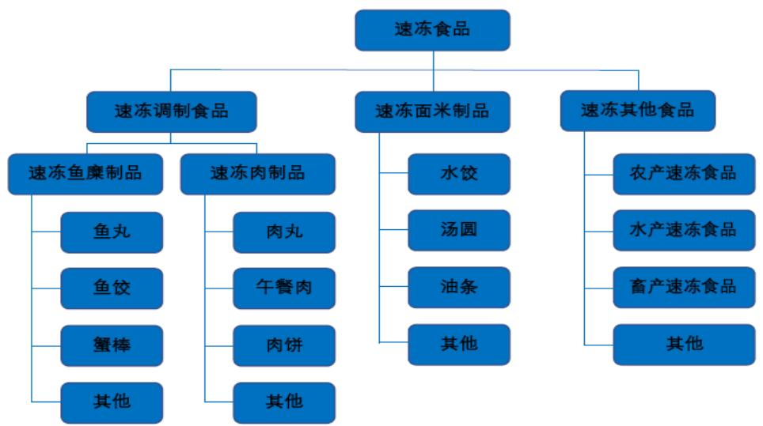
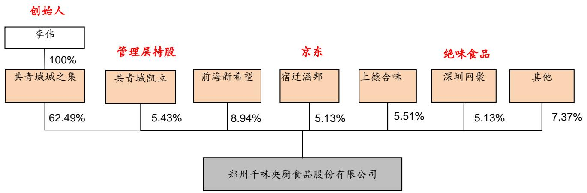
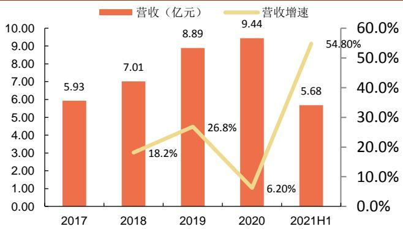
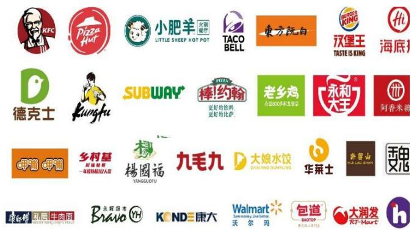
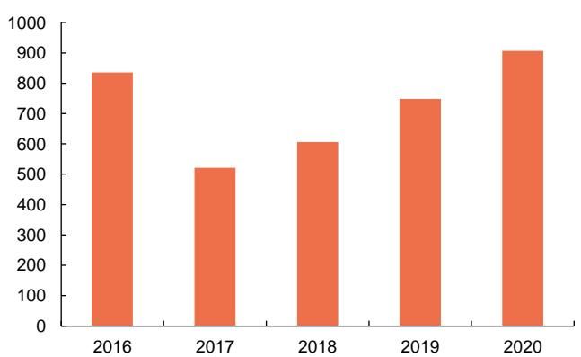

# 餐饮端速冻先行者业绩增长路径明确

-千味央厨(001215.SZ)

食品饮料/速冻食品

# 投资摘要：

速冻行业细分品类景气度分化，餐饮端成为速冻市场的新蓝海。连锁化背景下餐饮业呼唤标准、半成品化食材以节约成本、稳定品质和提升出餐效率。2019年我国餐饮食材采购规模1.93 万亿，工业化空间广阔。速冻食品全行业餐饮和家庭渠道收入比例为 $3 8 \%$ $64 \%$ ，餐饮渠道收入达512亿元。预计速冻面米制品、速冻菜肴和烘焙制品在餐饮端有望实现 $20 \%$ 以上的复合增速，速冻火锅料制品有望实现 $1 3 \%$ 以上的复合增长，超过行业整体约 $10 \%$ 的复合增长水平。2B市场成为新的高成长赛道，专注餐饮供应链的企业将占有先发优势。千味央厨发源于思念食品体系，为餐饮端速冻面米制品龙头，具备先行者优势。公司为餐企提供定制化和标准化的速冻面米制品，17-19年营收和净利润CAGR达 $2 2 . 5 \%$ $2 5 . 5 \%$ ，20年疫情影响下分别增长 $6 . 2 0 \%$ $3 . 3 3 \%$ 。产品以面米为主延伸调理和菜肴制品，按加工方式分为油炸类、烘焙类、蒸煮类、菜肴类等四大类共300余种，油条、芝麻球品种行业领先。采取直营方式服务大型连锁，已成为肯德基、必胜客、华莱士、海底捞、真功夫、九毛九等知名餐饮速冻面米和菜肴制品供应商。

公司构建专为餐饮的运营体系，依靠研发和定制化服务构建竞争壁垒。为客户提供从0 研发并定制生产以及按餐企工艺标准定制生产的服务，定制化服务深度绑定餐饮大客户、构建竞争壁垒。研发向纵深发展，不但瞄准餐饮渠道适销产品做工业化、还顺应餐饮场景变化针对性推出适配产品，老品类新场景下的针对性研发持续贡献产品增量。

通过直营 $^ { + }$ 分销覆盖大小餐饮客户，2B模式下低费用投入，以更低毛利率建立壁垒、同时享有更高净利水平。公司2018-20年直营收入占比分别为 $4 0 . 7 \%$ $4 6 . 7 \%$ 、 $3 5 . 7 \%$ ，占比近半且毛利率更高。2018、2019年直营渠道收入同比增速达到 $1 8 . 5 \%$ $2 7 . 8 \%$ ，快于公司整体营收增长。公司2018-20 年ROE行业领先分别达到 $1 9 . 3 \%$ $2 0 . 1 \%$ $1 5 . 5 \%$ o

本次IPO 拟募资 4.09 亿元主要用于扩产。募投拟建设 8 万吨产能，至2023年底可提至 20.8 万吨，满足 2023 年后产能需要。

公司领先优势明显，且进一步增长路径清晰。目前成熟的餐饮供应链企业屈指可数，拥有一定规模和发展速度是公司未来竞争胜出的竞争优势。公司进一步增长路径清晰可行，在强研发和模式壁垒下看好其持续增长：

跟随现有连锁客户的拓店进程，供应新开门店。  
挖潜现有大客户更多品类供应需求。  
加大拓展餐饮市场崛起的区域连锁等新秀。  
通过经销商渠道开发扩大中小餐饮客户、乡厨的覆盖。  
保持面米制品领域领先地位，在现有产品中再造3-5个超亿元核心产品。  
加大产品开发力度，加大肉、鱼糜类产品的开发，重点拓展火锅类、团餐类食材产品。

投资建议：预计公司2021-2023 年每股收益分别为1.22元、1.69元和2.29元。参考同业上市公司PE水平并考虑公司模式和先发优势应享有一定估值溢价，给与21 年 PE40-50 倍。

评级 暂不评级

风险提示：大客户占比过高；餐饮端市场扩容不及预期；产品开发不及预期财务指标预测

2021年08月18日

<table><tr><td>指标</td><td>2019A</td><td>2020A</td><td>2021E</td><td>2022E</td><td>2023E</td></tr><tr><td>营业收入（百万)</td><td>889.28</td><td>944.37</td><td>1,328.82</td><td>1,818.15</td><td>2,448.33</td></tr><tr><td>增长率(%)</td><td>26.82%</td><td>6.20%</td><td>40.71%</td><td>36.82%</td><td>34.66%</td></tr><tr><td>归母净利润（百万)</td><td>74.12</td><td>76.59</td><td>103.49</td><td>143.84</td><td>195.22</td></tr><tr><td>增长率(%)</td><td>26.32%</td><td>3.33%</td><td>35.13%</td><td>38.99%</td><td>35.72%</td></tr><tr><td>每股收益(元)</td><td>1.29</td><td>1.24</td><td>1.22</td><td>1.69</td><td>2.29</td></tr></table>

资料来源：公司财报、申港证券研究所

# 内容目录

1.餐饮端市场成为速冻食品新空间. 1.1速冻食品细分品类景气度分化. ….1.2 餐饮端速冻市场成为新蓝海.. ….8  
2.系出名门只为餐饮的速冻食品先行者.. … 12.1发源思念食品体系餐饮端速冻面米龙头.. …2.1.1以面米制品为基延伸调理和菜肴全系2.1.2专注服务餐企大客户合作关系稳定.. …………2.2 构建专为餐饮的运营体系先发优势明显 ……………… …. 172.2.1 定制研发深度绑定餐企.. ………………………………2.2.2 直营和分销结合深度运营大小餐企. ………… … 202.3财务表现：ROE领先、2B模式下费用负担低， … . 23  
3.看未来：募投打开产能瓶颈增长路径清晰...3.1募投扩产助力产品放量.. …… ….43.2 领先优势明显 进一步增长路径清晰.. …… …. 5  
4.盈利预测.. .27

# 图表目录

图1：速冻食品分类 4图2：速冻食品行业规模… 4图3：2016-2020 年中国速冻食品新增企业统计情况. 4图4： 安井食品16-20 年复合增速 $2 3 . 5 \%$ $3 5 . 8 \%$ …图5：三全食品16-20年复合增速 $9 . 7 \%$ $1 1 0 . 0 \%$ 5图6：惠发食品16-20年复合增速 $1 2 . 2 \%$ $- 1 4 . 0 \%$ … ….图7：海欣食品16-20年复合增速 $1 4 . 8 \%$ $5 2 . 7 \%$ .  
图8： 速冻食品市场占比结构图 ….图9：速冻面米制品行业规模… …….图10：速冻面米零售端集中度较高. … ….图11： 20年速冻火锅制品市场格局.. …图 12：冻制品各细分领域成长阶段分图13： 我国餐饮业持续复苏 … 11图14： 我国餐饮业连锁化趋势明显 1图15： 速冻行业下游供应C端和B端市场.. …1图16： 千味央厨发展历程.  
图17： 发行人股权结构.  
图18： 公司17-19 营收复合增速 $2 2 . 5 \%$ 13图19： 公司17-19 年凈利润复合增速 $2 5 . 5 \%$ ：  
图20： 各类产品销售占比. 4图21： 各类型产品营收情况（百万元)  
图22： 公司产品平均吨价持续提升 .图23： 各类产品毛利率 1 5图24：公司连锁餐饮客户  
图25：第一大客户百胜贡献营收及占比.

# 图26：直营收入已占比一半 .17

# 表1：速冻各产品餐饮端规模分析. 9

# 1.餐饮端市场成为速冻食品新空间

# 1.1速冻食品细分品类景气度分化

我国速冻食品起步于上世纪 70 年代，产品种类可分为速冻调制食品、速冻面米制品、速冻菜肴和其他食品等三大类。其中，速冻调制食品按照原材料可分为速冻鱼糜制品、速冻肉制品。鱼糜制品主要含鱼丸、鱼饺、蟹棒等，速冻肉制品包括肉丸、肉饼、午餐肉等；速冻面米制品主要包括饺子、汤圆、油条、芝麻球等；速冻其他食品可细分为农产速冻食品、水产速冻食品、畜禽速冻食品等。

  
图1：速冻食品分类  
资料来源：千味央厨招股书、申港证券研究所

速冻食品量价齐升，龙头企业维持较高景气度。根据 Frost&Sullivan 数据，我国速冻食品行业规模由 2013 年的 828 亿元增长至2019 年的 1467 亿元，CAGR 为$10 \%$ 。国内速冻产品的产量也从2013年的约790万吨提高到2017年的约950万吨，根据测算平均吨价也从约 1.04 万元/吨提升至约1.3 万元/吨，增幅明显。

据天眼查数据显示，截至20 年 8月我国当年共新增注册近9000 家企业名称或经营范围含“速冻”的速冻食品相关企业，较同期增长 $2 8 . 8 \%$ 。我国共有近6 万家企业状态为在业、存续、迁入、迁出的速冻食品相关企业。其中，有限责任公司占比$6 3 . 6 1 \%$ ，个体工商户占比 $3 0 . 9 9 \%$ 。

图2：速冻食品行业规模

图3：2016-2020 年中国速冻食品新增企业统计情况资料来源：Frost &Sullivan、申港证券研究所资料来源：天眼查、中商产业研究院、申港证券研究所

速冻行业上市公司过去五年获得持续快速发展。速冻行业主要上市公司有以速冻面米为代表的三全食品，以速冻火锅料为主的安井食品、惠发食品、海欣食品，在16-20年营收和净利润均取得持续增长。2016-2020 年，安井食品营收和净利润复合增速在 $2 3 . 5 \% . 3 5 . 8 \%$ ,三全食品复合增速为 $9 . 7 \% . 1 1 0 . 0 \%$ ，海欣食品为 $1 4 . 8 \% . 5 2 . 7 \%$ 。

  
图4：安井食品 16-20 年复合增速 $2 3 . 5 \%$ $3 5 . 8 \%$

资料来源：wind、申港证券研究所资料来源：wind、申港证券研究所资料来源：wind、申港证券研究所

  
图5：三全食品16-20 年复合增速 $9 . 7 \%$ $1 1 0 . 0 \%$

  
图6：惠发食品16-20 年复合增速 $1 2 . 2 \%$ $- 1 4 . 0 \%$

  
图7：海欣食品16-20 年复合增速 $1 4 . 8 \%$ $5 2 . 7 \%$

从细分品类看，速冻面米占半壁江山、速冻火锅料快速导入、速冻莱肴方兴未艾。从产品品类上看，我国速冻食品按大类主要分为速冻火锅料、速冻米面、速冻预制菜肴和其他等三类。根据中商产业研究院数据，在速冻食品市场中速冻米面和速冻火锅料占据了主要的份额，其中速冻米面制品是最大的品类，占到速冻食品的$5 2 . 4 \%$ ；速冻火锅料为第二大品类，占比约为 $3 3 . 3 \%$ ;而其他速冻食品仅占到 $1 4 . 3 \%$ 。

  
图8：速冻食品市场占比结构图  
资料来源：中商产业研究院、申港证券研究所

(1）速冻米面为成熟品类，增长缓慢，待产品创新和渗透入新市场。速冻面米是市场规模最大的品类，速冻米面为冻品早期渗透的品类、发展较早，传统面米产品以饺子、汤圆等为主，行业成熟。根据市调数据、17 年三全、思念和湾仔码头在商超渠道市占率为 $2 9 . 6 \%$ $1 9 . 2 \%$ 和 $1 6 . 3 \%$ ，CR3达 $6 5 . 1 \%$ ，三全、思念和湾仔码头三足鼎立，龙头优势明显。2013-2018 年CAGR为 $6 . 0 4 \%$ ，传统面米品类趋于成熟、增长缓慢。

随着多场景餐饮的需求出现以及连锁化和央厨化，传统面米产品急需在产品创新和餐饮渠道渗透上加快推进。B端标准化食材的需求，成为速冻米面的新发力点，面米主食市场巨大，需求刚性。千味央厨、三全等企业针对B 端市场不断提出新品，或带动速冻面米品类增长提速。

图9：速冻面米制品行业规模图10：速冻面米零售端集中度较高资料来源：千味央厨招股书、Frost &Sullivan、申港证券研究所

  
资料来源：wind、Frost &Sullivan、申港证券研究所

其他， 三全，   
34.90% 29.60% 思念， 19.20%   
湾仔码头，   
16.30%

(2）速冻火锅制品集中度较低，增长稳定，消费向C端传导。速冻火锅制品90年代由台湾传往大陆，最初为鱼糜制品后产生了牛肉等肉制品。根据市场调查数据，2020 年前三公司市占率低于 $2 5 \%$ ，较为分散。龙头安井市占率远超海欣、惠发等其他竞品。根据中国餐饮协会数据，速冻火锅料制品市场规模由 2013 年的 250亿提升至 2017 年的 411 亿元，2013-2017 年CAGR 为 $1 3 . 2 3 \%$ 。

近年受益于火锅餐饮、烧烤、麻辣烫等餐饮加速增长，速冻火锅制品增长有加快趋势。传统B 端市场的消费培育在安井等龙头企业的推动下，加速向C 端传导。安井、三全等企业亦推出高端锁鲜装等面向家庭消费。

  
图11：20年速冻火锅制品市场格局  
资料来源：欧睿、申港证券研究所

(3)速冻菜肴制品处于导入期，目前品种单一、产品标准化难度最大。一包产品做一盘菜是速冻菜肴的最终诉求，市场开发的如调理包等形态产品普遍面临着保证还原度等难题。同时，中式菜肴种类繁多，厨师习惯和各家特色不同，市场标准化仍需要解决品种单一、适配性不高等问题。

速冻菜肴制品市场目前处于发展早期，目前主要在B 端餐饮渠道，2018 年市场规模约120 亿元。据欧睿等调研数据，冻菜肴制品市场规模由 2006 年的约 50 亿扩张到 2020 年的 285 亿左右规模、CAGR约 $1 3 . 2 4 \%$ ，成长较为迅速。

速冻烘焙制品因烘焙行业的连锁化晚于餐饮，目前对速冻半成品的外采和使用较少，处于培育和高增阶段。主要参与企业立高食品、南侨食品、千味央厨皆有快速增长，2017-2020 立高、南侨食品冷冻烘焙业务CAGR 达到 $3 8 . 7 \%$ $2 7 . 1 \%$ ,2017-2019年千味相关业务CAGR 达到 $2 8 . 6 \%$ o

  
图12：速冻制品各细分领域成长阶段分析  
资料来源：申港证券研究所

# 1.2 餐饮端速冻市场成为新蓝海

速冻食品B、C端市场同步发力，餐饮端增速有望加快。速冻面米制品按照消费市场可分为2C的零售市场和2B的餐饮市场。

在速冻面米制品进入家庭的同时，得益于速冻面米制品具有的产品标准化、安全和操作标准化特征，速冻面米制品市场渠道延伸至餐饮业、团体食堂、酒店和乡厨等领域。随着餐饮企业连锁化进程的持续，越来越多的餐饮企业趋向于集中生产加工或者统一采购食材，低温配送到门店进行加工销售，快速提高出餐效率、降低人员配备、帮助连锁化扩张，有效地控制了经营成本。

测算速冻食品全行业餐饮和家庭渠道收入比例为 $38 \%$ … $64 \%$ ，速冻食品餐饮渠道收入达512亿元。

速冻面米餐饮渠道约 118 亿元。根据千味央厨招股书中《2018 年中国冷冻冷藏食品工业发展报告》数据，2018年我国速冻米面行业收入为736亿元。根据IBISWorld数据我国速冻米面行业餐饮和家庭渠道收入占比 $16 \%$ … $84 \%$ ，则餐饮渠道速冻米面市场空间为118亿元。根据2018 年速冻面米和火锅料行业占比数据测算2018 年速冻火锅料制品行业规模为460 亿元。同期火锅料制品龙头安井食品餐饮和家庭渠道收入比 $6 2 \% : 3 8 \%$ ,其他中小企业品牌难以辐射家庭渠道、估计全行业家庭渠道占比小于安井，假设全行业餐饮和家庭渠道比例关系为 $65 \%$ $3 5 \%$ ，则火锅料行业餐饮渠道收入为299

亿元。

菜肴制品和烘焙等产品目前主要应用于餐饮渠道，假设渠道结构和火锅料制品一致、餐饮渠道占比 $65 \%$ ，测算全部146亿元中餐饮渠道收入为95亿元。

合计全行业速冻食品2B餐饮和2C家庭渠道收入比例为 $38 \%$ … $62 \%$ ，速冻食品餐饮渠道收入达512亿元。

表1：速冻各产品餐饮端规模分析  

<table><tr><td></td><td>市场规模</td><td>2B餐饮市场 比例</td><td>2B餐饮通路 规模</td><td>2C家庭市场 比例</td><td>2C家庭市场 规模</td></tr><tr><td>速冻面米</td><td>736</td><td>16%</td><td>118</td><td>84%</td><td>618</td></tr><tr><td>速冻火锅料 （速冻肉和 鱼糜制品)</td><td>460</td><td>65%</td><td>299</td><td>35%</td><td>161</td></tr><tr><td>菜肴及其他</td><td>146</td><td>65%</td><td>95</td><td>35%</td><td>51</td></tr><tr><td>合计</td><td>1342</td><td>38%</td><td>510</td><td>62%</td><td>832</td></tr></table>

资料来源：千味央厨招股书、中国食协、IBISWorld、智研咨询、申港证券研究所

对比日本，我国速冻食品餐饮渠道市场仍有提升空间。根据欧睿数据，2019年日本速冻食品在餐饮渠道收入占比接近 $60 \%$ 。

随着疫情后餐饮业的逐步修复，经济的长期稳定向上、家庭小型化、懒人和宅经济等带动下，外出或外卖就餐占比将不断提升。速冻可以解决快速出餐的问题，势必迎来强劲需求。

速冻企业聚焦 2B 市场开拓加速餐饮端速冻市场的放大。随着餐饮端对半成品食材的需求日益增强，餐饮市场成为速冻食品新的蓝海，赋予速冻食品行业新的发展机遇。相较于C端市场，B 端处于产品开发和市场开拓及消费培育阶段，格局尚不确定。随着B 端市场的扩大，龙头企业均开始针对性开拓B 端市场。部分速冻面米制品供应商开始将业务重心转移到餐饮市场上来：

三全食品2016 年开始餐饮渠道布局，研发上市针对B端市场的面点、水饺、蒸饺、汤圆、馄饨和牛肉丸等餐饮产品。安井食品2018年底对经营策略和渠道策略进行调整切入餐饮渠道，提出“三剑合璧、餐饮发力”的经营策略和“餐饮流通渠道为主、商超电商渠道为辅"的渠道策略组合模式，推出副品牌“冻品先生”，专门面向餐饮市场。

表2：速冻龙头企业经营对比  

<table><tr><td>公司</td><td>主要产品领域</td><td>2020 年产品结构</td><td>2020 年渠道结构</td><td>2020 规 模（亿元）</td><td>2020 销 售毛利率</td></tr><tr><td>千味央廚</td><td>速冻面米</td><td>油炸类 55.3%、烘焙类19.9%、蒸产品主要面向B 端餐饮，直营与 煮类 19.5%、速冻菜肴及其他 5.3%</td><td>经销结构占比接近 5:5</td><td>9.44</td><td>21.72%</td></tr></table>

<table><tr><td>公司</td><td>主要产品领域</td><td>2020 年产品结构</td><td>2020 年渠道结构</td><td>2020 规 模(亿元）</td><td>2020 销 售毛利率</td></tr><tr><td>三全</td><td>速冻面米</td><td>米面制品89.96%、速冻调制食品 7.59%、冷藏及短保1.27%、其他 0.72%</td><td>零售等市场收入占比 86.43%， 餐饮市场收入占比 13.57%</td><td>69.3</td><td>29.87%</td></tr><tr><td>安井</td><td>速冻火锅料、速 冻面米</td><td>鱼糜制品 40.57%、肉制品 25.81%、 米面制品 23.86%、莱肴类 9.66%</td><td>BC兼顾。经销商渠道占比达到 84%，商超直营达到 12%</td><td>69.7</td><td>25.68%</td></tr><tr><td>海欣食品</td><td>速冻火锅料、速 冻面米</td><td>速冻鱼糜及肉制品 89.39%、休闲食 品7.05%、米面制品2.37%</td><td>以流通(62%）和现代渠道销售 （27%）为主，特通和电商渠道 销售为辅</td><td>16.1</td><td>24.64%</td></tr><tr><td>惠发食品</td><td>速冻肉糜制品</td><td>丸制品33.35%、油炸品 22.73%、 肠制品8.19%、串制品9.41%，其 他产品7.34%</td><td>经销商、商超、终端直销模式和14.1 供应链模式，经销商模式占比超 73%</td><td></td><td>20.2%</td></tr><tr><td>立高食品</td><td>速冻烘焙食品</td><td>冷冻烘焙食品52.8%，奶油20.5%， 水果制品 9.3%，酱料 7.6%，其他 9.7%</td><td>经销渠道占比 77.8%，直营占比 21.7%，零售占比 0.5%</td><td>18.1</td><td>38.3%</td></tr></table>

资料来源：公司公告、申港证券研究所

餐饮端市场有望拥有较速冻全行业更高的增长速度。参考龙头企业2017-2020年各产品系列的复合增速，预计速冻面米制品、速冻菜肴和烘焙制品在餐饮端有望实现 $20 \%$ 以上的复合增速，速冻火锅料制品有望实现 $13 \%$ 以上的复合增长，超过速冻食品行业现有整体约 $10 \%$ 的复合增速水平。

表3：速冻食品企业2017-20年实现快速增长  

<table><tr><td>速冻食品分类</td><td>企业名称</td><td>产品系列</td><td>2017-2020复合增速</td></tr><tr><td>速冻火锅料</td><td>安井食品</td><td>火锅料制品</td><td>22%</td></tr><tr><td></td><td>海欣食品</td><td>速冻鱼制品和肉制品</td><td>18%</td></tr><tr><td></td><td>惠发食品</td><td></td><td>14.5%</td></tr><tr><td>冷冻烘焙</td><td>立高食品</td><td>冷冻烘焙食品</td><td>38.7%</td></tr><tr><td></td><td>南侨食品</td><td>冷冻烘焙食品</td><td>27.1%</td></tr><tr><td></td><td>千味央廚</td><td>烘焙类</td><td>28.5%</td></tr><tr><td>速冻面点</td><td>安井食品</td><td>速冻面米制品</td><td>21.5%</td></tr><tr><td></td><td>千味央廚</td><td>油炸类</td><td>18.2%</td></tr><tr><td></td><td></td><td>蒸煮类</td><td>29.8%</td></tr></table>

资料来源：公司年报、申港证券研究所

餐饮业对标准化、工业化食材的需求趋势长期存在。餐饮大市场面临着后厨人工成本增加、物业租金提高等因素制约，急需成品和半成品菜肴制品以节约成本、稳定品质和提升效率。根据《2019中国餐饮业年度报告》数据显示，我国餐饮业食材支出在营业额占比 $4 1 . 3 1 \%$ 、人力、房租成本占比 $2 2 . 4 1 \%$ 、 $1 0 . 2 6 \%$ 。标准化食材可以降低食材采购和加工成本、节约人员、提高出餐效率，符合餐饮业根本需求。

2019 年餐饮业收入4.67 万亿元，对应食材采购规模在1.93 万亿，可以工业化的空间广阔。正如过去商超连锁化、规模化造就了传统速冻面米制品行业快速发展，随着越来越多的餐饮企业规模化扩张，行业 2B 市场有望成为新的高成长赛道，专注餐饮供应链的企业将占有先发优势。

2014-2019 年我国餐饮连锁化率从 $1 8 . 7 \%$ 提高到 $1 9 . 6 \%$ ，但距离美国日本在 $50 \%$ 以上的水平仍有很大差距。连锁化餐饮要求食材稳定、标准化，成为餐饮供应链企业广阔的市场。

  
图13：我国餐饮业持续复苏

  
图14：我国餐饮业连锁化趋势明显

资料来源：中商情报网、申港证券研究所资料来源：千味央厨招股书、申港证券研究所

  
图15：速冻行业下游供应C端和B端市场  
资料来源：千味央厨招股书、申港证券研究所

# 2.系出名门只为餐饮的速冻食品先行者

# 2.1发源思念食品体系餐饮端速冻面米龙头

千味央厨成立于2012 年4月，主营速冻面米制品的研发、生产和销售，主要为餐饮企业（含酒店、团体食堂、乡厨等）提供定制化和标准化的速冻面米制品，产品按照加工方式分为油炸类、烘焙类、蒸煮类、菜肴类等四大类。

  
图16：千味央厨发展历程  
资料来源：千味央厨招股书、申港证券研究所

改制后管理层持股、获得京东和绝味战略投资。2016年，公司从思念食品体系独立出来，变更为股份公司，更名为郑州千味央厨食品股份有限公司。实控人李伟持股 $6 2 . 4 9 \%$ 、员工持股平台占股 $5 . 4 3 \%$ ，实控人为思念创始人。

2018 年 12 月，京东、绝味食品共同出资 1亿元投资千味央厨，分别以宿迁涵邦和深圳网聚各持股 $5 . 1 3 \%$ 。

  
图17：发行人股权结构  
资料来源：千味央厨招股书、申港证券研究所

实控人和高管团队源于原思念食品体系，拥有丰富速冻行业经验。董事长孙剑背景为营销体系，总经理、副总经理皆有深厚行业背景和专业知识。

表4：公司实控人及高管团队情况  

<table><tr><td>姓名 职务</td><td>出生年月</td><td>任职期限</td><td>工作背景</td></tr><tr><td>敬请参阅最后一页免责声明</td><td></td><td>12/31</td><td>证券研究报告</td></tr></table>

<table><tr><td>姓名</td><td>职务</td><td>出生年月</td><td>任职期限</td><td>工作背景</td></tr><tr><td>李伟</td><td>实控人</td><td>1968</td><td>不在公司任 职</td><td>毕业于郑州大学新闻系，本科学历。1996 年和路雪冰淇淋的河南总经销， 1997 年成立河南省思念食品，2006 年思念食品在新加坡上市。2017 年</td></tr><tr><td></td><td></td><td></td><td></td><td>末，李伟所持63%的思念食品股份由思念食品管理团队出资全部接收，李 伟在思念食品完成退出</td></tr><tr><td>孙剑</td><td>董事长</td><td>1972</td><td>2019.06.26- 2022.06.25</td><td>毕业于河南师范大学，本科学历.1995 年9 月至今任河南天隆实业业务员、 思念业务代表，上海公司经理，香港公司经理，营销中心副总经理，河南一生</td></tr><tr><td></td><td></td><td></td><td></td><td>缘食品销售总经理，中部大观地产有限公司副总经理，千味央厨董事长</td></tr><tr><td>白瑞</td><td>董事</td><td>1975</td><td>2019.06.26-</td><td>毕业于中南财经政法大学，硕士学历，先后任河南冠联装饰会计、海信科龙</td></tr><tr><td></td><td>总经理</td><td></td><td>2022.06.25</td><td>河南分公司会计主管、郑州思念结算部经理，资金管理部经理，营销中心副</td></tr><tr><td></td><td></td><td></td><td></td><td>总经理助理。现任公司董事，总经理</td></tr><tr><td>王植宾</td><td>董事</td><td>1979</td><td>2019.06.26-</td><td>毕业于西南大学，本科学历。先后任宏大(集团)有限责任公司财</td></tr><tr><td></td><td>副总经理</td><td></td><td>2022.06.25</td><td>务部会计、郑州章光101财务部会计、郑州思念总成本会计，高级审计员，</td></tr><tr><td></td><td>财务总监</td><td></td><td></td><td>内审经理，审计部经理。现任公司董事，副总经理，财务总监.</td></tr><tr><td>徐振江</td><td>副总经理</td><td>1984</td><td>2019.06.26-</td><td>毕业于中央财经大学，硕士学历，先后任广州南方人物周刊实习记者、河南</td></tr><tr><td></td><td>董秘</td><td></td><td>2022.06.25</td><td>商报社记者经济新闻部主任、宋河酒业总裁助理、杜康销售总经理助理、</td></tr><tr><td></td><td></td><td></td><td></td><td>河南骏域基金管理公司投资总监。现任公司副总经理兼董事会秘书.</td></tr><tr><td>钟辉</td><td>副总经理</td><td>1978</td><td>2019.06.26-</td><td></td></tr><tr><td></td><td></td><td></td><td></td><td>2002年任郑州思念销售主管，后任职可口可乐市场部、三全食品市场推</td></tr><tr><td></td><td></td><td></td><td>2022.06.25</td><td>广部经理、联泰食品市场总监、好想你市场中心总经理、饮品事业部总经 理等，拥有近 20 年行业工作经历</td></tr></table>

资料来源：千味央厨招股书、申港证券研究所

成长势头强劲，17-20 年营收和净利润 CAGR 达 $1 6 . 8 \%$ $1 8 . 3 \%$ 。公司2017-2020年度及21H1分别实现营收 $5 . 9 3 , 7 . 0 1 \left( + 1 8 . 2 \% \right) , 8 . 8 9 \left( + 2 6 . 8 \% \right) , 9 . 4 4 \left( + 6 . 2 0 \% \right)$ 5.68 $+ 5 4 . 8 0 \%$ ）亿元，其中17-19年营收CAGR为 $2 2 . 5 \%$ ；同时，根据招股书，21 年 1-9 月实现营收较同期增长 $4 4 . 2 5 \% - 4 6 . 7 1 \%$ ，主要系得益于疫情得以控制、下游市场需求持续增长，公司经营状况良好。

净利润方面，2017-2020年度及21H1实现净利润0.47、0.59（ $+ 2 6 . 0 \%$ )、0.74$( + 2 6 . 3 \% ) , 0 . 7 7 ( + 3 . 3 \% ) , 0 . 3 6 ( + 4 7 . 7 \% )$ 亿元，其中17-19年净利润 $\mathsf { C A G R 2 5 . 5 \% }$ 。根据招股书，21 年1-9 月实现扣非后归母净利润较同期增长 $7 9 . 2 6 \% - 8 2 . 5 9 \%$ 。

  
图18：公司17-19 营收复合增速 $2 2 . 5 \%$

资料来源：千味央厨招股书、申港证券研究所资料来源：千味央厨招股书、申港证券研究所

  
图19：公司17-19 年净利润复合增速 $2 5 . 5 \%$

# 2.1.1 以面米制品为基 延伸调理和菜肴全系

公司2B 端产品起源于为餐饮企业做定制的油条、芝麻球等产品，目前在售产品种类达到368种。油炸类产品收入2020 年收入占比 $5 5 . 3 \%$ 、烘焙类占比 $1 9 . 9 \%$ 、蒸煮类占比 $1 9 . 5 \%$ ，菜肴类占比 $5 . 3 \%$ 。

表5：公司以面米制品为主的产品结构  

<table><tr><td></td><td>产品分类收入占比 (2020 年)</td><td>产品种类主要产品 (2020 年)</td><td>示意图</td><td></td></tr><tr><td>油炸类</td><td>55.3%</td><td>95</td><td>油条、春卷、芝麻球、 南瓜饼、豌豆派、紫 薯球等</td><td>全表容卷 芝麻球</td></tr><tr><td>蒸煮类</td><td>19.5%</td><td>166</td><td>包子、饺子、汤圆、 馄饨、卡通包等</td><td>香路作菜包</td></tr><tr><td>烘焙类</td><td>19.9%</td><td>56</td><td>蛋挞皮、华夫饼、牛 角包、披萨饼底等</td><td>无边披萨讲底 式质达质</td></tr><tr><td>菜肴类</td><td>5.3%</td><td>51</td><td>千叶豆腐、土豆宽 粉、撒尿肉丸、冷冻 熟面、煎饺、糯米饭 北方馅饼 等</td><td>年年有鱼</td></tr></table>

资料来源：千味央厨招股书、公司网站、申港证券研究所

  
图20：各类产品销售占比

  
图21：各类型产品营收情况（百万元）

资料来源：千味央厨招股书、申港证券研究所

资料来源：千味央厨招股书、申港证券研究所

吨价连续提升、产品结构改善明显，大单品生命力强劲，优势品种油炸类售价持续提高。公司产品平均吨价由 17 年 1.08 万元/吨提高到 20 年的 1.23 万元/吨，结构持续改善。

其中营收占比一半的油炸类产品平均单价逐年提升，升级趋势明显。烘焙类产品单价提升幅度较快，2018-19 年同比提高 $8 . 5 7 \%$ $1 0 . 1 6 \%$ ，20 年上半年疫情影响、供应百胜的华夫、酥饼等部分产品没有销售，该部分单价较高拖累整体单价增长。

  
图22：公司产品平均吨价持续提升

  
图23：各类产品毛利率

资料来源：千味央厨招股书、申港证券研究所

资料来源：千味央厨招股书、申港证券研究所

表6：油炸产品售价连续增长  

<table><tr><td>单位：元/千克</td><td>2017年</td><td>2018年</td><td>同比</td><td>2019 年</td><td>同比</td><td>2020</td><td>同比</td></tr><tr><td>油炸类</td><td>9.2</td><td>9.2</td><td>0.03%</td><td>9.5</td><td>3.19%</td><td>9.84</td><td>3.64%</td></tr><tr><td>烘焙类</td><td>14.66</td><td>15.92</td><td>8.57%</td><td>17.54</td><td>10.16%</td><td>15</td><td>-14.46%</td></tr><tr><td>蒸煮类</td><td>10.45</td><td>10.72</td><td>2.56%</td><td>10.66</td><td>-0.61%</td><td>10.56</td><td>-0.88%</td></tr><tr><td>菜肴类及其他</td><td>12.48</td><td>12.42</td><td>-0.43%</td><td>11.72</td><td>-5.65%</td><td>10.57</td><td>-9.81%</td></tr></table>

资料来源：千味央厨招股书、申港证券研究所

# 2.1.2 专注服务餐企大客户合作关系稳定

通过直营和经销模式专注服务B 端客户，包括连锁和餐饮店。速冻产品的销售渠道可分为面向B 端的直销渠道和通过经销商进行分销的经销渠道，不同于安井、三全等行业竞争对手由最初的 C 端市场延伸到B 端，千味央厨从创始之初即只专注于B端客户。

目前公司直销渠道主要对象为大型餐饮连锁客户、全国大型连锁酒店、大型团餐企业及乡厨，经销商渠道主要服务地方性区域餐饮连锁及菜市场等食材批发市场和中小餐企。

提供定制化、标准化的速冻食品及相关餐饮后廚解决方案。公司以模拟餐厅后廚工艺为产品设计理念，以节约餐厅后厨成本为产品设计准则，通过提供中央厨房定制化、标准化产品解决餐企降成本、提效率的迫切需求。为客户提供菜单设计、产品开发、产品销售、技术支持、干线物流运输以及后续服务咨询在内的整体解决方案，建立与客户长期合作的同盟关系。

公司与餐企客户定期研讨产品升级方向，调整供应产品的配方、口感、包装等，共同讨论解决方案及新品提案，同时对产品的后续加工条件、餐饮企业的后厨布局设计提出要求和建议。

已进入大型餐饮连锁企业，餐企更换供应商成本高昂，双方合作关系稳固。公司深耕餐饮市场，已成为肯德基、必胜客、华莱士、海底捞、真功夫、九毛九、呷哺呷哺等连锁餐饮合作伙伴。2017-2019 年前五大直营客户营收占比均维持在 $3 6 { - } 3 7 \%$ o第一大客户百胜中国及关联方在2017-2020年度占公司营业收入比例分别为$2 9 . 9 5 \%$ $3 0 . 2 0 \%$ $3 0 . 7 2 \%$ 和 $2 3 . 3 7 \%$ 。千味央厨为百胜中国T1级供应商，自2012年开始始终为百胜中国提供产品和全方位技术服务，获得百胜中国“质量管理贡献奖”、“金厨师奖”、“技术研发奖”。

直营的定制客户在产品开发和质量体系的互信方面门槛较高，更换成本高昂，千味央廚直营客戶合作关系稳定。

  
图24：公司连锁餐饮客户  
资料来源：千味央厨招股书、申港证券研究所

  
图25：第一大客户百胜贡献营收及占比  
资料来源：千味央厨招股书、申港证券研究所

表7：2019 年度前五大直营客户销售占比 $3 6 . 0 8 \%$   

<table><tr><td>序号</td><td>前五大直营客戶</td><td>销售额(百万元)</td><td>占直营比重</td><td>占总营收比重</td></tr><tr><td>1</td><td>百胜中国控股及其关联方</td><td>273.17</td><td>74.94%</td><td>30.72%</td></tr><tr><td>2</td><td>福建省华莱士食品及其关联方</td><td>25.67</td><td>7.04%</td><td>2.89%</td></tr><tr><td>3</td><td>佛山市麦点食品及其关联方</td><td>9.79</td><td>2.69%</td><td>1.10%</td></tr><tr><td>4</td><td>东莞市补给舰供应链及其关联方</td><td>6.42</td><td>1.76%</td><td>0.72%</td></tr><tr><td>5</td><td>北京永和大王餐饮及其关联方</td><td>5.83</td><td>1.60%</td><td>0.66%</td></tr><tr><td></td><td>合计</td><td>320.88</td><td>88.03%</td><td>36.08%</td></tr></table>

资料来源：千味央厨招股书、申港证券研究所

表8：2020 年前五大客户含两家连锁和三家分销客户  

<table><tr><td>序号 前五大客戶</td><td></td><td>销售额（万元）</td><td>占总营收比重</td></tr><tr><td>1</td><td>百胜中国控股有限公司及其关联方</td><td>22,067.31</td><td>23.37%</td></tr><tr><td>2</td><td>福建省华莱士食品股份有限公司及其关联方</td><td>4,000.19</td><td>4.24%</td></tr><tr><td>3</td><td>四川海之雁贸易有限公司及其关联方</td><td>2,086.53</td><td>2.21%</td></tr><tr><td>4</td><td>武汉市江汉区昌盛海鲜食品批发部及其关联方</td><td>2,052.92</td><td>2.17%</td></tr><tr><td>5</td><td>郑州市惠济区信基冻品水产大世界盼盼商行及</td><td>1,946.48</td><td>2.06%</td></tr></table>

<table><tr><td>序号 前五大客戶</td><td>销售额 （万元)</td><td>占总营收比重</td></tr><tr><td>其关联方</td><td></td><td></td></tr><tr><td>合计</td><td>32,153.43</td><td>34.05%</td></tr></table>

资料来源：千味央厨招股书、申港证券研究所

直营渠道直接服务餐饮连锁、营收占比近半，毛利率水平更高。公司2017-2019年直营收入占比分别为 $4 0 . 6 \%$ $4 0 . 7 \%$ $4 6 . 7 \%$ ，20 年因疫情管控连锁餐饮受到影响直营收入比例降低到 $3 5 . 7 \% _ { \circ } 2 0 1 8  – 1 9$ 年直营渠道收入同比增速分別达到 $1 8 . 5 \%$ $2 7 . 8 \%$ ，快于公司整体营收增长，20 年分销渠道保持稳健增长、增速达到 $1 5 . 5 \%$ 。

  
图26：直营收入已占比一半

资料来源：千味央厨招股书、申港证券研究所资料来源：千味央厨招股书、申港证券研究所

  
图27：直营渠道毛利率高于经销(%)

# 2.2 构建专为餐饮的运营体系先发优势明显

# 2.2.1 定制研发深度绑定餐企

定制生产模式深度绑定B 端用户，可分为定制研发或代工生产。相较于传统的通用品生产模式，定制生产对餐饮企业来说可帮助聚焦在餐厅运营和服务上，降低餐厅运营的成本和食品安全等风险。

定制生产模式按照速冻企业与餐饮企业合作关系紧密程度的不同分为：“定制研发 $^ +$ 定制生产”、“工艺标准 $^ +$ 定制生产”两种模式。

“定制研发 $^ +$ 定制生产”模式下，速冻企业按餐企需求研发和技术支持，定制产品全部售给定制餐企。由速冻企业根据餐饮企业的定制需求进行产品研发，并由餐饮企业向速冻企业提供技术支持和信息反馈。在产品研发成功的基础上按照客户的订单进行定制生产，定制生产的产品全部销售给定制客户。该模式下，研发产品的核心知识产权和相关工艺技术由速冻企业享有和掌握，餐饮企业享有定制产品在一定时期内的独家销售权。“工艺标准 $^ { + }$ 定制生产"模式下，速冻企业按餐企指定的工艺标准生产，把受托生产的产品全部销售给委托餐企。该模式下速冻企业不掌握定制产品的核心知识产权，速冻企业对餐饮企业依赖较强，可以理解为代工模式、市场竞争激烈。

表9：定制生产模式下餐企与速冻企业分工  

<table><tr><td>定制生产模式</td><td>餐企分工</td><td>速冻企业分工</td><td>产品核心知识产权归属</td></tr><tr><td>1、“定制研发+定提出定制需求 制生产”</td><td></td><td>产品开发、技术支持和信速冻企业 息反馈； 产品生产</td><td></td></tr><tr><td>2、“工艺标准+定提供工艺标准 制生产”</td><td></td><td>按餐企工艺标准完成生产</td><td>餐饮企业</td></tr></table>

资料来源：千味央厨招股书、申港证券研究所

老品类新场景下的针对性研发持续贡献销售增量。与家庭消费单一场景不同，餐饮业态繁多、形式各异，产生了不同消费场景下的多样的食材需求，且餐饮业对新菜品推出的速度要求更高。公司新品研发分为2类：

一类为大类产品的工业化，即研发餐饮渠道适销同时又容易工业化的品类，面向B端客户提供多品类的工业化产品选择。包括油条、芝麻球等在内的产品。另一类为在一个大类内推出不同餐饮场景下的适配产品。如公司从 2012 年开始进行油条细分场景下的研发创新，细分出火锅、快餐、自助餐、宴席、早餐、外卖六大场景，并针对性推出茴香小油条、麻辣烫小油条、火锅涮煮油条、外卖专用油条等多款产品。

  
图28：公司新品开发持续打开市场  
资料来源：申港证券研究所  
图29：油条品类推出不同餐饮场景的适配产品

  
资料来源：千味央厨招股书、申港证券研究所

表10：公司在研项目继续深耕已有品类  

<table><tr><td>序号</td><td>项目</td><td>研发阶段</td><td>项目介绍及未来应用前景</td></tr><tr><td>1</td><td>新口味酥饼</td><td>小试阶段</td><td>中式面点的多样化研发生产，可以更大程度满足客户的需求</td></tr><tr><td>2</td><td>冷冻三明治面团</td><td>小试阶段</td><td>三明治面团的工业化生产，代表着烘焙面包类产品在技术上的一 个大的突破，为产品开发新的供应渠道</td></tr><tr><td>3</td><td>牛奶馒头</td><td>试验阶段</td><td>馒头的新型的生产方式，规模化、产量化是馒头的发展方向</td></tr><tr><td>4</td><td>麻酱烧饼</td><td>小试阶段</td><td>市场产品的吸收创新，增强产品技术研究</td></tr><tr><td>5</td><td>馅饼类</td><td>试验阶段</td><td>开拓饼类市场，丰富产品</td></tr><tr><td>6</td><td>注芯油条系列</td><td>研发阶段</td><td>基于蛋芯油条，对该系列产品进行储备</td></tr><tr><td>7</td><td>新口味春卷</td><td>中试阶段</td><td>春卷口味的多样化创新化</td></tr><tr><td>8</td><td>油条新加工方法的研究</td><td>试验阶段</td><td>继续对油条生产进行技术研究</td></tr><tr><td>9</td><td>基础面点的工业化生产研究</td><td>试验阶段</td><td>对面点工业化规模化生产进行技术研究</td></tr></table>

资料来源：千味央厨招股书、申港证券研究所

定制模式的研发要求高，客戶稳定性好，公司具备良好竞争壁垒。随着餐企对新品上市的时间压力越来越大，速冻企业给定制客户的研发速度要有较高要求。通常会要求3-6 个月完成工艺优化、中试放大、生产并交货等全流程工作。由于研发的时间只是项目总体时间的一部分，这就对快速研发能力提出了较高的要求。千味央厨2018 年完成 40 多项新品上市，包含为肯德基研发和上市的7 个新品。

同时，研发对基础技术储备要求高，如公司为肯德基研发的八宝粥有八样东西，出厂的时候不能全熟，到了肯德基之后，5 分钟之内必须要做到全熟，完全根据客户的需求做研发。

表11：经营要求在售产品数量快速增加  

<table><tr><td></td><td>2017</td><td>2018</td><td>增加数</td><td>2019</td><td>增加数</td><td>2020</td><td>增加数</td></tr><tr><td>油炸类</td><td>61</td><td>72</td><td>11</td><td>90</td><td>18</td><td>95</td><td>5</td></tr><tr><td>烘焙类</td><td>33</td><td>38</td><td>5</td><td>49</td><td>11</td><td>56</td><td>7</td></tr><tr><td>蒸煮类</td><td>84</td><td>105</td><td>21</td><td>139</td><td>34</td><td>166</td><td>27</td></tr></table>

<table><tr><td></td><td>2017</td><td>2018</td><td>增加数</td><td>2019</td><td>增加数</td><td>2020</td><td>增加数</td></tr><tr><td>菜肴类及其他</td><td>15</td><td>9</td><td>-6</td><td>27</td><td>-18</td><td>51</td><td>24</td></tr><tr><td>合计</td><td>193</td><td>224</td><td>31</td><td>305</td><td>81</td><td>368</td><td>63</td></tr></table>

资料来源：千味央厨招股书、申港证券研究所

公司研发相关专利和核心技术、团队实力强劲，研发投入较大。梳理公司研发机构下设产品研发、工艺研发、设备研发和包装研发等四个专业研究室和上海研发室。产品研发按类分为球类、酥类、油条、面点、烘焙类和创新类六个研发小组。截止2020 年6 月底，公司拥有专利共49 项，其中发明专利1 项，实用新型专利9 项，外观设计专利39 项。公司研发中心人员37 名，核心研发人员在速冻领域深耕多年并成效卓著。公司2018-20 年研发费用率约为 $0 . 6 { - } 0 . 8 \%$ ，居行业中游水平。

  
图30：公司研发费用率稳定上升居于行业中游  
资料来源：千味央厨招股书、申港证券研究所

# 2.2.2 直营和分销结合深度运营大小餐企

项目制组织架构，大客户部紧缺服务B 端客户、通过经销商覆盖小B，不面向C端。渠道结构营销中心负责市场营销，下设重客部、经销商客户部、渠道拓展部、行销部及产品管理部、销售支持部。

重客部负责为百胜中国、华莱士、九毛九、真功夫、海底捞等直营客户提供服务；  
经销商客户部主要服务于区域型餐饮客户，依托经销商进行销售；  
渠道拓展部主要负责拓展新零售等新业务；  
行销部主要负责营销中心在渠道和客户开发、服务提升方面的工作要求，并跟进落地；  
产品管理部负责产品管理和品牌推广等工作。

经销商客户部在全国设置大区经理、省区经理，大区和省区经理常驻相应的销售区域，负责本区域的销售规划和运营管理，包括市场开拓、维护和经销商管理。

经过多年的实践、调整和改进，公司已形成了一套机构设置合理、人员配置得当、区域布局合理的销售管理体系。

  
图31：面向B端服务的专有营销组织设置  
资料来源：千味央厨招股书、申港证券研究所

  
图32：华东地区为主的销售区域分布(2020 年)  
资料来源：千味央厨招股书、申港证券研究所

  
图33：各细分种类产品数量

资料来源：千味央厨招股书、申港证券研究所资料来源：千味央厨招股书、申港证券研究所

  
图34：直营与分销渠道各产品类型销额分布

  
图35：经销商数量变化

直营模式合作转换成本高，公司先发优势和已有客户优势持续利好后续市场开拓。公司通过速冻面米制品B 端领域多年的深耕，已形成年产量近10 万吨的规模，并开拓了诸多国内外知名餐饮连锁客户，在行业内具有较高的知名度和企业信誉。

餐饮连锁企业在寻找供应商时，选用知名餐饮供应链企业的产品为最快捷、安全高效的方式。同时，知名餐饮连锁企业一旦与供应商达成合作，非有重大食品安全问题不会轻易更换供货商，因此公司已形成较强的规模和优质客户资源。

紧跟餐饮业态变化，开发连锁商超等B端新渠道。公司结合产品特点和零售、餐饮业态的新变化，创新性开发连锁商超等B端新渠道。

相较于传统商超铺货销售C端模式，公司与商超客户合作有所差异：（1）公司向商超销售均为买断式销售、商超按其销售定价自行对外销售；（2）商超需拆除产品包装，并经过二次加工后在其熟食区销售；（3）商超以其自身名义对外销售，消费者不了解其上游供应商。

分销渠道小B端目前各家公司的的客户结构不同，千味在面米制品拥有先发优势。

三全食品延续了其在商超市场的产品结构，以蒸煮类的汤圆水饺为主。  
$\bullet$ 安井食品为鱼糜制品搭售米面制品销售。  
$\bullet$ 千味央厨的优势是油炸类的产品，小B覆盖发展速度较快的中式连锁。

分销渠道经销商合作关系可延续到调理产品、速冻菜肴等其他品类。截止 2020 年公司经销商数量907 个，过半经销商以年销售10-100 万元主要。该类经销商同时有速冻调理产品、火锅料、菜肴等产品的分销需要，合作关系可以延伸到其他品类上。对公司后续增加出货稳定性、搭售产品、各类产品协调发展创造空间。

  
资料来源：千味央厨招股书、申港证券研究所  
图36：截止 2020 年各规模下的经销商数量占比  
资料来源：千味央厨招股书、申港证券研究所

  
图37：2017至今经销商数量变化以10-100 万经销商为主  
资料来源：千味央厨招股书、申港证券研究所

# 2.3 财务表现：ROE领先、2B 模式下费用负担低

公司2017-2019 年 ROE 分别为 $1 7 . 0 \%$ $1 9 . 3 \%$ $2 0 . 1 \%$ ，领先于三全、安井食品同期水平，2020 年疫情影响业绩略有下滑为 $1 5 . 5 \%$ 。

2017-2020 年公司资产负债率分别为 $3 2 . 4 \%$ 、 $4 6 . 8 \%$ $5 1 . 6 \%$ $3 9 . 1 \%$ ，处于行业中适中水平。

  
图38：ROE领先其他速冻同行  
资料来源：wind、申港证券研究所  
图40：销售毛利率未有突出表现

  
图39：公司资产负债率适中   
图41：销售净利率优于速冻行业竞争对手

资料来源：wind、申港证券研究所

2B 模式规避掉行业在渠道上的高成本，净利率水平更优。2C 在分销到家庭用户环节渠道为商超等传统零售通路，进场费和陈列费等渠道成本高企、存在对盈利水平的抽水效应。且电商和社区团购等渠道分流严重，单一渠道效率下降推高销售费用水平。

千味央厨直营占比高可规避掉在分销上的费用投入，在同等毛利水平下，净利润更优秀。2017-2019 年公司净利润率为 $7 . 8 5 \%$ $8 . 3 7 \%$ $8 . 3 4 \%$ ，均优于安井同期的$5 . 8 1 \%$ $6 . 3 5 \%$ $7 . 0 9 \%$ ，显著高于同属于速冻面米产品领域的三全食品的 $1 . 3 7 \%$ $1 . 8 3 \%$ $3 . 6 6 \%$ o

表12：千味央厨低费用率实现较高净利水平  

<table><tr><td colspan="5">三全食品</td><td colspan="4">安井食品</td><td colspan="4">千味央廚</td></tr><tr><td></td><td>2017</td><td>2018</td><td>2019</td><td>2020</td><td>2017</td><td>2018</td><td>2019</td><td>2020</td><td>2017</td><td>2018</td><td>2019</td><td>2020</td></tr><tr><td>毛率</td><td></td><td>33.9% 35.5%</td><td>35.2%</td><td>29.9%</td><td>26.3%</td><td>26.5%</td><td>25.8%</td><td>25.7%</td><td>22.7%</td><td>23.8%24.5%</td><td></td><td>21.7%</td></tr><tr><td>销售费用率</td><td></td><td>27.7% 28.6%</td><td>26.6%</td><td>14.4%</td><td>14.1%</td><td>13.4%</td><td>12.3%</td><td>9.2%</td><td>5.3%</td><td>4.9%</td><td>5.0%</td><td>3.3%</td></tr><tr><td>管理费用率 4.2%</td><td></td><td>3.8%</td><td>4.5%</td><td>4.1%</td><td>4.4%</td><td>4.4%</td><td>4.3%</td><td>5.3%</td><td>6.2%</td><td>6.9%</td><td>7.8%</td><td>9.2%</td></tr><tr><td>财务费用率 -0.1% -0.1%</td><td></td><td></td><td>-0.2%</td><td>-0.1%</td><td>0.1%</td><td>0.4%</td><td>0.1%</td><td>0.1%</td><td>-0.1%</td><td>-0.1%</td><td>0.1%</td><td>0.4%</td></tr><tr><td>净利率</td><td>1.4%</td><td>1.8%</td><td>3.7%</td><td>11.1%</td><td>5.8%</td><td>6.3%</td><td>7.1%</td><td>8.7%</td><td>7.8%</td><td>8.4%</td><td>8.3%</td><td>8.1%</td></tr></table>

资料来源：wind、申港证券研究所

资料来源：wind、申港证券研究所资料来源：wind、申港证券研究所

  
图42：销售期间费用率维持较低水平  
资料来源：wind、申港证券研究所

  
图43：销售费用率在同行公司中最低  
资料来源：wind、申港证券研究所

# 3.看未来：募投打开产能瓶颈 增长路径清晰

# 3.1 募投扩产助力产品放量

本次 IPO 拟发行不超过2128 万股、募资 4.09 亿元，用于子公司新乡千味食品加工建设项目（三期)、总部基地及研发中心建设项目，其中三期项目可新增产能8万吨。

近三年公司产销率始终维持在较高水平，募投项目解决 2023 年可能出现的产能瓶颈。2018 年产能瓶颈问题开始凸显，为缓解产能不足、公司新建新乡千味项目一期、二期，将产能从 2018 年的 6.4 万吨提升至2019 年的 9.92 万吨，随着二期的投产，2020 年公司产能进一步上升。2017 年至 2019 年发行人产量复合增长率为 $2 0 . 0 9 \%$ 。

速冻食品实际生产能力因销售季节性及市场新鲜度要求等，低于速冻食品设计生产能力。标准产能按照冷冻隧道年作业 250天、每天工作16小时计算，但受上述因素影响实际产量较难达到标准产能，一般速冻面米制品实际生产能力只能达到设计生产能力 $70 \small 8 0 \%$ 。

以2019年度实际销量7.66 万吨为基础，在年销量增长率 $20 \%$ 、产销率 $100 \%$ 情况下，至2022 年公司产能将用尽。通过实施募投项目（假设项目2021 年7 月开始建设、2023 年6月末建成投产，2023 年产能达到设计产能的 $30 \%$ 即2.4万吨)，可有效缓解公司 2023 年的产能瓶颈问题。

表13：募投资金主要用于产能扩建  

<table><tr><td>序号 项目名称</td><td></td><td>投资总额</td><td>募集资金投入 金额</td><td>实施主体</td></tr><tr><td>1</td><td>新乡千味央廚食品有限公司食品加工建 设项目（三期）</td><td>37682.39</td><td>37682.39</td><td>新乡千味</td></tr><tr><td>2</td><td>总部基地及研发中心建设项目</td><td>5979.98</td><td>3236.61</td><td>发行人</td></tr><tr><td></td><td>合计</td><td>43662.37</td><td>40919</td><td></td></tr></table>

资料来源：千味央厨招股书、申港证券研究所

表14：公司产能和各年度产销情况  

<table><tr><td></td><td>2017 2018</td><td>2019</td><td>2020</td></tr><tr><td>设计产能 (吨)</td><td>64000 64000</td><td>99200</td><td>128000</td></tr><tr><td>产量(吨)</td><td>55918 64254</td><td>80664.5</td><td>77330.01</td></tr><tr><td>产能利用率</td><td>87.4% 100.4%</td><td>81.3%</td><td>60.41%</td></tr><tr><td>销量(吨)</td><td>54875 63550</td><td>76599</td><td>76728</td></tr><tr><td>产销率</td><td>98.14% 98.90%</td><td>94.98%</td><td>99.22%</td></tr></table>

资料来源：千味央厨招股书、申港证券研究所

  
图44：如不扩产按年销增 $20 \%$ 情况下 23 年公司将出现产能瓶颈  
资料来源：千味央厨招股书、申港证券研究所

对照速冻同行，公司扩产空间和必要性强。公司距离行业龙头企业三全、安井的产能仍有很大差距，且伴随着行业整合和成本考虑速冻龙头企业多进行战略性扩产，三全目前实际产能 76.9 万吨、加上在建18 万吨产能总产能达到 95 万吨。安井食品实际产能 57.8 万吨、在建产能 41.3 万吨，合计产能 100 万吨。

# 3.2 领先优势明显 进一步增长路径清晰

公司背靠餐饮供应链万亿大市场，且目前成熟的餐饮供应链企业屈指可数，市场竞争激烈化后拥有一定规模和发展速度是未来竞争胜出的必要条件。公司紧抓连锁化的大趋势，在客户拓展和产品开发方面保持自身的高速增长。

公司制定了清晰可行的增长路径，且已初步得到市场验证。公司募投上市后年复合增长有望高于速冻龙头企业过去几年的增长速度。

跟随连锁客户的拓店进程，供应新开门店。百胜等连锁大客户向三四线城市延伸的新开门店，公司可跟随做供应。如百胜中国 2019 及2020 年分别新开门店1006、1165家。  
挖潜现有大客户多品类供应需求。公司将持续保持与现有大客户的紧密合作关系，拓展现有客户其他品类的需求，如烘焙类产品、预制调理品、蔬菜类产品等多品类的供应权。以肯德基为例，公司从最早向其提供蛋挞皮开始，到现在产品延伸到安心油条、华夫饼、冷冻面团、烙饼、牛角包和酥饼等多个品类。另外，公司对百胜中国销售额由2017 年的 1.78 亿元提升至2019 年的 2.73亿元。  
加大拓展餐饮市场崛起的连锁新秀。近年很多区域市场特色鲜明餐饮品牌崛起如“老乡鸡“乡村基”等，在局部区域开店密度大，部分省份达到几百家甚至上千家，餐饮供应链需求强烈。  
通过经销商渠道开发扩大中小餐饮客户、乡厨的覆盖。中小餐饮企业和乡厨市场庞大，他们的供应商大多在海鲜批发市场、调味品、冻品市场，公司将通过这类市场经销商开发加大覆盖。  
保持面米制品领域的领先地位，在现有产品中再造3-5个超亿元核心产品。形成公司新增长点，在巩固米面制品现有产品开发优势基础上，逐步涉足速冻调制食品，满足餐饮客户的多样化需求。  
加大产品开发力度，围绕餐饮客户特点进行个性化产品研发，尝试将中华美食进行工业化改造，将更多传统美食以半成品的形式供应到连锁餐饮企业；加大肉类、鱼糜类产品的开发力度，重点拓展火锅类、团餐类食材产品。

  
图45：千味央厨增长路径清晰  
资料来源：申港证券研究所

# 4.盈利预测

我国餐饮业规模庞大、业态众多，在连锁化率持续提升、人员租金成本上升趋势下对后厨餐饮原材料的工业化、标准化需求迫切，餐饮端速冻食品有望成为蓝海赛道。

千味央厨源于思念食品体系，在2B端速冻面米市场先发优势明显，已形成专注餐饮的研发体系和营销架构，向餐企提供定制化、标准化的速冻食品及相关餐饮后厨解决方案。深度绑定百胜等大中型连锁，在油条、芝麻球、蛋挞皮等品类领先。公司募投将解决产能问题，后续在客户经营和产品向纵深开发上增长路径清晰明确。

对未来公司经营情况假设如下：

# 成长性：

根据招股书，公司2021年1-9月份未经审计财务情况为：营收预计8.78-8.93亿元，同比变动率在 $4 4 . 2 5 \% - 4 6 . 7 1 \%$ ；未经审计净利润约为0.548-0.558亿元，同比变动率 $1 2 . 3 1 \% - 1 4 . 3 6 \%$ ；扣非后净利润约为0.538-0.548亿元，同比变动幅度在$7 9 . 2 6 \% 8 2 . 5 9 \%$ 。结合公司公告内容和经营预测，做如下假设和预测。

1、油炸类产品：产品消费刚性强，2018-20年同比增长 $1 4 . 1 7 \%$ 、 $2 2 . 2 4 \%$ $6 . 0 3 \%$ ,21年考虑受餐饮业复苏和同期低基数影响，预计全年增长 $33 \%$ 。22-23年预计持续稳健增长、增幅为 $2 9 . 5 \%$ $2 3 . 5 \%$ 。

2、烘焙类产品：品类渗透率快速提升，2018-20年同比增长 $2 7 . 9 8 \% . 2 9 . 2 5 \% . - 5 . 1 5 \%$ 20年供应百胜的华夫、酥饼等部分产品销售受影响、21年考虑销售复苏和产品替代等因素、预计全年增长 $41 \%$ ；22-23年预计恢复快速增长、增幅为 $3 1 . 8 \%$ $2 9 . 2 \%$ 。

3、蒸煮类产品：2018-20年同比增长 $2 8 . 8 5 \%$ $3 0 . 3 4 \%$ $3 . 8 7 \%$ ，21-23年预计增长 $3 0 . 5 \%$ $2 4 . 5 \%$ $2 0 . 0 \%$ 。

4、莱肴和其他产品：2018-20年同比增长 $- 3 6 . 7 6 \%$ $1 2 4 . 5 2 \%$ $2 2 1 . 7 4 \%$ ，预计仍将维持快速增长，21-23年增幅 $160 \%$ $1 1 0 \%$ 、 $9 5 \%$ 。

# 盈利能力：

1、毛利率：在公司拓展调理新品和更高毛利产品烘焙类产品增长带动下，公司整体产品结构上移，产品价格提高将带来整体毛利率的提升，预计各品类毛利率将稳定提升，预计2021-2023年油炸类毛利率为 $2 2 . 9 0 \%$ $2 3 . 2 3 \%$ $2 3 . 4 0 \%$ ；烘焙类毛利率 $2 7 . 1 0 \%$ $2 7 . 3 0 \%$ $2 7 . 5 0 \%$ ；蒸煮类毛利率 $2 7 . 1 5 \%$ $2 7 . 2 5 \%$ $2 7 . 3 5 \%$ ；菜肴和其他产品毛利率 $2 3 . 7 0 \%$ $2 3 . 9 0 \%$ $2 3 . 9 0 \%$ 。

2、销售费用率：公司2018-20年度销售费用率分别为 $4 . 9 0 \%$ $5 . 0 0 \%$ $3 . 2 8 \%$ 。20年受疫情影响市场活动、销售费用率走低。随着公司分销渠道出货量增加、渠道人员和费用投入加大，预计21-23年销售费用率在 $4 . 6 0 \%$ $5 . 0 0 \%$ ， $5 . 2 0 \%$ 。

3、管理费用率：预计随着销售增长摊薄，后续年度保持平稳水平，21-23年在 $8 . 4 0 \%$ $8 . 1 0 \%$ $8 . 1 0 \%$ o

投资建议：预计公司2021-2023 年的营业收入分别为13.29、18.18、24.48 亿元，归属于上市公司股东净利润分别为 1.03 亿元、1.44 亿元和 1.95 亿元，每股收益分别为1.22 元、1.69 元和2.29 元。参考行业公司估值及考虑其模式和先发优势应享有一定溢价，给与 21 年 40-50PE。

表15：可比公司估值（股价数据截止8月17日）  

<table><tr><td>证券简称</td><td>收盘价（元）</td><td>市值(亿元)</td><td colspan="3">PE</td><td colspan="3">EPS</td></tr><tr><td></td><td></td><td></td><td>20A</td><td>21E</td><td>22E</td><td>20A</td><td>21E</td><td>22E</td></tr><tr><td>安井食品</td><td>175.36</td><td>429</td><td>75.6</td><td>52.93</td><td>40.16</td><td>2.55</td><td>3.31</td><td>4.37</td></tr><tr><td>三全食品</td><td>15.59</td><td>137</td><td>27.01</td><td>19.94</td><td>17.1</td><td>0.96</td><td>0.78</td><td>0.91</td></tr><tr><td>海欣食品</td><td>5.41</td><td>26</td><td>58.42</td><td>32.78</td><td>25.33</td><td>0.15</td><td>0.17</td><td>0.21</td></tr><tr><td>惠发食品</td><td>9.46</td><td>16</td><td>135.05</td><td>23.28</td><td>19.05</td><td>0.01</td><td>0.18</td><td>0.22</td></tr><tr><td>均值</td><td></td><td></td><td>74.02</td><td>32.2325</td><td>25.41</td><td></td><td></td><td></td></tr></table>

资料来源：wind、申港证券研究所

# 风险提示：

单一大客户占比过高  
餐饮端速冻市场扩容不及预期  
产品开发不及预期